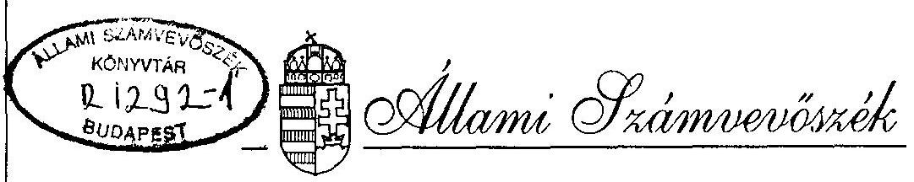
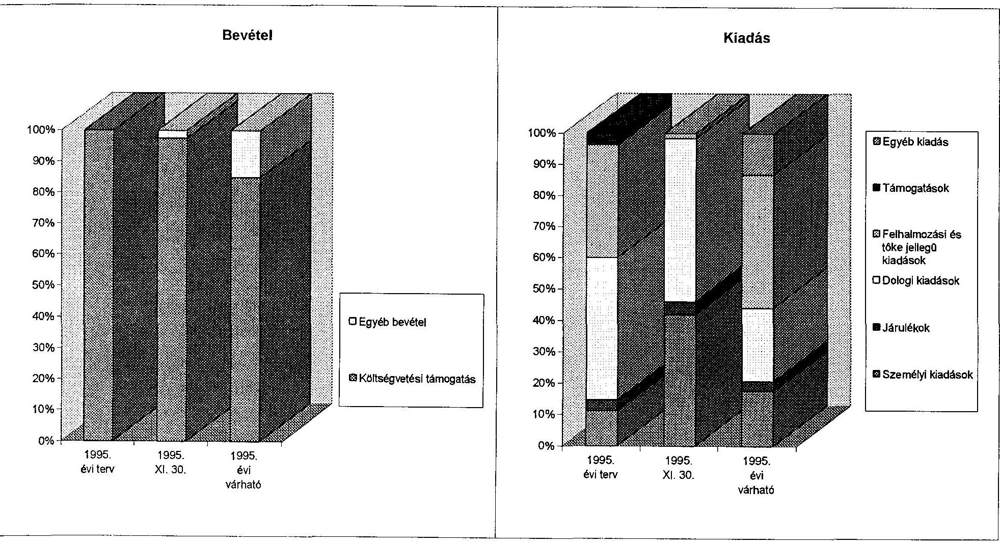

# JELENTÉS 

a Bolgár Országos Önkormányzat pénzügyi-gazdasági tevékenységének ellenőrzéséről

---

A vizsgálatot irányította:
Nagy József igazgatóhelyettes

A vizsgálatot vezette:
Bamberger Mária főtanácsos
A vizsgálatot végezte:
Majer Lajosné számvevő

---

# JELENTÉS   a Bolgár Országos Önkormányzat pénzügyi-gazdasági tevékenységének ellenőrzéséről

## I.   A vizsgálat célja, módszere, időszaka, körülményei

A vizsgálat célja annak megállapítása volt, hogy az országos kisebbségi önkormányzatok pénzügyi-gazdálkodási tevékenységének szabályozottsága, a számviteli és bizonylati rend megfelel-e a törvényi előírásoknak, működési feltételeik biztosítottak-e.

Az ellenőrzésre az országos kisebbségi önkormányzatok megalakulásának évében került sor.
A vizsgálat megállapításait az országos önkormányzatnál megtalálható szabályzatok, bizonylatok, testületi döntések, könyvviteli adatok támasztják alá.

Az ellenőrzés az önkormányzat megalakulásától 1995. november 30-ig terjedő időszakra vonatkozott.

A helyszíni vizsgálati jelentésre az önkormányzat észrevételei többek között megemlítették, hogy székhely és megfelelő költségvetési támogatás hiányában szervezetét sem tudta kellőképpen kialakítani.

## II.   Az ellenőrzés megállapításai

## Az önkormányzat megalakulása

A Bolgár Országos Önkormányzat (Budapest, IX. ker. Vágóhid u. 62.) a nemzetiségi és etnikai kisebbségek jogairól szóló, 1993. évi LXXVII. törvény alapján, 1995. március 1-én alakult meg.

Az alakuló ülésen a négy kisebbségi önkormányzat által delegált 16 elektor, az általuk jóváhagyott szabályzat alapján, 14 főben állapította meg az önkormányzati testület létszámát, majd a testület az elnök, és három alelnök személyére tett jelölést, amelyet az egyhangú szavazatával elfogadott.

---

A közgyűlés tagjaiból - egyhangúlag - titkárt is választott.
A Bolgár Országos Önkormányzat meghatározta azt, hogy az állandó székhelye Budapesten lesz, az ideiglenes pedig a Magyarországi Bolgárok Egyesületének székházában (1097 Budapest, Vágóhid u. 62.)
A közgyűlés az elnököt bízta meg az állandó székhely pontosításával, és a vagyonátadás-átvétel tekintetében, az Önkormányzat képviseletére.

# Az önkormányzati munka szabályozottsága 

A testület 1995. július 5-én elfogadta Szervezeti és Működési Szabályzatát.
Az alapszabály (SzMSz) rögzítette megalakulásának célját, feladat- és hatásköreit, az önkormányzati testület működésének rendjét, tulajdonosi jogait, bizottságait, a képviselők jogállását, átruházott hatásköreit, gazdálkodását, pénzgazdálkodási szabályzatát.
Megfogalmazta azt, hogy az önkormányzat vállalkozhat. (Az önkormányzat csak olyan vállalkozásban vehet részt, minősített testületi határozat megléte esetén, amelyben felelőssége nem haladja meg a vagyoni hozzájárulás mértékét.)

Nem határozta meg azonban az önkormányzat szervezetét, és induló vagyonát, a kötelezettségvállalás rendjét.

A szabályzatban nem rendelkezik a bevételek megosztott kezeléséről (a cél szerinti és vállalkozási bevételek megosztása, mint a 114/1992 (VII.23) Korm.rendeletben).

Az ellenőrzés rendjéről a működési szabályzat annyit rögzít (X. fejezet 1.d.pont), hogy a Pénzügyi-Ellenőrző Bizottság ellátja az ellenőrzési feladatokat, az általa kidolgozott és a közgyűlés által minősített többséggel elfogadott szabályzat alapján.

Az önkormányzat a működéshez, gazdálkodáshoz szükséges szabályozást megalkotta. A testület az SzMSz XIV. fejezetében foglaltaknak megfelelően, költségvetése szerint gazdálkodik. A költségvetését - zárszámadását a közgyűlés állapítja meg. A tulajdonosi jogok gyakorlása kizárólagos testületi hatáskör.

## Az önkormányzat működésének feltételei

Az önkormányzat működésének tárgyi és személyi feltételei ideiglenesen biztosítottak. Az önkormányzat bérleti szerződést kötött ( 3/1995 sz. határozata szerint) a Magyarországi Bolgárok Egyesületével, amelyben berendezett irodát, termet, és infrastruktúrát biztosít az Egyesület 100 ezer Ft + ÁFA bérleti díj fejében az önkormányzatnak.

Az önkormányzat - miután a Kompenzációs Bizottság, valamint a IX. kerületi önkormányzat által felkínált ingatlanok számára elfogadhatatlanok voltak - a testület tagjaiból alakult ideiglenes bizottságot bízta meg a megfelelő székhely kiválasztásával.
Az önkormányzat az újsághirdetésre felajánlott Lónyay utcai ingatlant elfogadhatónak ítélte (51/1995.Hat.) a Kompenzációs Bizottságnak a tényt jelezte.

---

A végleges székház megvalósulása 1996. II. negyedévében várható.
Az önkormányzat a működéséhez, gazdálkodásához szükséges feltételeket megteremtette:

- Bejelentkezett az APEH-hez (1995.07.06), és a Fővárosi és Pest Megyei Egészségügyi Pénztárhoz.
Megnyitotta folyószámláját az OTP-nél (1995. 07. 06), miután szerződést kötöttek.
- 1995. szeptember 1-én az önkormányzat megbízási szerződést kötött a Precíz-Kontó Kft-vel, amely szerződés szerint a Kft. elkészíti a naplófőkönyvet és a mérleget, ellátja az adókkal kapcsolatos teendőket és a munkaügyi feladatokat, elkészíti az állami támogatás elszámolását.

Az önkormányzat elnökének 500 ezer Ft-ig, illetve a testületi döntés mértékeig, az alelnöknek 50 ezer Ft-ig van felhatalmazása, hogy utalványozzon.
A pénztárosi teendőkkel - a testület határozata szerint - a Magyarországi Bolgárok Egyesületének pénztárosát bízták meg - fél munkanapra - 10 ezer Ft/hó díjazás fejében.
Függetlenített alkalmazottakat az önkormányzat nem foglalkoztat.

# Az önkormányzatok pénzügyi kapcsolata a helyi kisebbségi önkormányzatokkal 

Az Országos Bolgár Önkormányzat induló vagyona 1995. március 1-én nulla, ennek megfelelően nyitómérlege is nulla volt.
Helyi bolgár kisebbségi önkormányzat Miskolcon, Pécsett, Halásztelken, és a fővárosban alakult. Az országos önkormányzat kiadásai között 200 ezer Ft értékben tervezte támogatásukat.
1995. november 30-ig ilyen célú támogatási kiadása az önkormányzatnak nem volt.

A települési kisebbségi önkormányzatok támogatását az országos önkormányzat a költségvetésében rögzítette.

## Az önkormányzat költségvetése és teljesítése

Az önkormányzat 1995. július 5-én fogadta el a költségvetését.
A költségvetés lényegében kiadási terv. A testület nem határozta ugyan meg a kiadások fedezetét, de az Országgyűlés határozatban számára odaítélt 5,5 millió Ft-tal számol kiadási lehetőségként.

Mivel költségvetésükben bevételeiket nem tüntették fel, így nem is bontották meg: vállalkozási- illetve, a cél szerintire.

A testület döntött arról, hogy az önkormányzat elnöke és egy alelnöke tiszteletdíjban részesüljön. Összege 40 ezer Ft/hó, illetve 15 ezer Ft/hó. A testület 9 tagjának 2500 - és 20.000 Ft/hó közötti költségtérítést ítélt meg, 1995-ben összesen 690 ezer Ft értékben.

---

A tiszteletdíjakat esetenként - 1995. szeptembertől - az elnöki és alelnöki teendők ellátására, megbízási szerződés keretében, megbízási díj címen fizették ki.

Az önkormányzat bevételeit és kiadásait a melléklet tartalmazza.
A testület költségvetési kiadásokat:

| működési költségekre: | 3000 E Ft | 54 % |
| :-- | --: | --: |
| felhalmozási kiadásokra | 2000 E Ft | 36 % |
| kult.rend.tám.ra | 300 E Ft | 6 % |
| kisebbségi önkorm. -"- | 200 E Ft | 4 % |
|  | **5500 E Ft** | **100 %** |

tervezett.
Az önkormányzat kizárólag költségvetésből kapott bevétellel rendelkezik, amelyből az időarányos részt megkapták. Eközben, a Művelődési és Közoktatási Minisztériumtól, 1996. évi elszámolási kötelezettséggel, könyvkiadásra 850 ezer Ft-ot kaptak.

A rendelkezésre álló pénzügyi forrásból (5,5 millió Ft) az önkormányzat 40 % kiadást teljesített.
Személyi kiadásai a TB járulékkal együtt, az összes kiadás 46 %-a volt. A dologi kiadásokra az összes kiadás 52 %-át költötték, amelyből zömében az elhelyezésükhöz szükséges bérleti díjat fizették ki.

# Az önkormányzat számviteli tevékenysége 

Az önkormányzat egyszeres könyvvezetésre kötelezett.
Könyveit az ezzel a feladattal megbízott Kft. vezeti, az - 1995. december 15-i helyszíni vizsgálat megállapítása szerint, 1995. november 30-ig bezárólag - naprakészen.

A naplófőkönyv bankszámlájának egyenlege megegyezik a bankkivonat egyenlegével, a pénztár pénzkészlete a pénztárkönyv, valamint a bizonylatok szerint 2.730 ezer Ft. Könyvelése, bizonylatkezelése rendezett.

## Összefoglalás

A Bolgár Országos Önkormányzat végleges működési feltételei várhatóan 1996. II. negyedévében teremtődnek meg:

- a működésükhöz szükséges alapszabályt a testület megalkotta,
- a számviteli és bizonylati rend megfelel a törvényi előírásoknak.

---

# III.   Javaslatok 

Az Állami Számvevőszék javasolja az önkormányzatnak, hogy jelentését az önkormányzat soron következő ülésén tárgyalja meg és a jelentésben rögzített hiányosságok felszámolása érdekében hozzon határozatot, határidő és felelős megjelölésével, hogy

- az alapszabályként működő SzMSz rögzítse az önkormányzat szervezetét,
- alkossa meg a testület a kötelezettségvállalás és a készpénzkezelés rendjét,
- az SzMSz gazdálkodásáról szóló fejezetét hozzák szinkronba a 114/1992. (VII.23.) Korm.rendelettel.

Budapest, 1996. február

Sándor István alelnök

Hagelthayer István elnök

---

| A Bolgárok Országos Önkormányzata 1995. évi költségvetése és annak teljesítése |  |  |   |
| --- | --- | --- | --- |
|   |  |  | ezer Ft  |
| Bevételek és kiadások | 1995. évi terv | 1995. XI. 30. | 1995. évi várható  |
| Költségvetési támogatás | 5500 | 4880 | 5500  |
| Pályázaton elnyert támogatás | 0 | 0 | 0  |
| Egyéb bevétel | 0 | 125 | 975  |
| Bevétel összesen | 5500 | 5005 | 6475  |
| Folyó kiadások | 3300 | 2149 | 2836  |
| ebből: személyi kiadások | 616 | 916 | 1128  |
| járulékok | 194 | 90 | 204  |
| dologi kiadások | 2490 | 1143 | 1504  |
| Felhalmozási és tőke jellegű kiadások | 2000 | 36 | 2747  |
| Támogatások | 200 | 0 | 0  |
| ebből: helyi kisebbségi önkormányzatok támogatása | 200 | 0 | 0  |
| Egyéb kiadás | 0 | 0 | 850  |
| Kiadás összesen | 5500 | 2185 | 6433  |
| Tartalék | 0 | 2820 | 42  |

---

# A Bolgár Országos Önkormányzat 1995. évi költségvetése és annak teljesítése 

