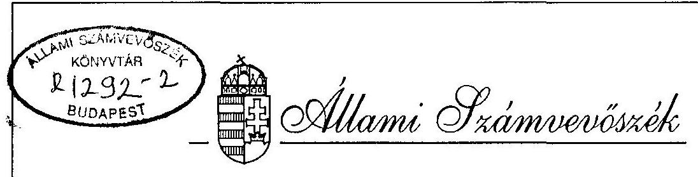
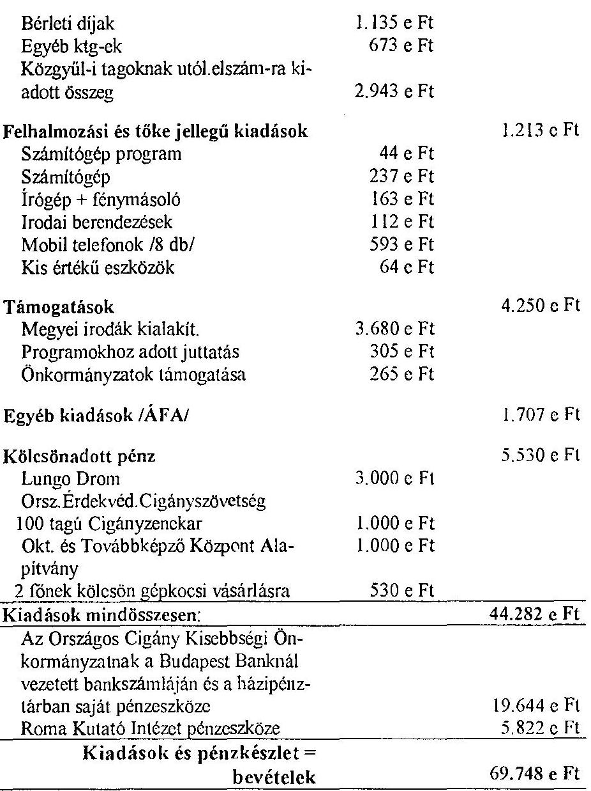
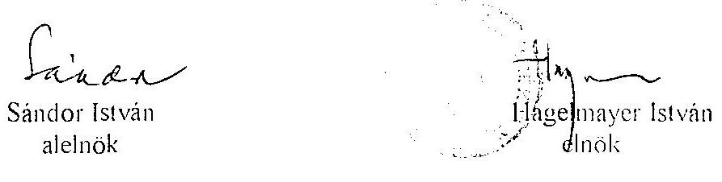
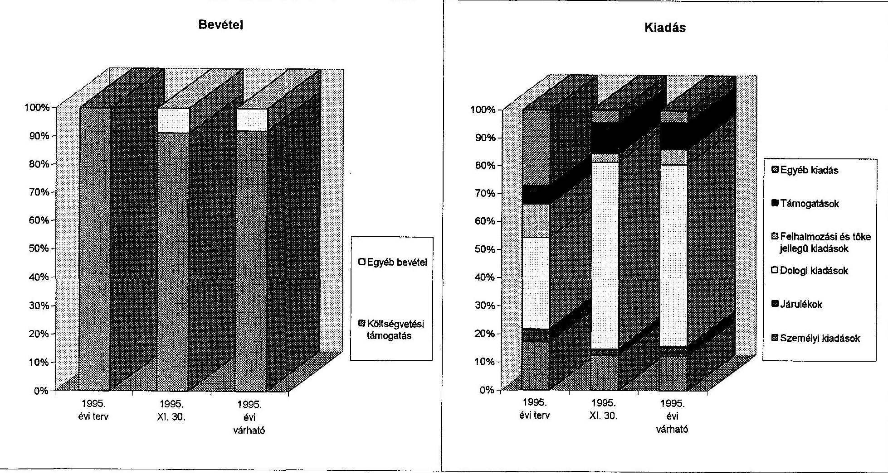

# JELENTÉS 

az Országos Cigány Önkormányzat pénzügyi-gazdasági tevékenységének ellenőrzéséről

---

A vizsgálatot irányította:
Nagy József igazgatóhelyettes

A vizsgálatot vezette:
Bamberger Mária főtanácsos

A vizsgálatot végezte:
dr. Csapó Anna számvevő tanácsos
Csomán Mihály
számvevő tanácsos

---

# JELENTÉS   az Országos Cigány Önkormányzat pénzügyi-gazdasági tevékenységének ellenőrzéséről 

## I.   A vizsgálat célja, módszere, időszaka, körülményei

A vizsgálat célja annak megállapítása volt, hogy az országos kisebbségi önkormányzatok pénzügyi-gazdasági tevékenységének szabályozottsága, a számviteli és bizonylati rend megfelel-e a törvényi előírásoknak, működési feltételeik biztosítottak-e.

Az ellenőrzésre az országos kisebbségi önkormányzatok megalakulásának évében került sor.

A vizsgálat megállapításait az országos önkormányzatnál megtalálható szabályzatok, bizonylatok, testületi döntések, könyvviteli adatok támasztják alá.

Az ellenőrzés az önkormányzat megalakulásától 1995. november 30-ig terjedő időszakra vonatkozott.

Az önkormányzat elnöke a helyszíni vizsgálati jelentésre tett észrevételében néhány kérdésben azt kiegészítette, illetve a vizsgálat lezárását követő önkormányzati intézkedésekről számolt be.

## II.   A vizsgálat megállapításai

## Az önkormányzat megalakulása

A nemzeti és etnikai kisebbségek jogairól szóló 1993. évi LXXVII. törvény a hazánkban élő nemzeti és etnikai kisebbségek egyéni és közösségi jogait, politikai és kulturális önállóságuk megjelenítését alapvető szabadságjogoknak ismerte el.

A törvényből következően hozta létre a magyarországi cigány népcsoport 1995. április 9-én az Országos Cigány Kisebbségi Önkormányzatot.

---

A megválasztott képviselők 1995. április 11-én tartották meg alakuló közgyűlésüket, ahol megválasztották tisztségviselőiket, és elfogadták az ideiglenes szervezeti és működési szabályzatot.

# Az önkormányzati munka szabályozottsága 

Az ideiglenes szervezeti és működési szabályzatban azt rögzítették, hogy az önkormányzat székhelye Budapest.

Az Országos Cigány Kisebbségi Önkormányzat közgyűlése hasznosítva a működési tapasztalatokat, az ideiglenes SzMSz helyébe 1995. november 25-én tartott ülésén végleges szabályzatot léptetett életbe. Az SzMSz szerint a közgyűlés 53 főből áll (1 fő elnök, 1 fő elnökhelyettes, 5 fő alelnök, 46 fő képviselő). A közgyűlés megválasztotta bizottságait (11 bizottság) közöttük a 3 fős pénzügyi ellenőrző bizottságot. A közgyűlés a testületi munka segítésére és a hivatali teendők ellátására önkormányzati hivatal létrehozásáról is döntött. A hivatal - mint munkaszervezet - feladatait az SzMSz tartalmazza, létszámát nem rögzíti, ügyrendje, munkaköri leírása nincs.

Az SzMSz záró rendelkezéseiben (VIII. fejezet 4. pont) a közgyűlés felhatalmazta a hivatal vezetőjét, hogy az elnök által megszabott határidőig készítse el a hivatal gazdasági, pénzügyi, ügyviteli-technikai és működési szabályzatait.

A szükséges szabályzatok elkészítése, a pénzügyi és könyvelési munkák végzése kérdésében több könyvelő céget megkerestek, illetve velük tárgyalásokat folytattak. A megkeresett szervezetekkel azonban július hó végéig nem tudtak olyan megegyezésre jutni, amely az önkormányzatnak mint megbízónak a feltételeit kielégítette volna.

A szabályzatok elkészítésére végül 1995. augusztus 9-én egy újabb céggel, a T-Controlling Bt (Pénzügyi és Számviteli Szaktanácsadó Bt, Gyöngyös, Pesti út 29.) kötöttek június 30-ig visszamenőleges hatályú megbízási szerződést. A megbízási szerződésben a megbízott vállalta, hogy kialakítja az önkormányzat számviteli, pénzügyi és társadalombiztosítási rendszerét, elkészíti a szükséges szabályzatokat (számlarend és számviteli politika, munkaügyi, pénzkezelési, leltározási, bizonylati szabályzat, munkaszerződések mintái stb.).

A szabályozási feladatok elvégzéséért a megbízási szerződésben 120.000 Ft + 30.000 Ft ÁFA díjban állapodtak meg. A szabályzatok tervezeteinek többségét (számviteli politika, számlarend, munkaügyi szabályzat, utalványozási rend, pénzkezelési szabályzat, leltározási szabályzat) a megbízó szeptember hónapra elkészítette, de az önkormányzat közgyűlése csak november hónapban fogadta el. Folyamatban van az iratkezelési rendszer kialakítása és a megyei irodák működési szabályzatának elkészítése.

---

# Az önkormányzat működési feltételei 

Az önkormányzat működését Budapesten (Váci út 78/b.) a Roma Kutató Intézet által bérelt helyiségben és az ott meglévő eszközökkel, valamint ideiglenes jelleggel Szolnokon (Szapáry u. 19.) a Lungo Drom irodahelyiségeiben és eszközeinek használatával, illetve a szervezet által foglalkoztatott dolgozók közreműködésével kezdték el.

A 77/1995. (VI.29.) OGY határozatban jóváhagyott 1995. évi költségvetési támogatás I-IV. havi részlete (31,8 millió Ft) július 11-én érkezett meg bankszámlájukra.

Az állami támogatás kiutalását megelőzően a legszükségesebb működési kiadásokat a Lungo Drom szervezettől kölcsönbe vett 2,5 millió Ft-ból finanszírozták, melyet július 25-én visszafizettek.

Az Országgyűlés által elhatározott székház biztosítás, illetve vagyonjuttatás még nem történt meg. A Fővárosi Önkormányzat által felajánlott Andrássy u. 60. szám alatti ingatlant annak korábbi hasznosítási célja miatt nem fogadták el, a Kőbányán lévő ingatlant sem tartották alkalmasnak székházuk céljára. A magán forgalomban történő ingatlan vásárlás mellett döntöttek, amelynek lebonyolítása érdekében tárgyalásokat folytatnak.
Az önkormányzatnak viszont el kellett hagynia az ideiglenes használatra átengedett Roma Kutató Intézeti helyiségeket, ezért 1995. november 1-től 1996. november 10-ig a Budapest, Rákóczi u. 80. II/2. szám alatt bérelnek 140 m² alapterületű helyiséget 140.000 Ft/hó bérleti díjért. Az 1995. november 9-én kötött bérleti szerződés alapján 6 havi bérleti díjat (840.000 Ft-ot) a bérbeadónak kifizettek. A bérbeadó ebből 280.000 Ft-ot a bérlemény karbantartására juttatott vissza.

A helyi és az országos önkormányzati szint kapcsolódásának megteremtése érdekében koordinációs testületet alakítottak, továbbá megyei irodák létrehozását határozták el.
A koordinációs testület tagjai az elnökség tagjai, illetve a közgyűlés által egyénenként megválasztott megyei képviselők. A megyei irodák kialakítása folyamatban van, már 16 megyében ezeket létrehozták. A működtetésükkel kapcsolatban végleges döntés még nincs. Az egyik koncepció szerint az irodákat pályázatokon keresztül támogatnák, másik koncepció szerint munkajogi, pénzügyi és egyéb szempontból az országos szervezet önálló megyei szerveként működnének.
Mindezek költségkihatásairól számítások nem készültek, így még megítélni sem lehet azt, hogy az országos önkormányzat éves költségvetése elbírja-e a szervezeti kibővítést.
A T-Controlling Bt-nek a szabályzatok elkészítésére vonatkozó szerződéssel egyidejűleg megbízást adott az önkormányzat arra is, hogy lekönyvelje a felhalmozódott alapbizonylatokon rögzített gazdasági eseményeket, képviselje a megbízottat az APEH, a TB előtt, betanítsa a gazdálkodással foglalkozó munkatársakat és szakmailag felügyelje tevékenységüket.

Az Országos Cigány Kisebbségi Önkormányzat és a Budapest Bank Lipótvárosi Igazgatósága között 1995. június 2-i kelettel bankszámla-szerződés jött létre.

Az 1995. évi állami támogatás ismeretében állították össze az éves költségvetést, melyet a július 9-i közgyűlésen tárgyaltak meg, illetve hagytak jóvá. Az előirányzatok terhére megkezdődtek és a vizsgálat idején is folyamatban voltak az eszközbeszerzések, továbbá a személyi feltételek megteremtését szolgáló szerződéskötések.

---

A T-Controlling Bt 1995. augusztus 11-22. között eljárt az önkormányzat adószáma, TB törzsszáma és KSH számjelének megszerzése érdekében. A számviteli politikát és a számlarendet, ami alapján elkezdődhetett a könyvelés szeptember hónapban úgy alakították ki, hogy az kielégítse az önkormányzat vezetésének információs igényeit is, és alkalmas legyen számítógépes adatfeldolgozásra.

Az elvégzendő könyvelési, nyilvántartási, adózási, bérszámfejtési és más adminisztrációs feladatokért 1995. június 1-től kezdődően havi 70.000 Ft + 17.500 Ft ÁFA díjban állapodtak meg. A megbízó a június, július, augusztus hónapra járó díjat (210.000 Ft-ot és 52.500 Ft ÁFÁ-t) 1995. október 12-én, a szeptember havi díjat (70.000 Ft + 17.500 Ft ÁFÁ-t) 1995. november 27-én a megbízottnak készpénzben kifizette.

Az április, május, június, július, augusztus hónap alapbizonylatit 1995. október 31-re tudták feldolgozni, illetve lekönyvelni. A helyszíni vizsgálat megkezdésekor a készpénzforgalom szeptember hó végéig volt feldolgozva. A vizsgálathoz igényelt adatok biztosítása és a vizsgált időszak pénzforgalmának ellenőrizhetősége érdekében november hónap végéig történő adatfeldolgozást 1995. december 27-re végezték el.

Az Országos Cigány Kisebbségi Önkormányzat számára a könyvvezetési, beszámoló készítési kötelezettségek megbízásos jogviszonyban való ellátása kedvező megoldás, mert a megállapodott díjnál kevesebb költséggel - saját munkaerő foglalkoztatása mellett - a feladatok nem volnának elvégezhetők.

Az Országos Cigány Kisebbségi Önkormányzat elnökével 1995. július 1-én kötöttek munkaszerződést, ezt megelőzően (április, május, június hónapokban) vele megbízásos jogviszonyban álltak. Az önkormányzati hivatalvezető 1995. június 1-től áll alkalmazásban, előzőleg (április, május hónapban) megbízotti szerződés alapján díjazták.

Az Országos Cigány Kisebbségi Önkormányzat főpénztára ideiglenes jelleggel Szolnokon van és a pénztár kezelője megbízási díjat és költségtérítést kap.

# Az önkormányzatok kapcsolata a helyi kisebbségi önkormányzatokkal 

Az Országos Cigány Kisebbségi Önkormányzat hatályos SzMSz-ében a koordinációs testületet hatalmazta fel arra, hogy a helyi kisebbségi önkormányzatok segítője, kapcsolatteremtője legyen a megyei és a települési önkormányzatoknak, továbbá javaslatokat terjesszen a közgyűlés elé.

A testület létrehozása az utóbbi hónapokban történt, így támogatási célú javaslatot még nem terjesztett a közgyűlés elé.
Az 1995. évi költségvetésben a helyi kisebbségi önkormányzatok működésének támogatása címén előirányzatot nem terveztek.

A közgyűlés támogatást szociális segélyezés és rendezvények, programok támogatása céljára biztosított a helyi kisebbségi önkormányzatoknak.

---

# A költségvetés tervezése és végrehajtása 

Az Országos Cigány Kisebbségi Önkormányzat közgyűlése az 1995. évi költségvetését július 9-i ülésén tárgyalta és fogadta el, azzal a 71,5 millió Ft bevételi és kiadási főösszeggel, amelyet a 77/1995. (VI.29.) OGY határozat megállapított.

A jóváhagyott költségvetés az alábbi főbb előirányzatokat tartalmazza:

| Megnevezés | Összeg   M Ft | Megoszlási   % |
| :-- | :--: | :--: |
| Beruházási jellegű kiadások | 8,2 | 11,5 |
| Folyamatos dologi költségek | 8,5 | 11,9 |
| Személyi jellegű kiadások | 28,3 | 39,6 |
| Támogatások | 4,5 | 6,3 |
| Elnöki és személyi rendelkezésű keret |  | 5,0 |
|  | 3,6 |  |
| Egyéb elhatárolt összeg | 18,4 | 25,7 |
| 1995. évi támogatásból tervezett |  |  |
| kiadások összesen | 71,5 | 100,0 |

Fentiek szerint a költségvetés legnagyobb tételét a személyi jellegű kiadások alkotják, melyek főbb összetevői az alábbiak:

| - 16 fő közgyűlési tag költségkerete áprilistól (20 e Ft/hó/fő) | 2,9 millió Ft |
| :--: | :--: |
| - 30 fő bizottsági elnök, megyei delegált költségkerete ápr.-tól (25 e Ft/hó/fő) | 6,8 " |
| - 6 fő alelnök költségkerete áprilistól (35 e Ft/hó/fő) | 1,9 " |
| - nem közgyűlési bizottsági tagok költségkerete (átlagosan szept. 1-től) | 1,0 " |
| - főállású elnök, hivatalvezető, hivatali dolgozók bére és közterhei | 5,9 " |
| - elnökségi keret áprilistól (260 e Ft/hó) | 2,3 " |
| - megbízási szerződések szerinti kifizetések (5 fő 5 hónapra) | 1,4 " |
| - gépkocsi használat | 1,5 " |
| - ruházati költségtérítés | 2,0 " |
| - számviteli, könyvelési költségek | 1,5 " |
| - egyéb vegyes költségek | 1,1 " |
| Mindösszesen: | 28,3 millió Ft |

Személyi jellegű kiadások között - ismeret hiányából következően - olyan előirányzatokat is terveztek, melyek ténylegesen dologi kiadásokat képeznek. (Elszámolásra kiadott előlegek, számviteli, könyvelési költségek.)

Az önkormányzatnak az 1995. évi költségvetési támogatásán kívül (71,5 millió Ft) csak az a bevételi forrása volt, amit a bankszámlán kezelt összeg után a pénzintézet kamatként térített.
Az önkormányzat 1995. november hó végéig a költségvetési támogatásból 63.600 ezer Ft-ot kapott meg.

---

Az önkormányzat - 4561 számú - bankszámláján keresztül futott a működés megkezdéséhez a Lungo Dromtól kölcsönvett 2,5 millió Ft, továbbá azok az összegek, melyeket nevezett szervezet laptámogatás címén (3,5 millió Ft) az önkormányzat bankszámlájának közbeiktatásával kapott meg a Müvelődési és Közoktatási Minisztériumtól.
Az önkormányzat bankszámlájára utalta a Müvelődési és Közoktatási Minisztérium a tevékenységét átmenetileg szüneteltető Roma Kutató
 Intézet költségvetési támogatását $/ 5.822$ ezer Ft/ is, melyet az önkormányzatnak vissza kell adni a támogatásra jogosultnak. A Roma Kutató Intézet működési körülményei a vizsgálat időpontjában még rendezetlen volt, ezért az 5.822 ezer Ft az Országos Cigány Kisebbségi Önkormányzat bankszámláján volt. (Az Intézet helyzete azóta rendeződött).

Kölcsönszerződések alapján az önkormányzat készpénzben a Lungo Drom Országos Érdekvédelmi Cigányszövetségnek 3,0 millió Ft-ot, a 100 tagú Cigányzenekar részére 1,0 millió Ft-ot, /47/1995. (IX.29.) sz. elnökségi határozattal az Oktatási és Továbbképző Központ Alapítványnak szintén 1,0 millió Ft-ot adott át, /16/1995. (VII.26.). sz. elnökségi határozattal/ valamint két közgyűlési tagnak 300-300 ezer Ft kölcsönt folyósított /16/1995. (VII.26.) sz. elnökségi határozattal/.

A Lungo Drom Cigányszövetségnek a 3,0 millió Ft-ot 1996. május 31-i visszafizetési határidőre elnökségi határozat alapján adták kölcsön, de erről írásos dokumentumot nem tudtak bemutatni. A kölcsönök nyújtásának rendjét SzMSz-ben nem szabályozták, ennek gyakorlatát írásban rögzíteni szükséges.

Az Országos Cigány Önkormányzat megalakulásától 1995. április 11-tól kezdődően november 30-ig teljesített kiadásai az alábbiak voltak:

| Folyó kiadások |  | Együttesen |
| :--: | :--: | :--: |
| Személyi kiadások: |  | 4.814 e Ft |
| Bér | 1.944 e Ft |  |
| Megbízási díj | 1.048 e Ft |  |
| Étkezési hozzájárulás | 30 e Ft |  |
| Ruházati költségtérítés | 387 e Ft |  |
| Albérleti díj | 135 e Ft |  |
| Segélyek, elnöki, elnökhelyettesi, |  |  |
| alelnöki keretből | 740 e Ft |  |
| Segélyek szervezeteknek | 530 e Ft |  |
| TB járulék | 855 e Ft | 855 e Ft |
| Dologi kiadások |  | 25.913 e Ft |
| Irodaszer, nyomtatvány | 592 e Ft |  |
| szakirodalom |  |  |
| Posta, telefon, fax | 943 e Ft |  |
| Gépkocsi közl. ktg-c | 14.082 e Ft |  |
| Társ-i szervezet célja szerinti repre- | 705 e Ft |  |
| zentáció |  |  |
| Egyéb anyag jellegű szolg. /taxi, | 501 e Ft |  |
| fénymásolás, szállás/ |  |  |
| Ügyviteli szolgáltatás | 590 e Ft |  |
| Szakértői díjak | 1.254 e Ft |  |
| Tanulmányok készítése | 1.230 e Ft |  |
| Lapkiadás | 1.265 e Ft |  |

---

A személyi kiadások lényegesen kevesebbek lesznek az előirányzott 11.600 ezer Ft-nál, mert a főállású dolgozók a tervezett időpontnál később /elnök 1995. július 1-től, hivatalvezető június 1-től, 1 fő alkalmazott augusztus 1-től, 3 fő alkalmazott szeptember 1-től, 1 fő titkárnő vállalkozóként augusztus 1-től/ kerültek alkalmazásra.
A pénzügyi-gazdasági feladatokat még jelen vizsgálat időpontjában is megbízásos jogviszonyban látják el. Az Országos Cigány Kisebbségi Önkormányzat Hivatalán belül nincs olyan önálló munkakör kialakítva, amelyben a foglalkoztatott dolgozó összefogná, irányítaná a pénzgazdálkodást.
Az Országos Cigány Kisebbségi Önkormányzat közgyűlési tagjai /53 fő/ és a hivatalvezető /1 fő/, illetve az esetenként megbízottak részére gépkocsi használat költségtérítés címén 14.082 e Ft-ot fizettek ki.

Átlagosan $12,-\mathrm{Ft} / \mathrm{km}$ költséggel és 54 fővel számolva, az 1 fő $21.732 \mathrm{~km}$-t utazott, melynek egy havi átlaga 2.716 km. Megjegyzendő, hogy a közgyűlési tagok havi km felhasználását a havi költségkeretek behatárolják.

---

A cigány népcsoport szétszórtan él és lélekszámát tekintve a legnagyobb kisebbségi közösséget alkotja.
Életkörülményeik lényegesen eltérnek, illetve sokkal rosszabbak, mint más nemzeti kisebbségeké, akik jellemzően az ország egy-egy tájegységén, vagy térségében élnek.

Mindezekből következően a cigány kisebbségi önkormányzat megválasztott képviselőinek feladatai is összetettebbek és szinte az ország egész területén jelentkezőek. Az önkormányzat által kialakított, illetve kialakítás alatt álló szervezet is ehhez kell, hogy igazodjon és a munkamegosztást is a rugalmas, gyors megoldások kell hogy jellemezzék.

Az önkormányzatra jellemző sajátos körülmények miatt döntött úgy a közgyűlés, hogy havi költségkereteket állapított meg tagjainak /7 fő elnökségi tag $65.000 \mathrm{Ft} /$ fő/hó, 23 fő bizottsági elnök és megyei delegált $25.000 \mathrm{Ft} /$ fő/hó, 23 fő közgyűlési tag $20.000 \mathrm{Ft} /$ fő/hó/.

A megállapított összegeket az érintettek vagy az önkormányzat pénztárából veszik fel, vagy részükre postai úton juttatják el utólagos elszámolás mellett.
A költségkereteket a képviselők utazási költségekre, programok, rendezvények szervezési költségeire, beiskolázási és szükség szerint szociális célú segélyekre stb. tehát minden olyan célra felhasználják, ami cigány népcsoport érdekeit szolgálja.
Az önkormányzat a költségvetési támogatás első részösszegét 1995. július 11-én kapta meg, amelyből 3 hónapra visszamenően egy összegben folyósították az egyéni költségkeretek fedezetét, ezt követően a folyósítások havonta történtek.
Az előlegekkel történő elszámolások rendje is később a belső szabályzatok elkészítésének keretében került szabályozásra.

Az előírás ma már az, hogy az előlegre jogosult képviselő addig, amíg az előző havi felhasználásával el nem számolt, újabb előleget - rendkívüli esetek kivételével - nem vehet fel. Az elszámolásokat áttekintve azt állapítottuk meg, hogy kezdetben azok késedelmesen történtek, majd mind többen tettek eleget a havi elszámolási kötelezettségüknek.

# Az önkormányzat számviteli tevékenysége 

Az Országos Cigány Kisebbségi Önkormányzat induló vagyon nélkül kezdte meg működését, így erről az állapotról nyitó mérleget nem készítettek. A számviteli nyilvántartásba az 1993. évi LXXVII. tv. 63. § (4) bekezdésében jóváhagyott - de ténylegesen még meg nem kapott - 60 millió Ft vagyonjuttatást vezették be /331 főkönyvi számlán alapítókkal szembeni követelés, 411 főkönyvi számlán induló tőke/.

A Roma Kutatóintézet tulajdonában álló eszközöket, leltár szerint ideiglenesen vették használatba, amelyeket az elköltözéskor visszahagynak.
A költségvetési támogatásból beszerzett tárgyi eszközök egyedi nyilvántartásának felfektetése még nem történt meg, mert a feladatok megoldásában még nem jutottak el eddig, ezt az év végi leltározással együtt tervezik végrehajtani.

Az önkormányzat a társadalmi szervezetekre vonatkozó 114/1992. (VII.23.) Korm. számú rendelet szerinti gazdálkodó tevékenységet folytat és a 157/1992. (XII.4.) Korm. számú rendeletben előírt beszámoló készítési és kettős könyvvitel vezetési módot alkalmazza.

---

A számlarend az információs igényeknek és az elszámolási követelményeknek megfelelően van kialakítva. A költségvetésben meghatározott összegű személyi jellegű kiadások közgyűlési tagokra megállapított és az általuk előlegként havonta felvett összegeket egyénenként nyilvántartják, az elszámolás ezek szerint történik.

Az önkormányzat bankszámla és készpénzforgalmából megállapítható, hogy a szabályzatok elfogadásáig minden kötelezettséget az elnök vállalt és utalványozott. A vállalt kötelezettségek teljesítése és az igénybevett szolgáltatások ellenértékének kiegyenlítése nagyobb részt készpénzben történt. A nagyarányú készpénzforgalom összefügg azzal, hogy a képviselők az ország különböző pontjain fejtik ki tevékenységüket, ideiglenes székhelyen Szolnokon működik az Országos Cigány Kisebbségi Önkormányzat, az Önkormányzati Hivatal átmeneti formában végzi tevékenységét.

Munkabért és megbízási díjakat előlegként folyósítottak, szabályszerű számfejtést nem végeztek, mert hozzáértő, megfelelő ismeretekkel rendelkező személy - a T-Controlling Bt-vel kötött szerződésig - nem volt, illetve munkaszerződések, jelenléti ívek sem készültek. A megbízási díjból SZJA előleget nem vontak, illetve a munkabérből hozzávetőleges összeget tartottak vissza az adó és járulék fizetési kötelezettségekre. Elsősorban 1995. XI. 16-án fizettek TB járulékot, SZJA előleget és munkavállalói járulékot.

Általános hiányosság, hogy a bevételi és kiadási pénztárbizonylat tömböket nem szigorú számsorrendben használják fel, a tömbökben üres, kitöltetlen, és nem érvénytelenített lapok maradnak, a pénztárbizonylatok hiányosan kitöltöttek /nincs rajta a kitöltő szervezet, a bevételt teljesítő, vagy a pénzt felvevő neve, illetve az aláírása/, sok esetben egy kiadási pénztárbizonylaton több személynek számolnak el különböző jogcímű kiadásokat. A kiadási pénztárbizonylatok mellé csatolt számlákról és egyéb iratokról hiányzik az érvényesítés, a kiadás jogosultságának igazolása, eszközök vásárlása esetén az átvevő részéről az átvétel igazolása, személyi használatra kiadott eszközökről még nincs nyilvántartás.

Az elnök Farkas Flórián részére kifizetett összegek nincsenek utalványozva, mert nincs szabályozva, hogy az ő esetében ki a jogosult az utalványozásra. Az elnöki és a személyi rendelkezésű keret felhasználásának - az 1995. évi költségvetés V. pontjában elhatározott - külön szabályzata nem készült el. A segélyek kifizetésének indokoltsága a kérelem és az elbírálás dokumentáltságának hiánya miatt nem állapítható meg.

Egyes kiküldetési rendelvényeken a megtett km helyessége nincs felülvizsgálva /pl. a 1615919 sz. pénztárbizonylathoz mellékelt útnyilvántartás szerint 1995. IX. 26-án Tiszacsege-Kazár között 760 km, illetve Kazár-Tiszacsege 760 km, együttesen 1.520 km került elszámolásra egy napra/, a tényleges távolság oda-vissza mintegy $160-160 \mathrm{~km}$, illetve az útvonal összevontan van feltüntetve /pl. 447565 számú kiküldetési rendelvényen Heves megye területe $946 \mathrm{~km} /$. Tekintettel a bizonylatok hiányos kitöltésére, utólagos ellenőrzésének elmaradására, a legtöbb útielszámolás esetében nem tudjuk megállapítani azok valódiságát. Az úti elszámolásokban az üzemanyagnorma szerinti fogyasztás az aktuális áron van elszámolva.

---

# Összefoglalás 

Az Országos Cigány Kisebbségi Önkormányzat vizsgált időszak alatti tevékenységét a szervezetalakítás, a kapcsolatépítés, a megválasztott képviselők felkészítése, a gazdálkodási rend szabályozásának szerteágazó feladatai kötötték le. Működésükre zavarólag hatott elhelyezésük átmeneti jellege, a vagyonjuttatás elhúzódása, a költségvetési támogatás késői jóváhagyása és kiutalása. Ezeket a nehézségeket más cigányszervezetek eszközeinek használata, pénzeszközeinek kölcsönbe vétele és alkalmazottainak foglalkoztatásával hidalták át.

Az 1995. évi költségvetési támogatás ismeretében a költségvetést összeállították, és azt a közgyűlés jóváhagyta.

A pénzügyi folyamatok szabályozása, a számviteli és bizonylati rend kialakítása a megalakulástól kezdődően történt gazdasági események felhalmozódott bizonylatinak rendezése, adatainak lekönyvelése érdekében ezen feladatok végzésére szakosodott szervezettel augusztusban kötöttek megbízási szerződést. A megbízott által vállalt és teljesített feladatok által jutott az önkormányzat olyan helyzetbe, hogy a célja szerinti tevékenységre fordított költségeit - melyeket költségvetési támogatásból finanszíroz - megfelelően bizonylatolja, elszámolja.

Az önkormányzat képviselő-testületének pénzügyi és ellenőrző bizottsága a megalakulástól kezdve szeptember 30-ig áttekintette az önkormányzat gazdálkodását, és a gazdasági események bizonylatokkal való igazolását.
Megállapításait és javaslatait jegyzőkönyvbe foglalta, amelyet a közgyűlés megtárgyalt.
Vizsgálati tapasztalataink megerősítik a belső ellenőrzés megállapításait, ezért a hiányosságok kiküszöbölésére tett javaslataikkal teljeskörűen egyetértünk.

## III.   Javaslatok

Az Állami Számvevőszék javasolja az Önkormányzatnak, hogy jelentését az önkormányzat soron következő ülésén tárgyalja meg és a jelentésben rögzített hiányosságok felszámolása érdekében hozzon határozatot határidő és felelős megjelölésével, hogy az országos önkormányzat pénzügyi-gazdálkodási tevékenysége önmaguk szándékával megfelelően is példaértékű legyen.

Budapest, 1996. február

---

| Az Országos Cigány Kisebbségi Önkormányzat 1995. évi költségvetése és annak teljesítése |  |  |   |
| --- | --- | --- | --- |
|   | 1995. évi terv | 1995. XI. 30. | 1995. évi várható  |
| Bevételek és kiadások |  |  | ezer FT  |
| Költségvetési támogatás | 71500 | 63600 | 71500  |
| Pályázaton elnyert támogatás | 0 | 0 | 0  |
| Egyéb bevétel | 0 | 6148 | 6148  |
| Bevétel összesen | 71500 | 69748 | 77648  |
|  |   |

   |   |
|  Folyó kiadások | 36800 | 31582 | 37580  |
|  ebből: személyi kiadások | 11600 | 4814 | 5700  |
|  járulékok | 3200 | 855 | 1600  |
|  dologi kiadások | 22000 | 25913 | 30280  |
|  Felhalmozási és tőkejellegű kiadások | 8200 | 1213 | 2500  |
|  Támogatások | 4500 | 4250 | 4500  |
|  ebből: helyi kisebbségi önkormányzatok támogatása | 0 | 570 | 570  |
|  Egyéb kiadás | 18400 | 1707 | 2000  |
|  |   |   |   |
|  Kiadás összesen | 67900 | 38752 | 46580  |
|  |   |   |   |
|  Tartalék | 3600 | 30996 | 31068  |

---

# Az Országos Cigány Kisebbségi Önkormányzat 1995. évi költségvetése és annak teljesítése

