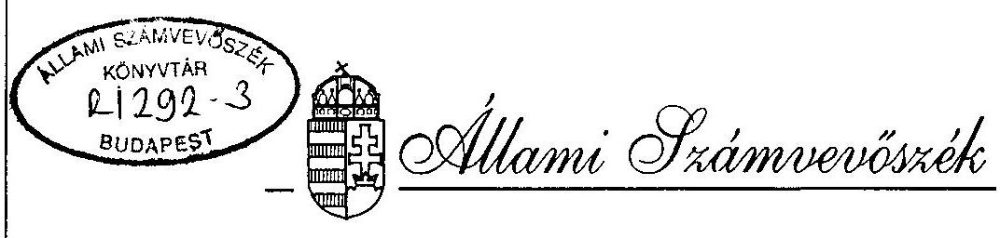
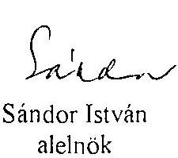
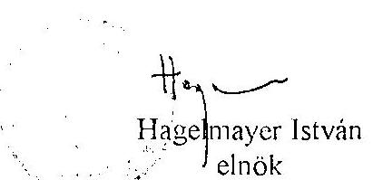
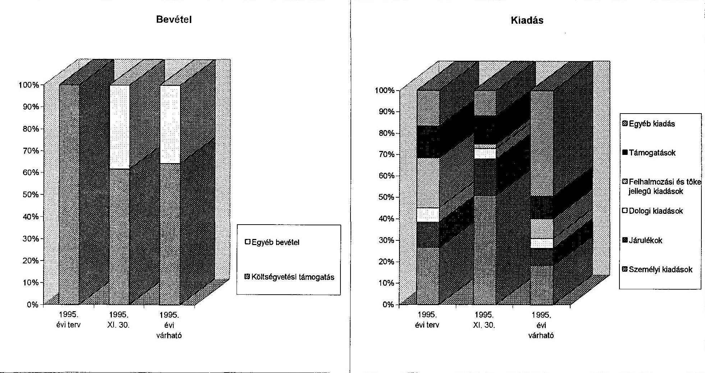

# JELENTÉS 

a Görög Országos Önkormányzat pénzügyi-gazdasági tevékenységének ellenőrzéséról

---

A vizsgálatot irányította:
Nagy József igazgató helyettes

A vizsgálatot vezette:
Bamberger Mária fötandcsos
A vizsgálatot végezte:
Majer Lajosné számvevö

---

# JELENTÉS   a Görög Országos Önkormányzat pénzügyi-gazdasági tevékenységének ellenôrzéséröl 

## I.   A vizsgálat célja, módszere, idöszaka, körülményei

A vizsgálat célja annak megállapítása volt, hogy az országos kisebbségi önkormányzatok pénzügyi-gazdálkodási tevékenységének szabályozottsága, a számviteli és bizonylati rendje megfelel-e a törvényi elöírásoknak, müködési feltételeik biztositottak-e.

Az ellenőrzésre az országos kisebbségi önkormányzatok megalakulásának évében került sor.
A vizsgálat megállapításait az országos önkormányzatnál megtalálható szabályzatok, bizonylatok, testületi döntések, könyvviteli adatok támasztják alá.

Az ellenőrzés az önkormányzat meglakulásától 1995. november 30-ig terjedő időszakra vonatkozott.

A helyszini vizsgálati jelentésre az önkormányzat észrevételt nem tett.

## II.   Az ellenőrzés megállapításai

## Az önkormányzat megalakulása

A Görög Országos Önkormányzat (Bp. VIII. Baross u. 41.) a nemzetiségi és etnikai kisebbségek jogairól szóló, 1993. évi LXXVII. törvény alapján, 1995. március 4-én alakult meg.
Az alakuló ülésen a 2 kisebbségi önkormányzat által delegált, és a 3 megválasztott, összesen 17 elektor - az általuk jóváhagyott szabályzat alapján - 15 fơben állapította meg az önkormányzati testület létszámát, majd titkos szavazással megválasztotta az önkormányzat testületét. A Görög Országos Önkormányzat (továbbiakban önkormányzat) 1995. III. 4-én megválasztotta titkos szavazással és minősített többséggel elnökét, és két alelnökét is.

---

# Az önkormányzati munka szabályozottsága 

A testület 1995 nov. 4-én határozatban fogadta el az önkormányzat Szervezeti és Müködési Szabályzatát.

Az alapszabály (SzMSz) tartalmazza az önkormányzat jogállását, a testület müködését, ülései rendjét, a képviselők jogállását és azt, hogy bizottságokat és intézményeket hozhat létre. Szabályozza az elnök és az alelnök feladatait. Rendelkezik az Önkormányzat vagyonáról és gazdálkodásáról.

Az önkormányzat testülete bizottságokat nem hozott létre. Megalakulásának célját, szervezetét nem határozta meg.

Az SzMSz 1. paragrafusának 4. bekezdése, amely szerint "Az önkormányzati feladatokat a közgyülés, az elnök, az alelnökök és a bizottságok látják el", valamint a 2. paragrafusának 2. bekezdése "Az önkormányzati feladat és hatáskörök az önkormányzat közgyülését illetik meg" egymásnak is ellentmondó szabályozások.

Az SzMSz nem állapitja meg az önkormányzat induló vagyonát, és nem rendelkezik arról sem, hogy vállalkozik-e.

Az önkormányzat a müködéshez, gazdálkodáshoz szükséges szabályozást megalkotta. A testület az SzMSz 20. paragrafusában foglaltaknak megfelelően, költségvetése szerint gazdálkodik. A költségvetését, zárszámadását a közgyülés állapitja meg.
A tulajdoni jogok gyakorlása kizárólagos testületi hatáskör.
Az önkormányzat a készpénz kezelésről szabályzatot nem alkotott.

## Az önkormányzat müködésének feltételei

Az önkormányzat müködésének tárgyi és személyi feltételei jelenleg még nem biztosítottak. Ideiglenesen 1995. december végéig a Fővárosi Görög Kisebbségi önkormányzat rendelkezésére bocsátott helyiséget használják közösen. (Bp. V. Váci u. 62-64. II em. 232/a).

A Föpolgármesteri Hivatal és a Nemzeti Etnikai Kisebbségi Hivatal által felajánlott, Andrássy u. 60. sz. alatt lévő épület nem felelt meg egyik országos kisebbségi önkormányzatnak sem. A következö, a Benczúr u. 4. sz. ház székhelyül az Önkormányzat számára elfogadható lett volna, de a többi kisebbségnek nem volt megfelelö.
1995. okt. 4-én az önkormányzat elfogadta a főpolgármester által felajánlott épületrészt székhelynek, amely az V. Vécsey u. 5. I. emeletén, 378 m 2 -es területü helyiségekböl áll. A Görög Országos Önkormányzat a Fővárosi Kisebbségi Görög Önkormányzattal együtt kívánt elhelyezkedni.

---

Az önkormányzat a müködéséhez, gazdálkodásához alapvetően szükséges feltételeket megteremtette:

- bejelentkezett az APEH-hez (1995. VI. 31), a Fővárosi és Pest Megyei Egészségügyi Pénztárhoz (1995. X. 9.), megnyitotta folyószámláját az OTP-nél, miután bankszámla szerződést kötöttek 1995. VI. 30-án.
- 1995. aug. 7-én az önkormányzat Megbízási szerződést kötött a Precíz-Konto Kft-vel, amely szerződés szerint a Kft készíti el a naplófökönyvet, és a mérleget, ellátja az adókkal kapcsolatos teendőket és a munkaügyi feladatokat, elkésziti az állami támogatás elszámolását.

A szerződés nem rögziti azt, hogy az önkormányzat a könyvelés dokumentumait milyen határidőre köteles átadni a Kft-nek.
Az önkormányzat Dzindzisz Jorgosz elnököt korlátlan utalványozási joggal bízta meg. Az SzMSz-ben és egyéb határozatban sem rendelkezett a testület a kötelezettségvállalás, és az ellenörzés rendjéről.

Az Országos Görög Önkormányzat induló vagyona 1995. márc. 4-én nulla, ennek megfelelöen nyitómérlege is nulla volt.

# Az önkormányzat pénzügyi kapcsolata a helyi kisebbségi önkormányzatokkal 

Helyi görög kisebbségi önkormányzat 1995. végéig Budapesten, Miskolcon, Sopronban, Szegeden és Budaörsön alakult.
Az országos önkormányzat költségvetési kiadásai között megtervezte támogatásukat 1995-re. A támogatások tánc- és zenekarok, gyermek és nyugdíjas klub müködtetéséhez, rendezvények szervezéséhez, valamint oktatáshoz füzödtek. A 6 millió Ft költségvetési támogatásból a fenti célokra a testület 1,6 millió Ft-ot tervezett felhasználni. 1995. november 30 -ig a teljesités 204 ezer Ft volt.

A települési kisebbségi önkormányzatok támogatását az országos önkormányzat költségvetésében rögziti.

## Az önkormányzat költségvetése és teljesitése

Az önkormányzat 1995. szept. 23-án fogadta el - 14/1995. sz. határozatával - költségvetését. A költségvetés lényegében kiadási terv.

A testület nem határoztat ugyan meg a kiadások fedezetét, de annak végösszege az OGY határozatban számára odaitélt 6 millió Ft-tal egyezik. (Mivel költségvetésükben bevételeiket nem tüntették fel, igy nem is bonthatták meg vállalkozás tevékenysége, illetve célja szerinti bevételekre, 114/92. (VII. 23.) Korm. rend.).
A testület határozatot hozott arról (7/1995), hogy az önkormányzat minden tagja tiszteletdijban részesül.

---

A tiszteletdijak a következök:
elnök 100 ezer Ft/hó
2 alelnök 25 ezer Ft/hó
12 testületi tag 10 ezer Ft/hó
A tiszteletdijak kifizetése 2 testületi tag esetében a fenti határozattól eltérően - 1995. október hótól - részben saját gépkocsi költség térítés címen történt.
Az önkormányzat függetlenített alkalmazottat nem foglalkoztat. (Nincs önálló helyiségük).
Az Önkormányzat bevételeit és kiadásait a melléklet tartalmazza.
A testület költségvetési kiadásokat

| müködési költségekre | 2.000 ezer Ft | $33 \%$ |
| :-- | --: | --: |
| oktatásra | 700 ezer Ft | $12 \%$ |
| támogatásra | 900 ezer Ft | $15 \%$ |
| irodaberendezésre | 1.400 ezer Ft | $24 \%$ |
| tartalékra | 1.000 ezer Ft | $16 \%$ |
|  | 6.000 ezer Ft | $100 \%$ |

tervezett.
A székház, illetve iroda hiányában, 1995-ben, a berendezésre tervezett kiadás nem realizálódik.

Az önkormányzat tartalékolt, illetve a fennmaradó pénzösszegéből az 1995. október 4-én elfogadott új székház felújítását tervezi finanszírozni.

Az önkormányzat kizárólag költségvetésből kapott bevétellel rendelkezik, amelyből az időarányos részt megkapták. Év közben a Kisebbségi Hivataltól szótárvásárlásra 225 ezer Ft-ot, a Müvelődési és Közoktatási Minisztériumtól, kétnyelvű antológiára 850 ezer Ft-ot, valamint a görög nyelv oktatásának támogatására 2.233 ezer Ft-ot kapott.

A pénzeszközök felhasználásáról a Hivatalnak, illetve a Minisztériumnak - 1996-ban - elszámolási kötelezettségük van.

A rendelkezésre álló pénzügyi forrásból ( 6 millió Ft) az önkormányzat 1995. nov. 30-ig, $30 \%$ kiadást teljesített. A személyi kiadások a TB járulékkal együtt az összes kiadás $67,8 \%$-a volt. Dologi kiadások csekély mértéke ( $5 \%$ ) a müködés tárgyi feltételének hiányára utalnak.
Támogatásokat (a kiadások 13\%-a) kulturális egyesületnck, tánccgyüttesnck és anyanyclvi oktatásra fizetctt ki az önkormányzat.

# Az önkormányzat számviteli tevékenysége 

Az önkormányzat egyszeres könyvvitel vezetésére kötelezett. A feladattal megbizott Kft. az 1995. dec. 14. helyszini vizsgálat megállapítása szerint a naplófőkönyvet az idöpontra vo-

---

natkozóan, látszólag, naprakészen vezeti. A látszólagos naprakészséget az okozza, hogy nem volt a Kft. és az önkormányzat közti dokumentumok átadási határideje rögzítve.

A bevételek könyvelése felülvizsgálatra szorul az évvégi mérleg elkészitésekor. A vezetői kölcsön, illetve a rossz számlaszámra utalt támogatás visszaérkezése a bankszámlára nem bevétel.

A naplófökönyv bankszámlájának egyenlege megegyezik a bankkivonat egyenlegével, a naplókönyvben kimutatott pénztári pénzkészlete 54,4 ezer Ft, a pénztári nyilvántartással egyezö. Könyvelése, bizonylatkezelése rendezett.

# Összefoglalás 

A Görög Országos Önkormányzat müködési feltételei - állandó helyiség hiánya miatt - várható n csak 1996. I. félévében teremtődnek meg.
A pénzügyi folyamatok szabályozottsága nem teljeskörü, hiányzik a készpénzszabályozás, a kötelezettség vállalás és az ellenőrzés szabályozása. A szánıviteli és bizonylati rend megfelel a törvényi előirásoknak.

## III.   Javaslatok

Az Állami Számvevőszék javasolja az önkormányzatnak, hogy jelentését az önkormányzat soron következő ülésén tárgyalja meg és a jelentésben rögzített hiányosságok felszámolása érdekében hozzon határozatot határidő és felelős megjelölésével, hogy

- az alapszabályként müködő SzMSz rögzítse az önkormányzat megalakulásának célját, szervezetét, bizottságait,
- alkosson a testület szabályt a kötelezettségvállalás, ellenőrzés, készpénzkezelés rendjéről,
- szabályozzák az önkormányzat és a könyvelő Kft. közötti bizonylat átadások határidejét.

Budapest, 1996. február

Sándor István
alelnök

---

|  A Görög Országos Önkormányzat 1995.évi költségvetése és annak teljesítése |  |  |   |
| --- | --- | --- | --- |
|   |  |  | ezer Ft  |
|  Bevételek és kiadások | 1995. évi
terv | 1995. XI.
30. | 1995. évi
várható  |
|  Költségvetési támogatás | 6000 | 5360 | 6000  |
|  Pályázaton elnyert támogatás | 0 | 0 | 0  |
|  Egyéb bevétel | 0 | 3325 | 3325  |
|  Bevétel összesen | 6000 | 8685 | 9325  |
|  Folyó kiadások | 2700 | 1363 | 2700  |
|  ebből: személyi kiadások | 1597 | 951 | 1597  |
|  járulékok | 703 | 317 | 703  |
|  dologi kiadások | 400 | 95 | 400  |
|  Felhalmozási és tőke jellegű kiadások | 1400 | 40 | 800  |
|  Támogatások | 900 | 244 | 900  |
|  ebből: helyi kisebbségi önkormányzatok támogatása | 200 | 150 | 200  |
|  Egyéb kiadás | 1000 | 225 | 4325  |
|  Kiadás összesen | 6000 | 1872 | 8725  |
|  Tartalék | 0 | 6813 | 600  |

---

# A Görög Országos Önkormányzat 1995.évi költségvetése és annak teljesítése

