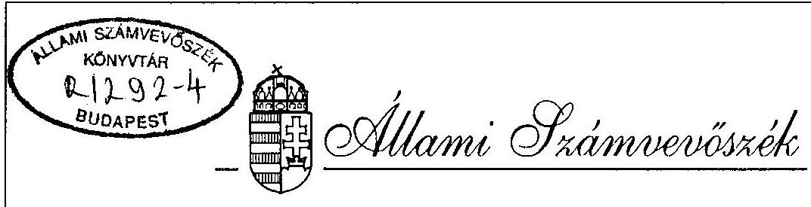
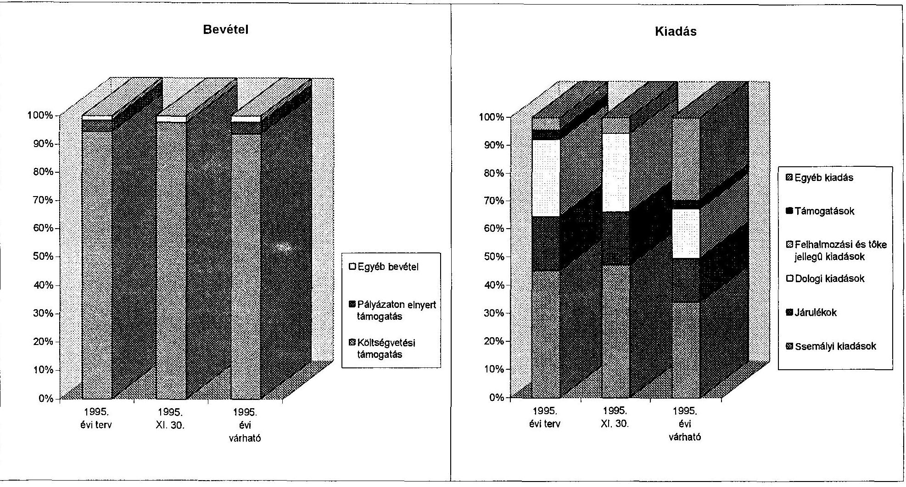

# JELENTÉS 

a Magyarországi Horvátok Országos Önkormányzata pénzügyi-gazdasági tevékenységének ellenőrzéséről

---

A vizsgálatot irányította:
Nagy József igazgatóhelyettes

A vizsgálatot vezette:
Bamberger Mária főtanácsos
A vizsgálatot végezte:
Gordos László
számvevő tanácsos
dr. Spilák Antal
számvevő tanácsos

---

# JELENTÉS   a Magyarországi Horvátok Országos Önkormányzata pénzügyi-gazdasági tevékenységének ellenőrzéséről 

## I.   A vizsgálat célja, módszere, időszaka, körülményei

A vizsgálat célja annak megállapítása volt, hogy az országos kisebbségi önkormányzatok szabályozottsága, a számviteli és bizonylati rend megfelel-e a törvényi előírásoknak.

Az ellenőrzésre az országos kisebbségi önkormányzatok működésének megkezdése évében került sor.
A vizsgálat megállapításait az országos önkormányzatnál megtalálható szabályzatok, bizonylatok, testületi döntések, könyvviteli adatok támasztják alá.

Az ellenőrzés az önkormányzat megalakulásától 1995. november 30-ig terjedő időszakra vonatkozott.

A helyszíni vizsgálati jelentésre az önkormányzat észrevételt nem tett.

## II.   Az ellenőrzés megállapításai

## Az önkormányzat megalakulása

A Magyarországi Horvátok Országos Önkormányzata (Bp. VI. Nagymező u. 49.) a nemzetiségi és etnikai kisebbségek jogairól szóló 1993. évi LXXVII. tv. alapján 1995. IV. 1-én alakult meg.

Az alakuló közgyűlésen az 51 kisebbségi önkormányzat által delegált 236 elektor megválasztotta az 50 főből álló közgyűlés tagjait, a Magyarországi Horvátok Országos Önkormányzat elnökét és három alelnökét.

---

# Az önkormányzati munka szabályozottsága 

Az 1995. IV. 29-i Közgyűlés tárgyalta első olvasatban az Önkormányzat Alapszabályát és azt végleges formában az 1995. IX. 23-i ülésén hagyta jóvá.

Az Alapszabály rendelkezik az önkormányzat feladatairól és hatásköréről, az önkormányzat szervezetéről és tisztségviselőiről. A közgyűlés 1995. VI. 16-án 8 bizottságot hozott létre, köztük a Pénzügyi és Ellenőrző Bizottságot.

Az önkormányzat a működésével, a döntések előkészítésével és végrehajtásával kapcsolatos szakmai, valamint ügyviteli feladatok ellátására Hivatalt állított fel, melynek szervezetét és létszámát, a bérkeretet a Közgyűlés határozta meg, az elnök és az ügyvezető titkár javaslata alapján. A Hivatalt a Közgyűlés által - pályázat útján - kiválasztott ügyvezető titkár irányítja.

Az alapszabály rendelkezik a képviselők (küldöttek) jogairól és kötelezettségeiről, költségtérítéséről is.

Az önkormányzat gazdálkodásával, vagyonával kapcsolatos legfontosabb döntések a Közgyűlés hatáskörébe tartoznak, nevezetesen a költségvetés és zárszámadás jóváhagyása és a vagyonnal való rendelkezés.

A működés és gazdálkodás szabályszerűségét biztosító szabályzatokat folyamatosan kidolgozták.

Elkészült az önkormányzat számlarendje és a számlatükör, a házipénztár-kezelés szabályzata, valamint az önkormányzat hivatala ügyrendjének javaslata. Ez utóbbi rendelkezik az utalványozás, ellenőrzés, a bankszámla feletti rendelkezés jogosultságáról.

A belső szabályzatok - némi pontosítással - alkalmasak arra, hogy a gazdálkodás és működés törvényességét és szabályszerűségét biztosítsák. Ilyen pontosítást és kiegészítést igénylő kérdések:
pl. ellentmondás van a hivatal ügyrendje és a pénzkezelési szabályzata között az utalványozó személyét illetően. Az előbbinél az ügyvezető titkár, míg az utóbbinál az elnök az utalványozó; a Számlarendben az értékcsökkenés az 53-as számlán szerepel; a Leltározási Szabályzat - mely a Számlarend részét képezi - nem tartalmazza a mérleg fordulónapjával történő eszközök és források leltározási és egyeztetési feladatait.

Az önkormányzat Alapszabálya és egyéb szabályzatai, a gazdálkodás megítéléséhez szükséges dokumentumok magyar nyelven is rendelkezésre állnak.

---

# Az önkormányzat működésének feltételei 

A nemzetiségi és etnikai kisebbségek jogairól szóló 1993. évi LXXVII. tv. 63. § (4) bekezdésében rögzített egyszeri vagyon-juttatást - a többi országos önkormányzathoz hasonlóan - az önkormányzat nem kapta meg. Jelenleg az Önkormányzat a Magyarországi Horvátok Szövetsége által a Főváros VI. kerületi önkormányzatától bérelt helyiségekben kapott elhelyezést.

A Fővárosi Főpolgármesteri Hivatal által a Nemzeti Etnikai Kisebbségi Hivatal egyeztetésével felajánlott 3 ingatlan közül egyik sem felelt meg az Önkormányzat igényeinek és bejelentették, hogy önállóan járnak el megfelelő ingatlan felkutatásában. Az Önkormányzat a VIII. Bíró Lajos u. 24. szám alatti ingatlant találta megfelelőnek az új székház kialakítására. Jelenleg a - vizsgálat ideje alatt - a Kincstári Vagyonkezelő

Szervezet közreműködésével folynak a vásárlással kapcsolatos tárgyalások és szerződéskötési előmunkálatok. Az ingatlan állami tulajdonbavételét követően az önkormányzat fogja örökös bérleményként megkapni. Bizonytalan az önkormányzat vezetése a tekintetben, hogy milyen forrásból fogják a székház berendezéseit és felszereléseit beszerezni, illetve biztosítani.

A működés dologi feltételeit szintén a szövetség biztosítja. A költségtérítés mértékében a szövetség és az önkormányzat megállapodott.

A Közgyűlés az önkormányzat hivatalának felállításával egyúttal meghatározta annak létszámkeretét (4 fő), és a bérvonzatát (1995. VI. 1-től).

Az önkormányzat a működés és gazdálkodás beindításához szükséges intézkedéseket a megalakulást követően folyamatba tette. 1995. IV. 1-én bejelentkezett a Fővárosi és Pest Megyei Egészségügyi Pénztárhoz és az adóhatósághoz nyilvántartásba vétel céljából. 1995. V. 30-án bankszámlát nyitott a Dunabank Rt-nél.

## Az önkormányzat pénzügyi kapcsolata a helyi kisebbségi önkormányzatokkal

A Magyarországi horvátok 51 helyi kisebbségi önkormányzatot választottak, ez az 1995. XI. 19-i választás során 6-tal bővült. Az országos önkormányzat és a helyi kisebbségi önkormányzatok közötti gazdasági kapcsolatok még nem alakultak ki és a működéshez való hozzájárulásra, illetve támogatásra sem került sor. A kiadások között a több helyi kisebbségi önkormányzat által szervezett különböző rendezvények költségeihez való hozzájárulás az összes kiadás 3,1%-át teszi ki.

---

# Az önkormányzat költségvetése és teljesítése 

Az országos önkormányzat Közgyűlése 1995. IX. 23-án hagyta jóvá az éves költségvetését.
A költségvetési bevételeinek döntő hányadát (94,3%) az állami támogatás biztosítja. A kiadások túlnyomó részét a bér és bérjellegű kiadások (tiszteletdíjak) és azok közterhei teszik ki.

A dologi jellegű kiadásokat elsősorban nyomda- és energia-költség, költségtérítés és a működéshez szükséges egyéb kiadások képezik a költségvetésben.

A biztonságos gazdálkodás és az 1996. évre történő zavartalan átmenet érdekében a Közgyűlés 5.474 ezer Ft költségvetési tartalékot tervezett.

Az állami támogatás időarányos részét (a 77/1995. (VI.29.) Ogy. határozat melléklete szerint 19.200 ezer Ft) az Önkormányzat megkapta. Működési és pénzellátási zavart okozott, hogy a támogatás első tétele mintegy 3 hónappal (1995. VII. 11-én) a megalakulást követően került kiutalásra.

A bevételek között 850 ezer Ft Művelődési és Közoktatási Minisztérium által meghirdetett nemzetiségi anyanyelvű könyvkiadás támogatására meghirdetett és elnyert pályázati támogatás összege szerepel, valamint az egyéb bevételek között a kamatbevételek. Szervezetek, alapítványok és magánszemélyek ez évben nem támogatták az önkormányzat működését. A vizsgálat idejéig a Művelődési és Közoktatási Minisztérium a pályázat összegét még nem utalta át az önkormányzatnak.

A költségvetési előirányzathoz hasonlóan a személyi jellegű kiadások és annak terhei (TB, munkaadói járulék) az összkiadás 49,6%-át teszik ki.
A Közgyűlés 1995. VI. 16-án a tisztségviselőknek az alábbi tiszteletdíjat határozta meg:

| alelnökök | 25.000 Ft/hó |
| :-- | --: |
| Közgyűlés tagjai | 6.000 Ft/hó |
| bizottsági elnökök | 12.000 Ft/hó |
| bizottsági tagok | 9.000 Ft/hó |
| egyéb - esetenként - (külső) | 3.000 Ft/hó |

A közgyűlés elnökének illetményét a Közgyűlés havi 110 ezer Ft-ban állapította meg.
A Közgyűlés Hivatala munkatársainak havi illetménye:
ügyvezető titkár	80.000 Ft
gazdasági vezető 43.500 Ft
gazdasági referens 40.000 Ft
szakreferens 56.000 Ft

A kiadási tételek között 2.914 ezer Ft a várható dologi kiadások összege, melynek nagyobb hányadát a Szövetség - mint bérlő - részéről az önkormányzat részére történt

---

költségtérítések visszafizetése, valamint a hivatal működési, adminisztrációs stb. költségei teszik ki.
Az önkormányzat 1995-ben 2 kulturális jellegű rendezvény költségeihez járult hozzá:
a tamburica fesztiválhoz 300 ezer Ft, és a
énekkari fesztiválhoz 200 ezer Ft összegben.
Az önkormányzat 1995-ben még további berendezéseket (gépek stb.) tervez beszerezni és várhatóan 4.054 ezer Ft pénzügyi tartalékkal zárja az évet.

# Az önkormányzat számviteli tevékenysége 

Az önkormányzat, mint társadalmi szervezet - a 114/1992. (VII.23.) és 157/1992. (XI.4.) Kormányrendelet alapján végzi gazdálkodási tevékenységét. Az önkormányzat kettős könyvvitelt vezet és az év végén egyszerűsített éves beszámolót készít. A számlarendben megfogalmazásra került a vállalkozási tevékenység végzésének lehetősége, illetve ennek elkülönített nyilvántartási kötelezettsége. 1995-ben vállalkozási jellegű tevékenységet nem végeztek.

A vizsgálat megállapította, hogy a könyvelés folyamatos, az eszközök és források változása nyomon követhető és a Számviteli törvényt és a vonatkozó kormányrendeleteket betartják, ugyanakkor a megalakuláskor nyitómérleget nem készítettek.

Az országos önkormányzat számviteli-pénzügyi folyamatainak nyilvántartását, elszámolását az 1990-ben megszűnt Nemzetiségi Szövetségek Gazdasági Hivatalának utód irodája végzi az Országos Szlovák Önkormányzatéval együtt. A számviteli elszámolás manuális (kézi) módszerrel történik. Az analitikus nyilvántartási rendszert kialakították. Az ellenőrzés során a főkönyvi számlák átvizsgálásakor néhány könyvelési elszámolási probléma adódott (pl. külföldi kiküldetések elszámolásakor közvetlenül az 5-ös számlaosztályba könyvelnek, a felvett kiküldetési díjat nem vezetik át a 361-es számlára; a belföldi utazási költségek elszámolásának dokumentálása hiányos, az utazási jegyeket - vagy számlákat - nem csatolják az elszámoláshoz). Az önkormányzat könyvelése ezek ellenére összességében megfelel a Számviteli törvényben és a kormányrendeletekben rögzített követelményeknek.

## Összefoglalás:

A Magyarországi Horvátok Országos Önkormányzata pénzügyi-gazdálkodási tevékenységének szabályozottsága, számviteli és bizonylati rendje összességében megfelel a törvényes előírásoknak és alkalmas arra, hogy kisebb pontosítások után megfelelő információkat szolgáltasson az önkormányzat irányítói részére.
Az önkormányzat működési feltételei - a várható kormányzati intézkedések után - 1996-ban megteremtődnek.

---

# III.   Javaslatok 

Az Állami Számvevőszék javasolja az önkormányzatnak, hogy jelentését az önkormányzat soron következő ülésén tárgyalja meg és a jelentésben rögzített hiányosságok

- a belső szabályozások pontatlanságainak és a szükséges kiegészítéseinek
- és a pénzügyi-számviteli elszámolások során jelzett és meglévő könyvelési problémák felszámolása érdekében hozzon határozatot határidő és felelős megjelölésével.

Budapest, 1996. február

Sándor István alelnök

---

| A Horvát Országos Önkormányzat 1995. évi költségvetése és annak teljesítése |  |  |   |
| --- | --- | --- | --- |
|   |  |  | ezer Ft  |
| Bevételek és kiadások | 1995. évi terv | 1995. XI. 30. | 1995. évi várható  |
| Költségvetési támogatás | 19200 | 17260 | 19200  |
| Pályázaton elnyert támogatás | 850 | 0 | 850  |
| Egyéb bevétel | 300 | 404 | 450  |
| Bevétel összesen | 20350 | 17664 | 20500  |
| Folyó kiadások | 13709 | 6804 | 11074  |
| ebből: személyi kiadások | 6732 | 3408 | 5599  |
| járulékok | 2867 | 1362 | 2561  |
| dologi kiadások | 4110 | 2034 | 2914  |
| Felhalmozási és tőke jellegű kiadások | 0 | 0 | 0  |
| Támogatások | 500 | 5 | 505  |
| ebből: helyi kisebbségi önkormányzatok támogatása | 0 | 0 | 0  |
| Egyéb kiadás | 667 | 407 | 4867  |
| Kiadás összesen | 14876 | 7216 | 16446  |
| Tartalék | 5474 | 10448 | 4054  |

---

# A Horvát Országos Önkormányzat 1995. évi költségvetése és annak teljesítése 

