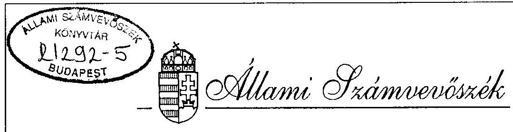
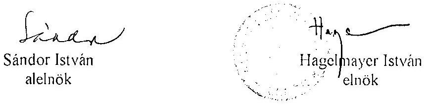
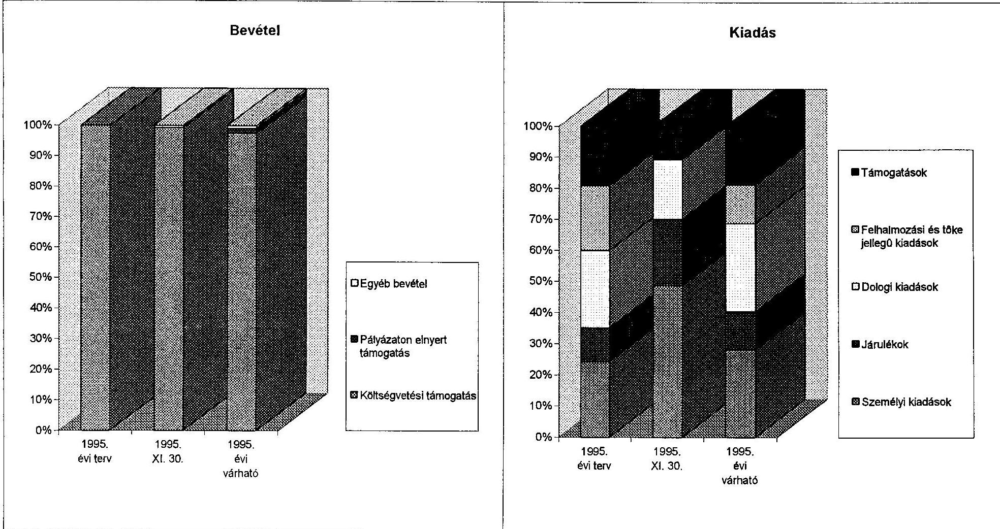

# JELENTÉS 

az Országos Lengyel Önkormányzat pénzügyi-gazdasági tevékenységének ellenőrzéséról

---

A vizsgálatot irányította:
Nagy József igazgató helyettes

A vizsgálatot vezette:
Bamberger Mária fötanácsos
A vizsgálatot végezte:
Horváth József számvevő tanácsos

---

# JELENTÉS   az Országos Lengyel Önkormányzat pénzügyi-gazdasági tevékenységének ellenörzéséről 

## I.   A vizsgálat célja, módszere, idöszaka, körülményei

A vizsgálat célja annak megállapítása volt, hogy az országos kisebbségi önkormányzatok szabályozottsága, a számviteli és bizonylati rend megfelel-e a törvènvi elöírásoknak.

Az ellenörzésre az országos kisebbségi önkormányzatok müködéseinek megkezdése évében került sor.
A vizsgálat megállapításait az országos önkormányzatnál megtalálható szabályzatok, bizonylatok, testületi döntések, könyvviteli adatok támasztják alá.

Az ellenörzés az önkormányzat megalakulásától 1995. november 30-ig terjedö idöszakra vonatkozott.

A helyszini vizsgálati jelentésre az önkormányzat észrevételt nem telt.

## II.   Az ellenörzés megállapításai

## Az önkormányzat megalakulása

Az Országos Lengyel Önkormányzat (Váci u. 62-64.) 1995. március 24-én alakult meg.
Az önkormányzat közgyülése tagjainak száma 13 fö, mely a törvényben elöirt minimális létszámnak felel meg.

---

# A jnkormányzat müködési feltételei 

Az önkormányzat elhelyezése még a vizsgálat idején sem volt megoldott. Kezdetben rövid ideig a Bem József Kulturális Egyesület Budapest V. Nádor utcai épületében müködött, majd a Fôvárosi Lengyel Kisebbségi Önkormányzattal közösen használnak egy irodahelyiséget. Így a müködésük legalapvetőbb feltételei sem biztositottak.

A Fôvárosi Önkormányzattal folytatott tárgyalások eredményeként megállapodás született a végleges elhelyezésröl. A mintegy $280 \mathrm{~m}^{2}$-es épületrész birtokbavételét azonban akadályozza, hogy az teljes felújításra, átalakításra szorul és várhatóan csak 1996. tavaszán lesz bcköltözhető. A felújítási költségeket a szakértő mintegy 20 millió Ft-ra becsülte. (új cím lesz: Budapest X. Allomás u.10.)

Az 1993. évi LXXVII. számú a nemzeti és etnikai kisebbségek jogairól szóló törvény szerint minden kisebbségi önkormányzatot - igy a lengyelt is - müködési költségük biztositására egyszeri vagyonjuttatásban kellett volna részesiteni. A törvény szerint a lengyel kisebbségi önkormányzatot 15 millió Ft illetett volna meg. Az egyszeri vagyonjuttatásban a többihez hasonlóan a lengyel sem részesült. A fenti vagyon hozamából a müködés feltételeit egyébként sem lehetne biztositani.

Az önkormányzat a Fôvárosi Bíróságnál 1995. július 16-án kezdeményezte a bejegyzését, de a kérésnek a Bíróság nem tett eleget.

Az APEH-hez júliusban jelentkeztek be és KSH számjellel is rendelkezik az önkormányzat.
A gazdálkodási és könyvelési feladatokat a Gazdasági és Pénzügyi Bizottság vezetője végzi, aki a testületnek is tagja. Mivel az utalványozáson kivül lényegében minden feladatot ellát, igy összeférhetetlenség is megállapítható a jelenlegi gyakorlatban.

## Az önkormányzati munka szabályozottsága

Az önkormányzat Szervezeti és Müködési Szabályzatát elkészitette. Ebben részletesen szabályozták az önkormányzat müködési rendjét és meghatározták a létrehozandó bizottságokat, azok feladatait. A testület mellett négy bizottság müködik:

- Gazdasági és Pénzügyi,
- Szervezési és Ellenőrzési,
- Kulturális és Tömegtájékoztatási,
- Szociális és Etikai.

Döntés született Iroda létrehozásáról is, azonban arra elsősorban az elhelyezési gondok miatt a vizsgálat idejéig nem került sor.

Az SzMSz vagyonnal és gazdálkodással foglalkozó részei alapvetően megfelelnek az clöírásoknak. Ezen kérdésekben döntési joga a testületnck van.

---

Az SzMSz a gazdálkodási jogosítványokat csak röviden tartalmazza. A Gazdasági és Pénzügyi Bizottság feladatai - előkészités, javaslatok kidolgozása, ellenőrzés - már részletesebbek, de nem elfogadható, hogy a bizottság feladatai között az ellenjegyzési jog is szerepel.

A gazdálkodással kapcsolatos szabályzatokkal - számviteli szabályzat, utalványozás ellenjegyzés rendje, pénzkezelési szabályzat, belső ellenőrzési szabályzat stb. - az önkormányzat nem rendelkezik. Ennek okaként az Iroda létrehozásának elmaradását jelölik meg.

# Az önkormányzatok pénzügyi kapcsolata a helyi kisebbségi önkormányzatokkal 

A lengyel kisebbség az országban hét helyen hozott létre önkormányzatot. Ezekkel az országos önkormányzat megfelelő kapcsolatot alakitott ki, de anyagi támogatást müködésükhöz nem adott. A testület döntése szerint csak konkrét rendezvényhez adnak a helyi önkormányzatoknak támogatást.

## Az önkormányzat költségvetése és teljesitése

Az éves költségvetést a testület hosszas vita után hagyta jóvá, mivel a rendelkezésre álló forrásokat nem tartotta elégségesnek feladatai ellátásához.

Az elfogadott költségvetésben bevételként csak a költségvetési támogatást szerepeltették 5.500 ezer Ft összegben. A vizsgálat idejéig ennek döntö részét megkapták. Ezen felül bevételük csak a bankszámla egyenlege után jóváirt kamatból volt.

Az önkormányzat egy folyóiratot ad ki, melyhez a Nemzeti és Etnikai Kisebbségi Alapból kapnak 90 ezer Ft támogatást.
Vállalkozásban nem vesznek részt, intézményük nincs, így más bevétcllel nem számolhatnak.
1995. november végéig 2.711 ezer Ft kiadást teljesitettek. Ennek nagyobb része a testület tagjai részére kifizetett tiszteletdij és annak járuléka.

Az önkormányzat testülete olyan döntést hozott, hogy minden tag havi 20.000 Ft tiszteletdijban részesül, de 1995. évben csak öt hónapra veszik fel azt. Így a 13 fö részére 1.300 ezer Ft bruttó összeg került elszámolásra. Személyi kiadásként merült még fel egy részfoglalkozású adminisztratív alkalmazott részére történő 20 ezer Ft. A személyi kiadások után az adót és a társadalombiztositási járulékot elszámolták, befizették.

A dologi kiadások között a különbözö rendezvényekkel összefüggö - utazási, reprezentációs, bérleti, szervezési stb. - költségeket, a testületi tagok utazási térítését és egyéb kisebb összegű működési költséget számoltak el.

---

A kiküldetési költségelszámolás rendjét nem szabályozták. Általános a saját gépjármü használata. Ezzel kapcsolatban az üzemanyag árát és kilométerenként 3 forintot térítenek. Az utazási költségeket jelentősen növelte, hogy a testületben több vidéki van, továbbá az a tény, hogy a novemberben lezajlott helyi önkormányzati választások miatt a testület tagjai többet utaztak vidékre.

Tárgyi eszközre november végéig kiadást nem teljesitettek. 1995. évre fénymásoló és fax beszerzését tervezik.

Az Országos Önkormányzat két szervezetnek adott támogatást. Bem József Kulturális Egyesület és a Szent Adalbert Katolikus Egyesület. A támogatást itt is alapvetően konkrét feladathoz adják, ezért először csak elöleget folyósitanak, majd a megvalósitás után történik meg az elszámolás. Ez magyarázza a tényleges november végi kiadás és az éves várható összeg közötti nagyobb különbséget.

Az önkormányzat által kiadott folyóirat költségeinek elszámolása nem történt meg a november végéig. Az első példány ingyenes lesz, így ebből sem számíthatnak semmi bevételre.

# Az önkormányzat számvitelei tevékenysége 

Az éves beszámoló készitésének és könyvvezetési kötelezettségének szabályairól szóló 157/1992. /XII.4./ Korm. számú rendelet és a társadalmi szervezetek gazdálkodási tevékenységéről szóló 114/1992. /VII.23./ Kormányrendelet elöirásai szerint a kettős könyvvitel vezetését választották. a pénzügyi folyamatok nyilvántartásának gyakorlata azonban még nem alakult ki.

A gazdasági eseményekröl kiállitott bizonylatok tartalmilag elfogadhatók, az utalványozás és ellenjegyzés megtörtént. Az utalványozási feladatokat a testület döntése alapján az elnök és a két alelnök gyakorolja, ellenjegyzö a Gazdasági és Pénzügyi Bizottság egyik tagja, érvényesitő és kifizető a bizottság elnöke.

A könyvelés hagyományos módon átírással történik. Az önkormányzat nyitómérleget nem készített.

Összefoglalva megállapítható, hogy az Országos Lengyel Önkormányzatnál a gazdálkodás szabályozottsága nem felel meg az elöírásoknak. A gazdasági események rögzitésénél a vonatkozó jogszabályok elöírásait nem alkalmazzák.

---

# III.   Javaslatok 

Az Állami Számvevőszék javasolja az önkormányzatnak, hogy jelentését az önkormányzat soron következő ülésén tárgyalja meg és a jelentésben rögzitett hiányosságok felszámolása érdekében hozzon határozatot határidő és felelős megjelölésével, hogy

- a gazdasági események rögzitése a jogszabályok előirásainak megfeleljenek,
- a gazdálkodással összefüggő szabályok elkészüljenek,
- a pénzkezelési és könyvelési területen meglévő összeférhetetlenség megszűnjön.

Budapest, 1996. február

---

|  Az Országos Lengyel Önkormányzat 1995. évi költségvetése és annak teljesítése |  |  |   |
| --- | --- | --- | --- |
|   |  |  | ezer Fi  |
|  Bevételek és kiadások | 1995. évi
terv | 1995. XI.
30. | 1995. évi
várható  |
|  Költségvetési támogatás | 5500 | 4880 | 5500  |
|  Pályázaton elnyert támogatás | 0 | 0 | 90  |
|  Egyéb bevétel | 0 | 32 | 50  |
|  Bevétel összesen | 5500 | 4912 | 5640  |
|  |   |   |   |
|  Folyó kiadások | 3298 | 2421 | 3290  |
|  ebből: személyi kiadások | 1340 | 1320 | 1340  |
|  járulékok | 590 | 581 | 590  |
|  dologi kiadások | 1368 | 520 | 1360  |
|  Felhalmozási és tőke jellegű kiadások | 1150 | 0 | 600  |
|  Támogatások | 1052 | 290 | 900  |
|  ebből: helyi kisebbségi önkormányzatok támogatása | 137 | 0 | 100  |
|  Egyéb kiadás |  |  |   |
|  Kiadás összesen | 5500 | 2711 | 4790  |
|  |   |   |   |
|  Tartalék | 0 | 2201 | 850  |

---

Melléklet
a V-1019/1995-96. sz. vizsgálati jelentéshez

# Az Országos Lengyel Önkormányzat 1995.évi költségvetése és annak teljesítése

