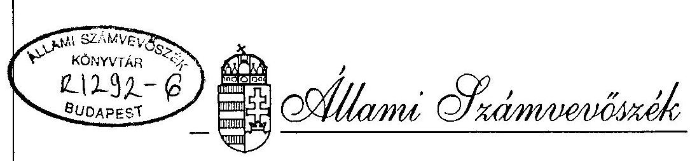
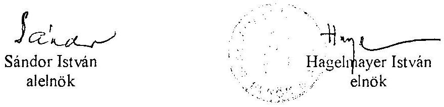
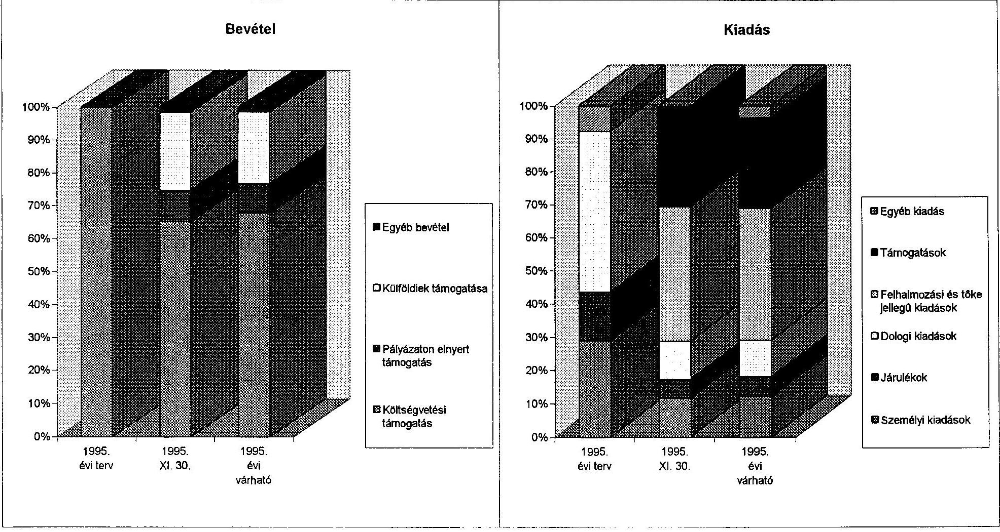

# JELENTÉS 

a Magyarországi Németek Országos Önkormányzata pénzügyi-gazdasági tevékenységének ellenőrzéséről

---

# A vizsgálatot irányította: 

Nagy József igazgatóhelyettes

A vizsgálatot vezette:
Bamberger Mária
főtanácsos
és vizsgálatot végezte:
Gordos László
számvevő tanácsos
dr. Spilák Antal
számvevő tanácsos

---

# JELENTÉS   a Magyarországi Németek Országos Önkormányzata pénzügyi-gazdasági tevékenységének ellenőrzéséről 

I.

A vizsgálat célja, módszere, időszaka, körülményei

A vizsgálat célja annak megállapítása volt, hogy az országos kisebbségi önkormányzatok pénzügyi-gazdálkodási szabályozottsága, a számviteli és bizonylati rend megfelel-e a törvényi előírásoknak, működési feltételeik biztosítottak-e.

Az ellenőrzésre az országos kisebbségi önkormányzatok megalakulásának évében került sor.
A vizsgálat megállapításait az országos önkormányzatnál megtalálható szabályzatok, bizonylatok, testületi döntések, könyvviteli adatok támasztják alá.

Az ellenőrzés az önkormányzat megalakulásától 1995. november 30-ig terjedő időszakra vonatkozott.

A helyszíni vizsgálati jelentésre tett észrevétel alapján a pontosítást átvezettük.

## II.   Az ellenőrzés megállapításai

## Az önkormányzat megalakulása

A Magyarországi Németek Országos Önkormányzatának megalakulása (Bp. VI. Nagymező u. 49.) a nemzetiségi és etnikai kisebbségek jogairól szóló 1993. évi LXXVII. törvény alapján történt.

Az Országos Választási Bizottság részéről 1995. március 12-re összehívott 126 német kisebbségi önkormányzat elektorainak gyűlésén 53 közgyűlési tagot választottak meg.

---

Az új közgyűlés alakuló ülésére a nemzeti és etnikai kisebbségek jogairól szóló 1993. évi LXXVII. törvény 35.§ (1) bekezdésében meghatározott 30 napon belül 1995. április 8-án került sor. A csaknem teljes létszám (51 fő) mellett megtartott közgyűlésen elfogadták a Szervezeti és Működési Szabályzatként az Alapszabályt (Preambulum), továbbá megválasztották a tisztségviselőket (az elnököt, négy alelnököt, a felügyelő bizottság elnökét és tagjait). Tagot delegáltak a Nemzeti és Etnikai Kisebbségekért Közalapítvány Kuratóriumába.

# Az önkormányzati munka szabályozottsága 

Az Alapszabály részletes szabályozásokat tartalmaz a közgyűlés működésére, a képviselők, a bizottságok, az elnökség, elnök, elnökhelyettesek, továbbá a megyei szövetségek jogosítványaira és feladataira vonatkozóan. Az alapszabály öt bizottság létrehozását írja elő. Az elnökből és 2 tagból álló Felügyelő Bizottság feladataként határozza meg az önkormányzat gazdálkodásának ellenőrzését, valamint a zárszámadás véleményezését. Külön fejezet foglalkozik a Közgyűlés Hivatalának, továbbá megyei (regionális) hivatalok létrehozásával, valamint az ügyvezető kinevezésével.

A megyei (regionális) irodák a megyei szövetségek tevékenységével összefüggő hivatali teendőket látják el. Az Alapszabály értelmében "azok a megyék, amelyekben legalább 4 helyi kisebbségi önkormányzat alakult, megalakíthatják a megyében lévő önkormányzatok szövetségét". A megyei szövetség a Cégbírósági bejegyzés után jogi személlyé válik, amely maga dönt a szervezetéről és működéséről.

A gazdálkodást érintően az Alapszabály rögzíti, hogy a testület saját hatáskörében határozza meg költségvetését és zárszámadását, a rendelkezésre bocsátott források felhasználását. Nevesíti továbbá, hogy a költségvetés összeállításának részletes szabályait az államháztartásról szóló törvény, a finanszírozás rendjét és az állami hozzájárulás mértékét az állami költségvetési törvény határozza meg. Az Önkormányzat működése pénzügyi forrásainak körét a Nek.tv. 58. §-ával azonosan állapítja meg.

A Közgyűlés december 9-i ülésén fogadták el az Elnökség-, valamint a Közgyűlés Hivatalának Működési Szabályzatát.

A gazdálkodással összefüggő szabályozások közül elkészült és június 1-én hatályba lépett a Pénzkezelési Szabályzat, a Leltározási Szabályzat, a Selejtezési Szabályzat és a Kötelezettségvállalási Szabályzat. Hiányosságuk, hogy a szakszerű, de más intézménynél készült szabályzatokat az önkormányzat sajátosságait és a jogszabályi változásokat figyelembe véve csak részben aktualizálták. Több szabályzatban előfordul az "intézet", "intézmény" megjelölés. A leltározási szabályzat még az állóeszköz-fogyóeszköz megnevezéseket alkalmazza. A helyszíni vizsgálat lezárását követően az önkormányzat jelezte, hogy a szabályzatokban szereplő megnevezéseket pontosították. Az ügyvezető korlátozás nélkül utalványozási jogosítványát a Kötelezettségvállalási Szabályzaton kívül az október 1-én kelt "Pénztári szabályzat" és az "Utalványozás rendje" is rögzítik.

---

A vizsgálat idejéig nem készült el az önkormányzat számlarendje és a számlatükör. A szabályzatok egy része, továbbá a közgyűlési és elnökségi határozatok csak német nyelven készültek, melyeket kérésre magyar nyelvre lefordítottak.

# Az önkormányzat működésének feltételei 

A vizsgálat időpontjáig a Magyarországi Németek Országos Önkormányzata az 1995. év március 11-én, jogutód nélkül megszűnt Magyarországi Németek Szövetsége (továbbiakban: Szövetség) helyiségeit, bútorait és egyéb eszközeit használja. Az Önkormányzat a Terézvárosi Épületszolgáltató Önkormányzati Vállalat bérelt helyiségeiben jelenleg jóhiszeműen jogcím nélkül folytatja tevékenységét. A Nemzetiségi és etnikai kisebbségek jogairól szóló tv. 63. § (4) bekezdésében meghatározott, s a működtetés költségeit biztosító 30 millió Ft összegű egyszeri vagyonjuttatásban az Önkormányzat nem részesült.

A nemzetiségi és etnikai kisebbségek jogairól szóló tv. 62. § (2) bekezdésében, valamint a kisebbségi önkormányzatok költségvetésének, gazdálkodásának, vagyonjuttatásának egyes kérdéseiről intézkedő 20/1995. (III.3.) az. Kormányrendelet 3. §-ában foglalt önkormányzati ingatlanigény kielégítése céljából a március 29-én megalakult Kisebbségi Kompenzációs Bizottság elnöke április 11-én levélben tájékoztatta az önkormányzat elnökét az elhelyezési-igénybejelentéssel összefüggő teendőkről.

Az Önkormányzat Budapest Főváros Önkormányzata főpolgármesterének címzett, április 18-i levelében fogalmazta meg 300 m² alapterületű ingatlanra vonatkozó igényét. Budapest Főváros főpolgármester-helyettese a Nemzeti és Etnikai Kisebbségi Hivatal Önkormányzati és Információs Főosztályának vezetőivel egyetértésben - a 20/1995. sz. Kormányrendelet 3. § (3) bekezdésében meghatározottak szerint - május 2-án 3 ingatlant (a VI., Andrássy út 60., a X. Állomás u. 10/A., valamint a X. Állomás u. 10/B. épületeket, illetve azok igénybejelentés szerinti alapterületű épületrészeit) ajánlott fel a fővárosi székhelyű országos és a fővárosi kisebbségi önkormányzatok elhelyezésére.

Az önkormányzat július 1-i levelében tájékoztatta a főpolgármester-helyettest arról, hogy egyik ingatlant sem találták alkalmasnak az Önkormányzat székházának céljára. Egyidejűleg bejelentették, hogy - újabb felajánlás hiányában - kénytelenek maguknak megfelelő ingatlant felkutatni. Időközben ez meg is történt. A II. kerület Júlia u. 9. szám alatti, magántulajdonban lévő - 240 m² alapterületű, s további 60 m² területnöveléssel átalakítandó (69 millió Ft összértékű) - házingatlant találták alkalmasnak a számukra. A vizsgálat lezárásáig döntés nem történt.

Az önkormányzat - az egyszeri vagyonjuttatás elmaradása (késlekedése) miatt is - elengedhetetlennek tartja a székházzal való ellátás során annak berendezését is (első beszerzés) központi forrásokból biztosítani. Ezt a kérésüket az Országgyűlés Emberi jogi, kisebbségi és vallásügyi bizottsága elnökének november 21-én írt levelükben (a többi kisebbségi önkormányzat nevében is) megfogalmazták, országos önkormányzatonként 3000 ezer Ft-ban vélelmezve a legszükségesebb berendezési tárgyak beszerzési értékét.

---

A működés tárgyi, dologi és személyi feltételeit hivatott biztosítani a 77/1995. (VI.29.) Országgyűlési határozat mellékletében tárgyévre meghatározott 38.300 ezer Ft költségvetési támogatás.

Az önkormányzat személyi feltételei biztosítottak. A Közgyűlés Hivatalának jelenlegi teljes munkaidős létszáma 12 fő, és 4 fő részfoglalkozású, akik közül 6 fő a Közgyűlés által létrehozott (illetve a korábbi Szövetségtől átvett) hat regionális iroda (hivatal) vezetője. A regionális irodák vezetőinek tárgyévi bérköltségét a német Belügyminisztérium finanszírozza.

Az önkormányzat megalakulását követően megtette a gazdálkodás beindításához szükséges alapvető intézkedéseket: nyilvántartásba vétel céljából bejelentkezett a Fővárosi és Pest Megyei Egészségügyi Pénztárhoz - VI. 1-től -, valamint az APEH Fővárosi Igazgatóságához 1995. IV. 8-án, bankszámlát nyitott a Hypo Bank Rt-nél 1995. V. 15-én.
… … zat, bár a volt Szövetségnek nem jogutóda, annak eszközeit nem teljes körűen … a … : … : szerint átvette. Az átvett tárgyi eszközökről, forgóeszközökről, pénzeszközökről (ezen belül 141.100,40 DM) és kötelezettségeikről nyitómérleget nem készítettek a vizsgálat idejéig.

Az önkormányzat tulajdonába került a fővárosi Német Nemzetiségi Gimnázium kollégiuma (Bp. XX. Vizisport u. 7. sz.). Egy korábbi bölcsőde 998 m² alapterületű, s 47 férőhelyes kollégiummá történő átalakítását még a Szövetség kezdte meg 1994-ben. A Szövetség ráfordításainak összege a vételárral együtt 121.690.424 Ft-ot tett ki. A kollégium műszaki átadás-átvételének 1995. IX. 30-i időpontjáig az önkormányzat további 7.166 ezer Ft ráfordítást eszközölt, majd használatra átadta a Bp. XX. kerületi önkormányzatnak. A kollégium aktiválása a vizsgálat időpontjáig nem történt meg.

# Az önkormányzat pénzügyi kapcsolata a helyi kisebbségi önkormányzatokkal 

Az 1994. évi választások során az ország 126 településén választottak német kisebbségi önkormányzatot. 1995. november 19-én további 38 önkormányzat alakult. A jelenleg működő 164 német kisebbségi önkormányzat közül 17 a német kisebbségi települési önkormányzatok száma, melyek a következők:
Bóly, Görcsönd, Kisnyárád, Majs, Nagynyárád, Nagypall, Ófalu, Császártöltés, Harta, Nemesnádudvar, Csolnok, Várgesztes, Vértessomló, Vértestolna, Dunabogdány, Kiszsidány, Vaskertes.

Az önkormányzatnak a helyi kisebbségi önkormányzatokkal való kapcsolata szabályozott. Az állami támogatásból a helyi önkormányzatok működésére támogatást nem biztosítanak, az 1995. IX. 23-i közgyűlés határozata alapján a jogi személlyel már bíró, bankszámlával rendelkező megyei szövetségeknek a területükön működő önkormányzatok számától függően - önkormányzatonként 51 ezer Ft összegű - támogatást biztosítottak.

---

elszámolási kötelezettség mellett. A IX. 23-i Közgyűlés határozott arról is, hogy a megyei regionális irodák működési költségére havonta, VI. 1-től 50 ezer Ft-ot juttatnak, ugyancsak elszámolási kötelezettséggel.

# A költségvetés tervezése és végrehajtása 

Az Önkormányzat Közgyűlése az 1995. évi költségvetési koncepcióját, illetve felosztási elveit 6/95. (06.10.) sz. határozatával hagyta jóvá 36.000 ezer Ft összegben.
A költségvetés csak az állami támogatási bevételekkel - akkor még előzetes adatával - számolt. A kiadások 44,2%-át személyi jellegű kiadásokra és közterheire, bérleti díjra, működtetésre 22,2%-át, egyéb kiadásokra (kiadvány támogatás, kapcsolattartás stb.) 33,6%-át tervezték.

Az önkormányzat bevételeit és kiadásait a melléklet mutatja be.
Az állami támogatás időarányos részét az önkormányzat megkapta. A szervezetek (ezen belül belföldi és külföldi) által adott támogatások mellett a magánszemélyek is támogatták az önkormányzatot. Az egyéb bevételek a kamat, illetve ÁFA visszaigénylésből származtak. A várható (XII. 31-ig) bevételek a tervezett összeg mintegy másfélszeresét teszik ki.

A várható kiadások között 10.165 ezer Ft a személyi jellegű kiadások és közterheinek az összege, az összkiadás 18,0%-a. Az önkormányzat az elnöknek, közgyűlés tagjainak, bizottságvezetőknek és tagoknak tiszteletdíjat nem fizet, csak utazási költségtérítésben részesülnek.

A hivatal alkalmazottainak havi illetménye az alábbi:

- ügyvezető
- adminisztrátor (titkárnő)
- gépiró
- 2 szakreferens
- gazdasági vezető
- 6 régióvezető
- kézbesítő
- gépkocsivezető
- 1 nyugdíjas takarító
- 1 nyugdíjas gépiró

100.000 Ft
60.500 Ft
35.400 Ft
60.000 Ft
60.000 Ft
55.000 Ft
24.200 Ft
25.000 Ft
21.800 Ft
20.000 Ft .

A személyi kiadások második félévétől kerültek kifizetésre. 1996-ban - változatlan összeggel számolva - mintegy kétszeresét fogják kitenni az 1995. évinek és a kiadások között is várhatóan magasabb %-os arányt képviselnek majd.

A dologi kiadások között jelentős tételt mutat a helyiségek bérleti díja, posta-, telefonköltség és a különféle szolgáltatási-, javítási költségek.

---

A felhalmozási jellegű kiadások között 8.000 ezer Ft-os tartós bankbetét szerepel, valamint a Németek Nemzetiségi Kollégiumának befejezéséhez szükséges és a Szövetség által átadott 7.166 ezer Ft-os kötelezettség, továbbá ezen felül 7.253 ezer Ft pótmunkákra benyújtott kivitelezői számla.

A támogatások várható 15.492 ezer Ft-os összegét a soproni, veszprémi, szekszárdi, bajai, pécsi és a Budapest-Pest megyei régióknak, valamint a megyei szövetségeknek juttatott támogatási tételek jelentik. Az önkormányzat a Kalender című kiadványt 2.000 ezer Ft összeggel támogatja. A kötelezettségek növekedése miatt az év végi pénztartalék várható összege csak 68 ezer Ft-ra alakul.

# Az önkormányzat számviteli tevékenysége 

Az önkormányzat a könyvvezetés rendszerét a megszűnt Szövetségnél vezetett, költségvetési szervekre vonatkozó szabályok szerint tervezte vezetni. (Ezt az elképzelést erősítette az APEH állásfoglalása, miszerint a költségvetési szervekre vonatkozó könyvvezetést és beszámolót kell készíteni az Önkormányzatoknak.) Az
 ehhez szükséges számítógépes programok megvásárlását tervezték. A vizsgálat során történt figyelemfelhívást követően - miszerint a 20/1995. (III.3.) Kormányrendelet 2. § (1) bekezdése értelmében a társadalmi szervekre vonatkozó gazdálkodási előírásokat kell alkalmazni - folyamatba tették a rendelet szerinti könyvvezetésre való átállást.

Jelenleg az önkormányzat számlarendjét és a számlatükör kialakítását, továbbá a megfelelő számítógépes program vásárlását - a fentiek szerint - programba vették.

Ennek megfelelően a pénzügyi folyamatok nyilvántartása nem folyamatos, nyitómérleget nem készítettek, a könyvvezetés rendszere nem alakult ki. A bevételek és kiadások alakulását a vizsgálat során az 1995. XI. 30-i bankkivonat és pénztári pénzkészlet-állományból és a bevételek tételes vizsgálatából kiindulva lehetett a számlák alapján ellenőrizni, aminek eredményeként megállapítható, hogy a bevételek és a kifizetett számlák közti különbözet megegyezik a pénztár és a bankkövetelések egyenlegével.

## Összefoglalás

Az ellenőrzés során feltárt hibák, hiányosságok és szabályozatlanságok részben az induláskor elkerülhetetlen nehézségeket, részben pedig az elkerülhető mulasztásokat tükrözik. Ezzel kapcsolatban kiemelést érdemel, hogy a működéshez szükséges feltételek biztosítása érdekében gyorsabb kormányzati intézkedésekre, a pénzügyi-számviteli folyamatok belső szabályozottsága érdekében pedig további önkormányzati intézkedésre van szükség.

---

# III.   Javaslatok 

Az Állami Számvevőszék javasolja az önkormányzatnak, hogy jelentését az önkormányzat soron következő ülésén tárgyalja meg és a jelentésben rögzített hiányosságok felszámolása érdekében hozzon határozatot határidő és felelős megjelölésével, hogy

- az önkormányzat számviteli tevékenysége szabályozott keretek között megfelelő információt tudjon biztosítani a testületnek,
- kielégítse a számviteli törvényben és a hozzá kapcsolódó kormányrendeletekben előírt kötelezettségek teljesítését.

Budapest, 1996. február

---

# A Magyarországi Német Országos Önkormányzat 1995. évi költségvetése és annak teljesítése

|   |  |  | ezer Ft  |
| --- | --- | --- | --- |
|  Bevételek és kiadások | 1995. évi terv | 1995. XI. 30. | 1995. évi várható  |
|  Költségvetési támogatás | 36000 | 34000 | 38300  |
|  Egyéb támogatások | 0 | 17467 | 17471  |
|  ebből: pályázaton elnyert támogatás | 0 | 4954 | 4954  |
|  külföldiek támogatása | 0 | 12417 | 12417  |
|  magánszemélyek támogatása | 0 | 96 | 100  |
|  Egyéb bevétel | 0 | 638 | 652  |
|  Bevétel összesen | 36000 | 52105 | 56423  |
|  Folyó kiadások | 33200 | 10801 | 16444  |
|  ebből: személyi kiadások | 10465 | 4348 | 6863  |
|  járulékok | 5232 | 2090 | 3302  |
|  dologi kiadások | 17503 | 4363 | 6279  |
|  Felhalmozási és tőke jellegű kiadások | 0 | 15166 | 22419  |
|  Támogatások | 0 | 11458 | 15492  |
|  ebből: helyi kisebbségi önkormányzatok támogatása | 0 | 0 | 0  |
|  Egyéb kiadás | 2800 | 0 | 2000  |
|  Kiadás összesen | 36000 | 37425 | 56355  |
|  Tartalék | 0 | 14680 | 68  |

---

# A Magyarországi Német Országos Önkormányzat 1995. évi költségvetése és annak teljesítése 

