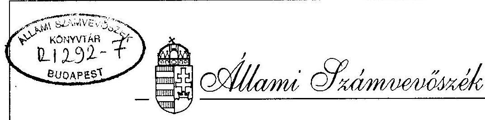
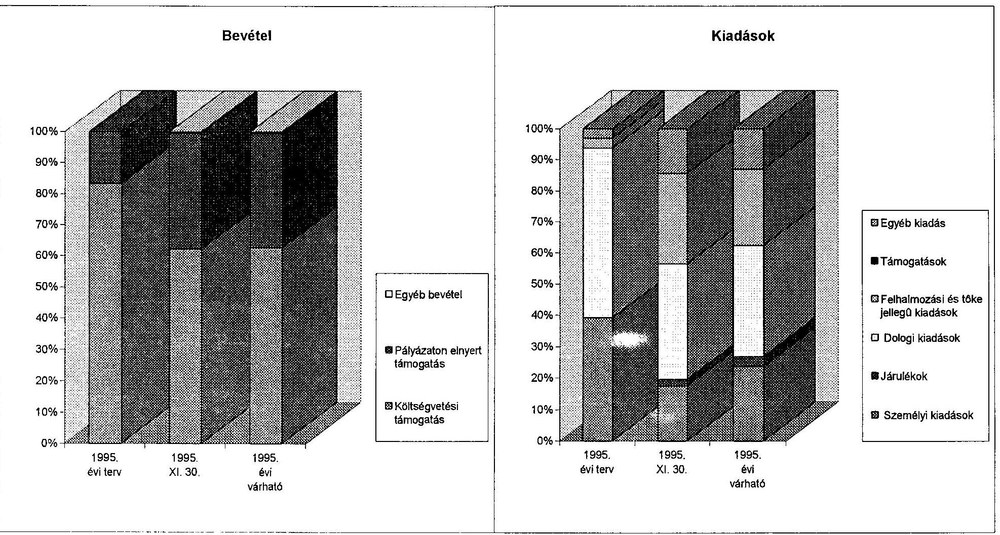

# JELENTÉS 

az Országos Örmény Önkormányzat
pénzügyi-gazdasági tevékenységének ellenörzéséról

---

A vizsgálatot irányította:
Nagy József igazgató helyettes

A vizsgálatot vezette:
Bamberger Mária fötanácsos

A vizsgálatot végezte:
Magyar György számvevö tanácsos

---

# JELENTÉS   az Országos Örmény Önkormányzat pénzügyi-gazdasági tevékenységének ellenörzéséröl 

## I.   A vizsgálat célja, módszere, időszaka, körülményei

A vizsgálat célja annak megállapítása volt, hogy az országos kisebbségi önkormányzatok pénzügyi-gazdálkodási tevékenységének szabályozottsága, a számviteli és bizonylati rend megfelel-e a törvényi elöirásoknak, a müködési feltételek biztositottak-e.

Az ellenőrzésre az országos kisebbségi önkormányzatok megalakulásának évében került sor. A vizsgálat megállapításai az országos kisebbségi önkormányzatoknál megtalálható testületi döntéseken, szabályzatokon, könyvviteli adatokon és bizonylatokon alapulnak.

Az ellenőrzés az önkormányzat megalakulásától 1995. november 30-ig terjedő időszakra vonatkozott.

A helyszini vizsgálati jelentésre tett egy pontositó észrevételt a vizsgálati jelentésen átvezettük.

## II.   Az ellenörzés megállapításai

## Az önkormányzat megalakulása

Az Országos Örmény Önkormányzat 1995. évi választása február 19-én történt. Ezt megelözöen Budapest II., V., VI., XI., XII. és XIV. kerületeiben, valamint Szigethalmon és Veszprémben települési kisebbségi-, a Fővárosban pedig helyi kisebbségi önkormányzatot választottak.

Az 1995. XI. 19-én tartott pótválasztások credménycként további tclepülési kiscbbségi önkormányzatok akauttak Budapest III., XIII., és XXI. kerïletében, valamint Dorogon, Debrecenben, Nyiregyházán és Székesfehérvárolt.

---

- Az országos önkormányzat megválasztására hivatott kisebbségi elektorok létszáma 40 fö volt, az általuk megválasztott közgyűlési tagok létszáma pedig összesen 17 fö. A közgyülés a megválasztását követően azonnal megtartott alakuló ülésén elnököt és 1 elnökhelyettest választott, székhelyéül pedig - ideiglenes jelleggel - az Arménia Népe Kultúrális Egyesület székhelyét (BP. XI. Budapfoki út 15.) jelölte meg.

Határozatban rögzitették továbbá, hogy az önkormányzat végleges szćkhelye is Budapest XI. kerületében legyen, mégpedig a Budapesti Örmény Katolikus Lclkészséggel szerves egysćgben, egy örmény centrum létrehozása céljából.

# Az önkormányzat müködésének feltételei 

Az önkormányzatot a feladata, és hatásköre ellátásához szükséges, és a nemzeti- és etnikai kisebbségek jogairól szóló 1993. évi LXXXVII. sz. törvény vonatkozó clöírásai által is megjelölt vagyontárgyakkal még nem látták el.

A fenti törvény 59. §-ának (2)-(3) bekezdésében a helyileg illetćkes önkormányzatok vagyonából állami kompenzációval igért épület(-rész) használati jogának megszerzése ügyében az Országos Örmény Önkormányzat által követett eljárás eltér a kisebbségi önkormányzatok költségvetésének, gazdálkodásának vagyonjuttatásának egyes kérdéseiről szóló 20/1995. (III.3.) Kormányrendelet 3. §-ában foglaltaktól. Ennek az a magyarázata, hogy az Országos Örmény Önkormányzat, a Fővárosi Örmény Kisebbségi Önkormányzat és a Bp.XI.ker. Örmény Kisebbségi Önkormányzat közös elhelyezésre alkalmas ingatlanegyüttes kialakítására tett javaslatot, amit már az alakuló ülés határozata is clöirányozott.

Elképzelésük szerint a fenti három önkormányzat végleges clhelyezésére is szolgáló örmény centrumot a Bp. XI. ker. Orlay u. 6. sz. alatt fekvö ingatlannal szoros cgyésgben kivánják létrehozni. Ehhez a Bp. XI. ker. Bartók B. u. 15/c. szám alatti 5034/2. hrsz -ú ingatlan megszerzését már 1995. II. 24-én kezdeményeztćk a kerületi önkormányzatnál, mint tulajdonosnál, aki IX. 26-án döntött az ingatlan átadásáról, amelyek cllenértékét 16.270 czer Ft-ban határozta meg. Ez a döntés képezi tchát az ingatlan megszerzése ügyében szükséges kormányszintü intézkedés alapját.

A hivatkozott törvény 63. § (4), (5) bekezdéseiben müködési költségek biztositására clöirányzott 15 millió Ft értékủ egyszeri vagyonjuttatás realizálása ügyében az önkormányzat még semmilyen információval nem rendelkezik.

Az önkormányzat az Alexian Kft. és a Budapesti Örmény katolikus 1.elkészség által Bp. XI.ker. Budafoki út 15., illetve Orlay u. 6.sz. alatt biztositott, közös használatú helyiségekben nyert elhelyezést. A használat feltételeit írásban nem rögzítették. A telephelyek rezsi költségeinek egy része az önkormányzatot terheli, és az Orlay utcai ingatlanon 700 ezer Ft összegben vagyonvédelmi beruházást és villamos hálózat felújítást is végzelt.

A Budafoki út 15. sz. alatti helyiségben elsösorban a könyvecetési feladatokat végzik, az Orlay u. 6. sz.alatti helyiségekben pedig a tilkársági feladatokat látják el és itt tartják a testületi üléseket is.

---

Az egyéb tárgyi feltételek biztosítása érdekében föleg a titkársági feladatok ellátását szolgáló számítás-, ügyvitel-, és híradástechnikai eszközök beszerzésére került sor, amit kizárólag az Orlay u. 6. szám alatt helyeztek el (fénymásoló 1.346 ezer Ft, 2 db számítógép 323.3 ezer Ft, fax 63.8 ezer Ft, nyomtató 25.6 ezer Ft, kis értékủ tárgyi eszközök 17.2 ezer Ft$)$.

A müködéshez szükséges személyi feltételeket részben a választott tisztségviselők egyéni és testületi tevékenységével, részben pedig a szerződéses foglalkoztatás változó módozataival igyekeztek biztositani.

A Bizottságok, közte az 5 fös Pénzügyi Bizottság megválasztása az 1995. július 13-án tartott testületi ülésen történt. A további bizottságok és azok létszáma: Jogi-, igazgatási-, etikai- és fegyelmi bizottság (4 fó) Kultúrális Bizottság (5 fó), Külkapcsolatok Bizottsága (5 fó), Média Bizottság (5 fó), Informatikai Bizottság (5 fó), Egészségügyi- és Szociális Bizottság (4 fó), Nöbizottság (3 fó), Szercezeti és Önkormányzati Bizottság (4 fó).

Munkavégzésre irányuló jogviszonyban összesen 2 fó foglalkoztatására került sor, pénzügyi és számviteli (könyvelöi), valamint titkárnői (irodavczctöi) feladatok ellátása érdekében. Foglalkoztatásuk kezdeıcként a könyvelőnél (munkaszerzödés alapján) 1995. május 1., a titkárnőnél pedig (testületi ülés jegy:zökönyve szerint) augusztus 15. állapítható meg.

Az önkormányzatot a megalakulás jogszerü dokumentumai és a szükséges bejelentkezések alapján a területileg illetékes első fokú adóhatóság 1995. május 24-én, Egészségbiztosító Pénztár pedig november 16-án vette nyilvántartásba. A Budapest Bank Rt. délbudai Igazgatóságával kötött bankszámla szerződés kelte és egyben a számla megnyitásának idöpontja június 12.

# Az önkormányzati munka szabályozottsága 

Az önkormányzat a Szervezeti és Müködési Szabályzat megalkotását megkezdte, de még nem fejezte be. Az SzMSz tervezetéről a képviselö testület első alkalommal 1995. július 13-án, ezt követően pedig további három alkalommal tárgyalt. Az október 10-én tartott testületi ülés úgy határozott, hogy a szabályzat megtárgyalását a következő, november 14-i ülésre halasszák, aminek jegyzökönyve a helyszíni vizsgálat befejezéséig nem készült el, igy az ott hozott döntés csak a résztvevők előtt ismert.

A kötelezettségvállalás, az utalványozás, és a belsö ellenörzés szabályozásával az SzMSz tervezete több helyen is foglalkozik, de ebböl még az elnóknck biztositott hatáskör sem állapítható meg egyértelmüen, mert a kötelezettségvállalásra vonatkozó elöirások a következöket tartalmazzák:

A közgyülés hatásköréböl nem ruházható át... a közgyülés által meghatározott értékhatár feletti jogügylct (8.§ j. pont),
A közgyülési tagok több mint felénck minösitctt többségü szavazata szükségcs az önkormányzat...jogügylctc csctén 100 czer Ft felett (39.§ (2) bck. i.pont),

---

...Az clnok két közgyưlés kőzỏtt döntést hozhat a rá át nem ruházható kérdésekben, jogügylctckben, tulajdoni jogok gyakorlásában 500 czer Ft ćrtćkhatárig. Döntéscićrt tcljes polgári jogi felclösséggel tartozik az önkormányzat fclé (59.§).

A jelenlegi állapotában is egyértelmũ szabályozást tartalmaz viszont az SzMSz tervezetének 67. §-a az utalványozási jogkör tekintetében. E szerint: utalványozási jogköre van az elnöknek és az alelnöknek, valamint a pénzügyi vezetônek. Bármilyen utalványozáshoz ezen személyek közül két személy aláírása szükséges. Összehasonlítva ezzel a bankszámla feletti rendelkezésre jogosultak jelenleg érvényes bejelentését, és a pénztári utalványozás gyakorlatát, azt állapithatjuk meg, hogy ezek összhangját még meg kell teremteni.
Az is kifogásolható, hogy az SzMSz tervezetében a belső ellenörzésre érvényes elöirás csak a közgyülés döntésének végrehajtására vonatkozik (45. §) bek. a pont; 47. §).
Az SzMSz tervezetének 62. §-a azt rögziti, hogy az önkormányzat gazdálkodásának részletes szabályait... a mindenkori pénzügyi jogszabályok határozzák meg. Ebböl kiindulva az önkormányzat a vizsgálat megkezdéséig nem is törekedett a jogszabályi elöirásokból következő belső szabályozás kialakítására sem az SzMSz-ben, sem az ahhoz illesztendő speciális szabályzatok megjelölésével.

Az SzMSz tervezetén kivül csak a számlarend, illetve annak is csak az ún. számlatükör része áll rendelkezésre. Hiányzik tehát a számlarendböl az alkalmazott számlák tartalmának ismertctése (mert megállapitható, hogy a számla megnevezéséböl egyértelmúen nem következik minden esetben annak tartalma), továbbá a fökönyvi számlák és az analitikus nyilvántartások kapcsolatának szabályozása. Ugyancsak hiányzik a számviteli politikával kapcsolatos döntések megfogalmazása, valamint a számlarendhez szorosan kapcsolódó speciális szabályzatok elkészitése.

Az utóbbiak közül különösen hiányolható:
a házipénztár kezelési szabályzat, mert a viszonylag jelentős pénzforgalom és a pénztári állomány cllenére teljesen szabályozatlan a pénztár müködése és kezelése, tisztázatlan az czzel kapcsolatos feladat, hatáskör és felclösség kérdćse, a leltározási szabályzat, mert a mérlegtćtclcket leltárral kell alátámasztani, a vagyonleltárról az önkormányzatnak kell dönteni, a leltározás módját pedig a nyilvàntartások vezetésétől függően kell meghatározni.

# Az önkormányzat pénzügyi kapcsolata a helyi kisebbségi önkormányzatokkal 

Az önkormányzat a helyi kisebbségi önkormányzatokkal való gazdasági kapcsolatát még nem szabályozta. A kapott költségvetési támogatásból a helyi kisebbségi önkormányzatok müködésćhcz nem járult hozzá, ugyanakkor több helyi örmény önkormányzat tämogatta az országos önkormányzatot.

## Az önkormányzat költségvetése és teljesitése

A megalakulást követöen 1995. június 1-én készült egy éves szintü költségvetési tervezet, anelynek fö összegei a következök: bevételek 9003 ezer Ft, kiadások 7800 czer Ft.

---

A testületi ülések rendelkezésre álló dokumentumaiból az állapitható meg, hogy a fenti vagy más költségvetési tervezet megtárgyalása a testület napirendjén nem szerepelt, és ennek megfelelően költségvetés jóváhagyására sem kerülhetett sor. Elfogadott költségvetés hiányában a testületi ülések jegyzőkönyvei a következő kiadásokkal kapcsolatos döntéseket rögzítik:
augusztus 8-án emlékplakettek készitésénck költségćrc 380 czcr Ft, az örmény táncegyưttes itteni vendégszereplésének támogatására 400 czcr Ft, az önkormányzat által szcrvezett bécsi kirándulás támogatására 280 czcr Ft;
a szeptember 5-én titkári és könyvelői fcladatokat cllátó személyck dijazására (augusztus 15-től, illetve szeptember 1-töl havi 40-40 czcr Ft számításával) 340 czcr Ft; választott tisztségvisclök dijazására és cgycb juttatásaira 3.554 czcr Ft Mindöszszesen: 5.154 ezer Ft

Megjegyzést ćrdemcl, hogy a képvisclö testület sem a tcljcsitćs clőtt, sem azt kövctöen nem foglalkozott olyan jclentős kiadással, mint pl. az idcgen ingatlanon végzctt beruházás és felújitás kb. 700 czcr Ft összegủ kiadása.

Az önkormányzat adatszolgáltatása szerint az 1995. ćvi bevételek föösszcge várhatóan 10.382 czcr Ft körül alakul.

A 77/1995.(VI.29.) Országgyűlćsi határozat alapján folyósiott költségvetćsi támogatás 6.500 czcr Ft ( $62,6 \%$ ). A további forrásokat döntöen a bclföldi szcrvezelektöl, helyi kisebbsćgi önkormányzatoktól ćs alapitványoktól származó támogatás képezi ( 3.853 ezer $\mathrm{Ft}-37,1 \%$ ), amit a banki kamatbevételként rcalizált viszonylag csekély cgycb bevélel egészít ki ( 29 czcr Ft - 0,3 \%). Magánszemélyektől az önkormányzatnak nincs bevétele.

A költségvetési támogatás folyósitása az erről szóló Országgyűlési határozatnak megfelelően havi bontásban, időarányosan teljesült. Mivel azonban a központi támogatás kb. 4/9-ed részének megfelelő első tétel ( 2.880 ezer Ft) folyósitása csak július 11-én teljesült, addig a kiadások fedezetét az elnök által magánszemélyként szolgáltatott $2 \times 500$ ezer Ft összegű kölcsön biztosította.
A belföldi szervezetektől, alapítványoktól XI. 30-ig befolyt támogatás megoszlása a következő:

- helyi kisebbségi önkormányzatoktól

2623 ezer Ft,
cbből: az V.kerülettől 1000,-
a XI. " 720,-
a Fővárostól 903,- ezer Ft,

- a Müvelődési- és Közoktatási Minisztériumtól 850 ezer Ft.

A Müvelődési és Közoktatási Minisztérium által folyósitott összeg a könyvkiadás támogatására meghirdetett és elnyert pályázati támogatásnak felel meg.
1995. november 30 -ig még nem teljesültek az éves várható bevétel következö tételei:

- költségvetési támogatás

740 ezer Ft,

- újság kiadásához juttatott támogatás

380 ezer Ft.

---

A kiadások fö összege 9.300 ezer Ft körül várható, ami a valószinűsitett bevételek kb. $90 \%$-ának felhasználását fogja eredményezni.
A kiadások legnagyobb összegét az ún. folyó kiadások 5.800 ezer Ft körüli értékben jelentik $(62,4 \%)$, míg a felhalmozási és tőke jellegű kiadások 2.887 ezer Ft ( $24,6 \%$ ), - az egyéb kiadások pedig 1.213 ezer Ft ( $13 \%$ ) körül várhatók.

A folyó kiadásokon belül kimutatott személyi és dologi kiadások megbizhatóságát befolyásolja, hogy néhány viszonylag jelentős kiadással járó gazdasági esemény nem megfelelő minősitése és ebből következően nem megfelelő helyen történő könyvelése miatt csak fenntartással fogadhatók el a kiadások megoszlására szolgáltatott adatok.

Az önkormányzat a kiadásaival a következő kiemelt feladatokat finanszirozza:

- tárgyi eszközök beszerzése;
- személyi és dologi költségek;
- egyéb kiadások között elözetesen felszámított, de le nem vonható ÁFA (november 30 -ig 931 ezer Ft ).

# Az önkormányzat számviteli tevékenysége 

A könyvviteli nyilvántartási kötelezettségnek az APEH-hez történt bejelentésnek megfelelően kettős könyvvitellel tesznek eleget. A könyvvezetés technikai megoldását döntöen a számitógépes módszer alkalmazása jelenti. A könyvelés programja a SYSTEM Számitástechnikai Kft-től származó fökönyvi- és folyószámla nyilvántartó rendszer, amelynek üzemeltetési leírása (felhasználói dokumentációja) rendelkezésre áll. A könyvelési program és az ehhez szükséges számítógép nem az önkormányzat tulajdona.

A könyvelő foglalkoztatásának módja és ebből következően feladatának, felelősségének, hatáskörének és díjazásának alapvető kérdései tisztázatlanok.

Mivel az önkormányzatnál a pénzügyi-számviteli folyamatok belső szabályzataként csak a számlarend részét képező ún. számlatükör áll rendelkezésre, lényegében csak a könyvelő számára biztosított a rendszer kellő áttekinthetősége és érthetősége.
A szervezet indulási állapotának megfelelő nyitómérleget nem készitettek.
A szükséges belső szabályzatok hiánya miatt azok jogszerűségét, valamint a nyilvántartás tényleges gyakorlatának és a belső szabályzatokban foglalt előírások összhangját nem lehet vizsgálni. A könyvvezetés gyakorlatát a számviteli törvényben általános alapelvként elöirt bizonylati elv érvényesülése szempontjából vizsgálva a szúrópróbaszerüen kiválasztott könyvelési tételeknél az alábbi esetekben bizonylatolási hiányosságok tapasztalhatók.

Májuis hó 13-a elöit kiállitott és könyvelt alapbizonylatok cimzettje nem az önkormányzat és később is elöfordult "idegen" alapbizonylatok adatainak könyvelése. Elöfordult továbbá címzés nélküli számlák könyvelése, alapbizonylatok tartalmának utólagos kiegészitése vagy javitása, illetve alapbizonylat nélküli könyvelés (pl. 23/5, $31 / 2,50 / 2,74 / 2,75 / 1,87 / 2$ számú könyvelési tételek);

---

A telefonhasználat címén elszámolt és kifizetett tételek cgy részénck alapbizonylata az elnök üzleti érdekeltségi köréhez tartozó Kft. nevére kiállított számla másolata. Ennek alapján a kifizetések nem a Kft. részére történtek;
Az ilyen- és néhány más esetben történt pénztári kifizetések utalványozásának gyakorlata nem csak a bizonylati elv, hanem az összeférhetetlensćg követelményét sem elégitik ki;

Mivel a könyvelés csak november hó 20 -a után kezdödött el, nem teljesült az a kötelező elöirás, hogy a pénzeszközöket érintő gazdasági müveletek, események bizonylatait a kettős könyvvitelt vezctő késedclem nélkül, a pénzmozgással cgyidejülcg, illetve a pénzintézeti értesités megérkezésckor köteles a könyvciben rögzíteni.

Hiányzik a készpénz kczeléséhez kapcsolódó nyomtatványok (pl. a készpénz felvételi utalvány) szigorú számadási kötelezettség alá vonása és ennek megfelelő nyilvántartása.

A kiadásként elszámolt tételek egy részénél a minősitést és a könyvelést illetően elvégzett vizsgálat alapján az állapítható meg, hogy a különböző számlákon könyvelt kiadások nem felelnek meg teljeskörüen a számlákra vonatkozó tartalmi előirásoknak.

Az 1-es számlaosztály helyett az 5-ös számlaosztályban került clszámolásra 139,4 czer Ft értékủ felújitás (könyvelési tétclszám 34/3, 39/2);

Az 5-ös számlaosztályon belül személyi kiadások helyett anyagjcllegü ráforditások között kerïlt clszámolásra a képvisclök nem jogszabályokon alapuló (SZJA köteles) költségtéritése 532,5 czer Ft összegbca (74/1, 86/2);

Az 5-os számlaosztályon bclül szcmélyi jellegü ráforditások helyett cgyéb anyag. költségként került clszámolásra reprezentációs költség (33/3, 65/1).

Az önkormányzat eddigi minősitésével szemben SZJA-köteles kifizetéseknek kell tekintetni a képviselőknek természetbeni juttatás és (nem jogszabályon alapuló) költségtérités címén történő kifizetéseket, mert azokat az 1991. évi XC.tv. 7. § 1. bek. 4. pont, illetve a 3. bek. alapján kell megitélni.

A fökönyvi kivonat ellenőrzése alapján az állapitható meg, hogy a könyvelés számszakilag helyes, mert abban T és K halmozott forgalom egyezősége, illetve a T és K egyenlegek egyezősége teljesül.
A fökönyvi kivonat pénzeszközök számlacsoportja 1995. november 30 -án a következő egyenlegeket tartalmazza:

- 381. pénztár
- 384. elszámolási betét szla
- 389. átvezetési szla

Összesen:
$131.151 \mathrm{Ft}$
$1.266 .225 \mathrm{Ft}$
0
$1.397 .376 \mathrm{Ft}$

A pénztárban lévő pénzösszeg, valamint a számlavezető bank által közölt összeg a fentiekkel azonos.

---

A követelések számlacsoportban nincs könyvelés. A kötelezettségek számlacsoport a következő lejárt határidejű kötelezettségeket tartalmazza:

- adóhatósággal szembeni kötelezettség 196.173 Ft
- társadalombiztositással kapcsolatos kötelezettség 180.376 Ft

Összesen: 376.549 Ft
Követelése: és kötelezettségek elöjegyzése a nyilvántartásban nem szerepel.

# Összefoglalás 

Az ellenőrzés során feltárt hibák, hiányosságok és szabálytalanságok részben az induláskor elkerülhetetlen nehézségeket, részben pedig az elkerülhető mulasztásokat tükrözik. Ezzel kapcsolatban kiemelést érdemel, hogy a múködéshez szükséges feltételek biztositása érdekében kormányzati intézkedésekre, a pénzügyi-számviteli folyamatok belső szabályozottsága és folyamatos vezetése érdekében pedig önkormányzati intézkedésre van szükség.

## III.   Javaslatok

Az Állami Számvevőszék javasolja az önkormányzatnak, hogy jelentését az önkormányzat képviselö testül: e soron következö ülésén tárgyalja meg és a jelentésben rögzitett hiányosságok felszámolısa érdekében hozzon határozatot határidő és felelős megjelölésével, hogy

- A kialakítandó számlarend többek között tartalmazza a követendő számviteli politikát, a könyvvezetési és beszámolási kötelezettséggel járó feladatokat, a vezetendő analitikus nyilvántartások körét, a leltározás, selejtezés, a könyvviteli zárlat, értékcsökkenés elszámolásának rendszerét,
- biztositva legyen a szabályos pénzkezelés.

Budapest, 1996. február

Sándor István alelnök

Hagelimhyer István ehnök

---

|  Az Országos Örmény Önkormányzat 1995.évi költségvetése és annak teljesítése |  |  |   |
| --- | --- | --- | --- |
|   |  |  | ezer Fi  |
|  Bevételek és kiadások | 1995. évi
terv | 1995. XI.
30. | 1995. évi
várható  |
|  Költségvetési támogatás | 6500 | 5760 | 6500  |
|  Pályázaton elnyert támogatás | 1300 | 3473 | 3853  |
|  Egyéb bevétel | 0 | 29 | 29  |
|  Bevétel összesen | 7800 | 9262 | 10382  |
|  |   |   |   |
|  Folyó kiadások | 7310 | 4446 | 5800  |
|  ebből: személyi kiadások | 3060 | 1376 | 2200  |
|  járulékok | 0 | 167 | 300  |
|  dologi kiadások | 4250 | 2903 | 3300  |
|  Felhalmozási és tőke jellegű kiadások | 250 | 2287 | 2287  |
|  Támogatások | 0 | 0 | 0  |
|  ebből: helyi kisebbségi önkormányzatok támogatása | 0 | 0 | 0  |
|  Egyéb kiadás | 240 | 1132 | 1213  |
|  Kiadás összesen | 7800 | 7865 | 9300  |
|  |   |   |   |
|  Tartalék | 0 | 1397 | 1082  |

---

# Az Országos Örmény Önkormányzat 1995.évi költségvetése és annak teljesítése 

