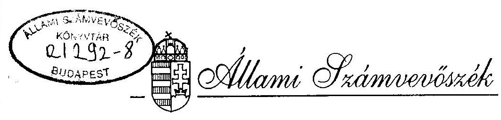
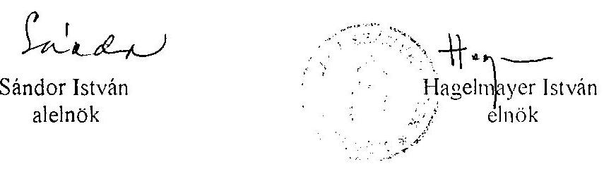
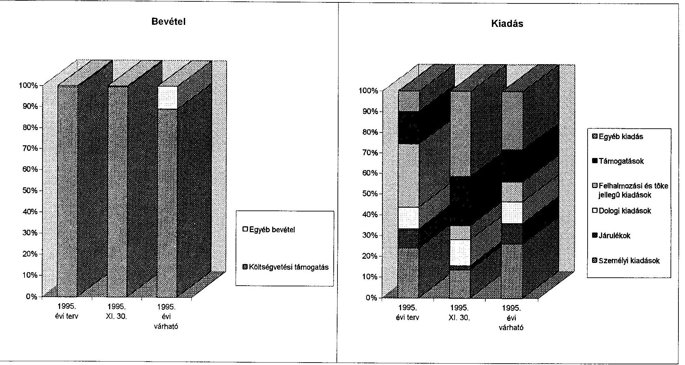

# JELENTÉS 

a Magyarországi Románok Országos Önkormányzata pénzügyi-gazdasági tevékenységének ellenőrzéséről

---

A vizsgálatot irányította:
Nagy József igazgató helyettes

A vizsgálatot vezette:
Bamberger Mária fötandcsos

A vizsgálatot végezte:
Kollár Lászlóné számvevö tandcsos

---

# JELENTÉS   a Magyarországi Románok Országos Önkormányzata pénzügyi-gazdasági tevékenységének ellenőrzéséről 

## I.   A vizsgálat célja, módszere, idöszaka, körülményei

A vizsgálat célja annak megállapítása volt, hogy az országos kisebbségi önkormányzatok pénzügyi-gazdálkodási tevékenységének szabályozottsága, a számviteli és bizonylati rend megfelel-e a törvényi előírásoknak, müködési feltételeik biztosítottak-e?

Az ellenőrzésre az országos kisebbségi önkormányzatok megalakulásának évében került sor.A vizsgálat megállapításait az országos önkormányzatnál megtalálható szabályzatok, bizonylatok, testületi döntések, könyvviteli adatok támasztják alá.

Az ellenőrzés az önkormányzat megalakulásától 1995. november 30-ig terjedő időszakra vonatkozott.

A helyszíni vizsgálati jelentésre az önkormányzat észrevételt nem tett.

## II.   Az ellenőrzés megállapításai

## Az önkormányzat megalakulása

A Magyarországi Románok Országos Önkormányzata (Gyula, Vár u.l.) közgyülése tagjait 1995. március 25.-én választották meg.

A közgyülés május 6-án tartotta alakuló ülését, ahol elfogadták az SzMSz-t, megválasztották az elnökséget és három bizottságot.

---

# Az önkormányzati munka szabályozottsága 

Az önkormányzat feladatait, hatáskörét, az 53 főből álló közgyűlés szerveit, a 15 fös elnökség hatáskörét, a gazdálkodás fontosabb szabályait az SzMSz tartalmazza, azonban ezek gyakorlati végrehajtását, az elnökség, a bizottságok és a hivatal tevékenységének részletesebb szabályozását még nem készítették el. (A végleges kinevezések előtt a lehetősége sem volt adott.)

Számlarenddel és ennek mellékleteként számlatúkörrel rendelkeznek.
A számlarendben a beszámolási, könyvvezetési kötelezettségről, az analitikus nyilvántartásokról, az értékcsökkenés elszámolásának módszeréről, a leltározás- és selejtezés, a költségelszámolás és a könyvviteli zárlat feladatairól rendelkeztek, de a kötelezettség-vállalás, utalványozás, ellenőrzés, pénzkezelés szabályait nem határozták meg.

## Az önkormányzat müködésének feltételei

Az önkormányzat vagyonnal nem rendelkezik. A vizsgálat idejéig nem adták át részükre az 1993. évi LXXVII. tv.

- 62. § (2) bekezdésében - az elhelyezés feltételeinek biztositásához - meghatározott kompenzációs keretet,
- sem a 63. § (4) bekezdésében jóváhagyott 30 millió Ft egyszeri vagyonjuttatást.

Ennek következtében az önkormányzat a gyulai román nyelvủ iskolák kollégiumában bérelt két irodahelyiségben müködik.

A közgyïlés október 21-i ülésén döntött az ideiglenes hivatal felállításáról,
1 fö hivatalvezető
1 fö gazdasági vezető
1 fö osztályvezető
1 fö adminisztrátor
alkalmazásával.
Közülük az adminisztrátort teljes munkaidőben foglalkoztatják, a többiek megbízási szerződéssel végzik feladatukat. A hivatal végleges létszámát 7 fơben határozták meg.

Gyula Város Önkormányzata a 20/1995. III. 3.) Kormányrendelet 3. §. (3) bekezdésének megfelelően felajánlott három ingatlant, amelyek az elhelyezéshez megfelelőek lettek volna, de a tradicionális "román városrésztől" távol estek, ezért kérte az Önkormányzat az ingatlan fek vését is figyelembe venni.

A május 27-én felajánlott - Gyula, Vár u. 16. sz. - ingatlant elfogadták. A 293 m 2 beépített területü épület forgalmi értéke 15,2 millió, a 906 m 2 -es telek 3,2 millió Ft, az ÁFA-val együtt 22,1 millió Ft a vételár.

---

Az épületet az eredeti felújítási, átalakítási tervek szerint 5,4 millió Ft + ÁFA összegből kívánták az Önkormányzat tevékenységéhez megfelelően kialakítani. Ezeket a feltételeket az október 4.-i keltezésű jegyzőkönyvben az érintett felek rögzítették. Az önkormányzat azonban november 19.-én a felújításhoz szükséges összeget bruttó 10,5 millió Ft-ban kérte jóváhagyni.

A Kompenzációs Bizottság intézkedésének elhúzódása mellett gondot okoz, hogy az ingatlant jelenleg bérlő használja. A szerződés szerint a felmondási idő 90 nap.

A kisebbségi országos önkormányzatok többsége budapesti székhelyű, így az országos kormányzati és országgyűlési szervekkel a kapcsolattartás, a rendezvényeken való részvétel könnyen biztosítható. Az ebből adódó hátrány csökkentése érdekében az önkormányzat Budapesten is igényelt ingatlant, de ezt a kérelmet elutasították.

A müködés tárgyi feltételeit minimális szinten - és részben kölcsön vett eszközzel biztositották:

- vásároltak irodabútort, lemezszekrényt, telefont, írógépet;
- használatra kaptak egy számítógépet a román iskolától;
- és lizingelnek egy Opel Vectra gépkocsit.

# Az önkormányzat pénzügyi kapcsolata a helyi kisebbségi önkormányzattal 

A jóváhagyott SzMSz a helyi kisebbségi önkormányzatokkal való gazdasági kapcsolatot nem szabályozta. A kapcsolat viszont a közgyűlés és az elnökség összetétele alapján biztosított. (Pl. a 15 fös elnökségből 11 fő a helyi kisebbségi önkormányzat elnöke.)

Az 1995. évi teljes kiadási elöirányzat 14\%-át helyi kisebbségi önkormányzatok támogatásaként tervezték felhasználni, majd a támogatott kört kiterjesztették az önkormányzattal és egyesülettel nem rendelkező településekre is.

A jóváhagyott 1.050 ezer Ft támogatási keretből november 30-ig 1 millió Ft-ot használtak fel. Ebböl

- a 11 helyi kisebbségi önkormányzat és 3 település román közössége 40-40 ezer Ft támogatásban részesült;
- az elnökséghez eljuttatott kérelmek egyedi elbírálása alapján tíz esetben biztositottak 20-80 ezer Ft közötti céltámogatást helyi kisebbségi önkormányzat, művelődési ház, művészeti együttes részére.

Összességében a helyi kisebbségi önkormányzatok részére biztositott támogatás 850 ezer Ft volt november 30 -ig.

---

# Az önkormányzat költségvetése és teljesitése 

A költségvetési terv jóváhagyása a közgyűlés jogköre.
Az dlnökség szeptember 29.-én tárgyalta a költségvetési tervezetet, majd a közgyülés október 21.-én hagyta jóvá. Tehát gyakorlatilag a megalakulás után hét hónappal, a költségvetési támogatás első részének utalása után három hónappal később volt jóváhagyott költségvetési tervük.

Az SzMSz-nek megfelelően megválasztották ugyan a gazdasági, valamint a pénzügyíellenőrző bizottságot, de ezek tevékenysége a vizsgálat idejéig nem volt érzékelhető. A költségvetési terv, valamint a számlarend elkészítésére - a gazdasági vezetői tevékenységet ellátó személy kapott megbízást.

Az Országgyülés 77/1995. (VI. 29.) OGY sz. határozata alapján az önkormányzat részére ez évben 7,5 millió Ft költségvetési támogatást biztosítottak. Ennek 44\%-át július 17-én kapták meg, november 30 -ig összesen 6 millió 640 ezer Ft-ot utaltak át a számlájukra. Ezen kívül csak 32 ezer Ft kamat bevételük volt.

A Művelődési és Közoktatási Minisztériummal kötött megállapodás alapján három román nyelvű kiadvány megjelentetéséhez 850 ezer Ft támogatást kapnak 1995-ben.

A bevételek 1995. évi tervezett, november 30-ig ténylegesen befolyt, valamint az év végéig várható adatait a mellélet tartalmazza.
Az 1995. évi kiadások tervezésénél a rendelkezésre álló fedezet, az alapvető feladatellátás mellett a következỏ év elején várható finanszírozási problémákra is számítottak, ezért 860 ezer Ft év végi maradványt is jóváhagytak.

A gazdálkodás tervszerűségét igazolja, hogy a kiadási célokhoz rendelt elöirányzatok és a várható teljesítés között nincs jelentős eltérés. A pénzügyi elszámolásban a felhalmozási és egyéb kiadásoknál megjelenő "tervszerűtlenség" csak technikai jellegü, mivel nem készpénzes vásárlással jutottak gépkocsihoz, hanem költségként elszámolandó lizing-dijjal.

A kiadások tervezett, november 30 -ig elszámolt tényleges, és az év végéig várható ,eljesítését a melléklet tartalmazza.

Az elnökség javaslata alapján jóváhagyott költségvetési terv az alábbii személyi kifizetések elöirányzatait tartalmazza:

- július 1-tól havonta az elnök 50, az alelnökök 10-10 ezer Ft-ot kapnak;
- a közgyülés tagjait 3 ezer, az elnökség tagjait 13 ezer,
- a bizottságok elnökeit
$=$ ha elnökségi tag is 15 ezer,
$=$ ha nem 5 ezer Ft
egyszeri tiszteletdijban részesitik;

---

- a hivatalvezető + egy fő havi 50, a gazdasági vezető havi 30 és egy kisegitő tevékenységet ellátó havi 7 ezer Ft-ot kap a megbizási szerződések alapján;
- a teljes munkaidőben foglalkoztatott adminisztrátor havi munkabére 18 ezer Ft.

A kiadások teljesítése néhány esetben a testületi döntések utólagos értelmezési vitái, illetve az írásba foglalt határozat hiánya miatt nem szabályos. Pl:

- A költségvetés a tiszteletdijak részletezését nem tartalmazza, csak az ehhez szükséges fedezetet. Az elnökség november 2-i üléséről készített jegyzőkönyvben az 1. és a 2. számú határozatokat bruttó juttatásként kellett volna értelmezni, de az elnök kivételével az érintettek ezt nem fogadták el.
- Az elnökségi ülések miatt felmerült utiköltség elszámolására (az igénybe vehető közlekedési eszközre), a kiküldetésekkel kapcsolatos napidijak összegére (ami a gyakorlatban 800 Ft ) nincs írásba foglalt döntés.

# Az önkormányzat számviteli tevékenysége 

Az önkormányzat önként a kettős könyvviteli nyilvántartási formát választotta, így a részletesebb információ kevesebb analitikus nyilvántartás vezetésével rendelkezésre áll.
Tekintettel arra, hogy nem volt vagyona az önkormányzatnak, nem készitettek nyitómérleget.

## Összefoglalás:

Az ellenőrzés során feltárt hibák, hiányosságok és szabálytalanságok részben az induláskor elkerülhetetlen nehézségeket, részben pedig az elkerülhető mulasztásokat tükrözik. Ezzel kapcsolatban kiemelést érdemel, hogy a müködéshez szükséges feltételek biztositása érdekében gyorsabb kormányzati intézkedésekre, a pénzügyi-számviteli folyamatok belső szabályozottsága érdekében pedig további önkormányzati intézkedésre van szükség.

A pénzügyi folyamatok nyilvántartásának gyakorlata üsszeségében megfelel a számviteli törvény elöirásainak. Nyilvántartásaik rendezettek, naprakészek, áttekinthetőek, szakszerűek.

---

# III.   Javaslatok 

Az Állami Számvevőszék javasolja az önkormányzatnak, hogy jelentését az önkormányzat soron következő ülésén tárgyalja meg és a jelentésben rögzített hiányosságok felszámolása érdekében hozzon határozatot határidő és felelős megjelölésével, hogy

- a kötelezettségvállalás, utalványozás, ellenjegyzés és apénzkezelés rendje szabályozott legyen,
- elhatároltak legyenek a feladat- és hatáskörök,
- a hivatal ügyrend és munkaköri leírás alapján, felclősséggel végezhesse tevékenységét,
- az önkormányzat életében fontos gazdálkodási kérdések (pl. képviselöi juttatások) szabályozva legyenek.

Budapest, 1996. február

---

|  A Magyarországi Románok Országos Önkormányzata 1995.évi költségvetése és annak teljesítése |  |  |   |
| --- | --- | --- | --- |
|   |  |  | ezer Fi  |
|  Bevételek és kiadások | 1995. évi
terv | 1995. XI.
30. | 1995. évi
várható  |
|  Költségvetési támogatás | 7500 | 6640 | 7500  |
|  Pályázaton elnyert támogatás | 0 | 0 | 0  |
|  Egyéb bevétel | 40 | 32 | 910  |
|  Bevétel összesen | 7540 | 6672 | 8410  |
|  Folyó kiadások | 2920 | 1188 | 3116  |
|  ebből: személyi kiadások | 1600 | 573 | 1752  |
|  járulékok | 620 | 87 | 662  |
|  dologi kiadások | 700 | 528 | 702  |
|  Felhalmozási és tőke jellegű kiadások | 2050 | 289 | 640  |
|  Támogatások | 1050 | 1000 | 1050  |
|  ebből: helyi kisebbségi önkormányzatok támogatása | 1050 | 850 | 850  |
|  Egyéb kiadás | 660 | 1753 | 1897  |
|  Kiadás összesen | 6680 | 4230 | 6703  |
|  Tartalék | 860 | 2442 | 1707  |

---

# A Magyarországi Románok Országos Önkormányzat 1995.évi költségvetése és annak teljesítése 

