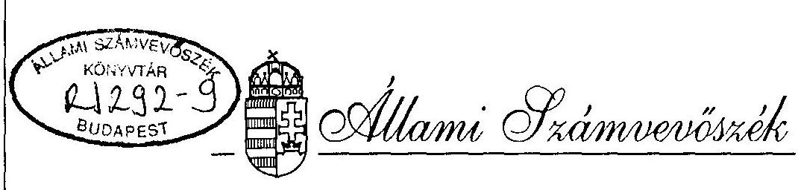
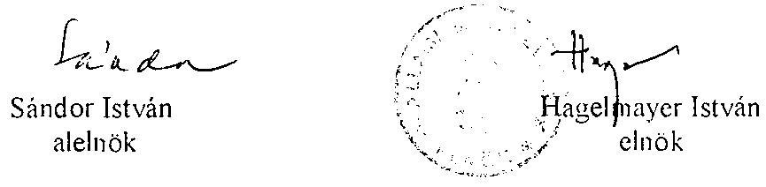
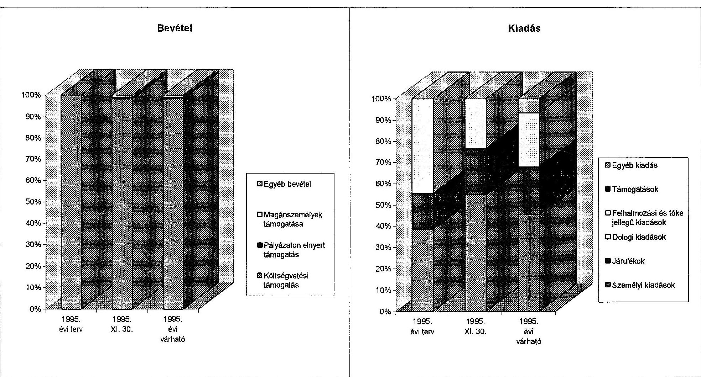

# JELENTÉS 

az Országos Szerb Önkormányzat
pénzügyi-gazdasági tevékenységének ellenôrzéséról

---

A vizsgálatot irányította:
Nagy József igazgató helyettes

A vizsgálatot vezette:
Bamberger Mária fötandcsos
A vizsgálatot végezte:
Gordos László számvevö tanácsos
dr. Spilák Antal számvevö tanácsos

---

# JELENTÉS   az Országos Szerb Önkormányzat pénzügyi-gazdasági tevékenységének ellenőrzéséről 

## I.   A vizsgálat célja, módszere, idöszaka, körülményei

A vizsgálat célja annak megállapítása volt, hogy az országos kisebbségi önkormányzatok pénzügyi-gazdálkodási tevékenységének szabályozottsága, a számviteli és bizonylati rend megfelel-e a törvényi elöirásoknak, müködési feltételeik biztosítottak-e.

Az ellenőrzésre az országos kisebbségi önkormányzatok megalakulásának évében került sor.

A vizsgálat megállapításait az országos önkormányzatnál megtalálható szabályzatok, bizonylatok, testületi döntések, könyvviteli adatok támasztják alá.

Az ellenőrzés az önkormányzat megalakulásától 1995. november 30-ig terjedő időszakra vonatkozott.

A helyszíni vizsgálati jelentésre tett észrevétel alapján néhány kérdésben a jelentés pontositásra került.

## II.   Az ellenőrzés megállapításai

## Az önkormányzat megalakulása

A Szerb Országos Önkormányzat (Budapest, VI. Nagymező u. 49.) a nemzetiségi és ctnikai kisebbségek jogairól szóló 1993. évi LXXVII. törvény alapján 1995. március 18-án alakult meg.

Az Országos Választási Bizottság részéről 1995. március 18-ra összehívott clektori gyülésen 18 szerb kisebbségi önkormányzat 84 elektora ( 16 elektor hiányzott) megválasztotta a 37 fös közgyülés tagjait. Még aznap megtartották az új közgyülés alakuló tilését, melyen

---

megválasztották a Szerb Országos Önkormányzat elnökét, valamint a 11 fös elnökséget. Elfogadták az Alapszabály (Statutum) elveit.

# Az önkormányzati munka szabályozottsága 

Az Alapszabályt a szeptember 30-i közgyűlésen fogadták el. Az Alapszabály a nemzetiségi és etnikai kisebbségek jogairól szóló törvény alapján határozza meg az önkormányzat jogosítványait. Rendelkezik a közgyűlés, a közgyűlés tagjai, bizottságai, az elnök, a három alelnök, illetve az elnökség, továbbá a hivatal feladatairól és hatásköréröl, jogairól és kötelezettségeiről.

A Közgyűlés hatáskörébe tartozik a költségvetés és a zárszámadás jóváhagyása, a vagyonnal való rendelkezés, továbbá a vállalkozói tevékenység folytatására vonatkozó döntések. Más bizottságok mellett létrehozták a Felügyelő Bizottságot, melynek kiemelt feladatait képezik a törvényesség és a pénzügyi-gazdasági müködés szabályszerűségének ellenőrzése, a költségvetési és zárszámadási javaslatok véleményezése.
Az önkormányzat adminisztratív feladatainak ellátására, a választott testületek és szervel döntéseinck előkészitésére, végrehajtására hozták létre az Önkormányzat Hivatalát, melynek müködési szabályait és létszámát a Közgyűlés hagyja jóvá. Az önkormányzat megalakulásától müködő Hivatal az ellenőrzés időpontjában is jóváhagyott müködési szabályzat nélkül folytatja tevékenységét.

A pénzügyi, gazdálkodási feladatok szabályszerűségének biztosítása érdekében a belső szabályzatokat folyamatosan kidolgozták. Elkészült az önkormányzat számlarendje és a számlatükör, a kötelezettségvállalási-, a pénzkezelési-leltározási-selejtezési-bizonylati szabályzat és az önkormányzat gazdasági ügyrendje.

A belső szabályzatok tartalmát illetően az ellenőrzés több pontositást és kiegészitést tart indokoltnak. Így pl:

- a Számlarend nem tér ki a vállalkozási tevékenység végzésének kérdésére és a fökönyvi könyvelés, valamint az analitika kapcsolatára, az értékcsökkenés leírás módjára.
- A Számlatükör több olyan számlát tartalmaz, amelyek a vállalkozói számvitelre specializált számlák (pl. bolti kiskereskedelmi értékesités).
- A Bizonylati Szabályzatban még állóeszköz-fogyóeszköz megnevezés szerepel a tárgyi eszköz és forgóeszköz megnevezés helyett.
- Az elszámolásra felvett pénzeszköz, a napi pénztári pénzkészlet összeghatára nincs megjelölve.

A szabályzatok korrigálásával alkalmassá válhatnak arra, hogy a gazdálkodás és müködés törvényességét és szabályszerűségét biztosítsák.

Az önkormányzat alapszabálya, a közgyülések jegyzökönyvei, határozatai magyar nycliven nem állnak rendelkezésre. Kérésre valamennyi igényelt szerb nyclvü dokumentumot (szóban, vagy írásos formában) lefordították az ellenőrzés részére.

---

# Az önkormányzat müködésének feltételei: 

A nemzetiségi és etnikai kisebbségek jogairól szóló törvény. 63. § (4) bekezdésében rögzített egyszeri vagyonjuttatást - 15.000 ezer Ft-ot - az önkormányzat nem kapta meg.

Jelenleg az önkormányzat a Szerb Demokratikus Szövetség által a föváros VI. kerületi önkormányzatától bérelt helyiségben nyert elhelyezést. A müködés dologi feltételeit szintén a szövetség biztositja. 1995. IX. 1-ig az önkormányzat hivatala alkalmazottainak bérét és egyéb kifizetéseit is a szövetség eszközölte. Az önkormányzat és a szövetség között keretmegállapodás született (1995. VII. 24-én) a használt infrastruktúra költségeinek arányos megosztásáról. A megállapodás szerint a felmerült és "megelölegezett" költségek egymásközti elszámolását 1995. XII. 31-ig elvégzik.

A nemzetiségi és etnikai kisebbségek jogairól szóló törvény 62. § (2) bekezdésében, valamint a kisebbségi önkormányzatok költségvetésének, gazdálkodásának, vagyonjuttatásának egyes kérdéseiről intézkedö 20/1995. (III.3.) sz. Kormányrendelet 3. §-ában foglaltak szerint az önkormányzat elhelyezését szolgáló ingatlan biztositása folyamatban van.

Az önkormányzat Budapest Föváros Önkormányzata főpolgármesterénck címzett április 28-i levelében fogalmazta meg konkrét alapterület megjelölése nélkül - de többcélú hasznosításra is lehetőséget nyújtó - ingatlanra vonatkozó igényćt. Budapest Föváros főpolgár-mester-helyettese a Nemzeti és Etnikai Kisebbségi Hivatal Önkormányzati és Információs Főosztályának vezetőivel egyetértésben - a 20/1995. sz. Kormányrendelet 3. § (3) bekezdésében meghatározottak szerint - május 2-án három ingatlant (a VI. Andrássy út 60., a X. Állomás u. 10/A., valamint a X. Állomás u. 10/B. épületeket, illetve azok igénybejelentés szerinti alapterületű épületrészeit) ajánlott fel a fövárosi székhelyű országos és a fövárosi kisebbségi önkormányzatok elhelyezésére.

Az önkormányzat június 16-i levelében tájékoztatta a Fövárosi főpolgármester helyettesét arról, hogy különféle indokok alapján egyik felajánlott ingatlant sem tartják alkalmasnak számukra. Egyidejüleg jelezték, hogy érdeklödnek a nem hivatalos értesüléseik szerinti újabb lehetőségek iránt (Bp. VI. Benczur u. 2. és Benczur u. 4.). Ez utóbbi két ingatlant a Fövárosi Főpolgármesteri Hivatal június 29-én hivatalosan is felajánlotta. Ezt követöen a Fövárosi Főpolgármesteri Hivatal és az önkormányzat között további levélváltásra már nem került sor. A Bizottság az országos kisebbségi önkormányzatok képviselöinek részvételével megtartott július 12-i ülésének 4/1995. sz. határozata értelmében az országos kisebbségi önkormányzatok - irreálisan rövid időn belül - "1995. július 20 -áig benyújtják a Kompenzációs Bizottsághoz az elhelyezésüket biztositó konkrét igényüket".

Az önkormányzat október 9-én kelt levelében nyújtotta be kérelmét a Bizottsághoz a maga által keresett, Bp. V. Falk Miksa u. 3. sz. alatti $400 \mathrm{~m}^{2}$ alapterületü (II. emeleti), s a felújítási és átalakítási költségeket is figyelembe véve 49,8 millió Ft értékủ ingatlanra vonatkozóan. A Bizottság a kérelmet október 18-i ülésén elfogadta.

Az önkormányzat több, korábbi probléma felvetését megismételve október 28-án a Bizottság elnökéhez irt levelében nyomatékosította aggályait az ingatlan-juttatással összefüggö néhány kérdés jogszabályi rendezetlenségét érintően. Ezek: a kormányhatározat elökészité-

---

se, a székházak önkormányzati igényeknek megfelelő kivitelezésének lebonyolítása, a kifizetések időpontja és módja, az ingyenes használat tartalma, az ÁFA kérdése.

Az önkormányzat müködésének személyi feltételei biztositottak.
A Közgyülés a hivatal felállításával egyúttal meghatározta annak létszámkeretét és bérvonzatát. Jelenleg a hivatalnak 5 fó alkalmazottja van (hivatalvezető, pénzügyes, adminisztrátor (titkárnő), 2 fő nyugdíjas (takarító, könyvtáros).

Az Önkormányzat a müködés és gazdálkodás beindításához szükséges intézkedéseket a megalakulást követően megtette. 1995. VII. 28 -án bankszámlát nyitott a Budapest Bank Rt-nél, majd 1995. XI. 29-én bejelentkezett a Fővárosi és Pest Megyei Egészségügyi Pénztárhoz nyilvántartásbavétel céljából. Az adóhatóság az önkormányzatnak 1995. X. 31-én adta meg az adószámot (18077878-1-01).

# Az önkormányzat pénzügyi kapcsolata a helyi kisebbségi önkormányzatokkal 

A magyarországi szerbek 18 helyi kisebbségi önkormányzatot választottak, 1995-ben megalakult a Budapesti Önkormányzat, 1995. november 19-i választáskor újabb választásra nem került sor.
Az országos önkormányzat és a helyi kisebbségi önkormányzatok között a gazdasági kapcsolatok nem alakuliak ki, a helyi kisebbségi önkormányzatok müködéséhez nem járultak hozzá, illetve támogatást nem nyújtottak részükre.

## A költségvetés tervezése és végrehajtása

Az önkormányzat Közgyűlése 1995. IX. 30-án hagyta jóvá az éves költségvetését.
A költségvetésben a bevételek $100 \%$-át az állami bevételek képezik. A kiadások $50,3 \%$-a személyi jellegü kiadás és annak közterhei. A dologi kiadások az összköltség $40,5 \%$-át, a tartalék $9,2 \%$-át teszik ki.

Az önkormányzat bevételeit és kiadásait a melléklet mutatja be.
November 30 -ig a tényleges bevétel 7.900 ezer Ft volt. Az állami támogatás időarányos részét (a 77/1994. (VI.29.) Ogy. határozat melléklete szerint 8.700 ezer Ft) az Önkormányzat megkapta. Müködési-pénzellátási zavart okozott, hogy a támogatás első tétele VIII. 2-án, az önkormányzat megalakulását követően 4 hónappal került kiutalásra. Addig az ideig a Szövetség elölegezte meg a müködés költségeit. A bevételeket cgy magánszemély támogatásán túl a Müvelődési és Közoktatási Minisztérium céljellegü ( 60 ecer Ft-os) átutalása és 70 ezer Ft kamatbevétel növelte.

A kiadások XI. 30-i teljesitése nem az időarányos tényleges ráforditást mutatja, tekintettel arra, hogy a Szövetség által eszközölt költségek elszámolása - a megállapodás szerint - csak XII. hóban történik meg.

---

A várható éves kiadás $60,2 \%$-át a személyi jellegü kiadások és azok közterhei (TB, munkaadói járulék) teszik ki.
A Közgyűlés a tisztségviselőknek és az önkormányzat hivatala alkalmazottainak az alábbi havi tiszteletdijat, illetve illetményt állapított meg:

- Önkormányzat elnöke
- Alelnök
- Alelnök (esetenkénti megbizás)
- Hivatalvezető (6 órás)
- Pénzügyes
- Adminisztrátor (titkárnő)
- Nyugdijas takarítónő
- Részfoglalkozási könyvtáros

A dologi kiadások várható összege 2.000 ezer Ft. Felhalmozási jellegü kiadásra (számitógép-vásárlás) 518 czer Ft-ot fognak forditani. A biztonságos gazdálkodás és az 1996-ra való átmenet zavarmentessége érdekében 1.000 czer Ft tartalékot képez az önkormányzat.

# Az önkormányzat számviteli tevékenysége 

Az önkormányzat az 1995. március 18-i megalakulásakor vagyonnal és egyéb eszközzel nem rendelkezelt, ezért az 1995. V. 2-án készített "Egyszerüsített éves beszámoló" eszközés forrásoldala nulla.

Az önkormányzat 1995. IX. 1-én szerződést kötött a MITANA Számviteli Gazdasági Szolgáltató Kft-vel (havi 30 ezer Ft + ÁFA térítés ellenében) a számviteli rendszer kialakítására és az elszámolás, könyvelés folyamatos végzésére.

A MITANA a SIGMA CONTO önkormányzati program alapján dolgozik, amely programot társadalmi szervek könyvvezetési követelményeihez átalakitható.

Vállalkozási tevékenységet nem végez. Három naplót (Bank, Pénztár, Vegyes) vezet és az analitikus nyilvántartásokat is felfektették.

Havonta készítenek 2 fókönyvi kivonatot - a tárgyhóra és kumuláltan az év elejétől.
A vizsgálat megállapította, hogy a könyvelés folyamatos és naprakész, az eszközök és források változása nyomon követhető. Az 1995. XI. 30-i állapot felülvizsgálata során a 9 számlaosztály, illetve az 5-ös és 8-as számlaosztály különbsége megegyezett az eszközök és források különbségével.

---

# Összefoglalás 

Az Ország Szerb Önkormányzat pénzügyi-gazdálkodási tevékenységének szabályozottsága, számviteli és bizonylati rendje összességében megfelel a törvényes elöirásoknak és alkalmas arra, hogy kisebb pontositások után megfelelő információkat szolgáltasson az önkormányzat irányitói részére. Az önkormányzat müködési feltételei - a várható kormányzati intézkedések után - 1996-ban megteremtődnek.

## III.   Javaslatok

Az Állami Számvevőszék javasolja az önkormányzatnak, hogy jelentését az önkormányzat soron következő ülésén tárgyalja meg és szükség esetén hozzon határozatot a vizsgálat által pontositani ajánlott szabályozási kérdésekben.

Budapest, 1996. február

---

| A Szerb Országos Önkormányzat 1995.évi költségvetése és annak teljesítése |  |  |  |
| :--: | :--: | :--: | :--: |
| Bevételek és kiadások | 1995. évi   terv | 1995. XI.   30. | 1995. évi   várható |
| Költségvetési támogatás | 8700 | 7760 | 8700 |
| Egyéb támogatások | 0 | 70 | 70 |
| ebből: pályázaton elnyert támogatás | 0 | 60 | 60 |
| magánszemélyek támogatása | 0 | 10 | 10 |
| Egyéb bevétel | 0 | 70 | 80 |
| Bevétel összesen | 8700 | 7900 | 8850 |
| Folyó kiadások | 7901 | 2913 | 7332 |
| ebből: személyi kiadások | 3039 | 1597 | 3561 |
| járulékok | 1337 | 635 | 1771 |
| dologi kiadások | 3525 | 681 | 2000 |
| Felhalmozási és tőke jellegủ kiadások | 0 | 0 | 518 |
| Támogatások | 0 | 0 | 0 |
| ebből: helyi kisebbségi önkormányzatok támogatása | 0 | 0 | 0 |
| Egyéb kiadás | 0 | 0 | 0 |
| Kiadás összesen | 7901 | 2913 | 7850 |
| Tartalék | 799 | 4987 | 1000 |

---

# A Szerb Országos Önkormányzat 1995.évi költségvetése és annak teljesítése 

