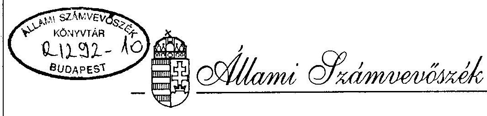
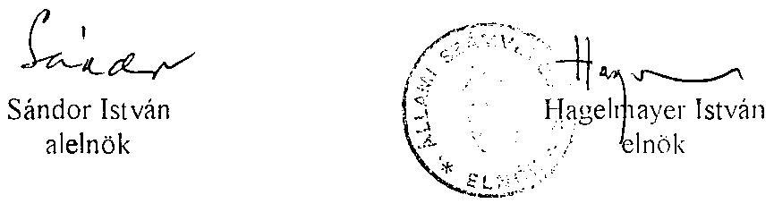
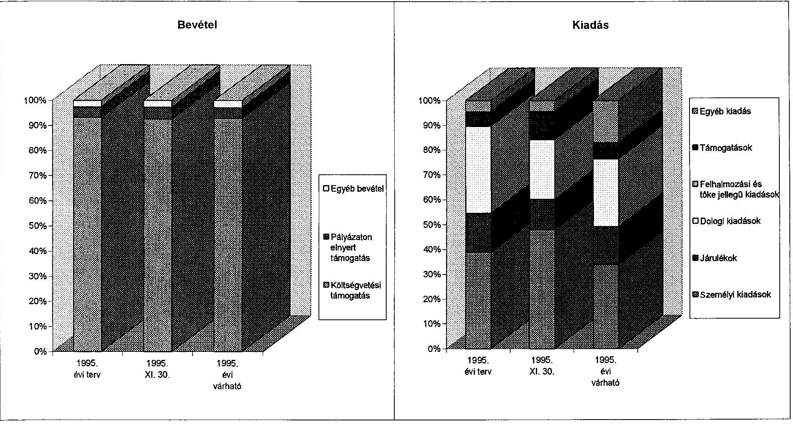

# JELENTÉS 

az Országos Szlovák Önkormányzat
pénzügyi-gazdasági tevékenységének ellenőrzéséről

---

A vizsgálatot irányította:
Nagy József igazgatóhelyettes

A vizsgálatot vezette:
Bamberger Mária
fötanácsos
A vizsgálatot végezte:
Gordos László
számvevő tanácsos
dr. Spilák Antal
számvevő tanácsos

---

# JELENTÉS   az Országos Szlovák Önkormányzat pénzügyi-gazdasági tevékenységének ellenőrzéséről 

## I.   A vizsgálat célja, módszere, időszaka, körülményei

A vizsgálat célja annak megállapítása volt, hogy az országos kisebbségi önkormányzatok pénzügyi-gazdasági szabályozottsága, a számviteli és bizonylati rend megfelel-e a törvényi előírásoknak, működési feltételeik biztosítottak-e.

Az ellenőrzésre az országos kisebbségi önkormányzatok megalakulásának évében került sor.
A vizsgálat megállapításait az országos önkormányzatnál megtalálható szabályzatok, bizonylatok, testületi döntések, könyvviteli adatok támasztják alá.

Az ellenőrzés az önkormányzat megalakulásától 1995. november 30-ig terjedő időszakra vonatkozott.

A helyszíni vizsgálati jelentésre az önkormányzat észrevételt nem tett.

## II.   Az ellenőrzés megállapításai

## Az önkormányzat megalakulása

Az Országos Szlovák Önkormányzat (Budapest, VI., Nagymező u. 49.) a nemzetiségi és etnikai kisebbségek jogairól szóló 1993. évi LXXVII. tv. alapján 1995. IV. 12-én alakult meg.

Az alakuló közgyűlésen a 40 kisebbségi önkormányzat által delegált 206 elektor megválasztotta a közgyűlés tagjait (53 fő), az Országos Szlovák Önkormányzat elnökét és elnökhelyettesét, 3 alelnökét, valamint az önkormányzat hivatalának vezetőjét.

---

# Az önkormányzati munka szabályozottsága 

Az Alapszabályt (SzMSz) az 1995. IX. 29-i közgyűlés hagyta jóvá végleges formában, mely rendelkezik az önkormányzat feladatairól és hatásköréről, az önkormányzat szervezeteiről (elnökség, bizottságok, hivatal), a képviselők jogairól és kötelezettségeiről. Az Alapszabály szerint 7 bizottságot hoztak létre, köztük a Pénzügyi Ellenőrző Bizottságot.

Az önkormányzat a működésével, a döntések előkészítésével és végrehajtásával kapcsolatos szakmai, valamint ügyviteli feladatok ellátására hivatalt állított fel, melynek vezetőjét a közgyűlés jóváhagyásával az elnök nevezi ki négy évre. A hivatal belső szervezetét, alkalmazottai létszámát és bérkereteit a közgyűlés állapítja meg, illetve hagyja jóvá.

Az önkormányzat vagyonáról, gazdálkodásáról az Alapszabály (SzMSz) rendelkezik.
A Közgyűlés hatáskörébe tartozik a költségvetés és a zárszámadás jóváhagyása, a rendelkezésre álló vagyon és tulajdonosi jogok kizárólagos gyakorlása.

A működés és gazdálkodás szabályszerűségét biztosító szabályzatokat folyamatosan kidolgozták.

Elkészült az önkormányzat számlarendje és a számlatükör, a házipénztár-kezelés szabályzata, valamint az önkormányzat hivatala ügyrendjének javaslata. Ez utóbbi rendelkezik az utalványozás, ellenőrzés, a bankszámla feletti rendelkezés jogosultságáról.
A belső szabályzatok - némi kiegészítéssel és pontosítással - alkalmasak arra, hogy a gazdálkodás és működés törvényességét és szabályszerűségét biztosítsák. Pontosítást, kiegészítést igénylő kérdések pl. az alábbiak:
nem szerepel a Pénztárkezelési Szabályzatban az elszámolásra kiadott pénzeszközök felső határa, a pénztárosi feladatok között a szigorú számadású nyomtatványok vezetési kötelezettsége; a számlarendből hiányzik az 5127 számú Bérleti díj-számla; a számlarend részét képező Leltározási Szabályzat nem tér ki az év végi záráskor szükséges eszközök és források leltározására, egyeztetésére.

Az önkormányzat Alapszabálya (SzMSz) és egyéb szabályzatai, a gazdálkodás megítéléséhez szükséges dokumentumok magyar nyelven is rendelkezésre állnak.

## Az önkormányzat működésének feltételei

Az önkormányzat működésének, vagyoni-tárgyi, személyi feltételeinek kialakítása nagyrészt megtörtént, illetve folyamatban van.

Az önkormányzat ideiglenesen a Magyarországi Szlovákok Szövetsége által a Főváros VI. kerületi önkormányzattól bérelt helyiségekben kapott elhelyezést.

A Fővárosi Főpolgármesteri Hivatal által a Nemzeti Etnikai Kisebbségi Hivatal egyetértésével felajánlott 3 ingatlan közül egyik sem felelt meg az önkormányzat igényeinek és bejelentették, hogy önállóan járnak el megfelelő ingatlan felkutatásában. Az önkormányzat a XI. Fadrusz u. 11/a. ingatlant találta megfelelőnek az új székház kialakítására. Jelenleg a vizsgálat ideje alatt - a Kincstári Vagyonkezelő Szervezet közreműködésével folynak a vásárlással kapcsolatos tárgyalások és szerződéskötési előmunkálatok. Az ingatlan állami tulajdonba vételét követően az önkormányzat fogja örökös bérleményként megkapni. Bizonytalan az önkormányzat vezetése a tekintetben, hogy milyen forrásból fogják a székház berendezéseit és felszereléseit beszerezni, illetve biztosítani.

A működés dologi feltételeit szintén a Szövetség biztosítja. A költségtérítés mértékében az önkormányzat és a szövetség megállapodott.

Az önkormányzat működésének személyi feltételei biztosítottak. Az elnökség által jóváhagyott hivatali alkalmazottak létszáma 7 fő (1 főkönyvelő, 1 pénzügyi előadó, 3 szakreferens, 1 titkárnő, 1 gépkocsivezető). Az alkalmazottak 1995. VII. 1-vel léptek az önkormányzattal munkaviszonyba.

Az önkormányzat a működés és gazdálkodás beindításához szükséges intézkedéseket a megalakulást követően folyamatba tette. 1995. IV. 12-én bejelentkezett a Fővárosi és Pest Megyei Egészségügyi Pénztárhoz és az adóhatósághoz nyilvántartásba vétel céljából. 1995. V. 30-án bankszámlát nyitott a Dunabank Rt-nél.

# Az önkormányzat pénzügyi kapcsolata a helyi kisebbségi önkormányzatokkal 

A magyarországi szlovákok 40 helyi kisebbségi önkormányzatot választottak (ez az 1995. XI. 19-i választás során 13-mal bővült). Jelenleg 51 működik, ebből 6 települési önkormányzat (Pilisszántó, Répáshuta, Dunaegyháza, Felsőpetény, Bér, Ösagárd).

Az országos önkormányzat és a helyi kisebbségi önkormányzatok között a gazdasági-pénzügyi kapcsolatok kialakultak, működéshez való hozzájárulásra, illetve közvetlen támogatásra is sor került. A támogatás mértéke az országos önkormányzat összkiadásainak 6,5%-át teszi ki.

## Az önkormányzat költségvetése és teljesítése

Az elnökség által elkészített 1995. évi költségvetési tervezetet a közgyűlés IX. 29-i ülése változtatás nélkül hagyta jóvá, 19.950 ezer Ft összegben.

A költségvetési bevételek döntő hányadát (93,2%) az állami támogatás biztosítja. A költségvetésben a személyi jellegű kiadásokat és azok közterheit az összköltség 54,6%-ában állapították meg.

A dologi jellegű kiadásokat a nyomda-, irodaszer-, posta-, energia-költség, az utazási költségtérítés és a működéshez szükséges egyéb kiadások képezik.

A biztonságos gazdálkodás és az 1996. évre történő zavartalan átmenet érdekében a közgyűlés 3.069 ezer Ft költségvetési tartalékot képzett.

---

Az országos önkormányzat bevételeit és kiadásait a melléklet mutatja.
Az állami támogatás időarányos részét az önkormányzat megkapta. Működési-pénzellátási zavart okozott, hogy a támogatás első tétele mintegy három hónappal a megalakulását követően került kiutalásra. Ez idő alatt a Szlovákok Szövetsége előlegezte a működéshez szükséges pénzeszközöket.

A bevételek között a Művelődési és Közoktatási Minisztérium által a nemzetiségi anyanyelvű könyvkiadás támogatására meghirdetett és elnyert 850 ezer Ft pályázati támogatás szerepel, valamint az egyéb bevételek között a kamat és bérleti díj összege. Ez évben alapítványok és magánszemélyek nem támogatták az önkormányzat működését.

A közgyűlés a költségvetésben rögzítette a tisztségviselők és alkalmazottak bérét és a tiszteletdíjakat.

# Kiadások 

## Munkabérek:

| Elnök | 102.000.-Ft/hó x 6 hónap | 612.000.- |
| :--: | :--: | :--: |
| Elnökhelyettes | 90.000.-Ft/hó x 6 hónap | 540.000.- |
| Hivatalvezető | 62.000.-Ft/hó x 6 hónap | 372.000.- |
| Szakreferens I. | 52.000.-Ft/hó x 6 hónap | 312.000.- |
| Szakreferens II. | 41.000.-Ft/hó x 6 hónap | 246.000.- |
| Szakreferens III. (új) | 35.000.-Ft/hó x 3 hónap | 105.000.- |
| Gazd. el. I., II., III. | 43.400.-Ft/hó x 6 hó x 3 fő | 781.200.- |
| Titkárnő (új) | 25.000.-Ft/hó x 3 hónap | 75.000.- |
| Gépkocsivezető (túlóradíj) | 41.400.-Ft/hó x 6 hónap | 248.000.- |
|  | 10.000.-Ft/hó x 6 hónap | 60.000.- |

Tiszteletdíjak:

| Alelnök | 3 fő | 25.000.-Ft/hó x 6 hónap | 450.000.- |
| :-- | --: | :-- | --: |
| Biz. elnökök | 6 fő | 10.000.-Ft/hó x 6 hónap | 360.000.- |
| Biz. tagok | 22 fő | 3.000.-Ft/hó x 4 alkalom | 264.000.- |
| Közgy. tagok | 51 fő | 3.000.-Ft/hó x 3 alkalom | 459.000.- |

1995-ben a XII. 31-ig várható személyi kiadások és közterhei (TB, munkaadó járulék) az összkiadás 49,1%-át teszik ki. Itt szükséges megjegyezni, hogy a hivatal felállítására és a bérek elszámolására VII. 1-től került sor. 1996-ban - változatlan bérszinvonallal számolva - a személyi kiadások és közterhei mintegy kétszeresét fogják kitenni az 1995. évi mértéknek.

A dologi kiadások várható 4.882 ezer Ft összegét a Hivatal működési adminisztrációs költségei (bérleti díjak, gépkocsi-használat, posta, rendezvényköltségek stb.) képezik.

---

A támogatások (összesen 970 ezer Ft) a helyi kisebbségi önkormányzatok (640 ezer Ft), iskolák, intézetek, művelődési házak (215 ezer Ft) és a helyi szlovák szervezetek (115 ezer Ft) működéséhez, fenntartásához és egyes feladatokhoz való hozzájárulás céljából kerültek felhasználásra.

Az önkormányzat ez évben még különféle beszerzéseket tervez (berendezések, gépek stb.) és várhatóan 2.028 ezer Ft tartalékkal zárja a költségvetési évet.

# Az önkormányzat számviteli tevékenysége 

Az önkormányzat - mint társadalmi szervezet - a 114/1992. (VII.23.) és a 157/1992. (XI.4.) Kormányrendeletek alapján végzi gazdálkodási tevékenységét. Az önkormányzat kettős könyvvitelt vezet és az év végén egyszerűsített éves beszámolót készít. A számlarendben megfogalmazásra került a vállalkozási tevékenység végzésének lehetősége, illetve ennek elkülönített nyilvántartási kötelezettsége. 1995-ben vállalkozási jellegű tevékenységet nem végeztek.
Kialakították az analitikus nyilvántartás rendszerét.
A vizsgálat megállapította, hogy a könyvelés folyamatos, az eszközök és források változása nyomon követhető és a számviteli törvényt, továbbá a vonatkozó kormányrendeleteket betartják, bár nyitómérleget nem készítettek.

Az országos önkormányzat számviteli-pénzügyi folyamatainak nyilvántartását, elszámolását az 1990-ben megszűnt Nemzetiségi Szövetségek Gazdasági Hivatalának utód irodája végzi a Magyarországi Horvátok Országos Önkormányzatáéval együtt. A számviteli elszámolás manuális (kézi) módszerrel történik. Az ellenőrzés során a főkönyvi számlák átvizsgálásakor néhány könyvelési, elszámolási probléma adódott (pl. külföldi kiküldetések elszámolásakor közvetlenül az 5-ös számlaosztályba könyvelnek, a felvett kiküldetési díjat nem vezetik át a 361-es számlára; a belföldi utazási költségek elszámolásának dokumentálása hiányos, az utazási jegyeket - vagy számlákat - nem csatolják az elszámoláshoz).

## Összefoglalás

Az Országos Szlovák Önkormányzat pénzügyi-gazdálkodási tevékenységének szabályozottsága, számviteli és bizonylati rendje összeségében megfelel a törvényes előírásoknak és alkalmas arra, hogy kisebb pontosítások után megfelelő információkkal szolgáljon az önkormányzat irányítói részére. Az önkormányzat működési feltételei - a várható kormányzati intézkedések után - 1996-ban megteremtődnek.

---

# III.   Javaslatok 

Az Állami Számvevőszék javasolja az önkormányzatnak, hogy jelentését az önkormányzat soron következő ülésén tárgyalja meg és a jelentésben rögzített hiányosságok felszámolása érdekében hozzon határozatot határidő és felelős megjelölésével, hogy

- a jelentésben szereplő belső szabályozások pontatlanságai megszűnjenek és a szükséges kiegészítések megtörténjenek,
- a pénzügyi-számviteli elszámolások szabályszerűek legyenek.

Budapest, 1996. február

---

| A Szlovák Országos Önkormányzat 1995. évi költségvetése és annak teljesítése |  |  |   |
| --- | --- | --- | --- |
|   |  |  | ezer Ft  |
| Bevételek és kiadások | 1995. évi terv | 1995. XI. 30. | 1995. évi várható  |
| Költségvetési támogatás | 18600 | 16560 | 18600  |
| Pályázaton elnyert támogatás | 850 | 850 | 850  |
| Egyéb bevétel | 500 | 468 | 568  |
| Bevétel összesen | 19950 | 17878 | 20018  |
| Folyó kiadások | 15131 | 7089 | 13698  |
| ebből: személyi kiadások | 6576 | 4036 | 6082  |
| járulékok | 2644 | 1021 | 2734  |
| dologi kiadások | 5911 | 2032 | 4882  |
| Felhalmozási és tőke jellegű kiadások |

 0 | 0 | 0  |
|  Támogatások | 1000 | 970 | 1170  |
|  ebből: helyi kisebbségi önkormányzatok támogatása | 0 | 0 | 0  |
|  Egyéb kiadás | 750 | 362 | 3062  |
|  Kiadás összesen | 16881 | 8421 | 17930  |
|  Tartalék | 3069 | 9457 | 2088  |

---

# A Szlovák Országos Önkormányzat 1995. évi költségvetése és annak teljesítése 

