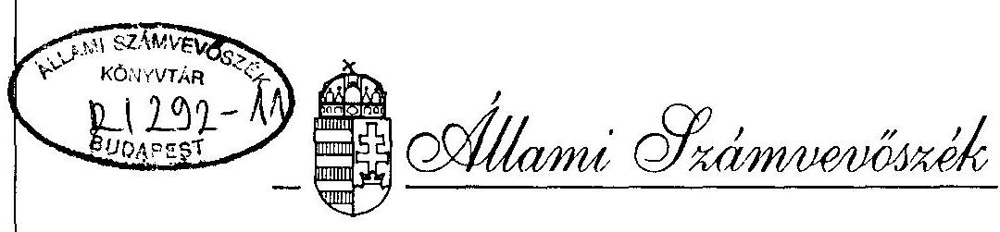
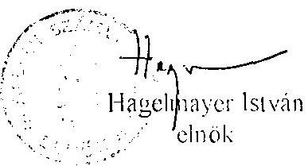
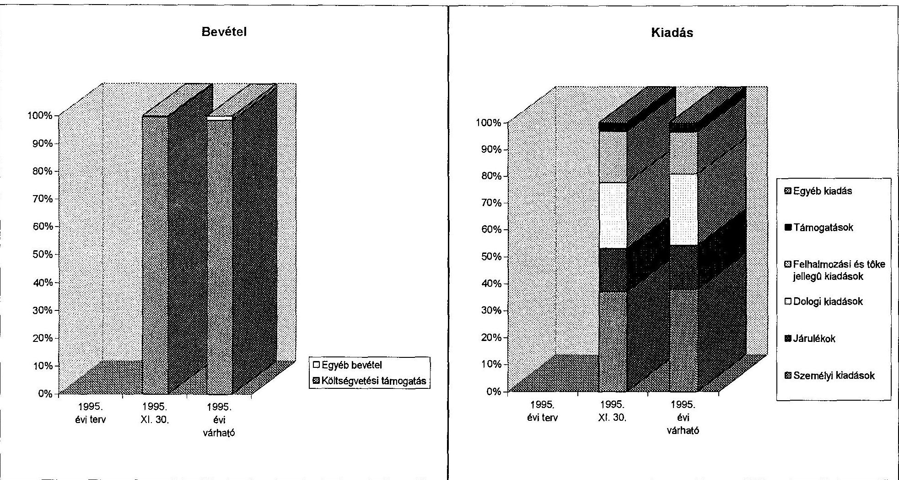
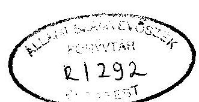
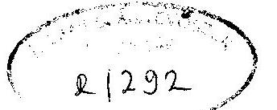
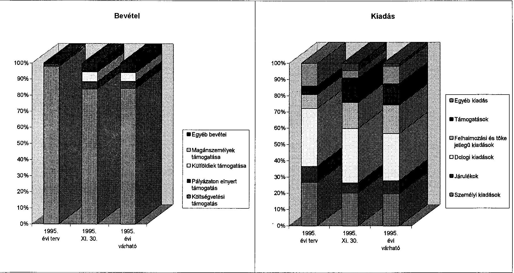
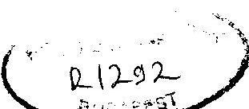
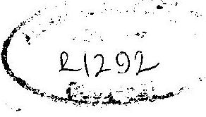
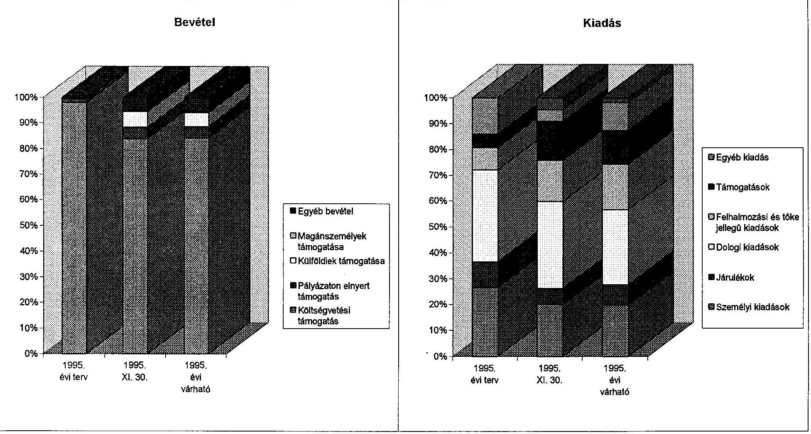

# JELENTÉS 

az Országos Szlovén Kisebbségi Önkormányzat
pénzügyi-gazdasági tevékenységének ellenőrzéséről

---

A vizsgálatot irányította:
Nagy József igazgatóhelyettes

A vizsgálatot vezette:
Bamberger Mária főtanácsos
A vizsgálatot végezte:
Kántor Ilona számvevő

---

# JELENTÉS   az Országos Szlovén Kisebbségi Önkormányzat pénzügyi-gazdasági tevékenységének ellenőrzéséről 

## I.   A vizsgálat célja, módszere, időszaka, körülményei

A vizsgálat célja annak megállapítása volt, hogy az országos kisebbségi önkormányzatok pénzügyi-gazdálkodási tevékenységének szabályozottsága, a számviteli és bizonylati rend megfelel-e a törvényi előírásoknak, működési feltételeik biztosítottak-e.

Az ellenőrzésre az országos kisebbségi önkormányzatok működésének megkezdése évében került sor.
A vizsgálat megállapításait az országos önkormányzatnál megtalálható szabályzatok, bizonylatok, testületi döntések, könyvviteli adatok támasztják alá.

Az ellenőrzés az önkormányzat megalakulásától 1995. november 30-ig terjedő időszakra vonatkozott.

Az önkormányzatnál folytatott helyszíni vizsgálati jelentés az önkormányzat elnöke által tett kiegészítéssel módosításra került.

## II.   Az ellenőrzés megállapításai

## Az önkormányzat megalakulása

Az Országos Szlovén Kisebbségi Önkormányzat (Felsőszölnök, Fő utca 5.) megválasztására az 1995. március 3-án megtartott elöljárói gyűlésen került sor.
A jelenlévő kisebbségi elöljárók száma 25 fő volt, mely azonos az összes megválasztott kisebbségi elöljárók létszámával.
Az 1993. évi LXXVII. törvény 33. §/2/ bekezdés 2. mondatának és a 63. §/3/ bekezdésének megfelelően az országos kisebbségi önkormányzat megválasztott közgyűlési tagjainak száma 21 fő.

---

A régióban az országos önkormányzat megalakulását megelőzően öt településen alakult kisebbségi önkormányzat, Kétvölgyön és Szakonyfaluban pedig egy-egy elöljáró képviselte a helyi kisebbséget. 1995. november 19-től már Kétvölgy községben is van választott kisebbségi települési önkormányzat.

A közgyűlés 1995. március 30-án Szentgotthárdon, a Magyarországi Szlovének Szövetsége székhelyén tartotta alakuló ülését, ahol megválasztották az elnököt és az alelnököket, továbbá döntés született az Országos Szlovén Kisebbségi Önkormányzat székhelyéről.

A közgyűlés tagjainak véleménye megoszlott a szóba került két lehetőség, Szentgotthárd és Felsőszölnök között. Végül a szavazás a felsőszölnöki székhely mellett döntött.

# Az Önkormányzat működési feltételei 

Az Országos Szlovén Kisebbségi Önkormányzat elnöke - aki egyúttal Felsőszölnök község polgármestere is - a kisebbségi önkormányzat figyelmébe ajánlotta a székhelyként a polgármesteri hivatal helyiségeit plusz az iskola egy részét. Végül a felsőszölnöki önkormányzat képviselő-testülete 24/1995. /VI.01./ számú határozatával - a 20/1995. /III.3./ sz. Kormányrendelet 3. §/3/ bekezdésében rögzítettek 3 ingatlan helyett - 2 ingatlant ajánlott fel azzal, hogy az országos kisebbségi önkormányzat válassza ki a számára legmegfelelőbbet. Ezek:

1) Felsőszölnök 103. sz. tulajdoni lap, 3. hrsz-ű, Fő u. 5. sz. alatti szolgálati lakás (lakóház, udvar);
2) Felsőszölnök 216. sz. tulajdoni lap, 127. hrsz-ű, Fő u. 44. sz. alatti szolgálati lakás, orvosi rendelő (lakóház, udvar).

A kisebbségi önkormányzat 1995. június 30-án helyszíni szemlét követően 1/1995. számú határozatában a Felsőszölnök, Fő u. 5. sz. alatti ingatlan mellett döntött, de közben bejelentette igényét a budapesti VI. ker. Nagymező u. 49. II. emelet 5. sz. ingatlanra is. A budapesti ingatlanigényét az országgyűlési bizottsággal, szervezetekkel, kormányzattal való közvetlenebb kapcsolattartással, a rendezvényeken történő, kevesebb utazási nehézséggel járó részvétellel indokolta.
A Felsőszölnökön elfogadott ingatlant a helyi képviselőtestület az országos kisebbségi önkormányzat rendelkezésére bocsátotta, aki azt használja. A használatra vonatkozóan szerződést, megállapodást nem kötöttek.
Az 1995. július 14-én elkészült értékelési bizonyítvány az ingatlan forgalmi értékét kerekítve 3.366 ezer Ft-ban határozta meg, egyúttal 910 ezer Ft-ra becsülte a részleges felújítás költségeit.
A Kincstári Vagyonkezelő Szervezet kezdeményezésére a körmendi Gamesterv Építőipari Tervező Kivitelező Kft. részletes tervet készített, mely a várható felújítási költségeket 1.179,2 ezer Ft + ÁFA-ban prognosztizálta.

A helyszíni vizsgálat során nyert információk alapján az ingatlan vételárát mind a helyi önkormányzat, mind a Kincstári Vagyonkezelő Szervezet a becsült értékben, azaz 3.366 ezer Ft-ban elfogadta, az adásvételi szerződés megkötésére viszont még nem került sor. A felújítás - ugyancsak a kisebbségi önkormányzattól nyert információ alapján - várhatóan 1996. tavaszán kezdődik.

---

A Budapesten kért ingatlan-igény elutasítását követően az önkormányzat 1995. október 6-án megbízási szerződést kötött a budapesti Pannon Consult BT-vel Budapest belterületén lévő irodaházrész felkutatására irányuló ingatlanközvetítői tevékenységre. A megbízást követően a megfelelőnek tűnő, Budapest V. kerület, Régiposta u. 5. szám alatt található 24324/A/10, 24324/A/11. ingatlanok értékbecslésével az UNI Ingatlanbefektetési Tanácsadó BT-t bízta meg az önkormányzat 1995. október 30-án. Az önkormányzat tájékoztatása szerint az értékbecslés elkészült, de anyagi akadály miatt pillanatnyilag nincs lehetőség a megvásárlásra.

A használatba vételkor szinte teljesen üres épületben a működés tárgyi feltételeit minimális szinten, zömében vásárolt eszközökkel biztosítják:

- vásárolt tárgyi eszközök: irodabútor, fénymásoló, telefon és telefax, írógép, gázkályha;
- használatba vett, az épületben használatba vételekor meglévő tárgyi eszközök: olajkályhák és cserépkályha, gáztűzhely, konyhaszekrény;
- térítésmentesen átvett tárgyi eszköz: egy Renault II GTL személygépkocsi, melyet a Magyarországi Szlovének Szövetsége bocsátott az önkormányzat rendelkezésére.

Az önkormányzat közgyűlése 1995. szeptember 15-i ülésén 2/1995. számú határozatával megválasztotta elnökségét, mely az elnök és a 2 alelnök kívül Alsószölnök, Apátistvánfalva és Orfalu egy-egy képviselőjéből áll. 3/1995. számú határozatával döntött az önkormányzat hivatalának felállításáról 1 fő alkalmazásáról, aki teljes munkaidőben a gazdasági és titkársági feladatok ellátásával megbízott.

A közgyűlés 5/1995. számú határozatával meghatározta a testület személyi jellegű juttatásait, mely szerint:

- az elnök 20 e Ft/hó
- az alelnökök 10 e Ft/hó
- a budapesti képviselő 20 e Ft/hó
- a képviselők 6 e Ft/hó
tiszteletdíjban részesülnek 1995. május 1-től kezdődően.
A 3/1995. sz.határozat alapján a gazdasági ügyintéző havi munkabére 35 ezer Ft.
Az Országos Takarékpénztár Bank Rt. Szentgotthárdi Fiókjával 1995. július 28-án megkötött bankszámlaszerződés augusztus 1-től van érvényben.

# Az önkormányzati munka szabályozottsága 

Az önkormányzat jóváhagyott Szervezeti és Működési Szabályzattal a helyszíni vizsgálat időszakában nem rendelkezett. A közgyűlés 1995. június 30-i és szeptember 15-i ülésén is foglalkozott az SzMSz előkészítésével. Egy munkapéldány már elkészült. Azt véleményezésre a Nemzeti és Etnikai Kisebbségi Hivatalhoz továbbították. Az önkormányzat december 28-án elfogadta az SzMSz-t, és meghatározta 1996. évi koncepcióit is.

---

Az önkormányzat számlarenddel nem rendelkezik. Nem meghatározott a számviteli politika, a könyvvezetési és beszámolási kötelezettség, az analitikus nyilvántartások köre és kapcsolata a főkönyvi könyveléssel, az értékcsökkenés elszámolásának módszere, a leltározás, selejtezés, a könyvviteli zárlat, a házipénztári pénzkezelés, a kötelezettségvállalás, utalványozás, ellenjegyzés rendje.

# Az önkormányzat pénzügyi kapcsolata a helyi kisebbségi önkormányzatokkal 

Az országos önkormányzatnak a helyi kisebbségi önkormányzatokkal való kapcsolata nem szabályozott, de mégis élő, mivel az országos önkormányzat legtöbb tagja egyben a kisebbségi önkormányzat tagja és sokan egyben a helyi önkormányzat képviselői is.
A helyi kisebbségi önkormányzatok számára biztosított támogatás 60 ezer Ft volt november 30-ig. Ezt az összeget a Szentgotthárd-Rábatótfalu Szlovén Kisebbségi Önkormányzat részére rendezvényéhez történő hozzájárulásként adták.

## Az önkormányzat költségvetése és teljesítése

A megalakulást követően az önkormányzat 1995. évre vonatkozóan költségvetését nem állította össze.

A helyszíni ellenőrzés egy 1995. augusztus 30-án készült - 1995. évi árakon alapuló - 1996. évi tervezett előirányzattal találkozott, mely 29,7 millió Ft-ban prognosztizálja a várható kiadásokat. Ez a tervkoncepció azonban a források megállapításának hiánya miatt nem teljes.

Az Országgyűlés 77/1995. /VI. 29./ OGY sz. határozata alapján az önkormányzat 1995. évben 6.500 ezer Ft költségvetési támogatásban részesült. A jóváhagyott támogatásból 3.600 ezer Ft, vagyis az 1-5 részlet az önkormányzat számlájára 1995. augusztus 2-án érkezett meg. A további részletek 720 ezer Ft/hó nagyságrendben követték egymást, 1/9-ed arányban tehát, de viszonylag rendszertelenül. (Augusztus 4., szeptember 17., október 3., december 4.)

A helyszíni vizsgálatot megelőzően az éves támogatás teljes összege az önkormányzat számlájára került. A központi támogatáson kívül november 30-ig csak 19 ezer Ft kamatbevétel jóváírása történt meg. Az év további részében bevételként már csak kamatjóváírásra számítanak.

A bevételek és kiadások adatait a melléklet foglalja össze.
Az év során rendelkezésre álló forrás 50,1%-át használták fel november 30-ig. Várhatóan december 31-vel ez az arány 53,5%-ra módosul. A tényleges kiadásokon belül 77,5%-ot a folyó kiadások képviselnek. A folyó kiadás jelentős része a személyi kiadás, mely az elnök,

---

alelnökök, képviselők tiszteletdíját, a főállású alkalmazott munkabérét, alkalmi megbízási díjakat, az étkezési hozzájárulást tartalmazza. Dologi kiadások között több kisértékű tárgyi eszköz beszerzésén túl megjelennek az üzemeltetési, fenntartási kiadások, úgymint: irodaszer, nyomtatvány, könyv, folyóirat beszerzés, gépkocsi működtetésének költségei, az üzemeltetési szolgáltatások fizetett díjai.
Tárgyi eszköz beszerzésére november 30-ig összesen 557 ezer Ft-ot (ÁFA nélkül) fordított az önkormányzat. A beszerzett eszközök: irodabútor, fénymásoló, telefon és telefax, írógép, valamint 1 db festmény.

# Az önkormányzat számviteli tevékenysége 

Az Országos Szlovén Kisebbségi Önkormányzat 1996. június 2-től rendelkezik adószámmal. Az adóhatósághoz történő bejelentkezés során a Számviteli törvény 12. § alapján a kettős könyvvezetést választotta.

Az Általános forgalmi adóról szóló 1992. évi LXXIV. tv. 30. §-a alapján tevékenysége tárgyi adómentes körbe tartozik, tehát adólevonási joggal nem élhet, viszont az előzetesen felszámított általános forgalmi adót mint egyéb ráfordítást elkülönítve szükséges kezelnie.
Az önkormányzat nyitómérleget nem készített.
Az Országos Szlovén Kisebbségi Önkormányzat a helyszíni ellenőrzés megkezdéséig még nem alakította ki belső szabályzatait.
A napi gazdálkodás regisztrálása manuálisan banknapló, főkönyvi számla lapok és időszaki pénztárjelentés vezetésével megoldott.

A naprakészen vezetett banknapló a bankszámláról küldött bankértesítéssel megegyezik.
A pénztár zárása havonta történik. A helyszíni ellenőrzés során a pénztárjelentésben rögzített pénzkészlet és a tényleges pénzkészlet között eltérés nem volt, viszont a készpénz biztonságos, vagyonvédelmi szempontból megfelelő elhelyezése nem megoldott.

## Összefoglalás

Az ellenőrzés során feltárt hibák, hiányosságok és szabálytalanságok részben az induláskor elkerülhetetlen nehézségeket, részben pedig az elkerülhető mulasztásokat tükrözik. Ezzel kapcsolatban kiemelést érdemel, hogy a működéshez szükséges feltételek biztosítása érdekében gyorsabb kormányzati intézkedésekre, a pénzügyi-számviteli folyamatok belső szabályozottsága érdekében pedig további önkormányzati intézkedésre van szükség.

---

# III.   Javaslatok 

Az Állami Számvevőszék javasolja az Önkormányzatnak, hogy jelentését az önkormányzat soron következő ülésén tárgyalja meg és a jelentésben rögzített hiányosságok felszámolása érdekében hozzon határozatot határidő és felelős megjelölésével, hogy

- a kialakítandó számlarend többek között tartalmazza a követendő számviteli politikát, a könyvvezetési és beszámolási kötelezettséggel járó feladatokat, a vezetendő analitikus nyilvántartások körét, a leltározás, selejtezés, a könyvviteli zárlat, értékcsökkenés elszámolásának rendszerét,
- biztosítva legyen a szabályos pénzkezelés és a pénzkészlet biztonságos őrzése,
- a jelenleg nagy adminisztrációs teherrel járó manuális könyvvezetési és zárási munka hatékonyságát növeljék oktatással, más módszer választásával.

Budapest, 1996. február

Sándor István
alelnök

---

|  Az Országos Szlovén Kisebbségi Önkormányzat 1995. évi költségvetése és annak teljesítése |  |  |   |
| --- | --- | --- | --- |
|   |  |  | ezer Ft  |
|  Bevételek és kiadások | 1995. évi terv | 1995. XI. 30. | 1995. évi várható  |
|  Költségvetési támogatás |  | 5760 | 6500  |
|  Pályázaton elnyert támogatás |  |  |   |
|  Egyéb bevétel |  | 19 | 100  |
|  Bevétel összesen | 0 | 5779 | 6600  |
|  |   |   |   |
| 

 Folyó kiadások | 0 | 2243 | 2851  |
|  ebből: személyi kiadások |  | 1072 | 1334  |
|  járulékok |  | 462 | 575  |
|  dologi kiadások |  | 709 | 942  |
|  Felhalmozási és tőke jellegű kiadások |  | 557 | 557  |
|  Támogatások |  | 90 | 110  |
|  ebből: helyi kisebbségi önkormányzatok támogatása |  | 60 | 80  |
|  Egyéb kiadás |  | 3 | 10  |
|  Kiadás összesen | 0 | 2893 | 3528  |
|  |   |   |   |
|  Tartalék | 0 | 2886 | 3072  |

---

Melléklet a
V-1019/1995/96.sz. vizsgálati jelentéshez

Az Országos Szlovén Kisebbségi Önkormányzat 1995. évi költségvetése és
annak teljesítése

---

# A kisebbségi országos önkormányzatok 1995. évi költségvetése és annak teljesítése

|   |  |  | ezer Ft  |
| --- | --- | --- | --- |
|   | 1995. | 1995. | 1995. évi  |
|  Bevételek és kiadások | évi terv | XI. 30. | várható  |
|  Költségvetési támogatás | 185000 | 172460 | 193800  |
|  Egyéb támogatások | 3000 | 21860 | 23184  |
|  ebből: pályázaton elnyert támogatás | 3000 | 9337 | 10657  |
|  külföldiek támogatása | 0 | 12417 | 12417  |
|  magánszemélyek támogatása | 0 | 106 | 110  |
|  Egyéb bevétel | 840 | 11290 | 13287  |
|  Bevétel összesen | 188840 | 205610 | 230271  |
|  Folyó kiadások | 126269 | 72999 | 106721  |
|  ebből: személyi kiadások | 46625 | 24411 | 37156  |
|  járulékok | 17387 | 7667 | 15002  |
|  dologi kiadások | 62257 | 40921 | 54563  |
|  Felhalmozási és tőke jellegű kiadások | 15050 | 19588 | 33068  |
|  Támogatások | 9202 | 18307 | 24627  |
|  ebből: helyi kisebbségi önkormányzatok támogatása | 1587 | 1630 | 1800  |
|  Egyéb kiadás | 24517 | 5589 | 20224  |
|  Kiadás összesen | 175038 | 116483 | 184640  |
|  Tartalék | 13802 | 89127 | 45631  |

---

# A kisebbségi országos önkormányzatok 1995. évi költségvetése és annak teljesítése

---

# A kisebbségi országos önkormányzatok 1995. évi költségvetése és annak teljesítése

|   |  |  | ezer Ft  |
| --- | --- | --- | --- |
|   | 1995. | 1995. | 1995. évi  |
|  Bevételek és kiadások | évi terv | XI. 30. | várható  |
|  Költségvetési támogatás | 185000 | 172460 | 193800  |
|  Egyéb támogatások | 3000 | 21860 | 23184  |
|  ebből: pályázaton elnyert támogatás | 3000 | 9337 | 10657  |
|  külföldiek támogatása | 0 | 12417 | 12417  |
|  magánszemélyek támogatása | 0 | 106 | 110  |
|  Egyéb bevétel | 840 | 11290 | 13287  |
|  Bevétel összesen | 188840 | 205610 | 230271  |
|  Folyó kiadások | 126269 | 72999 | 106721  |
|  ebből: személyi kiadások | 46625 | 24411 | 37156  |
|  járulékok | 17387 | 7667 | 15002  |
|  dologi kiadások | 62257 | 40921 | 54563  |
|  Felhalmozási és tőke jellegű kiadások | 15050 | 19588 | 33068  |
|  Támogatások | 9202 | 18307 | 24627  |
|  ebből: helyi kisebbségi önkormányzatok támogatása | 1587 | 1630 | 1800  |
|  Egyéb kiadás | 24517 | 5589 | 20224  |
|  Kiadás összesen | 175038 | 116483 | 184640  |
|  Tartalék | 13802 | 89127 | 45631  |

---

# A kisebbségi országos önkormányzatok 1995. évi költségvetése és annak teljesítése

