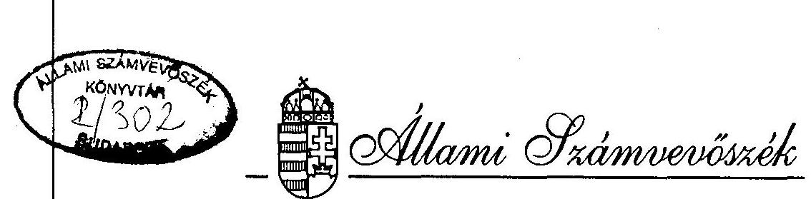
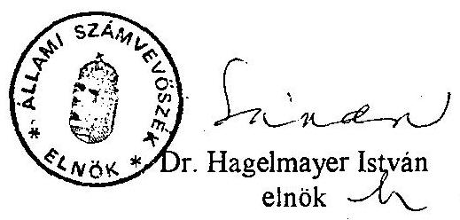
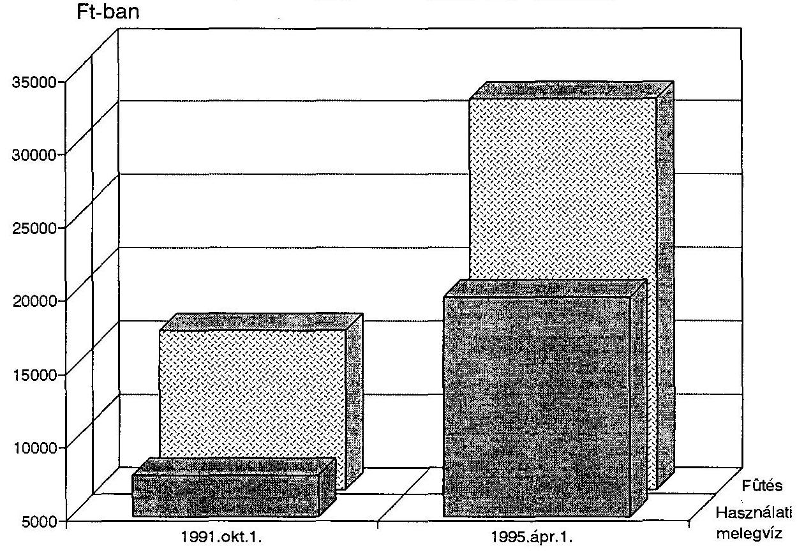
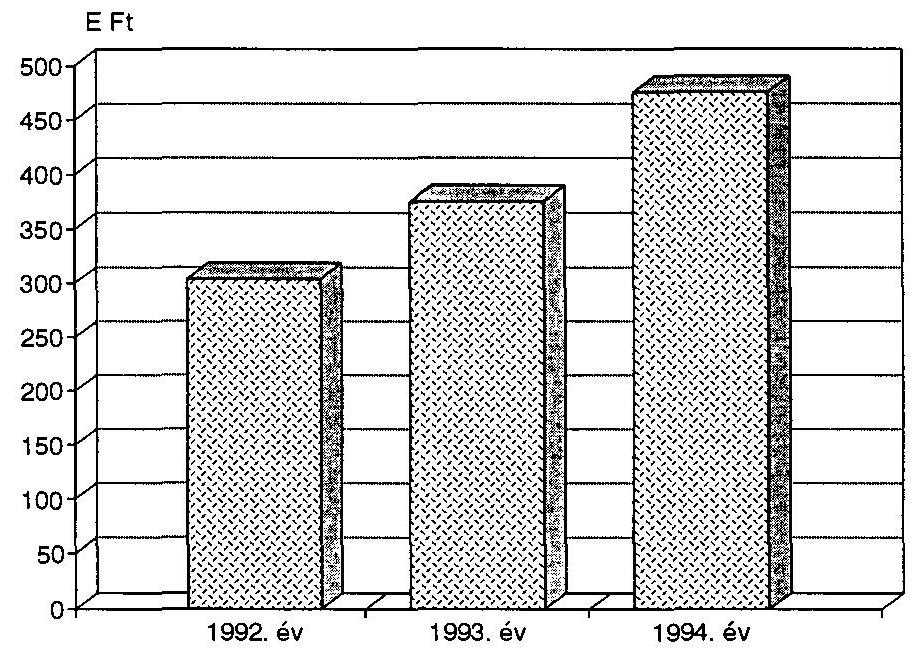
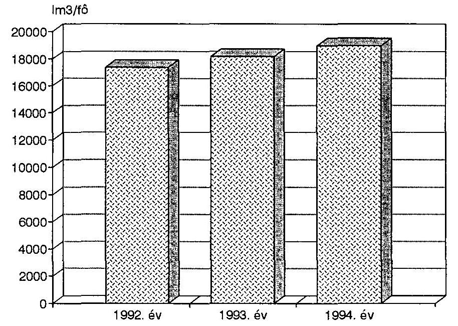

# JELENTÉS 

a távhőszolgáltatás gazdálkodási rendszerének utóvizsgálatáról

---

# Jelentés   a távhőszolgáltatás gazdálkodási rendszerének utóvizsgálatáról 

A helyi önkormányzatokról szóló 1990. évi LXV. törvény 8. § (1) bekezdése a települési önkormányzatok feladataként jelöli meg a helyi energiaszolgáltatásban való közreműködést. Ennek kiemelten fontos területe a távhőszolgáltatás biztosítása, mivel azt az ország 110 településének, mintegy 650 ezer lakásában élő, több mint 2 millió lakos, továbbá mintegy 20 ezer egyéb és közel 1,2 ezer ipari fogyasztó veszi igénybe és a házgyári paneles technológiával készült lakóépületek viszonylag egyenletes, környezetkímélő fűtése e nélkül jelenleg megoldhatatlan feladatot jelentene.

Az 1995. év második felében az Ipari- és Kereskedelmi, valamint a Pénzügyminisztériumnál végzett tájékozódás mellett lefolytatott vizsgálat 55 település önkormányzatára és a területükön működő távhőszolgáltató szervezetek 1991. október 1. - 1995. június 30-a közötti tevékenységére terjedt ki. (2. számú melléklet) Az ellenőrzés által érintett önkormányzatok területén található a távfűtésbe kapcsolt lakások 89,7%-a (575.466 lakás, amelyekben összesen közel 2 millió ember él), valamint az egyéb, illetve az ipari fogyasztók mintegy 90%-a (18.960, illetve 1.084 fogyasztó). A reprezentáció mértéke alapján megállapításaink általános érvényűnek tekinthetők.

Az ellenőrzés egyidejűleg az Állami Számvevőszék 1991. I. félévében e témakörben végzett, 10 jelentősebb távhőszolgáltató szervezetre kiterjedő vizsgálatának utóellenőrzését is jelentette, figyelembe véve az alapvizsgálat óta a gazdasági életben és a jogszabályokban bekövetkezett változásokat is.

Ennek megfelelően az ellenőrzés célja annak megállapítása volt, hogy

- a tanácsi alapítású és tanácsi felügyelet alatt álló távhőszolgáltató közüzemek állami tulajdonból önkormányzati tulajdonba adása a vonatkozó törvényi előírásoknak megfelelően történt-e, az önkormányzatok által átvett vagyon nyilvántartásba vétele és elszámolása időben és teljeskörűen megvalósult-e;
- az önkormányzatok hogyan oldották meg a távhőszolgáltató vagyon kezelésével és üzemeltetésével kapcsolatos feladataikat, az ezzel megbízott új szervezetek létrehozása, illetve a meglévők kijelölése, átszervezése és működése megfelel-e a jogszabályi előírásoknak;

---

- az állami hatáskörből önkormányzati hatáskörbe került távhőszolgáltatási díjak és díjalkalmazási feltételek meghatározásai, továbbá a díjtételek időközbeni módosításai indokoltak és számításokkal kellően megalapozottak voltak-e;
- az állami költségvetésből 1991-1993. években biztosított távfűtési céltámogatások igénylése, elbírálása és felhasználása szabályszerűen történt-e;
- milyen gazdálkodási eredményeket értek el a hőszolgáltató szervezetek, ennek javításához milyen nagyságrendű támogatásokat kértek és kaptak az önkormányzatoktól a vizsgált időszakban.

# 1.   Összefoglaló, következtetések, javaslatok 

Az alapvizsgálat - amelynek összefoglaló jelentését 1991. májusában átadtuk az Országgyűlés illetékes bizottságának - elsősorban arra kereste a választ, hogy milyen tényezők okozták a távhőszolgáltatók költségeinek és az ezek fedezetére a fogyasztói díjfizetéseken felül az állam által nyújtott fogyasztói ártámogatások növekedését. Ez utóbbi 1988. és 1990. évek között 7,7 Mrd Ft-ról 9,2 Mrd Ft-ra növekedve mind nagyobb mértékben terhelte a központi költségvetést. Az ellenőrzés fontosabb megállapításai szerint:

- a fogyasztói árkiegészítés 1988-1990. évek között 1,5 Mrd Ft-tal nőtt olymódon, hogy az 90%-ban a hőszolgáltató szervezetek nyereségét gyarapította;
- a távhőszolgáltató vállalatok az ártámogatás igénybevételéről, felhasználásáról semmilyen utólagos elszámolásra nem voltak kötelezettek. Ezért a támogatás célszerűségéről, optimális mértékéről, hatásmechanizmusáról a további döntések megalapozásához szükséges információkkal az érintett minisztériumok nem rendelkeztek;
- a vállalatok által tervszinten kimutatott fűtési hőenergia-igények jelentős tartalékot tartalmaztak. Gazdasági terveikben átlaghőmérséklettel számoltak, a tényleges hőmérséklet azonban ennél kedvezőbb volt;
- az alkalmazott átalánydíjas - a helyiségek légköbméter térfogatára alapozott - számlázási rendszer miatt a fogyasztók nem voltak érdekeltek az energiatakarékosságban. A költségek kontroll nélküli átháríthatósága, illetve árkiegészítéssel való kompenzálása a vállalatokat sem ösztönözte a takarékosabb gazdálkodásra.

Az alapvizsgálat megállapításai alapján tett fontosabb javaslatok arra irányultak, hogy

- a támogatást - a rendszer további fenntartása esetén - olyan mértékben állapítsák meg, hogy az ne tartalmazzon nyereséget;
- a távhőszolgáltató vállalatok és az MVM Tröszt hőerőműveinek meghatározott vagyoni hányada kerüljön a működési területük szerint illetékes önkormányzat(ok) tulajdonába, az árhatósági jogkörrel együtt;

---

- a központi szervek műszaki irányelvekkel segítsék a mérési lehetőségek és a tényleges energia-felhasználáshoz igazodó díjtételek kialakítását, az energia racionalizálást pedig kedvezményes hitelek nyújtásával tegyék lehetővé;
- a távhőszolgáltatókat utólagosan rendszeresen számoltassák el és vizsgálják felül, hogy milyen tartalékok találhatók a szervezetek működésében és gazdálkodásában, s ezek miképp hasznosíthatók a lakossági terhek csökkentésére.

Az 1991. évi alapvizsgálat óta eltelt időszakban a jogszabályok tartalmában és a gazdasági környezetben olyan jelentős, a távhőszolgáltatók tulajdoni-szervezeti formáját, működési feltételeit, gazdálkodásuk eredményességét alapjaiban érintő változások következtek be, amelyek az Állami Számvevőszék alapvizsgálatkor tett javaslatainak részbeni megvalósulását is jelentették.

- A távhőszolgáltató közművagyont törvényi szabályozással az önkormányzatok tulajdonába adták.
- A távhőszolgáltató szervezeteket 1992-1995. közötti években - néhány kivételtől eltekintve - gazdasági társaságokká alakították át olymódon, hogy a működésükhöz szükséges vagyont az önkormányzatok apportálták a gazdasági társaságokba.
- A 129/1991. (X.15.) sz. Kormányrendelet kötelezte a távhőszolgáltatókat, hogy a hőközpontokban a hőmennyiségmérés feltételeit 1992. október 1-ig alakítsák ki.
- Az árhatósági jogkört az ártörvény 1992. évi módosításával a települési önkormányzatokhoz telepítették.
- Az 1990-ben még 9,2 Mrd Ft-os fogyasztói ártámogatást fokozatosan úgy építették le, hogy átmenetileg a 3189/1991. számú Kormányhatározatban meghatározott szintnél magasabb tarifát alkalmazó önkormányzatok az éves költségvetési törvények által biztosított módon az 1993. év eleji fütési szezon végéig még kaptak támogatást. Ezt követően 1994-ben ilyen címen már egyetlen önkormányzat sem jutott támogatáshoz. Ezzel egyidejűleg viszont a fűtési díjtételek jelentősen (1991. X. 1. és 1995. IV. 1. között 100%-kal) növekedtek.

Nem realizálódtak az MVM Tröszt hőerőművei meghatározott vagyoni hányadának önkormányzati tulajdonba adására; az energiaracionalizálást elősegítő hitel- és adókedvezmények nyújtására; a távhőszolgáltató szervezetek működési és gazdálkodási tartalékainak feltárására; a rendszeres utókalkulációra és annak ellenőrzésére vonatkozó számvevőszéki javaslatok.

1990-93. évek között - a módosításokat is figyelembe véve - 12 törvény, 8 kormányrendelet és 2 IKM rendelet határozott meg valamennyi távhőszolgáltatóra vonatkozó előírásokat. Ezeken kívül egyedileg és egymástól eltérő módon befolyásolták a távhőszolgáltatók tevékenységét az önkormányzatoknak a vagyongazdálkodásukra, illetve a távhőszolgáltató szervezetek átalakulására és a távhőszolgáltatási díjak megállapítására vonatkozó rendeletei.

---

A jelenleg érvényes jogszabályok alapvető problémája, hogy nem rendezik konzisztens módon a távhőszolgáltatásban érintett energiatermelők, távhőszolgáltatók, fogyasztók viszonyát, nem segítik a kinnlevőségek (díjhátralékok) gyors, hatékony behajtását, a jogszabályi előírások be nem tartását nem szankcionálják. Hiányzik a távhőszolgáltatásra vonatkozó ágazati törvény is.

Ez is hozzájárult ahhoz, hogy az önkormányzatok tudomásul vették, ha a távhőszolgáltatók anyagi helyzetükre, valamint a fogyasztók érdektelenségére hivatkozva nem tettek eleget a 129/1991. (X.15.) Kormányrendelet előírásainak és nem biztosították mindenütt az előírt határidőre a hőmennyiségmérés lehetőségét. Emiatt 1994. december 31-én az ellenőrzött önkormányzatok 7188 hőközpontja közül 1538-ban (21,4%) még nem volt megoldott a hőmennyiség mérése. (3. számú melléklet) Ugyancsak többnyire tudomásul vették a díjemelésekre vonatkozó javaslatok elkészítésénél a távhőszolgáltatók által alkalmazott és jelentős tartalékot képező tervezési-kalkulációs módszereket, a viszonylag jelentős, a nemzetgazdasági átlagot meghaladó mértékű béremeléseket (1992-ről 1994-re 56,6%-kal nőtt az éves átlagkereset), az átalakuláskori - esetenként túlzott mértékű - vagyonátértékeléseket, amelyek az amortizáció összegét és így közvetve a díjakat is megemelték. Lényegében tehát az önkormányzatok nem tettek maradéktalanul eleget a törvényekben előírt kötelezettségeiknek, nem éltek megfelelően tulajdonosi jogaikkal. Az ármegállapítás során az ártörvény követelményeivel ellentétben elismerték a nem hatékony működés költségeit. Néhány kivételtől eltekintve a kettős szorításban (fogyasztói érdek és szolgáltató szervezetek működtetése) lévő önkormányzatok többnyire a vállalkozások igényeit, nyereségre való törekvését engedték érvényre jutni.

A létrehozott felügyelő bizottságok tevékenysége - részben a speciális szakértelem, részben a részükre megszabott követelmények, feladattervek hiányában - formálissá vált. Konkrét ellenőrzéseket nem végeztek, "beszámoltatásukat" általában nem követték intézkedések.

Mindez oda vezetett, hogy a területileg természetes monopol helyzetben lévő távhőszolgáltatók nem törekedtek a költségtakarékosságra, a hálózati veszteségek csökkentésére. Áremeléseiknek "csak" a szolgáltatást igénybe vevő fogyasztók fizetőképességének fokozatos csökkenése szab gátat, amelynek konkrét megjelenési formája a díjhátralékok évről-évre növekvő nagysága.

A lakossági terhek mérséklésére adott költségvetési támogatást az önkormányzatok túlnyomórészt egységes díjkedvezményként használták fel. A rászorultsági elvet megvalósító, fogyasztókként differenciált támogatási formát az önkormányzatoknak alig több mint negyede alkalmazta. Az önkormányzatok egy kisebb része pedig a támogatást fejlesztési forrásként bocsátotta a távhőszolgáltatók rendelkezésére.

Az önkormányzatok részére juttatott, e körbe tartozó vagyon átvétele és a távhőszolgáltató szervezetek részére való továbbadása a helyszíni vizsgálat idejére rendeződött, nyilvántartásuk is nagyrészt megfelel a számviteli törvény előírásainak. Az állományba vétel azonban kezdetben több helyen elmaradt, az önkormányzatok mintegy fele pedig csak

---

részlegesen tett eleget a törvényi kötelezettségnek. Így az önkormányzatok többsége (61%-a) megsértette a számviteli törvény 15.§ (2)-(3) bekezdésében meghatározott teljesség és valódiság alapelvét. A vagyonátvételek egyes esetekben a hiányos kérelmek miatt elhúzódtak, s hasonló okokból késtek a tulajdonváltozással kapcsolatos földhivatali bejegyzések, bár az utóbbihoz hozzájárult a földhivatalok leterheltsége is. A tulajdoni bejegyzések elhúzódása késleltette a vagyonállomány teljes körű és a valódiság elvének megfelelő kimutatását. A vagyonnal való rendelkezési jogot az önkormányzatok többsége értékhatárhoz kötve rendezte. Az apportált vagyon törvényben előírttól nagyobb részét tőketartalékként vitték be a gazdasági társaságokba, ami veszélyezteti a vagyonmegőrzést.

A vizsgálat megállapításait az önkormányzatok elfogadták, magyarázatukban (pl. Debrecen), észrevételükben (pl. Szeged, Nyíregyháza), intézkedési tervükben (pl. Esztergom, Csongrád) a feltárt szabálytalanságok felszámolásának megkezdéséről számoltak be, illetve az erre irányuló szándékukat jelezték.

A vizsgálat tapasztalatai azt mutatják, hogy a távhőszolgáltatásban mutatkozó problémákat a piacgazdaság egyéb területein bevált módszerekkel - az adott építési technológia és a távfűtőhálózat műszaki megoldása, valamint az érdekellentétek miatt - nem lehet feloldani.

Az érdekek összehangolása céljából javasoljuk

# 1. a Kormány részére, hogy az érintett tárcák (IKM, PM, BM) bevonásával fontolja meg 

- a távhőszolgáltatásra vonatkozó ágazati törvény kidolgozásának felgyorsítását, ennek keretében a természetes területi monopóliumot élvező és a lakosság jelentős része számára szolgáltatást nyújtó távhőszolgáltató gazdasági társaságok, illetve intézmények közszolgáltató társasággá (non-profit szervezetté) alakításának lehetőségét, gyakorlati megvalósítását;
- az egyéni fogyasztók energiatakarékos megoldásokban való érdekeltségének megteremtésével összhangban kedvezményes hitel-konstrukció kialakítását az egyéni hőmennyiség mérőket felszerelő fogyasztók számára;
- olyan jogszabály megalkotását, amely lehetővé teszi a díjhátralékok gyors, hatékony behajtását.

## 2. a Gazdasági Versenyhivatal számára, hogy

- a tisztességtelen piaci magatartás tilalmáról szóló törvényben foglalt követelmények gyakorlati érvényesítése céljából folyamatosan ellenőrizze a távhőszolgáltató szervezetek díjkalkulációit;
- fokozottan ellenőrizze az ugyancsak monopol helyzetet élvező energiatermelő szervezetek által átadott energia árának reális - az ártörvény követelményeivel összhangban álló - megállapítását.

---

3. a távhőszolgáltató szervezetek egyesületének, hogy

- szakmai útmutatókkal segítse egyrészt a távhőszolgáltatókat, másrészt a díjmegállapítási jogkörrel rendelkező önkormányzatokat, hogy a speciális körülmények között a kalkulációk és az azokat jóváhagyó döntések megalapozottak legyenek.

4. a távhőszolgáltató szervezeteket működtető önkormányzatok részére, hogy

- a távhőszolgáltatás díjait megállapító helyi önkormányzati rendeletekben a fogyasztó energia megtakarításban való közvetlen érdekelté tételét azzal biztosítsák, hogy egyéni fogyasztóként a lakás használóját jelöljék meg, aki a szolgáltatóval egyenileg köt szerződést;
- rendszeresen, ha szükséges külső szakemberek közreműködésével
 végeztessenek a távhőszolgáltatóknál utókalkulációkat, s ennek alapján úgy állapítsák meg a távhőszolgáltatás díjait, hogy az a biztonságos működés feltételeihez, az indokolt mértékű fejlesztésekhez szükséges fedezeten kívül ne tartalmazzon szabadon felhasználható nyereséget;
- a növekvő távhőszolgáltatási díjakat csak a ténylegesen nehéz anyagi körülmények között élők körében a rászorultsági elv következetes érvényesítésével kompenzálják

# II.   A vizsgálat részletes megállapításai 

## 1. A távhőellátást szolgáló vagyon mozgása, a szervezetek átalakulása

A helyi önkormányzatokról szóló 1990. évi LXV. törvény a kötelező feladatok ellátásához - így többek között a távhőszolgáltatáshoz - szükséges vagyont a 107. §-ban megfogalmazottak szerint az önkormányzatok tulajdonába adta. A vagyonátadással kapcsolatos döntések meghozatala a Vagyonátadó Bizottságok (VÁB) feladatát képezte. A lebonyolítás konkrét tennivalóit a csaknem 1 évvel később hatályba lépő, az egyes állami tulajdonban lévő vagyontárgyak önkormányzati tulajdonba adásáról rendelkező 1991. évi XXXIII. ún. "vagyontörvény" írta elő. A késedelem miatti értelmezési problémák és ügyintézési hibák ellenére a VÁB-ok által hozott határozatok döntő többsége megalapozottnak minősíthető. A határozatok meghozatalánál figyelembe vették az önkormányzatok által beterjesztett dokumentumokat, az 1991. december 31-i állapotot tükröző vagyonmérlegek adatait, több önkormányzat közös tulajdonába kerülő vagyontárgyak esetén pedig az érintettek előzetes megállapodását. Ennek tudható be, hogy a VÁB határozatokat mindössze két esetben (Pécsi Távhőszolgáltató Vállalat, illetve a Debreceni Hőszolgáltató Vállalat esetében) fellebbezték meg. Ezeket a határozatokat a VÁB-ok módosították.

---

Az önkormányzati és a vagyontörvény közötti ellentmondások miatt egyes esetekben a vagyonátadó bizottságok és az önkormányzatok is eltérő eljárásokat követtek a tanácsi alapítású költségvetési üzemek által kezelt vagyonok átadásánál, átvételénél.

Csak két esetben fordult elő (Szeged város és Vas megye), hogy a VÁB döntése meghozatalakor az 1991. december 31-i állapotot tükröző vagyonmérleg helyett a számvitelről szóló 1991. évi XVIII. törvény kötelező előírásainak is megfelelően elkészített 1992. január 1-i rendezőmérleg adatait vette figyelembe.

Érd és Siófok városok önkormányzata nem kérte a költségvetési üzemek által kezelt vagyon átadását a VÁB-októl, mert azt eljárás nélkül is átadottnak tekintették. Kiskunfélegyháza, Paks, Sümeg és Százhalombatta viszont kérte a vagyonátadásokat. Közülük Kiskunfélegyháza, Paks és Százhalombatta határozatilag kapta meg a kérelmezett vagyont, Sümeg esetében pedig a Veszprém Megyei VÁB levélben hivatkozott a vonatkozó jogszabályokra.

Sajátos helyzet alakult ki Borsod megyében, ahol a Borsod Megyei Távhőszolgáltató Vállalat 3388 M Ft vagyonából az ellátási területéhez tartozó 10 önkormányzat összesen 2128 M Ft közművagyont kapott. A vállalatnál maradt 1260 M Ft eszközérték nem biztosította a fizetőképességét, így előbb csődeljárás indult ellene, jelenleg pedig az 1995. február 28-i bírósági határozat alapján végelszámolási eljárás alatt áll.

Egyedi módon történt a vagyonátadás Köszégen is, ahol a város önkormányzatának képviselő-testülete nem kérte a Vas Megyei Távhőszolgáltató Vállalat által kezelt vagyon várost megillető részének tulajdonába adását, mivel nem képes megoldani a felosztás utáni vagyonrészből a távfűtés biztonságos és elfogadható ári üzemeltetését. A vagyonrészt a megyei önkormányzatnak ajánlotta fel, de az nem fogadta el. Így a megyei vállalat által ellátott másik 6 város osztatlan közös tulajdonába került.

Az önkormányzati törvény 107. §-ának (4) bekezdése szerint a vagyonátadásig a vagyontárgyak csak a VÁB-ok hozzájárulásával forgalomképesek. Ennek ellenére Eger, Gyöngyös, Hatvan, Kaposvár, Keszthely és Veszprém városok önkormányzatai még a VÁB-ok döntései előtt bevitték a tanácsi alapítású ingatlankezelő és városgazdálkodási vállalataik által kezelt vagyont az általuk alapított gazdasági társaságokba.

Az egri önkormányzat ügyben kikérte a Belügyminisztérium Hatósági Főosztályának állásfoglalását; az a vagyonátadó bizottság utólagos hozzájárulása esetében megfelelőnek tartotta ezt a megoldást. Az egri, gyöngyösi és veszprémi önkormányzati vagyonátruházások dolgozói alapítványok részvételével olyan időpontokban történtek (1991. június 1 - augusztus 1 között), amikor még nem jöttek létre a vagyonátadó bizottságok. A hatvani, kaposvári és keszthelyi vagyonbevitelek 1992. január - április hónapokban valósultak meg. A vagyonátadó bizottságok utólagosan valamennyi esetben megadták a hozzájárulásukat.

---

További hiányosságot jelentett, hogy a VÁB határozatok egyes esetekben

- csak a tárgyi eszközökre vonatkoztak a befektetett pénzügyi eszközök, a forgóeszközök és a kötelezettségek kihagyásával (pl. a Szabolcs Megyei Távhőszolgáltató Vállalat és a Keszthelyi Városgazdálkodási Vállalat esetében);
- csak a tárgyiasult vagyoni elemeket tartalmazták és kihagyták a követeléseket, valamint a kötelezettségeket (pl. Komárom Megyei Távhőszolgáltató Vállalat által kezelt vagyon 8 önkormányzat részére történő átadásánál);
- nem tartalmazták eszköz oldalon a befejezetlen beruházásokat, forrás oldalon pedig a kötelezettségek felosztását (pl. a Vas Megyei Hőszolgáltató Vállalat által kezelt vagyon 7 önkormányzat részére történő átadásánál);
- hiányzott az ingatlanok helyrajzi számának megjelölése, ami késleltette az ingatlanok tulajdonjogának bejegyzését a földhivatali ingatlannyilvántartásokba; (Pl. a Veszprémi Ingatlankezelő Vállalat esetében.)
- hiányosak voltak tartalmilag a Fővárosi és a Nógrád Megyei vagyonátadó bizottságok határozatai.

A Fővárosi VÁB a Fővárosi Távfűtő Művek kezelésében lévő vagyon Fővárosi Önkormányzat részére történő tulajdonba adásáról hozott határozatában a tényleges vagyon helyett a várható vagyon szerepelt. A vállalat használatában lévő ingatlanokat a tulajdonjog és a kezelői jog vizsgálata nélkül adta át.

A Nógrád Megyei VÁB a Nógrád Megyei Hőszolgáltató Vállalat által kezelt vagyon Salgótarján és Balassagyarmat városi önkormányzatok részére történő átadásáról hozott határozataiban a vagyontárgyak és vagyonelemek megjelölései nem kellően konkrétak, hiányzik az azok tételes azonosíthatóságára való hivatkozás. Az ingatlanok tulajdoni állapotának földhivatali rendezettségéről nem kért adatokat a VÁB. Hiányzik az ingatlanok helyrajzi szám szerinti megjelölése is.

A közmű vagyonrészek átadása rendben történt a több települést ellátó hőszolgáltató szervezetek esetében is, a nem közmű vagyonrészek átadás-átvétele viszont általában elhúzódott, egyes esetekben pedig a VÁB határozatában szereplő előírásoktól eltérően valósult meg. Ebben szerepet játszott az is, hogy a 40/1990. (XII.30.) PM rendelet hatályon kívül helyezte a költségvetési üzemről szóló többszörösen módosított 74/1987. (XII.24.) PM-ÉVM együttes rendeletet. Ettől kezdve (1992. augusztus 27-ig) nem volt érvényben a költségvetési üzemek átalakítására, megszüntetésére vonatkozó jogi szabályozás.

A távhőszolgáltató közüzemi vállalatokat 1992. augusztus 27-ig az 1989. évi XIII. törvény, ezt követően pedig az 1992. évi LV. törvény 10. §-ának rendelkezése szerint az 1992. évi LIV. törvény alapján lehetett gazdasági társasággá átalakítani. Egyszemélyes részvénytársaságot az önkormányzatok nem alapíthattak, illetve azzá közüzemi vállalatokat nem alakíthattak át az 1988. évi VI. törvény 299. § (3) bekezdésében megfogalmazott korlátlan felelősség-viselési kötelezettség miatt. Az ön-

---

kormányzati törvény 80. § (3) bekezdése ugyanis csak olyan vállalkozásban való részvételüket engedi meg, amelyben felelősségük nem haladja meg a vagyoni hozzájárulásuk mértékét. Az 1992. évi LV. törvény 13. § (4) bekezdése az 1988. évi VI. törvény 299. § (3) bekezdését hatályon kívül helyezte, így 1992. augusztus 27. után nem volt akadálya annak, hogy az önkormányzatok egyszemélyes Rt-t alapítsanak, illetve közüzemi vállalatukat azzá alakítsák.

A Debreceni Hőszolgáltató Vállalat által kezelt nem közművagyont érintően (az érintett 6 város polgármestereinek VÁB határozat utáni, 1993. január 12-i megállapodására való hivatkozással) eltértek a VÁB határozatában rögzített megoszlási részarányoktól. Egyes vagyonrészeket utólagosan jogosulatlanul felértékeltek és a vidéki üzemegységek utáni gazdálkodási veszteségeket beszámították. Ezáltal az 5 vidéki város önkormányzata együttesen 14.053 E Ft-tal kevesebb nem közmű vagyonrészhez jutott, mint amennyi a VÁB határozata alapján őket megillette volna. Debrecen város polgármesterének írásbeli magyarázata szerint a különbözeti összegeket az időközben részvénytársasággá alakult vállalat részvényeinek átadásával fogják rendezni.

A több települést ellátó hőszolgáltató szervezetek székhelyi önkormányzatai és az egy települést ellátó szolgáltatók önkormányzatai részére általában tételes felmérések (leltározások) nélkül történtek meg a vagyonátadások.

Több önkormányzat egyáltalán nem végezte el az átvett vagyon állományba vételét a számvitelről szóló 1991. évi XVIII. törvény és az ennek végrehajtására kiadott 179/1991. (XII.30.) és az azt módosító 67/1993. (V.5.) Kormány rendeletek előírásainak megfelelően. Az önkormányzatok fele pedig csak részlegesen tett eleget az előírásoknak. A vizsgált önkormányzatok közel kétharmada (61,1 %-a) megsértette a számviteli törvény 14.§-ában kötelezően előírt alapelveket, ezeken belül elsősorban a 15.§.(2-3) bekezdéseiben meghatározott teljesség és valódiság elvét.

Dombóvár, Keszthely, Sümeg, Százhalombatta és Vác esetében az 1992. évben lebonyolított vagyonátadás-átvételek számviteli nyilvántartásai és az ezek alapján készített éves vagyonmérlegek egyetlen évben sem tartalmazták az önkormányzatok által átvett hőszolgáltatói vagyont. Siklóson egy korábbi számvevőszéki vizsgálat javaslata alapján csak a jelenlegi ellenőrzés előtt vették fel nyilvántartásukba a vagyont.

Kiskunhalason az 1992. és 1993. évi nyilvántartásokból, további 11 városban (Győr, Kaposvár, Kecskemét, Mohács, Oroszlány, Pécs, Salgótarján, Sárvár, Szekszárd, Székesfehérvár és Szolnok) az 1992. évi nyilvántartásból hiányzott az átvett hőszolgáltatói vagyon.

További 15 város (Budapest, Balassagyarmat, Csongrád, Debrecen, Dunaújváros, Esztergom, Érd, Hatvan, Miskolc, Mór, Nyergesújfalu, Nyíregyháza, Tatabánya, Várpalota és Veszprém) esetében tévesen jelölték ki a főkönyvi számlákat az állományba vételhez, illetve eltérő összegeket vettek nyilvántartásba.

---

Több önkormányzat (Balassagyarmat, Dombóvár, Érd, Mór, Püspökladány, Sümeg, Vác) nem tett eleget annak a törvényi előírásnak, hogy a törzsvagyont (így a távhőszolgáltatói célokat szolgáló közművagyont is) a többi vagyontárgytól elkülönítve kell nyilvántartani és a vagyonállapotot az éves zárszámadáshoz csatolt leltárban kell kimutatni. Így az önkormányzatok képviselőtestületei nem kapták meg a törvényileg biztosított információkat.

Az ellenőrzött önkormányzatok közül 44 maradéktalanul eleget tett a 147/1992. (XI.6.) sz. Kormányrendelet előírásainak. Határidőre (a megyei jogú városok és a főváros 1994. június 30-ig, a többiek 1993. december 31-ig) elkészítették az igen nagy munkaráfordítással és költséggel járó ingatlanvagyon-katasztereket.

Késedelmesen, illetve hiányosan készült el 10 város (Balassagyarmat, Esztergom, Érd, Kapuvár, Hatvan, Kiskunhalas, Miskolc, Mór, Százhalombatta és Tatabánya) önkormányzatainak hőszolgáltatói ingatlanvagyon-katasztere és egyáltalán nem tett eleget a követelménynek Sümeg Önkormányzata.

Az OSAP keretében országosan felösszesített adatokat torzítja, hogy 4 város: Csongrád, Debrecen, Szeged és Veszprém önkormányzatai gazdasági társaságokba (Rt-kbe és Kft-kbe) apportáltak vagyontárgyakat és annak ellenére, hogy nem kellett volna, elkészítették a vagyonkatasztert, sőt még vizsgálatunk idején sem vezették ki azokat nyilvántartásukból.

Az államtól átvett ingatlanok és ezeken belül az önkormányzatokhoz került távhőszolgáltatási célokat szolgáló földterületek, épületek és építmények önkormányzati tulajdonának földhivataloknál történő bejegyeztetése igen sok problémával járt. A tulajdoni átírások elhúzódásai akadályozták az ingatlanok ingatlanvagyonkataszterben és számvitelben történő elszámolásait, így a vagyonállomány teljes körű és valódiság elvének megfelelő kimutatását. Ez részben a jogszabályi háttér kezdeti hiányára vezethető vissza, mivel nem volt egyértelmű, hogy kérelemre az önkormányzatoknak, vagy hivatalból a vagyonátadó bizottságoknak kell-e kezdeményezniük az eljárásokat. Nehezítette a rendezéseket, hogy sem az önkormányzatok, sem pedig a földhivatalok nem rendelkeztek az átírandó ingatlanokra vonatkozó teljes körű és naprakész megbízható nyilvántartásokkal. A késedelmes ügyintézéshez hozzájárult az is, hogy az önkormányzatok egy része nem kérte időben az ingatlanok tulajdonjogának átírását a földhivataloktól. Mindezek azt eredményezték, hogy:
néhány helyen nagy késedelemmel valósultak meg az önkormányzatok tulajdonosként történő bejegyzései (pl. az 1991. évi kérelmek Sümeg esetében csak 1995. évben, Kiskunfélegyházán 1993. évben rendeződtek).

Érden és Százhalombattán még vizsgálatunk idején sem volt dokumentálva az átírások kérelmezése és azok megtörténte;

Balassagyarmat és Salgótarján csak
 nagy késedelemmel kérte az átírásokat, és azok még vizsgálatunk idején sem valósultak meg teljeskörűen;

---

Miskolcon és Pécsett a földhivatalnál vezetett helyrajzi szám adatok rendezetlenségei miatt jelenleg sem történtek meg az átvezetések.

Az ellenőrzött önkormányzatok a tulajdonukba adott közmű vagyont kezdetben változatlan – zömében vállalati – szervezeti formában működtették. Mindössze hét szervezet átalakítására került sor 1991-ben. A megjelent jogszabályok adta lehetőségekkel élve zömében 1992–94. év között oldották meg az önkormányzatok a távhőszolgáltatók gazdasági társasággá alakítását.
Az átalakulás után azonban a távhőszolgáltatási feladatot az újonnan létrejött gazdasági társaságok több, mint fele továbbra is vegyes profilú szervezetként, egyéb tevékenységükhöz kapcsoltan látja el.

| Megnevezés | 1991.   XII.31. | 1992.   XII.31. | 1995.   IX.30. |
| :-- | :--: | :--: | :--: |
| Tiszta profilú hőszolg.váll. | 24 | 14 | 2 |
| Tiszta profilú gazdasági társ. | - | 8 | 21 |
| Tiszta profilú intézmény | - | - | 1 |
| Tiszta profilú magánvállalkozó | - | 1 | 1 |
| Tiszta profilú szervezet össz: | 24 | 23 | 25 |
| Vegyes profilú vállalat | 21 | 11 | 6 |
| Vegyes profilú gazdasági társ. | 5 | 13 | 17 |
| Vegyes profilú intézmény | $4^{x}$ | 7 | 7 |
| Vegyes profilú szervezet össz: | 30 | 31 | 30 |
| Vizsgált egységek összesen: | 54 | 54 | 55 |

x Az 1991. évi adat költségvetési üzemre vonatkozik.
xx Tartalmazza a Szarvasi Thermál Kft-t is, amely csak 1995-től végez távhőszolgáltatást.

Az átalakulás lebonyolítására vonatkozó jogszabályok előírásait az önkormányzatok többnyire betartották. Gyakran előfordult azonban, hogy az átalakulási tervhez, illetve a cégbejegyzéshez szükséges dokumentumokat nem készítették el, illetve hiányosan juttatták el a cégbírósághoz. Jellemzően hiányoztak a vagyonleltárak, vagy nem feleltek meg tartalmilag, illetve formailag a jogszabályi előírásoknak. (Pl. 180 napnál régebbiek voltak.) Emiatt a cégbírósági bejegyzés késett, sőt előfordult, hogy a vizsgálat időpontjáig sem történt meg.

Kapuvár Város Önkormányzata a Városgazdálkodási Vállalatot Kft-vé kívánta alakítani. Az átalakulás előkészítésével és lebonyolításával a Kereskedelmi és Pénzügyi Szervezési-Tanácsadó Rt-t (KERSZI) bízta meg. A KERSZI feladatait hiányosan teljesítette. A cégbíróság hiánypótlási felhívásának nem tettek eleget, hanem határozatát megfellebbezték. A Legfelsőbb Bíróság 1995. június 13-án az első fokú bíróságot újabb eljárásra és újabb határozathozatalra utasította. 1995. augusztusig nem került sor a Kft bejegyzésére.

---

A Pécsi Távfűtő Vállalat átalakítására – az e feladat elvégzésére kiírt pályázat nyertesével – az Appozisol Group Intemacional Nemzetközi Vagyonértékelő Rt-vel kötött szerződést az önkormányzat. Az Rt a feladatát hibásan teljesítette, nem vette figyelembe az 1992. évi LIV. törvény 35. §-ban megfogalmazott követelményeket. A cégbíróság a bejegyzési kérelmet elutasította.

Az "új" távhőszolgáltató szervezetek üzemeltetési követelményeit az önkormányzatok az alapító okiratokban – egy-két kivételtől eltekintve – általában meghatározták. Ennek során figyelemmel voltak a távhőszolgáltatást igénybevevők érdekeire csakúgy, mint a szolgáltató szervezet működésének és fejlődésének biztosítására. Az alapító okiratok azonban mind a követelményeket, mind a feltételeket túlzottan általánosan fogalmazták meg (pl. az ellátás színvonalát fenn kell tartani, illetve javítani; az alkalmazható díjtételek fedezzék a költségeket stb.). A feladatok és a megvalósításukhoz szükséges feltételek konkretizálásának elmaradása a későbbiekben a tevékenységet érintő jogszabályok teljesítésének akadályává vált.

Az ellenőrzött önkormányzatok többsége a távhőszolgáltató szervezetek részére juttatott vagyont az átalakuláskor felértékelte. A felértékelések indoka az átalakulásra vonatkozó törvényi előírások mellett az volt, hogy az eszközérték, különösen a tárgyi eszközök értékének növelése az értékcsökkenési leírás összegét, tartós költségnövelő tényezőként az árkalkuláció részévé tette. Ez lehetőséget nyújtott a fejlesztéshez szükséges források megteremtésére anélkül, hogy az önkormányzattól külön támogatást kaptak volna. A vagyonfelértékelések szükségességét nem vitatva rá kell mutatni néhány kirívó mértékű felértékelésre, amelyek az indokoltnál nagyobb mértékben járultak hozzá a fogyasztói árak emeléséhez.

Budapesti Távhőszolgáltató Vállalat Rt-vé való átalakuláskor a vállalat 8.635.273 E Ft értékű tárgyi eszközeinek értékét 22.834.963 E Ft átértékelési különbözettel 31.470.236 E Ft-ban, az eredeti bruttó érték 364%-ában állapították meg. Ennek hatására az értékcsökkenési leírás éves összege az 1993. évi 822.435 E Ft-ről 1995. évben 1.630.000 E Ft-ra emelkedett. A lakossági fűtési alapdíj kalkulált összege emiatt 11,75 Ft/lm³/év-vel, 18,8%-kal növekedett.

Debrecenben a befektetett eszközök értékét az eredeti bruttó érték 184%-ában állapították meg.

Az önkormányzatok azon része, amely nem értékelte fel a távhőszolgáltató szervezet eszközeit, a fejlesztésekhez szükséges forrást külön fejlesztési célra adott támogatással pótolta. Egyes esetekben olyan megoldásokra is sor került, hogy a vagyonnak csak egy részét apportálták a távhőszolgáltató szervezetbe, a többit közvetlen önkormányzati tulajdonban tartották és használatáért bérleti díjat kértek. Ez megegyezett az eszközök értékcsökkenési leírásának összegével. A beszedett bérleti díj egészét, vagy annak nagyobb részét a későbbiekben a távhőszolgáltató fejlesztési támogatásként visszakapta.

Az új vagyoni állapot könyvvizsgáló általi hitelesítése minden esetben megtörtént, de az ellenőrzési tapasztalatok szerint néhány esetben a hitelesített vagyoni állapot és a valóságos vagyoni érték között eltérés mutatkozott.

---

A Komárom-Esztergom Megyei Távhőszolgáltató Rt vagyonmérlegét alátámasztó vagyonleltár nem az átalakuló vállalat tényleges vagyonára vonatkozott. A vagyonleltár és az apportlista értékadatai eltérőek. Az apportlista számszaki hibát tartalmaz.

A TarjánHő Kft a Nógrád Megyei Hőszolgáltató Vállalat "FA" 131.599 E Ft követeléssel terhelt 210.610 E Ft értékű eszközeit 250.000 E Ft-ért a salgótarjáni önkormányzat "engedélyével" a felszámolóval kötött adásvételi szerződés útján közvetlenül kapta meg. Az önkormányzat a Kft által így már megvásárolt eszközöket a Kft által alkalmazott könyvvizsgáló által készített és hitelesített apportjegyzék kel 116.000 E Ft értéken vitte be a Kft-be. A Kft törzstőkéje így a cégnyilvántartás szerint 117.000 E Ft (az emelés előtt 1.000 E Ft volt) és a Kft mérlegeiben (1992. és 1994. évi) 250.000 E Ft ugyanezen könyvvizsgáló által hitelesítve.

A gazdasági társasággá történő átalakuláskor az 1992. évi LIV. törvény 35. §-ban előírt jegyzett tőke és tőketartalék arányától több helyen eltértek. A vagyon előírtnál nagyobb hányadát helyezték tőketartalékba (pl. Komárom-Esztergom Megyei Távhőszolgáltató Rt, Győri Hőszolgáltató Kft). Ez utóbbi megoldás magában rejti a vagyonvesztés lehetőségét, mivel a vagyonmozgás (elidegenítés) folyamatos ellenőrzése az önkormányzatok vagyonvédő (hatásköri) rendeletei ellenére csak operatív beavatkozások révén lenne megoldható. A távhőszolgáltatók tevékenységének ellenőrzési formája, megoldási módja azonban az évenkénti egyszeri "beszámoltatásra" épül.

Az önkormányzatok az átalakult szervezetbe apportált vagyont a számviteli törvény előírásainak megfelelően a 19. számlacsoportban részesedésként tartják nyilván. Az átalakulást megelőzően azonban egyes esetekben nem vették nyilvántartásba a VÁB határozattal részükre juttatott vagyont, hanem közvetlenül, anélkül adták át a távhőszolgáltatóknak, hogy azt nyilvántartásaikon átfuttatták volna.

Az ellenőrzött önkormányzatok általában 3 fős Felügyelő Bizottságot választottak a létrehozott új távhőszolgáltató szervezetek felügyeletének ellátására. Tagjai képviselők, illetve az önkormányzati apparátus tagjai. A testületek többsége évente egy alkalommal beszámoltatta a szervezet ügyvezetőjét a végzett munkáról, a Felügyelő Bizottságot pedig az adott év során szerzett tapasztalatairól. Külön feladattervet azonban a Felügyelő Bizottság tagjai részére nem adtak, így a felügyelő bizottságok tevékenysége tartalmilag rendkívül eltérővé és esetlegessé vált. Konkrét ellenőrzéseket, elemzéseket csak elvétve végeztek.

# 2. A távfűtés- és használati melegvíz szolgáltatás díjmegállapítása 

A korábbi évtizedek gazdaságpolitikájának következményeként, a telepszerűen elhelyezett, paneltechnológiával készült lakóépületek konstrukciója és a távfűtés kollektív igénybevételére alapozott technikai megoldás, a rendszerből egyedileg való kiválást műszakilag szinte lehetetlenné, illetve csak nagy anyagi ráfordítással megvalósíthatóvá tette. Ebből következően a távhőszolgáltatók természetes területi monopóliumot élvezve, gaz-

---

dasági erőfölénybe kerültek a fogyasztókkal szemben, az ezzel való visszaélést a tisztességtelen piaci magatartás tilalmáról szóló 1990. évi LXXXVI. törvény 20. §-a egyértelműen tiltja. Ezzel összhangban az árak megállapításáról szóló 1990. évi LXXXVII. törvény olyan termék esetében, amelynek piacán a piac szabályozó funkciója nem, vagy korlátozottan érvényesül, rögzíti a hatósági ármegállapítás szabályait a tartósan versenyhiányos helyzet egyoldalú kihasználásának korlátozására. Ezért a lakossági távfűtésre és melegvízszolgáltatásra legmagasabb hatósági ár alkalmazását írja elő olymódon, hogy az fedezetet nyújtson a hatékonyan működő vállalkozó ráfordításaira és a további működéséhez szükséges nyereségre. A hatósági árban tehát az árhatóság nem ismerheti el a nem hatékony működésből adódó ráfordításokat.

A kereskedelmi- és ipari miniszter az ártörvény felhatalmazása alapján a fogyasztói árkiegészítés arányának a 68/1991. (V.3.) Kormányrendelet szerinti egyidejű csökkentése mellett a korábbi országosan egységes díjat a 17/1991. (V.30.) IKM rendelettel 70%-kal megemelte. A fűtési idényen kívüli áremelés alig éreztette hatását, mivel a következő fűtési idényre – az 1991. október 1-től megszűnő fogyasztói árkiegészítés miatt – új ármegállapítás lépett hatályba.

Az új árkalkuláció megalapozásához részletes – a FŐTÁV által készített – útmutató kiadásával adatszolgáltatást kértek a hőszolgáltatóktól. Ez lett az alapja a lakossági, valamint az üzemi- és egyéb fogyasztói díjmegállapításnak. A hőteljesítmény meghatározásánál a lakossági- és egyéb fogyasztóknál a tervező által megállapított, az üzemi fogyasztóknál az igénybejelentésekben szereplő csúcshőteljesítményt vették figyelembe az összesítéskor. A beérkezett kalkulációk alapján készült el a 29/1991. (X.1.) IKM rendelet 1. számú melléklete, amely településenként és szolgáltatónként tartalmazza a megállapított legmagasabb hatósági árakat.

Az IKM a hődíjat mindenütt, a rendelkezésre állási díjat pedig az üzemi fogyasztók esetében a beküldött kalkulációk szerint fogadta el. A lakossági és az egyéb fogyasztóknál azonban a rendelkezésre állási díjat a kalkulálthoz képest a fűtésnél jelentősen (20–45%-kal), a melegvíznél mérsékelten (5–10%-kal) alacsonyabb szinten hagyta jóvá. Tizenhárom településen olyan lakossági fűtési díjat hagytak jóvá, hogy az ne eredményezzen az IKM 17/1991. (V.30.) rendeletében megállapítotthoz (104,40 Ft/lm³/év) képest növekedést.

Decemberben több távhőszolgáltató – főképp amelyeknél a rendelkezésre állási díj összegét csökkentették – új díjmegállapítást kért, amelyet az IKM a jogszabályban foglalt pénzügyminiszteri egyetértés hiányában elutasított.

Az 1992. évi V. törvény úgy módosította az ártörvény mellékletét, hogy 1992. február 25-től a Magyar Villamosművek erőművei által értékesített gőz és melegített víz kivételével a távhőszolgáltatás ármegállapítására a települési önkormányzatok – a fővárosban a Fővárosi Önkormányzat – kapott felhatalmazást.

Az ártörvény módosítását nem követte a 29/1991. (X.1.) IKM rendelet szükségszerű módosítása. Ennek következménye, hogy az Alkotmánybíróság 24/1993. (IV.15.) AB határozatában megállapította a 29/1991.(X.1.) IKM rendelet 1. számú mellékletében felsorolt szolgáltatást igénybe vevő lakossági fogyasz-

---

tókra alkalmazható árszabások alkotmányellenességét és azokat megsemmisítette. Alkalmazását azonban az önkormányzati hatósági díjmegállapításra vonatkozó rendeletek hatálybalépéséig engedélyezte. Az IKM 17/1993. (XI.19.) számú rendeletével 1993. december 19. határnappal hatályon kívül helyezte korábbi rendeletét.

Ettől kezdve a díjalakmazás feltételeit is önkormányzati rendeletben kellett szabályozni az ártörvény 9. § (2) bekezdésének megfelelően.

Az IKM rendelet szövegének csaknem változtatás nélkül átvételével – Kiskunfélegyházát és Tatabányát kivéve – többnyire határidőn belül megalkották az önkormányzatok a díjalakmazásra vonatkozó rendeletüket.

A
 távhőszolgáltatók döntő többsége azonban arra törekszik, s ezt a készülő törvényben is úgy szeretnék szabályoztatni, hogy a távhőszolgáltatást ne a konkrét fogyasztóknál (tehát ne lakásonként) kelljen mérni, hanem házanként (hőközpontonként). Ezt "segítette", hogy az önkormányzatok kisebb hányada a Magyar Távhőszolgáltatók Szakmai Szövetsége által készített és ajánlott rendelet-tervezet alapján alkotott rendeletet (pl. Érd, Százhalombatta). Ez az ajánlás törvénysértő módon a 129/1991. (X.15.) számú Kormányrendelet 3. § (2) bekezdésében a hőszolgáltatók számára előírt kötelezettség (hőmennyiség-mérés lehetőségének megvalósítása) alóli felmentésre "hatalmazza fel" a polgármestert. Fogyasztóként a távhővel ellátott épület tulajdonosát jelöli meg és azt kötelezi a díjfizetésre. Ez a rendelet-tervezet a szolgáltatók számára biztosít egyoldalú előnyt, mert a költségmegosztást a lakóközösségekre hárítaná át, amit azok jelenleg az eltérő egyéni érdekek miatt nem képesek megoldani. A "kollektív elszámolás" miatt a takarékosság csak kismértékben érvényesül, mivel abban egy-egy lakás tulajdonosa csak közvetve érdekelt.

Jól illusztrálja a helyzetet, hogy a különböző területeken rendelkezésre álló értékelések, dokumentumok szerint a mérésre áttért fogyasztóknál a felhasznált hő 7-10%-kal alacsonyabb az átalánydijat fizetők által felhasznált hőnél. Ugyanakkor az egyedi mérés megvalósítása a fogyasztókat személy szerint érdekeltté téve a takarékosságban, ennél lényegesen nagyobb 30-40%-os megtakarítást eredményezhet.

A Gödöllői Önkormányzat olyan rendkívül precíz a fogyasztók érdekeit kifejező és segítő részletes rendeletet hozott, amely szerint "...fogyasztó az a természetes személy ..., aki a szolgáltatóval szolgáltatási jogviszonyba kerül. Egyéni fogyasztó a lakás ... használója, aki a szolgáltatóval egyénileg köt szerződést."

A szolgáltató kísérletképpen több lakásban megoldotta a lakásonkénti hőmennyiség mérését. A tapasztalati adatok szerint az átalányként kalkulált 7,62 GJ/lakás/hó értékkel szemben a tényleges felhasználás 4,6 GJ/lakás/hó. A megtakarítás $\mathbf{39,6\%}$, ami a teljes fűtési díj 15-20%-os csökkentését eredményezi. Az egyedi mérők felszerelésének költsége jelenlegi árakon 80-100.000 Ft között alakul. A tapasztalatok szerint a kísérletbe vont lakások tulajdonosai utólagosan gondoskodtak a hőszigetelésről, s ezzel további 5-10%-os energia-megtakarítást értek el.

---

A hődíj tartalmát és számítási módját - Csongrád kivételével, ahol helytelenül a kalkulált teljes költség 65%-át vették hődíjként figyelembe - nem változtatták meg.

A rendelkezésre-állási díj - később alapdíj - számításánál figyelembe vehető költségek körét több településen úgy módosították, hogy

- amortizációs költséget nem tartalmaz a kisvárdai, a záhonyi a kaposvári kalkuláció;
- Nyergesújfaluban a Magyar Viscozagyár a lakossági hőszolgáltatás esetére teljesítménydíjat nem számláz;
- Pécsett az átlagdíjas szolgáltatásnál 5% árkockázati fedezetet, Gödöllőn a tüzelőanyag- és anyagköltség 10%-nak megfelelő tartalék-keretet lehet felszámítani;
- a Fővárosi Közgyűlés az alapdíjnál figyelembe vehető költségek körét az államot és az önkormányzatokat megillető adókkal és illetékkel, valamint a fogyasztói kintlévőségek finanszírozására felvett hitelek kamatával bővítette.

Általános hiba, amelyet az önkormányzatok általában tudomásul vettek, hogy a hőfelhasználást, a használati melegvíz mennyiségének és előállításának hőmennyiség igényét jelentősen túltervezték (Szegeden pl. 3 év átlagában 22,16%-kal). A kalkulációnál figyelmen kívül hagyták, hogy egyre több fogyasztó épített be egyedi melegvízmérőt (Esztergomban pl. az 1994-ben kalkulációs tényezőként számított 238.944 vízköbméter 26,6%-kal volt több az 1993. évi felhasználásnál. Ebből adódóan az 1994. évi tényleges felhasználás 35,1%-kal kevesebb volt a kalkuláltnál). Hasonló mértékű "tartalékolást" végeztek a hőmennyiségnél is, mert átlag hőmérséklettel számoltak, a tényleges hőmérséklet pedig ennél kedvezőbb volt. Ezen kívül nem mindenütt vették számításba a felszerelt hő-mennyiség-mérők energiafelhasználást mérséklő hatását.

A lakásfütéshez a fajlagosan ( $\mathrm{lm}^{3}$-re vetített) felhasznált hőmennyiség az ellenőrzött szervezeteknél együttesen - lényegében azonos külső hőmérséklet mellett -6,4%-kal, a melegvíz felhasználás pedig 9,5%-kal csökkent 1992-1994. évek között. Ennek ellenére egy $52 \mathrm{~m}^{2}$-es, $135 \mathrm{~lm}^{3}$-es átlaglakás távfűtési díja 1992. október 1. és 1995. IV. 1. között - három település (Nyergesújfalu, Köszeg és Siófok) kivételével - jelentősen emelkedett. (5.sz.melléklet)

Egy átlagos ( $52 \mathrm{~m}^{2}$-es $135 \mathrm{~lm}^{3}$-es) lakás éves átlagos fűtési díja 1992. X. 1-én 15.888 Ft volt. Ez 1995. IV. 1-ére 31.677 Ft-ra (99,4%-kal) nőtt.

Néhány esetben a kalkulációba beállított hőmennyiség és annak fűtésre, valamint vízmelegítésre való megosztása a díjképzési előírásban szereplő fajlagos felhasználási adatok meghatározásának hiányában megalapozatlan volt (pl. Érd, Százhalombatta). A hőenergia nélküli költségeket nem a felhasznált hőmennyiség arányában osztották fel, s így a költségek aránytalanul nagy részét terhelték a lakossági fogyasztókra (pl. Komárom-Esztergom Megyei Távhőszolgáltató Rt), vagy nem valós bázisadatok alapján számították az üzemi általános, illetve igazgatási költségeket (pl. FÖTÁV).

---

A kalkulációs hibák részben tudatos "tervezésre", részben az utókalkulációk és az ellenőrzés hiányára vezethetők vissza, ami nem tette lehetővé a képviselő-testületek számára a megalapozott döntéshozatalt.

A polgármesteri hivatalok nem voltak felkészülve, illetve nem tekintették feladatuknak a kalkulációk szakmai ellenőrzését. Az ellenőrzés hiányában, vagy felületességében bízva a távhőszolgáltatók esetenként eltértek a kalkulációs előírásoktól. Ezt igazolja, hogy a fűtési hődíj átalány és a mért hődíj a vizsgált időszakban csak 12 önkormányzat esetében növekedett közel azonos arányban, a többieknél - a kalkulációk megalapozatlanságát tanúsítva - jelentősen eltérően. (4.sz. melléklet)

Az önkormányzatok a rendelkezésükre álló információk és szakmai felkészültségük alapján elvétve kérdőjelezték meg, hogy a díjkalkulációban csak a hatékony működés költségeit és az előírt nyereséget kívánja a szolgáltató elismertetni (Esztergom, Nyíregyháza).

Néhány alkalommal a távhőszolgáltatóknál költségnövekedést okozott, hogy az önkormányzatok hatósági jogkörük gyakorlásakor az ártörvényben rögzített 30 napos elbírálási határidőt túllépték.
1995. évben a villamosenergia ára január 1-től, a földgáz ára február 1-től, az MVM erőműből vásárolt energia ára március 1-től emelkedett. A távhőszolgáltatói díjban ennek hatása csak május 1-től vált érvényesíthető Kecskeméten. Az önkormányzat kiegészítő számításokat kért a díjemelés indokoltságának alátámasztására. A késedelem a szolgáltatónak 4.000 E Ft többletköltséget okozott.

A Fővárosi Közgyűlés (egyhónapos késedelem után) a 68/1995. (XI.1.) számú rendeletében a kalkuláltnál magasabb alapdíjat állapított meg. Így biztosította, hogy a szeptember 1-től megemelt gáz- és villamosenergia, az október 1-től megemelt erőművi teljesítmény és hőár miatti többletköltség a november 1-től érvényes díjakban a FÖTÁV részére még 1995. évben megtérüljön.

Néhány esetben fordult elő, hogy az önkormányzatok nem az ártörvényben foglaltaknak megfelelően éltek ármegállapítási jogosítványaikkal.

A Püspökladányi Önkormányzat 1992. július 1. és 1993. október 30. között jogszabálynak nem minősülő testületi határozattal állapította meg 3 alkalommal a távfűtés és melegvíz-szolgáltatás díját. Az egyéb fogyasztók díját nem tartalmazta a 18/1993. (XI.1.) sz. rendelete, részükre a lakossági díj 140%-át számlázta a szolgáltató.
A Köszegi Önkormányzat nem ismerte el a szolgáltató költségeit, ármegállapítását nem a díjmegállapítási kérelemre alapozta. A távfűtési díjakat a Szombathelyen elfogadottal azonosan állapította meg. A szolgáltató pert indított a veszteségeinek megtérítésére az önkormányzat ellen.

A Fővárosi Közgyűlés a IX. kerületi IKV ármegállapítási kérelmét 1992. év végén, 1993. év elején érdemben nem bírálta el, bár egyértelmű volt számára, hogy az ártörvény szerint ez az ő feladata.

---

Visszamenőleges - törvénysértő - díjmegállapítás csak kivételesen fordult elő (Kiskunhalas).

Sajátos módon a Fővárosi Közgyűlés 1995-ben a tisztességtelen piaci magatartás tilalmáról szóló 1990. évi LXXXVI. törvény 20. §-ában foglaltakat megsértve felkérte a FÓTÁV Rt-t, hogy szociális támogatásra 250 M Ft-os keretet biztosítson. Az ár így burkoltan tartalmaz fedezetet más területen fogyasztók szociális támogatására. A kompenzáció ebben a formájában a szolgáltatási körből kilépni nem tudó fogyasztót kötelezi arra, hogy egy másik fogyasztó által igénybe vett szolgáltatás díját részben megtérítse.

A szolgáltatók igyekeznek a központi energia-áremelést azzal egyidőben érvényesíteni áraikban. Ennek érdekében különböző módon kezdeményezték díjautómatizmus lehetőségének rendeleti szabályozását.

Veszprémben és Sátoraljaújhelyen az ártörvény 9. § (1) bekezdésében megfogalmazott lehetőséggel élve az árat a kiszámítására vonatkozó előírással határozták meg. A FÓTÁV díjmegállapító szoftvert fejlesztett ki. Egyes önkormányzatoknál (pl. Érden) az önkormányzat SzMSz-e nem teszi lehetővé a díjmegállapítási kérelem 30 napon belüli elbírálását (kétfordulós tárgyalás).

A távhőszolgáltatás műszaki-gazdasági kérdéseit a 129/1991. (X.15.) sz. Kormányrendelet szabályozza. A rendelet azonban tartalmilag nem ad teljes körű szabályozást és a feladatok előírásakor nem vette figyelembe sem a távhőszolgáltatók anyagi lehetőségeit, sem a fogyasztók teherviselő képességét. Egyrészt erre, másrészt az önkormányzatok elnéző magatartására vezethető vissza, hogy bár a Kormányrendelet 7. § (2) bekezdése kötelező erővel - de szankciók nélkül - írja elő 1992. október 1-ig a mérés lehetőségének megteremtését a fogyasztói hőközpontokban, ezt a feladatot az ellenőrzött hőszolgáltatók egy része - döntően anyagi fedezet hiányában - még a helyszíni vizsgálatok befejezésének időpontjáig sem teljesítette. A mérési lehetőségek száma mindössze 642 db-bal (11,3%-kal) növekedett rendkívüli mértékű szóródásokat takarva.

Az ellenőrzött önkormányzatok területén üzemelő távhőszolgáltatók közül határidőre csupán 17 szervezet - köztük a hőközpontok 33,8%-ával rendelkező FÓTÁV - tett eleget teljeskörűen a jogszabályban foglaltaknak. 1994. végéig számuk 24-re nőtt, s ők rendelkeztek az ellenőrzés által érintett 7188 hőközpont 63,8%-ával (4583 db-bal). Ugyanakkor 7 területen, ahol a hőközpontok 1,4%-a (103 db) üzemel, egyetlen esetben sem került sor a mérők felszerelésére, annak ellenére, hogy településenként - Százhalombatta és Nyergesújfalu kivételével - csupán 1-4 db mérőt kellett volna üzembeállítani.

---

A Kormányrendelet további hiányossága, hogy

- hatálya nem terjed ki a távhőszolgáltatás egészére, hanem csak a lakóépületekre és a vegyes célra használt épületekre vonatkozik, figyelmen kívül hagyja a nem ilyen épületek helyiségeinek használóit és az ipari fogyasztókat.
- A szolgáltatói kötelmet nem a távhőszolgáltatásra, hanem a fűtésre és a használati melegvíz szolgáltatásra állapítja meg. A kötelmet nem határozza meg mérés szerinti távhőszolgáltatás esetére sem.
- A hőmennyiség mérését a fogyasztói hőközpontokban a szolgáltató számára kötelezően előírja, de a fogyasztót nem kötelezi a mérés alapján történő díjfizetésre.
- Sem a fogyasztó, sem a szolgáltató részére nem határozza meg a szolgáltatói szerződés felmondásának gyakorlatilag megvalósítható módját. A fogyasztó szerződésszegésének nincs szankcionálási lehetősége.
- A szolgáltató kártalanítási kötelezettségét visszamenőleges hatállyal - tehát törvénysértő módon - írja elő az idegen ingatlanon létesített szolgáltatói berendezések után. Az állami célcsoportos beruházásként épült épületek hőközpontját a szolgáltató jogszabályi előírás alapján ugyanis köteles volt átvenni.

A koncesszióról szóló 1991. évi XVI. törvény 1. § (1) bekezdés d/ pontja a helyi közművek működtetését koncesszióköteles tevékenységnek minősíti, a tevékenység folytatásának módját, részletes feltételeit pedig ágazati törvény szabályozási körébe utalja. A távhőszolgáltatásra vonatkozó ágazati törvény azonban mindezideig nem készült el.

A képződő amortizációt teljes egészében nem fordították felújításra, illetve eszközök pótlására, miközben a mérés lehetőségének biztosítása is elmaradt. Általában nem törekedtek a hálózati veszteségek csökkentésére sem.

A hálózati hőveszteség 8 távhőszolgáltatótól 24,64% és 29,6% között alakult, 24-nél 15-20% közötti, 4-nél 10-15% közötti értéket mutat. Mindössze három szervezetnél (Főváros, Kaposvár és Siófok) marad a veszteség mértéke 10% alatt. A legmagasabb veszteség Esztergomban tapasztalható 38%!

Csak néhány szervezet tett olyan pozitív lépéseket, amelyek bizonyos határok között a költségek, elsősorban a hőenergia költségeinek csökkentését
 célozták. Így pl:

A Mohács Hő Kft. szerződést kötött 1993. november 5-én egy füstgáz hőhasznosító 14,7 M Ft-os beruházásra, amely a tervezett 2,5 év helyett a megvalósulást követő első fütési idény alatt megtérült.
Sátoraljaújhely fűtőolajról kedvező feltételekkel 18,5 M Ft-os fejlesztési költséggel átért PB gázra, amely lényegesen olcsóbb energia.
Hódmezővásárhelyen geotermál hasznosítási programot dolgoztak ki, amelynek várható költsége 200 M Ft, amelyből eddig 125 M Ft-ot már befektettek.

---

Szombathelyen három, egyenként 865 KW teljesítményű gázmotort állítottak üzembe 189,9 M Ft-os bekerülési összeggel, amelyek évente 51,2 M Ft értékű hő- és villamosenergiát termelnek. Éves tiszta hozama az előzetes számítások szerint 1993-as árakon 35-36 M Ft/év.
Dombóváron tüzelőolajról pakurára tértek át. Az 1991-ben 34%-os készültségi fokon álló beruházást a 92/93-as fütési idényre befejezték, ami a tüzelőanyag költségét jelentősen csökkentette.

A díjtételek és a fajlagos hőfelhasználás között mindössze az a közhelynek számító kapcsolat rögzíthető, hogy a fűtésre szolgáló energia jellegétől, árától függően alakulnak a költségek. Így például 1994-ben az átlagos fajlagos költség

- termálvízből nyert hőenergia esetén 2 szolgáltatónál 124 Ft/GJ
- MVM erőműtől vásárlás 13 szolgáltatónál 385 Ft/GJ
- saját előállítás gázból 24 szolgáltatónál 452 Ft/GJ
- fűtőművektől vásárlás 5 szolgáltatónál 520 Ft/GJ
- saját előállítás olajból 7 szolgáltatónál 940 Ft/GJ

A fajlagos hőenergia költségek és a kiszámlázott hődíj bevételek között értelemszerűen szoros korrelációs kapcsolat van. Nem érvényesül viszont ez a fajlagos energiaköltségek és az egy fogyasztóra eső éves bevételek között, mivel a hődíjon kívül kiszámlázott alapdíj nagysága szolgáltatónként igen eltérő és a jelentős mértékű eltérésekre nem adnak magyarázatot a "helyi sajátosságok".

Példaként említhető, hogy a saját előállítású energiával működő szervezeteknél a 244 Ft/GJ fajlagos költségű Püspökladányban egy átlagos méretű lakás távfűtési díja (melegvíz nélkül) 36.909 Ft/év, a 902 Ft/GJ költségű Siófokon pedig 23.301 Ft/év. Hasonló a helyzet a MVM-től vásárolt energiával dolgozó távhőszolgáltatóknál is. A 351,50 Ft/GJ költségű Pécs esetében az éves díj 32.805 Ft, a 601 Ft/GJ költségű Székesfehérvárnál pedig 26.584 Ft. Ugyancsak hasonló a gázüzemű szolgáltatók díjtételeinek alakulása. Itt a 266 Ft/GJ költségű Szegeden az éves díj 25.785 Ft, Győrött a 545 Ft/GJ költség 24.172 Ft éves díjjal párosul. Legkisebb az eltérés az olajjal fűtőknél, ahol az éves díjak mértéke szoros korrelációban áll a fajlagos költségek alakulásával.

Ugyancsak a nyereség növelését szolgálta a külső hőmérséklet alacsony szinten való "tervezése", amely tekintettel arra, hogy minden 1°C hőmérséklet emelkedés 6%-os energiamegtakarítást jelent - az ÁSZ 1991. évi vizsgálati jelentésében javasolt utókalkuláció készítés elmaradása miatt - jelentős nyereségtartalékot képzett. Ide kapcsolódik az is, hogy az elő- és utószezon fűtési igényét is az indokoltnál magasabb várható igénybevételre tervezik, továbbá, hogy a hőigénynél a csúcsigényre alapoznak és átalánydíjjal számolnak.

A számítási módszerből következően pl. Miskolcon a fűtési napokon kívüli időszakokra eső hőfelhasználás a tervezetthez képest 1993-ban 47,2 M Ft, 1994-ben 38,9 M Ft hődíj megtakarítást eredményezett.

---

Hasonlóan alakult a SzolnokHő Kft. hődíj megtakarítása, amelynek értéke 1993-ban 9,6 M Ft, 1994-ben 9,16 M Ft volt, de ugyanilyen tendencia érvényesült Tatabányán és Debrecenben is. Előzőnél 1992-ben 38,5 M Ft, 1993-ban 44,0 M Ft, 1994-ben 39,1 M Ft, utóbbinál 1993-ban 52,8 M Ft, 1994-ben pedig 56,8 M Ft volt a "tervezésből adódó hődíj megtakarítás".

Az önkormányzatok, mivel összehasonlító adatokkal nem dolgoznak, a díjtételeket úgy állapították meg, hogy az a szervezetek által kimutatott költségek fedezetén kívül lehetővé tegye a nyereséges üzemeltetést. Ez egyes esetekben azonban indokolatlanul nagymértékű volt.

- A felszámítható nyereség mértékét általában változatlanul a vásárolt hőenergia teljesítménydíja nélkül számított rendelkezésre-állási díj 10%-ában határozták meg. Magasabb, 19,2%-os nyereséget Dunaújváros képviselő-testülete engedélyezett felszámítani azzal a megkötéssel, hogy a 10% fölötti rész fejlesztési hányad.
- Néhány önkormányzat megváltoztatta a nyereségszámítás alapját és 3-10% bruttó eszközarányos nyereség beállítását engedélyezte az árvetésbe. Budapesten az 5% eszközarányos nyereség 6-szorosa a korábban figyelembe vehető nyereségnek.

Egyes esetekben a díjtételek megállapításakor arra is figyelemmel voltak, hogy a távhőszolgáltatók kinnlevőségei (díjhátralékok) a díjak emelése és a lakók fizetőképességének csökkenése miatt évről-évre növekednek. Ezért a megállapított díjak ezen összegekre is fedezetet nyújtottak. Ez azonban nem ösztönzi a szolgáltató szervezeteket, hogy mindent megtegyenek kinnlevőségeik behajtására. Így 1994. év végén az ellenőrzött távhőszolgáltatóknál együttesen 1.630.820 E Ft összegű díjhátralék halmozódott fel.

A lakossági díjhátralék átlagos értéke a kiszámlázott díj 9,96%-a volt 1992. évben, 12,96%-a 1993. évben, 9,64%-a 1994. évben. (Az 1994. évi csökkenés elsősorban a FŐTÁV díjhátralék-eladásának (623 M Ft) a következménye.) A díjhátralék mértéke 1994. évben Veszprémben volt a legalacsonyabb, 0,9% és Kiskunfélegyházán a legmagasabb, 51%, a Fővárosban 5,21%.

A jelenlegi keretek között csak az igen hosszadalmas peres eljárás hozhat valamelyest eredményt, de mivel a fűtési rendszer műszaki megoldása nem teszi lehetővé az egyéni fogyasztó kikapcsolását, így a per végéig továbbra is igénybe veszi a szolgáltatást, amelynek költségeit a szolgáltató kényszerből "megelőlegezi". A bírósági döntést követően sincs az esetek nagy részében mód a díjhátralék behajtására az adós anyagi helyzete miatt.

Nehezíti a behajtást az is, hogy a bírósági végrehajtók egy része 1993 januárjától magánvállalkozóként működik, így a 14/1994. IM rendelet szerint a végrehajtást kérőnek minimum 3 E Ft összegű előleget kell fizetni a várható kiadásokra.

---

Nem érzékelhető a távhőszolgáltatóknál a létszám hatékonyabb felhasználására irányuló törekvés. Az ellenőrzött szervezetek létszáma 1992-1994. évek között 6026 főről 5408 főre (10,3%-kal) csökkent, miközben az éves átlagbér 303.820 Ft-ról 474.630 Ft-ra a nemzetgazdasági átlagot lényegesen meghaladó mértékben (56,6%-kal) emelkedett. (6. számú melléklet)

Az 1 főre jutó éves bérfelhasználás 1992-ben 170.110 Ft (Keszthely) és 407.550 Ft (Főváros) között, 1994-ben pedig 272.650 Ft (Jászberény) és 643.000 Ft (Bélapátfalva) között szóródott.

Az 1 főre jutó m³ országosan az 1992. évi 17.358-ról 18.950-re 9,2%-kal nőtt. Ezen belül a fővárosban 27.964-ről 30.252-re (8,2%-kal). Az átlagok azonban mindkét évben takarják az igen eltérő hatékonyságot. 1992-ben 4.442 (Jászberény) és 31.728 (Nyíregyháza), 1994-ben 4.555 (Jászberény) és 30.252 (Budapest) között szóródott az érték.

A "létszám-megtakarítás" azonban nem fedi a valóságot, mert néhány szervezet a megtakarítást úgy érte el, hogy a feladatot külső vállalkozókra bízta, s ennek ellenértékét dologi költségként térítette.

A tiszta profilú 24 távhőszolgáltató közül 1994. évben 16 működött nyereségesen, 7 veszteségesen, egy pedig "null szaldóval" zárta az évet. A 16 szervezet nyeresége együttesen 80,2 M Ft, 7 vállalkozás vesztesége pedig 93,6 M Ft. Ez utóbbiak közül a FŐTÁV vesztesége a követelések (díjhátralékok) Díjbeszedő Vállalat részére való eladásának (faktorálásának), Mohács, Salgótarján és Szombathely vesztesége pedig a fejlesztési költségek következménye. Az árbevétel-arányos nyereség 0,02% (Tiszaújváros) és 3,84% (Szeged) között, míg a veszteség 0,38% (Főváros) és 18,69% (Mohács) között szóródott a kis kapacitású Kőszeg 29,32%-os veszteségét figyelmen kívül hagyva. (7. számú melléklet)

# 3. Költségvetési támogatás felosztása és felhasználása 

A szolgáltatók számára könnyen elérhető és biztos bevételt jelentő fogyasztói árkiegészítés 1991. október 1-től megszűnt. Korábban igyekeztek az olyan fűtési rendszereket is távfűtésessé minősíttetni, amelyek a jogszabályi előírásoknak csak részben, vagy egyáltalán nem feleltek meg (pl. a fővárosban a II., V., XII. és XIV. kerületben az IKV-k által üzemeltetett fűtési rendszerek). A fogyasztói árkiegészítés megszűnésekor viszont azonnal kezdeményezték az IKV-k ezek központi fűtésűvé történő visszaminősítését.

A lakosság nagymértékű terhelésének mérséklésére az érintett önkormányzatoknak évente eltérő módon adtak a költségvetésből távfűtési támogatást. Az 1991. évi támogatásról a 3189/1991. sz. Kormányhatározat 4. pontja rendelkezett, az 1992. éviről az 1991. évi XCI. törvény, az 1993. éviről az 1992. évi LXXX. törvény.

---

1991. és 1992. években a fűtési díj (rendelkezésre állási díj + hődíj átalány) 29/1991. (X.1.) IKM rendeletben meghatározott értékének a 125 Ft/m³/évet meghaladó rész 80%-a volt a támogatás, a 92/1993. fütési szezon második felére 1993-ban az érvényes fűtési díj 140 Ft/m³/évet meghaladó rész 75%-a.

Az IKM a 29/1991. (X.1.) sz. rendelete és a távhőszolgáltatók 1324 sz. statisztikai jelentése alapján anélkül tett javaslatot a PM-nek a támogatási összegre, hogy azok valóságtartalmát ellenőrizte volna. A támogatási összeg meghatározásánál nem a tényleges távfűtött lakástérfogattal számoltak, hanem lakásonként 130 m³-rel.

Az IKM 1991. évre szóló javaslata sem volt kellően körültekintő. A II., V., XII. és XIV. kerületi IKV üzemeltetésű fűtési rendszerek központi fűtésűvé minősítésével egyidejűleg, sőt még 1992-ben is javasolt a kerületek részére távfűtési támogatást. A Dunaújvárosi Önkormányzat részére annak ellenére adott a PM 5.000 E Ft távfűtési támogatást, hogy a fűtési díj nem volt magasabb a kormányhatározatban támogatási határként megállapított 125 Ft/m³/év-nél.

Az 1991. évi XCI. törvény az 1992. évi támogatás összegét 700.000 E Ft-ban állapította meg. Az igényjogosultság ugyanezen törvény 6. sz. mellékletében meghatározott normatív feltételei szerint viszont az önkormányzatokat 780.842 E Ft illette meg. A PM és az IKM nem kezdeményezte a központosított támogatás átcsoportosítását, a távfűtési támogatás keretösszegének megemelését. Így a törvényben előírt 80% helyett, a 125 Ft/m³/év fölötti díjhányad 69,85%-ában határozták meg a támogatás mértékét. Néhány önkormányzat megkifogásolta a törvényes előírástól eltérően számított támogatási összeget, a PM pedig ezen önkormányzatok támogatását megemelte (Esztergom, Kaposvár stb.).

Az ártörvény módosítását követően 1992. év folyamán csaknem minden érintett önkormányzat új, magasabb távhőszolgáltatási díjat állapított meg. Ezek közül néhány a már általa megállapított díj alapján kérte a távfűtési támogatás megadását (Kiskunfélegyháza, Kecskemét), illetve felemelését (Esztergom, Kaposvár, Sátoraljaújhely, Tiszaújváros), a PM pedig az 1991. évi XCI. törvény előírását figyelmen kívül hagyva, a kéréseket részben teljesítette.

Az 1993. évi távfűtési támogatás keretösszegéül az 1992. évi LXXX. törvény 350.000 E Ft-ot határozott meg. Az igénybevétel feltételeit a törvény 5. számú melléklete rögzítette. A törvény előkészítése során azonban nem mérték fel reálisan a fűtési díj átlagos emelési szintjét. Az előírás szerint számított támogatási igény 497.173 E Ft volt. A PM az előző két évi külön-külön már alkalmazott szűkítési módszer együttes használatával (lakásonként 130 m³ térfogatot vett figyelembe, a teljes évre számított támogatás 35%-át adta a fütési idény 58%-ára) csökkentette az igényt a törvényben meghatározott keretösszegre.

---

A BM és a PM az 1993. február 1-én hatályos lakossági távfűtési díjra vonatkozóan a távfűtési támogatási igény felméréséhez adatszolgáltatást kért a TÁKISZ-ok útján az önkormányzatoktól. A PM esetenként az önkormányzatoktól kapott hibás, valótlan, illetve hiányos adatok alapján az önkormányzatok 29%-ának -
 ma már fel nem deríthető okból – azoktól eltérő módon és mértékben állapította meg és utalta le a támogatási összegeket.

A IX. kerületben nem volt lakossági távfűtési díj az ártörvény szerint megállapítva a Fővárosi Közgyűlés mulasztása miatt. A kerület megalapozatlan adatszolgáltatást adott és ennek alapján kapott távfűtési támogatást.

Kecskemét Város Polgármesteri Hivatala várható távfűtési díjat adott meg, ezt később nem fogadta el az önkormányzat (a hatályos $153 \mathrm{Ft} / \mathrm{m}^{3}$ volt, de 180,5 $\mathrm{Ft} / \mathrm{m}^{3}$-t adott meg). További 11 település adatszolgáltatása is hibás (Püspökladány, Kiskunhalas, Mezőhegyes, Mosonmagyaróvár, Kapuvár, Salgótarján, Balassagyarmat, Kisvárda, Záhony, Jászberény, Sátoraljaújhely).

Gödöllő adatszolgáltatása valós adatokat tartalmazott, a támogatást azonban nem az általa megadott távfűtési díj alapján kapta.

A vizsgálati körbe vont önkormányzatok három év alatt az 1.350 M Ft távfűtési támogatás 68,22%-át kapták.

A távfűtési támogatás felhasználási célját a támogatásról rendelkező kormányhatározat és a törvények azonos módon írták elő, elszámolási kötelezettséget azonban nem tartalmaztak.

Az önkormányzatok a támogatás teljes összegének 54,5%-át a legkevésbé hatékony módon általános díjengedményként használták fel (pl. Miskolc, Siklós, Sárvár).

Rászorultsági alapon a támogatási összeg 27,1%-át hasznosították az önkormányzatok. A támogatásnak e hatékonyabb, de sokkal munkaigényesebb módját részesítette előnyben, pl. Gödöllő, Kiskunhalas, Vác, Várpalota, Veszprém.

Költségcsökkentő fejlesztésre a támogatási összeg 17%-át fordították a célt igen tágan értelmezve.

A lakossági terhek csökkentését szolgálta Dombóváron a fűtőmű rekonstrukciója, Tiszaújvároson az épületenkénti hőmennyiség-mérők beépítése, Mosonmagyaróváron az elavult kazánház kiváltása távhővezeték építésével. Salgótarjánban a támogatási céllal össze nem egyeztethető módon az orvosi rendelők fűtését alakították át rendelőnkénti egyedi hőmennyiség mérésűvé.

---

A támogatási összeg 1,4%-ának felhasználásáról nem döntöttek az önkormányzatok, vagy olyan célra használták, ami nem felel meg a törvényi előírásnak.

Debrecen Város Közgyűlése nem döntött 4.700 E Ft felhasználásáról. Püspökladány 410 E Ft-ot, Hatvan 1.195 E Ft-ot, Salgótarján 2.404 E Ft-ot nem használt fel 1994. év végéig a részükre átutalt költségvetési támogatásból. Salgótarján nem lakossági célú fejlesztésre használt 2.702 E Ft-ot. Esztergom Dorognak adott át 705 E Ft-ot. Nyergesújfalú Kft alapítására használt fel 900 E Ft támogatási összeget.

Budapest, 1996. május
Melléklet: 1-től-9-ig
21 oldal

---

# mellékleteinek jegyzéke 

| 1. számú melléklet | A vizsgálatban részt vevők felsorolása |
| :--: | :--: |
| 2. számú melléklet | Vizsgált önkormányzatok és a hozzájuk tartozó hőszolgáltató szervezetek jegyzéke |
| 3. számú melléklet | A 129/1991. (X.15.) Kormányrendeletben előírt kötelezettség teljesítése 1994. december 31-ig (hőmennyiség-mérés hőközpontonként) |
| 4. számú melléklet | Távfűtési alapdíj ( $\mathrm{Ft} / \mathrm{lm}^{3} / \mathrm{év}$ ), hődíjátalány ( $\mathrm{Ft} / \mathrm{lm}^{3} / \mathrm{év}$ ) és mért hődíj ( $\mathrm{Ft} / \mathrm{GJ}$ ) változása településenként |
| 5. számú melléklet | $52 \mathrm{~m}^{2}$-es, $135 \mathrm{~lm}^{3}$-es átlaglakás távfűtési díja |
| 5/a számú melléklet | Ábra |
| 6. számú melléklet | Az 1 főre jutó éves bérfelhasználás és fűtött térfogat |
| 6/a számú melléklet | Ábra |
| 7/1.a számú melléklet | Tiszta profilú távhőszolgáltató szervezetek 1993. évi főbb gazdálkodási adatai |
| 7/1.b számú melléklet | Tiszta profilú távhőszolgáltató szervezetek 1994. évi főbb gazdálkodási adatai |
| 7/2.a számú melléklet | Vegyes profilú távhőszolgáltató szervezetek 1993. évi főbb gazdálkodási adatai |
| 7/2.b számú melléklet | Vegyes profilú távhőszolgáltató szervezetek 1994. évi főbb gazdálkodási adatai |
| 8. számú melléklet | Távfűtés költségvetési támogatása 1991-1993. évben |
| 9. számú melléklet | Lakossági díjhátralék az éves lakossági árbevétel %-ában |

---

# A vizsgálatot irányította: 

Dr. Saly Ferenc
régióvezető főtanácsos
A vizsgálat szervezésében és az összefoglaló jelentés összeállításában részt vett:
Kocsis István számvevő tanácsos
Szilágyi Sándor számvevő tanácsos
Németh Gábor
számvevő.

A helyszíni vizsgálatot végezte:
Baranya megye: Maczekó Károly számvevő tanácsos
Bács-Kiskun megye: Dr. Botta Tibor számvevő tanácsos
Békés megye: Galuska Józsefné számvevő tanácsos
Borsod-Abaúj-Zemplén megye: Kocsis István számvevő tanácsos
Győrffy Dezső számvevő tanácsos
Csongrád megye: Dr. Klapcsik László számvevő tanácsos
Fejér megye: Huberné Kuncsik Zs. számvevő
Győr-Sopron megye: Dr. Szelt Tibor számvevő tanácsos
Hajdú-Bihar megye: Szilágyi Sándor számvevő tanácsos
Heves megye: Hevesi Kornél számvevő
Dr. Tóth András számvevő tanácsos
Komárom-Esztergom megye: Böröcz Imre számvevő
Nógrád megye: Zeke József számvevő tanácsos
Somogy megye: Huszti István számvevő
Szabolcs-Szatmár-Bereg megye: Kenéz Sándor számvevő tanácsos
Tolna megye: Csekei Gyula számvevő tanácsos
Vas megye: Horváth János számvevő tanácsos
Zala megye: Gelencsér Ferenc számvevő tanácsos
Pest megye és a Főváros: Marosi Gyöngyi számvevő tanácsos
Németh Gábor számvevő
Dr. Hábenczius Gyula ny. számvevő

---

# Vizsgált önkormányzatok és a hozzájuk tartozó hőszolgáltató szervezetek jegyzéke 

| Önkormányzat |  | Szolgáltató megnevezése |
| :--: | :--: | :--: |
| Budapest Főváros |  |  |
| 1 | Budapest | Budapesti Távhőszolgáltató Részvénytársaság |
| Baranya megye |  |  |
| 2 | Pécs | Pécsi Távfűtő Kft. |
| 3 | Mohács | Mohács-Hő Kft. |
| 4 | Siklós | VÉKOM Településüzemeltetési Kft. |
| Bács-Kiskún megye |  |  |
| 5 | Kecskemét | TERMOSTAR Hőszolgáltató Kft. |
| 6 | Kiskunhalas | Önkormányzati Vállalat |
| 7 | Kiskunfélegyháza | Városfenntartó és Szolgáltató Költségvetési Szervezet |
| Békés megye |  |  |
| 8 | Mezőhegyes | Városellátó Szervezet |
| 9 | Szarvas | Szarvasi M.Thermál Kft. |
| Borsod megye |  |  |
| 10 | Miskolc | Miskolci Hőszolgáltató Vállalat |
| 11 | Tiszaújváros | Tisza-Távhő Kft. |
| 12 | Sárospatak | TÁVHŐ Kommunális Szervezet |
| 13 | Sátoraljaújhely | Sátoraljaújhelyi Gazdálkodási Kft. |
| Csongrád megye |  |  |
| 14 | Csongrád | Csongrád Városi Szolgáltató Kft. |
| 15 | Hódmezővásárhely | Távfűtő Tüzeléstechnikai Szolgáltató és Fejlesztő Kft. |
| 16 | Szeged | Szegedi Távhőszolgáltató Kft. |
| Fejér megye |  |  |
| 17 | Székesfehérvár | Székesfehérvári Épületfenntartó és Hőszolgáltató Rt. |
| 18 | Dunaújváros | DUNAQUA-THERM Víz-, Csatorna- és Hőszolgáltató Rt. |
| 19 | Mór | IKV Távfűtési Főüzem |
| Győr-Moson-Sopron megye |  |  |
| 20 | Győr | Győri Hőszolgáltató Kft. |
| 21 | Mosonmagyaróvár | JOULE Hőszolgáltató és Szerelő Kft. |
| 22 | Kapuvár | Kapuvári Városgazdálkodási Vállalat |
| Hajdú megye |  |  |
| 23 | Debrecen | Debreceni Hőszolgáltató Rt. |
| 24 | Püspökladány | Városgondnokság |

---

|  | Önkormányzat | Szolgáltató megnevezése |
| :--: | :--: | :--: |
| Heves megye |  |  |
| 25 | Eger | EVAT Vagyonkezelő és Távfűtő Rt |
| 26 | Gyöngyös | Patina Közszolgáltató és Vagyonkezelő Rt. |
| 27 | Hatvan | Városüzemeltető és Vagyonkezelő Kft. |
| 28 | Bélapátfalva | GAMESZ |
| Komárom-Esztergom megye |  |  |
| 29 | Esztergom | Komárom-Esztergom Megyei Távhőszolgáltató Rt. |
| 30 | Tatabánya | Komárom-Esztergom Megyei Távhőszolgáltató Rt. |
| 31 | Oroszlány | Távhőszolgáltató Kft. |
| 32 | Nyergesújfalú | DISTHERM Kft. |
| Nógrád megye |  |  |
| 33 | Salgótarján | TARJÁNHŐ Szolgáltató-Elosztó Kft. |
| 34 | Balassagyarmat | Városüzemeltetési Kft. |
| Pest megye |  |  |
| 35 | Érd | ÉVÁÉP Kft. |
| 36 | Százhalombatta | TÁVHŐ Szolgáltató Kft. |
| 37 | Gödöllő | Városüzemeltető és Szolgáltató Intézmény |
| 38 | Vác | Váci Városgazdálkodási Vállalat |
| Somogy megye |  |  |
| 39 | Kaposvár | Kaposvári Önkormányzati Vagyonkezelő és Szolgáltató Rt. |
| 40 | Siófok | SIOKOM Rt. Siófoki Kommunális Szolgáltató Rt. |
| Szabolcs-Szatmár-Bereg megye |  |  |
| 41 | Nyíregyháza | NYÍRTÁVHŐ Kft. |
| 42 | Kisvárda | Ingatlankezelő és Távhő Szolgáltató Üzem |
| 43 | Záhony | Városi Energiaszolgáltató Szervezet |
| Tolna megye |  |  |
| 44 | Szekszárd | HÉLIOSZ Önkormányzati Közszolgáltató Kft. |
| 45 | Paks | DUNA CENTER THERM Kereskedelmi és Szolgáltató Kft. |
| 46 | Dombóvár | Dombóvári Önkormányzati Távhőszolgáltató Vállalat |
| Vas megye |  |  |
| 47 | Szombathely | Szombathelyi Távhőszolgáltató Kft. |
| 48 | Sárvár | SÁRVÁRI TÁVHŐ Hőtermelő és Szolgáltató Kft. |
| 49 | Kőszeg | Kőszegi Távhőszolgáltató Kft. |
| Veszprém megye |  |  |
| 50 | Veszprém | HŐFORG Kft. |
| 51 | Várpalota | Várpalotai Önkormányzati Közüzemi Vállalat |
| 52 | Sümeg | Sümegi Hőszolgáltató Vállalat |
| Jász-Nagykun-Szolnok megye |  |  |
| 53 | Szolnok | SZOLNOKHŐ Kft. |
| 54 | Jászberény | Vagyonkezelő és városüzemeltető Rt. - LEHEL Hűtőgépgyár Kft. |
| Zala megye |  |  |
| 55 | Keszthely | Keszthely Városüzemeltető Kft. |

---

# A 129/1991.(X.15.) Kormányrendeletben előírt kötelezettség teljesítése 1994. december 31-ig (hőmennyiség-mérés hőközpontonként)

Adatok: db

| Sorszám | Megyék és főváros | 1992. |  | 1993. |  | 1994. |   |
| --- | --- | --- | --- | --- | --- | --- | --- |
|   |  | Hőközpont | Mérő | Hőközpont | Mérő | Hőközpont | Mérő  |
|   | Budapest Főváros |  |  |  |  |  |   |
|  1 | Budapest | 2403 | 2403 | 2409 | 2409 | 2409 | 2409  |
|   | Baranya megye |  |  |  |  |  |   |
|  2 | Pécs | 537 | 537 | 537 | 537 | 535 | 535  |
|  3 | Mohács | 31 | 31 | 31 | 31 | 31 | 31  |
|  4 | Siklós | 59 | 8 | 59 | 8 | 59 | 9  |
|   | Bács-Kiskún megye |  |  |  |  |  |   |
|  5 | Kecskemét | 68 | 22 | 68 | 22 | 68 | 22  |
|  6 | Kiskunhalas | 3 | - | 3 | - | 3 | -  |
|  7 | Kiskunfélegyháza | 31 | 1 | 31 | 1 | 31 | 2  |
|   | Borsod megye |  |  |  |  |  |   |
|  8 | Miskolc | 243 | 57 | 248 | 56 | 248 | 56  |
|  9 | Tiszaújváros | 92 | 92 | 104 | 104 | 104 | 104  |
|  10 | Sárospatak |  |  |  |

  |  |   |
|  11 | Sátoraljaújhely | 12 | 12 | 12 | 12 | 12 | 12  |
|   | Csongrád megye |  |  |  |  |  |   |
|  12 | Csongrád | 8 | - | 8 | 1 | 7 | 7  |
|  13 | Hódmezővásárhely | 29 | 29 | 29 | 29 | 29 | 29  |
|  14 | Szeged | 234 | - | 234 | - | 248 | 175  |
|   | Fejér megye |  |  |  |  |  |   |
|  15 | Székesfehérvár | 272 | 117 | 284 | 121 | 284 | 196  |
|  16 | Dunaújváros | 533 | 49 | 533 | 64 | 533 | 68  |
|  17 | Mór | 31 | 15 | 31 | 15 | 31 | 15  |
|   | Győr-Moson-Sopron megye |  |  |  |  |  |   |
|  18 | Győr | 204 | 80 | 210 | 210 | 212 | 212  |
|  19 | Mosonmagyaróvár | 30 | 29 | 30 | 29 | 30 | 29  |
|  20 | Kapuvár | 4 | - | 4 | 1 | 4 | 1  |
|   | Hajdú-Bihar megye |  |  |  |  |  |   |
|  21 | Debrecen | 477 | 148 | 480 | 155 | 480 | 195  |
|  22 | Püspökladány | 27 | 9 | 27 | 9 | 27 | 23  |
|   | Heves megye |  |  |  |  |  |   |
|  23 | Eger | 51 | 51 | 51 | 51 | 49 | 49  |
|  24 | Gyöngyös | 50 | - | 50 | 17 | 50 | 42  |
|  25 | Hatvan | 2 | - | 2 | - | 2 | -  |
|  26 | Bélapátfalva | 3 | - | 3 | - | 3 | -  |
|   | Komárom-Esztergom megye |  |  |  |  |  |   |
|  27 | Esztergom | 38 | 38 | 37 | 37 | 38 | 38  |
|  28 | Tatabánya | 358 | 358 | 358 | 358 | 358 | 358  |
|  29 | Oroszlány | 91 | 44 | 94 | 94 | 97 | 97  |
|  30 | Nyergesújfalu | 15 | - | 15 | - | 19 | -  |

---

|  Sor-
szám | Megvék és föváros | 1992. |  | 1993. |  | 1994. |   |
| --- | --- | --- | --- | --- | --- | --- | --- |
|   |  | Hőközpont | Mérő | Hőközpont | Mérő | Hőközpont | Mérő  |
|   | Nógrád megye |  |  |  |  |  |   |
|  31 | Salgótarján | 120 | 105 | 120 | 105 | 120 | 105  |
|  32 | Balassagyarmat | 30 | 30 | 30 | 30 | 30 | 30  |
|   | Pest megye |  |  |  |  |  |   |
|  33 | Érd | 6 | - | 6 | 6 | 6 | 6  |
|  34 | Százhalombatta | 68 | - | 69 | - | 71 | -  |
|  35 | Gödöllő | 29 | 3 | 29 | 10 | 29 | 19  |
|  36 | Vác | 30 | 18 | 30 | 18 | 30 | 20  |
|   | Somogy megye |  |  |  |  |  |   |
|  37 | Kaposvár | 34 | 1 | 38 | 5 | 40 | 5  |
|  38 | Siófok | 39 | 23 | 39 | 28 | 39 | 39  |
|   | Szabolcs-Szatmár-Bereg megye |  |  |  |  |  |   |
|  39 | Nyíregyháza | 241 | 241 | 244 | 244 | 246 | 246  |
|  40 | Kisvárda | 14 | 14 | 14 | 14 | 14 | 14  |
|  41 | Záhony | 4 | - | 4 | - | 4 | -  |
|   | Tolna megye |  |  |  |  |  |   |
|  42 | Szekszárd | 132 | 120 | 135 | 127 | 135 | 133  |
|  43 | Paks | 6 | 6 | 6 | 6 | 6 | 6  |
|  44 | Dombóvár | 41 | 41 | 41 | 41 | 41 | 41  |
|   | Vas megye |  |  |  |  |  |   |
|  45 | Szombathely | 131 | 131 | 131 | 131 | 131 | 131  |
|  46 | Sárvár | 22 | 21 | 22 | 21 | 22 | 21  |
|  47 | Köszeg |  |  |  |  |  |   |
|   | Veszprém megye |  |  |  |  |  |   |
|  48 | Veszprém | 60 | 2 | 60 | 4 | 60 | 9  |
|  49 | Várpalota | 46 | 13 | 47 | 15 | 47 | 15  |
|  50 | Sümeg | 1 | - | 1 | - | 1 | -  |
|   | Jász-Nagykun-Szolnok megye |  |  |  |  |  |   |
|  51 | Szolnok | 97 | 97 | 97 | 97 | 97 | 84  |
|  52 | Jászberény | 6 | 6 | 6 | 6 | 6 | 6  |
|   | Zala megye |  |  |  |  |  |   |
|  53 | Keszthely | 12 | 6 | 12 | 6 | 12 | 6  |
|   | Összesen | 7105 | 5008 | 7163 | 5285 | 7188 | 5650  |

---

# Távfütési alapdíj ( $\mathrm{Ft} / \mathrm{lm}^{3} / \mathrm{év}$ ), hódijátalány ( $\mathrm{Ft} / \mathrm{lm}^{3} / \mathrm{év}$ ) és mért hódij (Ft/GJ) változása településenként

|  Sorszám | Megye | Székhely | 1991. X. 1. |  |  | 1995. IV.1. |  |  | Index | Index | Index  |
| --- | --- | --- | --- | --- | --- | --- | --- | --- | --- | --- | --- |
|   |  |  | Alapdíj fűt. lakossági | Hódij fűtés lakossági | Hódij mért lakossági | Alapdíj fűt. lakossági | Hódij fűtés lakossági | Hódij mért lakossági |  |  |   |
|   |  |  | A | B | C | D | E | F | D/A*100 | E/B*100 | F/C*100  |
|   | Budapest Főváros |  |  |  |  |  |  |  |  |  |   |
|  1 |  | Budapest | 34,20 | 70,20 | 323,00 | 156,96 | 93,60 | 433,00 | 458,95 | 133,33 | 134,06  |
|   | Baranya megye |  |  |  |  |  |  |  |  |  |   |
|  2 |  | Pécs | 48,60 | 55,80 | 254,00 | 115,20 | 127,80 | 495,00 | 237,04 | 229,03 | 194,88  |
|  3 |  | Mohács | 99,36 | 77,40 | 351,00 | 84,00 | 122,40 | 390,00 | 84,54 | 158,14 | 111,11  |
|  4 |  | Siklós | 74,04 | 165,60 | 752,00 | 103,00 | 222,00 | 1009,00 | 139,11 | 134,06 | 134,18  |
|   | Bács-Kiskún megye |  |  |  |  |  |  |  |  |  |   |
|  5 |  | Kecskemét | 41,40 | 63,00 | 317,00 | 116,88 | 120,00 | 516,00 | 282,32 | 190,48 | 162,78  |
|  6 |  | Kiskunhalas | 74,64 | 75,60 | - | 79,86 | 133,30 | 546,00 | 106,99 | 176,32 | -  |
|  7 |  | Kiskunfélegyháza | 55,44 | 68,40 | - | 109,80 | 117,00 | 497,00 | 198,05 | 171,05 | -  |
|   | Békés megye |  |  |  |  |  |  |  |  |  |   |
|  8 |  | Mezőhegyes | 90,84 | 73,80 | - | 67,92 | 142,20 | 505,00 | 74,77 | 192,68 | -  |
|  9 | 

 | Szarvas | - | - | - |  |  |  |  |  |   |
|   | Borsod megye |  |  |  |  |  |  |  |  |  |   |
|  10 |  | Miskolc | 98,88 | 73,80 | 349,00 | 210,40 | 122,40 | 499,10 | 212,78 | 165,85 | 143,01  |
|  11 |  | Tiszaújváros | 66,48 | 70,20 | 318,00 | 132,00 | 117,52 | 452,00 | 198,56 | 167,41 | 142,14  |
|  12 |  | Sárospatak | 128,40 | 124,20 | 558,00 | 96,44 | 180,30 | 710,00 | 75,11 | 145,17 | 127,24  |
|  13 |  | Sátoraljaújhely | 93,00 | 140,40 | 842,00 | 117,48 |  |  | 126,32 | - | -  |
|   | Csongrád megye |  |  |  |  |  |  |  |  |  |   |
|  14 |  | Csongrád | 85,32 | 32,40 | 141,00 | 51,40 | 95,50 | 307,50 | 60,24 | 294,75 | 218,09  |
|  15 |  | Hódmezővásárhely | 52,20 | 52,20 | - |  |  |  | - | - | -  |
|  16 |  | Szeged | 30,60 | 73,80 | 287,00 |  |  |  | - | - | -  |
|   | Fejér megye |  |  |  |  |  |  |  |  |  |   |
|  17 |  | Székesfehérvár | 36,00 | 68,40 | 324,00 | 105,12 | 91,80 | 467,00 | 292,00 | 134,21 | 144,14  |
|  18 |  | Dunaújváros | 58,44 | 66,60 | 318,00 | 105,36 | 99,00 | 458,00 | 180,29 | 148,65 | 144,03  |
|  19 |  | Mór | 103,08 | 106,20 | 483,00 | 131,88 | 123,84 | 609,00 | 127,94 | 116,61 | 126,09  |
|   | Győr-Moson-Sopron megye |  |  |  |  |  |  |  |  |  |   |
|  20 |  | Győr | 34,20 | 70,20 | 301,00 | 89,80 | 89,25 | 425,00 | 262,57 | 127,14 | 141,20  |
|  21 |  | Mosonmagyaróvár | 74,16 | 77,40 | 423,00 | 79,00 | 98,00 | 385,00 | 106,53 | 126,61 | 91,02  |
|  22 |  | Kapuvár | 55,80 | 142,20 |  | 104,64 | 190,00 | 864,00 | 187,53 | 133,61 |   |
|   | Hajdú-Bihar megye |  |  |  |  |  |  |  |  |  |   |
|  23 |  | Debrecen | 46,80 | 57,60 | 258,00 | 116,16 | 82,80 | 377,00 | 248,21 | 143,75 | 146,12  |
|  24 |  | Püspökladány | 88,08 | 70,20 | 288,00 | 181,40 | 122,00 | 518,00 | 205,95 | 173,79 | 179,86  |
|   | Heves megye |  |  |  |  |  |  |  |  |  |   |
|  25 |  | Eger | 62,04 | 68,40 | 331,00 | 96,00 | 136,56 | 569,00 | 154,74 | 199,65 | 171,90  |

---

|  Sorszám | Megye | Székhely | 1991. X. 1. |  |  | 1995. IV.1. |  |  | Index | Index  |
| --- | --- | --- | --- | --- | --- | --- | --- | --- | --- | --- |
|   |  |  | Alapdíj fűt. lakossági | Hódíj fűtés lakossági | Hódíj mért lakossági | Alapdíj fűt. lakossági | Hódíj fűtés lakossági | Hódíj mért lakossági |  |   |
|   |  |  | A | B | C | D | E | F | D/A*100 | E/B*100  |
|  26 |  | Gyöngyös | 52,20 | 52,20 | 319,00 | 74,16 | 109,80 | 449,00 | 142,07 | 210,34  |
|  27 |  | Hatvan | 69,12 | 93,60 | - | 73,85 | 155,39 | - | 106,84 | 166,01  |
|  28 |  | Bélapátfalva | 95,76 | 84,40 | - | 83,25 | 141,06 |  | 86,94 | 167,13  |
|   | Komárom-Esztergom megye |  |  |  |  |  |  |  |  |   |
|  29 |  | Esztergom | 92,16 | 81,00 | 380,00 | 131,20 | 176,58 | 496,00 | 142,36 | 218,00  |
|  30 |  | Tatabánya | 39,60 | 64,80 | 300,00 | 97,20 | 86,40 | 374,40 | 245,45 | 133,33  |
|  31 |  | Oroszlány | 80,04 | 59,40 | 282,00 | 121,44 | 135,25 | 468,00 | 151,72 | 227,69  |
|  32 |  | Nyergesújfalu | 104,52 | 108,00 | 375,00 | 54,00 | 108,00 | - | 51,66 | 100,00  |
|   | Nógrád megye |  |  |  |  |  |  |  |  |   |
|  33 |  | Salgótarján | 48,96 | 91,80 | 295,00 | 102,70 | 172,05 | 553,00 | 209,76 | 187,42  |
|  34 |  | Balassagyarmat | 78,48 | 140,40 | 691,00 | 91,44 | 132,00 | - | 116,51 | 94,02  |
|   | Pest megye |  |  |  |  |  |  |  |  |   |
|  35 |  | Érd | 49,92 | 73,80 | 291,00 | 99,30 | 127,00 | - | 198,92 | 172,09  |
|  36 |  | Százhalombatta | 39,96 | 82,80 | 276,00 | 112,20 | 115,20 | 384,00 | 280,78 | 139,13  |
|  37 |  | Gödöllő | 83,52 | 63,00 | 288,00 | 93,00 | 115,92 | 483,00 | 111,35 | 184,00  |
|  38 |  | Vác | 82,56 | 84,60 | 288,00 | 83,48 | 133,30 | 490,35 | 101,11 | 157,57  |
|   | Somogy megye |  |  |  |  |  |  |  |  |   |
|  39 |  | Kaposvár | 83,76 | 75,60 | 388,00 | 118,56 | 119,64 | 535,00 | 141,55 | 158,25  |
|  40 |  | Siófok | 114,00 | 64,50 | 322,00 | 80,10 | 92,50 | 372,00 | 70,26 | 143,41  |
|   | Szabolcs-Szatmár-Bereg megye |  |  |  |  |  |  |  |  |   |
|  41 |  | Nyíregyháza | 41,40 | 63,00 | 283,00 | 104,25 | 83,55 | 374,00 | 251,81 | 132,62  |
|  42 |  | Kisvárda | 131,52 | 66,60 | 296,00 | 89,00 | 131,00 | 410,00 | 67,67 | 196,70  |
|  43 |  | Záhony | 74,64 | 82,80 | - | 103,29 | 166,51 | 732,00 | 138,38 | 201,10  |
|   | Tolna megye |  |  |  |  |  |  |  |  |   |
|  44 |  | Szekszárd | 62,64 | 75,60 | 315,00 | 119,16 | 114,62 | 499,00 | 190,23 | 151,61  |
|  45 |  | Paks | 69,36 | 18,00 | 77,00 | 111,60 | 28,80 | - | 160,90 | 160,00  |
|  46 |  | Dombóvár | 49,92 | 181,80 | 762,00 | 82,55 | 168,00 | 610,00 | 165,36 | 92,41  |
|   | Vas megye |  |  |  |  |  |  |  |  |   |
|  47 |  | Szombathely | 74,52 | 84,60 | 372,00 | 91,80 | 107,97 | 482,00 | 123,19 | 127,62  |
|  48 |  | Sárvár | 86,04 | 82,80 | 321,00 | 103,44 | 156,25 | 707,00 | 120,22 | 188,71  |
|  49 |  | Kőszeg | 122,40 | 124,20 | 459,00 | 91,80 | 107,97 | 482,00 | 75,00 | 86,93  |
|   | Veszprém megye |  |  |  |  |  |  |  |  |   |
|  50 |  | Veszprém | 57,36 | 75,60 | 313,00 | 72,00 | 125,40 | 519,00 | 125,52 | 165,87  |
|  51 |  | Várpalota | 59,04 | 126,00 | - | 139,08 | 163,80 | 664,00 | 235,57 | 130,00  |
|  52 |  | Sümeg | 161,64 | 131,40 | - | 233,24 | 235,54 | - | 144,30 | 179,25  |
|   | Jász-Nagykun-Szolnok megye |  |  |  |  |  |  |  |  |   |
|  53 |  | Szolnok | 79,80 | 59,40 | 304,00 | 105,00 | 98,40 | 509,00 | 131,58 | 165,66  |

  54 |  | Jászberény | 69,36 | 102,60 | 293,00 | 61,88 | 156,00 | 535,68 | 89,22 | 152,05  |
|   | Zala megye |  |  |  |  |  |  |  |  |   |
|  55 |  | Keszthely | 83,76 | 73,80 | 294,00 | 131,40 | 122,40 | 494,00 | 156,88 | 165,85  |

---

# $52 \mathrm{~m}^{2}$-es, $135 \mathrm{m}^{3}$-es átlaglakás távfütési díja 

Adatok: Ft-ban

| $\begin{aligned} & \text { Sor- } \\ & \text { szám } \end{aligned}$ | Megye | Székhely | 91.okt.1. | 95.IV.1. | Index | 91.okt.1. | 95.IV.1. | Index |
| :--: | :--: | :--: | :--: | :--: | :--: | :--: | :--: | :--: |
|  |  |  | fütés |  |  | víz |  |  |
|  |  |  | A | B | B: A*100 | C | D | D: C* 100 |
|  | Budapest Főváros |  |  |  |  |  |  |  |
| 1 |  | Budapest | 14094 | 33826 | 240 | 7144 | 11583 | 162 |
|  | Baranya megye |  |  |  |  |  |  |  |
| 2 |  | Pécs | 14094 | 32805 | 233 | 6205 | 16394 | 264 |
| 3 |  | Mohács | 23863 | 27864 | 117 | 11308 | 11956 | 106 |
| 4 |  | Siklós | 32351 | 43875 | 136 | 14969 | 7668 | 51 |
|  | Bács-Kiskún megye |  |  |  |  |  |  |  |
| 5 |  | Kecskemét | 14094 | 31979 | 227 | 6998 | 15763 | 225 |
| 6 |  | Kiskunhalas | 20284 | 28777 | 142 | 9509 | 14470 | 152 |
| 7 |  | Kiskunfélegyháza | 16718 | 30618 | 183 | 8910 | 23406 | 263 |
|  | Borsod megye |  |  |  |  |  |  |  |
| 8 |  | Miskolc | 23312 | 44928 | 193 | 8149 | 13038 | 160 |
| 9 |  | Tiszaújváros | 18452 | 33685 | 183 | 7047 | 13867 | 197 |
| 10 |  | Sárospatak | 34101 | 37360 | 110 | 15001 | 18025 | 120 |
| 11 |  | Sátoraljaújhely | 31509 | 38320 | 112 | 17739 | 24477 | 138 |
|  | Csongrád megye |  |  |  |  |  |  |  |
| 12 |  | Csongrád | 15892 | 19832 | 125 | 8683 | 11688 | 135 |
| 13 |  | Hódmezővásárhely | 14094 | 25650 | 182 | 7711 | 19440 | 252 |
| 14 |  | Szeged | 14094 | 25785 | 183 | 9202 | 17172 | 187 |
|  | Fejér megye |  |  |  |  |  |  |  |
| 15 |  | Székesfehérvár | 14094 | 26584 | 189 | 8456 | 16281 | 193 |
| 16 |  | Dunaújváros | 16880 | 27589 | 163 | 10757 | 29954 | 278 |
| 17 |  | Mór | 28253 | 34522 | 122 | 15973 | 21773 | 136 |
|  | Győr-Moson-Sopron megye |  |  |  |  |  |  |  |
| 18 |  | Győr | 14094 | 24172 | 172 | 6691 | 12628 | 189 |
| 19 |  | Mosonmagyaróvár | 20461 | 23895 | 117 | 6691 | 11070 | 165 |
| 20 |  | Kapuvár | 26730 | 39776 | 149 | 16735 | 12545 | 75 |
|  | Hajdú megye |  |  |  |  |  |  |  |
| 21 |  | Debrecen | 14094 | 26860 | 191 | 6399 | 11275 | 176 |
| 22 |  | Püspökladány | 21368 | 36909 | 173 | 8181 | 14499 | 177 |
|  | Heves megye |  |  |  |  |  |  |  |
| 23 |  | Eger | 17609 | 31396 | 178 | 9202 | 17602 | 191 |
| 24 |  | Gyöngyös | 14094 | 24835 | 176 | 9445 | 13948 | 148 |
| 25 |  | Hatvan | 21967 | 30947 | 141 | 10028 | 30267 | 302 |
| 26 |  | Bélapátfalva | 24322 | 30282 | 125 | - | - | - |

---

| $\begin{aligned} & \text { Sor- } \\ & \text { szám } \end{aligned}$ | Megye | Székhely | 91.okt.1. | 95.IV.1. | Index | 91.okt.1. | 95.IV.1. | Index |
| :--: | :--: | :--: | :--: | :--: | :--: | :--: | :--: | :--: |
|  |  |  | fütés |  |  | víz |  |  |
|  |  |  | A | B | B: A*100 | C | D | D: C* 100 |
|  | Komárom-Esztergom megye |  |  |  |  |  |  |  |
| 27 |  | Esztergom | 23377 | 41550 | 178 | 9979 | 17709 | 177 |
| 28 |  | Tatabánya | 14094 | 24786 | 176 | 8197 | 11653 | 142 |
| 29 |  | Oroszlány | 18824 | 34653 | 184 | 8100 | 16255 | 201 |
| 30 |  | Nyergesújfalú | 28690 | 21870 | 76 | 12928 | 12571 | 97 |
|  | Nógrád megye |  |  |  |  |  |  |  |
| 31 |  | Salgótarján | 19003 | 37091 | 195 | 11729 | 22253 | 190 |
| 32 |  | Balassagyarmat | 29549 | 30164 | 102 | 14434 | 17434 | 121 |
|  | Pest megye |  |  |  |  |  |  |  |
| 33 |  | Érd | 16702 | 30550 | 183 | 5281 | 9793 | 185 |
| 34 |  | Százhalombatta | 16573 | 30699 | 185 | 8861 | 16200 | 183 |
| 35 |  | Gödöllő | 19780 | 28107 | 142 | 10109 | 25756 | 255 |
| 36 |  | Vác | 22567 | 29265 | 130 | 9040 | 13800 | 153 |
|  | Somogy megye |  |  |  |  |  |  |  |
| 37 |  | Kaposvár | 21514 | 32157 | 149 | 8489 | 15606 | 184 |
| 38 |  | Siófok | 24098 | 23301 | 97 | 11923 | 11335 | 95 |
|  | Szabolcs-Szatmár-Bereg megye |  |  |  |  |  |  |  |
| 39 |  | Nyíregyháza | 14094 | 25353 | 180 | 6415 | 13688 | 213 |
| 40 |  | Kisvárda | 26746 | 29700 | 111 | 9769 | 14904 | 153 |
| 41 |  | Záhony | 21254 | 36423 | 171 | 8375 | 26339 | 314 |
|  | Tolna megye |  |  |  |  |  |  |  |
| 42 |  | Szekszárd | 18662 | 31560 | 169 | 10676 | 22297 | 209 |
| 43 |  | Paks | 11794 | 18954 | 161 | 5006 | 6318 | 126 |
| 44 |  | Dombóvár | 31282 | 33824 | 108 | 15422 | 17079 | 111 |
|  | Vas megye |  |  |  |  |  |  |  |
| 45 |  | Szombathely | 21481 | 26969 | 126 | 8602 | 15547 | 181 |
| 46 |  | Sárvár | 22793 | 35058 | 154 | 7954 | 25367 | 319 |
| 47 |  | Köszeg | 33291 | 26969 | 81 | 11129 | 15547 | 140 |
|  | Veszprém megye |  |  |  |  |  |  |  |
| 48 |  | Veszprém | 17950 | 26649 | 1.8 | 8116 | 13235 | 163 |
| 49 |  | Várpalota | 24845 | 40754 | 164 | 16621 | 23053 | 139 |
| 50 |  | Sümeg | 39560 | 63285 | 160 | 23101 | 49751 | 215 |
|  | Jász-Nagykún-Szolnok megye |  |  |  |  |  |  |  |
| 51 |  | Szolnok | 18792 | 27459 | 146 | 6998 | 10962 | 157 |
| 52 |  | Jászberény | 23215 | 29414 | 127 | 6561 | 11079 | 169 |
|  | Zala megye |  |  |  |  |  |  |  |
| 53 |  | Keszthely | 21271 | 34263 | 161 | 10012 | 15892 | 159 |

---

# 52 m²-es, 135 m³-es átlaglakás távfütési díja 

---

A V-1013-51/1995-96. sz.vizsgálati jelentés 6. számú melléklet

# Az 1 főre jutó éves bérfelhasználás és fűtött térfogat

|  Sor-
sz. | Megye | Székhely

 | 1 főre jutó éves bérfelhasználás ( E Ft) | Index (\%) | 1 főre jutó fűtött légtérfogat ( $\mathrm{m}^{3} / \mathrm{fő}$ ) | Index (\%)  |
| --- | --- | --- | --- | --- | --- | --- |
|   |  |  | 1992. | 1993. | 1994. | 1994/1992.  |
|   |  |  | A | B | C | C/A  |
|  Budapest Főváros |  |  |  |  |  |   |
|  1 |  | Budapest | 407,55 | 487,40 | 605,28 | 148,52  |
|  Baranya megye |  |  |  |  |  |   |
|  2 |  | Pécs | 267,23 | 356,53 | 453,52 | 169,71  |
|  3 |  | Mohács | 267,21 | 336,96 | 482,75 | 180,66  |
|  4 |  | Siklós | 345,42 | 435,46 | 505,29 | 146,28  |
|  Bács-Kiskún megye |  |  |  |  |  |   |
|  5 |  | Kecskemét | 289,31 | 328,70 | 446,86 | 154,46  |
|  6 |  | Kiskunhalas | 195,51 | 271,67 | 287,89 | 147,17  |
|  7 |  | Kiskunfélegyháza | 221,39 | 250,05 | 288,75 | 130,43  |
|  Borsod megye |  |  |  |  |  |   |
|  8 |  | Miskolc | 189,44 | 299,19 | 398,16 | 210,18  |
|  9 |  | Tiszaújváros | 315,41 | 334,82 | 436,85 | 138,06  |
|  10 |  | Sárospatak | 196,00 | 225,59 | 378,17 | 192,94  |
|  11 |  | Sátoraljaújhely | 234,62 | 273,75 | 307,62 | 131,11  |
|  Csongrád megye |  |  |  |  |  |   |
|  12 |  | Csongrád | 271,18 | 295,36 | 359,55 | 132,58  |
|  13 |  | Hódmezővásárhely | 194,08 | 251,98 | 301,83 | 155,52  |
|  14 |  | Szeged | 322,27 | 407,62 | 513,74 | 159,41  |
|  Fejér megye |  |  |  |  |  |   |
|  15 |  | Székesfehérvár | 399,13 | 456,86 | 532,29 | 133,36  |
|  16 |  | Dunaújváros | 277,73 | 373,54 | 459,65 | 165,50  |
|  17 |  | Mór | 386,17 | 521,59 | 614,41 | 159,10  |
|  Győr-Moson-Sopron megye |  |  |  |  |  |   |
|  18 |  | Győr | 285,88 | 366,83 | 445,71 | 155,91  |
|  19 |  | Mosonmagyaróvár | 229,18 | 251,07 | 326,04 | 142,26  |
|  20 |  | Kapuvár | 205,14 | 306,78 | 344,56 | 167,96  |
|  Hajdú megye |  |  |  |  |  |   |
|  21 |  | Debrecen | 305,47 | 376,63 | 516,87 | 169,20  |
|  22 |  | Püspökladány | 229,29 | 254,79 | 426,75 | 186,12  |
|  Heves megye |  |  |  |  |  |   |
|  23 |  | Eger | 290,82 | 338,95 | 400,06 | 137,57  |
|  24 |  | Gyöngyös | 219,15 | 258,41 | 278,17 | 126,93  |
|  25 |  | Hatvan | 205,50 | 216,67 | 260,00 | 126,52  |
|  26 |  | Bélapátfalva | 181,50 | 342,50 | 643,00 | 354,27  |

---

|  Sor-
sz. | Megye | Székhely | 1 főre jutó éves bérfelhasználás ( $E \mathrm{Ft}$ ) |  | Index (\%) | 1 főre jutó fűtött légtérfogat ( $\mathrm{m}^{3} / \mathrm{fő}$ ) |  | Index (\%) |   |
| --- | --- | --- | --- | --- | --- | --- | --- | --- | --- |
|   |  |  | 1992. | 1993. | 1994. | 1994/1992. | 1992. | 1993. | 1994.  |
|   |  |  | A | B | C | C/A | D | E | F  |
|   | Komárom-Esztergom megye |  |  |  |  |  |  |  |   |
|  27 |  | Esztergom | 325,84 | 361,39 | 480,77 | 147,55 | 8267,05 | 8559,83 | 9016,30  |
|  28 |  | Tatabánya | 325,84 | 354,32 | 469,66 | 144,14 | 21100,81 | 24385,96 | 23872,14  |
|  29 |  | Oroszlány | 325,85 | 364,20 | 442,89 | 135,92 | 15115,71 | 16573,43 | 16191,02  |
|  30 |  | Nyergesújfalú | 242,44 | 301,94 | 371,76 | 153,34 | 12890,67 | 16245,70 | 16245,70  |
|   | Nógrád megye |  |  |  |  |  |  |  |   |
|  31 |  | Salgótarján | 221,28 | 275,68 | 351,97 | 159,06 | 7212,93 | 7826,32 | 8617,74  |
|  32 |  | Balassagyarmat | 195,29 | 215,00 | 251,00 | 128,53 | 22968,14 | 22968,14 | 22968,14  |
|   | Pest megye |  |  |  |  |  |  |  |   |
|  33 |  | Érd | 171,38 | 234,86 | 236,80 | 138,17 | 14658,23 | 13849,64 | 12926,33  |
|  34 |  | Százhalombatta | 307,81 | 425,86 | 616,90 | 200,41 | 29041,41 | 27831,39 | 25975,97  |
|  35 |  | Gödöllő | 220,27 | 310,07 | 319,60 | 145,10 | 9560,47 | 9580,67 | 9580,67  |
|  36 |  | Vác | 365,15 | 359,87 | 469,31 | 128,53 | 10982,24 | 11938,46 | 14550,00  |
|   | Somogy megye |  |  |  |  |  |  |  |   |
|  37 |  | Kaposvár | 181,78 | 282,35 | 361,35 | 198,79 | 9277,77 | 9917,78 | 10143,98  |
|  38 |  | Siófok | 227,33 | 277,32 | 345,31 | 151,89 | 9357,56 | 9111,47 | 9497,08  |
|   | Szabolcs-Szatmár-Bereg megye |  |  |  |  |  |  |  |   |
|  39 |  | Nyíregyháza | 322,97 | 374,46 | 442,75 | 137,09 | 31728,26 | 31469,52 | 30089,82  |
|  40 |  | Kisvárda | 310,89 | 337,62 | 411,95 | 132,51 | 9248,36 | 8545,00 | 9006,89  |
|  41 |  | Záhony | 298,00 | 424,14 | 530,33 | 177,96 | 12085,86 | 12664,86 | 14783,00  |
|   | Tolna megye |  |  |  |  |  |  |  |   |
|  42 |  | Szekszárd | 221,38 | 278,04 | 361,04 | 163,09 | 12851,73 | 14498,89 | 15873,06  |
|  43 |  | Paks | 375,00 | 375,00 | 400,00 | 106,67 | 29744,50 | 29744,50 | 29936,00  |
|  44 |  | Dombóvár | 243,00 | 324,30 | 334,40 | 127,61 | 13425,85 | 12060,13 | 11974,00  |
|   | Vas megye |  |  |  |  |  |  |  |   |
|  45 |  | Szombathely | 247,92 | 291,67 | 351,85 | 141,92 | 11750,28 | 13389,57 | 13025,59  |
|  46 |  | Sárvár | 247,91 | 279,88 | 328,00 | 132,31 | 9325,88 | 9325,88 | 10258,47  |
|  47 |  | Kőszeg | 244,00 | 275,45 | 322,80 | 132,30 | 10058,45 | 9760,64 | 10736,70  |
|   | Veszprém megye |  |  |  |  |  |  |  |   |
|  48 |  | Veszprém | 254,16 | 315,76 | 445,07 | 175,11 | 15174,38 | 15888,47 | 17939,93  |
|  49 |  | Várpalota | 247,17 | 277,56 | 303,32 | 122,72 | 22704,00 | 15270,44 | 16305,73  |
|  50 |  | Sümeg | 526,00 | 503,00 | 639,50 | 121,58 | 10431,00 | 5215,50 | 4649,50  |
|   | Jász-Nagykun-Szolnok megye |  |  |  |  |  |  |  |   |
|  51 |  | Szolnok | 211,21 | 233,63 | 316,83 | 150,01 | 11641,56 | 9990,56 | 10733,85  |
|  52 |  | Jászberény | 207,24 | 207,24 | 272,65 | 131,56 | 4441,94 | 4454,53 | 4454,53  |
|   | Zala megye |  |  |  |  |  |  |  |   |
|  53 |  | Keszthely | 170,11 | 257,76 | 282,45 | 166,04 | 6607,62 | 7408,55 | 7886,52  |
|   |  | Ajka | 303,82 | 374,83 | 474,63 | 156,22 | 17359,79 | 18171,54 | 18948,80  |

---

# 1 főre jutó éves bérfelhasználás 

##
 1 főre jutó fűtött légtérfogat

---

7/I.a számú melléklete Tiszta profilú távhőszolgáltató szervezetek 1993. évi főbb gazdálkodási adatai

|  Sorsz. | Település | Szolgáltató megnevezése | Árbevétel | Ráfordítás | Bérköltség | Mérleg sz. eredmény | Árbevétel arányos arány  |
| --- | --- | --- | --- | --- | --- | --- | --- |
|  1 | Budapest | Budapesti Távhőszolgáltató Részvénytársaság | 10054870 | 9648613 | 674071 | $-476833$ | $-4,74$  |
|  2 | Pécs | Pécsi Távfűtő Kft. | 1871470 | 1818891 | 133699 | 618 | 0,03  |
|  3 | Mohács | Mohács-Hő Kft. | 85226 | 74321 | 8096 | 14 | 0,02  |
|  4 | Kecskemét | TERMOSTAR Hőszolgáltató Kft. | 121486 | 135732 | 15208 | $-31255$ | $-25,73$  |
|  5 | Szarvas | Szarvasi M.Thermál Kft. | - | - | - | - |   |
|  6 | Miskolc | Miskolci Hőszolgáltató Vállalat | 1509993 | 1487598 | 174126 | $-100338$ | $-6,64$  |
|  7 | Tiszaújváros | Tisza-Távhő Kft. | 255557 | 242829 | 17076 | 31 | 0,01  |
|  8 | Hódmezővásárhely | Távfűtő Tüzeléstechnikai Szolgáltató és Fejlesztő Kft. | 111646 | 110114 | 12246 | 460 | 0,41  |
|  9 | Szeged | Szegedi Távhőszolgáltató Kft. | 1009388 | 1000011 | 143075 | 8242 | 0,82  |
|  10 | Győr | Győri Hőszolgáltató Kft. | 969496 | 979012 | 111884 | $-180916$ | $-18,66$  |
|  11 | Debrecen | Debreceni Hőszolgáltató Rt. | 1456277 | 1412394 | 149576 | $-28037$ | $-1,92$  |
|  12 | Tatabánya | Komárom-Esztergom Megyei Távhőszolgáltató Rt. | 1164415 | 1140153 | 75169 | 170 | 0,02  |
|  13 | Oroszlány | Távhőszolgáltató Kft. | 194715 | 186780 | 16025 | $-64$ | $-0,03$  |
|  14 | Nyergesújfalu | DISTHERM Kft. | 40816 | 39483 | 4226 | 37 | 0,09  |
|  15 | Salgótarján | TARJÁNHŐ Szolgáltató-Elosztó Kft. | 118538 | 108513 | 4417 | 958 | 0,81  |
|  16 | Százhalombatta | TÁVHŐ Szolgáltató Kft. | 148455 | 147798 | 11924 | 52 | 0,04  |
|  17 | Nyíregyháza | NYÍRTÁVHŐ Kft. | 649449 | 609905 | 44561 | 0 | 0  |
|  18 | Dombóvár | Dombóvári Önkormányzati Távhőszolgáltató Vállalat | 84310 | 74838 | 9729 | 1441 | 1,71  |
|  19 | Szombathely | Szombathelyi Távhőszolgáltató Kft. | 551611 | 500793 | 45209 | 9301 | 1,69  |
|  20 | Sárvár | SÁRVÁRI TÁVHŐ Hőtermelő és Szolgáltató Kft. | 87660 | 82130 | 8236 | 1846 | 2,11  |
|  21 | Kőszeg | Kőszegi Távhőszolgáltató Kft. |  |  |  |  |   |
|  22 | Veszprém | HŐFORG Kft. | 308715 | 295819 | 26840 | 6777 | 2,20  |
|  23 | Szolnok | SZOLNOKHŐ Kft. | 212482 | 183766 | 24294 | 9359 | 4,41  |
|  24 | Keszthely | Keszthely Városüzemeltető Kft. | 246843 | 242099 | 58514 | $-4159$ | $-1,68$  |

---

7/1.b számú melléklet

## Tiszta profilú távhőszolgáltató szervezetek

### 1994. évi főbb gazdálkodási adatai

|  Sorsz. | Település | Szolgáltató megnevezése | Árbevétel | Ráfordítás | Bérköltség | Mérleg szerinti eredmény | Árbevétel arányos eredmény (%)  |
| --- | --- | --- | --- | --- | --- | --- | --- |
|  1 | Budapest | Budapesti Távhőszolgáltató Részvénytársaság | 10 595 563 | 10 300 784 | 838 307 | 40 092 | 0,38  |
|  2 | Pécs | Pécsi Távfűtő Kft. | 1 828 163 | 1 769 548 | 166 895 | 2 448 | 0,13  |
|  3 | Mohács | Mohács-Hő Kft. | 86 236 | 64 534 | 11 586 | 16 123 | 18,69  |
|  4 | Kecskemét | TERMOSTAR Hőszolgáltató Kft. | 512 135 | 496 923 | 51 389 | 3 381 | 0,66  |
|  5 | Szarvas | Szarvasi M. Thermál Kft. | 17 881 | 15 186 | 2 914 | 54 | 0,30  |
|  6 | Miskolc | Miskolci Hőszolgáltató Vállalat | 1 684 246 | 1 521 584 | 206 137 | 3 202 | 0,19  |
|  7 | Tiszaújváros | Tisza-Távhő Kft. | 256 066 | 238 243 | 22 716 | 53 | 0,02  |
|  8 | Hódmezővásárhely | Távfűtő Tüzelésfejlesztő Szolgáltató és Fejlesztő Kft. | 114 175 | 111 922 | 13 824 | - | -  |
|  9 | Szeged | Szegedi Távhőszolgáltató Kft. | 1 192 819 | 1 119 264 | 155 869 | 45 810 | 3,84  |
|  10 | Győr | Győri Hőszolgáltató Kft. | 1 136 852 | 1 076 897 | 129 702 | 1 144 | 0,10  |
|  11 | Debrecen | Debreceni Hőszolgáltató Kft. | 1 076 048 | 1 002 534 | 132 591 | 7 928 | 0,74  |
|  12 | Tatabánya | Komárom-Esztergom Megyei Távhőszolgáltató Kft. | 1 183 919 | 1 103 412 | 89 422 | 3 178 | 0,27  |
|  13 | Oroszlány | Távhőszolgáltató Kft. | 202 889 | 194 927 | 19 930 | 2 626 | 1,29  |
|  14 | Nyergesújfalu | DISTHERM Kft. | 44 576 | 43 365 | 4 933 | 300 | 0,67  |
|  15 | Salgótarján | TARJÁNHŐ Szolgáltató-Elosztó Kft. | 274 213 | 254 180 | 31 325 | 16 219 | 5,92  |
|  16 | Százhalombatta | TÁVHŐ Szolgáltató Kft. | 130 079 | 130 836 | 16 585 | 191 | 0,15  |
|  17 | Nyíregyháza | NYÍRTÁVHŐ Kft. | 692 562 | 631 506 | 55 344 | 6 811 | 0,98  |
|  18 | Dombóvár | Dombóvári Önkormányzati Távhőszolgáltató Vállalat | 85 168 | 73 405 | 10 149 | 2 790 | 3,28  |
|  19 | Szombathely | Szombathelyi Távhőszolgáltató Kft. | 515 117 | 487 714 | 56 296 | 14 035 | 2,73  |
|  20 | Sárvár | SÁRVÁRI TÁVHŐ Hőtermelő és Szolgáltató Kft. | 99 524 | 96 868 | 9 840 | 238 | 0,24  |
|  21 | Kőszeg | Kőszegi Távhőszolgáltató Kft. | 4 512 | 5 782 | 524 | 1 323 | 29,32  |
|  22 | Veszprém | HŐFORG Kft. | 321 741 | 316 227 | 33 380 | 2 370 | 0,74  |
|  23 | Szolnok | SZOLNOKHŐ Kft. | 413 891 | 384 541 | 44 782 | 1 498 | 0,36  |
|  24 | Keszthely | Keszthely Városüzemeltető Kft. | 278 647 | 264 282 | 65 375 | 2 006 | 0,72  |

---

7/2.a számú melléklete

Vegyes profilú távhőszolgáltató szervezetek 1993. évi főbb gazdálkodási adatai

|  Sorsz. | Település | Szolgáltató megnevezése | Árbevétel | Ráfordítás | Bérköltség | Mérleg sz. eredmény | Árbevétel arányos eredmény  |
| --- | --- | --- | --- | --- | --- | --- | --- |
|  1 | Siklós | VÉKOM Településüzemeltetési Kft. | 52 172 | 52 802 | 5 147 | 403 | 0,77  |
|  2 | Kiskunhalas | Önkormányzati Vállalat | 97 071 | 94 400 | 19 184 | 1 453 | 1,50  |
|  3 | Kiskunfélegyháza | Városfenntartó és Szolgáltató Költségvetési Szervezet | 176 579 | 169 636 | 42 688 | 6 943 | 3,93  |
|  4 | Sárospatak | TÁVHŐ Kommunális Szervezet | 54 304 | 51 990 | 3 835 | 2 311 * | 4,26  |
|  5 | Sátoraljaújhely | Sátoraljaújhelyi Gazdálkodási Kft. | 152 384 | 155 333 | 28 070 | 2 350 | 1,54  |
|  6 | Csongrád | Csongrád Városi Szolgáltató Kft. | 68 845 | 67 109 | 19 314 | 1 693 | 2,56  |
|  7 | Székesfehérvár | Székesfehérvári Épületfenntartó és Hőszolgáltató Rt. | 1 291 882 | 1 228 422 | 262 783 | 5 328 | 0,41  |
|  8 | Dunaújváros | DUNAQUA-THERM Víz-, Csatorna- és Hőszolgáltató Rt. | 939 542 | 917 526 | 136 558 | 15 696 | 1,67  |
|  9 | Mosonmagyaróvár | JOULE Hőszolgáltató és Szerelő Kft. | 114 600 | 112 381 | 32 128 | 2 281 | 1,99  |
|  10 | Kapuvár | Kapuvári Városgazdálkodási Vállalat | 26 824 | 29 632 | 2 872 | 2 808 | 10,47  |
|  11 | Püspökladány | Városgondnokság | 17 796 | 17 980 | 2 378 | 184 | 1,03  |
|  12 | Eger | EVAT Vagyonkezelő és Távfűtő Rt | 424 584 | 413 302 | 85 270 | 4 400 | 1,04  |
|  13 | Gyöngyös | Patina Közszolgáltató és Vagyonkezelő Rt. | 149 219 | 149 582 | 38 479 | 3 269 | 2,19  |
|  14 | Hatvan | Városüzemeltető és Vagyonkezelő Kft. | 57 451 | 70 163 | 12 923 | 12 712 | 22,13  |
|  15 | Balassagyarmat | Városüzemeltetési Kft. | 95 860 | 96 411 | 26 748 | 217 | 0,23  |
|  16 | Érd | ÉVÁÉP Kft. |  |  |  |  |  |

 | 185 022 | 180 641 | 38 833 | 2 531 | 1,37  |
|  17 | Gödöllő | Városüzemeltető és Szolgáltató Intézmény | 313 043 | 310 164 | 49 429 | 6 506 * | 2,08  |
|  18 | Vác | Váci Városgazdálkodási Vállalat | 273 407 | 261 249 | 56 391 | 1 542 | 0,56  |
|  19 | Kaposvár | Kaposvári Önkormányzati Vagyonkezelő és Szolgáltató Rt. | 456 223 | 434 004 | 83 987 | 11 667 | 2,56  |
|  20 | Siófok | SIOKOM Rt. Siófoki Kommunális Szolgáltató Rt. | 246 895 | 243 517 | 62 220 | 4 846 | 1,96  |
|  21 | Kisvárda | Ingatlankezelő és Távhő Szolgáltató Üzem | 137 406 | 133 999 | 19 866 | 2 869 * | 2,08  |
|  22 | Záhony | Városi Energiaszolgáltató Szervezet | 19 490 | 18 609 | 2 969 | 705 | 3,62  |
|  23 | Szekszárd | HÉLIOSZ Önkormányzati Közszolgáltató Kft. | 673 751 | 620 154 | 107 659 | 289 | 0,04  |
|  24 | Paks | DUNA CENTER THERM Kereskedelmi és Szolgáltató Kft. | 6 685 | 4 867 | 1 388 | 0 | 0  |
|  25 | Várpalota | Várpalotai Önkormányzati Közüzemi Vállalat | 430 136 | 424 462 | 92 340 | 4 820 | 1,12  |
|  26 | Sümeg | Sümegi Hőszolgáltató Vállalat | 31 272 | 31 272 | 9 935 | 0 | 0  |
|  27 | Kecskemét | Ingatlankezelő és Távfűtő Vállalat | 407 257 | 402 082 | 64 313 | 3 693 | 0,91  |
|  28 | Szolnok | Ingatlankezelő Vállalat | 231 735 | 271 451 | 28 455 | 39 262 | 16,94  |

- pénzmaradvány

---

7/2.b számú melléklete

Vegyes profilű távhőszolgáltató szervezetek 1994. évi főbb gazdálkodási adatai

Adatok: E Ft-ban

|  Sorsz. | Település | Szolgáltató megnevezése | Árbevétel | Ráfordítás | Bérköltség | Mérleg sz. eredmény | Árbevétel arányos eredmény  |
| --- | --- | --- | --- | --- | --- | --- | --- |
|  1 | Siklós | VÉKOM Településüzemeltetési Kft. | 56 743 | 51 631 | 5 409 | 10 704 | 18,86  |
|  2 | Kiskunhalas | Önkormányzati Vállalat | 118 359 | 116 508 | 24 977 | 1 190 | 1,01  |
|  3 | Kiskunfélegyháza | Városfenntartó és Szolgáltató Költségvetési Szervezet | 169 937 | 175 076 | 45 874 | 5 139 | 3,02  |
|  4 | Sárospatak | TÁVHŐ Kommunális Szervezet | 62 150 | 64 662 | 6 807 | 2 512 | 4,04  |
|  5 | Sátoraljaúhely | Sátoraljaújhelyi Gazdálkodási Kft. | 161 714 | 161 444 | 34 680 | 304 | 0,19  |
|  6 | Csongrád | Csongrád Városi Szolgáltató Kft. | 69 117 | 70 162 | 19 998 | 25 311 | 36,62  |
|  7 | Székesfehérvár | Székesfehérvári Épületfenntartó és Hőszolgáltató Rt. | 1 317 340 | 1 259 320 | 295 560 | 0 | 0  |
|  8 | Dunaújváros | DUNAQUA-THERM Viz-, Csatorna- és Hőszolgáltató Rt. | 1 030 173 | 1 003 015 | 171 415 | 21 766 | 2,11  |
|  9 | Mosonmagyaróvár | JOULE Hőszolgáltató és Szerelő Kft. | 170 151 | 155 702 | 10 433 | 7 467 | 4,39  |
|  10 | Kapuvár | Kapuvári Városgazdálkodási Vállalat | 129 800 | 118 458 | 31 722 | 4 526 | 3,49  |
|  11 | Püspökladány | Városgondnokság | 36 050 | 31 642 | 5 121 | 4 408 | 12,23  |
|  12 | Eger | EVAT Vagyonkezelő és Távfűtő Rt | 431 262 | 416 701 | 98 544 | 3 177 | 0,74  |
|  13 | Gyöngyös | Patina Közszolgáltató és Vagyonkezelő Rt. | 166 622 | 161 232 | 40 374 | 1 123 | 0,67  |
|  14 | Hatvan | Városüzemeltető és Vagyonkezelő Kft. | 70 855 | 62 007 | 8 551 | 8 848 | 12,49  |
|  15 | Balassagyarmat | Városüzemeltető Kft. | 85 534 | 98 874 | 29 223 | 16 382 | 19,15  |
|  16 | Érd | ÉVÁÉP Kft. | 138 126 | 146 999 | 38 997 | 5 833 | 4,22  |
|  17 | Gödöllő | Városüzemeltető és Szolgáltató Intézmény | 331 932 | 320 721 | 57 349 | 6 562 | 1,98  |
|  18 | Vác | Váci Városgazdálkodási Vállalat | 296 109 | 284 970 | 62 382 | 671 | 0,23  |
|  19 | Kaposvár | Kaposvári Önkormányzati Vagyonkezelő és Szolgáltató Rt. | 464 418 | 439 891 | 98 230 | 1 062 | 0,23  |
|  20 | Siófok | SIOKOM Rt. Siófoki Kommunális Szolgáltató Rt. | 262 870 | 256 310 | 69 854 | 3 134 | 1,19  |
|  21 | Kisvárda | Ingatlankezelő és Távhő Szolgáltató Üzem | 133 291 | 132 501 | 23 754 | 1 680 | 1,26  |
|  22 | Záhony | Városi Energiaszolgáltató Szervezet | 30 802 | 30 203 | 2 342 | 599 | 1,94  |
|  23 | Szekszárd | HÉLIOSZ Önkormányzati Közszolgáltató Kft. | 644 766 | 599 750 | 114 759 | 1 434 | 0,22  |
|  24 | Paks | DUNA CENTER THERM Kereskedelmi és Szolgáltató Kft. | 6 306 | 5 155 | 1 563 | 0 | 0  |
|  25 | Várpalota | Várpalotai Önkormányzati Közüzemi Vállalat | 471 290 | 459 763 | 104 360 | 5 430 | 1,15  |
|  26 | Sümeg | Sümegi Hőszolgáltató Vállalat | 50 516 | 53 966 | 10 930 | 3 450 | 6,83  |

- pénzmaradvány

---

A V-1013-51./1995-96.sz.vizsgálati jelentés 8. számú melléklet

Távfütés költségvetési támogatása 1991-1993. évben

Adatok: E Ft-ban

|  Sor-
szám | Megyék és föváros | Kiutalt
támogatás | Felhasználás |  |  | Egyéb  |
| --- | --- | --- | --- | --- | --- | --- |
|   |  |  | Ált díjkedv. | Szoc.tám. | kts-csökk.fejl. |   |
|   | Budapest Főváros |  |  |  |  |   |
|  1 | Budapest | - | - | - | - | -  |
|   | Baranya megye |  |  |  |  |   |
|  2 | Pécs | - | - | - | - | -  |
|  3 | Mohács | 3000 | - | - | 3000 | -  |
|  4 | Siklós | 22519 | 21065 | - | 846 | -  |
|   | Bács-Kiskún megye |  |  |  |  |   |
|  5 | Kecskemét | 21900 | - | 13660 | 7928 | -  |
|  6 | Kiskunhalas | 9441 | - | 9441 | - | -  |
|  7 | Kiskunfélegyháza | 834 | - |  | 834 | -  |
|   | Békés megye |  |  |  |  |   |
|  8 | Mezőhegyes | 4111 | 4111 | - | - | -  |
|  9 | Szarvas | - | - | - | - | -  |
|  10 | Borsod megye |  |  |  |  |   |
|  11 | Miskolc | 276160 | 276160 | - | - | -  |
|   | Tiszaújváros | 17470 | 5377 | 4238 | 7855 | -  |
|  12 | Sárospatak | 18885 | 15583 | 1781 | 1521 | -  |
|  13 | Sátoraljaújhely | 23332 | 18326 | 3006 | 2000 | -  |
|  14 | Csongrád megye |  |  |  |  |   |
|   | Csongrád | - | - | - | - | -  |
|  15 | Hódmezővásárhely | - | - | - | - | -  |
|  16 | Szeged | - | - | - | - | -  |
|  17 | Fejér megye |  |  |  |  |   |
|   | Székesfehérvár | - | - | - | - | -  |
|  18 | Dunaújváros | 8300 | - | 8300 | - | -  |
|  19 | Mór | 17283 | 3115 | 12468 | 1700 | -  |
|  20 | Győr-Moson-Sopron megye |  |  |  |  |   |
|   | Győr | - | - | - | - | -  |
|  21 | Mosonmagyaróvár | 18325 | - | - | 18325 | -  |
|  22 | Kapuvár | 5611 | 3558 | 600 | 1453 | -  |
|   | Hajdú megye |  |  |  |  |   |
|  23 | Debrecen | 4700 | - | - | - | 4700  |
| 

 24 | Püspökladány | 6131 | 4957 | 245 | 489 | 410  |
|  25 | Heves megye |  |  |  |  |   |
|  26 | Eger | 7413 | - | 7413 | - | -  |
|   | Gyöngyös | - | - | - | - | -  |
|  27 | Hatvan | 2717 | 1522 | - | - | 1195  |
|  28 | Bélapátfalva | 1013 | 1013 | - | - | -  |
|  29 | Komárom-Esztergom megye |  |  |  |  |   |
|  30 | Esztergom | 22402 | 9145 | 12311 | - | 705  |
|   | Tatabánya | 5800 | - | 5800 | - | -  |
|  31 | Oroszlány | 12150 | - | 8186 | 3964 |   |
|  32 | Nyergesújfalú | 11186 | 4217 | 4100 | 2063 | 900  |

---

|  Sorszám | Megyék és főváros |  | Kiutalt támogatás |  | Felhasználás |  | Egyéb  |
| --- | --- | --- | --- | --- | --- | --- | --- |
|   |  |  |  | Ált díjkedv. | Szoc.tám. | kts-csókk.fejl. |   |
|   | Nógrád megye |  |  |  |  |  |   |
|  33 |  | Salgótarján | 14545 | - | 5600 | 4041 | 4904  |
|  34 |  | Balassagyarmat | 14788 | 2000 | 1134 | 12302 | -  |
|  35 | Pest megye |  |  |  |  |  |   |
|  36 |  | Érd | 1200 | - | - | 1200 | -  |
|   |  | Százhalombatta | 2800 | - | - | 2800 | -  |
|  37 | 36 | Gödöllő | 9694 | - | 9694 | - | -  |
|  38 | 37 | Vác | 19829 | - | 19829 | - | -  |
|   | Somogy megye |  |  |  |  |  |   |
|  39 |  | Kaposvár | 44504 | - | 26852 | 17652 | -  |
|  40 |  | Siófok | 10463 | - | - | 10463 | -  |
|  41 | Szabolcs-Szatmár-Bereg megye |  |  |  |  |  |   |
|   |  | Nyíregyháza | 2500 | - | - | 2500 | -  |
|  42 |  | Kisvárda | 13534 | 12000 | - | 1534 | -  |
|  43 |  | Záhony | 5463 | 3337 | - | 2126 | -  |
|  44 | Tolna megye |  |  |  |  |  |   |
|   |  | Szekszárd | 13024 | - | 13024 | - | -  |
|  45 |  | Paks | - | - | - | - | -  |
|  46 |  | Dombóvár | 34991 | 18442 | 7700 | 16390 | -  |
|  47 | Vas megye |  |  |  |  |  |   |
|   |  | Szombathely | 64580 | 52184 | 196 | 12200 | -  |
|  48 |  | Sárvár | 11606 | 11606 | - | - | -  |
|  49 |  | Kőszeg | 9964 | 9464 | - | 500 | -  |
|  50 | Veszprém megye |  |  |  |  |  |   |
|   |  | Veszprém | 13010 | - | 13010 | - | -  |
|  51 |  | Várpálota | 64941 | 10000 | 50721 | 4220 | -  |
|  52 |  | Sümeg | 1504 | 396 | 224 | 580 | -  |
|   | Jász-Nagykún-Szolnok megye |  |  |  |  |  |   |
|  53 |  | Szolnok | 25313 | 9419 | 11394 | 4500 | -  |
|   |  | Jászberény | 9384 | 4994 | 1485 | 2905 | -  |
|   | Zala megye |  |  |  |  |  |   |
|   |  | Keszthely | 7233 |  |  | 7233 | -  |
|   | Fővárosi kerületek |  |  |  |  |  |   |
|   |  | II. | 2445 | - | 1593 | 852 | -  |
|   |  | V. | 2033 | - | 381 | 700 | 952  |
|   |  | IX. | 600 | - |  | 600 | -  |
|   |  | XII. | 1277 | - |  | 1277 | -  |
|   |  | XIV. | 779 | - |  | 779 | -  |
|   |  | Összesen: | 922687 | 501991 | 254386 | 159332 | 13766  |

---

# Lakossági díjhátralék az éves lakossági árbevétel %-ában

|  Sorsz. | Megye | Székhely | 1992 | 1993 | 1994  |
| --- | --- | --- | --- | --- | --- |
|   | Budapest Főváros |  |  |  |   |
|  1 |  | Budapest | 7,2 | 9,3 | 5,2  |
|   | Baranya megye |  |  |  |   |
|  2 |  | Pécs | 1,6 | 8,0 | 4,0  |
|  3 |  | Mohács | 3,0 | 3,0 | 3,6  |
|  4 |  | Siklós | 10,0 | 11,0 | 11,0  |
|   | Bács-Kiskún megye |  |  |  |   |
|  5 |  | Kecskemét | 11,0 | 26,0 | 24,0  |
|  6 |  | Kiskunhalas | 12,0 | 17,0 | 17,0  |
|  7 |  | Kiskunfélegyháza | 25,0 | 34,0 | 51,0  |
|   | Borsod megye |  |  |  |   |
|  8 |  | Miskolc | 18,5 | 5,0 | 4,0  |
|  9 |  | Tiszaújváros | 12,0 | 5,0 | 7,0  |
|  10 |  | Sárospatak | 12,0 | 12,6 | 8,7  |
|  11 |  | Sátoraljaújhely | 14,0 | 16,0 | 18,3  |
|   | Csongrád megye |  |  |  |   |
|  12 |  | Csongrád | 8,6 | 14,9 | 20,0  |
|  13 |  | Hódmezővásárhely | 10,0 | 10,0 | 11,0  |
|  14 |  | Szeged | 20,4 | 26,6 | 24,8  |
|   | Fejér megye |  |  |  |   |
|  15 |  | Székesfehérvár | 4,5 | 7,2 | 7,3  |
|  16 |  | Dunaújváros | 2,2 | 3,7 | 5,3  |
|  17 |  | Mór | 5,1 | 7,6 | 7,2  |
|   | Győr-Moson-Sopron megye |  |  |  |   |
|  18 |  | Győr | 13,5 | 15,2 | 16,2  |
|  19 |  | Mosonmagyaróvár | 3,7 | 8,0 | 6,5  |
|  20 |  | Kapuvár | 12,6 | 14,0 | 17,0  |
|   | Hajdú megye |  |  |  |   |
|  21 |  | Debrecen | 7,0 | 9,0 | 12,0  |
|  22 |  | Püspökladány | 7,0 | 7,9 | 6,8  |
|   | Heves megye |  |  |  |   |
|  23 |  | Eger | 10,5 | 17,8 | 24,8  |
|  24 |  | Gyöngyös | 7,6 | 13,7 | 18,4  |
|  25 |  | Hatvan | 10,5 | 17,8 | 24,8  |
|  26 |  | Bélapátfalva | 7,2 | 9,0 | 15,5  |
|   | Komárom-Esztergom megye |  |  |  |   |
|  27 |  | Esztergom | 12,3 | 15,5 | 32,1  |
|  28 |  | Tatabánya | 19,4 | 24,2 | 28,6  |
|  29 |  | Oroszlány | 20,0 | 11,0 | 
 13,0  |
|  30 |  | Nyergesújfalú | 2,2 | 1,3 | 1,0  |
|   | Nógrád megye |  |  |  |   |
|  31 |  | Salgótarján | 12,0 | 14,0 | 15,2  |
|  32 |  | Balassagyarmat | 12,2 | 12,5 | 9,4  |
|   | Pest megye |  |  |  |   |
|  33 |  | Érd | 8,8 | 6,4 | 16,2  |
|  34 |  | Százhalombatta | 14,0 | 15,0 | 3,0  |

---

|  Sorsz. | Megye | Székhely | 1992 | 1993 | 1994  |
| --- | --- | --- | --- | --- | --- |
|  35 |  | Gödöllő | 8,2 | 8,7 | 7,3  |
|  36 |  | Vác | 11,9 | 11,8 | 14,1  |
|   | Somogy megye |  |  |  |   |
|  37 |  | Kaposvár | 9,9 | 10,8 | 8,7  |
|  38 |  | Siófok | 5,7 | 12,0 | 12,2  |
|   | Szabolcs-Szatmár-Bereg megye |  |  |  |   |
|  39 |  | Nyíregyháza | 14,3 | 10,9 | 12,7  |
|  40 |  | Kisvárda | 6,0 | 7,0 | 9,0  |
|  41 |  | Záhony | 10,9 | 19,6 | 18,6  |
|   | Tolna megye |  |  |  |   |
|  42 |  | Szekszárd | 9,5 | 14,7 | 15,0  |
|  43 |  | Paks | 5,0 | 6,3 | 2,8  |
|  44 |  | Dombóvár | 4,4 | 6,1 | 6,3  |
|   | Vas megye |  |  |  |   |
|  45 |  | Szombathely | 4,0 | 4,9 | 8,0  |
|  46 |  | Sárvár | 8,0 | 9,2 | 13,4  |
|  47 |  | Kőszeg | 4,0 | 4,9 | 8,0  |
|   | Veszprém megye |  |  |  |   |
|  48 |  | Veszprém | 3,4 | 2,9 | 0,9  |
|  49 |  | Várpalota | 9,0 | 14,0 | 16,0  |
|  50 |  | Sümeg | 2,6 | 0,1 | 2,7  |
|   | Jász-Nagykun-Szolnok megye |  |  |  |   |
|  51 |  | Szolnok | 9,0 | 15,0 | 20,0  |
|  52 |  | Jászberény | 6,1 | 7,1 | 11,0  |
|   | Zala megye |  |  |  |   |
|  53 |  | Keszthely | 14,9 | 20,1 | 25,5  |

