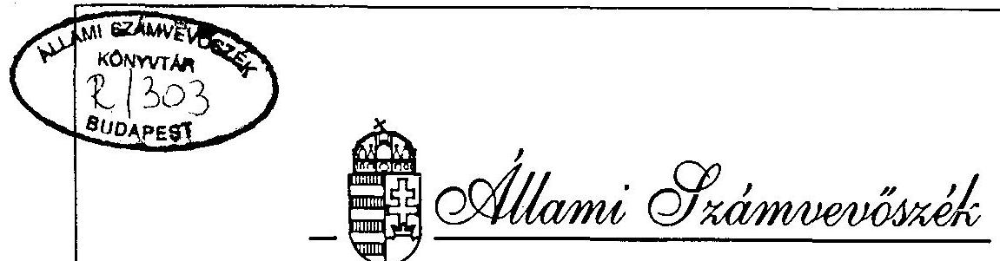

# JELENTÉS 

a fejezetek és intézményeik által az alapítványoknak juttatott állami pénzek és vagyon felhasználásának, müködtetésének ellenőrzéséről

---

A vizsgálat végrehajtásáért felelős:
az ÁSZ III. Költségvetési Ellenőrzési Igazgatósága
Bihary Zsigmond igazgató

Az ellenőrzést vezette:
Nagy Ákosné igazgatóhelyettes
Az összefoglaló jelentést készítette:
Balázs Andrásné számvevö tanácsos
Az ellenőrzést végezték:
Balázs Andrásné számvevö tanácsos
dr. Benkö János számvevő tanácsos
Csontosné Kiss Margit számvevő
Csóri Györgyné számvevő tanácsos
Eötvös Magdolna számvevő
Gömöri József számvevő tanácsos
Nagyné Lunger Éva számvevő
Papp Sándor számvevő tanácsos.
Pásztor Katalin számvevő
Révész János számvevő tanácsos
Robák Ferencné számvevő
Szíjártó Károly számvevő tanácsos
Temesváry Miklós számvevő
dr. Solymár Károlyné küllső munkatárs

---

# TARTALOMJEGYZÉK 

OI.DAL
BEVEZETÉS ..... 1
I. KÖVETKEZTETÉSEK, JAVASLATOK. ..... 3
II. RÉSZLETES MEGÁLLAPÍTÁSOK ..... 9
AZ ALAPÍTVÁNYOK LÉTREHOZÁSA ÉS ANNAK JOGI KERETEI. ..... 9
A. Alapítványok ..... 10

1. Az alapitványi müködés, gazdálkodás jogi, vagyoni, szervezeti feltételei, szabályozottsága ..... 10
2. Az alapitványokhoz rendelt állami vagyonnal való gazdálkodás ..... 20
3. Az alapitványi célú bevételek ..... 28
4. Az alapitványi adókedvezmény ..... 39
5. Az alapitványok és alapitók, támogatások közötti kapcsolat ..... 39
6. Az alapitványok tevékenységének ellenörzése. ..... 40
B. KÖZALAPÍTVÁNYOK ..... 43
7. A kőzalapitvánnyá alakulás helyzete. ..... 43
8. A müködés, gazdálkodás jogi, vagyoni, szervezeti feltételei, szabályozottsága ..... 45
9. Az alapitványi célú bevételek felhasználása. ..... 53
Mellékletek
I. Helyszinen ellenörzött alapítványok
10. A Magyar Köztársaság Kormánya által, illetve részvételével alapitott kőzalapitványok néhány adata
3/A. Beszámolási kötelezettségüket nem teljesitő alapítványok
3/B. Beszámolási kötelezettségüket nem teljesitő alapítványok
3/C. A beszámolási kötelezettségüket nem teljesitő alapítványok
11. A vizsgált alapítványok területi megoszlás szerint
12. A vizsgált alapítványok az alapítás éve szerint
13. A vizsgált alapítványok jellemzői
14. A vizsgált alapítványok száma területi megoszlás és hatáskör szerint
15. Az alapítványok alapító okirat szerinti felhatalmazása az alapítványi vagyon felhasználására
16. Vállalkozások
17. Az alapítványok gazdálkodásának jellemzői I.
II. Az alapítványok gazdálkodásának jellemzői II.
18. A vizsgált alapítványok szabályozottsága
19. Leltározás
20. Az alapítványok vagyona
21. Az alapítványok vagyona területi megoszlás szerint
22. Alapitáshoz adott alapítói vagyon
23. Eszközök és források

---

18. Eszközök és források (közalapítványok)
19. Eszközök és források (állami forrásból alapított alapítványok)
20. Eszközök és források (állami forrásból támogatott alapítványok)
21. Az alapítványok megoszlása az 1994. évi saját tőke nagysága szerint
22. Elszámolt értékvesztések
23. Elszámolt értékvesztések (közalapítványok)
24. Elszámolt értékvesztések (állami forrásból alapított alapítványok)
25. Az alapítványok összesített pénzügyi adatai és beruházásai
26. A közalapítványok összesített pénzügyi adatai és beruházásai
27. Állami forrásból alapított alapítványok összesített pénzügyi adatai és beruházásai
28. Az állami forrásból támogatott alapítványok összesített pénzügyi adatai és beruházásai
29. 1992. évben adott támogatások (adományok)
30. 1993. évben adott támogatások (adományok)
31. 1994. évben adott támogatások (adományok)
32. Adókedvezmény igénybevételére jogosító igazolások kiadására adott APEH engedélyek I.
33. Adókedvezmény igénybevételére jogosító igazolások kiadására adott APEH engedélyek II.
34. Kapott és adott támogatások, adományok
35. Kapott és adott támogatások, adományok (közalapítványok)
36. Kapott és adott támogatások, adományok (állami forrásból alapított alapítványok)
37. Kapott és adott támogatások, adományok (állami forrásból támogatott alapítványok)
38. Az alapítványi források jellemző felhasználási módja
39. Tájékoztató adatok az alapítványok főbb alapítványi célokra fordított költségeiről
40. Tájékoztató adatok az alapítványok főbb alapítványi célokra fordított költségeiről (közalapítványok)
41. Tájékoztató adatok az alapítványok főbb alapítványi célokra fordított költségeiről (állami forrásból alapított alapítványok)
42. Tájékoztató adatok az alapítványok főbb alapítványi célokra fordított költségeiről (állami forrásból támogatott alapítványok)
43. A költségvetési normatív támogatás és felhasználása 1992. évben
44. A költségvetési normatív támogatás és felhasználása 1993. évben
45. A költségvetési normatív támogatás és felhasználása 1994. évben
46. Költségvetési normatív támogatásban részesített alapítványok által teljesített feladatmutatók 1992. évben
47. Költségvetési normatív támogatásban részesített alapítványok által teljesített feladatmutatók 1993. évben
48. Költségvetési normatív támogatásban részesített alapítványok által teljesített feladatmutatók 1994. évben
49. Munkaügyi adatok (közalapítványok)
50. Munkaügyi adatok (állami forrásból alapított alapítványok)
51. Az alapítványok ellenőrzése
52. 1992-1994. évben adott támogatások és elszámoltatásuk

---

# JELENTÉS   a fejezetek és intézményeik által az alapítványoknak juttatott állami pénzek és vagyon felhasználásának, müködtetésének ellenörzéséről 

## Bevezetés

Az alapítvány a civil szféra jogintézményeként müködő, tartós és közérdekủ célra létrehozott vagyontömeg. Önálló jogi személy, amely vagyonával önállóan rendelkezik. Kezelője - képviselöje - az alapító által kijelölt kezelő szerv. Az alapítvány alapító okiratának érvényességéhez annak bírósági nyilvántartásba vétele szükséges, az alapítvány a bírósági nyilvántartásba vétellel nyeri el jogi személyiségét. Az alapítványok müködése felett az ügyészség törvényességi felügyeletet gyakorol. Az Állami Számvevőszék az 1989. évi XXXVIII. törvény 2. § (5) alapján ellenőrzi az alapítványoknál az állami költségvetésből juttatott támogatás felhasználását.

Az alapítvány egyik válfaja a közalapítvány, melynek alapítóit, illetve a közérdekủ célokon belül a tevékenységét a Ptk. külön is meghatározta: "A közalapítvány olyan alapítvány, amelyet az Országgyűlés, a Kormány, valamint a helyi önkormányzat képviselö testülete közfeladat ellátásának folyamatos biztosítása céljából hoz létre." Közfeladatnak az az állami vagy helyi önkormányzati feladat minősül, amelynek ellátásáról - jogszabály alapján - az államnak vagy az önkormányzatnak kell gondoskodnia. A közalapítvány létrehozása nem érinti az államnak, illetve az önkormányzatnak a feladat ellátására vonatkozó kötelezettségét. A közalapítvány alapító okiratát és gazdálkodásának legfontosabb adatait nyilvánosságra kell hozni.

A közalapítványok gazdálkodásának törvényességét és célszerüségét - a helyi önkormányzat képviselőtestülete által alapított közalapítvány kivételével - az Állami Számvevőszék ellenőrzi, a Ptk. 74/G. § (8) bekezdése alapján.

Az Állami Számvevőszék 1994-ben a központi költségvetési szerveknél ellenőrizte az alapítványi célú állami pénz- és vagyon juttatások szabályszerűségét. Jelen vizsgálatunk ehhez kapcsolódóan - az 1989. évi XXXVIII. törvény 2. § (5) és a Ptk. 74/G. § (8) bekezdésekben foglaltak alapján - az alapítványok körében ellenőrizte a juttatott állami

---

pénzek és vagyon felhasználását, müködtetését, figyelemmel egyben a Kormánynak a Nemzeti Gyermek és Ifjúsági (Köz)alapítvány ellenőrzését kezdeményező felkérésére.

A vizsgálat célja az volt, hogy értékelje az alapítványoknak juttatott állami vagyon megőrzésének, hasznosításának helyzetét; az átadott állami vagyon és támogatás alapítványi céloknak és törvényi előírásoknak megfelelő felhasználását; a közalapítvánnyá alakulás helyzetét; a Nemzeti Gyermek- és Ifjúsági (Köz)alapítványnál a gazdálkodás törvényességét és célszerüségét, figyelemmel az ÁSZ 1991. évi ellenőrzésének megállapításaira.

Tanúsitvány formájában 399 - az előző vizsgálat szerint a központi költségvetési szervek által alapított, illetve 1992-94. között támogatott - alapítványt kívántunk beszámoltatni a juttatott állami pénz és vagyon felhasználásáról. 328 alapítvány adatai érkeztek vissza, és ebből 308 alapítvány adatai voltak értékelhetők és feldolgozhatók. 71 alapítvány nem küldte vissza a tanúsítványokat, közülük "címzett ismeretlen" jelzéssel kézbesíthetetlen volt 24, illetve nem válaszolt 47. A beérkezett és feldolgozásra nem került 20 alapítvány nem vallotta be a kapott állami támogatást. A hiányos adatszolgáltatás ellenére felmérésünk az 1992-94. között adott állami támogatás $99 \%$-ára kiterjedt.

A beszámolási kötelezettségüket nem teljesitő alapítványok nevét és az adott támogatást a 3. sz. melléklet tartalmazza, ezek az alapítványok a beszámolási kötelezettség alá tartozó alapítványok $23 \%$-át teszik ki.

Megállapításaink a tanúsítványok formájában beszámoltatott 308 alapítvány számítógépes feldolgozással összegzett adatain (4-52. sz. melléklet), valamint 11 alapítványnál (1. sz. melléklet) folytatott helyszíni ellenőrzés tapasztalatain alapulnak és az állami forrásból alapított vagy támogatott alapítványokra általánosíthatók.

Vizsgálatunk a bejegyzett alapítványok mintegy $3 \%$-át érintette, az általuk realizált bevétel viszont eléri az összes alapítvány bevételének $30 \%$-át. Alapitó okirat szerint a vizsgált alapítványok induló vagyona 21,6 Mrd Ft volt, saját tőkéjük pedig 1994. végén meghaladta a 35,8 Mrd Ft-ot. Az induló vagyonból 15,5 Mrd Ft-ot a központi költségvetés, 2,7 Mrd Ft-ot az egészben vagy részben állami tulajdonban álló gazdasági társaságok, 1,5 Mrd Ft-ot pedig az egészben vagy részben állami tulajdonban álló pénzintézetek adtak. 1992-1994. között - megalakulásukat követően - ezek az alapítványok további 28,4 Mrd Ft állami támogatást (tárgyi eszköz, készpénz) kaptak, ezen belül a központi költségvetésből 26,9 Mrd Ft-ot, az egészben vagy részben állami tulajdonban álló gazdasági társaságoktól 0,5 Mrd Ft-ot, a pénzintézetektől pedig 1 Mrd Ft-ot.

A feldolgozásra került alapítványi kör összesen 48 Mrd Ft állami támogatást kapott 1994. végéig, ebből az átadott ingatlanok nyilvántartási értéke 9,1 Mrd Ft, az átadott készpénz összege pedig 35,2 Mrd Ft volt.

A vizsgált alapítványok közül 14 közalapítvány (illetve jogelődje), 154 állami forrásból alapított és 140 állami forrásból támogatott alapítvány volt. Többségüket (84\%) 1990-1992. között alapították (5. sz. melléklet), csaknem mindegyiket nyitott

---

alapítványként, határozatlan időtartamra. Az alapítványok 63\%-ának a székhelye Budapest (4. sz. melléklet). Nemzctközi hatáskörü feladatokat $23 \%$-uk, országos feladatokat $45 \%$-uk lát el, viszonylag csekély ( $15 \%$ ) azoknak az állami forrásból alapított vagy támogatott alapítványoknak a száma, amelyeknek csak egy településre, vagy lakókörzetre terjed ki a tevékenysége ( $6 ., 7$. sz. melléklet).

Az ellenőrzés az 1992-1994. évek közötti időszakra irányult, a közalapítványok megalakulását 1995. végéig vizsgáltuk.

Megállapításainkat a jelentésben foglaltuk össze, melynek 1. sz. függeléke a Nemzeti Gyermek és Ifjúsági (Köz)Alapítvány, 2. sz. függeléke a helyszínen vizsgált többi alapítvány ellenőrzési tapasztalatait külön-külön tartalmazza.

# I.   Következtetések, javaslatok 

Az alapítvány jogintézményének újbóli létrehozását követően, a Ptk. 1990. évi módosítása után magánkezdeményezésre tízezernél több alapítvány létesült, zömmel 1 M Ft alatti vagyonrendeléssel. Az eltelt időszakban az alapítvány, mint jogintézmény hasznosnak bizonyult. Tevékenységükkel előmozdítottak több, anyagi eszközzel szűkösen vagy szükösebben ellátott közcél teljesítését, felélesztették és társadalmilag egyre inkább elismertté teszik az önkéntes adakozást és áldozatvállalást. Ugyanakkor az alapítványok tevékenysége nem volt mentes az egyéni haszonszerzési szándékoktól. A tapasztalt viszszaélések, ügyeskedések az egyedi károkozáson túl az alapítványt, mint intézményt is kikezdik, a polgárok bizalmatlanná válhatnak adományuk célszerinti felhasználásában, a támogatásra meghirdetett cél valódiságában. Ezért is különösen fontos a jogi, gazdasági szabályozás újbóli áttekintése, kiegészitése, pontositása.

Az általunk vizsgált alapítványok az összes alapítványt tekintve nem tipikusak. Vagyonuk túlnyomó többsége nem a civil szféra, hanem az állam kincstári, illetve vállalkozási vagyonából származik. Ez a vagyontömeg - mintegy $35,8 \mathrm{Mrd} \mathrm{Ft}$ - az alapítványok szük körére koncentrálódik. A vagyonkoncentrációra jellemző, hogy az alapítványok saját tőkéjének 1/3-ával ( $12,1 \mathrm{Mrd}$ Ft) két alapítvány rendelkezik, további $1 / 3$-át ( $11,7 \mathrm{Mrd}$ Ft) hat alapítvány birtokolja, a fennmaradó $1 / 3$ rész háromszáz alapítvány között, hasonlóan aránytalanul oszlik meg.

A központi költségvetési szervek alapítói közremüködésével - felmérésünk szerint 168 alapítvány létesült, elsősorban 1990-1992. között. Köztük olyanok is találhatók, melyek óriási ingatlanvagyon és rendszeres költségvetési támogatás juttatásával korábban állami keretben ellátott feladatokat vettek át azzal a céllal, hogy az alapítványok nyitottabb müködése, a szakmai nyilvánosság fokozottabb bevonása révén igazságosabb legyen a forráselosztás és feladat-támogatás.

---

Rendszeres vagy eseti központi költségvetési támogatásban - összesen 28,4 Mrd Ft-ban az alapítványok mintegy $3 \%$-a részesült 1992-94. között. A központi költségvetésböl biztosított pénzeszközök jórészt korábban is a támogatott alapítványi céloknak megfelelő területen kerültek felhasználásra. Jellemző, hogy ebben az alapítványi körben a civil szféra a folyamatos müködéshez - a többi alapítványhoz képest - alacsonyabb mértékben járult hozzá. A vizsgált alapítványok nem állami forrásból mintegy 12 Mrd Ft támogatáshoz jutottak, ennek közel fele külföldről származott.

Az eddig eltelt idöszak nem igazolta vissza azt a várakozást, hogy ezek az alapítványok sikeresen mozgósítani és koncentrálni tudják az állami támogatáson kívüli anyagi eszközöket. Müködésük biztonsága egyértelmüen a központi költségvetési támogatás nagyságától és rendszerességétől függ. Az állami támogatásnak alig 5\%-a jut el pályázatok útján az alapítványokhoz, legnagyobb részüket általános célmeggelöléssel (vagy anélkül), elszámolási kötelezettség nélkül kapják, így a támogatók a cél szerinti, takarékos felhasználás befolyásolásának egyik leghatékonyabb eszközétől fosztják meg magukat. Az egyedi kormányhatározatokkal adományozott támogatások zömét a kormány 1992-94. között konkrét cél megjelölése vagy elszámolási kötelezettség elöirása nélkül juttatta az alapítványoknak.

A kuratóriumok egy részének gyenge, illetve kifogásolható teljesítménye vagy közömbössége is közrejátszik abban, hogy az állami támogatás szakszerü, pártatlan és hatékony felhasználása jelenleg még nem kielégitő.

Az alapítványok alapítványi célú tevékenységeik közül a vizsgált három évben legtöbbet a kultúrális feladatokra, az oktatásra, a kutatásra, a határon túli magyarsággal kapcsolatos feladatokra és üdülésre fordítottak. Összegszerűségben legkevésbé támogatott területnek az állampolgári jogok védelme, a menekültek segítése, a politikai, továbbá a vallás- és hitéleti tevékenység minősíthető.

Több alapítványnál tapasztalható, hogy háttérbe szorul az alapító által megjelölt célok többsége, az alapító okiratban megjelölt célok közül egyet-kettőt kiemelnek, másokat teljesen mellőznek az alapítványi források felhasználásánál. Az alapítványi céloknak megfelelően legjobban azok az alapítványok müködnek, amelyek kiadásaik nagyobb hányadát pályázati rendszer müködtetésével teljesítik, illetve amelyek közfeladatát az általuk fenntartott intézmény végzi.

Az alapítványoknál végzett helyszíni ellenőrzés és a tanúsítványok útján történt beszámoltatás alapján a vagyonkezeléssel és gazdálkodással, az állami támogatás felhasználásával kapcsolatos tapasztalataink többségükben negatívak.

Az alapítványok - föleg a közalapítványok - jelentős része az alapítványi cél teljesítése érdekében teljes vagyonát felhasználhatja, így tartós müködésük a rendszeres támogatás függvénye. Az alapítványok tartós, határozatlan idejű müködésének igazi garanciája az olyan mértékủ vagyontömeg lenne, amelynek hozama vagy használata révén az alapítványi célok teljesíthetők. Ez a feltétel ma még csak az alapítványok töredékénél

---

biztosított, jelentős változásra - figyelemmel a gazdasági realitásokra - még hosszútávon is csekély lehetőség van.

Az alapítványok egy része - jelentős állami támogatás felhasználásával - közérdekünek nem minősíthető gazdasági tevékenységet végez, ráadásul befektetéseik jövedelmezösége kétséges vagy egyenesen veszteséges. A kapott vagyont változatos módszerekkel és eredményekkel kisérlik meg gyarapitani. A tapasztalt vagyonvesztések, a hozam nélküli befektetések, a kétséges visszatérülésủ kölcsönök, a veszteséges vállalkozási tevékenységek azt mutatják, hogy a kuratóriumok többségének szakmai felkészültségét, üzleti tapasztalatát messze meghaladják a vagyon érdemi kezelésének feladatai. Sajnálatosan volt rá eset, hogy a kuratóriumok egyes tisztségviselői és alkalmazottai, továbbá a támogatók az alapítványok hátrányára igyekeztek személyes jövedelmüket gyarapitani, üzleti hasznukat növelni. A kuratóriumok személyi összetételükben inkább a rendelkezésükre álló forrásoknak az alapítványi célok szerinti felhasználására, felosztására képesek.

Néhány nagy - a Kormány által alapított - alapítvány jelenlegi súlyos müködési zavara az alapításkor elkövetett hiányosságokra is visszavezethető: rendezetlen vagyont kaptak túlzottan heterogén célrendszerhez, finanszírozásuk átmeneti, vagy a célok teljesitéséhez nem elégséges. Az elsietett alapítói döntések az alapítványok nyilvántartásba vételének elhúzódásához, tisztázatlan jogi helyzetek kialakulásához is vezettek.

Az alapítványok közel egyharmad részében a kuratóriumok nem látták el megfelelően az alapító által rájuk bizott feladatot: nem készítettek költségvetést, nem tárgyalták meg az éves munkáról szóló beszámolót, az alapítvány vagyonának kezelése, a fontos döntések a kuratórium hatásköréből iránymutatás és ellenőrzés nélkül az elnök vagy a munkaszervezet kezébe kerültek.

Az alapítványok szabályozottsága gyenge, több, mint felének nem volt semmilyen belső szabályzata. Harmaduknál elfogadhatatlan a számviteli munka színvonala, nem tartották be maradéktalanul a számviteli törvény alapelveit, a mérlegek egy része nem rögzítette az alapítvány teljes - esetenként több milliárd Ft-os - ingatlanvagyonát, az alapítványi vagyon forrásait.

A számviteli munka hiányosságaiban a jogi szabályozás gyengeségei is közrejátszanak: nem egyértelműen értelmezhetőek egyes fogalmak, a beszámoló rendszer a kis alapítványok tevékenységéhez túl bonyolult, a nagy alapítványokéhoz viszont leegyszerüsített, kevés a kinyerhető információ.

Az alapítványok egy részénél nem tartották be a pénzügyi rend és bizonylati fegyelem alapvető normáit. A gazdálkodási mulasztásokat olykor jogosulatlan egyéni haszonszerzés is motiválta, előfordult, hogy ezek személyi összeférhetetlenségen alapuló üzleti kapcsolatokra épültek.

---

Komoly hiányosságok tapasztalhatók a vagyonvédelemben. Az alapítványok 40\%-a megalakulása óta még egyszer sem leltározott, a végrehajtott leltározások egy részének megbizhatósága erősen kétséges.

A közalapítvány jogintézményének bevezetése a nagy vagyontömeget birtokló, a Kormány, illetve a fejezetek alapítói közremüködésével létrehozott és állami közfeladatot is ellátó alapítványokat egy, ma már esetlegesnek minősíthető körülmény szerint osztotta közalapitványokra és alapítványokra, nevezetesen azzal, hogy maga a Kormány volt-e az alapító, vagy az alapításra a tevékenység szerint illetékes minisztert utasította. Az alapítás tényét, az alapítványnak rendelt vagyon nagyságát és összetételét ez esetben is a Kormány döntötte el.

A jelenlegi szabályozás szerint a nem közalapitványnak minősülő, de állami közfeladatokat ellátó, folyamatos költségvetési támogatásra szoruló alapítványok kuratóriumainak jóváhagyó döntése nélkül nem lehetséges a közalapítvánnyá átalakítás, miközben esetenként az egy milliárd Ft-ot is meghaladó, volt kincstári vagyont - az alapító okiratok hiányosságai miatt - e kuratóriumok korlátozás nélkül felhasználhatják, akár a teljes vagyon feléléséig.

A vizsgálat tapasztalata szerint a Kormány több - átalakítással létrejött vagy újonnan alapított - közalapítvány állami közfeladatát jogszabállyal nem támasztotta alá, vagy a közfeladat nem elég pontosan körülhatárolt és konkrét.

Az átalakulással létrejött egyes közalapítványoknál a kapott vagyon kezelése súlyos gondokat okoz, részben kedvezőtlen szerkezete, részben a jogelőd alapítványok kuratóriumainak súlyos mulasztásai miatt.

A közalapítványok létrehozását motiváló gazdasági szándék - a civil szféra bevonása a közfeladatok finanszírozásába - az eddig eltelt időszakban - az alapítványokéhoz hasonlóan - nem teljesült. Általánosan kimondható, hogy a közalapítványok többsége rendszeres költségvetési támogatás nélkül müködésképtelen. Az alapító erre irányuló kötelezettségvállalását az alapító okiratok nem mindegyike tartalmazza. Ezért a közalapítványok támogatását törvényben célszerü garantálni, a támogatás tervezésének rendjét pedig az államháztartási törvényben kell szabályozni.

A közalapítványok kuratóriumainak egy részében meghatározó szerepet kaptak miniszterek, vezető köztisztviselők és közalkalmazottak, így a döntésekben a szélesebb szakmai közvélemény nem kellően érvényesül.

A Nemzeti Gyermek és Ifjúsági (Köz)alapitvány (NGYIA) 5 éves müködése során nem tudott megfelelni az alapító okiratban foglalt feladatoknak, céloknak, nem tudott integrálódni az országos ifjúságpolitikai rendszerbe. Ebben szerepet játszott, hogy az alapítványt rendezetlen vagyonnal, instabil és beszükülő finanszírozással, túlzottan heterogén célrendszerrel alapították. Az 1992-1995. évek közötti időszakban az NGYIA vagyongazdálkodása, müködése és alapítványi tevékenysége nem stabilizálódott, müködése 1995-re ellehetetlenült. A fizetésképtelenség kialakulásához a sza-

---

- bálytalanul, a felelőtlenül és nagy volumenben végzett vállalkozási és hitelezési tevékenység vezetett. Az NGYIA szabályozása és szervezeteinek müködése nem volt megfelelő. Üzleti koncepció, gazdasági számítások, a költségvetés alakulásával kapcsolatos ismeretek hiányában a kuratórium nem volt valódi gazdája az alapítványnak. Az NGYIA a vagyonvédelem elemi feladatait sem teljesítette, mérlegei nem hitelesek. Mindezekben közrejátszott az is, hogy az 1991. évi számvevőszéki ellenörzés megállapításait a szükséges érdemi intézkedések nem követték, azok nagyobb részt elmaradtak.

Az ellenőrzés megállapításai alapján javasoljuk.

# A Kormánynak 

1) Készítse elő az alapítványokról szóló törvényjavaslatot a következők figyelembevételével:
a) kizárja az alapító és az alapító által irányított, felügyelt szervezetek első számú vezetőinek részvételét a központi költségvetési szervek által alapított (köz)alapítványok kuratóriumaiban és munkaszervezeteiben;
b) közalapítványnak minősíti a kizárólag központi költségvetési szervek által alapított, állami közfeladatot ellátó alapítványokat;
c) az alapítványnak rendelt vagyontömeg biztonságos megőrzése érdekében megtiltja a nem alapítványi célú kölcsönök folyósításának lehetőségét, az alapítványok átmenetileg vagy tartósan szabad pénzeszközeit csak tartós bankbetétben, vagy államilag garantált értékpapírok befektetésébe engedélyezi, az alapítványok részesedést (részvényt, törzsbetétet, üzletrészt, vagyoni betétet) csak alapító okiratukban meghatározott közérdekủ céljaik ellátásának biztosítására létrehozott gazdasági társaságokban szerezhetnek; közalapítványok esetében az alapító okiratban rögzített felhatalmazás és elôit feltételek teljesítésével;
d) az állami támogatás felhasználásánál a közérdekủ feladatok között korlátozza, illetve kizárja a gazdasági tevékenység egyes konkrét formáit (befektetési célú tevékenység), a közalapítványok állami közfeladatainál a vállalkozásokhoz nyújtott anyagi támogatásokat;
e) az alapítványok kuratóriumi tagjainak felelősségén belül külön szabályozza a kuratórium tisztségviselőinek és a képviseletre jogosultak fokozott felelősségét, az ehhez tartozó jogokkal együtt;
f) részletesen meghatározza a közalapítványok kötelezően nyilvánosságra hozandó adatainak tartalmát (mérleg, támogatott tevékenységek, szervezetek, személyek megnevezése, a támogatás célja és összege, stb.).
2) Kezdeményezze az államháztartási törvény módosítását a közalapítványok nem normatív támogatásának garantálása és tervezési rendjének szabályozása érdekében.
3) Az alapítványok éves beszámolójának készítését és könyvvezetési kötelezettségét szabályozó $8 / 1996$. (I.24.) és a gazdálkodási rendjét szabályozó $115 / 1992$. (VII.23.) Kormányrendeletek módosításával az alapítványok szélesebb körére (pl. 50 M Ft-ot meghaladó bevételt realizáló alapítványok) terjessze ki a kettős könyvvitel alkalmazá-

---

sának kötelezettségét. Az egyszerüsített beszámoló és mérleg mellé az alapítványi bevételek és kiadások és az ebből származó tökeváltozás több információt tartalmazó rendszerét írja elő. Egyértelműen határozza meg a bevételként, illetve tökeváltozásként kezelt támogatások körét. A közalapítványok számviteli és gazdálkodási szabályait, beszámolók rendszerét hozza összhangba a központi költségvetési szervek szabályozásával úgy, hogy a gazdálkodásban a kuratóriumok felelőssége ne korlátozódjon, de a pénzügyi fegyelem erősödjék.
4) Valamennyi közalapítvány állami közfeladatát jogszabályokban, pontosan körülhatároltan szabályozza. Az alapító okiratokban feltárt hiányosságokat az alapító okiratok módosításával szüntesse meg.
5) Tekintse át a közalapítványoknak és a központi költségvetési szervek alapítói közremüködésével alapított alapítványoknak rendelt ingatlanvagyont és kezdeményezze az alapító okiratok módosítását a tartós müködéshez szükséges, elsősorban a történelmi jelentőségű épületek törzsvagyonná nyilvánításának érdekében.
6) Gondoskodjon arról, hogy a központi költségvetési szervek az alapítói közremüködésükkel létrejött alapítványok alapítói okiratainak módosításával felügyelő bizottságot vagy okleveles könyvvizsgálót rendeljenek ki a kuratóriumok tevékenységének rendszeres ellenőrzésére, vizsgálják felül és szükség szerint módosíttassák az alapítványok Szervezeti és Müködési Szabályzatát.
7) Alapitói jogát érvényesítve tegyen intézkedést a törvénysértően vagy szabálytalanul müködő alapítványok kuratóriumai vagy egyes tisztségviselői, tagjai visszahívására és erre szólítsa fel a fejezeteket, központi költségvetési szerveket is.
8) Intézkedjék az alapítványoknak juttatott támogatások cél- és rendeltetésszerinti felhasználására vonatkozó kötelezettség előírásáról és a kapcsolatos elszámolási rend kidolgozásáról. Gondoskodjon arról, hogy állami támogatást csak olyan alapítványok kapjanak, amelyek müködése törvényes, számviteli-pénzügyi tevékenységük megfelelő, korábbi elszámolási kötelezettségüknek kifogástalanul eleget tettek.
9) Kötelezze az érintett központi költségvetési szerveket arra, hogy

- számoltassák be azokat az alapítványokat, amelyek nem teljesítették az állami támogatással kapcsolatos elszámolási kötelezettségüket az Állami Számvevőszéknek;
- azoknál az alapítványoknál, amelyek beszámoltatása "címzett ismeretlen" jelzés miatt meghiúsult, tárják fel a számukra juttatott költségvetési támogatás sorsát;
- szükség szerint végezzenek helyszíni ellenőrzést és ezek megállapításai alapján indokolt esetekben intézkedjenek a támogatás visszafizettetése és a további állami támogatásból való kizárásuk érdekében.
10/a. szabályozza az ifjúságpolitikával kapcsolatos feladatokat, jog- és hatásköröket, ehhez kapcsolódóan alakítsa ki az NGYIA céljait, feladatait. Az 1995. évi LXIV. törvény által előirt alapító okirat módosításával érvényesítse a számvevőszéki vizsgálat tapasztalatait, különös tekintettel az alapítványi célrendszert meghatározó prioritások szűkítésére, az ifjúsági célok előtérbe helyezésére, a feladatokkal összhangban álló szervezet kialakítására, az NGYIA finanszírozására, a kuratórium, a felügyelő bizottság müködésére, felelősségére, figyelemmel a válsághelyzet megoldásával kapcsolatos feladatokra is.

---

10/b. Az ifjúsági közvagyon védelme érdekében intézkedjen, hogy az NGYIA az Általános Értékforgalmi Bank hitelböl származó kötelezettségeinek mielőbbi megoldására, esetleges külső források felkutatására és bevonására is figyelemmel, dolgozzon ki javaslatot.

# Az Igazságügyi Minisztériumnak: 

Biztosítsa a közalapítványok elkülönített nyilvántartását és a nyilvánosság számára az adatszolgáltatást, szükség esetén az alapítványok nyilvántartásának ügyviteli szabályairól szóló 15/1994. (IX.28.) IM rendelettel módosított 12/1990. (VI.13.) IM rendelet további módosításával.

## Az ellenőrzött (beszámoltatott) alapítványok kuratóriumainak:

Intézkedjenek a feltárt szabálytalanságok, hiányosságok megszüntetése, belső szabályzataik szükség szerinti kiegészítése, módosítása és ezek maradéktalan betartása, és mindezek miatt a személyi felelősség tisztázása és érvényesítése érdekében.

## II.   Részletes megállapítások

## Az alapítványok létrehozása és annak jogi keretei

A magyar jogrendszerben a Ptk-t módosító 1987. évi 11. sz. törvényerejü rendelettel nyerte vissza létjogosultságát az alapítvány jogintézménye. Korábban a Ptk. ugyanis az alapítvány-rendelést közérdekü célú kötelezettségvállalásnak, illetve közérdekủ meghagyásnak tekintette.

Az 1987. évi 11. sz. törvényerejű rendelet lehetővé tette, hogy magánszemélyek, jogi személyek és - az 1993. évi XCII. törvény alapján - jogi személyiséggel nem rendelkező gazdasági társaságok tartós, közérdekü célra alapítványt hozzanak létre. Az alapítványban egy vagyontömeg válik meghatározott célok elérése érdekében önállóvá, melynek kezelését az alapítótól függetlenül müködő szervezet látja el.

Az 1990. évi I. törvény megszüntette az alapítványok államigazgatási felügyeletét, azok nyilvántartásba vételére és megszüntetésére bírósági, felügyeletére pedig ügyészségi hatáskört állapított meg.

Az 1993. évi XCII. törvény megteremtette a közalapítvány intézményét is. Közalapítványt az Országgyülés, a Kormány, valamint a helyi önkormányzat képviselő testülete hozhat létre közfeladat folyamatos ellátása céljából. A közérdekü és tartós cél kizárólag olyan állami vagy önkormányzati feladat ellátása lehet, amelyről jogszabály (törvény vagy kormányrendelet) szerint az államnak vagy a helyi önkormányzatnak kell

---

gondoskodnia. A közalapítvány a közfeladat ellátását az állam vagy az önkormányzat érdekében, de a saját nevében szervezi.

A jogi szabályozás azonban nem minden tekintetben igazodott megfelelően a változásokhoz, illetve az azokkal összefüggő célokhoz. Az alapítványok létrehozásában, a közalapítvánnyá alakulásban, a vagyon müködtetésében, a támogatások felhasználásában, a könyvvezetésben tapasztalt anomáliák kialakulásához hozzájárult a hiányos, ellentmondásos jogi szabályozás is.

# A.   Alapitványok 

## 1. Az alapítványi müködés, gazdálkodás jogi, vagyoni, szervezeti feltételei, szabályozottsága

1.1. Az alapítványok a bírósági nyilvántartásba vétellel válnak jogi személlyé, az alapító okirat érvényességéhez is a bírósági nyilvántartásba vétel szükséges. Az alapító okiratok egy része nem felel meg a Ptk. alapítványokra vonatkozó előirásainak, illetve módosításainak (1993. évi XCII. törvény) konzekvenciáit az alapító okiratok egy részénél nem vezették keresztül.

#### Abstract

A Magyar Nemzeti és Etnikai Kisebbségekért Alapítvány 1990-ben nyilvántartásba vett alapító okiratát a Ptk. módosítása után nem változtatták meg. 1993ban készült ugyan egy módosítás-tervezet, de nem terjesztették a Kormány ele a kisebbségekről készülő törvény várható módosítása miatt.

A Csehszlovákiai Magyar Kultúráért Alapítvány alapitó okiratát 1990-ben vette nyilvántartásba a biróság, melyben az alapítvány megszüntetéséhez kapcsolódóan a jelenleg hatályos Ptk-val ellentétes tételek szerepeinek: "Ha az alapitvány bármilyen okból megszünik, s a kuratórium másképp nem rendelkezik, akkor az alapítvány vagyonát a hasonló célú Bethlen Alapitványra, illetve ha ez nem létezne, az alapítvány vagyonát az alapító és a csatlakozók között, hozzájárulásuk arányában fel kell osztani."
Előfordult azonban olyan eset is, hogy a biróság az alapítói döntést megelőzően már nyilvántartásba vette az alapítványt. (A Hungária Televízió Alapítványt a Fővárosi Bíróság két nappal azelőtt vette nyilvántartásba, mielőtt megalakulásáról a Kormány döntött volna.)

Az alapítványok egy része már a bírósági nyilvántartásba vétel előtt müködni kezdett, a kuratóriumok a vagyont érintő döntéseket hoztak, kötelezettségeket vállaltak, jóllehet az alapítvány még nem volt jogi személy és az alapító okirat még nem volt érvényes. Ezeknél az alapítványoknál a bírósági nyilvántartásba vétel elhúzódásának oka a hiányosan benyújtott bejegyzési kérelem vagy az alapító okirattal szemben támasztott törvényességi kifogás volt.

---

Hat hónappal a birósági nyilvántartásba vétel elött kezdte meg müködését a Grassalkovich Kastély Alapitvány 1993-ban. A biróság részben hiánypótlás, részben törvényességi észrevételek miatt a bejegyzési kérelmet visszaadta, módosításra szorult a Kormány által korábban jóváhagyott és nyilvánosságra hozott alapitó okirat is. A kijavitott és módositott alapitó okiratot figyelmen kivül hagyva a kuratórium a birósági nyilvántartásba vételt követöen is az eredeti, érvénytelen alapitó okirat szerint dolgozott (ellenjegyzési jog, aláírási jog gyakorlasa).

A birósági nyilvántartásba vétel után az alapitó az alapitványt nem vonhatja vissza. A törvényi szabályozás ellenére elöfordult, hogy az alapitó fel kivánta számolni alapitói státusát, az alapitó okiratban tett vagyonfelajánlás visszavonásával együtt.

Az 1990-ben létesült "Ipar a korszerü mérnökképzésért" Alapitvány egyik alapitója, a Közlekedési, Hírköztési és Épitésügyi Minisztérium (KHÉM) volt. A KHEM egyik jogutóda, a Közlekedési, Hírközlési és Vizügyi Minisztérium 1992-ben ki akart válni az alapitók közül, de ez a birósági állásfoglalás szerint nem volt lehetséges. A KHEM épitésügyi feladatai a Környezetvédelmi és Területfejlesztési Minisztériumhoz, ipari érdekeltségủ épitészeti feladatai az e szaktorületet megilletö KMFA forrással együtt az Ipari és Kereskedelmi Minisztériumhoz kerültek. A KHEM jogutód tárcái 50 M Ft alapitói vagyonnal tartoznak az alapitványnak, melyet az érintettek tárgyalással kivánnak rendezni. A Környezetvédelmi és Területfçjlesztési Minisztérium az alapitó okiratban felajánlott vagyont csak részben adta át, 7 M Ft-os tartozásából 1994. évben 2 M Ft-ot törlesztett.
1.2. Az alapitvány hosszú távon kiegyensúlyozott müködésének feltételeiröl az alapitók az alapitó okirat körültekintő összeállításával, az alapitványi célok pontos meghatározásával, az alapitványnak rendelt vagyon megfelelő összetételével gondoskodhatnak.

A helyszinen is ellenörzött néhány nagy - a Kormány által alapitott - alapítvány müködési zavarainak egy része az alapításkor elkövetett hiányosságokra is visszavezethetö: rendezetlen vagyon, átmeneti és nem biztonságos finanszirozás, túlzottan heterogén célrendszer.

A Nemzeti Gyermek és Ifjúsági Alapitványt a Kormány 1989-ben rendezetlen vagyonnal, instabil finanszirozással alapította. Az 1992. júliusában kibocsátott módositott alapitó okirat prioritások nélküli célrendszert határozott meg. Az öszszetett feladatrendszer költséges és az ifjúsági célokat háttérbe szorító müködést eredményezett. (Részletesen az 1. sz. függelékben.)

A Hungária Televízió Alapitvány számára az alapitó okiratban és más kormányhatározatokban irreálisan rövid határidöket jelölt meg a Kormány a müholdas TV sugárzásra, igy a létesités és müködtetés anyagi, pénzügyi feltételei csak a kísérleti adás után, fokozatosan és részlegesen teremtödtek meg. Az alapitvány csak 1994-ben kapta meg a müsorsugárzási engedélyt. Az alapitó nem biztositotta az alapitó okiratban és annak módosításában rögzitett személyi és szervezeti feltételeket.

---

Az alapítók - alapító okiratban rögzített - rendelkezése szerint az alapítványi cél teljesítése érdekében a vizsgált alapítványok 44\%-a a teljes vagyonát, $37 \%$-a azt részben (jellemzően a vagyon $10 \%$-a alatti mértékben) felhasználhatja. Mindössze 54 alapítvány ( $18 \%$ ) jogosult csak az alapítványi vagyon tőkéje hozamának felhasználására (8. sz. melléklet). Ez utóbbi vagyonfelhasználási mód tekinthető az alapítványok tartós, határozatlan idejű müködése igazi garanciájának.

Az 54 alapítvány közül 37 az állami forrásból alapított alapítvány, 16 pedig a magánalapítók által alapított alapítvány. Induló vagyonuk összesen 1,5 Mrd Ft volt, cbből csaknem 1 Mrd Ft az ingatlanok és a vagyoni értékủ jogok összege. A müködésük során kapott támogatások, adományok következtében 1994. végére saját tőkéjük 2,4 Mrd Ft-ra nőtt.

Az alapítványok $10 \%$-a ( 31 alapítvány) folytatott 1994-ben vállalkozási tevékenységet, melyek közül csak 8 rendelkezett e célra elkülönített vagyonnal ( 9 . sz. melléklet). Néhány alapítványnál érzékelhető, hogy elsődlegesen gazdasági tevékenységet - nem ritkán veszteséggel - végez, amely a Legfelsőbb Bíróság iránymutató gyakorlata szerint nem közérdekü tevékenység.

Az állami forrásból alapított alapítványok közül kiemelkedően magas ( 89 M Ft ) a Pro Rekreatione Alapítvány vállalkozásra elkülönitctt vagyona, mely az 1994. évi saját tökéjének $54 \%$-át teszi ki. Az alapítványt 1989-ben a Környezetvédelmi és Vízgazdálkodási, valamint a Mezőgazdasági és Elclmezésügyi Minisztérium $4-4 \mathrm{M}$ Ft készpénzzel, továbbá állami tulajdonú gazdasági társaságok $56,9 \mathrm{M}$ Ft ingó és ingatlan vagyonnal és 25 M Ft készpénzzel alapitották. Az alapítvány célja a Velencei tó partján olyan létesitmény létrehozása és müködetése, ahol "lehetővé válik az üdülőkörzet ökológiai egyensúlyának fenntartását clőmozdító tevékenység, az emberek szabadidejénck hasznos cltöltése, általában az ember rekreációja, egészségének rehabilitációja". Az alapítvány feladata továbbá a környezetvédelmi, turisztikai, oktató anyanyelvi táborok és sporttáborok szervezése a belföldi és határon kivüli ifjúság részére, továbbá a mozgáskorlátozottak támogatása. Az alapítvány vállalkozási tevékenysége - 1994. évi költségeinck csaknem $80 \%$-át tette ki - 1992-1994. között összesen 10,5 M Ft veszteséget okozott. Mivel az alapítvány ingatlanvagyonának reál értéke a könyv szerinti értéket meghaladja, vagyona piaci értéken számolva gyarapodott.

A nem állami forrásból alapított alapítványok közül kiemelkedik a PRIMOM Szabolcs-Szatmár-Bereg megyei Vállalkozásélénkítő Alapítvány 38 M Ft összegű vállalkozásra elkülönített vagyona (az 1994. évi saját tőke $17 \%$-a), mellyel az alapítvány 1992-1994. között összesen 4 M Ft veszteséget realizált. 1994-ben a vállalkozási célú költségének összes költségen belüli aránya $40 \%$ volt.
1.3. Az alapító az alapítvány sorsára a kezelő kijelölésével vagy visszavonásával lehet befolyással. A vizsgált körben az alapítók kezelő szervként kuratóriumot hoztak létre, ami az alapítvány legfőbb döntéshozó szerve, megalakulását követően az alapítótól függetlenül kell müködnie.

---

A csatlakozó szervezetek egy része is igényt tartott arra, hogy kurátor delegálásával befolyásolja az alapítvány tevékenységét, kezdeményezésükre 46 alapítványba összesen 93 kurátor került be. Ezt a gyakorlatot közel egyforma (8-8\%) arányban lehetett tapasztalni valamennyi alapítvány-csoportnál. A kuratóriumok létszáma jellemzően 10 fő alatt, mindössze 5 alapítványnál haladják meg a 20 föt ( 10 . sz. melléklet).

A kuratóriumok visszahívásának eszközével az alapítók nem minden szükséges esetben éltek, vagy nem éltek megfelelően.

A Nemzeti Gyermek és Ifjúsági Alapitványnál a Kormány, mint alapitó cgy évig nem nevezett ki az alapítvány kuratóriumának élére elnőkơt, ezzel tartósította és súlyosbította a kialakult szervezeti és pénzügyi válságot és a jogszabályellenes müködést. A törvényes müködés feltételei 1994. júniusa - 1995. júliusa között nem voltak biztosítva. 1995. márciusától két kuratóriuma is volt az alapitványnak, de az egyik már nem müködött, a másik még nem volt jogképes.

Az alapítók a vizsgált években 58 alapítványtól növekvő arányban hívtak vissza kuratóriumi tagokat: 1992-1993-ban a visszahívás a kuratóriumi tagok 2\%-át érintette, míg 1994-ben csaknem 6\%-át. Jellemzőbb, hogy a kurátorok mondtak le tisztségükröl 1992-1994. között 143 alapítványnál növekvő (3-5\% közötti) arányban. 1994-ben a közalapítványok jogelőd alapítványainál a kurátorok $9 \%$-a, az állami forrásból alapított alapítványoknál a kurátorok $6 \%$-a, a nem állami forrásból alapított alapítványok kurátorainak $4 \%$-a mondott le tisztségéről.

Nem érvényesült maradéktalanul az a követelmény, hogy az alapító nem gyakorolhat döntő befolyást a kuratórium tevékenységére, esetenként az alapító kuratóriumi részvételének aránya meghatározó volt.

Az 1956-os Tudományos Alapitványt az 1956-os Magyar Forradalom Történetének Dokumentációs és Kutatóintézete alapította. A hat tagú kuratóriumból 4 fó az intézet különbözö szintü vezetője volt, igy az alapitó döntö befolyást tudott gyakorolni az alapítvány tevékenységére.

Az éves költségvetés, a szöveges beszámoló, az egyszerűsített beszámoló vagy mérleg elfogadásával kapcsolatos adatok azt jelzik, hogy a vizsgált alapítványok közel harmadában a kuratóriumok nem látják el megfelelően az alapító által rájuk ruházott feladatot, nem kezelik kellő felelősséggel az alapítványi vagyont, közömbösek az alapítványi célok megvalósításában.

A kuratóriumok egy része nem vesz részt az alapítványi vagyont érintő döntések meghozatalában: kuratóriumi döntés nélkül került sor az alapítványok $14 \%$-ában alapítványi célú kifizetésekre, $6 \%$-uknál pénzügyi befektetésre, három alapítványnál pedig az alapítványi vagyon elidegenítésére.

A kuratóriumok 1/3-át a kész tényekről utólag, 2-3\%-ukat utólag, de csak részlegesen tájékoztatják, 17-18\%-uk azonban egyáltalán nem szerez tudomást a hatáskörét csorbító döntésekről ( 10 . sz. melléklet).

---

A vagyon kezeléséből származó jövedelem, a befolyt támogatás alapítványi célok szerinti, célszerü és megfontolt felhasználása érdekében éves költségvetés készitésére az alapító okiratok többnyire kötelezik a kuratóriumokat. Az alapítványok ugyan növekvő arányban, de a kivántnál szükebb körben készitettek éves költségvetést: 1992-ben $43 \%$-uk, 1993-ban $40 \%$-uk, 1994-ben $48 \%$-uk kuratórium által jóváhagyott költségvetés alapján látta el a feladatokat ( 10 . sz. melléklet).

Az éves munka értékelését, az alapítványi célok teljesülésének elemzését a kuratóriumok többsége elvégezte, nagyobb arányban, mint a költségvetés készitését: 1992-ben $60 \%$-uk, 1993-ban $62 \%$-uk, 1994-ben $64 \%$-uk elemezte az év lezártával az alapítvány tevékenységét ( 10 . sz. melléklet).

A kuratóriumok az egyszerűsitett beszámoló vagy egyszerüsített mérleg készitésével és elfogadásával számolnak el a rájuk bízott vagyonnal. Figyelemre méltó, hogy 1992-ben és 1993-ban a beszámolók, illetve mérlegek 22\%-át, 1994-ben 19\%-át nem hagyta jóvá a kuratórium, elsősorban előterjesztés hiányában ( 10 . sz. melléklet).

A kuratóriumok $60-70 \%$-a évente csak két alkalommal tartott ülést, havonta alig $4 \%$-uk. A kuratóriumi ülések és a határozatok adminisztrációja többnyire hiányos volt, a határozatokat nem fogalmazták meg egyértelmüen, ritkán jelöltek meg határidőt és felelőst, a végrehajtásról szóló beszámoltatás elmaradt vagy felületes volt ( 11 . sz. melléklet).
1.4. Az alapítvány müködése részletes szabályainak (Szervezeti és Müködési Szabályzat - SZMSZ) kidolgozását az alapítók többnyire a kuratóriumokra bizták azzal, hogy az csak hozzájárulásukkal, jóváhagyásukkal válik érvényessé.

A vizsgált alapítványok $55 \%$-a rendelkezett 1995. közepén SZMSZ-szel (ügyrenddel) ( 10 . sz. melléklet).

Tapasztalataink szerint az SZMSZ-ek jelentős része hiányos, gyakran ellentétes az alapító okirat rendelkezéseivel: nem tartalmazzák pl. az alapítvány gazdálkodásának teljeskörű szabályozását, ellenjegyzés nélküli kötelezettségvállalást engedélyeznek, a kuratórium döntési jogosultságát és felelősségét csökkentve érdemi döntési jogokkal ruházták fel a munkaszervezetet. Az alapítók egy része - jóllehet az alapító okiratban fenntartotta magának a jogot - sokszor évekig késlekedett az SZMSZ jóváhagyásával.

A Magyarországi Nemzeti és Etnikai Kisebbségekért Alapítvány SZMSZ-c nem tartalmazta az alapítvány gazdálkodásának teljeskörü szabályozását.

A Grassalkovich Kastély, az 1956-os Tudományos Alapítvány és a Hungária Televízió Alapitvány alapítványként való teljes müködése során nem rendelkezett alapító által jóváhagyott SZMSZ-szel.

---

Az alapítványok gazdálkodási ügyvitelének belső szabályozottsága igen heterogén (12. sz. melléklet). A szabályzatok fajtái, tartalma, a szabályuzandó gazdasági folyamatok bonyolultsága természetesen igen nagy mértékben függ az alapítvány vagyonának, pénzforgalmának nagyságától, de a legkisebb alapítványnál is minimális követelményként kell állítani a gazdálkodási-pénzkezelési szabályzat kidolgozását. A vizsgált alapítványok 54\%-a azonban nem rendelkezik semmilyen belső gazdálkodási szabályzattal.
1.5. Az alapítványok éves beszámolójának készitését és könyvvezetési kötelezettségét a vizsgált időszakban a 157/1992. (XII.4.) Korm. rendelet, gazdálkodási rendjét a 115/1992. (VII.23.) Korm. rendelet szabályozta. A jogszabályi kötelezettséget meghaladóan több alapítvány választotta az egyszerüsített mérleg készitési kötelezettség helyett az egyszerüsített beszámoló készitését. A vizsgálatba bevont alapítványok közül 1994. évben kettős könyvvitelre és egyszerüsített beszámoló készítésére csak 8 alapítvány volt kötelezett.

Ezek az alapítványok 1994-ben 1.838 M Ft bevételt ( $15,9 \%$ ) értek el, ezen belül 517,7 M Ft-ot ( $28,2 \%$ ) vállalkozási, 1.320 E Ft-ot ( $71,8 \%$ ) az alapítványi tevékenységböl.

Ezzel szemben 95 alapítvány ( $30 \%$ ) kettős könyvvitellel szervezte meg számvitelét , negyedrészük azonban úgy, hogy nem rendelkezett a számvitelét megalapozó számlarenddel.

Az alapítványok mintegy harmadánál elfogadhatatlan a számviteli munka színvonala, amit a helyszíni ellenörzések is megerősítettek. Nem ritkán a számviteli, pénzügyi rend és a bizonylati fegyelem normáit is megsértették. *

A Magyar Nemzeti és Etnikai Kisebbségekért Alapítványnál a gazdalkodási, utalványozási jogkör nem volt megfelelően szabályozott. A banki és pénztári bizonylatok egy része nem felelt meg a szabályszerűségi követelményeknek, többek között nem tartalmazták a kötelezettségvállalás, teljesités, a kifizetési intézkedés elöírt kellékeit.

A Grassalkovich Kastély Alapítvány számára a birósági nyilvántartásba vételt követő 6 hónap késéssel kértek adószámot és hitelesitették a naplófökönyvet. A gazdasági eseményeket visszamenően, pótlólag rögzítették.

A Nemzeti Gyermek és Ifjósági Alapítványnál a munkafolyamatba épített pénztárellenőrzés nem funkcionált, több millió Ft-os tételeket készpénzben fizettek ki. A kivitelezooi számlákat felületesen ellenörizték, el nem végzett teljesitményeket is kifizettek. A számlákhoz szerzödéseket, teljesitményigazolásokat gyakran nem csatoltak. Az igazolt számlák nagy része hibás, sok a javitás, hiányzik a kiállitó szervezet neve.

A Hungária Televizió Alapítványnál a megbizásokban foglalt feladatok teljesitésének igazolása sokszor elmaradt, a teljesités néhány esetben késséges, vagy peres eljárás tárgya. A megbizási szerzödések egy része nem felelt meg a tartalmi és

---

formai követelményeknek. A kedvezőbb adózás miatt - szabálytalanul - ösztöndij szerzödést kötöttek megbizási szerzödés helyett. Volt olyan megbizási szerzödés, amelyböl a megbizás tárgya nem derült ki.

Gyakran nem érvényesült a számviteli törvényben elöirt teljesség, valódiság és következetesség elve. Elöfordult, hogy alapítványok a mérlegvalódiság, teljesség elvét sértve nem, vagy az alapító okiratról eltérően szerepeltették mérlegükben az alapítótól kapott nagyértékủ ingatlanvagyont, illetve használati jogot, a mérlegadatok pontatlanok voltak, azokat analitikus nyilvántartás nem támasztotta alá.

A Müvészeti és Szabadmüvelődési Alapítvány alapitó okirata szerint megkapta a Vörösmarty tér 1. sz. alatti ingatlan tulajdonjogát 1,5 Mrd Ft becsült értékben, a Pesti Vigadó (Vigadó tér 2. sz.) történelmi épületének használati jogát - érték megjelölése nélkül - valamint 1 M Ft pénzt, mint törzsvagyont, továbbá a Pesti Vigadó 10,5 M Ft könyv szerinti értékủ ingó vagyonát, és 1993. évi támogatásként 533,2 M Ft-ot. Az alapitó okirat vagyonrendelésével szemben az alapítvány 1993. és 1994. évi mérlegében mindössze 1 M Ft induló vagyont tüntetett fel, a kapott induló vagyon egy - kisebbik - részét tökeváltozásként mutatta ki.
Az alapítvány nyitó mérlegében - mely az alapító Müvelödési és Közoktatási Minisztérium közremüködésével készült - a Vörösmarty tér 1. sz. alatti épület 164.578 E Ft könyv szerinti értékben került feltüntetésre. Az ingatlant 1994. május 31 -én apportálták a Vigadó Irodaház Kft-be, ez idöpontban nyilvántartási értéke 201.643 E Ft volt. Az ingatlan apport összege (épület 201.480 E Ft. telek 104.220 E Ft) 305.700 E Ft, melyet az alapítvány 1994. évi mérlege - helyesen - befektetett pénzügyi eszközként mutat ki.
A Vigadó tér 2. sz. épület használati jogát az 1994. évi mérleg 149.055 E Ft értékben, de helytelenül nem az immateriális javak között, hanem tárgyi eszközként tartalmazza.

Az alapítvány 1994. évi mérlegét okleveles könyvvizsgáló, kijelölt igazságügyi könyvszakértó tanácsos záradékolta, mely szerint "az éves beszámolót a számviteli törvényben és az általános számviteli elvekben foglaltak szerint állitották öszsze, az éves beszámoló a vállalkozó vagyoni, pénzügyi és jövedelmi helyzetéröl megbízható és valós képet ad". Az eltérések eredetéről, eltérések módjáról egyeztetések folytak a minisztérium és az alapítvány között.

A Magyar Kultúra Alapítvány számára az alapító okirat értékmegjelölés nélkül alapítványi vagyonként adta - többek között - a Szentháromság tér 6. sz. alatti ingatlan $3 / 5$ tulajdoni hányadát, melyre tulajdonjogát 1993. január 19-én a Fővárosi Kerületek Földhivatala bejegyezte. Az ingatlan értékét az alapítvány mérlegei nem tartalmazzák, 1993. évben ugyanis nem, 1994. évben pedig csak 7.226 E Ft értékủ tárgyi eszközt mutattak ki a mérlegben.

A Nemzeti Gyermek és Ifjúsági Alapítványnál 1992. évben 28 db ingatlant saját hatáskörben felértékeltek, czáltal tárgyi eszközcik értéke 783,8 M Ft-röl 2.711,4 M Ft-ra növekedett. A számvitelről szóló 1991. évi XVIII. törvény vizsgált időszakban hatályos előirása (41. §) nem adott lehetőséget az eszközök felértékelésére. A mérlegben szereplő vagyonérték töredékét tudták analitikus

---

nyilvántartásokkal alátámasztani. Mérlegei nem hitelesek. Egyes szamlákat a mérlegkészitéskor le sem zártak, a számviteli szabályokkal ellentétesen időbeli elhatárolásokat alkalmaztak.

Az 1956-os Tudományos Alapítvány által támogatott kutatóintézetben az eszközállomány összetételéről, az értékcsökkenés összegéről, a bruttó és nettó értékekről nem volt analitikus nyilvántartás, az 1991-1993. évi mérlegekben az OMFB-től kapott támogatásból beszerzett tárgyi eszközök nem szerepeltek, igy mérlegük éveken keresztül valótlan volt. A hibát az 1994. évi mérlegben korrigálták.

A Települések Fejlesztéséért Alapítvány 1993. évi pénzügyi beszámolója nem pontos. A vállalkozási tevékenység eredményének levezetése hibás. Alapítványi bevételként számolták el az átvett vagyon értékét. Az 1993. évi mérlegben, pénzügyileg realizált vállalkozási eredményként kimutatott 35.450 E Ft összeg valótlan, az alapítványnak nem volt vállalkozási tevékenysége.

A Tessedik Sámuel "Hogy Gyermekeink Megszülessenek és Felnöjenek" Alapítványnál a könyvelési munkák végzésével megbízott külső vállalkozó a megbízást nem teljesitctte, igy a vizsgálat időpontjaig az 1991-ben létrejött alapítvány müködéséről egyetlen évben sem készült egyszerüsített mérleg. Könyvelése rendezetlen volt, naplófökönyvet nem vezettek, bár az alapítvány 1991-1994. között mintegy 42 M Ft -ot gyüjtött össze elkülönített állami pénzalaptól, pénzintézetektől, gazdasági társaságoktól és tíz M Ft-ot meghaladó értékủ beruházást végzett (anyaotthon), továbbá saját maga is alapított alapítványt.

A hiányzó mérlegeket az alapítvány 1995. decemberében pótolta. Eszerint a tárgyi eszközök állománya az 1993. december 31-i 24,8 M Ft értékröl 1994. december 31-re 5,3 M Ft-ra, saját tökéje 27,9 M Ft-röl 7 M Ft-ra csökkent, miközben 1994. évben 33 M Ft értékủ beruházást helyezett üzembe.

A beküldött tanúsítványok 30\%-ában a mérlegekben kimutatott eszköz és forrás érték nem egyezett, vagy a forrásértékeket nem tüntették fel. Az adategyeztetések fényt derítettek arra, hogy ezen alapítványok számviteli munkáját többnyire jószándékú, de számvitelileg teljesen képzetlen, önkéntes segitők végzik, szakmai segítség és kontroll nélkül.

A kis alapítványoknak még az egyszerüsített mérleg elkészitése is bonyolult feladat, a több milliárd forint vagyonnal és pénzforgalommal müködő alapítványoknál pedig a beszámolórendszer nem ad képet a szervezet müködéséről, a kinyerhető információ minimális. Kiegészítő mellékletre, (szóveges beszámoló, részletes eredménykimutatás) lenne szükség az érdemi elemzéshez, döntéselőkészitéshez és nem utolsósorban az ellenőrzéshez.

Az alapítványok beszámoló-rendszerét a Kormány a hivatkozott rendeleteiben az alapítványok vagyonára és vállalkozási tevékenységére építette. Véleményünk szerint ezekkel egyenértékűen fontos információ az alapítványi célú bevételek és kiadások összetétele, összege és az ebből származó tőkeváltozás. Az alapítványoknak

---

ugyanis nem a vagyongyarapitás az elsődleges feladata és célja, hanem az alapító okiratban foglalt feladatok teljesitése. Erre legtöbb információt az alapítványi célú bevételek és kiadások nyijtanak, mind az alapitónak, mind a nyilvánosságnak.

Az alapítványok saját tökéjének és ezek alkotóelemeinek pontos kimutatását a számviteli felkészületlenség mellett a nem eléggé világos vagy egyértelmú jogi szabályozás is akadályozza. Az alapítványi célú tevékenységből elért tárgyévi tőkeváltozás levezetését csak az egyszerüsített éves beszámoló eredménykimutatása tartalmazza (ezt a vizsgált alapítványok 30\%-a készítette el 1994-ben), az egyszerüsített mérlegek mellé csak a vállalkozási tevékenység eredményének levezetését kell csatolni. Nem egységes az alapítványi célú bevételek körének meghatározása sem, ezért az alapitók egy része - a jogszabályi felhatalmazással élve - a müködés során átadott pénzeszközökre még akkor is előirja azok tőkeváltozásként történő nyilvántartását, ha ezek az alapítvány folyamatos, alapítványi célú működéséhez szükségesek és rendeltetésük is ez. Más alapítványok az alapítótól kapott támogatást alapítványi célú bevételként kezelik. Egységes és helyesebb gyakorlat az lenne, ha az alapítványi célú müködésre átadott valamennyi pénzeszközt alapítványi célú bevételként kezelnék az alapítványok és év végén az alapítványi célú kiadások levonása utáni maradvány tőkeváltozásként kerülne a mérlegbe. Az alapítást követően vagyonként átadott pénzeszközt törzsvagyonként $\$ kellene definiálni (melynek csak a hozamát lehet a folyamatos müködésre felhasználni) és célszerűbb lenne induló tőkeként és nem tőkeváltozásként nyilvántartani.

Egyes közfeladatokat finanszirozó alapítványoknál a 115/1992. (VII.23.) Korm. rendelettel ellentétes gyakorlat alakult ki a központi költségvetésböl származó céltámogatások és felhasználásuk alapítványi célú bevételként és kiadásként való elszámolásában.

A Müvészeti és Szabadmüvelődési Alapítvány 1993-1994. években összesen 64,7 M Ft alapítványi célú bevételt és $62,9 \mathrm{M} \mathrm{Ft}$ kiadást tüntetett fel eredménykimutatásában, holott e két évben a Müvelödési és Közoktatási Minisztériumtól $1.008,9 \mathrm{M}$ Ft támogatást kapott konkrét céllal (szakszervezeti müvelödési intézmények támogatása, közmüvelödési pályázatok). A támogatásról az alapítvány mindkét évben tételesen elszámolt a minisztériumnak.

A Magyar Mozgókép Alapítvány az egyszerüsített éves beszámolóinak eredménykimutatásában 1992-1994. években összesen 219,2 M Ft alapítványi célú bevételt és kiadást mutatott ki, holott ugyanekkor állami forrásból (központi költségvetés, Kultúrális Alap) $2.539,3 \mathrm{M}$ Ft-ot kapott. Az alapítvány a mérlegében rövid lejáratú kötelezettségei között mutatja ki a tovább nem utalt támogatások év végi állományát (1992: 139,3 M Ft, 1993: 201,2 M Ft, 1994: 53,4 M Ft). Az alapítvány az állami költségvetési forrásból származó teljes bevételről évente a Müvelödési és Közoktatási Minisztériumnak tételesen elszámolt.

Az alapítványok fenti gyakorlatukat a Pénzügyminisztériummal történt - írásban nem dokumentált - konzultáció után alakították ki, abból kiindulva, hogy e támogatások céltámogatásnak minösülnek, vagy az alapítvány csak a pénz szétosztását kapta feladatul.

---

A 115/1992. (VII.23.) Korm. rendelet 3. § (1) bekezdése szerint azonban a céltámogatás is az alapítványi célú tevékenység bevételének számit. Nem ok az alapítványi célok közül való kivételére az sem, ha a központi költségvetésben jóváhagyott előirányzatok szétosztását az alapítványok kuratóriumai végzik, hiszen a pénzforgalom közvetlenül az alapítvány számlájáról bonyolódik le, bevételként és kiadásként egyaránt. A zártkörü elszámolás megbontása a jogcímek esetleges keveredését és párhuzamos elszámolását alapozhatja meg, melyet feltétlenül indokolt elszámolástechnikailag is kizárni.
1.6. Az alapítványok gazdálkodási mulasztásait esetileg a jogosulatlan egyéni haszonszerzésre való törekvés is motiválta. Azt tapasztaltuk egyes alapítványoknál, hogy magánvállalkozások az alapítványra építették, üzletmenetüket, a szerződéseket nyilvános versenypályázatok, alapos gazdasági és jogi kontroll nélkül kötötték.

Kirivó törvénysértéseket (a számvitelről szóló 1991. évi XVIII. tv., a pénzintézetekröl szóló 1991. évi LXIX. tv. megsértését) tapasztalt a vizsgálat a Nemzeti Gyermek és Ifjúsági Alapítványnál (a részletes megállapításokat az 1. sz. függelék tartalmazza).

A Grassalkovich Kastély Alapítvány kuratóriumi titkára versenytárgyalás nélkül kötött vállalkozói szerzödést a kastély rekonstrukciójának lebonyolítására és hasznosításának megszervezésére. A vállalkozási dij magas - teljesítménytől független - fix összege a vállalkozót a rekonstrukció elhúzódásában tette érdekeltté. A szerződést úgy kötötték meg, hogy az alapítvány azt csak magas kártérités megfizetése mellett bonthassa fel, sőt, az esetben is kártéritési kötelezettséget vállalt a kuratórium titkára az alapítvány terhére, ha a kastély-rekonstrukció feladatait átvevö - akkor még szervezés alatt sem álló - közhasznú társaság nem vállalja át a szerzödést.
Szerződés nélkül 8,2 M Ft "honoráriumot" kapott a vállalkozó, amikor a Kormány határozatban rögzítette a kastélyrekonstrukcióval kapcsolatos követelményeket, az állami költségvetési szervek együttmüködési kötelezettségét. A szerzödéseket a tényleges aláráshoz képest korábbi időpontra keltezték.

A Hungária Televízió Alapítvány a kísérleti televizió müsor szolgáltatást 1992. november 1. - december 23. között a MOVI ALFA Kft. bevonásával végezte, a felmerült és leszámlázott költségeket az alapítvány kiegyenlítette. Később a kft. az alapítvány által megalapozatlannak minősített egyéb követelésekkel állt elő, melyre a Kormány 1037/1994. (V.17.) sz. határozatával 40 M Ft-ot biztositott. Mivel a kuratórium így sem járult hozzá a kft. számlájának kiegyenlítéséhez, ennek fedezetét a Kormány 1052/1994. (VI.29.) sz. határozatával visszavonta, majd a kft. követelését a közlekedési, hírközlési és vizügyi miniszter a 3226/1994. sz. Kormányhatározat alapján kiegyenlítette.
1.7. A vagyonvédelem többnyire a számbavétel eszközével sem biztosított. Sok alapítvány a számviteli törvény ellenére nem leltároz (leltározási szabályzattal alig egy ötödük rendelkezik). A tanúsítványok szerint 1989-1995. között összesen 185 alapítvány

---

leltározott, legtobben 1994-ben (48\%), 1989-1993. között mindössze 6\%-uk. Az alapítványok 39\%-ánál fennállásuk óta még nem volt leltározás (13. sz. melleklet), miközben az 1994. évi összesített eszközértékük csaknem 7 Mrd Ft volt. (Ebből egyedül a Magyar Nemzeti Üdülési Alapítvány eszközértéke 6,2 Mrd Ft). A leltározást nem végző 123 alapítványból 109 alapítvány 1994. évben, illetve ezt megelőzően alakult.

A Magyar Nemzeti Üdülési Alapítvány 1992. óta müködik, tanúsitványa szerint még soha nem leltározott. Leltározási és egyéb szabályzata nincs, csak SZMSZ-szel rendelkezik. Eszközeiben 1992. óta nagymértékủ növekedés és belső szerkezetváltozás következett be, saját tőkéje 4,1 Mrd Ft-röl 6,1 Mrd Ft-ra nőtt, ezen belül tárgyi eszközcinek értéke 4 Mrd Ft-röl 3 Mrd Ft-ra csökkent. Vagyonát az általa e célra alapított kft. kezeli.

A leltározást nem végző többi alapítvány tárgyi eszközcinek és készleteinek mérleg szerinti értéke: 5-10 M Ft között Népesedési Kutatások Alapitvány, 500 E Ft - 5 M Ft között 8 alapítvány, 500 E Ft alatti 31 alapítvány volt. 68 alapítvány nem rendelkezett a vizsgált időszakban tárgyi eszközzel és készlettel. A leltárkészitési kötelezettség azonban a pénzügyi eszközökre, követelésekre, stb. is vonatkozik.

A leltáreltérések - figyelemmel a számviteli, bizonylati fegyelem jelzett hiányosságaira - kétségeket ébresztenek a végrehajtott leltározások egy részének megbízhatóságában. Öt év alatt ugyanis mindössze négy alapítványnál tártak fel leltárhiányt ( 415 E Ft), kettőnél leltártöbbletet ( 5 E Ft), egy esetben kezdeményeztek büntetőeljárást leltárhiány miatt. Megtérített leltárhiányt egy alapítvány sem jelzett.

# 2. Az alapítványokhoz rendelt állami vagyonnal való gazdálkodás 

2.1. A vizsgálatba bevont alapítványok az alapító okirataik szerint 21,6 Mrd Ft induló vagyont kaptak, melyből 12,2 Mrd Ft volt a pénzeszköz. A közalapítványok jogelődjeinek induló vagyona $4,6 \mathrm{Mrd} \mathrm{Ft}(21,3 \%)$, az állami forrásból alapított alapítványoké $16,1 \mathrm{Mrd} \mathrm{Ft}(74,8 \%)$, az állami forrásból támogatott alapítványoké 847 M Ft $(3,9 \%)$ volt. (14. sz. melléklet). E vagyontömegből a legnagyobb részarányt az állami forrásból alapított alapítványok képviselik (az összes vagyon $75 \%$-át, az ingatlanvagyon $83 \%$-át, illetve a pénzvagyon $78 \%$-át). Az alapítványok induló vagyonának $95 \%$-a a fövárosi székhelyű alapítványok birtokában van ( 15 . sz. melléklet).

Az alapítványoknak juttatott 21,6 Mrd Ft értékủ induló vagyonból 78 alapítványnak összesen 14,8 Mrd Ft-nyit (közel 70\%-át) a fejezetek adtak át, legnagyobb mértékben, 10,2 Mrd Ft-nyit ( $48 \%$ ) a Kormány, 3,1 Mrd Ft-nyit ( $14 \%$ ) a Müvelődési és Közoktatási Minisztérium, 936 M Ft-nyit (4\%) a Földmüvelésügyi Minisztérium (melyböl 896,9 M Ft-nak a fedezete az agrárvállalkozási és hitelgarancia célokra adott 10 M ECU PHARE támogatás volt). Az elkülönített állami pénzalapok által adott induló vagyon értéke 434 M Ft ( $2 \%$ ), a központi költségvetési intézményeké 311 M Ft (1,5\%). A közalapítványok (jogelődjeik) és az állami forrásból alapított alapítványok induló vagyonához felmérésünk szerint az egészben vagy részben állami tulajdonban álló pénzintéze-

---

tek 1,5 Mrd Ft-tal, az egészben vagy részben állami tulajdonban álló gazdasági társaságok 2,7 Mrd Ft-tal járultak hozzá (16. sz melléklet).

Azoknak az alapítványoknak az induló vagyona, amelyek alapítói között központi költségvetési szervek is voltak, $71,6 \%$-ban a központi költségvetésböl és a kincstári vagyonból, $19,4 \%$-ban pedig az egészben vagy részben állami tulajdonban álló pénzintézetektől és gazdasági társaságoktól származott, mindössze 9\%-ban kapcsolódott be alapításukba az önkormányzati és a civil szféra.

Az alapítványok egy része az alapító okirattal adományozott vagyont nem kapta meg teljes egészében tevékenysége megkezdésekor. Az alapító okiratok ilyen esetben többnyire tartalmazzák, hogy az alapítók milyen éves ütemezéssel bocsátják rendelkezésre az igért vagyontömeget. Elöfordult, hogy az alapítók vagyoni helyzetük megrendülése, üzleti és egyéb megfontolások miatt elálltak a vagyon átadásától, illetve vonakodnak azt teljesíteni.

A tanúsítványok szerint 176 alapítvány (az alapítványok 57\%-a) nem kapta meg tevékenysége megkezdésekor az alapító okiratban igért vagyont, csupán annak 13\%-át. Legjellemzöbb az ingatlanvagyon késedelmes átadása, ami az állami forrásból alapított alapítványoknál fordult elő leginkább.

Az alapítványok elsősorban adományok, támogatások révén növelték vagyonukat, így a 21,6 Mrd Ft-os induló vagyonukból saját tőkéjük értéke 1994. végére 35,8 Mrd Ft-ra nőtt. (Ebből 29,7 Mrd Ft az induló tőke, 5,9 Mrd Ft a tőkeváltozás, 192 M Ft a vállalkozási célú céltartalék.) (17-20. sz. mellékletek).

A vagyonkoncentrációra jellemző, hogy az alapítványok összes saját tőkéjének 1/3-ával ( $12,1 \mathrm{Mrd}$ Ft) 2 alapítvány rendelkezik, további $1 / 3$-át ( $11,7 \mathrm{Mrd}$ Ft) 6 alapítvány birtokolja, a fennmaradó $1 / 3$ rész 300 alapítvány között oszlik meg úgy, hogy 6 alapítványé $12 \%, 23$ alapítványé $14,5 \%, 66$ alapítványé $6 \%, 98$ alapítványé $1 \%$ és 87 alapítványé $0,05 \%$.

A közalapítványoké, illetve jogelődjeiké volt 1994-ben az összes saját tőke $17,8 \%$-a, az állami forrásból alapított alapítványoké $72,9 \%$-a, az állami forrásból támogatott alapítványoké pedig $9,3 \%$-a ( 21 . sz. melléklet).

Az induló vagyonhoz képest a saját tőke részaránya legdinamikusabban az állami forrásból támogatott, kis mértékben az állami forrásból alapított alapítványoknál növekedett és csökkent a közalapítványoknál, illetve jogelődjeiknél.

A központi költségvetési szervek, mint alapítók az alapítás során nem követtek egységes gyakorlatot a törzsvagyon meghatározásánál, az alapítványok tulajdonába adott nagyértékü, esetenként történelmi jelentőségü ingatlanok átadásánál, nem mindegyiket nyilvánították a törzsvagyon részének, így ezek jövőbeni sorsát aggályosnak tartjuk. Az alapítványok az alapító okiratban meghatározott korlátozás hiányában teljes ingatlanvagyonukat felélhetik.

---

A Magyar Kultúra Alapitvány tulajdonába került a Szentháromság tér 6. sz. alatti ingatlan 3/5-e. Az alapító Müvelődési és Közoktatási Minisztérium az ingatlant nem jelölte ki törzsvagyonként, csak az átadott 15 M Ft pénzeszköz 1/3-át, 5 M Ft-ot. Az alapítvány ingatlan vagyonának megterheléséhez, elidegenitéséhez az alapító elözetes egyetértése szükséges.

A Müvészeti és Szabadmüvelődési Alapítvány törzsvagyona mindössze 1 M Ft, miközben elidegenitési és terhelési tilalom nélkül kapta meg az 1,5 Mrd Ft értékủ Vörösmarty tér 1. sz. alatti irodaházat és a Pesti Vigadó épületének használati jogát.

A Hungária Televízió Alapitvány alapító okirata nem határoz meg törzsvagyont. Az alapítvány 1992-1995. között összesen 7,2 Mrd Ft pénzeszkózt és 794 M Ft könyv szerinti értékủ ingatlant kapott. Saját tökéje 1994. végén csak 1,3 Mrd Ft volt, mivel a kapott vagyon és támogatás túlnyomó részét a müsorszolgáltatás folyamatos költségeire fordította.

A Magyar Könyv Alapítvány induló vagyonként kapta meg nyolc könyvszakmába tartozó vállalatnak a tulajdonos által elvont ingatlanvagyonát, melynek hasznosítása és értékesítése nyújt fedezetet egyes kiadók támogatásához, illetve alkotások megjelentetéséhez, egészen az alapítványi vagyon feléléséig. Az alapító Müvelődési és Közoktatási Minisztérium csak 100 E Ft összegben jelölte meg az alapítvány törzsvagyonát. Az alapítvány saját tökéje 1994. végén $264,5 \mathrm{M} \mathrm{Ft}$, ezen belül a tárgyi eszközök értéke $197,3 \mathrm{M}$ Ft volt.

A Bay Zoltán Alkalmazott Kutatási Alapítvány köteles a mindenkori alapítványi vagyon $60 \%$-át törzsvagyonként kezelni. 1994. végén az alapítvány csaknem 2,2 Mrd Ft értékủ könnyen mobilizálható pénzügyi eszközzel, illetve pénzeszközzel rendelkezett, törzsvagyonából 650 M Ft-ot 7 éves futamidejü GEMINIB kötvényekbe fektetett, 852 M Ft-ért eladási céllal vásárolt értékpapírokat, továbbá bankszámláján 694 M Ft pénzeszközt tartott.

A Grassalkovich Kastély Alapítvány magánalapitványként való müködése alatt nem különítette el a 8 M Ft-ban megállapított törzsvagyonát, sőt pénzeszközei két alkalommal a törzsvagyon meghatározott mértéke alá süllyedtek, amit a költségvetési támogatás terhére később visszapótoltak.
2.2. Az alapítványok a kapott vagyont változatos módszerekkel kísérlik meg gyarapítani, többnyire csekély eredménnyel. A tapasztalt vagyonvesztések - hozam nélküli befektetések, kétséges visszatérülésü kölcsönök, veszteséges saját vállalkozási tevékenységek, ingatlanértékesítés és hasznosítás - azt mutatják, hogy a kuratóriumok többségének szakmai felkészültségét, üzleti tapasztalatát meghaladják a vagyon kezelésének, hasznosításának feladatai. Személyi összetételüket tekintve elsösorban az alapítványi céloknak megfelelő felhasználást tudják biztosítani. Nem képesek azonban megfelelő kontroll alatt tartani az alapítványok köré tömörülő vállalkozók üzleti ajánlatait, közös vállalkozásaikból az alapítványok többnyire veszteséget realizál-

---

tak. Az alapítványok vagyonának csökkenéséhez azonban tölük független tényezők - a kedvezőtlen összetételű vagyonszerkezet, a veszteséges gazdasági társaságok vagyonként való juttatása - is hozzájárultak. Sajnálatosan előfordult, hogy az alapítványi alkalmazottak és tisztségviselőik, a támogatást nyújtó szervezetek az alapítványok hátrányára törekedtek üzleti hasznuk növelésére.
2.2.1. 1994. évben az alapítványok 35,8 Mrd Ft értékủ saját tökéjéböl 5,8 Mrd Ft-ot tett ki részesedéseik értéke. Az alapítványok egy része alapítványi feladataik ellátása érdekében jogilag és gazdaságilag is elkülönült gazdasági társaságokat hozott létre, s az igy átadott alapítványi vagyont mérlegében - helyesen - a befektetett pénzügyi eszközök között részesedésként (részvény, törzsbetét, üzletrész, vagyoni betét) mutatja ki. E befektetéseknél nem az osztalék az elsődleges cél, de az alapítványnak, mint tulajdonosnak meg kell követelni a takarékos és hatékony gazdálkodást.

A Magyar Nemzeti Üdülési Alapitvány alapítványi célú feladatait döntöen a Hunguest Nemzeti Üdültetési és Vagyonkezelö Rt. és a Nemzeti Üdültetési és Vagyonkezelö Kft. útján látja el. 1994. évben részesedéseinek értéke meghaladta a 3 Mrd Ft-ot.

A Hungária TV Alapítvány a músor szolgáltatás biztositása céljából alapította (vásárolta) meg a Duna TV részvénytársaságot. A költségvetési támogatás az alapítvány közbeiktatásával jut el az Rt-hez. Az alapítványnak a Duna TV Rt-ben $1,1 \mathrm{Mrd}$ Ft-os vagyona van.

A Grassalkovich Kastély Alapitvány a Környezetvédelmi és Területfejlesztési Minisztériummal, Gödöllő várossal és egy gazdasági társasággal közösen hozta létre a Gödöllöi Királyi Kastély Közhasznú Társaságot (KHT), melyben az alapítvány üzletrésze 300 M Ft költségvetési támogatás kifizetése révén $26,98 \%$-os. Az alapítványi célú feladatok nagyobb részét az alapítvány a KHT számára törzstökén kivüli juttatásként elszámolt költségvetési támogatással, kisebb részben saját lebonyolítású feladatok megoldásával (mükincs-vásárlások) biztositotta.

A Nemzetközi Pető András Alapítvány müködteti a Pető Intézetet, melynek vagyonát az alapítvány a részesedések között mutatja ki.
2.2.2. Az alapítványok egy része vagyonának gyarapitása, alapítványi feladataihoz szükséges források megteremtése, illetve bővítése érdekében befektetési jellegü vállalkozási tevékenységet is végez. E vállalkozásokból a vizsgált időszakban az alapítványok gyakorlatilag nem realizáltak osztalékot, többségük veszteséges. Jelentősebb alapítványi vállalkozási célú részesedések a következők:

A Pro Professione Alapítvány tevékenységében 1992-1994. között túlsúlyra jutott a vállalkozási, befektetési célú vagyonfelhasználás.
1993. évben 500 E Ft törzstöke részesedéssel megalakította a VARIP Kisszövetkezettel közösen a VARIP Invest Kft-t. Ugyanazon évben alapitői (lagi) kölcsön és egyéb jogcímeken 146 M Ft-ot utalt át. Ebböl 138 M Ft-ot még

---

1993-ban végleges pénzátadásnak minősített, 1 M Ft-ot törzstökeként számolt el, 7,4 M Ft pedig rövidlejáratú kamatmentes tagi kölcsön maradt. Az alapítvány kivásárolta tulajdonostársa üzletrészét, így a kft. egyedüli tulajdonosa lett. Az alapítvány veszteséges kft-t támogatott, ugyanis a VARIP Kft.. 1992-ben és 1993-ban is veszteséges volt. 1993-ban megalakította az alapítvány a REGIONVEST Rt-t 500 M Ft alaptőkével, melyből 150 M Ft-ot közvetlenül az alapítványi vagyon terhére, 350 M Ft-ot pedig bankkölcsönböl fizetett be. Az alapítványnak fenti vállalkozásaiból 1994. végéig semmilyen jövedelme nem származott.

A VARIP Invest Kft. tőkekockázati célú befektetési társaság, mely a határon túli magyarok által lakott területeken (Szlovákiában, Romániában, Kárpátalján) a határon túli magyarság kulturális és gazdasági érdekeivel összhangban lévö vegyesvállalatokat alapított. A REGIONVEST Rt. stratégiai célja befektetési centrum szerep betöltése. E tevékenységek az alapítvány alapító okiratában nem szerepelnek.

Az alapítványt 1995. évben a Legföbb Ügyészség törvényességi szempontból ellenörizte és jelezte a kuratóriumnak, hogy az alapítvány elsődlegesen gazdasági tevékenységet nem végezhet, kizárólag az alapítói okiratban foglalt közérdekü célkitüzések elérése érdekében folytathat gazdasági tevékenységet.

A Hungária Televízió Alapitvány az 1992-ben jóváhagyott költségvetési támogatása egyharmadának ( 100 M Ft ) befektetésével a Mafilm Rt-ben 24,1\%-os tulajdonhányadhoz jutott. Időközben az alapítvány értékesíteni kívánta üzletrészéı, a vételi ajánlat azonban a befektetett összeg töredékére szólt.

A Magyar Vállalkozásfejlesztési Alapítvány 1992. évben 140,4 M Ft értékủ réczesedést szerzett.
1992-ben csatlakozott a BOOK Kft-hez, jóllehet az már 1991-ben is veszteséges volt. Másik érdekeltsége, a SZIMULTÁN Rt. 1993-ra alapítói vagyonát teljes egészében elvesztette, az ECONOMIX Rt. pedig 1992-ben és 1993-ban veszteséges volt. Az alapítvány kuratóriuma 1994-ben megállapította és tudomásul vette, hogy a BOOK Kft-vel, a SZIMULTÁN Rt-vel és az ECONOMIX Rt-vel kapcsolatos befektetései $38,6 \mathrm{M}$ Ft értékben 1993. évben elvesztek.

Az "Ipar Müszaki Fejlesztésért" Alapítvány 1992-ben 100 M Ft-ot kapott az Ipari és Kereskedelmi Minisztériumtól a COVENT Ipari Kockázati Töke Befektető Rt. üzletrészének megvásárlására, mely az alapítvány alapítóival (IKM, Corvinbank) közös vállalkozás. A támogatás forrása a Központi Müszaki Fejlesztési Alap volt.

A sikertelen vállalkozásokhoz képest viszonylag szerény a mérlegekben számvitelileg is elszámolt értékvesztések összege: 1993. évben 926,3 M Ft, 1994. évben 29,8 M Ft. Az értékvesztés oka döntően a tulajdonosi magatartás hiánya és a felületes, gondatlan vagyonkezelés volt (22-24. sz. mellékletek).

Értékvesztést számolt el a számviteli törvény szabályai szerint a Magyar Alkotóművészeti Alapítvány 1993-ban (296,8 M Ft), a Magyar Vállalkozásfejlesz-

---

tési Alapitvány ( $658,6 \mathrm{M} \mathrm{Ft}$ ) és a Bay Zoltán Alapitvány ( 685 E Ft). Az értékvesztés a befektetett részesedéscket $335,4 \mathrm{M}$ Ft-tal, a befektetési cellal vásárolt értékpapirokat $252,8 \mathrm{M}$ Ft-tal, a vállalkozóknak adott 1 éven túli kölcsönöket 29,1 M Ft-tal, a váltóköveteléscket $338,8 \mathrm{M}$ Ft-tal érintette.

A Magyar Vállalkozásfejlesztési Alapitvány értékvesztése kisebb részben csödbejutott vállalkozásai és alapitványi célú tevékenysége keretében készfizetői kezessége miatt keletkezett, nagyobb részben azonban a vásárolt értékpapírjai árfolyamvesztesége és a váltóhitelezései okozták a vagyonvesztést.

A Bay Zoltán Alkalmazott Kutatási Alapitvány az 1993. évben 297 M Ft-ért vásárolt államkötvényeket 1994-ben csak 296,3 M Ft-ért tudta értékesíteni, az árfolyamveszteség $684,7 \mathrm{E} \mathrm{Ft}$ volt. Az alapitvány azóta brókercéget vagy más befektetőt nem biz meg befektetési ügyeinek intézésével.
2.2.3. Az alapitványok vagyonának nagysága, belső szerkezete jelentősen változott a tulajdonukba adott - esetenként alapítványi célú kiadások fedezésére szolgáló - ingatlanok értékesítése, továbbá ingyenes ingatlan-átadások révén. Az ingatlanok értékesítése, vásárlása és felújítása elsősorban a Nemzeti Gyermek és Ifjúsági Alapitványnál okozott számottevő vagyonváltozást, illetve vagyonvesztést. (Részletesen az 1. sz. függelékben.)

A Magyar Könyv Alapítvány tanúsitványa szerint 1993-ban 85,3 M Ft bruttónettó értékủ ingatlant 40 M Ft-ért értékesitett, melyböl 1993-1994. években 10-10 M Ft folyt csak be. Az ingatlanértékesitésböl származó bevételt alapitványi célra, folyó kiadásokra használták fel.

A Magyar Nemzeti Üdülési Alapitvány 1992-1994. közötti 90 M Ft bruttó ( 70 M Ft nettó) értékủ ( 104 M Ft eladási áron) ingatlan értékesitéséböl összesen 1994. december 31-ig 92 M Ft folyt be, melyet alapitványi célokra használtak.

Az alapitvány ingatlanainak vagyonkezelő gazdasági társaságokba történt befektetése révén az "értékesített" ingatlanok bruttó értéke 1 Mrd 177 M Ft (nettó értéke 651 M Ft ), "eladási ára" 3 Mrd Ft. A különbség az alapitvány mérlegében - az aktuális értékbecslés miatt - vagyonnövekményként (tőkeváltozásként) került kimutatásra.

Az alapitvány 1993. évben 104 db , összesen 244,6 M Ft értékủ ingatlant adott át térítésmentesen vagyonkezelő szervezete, a Nemzeti Üdültetési és Vagyonkezelő Kft. töketartaléka javára.
2.2.4. Alapitói okiratban engedélyezett, alapítványi céloknak megfelelő pénzkölcsönzési tevékenységet a vizsgált körben az alapítványok mindössze 7\%-a folytathat. Befektetési cellal, egy éven túl legnagyobb összegben a Magyar Vállalkozásfejlesztési Alapitvány ad kölcsönöket, rajta kívül 1992-ben 9, 1993-ban 14, 1994-ben 17 alapítvány mutatott ki mérlegében egy éven túli lejáratú év végi kölcsönállományt.

---

A Magyar Vállalkozásfejlesztési Alapitvány (MVA) kihelyezett év végi kölcsönállománya 1992. óta csökken: 1992-ben 2,6, 1993-ban 2,3, 1994-ben 1,2 Mrd Ft volt. Az alapítvány alapító okiratában engedélyezett módon, pénzintézetekkel kötött szerzödések és átadott hitelkeretek révén támogatja a vállalkozókat. A hiteleket a bankok saját döntési rendjük szerint itelik oda az egyes vállalkozóknak. Az alapítvány és a bankok közötti szerződések határozzák meg a banki hitelnyújtás feltételeit (futamidő, kamatláb, biztositékok, kedvezményezettek kőre). Az alapítvány a hitelfelvevök mellett készfizető kezességet vállal, amelyböl az elözöckben már említett értékvesztésének egy része származott. Az alapítvány országos hálózatába 19 alapítvány tartozik, melyek 1995. évben 1,3 Mrd Ft MVA/PHARE támogatásban részesültek.

A kölcsönt nyújtó többi alapitvány 1992. évben 225,6 M Ft, 1993. évben 247,9 M Ft, 1994-ben 532,2 M Ft i éven túli lejáratú év végi állománnyal rendelkezett. A legnagyobb kölcsönállományt 1994. végén a Székesfehérvári Regionális Vállalkozásfejlesztési Alapítvány ( $72,6 \mathrm{M} \mathrm{Ft}$ ), valamint a Magyar Mozgókép Alapítvány ( $36,2 \mathrm{M} \mathrm{Ft}$ ) mutatta ki.

Az egy éven túli lejáratú kölcsönállományból alapítványi célt szolgált 1992. évben 2,7 Mrd Ft ( $94,7 \%$ ), 1993. évben 2,4 Mrd Ft ( $95 \%$ ), 1994. évben 1,4 Mrd Ft ( $80 \%$ ). Néhány alapítvány egyre nagyobb arányban ad alapítványi célokba nem tartozó tevékenységekre kölcsönt, zömmel kereskedelmi hitelek formájában.
1994. évben 6 alapítványnál együttesen a nem alapítványi célra adott, egy éven túli kölcsönök év végi állománya 11 M Ft volt: Magyar Mozgókép Alapítvány 5.652 E Ft, Pro Medicina Alapítvány 4.380 E Ft, Puskás Tivadar Alapítvány 383 E Ft, Batthyány Lajos Alapítvány 315 E Ft, Magyar Könyv Alapítvány 276 E Ft, Budapesti Operabarát Alapítvány 40 E Ft.

Jelentős, nem alapítványi célú, egy éven túli kölcsönállománya volt a Magyar Felsöoktatásért és Kutatásért Alapítványnak 1992-ben ( 110 M Ft ) és 1993-ban ( 90 M Ft ).

Magas és növekvő összegű a rövid lejáratra adott (1 éven belüli) kölcsönök értéke: 1992. évben $457,8 \mathrm{M} \mathrm{Ft}, 1993$. évben $529,1 \mathrm{M} \mathrm{Ft}, 1994$. évben 1.550 M Ft volt az év végi kölcsön állomány. Nem alapítványi célt szolgált 1992. évben $75,7 \mathrm{M} \mathrm{Ft}, 1993$-ban $53,3 \mathrm{M} \mathrm{Ft}, 1994$. évben $60,9 \mathrm{M} \mathrm{Ft}$.
1994. év végén jelentősebb összegű nem alapítványi célú kölcsönállományt mutatott ki a Pro Professione Alapítvány ( 5.000 E Ft ), a Puskás Tivadar Alapítvány ( 2.400 E Ft ) és a Magyar Könyv Alapítvány ( 1.247 E Ft .

A pénzügyi műveletekben a váltó használata nem jellemző. A váltókövetelések állománya az 1993. évben elszámolt 339 M Ft értékvesztés következtében 671,2 M Ft-ról 310 M Ft-ra csökkent (váltókövetelése a Magyar Vállalkozásfejlesztési Alapítványnak van).

---

2.2.5. Az alapítványok - ha alapító okiratuk megengedi - saját vállalkozási tevékenységet is folytathatnak, alapítványi célú kiadásaikhoz szükséges forrásaik bővítése, növelése érdekében. A saját vállalkozást folytató alapítványok száma folyamatosan emelkedett. Ugyanakkor nőtt az e tevékenységet veszteséggel végző alapítványok aránya, ami öszszességében vagyonvesztéshez vezetett.

1992-ben 45, 1993-ban 56, 1994. évben 61 alapítvány folytatott saját vállalkozási tevékenységet, ezen belül veszteségesen 1992-ben 21, 1993-ban 32, 1994-ben 32 alapítvány. Az adózás elötti eredmény összességében negatív volt: a veszteség összege 1992-ben 106 M Ft, 1993-ban 640 M Ft, 1994-ben 157 M Ft volt (25-28. sz. melléklet).

A vizsgált három évben a vállalkozási tevékenység miatt az alapítványok összesített vagyonvesztése 904 M Ft , mely 295 M Ft vagyonnövekedésből (nyereség) és 1.199 M Ft vagyonvesztésből (veszteség) keletkezett.

Az ugyanekkor keletkezett nyereség $52 \%$-át ( 153 M Ft -ot) a Művészeti és Szabadmüvelődési Alapítvány, a keletkezett veszteség $41 \%$-át ( 496 M Ft -ot) a Magyar Alkotóművészeti Alapítvány, $32 \%$-át ( 378 M Ft -ot) a Nemzeti Gyermek és Ifjúsági Alapítvány realizálta.

A legtöbb nyereséget 1992. évben az Agrár-Vállalkozási Hitelgarancia Alapitvány ( $6,7 \mathrm{M} \mathrm{Ft}$ ), 1993. évben a Müvészeti és Szabadmüvelődési Alapítvány ( $11,3 \mathrm{M} \mathrm{Ft}$ ) és a Nephrocentrum Alapítvány ( $11,1 \mathrm{M} \mathrm{Ft}$ ), 1994-ben a Müvészeti és Szabadmüvelődési Alapítvány ( 142 M Ft ) és a Közösségszolgálat Alapítvány $(25,5 \mathrm{M} \mathrm{Ft})$ érte el.

A legtöbb veszteség 1992. évben a Nemzeti Gyermek és Ifjúsági Alapítványnál (-98 M Ft), 1993. évben a Magyar Alkotómüvészeti Alapítványnál (-393 M Ft), a Nemzeti Gyermek és Ifjúsági Alapítványnál (-191,3 M Ft), az AgrárVállalkozási Hitelgarancia Alapítványnál ( -33 M Ft ), 1994. évben az AgrárVállalkozási Hitelgarancia Alapítványnál ( $-96,7 \mathrm{M} \mathrm{Ft}$ ) és a Lakitelek Alapítványnál ( -31 M Ft ) keletkezett. Az alapítványok kudarcba fulladt vállalkozásai közül kiemelkedik a Nemzeti Gyermek és Ifjúsági Alapítvány abádszalóki projectje (részletesen az I. sz. függelékben).

A veszteséges vállalkozási tevékenységet folytató alapítványok túlnyomó többsége a vizsgált három év mindegyikében veszteséget realizált, ennek ellenére a kuratóriumok nem tettek érdemi intézkedéseket sem a jövedelmezöség javítására, sem a veszteséges vállalkozások radikális felszámolására, hogy az alapítványi célok pénzügyi keretét legalább saját maguk ne csökkentsék, ha már növelni nem tudják.

---

# 3. Az alapítványi célú bevételek 

A vizsgált időszakban (1992-94-ben) az alapítványok becslésünk szerint mintegy 36,5 milliárd Ft alapítványi célú bevételt realizáltak, az alapításkor kapoti 12,2 milliárd Ft készpénz-vagyonon felül.

A becslést az tette szükségessé, hogy több alapitvány az alapitótól kapott támogatást nem bevételként, hanem tökeváltozásként mutatja ki. Erre a jelenlegi jogszabályok lehetóséget adnak. A nem egységes elszámolási gyakorlat miatt a tanúsitványokban feltüntetett bevétel összege kevesebb a ténylegesen realizáltnál. Korrekciót tett szükségessé továbbá, hogy a több milliárd Ft osszegủ kulturális céltámogatás egy részét nem kezeltek az alapitványok bevételként.

Az alapítványi célú készpénz bevételek 63\%-a ( 23 Mrd Ft) közvetlenül a központi költségvetésből származott. A központi költségvetésből biztosított pénzeszközök jórészt korábban is a támogatott alapítványi céloknak megfelelő területen kerültek felhasználásra, e források kibővüléséhez a civil szféra ma még csak korlátozottan járul hozzá. (Az alapítványok támogatásának 1992., 1993., 1994. évi részletező adatait a 29., 30., 31. sz. mellékletek tartalmazzák.)

A Teleki László Alapitvány 1991-1994. kőzött 613,6 M Ft-ot kapott a központi költségvetésböl, más adományozóktól pedig mindössze $4,4 \mathrm{M}$ Ft-ot.
A Grassalkovich Kastély Alapitvány nem állami forrásból származó alapitványi célú támogatása 2 év alatt nem érte el a 100 E Ft-ot.

A Hungária Televízió Alapítvány egész müködése alatt 420 E Ft támogatást kapott az állami költségvetési forrásokon kivül. (A Kozakarat Egyesulet mintegy 200 M Ft-os csatlakozói inditványát a kuratórium visszautasította.)

A központi költségvetés - összegét és az alapítványi célú bevételeken belüli arányát tekintve is - legnagyobb mértékben a közalapítványok jogelödjeit ( $7,6 \mathrm{Mrd}$ Ft, $97,5 \%$ ) és az állami forrásból alapított alapítványokat ( $14 \mathrm{Mrd} \mathrm{Ft}, 58,5 \%$ ) támogatta. Az egészben vagy részben állami tulajdonban álló pénzintézetek és gazdasági társaságok viszont közel azonos összegben, de magasabb arányban preferálták a magánalapítású alapítványokat ( $627,7 \mathrm{M} \mathrm{Ft}, 13,4 \%$ ), mint az állami forrásból alapítottakat ( $646,2 \mathrm{M} \mathrm{Ft}, 2,7 \%$ ). Ugyanakkor a közalapítványok jogelödjeinek alapítványi célú bevételeihez szerény összegben és arányban járultak hozzá ( $153 \mathrm{M} \mathrm{Ft}, 2 \%$ ).

A nem állami szférából származó alapítványi célú bevétel 1992-1994. között mintegy 12 Mrd Ft-ra ( $33 \%$ ) tehető, ennek közel fele külföldről származott (PHARE hitelek, német hitelek, külföldi egyéni és alapítványi támogatások). A külföldről származó bevétel részaránya az állami forrásból támogatott alapítványoknál a legnagyobb: a nem állami forrásból származó $9,3 \mathrm{Mrd}$ Ft-ból 5,9 Mrd Ft ( $63,2 \%$ ), aminek döntő része a Magyar Vállalkozásfejlesztési Alapítványhoz és a regionális vállalkozásfejlesztési alapítványokhoz került.

A feldolgozott tanúsítványok szerint 1992-94. között 399 alapítvány kapott állami támogatást, közülük 91 alapítvány ( $23 \%$ ) nem számolt el az Állami Számvevőszéknek, össze-

---

sen 202 M Ft-tal, az alapítványoknak juttatott állami támogatás $1 \%$-ával (3/A., B., C. mellékletek).

Címzett ismeretlen jelzéssel érkezett vissza 24 alapítvány beszámoltatási felhívása, ezek az alapítványok a vizsgált három év alatt 31 M Ft állami támogatást kaptak. A kézbesíthetetlenség oka, hogy az alapítványok címváltozásukat gyakran nem jelentik be a fövárosi vagy megyei bíróságokon.

Nem válaszolt a beszámoltatási felhívásra 47 alapítvány, amelyek a vizsgált három év alatt összesen 99 M Ft állami támogatást kaptak.

Nem számolt el az állami támogatás felhasználásával többck között a Minden Nap Történelem Alapítvány (MKM 1994. év, 30 M Ft), a Magyar Filmtörténeti Fotógyüjtemény Alapítvány (OMFB 1993. év, 18 M Ft), az Alapítvány a Választásokért (BM 1993. év, 10 M Ft ).

A visszaküldött tanúsítványokban nem tüntette fel és igy nem számolt el az állami támogatással 20 alapítvány, amelyek a vizsgált három évben összesen $71,8 \mathrm{M} \mathrm{Ft}$ állami támogatást kaptak.

ADDETUR Alapítvány (NM 1993-94. évben összesen 30 M Ft), Magyarok Világlapja Alapítvány (Kormány 1993-94. évben között összesen 14 M Ft).

Az adományozott pénzeszközök nagysága tekintetében a központi költségvetés terhére 1992-1994. között adományozók közül kiemelkedik az Országgyülés, a Kormány, a Müvelődési és Közoktatási Minisztérium, a Népjóléti Minisztérium, a Földmüvelésügyi Minisztérium, valamint az Ipari és Kereskedelmi Minisztérium: három év alatt összesen 17,5 Mrd Ft támogatást - a fejezetek összes alapítványi támogatásának $98 \%$-át - adtak alapítványoknak.

Az elkülönített állami pénzalapok közül a legjelentősebb alapítvány-támogatók közé tartozik az Országos Müszaki Fejlesztési Bizottság, a Foglalkoztatási Alap és az Egészségbiztositási Alap, az általuk három év alatt adott támogatás összege $4,6 \mathrm{Mrd} \mathrm{Ft}$, az elkülönített állami pénzalapok alapítványoknak juttatott támogatásának $92 \%$-a.

Az elkülönített állami pénzalapok részben a tevékenységüket szabályozó törvények, részben egyedi kormányhatározatok alapján adtak át az alapítványoknak központi költségvetési támogatást, a müszaki jellegủ alapok azonban föleg olyan alapítványoknak, melyek alapítói között az alapot kezelő minisztérium (fejezet) meghatározó szerepet játszott.

E támogatásokban érzékelhető az elkülönített állami pénzalapok pénzeszközeinek tőkésitésére való törekvés, a rendelkezési jog közvetett vagy közvetlen fenntartásának biztositása.

A Bay Zoltán Alkalmazott Kutatási Alapítványt 1 M Ft központi költségvetésböl származó készpénzvagyonnal, a Kormány engedélyével, az Országos Müszaki Fejlesztési Bizottság (OMFB) alapította. Kormányhatározat alapján az

---

alapítvány a Központi Müszaki Fejlesztési Alapból 1992-1994. között 1,4 Mrd Ft-ot, pályázatok alapján pedig 675 M Ft-ot kapott.

Az "Ipar Müszaki Fejlesztéséért" Alapítványt 1990-ben 50 M Ft készpénzvagyonnal az Iparí és Kereskedelmi Minisztérium (IKM), 5 M Ft-tal az IKM többségi tulajdonában lévô Corvinbank alapította. Az alapítvány az IKM-től 1990-1991. években 450 M Ft, 1992-1994. években 380 M Ft támogatást kapott, a Központi Müszaki Fejlesztési Alap terhére.

Az egészben vagy részben állami tulajdonban álló pénzintézetek és gazdasági társaságok alapítványi támogatását jórészt az alapítókkal kialakult kapcsolat motiválta. Néhány magánszemély, társadalmi szervezet vagy egyesülés által kis összeggel alapított alapítványt egyes pénzintézetek, az energiaipar, a távközlés vagy a termelőágazatok meghatározott, homogén vállalati csoportjai támogattak, konkrétan megjelölt cél vagy elszámolási kötelezettség elöirása nélkül.

A Csehszlovákiai Magyar Kultúráért Alapítványt a Rákóczi Szövetség alapította 200 E Ft induló vagyonnal. 1994. végén már 163 M Ft készpénzük volt (évi 29 M Ft kamatbevétellel), miközben évente mintegy 20 M Ft alapítványi célú kiadást teljesitettek. Közel 26 M Ft támogatást kaptak pl. az energia-szektorba tartozó vállalatoktól 1993. évben úgy, hogy a támogatásról a pénzügyi teljesitést igazoló átutalási bizonylaton kivül semmilyen dokumentum nem készült. Az alapítványtól eddig csak a Nemzeti Kulturális Alap kért elszámolást.

A Pro Professione Alapítványt magánszemély alapította 100 E Ft induló vagyonnal. Többségi állami tulajdonban álló gazdasági társaságok 1992-1993. években 530 M Ft-tal, a Kormány pedig 1994. évben 200 M Ft-tal támogatta. (Az alapítvány föleg határon túli befektetésekkel foglalkozik.)

Az Interetnica Alapítványt 1 M Ft induló vagyonnal magánszemély alapította. 1993-ban az egyik bank azzal az indoklással adott 50 M Ft támogatást, hogy az alapítvány által "kitüzött célok megvalósitása a bank üzletpolitikáját is segiti". Az alapítvány célja a magyarság és más népek, illetve a hazai és a határon túli magyarság kapcsolatainak segitése.

Az alapítványok három év alatt alapítványi célú bevételként a pályázatok útján csak 948,3 M Ft-hoz jutottak.

A pályázatok útján elnyert támogatások cél szerinti felhasználásának esélye nagyobb. A pályázatot elbírálók általában megfontoltan mérlegelik a támogatandó feladat megvalósíthatóságát, költségeinek realitását, meghatározzák, mely tételekre nem használható fel az elnyert támogatás és többnyire - több, kevesebb alapossággal - ellenőrzik a pályázati cél eredményességét.

---

# 3.1. A bevételek felhasználása 

A vizsgált alapítványok alapítványi célokra 3 év alatt összesen 24 Mrd Ft kiadást teljesitettek, ebből 10,8 Mrd Ft volt támogatás jellegü, melyből 6,8 Mrd Ft-ot pályázatok útján osztottak szét.

Az alapítványi célú bevételek szakszerü, pártatlan, az állami beavatkozástól és befolyástól független szétosztása és hatékony felhasználása a kuratóriumok egy részének gyenge, illetve kifogásolható teljesítménye miatt jelenleg még nem kielégitő.

Jelentős a más alapítványoknak adott 1,2 Mrd Ft összegű támogatás. Ez azonban magában hordja annak veszélyét, hogy az eredeti alapítói cél és adomány az alapítványok láncolatán keresztül deformálódik. (Az alapítványok által kapott és adott támogatásokat részleteiben a 34-37. sz. mellékletek tartalmazzák.)

Az alapítványok alapítványi célú feladataik ellátása érdekében dinamikusan növekvő összeget fordítottak beruházásokra, melynek mintegy $70 \%$-át négy alapítvány bonyolította le (Hungária TV Alapítvány, Grassalkovich Kastély Alapítvány, Bay Zoltán Alapítvány, Lakitelek Alapítvány).

Az alapítványok alapítványi célú beruházásainak teljesítményértéke 1992-ben 156,2 M Ft, 1993-ban $624,2 \mathrm{M} \mathrm{Ft}, 1994$-ben $1.355,7 \mathrm{M}$ Ft volt, az üzembehelyezett beruházások értéke pedig az évek sorrendjében $185,2 \mathrm{M} \mathrm{Ft}$, $757,6 \mathrm{M} \mathrm{Ft}, 1.424 \mathrm{M}$ Ft. A befejezetlen beruházások év végi állománya 1994-ben megközelítette a 463 M Ft-ot ( 25 . sz. melléklet).

Az alapítványok az alapítványi cél megvalósitása érdekében változatos módszereket használtak: $26,9 \%$-uk adott ösztöndíjakat, $14 \%$-uk segélyt, $48,4 \%$-uk közvetlen pénzügyi támogatást, $21,4 \%$-uk természetbeni támogatást, $6,8 \%$-uk kölcsönt, $27,3 \%$-uk különböző szolgáltatásokat nyújtott (38. sz. melléklet).

Az alapítványok alapítványi célú tevékenységeik között három év alatt legnagyobb öszszeget a kulturális tevékenységekre ( $8,9 \mathrm{Mrd} \mathrm{Ft}$ ), oktatási tevékenységre ( $1,9 \mathrm{Mrd}$ Ft), a határon túli magyarsággal kapcsolatos feladatokra ( $1,9 \mathrm{Mrd}$ Ft) és kutatási feladatokra ( 1 Mrd Ft ) fordítottak. Legkevesebb anyagi támogatást kapott az alapítványoktól három év alatt az állampolgári jogok védelme ( 110 E Ft ), a menekültek segítése ( 796 E Ft ), a politikai tevékenység ( 2.263 E Ft ) és a vallás- és hitéleti tevékenység ( 8.109 E Ft ). (Az alapítványok föbb alapítványi célokra fordított költségeit az 39-42. sz. mellékletek részletezik.)

Az alapító okiratban megjelölt célok közül időnként egyes tevékenységeket kiemelnek, másokat mellőznek az alapítványi források felhasználásánál.

Az "Ipar Müszaki Fejlesztéséért" Alapítvány alapító okiratban meghatározott tevékenységét döntően önálló gazdálkodó egységein keresztül fejti ki, így müködteti a 100 M Ft költségvetési támogatással létrehozott Logisztikai Fejlesztési Központot. 30 M Ft-os központi támogatással a Magyar Ipari és Kereskedelmi

---

Minőségi Központ alapitásához járult hozzá, közel azonos mértékủ nemzetközi (UNIDO) támogatás mellett. Alapitó okirata szerint pályázati úton is adhat támogatást, e támogatás aránya azonban elmarad a többi alapitványi célra fordított összegtől. Bár az előző évek pályázati forrásának 15 M Ft-os értéke 1994-re 50 M Ft-ra emelkedett, de még igy sem használták fel teljesen a tervezett 70 M Ft keretet. Az alapitvány likvid tökéje jelentős, 1994. végén $100,7 \mathrm{M}$ Ft értékủ befektetési céllal és $423,3 \mathrm{M}$ Ft értékủ eladási céllal vásárolt értékpapírja és $235,6 \mathrm{M}$ Ft készpénze volt, tehát az alapítványi célok teljeskörü támogatásának anyagi akadálya nincs.

Több alapítvány a kapott állami támogatást csak részben használta fel alapítványi célokra, továbbá elöfordult, hogy az alapítványi célokat a vállalkozási tevékenység háttérbe szoritotta, vagy/és a felhasználás módja pazarló volt. Ebben gyakran az is szerepet játszott, hogy a támogatók nem mindig határozták meg a támogatás célját, illetve annak felhasználására nem írtak elő beszámolási kötelezettséget.

A Pro Professione Alapitvány a többségi állami tulajdonú gazdasági társaságoktól és pénzintézetektől 1992-1993. évben kapott 530 M Ft támogatásból 1992. évben 12,2 M Ft-ot, 1993. évben 211 M Ft-ot fordított alapítványi céloknak megfelelő̉ támogatásra. 1994. évben a költségvetés általános tartaléka terhére a 3133/1994. Kormányhatározat alapján kapott 200 M Ft költségvetési támogatást nem csak alapítványi célokra használták fel. Az 1994. évi központi költségvetési támogatás 1994. I. félévi egyösszegü kiutalása indokolatlanul terhelte meg az állami forgóalapot, közel felére ( 100 M Ft ) az alapítványnak 1994-ben nem volt szüksége. Az 1994. évi alapítványi összkifizetésből, költségvetési támogatásból és hitelből alapítványi és befektetési célra felhasznált pénzeszközök aránya $30-70 \%$ volt. (Részletesen a függelékben.)

A Grassalkovich Kastély Alapitványt a Kormány olyan feladat ellátására hozta létre, melyre nem sokkal korábban új költségvetési intézmény (Müemlékek Állami Gondnoksága) alakult. Támogatását - még az alapítvány megalakulása elött - az 1993. évi költségvetési törvény a Müemlékek Állami Gondnoksága által a kastély rekonstrukciójára korábban használt előirányzat terhére biztosította.

Az eddig elvégzett feladatok jelentős része a meglévő költségvetési intézményi keretek között, pótlólagos pénzügyi támogatás nélkül szakszerüen elvégezhető lett volna, igy a kastélyra szánt költségvetési pénzeszközt teljes egészében a kastélyra lehetett volna fordítani.

A Mahill Mémókiroda Kft-vel kötött elönytelen szerződés és a Gödöllöi Királyi Kastély Közhasznú Társaság munkaszervezetének müködési költségei a központi költségvetési támogatás egyre nagyobb hányadát vonják el a kastély rekonstrukciótól. Változatlan pénzügyi konstrukció esetén várhatóan 1996-ban a központi költségvetési támogatást teljes egészében felemészti e két szervezet müködése. Az alapítvány létrehozásával kapcsolatos célok csak kis mértékben teljesültek. Az alapítvány nem volt képes jelentősebb - nem a központi költségvetésből származó - pénzforrást felkutatni, a kapott központi költségvetési támogatást pedig indokolatlan időbeli eltolódással, csökkenő reálértékben, rossz hatásfokkal, pazarlóan használták fel. (Részletesen a 2. sz. függelékben.)

---

A Puskás Tivadar Aiapítvány átmenetileg, 1995. elejéig túlfinanszirozott volt. saját tőkéjének csaknem $90 \%$-át - $243,5 \mathrm{M}$ Ft-ot - eladásra vásárolt értékpapirokban ôrizte. Alapitó vagyonából ( $167,3 \mathrm{M} \mathrm{Ft}$ ) 120 M Ft pénzeszközt a Kormány biztositott, majd 1993-ban további 47,4 M Ft-ot adott, ugyanakkor a Központi Müszaki Fejlesztési Alaptól 67,9 M Ft-ot kapott az alapitvány. Az alapitvány kamat- és osztalékbevétele 1994-ben mintegy négyszerese volt az alapitványi célú kiadásoknak. 1995. év folyamán vagyona mintegy $40 \%$-ának felhasználásával saját ingatlanrész megvásárlására kényszerült, mivel bérleti jogviszonya megszünt.

Az alapítvány induló vagyonként kapta meg a Nemzetközi Technológiai Együttmüködési Iroda - melyet az NGKM 1992. december 31-én megszüntetett - tulajdonában és kezelésében lévô vagyontárgyakat. Az iroda az alapitvány keretében müködik tovább Nemzetközi Technológiai Intézet névvel. Az intézet korszerü információs rendszerek kidolgozásával és müködtetésével kapcsolja össze a kutatásfejlesztési és a gazdálkodói közösségeket, számos önköltséges vagy díjtalan szolgáltatása segiti a piacgazdasági átmenetet.

A Nemzeti Gyermek és Ifjúsági Alapitvány költségvetésböl származó forrásait fôként az ún. forrásautomatizmusok, az 1993. évi egyszeri 250 M Ft támogatás és a HID táborra évente adott céltámogatások képezték. Minden évben kaptak támogatást a Központi Ifjúsági Alapból is, pályázatok révén.

Az alapítvány a 250 M Ft támogatást részben a 194 M Ft összegü alapitói hitel visszafizctése érdekében kapta, melyet teljesitettek, de a további 56 M Ft-ot is felhasználták, erre vonatkozóan azonban elkülönített nyilvántartás, elszámolás nem készült. A Kormánytól jurta programra 1994-ben 25 M Ft-ot kaptak, azonban ezt nagyobb részt vállalkozási célra használták fel. A HID táborok szervezésére 1992-1994. között évente 11-14 M Ft támogatást kaptak. A támogatásokról nem kellett elszámolniuk.

Az alapítvány kiadásai között az alapítványi célú ráforditások aránya folyamatosan mérséklődött, torzulás következett be az ifjúsági célok kárára. Az 1992. évi 104 M Ft összegü ifjúsági célú alapítványi kiadás 1994-re 81 M Ft-ra csökkent, ez reálértékben az 1992. évi kiadások alig $40 \%$-át jelenti. (Részletesen az 1. sz. függelékben.)

A Hungária Televízió Alapitványnál a kuratórium-fontosnak tartotta, hogy a televiziózással összefonódó magyar nemzeti filmmúvészet technikai bázisának hosszútávú stabilizációjában részt vegyen, ezért döntött a MAFILM Kft. üzletrész megvásárlásáról. Ez azonban csak áttételesen egyeztethető össze az alapítvány feladataival, az alapitónak az alapítvánnyal kapcsolatos célkitüzéseivel, a központi költségvetési támogatás céljával. (Részletesen a függelékben.)

Az Illyés Alapitvány számára jóváhagyott támogatást az alapítvány tudtán kivül más szervezet kapta meg és használta fel. A pénzügyminiszter - mint az ÁFI Rt. egyszemélyi tulajdonosa - 1993. március 25 -én a vezérigazgatói írásban utasította, hogy az 1993. évi eredménytartalék terhére az Illyés Alapitvány számára, de

---

a Magyar Vállalkozási Kamara számlájára 550 czer USD napi MNB vételi árfolyamon számított HUF értékét ( 47.393 E Fi) soron kivül utalja át. Az Illyés Alapítványhoz cz a pénzösszeg helyszini vizsgálatunk befejezéséig (1995. november 27.) nem érkezett meg, az alapitvány a Magyar Vallalkozási Kamarával semmilyen pénzügyi vagy személyi kapcsolatban nem állt. E döntéssel kapcsolatos előzmények nem álltak a vizsgálat rendelkezésére, ezért nem volt megállapitható, ki és mi célból kérte, illetve a miniszter milyen célra adta a fenti összeget. (A jelzett pénzeszkózt a Magyar Vállalkozási Kamara nagyobb részben és külföldön befektetésre használta fel.)
3.1.1. Az alapítványi céloknak leginkább megfelelően azok az alapítványok müködtek, amelyek kiadásaik nagyobb hányadát pályázati rendszer müködtetésével teljesitették. A vizsgált időszakban a 308 alapítvány közül 40 alapítvány ( $13 \%$ ) írt ki pályázatokat.

A rendelkezésre álló alapítványi forrásokat az igények jelentősen meghaladták, jellemzően az alapítványi célnak megfelelő pályázatok mintegy felét tudták elfogadni. A pályázatokat 10 alapítványnál ( $25 \%$ ) a kuratórium, a többieknél felkért szakértők bírálták el. Az odaítélt pályázatok nyilvántartását 17 alapítvány ( $42,5 \%$ ) oldotta meg.

A bcadott pályázatok száma 52.700 db volt, a pályázati feltételnek 49.980 pályázó felelt meg, közülük 26.461 -en összesen $8,5 \mathrm{Mrd}$ Ft támogatásban részesültek.

Pályázati rendszerben - 1992-94: között - elsősorban a kulturális tevékenység ( $51,8 \%$ ), foglalkoztatás elősegítése ( $22,2 \%$ ) és a határon túli magyarság ( $7,3 \%$ ) céljára ítélték oda a támogatást.

Az "Ipar a korszerü mérnökképzésért" Alapitvány a Budapesti Müszaki Egyetem bázisán müködik. Tökéje hozamának egy részét c̀vente pályázatok alapján adományozta az cgyetem szervezeti egységeinek, amelyek azt csak a pályázatban megjelölt célra költhették. A pályázatokat független birálók értékelték, a támogatást a kuratórium hagyta jóvá, a felhasználást az egyetem pénzügyi szervci közremüködésével a kuratórium ellenörizte. A pályázatok és az adományozott összeg felhasználásának eredményeit az egyetem hivatalos közlőnyében nyilvánosságra hozták. A támogatást oktatási-tudományos célú eszközbeszerzésre, infrastruktúrális jellegủ beruházásokra, a graduális és posztgraduális oktatásra használták fel.

A Nemzeti Ifjúsági és Szabadidősport az Egészséges Életmódért Alapitvány pályázati rendszerben adott támogatásokat. A pályázatok nagy száma miatt a kuratórium gyakran ülésezett. Az 1993/1994. tanévben a támogatottak 10\%-át kötelezték visszafizetésre, mert nem, vagy más célra használták fel a kapott támogatást. Ténylegesen a támogatottak 3,3\%-a fizette vissza részben vagy egészben a támogatását, vagy folyik vele szemben bírósági eljárás. Az alapítvány az első pályázati év tanulsága alapján a késedelmesen elszámolókat - függetlenül attól, hogy pályázatuk elszámolása szabályos-e - kötbér fizetéséce kötelezi.

---

A Magyarországi Ludwig Alapitvány pályázatok alapján dolgozott, az elszámoltatást számlák alapján végezték. Visszafizetésre még senkit sem köteleztek.

A Magyar Nemzeti és Etnikai Kisebbségekért Alapitvány nyilvános pályázatokat hirdetett, a pályázókat írásban elszámoltatták a juttatás felhasználásáról. Akik a megadott határidőn belül ( 1 év) nem számoltak el, kizárták a következő pályázatból. Az elszámoltatást helyszínen is ellenőrizték, továbbá értékelték a programok gyakorlati megvalósitását. A helyszini ellenörzésbe külső szakértőket is bevontak. Elöfordult, hogy visszafizetési igényüket nem tudták érvényesiteni.

A Pro Professione Alapitvány támogatást kérelem vagy pályázat alapján ad, a pályázókkal a kuratórium támogatási szerzödést köt, melyben rögzítik, hogy a pályázó milyen határidővel köteles elszámolni. Külföldi pályázó esetén devizahatósági engedély beszerzésének kötelezettségét is rögzítik a szerzödésben.

A Nemzeti Gyermek és Ifjúsági Alapitványnál évtól-évre csökkent a pályázatok útján adott támogatások összege, mindinkább teret nyertek az ellenörzés nélkül kiadott támogatások. Sem a pályázati, sem a támogatási rendszert nem szabályozták, felhasználását helyszínen nem ellenörizték.

Az alapítványok értékelése szerint 626 pályázatnál ( $2 \%$ ) nem teljesült a pályázati cél, illetve 5.619 pályázat ( $21 \%$ ) teljesítése folyamatban van. A pályázati cél teljesítését az érintettek $63 \%$-a ( 25 alapítvány) 7.199 esetben ( $27 \%$ ) ellenörizte, az ellenőrzés eredményeként 514 pályázót összesen $45,1 \mathrm{M} \mathrm{Ft}$ összegben kötelezték visszafizetésre, melyet 226 pályázó ( $44 \%$ ) $40,1 \mathrm{MFt}$ összegben ( $87 \%$ ) teljesített is.

Az alapítványok kisebb része hozzákezdett az adományozott támogatásai felhasználásával kapcsolatos ellenörzési rendszer kiépítéséhez. E feladatot azonban az alapítványok felügyelő bizottságai nem mindenütt és/vagy részben tudják megoldani, az alapítványok alkalmazottai között pedig alig van ellenőrzésben gyakorlott szakember.

A Mozgókép Alapitvány 1993-ban kezdte kiépíteni az ellenőrzés rendszerét, mivel az 1991-ben indított projectek befejezödtek. Tapasztalataik szerint a pályázóknál gyenge a számviteli, bizonylati, pénzügyi fegyelem.

A visszatérítési kötelezettséggel adott támogatások visszatérülésére megállapításaik szerint csekély esély van, így kintlévőségeik csökkentése érdekében ezeket véglegesen juttatott támogatásra változtatják. Ez a módszer azonban utólag megkérdőjelezheti a pályázati támogatás rendszerének objektivitását, jogosulatlan előnyökhöz juttathatja a megalapozatlan gazdaságossági számításokkal alátámasztott pályázatokat benyújtó vállalkozásokat.
3.1.2. Az éves költségvetési törvényben meghatározott szociális, oktatási és nevelési feladatokat - normatív állami finanszírozás és szerződés alapján - az alapítványok is elláthatnak. A vizsgálatba bevont alapítványok közül 1992-ben 5, 1993-ban 27, 1994-ben 10 alapítvány látott el szociális és egészségügyi feladatokat, a három év alatt összesen

---

62 M Ft felhasználásával. Tevékenységük elsősorban a szociális otthonok és intézetek müködtetésére terjed ki.

Oktatási és nevelési normatív céltámogatásban a vizsgált alapítványok közül 1992. évben 13, 1993. évben 15, 1994. évben 19 részesïlt, tevékenységük főleg szakközépiskolai oktatásra és fogyatékos gyermekek oktatására összpontosult.

Jelentősebb év végi pénzmaradvány a Pándy Kálmán Alapítványnál (1993. ćs 1994. évben egyaránt 11,2 M Ft) és 1994. évben az Egészséges Szívért Alapítványnál ( 4 M Ft ) keletkezett, a felhasználatlan maradvány a tárgyévben kiutalt összeg közel $60 \%$-át teszi ki. A normativa alapján támogatott tevékenységeket a jelzett alapítványok a szerzödött mutatószámnál lényegesen alacsonyabb mértékben végeztćk. Az év végi pénzmaradvány nagyobb részét a minisztérium a következő évi finanszirozásnál figyelembe vette, kisebb részét visszafizettette.

Mind a Népjóléti, mind a Mủvelődési és Közoktatási Minisztérium részletesen kidolgozott, szakmai mutatókkal alátámasztott szerződést kötött az alapítványokkal, meghatározva a finanszirozás, elszámolás és ellenőrzés módját, formáját és időpontját is. Azok a szerződések alapján - figyelemmel a teljesített mutatószámokra - évente elszámolnak a céltámogatással. A szociális és egészségügyi feladatokra adott támogatást több esetben nem, míg az oktatási-nevelési normatív támogatásban részesülő alapítványok - 1-2 kivételtől eltekintve - a kiutalt támogatást teljes egészében a szerződött célnak megfelelően, maradéktalanul felhasználták.

A Népjóléti Minisztérium által 1994. évre kötött szerződések ellenőrzésre vonatkozó pontja szerint "A normatív támogatás rendeltetésszerü felhasználását az Állami Számvevőszék ... ellenőrzi", ami több szempontból sem fogadható el. Az ÁSZ számára - jogállására tekintettel - ilyen formában nem határozható meg feladat és egyébként sem feladata a normatív céltámogatásban részesített szervezetek évenkénti tételes ellenőrzése, kétoldalú szerződésben pedig nem lehet harmadik fél részére kötelezettséget megállapítani. A támogatásának ellenőrzése - az elszámoltatással együtt - a finanszirozó minisztérium feladata.

A költségvetési normatív támogatás felhasználását és a teljesitett feladatmutatókat a 43-48. sz. mellékletek részletezik.

# 3.1.3. Az alapítványok kezelő szervezeti kiadásai összességében nem haladták meg az összkiadások 5\%-át. 

Az alapítványok kezelő szervezeteik költségeként 1992-ben 222,7 M Ft-ot (az összes költség 5\%-át), 1993-ban 505 M Ft-ot (4,3\%-ot), 1994-ben 568,5 M Ft-ot $(4,8 \%$-ot) mutattak ki.

A kezelői szervezetek kiadásainak megosztása gyakran nem a számviteli előírások betartásával történt. Az alapítványok 15,3\%-a (47 alapítvány) a 115/1992. (VII.23.) Kormányrendelet 6. §-ával ellentétben nem osztotta meg kezelő szervezeteinek költségeit a

---

vállalkozási célú és az alapítványi célú bevételei arányában és közülük 30 nem kulönítette el alapítványi célú tevékenységénél a kezelő szervezeti költségeket

A nyereséges vállalkozást folytató alapítványokat, amennyiben a vállalkozásra jutó kezelöi szervezeti költséget a jogszabálynak megfelelően veszik számításba, kevesebb adófizetési kötelezettség terhelte volna. A veszteséges vállalkozást folytató 22 alapítvány ugyanakkor indokolatlanul alapítványi célú kiadásként tüntette fel veszteséges vállalkozási tevékenységére jutó költségeit is.

Nyereséges vállalkozási tevékenységet folytatott, azonban sem vállalkozási, sem alapítványi költségei között nem különítette el a kezelő szervezet költségeit, pl.: a Művészeti és Szabadmüvelődési Alapítvány, az Alternatív Közgazdasági Gimnázium, a Nephrocentrum Alapitvány.

Veszteséges vállalkozási tevékenységet folytatott, azonban sem vállalkozási, sem alapítványi költségei között nem különítette el a kezelő szervezet költségeit, pl. a Magyar Alkotóművészeti Alapitvány, a Nemzeti Gyermek és Ifjúsági Alapítvány, a Pro Rekreatione Alapitvány, PRIMOM Alapitvány, a Budapest Székesfőváros Könyvesháza Alapitvány.

A kezelő szervezet költségeit nem osztotta szét a vállalkozási és alapítványi célú bevételek arányában, pl.: a Lakitelek Alapitvány.

Számottevő azon alapítványi célú tevékenységet folytató alapítványok száma - melyek megszegve a 115/1992. (VII.23.) Kormányrendelet 5. §-át - egyáltalán nem küfönítették el a kezelő szervezetük költségeit és ezzel az alapítványi célú kiadásokat indokolatlanul magasabbnak tüntették fel.

Így járt el 1994. évben 159 alapítvány, a vizsgált alapítványok 52\%-a. Közöttük a jelentősebb alapítványi bevétellel rendelkező alapítványok a következők: Bay Zoltán Alapítvány, Politechnikum Alapítvány, Zempléni Regionális Vállalkozásfejlesztési Alapítvány, Nemzeti Panteon Alapítvány, Hajléktalanokért Alapítvány, Mocsáry Lajos Alapítvány, Autizmus Alapítvány.

Az alapítványok jelentős része külső vállalkozóval végezteti az alapítvány pénzügyi, számviteli, gazdálkodási adminisztrációját. Ma már több, az alapítványok gazdálkodási ügyvitelére szakosodott gazdasági társaság, okleveles könyvvizsgáló müködik, tevékenységükben a versenyhelyzet kezd kialakulni. A külső szervezetek azonban alkalmanként - a kuratóriumok hiányos vagy pontatlan megbizása miatt - szerepet tévesztettek: rendelkezési jogot gyakoroltak az alapitvány bankszámlája felett, utalványoztak, gazdasági döntéseket hoztak. Egyes vállalkozók szerződéses kötelezettségüket nem teljesítették, így az érintett alapítványok könyvelése rendezetlen, mérlegkészítésük évről-évre elmaradt.

A Magyar Nemzeti és Etnikai Kisebbségekért Alapítvány kellő szakismeret hiányában nem ellenőrizte az ügyvitelét végző Kurátor Kft. e tevékenységét, az elkészült mérleget nem vizsgáltatták felül. A számonkérés hiányának is betudható, hogy 1992. végén, 1993. elején a kft. az alapítvány pénzéből 20 M Ft hitelt

---

folyósituii egy gazdasági társaság számára. A hitelt és kamatait időben visszafizették.

A közalapítványok, illetve jogelődjeik és az állami forrásból támogatott alapítványok saját munkaszervezetükön belül fơállásban 1992. évben 402 fôt, 1993-ban 578 fôt, 1994-ben 606 föt foglalkoztattak. 1994. évben az átlagkereset az állami részvétellel alapított alapítványoknál 664.770 Ft , a közalapítványoknál (jogelődjeiknél) 583.258 Ft volt (49., 50. sz. mellékletek).

A közalapítványoknál (jogelődjeiknél) és az állami részvétellel alapított alapítványok munkaszervezeteiben - miközben tevékenységük a közalkalmazottakéhoz hasonlítható és müködési költségeik forrása a központi költségvetés - esetenként erőteljes bérfejlesztéseket hajtottak végre, s ebbéli törekvéseiket sem pénzügyi korlát, sem a kuratórium nem mérsékelte.

A Bay Zoltán Alkalmazott Kutatási Alapítványnál 1995. október 1-jétől 20-25\%-os differenciált béremelést hajtottak végre ( $18-25 \%$ az alkalmazottak, $20 \%$ a föigazgató és helyettesei számára). Az alapítvány bérszínvonalát tudatosan magasabban tartják az egyetemeken, fơiskolákon müködő értelmiségiek bérszínvonalánál.

A kuratóriumi tagoknak kifizetett díjazás a közalapítványok jogelődjeinél 1993-ban 8 M Ft, 1994-ben már csak 700 E Ft volt. Ellenkező tendencia érvényesült az állami forrásból alapított alapítványoknál: 1992-ben 14 M Ft, 1993-ban 19 M Ft, 1994-ben 29 M Ft dijazást fizettek ki. Mindkét alapítványcsoportban dinamikusan növekedtek a költségtéritések, a közalapítványok jogelődjeinél 3 év alatt összesen 11 M Ft-ot, az állami forrásból alapított alapítványoknál 98 M Ft-ot fizettek ki (49., 50. sz. mellékletek).

A vizsgált kőzalapítványok jogelődjei közül 1994-ben a Magyarországi Nemzeti és Etnikai Kisebbségekért Alapítvány kuratóriuma kapott dijazást a beküldött tanúsítványok szerint, továbbá helyszíni vizsgálatunk tárta fel, hogy a Hungária Televiziò Alapítvány kuratóriuma is dijazást kapott.

A Magyar Nemzeti és Etnikai Kisebbségekért Alapítvány kuratóriuma saját hatáskörben döntött saját dijazásáról: ülésenként 10 E Ft , a minden ülésen résztvevő kuratóriumi tag azonban évente legalább 50 E Ft-ot kap. Ezeket az összegeket bizonylati alátámasztás nélkül, különbözö jogcímen (tiszteletdij, előadói dij, honorárium, költségátalány) fizették ki.

A Hungária Televiziò Alapítványnál havi 30 E Ft/hó összeget fizettek a kuratóriumi tagoknak, az alapító okirat engedélye, kuratóriumi határozat nélkül.

Az állami forrásból alapított 154 alapítvány közül - a tanúsítványok szerint - 15 alapítvány kuratóriuma részesül dijazásban, közülük 5 alapítványnál erre az alapító okirat nem ad lehetőséget.

Alapító okirat engedélye nélkül fizettek dijazást: Müvészeti és Szabadmüvelődési, Mozgókép és Befogadás, Homo Ludens, Budapesti Operabarát Alapítványoknál.

---

# 4. Az alapilványi adókedvezmény 

Csaknem valamennyi vizsgált alapítvány 1994. évig engedélyt kapott az APEH-töl, hogy adókedvezmény érvényesitésére jogosító igazolást adjon ki. Ezzel az engedéllyel azonban - megfelelő támogatók hiányában - az alapítványoknak alig több mint a fele élt. Három év alatt adókedvezmény igénybevétele mellett az alapítványok összesen 2,2 Mrd Ft támogatást kaptak, leggyakrabban betegség megelőző és gyógyitó célra.

1992-1994. között növekvő ütemben évi 5-6000 db igazolást adtak ki. Az adókedvezmény igénybevételének alapja legmagasabb - 1,4 Mrd Ft - 1993. évben. legalacsonyabb - 372 M Ft - 1994. évben volt. (Az adókedvezmény igénybevételével kapcsolatos részletes adatokat a 32. és 33. számú mellékletek tartalmazzák.)

## 5. Az alapítványok és alapítók, támogatások közötti kapcsolat

Az alapítványok és alapítók, támogatók közötti kapcsolat nem minden tekintetben felelt meg a Ptk. vonatkozó előírásainak. Elöfordult, hogy az alapítványok alapítói és támogatói - anyagi támogatásuk fejében - különböző juttatásokat kaptak, esetleg igényeltek is az alapítványoktól. E kapcsolatokat olykor nemcsak az alapítványi célú támogatás visszaforgatása miatt jogosulatlanul igénybevehető adókedvezmény motiválja, hanem a vállalkozó számára a biztos, fizetőképes és gyakran gyenge kontrollal dolgozó piaci, üzleti kapcsolatok megszerzése, a magas jövedelemszerzés lehetőségének hosszabbtávú megteremtése. A megnyilvánulási formák változatosak: a támogató vállalkozásában való alapítványi részvétel tőkejuttatás, üzletrész-szerzés, vagy kölcsön, esetenként vissza nem térítendő támogatás formájában; az alapítvány szolgáltatásainak ingyenes igénybevétele; alapítványi megrendelések teljesitése. A kereskedelmi bankok általában az általuk támogatott alapítvány számlavezető bankjaként üzleti alapon kezelik annak jelentős pénzvagyonát, intézik pénzügyi befektetéseit. Több alapítványnál az alapítók alapítványaik kuratóriumának elnökei vagy tagjai és egyben alapítványuk alkalmazottai is lettek.

Az "Ipar Müszaki Fejlesztéséért" Alapítvány pénzeszközeit a Corvinbank kezeli, mely az alapítvány egyik alapítója és másik alapítójának (az IKM-nek) a tulajdona. (Az alapítvány más bankokkal kialakult üzleti-befektetési kapcsolatait az 1993-ban lefolytatott ellenőrzés során a minisztérium vezetése élesen birálta.)

A Bay Zoltán Alkalmazott Kutatási Alapítvány kuratóriumának elnöke 1992-ben megállapodott egy kereskedelmi bank elnök-vezérigazgatójával az alapítvány részletekben történő, összesen 400 M Ft-os támogatásában. Az alapítvány kötelezte magát arra, hogy ha a bank közremüködésével - legalább 10 M dollár alaptökével - létrejön egy vállalkozói kockázati tőke társaság, ahhoz 200 M Ft-tal töketársként csatlakozik. 1994-ben - részben az alapítványozással összefüggö adókedvezmény változások, részben a bank 1993. évi negatív eredményei miatt - a 400 M Ft-os támogatás 250 M Ft-ra módosult, amit a bank elözően már átutalt és ezzel a korábbi megállapodást kölesönösen teljesitettnek tekintették. Az alapítvány számláját ugyanez a bank vezeti.

---

A szegedi önkormányzat 1994. évben 10 M Ft támogatást adott a szegedi Biotechnológia Intézet "színvonalas infuistruktúrája megteremtéséhez", melyböl a megállapodás szerint az alapitvány kutatói vendégházakat kivánt kialakítani. Az alapítvány kötelezettséget vállalt arra, hogy ezekben az önkormányzat vendégei is térítésmentesen szállást kaphatnak.

A kuratorium elnöke az alapító Országos Müszaki Fejlesztési Bizottság elnöke, tárcanélküli miniszter lett, aki az alapítványnál belsö munkaszervezetként kialakított Föigazgatóság föigazgatói tisztét is betölti, 1994. szeptember 30-ig dijazás nélkül, 1994. október 1-jétől havi 150.000 Ft dijazásért. E konstrukcióval a funkciókat betöltő vezető 1994. szeptember 30 -ig hármas alá-fölérendeltségben volt saját maga irányítója, ellenörzöje és beosztottja.

A Magyar Mozgókép Alapitvány 9 alapítója, akik összesen 10,6 M Ft-tal járultak hozzá az alapítványi vagyonhoz, 1992-1994. között összesen 162,2 M Ft egy éven belüli és 12 M Ft egy éven túli lcjáratú kölcsönt kaptak az alapítványtól. Például a Mozgókép Innovációs Társaság és Alapitvány, amelynek alapitói hozzájárulása 100 E Ft volt, három év alatt $98,8 \mathrm{M}$ Ft kölcsönt kapott. Az Innotrade Kft. 1992-ben 10 M Ft kölesönt kapott, 1993-ban 1,7 M Ft támogatást adott az alapítványnak.

A gódöllöi Tessedik Sámuel "Hogy gyermekeink megszülessenek és felnöjenek" Alapítványt 1993-1994. évben összesen 2,1 M Ft-tal támogatta a CD Hungary Ingatlanforgalmazó és Szolgáltató Rt., miközben kivitelezője lett a Szerencsejáték Alap támogatásából megvalósult anyaotthon alapítványi beruházásának.

A Hungária Televiziò Alapítvánnyal olyan gazdasági társaságok és alapitványok kerültek üzleti kapcsolatba, amelyek a kuratórium egyes tagjaitól nem voltak függetlenek, vagy késöbb alakult ki a személyes kötődés az alapítvány kuratóriumi tagjai és ezen gazdasági társaságok között.

A Nemzeti Gyermek és Ifjúsági Alapítványnál a munkaszervezet egyes vezetöje rokona tulajdonában álló gazdasági társaságokkal, illetve olyan klt-vel, amclycknél a Felügyelő Bizottság elnöke ügyvezető volt, kötöttek elö̀nytelen, jelentős veszteségeket okozó üzleteket. (Részletesen az 1. sz. függelékben.)

# 6. Az alapítványok tevékenységének ellenörzése 

Az alapítónak joga van az általa megbízott kuratórium folyamatos ellenörzése érdekében felügyelő bizottságot vagy más külső szervezetet megbízni. Sajnálatos, hogy ezzel a lehetőséggel az alapítók túlnyomó többsége nem élt, mindössze 15 alapítványnál - a vizsgált alapítványok 5\%-ánál - müködik felügyelő bizottság, igen eltérő színvonalon és felelősséggel. Mindössze 28 alapítványnál ( $9 \%$ ) ellenörizték a kezelő szervezetet arra feljogosított vagy felkért független szervezetek (felügyelő bizottság, okleveles könyvvizsgáló).

---

A Nemzeti Gyermek és Ifjúsági Alapítványnál a Felügyelő Bizottság az észlelt kritikus esetekben sem végzett ellenörzést, illetve a tapasztalt szabálytalanságokról nem számolt be a kuratóriumnak. (Részletesen az 1. sz. függelékben.)

A Magyar Nemzeti és Etnikai Kisebbségekért Alapitványnál az ellenörzés személyi feltételeit az alapitó nem biztositotta, a kuratórium ellenörzésére nem hozott létre felügyelö bizottságot.

Az LSI OMAK alapítványnál az alapitó okirat szerint a Felügyelő Bizottságot a kuratórium saját tagjai sorából választja meg. Az alapitó okirat részletesen meghatározta a Felügyelő Bizottság feladatait, jogait, kötelezettségeit. A Felügyelő Bizottságot - az alapitó okirattal ellentétesen - a kuratórium 1994-ben megszüntette, mert - értékelésük szerint - tevékenysége esetenként megnehezitette a kuratórium müködését.

Az alapítványok elenyésző részében müködik belső ellenőrzés, megállapításaik - a tapasztalat szerint - ritkán eredményeznek érdemi intézkedéseket.

A Nemzeti Gyermek és Ifjúsági Alapítványnak 1993. közepétől volt belsö ellenöre, aki éves munkaterv alapján dolgozott, harmincnál több vizsgálatot végzett. Vizsgálatait, iratbetekintési jogát esctenként korlátozták, akadályozták, megállapításait számos esetben nem követte intézkedés. Az alapítvány titkárának pénzügyi visszaéléseit feltáró vizsgálata nyomán a kuratórium képviselöi feljelentési kötelezettségüket elmulasztották.

Szaporodik azoknak az alapítványoknak a száma, amelyek éves mérlegüket, illetve könyvelésüket okleveles könyvvizsgálóval felülvizsgáltatják. E vizsgálatok egy része eredményes, az alapítványok vezetői és alkalmazottai szakszerủ segítséget is kapnak számvitelük kialakításához, a pénzügyi rend biztosításához. Sajnálatosan azonban könyvvizsgáló által hitelesített mérlegek között is elöfordult, hogy a mérleg nem tükrözte az alapítvány tényleges vagyoni helyzetét.

A Grassalkovich Kastély Közalapítvány könyvvizsgálót kért fel a jogelöd alapítvány gazdasági, számviteli, adózási tevékenységének utólagos ellenörzésére, aki a számvitelt és a mérleget rendben lévönek minösitette.

A Müvészeti és Szabadmüvelődési Alapítvány alapitó okirattól eltérő mérlegét, hibás számviteli gyakorlatát a mérleget felülvizsgáló és auditáló könyvvizsgáló nem tárta fel.

Az alapítványokat ellenörzö külső szervezetek között kiemelkedik az ügyészségek törvényességi felügyeleti ellenörzése. Az ügyészségek 1992-től 1995. közepéig az érintett 308 alapítvány közül 58 -nál ( $19 \%$ ) végeztek ellenörzést. Az adóhatóságok 1990-1995. között 41 alapítványnál ( $13 \%$ ) ellenörizték az állammal szembeni befizetési kötelezettségek teljesítését ( 51 . sz. melléklet).

Az alapítványokat részben az alapító, részben a támogatást nyújtó szervezetek ellenörizték, leggyakrabban - bár a kivánatosnál alacsonyabb mértékben - a támogatás fel-

---

használására elöirt beszámolási kötelezettséggel. Felmérésünk szerint 1992-1994. között az alapítványoknak adott támogatás alig 1/3-ára írtak elő a támogatók elszámolási kötelezettséget, legnagyobb arányban a fejezetek ( $40 \%$ ), az elkülönített állami pénzalapok és központi költségvetési intézmények ( $25 \%$ ), legkevésbé a pénzintézetek $(9 \%)$ és a gazdasági társaságok ( $3 \%$ ) (52. sz. melléklet).

Az alapítványok tanúsitványai szerint a vizsgált időszakban elszámolási kötelezettség nélkül adott támogatást a Kormány, a Honvédelmi Minisztérium, az Igazságügyi Minisztérium, a Közlekedési, Hírközlési és Vízügyi Minisztérium, a Magyar Televiziö és a Környezetvédelmi Alap.
A teljes támogatásról elszámolást kért a Földmüvelésügyi Minisztérium, a Nemzetközi Gazdasági Kapcsolatok Minisztériuma, az Idegenforgalmi Alap, az Országos Tudományos Kutatási Alap, a Központi Müszaki Fejlesztési Alap és a Rehabilitációs Alap.

Beszámoltatással, illetve helyszíni ellenőrzéssel 1992-1994. között összesen 97 alapítványt ( $31 \%$ ) ellenőriztek az alapító, vagy támogatást adó központi költségvetési szervek. A beküldött dokumentumok arról tanúskodnak, hogy a helyszínen végzett ellenőrzések bár számuk kevés - többnyire alapos, feltáró és feladatmeghatározó jellegüek voltak.

A Segitő Jobb Alapítvány és a Népjóléti Minisztérium közötti szerződés és elszámoltatási rendszer mintaértékủ. Az alapítvány a külföldön élő magyar nemzetiségủ külföldi állampolgárok egészségügyi ellátását szervezi. Az elszámolás körébe tartozó bizonylatokat, az elszámolás részletes adattartalmát a szerződés részletesen és pontosan rögziti, az alapítvány ez alapján, ellenőrizhető módon számol el.

A Hajléktalanokért Alapítványt 1994-ben ellenőrizte a Népjóléti Minisztérium, mint alapító. A feltárt hiányosságok kijavítására részletes útmutatást adtak.

Az "Ipar Müszaki Fejlesztéséért" Alapítvány kuratóriumát 1993. elején ellenörizte az IKM Ellenőrzési Főosztálya, számos hiányosságot feltárva a müködésben, a gazdálkodás szabályosságában. Az ugyancsak 1993-ban végzett ügyészségi ellenőrzés az alapító okirat néhány törvénysértő részét, az alapító okirattól eltérő müködést és az alapítótól függő müködést kifogásolta. Az alapító az alapító okiratot módosította.

A Magyar Könyv Alapítvány kuratóriumát a Müvelődési Minisztérium 1994-ben a helyszínen ellenörizte. Többek között kifogásolták a gazdálkodásra vonatkozó ugyrend hiányát, a kötelezettségüket elmulasztó pályázók szankcionálásának és a kintlévöségek behajtásának elmulasztását.

A Müvészeti és Szabadmüvelődési Alapítványnak juttatott költségvetési támogatás felhasználását a Müvelődési és Közoktatási Minisztérium évente beszámoltatással ellenörizte.

Az Osztrák-Magyar Tudományos és Oktatási Kooperációs Akció Alapítványnál a Müvelődési és Közoktatási Minisztérium tartott célvizsgálatot. A tény-

---

szerű és kritikus megállapítások alapján az alapítvány intézkedési tervet készített. A minisztérium a támogatás felhasználásáról bizonylatmásolatokkal ellátott, tételes elszámolást kér.

Az Ördi Foglalkoztatási Alapítvány költségvetési támogatásának felhasználását a Munkaügyi Minisztérium évente beszámoltatással ellenörizte.

A Magyar Távoktatási Alapítvány költségvetési támogatásának felhasználását a Munkaügyi Minisztérium évente beszámoltatással, illetve a megvalósulást és a bekerülési költségeket programonként ellenörizte.

A Hungária Televízió Alapítványnál a Miniszterelnöki Hivatal végzett ellenőrzést. Megállapításuk szerint szükséges lett volna belsö vizsgálatot indítani a feltárt gazdálkodási anomáliák megszüntetése érdekében. Erre vonatkozó dokumentumokat az ÁSZ helyszini vizsgálata nem talált.

A Házat-hazát Alapítványt - melyet a Lakitelek Alapítvány 3 M Ft és a Habitat for Humanity International 35 ezer USD vagyonnal alapított - az Országos Játékalap számoltatta el az általa adott 10 M Ft támogatás felhasználásáról. A Kormánytól 1993-1994-ben kapott 100 M Ft támogatást az alapítvány elszámolási kötelezettség nélkül kapta, felhasználását egy kormányzati szervezet sem ellenörizte vizsgálatunk befejezéséig. Az alapítvány szociális lakásokat épít és azokat kamatmentes részletre értékesíti.

# B.   Közalapítványok 

## 1. A közalapítvánnyá alakulás helyzete

A Ptk. 74/G. §-a és az 1993. évi XCII. törvény 40. § (6) bekezdése szabályozza 1994. január 1-jétől az alapítványok közalapítvánnyá átalakítását, illetve új közalapitványok létesítését. Nem tekinthető azonban kellően átgondoltnak a közalapitvánnyá alakulás kötelezettsége (Ptk. 74/G. § (9) bek.). Számos - meghatározóan a minisztériumok által létrehozott - alapítvány ugyanis állami közfeladatot lát el jelentős állami forrásból származó vagyon rendeléssel, ami célszerűvé tenné a közalapitványi formában való müködést. E tekintetben a lehetséges átalakulás szabályozott, de nem kötelező. Ez a juttatott állami vagyon, támogatás alapítványi célú, eredményes müködtetése, felhasználása szempontjából az alapító számára - figyelemmel az állami közfeladat ellátásának kötelezettségére - nagyobb kockázattal jár.

A kapcsolatos kormányzati feladatokat az 1094/1994. (X.26.) Korm. sz. határozat - határidőkkel megjelölve - rögzítette.

---

A kormányhatározat szerint az államháztartási törvény módosításáig a Kormány nem engedélyezi a központi költségvetési szervek számára alapítványok létesitését, azonban egyedi kormányengedélyek alapján lehetővé teszi az alapítványokhoz való csatlakozást.

A Ptk. 74/G. § (1)-(2) bekezdése alapján közalapitványnak minősülő alapítványokról és a kormány által alapított, az alapító okirat módosításával közalapitványokká tehető alapítványokról 1994. november 30 -ig, a központi költségvetési szervek által alapított és a kuratóriumok által tett vagyonfelajánlással közalapitvánnyá alakítható alapítványokról 1995. január 31-ig kellett az illetékes minisztereknek előterjesztést készíteni, indokolt esetben a közfeladat meghatározásáról szóló kormányrendelet-tervezettel együtt.
1995. végéig 17 olyan közalapítvány müködik, illetve létesítése birósági szakaszban van, ahol a Kormány az alapító, illetve az alapítók egyike (2. sz. melléklet). Ebből 11 közalapítvány a Ptk. módosítása előtt alapítványként működött, 6 közalapítvány pedig új alapítású.

A kormányhatározatban megszabott feladatokat az elöirt határidőkre nem teljesítették, az elkészült alapító okiratok egy része hiányos, illetve tartalma kifogásolható, az alapító okirat érvényességéhez szükséges birósági nyilvántartásba vételi eljárás az alapító hibájából gyakran elhúzódott. A központi költségvetési szervek alapítói részvételével létrehozott alapítványok közül 1995. végéig egy alapítvány sem alakult át közalapitvánnyá.

A Ptk. 74/G. § (1)-(2) bekezdése alapján - ex lege - közalapitványnak minősül 1994. január 1-jétől a Nemzeti Gyermek- és Ifjúsági Közalapítvány, az Illyés Közalapítvány, a Magyar Alkotómüvészek Közalapítvány és a Nemzetközi Pető András Közalapítvány. Ezek alapító okiratát azonban a biróság a (Ptk. 74/G. §) hatálybalépését követő $8-18$ hónap késéssel vette nyilvántartásba.

Az 1094/1994. (X.14.) Korm. határozat előterjesztésében leírtak szerint az ex lege közalapitványnak minősülő alapítványok esetében jogértelmezési viták folytak. Az Országos Bírói Tanács álláspontja szerint a törvény hatálybalépése elött létrehozott alapítványok, amennyiben nem kérik közalapitványként nyilvántartásba vételüket, az általános szabályok szerint müködnek tovább. Az Igazságügyi Minisztérium álláspontja szerint ez az értelmezés nem felel meg az átmeneti rendelkezésekben foglaltaknak, mivel azok a közalapitványnak minősülő alapítványok alapító okiratának módosítását és birósági nyilvántartásba vételét kötelező, ám nem konstitutív aktusnak tekintik. A törvény alapján közalapitványnak minősülő alapítványok alapítóit nem illeti meg a mérlegelés joga abban a tekintetben, hogy eleget tesznek-e az alapító okirat módosítása iránti kötelezettségüknek.

Az alapító okirat módosításával vált közalapítvánnyá a Hungária Televízió Közalapítvány és a Grassalkovich Kastély Közalapítvány. Ugyanakkor a Kormány által alapított Teleki László Alapítvány kuratóriumának vagyonfelajánlásáról a Kormány még nem döntött.

---

Törvėny kötelező elöírása (Ptk. 74/G. § (1)) alapján hozta létre a Kormány a Magyar Nemzeti és Etnikai Kisebbségekért Közalapítványt, melyhez a Kormány által 1990-ben alapított, hasonló nevü alapítvány kuratóriuma teljes vagyonát felajánlotta, így jogutódja a közalapítvány lett.

A közalapítvány létrehozására az 1995. évi VI. törvénnyel módosított, a nemzeti és etnikai kisebbsegek jogairól szóló 1993. évi LXXVII. törvėny 55. § (3)-(4) bekezdése kötelezte a Kormányt.

Alapitványok vagyonfelajánlásával jött létre az 1956-os Magyar Forradalom Történetének Dokumentációs és Kutatóintézete Közalapítvány, az Új Kézfogás Közalapítvány, a Gandhi Közalapítvány és a Településekért, Régiókért Közalapítvány.

A Településekért, Régiókért Közalapítvány létrehozásának átgondolatlanságára enged következtetni, hogy az 1995. évi költségvetésben címzetten elkülönített 8 M Ft támogatást a Környezetvédelmi és Területfejlesztési Minisztérium azért nem bocsátotta az alapítvány rendelkezésére, mert a közfeladatot már nem közalapitványi keretek között kivánják végrehajtani. A támogatást a likviditási problémák miatt 1995. decemberében átutalták.

Felmérésünk szerint 57 olyan alapítvány van, ahol csak központi költségvetési szerv az alapító. 1994. végén saját tőkéjük értéke csaknem 13,5 Mrd Ft volt és 12 alapítvány rendelkezett 100 M Ft feletti saját tökével. Ezek átalakításához a törvènvi elöírások szerint az érintett alapítványok kuratóriumának egyetértése is szükséges. Ebben a körben átalakulás nem volt, amiben szerepe lehet annak is, hogy néhány alapítvány kuratóriuma elzárkózik ettől (pl. Magyar Könyv Alapítvány).

Az elzárkózás oka lehet a "visszaállamositás"-tól való félelem, mivel a Ptk. 74/G. § (9) bekezdése szerint a közalapítványt a biróság az alapító kérésére megszünteti, ha az alapító a közfeladat ellátását más módon vagy más szervezeti keretben hatékonyabban kivánja megvalósítani.

A Ptk. 74/G. §-ának hatálybalépését követően alapította a Kormány a Munkavédelmi Kutatási Közalapítványt, a Magyar Termelékenységi Központ Közalapítványt, a Hadigondozottak Közalapítványt, a Magyarországi Cigányokért Közalapítványt, valamint az önkormányzatokkal közösen a Szabolcs-Szatmár-Bereg Megyei Fejlesztési Közalapítványt és a Borsod-Abaúj-Zemplén Megyei Fejlesztési Közalapítványt.

# 2. A müködés, gazdálkodás jogi, vagyoni, szervezeti feltételei, szabályozottsága 

2.1. A közalapítvány célját a Ptk. 74/G. § (2) bekezdése szükebben, olyan állami (vagy helyi önkormányzati) közfeladatok ellátásában jelölte meg, amelyröl jogszabály alapján az államnak vagy az önkormányzatnak kell gondoskodnia. Ehhez kapcsolódóan az 1094/1994. (X.26.) Korm. határozat elöírta, hogy a közalapitvánnyá átalakításhoz szükség esetén a kötelező állami feladat ellátását elöíró jogszabály-tervezetet is mellékelni

---

kell. Mindezek élleneve töbí közalapítvány közfeladatát jogszabállyal nem támasztották alá, vagy a közfeladat nem eléggé pontosan körülhatárolt, illetve a Ptk. vonatkozásában jogszabálynak nem minösülö miniszteri rendelet tartalmazza azt. Megitélésünk szerint a jogszabályi követelmények betartásának hiánya összefügg az állami feladatok felülvizsgálatának többször kifogásolt elmaradásával is.

Nincs konkrét jogszabályi alapja a Településekért, Régiókért Közalapítvány és a Magyar Termelékenységi Központ Közalapítvány alapító okirataiban megjelölt közfeladatoknak.

A Grassalkovich Kastély Közalapítvány közfeladatát a Ptk. vonatkozásában jogszabálynak nem minösülö miniszteri rendelet, az I/1967. (I.31.) EM rendelet 14-17. §-a határozza meg.

Az 1956-os Magyar Forradalom Történetének Dokumentációs és Kutatóintézete Közalapítvány közfeladatát a Kormány az "1956. októberi forradalom és szabadságharc jelentőségének törvénybe iktatásáról" szóló 1990. évi XXVIII. törvényre alapozta, amely kimondta, hogy "az új Országgyülés kötelességének tartja, hogy ébren tartsa és ápolja a forradalom és szabadságharc emlékét". Sem e törvény, sem kormányrendelet nem pontosítja az ellátandó állami feladatokat.

Egyes közalapítványok közfeladatát egyaránt az Alkotmány 6. § (3) bekezdéséből vezeti le az alapító okirat, elöfordult, hogy alapítványi célként nem közérdekü feladat került megjelölésre. A konkrétan ellátandó állami közfeladatok a vizsgálat befejezéséig külön törvényben vagy kormányrendeletben nem szerepeltek.
2.2. A közalapítványoknak - az alapítványoktól eltérően - a nyilvánosság kontrollja előtt kell végezni tevékenységüket. Ennek érdekében a Ptk. 74/G. § (6) bekezdése előirja, hogy alapító okiratukat hivatalos lapban közzé kell tenni. E követelmény nem érvényesült maradéktalanul, mivel a Településekért, Régiókért Közalapítvány alapitó okiratát - annak ellenére, hogy a Fővárosi Bíróság 1995. január 5-én nyilvántartásba vette a vizsgálat lezárásáig nem hozták nyilvánosságra, így a közfeladat ellátásában érintettek nem is tudnak a közalapítvány létezéséről, feladatairól.

A közalapítvány kuratóriuma az alapitó okirat Magyar Közlönyben való megjelentetését két alkalommal is kezdeményezte írásban az alapítói jogokat gyakorló környezetvédelmi és területfejlesztési miniszternél. A közzététel elmaradásában a közalapítvány megszüntetésének szándéka is közrejátszott.

Az alapító okiratok közzétételének gyakorlata nem egységes. A közalapítványok alapító okiratait kisebb részben kormányrendelettel, többségében 1000-es kormányhatározattal hirdették ki, amelyek a záró rendelkezés szerint a kihirdetés napján léptek hatályba. A Ptk. 74/A. § (2) bekezdése szerint az alapító okirat érvényességéhez annak bírósági nyilvántartásba vétele szükséges. A bírósági nyilvántartásba vétellel érvényes és a kihirdetéssel hatályos idöpontok között többnyire néhány nap, esetenként azonban több hónap eltérés is van.

---

A közalapítvány gazdálkodásának legfontosabb adatai nyilvánosságra hozatali kötelezettségnek (Ptk. 74/G. § 8. bek.) az 1994. évben müködő közalapitványok közül csak az Illyés Közalapitvány és a Szabolcs-Szatmár-Bereg Megyei Fejlesztési Közalapitvány tett eleget. A Nemzetközi Pető András Közalapitvány kuratóriuma a vizsgálat lezárásáig nem hozta nyilvánosságra 1994. évi gazdálkodása jellemzőit.

A közalapitvány és az általa fenntartott intézmény 1994. évi mérlegének auditálása csak 1996. január 31-én fejeződött be. Az "cx lege" közalapitványnak minősülő alapítvány átalakulása 1995. szeptemberében fejeződött be.

A Magyar Alkotóművészek Közalapítvány működéséről - különösen a kuratórium és szervei által eszközölt befektetésekről - a szakmai nyilvánosságot az alapító okirat szerint rendszeresen, de legalább 3 havonta tájékoztatni kell. Ennek megtörténtéről nincs információnk.
2.3. A közalapítványoknál - egy kivétellel - az alapítók a vagyon kezelésére döntést hozó szervezetként kuratóriumokat hoztak létre. A helyszíni ellenőrzés időpontjában nem volt legális kuratóriuma a Szabolcs-Szatmár-Bereg Megyei Fejlesztési Közalapítványnak.

A közalapitványnak 1995. március 1-jétől azért nincs kezelő szervezete, mivel a kuratórium megbizatása - meghosszabbítás után - 1995. február 28-án lejárt, és az alapítók - a helyszini vizsgálat befejezéséig - nem módositották az alapító okiratot új kuratórium megalakítása érdekében.

A Magyar Alkotóművészek Közalapítványnál és az NGYIA-nál - a súlyos gazdasági helyzet megoldására - meghatározott feladatkörrel és beszámolási kötelezettséggel ún. válságkuratóriumot hozott létre a Kormány.

A Magyar Alkotóművészek Közalapítvány válságkuratóriuma előkészitő munkája eredményeként született meg a közalapítvány vagyonhiányának és likviditásának rendezését szolgáló legutóbbi kormányhatározat.

A Nemzeti Gyermek- és Ifjúsági Közalapítvány válságkuratóriuma hetente ülésezett, felmérte a közalapítvány tényleges helyzetét. Ez az 1995. márciusa óta müködő kuratórium - bírósági nyilvántartásba vétel hiányában - nem volt a vagyon legális kezelöje, hatályos jognyilatkozatokat nem tehetett. 1994. június 1995. augusztus között nem volt elnóke sem a kuratóriumnak.

Egyes közalapítványok kuratóriumaiban az alapító képviselőjeként a közalapitvány tevékenysége szerint illetékes miniszter kuratóriumi elnöki megbízást, továbbá egymástól munkajogi függőségben lévő köztisztviselők kurátori megbízást kaptak.

A Grassalkovich Kastély Közalapítvány kuratóriumának elnöke a környezetvédelmi és területfejlesztési miniszter, aki az alapító képviselöje. Az alapító okirat szerint szavazategyenlőség esetén az elnök szava dönt. A kuratórium titkára a

---

Müemlékek Állami Gondnokságának igazgatóiıclyettese, tagja a Müemlékek Állami Gondnokságának igazgatója és az Országos Müemlékvédelmi Hivatal elnöke, akik egymással, illetve a kuratóriumi einokkel munkajogi kapcsolatban vannak. A 12 fös kuratóriumból 8 fő köztisztviselő vagy közalkalmazott, akik az alapitó Kormánytól közvetlen vagy közvetett függőségi viszonyban vannak.

A kuratóriumi tagok - a közalapítványok többségénél, az alapitó okirat szerint - tiszteletdij nélkül végzik munkájukat. Ezzel ellentétesen mégis fizettettek tiszteletdijat a Hungária Televízió Közalapítványnál ( 30 E Ft/hó), a Hadigondozottak Közalapítványnál (tisztségviselőknek havonta, kuratóriumi tagoknak ülésenként a mindenkori minimálbér háromszorosát, melyről az alapitó okirat nem rendelkezik), a SZSZB megyei Fejlesztési Közalapítvány titkárának (1994-ben 25 E Ft/hó).

A közalapitványok alapítványi célú és gazdálkodási ügyeik vitelére fele-fele arányban építették ki saját munkaszervezetüket, illetve külső céget bíztak meg a technikai jellegü kezeléssel.

A Hadigondozottak Közalapítvány - mivel a saját munkaszervezet kiépitését idő- és költségigényesnek minösítette - az alapítványi pénzek kezelésére szakosodott cégek között pályázatot hirdetett, melynek eredményeként az ÁFI-t bizták meg. Az ÁFI bonyolítja - közvetítő díj felszámítása nélkül - átmenetileg szabad pénzcik befektetését is. Az ügymenet szabályszerűségének és folyamatosságának biztositása érdekében az Országos Nyugdijfolyósitó Igazgatósággal megállapodást kötött. Hasonló megállapodásokat készítettek vagy készítenek elő az ellátás körébe tartozó egyéb szervezetekkel. A kifizetések jogszerűségének ellenőrzésére jól müködő eljárás alakult ki.

A Hungária Televizió Közalapítvány adminisztrációját a ${ }^{\text {® }}$ Duna TV Rt. végzi 1993. áprilisa óta. A gazdálkodás elkülönítése számviteliheg és pénzügyileg megoldott, azonban több ponton a közalapítvány önálló müködése ellen hat.

A Nemzeti Gyermek- és Ifjúsági Közalapítványnak saját munkaszervezete van, amely helyszíni vizsgálatunk idejére leépült, szabályosan kinevezett vagy megbízott vezető nem volt. Az ügyek vitelében meghatározó személyek vagy eltávoztak vagy felmondással eltávolították őket (fökönyvelő, pénzügyi-gazdasági föosztályvezető).

A Grassalkovich Kastély Közalapítvány saját szervezetével ellátott pénzügyigazdasági adminisztrációja rendezett.
2.4. A közalapítványok többségénél az alapitó - eleget téve a Ptk. 74/G. § (5) bekezdésében foglaltaknak - az alapitó okiratban a kezelő szerv ellenőrzésére Felügyelő Bizottságot hozott létre és könyvvizsgálót rendelt ki. A Hungária Televízió Közalapítványnál az ellenőrzéssel a pénzügyminisztert bízta meg, mig a Magyar Termelékenységi Központ Közalapítványnál a kezelő szerv ellenőrzésére az Állami Számvevőszéket jelölte ki. Az alapitó okiratok ezen rendelkezései a Ptk. 74/G. § (8) bekezdésének félreértelmezésén alapulnak, módosításuk szükséges.

---

A Ptk. 74/G..§ (8) bekezdése szerint a kőzalapítványok gazdálkodásának törvényességét és célszerűségét - a helyi önkormányzat képviselötestülete által alapított kőzalapítvány kivételével - az Állami Számvevöszék ellenőrzi, ez azonban álláspontunk szerint nem jelenti azt, hogy a kőzalapítvány kezelő szervének folyamatos és rendszeres ellenőrzésére az alapító az Állami Számvevöszéket jelölje ki.
2.5. A kőzalapítvánnyá nyilvánításuk során a Kormány a Településekért, Régiókért Közalapítvány, az 1956-os Magyar Forradalom Történetének Dokumentációs és Kutatóintézete Közalapítvány és a Munkavédelmi Kutatási Közalapítvány számára hagyott jóvá ingyenes vagyonjuttatást, amire nem minden esetben került sor.

A Településekért, Régiókért Közalapítvány jogelödje, a Települések fejlesztéséért Alapítvány a 2016/1993. Korm. határozat alapján kapta meg a Budapest, I. Gellért-hegy u. 30-32. székházat, mely korábban a VATI-é volt. A VATI-tól az ÁVÚ által elvont székház könyv szerinti értéke $25,3 \mathrm{M} \mathrm{Ft}$ volt, az ingatlant a VATI 35,2 M Ft, könyv szerinti értéken adta át az alapítványnak az időközben aktivált belső felújítás értékével növelve. Az ingatlan forgalmi értékét ugyanebben az időszakban egy igazságügyi müszaki szakértő 248,6 M Ft-ban állapította meg. Az alapítványt kőzalapítvánnyá átalakító 1057/1994. (VII.8.) Korm. határozat felkérte az Állami Vagyonügynökséget, hogy további ingyenes vagyonátadás formájában biztosítsa a müködéshez szükséges ingatlanokat. Az ingatlanok átadása nem történt meg. Az ÁV Rt. szerint a jogelőd ÁVÚ-höz konkrét igény nem érkezett, az általánosságban megfogalmazott igényben meghatározott átadható vagyonnal az ÁVÚ nem rendelkezett. Nem készült konkrét felmérés, számítás a kőzalapítvány müködéséhez szükséges ingatlan igényről sem a kőzalapítvány, sem az alapítók részéről.

Az 1956-os Magyar Forradalom Történetének Dokumentációs és Kutatóintézete Közalapítványt létrehozó 1026/1995. (III.24.) Korm. határozat a pénzügyminisztert kötelezte arra, hogy a kőzalapítvány tulajdonába adja az Intézet és az MTA Kutatóhely által bérleményként használt, a Kincstári Vagyonkezelö Szervezet kezelésében lévö, Budapest, VII. Dohány u. 74. II. emeleti $413,2 \mathrm{~m}^{2}$ alapterületű helyiségeket.

A Munkavédelmi Kutatási Közalapítvány létrehozásáról szóló 2242/1995. (VIII.24.) Korm. határozat a munkaügyi minisztert kötelezte arra, hogy intézkedjék a megszüntetett Országos Munkavédelmi Tudományos Kutató Intézet központi költségvetési intézmény kezelésében lévő állami vagyonnak a kőzalapítvány tulajdonába adásáról.

A kőzalapítványok egy részénél kedvezőtlen összetételű az alapítótól kapott vagyon, amit a a jogelőd alapítványok kezelőinek (kuratóriumainak) súlyos mulasztásai tovább rontottak, ezáltal komoly vagyonvesztést és likviditási gondokat okozva.

A Nemzeti Gyermek és Ifjúsági Közalapítvány az ország és Európa legnagyobb vagyonnal rendelkező alapítványai közé tartozik. Vagyona kedvezőtlen összetételű, melyet már az alapítvány létrehozása előtt is csak sok száz millió

---

Ft-os ráforditással lehetett fenntartani és üzemeltetni, mivel a zömmel idényjellegü vagy felújitásra szoruló ifjúsági szálláshelyek, irodaházak fenntartása, üzemeltetése költséges. Az alapítótól induló vagyonként kapott Kft-i nem fizettek az alapitványnak osztalékot. A Charta Kft. csödbe jutott, a Talent Kft. veszteséges. (Ugyanakkor az alapitványtól a veszteségesen gazdálkodó ügyvezetők üzletreszeket vásároltak.) A bérbe adott ingatlanok csak szerény jövedelmet termelnek, az ifjúsági szálláshelyek üzemeltetése ugyan 0 szaldós, fenntartásukhoz azonban többletforrások szükségesck. A kapott vagyon szerkezetében a kuratorium nem volt képes a szükséges változtatásokat racionálisan végrehajtani, elhibázott döntéseik számottevö veszteséget eredményeztek (szállodafejlesztés, új ingatlanok vásárlása, abádszalóki project, stb.). Forráshiány miatt befejezetlen a létavértesi mintafarm.

Az 1995. júniusában kezelésükben lévõ ingatlanok közül egynél a tulajdonjogot, egynél kezelői jogot érintő jogviták vannak. Kintlévőségei 1994. végén elérték a 349 M Ft-ot. 1995. január 1-je óta nem tudják törleszteni a vállalkozási célra felvett 150 M Ft bankhitel töke és kamatterheit. Az alapitói intézkedések késedelme miatt a kőzalapitványi bejegyzés 1 évet késett, a pénzügyi rendezésre pedig helyszíni vizsgálatunk befejezésćig nem került sor. (A közalapítvány és a jogelöd alapitvány ellenörzéséröl a részletes megállapitásokat az 1. sz. függelék tartalmazza.)

A Magyar Alkotóművészeti Közalapitvány jogelőd alapitványa 1992-ben a Magyar Köztársaság Müvészeti Alapjának megszüntetésével jött létre. Az alapitvány megalakulása óta vagyonhiánnyal müködött, mivel az eredeti alapitó okiratban megjelölt alapitói vagyonnál az átadott tényleges vagyon - a vállalatok 133 M Ft köztartozása és 368 M Ft mérleghiánya miatt - kevesebb volt. Az alapitvány, illetve közalapítvány vagyoni helyzetének rendezésével, illetve likviditási gondjainak megoldásával 1993. óta hét kormányhatározat is foglalkozott, jelenlegi állapot szerint a vagyonhiány végleges rendezése az 1996. évi költségvetés jóváhagyása után várható. A közalapítvány 1994-ben 22,5 M Ft vagyonvesztést számolt el, továbbá ingatlanértékesitésböl a $480,9 \mathrm{M} \mathrm{Ft}$ eladási árral szemben 1994. végéig csak $291,4 \mathrm{M}$ Ft folyt be.

A vagyonvesztés részben a Müvészeti Alap időszakára vezethető vissza. Az alapitvány ugyanis rosszul gazdálkodó, a gazdasági-pénzügyi csőd szélén álló gazdasági társaságokat kapott, amelyeknél a menedzsment gyenge volt, a tulajdonosi szemlélet nem érvényesült. Az alapítvány nem volt képes érdekei érvényesitésére. Az utóbbi idöszakban felgyorsitották a felszámolási, illetve végelszámolási eljárásokat, tervezik a vesztesćges kft-kben lévö közalapítványi üzletrészek értékesitését, az elkészült vagyonhasznosítási és átalakítási program alapján.

A közalapítványok egy részénél az alapító okiratok az alapítvány vagyonát pontatlanul határozták meg, mert az átalakulással létrejött közalapitványok nem mindegyike készített leltárt, fordulónapi záró-, illetve nyitómérleget.

A Településekért, Régiókért Közalapitvány a jogelöd alapitvány 1994. évi zárómérlegét azonosnak tekintette a közalapítvány 1995. évi nyitó mérlegével, az

---

alapító okirat azonban ettől eltérő adatokat rögzít. Az eltéréssel kapcsolatban dokumentumokkal alátámasztott indokolás és korrigáló intézkedés nem történt.

A Grassalkovich Kastély Közalapítvány vagyonát fordulónapi záró- és nyitómérleggel nem támasztották alá, a kőzalapítvány rendelkezésére álló tényleges eszközérték az alapító okiratban meghatározottnál nagyobb volt.

Saját tőkéjét teljes egészében likvid formában őrzi - tevékenysége megkezdése nélkül - a Magyar Termelékenységi Központ, 97\%-os arányban az Illyés Közalapítvány, 20\%-os arányban a Nemzetközi Pető András Közalapítvány.

A Nemzetközi Pető András Közalapítványnak tartozása nincs és fennállása alatt nem is volt, kölcsönt sem vett fel.

Ezzel szemben a Magyar Alkotóművészek Közalapítvány hosszúlejáratú kötelezettsége 140 M Ft , rövid lejáratú kötelezettsége 300 M Ft volt 1994. végén, miközben a nem alapítványi célra adott 1 éven túli lejáratú év végi kölcsönállománya $21,7 \mathrm{M} \mathrm{Ft}, 1$ éven belüli lejáratú év végi kölcsönállománya $36,4 \mathrm{M}$ Ft volt. A Nemzeti Gyermek- és Ifjúsági Közalapítvány 150 M Ft összegű bankhitellet rendelkezett, miközben 317 M Ft-ot tett ki a hosszúlejáratra - teljes egészében alapítványi céloktól eltérő tevékenységre folyósított kölcsöneinek év végi állománya. Az Illyés Közalapítvány alapítványi célnak minősített $2,9 \mathrm{M}$ Ft összegű hosszú lejáratú kölcsöne ténylegesen nincs összhangban az alapítványi vagyon alapító által meghatározott célok szerinti hasznosításával és az alapítvány SZMSZ-ével. (A közalapítványok induló vagyonát a 2. sz. melléklet részletezi.)
2.6. Az alapító okiratok a közalapítványok törzsvagyonának meghatározásában nem egységesek. Többnyire a közalapítvány rendelkezésére bocsátott ingatlanvagyont vagy ennek konkrétan meghatározott részét rendelik törzsvagyonként kezelni, elidegenítési és terhelési tilalommal. Néhány közalapítványnál - akik ingatlanvagyont nem kaptak - a törzsvagyont az alapító okirat Ft értékben határozza meg.

A törzsvagyon egyetlen újonnan alapított közalapítványnál sem éri el azt a mértéket, hogy annak hozamából a megjelölt állami közfeladatot folyamatosan és biztonságosan el lehessen látni. Ezt a célt az alapító - az alapító okiratok tanúsága szerint - nem is tüzte ki, ugyanis a készpénz törzsvagyont, vagy feltöltendő mértékét úgy határozták meg, hogy annak hozama a közalapítvány müködési költségeire nyújtson fedezetet.

A törzsvagyonként meghatározott ingatlanok többnyire az alapítványi cél teljesítésére megalakított intézmények elhelyezését szolgálták, ezáltal a biztonságos müködés egyik alapfeltételét teljesítik (Nemzetközi Pető András Alapítvány, Munkavédelmi Közalapítvány).

Azok a közalapítványok, akik számára az alapító nem állapított meg törzsvagyont, kvázi felhatalmazást kaptak a teljes vagyonfelélésre. Ezt esetenként rögzíti is az alapító okirat,

---

mivel alapító vagyonnak tekinti pl. a tárgyévi felhasználására adott, a közfeladat ellátásához szükséges költségvetési támogatást.

Az átalakulással létrejött közalapítványok egy része biztonságosan müködik és gazdálkodik.

A Nemzetközi Pető András Kőzalapítvány az alapító által rábizott feladatokat ellátja, éves jóváhagyott költségvetéssel, auditált mérleggel, megtárgyalt és elfogadott beszámolóval rendelkezik. A kuratórium és az elnők hatásköre rendezett, a kuratórium rendszeresen ülésezik. Az éves szerződésckben rögzitett állami megbizású és finanszírozású képzési, oktatási, nevelési feladataikat teljesítik.

Vállalkozási tevékenységet 1994. évben két közalapítvány végzett, mindketten jelentős veszteséggel.

A Magyar Alkotóművészeti Közalapítvány 398,2 M Ft; a Nemzeti Gyermekés Ifjúsági Közalapítvány 289,3 M Ft veszteséget realizált.

# 2.7. A közalapítványok müködésének belső szabályozottsága 

A már müködő közalapítványok elkészítették Szervezeti és Müködési Szabályzataikat (SZMSZ), amelyeket az alapítónak kell jóváhagyni. A felülvizsgált SZMSZ-ek többsége hiányos, illetve az alapító okirattal ellentétes.

A Hadigondozottak Közalapítványnak van jóváhagyott SZMSZ-e, mindent tartalmaz, ami a szabályszerű müködéshcz szükséges, egyes pontjai azonban az alapító okiratban nem szabályozottak, illetve azzal ellentétesek, pl. a kuratóriumi tagok tiszteletdija, a közalapítványhoz való csatlakozási feltételek elfogadása.

A Hungária Televízió Közalapítvány több SZMSZ tervezetet is készített, de még helyszíni vizsgálatunk idején sem rendelkezett alapító által jóváhagyott SZMSZ-szel.

A Grassalkovich Kastély Közalapítvány SZMSZ-ét az alapító képviselöje jóváhagyta, hiányzik azonban belőle a számviteli, ügyviteli rendszer leírása, a Titkárság felépítése, feladatai, a Kuratórium mellé kijelölt kezelő szerv - az Országos Müemlékvédelmi Hivatal - feladatainak leírása. A kuratórium titkárát az SZMSZ - az alapító okirattal ellentétesen - ellenjegyzés nélküli kötelezettségvállalásra hatalmaza fel.

A belső szabályzatok készültségi foka és színvonala alapítványonként igen eltérő.
A BAZ és SZSZB megyei Fejlesztési Közalapítványoknál már jóváhagyott szabályzatck vannak: selejtezési, leltározási, bizonylati, házipénztári, iratkezelési, munkaügyi szabályzatok, rendelkeznek számviteli politikával és számlatükörrel.

---

A Hadigondezottak Közalapitvány számára a technikai kezelést végzỏ ÁFI elkészitcite a számviteli politikát, a számlatükröt, a szöveges számlarendet, a tevékenységhez kapcsolódó könyvelési, adózási és iratkezelési szabályzatot.

A Magyar Alkotóművészek Közalapítványnak van számlarendje, pénzkezelési, leltározási szabályzata, a cégek közötti belsö elszámolás ügyrendje, a gépjármüvekkel kapcsolatos költségtéritések rendje, premizálási szabályzat.

A Nemzeti Gyermek- és Ifjúsági Közalapítványnak nincs számlarendje - jogclődjének sem volt - bár ezt az 1991. évi XVIII. törvėny 79. §-a kötelezően clöirja. A meglévö számlakeret nem felel meg a 157/1992. (XII.4.) Korm. rendelet 13. § (5) és 14. § (2) bekezdésekben foglaltaknak.

# 3. Az alapítványi célú bevételek felhasználása 

A közalapítványok létrehozását motiváló gazdasági szándék - a civil szféra bevonása a közfeladatok finanszirozásába - az eddig eltelt idöszakban nem teljesült.

A közalapítványok jelenleg nem képesek a központi költségvetési forrásokon túl számottevő mértékủ anyagi támogatást integrálni. Ennek oka jórészt a kuratóriumok gyenge menedzselésében rejlik. A kuratóriumok jelenlegi összetételükben a pénz szakmai szempontok szerinti szétosztására, de nem megszerzésére alkalmasak.

A Nemzetközi Pető András Közalapitvány és jogelődje a többi közalapitványt lényegesen meghaladóan tudott mozgósítani állami támogatáson kivüli anyagi eszközöket, belföldről és külföldről egyaránt.

A közalapítványok folyó kiadásai költségvetési támogatásának jelentős részét a költségvetési törvény címzetten rögzíti. Tervezésére elsősorban a maradványelv a jellemző, a finanszirozás általában nem teljesítményarányosan történik. Előfordult, hogy az éves költségvetési törvény még nem létező alapítvány számára hagyott jóvá folyó müködési kiadásokra előirányzatot, amit az alapító egyúttal az alapítvány induló vagyonának is szánt. Ez a gyakorlat gátolta a közfeladat folyamatos ellátását, vagy feleslegesen kötött le költségvetési forrásokat. Az erre szánt fedezet az alapítvány jogszerú müködésének beindításáig "befagyott", vagy szabálytalan megoldásokra ösztönözött.

A Grassalkovich Kastély felújítása az alapitvány nyilvántartásba vételéig - közel egy évig - állt, az e célra szánt költségvetési támogatás inflálódott.

A Hadigondozottak Közalapitvány csak 1995. januárjában kezdhette meg müködését, a támogatások folyósitására szánt összeg időarányos részét a Kormány azonban már 1994. áprilisában a közalapítvány számára rendelte átcsoportosítani. A Népjöléti Minisztérium - a kormányhatározat módosításának kezdeményezése nélkül - az alapítványnak szánt pénzt saját hatáskörben közvetlenül utalta az ellátottak érdekében - Országos Nyugdijfolyósító Föigazgatósághoz.

---

A közalapítványok az állami közfeladatok ellátásáa 1994-ben 3,9 Mrd Ft-ot forditottak, meghatározóan kulturális tevékenységre ( 2.658 M Ft ), emellett jelentősek a határon túli magyarsággal kapcsolatos kiadások is ( 727 M Ft ). Ugyanakkor a szociális ( 267 M Ft ), a müemlékvédelmi ( 113 M Ft ), a magyarországi nemzeti és etnikai kisebbségekért ( 89 M Ft ), a pihenés, üdülés, hobbi ( 27 M Ft ), a nemzetközi kapcsolatok ( 7 M Ft ), a tudományos ( 3 M Ft ) célú közfeladatok közalapítványokon keresztülí finanszirozása nem, illetve kevésbé volt számottevö.

A jelenleg müködő közalapítványok többsége a közfeladat végzésére elkülönített, jogilag is önálló gazdálkodó szervezetet, gazdasági társaságot vagy intézményt hozott létre.

Ilyen elkülönült gazdasági szervezetek, mint már korábban jeleztük, pl. a Hungária Televízió Közalapítvány által alapított Duna TV Rt., a Grassalkovich Kastély Közalapítvány részvételével alapított Gödöllöi Királyi Kastély Közhasznú Társaság, a Nemzetközi Pető András Közalapítványnál a Mozgássérültek Pető András Nevelőképzö és Nevelöintézet.

Az elkülönült gazdálkodó szervezetek szerepe - az eddigi tapasztalatok szerint - nem minden esetben pozitív.

A Gödöllöi Királyi Kastély Közhasznú Társaságot (KHT) az 1009/1994. (II.3.) Korm. határozat alapján a Környezet- és Természetvédelmi Minisztérium (KTM), valamint a Kormány felkérésére az Grassalkovich Kastély Alapítvány és Gödöllő város önkormányzata alapította. Elenyésző tulajdoni hányaddal részt vett a KHT alapításában egy profitorientált vállalkozás is, amely üzleti alapon szervezte, menedzselte a kastély rekonstrukciót és a KHT megalakítását. Az alapítvány 1994. évi 400 M Ft -os költségvetési támogatásából kés̃pénz̃vagyon formájában 300 M Ft-tal vett részt a KHT megalapításában, melyben $26,98 \%$ üzletrészt szerzett. A KTM a gódöllöi kastélyegyüttes 90 évre szóló kezelöi jogát vitte be a KHT-ba. A kastély rekonstrukcióját eddig teljes egészében a kózalapítványon keresztül a központi költségvetés finanszirozta. A KHT társasági szerződése szerint a közalapítvány által folyósitott támogatásokat törzstökén kívüli hozzájárulásként kezelik, így a KHT esetleges megszünése esetén a közalapítvány a KHT - föleg alapítványi forrásból származó - vagyon növekményéből csak 26,98\%-ban részesülne. Ez a megoldás a közalapítványt alapító Kormány érdekeit is sérti, mivel a közalapítvány megszünése esetén a tőle származó vagyonnövekmény alig negyedét kapná vissza.

A közalapítványok által finanszírozott közfeladatok teljesítésének ellenőrzésére, illetve az alapító okírattól eltérő célú felhasználások kizárására kialakuló gyakorlat többnyire kedvező.

Az Illyés Közalapítvány, a Magyar Nemzeti Etnikai Kisebbségekért Közalapítvány, a BAZ és SZSZB megyei Közalapítványok nyilvános - ez utóbbiak a PHARE előírásoknak megfelelő - pályázatok elbírálásával osztják szét a rendelkezésükre álló forrást.

---

Az Illyés Közalapítvány a támogatás felhasználásának ellenörzésére elszámolási szabályzatot készitett, támogatást csak e szabályzat záradékolása után folyósitanak, és utólag tételes elszámolást kćinek. A támogatottak csak a jóváhagyott tételekre használhatják fel a kapott összeget.

A Grassalkovich Kastély Közalapítvány tételesen meghatározza, hogy támogatását a KHT mely feladatokra használhatja fel.

Budapest, 1996. április

Mellékletek: 52 melléklet ( 61 lap)
2 függelék ( 134 lap)
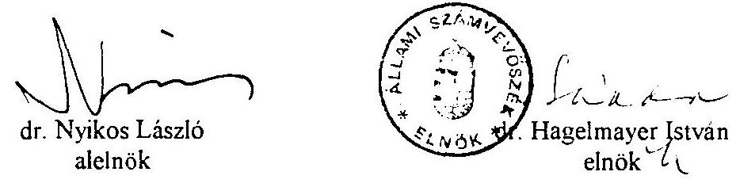

---

# Helyszínen ellenőrzött alapítványok 

1. Nemzeti Gyermek és Ifjúsági (Köz)alapítvány
2. Grassalkovich Kastély (Köz)alapítvány
3. Magyarországi Nemzeti és Etnikai Kisebbségekért (Köz)alapítvány
4. A Településekért, Régiókért Közalapítvány (elödje a Települések Fejlesztéséért Alapítvány)
5. 1956-os Forradalom Történetének Dokumentációs Kutatóintézete Közalapítvány (jogelődje: 1956-os Tudományos Alapítvány)
6. Hadigondozottak Közalapítvány
7. Hungária Televízió (Köz)alapítvány
8. Borsod-Abaúj-Zemplén Megyei Fejlesztési Közalapítvány
9. Szabolcs-Szatmár-Bereg Megyei Fejlesztési Közalapítvány
10. Illyés Alapítvány (az 1994. évi zárszámadáshoz kapcsolódó ellenőrzés)
11. Pro Professione Alapítvány (az 1994. évi zárszámadáshoz kapcsolódó ellenőrzés)

---

# A Magyar Köztársaság Kormánya által, illetve részvételével alapított közalapítványok néhány adata 

## 1. Nemzeti Gyermek- és Ifjúsági Közalapítvány

Alapitója:
A Kormány
Alapitó okirat kihirdetése:
93/1995. (VIII.18.) Korm. rendelettel.
1994. január 1-jétől közalapitványnak minősül.

## Közfeladata:

Elősegiti a gyermekek és az ifjúság valós érdekeinek védelmét, az Alkotmányban garantált jogok érvényesitését, tekintettel az 1991. évi LXIV. törvénnyel kihirdetett, a gyermekek jogairól szóló 1989. november 20-án, New Yorkban kelt Egyezményben foglalt kötelezettségekre is.
A közalapitvány célja a Magyar Köztársaságban élỏ gyermekek és fiatalok egyéni és közösségi aktivitásának támogatása, az érdekükben és értük cselekvök együttmüködésének szolgálata, a cselekvési lehetőségek feltételeinek bővítése a felnött, felelős állampolgárokhoz méltó készségek elsajátitása érdekében. A közalapitvány közremüködik a fiatal korosztályok szabadidő eltöltéséhez, jobb feltételek megteremtésében, ösztönzi a kedvezményes ifjúsági turizmust, a nemzetközi, szakmai és jószolgálati cserekapcsolatokat. A közalapitvány hozzájárul a társadalom gyermek- és ifjúságismeretének, az ifjúság önismeretének fejlődéséhez.

Vagyona:
az alapitó okiratban felsorolt 26 ingatlan
2.450,9 M Ft könyv szerinti értékben.

Törzsvagyona:
100 M Ft-nál kevesebb nem lehet, annak csak a hozadéka használható fel közvetlenül a közalapítványi célok megvalósitása érdekében.

---

Vállalkozási tevékenységet végezhet, vállalkozásban csak korlátolt felelősséggel vehet részt.

Kezelő:
Kuratórium, létszáma 5 fő, megbizásuk 1995. október 31-ig szól.
Ellenörzésre kijelölt:
Felügyelő Bizottság és könyvvizsgáló
Közalapítvány alapító okiratát a bíróság nyilvántartásba vette: 1995. július 17.

# 2. Illyés Közalapítvány 

Alapítója:
A Kormány
1994. január 1-jétől közalapítványnak minősül.

Alapító okirat kihirdetése:
1020/1995. (III.8.) Korm. határozattal

## Közfeladata:

A Magyar Köztársaságnak az Alkotmány 6. cikkelye 3. bekezdésében rögzített, a határainkon kívül élő magyarok sorsáért érzett felelősségéből adódó állami közfeladat folyamatos ellátása érdekében a határainkon túl élő magyar közösségek és a szórvány magyarság támogatása, sajátos gondjai megoldásának elősegítése. Az alapító szándékainak megfelelően támogatni kívánja:
a) határainkon túl élő magyarság önazonosságának megőrzését, fejlődését és megerősödését célzó kezdeményezéseket,
b) anyanyelv ápolását, fejlesztését szolgáló kezdeményezéseket,
c) a határainkon túl élő magyarságot érintő tudományos munkát,
d) az anyanyelvű hitélet tárgyi és személyi feltételeinek javitását,
e) a határainkon túli magyar kisebbségek hazai kulturális bemutatóit.

Vagyona:
Az állam a mindenkori költségvetési törvényben meghatározott összegű támogatással biztosítja az alapítványi célok megvalósulását.

Törzsvagyon:
Az alapítványi vagyon és annak hozadéka 20 M Ft maradványösszegig felhasználható. Mindaddig, amíg a közalapítvány törzsvagyonának hozadéka nem biztosítja a közalapítvány működési költségeinek teljes fedezetét, a törzsvagyont évente legalább 10 M Ft -tal kell növelni.

---

Vállalkozási tevékenységet nem végezhet, átmenetileg szabad készpénzvagyona elsősorban államkötvénybe, másodsorban kamatozó banki betétbe helyezhető.

Kezelő:
Kuratórium, létszáma 19 fő, megbizásuk 1998. május 15 -ig szól.
Ellenőrzésre kijelölt:
Felügyelő Bizottság és könyvvizsgáló.
A kőzalapítvány alapító okiratát a bíróság 1995. március 20-án vette nyilvántartásba.

# 3. Magyar Alkotóművészeti Közalapítvány 

Alapítója:
A Kormány
Alapító okirat kihirdetése:
58/1994. (IV.16.) Korm. rendelet, 16/1995. (II.28.) Korm. rendelet, 179/1995. (XII.29.) Kormányrendelet
1994. január 1-jétől közalapítványnak minősül.

## Közfeladata:

Az alapító hosszú távra biztosítani kívánta az állam támogatását a magyar irodalom, képzőmúvészet, iparművészet, fotóművészet és zenei alkotóművészet, illetve művészek részére, és ez úton is el kívánja ismerni, hogy a közalapítvány céljára rendelt vagyon jórészt a művészeti ágakat élethivatásszerűen művelő művészek négy évtizedes munkája révén gyarapodott.

A közalapítvány célja az állami közfeladat biztosításaként támogatást nyújtani színvonalas alkotások létrehozásához az előzőekben felsorolt művészeti ágakhoz, ideértve az ezen múfajokhoz kapcsolódó elméleti és kritikai alkotó tevékenységet is, segíteni az alkotások belföldi és nemzetközi megismertetését, terjesztését és értékesítését az alapítói vagyon megőrzésével és lehetőség szerinti gyarapításával.

- a szociális biztonság érdekében biztosítási jellegű rendszeres és rendkívüli támogatások nyújtása,
- a művészeti alkotómunka jobb körülményeinek elősegítése érdekében alkotóházak működtetése, szükség esetén újak létrehozása, kollektív műtermek üzemeltetése, műtermek és műteremlakások építéséhez támogatás nyújtása,
- a létrejött műalkotások megismertetése érdekében kiállítási, értékesítési lehetőségek megteremtése, művészeti kezdeményezések támogatása, fiatal művészek szervezett segítése,
- a művészeti alkotómunka lehetővé tétele érdekében kölcsönök (alkotói előlegek) folyósítása, ösztöndíjak, jutalmak, művészeti pályázatok, díjak kitüzése, egyéb pénzbeli juttatások nyújtása,

---

- a szakmai érdekvédelemhez, a jogi képviselethez, a rendszeres tájékoztatáshoz és az egyéb kapcsolódó szolgáltatásokhoz szükséges anyagi fedezet megteremtése.

Vagyona:
$1.292,8 \mathrm{M} \mathrm{Ft}$ nyilvántartás szerinti bruttó értékủ ingatlan, vagyoni értékủ jog, leányvállalatokba és kft-kbe kihelyezett vagyon, álló- és forgóeszköz.

Törzsvagyona:
Tételesen, érték nélkül felsorolt 7 db ingatlan, melyek elidegenitési tilalom alá esö, tovább müködtetendő ingatlanok.

Vállalkozási tevékenységet folytathat, az abból származó jövedelem a közalapítvány céljainak megvalósitását szolgálja. Átmenetileg szabad készpénzvagyona csak állampapírban helyezhető el.

Kezelő:
Kuratórium, létszáma 3 fő, megbízatása hat hónapra szól.
Ellenőrzésre kijelölt:
Felügyelő Bizottság és könyvvizsgáló
A közalapítvány alapító okiratát a bíróság 1994. augusztus 18-án vette nyilvántartásba.

# 4. Nemzetközi Pető András Közalapítvány 

Alapítója:
A Kormány
Alapító okirat kihirdetése:
1138/1995. (XII.27.) Kormányhatározattal
1994. január 1-jétől közalapitványnak minősül

## Közfeladata:

A konduktív pedagógiai módszer nemzetközi elterjesztésének és továbbfejlesztésének, a konduktív nevelőmunka kiterjesztésének és színvonala emelésének elősegítése a közoktatásról szóló 1993. évi LXXIX. törvény 72. §-ának c. pontja, továbbá a tanító, a konduktor-tanító és az óvodapedagógus alapképzésben a képesitési követelményekről szóló 158/1994. (XI.17.) Kormányrendelet 2. §-ának (1)-(2) bekezdése alapján.

Vagyona: 1.322,4 M Ft eszköz
949,5 M Ft részesedés a Pető Intézetnél.

---

Vállalkozásokban a közalapítvány csak korlátozott felelősséggel vehet részt.
Kezelő:
Kuratórium, létszáma 9 fő, 3 éves időtartamú megbízással, amely két alkalommal meghosszabbítható.

Ellenőrzésre kijelölt:
Felügyelő Bizottság
A közalapítvány alapító okiratát a bíróság 1995. szeptember 9-én a 8. Pk. 64008/5. számú végzésével nyilvántartásba vette.

# 5. Hungária Televizió Közalapítvány 

Alapítója:
A Kormány
Alapító Okirat kihirdetése:
1048/1994. (VI.27.) Korm. határozat
Az alapító okiratot a bíróság a vizsgálat befejezéséig nem vette nyilvántartásba.

## Közfeladata:

A Magyar Köztársaság Alkotmánya 6. § (3) bekezdése megvalósítása érdekében televízióműsor sugárzása Közép- és Kelet-Európában, különösen az országon kívül élő magyarok számára.

Vagyona:
A közalapítvány módosított alapító okirata a közalapítvány induló vagyonát nem rögzíti (1993+1994. években 2.300 M Ft ).
Az alapító 1994-től a folyamatos müködés feltételeit biztosítja.
Törzsvagyon:
Az alapító okirat törzsvagyont nem jelölt meg.
A közalapítvány - céljával összhangban - vállalkozási tevékenységet folytathat. Az ebből származó bevételeit kizárólag az alapító okiratban megjelölt célok teljesítésére fordíthatja.

Kezelő:
Kuratórium, létszáma 13 fő, megbízatásuk határozatlan időre szól.
Ellenőrzésre kijelölt:
Pénzügyminisztérium

---

A közalapítvány alapító okiratát a bíróság a vizsgálat befejezéséig nem vette nyilvántartásba, azt a kuratórium elnöke 1995. május 10 -én nyújtotta be.

# 6. Grassalkovich Kastély Közalapítvány 

Alapitó: A Kormány
Az alapító okirat kihirdetése:
1036/1995. (V.4.) Korm. határozattal
Közalapítvány 1995. március 30. óta.

## Közfeladata:

A kastélyegyüttes teljes müemléki helyreállításának, fenntartásának és méltó hasznosításának elősegítése, folyamatos gazdagítása és müködtetéséhez való hozzájárulás, tekintettel arra, hogy a kastélyegyüttes állami tulajdonból ki nem adható múemlék, és az állam, mint tulajdonos köteles az 1964. évi III. törvény és a végrehajtásáról szóló 30/1964. (XII.2.) Korm. rendelet felhatalmazása alapján kiadott $1 / 1967$. (I.31.) EM rendelet 14-17. §-a szerint a helyreállításra, fenntartásra, bemutatásra.

Vagyona:
8 M Ft és a Gödöllöi Királyi Kastély Közhasznú Társaság 26,98\% mértékủ üzletrésze.

Törzsvagyona:
8 M Ft
Vállalkozási tevékenységet nem folytathat.
Kezelő:
Kuratórium, létszáma 12 fő, megbízatásuk időtartamára határidőt az alapító nem jelölt meg.

Ellenőrzésre kijelölt:
Felügyelő Bizottság
A közalapítvány alapító okiratát a bíróság 1995. március 30 -án nyilvántartásba vette.

---

# 7. Magyarországi Nemzeti és Etnikai Kisebbségekért Közalapítvány 

Alapitója:
A Kormány
Alapitó okirat a vizsgálat befejezéséig nem lett hivatalos lapban kihirdetve.
A közalapítvány létrehozását az 1995. évi VI. törvénnyel módosított, a nemzeti és etnikai kisebbségek jogairól szóló 1993. évi LXXVII. törvény rendelte el.

A 2187/1995. (VII.4.) Korm. határozat elfogadta az 1068/1990. (IV.12.) MT határozattal létrehozott "A Magyarországi Nemzeti és Etnikai Kisebbségekért" Alapitvány teljes vagyonának a kuratórium döntése alapján történő felajánlását, azonos célú közalapitvány létrehozása céljából.

## Közfeladata:

Az 1995. évi VI. törvény alapján a hazai kisebbségek önazonosságának megôrzése, hagyományai gondozása, átörökítése, az anyanyelv ápolása, fejlesztése, szellemi és tárgyi emlékeik fennmaradása, a kisebbségi létből fakadó kulturális és politikai hátrányok mérséklését szolgáló tevékenységek támogatása.

Vagyona:
400 M Ft , valamint a mindenkori éves költségvetési törvényben megállapított pénzügyi támogatás.

Törzsvagyona: -
Kezelő:
Kuratórium, létszáma 25 fô, megbízatásuk időtartama
Ellenőrzésre kijelölt:
Felügyelő Bizottság
A közalapítvány alapító okiratát a bíróság 1995. szeptember 15-én (G-PK.6235715) nyilvántartásba vette.

## 8. Az 1956-os Magyar Forradalom Történetének Dokumentációs és Kutatóintézete Közalapítvány

Alapitója:
A Kormány, az 1956-os Tudományos Alapitvány alapítójával közösen.
Az alapító okirat kihirdetve: a Magyar Közlöny 1995. évi 60. számában.

---

A kőzalapítvány létrehozását az 1956-os Tudományos Alapítvány kuratóriuma vagyonát felajánlotta és azt a Kormány elfogadta.

# Közfeladat: 

Az 1990. évi XXVIII. törvényben megfogalmazott kötelezettségvállalás teljesülésének elősegítése. Ennek érdekében a jelenkor történeti, ezen belül az 1956-os magyar forradalom történetét feltáró hazai és nemzetközi tudományos kutatások, dokumentációs munkák megszerzése, koordinálása, illetve az ehhez kapcsolódó tudományos kutatómunka feladatainak folyamatos ellátásában való részvétel. A kőzalapítvány támogatja a korszakkal kapcsolatos tudományos ismeretterjesztést, valamint azt, hogy az új kutatási eredmények fokozatosan hozzáférhetők legyenek a közoktatás számára, s ezáltal hozzájárul az oktatással és kultúrával kapcsolatos általánosabb célok megvalósulásához. A közelmúlt társadalmi és politikai folyamatainak elemzése révén elősegiti a nemzeti társadalompolitika alakítását.

Vagyona:
az 1956-os Tudományos Alapítvány felajánlott vagyon, $21,8 \mathrm{M} \mathrm{Ft}$ bruttó nyilvántartási értékủ ingatlan, 50 M Ft pénzeszköz.

Törzsvagyont az alapító okirat nem határozott meg.
Vagyona biztonságos vállalkozásba befektethető.
Kezelő:
Kuratórium, létszáma 16 fő, megbízatásuk határozatlan időre szól.
Ellenőrzésre kijelölt:
Felügyelő Bizottság.
A kőzalapítvány alapító okiratát a bíróság 1995. június 29-én, 7.PK.60.530/95/4. számon nyilvántartásba vette.

## 9. Új Kézfogás Közalapítvány

Alapítója:
A Kormány és az Illyés Alapítvány
Alapitó Okirat kihirdetése:
1021/1995. (III.8.) Korm. határozattal
A kőzalapítvány vagyona a "Kézfogás" Egzisztenciateremtő és Gazdálkodásélénkitő Alapítvány vagyonának felajánlásával jött létre, melyet az alapítvány kuratóriuma és alapítója, az Illyés alapítvány 1994. augusztus 31-én tett.

---

# Közfeladat: 

A Magyar Köztársaságnak az Alkotmány 6. cikkelye 3. bekezdésében rögzített, a határainkon kívül élỏ magyarok sorsáért érzett felelősségéből adódó állami közfeladat folyamatos ellátása érdekében a határainkon túl élỏ magyar közösségek és szórványmagyarság támogatása, sajátos gondjai megoldásának előmozdítása a határmenti magyarlakta régiók és Magyarország közötti gazdasági együttmüködés elősegitésével. Ezen belül:

- a kis- és középvállalkozások közötti üzleti kapcsolatos kibontakoztatásának támogatása,
- a gazdasági együttmüködést vizsgáló elméleti kutatások, szakmai és menedzserképzés támogatása,
- tökebefektetőként részvétel külföldi-magyar vegyesvállalkozásokban;
mindez az alapítványi vagyon olyan felhasználása révén, amely a profitorientált tevékenységböl keletkező nyereséget maradéktalanul az alapítványi célok finanszírozására fordítja.

A közalapítvány természetes személyeket nem, csupán jogi személyeket, illetve egyéb gazdálkodó szervezeteket részesít támogatásban.

## Vagyona:

közvetlen vagyona $130,4 \mathrm{M} \mathrm{Ft}$,
közvetett vagyona pénzügyi befektetések a COOPERATIO Kft-ben

- alapító vagyon 5 M Ft
- kihelyezett befektetések
tárgyi eszköz 29,8 M Ft
pénzeszközök 34,4 M Ft
- átvett, lekötött pénzeszk. 140,9 M Ft
Összesen 340,5 M Ft
Az állam a mindenkori költségvetési törvényben meghatározott összegü támogatással biztosítja az alapítványi célok megvalósítását.

Törzsvagyon:
40 M Ft
Mindaddig, amíg a közalapítvány törzsvagyonának hozadéka nem biztosítja a közalapítvány müködési költségeinek teljes fedezeté, a közalapítvány törzsvagyonát évente legalább 10 M Ft -tal kell megnövelni.

A kuratórium a közalapítvány céljait szolgáló gazdasági társaságot alapíthat, amellyel bel- és külföldi vállalkozásokban vesz részt, illetve ilyenekben érdekeltséget létesíthet, az átmenetileg szabad pénzeszközeiből elsősorban államkötvényt, kincstár- vagy letéti jegyet, részvényt vásárolhat, vagy azt kamatozó banki betétbe helyezheti.

Pályázatok alapján a befektetési irányelvek szerint vissza nem térítendő támogatást nyújt, illetve külföldi vegyes vállalkozások alapításában profitorientált befektetőként vesz részt.

---

# Kezelő: 

Kuratórium, létszáma 15 fô, megbizatásuk 4 évre szól.
Ellenőrzésére kijelölt:
Felügyelő Bizottság és könyvvizsgáló
A közalapítvány alapító okiratát a biróság 1995. március 27 -én nyilvántartásba vette.

## 10. Gandhi Közalapitvány

Alapitója:
A Kormány
A közalapítvány vagyona a Gandhi Alapitvány alapító okiratának felajánlásából származik.

A közalapítvány létesítését az 1068/1995. (VII.12.) Korm. határozat fogadta el.
A közalapítvány alapító okiratát a vizsgálat befejezéséig a biróság nem vette nyilvántartásba.

Az alapító okiratot hivatalos lapban a vizsgálat befejezéséig nem hirdették ki.

## 11. Településekért, Régiókért Közalapítvány

Alapitója a Kormány és a Magyar Regionális Fejlesztési Urbanisztikai és Építészeti Részvénytársaság (VATI Rt.)

Az 1057/1994. (VII.8.) Korm. határozattal elfogadták a "Települések fejlesztéséért" Alapitvány 1993. december 9-én felajánlott vagyonát, melyböl létrehozták a közalapitványt.

Az alapító okirat a vizsgálat befejezéséig hivatalos lapban nem került kihirdetésre.

## Közfeladat:

Az építésügyi hatóságok ügyviteléhez szükséges műszaki, térképi és egyéb adatokat tartalmazó tervtárak és nyilvántartások kezelése, müködtetése.

Induló vagyon:
45 M 287 E 135 Ft
Kezelő:
Kuratórium

---

Ellenörzésre kijelölt: Felügyelő Bizottság
A közalapítvány alapító okirat bírósági nyilvántartásba vétele: 1995. 01. 05.

# 12. Munkavédelmi Kutatási Közalapítvány 

Alapító:
A Kormány
A közalapítvány a megszüntetett Országos Munkavédelmi Tudományos Kutató Intézet költségvetési szerv jogutóda.

Alapitását a 2242/1995. (VIII.24.) Korm. határozat fogadta el.

## Közfeladat:

Az Alkotmány 70/D. §-ában, valamint a munkavédelemröl szóló 1993. évi XCIII. törvény 14. § (1) bekezdésének c. pontjában és (2) bekezdésében meghatározott, valamint a nemzetközi egyezményekben rögzített munkavédelmi kutatási feladatok ellátása.

Vagyona:
402 M Ft értékủ ingatlan és eszközállomány.
Törzsvagyon:
192 M Ft értékben ingatlanok, elidegenitési és terhelési tilalommal.
Kezelő:
Kuratórium, létszáma 7 fő.
Ellenőrzésre kijelölt:
Felügyelő Bizottság és könyvvizsgáló
A közalapítvány alapító okiratát a bíróság 11.PK 61165/954. számon vette nyilvántartásba.

## 13. Magyar Termelékenységi Központ Közalapítvány

Alapító:
A Kormány
Az alapító okirat a Magyar Közlöny 1994/57. számában jelent meg.

---

# Közfeladat: 

Hozzájárul a Kormány műszaki-fejlesztési politikájának megvalósulásához, a korszerü termelékenységnövelő eljárások elterjesztésével elősegiti a magyar gazdaság felzárkózását.

Vagyona:
130 M Ft
Törzsvagyont az alapító nem határozott meg.
A kozalapitvány vagyona különféle gazdasági vállalkozásokba vagy bármely olyan vállalkozásba fektethető, amelytől a közalapítvány vagyonának növekedése várható.

## Kezelő:

Kuratórium, létszáma 11 fő, megbízatása határozatlan időre szól.
Ellenőrzésre kijelölt:
Az alapító okirat szerint "a kuratórium ellenőrzéséről az Állami Számvevőszék gondoskodik".

A közalapítvány alapító okiratát a biróság 1994. április 28 -án nyilvántartásba vette.

## 14. Hadigondozottak Közalapitvány

Alapító:
A Kormány
Az alapító okiratot az 1116/1994. (XII.9.) Korm. határozat hirdette ki.

## Közfeladata:

A hadigondozásról szóló 1994. évi XLV. törvény 25. § (3) bekezdése alapján a hadigondozottakról való állami, alanyi jogú gondoskodás, valamint a jogosultak ellátásának megvalósitása és a kedvezmények realizálása, továbbá a hadirokkantak egészségügyi segédeszközökkel való ellátásának biztosítása.

Vagyona:
a mindenkori évi költségvetési támogatás, 1994-ben 2.000 M Ft
az elözö évi maradványok,
egyéb támogatások,
saját bevételek
Törzsvagyont az alapító okirat nem határozott meg.
Vállalkozási tevékenységet nem végezhet.

---

# Kezelö: 

Kuratórium, létszáma 9 fô, megbizatásuk határozatlan idôre szól.
Ellenőrzésre kijelölt:
Felügyelö Bizottság
A közalapítvány alapító okiratát a biróság 1995. január 6-án vette nyilvántartásba.

## 15. Szabolcs-Szatmár-Bereg megyei Fejlesztési Közalapitvány

Alapitója:
A Kormány az 1051/1994. (VI.29.) Korm. sz. határozattal és a Szabolcs-SzatmárBereg megyei Onkormányzat.

## Közfeladata:

A megyei összehangolt területfejlesztési programok megvalósitása, müködtetése, a müködtetés intézményi kereteinek létrehozása, amely a 43/1990. (IX.15.) Korm. rendelet 2. §-a szerint állami közfeladat, másrészt az 1990. évi LXV. törvény 8. § (1) bekezdés szerint települési önkormányzati feladat.

Vagyona:
$16,9 \mathrm{MFt}$.
Törzsvagyont az alapítók nem határoztak meg.
Kezelő:
Kuratórium (fejlesztési tanács), létszáma 44 fô.
Ellenőrzésre kijelölt:
okleveles könyvvizsgáló
A közalapítvány alapító okiratát a bíróság 1994. november 30-án vette nyilvántartásba.

## 16. Borsod-Abaúj-Zemplén megyei Fejlesztési Közalapitvány

Alapitója:
A Kormány és 13 önkormányzat képviselő testülete

## Közfeladat:

Állami közfeladatként a környezetvédelmi követelményekkel összehangolt területfejlesztés a 43/1990. (IX.15.) Korm. rendelet 2. és 4. §-ai alapján, valamint a települések fejlődésének elősegítése.

---

Önkormányzati közfeladatként a települések fejlődésének elősegitése az 1990. évi LXV. törvény 8. § (1) bekezdése alapján.

Vagyona: $20,9 \mathrm{M} \mathrm{Ft}$
Törzsvagyont az alapítók nem határozták meg.
Kezelő:
BAZ Megyei Fejlesztési Ügynökség
Ellenőrzésre kijelölt:
okleveles könyvvizsgáló

# 17. A Magyarországi Cigányokért Közalapitvány 

Alapitó:
A Kormány, a 1121/1995. (XII.7.) Kormányhatározattal.
Az alapító okiratot a vizsgálat befejezéséig a bíróság nem vette nyilvántartásba.

---

# Beszámolási kötelezettségükei nem teljesitö alapitványok 

(A címzett ismeretlen)

| Alapitvány neve | Támogatást adó központi költségvetési szerv neve | $\begin{gathered} 1992 \\ \text { eFt } \end{gathered}$ | $\begin{gathered} 1993 \\ \text { eFt } \end{gathered}$ | $\begin{gathered} 1994 \\ \text { eFt } \end{gathered}$ | Költségvetési támogatás összesen (eFt) |
| :--: | :--: | :--: | :--: | :--: | :--: |
| 1. Alaputvany a reatertelmusceert | OMFB | 0 | 380 | 191 | 571 |
| 2. Atlasz Alaputvany | Kormany |  |  | 3.000 | 3.000 |
| 3. CD 2000 Alaputvany | Fogl. Alap | 2.820 |  |  |  |
|  | K.Ifi.Alap | 250 | 980 | 0 |  |
| Összesen |  | 3.070 | 980 | 0 | 4.050 |
| 4. DunaKanvar Waldort Iskola Alaputvany | K.Mil.F.A. |  | 500 |  | 500 |
| 5. Fozern var Alaputvany | Bukki Nemz.P. | 50 |  |  | 50 |
| 6. Hettukor Gvermekszintesz Alaputvany | Fogl.A. | 600 |  |  | 600 |
| 7. Habilitas Alaputvany | K.Ifi.A. |  | 935 |  | 935 |
| 8. HANI Alaputvany | MKM | 100 |  |  | 100 |
| 9. Huel Kortars Magyar Irodalmat Támogato A. | Kormany |  |  | 1.000 | 1.000 |
| 10. KOZINFORG Alaputvany | BM | 100 |  |  |  |
|  | Orsz.Szem.a.Ny.H. | 100 |  |  |  |
| Összesen |  | 200 |  |  | 200 |
| 11. KOSSICS Alaputvany | MKM |  |  | 400 | 400 |
| 12. M.Nemzetkozi Orvostud Akad. Mo-i Alaputvany | OMFB |  |  | 250 | 250 |
| 13. Muvell evermekekert Alaputvany | ANTSZ Szoln. | 100 |  |  | 100 |
| 14. Magyar Szemle Alaputvany | Kormany |  |  | 6.000 | 6.000 |
| 15. Magyar Szy Szuroall Orsz Halóz. Alaputvany | All.Szunator. | 2.500 |  |  | 2.500 |
| 16. Munkanttkulick karitativ Alaputvanva | Focl.A. | 1.464 |  |  | 1.464 |
| 17. Nemzetkozi Transsvivania Alaputvany | MKM | 542 |  |  | 542 |
| 18. SMOG STOP Korny ved Alaputvany | OMFB |  | 250 |  | 250 |
| 19. Szulok a ballássérult evermekekert Alapitvany | K.Ifi.A. |  | 300 |  | 300 |
| 20. Tüzolto Muzzumi Alaputvany | H.m.Tüzo.P. | 100 |  |  | 100 |
| 21. Tervezzunk tanyakat Alaputvany | KTM |  |  | 20 | 20 |
| 22. VAE VICTIS Alaputvany | Kormany |  |  | 6.000 | 6.000 |
| 23. Z.W.D.Penzzel.esszel Alaputvany | Focl.A. | 2.054 |  |  | 2.054 |
| 24. Zold i Caritas Alaputvany | ORFK |  |  | 74 | 74 |
| ÖSSZESEN: |  |  |  |  | 31.060 |

---

# Beszámolási kötelezettségüket nem teljesitỏ alapítványok 

## (Nem készzítették el a tamúsítványokat)

| Alapítvány neve | Támogatást adó központi költségvetési szerv neve | $\begin{gathered} 1992 \\ \text { eFt } \end{gathered}$ | $\begin{gathered} 1993 \\ \text { eFt } \end{gathered}$ | $\begin{gathered} 1994 \\ \text { eFt } \end{gathered}$ | Kültségvetési támogatás üsszesen, eft |
| :--: | :--: | :--: | :--: | :--: | :--: |
| 1 Alapítvány a valasztasokert | BM   Orsz.Szema.Nv.H. | $\begin{array}{r} 0 \\ 100 \end{array}$ | $\begin{array}{r} 10,100 \\ 0 \end{array}$ | $\begin{array}{r} 0 \\ 0 \end{array}$ |  |
|  |  | 100 | 10,100 | 0 | 10,200 |
| 2 BLISS Alapítvány | MKM   OMFB | $\begin{array}{r} 78 \\ 2.512 \end{array}$ | $\begin{array}{r} 1.488 \\ 1.488 \end{array}$ | 400 |  |
|  | Osszesen | 2.590 | 1.488 | 400 | 4.478 |
| 3 Bornemusza Cserkeszcsapat Alapítvány | K.Ifiusaet A. |  | 1.000 |  | 1.000 |
| 4 Cimbora Alapítvány | MKM   Közp.Ifiusaet A. | 100 |  |  |  |
|  | Osszesen | 100 | 700 |  | 800 |
| 5 Civil Ifiusaet Alapítvány | KIA | 250 |  |  | 250 |
| 6 Csaladdal a társ-sert az elelert Alapítvány | OMFB | 0 | 0 | 2.940 | 2.940 |
| 7 Délalloldi nepiskolat Alapítvány | K.Ifiusaet A. | 0 | 300 | 0 | 300 |
| 8 Dr Erdélyi Mihaly emlékérem Alapítvány | O RTG és S INT. |  |  | 20 | 20 |
| 9 Duscalculiás,ds.slescras evermekekert A. | MKM | 0 |  | 500 | 500 |
| 10 Fnebetegsegekben szenvedok Alapítvány | Pécsi Kard. Társ. | 147 |  |  | 147 |
| 11 Furonaert Verseny Alapítvány | MKM | 0 | 5.560 | 1.518 | 7.078 |
| 12 Grol Kicbersbere Kuno Oktalast Seento A. | OMFB |  |  | 250 | 250 |
| 13 Gvemtck és ill Kepromus-Muhelv Alapítvány | M Nemz. Galeria | 100 |  |  | 100 |
| 14 Hossza ut Alapítvány | Fogl. Alap | 230 |  |  | 230 |
| 15 Human resources Alapítvány | Fogl. Alap | 640 |  |  | 640 |
| 16 Invokacio Alapítvány | Fogl. Alap | 363 |  |  | 363 |
| 17 Jatszo -Tér Alapítvány | MKM | 20 |  |  | 20 |
| 18 Kozgazdasz Kulturáert Alapítvány | Bp.Kozgazd.Tud.E. | 490 |  |  | 490 |
| 19 Kulvdae Alapítvány | Kalligymin. | 1000 |  |  | 1000 |
| 20 Kimzsi Pál Harckocsı Dandar Szoc. Alapítvány | MH 8.Kintzsi Hd. |  | 341 |  | 34 |
| 21 Kreatív Alapítvány | OTSH | 40 |  |  | 40 |
| 22 Minosegert Alapítvány | OMFB | 0 | 249 | 248 | 497 |
| 23 Moricz /semond Alapítvány | N.Kult. Alap | 840 |  |  | 840 |
| 24 Magasszunu tiszli utáspótlas Alapítvány | HM |  | 500 |  | 500 |
| 25 Maegar Alapítvány | KDT.Term.Véd.I. | 151 |  |  | 15 |
| 26 Magyar Filmorréneci Fotógyutemeny | OMFB |  | 18,000 |  | 18,000 |
| 27 Magyar Szabadság Napja Alapítvány | N.Kult. Alap | 3,000 |  |  | 3,000 |
| 28 Magyar Triatlonert Alapítvány | K.Ifiusaet A. | 600 | 590 |  | 1.190 |
| 29 Magyar-Roman Humanitas Alapítvány | MKM | 201 |  |  | 20 |
| 30 Mindenkiert Alapítvány | K.Ifiusaet A. |  | 200 |  | 200 |
| 31 Minden Nap Torrenclent | MKM |  |  | 30,000 | 30,000 |
| 32 Mozzokep Innovációs Alapítvány | N.Kult. Alap | 4,000 |  |  | 4,000 |
| 33 MUNDUS Alapítvány a tudomanvert | Miskolci Egy. | $\begin{array}{r} 50 \\ 500 \end{array}$ |  |  |  |
|  | OMFB | 100 |  |  |  |

---

# Beszámolási kötelezettségüket nem teljesitö alapitványok 

## (Nem készitették el a tanúsitványokat)

| Alapitvány neve | Támogatást adó   központi   költségvetési szerv   neve | $\begin{gathered} 1992 \\ \text { eFt } \end{gathered}$ | $\begin{gathered} 1993 \\ \text { eFt } \end{gathered}$ | $\begin{gathered} 1994 \\ \text { eFt } \end{gathered}$ | Költségvetési támogatás összesen, eft |
| :--: | :--: | :--: | :--: | :--: | :--: |
|  |  | 150 | 0 | 0 | 150 |
| 34 Munkacrt Alaputvany | Foel Alap | 1.712 |  |  | 1.712 |
| 35 Nany Imre ssebor Alaputvany | Belugynum. | 300 |  |  | 300 |
| 36 Nancikamzsaert DNY Magyartorszacert A. | K. Illusani A. |  | 1.000 |  | 1.000 |
| 37 Nemzetkozi Eistvos Alaputvany | INTERART | 100 |  |  | 100 |
| 38 Patronus Alaputvany | Foel Alap | 1.886 |  |  | 1.886 |
| 39 Peopies Academy lor Minontes Alaputvany | Külugynum. | 100 |  |  | 100 |
| 40 Remes Evezos Alaputvany | Korny ved Feluev. | 50 |  |  | 50 |
| 41 Samu Gcza Alaputvany | N.Kult. Alap | 50 |  |  | 50 |
| 42 Szent Istvan Galcria Alaputvany | Foel Alap | 4.417 |  |  | 4.417 |
| 43 Tarsadalmi osszetogas a bunozcs ellen A. | BM.Rendórkap-ok |  | 500 |  | 500 |
| 44 Tanulo lmisaeert Alaputvany | N.Sport A. |  |  | 300 | 300 |
| 45 Tiszta.siragos Vigeadoctendert Alaputvany | KTM |  |  | 100 | 100 |
| 46 Vallalkozasi Tanacsado Alaputvany | Foel A. | 186 |  |  | 186 |
| 47 Vitorlas kikutok Alaputvany | N.Sport A. |  | 1.300 |  | 1.300 |
| OSSZESEN: |  |  |  |  | 99.192 |

---

# A beszámolási kötelezettségühet nem teljesitö alapitványok 

(Azállami támogatásról nem adtak számot a tanúsitványuikban)

| Alapitvány neve | Támogatást adó küzponti költségvetési szerv neve | $\begin{gathered} 1992 \\ \text { eFt } \end{gathered}$ | $\begin{gathered} 1993 \\ \text { eFt } \end{gathered}$ | $\begin{gathered} 1994 \\ \text { eFt } \end{gathered}$ | Költségvetési támogatás összesen (eFt) |
| :--: | :--: | :--: | :--: | :--: | :--: |
| 1. ADDEH R Alaputvany | Nem M. |  | 15.000 | 15.000 | 30,000 |
| 2. Haross (abor Vall Alaputvany | Orsz Viziovi Föig OMFB | $\begin{gathered} 20 \\ 300 \end{gathered}$ |  |  |  |
|  |  | 320 |  |  | 320 |
| 3. Biztonságepol es Hőny. Kut. Kp.-ta Alaputvany | OMFB |  | 450 | 340 | 790 |
| 4. Uocskai Istvan Alaputvany | Kormany |  |  | 5.000 |  |
|  | HM |  |  | 2.000 |  |
| Összesen: |  |  |  | 7.000 | 7,000 |
| 5. Bolvat Janos Honved Alaputvany | HM Hadit.I. |  |  | 40 | 40 |
| 6. Amapestt Senect Iskola Alaputvany | MKM |  | 1.000 | 1.000 | 2,000 |
| 7. Fegszeges (totalokert Alaputvany | N.Sport A. |  |  | 600 | 600 |
| 8. Erdelsi Magvarsagert Alaputvany | MKM | 200 |  |  | 200 |
| 9. Hirkozlesi doleozok HU SEG Alaputvanva | Hirk.Föfel. | 510 | 556 | 584 | 1.650 |
| 10. 24 ora Alaputvany | BM.Tüz-PV. | 100 |  |  | 100 |
| 11. Iozset Alula Kulturalis es Szocialis Alaputvany | Kormany |  |  | 2.000 | 2,000 |
| 12. Ioxoert eveinck-es ifived Alaputvany | K.Ifi.A. | 350 |  |  | 350 |
| 13. Magyar Mẹt Muzeumert Alaputvany | Mẹ Muzeum | 900 |  |  | 900 |
| 14. Magyarok Vilagialeka Alaputvany | Nemz.Sport A. |  |  | 500 | 500 |
| 15. Magyarok Vilaglapja Alaputvany | Kormany |  | 3.600 | 10.000 |  |
|  | Minisztereln.H. |  |  | 454 |  |
| Összesen: |  |  | 3.600 | 10.454 | 14,054 |
| 16. Mayer Alaputvany | Kö.Du. Viziulg. | 30 |  |  | 30 |
| 17. Satoszaksz. tagar onseceivezo Alaputvanva | MTI |  | 100 |  | 100 |
| 18. Szent László Alaputvany | KTM |  | 100 |  |  |
|  | BM |  |  | 200 |  |
|  | Határörs OPk. |  |  | 200 |  |
| Összesen: |  |  | 100 | 400 | 500 |
| 19. Vall -t es Fezisztenciater -t elösceitö Alapitvany | Fogl.A. | 10.000 |  |  | 10,000 |
| 20. Vidamsag Haza Alapitvány | K.Ifi.A. |  | 220 |  | 220 |
| ÖSSZESEN: |  |  |  |  | 71.754 |
|  |  |  |  |  |  |
| MINDÖSSZESEN (3/A+3/B+3/C): |  |  |  |  | 202,006 |

---

# 4. sz. melléklet 

I vizsgált alapítványok területi megoszlós szerint

| Megnevezés | Közalapitvány | Állami forrásból |  | Összes |
| :--: | :--: | :--: | :--: | :--: |
|  |  | alapított a. | támogatott, a. | alapítvány |
|  | dlt | dlt | dlt | dlt |
| Budapest | 11 | 94 | 89 | 194 |
| Baranya meeve | 1 | 4 | 5 | 10 |
| Bacs Kiskun meeve | 0 | 0 | 2 | 2 |
| Bekes meeve | 0 | 3 | 1 | 4 |
| Borsod-Abani Zemplen meeve | 1 | 3 | 7 | 11 |
| Csongrad meeve | 0 | 10 | 2 | 12 |
| Feier meeve | 0 | 6 | 0 | 6 |
| Gyor-Sopron-Moson meeve | 0 | 5 | 3 | 8 |
| Haidt-Bihar meeve | 0 | 2 | 4 | 6 |
| Heves meeve | 0 | 2 | 1 | 3 |
| Jasz-Nagxkun-Szolnok meeve | 0 | 2 | 4 | 6 |
| Komarom-Eszterech meeve | 0 | 4 | 3 | 7 |
| Nograd meeve | 0 | 4 | 2 | 6 |
| Pest meeve | 0 | 4 | 5 | 9 |
| Somogy meeve | 0 | 3 | 1 | 4 |
| Szabolcs-Szatmar-Berec meeve | 1 | 1 | 3 | 5 |
| Tolna meeve | 0 | 1 | 0 | 1 |
| Vias meeve | 0 | 2 | 1 | 3 |
| Veszprem meeve | 0 | 2 | 4 | 6 |
| Zala meeve | 0 | 2 | 3 | 5 |
| Összesen | 14 | 154 | 140 | 308 |

---

# A vizsgált alapítványok az alapítás éve szerint 

| Alapitás éve | Kizzalapitvány | Allami forrasbol |  | Összes |
| :--: | :--: | :--: | :--: | :--: |
|  |  | alapitott a. | támogatott. a. | alapitvány |
|  | dlt | dlt | dlt | dlt |
| 1989 | 0 | 1 | 0 | 1 |
| 1990 | 3 | 65 | 32 | 100 |
| 1991 | 0 | 39 | 52 | 91 |
| 1992 | 3 | 30 | 34 | 67 |
| 1993 | 0 | 13 | 14 | 27 |
| 1994 | 3 | 0 | 8 | 17 |
| 1995 | 5 | 0 | 0 | 5 |
| Összesen | 14 | 154 | 140 | 308 |

---

# A vizsgäit alapitványok jellemzői 

| Vegneverés | Közelapít-   vän-   vän |  | Allami forrashol tämogatott, a. |  |  |  | Összes   alapitvän |  |
| :--: | :--: | :--: | :--: | :--: | :--: | :--: | :--: | :--: |
|  | db | $\%$ | db | $\%$ | db | $\%$ | db | $\%$ |
| Összesen: | 14 | 100,0 | 154 | 100,0 | 140 | 100,0 | 308 | 100,0 |
| Határozatlan adotartamn | 14 | 100,0 | 152 | 98,7 | 138 | 98,6 | 304 | 98,7 |
| Határozott adotartamn | 0 | 0,0 | 2 | 1,3 | 2 | 1,4 | 4 | 1,3 |
| Sivított | 14 | 100,0 | 154 | 100,0 | 137 | 97,9 | 305 | 99,0 |
| Zatt | 0 | 0,0 | 0 | 0,0 | 3 | 2,1 | 3 | 1,0 |
| Semeetkozt hataskom | 3 | 21,4 | 35 | 22,7 | 33 | 23,6 | 71 | 23,1 |
| Örszagos | 7 | 50,0 | 69 | 44,8 | 61 | 43,6 | 137 | 44,5 |
| Több niesvere kiteriedó | 0 | 0,0 | 9 | 5,8 | 7 | 5,0 | 16 | 5,2 |
| Egs niesvere kiteriedó | 3 | 21,4 | 17 | 11,0 | 13 | 9,3 | 33 | 10,7 |
| Egs teletobeste kiteriedó | 1 | 7,1 | 16 | 10,4 | 17 | 12,1 | 34 | 11,0 |
| Sijebb lakokozzette kiteriedó | 0 | 0,0 | 3 | 1,9 | 8 | 5,7 | 11 | 3,6 |
| Rendszetes kiadvannia van | 2 | 14,3 | 15 | 9,7 | 17 | 12,1 | 34 | 11,0 |
| Semeetkozt szerv -nek taga | 2 | 14,3 | 7 | 4,5 | 8 | 5,7 | 17 | 5,5 |
| Mas alapitvany alapuasaban teszt vett | 2 | 14,3 | 4 | 2,6 | 9 | 6,4 | 15 | 4,9 |
| Altaluk alapitott alapitványok szama | 2 | - | 12 | - | 12 | - | 26 | - |
| Az alapitvanyt mas alapitvany alapitotta | 0 | 0,0 | 5 | 3,2 | 4 | 2,9 | 9 | 2,9 |
| Az alaputashan resztyesó alapitvanyok szama | 0 | - | 7 | - | 5 | - | 12 | - |

---

# 7. sz. mellélet 

I vizsgált alapítványok száma területi megoszlàs és hatáskör szerint

| Ióváros és megyék megnevezése | Nemzetköz hatáskörü | Összagos hatáskörü | Több megyére kiterjedö | Egy megyére kiterjedö | Egy elepülésr kiterjedö | Kisebb lakókörzetre kiterjedö | Összesen |
| :--: | :--: | :--: | :--: | :--: | :--: | :--: | :--: |
|  | db | db | db | db | db | db | db |
| findapest | 53 | 114 | 4 | 1 | 14 | 5 | 191 |
| Ilariana megye | 3 | 1 | 1 | 3 | 2 | 0 | 10 |
| Ilacss Kiskun megye | 0 | 1 | 0 | 0 | 1 | 0 | 2 |
| Ilakes megye | 1 | 1 | 0 | 1 | 0 | 0 | 3 |
| Ilarsod-Abani Zemplen megy | 1 | 0 | 1 | 2 | 0 | 1 | 11 |
| Csongrad megye | 3 | 1 | 1 | 3 | 2 | 1 | 11 |
| Fezer megye | 0 | 2 | 0 | 2 | 1 | 0 | 5 |
| Gyer-Sopron-Moson megye | 1 | 1 | 1 | 3 | 2 | 0 | 8 |
| Hindn-Bihar megye | 0 | 2 | 3 | 1 | 0 | 0 | 0 |
| Heves megye | 1 | 1 | 0 | 1 | 0 | 0 | 3 |
| Jasz-Nagykint-Szolnok megy | 2 | 0 | 0 | 3 | 1 | 0 | 0 |
| Komarom-Eszergom megye | 0 | 4 | 0 | 3 | 0 | 0 | 7 |
| Nograd megye | 1 | 0 | 1 | 3 | 0 | 1 | 0 |
| Pest megye | 1 | 5 | 0 | 0 | 3 | 0 | 9 |
| Somogy megye | 1 | 0 | 1 | 2 | 0 | 0 | 4 |
| Szabeles-Szajniar-Beres megy | 1 | 0 | 0 | 4 | 0 | 0 | 5 |
| Tolna megye | 0 | 1 | 0 | 0 | 0 | 0 | 1 |
| Vias megye | 1 | 0 | 0 | 1 | 1 | 0 | 3 |
| Veszprem megye | 1 | 2 | 1 | 0 | 0 | 2 | 0 |
| Zala megye | 0 | 1 | 2 | 0 | 1 | 1 | 5 |
| Összesen | 71 | 137 | 16 | 33 | 34 | 11 | 302 |

---

# Az alapítványok alapító okirat szerinti felhatalmazása az alapítványi vagyon felhasználására

|  Megnevezés | Közalapítvány |  | Állami forrásból |  |  |  | Összes |   |
| --- | --- | --- | --- | --- | --- | --- | --- | --- |
|   |  |  | alapított a. |  | támogatott. a. |  | alapítvány |   |
|   | db | % | db | % | db | % | db | %  |
|  Összesen: | 14 | 00,0 | 154 | 00,0 | 140 | 00,0 | 308 | 100,0  |
|  Az alapítványi vagyont az alapítási cél érdekében felhasználhatta | 9 | 64,3 | 52 | 33,8 | 73 | 52,1 | 134 | 43,5  |
|  Az alapítványi vagyont az alapítási cél érdekében részben felhasználhatta | 4 | 28,6 | 62 | 40,3 | 47 | 33,6 | 113 | 36,7  |
|  Csak az alapítványi vagyon tükéjenek hozádekat használhatta fel | 1 | 7,1 | 37 | 24,0 | 16 | 11,4 | 54 | 17,5  |
|  Évence a mindenkor alapítványi vagyon -10 %-ara vállalhat kötelezettséget | 10 | 71,4 | 114 | 74,0 | 105 | 75,0 | 229 | 74,4  |
|  11 - 20 %-ara vállalhat kötelezettséget | 0 | 0,0 | 4 | 2,6 | 3 | 2,1 | 7 | 2,3  |
|  21 - 50 %-ara vállalhat kötelezettséget | 0 | 0,0 | 7 | 4,5 | 7 | 5,0 | 14 | 4,5  |
|  51 - 60 %-ara vállalhat kötelezettséget | 1 | 7,1 | 2 | 1,3 | 0 | 0,0 | 3 | 1,0  |
|  67 - 75 %-ara vállalhat kötelezettséget | 0 | 0,0 | 5 | 3,2 | 2 | 1,4 | 7 | 2,3  |
|  75 - 100 %-ara vállalhat kötelezettséget | 3 | 21,4 | 22 | 14,3 | 23 | 16,4 | 48 | 15,6  |

---

# Vältalkozások

|  Megnevezés | Közalapítvány |  |  |  | Allami forrásból alapított alapítvány |  |  |  | Allami forrásból támogatott alapítvány |  |   |
| --- | --- | --- | --- | --- | --- | --- | --- | --- | --- | --- | --- |
|   | 1992. | 1993. | 1994. | 1992. | 1993. | 1994. | 1992. | 1993. | 1994. |  |   |
|  Vállalkozási tevékenységet tolvatolt | db | 4 | 4 | 4 | 21 | 22 | 27 | 22 | 28 | 31 |   |
|  Az alapítványtok vállalkozási tevékenyszerelékolomtett vagyonának bruttócérteke | E Ft | 0 | 0 | 0 | 90663 | 91127 | 113431 | 19726 | 19070 | 39835 |   |
|  A vállalkozási tevékenyszerelékolomtett vagyon
legnagyobb összege | E Ft | 0 | 0 | 0 | 85232 | 85825 | 89229 | 17766 | 17870 | 37885 |   |

---

# Az alapítványok gazdálkodásának jellemzői I.

|  Megnevezés | Közzétapítvány |  |  |  | Allami forrásból |  |  |  | Allami forrásból |  |  |  | Összesen |  |   |
| --- | --- | --- | --- | --- | --- | --- | --- | --- | --- | --- | --- | --- | --- | --- | --- |
|   |  |  |  |  | alapított alapítvány |  |  |  | támogat, alapítvány |  |  |  |  |  |   |
|   |  | 1992. | 1993. | 1994. | 1992. | 1993. | 1994. | 1992. | 1993. | 1994. | 1992. | 1993. | 1994. |  |   |
|  Kiutatórium működők | db | 9 | 9 | 13 | 132 | 149 | 151 | 116 | 129 | 134 | 257 | 287 | 298 |  |   |
|  Kiutatórium tagok összesen | fő | 106 | 119 | 170 | 1015 | 1154 | 1148 | 728 | 842 | 830 | 1849 | 2115 | 2148 |  |   |
|  Kiutatóriumok nagylaga |  |  |  |  |  |  |  |  |  |  |  |  |  |  |   |
|  - 10.1008 | db | 3 | 3 | 4 | 104 | 117 | 122 | 106 | 113 | 121 | 213 | 233 | 247 |  |   |
|  11 - 20.1008 | db | 5 | 5 | 7 | 27 | 31 | 27 | 9 | 14 | 12 | 41 | 50 | 46 |  |   |
|  21.10.10.1008 | db | 1 | 1 | 2 | 1 | 1 | 2 | 1 | 2 | 1 | 3 | 4 | 5 |  |   |
|  A kiutatórium tagjainak változásán |  |  |  |  |  |  |  |  |  |  |  |  |  |  |   |
|  - visszahavassztörténet | db | 0 | 0 | 2 | 9 | 13 | 14 | 6 | 9 | 5 | 15 | 22 | 21 |  |   |
|  - visszahavatt tagok számát | fő | 0 | 0 | 8 | 17 | 23 | 55 | 17 | 26 | 56 | 34 | 49 | 119 |  |   |
|  - lemondás történő | db | 2 | 5 | 3 | 15 | 31 | 31 | 15 | 23 | 18 | 32 | 59 | 52 |  |   |
|  - lemondott tagok számát | fő | 14 | 9 | 15 | 23 | 61 | 65 | 23 | 33 | 33 | 60 | 103 | 113 |  |   |
|  A kiutatórium változott csatlakozó kiutatóriák |  |  |  |  |  |  |  |  |  |  |  |  |  |  |   |
|  Előkerése miatt | db | 1 | 0 | 0 | 3 | 11 | 8 | 3 | 11 | 9 | 7 | 22 | 17 |  |   |
|  Csatlakozó tagok számát | fő | 2 | 0 | 0 | 4 | 15 | 8 | 5 | 29 | 30 | 11 | 44 | 38 |  |   |
|  A kiutatóriumnak - van nevezme | db |  | 11 |  |  | 82 |  |  | 70 |  |  | 163 |  |  |   |
|  - nincs nevezme | db |  | 2 |  |  | 66 |  |  | 67 |  |  | 135 |  |  |   |
|  A kiutatóriumnak tiszteletén fizetése engedélyezi | db | 3 | 3 | 5 | 17 | 19 | 21 | 25 | 29 | 32 | 45 | 51 | 58 |  |   |
|  A kiutatórium az éves költségvetést |  |  |  |  |  |  |  |  |  |  |  |  |  |  |   |
|  - jóvalagvata | db | 4 | 5 | 7 | 55 | 68 | 72 | 52 | 59 | 63 | 111 | 132 | 142 |  |   |
|  - nem hagyta jóval | db | 5 | 4 | 6 | 77 | 81 | 79 | 64 | 70 | 71 | 146 | 155 | 156 |  |   |
|  A kiutatórium az éves beszámolót |  |  |  |  |  |  |  |  |  |  |  |  |  |  |   |
|  - jóvalagvata | db | 5 | 5 | 8 | 71 | 83 | 90 | 78 | 90 | 92 | 154 | 178 | 190 |  |   |
|  - nem hagyta jóval | db | 4 | 4 | 5 | 61 | 66 | 61 | 38 | 39 | 42 | 103 | 109 | 108 |  |   |
|  A kiutatórium a számítási beszámolót |  |  |  |  |  |  |  |  |  |  |  |  |  |  |   |
|  - jóvalagvata | db | 2 | 3 | 7 | 99 | 111 | 116 | 99 | 111 | 117 | 200 | 225 | 240 |  |   |
|  - nem hagyta jóval | db | 7 | 6 | 6 | 33 | 38 | 35 | 17 | 18 | 17 | 57 | 62 | 58 |  |   |
|  Kiutatórium donkós nélkül története |  |  |  |  |  |  |  |  |  |  |  |  |  |  |   |
|  - alapítvány célú kifezetés | db | 1 | 1 | 2 | 15 | 20 | 21 | 20 | 20 | 20 | 36 | 41 | 43 |  |   |
|  - alapító vagyon elidegen | db | 0 | 0 | 0 | 0 | 0 | 2 | 0 | 0 | 1 | 0 | 0 | 3 |  |   |
|  - pénzügyi befektetés | db | 1 | 1 | 1 | 9 | 12 | 11 | 4 | 5 | 5 | 14 | 18 | 17 |  |   |
|  Ezekről a kiutatóriumot |  |  |  |  |  |  |  |  |  |  |  |  |  |  |   |
|  - táblag tájékoztatták | db | 3 | 3 | 4 | 46 | 54 | 55 | 34 | 36 | 37 | 83 | 93 | 96 |  |   |
|  - táblag sem tájékoztatták | db | 0 | 0 | 0 | 18 | 16 | 16 | 27 | 34 | 34 | 45 | 50 | 50 |  |   |
|  - részben tájékoztatták | db | 1 | 1 | 1 | 2 | 4 | 4 | 2 | 2 | 3 | 5 | 7 | 8 |  |   |
|  Egyszeresített éves beszámolót készített | db | 4 | 5 | 7 | 40 | 43 | 47 | 30 | 37 | 41 | 74 | 85 | 95 |  |   |
|  Egyszeresített mérlegét készített | db | 5 | 4 | 6 | 92 | 106 | 104 | 86 | 92 | 93 | 183 | 202 | 203 |  |   |

---

# Az alapítványok gazdálkodásának jellemzői II. 

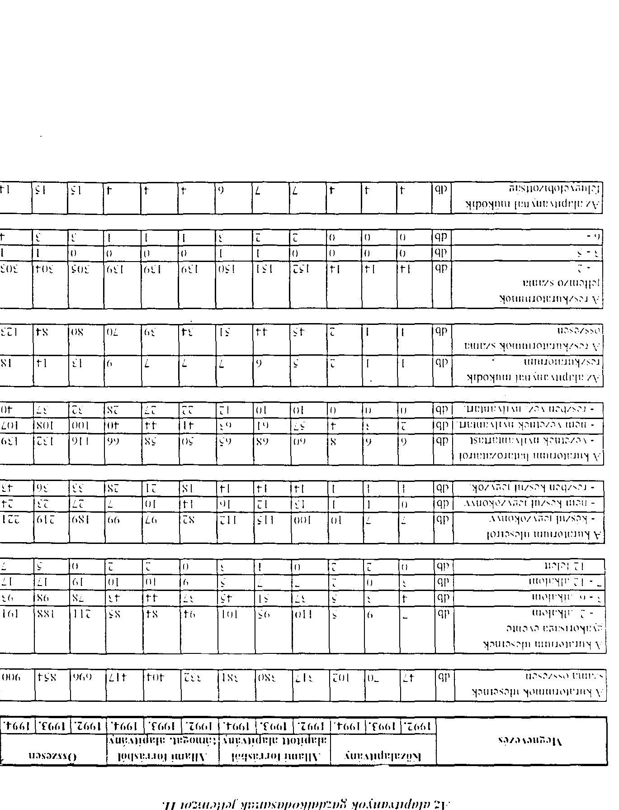

---

# A vizsgált alapítványok szabályozottsága

|  Megnevezés | Közalapítvány |  | Állami forrásból |  |  |  | Összes alapítvány  |
| --- | --- | --- | --- | --- | --- | --- | --- |
|   |  |  | alapított a. |  | támogatott, a. |  |   |
|   | db | % | db | % | db | % | db  |
|  Összesen: | 14 | 100,0 | 154 | 100,0 | 140 | 100,0 | 308  |
|  Az alapítványok közül rendelkezik - szamharenddel | 8 | 57,1 | 32 | 20,8 | 33 | 23,6 | 73  |
|  - gazdalkodási szabályzattal | 3 | 21,4 | 32 | 20,8 | 24 | 17,1 | 59  |
|  - pénzkezelési szabályzattal | 8 | 57,1 | 49 | 31,8 | 48 | 34,3 | 105  |
|  - feltározási szabályzattal | 6 | 42,9 | 27 | 17,5 | 34 | 24,3 | 67  |
|  - belső ellenőrzési szabályzattal | 0 | 0,0 | 12 | 7,8 | 9 | 6,4 | 21  |
|  - Kötelezettségvállalási, utalványozási, ellenjegyzési, érvényesítési szab. stal | 2 | 14,3 | 31 | 20,1 | 34 | 24,3 | 67  |
|  Az összes felsorolt szabályzattal rendelkezik | 0 | 0,0 | 4 | 2,6 | 4 | 2,9 | 8  |
|  Egy szabályzattal sem rendelkezik | 5 | 35,7 | 92 | 59,7 | 69 | 49,3 | 166  |

---

# Leltározás

|  Megnevezés | Kizziapítvány | Alami forrásból alapított a. ármogatott, a. | Összes alapítvány  |
| --- | --- | --- | --- |
|  Teldolgo alapítványok számát | db | 14 | 154  |
|  Legutolsó leltározás idepontja |  |  |   |
|  - 1989 | db | 0 | 0  |
|  - 1990 | db | 0 | 0  |
|  - 1991 | db | 0 | 1  |
|  - 1992 | db | 1 | 3  |
|  - 1993 | db | 1 | 5  |
|  - 1994 | db | 9 | 62  |
|  - 1995 | db | 0 | 9  |
|  Legutolsó leltározás módja |  |  |   |
|  - mennyiségủ felvétel | db | 5 | 17  |
|  - egyeztetés | db | 5 | 27  |
|  - tételés leltározás | db | 3 | 42  |
|  - nem volt leltározás | db | 3 | 74  |
|  Leitárlumnyal zárt alapítványok számát | db | 0 | 1  |
|  Leitárloblettel zárt alapítványok számát | db | 0 | 1  |
|  Az alapítványoknal feltárt feltárlmány összesen | E Ft | 0 | 151  |
|  A feltárlmány nagysága |  |  |   |
|  - 100 E Ft | db | 0 | 0  |
|  101 - 500 E Ft | db | 0 | 1  |
|  501 - 1000 E Ft | db | 0 | 0  |
|  1001 - 5000 E Ft | db | 0 | 0  |
|  5000 E Ft felett | db | 0 | 0  |
|  Alapítványnal feltárt feltárlobblet összesen | E Ft | 0 | 2  |
|  A feltárlobblet nagysága |  |  |   |
|  - 100 E Ft | db | 0 | 1  |
|  101 - 500 E Ft | db | 0 | 0  |
|  501 - 1000 E Ft | db | 0 | 0  |
|  1001 - 5000 E Ft | db | 0 | 0  |
|  5000 E Ft felett | db | 0 | 0  |
|  A feltárlmány miatt tett intézkedések |  |  |   |
|  - büntető eljárás kezdem. | db | 0 | 0  |
|  - legyelmi eljárás kezdem. | db | 0 | 0  |
|  - kárterítési eljárás kezd. | db | 0 | 0  |
|  A feltárlmányból megterült kár összesen | E Ft | 0 | 0  |

---

# Iz alapítványok vagyona

|  Megnevezés | Az alapítványok vagyona az alapító okirat szerint  |
| --- | --- |
|   | E.Ft.  |
|  **Közalapítványok** |   |
|  Adómanyszor eszközök összesen | 4 574 573  |
|  Előböl - vagyoni értéki jog | 304 447  |
|  - ingatlanok | 490 764  |
|  - pénzeszközök | 2 523 030  |
|  **Allami forrasból alapított alapítványok** |   |
|  Adómanyszor eszközök összesen | 16 133 435  |
|  Előböl - vagyoni értéki jog | 23 486  |
|  - ingatlanok | 5 593 381  |
|  - pénzeszközök | 9 464 104  |
|  **Allami forrasból támogatott alapítványok** |   |
|  Adómanyszor eszközök összesen | 846 991  |
|  Előböl - vagyoni értéki jog | 4 914  |
|  - ingatlanok | 668 950  |
|  - pénzeszközök | 171 267  |
|  **A vizsgált alapítványok összesen** |   |
|  Adómanyszor eszközök összesen | 21 554 999  |
|  Előböl - vagyoni értéki jog | 332 847  |
|  - ingatlanok | 6 753 095  |
|  - pénzeszközök | 12 158 401  |

---

Az alapítványok vagyona területi megoszlàs szerint

|  Fóváros és megyek megnevezése | Adományozott eszközök összesen | Adományozott eszközökhöl ingatlanok | pénzeszközök  |
| --- | --- | --- | --- |
|   | E Ft | E Ft | E Ft  |
|  Budapest | 20359251 | 329602 | 6633033  |
|  Ilariaya megye | 139840 | - | -  |
|  Ilacskiskun megye | 110 | - | -  |
|  Ilakes megye | 5597 | - | -  |
|  Ilorsod-Abanzemplen megye | 127505 | - | -  |
|  Csongrad megye | 116645 | - | -  |
|  Feier megye | 102000 | 1200 | 56912  |
|  Gyorsopron-Alexon megye | 74931 | 185 | 63100  |
|  Handa-Bihar megye | 1668 | - | -  |
|  Heves megye | 170 | - | -  |
|  Jasz-Nagykint-Szolnok megye | 470370 | - | 50  |
|  Komatom-Gyztergom megye | 43864 | - | -  |
|  Nograd megye | 7133 | - | -  |
|  Pest megye | 14466 | - | -  |
|  Somogy megye | 1365 | - | -  |
|  Szabolcs-Szajmar-Bereg megye | 29520 | 1860 | -  |
|  Tolna megye | 371 | - | -  |
|  Vás megye | 1115 | - | -  |
|  Veszprem megye | 21404 | - | -  |
|  Zala megye | 37674 | - | -  |
|  |   |   |   |
|  Összesen | 21554999 | 332847 | 6753095  |

---

# Alapitáshoz adott alapítói vagyon

|  Megnevezés | Alapított
alapítványok
száma | Adományozott
eszközök
összesen | Adományozott eszközökhöl
ingatlanok | pénzeszközök  |
| --- | --- | --- | --- | --- |
|   | db | E Ft | E Ft | E Ft  |
|  Ertéretek összesen |  |  |  |   |
|  összes alapítvány | 78 | 14 781 493 | 311 000 | 6 027 233  |
|  kiszalapítvány | 10 | 2 111 067 | 301 000 | 490 764  |
|  - állami t -ből alapított | 68 | 12 670 426 | 10 000 | 5 536 469  |
|  - állami t -ből támogatott | - | - | - | -  |

|  Elhíltóntett állami penzalapok összesen |  |  |  |  |   |
| --- | --- | --- | --- | --- | --- |
|  összes alapítvány | 12 | 433 916 | - | 300 000 | 133 916  |
|  kiszalapítvány | - | - | - | - | -  |
|  - állami t -ből alapított | 11 | 433 816 | - | 300 000 | 133 816  |
|  - állami t -ből támogatott | 1 | 100 | - | - | 100  |

|  Központi költségcélési intézmények összesen |  |  |  |  |   |
| --- | --- | --- | --- | --- | --- |
|  összes alapítvány | 92 | 311 432 | 2 201 | 18 000 | 241 081  |
|  kiszalapítvány | - | - | - | - | -  |
|  - állami t -ből alapított | 90 | 310 982 | 2 201 | 18 000 | 240 681  |
|  - állami t -ből támogatott | 2 | 450 | - | - | 400  |

|  Egészben vagy részben állami tulajdonban álló pénzintézetek |  |  |  |  |   |
| --- | --- | --- | --- | --- | --- |
|  összes alapítvány | 36 | 1 539 400 | - | - | 1 534 400  |
|  kiszalapítvány | - | - | - | - | -  |
|  - állami t -ből alapított | 32 | 1 538 100 | - | - | 1 533 100  |
|  - állami t -ből támogatott | 4 | 1 300 | - | - | 1 300  |

|  Egészben vagy részben állami tulajdonban álló gazdálható szervezetek |  |  |  |  |   |
| --- | --- | --- | --- | --- | --- |
|  összes alapítvány | 44 | 2 706 846 | 11 587 | 12 145 | 2 683 114  |
|  kiszalapítvány | 1 | 2 087 | 1 587 | - | 500  |
|  - állami t -ből alapított | 39 | 2 693 639 | 10 000 | 12 145 | 2 671 494  |
|  - állami t -ből támogatott | 4 | 11 120 | - | - | 11 120  |

---

# Eszközök és források

|  Megnevezés | 1993. | 1993. | 1994.  |
| --- | --- | --- | --- |
|   | E Ft | E Ft | E Ft  |
|  1. Amatdértrátságok | 14 845 | 31 455 | 48 646  |
|  2. Érész eszközök | 9 107 804 | 9 556 062 | 9 995 509  |
|  3. Életeketett pénzügyi eszközök összesen | 8 514 910 | 9 521 682 | 11 933 959  |
|  3. sorból: |  |  |   |
|  3.1. Részesedezek (részvenyek, törzsbéletek, |  |  |   |
|  -dértegeek, vagyoni béletek) | 1 335 176 | 2 465 634 | 5 832 594  |
|  3.2. Ertelipapírok (kötvenyek, különbözö |  |  |   |
|  -tilmapapírok) | 3 680 900 | 4 059 056 | 3 033 595  |
|  3.3. Ádott kölcsönök (vállalkozoknak, egyéb |  |  |   |
|  -tér személyeknek 1. evén túli lejáratra) | 2 854 318 | 2 502 497 | 1 764 928  |
|  3.3. sorból: |  |  |   |
|  Alapítványi célt szóbal | 2 702 798 | 2 377 591 | 1 415 267  |
|  3.4. Hosszú lejáratú - egy éven túli lelkölésű |  |  |   |
|  -térülbérkek | 569 465 | 335 769 | 104 991  |
|  4. Összesen (1+2+3) | 17 637 559 | 19 109 199 | 21 978 114  |
|  5. Készletek | 77 244 | 154 419 | 122 701  |
|  6. Követelések | 1 625 586 | 1 798 411 | 2 449 507  |
|  6.1. Vállalkozééles | 671 214 | 310 000 | 310 000  |
|  6.2. Rövid lejáratra kölcsönülött pénz | 457 798 | 529 098 | 1 550 096  |
|  6.2. sorból: |  |  |   |
|  Alapítványi célt szóbal | 382 094 | 475 792 | 1 489 228  |
|  7. Eél felszámított AFA | 1 984 | 3 936 | 5 403  |
|  8. Ertelipapírok | 1 686 880 | 3 742 403 | 5 796 333  |
|  8. sorból: |  |  |   |
|  8.1. Eladásra vás, részvenvek | - | - | 87 000  |
|  8.2. Eladásra vás, kötvenvek | 6 000 | 508 222 | 481 496  |
|  8.3. Eladásra vásárolt egyéb értelipapírok |  |  |   |
|  -támaszáricev, pénztáricev, letéti (cev, stb.) | 227 013 | 2 619 861 | 4 205 349  |
|  9. Pénzészközök | 6 254 881 | 7 349 912 | 7 397 889  |
|  10. Összesen (5+6+7+8+9) | 9 042 607 | 13 041 209 | 15 761 027  |
|  11. Eszközök (aktívák) összesen (4+10) | 26 680 166 | 32 150 408 | 37 739 141  |
|  12. Induló tőke | 21 819 800 | 25 777 104 | 29 720 405  |
|  13. Tőlevaltozás | 3 951 240 | 5 301 161 | 5 897 868  |
|  14. Céltartalék | 144 752 | 212 422 | 191 567  |
|  15. Összesen (12+13+14) | 25 915 792 | 31 290 687 | 35 809 840  |
|  16. Hosszú lejáratú kötelezettség | 15 087 | 113 495 | 690 721  |
|  16. sorból: |  |  |   |
|  16.1. Beruhözási és fejlesztési bítélek | 13 000 | 17 300 | 162 800  |
|  16.2. Egyéb hosszú lejáratú bítélek | 2 000 | 5 745 | 4 745  |
|  16.3. Hosszú lejáratra kapott kölcsönök | - | 80 420 | 512 670  |
|  17. Rövid lejáratú kötelezettségek | 750 808 | 746 867 | 1 246 167  |
|  17. sorból: |  |  |   |
|  17.1. Társadalombiztosításnak | 7 437 | 19 379 | 32 015  |
|  17.2. Váms és Pénzüsvörségnek | - | - | -  |
|  17.3. Adóhalóságnak | 28 038 | 108 490 | 146 438  |
|  18. Le: levonható AFA | 1 521 | 641 | 7 587  |
|  19. Összesen: (16+17-18) | 764 374 | 859 721 | 1 929 301  |
|  20. Források (passzívák) összesen (15+19) | 26 680 166 | 32 150 408 | 37 739 141  |

---

# Eszközök és források / közalapítványok /

|  Megnevezés | 1992. | 1993. | 1994.  |
| --- | --- | --- | --- |
|   | E Ft | E Ft | E Ft  |
|  1. Amuatervályi nyolc | 3021 | 3838 | 11779  |
|  2. Életet észközök | 3301016 | 3058299 | 3925358  |
|  3. Életeltetett pénzúnyi eszközök összesen | 901088 | 1855143 | 2144144  |
|  3. sorból: |  |  |   |
|  3.1. Részesedések (részsények, terzstetések, méltétegek, vagyoni betétek) | 834596 | 1779289 | 1785934  |
|  3.2. Ertékpapírok (korvenyék, kulcslázó állampapírok) | 8000 | 38000 | 5000  |
|  3.3. Adott kolesonák (vállalkozóknak, egyéb tényi személyeknek 1. éven túl lejáratra) | 58370 | 37854 | 352808  |
|  3.4. Kapoi: |  |  |   |
|  Alapítványi céli szómal | 17250 | 13458 | 14193  |
|  3.4. Hosszú lejáratú - egy-even-túl lekatéve bűnlhetétek | - | - | -  |
|  4. Üszesen (1+2+3) | 4205125 | 4917280 | 6081281  |
|  5. Készletek | 58319 | 50774 | 54089  |
|  6. Készletezek | 162684 | 634191 | 169791  |
|  6. sorból: |  |  |   |
|  6.1. Váltokevetelés | - | - | -  |
|  6.2. Rövid lejáratra kolesonadott pénz | 8100 | 19416 | 37184  |
|  6.2. sorból: |  |  |   |
|  Alapítványi céli szómal | 8100 | 6927 | 740  |
|  7. Élet felásonított AFA | - | - | -  |
|  8. Értékpapírok | - | - | 88468  |
|  8. sorból: |  |  |   |
|  8.1. Eladásra vás, részvények | - | - | -  |
|  8.2. Eladásra vás, korvenyék | - | - | -  |
|  8.3. Eladásra vásárolt egyéb értékpapírok (kincstáriség, pénztáriség, letéti jégv. stb.) | - | - | 88468  |
|  9. Pénzeszközök | 661338 | 508659 | 585598  |
|  10. Üszesen (5+6+7+8+9) | 882341 | 1193624 | 897946  |
|  11. Eszközök (aktívák) összesen (4+10) | 5087466 | 6110904 | 6979227  |
|  12. Induló tőke | 4697999 | 7775592 | 11205705  |
|  13. Tőlevaltozás | 96188 | 2056358 | 4934312  |
|  14. Előbárlatok | 14392 | 83068 | 90640  |
|  15. Üszesen (12+13+14) | 4808579 | 5802302 | 6361633  |
|  16. Hosszú lejáratú kötelezettség | - | 70000 | 290295  |
|  16. sorból: |  |  |   |
|  16.1. Beruhözési és fejlesztési kötelek | - | - | 150000  |
|  16.2. Egyéb hosszú lejáratú kötelek | - | - | -  |
|  16.3. Hosszú lejáratra kapott kolesonák | - | 70000 | 140000  |
|  17. Rövid lejáratú kötelezettségek | 278887 | 238602 | 327299  |
|  17. sorból: |  |  |   |
|  17.1. Társadalombiztosításnak | 47 | 5119 | 2819  |
|  17.2. Vánt- és Pénzművörzének | - | - | -  |
|  17.3. Adóhatóságnak | 3788 | 67265 | 99179  |
|  18. Élet levonható AFA | - | - | -  |
|  19. Üszesen (16+17+18) | 278887 | 308602 | 617594  |
|  20. Értékek (passzívák) összesen (15+19) | 5087466 | 6110904 | 6979227  |

---

# Eszközök és források /állami forrásból alapított alapítványok/

|  Megnevezés | 1992. | 1993. | 1994.  |
| --- | --- | --- | --- |
|   | E.H. | E.H. | E.H.  |
|  1. Alapítvány (1-2-3) | 8800 | 18151 | 26055  |
|  2. 1. Életes (cs) (1-2-3) | 4532874 | 5115766 | 4445810  |
|  3. Életeltetett pénzügyi eszközök összesen | 7431240 | 7404011 | 8804978  |
|  3.1. Átcsolt |  |  |   |
|  3.1.1. Éleszetelések (részvények, terzstetlék, |  |  |   |
|  véletlenszek, vagyoni betetek) | 391575 | 542140 | 3889400  |
|  3.2. Értékpapírok (kötvények, kalónbőző |  |  |   |
|  „(1) (1-2-3) | 3671909 | 4001539 | 2985741  |
|  3.3. Ádott kelesének (vállalkozéknak, egyéb |  |  |   |
|  (1-2-3) (1-2-3) (1-2-3) (1-2-3) (1-2-3) (1-2-3) (1-2-3) | 2773372 | 2443110 | 1390629  |
|  3.4. Hosszú lejárata (1-2-3) (1-2-3) (1-2-3) (1-2-3) (1-2-3) | 2663372 | 2342867 | 1379898  |
|  3.4.1. Hosszú lejárata (1-2-3) (1-2-3) (1-2-3) (1-2-3) (1-2-3) | 560579 | 312577 | 93164  |
|  4. Üszesen (1-2-3) | 11972980 | 12537928 | 13274843  |
|  5. Életeltetett pénzügyi eszközök összesen | 6240 | 90027 | 46734  |
|  5.1. Életeltetett pénzügyi eszközök összesen | 1314506 | 1047847 | 2045999  |
|  5.2. Átcsolt |  |  |   |
|  6.1. Átcsolt | 671214 | 310000 | 310000  |
|  6.2. Életelt lejáratra kelesénadott pénz | 400694 | 494724 | 1196182  |
|  6.2.1. Átcsolt |  |  |   |
|  7. Alapítvány (1-2-3) | 326136 | 454867 | 1377727  |
|  7.1. Életeltetett pénzügyi eszközök összesen | 89 | 2428 | 4239  |
|  8. Értékpapírok | 1073900 | 3720264 | 5536868  |
|  8.1. Átcsolt |  |  |   |
|  8.1.1. Életeltetett pénzügyi eszközök összesen |  |  |   |
|  8.2. Életeltetett véletlenszek | 6000 | 502222 | 479496  |
|  8.3. Eladásra vásárolt egyéb értékpapírok |  |  |   |
|  „(1) (1-2-3) | 214813 | 2604692 | 4040321  |
|  9. Életeltetett pénzügyi eszközök összesen | 4726730 | 5627776 | 5812522  |
|  10. Üszesen (5-6-7-8-9) | 7121287 | 10483486 | 13437884  |
|  11. Életeltetett pénzügyi eszközök összesen (1+10) | 19094267 | 23021414 | 26712727  |
|  12. Induló tőke | 16136204 | 16988103 | 17171152  |
|  13. Tőkeváltózás | 2461951 | 5516124 | 8923059  |
|  14. Cellártak | 93336 | 56212 | 7210  |
|  15. Üszesen (12+13+14) | 18691491 | 22500439 | 26101421  |
|  16. Hosszú lejárata kötelezettség | 15000 | 25100 | 22881  |
|  16.1. Hozzú lejárat és fejlesztési kötele | 13000 | 11700 | 10400  |
|  16.2. Egyéb hosszú lejárata kötele | 2000 | 1000 | -  |
|  16.3. Hosszú lejáratra kapott kölcsönök | - | 2400 | 2400  |
|  17. Rövid lejárata kötelezetítések | 387823 | 435875 | 595427  |
|  17.1. Átcsolt |  |  |   |
|  17.1.1. Társadalombütőstársnak | 4720 | 11054 | 17399  |
|  17.2. Vám- és Pénzünyőrségnek | - | - | -  |
|  17.3. Ádolhatósítanak | 15616 | 35726 | 38519  |
|  18. Életeltetett pénzügyi eszközök összesen (15+19) | 47 | - | 7002  |
|  19. Üszesen (16+17-18) | 402776 | 460975 | 611306  |
|  20. Források (passzívák) összesen (15+19) | 19094267 | 23021414 | 26712727  |

---

# Eszközök és források /állami forrásból támogatott alapítványok /

|  Megnevezés | 1992. | 1993. | 1994.  |
| --- | --- | --- | --- |
|   | E.H. | E.H. | E.H.  |
|  1. Amatérzárások | 2 958 | 9 466 | 10 812  |
|  2. Férzév és fázóok | 1 273 914 | 1 381 997 | 1 626 341  |
|  3. Értékletett pénzhelyi eszközök összesen | 182 582 | 262 528 | 984 837  |
|  4. Szótól |  |  |   |
|  3.1. Beszesegések (részvenyék, farzsbetetek, felkészések, vagyoni betetek) | 109 005 | 144 205 | 157 260  |
|  3.2. Értékpapírok (hétvenyék, kulcobozó állámpapírok) | 991 | 10 517 | 42 854  |
|  3.3. Adott kölcsönök (vállalkozóknak, egyéb soroszemelyeknek 1. éven túli feljáratra) | 22 576 | 21 533 | 21 491  |
|  3.1. Szótól |  |  |   |
|  Alapítványi célt szobról | 22 176 | 21 176 | 21 176  |
|  3.4. Hosszú lejáratú - egy éven túli feljátszó bankbetelek | 8 886 | 23 183 | 11 827  |
|  4. Bőszesen (1+2+3) | 1 459 454 | 1 653 991 | 2 621 990  |
|  5. Készletek | 12 685 | 13 618 | 21 878  |
|  6. Kövtetésnek | 148 396 | 116 373 | 233 717  |
|  6. Szótól |  |  |   |
|  6.1. Víziósvetetés | - | - | -  |
|  6.2. Éveni lejáratra kölcsönödött pénz | 49 004 | 14 958 | 116 730  |
|  6.2. Szótól |  |  |   |
|  Alapítványi célt szobról | 47 858 | 13 998 | 110 761  |
|  7. Értékpapírok (1+2+3) | 1 895 | 1 508 | 1 164  |
|  8. Értékpapírok | 12 980 | 22 139 | 170 997  |
|  8. Szótól |  |  |   |
|  8.1. Eladásra vás, részvenyék | - | - | 87 000  |
|  8.2. Eladásra vás, kötvenyék | - | 6 000 | 2 000  |
|  8.3. Eladásra vasarolt egyéb értékpapírok (hincstatjegy, pénzhírtiegy, letéti jegy, stb.) | 12 200 | 15 169 | 76 560  |
|  9. Pénzeszközök | 866 813 | 1 213 477 | 999 769  |
|  10. Bőszesen (5+6-7+8+9) | 1 038 979 | 1 364 099 | 1 425 197  |
|  11. Eszközök (aktívák) összesen (4+10) | 2 498 433 | 3 018 090 | 4 047 187  |
|  12. Indula tőke | 985 597 | 1 013 409 | 1 343 948  |
|  13. Tőkeváltatás | 1 393 101 | 1 841 395 | 1 909 121  |
|  14. Céltartalék | 37 024 | 73 142 | 93 717  |
|  15. Bőszesen (12+13+14) | 2 415 722 | 2 927 946 | 3 346 786  |
|  16. Hosszú lejáratú kötelezettség | 87 | 18 395 | 377 545  |
|  16. Szótól |  |  |   |
|  16.1. Beruházási és fejlesztési hitelék | - | 5 600 | 2 400  |
|  16.2. Egyéb hosszú lejáratú hitelék | - | 4 745 | 4 745  |
|  16.3. Hosszú lejáratra kapott kölcsönök | - | 8 020 | 370 270  |
|  17. Bőval lejáratú kötelezettségek | 84 098 | 72 390 | 323 441  |
|  17. Szótól |  |  |   |
|  17.1. Típusfelombiztosítások | 2 670 | 3 206 | 11 797  |
|  17.2. Váno- és Pénzárvárségnek | - | - | -  |
|  17.3. Adálódóságok | 8 634 | 5 499 | 8 740  |
|  18. Értékletett pénzhelyi eszközök összesen | 1 474 | 641 | 585  |
|  19. Bőszesen (16+17-18) | 82 711 | 90 144 | 700 401  |
|  20. Források (passzívák) összesen (15+19) | 2 498 433 | 3 018 090 | 4 047 187  |

---

Az alapítványok megoszlása az 1994. évi saját tóke nagysága szerint

|  Sáját tölke |  | Közalapítványok |  |  | Allami forrásból |  |  |  | Összes  |
| --- | --- | --- | --- | --- | --- | --- | --- | --- | --- |
|  nagysága |  |  |  |  | alapított alapítványok |  |  |  | alapítvány  |
|   |  | számá | saját tőke | számá | saját tőke | számá | saját tőke | számá | saját tőke  |
|  E Ft |  | db | E Ft | db | E Ft | db | E Ft | db | E Ft  |
|   |  | 0 | 0 | 40 | 15 924 | 47 | 3 041 | 87 | 18 965  |
|   |  | 0 | 0 | 46 | 166 528 | 52 | 188 950 | 98 | 355 478  |
|   |  | 5 | 95 208 | 38 | 1 261 417 | 23 | 909 336 | 66 | 2 265 961  |
|   |  | 3 | 404 589 | 14 | 3 257 226 | 6 | 1 535 616 | 23 | 5 196 831  |
|   |  | 1 | 696 756 | 4 | 2 744 460 | 1 | 710 443 | 6 | 4 151 659  |
|   |  | 3 | 5 165 080 | 3 | 6 545 540 | 0 | 0 | 6 | 11 710 620  |
|   |  | 0 | 0 | 2 | 12 110 326 | 0 | 0 | 2 | 12 110 326  |
|  Összesen |  | 12 | 6 361 633 | 147 | 26 101 421 | 129 | 3 346 786 | 288 | 35 809 840  |

# Elszámolt értékvesztések

|  Megnevezés | 1992. | 1993. | 1994.  |
| --- | --- | --- | --- |
|   | E Ft | E Ft | E Ft  |
|  1. |  |  |   |
|  1. |  |  |   |
|  2. | Értékpapírok (kötvények, külsőbözö állampapírok) értékvesztése | 0 | 335 449  |
|  3. | Ádott kölcsönök (vállalkozóknak, egyéb jogi személyeknek ) (évén túli letáratra) értékvesztése | 0 | 252 130  |
|  4. | Hosszú lejáratú (egy éven túli lekötésű ) bankbetétek értékvesztése | 0 | 0  |
|  5. | Váltokovetelések értékvesztése | 0 | 0  |
|  6. | Rövid letáratra kölcsönödött pénz értékvesztése | 0 | 0  |
|  7. | Eladásra vásárolt részvények értékvesztése | 0 | 0  |
|  8. | Eladásra vásárolt kötvények értékvesztése | 0 | 0  |
|  9. | Eladásra vásárolt egyéb értékpapírok értékvesztése | 0 | 0  |
|  10. | Értékvesztés összesen | 0 | 926 329  |

---

# Elszámolt értékvesztésck / közalapitványok /

|  Megnevezés |  | 1992. | 1993. | 1994.  |
| --- | --- | --- | --- | --- |
|   |  | E Ft | E Ft | E Ft  |
|  1. |  |  |  |   |
|  2. |  |  |  |   |
|  3. |  |  |  |   |
|  4. |  |  |  |   |
|  5. |  |  |  |   |
|  6. |  |  |  |   |
|  7. |  |  |  |   |
|  8. |  |  |  |   |
|  9. |  |  |  |   |
|  10. |  |  |  |   |

Elszámolt értékvesztések /állami forrásból alapított alapítványok /

|  Megnevezés |  | 1992. | 1993. | 1994.  |
| --- | --- | --- | --- | --- |
|   |  | E Ft | E Ft | E Ft  |
|  1. |  |  |  |   |
|  2. |  |  |  |   |
|  3. |  |  |  |   |
|  4. |  |  |  |   |
|  5. |  |  |  |   |
|  6. |  |  |  |   |
|  7. |  |  |  |   |
|  8. |  |  |  |   |
|  9. |  |  |  |   |
|  10. |  |  |  |   |
|  11. |  |  |  |   |
|  12. |  |  |  |   |
|  13. |  |  |  |   |
|  14. |  |  |  |   |
|  15. |  |  |  |   |
|  16. |  |  |  |   |
|  17. |  |  |  |   |
|  18. |  |  |  |   |
|  19. |  |  |  |   |
|  20. |  |  |  |   |
|  21. |  |  |  |   |
|  22. |  |  |  |   |
|  23. |  |  |  |   |
|  24. |  |  |  |   |
|  25. |  |  |  |   |
|  26. |  |  |  |   |
|  27. |  |  |  |   |
|  28. |  |  |  |   |
|  29. |  |  |  |   |
|  30. |  |  |  |   |
|  31. |  |  |  |   |
|  32. |  |  |  |   |
|  33. |  |  |  |   |
|  34. |  |  |  |   |
|  35. |  |  |  |   |
|  36. |  |  |  |   |
|  37. |  |  |  |   |
|  38. |  |  |  |   |
|  39. |  |  |  |   |
|  40. |  |  |  |   |
|  41. |  |  |  |   |
|  42. |  |  |  |   |
|  43. |  |  |  |   |
|  44. |  |  |  |   |
|  45. |  |  |  |   |
|  46. |  |  |  |   |
|  47. |  |  |  |   |
|  48. |  |  |  |   |
|  49. |  |  |  |   |
|  50. |  |  |  |   |
|  51. |  |  |  |   |
|  52. |  |  |  |   |
|  53. |  |  |  |   |
|  54. |  |  |  |   |
|  55. |  |  |  |   |
|  56. |  |  |  |   |
|  57. |  |  |  |   |
|  58. |  |  |  |   |
|  59. |  |  |  |   |
|  60. |  |  |  |   |
|  61. |  |  |  |   |
|  62. |  |  |  |   |
|  63. |  |  |  |   |
|  64. |  |  |  |   |
|  65. |  |  |  |   |
|  66. |  |  |  |   |
|  67. |  |  |  |   |
|  68. |  |  |  |   |
|  69. |  |  |  |   |
|  70. |  |  |  |   |
|  71. |  |  |  |   |
|  72. |  |  |  |   |
|  73. |  |  |  |   |
|  74. |  |  |  |   |
|  75. |  |  |  |   |
|  76. |  |  |  |   |
|  77. |  |  |  |   |
|  78. |  |  |  |   |
|  79. |  |  |  |   |
|  80. |  |  |  |   |
|  81. |  |  |  |   |
|  82. |  |  |  |   |
|  83. |  |  |  |   |
|  84. |  |  |  |   |
|  85. |  |  |  |   |
|  86. |  |  |  |   |
|  87. |  |  |  |   |
|  88. |  |  |  |   |
|  89. |  |  |  |   |
|  90. |  |  |  |   |
|  91. |  |  |  |   |
|  92. |  |  |  |   |
|  93. |  |  |  |   |
|  94. |  |  |  |   |
|  95. |  |  |  |   |
|  96. |  |  |  |   |
|  97. |  |  |  |   |
|  98. |  |  |  |   |
|  99. |  |  |  |   |
|  100. |  |  |  |   |
|  101. |  |  |  |   |
|  102. |  |  |  |   |
|  103. |  |  |  |   |
|  104. |  |  |  |   |
|  105. |  |  |  |   |
|  106. |  |  |  |   |
|  107. |  |  |  |   |
|  108. |  |  |  |   |
|  109. |  |  |  |   |
|  110. |  |  |  |   |
|  111. |  |  |  |   |
|  112. |  |  |  |   |
|  113. |  |  |  |   |
|  114. |  |  |  |   |
|  115. |  |  |  |   |
|  116. |  |  |  |   |
|  117. |  |  |  |   |
|  118. |  |  |  |   |
|  119. |  |  |  |   |
|  120. |  |  |  |   |
|  121. |  |  |  |   |
|  122. |  |  |  |   |
|  123. |  |  |  |   |
|  124. |  |  |  |   |
|  125. |  |  |  |   |
|  126. |  |  |  |   |
|  127. |  |  |  |   |
|  128. |  |  |  |   |
|  129. |  |  |  |   |
|  130. |  |  |  |   |
|  131. |  |  |  |   |
|  132. |  |  |  |   |
|  133. |  |  |  |   |
|  134. |  |  |  |   |
|  135. |  |  |  |   |
|  136. |  |  |  |   |
|  137. |  |  |  |   |
|  138. |  |  |  |   |
|  139. |  |  |  |   |
|  140. |  |  |  |   |
|  141. |  |  |  |   |
|  142. |  |  |  |   |
|  143. |  |  |  |   |
|  144. |  |  |  |   |
|  145. |  |  |  |   |
|  146. |  |  |  |   |
|  147. |  |  |  |   |
|  148. |  |  |  |   |
|  149. |  |  |  |   |
|  150. |  |  |  |   |
|  151. |  |  |  |   |
|  152. |  |  |  |   |
|  153. |  |  |  |   |
|  154. |  |  |  |   |
|  155. |  |  |  |   |
|  156. |  |  |  |   |
|  157. |  |  |  |   |
|  158. |  |  |  |   |
|  159. |  |  |  |   |
|  160. |  |  |  |   |
|  161. |  |  |  |   |
|  162. |  |  |  |   |
|  163. |  |  |  |   |
|  164. |  |  |  |   |
|  165. |  |  |  |   |
|  166. |  |  |  |   |
|  167. |  |  |  |   |
|  168. |  |  |  |   |
|  169. |  |  |  |   |
|  170. |  |  |  |   |
|  171. |  |  |  |   |
|  172. |  |  |  |   |
|  173. |  |  |  |   |
|  174. |  |  |  |   |
|  175. |  |  |  |   |
|  176. |  |  |  |   |
|  177. |  |  |  |   |
|  178. |  |  |  |   |
|  179. |  |  |  |   |
|  180. |  |  |  |   |
|  181. |  |  |  |   |
|  182. |  |  |  |   |
|  183. |  |  |  |   |
|  184. |  |  |  |   |
|  185. |  |  |  |   |
|  186. |  |  |  |   |
|  187. |  |  |  |   |
|  188. |  |  |  |   |
|  189. |  |  |  |   |
|  190. |  |  |  |   |
|  191. |  |  |  |   |
|  192. |  |  |  |   |
|  193. |  |  |  |   |
|  194. |  |  |  |   |
|  195. |  |  |  |   |
|  196. |  |  |  |   |
|  197. |  |  |  |   |
|  198. |  |  |  |   |
|  199. |  |  |  |   |
|  200. |  |  |  |   |
|  201. |  |  |  |   |
|  202. |  |  |  |   |
|  203. |  |  |  |   |
|  204. |  |  |  |   |
|  205. |  |  |  |   |
|  206. |  |  |  |   |
|  207. |  |  |  |   |
|  208. |  |  |  |   |
|  209. |  |  |  |   |
|  210. |  |  |  |   |
|  211. |  |  |  |   |
|  212. |  |  |  |   |
|  213. |  |  |  |   |
|  214. |  |  |  |   |
|  215. |  |  |  |   |
|  216. |  |  |  |   |
|  217. |  |  |  |   |
|  218. |  |  |  |   |
|  219. |  |  |  |   |
|  220. |  |  |  |   |
|  221. |  |  |  |   |
|  222. |  |  |  |   |
|  223. |  |  |  |   |
|  224. |  |  |  |   |
|  225. |  |  |  |   |
|  226. |  |  |  |   |
|  227. |  |  |  |   |
|  228. |  |  |  |   |
|  229. |  |  |  |   |
|  230. |  |  |  |   |
|  231. |  |  |  |   |
|  232. |  |  |  |   |
|  233. |  |  |  |   |
|  234. |  |  |  |   |
|  235. |  |  |  |   |
|  236. |  |  |  |   |
|  237. |  |  |  |   |
|  238. |  |  |  |   |
|  239. |  |  |  |   |
|  240. |  |  |  |   |
|  241. |  |  |  |   |
|  242. |  |  |  |   |
|  243. |  |  |  |   |
|  244. |  |  |  |   |
|  245. |  |  |  |   |
|  246. |  |  |  |   |
|  247. |  |  |  |   |
|  248. |  |  |  |   |
|  249. |  |  |  |   |
|  250. |  |  |  |   |
|  251. |  |  |  |   |
|  252. |  |  |  |   |
|  253. |  |  |  |   |
|  254. |  |  |  |   |
|  255. |  |  |  |   |
|  256. |  |  |  |   |
|  257. |  |  |  |   |
|  258. |  |  |  |   |
|  259. |  |  |  |   |
|  260. |  |  |  |   |
|  261. |  |  |  |   |
|  262. |  |  |  |   |
|  263. |  |  |  |   |
|  264. |  |  |  |   |
|  265. |  |  |  |   |
|  266. |  |  |  |   |
|  267. |  |  |  |   |
|  268. |  |  |  |   |
|  269. |  |  |  |   |
|  270. |  |  |  |   |
|  271. |  |  |  |   |
|  272. |  |  |  |   |
|  273. |  |  |  |   |
|  274. |  |  |  |   |
|  275. |  |  |  |   |
|  276. |  |  |  |   |
|  277. |  |  |  |   |
|  278. |  |  |  |   |
|  279. |  |  |  |   |
|  280. |  |  |  |   |
|  281. |  |  |  |   |
|  282. |  |  |  |   |
|  283. |  |  |  |   |
|  284. |  |  |  |   |
|  285. |  |  |  |   |
|  286. |  |  |  |   |
|  287. |  |  |  |   |
|  288. |  |  |  |   |
|  289. |  |  |  |   |
|  290. |  |  |  |   |
|  291. |  |  |  |   |
|  292. |  |  |  |   |
|  293. |  |  |  |   |
|  294. |  |  |  |   |
|  295. |  |  |  |   |
|  296. |  |  |  |   |
|  297. |  |  |  |   |
|  298. |  |  |  |   |
|  299. |  |  |  |   |
|  300. |  |  |  |   |
|  301. |  |  |  |   |
|  302. |  |  |  |   |
|  303. |  |  |  |   |
|  304. |  |  |  |   |
|  305. |  |  |  |   |
|  306. |  |  |  |   |
|  307. |  |  |  |   |
|  308. |  |  |  |   |
|  309. |  |  |  |   |
|  310. |  |  |  |   |
|  311. |  |  |  |   |
|  312. |  |  |  |   |
|  313. |  |  |  |   |
|  314. |  |  |  |   |
|  315. |  |  |  |   |
|  316. |  |  |  |   |
|  317. |  |  |  |   |
|  318. |  |  |  |   |
|  319. |  |  |  |   |
|  320. |  |  |  |   |
|  321. |  |  |  |   |
|  322. |  |  |  |   |
|  323. |  |  |  |   |
|  324. |  |  |  |   |
|  325. |  |  |  |   |
|  326. |  |  |  |   |
|  327. |  |  |  |   |
|  328. |  |  |  |   |
|  329. |  |  |  |   |
|  330. |  |  |  |   |
|  331. |  |  |  |   |
|  332. |  |  |  |   |
|  333. |  |  |  |   |
|  334. |  |  |  |   |
|  335. |  |  |  |   |
|  336. |  |  |  |   |
|  337. |  |  |  |   |
|  338. |  |  |  |   |
|  339. |  |  |  |   |
|  340. |  |  |  |   |
|  341. |  |  |  |   |
|  342. |  |  |  |   |
|  343. |  |  |  |   |
|  344. |  |  |  |   |
|  345. |  |  |  |   |
|  346. |  |  |  |   |
|  347. |  |  |  |   |
|  348. |  |  |  |   |
|  349. |  |  |  |   |
|  350. |  |  |  |   |
|  351. |  |  |  |   |
|  352. |  |  |  |   |
|  353. |  |  |  |   |
|  354. |  |  |  |   |
|  355. |  |  |  |   |
|  356. |  |  |  |   |
|  357. |  |  |  |   |
|  358. |  |  |  |   |
|  359. |  |  |  |   |
|  360. |  |  |  |   |
|  361. |  |  |  |   |
|  362. |  |  |  |   |
|  363. |  |  |  |   |
|  364. |  |  |  |   |
|  365. |  |  |  |   |
|  366. |  |  |  |   |
|  367. |  |  |  |   |
|  368. |  |  |  |   |
|  369. |  |  |  |   |
|  370. |  |  |  |   |
|  371. |  |  |  |   |
|  372. |  |  |  |   |
|  373. |  |  |  |   |
|  374. |  |  |  |   |
|  375. |  |  |  |   |
|  376. |  |  |  |   |
|  377. |  |  |  |   |
|  378. |  |  |  |   |
|  379. |  |  |  |   |
|  380. |  |  |  |   |
|  381. |  |  |  |   |
|  382. |  |  |  |   |
|  383. |  |  |  |   |
|  384. |  |  |  |   |
|  385. |  |  |  |   |
|  386. |  |  |  |   |
|  387. |  |  |  |   |
|  388. |  |  |  |   |
|  389. |  |  |  |   |
|  390. |  |  |  |   |
|  391. |  |  |  |   |
|  392. |  |  |  |   |
|  393. |  |  |  |   |
|  394. |  |  |  |   |
|  395. |  |  |  |   |
|  396. |  |  |  |   |
|  397. |  |  |  |   |
|  398. |  |  |  |   |
|  399. |  |  |  |   |
|  400. |  |  |  |   |
|  401. |  |  |  |   |
|  402. |  |  |  |   |
|  403. |  |  |  |   |
|  404. |  |  |  |   |
|  405. |  |  |  |   |
|  406. |  |  |  |   |
|  407. |  |  |  |   |
|  408. |  |  |  |   |
|  409. |  |  |  |   |
|  410. |  |  |  |   |
|  411. |  |  |  |   |
|  412. |  |  |  |   |
|  413. |  |  |  |   |
|  414. |  |  |  |   |
|  415. |  |  |  |   |
|  416. |  |  |  |   |
|  417. |  |  |  |   |
|  418. |  |  |  |   |
|  419. |  |  |  |   |
|  420. |  |  |  |   |
|  421. |  |  |  |   |
|  422. |  |  |  |   |
|  423. |  |  |  |   |
|  424. |  |  |  |   |
|  425. |  |  |  |   |
|  426. |  |  |  |   |
|  427. |  |  |  |   |
|  428. |  |  |  |   |
|  429. |  |  |  |   |
|  430. |  |  |  |   |
|  431. |  |  |  |   |
|  432. |  |  |  |   |
|  433. |  |  |  |   |
|  434. |  |  |  |   |
|  435. |  |  |  |   |
|  436. |  |  |  |   |
|  437. |  |  |  |   |
|  438. |  |  |  |   |
|  439. |  |  |  |   |
|  440. |  |  |  |   |
|  441. |  |  |  |   |
|  442. |  |  |  |   |
|  443. |  |  |  |   |
|  444. |  |  |  |   |
|  445. |  |  |  |   |
|  446. |  |  |  |   |
|  447. |  |  |  |   |
|  448. |  |  |  |   |
|  449. |  |  |  |   |
|  450. |  |  |  |   |
|  451. |  |  |  |   |
|  452. |  |  |  |   |
|  453. |  |  |  |   |
|  454. |  |  |  |   |
|  455. |  |  |  |   |
|  456. |  |  |  |   |
|  457. |  |  |  |   |
|  458. |  |  |  |   |
|  459. |  |  |  |   |
|  460. |  |  |  |   |
|  461. |  |  |  |   |
|  462. |  |  |  |   |
|  463. |  |  |  |   |
|  464. |  |  |  |   |
|  465. |  |  |  |   |
|  466. |  |  |  |   |
|  467. |  |  |  |   |
|  468. |  |  |  |   |
|  469. |  |  |  |   |
|  470. |  |  |  |   |
|  471. |  |  |  |   |
|  472. |  |  |  |   |
|  473. |  |  |  |   |
|  474. |  |  |  |   |
|  475. |  |  |  |   |
|  476. |  |  |  |   |
|  477. |  |  |  |   |
|  478. |  |  |  |   |
|  479. |  |  |  |   |
|  480. |  |  |  |   |
|  481. |  |  |  |   |
|  482. |  |  |  |   |
|  483. |  |  |  |   |
|  484. |  |  |  |   |
|  485. |  |  |  |   |
|  486. |  |  |  |   |
|  487. |  |  |  |   |
|  488. |  |  |  |   |
|  489. |  |  |  |   |
|  490. |  |  |  |   |
|  491. |  |  |  |   |
|  492. |  |  |  |   |
|  493. |  |  |  |   |
|  494. |  |  |  |   |
|  495. |  |  |  |   |
|  496. |  |  |  |   |
|  497. |  |  |  |   |
|  498. |  |  |  |   |
|  499. |  |  |  |   |
|  500. |  |  |  |   |
|  501. |  |  |  |   |
|  502. |  |  |  |   |
|  503. |  |  |  |   |
|  504. |  |  |  |   |
|  505. |  |  |  |   |
|  506. |  |  |  |   |
|  507. |  |  |  |   |
|  508. |  |  |  |   |
|  509. |  |  |  |   |
|  510. |  |  |  |   |
|  511. |  |  |  |   |
|  512. |  |  |  |   |
|  513. |  |  |  |   |
|  514. |  |  |  |   |
|  515. |  |  |  |   |
|  516. |  |  |  |   |
|  517. |  |  |  |   |
|  518. |  |  |  |   |
|  519. |  |  |  |   |
|  520. |  |  |  |   |
|  521. |  |  |  |   |
|  522. |  |  |  |   |
|  523. |  |  |  |   |
|  524. |  |  |  |   |
|  525. |  |  |  |   |
|  526. |  |  |  |   |
|  527. |  |  |  |   |
|  528. |  |  |  |   |
|  529. |  |  |  |   |
|  530. |  |  |  |   |
|  531. |  |  |  |   |
|  532. |  |  |  |   |
|  533. |  |  |  |   |
|  534. |  |  |  |   |
|  535. |  |  |  |   |
|  536. |  |  |  |   |
|  537. |  |  |  |   |
|  538. |  |  |  |   |
|  539. |  |  |  |   |
|  540. |  |  |  |   |
|  541. |  |  |  |   |
|  542. |  |  |  |   |
|  542. |  |  |  |   |
|  543. |  |  |  |   |
|  544. |  |  |  |   |
|  545. |  |  |  |   |
|  546. |  |  |  |   |
|  547. |  |  |  |   |
|  548. |  |  |  |   |
|  549. |  |  |  |   |
|  550. |  |  |  |   |
|  547. |  |  |  |   |
|  548. |  |  |  |   |
|  549. |  |  |  |   |
|  551. |  |  |  |   |
|  552. |  |  |  |   |
|  553. |  |  |  |   |
|  554. |  |  |  |   |
|  555. |  |  |  |   |
|  556. |  |  |  |   |
|  557. |  |  |  |   |
|  558. |  |  |  |   |
|  559. |  |  |  |   |
|  560. |  |  |  |   |
|  559. |  |  |  |   |
|  561. |  |  |  |   |
|  562. |  |  |  |   |
|  562. |  |  |  |   |
|  563. |  |  |  |   |
|  564. |  |  |  |   |
|  565. |  |  |  |   |
|  566. |  |  |  |   |
|  567. |  |  |  |   |
|  568. |  |  |  |   |
|  569. |  |  |  |   |
|  570. |  |  |  |   |
|  571. |  |  |  |   |
|  572. |  |  |  |   |
|  573. |  |  |  |   |
|  574. |  |  |  |   |
|  575. |  |  |  |   |
|  576. |  |  |  |   |
|  577. |  |  |  |   |
|  577. |  |  |  |   |
|  578. |  |  |  |   |
|  578. |  |  |  |   |
|  579. |  |  |  |   |
|  580. |  |  |  |   |
|  581. |  |  |  |   |
|  582. |  |  |  |   |
|  583. |  |  |  |   |
|  584. |  |  |  |   |
|  585. |  |  |  |   |
|  586. |  |  |  |   |
|  587. |  |  |  |   |
|  587. |  |  |  |   |
|  588. |  |  |  |   |
|  588. |  |  |  |   |
|  589. |  |  |  |   |
|  590. |  |  |  |   |
|  591. |  |  |  |   |
|  592. |  |  |  |   |
|  593. |  |  |  |   |
|  594. |  |  |  |   |
|  595. |  |  |  |   |
|  596. |  |  |  |   |
|  597. |  |  |  |   |
|  598. |  |  |  |   |
|  598. |  |  |  |   |
|  599. |  |  |  |   |
|  599. |  |  |   |
|  600. |  |  |   |
|  601. |  |  |   |
|  602. |  |  |   |
|  603. |  |  |   |
|  604. |  |  |  |   |
|  605. |  |  |   |
|  606. |  |  |   |
|  607. |  |  |   |
|  608. |  |  |   |
|  609. |  |  |   |
|  610. |  |  |   |
|  611. |  |  |   |
|  612. |  |  |   |
|  613. |  |  |   |
|  613. |  |  |   |
|  614. |  |  |   |
|  614. |  |  |   |
|  615. |  |  |   |
|  616. |  |  |   |
|  617. |  |  |   |
|  617. |  |  |   |
|  618. |  |  |   |
|  619. |  |  |   |
|  620. |  |  |   |
|  621. |  |  |   |
|  622. |  |  |   |
|  623. |  |  |   |
|  624. |  |  |   |
|  625. |  |  |   |
|  627. |  |  |   |
|  627. |  |  |   |
|  628. |  |  |   |
|  628. |  |  |   |
|  629. |  |  |   |
|  630. |  |  |   |
|  629. |  |  |   |
|  631. |  |  |   |
|  632. |  |  |   |
|  633. |  |  |   |
|  633. |  |  |   |
|  634. |  |  |   |
|  635. |  |  |   |
|  637. |  |  |   |
|  638. |  |  |   |
|  639. |  |  |   |
|  640. |  |  |   |
|  641. |  |  |   |
|  642. |  |  |   |
|  642. |  |  |   |
|  643. |  |  |   |
|  643. |  |  |   |
|  643. |  |  |   |
|  644. |  |  |   |
|  644. |  |  |   |
|  645. |  |  |   |
|  647. |  |  |   |
|  647. |  |  |   |
|  650. |  |  |   |
|  652. |  |  |   |
|  653. |  |  |   |
|  657. |  |  |   |
|  658. |  |  |   |
|  66. |  |  |   |
|  66. |  |  |   |
|  67. |  |  |   |
|  67. |  |  |   |
|  68. |  |  |   |
|  68. |  |  |   |
|  69. |  |  |   |
|  69. |  |  |   |
|  69. |  |  |   |
|  70. |  |   |
|  71. |  |  |   |
|  72. |  |  |   |
|  73. |  |  |   |
|  74. |  |   |
|  75. |  |   |
|  76. |  |  |   |
|  77. |  |  |   |
|  78. |  |  |   |
|  79. |  |  |   |
|  79. |  |   |
|  79. |  |   |
|  79. |  |   |
|  79. |  |  |   |
|  79. |  |   |
|  79. |  |   |
|  79. |  |   |
|  79. |  |   |
|  79. |  |   |
|  79. |  |   |
|  79. |  |   |
|  79. |  |   |
|  79. |  |   |
|  79. |  |   |
|  79. |  |   |
|  79. |  |   |
|  79. |  |   |
|  79. |  |   |
|  79. |  |   |
|  79. |  |   |
|  79. |  |   |
|  79. |  |   |
|  79. |  |   |
|  79. |  |   |
|  79. |  |   |
|  79. |  |   |
|  79. |  |   |
|  79. |  |   |
|  79. |  |   |
|  79. |  |   |
|  79. |  |   |
|  79. |  |   |
|  79. |  |   |
|  79. |  |   |
|  79. |  |   |
|  

---

### Az alapítványok összesített pénzügyi adatai és beruházásai

|  Megnevezés | Vállalkozási
tevékenység | 1992.
Alapítványi
célú
tevékenység | Összesen | Vállalkozási
tevékenység | 1993.
Alapítványi
célú
tevékenység | Összesen | Vállalkozási
tevékenység | 1994.
Alapítványi
célú
tevékenység | Összesen  |
| --- | --- | --- | --- | --- | --- | --- | --- | --- | --- |
|   | E Ft | E Ft | E Ft | E Ft | E Ft | E Ft | E Ft | E Ft | E Ft  |
|  1. | (Áribevétel összesen) | 373 088 | 7 060 417 | 7 433 505 | 1 261 228 | 11 698 672 | 12 959 960 | 1 590 109 | 9 961 276  |
|   | 1.1. Kamat és osztalékbevétel | 0 | 641 279 | 641 279 | 0 | 659 664 | 659 664 | 0 | 822 423  |
|  2. | Költség (táfordítás) | 479 557 | 3 968 398 | 4 447 955 | 1 900 806 | 9 947 785 | 11 848 591 | 1 747 595 | 10 068 479  |
|  3. | Adózás előtti eredménye | -106 469 | 3 092 019 | 2 985 550 | -639 578 | 1 750 887 | 1 111 309 | -157 486 | -107 203  |
|  4. | Adófizetési kötelezettség | 4 475 | 1 027 | 5 502 | 25 282 | -712 | 21 570 | 20 276 | -738  |
|  5. | Adózott eredménye | -110 944 | 3 090 992 | 2 980 048 | -664 860 | 1 751 599 | 1 086 739 | -177 762 | -106 465  |
|  6. | Anyagköltség (anyag és árubeszerzés) és igénybevett anyagjellegű szolgáló | 214 800 | 588 414 | 803 214 | 244 080 | 704 143 | 948 223 | 319 173 | 1 293 749  |
|  7. | Berköltség | 41 361 | 232 694 | 274 055 | 126 653 | 380 807 | 507 460 | 202 881 | 588 907  |
|  8. | Személyi jellegű egyéb kifiz. | 8 027 | 205 291 | 213 318 | 27 345 | 486 851 | 514 196 | 75 113 | 581 327  |
|  9. | Társadalombiztosítási járulék | 22 859 | 78 949 | 101 808 | 67 440 | 143 517 | 210 957 | 79 989 | 240 789  |
|  10. | Ertékcsökkenési leírás | 26 094 | 62 267 | 88 361 | 54 516 | 121 241 | 175 757 | 73 112 | 145 359  |
|  11. | Kezelő szervezet összes költsége | 813 | 221 914 | 222 727 | 11 062 | 491 000 | 505 062 | 57 575 | 510 923  |
|   | 11.1. kezelő szervezet agkta-ai | 223 | 37 038 | 37 261 | 3 663 | 77 990 | 81 653 | 7 702 | 57 006  |
|   | 11.2. kezelő szervezet bérkta-ai | 88 | 54 525 | 54 613 | 4 459 | 119 437 | 123 896 | 19 982 | 139 538  |
|   | 11.3. kezelő szervezet egyéb személyi jellegű kifizetései | 343 | 22 879 | 23 222 | 1 332 | 38 911 | 40 243 | 2 707 | 45 977  |
|   | 11.4. kezelő szervezet TB járulékai | 39 | 23 220 | 23 259 | 2 043 | 51 728 | 53 771 | 9 569 | 68 112  |
|  12. | Beruházások teljesítmény értéke | 40 814 | 156 221 | 197 035 | 33 255 | 624 191 | 657 446 | 31 536 | 1 355 471  |
|  13. | Üzembehelyezett beruházások | 54 785 | 185 199 | 239 984 | 33 237 | 757 557 | 790 794 | 36 491 | 1 424 051  |
|  14. | Befejezetlen beruházások és végi államánya | 1 720 | 258 492 | 260 212 | 3 909 | 436 568 | 440 477 | 585 | 462 924  |

---

26, sz. melléklet

A közalapítványok összevétel pénzügyi adatai és beruházásai

|  Megnevezés | Vállalkozási tevékenység | 1992. Alapítványi célú tevékenység | Összesen | Vállalkozási tevékenység | 1993. Alapítványi célú tevékenység | Összesen | Vállalkozási tevékenység | 1994. Alapítványi célú tevékenység | Összesen  |
| --- | --- | --- | --- | --- | --- | --- | --- | --- | --- |
|   | E Ft | E Ft | E Ft | E Ft | E Ft | E Ft | E Ft | E Ft | E Ft  |
|  1. | Üzülesztel összesen | 90 249 | 695 562 | 785 811 | 701 658 | 1 711 682 | 2 413 340 | 311 969 | 1 287 686  |
|   | 1.1. Kamat és múrtalékkerétel | 0 | 28 201 | 28 201 | 0 | 143 271 | 143 271 | 0 | 71 535  |
|  2. | Költség (ráfordítás) | 192 962 | 476 519 | 669 481 | 1 286 354 | 3 055 688 | 4 342 042 | 498 148 | 3 909 532  |
|  3. | Adózás előtti eredmény | -102 713 | 219 043 | 116 330 | -581 696 | -1 341 006 | -1 928 702 | -186 179 | -2 621 846  |
|  4. | Adófizetési kötelezettség | 41 | 0 | 41 | 0 | 0 | 0 | 0 | 0  |
|  5. | Adózati eredmény | -102 754 | 219 043 | 116 289 | -581 696 | -1 341 006 | -1 928 702 | -186 179 | -2 621 846  |
|  6. | Anyagköltség (anyag és árabeszerzés) és igénybevett anyagjellegű szolgált. | 31 159 | 31 187 | 62 346 | 48 903 | 58 541 | 107 444 | 67 421 | 41 682  |
|  7. | Bérköltség | 22 406 | 31 773 | 54 179 | 81 682 | 59 261 | 140 943 | 72 856 | 89 664  |
|  8. | Személyi jellegű egyéb kifiz. | 4 178 | 76 883 | 81 061 | 5 468 | 258 324 | 263 792 | 10 062 | 337 334  |
|  9. | Társadalombiztosítási járulék | 16 557 | 5 452 | 22 009 | 48 231 | 18 435 | 66 666 | 17 090 | 36 301  |
|  10. | Ertékesükkenési leírás | 1 391 | 3 335 | 4 726 | 3 130 | 9 110 | 12 240 | 7 467 | 8 866  |
|  11. | Kezelő szervezet összes költsége | 0 | 8 411 | 8 411 | 0 | 45 118 | 45 118 | 0 | 44 103  |
|   | 11.1. kezelő szervezet agkig-ei | 0 | 549 | 549 | 0 | 1 443 | 1 443 | 0 | 2 438  |
|   | 11.2. kezelő szervezet bérkig-ei | 0 | 1 097 | 1 097 | 0 | 8 984 | 8 984 | 0 | 12 703  |
|   | 11.3. kezelő szervezet egyéb személyi jellegű kifizetései | 0 | 1 032 | 1 032 | 0 | 8 690 | 8 690 | 0 | 5 978  |
|   | 11.4. kezelő szervezet TD járulékai | 0 | 277 | 277 | 0 | 4 474 | 4 474 | 0 | 5 537  |
|  12. | Beruházások teljesítésére értéke | 0 | 2 561 | 2 561 | 0 | 284 741 | 284 741 | 0 | 166 537  |
|  13. | Üzembehelyezett beruházások | 0 | 15 385 | 15 385 | 0 | 326 045 | 326 045 | 0 | 167 292  |
|  14. | Befejezetlen beruházások és végi állománya | 0 | 112 491 | 112 491 | 0 | 259 358 | 259 358 | 0 | 332 172  |

---

27. 12. 1991/11.1

Allami forrásból alapított alapítványok összeadott pénztügyi adatai és beruházásai

|  Megnevezés | Vállalkozási tevékenység | Vállalkozási tevékenység | Összesen | Vállalkozási tevékenység | Vállalkozási tevékenység | Összesen | Vállalkozási tevékenység | Vállalkozási tevékenység | Összesen  |
| --- | --- | --- | --- | --- | --- | --- | --- | --- | --- |
|   | E.Ft | E.Ft | E.Ft | E.Ft | E.Ft | E.Ft | E.Ft | E.Ft | E.Ft  |
|  1. (Ar)bevétel összesen | 229 330 | 4 856 869 | 5 085 399 | 399 438 | 8 434 548 | 8 833 906 | 1 030 662 | 7 041 423 | 8 072 085  |
|  1.1. Kamat és osztalékbevétel | 0 | 546 910 | 546 910 | 0 | 415 595 | 415 595 | 0 | 596 449 | 596 449  |
|  2. Kültség (ráfordítás) | 225 470 | 2 796 903 | 3 022 373 | 434 032 | 5 836 141 | 6 270 173 | 965 323 | 4 625 380 | 5 590 703  |
|  3. Adózás előtti eredmény | 3 860 | 2 059 166 | 2 063 026 | -34 594 | 2 598 407 | 2 563 813 | 65 339 | 2 416 043 | 2 481 382  |
|  4. Adófizetési kötelezettség | 4 402 | 0 | 4 402 | 24 878 | 0 | 24 878 | 16 531 | 0 | 16 531  |
|  5. Adózott eredmény | -542 | 2 059 166 | 2 058 624 | -59 472 | 2 598 407 | 2 538 935 | 48 808 | 2 416 043 | 2 434 851  |
|  6. Anyagköltség (anyag és árubeszerzés) és igénybevett anyagjellegű szolpált | 163 591 | 363 765 | 527 356 | 130 540 | 350 752 | 481 292 | 154 968 | 538 561 | 693 529  |
|  7. Bérköltség | 11 186 | 143 457 | 154 643 | 20 288 | 228 231 | 248 519 | 79 455 | 350 516 | 429 971  |
|  8. Személyi jellegű egyéb kifiz. | 2 763 | 70 072 | 72 835 | 13 229 | 116 945 | 130 174 | 51 542 | 137 731 | 189 273  |
|  9. Társadalombiztosítási járulék | 3 413 | 52 916 | 56 329 | 8 422 | 93 528 | 101 950 | 46 900 | 152 742 | 199 632  |
|  10. Értékesülkenési leírás | 8 064 | 55 839 | 63 900 | 26 142 | 97 080 | 123 222 | 37 594 | 28 835 | 66 429  |
|  11. Kezelő szervezet összes költsége | 740 | 150 440 | 151 180 | 13 540 | 344 575 | 358 115 | 56 184 | 342 892 | 399 076  |
|  11.1. kezelő szervezet apkigv. | 222 | 17 990 | 18 212 | 3 552 | 63 933 | 67 485 | 7 569 | 32 936 | 40 505  |
|  11.2. kezelő szervezet bérkigv. | 88 | 37 530 | 37 618 | 4 294 | 86 006 | 90 300 | 19 643 | 95 733 | 115 376  |
|  11.3. kezelő szervezet egyéb személyi jellegű kifizetései | 295 | 15 123 | 15 418 | 1 239 | 23 070 | 24 309 | 2 688 | 31 942 | 34 630  |
|  11.4. kezelő szervezet TB járulékai | 39 | 14 839 | 14 878 | 1 990 | 37 434 | 39 424 | 9 488 | 48 777 | 58 265  |
|  12. Beruházások teljesítmény értéke | 19 000 | 78 902 | 97 902 | 9 897 | 230 921 | 240 818 | 20 792 | 834 475 | 855 267  |
|  13. Üzembehelyezett beruházások | 19 000 | 90 983 | 109 983 | 9 897 | 282 918 | 292 815 | 20 844 | 881 275 | 902 119  |
|  14. Befejezetlen beruházások és végi állomítása | 1 320 | 89 667 | 91 387 | 0 | 85 930 | 85 930 | 585 | 41 795 | 42 378  |

---

Az állami forrásból támogatott alapítványok összcsített pénzügyi adatai és beruházásai

|  Megnevezés | Vállalkozási tevékenység | 1992. Alapítványi célú tevékenység | Összesen | Vállalkozási tevékenység | 1993. Alapítványi célú tevékenység | Összesen | Vállalkozási tevékenység | 1994. Alapítványi célú tevékenység | Összesen  |
| --- | --- | --- | --- | --- | --- | --- | --- | --- | --- |
|   | E.Ft | E.Ft | E.Ft | E.Ft | E.Ft | E.Ft | E.Ft | E.Ft | E.Ft  |
|  1. | Árthevétel összesen | 53 509 | 1 508 786 | 1 562 295 | 160 132 | 1 552 442 | 1 712 574 | 247 478 | 1 632 167  |
|   | 1.1. Kapat és osztálykevétel | 0 | 66 168 | 66 168 | 0 | 100 798 | 100 798 | 0 | 154 439  |
|  2. | Költség (táfordítás) | 61 125 | 694 976 | 756 101 | 180 420 | 1 055 956 | 1 236 376 | 284 123 | 1 533 567  |
|  3. | Adózás előtt eredménye | -7 616 | 813 810 | 806 194 | -20 288 | 496 486 | 476 198 | -36 646 | 98 600  |
|  4. | Adótizetési kötelezettség | 32 | 1 027 | 1 059 | 401 | -712 | -308 | 3 745 | -738  |
|  5. | Adózott eredménye | -7 648 | 812 783 | 805 135 | -20 692 | 197 198 | 476 506 | -10 391 | 99 338  |
|  6. | Anyagköltség (anyag és árubeszerzés) és telenklevett anyagiellegű szokált | 20 050 | 193 462 | 213 512 | 64 637 | 294 850 | 359 467 | 96 783 | 710 506  |
|  7. | Bérköltség | 7 769 | 57 464 | 65 233 | 24 683 | 93 315 | 117 998 | 50 573 | 148 727  |
|  8. | Személyi jellegű egyéb kifiz. | 1 086 | 58 336 | 59 422 | 8 648 | 111 582 | 120 230 | 13 509 | 106 262  |
|  9. | Társadalombiztosítási járulék | 2 889 | 20 581 | 23 470 | 10 787 | 31 554 | 42 341 | 15 999 | 51 746  |
|  10. | Fittkessióklenési leírás | 16 642 | 3 093 | 19 735 | 25 241 | 15 051 | 40 295 | 28 051 | 107 658  |
|  11. | Kezelő szervezet összes költsége | 73 | 63 063 | 63 176 | 522 | 101 307 | 101 829 | 1 391 | 123 928  |
|   | 11.1. kezelő szervezet ágkig-ei | 1 | 18 499 | 18 500 | 111 | 12 614 | 12 725 | 133 | 21 632  |
|   | 11.2. kezelő szervezet bérkig-ei | 0 | 15 898 | 15 898 | 165 | 24 417 | 24 612 | 339 | 31 102  |
|   | 11.3. kezelő szervezet egyéb személyi jellegű kifizetései | 48 | 6 724 | 6 772 | 93 | 7 151 | 7 244 | 19 | 8 057  |
|   | 11.4. kezelő szervezet 331 járulékai | 0 | 8 104 | 8 104 | 54 | 9 820 | 9 873 | 81 | 13 798  |
|  12. | Béruházások teljesítmény értéke | 21 814 | 74 758 | 96 572 | 23 358 | 108 529 | 131 887 | 10 741 | 354 459  |
|  13. | Üzembelköltség béruházások | 35 785 | 78 831 | 114 616 | 23 340 | 148 394 | 171 934 | 15 647 | 375 484  |
|  14. | Befejezetlen béruházások és végi állomónya | 0 | 56 334 | 56 334 | 3 909 | 91 280 | 95 189 | 0 | 88 959  |

---

# 1992. évben adott támogatások (adományok) 

| Megnevezés | Támogatott alapítványok száma | Adományozott eszközök összesen | Adományozott eszközökhöl |  |  |
| :--: | :--: | :--: | :--: | :--: | :--: |
|  |  |  | Vagyoni értékú ingatlanok |  | pénzeszközök |
|  |  |  |  |  |  |
|  |  |  |  |  |  |

| Fejezetek összesen |  |  |  |  |  |
| :--: | :--: | :--: | :--: | :--: | :--: |
| -isszes alapitvany | 99 | 3859924 | - | 118392 | 2739767 |
| -i. -i. alapitvany | 5 | 734371 | - | - | 734371 |
| - allamt f-bol alapitott | 36 | 1957970 | - | 47863 | 1910007 |
| - allamt f-bol tamogatott | 49 | 1167583 | - | 70529 | 95389 |

| Likállónotett allami penzalapok összesen |  |  |  |  |  |
| :--: | :--: | :--: | :--: | :--: | :--: |
| -isszes alapitvany | 62 | 1291043 | - | 36296 | 1253757 |
| -kozalapitvany | 2 | 48425 | - | - | 48425 |
| -allamt f-bol alapitott | 15 | 1119107 | - | 20703 | 1098404 |
| -allamt f-bol tamogatott | 45 | 123511 | - | 15593 | 106928 |

| Központi költségvetési intézmények összesen |  |  |  |  |  |
| :--: | :--: | :--: | :--: | :--: | :--: |
| -isszes alapitvany | 48 | 35558 | - | - | 34786 |
| -kozalapitvany | 1 | 37 | - | - | 37 |
| -allamt f-bol alapitott | 17 | 14889 | - | - | 14389 |
| -allamt f-bol tamogatott | 30 | 20632 | - | - | 20360 |

| I. gérzben vagy részben állami tulajdonlan álló pénzintezetek |  |  |  |  |  |
| :--: | :--: | :--: | :--: | :--: | :--: |
| -isszes alapitvany | 46 | 318462 | - | - | 318263 |
| -kozalapitvany | 2 | 3826 | - | - | 3776 |
| -allamt f-bol alapitott | 21 | 77409 | - | - | 77319 |
| -allamt f-bol tamogatott | 23 | 237227 | - | - | 237168 |

| I. gérzben vagy részben állami tulajdonlan álló gazdálkodó szervezetek |  |  |  |  |  |
| :--: | :--: | :--: | :--: | :--: | :--: |
| -isszes alapitvany | 54 | 201331 | - | - | 196467 |
| -kozalapitvany | 2 | 44469 | - | - | 44450 |
| -allamt f-bol alapított | 26 | 30929 | - | - | 29151 |
| -allamt f-bol tamogatott | 26 | 125933 | - | - | 122866 |

---

# 1993, érben adott támogatások (adomninyok)

|  Megnevezés | Támogatott alapjánnyok száma | Adományozott eszközök összesen | Adományozott eszközökhölőlagállalatok | Igazdálatok | pénzeszközök  |
| --- | --- | --- | --- | --- | --- |
|   |  |  |  |  | Értékel/  |
|   |  |  |  |  | E  |
|  **Lelezetek összesen** |  |  |  |  |   |
|  1. 100000000000000000000000000000000000000000000000000000000000000000000000000000000000000000000000000000000000000000000000000000000000000000000000000000000000000000000000000000000000000000000000000000000

---

# 1994. évben adott támogatások (adományok)

|  Megnevezés | Támogatott alapítványok száma | Adományozott eszközök összesen | Adományozott eszközökből vagyoni értékű ingatlanok |  |  | pénzeszközök  |
| --- | --- | --- | --- | --- | --- | --- |
|   | db | E. Ft | E. Ft | E. Ft | E. Ft |   |
|  **Fezzék összesen** |  |  |  |  |  |   |
|  összes alapítvány | 90 | 8 627 128 | - | 794 000 | 7 833 127 |   |
|  kiszalapítvány | 7 | 4 514 635 | - | 794 000 | 3 720 635 |   |
|  állami t-ból alapított | 40 | 3 599 171 | - | - | 3 599 171 |   |
|  állami t-ból támogatott | 43 | 513 322 | - | - | 513 321 |   |
|  **Elköönített állami pénzalapok összesen** |  |  |  |  |  |   |
|  összes alapítvány | 88 | 2 462 429 | - | 743 000 | 1 719 429 |   |
|  kiszalapítvány | 2 | 1 012 | - | - | 1 012 |   |
|  állami t-ból alapított | 19 | 2 246 805 | - | 725 000 | 1 521 805 |   |
|  állami t-ból támogatott | 67 | 214 612 | - | 18 000 | 196 612 |   |
|  **Központi költségvetési intézmények összesen** |  |  |  |  |  |   |
|  összes alapítvány | 24 | 21 113 | - | - | 20 845 |   |
|  kiszalapítvány | 1 | 10 000 | - | - | 10 000 |   |
|  állami t-ból alapított | 9 | 7 605 | - | - | 7 381 |   |
|  állami t-ból támogatott | 14 | 3 508 | - | - | 3 464 |   |
|  **Egészten vagy részben állami tulajdonban álló pénzintézetek** |  |  |  |  |  |   |
|  összes alapítvány | 25 | 89 994 | - | - | 89 994 |   |
|  kiszalapítvány | - | - | - | - | - |   |
|  állami t-ból alapított | 13 | 37 525 | - | - | 37 525 |   |
|  állami t-ból támogatott | 12 | 52 469 | - | - | 52 469 |   |
|  **Egészten vagy részben állami tulajdonban álló gazdálkodó szervezetek** |  |  |  |  |  |   |
|  összes alapítvány | 49 | 69 326 | - | - | 67 026 |   |
|  kiszalapítvány | 2 | 2 750 | - | - | 2 750 |   |
|  állami t-ból alapított | 22 | 24 812 | - | - | 24 012 |   |
|  állami t-ból támogatott | 25 | 41 764 | - | - | 40 264 |   |

---

Adókedvezmény igényherétekére jogosító igazolások kiadására adott APEII engedélyek I.

|  Megnevezés |  | Közalapítvány |  |  | Állami forrasból alapított alapítvány |  |  | Állami forrasból támogat alapítvány |  |  | Összesen |  |   |
| --- | --- | --- | --- | --- | --- | --- | --- | --- | --- | --- | --- | --- | --- |
|   |  | 1992. | 1993. | 1994. | 1992. | 1993. | 1994. | 1992. | 1993. | 1994. | 1992. | 1993. | 1994.  |
|  Engedélyet rendelkező alapítványok száma | db | 14 | 11 | 11 | 151 | 151 | 151 | 140 | 140 | 140 | 108 | 108 | 308  |
|  Igazolást kiadó alapítványok száma | db | 4 | 6 | 8 | 49 | 66 | 66 | 62 | 87 | 86 | 115 | 139 | 160  |
|  Kiadott igazolások száma összesen | db | 50 | 172 | 74 | 1320 | 2293 | 2617 | 3796 | 3329 | 3600 | 5166 | 5794 | 6291  |
|  Tervekműségeltési :
- Betegségmegetőző és gyógyító | db | 0 | 0 | 0 | 39 | 151 | 150 | 575 | 410 | 683 | 614 | 561 | 833  |
|  - Szociális | db | 0 | 0 | 0 | 178 | 34 | 178 | 1360 | 810 | 573 | 1538 | 844 | 751  |
|  - Tudományos | db | 0 | 0 | 0 | 12 | 14 | 143 | 6 | 131 | 157 | 18 | 143 | 560  |
|  - Kutatási | db | 0 | 0 | 0 | 15 | 172 | 187 | 12 | 23 | 21 | 27 | 195 | 208  |
|  - Környezetvédelmi | db | 0 | 0 | 0 | 2 | 3 | 4 | 0 | 0 | 0 | 2 | 3 | 4  |
|  - Mủeműködelmi | db | 0 | 0 | 0 | 3 | 2 | 12 | 24 | 0 | 0 | 27 | 2 | 12  |
|  - Természetvédelmi | db | 0 | 0 | 0 | 6 | 3 | 8 | 0 | 0 | 0 | 6 | 3 | 8  |
|  - Kulturális | db | 11 | 119 | 56 | 18 | 206 | 94 | 230 | 384 | 358 | 259 | 709 | 568  |
|  - Oktatási | db | 0 | 1 | 4 | 727 | 1427 | 1498 | 389 | 532 | 631 | 1116 | 1960 | 2133  |
|  - Sport | db | 0 | 0 | 0 | 1 | 31 | 3 | 53 | 58 | 72 | 54 | 89 | 75  |
|  - Válási- és hitételi | db | 0 | 0 | 0 | 0 | 0 | 0 | 7 | 83 | 40 | 7 | 83 | 40  |
|  - Gyermek- és ifjúságvédelmi | db | 0 | 0 | 0 | 1 | 0 | 0 | 151 | 130 | 135 | 152 | 130 | 135  |
|  - Állampolgári jogok védelme | db | 0 | 0 | 0 | 0 | 0 | 0 | 0 | 1 | 2 | 0 | 1 | 2  |
|  - Közrend és közbiztonság védelme | db | 0 | 0 | 0 | 74 | 138 | 172 | 1 | 4 | 4 | 75 | 142 | 176  |
|  - Örgeek és hátrányos helyzetűek | db | 0 | 0 | 0 | 14 | 33 | 33 | 86 | 99 | 54 | 100 | 132 | 87  |
|  - Magyarországon nemzeti és etnikai kisebbségek | db | 1 | 2 | 1 | 0 | 2 | 0 | 3 | 4 | 4 | 4 | 8 | 5  |
|  - Határon túli magyarsággal képes | db | 38 | 17 | 5 | 197 | 26 | 33 | 450 | 358 | 438 | 685 | 401 | 476  |
|  - Törvényhozói munka elösegítése | db | 0 | 0 | 0 | 0 | 0 | 0 | 2 | 3 | 3 | 2 | 3 | 3  |
|  - Menekültek mérsételek | db | 0 | 0 | 0 | 0 | 0 | 0 | 0 | 3 | 3 | 0 | 3 | 3  |
|  - Egyéb | db | 0 | 33 | 8 | 33 | 51 | 102 | 447 | 296 | 422 | 180 | 380 | 532  |

---

Adókedvezmény igénybevételére jogosító igazolások kiadására adott APEH engedélyek II.

|  Megnevezés |  |  |  |  |  |  |  |  |  |  |  |  |  |  |  |   |
| --- | --- | --- | --- | --- | --- | --- | --- | --- | --- | --- | --- | --- | --- | --- | --- | --- |
|   |  |  |  |  |  |  |  |  |  |  |  |  |  |  |  |   |
|   |  |  |  |  |  |  |  |  |  |  |  |  |  |  |  |   |
|   |  |  |  |  |  |  |  |  |  |  |  |  |  |  |  |   |
|   |  |  |  |  |  |  |  |  |  |  |  |  |  |  |  |   |
|  Adókedvezmény igénybevételének
alapja összesen | E Ft | 41 989 | 123 033 | 6 378 | 56 230 | 633 083 | 225 113 | 376 358 | 617 925 | 140 110 | 471 577 | 1 371 031 | 371 931 |  |  |   |
|  |   |   |   |   |   |   |   |   |   |   |   |   |   |   |   |   |
|  Tevékenységenként: |  |  |  |  |  |  |  |  |  |  |  |  |  |  |  |   |
|  - Betegségmecélázó és grógyító | E Ft | 0 | 0 | 0 | 1 747 | 179 056 | 5 295 | 15 915 | 170 419 | 26 215 | 17 288 | 349 475 | 31 510 |  |  |   |
|  - Szociális | E Ft | 0 | 0 | 0 | 258 | 199 | 2 403 | 5 628 | 8 056 | 4 965 | 5 886 | 8 255 | 7 371 |  |  |   |
|  - Tudományos | E Ft | 0 | 0 | 0 | 1 065 | 1 246 | 3 718 | 233 | 3 082 | 1 569 | 1 299 | 4 328 | 5 282 |  |  |   |
|  - Kutatási | E Ft | 0 | 0 | 0 | 222 | 251 927 | 1 033 | 1 831 | 3 643 | 8 011 | 2 053 | 255 570 | 9 015 |  |  |   |
|  - Könyvzetvédelmi | E Ft | 0 | 0 | 0 | 105 | 450 | 351 | 0 | 0 | 0 | 105 | 450 | 351 |  |  |   |
|  - Műesedélyvédelmi | E Ft | 0 | 0 | 0 | 206 | 13 | 33 | 579 | 0 | 0 | 785 | 13 | 33 |  |  |   |
|  - Tervezészetvédelmi | E Ft | 0 | 0 | 0 | 89 | 175 | 539 | 0 | 0 | 0 | 89 | 175 | 539 |  |  |   |
|  - Kulturális | E Ft | 4 283 | 15 364 | 1 966 | 4 456 | 25 785 | 12 094 | 146 569 | 12 003 | 14 511 | 155 308 | 53 152 | 32 571 |  |  |   |
|  - Oktatási | E Ft | 0 | 10 | 495 | 30 527 | 150 255 | 174 611 | 17 932 | 32 203 | 25 371 | 48 459 | 182 468 | 200 477 |  |  |   |
|  - Spári | E Ft | 0 | 0 | 0 | 2 550 | 1 224 | 264 | 67 120 | 2 189 | 1 560 | 69 670 | 3 413 | 1 830 |  |  |   |
|  - Vallási és hiteléti | E Ft | 0 | 0 | 0 | 0 | 0 | 0 | 162 | 19 929 | 2 185 | 162 | 19 929 | 2 185 |  |  |   |
|  - Gyerezés és újúságvédelmi | E Ft | 0 | 0 | 0 | 500 | 0 | 0 | 2 870 | 4 273 | 4 071 | 3 320 | 4 273 | 4 071 |  |  |   |
|  - Allampolgári jneek védelme | E Ft | 0 | 0 | 0 | 0 | 0 | 0 | 0 | 30 | 30 | 0 | 30 | 80 |  |  |   |
|  - Közremű és közbiztonság védelme | E Ft | 0 | 0 | 0 | 3 526 | 7 013 | 9 591 | 200 | 650 | 1 560 | 3 726 | 7 663 | 11 151 |  |  |   |
|  - Ötégek és bútrahuás helyzetűek | E Ft | 0 | 0 | 0 | 10 186 | 6 682 | 3 382 | 1 902 | 3 453 | 4 362 | 12 088 | 11 135 | 7 244 |  |  |   |
|  - Magyarország nemzeti és
etmikai kisebbségek | E Ft | 0 | 15 | 0 | 0 | 116 | 0 | 145 | 920 | 350 | 145 | 1 051 | 350 |  |  |   |
|  - Határon túlt megvarsággal kapcs | E Ft | 37 706 | 104 479 | 3 897 | 472 | 6 683 | 6 701 | 24 283 | 11 870 | 22 358 | 62 464 | 123 032 | 32 956 |  |  |   |
|  - Tervezettuszió munka elégszerűsése | E Ft | 0 | 0 | 0 | 0 | 0 | 0 | 80 | 87 | 95 | 80 | 87 | 95 |  |  |   |
|  - Alacskaittek megsegítése | E Ft | 0 | 0 | 0 | 0 | 0 | 0 | 250 | 250 | 150 | 250 | 250 | 150 |  |  |   |
|  - Egyéb | E Ft | 0 | 3 165 | 20 | 725 | 2 239 | 5 097 | 90 678 | 340 868 | 19 018 | 91 403 | 346 292 | 24 135 |  |  |   |

---

# Kapott és adott támogatások, adományok 

| Megnevezés | 1992.   E Ft | 1993.   E Ft | 1994.   E Ft |
| :--: | :--: | :--: | :--: |
| 1. Kapott tamogatas, adomany összesen | 3701209 | 6826383 | 8545073 |
| 2.1 sorbol: Palvazait titian kapott tamogatas | 81264 | 647071 | 219931 |
| 3.1 sorbol: Kullfiddrol juttatott tamogatas, adomány | 59865 | 64853 | 115912 |
| 4.1 sorbol: Onkorinanyzatok által juttatott tamogatas, adomány | 6763 | 16532 | 24220 |
| 5.1 sorbol: Vállalkozok altal juttatott tamogatas, adomány | 134440 | 502908 | 50827 |
| 6.1 sorbol: Lakossági támogatás, adomány | 6728 | 8388 | 8181 |
| 7.1 sorbol: Más alapítványoktól kapott tamogatas, adomány | 10320 | 21079 | 46057 |
| 8.1 sorbol: Partoktol kapott tamogatas, adomány | 100 | 150 | 4 |
| 9.1 Adott tamogatások összesen | 2071489 | 3776649 | 4916878 |
| 10.1 sorbol: Palvazait titian adott tamogatas | 1529780 | 2306915 | 2990348 |
| 11.1 sorbol: Kullfiddre juttatott tamogatas, adomány | 135322 | 277462 | 558973 |
| 12.1 sorbol: Lakosságnak adott tamogatas, adomány | 232988 | 847016 | 941523 |
| 13.1 sorbol: Más alapítványoknak adott tamogatas, adomány | 428847 | 260600 | 494394 |
| 14.1 sorbol: Partiokínak adott tamogatas, adomány | 0 | 200 | 0 |
| 15.1 sorbol: Kültségvetési intézményeknek adott tamogatas | 292594 | 191790 | 350265 |
| 16.1 sorbol: Vállalkozoknak adott tamogatas, adomány | 838083 | 1121879 | 1227608 |

35, sz. melléldet

## Kapott és adott támogatások, adományok / közalapitványok/

| Megnevezés | 1992.   E Ft | 1993.   E Ft | 1994.   E Ft |
| :--: | :--: | :--: | :--: |
| 1. Kapott tamogatáa, adomány összesen | 881842 | 1178529 | 3392615 |
| 2. 1 sorbol: Palvazait titian kapott tamogatas | 0 | 2995 | 840 |
| 3. 1 sorbol: Kullfiddrol juttatott tamogatas, adomány | 1486 | 227 | 2135 |
| 4. 1 sorbol: Onkorinanyzatok által juttatott tamogatas, adomány | 55 | 660 | 2400 |
| 5. 1 sorbol: Vállalkozok altal juttatott tamogatas, adomány | 52385 | 105551 | 6093 |
| 6. 1 sorbol: Lakossági támogatás, adomány | 258 | 1678 | 644 |
| 7. 1 sorbol: Más alapítványoktól kapott tamogatas, adomány | 416 | 5530 | 11394 |
| 8. 1 sorbol: Partioktól kapott tamogatas, adomány | 0 | 0 | 0 |
| 9. Adott támogatások összesen | 426713 | 428170 | 830253 |
| 10. 9 sorbol: Palvazait titian adott tamogatás | 235878 | 397529 | 584397 |
| 11. 9 sorbol: Kullfiddre juttatott tamogatás, adomány | 131710 | 276402 | 465726 |
| 12. 9 sorbol: Lakosságnak adott tamogatás, adomány | 506 | 654 | 1268 |
| 13. 9 sorbol: Más alapítványoknak adott tamogatás, adomány | 154815 | 6940 | 218300 |
| 14. 9 sorbol: Partiokínak adott tamogatás, adomány | 0 | 200 | 0 |
| 15. 9 sorbol: Kültségvetési intézményeknek adott tamogatas | 5445 | 7472 | 8019 |
| 16. 9 sorbol: Vállalkozoknak adott tamogatás, adomány | 8394 | 8106 | 9128 |

---

# Kapott és adott támogatások, adományok /állami forrásból alapított alapítványok / 

| Megnevezés | 1992.   E Ft | 1993.   E Ft | 1994.   E Ft |
| :--: | :--: | :--: | :--: |
| 1. Kapott tamogatas, adomany összesen | 2781931 | 5511105 | 4795163 |
| 2.1 sorbol: Palvazat utian kapott tamogatas | 69848 | 639067 | 212802 |
| 3.1 sorbol: Kullfóldröl juttatott tamogatas, adomány | 55928 | 64626 | 107017 |
| 4.1 sorbol: Onkormanyzatok altal juttatott tamogatas, adomany | 3528 | 9232 | 16695 |
| 5.1 sorbol: Vállalkozok altal juttatott tamogatas, adomany | 75886 | 388980 | 41918 |
| 6.1 sorbol: Lakossági tamogatas, adomány | 5733 | 5908 | 6858 |
| 7.1 sorbol: Más alapítványoktol kapott tamogatas, adomány | 4417 | 7595 | 32349 |
| 8.1 sorbol: Partoktól kapott tamogatas, adomány | 100 | 150 | 4 |
| 9.1 Adott tamogatások összesen | 1642191 | 3346569 | 3989156 |
| 10.1 sorbol: Palvazat utian adott tamogatas | 1293902 | 1909386 | 2312071 |
| 11.1 sorbol: Kullfóldre juttatott tamogatas, adomány | 2632 | 1060 | 10359 |
| 12.1 sorbol: Lakosságnak adott tamogatas, adomány | 232482 | 846362 | 938665 |
| 13.1 sorbol: Más alapítványoknak adott tamogatas, adomány | 272017 | 252810 | 268229 |
| 14.1 sorbol: Partokinak adott tamogatas, adomány | 0 | 0 | 0 |
| 15.1 sorbol: Keltsegvetési intézményeknek adott tamogatas | 196359 | 183018 | 342246 |
| 16.1 sorbol: Vállalkozoknak adott tamogatas, adomány | 829489 | 1113473 | 1213059 |

37. sz. melléklet

## Kapott és adott támogatások, adományok /állami forrásból támogatott alapítványok /

| Megnevezés | 1992.   E Ft | 1993.   E Ft | 1994.   E Ft |
| :--: | :--: | :--: | :--: |
| 1. Kapott tamogatas, adomány összesen | 37436 | 136949 | 357245 |
| 2.1 sorbol: Palvazat utian kapott tamogatas | 11416 | 5009 | 6289 |
| 3.1 sorbol: Kullfóldröl juttatott tamogatas, adomány | 2451 | 0 | 6760 |
| 4.1 sorbol: Onkormányzatok által juttatott támogatás, adomány | 3180 | 6640 | 5125 |
| 5.1 sorbol: Vállalkozok altal juttatott tamogatas, adomány | 6169 | 8377 | 2816 |
| 6.1 sorbol: Lakossági támogatás, adomány | 737 | 802 | 679 |
| 7.1 sorbol: Más alapítványoktol kapott tamogatas, adomány | 5487 | 7954 | 2314 |
| 8.1 sorbol: Partoktól kapott tamogatas, adomány | 0 | 0 | 0 |
| 9.1 Adott támogatások összesen | 2585 | 1910 | 97469 |
| 10.1 sorbol: Palvazat utian adott tamogatas | 0 | 0 | 93880 |
| 11.1 sorbol: Kullfóldre juttatott tamogatas, adomány | 980 | 0 | 82888 |
| 12.1 sorbol: Lakosságnak adott tamogatas, adomány | 0 | 0 | 1590 |
| 13.1 sorbol: Más alapítványoknak adott tamogatas, adomány | 2015 | 850 | 7865 |
| 14.1 sorbol: Partokinak adott tamogatas, adomány | 0 | 0 | 0 |
| 15.1 sorbol: Keltsegvetési intézményeknek adott tamogatas | 700 | 1300 | 0 |
| 16.1 sorbol: Vállalkozoknak adott tamogatas, adomány | 200 | 300 | 5421 |

---

# Az alapítványi források jellemző felhasználási módja

|  Megnevezés | Közalapítvány |  | Alłami forrásból |  |  |  | Összes |   |
| --- | --- | --- | --- | --- | --- | --- | --- | --- |
|   |  |  | alapított alapítvány | támogatót alapítvány | támogatót alapítvány |  | alapítvány |   |
|   | db | $\%$ | db | $\%$ | db | $\%$ | db | $\%$  |
|  Összesen: | 14 | 100,0 | 154 | 100,0 | 140 | 100,0 | 308 | 100,0  |
|  1.1.1.1.1 | 4 | 28,0 | 44 | 28,6 | 35 | 25,0 | 83 | 26,9  |
|  1.1.1.2 | 2 | 14,3 | 13 | 8,4 | 28 | 20,0 | 43 | 14,0  |
|  1.1.1.3 | 10 | 71,4 | 78 | 50,6 | 61 | 43,6 | 149 | 48,4  |
|  1.1.1.4 | 6 | 42,9 | 25 | 16,2 | 35 | 25,9 | 66 | 21,4  |
|  1.1.1.5 | 5 | 35,7 | 7 | 4,5 | 9 | 6,4 | 21 | 6,8  |
|  1.1.1.6 | 4 | 28,6 | 29 | 18,8 | 51 | 36,4 | 84 | 27,3  |
|  1.1.1.7 | 3 | 21,4 | 48 | 31,2 | 48 | 34,3 | 99 | 32,1  |

1. sz. melléklet

Tájékoztató adatok az alapítványok főbb alapítványi célokra fordított költségeiről

|  Megnevezés | 1992. | 1993. | 1994.  |
| --- | --- | --- | --- |
|   | E.H. | E.H. | E.H.  |
|  Alapítványi célokra fordított költség összesen : | 3968398 | 9947785 | 10068479  |
|  1.2.1.1.1 |  |  |   |
|  1.2.1.2.1 |  |  |   |
|  1.2.1.3.1 | 52093 | 337999 | 468389  |
|  1.2.1.3.2 | 88958 | 267928 | 334037  |
|  1.2.1.4.1 | 37238 | 46360 | 70672  |
|  1.2.1.4.2 | 269215 | 394957 | 385990  |
|  1.2.1.5.1 | 25554 | 18357 | 26860  |
|  1.2.1.5.2 | 16018 | 112608 |   |
|  1.2.1.6.1 | 7721 | 2482 | 757  |
|  1.2.1.6.2 | 1205917 | 3522246 | 4147816  |
|  1.2.1.7.1 | 574190 | 640593 | 758623  |
|  1.2.1.7.2 | 86491 | 35171 | 447672  |
|  1.2.1.8.1 | 0 | 2788 | 5321  |
|  1.2.1.8.2 | 16982 | 19701 | 20031  |
|  1.2.1.9.1 | 0 | 30 | 80  |
|  1.2.1.9.2 | 32317 | 6452 | 12217  |
|  1.2.1.10.1 | 146849 | 100826 | 121504  |
|  1.2.1.10.2 | 97888 | 101702 | 97758  |
|  1.2.1.11.1 | 399930 | 414694 | 1128884  |
|  1.2.1.12.1 | 100022 | 21509 |   |
|  1.2.1.13.1 | 387 | 32 |   |
|  1.2.1.14.1 | 83189 | 396736 | 392138  |
|  1.2.1.15.1 | 24544 | 67199 | 138916  |
|  1.2.1.16.2 | 77008 | 322416 | 315706  |
|  1.2.1.17.1 | 245726 | 633682 | 644046  |
|  1.2.1.18.1 | 0 | 0 | 0  |
|  1.2.1.19.1 | 23228 | 45080 | 62576  |
|  1.2.1.20.1 | 17133 | 16982 | 13092  |
|  1.2.1.21.1 | 0 | 517 | 1750  |

---

# Tájékoztató adatok az alapítványok földr alapítványi célokra fordított költségeiről / közalapítványok /

|  Megnevezés | 1992. | 1993. | 1994.  |
| --- | --- | --- | --- |
|   | E Tt | E Tt | E Tt  |
|  Alapítványi célokra fordított költség összesen : | 476 519 | 3 055 688 | 3 909 532  |
|  a) Bel |  |  |   |
|  1. Párenszervezetésű és gyögyítő | 8 402 | 20 006 | 0  |
|  2. Szociális | 48 297 | 210 672 | 267 274  |
|  3. Tudományos | 943 | 1 686 | 3 071  |
|  4. Entuálási | 0 | 0 | 0  |
|  5. Hoznszertvédelmi | 0 | 0 | 0  |
|  6. Műszigészedelmi | 0 | 0 | 0  |
|  7. Tisznszertvédelmi | 0 | 0 | 0  |
|  8. Kultúrzés | 59 467 | 2 232 547 | 2 657 893  |
|  9. Olótálási | 0 | 0 | 140  |
|  10. Sport | 0 | 0 | 0  |
|  11. Vállás- és hitelét | 0 | 0 | 0  |
|  12. Örremélt- és műszürvédelmi | 44 | 0 | 0  |
|  13. Állámítomát ítélek védelme | 0 | 0 | 0  |
|  14. Éldreml. kiabíztonság védelme | 0 | 0 | 0  |
|  15. Örégek és hátrányos helyzetnek | 0 | 0 | 0  |
|  16. Magyarországit nemzeti és emikai kischőségek | 87 540 | 89 829 | 88 989  |
|  17. Húszom hal megvállágtal káncs | 315 369 | 309 901 | 727 368  |
|  18. Tervezettézőn minős elvédejtése | 0 | 0 | 0  |
|  19. Mindezőek megsegítése | 325 | 0 | 0  |
|  20. Párensz, hídelés, hídbív | 20 851 | 25 818 | 27 346  |
|  21. Telepítés- és közszéltelészés | 0 | 0 | 0  |
|  22. Vállalkozás- és elváláságtelégészés | 0 | 0 | 0  |
|  23. Műinkantálatok segítése | 0 | 109 | 114  |
|  24. Tisznszertí hatásztrolak következíti, elhárítása | 0 | 0 | 0  |
|  25. Nemzetlési kapcsolatok | 0 | 4 210 | 6 590  |
|  26. Szakmai, üzleti értékvédelem | 0 | 0 | 0  |
|  27. Főhítikai tevékenység | 0 | 0 | 0  |

---

Tájékoztatá adatok az alapítványok fóbb alapítványi célokra fordított költségeiről / állami forrásból alapított alapítványok?

|  Megnevezés | 1992. | 1993. | 1994.  |
| --- | --- | --- | --- |
|   | E Ft | E Ft | E Ft  |
|  Alapítványi célokra fordított költség összesen : | 2796903 | 5836141 | 4625380  |
|  Ebbel |  |  |   |
|  1. Pótegszemezetben és evőévítő | 8475 | 259331 | 377282  |
|  2. 5. 3. 3. 3. 3. 3. 3. 3. 3. 3. 3. 3. 3. 3. 3. 3. 3. 3. 3. 3. 3. 3. 3. 3. 3. 3. 3. 3. 3. 3. 3. 3. 3. 3. 3. 3. 3. 3. 3. 3. 3. 3. 3. 3. 3. 3. 3. 3. 3. 3. 3. 3. 3. 3. 3. 3. 3. 3. 3. 3. 3. 3. 3. 3. 3. 3. 3. 3. 3.

---

Tájékoztató adatok az alapítványok föbb alapítványi célokra fordított költségeiről /állami forrásból támogatott alapítványak/

|  Megnevezés | 1992. | 1993. | 1994.  |
| --- | --- | --- | --- |
|   | E Ft | E Ft | E Ft  |
|  Alapítványi célokra fordított költség összesen : | 694976 | 1055956 | 1533567  |
|  abbé |  |  |   |
|  1. Felteszeméncélvöli és evőgyítő | 35126 | 58662 | 91107  |
|  2. Szégyűs | 23149 | 34552 | 35690  |
|  3. Látámúgyós | 8239 | 15932 | 21051  |
|  4. Látáma | 11889 | 16324 | 25279  |
|  5. Látágyéldyedelmi | 4251 | 2258 | 9165  |
|  6. Májámaidyedelmi | 15500 | 0 | 0  |
|  7. Terméldyedelmi | 4455 | 0 | 427  |
|  8. Fölátrálás | 135343 | 266538 | 122480  |
|  9. Látáma | 262092 | 291045 | 378887  |
|  10. Sport | 75647 | 19767 | 33401  |
|  11. Vállass és hitelét | 0 | 2788 | 5321  |
|  12. Övermédi és díszségyedelmi | 7632 | 10694 | 11569  |
|  13. Allámpálytári regők védelme | 0 | 30 | 80  |
|  14. Éldretről közbiztonság védelme | 200 | 860 | 650  |
|  15. Örgeek és hatrányos helyzetűek | 9517 | 12270 | 29705  |
|  16. Magyarország nemzeti és címkét kisebbségek | 199 | 1054 | 384  |
|  17. Háromránti magyarsággal kapés | 30343 | 57228 | 348573  |
|  18. Tétvenyhözön munka elősegítése | 80 | 6839 | 21339  |
|  19. Menekülteti megszegítése | 52 | 387 | 32  |
|  20. Pikénés, nálódás, hobby | 8626 | 11810 | 6574  |
|  21. Edepítéss és községfejlesztés | 10107 | 39857 | 108997  |
|  22. Vállalkozási és gazdasigfejlesztés | 54843 | 71487 | 61397  |
|  23. Munkamélkültek segítése | 5326 | 7673 | 6132  |
|  24. Természeti kámsztrótok következők elhárítása | 0 | 0 | 0  |
|  25. Kémzetközi kapcsolatok | 4863 | 2391 | 5395  |
|  26. Szó mai, üzleti értékvédelmi | 3129 | 1718 | 60  |
|  27. Pólmikat tevékenység | 0 | 513 | 1750  |

---

A költségvetési normatív támogatás és felhasználása 1992. évben

|  Megnevezés | Céltámogatásban részesített alapítványok száma | Tüzsvévi maradvány | Lárgyechén kínlalt összeg | Felhasznált összeg | Maradvány | Maradványfőol visszahözése  |
| --- | --- | --- | --- | --- | --- | --- |
|   | db | CFI | CFI | CFI | CFI | CFI  |
|  1. Szociális otthonok és intézetek | 0 | 0 | 0 | 0 | 0 | 0  |
|  2. Klósek és fogvattékosok nappali intézetei | 2 | 0 | 968 | 781 | 183 | 183  |
|  3. Fiatalkotóak egészségügyi gyermeköztthonni | 1 | 0 | 461 | 461 | 0 | 0  |
|  4. Gyermek- és dínségvédelem keretében | 2 | 0 | 2 197 | 2 012 | 155 | 0  |
|  5. Házi szociális gondozás | 2 | 0 | 5 160 | 1 981 | 3 176 | 3 176  |
|  6. Káltitőszerszékkel foglalkozó terapius intézetek | 1 | 0 | 1 647 | 1 636 | 11 | 11  |
|  Szociális és egészségügyi intézmények összesen | 5 | 0 | 10 433 | 6 907 | 3 525 | 3 370  |
|  7. Óvódai ellátás | 1 | 0 | 548 | 548 | 0 | 0  |
|  8. Nemzetiségi, etnikai óvodai ellátás | 0 | 0 | 0 | 0 | 0 | 0  |
|  9. Általános iskolai oktatás | 0 | 0 | 0 | 0 | 0 | 0  |
|  10. Alaplókii művészeti oktatás | 2 | 0 | 353 | 353 | 0 | 0  |
|  11. Fogvattálos gyerchek oktatása | 2 | 1 200 | 3 518 | 3 811 | 907 | 0  |
|  12. Ginnészíniai oktatás | 2 | 0 | 259 | 259 | 0 | 0  |
|  13. Szakközépskokai oktatás | 2 | 0 | 21 326 | 21 326 | 0 | 0  |
|  14. Szakaiminkáskepzés elméleti oktatás | 0 | 0 | 0 | 0 | 0 | 0  |
|  15. Szakaiminkásiskolai tanmiltelei oktatás | 0 | 0 | 0 | 0 | 0 | 0  |
|  16. Nemzetiségi etnikai vagy két tannyelvö oktatási oktatása | 0 | 0 | 0 | 0 | 0 | 0  |
|  17. Diókothonni ellátás | 2 | 0 | 10 725 | 10 725 | 0 | 0  |
|  18. Felsőoktatási nappali halfgráák oktatása | 4 | 0 | 17 966 | 17 409 | 557 | 57  |
|  Oktatási nevelési intézmények összesen | 14 | 1 200 | 57 695 | 57 431 | 1 464 | 57  |
|  Mindösszesen | 17 | 1 200 | 68 128 | 64 338 | 4 989 | 5 427  |

---

A költségvetési normatív támogatás és felhasználása 1993. évben

|  Megnevezés | Céltámogatásban
részesített
alapítványok
száma | Llozó évi
maradvány | Jazgyévben
kintált
összeg | Felhasznált
összeg | Maradvány | Maradványbol
visszabzetve  |
| --- | --- | --- | --- | --- | --- | --- |
|   | db | kH | kH | kH | kH | kH  |
|  1. Szociális otthonok és intézetek | 4 | 0 | 16 601 | 2 901 | 13 700 | 0  |
|  2. Idősek és fogyatékosok nappali intézetet | 2 | 0 | 3 117 | 1 046 | 2 071 | 462  |
|  3. Finlalkarilak egészségügyi gyermeketthonai | 1 | 0 | 633 | 633 | 0 | 0  |
|  4. Gyermek- és ifjúságvédelem keretében | 3 | 155 | 2 641 | 2 146 | 650 | 0  |
|  5. Kábítószeresékkel foglalkozó terápiós intézetek | 0 | 0 | 0 | 0 | 0 | 0  |
|  Szociális és egészségügyi intézmények összesen | 7 | 155 | 22 992 | 6 726 | 16 421 | 462  |
|  6. Óvodai eltatás | 2 | 0 | 3 052 | 3 175 | 0 | 0  |
|  7. Nemzetiségi, elnikai óvodai eltatás | 0 | 0 | 0 | 0 | 0 | 0  |
|  8. Általános iskolai eltatás | 1 | 0 | 1 050 | 1 050 | 0 | 0  |
|  9. Alaplóki művészeti eltatás | 1 | 0 | 173 | 103 | 70 | 0  |
|  10. Fogyatékos gyerekek oktatása | 6 | 907 | 16 703 | 16 819 | 791 | 0  |
|  11. Ginnáziumi oktatás | 0 | 0 | 0 | 0 | 0 | 0  |
|  12. Szakközepiskolai oktatás | 1 | 0 | 16 672 | 16 672 | 0 | 0  |
|  13. Szakmunkásképezi elméleti oktatás | 1 | 0 | 60 | 60 | 0 | 0  |
|  14. Szakmunkásokolai tanunhelyi oktatás | 0 | 0 | 0 | 0 | 0 | 0  |
|  15. Nemzetiségi elnikai vagy két tannyelvízó oktatás | 0 | 0 | 0 | 0 | 0 | 0  |
|  16. Délkönköm ellátás | 2 | 0 | 8 511 | 8 511 | 0 | 0  |
|  17. Felsőoktatási nappali hallgatók oktatása | 2 | 0 | 10 352 | 10 000 | 272 | 272  |
|  Oktatási nevelési intézmények összesen | 15 | 907 | 56 603 | 56 500 | 1 133 | 272  |
|  Afindísszesen | 19 | 1 062 | 79 595 | 63 226 | 17 554 | 734  |

---

A költségvetési normatív támogatás és felhasználása 1994. évben

|  Megnevezés | Celtámogatásban részesített alapítványok száma | Tüzövévi maradvány | Tárgyévben kiutalt összeg | Felhasznált összeg | Maradvány | Maradványból visszajutottvé  |
| --- | --- | --- | --- | --- | --- | --- |
|   | db | E.H | E.H | E.H | E.H | E.H  |
|  1. Szociális otthonok és intézetek | 5 | 13700 | 26360 | 24341 | 15719 | 0  |
|  2. Idősek és fogyatékosok nappali intézetei | 2 | 1609 | 1317 | 1489 | 1665 | 407  |
|  3. Fiatalkóriák egészségügyi gyermekotthonai | 2 | 0 | 653 | 653 | 0 | 0  |
|  4. Gyermek- és ifjúságvédelem keretében | 1 | 0 | 2022 | 1757 | 0 | 265  |
|  5. Kábítószeresékkel foglalkozó terapiás intézetek | 1 | 0 | 9248 | 9561 | 0 | 0  |
|  6. Hajlektalanok átmeneti szállásai | 3 | 0 | 12196 | 10526 | 1670 | 70  |
|  7. Felnőttkorú fogyatékosok gondozása | 0 | 0 | 0 | 0 | 0 | 0  |
|  Szociális és egészségügyi intézmények összesen | 10 | 15309 | 51796 | 48327 | 19054 | 742  |
|  8. Óvódai ellátás | 2 | 0 | 1261 | 761 | 0 | 0  |
|  9. Nemzetiségi, etnikai óvodai ellátás | 0 | 0 | 0 | 0 | 0 | 0  |
|  10. Általános okolai oktatás | 3 | 70 | 1225 | 284 | 0 | 0  |
|  11. Alaplokú művészeti oktatás | 1 | 0 | 2720 | 2720 | 0 | 0  |
|  12. Fogyatékos gyerekek oktatása | 5 | 500 | 15295 | 13622 | 2172 | 0  |
|  13. Gimnáziumi oktatás | 2 | 0 | 1009 | 1009 | 0 | 0  |
|  14. Szakközépsikolai oktatás | 2 | 0 | 17530 | 17530 | 0 | 0  |
|  15. Szakaimikásképzés elméleti oktatás | 0 | 0 | 0 | 0 | 0 | 0  |
|  16. Szakaimikásiskolai tanmilhelyi oktatás | 0 | 0 | 0 | 0 | 0 | 0  |
|  17. Nemzetiségi etnikai vagy hét tannylevű oktatás | 0 | 0 | 0 | 0 | 0 | 0  |
|  18. Diákotthoni ellátás | 1 | 0 | 2988 | 2988 | 0 | 0  |
|  19. Felsőoktatási nappali hallgatók oktatása | 4 | 30 | 3050 | 1050 | 0 | 0  |
|  Oktatási nevelési intézmények összesen | 19 | 600 | 45078 | 39964 | 2472 | 0  |
|  Mindösszesen | 26 | 15909 | 96874 | 88291 | 21526 | 742  |

---

# Költségvetési normativ támogutásban részesitett alapítuányok által teljesitett feladatmutatók 1992. évben 

| Normativ altami hozzájarulas   logcimci | Normativ hozzájarulás jogosultságának alapja | Teljesitett   mutatószám |
| :--: | :--: | :--: |
| 1. Srocnnis otthonok es mlezetek | Ellátottak szama | - |
| 2. Licsck es togyatckosok nappali   mlezetel | Felvett tagok szama | 300 |
| 3. Fialtthornak egesszegugyt   overmekothomai | Ellátottak szama | - |
| 4. Gyermek- es minsagvedelem   kereteben ellatasban reszesulok | Ellátottak szama | 82 |
| 5. Hata srocnnis gondozas | Tiszteletdinas dolgozok szama | 33 |
| 6. Kabinoszeresckkel foglallozo   tatapias mlezetek | Apolási nap | 15 |
| 7. Ovodai ellatas | Ovodai ellátásban reszesulok | - |
| 8. Sienizetisegi elthkat ovodai   eltatas | Kicgeszito hozzájárulas az ellátásban részesulok   alapján | - |
| 9. Aitalanos iskolaa oklatas | Esti, levelezo, dolgozo es 14-16 eves iskolarendszeren   kivuli oktatásban részivevök euvhormad része | - |
| 10. Alaplokú maveszeti oklatas | Alaplokú zenei es mas múveszeti oktatásban   részesulok szama | 29 |
| 11. Fesyaickos gyerekck oklatasa | Onallo miezmenyben vagy tanmioesoportban   oklatott loevgtckos evermekek szama | 25 |
| 12. Gimmaztana oklatas | Gimmaztumban oklatott es esu levelezor lètszám   euvharmad része | - |
| 13. Szakhozepiskolai oklatas | Szakmunkásiskolaban oklatott lètszám | 142 |
| 14. Szakmunkáskepzés elmeleti   eltatás | Szakmunkásiskolaban oklatott létszám | - |
| 15. Szakmunkásiskolai tammühelyi   oklatás | Az intezmény által fenntartott szakmunkásiskolai   tamnühelvben oklatott létszám | - |
| 16. Nemzetiségi elthkat vagy két   tamivelvü oklatás | Kicgeszito hozzájárulas az alsó- es kozéplokú nem-   zetiségi etnikai vagy kéttamivelvü okl. részesulöknek | - |
| 17. Diákotthoni ellátas | Othonban, externátusi ellátásban részesulok szama | 165 |
| 18. Felsóoktatási nappali hallgatok   oklatása | Oktatotlak létszama | 187 |

---

# Költségvetési normativ támogatásban részesitett alapitványok által teljesitett feladatmutatók 1993. évben 

| Normativ allami hozxajarulas ingcimei | Normativ hozzajarulas jogosultságanak alapja | Teljesitett mutatósám |
| :--: | :--: | :--: |
| 1. Szoctahs otthonok es intezetek | Ellatottak szama | 100 |
| 2. Llosek es fogyatckosok nappali intezetei | Felvett tagok szama | 333 |
| 3. Fiataikertak egesszegugyı overmekothenaa | Ellatottak szama | 20 |
| 4. Gvermek- es ujusagvedelem kereteben ellátásban reszesulök | Ellatottak szama | 60 |
| 5. Kubitơszerevckkel fogfalkozo teriplás intezetek | Apolasi nap | - |
| 6. Ovodai ellatas | Ovodai ellatasban reszesulök | 21 |
| 7. Nemzetisegi elnikai ovodai cllatas | Kiegészato hozxajarulas az ellatasban reszesulok alaman | - |
| 8. Alialanos iskolai oktatas | Esti, levelezo, dalgozo es 14-16 eves iskolarendszeren kivuli oktatásban részvievok eevhormad része | - |
| 9. Alaplokiı maveszen oktatas | Alaplokú zenei es mas múveszen oktatásban részesulök szama | - |
| 10. Fogyatekos gyerekck oktatasa | Onallo intezmenyben vagy tanulóezoponban oktatott fegvatekos evermekek szama | 85 |
| 11. Ginnazminn oktatas | Gimnaziumban oktatott es esti levelezoi letszam eevharmad része | - |
| 12. Szakhozpiskolai oktatas | Szakmunkasiskolaban oktatott letszam | 218 |
| 13. Szakmunkassképzes elméleti oktatas | Szakmunkassiskolaban oktatott letszam | - |
| 14. Szakmunkásiskolai tammihelyi oktatás | Az intezmeny altal fenmartott szakmunkásiskolai tammihelyben oktatont létszám | - |
| 15. Nemzetisegi elnikai vagy két tamvelvü oktatás | Kiegészito hozxajarulas az also- es hozéplokú nemzetiségi elnikai vagy kettamvelvü okt. részesulöknek | - |
| 16. Diukotthoni ellátás | Otthonban, externalisisi ellátásban reszestilok szama | 129 |
| 17. Felsóoktatási nappali hallgatok oktatása | Oktatottak letszama | 101 |

---

# Költségvetési normativ támogatásban részesitett alapitványok által teljesitett feladatmutatók 1994. évben

|  Normativ allami hozzajárulas jogcímei | Normativ hozzájárulas jogosultságának alapja | Teljesitett mutatószám  |
| --- | --- | --- |
|  1. Szectalis otthonok es mlezetek | Eltatottak szama | 6000  |
|  2. Idosek es fogyatckosok nappali mlezetel | Felvett tagok szama | 368  |
|  3. Fiatalionnak egesszegugyi evermekothonai | Eltatottak szama | 20  |
|  4. Gyermiek- es ujusägyedelem kereteben ellátásban reszesulok | Eltatottak szama | 111  |
|  5. Kibutoszeresekkel foglalkozo teramás mlezetek | Apolási nap | 26  |
|  6. Hajlektalanok aumeneti szállatai | Feröhely | 193  |
|  7. Felnötikora fogyatckosok eltatása | Felnötikora fogyatckosok otthonában ellátottak szama | -  |
|  8. Ovodai ellátás | Ovodai ellátásban részesülök | -  |
|  9. Nemzetiségi etnikai ovodai ellátás | Kiegészítő hozzájárulás az ellátásban részesülök alapján | -  |
|  10. Általános iskolai oktatás | Esti, levelezo, dolgozo es 14-16 evés isktolarenászeren kívüli oktatásban részvévők evyharmad része | 13  |
|  11. Alapfokú művészeti oktatás | Alapfokú zenei és más művészeti oktatásban részesülök szama | -  |
|  12. Fogyatckos gyerekék oktatása | Önálló intézményben vagy tanulócsoportban oktatott fogyatékos gyermekék száma | 115  |
|  13. Ginnázmun oktatás | Ginnázmában oktatott és esti levelezói létszám evyharmad része | 1700  |
|  14. Szakhozepiskolai oktatás | Szakmunkásiskolában oktatott létszám | 289  |
|  15. Szakmunkásképzés elméleti oktatás | Szakmunkásiskolában oktatott létszám | -  |
|  16. Szakmunkásiskolai tanmühélyi oktatás | Az intézmény által fenntartott szakmunkásiskolai tanmühélyben oktatott létszám | -  |
|  17. Nemzetiségi etnikai vagy két tannyelvü oktatás | Kiegészítő hozzájárulás az alsó- és középfokú nemzetiségi etnikai vagy kéttannyelvü okt. részesülőknek | -  |
|  18. Diákotthoni ellátás | Otthonban, externatusi ellátásban részesülök szama | 48  |
|  19. Felsőoktatási nappali hallgatók oktatása | Oktatottak létszáma | 100  |

---

# Munkaügyi adatok / közalapítványok /

|  Megnevezés |  | 1992. | 1993. | 1994.  |
| --- | --- | --- | --- | --- |
|  |   |   |   |   |
|  Fóállásban, teljes munkaidőben foglalkoztatottak |  |  |  |   |
|  1. Állagós statisztikai állományi létszáma | fő | 242 | 258 | 240  |
|  2. Munkaviszonyból származó keresete | E Ft | 41 508 | 127 225 | 139 982  |
|  |   |   |   |   |
|  Fóállásban, nem teljes munkaidőben foglalkoztatottak |  |  |  |   |
|  3. Állagós statisztikai állományi létszáma | fő | 1 | 3 | 5  |
|  4. Munkaviszonyból származó keresete | E Ft | 94 | 431 | 1 138  |
|  |   |   |   |   |
|  Foglalkoztatott nyugdíjasok |  |  |  |   |
|  5. Állagós statisztikai állományi létszáma | fő | 16 | 44 | 28  |
|  6. Munkaviszonyból származó keresete | E Ft | 4 616 | 9 681 | 9 882  |
|  |   |   |   |   |
|  Nem főállásban (további munkaviszony keretében) foglalkoztatottak |  |  |  |   |
|  7. Állagós statisztikai állományi létszáma | fő | 1 | 2 | 6  |
|  8. További munkaviszonyból származó keresete | E Ft | 394 | 446 | 1 305  |
|  |   |   |   |   |
|  Az alapítvány által kifizetett : |  |  |  |   |
|  9. Eguszeri eseti megbízási díjak | E Ft | 5 533 | 5 651 | 8 705  |
|  10. Kuratórium tagjainak kifizetett díjazás | E Ft | - | 8 099 | 710  |
|  11. Kuratórium tagjainak kifizetett költséterítés | E Ft | - | 1 935 | 9 316  |

50. sz. melléklet

## Munkaügyi adatok /állami forrásból alapított alapítványok /

|  Megnevezés |  | 1992. | 1993. | 1994.  |
| --- | --- | --- | --- | --- |
|  |   |   |   |   |
|  Fóállásban, teljes munkaidőben foglalkoztatottak |  |  |  |   |
|  1. Állagós statisztikai állományi létszáma | fő | 135 | 283 | 327  |
|  2. Munkaviszonyból származó keresete | E Ft | 71 845 | 157 735 | 217 380  |
|  |   |   |   |   |
|  Fóállásban, nem teljes munkaidőben foglalkoztatottak |  |  |  |   |
|  3. Állagós statisztikai állományi létszáma | fő | 5 | 5 | 8  |
|  4. Munkaviszonyból származó keresete | E Ft | 504 | 723 | 1 803  |
|  |   |   |   |   |
|  Foglalkoztatott nyugdíjasok |  |  |  |   |
|  5. Állagós statisztikai állományi létszáma | fő | 13 | 47 | 44  |
|  6. Munkaviszonyból származó keresete | E Ft | 4 424 | 13 068 | 11 559  |
|  |   |   |   |   |
|  Nem főállásban (további munkaviszony keretében) foglalkoztatottak |  |  |  |   |
|  7. Állagós statisztikai állományi létszáma | fő | 28 | 49 | 62  |
|  8. További munkaviszonyból származó keresete | E Ft | 4 028 | 9 112 | 13 505  |
|  |   |   |   |   |
|  Az alapítvány által kifizetett : |  |  |  |   |
|  9. Eguszeri eseti megbízási díjak | E Ft | 31 619 | 54 053 | 75 358  |
|  10. Kuratórium tagjainak kifizetett díjazás | E Ft | 14 335 | 19 041 | 29 368  |
|  11. Kuratórium tagjainak kifizetett költséterítés | E Ft | 8 763 | 63 125 | 26 234  |

---

# Az alapítványok ellenörzése

|  Megnevezés | Közalapítvány | Állami forrásból átmogatott alapítvány | Összes alapítvány  |
| --- | --- | --- | --- |
|   | db | db | db  |
|  Teldolgozott alapítványok száma | 14 | 154 | 140  |
|  Egenülső nézésségi törvényességi felügyeleti ellenőrzés időpontja |  |  |   |
|  -1989 | 0 | 0 | 0  |
|  -1990 | 0 | 0 | 0  |
|  -1991 | 0 | 0 | 0  |
|  -1992 | 0 | 12 | 10  |
|  -1993 | 0 | 6 | 4  |
|  -1994 | 1 | 6 | 7  |
|  -1995 | 3 | 6 | 4  |
|  Egenülső APEH ellenőrzés időpontja |  |  |   |
|  -1989 | 0 | 0 | 0  |
|  -1990 | 0 | 1 | 0  |
|  -1991 | 0 | 0 | 1  |
|  -1992 | 1 | 1 | 6  |
|  -1993 | 1 | 6 | 10  |
|  -1994 | 1 | 3 | 4  |
|  -1995 | 1 | 1 | 4  |

---

# 1992-1994. ében adott támogatásak és elszámoltatásak

|  Megnevezés | Adományozott pénzeszközök összesen | Adományozott pénzeszközökre elöírt elszámolási kötelezettség  |
| --- | --- | --- |
|   | E Ft | E Ft  |
|  **Letézetek összesen** |  |   |
|  - általajutvány | 17 500 613 | 6 972 656  |
|  - általajutvány | 7 589 451 | 4 400 000  |
|  - állami f-bol alajutott | 9 436 207 | 2 215 676  |
|  - állami f-bol támogatott | 864 955 | 356 980  |
|  **Elkalámtett állami penzalapok összesen** |  |   |
|  - általajutvány | 4 998 242 | 1 252 962  |
|  - általajutvány | 49 437 | 49 257  |
|  - állami f-bol alajutott | 4 505 857 | 820 283  |
|  - állami f-bol támogatott | 442 948 | 363 422  |
|  **Központi költségvetési intézmények összesen** |  |   |
|  - általajutvány | 70 603 | 17 529  |
|  - általajutvány | 10 057 | -  |
|  - állami f-bol alajutott | 32 934 | 12 509  |
|  - állami f-bol támogatott | 27 612 | 5 020  |
|  **Égeszünet vagy részben állami tulajdonban álló penzintézetek** |  |   |
|  - általajutvány | 957 369 | 84 471  |
|  - általajutvány | 105 363 | -  |
|  - állami f-bol alajutott | 417 313 | 75 200  |
|  - állami f-bol támogatott | 434 693 | 9 271  |
|  **Égeszünet vagy részben állami tulajdonban álló gazdálkodó szervezetek** |  |   |
|  - általajutvány | 470 511 | 12 832  |
|  - általajutvány | 48 600 | -  |
|  - állami f-bol alajutott | 228 931 | 3 354  |
|  - állami f-bol támogatott | 192 980 | 9 478  |

---

# FÜGGELÉKEK 

a fejezetek és intézményeik által az alapítványoknak juttatott állami pénzek és vagyon felhasználásának, müködtetésének ellenôrzésérôl szólo jelentéshez

---

# A Nemzeti Gyermek- és Ifjúsági (Köz)Alapítványnak juttatott állami pénzek és vagyon felhasználásának, müködtetésének ellenőrzése 

A Nemzeti Gyermek- és Ifjúsági Alapitványt (NGYIA) 1990. áprilisában a Minisztertanács hozta létre müködésének utolsó hónapjában, a Demokratikus Ifjúsági Szövetség (DEMISZ) és a Magyar Úttörök Szövetsége (MUSZ) kezelésében lévő közérdekü kötele-zettség-vállalásra felajánlott ingatlanokból és ingóságokból. Az alapító az NGYIA müködéséhez - mivel az ingatlanok korábban is csak több száz millió forintos támogatásból üzemeltek - bevételeket (forrás automatizmusokat) biztositott.

A forrás automatizmusok voltak: a 200 milliós alapitói hitelböl származó kamatok, az Idegenforgalmi Alap $5 \%$-a, a játékteremben üzemeltetettek kivételével a játé később nyerőautomaták adózott eredményének $50 \%$-a.

Az 1990. évi Alapító Okirat szerint az NGYIA célja a fiatalok egyéni és közösségi aktivitásának, a szabadidő eltöltés, az ifjúsági turizmus, a fiatalok nemzetközi kapcsolatainak ösztönzése és támogatása volt.

Az Állami Számvevőszék az 1991. évi ellenőrzése során megállapította, hogy az NGYIA müködése a szabályossági, célszerüségi és eredményességi követelményeknek nem felel meg. Ennek kialakulásában az alapítás és a müködés során elkövetett mulasztások játszottak szerepet. A vizsgálat idején az NGYIA-nak érdemi operativ szervezete nem volt, a kuratórium határozatait nem hajtották végre, azokat a kuratórium sem kérte számon. A Felügyelö Bizottság (FEB), a belső ellenőrzés az alapítványnál alig müködött. A szervezeti egységek müködési szabályai nem voltak rögzítettek. A gazdálkodás szabályozatlan, rendezetlen, következetlen és ellenörizhetetlen volt.

Az NGYIA a vagyonszerkezetének sajátossága (időszakos üzemelés, ifjúsági táborok), az ingatlanok hasznosításából származó szerény bevételek miatt az alapítói támogatások nélkül müködni nem tudott. Az NGYIA a rendelkezésére álló ifjúsági szálláshely kapacitást nem használta ki.

A vizsgálat az NGYIA 4 vezetőjének személyi felelősségét állapította meg (az első elnök, a titkár, a vagyonkezelő szervezet első vezetője, a Turisztikai Bizottság elnöke).

---

Az Állami Számvevőszék a vizsgálat megállapításai alapján javaslatot tett az NGYIA Alapitó Okiratában, SzMSz-ében a müködést gátló elöírások módosítására, a szervezetbe szakemberek felvételére, a gazdaságos vagyonhasznosítás feltételeinek kimunkálására, a számviteli rend kialakítására, a szálláshelyek kihasználásának növelésére, az NGYIA és a helyi alapítványok együttmüködése szervezeti feltételeinek megteremtésére.

Az Állami Számvevőszék vizsgálatát követően a Kormány, mint alapító, új Alapitó Okiratot bocsátott ki a 119/1992.(VII.29.) sz. rendeletében. Az NGYIA - a Ptk-t módosító 1993. évi XCII. törvény szerint - 1994. január l-jétől közalapítványnak minősül. A bírósági bejegyzés, a közalapítványi Alapitó Okirat közzététele azonban nem történt meg a helyszíni vizsgálat befejeztéig. (Az Alapitó Okiratot a 93/1995. (VIII.8.) Kormányrendelet mellékleteként tették közzé.)

Az NGYIA vagyonát tekintve az ország és Európa legnagyobb alapítványai közé tartozik, az 1994. évi mérlegben kimutatott vagyona a 2,7 Mrd Ft (az érték megalapozottságára a későbbiekben térünk ki), az 1994-es költségvetése 282 M Ft, a foglalkoztatottak száma 75 fő volt.

Az ellenőrzésre a 1027/1995. (III. 24.) sz. Kormányhatározatra tekintettel került sor, és célja az volt, hogy minősitse az NGYIA szervezeti, működési, vagyongazdálkodási tevékenységét, továbbá az Alapitó Okiratban megjelölt ifjúságpolitikai célok megvalósításában elért eredményeket, figyelemmel egyben az Állami Számvevőszék 1991. évi vizsgálatában javasoltak teljesítésére is.

A vizsgálat megállapításai az NGYIA-ra vonatkozó alapítói rendelkezésck, az NGYIA dokumentumai (szabályzatok, kuratóriumi jegyzőkönyvek és előterjesztések, belső levelezések, pénzügyi, számviteli, szerződési nyilvántartások, szerzödések, stb.) áttanulmányozásán, az alapítványi központban, a képviseleteken és létesítményeknél, illetve vállalkozásoknál végzett helyszíni ellenőrzéseken alapulnak.

A vizsgálat az 1992-től 1995. közepéig terjedő időszakot fogta át.

# 1.   Megállapítások 

## 1. Az NGYIA szabályozása, szervezete, müködése

### 1.1. Alapitói szabályozás - közalapitvánnyá alakulás

Az alapító, vagyis a mindenkori kormány az Alapító Okirat módosításán keresztül és az illetékességi körébe tartozó személyi, szervezeti és finanszírozási változtatásokkal tudott hatást gyakorolni az NGYIA müködésére. (1992-töl a vizsgálat befejeztéig a Kormány 9 határozatban és rendeletben intézkedett az NGYIA müködéséről.)

---

Az 1992. júliusában kibocsátott (második) Alapitó Okirat prioritások nélküli célrendszert határozott meg, súlypontokat nem képezett. Az alapítványi feladatok közé tartozott a vagyonhasznosítás, a vagyonszerkezet módosítása, pályázati rendszer müködtetése és szolgáltató tevékenység (ifjúságvédelem, programok szervezése) folytatása. Az öszszetett feladatrendszer költséges és az ifjúsági célokat háttérbe szorító (ezekröl bövebben a 4. pontban) müködést eredményezett.

Az Alapitó Okirat 1992. december 31-ével a forrás automatizmusokat megszüntette, az alapító nem volt tekintettel arra, hogy az NGYIA vagyonának hasznosításával nem képes a müködéshez szükséges jövedelmet termelni. Nem vette figyelembe a Számvevöszék 1991. évi vizsgálatának javaslataiban foglaltakat sem, amely ugyancsak a támogatások szükségességét állapította meg.

Az NGYIA felett az alapítói jogokat 3 Kormány, illetve nevében 6 miniszter gyakorolta. A gyakori változás miatt ez a tevékenység többnyire formális volt.
1994. júniussa és szepternbere között - a kormányváltást követöen - átmenetileg a Miniszterelnöki Hivatal (MeH) járt el az alapitó nevében.

A vizsgálat idején a 127/1994.(IX.15.) Kormányrendelet szerint a müvelődési miniszter járt el - az Alapitó Okiratot, illetve a kuratórium tagjainak kijelölését kivéve - az alapitó nevében. Az aktuális alapitói feladat ekkor a közalapítvánnyá alakítás, továbbá az NGYIA fizetésképtelenségének megoldása volt.
Az intézkedések elhúzódása miatt a közalapitványi bejegyzés 1 évet késett, a pénzügyi válság rendezésére pedig a helyszíni vizsgálat befejeztéig nem került sor.

Az alapitó az 1104/1994. (XI.10.) sz. Kormányhatározatban sürgette az alapitvány személyi, szervezeti, pénzügyi helyzetének rendezését, s ebben 1994. november 30-ig adott határidőt a müvelödési minisztemek, hogy készitse el a szükséges elöterjesztést. A Kormányhatározatban kijelölt feladatot a miniszter határidőre nem teljesítette. (A közalapitványi Alapitó Okiratot csak 1995. márciusában terjesztette a Kormány elé, a pénzügyi rendezésre nem tett javaslatot.)
1995. február 23-án a Múvelődési és Közoktatási Minisztérium (MKM) a Legföbb Ügyészségnél vizsgálatot kezdeményezett.

Az alapítói intézkedések elmaradásában az ifjúsági érdekegyeztetési viták is szerepet játszottak.
1995. tavaszától az alapítvány helyzetének rendezése két szálon - alapitói és parlamenti - részben párhuzamosan folyt.

A müvelődési miniszter 1995. márciusában a Kormány elé terjesztette a közalapítványi Alapitó Okiratot.

---

A Kormány elfogadta a kñzalapitványi Alapitó Okiratot és 1995. március 16-i határozatában 1995. október 31-ig müködö 5 fös kuratóriumot és 3 év idötartamra 3 fös Felügyelö Bizottságot nevezett ki.

Az 1027/1995. (III.24.) Kormányhatározat az NGYIA közalapitványi bejegyzéséről intézkedett, elrendelte az új Alapitó Okirat közzétételét és felhatalmazta az MKM-et a bírósági bejegyzés intézésére.

Az Alapitó Okirat megküldését az MKM közigazgatási államtitkára 1995. március 27-én és 1995. április 10 -én is kérte a MeH-töl, hivatkozva az NGYIA személyi, szervezeti és pénzügyi válságára, azonban azt csak 1995. április 25 -én kapta meg.

Az MKM által május 9-én beterjesztett Alapitó Okiratot a Fővárosi Bíróság nem jegyezte be, mert abban elmulasztották megjelölni az alapitvány képviseletét ellátó személyt és egy hónap haladékot adott a módosításra.

A Nemzeti Gyermek- és Ifjúsági Közalapitványt a Fővárosi Bíróság 1995. július 13-án nyilvántartásba vette (az 1995. március 16-i kormányhatározatban elfogadott Alapitó Okirattal).

Két képviselő 1995. március 7-én a Parlament elé törvényjavaslatot terjesztett az NGYIA közalapitvánnyá alakitására, helyzetének rendezésére.

Az általános indoklásban az elöterjesztök az NGYIA müködésének eddigi zavaraira, továbbá arra hivatkoztak, hogy; "Elmaradt az Alapitó Okirat közalapitványi követelményeknek megfelelö átalakitása. Szükségessé vált a közvagyonnal gazdálkodás átlátható, ellenörizhető törvènvi garanciáinak megteremtése".

A Parlament 1995. június 20-án a LXIV. törvényben rendelkezett arról, hogy a Kormány hozza létre a Nemzeti Gyermek- és Ifjúsági Közalapitványt az Alapitó Okirat módosításával, a részletek szabályozása mellett. A törvény a személyi, szervezeti kérdéseket állította középpontba, az alapítványi vagyon és müködés pénzügyi vonatkozásaiban nem tartalmazott változást.

A törvėny a kezelő, ellenőrző szervezet ismételt átalakítását írta elő azzal, hogy 1995. november 1-jét követő 30 napon belül 11 fös kuratórium felállításáról rendelkezik. A kuratóriumi elnököt - aki nem lehet az alapitó képviselöje, vagy alkalmazottja - a kuratórium választja meg. A törvėny 3 fös helyett 5 fös Felügyelö Bizottság kinevezéséröl rendelkezett, nem szabályozta sem a kuratóriumi elnök, sem a kuratórium, sem a FEB müködésének idötartamát.

A törvėny szerint az alapitványi vagyon az NGYIA jelenlegi vagyonából, a mindenkori költségvetési törvényben megállapított pénzügyi támogatásból és egyéb adományokból áll.

---

# 1.2. Az NGYIA szervezete és müködése 

### 1.2.1. A kuratórium

Az NGYIA kezelő, s egyben legfőbb döntéshozó szerve a kuratórium, dönt a stratégiai kérdésekben, felelős az alapítvány vagyonának hatékony müködtetéséért, felügyeli az elnök tevékenységét.

Az 1991. évi számverőszéki vizsgálat zárásakor az alapító 1991. októberiól felfüggesztette a kuratórium müködését és 5 fös Irányitó Testületet nevezett ki, mely 1992. júliusáig müködött. Üléseiről hanganyag és emlékeztetők készültek, a határozatokat külön rögzítették ( 21 ülésen 31 határozat született).

A Kormány 119/1992. (VII.29.) rendeletében 1992. augusztus 1-jei hatállyal felkérte a kuratórium 9 tagját és kinevezte a kuratórium elnökét.

A kuratórium müködésének szabályait az Alapító Okirat, az SzMSz és az Ügyrend együttesen határozta meg.

A kuratórium 1992. augusztusi ülésén elfogadta az SzMSz-t. majd októberben az Ügyrendet is.

A kuratórium 1992. augusztus és 1995. január közötti müködése során 14 alkalommal ülésezett, 29 határozatot hozott. Az ülésekről hangfelvételek és emlékeztetők készültek, a határozatokat külön nyilvántartották.

A kuratórium az SzMSz-ben elöirt negyedéves ülés gyakoriságot betartotta, kivéve az 1993. március 8. és október 11-e közötti időszakot, ekkor a két ülés között 7 hónap telt el. Ebben az idöben kezdeményezték azokat a pénzügyi lépéseket (hitelek nyújtása, abádszalóki projekt), amelyek később a fizetésképtelenséghez vezettek.

Az Ügyrendben elöirt határozatképességi követelményeknek a kuratórium gyakran - és jelentős gazdasági pénzügyi döntéseknél - nem felelt meg. (Az Ügyrend szerint - minősített esetben - határozatképes a kuratórium, ha a tagok több mint $2 / 3$-a jelen van, így a 10 fös kuratóriumból 8 fő jelenléte szükséges).

Az 1992. december 21-i ülésen nem volt jelen a $2 / 3$-os többség sem a költségvetési beszámoló elfogadására, sem az ingatlanszerkezet átalakítására vonatkozó döntéseknél, továbbá a vagyonkezelési fơosztályvezető ez utóbbira történő felhatalmazásához. 1993. október 11-én az abádszalóki projekt elfogadásakor nem volt jelen a kuratóriumi tagok több mint $2 / 3$-a.

Az 1994. augusztus 22-i ülésen 5 szavazattal (minősített többség hiányában) átruházták az ügyvezetőre a munkáltatói jogokat. Továbbá 5 szavazattal ( $2 / 3$-os többség helyett) döntöttek, hogy Abádszalókon $90 \%$-os tulajdonjogot szerezzen az NGYIA. Ügyrend szerint 7 fő jelenléte lett volna indokolt (egy kuratóriumi tag már lemondott, helyette új tag kinevezésére nem került sor, s az elnök is nyugdijba ment).

---

1995. január 30-án - amikor az elöző évi beszámoló, az ügyvezető lemondása volt napirenden - a jegyzőkönyv szerint határozatképtelenek voltak. (Az ülésen részt vett az MKM képvisclője is.)
1995. február 6-án tartotta utolsó ülését az 1992-ben kinevezett kuratórium, a napirend az 1994. évi költségvetési beszámoló, az abádszalóki projekt további finanszírożása miatt bekövetkezett fizetésképtelenség, valamint a vezetés, a kuratórium és a FEB szervezeti ellehetetlenülése volt. Az így hozott határozatok érvénytelenek, ugyanis nem volt jelen a határozatképességhez szükséges 7 fő, továbbá a szabályzataik sem teszik lehetővé a személyes jelenlét nélküli szavazást ( 3 fő jelent meg, ketten írásos véleményt adtak be, 1 fő pedig utólag szavazott). Alapitói döntés céljából azt megküldték az MKM Ifjúsági Föosztályának, mely erre nem reagált.

Az NGYIA-nál nem szabályozták egyértelműen és következetesen a vagyonhasznosítás feltételeit. Ebböl is adódott, hogy nem alakult ki következetes, egységes gyakorlat az ingatlanértékesítés, vásárlás, a pénzügyi befektetések területén. A vagyon szerkezetében szükséges módosításokról hol egyedileg, hol csomagterv formájában döntöttek. Esetenként a vagyonmozgásokat a kuratórium is jóváhagyta (Bp. Ady Endre úti székház eladása, Révfülöp szálloda vétel), más esetekben erre nem került sor (Csopak szálló vétele).

A kuratórium előtt szereplő döntéseket többnyire nem alapozták meg hatékonysági, gazdasági megtérülési számításokkal és a kuratóriumi tagok külön szakértőket nem vontak be a munkába. Az ez irányú döntések formálissá váltak.

A kuratórium a saját tevékenységéről és az NGYIA müködéséről a kormány részére évente készített tájékoztatókat, mint egységes jelentéseket nem tárgyalta, holott a testület beszámolójáról volt szó.

Az NGYIA 1992. évi beszámolójának részét képezte az 1991. évi számvevőszéki vizsgálat nyomán készített intézkedési terv, melyet az 1989. évi XXXVIII. törvény 25. § (1) bekezdésében foglaltakkal ellentétben elmulasztották megküldeni a Számvevőszéknek. Ebben szerepe volt az alapító nevében eljáró tárcanélküli miniszter és az NGYIA együttmüködésében mutatkozó hiányosságoknak is. Az intézkedési terv szerint a számvevőszéki javaslatok közül csak néhány feladat megoldása hiányzik. Ugyanakkor az NGYIA intézkedései nem voltak elégségesek, (minősitésükre az egyes pontokban visszatérünk).

A kuratórium tevékenysége tehát a vizsgált időszakban többször nem felelt meg az előírásoknak, nem tudta eredményesen ellátni az Alapító Okiratban meghatározott vagyonkezelői feladatokat, mert a gazdálkodás megítéléséhez nem kapott az NGYIA munkaszervezetétől teljeskörü és megbizható információkat (erre a 3. pontban részletesen kitérünk).

A NGYIA kuratóriumának elnökét az alapító 1992. augusztus l-töl 3 évre nevezte ki, azonban 1994. június 10 -i hatállyal - kérésére - a Kormány nyugdíjazás miatt felmentette. Az elnök 1991. májusa óta dolgozott az NGYIA-nál, a folyamatosságot képviselte, hiszen

---

a Minisztertanács állal kinevezett kuratóriumot és az Irányitó Testületet is vezette. Az elnöki feladatokat hatásköri rendezetlenség, centralizáltság jellemezte.

Az elnök az Alapitó Okirat szerint 2 alapitványi szervezet (a kuratorium és a munkaszervezet) élén állt.

Az SzMSz szcrint az elnok személye biztositotta a kuratórium és a munkaszercezet közötti kapcsolatot, felelős volt az alapitvány jog- és célszerü müködtetéséért.

Az elnök kormányfötanácsosként fizetést, szolgálati kocsit a McH-tól kapott. Ugyanakkor sem az Alapító Okirat, sem az SzMSz nem rendelkezett arról, hogy ki az NGYIA elnokének munkáltatója.

Az elnök nem teremtett megfelelö kapcsolatot a munkaszervezet és a kuratórium között. A munkaszervezetet nem tudta jól irányitani, az észlelt hibákról és szabálytalanságokról a kuratóriumot dokumentáltan többnyire nem tájékoztatta, s azokat az alapitóval sem közölte.

A kuratórium 1994. június 10 -ét - az elnök felmentését - követően a függö helyzet megoldását több izben is kezdeményezte, az ülések határozatait 1994. szeptember 15-ig a MeH-hez, majd az alapitót képviselö MKM Ifjúsági Főosztályára továbbította intézkedések végett.
1994. júniusi és augusztusi ülésén a kuratórium kérte az alapitót új clnok kinevezésére, erre azonban 1995. márciusáig nem történt intézkedés.
1994. júniusa és 1995. februárja között az NGYIA-nak nem volt szabályosan kinevezett képviselöje. Ebben az időszakban a vagyonkezelési és vállalkozási fơosztályvezetö "ügyvezetői" minőségben képviselte az alapítványt a kuratórium határozata és a MeH közigazgatási államtitkárának értesítése alapján (1. sz. mellékletek). Az alapítvány müködését szabályozó előirások ilyen feladatkört nem tartalmaznak, igy ez a megoldás nem volt törvényes.

Az "ügyvezetőt" a Bíróság, mint képviselöt 1994. október 21-én bejegyezte. Ugyanakkor a Kormány 1104/1994. (XI.10.) határozata megállapította, hogy az NGYIA-nak 1994. június 10-e óta nincs törvényes képviselöje, figyelemmel arra, hogy az Alapító Okirat 9.2 pontja szcrint képvisclctet kizárólag clnok jogosult cllátni. A Kormány az clnok távozásá óta tett jognyilatkozatokat érvénytelennek tekintette.

Nyolc hónap elteltével az "ügyvezető" is távozott, és ekkor megbizta a NGYIA nyu-gat-magyarországi képviseletének vezetőjét, hogy lássa el a "megbizott ügyvezetői" teendőket, aki ezt a feladatát az ellenörzés befejezésekor is végezte (2. sz. melléklet). Az "ügyvezetőnek" jogositványa a "megbizott ügyvezető" meghatalmazásához nem volt.

A "megbizott ügyvezető" továbbította megbizási okiratait - az alapitó nevében eljáró MKM Ifjúsági Főosztályára, arra választ nem kapott (3. sz. melléklet).

---

Mindezek akadályozták és hátráltatták az NGYIA-nál elkövetett - a későbbiekben bemutatott - pénzügyi szabálytalanságok feltárását és az alapítvány helyzetének stabilizálását.

Az NGYIA törvényes müködésének feltételei 1994. júniusa és 1995. júliusa között nem voltak biztosítottak, hiszen nem volt elnök, az 1995. március 24 -én megválasztott elnök pedig nem gyakorolhatta jogszerűen az elnöki hatás- és feladatkört. 1995. márciusától két kuratóriuma is volt az alapítványnak, de az egyik már nem müködött és a másik pedig nem volt jogképes.

Az 1995. márciusában kinevezett kuratórium a vizsgálat idején még nem volt kezelöje a vagyonnak, jognyilatkozatot nem tehetett, az elözö kuratórium felmentése sem történt meg, 3 éves megbizatása 1995. július 29-én járt le.

Az új kuratórium az 1027/1995. (III.24.) sz. Kormányhatározatban kapott feladatát határidőre teljesítve jelentését 60 nap múltán elkészítette, a miniszterelnöknek is megküldte. Jelentésében bemutatta az alapítvány helyzetét, azonnali alapítói pénzügyi beavatkozást sürgetett, s felvázolta a müködés és a célok föbb irányát. Ezzel kapcsolatban 1995. július 6-án a müvelődési miniszter fogadta az új kuratóriumot. A miniszter - a PM álláspontjára hivatkozva - írásos válaszában közölte, pénzügyi segítséget nem tud adni.

Az új kuratórium hetente ülésezett, az alapítvány helyzetének felmérésére törekedett. Jegyzökönyvekben rögzített információkat gyüjtött a dolgozóktól és az alapítvánnyal kapcsolatban álló vállalkozóktól. Intézkedéseivel a további pontokban foglalkozunk.

# 1.2.2. A munkaszervezet 

Az alapítvány munkaszervezetét 1992. végére alakították ki, melyet az alapítói határozatnak megfelelően az elnök irányított.

A szervezet 3 fơosztályból - Ifjúsági Szolgáltató Szervezet, Pénzügyi-gazdasági, illetve Vagyonkezelési és Vállalkozási Főosztály - és Titkárságból állt. A 100 fő körüli alkalmazotti létszámból a központi apparátus 45 fô volt.

A munkaszervezet tevékenysége, müködése nem volt megfelelően szabályozott, ami hibák, mulasztások forrásává vált, s a vizsgálatot is nagy mértékben nehezítette.

A munkaszervezet tevékenységét, müködési rendjét sem az Alapitó Okirat, sem az SzMSz, sem az elnök nem szabályozta, csak a fơosztályok rendelkeztek a kuratórium által jóváhagyott feladatleirással.

A munkaszervezet önálló életet élt, függetlenítette magát az elnöktől és a kuratóriumtól. Tevékenysége, döntéselőkészítő munkája az ellenőrzés számára nehezen volt követhető. Az alkalmanként összehívott ülésekről jegyzőkönyvek nem készültek. A

---

kuratóriumnak a két ülés közti munkáról általában beszámolt a munkaszervezetet irányitó elnök. Az ellenörzés során a fơosztályvezetők és az elnök levelezése adott bizonyos lehetőséget a munkaszervezet tevékenységének rekonstruálására.

A munkaszervezet leépülése 1994. júniusától - az elnök távozása után - megkezdödött. Kulcspoziciók maradtak üresen, nőtt a vezetői fluktuáció. A vizsgálat idején az NGYIA-nak nem volt egyetlen szabályosan kinevezett, vagy szabályosan megbizott vezetöje sem.

A pénzügyi és gazdasági föosztályvezető 1994. szeptember 1-jén távozott. A pályázat útján felvett utódja 4 hónapig tevékenykedett, 1995. február 13-i hatállyal történő felmentését követöen a munkakört nem töltötték be.
1994. szeptemberében a később részletezett pénzügyi szabálytalanságok miatt a titkár is távozott, álláshelye szintén betöltetlen maradt. A titkár egyébként 1994. f́ebruártól betöltơtte az Ifjúsági Szolgáltató Szervezet vezetöi posztját is, mivel ez a fơosztályvezető is távozott.

Az 1994. október 1-jétöl 1995. február 13-ig alkalmazott számviteli vezetöt rendkivüli felmondással felmentette állásából a "megbizott ügyvezető", mert nem volt hajlandó a mérleget határidőre elkésziteni.

A vizsgálat idején a Vagyonkezelési és Vállalkozási, az Ifjúsági és a Pénzügyigazdasági Főosztály is megbizott vezetővel müködơtt.

# 1.2.3. Az alapitvány, illetve apparátusa ellenörzö szervezete 

A FEB-et a kuratóriumhoz képest később, 1993 márciusában hozták létre, tevékenysége nem volt szabályozott, igy az nem igazodott megfelelően a szükséges feladatokhoz. Müködését belső viták, elégtelen funkcionálás jellemezte. A FEB nem jelezte a kuratóriumnak a gazdálkodási problémákat. Az alapitvány belső ellenőrzésével nem volt megfelelő kapcsolata.

A FEB tagjai esetenként vettek részt a kuratórium ülésein, és részére összesen csak egy jelentést nyújtottak be. (4. sz. melléklet).

A FEB elnök e funkciójával összeférhetetlen volt, hogy részt vett az NGYIA hitelfelvételének előkészitésében. Az EL FIDUC Kft. - melynek ügyvezetője volt - önköltség alatti áron jutott abádszalóki ingatlanokhoz.

Az NGYIA csak 1993. júliustól foglalkoztatott belső ellenőrt, aki közvetlenül az elnökhöz rendelten, éves munkaterv szerint, összesen több, mint 30 vizsgálatot végzett. Megállapításait számos esetben - elnöki kezdeményezés hiányában - nem követte intézkedés, vizsgálatait esetenként akadályozták.

---

1994. márciusban az ügyiratkezelés (iktatás) ellenörzése során a Vagyonkezelési ćs Vállalkozási Főosztályvczctő az IKHOR és SPAN Kft-knek adott hitelek úgyirataiba a belsö ellenör részére nem engedett betekintést.

A FEB müködését az alapitói intézkedések hiánya is nehezítette, létszáma 1994. júniustól 2 före csökkent. (A FEB elnökének a testület 5 före bővitésére történő törekvései nem vezettek eredményre.) A FEB felmentésére a helyszini vizsgálat zárásáig nem került sor.

Ugyanakkor 1995. márciusától új FEB kijelölésére került sor, amelyet a közalapítványi Alapitó Okirat 1995. július 13-i bejegyzésével hivatalosan is kineveztek. Az új FEB tagjai résztvettek a kuratórium ülésein. Ellenörzési munkájuk a közalapítványi Alapitó Okirat bejegyzését követöen elkezdődött.

# 2. Az NGYIA vagyonkezelése, vagyonhasznosítása 

### 2.1. Az alapító vagyon

A NGYIA vagyonát a módositott, második Alapitó Okirat - 119/1992. (VII.29.) Korm. rendelet - szerint értékmegjelölés nélkül 28 db ingatlan, üzletrészek (Talent Kft., Charta Kft.), ingóságok képezték.

Az NGYIA Alapitó Okiratában feltüntetett vagyon - annak jóváhagyásakor - nem volt tulajdonjogilag rendezett. A területi gyermek- és ifjúsági alapitványokkal 7 ingatlan tulajdonjogáról perek folytak.

Az 1992. decemberi kuratóriumi ülésen állapították meg, hogy a felsőtárkányi, cgri, szödligeti ingatlanok tulajdonjoga cgyértelmüen az NGYIA-é lett, ugyanakkor a csopaki (Sport u. 9.) üdülő, a bakonyoszlopi tábor, a veszprémi irodaház, a velemi Avar Szálló tulajdonlása úgyében még per folyt. 1993-ban a Veszprém megyei Gyermek és Ifjúsági Alapitvánnyal történt megegyezéssel az NGYIA a Bakonyoszlop-Sövénykút Tábor tulajdonjogát kapta meg, a veszprémi alapitvány kezelésćbe került a csopaki (Sport u. 9.) üdülő és a veszprémi irodaház. A szödligeti ingatlan az önkormányzattal folytatott tulajdonjogi rendezés után került az NGYIA tulajdonába.

Az alapitvány 1992. június 30 -ai fordulónappal elkészítette a rendezö mérlegét 1992. január 1-re vonatkozóan, melyben a tárgyi eszközök nyitó állománya $783,8 \mathrm{M} \mathrm{Ft}$, a zárómérlegében ezen eszközök értéke 2711,4 M Ft-ra növekedett. A változás oka, hogy az Alapitói Okirat mellékletében szereplő ingatlanokat saját hatáskörben felértékelték és azt a fökönyvi nyilvántartásban rögzítették.

A becsült ingatlan ćrtékeket tartalmazó jegyzéket 1992. december 7-én a kuratorium elnöke hitelesitésre elküldte az alapitó nevében eljáró tárca nélküli minisztemek, melyet aláirva, hitelesitve 1993. január 13-án visszakapott az NGYIA (5. sz. melléklet).

---

A számvitelről szóló 1991. évi XVIII. tv. vizsgált időszakban hatályos előirása (41. §) nem adott lehetőséget az eszközök felértékelésére, az értékelést végző dolgozok (vagyonkezelők) ingatlan értékelésre jogosító végzettséggel nem rendelkeztek.

Az alapítvány ingatlan állománya a vizsgált időszakban értékesítés, vásárlás és beruházás miatt változott.

Vásárlás és csere eredményeképp 168 M Ft-tal, illetve beruházás, felújítás következtében mintegy 234 M Ft-tal növekedett az ingatlan-állomány értéke. A helyszíni vizsgálat zárásakor az NGYIA 27 ingatlannal rendelkezett (6. sz. melléklet), mely vagyon tulajdon1lag még mindig nem volt teljeskörűen rendezett.

A velemi Avar Szálloda tulajdonjoga még csak első fokon került az NGYIA-hoz. A püspökladányi jurtához tartozó földterület használati jogát még nem kapták meg, mert a kezelő Erdészeti Tudományos Intézetnek nem volt joga arról lemondani.

Az üzembehelyezett beruházásokra, felújításokra vonatkozó adatokat nem tudtak a vizsgálathoz szolgáltatni, igy a vagyonkezelési és vállalkozási fơosztályvezető évenkénti irásos beszámolójára lehetett támaszkodni.
1992. évben kb. 28,5 M Ft-ot fordítottak ingatlan felújításra, cbből a dédestapolcsányi ifjúsági tábor 8,2 M Ft. a balmazújvárosi székház $3,0 \mathrm{M} \mathrm{Ft}$. a balatonszemesi üdülőház $3,1 \mathrm{M}$ Ft volt.
1993. évben 113,4 M Ft-ot költöttek beruházásra, felújításra, melyböl a szödligeti szálloda kialakítása 83 M Ft volt, a "jurta" program keretében Véncken 16,0 M Ft és Püspökladányban 14,0 M Ft értékủ beruházást hajtottak végre.
1994. évben kb. 103 M Ft összegben végeztek beruházást. Ifjúsági tábort alakitottak ki Létavértesen 6-7 M Ft-ért, a bakonyoszlopi ifjúsági üdülőre és vadászházra 8 M Ft-ot fordítottak (mindkettő befejezésre vár). A györi Aranypart Hotel korszerűsítése 80 M Ft -ba került, s még várhatóan 30 M Ft szükséges a befejezéshez.

# 2.2. Az NGYIA vagyonszerkezetének átalakítása 

Az NGYIA úgy kezdett hozzá az ingatlanvagyon átalakításához, hogy részletes, az alapítvány egészét átfogó üzleti terve nem volt.

Nem dolgozták ki - a Számvevőszék 1991. évi ellenőrzésekor tett javaslata ellenére - a vagyon gazdaságos hasznosítási feltételeit. Így az ingatlanbeszerzések, átalakítások nem voltak megalapozottak, a helyszíni vizsgálat idején - egy kivételével - nem biztosítottak bevételt az NGYIA számára.

A Vagyonkezelési és Vállalkozási Főosztály az 1992. december 21-i kuratóriumi ülést tájékoztatta az elvégzett ingatlan állapot felmérésről, s a vagyonszerkezet kedvezőtlen voltáról. Eszerint az ingatlanvagyont jórészt elöregedett, évek óta minimális karbantartással

---

fenntartott, zö mében idényjellegủ üzemeltetésre alkalmas üdülők, irodák alkotják. Kevés a gyermeküdülést szolgáló objektumok száma, azok legfeljebb önfenntartók lehetnek, àllagmegóvásukra, korszerűsitésükhöz más forrásból kell pénzt teremteni. Megállapították, hogy szükséges az ingatlanszerkezet átalakítása, értékesitéssel, vásárlással, beruházásokkal.

Az clőterjesztésben 4-5 olyan ingatlant jelöltek meg, amelyek beruházással, vállalkozásba vitellel "pénztemelövé" tehetők (györi Aranypart Hotel, szödligeti szálló, bakonyoszlopi - sövénykúti, dédestapolcsányi ifjúsági tábor, novákpusztai továbbképzö intézet). A fejlesztésck várható megtérüléséröl nem adtak tájékoztatást.

A kuratórium tudomásul vette az NGYIA ingatlanszerkezetének átalakítására tett javaslatot, és az értékesitésre szánt ingatlanok listáját. A 10 ingatlan 1993. évi értékesitési árát 80-85 M Ft-ra becsülték (7. sz. melléklet). A kuratórium a feladatokkal a vagyonkezelési és vállalkozási főosztályvezetőt bizta meg azzal, hogy a bevételek csak ifjúsági- és gyermekcélokat szolgáló ingatlanokra használhatók.

A két nagyobb értékủ ingatlant (Bp., Ady E. úti székház, egri irodaház) pályázat nélkül értékesitették, a vevő közvetítésben a Corona Kft. vett részt.

A Bp. Ady Endre úti székházat 1992. végén értékesitették. Az ingatlan értékét az NGYIA saját vagyonértékelésében 500 M Ft -tal szerepeltette. Az elvégeztetett vagyonértékelések, illetve az ajánlatok cégenként változtak a 245-600 M Ft között (8. sz. melléklet).

Az értékesitést gátló tényező volt, hogy az épületben - az NGYIA első elnökével kötött megállapodás alapján - müködött a DIVSZ és az annak többségi tulajdonát képező Progressprint nyomda.

Az Irányító Testület 1992. február 12-i ülésén elutasította a pályázat útján történő értékesités lehetőségét.

A kuratórium 1992. októberi ülésén meghivott vendégként jelenlévő korábbi irányitó testületi tag (a későbbi FEB elnök) egy érdemi vevőről (Carthon Kft.) adott tájékoztatást, akivel végül is szerződést kötöttek. A kuratórium 300 M Ft + ÁFA értékben jóváhagyta az értékesítést, $60 \mathrm{MFt}+\mathrm{ÁFA}$ előleg a szerződéskor, $240 \mathrm{MFt}+\mathrm{ÁFA}$ az átiráskor fizetési feltételekkel.

Ekkor döntöttek arról, hogy a Corona Kft. közremüködik a DIVSZ kiköltöztetésében, melyért 7,1 M Ft-os közvetitői dijat kapott, jórészt feleslegesen. Erre az idöre ugyanis már kiépült a vagyonkezelő szervezet kellő létszámmal, s módjában állt volna az akciók lebonyolítása.

Az NGYIA-nál két jogtanácsos dolgozott, s az ingatlan perekhez külső szakértőket is foglalkoztattak. A vagyonkezelési és vállalkozási főosztályvezető 1993-ban a Corona Kft-t bizta meg a további ingatlanügyletek bonyolításával, amelyért az - különösen az egri székház esetében vitathatóan - összesen 21 M Ft-ot kapott.

---

A fơosztályvezető saját hatáskörben egyes ingatlanokat nehezen értékesíthetőnek minősitett és azok közvetitői diját a nettó cladási ár $20 \%$-ában határozia meg.

Az egri irodaházra a Magyar Takarékszövetkezettel 1993. decemberben kötött adásvételi szerződés szerint a $20 \%$ ( 10 M Ft ) már nem közvetítői, hanem hasznosítási tervtanulmány dijaként szerepelt ( 9 . sz. mellékletek) A Corona Kft. a 10 M Ft -ot felvette, azonban a vizsgálat során - a szerződés mellékletét képező - a tanulmánytervet felmutatni nem tudták.

1993-ban az NGYIA két üdülőt vásárolt: a KÖZTI csopaki, továbbá az Épitőipari Szállitási Vállalat jogutódainak révfulópi ingatlanát.

A csopaki ingatlan a vagyonkezelési és vállalkozási fơosztályvezető tájékoztatása szerint nem váltotta be a reményeket, s - az 1993. áprilisi vételt követöen - 1993. végén már az értékesités szükségességet vetette fel.

Az NGYIA Vagyonkezelési és Vállalkozási Főosztályának vezetője - a kötelezettségvállalási szabályzat előirásait megszegve - a szükséges jogtanácsosi ellenjegyzés nélkül kötötte meg az ingatlanvásárlási szerződéseket.

Az NGYIA ingatlan-szerkezetében a bemutatott vagyonmozgások nem hoztak érdemi eredményeket, ugyanakkor jelentős közvetítői dijakat is kifizettek. Az ingatlanvásárlások esetlegesek, megalapozatlanok voltak.

# 2.3. Az ingatlanok hasznosítása 

Az NGYIA a tervezett beruházások, ingatlan korszerűsítések megtérülésére számításokat nem készített, így a döntések megalapozottsága ezek hiányában nem volt megítélhetö.

A vagyonkezelési és vállalkozási fơosztályvezető az elnök feljegyzésére válaszolva 1994. februárjában közölte, hogy a szödligeti, dédestapolesányi, püspökladainyi, bakonyoszlop-sövénykúti, létavértesi létesítményekre részletes fejlesztési koncepció és számítás nem készült. Ezeket a beruházásokat a vagyonkezelési és vállalkozási fơosztályvezető saját hatáskörben intézte.

A szödligeti ( 80 M Ft ) és györi ( 100 M Ft ) szállodák kialakításához szakmai tapasztalattal nem rendelkeztek, nem intézkedtek a két ingatlan ingóságainak sorsáról, azok hasznosításáról. Mindkét esetben laza volt a beruházás ellenőrzése, egy fó látta el a feladatot. (Erre a későbbiekben visszatérünk.)

Nem szabályozták a szállodák bérbeadásának feltételeit, pedig több ilyen szerződést kötöttek. A szerződések az NGYIA számára garanciákat nem tartalmaztak. A helyszíni ellenőrzések során megállapítható volt, hogy az ingatlanokra csekély tökeerejü vállalkozókkal kötöttek bérleti szerződéseket. Ezt igazolják a vállalkozóknak a beindításhoz adott NGYIA hitelek, bérleti dij kedvezmények. A felújított szállodák berendezésé-

---

nek beszerzését is az NGYIA - részben, vagy egészben - magára vállalta. A bérleti dijakat az infláció növekedésével arányosan nem növelték, holott a szerződésben ezt rögzítették.
2.3.1. A szödligeti szállodát a KG-BAU Bt. 1994. januárban 10 évre bérbe vette, az 1994-re megállapított bérleti dij $8 \mathrm{MFt}+\mathrm{ÁFA}$ volt.

Az NGYIA a szerzödésben azonban minimum 4, maximum 8 M Ft erejéig eltekintett az 1994. évi bérleti dijtól, mert annak fejében a bérlő beruházási munkákat végzett és fogyóeszközöket vásárolt, továbbá az esetlegesen fennmaradó bérleti dijra az NGYIA haladékot adott.

A szerződésben kikötötték, hogy a bérleti jog nem adható tovább az NGYIA engedélye nélkül (10. sz. melléklet), a vagyonkezelési és vállalkozási főosztályvezető 1994. decemberében hozzájárult, hogy a KG-BAU Bt. a bérletet egy másik vállalkozónak továbbadja.

Az 1994. december 1-jei szerzödés szerint a szállodát a KG-BAU Bt "albérletbe" adta a Hajnáczki Kft-nek 9 M Ft + ÁFA összegért 2004-ig, vagyis egy évvel tovább, mint amennyi idöre a jogot az NGYIA-tól kapta.

A KG-BAU Bt a vizsgálat zárásáig bérleti dijat nem fizetett. Az albérleti szerződés lényegében ( 9 M Ft - 8 M Ft ) + ÁFA átengedését jelentette a KG-BAU Bt.-nek akkor, amikor a NGYIA már súlyos likviditási gondokkal küzdött.
2.3.2. Az ifjúsági és turistaszállásként müködő györi Aranypart Hotel háromcsillagos szállodává alakításához 1994-ben kezdtek hozzá.

Annak ellenére, hogy több vállalkozó is jelentkezett (72-80 M Ft + ÁFA nagyságrendü) ajánlattal, 1993. decemberében a vagyonkezelési és vállalkozási föosztályvezető nyilvános versenytárgyalás nélkül a KG-BAU Bt.-vel állapodott meg a rész-szerződések különleges feltételek pontja szerint 104 M Ft + ÁFA összegben. (A 29 E Ft törzstőkéjü, többségében román tulajdonú KG-BAU Bt. végezte 1993-ban az NGYIA szödligeti szállodájának rekonstrukcióját.)

A kivitelezési szerződést 6 ütemre bontották. Az egy-egy ütemre vonatkozó szerződés összege nem érte el a 20 M Ft -ot. A beruházás mind épitészeti, mind pénzügyi szempontból egységes egészként kezelendő, a kivitelezés ily módon történő ütemezése - melyek között idöben átfedések voltak - ezért indokolatlan volt. Ezzel az eljárással ugyanakkor a vagyonkezelési és vállalkozási, illetve pénzügyi és gazdasági föosztályvezetök - a kuratóriumi döntést és az elnöki jóváhagyást megkerülve - lényegében hatáskörükbe vonták a beruházást. A rész-szerződések 110,49 M Ft + ÁFA összeget adtak ki, a 6,49 M Ft többletre magyarázatot, illetve dokumentációt nem tudtak adni.

---

Az elöleg-nyújtás, az elszámolások, az ellenőrzés módja pénzügyileg hátrányos volt az NGYIA részére.

Az I-IV. ütemekre tervezett költségek $45 \%$-át kitevő előleget fizetett ki az NGYIA: 1994. február és május között 37,7 M Ft-ot, júliusban további 7,5 M Ft-ot annak ellenére, hogy erre a szerződések nem kötelezték.

Az idöközben beérkezett számlákat az NGYIA nem az elölegekkel szemben egyenlitette ki. Az elölegek elszámolására csak 1994. decemberében ( 24,8 M Ft) és 1995. februárjában ( $19,1 \mathrm{M} \mathrm{Ft}$ ) került sor utólagosan felvett felmérési naplók alapján.

Az NGYIA - időközben bekövetkezett likviditási gondjai miatt - az V. és VI. ütemre nem szerződött, azokra mégis 4,5 illetve 2,1 M Ft-ot kifizetett. Az NGYIA 1995. április 3-ig 99,3 M Ft-ot fizetett ki ÁFA-val együtt a KG-BAU Bt-nek, ebböl 33,4 M Ft-ot a házipénztáron keresztül.

Az NGYIA becslése szerint a szálloda $85 \%$-os müszaki készültségi fokon van, a teljes befejezéshez további 30 M Ft -ra lenne szükség, a berendezések beszerzése pedig még 20 M Ft-ot igényelne.

Vizsgálatunkat nehezítette, hogy a beruházás kivitelezője által bemutatott építési naplót csak mintegy 2 hónapig és addig sem teljeskörüen vezették. Emiatt a felmérési naplóban igazolt munkák és az építési naplóban jelzett munkák összevetésére nem kerülhetett sor. Az NGYIA vagyonkezelöje néhány felszólításon túl nem lépett fel a napló vezetése érdekében.

Ez a beruházás az NGYIA-nak jelentős többletkiadást okozott, melynek megtérülése kétséges.

A még el sem készült szállodára - pályázat nélkül - a vagyonkezelési és vállalkozási fơosztályvezető és a nyugat-magyarországi képviselet vezetője bérleti szerződést kötött 1994-ben a Velin Kft-vel 8 M Ft + ÁFA összegü éves bérleti díjjal.

A szálloda várható értéke a beruházás aktiválása után ( 180 M Ft könyv szerinti érték +130 M Ft) 310 M Ft lesz. A várható bérleti dij ennek csupán $2,5 \%$-át émé el, alig többet az éves amortizáció értékénél.

A KG-BAU Bt. forgó tőke befektetés nélkül jutott 130 M Ft-os beruházáshoz és a Velin Kft. szerény bérleti dij fejében 110 férőhelyes szálloda bérleti jogához.
2.3.3. Az 1975-ben épült, 36 kétágyas szobával és 3 apartmannal rendelkező révfülöpi üdülő 1993. májusában került az NGYIA tulajdonába. Az épület gyermeküdültetésre nem volt alkalmas, ennek ellenére a kuratórium támogatta a vételt.

---

Az üzemeltetésre - habár célszerú lett volna - pályázatot nem írtak ki, hanem 1993. júniusában bérleti szerzödést kötöttek a Profimport Kft-vel, mely az NGYIA részére elónytelen.

A szükséges korszerüsitéscket (hőközpont cseréje, telefonközpont átalakítása) az NGYIA vállalta, s ez számára 3,6 M Ft kiadást jelentett. Az épület általános állapota, a berendezési tárgyak szinvonala és hiánya, igénytelensége ugyanakkor arra utal, hogy a bérlő a szálloda állagának megörzését sem tudja biztositani.

A bérleti dijat a bérlő a bevétel jelentkezésének megfelelően és utólagosan fizeti, ami az NGYIA számára hátrányos, mivel kiadásai a nyári csúcsidöben jelentkeznek.

Az először 3 évre kötött, majd 10 évre meghosszabbított bérleti szerződésben a bérleti dij összegét ( $8 \mathrm{M} \mathrm{Ft}+\mathrm{ÁFA}$ ) 1993 óta nem emelték annak ellenére, hogy eredetileg az éves inflációval emelni tervezték azt. A szerződés módosítások az NGYIA érdekeit nem szolgálták. A szerződést aláiró vagyonkezelö vezetöi felhatalmazással nem rendelkezett, így 8 M Ft-os szerződés módosítás aláírására nem volt jogosult.

Az épület lapos teteje beázott, a javitási költségeket az NGYIA vállalta, holott szerzödés szerint az a bérlő feladata lett volna. A biztositás kedvezményezettje a bérlő volt, ez irányú bevételeiröl nem adott információt.
2.3.4. Az 1993-ban vásárolt csopaki üdülő régi kúria épület, melyet az NGYIA 9 fơvel üzemeltet, éves vesztesége 1 M Ft körüli. Az üdülő jelen állapotában a gyermeküdülés és a fizető vendéglátás számára egyaránt alkalmatlan. Rövidesen szükségessé válik a tetőszerkezet, a fütési-, a szennyvízrendszer, valamint a burkolatok felújítása, ami az NGYIA számára további kiadásokat jelent.
2.3.5. A létavértesi mintafarm és természetvédelmi tábor területét 1994-ben vásárolta meg az NGYIA, a beruházás a vizsgálat idején folyamatban volt.

Az elszámolt 17 M Ft-ból az ingatlan vásárlás $3,6 \mathrm{M}$ Ft volt ( 6,5 ha földterület, 5 db juhhodály, raktárépület, juhászlakás). A táborépület belső kialakítása még mintegy 8-10 M Ft-ot igényel. A tábor kiépitési munkait és üzemeltetését vállalkozó végzi szerzödés alapján, részesedik az állattenyésztés eredményéből is.

A szerzödést két alkalommal módositották, melyben a havi vállalkozási dijat 100 E Ft-röl 200 E Ft-ra emelték. Az 1995. évi dijakat júniusig még nem teljesítette az NGYIA pénzügyi gondjai miatt.

A szerződés nem teszi egyértelmüvé a kötelezettségeket (ki fizeti az energia költségeket, a karbantartást), nem rögzíti az elszámoltatás és ellenörzés rendjét sem. Az 1994. évi elszámolásokat nem ellenörizték.

---

A gazdaságban az NGYIA tulajdonát képező 6 ló helyett 39 ló és csikó volt a helvszini ellenörzéskor. A juhászlakást és 0,24 ha területet 250 E Ft-ért a vállalkozónak eladták.

Az ingatlanok hasznosítása az NGYIA számára a várt többletbevételeket nem biztosította. A számítások hiányában végzett szálloda rekonstrukció során nem jártak el az elvárható gondossággal, a kivitelező számláit szinte ellenörzés nélkül elfogadták. Az ingatlanok hasznosítására kötött szerződésekből várható szerény bevételek egy részét is elengedték annak ellenére, hogy ekkor már az NGYIA likviditási gondokkal küzdött.

# 2.4. Pénzügyi befektetések 

1993-tól több tényező is szerepet játszott abban, hogy az NGYIA pénzügyi vállalkozásokba fogott. Az alapítói forrás automatizmusok megvonása szükségesse, az 1993-as viszonylagos forrásbőség (Ady E. úti székház értékesités bevétele, a 194 milliós alapitòi hitel felszabadítása, az 1993-ra elöirányzott 250 MFt-os költségvetési támogatás) pedig lehetövé tette ezt.

A pénzügyi vállalkozás biztositékait az 1993. februári kuratóriumi ülés határozta meg (állami garancia, vagy állami bankgarancia), méreteit szintén korlátozta ( 100 M Ft ). A határozat nem mondta ki egyértelmüen, hogy csak egyszer 100 M Ft -ot lehet erre forditani, ugyanakkor az éves költségvetésbe e célra 200 M Ft -ot állitottak be.

A korábbi évekhez képest kialakult forrásbőség alapján az NGYIA 1993. elején kötott portfölió-szerzödést a DAIWA-MKB-val szabad pénzeszközeinek hasznosítására. Az 1993. évi kötvény forgalom 295 M Ft, melynek fele kamatozó kincstárjegy volt. A hozamokra vonatkozó adatokat nem tudták a vizsgálat során bemutatni, mert nem küllönítették el a betéti és a folyószámla kamatokat. A DAIWA-MKB-vel kötött portföliószerződés még 1994-ben is életben volt, január 6-án tettek ajánlatot az NGYIA részére diszkont kincstárjegy vásárlására $25-26 \%$ hozam mellett.

Az NGYIA a vele kapcsolatban álló vállalkozások részére több izben kereskedelmi hitelt és elöleget adott, melynek gyakorlata az egyes cégek esetében eltérő volt.

Az NGYIA részére teljesitő vállalkozóknak 1993-ban adtak hitelt (Universal Kft.. Csillaghegyi Faipari és Csónakkészitő $\mathrm{KSz} 1-5 \mathrm{M}$ Ft összegben), ennek kamatait a kivitelezés befejezésckor elszámolták.

A KG-BAU Bt. részére a szödligeti rekonstrukcióhoz 1993. júniusában és júliusában 22 M Ft összegben, 4 részletben nyújtottak kereskedelmi hitelt, erre kamatokat azonban már nem számoltak fel. Ezt a gyakorlatot a KG-BAU Bt. 1994. évi györi kivitelezői tevékenységénél megismételték $45,2 \mathrm{M}$ Ft összegben, majd ezt elöleggé minösitették (11. sz. melléklet). Így a kamatvesztés 7-9 MFt-ra becsülhetö, a más vállalkozókkal alkalmazott gyakorlattal szemben.

---

1993. júniusától a vagyonkezelési és vállalkozási főosztályvezető és a pénzügyi-gazdasági fơosztályvezető kevesellte a portfólió hozamait, s hitelek folyósitására tértek át, ezek kamata $21 \%$ volt. A vizsgálat során csak a hitelszerződéseket tudták bemutatni, az azokat megelőző hitelkérelmek, a cégek gazdasági jellemzőinek, hitelképességének bemutatását igazoló dokumentumok nem kerültek elő.

Ez utóbbi hitelek nyújtásával az NGYIA megsértette a pénzintézetekről szóló 1991. évi LXIX. tv. 8. § (1) bekezdését. A kuratóriumi határozatokat is megszegték, hiszen a hitelekre nem volt állami garancia. Esetenként a két főosztályvezető megkerülte, majd megsértette az NGYIA kötelezettség-vállalási és utalványozási szabályzatát.

Az NGYIA két főosztályvezetője az elnök tudta, és a kuratórium utólagos tájékoztatása nélkül adott hitelt két kft-nek.

Az IKHOR Kft. részére 1993. június 8-án - 1993. december 23-i lejárattal - 40 M Ft hitelt nyújtottak évi $21 \%$-os kamat mellett. A hitel garanciáit $10-10 \mathrm{M}$ Ft-os váltóval a GOLD RAIN Kft. és az ÉK-KÖ Rt. biztositotta, ezen felül a Mikloid Kft. ingatlanára jelzálogjog bejegyzését engedélyezték az NGYIA számára. Az IKHOR Kft. fizetési nehézségeket jelentett be, több részletben $21,5 \mathrm{M}$ Ft-ot fizetett az alapítványnak, a fennmaradó tőke követelés $19,5 \mathrm{M} \mathrm{Ft}$, a kamatveszteség mintegy 20 M Ft.

Fizetési meghagyás alapján végrehajtási eljárás van folyamatban az IKHOR Kft. ellen. A váltót kibocsátó GOLD RAIN Kft. bírósági eljárás után sem fizetett, 1994. novemberében megkezdődôtt a bírósági felszámolás. Az ÉK-KÖ Rt. a 10 milliós váltót szintén nem fizette ki, a bírósági eljárást a Kormány 1104/1994. (XI.10.) határozata alapján felfüggesztették. A Mikloid Kft. ingatlanán mindent megelơző MHB jelzálog van, és az APEH-nek is jelentős összeggél tartozik.

A SPAN Kft. 1993. június 23-án a 30 M Ft hitelt kapott az NGYIA-tól, $21 \%$ kamattal, 1994. május 23-i lejárattal. A szerződéskötés időpontjában már a kft. ellen felszámolási eljárás iránti kérelem volt folyamatban a Csongrád megyei Bíróságon, melyet a FALCO Sopron Kft. nyújtott be és a bíróság 1. Fpk. 189/1993. szám alatt lajstromba vett. (Az eljáró bíró 1993. június 7 -én intézett ezirányú megkeresést a cégbírósághoz.) A SPAN Kft. egyik tulajdonosa az NGYIA vagyonkezelési és vállalkozási fơosztályvezetőjének fia, akitől a hitelszerződés kötése előtt társa átvette az ügyvezetői feladatokat.

A SPAN Kft-nek 1993. június 25-én ( 10 M Ft ) és július 9-én ( 20 M Ft ) az NGYIA átutalta a hitelt, a kft. azonban tagadta, hogy azt megkapta, többszöri megkeresésre sem fizetett.

Fizetési meghagyás után per folyik. A kft. 1994. áprilisában Szegedről Budapestre tette át székhelyét, ellene újabb felszámolási eljárást kezdẹnényeztek 1994-ben. A hitel biztositékát az ÉK-KÖ Rt. 10 M Ft-os váltója és a Mikloid Kft. ingatlanára bejegyzett jelzálog képezte. Az Ék-KÖ Rt. váltó ügyében a bírósági eljárást az 1104/1994.(XI.10.) sz. Kormányhatározat miatt felfüggesztették. A Mikloid Kft. ezen ingatlanán nincs jelzálog, annak átvétele lehetséges, azonban az MHB felszá-

---

molást kezdeményezctt a kft. ellen. A tökeköveteles 30 M Ft, a kamatveszteség mintegy 15 M Ft .

A hitelek teljes alaptőkéjének behajtása kétséges, a fedezethiány, a cégek átalakulása, megszünése miatt nincs esély a kamatok megtérülésére sem.

A hitelt felvevő és a biztosítékot nyújtó szegedi vállalkozások között családi, személyi összefonódások állnak fenn, a vagyonkezelési és vállalkozási fóosztályvezető fiának üzlettársa révén. A vagyonkezelési és vállalkozási főosztályvezető fia az IKHOR Kftben is tulajdonos.

A hitelekröl a kuratórium elnöke csak 1994. áprilisában értesült, májusi levelére a vagyonkezelési és vállalkozási fóosztályvezető pozitív képet festett az IKHOR Kft. hitel visszafizetésének állásáról, és a birósági behajtást eredményesnek itélte. A SPAN Kft-nek nyújtott hitelröl csak említést tett, de annak állásáról nem adott tájékoztatást. A SPAN Kft. elleni felszámolási eljárás iránti kérelemröl sem tájékoztatta az elnököt.

Az elnök nyugdíjazása miatt a hitelek jigyét a kuratórium elé nem vitte. 1994. júniusában azonban felkérte a FEB elnökét a kivizsgálásra, aki erről nem készített jelentést Táv̇ozásakor az elnök az átadási jegyzőkönyv szerint mindezekre az alapító, a kuratórium figyelmét nem hívta fel (12. sz. melléklet).

A hitelek, a kereskedelmi hitelek, beleértve az elólegeket is, az NGYIA részére becsülhetően mintegy $40-45 \mathrm{M}$ Ft kamatveszteséget okoztak. A SPAN és IKHOR Kft-khez kihelyezett 70 M Ft-ból a helyszini vizsgálat zárásáig $21,5 \mathrm{M} \mathrm{Ft}$ térült meg, 48,5 M Ft tőke megtérülése bizonytalan. A hiteleket a vagyonkezelési és vállalkozási, valamint a pénzügyi és gazdasági fóosztályvezető bonyolította saját hatáskörben, a kuratórium és az elnök tudta nélkül. Eljárásukat (utalványozási, kötelezettségvállalási szabályzat, pénzintézeti törvény megsértése) súlyosbítja, hogy a SPAN Kft. ellen már felszámolási eljárás iránti kérelem volt folyamatban a szerződéskötés előtt. Mindezért felmerül a személyi felelősségük.

# 2.5. Az abádszalóki projekt 

Az abádszalóki beruházás az NGYIA legnagyobb és pénzügyileg, jogilag legbonyolultabb vállalkozása, melyben részt vett a Corona Kft., mint közvetítő, valamint a Corona Kft. többségi tulajdonában lévő Tiszató Kft.

Az NGYIA 5 év alatt 170 M Ft kamatbevételt remélt a program sikeres megvalósulásától. A beruházás nem szerepelt az NGYIA 1993. évi költségvetésében. Az NGYIA hiteleket adott a megvalósitásra - 90 M Ft saját pénzeszközt és 150 M Ft Általános Értékforgalmi Bank Rt-töl (ÁÉB) felvett hitelt - a kivitelezést vezető Tiszató Kft-nek. A kft. törzstőkéje 1 M Ft volt, a beruházást tehát egyedül az NGYIA finanszirozta.

---

Az abádszalóki projekt lényege: a Tiszató partján lévô ingatlanok megvasárlása kárpótolt magánszemélyektől, a terület közmüvesitése, majd a parcellázott ingatlan értékesitése vállalkozók és magánszcmélyek részére egy üdülőfalu kialakítása céljából. 969 üdülőtelek és 61 vállalkozói telek, bevásárló központ, gyermektábor kiépitését tervezlek. A teljes bekerülési költséget 629 M Ft-ra becsülték, s 936 M Ft-os bevétel mellett, 307 M Ft nyereséggel számoltak. A vállalkozás credményessége a lebonyolítás gyorsaságától függött, az egymásra épülö 3 ütemet ugyanis az clőzö ütem értékesitési beveteléből tervezték finanszirozni.

Az 1993. október 11-i kuratóriumi ülés elé az elnök szóban terjesztette be a tervet, irásos anyag nem készült. A vállalkozásról csak ezután, 1993. október 21-i dátummal készült féloldalas "koncepciò" a Tiszató Kft. részéről (13. sz. melléklet).

A kuratórium gazdasági, megtérülési számítások és - a korábban kikötött - állami garanciák hiányában elfogadta a tervet annak ellenére, hogy februárban még állami garanciához kötött bármiféle befektetést és azt 100 M Ft-ban korlátozta. (Amint már utaltunk rá, ez az 1993. október 11-i döntés a kuratórium határozatképtelensége miatt érvénytelen volt.)

A közgazdasági realitásokat, majd az ügyvédi szakvéleményt figyelmen kivül hagyva, 1-2 éves megtérüléssel kalkulált az NGYIA. Ez döntő láncszem volt a beruházás szempontjából, mivel további forrásbevonásra már nem volt lehetőség. A befektetés első ütemének bevételeiből szándékoztak finanszirozni a $90+150 \mathrm{M} \mathrm{Ft}$ hitel tőke- és kamattörlesztését is. A gyors megtérülés meghiúsult, ezzel a terv összeomlott. 1994. július 19-én a Tiszató Kft. közölte, hogy nem tudják teljesíteni fizetési kötelezettségüket, átütemezést kérnek.

Az NGYIA kuratóriuma - szóbeli tájékoztatás alapján - 1994. augusztus 22-én a földterület tulajdonba vétele mellett döntött, mert az NGYIA-nak a hitelek fejében jelzálog joga volt bejegyezve az ingatlanra. Ezt a Tiszató Kft. törzstökéje $90 \%$-ának megvásárlásával oldotta meg az NGYIA.

Az 1994. szeptember 14-i szerzödést a bíróság 1994. szeptember 19-én bejegyezte, de ennek érvényességét a Kormány 1104/1994.(XI.10.) határozata visszamenöleges hatállyal érvénytelenítette.

A vállalkozás teljesen ellehetetlenült, így az adósságok fejében az NGYIA 1995. január 22-én kuratóriumi döntés nélkül 329,7 M Ft értékben "megvásárolta" (pénzmozgás nem történt) az üdülőfalu teljes területét. Ezzel átvállalta a megvalósítás teljes pénzügyi felelősségét. A kivitelezés lebonyolítás, értékesítés feladatait a Tiszató Kft-re bízta jutalék fejében (14. sz. melléklet). A Tiszató Kft. FEB elnöke az NGYIA vagyonkezelési és vállalkozási fơosztályvezetője volt.

A szerződés nem tartalmazza, hogy az NGYIA mekkora területhez jutott, ez lényegi kérdés, hiszen a tulajdonosi jogok tisztázatlanok.

---

A vállalkozás pénzügyi lebonyolítása az NGYIA 1993. október 20-i hitelnyújtási szerzödésével indult. A hitelszerzödést az NGYIA vagyonkezelési és vállalkozási, valamint a pénzügyi-gazdasági fơosztályvezetője irta alá - a kötelezettségvállalási szabályzatot megkerülve - 3 részletben $30-30 \mathrm{M}$ Ft-onként utalták a pénzt a Tiszató Kft. számláira 1993. október 22-, 26 és 29-én.

A kamatfizetést a Tiszató Kft-nek 1994. október 25-én kellett megkezdenie, a töketörlesztésre másfél év türelmi idöt kapott. A kamat mértéke a bankközi alapkamat másfèlszerese volt. A szerződés egyik pontja a projekt előkészittetlenségére utal, ugyanis a kft. a részletes gazdasági koncepciót 1994. január 25-ig volt köteles átadni.

Különösen kifogásolható, hogy a Tiszató Kft. részletes beruházási koncepcióját meg sem várva vett fel 150 M Ft hitelt az NGYIA az ÁÉB-töl 1994. január 5-én 4 éves lejáratra, $25 \%$-os kamattal.

A hitel fedezetéül az ÁÉB jelzálogjogot jegyzett be a Bp., Amerikai úti NGYIA székház $28,5 \%$-ára.

A hitelszerzödést a bankkal az NGYIA elnöke és a vagyonkezelési és vállalkozási fơosztályvezető irta alá.

A hitelt az NGYIA január 20-án kelt szerződésben a Tiszató Kft-nek továbbadta, s azt egyösszegben január 26-án átutalta.

A szerzödést az NGYIA részéről az elnök és a vagyonkezelési és vállalkozási fơosztályvezető irta alá.

A két hitel azonnali folyósitása miatt 21,7 M Ft kamatbevétel jelentkezett a Tiszató Kft-nél. Az NGYIA-nak ennél jóval nagyobb kamatbevétele származott volna a hitelnyújtásból, ha az üzlet realizálódik.

Az 1994. évi szerződésben az NGYIA növelte biztosítékait: kikötötte, hogy az átadott pénzt a kft. külön alszámlán kezelje, külön alszámlát kellett nyitnia a telekértékesítésből befolyó bevétel $40 \%$-a számára, mely felett az NGYIA rendelkezési jogot kapott, az 1 M Ft feletti kiadásokhoz az ellenjegyzés szükségességét kötötte ki az NGYIA.

A szerzödésekben vállalt kötelezettséget sem az NGYIA, sem a kft. nem tartotta be. A szerződés szerint az NGYIA-nak szerződésszegés címén fel kellett volna mondania a hitelmegállapodást.

A kft. nem adott negyedévente jelentéscket, nem nyitott alszámlákat, az 1 M Ft feletti számlákat nem ellenjegyeztette.
1994. végéig a kft-nek összesen 276,5 M Ft ( 240 M Ft hitel, 21,7 MFt kamat, 13,5 M Ft telekértékesitési bevétel, $1,3 \mathrm{M}$ Ft egyéb bevétel) állt rendelkezésére. Ezzel szemben

---

- elszámolás szerint - 236,2 M Ft-ot tettek ki a kiadások, tehát 40,3 M Ft-tal még el kell számolnia.
A vizsgálat megállapította, hogy a kft. a projekt megvalósitásán túl más célokat is finanszírozott az átvett forrásokból, s azokkal pazarlóan bánt.

A kiadások között olyan tétclck találhatók, amelyek kifizetése (reklámszerzödés kötése), indokolatlan, szükségtelen, túlméretezett volt. Ezeket a szerzödéseket a Tiszató Kft., illetve a nevében eljáró Corona Kft. kötötte összesen 38,2 M Ft öszszegben. Külföldi cégeknek (Forces Ltd., BPEE, S and B) kifizettek 28,2 M Ft-ot tanulmánytervekre, ez azonban felesleges volt, mivel azok nem segitették elỏ sem a beruházás, sem az értékesités hatékonyságát (a tanulmányok egyébként jórészt a tcrületrendezési tervre épültck és külföldi üdülőfaluk leirását, rajzait tartalmazták). A Forces Ltd. és a Multimédia részére kifizetett 19,2 M Ft-ot az NGYIA-tól kapott hitelek kamatai fedezték.

A MegaSport Média óriás plakátjai eredménytelenek maradtak, mert jórészt forgalmas utak mentén helyezték el, a jármüvekböl sem a cimel, sem a telefonszámot nem lehetett felismemi. (Az érdeklődők újsághirdetésre és helyi reklámra jelentkeztek.)

A helyszini vizsgálat során olyan kiadásokra derült fény, amelyek nemcsak a Tiszató Kft. budapesti irodájának, hanem az ugyanitt müködö Corona Kft. müködését szolgálták ( $6,8 \mathrm{M} \mathrm{Ft}$ ). A kiadások nagyobb tételei: 2 db gépkocsi 2 M Ft (melyeket egy éven belül feláron értékesitettek), ügyletszerzési jutalék $2,7 \mathrm{M} \mathrm{Ft}$. külföldi utazási költség 985 E Ft, munkaruha 55 E Ft. A 2,7 M Ft-os jutalékot a Corona Kft. számlázta a Tiszató Kft. számára, mint a 90 M Ft-os alapitványi hitel jutalćkát, a szerződést felmutatni nem tudták.

A projekt első üteme beindult. A Tiszató Kft. 1993-ban és 1994-ben 540 személlyel kötött adásvételi szerződést, s $56,9 \mathrm{M}$ Ft-ért 113,8 hektár területet vásárolt meg. A szerzödéseket 1994. februárjában a földhivatal nem fogadta el. A hiányokat a Tiszató Kft. azóta sem pótolta, így a föld nem került a birtokába. A helyszini vizsgálat idején a földterület még a helyi termelőszövetkezet javára volt bejegyezve termőföld müvelési ággal, tehát a termelési ág változást sem rendezte a Tiszató Kft. A tulajdonjog és a müvelési ág változásának bejegyzése nélkül az NGYIA nem veheti tulajdonba a földterületet. Időközben hatályba lépett az 1994. évi LV. Földtörvény (6. §), mely szerint gazdasági társaság termőföldet nem szerezhet, azonban közalapitvány részére a szerzést nem tiltja.

A közmüvesítést - pályázat alapján - 1994. elejétől a Tiszató Kft. megkezdte. Az ingatlan értékesitések - amelyekböl a munka további lépéseit tervezték fedezni - vontatottan haladtak. A kft. jelezte, amint már utaltunk rá, hogy a hitel szerződés szerinti visszafizetését nem tudja teljesíteni.

# 1994. végére tervezett eladásoknak csak mintegy ötödét sikerült realizálni. 

1994-ben két nagyobb ingatlanértékesités történt. Az EL FIDUC Kft. november l-jén 6 M Ft-ért vásárolt meg egy közmüvesitctlen erdósávot $260 \mathrm{Ft} / \mathrm{m}^{2}$ áron. Ha az NGYIA maga végezte volna a közmüvesítést, az értékesités során 30 M Ft nye-

---

reségre tehetett volna szert. 1994. október 4-én a Koral Kft. 7,5 M Ft-ért vásárolt 74 ezer $\mathbf{m}^{\mathbf{2}}$ közmüvesitett telket $102 \mathrm{Ft} / \mathrm{m}^{2}$ áron. A kfl. továbbértékesitésre vette az ingatlant és $500 \mathrm{Ft} / \mathrm{m}^{2}+$ éves infláció összeget fizet a Tiszató Kfl-nek. mely $44,5 \mathrm{M}$ Ft alapitványi bevételt jelenthetett volna. A Tiszató Kft. értékesitési terve alapján a területböl legalább 148 M Ft bevétel érhetö el, vagyis értékesités után több mint 100 M Ft tiszta bevételre tehet szert a Koral Kft.

A Koral Kft. többségi tulajdonosa a Forces Ltd., amely tanulmányokat készített ( $9,2 \mathrm{M}$ Ft-ért) a Tiszató Kft. részére. A Koral Kft-t a helyszini vizsgálat idején még nem jegyezték be, azonban a társasági szerzödést 1994. október 31-én módositották, mert a törzstöke $40 \%$-át az EL FIDUC Kft. vásárolta meg.
A Tiszató Kft. számítása szerint a közmüvesített telkek önköltségi ára 800 $\mathrm{Ft} / \mathrm{m}^{2}$, igy az értékesitésböl még az önköltség sem térült meg.
Magánszemélyek részére lekötöttek 5 telket, $1,8 \mathrm{M}$ Ft elơleg befizetése melictl.
Az NGYIA a 150 M Ft ÁÉB hitel első kamatát a Tiszató Kft-tül - a szerzödés szerinti határidőre - 1994. decemberben nem kapta meg, más bevételei sem voltak, fizetésképtelenné vált.

A banki belső szabályozás szerint, aki az első részletet befizeti, moratóriumot kaphat, ezért lett volna fontos a NGYIA 1994. évi elörelátó, takarékos gazdálkodása.
1995. január 27-én az NGYIA az ÁÉB-vel megállapodást kötött, melyben kamatokkal együtt 198 M Ft tartozást ismert el, ennek kiegyenlitését 3 adásvételi szerzödéssel tervezték megoldani.

A Rottenbiller utcai Kulturális Központot 124 M Ft , az abádszalóki üdülőterületböl 33 M Ft összegben 70,6 ezer $\mathrm{m}^{2}-\mathrm{t}$ ( $467 \mathrm{Ft} / \mathrm{m}^{2}$ áron), valamint a csopaki üdülőt 41 M Ft-ért vette volna át az ÁÉB. A két létesítmény könyvszerinti értéke 390 M Ft, a földterület várható értékesitési ára 45 M Ft , igy a bank követelése fejében - könyv szerinti értéken - 435 M Ft értékü ingatlanhoz jutott volna.

A csopaki ingatlant 1993-ban 70 M Ft-ért adta el az NGYIA-nak a KÖZTI. Az ÁÉB munkatársai az üdülőt csak 41 M Ft-ra becsültek.

A kötelezettségvállalást a bank kuratóriumi és alapítói jóváhagyáshoz kötötte (1995. február 15-i határidővel), majd azt érvényes döntés hiányában felmondta. Az 1995. márciusában kinevezett kuratórium még nem volt jogképes, igy az ÁÉB-vel továbbra sem született megállapodás. Az NGYIA ÁÉB-vel fennálló tartozása a helyszini vizsgálat zárásakor $213,3 \mathrm{M}$ Ft volt.
Az abádszalóki projekt kivitelezésében elkövetett vállalkozási hibák, szabálytalanságok, a hitelek azonnali átutalása, a szerződésben rögzített feltételek ellenörzésének elmulasztása miatt az NGYIA fizetésképtelenné vált. A beruházás megtérülését tulajdonjogi rendezetlenségek, a további munkákhoz szükséges források hiánya akadályozza. A föld a helyszini vizsgálat zárásakor nem volt az NGYIA tulajdonában. Ezekkel kapcsolatban felmerül elsődlegesen a vállalkozási és vagyonkezelési fóosz-

---

tályvezető, továbbá a pénzügyi-gazdasági főosztályvezető és a FEB elnök személyi felelőssége.

# 2.6. Számviteli-pénzügyi tevékenység 

Az SzMSz előírásainak megfelelően 1992-ben elkészítették a pénzkezelési, a devizapenztár, a kötelezettség-vállalási, utalványozási és nyilatkozattétel rendjéről szóló, az ideiglenes leltározási szabályzatot, valamint számlakeretet.

Az 1991. évi XVIII. törvény 79. §-ában elöirt számlarenddel nem rendelkeznek, a meglévő számlakeret nem felel meg a 157/1992. (XII.4.) Korm. rendelet 13. § (5) és a 14. § (2) foglaltaknak.

Nem teljesítették a Állami Számvevőszék 1991. évi javaslatát, mely a jogszabályoknak megfelelő gazdálkodási és számviteli rend azonnali kialakítását írta elő.

Az NGYIA nem biztosította az alapítványi és vállalkozási célú tevékenységek bevételeinek, kiadásainak elkülönített nyilvántartását, alapítványok esetében nem megengedett aktív és passzív időbeli elhatárolást alkalmazott (PI. 1994-ben).

Továbbértékesítésre vásárolt értékpapírok forgalmát több fökönyvi számlán bonyolította, s az 1993. évi mérleg 30 M Ft-tal több értékpapír értéket mutatott ki, mint a tényleges záró állomány.

Az ideiglenes leltározási szabályzat nem hatályos jogszabályon alapul - 62/1988. (XII.24.) PM rendeletet ugyanis 6/1992.(III.18.) PM rendelet hatályon kívül helyezte - továbbá a szabályzat tartalmilag hiányos.

A leltárak nem teljeskörűek, mivel a vizsgált időszak éveire pénzügyi leltárt nem tudtak bemutatni, illetve a mennyiségi felvételek nem tartalmazzák az alapítvány teljeskörü vagyonát.

Elmulasztották - az Állami Számvevőszék 1991. évi javaslata ellenére - a vagyonmegörzés feltételeinek biztosítása érdekében a teljes vagyonleltár haladéktalan elkészítését.

1992-93-ban nem az előírásoknak megfelelően leltározták az ingatlan vagyont, 1994-ben is aláírás és dátum nélkül töltötték ki az épület, építmény leltárfelvételi iveket.

A mérleg valódiságát alátámasztó, egyedi eszközértékeket tartalmazó értékelt leltárral, valamint mennyiségi és értékbeni analitikus nyilvántartással a vizsgált időszakban nem rendelkeztek.

Az analitikus nyilvántartás hiánya, illetve hiányossága miatt nem állapítható meg az eredménykimutatásban évenként elszámolt értékcsökkenés valódisága. Nem ellenőrizhe-

---

tő, hogy mely eszközféleségek után, milyen módszerrel számolták el az éves értékcsökkenést.

A számviteli törvény 82. § (1) bekezdésében előirt könyvviteli zárlatot nem teljeskörüen végezték el.

Az évvégi fökönyvi kivonatokban nem szerepel az eredménykimutatás (493) számla, igy a mérlegben kimutatott tőkevaltozást a fơkönyvi kivonat nem támasztja alá. Nem rendezett az eredményszámla és a tökevaltozás számla között 1992. december 31 -én -131 M Ft, 1993. december 31-én $-0,09 \mathrm{M}$ Ft és 1994. december 31-én -103 M Ft. Ebből adódóan az 5-ös, 9-es számlaosztály számlái egyenleget mutatnak. 1992-ben $90,9 \mathrm{M}$ Ft kamatot nem számoltak el a bevételek között (15. sz. mellékletek).

A vizsgált években a könyvvezetés nem felelt meg az érvényes számviteli elöírásoknak, hiányos a szabályozottsága, nem volt megfelelő a leltárazás, nem végezték el a fökönyvi zárlatot, a mérleg valódiság követelménye nem érvényesült.

A pénzkezelési, kötelezettségvállalási és devizapénztár kezelési szabályzat megfelel a hatályos jogszabályoknak, de a gyakorlatban a szabályzatokban elöirtakat nem tartották be maradéktalanul. Súlyos hiányosság, hogy 1992. január 6. óta a vizsgálat kezdetéig a munkafolyamatba épített pénztárellenőrzés dokumentáltan nem funkcionált. Esetenként az utalványozási rendet sem tartották be.

A vizsgált mindhárom évben a központi pénztár kiválasztott clsö negyedévi pénztárjelentéseiben egyetlen esetben nincs pénztárellenőri aláirás, sem a pénztárkónyvben, sem a ki- és befizctési pénztárbizonylatokon.

A szabályzat szerint két aláiró szükséges az 5 M Ft feletti kifizetésekhez, ezzel szemben 5 M Ft feletti kifizetést teljesitett a pénztáros egy utalványozó aláirására (1994. június 16-án, 1994. június 23-án, 1994. szeptember 27-én).

Az 1994. évi kiadások teljesitésének számla szintü ellenőrzése is számos hiányosságot, szabálytalanságot tárt fel.

Az igazolt számlák nagy része hibàs, sok a javitás, hiányzik a kiállitó neve, cégjele. A számlák jó része mellett nem volt olyan bizonylat, amely tanúsitaná, hogy az árut, a szolgáltatást átvették, vagyis a teljesitést igazolták. Mindezeket az 1994. szeptember 7-i feljegyzésében a belsö ellenör és a pénzügyi fómunkatárs is jelentette az "ügyvezetőnek", aki a megállapitásokat elfogadta és belsö utasitás kiadását tartotta szükségesnek, erre azonban nem került sor.

A számlaellenőrzés felületes volt, az azt végzők nem rendelkeztek olyan dokumentumokkal (árajánlat, szerződés), amely érdemi kontrollı tett volna lehetővé.

---

A könyvvezetés, a pénzkezelés, a számla ellenőrzés súlyos hiányosságai, a mérlegvalódiság követelményének megsértése felvetik a pénzügyi-gazdasági föosztályvezetö személyi felelösségét.

# 3. Az NGYIA költségvetésének tervezése és végrehajtása 

Az NGYIA költségvetésének kiemelt a szerepe, amit mutat az is, hogy 2/3-os kuratóriumi többség kell a terv és a teljesités elfogadásához, továbbá az abban nem szereplő alaptőke felhasználás előzetes engedélyezéséhez, vagyon-elidegenitések jóváhagyásához.

A kuratórium a költségvetési terv kialakítása és végrehajtása során adhatott irányt a munkaszervezet tevékenységének és egyben ellenörizhette azt.

A kuratórium számára a költségvetés ezeket a feladatokat nem tudta betölteni azért sem, mert az éves költségvetésekből számos, a pénzvagyont érintö tétel kimaradt.

Az 1994. évi tervben nem számoltak a 150 M Ft hitellel, amelyet a Tiszató Kft. részére továbbítottak, valamint az elöző évi 93 M Ft-os értékpapír záróállománnval.

A költségvetésben ugyanakkor olyan tételek is szerepeltek, amelyekről korábban kötött szerződésekből ismert volt, hogy nem teljesülnek. Jelentős pénzügyi kihatással járó változásokat nem vezettek át a költségvetésen.

Az egri székházat 1993. decemberében értékesítették, annak bevételi és kiadási tételeit mégis szerepeltették az 1994-es költségvetésben.

A kezelő szerv azért sem tudott képet alkotni az alapítvány gazdálkodásáról, mert az 1992es évet leszámítva nem készült beszámoló a költségvetési terv teljesítéséröl.
Az éves gazdálkodást átfogó beszámoló nem készült, hanem a föosztályok külön-külön jelentése került a kuratórium elé. A beszámolók nem a tervnek rilegfelelő szerkezetben készültek, igy a teljesités nem volt követhető, az átcsoportosításokhoz szabad kezet kapott a vezetés (az Irányító Testület ezeket engedélyhez kötötte). Ugyanakkor különösen az 1993. évi részletes havi bontású likviditási tervek arra utalnak, hogy képesek voltak színvonalas munkára is.

Az 1993. évi költségvetés pénzügyi beszámolója nem készült el, csak I-IX. havi fökönyvi adatok alapján adtak tájékoztatást a kuratóriumnak. Ekkor kellett volna számot adni az IKHOR és a SPAN Kft-knek adott hitelekröl és az Abádszalókra továbbitott 90 M Ft -röl.

Az 1994. év költségvetési beszámolót már csak 3 fö kurátor jelenlétében tárgyalták meg 1995. februárjában.

Az 1995 évre költségvetés nem készült.

---

Az NGYIA költségvetési terveinek teljesitését az ingatlan-értékesitések és - vásárlások alakulása befolyásolta. Mind a bevételi, mind a kiadási tervnek teljesitése $40-120 \%$ közötti ingadozást mutatott.

Az NGYIA bevételei 1992-ben 266 M Ft-ot, 1993-ban 812 M Ft-ot és 1994-ben kb. 270-280 M Ft-ot tettek ki, azokat föként a költségvetési (alapitói) támogatások és a vagyonértékesitések határozták meg. Ezek mellett az ingatlanok bérleti dijából és a kamatokból elért források képviseltek még érdemi nagyságrendet. Ez utóbbiak együttesen a 100-150 M Ft-ot nem haladták meg évente.

A költségvetésböl származó forrásokat föként az un. forrás automatizmusok, az 1993. évi 250 M Ft-os egyszeri támogatás és a HID táborra évente adott céltámogatások képezték. Minden évben kaptak támogatást a Központi Ifjúsági Alapból is pályázatok révén.

A forrás automatizmusokból származó bevételek 1991-ben voltak a legmagasabbak, 209 M Ft-tal, az 1992. éviek 139 M Ft-ot tettek ki. A forrás automatizmusok - amint már említettük - 1993-tól megszüntek az alapítói határozat szcrint.

A 200 milliós alapitói hitel (karácsonyi rendezvény költségei miatt 194 millióra csökkentette a Kormány) visszafizetési határidejét - kormányhatározattal való többszöri módosítás után - 1993. december 31-ben állapították meg. Az 1993. évi költségvetés 250 M Ft támogatást tartalmazott az NGYIA számára - havi folyósitásban - az alapitói hitel visszafizetésének kompenzálására. A 250 M Ft-ból a 194 M Ft-os hitel visszafizetése megtörtént, a további 56.M Ft-ot felhasználták, erre vonatkozóan azonban elkülönített nyilvántartás, elszámolás nem készült. A visszafizetésre nem a támogatásoknak megfelelő ütemben került sor, ugyanis az elsö részletet csak 1993. júliusában törlesztették.

A Kormánytól a jurta programra (ifjúsági szállás létesitése) 25 M Ft-os támogatást kaptak 1994-ben, azonban ebböl 15 M Ft-ot más, vállalkozási célokra használták fel. Elnöki döntés alapján 10 M Ft-ot csoportosítottak át az Ifjúsági Szolgáltató Föosztályhoz. A támogatásról nem kellett elszámolniuk. A HID tábor szervezésére 1992. és 1994. között évente 11-14 M Ft közötti támogatást kaptak, melyet saját forrással egészitettek ki, erről sem kellett elszámolniuk.

Az alapítványi bevételek másik meghatározó csoportját az ingatlan-értékesítésből származó jövedelmek alkották (a vizsgált 3 évben 395 M Ft ). Az ingatlanok hasznosításából (bérleti dijak, dijbevételek) származó bevételek az 1992. évi 34 millióról 1994-re kb. 70 M Ft-ra emelkedtek.

Az alapítótól kapott kft. üzletrészek közül: a Charta Kft. csödbe jutott, a Talent Kft. - melyben többségi tulajdonos az NGYIA - veszteséges volt.

Az 1993. december 3-án kelt szerzödésben az NGYIA 500-500 ezer Ft értékben Talent Kft. üzletrészt adott el a két ügyvezető részére.

---

A könyvvizsgáló 1994. áprilisi jelentése szerint a tartósan veszteséges gazdálkodás miatt a Talent Kft. vagyonvesztése 1993. december 31-én meghaladta a $25 \%$-ot. A gazdasági társaságokról szóló törvény szerint ez jelentős mértékünck minősül és szükséges a vagyoni helyzet rendezése. Az NGYIA vezetése a könyvvizsgálói jelentésre nem tett intézkedéseket.

Az NGYIA kiadásai 1992-ben 270, 1993-ban 812, 1994-ben pedig 260 M Ft-ot tettek ki, minden évben meghaladták a bevételeket, vagyis folyamatos volt a vagyon felélése. Ennek mértéke a mérlegek szerint 3 év alatt meghaladta a 300 M Ft-ot.

A kiadások szerkezetére - a vállalkozási ráfordítások, a rezsi növekvő aránya miatt az alapítványi (ifjúsági célú) ráfordítások mérséklődése volt a jellemző. A vizsgált három évben az NGYIA 870 M Ft-ot vállalkozásra és a bérbeadott ingatlanok fenntartására, 280 M Ft-ot alapítványi célra, 192 M Ft-ot rezsire fordított.

A kiadások tervezésénél évente felmerültek a takarékossági szempontok (létszámcsökkentés, adminisztrativ költségek mérséklése), azonban jelentős megtakarítást hozó intézkedések nem történtek (16. sz. melléklet). A gyakorlat ennek éppen az ellenkezőjét igazolta.

A képzettséghez és a végzett munkához képest a központban dolgozó szellemi foglalkozásúak bruttó keresete relatív magas volt, 1994-ben átlagosan $78 \mathrm{E} \mathrm{Ft} / \mathrm{f}$. Az alkalmazottak bérletet, a fővárosi közlekedéshez gépkocsi átalányt, a vidéki utaknál saját jármủ használatához a megtett km után költségtérítést kaptak.

A közlekedési költségek 1994-ben meghaladták a 7,2 M Ft-ot, ekkor a költségtérítést $8 \mathrm{Ft} / \mathrm{km}$-ről $16 \mathrm{Ft} / \mathrm{km}$-re emelték. A költségtérítés több mint $60 \%$-át a Vagyonkezelési és Vállalkozási Főosztály használta fel, néhány személy évi 200 E Ft feletti térítést kapott.

Amikor 1994-ben a mintegy $20 \%$-os tervezett létszámleépítés napirendre kerülése várható volt, az elnök új munkaszerződéseket kötött a munkatársakkal. A szolgálati idő függvényében jelentős összegű végkielégítést állapított meg, minderről a kuratóriumot nem tájékoztatta.

Az 1995. februari kuratóriumi ülésre készült jelentés szerint az NGYIA kintlevőségei megközelítik az évi költségvetés nagyságrendjét (a követelések 1994. december 31-én 349,4 M Ft-ot tettek ki). A legnagyobb gond 1994. év végén a likviditás megőrzése volt, mivel a tartalékai ekkorra kimerültek.

Ebben a kritikus helyzetben - 1995. január 4-én - nyújtotta be az ÁÉB (a 150 M Ft-os hitel kamataira vonatkozó) $43,2 \mathrm{M}$ Ft-os inkasszót. A tartozás összege 1995. június 30-án már 215,3 M Ft volt, mivel az egész követelés (kamatokkal, büntető kamatokkal) aktuálissá vált.

A "megbízott ügyvezető" és az 1995. márciusában kinevezett kuratórium a válság menedzseléshez likviditási tervet készített. A rezsi költségek csökkentését (vidéki utazá-

---

sok, telefon, fax, xerox) határozták el és valósitották meg. A megkezdett beruházások finanszirozását leállitották.

A likviditás kritikus pontját a bevételek hiánya mellett a kötelezettségek (kamatok, büntető kamatok) folyamatos növekedése képezi.

Nemcsak a banki, hanem a költségvetési kötelezettségeket sem tudták az elöírások szerint teljesíteni: 1995. június végén $6,3 \mathrm{M}$ Ft TB és $1,8 \mathrm{M}$ Ft ÁFA tartozásuk volt, a közüzemi díjak területén $4,3 \mathrm{M} \mathrm{Ft}$ volt a hátralékuk.

Az ifjúsági vagyon védelme, a müködés érdekében halaszthatatlanná vált az alapítói pénzügyi beavatkozás.

# 4. Az alapító okiratban meghatározott ifjúsági feladatok végrehajtása 

Az 1992. évi Alapitó Okirat az Alapitvány részére igen összetett feladatstruktúrát szabott meg.

Az NGYIA az ifjúsági feladatok finanszirozására, támogatására vonatkozó koncepciót nem dolgozott ki. Ifjúsági témákkal összesen két kuratóriumi határozat foglalkozott. Az alapítói támogatások szükülésével, a vagyonhasznosítás problémáival párhuzamosan az NGYIA szervezeti, pénzügyi struktúrájában az ifjúsági célok háttérbe szorultak. Mindezekhez járult még az ifjúsági feladatok ellátásának koordinálatlansága.

Az Ifjúsági Szolgáltató Szervezet végezte a pályázatok kiírását, birálatát, a gyermekrendezvények támogatását és szervezését. Az Ifjúsági Idegenforgalmi Iroda és a nemzetközi referens ifjúsági cserék, programok szervezését látta el. A szüken vett ifjúsági célokat csökkenő létszámmal, 12 fövel látták el a központon belül. A feladatmegosztás sajátosságaiból adódóan a Vagyonkezelési és Vállalkozási Főosztály is ellátott ifjúsági feladatokat, az ingatlanok kapacitás lekötésével, valamint kórházak, egészségügyi intézmények részére gépek, felszerelések adományozásával.

Összességében az NGYIA évente mintegy 40-50 ezer fiatal részére nyújtott támogatásokat és szolgáltatásokat, vagyis az érintett korosztály csekély részét tudta szolgálni.

Az alapítványi elszámolás már bemutatott hiányosságai miatt az ifjúsági célú ráfordítások csak hozzá vetőlegesen határozhatók meg.

A tevékenységek konkrét formái pályázatok, támogatások, együttmüködési szerzödések, orvosi müszer beszerzések, HID tábor, az ifjúsági célokat szolgáló ingatlanok fenntartása, szolgáltatások voltak.

Az NGYIA adatközlése szerint 1992-től 1994-ig az ifjúsági célú ráfordítások nagyságrendje csökkenő tendenciát mutat 104,94 és 81 M Ft ). Ha figyelembe vesszük, hogy a vizsgált 3 év alatt közel $100 \%$-os infláció volt, az 1994-es ráfordítások reálértéken az

---

1992. évinek $40 \%$-át érték el. Az alapítványi célú kiadások akkor is mérséklödtek, amikor a bevételek az előző évhez képest megháromszorozódtak (1993.).

# 4.1. Pályázati rendszer müködése 

Az NGYIA pályázati rendszerét nem szabályozták megfelelően, nem alakítottak ki súlypontokat, fóbb pályázati irányokat. A tervezés szakaszában a kuratórium döntött a támogatandó célokról, illetve a hozzájuk kapcsolt keretösszegekröl. A pályázatokat napilapokban, folyóiratokban hirdették meg.

A pályázatok terjedelme, gyakorisága a pénzügyi lehetőségek mérséklödésével csökkent. A pályázatokat az NGYIA-tól független zsúrik bírálták el. Az elbirálás szempontjait a beérkezett pályázatok számától, pénzigényétől függően határozták meg. Elöfordult, hogy két, esetleg három lépcsőben történt a zsúrizés. A pályázókról számítógépes nyilvántartás készült. A döntéseket esetenként sajtótájékoztatón hozták nyilvánosságra.

Kedvezőtlen, hogy éppen a pályázatok útján elnyerhető források mérséklődtek a legjobban és 1994-re szinte meg is szűntek (az 1992. évi 37 M Ft-ról 2 M Ft-ra). 1995-ben nem hirdettek pályázatot. Ugyanakkor a pályázók kérelmei 3-6-szor meghaladták az odaítélhető forrásokat, vagyis a szerény nyilvánosság ellenére nagyok voltak az igények.

Évente más-más célokat támogattak, következetesség nem volt tapasztalható.
1992-ben táborokat támogattak. $6,0 \mathrm{M} \mathrm{Ft}$-ot fordítottak si-, $18,0 \mathrm{M}$ Ft-ot nyári táborokra. Az előbbi közel 7.000, az utóbbi több, mint 48.000 fiatal táborozását segitctte. Átlagosan egy-egy pályázónak 20-30 E Ft-ot tudtak adni.

1993-ban 3,5 M Ft-ot ítéltek oda mentálhigiénés programokra, és a táborozási támogatás leszükült ( $13,1 \mathrm{M} \mathrm{Ft}$ ) a hátrányos helyzetü gyermekek körére. Közel 36 ezer gyermek részesült a támogatásokból. Az egy fơre jutó 365 Ft-os összeg eltért a kuratórium 1993/15. sz. határozatától, melyben elözetesen 500 és $1.200 \mathrm{Ft} / \mathrm{fö}$ úszszeget határoztak meg. 9 pályázó nem fogadta el, 29 pedig nem küldte vissza a szerződést.

1994-ben 1,5 M Ft-ot adtak állami gondozott gyermekeket nevelő intézetek részére eszközbeszerzésre. A 333 pályázóból mindössze 47 kapott támogatást a pénzeszközök szükössége miatt. A IV. negyedévben 135 E Ft-ot kapott pályázati kiírás nélkül három intézmény.

Az elszámoltatások rendjét kimunkálták. A 100 E Ft-on felüli támogatásokat a helyszínen is ellenőrizni kellett volna, erre azonban nem került sor. Azokat az intézményeket, amelyek nem küldtek elszámolást, többször szóban figyelmeztették, több esetben az elnyert összeget visszafizettették.

---

# 4.2. Programok, nemzetközi tevékenység, támogatások 

Olyan feladatokat sem oldottak meg, amelyek csak kis ráfordítást és föleg koordinációt, szervezést igényeltek. Nem tudták megfelelően lekötni a saját szálláshelyeket, illetve a vidéki gyermekalapítványoknál a korábbi hitelek fejében rendelkezésre álló szálláshelyeket sem vették igénybe, holott ezek ingyenések voltak. Olyan bérleti szerződéseket kötöttek az egyes szállodák üzemeltetőivel, hogy az üresen álló szálláshelyekre fiatalok nem juthattak be.

1995-ben keresték fel először személyesen a legnagyobb iskolákat, hogy növeljék a férőhelyek kihasználtságát.

Nem tettek intézkedést az Állami Számvevőszék 1991. évi azon javaslata végrehajtására, mely a szálláshelyek kihasználásának koordinálását szolgáló információs rendszer kialakítását tartotta szükségesnek.

Az NGYIA saját szervezésű programokat is indított: 1992-ben szociális és mentális problémák kezelésére szerveztek akciókat, igény szerint pszichológiai tanácsadást és családterápiát is folytattak. 1993-1994-ben karácsonyi ajándékozással egybekötött rendezvénysorozatot szerveztek. Ugyanebben az időszakban a budapesti belvárosi iskolások részére túrákat, 1994-ben túravezető-képző tábort szerveztek.

Elsősorban számítógépes adatbázisukra támaszkodva segítséget nyújtottak pályakezdőknek, munkanélküli, hátrányos helyzetű fiataloknak. Információt szolgáltattak a szabadidős tevékenységhez, jogi tanácsokat adtak.

Az Alapitvány 1993-tól tagja az Európa Mozgalom Magyarországi Tanácsának és az Európai Alapítványi Központnak. A nemzetközi kapcsolatokba a HID táborral együtt 1993-ban 6.000, 1994-ben 3.200 föt vontak be.

A nemzetközi tevékenység formái: támogatás a nemzetközi programokon részvvevö fiatalok számára, tagság a nemzetközi szervezetekben, cgyüttmüködési megállapodások nemzetközi projektek kapcsán, államközi ifjúsági egyezmények keretcin belül megvalósuló programok támogatása, pályázatok.

A támogatásokat nem elözték meg pályázatok, kivéve a "Vándorlegény" projektet. Az nem nyilvános, hanem célzott pályázat volt, mivel az ország szakközépiskoláiba küldték meg.

A nemzetközi kapcsolatok támogatására pályázatok útján számottevö forrásokhoz jutottak a Központi Ifjúsági Alapból. 1993-ban nemzetközi kiadásaik $30 \%$-át forditották saját költségeik fedezésére: részvétel nemzetközi szervezetek munkájában, külföldi kiküldetések, szállás költségek.

Az Ifjúsági Idegenforgalmi Iroda 1992-93-ban csereutazásokat szervezett. 1992-ben 500 föt érintő diákcserét bonyolított le. 1993-ban az Ifjúságpolitikai Koordinációs Titkárság megrendelése alapján, megbízási szerződés keretében 6,5 ezer föt érintő cserét koordinált.

---

Az iroda vállalkozási tevékenysége nem versenyképes. Ajánlatai sem árban, sem viszonylatban nem azonosíthatók a támogatandó ifjúságpolitikai célokkal. Maximális évi bevételei 6-7 M Ft-ot értek el; ahhoz, hogy az idegenforgalmi irodákhoz hasonló nyeresége legyen, 3-4-szer nagyobb bevételre, 24-28 M Ft-ra lenne szüksége.
1992. óta évente megszervezték a HID tábort, amelyen határon túli fiatalok vettek részt. A költségek $15-20 \mathrm{M}$ Ft között változtak évente, a résztvevők száma pedig közelített az ezerhez. A költségeket számottevően növelte, hogy a tábort nem a saját ingatlanjaikon szervezték meg, az NGYIA véleménye szerint azért, mert nagy befogadóképességủ táboruk nem volt.

Az 1994-es HID tábor előkészitő munkáit és magát a tábort is az NGYIA titkára vezette. A tábor költségei a tervezettet jóval meghaladták, jórészt a titkár saját céljait szolgáló kiadásai, hanyag gazdálkodása és elszámolása miatt. A zánkai táborban tábori költséghozzájárulás, a várható károk megtérítése címén a titkár - erre a tábor költségvetése külön tartalékot irányzott elő - 475 E Ft-ot gyüjtött be bizonylatok nélkül. A pénzt többszöri felszólítás után befizette az NGYIA pénztárába. Az alapitvány hírnevét nemzetközi utazások szervezésénél is (Németország) rontotta.

A résztvevöktől különböző célokra (autópályadij, gépkocsivezető szállásdija, stb.) márkában hozzájárulást gyüjtött be, holott a befizetett dijak ezekre is fedezetet adtak. A saját céljait szolgáló kiadásokról szabálytalan számlákkal számolt el. A becsült kár eléri a 12 ezer DM-et. Az 1994. augusztusú kuratóriumi vizsgálat után minden következmény nélkül kilépett az NGYIA-tól. Az akkori vezetés - annak ellenére, hogy a tényeket a belső ellenörzés feltárta és jogkövetkezményeket is javasolt - semmilyen felelősségre vonást nem kezdeményezett vele szemben. A kuratorium előzetes tájékoztatása nélkül közös megegyezéssel munkaviszonyát megszüntették. Az 1995. márciusában kinevezett kuratórium 1995. májusában feljelentést tett ellene.

Szerződéses keretek között is adtak támogatásokat (1992-ben 12,9, 1993-ban 13,9 és 1994-ben 6,2 M Ft). Ezek dokumentációja rendezetlen, zömét ún. együttmüködési szerződések keretében a Vagyonkezelési és Vállalkozási Főosztály saját hatáskörben intézte.

Egyes megállapodások anyaga a központi irattárban részben megtalálható, más esetekben a szerzödésekhez tartozó beszámolót, elszámolást nem csatolták.

A véletlenszerüen kiválasztott - a Talentum Kulturális Fórummal, a TIT Nógrád Megyei Egyesületével, a XVIII. ker. Zeneiskola Kamara Közösségével kötött megállapodáshoz tartozó elszámolásokat nem tudták bemutatni.

Az NGYIA egészségügyi intézményeknek adott támogatásának értéke 1992-ben 8,4 M Ft, 1993-ban $20,2 \mathrm{M}$ Ft volt. . A gyermekek gyógyitását szolgáló műszereket az NGYIA szerezte be és térítésmentesen adta át a kórházaknak.

---

Az NGYIA tevékenységében az alapítványi (ifjúsági) feladatok mindjobban háttérbe szorultak, ez tükrözödik a ráfordításokban és a létszám szerkezetben is. Az alapítványi célú forrás felhasználáson belül egyre növekedett a pályázatok mellózésével - a Vagyonkezelési és Vállalkozási Főosztály hatáskörében bonyolított - müszer vásárlások és együttmüködési szerződések keretében adott támogatások összege. A forrás felhasználások ezen körét egyáltalán nem ellenőrizték.

# II.   Következtetések 

Az NGYIA 5 éves müködése során nem tudott megfelelni az Alapitó Okiratban foglalt feladatoknak, céloknak. Ebben meghatározó szerepet játszott, hogy rendezetlen vagyonnal, instabil és beszükïlő finanszirozással, heterogén célrendszerrel alapitották. Az NGYIA nem tudott integrálódni az országos ifjúságpolitikai rendszerbe, ennek oka kettős volt: egyrészt ezeket az állami feladatokat az 1971-ben elfogadott ifjúsági törvény óta nem szabályozták, másrészt azt az NGYIA ismétlődő müködési zavarai akadályozták.

A vizsgált 1992-1995-ös időszakban az NGYIA vagyongazdálkodása, müködése és alapítványi tevékenysége nem stabilizálódott, hanem 1994 végére müködése ellehetetlenült. Ebben az alapítótól kapott rendezetlen, kedvezőtlen szerkezetű vagyon, valamint az alapítói finanszírozás megszünése csak részben játszott szerepet. Meg kell jegyezni, hogy alapítói finanszírozás hiányában - amint azt az NGYIA vezető testületei is megállapították - 1994-től a vagyonfelélés felé haladt az alapítvány, azonban a tartalékok 4-5 éves müködést mindenképpen garantáltak volna. A fizetésképtelenség kialakulásához a szabálytalanul, a felelőtlenül és nagy volumenben végzett (különösen 1993-ban 0,5 Mrd Ft) vállalkozási és hitelezési tevékenység vezetett. Az NGYIA további müködése - az 1995. évi LXIV. törvényben is megielölt - alapítói támogatást nem nélkülözheti.

Az NGYIA szabályozása és szervezeteinek müködése nem volt megfelelő. Az alapító képviseletét ellátó miniszterek olyan gyakran változtak, hogy munkájuk lényegében formális volt. A Kormány részére hasznosítható tapasztalatok̀at, információkat nem továbbítottak, ezek az alapítói beavatkozásokban is éreztették hatásukat. Ezeket a problémákat az Állami Számvevőszék 1991. évi vizsgálata már részben jelezte, azonban azt nem követte megfelelő intézkedés.

Az alapító nevében 1994. szeptember 15-e óta eljáró müvelődési és közoktatási miniszter 1995. januárjáig nem tett érdemi intézkedéseket, jóllehet erre kormányhatározat is kötelezte. 1995. február és március között az ifjúsági érdekegyeztetés elhúzódása tovább késleltette a közalapítványi Alapitó Okirat bejegyzését és a kuratórium kinevezését. Késedelmet okozott az is, hogy 1995. áprilisában és májusában a miniszter a MeH-tól nem kapta meg a Kormány 1995. március 16-i ülésén elfogadott Alapitó Okiratot. Az egy évig tartó késlekedés miatt az NGYIA-t súlyos veszteségek érték (Nem tudta fizetni az ÁÉB

---

hitel kamatait, majd nem tudta rendezni az ÁÉB-vel fennálló tartozásait sem törvényes képviselet hiányában.)

Az NGYIA kuratóriuma a vagyonkezelői feladatokat nem tudta teljeskörüen ellátni. Ebben meghatározó szerepe volt annak, hogy nem alakitották ki - az Állami Számvevöszék 1991. évi ellenörzése során javasolt - átfogó vagyonhasznosítási koncepciót. A kuratóriumnak a gazdálkodás megitéléséhez az NGYIA munkaszervezete nem adott teljeskörü és megbizható információkat. Üzleti koncepció, gazdasági számítások, az NGYIA költségvetésének alakulásáról szóló ismeretek hiányában a kuratórium nem volt valódi gazdája az alapítványnak.

Az 1995-ben kinevezett kuratórium munkáját korlátozta, hogy nem volt jogképes. Felmérte a vagyon helyzetét, pénzügyi segítséget kért az alapítótól - amit a vizsgálat ideje alatt nem kapott meg. Takarékossági intézkedésekkel igyekezett fenntartani a müködöképességet, megszervezte a HID tábort.

A munkaszervezet és a kuratórium közötti kapcsolatot az NGYIA 1992-ben kinevezett elnöke nem tudta megfelelően ellátni. A munkaszervezetet, annak átfogó szabályozása hiányában, nem tudta a célnak megfelelően irányítani. A munkaszervezetben tapasztalt, folyamatosan mutatkozó szabálytalanságokról a kuratóriumot és az alapitót nem tájékoztatta a szükséges és elvárható módon, azok megszüntetésére nem tett hatékony intézkedést. Az NGYIA igen kritikus helyzetben volt, amikor az elnök nyugdíjazását kérte.

Az NGYIA munkáját lényegében ellenőrzés nélkül végezte. A FEB tevékenysége nem volt szabályozott. Müködése alig egy év után, 1994 júniustól ellehetetlenült, létszáma 2 före csökkent. A FEB 1993-ban kinevezett elnöke részt vett az NGYIA üzletpolitikájának kimunkálásában. Az 1993-ban kinevezett FEB az NGYIA elnöke felkérése ellenére az IKHOR és a SPAN Kft-k részére történt hitelnyújtás körülményeiről nem számolt be a kuratóriumnak. A kuratórium tehát sem az elnököt, sem a munkaszervezetet valójában nem tudta ellenőrizni. Az NGYIA-nál a munkafolyamatba épített ellenőrzés alig müködött. A belső ellenőr által feltárt szabálytalanságokat nem szüntették meg.

Az NGYIA munkaszervezete függetlenítette magát az elnökköl és a kuratóriumtól. A munkájáról készült beszámolók többször nem voltak valósághüek, ebben a hanyagság jelei kimutathatók. A munkaszervezet a vizsgálat idejére lcépülöben volt, szabályosan kinevezett, vagy megbízott vezetője ekkor nem volt. Az ügyek vitelében meghatározó személyek saját elhatározásukból, vagy felmondás útján távoztak.

Az ingatlanszerkezetben a szükséges változások nem következtek be. A szálloda fejlesztés nagy ráfordítások révén szerény bevételeket hozott.

Az ingatlanszerzések (Csopak, Révfülöp) nem ifjúsági célt szolgáltak, vásárlásuk elhibázott döntésnek bizonyult és többlet jövedelmet is alig hoztak. Az ifjúsági célú ingatlanok ("jurta") építésében értek el sikereket, mindkét jurta nagy forgalmat bonyolított le, és közkedveltté vált. A további jurta építésre kapott 25 M Ft-ot azonban részben más

---

célokra forditották, igy újabb ifjúsági szálláshelyet nem létesitettek. A vállalkozások okozta pénzhiány miatt a létavértesi mintafarm befejezetlen.

Az NGYIA 1995. júniusában 27 ingatlannal rendelkezett. Két ingatlannal kapcsolatban még vagyonjogi (tulajdon, kezelői jog) viták vannak (Velem, Püspökladány).

Az NGYIA alapitói vagyona kedvezőtlen összetételü, üzemeltetése, fenntartása ráfordításigényes. A bérbeadott ingatlanok szerény bevételt termeltek. Az ifjúsági szállások üzemeltetése 0 -szaldós, fenntartásuk többlet forrásokat igényel.

Az NGYIA-nál a vagyonvédelem feltételei nem voltak megfelelök, nem teljesitette a Számvevőszék erre vonatkozó 1991. évi javaslatát. Nem rendelkezett számviteli politikával. Mérlegei nem valósak, az 1992-ben $90,9 \mathrm{M}$ Ft-tal kevesøbb az elszámolt bevétel a ténylegesnél. Az 1992. évi vagyonértékelés (felértékelés) szabálytalan volt. A mérlegben szereplő vagyonérték töredékét támasztják alá csak analitikus nyilvántartásokkal. Az 1991. évi számvevőszéki vizsgálatnak a teljes vagyonleltárra vonatkozó javaslatát szintén nem teljesitették.

A vállalkozási és az alapítványi bevételek, kiadások elkülönitésére módszert nem dolgoztak ki, azokat megbízhatóan, követhetően kimutatni nem tudták. Egyes fókönyvi számlákat a mérlegkészitéskor le sem zártak, időbeli elhatárolásokat alkalmaztak, amelyet alapítványoknál a rájuk vonatkozó kormányrendelet nem tett lehetővé. Az NGYIA számviteli, pénzügyi nyilvántartásának helyzete akadályozta, nehezítette ellenőrző munkánkat.

Az NGYIA korábban 35, a vizsgálat idején 10 bankszámlán kezelte a pénzét. A házipénztárat dokumentálható módon nem ellenőrizték, többmilliós tételeket fizettek ki készpénzben vállalkozóknak, nagy összegü előlegeket adtak. A beérkezett számlák egy részét nem ellenőrizték, azokhoz a szerződéseket, teljesitmény-igazolásokat nem csatolták.

Az NGYIA az 1992. és 1994. közötti három évben 870 MFt-ot forditott vállalkozási célokra, 230 M Ft-ot rezsire, és 250 M Ft-ot alapítványi (ifjúsági) célokra.

Szabálytalan - a pénzintézeti törvényt, a kuratóriumi határoźatokat, az Alapító Okiratot sértő - vállalkozásokba kezdtek, és veszteségeket okoztak az NGYIA-nak. 1993-ban és 1994-ben 670 M Ft-ot fektettek szálloda rekonstrukciókba, kereskedelmi hitelekbe, az abádszalóki projektbe. Ebböl 150 M Ft az ÁÉB-tól felvett hitel volt, amelyet nem tudtak törleszteni.

A vállalkozási partnereket nem ellenőrizték, azok gazdasági-pénzügyi helyzetét tükröző dokumentumokat a vizsgálat során felmutatni sem tudtak. A szerződéskötési szabályokat nem tartották be, az alapítványi jogtanácsos ellenjegyzése nélkül külső szakemberek igénybevételével szerződtek. Az NGYIA kötelezettség-vállalási szabályzatát több ízben megkerülték (részekre bontották a szerződéseket), illetve megszegték.

---

Az ingatlan bérleti szerződésekben foglaltakat nem tartatták be a vállalkozókkal, azoknak pénzügyi engedményeket tettek (Szödliget, Révfülöp). A bérleti dijakat nem emelték az infláció mértékének megfelelően, s ezzel forrásoktól fosztották meg az alapítványt. A szödligeti szálloda bérleti jogának továbbadásával a vállalkozási és vagyongazdálkodási fóosztályvezető hozzájárulásával 1995-re 9 M Ft bevételhez jutott a KG-BAU Bt., mert az az NGYIA-nak bérleti dijat nem fizet.

Olyan kft-nek nyújtottak 30 M Ft hitelt, amely ellen felszámolás iránti kérelem volt folyamatban, a kft. tulajdonosához a vállalkozási és vagyongazdálkodási főosztályvezetőt rokoni szálak füzték. A hiteleket ( $40+30 \mathrm{MFt}$ ) az adósok nem tudták törleszteni, a garanciák sem segítették hozzá az NGYIA-t a tőke visszatérüléséhez.

A befektetett 670 M Ft-böl az NGYIA-nak nem keletkezett annyi bevétele sem 1994-ben, sem 1995-ben, hogy az ÁÉB hitel éves kamatait ( 45 M Ft) törleszteni tudná.

Az NGYIA-val kapcsolatban lévő egyes vállalkozások szerződéses keretek között, de aránytalanul nagy jövedelmekhez jutottak az alapítvány hátrányára.

A vállalkozások egy része nem alapítványi érdeket szolgált, azokat a vállalkozási és vagyonkezelési, valamint a pénzügyi-gazdasági fóosztályvezető a kuratórium és az elnök megkerülésével indította.

A vállalkozásokra fordított 1993. évi félmilliárd forint garantált betétben történő elhelyezésével, és egy nagyobb ingatlan értékesítésével 4-5 évig müködöképes maradt volna az alapítvány.

Az NGYIA vezetése az 1993-ban és 1994-ben indított vállalkozásokkal (szállodarekonstrukciók, Abádszalók) kedvezőtlen változásokat idézett elő a vagyonszerkezetben. A mobil pénzvagyont olyan ingatlan vagyonná alakította át, amely a piaci kamatoknál alacsonyabb hozamot biztosítana, ha müködne. A tulajdonjogi rendezetlenség miatt azonban az abádszalóki project, illetve a befejezetlenül maradt györi szálloda a helyszíni vizsgálat idején nem termelt jövedelmet az NGYIA számára.

A FEB feladataival összeférhetetlen módon az 1993-ban kinevezett FEB elnök részt vett az abádszalóki projekt előkészítésében, és az EL FIDUC Kft. révén, melynek ügyvezetője üzleti kapcsolatba is került az NGYIA-val. Az abádszalóki ingatlanból az önköltségi árnál alacsonyabb áron jutott a kft. telkekhez, s ezzel veszteséget okozott az NGYIA-nak.

Az NGYIA szervezetében és feladataiban a vagyonszerkezet átalakítása, a vállalkozások miatt "torzulás" következett be, az alapítványi célú, ifjúsági feladatok mindjobban háttérbe szorultak. Az ifjúsági célok ellátásával a kuratórium külön alig foglalkozott, ilyen irányú koncepciójuk nem volt. A pályázatok útján adott források csökkentek, majd megszüntek, ugyanakkor az ellenörzés nélkül kiadott támogatások, együttmüködési szerződések mindinkább teret nyertek. Az Ifjúsági Szolgáltató Szervezet ebben a folyamatban mindjobban háttérbe szorult. Az együttmüködési szerződések kere-

---

tében adott támogatások zömét a Vagyonkezelćsi és Vállalkozási Főosztály adta, azokat nem ellenőrizték.

Sem a pályázati, sem a támogatási rendszert nem szabályozták megfelelően, az ellenörzés kezdetleges volt. A szervezési intézkedésekkel elérhető célokat - a saját ingatlanok kapacitás lekötését - sem valósították meg. 1995-ben - a kuratórium javaslatára - látogattak el először az érdekelt oktatási intézményekbe a szálláshelyek propagálása érdekében. A megyei ifjúsági alapítványoknál a hitelszerződések miatt fennálló férőhelyeket az NGYIA kihasználni nem tudta, az Állami Számvevőszék korábbi, erre vonatkozó javaslatát nem hajtották végre.

Az Állami Számvevőszék 1991. évi ellenörzése 10 pontban foglalta össze az NGYIA-val kapcsolatos, javasolt feladatokat, melyböl 9 az NGYIA hatáskörébe tartozott. Az NGYIA vezetése ebből csak 2-ben hozott érdemi intézkedéseket, feltöltötte az alapítvány létszámát és átvette (peres úton, egy kivételével rendezte) az alapítótól kapott ingatlanvagyont. A többi területen - a Kormánynak készített beszámolóval ellentétben - csak részintézkedések történtek, amit a vizsgálat megállapításai is tükröznek. Az NGYIA kuratóriuma elmulasztotta az 1991. évi ellenőrzés alapján készített intézkedési tervét a Számvevőszéknek megküldeni.

Az ellenőrzés megállapításai alapján az NGYIA négy vezetőjének (a vállalkozási és vagyonkezelési főosztályvezető, a pénzügyi-gazdasági főosztályvezető, az 1992-ben kinevezett kuratóriumi elnök és az 1993-ban kinevezett FEB elnök) személyi felelőssége merül fel.

Budapest, 1996. április

---

Mirgay Sándor fóosztályvezető úrnak, Nemzeti Gyermek- és Ifjúsági Alapítuány

Budapest

Tisztelt Főosztályvezető Űrl

Miniszterelnök úr megbizdsából értesítem, hogy a Nemzeti Gyermekés Ifjúsági Alapítuányról szólo 81/1990. /IV.27./ MT rendelet módosításáról szólo 119/1992. /VII.29./ Korm. rendelet Alapító Okiratának 9.2. pontja alapján a Kormány 1994. június 11-ei hatálytyal megbizza Ont - jelenlegi munkakörének valtozatlanul hagyása mellett, további intézkedésig - a Nemzeti Gyermek- és Ifjúsági Alapítuány Kuratóriuma ügyvezetői teendöinek ellátásával.

Budapest, 1994. június 9.
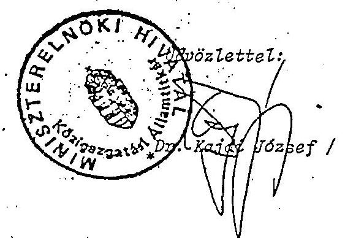

---

# Nemzeti Gyermek- és Ifjúsági Alapítvány 

Miniszterelnöki Hivatal
Dr.Kajdi József úrnak
közigazgatási államtitkár

B u d a p e s t

Tisztelt Államtitkár Úr!

A Nemzeti Gyermek- és Ifjúsági alapítvány leköszeno elnökétól, Dr.Rokusfalvy Páltól megkaptam f.hó 9 -én nekem írt levelét, amelyben értesít az Alapítvány Kuratóriumának ugyvezetó teendóivel való megbízásomról.

A. levélben foglaltakat értelmezni nem tudom, ezért kérem Államtitkár Úr segitségét. A hivatkozott Alapító Okirat 9.2. pontja az Elnők tevékenységét tárgyalja. Az érvényben lévô Sz.M.Sz. nem rendelkezik ugyvezetói munkakörrol és tevékenységról.

A levélben nincs utalás a megbízással együtt járó feladatkör-hatáskör és felelősségi kör kérdéseire, valamint a megbízás várható idótartamára vonatkozóan. Ezen lényeges információk nélkül a megbízást elfogadni nem áll módomban. A helyzet tisztázására természetesen - a Kuratorium vonatkozó döntése értelmében biztosítom az Alapítvány napi, operativ müködését, de stratégiai döntésekhez nem rendelkezem a megfelelő felhatalmazással.

Kérem Allamtitkár Urat, az említett zavarok mielóbi feloldása érdekében a szükséges intézkedéseket tegye meg.

Budapest, 1994. június 16.
Tisztelettel

## (Mizsay Sándor)   vállalkozási és vagyonkezelói fóosztályvezetó

---

# Nemzeti Gyermek- és Ifjúsági Alapíivány 

## Miniszterelnöki Hivatal

Dr. Kis Elemér államtitkár úr részére

Tisztelt Államtitkár úr!

A Nemzeti Gyermek-és Ifjúsági Alapítvány Kuratóriuma 1994.augusztus 22-i ülésén megbízott, hogy az alábbiakról tájékoztassam az Államtitkár urat.

- Nemzeti Gyermek-és Ifjúsági Alapítvány elnơke DR. Rákusfalvy Pál 1994.06.10-én nyugdíjba vonult.

Az Alapítványnak immár három hónapja nincs elnőke. A napi operatív feladatok irányitásával a Kuratórium az Alapítvány új elnơkének kinevezéséig terjedő idöszakra engem bízott meg.

- Az Alapítvány három tagú Felügyelő Bizottsága, egy tagjának lemondása következtében 1994.május eleje óta nem funkcionál.

Kérem tisztelt Államtitkár urat,hogy fentieket az illetékesek tudomására hozni, valamint a szükséges intézkedéseket megtenni szíveskedjen.

Budapest, 1994.szeptember 02.
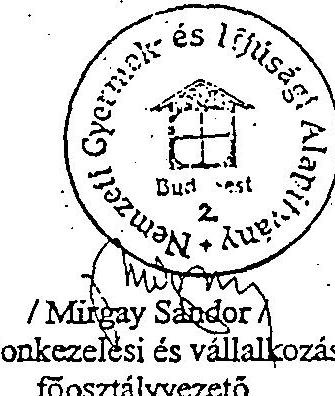

---

MINISZTERELNÖKI HIVATAL HELYETTES ÁLLAMTITKÁR

V/568/1994.

Mirgay Sándor úrnak fóosztályvezetó

Nemzeti Gyermek és Ifjúsági Alapítvány

Budapest

Tisztelt Főosztályvezető Úr!

Tájékoztatom, hogy az Alapítványt érintő levelét dr. Kiss Elemér közigazgatási államtitkár úr: továbbította a Kormány ifjúságpolitikai feladatainak végrehajtásáért felelős mmávelődési és közoktatási miniszternek.

Budapest, 1994. szeptember 8.
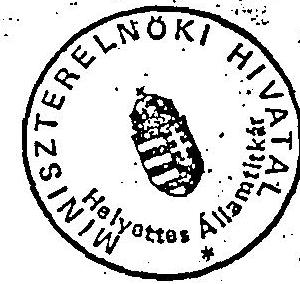

Üdvözlettel:

---

# 1995 -02- 1 3/72/2 

Nemzeti Gyermek- és Ifjúsági
2. sz. melléklet

## Alapítvány

## NGYIA Nyugatmagyarországi Képviselete

Csobod Tibor képviselet vezető úr részére

## Győr,

Szent István u. 51.
9022

Alulírott Mirgay Sándor a Nemzeti Gyermek- és Ifjúsági Alapítvány Vagyonkezelési és Vállalkozási Főosztályának vezetője megbízom Csobod Tibort az NGYIA Nyugatmagyarországi Képviselete vezetöjét, hogy távollétemben lássa el - a Nyugatmagyarországi Képviselet vezetése mellett -a Vagyonkezelési és Vállalkozási Főosztály vezetői tevékenységét.

Megbízatása kiterjed minden olyan tevékenységre, amelyet az Alapító Okirat, a Szervezeti és Müködési Szabályzat, valamint az Alapítványnál kialakult szokások megkövetelnek.

A megbízatása visszavonásig érvényes.

Budapest, 1995. február 9.
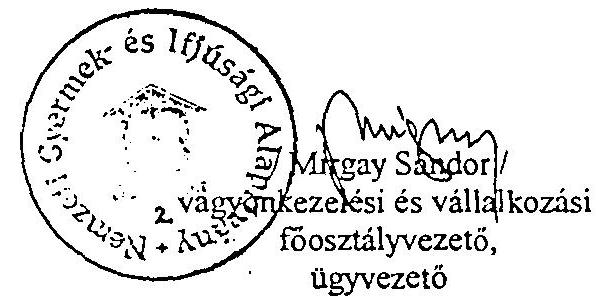

---

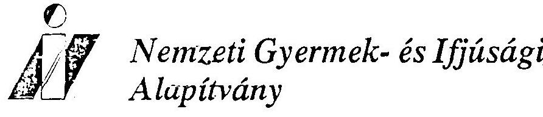

# Nemzeti Gyermek- és Ifjúsági Alapítvány 

## NGYIA Nyugatmagyarországi Képviselete

Csobod Tibor képviselet vezető úr részére

## Gvör,

Szent István u. 51.
9022

Hivatkozással a Miniszterelnöki Hivatal Közigazgatási Államtitkárának 1994. június 9.-i levelében, valamint a Kuratórium 1994. június 13.-i 22/1994. sz. határozatában és az 1994. augusztus 22.-i 23/1994. sz. határozatában foglaltakra, megbizom Csobod Tibort, hogy a Vagyonkezelési és Vállalkozási Főosztály vezetői megbízatásának érintetlenül hagyása mellett - az Alapító intézkedéséig - lássa el a Nemzeti Gyermek- és Ifjúsági Alapítvány ügyvezetői teendőit.

Ennek keretében biztosítsa az Alapítvány napi müködéséhez szükséges feltételeket, gyakorolja a munkáltatói jogokat és harmadik személlyel szemben képviselje az Alapitványt.

Budapest, 1995. február 13.
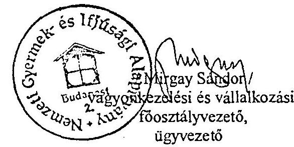

## Atréken, 1995. 02.13.

1145 Budapest, Amerjkal út 96.
Tel.: 251-8645, 252-8263
1399 Budapest, 62. Pf.: 633
Fax: 252-5492, 251-8674

---

Nemzeti Gyermek- és Ifjúsági Alapítvány
Nyugatmagyarországi Képviselet

Müvelődési és Közoktatásügyi Minisztérium Ifjusági Fôosztály

Kovács Erzsébet
Főosztályvezető

Budapest
Szalay u. 6

Kedves Kovács Erzsébet!

Hellékelten küldöm mai naptól szóló két "kinevezésemet" szives állásfoglalásuk végett.

Győr, 1995. február 16.
Tisztelettel
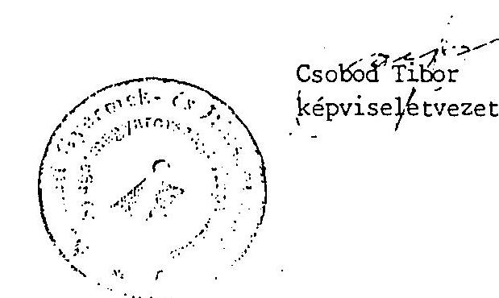

---

# A Felügyelő Bizottság megállapításai és ajánlásai 

Az NGYIA helyzetét, tevékenységének jellemzőit a Felügyelő Bizottság elsősorban a rendelkezésre bocsátott dokumentumok áttanulmányozása révén kísérelte meg megismerni, ezt egészítették ki személyes tájékozódások, amelyek ez ideig elsősorban a gazdálkodás területére korlátozódtak. Talán magyarázatra szorul, hogy az eltelt fél évben miért nem elemeztük behatóbban a deklarált alapítványi célok elérésére tett erőfeszítéseket, miért "ragadtunk le" az ennek bázisául szolgáló gazdasági tevékenységénél. Az ok a gazdálkodási tevékenység területén azonosított alapvető ellentmondásban jelölhető meg. Az Alapítvány teljes gazdálkodási tevékenységéről elmondható, hogy szakszerű, korrekt esetenként invenciózus, nyilvánvalóan a legjobb szándéktól vezérelt. Ugyanezen tevékenység várható eredményéről azonban azt kell mondanunk, hogy az Alapítvány lassú felmorzsolodásához, megszűnéséhez vezet. Az Alapítvány nem rendelkezik a szükséges eszközökkel deklarált céljainak eléréséhez. A forrásautomatizmusok megszűnése (idegenforgalmi alap, szerencsejáték adó stb.) finanszírozhatatlanná tette a megjelölt célok mindegyikének egyidejú megközelítésére irányuló tevékenységet. Az Alapítvány kényszerűen fenntart egy anyagi eszközeihez viszonyítva túlméretezett, céljaihoz viszonyítva elégtelenül kislétszámú aparátust, kénytelen szétaprózni a rendelkezésére álló anyagi eszközöket. Ez a minden irányú megfelelésre törekvés vélhetően inkább elégedetlenséget, mint elismerést vált ki.

A Felügyelő Bizottság teljes mértékben egyetért az utóbbi pár hónapban megerősödött vagyonkezelési törekvésekkel, az ésższerủ kockázat vállalásával, a korábbi elképzelések bátor felülvizsgálatával. Elismerésre méltó a győri szálloda rekonstrukciójával kapcsolatos racionalizálási törekvés, amely a korábbi elképzeléshez képest 100 millió Forintot meghaladó megtakarítást jelent, briliáns ötletnek tünik a Tisza-tó projekt (ez utóbbi modellként szolgálhat az új Alapítványi törekvésekhez), de megítélésünk szerint mindezen próbálkozások együttesen sem elegendőek az Alapítvány gazdasági helyzetének stabilizálásához.

Úgy véljük, elkerülhetetlen annak kimondása, hogy az eredeti célok a rendelkezésre álló eszközök segítségével nem valósíthatóak meg. Az Alapítványnak profiltisztítást kell végrehajtania (meggyőződésünk szerint meg kell szüntetni más kezdeményezések pénzügyi támogatását) újra felül kell vizsgálnia ingatlan portfólióját és eladásokkal kell egyensúlyt teremtenie forgótőkés ingatlan vagyonok között. A "profiltisztitás" lehetővé tenné az apparátus létszámának jelentős csökkentését, az ingatlanszerkezet változtatása pedig az önellátó, illetve forrásként szolgáló egységek arányának emelkedését. Úgy véljük, az eszközök jelenleg a saját bázisú és szervezésű gyermek és ifjúsági céltáborok múködtetésére, a határon túli magyar gyerekek és fiatalok fogadására

---

és nemzetközi diákcserék szervezésére elegendőek. Ebből a magból nőhet ki további intézkedések után egy új arculatú, valóban nemzeti Gyermek és Ifjúsági Alapítvány.

Javasoljuk, hogy az NGYIA vezetősége a következő kuratóriumi ülésre dolgozzon ki középtávú tervet a profil módosításra, a portfólió változtatására és rövid távú tervet az Alapítvány önköltségének erőteljes csökkentésére, elsősorban a létszámcsökkentés eszközeivel.

Természetesen elengedhetetlennek tartjuk, hogy a kuratórium felhívja az alapítók figyelmét (ezt egyébként a Felügyelő Bizottság is meg kívánja tenni) arra, hogy az elmúlt két évben jogszabály módosítások révén megfosztották az Alapítványt elsődleges jövedelemforrásaitól és ezért vagy gondoskodni kell ezek pótlásáról, vagy vállalni kell ennek konzekvenciáit is:

Budapest, 1993. október 4.

Dr. Perczel Tamás
a Felügyelő Bizottság elnöke

---

# Alapitó Ukirat melléklete 

1992. január 1. állapotnak megfelelően

| A: ingatlan neve és címe | Tul.   lapsz. | Hrsz. | épület | Értéke eft-ban földterület | Összesen |
| :--: | :--: | :--: | :--: | :--: | :--: |
| 1. Hotel Aranypart Györ, Aldozat u. 12. | $\begin{aligned} & 21021 \\ & 21022 \end{aligned}$ | $\begin{aligned} & 10721 \\ & 10722 \end{aligned}$ | 180.000 | 43.500 | 223.500.- |
| 2. Ifjúsági Centrum Dabrecen, Simonyi u. 14. | 39346 | 20936 | 80.000 | 10.000 | 90.000.- |
| 3. NGYIA Székház Budapest, Amerikai út 96. | 193 | 29830 | 280.000 | 120.000 | 400.000 . |
| 4. Székház   Budapest, Ady E. u. 29. | 3652 | $12931 / 2$ | 350.000 | 150.000 | 500.000 . |
| 5. Székház   Budapest, XVIII.   Gyongyvirág u. 10. | 15008 | 155296 | 22.000 | 18.000 | 40.000 . |
| 6. Ifjúsági Központ Kiskörös, Liget tér 1. | 3060 | 3106 | 18.000 | 2.000 | 20.000 . |
| 7. Üdülőtábor   Soltvádkert, Margaréta u. 1. | 3216 | $3158 / 1$ | 3.000 | 1.000 | 4.000 . |
| 8. Üdülöház   Mártély, Tisza-part | 14074 | 15326 | 2.000 | 800 | 2.800 . |
| 9. Székház   Balmazújváros   Satthányi u. 12. | 881 | 781 | 3.000 | 800 | 3.800 . |
| 10. Üdülőépület   Tata, Boróka u. | 5645 | $4127 / 2$ | 2.100 | 1.900 | 4.000 . |
| 11. Üdülöház   Balatonszemes   Tompa u. 9. | 1361 | 1423 | 4.200 | 2.500 | 6.700 . |
| 12. Üdülöház   Balatonszemes   Tompa u. 12. | 1364 | 1426 | 2.000 | 2.700 | 4.700 . |
| 13. Üdülöház Szarvas, Üdülő u. | 775 | 719 | 18.000 | 2.000 | 20.000 . |
| 14. Ifjúsági Központ Felsötárkány | 2200 | $1502 / 5$ | 291.000 | 55.000 | 346.000 . |
| 15. Székház   Eger, Széchenyi u. 18. | 4675 | 4872 | 55.000 | -- | 55.000 . |
| 16. Liget Club Hotel Szödliget, Dunapart | $\begin{aligned} & 1203 \\ & 1696 \end{aligned}$ | $\begin{aligned} & 1220 / 3 \\ & 1219 \end{aligned}$ | 250.000 | 17.000 | 267.000 . |
| 17. Székház   Tiszafüred, Lenin út 4. | 2877 | 2983 | 3.000 | 600 | 3.600 . |
| 18. Ifjúsági Tábor Bakonyoszlop-Sövénykút | 4 | 0171 | 38.000 | 12.000 | 50.000 . |
| 19. Székház   Veszprém, Diófa u. 2. | 4149 | 4537 |  | -- | 8.000 . |

---

20. Üdülő
Csopak, Sport u. 9.
21. Művészegyüttes Székház
Budapest, VII.
Rottenbiller u. 16.
22. Ifjúsági Tábor
Dédestapolcsány
23. Irodaház
Kapuvár
Felszabadítók útja 2.
24. Iroda
Csorna, Szabadság tér 6.
25. Továbbképzö Intézet
Novákpuszta
Kastély
26. Ifjúsági Üdülő
Sopron
Brennbergbánya
27. Irodák
Győr
Tanácsköztársaság u.51.
28. Avar Szálloda
Velem, Petöfi S.u.16.
29. Iroda, Sport u. 9.
30. Művészegyüttes Székház
Budapest, VII.
31. Idúsági Tábor
Dédestapolcsány
32. Irodaház
Kapuvár
Felszabadítók útja 2.
33. Iroda
Csorna, Szabadság tér 6.
34. Továbbképzö Intézet
Novákpuszta
Kastély
35. Ifjúsági Üdülő
Sopron
Brennbergbánya
36. Irodák
Győr
Tanácsköztársaság u.51.
37. Avar Szálloda
Velem, Petöfi S.u.16.
38. Ifjúsági Üdülő
Sopron
Brennbergbánya
39. Iroda
Győr
Tanácsköztársaság u.51.
40. Avar Szálloda
Velem, Petöfi S.u.16.
41. Idúsági Tábor
42. Iroda
43. Továbbképzö Intézet
44. Továbbképzö Intézet
45. Idúság
Üdülő
46. Iroda
47. Irodák
Győr
Tanácsköztársaság u.51.
48. Avar Szálloda
Velem, Petöfi S.u.16.
49. Idúsági Tábor
50. Iroda
51. Idúsági Üdülő
52. Iroda
53. Irodák
Győr
Tanácsköztársaság u.51.
54. Avar Szálloda
Velem, Petöfi S.u.16.
55. Idúsági Üdülő
56. Iroda
57. Irodák
Győr
Tanácsköztársaság u.51.
58. Avar Szálloda
Velem, Petöfi S.u.16.
59. Idúsági Üdülő
60. Iroda
61. Iroda
62. Iroda
63. Irodák
Győr
Tanácsköztársaság u.51.
64. Avar Szálloda
Velem, Petöfi S.u.16.
65. Idúsági Üdülő
66. Iroda
67. Irodák
Győr
Tanácsköztársaság u.51.
68. Avar Szálloda
Velem, Petöfi S.u.16.
69. Idúsági Üdülő
70. Iroda
71. Iroda
72. Irodák
Győr
Tanácsköztársaság u.51.
73. Avar Szálloda
Velem, Petöfi S.u.16.
74. Iroda
75. Irodák
Győr
Tanácsköztársaság u.51.
76. Avar Szálloda
Velem, Petöfi S.u.16.
77. Iroda
78. Irodák
Győr
Tanácsköztársaság u.51.
79. Avar Szálloda
Velem, Petöfi S.u.16.
80. Iroda
71. Iroda
72. Iroda
73. Irodák
Győr
Tanácsköztársaság u.51.
81. Iroda
74. Iroda
75. Irodák
Győr
Tanácsköztársaság u.51.
82. Avar Szálloda
Velem, Petöfi S.u.16.
83. Iroda
75. Iroda
76. Iroda
84. Iroda
85. Iroda
86. Iroda
87. Iroda
88. Iroda
89. Iroda
90. Iroda
91. Iroda
92. Iroda
93. Iroda
94. Iroda
95. Iroda
96. Iroda
97. Iroda
98. Iroda
99. Iroda
100. Iroda
101. Iroda
102. Iroda
103. Iroda
104. Iroda
105. Iroda
106. Iroda
107. Iroda
108. Iroda
109. Iroda
110. Iroda
111. Iroda
112. Iroda
113. Iroda
114. Iroda
115. Iroda
116. Iroda
117. Iroda
118. Iroda
119. Iroda
120. Iroda
121. Iroda
122. Iroda
123. Iroda
124. Iroda
125. Iroda
126. Iroda
127. Iroda
128. Iroda
129. Iroda
130. Iroda
131. Iroda
132. Iroda
133. Iroda
134. Iroda
135. Iroda
136. Iroda
137. Iroda
138. Iroda
139. Iroda
140. Iroda
141. Iroda
142. Iroda
143. Iroda
144. Iroda
145. Iroda
146. Iroda
147. Iroda
148. Iroda
149. Iroda
150. Iroda
151. Iroda
152. Iroda
153. Iroda
154. Iroda
155. Iroda
156. Iroda
157. Iroda
158. Iroda
159. Iroda
160. Iroda
161. Iroda
162. Iroda
163. Iroda
164. Iroda
165. Iroda
166. Iroda
167. Iroda
168. Iroda
169. Iroda
170. Iroda
171. Iroda
172. Iroda
173. Iroda
174. Iroda
175. Iroda
176. Iroda
177. Iroda
178. Iroda
179. Iroda
180. Iroda
181. Iroda
182. Iroda
183. Iroda
184. Iroda
185. Iroda
186. Iroda
187. Iroda
188. Iroda
189. Iroda
190. Iroda
191. Iroda
192. Iroda
193. Iroda
194. Iroda
195. Iroda
196. Iroda
197. Iroda
198. Iroda
199. Iroda
200. Iroda
201. Iroda
202. Iroda
203. Iroda
204. Iroda
205. Iroda
206. Iroda
207. Iroda
208. Iroda
209. Iroda
210. Iroda
211. Iroda
212. Iroda
213. Iroda
214. Iroda
215. Iroda
216. Iroda
217. Iroda
218. Iroda
219. Iroda
220. Iroda
221. Iroda
222. Iroda
223. Iroda
224. Iroda
225. Iroda
226. Iroda
227. Iroda
228. Iroda
229. Iroda
2210. Iroda
222. Iroda
223. Iroda
224. Iroda
225. Iroda
226. Iroda
227. Iroda
228. Iroda
229. Iroda
2211. Iroda
222. Iroda
223. Iroda
224. Iroda
225. Iroda
226. Iroda
227. Iroda
228. Iroda
229. Iroda
2212. Iroda
223. Iroda
223. Iroda
224. Iroda
225. Iroda
226. Iroda
227. Iroda
228. Iroda
2213. Iroda
2214. Iroda
2215. Iroda
2216. Iroda
2217. Iroda
2218. Iroda
2219. Iroda
2220. Iroda
2221. Iroda
2222. Iroda
2223. Iroda
2224. Iroda
2225. Iroda
2226. Iroda
2227. Iroda
2228. Iroda
2229. Iroda
2230. Iroda
2231. Iroda
2232. Iroda
2233. Iroda
2234. Iroda
2235. Iroda
2236. Iroda
2237. Iroda
2238. Iroda
2239. Iroda
2240. Iroda
2241. Iroda
2242. Iroda
2243. Iroda
2244. Iroda
2245. Iroda
2246. Iroda
2247. Iroda
2248. Iroda
2249. Iroda
2250. Iroda
2251. Iroda
2252. Iroda
2253. Iroda
2254. Iroda
2255. Iroda
2256. Iroda
2257. Iroda
2258. Iroda
2259. Iroda
2260. Iroda
2261. Iroda
2262. Iroda
2263. Iroda
2264. Iroda
2265. Iroda
2266. Iroda
2267. Iroda
2268. Iroda
2269. Iroda
2270. Iroda
2271. Iroda
2272. Iroda
2273. Iroda
2274. Iroda
2275. Iroda
2276. Iroda
2277. Iroda
2278. Iroda
2279. Iroda
2280. Iroda
2281. Iroda
2282. Iroda
2283. Iroda
2284. Iroda
2285. Iroda
2286. Iroda
2287. Iroda
2288. Iroda
2289. Iroda
2290. Iroda
2291. Iroda
2292. Iroda
2293. Iroda
2294. Iroda
2295. Iroda
2296. Iroda
2297. Iroda
2298. Iroda
2299. Iroda
2290. Iroda
2291. Iroda
2292. Iroda
2293. Iroda
2294. Iroda
2295. Iroda
2296. Iroda
2297. Iroda
2298. Iroda
2299. Iroda
2290. Iroda
2291. Iroda
2292. Iroda
2293. Iroda
2294. Iroda
2295. Iroda
2296. Iroda
2297. Iroda
2298. Iroda
2299. Iroda
2290. Iroda
2291. Iroda
2292. Iroda
2293. Iroda
2294. Iroda
2295. Iroda
2296. Iroda
2297. Iroda
2298. Iroda
2299. Iroda
2290. Iroda
2291. Iroda
2292. Iroda
2293. Iroda
2294. Iroda
2295. Iroda
2296. Iroda
2297. Iroda
2298. Iroda
2299. Iroda
2290. Iroda
2291. Iroda
2292. Iroda
2293. Iroda
2294. Iroda
2295. Iroda
2296. Iroda
2297. Iroda
2298. Iroda
2299. Iroda
2292. Iroda
2293. Iroda
2294. Iroda
2295. Iroda
2296. Iroda
2297. Iroda
2298. Iroda
2299. Iroda
2292. Iroda
2293. Iroda
2294. Iroda
2295. Iroda
2296. Iroda
2297. Iroda
2298. Iroda
2299. Iroda
2292. Iroda
2293. Iroda
2294. Iroda
2295. Iroda
2296. Iroda
2297. Iroda
2298. Iroda
2299. Iroda
2292. Iroda
2293. Iroda
2294. Iroda
2295. Iroda
2296. Iroda
2297. Iroda
2298. Iroda
2299. Iroda
2292. Iroda
2293. Iroda
2294. Iroda
2295. Iroda
2296. Iroda
2297. Iroda
2298. Iroda
2299. Iroda
2292. Iroda
2293. Iroda
2294. Iroda
2295. Iroda
2296. Iroda
2297. Iroda
2298. Iroda
2299. Iroda
2292. Iroda
2293. Iroda
2294. Iroda
2295. Iroda
2296. Iroda
2297. Iroda
2298. Iroda
2299. Iroda
2292. Iroda
2293. Iroda
2294. Iroda
2295. Iroda
2296. Iroda
2297. Iroda
2298. Iroda
2299. Iroda
2292. Iroda
2293. Iroda
2294. Iroda
2295. Iroda
2296. Iroda
2297. Iroda
2298. Iroda
2299. Iroda
2292. Iroda
2293. Iroda
2294. Iroda
2295. Iroda
2296. Iroda
2297. Iroda
2298. Iroda
2299. Iroda
2292. Iroda
2293. Iroda
2294. Iroda
2295. Iroda
2296. Iroda
2297. Iroda
2298. Iroda
2299. Iroda
2292. Iroda
2293. Iroda
2294. Iroda
2295. Iroda
2296. Iroda
2297. Iroda
2298. Iroda
2299. Iroda
2292. Iroda
2293. Iroda
2294. Iroda
2295. Iroda
2296. Iroda
2297. Iroda
2298. Iroda
2299. Iroda
2292. Iroda
2293. Iroda
2294. Iroda
2295. Iroda
2296. Iroda
2297. Iroda
2298. Iroda
2299. Iroda
2292. Iroda
2293. Iroda
2294. Iroda
2295. Iroda
2296. Iroda
2297. Iroda
2298. Iroda
2299. Iroda
2292. Iroda
2293. Iroda
2294. Iroda
2295. Iroda
2296. Iroda
2297. Iroda
2298. Iroda
2299. Iroda
2292. Iroda
2293. Iroda
2294. Iroda
2295. Iroda
2296. Iroda
2297. Iroda
2298. Iroda
2299. Iroda
2292. Iroda
2293. Iroda
2294. Iroda
2295. Iroda
2296. Iroda
2297. Iroda
2298. Iroda
2299. Iroda
2292. Iroda
2293. Iroda
2294. Iroda
2295. Iroda
2296. Iroda
2297. Iroda
2298. Iroda
2299. Iroda
2292. Iroda
2293. Iroda
2294. Iroda
2295. Iroda
2296. Iroda
2297. Iroda
2298. Iroda
2299. Iroda
2292. Iroda
2293. Iroda
2294. Iroda
2295. Iroda
2296. Iroda
2297. Iroda
2298. Iroda
2299. Iroda
2292. Iroda
2293. Iroda
2294. Iroda
2295. Iroda
2296. Iroda
2297. Iroda
2298. Iroda
2299. Iroda
2292. Iroda
2293. Iroda
2294. Iroda
2295. Iroda
2296. Iroda
2297. Iroda
2298. Iroda
2299. Iroda
2292. Iroda
2293. Iroda
2294. Iroda
2295. Iroda
2296. Iroda
2297. Iroda
2298. Iroda
2299. Iroda
2292. Iroda
2293. Iroda
2294. Iroda
2295. Iroda
2296. Iroda
2297. Iroda
2298. Iroda
2299. Iroda
2292. Iroda
2293. Iroda
2294. Iroda
2295. Iroda
2296. Iroda
2297. Iroda
2298. Iroda
2299. Iroda
2292. Iroda
2293. Iroda
2294. Iroda
2295. Iroda
2296. Iroda
2297. Iroda
2298. Iroda
2299. Iroda
2292. Iroda
2293. Iroda
2294. Iroda
2295. Iroda
2296. Iroda
2297. Iroda
2298. Iroda
2299. Iroda
2292. Iroda
2293. Iroda
2294. Iroda
2295. Iroda
2296. Iroda
2297. Iroda
2298. Iroda
2299. Iroda
2292. Iroda
2293. Iroda
2294. Iroda
2295. Iroda
2296. Iroda
2297. Iroda
2298. Iroda
2299. Iroda
2292. Iroda
2293. Iroda
2294. Iroda
2295. Iroda
2296. Iroda
2297. Iroda
2298. Iroda
2299. Iroda
2292. Iroda
2293. Iroda
2294. Iroda
2295. Iroda
2296. Iroda
2297. Iroda
2298. Iroda
2299. Iroda
2292. Iroda
2293. Iroda
2294. Iroda
2295. Iroda
2296. Iroda
2297. Iroda
2298. Iroda
2299. Iroda
2292. Iroda
2293. Iroda
2294. Iroda
2295. Iroda
2296. Iroda
2297. Iroda
2298. Iroda
2299. Iroda
2292. Iroda
2293. Iroda
2294. Iroda
2295. Iroda
2296. Iroda
2297. Iroda
2298. Iroda
2299. Iroda
2292. Iroda
2293. Iroda
2294. Iroda
2295. Iroda
2296. Iroda
2297. Iroda
2298. Iroda
2299. Iroda
2292. Iroda
2293. Iroda
2294. Iroda
2295. Iroda
2296. Iroda
2297. Iroda
2298. Iroda
2299. Iroda
2292. Iroda
2293. Iroda
2294. Iroda
2295. Iroda
2296. Iroda
2297. Iroda
2298. Iroda
2299. Iroda
2292. Iroda
2293. Iroda
2294. Iroda
2295. Iroda
2296. Iroda
2297. Iroda
2298. Iroda
2299. Iroda
2292. Iroda
2293. Iroda
2294. Iroda
2295. Iroda
2296. Iroda
2297. Iroda
2298. Iroda
2299. Iroda
2292. Iroda
2293. Iroda
2294. Iroda
2295. Iroda
2296. Iroda
2297. Iroda
2298. Iroda
2299. Iroda
2292. Iroda
2293. Iroda
2294. Iroda
2295. Iroda
2296. Iroda
2297. Iroda
2298. Iroda
2299. Iroda
2292. Iroda
2293. Iroda
2294. Iroda
2295. Iroda
2296. Iroda
2297. Iroda
2298. Iroda
2299. Iroda
2292. Iroda
2293. Iroda
2294. Iroda
2295. Iroda
2296. Iroda
2297. Iroda
2298. Iroda
2299. Iroda
2292. Iroda
2293. Iroda
2294. Iroda
2295. Iroda
2296. Iroda
2297. Iroda
2298. Iroda
2299. Iroda
2292. Iroda
2293. Iroda
2294. Iroda
2295. Iroda
2296. Iroda
2297. Iroda
2298. Iroda
2299. Iroda
2292. Iroda
2293. Iroda
2294. Iroda
2295. Iroda
2296. Iroda
2297. Iroda
2298. Iroda
2299. Iroda
2292. Iroda
2293. Iroda
2294. Iroda
2295. Iroda
2296. Iroda
2297. Iroda
2298. Iroda
2299. Iroda
2292. Iroda
2293. Iroda
2294. Iroda
2295. Iroda
2296. Iroda
2297. Iroda
2298. Iroda
2299. Iroda
2292. Iroda
2293. Iroda
2294. Iroda
2295. Iroda
2296. Iroda
2297. Iroda
2298. Iroda
2299. Iroda
2292. Iroda
2293. Iroda
2294. Iroda
2295. Iroda
2296. Iroda
2297. Iroda
2298. Iroda
2299. Iroda
2292. Iroda
2293. Iroda
2294. Iroda
2295. Iroda
2296. Iroda
2297. Iroda
2298. Iroda
2299. Iroda
2292. Iroda
2293. Iroda
2294. Iroda
2295. Iroda
2296. Iroda
2297. Iroda
2298. Iroda
2299. Iroda
2292. Iroda
2293. Iroda
2294. Iroda
2295. Iroda
2296. Iroda
2297. Iroda
2298. Iroda
2299. Iroda
2292. Iroda
2293. Iroda
2294. Iroda
2295. Iroda
2296. Iroda
2297. Iroda
2292. Iroda
2293. Iroda
2294. Iroda
2295. Iroda
2296. Iroda
2297. Iroda
2292. Iroda
2293. Iroda
2294. Iroda
2295. Iroda
2296. Iroda
2297. Iroda
2298. Iroda
2299. Iroda
2292. Iroda
2293. Iroda
2294. Iroda
2295. Iroda
2296. Iroda
2297. Iroda
2298. Iroda
2299. Iroda
2292. Iroda
2293. Iroda
2294. Iroda
2295. Iroda
2296. Iroda
2297. Iroda
2298. Iroda
2299. Iroda
2292. Iroda
2293. Iroda
2294. Iroda
2295. Iroda
2296. Iroda
2297. Iroda
2298. Iroda
2299. Iroda
2292. Iroda
2293. Iroda
2294. Iroda
2295. Iroda
2296. Iroda
2297. Iroda
2292. Iroda
2293. Iroda
2294. Iroda
2295. Iroda
2296. Iroda
2297. Iroda
2292. Iroda
2293. Iroda
2294. Iroda
2295. Iroda
2296. Iroda
2297. Iroda
2292. Iroda
2293. Iroda
2294. Iroda
2295. Iroda
2296. Iroda
2297. Iroda
2292. Iroda
2293. Iroda
2294. Iroda
2295. Iroda
2296. Iroda
2297. Iroda
2292. Iroda
2293. Iroda
2294. Iroda
2295. Iroda
2296. Iroda
2297. Iroda
2292. Iroda
2293. Iroda
2294. Iroda
2295. Iroda
2296. Iroda
2297. Iroda
2292. Iroda
2293. Iroda
2293. Iroda
2294. Iroda
2295. Iroda
2296. Iroda
2297. Iroda
2292. Iroda
2293. Iroda
2293. Iroda
2293. Iroda
2294. Iroda
2295. Iroda
2296. Iroda
2297. Iroda
2292. Iroda
2293. Iroda
2293. Iroda
2293. Iroda
2294. Iroda
2293. Iroda
2294. Iroda
2295. Iroda
2296. Iroda
2297. Iroda
2292. Iroda
2293. Iroda
2293. Iroda
2293. Iroda
2293. Iroda
2293. Iroda
2293. Iroda
2293. Iroda
2293. Iroda
2293. Iroda
2293. Iroda
2293. Iroda
2293. Iroda
2293. Iroda
2293. Iroda
2293. Iroda
2293. Iroda
2293. Iroda
2293. Iroda
2293. Iroda
2293. Iroda
2293. Iroda
2293. Iroda
2293. Iroda
2293. Iroda
2293. Iroda
2293. Iroda
2293. Iroda
2293. Iroda
2293. Iroda
2293. Iroda
2293. Iroda

---

|   | INGATLAN BECSULT ERTEKE |  |  |  | EPULET ALLAPOTA |  |  |   |
| --- | --- | --- | --- | --- | --- | --- | --- | --- |
|   | EPOLET
et | FOLDTERDLET
et | OSSZESEN
et |  | AZONNALI FELGU.
et |  | FELGUITAS
5 EVEN BELG. |   |
|  1 / 1 HOTEL ARANYPART | 180.000 | 43.500 | 223.500 |  |  |  |  |   |
|  1 / 2 DISZ CENTRUM DEBRECEN | 80.000 | 10.000 | 90.000 |  |  |  |  |   |
|  1 / 3 GYISZ AMERIKAI ÚT | 280.000 | 120.000 | 400.000 |  |  |  |  |   |
|  1 / 4 NOYIA SZÉKHÁZ ADY U. 19. | 350.000 | 150.000 | 500.000 |  |  |  |  |   |
|  1 / 6 GYONGYVIRÁG ÚT 10. | 22.000 | 18.000 | 40.000 |  |  |  |  |   |
|  11 / 2 KISKÖROS, LIGET TÉR 1. | 18.000 | 2.000 | 20.000 |  |  |  |  |   |
|  11 / 3 SOLTVADKERT | 3.000 | 1.000 | 4.000 |  |  |  |  |   |
|  11 / 5 MÁRTÉLY | 2.000 | 800 | 2.800 |  |  |  |  |   |
|  11 / 6 BALMAZÚUVÁROS | 3.000 | 800 | 3.800 |  |  |  |  |   |
|  11 / 7 TATA, BOROKA U. 8. | 2.100 | 1.900 | 4.000 |  |  |  |  |   |
|  11 / 8 BALATONSZEMES, TOMPA U. 9. | 4.200 | 2.500 | 6.700 |  |  |  |  |   |
|  BALATONSZEMES, TOMPA U. 12. | 2.000 | 2.700 | 4.700 |  |  |  |  |   |
|  111/3 SZARVAS ÜOÜLÖHÁZ MONGOLZUG | 18.000 | 2.000 | 20.000 |  |  |  |  |   |
|  111/5-FELSÖTÁRKÁNY | 290.000 | 55.000 | 345.000 |  |  |  |  |   |
|  111/6 EGER SZÉKHÁZ | 55.000 | - | 55.000 |  |  |  |  |   |
|  111/13 SZÖOLIGET | 250.000 | 17.000 | 267.000 |  |  |  |  |   |
|  111/17 TISZAFÜRED | 3.000 | 600 | 3.600 |  |  |  |  |   |
|  111/26 BAKONYOSZLOP-SOVENYKÜT | 38.000 | 12.000 | 50.000 |  |  |  |  |   |
|  111/27 VESZPRÉM SZÉKHÁZ | 8.000 | - | 8.000 |  |  |  |  |   |
|  111/28 CSOPAK ÜOÜLÖ | 37.700 | 80.000 | 117.700 |  |  |  |  |   |
|  111/32 TALENTUM SZÉKHÁZ | 320.000 | - | 320.000 |  |  |  |  |   |
|  111/35 DEDESTAPOLCSÁNY | 26.000 | 4.000 | 30.000 |  |  |  |  |   |
|  111/39 IRODAHÁZ KAPUVÁR | 1.400 | - | 1.400 |  |  |  |  |   |
|  111/40 CSORNA IRODA | 5.200 | - | 5.200 |  |  |  |  |   |
|  111/41 NOVÁKPUSZTA | 55.000 | 31.000 | 86.000 |  |  |  |  |   |
|  111/43 GYÖR IRODÁK | 31.000 | - | 31.000 |  |  |  |  |   |
|  BRENNBERGBÁNYA | - | 35.000 | 35.000 |  |  |  |  |   |
|  OSSZESEN | 2.085.600 | 589.800 | 2.674.400 |  |  |  |  |   |

---

# Ingatlanok adatai

| megnevezés | cím | hrsz | tlpsz |
| :--: | :--: | :--: | :--: |
| Ifjúsági Központ | 6200 Kiskörös, Liget tér 1. | 3106 | 3060 |
| Údulőház | 6336 Mártély, Tiszapart | 15326 | 14075 |
| Üdülőépület | 2890 Tata, Boróka u. 8. | 4127/2 | 5645 |
| Ifjúsági Müvészegyüttes Székház | 1074 Bp.,Rottenbiller u.16-22. | $\begin{aligned} & 33576,33578, \\ & 33579 \end{aligned}$ | $\begin{aligned} & 772,773, \\ & 774 \end{aligned}$ |
| Üdülő | 8229 Csopak, Füredi út 34. | 2046, 2047 | 2709 |
| Szálloda | 8253 Révfülöp, Halász u. 37. | 1179/2 | 1373 |
| Ifjúsági Tábor | 4150 Püspökladány, Farkassziget | 0861/4 | 36 |
| Ifjúsági Tábor | 9062 Vének belterület | 75 |  |
| Mintafarm | 4281 Létavértes | 1025/19 |  |
| Továbbképzö Intézet | Novákpuszta, Kastélyszálló | $\begin{aligned} & 1103 / 9,1104, \\ & 1106 \end{aligned}$ | $\begin{aligned} & 836,846 \\ & 849 \end{aligned}$ |
| Irodák | 9022 Győr, Szent István út 51. | 6605 | 26116 |
| Bánvölgye Ifjúsági Tábor | 3643 Dédestapolcsány | 0164 | 18 |
| Hotel Aranypart | 9026 Győr, Aldozat u. 12. | 10721, 10722 | 21021,21022 |
| Ifjúsági Centrum | 4028 Debrecen, Simonyi u. 14. | 20936 | 39346 |
| NGYIA Székház | 1145 Bp.,Amerikai út 96. | 29803 | 193 |
| Ifjúsági Ház | 1183 Bp.,Gyöngyvirág u. 10. | 155296 | 15008 |
| Székház | 4060 Balmazújváros, Batthyány u. 12. | 781 | 881 |
| Üdülő | 8636 Balatonszemes,Tompa u. 9. | 1423 | 1361 |
| Üdülő | 8636 Balatonszemes,Tompa u. 12. | 1426 | 1364 |
| Üdülőház | 5540 Szarvas (Mangolzug) | 719 | 775 |
| Ifjúsági Központ | 3324 Felsőtárkány, Ifjúság út 1. | $1502 / 5$ | 2200 |
| Hotel Kikötő | 2133 Szödliget, Dunagát | 1218/1, 1220/3 | 1696, 1203 |
| Székház | 5350 Tiszafüred, Szölős u. 4. | 2983 | 2877 |
| Ifjúsági Tábor Istálló Vankarvule | 8418 Bakonyoszlop-   Sövénykút | $\begin{aligned} & 0170,0171 \\ & 0174 / 4 \end{aligned}$ | $\begin{aligned} & 4,14 \\ & 24 \end{aligned}$ |
| Ifjúsági Tábor | Földsziget, Kossuth tér 1. | 3320, 3321 | 4827, 3154 |
| Fold | Sopron, 9408 Brennbergbánya | 0728/2 | 12700 |
| Szálloda | 9726 Velem, Petőfi u. 16. | 384 |  |

---

# A Vagyonkezelési és Vállalkozási Szervezet 1993. évi programja 

Az 1993-as gazdasági év során a Vagyonkezelési és Vállalkozási Szervezet elsődleges feladata az Alapítvány szerencsétlen összetételü vagyon struktúrájának megváltoztatása. Azon ingatlanoktól, amelyek sem közvetlenül, sem közvetve nem szolgálják hatékonyan az Alapító Okiratban megfogalmazott Alapítványi célokat, meg kell válni. Ez a jelenlegi kétes értékú bérleti hasznosítást váltja ki az Alapítvány tevékenységében, ami jelenleg aránytalanul sok munkaidő - s a várható közeljövőben költség ráfordítást igényel.

Az alábbiakban felsorolt ingatlanok értékesítésére kívánunk javaslatot tenni, megjelölve az általunk reális, elérhetō vételárat.

| Csorna Irodák | $1-2$ | 1 R |
| :--: | :--: | :--: |
| Györi Irodák | $10-20$ | 1 R |
| Kapuvár Iroda | 1,5 | MR |
| Kiskörös Ifjúsági Ház | $8-10$ | MR |
| Egri Irodaház | 40 | MR |
| Mártély Üdülő | 1 | MR |
| Soltvadkert Üdülő | 1,5 | MR |
| Tata | 3 | MR |
| Tiszafüred | 3 | MR |
| Veszprémi Irodaház | 2 | MR |

Az értékesítésböl befolyt összeget sajátos arculatú, az Alapítvány dolgozói által kidolgozott "jurta" rendszerü ifjúsági táborok létesítésére kívánjuk fordítani.

Jelenleg három olyan helyszínröl tárgyalunk a helyi önkormányzattal, ill. a területet birtokló szervezetek képviselöivel, amelyek az ifjúsági célú hasznosításhoz szükséges földterület megvásárlását nem teszik szükségessé. Igy az Alapítványt csak a tábor fenntartási- és létesítési költségei terhelnék.

---

Az NGYIA Bp., II., Ady Endre u. 19. sz. alatti székház eladásával kapcsolatos tárgyalások összefoglalója

|  | Eladási ár | Ajánlat | Megjegyzés |
| :--: | :--: | :--: | :--: |
| 1. PROFIT Kft./Budapest | 600 MR | 600 mR   majd 450 MR | tárgyalás megsza   kadt |
| 2. EUROPA CONSULT/Olaszország | 600 MR | - | - " - |
| 3. HAKKA OY/Finnország | 600 MR | - | - " - |
| 4. OY TRADE WIND LTD/Finnország | 12 M DEM | $350-400$ MR | - " - |
| 5. PRICE WATERHOUSE/Budapest | 8 M USD | - | - " - |
| 6. IVABA/Berlin | 600 MR | 8 M USD | - " - |
| 7. ADVOPATENT/Budapest | 600 MR | $500-550$ MR | - " - |
| 8. DUSSMANN KFT/Budapest | B M USD | - | - " - |
| 9. IMMOINVEST KFT/Budapest | 600 MR | 450 MR | - " - |

Megbizási szerződést kötöttünk az OY TRADE WIND LTD-vel, az IMMOINVEST KFT-vel, csak a szerződés előkészítése történt meg. A vevők mindkét esetben visszaléptek a magas ár miatt.

Az 1990. augusztusi értékbecslés (Dr.Burger Béla) szerint az ingatlan értéke: 502,5 MR.

Az 1991. augusztusi értékbecslés (Nemzetközi Vagyonértékelö RT) szerint az ingatlan forgalmi értéke 440-450 MR.

Jelenleg nincs számbavehetö ajánlat.
Javaslat:

- az eladási ár felülvizsgálata,
- hírdetések feladása az értékesítésre,
- megbízási szerződés kidolgozása az ingatlanforgalmazó cégek felé.

---

# MEGÁLLAPODÁS 

A NEMZETI GYERMEK és:IFJÚSÁGI ALAPÍTVÁNY ( 1145 Budapest, Amerikai u.96.) és a CORONA Kft. ( 1012 Budapest, Pálya u. 4-6.) között.

Az aláirók megállapítják, hogy az ALAPÍTVÁNY vagyonkezelői koncepciójának megfelelően az ALAPÍTVÁNY ingatlan struktúrájának útulakíúsúban a felek eddigi együttmúködése sikeres volt.
(DIVSZ székház, csopaki üdülő,révfülöpi üdülő,stb.)
Az ezzel kapcsolatos jutalékrendszert elfogadták.
Az alább felsorolt ingatlanok tekintetében - mivel azok nehezebben értékesíthetők - eltérő kondíciókban állapodnakmeg.

1) Kiskőrösi Ifjúsági Ház,
2) Egri irodaépület,
3) Győri irodaház II. emelete.

Fenti ingatlanok értékesítése intenzív piaci munkát igényel, bel és külföldi hasznosítási tanulmánytervek elkészítését, bel és külföldi hírdetéseket, stb. Ezek finanszírozását a CORONA Kft. magára vállalja.
Sikeres tevékenység esetén a CORONA Kft. az ÁFA nélküli eladási árból 20\%-ra jogosult és kötelezi magát, hogy a munkája során keletkezett dokumentumokat, mint hasznosítási terv, stb. a vevơ rendelkezésére bocsátja, mivel ezek az eladási árban bennfoglaltatnak.
Az ALAPÍTVÁNY kiköti, hogy az egyes ingatlanok esetében az őt megilletó összeg nem lehet kevesebb mint:

1) Kiskőrösi Ifjúsági Ház esetén 10 millió Ft.
2) Egri irodaház esetén 40 millió Ft.
3) Győri irodaház II.em.esetén 27 millió Ft.

A fenti minimumösszegek visszavonásig érvényesek.
A fenti ingatlanok tekintetében az ALAPÍTVÁNY az értékesítés lcbónyolításában teljeskörủ felhatalmazást ad a CORONA Kft.-nek, hogy nevében és helyette eljárjon.

Budapest, 1993. április 2.
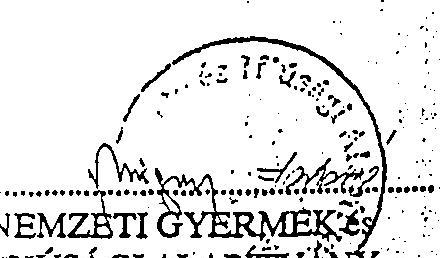

NEMZETI GYERMEKé
IFJÚSÁGI ALAPÍTVÁNY
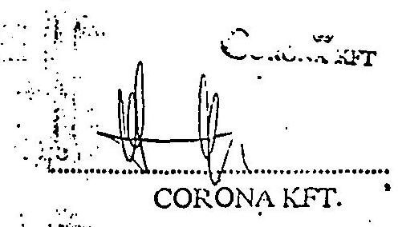

---

# Nemzeti Gyermek és Ifj $\qquad$ Alapítvány 24 

CORONA Külkereskedelmi KFT.
Dr. Schönthal Henrik
ügyvezetơ igazgato

## Budapest.

Károly krt 11.
1075

Tisztelt Igazgató űr !

Hivatkozással f.hó 2-i levelére, valamint személyes megbeszélésünkre az Alapítvány ingatlanainak eladásával, illetve közvetlenül ifjúsági célokat szolgáló ingatlanok vásárlásával kapcsolatban az alábbiakról szeretném tájékoztatni.

Az egri irodaház értékesítéséhez szükséges pontos felmérés és állapotterv elkészítését mi is szükségesnek tartjuk. Építészünk leterheltsége miatt e feladatot nekünk nem áll módunkban elkészíteni, ezért kérem Igazgató urat, hogy saját hatáskörében intézkedni szíveskedjen. Kérem tárgyalásai során vegye figyelembe, hogy a szóban forgó munkák elvégzésére az Alapítvány mindössze 100.000,-R-tal rendelkezik. Kérem, hogy amennyiben a munka elvégzésének ellenértéke ezen összeguél több, az ơn Kft-je "kvázi" adományként, illetve alapítványi támogatásként finanszírozza meg.

Orömmel értesültünk a KOZTI üdülőházának vételi lehetơségéröl, amivel kapcsolatban kérem az adás-vételi szerzơdés mihamarabbi megküldését.

Ami a CORONA Kft. szolgáltatásai honoráriumának mértékét illeti az Alapítvány 40 millió R értékhatárig elfogadja a $4 \%$ jutalékot, 40 és 100 millió R között $3 \%, 100$ millió R felett $2 \%$ jutalékot fizet.

Kérem fentiek szíves tudomásulvételét.
Budapest, 1993. február 15.
Sziveíyes üdvözlettel:
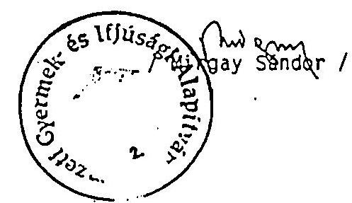

---

9/b. számú melléklet

A szállító (név, irányítószám, cím, telex, postafők,
bankszámla száma és megnevezése):

A vevő (név, irányítószám, cím, bankszámla száma és
megnevezése):

CORONA Külkereskedelmi Kft.
1012 Budapest,
Pálya u. 4-6.
A 1012 Budapest,
Pálya u. 4-6.
ABRT 209-20436
Aldigazgatási azonosítószám: 107 57284 201
A megrendelés
számla:
A fizetés módja:
isöpontja:
A teljesítés
isöpontja:
komp.
94.01.03.
94.01.03.
A számla kelte:
1/94. 1/94.
Agyéb adatok:

SZJ 112 200
2003/2015
01.12.

Cikkszám: Az áru (szolgáltatás) KSH-beszrelési
száma; ETK-száma, szabványos megnevezése, egyéb
jellemzői; AFA-kulosa
Mennyiségi
egység
Mennyiség
Egységár
Számlaérték

Leszámlázunk Önök felé az 1993. április 2.-i megállapodásunk
értelmében az "Egri irodaház" értékesítésével kapcsolatosan:

/ vételár 50.000.000,- Ft 20 8-a J63/2/B 10.000.000,-
M-32
ÁFA 258 4661 2.500.000,-

12.500.000,-

242-486

azaz Tizenkettömillióötszázezer 00/100 Forintot, mely összeget
pénzügyileg rendezettnek tekintünk a Magyar Takarékszövetkezeti
Bank Rt. által átutalt letéti /62.500.000,-Ft./ összegből.

V-22957.

CORONA KÉP
Mullyt Ucsó

Jegállapodás van Szabol
Jegállonértékesítés után járó

B. Sz. ny. 10-01/V. z. sz. - Számla egy számlaértékkel, álló A/4 - Pátria Rt.--Nyomell. 07578
120 000,- 2 313/0 Pátria Nyomda Rt. (Dísz.:4114)
MSZ 3492

---

# BÉRLETI SZERZŐDÉS 

amely létrejött a Nemzeti Gyermek- és Ifjúsági Alapítvány (1145 Budapest, Amerikai út 96) képviselô: Mirgay Sándor, mint Bérbeadó és a KG-BAU BT. (1137 Budapest, Jászai Mari tér 4/b.) képviselô: Kelemen Gábor, (adószám: 10938401-2-01 ) mint Bérlő között az alábbi feltételekkel:

1. A szerződés tárgya a Bérbeadó tulajdonát képező Szôdliget, 1219 hrsz.-on nyilvántartott Hotel Kikötő nevủ szállodaépület a hozzátartozó kiszolgáló létesítményekkel, a leltár alapján átadott ingóságokkal együtt.
2. A bérlet idötartama:
3. január 1-től 2003. december 31-ig tartó meghatározott idő, ami közös megegyezés alapján meghosszabbítható.
4. A meghatározott idötartamon belül is felmondásnak van helye bármely fél részéről, 3 hónapos felmondási idővel, a hó utolsó napjával.
Azonnali hatályú felmondási jog illeti meg Bérbeadót, ha Bérlő bármely szerződésben foglalt kötelezettségét elmulasztja és írásbeli figyelnieztetés után 8 napon belül nem teszi meg a Bérbeadó által kívánt intézkedést.
Felmondás esetén Bérlőt kártérítés és másik megfelelő helyiség nem illeti meg.
5. Bérleti dij:

1994-ben évi 8.000.000.- Ft, azaz: Nyolcmillió forint + $25 \%$ ÁFA.
A fizetés módja:
A szálloda mielőbbi teljes üzembeállíthatósága érdekében Bérbeadó hozzájárul ahhoz, hogy Bérlő - min. 4.000.000.- Ft, azaz Négymillió forint, de legfeljebb $8.000 .000,-F t$, azaz Nyolcmillió forint erejéig - beruházási munkát végezzen, illetve fogyóeszközt vásároljon saját nevében a szálloda felszerelésére. Ezen eszközöket használja és a bérleti viszony megszủnésekor leltárral Bérbeadó tulajdonába adja.

Bérbeadó az 1994. évre fennmaradó bérleti dij kifizetésére - figyelemmel a szálloda beüzemeléséhez és beindításához szükséges idötartamra - fizetési haladékot ad Bérlőnek.
Bérlő vállalja, hogy az egyébkénti $8.000 .000_{2}$-Ft-os évi bérleti alapdijnak a hivatalos inflációs rátával korrigált összege a bérleti idötartam 10. événements végéig eléri, illetve kielégíti az évi $8.000 .000,-\mathrm{Ft} / \mathrm{ev}$ plusz infláció követelményt.

---

A következỏ évek bérleti dijának mértékét felek 1994. szeptember 30-ig közösen kialakítják a tapasztalatok alapján.
5. Bérlő bárminemű átalakítást, beruházást csak Bérbeadó előzetes engedélyével hajthat végre, az arról szóló megállapodásban foglalt feltételek szerint.
Bérbeadó a bérleti jogviszony lejárta (2003) elôtt legfeljebb 3 évvel korábban végrehajtandó beruházás ellenértékéról kíván csak tárgyalni, kivéve ha a megállapodás a késôbbiekre is meghosszabbításra kerül.
6. Bérlő a bérleményt és az átvett berendezési és felszerelési tárgyakat saját költségén rendszeresen karbantartja és javítja, szükség esetén cseréröl és pótlásról önmaga gondoskodik, továbbá a teljes létesítményre kiterjedủ összkockázati biztositást köt (kivéve, ha az Alapítvány már megtette).
Az 1994-es idény beindításához szükséges egyéb feladatok és költségek Bérlőt terhelik, amelyek a bérleti dijba nem számíthatók be.
A bérlet lejártakor Bérlő a bérleményt rendeltetésszerủ használatra altalmas állapotban tartozik átadni.
7. Bérbeadó jogosult a használatot rendszeresen ellenőrizni. Amennyiben Bérlő részéről az ingatlan állagát veszélyeztető tevékenységet tapasztal, jogosult észrevételeit megtenni, halaszthatatlan esetben pedig intézkedni.
Ezekre az esetekre a 3. pontban foglaltak értelemszerüen vonatkoznak.
Bérlő a bérleményt Bérbeadó hozzájárulása néikül albérletbe, illetve bármely mértékben és címen másnak a használatába nem adhatja.
8. Az 1994. év bérleti és üzemeltetési tapasztalata alapján a szerződésben nem rögzített feltételekkel jelen szerzödést 1994. szeptember 30-ig kiegészithetik.

Budapest, 1994. január 26.
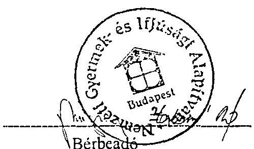
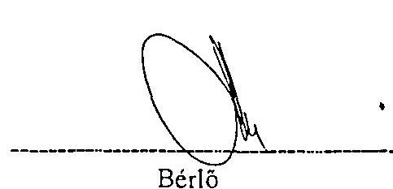

---

NGYIA által adott hitelek

Hitel felvevठ neve 1992.

- Békés m-1 GYIA
- Szolnok Városi GYIA
- Kalgl Jag Roma

MGV. Egyesület

1993.

- Span Keresk. és Szolg.Kft
" "
- Ikhor Keres.és Szolg.Kft
- Tiszatopart Kft
"
"
10.29.

106.07 .
06.14.
06.15.
07.30.

10.05.

07.20.
06.25.
06.25.

06.22.
11. sz. melléklet

MELLEKLET: DB

A hitel összege
$1.500 .000,-$
$3.000 .000,-$
300.000 . -
$4.800 .000,-$
20.000.000,-
10.000.000,-
40.000.000,-
30.000.000,-
30.000.000,-
30.000.000,-
5.450.000,-
5.871.000,-
5.700.000,-
5.000.000,-
600.000,-
1.000.000-
5.000.000,-
3.000.000,-
191.421.000,-
(Scimèci Józeefné)
mb.pü.vezetठ

---

# Jegyzókön y v 

A Nemzeti Gyermek- és Ifjúsági Alapítvány Kuratőriuma elnöki munkakörének átadásáról illetve átvételéról

Készült: 1994. június 13-án a NIA elnöki helyiségében (1145 Budapest, Amerikai út 96.)

Jelen vannak: Dr.Rokusfalvy Pál a munkakör átadója, Mirgay Sándor a munkakör átvevője, és Pápai Gáborné a jegyzökönyv vezetője

1. A munkakör átadásának átvételének két forésze a/ a Titkárság iktatókönyve szerinti irattára és b/ az ugyiratok szerint folyamatban lévó ugyek.
2. Dr.Rokusfalvy Pál kijelenti, hogy az Alapítvány múködésével és vezetésével kapcsolatos irattár az iktatókönyv szerinti teljességgel Pápai Gáborné titkárnó kezelésében lévó szekrényekben és az elnöki szoba elzárt szekrényében vannak elhelyezve. Ez utóbbi szekrény kulcsát Pápai Gáborné órzi (1.1.sz. melléklet). Az iktatókönyv 1994. június 10-én a 45.oldalon a 355. sorszámmal került lezárásra.
3. Az Alapítvány folyamatos múködésével egyrészt a Főosztályvezetők - Farkasné Román Ágnes, Mirgay Sándor és Késmárki zsolt - nyújtanak áttekintést, másrészt az elnöki Titkárság ugyiratai. Ez utóbbi teruleten - Dr.Rokusfalvy Pál tudomása szerint - folyamatban lévó ugyek a következók:
a/ az elnöki irányitás alá vont nemzetközi tevékenység munkaterv szerinti ugyei (1. 2.sz. melléklet). Az ugyek operativ vitelére az Alapítvány nemzetközi referense, Dr. Horváth Béla úr felkészült és képes; ezen belül Németországban a Bad-marienbergi Europahaus-al kötött együttmúködési szerződés folyamatos végrehajtására és a bocholti Európa Intézettel, valamint a Staastsbürger-Akademie-vel való együttmúködés bonyolítására Késmárki zsolt úr az illetékes:
b/ A peres ügyeknek már csak egy kis töredék része "él". Ezek közül Dr. Kelecsényi Erzsébet ügyvédnonél márcsak egy 1.3.sz. melléklet - folyamatban lévó úgy maradt.
c/ A Felügyeló Bizottság múködésével kapcsolatos miniszteri észrevétel és válaszkérés. (1.4.sz. melléklet).

---

d/ A költségvetés megvalósítása (1.5.sz.melléklet). Az Alapítvány jövójének biztosítása változatlanul szükségessé teszi, hogy a mindenkori kormány a kiesett a forrásautomatizmások pótlásával tegye lehetővé a folyamatos müködést, amelynek keretén belül az Alapítvány funkciójának megfelelő arányban biztosítandó mind - a hazai és a nemzetközi - ifjúsági tevékenység, mind a feltételeket eloteremtó vállalkozási tevékenység.
4. Dr.Rokusfalvy Pál kijelenti, hogy a Pénzügyi és Számviteli Főosztályvezető Farkasné Román Ágnes f.hó 7-i előkészítése szerint (1.6.sz.melléklet) - a banki aláírási jogát új kartonok kiállításával és megküldésével visszavonta.
5. Dr.Rokusfalvy Pál tájékoztatja Mirgay Sándor urat, hogy az 1.sz. elnöki bélyegzôt részére f.hó 10 -én Péteri. Ágnesnek lezárt boritékban leadta (1.7.sz.melléklet).
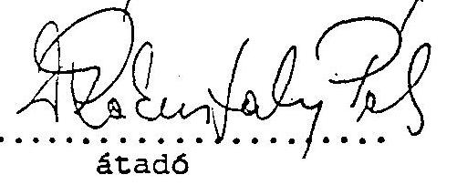
átado
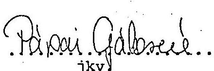

Kapják a mellékletekkel együtt:

- az Alapító Dr.Boross Péter miniszterelnök
- Dr.Rokusfalvy Pál átado
- Mirgay Sándor átvevó
- Pápai Gáborné jkv.

---

# TISZATÓ INGATLANHASZNOSÍTÓ 

## ÉS KERESKEDELMI KFT

1016 BUDAPEST, MÉSZÁROS U. 15-17. DEIOLENES LEVELCIM: 1075 BUDAPEST KAROLY KRT. 11. IDEIOLENES TEL: (36 1) 269-7823 FAX: (36 1) 269-7826

## AZ ABÁDSZALÓKI PROJECT KONCEPCIONÁLIS VÁZLATA

A TISZATÓ Kft. ( a névváltozási kérelem TISZATÓPART Kft-re a Cégbíróságon bejelentve ) kölcsönböl megvásárol a tiszató-parti részaránytermóföld tulajdonosoktól mintegy 130 hektár területet. A kölcsönt 100 hektár megvásárlásáig kizárólag földterület vásárlására használhatja fel. A terület belterületté, valamint üdülő̉ területté nyilvánításáról az Önkormányzat 120/1993. es számú határozatában döntött. A TISZATÓ Kft. a megyei illetékesekkel elkészitteti a terület rendezési tervét, beleértve részletes közmú kialakítást.

További kölcsönböl hozzáfog a közmú munkálatok megvalósításához. Ezek után az immáron közmúvesített területet felparcellázza és a kialakított több mint ezer, egyenként 200 négyszögöles ingatlanokat, valamint a leendő tulajdonosok ellátását biztosító területeket értékesíti.

A TISZATÓ Kft. részletes gazdaságossági számítást végzett és a projectet részletesen ismertető dolgozatát készíti.

A Tiszató keletmagyarországi központi fekvése, üdülési és sportolási lehetőségei évek óta vonzzák a körzetet, de még a külföldet is. A szóbanforgó terület mellett 1989-ben 1 év alatt 500 közmúvesített telket adtak el a TISZATÓ Kft. tervezett eladási ára kétszereséért. Ma már minden telken ház áll.

Budapest, 1993. október 20.

Dr. Schönthal Henrik
Úgyvezető Igazgató

TISZATÓPART
Ingatlanhasznosító
és Kereskadalmi Kft.
1016 Budapest,
Mészáros u. 15-17.

---

# MEGÁLLAPODÁS 

amely létrejött egyfelől a Nemzeti Gyermek- és Ifjúsági Alapítvány (1145 Budapest, Amerikai út 96 . továbbiakban Alapítvány), másfelől a Tiszatópart Ingatlanhasznosító és Kereskedelmi Kft. (5241 Abádszalók, István király u. 13. továbbiakban Kft.) között az alábbí tartalommal:

1. A felek között 1995. január 25. en adásvételi szerződés jött létre, amely alapján az Alapítvány megvásárolta a Kft. stől a tulajdonában volt ingatlancsoportot azzal, hogy a vetelárba teljes egészében beszámította:
a.) az 1993. október 20.-án a felek között létrejött hitelszerződés alapján az Alapítvány által a Kft.-nek nyújtott 90,000.000.-forint hitel összeget és annak az adásvétel napjáig fennálló kamatait és késedelmi kamatait;
b.) az 1994. január 20.-án a felek között létrejött hitelszerződés alapján az Alapítvány által a Kft.-nek nyújtott 150,000.000.-forint hitel összegét és annak az adásvétel napjáig fernálló kamatait és késedelmi kamatait.

Az így beszámításra kerülő összeg összesen: 329,712.362.- (azaz Háromszázhuszonkilencmillió-Hétszáztizenkettőezer-Háromszázhatvankettő) forint, amely megfelel a Kft.-nek az Alapítvánnyal szemben fennálló valamcúnyi követelésének.
2. Az 1. pontban írt tények alapján a felek kijelentik, hogy a közöttük fennálló 1993. október 20.-i és az 1994. január 20.-i hitelszerződéseket megszűntnek tekintik és kijelentik, hogy ezekkel kapcsolatban egymással szemben további követelésük nincs.
3. Az Alapítvány a jelen megállapodás 1. pontjában jelölt adásvételi szerződés alapján tulajdonába került ingatlancsoport kezelését, az ingatlanfejlesztési feladatok elvégzését, az üdülőfalu kialakításával kapcsolatos feladatok ellátását és a telkek értékesítését, külső vállalkozó bevonásával kívánja megoldani. A Kft. ezen feladatok ellátását üzleti alapon vállalja.
4. Az Alapítvány megbízást ad a Kft.-nek, hogy a jelen megállapodás 3. pontjában írt feladatokat elvégezze. Ennek keretében:
a.) az üdülőfalu létesítésével kapcsolatos telekalakítási, közművesítési feladatokat intézze;

---

b.) az üdülőfalu kialakításával kapcsolatban intézze a közüzemi szolgáltató vállalatokkal a szerződések előkészitését, megkötését, a szolgáltató berendezések átadását és - a telkek értékesítéséig - a létesítmények üzembetartását;
c.) intézze az értékesítésre kijelölt telkek eladását, ennek keretében szervezze a telkek meghirdetését, az adásvételi szerződések megkötését és a birtokba adással kapcsolatos feladatokat.
5. A Kft. a jelen megállapodás 4. pontjában foglalt feladatok intézését elvállalja azzal, hogy a feladatait a jó gazda módjára, ônállóan végzi és azok állásáról az Alapítványt folyamatosan tájékoztatja.
6. A telkek értékesítéséből befolyt vételárnak közvetlenül az Alapítvány bankszámlájára kell beérkeznie azzal, hogy az Alapítvány az értékcsités költségeit s a Kft. jutalékát 8 munkanapon belül köteles a Kft.-nek átutalni.
7. A Kft.-t a jelen megállapodás $4 / a-b$. pontjában rögzített feladatok ellátásáért a felek között az egyes egyedi feladatok kapcsán megkötendő szerződésben rögzített jutalék illeti meg.
8. A jelen megállapodás 4/c. pontjában írt feladat ellátásáért a Kft. az értékesítésből befolyt vételár $5 \%$-át mint jutalékot megkapja.
9. A jelen megállapodás hatálybalépésének feltétele, hogy az 1. pontban rögzített adásvételi szerződés is hatályba lépjen.
10. A jelen megállapodásban nem szereplő kérdések közül a 4/a-b. pontok tekintetében a Ptk-nak a vállalkozási szerződésekről szóló szabályai, míg minden más kérdésben a Ptk-nak a megbízási szerződésekről szóló szabályai az irányadóak.

Budapest, 1995. január 22.
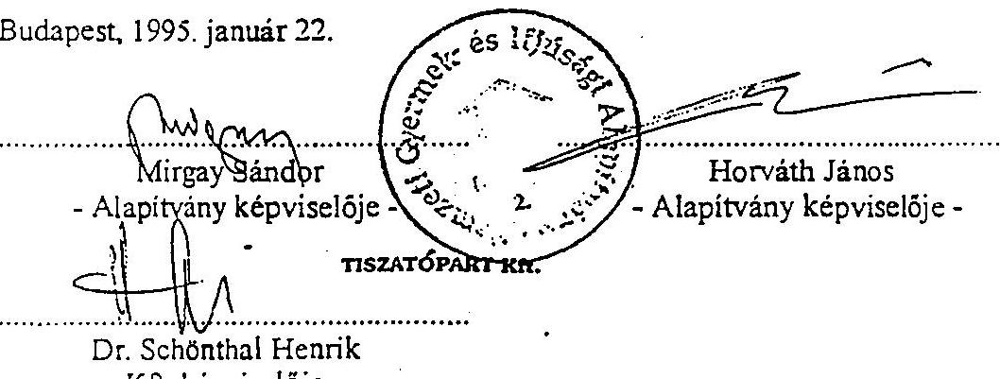

---

NIA 1992. évi költségvetésének teljesitése
(az 1993. január 29-i elözetes fökönyvi kivonat alapján)
Bevételek (eFt-ban)
Kiadások (eFt-ban)

| 1. Turisztikai: IFA | 48.325 | 1. Turisztikai célú ráford: |  |
| :--: | :--: | :--: | :--: |
| HID | 11.700 | sítábor: | 6.305 |
|  |  | nyári tábor: | 17.102 |
|  |  | HID kt.len ktgei 12.728 |  |
|  |  | k.tett ktgei 7.573 | 20.301 |
| 2. Ingatlan hit. visszafiz | 10.677 | 2. Ingatlan hitcl folyósitás | 6.520 |
| 3. Idegenforgalmi iroda | 3.431 | 3. Idegenforgalmi Ir.kt.len | 7.821 |
| 4. Kamat bevételek | 16.167 | 4. Pályázati támogatás |  |
|  |  | áthúzódó ösztöndij 1.327 |  |
|  |  | kutatási tevék. 960 | 2.287 |
| 5. Ingatlanok hasznosítása | 34.121 | 5. Ingatlanok kt. lén ktgei átért.ktg.vonzata felújítási ktg-ck | $\begin{aligned} & 42.717 \\ & 1.925 \\ & 12.586 \end{aligned}$ |
| 6. Ingatlan ćrtékesités | 60.000 | 6. Ingatlan ért. ktgei | 64.200 |
| 7. Ilitel felvétel | 10.000 | 7. Saját szerv. tevćkenység Operaházi Gy,karácsony | 4.000 |
|  |  | Egyéb rendezv., támogat. (Müv.tev.,gyercknap, szünidei, cü., Orsz.Diák Unió, Dunabogdány vízinapközi) | 21.554 |
|  |  | 1992. karácsony | 1.500 |
| 8. Ingatlanok állagmegóvása rendeltetésszcrü üzemeltetéshez szükséges 200 MFt kamatmentes kölesön betéti kamata | 72.000 | 8. Müködési ktg-ck | 53.849 |
|  |  | 9. Hitcl visszafizetés | 10.000 |

Összesen:
266.421
272.667

---

1992. ÉVES VÁRHATÓ
BEVÉTELEK (er-ban)

1. Turisztikai: IFA
HÍD
2. Ingatlan hitelek visszafiz.
3. Idegenforgalmi Iroda
4. Kamat bevételek
5. Ingatlanok hasznosítása
Gopob
6. Ingatlan értékesítés
7. Hitel felvétel

189.421

1. Turisztikai célu ráfordítások:
sítábor
nyári tábor
HÍD kt.len ktg.-ei 12.728
k.tett ktg.-ei 7.573
2. Ingatlan hitel folyósítás
3. Idegenforgalmi Iroda kt.len
4. Pályázati támogatás

- áthúzódó ösztöndíj 1.327
- kutatási tevék. 960
5. Ingatlanok kt.len ktg.-ei
átértékelés ktg.vonzata
felújítási ktg.-ek
6. Ingatlan értékesítés ktg.-ei
7. Saját szervezésú tevék.:

Operaházi Gyermekkarácsony
Egyéb rendezvények, támogatások
(Müvészeti tev., gyereknap, szünidei,
eü., Országos Diák Unió, Dunabogdány
vizinapközi)
1992. karácsony
8. Müködési ktg.-ek
9. Hitel visszafizetés

K I A D Á S O K (er-ban)

1. Turisztikai célu ráfordítások:
sítábor
nyári tábor
HÍD kt.len ktg.-ei 12.728
k.tett ktg.-ei 7.573
2. Ingatlan hitel folyósítás
3. Idegenforgalmi Iroda kt.len
4. Pályázati támogatás

- áthúzódó ösztöndíj 1.327
- kutatási tevék. 960
5. Ingatlanok kt.len ktg.-ei
átértékelés ktg.vonzata
felújítási ktg.-ek
6. Ingatlan értékesítés ktg.-ei
7. Raját szervezésú tevék.:

Operaházi Gyermekkarácsony
Egyéb rendezvények, támogatások
(Müvészeti tev., gyereknap, szünidei,
eü., Országos Diák Unió, Dunabogdány
vizinapközi)
1992. karácsony
8. Müködési ktg.-ek
9. Hitel visszafizetés

17.102

20.301
6.520
7.821
2.287
42.717
1.925
12.586
63.000
1.100
4.000
21.554
1.500
53.849
10.000
271.467

---

324-12211 NEMZETI GYERIEK ES IFJUSAGI ALAPITVANY

1024 BUDAPEST
A SZOLGÁLTATAS TELJESITÉSÉNEK NAPJA: 1992.12.31
A SZOLGÁLTATAS SZTJ SZAMA: 713 PÉNZÜGYI SZOLG.
A SZOLGÁLTATAS UTANI ADO MÉRTÉKE: ADOMENTES
ADOIGAZGATASI AZONOSITO SZAMUNK: 10196232201
KÖZÖLJUK, HOGY BANKSZÁMLAJUKAT A FENTI KELETTTEL LEZARTUK, ÉS A KÖVETKEZÖ TÉTELEKET KÖNYVELTUK:

# I. HITELEZÉSSEL KAPCSOLATOS TÉTELEK 

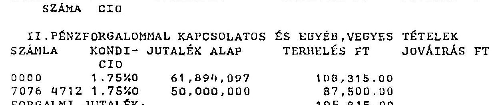
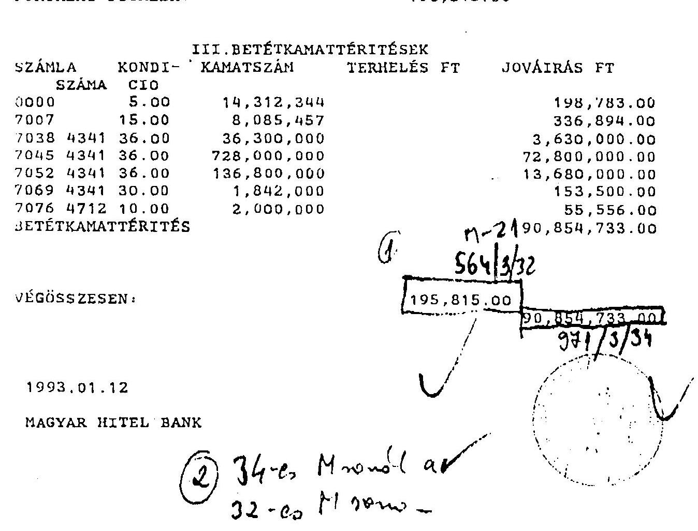

---

15. c. sz. melléklet

|  ALTALANOS KIVONAT |  |  |  |  |  |  |   |
| --- | --- | --- | --- | --- | --- | --- | --- |
|  Input file here: GNF-CM.035 |  |  |  |  |  |  |   |
|  8.LAD |  |  |  |  |  |  |   |
|  KAPCS FILE -si merete: GNF-MAC.035 4331 GNF-MAC.035 : GNF-MAC.035 163 |  |  |  |  |  |  |   |
|  A TELJES ALLIMENTÉR: torelt tételre szaap: 49 |  |  |  |  |  |  |   |
|  13135 |  |  |  |  |  |  |   |
|  INTERVALLEMEN BELL. |  |  |  |  |  |  |   |
|  13135 |  |  |  |  |  |  |   |
|  SIGMLA szaa Megnevezése |  |  |  |  |  |  |   |
|  Novas |  |  |  |  |  |  |   |
|  Tartozik forg. |  |  |  |  |  |  |   |
|  1. eg.anleg |  |  |  |  |  |  |   |
|  1. 65 0.00 0.00 |  |  |  |  |  |  |   |
|  1. 65 0.00 0.00 |  |  |  |  |  |  |   |
|  1. 65 0.00 0.00 |  |  |  |  |  |  |   |
|  1. 65 0.00 0.00 |  |  |  |  |  |  |   |
|  1. 65 0.00 0.00 |  |  |  |  |  |  |   |
|  1. 65 0.00 0.00 |  |  |  |  |  |  |   |
|  1. 65 0.00 0.00 |  |  |  |  |  |  |   |
|  1. 65 0.00 0.00 |  |  |  |  |  |  |   |
|  1. 65 0.00 0.00 |  |  |  |  |  |  |   |
|  1. 65 0.00 0.00 |  |  |  |  |  |  |   |
|  1. 65 0.00 0.00 |  |  |  |  |  |  |   |
|  1. 65 0.00 0.00 |  |  |  |  |  |  |   |
|  1. 65 0.00 0.00 |  |  |  |  |  |  |   |
|  1. 65 0.00 0.00 |  |  |  |  |  |  |   |
|  1. 65 0.00 0.00 |  |  |  |  |  |  |   |
|  1. 65 0.00 0.00 |  |  |  |  |  |  |   |
|  1. 65 0.00 0.00 |  |  |  |  |  |  |   |
|  1. 65 0.00 0.00 |  |  |  |  |  |  |   |
|  1. 65 0.00 0.00 |  |  |  |  |  |  |   |
|  1. 65 0.00 0.00 |  |  |  |  |  |  |   |
|  1. 65 0.00 0.00 |  |  |  |  |  |  |   |
|  1. 65 0.00 0.00 |  |  |  |  |  |  |   |
|  1. 65 0.00 0.00 |  |  |  |  |  |  |   |
|  1. 65 0.00 0.00 |  |  |  |  |  |  |   |
|  1. 65 0.00 0.00 |  |  |  |  |  |  |   |
|  1. 65 0.00 0.00 |  |  |  |  |  |  |   |
|  1. 65 0.00 0.00 |  |  |  |  |  |  |   |
|  1. 65 0.00 0.00 |  |  |  |  |  |  |   |
|  1. 65 0.00 0.00 |  |  |  |  |  |  |   |
|  1. 65 0.00 0.00 |  |  |  |  |  |  |   |
|  1. 65 0.00 0.00 |  |  |  |  |  |  |   |
| 

---

# Feljegyzés 

Dr.Rókusfahy Pál
clnök úr részére

Hivatkozva a 369/R.P./93. iktatószámú levélre illetve a 208/R.P./93. iktatószámú levél 3. pontjának 4. alpontjára az Alapítvány müködési költségeinck racionalizálását, illetve a szükséges takarékossági intézkedéseket az 1993. május 15 -én kelt Előrejclzés a NIA 1994. évi pénzügyi helyzetére - elemzés következtetésével szinkronban a következökben látom megvalósíthatónak:

- a teljes munkaidős fơfoglalkozású és nyugdíjas dolgozók létszámát $20 \%$-kal csökkenteni kell a központi apparátusban,
- a megmaradó létszámot az Amerikai úti székházban úgy kell elhelyezni, hogy az új elhelyezkedési renddel szobák szabaduljanak fel, amelyek bérbeadással hasznosíthatók és nyereséget termélnek.

Indoklás:
Az 1993. június 30-i létszámjelentés 103 fó teljes munkaidős dolgozót mutat. Ebböl a létszámból 82 fó föállású dolgozó, 21 fő nyugdíjas. Ezen belül a központi apparátusnál van foglalkoztatva 40 fő föállású és 3 fő nyugdíjas dolgozó (záró létszám).

Az 1993. I. féléves bérfcladás alapján, az éves szintre tervezett 52.970 e Ft-os bér és bérjellegü költségek, 23.038 e Ft-ot tesznck ki, az éves szintre vetítve $13.01 \%$-os megtakarítást tesz lehetővé maximálisan, változatlan létszám mellett.

A központi apparátus $20 \%$-os csökkentése - természetesen létszámszerkezettől függően - bérköltségben $20 \%$ körüli megtakarítást tesz lehetővé közvetlenül, de járulékos költség csökkenést eredményez az egyéb bérjellgü költségek területén is (étkezési hozzájárulás, utazás). Áttételesenaz egyéb anyag jellegü költségekben is jelentkezik minimális megtakarítás (irodaszer, telefon ....).

Összegezve a $20 \%$-os létszám leépítés hatását az 1993. évi jóváhagyott költségvetéshez mérten:

---

- bér és közterhei költségnemben éves szintre vetítve cca 8-9 MFt-ot,
- bérjellegü költségben kb. 0,5 MFt-ot,
- cgyéb anyagjellegü költségben megközelitően 100 cFt-ot lehet megtakarítani.

A létszámleépitést követöen átszervezéssel cca 100 m 2 hasznos iroda terület szabadítható fel, amely bérbeadással hasznosítható.

Jelenlegi bérlöink bérleti díja átlagosan 14.300.- Ft/m2.
Amennyiben kedvező, jól elkülöníthető irodákat tudunk felszabadítani (ca kölcsönös, bérlő illetve bérbeadó közös érdeke) 20.000 .- Ft/m2 árat is el lehet émi.

A két intézkedés hatása az éves müködési költségekre együttesen 10-11 MFt-os költségmegtakarítást eredményez.

Budapest, 1993. augusztus 6.
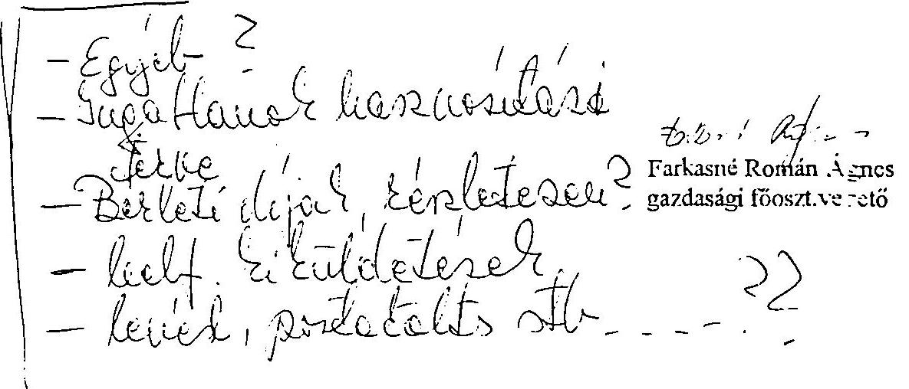

---

# Vállalkozási szerzödès 

amelyet egyrészzol a Grassalkovich Kastély Alapitvány Kurátóriuma /1014 Budapest,Táncsics M.u.ll.sz.a./,mint megbizo, másrésziol
a Mahill Mémókiroda Kft./1009 Budapest,Reguly A.u. 44. s.n.a./,mint vállalkozó között jött létre a mai napou és helyen, az alábbiak szerint:
1./A szerzodó felek megbizási szerzödést kötöttek egymással a Gödölloi Magyar Királyi Kastélyegyüttes Leljes múemléki helyreállitására.
2./Vállalkozó vállalkozik arra, hogy pénzforrást kutát fel es sreréz be, az állami támogatáson felül, a beruházás megvalósitása céljából.
3./Heqbizo kötelezettséget vállal arka, amennyiben vállalkozó a beruházás céljaira pénzforrást kösvetit, a vallalbozó által megrenzett pénzösszeg után, a kereskedelmi gyakorlathan szokásos 1,5\%-s jutalékra jogosult.
4./ A 3./pontbau meghatározott ÁrÁ-val növelt jutalék kifizetésének módja: átutalás, idópontja pedig, a beruházás rendelkezésére bocsájtásának nápjától számított 15/Tizenöt/nap, a vállalkozó által megadott benkszamlára.

Szerzödó felek a jelen szerzödésben nem érintett kérdésekben a PTK rendelkezéseit tekintik irányadónak, vita esetén alávetik magukat, a Gazdasági Kamara mellett szervezett Állandó Választatthizóságnak.

Budapest, 1993. december 20.
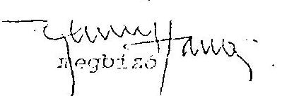
megbizott

---

# MEGBIZÁSISZERZÖDÉS 

mely létrejött egyrészröl
a Müemlékek Állami Condnoksága (1014 Budapest, Dísz tér 15.) és
a Grassalkovich Kastély Alapitvány Kuratóriuma (1014 Budapest, Táncsics
Mihály u. 1.) továbbiakban együttesen mint Megbizók, másrészröl
a Mallill Mérnökiroda Kft. (1089 Budapest, Reguly Antal u. 44.) mint Megbizott
között az alábbi napon és feltételekkel:

## 1.) ELÖZMÉNYEK

A Grassalkovich kastély komplexum helyreállítására, illetve hasznosítására kidolgozott programot a kormány 1992. július 23-án tartott ülésén hozott 3341/1992 sz. határozatával elfogadta.

Az említett kormányhatározat alapján a Grassalkovich kastély komplexum helyreállításira a költségvetés 1996-ig történő felhasználással 1 Mrd Ft-os költségvetési keretet hagyott jóvá.

A Kormány úgy döntött, hogy a Gödöllöi Magyar Királyi Kastélyegyüttes teljes müemléki helyreállításának és hasznosításának elösegitésére Grassalkovich Kastély Alapítványt hoz létre, és az említett kormánydöntés mellékleteként egyidejüleg elfogadta a Grassalkovich Kastély Alapítvány Alapitó Okiratát is. Az Alapitó Okirat az alapítvány célját és feladatát a kastélyegyüttes teljes müemléki helyreállításának és méltó hasznosításának elösegitésében, folyamatos gazdagításában és müködtetéséhez való hozzájárulásban jelölte meg.

Tekintettel arra, hogy a Grassalkovich Kastély Alapítvány Kuratóriuma a: alapítvány céljaként megjelölt feladatok elvégzéséhez szükséges állandó szervezettel és müszaki szakértelemmel rendelkező személyi állománnyal nem rendelkezik, a Megbizott pedig ilyen feladatok elvégzésére szakosodott olyan gazdálkodó szervezet, amelyik a kastélyegyüttes felujitásával kapcsolatos szervezőmunkákban tanácsadóként közel 3 év óta folyamatosan részviesz, ezért a Megbizók Kuratóriuma úgy döntött, hogy az alapitó okirat által az alapitvány fela- dataiként meghatározott tevékenység egy részét Megbizoltal végezteti el, és ennek érdekében alulírott felek az alábbi szerződés kötik:

---

# 2. A SZERZÖDÉS TÁRGYA, MEGBIZOTT FELADATAI 

2.1.

A Megbizott vállalja, hogy jelen szerződés aláirásától számított 20 napon belül a beruházás elökészitéséhez, elömunkálatainak elvégzéséhez és irányitásához szükséges, maxi-mum 8-10 szakértőből álló csoportot hoz létre saját szervezetén belül. A szakértő csoport tagjai a Megbizott ügyvezető igazgatójának közvetlen irányitása alatt fejtik ki tevékenységüket, és kizárólag a Megbizottra jelen szerződés alapján háruló kötelezettségek végrehajtása tartozik feladatkörükbe.

## 2.2

A 2.1 pontban meghatározott szakértőcsoport feladatai:

- a Kastély és vonzaskörzeti teljes beruházás kivitelezését előkészitő Megvalósithatósági Elötanulmány készítése.
határulö: 1993. november 30.
- a teljes beruházás finanszirozásához szükséges eszközök elözetes felmérése, és a lehetséges finanszirozási források bemutatása egy összefoglaló jelentés formájában határulö. 1994. január 10...
- a Megvalósithatósági Elötanulmány és a finanszirozás bemutatására készült tanulmány alapján kormányelöterjesztés elkészitése és a Megbizóknak történő átadása. határulö: 1994. január 10.
- a Kastélyegyüttessel kapcsolatban a mai napig elvé: zett, és jelenleg folyamatban lévö munkák felmérése, a folyamatban lévö munkák fontosság és sürgösség szerinti rangsorolása, és összefoglaló jelentés készitése a Megbizók részére az elkövetkező hat hónapban szükségessé váló legfontosabb feladatokról és azok teljesítési határidöiről. határulö: 1994. január 10.
- a Kastélyegyüttes állagmegóvása és felújítása ügyében korábban végzett munkák folyamatos átvétele, a megkötött szerzödések, a múszaki és a pénzügyi helyzet számbavétele, és arról összefoglaló jelentés készitése.
határulö: folyamatos, Megbizókkal egyeztetett módon
- a beruházásért és vonzáskörzeti fejlesztésért felelős gazdasági társaság alapításának előkészitése, az alapítókkal szükséges tárgyalások lefolytatása, az alapitó okirat tervezetének elkészitése, az alapítók belső jogviszonyát szabályozó együttmüködési szerzödés tervezetének elökészitése és a gazdasági társaság megalapításával kapcsolatos összes feladat menedzselése.
határulö: 1994. február 15.

---

- a Kastélykomplexum és a hozzá kapcsolódó fejlesztések tervezési programjának és beruházási programjának kidolgozása Megbizók általi jóváhagyásra, határidö: folyamatos
- a teljes beruházásra kidolgozott Végleges Megvalósíthatósági Tanulmány, a pénzügyi források, a beruházási stratégia benyújtása Megbizók általi jóváhagyásra határidö: 1994. május 15.
- a beruházás megvalósításához szükséges hitelkérelem kidolgozása, annak összes mellékletével egyïtt, a hitelező bankok által megkívánt adatok, igazolások, okmányok beszerzése, a hitelező banknak benyújtott anyagok szükség szerinti módosítása, és a hitelek határidőben történő megszerzése érdekében minden szükséges intézkedés végrehajtása,
határidö a hitelkérelem benyújtására: 1994. május 31.
- a tervezési és kivitelezési munkák elvégzésére pályázat kiírása, a beérkező pályázatok értékelése, a nyertes pályázókkal kötendő szerződések tervezeteinek előkészítése Megbizók általi jóváhagyásra és döntésre.
határidö: folyamatos
- a tervezési és kivitélezési munka során szükségessé váló egyeztetéseken, konzultációkon való részvétel és a Megbizók érdekeinck képviselete, határidö: folyamatos
- a tervezök által átadott és a Megbizók által jóváhagyott engedélyezési tervek Megbizók nevéhen történő aláírása, és az építési illetve múemlćki hatósághoz történő benyújtása, határidö: folyamatos
- a múszaki ellenörök kiválasztása, velük a Megbizók nevében a szerződés megkötése, tevékenységük ellenörzése, munkájuk és a Megbizók által kijelölt kontroll múszaki ellenörök munkájának összchangolása
határidö: folyamatos
- a Megbizók nevében történő eljárás a MÁG, az OMVH, az érdekelt önkormányzatok, érintett tulajdonostársak és az építésügyi cngedélyezési hatóságok között szükségessé váló koordinációs ügyekben,
határidö: folyamatos

---

- a berrházással kapcsolatos valamennyi müszaki, vonzáskörzcii fejlesztési jellegü feladat koordinálása, és a Megbizók nevében történő menedzselése, határtdö: folyamatos

# 3. A MEGBIZOK FELADATAI 

3.1.

A Megbizók vállalják, hogy a jelen szerződés által érintett beruházás ügyében korábban keletkezett valamennyi okmányt, adatot, információt, melyek a rendelkezésükre állnak átadják Megbizott részére, és folyamatosan tájékoztatják minden olyan körülményről, vagy eseményröl, amely a Megbízoltnak jelen szerződésben vállalt kötelezettségei teljesitésével kapcsolatos.
3.2.

Megbizók vállalják, hogy a Megbízott által vállalt kötelezettségek határidőben és a célnak megfelelő teljesitését elősegítik.
3.3.

Megbizok vállalják, hogy a teljes beruházási programban érintett minden létesítményt - szük is esetén - a beruházási program szerinti munkamüveletek elvégzésére és az ott megbizantott ütemezés szerint rendelkezésre bocsátják.
3.4.

Megbizók helytállnak a Megbízási Szerződés alapján , kívülálló harmadik személyekkel szembén a megbizotti tevékenységért.
3.5.

Megbizók vállalják, hogy a Megbízott által részükré eldöntésre átadott ügyckben a döntsse vonatkozó javaslat átvételétől számított legkésöbb 8 napon belül a szükséges döntést meghozzák, és arról Megbízottat tájékoztatják.
3.6.

Megbizók feladata, hogy a beruházási program kivitelezćséhez Megbizott által kidolgozott költségvetéseket jóváhagyják vagy jóváhagyassák, - a beruházáshoz szükséges finanszírozási, pénzügyi-számviteli múveleteket elvégezzék.
3.7.

Megl 'zök eljárnak, hogy a jelen szerzödésben általuk vállalt kötelezettségek teljesítését a megatapitandó ga: lasági 'írsaság változatlan tartalommal átvállalja.

---

3.8 .

Megbizók kötelesek Megbizott részére a jelen szerződés 5. pontjában meghatározott megbizási dij megfizetésére.
3.9 .

Megbizók Megbizott részére 1994. január 05-ig az alábbi adatokat szolgáltatják:
ta M. 40 által irányilott munkák jelenlegi állapota - helyzefjelentes;
a megkötött vagy kötés alatt álló szerzödések átadása/munkák + tervezés/?
-a kastélyegyüttest érintő konzultációk; megállapodások, döntések ismertelése - hie yžetjelentés;
- á tenyleges pénzügyi helyzet részletesen bemulátva, bizonylatozva;
- a kastélyegyüttes tervezésével, kivitelezésével kapcsolatos OMVH feltétel- és követelményiendszerek, elöírások átadása Megbízott részére.

# 4. HATÁSKÖR, FELELÖSSÉGVÁLLALÁS 

4.1 .

Megbizott jelen szerzödésben vállalt kötelezettségeinek teljesitése során a Megbizók nevéhen jár el, az általa tett jognyilatkozatok, kötelezettségvállalások- közvetlenül a Megbizokait kötelezik. A Megbizott feladatai teljesitése során köteles egy körültekintö, jó szakvállalattól elvárható gondosság kifejtése melielt ténykedni, és a Megbizók érdekeit folyamatosan szem elött tartani, érvényesíteni.
4.2 .

A Megbizott a jelen szerzödés alapján feladatai közé tartozó ügyekben jogosult az önálló döntéshozatalra, azonban ha megitélése szerint az eldöntendő úgy nagyságrendje, kihatása, különleges jellege, vagy más körülmények folytán ez indokolt, úgy jogosult az adott ügy eldöntését a Megbízóktól kérni. A döntésre vonatkozó kérelemnek minden esetben tartalminnia kell a Megbízott szakmailag megalapozott véleményét, és a döntés mikéntjére vonatkozó javaslatát. Megbizók fenntartják maguknak a jogot, hogy az általuk lényegesnek itélt kérdésekben döntsenek, Megbízottal egyezetve.
4.3.

Amennyiben a Megbízott az clőző pont szerint egy adott ügyben a Megbizók döntését kéri, és a Megbizók a jelen szerzödés 3. pontjában foglalt határidőn belül nem adnának választ, úgy a Megbízott javaslatát - alternatív javaslatok esetén az elsőként leírt javaslatot a Megbizók részéről elfogadottnak kell tekinteni.

---

4.4 .

A Megbizók elözetes hozzájárulásával Megbizott jogosult jelen szerződés alapján öt terhelö jogokat és kötelezettségeket az általa létrehozott, vagy általa ellenörzött másik gazdasági társaságra átruházni.

# 5. MEGBIZÁSI DÍJ, FIZETÉSI FELTÉTELEK 

5.1 .

Megbizottat a beruházási költségek 3,5\%-ában meghatározott, de minimum a szakérloi csoport várható bére, közterhec és költségei nagyságrendjében meghatározott havi $3.300 .000,-$ Ft + ÁFA összegü dij illeti meg.
5.2 .

A megbizási dij a Megbizók, vagy a megalapítandó gazdasági társaság által a beruházás megvalósitása érdekében harmadik személyekkel kötött valamennyi szerzödés alapián lifizetésre kerülö vállalkozási vagy egyéb díjakkal egyidöben esedékes, de havi $3.300 .000,-$ Ft + ÁFA összegü dij az elözö pont szerint minden hónap 15. napjáig abban az esetben is esedékes, ha az adott hónapban a vállalkozók számláinak 3,5\%-a nem éme el ezt az összeget. A dijak kifizetését a Megbizott számlája alapján az abban megielolt szimnaszámra történö bankátutalással kell teljesíteni.
5.3 .

Amak érdekében, hogy a Megbizott minél érdekeltebb legyen a teljes beruházás lehetö leggazda:ágosabb megvalósitásában, szerzödő l'elek a következökben állapodtak meg:

A legkedvezibb ajánlatot benyitió Pályázó által megajánlott vállalási összeg képezi azt az arat, amelyhez képest a Megbizott tárgyalásainak eredményeképpen elért megtakaritáshöl a Megbizott $50 \%$-os arányban részesül.
5.4 .

Amennyiben jelen szerzödéshen a Megbizók közremüködésével megalapítandó gazdasági társaság nem vállalná át a Megbízókat jelen szerzödés alapján terhelö kötelezettségek teljesitését, vagy a gazdasági társaság vagy Megbizók jelen szerzödést felmondanák, úgy a Megbizottat a felmondás idejéig teljesitett munkäiért, valamint átalánykártéritésként a megvalósitási tanulmány alapián a Megbizók által elfogadott beruházási költség alapján számított $3.5 \%$-os megbizási dij $50 \%$-a illeti meg. Ez az összeg a felmondás Megbizottal való közlésétöl számított 30 napon belül esedékes.

---

5.5 .

Ila a szerzödés felmondására a Megbizott - PTK-ban meghatározott - súlyos szerződésszegése miatt, vagy abból az okból kerül sor, hogy a beruházás nem valósul meg, úgy az clózi pontban meghatározott átalánykártérítés a Megbízottat nem illeti meg.

# 6. VEGYES RENDELKEZÉSEK 

6.1

Jelen szerzödésben nem szabályozott kérdésekre a Polgári Törvénykönyv rendelkezései az irányadók.
6.2 .

A szerződő felck a békés úton el nem intézhetö vitás kérdéscik eldöntésére kikötik a Macyar Gazdusági Kamara mellett szervezett Állandó Választottbíróság kizárólagos illetckességét.

Budapest. 1993. november 01.
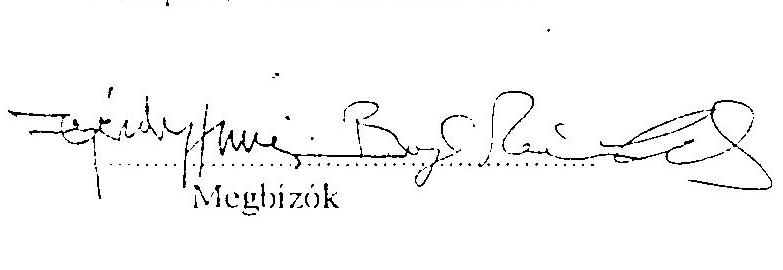
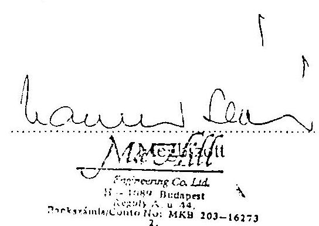

---

# A (köz)alapitványok helyszini ellenőrzésének tapasztalatai 

A függelékben a következő (köz)alapitványoknál végzett helyszini ellenőrzések megállapításait foglaljuk össze:
I. Grassalkovich Kastély (Köz)alapitvány (1. oldal);
II. Magyarországi Nemzeti és Etnikai Kisebbségekért (Köz)alapitvány (13. oldal);
III. "A Településekért, Régiókért" Közalapitvány, jogelődje a "Települések Fejlesztéséért" Alapítvány (19. oldal);
IV. 1956-os Forradalom Történetének Dokumentációs Kutatóintézete Közalapítvány, jogelődje: 1956-os Tudományos Alapítvány (24. oldal);
V. Hadigondozottak Közalapítvány (30. oldal);
VI. Hungária Televizió (Köz)alapitvány (38. oldal);
VII. Borsod-Abaúj-Zemplén Megyei Fejlesztési Közalapítvány és a Szabolcs-Szatmár-Bereg Megyei Fejlesztési Közalapítvány (51. oldal);
VIII. Illyés Közalapítvány (59. oldal);
IX. Pro Professione Alapitvány (63. oldal).

Az ellenőrzés - két kivétellel - az 1992-1994. évek gazdálkodására irányult. Az Illyés Alapitványnál, valamint a Pro Professione Alapítványnál a központi költségvetés 1994. évi zárszámadásának ellenőrzése keretében került sor az ellenőrzésre.

---

# 1.   Grassalkovich Kastély (Köz)alapitvány 

## 1. Elözmények

A Gödöllöi Királyi Kastély Magyarország legnagyobb barokk palotája, 17 ezer $\mathrm{m}^{2}$ beépített alapterületével világviszonylatban is a legnagyobb kastélyok közé tartozik. A müemlékegyưttes pusztulása 1944. öszén vette kezdetét, berendezése szétszóródott, építészetileg az eltelt évtizedek alatt súlyos károsodást szenvedett.

A nemzeti kincsnek számító múemlék rehabilitációjának, felújitásának és méltó hasznosításának tervezése 1985-ben kezdödött el. Az állagmegóvási munka a kastélyba nem való szervezetek, intézmények kiköltöztetésével gyorsulhatott fel: 1990-ben a kivonuló szovjet alakulatok kiürítették az általuk használt helyiségeket, 1992-ben eltávozott a kastélyból a polgári védelem, 1993-ban a szociális otthon, 1994-ben pedig kiköltöztek a kastélyban bérlakással rendelkező magánszemélyek.

1986-1990. között a kastélyra fordított állagmegóvási munkák összege $148,8 \mathrm{M} \mathrm{Ft}$ volt.
A 2010/1990. (HT.5.) MT sz. határozat a kastély kezelöi jogának rendezéséig és a hasznositásra vonatkozó döntésig az Országos Müemléki Felügyelöséget, mint közös képviselöt bizta meg a kezelö szervek együttes fenntartási kötelezettségének ellátásával, évi 10 M Ft állami költségvetési fedezet biztosításával.

A kastély és parkja állagmegóvási és életveszély elhárítási munkáinak korábban megkezdett programja folytatásához 1991-töl - a hasznosításról hozandó döntésig évi 100 M Ft állami költségvetési forrást biztositott a Kormány.
A kormányhatározat alapján 1991-ben 110,8 M Ft-ot, 1992-ben 118,9 M Ft-ot fordított az Országos Müemléki Felügyelöség a kastély állagmegóvási munkáira.

A 3341/1992. sz. határozatával a Kormány elfogadta a kastély döntöen idegenforgalmi és kulturális célú hasznosításáról szóló előterjesztést, a rehabilitáció befejezésére 1996. április 30 -át jelölte meg. A program végrehajtása érdekében a Kormány részére az érintett minisztereknek éves ütemezésü pénzügyi tervet kellett készíteni, mely tartalmazza a müemléki helyreállítás és a kapcsolódó beruházások költségeit, a helyreállítás utáni fenntartási, üzemeltetési költségek elöirányzatát és a bevonható pénzügyi forrásokat mind a helyreállítást, mind az üzemeltetést illetően. A pénzügyi tervjavaslatban a helyreállításra szánt költségvetési támogatás összege nem haladhatta meg az 1 Mrd Ft-ot.

A Kormány a kastély kezelésével a Környezetvédelmi és Területfejlesztési Minisztérium (KTM) útján a Müemlékek Állami Gondnokságát (MÁG) bízta meg.

---

# 2. Az alapítvány létrehozása, alapító vagyona, müködése és gażdálkodása 

2.1. A Grassalkovich Kastély Alapitvány létrehozását és az alapító okiratot féléves előkészitő munka után az 1051/1993. (VII.2.) sz. Kormányhatározat hagyta jóvá.
Az alapító okirat tartalmi és formai hiányosságai miatt a bejegyzési kérelmet a Fővárosi Bíróság hiánypótlásra visszaadta, a bejegyzés érdekében a kormánynak módosítani kellett az alapító okiratot (1993. október 22-i ülésén). A Fővárosi Bíróság az alapítványt 1993. november 18 -án vette nyilvántartásba. Kihirdetése az 1080/1993. (XII.26.) Korm. sz. határozattal történt.

Az alapítvány számára csak 1994. július 5-én kértek és 1994. július 12-én kaptak adószámot, ekkor történt meg az alapítvány naplófökönyvének hitelesítése is.

Ugyanakkor az 1993. évi költségvetésről szóló 1992. évi LXXX. törvény a XX. KTM fejezet Fejezeti kezelésű előirányzatok címén - egyéni képviselöi módosító indítvány elfogadásával - a Grassalkovich Kastély Alapítvány támogatására 100 M Ft-os előirányzatot állapított meg. E döntéssel a Parlament egy nem létező alapítvány számára szavazott meg költségvetési támogatást. A döntéselőkészítés során a KTM és az Országos Müemlékvédelmi Hivatal (OMVH) szakemberei ellenezték, hogy egy nem létező alapítvány útján támogassák a godöllöi helyreállítási - hasznosítási munkálatokat.
Az alapítvány előkészitésének és jóváhagyásának elhúzódása a kastély helyreállítási munkáit számottevően lelassította, a jóváhagyott költségvetési támogatás gyakorlatilag egy évig felhasználatlan volt, az inflációs hatás miatt reálértéke lényegesen csökkent.

A kastély helyreállítására az OMVH saját keretéből 1993-ban 32,6 M Ft-ot fordított. Az alapítvány számára jóváhagyott 1993. évi költségvetési támogatást - az alapítvány bírósági nyilvántartásba vételének elhúzódása miatt - csak 1993. december 8 -án utalta át a minisztérium az alapítvány számlájára. Az alapítvány 1993-ban a kastély állagmegóvására mindössze 7,7 M Ft-ot használt fel.
2.2. Az alapítvány vagyona az alapító okirat szerint 10 M Ft volt, melyből 2 M Ft-ot használhattak fel az alapítványi müködés megkezdésére. Az alapítvány azonban müködése során nem különítette el az alapító okirat szerint fel nem használható 8 M Ft összegű vagyont, melynek kamatait az alapítvány müködésére fordíthatta volna.
Az alapítvány pénzeszközei - a bankszámla havi egyenlegei alapján - két alkalommal nem érték el az alapító okiratban megjelölt mértéket.
1994. december 31-én az alapítvány bankszámla egyenlege 5.184.230 Ft, 1995. január 31-én 4.161 .081 Ft volt.

---

# KIEGÉSZÍTŐ MEGÁLLAPODÁS 

a Grassalkovich Kastély Alapitvány Kuratóriuma, a Müemlékek Állami Gondnoksága és a MaHill Mérnókiroda Kft. által kötött szerzödéshez

Felek kölcsönös megegyezéssel a szerződés 5.2 pontját akként módosítják, hogy az 1993. november-december havi honoráriumok kifizetése helyett tárgyi honoráriumok esedékessége akkor áll fenn, ha a Kormány határozatban rögziti a keruházás elökészitéséhez és finanszirozásához szükséges - a Megbizott által kidolgozott - kiegészitő feltételeket. I bhen az esetben Megbizott jogosult esedékes számlái kifizetésére.

Kelt. 1993. november 01.
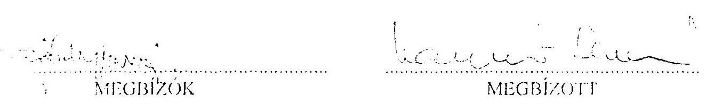

---

# II.   A Magyarországi Nemzeti és Etnikai Kisebbségekért (Köz)alapitvány 

## 1. Elözmények

Az alapítványt a Minisztertanács (továbbiakban alapitó) 1990-ben hozta létre a hazai nemzeti és etnikai kisebbségek támogatására. Az alapítvány célja volt - többek között - a hazai nemzeti és etnikai kisebbségek törvényes szövetségeinek, egyesületeinek és egyéb szervezeteinek támogatása, a kisebbségek nyelvének, kulturális hagyományainak, történelmi, müvelödéstörténeti emlékeinek ápolása, az anyanemzetekkel való kapcsolatuk ápolásának elösegítése, a kisebbségekről szóló hazai tájékoztatás javitása.

Az alapítványt a Fővárosi Bíróság a 6 PK 62357/1. számú végzés alapján 1990. április 12 -én nyilvántartásba vette.
Az alapító az alapítvány induló vagyonaként 20 M Ft -ot rendelt a Minisztertanács Hivatala 1990. évi költségvetéséből. A további rendelkezések értelmében, mind az alaptőke, mind pedig a kamatok 1.000 Ft maradványósszegig felhasználhatók. Az alapítvány kezelöje a Minisztertanács által felkért személyekből álló 11 fös Kuratórium, mely gondoskodik a vagyon nyilvános pályázati úton történő felhasználásáról. A vagyonkezelésben a Kuratórium külső pénzügyi szervezetet is bevonhat.

A Kuratórium elnökét és titkárát a Minisztertanács nevezte ki. Ugyanakkor az alapító nem gondoskodott az ellenörzés szervezeti feltételeiről, nem jelölt ki Felügyelő Bizottságot az alapítvány gazdálkodásának ellenörzésére.

Az eltelt időszakban az alapító okirat módosítására nem került sor, a Kuratórium összetételében lezajlott személyi változásokról kormányhatározatokban rendelkeztek.

## 2. Az alapítvány alapító okirata, gazdálkodása, könyvvezetése, vagyonvédelme

2.1. A módosított Ptk. alapítványok müködését szabályozó előírásai ellenére nem módosították az 1990. áprilisában kiadott alapító okiratot. 1993-ban elkészítették ugyan a módosított alapító okirat, valamint a szervezeti és müködési szabályzat tervezetét, de azokat nem terjesztették a Kormány elé a kisebbségi törvény várható módosítása miatt, amely hatással lehet az alapítvány további müködésére.
2.2. Az alapítvány a tevékenysége során költségvetési forrásból tárgyi vagyonjuttatásokban nem részesült, ingatlan vagyona nem volt. Az éves költségvetési törvényben, a Miniszterelnökség fejezeten belül címzetten elöirányzott támogatásban részesült,

---

1992-ben 87,7 M Ft, 1993-ban 100 M Ft, 1994-ben 95 M Ft összegben. A támogatás folyósitása havi ütemezésben történt.

Az alapitvány nyitott, az alapitó okirat lehetővé tette hazai és külföldi természetes és jogi személyek hozzájárulását az alapítványhoz, azonban az adományok összege, aránya az alapitványi bevételeken belül elenyésző volt.
2.3. Az alapitvány bevételei nyilvános pályázat útján kerültek felhasználásra. A Nemzeti és Etnikai Kisebbségi Hivatal (NEKH) által biztositott és folyamatosan naprakészen tartott sajtólista alapján pályázatokat hirdettek, elsősorban kisebbségi lapokban (1993-ban három pályázati felhívást jelentettek meg 39 alkalommal összesen 17 lapban). A pályázati juttatásokról a Kuratórium döntött, évenként legalább négy ülés keretében.

Az ülésekröl jegyzőkönyveket, emlékeztetőket készítettek. Kifogásolható azonban, hogy a kuratóriumi döntéseket egységes, áttekinthető nyilvántartásban nem foglalták össze, azok visszakeresése munkaigényes, az egyéb, nem pályázati elbírálásokról hozott határozatok beleolvadtak a felvett emlékeztetőkbe. A jegyzőkönyvek, emlékeztetők hitelesítése több esetben elmaradt.

A pályázatok számítógépes nyilvántartási rendszere teljeskörü adatbázist biztositott a beérkezett pályázatokról, információt ad a pályázat elbírálásáról, a juttatás elszámolásáról. A pályázatok elbírálásában nagy jelentősége volt a döntéselőkészitő munkának, melyet a NEKH szakreferensei végeztek el (a kisebbségi szakreferensek ajánlásokat tehettek a pályázatok odaitéléséhez), esetenként külső szakértőket is bevontak.

A Kuratórium titkára soron kívüli kifizetéseket engedélyezhetett (meghatározott keretöszszeg erejéig), melyröl a Kuratóriumot utólag tájékoztatta.

Az általános alapítványi célok szerinti pályázatok mellett, évenként célpályázatokat is hirdettek, például: időtálló értéket alkotó kisebbségi képzöművészek támogatása, jubileumi jutalmazások hagyományőrző együttesek, zenekarok részére, nívódij, nemzetiségi pedagógusok életmủ jutalmazása, évfordulók, megemlékezések támogatása, stb. A kifizetett célpályázati támogatások összege 1992-ben 7 M Ft, 1993-ban 16,7 M Ft, 1994-ben 4,8 M Ft volt.

A felhasználásban jelentős arányt képviselt a cigány származású fiatalok számára kifizetett ösztöndijak összege. Az ösztöndijpályázatokat a cigány oktatási Alkuratórium bírálta el. A támogatottak köre egyaránt kiterjedt a cigány származású középiskolás tanulókra, föiskolai és egyetemi hallgatókra is. A támogatások összege 1992-ben 1,4 M Ft, 1993-ban 8 M Ft , 1994-ben $21,8 \mathrm{M}$ Ft volt.

A pályázókat írásban elszámoltatták a juttatás felhasználásáról. Azokat a pályázókat, akik a megadott határidőn belül (1 év) nem számoltak el a támogatás felhasználásáról, kizárták a következö pályázatból. Az elszámoltatás eredményességét helyszíni ellenőrzésekkel segítették elö, melyben a programok gyakorlati megvalósulását is értékelték. A helyszíni vizsgála-

---

tokat külső szakértők bevonásával oldották meg. Előfordult azonban, hogy a jogos követeléseiket nem tudták visszaszerezni.
2.4. Az alapítvány gazdálkodását éves költségvetéssel nem alapozták meg, a müködési kiadásokra keretösszeget nem határoztak meg. Az alapítvány tevékenységéről évenként készítettek szöveges beszámolót (1994-ben részletesebben), melyben a gazdálkodásra vonatkozó föbb adatokat bemutatták.

A teljesitett pénzforgalmi bevételek összege 1992-ben 95.708 E Ft, 1993-ban 112.210 E Ft, 1994-ben 96.838 E Ft, a kiadások összege 1992-ben 56.029 E Ft, 1993-ban 132.004 E Ft, 1994-ben 115.184 E Ft volt. Ezen belül a kezelő szerv müködési kiadásai 1992-ben 3.454 E Ft, 1993-ban 5.946 E Ft, 1994-ben 5.650 E Ft összeget tettek ki.

# 2.4.1. Az ellenőrzés az alapítvány gazdálkodásában szabálytalan gyakorlatot tapasztalt a kuratóriumi tagok dijazását illetően. 

A Ptk. 74/B. § (1) bekezdés rendelkezése szerint az alapító okiratban meg kell jelölni többek között az alapítvány céljára rendelt vagyont és annak felhasználási módját.
Jelen esetben az alapító okiratban az alapító nem rendelkezett a tiszteletdij kifizetéséről.
Ennek függvényében jogszerütlen volt a Kuratórium 1992. október 15-i döntése. melyben a tagok dijazására több változatból a D variánst fogadta el ("ülésenként 10.000 Ft , a minden ülésen megjelenő kurátor részére legalább $50.000 \mathrm{Ft} / \mathrm{ev}$ "), melyet bizonylati alátámasztás nélkül költségátalányként számoltak el.
Az azonos tartalmú kifizetést 1994-ben elöadói dijként (szellemi tevékenységböl származó jövedelem) számolták el.
2.4.2. 1993-ban az alapítvány kuratóriumi döntés alapján 7 M Ft kamatmentes kölcsönt folyósitott a Budapest Székesfőváros Könyvesháza Alapítványnak. A kölcsönnyújtás nem volt összhangban az alapítványi vagyon alapító által meghatározott célok szerinti hasznositásával, továbbá az alapítvány gazdálkodását szabályozó SZMSZ sem adott rá lehetőséget (kölcsönnyújtásról nem rendelkezett).

A Könyvesház Alapitvány által benyújtott pályázatban hazai kisebbségi célok nem lelhetők fel. A Könyvesház Alapitvány célja az értéket tartalmazó kulturális müvek forgalmazása, a határon túli magyar alkotók megismertetése. A pályázal célja az épület felújitására szükséges források ( 20 M Ft ) elöteremtése. A 7 M Ft összegü támogatás felhasználása épületfelújitásra a MNEK Alapitvány céljaival nem áll összhangban. A pályázat céljainak módosításáról irásos dokumentációt nem tudtak bemutatni.

A kölcsönszerzödés a visszafizetési garanciákat nem tartalmazta. A folyósitott kölcsön visszaszerzésének esélyei megkérdőjelezhetők, a Budapest Székesfőváros Könyvesháza Alapítvány pénzügyi nehézségei miatt. Gondatlanságra utal, hogy a

---

létrejött "együttmüködési megállapodás"-ban a visszafizetésröl nem rendelkeztek: "A visszafizetés mértékét és ütemét a szerzödő felek külön megállapodásban rögzitik". A külön megállapodás azonban nem jött létre, a szerzödésben rögzített 18 hónap türelmi idö 1995. januárban járt le. A kölcsön folyóslááához bizonyos ellenszolgáltatásokban állapodtak meg: a Könyvesház a MNEK Alapítvány Kuratóriumi üléseire, sajtóbemutatóira, képzömüvészeti kiállításokra helyiséget biztosit, állandó vitrint biztosit a nemzetiségi kiadványok részére, terjeszti azokat.
2.5. Az SZMSZ 9. pontjának megfelelően az alapítvány kezelöje a Kuratórium, mellette a "technikai kezelést" (pénzügy, számvitel, adó, stb.) az MHB "Kurátor" Alap- és Alapítványkezelő Szervezete látja el szerződés szerint. A technikai jellegü pénzügyi és számviteli szolgáltatások elvégzésére hivatkozva az alapítvány indokolatlanul, bankszámla feletti rendelkezési jogot, valamint utalványozási jogkört biztositott a Kurátor Kft. pénzügyi vezetői számára is.

Ugyanakkor kellö szakismeret hiányában a Kuratórium a Kurátor Kft. feladatellátását nem ellenőrizte, az alapítvány éves mérlegét nem vizsgáltatta felül. A számonkérés hiányának tulajdonitható a Kurátor Kft. jogtalan eljárása az alapítványi források kezelésében.
1992. december 22-i megállapodás szerint a MNEK Alapítvány 20 M Ft összegü hitelt folyósitott a Betonútépitő Nemzetközi Épitőipari Rt. részére, 1993. január 30-i határidővel. Az ideiglenes pénzeszköz átadásra az alapítvány nem adott felhatalmazást, jogalap nélkül a Kurátor Kft. az alapítvány nevében a kötelezettséget vállalta.
A hitelt és kamatát 1993. II. 1-jén visszafizették.
2.6. Az alapítvány vállalkozási tevékenységet nem folytatott, egyéb vállalkozási befektetései nem voltak. Hosszú lejáratú bankbetéttel 1992-ben rendelkezett 5 M Ft összegben, melyet a folyószámlavezető pénzintézetnél (MHB) 1 éves lekötésre helyezett el.
2.7. Az alapítvány könyvvezetését az egyszeres könyvvitel előirásainak megfelelően alakitották ki. Folyamatosan vezették a számviteli nyilvántartásokat, az előirt analitikákkal együtt. Ugyanakkor a pénzforgalmi kiadások részletezése nem biztositja az alapítványi célú tevékenység kiadásainak elkülönitését a müködési kiadásoktól, az csak tételes kigyüjtéssel mutatható ki.

Az alapítvány egyszerűsitett mérlegének évenkénti föösszege 1992-ben 47.025 E Ft, 1993-ban 30.703 E Ft, 1994-ben 12.652 E Ft volt, melyből a pénzeszközök egyenlege 1992-ben 27.025 E Ft, 1993-ban 20.226 E Ft és 1994-ben 2.156 E Ft volt. Általában a decemberi kuratóriumi határozat által jóváhagyott juttatások a következő évben kerültek kiutalásra. Jellemző volt a hosszú átfutási idő, a kuratóriumi döntés és a tényleges pénzkifizetés között előfordul 2-3 hónap eltérés is.

---

Kifogásolható, hogy az 1992. évi mérlegben a 236 E Ft értékủ képzömüvészeti alkotást nem mutatták ki. A szükséges korrekciót 1993-ban végezték el. Beruházásra 1993-ban került sor, amikor 3.236 E Ft értékben számítógépet, másológépet, irodabútort vásároltak.

A pénzügyi, bizonylati fegyelem érvényesülését megfelelő szabályozással nem támasztották alá, a gazdálkodási jogosítványokat nem szabályozták, a kötelezettségvállalási jogkört nem határozták meg. Ugyanakkor az utalványozási jogkört értékhatártól függetlenül, a Kuratórium elnöke, titkára, 2 tagja, valamint a Kurátor Kft. részéről 3 fő gyakorolhatta.
Rendezetlen és ellentmondásos volt az ügyvezető titkár jog- és feladatköre. Az alapító okirat szerint "az Alapítványt a Kuratórium elnöke, a titkár, vagy az elnök által írásban felhatalmazott személyek képviselhetik".
Az ellenőrzés részére, elnöki felhatalmazást az alapítvány képviseletére, vagy kuratóriumi döntést az ügyvezető titkár megbízásáról nem tudtak bemutatni.

A módosított szervezeti és müködési szabályzatban leírtak szerint az ügyvezető titkár adminisztratív feladatokat láthat el. Azonban a konkrétan meghatározott feladatok között az alapítvány napi gazdálkodásának irányítása mellett az alapítvány titkárának eseti helyettesitése is szerepelt. A helyettesités során az ügyvezető titkár az alapítvány titkárának megbizása alapján (1992. február 15-i leirat) az alapítvány képviseletében járt el, kötelezettséget vállalt, utalványozott.

A fent említett eljárással megsértették a Ptk. alapítvány képviseletére vonatkozó rendelkezéseit. A Ptk. 76/C. § (1) bekezdésben foglaltak szerint "a kezelö szerv (szervezet) az alapítvány képviselöje". Ennek értelmében kezelö szervezeten kivilii személy az alapítvány képviselöje nem lehet. Az ügyvezető titkár nem volt a Kuratórium tagja, ezért az alapítvány képviseletére nem volt jogosult.

Az utalványozási jogosítványokat 1990-ben szabályozták, a későbbiekben a személyi változások ellenére sem módosították. A szabályozás értelmében az ügyvezető titkárt utalványozási jogkör nem illette meg. A szabálytalan pénzkifizetés iránti rendelkezéseket a Kurátor Kft. minden esetben elfogadta és teljesítette azokat.

A banki és pénztári bizonylatok nem minden esetben feleltek meg a szabályszerűségi követelményeknek.

Előfordult, hogy a banki folyószámla kivonathoz tartozó okmányok felszereltsége hiányos volt, a bizonylatok tartalmilag, formailag kifogásolhatók (hiányosan kitöltött), nem tartalmazták a kötelezettségvállalás, teljesités igazolás, a kifizetési intézkedés elöírt kellékeit. (Készpénzes számlák esetén gyakran az ügyvezető titkár egyszemélyben járt el.)

Az alapítvány vagyonleltára a mérlegvalódiság alátámasztására nem alkalmas, nem felel meg a számviteli elöírásoknak.

---

Az ellenôrzés részére bemutatott 1993. december 28-i "müszaki cikkek és berendezések gyorsleltára" a szabályszerűségi követelményeknek nem tesz cleget. A menynyiségi tclvételt nem követte az egyeztetés az analitikus nyilvántartással, a leltár kiértékcését nem végeztćk cl. Hasonlóképpen az 1994. december 31-én felvett festményck leltárát sem ellenôriztćk.

# 3. A közalapítvány létrehozása 

Az 1995. évi VI. törvénnyel módosított, a nemzeti és etnikai kisebbségek jogairól szóló 1993. ćvi LXXVII. törvény 55. § (3), (4) bekezdésében közalapítvány létrehozását írja elỏ "a hazai kisebbségek önazonosságának megőrzését, hagyományai gondozását, átörökítését, az anyanyelv ápolását, fejlesztését, szellemi és tárgyi emlékeik fennmaradását, a kisebbségi létből fakadó kulturális és politikai hátrányok mérséklését szolgáló tevékenységek támogatása céljából".

A törvènvi elöirások értelmében a Magyarországi Nemzeti és Etnikai Kisebbségekért Közalapitványának legfőbb döntéshozó szerve a 25 tagú Kuratórium, melynek tagjai a kisebbségi önkormányzatok egy-egy képviselöje, a parlamenti pártok által kijelölt egy-egy személy, továbbá a belügyminiszter, a külügyminiszter, a mủvelődési és közoktatási miniszter, a Gyermek és Ifjúsági Koordinációs Tanács, valamint a Magyar Tudományos Akadémia elnöke által kijelölt egy-egy személy.
A Kuratórium elnöke a Nemzeti és Etnikai Kisebbségi Hivatal mindenkori vezetője.
A törvény rendelkezik a Felügyelö Bizottság létrehozásáról, meghatározza annak összetételét. A közalapitvány induló vagyona az 1995. évi költségvetésről szóló 1994. évi CIV. törvény 1. sz. mellékletének VII. Miniszterelnökség fejezetében elöirányzott 400 M Ft.

A 3352/1994. Kormányhatározat intézkedéseket hoz a Kisebbségi törvény végrehajtására, a közalapitvány létrehozását illetően (felelőst jelöl ki az alapító okirat elkészitésére, kormányelöterjesztés benyújtására), egyidőben az 1068/1990. (IV.12.) MT határozattal létrejött Magyarországi Nemzeti és Etnikai Kisebbségekért Alapítványa megszüntetésével.

A Magyar Nemzeti és Etnikai Kisebbségekért Alapítvány Kuratóriuma a Polgári Törvénykönyv 74/G. § (3) bekezdés alapján felajánlotta vagyonát közalapítvány létrehozására a Kormánynak. A Kormány 2187/1995. (VII.4.) határozatában elfogadta a vagyonfelajánlást és jóváhagyta a Magyar Nemzeti és Etnikai Kisebbségekért Közalapítvány létrehozását.
4. Összefoglalva megállapítható, hogy az alapító okirat szükséges módosításának elmaradása, ebből következően a Felügyelö Bizottság, valamint az alapítvány gazdálkodásának teljeskörü szabályozottságát biztositó SZMSZ hiánya együttesen eredményezték a gazdálkodási szabálytalanságokat, a pénzügyi, számviteli, bizonylati fegyelem megsértését.

Budapest, 1996. április

---

# III.   "A településekért, régiókért" Közalapítvány ("A települések fejlesztéséért" Alapítvány) 

A közalapítvány alapítója a Magyar Köztársaság Kormánya mellett a Magyar Regionális Fejlesztési-Urbanisztikai és Épitészeti Részvénytársaság (VÁTI Rt. Budapest, I. Gellérthegy u. 30-32.). A Kormány az alapítói jogosultságokat a környezetvédelmi és területfejlesztési miniszter útján gyakorolja.

A közalapítvány az állami közfeladat biztositásaként az épitésügyi hatóságok ügyviteléhez szükséges müszaki, térképi és egyéb adatokat tartalmazó tervtárak és nyilvántartások kezelésére, müködtetésére jött létre.

A közalapítvány legfőbb döntéshozó szerve, egyben a közalapítvány vagyonának kezelője a 12 tagböl álló kuratórium. A kuratórium tagjait az alapítói jogok gyakorlója írásban kéri fel és bízza meg. A kuratórium tagjait a Belügyminisztérium, a közlekedési feladatokért felelős minisztérium, a Megyei Önkormányzatok Országos Szövetsége, a Magyar Tudományos Akadémia, Kisvárosi Önkormányzatok Országos Szövetsége, a Budapest Főváros Főpolgármesteri Hivatala, a BME Épitészmémóki Kar, a VÁTI Rt. (1-1 fő), az épitészeti és területfejlesztési feladatokért felelős minisztérium és a Magyar Urbanisztikai Társaság (2-2 fö) jelölik ki.

## 1. „A települések fejlesztéséért" Alapítvány

A közalapítvány jogelődjét, "A települések fejlesztéséért" Alapítványt 1992. április 3-án a Városépítési Tudományos és Tervező Intézet (VÁTI) alapította. Az alapító vagyonból 500.000 Ft készpénz, 1.586 .820 Ft apport volt. A tárgyieszköz apport 5.666 db Magyarország térképszelvényböl állt, $280 \mathrm{Ft} / \mathrm{db}$ értékben. Az alapítvány célja az ország területi és települési viszonyainak, az épített környezetre vonatkozó adatok és dokumentumok gyüjtése, archiválása, aktualizálása, azoknak az érdekelt hatóságok, önkormányzatok, gazdálkodó szervezetek, kutatók-tervezök rendelkezésére bocsátása.

Az alapítványt a Fővárosi Bíróság 1992. április 17-én nyilvántartásba vette.
Az alapító szerint az alapítvány létrehozását az indokolta, hogy az előzőek szerinti adattárakkal rendelkező tervező szervezeteket privatizálták, a privatizációs feltételek pedig nem rögzítették az adattárak megőrzését, ezért a pótolhatatlan dokumentumok megmaradása veszélybe került.

1992-ben az alapítvány érdemi tevékenységet nem végzett, a kuratórium megszervezésére is csak 1993. második féléveben került sor.

---

Az 1992. évi mérlegbeszámolóban szereplő 1.563 .000 Ft tárgyieszközként szereplő vagyon a VATI által átadott térképszelvények értékét fejezi ki. Az alapítói vagyontól való 23.820 Ft eltérés - mivel az alapítvány nem müködött - a térképi avulás eredménye.

A 2016/1993. sz. Kormányhatározat rendelkezett az építésügyi és területi alapítványok létrehozásáról. E határozat első pontja kimondja, hogy ki kell dolgozni az információs központok létrehozásának pontos feladattervét az ágazati vállalatok privatizációjával összhangban 1993. július 30-i határidővel. E feladatot a felelősként megjelölt környezetvédelmi és területfejlesztési miniszter végrehajtotta.

Kifogásolható, hogy a fenti kormányhatározat 2. pontjában nincs pontosan deklarálva, hogy "mely érintett vállalatok" vagyonelemeinek elvonásával biztosíthatók a müködéshez szükséges ingatlanok. Ugyancsak kifogásolható, hogy a kormányhatározat szerint az információs központok kialakításáig a határidő folyamatos, ami mint időtényező nem értelmezhető.

A 2016/1993. Kormányhatározat 3. pontja szerint a VÁTI privatizáció során, illetve azzal összhangban kell végrehajtania Budapest I. Gellérthegy u. 30-32. sz. székház elvonását és az alapítványnak történő átadását, amire ténylegesen már a privatizációt megelőzően sor került.

Az ÁVÜ a privatizáció fogalmát úgy értelmezi, hogy az az állami vállalat átalakítását és értékesítését foglalja magába. A privatizáció tehát két szakaszból áll, az átalakításból és az értékesítésböl. A kormányhatározat végrehajtása az első szakaszban megtörtént.

A székházelvonásáról és átadásáról az Állami Vagyonügynökség igazgatótanácsának 1993. október 13-i ülésén született döntés, mely szerint az elvont vagyon könyvszerinti értéke 1992. december 31-én 25.256 .000 Ft. (Ugyanakkor a CAPITALINVEST Kft. megbízásából egy igazságügyi műszaki szakértő 1993. március 8-án az ingatlan forgalmi értékét 248.546 eFt-ban állapította meg.) Az ingatlan átadás-átvételére a VATI és az alapítvány között végül is 1993. október 14-én került sor 35.200 .315 Ft könyv szerinti értéken. A könyvszerinti érték növekedésének oka az év közben befejezett és aktivált beruházás (épület belső részeinek átalakítása) volt.

Ezzel szemben az ingatlan átadására - az 1993. október 15-én részvénytársasággá alakult -VÁTI-t (jelenleg is $100 \%$-ban állami tulajdonban van és a tulajdonosi jogok gyakorolója a környezetvédelmi és területfejlesztési miniszter) az átadás-átvétel megtörténtét követően több héttel 1993. november 23-án szólította fel az ÁVÜ. A levélben az ÁVÜ az 1992. évi LIV. törvény 53. szakasz 1. bekezdésére hivatkozik, mely szerint az ÁVÜ az államigazgatási felügyelet alá vont vállalattól az eszközöket elvonhatja. A hivatkozott törvényhely azonban arról nem rendelkezik, hogy az elvont ingatlan térítés nélkül alapítványi tulajdonba adható.
A székház elvonással az a helyzet állt elő, hogy az állami tulajdonú Rt. székhelyéül szolgáló saját kezelésủ ingatlanát elvonták és átadták az alapítványnak, így annak használatáért a továbbiakban bérleti díjat fizet. Ezáltal az alapítvány müködését áttételesen, bérleti díj formájában az állam finanszírozta.

---

A bérleti szerződést a felek határozatlan időre kötötték, azzal a kikötéssel, hogy a rendkivüli felmondás eseteit kivéve a bérbeadó a bérletet 10 éven belül nem szüntetheti meg.

Bérleti szerzödés szerint a bérleti dijat $\mathrm{m}^{2} / \mathrm{ev}$ figyelembe vételével állapították meg, évente emelkedö összegben. Pl. Irodateriület 1994-ben $1.200 \mathrm{Ft} / \mathrm{m}^{2} / \mathrm{ev}, 1999$-ben már $12.000 \mathrm{Ft} / \mathrm{m}^{2} / \mathrm{ev}$, ami 6 év alatt 10 -szeres növekedés, mely az állam mint vállalat-tulajdonos számára jelentős többlet terhet ró.

Az ingatlan átadás-átvétel megtörténtéről a VÁTI Rt. 1994. február 2-án értesítette a Vagyonügynökséget mellékelve az átadás-átvételi jegyzőkönyvet, üzemeltetési szerződést, és a bérleti szerződést. A szerződéseket az ÁVƯ vezérigazgatója tudomásul vette.

Az alapítvány 1993. évi pénzügyi beszámolója nem pontos. Vállalkozási tevékenység eredményének levezetése hibás. Alapitványi tevékenység bevételeként számolták el az átvett ingatlan értékét is. A táblázatban nemcsak a vállalkozási tevékenység, hanem az alapítvánnyal kapcsolatos egyéb vagyonmozgás van levezetve.

Az alapítvány szerint ennek oka, hogy a mérleg formanyomtatványa nem tartalmaz olyan sorokat, mely az átvett ingatlan értékének megfelelő besorolást tartalmazza. Eltérés ezenkivül, hogy 1992-ben és 1993-ban az átvett térképek nem az immateriális javak között, hanem a tárgyi eszközök között szerepelnek.

Az 1993. évi mérlegben pénzügyileg realizált vállalkozási eredményként kimutatott 35.450 e Ft valótlan, az alapítványnak vállalkozási tevékenysége nem volt.

Az alapítvány nem rendelkezett számviteli szakemberrel. Az adminisztrációs, valamint a számviteli nyilvántartások vezetését, a mérleg elkészítését a VÁTI Rt. munkatársai végezték el, állításuk szerint térítés nélkül.

# 2. A közalapítvány létrehozása, müködése és gazdálkodása 

2.1. "A településekért, régiókért" Közalapítványt a Kormány 1057/1994.(VII.8.) sz. határozatával hozta létre oly módon, hogy elfogadta "A települések fejlesztéséért" Alapitvány kuratóriuma által 1993. december 9-én a közalapítvány céljára felajánlott vagyonát.

A közalapítványt a Fővárosi Bíróság 1995. január 5-én nyilvántartásba vette és ezzel egyidőben "A települések fejlesztéséért" Alapitványt a nyilvántartásból törölte. A kormányhatározatban előírt közzététel (Magyar Közlöny) azonban a vizsgálat lezárásáig nem történt meg annak ellenére, hogy a kuratórium azt az alapítói jogot gyakorló Környezetvédelmi és Területfejlesztési Minisztériumnál (KTM) - a miniszterhez címezve - két alkalommal írásban kezdeményezte.
2.2. A jóváhagyott alapító okirat szerint a közalapítvány vagyona az alapítás időpontjában (1994.VII.8.) $45.287 .135 \mathrm{Ft}$, ebből törzsvagyon 36.787 .135 Ft. A $45,3 \mathrm{M}$ Ft tartalmazza az 1057/1994. sz. Kormányhatározat szerinti 8 M Ft egyszeri juttatás összegét is.

---

A törzsvagyon alapitó okiratban rögzitett összege - a kormányhatározatban szereplő 8 MFt kivételével - a jogelőd "A települések fejlesztéséért" Alapítvány számviteli nyilvintartásán alapult. Kifogásolható, hogy az alapitvány megszünésekor, illetve a kózalapitvány megalakulásakor, a birósági bejegyzést követöen nem készitettek leltárt, záró, illetve nyitó mérleget, hanem "A települések fejlesztéséért" Alapitvány 1994. évi záró mérlegét azonosnak tekintették a kózalapitvány nyitó mérlegével. Az 1994. évi egyszerüsitett mérleg szerint az alapitvány vagyona 35.415 E Ft, melyböl tárgyi eszközként 34.348 E Ft-ot mutattak ki. Az alapitó okiratban rögzitett és a jelölt mérlegben kimutatott vagyonadatok közötti eltérés okáról - a 8.000 E Ft támogatás kivételével - dokumentálisan alátámasztott indoklást a vizsgálat részére nem mutattak be. Az átalakulást dokumentáló átadás-átveteli jegyzökönyv már a helyszini vizsgálat idején, 1995. május 29 -én készült el. A fenti kérdésre azonban a jegyzökönyv nem tér ki.

A kózalapitvány induló vagyona azonban nemcsak a 8 M Ft támogatás elmaradása miatt tért el a kormányhatározatban meghatározott vagyontól. A müködéshez szükséges további ingyenes ingatlan átadására sem került sor.

A 8 M Ft támogatást a KTM - a kuratórium elnökének írásbeli kérése ellenére - nem folyósította a kózalapitványnak. A Kózalapitvány kuratóriuma, valamint a VÁTI Rt. vezérigazgatója - mint a jogelőd alapítvány alapitója, illetve a kózalapitvány egyik alapitója - és a minisztérium vezetése között ugyanis tárgyalások folytak arról, hogy a kózalapitvány és a VÁTI Rt. további müködését más szervezeti struktúrában (közhasznú társaság) oldják meg. Erre vonatkozóan kormányelőterjesztés készült. A miniszter utasitására a kérdés eldöntéséig a fizetési kötelezettség teljesitését a minisztérium felfüggesztette, majd 1995. decemberében a kózalapitvány likviditási problémái miatt a támogatást mégis átutalták.

Az állami támogatás visszatartása mellett a koncepció váltást jelzi az is, hogy elmaradt a kózalapitvány alapitó okiratának hivatalos lapban való közzététele, továbbá nem, illetve csak részben tett eleget a KTM azon kötelezettségének, mely szerint szabályozni kell az információs központok végleges müködési feltételeit. A jogi szabályozás előkészítése, ágazati egyeztetése megtörtént, a kormányelőterjesztés azonban nem készült el.

A kormányhatározat a privatizációért felelős minisztert és a környezetvédelmi és területfejlesztési minisztert jelölte meg felelősként, azonban az Áht. 108 § (2) bekezdése szerint állami vagyont ingyenesen átruházni csak törvényben lehet. Az APV Rt. képviselőjének nyilatkozata szerint az ingatlanok átadására azért nem került sor, mert az ÁVU-höz konkrét igény nem érkezett, az általánosságban megfogalmazott igényben meghatározott átadható vagyonnal pedig a jogelőd nem rendelkezett. Nem készült ugyanakkor konkrét felmérés, számítás az alapítvány müködéséhez szükséges ingatlan igényről, sem a kózalapitvány, sem az alapitók részéről. Nem tudtak dokumentumokat bemutatni, a kózalapitvány müködését megalapozó gazdasági számításokról sem.
2.3. A kózalapitvány müködésénel: keretét az alapitó okirat és a "A településekért, régiókért" Kózalapitvány Szervezeti és Müködési Szabályzata rögziti. Nem fogadható el, hogy az az SZMSZ 64. pontja szerint az alapitó okiratban foglalt feladatok végrehajtásához fel-

---

használható pénzeszközök mértékéröl és felosztásának módjáról a vagyoni helyzet és a bevételek ismeretében a fontossági sorrend alapul vételével dönt a kuratórium. Amennyiben meghatározásra kerülnek azok a paraméterek, amelyck rögzítik, hogy mely terveket kell tárolni, úgy nem lehet költségvetés függő a feladat teljesitése, mert akkor a közalapítvány nem éri el alapításának célját.
2.4. A közalapitvány 1995. I. félévi bevétele 6.570 .925 Ft volt, melynek döntỏ hányada a Bp. I. ker. Gellérthegy u. 30-32. sz. épület VÁTI RT és egyéb bérlők által fizetett bérleti dija, melynek egy része mögött tényleges pénzmozgás nem volt a VÁTI Rt felé való tartozás miatt.

A közalapitvány müködési költségeit (1995-ben, a vizsgálat befejezéséig mintegy 5 millió Ft) a VÁTI Rt. megelölegezte. Ezen költségek részben az alapitvány tulajdonában lévô ingatlan üzemeltetési költségeiként, részben a közalapitvány tevékenységi körébe tartozó Központi Terıtár müködttetése során merültck fel.

A közalapitvány költségei 1995. június 30-ig 3.774.919 Ft-ot tettek ki. A VÁTI Rt. az esedékes bérleti dij összegével csökkentette a közalapítvány tartozását, igy az 1994. december. 31-én fennálló 4.664.000 Ft-tal szemben 1995. június 30-án 2.921 .939 lett.

A közalapitvány a helyszíni vizsgálatkor müködésképtelen volt. Megállapítható azonban az is, hogy a létrehozásához biztositott egyszeri pénzügyi támogatás átutalása - egyéb bevetel hiányában - az alapító okiratnak megfelelő folyamatos müködtetést nem biztositja.

Az épületben lévô felvonó felújitásának várható költsége 4.500 .000 Ft + ÁFA. melyre a Közalapitvány fizetésképtelcnsége miatt a VÁTI Rt. mint bérlő biztositott elölcget a kivitelezönek.
2.5. Összefoglalva megállapítható, hogy a közalapitvány jelenlegi formájában, finanszirozási rendszerében képtelen az alapitó okiratban rögzített közfeladatainak ellátására. A jóváhagyott források megléte esetén sem tudja betölteni feladatát a közalapitvány, mivel az érintettek nem tudnak létezéséröl, feladatairól (birósági bejegyzést követően az alapitó okirat hivatalos lapban nem jelent meg), a KTM, mint alapitó nem gondoskodott, az öszszegyüjtendő tervek körének, ezek alapítványhoz való eljuttatása módjának, az esetleges adatkérések rendjének, a költségtéritések meghatározásával. A helyszini ellenörzés befejezésekor a KTM még nem alakította ki végleges álláspontját az állami feladat ellátásának szervezeti kereteit illetően.

Budapest, 1996. április

---

# IV.   Az 1956-os Magyar Forradalom Történetének Dokumentációs és Kutatóintézete Közalapítvány (Az 1956-os Tudományos Alapítvány) 

A közalapítvány jogelödje, az 1956-os Tudományos Alapítvány (továbbiakban: alapítvány) és annak alapítója, az 1956-os Magyar Forradalom Történetének Dokumentációs és Kutatóintézete (továbbiakban: Kutatóintézet) között jelentős a személyi és gazdasági összekapcsolódás, ezért szükségessé vált a vizsgálat kiterjesztése a nevezett szervezetre.

## 1. Az 1956-os Magyar Forradalom Történetének Dokumentációs és Kutatóintézete

A kutatóintézet 1990-ben alakult társadalmi szervezetként, mint a Történelmi Igazságtétel Bizottság (TIB) kutatócsoportja. Az 1956-os eseményekkel kapcsolatos kutatásai szorosan kapcsolódtak az MTA által 1991-ben létrehozott 1956-os Magyar Forradalom Történetének Akadémiai Dokumentációs és Kutatóhelyének munkájához. A kutatóintézet mindenkori székhelye biztositotta a kutatóhely elhelyezését.
A kutatómunka támogatásaként (a kutatóhely müködési kiadásainak fedezetén túl) az MTA - éves maradványelszámolásából - a pénzügyminiszter engedélyével jelentős összegeket juttatott a Kutatóintézetnek.
Igy: $\quad 1992$-ben $\quad 5.000 \mathrm{E} \mathrm{Ft}$
1993-ban $\quad 10.000 \mathrm{E} \mathrm{Ft}$
A kutatóintézetben elhelyezést nyerő MTA Kutatóhely működési kiadásait az MTA fedezte és fedezi a jövőben is. Ez 1993-ban 6,6 M Ft-ot, 1994-ben 8,8 M Ft-ot tett ki.
1995-tól a Kutatóhely müködési kiadásaira, az Akadémiai Kutatóhelyek Tanácsának döntése alapján, évente jelentős kutatási célt szolgáló támogatást kap (1996-tól kezdődően 3 évi időtartamra évi 7.000 E Ft-ot). A kutatóhely pénzeszközeit - a közalapítvány gazdálkodásához igazodva - elkülöníttetten kezelik.

A kutatóintézetnél végzett kutatási és tudományos tevékenység elősegítése végett, számítógépekre és videóberendezésekre épülő müszaki háttér kiépítését valósitották meg. Ennek létrehozásához az Országos Műszaki Fejlesztési Bizottság jelentős támogatást nyújtott.

A fejlesztéshez szükséges fedezetet az OMFB-hez benyújtott és elnyert pályázat biztositotta. Ennek során a vizsgált időszakban 1992-ben 2.310 E Ft, 1993-ban 2.670 E Ft, 1994-ben 4.752 E Ft folyósitására került sor.

Ennek credményeképpen az átlagos magyar technikai felszereltséget meghaladó technikai hátteret építettek ki. A kutatóintézet és a kutatóhely összlétszáma átlagosan 18 fó volt, számítógép állománya 1994-ben 29 db-ot tett ki.
Ez a müszaki háttér és annak segítségével létrehozott adatbázis nemcsak a Kutatóintézet, hanem az Akadémia kutatóhelyének munkáját is segitette.

---

A beszerzett tárgyi eszközök (számítógépek + tartozékai) nemcsak a kutatóintézetben nyertek elhelyezést.

A müszaki eszközök egy jelentős hányada, összesen 32 db eszköz, mintegy 3.800 E Ft bruttó értékben intézeti, illetve külső szakértők otthoni munkáját segittctc és segíti clő. Az eszközök intézeten kivüli használatát az ügyvezető igazgató engedélyezte. Ennck dokumentálására utólag az 1994. évi leltárfelvételt követöen került sor.

A kutatóintézet az így beszerzett tárgyi eszközök nyilvántartásánál a számvitelről szóló 1991. évi XVIII. törvény és a társasági adóról szóló 1991. évi LXXXVI. törvény elöirásait nem tartotta be. Az eszközállomány összetételéről, értékcsökkenési leírás összegéről, bruttó és nettó értékének kimutatásáról analitika nem készült. Ezek nyilvántartási értékét 1991-1993. évi mérlegében nem szerepeltette, így mérlegük éveken keresztül valótlan volt. Az eszközök beszerzési árát még abban az évben - értéktől függetlenül - költségként elszámolták.

A helyszini vizsgálat megállapitása nyomán az 1994. évi mérlegükben a tárgyi eszközöket 5,7 M Ft értékben már szerepcitetik.

A vizsgált időszakban az Országos Tudományos Kutatási Alaptól is jelentős támogatást kaptak, ez 1992-1994. között 1.825 E Ft-ot tett ki.

1992-ben a kutatóintézet alapítvány létrehozását határozta el.

# 2. Az 1956-os Tudományos Alapitvány 

2.1. Az 1956-os Magyar Forradalom Történetének Dokumentációs és Kutatóintézete által 1992-ben - 1.000 FRF vagyonnal - alapított alapítvány fő célkitüzései között az 1956-os eseményekkel kapcsolatos kutatások anyagi támogatása szerepelt. Ez gyakorlatilag az alapító anyagi támogatását jelentette.

A kutatóintézet, mint alapító 6 tagú kuratóriumot hozott létre. Ennek összetétele azonban sértette a Ptk. 74. § (3) bekezdésében foglaltakat, mivel 4 fő a Kutatóintézet vezetőségéből került ki.

A kuratórium - amelyben többségben voltak az Intézet vezetöi - az alapitvány nevében hozott határozatokat, czck azonban a kutatóintézet szakmai és gazdasági érdekét szolgálták.
2.2. A vizsgált időszakban mind belföldről, mind külföldről kaptak támogatást, amit részben kutatóintézet támogatására, részben belső és külső szakértők által, a kutatóintézet részére végzett munka támogatásaként, ösztöndíjak kifizetésére fordítottak.

---

|  |  |  |  | E Ft-ban   1995.ápr. |
| :--: | :--: | :--: | :--: | :--: |
| Támogatások   - belfold   - allami   - cgvéb   - külfold | $\begin{aligned} & 1.491 \\ & 3.098 \\ & 4.589 \end{aligned}$ | $\begin{array}{r} 703 \\ 2.879 \\ 3.582 \end{array}$ | $\begin{array}{r} 10.000 \\ 1.350 \\ 11.350 \end{array}$ | $\begin{aligned} & 10.000 \\ & 913 \\ & 10.913 \end{aligned}$ |
| Összesen | 4.589 | 3.582 | 11.350 | 10.913 |
| Kiadások   Ösztöndijak   Kutatóintézetnek   Támogatások   (más szervezetnek) | $\begin{array}{r} 640 \\ 1.025 \\ \hline \end{array}$ | $\begin{array}{r} 537 \\ 412 \\ \hline \end{array}$ | 2.770 | $\begin{array}{r} 8.000 \\ 8.000 \end{array}$ |
| Összesen | 1.665 | 949 | 2.770 | 8.000 |

Az 1994-ben kapott 10.000 E Ft-os állami támogatás a 2130/1994. (XI.16.) Kormányhatározat alapján került folyósitásra. Ebböl 2.500 E Ft 1 hónapos, 5.000 E Ft 3 hónapos lekötésre került, év végén 2.770 E Ft-ot átutaltak a kutatóintézet javára. A kapott támogatás tehát részben a Kutatóintézet müködési kiadásainak fedezetét, részben az alapitvány vagyonának növekedését szolgálta.

Az ösztöndij kifizetések kuratóriumi döntés alapján, az odaítélt egyéb támogatások, illetve a Kutatóintézetnek nyújtott pénzátadás kuratóriumi határozat nélkül történt. Ez utóbbiakat - szóbeli döntés formájában - gyakorlatilag a kutatóintézet vezetősége (esetenként vezetője) hozta.

A kutatóintézet részére történő pénzátadás annak szakmai tevékenységének és müködési kiadásainak fedezetéhez járult hozzá.
Az ösztöndijak és támogatások az 1956-os eseményckkel kapcsolatos, illetve annak következményeivel foglalkozó kutatómunkát és könyvkiadást támogatták. A kifizetések fedezetét néhány esetben a Kutatóintézet visszautalása biztositotta.
Egy esetben az alapítvány könyvelőjét ösztöndij formájában díjazták, ami ellentétes a magánszemélyek jövedelemadójáról szóló 1991. évi XC. törvényben foglaltakkal.
2.3. Az alapítvány nem rendelkezik szervezeti és müködési szabályzattal, a kuratórium müködése sincs szabályozva. Az alapító okirat az alapítvány müködéséröl csak szük körben (adományok elfogadása, kuratórium döntéshozatala, illetve bankszámla feletti jogosultsággal kapcsolatosan) rendelkezik. Ugyancsak nincsenek az alapítvány "gazdálkodását" szabályozó belső előírások sem. Részben ezek hiánya miatt a vizsgált időszakban néhány esetben a számvitelről szóló 1991. évi XVIII. törvény, az alapítványok gazdálkodási rendjéről szóló 115/1992. (VII.23.) sz., valamint beszámolási és könyvvezetési kötelezettségéről szóló 157/1992. (XII.4.) sz. kormányrendelettel ellentétesen jártak el.

Az alapítvány a külföldről kapott devizában érkező támogatást a vonatkozó szabályoknak megfelelően napi árfolyamon vette nyilvántartásba, a felhasználást azon-

---

ban a számviteli szabályokban elöírtaktól eltérően nem napi árfolyamon, hanem eredeti nyilvántartási értéken könyvelték.
1994. kivételével nem készitettek mérleget. Az 1994-es egyszerüsített mérlegük számszaki összege egyezik a naplófőkönyv adataival.

# 3. Az 1956-os Magyar Forradalom Történetének Dokumentációs és Kutatóintézete Közalapitvány 

A közalapítványt a Kormány 1026/1995. (II.24.) határozatával hozta létre, az 1993. évi XCII. törvény által beiktatott Ptk. 74. G. § alapján.

Közalapítványt olyan közfeladat folyamatos ellátása érdekében lehet létrehozni, amelyröl jogszabály alapján - az államnak vagy az önkormányzatnak kell gondoskodnia. Az 1956-os eseményekkel kapcsolatosan az 1956. októberi forradalom és szabadságharc jelentőségének törvénybe iktatásáról szóló 1990. évi XXVIII. tv. rendelkezik. Eszerint "az új Országgyülés kötelességének tartja, hogy ébren tartsa és ápolja e forradalom és szabadságharc emlékét". Sem ez, sem más jogszabály nem pontositja az ellátandó állami feladatokat.

A közalapitvány bírósági bejegyzése a helyszini vizsgálat befejezéséig nem történt meg, mivel a Fővárosi Bíróság formai okok miatt hiánypótlásra szólította fel az alapitót. (A közalapitvány alapitó okiratát a Fővárosi Bíróság 1995. június 29-én vette nyilvántartásba.)

A hivatkozott kormányhatározat az alapitvány részére 1994-ben "biztositott cèlelóirányzaton felül - a bejegyzést követő 30 napon belül - további 40 M Ft -ot" a közalapitvány rendelkezésére bocsát. Ezzel szemben a belügyminiszter által aláirt alapitó okirat erről rendelkező része 50 M Ft vagyonátadásról szól azzal, hogy az összeget birósági bejegyzésig zárolt bankszámlán a közalapitvány rendelkezésére bocsátja. A fentiek alapján megállapítást nyert, hogy e kormányhatározat és az alapitó okirat vonatkozó része mind összegében, mind rendelkezését illetően ellentmondó. Mivel az alapitó okiratban foglaltaknak megfelelően nem került zárolt bankszámlára a pénzvagyon, ezért a bíróság a bejegyzést hiánypótlásra történő felszólítás mellett megtagadta. Erre csak 1995. június 29-én, a PM 1995. május 5-én kelt nyilatkozata alapján került sor.
3.2. A közalapitványt az említett kormányhatározat, valamint a belügyminiszter által jóváhagyott alapitó okirat, az 1956-os Tudományos Alapítvány jogutódjaként tünteti fel. Az alapítvány 1995. IV. 15-én lezajlott kuratóriumi ülésén a közalapitványhoz való csatlakozás mellett döntöttek, az alapítványi vagyon közalapitvány céljára történő felajánlásával.

A vagyon felajánlása azzal a kikötéssel történt, hogy az alapítványt terhelő 2 M Ft kötelezettség a vagyonból levonásra kerüljön. A helyszini vizsgálat során megállapítást nyert, hogy az alapítványt pénzügyi kötelezettségek nem terhelik. Ez az összeg a közalapitvány bejegyzéséig a kutatóintézet kiadásainak fedezetét szolgálja.

---

A kőzalapítvány alapító okiratában "a kuratórium által létrehozott tudományos intézet" létrehozását említi. Ez az intézet valójában már évek óta müködik és nem más, mint a Kutatóintézet. (A kőzalapítvány megalakulásával a kutatóintézet, mint eddig önállóan funkcionáló társadalmi szervezet várhatóan megszünik és a jelentős állami támogatást élvező közalapítványi szervezetté válik.)

A kőzalapítvány megalapításával a kutatómunka ellátását (1995. évi nyitó adatok szerint) segíti összesen 27.557 E Ft tárgyi eszköz és 57.330 E Ft pénzügyi eszköz.

| Ingatlan | 21.871 E Ft | (kőzalapítvány) |
| :-- | --: | :-- |
| Egyéb tárgyi eszköz | 5.686 E Ft | (kutatóintézet) |
| Pénzügyi eszköz | 584 E Ft | (kutatóintézet) |
|  | 12.472 E Ft | (alapítványból) |
|  | 4.274 E Ft | (MTA-tól Akadémiai Kutatóhely) |
|  | 40.000 E Ft | állami támog. |

A pénzeszköz egy része devizában áll rendelkezésre. A közalapítványhoz történő csatlakozás napján esedékes magasabb árfolyam következtében a pénzeszközök jelenlegi nyitvántartási forintértéke mintegy 1.000 E Ft-tal lesz magasabb.

Pénzügyi lehetőségeiket tovább tágíthatják más adományozóktól érkező támogatások is. (Megjegyezzük a kutatóintézet-alapítvány-kutatóhely 1994-es kiadásai öszszesen kb. 20.000 E Ft-ot tettek ki.)
3.3. A támogatásról rendelkező kormányhatározat a keret átadásánál konkrét célt nem fogalmaz meg (vagyon, müködési kiadások fedezete, stb.).

Az alapító okirat az átadott ingatlant és pénzeszközt vagyonként nevesíti és rendelkezik a felhasználási módja felől.

A kormányhatározatban biztositott ingatlan a Kincstári Vagyonkezelö Szervezet által rendelkezésre bocsátott, a kutatóintézet (és az MTA Kutatóhely) elhelyezését szolgáló bérlemény.

Az ingatlan közalapítványi tulajdonba adása a nevezett intézményeket mentesiti a bérleti dij fizetése alól. Ez 1994-ben 2,7 M Ft-ot tett ki.

A közalapítvány a kapott vagyonnal tulajdonképpen a kutatóintézet további müködését biztositotta.

Erre utal, hogy a közalapítvány megalakulásához szükséges 50 M Ft pénzvagyon eléréséhez a Kutatóintézet részletes 1995. évi költségvetést készített. Ez a jogszabály elökészitési anyagban azonban mint a közalapítvány költségvetési tervezete szerepel, tartalmilag azonban a kutatóintézet költségvetését tartalmazza.

Az 1995. évi költségvetésről szóló 1994. évi CIV. törvény VII. Miniszterelnökség fejezet céleIőirányzatokból 10 M Ft került folyósitásra.

---

A támogatás címzettje a kózalapitvány volt, igy annak pénzeszközeit gyarapitotta. Ez tette lehetővé, hogy 1995. áprilisáig összesen 8 M Ft-ot a kutatóintézet részére átutaljanak.
3.4. A kózalapitványnál a várható éves bevétel nagysága miatt az egyszerüsitett kettős könyvvitel vezetése szükséges. Szóbeli információjuk alapján a jogszabályokban foglalt gazdálkodásukat megalapozó szabályzatok többségében elkészültek, jóváhagyás előtt állnak.
4. Összefoglalva megállapítható, hogy a kutatóintézet, majd az alapitvány, illetve a kózalapitvány létrehozásával kifejezetten kedvezően alakultak az 1956. évi októberi forradalom és szabadságharc emlékének ébrentartását és ápolását feladatul megszabó 1990. évi XXVIII. tv. végrehajtásának szervezeti, személyi és anyagi feltételei. Ugyanakkor hiányolható, hogy a Kormány nem szabályozta az ellátandó állami feladatok körét. Ezzel is összefügg, hogy az alapitvány, valamint annak jogutóda a kózalapitvány lényegében az 1990. évi XXVIII. törvényben foglaltaknak megfelelő állami feladat ellátását felvállaló kutatóintézet anyagi háttérbázisául szolgál. Az intézet-alapitvány, illetve intézet-kózalapitvány pénzügyi kapcsolata a kialakult személyi átfedések miatt rendkivül erős, gyakorlatilag egy egységet képvisel. A kózalapitvány és ezen keresztül a kutatóintézet a központi költségvetés által egymástól független csatornákon kereszttült finanszirozott szervezet. További (rejtett) forrásbővülést jelent az adómentes ösztöndij kifizetés igénybevételének lehetősége, illetve az ingatlanhoz jutás eredményeképp elmaradó bérleti dij fizetési kötelezettsége.

A kutatóintézetnek juttatott, állami költségvetési támogatásban részesülő intézményektől (MTA, OMFB, MMA) érkező támogatást jelentősen lehetett bővíteni az alapitványnak, illetve a megalapitásra kerülő kőzalapitványnak juttatott más - állami forrásból érkező támogatásokkal.

Amennyiben a kutatóintézet a kőzalapitvány szerves részévé válik, gondoskodni kell a tárgyi eszközök szükséges átcsoportosításáról és az állami támogatások jelenlegi többcsatornás rendszerének egycsatornássá alakításáról.

Budapest, 1996. április

---

# V.   Hadigondozottak Közalapitvány 

1.1. A Hadigondozottak Közalapítvány (a továbbiakban: közalapítvány) a Kormány 1116/1994. (XII.9.) sz. határozata alapján jött létre. A határozat mellékletét képezte az alapító okirat, amelyet a Kormány felhatalmazása alapján a pénzügyminiszter 1994. XII. 16-án irt alá.

A Fővárosi Bíróság 12. Pk. 61540/1994/2. sz. végzése szerint a közalapítványt az 5288. sorszám alatt nyilvántartásba vette, amely igy 1995. I. 6-án elnyerte jogi személyiségét.

A 113/1994. (VIII.31.) Kormányrendelet 17. §-a (1) bekezdésének rendelkezése alapján az alapítót megillető jogosultságokat a Kormány a honvédelmi miniszter útján gyakorolja.

A közalapitvány célja a hadigondozottakról való állami, alanyi jogú gondoskodás megvalósitása az 1994. évi XLV. és XLVI. törvények elöírásai szerint, továbbá az ezzel összefüggő költségvetési támogatások, természetbeni ellátások, valamint kedvezmények kezelése.

A hadigondozottak ellátási nemei rendkívül sokrétủck. Idetartozik a - törvèny II. fejezetében felsorolt - egyösszegü térítés, hadirokkant járadék, ápolási pótlék, hadi-özvegy-, hadiárva-, hadigondozott családtag járadéka, térítésmentes gyógyászati és gyógyászati segédeszköz ellátás, továbbá különféle (pl. közlekedési) kedvezmények.
1.2. Az alapító okirat szerint 1994-ben a közalapitvány induló vagyonként 2.000 M Ft-ot kapott, 1995 -töl a vagyon összetevöi: az éves költségvetési támogatás, az előző évi maradványok, egyéb támogatások, saját bevételek.

Az alapító okirat megjelölte az induló vagyon felhasználási célját is, megengedve ezáltal a vagyonfelhasználást is.

A 2.000 M Ft induló vagyonból az alapitó 1.763 M Ft-ot a hadigondozottaknak járó egyszeri, egyösszegü térítés fedezetére rendelte, amelynek jogszabályi hátterét a hadigondozásról szóló 1994. évi XLV. törvény 10. §-a képezte. A fennmaradó 237 M Ft az új ellátások, valamint a közalapitvány müködési költségeinck finanszirozására szolgál.

A 2.000 M Ft induló vagyont 1994. decemberében a Honvédelmi Minisztérium (HM) letéti számlán helyezte el. 1995. II. 14-én a HM 235-90177-5007 sz. számlájáról az ÁFI Rt. 219-98540-0000 sz. számlájára utalták át a jelzett összeget. Az átutalás szabályszerű volt annak ellenére, hogy a közalapitvány, valamint az ÁFI között a megbizási szerzödést 1995. március 8-án kötötték meg. Ezt megelőzően 1995. február 1-jén - a felek bankszámla szerződést kötöttek, amely a megbizási

---

szcrződésig volt hatályban. Fentick értelmében a f́ebruár 14-i átutalás szabályszerű volt.

Az 1995. évi költségvetésről szóló 1994. évi CIV. törvény a feladatok finanszirozására 3.500 M Ft előirányzatot tartalmaz a HM (IX.) fejezet 10. címén. Az alapításkor a Kormány tárgyi eszközöket a közalapítvány részére nem adott át. A közalapitvány 1995. évi költségvetésébe a fentieken túl - az átmenetileg szabad pénzeszközök befektetése révén 300 M Ft kamatbevételt állított be a kezelő szerv, amelynek realizálásával a tárgyévben 5.800 M Ft felhasználására adódik lehetőség.

# 1. A szervezet felépítése, a müködés rendje 

2.1. A közalapitvány legfőbb döntéshozó szerve a kuratórium, amely a vagyon alapító szándéknak megfelelő felhasználásáért felelős. Az alapító okirat 9 fös kuratóriumot jelölt ki, tagjai írásban nyilatkoztak a tagság elfogadásáról.

A kuratórium alakuló ülésén megválasztotta tisztségviselőit.
2.2. A testület 1995. január 27-i rendkívüli ülésén a közalapitvány munkaszervezetének felépítéséről döntött.

Az alapitó okirat szerint a közalapitvány müködésével kapcsolatos igazgatási és gazdálkodási feladatok ellátására igazgatóságot kell létrehozni, amelynek szerveit, felépitését az SZMSZ-ben kell rögzíteni.

A kuratórium az igazgatóság megszervezését azonban idő- és költségigényesnek minösítette, minden szempontból alkalmas jelöltek hiányában más eljárást alkalmazott. Az alapítványi pénzek kezelésére szakosodott intézmények - zártkörü pályázat keretében beadott írásbeli ajánlatai, továbbá e szervek vezetőinek szóbeli meghallgatása után a jelzett rendkívüli ülésen döntött a kuratórium a megbízásos formában történő feladatellátásról.

A feladat elvégzésére a Kurátor Kft., a Kisvállalkozói Garancia Alap, továbbá az Állami Fejlesztési Intézet Rt. (továbbiakban AFI) nyújtott be írásos ajánlatot.

A kuratórium az ÁFI ajánlatát fogadta el, amely szervezettel 1995. március 8-án kötöttek megbizási szerződést 1 év időtartamra.

A szerzödés szerint a gazdálkodással, pénzkezeléssel, a pénzforgalmi okmányok kezelésével összefüggő feladatokat az AFI az közalapitvány terhére kifizetett pénzügyi teljesítések $0,9 \%$-ának megfelelő jutalék fejében végzi el.
2.3. Az alapító 3 fös tagsággal létrehozta és müködteti a közalapitvány Felügyelő Bizottságot, amelynek feladata a gazdálkodás, a számvitel és a kötelezettségvállalások ellenőrzése. Adott esetben a Felügyelő Bizottság a kuratóriumot beszámoltatja a tevékenységéről.

---

2.4. A kőzalapítvány operatív ügyeinek intézése érdekében a kuratórium megszervezte a 4 fös Titkárságot. A 113/1994. (VIII.31.) sz. Kormányrendelet alapján a kőzalapítvány feladata a hadirokkantak térítésmentes gyógyászati segédeszközökkel történő ellátásának megszervezése, amely célból - az alapító okirat 8.8. pontja szerint - létrehozták és müködtetik a Hadirokkant Irodát, 1995. január 6. - április 1-jéig 1 főállású, 2 nyugdíjas, ezt követően 2 főállású, 2 nyugdíjas alkalmazottal.
2.5. A kuratórium a kőzalapítvány SZMSZ-ét 1995. V. 17-én fogadta el, az alapító képviseletében a honvédelmi miniszter 1995. május 18-án hagyta jóvá. Az SZMSZ tartalmazza mindazon rendelkezéseket, szervezeti elemeket, amelyek a szabályszerű működés feltételeit képezik. Az SZMSZ azonban több ponton ellentétes az alapító okirattal, ezért azt felül kell vizsgálni és kezdeményezni kell a szükséges módosításokat.

Az SZMSZ 4.6. pontja - az alapító okiratnak megfelelően - igazgatóság megnevezést használ a gazdalkodó szervezetre, miközben utal a zártkörü pályázai útján kijelölt finanszírozó - vagyonkezelő szcrvezet tevékenységére. "Formalag" kifogásolható az is, hogy az ÁFI-val megkötött megbizási szerződés az SZMSZ adott pontjaira hivatkozik, ugyanakkor a szerződéskötés időszakában jóváhagyott SZMSZ még nem volt.

Az alapító okirat szerint a Felügyelő Bizottság tagjai költségtérítésben és tiszteletdijban részesülhetnek. Az alapító e járandóságok mértékéröl nem rendelkezctt, a feladatok jelzett összevetéséből adódóan azonban kizárt, hogy a Felügyelő Bizottság tagjainak járandóságait a kuratórium határozza meg.

Az SZMSZ 4.2.2. pontja szerint a szóbanforgó tiszteletdij összege a mindenkori minimálbér háromszorosa, amely kuratóriumi ülésenként illeti meg a tagokat. (E tárgyban a kuratórium 1995. május 17 -én hozott döntést.) Az alapító okirat clöírásai szerint a kuratórium szükség szerint, de legalább félévenként ülésezik.

Az alapító okirat nem rendelkezik a kuratórium tagjai részére tiszteletdij kifizetćséröl. A kuratórium 1995. május 17 -én ugyanakkor e járandóságot - szabálytalanul megszavazta.

Az SZMSZ 4.3. pontja szerint a testület tisztségviselöi (clnők, titkár, alclnők) "havi dijazásban" részesülnek (a mindenkori minimálbér 2-3-szorosa), a kuratóriumi tagok ülésenként a mindenkori havi minimálbér háromszorosának megfelelő tiszteletdijra jogosultak.

Az SZMSZ 4.3.3. pontja szerint a kuratórium kizárólagos hatáskörc̉be tartozik a kőzalapítványhoz feltételekkel történő csatlakozás elfogadásáról szóló döntés. Erre a testületnek azonban akkor van joga a Ptk. 74/G. szakasza alapján, ha erre az alapító okirat felhatalmazza. Az 1116/1994. (XII.9.) Korm. határozattal kiadott alapító okirat 5. pontja erre vonatkozó utalást nem tartalmaz.

---

Az alapító okirat 9.3. pontja értelmében a bankszámláról való utalványozáshoz az elnök és az igazgató együttes aláirása szükséges. Az SZMSZ 4.4. pontjában az utalványozók körét más kuratóriumi, illetve kezelő szervi tagokkal egészítették ki. A gazdálkodás kialakított rendjében indokolt az aláirók körének bővítése. A szerződések szüröpróbaszerű ellenőrzése során megállapítható volt, hogy a közalapítvány képviselete az előirt rendben - az alapító okirat szerint - történt.

# 2. A közalapitvány bevételei és gazdálkodása 

3.1. 1994. évben a hadigondozás feladataira 1994. évben fordítható alapítványi pénzösszegeket a Kormány 2028/1994. (IV.14.) sz. határozatával 3.962 M Ft-ban állapította meg. Részletezését tekintve 3.100 M Ft-ot terveztek a hadigondozottaknak járó egyszeri, egyösszegű térítés fedezetére. Az új ellátások, illetve a közalapítvány működési költségeire e dokumentumban is 237 M Ft szerepelt. A költségvetés általános tartalékából ilyen módon 3.337 M Ft-ot kívánt a Kormány a hadigondozás céljaira fordítani.

A hadigondozás folyamatos kiadásaira (járadékok, pótlékok, az 1994. évi XLV. törvény 11-18. §-a) a Népjóléti Minisztérium fejezet költségvetésében 1994. évre szereplő 1.500 M Ft időarányos részét képező 625 M Ft átcsoportosítását rendelte el a határozat a közalapitvány számára.

A 2028/1994. (IV.14.) sz. Kormányhatározat ez utóbbi feladat végrehajtására 1994. augusztus 15-i határidőt szabott. A havi 125 M Ft idöarányos részből, továbbá a tárgyhót is magába foglaló hátralévő 5 hónapból adódik a fenti összeg.

A 625 M Ft átcsoportosítására nem került sor. (A közalapítvány bírósági bejegyzése csak 1995. január 6-án történt meg.)

Az Országos Nyugdijbiztosítási Főigazgatóság 1995. május 17-én kelt 23-1845/95. sz. átiratában az AFI részére kimutatást készített az 1994. szeptember 1. - december 31. között a hadigondozottak ellátására fordított összegekröl. (A levélhez mellékelt számla azonban hibás volt, tekintettel arra, hogy vevöként az AFI szerepelt.) Az ismételt (23-2468/95. sz.) átirat tartalmazta a kiadások részletezését. Eszerint a Népjóléti Minisztérium jelzett időszakra vonatkozó 500 M Ft átutalását elismerték, továbbá kérték a meg nem térített 277,3 M Ft átutalását. Az összeg átutalására 1995. VII. 3-án került sor. Az Országos Nyugdijbiztosítási Főigazgatóság, valamint a közalapítvány között az 1994-es év elszámolása ezzel zárult.

A Kuratórium elnöke 1995. március 7-én a 4/1995. sz. átiratában kezdeményezte a Népjóléti Minisztériumnál a jelzett összeg elszámolását. A Népjóléti Minisztérium illetékes fơosztályvezetője 60325/1995. sz. válaszában kifejtette, hogy az 1994. évi 1.500 M Ft teljes egészében átutalásra került az Országos Nyugdijbiztosítási Alap számlájára, egyéb átutalásokkal együtt. A 2028/1994. (IV.14.) Kormányhatározatban szereplő - az augusztusi átutalás miatt 500 M Ft-ra módosult, szeptembertől decemberig tartó 4 hónap időarányos részét képező - összeg bizonylatát tehát nem tudták bemutatni. A 2028/1994. Korm. határozatot azonban nem módosították.

---

3.2. A Magyar Köztársaság 1995. évi költségvetéséről szóló 1994. évi CIV. törvény a HM fejezet 10. címén 3.500 M Ft-ot biztosított a hadigondozottak ellátására. Ezen osszeg a rendszeres, folyamatos ellátások fedezetét képezi, egyösszegủ térítést nem tartalmaz.

Az 1994. évi CIV. törvény módosította a hadigondozásról szóló 1994. évi XLV. törvényt azzal, hogy a volt hadiárvák részére megállapítható cgyösszegü térítés folyósitását 1996. január 1-jétől rendeli el. (Előzetes számítások szerint e tétel 3.000-5.000 M Ft közötti kiadást jelentene.)

Az 1995. évre biztosított 3.500 M Ft-ot havonta utalják át a HM fejezeti elszámolási számlájáról 291.667 M Ft/hó részletekben. 1995. március 8-ig az ÁFI 219-98540 számú bankszámláján bonyolították le a pénzforgalmat. A PM, MNB, HM illetve a kózalapítvány közötti egyeztetést követően 1995. március 8-án nyitották meg a kózalapítvány 235-90202-0025 céleisszámolási számláját.
Az ÁFI elkészítette a kőzalapítvány 1995. évi költségvetését. Az 1994. évi maradvány ( 2.000 M Ft), továbbá az 1995. évi költségvetési támogatás ( 3.500 M Ft ) figyelembevételével a felhasználási lehetőség 5.500 M Ft-ra adódott. Az átmenetileg szabad pénzeszközök befektetéséből 300 M Ft bevételt terveztek.

A kiadások között az egyösszegű térítésekre - a költségvetés készítésekor csak becsülhető adatok alapján - 2.000 M Ft-ot terveztek, a rendszeres havi juttatásokra - mintegy 30.000 fơvel számolva - 2.634 M Ft-ot állítottak be. Térítésmentes gyógyászati ellátások ( 845 M Ft), a különféle szolgáltatók részére átadott térítési kedvezmények ( 140 M Ft ) együttes összege 985 M Ft-tal szerepel a tervben.

Müködési és ügyviteli költségekre 156,8 M Ft-ot terveztek. A legnagyobb arányt ezen belül a Nyugdíjfolyósító Igazgatóság képviseli ( 50 M Ft ), a levéltárak kutatással összefüggö költségeire 8 M Ft-ot állítottak be. Az Országos Egészségbiztosítási Pénztár Országos Orvosszakértői Intézeténél a hadirokkantak vizsgálati díjaira 40 M Ft-ot terveztek. A Felügyelő Bizottság, a kuratórium tagjainak, alkalmazottainak díjazására 5,1 M Ft, a Hadirokkant Iroda müködésére, korszerűsítésére, beszerzésekre 3,2 M Ft, egyéb, egyszeri beszerzésekre 1 M Ft-tal számoltak a tervben. Az ÁFI jutalék 49,5 M Ft-os kiadást jelent. (A költségvetés - külön soron - 24,2 M Ft tartalékkeretet tartalmaz.)

A költségvetés elemzése azt mutatja, hogy egyes tételek számításokkal alátámasztottak, néhány esetben - a szükséges bázisadatok hiányában - becsléseken alapulnak. Mindezek alapján a költségvetés megalapozottnak tekinthető.

A kezelő szervezet 1995. április 13-án számolt el a bankszámlák forgalmáról, a kőzalapítvány pénzügyi helyzetéről.

Az ÁFI 219-98540 számlájára 1995-ben 2.583.334 E Ft érkezett.

---

Ezen összeg a HM-tôl átvett 2.000 M Ft , továbbá az 1995. évi költségvetési támogatás ( 291.667 E Ft/hö) fobruár, márciusi pénzeiböl állt elő.

A március 8-án megnyitott kőzalapítványi számláról mintegy 581.997 E Ft került átvételre - a kőzalapítvány és az ÁFI közötti megbízási szerződés befektetésekről rendelkező előirása alapján - az ÁFI számlájára (1995. január, áprilisi költségvetési támogatásból).

A kőzalapítvány kuratóriuma felhatalmazta az ÁFI-t, hogy átmenetileg szabad pénzeszközeit rövid lejáratú likvid állampapirokba fektesse, és azok - a befektetés költségeivel csökkentett - hozamát - saját jutalék felszámítása nélkül - a kőzalapítvány számláján jóváirja. A befektetésekre az adott lehetőséget, hogy az induló vagyonként 1994-ben rendelkezésre álló 2.000 M Ft-ból felhasználás csak 1995. II. negyedévben történt.

A kőzalapítvány kuratóriuma külön kikötéseket nem fogalmazott meg a befektetésekkel kapcsolatosan, teljes mértékben elfogadta az ÁFI ajánlatát, amely a rövid lejáratú, diszkont kincstárjegyek kiválasztásával - a kereskedelmi bankoknál magasabb - $30 \%$ körüli hozamot garantált.

A vizsgálat megállapításai szerint értékpapírok vételére az ÁFI Bróker Rt-vel (amely társaságnál 1995. március óta az ÁFI már nem tulajdonos, de a PM, MBFB felügyelet érvényesül), illetve a Budapest Értékpapír és Befektetési Rt-vel szerzödött az ÁFI. Mindkét társaság a szerzödések mellékletében igazolja, hogy az értékpapírokat letéti örzésben tartja a KELER Rt-nél. Ugyanakkor a kőzalapítvány és az ÁFI közötti megbízási szerzödés nem rögzítette részletesen a kuratórium jogosultságait és kötelezettségét a befektetések ellenörzése terén.

A kőzalapítványi számlára átutaltak 10 M Ft -ot a kifizetések teljesíthetősége érdekében. Értékpapír állomány 3.151 .393 .305 Ft volt. A befektetések 1995. évi nyeresége 30.255.651 Ft, a brókercég jutaléka 5.952 .831 Ft-ra adódott. Mindezek egyenlegeként a kőzalapítvány számlájára 28.240 .600 Ft -ot utalták át 1995. IV. 13-án.
1995. VI. 30-i helyzetnek megfelelően a közalapítvány bevétele 3.962 .955 .331 Ft volt, amely a költségvetési juttatásokból, továbbá 212.957 .331 Ft befektetések utáni nyereségből tevődött össze. A kiadások összege 1.504 .256 .704 Ft , amelyből 1.425 .373 .035 Ft hadigondozottak ellátása, 52.824 .831 Ft egyéb kifizetések, a befektetések után fizetett jutalék és bankköltség 12.759 .865 Ft, ÁFI jutalék 13.298 .973 Ft volt. Az értékpapírállomány 1.934.895.431 Ft -ot tett ki. A fentiek eredményeként a jelzett napi számlaegyenleg 523.803 .196 Ft .

Az értékpapírállomány csökkenése arra utal, hogy a kifizetések alapítói szándékoknak megfelelő "beindulása" (1995. május) nyomán az átmenetileg szabad pénzeszközök mennyisége, így a befektetések száma is csökkenő irányzatot mutat. A folyamatos, rendszeres ellátás mellett az cgyösszegü téritésekre 1995. június 30-ig 434 M Ft-ot fizettek ki.

---

A gazdálkodás számszaki eredményét elemezve megállapítható, hogy a közalapítvány likvid pénzeszközeinek államilag garantált értékpapírokba fektetése útján 6 hónap alatt elért mintegy 200 M Ft hozam jelentősen javíthatja az alapítványi gazdálkodás lehetöségeit.

A költségvetésben a kuratóriumi tisztségviselőinek, illetve tagjainak tiszteletdijára $1,6 \mathrm{M}$ Ft, illetve $0,4 \mathrm{M}$ Ft szerepel. Az első félévi adatok alapján a kifizetésekre $772,2 \mathrm{E} \mathrm{Ft}$, illetve 544 E Ft adódott.

A Felügyelő Bizottság tagjainak tiszteletdijaira a költségvetésben 1,7 M Ft-ot irányoztak elő, a teljesítés június 30-ig 158,1 E Ft volt.

A költségvetéshez viszonyított eltérések abból adódtak, hogy annak készítésekor a tiszteletdijak mértékéröl rendelkező SZMSZ nem állt rendelkezésre.
3.3. A hadigondozásról szóló 1994. évi XLV. törvény V. fejezetében az eljárási szabályokat rögziti. Eszerint a hadigondozási ügyekben elsőfokon eljáró hadigondozási hatóság a lakóhely szerint illetékes önkormányzat jegyzője. A jegyző határozatait a nyugdíjfolyósitó szervnek küldi meg a törvény elöírásai értelmében. Az egyösszegü térítés, a járadék és egyéb pénzellátások finanszírozása tekintetében a közalapítvány az Országos Nyugdíjbiztosítási Föigazgatósággal áll kapcsolatban. Az ügymenet szabályszerűségének, folyamatosságának biztosítása érdekében a közalapítvány, továbbá az Országos Nyugdíjbiztosítási Föigazgatóság 1995. május 4-én megállapodást kötött.

A megállapodás tartalmazza az ellátásra jogosultak körét, az ellátás jogcímeit, a szerzödő felek kötelezettségét és igényét, a teljesités módjait, az eljárási szabályokat, továbbá az adatszolgáltatási kötelezettséget.

A megállapodás értelmében az ÁFI havi rendszerességgel kap adatszolgáltatást a Nyugdíjfolyósitó Igazgatóságtól, amely kiterjed az ellátásban részesülő nevére, adataira, a kifizetés összegére, jogcímeire rendszeres és egyszeri kifizetések szerinti bontásban.

Az ÁFI, mint kezelő szerv nyilatkozott, hogy a birtokába jutott személyi adatvédelem körébe eső adatokat kizárólag a tárgybani szerződés keretében használja fel, és gondoskodik a megfelelő adatvédelemröl.

Az 1994. szeptember 1. - december 31. között teljesített kifizetésekről az elszámolásokhoz tablókat csatolt a Nyugdíjfolyósitó Igazgatóság, a megállapodásban rögzített részletes adatok azonban ezen időszakról nem állnak rendelkezésre.

Az Országos Nyugdíjbiztosítási Főigazgatósággal kötött megállapodáshoz hasonló dokumentumokat készítettek, vagy terveznek készíteni az ellátás köréhez kapcsolódó egyéb szervekkel is.

Idetartoznak a levéltárak, a közlekedési vállalatok, szociális intézmények, stb.

---

# 3. Számviteli, bizonylati rend 

A kezelő szervezet elkészítette a közalapítvány számviteli politikáját, a számlatúkröt, szöveges számlarendet. Ugyancsak elkészítették a tevékenységhez kapcsolódó nyilvántartási, könyvelési, adózási és iratkezelési szabályzatot. (A jelzett dokumentumok a helyszíni vizsgálat időszakában készültek el, jóváhagyásuk még nem történt meg.)

A közalapítvány vállalkozási tevékenységet nem folytat, kettős könyvvitelt vezet, egyszerüsített éves beszámolót készít.

A közalapítvány könyvvitelében - a kialakított könyvelési rendje szerint - induló tőkeként mutatja ki az alapító által a közalapítvány céljára rendelt pénzeszközöket, tárgyi eszközöket, ajándékként, hagyatékként az esetleges felajánlásokat. Tőkeváltozásként szerepel a közalapítványi célú tevékenység eredménye, az alapítótól kapott pénzeszköz ellátottak részére történő juttatása. Bevételként a rövid lejáratú értékpapírokból származó árfolyamnyereséget számolják el.

Költségként a hadigondozással kapcsolatos költségek, a kezelő̉ szerv költségei költségként, ráfordításként szerepelnek.

A nyilvántartások részletes adatszolgáltatást tesznek lehetővé. A felhasználások szervekként, jogcímek szerint, illetve az ellátásra jogosultak személye szerint is kimutathatók.

A számvitelről szóló 1991. évi XVIII. törvény, valamint az alapítványok gazdálkodási rendjéről szóló 115/1992. (VII.23.) Kormányrendelet bevétellel, tőkeváltozással, induló vagyon kimutatással kapcsolatos előirásainak egyfajta értelmezésével végzi az alapítványi könyvelést a kezelő szerv. (Megjegyezzük, hogy a jelzett előirások más értelmezése is tapasztalható az alapítványok könyvvezetésében.)
5. Összefoglalva megállapítható, hogy a közalapítványi forma egyik előnye, a civil szféra erőteljesebb megjelenítése az ellátások biztosításában, a közalapítvány esetében a rövid, 6 hónapos müködés során még nem érvényesült.

A közalapítványi célok teljesítését jól szolgálja, hogy a közalapítvány a kifizetésekre, támogatások, kedvezmények nyújtására jogosult szervekkel (Országos Nyugdijbiztosítási Föigazgatóság, közlekedési vállalatok, levéltárak, szociális intézmények, stb.) tételes adatszolgáltatással alátámasztott elszámolási rendre kötött, illetve tervez kötni szerződéseket. A kifizetések jogszerűségének ellenőrzésére ilyen módon jól müködő eljárás alakult ki.

Az alapító okirat és az SZMSZ összhangjának megteremtésével tovább javíthatók a közalapítvány törvényes és célszerű müködésének, a közalapítványi eszközök eredményes hasznosításának feltételei.

Budapest, 1996. április

---

# VI.   A Hungária Televízió (Köz)alapítvány 

## 1. A Hungária Televízió Alapítvány

1.1. A határokon túl élỏ magyarság tájékoztatására szolgáló televizióműsor készítéséról és műholdról történő sugárzásáról 1992. IX. 10-én rendelkező kormányhatározat rögzítette a létrehozandó alapítvány célját, továbbá irreálisan szűk határidőket szabott az előkészítő munkák végrehajtására az érintett tárcák vezetői számára.

A Kormány az alapítvány céljaként a stúdió létesítésével, müködésével, továbbá a müholdas müsorterjesztéssel összefüggö "költségek megteremtését" határosta meg. A létesítéshez szükséges vagyon mértékének megállapításában, a kuratórium tagjainak felkérésére vonatkozó javaslat összeállitásában, valamint a sugárzás müszaki feltételeinek megteremtésében a pénzügy-, a müvelödési és közoktatási, a közlekedési, hírköztési és vizügyi, az igazságügy-, továbbá a privatizációért felelős tárca nélküli miniszter kapott feladatokat.

Alig egy hónappal később pedig a Kormány az 1057/1992. (X.9.) sz. határozatával létrehozta a Hungária Televiziò Alapítványt (a továbbiakban: HTVA). Az alapító okirat szerint a HTVA célja az anyaország, valamint a határon túli magyarság kapcsolatának ápolása televiziómüsor sugárzása révén.

A HTVA-t a Fővárosi Bíróság az 1992. X. 7-én kelt bírói végzéssel (69595/I. sz.) vette nyilvántartásába, a 3449. sorszám alatt.
"Formalag" kifogásolható, hogy a dokumentumok szerint az alapítvány bírósági bejegyzésére 2 nappal az 1057/1992. (X.9.) Kormányhatározat megalkotása clött került sor.

A HTVA a müködésének beindítása, illetve fenntartása érdekében 1992-1995. között az egyes években $300,2.000,2.400,2.500 \mathrm{M}$ Ft állami támogatásban részesült. Az alapításkor a Kormány a HTVA részére tárgyi eszközöket nem adott át.

Az alapító az alapító okirat 3. pontjában arról rendelkezett, hogy a kísérleti sugárzást 1992. XI. 1-jeig kell megkezdeni. 1993. I. 1-jétől az alapítványi céloknak megfelelő müsorszórást határozta meg.

A szeptember 10-i 3430/1992. Kormányhatározat azon pontjai azonban, amelyek a létesítéshez szükséges vagyonról, valamint a sugárzás feltételeinek megteremtéséről rendelkeztek, csak késedelmesen valósultak meg. A létesítés és múködtetés anyagi-pénzügyi feltételei a kísérleti adás elindítása után kerültek biztosításra, a müsor sugárzására vonatkozó engedélyeket 1994-ben adták meg.

---

További problémát okozott, hogy az október és november 1-je között rendelkezésre álló kevesebb mint 1 hónap nem volt elégséges a megfelelő szakmai és gazdálkodó szervek kialakítására, állományának megszervezésére a kísérleti müsorszórás beindulásáig.

Mindezzel hozható összefüggésbe, hogy a kisérleti adás elökészitése, beindítása során a HTVA olyan gazdálkodó szervezetekkel ( $\mathrm{Kft}-\mathrm{k}, \mathrm{Rt}-\mathrm{k}$, alapitványok) került kapcsolatba, amelyek nem minden esetben voltak függetlenek a kuratórium tagjaitól (MMA, Eurion Rt.).

Az időtényező mellett mind az alapítványi cél, mind a televízióműsor jellegének meghatározása is növelte a bizonytalanságot, késleltetve ezáltal a kormányhatározatokban kitűzött feladatok teljesítését.

A Kormány szeptemberi határozatban az anyagi-technikai eszközök, továbbá a müsorterjesztéssel összefüggő költségek előteremtése szerepel alapvető alapitványi célként, míg az alapitó okirat az abban részletezett elvárásoknak megfelelő televiziomüsor sugárzását jelöli meg az alapitvány céljaként.

Az alapitó okiratban rögzített cél szerint "nem közszolgálati" televíziómüsor sugárzását végzik. Pontos és hivatalos definíció hiányában azonban - köznapi fogalmaink és az értelmező szótárak alapján - az állami költségvetésből finanszirozott állami ellenörzés mellett folytatott tevékenységet közszolgálati feladatnak kell nevezni.
1.1.1. Az alapitó okirat szerint a HTVA szervezete a kuratóriumból, valamint a titkárságból áll.

A dokumentum szerint az alapítványi vagyon kezelője és legfőbb döntést hozó szerve a 11-19 tagból álló kuratórium. A ténylegesen 13 tagból álló kuratórium gazdálkodásban (és a müsorszerkesztő, felügyelő tevékenységében) betöltött szerepe azonban a helyszíni vizsgálat időszakára közvetetté vált, az döntő részben - az egyszemélyes részvénytársaságként (önálló jogi személyként) müködtetett - Duna TV Rt-hez tevődött át.
1993. III. 15-től - megállapodás alapján - az alapítvány pénzügyi-gazdasági feladatait térítésmentesen a Duna TV Rt. végzi.

A kuratórium rendszeresen, valamint az éves közgyűlésen a Duna TV programját véleményezi (pl müsorszerkezet), ezen túl a kuratórium ülésein rendszeresen beszámoltatja az Rt. vezetőit, illetve javaslatokat tesz az Rt. müködésére vonatkozóan. Évente legalább egyszer a közgyűlésen számon kéri a programok végrehajtását, és az évközbeni operatív intézkedéseken túlmenően az Rt. igazgatóságában és a Felügyelő Bizottságban (kisebbségben lévő ) kurátorai közremüködésével vesz részt a vagyon felhasználásában és ellenőrzésében. Ténylegesen azonban sem a müsor szerkezetére, sem a gazdálkodás rendjére közvetlen hatást nem gyakorolt a kuratórium, mivel az Rt. igazgatótanácsában, felügyelő bizottságában kialakult képviseleti arányok ezt akadályozták.

---

Titkárság - mint az alapítvány alapító okiratában előirt szervezet, amelynek létrehozása a kuratórium kizárólagos jogköre - közel fél évig lényegében nem müködött. Fötitkár kinevezésére 1993. III. 15 -én került sor. (A HTVA kuratóriuma eddig az idöpontig végzett gazdálkodói tevékenységet.) Ezt megelőzően a kuratórium irányítása alatt adminisztrativ feladatot ellátó alkalmazottak dolgoztak.

Az alapitó okirat szerint a fötitkár - egyebek mellett - a HTVA alkalmazottaival kapcsolatos munkáltatói jogok gyakorloja.
1.1.2. Az alapítványi céloknak megfelelő televiziós adás müködtetésére a részvénytársasági forma mellett döntött a Kuratórium 1992. december 14-én. Ez a kuratóriumi ülés azonban nem volt határozatképes. Ennek ellenére a kuratórium elnöke 1992. december 28 -án megkötötte az alapítvánnyal üzleti kapcsolatban lévő Közművelődési Információs Vállalat vezetőjével utóbbi cég tulajdonában lévő Eurion Rt-ről szóló adásvételi szerződést.

Az Eurion Rt-t 10 M Ft névértékben vásárolta meg az alapítvány, amely összeg a szerződés aláírásakor az Rt. bankszámláján rendelkezésre állt. Így azonnal működtethető, stúdióengedéllyel rendelkező gazdasági társaság került a HTVA tulajdonába, amely tevékenységét Duna TV-EURION Rt. néven folytatta.

Megjegyezzük azonban, hogy közvetlenül a tranzakció előtt 9,4 M Ft követelés volt kimutatható a tulajdonos - Közművelődési Információs Vállalat - felé.

A Közművelődési Információs Vállalat részére 1992-ben 5 M Ft-ot, 1993-ban további 23 M Ft-ot utaltak át a saját gyártási produkciók pénzügyi mozgásainak rendezése céljából. Ezen átutalásokra szerzödés, vagy kuratóriumi döntés nélkül került sor.

A Kuratórium határozatképtelensége (1992. XII. 14.) miatt a vásárlást utólagosan az 1993. II. 24-i kuratóriumi ülés törvényesitette, a vételárat azonban ezt megelőzően, 1993. II. 5-én már átutalták.
1.1.3. Az alapító okirat 6. pontja rendelkezik a Szervezeti és Müködési Szabályzat (SZMSZ) elkészitéséről. Annak ellenére, hogy az SZMSZ tervezetei elkészültek, a helyszíni vizsgálat időszakában nem volt az alapító által jóváhagyott SZMSZ.

A Titkárság, valamint az SZMSZ és egyéb belső szabályzatok (gazdálkodási, leltározási, stb.) hiányával kapcsolatos szabályozatlan, átmeneti állapottal is hozhatók összefüggésbe a HTVA gazdálkodásában feltárt hiányosságok.

Ide tartozik a képviseleti jog, a banki aláírási jog alapító okiratban rögzitcttöl eltérő gyakorlása, a bizonylati fegyelem súlyos hiányosságai.

---

A helyzet rendezésére történtek kezdeményezések már 1992-ben. Az ügyvezető kinevezése, megbizása fơtitkári, valamint gazdasági teendőkkel azonban nem az alapitó okirat clöirásai szerint alakult.
1.2. A HTVA alapitó okiratának 4. pontja értelmében a müködés beinditása és a kezdeti időszakban történő üzemeltetésre 1992-ben 300 M Ft, 1993-ban legfeljebb 2.000 M Ft támogatást nyújt az alapitó. A támogatásokat 1994-1997. között az éves költségvetésben jeleniti meg a Kormány.

Az első, 1992. évi támogatás átutalása késedelmesen történt, mind az alapitó okiratban rögzitett határidőhöz, mind az elöirt feladatokhoz viszonyitva.

Az alapitó okirat 4/a. pontja szcrint a 300 M Ft átutalása 30 napon belül (tchát legkésöbb november 9-ig) csedékes. A 3. pont azonban a kisérleti adás megkezdését november 1-re határozta meg. A támogatás átutalására november 11 -én került sor.

Ugyanakkor a jelzett határidők betartására való törekvés, a megfelelő gazdálkodási apparátus és a gazdálkodás belső szabályozóinak hiánya a hibás döntések sorozatát indukálta.
1.2.1. Az alapitó okirat 6. pontja rendelkezéseket tartalmaz az alapitvány képviselete, a banki aláírások tekintetében azzal, hogy a részletes szabályokat az SZMSZ rögziti. (Az alapitó által jóváhagyott SZMSZ a helyszini vizsgálat időszakában nem volt.)

A fentiek ellenére a Kuratórium 1992. október 26-i ülésén két - az alapitó okirat felhatalmazásával nem rendelkező - tagját bízta meg a "kísérleti adás felügyeletével, MOVI, MOKÉP megbízatások kiadásával, szerződések megkötésével".

Ilyen rendben kötöttek megállapodásokat, szerzödésckct mintegy 55 M Ft ćrtćkben a Magyar Mozi és Videófilmgyárral, a Magyar Mozgóképforgalmazási Vállalattal, a MOVI Alfa Kft-vel.

A kisérleti müsorszolgáltatást (1992. november 1. - december 23. közötti idöszakban) megállapodás alapján a MOVI Alfa Kft. bevonásával végezték. Az önálló müsorszolgáltatásra történő áttéréssel a felmerült és leszàmlázott költségeket megtéritették. A késöbbiek során a Kft. - a HTVA által megalapozatlannak minösitett egyéb követeléssel állt elő, melynek kiegyenlitésére a Kormány az 1037/1994. (V.17.) sz. határozatában 40 M Ft-ot biztositott a HTVA részére. A kőzalapitvány az összeg álala történő kiegyenlitéséhez nem járult hozzá, igy a Kormány az 1052/1994. (VI.29.) sz. határozatával megvonta azt, majd a Kft. követelését a közlekedési, hírközlési és vizügyi miniszter a Kormány 3226/1994. sz. határozata alapján közvetlenül kicgyenlitette.

A megbizott kuratóriumi tagok a felhatalmazásban megfogalmazottakon túlmenően az alapitvány operatív gazdasági irányitását látták el a fötitkár kinevezéséig.

---

Pl. kuratóriumi döntés nélkül került sor szerzödés kötésćrc, továbbá mintegy 54 M Ft átutalására (cbből 20,3 M Ft clőleg 1992-ben) a MAFILM Európa Kft. szolgáltatásaira.
1.2.2. Tekintettel arra, hogy a HTVA önálló pénzügyi-gazdasági szervezettel nem rendelkezett, az alapítvány pénzügyi feladatait szerződés vagy írásbeli felhatalmazás nélkül a Magyar Mozgókép Alapítvány (MMA) szakmai szervezete végezte. A helyzet ilyen alakulásában döntő szerepe volt annak, hogy a jelzett döntéssel megbízott egyik kuratóriumi tag (a HTVA szóvivöje) az MMA tevékenységében is érdekelt volt.

A banki aláírás bejelentő tanúsága szerint a HTVA Kuratóriumának elnöke és két tagja mellett - az alapító okirat rendelkezéseitől eltérően - a HTVA alkalmazottját, továbbá az MMA gazdasági vezetőjét jelentették be. A bizonylatok szúrópróbaszerủ áttekintése felszínre hozta, hogy az MMA az aláírások, utalványozások terén nagy szabadságfokkal rendelkezett a HTVA pénzeszközei felett, az alapító okirat szerinti aláirók utalványozásainak száma nem volt jelentős.

A két alapítvány közös elhelyezése (Városligeti fasor 38.), az MMA egyes helyiségeinek bérbeadása a HTVA részére az összefonódást tovább fokozta, amelynek hatásai napjainkban is érzékelhetők.

A helyszíni vizsgálat időszakában is kérdéses a HTVA pénzeszközeiből beszerzett mintegy 270 E Ft értékủ berendezési tárgy holléte. E tárgyak a két alapítvány szétköltözésekor nem kerültek átadásra.

A kötelezettségvállalás, ellenjegyzés, érvényesítés vázolt szabályozatlan rendje oda vezetett, hogy a Kuratórium a támogatásként kapott pénzeszközök felhasználásáról, azok irányvonala tekintetében hozott döntéseket, a feladatok szerinti elosztás, nagyságrendek meghatározása más, adott esetben alapítványon kívüli körökbe került.
1992. december 1-jével ügyvezető munkakört hoztak létre és töltötték be. Az alapító okirat azonban e munkakörre nem tartalmaz utalást, jogosultságokat nem határoz meg. A kuratórium 1992. XII. 14-én kelt határozata a munkakör betöltőjére fơtitkári és gazdálkodással összefüggő feladatokat is hárított, kinevezése azonban nem erről rendelkezik.

A bizonylatok áttekintése alapján megállapítható volt, hogy az alapító okirat rendelkezéseível ellentétes képviseleti, aláírási rend tovább folytatódott.

Az ügyvezető utasítására előlegként utaltak át a MAFILM Europa Kft. részére 20,3 M Ft-ot, a Közművelődési Információs Vállalat részére 5 M Ft hozzájárulást fizettek ki.

Egyedi megbízási szerződésck alapján, amely szerzödésekben az alapító okiratban elöirt képviseleti rend nem érvényesült, 3,1 M Ft-ot fizettek ki saját gyártású fil-

---

mekre 1992-ben. Megállapitható volt, hogy a filmekhez kalkuláció, költségvetés nem készült (Szól a kakas, Karácsonyi vers).
Egyéb filmek támogatására a kuratórium szóvivöjének intézkedésére, az általa kötött finanszirozási szerzödések alapján 6,8 M Ft-ot folyósitottak a Hunnia Filmstúdió, a Fórum Film részére.
1.2.3. Az elöirt szabályozók hiányában, kuratóriumi döntésekkel nem alátámasztott, adott esetben szabálytalan, az alapitó okiratnak nem megfelelő személyi juttatások kifizetésére is sor került.

Az alapitó okirat 5/c. pontja értelmében a kuratórium elnöke és tagjai költségtéritésben részesulnek. Az alapitó okirat tiszteletdij kifizetésére nem tartalmaz utalást (a vagyonfelhasználás során arra nem hatalmaz fel). Ennek ellenére a kurátorok havi 30 E Ft/fő/hó tiszteletdijban részesültek 1994. január 1-ig. (A kuratóriumi tagok tiszteletdijának megállapítása nem kuratóriumi hatáskör.) A kuratórium a jelzett határidőtől az alapitó okiratban rogzített ugyanilyen összegű költségtérités kifizetéséről rendelkezett.

A HTVA ügyvezetője 4 fő kurátort bízott meg a Duna TV megszervezésével kapcsolatos feladatok elvégzésével, és ezért részükre 30-150 E Ft megbizási dijakat fizettek ki (1992. XII. 22.).

Utólagosan, 1993-ban megbizási szerzödéseket kötöttek a HTVA alkalmazottjaival, valamint az MMA részéről az alapitvány érdekében munkát végző állománnyal "a HTVA 1992. évi munkájában való részvételért". E munkáért 32-60 E Ft dijazásokat folyósitottak.

Mintcgy 1,5 havi müködést követően prémium és jutalom kifizetésre került sor 1992.decemberében, ugyanezen körben.

A megbízásokban foglalt feladatok elvégzésének igazolása az esetek többségében elmaradt, a teljesités néhány esetben kétséges: emblématervezés, elötanulmány a pénzügyi gazdálkodásról (szerzöje az MMA gazdasági vezetője, aki a HTVA pénzeszközei felett is utalványozási jogosítvánnyal rendelkezett), vagy peres eljárás tárgya (Milleneum Bt.). Több esetben a megbizási szerződések nem feleltek meg a tartalmi és formai követelményeknek.

Szabálytalanul ösztöndij szerződést kötöttek megbízási szerződés helyett, pl. kelet-európai tökebefektetés címmel produkció előkészitésére 15-15 E Ft összegben, a magyar műholdas televízió létrehozásával kapcsolatos szaktanácsadásra a HTVA titkárság alkalmazottjával 60 E Ft összegben.

Megbízási szerződés nélkül utólagosan fizettek ki külföldi állampolgár részére összegeket, mivel "fent nevezett bemondó keresésében asszisztált." Egy 1992. december 22-én kötött megbízási szerződésről még a szerződés tárgya is hiányzott.

Az alapitvány pénzeszközei terhére számoltak el kifejezetten személyes jellegű kiadásokat, pl. lázcsillapitó, vitaminok.

---

A szúrópróbaszerü cllenőrzés azt is feltárta, hogy a HTVA két alkalmazottja esetében a hiányosan, illetve pontatlan szövegezéssel megkötött munkaszerződések, illetve a Munka Törvénykönyvében rögzitettektől eltérő felmondás kapcsán összesen mintegy 2 M Ft vesztesége származott a HTVA-nak.

Mindkét munkaszerzödés hiányosan került kitöltésre, a feladat nem tisztázott. Az egyik munkaszerzödés annak keltét sem tartalmazza.

A HTVA adminisztrációjának pontatlanságát jellemzi, hogy a másodfokú birósági eljárás meginditásához szükséges fellebbezési határidőt túllépték, ezért a birósag hivatalból elutasitotta keresetüket.

A fenti eljárási hibákért, az ebből adódó veszteségek megtérítése érdekében azonban a HTVA kuratóriuma eljárást nem kezdeményezett.
1.2.4. A gazdálkodás feletti felügyelet, az ellenőrzés hiánya a költségvetési támogatás jelentős hányadának nem célirányos, az alapító szándékával csak sokszoros áttételek útján kapcsolódó felhasználáshoz vezetett.

A HTVA 1992. december 9-én $24,1 \%$-os tulajdoni hányadot szerzett, mintegy 100 M Ft értékben (az 1992. évi támogatás $33 \%$-a) a MAFILM Kft-ben. A vásárlásra egy konzorciumi szerződés keretében került sor.

A megszerzett tulajdoni rész az alapítvány feladatai ellátásához nem járult hozzá, a MAFILM tulajdonában lévő Róna utcai telep területén lévő irodák, stúdiók a tulajdoni rész megszerzésétől függetlenül bérlés útján lettek használatbavéve.

A befektetés időpontjában is kétségesnek volt minősíthető a vállalkozás nyereségessége, melyet az időközbeni értékesitési szándék során a névérték (vételár) tört részéért történt ajánlat is minösit.

A HTVA müködéséröl készült beszámoló tanúsága szerint fontosnak tartotta a Kuratórium, "hogy a televiziózással összefonódó magyar nemzeti filmmüvészet technikai bázisának hosszútávú stabilizációjában részt vegyen". Ez azonban csakigen áttételesen egyeztethető össze az alapítvány feladataival, az alapitó alapitvánnyal szembeni célkitüzéseivel, mely a pénzeszközök ilyen célú rendeltetését jelentette.
1.3. A HTVA vagyoni helyzetét mutató éves egyszerűsitett mérlegbeszámolóban nem vették figyelembe a 115/1992. (VII. 23.) sz. Kormányrendelet 8. §-ában, valamint a 157/1992. (XII.4.) sz. Kormányrendelet 14. §-ában foglaltakat, amelyek az induló tőke és a tőke változás tartalmára vonatkoznak. Ennek megfelelően a fenti összegek mérlegbeszámolóban történő kimutatása eltér a vonatkozó számviteli elöirásoktól.

---

Negatív tőkeváltozásként mutatták ki 1992. évben 129,5 M Ft, 1993-ban 1.582,1 M Ft saját felhasználás összcgét, továbbá 1993-ban tőkeváltozásként könyvelték 6,5 M Ft összegben az clőző éveket érintő tételeket is.

Mivel tőkeváltozásként nem az eredményt, hanem a kiadásokat évenként halmozva mutatták ki, induló tőkeként számolták el az alapítótól kapott éves támogatások összegét. A fenti technikai eljárás következményeként az éves eredményelszámolás sorai csak az induló tőke figyelembevételével értelmezhetők.

Az 1992. évi egyszerüsített mérlegbeszámoló a 157/1992. (XII.4.) sz. Kormányrendelet elöírásaitól eltérően aktív és passzív időbeni elhatárolásokat tartalmaz 3.879 E Ft, illetve 102.560 E Ft összegben.

1993-ban az előirt egyszerüsített éves beszámoló mérleg helyett éves beszámolót készítettek.

Az 1994. évi egyszerüsített mérlegbeszámolóban a tőkeváltozás összegét - 4.194.325 E Ft-ban mutatták ki, míg a beszámoló szöveges mellékletében az előző évek (már fent említett) hibás összegeit is beleértve - 1.756,4 M Ft-ot indokoltak.

A mérleg fö adatai tanúsága szerint a folyamatos müködést figyelembe véve az 1992. évi 300 M Ft támogatási összeggel szemben 266,7 M Ft vagyonnal rendelkezett az alapítvány. Az 1993. évi 2.000 M Ft támogatás további 99,5 M Ft összegű vagyonnövekményt eredményezett.

Az 1994-ben rendelkezésre bocsátott (székházzal együtt) 3.194 M Ft összegű alapítói támogatás 934 M Ft összegű vagyonnövekményt jelentett. Összességében tehát az állam által átadott 5.494 M Ft összegủ vagyoni juttatás az alapítvány vagyonában 1.300,2 M Ft öszszegben jelentkezett, mig a különbözetet ( 4.193 M Ft-ot) a müsorszolgáltatással kapcsolatos közvetlen és közvetett kiadásokra fordították.

Az alapító okirat nem tartalmaz a törzstőkére utalást, a vagyonfelhasználás mértékét nem korlátozza.

A HTVA 1993. I. negyedévében saját kiadásaként számolta el a Duna Televízió Rt. mintegy 239 M Ft összegủ müködési kiadásait. (Ez összegszerűen 1.771,3 M Ft-ot, illetve 2.426,3 M Ft-ot jelentett a különböző években.)
1.4. A HTVA az Rt. létrehozását megelőző időszakban (1992. október 9-től 1993. április 30-ig) nem rendelkezett önálló pénzügyi-számviteli szervezettel. A feladatokat lényegében szerződés és írásbeli felhatalmazás nélkül az MMA végezte, mig a produkciós kiadások jelentős hányadának elszámolását - nagy összegű előlegfolyósítások (5, illetve 23 M Ft ) mellett - egy 1992. december 28-án kelt felkérés alapján a Közművelődési Információs Vállalat térítésmentesen készítette el.

---

Az alapítvány kuratóriumának elnöke kuratóriumi felhatalmazás nélkül szintén ezen a napon kötött szerzödést a vállalattal a tulajdonába lévö Rt. cladására vonatkozólag.

Az önálló gazdálkodó szervezet hiánya miatt a számviteli előírásoknak megfelelő belső szabályzatok kiadására nem került sor.

Az utalványozás, kötelezettségvállalás, ellenjegyzés az elöbbiekben már ismertetett szabályozatlansága, illetőleg az alapító okiratban foglaltak be nem tartása fokozottan éreztette hatását a számviteli rend, és bizonylati fegyelem területén.

A könyvelési bizonylatok szúrópróbaszerủ ellenőrzése során a vizsgálat bizonylat nélküli kifizetéseket (pl. 1992. december 17-én 1.028 E Ft összegben) tapasztalt, szerződésekkel, árajánlatokkal alá nem támasztott nagyösszegű előlegfolyósitások, "hozzájárulások" teljesítésére ebben az időszakban jelentős számban és összegben került sor.

Bizonylat nélkül, elismervény ellenében fizettek ki 32 E Ft-ot a deviza rendelkezések (1974. évi 1. tvr. 5., 6. §-ai) kifejezett tiltása ellenére, devizahatósági engedély nélkül külföldön.

A számlákon az anyagok, eszközök beszerzésének szükségességét és megtörténtét, átvételét igazoló aláírások esetenként hiányoznak, illetve azok közvetlenül az alapítványon kívül kerültek elhelyezésre. Pl. MAFILM-EURÓPA Kft. részére 1 db IBM irógép, illetve 1 db Panasonic üzenetrögzitős telefon került átadásra 1992. december 18-án.(Az eszközök holléte a vizsgálat időpontjában tisztázatlan.)

A számlák gyakorta nem a tényleges vevö (HTVA) részére kerültek kiállításra. Az Rt. megvásárlását (1992. december 28-át) követően a két alapítvány mellett az Rt. volt tulajdonosa, a Közművelődési és Információs Vállalat számlái is bekeveredtek az alapítvány elszámolásaiba, melyek az önálló gazdálkodás elvének érvényesülését méginkább megkérdőjelezték.

Pénztárszabályzat hiányában jelentős összegű készpénz kifizetések történtek. Pl. produkciös kiadásokra 4 M Ft .

A napi pénztárjelentések gyakran javitottak, aláírással nem hitelesítettek pl. 1992. december 14-18.időszakra vonatkozóan.

Az idősoros és számlasoros könyvelést utólagosan felfektették. Leltározást 1992-ben nem hajtottak végre, a tárgyieszközök nyilvántartására előírt egyedi nyilvántartó kartonokkal nem rendelkeztek.

A HTVA, továbbá a Duna TV Rt. között 1993. IV. 15-én létrejött, 1994. VI. 30-án megújított megállapodás alapján a Duna TV Rt. végzi a HTVA pénzügyi és számviteli munkálatait. A megállapodás részletesen rögzíti az alapítvány müködési költségeire fordított -

---

elkülönített alszámlán könyvelt - pénzeszközök felhasználási szabályát. Mind a Duna TV, mind a HTVA felhasználásai az Rt. belső szabályozása szerint történik.

Ez az anyagi erőforrások racionálisabb kihasználását célzó döntés (mely előkészitéséhez több szakértőtől kértek tanulmányt: pl. Gastorg Vendéglátó és Szolgáltató Kft-től, a MMA gazdasági vezetőjétől, melyek részére 500 E Ft , illetve 50 E Ft összegben teljesítettek kifizetést) lényegében az alapítvány és az Rt., mint két különálló jogi személy anyagi, pénzügyi területeinck, eröforrásainak összevonását eredményezte.

Az elkülönülés számvitelileg és pénzforgalmilag megoldott, azonban több ponton az alapítvány önálló gazdasági müködése ellen hat. Pl. gazdasági vonatkozásban térítés nélküli szolgáltatások, kifizetések teljesítésének felülvizsgálata, önálló gazdálkodási, költségtérítési szabályzat hiánya, számviteli vonatkozásban számviteli politika, bizonylati album, leltározási szabályzat, stb. hiánya. Továbbá jelzi ezt az is, hogy az alapítvány számlarendjét az Rt. gazdasági igazgatója hagyta jóvá. A jogi személyiségek ketté nem válásából tisztázatlan helyzet alakult ki pl. az általános forgalmi adó és a személyi jövedelemadó vonatkozásában is.

Az Rt. megalakulását (megvásárlását) és müködésének megkezdését követően a müsorkészítési, szerkesztési, sugárzási, valamint egyéb produkciós költségek elszámolása az Rt-nél történik, így a vizsgálat a feladatátvállalást megelőző számviteli, bizonylati, gazdálkodási rendre jellemző folyamatok alakulását a gazdasági társaság vonatkozásában megitélni nem tudta.

# 2. A Hungária Televizió Közalapitvány 

2.1. A HTVA közalapítvánnyá alakulásáról az 1048/1994. (VI.27.) Kormányhatározat rendelkezett, továbbá módosították az alapító okiratot. Tekintettel arra, hogy a Ptk. 74/G. szakasz 2. pontjában megfogalmazott közfeladat ellátásával összeférhetetlen volt az alapítványi célban rögzített "nem közszolgálati" televiziómúsor sugárzása, ezért a módosított alapító okiratból e szövegrész kimaradt.

Az 1993. évi XCII. törvény módosította az 1959. évi IV. törvényt (Ptk.). A beiktatott 74/G. szakasz definiálja a közalapitvány fogalmát, a közfeladat jellegét. A Hungária Televizió Közalapítványt (HTVA) a Kormány alapította, közfeladatot lát el, amely a Magyar Köztársaság Alkotmányának 6. §-ából vezethető le.

A közalapitvány céljának megfogalmazásában a jelzett változtatást azonban nem követte sem a müsorstruktúra, a müsorok jellegének, sem a müködés feltételeinek változása. A televizió "nem közszolgálati" jellegénck meghatározása emiatt is értelmezhetetlen.

Az 1048/1994. (VI.27.) Kormányhatározat szerint módosított alapító okiratban a Kuratórium továbbra is 11-19 fơből áll, a határon túli magyarság képviselőinek azonban 5 föt kell biztosítani, amelyböl 2 föt (Szlovákiából, Romániából) a határozattal delegáltak is. Az

---

1992-1994. között lemondott 2 fö, valamint a időközben delegált 2 fővel a Kuratórium továbbra is 13 főből áll.

Az eltelt időszakban a Kuratórium többször felvetette tagságának bővitését, személyi javaslatait azonban az alapitó nem fogadta el.
2.1.1. Mulasztás terheli az alapitót, hogy az alapitó okirat módosításában rogzített szabályszerű müködés személyi és szervezeti feltételeit nem biztositotta.

Az 1048/1994. (VI.27.) sz. Kormányhatározattal módositott alapitó okirat további szervezeti elemeket sorol fel. Így az alapitó ellenörzö szerveként a PM feladatává teszi a HTVKA kuratóriumának ellenörzését, mely nem illeszkedik egyértelmüen a Ptk. 74/G. (8) bekezdés elöirásaihoz, illetöleg a pénzügyminiszter feladat- és hatásköréröl szóló jogszabályokhoz. Az alapitó okirat azon elöirásainak, miszerint az éves beszámolót a PM véleményével kell az alapitóhoz terjeszteni, az eltelt idöszakban a minisztérium még formálisan sem tett eleget.

A jelzett határozat Felügyelő Bizottság megalakítását is elrendeli, amelynck célja a müsorok utólagos véleményezése, a politikai pártatlanság ellenörzése. A helyszini vizsgálat idöszakáig az alapitó a Felügyelő Bizottságot nem hozta létre.

Az 1048/1994. (VI.27.) Kormányhatározattal módositott alapitó okirat részben tartalmazza az 1993. évi XCII. törvény következtében módosult Ptk. közalapítványra vonatkozó előirásait. A hatályos alapitó okirat 9. pontjának az alapitvány megszünésére vonatkozó rendelkezései azonban ellentmondásban vannak a Ptk. hasonló pontjaival, amely eltérés korrigálására intézkedni célszerü.

A Ptk. szerint: "A biróság a kőzalapítványt az alapitó kérelmére nem peres eljárásban megszüntetheti, ha a közfeladat iránti szükséglet megszünt, vagy a közfeladat ellátásának biztositása más módon, illetőleg más szervezeti keretben hatékonyabban megvalósitható.

A hatályos HTVA alapitó okirat szerint a közalapitvány megszünésekor a vagyon más, a határon túli magyarok támogatásával foglalkozó alapitványt illet, ami nyilvánvalóan feladat és szervezet oldalról nem felel meg egyértelmüen a törvény rendelkezéseinek.

Az alapitó okirat 4/c. pontja szerint a HTVKA nyitott közalapitvány. A Ptk. 74/G. szakasz 7. bekezdése szerint az alapitó okirat tartalmazhat olyan rendelkezést, hogy a csatlakozás elfogadásához a kuratórium jóváhagyása szükséges. E rendelkezés beiktatása az alapitó okiratba azért szükséges, mert egyébként bárki feltétel nélkül csatlakozhat a közalapítványhoz.

Még a törvény módosítása (a kőzalapítvánnyá alakulás) elött, 1992. decemberében a kezelő szerv nem fogadta el a Közakarat Egyesület mintegy 200 M Ft összegü csatlakozási szándékát.

---

2.1.2. 1994-ben az (köz)alapitvány végleges müködési feltételeinek biztosítása érdekében a 4/1994. (I.14.) sz. rendelet felhatalmazta az Állami Vagyonügynökséget, hogy "a közfeladatot ellátó Hungária Televizió Alapitvány részére ingyenesen ingatlant juttasson". A Kormányrendelet továbbá megbizta az Állami Vagyonügynökséget, hogy az ingatlan átruházására vonatkozólag a szerződést a HTVA-val 1994. február 28-ig megkösse. A szerződés aláirására a kijelölt időpontban nem került sor, mivel a megállapított mintegy másfél hónap kevésnek bizonyult a megfelelő elhelyezést lehetővé tevő Budapest, I., Mészáros u. 48-54. sz. alatt lévő volt NIKEX székház tulajdonba adására. A székház biztosítását az Állami Vagyonügynökség vezetése csereingatlanok felajánlásával tudta rendezni, mely technikai lebonyolítása több ponton tisztázásra szorul.

A székházzal kapcsolatos privatizációs ügylet kapcsán a Kormány által felállitott Közpénzek Felhasználását és Privatizációt Ellenörzö Bizottság vizsgálatot folytatott, melynek eredményeképpen az általa begyüjtött dokumentumokat a Legföbb Ügyész számára megküldeni javasolta.

A tisztázatlan jogi helyzetet tovább bonyolította, hogy a tulajdonbaadást megelözöen a HTVA az ingatlan egyes részeit már birtokba vette.

Annak ellenére, hogy a HTVA jogilag nem volt alanya a fenti ügyleteknck, még idöben felhívta az illetékes miniszternek a figyelmét a körvonalazódó problémákra, melynek hatására az alapítvány megbizott szakértője által készített szerzödés került elfogadásra.

Az ingatlan a vonatkozó számviteli előirásoknak megfelelően 794 M Ft könyv szerinti értékben került a HTVA alapitói vagyonába.

Az ingatlan átadásával összefüggésben a Kormány 3006/1994. sz. határozatában döntött, hogy a HTVA "ez évi költségvetési támogatása mértékének meghatározásakor az ingatlan adományozást megfelelően figyelembe kell venni". A határozat végrehajtására a pontatlan megfogalmazás miatt lényegében nem került sor, az alapítói vagyonjuttatások összegében nem történt változás.

A székház apportálásának időpontja adminisztrációs hiba miatt nem egyértelmủ, melynek jogi tisztázása a vizsgálat időpontjában még tart. Ugyancsak problémát vet fel a székház értékének különböző összegben történt nyilvántartása (HTVA 794 M Ft összegben vette be a mérlegbeszámolóiba, az apportálás során 720 M Ft összegben adta át), mivel az apportálásra az 1988. évi VI. tv. 253. § (3) bek. előirásainak megfelelően külön értékbecslést végeztettek.

A közalapitvány Duna TV Rt-ben lévő vagyona 1.104 M Ft, mely összeg az alábbiakból tevődik össze:

- alaptőke
- eszköz apportálása az Rt. megalakulásakor
- ingatlan apport
- ÁFI által finanszirozott beruházás mértéke
- közvetítőkocsi apportálása

$$
\begin{aligned}
& 10,0 \mathrm{M} \mathrm{Ft} \\
& 185,9 \mathrm{M} \mathrm{Ft} \\
& 720,0 \mathrm{M} \mathrm{Ft} \\
& 76,9 \mathrm{M} \mathrm{Ft} \\
& 111,1 \mathrm{M} \mathrm{Ft}
\end{aligned}
$$

---

2.1.3. A közalapítvány 1994-95-ben 2,4, illetve 2,5 Mrd Ft állami támogatásban részesült. Azzal, hogy a Kormány csak 1997-ig vállalt garanciát a támogatások költségvetésben történő biztosításával, az 1993. évi XCII. tv. hatálybalépését követően ellentmondásos helyzet alakult ki.

A törvény indoklása szerint a közalapitványok létrehozásának oka az állami és civil szféra közé épülő olyan szervezetek megjelenitése volt, amelyek a magánszféra fokozottabb bevonásával a feladatok magasabb színvonalú ellátását eredményezik az állam anyagi forrásainak szükülése ellenére. E megfogalmazás, továbbá az alapitó okirat idézett pontja az állami szerepvállalás csökkenését prognosztizálja.

A Ptk. 74/G. szakasz (2) bekezdése ugyanakkor arról rendelkezik, hogy a közalapitvány létrehozása nem érinti az állam közfeladat ellátására vonatkozó kötelezettségét.

Az ellentmondást úgy oldották fel, hogy az alapító okirat módosításában garanciát vállalt az alapító a folyamatos müködés biztosítására 1994-től. Nem tartalmaz viszont olyan ösztönző rendelkezéseket, amelyek alapján a költségvetési támogatáson kívüli források mértéke növekedhet. (Az egyéb, magánszférából származó bevétel 1993-ban, 1994-ben 321 E Ft, illetve 99 E Ft volt, amely a felhasználható források 1 ezrelékét sem teszi ki.)
2.1.3. A közalapítvány 1994-ben $1.771,3 \mathrm{M}$ Ft, 1995-ben $2.426,3 \mathrm{M}$ Ft pénzeszköz átadással biztosította a Duna TV Rt. müködését. Az Rt., mint a közalapítvány által létrehozott gazdasági társaság (befektetett pénzügyi eszköz), osztalékot nem adott át a közalapitványnak.
3. Összefoglalva megállapítható, hogy a (köz)alapitvány a nem megfelelő előkészítés ellenére is nem kis erőfeszítések árán a kitűzött időre a műsorsugárzásról gondoskodott.

A (köz)alapitvány létrehozását indokló gazdasági szándék - a civil szféra támogatásának bevonása a müködési kiadások finanszírozásába - az ellenőrzött időszakban kellően nem érvényesült. Az alapítvány működésében - elsősorban a kezdeti időszakot jellemzően feltárt szabálytalanságok, problémák egyik forrása volt, hogy az alapítványi létesítést, müködtetés anyagi, pénzügyi feltételei késedelmesen valósultak meg, illetve irreálisan rövid volt a rendelkezésre álló határidő.

Budapest, 1996. április

---

# VII.   A Borsod-Abaúj-Zemplén Megyei Fejlesztési Közalapítvány és   A Szabolcs-Szatmár-Bereg és Megyei Fejlesztési Közalapítvány 

## 1. Elözmények

A Borsod-Abaúj-Zemplén megyei régió fejlesztése érdekében elvégzendő feladatokat A Kormány 1070/1992. (XII.29.) számú határozatában rögzítette. A határozat a régió fejlesztésére - a minisztériumok, a helyi önkormányzatok, valamint szervezetek közös munkáján alapuló és kormányzati pénzügyi eszközökkel kiemelten támogatott - hároméves fejlesztési program kidolgozását tartotta szükségesnek. Ajánlásokat tett kisebbségi társulások létrehozására, a helyi kezdeményezésű programok megvalósítása érdekében. Ezen programok megkülönböztetett pénzügyi támogatását tartotta szükségesnek, s felkérte az érintett minisztériumokat, hogy a határozatban felsorolt fejlesztéseknek adjanak prioritást szabad kereteikböl.

A határozat 10/a. pontja köztársasági megbizott feladatává tette (a környezetvédelmi és területfejlesztési miniszter szakmai irányitásával) a térségi fejlesztési stratégiákat összehangoló Regionális Fejlesztési Tanács létrehozását. A Regionális Fejlesztési Tanács müködtetésével kapcsolatos titkársági teendők ellátására a Kormány 6 fös Koordinációs Titkárság létrehozását írta elő.

Olyan támogatási rendszer kidolgozását kivánta elősegiteni, mely az elmaradott és válságtérségek programjainak nagyobb arányú támogatását teszi lehetővé és összehangolja a különböző minisztériumok által müködtetett eszközök regionális felhasználását. A kormányhatározat az 1992. évi PHARE program területfejlesztési támogatási összegéből szükségesnek látta a térség fejlesztését segíteni.

A Regionális Fejlesztési Tanács és a PHARE, valamint a Környezetvédelmi és Területfejlesztési Minisztérium (KTM) ajánlására a Kormány a 1051/1994. (VI.29.) sz. határozatában a területfejlesztési feladatok irányitásának, szervezésének, ellenőrzésének, a fejlesztési programok kidolgozásának és a végrehajtásukkal összefüggő feladatok teljesitésének érdekében a térségben müködő önkormányzatokkal együttesen létrehozta a Borsod-Abaúj-Zemplén (BAZ) Megyei és a Szabolcs-Szatmár-Bereg Megyei Fejlesztési Közalapítványokat. A Kormány nevében az alapító okiratokat - mint az alapító képviselöje a későbbiekben - a környezetvédelmi és területfejlesztési miniszter irta alá.

A határozat az 1993. CXI. tv. 5. fejezet 39. § (4) bekezdését sértő módon a KTM 1994. évi fejezeti költségvetési keretén belül a Céltámogatási Kiegészítő Keret terhére (XX. fejezet 8. cím 2. alcím 3. előirányzat csoport 2. számú kiemelt előirányzat) biztosította a közalapítványok létrehozásában való kormányzati alapító részvétel első részletét (4,8-4,8 M Ft).

---

Az alapítói vagyon második részlete (7-7 M Ft) az 1994. évi CIV. törvényben került meghatározásra (XX. fejezet 8. cím 2. alcím 17., 18. elöirányzat csoport).

A BAZ Megyei Fejlesztési Közalapitvány létrehozásával egyidejüleg a Kormány a köztársaság megbizott és a környezetvédelmi és területfejlesztési miniszter feladatává tette a Koordinációs Titkárság müködésének áttekintését. A kőzalapitvány létrejötte elött a 1123/1994. (XII.25.) Korm. határozat megyei integrált szerkezetátalakítási és válságkezelési programok kidolgozásáról döntött. A Kormány felkérte a Borsod-Abaúj-Zemplén Megyei Fejlesztési Tanácsot, hogy a PHARE program támogatásával a megyei stratégia egyes programjait részletesen dolgozza ki. Határozott arról, hogy nemzetközi támogatás bevonása érdekében az Európai Unióhoz kell fordulni.

# 2. A Borsod-Abaúj-Zemplén Megyei Fejlesztési Közalapítvány 

2.1. A közalapítványt a Kormány, a Borsod-Abaúj-Zemplén Megyei Önkormányzat, Miskolc megyei jogú város önkormányzata és a megye 11 városának önkormányzata alapította. Az alapítvány közérdekủ célja a környezetvédelmi követelményekkel összehangolt területfejlesztés (mely a 43/1990. (IX.15.) Korm. rendelet 2. és 4. §-a szerint állami közfeladat), valamint a települések fejlődésének elősegítése (mely az 1990. évi LXV. tv. 8. § (1) bekezdése szerint önkormányzati feladat).

Az országon belüli és külföldi erőforrások térségbe vonzása és a PHARE Regionális Program keretében a Kísérleti Program Alap (KPA) müködtetése is az alapító okiratban rögzített alapítványi célokhoz tartozik.

A közalapítvány induló vagyona alapító okirat szerint 20.934 E Ft, melyböl az 1994. évben történt befizetések összege 10.534 E Ft volt. Az alapítói hozzájárulások befizetése az alapító okirat szerinti ütemezésnek megfelelően történt.

A közalapítványhoz alapításkor csatlakozott a PHARE 100 E ECU-vel, s ezt az alapító okiratban is rögzítették. További csatlakozók felkérését az Igazgató Tanács 1995. február 24-i ülésén nem tartották időszerűnek, mivel bár a közalapítvány határozatlan idöre alakult, de az alapító okirat 13.4. pontja alapján 1995. december 31-ig a megszüntethető az alapítók kérésére, ha müködése nem hatékony, vagy a közfeladat iránti igény megszűnik, vagy a közfeladat ellátása más módon is biztosítható.

A közalapítvány alapítóinak és csatlakozóinak gyülése a Borsod-Abaúj-Zemplén megyei Fejlesztési Tanács, melynek feladata a megyei területfejlesztési stratégia elfogadása, ezek alapján a fejlesztési programok jóváhagyása, a végrehajtásról szóló beszámolók, valamint a közalapítvány éves tevékenységéről szóló beszámoló elfogadása.

A közalapítvány vagyonának kezelő szerve az alapító okirat szerint az Igazgató Tanács (Kuratórium). A közalapítvány kezelésével kapcsolatos adminisztratív, gazdálkodási és

---

döntéselőkészitési feladatokat az Igazgató Tanács belső szervezeti egysége a Megyei Fejlesztési Úgynökség látja el.

A közalapítvány bírósági bejegyzésének időpontja 1995. január 10. Az alapítói szándék kinyilvánítása és a bírósági bejegyzés között eltelt időben történtek olyan jogesemények, melyek egy része nem tehető meg a közalapítvány jogi személyisége létrejötte nélkül.

Létrejött a Megyei Fejlesztési Úgynökség. Az Úgynökség müködésével kapcsolatban kiadások merültck fel. A kiadásokat részben a PHARE Programiroda, részben kölcsön fedezte, mivel a bankszámla felett rendelkezni csak a bejegyzésröl szóló birósági határozat jogeröre emelkedése (1995. február 5.) után volt jogosult a közalapítvány.

Az Igazgató Tanács szükségszerüen, de legalább havonta egyszer megtartotta kuratóriumi üléseit. Ezcken az üléseken már 1994-ben döntéseket hoztak a Kiscrleti Program Alapra (PHARE) beérkezett pályázatok elbirálásáról, a PHARE Programiroda és a közalapítvány között létrejövő globális szerzödés elfogadásáról.
2.2. A Kísérleti Program Alapot - a PHARE elöirásai alapján - pályázati rendszerben (vissza nem térítendő támogatás odaitélése) müködtetik.

Az alapítványi célok megvalósitásának elősegitésére, a KPA müködtetésének szabályaira 1995. márciusában létrejött a közalapítvány és a Környezetvédelmi és Területfejlesztési Minisztérium PHARE Programirodája (Programiroda) között két keretszerződés.

Az egyik keretszerződés a Megyei Fejlesztési Úgynökség müködési költségeinek finanszirozására 100 E ECU biztositását rögziti. A szerződés szerint a 100 E ECU fedezi az átmenti időszak és az Úgynökség tényleges beindulásának időpontjából 1995. december 31-ig a költségeket. Az Úgynökség megalakulását követően a Programiroda tájékoztatta a közalapítványt a támogatás felhasznált összegéről.

A támogatás teljes összege ( 100 E ECU) lett alapitványhoz csatlakozásként rögzitve az alapító okiratban, nem az alapítványt megelózó idöszak költségeivel csökkentett, ténylegesen az alapítványt megilictő összegben.
1995. júniusig (PHARE elszámolás szerint) a Programiroda kifizetett 49.495 ECU-t, az Úgynökségnek pedig átutalt 32.000 ECU-t, megfigyelésre, értékelésre félretett összeg 18 E ECU, igy az Úgynökség felhasználhat még 505 ECU-t.

A másik keretszerződés 2,5 M ECU összegben biztositja a pályázati úton szétosztható, területfejlesztésre fordítható pénzeszköz nagyságát. A teszt projektekre és ügyintézésre a Programiroda által kifizetett összeg 85.151 ECU , a KPA első fordulójára átutalt összeg 751.500 ECU volt.

Az Úgynökség a KPA első fordulójára biztositott pénzösszegböl 19.292 E Ft-ot utalt át a pályázat nyerteseinek 1995. május 31 -ig. (A támogatások átutalása 3 lépcsőben történik,

---

40-40-20\% arányban.) A devizaszámláján lévő támogatási pénzeszköz maradvány 619.776 ECU volt 1995. május 31 -én.

A megkötött keretszerződések 3. cikkelyének 1. pontja ellentétes a Ptk. 74/c. §-a (4) bekezdésével.

A Ptk. szerint az alapító joga az alapitó okiratban kijelölni a kezelö szervet (kuratóriumot) és meghatározni annak összetételét. Ugyanakkor a keretszerzödés szerves részét képezi az Alapitó Okirat. Miután a keretszerzödés kimondja, hogy bárminemü későbbi módosításhoz a Programiroda egyetértése és az EU Delegáció jóváhagyása szükséges, a kuratórium összetételét, illetve az alapitó okiratot sem lehet jóváhagyásuk (egyetértésük) nélkül módosítani.

A megye területfejlesztési koncepciójának kidolgozása folyamatos munka. A 1123/1994. (XII.25.) sz. Kormányhatározat végrehajtásában a Fejlesztési Úgynökség - a Fejlesztési Tanács felkérésére - feladatokat lát el, koncepciókat dolgoz ki összehangolt területfejlesztési programok megvalósitásának elösegitésére. (Ez összhangban áll az alapitó okiratban rögzített célokkal.)

A fejlesztési programokhoz kapcsolódóan más pályázati rendszerekben való részvétellel is a megyei területfejlesztési célok megvalósulását segítik elő (Területfejlesztési alapból megpályázható és elnyerhető támogatások pályázatainak figyelemmel kísérése, véleményezése).
2.3. A kózalapítvány - mivel a bírósági bejegyzés nem visszamenőleges hatályú - 1994-ben nem volt beszámoló készítésére kötelezett, azt - mert költségei a bejegyzés elötti időszakban már felmerültek - elkészítette, leltárral alátámasztotta. A kózalapítvány 1994-ben felmerült költsége 1.011 .552 Ft , bevétele 48.856 Ft (kamatbevétel a befizetett alapítói pénzeszközökre) volt. A rövid lejáratú kötelezettségek összege 1.044 E Ft volt. (Ebböl 60.000 Ft rövid lejáratú kamatmentes kölcsön a Borsod-Abaúj-Zemplén Megyei Vállalkozásfejlesztési Alapitványtól.) Az Úgynökség alkalmazottainak elszámolt bére 507.576 Ft volt. 1994. októberiól fokozatosan kerültek felvételre pályázat útján az alkalmazottak. A vizsgálat idöpontjában 6 fö volt alkalmazásban.

Az összes személyi jellegű kifizetés 871.949 Ft volt 1994-ben. Bár az alapító okirat megengedi kuratóriumi tagok dijazását, ilyen kifizetés nem történt.

Az alapítvány elkészítette és a kuratórium jóváhagyta a belső szabályzatokat (selejtezési, leltározási, bizonylati, házipénztári, iratkezelési, munkaügyi szabályzatok, számviteli politika és számlatúkór).

A kózalapítvány alapító okirata megengedi a vállalkozási tevékenységet, de az alapítvány nem folytat vállalkozást.

---

# 3. A Szabolcs-Szatmár-Bereg Megyei Fejlesztési Közalapítvány 

3.1. A közalapítványt a Kormány és a Szabolcs-Szaimár-Bereg Megyei Önkormányzat alapította 1994. augusztus 19-én.

A közalapítvány közérdekủ célja a megyei összehangolt területfejlesztési programok megvalósitása, müködtetése, a müködtetés intézményi kereteinek létrehozása, mely egyrészt a 43/1990. (IX.15.) Kormányrendelet 2. § szerint állami közfeladat, másrészt az 1990. évi LXV. tv. 8. § (1) bek. szerint települési önkormányzati közfeladat.

A Szabolcs-Szatmár-Bereg Megyei Bíróság pedig 1994. november 30-án kelt határozatával elrendelte a közalapítvány nyilvántartásba vételét.

Az alapító okirat határozatlan idöre hozta létre az alapítványt. Ugyanakkor rendelkezik arról is, hogy abban az esetben, ha a közfeladat ellátása más módon is megvalósitható, úgy az alapítók együttes kérésére a közalapítvány 1995. december 31-ig megszüntethető.
3.2. A közalapítvány alapító okiratban rögzített induló vagyona 16.900 E Ft, melyet a következő részletezés szerint biztosítanak az alapítók:

|  |  |  | E Ft-ban |
| :-- | :--: | :--: | :--: |
|  | 1994 | 1995 | Összesen |
| Kormány | 4.800 | 7.000 | 11.800 |
| Sz-Sz-B. Megyei Önkorm. | 2.300 | 2.800 | 5.100 |
| Összesen | 7.100 | 9.800 | $16.900 \mathrm{i}$ |

Az alapítók az alapító okiratban foglaltak szerint teljesítettek 1994-ben.
Az alapítvány bírósági nyilvántartásáról szóló 60.177/1994/8. sz. határozatba tévesen került bejegyzésre az alapítvány induló vagyonának összetétele. A határozat 16.900 E Ft készpénz vagyon biztosítását rögzíti.

Ezzel szemben az alapító okirat és a teljesités szcrint is készpénz 15.040 E Ft, vagyoni értékủ jog 1.860 E Ft, mivel az önkormányzati alapitói hozzájárulás megoszlása:

|  |  | E Ft-ban |
| :-- | :--: | :--: |
| Megnevezés | 1994. | 1995. |
| Készpénz | 1.400 | 1.840 |
| Vagyoni értékủ jog | 900 | 960 |

A vagyoni értékủ jogként 1994-ben egy $60 \mathrm{~m}^{2}$ irodahelyiség 8 hónapi használati joga 420 E Ft értékben és 1 db Lada személygépkocsi éves bérlete, valamint teljes üzemelési költségének átvállalása ( 480 E Ft) szerepel.

---

- Az alapítvány induló vagyonaként jegyezték be az alapítvány létrehozását előkészitő tevékenység költségeit (1994-ben 1 hónapig müködött az alapítvány).
- A számviteli törvény alapján vagyoni jogként csak forgalomképes jog szerepetlcthetö, s a gépkocsi üzemclési költsége nem minősül annak.
3.3. A kózalapítvány működésében szabálytalan, 1995. március 1-jétől nincs kezelő szervezete (kuratóriuma).

Az alapító okirat 9.4. pontja a kezelő szerv megbizási határidejét 1994. december 31-ben jelölte meg. Az alapítók 1995. január 24-i határozata alapján a kuratórium mandátumát 1995. február 28-ig meghosszabbították. A meghosszabbított mandátum lejárta után az alapítók a helyszini vizsgálat időpontjáig az alapító okirat módosítását nem kezdeményezték. Ugyanakkor 1995. április 21 -én új, összetételében még nem jóváhagyott kuratórium alakult, melynek létszáma nem végleges. (Az eredeti 27 fơröl 44 före emelték a tervezett létszámot.)

Törvénysértő eljárás a kuratóriumi tagok közül választott titkárnak a tiszteletdij fizetése.
A kózalapítvány alapító okirata nem rendelkezett a kuratóriumi tagok dijazásáról. Az alapítvány kuratóriumának és alapítóinak 1994. augusztus 19-én tartott cgyüttes ülése határozatot hozott a kuratórium (Fejlesztési Tanács) titkárának havi 25.000 Ft-os tiszteletdijáról. (Az 1994-ben kifizetett tiszteletdij 75.000 Ft volt. 1995-ben nem történt kifizetés.) Ezzel megsértették a Ptk. 74/B. § (1) bekezdésénck c: pontját, miszerint az alapító okiratban kell megjelölni az alapítványi vagyon felhasználási módját, s az alapító okirat csak alapítványi célú tevékenyscgekre enged kifizetést.

A mulasztást és a törvénysértő gyakorlatot a Szabolcs-Szatmár-Bereg Megyei Főügyészség 1995. április 20-án müködésfelügyeleti törvényességi vizsgálatban megállapította. A Megyei Közgyülés elnöke (egyben a kózalapítvány kuratóriumának elnöke) a felszólalással egyetértett és május 22-i levelében tájékoztatta a megyei főügyészt intézkedéseinek meghozataláról. Az intézkedéseket 1995. június 14-ig (a helyszíni vizsgálat zárásáig) még nem realizálták.
3.4. Az alapítvány céljai között szerepel megyén belül a PHARE Magyarországi Regionális Kísérleti Program Alapjának müködtetése oly módon, hogy az többek között segitse a Területfejlesztési Alap decentralizálását, továbbá összehangolt területfejlesztési programok megvalósításának elősegítésére Fejlesztési Úgynökség kialakítása, müködtetése és a müködtetéshez szükséges szellemi és technikai alapok biztositása, hogy a Fejlesztési Úgynökség a kózalapítványi cél megvalósitásának eszköze legyen.

Az alapítványi célok megvalósitásának elősegítésére két keretszerződés került aláírásra 1995. március 9-én a kőzalapítvány és a Környezetvédelmi és Területfejlesztési Minisztérium Területi PHARE Programirodája (Programiroda) között. A két keretszerződés az Eu-

---

rópai Gazdasági Közösség és a Magyar Köztársaság Kormánya között 1993. áprilisában aláirt Finanszirozási Memorandum alapján jött létre.

A két keretszerződést egyrészröl az Ügynökség müködési költségeinek finanszirozására ( 100 E ECU), másrészröl a Kísérleti Program Alap (KPA) müködtetésére (max. 2.000 E ECU) kötötték.

Az Ügynökség müködési költségeinek finanszírozására kötött szerződés szerint 1993. november 1-jétől elöirányzott 100 E ECU fedezi az átmeneti időszak és az Ügynökség tényleges beindulásának idöpontjától 1995. december 31-ig a költségeket. Az Ügynökség megalakulásakor (1994. október) a támogatás már felhasznált összegéről elszámolás nem történt.

A KPA keretében vissza nem térítendő támogatásként 2.000 E ECU használható fel. A keretszerződés a felhasználás feltételeit meghatározza. A pályázati rendszerben megitélt támogatások szétosztása és a kifizetések a szerződés alapján történtek.

A megkötött keretszerződések 3. cikkelyének 1. pontja ellentétes a Ptk. 74/c. §-a (4) bekezdésével.

A Ptk. szerint az alapitó joga az alapitó okiratban kijelölni a kezelő szervet (kuratóriumot) és meghatározni annak összetételét. Ugyanakkor a keretszerzödés szerves részét képezi az Alapitó Okirat. Miután a keretszerzödés kimondja, hogy bárminemũ késöbbi módosításhoz a Programiroda egyetértése és az EU Delegáció jóváhagyása szükséges, a kuratórium összetételét, illetve az alapitó okiratot sem lehet jóváhagyásuk (egyetértésük) nélkül módosítani.
3.5. A közalapítvány részkuratóriumának belső szervezeti egysége a Fejlesztési Ügynökség. Az ügynökség a kuratórium által a döntések előkészitésére, megvalósitására, az operatív ügyintézési, gazdálkodási, könyvviteli és adóelszámolási feladatok ellátására létrehozott szervezeti egység. Az ügynökség vezetője pályázat útján a kuratórium által kinevezett igazgató, aki tevékenységét munkaviszony keretében végzi, gyakorolja az ügynökség dolgozói fölött a munkáltatói jogokat és kötelezettségeket. Az ügynökség dolgozóinak kiválasztása pályázat útján történt. Az ügynökség feladat és jogköre a Szervezeti és Müködési Szabályzatban rögzített. Az ügynökség igazgatójának alapító okiratban (15. §) rögzített képviseleti jogköre pontatlanul lett megfogalmazva.

A Fejlesztési Ügynökség igazgatójának önálló képviseleti joga valójában nem a közalapitvány ônálló képviseleti joga, hanem csak az ügynökséget képviselheti ônállóan.

Az ügynökség által használt irodahelyiségek bérleti diját az Energocoop Kft. csatlakozói hozzájárulásaként számolták el. A Kft. által átengedett helyiségek lezárása a Kft. ügyfélforgalmától (közös bejárat, közösen használt titkársági előtér) nem történt meg, bár lehetőség lenne rá. Az Ügynökség berendezéseinek vagyonvédelme nem biztositott.

---

A Kft. kezelte - szerződés alapján - 1994. november 4-től 1995. április 28-ig az ügynökség házipénztárát. A pénzkezelési szabályokat - miszerint egy kifizetés egy kiadási bizonylat nem tartották be a Kisérleti Program Alap független és területi szakértőinak dij és költségtérités kifizetésénél.

A 236876-236883 sorszámú kiadási pénztárbizonylatokkal a megbizási dijak kifizetése megtörtént, majd a 193928 sorszámú kiadási pénztárbizonylaton osszesitve egy összegben újra szerepelt a kifizetett összeg.

Az ügynökség 1994. október 1-jével jóváhagyott Számviteli, Munkaügyi, Házipénztári, Selejtezési, Leltározási, Iratkezelési és Bizonylati Szabályzattal rendelkezik.
3.6. A közalapítvány 1994-re egyszerüsített beszámolót készített. Az alapítók az 1994-re vállalt 6.200 E Ft alapítói vagyon befizetési kötelezettségüknek eleget tettek. Csatlakozói hozzájárulásból a 4.450 E Ft-ból 2.410 E Ft-ot teljesítettek 1994-ben.

A közalapítvány bevétele 1994-ben 775 E Ft volt, amiből 648 E Ft a PHARE juttatás és 107 E Ft a kamatbevétel a lekötött pénzeszközök után.

A PHARE-tól elszámolási kötelezettség mellett 1994. december 21-én kapott 647,5 E Ft a KPA első fordulójára szakértői dijként és a szakértők utazási költségtérítéseként volt felhasználható. A pénzeszközöket kezelö ügynökség a helyszíni vizsgálat során a teljes összegről elszámolni nem tudott.

Az elszámolást a kifizetett 499.612 Ft-ról, valamint a felszámított egyéb költségekről 1995. március 3-án elkészítette az ügynökség. A Programiroda 1995. június 30-án - az ellenőrzés kérésére nyilatkozott az elszámolásról. Eszerint az egyéb költségként feltüntetett 147.214 Ft-ot nem tudták elfogadni, mivel az elszámolás az ügynökség egyéb költségeit is tartalmazta. A cél szerint fel nem használt összeg visszautalását kezdeményezték.

A közalapítvány kiadásai közül a müködés tárgyi feltételeinek beszerzése 1.712,6 E Ft volt (ebből 770,5 E Ft irodai berendezés és 942,1 E Ft kisértékủ tárgyi eszközök vásárlása).
A személyi jellegủ kifizetések 1.752 E Ft-ot tettek ki.
Az alkalmazottí létszám: 7 fő +1 fỏ részfoglalkozású ( 1 fő igazgató, 4 fó manager, 1 fó irodavezető, 1 fő titkárnő).
4. Összefoglalva megállapítható, hogy a közalapítványok létrehozása áthidaló megoldás a területfejlesztési törvény megalkotásáig. Müködésük kisérleti jellegủ, az önszerveződésen alapuló állami és önkormányzati feladatok megoldásában, a helyi érdekek és a kormányzati feladatok ötvözésében keverednek az ügynökségi és az alapítványi elemek.

Budapest, 1996. április

---

# VIII.   az Illyés (Köz)alapítvány 

## 1. Az Illyés Alapitvány

1.1. Az Illyés Alapítvány - az 1068/1990. (IV.12.) sz. MT határozat alapján létrehozott " A határontúli magyarságért" elnevezésủ alapitvány nevének megváltoztatásával - az 1047/1991.(IX.29.) sz. kormányhatározat hozta létre 20 M Ft alaptökével. Birósági nyilvántartásba vételére a 6 PK. 62.358/1990/1 számon került sor 1990. IV.12.-én.

Az alapítvány célja: a határainkon túl élỏ magyar közösségek és a szórvány magyarság támogatása, sajátos gondjai megoldásának elősegítése.
1.2. A központi költségvetésböl 1994. évben 615 M Ft támogatást kapott.

Az 1994. évi költségvetésről szóló 1993. évi CXI. törvény 300 M Ft támogatást biztosított az alapítvány részére. A támogatás összegét a Miniszterelnökség fejezet havi részletekben utalta át az alapítvány számlájára.

A támogatás összegét az általános tartalék terhére a 3017/1994. számú Kormányhatározat 400 M Ft-tal felemelte. Az általános tartalék terhére igényelt többlettámogatásról nincs kormányelőterjesztés az alapítványnál és a Miniszterelnökség fejezetnél. A 400 M Ft támogatás összegét a Pénzügyminisztérium 1994. I. 27-én átutalta a fejezet pénzellátási számlájára, ahonnan ugyanezen a napon továbbutalásra került az alapítvány részére. A Magyar Köztársaság 1994. évi pótköltségvetéséről szóló 1994. LXV. törvény 85 M Ft-tal csökkentette a költségvetési támogatás összegét.

Az alapítvány tevékenysége során költségvetési forrásból tárgyi vagyonjuttatásban nem részesült.
1.3. Az 1994. évi beszámolóban szereplő adatok megegyeztek a fökönyvi kivonat adataival. A beszámolót okleveles könyvvizsgáló hitelesítette.
1.3.1. Az alapítvány mérlegében szereplő befektetett eszközök értéke 6,1 M Ft-ot tett ki, ennek egyrésze 3,2 M Ft értékủ tárgyi eszköz (gépek, berendezések), amelyek után - a számviteli törvény elöirásával ellentétben - értékcsökkenést nem számoltak el.

A befektetett eszközök másik részét a hosszú lejáratú kölcsönök tették ki, 2,9 M Ft értékben. Egy éves időtartamra - 1994. novemberében - kamatmentes hitelt nyújtottak 1995. december 31-i visszafizetési határidővel. A kölcsön nyújtás nem volt összhangban az

---

alapítványi vagyon alapító által meghatározott célok szerinti hasznosításával, továbbá a Szervezeti és Müködési Szabályzat sem adott rá lehetőséget.

A Mérleg eszköz oldalán a pénzeszközök értéke 140 M Ft volt ez az elszámolási betétszámla és a devizabetétszámla záró egyenlegéből állt. A Mérleg forrás oldalán a saját tőke értéke $145,1 \mathrm{M}$ Ft volt, míg a rövidlejáratú kötelezettségek értékénél 1 M Ft szerepelt.

Az alapítványi kötelezettségek állománya nem tartalmazta az alapítványnak a Határon Túli Magyarok Hivatala felé 1994. XII. 31.-én fennálló tartozását.

A Határon Túli Magyarok Hivatala pénztárában vették fel a Kormány által meghívott határon túli magyar személyek a szállás, a közlekedési és a meghívással kapcsolatban felmerüló egyéb kiadásaikat. A kiadásokat a hivatalnak az alapitvány pályázat alapján térítette meg.
1.3.2. Az alapítvány 1994. évi számszaki beszámolójában a bevétel $712,2 \mathrm{M}$ Ft volt, amely 615 M Ft költségvetési támogatásból, $41,7 \mathrm{M}$ Ft folyósított támogatások fel nem használt maradványának visszautalásából, valamint a visszatérítendő jelleggel megitélt támogatások törlesztéséből, $19,7 \mathrm{M}$ Ft külső támogatásból és $35,1 \mathrm{M}$ Ft kamatbevételből származott. (A szöveges indoklásban szereplő számadatok $0,7 \mathrm{M}$ Ft-tal eltértek a számszaki beszámoló bevételi adatától.)

Az alapítvány bevételei nyilvános pályázat útján kerültek felhasználásra. A pályázati juttatásokról a kuratórium döntött.

Az alapítvány kiadásainak összege $722,6 \mathrm{M}$ Ft volt, ebből az alapítványi célú kifizetések 705,8 M Ft-ot, az alapítványi célú ösztöndijak 3 M Ft-ot tettek ki. Az alapítvány kezelő szervének kiadásaira $12,3 \mathrm{M}$ Ft-ot, egyéb ráfordítások címén pedig $1,5 \mathrm{M}$ Ft-ot számoltak el.

Az alapítvány természetbeni támogatásokkal is segítette a külföldön élő magyar kisebbségeket, ennek értéke $1,9 \mathrm{M}$ Ft volt.

A szöveges beszámolóban a tárgyévi pályázatokra megitélt összegek, a számszaki beszámolóban pedig a pályázatokra kifizetett összegek szerepeltek, ezért a szöveges beszámoló nem támasztotta alá teljes mértékben a számszaki beszámoló adatait. A szöveges beszámolóban a számszaki beszámoló adatait is alátámasztó indoklást kell készíteni.
1.4. A pénzügyminiszter 1993. március 25.-én az Állami Fejlesztési Rt. (ÁFI) vezérigazgatójához írt levele alapján az Illyés Alapítvány számára a Magyar Vállalkozási Kamara számlájára 47.393,5 E Ft-ot utalt át az ÁFI Rt. Az Illyés Alapítványhoz ez a pénzösszeg a helyszíni vizsgálat befejezéséig nem érkezett meg hiszen nem az alapítvány számlája volt megjelölve, ahová a pénzt utalni kellett.

---

Az alapítvány a Magyar Vállalkozási Kamarával semmilyen pénzügyi és személyi kapcsolatban nem állt és nem is áll.

A Pénzügyminisztériumnál a miniszter levelével kapcsolatos előzmények nem állnak rendelkezésre, ezért nem állapítható meg, hogy ki és milyen célra kérte a fenti összeget.
1.5. Az alapítvány 1994. évben 524 pályázatra 468,1 M Ft támogatást ítélt meg, az 1993. évben előre megítélt támogatások összege $98,6 \mathrm{M}$ Ft volt. A Kézfogás Alapítvány programjainak tảmogatására 100 M Ft -ot utaltak át.

Az alapítvány tevékenysége a csatlakozói támogatások átutalása terén szorosan kötődött a Határon Túli Magyarok Hivatala tevékenységéhez.

A határon túli felhasználásra szolgáló valutatámogatások folyósitása az 1995. március 22-i kuratóriumi döntés alapján általában a támogatásban részesített határon túli szervezetnek vagy magánszemélynek az adott szomszédos országban müködő pénzintézetnél vezetett devizaszámlájára való banki utaltatással történik.

Az alapítvány az odaítélt támogatásokkal elszámoltatja a támogatásban részesítetteket. Minden támogatásban részesült pályázó tételes elszámolást köteles készíteni a támogatás rendeltetésszerü felhasználásáról, s azzal együtt a vonatkozó számlák és bizonylatok másolatait is rendelkezésre bocsátani. Az a pályázó, aki nem vagy csak hiányosan tesz eleget elszámolási kötelezettségének, a mulasztás pótlásáig kizárja magát a támogatásban részesíthető pályázók közül.

Az ellenőrzés szúrópróbaszerűen két pályázat elszámoltatására terjedt ki és hibát nem észlelt.

Az alapítványnál a kötelezettségekről nem a számviteli törvény előirásai szerinti nyilvántartást vezettek, ezért ki kell alakítani a kötelezettségek nyilvántartásának zárt rendszerét. A kötelezettségekről olyan nyilvántartást kell vezetni, amely megfelel a számviteli törvény előirásainak, megállapítható belőle, hogy mikor ítélték oda a támogatást és ennek fedezetét mikor utalták át.
1.6. Az alapítvány vagyonának kezelésével kapcsolatos technikai feladatokat (pénzügyi, számviteli és adó stb. ügyeket) az MHB "Kurátor" Alap és Alapítványkezelő Szervezete látja el külön szerződés szerint.
1.7. Az alapítvány 1994. évben is - az 1990. november 30-i kuratóriumi ülés jegyzökönyve alapján - "jószolgálati tevékenységet" vállalt a vállalkozások, intézmények és magánszemélyek által felajánlott természetbeni adományoknak a kisebbségi magyar szervezetekhez történő eljuttatásában. E tevékenység végzésére az Alapító Okirat nem jogosította fel a Kuratóriumot.

---

1.8. Az alapítvány vállalkozási tevékenységet nem folytatott. E helyett 1992. szeptember 17-ei ulésén született határozat alapján a határon túli magyarság gazdasági területen történő megsegitésére létrehozta a "Kézfogás" Egzisztenciateremtỏ és Gazdaságélénkítő Alapitványt, amelyet annak kuratóriuma 1994. augusztus 31-ei határozatával - azonos célú közalapitvány létrehozása céljából - felajánlott a Kormánynak.

# 2. Az Illyés Közalapitvány 

Az Illyés Közalapítványt a Fővárosi Bíróság 1995. március 20-án kelt 6.Pk.62358/7. számú végzésével vette nyilvántartásba közalapítványként.

Budapest, 1996. április

---

# IX.   a Pro Professione Alapitvány 

1. A Pro Professione Alapítványt 1990. november 11-én magánszemély alapította 100 E Ft alapítői vagyonnal a határontúli magyarság támogatására irányuló közérdekủ célokkal.

Birósági nyilvántartásba vételére 1990. XII. 6-án került sor a 8. PK 64.383/2/1990. nyilvántartási számon.

Az alapítvány célja: a határon túli magyarsággal kapcsolatos kutatómunka, szórványtámogatás, kisebbségi média és könyvtámogatás, egyházi-, iskolai-, szociális támogatások, helyi önszerveződések és a prosztgraduális képzés támogatása, kisebbségi kulturális megmozdulások, rendezvények támogatása, és a magyar kisebbségek problematikájának nemzetközi megismertetése.
2. Az alapítvány 1994. évben a költségvetés általános tartaléka terhére a 3133/1994. Kormányhatározat alapján 200 M Ft költségvetési támogatást kapott.

A támogatást 1994. V. 17.-én a PM átutalta a Miniszterelnökség fejezet pénzellátási számlájára, amit a fejezet az alapítvány részére ugyanazon napon továbbutalt.

Az általános tartalék terhére igényelt támogatásról nincs kormányelőterjesztés a Miniszterelnökség fejezetnél.
A 200 M Ft költségvetési támogatást csak részben használták fel. Az 1994. I. félévi egyösszegű támogatás igénylés indokolatlanul terhelte az állami forgóalapot, és az alapítványnak 1994. évben a határon túli magyar kisebbségek támogatásához nem volt rá szüksége, mivel közel 100 M Ft 1994. XII. 31-én az alapítványnál mint befektetett pénzügyi eszköz szerepelt.

Az alapítvány tevékenysége során költségvetési forrásból tárgyi vagyonjuttatásban nem részesült.
3. Az alapítványnál támogatások nyújtása tárgyában kérelem vagy pályázat alapján határoztak. A pályázati juttatásokról a Kuratórium döntött, ez alapján a kért támogatás csak akkor utalható ki, ha a pályázóval alapítvány támogatási szerződést kötöttek.

A támogatási szerződésekben rögzítésre került, hogy a pályázó milyen határidővel köteles elszámolni a támogatás felhasználásáról. Külföldi pályázó esetén pedig a devizahatósági engedély beszerzésének kötelezettségét is rögzítik a szerződésben.

Az 1994. évi beszámolóban szereplő adatok megegyeztek a fökönyvi kivonat adataival.

---

A 200 M Ft költségvetési támogatásból az alapítvány kimutatása szerint 89 M Ft-ot 31 pályázatra fizettek ki a kuratórium döntése alapján.

A pályázatokra kifizetett legmagasabb összeg $28,2 \mathrm{M} \mathrm{Ft}$ volt, amelyet a Királyhágómelléki Református Egyházkerület részére iskolaépület vásárlására utaltak át. A pályázatokra kifizetett második legmagasabb összeg 25 M Ft volt, ezt a Rákóczi Szövetségnek nyújtották a felvidéki városi célalapok létrehozásához.

Az alapítványi célú támogatásoknál a kuratórium által jóváhagyott összeg nem minden esetben egyezett meg a kifizetett összeggel (eltérés mutatkozott az 1994. XII. 7-én megvásárolt ingatlanhoz és a VIII. 1-jei imaház vásárlásához nyújtott támogatásoknál is).
4. Irodahelyiséget $5,2 \mathrm{M}$ Ft-ért vásároltak, még ennek felújitására $1,3 \mathrm{M}$ Ft-ot fizettek ki.

Személyi kifizetésre 1 M Ft-ot fordítottak a kapott támogatási összegből. A személyi kiadásokat a Határon Túli Magyarok Hivatala a vizsgált időszakban megelőlegezte, és ezt az alapítvány a hivatalnak utólag megtérítette.

Egyéb dologi kiadásokra 1,1 M Ft-ot számoltak el. A dologi kiadásokból $0,5 \mathrm{M}$ Ft-ot tett ki az első félévi bérleti díj összege.

Költségvetési támogatásból vásárolt $8,0 \mathrm{M}$ Ft értékủ Trade-Coop részvényt.
A Varip Invest Kft-nek 6 M Ft értékben hitelt adott a költségvetési támogatás terhére. A hitelszerződés lejárati határideje 1995. november 30. A kölcsönnyújtás nem volt összhangban az alapítványi vagyon alapító által meghatározott célok szerinti hasznositásával.

Az alapítvány 1992. szeptember 28.-án a Varip Kisszövetkezettel Varip Invest Befektetési és Tanácsadó Korlátolt Felelősségü Társaság néven gazdasági társaságot alapított 1 M Ft törzstökével (törzsbetéttel), amelynek $50-50 \%$-ban voltak a tulajdonosai. A Varip Invest Kft. tökekockázati célú befektetési társaság, mely a határon túli magyarok által lakott területeken (Szlovákiában, Romániában, Kárpátalján) a határon túli magyarság kulturális és gazdasági érdekeivel összhangban álló vegyesvállalatokat alapított.
Az alapítvány 1993. évben a Varip Invest KFT-vel több különbözö összegü hitelfelvételi megállapodást kötött, amely alapján a KFT-nek kölcsönöket nyújtott. A kölcsönök nyújtásának célja a határon túli vállalkozások üzletrészeinek megszerzése volt. Az alapítói kölcsönöket az 1993. XII. 10.-én aláirt két fél - Pro Professione, Varip KFT - közti megállapodás szerint végleges pénzeszköz átadásnak minösitették 138 M Ft-os összegben. Ezt az összeget a megállapodás szerint a KFT a fökönyvi adataiban mint töketartalékot az alapítvány pedig mint befektetett pénzügyi eszközt szerepelteti. A pénzeszköz végleges átadásával az alapítvány megszerezte a KFT üzletrészeit is.

---

Az alapítvány veszteséges vállalkozást tartott fenn, mert a Varip KFt 1992 és 1993 évben is veszteséges volt. (Az 1994. évi beszámoló a Fővárosi Cégbíróságon a feldolgozás késedelme miatt nem állt rendelkezésre.)

A Varip Rt. 500 e Ft-os törzsbetét tulajdonrészét a Varip Invest KFT-ben az alapítvány 1994. október 13-án kivásárolta, igy az üzletrészátruházási szerzödés folytán a Varip KFT-nek csak a Pro Professione alapítvány az egyedüli tagja, tulajdonosa.

A rendelkezésre álló adatok alapján megállapítható, hogy az alapítvány a hitelt 1994. évben a saját gazdasági társaságának nyújtotta.

Ugyanakkor az alapítvány 1994. évben a Manager Kft-től 350 M Ft hosszú lejáratú kölcsönt vett fel, amit a Regionvest Befektetési és Tanácsadó RT - amelynek az alapítvány az alapítója - alaptőkéjének 500 M Ft-ra történő kiegészitéséhez használták fel.

Az alapítványi vagyonnak üzletrészek vásárlására történő felhasználása miatt az alapítói okiratban foglalt közérdekủ cél megkérdőjelezhető.

Az 1994. évben kifizetett alapítványi és befektetési célú pénzeszköz aránya kb. $30 \%$ és $70 \%$ volt.

A támogatás fennmaradó részéből 1995/C jelű Magyar Államkötvényt vásárolt.
A szúrópróbaszerű ellenőrzés alapján összefoglalva megállapítható, hogy az alapítvány csak részben folytatott az eredeti alapítói okiratban foglalt célkitüzéseinek megfelelő tevékenységet, hiszen a vizsgált időszakban befektetési tevékenységet is végzett, és pénzeszkózei jelentős részét olyan befektetésekre fordította, amelyek az ország határain kivül jelentkeztek.

Budapest, 1996. április