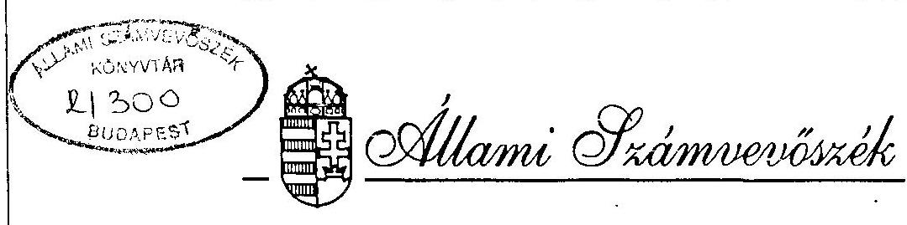

# JELENTÉS 

a helyi önkormányzatok adóztatási tevékenységének ellenőrzéséről

---

# JELENTÉS   a helyi önkormányzatok adóztatási tevékenységének ellenőrzéséről 

A települési önkormányzatok helyi közszolgáltatási feladatainak megoldásához szükséges források megteremtésének egyik eszköze a helyi adók rendszere.

Az önkormányzatok alkotmányos alapjoga, hogy az 1990. évi C. törvény keretei között megállapítsák a helyi adók fajtáit és mértékét.

A belföldi forgalmi engedéllyel és rendszámmal rendelkező gépjárművek, pótkocsik adóztatásával kapcsolatos feladatokat is az önkormányzati adóhatóságok látják el az 1991. évi LXXXII. tv. alapján.

A helyi adókból és a gépjárműadóból az önkormányzatokat megillető hányad az önkormányzatok költségvetésében az 1991. évi 2,4%-ról 1993. évben 4,9%-ra nőtt, ezt követően stagnált.

Az Állami Számvevőszékről szóló törvény alapján az ÁSZ feladata a helyi önkormányzatok adóztatási tevékenységének ellenőrzése.

A vizsgálat céljának megfelelően áttekintettük és értékeltük a helyi adók és a gépjárműadó bevezetésének, funkcionálásának tapasztalatait, az önkormányzatok pénzügyi szabályozásában betöltött szerepét, az adóztatás helyzetét. Ezen belül megvizsgáltuk, hogy:

- a helyi adókból származó bevételek hogyan érintették az önkormányzatok gazdálkodását, a felhasználás céljai mennyiben segítették elő a bevezetett helyi adók elfogadtatását,
- a helyi adópolitikában az önkormányzatok milyen szempontokat mérlegeltek, a helyi adórendszert milyen tendenciák jellemzik.
- a gépjárműadóval kapcsolatos feladatok és a befolyt gépjárműadó összhangja, a gépjárműadóból származó bevételek mennyiben teszik lehetővé az adóztatás funkcióinak betöltését,
- az önkormányzatok az adóztatási feladatok ellátásához hogyan teremtették meg a feltételeket, az adóztatás törvényessége, szakszerűsége biztosított-e,

---

- az adóztatást milyen hatékonysággal végezték (hátralékok alakulása, behajtási-végrehajtási tevékenység, adóellenőrzések eredményessége).

A vizsgálat keretében helyszíni ellenőrzést végeztünk a Fővárosi, 3 kerületi, valamint 15 megyében összesen 104 (13 megyei jogú városi, 27 városi, 64 községi-nagyközségi) önkormányzati adóhatóságnál. A vizsgált önkormányzatok közigazgatási területén az ország lakosságának közel 40%-a él, az általuk beszedett helyi adó 1994. évben 23,1 milliárd forint, az összes helyi adóbevétel 68%-a volt.

# KÖVETKEZTETÉSEK, JAVASLATOK 

A helyi adórendszer kialakításának célja az önkormányzatok önálló gazdálkodásának megalapozása, a gazdálkodás anyagi alapjainak erősítésével a központi költségvetéstől való függőségük csökkentése volt. A helyi adótörvény meghatározta a helyi döntési autonómiára épülő adórendszer keretfeltételeit.
A vizsgálat tapasztalataiból megállapítható, hogy az önkormányzatok több mint fele élt az adóztatás lehetőségével, azonban a helyi adók csak az önkormányzatok egy részénél jelentettek folyamatos, pótlólagos bevételt, az általuk ellátott feladatok forrásainak kiegészítésére.

Az önkormányzatok adóztatási képességében meglévő számottevő különbségek tovább növelték a meglévő területi feszültségeket, miközben a területi kiegyenlítődés eszközrendszere kialakulatlan és évente változó.

A helyi adóval kapcsolatos önkormányzati döntéseket többnyire a költségvetés rövid távú bevételi szükséglete motiválta, ezért esetenként háttérbe szorultak a vállalkozások feltételeinek javítására vonatkozó hosszabb távú érdekek.

Az ellentmondást leginkább az iparűzési adó élezte ki. Az összes beszedett helyi adó 82%-a a vállalkozásokat terhelő iparűzési adó, amely az infláció és adómérték emelése következtében dinamikusan nőtt.

A magánszemélyeket terhelő adókat és azok mértékét a törvény adta keretek alsó határához közel határozták meg. A vizsgált időszakban a helyi lakosokat terhelő adók alacsonyan megállapított mértéke általában nem változott.

A helyi adóbevételek növelésének korlátait elsősorban a lakosság teherviselő képessége jelentette. A keresetek reálértékének csökkenése, a növekvő megélhetési költségek, a magas munkanélküliség miatt az egyébként is hátrányos helyzetű térségekben a helyi adóztatás lehetőségei beszűkültek.

A helyi adórendszer, jogi és egyéb feltételeit illetően a bevezetést követő rövid időn belül olyan változásokon ment keresztül, mely a helyi adóbevételek nagyságát különbözőképpen befolyásolta. Így az egyes tevékenységeket preferáló kedvezmények körének bővítése az adóztatás lehetőségét csökkentette, ugyanakkor az iparűzési adó mértékének emelése ezzel ellentétes hatást váltott ki.

A helyi adótörvény módosításának eddigi gyakorlata az önkormányzatok költségvetését megalapozó számítások elvégzését és a rendeletalkotás nehézségét fokozta, összességében a jogalkalmazást és a jogbiztonságot sem erősítette.

A helyi adók miatti szakmai kihívásnak, és az adóztatás szempontjából alacsony hatékonyságú gépjárműadóztatással kapcsolatos adminisztratív feladatoknak az önkormányzati adóhatóságok eltérő színvonalon voltak képesek megfelelni.

Adóztatással kapcsolatos feladatokat a gépjárműadó következtében azok az önkormányzatok is ellátnak, ahol helyi adót nem vezettek be. A gépjárműadó lényegében központi adó, mivel az önkormányzatoknak 1996. január 1-ig semmilyen ráhatásuk nem volt annak mértékére. Az önkormányzatokat a bevételek 50%-a illette meg, viszont a költségek 100%-át viselték. Az adó beszedése indokolatlanul munkaigényes, néhány önkormányzatnál a bevétel a ráfordításokat sem fedezte.

1996-ig a Gépjárműadó törvény az adókötelezettség szempontjából a január 1-i állapotot vette figyelembe, de az adóalanyok személyében (fizetési kötelezettségében) bekövetkező évközi változások korrekcióját havi rendszerességgel érvényesítette. Ez a gyakorlat az adóalanyoknak nem biztosított számottevő fizetési könnyítést, az adóhatóságoknak viszont felesleges terhet és komoly költségtöbbletet jelentett - a gyakran éven belül is többszörös - tulajdonosváltás adminisztratív követése.

Az adózás rendjéről szóló törvény a pénzügyminiszter feladataként írja elő az adóhatóságoknál az adóztatás irányításának és felügyeletének, törvényességének és szakszerűségének ellenőrzését.
A Pénzügyminisztérium ellenőrző szerepe az önkormányzatok adóztatási tevékenységében csak közvetett módon érvényesül (TÁKISZ-ok szakmai munkájának befolyásolásán, az adók nyilvántartásával, kezelésével és elszámolásával kapcsolatos jogszabály kiadásán, az információs rendszer működtetésén keresztül).

A Pénzügyminisztérium az elmúlt években évente mintegy 100-150 szakmai iránymutatást, jogértelmezést adott ki. Az erre vonatkozó igényt az önkormányzati adóhatóságok szakmai felkészültségének hiányosságai mellett az is növelte, hogy az 51. paragrafusból álló helyi adótörvényhez már 35 pontos értelmező rendelkezés tartozik, melyek még máig sem egyértelműek a jogalkalmazásban.

A Belügyminisztérium felkérésére a másodfokú adóhatósági feladatokat ellátó Köztársasági Megbizotti Hivatalok tevékenységének felügyeleti ellenőrzése keretében a Pénzügyminisztérium illetékes főosztálya 1993-94. évben 5 KMB-nél vizsgálta a hatósági munkát. A rendelkezésre álló idő rövidsége miatt a vizsgálatok mélysége csak korlátozott lehetett, ezen keresztül átfogó képet sem nyerhettek az önkormányzatoknál folyó adóztatás helyzetéről.

---

Másodfokú adóhatósági feladatokat ellátó közigazgatási hivatalok (korábban Köztársasági Megbizottak Hivatala) kezdetben egyáltalán nem vállalkoztak az önkormányzati adóhatóságok tevékenységének ellenőrzésére. Néhány megyében 1994-1995-ben elvégzett vizsgálat komoly segítséget jelentett az önkormányzati adóhatóságok számára a törvényes, szakszerű adóztatásban (pl. Szabolcs-Szatmár-Bereg, Fejér, Pest megye).

A helyi adók nyilvántartási, feldolgozási rendszere elsősorban központi információs igényt elégített ki, melyből a helyi adóhatóságok számára kevés a hasznosítható elem és az informatika fejlesztése a tömegesen jelentkező manuális feladatokat sem tudta kiváltani.

A fizetőképesség csökkenése a lakosság és a vállalkozások körében is a hátralékok növekedéséhez vezetett. A helyi adók és a gépjárműadó beszedése az önkormányzatoknak nehézséget okozott. A behajtási, végrehajtási intézkedések törvényben biztosított eszközeivel nem vagy csak ritkán éltek.

Az adókötelezettség teljesítésének, ellenőrzéséről az önkormányzatok főként a személyi feltételek, a megfelelően képzett szakemberek hiányában nem gondoskodtak.

Az önkormányzatok az adóztatásban is "önellátásra" törekedtek és a szakszerűbb adóztatást biztosító társulás lehetőségével nem éltek.

Az Országgyűlés 1995. november 25-én módosította a helyi adókról és a gépjárműadókról szóló törvényt. A módosítás jelentős mértékben emelte az alkalmazható adómértéket, szűkítette a kötelező mentességek körét, és önkormányzati hatáskörbe utalta a gépjárműadó tételének megállapítását.

A helyi adók szerepének a növelése azonban továbbra is szükségessé teszi a központi és a helyi adók harmonizációját, az önkormányzati finanszírozási rendszer és a területi kiegyenlítés eszközrendszerének korszerűsítését.

Az ellenőrzések tapasztalatai alapján az önkormányzatoknak döntően az alábbi javaslatokat fogalmaztuk meg:

- A helyi adókról alkotott önkormányzati rendeleteket a törvénymódosítások miatt pontosítani szükséges.
- A képviselő-testületek az adóztatást - a jegyző meghatározott időszakonkénti beszámoltatása útján - ellenőrizzék.
- Az adóellenőrzések gyakoriságát határozzák meg a célszerűség és a költségkímélés figyelembevételével, illetve a feltételek megteremtésével.
- A felszámolás alatt álló gazdálkodó szervezetek felé fennálló követeléseket tartsák pontosan nyilván.

---

- Az érdekeltségi rendszer kialakításánál az ezt szolgáló rendeletalkotásnál előzetes hatásvizsgálatokat végezzenek, szüntessék meg a szabálytalan elszámolási gyakorlatot.

A Pénzügyminisztérium részére javasoljuk a helyi adók és a gépjárműadóztatás korszerűsítése keretében:

- A központi és a helyi adók összhangját javítani oly módon, hogy az önkormányzatok adóztatási mozgástere, a helyi adóknak a közfeladatok finanszírozásában betöltött szerepe növekedjen, az önkormányzati önállóság anyagi alapjának, a helyi adófizetők kontrolljának erősítése mellett.
- Az önkormányzatok finanszírozási rendszerének módosítását azáltal, hogy figyelembe veszi a területi kiegyenlítés szolgáló támogatási rendszerben az adókapacitás mérés módszerét is.
- A helyi adókat érintő törvénymódosítások várható hatásának felmérését, valamint olyan időpontban történő hatályba léptetését, amely az önkormányzati rendeletek meghozatalához megfelelő időt biztosít és nem érinti az önkormányzatok már jóváhagyott költségvetését.
- Az adóztatás irányításának és felügyeletének, az adóztatás törvényességének és szakszerűségének a másodfokon eljáró hatóságok jogalkalmazási gyakorlatának ellenőrzését és a felfüggesztett jogorvoslati eljárások lezárása érdekében megfelelő intézkedések megtételét.
- A helyi adótörvényben az adókötelezettségre, az adóalapra vonatkozó fogalommeghatározásokat a jogalkalmazás tapasztalatait is figyelembe véve pontosítani, ezáltal a jogalkalmazás feltételeit javítani.
- Az önkormányzati adók nyilvántartásával, kezelésével kapcsolatos pénzügyminisztériumi rendeletben célszerű előírni az ellenőrzési kötelezettség, a behajtási, végrehajtási intézkedések nyilvántartását, megvizsgálva az információrendszer működésének célszerűségét, hatékonyságát és egyes elemeinek az államháztartási információs rendszer keretében történő működtetését.
- Az adóztatási feladatok, az adóellenőrzések törvényes és szakszerű ellátása érdekében ösztönözni az önkormányzatok adóhatósági társulását.
- A gépjárműadóztatásban a költségkímélő, kevésbé bürokratikus megoldások alkalmazásának lehetőségét megvizsgálni, a párhuzamos nyilvántartási rendszerek megszüntetése és az adminisztrációs terhek csökkentése érdekében.
- A gépjárműadó jelenlegi rendszerében a hátralékok növekedése, az adókötelezettség elmulasztása miatt a Belügyminisztérium felé kezdeményezzék a szükséges jogszabály módosítását:
- a közúti gépjármű ellenőrzés során, illetve az időszakos műszaki felülvizsgálat alkalmával megkövetelhető legyen a gépjárműadó befizetését tanúsító bizonylat,

---

- a forgalmi engedély átírásának feltétele legyen a változásnak a lakóhely szerint illetékes adóhatóságnál történő egyidejű bejelentése. (Pl. a rendőrhatósághoz benyújtott adatlap megfelelő példányán).

# RÉSZLETES MEGÁLLAPÍTÁSOK 

### 1.1. Helyi adók bevezetésének főbb céljai és hatása

A központilag szabályozott, döntően törvényeknél alacsonyabb szintű jogszabályokon alapuló, tartalmában elavult tanácsi adórendszert, adó jellegű kötelezettségeket felváltó helyi adóztatás több társadalompolitikai és gazdaságpolitikai célkitűzés megvalósítását szolgálta:

- az önkormányzatok gazdasági önállóságának erősítése, központi költségvetéstől való függőségének csökkentése,
- a közszolgáltatásokat nyújtó önkormányzatok és a településeken élő adófizetők között valós kapcsolat teremtése, a lakosság, a vállalkozások áldozatkészségén alapuló helyi érdekeltség növelése,
- a keretjellegű szabályozás révén helyi adópolitika alakításának lehetővé tétele, mely a jövedelmi- vagyoni viszonyokhoz, a vállalt közfeladatokhoz igazodik,
- az adóztatásban a szektorsemlegesség biztosítása.

A helyi adókról szóló 1990. évi C. törvény (Htv) előkészítése során azzal számoltak, hogy az 1988. évi adóreform folytatásaként a központi adórendszer és a helyi adó harmonizációjának feltételei megteremtődnek: a központi adók súlyának csökkentésével párhuzamosan megvalósítható a helyi adók jelentőségének, az önkormányzati bevételek között súlyának és ezen keresztül az önkormányzatok gazdasági önállóságának növelése.

A Pénzügyminisztériumban a várható tendenciák előjelzésére makroszintű számításokat végeztek, s néhány önkormányzatnál modellezték a helyi adók bevezetésének hatását, összevetve a korábbi tanácsi adókkal.

Miután a helyi adóztatási autonómia magában foglalja, hogy az önkormányzatok a törvényben meghatározott adónem bevezetéséről maguk döntenek, a helyi adók várható összegének, hatásának előre becslése csak sok bizonytalansággal lehetséges.
A becsléseket arra alapozták, hogy a helyi adók bevezetése az állampolgárok és az
 adótárgyak széles körét érinti, az adómértéket átlagosan a törvényi maximum 50%-ában határozzák meg (kivéve a lakástulajdont, melynél 25%-ban), a törvényben foglalt kötelező mentességek, kedvezmények körét nem bővítik. A számítások alapján magánszemélyektől 23-24 milliárd forint, a vállalkozási szférától további 40 milliárd forint adóbevételt jeleztek, ami a tanácsi adókhoz képest a lakosság körében hatszoros, a gazdálkodó szerveknél 13-szoros adónövekedést jelentett volna.

---

Az előzetes számítások és a tényleges befizetések közötti különbség jelentős, amely főként abból adódik, hogy a modellszámításokat pontatlanul, sok hibával készítették el, esetenként azonos adótárgynál tiltott adótöbbszörözéssel is számoltak.

| Megnevezés | Előzetes   számítás | Zárási össz.   1992. |  | 1994 | elsz   1995. |
| :-- | --: | --: | --: | --: | --: |
| Építményadó | $32,3-33,0$ | 2,1 | 2,3 | 2,9 | 4,4 |
| Telekadó | 6,5 | 0,4 | 0,5 | 0,7 | 1,0 |
| Magánsz.komm.adója | 5,3 | 1,5 | 0,6 | 0,6 | 0,7 |
| Vállalk.komm.adója | 4,5 | 0,8 | 1,0 | 1,0 | 1,0 |
| Idegenforg.adó | $0,6-0,8$ | 0,7 | 1,0 | 1,0 | 1,0 |
| Iparüzési adó | 13,5 | 11,9 | 21,7 | 27,8 | 37,7 |
| Összesen: | $62,9-63,4$ | 16,4 | 27,1 | 33,8 | 45,8 |

Az előrejelzésben a helyi adók 21%-át (13,5 milliárd forintot) várták iparüzési adóból, a ténylegesen befolyt 1994-1995. évi 82,2%-kal szemben.

Összességében a 7 milliárd nagyságrendet képviselő tanácsi adó és egyéb adójellegű (pl. telekhasználati díj) bevételekkel szemben a 63 milliárd forint helyi adóbevétel prognosztizálása az adórendszer egészének (központi és helyi) harmonizációja, illetve a teherbíró képesség szempontjából sem volt reális. A helyi adók ilyen előrejelzése csak a központi adók csökkentése vagy jelentős gazdasági növekedés esetén teljesülhetett volna.

A gazdaság teljesítményének csökkenése, a költségvetésre nehezedő bevételi kényszer és a helyi adózás változó szabályai miatt sem valósult meg az adóharmonizáció.

A befizetett helyi adók a központi adókból nem voltak levonhatók, azonban a vállalkozások költségként elszámolhatták, így a társasági adóalapot szűkítette.

Veszteséges gazdálkodás esetén a fizetendő helyi adó a gazdasági teljesítményeket torzította, adófizető képesség hiányában a hátralékok növekedéséhez vezetett. A vállalkozások egy részénél az iparüzési adó hozzáadott érték típusú adóvá vált (korrigált nettó árbevétel utáni adófizetés), a termelő, szolgáltató tevékenységek esetében az átlagostól magasabb adóterhet jelentett.

Magánszemélyek 1994. év végéig a személyi jövedelemadóban összjövedelmet csökkentő kedvezményként vehették figyelembe a befizetett helyi adót. (Ez a sávos adóztatás miatt eltérő adókedvezményt biztosított.) 1995. évben a befizetett helyi adó 20%-a volt egységesen az igénybevehető adókedvezmény, 1996. évtől ez is megszűnt, miközben a lakosság fokozottabb helyi adóztatásával számolnak.

A helyi adóztatás joga az önkormányzatoknak csak egy részét juttatta olyan forráshoz, melyből helyi érdekeltségen alapuló, önként vállalt feladatokat finanszíroztak,

---

így a távlati célokkal ellentétben nem alakult ki a helyi adózás és az infrastruktúra fejlesztés közötti kapcsolat.
1994. december 31-i állapot szerint a városok 94%-a, a nagyközségek 69%-a, a községek 45%-a vezetett be helyi adót. A helyi adók 90,2%-a városokban, 5,0%-a nagyközségekben, míg a községekben csupán 4,8%-a realizálódott.

A helyi adókból várható bevételek nagyságát, az önkormányzatok bevételi szabályozásában elfoglalt szerepét, gazdálkodásukra gyakorolt hatását a modellszámítások nem voltak képesek megfelelően előre jelezni.

Az önkormányzatok információi alapján az államháztartási mérlegben már mérsékeltebb adóbevétellel számoltak, mint a Htv előkészítése során. Az önkormányzatok által elfogadott előirányzatok és a tényleges adóbevételek azonban ettől is rendre eltértek.

A helyi adót bevezető önkormányzatok száma, a befolyt helyi adó összege évről évre nőtt, azonban a kialakult helyi adórendszer a területi, allokációs feszültségeket tovább növelte, s nem csökkentette a központi költségvetés felé irányuló helyi igényeket.

A települések eltérő jövedelmi helyzetét figyelembe vevő támogatások (SZJA kiegészítés, önhibáján kívül hátrányos helyzetű önkormányzatok kiegészítő támogatása) növekedtek ugyan, de évről évre a költségvetés helyzetétől függő kiszámíthatatlanságuk és az elosztási módszereik kialakulatlansága a leginkább vitatott része az önkormányzati finanszírozásnak.

A települések egy jelentős részében az adóztatási képesség minimális és igen különböző az adókapacitás kihasználtsága. Ez utóbbi mérésének módszerei nem alakultak ki, így a területi különbségek mérésének, az esélyegyenlőség megteremtésének a kiinduló feltételei sem állnak rendelkezésre.
Néhány megyében a demográfiai, foglalkoztatottsági helyzet, a lakosság jövedelme, életkörülményei alapján hátrányos helyzetű települések aránya meghaladja az 50%-ot. (70%-ot meghaladó mértékű Szabolcs-Szatmár-Bereg, Baranya, Borsod-Abaúj-Zemplén megyében).

Az eltérő területi fejlettség, foglalkoztatási helyzet miatt igen különböző a személyi jövedelemadót fizetők aránya, jelentős az SZJA átlagának településenkénti szóródása is.

Az egy főre jutó SZJA alacsony összege miatt az önkormányzatok többsége kiegészítésben részesül (Szabolcs-Szatmár-Bereg megyében 99%-a, Borsod-Abaúj-Zemplén megyében 90%-a). Ennek összege 1995. évben 6,5 milliárd forint volt, amely az önkormányzatok összes bevételének az 1%-át sem érte el.
A vizsgált önkormányzatoknál az összes bevételen belül a helyi adó aránya 0-42,5% között szóródott, döntően az eltérő adóztatási képesség miatt.

---

Heves megyében Halmajugra községben az iparüzési adóbevétel meghaladta a 30 millió forintot, miután a közigazgatási területén jelentős gazdasági egységek működnek.
Hajdú-Bihar megyében a helyi adóbevétel aránya az összes bevételen belül Debrecen városban 1992-94. között 4%-ról 3,6%-ra csökkent, Tégláson 5%-ról 10%-ra nőtt, a többi vizsgált önkormányzatnál 0,3-0,9% között volt. Tégláson a helyi adó 90%-át egy helybeli üzem fizette be.
A helyi adót bevezető önkormányzatok jelentős részénél (Veszprém megyében 18%-nál, Borsod-Abaúj-Zemplén megyében 33%-nál) a helyi adó bevétel 1994. évben nem érte el éves szinten a 100 ezer forintot.

A helyi adó és a beszedett gépjárműadó önkormányzatokat megillető része településtípusonként eltérő mértékben befolyásolja az önkormányzatok pénzügyi pozícióját, s az adóbevételek nominális növekedése ellenére csökkenő az önkormányzati feladatok finanszírozásában betöltött szerepe. Ezt támasztja alá, hogy 1992. és 1994. évekre a beszámoló jelentések alapján az adóbevétel aránya az önkormányzatok folyó igazgatási kiadásaihoz viszonyítva az alábbiak szerint alakult:

| Megnevezés |  | 1992. év   Igazg. folyó   kiad.   M Ft | Adóbev.   aránya   % | Helyi és   gépjmű adó   M Ft | 1994. év   Igazg. folyó   kiad.   M Ft | Adóbev.   aránya   % |
| :-- | :--: | :--: | :--: | :--: | :--: | :--: |
| Főváros és ker. | 8070 | 6030 | 134 | 15733 | 14227 | 111 |
| Megyei j.városok | 4053 | 3826 | 106 | 7523 | 7628 | 99 |
| Egyéb városok | 4332 | 6516 | 66 | 8684 | 12777 | 68 |
| Nagyközségek | 1219 | 3531 | 35 | 1952 | 6611 | 30 |
| Községek | 1488 | 8050 | 18 | 2137 | 14293 | 15 |
| Összesen: | 19163 | 27953 | 69 | 36029 | 55536 | 65 |

Csak a fővárosban és a megyeszékhely, megyei jogú városokban haladta meg a beszedett adó az igazgatási költségeket (bár az arányok romlottak), az elaprózott községi közigazgatásban csak 15%-ban fedezték 1994. évben. (Ez más megközelítésben az adóztatás alacsony hatékonyságát jelzi).

A lakosság jövedelmi-vagyoni viszonyaihoz, közteherviselő képességéhez igazodó helyi adók nyilvánvalóvá teszik az adófizetés és a vállalt közfeladatok közötti összefüggést és a közpénzek felhasználásában az adófizetők kontrollját. Ennek feltétele, hogy a helyi adók bevezetésének célját meghatározzák, ezzel az adófizetők többsége azonosuljon, valamint a beszedett helyi adókról és azok felhasználásáról tájékoztatást kapjon.

A Htv nem teszi kötelezővé felhasználási célok meghatározását, csak arra kötelezi az önkormányzatokat, hogy a költségvetési beszámoló részeként a beszedett adó összegéről évenként tájékoztassák a település lakosságát.

A Htv egyedül a kommunális jellegű adók bevezetésének célját jelölte meg az infrastruktúra fejlesztésében, valamint környezetvédelmi feladatok ellátásában, de a törvény módosí-

---

tása során 1993. évtől a kommunális jellegű adók bevezetésének céljára vonatkozó meghatározást hatályon kívül helyezték.

Az önkormányzatok a helyi adók bevezetésének célját általában a költségvetés bevételi szükségleteivel indokolták, így konkrét célok hiányában az adóbevételek felhasználási területe sem állapítható meg.

Néhány esetben már tapasztalható kezdeményezés az adózók elképzelésének figyelembevételére.

Székesfehérvár város közgyűlése az iparüzési adó 1995. évi bevezetésekor lehetőséget biztosított az 1 millió forint feletti adót fizető adózóknak az adó 20%-ának felhasználásában közérdekű célok megjelölésére (városüzemeltető, felújítási munkák, kommunális beruházások, közbiztonsági, szakképzési feladatokra).

# 1.2. A helyi adók bevezetése, az önkormányzatok rendelet alkotása 

Az 1990. december 30-án kihirdetett 1990. évi C. törvény 1991. január 1-től hatalmazta fel a települési önkormányzatokat a helyi adóztatási jog gyakorlásával. 1991. lényegében az átmenet éve volt, mivel még éltek a folyamatosságot jelentő tanácsi adók, adójellegű fizetési kötelezettségek, és az önkormányzatok felkészülhettek a helyi adók bevezetésére. Az országban 1991-ben 308 önkormányzat (10%) vezetett be helyi adót, a hatályban maradt befizetési kötelezettségekből 5,5 milliárd forint, helyi adókból 4 milliárd forint folyt be.

Tapasztalatunk szerint 1991. évi bevezetést azok az önkormányzatok kezdeményezték, amelyek az SZJA részesedés 50%-os csökkentése miatt a pótlólagos forrás lehetőségét látták a helyi adóztatásban. Jellemzően - főleg a megyei jogú városokban, s a nagyobb városokban - az iparüzési adót, a vállalkozók kommunális adóját, és az idegenforgalmi adót vezették be. A fokozatosság jegyében a vagyoni típusú, továbbá a magánszemélyek kommunális adójának a bevezetéséről a későbbiekben - a tanácsi adók megszünése után - döntöttek.

A fővárosi közgyűlés a főváros területén bevezethető helyi adókról a Htv alapján már 1991. februárjában rendeletet alkotott. (A Htv szerint a főváros jogosult rendelkezni arról, hogy a kerületi önkormányzatok mely adókat vezethetik be.) A közgyűlés rendelete szerint az iparüzési adó fővárosi szinten, míg az építmény, telekadó, magánszemélyek kommunális adója, az idegenforgalmi adó a kerületek által vezethető be.
Az iparüzési adó bevezetését elsősorban az sürgette, hogy az SZJA részesedés 50%-os csökkenését a normatív állami hozzájárulás növekedése nem ellensúlyozta, ezért 6,2 milliárd forint forráshiánnyal számoltak.
Az adóztatásra azonban a jogszabályi háttér hiányában (fővárosi törvény júniusi kihirdetése) csak 1991. szeptember 5-től kerülhetett sor, így az 1991. évi adóelőleg befizetés - az adóalanyok nem teljes körű bejelentkezése, és a tört évi adókötelezettség miatt - csak 1,1 milliárd forint (a forrásmegosztás szerint ebből 48,1% a kerületeket illette), viszont az 1992. évben befolyt iparüzési adó már 7 milliárd forint volt.

---

A kerületi önkormányzatok közül 1991. évben 11, 1994. évben már 17 vezetett be valamilyen helyi adót.

A rendelkezésre álló országos adatok szerint helyi adót 1992. áprilisában az önkormányzatok 40%-a, 1993. márciusában 48,5%-a, 1995. január 1-jén 52,1%-a vezetett be. A megyénkénti szóródásra jellemző, hogy
 1995. évben az arány a gazdaságilag fejlettebb régiókban (Pest, Fejér, Komárom) 70% feletti, a válsággal küzdő, jellemzően aprófalvas térségekben (Baranya, Vas, Borsod, Szabolcs) csak 40% körüli.
Az önkormányzatok többsége 1992-1993-ban hozta meg döntését, 1994. évben a kör számottevően nem bővült.

Az 1994-es választásokat követően számos – eddig helyi adót nem alkalmazó – önkormányzat is a bevezetés mellett döntött, a ciklus első évében az új képviselő-testületek bátrabban éltek a lehetőséggel. A helyi adóbevételről azok az önkormányzatok sem tudtak lemondani, ahol ennek volumene, aránya csekély, tekintve, hogy ez forráshiány mérséklését és nem plusz feladat megoldását szolgálta.

Több önkormányzat 1995. évben a helyi adót csak formálisan vezette be, mivel a tárgyévi költségvetési törvény az önhibáján kívül hátrányos helyzetű önkormányzatok kiegészítő támogatása igénylésének feltételéül szabta a helyi adó bevezetéséről történő döntést.

Hajdú-Bihar megyében 1995. évben 20 önkormányzat vezetett be helyi adót, melyek közül 17 adott be pályázatot kiegészítő támogatás elnyerésére.

A kiegészítő támogatás az elérhető adóbevétellel szemben lényegesen jelentősebb hatást gyakorolt az érintett önkormányzatok költségvetésére.

Boeskaikert helyi adóból 1994. évben 242 ezer forint bevételt ért el. A kimutatott forráshiányára tekintettel 1994. évben 4305 ezer forint, 1995. évben 3000 ezer forint kiegészítő támogatásban részesült.

Az önkormányzatoknak a helyi adó bevezetését előkészítő munka szakaszában, majd a működtetés tapasztalatai alapján, számos szempontot kellett mérlegelniük.
1990. évet követően kezdődött meg számos településen a lakosságot közvetlenül érintő infrastrukturális fejlesztés (gáz-, víz-, szennyvíz-, telefonhálózat, kábel-televízió stb.). A központi támogatásokon túl, a lakosság önkéntes áldozatvállalása nélkül ezek a fejlesztések nem valósulhattak volna meg.

Az önkormányzatok egy része mérlegelve a lakosság széles rétegét érintő terheket, azokat a helyi adókat, amelyek a magánszemélyeket terhelik, nem vezették be vagy elhalasztották annak bevezetését.

A helyi adókkal kapcsolatos önkormányzati döntések lokális jellege ellenére jellemző, hogy az iparilag fejlettebb településeken a vállalkozások adóztatását helyezték előtérbe, idegenforgalom szempontjából frekventált területeken elsősorban a nem helyi lakosokat terhelő adókat vezették be, illetve ahol a helyi lakosság volt elsősorban fizetésre kötelezhető, ott az adó mértékét alacsonyan állapították meg.

A helyi adó bevezetése elutasításának okai általában: a vállalkozások csekély száma, a lakosság alacsony jövedelme, a munkanélküliek magas száma, a kommunális beruházások (víz, csatorna, gáz, telefon) adókedvezménye.

Dabas város képviselő-testülete 1991. évben tárgyalta az ügyrendi bizottság előterjesztését a helyi adókról. E szerint a lakosság széles rétegei tovább már nem terhelhetők helyi adókkal, valamint a takarékosabb életvitel miatt vagyontárgyaikat nem célszerű adóztatni (pl. nagy ház, telek). A bizottság az iparűzési adót javasolta bevezetni, mert annak meghatározó hányadát nagyobb vállalatok, társas vállalkozások fizetnék, a magánvállalkozókat csak szerényebb mértékben érintené. A testület többségi véleménnyel a helyi adó bevezetése ellen foglalt állást.

A testületek a helyi adók bevezetését, az adónemek bővítését általában több fordulóban tárgyalták, esetenként bevonva az érdekképviseleti szerveket, bizottságokat. (A gazdasági kamarákról szóló 1994. évi XVI. törvény a gazdasági előterjesztésnek a képviselőtestülethez való benyújtása előtt a helyi önkormányzat területén működő gazdasági érdekképviseleti szervek véleményének megkérését 1994. márciusától teszi kötelezővé.)

Pécsett 1991. évben a helyi adó rendelettervezeteket megismerték és véleményezték a vállalkozók érdekképviseleti szervei is, akik a város gazdasági helyzetéből eredően 2 millió forint nettó árbevétel felett 0,1% iparűzési adó bevezetését tartották elfogadhatónak. A közgyűlés döntése ettől eltérően 20 millió nettó árbevétel felett 3 ezrelék adómértékkel állapított meg adókötelezettséget.

Az önkormányzatok azt adótárgyakról, az adóalanyok lehetséges köréről az előkészítő munka során általában kevés vagy hiányos információkkal rendelkeztek. Nagyobb városok az APEH-tól kértek adatokat, melyek viszont a helyi adóztatásnál fontos telephelyi részletezést nem tartalmazták. A vagyoni típusú adóknak (építmény, házadó, telekadó) a vállalkozások korábban nem voltak alanyai, így ezek kivetési összesítői, az ezekhez kapcsolódó nyilvántartások nem biztosították a teljes információs igény kielégítését.

Eger városban az iparűzési adó bevezetésének előkészítése során az APEH-tól szerezték be az adózók listáját, mely segítette az adóalanyi kör kialakítását, de mind az adózók számában, mind az elért árbevételben fellelhetők voltak pontatlanságok.

Jogalkotási tapasztalatok, megfelelő információk és adójogi ismeretek hiányában nem minden esetben mérték fel az előkészítés során, hogy az adó bevezetése az adóalanyok számára milyen terhet jelent, illetve az adóalanyok, adótárgyak köre, az adóztatás várható költségei milyen mértékűek.
Ezért az adóztatás tapasztalatai alapján utólag módosították az adórendeletet, vagy a helyi rendeletben foglalt adóztatási jog üresedett ki.

Nyíregyháza városban 1993. január 1-től az 1991. évben bevezetett idegenforgalmi adót, 1995. január 1-től az 1993. évben bevezetett telekadót szüntette meg a közgyűlés, mert számottevő bevételt nem eredményezett.
Kálóz községben a növekvő munkanélküliség és a községben 1992. év óta tartó kommunális beruházás kezdettől megalapozatlanná tette az önkormányzat 95%-ban lakosságra alapuló adópolitikáját. Ezért a képviselő-testület 1995. január 1-től felfüggesztette a helyi adóztatást.

A helyi adórendeletek módosításáról a helyszíni vizsgálatok eltérő tapasztalatokat szereztek. Módosításra valamely adónem megszüntetése, a Htv módosulása, adómérték, adómentességek, kedvezmények körének, mértékének változása és a törvényességi ellenőrzések (Köztársasági Megbízottak és Ügyészség) észrevételei miatt került sor.

A lakosságot terhelő adónemeknél az önkormányzatok többsége az adómértéket nem vagy kis mértékben emelte, az adómérték emelésével elsősorban a vállalkozásokat terhelő adóknál éltek. Az infláció következtében így a lakosságtól származó bevétel veszített reálértékéből. A vizsgált önkormányzatoknál a lakosságtól származó helyi adóbevétel aránya a helyi adón belül 5%-ról 1,3%-ra csökkent 1992-1994. között.

Az önkormányzatok rendeleteikben azok időbeli hatályát általában nem határozták meg. Előfordult, hogy az időbeli hatályt korlátozták, melynek módosításáról a testület nem rendelkezett, de az adóztatás szokásjog alapján, így törvénysértő módon folyt tovább.

Anarcs községben a helyi adórendelet időbeli hatályát 1992-94. évekre vonatkozóan állapították meg, melyet a testület nem módosított, 1995. évben a korábbi gyakorlatnak megfelelően folyt az adóztatás.
Bakonysárkány községben ugyanakkor a testület által hozott helyi adórendelet alapján az adóztatás érdekében nem intézkedtek. A testület 1993. év végén rendeletet alkotott a lakossági kommunális adó 1994. január 1-i bevezetéséről. Adóztatásra azonban csak 1995. január 1-től került sor, a testület a rendelet végrehajtását nem kérte számon.

Az önkormányzatokat több esetben nehéz helyzetbe hozta, hogy a helyi adótörvény módosítására az év utolsó napjaiban került sor. A Htv-t módosító 1992. évi LXXVI. törvényt 1992. december 20-án hirdették ki, előírásai – köztük az iparűzési adó alapját és az adó mértékét érintő módosítás – 1993. január 1-től léptek hatályba. Az idő rövidsége miatt az önkormányzatok nagy részének nem volt lehetősége a helyi rendeletek módosítására.

Debrecen város az adómértéket csak 1994. január 1-től tudta a korábbi 2 ezrelékről 5 ezrelékre felemelni.
Téglás városban törvénysértő módon 1993. február 1-jével hatályon kívül helyezték a korábbi iparűzési adórendeletet, és az új adómértéket tartalmazó rendeletet léptették hatályba.
Miskolc város közgyűlése 1993. február 18-i ülésén szintén hatályon kívül helyezte korábbi iparűzési adórendeletét, s új rendeletet alkotott, melyben az adómértéket 8 ezrelékben állapította meg. A Köztársasági Megbízott törvényességi észrevételét az adóteher év közbeni súlyosbítása miatt nem fogadta el a közgyűlés, ezért 1993. októberében a KMB kérte az önkormányzati rendelet felülvizsgálatát az Alkotmánybíróságtól, amely nem döntött az ügyben. Az adóalanyok egy része az új adómérték ellen jogorvoslati kérelemmel élt, a másodfokon eljáró KMB az alkotmánybírósági döntésig felfüggesztette az eljárást (az így érintett adó közel 37 millió forint). Az adóalap számításánál az 1993. január 1-től érvényesülő korrekció (eladott áruk beszerzési értéke és alvállalkozói teljesítmény) nettó árbevétel 44%-át tette ki, így az adómérték emelése nélkül jelentős adókieséssel kellett volna a költségvetésben számolni.

Egyes önkormányzatok már a törvénytervezet ismeretében módosították rendeleteiket, vagy az év utolsó napjaiban vezették át az adómérték változását.

Veszprém megyei jogú városban 1992. december 18-i közgyűlés módosította az iparűzési adómértéket 8 ezrelékre (a Htv-t december 20-án hirdették ki), a kedvezményekre, mentességekre vonatkozó rendeletrészt hatályon kívül helyezték azzal, hogy a következő testületi ülésen szabályozzák.

A Htv 1995. július 1-i módosítása a pénzintézetek, biztosító intézetek, és a közszolgáltató szervezetek adófizetési kötelezettségét jelentős mértékben csökkentette.

Veszprém városban az érintett adózók nyilatkozata alapján a pénzintézeteknél 62,4%-kal, biztosító intézeteknél 66,8%-kal, közszolgáltató szervezeteknél 46,6%-kal csökken az iparűzési adó 1995. évben, ami 40 millió forint adókiesést okoz.

A Htv módosításának elmúlt években követett gyakorlata a bevételek tervezése és biztonsága mellett a rendelet módosítások előkészítése szempontjából is kedvezőtlen volt az önkormányzatok számára. Az Államháztartási törvény szerint a polgármester a költségvetési rendelettervezettel együtt terjeszti elő azokat a rendelettervezeteket, amelyek a javasolt előirányzatokat megalapozzák, ez azonban megvalósíthatatlan az adóteher évközi súlyosbításának tilalma miatt és abból eredően, hogy az önkormányzatok csak az év első hónapjaiban készítik el költségvetésüket.

Eltérő gyakorlat alakult ki a kötelező mentességek helyi rendeletben történő átvételét illetően. Egyes önkormányzatok a Htv szövegét átvéve sorolják fel a kötelező mentességeket, ezért a törvény változását követő szövegpontosítások elmaradása miatt esetenként a helyi rendelet törvénysértővé vált. A törvényességi ellenőrzést végző Közigazgatási Hivatal (korábban Köztársasági Megbízott) a rendeletek törvényességét csak meghozatalukkor vizsgálta, így a rendelet módosítás elmulasztása miatti törvénysértéseket több esetben ügyészségi vizsgálatok, valamint az ÁSZ ellenőrzése tárta fel.

Az önkormányzatok egy része arra az álláspontra helyezkedett, hogy nem bővíti a törvényben foglalt mentességeket, kedvezményeket. Kellő indok esetén méltányossági jogkörben mérsékelhető az adó. Az önkormányzati rendeletek azonban az adóhatóságot (jegyzőt) vagy nem hatalmazták fel az adótartozás mérséklésére, elengedésére, vagy a feltételeket nem szabályozták.

A fővárosi közgyűlés a helyi iparűzési adórendeletében felhatalmazta az adóhatóságot, hogy a lakosság ellátása szempontjából kiemelten fontos tevékenység iparűzési adóját – a kerületi önkormányzatok javaslatára – 50%-kal mérsékelje. A zuglói képviselő-testület 1993 augusztusában néhány szolgáltatás-csoportot kiemelkedően fontosnak ítélt a kerület lakossági ellátása szempontjából, ezért kérte a fővárosi adóhatóságot, hogy e tevékenységekre 50%-kal mérsékelje az adót. Az adóhatóság álláspontja szerint csak egyedi esetekben adható kedvezmény, s az is csak a kerületet illető megosztott adó terhére. Ezt az Ipartestületek Budapesti Szövetsége kifogásolta, mivel a rendelet nem rögzíti a kedvezményadás feltételeit. Amennyiben a kerület csak a saját adórésze rovására javasolhatja a kedvezményt, nincs szükség a fővárosi adóhatóság döntésére.

A képviselő-testületek adóztatással kapcsolatos feladata, hogy a jegyző beszámoltatása útján ellenőrizzék az adóztatást. Ennek gyakoriságát, a beszámolás módját, tartalmát sem a Htv, sem az önkormányzati SZMSZ-ek nem szabályozzák, e hatáskör gyakorlásának módja nem kapott különösebb figyelmet. Esetenként a polgármesteri hivatal munkájáról évente rutinszerűen készített beszámoló érintette az adóztatással foglalkozó szervezeti egység munkáját.

# 1.3. A helyi adók rendszere 

A helyi adópolitika kialakítása keretében 1991. évtől három típusú adó (vagyoni, kommunális, iparűzési), ezen belül hat féle adónem (építményadó, telekadó, lakossági- és vállalkozói kommunális adó, idegenforgalmi adó és helyi iparűzési adó) bevezetésével élhettek az önkormányzatok.

### 1.3.1. Vagyoni típusú adók

Vagyoni típusú adókat (építményadó és telekadó) a helyi
 adót bevezető önkormányzatok mintegy egyharmada alkalmaz.
Építmény adón belül az 1995. évi kivetési összesítő szerint 14% volt a lakás és üdülő után megállapított adó, az adó jelentős hányada a vállalkozások üzemi célú építményeit terhelte.

A lakások adóztatását egyfelől a Htv kötelező mentességi szabályai korlátozzák, másfelől az építményadót lakásokra is kiterjesztő önkormányzatok a helyi lakosságot számos módon kedvezményezték, vagy teljes adómentességet biztosítottak az állandó lakosoknak.

A tömeges, telepszerű lakásépítés megszűnését követően a lakásvagyon elsősorban látványos, nagy alapterületű, nagy értékű ingatlanokkal gyarapodott, ezek adóztatását sem szorgalmazták az önkormányzatok. (Pl. a fővárosban mindössze 3 kerületében vezették be építményadót lakás után - XIV, XVI. és XXII. kerület - a nagyobb értékű lakásvagyonnal rendelkező budai kerületekben nem.)

---

Tapasztalataink szerint nem megoldott az ingatlanok értékalapú, hatékony és igazságos adóztatása, tisztázásra várnak a központi és a helyi adók nemzeti adórendszerbeli helyével, az önkormányzati finanszírozásban betöltött szerepével kapcsolatos elméleti és gyakorlati kérdések.

A Htv a vagyoni típusú adóknál választási lehetőséget biztosít az adó megállapítására az ún. korrigált forgalmi érték vagy alapterület alapján.

Forgalmi érték utáni adóztatással az önkormányzatok csak elvétve éltek, mivel annak előnyei nem álltak arányban az alkalmazáshoz szükséges előkészítő munkával. Az ingatlan értékeléshez értő szakemberek igénybevétele, valamint az értékbecsléssel kapcsolatos jogviták az adóztatás költségeit jelentős mértékben növelték volna.

Nyíregyházán az 1993. január 1-től bevezetett vagyoni típusú adóknál az adót a korrigált forgalmi érték 1%-ában határozták meg. Nincs megnyugtatóan szabályozva az infláció okozta értékváltozás elismerése, alkalmazása. 1994. januárjában az adóhatóság kérte az adózókat, hogy a bevallásban a forgalmi értéket 10%-kal növelten szerepeltessék. Tekintve, hogy az adóhatóság tájékoztatása az adómegállapítást jogilag nem alapozza meg, az adóalanyok teljeskörűen nem is tettek eleget a felhívásnak. A forgalmi érték alapján történő adóztatást elősegítette, hogy az adókötelezettség a lakosságra és az 1 millió forint forgalmi érték alatti ingatlanokra nem terjed ki.

Az adókötelezettséget a lakás és egyéb épületek után eltérő adómértékkel állapították meg az önkormányzatok. Az 1995. évi kivetési összesítő alapján:

- Lakás és üdülő esetében az átlagos adómérték 137 Ft/m², azaz a Htv szerinti adómaximum 45%-a.

Komárom-Esztergom megyében a lakások után megállapított adómérték 30-100 Ft/m² között van. 100 forintos adómértéket megállapító Dömös az állandó lakosoknak 70%-os kedvezményt biztosított. Tatabányán 1992-ben a lakások után az adómértéket 30 Ft/m²-ben állapították meg, amely azóta nem változott.

- Műhely, üzlethelyiség, raktár, garázs képezi az adóalap jelentős hányadát, az átlagos adómérték az adó maximumhoz viszonyítva átlagosan csupán 33%.

A nem lakás céljára szolgáló épületek adómértékének megállapításánál erőteljesebb differenciálás tapasztalható az alapterület, az ingatlan jellege, illetve a tulajdonos szerint.

Az adómérték emelésének az adózók adófizetési képessége is korlátokat szabott, amennyiben ezt nem vették figyelembe, csak a hátralékok növekedtek.

Salgótarjánban az építményadó mértékét 1994. évben 300 forintra, a törvényi maximumra emelték. Az így keletkező adófizetési kötelezettségnek a nehéz gazdasági, pénzügyi helyzetben lévő vállalkozások annak ellenére sem tettek eleget, hogy

---

méltányossági jogkörben az adóhatóság a hátralék 30%-át több adóalanynál elengedte.
Miskolc városban az 5 ezer m² összevont hasznos alapterület feletti egyéb adóköteles építmény után 50%-os kedvezményt biztosítottak (80 Ft/m² adómérték mellett). A válságban lévő nagyüzemek azonban ezt sem voltak képesek megfizetni. A felszámolás alatt lévő két diósgyőri nagyüzem 1995. évi nyitó hátraléka építményadóból 35 millió forint volt.

Az épületrész (épületen belül lévő üzlet, garázs stb.) adókötelezettségét csak a Htv 1993 januárjától hatályba lépő szövegpontosítása tette lehetővé. Ennek eredményeként építményadóban az adóalanyok száma jelentősen megnőtt.

Miskolc városban a törvény és a helyi rendelet módosítása eredményeként a lakóépületen belül lévő nem lakás céljára szolgáló épületrészek utáni adókötelezettség 3 ezer adóalanyt érintett, az előírt adó 2,5 millió forint volt.

Ugyanakkor a Htv módosítása miatt a döntően mezőgazdasági jellegű településeken az állattartást szolgáló és a növénytermesztéshez kapcsolódó tárolóépületek, továbbá a közszolgáltató szervezetek építményadó mentessége 1993-tól szűkítette az adóztatás lehetőségét.

Mocsa községben az adórendelet a mezőgazdasági rendeltetésű ingatlanok esetében 100 m²-ig adómentességet biztosított 1992. évben 1126 m²-t adóztattak. A Htv adókedvezményt bővítő módosítása miatt 1993. évben az adózott építmények alapterülete 150 m²-re csökkent.

A mezőgazdasági rendeltetésű építmények kötelező építményadó mentessége nem volt összhangban a helyi adók bevezetésekor megfogalmazott céllal, mely szerint a központi és a helyi adók közötti harmonizációt az is szolgálja, hogy a törvény azokon a területeken teremt az önkormányzatok számára forráslehetőségeket, melyeket a központi adók direkt módon nem kezelnek. (Pl. a helyi adók tárgyát képezhetik az SZJA-ban mentességet élvező mezőgazdasági kistermelés jövedelméből megszerezhető ingatlanok.)

A telekadót alkalmazó önkormányzatok 20%-os aránya mellett a helyi adókon belüli aránya csupán 2% volt 1994. évben. A korábbi telekhasználati és telekigénybevételi díjhoz képest (2,9 milliárd forint) a telekadó bevétel 1995. évben is csak 1 milliárd forint volt.

A Htv a telekadóban mentességet biztosít az építmény rendeltetésszerű használatához szükséges földrészletre, melynek megállapítása rendezési tervek hiányában, a különböző gazdasági tevékenységet végzők esetében bonyolult.

Megfelelő adójogi ismeretek hiányában törvénysértő módon is állapítottak meg telekadót.
Tiszagyenda község helyi adórendeletében a belterületi földrészlet után 800 m²-ig 1 Ft/m² adómértéket alkalmazva telekadót állapított meg, és az e feletti részt minősítették adómentesnek.

---

# 1.3.2. Kommunális típusú adók 

Kommunális típusú adók keretében háromféle adó alkalmazható olyan adótárgyakra, amelyek egyrészt csak erre az adónemre jellemzőek (magánszemélyek kommunális adójában a lakásbérleti jogviszony, vállalkozói kommunális adóban az átlagos statisztikai létszám, idegenforgalmi adóban a nem állandó lakosként történő tartózkodás), másrészt a vagyoni típusú adók körében már különböző adókkal terhelhetők (pl. lakás, telek, üdülő tulajdon). Ez utóbbiak esetében tilos az adó többszörözése, csak egyféle adó alkalmazható rájuk.

Az adótárgyak és az adónemek ilyen változatossága a kommunális jellegű adók alkalmazásában széles mozgásteret biztosított a helyi önkormányzatok számára, ezért ezt a típusú adót alkalmazták a leggyakrabban. Azonban az ebből származó bevétel a helyi adók között különböző okok miatt nem volt jelentős:

- A kötelező mentességek a magánszemélyek kommunális adója tekintetében a kommunális fejlesztéseket megvalósító településeken az adóztatási jogot kiüresítették.
- Az adómérték megállapítása során az önkormányzatok a helyi lakosokkal való konfliktus elkerülése érdekében mértéktartóak voltak, a vizsgált években az adómérték átlagos kihasználtsága szinte változatlanul 50-60% körüli volt.
- A vállalkozások kommunális adójának széles körű alkalmazása az iparűzési adóval (többségében az adómérték felső határán) már adóztatott vállalkozások esetében túladóztatáshoz vezetett volna (bár az adótárgyak különbözősége miatt itt nem beszélhetünk adótöbbszörözésről), továbbá a munkanélküliség kialakulása is az adó alkalmazása ellen szólt.
- Idegenforgalmi adót csak egyes térségekben célszerű alkalmazni, az üdülőtulajdonosok adóztatása sok esetben építményadóval történt. Az adómértéknek az üdülő forgalmi értékétől független, az alapterület alapján az adómérték felső határához közelítő megállapítása az arányos és igazságos közteherviselés elvét sértette.
- A tartózkodás után fizetendő idegenforgalmi adó az idegenforgalom visszaesése következtében a megszűnt üdültetési támogatások miatt egyébként is sújtott lakosság belföldi üdültetését terhelte.

A magánszemélyek kommunális adóját bevezető önkormányzatok aránya 1994. évben 51,2%-os, ugyanakkor az ebből származó bevétel csupán 1,7%-a a helyi adóknak.
Az alapadó az 1995. évi kivetési összesítő szerint 647,5 millió forint, a kedvezmények miatti csökkentés (nagyobb részt a kommunális beruházások miatti kedvezmény) 220 millió forint. Az átlagos adómérték adótárgyanként (építmény, telek) 1230 forint, az adómaximum 41%-a, a kedvezmények átlagos mértéke adótárgyanként 340 forint (28%).

---

A bevezetést követően leggyakrabban megszüntetett helyi adó is a magánszemélyek kommunális adója volt. Ennek oka:

- a lakosság adófizetési képességének, készségének romlása miatt az alacsony adóbevétellel szemben magas adóztatási költség áll,
- a kötelező mentességek miatt az adó elvesztette funkcióját.

A Htv 1993. január 1-től a magánszemélyek által kommunális beruházásokra fordított befizetések helyi adóba történő beszámítási lehetőségét 5 évre (az 1991 és 1992. évi befizetésekre is) olyan időszakban terjesztette ki, amikor a településeken a víz, csatorna, gáz és telefonhálózat fejlesztésében a lakossági pénzeszközök szerepe megnőtt. Ezzel a helyi adóztatás mozgástere jelentősen lecsökkent. Adófizetésre azok voltak kötelezhetők, akik a közműfejlesztési hozzájárulást sem tudták megfizetni, ugyanakkor az állami pénzeszközökből is támogatott fejlesztések az adótárgyak (ingatlanok) értékét növelték.

Heves megyében 16 önkormányzat helyezte hatályon kívül a magánszemélyek kommunális adójáról szóló rendeletét kommunális beruházások indítása miatt.

A Htv hatálybalépését követően a korábbi házadó mentességek alapján valamennyi helyi adóban adómentesség illette meg a magánszemélyeket (a Htv módosítása során ezt az építményadó mentességre szűkítették). Több önkormányzat a kommunális adó bevezetésekor a korábbi házadó mentességeket figyelmen kívül hagyta (Dombóvár, Bátaszék városok), melyet a másodfokú intézkedésre töröltek.

Szabálytalanságokat állapítottunk meg helyenként a közműfejlesztés támogatásáról szóló kormányrendeletnek a helyi adóztatás szempontjából történő alkalmazása során. Jogszerűtlenül választás elé állították az állampolgárokat: a 15%-os mértékű közműtámogatást veszik igénybe, vagy a helyi adómentességet. A Htv a kötelező mentességek körében a közműfejlesztésre befizetett - támogatással csökkentett - hozzájárulás levonhatóságát biztosítja a magánszemélyek számára.

Vaja nagyközségben a közműfejlesztésre befizetett 15% visszaigénylése vagy a helyi adókedvezmény igénybevétele közötti választás elé állították az állampolgárokat.

Vállalkozói kommunális adót a helyi adót alkalmazó önkormányzatok 37%-a vezetett be, a befolyt adó 2,9%-a származik ebből az adónemből. Az alkalmazott adómérték az 1994. évi bevallások összesítője alapján az éves átlagos statisztikai létszámra vetítve 1376 forint (69% az adómaximumhoz képest).

A foglalkoztatottsági helyzet romlása miatt az önkormányzatok széles körben biztosítottak kedvezményeket, vagy nem is alkalmazták ezt az adónemet. (Az önkormányzatok által biztosított kedvezmények a számított adó 7%-át teszik ki).

A kommunális adót több esetben az iparűzési adóval együtt alkalmazták, amely a vállalkozások adóviselési képességével nem minden esetben volt összhangban.

---

Salgótarjánban a helyi üzemek többsége nehézségekkel küzdött, a regisztrált munkanélküliek aránya az országos átlagot meghaladó. Ennek ellenére a költségvetés bevételi kényszere miatt, a forráshiány csökkentése érdekében bevezették az iparűzési adó mellett a vállalkozások kommunális adóját is, amely az alkalmazott adónemek közül a legkisebb volumenű bevételt eredményezte.

Idegenforgalmi adót egyrészt a nem állandó lakosként történő tartózkodás, másrészt az üdülésre, pihenésre alkalmas épület után is megállapítottak egyes önkormányzatok, elsősorban az idegenforgalmi szempontból jelentős térségekben.

Az üdülőépületek alapján megállapított idegenforgalmi adó vagyoni típusú adónak tekinthető. (Jelenleg vegyesen adóztatják az önkormányzatok az üdülőépületeket idegenforgalmi-, vagy építményadóval.)

Az üdülő és egyéb pihenésre alkalmas épületeknél az 1995. évi kivetések alapján az adómérték átlagosan 129 Ft/m². (Hasonlóan az építményadóban alkalmazott adómértékhez.)

Az üdülőépületek adóztatása helyenként a tulajdonosok és az állandó lakosok közötti konfliktushoz vezetett.

Mályiban az üdülőépületek után az idegenforgalmi adót 1991 júniusában 280 Ft/m²-ben határozták meg. Az adómértékkel az üdülő tulajdonosok nem értettek egyet, többségük (266 fő) közös petíciót intézett a Köztársasági Megbízotthoz. A testület a tiltakozás miatt
 1992. évtől 180 forintra csökkentette, majd 1995. évtől 250 forintra emelte az adómértéket. (A helyi adó 10%-át tette ki az idegenforgalmi adóbevétel).

A tartózkodás után fizetendő idegenforgalmi adót a költségvetés állami támogatással is ösztönzi, minden beszedett 1 forint helyi adó után 2 forint támogatás vehető igénybe.
A tartózkodás után fizetendő adó alapja a Htv szerint vendégéjszaka, vagy a szállásdíj %-ában határozható meg. Ez utóbbi lehetőséggel még kevés önkormányzat élt, bár az inflációs hatások követésére ez a módszer alkalmas.

A fővárosi közgyűlés már 1991. végén kezdeményezte a Htv módosítását, hogy az idegenforgalmi adó értékállóságának biztosítása érdekében a szállásdíj %-ában is meghatározható legyen az adó mértéke. Ez a módosítás csak 1993. január 1-től lépett hatályba.

Az idegenforgalmi adó bevezetésére kezdetben a főváros területén a kerületi önkormányzatok voltak jogosultak. A főváros az egységes idegenforgalmi adóztatás érdekében a tartózkodás után fizetendő adó fővárosi szintű alkalmazását kezdeményezte, melynek érdekében a kerületek többségének egyetértésével - a Htv előírásainak megfelelően - 1994. július 1-jével a közgyűlés az idegenforgalmi adóról rendeletet alkotott.
(Ezt az idegenforgalmi adót már alkalmazó 8 kerület esetében 1995. január 1-től léptették hatályba.)

---

Az idegenforgalmi adó bevezetésének és felhasználási céljaként az idegenforgalmi szolgáltatások színvonalának növelését jelölte meg a közgyűlés, melyhez az adó és a kapcsolódó normatív állami hozzájárulás koncentrált forrást képes biztosítani, s e mellett a kerületek is részesülnek a bevételeiből.

Az önkormányzati törvény a megyei önkormányzatok kötelező feladatává teszi a megyei idegenforgalmi értékek feltárását, a megyei idegenforgalmi célkitűzések meghatározásáról történő gondoskodást, ugyanakkor helyi adót a megyei önkormányzatok nem vezethetnek be.

A tartózkodás után fizetendő adót az adóbeszedésre kötelezett (szálláshelyet üzemeltető, üdülőt fenntartó, a szállásadó vagy a helyiség tulajdonosa) köteles beszedni és befizetni az adónemet bevezető önkormányzat adóbevételi számlájára. A tartózkodás után beszedett idegenforgalmi adó az összes helyi adóbevétel 2,9%-a volt 1994. évben, az átlagos adómérték a törvényi maximum 50-60%-a között volt.

A rejtett gazdaság magas aránya miatt (szálláshely értékesítés nem hivatalosan) az adó ellenőrzése nem megoldott.

Ráckevén az idegenforgalmi adóról szóló rendelet 1994. évi módosítása során megszüntették a magánszemélyek tulajdonában lévő helyiségekben tartózkodó nem állandó lakosok adókötelezettségét. Ezt két év tapasztalata tette indokolttá, mert megoldhatatlan volt (illetve jelentős költségvonzattal járt volna) e körben a megfelelő adóellenőrzés.
A fővárosban az idegenforgalmi adó beszedésére kötelezetteknek feltehetően csak egy része jelentkezett be (pl. a szaknévsor első 15 szállásadójából 7 nem szerepel a törzsállományban, és a bejelentkezetteknek csupán 40%-a adott bevallást.

# 1.3.3. Iparűzési adó 

Helyi iparűzési adó szerepe, súlya a helyi adóztatásban meghatározó. 1992-95. évek között a befolyt helyi iparűzési adó összes adóbevételen belüli aránya 72%-ról 82%-ra nőtt.
A helyi adó bevételek területi megoszlására is elsősorban az iparűzési adó van hatással. A jogi személyiségű gazdasági szervezetek 52%-a Budapesten és Pest megyében működik és az összes iparűzési adó 55%-ával rendelkezik, ugyanakkor a népesség 36,2%-a él községekben, ahol az iparűzési adónak csak 5,6%-a került befizetésre.

A Htv módosításai során az iparűzési adó tekintetében két egymással ellentétes hatás érvényesült:

- az adó csökkenése irányába hatott, egyrészt 1993-tól az eladott áruk beszerzési értékének és a tovább számlázott alvállalkozói teljesítmények levonásának lehetősége a nettó árbevételből, másrészt 1995. július 1-től a pénzintézetek, biztosítók adóalap szűkítése és a közszolgáltató szervezetek adókötelezettségének módosítása,

---

- a befizetett adó növekedését eredményezte viszont az adómérték felső határának emelése 1993. évtől a korábbi 3 ezrelékről 8 ezrelékre, valamint az inflációt követő adóalap.

Az adóbevétel döntő részét néhány nagy vállalat, társas vállalkozás fizeti be, míg a nagy számú egyéni vállalkozó az adó töredékét viseli.

Öcsán az iparűzési adó több mint 60%-át, Hernád községben 55%-át egyetlen társas vállalkozás adóbefizetése alkotta.
A fővárosban az adóalanyok összetétele és az adótörvény változása együttesen az egy adóalanyra jutó átlagos adóalapot az 1992. évi 32,3 millió forintról 1993-ra 16,9 millió forintra csökkentette. 1992. évben az adózók 41,7%-a, 1993. évben 44,6%-a volt igen alacsony 1 millió forint körüli adóalapot kimutató egyéni vállalkozó. Az iparűzési adóban bejelentkezett adóalanyok száma viszont az 1991. évi 68 ezerről 1994. évben 107 ezerre nőtt.

Az iparűzési adóbevallások szerint országos szinten a bevallott nettó árbevétel és adóalap az infláció és az adóalanyok számának növekedése következtében 1993-94. között 40%-kal nőtt. Az átlagos adómérték 0,65%-ról 0,71%-ra emelkedett, így a fizetendő adó a jelzett időszakban 46%-kal, 9 milliárd forinttal nőtt. (Az adóalapot szűkítő tételek 1993-ban 41%-a, 1994-ben 37%-a volt a nettó árbevételnek.)

Az átlagos adómérték a törvényi maximumot (0,8%-ot) figyelembe véve magas telítettséget mutat. Ez a helyi adó növelésének korlátokat szabott 1995. évben (1995. évi bevallások csak 1996. május 31-én esedékesek), ezért 1995. évben az iparűzési adó növekedésében elsősorban az inflációs hatások játszottak szerepet. Az adómérték 1996. évi 1,2%-ra történő emelése két szempontból is indokolt volt:

- az adóbevételek növelésének igényét képes kielégíteni adófizetésre képes vállalkozási, gazdasági háttér mellett,
- a magas adómérték miatt a tevékenységek közötti differenciáláshoz nem állt rendelkezésre megfelelő mozgástér, miközben a Htv módosításai következtében egyes tevékenységek kedvezményezetté váltak (pl. kereskedelem, pénzintézetek, biztosítók, közszolgáltatók).

Az önkormányzatok adópolitikájában az adó növelésének rövid távú érdekei ütköztek a vállalkozás ösztönzés hosszú távú érdekével. Egységes magas adómérték mellett a tevékenységenkénti preferenciák biztosítása az önkormányzatok viszonylag szűk körénél volt tapasztalható.

Ráckevén 1993. évtől a 8 ezrelékes iparűzési adómértéket a nem kereskedelmi tevékenységet folytatók esetében 4 ezrelékre mérsékelték.
Csongrád a helyi iparűzési adó bevezetésekor differenciált az adómértékben. (Kereskedelmi tevékenységet folytatóknál 3 ezrelék, egyéb adózóknál 1 ezrelék adómértéket alkalmazott.
Szekszárd városban a termelő tevékenységet végzőknél az adórendelet lehetőséget biztosított az adóalap 50%-os csökkentésére, 1995. évtől 25%-os csökkentésére.

---

A felszámolás alatt álló szervezetek iparűzési adó kötelezettségét a Htv nem szabályozza, a PM ezzel kapcsolatosan számos állásfoglalást bocsátott ki, melyet a jogorvoslati eljárás során figyelembe vettek. Ezzel szemben előfordult, hogy a bíróság iparűzési adófizetési kötelezettséget állapított meg, amikor a felszámoló az igények érvényesítésén és a vagyon értékesítésén túlmenően az önkormányzat illetékességi területén gazdasági tevékenységet végzett.

A felszámolás alatt állók iparűzési adó fizetési kötelezettségével kapcsolatos jogértelmezési viták azt követően erősödtek fel, hogy a társasági adótörvényt módosító 1993. IC. tv. megszüntette a felszámolás kezdő időpontjától a társasági adófizetési kötelezettséget. (A nyereségből fizetendő adót felszámolás alatt állók esetében adótechnikailag is nehéz megállapítani, szemben a bevétel után fizetendő iparűzési adóval.)
A felszámolási eljárás megkezdését követően az iparűzési adófizetési kötelezettség körüli jogértelmezési gondok miatt nagy összegű adótartozások keletkeztek, majd kerültek törlésre.

A Borsodi Szénbányák Vállalat felszámolása 1990. január 29-én kezdődött. Miskolc város adóhatósága 1992. február 28-i iparűzési adóbevallás elmulasztása miatt 416 ezer forint mulasztási bírságot állapított meg. Ezt követően a felszámoló által bevallott adó, előírt adóelőleg, késedelmi kamat összesen 67,4 millió forint tartozást a PM állásfoglalása alapján az adóhatóság ill. a felszámoló önellenőrzés keretében törölte.

A közszolgáltató szervezetek iparűzési adókötelezettségét a Htv 1993. január 1-től feltételessé tette. E szerint adómentes egyebek között a közszolgáltató szervezet abban az évben, amelyet megelőző évben folytatott tevékenysége után társasági adókötelezettsége nem keletkezett. A Htv-ben helyi adómentes többi szervezet (társadalmi szervezet, egyház, alapítvány stb.) a társasági adóban az ún. feltételes adóalanyok között szerepel, a közszolgáltató szervezetek viszont feltétel nélkül adóalanyok, így adókötelezettségük nem függ adófizetési kötelezettségüktől. Társasági adó fizetésére akkor nem kötelesek, ha az adótörvény szerint számított adóalapjuk negatív, és nem akkor, ha veszteséget mutatnak ki.

A jogalkalmazási bizonytalanság megszüntetése céljából 1995. július 1-től úgy módosult a Htv, hogy a közszolgáltató szervezetek adómentesek abban az évben, melyet megelőző naptári évben folytatott vállalkozási tevékenységéből származó jövedelme (nyeresége) után társasági adófizetési kötelezettsége nem keletkezett.

Az ún. feltételes társasági adóalanyok (társadalmi szervezetek, alapítványok) a számított társasági adót akkor kötelesek megfizetni, ha a vállalkozásból elért bevételük meghaladja az összes bevételeik 10%-át vagy a 10 millió forintot. A társasági adó rendszerében az egyéb adóalanyok adófizetési kötelezettsége nem a számvitelileg kimutatott nyereségtől, hanem az adótörvény alapján számított adóalaptól függ, s a veszteséges gazdálkodás önmagában nem zárja ki a társasági adófizetési kötelezettséget.

---

Ezzel szemben a Htv az iparűzési adófizetési kötelezettséget a gazdálkodó szervezetek számviteli politikája által befolyásolt (amortizációs politika, céltartalék képzés stb.) számvitelileg kimutatott nyereségtől teszi függővé. Az adóelőleg fizetési kötelezettség csak a tárgyévet követő év május 31. után válik ismertté, amely az önkormányzati adóbevételek tervezésében nagyfokú bizonytalanságot okoz.

# 1.4. Gépjárműadó rendszere, bevezetésének céljai 

A belföldi gépjárművek adóztatását az önkormányzati adóhatóságok látják el, és az általuk beszedett adó kerül megosztásra.

A gépjárműadót 1991-ig - a jogalkotásról szóló törvény előírásai ellenére - Kormányrendelet írta elő, melynek szabályai az 1980-as évek végére a meghatározott társadalmi-gazdasági viszonyok között már korszerűtlennek tűntek. Rendelkezéseiben egyaránt fellelhetők voltak vagyonadóztatási, energiatakarékosságra ösztönző, valamint áreltérítési, az üzemanyag árak közötti kompenzációs törekvések.

Az új gépjárműadónál a közutak használatához kapcsolódóan kívánták érvényesíteni a racionalitás és az arányos közterherviselés követelményét, ezért különféle alternatív vizsgálatokat végeztek:

- Üzemanyagárba épített adó üzemanyag felhasználás-függő, ezért ingadozó a bevétel, megszűnik az önkormányzatok közvetlen adórészesedése, a törvény hatálya alá nem tartozó üzemanyag felhasználó szervezeteknek (pl. HM, MÁV), illetve gazdasági területeknek (pl. úthenger, szivattyú, különböző motoros gépeket használóknál) jelentős költségnövekedést okozna, a felhasznált üzemanyag nem mindig áll arányban az útkopást előidéző tényezőkkel.
- A csak külföldi gépjárművek adóztatása időleges megoldás lehet, ugyanakkor jelentős bevételkiesést eredményezne a régi gépjárműadóhoz képest is.
- A forgalmi értékhez kapcsolódó adóztatást gátolja a forgalmi érték viszonylagossága és gyors változása, valamint az, hogy nincs korreláció az úthasználat és a forgalmi érték között.

A gépjárműadóról szóló 1992. január 1-én hatályba lépett 1991. évi LXXXII. tv. (Gjt.) szerinti célokat a gépjármű súlya alapján kivetett adóval kívánták elérni, mivel az előterjesztők szerint ez fajlagosan kisebb adóteher mellett arányos teherviselést, ugyanakkor számottevő bevételt eredményez.

A belföldi gépjárművek adóztatását a törvény az önkormányzati adóhatóság hatáskörébe utalta, mivel az állami adóhatóság (APEH) számára - az adóalanyok nagy száma és a gyakori változások nyilvántartási igénye miatt - az előterjesztők véleménye szerint jelentős többletfeladatot jelentett volna, ugyanakkor az önkormányzatoknál lehetőséget láttak a hatékonyabb ellenőrzésre.

---

Adóztatással kapcsolatos feladatokat a gépjárműadó bevezetésével, így azok az önkormányzatok is ellátnak, ahol helyi adót nem vezettek be. A gépjárműadó lényegében központi adó, mivel az önkormányzatoknak 1996. január 1-ig semmilyen ráhatásuk nem volt annak mértékére. Indokolatlanul munkaigényes az adó beszedése, a bevétel csekély, néhány önkormányzatnál a ráfordításokat sem fedezik a gépjárműadó bevételek. Az adóbehajtás és ellenőrzés feltételei a települések többségénél nincsenek biztosítva.

A gépjárműadó bevezetésének elmaradása esetén az önkormányzatok fele - tekintettel arra, hogy
 helyi adót még 1995-ben sem vezette be – megszüntette volna adóapparátusát.

1991-ben a Gjt. hatásaként várható bevételeket a Pénzügyminisztérium a BM Adatfeldolgozó Hivatala által átadott gépjárműadat-nyilvántartások alapján prognosztizálta. Eszerint az önkormányzatok – az 1988–90-es években beszedett évi 1,1 milliárd forintos gépjárműadóval szemben – 1992-től a belföldi gépjárműadó 50%-aként 4 milliárd forint adóbevételhez jutnának, ami az adóztatással járó többletkiadások mellett is többletforrást teremt.

A kiindulási adatok pontatlanságára, nyilvántartási problémákra, az adómorálra vezethető vissza többek között, hogy a központilag tervezett gépjárműadó bevétel nem realizálódott és nem hozta meg a kívánt hatást az elmúlt években.

Az adatokban meglévő különbségek alapvetően a BM által az önkormányzatoknak 1992-ben átadott gépjárműadat-nyilvántartás hiányosságára, a változások átvezetésének elmaradására és hibáira, valamint az ellenőrzés és az adózás elől eltitkolt járművek felderítésének hiányosságaira vezethető vissza.

- A Belügyminisztérium Adatfeldolgozó Hivatala minden év február 28-ig a január 1-i állapotnak megfelelő adatokat szolgáltat a gépjárműadó kivetésére illetékes települési önkormányzatoknak, így 1996-ig az adóhatóságok számára ezen adatszolgáltatásnak a használhatósága csekély volt, mivel az adatszolgáltatás a havi tulajdonos változásokat nem követte, hanem csak az év eleji állapotot rögzítette.
A lista nem naprakész és csak a forgalmi engedély szerinti tulajdonost tartja nyilván.
- Az adózók bevallásadási, bejelentési kötelezettségüket jelentős részben elmulasztják, mivel az eladásra került gépkocsik átirása gyakran késik vagy elmarad. Miután a tulajdonos változás kiderül, az illetékes adóhatóság átjelentése alapján csak utólag állapítják meg az adófizetési kötelezettséget és a kivetett, de be nem fizetett adó növeli a hátralék összegét.

A gépjármű adóztatás céljaként a motorizáció következtében felmerülő többletkiadásokhoz szükséges források egy részének megteremtését jelölte meg a törvény. A gépjárműadó fele ugyanakkor felhasználási kötöttség nélkül illeti meg az önkormányzatokat. Az adó bevezetését követően sem javult az úthálózat fenntartásának színvonala.

A megjelölt célhoz kötődő felhasználást az Útalapba helyezett adóhányad biztosítja. Az Útalapba a belföldi gépjárműadóból a törvényi előírásoknak megfelelően 1992-ben

---

700 millió forintot, 1993-ban az összbevétel 25%-át, 1,3 milliárd forintot, 1994-ben pedig 50%-át, 2,5 milliárd forintot juttattak, ami az Útalap bevételeinek 3–5%-át tette ki.

Az Alap likviditási helyzetét rontja, hogy az átutalást végző szervezetek rendszertelenül tesznek eleget befizetési kötelezettségüknek. A beszedett gépjárműadó 50%-át az önkormányzatoknak évente legalább háromszor (március 25., szeptember 25., december 20.) kellene befizetni, gyakorlatilag azonban az átutalások az év során folyamatosak.

A Gjt. 1996. január 1-től hatályba lépő módosítására 1995. évben két alkalommal is sor került, mely a számítások szerint az adóbevételekre jelentős hatást gyakorol.

Az 1995. évi V. tv. a tehergépjárművek esetében az adó alapját a forgalmi engedélyben feltüntetett saját tömegen (önsúlyon) túlmenően a terhelhetőség (raksúly) 50%-ban határozta meg. Ez utóbbi várható kihatása 0,7–0,8 milliárd forint többletbevétel.

Az 1995. évi XCVIII. tv. a gépjárműadó mértékének meghatározását a települési önkormányzat képviselő-testületére ruházta az adóalap minimumának és maximumának törvényben rögzített mértékei között. A gépjárműadó mértékének 1996-ban az alsó adótétel esetén várható megduplázása is közel 6 milliárd forintos forrásbővülést eredményezhet, az előzőek, valamint az előterjesztésben figyelembe vett 1995-re prognosztizált 5,2 milliárd forint belföldi gépjárműadó bevétel teljesülése esetén.
A többletbevételt mérsékli a mozgássérülteknek alanyi jogon járó és a kombinált árufuvarozással kapcsolatos kedvezmény 0,2–0,4 milliárd forint mértékben.

Az összességében 12 milliárd forint várható belföldi gépjárműadó bevétel önkormányzatokat megillető fele azonban így sem fogja elérni az önkormányzatok bevételének 1%-át.

Mindezek alapján megállapítható, hogy a gépjárműadónak a jelenlegi és a jövőbeni szintje sem az önkormányzatoknak, sem az Útalapnak nem biztosít számottevő forrást.

# 1.5. Az önkormányzati adóhatóságok adóztatással kapcsolatos tevékenysége 

A volt tanácsi adók megszűnését követően a bevezetett helyi adókkal kapcsolatos feladatokat az önkormányzati adóhatóságok általában csökkenő, vagy változatlan ügyintézői létszámmal látták el. Jelentősebb létszámcsökkentésre a helyi adót be nem vezető önkormányzatoknál került sor.

Dabas városban 1990. évben 10 fő végzett adóügyi tevékenységet, miután helyi adót nem vezettek be 2 főre csökkent a létszám, mely a gépjármű adóztatást és a kimutatott idegen tartozásokkal kapcsolatos feladatokat látja el.

---

A korábbi lakossági adóztatást végző önkormányzati hivataloktól a helyi adók bevezetése a szakmai ismeretek megújítását követelte meg, különösen a gazdálkodó szervek adóztatása és a számítástechnika alkalmazása területén.

Az önkormányzati adóhatóságok a jogalkalmazás során több szakmai hiányosságot követtek el:

- Az iparűzési adókötelezettségnek önadózás útján tesznek eleget az adóalanyok, ennek ellenére a bevallott iparűzési adót is fizetési meghagyásban közölték.

Az önadózóktól az iparűzési adó bevezetésekor bevallást kértek, holott a bejelentkezés szabályai szerint az adózót csak a várható adóalapjára vonatkozóan terheli bejelentési kötelezettség.

- A vagyoni típusú adóknál 1995. évig a jogi személyek önadózás keretében teljesítették adókötelezettségüket. Ennek ellenére előfordult, hogy a jogi személy terhére a bevallott telekadót határozattal írták elő.
- Kivetéses adóztatásnál több esetben bevallás kérése nélkül történt az adó határozattal történő előírása. Pl. magánszemélyek kommunális adóját utcajegyzék szerint állapították meg. Máshol a bevallás alapján a magánszemélyek részére határozatot nem küldtek a megállapított adóról.
- Az adókötelezettség elmulasztása miatt az Art-ben előírt jogkövetkezményeket különösen a kezdeti időszakban az adóhatóságok többsége nem alkalmazta, legfeljebb a késedelmi pótlék felszámítására került sor.

Az adózók száma és köre jelentősen átalakult, kibővült a gazdálkodó szervekkel. Az adóztatással kapcsolatos nyilvántartási feladatok a korábbi manuális illetve a TÁKISZ-nál történő központi feldolgozás helyett igényelték a feldolgozás decentralizálását, korszerűsítését. A vizsgált megyékben néhány kivételtől eltekintve az elmúlt években szinte teljes körűvé vált a PC-s, decentralizált feldolgozás. Ilyen kivétel Veszprém megye, ahol 220 önkormányzatból 111-nél kézi feldolgozással történik az adóztatással kapcsolatos nyilvántartások vezetése.
A számítástechnikai eszközök beszerzését az önkormányzatok és különféle központi keretek is segítették, használatukra való felkészítésben, a rendszerek működtetésében a megyékben a TÁKISZ-ok szerepe meghatározó volt.

A fővárosban 1991. évben az adóügyi osztály az iparűzési adó bevezetésekor nem rendelkezett számítógépes háttérrel. Az érdekeltségi forrásból 1993-tól kezdve 23,2 millió forintot fizettek ki gép-beszerzésre, a vizsgálat időpontjában már 45 munkahelyen volt személyi számítógép.

# 1.5.1. Az adóbevételekre ható tényezők 

Az adóbevételek alakulását az adóztatás jogi keretein, az önkormányzatok adópolitikáján, a települések társadalmi, gazdasági helyzetén túl az adófizetési képesség, az adóztatás és az ellenőrzés színvonala is befolyásolta.

---

A helyi adók bevezetését követően az adóalanyok száma, a bevallott, kivetett helyi adó összege mellett a hátralékok is növekedtek. A helyesbített folyó évi előíráshoz viszonyított hátralék a vizsgált önkormányzatoknál az 1992. évi 10%-ról 1994. évre 16%-ra nőtt.

A gépjárműadó esetében az adóhátralék a bevezetés évéhez képest országosan 1994-re megkétszereződött.
A hátralékok alakulására ható tényezők közül kiemelést érdemel:

- A hátralékon belül magas azoknak az adóalanyoknak a tartozása, amelyek ellen felszámolási eljárás folyik.
- Az adóhatóságok az Art-ben előírt intézkedéseket nem tették meg késedelem nélkül, a behajtási, végrehajtási intézkedések száma és hatékonysága alacsony.
- A gépjárműadó hátralék jelentős részét az emberek felelőtlensége, az adózási ismeretek hiánya és az adóhatóságok elégtelen felderítő, ellenőrző tevékenysége okozta.

Nógrád megyében a vizsgált önkormányzatoknál a helyi adó hátralék tízszeresére nőtt, melyből meghatározó Salgótarjánban a felszámolás alatt álló szervezetek tartozása. 1995. november hónapban a 136 millió forint tőkehátralékból 81,7 millió forint a felszámolás alatt állók tartozása, melynek késedelmi pótléka 85,6 millió forint.

Az eljárások elhúzódása miatt a befejezett felszámolásokban a kielégítettség alacsony szintje jellemző.

Miskolcon 5 éve tartó felszámolási eljárásban a 33,2 millió forint követelést (adótartozást) 9,8 millió forint üzletrész átadással elégítették ki.

A bejelentett hitelezői követeléseket, az eljárás során keletkezett újabb adótartozásoktól (pl. vagyoni típusú helyi adókból) a jelenleg használt feldolgozási rendszerek nem különítik el. Néhány adóhatóság a jelentős számú felszámolási eljárást illetően megbízható hiteles nyilvántartással sem rendelkezett, melyből megállapítható lett volna a tartozás esedékessé válása (az eljárás kezdő időpontja), a közben tett intézkedések.

A felszámolás alatt állók tartozása – bár rendezésükre minimális az esély – növeli a kimutatott hátralékot, mivel folyamatban van az eljárás, behajthatatlanság címén nincs mód a törlésre. Az Art. szerint adótartozást behajthatatlanság címén törölni végrehajtási eljárás lefolytatása után, annak eredménytelensége esetén van lehetőség.

Tatabánya városban 1994. évben behajthatatlanság címén 23 millió forintot töröltek a felszámolási eljárás befejezése előtt.

---

Az önkormányzatok amennyiben tudomást szereztek a felszámolási eljárás elrendeléséről általában az adótartozásokat hitelezői követelésként bejelentették. Néhány önkormányzat cégközlöny hiányában, vagy mivel a vállalkozás székhelye nem helyben volt, lekésett a hitelezői igénybejelentésről és jogfenntartó nyilatkozatot sem tett.

A megszűnő vállalkozások esetében gyakori a záró adóbevallás benyújtásának elmulasztása is.

Az önkormányzatok elsősorban megegyezésre törekednek a hátralékosokkal. A fizetési halasztás, részletfizetés engedélyezése mellett helyileg sajátos módon is sor került adótartozás rendezésére.

Putnok város képviselő-testülete jóváhagyásával a helyi bánya Kft. 1,7 millió forintos adótartozását az intézmények és a lakosság részére történő szén szállítással rendezte, melynek ellenértékét a beszerzési és szociális segély előirányzata terhére a költségvetési számláról utalták az adóbevételi számlára.

Helyi adótartozás miatt felszámolási eljárást igen ritkán kezdeményeztek a helyi adóhatóságok.

Türje község jegyzője 1995. szeptember 22-én a Fejér megyei Cégbíróságnál felszámolási eljárás megkezdését kérte egy 1,5 millió forint adóhátralékkal rendelkező kft. ellen.

A Gjt. 9. §. (3) bekezdése mindössze a jogot biztosítja az adóhatóság számára, hogy amennyiben az adóalanynak egy évi adótételt meghaladó tartozása áll fenn, akkor kezdeményezheti a gépjárművek forgalomból való kivonását.
Javítaná az adómorált, ha egy évi adótartozást meghaladóan – változatlan tulajdonos esetén – az önkormányzatok kezdeményeznék a gépjármű forgalomból történő kivonását és indítványukat követően a rendőrhatóságok a szükséges intézkedéseket megtennék, illetve arról visszajelzést adnának az adóhatóságoknak.

Az adóhatóságok intézkedései a hátralékok behajtásában és az intézkedésekben is nagymértékű egyenetlenségeket mutatnak.

Cigándon a gépjárműadó hátralék összege a helyesbített folyó évi előíráshoz viszonyítva 1993. évben 43%, 1994. évben 44%, letiltást egy adózóval szemben alkalmaztak, a forgalmi engedély bevonását egyetlen esetben sem kezdeményezték.

A helyszíni vizsgálatok tapasztalatai szerint a helyi adók tekintetében az adóhatóságok intézkedései többségében kimerülnek a hátralékosok fizetési felszólításában, amely a behajtási, végrehajtási eljárást megelőző cselekmény. Ez általában a kisebb adótartozások rendezésében bizonyul eredményesnek. Az esedékes adóbefizetések elmulasztásakor az Art. haladéktalan intézkedésre kötelezi az adóhatóságot, amely magánszemélyek esetében először letiltás, gazdálkodó szerveknél azonnali beszedési megbízás, ezek eredménytelensége esetén ingó, illetve ingatlan végrehajtás.

---

A behajtási, végrehajtási intézkedésekre nagyobb számban általában ott került sor, ahol külön behajtási részleg működik (megyeszékhely városok, főváros).

A fővárosban 1992–1994. között 120 felszámolási, 66 csődeljárással érintett adóalany tartozása (tőke és késedelmi pótlék) 131,6 millió forint, melyből a rendezett, befizetett összeg az adókötelezettség 23%-a. 1995. szeptemberében önálló behajtási és csődeljárási alosztályt szerveztek.

A behajtást objektív körülmények is nehezítik. A munkahelyek, a követelések feltárására kevés esetben van lehetőség, nagyrészt a nyugdíjasok tartozása rendezhető letiltással.

Azonnali beszedési megbízás alkalmazásakor – a magas, nem korlátozott készpénz forgalom, a pénzintézetek ügyfelekkel szembeni lojalitása következtében – sok esetben nincs fedezet. A pénzintézetek 90 nap után küldik vissza fedezetlenség
 címén a megbízást, addig más intézkedésre nem kerül sor.

Ingó-ingatlan végrehajtás eszközével csak a nagyobb önkormányzatok éltek. Ingó végrehajtás elrendelésére elsősorban azzal a céllal került sor, hogy így a hátralékosok hajlandók tartozásaikat készpénzben rendezni. Az ingó végrehajtás lefolytatásához az önkormányzatok nem is rendelkeznek megfelelő feltételekkel. (Szállítóeszköz, tárolási hely, árverési csarnok stb.)

Az ingatlan végrehajtás jogszerű lebonyolítása alapos jogi felkészültséget kíván. A végrehajtási jog több egymáshoz kapcsolódó jogszabályban került szabályozásra (Art, bírósági végrehajtásról, államigazgatási eljárás általános szabályairól szóló törvény), így nehezen áttekinthető. A kötelező sorrend elmulasztása (gazdálkodó szerv esetén azonnal beszedési megbízás, ingó végrehajtás megkísérlése) ingatlan végrehajtás elrendelésekor jogszabálysértő helyzetet teremthet.

Az adókötelezettséget a helyi adók döntő részét illetően önadózás keretében teljesítik az adózók. Az önadózók adóelőleg fizetési kötelezettsége 1993. évtől szigorodott: az adóhatóság a fizetendő adóelőleget az éves adóbevallás vagy a várható adó bejelentése alapján fizetési meghagyásban közli, mely végrehajtható okirat. A vállalkozói, kommunális és iparüzési adóban december 20-ig a várható éves adó 90%-áig adóelőleg feltöltési kötelezettséget vezettek be. Ez utóbbi elmulasztása 20%-os mulasztási bírságot von maga után a kettős könyvvitelt vezetők körében, melyet sok esetben nem alkalmaztak.

Az önadózás rendszeréből eredően (előleg fizetés és utólagos adóbevallás) jelentős az adóévet követően az adóvisszatérítés, adó visszaigénylés, illetve a feltöltési kötelezettségre teljesített, de elszámolásra (előírásra) nem került befizetések nagyságrendje is. Az iparüzési adófizetés sajátosságaiból, az önadózás és a kivetéses adóztatás egy nyilvántartási rendszerben történő kezeléséből eredően a zárási összesítőkben kimutatott év végi hátralékok sem a tényleges helyzetet tükrözik.

---

A fővárosban az iparüzési adóból 1994. decemberben 3,3 milliárd forint folyt be, az adóvisszatérítéssel csökkentett összes adóbevétel 22%-a.

A helyi adókkal összefüggő adókötelezettségek az adózók számára is újszerűek voltak. Az önkormányzatok rendeletek, felhívások sajtóban történt megjelentetésén túl közvetlen írásos tájékoztatással, nyomtatványokkal is segítették a lehetséges és ismert adóalanyi körben az adókötelezettségek teljesítését.

Az adózók jelentős része különféle adókötelezettségének nem vagy csak késedelemmel tett eleget. Az adóhatóságok nem mindig alkalmazták a törvényben előírt jogkövetkezményeket.

Debrecenben 1992-94. között jellemzően csak azok adóztak, akik bevallási kötelezettségüknek önként tettek eleget. A helyi adó nyilvántartásokat a hivatalból rendelkezésre álló adatokkal sem egyeztették, s nem intézkedtek a mulasztókkal szemben.
Zalaegerszegen az APEH listája szerint 7 ezer vállalkozó működik, szemben a helyi iparüzési adóban bejelentkezett 3 ezer adóalanyyal. 1995-ig adóellenőrt nem alkalmaztak.
Salgótarjánban 1994. évről nem adott bevallást 207 egyéni, és 60 társas vállalkozás. Az adóhatóság mulasztási bírságot nem alkalmazott, de fel sem szólította őket 1995 novemberéig.

Az önadózás az adókötelezettség teljesítésének folyamatos ellenőrzését is feltételezi. Az adóellenőrzések tartalma is lényeges változáson ment át, főként az iparüzési adó ellenőrzése követel magas szintű szakmai ismereteket.

A helyi adó bevezetését követő években az adóellenőrzések háttérbe szorultak. Az adóhatóság alacsony aktivitása mögött a leterheltségen túl a megfelelő szakemberek hiánya, kisebb településeken a személyes kontaktus miatt a hatósági eszközök mellőzése is közrejátszott.

A vizsgált önkormányzatoknál az adóellenőrzések során megállapított adóbírság összege jelentéktelen volt. (A befizetésekből adóbírságra elszámolt összeg 4,3 millió forint a vizsgált önkormányzatoknál 1994. évben).

Az Art. szerint az adóellenőrzések szükségességét - néhány kivételtől eltekintve - a célszerűség és költségkímélés figyelembe vételével az adóhatóság vezetője (jegyző) határozza meg, melyet általában elmulasztottak. Az ellenőrzések ütemezésére az ellenőrzésbe bevonandó adózók kijelölésének szempontjaira nem adtak ki intézkedést.

A különböző ellenőrzési módszerek alkalmazásával sem éltek. Adóvisszaigénylés esetén a bevallások egyszerűsített ellenőrzésével jogtalan visszaigénylés akadályozható meg.

---

A fővárosban az adóellenőrzések 1992. évtől a visszaigénylések adatainak valóságtartalmára irányultak, melynek eredményeként a visszaigényelt adó (537 millió forint) 40%-át nem utalták vissza 1992-1994. között.

Az állami adóhatósággal való együttműködésben rejlő lehetőségeket is csak újabban kezdték, elsősorban a városokban alkalmazni.

Veszprémben az iparüzési adókötelezettség teljesítésének ellenőrzése érdekében megkérték az APEH-tól az 5 millió forint nettó árbevételt elérő vállalkozók listáját, melyet összehasonlítanak saját nyilvántartásaikkal. Ennek alapján évente 30-50 olyan vállalkozót derítenek fel, aki nem adott bevallást, ezeket az adóalanyokat adóellenőrzésre hívják be.

Kötelező lefolytatni az adóellenőrzést a felszámolási eljárás közzétételét követő egy éven illetve a záró adóbevallás elkészítését követő 30 napon belül. A megszűnő, felszámolás alatt álló adózók ellenőrzési kötelezettségét az adóhatóságok nem tartják nyilván. Így az elmaradt ellenőrzések nem számszerűsíthetők - de az önkormányzatoknál több ezerre tehető - az Art-ben előírt kötelező adóellenőrzések elmulasztása.

A csőd és felszámolási eljárásról szóló törvény szerint a felszámolás elrendeléséről a bíróság értesíteni köteles az illetékes adó és vámhatóságot. A törvény nem tesz különbséget az állami és önkormányzati adóhatóság között, de gyakorlatilag a bíróság az illetékes önkormányzati adóhatóságot nem tudja megállapítani, így értesíteni sem. Ezért az önkormányzati adóhatóságok a felszámolás, végelszámolás elrendeléséről cégközlönyből, vagy egyéb értesülés útján szereznek tudomást.

Kivételes helyzetben vannak a megyeszékhely városok, mert az illetékhivatalt, mint adóhatóságot értesíti a bíróság a megyei székhelyű gazdálkodó szerveknél megindított felszámolási eljárásokról.

A hivatalon belüli információ áramlás hiányában azonban az értesítés nem jut el az adócsoporthoz, az együttműködés más ügyekben sem zavartalan.

A fővárosban a kerületek a vállalkozói engedélyek kiadásával együtt az iparüzési adóval kapcsolatos felhívást, vagy a bejelentkezési lapot sem adják át az adóalanyoknak.

# 1.5.2. Az adóztatás költségei 

Az adóztatás költségei a működtetett helyi adók számából, jellemzőiből, a polgármesteri hivatal működésének sajátosságaiból adódóan is az adóbevételekhez viszonyítva igen különbözőek.

---

Az egy adóügyi ügyintézőre jutó kiadás és adóbevétel szóródása jelentős. Az eltérő adóztatási jellemzők miatt városokban ötvenszeres eltérés is előfordul az egy főre jutó adóbevételben. A főváros és a megyék átlaga közötti eltérés 25-szörös.

A gépjármű adóztatás önkormányzatoknál jelentkező feladatai miatt a helyi adót be nem vezető kis települések önkormányzatai kénytelenek adóügyi előadót foglalkoztatni, ahol gyakran nincs arányban a bevétel a költségekkel.

A Tolna megyei Györe községnél a gépjárműadóval kapcsolatos költségeket nem fedezték a befolyt bevételek 100 forint adóbevételre 375 forint ráfordítás jutott.

A városokban is az adóügyi dolgozók kapacitásának jelentős részét köti le a gépjárművek adóztatásával kapcsolatos feladatok ellátása. Ennek oka az adóalanyok magas száma és az évközi változások jelentős mennyisége. Az ügyfélforgalom döntő többsége is ezen adónemmel kapcsolatban merül fel.

Veszprémben a gépjárműadó bevezetése jelentős többletfeladatot rótt a hivatal dolgozóira. A gépjárműadó kivetéséhez 18000 db gépjármű esetében kellett valamennyi adat számítógépre vitelét elvégezni, a bevallások alapján határidőre kiértesíteni.
A hivatal létszámából 5 fő (31,3%) csak gépjárműadóval foglalkozik. A felmerülő bér- és dologi kiadások teljes egészében az önkormányzatot terhelik.
A helyben maradó gépjárműadó bevétel 31%-át elviszi a vele kapcsolatban felmerülő kiadás. Az önkormányzat adóbevételeinek 5,7%-a származott a gépjárműadóból 1994. évben.

Az önkormányzatokat a gépjárműadó bevételek 50%-a illeti meg, viszont a költségek 100%-át viselik.

A gépjárműadóval kapcsolatos költségeket jelentősen növelte 1996. I. 1-ig az évközi tulajdonosváltozás miatti adóhelyesbítés. 1996-ig a Gjt. az adókötelezettség szempontjából ugyan a január 1-i állapotot vette figyelembe, de az adóalanyok személyében (fizetési kötelezettségében) bekövetkező évközi változások korrekcióját havi rendszerességgel érvényesítette. Ez a gyakorlat az adóalanyoknak nem biztosított számottevő fizetési könnyítést, az adóhatóságoknak viszont felesleges terhet és komoly költségtöbbletet jelentett - a gyakran éven belül is többszörös - tulajdonosváltás adminisztratív követése.

A vagyoni típusú adóknál gyakori az adókötelezettségnek az év első napján fennálló tulajdonviszonyokhoz kapcsolása és az évközi tulajdonosváltozást az adóztatásban nem veszik figyelembe. Bár a Gjt. ez irányú módosítására 1993. júliusában született javaslat, annak bevezetésére csak 1996. januárjától került sor.

A vizsgált megyékben az érintett önkormányzatoknál a helyi adó és gépjármű adóbevételhez viszonyítva a kiadások 1992. évben 6,8%-ot, 1994. évben 7,1%-ot, a fővárosban 0,7%-ot értek el. Ez a központi adókhoz viszonyítva magasabb fajlagos költséget jelent (az APEH-nál a kiadások aránya a beszedett adókhoz viszonyítva 1,3% volt.) Az

---

összehasonlítást torzítja, hogy az önkormányzati adóhatóságok a településhalózati jellemzők alapján elaprózottak, az ügyintézők főként kisebb településeken más jellegű feladatokat is ellátnak a polgármesteri hivatalon belül. A kis települések önálló hivatalt működtetnek, az igazgatási társulások az adóztatásban sem terjedtek el.

# 1.5.3. Az adóztatás érdekeltségi rendszere 

A helyi adót bevezető önkormányzatok közül az érdekeltségi rendszert rendeletben kevés helyen szabályozták. Az 1995. évi zárási összesítők szerint az országban érdekeltségi alapba történő utalás 415 millió forint volt (előző évben 311 millió forint), amely az összes helyi adóbevételnek 0,9%-a.
A polgármesteri hivatalokon belüli feszültségek elkerülése érdekében az adóigazgatásban dolgozók ösztönzését az általános jutalmazás keretében oldják meg. Az egyéni ösztönzést az adó meghatározott %-ához kötődő érdekeltségi rendszer egyébként sem képes szolgálni, mivel az adóbevételek egy részére az adóapparátusnak nincs is befolyása. (Pl. önadózók által bevallott és befizetett adó).

Az adóbevételek után érdekeltségi célra átutalt összeg fedezte a kifizetéseket, sőt jelentős maradványok képződtek.

A fővárosban az ösztönzési célú kiadás az érdekeltségi célra átutalt összegnek 44,5%-a. A különbözet az 1992-94-es években összesen közel 160 millió forint, amely közgyűlési döntés alapján elvonásra került.
Miskolc városban a letéti számlára utalt összeg maradványából 76 millió forintot a költségvetés finanszírozására utaltak át.

A kifizetett jutalmak átlaga igen különböző volt (1994. évben Veszprémben 272 ezer forint, Miskolcon 63 ezer forint bruttó összeg).
Adóbeszedési jutalékban több esetben az adóztatást végzőkön kívül a hivatal más munkavállalóit, néhol az adóhatóság vezetőjét (jegyző) is részesítették.

Az anyagi érdekeltségi rendszer önkormányzati rendeletekben történt laza szabályozása miatt a kifizetések törvényességi szempontból nem voltak kifogásolhatók. A képviselőtestületek egy része az érdekeltségi rendszer anomáliái miatt hatályon kívül helyezte rendeletét, vagy jelentősen korlátozta a kifizethető összeget.

Salgótarjánban az adóbevételek meghatározott %-ában képződő érdekeltség címén jutalomban részesíthetők körét nem elég konkrétan határozták meg, így nemcsak az adóztatást végzők részesültek közvetett jutalomban.
Miskolc városban az érdekeltségi rendszerről alkotott rendeletet a közgyűlés 1994. októberében hatályon kívül helyezte, miután több alkalommal szerepelt a bizottságok és a közgyűlés napirendjén a rendelet módosítása. Az érdekeltségi pénzeszközök mindössze 1,4%-a képződött a befizetett adóhiány, adóbírság után, a többi az adóbevétel meghatározott %-ában.

---

Az érdekeltség célját szolgáló pénzeszközök kezelésével, elszámolásával kapcsolatos gyakorlat több önkormányzatnál az Államháztartási törvényt sértette, mert a letéti számlán került lebonyolításra.

Budapest, 1996. március
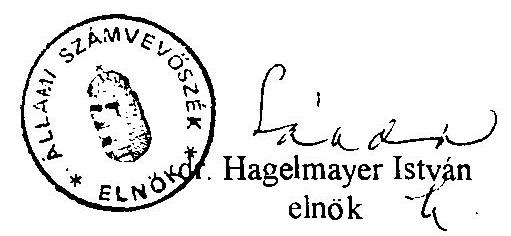

---

A vizsgálattal érintett időszak 1991-1995.

A vizsgálatot irányította:
dr. Sallai Antal régióvezető főtanácsos
Közreműködők:
Dankó Géza számvevő tanácsos
Molnár Mária számvevő tanácsos

# A helyszíni vizsgálatot végezték: 

1. Főváros:

Majer Lajosné számvevő
Turnheimné Lakos Zsuzsa számvevő tanácsos
2. Baranya megye:
dr. Ernst László számvevő tanácsos
3. Bács-Kiskun megye:

Domján Jenő számvevő tanácsos
4. Borsod-Abaúj-Zemplén megye:

Dankó Géza számvevő tanácsos
5. Csongrád megye:

Csiszárné dr. Kosik Mária számvevő tanácsos
6. Fejér megye:

Cziffra Erzsébet számvevő
7. Hajdú-Bihar megye:

Molnár Mária számvevő tanácsos
8. Heves megye:

Maróti Sándor számvevő tanácsos
9. Jász-Nagykun-Szolnok megye:

Csomán Mihály számvevő tanácsos
10. Komárom-Esztergom megye:

Fátrainé Zsebedics Katalin számvevő tanácsos
11. Nógrád megye:

Fercsik Gyula számvevő tanácsos
12. Pest megye:

Gordos László számvevő tanácsos
13. Szabolcs-Szatmár-Bereg megye:

Szűcs Zoltán számvevő tanácsos
14. Tolna megye:

Kispálné Wiedemann Györgyi számvevő
15. Veszprém megye:
dr. Vasváriné dr. Rózsa Anikó
 számvevő tanácsos
16. Zala megye:

Csuti Lajos számvevő

---

HELYI ADÓT BEVEZETŐ ÖNKORMÁNYZATOK SZÁMÁNAK ÉS ARÁNYÁNAK ALAKULÁSA 1995. JANUÁR 1-JÉI ÁLLAPOT SZERINT, VALAMINT A HELYSZÍNI VIZSGÁLATTAL ÉRINTETT ÖNKORMÁNYZATOK SZÁMA

| Mogyék | Önkormányzatok   száma   (db) | Helyi adót bevezető önk-ok száma (db) | Helyi adót bevezető önk-ok aránya az összes önk. %-ában (%) | Helyszíni vizsgálattal érintett önk-ok száma (db) |
| :--: | :--: | :--: | :--: | :--: |
| 1. Baranya | 302 | 131 | 43.38 | 5 |
| 2. Bács-Kiskun | 117 | 63 | 53.85 | 7 |
| 3. Békés | 75 | 50 | 66.67 | - |
| 4. Borsod-Abaúj-Zemplén | 355 | 154 | 43.38 | 7 |
| 5. Csongrád | 59 | 31 | 52.54 | 8 |
| 6. Fejér | 106 | 75 | 70.75 | 7 |
| 7. Győr-Moson-Sopron | 173 | 82 | 47.40 | - |
| 8. Hajdú-Bihar | 82 | 53 | 64.63 | 7 |
| 9. Heves | 118 | 70 | 59.32 | 6 |
| 10. Jász-Nagykun-Szolnok | 78 | 53 | 67.95 | 7 |
| 11. Komárom-Esztergom | 73 | 56 | 76.71 | 6 |
| 12. Nógrád | 127 | 66 | 51.97 | 5 |
| 13. Pest | 184 | 127 | 69.02 | 7 |
| 14. Somogy | 243 | 153 | 62.96 | - |
| 15. Szabolcs-Szatmár-Bereg | 228 | 100 | 43.86 | 7 |
| 16. Tolna | 108 | 53 | 49.07 | 7 |
| 17. Vas | 216 | 86 | 39.31 | - |
| 18. Veszprém | 223 | 111 | 49.78 | 8 |
| 19. Zala | 257 | 112 | 43.58 | 8 |
| Megyék összesen | 3124 | 1626 | 52.05 | 104 |
| 20. Főváros | 24 | 14 | 58.33 | 4 |
| MINDÖSSZESEN | 3148 | 1640 | 52.10 | 108 |

---

2/a. számú melléklet

# AZ EGY LAKOSRA JUTÓ HELYI ÉS GÉPJÁRMŰ ADÓBEFIZETÉS ALAKULÁSA 1995-BEN 

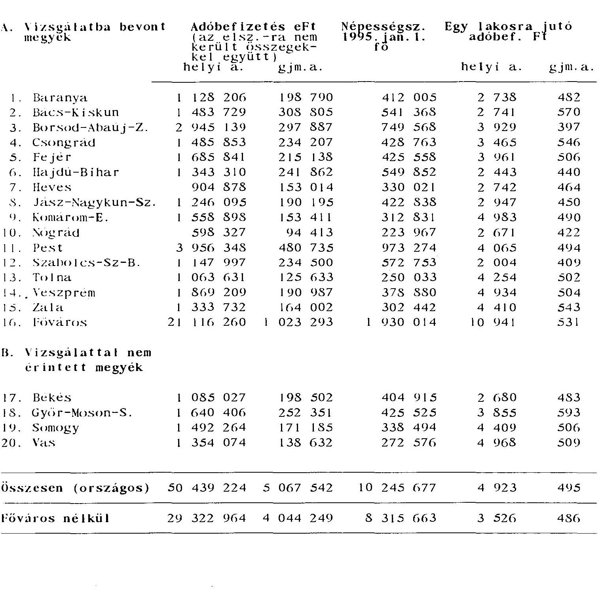

---

# A beszedett helyi adók alakulása 

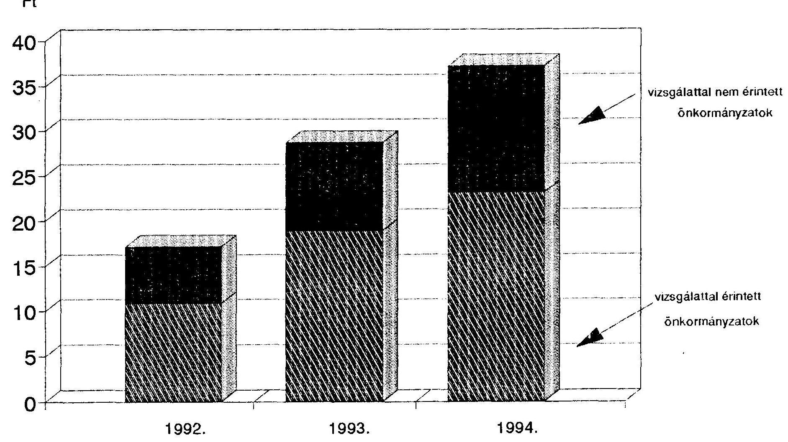

Megjegyzés: az adatok tartalmazzák az elszámolásra nem került befizetéseket is.

---

# Az önkormányzatok 1994. évi tényleges bevételei forrásonként 

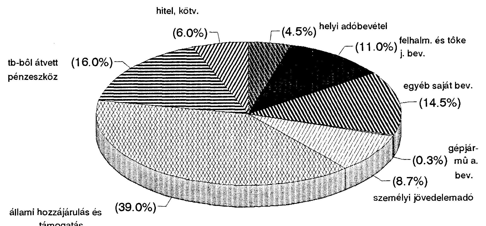

---

# Helyi adó tényleges bevételei településtípusok szerinti megoszlása 

1994.
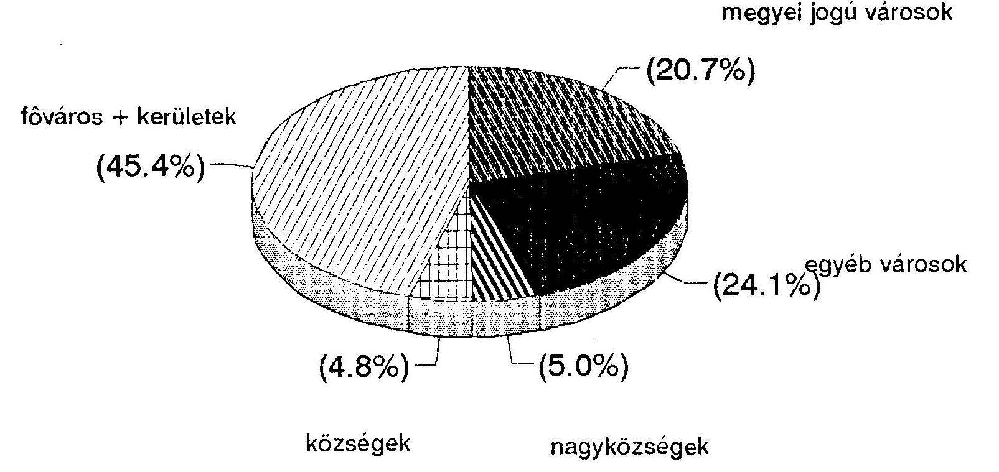

---

# Helyi adó befizetések megyénkénti megoszlása 1995. évben 

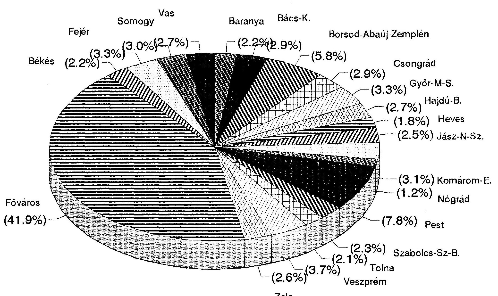

---

# Helyi adóbefizetések adónemenkénti részletezése 1995. évi országos adat 

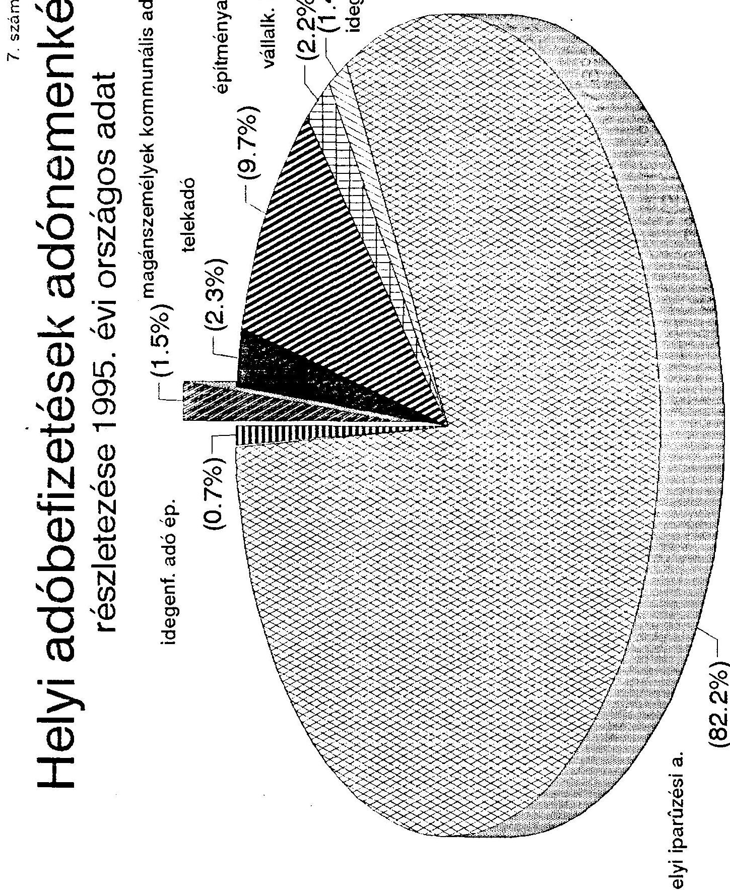

---

# Helyi adó 

helyesbített folyó évi terhelés (országos)
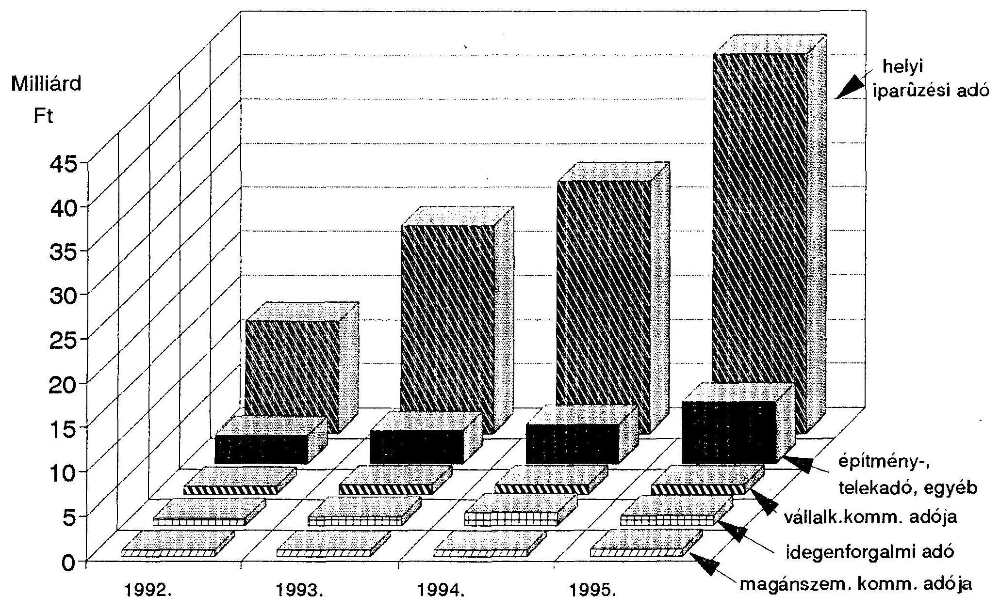

---

# Helyi adó befizetések (elszámolásra nem került összegekkel) 

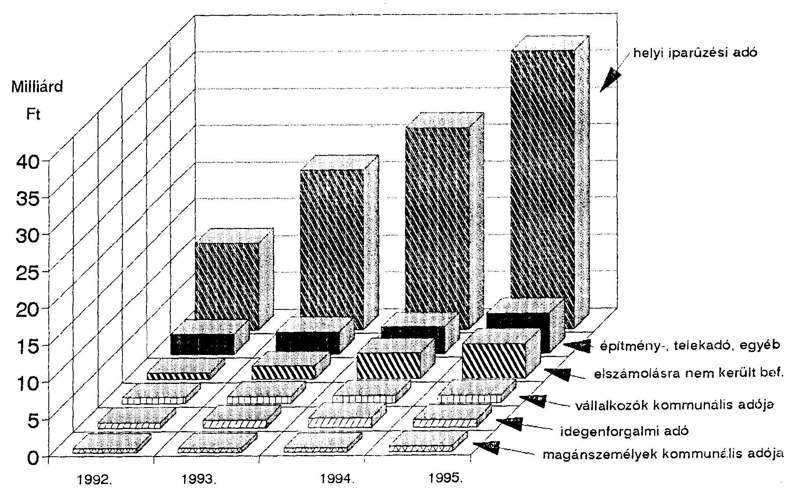

---

# Gépjárműadó befizetések (elszámolásra nem került összegekkel) 

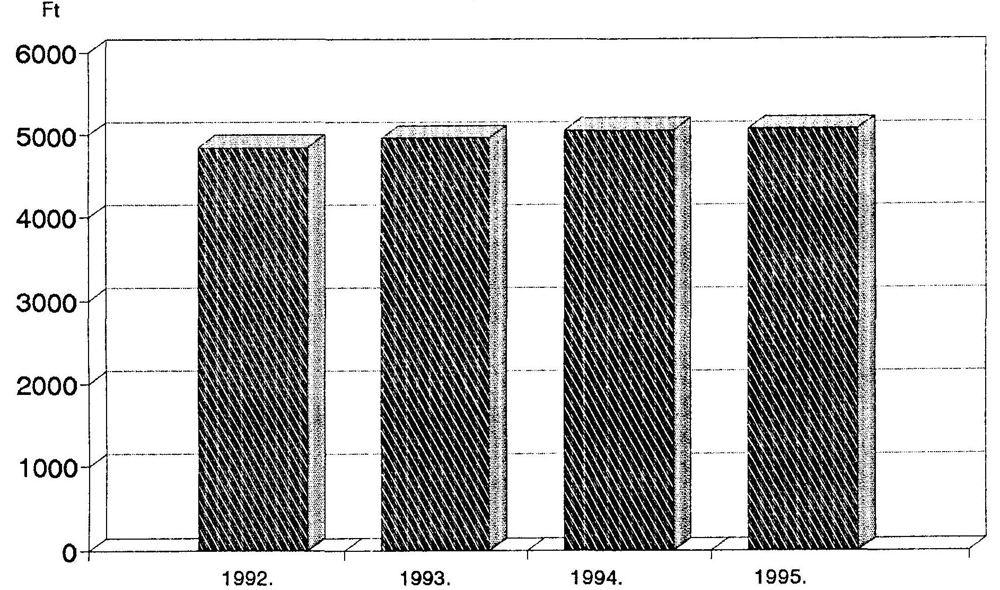

---

# Gépjárműadó tényleges bevételei településtípusok szerint 1994. 

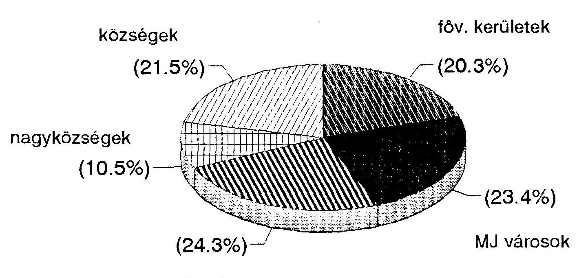

---

# A VIZSGÁLATBA BEVONT ÖNKORMÁNYZATOK HELYI ÉS GÉPJÁRMŰ ADÓZTATÁSSAL KAPCSOLATOS ADATAI 

1992. 1993. ..... 1994.

1. ) Költségvetési bev. (mill.Ft)

- megyék 103492
- főváros (+3 kerület) 77359
- főváros (+3 kerület)
2. ) Helyi adóbev. (millió Ft)
- megyék 3341
- főváros (+3 kerület)
4 596
4 596
4 933
7547
6183
8904

3. ) Gépjármű adóbev. (millió Ft)

- megyék 523
- főváros (+3 kerület)
- főváros (+3 kerület)
4. ) Egy adóügyi dolgozó által beszedett 100 Ft adóbevételre jutó kiadás (Ft-ban)

Megye megnevezése 1992. év 1993. év 1994. év

Baranya
Bács
BAZ
Csongrád
Fejér
Hajdú
Heves
Jász-Nagykun-Szolnok
Komárom-Esztergom
Nógrád
Pest
Szabolcs-Szatmár-Bereg
Tolna
Veszprém
Zala
Főváros
II.ker.

XIV.ker.
XV.ker.
4,4 5,3
7,0
3,4 4,3
14,2 10,7
12,5 15,2
9,8 10,8
12,6 12,4
6,1 5,0
4,9 6,1
5,6 9,2
14,0 12,6
16,5 12,1
6,1 5,5
5,7 5,3
5,3 4,6
0,1 0,4
42,0 32,0
17,6 8,2
5,7 7,0
4,6 6,0
0,4 0,7
43,9 7,5
0,1

