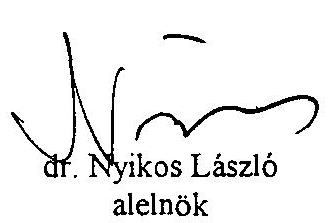
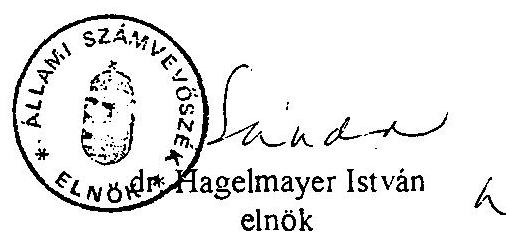

# JELENTÉS 

a Nemzetközi Gazdasági Kapcsolatok Minisztériuma fejezet
megszüntetésével kapcsolatos állami feladat-, létszám- és eszközátcsoportosítások pénzügyi-gazdasági ellenőrzéséről

---

A vizsgálat végrehajtásáért felelős:
az ÁSZ III. Költségvetési Ellenőrzési Igazgatósága
Bihary Zsigmond igazgató

Az ellenőrzést vezette:
Hegedűsné
dr. Müllern Veronika osztályvezető főtanácsos
Az ellenőrzést végezték:

| Robák Ferencné | számvevő |
| :-- | :-- |
| dr. Horváth Margit | számvevő |
| Eötvös Magdolna | számvevő |
| Szöllősiné |  |
| Hrabóczky Etelka | számvevő tanácsos |

---

# JELENTÉS 

## a Nemzetközi Gazdasági Kapcsolatok Minisztériuma fejezet megszüntetésével kapcsolatos állami feladat-, létszám- és eszközátcsoportosítások pénzügyi-gazdasági ellenőrzéséről

A Magyar Köztársaság minisztériumainak felsorolásáról szóló 1990. évi XXX. törvényt módosító 1994. évi LIV. tv. alapján a Nemzetközi Gazdasági Kapcsolatok Minisztériumának (NGKM) jogutódja az Ipari és Kereskedelmi Minisztérium (IKM) lett. Az összevonást követően az IKM 1995. január 1-jétől - jogszabályban kapott felhatalmazás alapján - feladatait egységes költségvetés alapján látja el. Az IKM fejezet 1995-ben 19 Mrd Ft költségvetési előirányzattal gazdálkodott, átlagos állományi létszáma mintegy 4700 fő volt.

## Az ellenőrzés során arra kerestünk választ, hogy

- a szakmai és gazdálkodási feladatok összevonását milyen döntéselőkészítő munka alapozta meg, mennyiben teljesültek az integráció szakmai és pénzügyi-gazdasági céljai;
- az új irányító szervezetet, a működési rendet, létszámstruktúrát a szakmai feladatokkal összhangban, célszerűen határozták-e meg;
- az induló költségvetés, a vagyon összevonása megfelel-e a vonatkozó jogszabályoknak, az átszervezéshez kapcsolódó előirányzatok felhasználásában érvényesültek-e a törvényességi és eredményességi szempontok.

Az ellenőrzés az 1994-95. évekre terjedt ki, elsősorban a minisztérium és a munkáját segítő intézmények (pl. Gazdasági Igazgatóság, Jóléti Intézmények Igazgatósága) működésére, gazdálkodására irányult. Utóvizsgálat keretében áttekintettük a jóléti intézmények működését, kihasználtságát, illetve a külképviseletek rendjét is.

A vizsgálat nem terjedt ki a nemzetgazdaság ipar- és kereskedelempolitikájának ellenőrzésére.

---

# I.   Következtetések, javaslatok 

A két minisztérium összevonására közvetett törvényi rendelkezés (a Kormányt alkotó tárcák felsorolásából "kimaradt" az NGKM) alapján került sor. A jogalkotás hátterét az új Kormányt alakító pártok koalíciós megállapodása képezte. A törvényalkotó munkát megalapozó szakmai, gazdasági előkészítés elmaradt (erre az idő rövidsége miatt nem volt kellő lehetőség). Mindennek következményeként a két minisztériumot 1994. július 15-én mechanikusan egyesítették. Ezzel az új IKM-re hárult az a feladat, hogy a folyamatos működés mellett, a tényleges feladataival összhangban határozza meg szervezetét. A miniszter feladat- és hatáskörét rögzítő jogszabály azonban érdemben nem tért el a jogelőd miniszterek statutumától, így az új szervezeti struktúrát feladat oldalról sem megfelelően támasztották alá.

Mindez hátráltatta az új minisztérium munkáját. A szervezetátalakítás másfél év alatt - viszonylag kevés célszerűségi elem mellett - folyamatossá vált. Az érdemi változás jelei csak 1995. végén mutatkoztak, amikor áttekintették a főbb feladatokat és kiszűrték a párhuzamosságokat. Ezzel együtt a szervezeti egységek száma (47-ről 30-ra) és a felső vezetők száma (15-ről 9-re) jelentősen csökkent, mérséklődtek a vezetői döntési szintek, megszűntek a Ktv-t sértő vezetői státuszok is (főcsoportfőnök, főtitkár).

Az átalakulás folyamatára jellemző volt, hogy míg a feladat-szervezet összhangját tárcán belül igyekeztek meghatározni, addig az ehhez kapcsolódó létszámról jórészt tárcán kívül, azaz a Kormány szintjén hoztak döntést. (Ugyanis erre az időszakra estek a köztisztviselők létszámcsökkentését elrendelő kormányintézkedések, melyek csaknem valamennyi fejezetre vonatkoztak). Ennek eredményeként az induló létszám (1081 fő) 381 fővel - ebből kormányintézkedésre 236 fő, 247 M Ft felhasználásával - csökkent. Saját hatáskörű intézkedésre 48 fő köztisztviselőt közalkalmazotti állományba helyeztek, ezen felül viszont már a fluktuáció hatása érvényesült (így pl. másfél év alatt 126 fő új belépő is került a minisztérium apparátusába).

Még nem született döntés a szervezetátalakítás, illetve a létszámleépítés befejezéséről, ezért nem ismert az elérni kívánt cél. Az év végén végrehajtott radikális változások viszont kedvező feltételeket teremthetnek a piacgazdasághoz jobban igazodó minisztérium működéséhez (a jelenlegi kormánystruktúrában egyébként az IKM rendelkezik a legnagyobb igazgatási létszámmal). Indokolt lenne, ha ehhez a Kormány nagyobb segítséget nyújtana, az egységes szemléletű integrált feladatok, a célszerű működési keretek, feltételek meghatározásában.

A minisztérium vezetése az intézmények felülvizsgálatát követően, figyelembe véve a Kormány ez irányú döntéseit is, felismerte, hogy az "igazgatás" korszerűsítése csak korszerűen működő intézményrendszerrel együtt lehet hatékony. Ezért az intézmények több, mint felénél jelentős átalakulás, belső szervezeti változás és létszámcsökkenés következett be, mérsékelve ezáltal a párhuzamos feladatellátást. Nem történt viszont meg az integrált külképviseletek létrehozása, amit a korábbi években a különböző relációkban

---

végzett számvevőszéki ellenőrzések már szorgalmaztak. Vitatható továbbá az innováció irányításának, feladatainak tárcán belüli kezelése is (ez utóbbi kormányintézkedésre került a miniszter közvetlen felügyelete alá).

Kifogásolható, hogy a minisztérium másfél éves működése alatt nem hagyták jóvá a szervezet és a működés alapszabályát, az SZMSZ-t, ennek hiányában a kapcsolódó ügyrendeket, munkaköri leírásokat sem adták ki. Kedvezőtlen, hogy még érvényben van egy 1994. évi utasítás, mely szerint az új SZMSZ hatályba lépéséig a volt minisztériumok SZMSZ-ében előírtak szerint kötelesek eljárni a szervezeti egységek, ezzel ugyanis legalizálták a feladatellátásban a belső szabályozás kettősségét.

A minisztérium rendelkezésére álló 4 épülettömb közül a Honvéd utcai épületet jelölték ki a vezetés törzsépületének, ahol helyet kaptak a külkereskedelmi egységek is. A Vigadó utcában elsősorban az ipari egységek elhelyezése történt. A két szakterület területi megosztottsága konzerválja a volt minisztériumok szervezeti elkülönülését. (A Hold utcai épület adottságai, műszaki állapota miatt csak átmenetileg alkalmas a hivatali funkció és a jelentős ügyfélforgalom lebonyolítására). A Margit körúton (volt IKM székházban) elsősorban csak a gazdálkodást végző szervezetek maradtak annak ellenére, hogy ez az épület adottságánál fogva alkalmas irodai célokra, férőhely-kapacitása pedig az egységes elhelyezésre is lehetőséget ad (elhelyezhető létszám 761 fő, a minisztérium engedélyezett létszáma 1995. december végén 700 fő).

A "szétszórt" elhelyezés megnehezíti az államigazgatási munkát és növeli a kapcsolattartás kiadásait (telefax, telefon, kézbesítés, gépkocsi-üzemeltetés). Mindez sürgeti az egységes elhelyezés megoldását, az információáramlás ésszerű rendjének kialakítását. Egyben jelzi, hogy a minisztérium felesleges irodaház-kapacitással rendelkezik, amit bérleti jogviszony formájában próbáltak hasznosítani (1995. végén az összes alapterület egynegyedét külső bérlők használták). A bérleti, üzemeltetési díjak esetenként indokolatlanul alacsonyak voltak, ezen keresztül az államháztartáson kívüli szervezeteknek burkolt állami támogatást nyújtottak. Indokolt, hogy a szükségleten felüli kapacitásoktól minél előbb "váljon meg" a minisztérium. Nem fogadható el, hogy államigazgatási szerv az egyre dráguló fenntartási, üzemeltetési kiadásokat bérleti tevékenységgel igyekezzen fedezni.

Az összevonás dologi kiadásaira a tervezett 12 M Ft-tal szemben 35 M Ft-ot fordítottak, melyhez nem kaptak központi forrásból támogatást. Ezért a fedezetet a két minisztérium jórészt saját forrásából biztosította, de kormányengedéllyel 15,5 M Ft-ot intézményeitől is átcsoportosított. Ez utóbbiból 4,9 M Ft indokolatlan volt.

A költöztetéshez kapcsolódó feladatokat még a volt minisztériumok üzemeltetését biztosító intézmények végezték (ezeket csak 1995. január 1-jével vonták össze). A beszerzések és a felújítások során nem jártak el minden esetben takarékosan, az indokoltnál nagyobb kiadásokat teljesítettek, több esetben szabálytalanul és célszerűtlenül döntöttek. A hiányosságok egy részét a tárca is feltárta belső ellenőrzése keretében. A megállapítások alapján felelősségrevonást is javasoltak, a realizálás azonban elmaradt.

---

Az összevonást követően a gazdálkodást csak 1995. január 1-jén integrálták. Az egységes költségvetés adatai szerint a minisztériumok összevonása nem mérsékelte a központi költségvetés kiadásait, a támogatás összege nem csökkent. A központi költségvetés teherviselése kisebb lehetett volna, ha a két minisztérium által felügyelt jóléti intézmények (üdülők, gyermekintézmények) kapacitását összhangba hozzák az új minisztérium igényeivel, és a felesleges ingatlanoktól - ezek egy része igen leromlott állapotú - megválnak. (Ezek az intézmények a működésükhöz 44 M Ft támogatást használnak fel.)

Indokolt a jóléti intézmények mielőbbi felülvizsgálata és a tárca feladataitól idegen profilú tevékenységek megszüntetése. Két évvel ezelőtt - még a jogelőd minisztériumoknál hasonló megállapításra jutott a számvevőszéki vizsgálat, azonban érdemi változás azóta sem történt, a kihasználtság nem javult.

A minisztérium működési feltételeinek, szabályozottságának javítása érdekében javasoljuk:

# 1. A Kormánynak: 

Számoltassa be a minisztert az összevonás, átszervezés eddigi eredményeiről, gondjairól. Határozza meg a miniszter egységes szemléletű, integrált feladatait, figyelembe véve a piacgazdaság által támasztott követelményeket.

## 2. Az ipari és kereskedelmi miniszternek:

- Gondoskodjon a minisztérium működését meghatározó SZMSZ, illetve az ehhez kapcsolódó ügyrendek, munkaköri leírások kiadásáról. Ezzel egyidejűleg az üzemeltetést, fenntartást biztosító intézmények hasonló szabályzatait is készíttesse el;
- Intézkedjen a minisztériumi apparátus szervezetével, létszámával összhangban álló egységes elhelyezésről, és az ennek megfelelően tervezett informatikai beruházások, valamint az egységes adatfeldolgozási rend megvalósításáról;
- Tekintse át és szabályozza a bérleti-üzemeltetési tevékenységet;
- Gondoskodjon a minisztérium és az üzemeltetését, fenntartását biztosító intézmények tényleges vagyonának számbavételéről, illetve az ezzel összhangban álló vagyonnyilvántartás elkészítéséről;
- Kezdeményezze a tárca működési igényeit meghaladó, illetve használaton kívüli ingatlanok (irodaház, üdülő, jóléti intézmény) átadását a Kincstári Vagyoni Igazgatóság kezelésébe;
- Vizsgáltassa felül a minisztérium gépkocsiállományát, biztosítsa a szükségletekkel összhangban álló gépjárműkapacitás hatékony üzemeltetését, illetve intézkedjen a felesleges eszközök értékesítéséről.

---

# II.   Részletes megállapítások 

## 1. Az NGKM megszűnése, az új IKM létrehozása

### 1.1. Az összevonást megalapozó döntéselőkészítő munka

A rendszerváltást követő kormány összetételét az 1990. évi XXX. törvény rögzítette, melyben elsőként jelent meg új minisztériumként az NGKM. Ugyanezen minisztérium megszünéséről 1994-ben - a kormányváltást követően, közvetett módon - szintén egy törvény rendelkezett (az 1990. évi XXX. törvényt módosító 1994. évi LVI. törvény) úgy, hogy a minisztériumok felsorolásából "kihagyta" a tárca nevét.

A minisztérium feladatainak átvételéről a törvény végrehajtására szolgáló 107/1994. (VII.21.) Korm. rendelet intézkedett, mely jogutódként az új ipari és kereskedelmi minisztert, illetve az IKM-et jelölte meg.

A két minisztérium összevonásával egyidejűleg az 1060/1994. (VII.21.) Korm. határozat kimondta, hogy "az Országos Műszaki Fejlesztési Bizottság (OMFB) és volt "szatellit" hivatalai: az Országos Mérésügyi Hivatal, a Magyar Szabványügyi Hivatal, valamint az Országos Találmányi Hivatal feletti felügyeletet a Kormány kijelölt tagjaként az ipari és kereskedelmi miniszter gyakorolja ...".

A Magyar Űrkutatási Iroda (volt OMFB-intézmény) felügyelete viszont a közlekedési, hírközlési és vízügyi miniszterhez került.

Az Országos Atomenergia Hivatal - amely eddig ugyancsak az OMFB-hez tartozott - felügyeletét a 109/1994. (VII.21.) Korm. rendelet szintén az ipari és kereskedelmi miniszterre bízta.

A jelzett kormányzati intézkedésekkel az OMFB "szatellit" hivatalai leváltak és vele egyenrangú országos hatáskörű közigazgatási szervként kapcsolódtak az ipari és kereskedelmi miniszterhez. (Az OMFB és a hozzá tartozó intézmények ezt megelőzően közös vezetés - tárca nélküli miniszter - alatt működtek, a MEH-hez tartoztak és fejezeti jogosítványuk volt.

A kormányzati struktúrán belül az ipar és a kereskedelem irányítása az adott történelmi időszak gazdaságpolitikájának súlypontja szerint változott. Az elmúlt ötven évben a kereskedelem a szövetkezeti felügyeletet ellátó szervezettel és a közlekedéssel volt egy irányítás alatt, majd szétvált ágazataira (bel- és külkereskedelem), az iparral történő jelenlegi összevonás a 7. szervezeti változást jelenti. Az ipart felügyelő tárca a kormányzati struktúrában elsősorban ágazatonként jelent meg
 (nehéz-, könnyű-, kohó-, gép-, energia-, vegyi-, helyi-, élelmezési ipari-, középgépipari, általános gépipari). Ugyanezen időszak alatt a jelenlegi összevonás a 13. átszervezést jelenti.

---

A jelenlegi IKM felállásához hasonló nemzetközi példát - ágazati szintű ipar, illetve "viszonylat" szerint tagolt külkereskedelem - szinte csak a Koreai Köztársaság Ipari és Kereskedelmi Minisztériumában találhatunk. Ugyancsak egységes államigazgatás alatt működik az ipar és a kereskedelem Írországban, Finnországban és a Dél-Afrikai Köztársaságban, de a piacgazdaságnak megfelelő, korszerűbben (nem ágazati és nem viszonylatok szerint) tagolt struktúra mellett.

Összegezve az új IKM létrehozását (az OMFB státuszát is figyelembe véve) megállapítható, hogy az Országgyűlés közvetett törvényi rendelkezésén, illetve néhány szűkszavú kormány-intézkedésen túl nem készült olyan szakmai elemzés, koncepció, feladatfelülvizsgálat, amely a politikai döntés előkészítéseként értékelhető lenne. (Megjegyezzük, hogy a választások és a kormányalakítás közti rövid idő ennek lehetőségét korlátozta.) Így a minisztériumnak a folyamatos működéssel egyidejűleg kellett a "feladat-, szervezet-, létszám" összhangját megteremteni.

A minisztériumok összevonását eredményező törvényalkotás hátterében az 1994. évi választásokat követően az MSZP és az SZDSZ politikai megállapodása volt, mely a Kormány közös megalakítására vonatkozott, meghatározva annak struktúráját.

Alapelvként rögzítik, hogy: "A jelenlegi állapothoz képest a minisztériumok számát csökkenteni kell, illetve a Kormányban csak különösen indokolt esetben lehet tárca nélküli miniszter." Kimondják, hogy "megszűnik a Nemzetközi Gazdasági Kapcsolatok Minisztériuma, és feladatkörét részben az Ipari és Kereskedelmi Minisztérium, részben a Külügyminisztérium veszi át.
Ugyanezen megállapodás rögzíti, hogy: "A kormányzati struktúra változásának következtében ugyancsak a Külügyminisztérium feladatát képezi a gazdaságdiplomáciai tevékenység". (Ez 1995. végéig nem valósult meg. Az 1996. elején hozott kormányhatározat is elodázza a döntést, mivel továbbra is előkészítő munkára (pl. helyszíni vizsgálat, összehasonlító felmérés) szólítja fel az érdekelt minisztereket.).
Így a külügyminiszter ezzel kapcsolatos feladatait csak az érdekelt miniszterekkel együttműködve teheti meg. Mindezek következményeként a kereskedelmi külképviseletek a nagykövetségek gazdasági, kereskedelmi osztályaként dolgoznak ugyan, de az irányítás kettős (az IKM és a KÜM hatáskörébe tartozik), és a gazdálkodásuk is elkülönül.

Az idézett politikai döntést magas szintű jogszabályban foglalt állami intézkedés azonban nem követte.

A szakmai előkészítéshez alapul szolgálhattak volna azok a tanulmányok, amelyek már a rendszerváltás óta elkészültek. Ugyanis elméleti szinten már több éve megkezdődtek azok a műhelymunkák, amelyek a polgári demokráciának, szociális piacgazdaságnak megfelelő kormányzati struktúra meghatározására törekedtek. A Kormány 1993-ban a Közigazgatási Intézet közreműködésével olyan munkaanyagot is készített, melyben felvázolta valamennyi minisztérium főbb ágazati és funkcionális feladatait.

---

1.2. Az új minisztérium szervezetének, irányítási mechanizmusának, létszámának meghatározása
Az 1994. évi LVI. törvény intézkedése szerint 1994. július 15-én létrejött az új IKM. Részletes feladatainak, létszámának meghatározását miniszteri sztatútum hiányában kellett megkezdeni. A miniszter feladat- és hatásköréről szóló jogszabály (149/1994. (XI.17.) Korm. rendelet) ugyanis csak november 25-én lépett hatályba.

A Kormányhoz beterjesztett jogszabály indoklása a kormányzati munka ésszerűsítésének és hatékonyságának növelésén, a költségek csökkentésén túl szakmai koncepcionális elemeket nem fogalmazott meg, így a hatályba lépett jogszabály érdemben nem lépte túl a két jogelőd miniszter feladat- és hatáskörét.

A minisztérium a rendelet hatálybalépését követően sem vállalta az összevont feladatok felülvizsgálatát, átvilágítását, a párhuzamosságok kiszűrését, illetve ezt követően "az optimális szervezeti struktúra és létszám" elméleti, modellszintű meghatározását, igaz, a Kormány sem fogalmazott meg ilyen elvárásokat. Mindez igen megnehezítette az operatív szervezetépítést, illetve az elengedhetetlen létszámleépítést.

Az összevonás kezdeti időszakában a minisztérium vezetése elsődleges célként fogalmazta meg a folyamatos és biztonságos működés követelményét, ami helyes cél volt. Később azonban indokolt lett volna az elmaradt felülvizsgálat pótlása, figyelembe véve a piacgazdaságba való átmenet követelményét, a privatizáció miatt jelentősen csökkenő tulajdonosi feladatokat (az állami vállalatok átalakulása miatt 1995-ben már csak 16 gazdálkodó szervezet felett gyakorol tulajdonosi felügyeletet a tárca), az egyre nagyobb jelentősséggel bíró kamarai tevékenységet.

Ezekkel a megváltozott követelményekkel az új minisztérium csak lassan tud megbirkózni. Az átszervezés különböző szakaszai az eltelt másfél év alatt (1994. VII. 15. - 1995. XII. 1.) alapvetően a funkcionális szervezeti egységeknél eleve jelentkező párhuzamosságok kiszűrésére, az ágazati tagoltságot tükröző blokkok (ipar, kereskedelem) megszilárdítására irányultak, a humán erőforrás igen jelentős mérséklése mellett.

Mindez időben egybeesett a Kormány köztisztviselői létszámcsökkentésre vonatkozó intézkedéseivel (melyek nemcsak az IKM-re, hanem - kevés kivétellel - valamennyi fejezetre kötelezőek voltak). Ezért az új IKM szervezetéhez kapcsolódó létszám alapvetően a Kormány e tárgyban hozott határozatai alapján alakult ki. Így gyakorlatilag a szervezetépítésre a minisztériumon belül, míg az ehhez kapcsolódó létszám-keretszám meghatározására a minisztériumon kívül került sor.

---

# 1.2.1. A minisztérium szervezete, irányítási mechanizmusa 

Az összevonás előtt a két minisztériumban 52 szervezeti egység (IKM 29, NGKM 23 főosztályi szint), ebből 5-5 megközelítőleg azonos feladatot ellátó funkcionális egység volt.

Az új minisztérium megalakulása 47 szervezeti egységgel gyakorlatilag a két szervezet mechanikus egyesítését jelentette. Ez a struktúra érdemben csak igen nehezen változott, annak ellenére, hogy szervezeti egységeket összevontak, szétválasztottak, illetve más felügyelethez rendeltek.

Az átszervezést (melyet e célra kinevezett főcsoportfőnök, később helyettes államtitkári beosztásban irányított) négy ütemben kívánták végrehajtani (párhuzamos funkcionális szervek-, gazdaságpolitikai egységek-, az ipar- és kereskedelempolitika-, illetve a közgazdasági területek átszervezésével), elvileg 1994. végéig be akarták fejezni. Ennek "eredményeként" év végére egy erősen tagolt szervezet jött létre, hatlépcsős vezetői szinttel. A párhuzamosságok mind a funkcionális, mind a szakmai egységeknél megmaradtak, a belkereskedelmi feladatokat viszont mindössze egy önálló osztály látta el.

Továbbra is két Jogi Főosztály dolgozott. A befektetésösztönzés, a segélykoordináció és a vállalkozásfejlesztés több osztálynak, illetve főosztálynak is a feladatkörébe tartozott.
Különböző méretű és összetételű főosztályok, önálló osztályok azonos szintre kerültek, a szervezeti egységek többsége továbbra is őrizte a hagyományos ágazati irányítás szakmailag tagolt kereteit. Emellett új egységek is alakultak. A korábbi két Energia Főosztályból négy önálló osztály lett, létrejött a Németország-Ausztria önálló osztály, illetve a Koordinációs Önálló Osztály, melynek feladatkörét az országos hatáskörű szervekkel való kapcsolattartás jelentette.
Az OIH osztályai főosztályi rangot kaptak.
A felsővezetők száma az összevonáshoz képest (15 fő) nem változott: miniszter, 2 államtitkár, 1 címzetes államtitkár, 4 helyettes államtitkár, 1 főtitkár és 6 főcsoportfőnök. Ez utóbbi két elnevezés sértette a köztisztviselők jogállásáról szóló 1992. évi XXIII. tv.-t (Ktv.), melyben a vezetői megbízásokat elnevezésükben is egységesítették. (A törvény ilyen elnevezéseket nem tartalmaz.)

A minisztérium vezetése nem élt a Ktv. 24. § (4) bekezdésében felkínált lehetőséggel, mely szerint "jogszabály a köztisztviselő tevékenységének jellegére utaló - besorolási feladatokat nem érintő - megnevezést állapíthat meg." (pl. egy miniszteri rendeletben).

Az 1990. évi XXXIII. tv. 4 főben korlátozza a helyettes államtitkárok számát, a főcsoportfőnöki, illetve a főtitkári elnevezés (melyek jórészt 1995. december 1-jéig éltek) e korlátozás megkerülését jelentették. A helyzet visszásságaként 4 főcsoportfőnök helyettes államtitkári juttatást kapott (akik korábban helyettes államtitkári beosztásban voltak), míg 2 fő csak főosztályvezetői.

A szervezetátalakítás folyamata az elképzelésekkel szemben nem zárult le 1994-ben. Ezt követően viszont (1995. december 1-jéig) csak kisebb "lépések" történtek, pl. a

---

különféle blokkok (igazgatási, közgazdasági, ipari, kereskedelmi) között átcsoportosítások, a felsővezetői szintek száma azonban nem változott.

A miniszter 1995. áprilisában tájékoztatta a Kormányt az átszervezés folyamatáról. Ebben további feladatként jelölte ki, hogy az "ésszerű szervezeti egyszerűsítések, összevonások útján csökkenteni kell a blokkon belüli túlzott tagozódást, ez egyúttal a ma még meglévő indokolatlan párhuzamosságok megszünését is eredményezi". Rögzítette továbbá, hogy "rövidíteni szükséges a vezetőidöntési láncot".

A blokkok számának csökkentéséhez hozzájárult az egyik (igazgatási) blokk vezetőjének távozása, (aki egyben az átszervezésért felelős vezető is volt), egy másik főcsoport is megszűnt (vezetőjét nyugdíjazták). Mindez jelzi, hogy az átszervezést többször a személyhez-kötődés is jellemezte.

Az érdemi változás igénye már 1995. második felében megfogalmazódott, amit jelez, hogy tárcán belül elindult a szervezetátalakításra vonatkozó elemző munka.

Ennek keretében összegezték a külföldi és hazai tapasztalatokat, minisztériumon belül áttekintették az eddig végrehajtott szervezeti lépéseket, a szervezetek (blokkok, főosztályok) főbb feladatait, majd javaslatokat fogalmaztak meg az új szervezetre, illetve az ehhez kapcsolódó létszámra.

Mindezt figyelembe véve került sor arra a miniszteri döntésre, mely szerint 1995. december 1-jével jelentősen (47-ről 30-ra) csökkentették a szervezeti egységek számát, illetve összevonták a még párhuzamos főosztályokat, tevékenységeket (így pl. a két Jogi Főosztályt, a Titkársági Főosztályt és a Protokoll Önálló Osztályt). A felsővezetői szinteket egységesítették, megszüntették a főtitkári, főcsoportfőnöki megnevezéseket és funkciókat, ezzel együtt a felsővezetők száma 15-ről 9-re csökkent, a vezetői szintek száma pedig 6-ról 5-re mérséklődött. Ez a radikális szervezetátalakítás egyben magában foglalta a megalakulás óta eltelt időszak ez irányú tevékenységének kritikáját is.

Az átszervezés következményeként az eddig túlzottan tagolt szervezet áttekinthetőbbé vált, néhány feladat kikerült a minisztérium közvetlen feladatrendszeréből (pl. az idegenforgalomból csak az irányítási funkció maradt tárcán belül, a szakmai rész az Országos Idegenforgalmi Tanácshoz került). Ezek az intézkedések hosszabb távon megteremthetik a piacgazdasághoz jobban igazodó munkavégzés feltételeit.

Mivel nem született miniszteri döntés az átszervezés befejezéséről, ezért nem ismert az elérni kívánt cél, ezzel együtt az optimális szervezet mérete sem.

További igényként merülhet fel a külkereskedelmi szervezet karcsúsítása, az irányítás struktúrájának változtatása (a korábbi IKM szervezeti egységeinek közel 50%-os, míg az NGKM egységeknek 20%-os csökkenése tapasztalható).

---

Kérdés, hogy indokolt-e a külkereskedelemnek egy igen fontos, de csak részterületét érintő "Németország-Ausztria" Főosztály (9 fő), és az egész hazai ipart átfogó Ipari Főosztály (51 fő) azonos szintre emelése.

Célszerű lenne a Humánpolitikai Főosztály közigazgatási államtitkár felügyelete alá helyezése is, a jelenlegi miniszteri felügyelet alól.
A Koordinációs Főosztály feladatköréből a miniszterhez rendelt felügyelet ellátását is indokolt lenne legalább helyettes államtitkárhoz delegálni. (Az OMFB Hivatalának elnöke államtitkári besorolásban van.)
Még nem tisztázták a tárca és a kamarák közötti feladatmegosztást sem.
A feladat-szervezet-létszám összhangjának megteremtésében segítséget jelenthetne, ha a Kormány nagyobb figyelmet fordítana a tárca ezirányú tevékenységére, az optimális feltételek kialakítására, szem előtt tartva a piacgazdaság igényeivel összhangban álló újszerű államigazgatási feladatokat.

# 1.2.2. A minisztérium létszámának alakulása 

A szervezet korszerűsítésével egyidejűleg folyt a létszámleépítés is. Kidolgozták az ezzel kapcsolatos eljárási rendet, létrehozták a "Létszámleépítési Bizottságot".

Feladata: "... minden érintett munkavállaló helyzetét vizsgálja meg és a leghumánusabb eljárási rendben biztosítsa a Ktv-ben előírt dolgozói jogosítványokat, járandóságokat".

Az előkészítés és a végrehajtás jó színvonalát mutatja, hogy mindössze két esetben fordultak Munkaügyi Bírósághoz az érintett dolgozók.

A két minisztérium engedélyezett létszáma az összevonáskor 1081 fő volt. Tárcán belül nem született döntés a létszámleépítés nagyságáról, viszont ezzel egyidőben folyt a Kormány - köztisztviselőkre vonatkozó - létszámcsökkentést elrendelő intézkedése, ezért ez a folyamat a kormányintézkedések alapján minősíthető.

A minisztérium létszámát 1994-ben a 2139/1994.(XII.2.) Korm. határozat 156 fővel csökkenti 218 M Ft támogatás mellett (átlagosan 1,4 M Ft/fő kifizetéssel).

Az IKM igazgatás 94 fő leépítésére 131,3 M Ft-ot kapott, 1994. december 31-éig az előírtnál többet, 106 főt csökkentettek.
 125,9 M Ft felhasználásával. Az NGKM Igazgatás (és GI) 62 fő csökkentésre 86,7 M Ft-ot kapott, ebből 46 fő leépítését teljesítették 45,3 M Ft felhasználással.

Év végén a pénzmaradvány elszámolás keretében 46,8 M Ft céltámogatási maradványt mutattak ki (amihez még 16 fős leépítési kötelezettség párosult). A PM az elszámolást tudomásul vette azzal, hogy a maradványt 1995-ben hasonló célra használhatják fel (1995-ben a 16 fő leépítése megtörtént).

---

A központilag előírt létszámcsökkentés 1995-ben is folytatódott (három kormányhatározat keretében). Ennek következményeként a tárca létszáma további 10%-kal, azaz 80 fővel csökkent.

Az egyik kormányhatározat (1033/1995./IV.28./) fejezeti szinten 15%-os csökkentést írt elő, ezzel szemben a miniszter 26% (981 fő) köztisztviselői létszám leépítését vállalta, amit tárca szinten december 1-jéig 75%-ban teljesítettek.

A leépítés pénzügyi igénye 87,7 M Ft volt, amihez 50,1 M Ft támogatást kaptak. A hiányzó részt a pénzmaradványból pótolták.

Saját hatáskörben a minisztériumi igazgatás létszámát további 48 fővel csökkentették. Ezeket a dolgozókat ugyanis köztisztviselői állományból a GI-hez helyezték át közalkalmazotti besorolásba. Az áthelyezett dolgozókkal megállapodtak, hogy minden béren kívüli juttatást (pl. üdülési hozzájárulást) továbbra is megkapnak, ami a minisztériumi köztisztviselőket megilleti.
Az elrendelt létszámcsökkentéssel párhuzamosan jellemző volt az önkéntes eltávozás (öregségi nyugdíj, felmondás, közös megegyezés), illetve új munkatársak is kerültek a tárcához, (1994. július -1995. október között 123 fő felvétele történt meg).

Megjegyezzük, hogy az 1033/1995.(IV.28.) Kormányhatározat előírja, hogy "a létszám-leépítési feladatok végrehajtásáig rendeljenek el felvételi tilalmat."

A létszámváltozás eredményeként 1995. december 31-én az engedélyezett létszám 700 fő volt, így az összevonást követő másfél év alatt 381 fővel csökkent a minisztérium létszáma, ebből kormányintézkedésre 236 fővel. Ez utóbbihoz 246,8 M Ft központi költségvetési támogatást használtak fel. (Az 1996-os költségvetés további 30 fő leépítéssel számol.)

Nem döntöttek az átszervezés végeredményeként elérni kívánt létszámról, ezért nem ismert, hogy a feladatokkal összhangban álló struktúra optimálisan milyen nagyságrendű létszámot igényel.

A miniszter több nyilatkozatában az ideális létszámot 500 főben jelölte meg, de szűkebb vezetői körben a 300 fős "családias minisztériumot" is elképzelhetőnek tartotta.

A jelenlegi kormányzati struktúrában egyébként - az 1996. évi költségvetési törvény adatai alapján - az IKM rendelkezik a legmagasabb igazgatási létszámmal.

# 1.3. A minisztérium felügyelete alá tartozó intézményrendszer korszerűsítése (1. sz. melléklet) 

Az összevonást követően a minisztérium vezetése felismerte, hogy az államigazgatás, az irányítást végző apparátus új szervezetének hatékony működése csak a felügyeletéhez tartozó intézményi háttér korszerűsítésével együtt érhető el, ami egyben az

---

irányítási rendszer teljeskörű áttekintését is igényli. Mindemellett kényszerként hatott az ugyanazon feladatokat (pl. jóléti tevékenységet) ellátó párhuzamos intézmények megszüntetése, a kormányzati szinten elrendelt létszámcsökkentés is.

A két minisztérium 1994. július közepén 23 önállóan, és 2 részben önállóan gazdálkodó költségvetési szerv felett gyakorolt felügyeleti jogkört 4000 fő alkalmazottal.

Az IKM 21 önállóan-, az NGKM 2 önállóan- és 2 részben önállóan gazdálkodó költségvetési intézménnyel rendelkezett.

Az új IKM 1995. december 31-ére 31 költségvetési intézménnyel rendelkezett (28 önálló, 3 részben önálló költségvetési szerv). Ezen belül jelentős összetételváltozás volt, mellyel elsősorban a piacgazdasághoz igazodó követelményeknek igyekeztek eleget tenni.

# 2. A minisztérium és a tevékenységét segítő intézmények szabályozottsága 

### 2.1. A minisztérium működésének szabályozottsága

Az IKM működésének másfél éve alatt nem készült el az SZMSZ. Ezt legalább a miniszter statutumának hatályba lépése (1994. november 25.) után indokolt lett volna kiadni. Tárcán belül azonban folyik az SZMSZ kidolgozása, már legalább 5 változat elkészült. Tény, hogy a megalakulás óta az átszervezés folyamatos. Ez azonban nem mentesíti a minisztérium vezetését attól, hogy az SZMSZ-t végleges formában közzé tegye (a folyamatos aktualizálás igénye mellett). Enélkül ugyanis a kapcsolódó, alacsonyabb szintű szabályzatok (pl. ügyrend) nem adhatók ki.

Ennek hiányában a legfontosabb szervezeti, munkaköri kérdéseket még mindig olyan miniszteri utasítások szabályozzák, melyeket 1994-ben hoztak.
Így pl. a vezetői beosztások, feladatok, hatáskörök meghatározása (14/1994. /XI.21./IKM utasítás).

Egy 1994. nyarán született miniszteri utasítás (10/1994. /VIII.3./ IKM utasítás) előírta, hogy a minisztérium új SZMSZ-ének hatályba lépéséig az egyes minisztériumi főosztályok (önálló osztályok, titkárságok) a volt IKM és az NGKM SZMSZ-ében a részükre meghatározott feladatokat látják el.

Ezt a célt szolgálták az SZMSZ különös részei is, ahol pl. az egyes szervezeti egységek feladatait átfogóan rögzítik, illetve az egyes területek szabályozására, működésére vonatkozó utasításait gyűjtik.

Miután az új, egységes SZMSZ a vizsgált időszakban nem született meg, ez a miniszteri utasítás tárcán belül legalizálta a belső szabályozás kettősségét.

---

Az összevonás előtt a két minisztérium megfelelő szintű SZMSZ-szel rendelkezett, míg az IKM-nél az ügyrendek is elkészültek, addig az NGKM-nél erre nem került sor.

Jóváhagyott SZMSZ hiányában természetesen az ügyrendek sem készültek el, (bár néhány szervezeti egység, pl. az Európai Ügyek Hivatala ezt már tervezet szinten elkészítette) és a minisztérium dolgozói sem rendelkeztek munkaköri leírással.

Mindez a későbbiekben alapvető gondokat vethet fel a munkaügyi kérdések tisztázásánál (elsősorban további létszámleépítés esetén, illetve az egyes szervezeti egységek munkaszervezésében). Pl.: a korábban párhuzamos feladatokat végző szervezeti egységeknél, ahol a munkavégzés nem építhet a hagyományokra.

Kedvező viszont, hogy tárca szinten a munkaügyi kérdésekkel foglalkozó, átfogó szabályzat elkészült: Közszolgálati Szabályzat címmel.

A szabályzat megfelelő részletezéssel ad eligazítást az egyes munkaügyi kérdésekben. Kifogásolható azonban, hogy két fontos melléklete még hiányzik, egyik a "munkáltatói jogkör gyakorlása", másik az "alaptevékenységhez tartozó munkahelyek és tevékenységek főosztályonkénti meghatározása" (1992. évi XXIII. tv. szerint).

Megfelelő színvonalon, bár még csak tervezet szinten készült el az Iratkezelési Szabályzat és Irattári terv, illetve az "Államtitokról és a szolgálati titokról, valamint a minősített adat kezeléséről" szóló szabályzat. Indokolt ezek mielőbbi kiadása, miniszteri utasítás formájában.

# 2.2. Az IKM igazgatás gazdálkodásának és az üzemeltetést biztosító intézmények szabályozottsága 

A minisztériumok összevonása 1994. év közepén megtörtént, ennek ellenére az új IKM üzemeltetését biztosító IKM Gazdasági Igazgatósága (IKM GI), valamint a Jóléti Intézmények Igazgatósága csak 1995. január 1-jével kezdte meg működését. Az új IKM beszerzési, karbantartási munkáit, üzemeltetését (1994. II. félévben) írásban rögzített feladatmegosztás nélkül még a jogelőd intézmények biztosították, melyeknek a szabályozottsága igen eltérő volt. Az NGKM fejezet alá tartozó intézmények esetében a tapasztalatok lényegesen kedvezőtlenebbek voltak, mint az IKM fejezet intézményeinél.

Az IKM intézményei rendelkeztek az előírt szabályzatokkal, némelyik igen jó színvonalú volt. Az NGKM GSz gazdálkodásának szabályozottsága hiányos volt. Nem volt számlarendje (csak számlatükör készült), és nem szabályozták a gazdálkodás vertikális folyamatait (kötelezettségvállalás, ellenjegyzés, utalványozás, érvényesítés rendje).

Az NGKM GI és a részben önálló jogállású intézményei nem rendelkeztek Szervezeti- és Működési Szabályzattal, munkaköri leírásokkal, a gazdálkodás vertikális folyamatai- és a belső ellenőrzés szabályzatával, valamint számlarenddel. Elmaradt a leltározási, selejtezési, pénzkezelési szabályzatok aktualizálása (1993-ban készült) is.

Az új IKM igazgatás gazdálkodásának szabályozottsága teljeskörű és jó színvonalú. Az IKM GI működése szabályozatlan, nem rendelkezik jóváhagyott SZMSZ-szel, szervezeti egységenkénti ügyrenddel. A dolgozók munkaköri leírásukat átvették (ami természetesen nem az SZMSZ-ből eredő feladatokra támaszkodik), kivéve az intézmény vezetőjét, aki nem rendelkezett munkaköri leírással. Így az igazgató feladatait sem SZMSZ, sem ügyrend, sem munkaköri leírás nem rögzíti.

Az IKM GI gazdálkodásának szabályozottsága sem teljeskörű. Hiányos az anyagraktárkezelési- és az ügyviteli szabályzat. A gépjárművek hivatalos- vagy magáncélra történő igényléséről szóló intézkedés még csak tervezet szintű. Nincs belső ellenőrzési szabályzat, függetlenített belső ellenőri státusszal nem rendelkeznek, amely az intézmény összetettsége, feladatrendszere miatt indokolt lenne. Emellett azonban több, a gazdálkodás egyes részterületeire vonatkozó igazgatói utasítás is kiadásra került (pl. a lakáscélú támogatások, a béren kívüli és természetbeni juttatások rendjéről).

Ellentmondás van az intézmény alapító okirata és számlarendje (a ténylegesen folytatott elszámolási gyakorlat) között.

Az alapító okirat szerint vállalkozási tevékenység: a minisztérium szabad irodahelyiségeinek, illetve a szabad nyomdaipari kapacitás külső igénybevevők részére történő bérbeadása, értékesítése. Az ebből származó bevételeket az alapfeladat finanszirozására kell fordítani. A számlarend szerint ugyanakkor az intézmény vállalkozási tevékenységet nem folytat. Az 1995. évben a helyiségek és eszközök eseti bérleti díjaként 105,9 M Ft-ot számoltak el alaptevékenységi bevételként.

A Jóléti Intézmények Igazgatósága részben önálló költségvetési szerv. Alapító okirata szerint pénzügyi, számviteli, gazdasági feladatait az IKM GI végzi. A 137/1993. (X.12.) Kormány rendelet 6. § (5) b) pontja alapján az önállóan, illetve részben önállóan gazdálkodó költségvetési szerv között a munkamegosztás és a felelősségvállalás rendjét a felügyeleti szerv hagyja jóvá. Ez a szabályozás nem készült el, az igazgatóság feladatait a kialakult gyakorlat szerint végzi, ami nem teljesen felel meg a: alapító okiratban foglaltaknak, illetve egyéb ellentmondásokat is takar.

Az intézmény a részére jóváhagyott költségvetési előirányzatokon belül önállóan gazdálkodik, önállóan látja el (pénzügyi csoporttal) a pénzügyi tevékenységet (ezt az alapító okirat szerint az IKM GI-nek kellene biztosítani), illetve a leltározást. Rendelkezik saját bankszámlával, ennek ellenére az ellátmányt indokolatlanul két lépcsőben, a GI-n keresztül kapja. A féléves, éves beszámolót (mérleget) az intézmény maga készíti, noha az ehhez szükséges számviteli nyilvántartásokat nem vezeti, így főkönyvi kivonattal sem rendelkezik. A számviteli tevékenységet és a vagyonnyilvántartást a GI biztosítja egy fő könyvelővel. Az így kialakult ellentmondásos helyzet a könyvelés folyamatos egyeztetését, ellen-

---

őrzését teszi szükségessé a Jóléti Igazgatóság részéről, enélkül nem garantálható a mérleg és a beszámoló valódisága.

A részben önálló intézmény rendelkezik jóváhagyott Szervezeti és Működési Szabályzattal, munkaköri leírásokkal. A gazdálkodás szabályozottsága csaknem teljeskörű, azonban hiányzik a számlarend, csak számlatükröt készített. (A számlarend kialakítása a GI feladata lenne.)

Az alapító okirat szerint az intézmény vállalkozási tevékenységet nem végez, az üdülők szabad kapacitását viszont értékesíti. Az ebből származó bevételt (1995. évben 5.416 E Ft) alaptevékenységi bevételként számolták el, ami - figyelembe véve a vállalkozási tevékenység jogszabályban meghatározott fogalmát - kifogásolható.

# 3. Az összevonás technikai lebonyolítása, pénzügyi igénye 

### 3.1. Az összevonás előtti vagyon számbavétele, a "költözködés" lebonyolítása

### 3.1.1. Leltározás, selejtezés

A "költözködést" megelőzően (1994. IX. hó) a minisztériumok és az üzemeltetést biztosító intézmények vagyonát nem mérték fel, leltárt nem készítettek. Szabályozták a vagyonnyilvántartás ideiglenes rendjét, az "eszközmozgás" dokumentálását, elrendelték a leltározást, de ezeket az utasításokat nem tartották be.

Mivel az üzemeltetést biztosító intézmények összevonására 1994. december 31-éig nem került sor, ezért külön-külön készítették el az év végi mérlegüket, beszámolójukat. Az ehhez szükséges zárt rendszerű számvitel biztosított volt, azaz a főkönyvi számlák és az analitikus nyilvántartások adatai egyezőek voltak. Ezzel szemben a mérlegadatokat nem, vagy csak részben támasztották alá leltárral. Így a mérlegvalódiság nem érvényesült teljeskörűen.

Szabályszerűen végrehajtott leltározást csak az IKM két intézménye (Gyermekjóléti és a Hivatali Üdülők) végzett.

A minisztérium (IKM Gazdasági Hivatala és az NGKM Gazdasági Igazgatósága) az összevonás után egy gazdálkodó szervezetet bízott meg (2,2 M Ft-ért) a tárgyi eszközök leltározásával. A leltárfelvétel azonban nem felelt meg a szabályszerűségi, ezáltal a vagyonvédelmi követelményeknek.

Nem készítettek ütemtervet,
 a leltározási körzeteket nem határozták meg, az egységenkénti leltárfelelősöket nem jelölték ki, gyakorlatilag a szobaleltár-felelősi rendszert nem érvényesítették.
A leltár alapbizonylatainak szúrópróbaszerű vizsgálata a bizonylatok hitelességét megkérdőjelező hiányosságokat tárt fel. Több esetben, a szobaleltárakon mindössze a két leltárfelvevő aláírása szerepelt, a szobaleltár-felelős aláírása elmaradt, vagy a dolgozó igazolta a leltárfelvételt, de nem mint leltárfelelős.

---

A leltározást nem fejezték be, nem értékelték ki, így nem ismert, hogy az többlettel, vagy hiánnyal zárult-e. Mindez összefügg azzal, hogy nem alakítottak ki egy olyan rendszert, amely a főkönyvi könyveléstől függetlenül, a naprakész munkahelyi nyilvántartások meglétét garantálná, a használatban lévő eszközök mozgását nem dokumentálták, belső eszközmozgatási bizonylatot nem alkalmaztak.

Nem tárták fel (a leltározást megelőzően) a szükségleten felüli, vagy használaton kívüli eszközöket, nem selejteztek. Mindezek következményeként a tényleges vagyon értéke, állapota nem minősíthető.

Az NGKM GI-nél az 1994. évi selejtezések bruttó értéke mindössze 4,4 M Ft volt. A gépek, berendezések állományának bruttó értéke 420 M Ft, ebből teljesen leírt 277 M Ft. A használaton kívüli bútorok szakszerű tárolását raktári kapacitás hiányában nem tudták biztosítani, ami az állagukat rontotta. Az IKM Igazgatásnál a selejtezéseket (19 M Ft bruttó értékben) még az 1994. év első felében elvégezték. A felesleges használt bútorok értékesítése viszont sem 1994-ben, sem 1995-ben nem történt meg.

Kifogásolható, hogy az IKM Igazgatásnál a végrehajtott selejtezések dokumentálására formanyomtatványt nem alkalmaztak. A selejtezési jegyzőkönyvek nem minden esetben tartalmaztak megsemmisítési jegyzőkönyveket. Így a megsemmisítés ténye nem bizonyítható. 1995. év végén teljeskörű és tételes leltározást rendeltek el (ennek eredménye a vizsgálat befejezésekor még nem volt ismert). Természetesen ez az utólagos leltárfelvétel már nem alkalmas arra, hogy az 1994. év júliusi vagyonállapotot a tényleges helyzetnek megfelelően rekonstruálja.

Hiányzott az intézmények kétharmadánál a házipénztár előírás szerinti - címletenként jegyzőkönyvezett - leltározása is.

# 3.1.2. A költözés technikai lebonyolítása, a minisztérium apparátusának elhelyezése 

Az átszervezés intézkedési tervét 1994. július végén fogadták el, melyben rögzítették, hogy az eddigi 4 épületben (Hold utca, Honvéd utca, Margit körút, Vigadó utca, amely 7 ingatlant jelent) - helyezik el a minisztérium apparátusát.

A Honvéd utcában található a teljes felső vezetés és a funkcionális blokk, az Európai Ügyek Hivatala, valamint a hozzájuk leginkább kapcsolódó főosztályok, így pl. a Humánpolitikai Főosztály, Sajtó és Tájékoztatási Főosztály és a két Jogi Főosztály, stb.). A Honvéd utcában lévő, de a funkcionális vezetői blokkhoz nem ilyen szorosan kapcsolódó egységek a Vigadó - Szende Pál utcai tömbbe költöztek, a már ott lévő főosztályok mellé.
Jelenleg a Vigadó utcában az ipari, a Honvéd utcában a funkcionális blokk mellett döntő többségben a külkereskedelmi egységek találhatók. Ezzel a két korábbi szervezet különállása konzerválódott.

---

A Hold utcában az elhelyezés némileg változott, mivel az Engedélyezési Főosztály mellé költözött az Ellenőrzési Főosztály is.

Az intézkedési terv a Margit körúti irodaházat csak utolsó lehetőségként vette figyelembe. (Itt a Költségvetési Főosztályt, valamint az OIH-t helyezték el, ez utóbbi korábban a Vigadó utcában volt.)

A miniszteri döntést megelőzően az elhelyezési lehetőségek részletes elemzésére nem került sor. A későbbiekben elkészített javaslatok érdemi változást már nem hoztak.

Az IKM GH 3313/1994.VIII. 9. számú elhelyezési javaslatában a szervezet elhelyezését létszám-irányszám nélkül csak a meglévő létszám alapján vizsgálták. A bemutatott alternativákban egységesen 3 épülettel (I. alternatíva: a Honvéd-Margit-Vigadó utcai épületek, II. alternatíva: a Honvéd-Vigadó-Hold utcai épületek, valamint mindkét változatban a Honvéd utcai tömb, mint a minisztérium törzsépülete) számoltak.

Az IKM-GH javaslata rámutatott arra, hogy a Margit körúti épület - mivel eleve irodaháznak készült - a leginkább alkalmas a minisztérium feladatainak ellátásához.

A Margit körúti épület 424 szobájában (10.399 m²-en) 761 fő, (ebből 39 fő vezető) elhelyezése biztosított (a Honvéd-Vigadó-Hold utcai együttes összesen 663 szobájában 14.622 m²-en 959 fő helyezhető el). Az épület telefon és parkoló ellátottsága messzemenően a legjobb: 1993-ban 40 M Ft-os beruházással korszerű digitális telefonközpontot létesítettek, az épülethez tartozó parkolóban mintegy 60 gépkocsi fér el. Az épület nyolc emelete azonos alaprajzzal, egyszemélyes ügyintézői irodákkal - mozgatható közfalaival - melyek könnyen átalakíthatók többszörös alapterületű főnöki szobákká, széles folyosóival a korszerű munkaszervezés elvárásainak megfelel.

Az 1995. december 1-jei átszervezés után az apparátus engedélyezett létszáma 700 főre csökkent, így a Margit körúti épület önmagában is alkalmas lenne a központi igazgatás létszámának elhelyezésére. Figyelemfelhívó, hogy a Hold utcai épület állaga az összevonás időpontjától mind a mai napig veszélyezteti a munkavégzés biztonságát.

Az előzőekből következik, hogy a minisztériumnak nincs szüksége a felsorolt épületek mindegyikére. Nem fogadható el, hogy egy központi költségvetési, államigazgatási szerv bérbeadással fedezze felesleges épületei egyre dráguló üzemeltetési kiadásait.

Az áthelyezések technikai lebonyolítására egységes központi intézkedés nem történt, a költöztetéshez ütemtervet nem készítettek, így az ésszerű munkaszervezés követelményeit nem mindig elégítették ki.

A költözés megkezdésekor (1994. szeptember) a szervezeti egységek konkrét elhelyezése még nem volt ismert. A végleges elhelyezésre vonatkozó döntések jóval később, csak november végén születtek meg. Ehhez hozzájárult, hogy a Vi-

---

gadó utcai épületből a bérlők kiköltöztetése hosszas egyeztetéseket igényelt. A tényleges végrehajtást megnehezítette, hogy gyakran alku tárgya volt, elfogadja-e az adott szervezeti egység (főosztály) a részére felkínált elhelyezési lehetőséget. Így pl. a miniszteri biztos 1994. október 3-ai feljegyzésében rögzíti, hogy "10 napja egyetlen szervezeti egységet sem tudok megmozdítani, aki hajlandó lenne költözni".

Általános jelenség volt, hogy a költöztetéskor még nem ismerték az elhelyezésre kerülő szervezet új létszámát, ezért az épületen belüli költözések is gyakoriak voltak.

A minisztérium működését megnehezíti, hogy az apparátust négy épületben helyezték el, mindez növeli a kapcsolattartás kiadásait (pl. telefon, telefax, kézbesítés, gépkocsiüzemeltetés) is.

Az ügyintézés ideje jelentősen megnőtt. A Költségvetési Főosztály pl. a Margit körúton engedélyez, míg a kifizetés a Honvéd utcai pénztárban történik.
Az Informatikai és Statisztikai Főosztály, illetve az Európai Ügyek Hivatala két épületben helyezkedik el, Honvéd utcai osztályaik a ház különböző szintjein dolgoznak.

A szervezeti egységek között az információáramlás optimális rendjének kialakítása még csak igény szintjén fogalmazódik meg, holott ez a sajátos elhelyezés miatt sürgető feladat lenne.

A miniszter 1995. áprilisában, a Kormány részére tájékoztatót készített. Ennek záró gondolata rögzíti: "Nyilvánvaló, hogy az egységes minisztériumi szervezet egyik alapfeltétele az egységes elhelyezés, ezért arra törekszünk, hogy lehetőség szerint ez minél előbb megoldást nyerjen".

# 3.2. Az átszervezéssel járó feladatok kiadásigénye 

Az átszervezés technikai lebonyolítására miniszteri biztost bíztak meg, akinek nem határozták meg részletesen a feladatát és a jogkörét.

A miniszter által aláírt kinevezési okmány szerint feladata: "a minisztériumi átszervezés időszakában a minisztériumi egységek elhelyezésével, a technikai feltételek megteremtésével kapcsolatos irányítói tevékenység ellátása". Az idézettnél részletesebb feladatmeghatározással, munkaköri leírással nem rendelkezett.

Az átszervezést - mivel az üzemeltetést biztosító intézményeket még nem vonták össze technikailag - az IKM és az NGKM GI végezte. Az intézmények között a feladatmegosztást nem rögzítették, ami az ésszerűtlen munkaszervezésre utal.

Az összevonás pénzügyi igényeire, a szükséges fedezet megteremtésére előzetes költségkalkuláció nem készült. A tárca központi forrásból nem kapott támogatást az átszervezés dologi kiadásaira. Ezért az átszervezéssel járó többletfeladatokra az IKM

---

helyettes államtitkára 12.150 E Ft költségkeretet engedélyezett, tételesen felsorolva az összeg rendeltetési célját. Ebből a vezetői titkárságok rendelésigényeire (klímaberendezések, fax, fénymásoló, számítógép, telefonkészülékek, hűtőgépek, titkárnői szobaberendezések stb.) 6.150 E Ft-ot, a Honvéd utcai épületben lévő vezetői rezidenciák felújítására 6.000 E Ft-ot hagyott jóvá. Míg az előbbi forrását a minisztérium költségvetésében jelölte meg, az utóbbi esetében a forrás meghatározása elmaradt.

Az átszervezés 1994-1995-ben - a létszámcsökkentés kiadásain felül - 35.076 E Ft kiadással járt, amelyet részben az IKM Igazgatás, részben az NGKM GI teljesített.

Az átszervezéssel kapcsolatos kiadások gyűjtésére önálló főkönyvi számlákat, analitikus nyilvántartásokat nem alkalmaztak (erre egyébként nincs jogszabályi előírás), a minisztérium részéről pedig előzetes igény nem merült fel a kiadások figyelemmel kísérésére.

Az átszervezéssel kapcsolatos beszerzések és a felújítások lebonyolítása több esetben szabálytalan és célszerűtlen volt. Nem mindig jártak el kellő takarékossággal, az indokoltnál nagyobb kiadásokat teljesítettek, nem törekedtek olcsóbb megoldásokra, a kedvezőbb lehetőségeket nem mindig kutatták fel. A kötelezettségvállalásoknál több esetben a jogszabályi előírásokat figyelmen kívül hagyták.

# 3.2.1. Az NGKM GI kiadásteljesítése 

A beszerzést és a felújítást végző NGKM GI az engedélyezett keretét (12,2 M Ft) jelentősen (7,9 M Ft-tal), engedély nélkül túllépte. A jelentős kerettúllépés oka egyrészt a Gazdasági Igazgatóság működésének - hosszabb ideje fennálló, szinte teljeskörű - szabályozatlansága volt (lásd még 19. oldalt). Másrészt a viszonylag "könnyen megszerezhető" források nem késztettek takarékos és ésszerű gazdálkodásra.

A felújítási munkákra történt szerződéskötésnél, az eszközök beszerzésénél folyamatosan megsértették az Áht. 98. § (2) bekezdésében foglalt, a gazdasági vezető előzetes ellenjegyzésére vonatkozó kötelezettséget. Nem tartották be az Áht. 98. § (3) bekezdésében foglalt előírást sem, mivel a beszerzésekre, a felújításokra az engedélyezett keret felhasználását követően, fedezetlenül vállaltak kötelezettséget. Az engedélyezett keretet és a saját működési előirányzataikat összevontan kezelték.

Az NGKM GI költségvetése már évek óta nem fedezte az intézmény működési kiadásait. Az előirányzatokat ennek ellenére rendszeresen alátervezték. (Ez a gyakorlat egyébként folytatódott a jogutód IKM GI-nél is. Az IKM 1995. évi költségvetési kereteinek felosztására vonatkozó előterjesztés szerint az IKM GI 1995. évi költségvetési támogatása 166,2 M Ft. "Ez a lehetőség összességében alatta marad az üzemeltetéssel kapcsolatos /energia, telefon, anyagbeszerzés, takarítás, karbantartás, stb./ kiadásoknak, így elkerülhetetlen lesz év közben - a költségek alakulásától függően - pénzeszköz átadása az igazgatóság részére.") Az utólagos pótkeretekből történő finanszírozás bizonytalanná teszi az intézmény

---

gazdálkodását és lehetőséget biztosít az intézmény gazdálkodási jogosítványainak, önállóságának megsértésére.

Az átszervezés dologi kiadásaira az NGKM GSZ 1994-ben 20.098 E Ft-ot csoportosított át (1993. évi pénzmaradványa terhére) utólagosan a Gazdasági Igazgatóságnak a már teljesített kiadások figyelembevételével. A finanszírozást fejezeti tartalékból történt átcsoportosítással, illetve felügyeleti pénzeszköz-átadásokkal biztosították.

A helyiségek felújítására és a felszerelések beszerzésére 9.476 E Ft-ot fordítottak, ebből: tapétázásra, festésre, mázolásra, parketta, padlószőnyeg cseréjére 3.342 E Ft-ot, bútorokra 1.576 E Ft-ot, lámpatestekre 1.525 E Ft-ot, padlószőnyegre és szőnyegekre 1.729 E Ft-ot költöttek.
Technikai berendezések vásárlására: összesen 10.622 E Ft-ot használtak fel, ebből 2.243 E Ft-ot 11 db klímaberendezés, 2.612 E Ft-ot 3 db telefon alközpont és 4 db fax készülék, 5.147 E Ft-ot 5 db fénymásoló, 604 E Ft-ot 4 db iratmegsemmisítő beszerzésére.

Az NGKM Költségvetési Főosztálya folyamatosan (a beszerzések és a felújítások lebonyolítása közben) értesült az ellenjegyzési előírás megsértéséről, a fedezetlen kötelezettségvállalásokról, az utólagosan igényelt pótelőirányzatokról. Ennek ellenére írásbeli intézkedés ezek elkerülésére, felszámolására, illetve megszüntetésére nem történt.

Az IKM Ellenőrzési Főosztálya 1994. decemberében megvizsgálta az átszervezéshez kapcsolódó többletkiadások finanszírozását. A megállapítások alapján felvetették az NGKM GI igazgatójának és műszaki igazgatóhelyettesének a felelősségét,
 a Költségvetési Főosztály vezetőjének felelősségét viszont nem. A jelentést az átszervezéssel megbízott helyettes államtitkár megkapta, annak realizálása azonban elmaradt.

A GI igazgatója nyugdíjba vonult, a műszaki igazgatóhelyettest pedig 1995. július 10-ei hatállyal felmentették. A felmentés indokaként nem a jelentésben megfogalmazott hiányosságokat, hanem az 1995. évi létszámcsökkentést elrendelő 1033/1995. (IV.28.) Kormányhatározatot jelölték meg. A Költségvetési Főosztály volt vezetőjét 1995. szeptember 1-jétől kinevezték az IKM GI igazgatójának, aki a felmentett műszaki igazgatóhelyettest 1995. szeptember 21-ei hatállyal határozatlan időre, főmérnöki munkakörbe közalkalmazottnak kinevezte.

Az eszközök beszerzésénél, valamint a felújítási munkákat végző vállalkozás (MAOR Kft.) kiválasztásánál nem jártak el kellő körültekintéssel, nem keresték meg a legkedvezőbb beszerzési lehetőséget (pl. szőnyegpadló), illetve a felújítási munka átvételénél elfogadtak szabványtól eltérő kivitelezést is (szőnyegpadló fektetés).

A felső vezetői irodák felújítására négy jelentkező közül a legkisebb vállalási díjat (1.739 E Ft) ajánló MAOR Kft-t választották. A GI által, ellenjegyzés nélkül, a miniszteri biztos jóváhagyásával megkötött vállalkozási szerződés nem felelt meg a jogszabályban előírt kritériumoknak, (a szerződéskötést, a kivitelezés megkezdését nem előzte meg tételes felmérés, költségvetés-készítés, nem derült ki egyértelműen a munka volumene, költségigénye). A benyújtott számlák végösszege megközelítette az árajánlat kétszeresét ( $3.213 \mathrm{E} \mathrm{Ft}$ ). A használatbavételt követően minőségi problémák merültek fel. Szakértőként minőségellenőrző intézetet kértek fel, melynek megállapítása szerint a munkák egy része nem felelt meg a szabványoknak, a számlákat ennek ellenére kifizették.

Az irodák felújításához az Entazisz Kft-től 180 m² Pavilon padlószőnyeget vettek, összesen 1.102 E Ft-ért 4.900 Ft/m² egységáron. Hasonló profilú kereskedelmi cégtől, hasonló minőségű padlószőnyeget 3.200 Ft/m² egységáron lehetett volna beszerezni (ehhez megfelelő árajánlattal is rendelkeztek). A beszerzési forrás nem körültekintő kiválasztása nettó 306 E Ft többletkiadást jelentett.

Rendkívül magas volt a klímaberendezésekre kifizetett szerelési díj, 770 E Ft-ért vásároltak 11 db készüléket, ezek szereléséért 1.473 E Ft-ot fizettek ki. A klímaberendezések beszerelését részben az "N.I." Bt. végezte. Kifogásolható, hogy a Bt-vel 972 E Ft-os munkára nem kötöttek szerződést.

Az átszervezést követően az NGKM GI 4 db nagyteljesítményű Minolta és 1 db Rank Xerox fénymásolót vásárolt, 5.147 E Ft-ért. A beszerzés indokolatlan volt, mivel 1994. első félévében már beszereztek 5 db nagyteljesítményű fénymásolót, közel 5.000 E Ft-ért.
Az NGKM Költségvetési Főosztályának vezetője még 1994. február 25-ei leiratában (melyben 4 db fénymásoló beszerzését engedélyezte) megállapítja, hogy a minisztérium fénymásoló-kapacitása "az igényekhez igazodóan kielégített", leszögezi továbbá, hogy "megfelelő karbantartás és javítás mellett a gépállomány biztosítja a minisztérium működését".
Megjegyezzük, hogy 1994. első félévében az IKM Gazdasági Hivatalánál is beszereztek 10 db fénymásolót, ebből 2 db nagyteljesítményű (EK 95 típusú) volt. A két minisztériumnál 1994-ben összesen 20 db fénymásolót vásároltak, a meglévő 117 db mellé.

A felső vezetői rezidenciák kialakításánál nem vették figyelembe, hogy az átszervezés során a Margit körúti irodaházban több rezidencia kiürült. Az ezekben lévő magas színvonalú bútorzat felhasználható lett volna a Honvéd utcában. (A Margit körúti irodaház volt miniszteri rezidenciáját az OIH elnöke foglalta el.)

A GI a rendelkezésre bocsátott 20 M Ft forrásból a miniszteri, politikai- és közigazgatási államtitkári, valamint helyettes államtitkári rezidenciák felújítására több mint 15 M Ft-ot költött.

A jóváhagyott keret egy részét nem az előre meghatározott célokra használták fel, olyan eszközöket is beszereztek, melyre nem kaptak fedezetet.

Pl. a miniszteri titkárság részére jóváhagyott beszerzési keret nem tartalmazott fedezetet fénymásoló beszerzésére. A többi vezetői titkárság esetében is hasonló beszerzések voltak (iratmegsemmisítő 106 E Ft-ért, gumiabroncs beszerzés 133 E Ft-ért). Engedély nélkül szereztek be kristálypoharakat (600 E Ft értékben) is.

Az előzetesen jóváhagyott keretet egy-egy eszköz beszerzésénél jelentősen meghaladta a tényleges beszerzési költség (Pl. fénymásoló 600 E Ft helyett 1000 E Ft-ért).

# 3.2.2. Az IKM igazgatás, illetve a Gazdasági Hivatal kiadásteljesítése 

Az IKM igazgatás a vizsgált időszakban összesen 14.978 E Ft-ot költött az átszervezés dologi kiadásaira (Ugyanerre 1994-ben 10.577 E Ft-ot használt fel).

Felújításra, karbantartásra 3.087 E Ft-ot (festés, mázolás, 567 E Ft, számítógéphálózat átszerelés 2.017 E Ft, bérlőnek fizetett térítés 503 E Ft), telefonáthelyezésre 1.971 E Ft-ot, költöztetésre 5.269 E Ft-ot, anyagköltségre 250 E Ft-ot fizetett ki.

A kiadások fedezetére 15,5 M Ft-ot - kormányengedély alapján - az IKM fejezet három címének támogatásából csoportosítottak át az IKM igazgatás címére.

A kormányelőterjesztésben nem határozták meg tételesen az átcsoportosítás igényét, csak utaltak arra, hogy a többletkiadások - amelyekre a minisztérium fedezettel már nem rendelkezett - milyen jogcímeken merültek fel. Tehát számszakilag nem volt alátámasztott a forrásigény. Az előterjesztésben nem szóltak arról, hogy az NGKM GSZ már 20 M Ft-ot felhasznált e célra.

A 2154/1994. (XII.24.) Kormányhatározat alapján: a Szénbányászati Szerkezetátalakítási Központtól 2,5 M Ft, a Magyar Bányászati Hivataltól 3 M Ft (a várható kiadási megtakarításból), a Minőségellenőrző Intézetektől 10 M Ft (támogatásértékű többletbevételből) átcsoportosítás történt.

Az átcsoportosítás csak részben volt indokolt, mivel mintegy 4,9 M Ft-tal meghaladta az átszervezés kiadásait. A maradványt a működéssel kapcsolatban szükségessé vált saját hatáskörű előirányzatmódosítások fedezetére használták fel, amire engedéllyel nem rendelkeztek. Az IKM igazgatás 1995-ben (október végéig) további 4.401 E Ft-ot használt fel - felújításra, karbantartásra (2.865 E Ft-ot), költöztetésre (1.536 E Ft-ot) az 1994. évi pénzmaradványa terhére.

## 4. A két minisztérium egységes gazdálkodási rendjének kialakítása

A minisztériumok gazdálkodásának egyesítésére - a költségvetési gazdálkodás éves jellege miatt - csak a szervezeti összevonás után fél évvel, 1995. január 1-jével került sor, ami először az 1995. évi költségvetési törvényben (1994. évi CIV. tv.) jelent meg jogszabályi szinten.

# 4.1. Az 1995. évi költségvetési előirányzatok meghatározása 

A minisztérium - az IKM igazgatás - 1995. évi költségvetését gyakorlatilag az előző minisztériumok 1994. évi eredeti támogatási előirányzatának összesítéséből vezette le.

Az IKM igazgatás 1994. évi 646,4 M Ft összegű eredeti támogatási előirányzatát szerkezeti változás címén megemelték az NGKM GSZ 1994. évi 949,7 M Ft összegű eredeti előirányzatával.

Indokolatlanul növelték az igazgatás költségvetését 32,2 M Ft-tal, ugyanis 3,5 M Ft az MTK-VM Sportlétesítményeket Ellátó Intézmény előirányzatát, 28,7 M Ft az NGKM GI költségvetését növelte. Ezt az előirányzatot közvetlenül az érintett intézményeknek kellett volna adni.

Többletfeladatok miatt 151,7 M Ft-tal nőtt az intézmény költségvetése. (Ezek elsősorban nemzetközi kötelezettségeket, a panel épületek felújítási kiadásait fedezték.)

Az IKM Jóléti Intézmények Igazgatósága ugyancsak az IKM és az NGKM jóléti intézményeinek 1994. évi összesített eredeti előirányzatából indult ki. Ebből az összegből 9,9 M Ft-ot megalapozatlanul vontak el üdülési hozzájárulás címén, amit az IKM igazgatás költségvetésébe terveztek átcsoportosítani. A minisztérium költségvetését azonban tervezési munkahiba miatt ezzel az összeggel nem emelték meg.

Az 1994. évben működött IKM jóléti intézmények támogatása az üdülési hozzájárulás fedezetét nem tartalmazza. (Az IKM Hivatali Üdülők bérjellegű kiadásainak eredeti előirányzata mindössze 600 E Ft volt.) Az elvonás gyakorlatilag az üdülők üzemeltetésére biztosított támogatási előirányzat egy részének - az 1994. évi összesített eredeti előirányzat 20,1%-ának - elvonását jelentette.

Az IKM GI 1995. évi eredeti támogatási előirányzatát az NGKM GI 1994. évi eredeti támogatási előirányzatánál 5,2 M Ft-tal magasabb összegben határozták meg, mivel az eddig "alultervezett" volt.

Összességében megállapítható, hogy az átszervezés 4,9 M Ft támogatáscsökkentést eredményezett. Ez azonban nem tudatos tervezés, hanem munkahiba következménye volt.

### 4.2. A minisztériumoknál kezelt elkülönített állami pénzalapok összevonása (2. sz. melléklet)

A jogelőd minisztériumok, illetve az OMFB összesen négy elkülönített állami pénzalapot kezeltek. Törvényi intézkedésre (1995. évi XXIV. tv.) az alapok közül kettőt (Kereskedelemfejlesztési Alap /KFA/ és a Befektetésösztönzési Alap /BÖA/) 1995. áprilisától összevonták, Gazdaságfejlesztési Alap néven (GFA). A költségvetési törvény (1994. évi CIV. tv.) viszont már januártól tartalmazta mindhárom alap, így a Központi Műszaki Fejlesztési Alap /KMÜFA/ bevételeit (támogatását) és kiadásait is. (A törvény összevontan kezelte az előirányzatot, az alapok között nem osztotta meg.) Így a KMÜFA külön törvényi szabályozás alapján működött, támogatási előirányzatát viszont az IKM határozta meg.

A GFA szabályozását 1995-ben viszonylag teljeskörűen elkészítették. A "tiszavirág életű" alap azonban év végével megszűnt (a KMÜFA-val együtt) és bekerült a fejezet közvetlen irányítása alá, mint ágazati célelőirányzat.

# 4.3. Az új minisztérium egységes számviteli rendjének, illetve számítógépes adatfeldolgozásának kialakítása 

Az összevonást követően a számviteli rendet az üzemeltetést biztosító intézmények tevékenységével összhangban határozták meg. A minisztérium kezelésében lévő vagyont számvitelileg megosztották az IKM Igazgatás és az IKM GI között.

Az immateriális javak és az IKM kezelésében lévő ingatlanok az IKM Igazgatás, a raktári készletek, gépek, berendezések és közúti járművek az IKM GI főkönyvi könyvelésébe kerültek. Az analitikus vagyonnyilvántartás vezetése viszont teljeskörűen az IKM GI feladata lett.

Elkészítették az újonnan létrehozott intézmények számlarendjét. Kifogásolható, hogy a vagyonnyilvántartást a GI 1995. évi számlarendjében nem szabályozták kellő részletességgel. Nem határozták meg a kötelező analitikus nyilvántartásokat, azok egyeztetési módját. Nem rögzítették az év végi könyvviteli zárlatok rendjét. Ezek hiányában a vagyonvédelem nem biztosított.

A GI számvitelében az átvezetés utáni ingatlan-analitika egyedi kartonjainak ellenőrzése számos hiányosságot tárt fel.

A volt NGKM Hivatali Üdülők ingatlankartonjai az "előzményeket" nem tartalmazzák, így a nyilvántartás nem ad információt az aktivált felújítás értékéről, az évenként elszámolt értékcsökkenésről, az épülettartozékokról.

Kedvező, hogy bevezette az intézmény a raktártól elkülönített analitikus készletnyilvántartást, ami az egyik jogelődnél (NGKM GI) hiányzott.

A minisztérium ügyviteli feladatainak egységes számítógépes adatfeldolgozó rendszerét még nem alakították ki, pedig fennáll az egységenként eltérő számítógépes rendszerek közötti konvertálás lehetősége.

Az egységes adatfeldolgozást gátolja, hogy eltérő programok segítségével történik az adatok rögzítése. Így külön-külön programmal dolgozzák fel a fejezeti számvitel, az igazgatás főkönyvi könyvelését és a hozzá kapcsolódó ingatlan, valamint az immateriális javak analitikáját. Más-más programot használnak a főkönyvi könyvelésre és a vagyonnyilvántartásra a GI-nél is.

# 5. Az új minisztérium eszközellátottsága, illetve a tárgyi eszközök kihasználtsága 

### 5.1. A minisztérium kihasználatlan helyiségeinek bérbeadása

A minisztérium használaton kívüli irodáit, illetve egyéb helyiségeit bérbe adják. Ennek jelentőségét mutatja, hogy a bérbeadott területek a minisztériumi székházak hasznos alapterületének 1/4-ét jelentik. Az ebből származó bérleti és üzemeltetési bevételek (1995. évi előirányzat 182 M Ft) a Gazdasági Igazgatóság kiadásainak 44%-át fedezik.

Kifogásolható, hogy nem szabályozták a tevékenységet. Nem határozták meg az alkalmazható díjtételeket, a kedvezménynyújtás feltételeit, mértékét, illetve az engedélyezés módját.

A szerződéskötésnél alkalmazott helyiségbérleti díj lényegében a piaci viszonyok függvénye. 1995-ben általában 20.000-25.000 Ft/m²/év bérleti díjat és 7.500 Ft/m²/év üzemeltetési díjat alkalmaztak. Az alkalmazott díjtételek között azonban jelentős szóródás volt.

1995-ben 22 szerződést kötöttek, ebből: 9-nél 25 E Ft, 6-nál 20 E Ft, 2-nél 15-20 E Ft közötti, míg 5-nél 10-15 E Ft közötti díjat határoztak meg.

Az
 IKM a feladat- és hatáskörébe tartozó szervezetek, tevékenységek esetében kedvezményes bérleti díjat állapított meg. (Az engedélyezés általában helyettes államtitkári vagy államtitkári szinten történt.)

A bérleti díj fizetési kötelezettség alól 1994-ben 206 m²-re (HUDEFO Alapítvány 102 m², Építésfejlesztésért Alapítvány 31 m², Piacfejlesztési Alapítvány 68 m²), 1995-ben 148 m²-re (Építésfejlesztésért Alapítvány 47 m², IPSZÁM Kft. 101 m²) adtak felmentést. A kedvezmények révén az alapítványok, illetve a kft. burkolt állami támogatáshoz jutott, ugyanakkor a minisztérium bevétel-kiesése közel 6 M Ft volt.

A Magyar Fejlesztési Alapítvány (HUDEFO) 1995-ben 132 m²-t használt 14.000 Ft/m² bérleti díjért (1994-ben semmit sem fizetett 102 m²-ért!).

Az IPSZÁM Kft. díjfizetésétől azért tekintettek el, mert a Kft. által nyújtott szolgáltatások (statisztikai adatbázis előállítása) vállalkozói díjába az IKM "betudta" a bérleti díj összegét. A minisztérium ezzel az eljárással megsértette a bruttó elszámolás elvét.

Több esetben alkalmaztak az átlagosnál jóval alacsonyabb díjtételt.
A Kisvállalkozás Fejlesztési Intézet (KFI) 1995. február 1-jétől 338 m² irodahelyiséget bérel a Margit körúti épületben (780 E Ft/év összegért). A bemutatott emlékeztető szerint a KFI 1995. évi költségvetésében nem tervezett e címen kifizetéseket.

---

Az Országos Atomenergia Hivatal (OAH) 1.025 m² alapterületet bérel 14 E Ft/m²/év bérleti díjért.

A kedvezménynél figyelembe vették, hogy az OAH az általa használt folyosórészt és a mosdókat felújította. Az eljárás ugyancsak sérti a bruttó elszámolás elvét.

Az előző két intézmény az IKM felügyelete alatt működik. A kedvezményes bérleti díj megállapításával elvileg csökkentették a felügyeleti szerv által nyújtott támogatás összegét.

Évek óta ellentmondás van a Vigadó u. 6. sz. alatti épület tényleges kezelése és a jog szerinti kezelői jog között. Az ingatlant az IKM használja, üzemelteti, de annak kezelői jogával nem rendelkezik. Ennek következtében a hasznosítási bevételek jelentős részéből nem részesül (kb. 15 M Ft/év).

1990-ben az Állami Vagyonügynökség megalakulását követően a Kormány az ÁVÜ-t a Vigadó u. 6. szám alatti épületben helyezte el. Egy 1991. évi határozatában úgy rendelkezett, hogy az ÁVÜ a Vigadó u. 6. szám alatti épület (4.502 m²), az IKM az épülethez csatlakozó Szende Pál utca 3. szám alatti épület (4.691 m²) kezelői jogát kapja meg. Az ÁVÜ 1992. április 1-jével átköltözött a Pozsonyi u. 56. szám alá. Csere folytán a Hungalu Rt. került a Vigadó utcába, de az ingatlan kezelői joga továbbra is az ÁVÜ-nél maradt.
Az IKM átszervezése után, 1994-ben a Hungalu Rt. a Margit körútra költözött, a Vigadó utcai épület nagy részében az IKM szervezeti egységeit helyezték el.

Az eltelt 5 év alatt az épülettömb gondnoksági és üzemeltetési feladatait az IKM látta el. 1995-ben az épületen felújításokat végzett, ezen belül a felvonó felújítása 7 M Ft-ba került. Ugyanakkor a jogi helyzet rendezetlensége miatt a földszinti üzletek, irodahelyiségek (APEX TOURS, MALÉV, IBUSZ Bank) kb. 15 M Ft/év bérleti díját nem az IKM kapja.

Az IKM a kezelői jog átvételét (az ÁVÜ-től) 1994. decemberétől kezdeményezte, 1995. végéig azonban erre nem került sor.

A Margit körúti székház esetében mind a Kormány, mind az IKM olyan döntést hozott, amely az IKM gazdálkodásában bevételkiesést okozott, emellett sértette a bruttó elszámolás elvét. E két intézkedés miatt az IKM hosszú távon "elesett" az épület egy része feletti (a hasznos alapterület 22%-a, azaz 4.118 m²) rendelkezési jogától. Az ebből származó bevétel-kiesés kb. 82 M Ft/év volt (20.000 Ft/m²-rel számolva).

A Kormány egy 1994. évi határozata alapján a Margit körúti épület 2.510 m²-én a Külügyminisztérium dolgozói (100 fő) kerültek elhelyezésre. A kormányhatározat csak a létszám elhelyezéséről döntött, a m²-igényt nem jelölte meg. Ugyanakkor rögzítette, hogy a Külügyminisztériumnak mindössze az üzemeltetési költségeket kell megtéríteni (az így keletkezett bérleti díj megtakarítását székházának rekonstrukciójára kell felhasználni).

---

Az IKM-Hungalu Rt. közötti megállapodásban az IKM 5 éves időtartamra használati jogot biztosított a Hungalu Rt-nek a Margit körúti székházban. A Hungalu Rt ennek fejében az IKM rendelkezésére bocsátotta a Vigadó u. 6. szám alatti, összesen 2.531 m² alapterületű irodahelyiségeit. Az Rt. a Vigadó utcában térítésmentes elhelyezésben részesült, csak az üzemeltetési költségekért fizetett. Az átköltözés után az Rt. a Margit körúton 1.608 m²-t használ, bérleti díjat nem, csak üzemeltetési díjat fizet.

Az IKM GI a létrejött bérleti szerződések alapján 1995-ben 171,7 M Ft bevételi előírással rendelkezett (a jogelőd 1994-ben 158,6 M Ft-tal). Az átszervezés tehát bevételkiesést nem eredményezett, ugyanakkor mintegy 50 M Ft-tal több bevételt is realizálhattak volna (a felmentések és a KÜM térítésmentes elhelyezése nélkül)!

Az intézmény bérleti és üzemeltetési tevékenységéből származó kintlévősége 1995 év végén 3,1 M Ft volt (6 tételből állt). A tárgyévi kintlévőségek behajtására a szükséges intézkedéseket megtették. (Az előző évek hátralékai ennél jóval magasabbak voltak: 7,7 M Ft.)

# 5.2. A jóléti intézmények kihasználtsága 

A jóléti intézmények összevonása után 1995. január 1-jével - az IKM Jóléti Intézmények Igazgatósága 14 egységgel rendelkezett. Ezekből - a tárgyévben - 7-et üdültetési, 2-t oktatási és gyermeknevelési céllal működtetett, 2-t hosszútávú bérbeadással hasznosított, 3 viszont használaton kívül volt.

Összevonás előtt az IKM 7 üdülőt, illetve pihenőt, 2 gyermekintézményt, az NGKM 6 üdülőt és 1 óvodát üzemeltetett.

### 5.2.1. A hivatali üdülők működtetése

Az üdülők többsége alacsony színvonalú. Az épületek állaga (néhány kivételtől eltekintve) általában közepes, felszereltségük elavult, az eszközök elhasználódtak (kivételt képez a Siófok, Petőfi sétány alatti üdülő, melynek berendezéseit 1989-ben felújították).

A szobák jórészt mosdóval, zuhanyozóval felszereltek, de közös vizes blokkal rendelkező egységek is vannak (Velence tavi pihenőház, mátraszentimrei üdülő egy része). Az üdülők nagy részét szezonális jelleggel üzemeltetik (júniustól szeptemberig), egész évben működő üdülő csak egy van (Mátraszentimre - Bagolyirtás).

Az üdülők kapacitása (1995-ben 476 férőhely, 27.185 tervezett üdülési nap) jelentősen meghaladja a minisztériumi dolgozók igényeit. A saját dolgozók által igénybe vett napok száma, 1994-ben az igénybevehető napok 24%-át, 1995-ben már csak a 15%-át jelentették.

---

Az alacsony igénybevételhez nagymértékben hozzájárult, hogy a kedvezményes üdültetés megszűnt.

A dolgozók részére egyéb juttatásként üdülési hozzájárulást adnak (18.000 Ft/év/fő), amit feltétel nélkül kifizetnek (akkor is, ha a dolgozó nem a saját üdülőben üdül), ami nem ösztönöz a minisztériumi üdülő használatára. Mindemellett az üdülők viszonylag alacsony komfortfokozata sem vonzó.

A fennmaradt szabad kapacitást (mely egyaránt kiterjed szállásra és étkezésre) külső igénybevevők részére értékesítették, ennek mértéke azonban a lehetőségeknél jóval kisebb, így az üdülők kapacitás-kihasználtsága igen alacsony volt, 1994-ben 50%, 1995-ben valamivel jobb, 74% körül mozgott.

Azoknál az üdülőknél, ahol a kihasználtság magasabb volt, azt elsősorban a külső értékesítés eredményezte.

A balatonszéplaki üdülő (159 férőhely) az üdülői kapacitás egyharmadát jelenti. 1995-ben 85%-os kihasználtság mellett üzemelt annak ellenére, hogy a saját dolgozók igénybevétele csak 20%-a volt az előző évinek.

A balatonszabadi üdülő (36 férőhely) kihasználtságát javította, hogy 2 hónapra bérbe adták egy utazási irodának napi 16.500 Ft+ÁFA üdülőhasználati díj ellenében, ami 990 E Ft bevételt eredményezett.

Az üdülők egyharmada igen alacsony kihasználtságú volt.
Balatonlelle a második legnagyobb (100 férőhelyes) üdülő, komfortos szobákkal, 200 adagos konyhával, étteremmel. 1992-ben a tetőt és a szobákat felújították. Ugyanakkor üzemeltetését, a tervezett értékesítésre hivatkozva, leállították. Időközben a konyhai és az éttermi berendezéseket másik üdülőbe szállították. Az értékesítés elmaradt, az indokolatlan leállítás miatt az épület állaga jelentősen romlott. Az üzemeltetését 1995. I. félévben újraindították, előtte azonban kazáncserét, tetőfelújítást végeztek. Az üdülő fenntartására, felújítására 1993-ban 2.240 E Ft-ot, 1994-ben 1.604 E Ft-ot költöttek, bevételük viszont nem volt.

Siófok I. Petőfi sétány 4. sz. alatti üdülő (68 férőhelyes) a város központjában, frekventált helyen található, felújított berendezésekkel, jó színvonalú egység. Panzió jelleggel, külső szálló vendégek részére üzemeltették (1995-ben 46%-os kihasználtság mellett). Minisztériumi dolgozó egyáltalán nem vette igénybe az üdülőt.

Velence tavi hétvégi ház (28 férőhelyes) kihasználtsága 1995-ben 55%-os volt. Alacsony színvonalú, korszerűtlen üdülő (komfort nélküli szobákkal). Esetleges értékesítését megnehezítheti, hogy az épületig vezető út egy Rt-vel közös használatú.

---

Mátraszentimre - Bagolyirtáson lévő üdülő (44 férőhelyes) az egyetlen, amely egész évben üzemel. 1995-ben 68%-os volt a kihasználtsága. Az 1994. évi felújítással 7 szobát már komfortosítottak, jelenleg a fütési rendszerét korszerűsítik. A nyílászárók azonban elhasználódtak, nem biztosítják az energiatakarékos téli üzemeltetést. Szükségessé vált a szennyvízcsatornák, vízgyűjtő kutak felújítása is. A vízvezetés megoldatlan. A helyszíni bejárás időpontjában a lecsurgó, leszivárgó víz a konyha és a raktár padlózatát áztatta.

A használaton kívüli egységek - fenntartás, karbantartás, biztonságos vagyonvédelem hiányában - lepusztult állapotban vannak.

A dobogókői (63 férőhelyes) üdülőingatlan működtetését még 1987-ben a gazdaságtalan üzemeltetés miatt a Külkereskedelmi Minisztérium leállította. Az üdülő azóta sem működött, már többször feltörték. Előfordult, hogy betörés után (1994. novemberében az üvegfalát törték be) a javítást 3 hét után sem végezték el, így az üdülő rongálhatóvá, fosztogathatóvá vált. A beázások miatt a falakról a vakolat helyenként leomlott, a parketta felpúposodott, a csempe sérült vagy lehullott, a falak penészesek, a beázott részen a kőlapok is szétfagytak. Az üdülő jelenleg rendkívül elhanyagolt állapotban van, biztonságos vagyonvédelme nem megoldott.

Az állami tulajdont képező, "elhagyott bagolyvár" benyomását keltő dobogókői ingatlan becsült értéke egy 1993. évi szakértői vélemény szerint 35 M Ft. Az ingatlan értékesítését mindössze egyszer, 1993-ban kísérelték meg. Az átszervezések miatt az üdülővel a minisztérium vezetése érdemben "már és még nem tudott foglalkozni".

A Római II. Bp. Szent János u. 7. sz. alatti ingatlan főépületre és nyári üdülőre osztható. A nyári üdülőt 1990-ben bezárták, az épület életveszélyessé vált. A főépület földszinti részében egy házaspár lakik, a használat jogossága tisztázatlan. A felső szintet a volt Külker SC használja egy 1954. évi megállapodás alapján. Az ingatlan tulajdonviszonya rendezetlen.

A Budapest III. Kossuth L. u. 41-42. és a Temesváry u. 52. alatti ingatlant (a Dunaterasz-Komplexum eladatlan része) 1990. óta nem használják. A megmaradt konyha-étterem igen leromlott állapotban van. Hozzátartozik még egy sporttelep is. Egy 1992. évi ingatlanértékbecslés szerint a konyha-étterem becsült forgalmi értéke 18 M Ft (telek 13 M Ft, épület 5 M Ft), a sporttelepé 22 M Ft volt. A főépületet már eladták, ezzel csökkentették a melléképületek értékesítési lehetőségét.

Az IKM kezelésében lévő 6 üdülőre (Balatonlelle, Dunaterasz Komplexum 3 ingatlana, Bp. Örtorony u. 9., Esztergom-Kerektó) még 1994-ben értékesítési pályázatot hirdettek. A pályázat részleges eredménnyel járt, 3 ingatlant (Esztergom-Kerektó, Dunaterasz főépület és Bp. II. ker. Örtorony u. 9.) értékesítettek. A befolyt bevételek után befizetési kötelezettségüknek eleget tettek, a megmaradt bevételt
 (19,8 M Ft-ot) felújításokra fordították.

---

A Dunaterasz üdülőingatlan eladási árát (38.970 E Ft + ÁFA) csak részben, 20 M Ft értékig realizálták, mivel az ingatlanhoz tartozó teniszpályát a jelenlegi bérlő nem adta át a vevőnek. A bérlemény kiürítését és a bérleti díjhátralék behajtását peres úton érvényesítik. Az eljárás folyamatban van.

Az NGKM 1994-ben nem kezdeményezte a használaton kívüli ingatlanok értékesítését, annak ellenére, hogy 2 ilyen üdülővel is rendelkezett (Dobogókő, Római Part II. Szent János u. 7.).

A Jóléti Intézmények Igazgatóságának vezetője 1995. márciusban – áttekintve az intézmények állagát, kihasználtságát – koncepciót dolgozott ki, illetve javaslatot fogalmazott meg az intézmények további hasznosítására. Ez a „javaslatcsomag” azonban a Gazdasági Igazgatóságnál nem jutott tovább, így a minisztérium vezetése sem foglalkozott vele. Megjegyezzük, hogy a kihasználatlan üdülőkben a vállalkozás keretében végzett üdültetés, panzió-fenntartás profilidegen a fejezettől.

# 5.2.1.1. A hivatali üdülők kiadásainak és bevételeinek alakulása 

Az IKM-nek az üdülők üzemeltetése 1995-ben 44 M Ft-ba került, 18 M Ft költségvetési támogatás mellett. Vagyis a központi költségvetésnek kellett finanszírozni a felesleges, kihasználatlan kapacitású üdülők fenntartását. A szabad kapacitás értékesítésével 5,4 M Ft bevételt realizáltak. A bevételek igen nagy szórást mutattak.

A balatonszéplaki üdülő bevételei 94%-ban nyújtottak fedezetet az 1995. évben teljesített közvetlen kiadásokra. A két siófoki üdülőnél (Petőfi sétány, Berzsenyi utca) a bevételek 170-190%-kal meghaladták a teljesített kiadásokat, ugyanakkor a balatonlellei, bagolyirtási, velencei üdülőknél a saját bevételek mindössze a kiadások 40%-át fedezték.

Az ár- és díjbevételeket költségelszámolás alapján határozták meg, különbséget téve a minisztériumi dolgozói igénybevétel és a külső értékesítés között. Míg az utóbbiaknál a piaci viszonyokra is figyelemmel voltak, a saját alkalmazottak esetében kedvezményes térítési díjat határoztak meg, ettől remélve a nagyobb igénybevételt.

### 5.2.2. Gyermekjóléti intézmények

A minisztériumi dolgozók gyermekeinek ellátásáról a Művész út 5-7. szám alatti óvodában (az ingatlan bérbe nem adott részeiben), valamint a Bimbó úti bölcsőde és óvodában gondoskodtak. A két egység összesen 268 férőhellyel rendelkezik, mely az igényeket (1995-ben 174 gyereket vettek fel) jelentősen meghaladja.

A Művész úti óvodában a férőhelyek kihasználtsága az 1994. évi 40%-ról, 1995-ben 33%-ra csökkent. A felvételek 48-55%-át nem a minisztériumban dolgozók gyermekeinek az elhelyezését jelentette.
A Bimbó úti bölcsődében és óvodában a felvett óvodás korú gyermekek száma meghaladta a férőhelyeket (1994-ben 7%-kal, 1995-ben 13%-kal). A saját dolgozók gyermekeinek létszáma 1994-ben még 54%, 1995-ben viszont már csak 14% volt.

A gyermekjóléti egységek közel 50%-át bérbeadás útján hasznosították.
1995-ben 37 M Ft-ot használtak fel a gyermekintézmények működtetésére, ennek 49%-át saját bevétellel fedezték.

Budapest, Mátyás király út 44-46. alatti ingatlant a Kereskedelmi Minisztérium 1990. májusában meghatározott időre (10 évre) bérbe adta a Francia Intézetnek oktatási célra. Kifogásolható, hogy az 1995. évi bérleti díjtétel (9,5 M Ft) eltér az ingatlan becsült forgalmi értékén (170-180 M Ft) alapuló bérleti díjtól (15-27 M Ft), annak ellenére, hogy a díjak emelését az inflációs ráta függvényében kellett volna meghatározni.

A Művész út 5-7. szám alatti intézmény bölcsődei részét az NGKM GI 1992-ben megszüntette. A felszabaduló épületszárnyat óvodai célra a Francia Intézetnek adták bérbe.
A bérleti szerződés 3 évre (1993. szeptember 1-jétől – 1996. augusztus 31-éig) szólt, a bérleti díjat egy évre 2,5 M Ft-ban határozták meg. Rögzítették, hogy 1994. augusztus 31-étől a bérleti díjat az inflációs ráta mértékével emelik, majd azt évenként felülvizsgálják. Az NGKM GI nem a megállapodás szerint járt el, mivel 1994-ben a bérleti díjat nem emelte, ezzel 750 E Ft bevételkiesést okozott. (Az elmaradt követeléseket 1995-ben az IKM Jóléti Intézménye visszamenőleg realizálta.)
Mindez jelzi, hogy a gyermekjóléti intézmények kapacitása is jelentősen meghaladja a szükségletet. Az intézmények fenntartása ugyancsak profilidegen a fejezettől.

# 5.3. Gépjárműállomány 

A minisztériumok összevonása nem járt a gépjárműállomány hatékonyabb üzemeltetésével, a kiadások csökkentésével. A jelenlegi állomány – a meghozott intézkedések ellenére – meghaladja a szükségletet. Ezért indokolt a gépkocsipark és az üzemeltetés feltételeinek mielőbbi felülvizsgálata.

Összevonás előtt az IKM 36 gépjárművel rendelkezett (saját 26, lízingelt 10 db), amit 1994. végére 29-re csökkentettek (2 db-ot eladtak, 5 db-ot visszaadtak).
Az NGKM-nek 29 gépjárműve volt. Ez a szám év végére 32-re nőtt (3 db Audi gépkocsit szereztek be a külszolgálatok többlet bevételéből).

Az új IKM gépjárműállománya 1995. év végére 52 db-ból állt (37 saját, 15 bérelt).
A személygépkocsik száma 41 volt: ebből 11 db a felső vezetés rendelkezésére állt, 8 db-ot kulcsos, 13 db-ot taxi rendszerben működtettek, 1-1 db-ot a Polgári Védelem (PV), illetve a Protokoll Főosztály használt, 7 db-ot tartalékként kezeltek.

---

Típusuk zömében VW Golf és VW Passat volt, emellett 1 db Mercedes 300, 1 db BMW, 3 db Audi személygépkocsival is rendelkeztek. A gépjárműparkhoz tartozott még 4 mikrobusz (3 VW Caravelle, 1 Latvija), 4 tehergépkocsi, valamint 1 Opel Frontera terepjáró a PV részére.

A személygépkocsik futásteljesítménye változó, 1995. (október 31-éig) átlag 2000 km/hó volt.

Az első tíz hónapban mindössze 3 személygépkocsi teljesítménye volt 30-40 e km között, 9 db-nál 10 e km alatt maradt a futásteljesítmény, ez utóbbiból 3 db tartalék gépkocsi (3.855 km, 8.144 km, 6.565 km teljesítménnyel).

Budapest, 1996. május
Melléklet: 2 db

---

# Az IKM intézményei körében végrehajtott átszervezések 

Az IKM intézményeinek köre jelentős változáson ment keresztül, közülük néhány kikerült az államháztartás rendszeréből.

Az OMFB és „szatellit” intézményei a Miniszterelnöki Hivatal fejezetéből kerültek át tekintettel arra, hogy felügyeletüket – egyenrangú országos hatáskörű szervként – az ipari és kereskedelmi miniszter látja el, mint a Kormány e feladatra „kijelölt tagja” (1994. július végétől).

Ezek a szatellit intézmények voltak: a Magyar Szabványügyi Hivatal, az Országos Találmányi Hivatal, az Országos Mérésügyi Hivatal és az Országos Atomenergia Hivatal. Az Országos Műszaki Információs Könyvtár továbbra is megmaradt az OMFB irányítása alatt.

Mivel az intézmények átvétele új típusú felügyeletet jelentett, ennek ellátására a miniszter külön szervezeti egységet (Koordinációs Önálló Osztály) hozott létre (kezdetben ezen keresztül gyakorolta a közvetlen felügyeletet).

Ezzel egyidejűleg az OMFB szervezete is megváltozott. Az államigazgatási feladatokat ellátó „Hivatal”-t ügyvezető elnök irányítja, ettől elkülönül a stratégiai kérdésekkel foglalkozó Tanács, ez utóbbi egy másik elnök irányítása alatt működik (az átszervezés előtt mindkettő azonos személy – tárca nélküli miniszter irányítása alatt állt, a szakmai tevékenységet pedig nem egy, hanem két testület irányította).

Az OMFB feladat- és hatáskörének jogi szabályozása megfelelő, hatásában azonban gyengítette az OMFB érdekérvényesítését a kormányzati struktúrán belül, holott az innovációpolitikának a gazdasági fellendülésben igen fontos szerepe van.

Az IKM-hez került intézmények közül – 1995-ben rövid, 6 hónap után – kivált a Magyar Szabványügyi Hivatal (160 fő köztisztviselői létszámmal, illetve 115 M Ft költségvetési támogatással), feladatait két köztestület vette át (a Magyar Szabványügyi Testület és a Nemzeti Akkreditáló Testület). Feltételezhető, hogy egy alaposabb szakmai előkészítő munka után nem lett volna szükség a rövid időn belüli kétszeres átszervezésre (MEH – IKM – Gazdálkodó Szervezet).

---

A tárcaközi jellegű feladatot jelentő innovációs tevékenységet segítő OMFB a minisztérium szervezeti egységeként működik, ami a feladatellátásra is hatással van. Ugyanis az OMFB felügyeletét ellátó miniszter egyszemélyben a fejezetért felelős személy is. Ezt a jogkörét apparátus nélkül nem tudja ellátni, többek között ezért hozta létre a Koordinációs Önálló Osztályt, amelyet a helyettes államtitkár felügyel. Vagyis ez az irányítási mechanizmus a tárca irányítási hierarchiájának szerves része.

A volt OMFB intézmények körében, melyek jelentős saját bevétellel rendelkeztek (pl. Országos Mérésügyi Hivatal), további lehetőségek vannak a jelenlegi költségvetési gazdálkodási forma megváltoztatására, szem előtt tartva, hogy ezen intézmények tevékenysége stratégiai jelentőségű, és hatósági feladatokat is ellátnak.

A minisztérium apparátusának „ellátását”, az épületek üzemeltetését két intézmény biztosítja, az önállóan gazdálkodó Gazdasági Igazgatóság (GI), illetve ennek részben önálló intézménye, a Jóléti Intézmények Igazgatósága.

Az IKM GI 1995. január 1-jével jött létre, az NGKM GI-nek, illetve – a volt IKM főosztályaként működő – Gazdasági Hivatalnak az összevonásával. A két intézmény együttes létszáma 170 fő volt, az utódszervezeté már csak 120 fő (közalkalmazott). Ebből 48 fő, korábbi köztisztviselő került az IKM Gazdasági Hivatalától az intézményhez.

A Jóléti Intézmények Igazgatósága az NGKM és a volt IKM jóléti intézményeinek összevonásával alakult meg, a jogelődökhöz képest 18 fő létszámcsökkenés mellett (engedélyezett létszáma 111 fő).

A Jóléti Intézmények Igazgatósága (feladatköre: 11 üdülő és 3 gyermekintézmény működtetése), szervezetén belül „kiépített” gazdasági egységgel rendelkezik. Önállóan készíti el a költségvetését és a beszámolóját.

Az IKM külképviseleti szolgálatok címen a vizsgált időszakban 6 kirendeltséget szüntettek meg, (1995. végére 59 ország 72 állomáshelyén működött kirendeltség), mindez mintegy 64 M Ft megtakarítást eredményezett. Ennek ellenére a koalíciós megállapodáson alapuló integrált külképviseleti rendszer nem jött létre (ez az elvárás egyébként már 1989-től megfogalmazott politikai cél volt).
Sajátos helyet foglalnak el az idegenforgalom külképviseletei, melyek kis számuk (7 db) ellenére sem integrálódtak a külképviseletekbe.

Bécsben és Frankfurtban a külképviseletek saját infrastruktúrával rendelkeznek, Rómában, Londonban és Hágában ügynöki megbízást adnak ott élő szakembereknek, New Yorkban és Moszkvában a kiküldöttek a kereskedelmi kirendeltségeken dolgoznak.

Az integráció hiánya, illetve a külképviseletek sokrétű tevékenysége (nem kizárólag államigazgatási feladatokat látnak el, pl. vállalkozási megkeresésekre információs igényeket is kielégítenek) jelzi, hogy egyre sürgetőbb a költségvetés által finanszírozott feladatok behatárolása.

Korszerűsödött az Országos Idegenforgalmi Hivatal szervezete, felügyelete, működése is (1995. december 1-jétől a minisztérium szervezeti egységeként, mint Turizmus Főosztály működik). Az államigazgatási feladat a tárcán belül maradt, míg a szakmai feladatok kikerültek az Országos Idegenforgalmi Tanácshoz. Az átszervezés, a feladatok áttekintése azonban nem teljeskörű, mivel még nem került sor az Idegenforgalmi Intéző Bizottságok státuszának, jogállásának tisztázására.

A Minőségellenőrző Intézetek átalakítását már 1993-tól tervezte a jogelőd tárca, azzal a céllal, hogy azok gazdasági társasággá váljanak (Ezzel a tevékenység bővítésére és a bevételek növelésére, vele együtt a köztisztviselői létszám csökkentésére is mód nyílik.)

A volt minisztérium még 1993-ban a szervezet átalakítására vonatkozó koncepció kidolgozására egy Kft-t bízott meg. A tanulmányok elkészültek, javaslatait elfogadták, azonban a szervezetátalakítás még nem fejeződött be.

Ennek keretében 1995-ben megszűnt a Textilipari Minőségellenőrző Intézet (29 fő leépítésével, 30,7 M Ft költségvetési forrás igénybevételével). További 3 intézetet (Fa-, Papír- és Nyomdaipari Minőségellenőrző Intézet, a Magyar Elektronikai Ellenőrző Intézet, valamint a Magyar Kézilőfegyvervizsgáló Hivatal) Kft-vé alakítanak, ennek érdekében folyik a jogi előkészítés.

A KERMI 1995-ben részben egyszemélyes Kft-vé alakult, (ez a fejezetnél 161 fős létszámcsökkentést jelentett, aminek pénzügyi rendezése 87,5 M Ft költségvetési forrást igényelt), részben pedig „beleolvadt” a Fogyasztóvédelmi Főfelügyelőségbe, amely az alkalmazottak közül 73-at átvett.

Összességében
 a minőségellenőrző intézetek létszámcsökkentése igen jelentős (218 fő) volt, ami a fejezeti szintű létszámcsökkentés 30%-át jelentette, ennek összesített pénzügyi fedezete 141,7 M Ft volt.

Nem igényelt költségvetési forrást (személyi juttatást) a Tartalékgazdálkodási Igazgatóság költségvetési intézményként történő megszüntetése, illetve közhasznú társasággá való átalakítása.

Az Állami Energetikai és Energiabiztonság-technikai Felügyelet (ÁEEF) tevékenységét is felülvizsgálták. A Felügyelet átalakítására év végén került sor, ezzel a döntéssel a hatósági és a szolgáltató tevékenység különvált.

Ugyancsak átalakításra került a Fogyasztóvédelmi Főfelügyelőség is, mivel a piacgazdaságra való átállás, a piacra kerülő termékek sokfélesége miatt indokolttá vált feladatainak bővítése (ezzel összefüggésben 1995-ben 25 fővel nőtt a létszáma).

---

Új intézményként jött létre 1994. júliusában a Magyar Energia Hivatal. Ugyancsak az IKM-hez került 1995-ben a Világkiállítási Programiroda (későbbi elnevezéssel Kormánybiztosi Iroda). Mivel a Világkiállítás megrendezését Magyarország 1994-ben lemondta, ezért az iroda is megszűnt 1995 év végével. A feladatváltozás előre látható volt, ezért indokolatlan volt az iroda IKM-hez történő áthelyezése.

Budapest, 1996. május

---

# Gazdaságfejlesztési Alap működése (GFA) 

A GFA létrehozásáról az 1995. évi XXIV. törvény döntött, módosítva ezzel az 1992. évi LXXXIII. törvényt, amely még a jogelődök (Kereskedelemfejlesztési Alap /KFA/, Befektetésösztönzési Alap /BÖA/) önálló gazdálkodását szabályozta. A törvény csak április közepén lépett hatályba. Az 1995. évi költségvetési törvény (1994. évi CIV. törvény) viszont már január 1-jétől rögzítette a GFA kiadásait és bevételeit, ezen belül a támogatás előirányzatát és úgy rendelkezett, hogy míg az 1992. évi LXXXIII. tv-t nem módosítják, a támogatás időarányos része megoszlik a KFA, a BÖA és a Központi Műszaki Fejlesztési Alap /KMÜFA/ között.

Így a két törvény "tartalma" eltérő, mivel a költségvetési törvényben a GFA bevételi előirányzata konkrét számszerűsítés nélkül, de tartalmazta a KMÜFA költségvetési támogatását is.

A tárca intézkedése alapján a GFA a KMÜFA-nak 2 Mrd Ft támogatást adott át. (Az OMFB igénye KMÜFA támogatásra egyébként - meglévő kötelezettségvállalásait figyelembe véve - 3,4 Mrd Ft volt.)

Megjegyezzük, hogy az ipari tárca álláspontjával is találkozott, hogy a GFA forrásoldalon tartalmazza a KMÜFA költségvetési támogatását (a költségvetési törvényben), de ne helyezze hatályon kívül az alapról szóló törvényt. E tekintetben az ipari miniszter és a pénzügyminiszter között is megállapodás jött létre. (A GFA-ra vonatkozó törvény szövegében e megoldásnak megfelelő megfogalmazás szerepel.)

Így az alapok (KFA, BÖA) integrációjára csak megkésve, 1995. április közepén került sor.

A jogi szabályozás késedelme a tárcának nem róható fel, mivel az IKM még 1994. októberében kidolgozta a GFA-ra vonatkozó törvényjavaslatot, amit 1994. novemberében a Parlamenthez benyújtott.

A GFA felhasználásának részletes szabályairól szóló 19/1995. számú IKM rendelet 1995. június végén lépett hatályba. Ennek keretében szabályozták a GFA pályáztatási rendjét, a pályázatok tartalmát, elbírálásuk szempontjait, módját, a szerződéskötések rendjét, a központi akciókkal kapcsolatos előírásokat stb. (Ez a rendelet részletesebb előírásokat tartalmaz, mint a korábbi hasonló szintű, a KFA-ra és a BÖA-ra vonatkozó jogszabályok.)

---

Kidolgozásra kerültek a működés rendjének részletes szabályai: így a GFA pályázatok ügyviteli rendje (a pályázatok, kérelmek útja, elbírálása, a döntéselőkészítő javaslat kidolgozása, a döntés módja, az elfogadás formái, a szerződéskötés szabályai, teljesítésük ellenőrzése, a számítógépes adatfeldolgozás rendje), a központi gazdaságfejlesztési programok meghirdetésének, pályáztatásának és működtetésének rendje, a GFA Tárcaközi Bizottság ideiglenes ügyrendje, szerződésminták, a támogatások ellenőrzésének szabályzata.

A GFA gazdálkodásának szabályozottsága 1995. végére még nem volt teljeskörű.
A GFA pénzgazdálkodásának (kötelezettségvállalás, ellenjegyzés, stb.), leltározásának, selejtezésének szabályozása jó színvonalú volt, hiányzott viszont a gazdasági események rögzítését meghatározó számlarend (csak számlatükör készült).

Az 1996. évi költségvetési törvény alapján 1996-tól az IKM fejezetbe integrálódott a GFA, mint ágazati célelőirányzat "Gazdaságfejlesztési előirányzatok" címen.

Budapest, 1996. május
