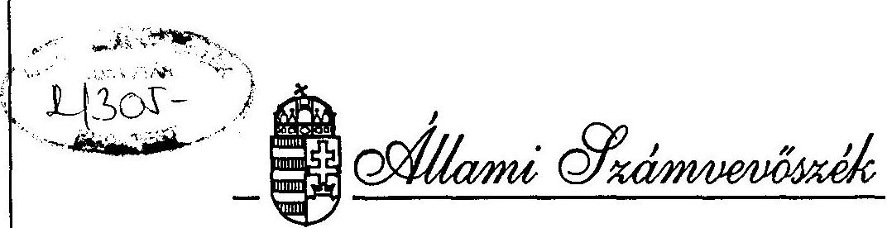
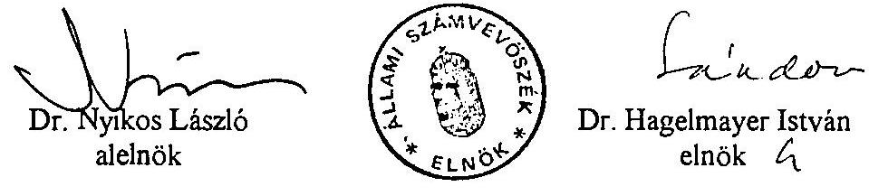

# JELENTÉS 

az Országos Betétbiztosítási Alap
pénzügyi-számviteli ellenôrzésérôl

---

A vizsgálat végrehajtásáért felelős:
az ÁSZ III. Költségvetési Ellenőrzési Igazgatósága
Bihary Zsigmond igazgató

Az ellenőrzést vezette:
Horváth Sándor osztályvezető főtanácsos
Az ellenőrzést végezte és a jelentést összeállította:
Bodonyi Miklós számvevö tanácsos

---

# JELENTÉS 

## az Országos Betétbiztosítási Alap pénzügyi-számviteli ellenőrzéséröl

Az Országos Betétbiztosítási Alapot az 1993. évi XXIV. törvény hozta létre, 1993. június 30-i hatálybalépéssel. Rendeltetése, hogy a fizetésképtelenné váló pénzintézeteknél befagyott betéteket meghatározott nagyságrendig ( 1 millió Ft ) visszafizesse a betéteseknek. E kifizetések megelőzése, illetve elkerülése érdekében - bizonyos keretek között - szerepet vállalhat az esetleges pénzintézeti válsághelyzetek elhárításában.

Az Országos Betétbiztosítási Alap (a továbbiakban: Alap) biztosítási feladatköre, müködésének első két és fél évében, egyre nagyobb mértékben terjedt ki a pénzintézeteknél elhelyezett betétekre. Az 1993. június 30-a előtt, összeghatár nélkül, állami garanciával védett betétállomány aránya 1995 végére közel felére csökkent, helyét az Alap által nyújtott biztosítás vette át. Az Alap ugyanakkor jelentő́s mértékben olyan betéteket (pl. vállalkozói folyószámlákat) is biztosít, amelyek mögött korábban nem állt állami garancia.

A biztosítási összegek kifizetésének fedezetét az Alapban kötelező tagsággal rendelkező, betétgyűjtéssel is foglalkozó pénzintézetek egyszeri csatlakozási és rendszeres éves díja, mint bevételi forrás alkotja, amit szükséges esetben rendkívüli díjfizetés és hitelfelvétel egészíthet ki. Az Alapba teljesített tagintézeti befizetések 1995 végéig 3,9 Mrd Ft-ot tettek ki, ezek pénzügyi befektetése pedig további $1,3 \mathrm{Mrd}$ Ft-tal növelte a forrásokat.

Az Alap állami indulótőke juttatás nélkül kezdte meg működését, így szakértői vélemények szerint legalább 10 évre van szükség ahhoz, hogy saját vagyona - kifizetések nélkül - elérje a betétállomány célul kitüzött $1,5 \%$-os fedezettségi szintjét.

Az Alapból 1993 közepétől 1995 végéig mintegy 1,4 Mrd Ft betétbiztosítással összefüggő felhasználás történt. A befagyott betétek miatti biztosítási összegek $0,6 \mathrm{Mrd} \mathrm{Ft}$, fizetésképtelenséget megelőző akciók pedig $0,8 \mathrm{Mrd}$ Ft nagyságrendủ ráfordítást, illetve vagyoncsökkenést eredményeztek. A biztosítási összegek kifizetésére a Heves és Vidéke Takarékszövetkezetnél a biztosított betétállomány egészére, az Agrobank esetében részben, előleg formájában került sor. Felszámolást elkerülő céllal az Agrobank helyzetének stabilizálásához és az Iparbankház csendes kiürítéséhez járult hozzá anyagilag az Alap.

---

Az Alap önálló jogi személy, irányítását a törvény szerint létrehozott igazgatótanács gyakorolja. Müködésének operativ feladatait - az ügyvezető igazgató irányítása mellett - kis létszámú (13-14 fős) szervezet látja el. Az Alap nem nyereségérdekeltségben müködő szerv, könyveit a 34/1994. (III. 18.) Korm.rendelet alapján kell vezetnie. Éves gazdálkodásáról - kettős könyvvitelen alapuló - beszámolót készít, amelyet a tagintézeteken kívül megküld az Állami Számvevőszéknek. Ezek véglegesítését és igazgatótanácsi elfogadását könyvvizsgálat előzi meg.

Az Alap létrehozását elrendelő 1993. évi XXIV. törvény 10. §-a szerint az Állami Számvevőszékre háruló pénzügyi-számviteli ellenőrzés céljának meghatározásánál tekintettel voltunk arra, hogy az Alap éves mérlegét, vagyoni helyzetét és az ezekről szóló beszámolót független könyvvizsgáló cég minden évben auditálta, az Alap közpénzeket nem kezel, továbbá a fontosabb döntéseket szuverén testület, az igazgatótanács hozza. E tényezőket szem előtt tartva ellenőrzésünk arra irányult, hogy az Alap a vonatkozó törvényi szabályozásnak megfelelően müködött-e, forrásainak képzése és felhasználása kellő összhangban állt-e az Alap meghatározott rendeltetésével. A kialakított számviteli rend megfelelően biztosította-e a vagyoni helyzetben bekövetkezett változások és egyéb gazdasági események folyamatos figyelemmel kisérését, az éves beszámoló valódiságát.

Az Alapnál végzett helyszíni ellenőrzésünk az 1993 - 1995. évekre terjedt ki. Határozatok, dokumentumok megismerése céljából kapcsolatba léptünk az Állami Bankfelügyelettel is.

# Következtetések és javaslatok 

Az Alap felhalmozott vagyona csak igen korlátozottan teszi lehetővé a létrehozásáról és müködésének részletes szabályairól szóló 1993. évi XXIV. (a továbbiakban: OBA-) törvényben meghatározott betétbiztosítási kötelezettségek önerőből történő teljesítését. A kereskedelmi bankok és takarékszövetkezetek 1995. év végi becsült biztositott betétállományának 3 ezrelékénél kisebb likvid tőkéje egy közepes méretű bank esetleges fizetésképtelenné válása esetén is csak a szükséges pénzforrások töredékére lenne elégséges.

A törvényben biztosított hitelfelvételi lehetőség és arra kormánygarancia nyújtása - a fejlett piacgazdaságú országok nagyobb részében szerves fejlődés útján felhalmozódott betétbiztosítási célú vagyontömeg hiányában is - elvileg kielégitő megoldást jelent. Az Alap eddigi és még hosszabb ideig tartó tőkeszegénysége és a Kormány belátásától függő garancia ugyanakkor nemcsak a kifizetések elhúzódásának veszélyét rejti, hanem kedvezőtlenül hat az Alap érdekérvényesitő képességére, a pénzintézeti válsághelyzetek megelőzésében, illetve kezelésében betölthető szerepére is.

Az Alap a rendeltetésszerű működés körébe tartozó klasszikus kártérítési esetekben (Heves és Vidéke Takarékszövetkezet, agrobanki előlegek) a törvényi előírások szerint, szervezetten, a határidők betartásával fejtette ki tevékenységét. A biztosítási összegek kifizetésének megelőzése, illetve elkerülése, saját tőkéjének megőrzése érdekében vállalt

---

anyagi kötelezettségei között azonban előfordultak célszerűtlen, részben szükségtelen felhasználások is. Az Agrobank pénzügyi helyzetének rendezéséhez 1995 májusában nyújtott 500 M Ft-os hozzájárulás és az Iparbankház 1995-ben kezdődött un. csendes kiürítéséhez felhasznált - az 1996. év eleji kifizetésekkel együtt - közel 1 Mrd Ft lényegében az állami fötulajdonosok (PM, ÁPV Rt.) helyett az Alap részéről kényszerhelyzetekben vállalt helytállást jelentett.

Az Alap szerepét, egyúttal tőkeszegénységét figyelembe vették a banki válsághelyzetek rendezésénél. A visszterhesen nyújtott anyagi hozzájárulásoknak azonban várhatóan csak a harmada térül vissza az Alap számára. A tőkeveszteség előreláthatólag megközelíti az 1 Mrd Ft-ot annak ellenére, hogy az Alap ügyvezetése tett erőfeszítéseket a visszatérülés arányának javitására.

Az éves dijpolitikát az igazgatótanács a törvényes keretek között alakította ki, a betétállomány összetétele (átlagos betétnagyság) alapján differenciált díjkulcsok alkalmazásával az esetleges betétkifizetések miatti eltérő kötelezettséget juttatta kifejezésre. Annak ellenére, hogy a közzétett díjfizetési szabályzatban másfélszeres, emelt díjfizetés kiszabását helyezte kilátásba a meghatározott mutatók (szavatoló tőke, tőkemegfelelési mutató) alapján kockázatosabbnak minősített pénzintézetek számára, ezek alkalmazásától az elmúlt két évben utólag többnyire eltekintett. Az érintett pénzintézeti kör javára hozott döntések részben az érvényes szabályozásban rejlő anomáliákkal összefüggésben kérdőjelezték meg annak normativitását.

Az Alap a rendelkezésre álló pénzeszközeit - a folyamatos működést szolgáló forrásokon kívül - a törvénynek megfelelően, állampapírokban tartotta. A pénzügyi befektetéssel megbízott pénzintézet útján igen kedvező hozam mellett őrizte meg a pénzbeni vagyon reálértékét. Törekvése ugyanakkor együtt járt azzal is, hogy nagy összegű kifizetéshez, a saját forrásai helyett, a hozam biztosítása érdekében, de a törvényi lehetőséget túllépve, jegybanki készenléti hitelt vett igénybe.

Az Alapot kezelő szervezet mérete és müködésének költsége - a pénzintézeti közeghez viszonyítva - mértéktartónak minősíthető. A személyi jellegű ráfordítások évenkénti növelésére és a beruházásokra előirányzott összegek - a tervezésüknél jelentkező hiányosságok ellenére - önmérsékletet mutatnak.

A kialakított számviteli rend megfelel a vonatkozó kormányrendelet előirásainak, alkalmas az Alap vagyoni, pénzügyi és jövedelmi viszonyairól megbízható és valós adatokat szolgáltatni. Helyszíni ellenőrzésünk megerősítette a Deloitte and Touche könyvvizsgáló cégnek az Alap lezárt eddigi három évéről készített beszámolójával kapcsolatos kedvező véleményét. A folyamatos könyvelés naprakészségében, a vezetői információrendszer müködésében, a bizonylati rendben és a belső szabályozásban ugyanakkor az átfogó értékelést alapjaiban nem motiváló hiányosságok is előfordultak.

---

Ellenőrzésünk tapasztalatai alapján az Alap igazgatótanácsának, valamint ügyvezetésének a következő javaslatokat tesszük:

1) A betétbiztosítási összegek kifizetésének megelőzése, illetve elkerülése, az Alap vagyonának megőrzése érdekében a hatályos OBA törvény és a várhatóan még ez évben helyébe lépő új (hitelintézeti) törvény keretei között:

- rendszerszerűen alakítson ki olyan információs és koordinációs rendszert (elsősorban az Állami Bankfelügyelettel és a Magyar Nemzeti Bankkal), amely alkalmas a pénzintézeti veszélyhelyzetek korai felismerésére, a biztosítási kockázatok folyamatos elemzésére;
- az eddigi saját és a nemzetközi tapasztalatokra is alapozva dolgozza ki azokat a belső eljárási szabályokat, módszereket, amelyek alkalmazásával az Alap aktívan és hatékonyan közremüködhet a pénzintézeti veszélyhelyzetek kezelésében, elhárításában;
- a visszterhes anyagi kötelezettségek vállalására vonatkozó egyedi döntéseknél és az ezeknek megfelelően megkötésre kerülő szerződéseknél törekedjen az értékarányos visszatérülés megfelelő garanciáinak, biztosítékainak megteremtésére.

2) A dijkulcsok indokolt differenciálásának érvényesítése, a szabályok egységes alkalmazása érdekében az éves dijpolitika és dijfizetési szabályzat kialakítása keretében indokolt előre meghatározni és közzétenni azokat a szempontokat, amelyeket az Alap figyelembe kíván venni az emelt díjak kiszabása mellett azok elengedésének elbírálásánál.
3) Egészítse ki belső szabályozását a működési mechanizmusra és az eljárási rendre vonatkozó részben hiányos követelmények írásbeli meghatározásával, a vezetői és az ügyintézői jogokat és kötelezettségeket pontosabban, számonkérhető formában rögzítő előírásokkal. A bérrendszer keretében ösztönző, valós többletteljesítményt kitűző anyagi érdekeltségi rendszert müködtessen.
4) Az éves költségvetések tervezésére fordítson fokozottabb figyelmet, számszerüsítve azokat a kellően indokolt tényezőket, amelyek szerepet játszanak az előirányzatok kialakításánál és elfogadásánál.
5) Gondoskodjon a számvitel naprakészségének folyamatos fenntartásáról, a vezetői információs rendszer kialakításáról és müködtetéséről. Következetesen szerezzen érvényt a bizonylatokkal szembeni - számviteli törvényben előírt - követelményeknek.

---

# Részletes megállapítások 

## 1. Az Alap bevételi forrásai

Az Alap fó bevételi forrásait jelentő egyszeri csatlakozási és a tagintézetek által negyedéves rendszerességgel fizetett éves díj az OBA törvényben megszabott mértékben teljesült. A csatlakozási díjakból származó 670 M Ft-os forrását az Alap - a 34/1994. (III.18.) Korm.rendeletnek megfelelően - alaptőkeként vette számításba. Átmenetileg a hatályos törvénytől eltérően járt viszont el egyes pénzintézetek 1994 első félévi dijfizetési kötelezettségének elengedésénél.

Az OBA tơrvény átmeneti rendelkezéseket tartalmazó 48. §-a a volt Ingatlanbank Rt. lakosságí forrásainak biztosítása érdekében 1991-ben hozzájárulást teljesitő pénzintézeteket az 1993. évre vonatkozóan mentesitette a befizetési kötelezettség alól. A mentesités 1994 elsô félévre történő kiterjesztését az 1995. január 1-jén hatályba lépett 1994. évi Cl. törvény rendelte el, visszamenőleges érvénnyel. A módosításig azonban, az indokolt méltányosság ellenére, nem volt törvényes lehetôség a dijfizetés szüneteltetésére.

Az érintett 8 pénzintézetnek a hivatkozott törvények alapján történt mentesitése 1993-1994-ben 843 M Ft bevételkicsést eredményezett az Alap számára. (A pénzintézeteknél ez az 1991. évi 1,3 Mrd Ft-os befizetésük kétharmados arányú megtérülését jelentette.)

Az igazgatótanács által évente elfogadott dijpolitika kialakításánál figyelembe vették a tagintézetek észrevételeit. Az eltérő érdekekre is tekintettel foglaltak állást az 1993-ban még egységes ( 1,8 ezrelék) díjkulcs késôbbi differenciálásában. Indokoltnak tekinthetö, hogy a kialakulóban levő hazai pénzintézeti rendszerben a lényegesen eltérő ügyfél- és szolgáltatási körből adódó kockázati elemeket a díjkulcsokban is érvényesitették.

Az 1 millió Ft-os kártéritési összeghatár következtében az Alap részéről azok a pénzintézetek részesülnek fokozottabb védelemben, ahol a betétek átlagos nagysága elmarad a biztositási összeghatártól. Ezek esetében 1994-tól magasabb ( 1,9 ezrelék), az 1 millió Ft-ot meghaladó átlagos betéti összegủ pénzintézetekre vonatkozóan alacsonyabb ( 1,6 ezrelék) dijkulcs került bevezetésre. A pénzintézetek terhelése a törvényben limitált 2 ezreléknél alacsonyabb mértékủ, átlag 1,8 ezrelék volt.

Az Alap igazgatótanácsa jellemzően csak a szabályozás szintjén élt az OBA törvényben biztosított további differenciálás lehetőségével. A minimális szavatoló (jegyzett) tőke és a tőkemegfelelési mutató pénzintézeti törvényben meghatározott mértékét el nem érő, nagyobb kockázatnak kitett pénzintézetek számára $50 \%$-kal magasabb, emelt dijfizetést hirdetett meg. Kiszabásától azonban, utólag felmerült szempontok érvényesítése miatt, 1994-ben részben, 1995-ben teljes egészében eltekintett. Az így elmaradt dijbevétel meghaladta a 140 M Ft-ot.

---

Az 1995. évi döntés indokául az szolgált, hogy az érintett pénzintézetek (az 1994. évi mérlegadatok alapján 6 bank és 90 takarékszövetkezel) helyzete összevonás és mutatóik javulása miatt az emelt dij megállapításának időpontjáig (a következỏ év öszéig) többségében megváltozott. További érvet jelentett a szabályok szigorodása és az érintettek nagy száma, a takarékszövetkezetek esetében az Országos Takarékszövetkezeti Intézményvédelmi Alap (OTIVA) tagság.

A szabályok következetes érvényesitésének eredményeként az Alapba mindössze 3 takarékszövetkezet fizetett be 1994-ben, együttesen 831 ezer Ft többletdijat.

Az emelt dijak alkalmazása az OBA törvény 23. § (6)-(7) bekezdés szerint az Alap mérlegelési jogkörébe tartozik, igy törvényességi szempontból nem kifogásolható az igazgatótanács döntése. Az egységes jogalkalmazást és a többi pénzintézet érdekeit tekintve azonban nem helyeselhető a közzétett kritériumok szerint kockázatosnak értékelt pénzintézeti tevékenység utólagos, a minősített időszakot követő változások alapján történő átértékelése.

A dijfizetés alapjául szolgáló adatok megbizhatósága szempontjából indokolt az a megoldás, hogy a pénzintézeteknek a betétállományra vonatkozó nyilatkozatait az auditált mérlegek alapján kell elkészíteni. Az ezzel járó idöbeni elhúzódás ugyanakkor csökkenti az Alap részéről a dijak megállapításának aktualitását. Az OBA törvénynek megfelelően az előző év december 31-i betétállomány nagysága és összetétele alapján fennálló fizetési kötelezettség a következő év közepétől egy éven keresztül áll fenn, jelentős fáziskéséssel követve a betétállomány nominális változását.

Az emelt dijak alkalmazása az időbeni eltérés miatt inkább tekinthető a kockázatos pénzintézeti tevékenység utólagos szankcionálásának, mintsem preventív eszköznek. Emellett az Alap megnövekedett kockázata és a potenciális dijtöbblet között sem volt időbeni összhang. Az anomáliára az Alap igazgatótanácsa a jelzett módon reagált.

Az OBA törvény nem zárja ki azt a lehetőséget, hogy az emelt dij megállapítására már abban az idôszakban sor kerüljön, amikor egyes pénzintézetek tevékenysége miatt nö az Alap veszélyeztetettége, csupán az emelt dij mértékét köti a betétállomány clőző év végi nagyságához. A kockázat és a dij szorosabb idöbeni összhangját megteremtő módszerck, eljárások kidolgozásának igénye viszont nem merült fel.

Meg kell említeni azt is, hogy a pénzintézetek nyilatkozataiban feltüntetett betétállományok föösszegei az auditált mérlegekkel kontrollálhatók, az éves dijak összegére kiható belső összetételük és a betétek mennyiségi adatai viszont a könyvvizsgálók részéről nem ellenőrzöttek. Hitelességük vizsgálatát külső ellenörző szervezetek eddig nem tekintették feladatuknak és az Alap sem tett lépéseket a legalább próbaszerủen végrehajtandó adatellenőrzés megoldására.

A dijfizetésre kötelezett pénzintézetek többnyire rendben eleget tettek kötelezettségüknek. Az Alap által 1995 végéig realizált 3,9 Mrd Ft dijbevétel elenyésző töredékénél kellett felszólítással és késedelmi kamat felszámításával élni. Ennek végrehajtása ugyanakkor esetenként indokolatlanul elhúzódott.

---

Év végén is fennálló dijhátralékként az Alap 1993-ban (1,3 M Ft) és 1995-ben ( $2,9 \mathrm{M} \mathrm{Ft}$ ) mutatott ki követelést. Év közben a negyedéves fizetési határidők teljesitésében elmaradó pénzintézetektől 1993-ban 2,8 M Ft, 1994-ben 364 E Ft, 1995-ben 859 E Ft késedelmi kamatot szedett be. Az éves, milliárdos nagyságrendủ dijbevételhez viszonyítva az adatok szilárd fizetési fegyelmet mutatnak.

Az 1996 januárjában kiszámlázott dij- és késedelmi kamat hátralékok között előfordultak 1995. I. és II. negyedévet érintő követelések is. A számlák, mint számviteli bizonylatok hitelességét, ezáltal a mérlegvalódiságot is csorbította ugyanakkor, hogy a számlákat 1995. december 31-re visszadátumozták.

Az Alap a rendelkezésére álló pénzforrások lekötésénél törvényesen és eredményesen járt el. A müködési költségekre elkülönített összegen felüli pénzeszközeit - kedvező feltételekkel, befektető cég útján - állampapírokban tartotta. Az ebből származó hozam 1995 végéig 1,3 Mrd Ft-tal növelte az Alap forrásait. A hozam mértéke rendre meghaladta a diszkont kincstárjegyek adott időszaki hozamszintjét. A befektetési tevékenység ellátására vonatkozó 1993. évi szerződés többszöri módosítása az Alap érdekeit szolgálta, szükítve a hozammal szemben elszámolható költségeket, a portfolió kezelőnek fizetett jutalék fajlagos mértékét.

Az Alap 1995. évi bevételi forrásainak 650 M Ft likviditási (refinanszirozási) hitel igénybevételével történt kiegészítése pénzügyi megfontolásból érthető, törvényességét tekintve azonban vitatható volt. Az OBA törvény hitel felvételét ugyanis abban az esetben teszi lehetővé, ha az Alap rendelkezésére álló pénzeszközök nem elegendőek az alapfeladatok ellátására. Az Iparbankház kiürítésével összefüggésben vállalt, összesen 1,2 Mrd Ft-os kötelezettség pénzügyi fedezetével pedig az Alap rendelkezett.

Az MNB-vel kötött szerződés az Alap és az Iparbankház közötti készenléti hitel igénybevételét volt hivatott finanszirozni. Így gyakorlatilag az Iparbankház közvetett jegybanki refinanszirozása valósult meg, miközben az Alap mentesült saját forrásainak kényszerlikvidációjával (az állampapírok lejárat elötti értékesítésével) járó hozamkiesés alól.

Az 1995 december közepétől 1996 február végéig igénybe vett, összesen 990 M Ft hitelt az Alap március hónapban törlesztette. Ebből 641 MFt pénzügyi teljesités azzal függött össze, hogy a lejárt állampapírok további befektetése (a hozamok esése következtében) már nem biztosított a likviditási hitel kamatánál magasabb jövedelmet.

A betétbiztosítással összefüggésben kifizetett kártérítések visszatérülésére - az állami garanciával védett betétek pénzügyi rendezését kivéve - csak részben, akkor is formálisan került sor az elmúlt időszakban.

A Heves és Vidéke Takarékszövetkezet betéteseinek kártérítésére folyósított 258 M Ft várhatóan teljes egészében vagyonvesztést jelent az Alap számára. Az ügyvezetés a lehetséges jogi eszközök igénybevétele ellenére nem tudott eredményt elérni a már törvényes határidőn túl folyó felszámolási eljárás lezárásában, az esetleg maradó vagyon felosztásában.

---

Az 1993-ban indult felszámolást a vonatkozó törvény szerint 1995 öszén le kellett volna zárni. Az eljárás azonban még abba a stádiumba sem jutott el, hogy az illetékes bíróság elfogadja a közbensõ mérleget.

A megengedhetönél hosszabb ideig nyúló eljárás költségei - amelyeknek egy részét a hitelezők képviselöjeként is eljáró Alap indokoltan kifogásolta - idöközben felemésztik a maradék vagyont. A törvényben megszabott kielégitési sorrend alapján az 1993 végén még $10-30 \%$-ra becsült aránnyal szemben ma már nincs esély az Alap követelésének töredéknyi érvényesitésére sem.

Visszatérülés nélküli vagyonvesztésként könyvelhető szintén el az Agrobank betétjeinek befagyása miatt 1995 májusában kifizetett elölegek és a bank megmentése érdekében átadott állampapirok együttesen 500 M Ft-os összege. A jelentés későbbi részében értékelt ügylet keretében kapott banki részvények azonos összegủ névértéke 1996. januárjában - a Mezőbankkal történt összevonás alkalmával - $1 \%$-ra ( 5 M Ft-ra) zuhant. A $99 \%$-os veszteség megtérülése az igazgatótanács szorgalmazása ellenére, szerződéses garanciák kikötésének hiányában, reménytelennek látszik.

Az Agrobank 1995. május 28-i, zártkörü tőkecmelésröl (tulajdonos váltásról) határozó közgyűlését megelőzően a Pénzügyminisztériummal, mint állami tulajdonossal kötött megállapodásban az Alap a PM-re ruházta át az Agrobankkal szembeni 306,5 M Ft - betétkifizetésböl származó - követelését és átadott további 193,5 M Ft értékủ államkötvényt. A visszteherként kapott 500 M Ft névértékủ részvénycsomag értékmegörzésére - a kedvező tárgyalási pozíciót elmulasztva - nem kötött ki garanciát. Ennek igénye az igazgatótanács május 25-i ülésén a Bankszövetség fötitkára részéről megfogalmazódott, de a határozatban már nem került rögzítésre. Szó szerinti jegyzökönyv hiányában nem volt megállapítható a döntés motívuma.

A részvénycsomag értékmegőrzését garantáló szindikátusi szerződést az Alap ügyvezetése eredménytelenül próbálta megkötni a PM-mel. Sajátos és az Alap igazgatótanácsában - az OBA törvény szerint - viselt tisztséggel is nehezen összeegyeztethető momentum az is, hogy a Pénzügyminisztérium nem vonta be az Alapot az 1996. januári bankfüzió alkalmával végrehajtott agrobanki tőkeleszállítás elökészitésćbe. Az értékvesztésről az Alap képvisclője a közgyűlési meghívóból szerzett tudomást.

A betétkifizetéssel összefüggő igénybejelentési, adatfeldolgozási és egyéb járulékos költségek megtérítése, az ebből származó, nem tervezett bevételek realizálása - a Heves és Vidéke Takarékszövetkezet kivételével - eredményesnek minősíthető. Az érintett pénzintézetekre áthárított összegek számlázása indokolt volt, bár előző évre történt visszadátumozással itt is találkoztunk.

Az Alap egyéb, gazdálkodásból származó bevételre szerény mértékben, évi 2-4 M Ft öszszegben tett szert. Az irodahelyiségek bérbeadásából, számítástechnikai szolgáltatásból, felesleges eszközök értékesítéséből származó bevételi forrásainak növelése korlátozott és számba vehető felesleges kapacitásokkal sem rendelkezik.

---

# 2. A pénzeszközök felhasználásának törvényessége 

Az Alap betétbiztosítási funkciójának gyakorlása keretében kártéritési kifizetésekre - létrehozása óta - a Heves és Vidéke Takarékszövetkezetnél és az Agrobanknál elhelyezett betétek befagyása miatt került sor. Mindkét esetben az OBA törvényben meghatározott módon és keretek között járt el azzal a különbséggel, hogy az Agrobanknál a végrehajtott pénzügyi stabilizálás szükségtelenné tette a beindított igénybejelentési és kifizetési eljárások folytatását.

Az Alap létrehozásától számított néhány hónapon belül bekövetkezett takarékszövetkezeti fizetésképtelenség ellenére a betétkifizetések előkészítése és lebonyolítása szervezetten, a törvényes határidők, feltételek és korlátok érvényesítésével zajlott le. A közreműködők (számitástechnikai adatfeldolgozást, pénztári kifizetést stb. teljesitők) bevonása és igénybevétele megfelelően egészítette ki az Alap kapacitását. Az eredményességben fontos szerepet játszott, hogy a betétkifizetési feladatok ellátására, a kapcsolódó tevékenységek szabályozására már az OBA törvény elfogadása előtt történtek előkészületek.

A törvény gyakorlatban való alkalmazása során felmerült értelmezési, eljárási és módszertani kérdéseket többnyire az igazgatótanács állásfoglalásai alapján megoldották. Ezek közé sorolható a hevesi takarékszövetkezetnél talált olyan betéteknek a biztosításból való törvényes kizárása is, amelyek - a hasonló betétekhez viszonyítva - jelentős kamat (vagy más vagyoni) előnyt kaptak. Az eseti értelmezésből nem született általános érvényű szempontrendszer, mert a későbbiekben lefolytatott egyeztetések során nem sikerült közös nevezőre hozni a tagintézetek és az igazgatótanácsi tagok véleményét a jelentős előny számszerüsíthető mértékének meghatározásában.

Az Agrobankban elhelyezett betétek befagyását az Állami Bankfelügyelet csődközeli helyzetben indokoltan hozott határozata eredményezte. Az Alap ez esetben is megtette a szükséges intézkedéseket a törvényes rendnek megfelelő kifizetések előkészítésére. Párhuzamosan, a nagy számban jelentkező igények csillapítására - bankfelügyeleti engedéllyel - egyedileg 20 ezer Ft-ig előleget fizetett a betéteseknek, összesen 306,5 M Ft összegben.

Az előlegfizetést a közvélemény nyomása indukálta. Meg kell ugyanakkor jegyezni, hogy a jogi szabályozás nem tér ki a betétesek jogos igényeinek részletekben történő kielégítési lehetőségére és nem ad felhatalmazást a méltányosság alkalmazására.

A Pénzügyminisztérium által 1995. év májusában végrehajtott agrobanki tőkeemeléssel és a pénzintézeti tevékenységek végzését tiltó bankfelügyeleti határozatok visszavonásával nemcsak a betétkifizetési kötelezettség szűnt meg, hanem egyidejűleg elhárult a fizetésképtelenség veszélye is. Az Alap - az átadott államkötvények értékével együtt 500 M Ft-ra növelt anyagi részvételét az Agrobank helyzetének rendezésében törvényesnek, a megoldás módját tekintve azonban célszerütlennek ítéljük. Az 500 M Ft-os hozzájárulás ellenében átvett agrobanki részvények (amelyek révén az Alap résztulajdonosává vált a banknak) nem tekinthetők olyan tőkeelemeknek, amelyek szükség esetén könnyen mobilizálhatók lettek volna. Ez az indokoltnál nagyobb és időben nem meghatározható korlátozását jelentette a források felhasználásának.(A rendelkezésre álló iratokból nem volt megállapítható

---

az Alap részvételének közvetlen oka és az összeg nagyságának számszaki megalapozottsága sem.)

Az Agrobank csődje, különbözö becslések szerint, 14-18 Mrd Ft kártérítés kifizetését követelte volna meg (hitel igénybevételével), aminek az Alap számára történő visszapótlása éveken keresztül tartó rendkivüli dijfizetéssel sújtotta volna a tagintézeteket. A vélhetően kompromisszumként választott megoldás a bankszektor egyfajta közvetett anyagi hozzájárulását szimbolizálhatta.

Az Iparbankház csendes kiürítésében vállalt szerepet ellenőrzésünk törvényességi szempontból szintén nem kifogásolja. Indokoltnak tekintjük, hogy az azonnali felszámolás esetén felmerülö, $2,8 \mathrm{Mrd}$ Ft-ra prognosztizált kártérítéssel és annak mintegy $50 \%$-os visszatérülésével szemben a banki likvid források $1,2 \mathrm{Mrd}$ Ft-os hiányának - hasonló arányban megtérülő - pótlását választották.

Az Alap részvételét az tette szükségessé, hogy a korábban már konszolidált, de folyamatos veszteséget termelő bank további müködését az Állami Bankfelügyelet csak azzal a feltétellel engedélyezte, ha a pénzintézet korlátozott időn belül leépíti eszközeit és betétállományát, 1996. február 28-ig beszünteti tevékenységét. Miután a $85 \%$-os állami tulajdonban levő bank pénzügyi megsegitésétől a Kormány elzárkózott, így kényszerhelyzetben, a nagyobb veszteséget elkerülendő, az Alap, valamint az MNB vállalt kötelezettséget.

A hazai gyakorlatban példa nélküli, sikeresnek ígérkező csendes kiürítés a pénzügyi kockázattal nem járó ellenérdekek, ugyanakkor az anyagilag érdekeltek gyenge befolyása miatt késedelmet szenvedett. Ezzel összefüggésben magasabb költség és feltehetően alacsonyabb eszközmegtérülés jelentkezik. Az Alap sorozatos figyelmeztetése nem bizonyult hatásos eszköznek a kiürítés ütemes végrehajtásának kikényszerítésére. Ehhez a szerződésben rögzített jogi lehetőségek sem adtak megfelelő alapot az időszakban érvényesülő tulajdonosi ráhatás ellenében.

Az Állami Bankfelügyelet 1995. július 27-i (310/1995. számú) határozata szerint az Iparbankház csendes kiürítésénck folyamatát a privatizációs kísérletek nem akadályozhatták. A bankban tulajdonosi jogosítványokkal rendelkező állami szervek (az ÁPV Rt és a Pénzügyminisztérium) a hatósági döntést formálisan tudomásul vették, de nem mondtak le a müködőképes állapotban történő értékesítésröl. A határidők többszöri módosításával tovább folytak a tárgyalások a potenciális vevökkel. (A pénzügyminiszter által kért utolsó határidő november 10-e volt, de találhatók ezt követő levélváltások is.) A bank felső vezetőinek egzisztenciális érdekei is elsősorban a privatizációhoz füzödtek.

Az Alapnak az Iparbankházzal kötött hitelszerződése 14 pontban sorolta fel azokat az eseteket (beleértve a késedelmes végrehajtást is), amelyek a szerzödés egyoldalú felmondására adtak lehetőséget. A felmondás azonban a kiürítés idején nem állhatott az Alap érdekében, mert az annak következtében kialakuló fizetésképtelenség (felszámolás) saját magát sújtotta volna.

---

A bank kiürítésére készített, a Bankfelügyelet és az Alap által elfogadott, valamint a hitelszerződéshez is csatolt intézkedés terv a feladatok jelentős részénél a pontos időbeni ütemezést, számszerủ mértéket, személyes felelősséget nem kielégitően határozta meg. Ez objektíve nehezítette, illetve akadályozta a számonkérést, a folyamat előrehaladásának viszonyítását. Nem készült pl. a leépítéshez igazodó költségterv, így utólag már nem is számszerüsithető, hogy az elhúzódás milyen mértékủ többletköltséget okozott.

A többletköltségek kérdésével - az Alap rendeltetésszerủ felhasználásával összefüggésben az igazgatótanács is foglalkozott elvi szinten, de sem akkor (1995. november 29-én), sem korábban nem merült fel a teljes, vagy részleges áthárítás lehetősége. Megítélésünk szerint ugyanis indokolt lett volna, hogy a privatizációs kísérletek, a kiürítés elhúzódása, a többletköltségek és a bizonytalan mértékủ eszközmegtérülés közötti oksági kapcsolatra tekintettel a főtulajdonosok anyagi kötelezettséget vállaljanak. A terhek megosztásán így olyan közreműködők (Alap, MNB) osztoznak, amelyek csekély hatással voltak az eredményességre.

Utólag nem számszerüsithető többletköltségek jelentkeztek pl. az ütemes csökkenésnél magasabb betétállományra fizetett, az indokoltnál nagyobb kamatok, a tovább foglalkoztatott létszám bérezése, a nyitva maradt bankfiókok üzemeltetése stb. miatt. A hitelállomány és a vagyontárgyak (bankfiók, tárgyi eszközök) értékesítésének elmulasztása, a bank még működőképes állapotában, leértékelődésükhöz vezetett.

A nem biztositott betétek kifizetésével és a banküzemi költségekkel kapcsolatos terheken az Alap és a refinanszirozott hitelek sorsában anyagilag is érdekelt MNB arányosan osztozik. Az 1995 decemberében kötött és többször módosított megállapodás szerint az eszközök értékesítéséből származó megtérülés jellemzöen az Alapot illeti meg.

A megállapodás részét képezte, hogy az MNB az Alapot bizta meg a felmerülő banküzemi költségek indokoltságának ellenőrzésével. Ez azonban - elöbb a viszonyitási mértékek, később a tényszámok hiányában - gyakorlatilag az egyedi elszámolásokra szorítkozott. Az Alap az MNB részéről megtérítendő összegekről 1996. március közepén 371 MFt-os számlát állított ki.

Az 1995. december első napjaiban megjelent újságcikkek és a folyószámlák felmondásának hatására rohamos ütemben megindult betétkivonás vetett véget az elhúzódás miatt mind ellentmondásosabbá váló folyamatnak, megkérdőjelezve egyúttal a vezérelt kiürítés csendességére vonatkozó koncepciót. A betétek döntő hányadának bő egy hónap alatti kifizetése a bank megfelelő, hitellel támogatott likviditása következtében nem okozott nehézséget.

A bankban bennragadt eszközök (hitelek, vagyontárgyak) átadása, illetve értékesítése - a Bankfelügyelet által 1996. június 30 -ig meghosszabbított korlátozott müködés keretében helyszíni ellenőrzésünk idején is még tartott. A tevékenység a jelek szerint - a részben spontán módon minimális szintre csökkent létszámmal és a bank 1996 januárjában megválasztott új elnökének irányítása mellett - az utóbbi hónapokban célratörően folyik. Az

---

Alapnak az Iparbankházzal összefüggő nettó felhasználása - a várható megtérülésre is tekintettel - 500 M Ft-ra becsülhető.

# 3. A müködési költségek indokoltsága 

Az Alap müködtetésével összefüggésben felmerült költségeket ellenőrzésünk egészében mértéktartónak minösíti. Az 1993. töredékévi 86 M Ft ráforditás 1995. évi 156 M Ft-ra növekedésében a reális szükséglettől elszakadó, az Alap nagyságrenddel nagyobb forrásait indokolatlanul terhelő bővülés, vagy pazarlás jeleit általában nem tapasztaltuk.

A gazdálkodás kereteit meghatározó éves költségvetéseket - az OBA törvénynek megfelelően - az igazgatótanács hagyta jóvá, az éves beszámoló elfogadásával egyidöben. A rendszerint április-május hónapra - törvényesen - húzódó döntésig jelentkező felhatalmazás nélküli időszakot az igazgatótanács előzetes tájékoztatásával és a jelentősebb kiadások, szerződések egyedi engedélyeztetésével helyesen hidalták át.

Az éves költségvetések számszaki megalapozottsága ugyanakkor részben hiányos, előterjesztésük szöveges indoklása nagyvonalú, körültekintő elbírálásra kevéssé alkalmas volt. A kidolgozottabb tervszámok körében előfordult, hogy egyes tényezőket a reálistól eltérően vettek figyelembe.

Az előterjesztésekben (és az éves beszámolókban is) visszatérően hivatkoztak arra, hogy a létrehozáskor meghatározott 25 fös létszámmal szemben az Alap 13-14 fővel látja el a feladatokat. Ez önmagában igaz és helyeselhető, de hozzátartozott volna, hogy a szervezeti koncepcióban vázolt 25 fös funkcióhoz képest az Alap nem teljes körűen, illetve külső közreműködők megbízásával folytatja tevékenységét. A számítástechnikai és a befektetői megbízások költségeivel kalkulálva a szükebb apparátus müködtetése pusztán ráfordítás oldalról már nem tekinthető egyértelműen olcsónak. Így helyesebb lett volna a feladatellátás szervezeti megoldását hatékonysági és credményességi szempontból indokolni.

Az anyagjellegủ ráfordítások és az cgyéb költségek tervezésénél érvényesitett ár- és díjemelési mértékek, belső szerkezeti elmozdulások - számítási dokumentációk hiányában - nem voltak megismerhetők. A költségek havi ütemezésének és azok éves szintre összeesítésének helyileg alkalmazott módszcrét ellenőrzésünk nem tartja megalapozott tervezési megoldásnak.

Az előző évi tényszámokra alapozó bérköltség tervezés 1994-ben túlzottan szoros (alátervezett) előirányzat ( $36,5 \mathrm{M}$ Ft) kialakításához vezetett. Az 1995. évi bérköltség clöirányzatban ( $42,7 \mathrm{M} \mathrm{Ft}$ ) viszont halmozódás miatt 1,4 M Ft-tal magasabb bázissal kalkuláltak és indokolatlanul számoltak létszámfejlesztéssel is. Az 1995. évi bérkcret ezek következtében az clőterjesztésben szercplő $10 \%$-kal szemben $21 \%$-kal haladta meg (a nyugdíjpénztári munkáltatói hozzájárulással együtt $25 \%$-kal) az előző évi tényszámot. (Az egyéni jövedelmek növekedése ennél átlagosan alacsonyabb volt. Az 1995. évi bérkeret felhasználásában döntöen a túlméretezett prémiumelőirányzat és az ügyvezető igazgató októberi távozása okozott mintegy $8 \%$-os megtakarítást.)

---

A költségvetési előterjesztésből nem volt egyértelműen megállapítható, hogy az igazgatótanács 1993. évi megalakításakor a tagok szerény mértékűnek minősített, alkalmankénti 30 ezer Ft-os ülésdijának következỏ évi 60 ezer Ft-ra növelését önmagában az idöközben megjelent ÁPV Rt határozat (a gazdálkodó szervezetek tisztségviselőinek dijazásáról), esetleg szemléleti változás indokolta.

A tervezett beruházások jellemzően az elképzelések szintjén fogalmazódtak meg. A költségvetések a beszerezni kívánt eszközök paramétereire, a beruházás ütemezésére, közelítő értékére pontosabb információkat nem tartalmaztak.

Az Alap rendszeresen felmerülő működési költségei között a személyi jellegű ráfordítások jelentős (kétharmados) arányt jelentettek. Ezen belül a bérek és járulékaik szerepe volt meghatározó. A dolgozók évi 1,0-6,9 M Ft között szóródó bruttó jövedelméből a prémium és jutalom formájában folyósított mozgó bérelemek gyakorlatilag nem töltöttek be funkciót, formálisan sem fejtettek ki ösztönzést.

A beosztott dolgozók $50 \%$-os, havi rendszerességủ jutalmazásának feltételei nem voltak kidolgozva. Negatív ösztönzésként elvétve fordult elő, hogy a havi járandóságként kapott jutalom egy részét szankcióként megvonták.

A vezető beosztásúak 80-100 \%-os prémiumáért végrehajtandó feladatokat írásban évente rögzítették ugyan, de azok szinte teljes átfedésben voltak a munkaköri feladatokkal. A végrehajtásról az érintettek írásban beszámoltak, érdemi értékelés viszont nem történt. Az elmaradt feladatok után nem fordult elő levonás sem. (Az 1996. évi prémiumfeladatok meghatározásában észlelhetők elöremutató jelek.)

Az anyagbeszerzés és a szolgáltatások igénybevétele terén ellenőrzésünk visszafogottságot tapasztalt. Az Alapnál jellemzően takarékos szemlélet uralkodik, eröltetett kampányok nélkül. A postaköltségek kézben tartása érdekében pl. havonta megtéríttetik a magántelefonok diját.

A jóváhagyott költségvetésekkel szembeni 1994. évi $15 \%$-os müködési költség megtakarítás és az 1995. évi $45 \%$-os túllépés elsősorban a betétkifizetési eljárások nem, illetve nem a tárgyidőszakra tervezett járulékos költségeivel függött össze. (Az 1995. évi túllépésben a portföliókezelőnek fizetett jutalék indokolatlanul nem tervezett költsége is szerepet játszott.) A felmerült rendkívüli költségek bevételként többnyire meg is térültek, így az Alap költségvetési pozíciójában, éves eredményében lényegesebb változást nem okoztak.

# 4. A számviteli rend 

Az Alap a számviteli törvénynek, valamint a betétbiztosítási alapok és az intézményvédelmi alapok beszámoló készítési és könyvvezetési kötelezettségének sajátosságairól szóló 34/1994. (III.18.) Korm. rendeletnek megfelelően kialakitotta számviteli politikáját és számlarendjét. A számítástechnikai alapokra helyezett könyvviteli nyilvántartásokat többnyire szabályszerűen vezeti. A lezárt 1993-1995. gazdasági évekröl készített éves beszámo-

---

lókat, az azok részét alkotó mérlegeket, eredménykimutatásokat és kiegészitő mellékleteket a Deloitte and Touche könyvvizsgáló cég megbízhatónak és valósághűnek itélte. Az igazgatótanács által elfogadott éves beszámolókat az Alap - az OBA törvénynek megfelelően megküldte a tagintézeteknek és az Állami Számvevőszéknek.

Az auditor kedvező véleményét helyszíni ellenőrzésünk is visszaigazolja. A belső szabályzatok és a próbaszerűen kiválasztott bizonylatok alapján teszünk azonban néhány megjegyzést, amelyek árnyalását és nem megingatását jelentik az egyöntetüen pozitív megitélésnek.

Az éves mérlegeket megalapozó leltárakat az Alap évente összeállitotta. Az 1994. évi leltárban szereplő vagyontárgyak azonosítási nehézségein - a függetlenített belső ellenőr megállapításait követően - megfelelően változtattak. Az 1995. év végi, aláírásokkal hitelesített leltár értékadatain utólag - helyszíni ellenőrzésünk idején (márciusban) - végeztek módosításokat. Így már alkalmassá vált a mérlegadatok alátámasztására.

A leltárban olyan eszközök is szercpeltck - érték nélkül - , amelyek korábban már selejtczésre kerültek. Indoklás szerint a számítástechnikai szoftvert még nem készítettćk fel a nyilvántartásból való kivezetés elvégzésére.

A vezetői prémium $20 \%$-ának az éves beszámoló igazgatótanácsi elfogadásához kötött elszámolhatóságával összefüggő időbeli elhatárolásnál eltérés volt tapasztalható az 1993. és az 1994. évi beszámoló között. Az 1993. évhez kapcsolódó prémiumrész elhatárolásának elmaradása az 1994. évi adatokban halmozódást és a korábban jelzett bérfejlesztési döntésnél hibás bázist eredményezett.

Szintén az időbeli elhatárolások kérdéséhez kapcsolódik egyes bizonylatok - már említett visszadátumozása. A bizonylati elvet sértő megoldás az időbeli elhatárolásnál "egyszerübb" volt ugyan (és a mérleg föösszegeit sem érintette), de nem összeegyeztethető a számviteli követelményekkel.

A korszerű számítástechnika által nyújtott lehetőségek és biztonsági rendszabályok túldimenzionálásaként értékelhető az a gyakorlat, hogy egyes vezetői intézkedések, igazolások aláírás nélkül, csak számítástechnikai úton történtek. A bejövő számlák jelentős részének érvényesítésénél és utalványozásánál tapasztalható aláírás hiány - a személyre szóló hozzáférést biztosító gépi adatfeldolgozás ellenére - nem garantálja a bizonylatok hitelességét, a számviteli törvény szerinti alaki és tartalmi kellékek maradéktalan meglétét.

További hiányosságot jelentett, hogy a folytatott gyakorlatot nem szabályozták, így a bizonylaton szereplő adat nem is volt értelmezhető. Szabályozási hiányosság az Alap belső müködését, ügyviteli folyamatait tekintve egyéb területeken is megállapítható volt. A betétkifizetéssel összefüggő tevékenységek színvonalas és aktualizált szabályozásával szemben a belső mechanizmusok, rendkívüli helyzetek nélküli folyamatok leírása részben hézagosan történt meg. A tevékenységeket több esetben szokások, általános, helyileg nem adaptált szakmai elvárások, szóbeli intézkedések alapján folytatják. A dolgozók munkaköri leírásai is címszószerűen jelölik meg az ellátandó feladatokat.

---

A kis létszámú, könnyen áttekinthető és irányítható szervezetnél az írásba foglalt követelmények részleges hiánya még láthatóan nem okozott különösebb problémákat. Erre azonban nem célszerű tartós működést alapozni.

Az Alap szabályszerű és hatékony müködését a belső ellenőrzés kevésbé segítette elő. A vonatkozó belső szabályzat pl. a vezetői és a folyamatokba épített ellenőrzésről csupán említést tesz, ezek más szabályzatokból sem ismerhetők meg. A helyszíni tapasztalatok arra engednek következtetni, hogy funkcionálásuk nem hézagmentes.

Az ügyvezetés számára a költségvetés teljesítéséről készített időszakos és a likviditási helyzetről szóló napi jelentések bizonyos áttekintést nyújtanak a pénzügyi folyamatokról. Az információk azonban sok esetben esetlegesek voltak, a kitűzött célok ellenére nem álltak össze rendszerré, az irányítás - informatikai bázisú - napi eszközévé.

Az 1994. szeptemberétől részmunkaidőben foglalkoztatott független - az ügyvezető igazgató felügyelete alá rendelt - belső ellenőr tevékenységének hatása az írásos dokumentumok alapján alig volt érzékelhető. Ebben más (folyamatba épített) ellenőrzési feladatokkal - helytelenül - történt megbízások mellett az is közrejátszott, hogy a jelentések általában nélkülözték a rendszerszerű kritikai elemeket, a vezetői beavatkozásra ösztönző értékeléseket és javaslatokat. Realizálásra utaló írásos intézkedésekkel ellenőrzésünk nem találkozott. A belső ellenőr tevékenységének hatása - az ügyvezető igazgató értékelése szerint - elsősorban a belső szabályozottság színvonalában jelentkezik.

Budapest, 1996. május
