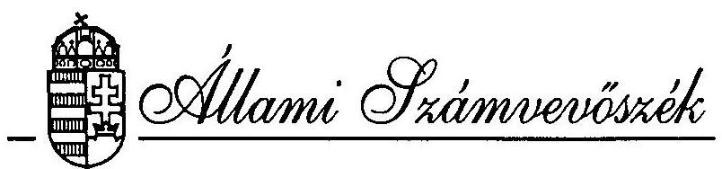
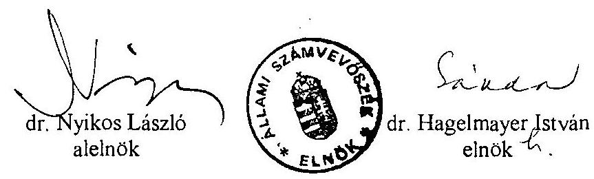

OGY szám: J/2497

# JELENTÉS 

az Állami Számvevőszék 1995. évi tevékenységéről

---

# Bevezető 

Az Állami Számvevőszék 1995-ben működésének hatodik évét zárta. Ez az időszak gazdag volt társadalmi és gazdasági változásokban. Megalakulásunk óta feladataink folyamatosan növekednek, egyes területeken összetettebbé, bonyolultabbá válnak. Mindez az ellenőrzés szakmai, módszertani megoldásainak továbbfejlesztését is szükségessé tette és teszi.

Munkánk középpontjában 1995-ben is a törvényekben előírt ellenőrzési kötelezettségeink teljesítése és a törvényhozás tevékenységének segítése állt. Éppen ezért tartjuk kedvezőnek, hogy az elmúlt évben az Országgyűlés első ízben plenáris ülésen tárgyalta meg az Állami Számvevőszék éves tevékenységéről készült jelentését. Az Országgyűlés határozatban értékelte munkánkat, további feladatokat jelölt meg és egyértelművé tette, hogy munkánk és működésünk feltételeit javítani kell.

Kedvezőnek tartjuk, hogy 1995-ben az Országgyűlés bizottságai elnökeinek értekezletén külön napirendként foglalkoztak jelentéseink hasznosításával. Az ott felvetett javaslatok közül mi is fontosnak tartjuk, hogy az Országgyűlés az Állami Számvevőszék éves jelentését és egy-egy nagyobb horderejű vizsgálatának eredményét minden évben a plenáris ülés napirendjére tűzze. További előrehaladást várunk attól is, hogy az egyes bizottságok jelentéseink megtárgyalását követően ajánlásaink végrehajtásáról az illetékes állami szervektől alkalmanként tájékoztatást kérnek.

Beszámolónkat abban a reményben készítettük el, hogy az Országgyűlés idén is felveszi tárgysorozatába és arról általános vitát folytat. Ennek eredménye további orientációt, ösztönzést adhat tevékenységünk fejlesztéséhez, színvonalának emeléséhez.

Budapest, 1996. május 14.

---

# TARTALOMJEGYZÉK 

OLDAL
BEVEZETÉS ..... 1
I. AZ ÁLLAMI SZÁMVEVŐSZÉK ELLENŐRZÉSI FELADATAI ÉS AZ ELLENŐRZÉSEK EREDMÉNYEI ..... 5

1. AZ ELLENŐRZÉSI FELADATOK VÁLTOZÁSA ..... 5
2. AZ ELLENŐRZÉSEK EREDMÉNYEI ..... 7
3. AZ ELLENŐRZÉSEK HASZNOSULÁSA ..... 9
II. AZ 1995. ÉVBEN BEFEJEZETT ELLENŐRZÉSEK MEGÁLLAPÍTÁSAINAK, JAVASLATAINAK ÁTTEKINTÉSE ..... 12
A. AZ ÁLLAMHÁZTARTÁS GAZDÁLKODÁSÁNAK ELLENŐRZÉSE ..... 12
4. KÖZPONTI KÖLTSÉGVETÉS ..... 12
1.1. A központi költségvetés tervezésének és végrehajtásának ellenőrzése ..... 12
1.2. A központi költségvetési fejezetek, költségvetési szervek ellenőrzése ..... 14
5. ELKÜLÖNÍTETT ÁLLAMI PÉNZALAPOK ..... 21
2.1. A Központi Környezetvédelmi Alap ellenőrzése ..... 21
2.2. A Foglalkoztatási Alap utóellenőrzése ..... 22
6. HELYI ÖNKORMÁNYZATOK ..... 23
3.1. A helyi önkormányzatoknak a központi költségvetésből juttatott támogatások ellenőrzése ..... 23
3.2. A helyi önkormányzatok közszolgáltatási tevékenységének ellenőrzése ..... 27
3.3. A helyi önkormányzatok költségvetési tervezésének és zárszámadásának, pénzügyi-gazdasági tevékenységének ellenőrzése ..... 31
3.4. Az országgyűlési, valamint a helyi és kisebbségi önkormányzati képviselő-választások lebonyolítására felhasznált pénzeszközök ellenőrzése ..... 33
7. TÁRSADALOMBIZTOSÍTÁS ..... 35
4.1. A társadalombiztosítás pénzügyi alapjai 1994. évi zárszámadásának és 1996. évi költségvetésének ellenőrzése ..... 35
4.2. A Nyugdíjfolyósító Igazgatóság működésének ellenőrzése ..... 36
4.3. A finanszírozási reform betegellátás feltételeinek alakulására gyakorolt hatásának ellenőrzése ..... 37
B. AZ ÁLLAM GAZDÁLKODÓI VAGYONA ÉS A PRIVATIZÁCIÓ ELLENŐRZÉSE ..... 38
8. AZ ÁLLAMI PRIVATIZÁCIÓS ÉS VAGYONKEZELŐ RT. ELLENŐRZÉSE ..... 38
9. AZ ÁLLAM VÁLLALKOZÓI VAGYONÁNAK ELLENŐRZÉSE ..... 40
10. A KÁRPÓTLÁS VÉGREHAJTÁSÁNAK, A KÁRPÓTLÁSI JEGYEK FELHASZNÁLÁSÁNAK ELLENŐRZÉSE ..... 43

---

C. EGYÉB TÖRVÉNYI KÖTELEZETTSÉGEN ALAPULÓ ELLENŐRZÉSEK ..... 45

1. POLITIKAI PÁRTOK ÉS TÁRSADALMI SZERVEZETEK ELLENŐRZÉSE ..... 45
2. NEMZETKÖZI SEGÉLYPROGRAMOK ELLENŐRZÉSE ..... 45
III. AZ ÁLLAMI SZÁMVEVŐSZÉK MŰKÖDÉSI FELTÉTELEI. ..... 48
3. SZEMÉLYI FELTÉTELEK, TOVÁBBKÉPZÉS ..... 48
4. TÁRGYI FELTÉTELEK ..... 49
5. NEMZETKÖZI KAPCSOLATOK ..... 49
MELLÉKLET: 1995-ben készült jelentések (vélemények, tájékoztatók) címjegyzéke

---

# I. AZ ÁLLAMI SZÁMVEVŐSZÉK ELLENŐRZÉSI FELADATAI ÉS AZ ELLENŐRZÉSEK EREDMÉNYEI 

## 1. AZ ELLENŐRZÉSI FELADATOK VÁLTOZÁSA

Az Állami Számvevőszék (ÁSZ) ellenőrzési feladatait megalakulásakor az Alkotmány, valamint a Számvevőszékről szóló 1989. évi XXXVIII. törvény határozta meg. Az elmúlt években több olyan törvény, Országgyűlési határozat született, amely növelte az Állami Számvevőszék ellenőrzési kötelezettségeit. Jelenleg több mint 40 jogszabály határoz meg teendőket a szervezet számára.

A társadalmi-gazdasági folyamatokat követő jogszabályi változások az Állami Számvevőszék 1995. évi ellenőrzési kötelezettségeit és jogait tovább bővítették.

A Ptk. 1994. évi módosítása a közalapítványok gazdálkodásának törvényességi és célszerűségi ellenőrzését az Állami Számvevőszék hatáskörébe utalta. Az alapítványok közalapítvánnyá alakulása, illetve új közalapítványok létrehozása számottevő és folyamatos feladatnövekedést jelent. (A közalapítványok száma 1995. végére 17-re emelkedett, vagyonuk közel 12 milliárd forint volt és 3,4 milliárd forint támogatást, adományt kaptak. Felmérésünk szerint 57 olyan alapítvány működött, - vagyonuk 13,5 milliárd forint - amely közalapítvánnyá alakulhat.)

Az elkülönített állami pénzalapok száma jelentősen, az 1995. évi 29-ről 5-re csökkent. Ennek ellenére ellenőrzési teendőinkben számottevő változás nem következett be, mert az elkülönített alapok egy részét csak összevonták, mások feladatai pedig ágazati hatáskörbe kerültek, illetve azokat különböző programok keretében a központi költségvetésbe integrálták. 1995-ben az elkülönített állami pénzalapok 1994. évi zárszámadását független könyvvizsgálók auditálták, a tapasztalatokat az ellenőrzések során kell az ÁSZ-nak hasznosítania. (1996-tól a nagyobb helyi önkormányzatok beszámolóit, ugyancsak független könyvvizsgáló auditálja.)

Az államháztartási törvény módosítása, az Állami Számvevőszék hatáskörébe utalta az országos és a helyi kisebbségi önkormányzatok ellenőrzését (számuk 1000-1500-ra tehető). Az önkormányzati törvény módosításával az ÁSZ feladatkörébe került a képviselőtestület és az önkormányzat pénzügyi bizottsága közötti pénzügyi és gazdasági tárgyú vitás kérdések ellenőrzés útján történő tisztázása.

Sokrétűbbé, s ezzel bonyolultabbá is váltak az állam vállalkozói vagyonával kapcsolatos ellenőrzési feladataink. A pénzintézetekről és a pénzintézeti tevékenységről szóló törvény 1995. évi módosítása az ÁSZ számára megteremtette az üzleti- és a banktitokba való betekintési jogot. Ezzel lehetővé vált a pénzintézetek finanszírozási, hitelezési tevékenységének vizsgálata.

---

Az állam tulajdonában lévő vállalkozási vagyon értékesítéséről szóló 1995. évi XXXIX. törvény változást hozott a magyar privatizációs intézményrendszerben és egyben bővítette az ÁSZ ellenőrzési, illetve véleményezési jogkörét. Az új szervezet, az Állami Privatizációs és Vagyonkezelő Részvénytársaság (ÁPV Rt.) működtetésével, illetve tevékenységével kapcsolatosan feladataink tovább bővültek, többek között a szervezet belső ellenőrzési szabályzatának, a vagyon értékesítésével kapcsolatos bevételek és kiadások nyilvántartási rendszerének véleményezésével.

Más típusú - a gazdálkodási feltételrendszer változásából származó - feladatbővülést jelent a közbeszerzések és a Kincstár működési folyamatainak ellenőrzése.

Ma még saját informatikai rendszerünk alapjainak megteremtésén munkálkodunk (ami önmagában is jelentős szakmai és anyagi kihívást jelent), de már a közeljövőben készen kell állnunk arra, hogy a számítógépes rendszerek fejlesztését, működését ellenőrizzük.

A bővülő ellenőrzési felhatalmazások, az országgyűlési bizottságok gyakoribb felkérései, a közérdekű bejelentések növekvő száma az Állami Számvevőszékkel szembeni bizalom jelként értékelhetők.

A közérdekű bejelentések információt szolgáltatnak munkánkhoz, azok alapján önálló ellenőrzések folytatására csak nagyon ritkán kerülhet sor. Az ÁSZ-nál az elmúlt évben közel 300 közérdekű bejelentést tettek. Ezek mintegy 75%-a az önkormányzatok működésével kapcsolatos. Jelentősen megnőtt a megyei közigazgatási hivataloktól érkezett - kisebb részben a törvényességi ellenőrzés során szerzett tapasztalataik alapján tett - bejelentések száma.

Egyre több panaszt továbbítunk az Országgyűlési Biztos Hivatalához, melyek egyéni jog- és érdeksérelmek kivizsgálását kérik. Ugyanakkor az utóbbi időben az országgyűlési biztosok is küldenek panaszokat kivizsgálásra az Állami Számvevőszékhez.

Összefoglalva megállapítható, hogy a törvényekben előírt ellenőrzési kötelezettségeink teljesítése egyre több és számos vonatkozásban összetettebb feladatot ró szervezetünkre. Ezek ellátásának egyes területeken egyre nyilvánvalóbb korlátja a rendelkezésre álló ellenőrzési kapacitások nagysága.

Mértéktartó létszámemelési igényünket - a Számvevőszéki bizottság támogatása ellenére - nem lehetett 1996-ban kielégíteni. A létszámhiányt belső átcsoportosítással csak átmenetileg lehet oldani. A munka intenzitásának további növelése az ellenőrzési tevékenység minőségét veszélyezteti. Emellett azzal a körülménnyel is számolnunk kell, hogy a szervezet munkaerő megtartó képessége tovább gyengül, figyelembe véve azt, hogy számvevőink bérhelyzete relatíve romlott a köztisztviselőkhöz viszonyítva is.

---

# 2. AZ ELLENŐRZÉSEK EREDMÉNYEI 

## Ellenőrzési munkánk súlypontjai

Az Állami Számvevőszék 1995-ben is alkotmányos és törvényi kötelezettségei alapján, az ellenőrzési tervben foglaltak szerint végezte ellenőrzéseit. Az elmúlt évben 57 ellenőrzési jelentést készítettünk. (A jelentések címlistáját a Melléklet tartalmazza.) Vizsgálataink döntő hányadát a törvényekben előírt rendszeres ellenőrzési kötelezettségeink alapján végeztük. E mellett a Kormány, illetve az országgyűlési bizottságok is vizsgálatokat kezdeményeztek. Ezeket mérlegelve elnöki döntés alapján ellenőrzést végeztünk az Agrobank Rt-nél, a Magyar Villamosművek Rt-nél és a Budapest Bank Rt-nél, továbbá vizsgáltuk a kárpótlási törvények végrehajtását.

Évenkénti kötelezettségünknek megfelelően ellenőriztük az 1994. évi központi költségvetés zárszámadását, az 1995. évi pótköltségvetési és az 1996. évi költségvetési javaslat megalapozottságát; a központi költségvetésből az önkormányzatoknak juttatott támogatások igénybevételét és elszámolását, valamint az önkormányzatok 1994. évi zárszámadását és az 1996. évi költségvetési javaslatait; továbbá a társadalombiztosítás pénzügyi alapjai 1994. évi zárszámadását és 1995. valamint 1996. évi költségvetését. 1995-ben is súlyponti feladatot jelentett a privatizációs rendszer és az állami vagyonnal való gazdálkodás ellenőrzése. Ennek keretében került sor az ÁPV Rt. alakulási költségeinek és a jogelőd szervezetek működésének vizsgálatára. Két évenkénti ellenőrzési kötelezettségünk alapján ellenőriztük a pártok gazdálkodásának törvényességét.

Rendszeres ellenőrzési kötelezettségünk alapján 1995-ben került sor a központi költségvetés jelentős bevételét biztosító Vám- és Pénzügyőrség, továbbá az Alkotmánybíróság és az Igazságügyminisztérium fejezetek ellenőrzésére. 1995-ben fejeződött be a Belügyminisztérium fejezet és a Központi Környezetvédelmi Alap gazdálkodásának ellenőrzése. Ebbe a körbe tartozó vizsgálatok 1995-ben is lekötötték az ÁSZ ellenőrzési kapacitásának mintegy 60%-át.

A fennmaradó kapacitást néhány kiemelt ellenőrzési feladatra fordítottuk. Így került sor az ország legnagyobb kereskedelmi bankjának (OTP) és legnagyobb állami vállalatának (MÁV) ellenőrzésére. A központi költségvetés területén vizsgáltuk az Országos Mentőszolgálat gazdálkodását és a központi költségvetési szervek jóléti célú kiadásait és intézményeit.

1995-ben az ÁSZ az önkormányzatoknál a központi költségvetési kapcsolatokon túl, a lakosság széles körét érintő közszolgáltatásokat vizsgálta. E körben ellenőriztük a szakmunkásképzésre, a településtisztasági tevékenységre és a felnőttek orvosi ellátására fordított pénzeszközök felhasználását.

Általános ellenőrzési felhatalmazásunk alapján nemzetközi segélyprogramokat, a 100 millió márkás kedvezményes (START) hitelt és az 50 millió márka értékű szénsegély felhasználását ellenőriztük.

---

Törvényi kötelezettségünk szerint az Állami Számvevőszék elnöke ellenjegyzi a költségvetés hitelfelvételére vonatkozó szerződéseket. 1995-ben az ÁSZ elnöke elutasította a 35 darab, együttesen 42,4 milliárd forint értékű szerződés ellenjegyzését. A szerződések 1995. március 17. és 20. közötti dátummal készültek és ezeket a Pénzügyminisztérium 1995. október 31-én küldte meg ellenjegyzésre. A költségvetés adott devizahiteleinek utólagos ellenjegyzése az ÁSZ jogkörének pusztán formális gyakorlását jelentette volna. Az eset kapcsán az ÁSZ jelezte, hogy az ellenjegyzés, mint jogi eszköz az utóbbi években a feltételek megváltozása következtében túlhaladottá vált. A költségvetési hiány fedezetét a költségvetési törvények, a jegybanki és az államháztartási törvények szabályozzák. A költségvetési hiány fedezete már nem közvetlen hitelszerződéseken, hanem piaci eszközökön alapul. Ezért távlatilag indokolt lenne megváltoztatni, elhagyni mind az Alkotmányból, mind az ÁSZ-ról szóló törvényből ellenjegyzési kötelezettségünket.

# Főbb megállapítások és javaslatok 

Jelentéseinket az év folyamán rendszeresen közzé tettük. Az ellenőrzések legfontosabb megállapításainak, javaslatainak összefoglalása (beszámolónk II. része) lehetőséget nyújt munkánk részletesebb áttekintésére, illetve javaslataink hasznosulásának számbavételére. Ezért itt ellenőrzési megállapításaink, illetve javaslataink főbb típusait emeljük ki.

Ellenőrzéseink a költségvetési tervezésben, gazdálkodásban, a pénzügyi, számviteli folyamatokban szabálytalanságokat tártak fel és rámutattak a feladatok, szervezetek szabályozásának, az erőforrásokkal és az állami vagyonnal való gazdálkodás hiányosságaira. Ellenőrzéseink alapján javaslatokat fogalmaztunk meg, intézkedéseket kezdeményeztünk - a vizsgált szerveken kívül - az Országgyűlés és a Kormány részére. Több, rendszerbeni változtatásra is ajánlást tettünk, melyek
 elsősorban a tervezés, a finanszírozás, az érdekeltség, az elszámolás és beszámolás rendjét érintették. Az ÁSZ javaslatainak megvalósulása, haszna egyre inkább pénzben is kifejezhető.

## Javaslatok költségvetési megtakarításokra

Ellenőrzéseink alapján 1995-ben több milliárd forint - központi költségvetés javára történő - befizetését, illetve egyszeri megtakarítását kezdeményeztük. Így, többek között 865 millió forint a központi költségvetésből jogalap nélkül igénybe vett önkormányzati támogatás vissza vonására tettünk javaslatot, ebből az Országgyűlés 325 millió forint vissza vonásáról intézkedett. A Vám- és Pénzügyőrség vizsgálata alapján közel 125 millió forint befizetését tartottuk indokoltnak a központi költségvetésbe. A Központi Környezetvédelmi Alap ellenőrzése során 500 millió forint lekötött, de fel nem használt forrás felszabadítását kezdeményeztük. Megállapítottuk, hogy szabálytalanul, 700 millió forint ún. mezőgazdasági támogatási utalványt bocsátottak ki a kárpótlás során. A társadalombiztosítás 1994. évi zárszámadásának ellenőrzése alkalmával a Nyugdíjbiztosítási Alap főösszegének 307 millió forintos, az Egészségbiztosítási Alap 99 millió forintos csökkentését javasoltuk (utóbbi esetben a helytelenül elszámolt összegnek a működési kiadások között történő szerepeltetése mellett).

---

A politikai pártok felhívásunkra tett költségvetési befizetései nagyságrendjüket tekintve nem jelentősek, de a pártoknak a közéletben betöltött szerepe és a számvevőszéki javaslatok következetes érvényesítése szempontjából figyelmet érdemelnek. (MSZP 0,4 millió, SZDSZ közel 1,5 millió, FKGP 0,1 millió, FIDESZ- Magyar Polgári Párt 0,4 millió, MIÉP mintegy 40 ezer, Köztársaság Párt 0,2 millió forint).

A számvevőszéki ellenőrzés eredménye azonban az esetek többségében nem számszerűsíthető, hanem - amennyiben az érintettek elfogadják - az adott tevékenység eredményességének, vagy hatékonyságának növeléséhez járul hozzá.

# Javaslatok jogszabályok módosítására 

Következetesen törekedtünk arra, hogy az ellenőrzési tapasztalatok alapján jogszabálymódosításra vagy új jogszabály alkotására tegyünk javaslatokat. Esetenként elsősorban a Számvevőszéki bizottsággal kialakult munkakapcsolat keretében - törvénymódosító indítványok szakmai, tartalmi hátterének megadásával, normaszöveg javaslatokkal is segítettük a megfelelő jogszabályi háttér megteremtését.

Első kereskedelmi banki ellenőrzésünk javaslatai alapján az Országgyűlés 1995-ben módosította - a már említett - pénzintézeti törvényt. A MÁV átalakulásának ellenőrzése során - még a vizsgálat lezárása előtt - három törvény (számviteli, privatizációs, költségvetési) módosítása során vették figyelembe javaslatainkat.

Az Országgyűlés a közszolgáltatások kötelező igénybevételének szabályozásánál hasznosította a településtisztasági szolgáltatások ellenőrzése alapján tett javaslatainkat. A szakmunkásképzés vizsgálatánál kialakított ajánlásainkat a közoktatási, a szakképzési és az adótörvények módosításánál vették figyelembe.

## 3. AZ ELLENŐRZÉSEK HASZNOSULÁSA

## Az ellenőrzött szervezeteknél

Az ellenőrzési munkánk végső eredményessége abban jelentkezik, hogy az ellenőrzés által feltárt problémákat, hiányosságokat az ellenőrzött szervezetek felszámolják, szabályosabban, célszerűbben és eredményesebben gazdálkodnak. A vizsgálataink során feltárt jogsértések alapján összesen 32 fő ellen munkajogi, illetve büntetőjogi felelősségre vonást kezdeményeztünk. Úgy értékeljük, hogy az ellenőrzések eredményeinek hasznosulásában pozitív irányú elmozdulás következett be.

Az ellenőrzött szervek sokszor már a helyszíni vizsgálat menetében hasznosítják javaslatainkat. Ilyenkor az ellenőrzések rövidre zárultan, gyakorlatilag azonnal hoznak bizonyos eredményeket. Az ellenőrzést követően a szervezetek általában intézkedési tervet készítenek. Intézkedési terv készítését a számvevőszéki törvény nem teszi kötelezővé, azonban az érintettek általában elkészítik azokat és az Állami Számvevőszékhez megküldik.

Az intézkedési tervben foglaltak végrehajtásáról számos esetben kapunk információkat. A megtett intézkedésekről, s ezek eredményeiről azonban utóellenőrzés alapján szerezhetünk bizonyosságot. Rendszeres utóellenőrzést jelenlegi kapacitásunk nem tesz lehetővé. Ezért más ellenőrzés keretében igyekszünk áttekinteni a korábbi ellenőrzéseink nyomán tett intézkedéseket. (Ennek valószínűsége is egyre csökken, mivel pl. a fejezetek esetében csak a 7. évben tudunk teljeskörűen eleget tenni rendszeres ellenőrzési kötelezettségünknek.)

Az ellenőrzések realizálásában nehézségek is felmerültek. 1995-ben a Pénzügyminisztérium nem, vagy messze a törvényes észrevételezési időn túl, s nem is mindig konstruktívan reagált az ÁSZ megállapításaira. A központi költségvetés 1994. évi zárszámadása, az 1996. évi költségvetési törvényjavaslat, valamint az államháztartási törvény módosítása kapcsán sem tapasztaltunk együttműködési szándékot a vitás kérdések tárgyszerű tisztázására.

Nincs az általánosan kialakult gyakorlatnak megfelelő visszacsatolás a Kormány részére tett ajánlásaink, javaslataink esetében. Különösen hiányoljuk ezt, ha a vizsgálatot kormányfelkérésre végezzük (pl. Agrobank esetében), vagy a vizsgált téma jelentősége, átfogó jellege kormányszintű intézkedést igényelne. Ez utóbbira példaként említjük a központi költségvetési szervek jóléti kiadásaira vonatkozó ellenőrzésünket.

Az önkormányzatok jogalap nélküli támogatásának, hozzájárulásának visszafizetéséről a zárszámadási törvény rendelkezik, de erre szabályozott eljárást még nem alakítottak ki.

# Az Országgyűlés munkájában 

Ellenőrzési megállapításaink hasznosításában előrelépésként értékeljük, hogy jelentéseink túlnyomó részét az országgyűlési bizottságok 1995-ben napirendjükre tűzték. Az elmúlt évben határozottan javult javaslataink fogadtatása, ami elsősorban az országgyűlési bizottságok aktívabb közreműködésének köszönhető. A bizottsági tárgyalások több esetben is állásfoglalással, határozattal, vagy a Kormánynak, illetve Országgyűlésnek címzett javaslatokkal végződtek. Parlamenti vizsgáló bizottságok, vagy állandó bizottságok ellenőrzésre vonatkozó kéréseinek soron kívüli teljesítésével is igyekeztünk az Országgyűlés munkáját segíteni.

A Számvevőszéki bizottsággal kialakult munkakapcsolatunk fontos szerepet tölt be a törvényhozás támogatásában és jelentéseink hasznosulásában. E tekintetben kedvező változást jelentett 1995-ben az is, hogy egyes bizottságok ellenőrzési albizottságot hoztak létre.

Ugyanakkor - elsősorban a rendelkezésre álló idő rövidsége miatt - megoldásra váró feladat az Állami Számvevőszék szervezett közreműködésének és részvételének biztosítása a költségvetési, valamint a zárszámadási törvényjavaslat bizottsági vitáiban. Ezért továbbra is szorgalmazzuk a zárszámadási törvényjavaslat benyújtására, ellenőrzésére és a törvény megalkotására előírt határidők módosítását, amit a Számvevőszéki bizottság is szükségesnek tartott.

---

A párttörvény módosítására az Állami Számvevőszék elnöke 1995. január 16-án tett javaslatot az Országgyűlés Alkotmányügyi, törvényelőkészítő, igazságügyi és ügyrendi bizottsága elnökének. A kezdeményezés eredményeként a Bizottság elnöke - hatpárti egyeztetés után - felkérte a Pénzügyminisztériumot, hogy az Állami Számvevőszék közreműködésével készítse el a törvénytervezetet. A tervezet - amely megnyugtatóan rendezi a párttörvény és a számviteli törvény összhangját - 1995 őszén el is készült és a Bizottság rendelkezésére áll. Jelenleg az egyeztetés folyamatban van.

Összefoglalóan úgy értékeljük, hogy ellenőrzéseink az elmúlt években mind nagyobb mértékben hasznosulnak, s járulnak hozzá a gazdálkodás megfelelő törvényi, szabályozási feltételeinek kialakításához, a közpénzekkel való el- és beszámolás javításához.

---

# II. AZ 1995. ÉVBEN BEFEJEZETT ELLENŐRZÉSEK MEGÁLLAPÍTÁSAINAK, JAVASLATAINAK ÁTTEKINTÉSE 

## A. AZ ÁLLAMHÁZTARTÁS GAZDÁLKODÁSÁNAK ELLENŐRZÉSE

## 1. KÖZPONTI KÖLTSÉGVETÉS

### 1.1. A központi költségvetés tervezésének és végrehajtásának ellenőrzése

1.1.1. Törvényi kötelezettségünk alapján vizsgáltuk a Magyar Köztársaság 1994. évi költségvetésének végrehajtását. Az ellenőrzés megállapításai szerint a zárszámadási törvényjavaslat formailag megfelelt ugyan a törvényi előírásoknak, de tartalmában, számszaki helyességében, az elszámolások pontosságában érdemi javulás nem történt, az előző években tapasztalt problémák ismétlődtek. Ellenőrzésünk során megállapítottuk, hogy a zárszámadás nem minősíthető hitelesnek, mert a számviteli alapelveket a könyvvezetésben és a dokumentum összeállításánál nem érvényesítették megfelelően.

A központilag kezelt előirányzatok (adósságszolgálat, nemzetközi pénzügyi elszámolások) és a kormányzati beruházások adatai nem feleltek meg a valódiság követelményének. A felügyeleti szervek az intézmények mintegy felénél a beszámolók felülvizsgálata során nem értékelték a szakmai feladatok teljesítését. Az intézményi elszámolások pontatlansága következtében szinte valamennyi fejezet zárszámadásában szerepeltek olyan adatok, amelyek valódiságát, illetve megbízhatóságát az ellenőrzés során feltárt ellentmondó tényezők alapján kétségbe lehetett vonni. Ezek nagyságrendje és okai is nagyon különbözőek voltak (pl. függő bevételek és kiadások helytelen elszámolása, szabálytalan letéti pénzkezelés, helytelen elszámolási módszer, szervezeti anomáliák stb.)

A zárszámadási törvényjavaslat dokumentumainak ellenőrzését, az elszámolások törvényességének és számszaki helyességének vizsgálatát változatlanul megnehezíti, hogy hiányzik a zártrendszerű államháztartási információs- és mérlegrendszer. Ez számos bizonytalanságot okoz a dokumentumokban szereplő számszaki adatok helyességének, valamint az Áht.-ban foglalt előírásoknak való megfelelés megítélésében. Ezen kívül az ellenőrzés során olyan többletfeladatokat kell elvégezni, amelyek egy zárt információs- és mérlegrendszer alapján fel sem merülnének.

Az 1994. évi zárszámadás ellenőrzésének eredményei alapján javasoltuk, hogy dolgozzák ki a központi költségvetésben előirányzott kiadások következő évre áthúzódó teljesítésének szabályait (pótkezelési szabályokat, illetve más rendszerű megoldásokat). Felhívtuk a figyelmet a költségvetési előirányzatok (szakmai célfeladatok) pontos és részletes kidolgozására és a kormányzati ellenőrzés keretében történő értékelésére, számonkérésére. Az általános tartalék felhasználásánál, átcsoportosításánál szakmailag és számszakilag egyaránt

---

kidolgozottabb, megalapozottabb támogatási igényeket kellene megkövetelni. Javasoltuk továbbá a kezességvállalással összefüggő döntési, szerződési, adatszolgáltatási és nyilvántartási rendszer szabályozását, a nemzetközi elszámolások körébe vont tételek felülvizsgálatát. A készpénzes vámbiztosíték központi költségvetésbe való bevonásának megszüntetésére is javaslatot tettünk. A mérlegrendszer kidolgozásának, az információrendszer átalakításának szükségessége kapcsán megfogalmaztuk azt az igényt, hogy a mérlegrendszer legyen alkalmas a hitelfelvétel és a törlesztés, a rendes és rendkívüli bevételek és kiadások alakulásának, a költségvetés pozíciójára gyakorolt hatásának értékelésére. Ezen kívül az államháztartás alrendszereinek vagyonkimutatását a mérlegrendszernek teljeskörűen tartalmaznia kellene. Szükséges lenne kialakítani a központi költségvetés bevételeinek és kiadásainak zártrendszerű, kettős könyvviteli elven alapuló, naprakész könyvvezetését. Biztosítani kellene az adatok valódiságának ellenőrizhetőségét, a beszámoló garnitúra világos szerkezetét, kitölthetőségét, továbbá a lényegretörő adatkérést is.
1.1.2. Az 1995. évi pótköltségvetés benyújtására a Kormány 1995. márciusában hozott gazdasági kiigazító intézkedéseinek költségvetésre gyakorolt hatása alapján került sor. A pótköltségvetés megalapozottságára vonatkozóan az ellenőrzés számos hiányosságot tárt fel. A pótköltségvetési javaslat beterjesztését megelőzően nem mérték fel a gazdasági intézkedések hatását teljeskörűen. A pótköltségvetés egyes fontos intézkedések következményeivel nem számolt. A bevételi előirányzatok realitásának megítélését megnehezítette, hogy az egyes adónemekre, a vám- és illetékbevételekre vonatkozó részletes számítások többnyire nem, vagy hiányosan álltak rendelkezésre. A társadalombiztosítás közreműködésével folyósított ellátások csökkentésére irányuló intézkedések hatásának számszerű bemutatása elnagyolt volt. A nemzetközi elszámolások bevételi és kiadási előirányzatainak kedvező irányú módosítása jelentős bizonytalansági elemeket, a módosított előirányzatok pedig számítási hibákat is tartalmaztak. A belföldi államadósság egyes előirányzatait számítások nem támasztották alá, így azok megalapozottságát sem lehetett minősíteni.

A központi költségvetési szerveknél elrendelt személyi juttatás és tb. járulék csökkentése, a felhalmozási és fejezeti kezelésű előirányzatok zárolása - ismeretlen okból - egyes fejezeteket nem érintett. Az intézkedés végrehajtására rendelkezésre álló idő alatt feladat- és intézmény felülvizsgálat nem valósulhatott meg, így a fejezeteknek megalapozott differenciálásra általában nem is volt lehetőségük. A differenciálást alkalmazó fejezetek között több tárca a saját igazgatási apparátusára eső csökkentés összegét részben, vagy teljes egészében más címekre hárította, s ezzel az intézkedés következményei alól kivonta magát. A fejezeti kezelésű előirányzatok egyenletes csökkentése egyes szakmai programok megvalósítását is veszélyeztette. A korlátozó intézkedések a kormányzati beruházások előirányzatát nem érintették, a felülvizsgálat igénye sem fogalmazódott meg.

---

1.1.3. A Magyar Köztársaság 1996. évi költségvetésének tervezése a megelőző évek gyakorlatához viszonyítva néhány progresszív elemmel bővült. A rövid és hosszabb időszakra vonatkozó makroszintű tervezés, a gazdasági folyamatok figyelésének, a stratégia kidolgozásának igénye, az ezekhez szükséges szervezeti feltételek kialakítása a tervezési munka szemléletváltozását tükrözik. Ez még akkor is pozitív elmozdulás, ha a konkrét eredmények az 1996. évi költségvetés előkészítésében csak korlátozott mértékben jelentek meg. Ebben az is szerepet játszott, hogy a költségvetés tervezésének államháztartási törvényben meghatározott eljárási rendjét nem tartották be, ami a tervezésre rendelkezésre álló idő lerövidülését eredményezte, s ez értelemszerűen korlátozta a tervezési munka megalapozottságát is.

A központi költségvetés fő bevételi előirányzatait többnyire a gazdasági-
 és jövedelem-prognózisokkal összhangban, jórészt számszakilag alátámasztottan tervezték. A bázis-alapon tervezett kiadási előirányzatok viszont a vizsgált fejezetek kisebb hányadánál voltak összhangban a feladatokkal.

A központi költségvetés bevételi előirányzatainak bizonytalansága elsősorban abból származott, hogy egyes adónemeknél a tervezés alapjául szolgáló adatbázis nem volt teljeskörű, illetve pontos. A fejezetek és intézményeik a felhalmozási kiadások kivételével a rendes és rendkívüli kiadásokat nem egységes felfogás szerint határolták el. A fejezeti kezelésű előirányzatok közül többet az Áht. előírásaival ellentétben rendes kiadásként kezeltek. A kőolajalapítványok támogatásának a költségvetés fejezeti rendjébe sorolása sem egységes elvek alapján valósult meg.

Az ellenőrzés eredményei alapján javaslatot tettünk a rendes és rendkívüli előirányzatok közötti átcsoportosítás lehetőségének és rendjének törvényben történő szabályozására, a rendes és rendkívüli előirányzatok Áht. alapján történő felülvizsgálatára. Ez utóbbit javasoltuk a költségvetésbe integrált elkülönített állami pénzalapoknál is a bevételeket szabályozó miniszteri rendeletek megalkotását követően.

Az állami forgóalap vámbiztosíték számlára javasoltuk visszautalni a számla 1993. év végi egyenlegét. Az Áht. módosítása során a számláról javaslatunkkal ellentétes rendelkezés született.

# 1.2. A központi költségvetési fejezetek, költségvetési szervek ellenőrzése 

1995-ben került sor, illetve fejeztük be a Belügyminisztérium, Igazságügyi Minisztérium és az Alkotmánybíróság fejezetek ellenőrzését.
1.2.1. A Belügyminisztérium fejezet ellenőrzése során megállapítottuk, hogy a feladat- és szervezeti változások eredményeként tisztult a belügyi tárca közigazgatásban betöltött szerepe. Ugyanakkor a közigazgatás korszerűsítésével kapcsolatban korábban kitűzött feladatok végrehajtásában elmaradást tapasztaltunk. A Belügyminisztérium fejezet korábbi zárt gazdálkodási és információs rendszere nyitottabbá vált. A minisztérium teljes polgáriasításának hangsúlyozása, a specifikus szabályozási igények figyelmen kívül hagyása mind a felügyeleti, irányítási tevékenységben, mind a fejezet gazdálkodásában számos ellentmondáshoz vezetett. A minisztériumi struktúra átalakítását nem előzte meg a feladatok részletes felülvizsgálata, a szervezeti egységek működésének elemzése és a fejlesztési irányok meghatározása.

1991-től szigorodtak a gazdálkodási feltételek és a címrend szerinti tervezés vált gyakorlattá. Ugyanakkor az államháztartási törvény a feladatok és szervezetek címbe (alcimbe) sorolásához nem határozott meg rendező elveket. Ez különösen az igen heterogén összetételű tárcák gazdálkodását nehezítette.

Jogszabályokban meghatározott egyes új feladatokhoz a költségvetési támogatást nem biztosították (pl. a honvédelmi és igazgatási rendészeti törvény költségkihatásait, a közbiztonság-fejlesztésével kapcsolatban kormányszinten meghatározott feladat-erőforrás igényeit). A rendelkezésre bocsátott pénzeszközök elégtelensége elsősorban nem feladat-elmaradásokhoz vezetett, hanem a működés és a feladat végrehajtásának minőségét befolyásolta. A fejezet legfontosabb címei (rendőrség és határőrség) gazdálkodását eltérő formában ugyan, de egyaránt feszültségek jellemezték. A rendőrség erőforrásait meghaladó mértékű és ütemű fejlesztéseket valósított meg, melynek következtében likviditási zavarai állandósultak. A határőrség tudomásul vette a költségvetési korlátokat, s ennek következménye a technikai színvonal elmaradása volt.

A fejezet költségvetési gazdálkodásában új elemként jelent meg a külső források bevonása. Az önkormányzatok és egyéb jogi, természetes személyek (főként rendőri feladatokhoz) szerződések, megállapodások alapján támogatást biztosítanak. A támogatásból finanszírozott státuszok, illetve használatba vett eszközök, ingatlanok a helyi problémák kezelésében segítséget nyújtanak ugyan, de végleges megoldást nem jelentenek. A felmerülő járulékos kiadásokra (kiképzés, üzemeltetési stb. költségekre) ugyanis nem teremtenek fedezetet.

A kormányzati beruházási előirányzatok jelentősebb részét a határőrség és a tűzoltóság intézményi beruházásaira fordították. A rendőrség fejlesztéseit pedig a fejezeti kezelésű intézményi beruházási előirányzatok terhére finanszírozták. A határőrség és tűzoltóság beruházásai a tervezettől eltérően valósultak meg, ami a tervezés megalapozottságát vonja kétségbe még akkor is, ha ezek a beruházások valós szükségleteket elégítettek ki. A rendőrségi, s egyben a fejezeti beruházások között a legtöbb probléma a központi székház létesítésével kapcsolatban merült fel. A Kormány 1992. évben tudomásul vette, hogy a beruházás - a meglévő épületek értékesítése következtében - nem terheli a központi költségvetést. Az üzembehelyezés, gépbeszerzés, hírellátás stb. tervezett kiadásai jelentősek, már az 1994. évi számítások szerint meghaladták a 6 milliárd forintot. Az ellenőrzés alapján a létesítés körülményeinek alapos átgondolására, illetve a létesítés időarányos végrehajtásának értékelésére felhívtuk a figyelmet.

A lakásellátásra vonatkozó belügyminiszteri rendelkezés a szolgálati lakáshoz jutás lehetőségét indokolatlanul a tárca civil szervezeteire is kiterjesztette. A kapcsolódó jogszabályok értelmében a fegyveres szervekkel munkaviszonyban állók lakáshelyzetét kívánták megoldani, de ez az intézkedés a hivatásos állomány megtartásában fontos szerepet játszó szolgálati lakás biztosításának lehetőségét beszűkítette.

Javaslatokat tettünk a feltárt hiányosságok megszüntetésére, a hiányzó jogszabályok megalkotására. Felvetettük továbbá, hogy a felső szintű állami vezetők lakásellátását célszerűbb lenne központilag kezelni, s a tárca kezdeményezésével egyezően a jogosultság mértékét egységes rendezőelvekkel szabályozni.

# 1.2.2. Az Igazságügyi Minisztérium fejezet ellenőrzése a fejezethez tartozó, alaptevékenységük szerint lényegesen eltérő szervek sajátos gazdálkodási gyakorlatát és a szabályozás anomáliáit tárta fel. Többek között azokat az ellentmondásokat, amelyek a Bíróság, mint önálló hatalmi ág gazdálkodásában kialakultak, s ami az igazságügyminiszter feladatait illetően alkotmányos vitákhoz vezetett. 1996-ban a Bíróság önálló fejezeti jogosítványt kapott a központi költségvetésben. Ezt az Alkotmánybíróság által megoldásként vázolt alternatívák közül gazdálkodási szempontból nem a legmegfelelőbbnek tartjuk.

Az IM Büntetés-végrehajtásnál a fejezeti jogosítványt 1994-ben szüntették meg és költségvetési címrendnek megfelelő besorolást kapott. A Büntetés-végrehajtáshoz tartozó vállalatok gazdasági társaságokká alakításával megtörtént ugyan az intézeti és vállalati gazdálkodás elkülönítése. Ezzel még nem oldódott meg az a probléma, hogy a költségvetés csak a tényleges állami feladatot finanszírozza.

Átfogó rendezést igényel a tárca saját bevételeinek kezelése, mivel ezek döntően a bíróságokon hozott ítéletek, határozatok következményei. Ezeket a költségvetési szerv működésével nem összefüggő bevételeket indokolt leválasztani. Így megszüntethetők a bíróságok gazdálkodási feltételeiben azok a különbségek, melyek annak a következményei, hogy az egyes bíróságok milyen ítéletet, határozatot hoztak. Szakértői intézetek vonatkozásában is átgondolást igényel az állami feladatvállalás behatárolása, az erőforrás-szükséglet biztosítása. A szakértői intézetek gazdálkodását leválasztották ugyan a bíróságoktól, ez viszont nem kellő költségvetési megalapozottsággal történt, főként a saját bevételek esetében.
1.2.3. Az Alkotmánybíróság fejezetre irányuló ellenőrzés feltárta, hogy az Alkotmánybíróság működését - az Úgyrend törvényi elfogadásának hiányában - teljeskörű, egységes szabályozás nem határozta meg. Ez esetenként problémát okozott a költségvetési gazdálkodási jogkörök, hatáskörök gyakorlásában. A fejezet költségvetése meghatározására az Alkotmánybíróságról szóló törvényben biztosított joga nem illeszkedett harmonikusan és egyértelműen a költségvetés tervezési rendszerébe, így ezt a jogát nem tudta teljes mértékben és szabályozott rendben érvényesíteni.

A fejezet rendelkezésére álló források összességében kiegyensúlyozott gazdálkodást tettek lehetővé. Az Alkotmánybíróság sajátos helyzete ugyanakkor nagyobb követelményeket támaszt a költségvetési tervezéssel, gazdálkodással szemben. Ennek az igénynek maradéktalanul nem tudtak megfelelni. A költségvetési tervezésben munkahibák, az előirányzat-módosításban, a számviteli munkában rendszerbeli hiányosságok voltak, melyek esetenként szabálytalanságokhoz, a törvényi előírások (Áht. - szabálytalan előirányzat-átcsoportosítás, kiemelt előirányzat túllépése; számviteli törvény - beszámoló valódiság érvényesülésének hiánya) megsértéséhez vezettek. A kiadások között indokolatlan mértékű ráfordítás is előfordult (pl. költözési költségtérítés). A belső ellenőrzés nem volt az irányítás hatékony eszköze, nem nyújtott megfelelő információkat a döntések megalapozásához, illetve azok végrehajtásáról.

Az ellenőrzés során felhívtuk a figyelmet a költségvetés tervezésében, a gazdálkodásban tapasztalt hiányosságok felszámolására, az Áht.-ban szereplő előírásokkal esetenként ellentétes gyakorlat megszüntetésére.
1.2.4. 1995-ben ellenőriztük a központi költségvetés bevételeinek realizálásában jelentős szerepet játszó Vám- és Pénzügyőrség működését és gazdálkodását. A vizsgált időszakban, az 1992-95 közötti években a Vám- és Pénzügyőrség feladatai jelentősen bővültek. A feladatokat meghatározó jogszabályok változása következtében a szervezet a folyamatos átszervezés időszakát élte át. A feladatok bővülésével nem tartott lépést a személyi és tárgyi feltételek növekedése, az eszközellátottság és a szervezet informatikai rendszerének fejlesztése. A jogi szabályozás hiányosságai, esetenkénti ellentmondásai is kedvezőtlenül befolyásolták a szervezet működését. Mindezen körülmények is szerepet játszottak abban, hogy a Vám- és Pénzügyőrség feladatait nem tudta megfelelő hatékonysággal ellátni.

A vizsgálat a Vám- és Pénzügyőrség tevékenységének gyenge pontjait többek között a következő területeken tárta fel. A külkereskedelmi áruforgalomban a belső áruvizsgálat szelektív ellenőrzési módszerét nem alakították ki. A vámértéket döntően okmányok alapján állapították meg. Ez illegális árubehozatalra adott lehetőséget, melynek következtében a költségvetést veszteségek érhették. A halasztott vámfizetés új engedélyezési rendjére a szervezet nem készült fel. Nem volt megbízható nyilvántartása az ügyfelek tartozásáról, ami több esetben visszaélésre adott lehetőséget. Az azonnali vámfizetési kötelezettség alá tartozó adósok tartozásai behajtásának kezdeményezésénél a késedelem jelentős, nem ritkán 4-6 hónap, vagy azt meghaladó volt. A jövedéki engedélyezés alkalmazott módja a regisztrálás követelményeinek ugyan megfelelt, de a leendő jövedéki alanyok valós feltételek alapján történő megszűrésére nem volt alkalmas.

A vámbiztosítékok között jelentős arányt képviselt a készpénzben teljesített vámbiztosítékok összege. A VP vámhatározatokkal kiszabott köztartozásokat az indokoltnál hosszabb idő alatt utalta át a vámbiztosíték számláról a központi költségvetés megfelelő vám-adóilleték bevételi számlájára. A vámbiztosíték rendszertől idegen megoldás, hogy a Pénzügyminisztérium a befizetések és a pénzügyi rendezések lebonyolítására bevételi számlát nyitott és annak évvégi egyenlegét elvonta. A számlák záróegyenlegének leürítésével fedezetlenné váltak a kivetés előtt álló köztartozások, illetve többletbefizetések.

Az Országgyűlés Gazdasági bizottsága megtárgyalta az ellenőrzésről készült jelentést. A jelentésben foglalt megállapítások és javaslatok alapján bizottsági állásfoglalásban hívta fel a Kormány figyelmét a szükséges intézkedésekre.
1.2.5. Az Állami Vagyonügynökség költségvetési cím elmúlt évi ellenőrzése a szervezet működésének és gazdálkodásának számos problémájára mutatott rá. Az ÁVÜ gazdálkodásának lehetőségei jelentősen eltértek a központi költségvetési szervekétől. A privatizáció ütemének lassulása mellett a szervezet életgörbéje eltolódott, a feladatellátás költségigényessége növekedett. A működés a privatizációs bevételek egyre nagyobb hányadát emésztette fel.

A jogi szabályozás pontatlanságai és hiányosságai miatt nem volt kellően körülhatárolt a feladatrendszer és az ehhez igazodó szervezeti struktúra, valamint a finanszírozás és a gazdálkodás. Az intézményi működéshez kapcsolódó fejezeti jogkörök gyakorlásának módja, szabályozásának hiányosságai 1994-ben a törvényi előírások megsértéséhez, hatásköri túllépéshez is vezettek.

A gazdálkodásban a költségvetés tervezésénél (1994-ig) és a pótelőirányzat-igények kidolgozásánál prioritást biztosítottak a béralap folyamatos emelésének, a dologi kiadási előirányzatok irreálisan alacsony szintje mellett. Az előirányzatok és azok felhasználása közötti összhangot az Áht. hatálybalépését követően törvénysértő módon, utólagos módosítással teremtették meg.

A túlfinanszírozás és a szabályozás hiányosságai a gazdálkodásban szélsőségekhez, esetenként indokolatlan, pazarló kiadásokhoz vezettek (pl. személygépkocsik beszerzésénél, értékesítésénél, egyéb eszközök, berendezések beszerzésénél).

Az alkalmazások során nem érvényesítették maradéktalanul a Kjt. előírásait, ugyanis a magasabb vezető beosztású dolgozók kinevezésére előzetes pályázati kiírás nélkül került sor. Az 1992. évi LIV. törvényben biztosított javadalmazási rendszert késéssel határozták meg, s az nem volt kellően hatékony és ösztönző. Nem tartalmazott olyan elemeket, amelyek a privatizációs folyamat gyorsításában, a vagyonvesztés mérséklésében teremthettek volna érdekeltséget.

A kivitelezői szerződéskötéseknél megsértették a versenytárgyalásra vonatkozó törvény előírásait. Az új székházba költözés kiadásainak fedezetére - elszámolási kötelezettség előírása nélkül - nyújtott pótelőirányzat terhére külső gazdálkodó szervek részére indokolatlan kiadásokat is teljesítettek.

Az ellenőrzés megállapításai alapján tett javaslataink hasznosítását mindenekelőtt az állam tulajdonában lévő vállalkozói vagyon értékesítésére vonatkozó törvény megalkotásában, az új privatizációs szervezet kialakításában és működésében ajánlottuk a Kormány figyelmébe.

# 1.2.6.
 1995-ben fejeztük be az Országos Mentőszolgálat költségvetési cím ellenőrzését is. Az egészségügy reform folyamatának hiányosságai, ellentmondásai sajátosan tükröződtek a mentőszolgálat irányításában, a feladatellátás szervezésében, a finanszírozásban és a gazdálkodásban. A mentésügy jogi szabályozása elavult, hiányos és ellentmondásos. Hosszabb távon gyengíti a feladatellátás biztonságát, a teljesítménykövetelmények érvényesülését.

A vizsgált időszakban erősödött a mentő- és betegszállító szervezetek igénye a mentés és betegszállítás versenysemleges támogatásának kialakítására. Ennek azonban gátat szabott a mentőszolgálat finanszírozási rendszere is. Az egy szakfeladatként kezelt mentés és betegszállítás, valamint ennek intézményi finanszírozása nem adott megfelelő támpontot az egyes tevékenységekhez külön-külön kapcsolódó költségek reális mértékének megállapításához.

Az intézményi költségvetési tervezés formálissá vált, egyre kevésbé alapozta meg a gazdálkodást. A feladat és a források közötti összhang tartósan hiányzott. A bevételi előirányzatok alátervezettsége folytán az intézményi költségvetés belső arányában is torz volt, jóváhagyása is elhúzódott. A pénzellátás nem a szükségletekhez igazodott. Az alultervezés, a szintrehozások elmaradása, az áremelkedések ellentételezésének késedelmes folyósítása következtében az Országos Mentőszolgálat 1992. évtől kezdődően rendszeresen súlyos likviditási gondokkal küzdött.

A takarékossági intézkedések ellenére az erőforrásokkal csak részben gazdálkodtak célszerűen és eredményesen. A szervezet bérgazdálkodása feszített volt. A törvényben meghatározott kötelező besorolásokat teljeskörűen az előírt határidőnél később, az 1994. májusában kapott póttámogatás terhére, visszamenőlegesen hajtották végre. Egyes beruházási döntések sem voltak kellően megalapozottak. A kormányzati beruházási forrásból finanszírozott gépjármű típusváltás TOYOTA programja pénzügyi szempontból és a járművek bizonyos használhatósági paramétereit tekintve hibás, viszont műszaki és üzemeltetési szempontból jó döntésnek bizonyult.

Az Országos Mentőszolgálat működését és gazdálkodását kedvezőtlenül befolyásolta az is, hogy belső szabályozottsága nem volt kielégítő.

Az ellenőrzés által feltárt működési és gazdálkodási zavarok megszüntetése érdekében a központi költségvetés és a társadalombiztosítási alapok költségvetése időben és tartalmilag összehangolt országgyűlési jóváhagyására hívtuk fel a figyelmet. A mentés törvényi szabályozása, valamint a tulajdonosi és finanszírozói funkciók államháztartási reform keretében történő különválasztása szükséges ahhoz, hogy a mentőszolgálat megalapozott megújítására sor kerülhessen.

---

1.2.7. A költségvetési fejezetek jóléti célú kiadásainak és jóléti intézményeinek működésének elmúlt évi ellenőrzése az állami alkalmazottak jóléti-szociális ellátási rendszerének számos problémáját tárta fel. Az ilyen jellegű kiadások kialakult szintje sem egy preferencia rendszernek, sem pedig egyéb gazdaságpolitikai elvnek vagy normativitásnak nem felel meg. A jóléti rendszer átalakítására a Kormánynak és a fejezetek többségének határozott álláspontja, javaslata vagy terve nincs.

A költségvetési fejezeteknek és a közszolgálati feladatokat ellátó szervezeteknek - tekintettel az államháztartási reformra - nem lehet feladata a saját célokat szolgáló jóléti intézmények és kapacitások fenntartása és működtetése. Korrekt számviteli adatok hiányában az intézmények általában e feladatok ellátásának pontos költségvonzatait sem ismerik. Annak ellenére, hogy a jóléti intézmények valós igényeket elégítenek ki, a központi költségvetés rendszerében további működtetésük nem indokolt.

A jóléti-szociális ellátások különböző kialakult formái és mértékei sem humánpolitikai, sem gazdasági szempontokkal nem igazolhatók. A munkahelyi üdültetés indokolatlan differenciáltsággal, rendkívül eltérő költségszínvonallal működik. A pénzbeli juttatások életszínvonalat befolyásoló hatása jelképes. A költségvetés terhére történő lakásjuttatás nagy személyi jövedelem-differenciálódást okoz, s nélkülöz minden normativitást. A lakásépítés munkahelyi támogatása több vonatkozásban igazságtalan és célszerűtlen. Fejezetenként és intézményenként indokolatlanul nagyok az eltérések.

A jelenlegi problémák, hiányosságok forrásai sokrétűek. A hatályos jogszabályok, az állami költségvetés szerkezeti rendje nem adnak egyértelmű eligazítást arra, hogy mely tevékenységeket és kiadásokat kell jóléti célúnak tekinteni. Törvényi szinten nem szabályozták a költségvetési intézményekben foglalkoztatott köztisztviselők és közalkalmazottak jóléti ellátásának rendszerét, s a juttatások feltételeit.

Az ellentmondások és észlelt anomáliák feloldásánál, a megoldások kiválasztásánál az állami alkalmazottak jogos érdekeit éppúgy szem előtt kell tartani, mint a költségvetés szempontjából elérhető előnyöket.

Az ellenőrzés eredményei alapján a jóléti-szociális ellátási rendszer átalakításának szükségességére és a következő alapvető szempontokra hívtuk fel a figyelmet.

A központi költségvetési szerveket mentesíteni célszerű az alaptevékenységüktől idegen jóléti és szociális létesítmények működtetésének és fenntartásának gondjaitól. Egységes elvek szerint, normatív módon törvényben szükséges szabályozni az állami alkalmazottak jóléti-szociális juttatásait. Az egységes normatív alapú juttatások körébe javasoljuk sorolni az üdülési-, az étkezési- és a ruházati hozzájárulást, az egészségügyi ellátást, a kötelező munkáltatói nyugdíjbiztosítást, a kedvezményes kamatozású lakáshitel-keretet, valamint meghatározott munkakörökben a lakásfenntartáshoz való hozzájárulást. Továbbá egy szűk körben és a fegyveres testületeknél a szolgálati lakáshoz való jutást. Az ellátásokat részben non-profit szervezetekre kell bízni, vagy központi kezelésű üdülőhálózatot kell létesíteni. Csak indokolt esetben szabad fenntartani a korábbi és az elkülönült működési formákat is (fegyveres és rendészeti szervek, MTA jóléti intézmények).

---

# 1.2.8. A Pénzügyminisztérium és az Állami Bankfelügyelet Agrobank Rt-vel kapcsolatos tevékenységének ellenőrzése a Pénzügyminisztérium és az Állami Bankfelügyelet felelősségét is feltárta a bank válságának elhúzódásában és elmélyülésében. Az Agrobank Rt-nél kialakult válság okai alapvetően a pénzintézet tevékenységében, nyilvántartási rendszerének hiányosságaiban keresendők. Az Állami Bankfelügyeletet és a Pénzügyminisztériumot azonban felelősség terheli abban, hogy a tudomásukra jutott információkat nem kezelték súlyuknak megfelelően, nem tették meg, illetve nem kezdeményezték a szükséges intézkedéseket. Ebben az is közrejátszott, hogy a PM bankfelügyeleti tevékenysége ellátásához és tulajdonosi jogosítványának gyakorlásához nem teremtette meg a szükséges belső szabályozási, szervezeti- és személyi feltételeket. Nem alakult ki a bankfelügyeleti tevékenységben érdekelt szervezetek információcseréje, azok értékelése, a kialakult válságok kezelésével kapcsolatos tevékenységek koordinálása, amit törvényi hiányosságok is nehezítettek.

Tekintettel a bankok különleges szerepére, valamint a befejezetlen bankkonszolidációra, az állam tulajdonosi jogaira és az állami szavatosság kényszerítő hatására, az általános pénzügyi kondíciókra stb. a bank szférával kapcsolatos kérdések átfogó és gyors rendezésére van szükség. Ennek keretében kell a Pénzintézetekről és a pénzintézeti tevékenységről szóló törvényt módosítani, melyben különös hangsúlyt kell adni a bankfelügyeleti tevékenységnek, a pénzintézeti válságkezelésnek.

## 2. ELKÜLÖNÍTETT ÁLLAMI PÉNZALAPOK

2.1. A Központi Környezetvédelmi Alap ellenőrzését 1995-ben fejeztük be. Az Alap több mint 7 milliárd forintos forrásával katalizátorként kíván részt venni a lakosság szélesebb körét érintő környezetvédelmi célok finanszírozásában azon keresztül, hogy "szervezi" a nemzetgazdaság más területein lévő "pénzeszközök bevonását" is.

Azonos környezetvédelmi célokra (pl. víz-, levegőtisztaság-védelem) rendelkezésre álló források, hatáskörök és jogkörök részben a kormányzati szerveken belül, részben a minisztériumok és az önkormányzatok között oszlanak meg (pl. levegővédelmi feladata négy, míg vízvédelmi feladata három államigazgatási szervnek van). Ez a megosztottság, ami átfedésektől sem mentes, már önmagában is megnehezíti a védelmi feladatok egységes szemléletű, hatékony ellátását.

A jogszabályi rendelkezés szerint az Alap forrásainak felhasználási lehetősége igen széleskörű. Kifogásoltuk, hogy nem emeltek ki néhány, jól körülhatárolt feladatot, melyekre koncentrált pénzfelhasználással jelentősebb eredményeket lehetett volna elérni a környezet- és természetvédelemben. A támogatott témák széles köre, az elaprózott források és a fajlagosan alacsony támogatások miatt az Alap katalizátor szerepe csak igen szűk körben érvényesült. Ésszerűtlen, hogy a törvényi rendelkezés nem a feladatok és források rendszerszemléletű összhangjára épít, hanem adott forrást adott feladathoz köt. Így miközben az egyik feladatra a rendelkezésre álló pénzügyi keretet már felhasználták, nincs lehetőség

---

arra, hogy egy másik feladat szabad pénzeszközeit átcsoportosítsák. Ezek a kötöttségek jelentősen hozzájárultak nagyarányú, átmenetileg szabad pénzeszközök keletkezéséhez.

Az Alap pénzfelhasználásának eredményességét számos tényező kedvezőtlenül érintette. A törvényi előírás szerint az Alap forrásainak mintegy negyedét "közcélú környezetvédelmi feladatok" finanszírozására kellett fordítani. Ennek keretében mérő- és ellenőrző hálózatokat, illetve természetvédelmi beruházásokat finanszíroztak. A jogszabály nem rendelkezik ugyan arról, hogy a két szakmai területre mennyit lehet költeni, de kifogásoltuk, hogy e két kiemelt területen felhasznált pénzeszközök jó részét szakmai intézményi háttérre, különféle szervezetek támogatására, szemléletformálásra fordították. Ezzel lényegében a központi költségvetés pénzeszközeinek hiányát "pótolták".

Az Alap forrásainak háromnegyed részét a törvény szerint "környezetvédelmet közvetlenül elősegítő beruházások" támogatására kellett felhasználni. Ezt kedvezőtlenül befolyásolta, hogy a pályázati rendszert nem szabályozták megfelelően és működésében számos hiányosságot tapasztaltunk. A pályáztatás általában igen lassú volt. A benyújtás és a beruházás elkezdése között hónapok, esetenként évek is elteltek. A támogatások felhasználását teljeskörűen nem lehetett nyomon követni, s azt viszonylag szűk körben ellenőrizték. A néhány millió forintot kitevő támogatások jórészt hiánypótló, kiegészítő szerepet töltöttek be. A környezetvédelem érdekében viszonylag csekély forrást tudtak bevonni a költségvetési és a gazdálkodó szféra területéről.

Az ellenőrzés eredményei alapján javasoltuk, hogy az érintett minisztériumok a Nemzeti Környezeti- és Természetpolitikai Koncepció figyelembe vételével készítsék el az ágazati koncepciókat. Az átfogó természetpolitikai koncepció végrehajtásához pedig meg kell határozni a szakmai feladatok prioritását, s ehhez kell igazítani a rendelkezésre álló pénzeszközök felhasználását is. Javasoltuk a környezet- és természetvédelemmel kapcsolatos törvények mielőbbi kiadását - mely időközben megtörtént - és a Környezetvédelmi Alapot szabályozó törvény módosítását. Az Alap működésének szabályozatlansága, a gazdálkodásban és a számviteli munkában előforduló jogszabálysértések miatt személyi felelősségre vonást is felvetettünk. A gázautózás és a katalizátor programra több mint egy éve lekötött fél milliárd forintos szerződés felbontását javasoltuk, mivel nem használták fel.
2.2. 1995-ben utóellenőrzést folytattunk a Foglalkoztatási Alapnál, melyre az Országgyűlés Számvevőszéki bizottságának 1993. februári felkérése alapján került sor. A Bizottság ekkor tárgyalta meg a Foglalkoztatási Alap 1992. évi ellenőrzéséről készült jelentésünket, s egyben felkérte a munkaügyi minisztert, hogy 1993. december 31-ig számoljon be az ellenőrzés alapján készített intézkedési terv végrehajtásáról. A munkaügyi miniszter beszámolójára ez ideig nem került sor, az utóellenőrzésről készült jelentést a Bizottság nem tárgyalta.

Az utóellenőrzés eredményeként megállapítottuk, hogy a Munkaügyi Minisztérium az intézkedési tervében foglaltaknak megfelelően számos intézkedést tett az Alap rendeltetésszerű működése érdekében. Javult a minisztérium irányító és ellenőrző tevékenysége. Az Országos Munkaügyi Központ és a megyei (fővárosi) munkaügyi központok szervezettebben és célirányosabban látták el az Alappal kapcsolatos feladataikat. Ugyanakkor az intézkedési tervben is szereplő több előírást nem teljesítettek. Az Alap működésének javítására tett jelentős erőfeszítések és részleges eredmények ellenére a pénzeszközök célszerű és eredményes felhasználásában számottevő javulást nem tapasztaltunk. Kétségtelenül fontos eredménynek kell azonban értékelni azt, hogy az egyes aktív eszközökre fordított támogatások felhasználása gazdaságosságának és eredményességének értékeléséhez meghatározták és kiadták az egységesen alkalmazandó teljesítménymutatókat. Az eredményorientált működés kialakításához a teljesítménymutatók révén nyert információk elengedhetetlenül szükségesek. Az ellenőrzési jelentésünkben megfogalmazott ajánlások közül többet is figyelembe vettek a foglalkoztatási törvény módosítása során.

# 3. HELYI ÖNKORMÁNYZATOK 

### 3.1. A helyi önkormányzatoknak a központi költségvetésből juttatott támogatások ellenőrzése

Az önkormányzatoknál 1995-ben végzett vizsgálataink jelentős része az 1994. évi központi költségvetési támogatásokat érintette. E körben ellenőriztük az önkormányzatoknak juttatott normatív állami hozzájárulás igénybevételét és elszámolását, a helyi önkormányzatok beruházásaihoz és rekonstrukciókhoz nyújtott címzett- és céltámogatások, valamint a kiegészítő támogatások és a központosított előirányzatok felhasználását.
3.1.1. A normatív állami hozzájárulások 210,8 milliárd forintos összege 1994-ben az önkormányzatoknak juttatott összes állami támogatás mintegy kétharmadát tette ki. A támogatások tervezésének, igénylésének és elszámolásának gyakorlata az elmúlt években javult. Ebben szerepet játszott, hogy a
 költségvetési törvény 3. számú mellékletének előírásai – kisebb korrekcióktól eltekintve – lényegében változatlanok maradtak. Az önkormányzatoknál a feladatot ellátó munkatársak – többek között a számvevőszéki ellenőrzések tapasztalatainak hasznosítása révén – egyre gyakorlottabbá váltak. A pontosabb munkát az Országgyűlés által bevezetett szankciók is kikényszerítették.

A támogatási rendszer működését azonban változatlanul számos tényező kedvezőtlenül befolyásolta.

Az érintett tárcák (Pénzügyminisztérium, Belügyminisztérium, Művelődési- és Közoktatási Minisztérium, Népjóléti Minisztérium) között a korábbi években az erőviszonyok alapján létrejött, nem kellően megalapozott megállapodások a normatív állami hozzájárulások jogcímeinek indokolatlan növekedését, az ágazati szempontok irreális érvényesítését, ún. "kiegészítő támogatások", mint pótlólagos források bevezetését eredményezték. Emiatt az 1990–1994. közötti években a normatívák száma 12-ről 27-re nőtt.

---

Az eseti megállapodások mellett elmaradt a tervezéshez, igénybevételhez, elszámoláshoz szükséges alapelvek és működési szabályok hosszabb távra szóló rendszerszemléletű, egységes jogszabályba foglalása. A tárcák a törvényi szöveget esetenként pontatlanul, félreérthetően fogalmazták meg. Később a nem egyértelmű szabályozást jogszabályhézagként kezelték. A normatív állami hozzájárulás igénybevételének feltételeit rögzítő törvényi előírás követelményrendszere és az ott rögzített szakmai statisztikai adatszolgáltatás tartalma, időpontja között továbbra sincs összhang. A törvényen kívül más jogszabályok részletes ismeretére is szükség van.

Nem készült az egyes jogcímek tartalmának megfelelő részletes költségelemzés, amely alkalmas lenne az állam és az önkormányzatok közötti feladatmegosztáson alapuló költségviselés megalapozására.

Súlyos probléma, hogy az önkormányzatok többsége továbbra sem tett eleget a törvényi kötelezettségének, nem győződött meg az elszámolást megelőzően az igénylés alapját képező mutatószámok valódiságáról.

A Magyar Köztársaság költségvetési helyzete nem tette lehetővé, hogy az önkormányzatok 1994-ben az előző évinél lényegesen magasabb összegű normatív állami hozzájárulásban részesüljenek. Az Országgyűlés által 210,8 milliárd forintban megállapított előirányzat – az inflációs rátát figyelembe véve – reálértéken 17–19%-kal volt alacsonyabb az 1993. évinél.

A szaktárcák az ágazati érdekeket szem előtt tartva elnézőek voltak az önkormányzatok kiegészítő támogatás megszerzésére irányuló törekvéseivel szemben. Azokat esetenként jogszabálynak nem minősülő állásfoglalásaikkal legalizálták. A szaktárcákon belül egy témában több főosztály is érintett és az ellenőrzési tapasztalatok szerint nem mindig történt meg közöttük a szükséges egyeztetés. Esetenként pedig a közösen kialakított vélemény sem volt összhangban a vonatkozó törvényekkel.

A normatív támogatási rendszer működésének javítására tett javaslataink között felhívjuk a figyelmet arra, hogy a finanszirozási szempontokat összhangba kell hozni az önkormányzati és költségvetési információs rendszerrel, a szakmai statisztikák tartalmával, mérési időpontjaival. Pontosan meg kell jelölni a vezetendő alapdokumentumokat és vezetésük követelményeit. Ismételten hangsúlyoztuk az önkormányzatok ellenőrzési kötelezettsége teljesítésének fontosságát, s ennek elmaradása esetére szankciók kialakítását. Javasoltuk, hogy mérjék fel az egyes normatív állami hozzájárulás jogcímeihez kapcsolódó intézmények tényleges költségeit és azokat elemezve hosszabb távra is határozzák meg az állami szerepvállalás mértékének megfelelő összegeket.

Külön felhívjuk a figyelmet arra, hogy a pénzügyminiszter az érintett tárcák bevonásával az 1996. évre szóló költségvetési törvényjavaslatban pontosítsa és tegye egyértelművé az értelmezési vitára alapot adó normatív állami hozzájárulások jogcímeinek tartalmát. A közoktatási törvény tervezett módosítása – elfogadása esetén – számos, a jelentésben ismertetett problémát megold. A tanuló helyett a tanulócsoport alapján való finanszírozás viszont önmagában nem hoz érdemi változást. A normatív állami hozzájárulások jogcímeinek tartalma, a statisztikai számbavétel és az elszámolás szabályai közötti összhang hiánya miatt, –

---

amennyiben ezek jogszabályi rendezése nem történik meg – a felvetett problémák a jövőben is fennmaradnak.

Az ÁSZ fontosnak ítéli a gyermek- és ifjúságvédelmi törvény mielőbbi megalkotását és elfogadását. A jelenleg különböző jogszabályokban egy-egy részterületre vonatkozó előírások teljeskörű, egyértelmű alkalmazására az önkormányzatoknál nem kerülhet sor.

A normatív támogatási rendszer működésének javítását jobban szolgálná egy könnyebben tervezhető, kevesebb számú normatív állami hozzájárulási jogcímhez való visszatérés.

Az önkormányzatok 1994. évi normatív állami hozzájárulás igénybevételének és elszámolásának helyszíni ellenőrzése során – eltekintve azoktól az önkormányzatoktól, ahol az eltérések kompenzálják egymást – 240 093,6 ezer forint jogosulatlan igénybevételt és 106 580,7 ezer forint önkormányzatokat megillető állami hozzájárulást állapítottunk meg. Ezek egyenlege 133 512,9 ezer forint, a költségvetést megillető visszafizetési kötelezettség. Az Országgyűlés az 1995. évi CIV. törvény 5. §-ában döntött az önkormányzatok visszafizetési kötelezettségéről, illetve a pótlólagos állami hozzájárulás átutalásáról. Ezek önkormányzatonkénti részletezését a PM-BM 6/1996. (I.31.) számú együttes rendelete tartalmazza.

# 3.1.2. A helyi önkormányzatok beruházásaihoz és rekonstrukcióihoz nyújtott 

1994. évi címzett- és céltámogatások vizsgálata a támogatási rendszer több hibájára mutatott rá. A céltámogatási rendszer kiszámíthatatlansága, a célok változtatása és szűkítése, a tovább szigorodó feltételek arra ösztönözték a helyi önkormányzatokat, hogy mielőbb nyújtsák be céltámogatási igényüket, "erőn felül" vállalkozzanak. Az önkormányzatok – főleg a községek – elsősorban azokat a fejlesztéseket valósítják meg, melyekhez az állam céltámogatást nyújt. Ezek a körülmények is hozzájárultak ahhoz, hogy az önkormányzatok több esetben műszakilag, de főként pénzügyileg nem kellően megalapozott beruházásokba kezdjenek.

Az ellenőrzött folyamatban lévő és az újonnan induló beruházásokra 1994. év végéig igénybe vehető 43 407,1 millió forint címzett- és céltámogatásból az önkormányzatok ténylegesen 34 135,1 millió forintot használtak fel. Az ÁFI Rt. a teljes támogatási összeget lekötötte, s a 9272,1 millió forint maradvány nála kamatozott.

A támogatási rendszer alapvető hibája, hogy a támogatási célok nem a valós helyi szükségletekhez igazodtak, kényszerpályára terelték a helyi fejlesztési tevékenységet, nem ösztönöztek az állami pénzeszközök takarékos felhasználására. A szakmai irányítás és ellenőrzés hiányosságai következtében létrejövő elaprózott, vagy túlméretezett kapacitások működtetése gondokat okoz.

A támogatási rendszer bevezetése óta 41,3 milliárd forint címzett támogatás 73%-a egészségügyi célokat szolgált. Az ÁSZ több alkalommal jelezte az egészségügyi beruházások szakmai programjai felülvizsgálatának szükségességét, különös tekintettel a kapacitás kihasználtságára és a működtetési költségekre. Az államháztartási reformmal összefüggésben

---

jelentkező kórházbezárások miatt félő, hogy az állami támogatással megvalósított fejlesztések nem megfelelően hasznosulnak, illetve csak formálisan maradnak az önkormányzati vagyon elemei.

A támogatási rendszer javítása érdekében hangsúlyoztuk, hogy a támogatási célok meghatározásába fokozottabban vonják be az önkormányzatokat (szövetségeiket). A célok közötti prioritások kialakításánál vegyék figyelembe a helyi szükségletek – regionális szinteken az érintett szakminisztériumok bevonásával folyó – egyeztetésének eredményeit, a településtípusonként felmért ellátottsági szinteket és az ágazati szempontokat.

A támogatások megalapozottabb felhasználásának elősegítésére javasoltuk, hogy a céltámogatási igénybejelentésekben az önkormányzatok a saját erőforrásigény összetevőit részletezzék, ezeket számításokkal, dokumentációval támaszszák alá. Legyen a pályázat kötelező része a beruházás részletes indokolása, a működtetési költségek és bevételek alakulásának bemutatása. Az üzemeltetés költségeinek fedezetére az önkormányzat vállaljon kötelezettséget.

A megyei területfejlesztési tanácsok kapjanak hatáskört a címzett- és céltámogatásokra, illetve az elkülönített állami pénzalapokra kiírt pályázatok elbírálásában, a központi pénzeszközök elosztásában, továbbá a térségi, illetve a műszaki és gazdasági szempontból észszerű közös (társulásos) fejlesztések döntéselőkészítésében és e pénzeszközök felhasználásának értékelésében.

Az 1994. évi címzett- és céltámogatások ellenőrzésének eredményeként 44 414 millió forint jogtalanul igénybe vett támogatás visszafizetésére tettünk javaslatot, amelyre döntés az 1994. évi zárszámadásban született. Ezen túlmenően 2000 937 millió forint igénybe nem vett támogatás lemondását javasoltuk.

# 3.1.3. A helyi önkormányzatok 1994. évi kiegészítő támogatásának és a központosított előirányzatok felhasználásának ellenőrzése igazolta, hogy a kiegészítő támogatások szerepe felértékelődött. Az önkormányzatokra háruló feladatok növekedését jól tükrözi a központosított előirányzatok jogcímeinek és mértékének jelentős növekedése. Az egyre bővülő központilag előírt feladat ellátása jelentős saját forrást is igényel a hátrányos helyzetű önkormányzatoknál. Ez is hozzájárult ahhoz, hogy nőtt a forráshiányos önkormányzatok száma. Ugyanakkor a kiegészítő támogatási forma és elosztásának módja az önkormányzatok egy részét indokolatlan igények benyújtására készteti. Több önkormányzat a kizáró feltételek ellenére nyújtott be igényt kiegészítő támogatásra, s kedvező elbírálásban is részesült. Számos önkormányzat a törvénnyel ellentétben különböző fejlesztési feladatokhoz, illetve saját döntésből fakadó erőn felüli kötelezettségek miatt kért és kapott támogatást. E parttalan támogatás a költségvetésnek mintegy 2 milliárd forintos többletkiadást eredményezett.

A központosított előirányzatok működésével kapcsolatos problémák jelentős része abból származik, hogy a támogatások túlzottan elaprózottak, sokféle jogcímen lehet hozzájuk jutni. A törvényekben, rendelkezésekben nem egyértelműek, illetve hiányosak az egyes

---

támogatási formák igénybevételének, elszámolásának feltételei. Ezen a problémán a minisztériumok állásfoglalásai sem segítenek, mivel azok sem mindig egyértelműek. A sokirányú adatszolgáltatási, nyilvántartási és elszámoltatási kötelezettségnek az önkormányzatok többsége – részben szakmai felkészültség és technikai feltételek hiányában – a törvények, rendeletek előírásainak megfelelően nem tud eleget tenni.

A szabályozás 1994-ben bővítette ugyan a kiegészítő támogatás igénybevételének lehetőségét, de a támogatási rendszer az 1993. évihez képest bizonytalanabbá, kiszámíthatatlanabbá vált mind az elbírálók, mind az önkormányzatok számára. Változatlanul alapvető problémát jelentett az, hogy nincs pontos minősítési szempontrendszer és statisztikai bázis, melyek alapján biztonsággal meg lehetne állapítani, hogy melyik önkormányzat tartozik az önhibáján kívül hátrányos helyzetű kategóriába. A döntéselőkészítést végzők együttműködésének hiánya, az előzetes megállapodásoktól eltérő döntések további nehézségeket okoztak.

Az ellenőrzés eredményeként javasoltuk a támogatási rendszer felülvizsgálatát és módosítását, a központosított előirányzatok jogcímének és összegének csökkentését, valamint a kiegészítő támogatás eddig alkalmazott formájának a megszüntetését, a normativitás erősítését.

Javaslatot tettünk 578,6 millió forint jogtalanul igénybe vett támogatás visszafizettetésére. Ebből – méltányossági szempontokat figyelembe véve – az 1994. évi zárszámadásról szóló törvényben 38,6 millió forint visszafizetésére született döntés. A támogatási rendszer finomítására tett javaslataink többsége az 1996. évi szabályozásban valósult meg.

# 3.2. A helyi önkormányzatok közszolgáltatási tevékenységének ellenőrzése 

1995-ben végzett ellenőrzéseink másik nagy csoportja az önkormányzatok közszolgáltatási tevékenységére irányult. E körben a szakmunkásképzésre fordított pénzeszközök felhasználását, a képzés eredményességét, az állami gondoskodásra szoruló fiatalok intézményes ellátását, a felnőttek háziorvosi ellátására fordított pénzeszközök felhasználását, valamint a helyi önkormányzatok településtisztasági tevékenységét és finanszírozási rendszerét vizsgáltuk.
3.2.1. A szakmunkásképzésre vonatkozó ellenőrzésünk az iskolarendszerű szakképzés alapfunkciója ellátásának súlyos zavarait tárta fel. A gazdaságban végbement változások egyidőben zúzták szét a gyakorlatigényes szakmunkásképzés alapvető feltételeit és támasztottak új – mennyiségi, minőségi, strukturális – követelményeket a szakképzéssel szemben. A változásokból eredő gondok kezelése olyan rendszerszemléletű megközelítést és anyagi feltételeket igényelt volna, amelyet ez időszak alatt – sem központi, sem helyi szinten – nem tudtak biztosítani.

Az iskolastruktúra átalakulására olyan útkeresés volt jellemző, melyet felső szintről nem orientáltak. A szakképzési struktúra változásához nem alakultak ki az alapvető információs

---

és érdekeltségi feltételek, a szükséges koordináció. A szakmunkásképzést változatlanul a képzési és nem a felhasználói igény teljesítése jellemzi. Számottevő párhuzamosság alakult ki a képzési kapacitásban, tovább folyik a képzés a piacvesztett ágazatokban is.

A különböző támogatásokkal átvett tanműhelyekben, valamint a kisipar és az oktatási vállalkozások terén a képzés alapvető feltételei biztosítottak. A tárgyi feltételeknél a differenciáltság mellett fokozatos elértéktelenedés figyelhető meg. A személyi feltételeknél a képesítések okoznak problémát. A szakképzés átalakuló folyamatát jelentős tartalmi, strukturális és finanszírozási válság kíséri.

A kialakult helyzethez jelentős mértékben az is hozzájárult, hogy a közoktatási és szakképzési törvények megalkotása előtt nem készült olyan átfogó hosszú távú közoktatás- és szakképzésfejlesztési koncepció, amihez az új szabályok illeszkedhettek volna. Nem alakult
 ki érdemi együttműködés sem az önkormányzatok, sem pedig a szakképzésben érintett megyei szervek között. Hiányzott a középszint, a megyei szolgáltató szerepkör a térségi feladatok összehangolásában és megvalósításában. Jelenleg egyetlen szerv sem képes közvetíteni a munkaerőpiac igényét az iskolák részére. Az átalakuló gazdaság igényei kialakulatlanok, nem prognosztizálhatók. A normatív hozzájárulás csupán a létszámnövelésben teremt érdekeltséget. Az egyes szakmák oktatásának indokoltságát, költségigényét nem veszi figyelembe. A képzésben a gazdálkodó szervek érdekeltségének erősítésére tett intézkedések kevésnek bizonyultak.

Az ellenőrzés eredményeként a vonatkozó törvények konkrét módosításaira és az irányító munka eredményességének javítására tettünk javaslatokat. Időközben a szakképzési törvény módosítása megtörtént, javaslatainkat teljeskörűen figyelembe vették. Folyamatban van a közoktatási törvény, valamint a Szakképzési Alapról szóló törvény módosításának az előkészítése is.
3.2.2. Az önkormányzatoknál az állami gondoskodásra szoruló fiatalok intézményes ellátásához rendelkezésre bocsátott központi források a vizsgált években egyre nagyobb mértékben elmaradtak a tényleges ráfordításoktól. Míg 1992-ben a kiadások 83%-ára, addig 1993-ban már csak 76%-ára nyújtottak fedezetet. A gazdasági korlátok sok esetben a korszerű és hosszabb távon nem csak szakmailag előnyös, hanem pénzügyileg is megtérülő elgondolások megvalósítását fékezték (pl. nevelőszülői hálózat gyorsabb ütemű bővítése). Ennek következtében az ellátást struktúrájában korszerűtlen, magas fajlagos ráfordítással működő intézményrendszerrel kell biztosítani. A vizsgált körben (az ellátásban részesültek 57%-a) 1993. évben az állami gondoskodás és a gondozottak oktatási kiadásai 5,7 milliárd forintot tettek ki. Az egy ellátottra jutó átlagos kiadás 383 ezer forint volt. Országos szinten mintegy 10 milliárd forintra becsülhető az önkormányzatoknak az intézményes ellátásban részesülő gyermekek gondozásával, nevelésével, oktatásával kapcsolatos kiadásai.

Az elmúlt években a társadalmi-gazdasági változások családi életre gyakorolt káros hatása miatt a veszélyeztetett helyzetben levő gyermekek száma növekedett. Ennek kezelésére egy hatékonyabb, a megelőzésre épülő család- és ifjúságvédelmi rendszer kiépítésének igénye fogalmazódott meg. A népjóléti tárca a megelőzés és a szakellátás egységes elvek szerinti szabályozására vonatkozó elgondolásait számos változatban kidolgozta. Egyetlen elképzelés sem került azonban a vizsgált időszakban a Kormány elé. A megfelelő jogszabályi háttér hiányában nem adták ki az intézményes ellátásra vonatkozó szakmai normativákat, amelyek bizonyos garanciát jelentenének az ellátás - nevelés körülményeit és színvonalát érintő egységes követelmények érvényesítésére. Az önkormányzatok nem tudtak megfelelően élni a számukra biztosított nagyfokú önállósággal részben a jogi szabályozás, a kellő irányítószervi támogatás elmaradása miatt. A hatékony megelőzéshez szükséges személyi és tárgyi feltételek a település önkormányzatok többségénél nem biztosítottak.

A gyermek- és ifjúságvédelem tartalmi megújítása érdekében a szakterület törvényi szabályozásának megalkotását sürgettük. Időközben a gyermekvédelmi törvény koncepcióját kormányülésen megtárgyalták és előkészítették a törvénytervezetet.

# 3.2.3. A felnőtt háziorvosi ellátásra fordított pénzeszközök felhasználásának vizsgálata az 1992-ben elkezdett egészségügyi reform első intézkedéseinek hatásait, a háziorvosi szolgálatok működésének problémáit is feltárta. A reform célja egy új, biztosítási jogalapra helyezett, a korábbinál hatékonyabb ellátás kialakítása. A kétpólusú egészségügyi ellátás keretében az alapellátás megerősítésével kívánták biztosítani a költségesebb szakosított és intézményi szakellátások tehermentesítését és a kapacitások igényekhez való igazítását. 

Az új struktúrában meghatározó szerepet szántak a háziorvosoknak. A népjóléti miniszter rendelete a betegek vizsgálatán, gyógykezelésén túl a háziorvosok feladatává tette a megelőzést, a tanácsadást és a szűrést, a betegek egészségi állapotának ellenőrzését, s a rehabilitációját is.

A háziorvosi szolgálatok finanszírozásának jelenlegi rendszere elsődlegesen a háziorvost választó betegek számán és korösszetételén alapul és az elvárt teljesítmény átlagos ráfordítását téríti a normativitás elvén. A finanszírozás független a háziorvosi szolgálatok által ténylegesen nyújtott szolgáltatások mennyiségétől és minőségétől. A deklarált célokkal ellentétben nem ösztönzi a megelőzést, a szűrést és a gondozást. Az orvos nem érdekelt az optimális szolgáltatás teljesítésében. Az utóbbit ugyan a szabad orvosválasztás közvetetten szolgálja, ám a helyi adottságok függvényében ez sokszor csupán joga és nem lehetősége a biztosítottnak.

A gyógyító- megelőző szolgáltatások igénybevételére jogosító betegbiztosítási igazolványok (kártyák) érvényességét - a számítástechnikai feltételek, az adatbázisok összekapcsolásának hiánya és az érvényesítők mulasztásai miatt - nem tudták vizsgálni. Így a kártya sem a jogosultság igazolásában, sem a háziorvosok finanszírozásában nem tölti be maradéktalanul szerepét.

A háziorvosi rendszer a mennyiségben és minőségben megnövekedett feladatok ellenére a megelőző körzeti orvosi rendszerben létrejött feltételekre, struktúrára épült. Általában a korábbi körzeti orvosok kaptak háziorvosi megbízást területi ellátási kötelezettséggel. A reformot szakmai felülvizsgálat, helyzetfelmérés, a körzethatárok indokolt módosítása és körzetfejlesztések nem előzték meg. A szabad orvosválasztás eredményeként - a "kártyabegyűjtést" korlátozó mechanizmusok hiányában - a zsúfolt körzetek nem szűntek meg, egyes esetekben a zsúfoltság tovább nőtt.

A háziorvosnak "törzskartont" kellett kiállítani, amely a lebonyolítás kampányszerűsége miatt az esetek többségében nem vizsgálatokon alapult. Kitöltését adminisztrációs tehernek tekintették, s csak elvétve szűrésre, gondozásra kiterjedő feladatnak. Az eredeti elképzelés szerint a lakosság egészségi állapotáról a törzskartonok szolgáltak volna információval.

Megoldatlan a háziorvosi szolgálatok minőségének ellenőrzése. A társadalombiztosítás döntően a finanszírozás alapjául szolgáló adatok helyességének ellenőrzését tekinti feladatának. Vizsgálatai a szakmai tevékenységre alig terjednek ki, az ehhez szükséges feltételekkel sem rendelkeznek. A tisztiorvosi szolgálatok által - közel két éves késedelemmel - megbízott szakfelügyelő főorvosok saját praxisuk mellett látják el feladatukat. Jórészt a területtel való ismerkedésen jutottak túl. A háziorvosi szolgálatok az elmúlt két évben lényegében szakmai kontroll nélkül tevékenykedtek.

Felhívtuk a figyelmet arra, hogy az egészségügyi irányításban és ellenőrzésben érintett szervezetek feladatmegosztása egyértelmű felelősséggel párosuljon. Halaszthatatlan az egyéb alapellátási feladatok körében alulfinanszírozott ügyeleti (készenléti) ellátás reformja, valamint az ehhez szükséges pénzügyi feltételek megteremtése. Szakmai felülvizsgálat keretében fel kell tárni a háziorvosi rendszerben kialakult aránytalanságokat. Ösztönözni kell az alapellátás személyi feltételeinek javítását, a háziorvosi ellátás céljainak jobban megfelelő praxisok kialakítását. Az önkormányzatok alapellátással kapcsolatos kötelezettségeit önállóságukat is figyelembe véve - az egészségügyi törvényben indokolt részletesebben szabályozni.

# 3.2.4. A helyi önkormányzatok településtisztasági tevékenységének és finanszírozási rendszerének vizsgálata a köztisztasági feladatok ellátásával kapcsolatban 

számos alapvető problémára mutatott rá. Az önkormányzatoknak jogszabály a vizsgált időszakban nem írt elő háztartási hulladékkal kapcsolatos köztisztasági feladatokat. A hatályos joganyag sem értelmezi egységesen a hulladék ártalmatlanítás fogalomkörét. A köztisztasági és településtisztasági tevékenység a helyi önkormányzatoknál nem képez súlyponti feladatot, s jórészt szabályozatlan.

Alapvetően erre vezethető vissza a szippantott szennyvizek gyűjtése és elhelyezése terén kialakult áldatlan állapot. Nem irányul kellő figyelem az ártalmatlanításra, ezért a gyűjtés gyakorta csak átrendezi a környezeti ártalmakat a talajszennyezésről az élővizek irányába. A törvényben előírt feltételek formai teljesítése még nem jelent biztosítékot arra, hogy a tevékenységet szabályszerűen végezték el. Az átvett és ártalmatlanított szennyvíz mérésének és a mérés igazolásának hiányosságai miatt a támogatás igénybevétele alapját képező adatok hitelessége is kétségbe vonható. A környezetvédelem szempontjából kedvezőtlen, hogy a regionális hulladéktároló telepek helyett gyarapodnak a kistérségi megoldások. A működő telepek többsége a jogszabályi előírásoknak sem felel meg.

Az ellenőrzés eredményeként többek között javasoltuk, hogy továbbra is preferálni kell a szippantott szennyvíz és a települési hulladékok szervezett és megfelelően ellenőrzött gyűjtését és ártalmatlanítását. Új elemként - a céltámogatási rendszerhez hasonlóan - előnybe kell részesíteni a több település együttműködésén, társulásán alapuló fejlesztéseket és lerakóhely üzemeltetéseket. Felhívtuk a figyelmet az önkormányzatok településtisztasági tevékenységére vonatkozó megfelelő szabályozási háttér kialakítására.

# 3.3. A helyi önkormányzatok költségvetési tervezésének és zárszámadásának, pénzügyi-gazdasági tevékenységének ellenőrzése 

A helyi önkormányzatok 1994. évi zárszámadásának, valamint 1996. évi költségvetésének - különös tekintettel az önkormányzati állami támogatások - tervezésére irányuló ellenőrzéseink a tervezési munka és a pénzügyi beszámolók számos fogyatékosságát tárták fel.

### 3.3.1. A helyi önkormányzatok 1994. évi zárszámadásának vizsgálata eredményeként megállapítottuk, hogy az önkormányzatok pénzügyi beszámolói nem a tényleges vagyoni-pénzügyi helyzetet tükrözik. A mérlegvalódiság elve nem érvényesült, bizonyos vagyonrészeket a mérlegben nem mutattak ki, a számviteli nyilvántartások vezetése nem felelt meg a követelményeknek. A jelenlegi beszámoló rendszer bonyolultságát, kezelhetetlenségét mutatja, hogy az önkormányzati elemi beszámolók közel 2500 adatot tartalmaznak. Ilyen adathalmaz mellett a beszámoló összeállítása nagy munkát igényel még ott is, ahol erre megfelelő apparátus áll rendelkezésre. A költségvetési szervek többségénél azonban - különösen a kis önkormányzatoknál - nincs megfelelő szakképzettségű munkaerő a beszámolók kitöltéséhez és annak alapját képező nyilvántartások vezetéséhez.

A vizsgálatba bevont önkormányzatoknál a vagyon értéke - a nettó fejlesztést figyelembe véve - 1991. és 1994. között dinamikusan nőtt. A vagyonnövekedés alapvetően a központi támogatások bevonásával megvalósuló közműberuházásokból (gáz, víz, csatorna), valamint a korábban állami tulajdonban lévő vagyontárgyak önkormányzati tulajdonba történő átadásából származott. A nagyarányú fejlesztések sok esetben jelentős mértékű hitel felvételével párosultak, ami kedvezőtlenül befolyásolta az önkormányzatok pénzügyi egyensúlyát.

A pénzügyi helyzet romlását mutatja, hogy 1994. év végére a hitelállomány jelentős mértékben megemelkedett. Az önkormányzatok a pályázat útján elnyerhető központi támogatásokat akkor is igénybe vették, ha annak kiegészítéséhez saját forrással nem rendelkeztek. A hitelfelvételek nagysága a vizsgálattal érintett önkormányzatok egy részénél már meghaladta az előrelátható erőforrásokkal indokolható mértéket.

Az önkormányzatok jövedelmi helyzetében 1994-ben jelentős differenciálódás indult meg. Számottevően nőtt a napi likviditási gondokkal küszködő, a csődhelyzet szélén álló önkormányzatok száma. Az eladósodás és a fizetésképtelenség sok esetben veszélyezteti az önkormányzatok kötelező feladatainak ellátását. A tartós fizetésképtelenség állapotába került önkormányzatok kezelésére kötelező érvényű előírást egyetlen jogszabály sem tartalmazott.

A zárszámadás ellenőrzésének tapasztalatai azt igazolták, hogy az államháztartási reform első lépéseként át kell tekinteni és újragondolni a költségvetés információs rendszerét. Meg kell szüntetni a jelenlegi beszámoló rendszert. Biztosítani kell a szolgáltatott adatok valódiságának ellenőrizhetőségét. A Kormány a törvényi felhatalmazás szerint határozza meg az államháztartási törvény 116. §-ban előírt mérlegek tartalmát, formai követelményeit. Sürgettük az önkormányzatok adósságrendezésére vonatkozó törvény megalkotását. Az Országgyűlés ez évben elfogadta a helyi önkormányzatok adósságrendezési eljárásáról szóló törvényt.

# 3.3.2. Az önkormányzatok 1996. évi költségvetésének tervezését számos körülmény bizonytalanná tette. A központi költségvetési törvényjavaslattal egyidejűleg nem került benyújtásra a közoktatási törvény módosítására irányuló javaslat, a helyi adókról és a gépjárműadóról szóló törvények módosításának tervezete. A költségvetési törvényjavaslat benyújtásáig, illetve az ÁSZ vizsgálatának befejezéséig még a Kormány sem tárgyalta a közoktatási törvény módosításának tervezetét. 

A feladatellátás és a forrásszabályozás alapkoncepciójának változatlansága mellett az 1996. évi költségvetésben ismételten módosították a központi támogatások körét és mértékét. A megalapozott tervező munkához sem a központi szervek, sem az önkormányzatok nem rendelkeznek időben elegendő információval. Az önkormányzatok a törvényjavaslat benyújtásának időpontjáig a tervező munkát nem kezdik meg.

Az önkormányzatok költségvetésének megalapozott tervezése érdekében javasoltuk, hogy a költségvetési törvényjavaslat 19. §. (1) bekezdését egészítsék ki azzal, hogy a 3/a számú melléklet legkésőbb 1996. február 28-ig álljon a helyi önkormányzatok rendelkezésére és a finanszírozás tekintetében módosítsák a közoktatási törvényt.
3.3.3. A rendelkezésre álló erőforrások keretei között kerülhetett sor 1995-ben is az önkormányzatok pénzügyi- gazdasági tevékenységének ellenőrzésére. Az ellenőrzés tapasztalatai azt mutatják,
 hogy a feltárt hiányosságok egyrészt a gazdálkodással kapcsolatos feladat- és hatáskörök, valamint az ebből eredő felelősség szabályozásának hiányával, másrészt a központi irányítással függnek össze. Kisebb önkormányzatoknál a megfelelő szakemberek hiánya is problémát okozott.

Az önkormányzatoknál végzett pénzügyi-gazdasági tevékenység átfogó törvényességi vizsgálata és az egyéb ellenőrzések ismételten rámutattak arra, hogy az önkormányzati költségvetést felhasználó szervezeti struktúra kedvezőtlenül befolyásolta a pénzeszközök felhasználásának hatékonyságát. A rendelkezésre álló mintegy 750 milliárd forintot közel 3200 önkormányzat és 13500 önkormányzati intézmény használja fel. Az erőforrások

---

túlzott elaprózódásához és gazdaságtalan felhasználásához vezetett, hogy az önállóvá vált önkormányzatok olyan ellátó szervezeteket is létrehoztak és működtetnek, amelyeknél a hatékonysági követelmények nem érvényesülnek.

Az egyedi jelentések alapján az ÁSZ a polgármestereket intézkedési terv készítésére kérte fel, amelyeket az önkormányzatok többsége el is készített.

# 3.4. Az országgyűlési, valamint a helyi és kisebbségi önkormányzati képviselőválasztások lebonyolítására felhasznált pénzeszközök ellenőrzésének tapasztalatai szerint az önkormányzati képviselő-választásokat 1994-ben összefogottabban, célirányosabban és hatékonyabban bonyolították le, mint 1990-ben. Ebben jelentős szerepet játszott, hogy a választásokkal kapcsolatos jogszabályok kiadásánál és az előkészítő munkálatok során hasznosították a megelőző választások tapasztalatait és az ÁSZ 1990. évi választásokkal összefüggő ajánlásait.

A választások finanszirozásában előrelépést jelentettek a rendezettebb feladatmutatók, a helyi-területi-központi feladatok, normatívák és pénzeszközök áttekinthetőbb rendszere és az elszámolások egyszerűsítése. A lebonyolításban részt vevő szervek az állami pénzeszközöket általában a vonatkozó törvényi és egyéb jogszabályi előírásokat betartva használták fel.

Az ellenőrzött önkormányzatok elszámolásai szerint a saját forrásokkal kiegészített ráfordítások az országgyűlési választásoknál 44%-kal, az önkormányzati választásoknál 7%-kal haladták meg a jogszabályokban előirányzott összegeket. (Ezen belül a személyi kifizetésekre fordított összegek 96, illetve 244%-kal voltak nagyobbak). A reprezentációt az országos adatokra vetítve valószínűsíthető, hogy országosan a pénzügyileg kimutatott felhasználás a parlamenti választásoknál az 1384 millió forinttal szemben 2000 millió forintot, az önkormányzati választásoknál az 1118 millió forinttal szemben 1200 millió forintot tett ki. Az önkormányzatok számos, ténylegesen felmerült költséget nem a választás költségei között számoltak el. Ezeket működési kiadásaik terhére finanszírozták (pl. fűtés, világítás, telefon, fax, helyiségbér stb.). Az ilyen jellegű kiadások teljes körű számbavétele a választások lebonyolításának költségeit tovább emelte volna.

A személyi kifizetéseket növelte az is, hogy az országgyűlési képviselő-választás I. fordulója után a BM központi tartalékából megyénként 250-250 ezer forintot adott terven felül a területi választási munkacsoportok tagjai jutalmazására, amennyiben ahhoz azonos összeggel a megyei önkormányzat is hozzájárult. Ezt az összeget még annak a megyének is átutalták, amely a kért kiegészítést nem biztosította.

A jogszabályok előírták ugyan a választási pénzek elkülönített nyilvántartását, de annak módjáról, tartalmáról nem rendelkeztek és nem intézkedtek a szankcionálásról sem. Erre vezethető vissza, hogy az ellenőrzött 125 önkormányzat közül 22 egyáltalán nem gondoskodott az elkülönített nyilvántartásról, s mindössze 61 önkormányzat oldotta meg könyvvitelileg is elkülönítetten, ellenőrizhető módon a választásokra felhasznált pénzeszközök nyilvántartását.

---

A két választás pénzeszközeivel kapcsolatos elszámoltatás alapvető hiányossága volt, hogy az nem a teljes körű választási kiadásokról, hanem csak a központilag biztosított pénzeszközök egy részéről történt. Az elszámolási munkalapok adattartalma nem alkalmas az egyes választási feladatokra fordított kiadások bemutatására, a pénzügyi normákkal történő összehasonlításra, s így az esetleges jövőbeni normák megalapozására sem.

Annak ellenére, hogy összességében az Országgyűlés által a két választásra jóváhagyott pénzügyi kereteket nem lépték túl, az előkészítés, a lebonyolítás és az elszámolás során egyaránt több nem költségtakarékos megoldással találkoztunk.

Az országgyűlési képviselő-választásokról szóló törvény, s az erre épülő belügyminiszteri rendelet nem ösztönözte a jegyzőket arra, hogy a korábban kialakított szavazóköröket felülvizsgálják. Megfelelő körültekintéssel a választásokat 1200-1500-zal kevesebb körzettel is meg lehetett volna oldani.

Nem segítette a takarékosság érvényesítését az átalányelszámolási mód bevezetése és a dologi költségek személyi kifizetésekre való felhasználásának engedélyezése sem. A jogszabályi előírás szerint a közreműködőknek legalább a norma szerinti összeget ki kellett fizetni. Ezt az önkormányzatok többsége alsó határként értelmezte és a dologi költségeknél "elért megtakarításokat" személyi kifizetésekre csoportosították át. A tehetősebb önkormányzatok ezen túlmenően saját forrásból kiegészítették a központi forrásokat, amit döntően személyi kifizetésekre használtak fel. Így az azonos feladatot ellátó közreműködők díjazása önkormányzatonként indokolatlanul jelentős mértékben eltért. Tehették ezt azért is, mert az elszámolási módból adódóan a "megtakarítást" nem kellett visszafizetni.

A vizsgálati tapasztalatok és megállapítások alapján javasoltuk az 1994. évi választások pénzügyi elszámolásának lezárását. A jövőben az elszámolás és az ellenőrzés elősegítése érdekében a választási pénzeszközök pontos nyilvántartási rendszerének kialakítására van szükség. A nemzeti és etnikai kisebbségi jelöltek választási kampányának külön támogatása esetére meg kell határozni a felhasználási jogcímeket és a céltól eltérő felhasználásra vonatkozó szankciókat.

A soron következő kisebbségi önkormányzati választásoknál - a már kifogásolt túl rugalmas átalányelszámolás helyett - a kiadott belügyminiszteri rendeletnek megfelelően tételes elszámolásra kerül sor. A szavazókörök számának csökkentésére vonatkozó javaslatunk a választási törvény esetleges módosítása során mérlegelhető.

---

# 4. TÁRSADALOMBIZTOSÍTÁS 

4.1. A társadalombiztosítás pénzügyi alapjai 1994. évi zárszámadásának és 1996. évi költségvetésének ellenőrzése

### 4.1.1. A társadalombiztosítás pénzügyi alapjai 1994. évi zárszámadásának ellen-

őrzése eredményeként tett megállapításaink évek óta ismétlődnek. A többször jelzett rendszerbeli problémák nem oldódtak meg. A költségvetési előírások betartása gondot okoz, a sajátos ágazati szabályok megalkotása pedig eddig elmaradt. Az ingyenes vagyonjuttatás az 1995. XII. 31-i határidőre sem valósult meg. Az ágazatok működése szempontjából kiemelt jelentőségű informatikai fejlesztések nem haladtak a kívánt ütemben. Az ágazati ellenőrzési rendszerek hatékonysága nem megfelelő. A kockázatkezelést szolgáló pénzeszközök felhasználása hibák, szabálytalanságok mellett valósult meg. A vagyongazdálkodás eredményessége is vitatható. 1994-ben a társadalombiztosítás ellátórendszerében érdemi (reformértékű) változások nem következtek be. Az Alapok pénzügyi helyzete is kedvezőtlenül alakult, az összevont hiány 42 milliárd forint volt.

Ismételten felhívjuk a figyelmet a hiányzó törvények megalkotására, az önkormányzati irányítás helyzetének áttekintésére. Javasoltuk az 1991. évi LXXXIV. tv. módosítását, valamint a Nyugdíjbiztosítási és az Egészségbiztosítási Alapok költségvetési és zárszámadási törvényeinek elkülönítését.

Az ellenőrzés eredményeként javasoltuk a Nyugdíjbiztosítási Alap fő összegének 307 millió forinttal, illetve az Egészségbiztosítási Alap 100 millió forinttal történő módosítását. A CM Klinikák Rt.-nek szabálytalanul utaltak át 150 millió forintot, s büncselekmény alapos gyanúja miatt feljelentést tettünk. Az ÁSZ számszaki módosítási javaslatait (önálló képviselői módosító indítvány formájában) a zárszámadási törvényjavaslat parlamenti tárgyalása során elfogadták.
4.1.2. A társadalombiztosítás pénzügyi alapjai 1995. évi költségvetésének elfogadásával kapcsolatban kialakult helyzet is rávilágított a társadalombiztosítási önkormányzatok működése jogi kereteinek rendezetlenségére. Az 1995. januárjában benyújtott "eredeti" törvényjavaslatot a Kormány márciusban visszakérte az Országgyűléstől. A törvényjavaslat átdolgozására a gazdasági stabilizációs intézkedésekkel összefüggésben került sor. Az ismételten beterjesztett kétváltozatos törvényjavaslat csak májusban került a Parlament elé. Az ellenőrzés megállapításai szerint e változatok is a kiadási és a bevételi oldalon egyaránt tartalmaztak bizonytalansági elemeket, melynek következtében az alap pénzügyi egyensúlyát is csak fenntartásokkal lehetett kezelni.

---

A költségvetési törvényjavaslat visszavonása és átdolgozása kapcsán az ÁSZ felhívta a figyelmet a hatásköri, felelősségi, együttműködési problémákra. Javasoltuk, hogy az Alapok kezelői a Kormánnyal közösen tekintsék át a költségvetés végrehajtása szempontjából meghatározó kérdéseket (ingyenes vagyonjuttatás helyzete, behajtási tevékenység, ellenőrzés javítása, az egészségügyi finanszírozás továbbfejlesztése, a megalkotásra váró jogszabályok helyzete) és erről tájékoztassák az Országgyűlést is. Különös tekintettel az államháztartás reformjára, javasoltuk a társadalombiztosítási reform eddigi eredményeinek, a 60/1991. (XI.29.) OGY határozat végrehajtásának áttekintését és a társadalombiztosítás önkormányzati irányításáról szóló 1991. évi LXXXIV. törvény módosítását.
4.1.3. A társadalombiztosítási alapok 1996. évi költségvetésénél mindazok a problémák megismétlődtek, melyeket az 1995. évi költségvetés ellenőrzése során tapasztaltunk. A társadalombiztosítási önkormányzatok és a Kormány álláspontja lényeges kérdésekben eltért egymástól. Ez részben abból következett, hogy az Országgyűléshez korábban benyújtott 1975. évi II. tv. módosítása megtörtént és elfogadták az 1996-ra szóló központi költségvetést. Ezek miatt a benyújtott költségvetést számszakilag is módosítani kellett. Az ellenőrzés rámutatott a költségvetések "rejtett" hiányára, ami abból származott, hogy mindkét alap jelentős költségvetési térítéssel számolt, amit azonban az állami költségvetés nem tartalmazott. A Nyugdíjbiztosítási Alapnál a járulékfizetéssel nem fedezett szolgálati idő beszámításáért 11,3 milliárd forint, az Egészségbiztosítási Alapnál a biztosítási jogviszonnyal nem rendelkezők egészségügyi ellátásáért 26,8 milliárd forint megtérítéstével számolt az eredeti törvényjavaslat.

Az 1996-os társadalombiztosítási költségvetést az Országgyűlés csak 1996. márciusában fogadta el. Addig az ellátásokat átmeneti előírások alapján finanszírozták.

# 4.2. 1995-ben ellenőriztük a Nyugdíjfolyósító Igazgatóság (NYUFIG) működését. A NYUFIG a nyugdíjbiztosítási ágazat legnagyobb igazgatási szerve. Tevékenysége - pénzbeli ellátások folyósítása - mindkét biztosítási ág számára meghatározó, sőt számottevőek az alapokba nem tartozó feladatai is. A szervezet feladatainak jelentős bővülése a különböző politikai és gazdasági változásokkal, folyamatokkal is összefügg. Az Igazgatóság szoros kapcsolatban áll a többi társadalombiztosítási igazgatási szervvel és külső szervekkel is. 

A vizsgálat összefoglalóan megállapította, hogy a növekvő követelményekhez még kellően nem biztosítottak a működési feltételek, az önálló gazdálkodási jogosítványok. Az állandóan változó jogszabályi környezet - a feladatok mennyiségi növekedése mellett - nagy terhet ró az apparátus dolgozóira. A nehézségek ellenére a NYUFIG megfelelő színvonalon látja el feladatait.

Az ellenőrzés a Nyugdíjfolyósító Igazgatóság működésében több problémát, hiányosságot is feltárt. Többek között megállapítottuk, hogy nem kellően rendezett a munkakapcsolat a főigazgatósággal (ONYF), illetve a feladatmegosztás a MÁV Rt. Nyugdíj Igazgatóságával. A különböző döntések meghozatalánál (pl. korengedményes nyugdíjazás, életjáradék, stb.)

---

a gyakorlati megvalósítással, a végrehajtás tárgyi-technikai-személyi-anyagi feltételeivel nem foglalkoztak. A NYUFIG által végzett folyószámla-feldolgozás hatékonysága rossz. Rendezetlenek a korengedményes nyugdíjazásokkal kapcsolatos kintlévőségek.

A szervezet működésének, tevékenységének javítására tett javaslataink között felhívtuk a figyelmet a feladatok jogszabályi előkészítettségének javítására, a lehetséges racionalizálására, az informatikai háttér fejlesztésére, a felügyeleti szervvel való kapcsolat normalizálására, az önállóság növelésére, az igazgatósági munka teljesítményelvű követelményeinek meghatározására.

Az ellenőrzés alapján javasoltuk a foglalkoztatáspolitikai célú korengedményes nyugdíjazás jogszabályi hátterének rendezését és a részarányos nyugdíjak emelése gyakorlatának megváltoztatását.

# 4.3. A finanszirozási reform betegellátás feltételeinek alakulására gyakorolt hatásának ellenőrzése során egyértelműen bebizonyosodott, hogy a reform célkitűzéseit pusztán pénzügyi eszközökkel nem lehet elérni. Az 1980-as évek végétől folyó egészségügyi reform általános célja az volt, hogy a betegeket az olcsóbb ellátási szintek (főként az alapellátás) felé irányítsák. Az intézmények ebben való érdekeltségének megteremtését a finanszírozás rendszerének megváltoztatásától várták. A szolgáltatások és a kapacitások szabályozása nem történt meg, miközben egyre inkább látható, hogy a biztosító - a járulékbevételekből - a teljes ellátórendszer fenntartására nem lesz képes. 

A vizsgált öt budapesti kórháznál az ún. teljesítményfinanszírozás bevételekre gyakorolt hatása nem volt meghatározó. A betegellátás anyagi feltételei intézményenként ugyan nem romlottak, viszont a közöttük lévő különbségek fennmaradtak. A gazdálkodás terén a "hagyományos" intézményi magatartás nem változott. A kiadások szerkezete nem módosult, a bérek és járulékaik aránya 50-60%. A létszámhelyzet felülvizsgálatára sehol nem került sor.

Az egészségügyi intézményekben nem alakultak ki azok az
 érdekeltségi viszonyok, amelyektől a reformcélok megvalósulását várták. A finanszírozásban - a teljesítmények mérésére és az intézmények díjazására - még mindig átmeneti technika működik. A normativitás irányába továbblépésre nem került sor. Az egészségügyi reform céljainak megvalósulásához mindenekelőtt a szakmai protokollok, illetve a minőségbiztosítás kritériumrendszerének kidolgozására és bevezetésére lenne szükség. Az egészségügyi struktúra átalakítását a szakmapolitikai elvek figyelembevételével és a területi ellátási követelményeknek megfelelően kell végrehajtani. Fontosnak tartjuk, hogy az egészségügyi szolgáltatások biztosítói ellenőrzésére módszertant dolgozzanak ki és hozzanak létre ellenőrzési szervezetet.

---

# B. AZ ÁLLAM GAZDÁLKODÓI VAGYONA ÉS A PRIVATIZÁCIÓ ELLENŐRZÉSE 

## 1. AZ ÁLLAMI PRIVATIZÁCIÓS ÉS VAGYONKEZELŐ RT. ELLENŐRZÉSE

1.1. Törvényi kötelezettségünknek megfelelően ellenőriztük az Állami Vagyonügynökség és az Állami Vagyonkezelő Rt. 1994. évi tevékenységét, valamint a jogutód szervezet, az Állami Privatizációs és Vagyonkezelő Rt. megalakulási költségeit. Az ÁV Rt-nél végzett ellenőrzés feltárta, hogy a működési feltételek a szervezetek stabilitása ellen hatottak, a magánosítás gyorsítására irányuló kormányzati szándék nem érvényesült, a privatizáció lassult. Az ÁV Rt-nek 57 milliárd forint vesztesége volt. Az ÁV Rt-nél a költségvetési befizetések tervezett összege nem érte el a költségvetési törvényben foglalt befizetési kötelezettséget. A privatizációs szervezetek működtetés egyre növekvő költségekkel valósult meg. A koncepcióváltások és az átszervezések időbeli veszteséggel jártak. A privatizáció halasztása vagyonvesztést okozott.

Az ÁVÜ-höz és az ÁPV Rt-hez tartozó vagyon együttes értéke - a saját tőke alapján - 1994 elején kereken 1834 milliárd forintot, míg az év végén 1564 milliárd forintot tett ki. A két szervezet ÁPV Rt-vé szervezésekor a vagyonérték 1590 milliárd forint körül alakult.

A törvényi előírások változásával a vagyonból a korábbinál nagyobb hányad, 1233 milliárd forint értékesíthető, illetve lehet fedezete a kárpótlásnak és a társadalombiztosítási vagyonátadásnak.

A privatizációs szervezetekhez tartozó vagyon csökkenése csak részben tulajdonítható az értékesítések, részvény-kárpótlási jegycserék eredményének, vagy az ingyenes vagyonjuttatásoknak. A vállalatok felszámolásakor az ÁVÜ - ÁV Rt., majd az ÁPV Rt. hatásköréből kikerülő tulajdontömeg jelentősen csökkentette a privatizálható vagyont. A vagyonvesztés a vizsgált időszakban is folytatódott.

A privatizációs és vagyonkezelő szervezetek a hozzájuk tartozó társaságok közül 1994 végén 367 felszámolás alatt lévő társaságot tartottak nyilván, 122 milliárd forint eszközértékkel. (Ez az adat már nem tartalmazza azt a több mint 150, korábban hasonló sorsra jutott vállalatot, amelyet a nyilvántartásból kivezettek.)

A felszámolás nemcsak a privatizálható tulajdoni hányadot csökkenti, hanem igen jelentős közvetlen vagyonvesztést is jelent. Az eljárás végén ugyanis a tulajdonos átlagosan a felszámolásba vont eszközérték 10%-ához jut hozzá. Ezt figyelembe véve az 1994. év végi állapot szerinti vagyonvesztés, bár hatásában időben elhúzódva, de összességében 110 milliárd forintra tehető.

---

Az 1994. évi folyamatban a vagyonvesztés másik meghatározó eleme az ÁV Rt. tevékenységéhez kapcsolódik. Az ÁV Rt-nél a mérlegfőösszeg az 57 milliárd forint veszteségnek tulajdoníthatóan 1023 milliárdról 965 milliárd forintra csökkent, miközben a kötelezettségek és a céltartalékok 43 milliárdról 46 milliárd forintra nőttek. Így a saját vagyon 980 milliárdról 919 milliárd forintra, több mint 60 milliárddal csökkent.

Az ÁVÜ-nél az 1994. évi bevétel meghaladta a tervezettet, de az előző évinek csak a fele volt.

Az Állami Privatizációs és Vagyonkezelő Rt. létrehozására sem kormányzati szinten, sem az ÁV Rt-nél nem készült koncepció és számítás a várható költségekre. Az új szervezet kiépítése a szükségesnél jóval többe került. A bérköltségek meghatározásánál sem tartották be a vonatkozó kormányhatározatot.

Az új szervezet, az ÁPV Rt. társasági működése és sajátos feladatköre között ellentmondás van. Jogi szabályozottsága sem megfelelő. Az ÁPV Rt. nem kellően takarékos gazdálkodást folytatott, bérköltségeit nem az érvényes kormányhatározatnak megfelelően hagyta jóvá az állami tulajdonos. A szervezetnek nincsenek pontos információi a gazdálkodói vagyonát terhelő kötelezettségekről. Az állam tulajdonosi jogait a csőd- és felszámolási eljárásban a jelenlegi szabályozás szerint szinte egyáltalán nem képes érvényesíteni. Nincs stratégiája a vagyonvesztés legfőbb forrását jelentő felszámolási eljárás megakadályozására, elkerülésére. Tervezési rendszere nem megfelelő. Információs rendszerébe további ellenőrzési pontok beépítésére lenne szükség.

Az ellenőrzés megállapításai alapján javasoltuk a társasági működés és a sajátos feladatkör szabályozásának korrekcióját, a működési költségek felülvizsgálatát és takarékosságot kikényszerítő intézkedések bevezetését. Ajánlottuk továbbá az állam gazdálkodói vagyonának, és az azt terhelő kötelezettségek pontos felmérését, illetve ez utóbbiak privatizációra gyakorolt hatásának mérlegelését. A tulajdonosnak javasoltuk, hogy vizsgálja meg miért tértek el az ÁPV Rt. bérköltségeinek meghatározásánál a vonatkozó kormányhatározattól. Felhívtuk a figyelmet a csődeljárásról, a felszámolási eljárásról és a végelszámolásról szóló törvény olyan módosítására, amely javítja az állami érdekek érvényesítésének lehetőségét.

Az ÁPV Rt-nek javasoltuk, hogy alakítson ki olyan tervezési rendszert, amely lehetővé teszi az éves üzleti tervek eddiginél jobb megalapozását. Dolgozzon ki stratégiát és eszközrendszert a vagyonvesztés legnagyobb forrását jelentő felszámolási eljárások elkerülésére.

Az Országgyűlés Gazdasági bizottsága az ÁSZ jelentések és a Kormány beszámolói alapján úgy döntött, hogy külön bizottsági határozatot kell kidolgozni a privatizáció folyamatairól és azt a plenáris ülés elé kell terjeszteni. Ehhez kérte az ÁSZ, illetve az ÁPV Rt. együttműködését. A Gazdasági bizottság országgyűlési határozati javaslata elkészült, az illetékes bizottságok általános vitára alkalmasnak tartották. Az Országgyűlés plenáris ülésén a határozati javaslatot megtárgyalják.

---

# 2. AZ ÁLLAM VÁLLALKOZÓI VAGYONÁNAK ELLENŐRZÉSE 

2.1. 1995-ben ellenőriztük az ország legnagyobb állami tulajdonban lévő közszolgáltató vállalatát, a MÁV-ot. A 100%-os állami tulajdonban lévő MÁV vagyona 417 milliárd forint. Ebből 188 milliárd forint az állam kizárólagos forgalomképtelen vagyona (a vasúti pályák és ingatlanok). A működtetéshez és fenntartáshoz nyújtott állami támogatás évente elérte az 54 milliárd forintot. Az ország egyik alapvető közlekedési infrastruktúráját jelentő vasút működőképessége stratégiai kérdés. A vizsgálat a MÁV átalakulására, az Rt. fizetési, gazdálkodási rendszerére, a teljesítményekre és a szolgáltatás színvonalára irányult.

A vizsgálat eredményeként megállapítottuk, hogy a MÁV-ot szanálni kell, mert gazdaságilag tönkrement. A vasutat műszakilag meg kell újítani, mert teljesen elhasználódott.

Az ellenőrzés feltárta, hogy a MÁV helyzetének javítását célzó kormánygaranciával - a kereskedelmi bankok útján - kibocsátott hitelek nagyon drágák voltak. A bankok a nyújtott "pénzügyi szolgáltatással" nem arányos különdíjat, és emellett magas kamatot számítottak fel. Emiatt a MÁV ténylegesen csak mintegy 60%-át használhatta fel a költségvetési pénznek. A hitel lejártakor a költségvetésnek be kellett váltania a bankok felé vállalt kormánygaranciát.

A Pénzügyminisztérium nem szabályozta a kormánygaranciával kibocsátott hitelek beváltásának végrehajtását. Ezért a fizetés esedékessé válásakor - az eljárás késedelme miatt - kifizetetlen kamatteher keletkezett. A hitelek kamatai a felszámított járulékos költségekkel együtt magasabbak voltak a nyíltpiaci kamatok mértékénél. Ez annak ellenére alakult így, hogy a pénzügyminiszter által kiírt hitelpályázat feltételei között az átlagosnál alacsonyabb mértékű kamat szerepelt.

Az ellenőrzés több törvénysértést is megállapított. A MÁV vagyonát felértékelve alakult át Rt-vé, eltérően az 1992. évi LIII. tv. 27. §. (2) bekezdésben foglaltaktól. A MÁV évek óta veszteséges, vagyonvesztő cég volt és a vagyon felértékelése teremtett az átalakuláshoz saját tőkét. A Cégbíróság elfogadta a vagyonértékelést. A lezárult kft.-alapítási ügyekkel kapcsolatban megállapítottuk, hogy a MÁV elmulasztotta a vagyonvédelmi törvényben előírt vagyonérték összeszámítási kötelezettséget a törvény hatálya alá tartozó időszakban. Ezt már nem lehet korrigálni, mert az állami vagyon védelméről szóló törvény azóta hatályát vesztette.

Az ÁSZ javaslatára a MÁV vezérigazgatói utasításban helyesbítette és szabályozta a Budapest-Hegyeshalom kiemelt kormányzati nagyberuházás bonyolítási díjának elszámolását. A szabályozásig a beruházás bonyolítási költségeket nem vették figyelembe a beruházás aktiválásakor. A bonyolítási költségeket a cég saját költségei között számolta el, s ez torzította a tárgyi eszközök értékét. Az alkalmazott eljárás ellentétes volt a számviteli törvényben előírt "bruttó elszámolás" és "teljesség" számviteli alapelvekkel.

Az ellenőrzés megállapításai alapján javasoltuk, hogy a MÁV költségvetési finanszirozását közvetlen támogatással oldják meg. Az 1996. évi költségvetési törvény alapján megvalósul,

---

hogy a MÁV szanálását célzó támogatásokat közvetlenül az állami költségvetésből bocsátják ki. Ezáltal a kereskedelmi bankok kamat- és jutalék felszámítási lehetősége nagyságrendekkel kisebb lesz.
1995. év folyamán kezdeményeztük a számviteli törvény 45/A §-ában foglalt előírás törlését, amelyre a törvény módosításakor sor kerül.

Az új privatizációs törvénnyel (1995. XXXIX. tv.) hatályon kívül helyezték az 1992. évi LIII. törvényt, rendezték a tartósan állami tulajdonban maradó állami vagyon helyzetét.

# 2.2. Az állam tulajdonosi funkcióinak érvényesülését ellenőriztük a Magyar Villamos Művek Részvénytársaságnál és társaságainál. A vizsgálat tapasztalatai alapján az Rt-nél a fejlesztés stratégiai szemléletű volt. A gazdálkodást a folyamatos és megbízható ellátás biztosítása és a szolgáltatás árának lehetséges minimalizálása határozták meg. Az elkövetkező privatizáció során is fontos, hogy a két követelmény ne kerüljön egymással szembe. A fejlesztésnek a privatizációhoz kapcsolódó alaptőke emelését még nem dolgozták ki. A privatizáció szükségességét a külső befektetési igények összegző bemutatásával nem támasztották alá. A villamosenergia magánosítása sokrétű problémát vet fel. A helyzetfelmérés során ezen összefüggéseket még nem mérlegelték. Amennyiben ezt nem pótolják, konfliktusok sora várható.

Az ellenőrzés több, a későbbiek során nagy veszteséget is magában hordozó problémát tárt fel. Nem volt megfelelő a privatizáció előkészítettsége. Nem készült reális privatizációs vagyonértékelés. Nem kellően szabályozott az állam szerepvállalása a privatizáció előtti és alatti időben. Nem szabályozott megfelelően az ellátási felelősség.

Javasoltuk, hogy vizsgálják meg a privatizáció előkészítését, hozzanak intézkedéseket a vagyonvesztés és az ágazati veszteségek elkerülésére. Felhívtuk a figyelmet arra, hogy a tenderfelhívásban érvényesítsék a kormányzat villamosenergia árára hozott deklarációját és vizsgálják ki, hogy az árszabályozás mai, még nem piaci megoldásai veszélyeztetik-e a jövőbeli biztonságos villamosenergia-ellátást, a környezetvédelmi problémák pedig az EK-hoz való csatlakozást. Javasoltuk továbbá, vizsgálják felül a társaságok tervezett veszteségeinek indokoltságát.

Az Országgyűlés Gazdasági bizottsága megtárgyalta a jelentést, ajánlásaival egyetértett. Nem kismértékben ennek hatására gyorsult fel a kormányzati jogszabály-előkészítési munka és fogadta el az Országgyűlés azokat a módosításokat, amelyek az energiatermelés, szolgáltatás és elosztás rendszerei privatizálhatóságának előfeltételét képezték.

---

2.3. Az ÁSZ vizsgálta a Budapest Bank részére nyújtott tőkejuttatás szabályosságát és megállapította, hogy az végső formájában szabályos volt. A tőkejuttatás előkészítése során azonban sorozatos hibák történtek. A pénzügyi művelet könyvelésénél megsértették a számviteli törvény előírásait. Az ÁSZ jelentését a tőkejuttatás körülményeit vizsgáló Országgyűlési bizottság kiinduló alapként fogadta el és megerősítette az abban foglalt megállapításokat.
2.4. 1995-ben ellenőriztük az Országos Takarékpénztár és Kereskedelmi Bank Rt. tevékenységét. A bank méretéből és likviditási bőségéből fogva fontos szerepet tölt be a bankszektorban és a költségvetés szempontjából is. Nemzetközi összehasonlításban az európai középbankok közé tartozik. Az 1994. végén még alapvetően lakossági bank elindult az univerzális pénzintézetté válás útján. Tőkemegfelelési mutatója a kötelezőnek közel kétszerese. Treasury szerepe rendkívül nagy, a mérlegfőösszeg közel 40%-át éri el.

Az ellenőrzés feltárta, hogy az üzletpolitikában meghatározott feladatokat maradéktalanul nem hajtották végre. Ehhez megfelelő ösztönzési rendszer sem működött. Nem volt összehangolt
 a működési mechanizmus, a költséggazdálkodás és a beruházási ráfordítások.

Javasoltuk, hogy a részleges privatizáció érdekében vizsgálják meg a hitelutógondozási divízió felállításának célszerűségét és az OTP csoport tulajdonosi struktúráját. Dolgozzák ki a megyei (kerületi) igazgatóságok SZMSZ-ét és a kamatkockázat-kezelés szabályait. A beruházási ráfordítások racionalizálása érdekében felhívtuk a figyelmet arra, hogy alakítsák ki a hálózatfejlesztési koncepciót és erre alapozzák a beruházási politikát. Gyorsított ütemben építsék ki az integrált információs rendszert.

Az ÁSZ ajánlásainak megvalósítására intézkedési terv készült. Ennek keretében az OTP Felügyelő Bizottsága megvizsgálta a Bank működési mechanizmusát, költséggazdálkodásának és beruházási ráfordításainak összhangját, célszerűségét és a szervezet működésének hatékonyságát. Ennek alapján a szükséges intézkedéseket megkezdték.
2.5. Az Országos Egészségbiztosítási Pénztár Székház beruházásának vizsgálata egy nagy középület beruházásának teljes folyamatát (a döntéselőkészítéstől a létesítmény átadásáig, illetve a teljesítményértékelésig) átfogta. A hiányosan fellelhető dokumentumok azt bizonyították, hogy a döntéseket nagyvonalúan készítették elő. Az előkészítést lényegében véve személyes vezetői döntések alapján, beruházói gyakorlattal nem rendelkező munkatársak alkalmi bevonásával, ötletszerűen és kapkodóan végezték. Nem a célszerűségi és gazdaságossági szempontok határozták meg, hogy milyen székház épüljön, hanem többnyire informálisan érvényesülő személyes- és csoportérdekek gyakoroltak befolyást a döntésekre.

---

A beruházás lebonyolítása (kivitelezői versenytárgyalás, szerződés megkötése és végrehajtása) a jogszabályi előírásoknak megfelelően történt.

A használatba vett irodaházban a tervezetthez képest 12%-kal kevesebb irodai munkahelyet létesítettek. Az épületben elhelyezett létszám pedig mindössze 70%-a a tervezettnek. Nem valósult meg az az eredeti elképzelés sem, hogy az egészségbiztosítás és a nyugdíjbiztosítás központi szerveit együtt helyezzék el az új székházban.

1992 elején az Országos Társadalombiztosítási Főigazgatóság külső kontroll és számonkérés nélkül hozhatta meg döntéseit. A döntési folyamatban a legcsekélyebb mértékű ellenőrzés sem valósult meg.

Jogszabálysértések miatt felmerült a személyes felelősség érvényesítése. Az érintett vezetők a vizsgálat idején azonban már nem álltak az OEP alkalmazásában. A rendelkezésre álló dokumentumok nem voltak elegendőek a személyes felelősség pontos megállapításához.

Az ellenőrzés alapján nyomatékkal felhívtuk az Egészségbiztosítási és a Nyugdíjbiztosítási Önkormányzatok Elnökségeinek figyelmét az intézményi gazdálkodás ellenőrzésére vonatkozó jogkörük gyakorlására. Az Országos Egészségbiztosítási Pénztár főigazgatójának javasoltuk, hogy tegyen intézkedéseket az intézmény szükségleteit meghaladó kapacitások (mélygarázs, kihasználatlan ügyfélforgalmi tér, konferencia terem) hasznosítására, s ennek révén az üzemeltetési költségek részbeni finanszírozására.

Az ÁSZ javasolta az Állami Számvevőszékről szóló törvény 2.§ (7) bekezdése olyan értelmű kiegészítését, amely az állami beruházásokhoz hasonlóan elrendeli, hogy a társadalombiztosítási önkormányzatok kiemelt intézményi beruházásai esetében az Állami Számvevőszék a beruházásra vonatkozó döntés után, de a beruházás megvalósítása előtt vizsgálja meg a beruházás célszerűségét, kiadási előirányzatainak megalapozottságát. A Számvevőszék az ellenőrzés tapasztalatairól a társadalombiztosítási önkormányzatok költségvetési törvényjavaslataihoz kapcsolódó vizsgálati jelentéseiben tájékoztassa az Országgyűlést.

A Kormánynak az ÁSZ javasolta, hogy az államháztartásról szóló törvény 85. §-ával összhangban kezdeményezze a társadalombiztosítás irányítását, működését, hatásköri és eljárási szabályait, bevételeinek és kiadásainak körét, gazdálkodását, vagyonát, a központi költségvetéssel és az államháztartás többi alrendszerével való kapcsolatát szabályozó külön törvény megalkotását. A társadalombiztosításra vonatkozó külön törvényben, vagy az államháztartási törvény módosításával javasoltuk, hogy a társadalombiztosítási önkormányzatok éves működési költségvetésük bevételi előirányzatának 2%-át meghaladó beruházások kiemelt intézményi beruházásnak minősüljenek. Ezekről az éves működési költségvetésben és a zárszámadásban részletesen és ellenőrizhető formában számoljanak be.
3. A kárpótlás végrehajtásának szabályszerűségét, a kárpótlási jegyek felhasználását elsőként a Számvevőszék vizsgálta 1995-ben, annak ellenére, hogy a kárpótlási folyamat végrehajtása és ellenőrzése kormányzati feladat. E vizsgálat megkezdéséig a folyamatban részt vevő intézmények nem ellenőrizték a kárpótlás

---

végrehajtásának szabályszerűségét. Az ellenőrzés koordinációjára még formális döntés sem született.

A törvények alapján a vizsgálat lezárásáig mintegy 130 milliárd forint címletértékű kárpótlási jegy került kibocsátásra. Ennek kamattal növelt névértéke 220 milliárd forintra tehető.

A vizsgált időszakra az állami szervek a kárpótlási jegyek beváltásához a szükségesnél lényegesen kisebb értékű vagyonkínálatot biztosítottak. Ennek következtében a vagyonkezelő szervezetek 68,5 milliárd forint címletértékű kárpótlási jegyet vontak ki, ami névértékben 120 milliárd forint összeget képvisel. A kárpótlási jegyek kibocsátási ütemétől elmaradó vagyonkínálat, a kárpótlási jegyek jelentős értékvesztését okozta. A kárpótlási jegy forgatható értékpapírrá tétele a kárpótoltak rovására a spekuláció felerősödését eredményezte.

A kárpótlási jegyek kibocsátása és a forgalomból történő kivonása során megsértették az értékpapírok és a szigorú számadású nyomtatványok nyilvántartására és kezelésére vonatkozó előírásokat. Mindez visszaélésekre is lehetőséget adott.

A kárpótlási jegyek felhasználásában nagy szerepet játszott a termőföldre történő beváltás. Földárverésre 41,3 millió AK értékű, 2,3 millió ha területet jelöltek ki. A kárpótlási törvény lehetővé tette vállalkozásszerű mezőgazdasági tevékenységet végzőknek, hogy kárpótlási jegyük és tényleges káruk különbözetére, maximum együttesen 1 millió forint összegre mezőgazdasági támogatási utalványt igényeljenek. Ezt az előírást megszegték, mintegy 0,7 milliárd forint értékben jogosulatlan utalványokat bocsátottak ki. A kárpótlás hatékony gazdálkodásra alkalmatlan kisbirtokok tömegét hozta létre.

Az ellenőrzés megállapításai alapján javasoltuk az Országgyűlésnek, hogy kezdeményezze, hogy a Kormány a kárpótlás lezárása érdekében tegye meg a szükséges intézkedéseket. A szükséges törvénymódosításokat haladéktalanul terjessze a Parlament elé. A Kormány a kárpótlási jegyek beváltásához reális időn belül teremtsen megfelelő vagyonkínálatot és gondoskodjon a termőföld-kárpótláshoz kapcsolódó kötelezettségek teljesítésének ellenőrzéséről. Az ÁSZ tapasztalatai a törvénykezésben - közvetve - hasznosultak és bizonyos lépések már történtek a vagyonkínálat megteremtése érdekében.

Az Országos Kárrendezési és Kárpótlási Hivatal elnöke intézkedjen a jogosulatlan utalványkiadásból keletkezett kárral kapcsolatos személyes felelősség megállapítására és érvényesítésére. Ezek a lépések folyamatban vannak.

Az Országgyűlés Számvevőszéki bizottsága javasolta a jelentés plenáris ülés napirendjére való felvételét.

---

# C. EGYÉB TÖRVÉNYI KÖTELEZETTSÉGEN ALAPULÓ ELLENŐRZÉSEK 

## 1. POLITIKAI PÁRTOK ÉS TÁRSADALMI SZERVEZETEK ELLENŐRZÉSE

1.1. A vonatkozó törvény rendelkezése alapján ellenőrizzük a költségvetési támogatásban részesülő pártok gazdálkodásának törvényességét. 1995-ben került sor a Magyar Demokrata Fórum, a Független Kisgazda-Földmunkás és Polgári Párt, a Kereszténydemokrata Néppárt, a FIDESZ-Magyar Polgári Párt, a Köztársaság Párt és a Magyar Igazság és Élet Pártja ellenőrzésére.

A pártok gazdálkodásában a számvevőszéki vizsgálat számos szabálytalanságot tárt fel. Tipikus szabálytalanságok voltak: a számviteli törvény előírásainak megsértése, a számviteli törvényben előírt számlarendkészítési kötelezettség teljesítésének elmulasztása, a pontatlan és nem teljeskörű beszámolók, tiltott gazdálkodásból származó bevételek. Ez utóbbi bevételeket az érintett pártok az ÁSZ felhívására befizették az államkincstárba. A Pénzügyminisztérium ugyanilyen összeggel csökkentette e pártok költségvetési támogatását.

Az ellenőrzések eredményeként tett javaslatok közül a párttörvény módosítását tartjuk a legfontosabbnak. A párttörvényben a számviteli törvénnyel összhangban kell szabályozni a beszámoló készítést. Így - hibás beszámoló esetén - a számviteli törvényhez kapcsolódó szankciók is alkalmazhatóvá válnának.

## 2. NEMZETKÖZI SEGÉLYPROGRAMOK ELLENŐRZÉSE

2.1. Általános ellenőrzési hatáskörünk alapján 1995-ben a 100 millió márka kedvezményes hitel (START-hitel) és az 50 millió márka értékű német szénsegély felhasználását vizsgáltuk. A vizsgálatra a Német Szövetségi Számvevőszékkel együttműködve került sor, ún. párhuzamos ellenőrzéseket végeztünk. Így a Bundesrechnungshof a keleti tartományokban egy hasonló, vállalkozás élénkítő program megvalósulását vizsgálta. A német-magyar számvevőszéki tapasztalatokat - a hasonlóságokat és különbségeket - közösen értékeltük.

A START-hitel igénybevételének szigorú feltételei ellenére nagy volt a vállalkozók érdeklődése a program iránt, amelyet megfelelően előkészítettek és szerveztek. A program jól szolgálta a magyarországi kisvállalkozók indulását, fejlődését.

A hitelt felvett vállalkozók mindössze 4,8%-át kellett felmondani és további 6,8% küzd fizetési gondokkal. Ez nemzetközi összevetésben jó arányt jelent.

A szénsegélyprogram alapján az 1992-93-as fütési szezonban beérkezett szén segített áthidalni az országban átmenetileg keletkezett hiányt. A szén értékesítéséből befolyt pénz

---

40%-a a START Garancia Alapba folyt, míg a 60%-ból Energiaracionalizálási kedvezményes hitelprogram indult. Kisebb hibáktól eltekintve mindkét program jól és hasznosan működik.

Az ellenőrzés megállapításai alapján tett javaslatainkban felhívtuk a figyelmet arra, hogy kormányintézkedés szükséges a kisvállalkozások hitelfeltételeinek és a tőkeellátottság javítására. Szervezeti, törvényi intézkedésekkel fel kell gyorsítani a gazdasági jellegű peres ügyek eljárás menetét. Kezdeményezni kell a bankok bevonásával egy országos adósnyilvántartó adatbázis létrehozását. A kamarák vizsgálják meg, hogy szervezeteik miért nem tudtak aktív kapcsolatot teremteni a kisvállalkozókkal.

A jelentést, valamint a kapcsolódó közös értékelést - a német kollegák részvételével - az Országgyűlés Számvevőszéki bizottsága megtárgyalta és hasonló megbeszélésre kerül sor Németországban is.
2.2. 1995-ben került sor a PHARE támogatások igénybevételével megvalósított levegőtisztaság- és vízminőség-védelmi beruházások utóellenőrzésére. Az 1991-93. években a PHARE program által nyújtott támogatási lehetőségeket kihasználva néhány költségvetési szerv és gazdasági vállalkozás közel 1,4 milliárd forint összegű levegőtisztaság-védelmet és több, mint 210 millió forint összegű vízminőség-védelmet szolgáló beruházást valósított meg. Az utóvizsgálatba bevont projektek keretében előirányzott beruházások - két laboratórium kivételével - befejeződtek. A megvalósításukra nyújtott 1 milliárd forint összegű PHARE támogatást az érintett szervek saját és egyéb forrásokból 600 millió forinttal egészítették ki.

A beruházások üzembehelyezése a vonatkozó előírásoknak megfelelően történt. Pénzügyi elszámolásuk azonban a költségvetési intézmények egy részénél nem felelt meg a számvitelről szóló 1991. évi XVIII. törvény rendelkezéseinek.

A létesítmények többsége üzembe helyezése óta folyamatosan működik. Néhány esetben a költségvetési intézmény forrásainak szűkössége akadályozta a kapacitás kihasználását.

Az üzembe helyezett beruházások nem hoztak ugyan alapvető változást az ország álló- és folyóvízeinek, levegőjének minőségében, de szűkebb területen javítják az alapvető életelemek minőségét. További feladat a beruházások által nyújtott lehetőségek jobb kihasználása. Erre az üzemeltetők részéről a törekvés adott, támogatásra érdemes.

Az ellenőrzés alapján többek között felhívtuk a figyelmet az üzembe helyezett eszközök előírásoktól eltérő aktiválására, a tulajdonviszonyok rendezetlenségére, a hatékonyabb hasznosítást segítő együttműködés szükségességére. A hiányosságok felszámolására a vizsgált szervezetek a szükséges intézkedéseket megtették, vagy előkészítésükről tájékoztatást adtak.

A Környezetvédelmi és Területfejlesztési-, valamint a Népjóléti Minisztériumnak javasoltuk, hogy kísérjék fokozott figyelemmel és tegyenek intézkedéseket a környezetvédelmi felügyelőségeknél és a Környezetgazdálkodási Intézetnél üzembe helyezett emissziómérő

---

buszok és egyéb műszerek kapacitásának teljesebb kihasználására és működési költségeinek finanszírozására. A minisztériumok gondoskodjanak az Állami Népegészségügyi és Tisztiorvosi Szolgálat megyei intézeteinél üzembe helyezett mérőállomások és mérőgépkocsik működési költségeinek finanszírozásáról. A minisztériumok a felügyeletük alá tartozó intézmények által működtetett mérőrendszer mérési eredményeinek hatékonyabb hasznosítása, a környezetvédelmi intézkedések jobb megalapozása érdekében segítsék elő az intézmények közötti együttműködést.

Javasoltuk a Közlekedési, Hírközlési és Vízügyi Minisztériumnak, hogy tegyen intézkedéseket a PHARE támogatások segítségével beszerzett és azóta kihasználatlan úszó nádarató gépnek a Velencei-tóra történő áttelepítésére és megfelelő hasznosítására.
2.3. 1995-ben vizsgáltuk a pénzügyi szektor fejlesztését elősegítő PHARE programot, amely öt témakörben több mint 60 projektet ölelt fel. Néhány hasznos projekt ellenére a program egésze nem minősíthető sikeresnek. A született eredmények nem állnak arányban a felhasznált szellemi és anyagi erőforrásokkal.

A program működését több körülmény kedvezőtlenül befolyásolta. A program irányítására és végrehajtására nem készítettek átfogó pénzügyi koncepciót. A végrehajtás a túlszabályozott engedélyezési folyamatok és az irányítás koordinálatlansága miatt késik. A külföldi szakértők a programok során betekintést nyerhettek stratégiailag fontos területekre. Ez sérthette az ország, illetve a szervezet belső érdekeit. A külföldi szakértők több esetben a magyar jogszabályi
 és környezeti háttér alapos elemzése nélkül készítették el tanulmányaikat, amelyek gyakorlatilag kevés haszonnal jártak.

Az ellenőrzés eredményei alapján felhívjuk a figyelmet arra, hogy a pénzügyminiszter nevezzen ki felelős vezetőt a program irányítására. Az OECD segélyt koordináló tárcaközi bizottság vizsgálja meg, milyen intézkedésekkel akadályozható meg, hogy stratégiai területeket érintő PHARE projektek kapcsán fontos információk illetéktelen kezekbe kerüljenek. A PM PHARE Titkársága ügyeljen arra, hogy a tender kiírásokban az adaptálhatóság a magyar törvényi és eljárási környezet megismerésére építve, nagyobb súllyal szerepeljen.

---

# III. AZ ÁLLAMI SZÁMVEVŐSZÉK MŰKÖDÉSI FELTÉTELEI 

Az 1995. évi költségvetési törvényben az Országgyűlés az ÁSZ működési kiadásaira 774,7 millió forint, felújításra 24,0 millió forint, felhalmozási kiadásokra 42,0 millió forint előirányzatot hagyott jóvá. A fejezethez tartozó ÁSZ Továbbképzési Intézet és Üdülő (ÁSZTI) cím előirányzatát 30,4 millió forintban határozta meg. Az évközi előirányzat-módosítások következtében a fejezeti működési előirányzatok összege 823,4 millió forintra, a felújítási előirányzatok összege 24,4 millió forintra, a felhalmozási előirányzatok összege 43,9 millió forintra változott. Fejezeti szinten 1995-ben 882,7 millió forintot használtunk fel. A működési költségeken belül a személyi juttatások 450,6 millió forintot, járulékai 190,8 millió forintot, a dologi kiadások 172,6 millió forintot, a pénzeszközátadás 3,4 millió forintot tettek ki. A felhalmozási kiadások összege 43,5 millió forint, a felújítási kiadások összege 21,8 millió forint volt.

## 1. SZEMÉLYI FELTÉTELEK, TOVÁBBKÉPZÉS

1995. XII. 31-én a teljes munkaidőben foglalkoztatottak létszáma az ÁSZ-nál 350, az ÁSZTI-nál 28 fő volt. 1995-ben a létszám-, illetőleg szakember-ellátottságunk mennyiségi szempontból a munkavégzés szűk keresztmetszetévé vált. A bővülő feladatok létszámigényét nem tudtuk kielégíteni. Szerény - mintegy 40 főnyi - létszámnövelési igényünket 1996-ra nem sikerült érvényesíteni. Ilyen körülmények között az ÁSZ választott tisztségviselői közvetlenül döntenek a megüresedő álláshelyek betöltéséről, illetőleg esetenként átcsoportosításáról.

Az ÁSZ megalakulásakor a pályázók közül a pénzügyi ellenőrzési szakmában jártas és tapasztalt munkatársakat részesítettük előnyben. Ennek folytán már 1990-ben is viszonylag magas volt dolgozóink átlagos életkora. A törzsállomány lényegében változatlan. Ennélfogva az átlagos életkor tovább emelkedett: 1996-ban 30 munkatársunk éri el a nyugdíjkorhatárt, s e korhatárt megelőző 5 éves periódusba kerül a számvevők egyharmada. A 40 év alattiak részaránya alig 12 %.

1995-ben a számvevők körében kedvezőtlenül alakult a fluktuáció. 1994-ben 6 fő, 1995-ben 17 fő távozott az ÁSZ-tól, többségük a vezető munkatársak köréből került ki (4 vezető és 11 okleveles könyvvizsgáló). A távozás okaként első helyen az illetmények jelentős értékvesztését jelölték meg. (Két éven át a keresetek változatlanok voltak.)

A Számvevőszéki bizottság kezdeményezte az ÁSZ-nál dolgozók illetménykiegészítésének 60 %-ra emelését, s az ÁSZ-törvény ennek megfelelő módosítását. Végül is - hasonlóan a máshol dolgozó köztisztviselőkhöz - kizárólag felsőfokú végzettségű köztisztviselőink illetménykiegészítése emelkedett, melynek mértéke 46 % lett. Noha a keresetemelkedés nem lebecsülhető, a számvevők relatív bérhelyzete romlott. A felsőfokú végzettséggel rendelkező köztisztviselők illetménykiegészítése 15 %-ról 35 %-ra emelkedett, az ÁSZ-nál dolgozó-

---

ké pedig 25 %-ról 46 %-ra, ami az arány kedvezőtlen elmozdulását jelenti. Az eredeti különbségben meghatározó volt, hogy az ÁSZ munkatársai szigorú összeférhetetlenségi szabályok mellett dolgoznak. A szerzői jogi védelem alá eső tevékenységen kívül más kereső tevékenységet nem folytathatnak és ebben nincs változás.

Munkánk javításában az oktatásnak, továbbképzésnek fontos szerepet tulajdonítunk. 1995-ben összesen 54 tanfolyamot tartottunk (1994-ben 39-et). A részvevők száma is meghaladta az 1994. évit. Az oktatásban a számítástechnikai képzés dominált (22 studium). Számottevő volt a módszertani képzés, valamint az ellenőrzésekhez közvetlenül kapcsolódó konzultáció (6-6). Fontosnak tartottuk a jogi ismeretek bővítését, amelyet 5 továbbképzés szolgált.

# 2. TÁRGYI FELTÉTELEK 

A folyamatos áremelkedés a gazdálkodásban továbbra is szigorú takarékossági intézkedéseket tett szükségessé. Többek között korlátoztuk egyes távbeszélő szolgáltatások igénybe vételét, csökkentettük a folyóirat-megrendeléseket és más területeken is takarékossági intézkedéseket vezettünk be.

Mindezek mellett sikerült biztosítani a fennakadások nélküli munkát, működést. 1995-ben két megyei irodát felújítottunk, s a szakkönyvtár is a korábbiaknál jobb feltételek mellett működhet. Dolgozóink elhelyezése azonban változatlanul problémát jelent. Ennek megoldását ismételten kezdeményeztük a Kormánynál.

Az ÁSZ számítástechnikai rendszerének továbbfejlesztéséhez informatikai stratégiát dolgoztunk ki. Az 1996. és 1997. évek folyamán megvalósítandó projektekről elnöki döntés született. Elkészült a belső számítógépes hálózat rekonstrukciója. Megvalósult egy belső használatú háttér-adatbázis alapjainak lerakása. 1996-ban kiemelt feladat a Windows-ra való átállás. A számítógépparkot a következő években is bővíteni kell.

## 3. NEMZETKÖZI KAPCSOLATOK

Nemzetközi kapcsolataink bővültek, gazdagodtak. Intenzív együttműködést alakítottunk ki az Európai Közösséghez és a NATO-hoz tartozó északi országokkal. Kapcsolatokat építettünk ki a szomszédos, valamint egyes FÁK-országokkal, Izraellel és Távol-Keleti országok számvevőszékeivel.

Az ÁSZ több nemzetközi szakmai szervezetben aktív szerepet vállal. Az ÁSZ elnöke irányítja az INTOSAI Belső Ellenőrzési Szabvány Bizottságának tevékenységét. Ennek keretében az ÁSZ elkészítette a belső ellenőrzés nemzetközi bibliográfiáját. 1997-ben Belső Ellenőrzési Konferenciát rendezünk Magyarországon. Tanulmány készül a belső ellenőrzés hatékonyságának vizsgálatával kapcsolatosan az INTOSAI 1998-ban sorra kerülő XVI.

---

Kongresszusára. Az ÁSZ elnöke az EUROSAI alelnöke. E szervezetek több nemzetközi konferenciáján vettek részt munkatársaink.

1995-ben az ÁSZ a Visegrádi Együttműködés keretében nemzetközi szakmai konferenciát rendezett a számítógépes rendszerek ellenőrzése témakörben (osztrák, angol, német, izraeli szakértők részvételével). Ezen együttműködés keretében került sor arra a konferenciára is, amely az EU csatlakozással kapcsolatos előkészítő intézkedések ellenőrzésének eredményeit vitatta meg. Szakmai konferenciát rendeztünk az angol Know How Fund támogatásával az önkormányzatok belső ellenőrzéséről.

Kibontakozik a párhuzamos ellenőrzések gyakorlata az angol, illetve a holland Számvevőszék munkatársaival. Osztrák tapasztalatokat hasznosítottunk a kommunális ellenőrzéseknél. Az informatikai stratégia kidolgozásában az angol Számvevőszék módszereit alkalmaztuk.

Budapest, 1996. május 14.

---

# 1995-ben készült jelentések (vélemények, tájékoztatók) címjegyzéke 

229. Jelentés a pénzügyi szektor fejlesztését elősegítő H9101 számú PHARE program végrehajtásának ellenőrzéséről (1995. február)
A jelentés angol nyelvű változatának sorszáma és címe:
230. Report on the examination of the implementation of the H 9101 PHARE programme supporting the development of the financial sector (February 1995)
231. Jelentés a Munkáspárt 1992-93. évi gazdálkodása törvényességének ellenőrzéséről (1995. január)
232. Jelentés a Liberális Polgári Szövetség Vállalkozók Pártja 1992-93. évi gazdálkodása törvényességének ellenőrzéséről (1995. január)
233. Jelentés az Agrárszövetség 1992-93. évi gazdálkodása törvényességének ellenőrzéséről (1995. január)
234. Az Állami Számvevőszék jelenti....(1994. november)
235. Jelentés a Kereszténydemokrata Néppárt 1992-93. évi gazdálkodása törvényességének ellenőrzéséről (1995. február)
236. Jelentés a Magyar Demokrata Fórum 1992-93. évi gazdálkodása törvényességének ellenőrzéséről (1995. február)
237. Jelentés a Fiatal Demokraták Szövetsége 1992-93. évi gazdálkodása törvényességének ellenőrzéséről (1995. április)
238. Jelentés a Belügyminisztérium fejezet pénzügyi-gazdasági ellenőrzéséről (1995. február)
239. Lásd a 229. sorszáma alatt
240. Jelentés az Állami Vagyonügynökség költségvetési cím pénzügyi-gazdasági ellenőrzéséről (1995. február)
241. Vélemény a társadalombiztosítás pénzügyi alapjainak 1995. évi költségvetéséről (1995. február) OGY szám: T/464/2
242. Jelentés a Magyarországi Szlovének Szövetsége részére az állami költségvetésből juttatott 1994. évi támogatás ellenőrzéséről (1995. április)
243. Jelentés a Magyar Zsidók Kulturális Egyesülete részére az állami költségvetésből juttatott 1994. évi támogatás ellenőrzéséről (1995. április)

---

243. Ellenjegyzés a számvitelről szóló 1991. évi XVIII. törvény módosításához benyújtott T/394/1994. számú törvényjavaslathoz (1995. március) OGY szám: T/394/10
244. Jelentés az Országos Egészségbiztosítási Pénztár székház beruházásának ellenőrzéséről (1995. április)
245. Vélemény a Magyar Köztársaság 1995. évi pótköltségvetéséről (1995. április) OGY szám: T/901/1
246. Jelentés az állami gondoskodásra szoruló fiatalok intézményes ellátásáról (1995. április)
247. Jelentés a Foglalkoztatási Alap felhasználása utóellenőrzés tapasztalatairól (1995. április)
248. Jelentés a helyi önkormányzatok településtisztasági tevékenységének és finanszírozási rendszerének vizsgálatáról (1995. május)
249. Jelentés az országgyűlési, valamint a helyi és kisebbségi önkormányzati képviselőválasztások lebonyolítására felhasznált pénzeszközök vizsgálatáról (1995. június) OGY szám: J/1342
250. Jelentés a Pénzügyminisztérium és az Állami Bankfelügyelet AGROBANK Rt-vel kapcsolatos tevékenységének ellenőrzéséről (1995. május)
251. Vélemény a társadalombiztosítás pénzügyi alapjainak 1995. évi költségvetéséről (1995. május)
252. Jelentés a szakmunkásképzésre fordított pénzeszközök felhasználásának (a képzés eredményességének) ellenőrzéséről (1995. május)
253. Jelentés az Állami Számvevőszék 1994. évi tevékenységéről (1995. június) OGY szám: J/1280
254. Jelentés a helyi önkormányzatok pénzügyi-gazdasági tevékenységének 1994. évi ellenőrzési tapasztalatairól (1995. június)
255. Jelentés a Bakonszeg Községi Önkormányzat gazdálkodásának, pénzügyi helyzetének célvizsgálatáról (1995. július)
256. Jelentés Nágocs Községi Önkormányzat gazdálkodásának pénzügyi helyzetének célvizsgálatáról (1995. június)
257. Jelentés az Országos Mentőszolgálat költségvetési cím pénzügyi-gazdasági ellenőrzéséről (1995. június)
258. Jelentés az állam tulajdonosi funkció érvényesüléséről a Magyar Villamos Művek Részvénytársaságnál és társaságainál (1995. július)
259. Jelentés a felnőtt háziorvosi ellátásra fordított pénzeszközök felhasználásának vizsgálatáról (1995. július)
260. Jelentés az Országos Takarékpénztár és Kereskedelmi Bank Rt. tevékenységének ellenőrzéséről (1995. július)

---

261. Jelentés a PHARE támogatások igénybevételével megvalósított levegőtisztaság- és vízminőség-védelmi beruházások utóellenőrzéséről (1995. szeptember)
262. Jelentés a kárpótlási törvények végrehajtása - különös tekintettel a kárpótlási jegyek felhasználására - című helyzetfeltárásról (1995. szeptember)
263. Jelentés a MÁV átalakulása hatásának ellenőrzéséről az Rt. fizetési, gazdálkodási rendszerére, a teljesítményekre és a szolgáltatás színvonalára (1995. október)
264. Előterjesztés a szakszervezeti vagyon védelméről a munkavállalók szervezeteinek működési esélyegyenlőségéről szóló - többször módosított - 1991. évi XXVIII. tv. alapján a törvényben előírt határidőket követően pótlólagosan benyújtott elszámolások ellenőrzéséről, azok hitelességének eredményéről (1995. július)
265. Jelentés a Nyugdíjfolyósító Igazgatóság működése ellenőrzésének tapasztalatairól (1995. július)
266. Jelentés a betegellátás feltételeinek alakulása az egészségügyi finanszírozási reform hatására című vizsgálat tapasztalatairól (1995. július)
267. Jelentés a Központi Környezetvédelmi Alap pénzügyi-gazdasági ellenőrzéséről (1995. augusztus)
268. Jelentés a költségvetési fejezetek jóléti célú kiadásainak és jóléti intézményei működésének pénzügyi-gazdasági ellenőrzéséről (1995. augusztus)
269. Jelentés a Magyar Köztársaság 1994. évi költségvetése végrehajtásának ellenőrzéséről (1995. augusztus) OGY szám: T/1299/1
270. Jelentés az önkormányzatok részére biztosított 1994. évi normatív állami hozzájárulás igénybevételének és elszámolásának ellenőrzési tapasztalatairól (1995. szeptember)
271. Jelentés az Igazságügyi Minisztérium fejezet pénzügyi-gazdasági ellenőrzéséről (1995. szeptember)
272. Jelentés a helyi önkormányzatok beruházásaihoz és rekonstrukcióihoz nyújtott 1994. évi címzett- és céltámogatások vizsgálatának tapasztalatairól (1995. szeptember)
273. Jelentés a helyi önkormányzatok 1994. évi kiegészítő támogatásának és a központosított előirányzatok felhasználásának ellenőrzéséről (1995. augusztus)
274. Jelentés a Független Kisgazda-Földmunkás és Polgári Párt 1993-94. évi gazdálkodása törvényességének ellenőrzéséről (1995. november)
275. Jelentés a Magyar Igazság és Élet Párt 1993-94. évi gazdálkodása törvényességének ellenőrzéséről (1995. december)
276. Jelentés a Köztársaság Párt 1993-94. évi gazdálkodása törvényességének ellenőrzéséről (1995. november)
277. Jelentés a Szülői Kamara részére az állami költségvetésből juttatott 1993-94. évi támogatás felhasználásáról (1995. március)

---

278. Jelentés a Magyar Szocialista Párt 1992-94. évi gazdálkodása törvényességének ellenőrzéséről (1996. március)
279. Jelentés a Szabad Demokraták Szövetsége 1992-94. évi gazdálkodása törvényességének ellenőrzéséről (1996. március)
280. Jelentés az Állami Vagyonkezelő Rt. által a Budapest Bank Rt-nek juttatott tőketartalék-átadás ellenőrzéséről TÜK: OO2O/5/1995.
281. Jelentés 100 millió márka kedvezményes hitel (START-hitel) és az 50 millió márka értékű német szénsegély felhasználásának ellenőrzéséről (1995. október) A jelentés német nyelvű változatának sorszáma és címe:
282. Bericht über die Prüfung der Verwendung des günstig erzinsten Kredits (START-Kredits) im Wert von 100 Mio. DM und der deutschen Kohlenhilfe im Wert von 50 Mio. DM (September 1995)
283. Lásd a 281. sorszám alatt
284. Vélemény

 a Magyar Köztársaság 1996. évi költségvetéséről (1995. október) OGY szám: T/1456/2
285. Jelentés a Vám- és Pénzügyőrség működésének és gazdálkodásának ellenőrzéséről (1995. október)
286. Jelentés az Állami Vagyonügynökség és az Állami Vagyonkezelő Részvénytársaság 1994. évi tevékenységének, valamint a jogutód szervezet megalakulási költségeinek az Állami Privatizációs és Vagyonkezelő Rt.-nél végzett ellenőrzéséről (1995. november)
OGY szám: J/1661.
287. Jelentés a társadalombiztosítás pénzügyi alapjai 1994. évi zárszámadásához kapcsolódó ellenőrzések tapasztalatairól (1996. február) OGY szám: T/1884/1.
288. Vélemény a társadalombiztosítás pénzügyi alapjainak 1996. évi költségvetéséről (1995. december) OGY szám: T/1680/1.
289. Jelentés az Alkotmánybíróság fejezet pénzügyi-gazdasági ellenőrzéséről (1995. december)
