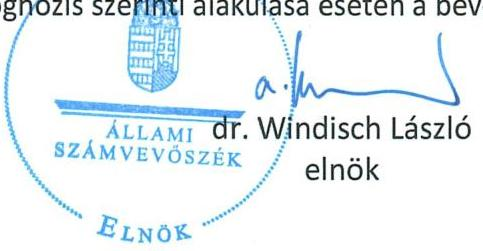

# ÁLLAMI   SZÁMVEVÔSZÉK 

## Vélemény

a Magyarország 2025. évi központi költségvetéséről szóló törvényjavaslatról
2024. november

T/9894/1
www.asz.hu

---

# ÁLLAMI   SZÁMVEVÔSZÉK 

## Vélemény

a Magyarország 2025. évi központi
költségvetéséről szóló törvényjavaslatról
2024.

---

# A Vélemény elkészítését irányította: 

ERDÉLYI ATTILA ellenőrzésvezető

## A Vélemény elkészítését felügyelte:

DR. PULAY GYULA vezető közgazdász

## Készítették:

ERDÉLYI ATTILA ELLENŐRZÉSVEZETŐ
BÉRES LÁSZLÓ SZÁMVEVŐ
BERG ZOLTÁN LÁSZLÓ SZÁMVEVŐ
CZEGLÉDI DÉNES SZÁMVEVŐ
DUDÁS PÁL DÁNIEL ELEMZÉSI SZAKÉRTŐ
HUSZÁRNÉ BORBÁS MELINDA SZÁMVEVŐ
IGAR TAMÁS SZÁMVEVŐ
JAKOVÁC KATALIN ELEMZÉSI SZAKÉRTŐ
DR. KÁDÁR KRISZTA ELEMZÉSI TANÁCSADÓ
KISAPÁTI ANGÉLA ELEMZÉSI SZAKÉRTŐ
KÓRÓDI GÁBOR SZÁMVEVŐ
KOVÁCS RICHÁRD SZÁMVEVŐ
LUKSANDER ALEXANDRA ELEMZÉSI SZAKÉRTŐ
MIHÁLSZKY KÁLMÁN ELEMZÉSI SZAKÉRTŐ
DR. NAGY JUDIT ELEMZÉSI SZAKÉRTŐ
DR. REINELT SIMON ÁKOS ELEMZÉSI REFERENS
SZABÓ ZSUZSANNA SZÁMVEVŐ
VASVÁRINÉ MOLNÁR JUDIT SZÁMVEVŐ
VÉRTÉNYI GÁBOR JENŐ SZÁMVEVŐ

## Kiadja az Állami Számvevőszék

EL-4007-310/2024

---

# TARTALOM 

BEVEZETÉS ..... 4
ÖSSZEGZŐ ÉRTÉKELÉS ..... 6
RÉSZLETES ÉRTÉKELÉS ..... 10

1. A KÖLTSÉGVETÉS KÖZVETLEN BEVÉTELEI ÉS KIADÁSAI ..... 10
1.1. A költségvetés közvetlen bevételeinek számításokkal való megalapozottsága és teljesíthetősége ..... 10
1.2. A költségvetés közvetlen kiadásainak számításokkal való megalapozottsága és felülről nyitott kiadásainak elégségessége ..... 16
2. MINISZTÉRIUMOK, ALKOTMÁNYOS ÉS EGYÉB FEJEZETEK BEVÉTELEI ÉS KIADÁSAI ..... 18
2.1. A bevételek számításokkal való megalapozottsága ..... 18
2.2. A kiadások számításokkal való megalapozottsága és a felülről nyitott kiadások elégségessége ..... 18
3. A TÁRSADALOMBIZTOSÍTÁS PÉNZÜGYI ALAPJAINAK BEVÉTELEI ÉS KIADÁSAI ..... 21
3.1. A Társadalombiztosítás pénzügyi alapjai bevételeinek számításokkal való megalapozottsága és teljesíthetősége ..... 21
3.2. A Társadalombiztosítás pénzügyi alapjai kiadásainak számításokkal való megalapozottsága és felülről nyitott kiadásainak elégségessége ..... 24
4. UNIÓS FEJLESZTÉSEK BEVÉTELEI ÉS KIADÁSAI ..... 26
4.1. Az uniós fejlesztések bevételeinek számításokkal való megalapozottsága ..... 26
4.2. Az uniós fejlesztések kiadásainak számításokkal való megalapozottsága és felülről nyitott kiadásainak elégségessége ..... 26
5. AZ ADÓSSÁGSZOLGÁLATTAL KAPCSOLATOS BEVÉTELEK ÉS KIADÁSOK ..... 28
5.1. Az adósságszolgálattal kapcsolatos bevételek számításokkal való megalapozottsága ..... 28
5.2. Az adósságszolgálattal kapcsolatos kiadások számításokkal való megalapozottsága és felülről nyitott kiadásainak elégségessége ..... 29
6. AZ ÁLLAMI VAGYONNAL KAPCSOLATOS KIADÁSOK ..... 30
7. AZ ELKÜLÖNÍTETT ÁLLAMI PÉNZALAPOK BEVÉTELEI ÉS KIADÁSAI ..... 31
7.1. Az elkülönített állami pénzalapok bevételeinek számításokkal való megalapozottsága és teljesíthetősége ..... 31
7.2. Az elkülönített állami pénzalapok kiadásainak számításokkal való megalapozottsága és felülről nyitott kiadásainak elégségessége ..... 31
8. HELYI ÖNKORMÁNYZATOK TÁMOGATÁSAINAK BEVÉTELEI ÉS KIADÁSAI ..... 32
8.1. Az önkormányzati szolidaritási hozzájárulás bevételi előirányzat számításokkal való megalapozottsága és teljesíthetősége ..... 32
8.2. A helyi önkormányzatok kiadásainak számításokkal való megalapozottsága ..... 32
9. ÁLLAMI BERUHÁZÁSOKHOZ, FEJLESZTÉSEKHEZ ÉS A DEMJÁN SÁNDOR PROGRAMHOZ TERVEZETT KIADÁSOK SZÁMÍTÁSOKKAL VALÓ MEGALAPOZOTTSÁGA ..... 33
10. A KÖLTSÉGVETÉS TARTALÉKAI ..... 33

---

10.1. Céltartalékok ..... 34
10.2. Rendkívüli kormányzati intézkedések ..... 35
10.3. Beruházási Alap ..... 35
11. A HIÁNYRA ÉS AZ ÁLLAMADÓSSÁG-SZABÁLYRA VONATKOZÓ TÖRVÉNYI ELÖÍRÁSOK TELJESÍTHETŐSÉGE ..... 36
11.1 A központi alrendszer hiánya és a Gst. szerinti hiánycél teljesülése ..... 36
11.2 Az államadósság-szabály teljesülése ..... 37
11.3 A központi költségvetés bruttó adósságának alakulása ..... 38
12. A RENDSZERES KÖLTSÉGVETÉSI TÁMOGATÁSBAN RÉSZESÜLŐ SZERVEK KIADÁSAINAK KÖLTSÉGVETÉSRE GYAKOROLT HATÁSA ..... 39
13. A VÉLEMÉNYBEN FELTÁRT KOCKÁZATOK ÉS A 2025. ÉVI KVTV. JAVASLAT TARTALÉKAINAK ÖSSZEVETÉSE ..... 40

1. SZ. MELLÉKLET: BEVÉTELI ELŐIRÁNYZATOK, AMELYEKet A TERVEZETT JOGSZABÁLYMÓDOSÍTÁSOK ELFOGADÁSÁnak feltételezése mellett értékeltünk ..... 43
2. SZ. MELLÉKLET: ÁSZ VÉLEMÉNY ELKÉSZÍTÉSÉHEZ ADATOT SZOLGÁLTATÓ SZERVEZETEK (személyek) ..... 45
3. SZ. MELLÉKLET: ÁSZ VÉLEMÉNY ELKÉSZÍTÉSÉHEZ FELHASZNÁLT NYILVÁNOSAN ELÉRHETŐ ADATOK ..... 46
FOGALOMTÁR ..... 49
RÖVIDÍTÉSJEGYZÉK ..... 51
JOGSZABÁLYOK JEGYZÉKE ..... 53

---

Az Állami Számvevőszék véleménye: a Magyarország 2025. évi központi költségvetéséről szóló törvényjavaslat megalapozott. A gazdasági folyamatoknak a törvényjavaslatot megalapozó makrogazdasági prognózis szerinti alakulása esetén a bevételi előirányzatok teljesíthetők.

---

# BEVEZETÉS 

Az Állami Számvevőszék (ÁSZ) az Állami Számvevőszékről szóló 2011. évi LXVI. törvény (ÁSZ tv.) 5. § (1) bekezdése alapján véleményt ad az Országgyűlés számára a központi költségvetésről szóló törvényjavaslat megalapozottságáról, a bevételi előirányzatok teljesíthetőségéről. Az ÁSZ a véleményadással támogatja az Országgyűlést a megalapozott döntéshozatalban a költségvetési törvényjavaslatról. A véleményadás keretében az ÁSZ rámutat Magyarország 2025. évi központi költségvetéséről szóló törvényjavaslat (2025. évi Kvtv. javaslat) kockázataira, amelyek kezelése így időben megtörténhet az Országgyűlés által.

Az ÁSZ véleményadásának célja annak rögzítése, hogy a feltárt kockázatok veszélyeztetike a költségvetési hiányra vonatkozó előírások és az államadósság-szabály teljesülését. E célkitúzés keretében az ÁSZ értékelte, hogy a költségvetési törvényjavaslat bevételi és kiadási előirányzatainak összegét a véleményezett előirányzatok tervezéséért felelős intézmények a jogszabályokban (Áht. ${ }^{1}$, Ávr. ${ }^{2}$.) és a Pénzügyminisztérium (PM) által közzétett Tervezési Tájékoztatóban megfogalmazott követelményeknek megfelelően, illetve a törvényjavaslat indokolásának mellékletében ismertetett makrogazdasági prognózis figyelembevételével tervezték-e meg. A véleményadás kiterjed továbbá arra, hogy a Magyarország gazdasági stabilitásáról szóló 2011. évi CXCIV. törvényben (Gst.) foglaltak alapján érvényesül-e a hiánycélra vonatkozó, valamint a Magyarország Alaptörvényében (Alaptörvény) és a Gst.-ben meghatározott, az államadósság-mutató csökkenésére vonatkozó követelmény (államadósság-szabály).

A költségvetési törvényjavaslat számvevőszéki véleményezéséhez három lényeges kérdéskör kapcsolódik.

1. A központi költségvetésről szóló törvényjavaslat előirányzatai számításokkal megalapozottak-e?
2. A bevételi előirányzatok teljesíthetők-e?
3. Az azonosított kockázatok - a tartalékok figyelembevételével - veszélyeztetik-e az államadósság-szabály és a hiányra vonatkozó törvényi előírások teljesíthetőségét?
A számvevőszéki értékelés kiterjedt a költségvetési törvényjavaslatban tervezett és statisztikai mintavétellel kiválasztott bevételi és kiadási előirányzatok számításokkal való megalapozottságára, a lényeges összegű bevételi előirányzatok teljesíthetőségére, valamint a felülről nyitott, lényeges összegű kiadási előirányzatok elégségességének vizsgálatára. A statisztikai mintavétel biztosította, hogy az ÁSZ a minta alapján 95 százalékos megbízhatósággal megállapítsa a törvényjavaslat előirányzatainak összessége számításokkal megalapozott-e. A véleményadás 23 szervezet adatszolgáltatása, valamint nyilvánosan elérhető adatbázisok felhasználásával készült, az ÁSZ honlapján ${ }^{3}$ elérhető módszertan alapján.

Az előirányzatok értékelése során 2024. évi várható adatnak a PM által meghatározott 2024. évi notifikációs várható adatot tekintettük, melyet a PM a Magyarország 2025. évi központi költségvetéséről szóló törvényjavaslat tervezetéhez készített. Az értékelés során a 2025. évi tervezett összegeket a 2024. évi várható teljesítési adathoz viszonyítottuk, azon előirányzatoknál, ahol ez az adat nem állt rendelkezésre, ott a 2024. évi előirányzat összege szolgált elsődleges viszonyítási alapként.

[^0]
[^0]:    ${ }^{1}$ 2011. évi CXCV. törvény az államháztartásról
    ${ }^{2}$ 368/2011. (XII. 31.) Korm. rendelet az államháztartásról szóló törvény végrehajtásáról
    ${ }^{3}$ https://www.asz.hu/dokumentumok/Modszertani_utmutato_kozponti_kv_elemzes.pdf

---

Az értékelés kapcsán továbbá kiemeljük, hogy az ÁSZ a véleményadás során az uniós bevételeket nem minősítette teljesíthetőség szempontjából, tekintettel az uniós források biztosításával kapcsolatban felmerült bizonytalanságokra, az elhúzódó döntési folyamatra.

Az adatszolgáltató szervezeteket (személyeket) a Vélemény 2. sz. melléklete „ÁSZ Vélemény elkészítéséhez adatot szolgáltató szervezetek (személyek)", a felhasznált nyilvánosan elérhető adatbázisok körét a 3. sz. melléklete „ÁSZ Vélemény elkészítéséhez felhasznált nyilvánosan elérhető adatok" mutatja be. Az ÁSZ Véleményben megjelenő témához kapcsolódó és a módszertanból eredő szakkifejezések, minősítések meghatározását a „Fogalomtár", a Véleményben alkalmazott rövidítéseket a „Rövidítésjegyzék", a véleményezés során figyelembe vett jogszabályokat a „Jogszabályok jegyzéke" tartalmazza. Az ÁSZ Vélemény az adatszolgáltatók által a 2024. november 20. 10:00 óráig rendelkezésre bocsájtott adatokat vette figyelembe.

---

# ÖSSZEGZŐ ÉRTÉKELÉS 

Az ÁSZ annak feltételezésével végezte el a 2025. évi Kvtv. javaslat értékelését, hogy a kormányzat által meghatározott makrogazdasági prognózis teljesül, tekintettel arra, hogy a Költségvetési Tanács megítélése szerint az megvalósítható, bár kockázatok övezik. A Költségvetési Tanács konszenzussal kialakított véleményében felsorolt makrogazdasági kockázatok meglétével az ÁSZ - értelemszerűen - egyetért, ezért azokat az ÁSZ Vélemény nem ismétli meg, és esetleges bekövetkezésük hatását nem számszerűsíti.

A 2025. évi Kvtv. javaslat szerinti pénzforgalmi hiány (4 123,0 Mrd Ft) a hazai felhalmozási költségvetés 2625,1 Mrd Ft-os hiányából és az európai uniós fejlesztési költségvetés 1497,9 Mrd Ft-os hiányából tevődik össze. A múködési költségvetés tervezett egyenlege az elmúlt hat év gyakorlatának megfelelően nulla.

A 2025. évi Kvtv. javaslat indokolása alapján a kormányzati szektor eredményszemléletű hiánya 3272,3 Mrd Ft, amely a 2025. évre tervezett nominális GDP 3,7\%-a, ami a 2024. év végére várt értéknél (4,5\%) 0,8 százalékponttal alacsonyabb. A 2025. év végére tervezett kormányzati szektor hiány értéke meghaladja a 3,0\%-ot, ami nem felel meg a Gst. 3/A. § (2) bekezdés b) pontjában meghatározott hatályos előírásának. A megfelelés érdekében a Kormány a Gst. módosítását kezdeményezte a Magyarország 2025. évi központi költségvetésének megalapozásáról szóló törvényjavaslatban.

A 2025. évi Kvtv. javaslat szerint az államadósság-mutató 2025. december 31-ére tervezett mértéke a 2024. december 31-én várható $73,2 \%$-ról $72,6 \%$-ra csökken, ezáltal a 2025. év végére tervezett államadósság-mutató mértéke megfelel az Alaptörvény 36. cikk (5) bekezdésében és a Gst. 4. § (2a) bekezdésében meghatározott követelménynek.

A 2025. évi Kvtv. javaslat előirányzatai közül a számításokkal való megalapozottság értékelése céljából kiválasztott 53 db bevételi előirányzat a bevételi főösszeg 95,3\%-át tette ki, amelyek összegének 99,7\%-a számításokkal megalapozott. A számításokkal való megalapozottság értékeléséhez kiválasztott 201 db kiadási előirányzat a kiadási főösszeg 90,8\%-át tette ki, amelyek összegének 99,9\%-a számításokkal megalapozott.

A XLII. A költségvetés közvetlen bevételei és kiadásai fejezet bevételei közül a Vagyonértékesítések bevétele 100,0 Mrd Ft összegű előirányzat számításokkal való megalapozottságához szükséges, hogy a Kormány 2024 őszén meghozott állami vagyont érintő ingatlanvagyon tervezett értékesítéséhez kapcsolódó döntései alapján a szükséges intézkedések végrehajtásra, a feladatok meghatározásra, továbbá a kapcsolódó jogszabály módosítások elfogadásra kerüljenek.
A LXII. Nemzeti Kutatási, Fejlesztési és Innovációs fejezeten belül a Kutatási Alaprész kiadási előirányzat 40,0 Mrd Ft összegű kiadási előirányzata és a XLV. Állami Beruhások fejezet Beruházási Alap 150,3 Mrd Ft összegű kiadási előirányzata számításokkal azért nem megalapozott, mert a 2025. évi Kvtv. javaslat szerinti előirányzat és az azt megalapozó tervezési dokumentáció között számszaki eltérés van.
Összességében a 2025. évi Kvtv. javaslat előirányzatai számításokkal megalapozottak.
A 2025. évi Kvtv. javaslat lényeges összegű bevételi előirányzatai (összértékük a bevételi főösszeg 75,3\%-át tette ki) teljesíthetőségének értékelésére kiválasztott előirányzatok összegének 99,9\%-a teljesíthető, 0,1\%-a teljesíthetőségi kockázatot hordoz.

A XLII. A költségvetés közvetlen bevételei és kiadásai fejezet bevételei közül a Pénzügyi szervezetek befizetései 253,1 Mrd Ft összegű előirányzat számításokkal megalapozott, azonban teljesíthetőségéből az ÁSZ számítása alapján 10,9 Mrd Ft kockázatos. A

---

hitelintézetek járványügyi helyzettel összefüggő különadójáról szóló kormányrendelet alapján a hitelintézetek 2020-ban különadót fizettek a Járványügyi Alap javára. A szabályozás alapján a hitelintézetek számára lehetőség volt arra, hogy a 2020. adóévben megfizetett különadónak megfelelő összeget adóvisszatartás formájában a következő öt évre elosztva érvényesítsék. Ez a lehetőség azonban a 2024. évre vonatkozóan felfüggesztésre került. A PM által megküldött dokumentáció nem mutatja be, hogy a 2025-től újra megnyíló adóvisszatartási lehetőséggel a 2025. évi bevétel tervezésénél számoltak.
A XLII. A költségvetés közvetlen bevételei és kiadásai fejezet bevételei közül az Energia ágazat befizetései 296,7 Mrd Ft összegű előirányzat számításokkal megalapozott, azonban teljesíthetőségéből az ÁSZ számítása alapján 47,7 Mrd Ft kockázatos. A tervezési dokumentáció alapján az előirányzat részét képező URAL/BRENT különbözeti adóra Brent-Urals spread (különbözet) 10,5 USD értékű paraméterrel számolva összesen 75,0 Mrd Ft-ot kalkuláltak. A Brent-Urals különbözet 2025. évre prognosztizált átlagos értéke azonban az ÁSZ által összegyűjtött historikus adatok, valamint a hazai és nemzetközi előrejelzések adatai alapján legfeljebb 7,435 USD lesz 2025-ben. Az ÁSZ számításai alapján a Brent-Urals különbözetből eredő adóbevétel a 2025. évi átlagos 7,435 USD értékkel kalkulálva a PM által számított 75,0 Mrd Ft helyett csupán 33,3 Mrd Ft-os adóbevételt jelenthet a központi költségvetés számára, ami így 47,7 Mrd Ft teljesíthetőségi kockázatot jelent.
Mindezek alapján összességében a 2025. évi Kvtv. javaslat bevételei teljesíthetők, a kormányzat makrogazdasági prognózisának megvalósulása esetén.

A lényeges összegű bevételi előirányzatok közül a Társasági adó tervezett összegéből 75,0 Mrd Ft, a Cégautó tervezett összegéből 15,0 Mrd Ft, a Bányajáradék tervezett összegéből 15,6 Mrd Ft, a Kisvállalati adó tervezett összegéből 3,0 Mrd Ft, a Kiskereskedelmi adó tervezett összegéből 25,0 Mrd Ft, a Jövedéki adó tervezett összegéből 71,0 Mrd Ft, a Lakossági illetékek tervezett összegéből 9,0 Mrd Ft, a Gépjármúadó tervezett összegéből 4,0 Mrd Ft, a Szociális hozzájárulási adó tervezett összegéből 30,0 Mrd Ft, a Népegészségügyi termékadó tervezett összegéből 3,0 Mrd Ft a tervezett jogszabálymódosítások elfogadásával válik teljesíthetővé. Emellett a Pénzügyi szervezetek befizetései tervezett összegéből 145,0 Mrd Ft, az Energiaágazat befizetései tervezett összegéből 120,0 Mrd Ft, míg a Biztosítási adó tervezett összegéből 60,0 Mrd Ft az extraprofit adókról szóló 197/2022. (VI. 4.) Korm. rendelet hatályának meghosszabbításával válik teljesíthetővé. Továbbá a tervezett jogszabálymódosítások elfogadásával az Általános forgalmi adó tervezett összegéből 5,0 Mrd Ft-tal, a Személyi jövedelemadó tervezett összegéből 79,0 Mrd Ft-tal, míg a Társadalombiztosítási járulék tervezett összegéből 18,4 Mrd Ft-tal kevesebb teljesülhet. A tervezett jogszabályváltozások költségvetési hatása mindösszesen $+473,2 \mathrm{Mrd}$ Ft, az előirányzatokhoz tartozó változással érintett jogszabályokat, valamint azok előirányzatonkénti költségvetési hatásait a Vélemény 1. számú melléklete „Bevételi előirányzatok, amelyeket a tervezett jogszabálymódosítások elfogadásának feltételezése mellett értélt az ÁSZ" mutatja be.

A 2025. évi Kvtv. javaslat felülről nyitott lényeges összegű kiadási előirányzatai (összértékük a kiadási főösszeg 48,5\%-át tette ki) elégségességének értékelésére kiválasztott előirányzatok összegének 99,9\%-a elégséges, míg 0,1\%-a elégségességi kockázatot hordoz a feladatok ellátására.

A tervezési dokumentációk alapján a Tizenharmadik havi nyugdíj visszaépítésének támogatása 487,1 Mrd Ft esetében 10,0 Mrd Ft és az M5, M6 autópálya rendelkezésre

---

állási díjak 175,0 Mrd Ft esetében 2,1 Mrd Ft összegű túllépés valószínűsíthető. A Digitális Megújulás OP Plusz 115,3 Mrd Ft esetében a kiadási előirányzat alulteljesülése várható, aminek 1,0 Mrd Ft összegű pozitív hatása van a költségvetés végrehajtására. Ebből eredően az elégségességi kockázat becsült összege 11,1 Mrd Ft.

Az ÁSZ a Vélemény készítése során az elemzési módszertanban előre meghatározott értékelési körön kívül eső kettő kiemelést érdemlő problémára is felfigyelt.

A XLIII. Az Állami vagyonnal kapcsolatos bevételek és kiadások fejezeten belül az Ingatlan beruházások, ingatlan és egyéb eszközök vásárlása 131,0 Mrd Ft összegű előirányzat számításokkal való megalapozottságának értékelése során feltártuk, hogy az előirányzat tervezési dokumentációja ugyan szabályos (az előirányzat megalapozott), azonban az előirányzaton csupán a kormányhatározatokkal már elfogadott kiadásokra képződik meg a fedezet, azaz az egyéb év közben felmerülő eseti kiadásokra az előirányzat összege várhatóan nem lesz elégséges. Az előirányzat nem felülről nyitott, vagyis nem túlléphető, ezért várhatóan az előirányzat 5,9 Mrd Ft összegű növelésére lesz szükség valamely tartalékelőirányzat terhére.
A XXIII. Nemzetgazdasági Minisztérium fejezeten belül a Turisztikai fejlesztési feladatok 106,6 Mrd Ft összegű kiadási előirányzat számításokkal való megalapozottságának értékelése során feltártuk, hogy az előirányzat tervezési dokumentációja ugyan szabályos (az előirányzat megalapozott), azonban, hogy az előirányzat összege nem elégséges fontos célok finanszírozására. Az előirányzat nem felülről nyitott, vagyis nem túlléphető, ezért várhatóan az előirányzat 9,3 Mrd Ft összegű növelésére lesz szükség valamely tartalékelőirányzat terhére.

A XLI. Adósságszolgálattal kapcsolatos bevételek és kiadások fejezetben megtervezett államadósság finanszírozásával összefüggő kamatkiadások számításokkal megalapozottak és elégségesek.

A devizában fennálló adósság és követelések kamatelszámolásai kapcsán fontosnak tartjuk rögzíteni, hogy a 2025. évi Kvtv. javaslathoz készített makrogazdasági prognózisban a 2025. évre feltételezett átlagos 397,5 HUF/EUR árfolyamhoz képest a HUF/EUR árfolyam 2024. október 2. óta magasabb, ettől a naptól kezdődően az ÁSZ Vélemény adatzárásának időpontjáig (az MNB adatbázisa alapján) 398,9 - 410,9 HUF/EUR tartományban alakult. Következésképpen a forint árfolyamának a jelenlegi szinthez képest erősödnie kell ahhoz, hogy a tervezett árfolyam elérhető legyen. A tervezettnél magasabb éves átlagos HUF/EUR árfolyam a devizában fennálló adósság kamatkiadásait az előirányzathoz képest megemeli. Az ÁSZ számításai szerint a forint euróval szembeni 1 egységnyi (forint) gyengülése a 2025. év végére tervezett devizában fennálló adósság és követelések állományához kapcsolódó éves pénzforgalmi nettó kamatkiadást (kamatkiadás-kamatbevétel) a tervezett összeghez képest 1,3 Mrd Ft-tal ( $0,3 \%$-kal) növeli.

A korábbi évekhez hasonlóan a 2025. évi Kvtv. javaslatban meghatározott előirányzataik megalapozottságát a költségvetési szervek által az ÁSZ rendelkezésére bocsátott dokumentumok visszaigazolják. Ugyanakkor az elmúlt évek számai azt mutatják, hogy a központi költségvetési szervek többsége az év során a költségvetési törvényben meghatározott előirányzatánál lényegesen magasabb kiadást teljesített. Néhány esetben ez azzal függött össze, hogy a költségvetési törvényben meghatározott előirányzat a szükséges feladatok ellátásához elégtelennek bizonyult, és a kormányzatnak más előirányzatok

---

átcsoportosításával kellett ezen intézmények működőképességét biztosítani. A 2025. évi Kvtv. javaslat a hasonló helyzet kialakulásának kockázatát jelentősen mérsékli azáltal, hogy az előző évhez képest a fekvőbeteg szakellátás intézményei, a Klebelsberg Központ és a Rendőrség számára jelentős többlettámogatást biztosít.

A központi költségvetési szervek nagyobb része esetében azonban a törvényi előirányzatuk túllépését az okozza, hogy a feladataik ellátásához szükséges támogatás egy részét nem az intézmény költségvetésében, hanem fejezeti vagy központi kezelésű előirányzatokon tervezik meg, és azokat év közben csoportosítják át a feladatot ellátó intézményhez. Ez a megoldás szabályszerűségi szempontból nem kifogásolható, azonban azzal a következménnyel jár, hogy a törvényi előirányzat és az arra alapozott elemi költségvetésük nem irányadó a gazdálkodásuk szempontjából, mivel különféle átcsoportosításokkal a rendelkezésükre álló keretek év közben még jelentősen bővülnek.

Összességében a 2025. évi Kvtv. javaslat véleményezéséhez kiválasztott előirányzatok értékelése alapján azonosított kockázatok kezelésére a tervezett központi tartalékok közül a Rendkívüli kormányzati intézkedések (RKI) 100,0 Mrd Ft összege fedezetet biztosít. Ugyanakkor fontosnak tartjuk rögzíteni, hogy az RKI tervezett összege 2025-ben a feltárt kockázatok összegét is figyelembe véve a makrogazdasági kockázatok kezelésére nem feltétlenül lesz alkalmas.

---

# RÉSZLETES ÉRTÉKELÉS

## 1. A KÖLTSÉGVETÉS KÖZVETLEN BEVÉTELEI ÉS KIADÁSAI

### 1.1. A költségvetés közvetlen bevételeinek számításokkal való megalapozottsága és teljesíthetősége

A XLII. A költségvetés közvetlen bevételei és kiadásai fejezet 2025. évre tervezett bevételi előirányzatainak összege 22 796,1 Mrd Ft, a 2024. évi törvényi előirányzatot (21 127,0 Mrd Ft) 7,9\%-kal a 2023. évi teljesítést (18 419,9 Mrd Ft) 23,8\%-kal haladja meg.

A XLII. A költségvetés közvetlen bevételei és kiadásai fejezet lényeges bevételi előirányzatai számításokkal megalapozottak és teljesíthetők. Azonban a Pénzügyi szervezetek befizetései 253,1 Mrd Ft összegű előirányzat teljesíthetősége 10,9 Mrd Ft összegű, míg az Energia ágazat befizetései 296,7 Mrd Ft összegű előirányzat teljesíthetősége 47,7 Mrd Ft összegű kockázatot hordoz.

A XLII. A költségvetés közvetlen bevételei és kiadásai fejezet előirányzatai közül a gazdálkodó szervezetek befizetéseihez kapcsolódó lényeges bevételi előirányzatokat mutatja be az 1. táblázat 2023-2025. évre vonatkozóan.

1. táblázat

Gazdálkodó szervezetek befizetéseihez kapcsolódó lényeges adóbevételi előirányzatok tervezési és teljesítési adatai 2023-2025. között Mrd Ft-ban és \%-ban

|  Értékelt
előirányzat | 2023. évi
teljesítés
(Mrd Ft) | 2024. évi
előirányzat
(Mrd Ft) | 2025. évi
terv
(Mrd Ft) | 2025. évi
terv/2023.
évi
teljesítés
(\%) | 2025. évi
terv/2024.
évi
előirányzat
(\%) | 2025. évi
terv/2024.
évi
várható
(\%)  |
| --- | --- | --- | --- | --- | --- | --- |
|  Társasági adó | 1013,8 | 1153,3 | 1285,5 | 126,8\% | 111,5\% | 119,4\%  |
|  Pénzügyi
szervezetek
befizetései | 352,6 | 253,4 | 253,1 | 71,8\% | 99,9\% | 85,9\%  |
|  Cégautóadó | 79,0 | 80,8 | 94,3 | 119,4\% | 116,7\% | 118,9\%  |
|  Bányajáradék | 241,9 | 192,0 | 129,0 | 53,3\% | 67,2\% | 117,6\%  |
|  Játékadó | 51,8 | 52,7 | 64,5 | 124,5\% | 122,4\% | 107,1\%  |
|  Energia ágazat
befizetései | 434,7 | 513,6 | 296,7 | 68,3\% | 57,8\% | 95,7\%  |
|  Rehabilitációs
hozzájárulás | 164,0 | 173,8 | 204,6 | 124,8\% | 117,7\% | 109,2\%  |
|  Kisadózók tételes
adója | 70,7 | 77,8 | 66,7 | 94,3\% | 85,7\% | 99,4\%  |
|  Kisvállalati adó | 183,4 | 227,6 | 257,8 | 140,6\% | 113,3\% | 114,9\%  |
|  Kiskereskedelmi
adó | 242,4 | 249,7 | 295,3 | 121,8\% | 118,3\% | 111,7\%  |
|  Szén-dioxid kvóta
adó | n.a. | n.a. | 75,0 | n.a. | n.a. | 92,7\%  |

Forrás: 2023. évi Zárszámadási törvény, 2024. évi Kvtv., 2025. évi Kvtv. javaslat-tervezet melléklete, 2025. évi Kvtv. javaslat alapján ÁSZ szerkesztés

---

A Társasági adó előirányzat tervezett összeg 1285,5 Mrd Ft, mely a 2024. évi előirányzathoz képest 11,5\%-os növekedést jelent. A tervezés során figyelembe vették, hogy a 2024. évi várható teljesülés, az előirányzatnál 76,3 Mrd Ft-tal kisebb összegű. Az adónem tervezésekor növelő hatásként számoltak a 2025. év novemberében esedékes globális minimumadó előleg fizetési előírásból származó bevétellel. Az adónem tervezése összhangban van a tervezést meghatározó makrogazdasági paraméterek várható értékeivel.

A Pénzügyi szervezetek befizetései előirányzat tervezett összege 253,1 Mrd Ft, a tervezés során, a 2024. évi előirányzatnál 0,3 Mrd Ft-tal alacsonyabb teljesülésből indultak ki, amit a PM korrigált azzal, hogy 2025-ben a hitelintézetek az előző évhez képest várhatóan nagyobb arányban vesznek igénybe állampapírvásárlás miatt adóalapkedvezményt. Az előirányzat teljesíthetősége szempontjából az ÁSZ kockázatot állapított meg, amelynek háttere a következő: A hitelintézetek járványügyi helyzettel összefüggő különadójáról szóló kormányrendelet alapján a hitelintézetek 2020-ban különadót fizettek a Járványügyi Alap javára. A szabályozás alapján a hitelintézetek számára lehetőség volt arra, hogy 2020. adóévben megfizetett különadónak megfelelő összeget adóvisszatartás formájában a következő öt évre elosztva érvényesítsék. Ez a lehetőség azonban 2024. évre vonatkozóan felfüggesztésre került. A PM által megküldött dokumentáció nem mutatja be, hogy a 2025-től újra megnyíló adóvisszatartási lehetőséggel a 2025. évi bevétel tervezésénél számoltak. 2025ben 10,9 Mrd Ft értékben jogosultak adóvisszatartásra a pénzügyi szervezetek. Ezért az ÁSZ az előirányzat teljesíthetősége kapcsán 2025. évre 10,9 Mrd Ft összegű kockázatot jelez.

A Cégautóadó előirányzat tervezett összeg 94,3 Mrd Ft, mely a 2024. évi előirányzathoz képest 16,7\%-os növekedést jelent. A tervezés során figyelembe vették a bázisévi folyamatokat, illetve az egyes adótörvények módosításáról szóló T/9724. törvényjavaslat cégautóadót érintő tervezett módosításait.

A Bányajáradék előirányzat tervezett összeg 129,0 Mrd Ft, ami 2024. évi várható teljesülést 17,6\%-kal (15,6 Mrd Ft) haladja meg. Az eltérés indoka tervezett jogszabályváltozás, amely a szénhidrogénekre vonatkozó bányajáradékot a földgáz/kőolaj tőzsdei árához viszonyítottan, sávos rendszerben állapítaná meg, a kitermelés időpontjának függvényében. A tervezés során emelkedő földgázárakat vettek figyelembe 2025-re, ami nagyban befolyásolja az előirányzat teljesülését, mivel a földgáz kitermelés a 2025. évi Kvtv. javaslat előirányzat 53,2\%-át jelenti. A 2025. évi terv módosítási alapját az egyes adótörvények módosításáról szóló T/9724. számon benyújtott törvényjavaslat képezi.

A Játékadó előirányzat tervezett összege 64,5 Mrd Ft, amely a 2024. évi előirányzathoz képest 22,4\%-os növekedést jelent. A tervezés során figyelembe vették a különböző szerencsejátékok népszerűségének dinamikus növekedését.

Az Energia ágazat befizetései előirányzat tervezett összege 296,7 Mrd Ft, a tervezés során a 2024. évi előirányzatnál 42,2\%-kal alacsonyabb teljesülésből indultak ki. A tervezési dokumentáció szerint az előirányzat részét képező URAL/BRENT különbözeti adóra összesen 75,0 Mrd Ft-ot számoltak. Az adóalap megegyezik az URAL és Brent tárgyhavi hordónkénti beszerzési árainak számtani átlaga közötti különbség 5,0 USD-vel csökkentett összegével. A számítás során 2025-re a PM 10,5 USD különbséget prognosztizál, amit az ÁSZ a historikus adatok, valamint a hazai és nemzetközi előrejelzések együttes figyelembevétele mellett nem tart megalapozottnak. Az ÁSZ számításai alapján az Brent-Urals különbözet átlagosan 7,435 USD lehet 2025-ben, mely a PM által tervezett 75,0 Mrd Ft helyett csupán 33,3 Mrd Ft-os adóbevételt jelenthet a központi költségvetés számára. Ebből következően az ÁSZ az előirányzat teljesíthetősége kapcsán a 2025. évre 41,7 Mrd Ft teljesíthetőségi kockázatot jelez.

---

A Rehabilitációs hozzájárulás előirányzat tervezett összeg 204,6 Mrd Ft, mely a 2024. évi előirányzathoz képest 17,7\%-os növekedést jelent. A tervezés során figyelembe vették a bázisévi folyamatokat, illetve a várható létszámváltozást és minimálbéremelést.

A Kisadózók tételes adója előirányzat tervezett összeg 66,7 Mrd Ft, mely a 2024. évi előirányzathoz képest 14,3\%-os csökkenést jelent. A csökkenés hátterében az áll, hogy a 2024. évi várható bevétel elmarad a tervezettől 13,8\%-kal, az adóalanyok számának jelentős csökkenése miatt. A tervezésnél számoltak a létszám várható további csökkenésével.

A Kisvállalati adó előirányzat tervezett összege 257,8 Mrd Ft, mely a 2024. évi előirányzathoz képest 13,3\%-os növekedést jelent. A tervezés során a 2024. évben várható, az előirányzatnál 1,4\%-kal kisebb teljesülésből indultak ki. A tervezés során figyelembe vették egyrészt a tervezést meghatározó makrogazdasági paraméterek várható értékeit, másrészt az adóalanyi kör várható bővülésének ütemét (kb. 1827 új adóalany vállalkozás), harmadrészt a foglalkoztatottak után érvényesíthető adókedvezmény szigorításának hatását.

A Kiskereskedelmi adó előirányzat tervezett összege 295,3 Mrd Ft, ami a 2024. évi előirányzathoz képest 18,3\%-os növekedést jelent. A tervezés során figyelembe vették a bázisévi folyamatokat, a vásárolt fogyasztás 2024. évi várható növekedését, valamint az egyes adótörvények módosításáról szóló T/9724. törvényjavaslat kiskereskedelmi adót érintő tervezett jogszabálymódosítás hatását. A tervezett módosítás eredményeképpen a platformüzemeltetők révén folytatott kiskereskedelmi tevékenységnél az átlagos adókulcs emelkedni fog. Tekintettel arra, hogy az adóbevétel tervezett növekedése jelentős mértékben meghaladja a vásárolt fogyasztás bővülését (6,7\%), az adóbevétel-növekedést nagy arányban a jogszabályi változás alapozza meg.

A Szén-dioxid kvóta adó előirányzat tervezett összege 75,0 Mrd Ft. A szén-dioxid kvóta adóra vonatkozó kötelezettséget előíró kormányrendelet 2023. július 20-án lépett hatályba, ezért a 2024. évre vonatkozó költségvetésben az előirányzat nem szerepelt. Az előirányzat tervezésekor a korábbi évi szén-dioxid kibocsátási adatokat vették figyelembe.

A XLII. A költségvetés közvetlen bevételei és kiadásai fejezet előirányzatai közül a fogyasztáshoz kapcsolt adókon belüli lényeges bevételi előirányzatokat mutatja be az 2. táblázat 2023-2025. évre vonatkozóan.
2. táblázat

A fogyasztáshoz kapcsolt adókon belül lényeges adóbevételi előirányzatok tervezési és teljesítési adatai 2023-2025. között Mrd Ft-ban és \%-ban

| Értékelt előirányzat | 2023. évi teljesítés (Mrd Ft) | 2024. évi előirányzat (Mrd Ft) | 2025. évi   terv   (Mrd Ft) | 2025. évi   terv/2023.   évi   teljesítés   (\%) | 2025. évi terv/2024. évi előirányzat (\%) | 2025. évi terv/2024. évi várható (\%) |
| :--: | :--: | :--: | :--: | :--: | :--: | :--: |
| Általános forgalmi adó | 6981,9 | 8574,0 | 8277,2 | 118,6\% | $96.5 \%$ | 108,1\% |
| Jövedéki adó | 1359,8 | 1677,7 | 1702,9 | 125,2\% | 101,5\% | 107,0\% |
| Pénzügyi   tranzakciós illeték | 333,4 | 348,3 | 589,3 | 176,8\% | 169,2\% | 141,2\% |
| Biztosítási adó | 182,6 | 234,2 | 213,1 | 116,7\% | 91,0\% | 75,7\% |
| Turizmusfejlesztési hozzájárulás | 49,4 | 54,5 | 90,2 | 182,6\% | 165,5\% | 107,8\% |

Forrás: 2023. évi Zárszámadási törvény, 2024. évi Kvtv., 2025. évi Kvtv. javaslat-tervezet melléklete, 2025. évi Kvtv. javaslat alapján ÁSZ szerkesztés

---

Az Általános forgalmi adó előirányzat tervezett összege 8 277,2 Mrd Ft, amely a 2024. évi előirányzathoz képest 3,5\%-os csökkenést jelent. A tervezés során a 2024. évi - az éves előirányzattól 914,2 Mrd Ft-tal elmaradó (amelynek oka a kiskereskedelmi forgalom 2024. évi terv bázisát képező 2023. évi jelentős visszaesése) - várható teljesülésből indultak ki. A tervezésnél figyelembe vették egyrészt a 2025. évre vonatkozó kormányzati prognózis paramétereit, másrészt a tervezett jogszabálymódosítást, amely mintegy 5,0 Mrd Ft-tal mérsékli az adóbevételt.

A Jövedéki adó előirányzat tervezett összege 1702,9 Mrd Ft, amely a 2024. évi előirányzathoz képest 1,5\%-os növekedést jelent. A tervezés során a 2024. évben várható, az előirányzatnál 5,2\%-kal kisebb teljesülésből indultak ki. A 2024. évi adóbevétel tervezésénél figyelembe vették egyfelől a 2025. évre vonatkozó kormányzati prognózis paramétereit, másfelől számoltak az uniós jogharmonizációs kötelezettség miatti, 2025. január 1-től hatályos energiatermékekre vonatkozó jövedéki adómérték emeléssel. A tervezés során továbbá figyelembe vették, hogy 2025-ben emelkedik a dohánytermékek, valamint az üzemanyagok és egyéb termékek (döntően alkoholok) jövedéki adója a 2024. július hónapban mért éves infláció mértékével. Mindezek mellett az előirányzat meghatározása során figyelembe vették a dohánypiaci trendek, az energiafelhasználás mértékének változását, illetve az ezekből eredő, 2025. évre becsült költségvetési hatást.

A Pénzügyi tranzakciós illeték előirányzat tervezett összege 589,3 Mrd Ft, amely a 2024. évi előirányzathoz képest 69,2 \%-os növekedést jelent. A tervezés során figyelembe vették, hogy a pénzügyi tranzakciós illetékről szóló 2012. évi CXVI. törvényben foglalt illetékek jelentős részét az extraprofit adókról szóló 197/2022. (VI. 4.) Korm. rendelet 2024. augusztus 1-től 50\%-kal megemelte, továbbá, hogy 2024. október 1-től a devizakonverzió esetén további kiegészítő illeték került bevezetésre.

A Biztosítási adó előirányzat tervezett összeg 213,1 Mrd Ft, ami 9,0\%-kal (21,1 Mrd Ft) alacsonyabb a 2024. évi előirányzatnál. A tervezés során figyelembe vették, hogy a különadó intézményének fenntartása mellett 2025-ben az adóalanyok lehetőséget kapnak arra, hogy állampapírvásárlással csökkentsék adóalapjukat.

A Turizmusfejlesztési hozzájárulás előirányzat tervezett összege 90,2 Mrd Ft, amely a 2024. évi előirányzathoz képest 65,5\%-os növekedést jelent. A tervezés során figyelembe vették a 2024. évben szeptemberig befolyt adóbevételeket, valamint a vásárolt fogyasztás éves változására vonatkozó makrogazdasági előrejelzést.

A XLII. A költségvetés közvetlen bevételei és kiadásai fejezet előirányzatai közül a lakosság befizetéseihez kapcsolódó lényeges bevételi előirányzatokat mutatja be a 3. táblázat 20232025. évre vonatkozóan.

---

# A lakosság befizetéseihez kapcsolódó lényeges adóbevételi előirányzatok tervezési és teljesítési adatai 2023-2025. között Mrd Ft-ban és \%-ban 

| Értékelt előirányzat | 2023. évi teljesítés (Mrd Ft) | 2024. évi előirányzat (Mrd Ft) | 2025. évi   terv   (Mrd Ft) | 2025. évi   terv/2023.   évi   teljesítés   (\%) | 2025. évi terv/2024.   évi   előirányzat   (\%) | 2025. évi terv/2024.   évi   várható   (\%) |
| :--: | :--: | :--: | :--: | :--: | :--: | :--: |
| Személyi jövedelemadó | 3996,3 | 4475,8 | 4905,4 | 122,7\% | 109,6\% | 108,2\% |
| Lakossági illetékek | 240,8 | 280,1 | 275,4 | 114,4\% | 98,3\% | 105,0\% |
| Gépjármúadó | 95,9 | 101,3 | 102,7 | 107,1\% | 101,4\% | 104,1\% |

Forrás: 2023. évi Zárszámadási törvény, 2024. évi Kvtv., 2025. évi Kvtv. javaslat-tervezet melléklete, 2025. évi Kvtv. javaslat alapján ÁSZ szerkesztés

A Személyi jövedelemadó előirányzat tervezett összeg 4 905,4 Mrd Ft, mely a 2024. évi előirányzathoz képest 9,6\%-os növekedést jelent. A tervezés során a 2024. évi várható teljesülésből indultak ki, amely meghaladja az 2025. évi előirányzatot. A tervezés során figyelembe vették egyrészt a 2025. évre vonatkozó kormányzati prognózis paramétereit, másrészt a családi adókedvezmény 50 százalékos növekedését 2025. július 1-től, és az egyéb intézkedések összesített hatását.

A Lakossági illetékek előirányzat tervezett összeg 275,4 Mrd Ft, mely a 2024. évi előirányzathoz képest 1,7\%-os csökkenést jelent. A tervezés során a 2024. évi várható teljesülésből indultak ki, amely az előirányzat 93,7\%-a. A 2024. évi várható értékhez képest tervezett 13,0 Mrd Ft-os növekedés meghatározásakor figyelembe vették a csökkenő kamatkörnyezet eredményeként fellendülő lakáspiac illetékbevételeket megnövelő hatását és a 2025. évre tervezett adóintézkedések változásából eredő bevételek nagyságát.

A Gépjármúadó előirányzat tervezett összege 102,7 Mrd Ft, ami a 2024. évi előirányzathoz képest 1,4\%-os, a 2024. évi várható teljesüléshez viszonyítva 4,1\%-os növekedést jelent. A tervezés során figyelembe vették a bázisévi folyamatokat, illetve az egyes adótörvények módosításáról szóló T/9724. törvényjavaslat gépjármúadót érintő tervezett módosításait, amely az adómértékek fogyasztóiár-indexszel megegyező mértékű növekedését eredményezi.

A XLII. A költségvetés közvetlen bevételei és kiadásai fejezet további lényeges bevételi előirányzatai összegének tervezett és előzetes teljesítési adatait mutatja be a 4. táblázat 20232025. évre vonatkozóan.

---

A lényeges bevételi előirányzatok tervezési és teljesítési adatai 2023-2025. között Mrd Ftban és \%-ban

| Értékelt előirányzat | 2023. évi   teljesítés   (Mrd Ft) | 2024. évi   előirányzat   (Mrd Ft) | 2025. évi   terv   (Mrd Ft) | 2025. évi   terv/2023.   évi   teljesítés   (\%) | 2025. évi   terv/2024.   évi   előirányzat   (\%) |
| :-- | :--: | :--: | :--: | :--: | :--: |
| Bírságbevételek | 72,2 | 80,6 | 97,0 | $134,3 \%$ | $120,3 \%$ |
| Megtett úttal arányos   útdij | 306,0 | 447,0 | 545,0 | $178,1 \%$ | $121,9 \%$ |
| Időalapú útdij | 98,5 | 102,0 | 118,0 | $119,8 \%$ | $115,7 \%$ |

Forrás: 2023. évi Zárszámadási törvény, 2024. évi Kvtv., 2025. évi Kvtv. javaslat-tervezet melléklete, 2025. évi Kvtv. javaslat alapján ÁSZ szerkesztés

A Bírságbevételek előirányzat tervezett összege 90,7 Mrd Ft, ami a 2024. évi előirányzathoz képest 20,3\%-os növekedést jelent. A tervezés során figyelembe vették, hogy a 185/2024. (VII. 8.) Korm. rendelet több szabálysértési, objektív felelősségből származó és egyéb bírságtételt 20,0\%-kal megemelt.

A Megtett úttal arányos útdíj előirányzat tervezett összege 545,0 Mrd Ft, ami a 2024. évi előirányzathoz képest 21,9\%-os ( 98,0 Mrd Ft), míg a 2024. év végi várható teljesüléshez képest 43,2 Mrd Ft többletet jelent. A tervezés során a 2024. év végéig várható teljesülés becslése során figyelembe vették 2024. első három negyedévének tényadatait és a korábbi években tapasztalható negyedik negyedévi magasabb forgalmi hatást, valamint a bevétel alakulását meghatározó tényezőkkel (naptárhatás, forgalmi hatás, fogyasztóiár-index növekedéséből fakadó díjemelés, adminisztratív intézkedések) számoltak.

Az Időalapú útdíj előirányzat tervezett összege 118,0 Mrd Ft, ami a 2024. évi előirányzathoz képest 15,7\%-os növekedést jelent. A tervezés során figyelemmel voltak a 2024. évi bevételek várható magasabb teljesülésére és a fogyasztóiár-indexet követő díjemelésre. Továbbá a tervezéskor kalkuláltak azzal is, hogy a díjrendszereket működtető NÚSZ Zrt. az általa beszedett útdíj bevételekből az 578/2022. (XII. 23.) Korm. rendelet szerinti működtetési költséget levonja és az így fennmaradó bevételek illetik meg a költségvetést.

A XLII. A költségvetés közvetlen bevételei és kiadásai fejezet bevételei közül számításokkal való megalapozottság értékeléséhez kiválasztott Környezetvédelmi termékdíjak 15,0 Mrd Ft összege, a Vegyes bevételek 301,1 Mrd Ft összege, a Nemzeti Kutatási, Fejlesztési és Innovációs Alap befizetése előirányzat 32,2 Mrd Ft összege, az Európai Hálózatfinanszírozási Eszköz (CEF) projektek előirányzat 18,1 Mrd Ft összege, a KAP Stratégiai Terv Vidékfejlesztési Intézkedései előirányzat 165,0 Mrd Ft összege, az Európai Hálózatfinanszírozási Eszköz (CEF) projektek 2021-től előirányzat 27,0 Mrd Ft összege, a Helyreállítási és Ellenállóképességi Eszköz (RRF) előirányzat 630,3 Mrd Ft összege, a Kohéziós Operatív Programok 2021-2027 előirányzat 1 249,8 Mrd Ft összege, valamint a Vámbeszedési költség megtérítése előirányzat 31,7 Mrd Ft összege számításokkal megalapozott.

Az Európai Hálózatfinanszírozási Eszköz (CEF) projektek, a KAP Stratégiai Terv Vidékfejlesztési Intézkedései, az Európai Hálózatfinanszírozási Eszköz (CEF) projektek 2021től, a Helyreállítási és Ellenállóképességi Eszköz (RRF) valamint a Kohéziós Operatív Programok 2021-2027 bevételi előirányzatok 2025. évi tervezett összegét az ÁSZ a véleményadás során

---

nem minősítette teljesíthetőség szempontjából, tekintettel az uniós források biztosításával kapcsolatban felmerült bizonytalanságokra, az elhúzódó döntési folyamatra.

A XLII. A költségvetés közvetlen bevételei és kiadásai fejezet bevételei közül a Vagyonértékesítések bevétele előirányzat 100,0 Mrd Ft összege számításokkal nem megalapozott. Az előirányzat megalapozottságához szükséges az előirányzat tervezési dokumentációjának teljeskörűsége, aminek feltétele, hogy a Kormány 2024 őszén meghozott állami vagyont érintő ingatlanvagyon tervezett értékesítéséhez kapcsolódó döntései alapján a szükséges intézkedések végrehajtásra, a feladatok meghatározásra kerüljenek, továbbá az állami vagyonról szóló 2007. évi CVI. törvény, valamint a Nemzeti Földalapról szóló 2010. LXXXVII. törvényt érintően a szükséges jogszabály módosítások elfogadásra kerüljenek.

# 1.2. A költségvetés közvetlen kiadásainak számításokkal való megalapozottsága és felülről nyitott kiadásainak elégségessége 

A XLII. A költségvetés közvetlen bevételei és kiadásai fejezet 2025. évre tervezett kiadási előirányzatainak összege 4 259,9 Mrd Ft, a 2024. évi törvényi előirányzatnál (5 292,2 Mrd Ft) 19,5\%-kal, míg a 2023. évi teljesítésnél (5 612,6 Mrd Ft) 24,1\%-kal alacsonyabb. A fejezet kiadásai összegének 47,4\%-a felülről nyitott lényeges kiadási (a 2025. évi Kvtv. javaslat kiadási főösszeg 0,15\%-ánál nagyobb összegű) előirányzatnak minősül.

A XLII. A költségvetés közvetlen bevételei és kiadásai fejezet lényeges felülről nyitott kiadási előirányzatai adatait mutatja be az 5. táblázat 2023-2025. évre vonatkozóan.
5. táblázat

A lényeges kiadási előirányzatok tervezési és teljesítési adatai 2023-2025. között Mrd Ftban és \%-ban

| Értékelt előirányzat | 2023. évi   teljesítés   (Mrd Ft) | 2024. évi   előirányzat   (Mrd Ft) | 2025. évi   terv   (Mrd Ft) | 2025. évi   terv/2023.   évi teljesítés   (\%) | 2025. évi   terv/2024. évi   előirányzat   (\%) |
| :-- | :--: | :--: | :--: | :--: | :--: |
| Babaváró támogatások | 177,0 | 227,0 | 251,5 | $142,1 \%$ | $110,8 \%$ |
| Lakástámogatások | 444,6 | 181,7 | 257,4 | $57,9 \%$ | $141,7 \%$ |
| Szociálpolitikai menetdíj   támogatás | 124,5 | 106,0 | 150,0 | $120,5 \%$ | $141,5 \%$ |
| Egyéb vegyes kiadások | 14,5 | 13,2 | 175,1 | $1207,6 \%$ | $1326,5 \%$ |
| Tizenharmadik havi nyugdíj   visszaépítésének   támogatása | 418,0 | 449,0 | 487,1 | $116,5 \%$ | $108,5 \%$ |
| Hozzájárulás az EU   költségvetéséhez | 674,4 | 692,4 | 697,8 | $103,5 \%$ | $100,8 \%$ |

Forrás: 2023. évi Zárszámadási törvény, 2024. évi Kvtv., 2025. évi Kvtv. javaslat alapján ÁSZ szerkesztés

A Babaváró támogatások előirányzat tervezett összege 251,5 Mrd Ft, ami a 2024. évi előirányzathoz képest 10,8\%-os növekedést jelent. A tervezés során figyelembe vették a 2024. évi jogszabály módosításokat, melyek alapján azon babaváró kölcsönt felvett házaspároknak, akik számára 2024. július 1. után lejár a gyermekvállalási időtartam, a gyermekvállalási határidő 2026. július 1-ig meghosszabbodik. Emellett a babaváró kölcsön igénylésekor az egyéni vállalkozók, őstermelők bevételének legalább 50\%-a jövedelemként figyelembe vehető a hitelbírálat során. A tervezés során a támogatásokhoz kapcsolódó kamattámogatás összegét

---

a 2024. évi előirányzathoz képest 35,2 Mrd Ft-tal, a banki költségtérítés összegét 1,3 Mrd Fttal megemelték, a tartozások elengedésére fordított összeget 12,0 Mrd Ft-tal csökkentették.

A Lakástámogatások előirányzat tervezett összege 257,4 Mrd Ft, ami a 2024. évi előirányzat értékénél 41,7\%-kal (75,7 Mrd Ft-tal) magasabb. A növekedés fő oka a 2025. január 1-jével induló Vidéki Otthonfelújítási Program költségvetési forrásigénye, amelyről az Új Gazdaságpolitikai Akcióterv rendelkezik. A programra vonatkozó 2025. évi kiadások tervezett összege 60,2 Mrd Ft, mivel a támogatást várhatóan összesen 100000 család fogja igénybe venni átlagosan 2,2 M Ft összegben. Az előirányzat másik összetevője a CSOK Plusz gyermekvállalási támogatás 2025. évre tervezett összege, 3,9 Mrd Ft, amely a második vállalt gyermek megszületésétől igényelhető hiteljóváíráshoz kapcsolódik, a CSOK Plusz kamattámogatás 2025. évre tervezett összege 12,7 Mrd Ft.

A Szociálpolitikai menetdíj támogatás előirányzat tervezett összege 150,0 Mrd Ft, ami a 2024. évi előirányzat értékénél 41,5\%-kal (44,0 Mrd Ft-tal) magasabb. A tervezést meghatározta az ország és vármegyebérletek 2023. május 1-i, valamint a tarifa és kedvezményrendszer átfogó korszerűsítésének 2024. március 1-i bevezetése.

Az Egyéb vegyes kiadások tervezett összege 175,1 Mrd Ft, ami a 2024. évi előirányzat értékénél több, mint tízszer (161,9 Mrd Ft-tal) magasabb. A 2024. évi előirányzathoz viszonyított jelentős növekedés hátterében az Európai Unió Bíróságának a Bizottság kontra Magyarország ügyben hozott ítélete alapján fizetendő 150,0 Mrd Ft összegű ún. „migrációs" bírság kifizetésének forrása áll.

A Tizenharmadik havi nyugdíj visszaépítésének támogatása előirányzat tervezett összege 487,1 Mrd Ft. A 2024. évre tervezett 449,0 Mrd Ft a 13. havi nyugdíj kiadási előirányzat 5,1\%kal (22,8 Mrd Ft-tal) túlteljesült 2024. október végéig a 471,8 Mrd Ft kifizetett összeg alapján. Az előirányzat számításokkal megalapozott, de összegének túllépése valószínűsíthető. A tervezés során azzal a feltételezéssel éltek, hogy a létszámváltozás és cserélődés hatása kiegyenlíti egymást, így a 2025. évi előirányzat lényegében megegyezik a 3,2\%-os emeléssel növelt 2024. várható 13. havi nyugdíjkiadással. A 2024. január-október havi nyugellátási kiadási adatok alapján azonban látható, hogy a 2024. évben márciust követően - annak ellenére, hogy nem volt évközi nyugdíjemelés - a havi nyugellátási kiadások folyamatosan emelkedtek, azaz a létszámváltozás és a cserélődés hatása pozitív előjellel növeli a havi nyugellátási kiadásokat a 2024. év folyamán. A 13. havi nyugdíj előirányzatát az ÁSZ számítása mintegy 10,0 Mrd Ft-tal szükséges megemelni a 2024. évközi létszámváltozásra és cserélődési hatásra tekintettel, figyelembevéve a 2025. január 1-jei 3,2\%-os nyugdíjemelést is. A becsült kockázat mértéke 10,0 Mrd Ft, ami az előirányzat összegének 2,1\%-át teszi ki. A Magyarország 2025. évi központi költségvetésének megalapozásáról szóló törvény tervezete szerint a 2025. évtől 13. havi nyugdíjra azok lesznek jogosultak, akiknek az előző évben legalább egy napot és tárgyév február 1-én (jelenleg még a január 1-ei időpont van hatályban) fennállt a jogosultsága. A jogszabálymódosítás elfogadása esetén a 13. havi nyugdíj összegére még hatással lehet a 2025. január havi létszámváltozás és cserélődés is.

A Hozzájárulás az EU költségvetéséhez előirányzat tervezett összege 697,8 Mrd Ft, ami a 2024. évi előirányzathoz képest 0,8\%-os növekedést jelent. A tervezés kiindulópontjaként az Európai Bizottság 2024. júniusban közzétett 2025. évi európai uniós költségvetés tervezetében foglaltakat vették alapul. A tervezés során figyelembe vették a forrásnemek, egyedi elemek, valamint a nemzeti hozzájárulás összegét.

A XLII. A költségvetés közvetlen bevételei és kiadásai fejezet kiadásai közül számításokkal való megalapozottság értékeléséhez kiválasztott Munkáshitel 10,5 Mrd Ft összege, a Járulék címen átadott pénzeszköz 692,3 Mrd Ft összege, a Kiadások támogatására pénzeszköz-átadás

---

előirányzat 1213,8 Mrd Ft összege, az Árfolyamkockázat és egyéb, EU által nem térített kiadások 0,7 Mrd Ft összege, a Bethlen Gábor Alap támogatása kiadás 72,2 Mrd Ft összege, valamint a Központi Nukleáris Pénzügyi Alap támogatása kiadás 41,8 Mrd Ft összege számításokkal megalapozott.

# 2. MINISZTÉRIUMOK, ALKOTMÁNYOS ÉS EGYÉB FEJEZETEK BEVÉTELEI ÉS KIADÁSAI 

### 2.1. A bevételek számításokkal való megalapozottsága

A 2025. évi Kvtv. javaslatban a XIII. Honvédelmi Minisztérium (HM) fejezeten belül a Bérleti és egyéb hasznosítási díj 12,5 Mrd Ft, a XIV. Belügyminisztérium (BM) fejezeten belül a Gyógyító-megelőző ellátás intézetei 1 164,9 Mrd Ft, az Országos Mentőszolgálat 89,4 Mrd Ft, az Országos Vérellátó Szolgálat 21,5 Mrd Ft, a XVII. Energiaügyi Minisztérium (EM) fejezeten belül a Kibocsátási egységek értékesítéséből származó bevételek 200,0 Mrd Ft, az Osztalékbevételek 319,0 Mrd Ft, továbbá a XXIII. Nemzetgazdasági Minisztérium (NGM) fejezeten belül a Széchenyi Kártya Programok 143,5 Mrd Ft összegű bevételi előirányzatai számításokkal megalapozottak. A Széchenyi Kártya Programok bevételi előirányzat tervezése során a 143,5 Mrd Ft összegű bevételi előirányzatnál magasabb összegű, 184,8 Mrd Ft összegű maximális bevételi teljesüléssel számoltak.

### 2.2. A kiadások számításokkal való megalapozottsága és a felülről nyitott kiadások elégségessége

A 2025. évi Kvtv. javaslatban a minisztériumok, alkotmányos és egyéb fejezetek kiadásai közül a 7. táblázatban bemutatott felülről nyitott előirányzatok értékelését végezte el az ÁSZ.
7. táblázat

A kiadási előirányzatok tervezési és teljesítési adatai 2023-2025. között Mrd Ft-ban és \%ban

| Értékelt előirányzat | 2023. évi   teljesítés   (Mrd Ft) | 2024. évi   előirányzat   (Mrd Ft) | 2025. évi   terv   (Mrd Ft) | 2025. évi   terv/2023.   évi teljesítés   (\%) | 2025. évi   terv/2024. évi   előirányzat   (\%) |
| :-- | :--: | :--: | :--: | :--: | :--: |
| Köznevelési célú   humánszolgáltatás és   működési támogatás | 414,1 | 399,6 | 532,7 | $128,6 \%$ | $133,3 \%$ |
| Szociális célú nem állami   humánszolgáltatások   támogatása | 297,3 | 243,0 | 349,9 | $117,7 \%$ | $144,0 \%$ |
| Családi pótlék | 307,6 | 307,3 | 305,5 | $99,3 \%$ | $99,4 \%$ |
| Korhatár alatti ellátások | 126,1 | 131,3 | 125,3 | $99,4 \%$ | $95,4 \%$ |
| Jövedelempótló és   jövedelemkiegészítő   ellátások | 75,9 | 77,9 | 78,5 | $103,4 \%$ | $100,8 \%$ |
| Járási szociális feladatok   ellátása | 123,4 | 129,3 | 161,0 | $130,5 \%$ | $124,5 \%$ |
| Gyorsforgalmi úthálózat   rendelkezésre állási díj | 176,0 | 200,0 | 370,0 | $210,2 \%$ | $185,0 \%$ |

---

| Értékelt előirányzat | 2023. évi   teljesítés   (Mrd Ft) | 2024. évi   előirányzat   (Mrd Ft) | 2025. évi   terv   (Mrd Ft) | 2025. évi   terv/2023.   évi teljesítés   (\%) | 2025. évi   terv/2024. évi   előirányzat   (\%) |
| :-- | :--: | :--: | :--: | :--: | :--: |
| M5, M6 autópálya   rendelkezésre állási díjak | 159,6 | 172,6 | 175,0 | $109,6 \%$ | $101,4 \%$ |
| Eximbank Zrt.   kamatkiegyenlítése | 120,2 | 110,0 | 110,0 | $91,5 \%$ | $100,0 \%$ |

Forrás: 2023. évi Zárszámadási törvény, 2024. évi Kvtv., 2025. évi Kvtv. javaslat alapján ÁSZ szerkesztés

A 7. táblázatban bemutatott felülről nyitott lényeges kiadási előirányzatok - az M5, M6 autópálya rendelkezésre állási díjak 175,0 Mrd Ft összegű előirányzat kivételével számításokkal megalapozottak és összegük túllépése nem valószínüsíthető.

A BM fejezeten belül a Köznevelési célú humánszolgáltatás és múködési támogatás előirányzat tervezett összege 532,7 Mrd Ft, ami 33,3\%-kal magasabb a 2024. évi előirányzat összegénél. A tervezés során figyelembe vették az 1,4 Mrd Ft évközi beépülő előirányzat módosítást, a 130,5 Mrd Ft többletforrást, valamint az 1,2 Mrd Ft fejezeten belüli átcsoportosítást. A 2025. évi előirányzat növekedését alapvetően a 2024. évi bérintézkedések bázisba építése (+76,5 Mrd Ft), a humánfenntartók támogatásának bázisemelése (+45,0 Mrd Ft), illetve az egyházi és nemzetiségi önkormányzati fenntartók müködési támogatásának emelése ( 9,0 Mrd Ft) okozza.

A BM fejezeten belül a Szociális célú nem állami humánszolgáltatások támogatása előirányzat tervezett összeg 349,9 Mrd Ft, ami a 44,0\%-kal magasabb a 2024. évi előirányzat összegénél. A tervezés során figyelembe vették az évközi beépülő 0,5 Mrd Ft előirányzat módosítást, a 104,4 Mrd Ft többletforrást, valamint a fejezeten belüli 2,0 Mrd Ft átcsoportosítást. Az előirányzat 2024. évi előirányzathoz viszonyított növekedése mögött elsősorban a minimálbér és garantált bérminimum emelkedése kapcsán a nem állami szociális fenntartóknál jelentkező többletkiadások (78,9 Mrd Ft), illetve a nevelési ellátmány emeléséhez kapcsolódó költségek ( 7,3 Mrd Ft) ellentételezése húzódik.

A XV. Pénzügyminisztérium (PM) fejezeten belül a Családi pótlék előirányzat tervezett összege 305,5 Mrd Ft, ami a 2024. évi előirányzatnál 0,6\%-kal (1,8 Mrd Ft-tal) alacsonyabb. A tervezés során figyelembe vették a 2024. évre várható teljesítés összegét (2024. évi előirányzat 99,4\%-a), valamint a 2023. évi azonos havi adatokhoz viszonyítva a 2024. I-IX. hónapra vonatkozó létszámadatok alapján a családi pótlékot igénybe vevő családok számának enyhe csökkenését.

A PM fejezeten belül a Korhatár alatti ellátások előirányzat tervezett összege 125,3 Mrd Ft, ami a 2024. évi előirányzatnál 4,6\%-kal (6,0 Mrd Ft-tal) alacsonyabb. A tervezés során figyelembe vették a nyugdíjemelést és a 13. havi ellátás hatását, valamint számoltak azzal is, hogy az ellátásban részesülők fokozatosan egyre nagyobb számban elérik a nyugdíjkorhatárt, ami $2,7 \%$-os létszámcsökkenést jelent.

A PM fejezeten belül a Jövedelempótló és jövedelemkiegészítő ellátások előirányzat tervezett összege 78,5 Mrd Ft, ami a 2024. évi előirányzatnál 0,8\%-kal (0,6 Mrd Ft-tal) magasabb. A tervezés során figyelembe vették az utóbbi évek tendenciáinak megfelelő létszámcsökkenést, a nyugdíjemelést és a 13. havi ellátás hatását.

A PM fejezeten belül a Járási szociális feladatok ellátása előirányzat tervezett összege 161,0 Mrd Ft, ami a 2024. évi előirányzatnál 24,5\%-kal (31,7 Mrd Ft-tal) magasabb. A tervezés

---

során figyelembe vették (tekintettel az előirányzatból biztosított támogatásokra, járadékokra és díjakra) a nyugdíjemelést, valamint a tervezett inflációt és a minimálbér várható emelését is. Figyelembe vették továbbá, hogy a 2024. évi várható teljesítés a 2024. évi előirányzatot várhatóan 10,1\%-kal meghaladja, és 2025. évre vonatkozóan az ellátás mértéke átlagosan 8,8\%-kal, míg a jogosulti létszám átlagosan 4,0\%-kal emelkedik.

A XVI. Építési és Közlekedési Minisztérium (ÉKM) fejezeten belül a Gyorsforgalmi úthálózat rendelkezésre állási díj előirányzat tervezett összege 370,0 Mrd Ft, ami a 2024. évi előirányzatnál 85,0\%-kal (170,0 Mrd Ft-tal) magasabb. Az előirányzat a vonatkozó nem nyilvános kormányhatározatnak megfelelően került megtervezésre. A tervezés során azzal számoltak, hogy 2025. évben megindulnak a fejlesztések hazánkban, így az előirányzat előző évhez viszonyított jelentősnek tekinthető emelése fedezetet nyújt a gyorsforgalmi úthálózat fejlesztésének és felújításának, valamint üzemeltetésének és fenntartásának feladataira, továbbá a szerződés módosításból eredő új jogcímekre is.

Az NGM fejezeten belül az Eximbank Zrt. kamatkiegyenlítése előirányzat tervezett összeg 110,0 Mrd Ft, amely megegyezik a 2024. évi előirányzat összegével. Az előirányzat a Magyar Export-Import Bank Részvénytársaság által működtetett kamatkiegyenlítési rendszer kiadásainak költségvetési fedezetét teremti meg. A tervezés során modellszámítás segítségével figyelembe vették az ügyleti és piaci kamatok várható csökkenését, ami alapján az előirányzat összegének túllépése nem valószínűsíthető.

Az ÉKM fejezeten belül a M5, M6 autópálya rendelkezésre állási díjak előirányzat tervezett összege 175,0 Mrd Ft, ami a 2024. évi előirányzat összegénél 1,4\%-kal (2,4 Mrd Ft-tal) magasabb. Az előirányzat számításokkal megalapozott, de az ÁSZ számításai szerint a kiadás összegének túllépése valószínűsíthető, ezért az előirányzat kockázatos. Az előirányzat tervezése során a 2024. tavaszán publikált Magyarország Konvergencia Programja 2024-2028 (Konvergencia Program) dokumentumban 2025. évre feltételezett 391,0 Ft/euró árfolyammal számoltak, szemben a 2025. évi Kvtv. javaslathoz készített makroprognózisban feltételezett 397,5 Ft/euró árfolyammal. A 6,5 Ft/euró árfolyamkülönbségből eredően az előirányzat részét képező „RÁD euró összetevő" összegének 2,1 Mrd Ft összegű túlteljesülése valószínűsíthető, így a számszerűsített kockázat értéke 2,1 Mrd Ft.

Az I. Országgyűlés (OGY), a VI. Bíróságok (Bíróságok), a VII. Integritás Hatóság (IH), a VIII. Ügyészség (Ügyészség), a XI. Miniszterelnökség (ME), a XII. Agrárminisztérium (AM), a XIII. Honvédelmi Minisztérium (HM), a BM, a PM, az ÉKM, az EM, a XVIII. Külgazdasági és Külügyminisztérium (KKM), a XX Kulturális és Innovációs Minisztérium (KIM), a XXI. Miniszterelnöki Kabinetiroda (MIKA), a XXV. Közigazgatási és Területfejlesztési Minisztérium (KTM), valamint a XXXVI. Magyar Kutatási Hálózat (MKH) fejezet kiadásai közül számításokkal való megalapozottság értékelésére kiválasztott valamennyi kiadási előirányzat számításokkal megalapozott.

A KTM fejezeten belül új előirányzatként került megtervezésre a Területfejlesztési Alap 65,0 Mrd Ft összegű, számításokkal megalapozott kiadási előirányzata, amely helyi iparűzési adóból származó bevételek fedezete mellett a 2025. évben induló Versenyképes Járások Területfejlesztési Programhoz kapcsolódó kiadások forrását biztosítja.

A 2025. évi Kvtv. javaslatban a 2024. évi és a 2023. évi Kvtv-ben szereplő L. Rezsivédelmi Alap fejezet megszűnésével a költségvetésben a PM és az EM fejezetekben kerültek megtervezésre a rezsivédelemmel kapcsolatos felülről nyitott kiadási előirányzatok, melyek adatait mutatja be a 8. táblázat 2023-2025. évre vonatkozóan.

---

A rezsivédelemmel kapcsolatos felülről nyitott kiadási előirányzatok tervezési és teljesítési adatai 2023-2025. között Mrd Ft-ban és \%-ban

| Értékelt előirányzat | 2023. évi   teljesítés   (Mrd Ft) | 2024. évi   előirányzat   (Mrd Ft) | 2025. évi   terv (Mrd   Ft) | 2025. évi   terv/2023.   évi teljesítés   (\%) | 2025. évi terv/   2024. évi   előirányzat   (\%) |
| :-- | :--: | :--: | :--: | :--: | :--: |
| Közfeladatot ellátó   intézmények   rezsikompenzációja | 422,1 | 253,2 | 253,2 | $60,0 \%$ | $100,0 \%$ |
| Lakossági Rezsivédelmi Alap | 1383,4 | 917,0 | 880,0 | $63,6 \%$ | $96,0 \%$ |

Forrás: 2023. évi Zárszámadási törvény, 2024. évi Kvtv., 2025. évi Kvtv. javaslat alapján ÁSZ szerkesztés

A 8. táblázatban bemutatott felülről nyitott lényeges kiadási előirányzatok számításokkal megalapozottak és összegük túllépése nem valószínűsíthető.

A Közfeladatot ellátó intézmények rezsikompenzációja előirányzat tervezett összege 253,2 Mrd Ft, mely összeg 2025-ben központi tartalékként is szolgál. Az előző évhez képest azonos összegben tervezett előirányzat összegének tervezése során figyelembe vették a bázisidőszak tervét és várható adatát, valamint az energiahordozók árának a makrogazdasági prognózis szerinti alakulását. Az előirányzat a tervezett kiadások fedezetére elégséges.

A Lakossági Rezsivédelmi Alap előirányzat tervezett összege 880,0 Mrd Ft. A tervezés során figyelembe vették a makrogazdasági tényezők változását (a gáz 35,9\%-kal és a villamos energia 29,5\%-kal alacsonyabb EUR/MWh-ban mért árát, amelyet ugyanakkor valamelyest ellensúlyoz a forint euróhoz viszonyított 3,1\%-os várható gyengülése), valamint a 2025. évben is fennmaradó jogszabályi kötelezettséget (a földgázellátás biztonságának fokozása érdekében nyújtott rezsivédelmi készletezési szolgáltatás kiadásait). A tervezett előirányzat elégséges a lakossági rezsicsökkentés érdekében szükséges kiadások fedezetére.

# 3. A TÁRSADALOMBIZTOSÍTÁS PÉNZÜGYI ALAPJAINAK BEVÉTELEI ÉS KIADÁSAI 

### 3.1. A Társadalombiztosítás pénzügyi alapjai bevételeinek számításokkal való megalapozottsága és teljesíthetősége

A Társadalombiztosítás pénzügyi alapjain (TB Alapok) belül a LXXI. Nyugdíjbiztosítási Alap fejezet (Ny. Alap) 2025. évre tervezett bevételi előirányzatainak összege 6 554,7 Mrd Ft, ami a 2024. évi törvényi előirányzatot (6 019,9 Mrd Ft) 8,9\%-kal, a 2024. évi várható teljesítést (6 061,2 Mrd Ft) 8,1\%-kal haladja meg. A TB Alapokon belül az LXXII. Egészségbiztosítási Alap fejezet (E. Alap) 2025. évre tervezett bevételi előirányzatainak összege 4 751,4 Mrd Ft, ami a 2024. évi törvényi előirányzatot (4 424,0 Mrd Ft) 7,4\%-kal, a 2024. évi várható teljesítést (4 488,4 Mrd Ft) 5,9\%-kal haladja meg.

Az Ny. Alap lényeges bevételi előirányzatai adatait mutatja be a 9. táblázat a 2024-2025. évekre vonatkozóan.

---

A lényeges bevételi előirányzatok tervezési és teljesítési adatai 2024-2025. között Mrd Ftban és \%-ban

| Értékelt előirányzat | 2024. évi előirányzat (Mrd Ft) | 2025. évi   terv   (Mrd Ft) | 2025. évi terv/2024. évi előirányzat (\%) | 2025. évi terv/2024. évi várható (\%) |
| :--: | :--: | :--: | :--: | :--: |
| Szociális hozzájárulási adó Ny. Alapot megillető része | 2750,0 | 2927,6 | 106,5\% | 107,4\% |
| Társadalombiztosítási járulék Ny. Alapot megillető része és nyugdijjárulék | 2674,3 | 2985,2 | 111,6\% | 108,7\% |

Forrás: 2024. évi Kvtv., 2025. évi Kvtv. javaslat-tervezet melléklete, 2025. évi Kvtv. javaslat alapján ÁSZ szerkesztés

A 9. táblázatban bemutatott lényeges bevételi előirányzatok számításokkal megalapozottak és teljesíthetők.

A Szociális hozzájárulási adó Ny. Alapot megillető része előirányzat tervezett összege 2 927,6 Mrd Ft, ami a 2024. évi várható teljesítésnél 7,4\%-kal magasabb. A tervezés során figyelembe vették a várható 2024. évi teljesítést, az Ny. Alap és E. Alap közötti, Ny. Alap számára kedvezőtlen felosztási arányváltozást, a munkaerőpiacra lépők kedvezménye és a szakképzéshez köthető szociális hozzájárulási adó kedvezmény igénybevételi feltételeinek törvényi szintű módosítását, valamint a 2025. évre tervezett bér- és keresettömeg növekedés hatását.

A Társadalombiztosítási járulék Ny. Alapot megillető része és nyugdijjárulék előirányzat tervezett összege 2 985,2 Mrd Ft, ami a 2024. évi várható teljesítésnél 8,7\%-kal magasabb. A tervezés során figyelembe vették a várható előző évi teljesítést, a 2025-re tervezett 8,8\%-os bértömeg növekedést, valamint az abból eredő bevételcsökkenést, hogy a 2025 júliusától gyermekenként 50\%-kal emelkedő családi kedvezmény személyi jövedelemadó kötelezettséget meghaladó része járulékkedvezményként érvényesíthető.

Az Ny. Alap bevételek közül a Tizenharmadik havi nyugdíj visszaépítésének támogatása 487,1 Mrd Ft összege számításokkal megalapozott.

---

Az E. Alap lényeges bevételi előirányzatai adatait mutatja be a 10. táblázat 2024-2025. évre vonatkozóan.
10. táblázat

A lényeges bevételi előirányzatok tervezési és teljesítési adatai 2024-2025. között Mrd Ftban és \%-ban

| Értékelt előirányzat | 2024. évi előirányzat (Mrd Ft) | 2025. évi   terv   (Mrd Ft) | 2025. évi terv/2024. évi előirányzat (\%) | 2025. évi terv/2024. évi várható (\%) |
| :--: | :--: | :--: | :--: | :--: |
| Szociális hozzájárulási adó E. Alapot megillető része | 335,0 | 439,2 | $131,1 \%$ | $132,2 \%$ |
| Társadalombiztosítási járulék E. Alapot megillető része és egészségbiztosítási járulék | 1825,0 | 2034,7 | $111,5 \%$ | $108,7 \%$ |
| Egyéb járulékok és hozzájárulások | 102,0 | 112,7 | $110,5 \%$ | $106,3 \%$ |
| Folyamatos gyógyszerellátást biztosító gyógyszergyártói és forgalmazói befizetések és egyéb gyógyszerforgalmazással kapcsolatos bevételek | 116,5 | 87,8 | $75,4 \%$ | n.a. |
| Népegészségügyi termékadó | 85,1 | 97,0 | $114,0 \%$ | $106,7 \%$ |

Forrás: 2024. évi Kvtv., 2025. évi Kvtv. javaslat-tervezet melléklete, 2025. évi Kvtv. javaslat alapján ÁSZ szerkesztés

A 10. táblázatban bemutatott lényeges bevételi előirányzatok számításokkal megalapozottak és teljesíthetők.

A Szociális hozzájárulási adó E. Alapot megillető része előirányzat tervezett összege a 2024. évi várható teljesítésnél 32,2\%-kal magasabb összegű, 439,2 Mrd Ft. Az előirányzat tervezése során figyelemmel voltak a 2024. évi várható teljesítésre, a szociális hozzájárulási adó megosztási arányának 2025-re tervezett, E. Alap számára kedvező változására, a munkaerőpiacra lépők kedvezménye és a szakképzéshez köthető szociális hozzájárulási adó kedvezmény igénybevételi feltételeinek törvényi szintű módosítására, valamint a bér- és keresettömeg várható $8,8 \%$-os emelkedésére.

A Társadalombiztosítási járulék E. Alapot megillető része és egészségbiztosítási járulék előirányzat tervezett összege 2034,7 Mrd Ft, ami a 2024. évi várható teljesítésnél 8,7\%-kal magasabb. A tervezés során az előirányzat bázishoz viszonyított növelésénél figyelembe vették a várható 2024. évi teljesítésen túl a bér- és keresettömeg 2025-re várt 8,8\%-os növekedését, valamint a 2025 júliusától gyermekenként 50\%-kal emelkedő családi kedvezmény személyi jövedelemadó kötelezettséget meghaladó részének járulékkedvezményként történő érvényesítéséből becsült bevételcsökkenést.

Az Egyéb járulékok és hozzájárulások előirányzat tervezett összege 112,7 Mrd Ft, ami a 2024. évi várható teljesítésnél 6,3\%-kal magasabb. A tervezés során a korábbi évek tendenciái és a bázisévi folyamatok mellett az előirányzat döntő részét képező két előirányzat közül a munkáltatói táppénz hozzájárulás tervezésénél a makrogazdasági prognózis szerinti bruttó bér- és keresettömeg változást, míg az egészségügyi szolgáltatási járulék esetében a várható inflációt vették figyelembe.

---

A Folyamatos gyógyszerellátást biztosító gyógyszergyártói és forgalmazói befizetések és egyéb gyógyszerforgalmazással kapcsolatos bevételek előirányzat - előző évi előirányzatnál 24,6\%-kal alacsonyabban - tervezett összege 87,8 Mrd Ft. A tervezés során figyelemmel voltak arra, hogy a 2025. évtől hatályát veszti a gyógyszergyártók részére az extraprofitadóról szóló rendeletben előírt - E. Alapba teljesítendő - gyártói különadó.

A Népegészségügyi termékadó előirányzat tervezett összege 97,0 Mrd Ft, ami a 2024. évi várható teljesítésnél 6,7\%-kal magasabb. Az előirányzat bázisalapú tervezésekor figyelembevételre kerültek az előirányzat 2024. évközi és várható év végi teljesítése, a háztartások fogyasztási kiadásának 2025-re tervezett növekedése, valamint a jogszabály tervezett módosításából adódó bevételnövekedés.

Az E. Alap bevételei közül a Késedelmi pótlék, bírság 6,4 Mrd Ft összege, a Járulék címen átvett pénzeszköz 692,3 Mrd Ft összege, valamint a Kiadások támogatására tervezett pénzeszköz-átvétel, egészségügyi feladatok ellátásával kapcsolatos költségvetési hozzájárulás 1219,2 Mrd Ft összege számításokkal megalapozott.

# 3.2. A Társadalombiztosítás pénzügyi alapjai kiadásainak számításokkal való megalapozottsága és felülről nyitott kiadásainak elégségessége 

A TB Alapok belül az Ny. Alap 2025. évre tervezett kiadási előirányzatainak összege 6 554,7 Mrd Ft, ami a 2024. évi törvényi előirányzatot (6 019,9 Mrd Ft) 8,9\%-kal, a 2024. évi várható teljesítést (6 220,9 Mrd Ft) 5,4\%-kal haladja meg. A TB Alapokon belül az E. Alap 2025. évre tervezett kiadási előirányzatainak összege 4 751,4 Mrd Ft, ami a 2024. évi törvényi előirányzatot (4 424,0 Mrd Ft) 7,4\%-kal, a 2024. évi várható teljesítést (4 580,1 Mrd Ft) 3,7\%kal haladja meg.

Az Ny. Alap felülről nyitott lényeges kiadási előirányzatai adatait mutatja be a 11. táblázat 2023-2025. évre vonatkozóan.
11. táblázat

A lényeges kiadási előirányzatok tervezési és teljesítési adatai 2023-2025. között Mrd Ftban és \%-ban

| Értékelt előirányzat | 2023. évi   teljesítés   (Mrd Ft) | 2024. évi   előirányzat   (Mrd Ft) | 2025. évi   terv   (Mrd Ft) | 2025. évi   terv/2023.   évi teljesítés   (\%) | 2025. évi   terv/2024. évi   előirányzat   (\%) |
| :-- | :--: | :--: | :--: | :--: | :--: |
| Korhatár felettiek öregségi   nyugdíja | 4330,2 | 4521,9 | 4979,9 | $115,0 \%$ | $110,1 \%$ |
| Nők korhatár alatti   nyugellátása | 448,8 | 467,4 | 490,6 | $109,3 \%$ | $105,0 \%$ |
| Özvegyi nyugellátás | 491,8 | 502,6 | 534,6 | $108,7 \%$ | $106,4 \%$ |
| Tizenharmadik havi nyugdíj | 438,3 | 449,0 | 487,1 | $111,1 \%$ | $108,5 \%$ |

Forrás: 2023. évi Zárszámadási törvény, 2024. évi Kvtv., 2025. évi Kvtv. javaslat-tervezet melléklete, 2025. évi Kvtv. javaslat alapján ÁSZ szerkesztés

A 11. táblázatban bemutatott felülről nyitott lényeges kiadási előirányzatok számításokkal megalapozottak és összegük túllépése - a makrogazdasági prognózis teljesülése esetén nem valószínűsíthető.

A Korhatár felettiek öregségi nyugdíja előirányzat tervezett összege 4 979,9 Mrd Ft, ami a 2024. évi előirányzatnál 10,1\%-kal magasabb. Az előirányzat 6,0\%-kal, 282,0 Mrd Ft-tal

---

növekszik a 2024. évi várható kiadáshoz képest. A tervezés során figyelembe vették a létszám 18,2 ezer fős növekedését, valamint a 2023. novemberében végrehajtott 3,1 \%-os nyugdíjemelés - amely a 2024. évi tervezéskor még nem kerülhetett figyelembevételre 2024. évi hatását és a fogyasztóiár-index 2025. évi várható 3,2\%-os növekedését.

A Nők korhatár alatti nyugellátása előirányzat tervezett összeg 490,6 Mrd Ft, ami a 2024. évi előirányzatnál 5,0\%-kal magasabb, tervezése során 1,5\%-os létszámcsökkenéssel számoltak. A Nők korhatár alatti nyugellátásának 2025-re tervezett kiadása 23,3 Mrd Ft-tal, 5,0\%-kal haladja meg a 2024. évben várható kiadást (467,3 Mrd Ft). A növekmény fedezetet nyújt a 3,2\%-os 2025. évi nyugdíjemelésre és a 2025-re becsült cserélődés - létszámcsökkenés negatív hatását meghaladó - pozitív hatására.

Az Özvegyi nyugellátás előirányzat tervezett összeg 534,6 Mrd Ft, ami a 2024. évi előirányzatnál 6,4\%-kal magasabb. Az előirányzat 17,2 Mrd Ft-os növekedésével számoltak a 2024. évi várható kiadáshoz képest. A tervezés során figyelembe vették a létszám 5,5 ezer fős becsült csökkenését, az özvegyi nyugellátásokon belül a főellátásoknál várható létszám növekedést ( 0,7 ezer fő), valamint a 3,2\%-os nyugdíjemelés együttes hatását.

A Tizenharmadik havi nyugdíj előirányzat tervezett összege 487,1 Mrd Ft, a tervezés során figyelembe vették a 2025. évre prognosztizált 3,2\%-os inflációt, az előirányzat a LXXI. Ny. Alap fejezet 1/6/8 Tizenharmadik havi nyugdíj visszaépítésének támogatása jogcímcsoportjával összhangban került meghatározásra. Az előirányzat számításokkal megalapozott, de összegének túllépése valószínűsíthető. Az ÁSZ által becsült kockázat mértéke 10,0 Mrd Ft. A kockázattal kapcsolatos részletek a Vélemény 1.2. alfejezetében a Tizenharmadik havi nyugdíj visszaépítésének támogatása kiadási előirányzat értékelésénél kerültek ismertetésre.

Az Ny. Alap kiadásai közül az Árvaellátás 52,9 Mrd Ft összege számításokkal megalapozott.
Az E. Alap felülről nyitott lényeges kiadási előirányzatai adatait mutatja be a 12. táblázat 2023-2025. évre vonatkozóan.
12. táblázat

A lényeges kiadási előirányzatok tervezési és teljesítési adatai 2023-2025. között Mrd Ftban és \%-ban

| Értékelt előirányzat | 2023. évi   teljesítés   (Mrd Ft) | 2024. évi   előirányzat   (Mrd Ft) | 2025. évi   terv   (Mrd Ft) | 2025. évi   terv/2023.   évi   teljesítés   (\%) | 2025. évi   terv/2024.   évi   előirányzat   (\%) |
| :-- | :--: | :--: | :--: | :--: | :--: |
| Csecsemőgondozási díj | 153,4 | 172,4 | 177,1 | $115,4 \%$ | $102,7 \%$ |
| Táppénz | 192,9 | 247,8 | 242,9 | $125,9 \%$ | $98,0 \%$ |
| Gyermekgondozási díj és   örökbefogadói díj | 328,3 | 392,4 | 419,6 | $127,8 \%$ | $106,9 \%$ |
| Rokkantsági,   rehabilitációs ellátások | 379,0 | 390,9 | 404,1 | $106,6 \%$ | $103,4 \%$ |

Forrás: 2023. évi Zárszámadási törvény, 2024. évi Kvtv., 2025. évi Kvtv. javaslat-tervezet melléklete, 2025. évi Kvtv. javaslat alapján ÁSZ szerkesztés

A 12. táblázatban bemutatott felülről nyitott lényeges kiadási előirányzatok számításokkal megalapozottak és összegük túllépése nem valószínűsíthető.

---

A Csecsemőgondozási dí előirányzat tervezett összege 177,1 Mrd Ft, ami a 2024. évi előirányzatnál 2,7\%-kal magasabb. A tervezés során a 2024. évi várható teljesítés összegéből indultak ki, és figyelembe vették a bruttó bér és keresettömeg emelkedését, valamint a jogosultak létszámváltozásának csökkentését.

A Táppénz előirányzat tervezett összege 242,9 Mrd Ft, ami a 2024. évi előirányzatnál 2,0\%kal alacsonyabb. A tervezés során a 2024. évi előirányzatból indultak ki, és a tervszám megállapításakor figyelembe vették a bruttó bér és keresettömeg növekedését, valamint a jogosultak számának esetleges csökkenését.

A Gyermekgondozási díj és örökbefogadói díj előirányzat tervezett összege 419,6 Mrd Ft, ami a 2024. évi előirányzatnál 6,9\%-kal magasabb. A tervezés során a 2024. évi várható teljesítés összegéből indultak ki, és figyelembe vették a bruttó bér és keresettömeg emelkedését, valamint a foglalkoztatottak létszámváltozásának hatását.

A Rokkantsági, rehabilitációs ellátások előirányzat tervezett összege 404,1 Mrd Ft, ami a 2024. évi előirányzatnál 3,4\%-kal magasabb. A tervezés során az előirányzat összegét növelő tételként figyelembe vették a társadalombiztosítási nyugellátásról szóló 1997. évi LXXXI. törvény (Tny.) 62. § szerinti fogyasztóiár növekedésnek megfelelő mértékű emelés hatását, míg csökkentő tételként a jogosultak létszámváltozását. Az ellátásokat érintő egyszeri juttatás Tny. 101. § (5) bekezdésben megjelölt feltétele (GDP tárgyévi mértéke a 3,5\%-ot meghaladja) várhatóan nem teljesül, ezért a tervezés ezt a tételt nem vette figyelembe.

Az E. Alap kiadásai közül a számításokkal való megalapozottság értékeléséhez kiválasztott Háziorvosi, háziorvosi ügyeleti ellátás 296,5 Mrd Ft összege, a Fogászati ellátás 86,6 Mrd Ft összege, a Célelóirányzatok 969,9 Mrd Ft összege, a Laboratóriumi ellátás 28,6 Mrd Ft összege, az Összevont szakellátás 909,3 Mrd Ft összege, az Egészségügyi szolgáltatók kiegészítő finanszírozása 150,0 Mrd Ft összege, a Nagyértékú gyógyszerfinanszírozás 180,0 Mrd Ft összege, a Gyógyszertámogatás kiadásai 405,7 Mrd Ft összege, a Gyógyszertámogatási céltartalék 129,3 Mrd Ft összege az Egyéb gyógyászati segédeszköz támogatás és kölcsönzés támogatása 62,7 Mrd Ft összege, az Egyedi készítésú gyógyászati segédeszköz támogatás 16,5 Mrd Ft összege, valamint a Méltányossági gyógyszer- és gyógyászati segédeszköz támogatás 45,0 Mrd Ft összege számításokkal megalapozott.

# 4. UNIÓS FEJLESZTÉSEK BEVÉTELEI ÉS KIADÁSAI 

### 4.1. Az uniós fejlesztések bevételeinek számításokkal való megalapozottsága

A XIX. Uniós fejlesztések fejezet 2025. évre tervezett bevételi előirányzatainak összege 513,8 Mrd Ft, ami a 2024. évi törvényi előirányzatot (392,2 Mrd Ft) 31,0\%-kal haladja meg, a 2023. évi teljesítésnél (622,7 Mrd Ft) 17,5\%-kal kevesebb. Az uniós programokhoz kapcsolódó további bevételek a XLII. A költségvetés közvetlen bevételei és kiadásai fejezeten belül kerültek megtervezésre, melyek számításokkal való megalapozottságát a Vélemény az 1.1 alfejezetben értékelte.

A XIX. Uniós fejlesztések fejezeten belül az Alapok alapja GINOP pénzügyi eszközök 142,3 Mrd Ft összege és a Helyreállítási és Ellenállóképességi Eszköz (RRF) 10,0 Mrd Ft összege számításokkal megalapozott.

### 4.2. Az uniós fejlesztések kiadásainak számításokkal való megalapozottsága és felülről nyitott kiadásainak elégségessége

A XIX. Uniós fejlesztések fejezet 2025. évre tervezett kiadási előirányzatainak összege 3 522,2 Mrd Ft, ami a 2024. évi törvényi előirányzatnál (3 880,5 Mrd Ft) 9,2\%-kal kevesebb.

---

A XIX. Uniós fejlesztések fejezet felülről nyitott lényeges kiadási előirányzatai adatait mutatja be a 13. táblázat 2023-2025. évre vonatkozóan.
13. táblázat

A lényeges kiadási előirányzatok tervezési és teljesítési adatai 2024-2025. között Mrd Ftban és \%-ban

| Értékelt előirányzat | 2024. évi előirányzat (Mrd Ft) | 2025. évi   terv   (Mrd Ft) | 2025. évi terv/2024. évi előirányzat (\%) |
| :--: | :--: | :--: | :--: |
| Európai Hálózatfinanszírozási Eszköz (CEF) projektek 2021-2027 | 45,6 | 92,6 | 203,1\% |
| Vidékfejlesztési Program | 460,0 | 460,0 | 100,0\% |
| KAP Stratégiai Terv Vidékfejlesztési Intézkedései | 190,0 | 330,0 | $173,7 \%$ |
| Gazdaságfejlesztési és Innovációs OP Plusz (GINOP Plusz) | 409,3 | 483,9 | $118,2 \%$ |
| Integrált Közlekedésfejlesztés OP Plusz (IKOP Plusz) | 190,0 | 102,8 | $54,1 \%$ |
| Emberi Erőforrás Fejlesztési OP Plusz (EFOP   Plusz) | 364,0 | 345,5 | $94,9 \%$ |
| Terület- és Településfejlesztési OP Plusz (TOP Plusz) | 296,7 | 264,5 | 89,1\% |
| Környezeti és Energiahatékonysági OP Plusz (KEHOP Plusz) | 308,8 | 276,7 | 89,6\% |
| Digitális Megújulás OP Plusz (DIMOP Plusz) | 224,7 | 115,3 | $51,3 \%$ |
| Helyreállítási és Ellenállóképességi Eszköz (RRF) | 766,8 | 424,4 | $55,3 \%$ |

Forrás: 2024. évi Kvtv., 2025. évi Kvtv. javaslat alapján ÁSZ szerkesztés
A 13. táblázatban bemutatott felülről nyitott lényeges kiadási előirányzatok számításokkal megalapozottak és összegük túllépése nem valószínűsíthető. A 2024. év I-X. havi költségvetési teljesítési adatok alapján a kiadási előirányzatok tervezett összegeinek 2024. évi túllépése nem valószínűsíthető. A kohéziós politikai operatív programok tervezett összegeit (EFOP Plusz, GINOP Plusz, IKOP Plusz, TOP Plusz, KEHOP Plusz, DIMOP Plusz) a gazdaságpolitika oldaláról alátámasztja a 2025. évi Kvtv. javaslat általános indoklásban megfogalmazott törekvés a beruházási ráta magas szinten tartására, a termelőkapacitásokat bővítő beruházások, a hatékonyságot javító technológiai fejlesztések szerepe. A tervezett összegek számításokkal és szöveges indokolásokkal megalapozottak.

A Digitális Megújulás OP Plusz (DIMOP Plusz) 115,3 Mrd Ft összegű előirányzata esetében a tervezés során egy forrásátadás összegének a meghatározásakor egy nem releváns elemet („előlegelszámolás") is figyelembe vettek. Ennek következtében az előirányzatot felültervezték, ami azt jelenti, hogy a tervezett összeghez képest a kiadási előirányzat alulteljesülése valószínűsíthető. A felültervezésből eredően 1,0 Mrd Ft összegű pozitív kockázatot állapítottunk meg.

A XIX. Uniós fejlesztések fejezet kiadásai közül a Nemzeti Fejlesztési központ (felhalmozási kiadásainak, személyi juttatásainak, egyéb működési kiadásainak együttesen) 32,3 Mrd Ft összege, az Alapok alapja GINOP pénzügyi eszközök 142,3 Mrd Ft összege, az Alapok alapja

---

GINOP Plusz pénzügyi eszközök 105,1 Mrd Ft összege, az Alapok alapja KEHOP Plusz pénzügyi eszközök 68,1 Mrd Ft összege, az Alapok alapja RRF pénzügyi eszközök 62,9 Mrd Ft összege, valamint a Helyreállítási és Ellenállóképességi Eszköz (RRF) hitel intézkedései 101,2 Mrd Ft összege számításokkal megalapozott.

Az értékelt kiadási előirányzatok kapcsán fontosnak tartjuk rögzíteni, hogy a korábbi évek (2023., 2024.) költségvetési folyamatai alapján több elemzett európai uniós operatív program, valamint a 2021-2027. évi Európai Hálózatfinanszírozási Eszköz (CEF) projektek kiadásainak teljesítése jelentősen alatta maradt a tervezett összegeknek, a teljesítés esetükben 2023-ban átlagosan az eredeti előirányzat 54,6\%-át, 2024-ben 28,6 \%-át érte el.

# 5. AZ ADÓSSÁGSZOLGÁLATTAL KAPCSOLATOS BEVÉTELEK ÉS KIADÁSOK 

### 5.1. Az adósságszolgálattal kapcsolatos bevételek számításokkal való megalapozottsága

A XLI. Adósságszolgálattal kapcsolatos bevételek és kiadások fejezet 2025. évre tervezett bevételi előirányzatainak összege 286,8 Mrd Ft, ami a 2024. évi törvényi előirányzatnál (398,1 Mrd Ft) 28,0\%-kal, míg a 2023. évi teljesítésnél (442,8 Mrd Ft) 35,2\%-kal alacsonyabb. Az XLI. Adósságszolgálattal kapcsolatos bevételek és kiadások fejezet egyes bevételi előirányzatainak adatait mutatja be a 14. táblázat 2023-2025. évre vonatkozóan.
14. táblázat

A bevételi előirányzatok tervezési és teljesítési adatai 2023-2025. között Mrd Ft-ban és \%ban

| Értékelt előirányzat | 2023. évi   teljesítés   (Mrd Ft) | 2024. évi   előirányzat   (Mrd Ft) | 2025. évi   terv   (Mrd Ft) | 2025. évi   terv/2023.   évi   teljesítés   (\%) | 2025. évi   terv/2024.   évi   előirányzat   (\%) |
| :-- | :--: | :--: | :--: | :--: | :--: |
| Hiányt finanszírozó és   adósságmegújító állam-   kötvények kamatelszámolásai | 130,9 | 210,3 | 179,2 | $136,9 \%$ | $85,2 \%$ |
| Lakossági kötvények | 87,2 | 63,7 | 37,7 | $43,2 \%$ | $59,2 \%$ |

Forrás: 2023. évi Zárszámadási törvény, 2024. évi Kvtv., 2025. évi Kvtv. javaslat-tervezet melléklete, 2025. évi Kvtv. javaslat alapján ÁSZ szerkesztés

A 14. táblázatban bemutatott bevételi előirányzatok számításokkal megalapozottak.
A Hiányt finanszírozó és adósságmegújító államkötvények kamatelszámolásai bevételi előirányzat tervezett összege 179,2 Mrd Ft, ami a 2024. évi előirányzatnál 14,8\%-kal alacsonyabb. A bevételek 2024. évi előirányzathoz képesti csökkenése megalapozott, tekintettel az ugyanazon piaci államkötvények visszavásárlásakor és újbóli kibocsátásakor jelentkező felhalmozott kamat és árfolyamnyereség csökkenésére. Továbbá a kapcsolódó kamatbevételeket csökkenti a csereaukciók várhatóan kisebb árfolyamnyeresége, felhalmozott kamatbevétele is.

A Lakossági kötvények előirányzat tervezett összege 37,7 Mrd Ft, ami a 2024. évi előirányzatnál 40,8\%-kal alacsonyabb. Az előirányzat 2024. évi várható pénzfogalmi bevétele az ÁKK Zrt. adatszolgáltatása szerint alacsonyabb lesz, mint a 2024. évi előirányzat. Ennek oka, hogy az ugyanazon piaci államkötvények visszavásárlásakor és újbóli kibocsátásakor

---

jelentkező felhalmozott kamat és árfolyamnyereség előreláthatólag csökken, a kibocsátott állampapírok kamatlábának csökkenése miatt. A tervezett összeg a finanszírozási tervvel összhangban van.

# 5.2. Az adósságszolgálattal kapcsolatos kiadások számításokkal való megalapozottsága és felülről nyitott kiadásainak elégségessége 

A XLI. Adósságszolgálattal kapcsolatos bevételek és kiadások fejezet 2025. évre tervezett kiadási előirányzatainak összege 3 876,5 Mrd Ft, ami a 2024. évi törvényi előirányzatot (3 144,8 Mrd Ft) 23,3\%-kal, míg a 2023. évi teljesítést (2 806,3 Mrd Ft) 38,1\%-kal haladja meg. A XLI. Adósságszolgálattal kapcsolatos bevételek és kiadások fejezet felülről nyitott lényeges kiadási előirányzatai adatait mutatja be a 15. táblázat 2023-2025. évre vonatkozóan.
15. táblázat

A lényeges kiadási előirányzatok tervezési és teljesítési adatai 2023-2025. között Mrd Ftban és \%-ban

| Értékelt előirányzat | 2023. évi   teljesítés   (Mrd Ft) | 2024. évi   előirányzat   (Mrd Ft) | 2025. évi   terv   (Mrd Ft) | 2025. évi   terv/2023.   évi   teljesítés   (\%) | 2025. évi   terv/2024.   évi   előirányzat   (\%) |
| :-- | :--: | :--: | :--: | :--: | :--: |
| Nemzetközi pénzügyi   szervezetektől felvett   devizahitelek kamata | 35,5 | 58,0 | 94,6 | $266,5 \%$ | $163,1 \%$ |
| Hiányt finanszírozó és   adósságmegújító   államkötvények   kamatelszámolásai | 1520,8 | 1198,1 | 1372,6 | $90,3 \%$ | $114,6 \%$ |
| Diszkont kincstárjegyek   kamatelszámolása | 236,9 | 119,4 | 156,1 | $65,9 \%$ | $130,7 \%$ |
| Nemzetközi   devizakötvények | 303,9 | 320,9 | 407,9 | $134,2 \%$ | $127,1 \%$ |
| Lakossági kötvények | 475,9 | 1228,6 | 1655,2 | $347,8 \%$ | $134,7 \%$ |

Forrás: 2023. évi Zárszámadási törvény, 2024. évi Kvtv., 2025. évi Kvtv. javaslat-tervezet melléklete, 2025. évi Kvtv. javaslat alapján ÁSZ szerkesztés

A 15. táblázatban bemutatott felülről nyitott lényeges kiadási előirányzatok számításokkal megalapozottak és összegük túllépése nem valószínűsíthető.

A Nemzetközi pénzügyi szervezetektől felvett devizahitelek kamata előirányzat 2025. évi tervezett összege 94,6 Mrd Ft, ami a 2024. évi előirányzatnál 63,1\%-kal magasabb. Az előirányzat növekedését alátámasztja az emelkedő állomány és a devizahozamok korábbi években megvalósult emelkedése, amely az átárazódási idő hossza miatt 2025-ben is érezteti hatását. Az ÁKK Zrt. várakozásai szerint jelentősen, 21,1\%-kal emelkedik a kapcsolódó állomány. A tervezést a 2024-es tervadatok aktualizálása mentén végezték el.

A Hiányt finanszírozó és adósságmegújító államkötvények kamatelszámolásai előirányzat tervezett összege 1 372,6 Mrd Ft, ami a 2024. évi előirányzatnál 14,6\%-kal magasabb. Az előirányzat összegének növekedését indokolja a növekvő állomány (az ÁKK Zrt. várakozásai szerint $+8,3 \%$ ). A növekedést ugyanakkor mérsékli a hozamok feltételezett csökkenése és az

---

aukciós és csereaukciós árfolyamkülönbözetek hatása. A tervezést a 2024-es tervadatok aktualizálása mentén végezték el.

A Diszkont kincstárjegyek kamatelszámolása előirányzat tervezett összege 156,1 Mrd Ft, ami a 2024. évi előirányzatnál 30,7\%-kal magasabb. A diszkont kincstárjegyek állománya a 2025. évben a tervek szerint 36,7 Mrd Ft-tal, 30,7\%-kal növekszik. A diszkont kincstárjegyek kamatkiadásának az emelkedése a diszkont kincstárjegy állomány 2024. évi növekedésének és az állomány fenntartásának a következménye. Az ÁKK Zrt. várakozásai szerint a kapcsolódó állomány 2025-ben stagnálni fog. A tervezést a 2024-es tervadatok aktualizálása mentén végezték el.

A Nemzetközi devizakötvények kamatelszámolásainak 2025. évi tervezett összege 407,9 Mrd Ft, ami 87,0 Mrd Ft-os, 27,1\%-os növekedést jelent a 2024. évi előirányzathoz képest. A nettó finanszírozási igény egy részének deviza kibocsátással történő finanszírozása következtében az ÁKK Zrt. várakozásai szerint 3,4\%-kal tovább emelkedik a nemzetközi devizakötvények állománya 2025-ben. A magasabb devizakötvény állomány eredményeként a devizakötvények kamatkiadása emelkedik. Az előirányzat növekedését a jövő évi állománynövekedés mellett magyarázza még az 2024. évben bekövetkező, 16,5\%-os devizakötvény állománybővülés, emellett a Nemzetközi devizakötvények cím a 2024. évben túlteljesül (az előzetesen egész évre tervezett 320,9 Mrd Ft-tal szemben szeptember 30-áig már 330,3 Mrd Ft teljesült), így a 2024. évi várható teljesítéshez képest kisebb mértékű lesz az emelkedés. A tervezést a 2024-es tervadatok aktualizálása mentén végezték el.

A Lakossági kötvények előirányzat tervezett összege 1 655,2 Mrd Ft, ami a 2024. évi előirányzatnál 34,7\%-kal magasabb. A Lakossági kötvények kamatkiadási előirányzata a 2024. évben a korábbi évekre jellemző 440-450 Mrd Ft-ról jelentős mértékben, 1 228,6 Mrd Ft-ra növekedett. A kiadási összeg növekedését a magasabb kamatozású, hosszú futamidejű lakossági állampapír-állomány arányának és nominális nagyságának növekedése okozza. A lakossági állampapír-állomány jelentős hányadát a Prémium Magyar Állampapír képezi, és a 2023. évi magas infláció a 2025. évben jelent a Prémium Magyar Állampapírok esetében kamatkifizetést, ami növelő hatást gyakorol a kiadási előirányzatra. Emellett az ÁKK Zrt. lakossági kötvényekre vonatkozó állományi várakozásai (10,3\%-os növekedés) is indokolják a kamatkiadások emelkedését. A tervezést a 2024-es tervadatok aktualizálása mentén végezték el.

A XLI. Adósságszolgálattal kapcsolatos bevételek és kiadások fejezet kiadásai közül a Nemzetközi pénzügyi szervezetektől felvett forinthitelek kamata 45,0 Mrd Ft összege számításokkal megalapozott.

# 6. AZ ÁLLAMI VAGYONNAL KAPCSOLATOS KIADÁSOK 

A XLIII. Az Állami vagyonnal kapcsolatos bevételek és kiadások fejezeten belül az Ingatlan beruházások, ingatlan és egyéb eszközök vásárlása 131,0 Mrd Ft összegű előirányzata számításokkal megalapozott. Az előirányzatot az ÁSZ a számításokkal való megalapozottság szempontjából értékelte, azonban az előirányzat tervezési dokumentációjában foglaltak miatt fontosnak tartjuk rögzíteni, hogy az előirányzaton csupán a kormányhatározatokkal már elfogadott kiadásokra képződik meg a fedezet, az egyéb eseti kiadásokra (egyéb szerződéses feladatok ellátásra) az előirányzat összege nem elégséges. Az előirányzat nem felülről nyitott, vagyis nem túlléphető, ezért várhatóan az előirányzat 5,9 Mrd Ft összegű növelésére lesz szükség valamely tartalékelőirányzat terhére.

---

# 7. AZ ELKÜLÖNÍTETT ÁLLAMI PÉNZALAPOK BEVÉTELEI ÉS KIADÁSAI 

### 7.1. Az elkülönített állami pénzalapok bevételeinek számításokkal való megalapozottsága és teljesíthetősége

A LXII. Nemzeti Kutatási, Fejlesztési és Innovációs Alap fejezeten (NKFIA) belül az Innovációs járulék előirányzat tervezett összege 172,3 Mrd Ft, ami a 2024. évi előirányzatnál 1,5\%-kal magasabb. A tervezés során figyelembe vették a gazdasági társaságok által befizetett innovációs járulék prognózisát, amely a tudományos kutatásról, fejlesztésről és innovációról szóló 2014. évi LXXVI. törvény (KFItv.) 12. § (1) bekezdés a) pontja alapján az előirányzat elsődleges forrását jelenti. Az előirányzat 2024. évi I-IX. havi teljesítési adata a 2024. évi előirányzat összegének 73,4\%-a volt, ami alátámasztja a 2025. évi tervezett bevétel összegét. Az Innovációs járulék bevételi előirányzat számításokkal megalapozott és teljesíthető.

A LXIII. Nemzeti Foglalkoztatási Alap (NFA) fejezeten belül a Társadalombiztosítási járulék Nemzeti Foglalkoztatási Alapot megillető része 437,4 Mrd Ft összegű, a LXV. Bethlen Gábor Alap (BGA) fejezeten belül az Eseti támogatás 72,2 Mrd Ft összegű, valamint a LXVI. Központi Nukleáris Pénzügyi Alap (KNPA) fejezeten belül a Nukleáris létesítmények befizetései 34,2 Mrd Ft összegű bevételi előirányzatok számításokkal megalapozottak.

### 7.2. Az elkülönített állami pénzalapok kiadásainak számításokkal való megalapozottsága és felülről nyitott kiadásainak elégségessége

Az NFA fejezet felülről nyitott lényeges kiadási előirányzatai adatait mutatja be a 16. táblázat 2023-2025. évre vonatkozóan.
16. táblázat

A lényeges kiadási előirányzatok tervezési és teljesítési adatai 2023-2025. között Mrd Ftban és \%-ban

| Értékelt előirányzat | 2023. évi   teljesítés   (Mrd Ft) | 2024. évi   előirányzat   (Mrd Ft) | 2025. évi   terv   (Mrd Ft) | 2025. évi   terv/2023.   évi   teljesítés   (\%) | 2025. évi   terv/2024.   évi   előirányzat   (\%) | 2025. évi   terv/2024.   évi   várható   (\%) |
| :-- | :--: | :--: | :--: | :--: | :--: | :--: |
| Passzív kiadások,   álláskeresési   támogatások | 146,1 | 130,0 | 197,0 | $134,8 \%$ | $151,5 \%$ | $111,6 \%$ |
| Start-munkaprogram | 112,2 | 125,0 | 140,8 | $125,5 \%$ | $112,6 \%$ | $110,0 \%$ |
| EU-s elő- és   társfinanszírozás | 35,7 | 85,0 | 83,0 | $232,5 \%$ | $97,6 \%$ | $247,0 \%$ |

Forrás: 2023. évi Zárszámadási törvény, 2024. évi Kvtv., 2025. évi Kvtv. javaslat-tervezet melléklete, 2025. évi Kvtv. javaslat alapján ÁSZ szerkesztés

A 16. táblázatban bemutatott lényeges kiadási előirányzatok számításokkal megalapozottak és összegük túllépése nem valószínűsíthető.

A Passzív kiadások, álláskeresési támogatások előirányzat tervezett összege 197,0 Mrd Ft, ami a 2024. évi várható értéknél 11,6\%-kal magasabb. A tervezés során figyelembe vették, hogy 2025-ben a munkanélküli ellátásokban részesülők átlagos napi létszáma a tárgyévhez képest 117 ezer főről 115 ezer főre csökken, ugyanakkor a támogatás átlagos bruttó összege 12-13\%-kal növekszik.

---

A Start-munkaprogram előirányzat tervezett összege 140,8 Mrd Ft, ami a 2024. évi várható értékénél 10,0\%-kal magasabb. A tervezés során azzal számoltak, hogy a közfoglalkoztatottak száma az előző évekhez hasonlóan tovább csökken, esetlegesen stagnál. A tervévre előirányzott kiadási összeg 65 ezer fő közfoglalkoztatását 10-15\%-os közfoglalkoztatási béremeléssel kalkulálva biztosítja, a Gazdaságélénkítő Program (GÉP program) STARTmunkaprogram előirányzatból történő finanszírozása nélkül. A GÉP program esetleges jövő évi folytatása esetén a Kormány határozza meg a szükséges pénzügyi keret összegét és forrását, figyelemmel az év folyamán alakuló költségvetési mozgástérre. Amennyiben a tervévben a GÉP program finanszírozása továbbra is a START-munkaprogram előirányzatból történik, akkor az előirányzott összeg a közfoglalkoztatási programok időtartamának rövidülésével és/vagy a létszám csökkentésével válhat elégségessé.

Az EU-s elő- és társfinanszírozás előirányzat tervezett összege 83,0 Mrd Ft, ami a 2024. évi várható értéknél nagyságrendileg két és félszer nagyobb. A tervezés során a 2024. évi várható értékből indultak ki, és figyelembe vették a GINOP éves fejlesztési keretét és azt, hogy a kiadások esetében ütemezetten növekvő forrásfelhasználás történik.

Az NFA fejezeten belül a Foglalkoztatási támogatások 23,6 Mrd Ft összegű és a Szakképzési támogatások 63,0 Mrd Ft összegű, valamint a BGA fejezeten belül a Nemzetpolitikai célú támogatások 60,0 Mrd Ft összegű kiadási előirányzatok számításokkal megalapozottak.

Az NKFIA fejezeten belül a Kutatási Alaprész kiadási előirányzat 40,0 Mrd Ft összegű kiadási előirányzat számításokkal nem megalapozott, mivel a rendelkezésre bocsátott tervezési dokumentációk között ellentmondás mutatkozik. A 2025. évi Kvtv. javaslat tervezési szakaszában az előzetesen megtervezett 41,2 Mrd Ft összeget 1,2 Mrd Ft-tal csökkentették, a rendelkezésre bocsátott tervezési táblában azonban még továbbra is 41,2 Mrd Ft szerepelt.

# 8. HELYI ÖNKORMÁNYZATOK TÁMOGATÁSAINAK BEVÉTELEI ÉS KIADÁSAI 

### 8.1. Az önkormányzati szolidaritási hozzájárulás bevételi előirányzat számításokkal való megalapozottsága és teljesíthetősége

A IX. Helyi önkormányzatok támogatásai fejezeten belül az Önkormányzati szolidaritási hozzájárulás előirányzat 360,2 Mrd Ft összegű lényeges bevételi előirányzat számításokkal megalapozott és teljesíthető. A 2025. évi tervezett összeg a 2024. évi előirányzat összegéhez képest 17,1\%-kal emelkedik. Az előirányzat tervezése során figyelembe vették a helyi iparűzési adóalap tárgyévi alakulására ható makrogazdasági feltételeket, valamint az érintett önkormányzatok által fizetendő adó számítását meghatározó szabályok 2025. évtől hatályos változását.

### 8.2. A helyi önkormányzatok kiadásainak számításokkal való megalapozottsága

A IX. Helyi önkormányzatok támogatásai fejezeten belül a települési önkormányzatok működésének általános támogatása 302,7 Mrd Ft összegű, a települési önkormányzatok egyes köznevelési feladatainak támogatása 357,4 Mrd Ft összegű, a települési önkormányzatok egyes szociális és gyermekjóléti feladatainak támogatása 293,3 Mrd Ft összegű, a települési önkormányzatok gyermekétkeztetési feladatainak támogatása 140,8 Mrd Ft összegű, a helyi önkormányzatok általános feladatainak működési célú támogatása 62,1 Mrd Ft összegű, valamint a települési önkormányzatok köznevelési feladatainak működési célú támogatása 12,5 Mrd Ft összegű kiadási előirányzatok számításokkal megalapozottak.

A helyi önkormányzatok támogatásai fejezeten belül a fentiekben értékelt előirányzatoknak a 2025. évre tervezett összege a 2023. évi teljesüléshez képest - a helyi

---

önkormányzatok általános feladatainak működési célú támogatása előirányzat kivételével emelkedik, továbbá valamennyi értékelt előirányzat a 2024. évi előirányzathoz képest a 2025. évre prognosztizált infláció mértékénél magasabb összegben növekszik. Az előirányzatok növelése mögött egyfelől az húzódik, hogy az előző években külön központi előirányzaton tervezett helyi önkormányzatok rezsivédelmével összefüggő kiadásokat beépítették a 2025. évi múködési célú előirányzatokba. Másfelől a 2025. évi előirányzatok 2024. évhez viszonyított növekedéséhez a kiadási előirányzatokba beépített béremelések is hozzájárultak.

# 9. ÁLLAMI BERUHÁZÁSOKHOZ, FEJLESZTÉSEKHEZ ÉS A DEMJÁN SÁNDOR PROGRAMHOZ TERVEZETT KIADÁSOK SZÁMÍTÁSOKKAL VALÓ MEGALAPOZOTTSÁGA 

A 2025. évi Kvtv. javaslatban a minisztériumok fejezeteiben és a XLV. Állami beruházások fejezetben tervezett kiadási előirányzatok állami beruházási, fejlesztési célt szolgálnak, míg az NGM fejezetben tervezett kiadási előirányzatok közül a Széchenyi Kártya Programok és az 1+1 KKV Beruházás-élénkítő Támogatási Program a Demján Sándor program megvalósításához kapcsolódnak.

Az ME fejezeten belül a Magyar Falu Program 35,0 Mrd Ft összegű, a XLV. Állami Beruházások fejezeten belül az Egyedi magasépítési beruházások 40,9 Mrd Ft összegű, az Állami közútfejlesztési beruházások 88,5 Mrd Ft összegű, valamint a Beruházások előkészítése 20,5 Mrd Ft összegű kiadási előirányzatok számításokkal megalapozottak.

Az ÉKM fejezeten belül a Közlekedési ágazati programok 118,7 Mrd Ft összegű, a Fenntarthatósági és modernizációs vasúti fejlesztések 30,1 Mrd Ft összegű, a Nemzetközi szerződésen alapuló vasúti fejlesztések 196,6 Mrd Ft összegű, valamint az EM fejezeten belül a Energia- és klímapolitikai modernizációs rendszer 46,7 Mrd Ft összegű, a Térségi fejlesztési feladatok 121,4 Mrd Ft összegű, valamint a Víziközmű-fejlesztési és Ellentételezési Alap kiadásai 122,0 Mrd Ft összegű kiadási előirányzatok számításokkal megalapozottak.

A KKM fejezeten belül a Beruházás ösztönzési célelőirányzat 174,7 Mrd Ft összegű és a Paks II. Zrt. tőkeemelése 150,0 Mrd Ft összegű kiadási előirányzatok számításokkal megalapozottak.

A Demján Sándor Programhoz kapcsolódóan az NGM fejezeten belül megtervezett és értékelésre kiválasztott Széchenyi Kártya Programok 323,9 Mrd Ft összegű és az 1+1 KKV Beruházás-élénkítő Támogatási Program 50,0 Mrd Ft összegű kiadási előirányzatok számításokkal megalapozottak.

Az NGM fejezeten belül a Turisztikai fejlesztési feladatok 106,6 Mrd Ft összegű kiadási előirányzat számításokkal megalapozott. Az előirányzatot az ÁSZ a számításokkal való megalapozottság szempontjából értékelte, azonban az előirányzat tervezési dokumentációjában foglaltak miatt fontosnak tartjuk rögzíteni, hogy az előirányzat összege nem elégséges fontos célok finanszírozására. Az előirányzat nem felülről nyitott, vagyis nem túlléphető, ezért várhatóan az előirányzat 9,3 Mrd Ft összegű növelésére lesz szükség valamely tartalékelőirányzat terhére.

## 10. A KÖLTSÉGVETÉS TARTALÉKAI

A 2025. évi Kvtv. javaslat központi költségvetésének mérlege tartalékokra vonatkozó információi alapján a Központi tartalékok és a Beruházási Alap előirányzatainak 2025. évi összege 1 181,1 Mrd Ft, amely a 2023. évi előirányzatnál magasabb, ugyanakkor a 2024. évi előirányzatnál 34,7 Mrd Ft-tal alacsonyabb. A 2025. évi Kvtv. javaslatban a központi tartalékok

---

a PM fejezet központi kezelésű előirányzatai között kerültek megtervezésre. A Központi tartalékok előirányzat összege 6,2\%-kal emelkedik a 2024. évhez képest, amely mögött két ellentétes irányú hatás eredője áll. A Rendkívüli kormányzati intézkedések előirányzata jelentősen (120,0 Mrd Ft-tal, 54,5\%-kal) csökken, valamint a Céltartalékok előirányzatának összege is csaknem 8,9\%-kal (66,5 Mrd Ft-tal) mérséklődik, ugyanakkor a központi tartalékok összegét növeli a Közfeladatot ellátó intézmények rezsikompenzációja elnevezésű, új tartalékelőirányzat (253,2 Mrd Ft-tal). Szintén új tartalék-előirányzat „Az állami vagyon növelését szolgáló tartalék", amely az Áht. 19. § (3) bekezdése szerinti tulajdonosi ügyletek fedezetét biztosítja. A Központi tartalékok között korábban tervezett Járványügyi kiadások előirányzat 2025. évre megszűnik. A tartalékok összegét mérsékli a Beruházási Alap kiadási előirányzatának 2024. évi előirányzathoz viszonyított 94,7 Mrd Ft-os csökkenése. A tartalékok tervszámainak 2023-2025. évek közötti alakulását a 17. táblázat mutatja be.
17. táblázat

Tartalékok előirányzatai tervszámainak alakulása, 2024-2025., illetve a 2023. év felhasználási adatai (Mrd Ft, \%)

| Megnevezés | 2023. évi   felhasználás   (Mrd Ft) | 2024. évi   előirányzat   (Mrd Ft) | 2025. évi   terv   (Mrd Ft) | 2025. évi   terv/2024. évi   előirányzat (\%) |
| :-- | :--: | :--: | :--: | :--: |
| XV/26/2/3.Céltartalékok | 466,7 | 743,1 | 676,6 | $91,1 \%$ |
| XV/26/2/5. Közfeladatot ellátó   intézmények rezsikompenzációja | n.a. | n.a. | 253,2 | n.a. |
| XV/26/2/7. Rendkívüli kormányzati   intézkedések | 253,9 | 220,0 | 100,0 | $45,5 \%$ |
| XV/26/2/8. Az állami vagyon növelését   szolgáló tartalék | n.a. | n.a. | 1,0 | n.a. |
| XLV/20. Beruházási Alap | 196,6 | 245,0 | 150,3 | $61,3 \%$ |
| Központi tartalékok összesen* | 917,2 | 970,8 | 1030,8 | $106,2 \%$ |
| Központi tartalékok és Beruházási Alap   összesen (Tartalékok) | 917,5 | 1215,8 | 1181,1 | $97,1 \%$ |

Forrás: 2023. évi Zárszámadási törvény, 2024. évi Kvtv., 2025. évi Kvtv. javaslat alapján ÁSZ számitás és szerkesztés
Megjegyzés: *A Beruházási Alap a 2023. évi költségvetésben még a Központi tartalék előirányzatok között szerepelt

# 10.1. Céltartalékok 

A Kormány a 2025. évre 676,6 Mrd Ft összegben tervezte meg a céltartalékokat a PM fejezetben, amely összeg 66,5 Mrd Ft-tal (8,9\%-kal) elmarad a 2024. évre tervezett céltartalék összegétől.

A 2025. évi céltartalék előirányzatán került megtervezésre egyrészt azon jogszabály vagy kormányhatározat alapján létrehozott új álláshelyek, bér, illetmény emelési döntések számszerű hatása, amelyek forrásigénye nagyságrendileg ismert, azonban az intézmények közötti felosztására csak az adott évben - tételes felmérés alapján - kerülhet sor. Ilyen tételeket jelentenek a tanárok, pedagógusok és a szakképzésben oktatók további

---

illetményemelései, a kutatói szférában várható béremelés, a vízügyi ágazat illetményemelése, valamint a minimálbér és a garantált bérminimum, továbbá a nemzetgazdasági átlagkeresethez kötött juttatások emelkedésének várható többlete. A tervezett kiadások között szerepel továbbá a közérdekű vagyonkezelő alapítványok által fenntartott felsőoktatási intézmények támogatás valorizáció korrigálásának tervezett értéke. A rendelkezésre álló forrás rugalmasságának biztosítása érdekében a céltartalék jogcímei között szerepel az ukrajnai háborúval kapcsolatos kiadás is. Tekintettel arra, hogy az előirányzat felülről nyitott (teljesülése külön szabályozás nélkül is eltérhet az előirányzattól), a költségvetés szabályrendszere lehetőséget biztosít arra, hogy amennyiben egyes ágazatokban, foglalkoztatotti csoportokban előre nem tervezett bérintézkedésről születik döntés, akkor annak fedezete megteremthető legyen.

A céltartalékok felhasználása 2022-ben az eredeti előirányzat mintegy hétszeresét tette ki (a keret-túllépés nagy része egy rendkívüli nagyságú tételhez, a hivatásosok szolgálati többletjuttatásához (ún. fegyverpénz) kapcsolódott), 2023-ban a törvényi előirányzattól elmaradt a felhasználás. A 2024. évi egyéb felhasználási adatokat változatlannak véve, az előirányzaton tervezett összeg nagysága elégséges a tervezett bérnövelő intézkedések, valamint a 2025. évi Kvtv. javaslatban felsorolt döntések fedezetére.

# 10.2. Rendkívüli kormányzati intézkedések 

A 2025. évre a Rendkívüli kormányzati intézkedések (RKI) előirányzatát a PM fejezet, 26. cím, 2. alcím, 7. jogcímcsoporton, központi tartalékként tervezték meg 100,0 Mrd Ft összegben, amely összeg a 2024. évre tervezett előirányzatnál 120,0 Mrd Ft-tal alacsonyabb, annak 45,5\%-a. Az előirányzat összege a 2025. évi Kvtv. javaslatban szereplő kiadási főösszeg (42 862,2 Mrd Ft) 0,23\%-a, amivel az Áht. hatályos előírásai nem teljesülnek. Ezért a Kormány az RKI felső és alsó határára vonatkozó előírás hatályon kívül helyezését kezdeményezte a Magyarország 2025. évi központi költségvetésének megalapozásáról szóló törvényjavaslatban.

Az RKI felhasználása 2022-2023-ben az eredeti előirányzat közelében alakult, a 2024. III. negyedéves felhasználás az éves keret $74,2 \%$-át érte el. Tekintettel a korábbi évek felhasználási adataira, illetve a tervezéskor már vélhetően rendelkezésre álló információkra, az RKI 2025. évre tervezett előirányzata - kiadási tartalékként - elégséges. Ugyanakkor arra az esetre nem lesz feltétlenül alkalmas, ha szélsőséges események nagyösszegű, rendkívüli finanszírozási igényt generálnak.

### 10.3. Beruházási Alap

A 2025. évre a XLV. Állami Beruházások fejezet, 20. címen tervezték meg a Beruházási Alap előirányzatát 150,3 Mrd Ft összegben, amely 94,7 Mrd Ft-tal, azaz 38,7\%-kal elmarad a 2024. évi előirányzattól. A tervezési dokumentációk között ellentmondás mutatkozott, ugyanis a kormányhatározatok szerinti igény 179,5 Mrd Ft, szemben a tervezési táblákban és szöveges indokolásokban rögzített 150,3 Mrd Ft összegű tervszámmal. Az előbbiekből következően a Beruházási Alap számításokkal nem megalapozott.

---

# 11. A HIÁNYRA ÉS AZ ÁLLAMADÓSSÁG-SZABÁLYRA VONATKOZÓ TÖRVÉNYI ELŐÍRÁSOK TELJESÍTHETŐSÉGE 

### 11.1 A központi alrendszer hiánya és a Gst. szerinti hiánycél teljesülése

Az államháztartás központi alrendszerének pénzforgalmi hiányát a 2025. évi Kvtv. javaslatban 4 123,0 Mrd Ft-ban határozták meg, amely a törvényjavaslat indoklásában meghatározott 2025. évre tervezett 87 954,5 Mrd Ft értékű GDP 4,7\%-át teszi ki.

A bevételek előirányzata a 2025. évre a 2024. év végi várható értékhez képest 1,9\%-kal, 38 739,2 Mrd Ft-ra növekszik. A kiadások tervezett előirányzata a 2024. év végére várható értékhez képest 2025. évre 0,1\%-kal, 42 862,2 Mrd Ft-ra emelkedik. Ez alapján a központi alrendszer 2025. évre tervezett 4 123,0 Mrd Ft összegű hiánya a 2024. év végére várható értéknél 13,9\%-kal alacsonyabb. A központi alrendszer és a kormányzati szektor ESA egyenlegének 2023. évi teljesítési és 2025. évi terv adatait a 18. táblázat mutatja be.
18. táblázat

A központi alrendszer 2023. évi tényleges és a 2025. évi tervezett egyenleg adatai Mrd Ft-ban

| Megnevezés | 2023. évi teljesítés   (Mrd Ft) | 2025. évi terv   (Mrd Ft) |
| :-- | --: | --: |
| Központi költségvetés egyenlege | $-4132,1$ | $-4216,5$ |
| Elkülönített állami pénzalapok egyenlege | 112,4 | 93,5 |
| Társadalombiztosítási alapok egyenlege | $-415,8$ | 0,0 |
| Központi alrendszer egyenlege | $-4435,5$ | $-4123,0$ |
| Nominális GDP | 75086,6 | 87954,5 |
| Központi alrendszer egyenleg a GDP \%-ában | $-5,9 \%$ | $-4,7 \%$ |
| Kormányzati szektor ESA egyenlege a GDP \%-ában | $-6,7$ | $-3,7$ |

Forrás: 2023. évi Zárszámadási tv., 2025. évi Kvtv. javaslat és annak mellékletei alapján, ÁSZ szerkesztés
A központi alrendszer 2025. év végi tervezett hiánya a TB alapok nullszaldós egyenlegével és az elkülönített állami pénzalapok többlete mellett teljes egészében a központi költségvetés hiányából adódik.

A központi alrendszerben a 2024. évi Kvtv-ben szereplőnél (2 514,8 Mrd Ft) a 2025. évre tervezett pénzforgalmi hiány (4 123,0 Mrd Ft) 63,9\%-kal magasabb.

Az államháztartás központi alrendszerének hiánya a hazai felhalmozási költségvetés 2 625,1 Mrd Ft-os hiányából és az európai uniós fejlesztési költségvetés 1 497,9 Mrd Ft-os hiányából tevődik össze. A 2025. évi Kvtv. javaslatban a múködési költségvetés egyenlege az előző évekhez hasonlóan nulla.

A 2025. évi Kvtv. javaslatban mind a felhalmozási költségvetés tervezett hiánya, mind az európai uniós költségvetés hiánya a 2024. évi tervezetthez képest nőtt (89,0, illetve 33,0\%kal). A 2025. évi Kvtv. javaslatban a kiadási főösszegben a felhalmozási kiadások és az uniós kiadások aránya is kis mértékben csökkent a 2024. évi tervezett arányokhoz képest, míg a működési kiadásoké csekély mértékben nőtt ( $83,8 \%$-ról $84,1 \%$-ra). A működési bevételek aránya a bevételi főösszegben $89,3 \%$-ról $93,1 \%$-ra nőtt, az uniós bevételek aránya 0,8

---

százalékponttal, míg a felhalmozási bevételeké jelentősen, 3,0 százalékponttal csökkent. A múködési költségvetés nullszaldós egyenlegét azt biztosítja, hogy a bevételek a korábbinál nagyobb arányban múködési költségeket finanszíroznak. A 2025. évi Kvtv. javaslat a 2024. évihez képest nominálisan mintegy 10,4\%-kal alacsonyabb összegű európai uniós bevételt tartalmaz, az európai uniós fejlesztési költségvetési kiadásainak értéke azonban 3,1\%-kal nőhet 2025-ben. Ezek közül a kohéziós alapok programjai tekintetében a költségvetésben tervezett kiadások összege több mint 450,0 Mrd Ft-tal magasabb összegben teljesülhet, mint ugyanezen alapok bevételeié. Ez azonban csak a pénzforgalmi egyenleget rontja, az eredményszemléletű hiányt nem növeli, azzal a feltétellel, hogy a megelőlegezett kiadásokat az Európai Unió utólag megtéríti.

A felhalmozási kiadások összege 2025-ben a terv szerint a 3,0\%-kal, míg a müködési kiadások 5,6\%-kal nőnek az előző évben tervezetthez képest, ez utóbbi a prognosztizált inflációt (3,2\%) meghaladja.

A 2025. évre a kormányzati szektor eredményszemléletű, az uniós módszertan szerint számított hiányát 3 272,3 Mrd Ft-ban tervezték meg, ami a prognosztizált GDP 3,7\%-át teszi ki. Ez az érték a hatályos, Gst. 3/A § (2) bekezdés b) pontjában meghatározott feltételt nem teljesíti, ezért a Kormány a Magyarország 2025. évi központi költségvetésének megalapozásáról szóló törvényjavaslatban a Gst. ezen pontjának módosítását kezdeményezte.

A 2025. évi Kvtv. javaslat szerint a 2024. évi várhatónál (4,5\%) a 2025. évre alacsonyabbra tervezett GDP arányos eredményszemléletű hiány a központi alrendszer 11,7\%-kal csökkenő nominális eredményszemléletű hiánya és a folyó áron számított GDP értékének 7,5\%-os prognosztizált növekedése révén alakul ki.

# 11.2 Az államadósság-szabály teljesülése 

A Gst. 4. § (2a) bekezdésének előírása szerint a költségvetési törvényben az államadósságmutató értékét oly módon kell meghatározni, hogy annak a viszonyítási évhez (2024. év) figyelembe vett csökkenése legalább 0,1 százalékpontot érjen el. A 2025. évi Kvtv. javaslat szerint a Gst. 4. § (1) bekezdése alapján, a Gst. 2. §-a szerint számított államadósság-mutató 2025. december 31-ére tervezett mértéke 72,6\%, ami a 2024. december 31-én várható 73,2\%os mutatóhoz képest 0,6 százalékponttal csökken, ezáltal eleget tesz az Alaptörvény 36. cikk (5) bekezdésében meghatározott követelménynek.

A 2025. évben az államadósság-mutató előző évhez viszonyított 0,6 százalékpontos tervezett csökkenését az államadósság 6,7\%-os emelkedése ${ }^{4}$ és a nominális GDP 7,5\%-os prognosztizált növekedése eredményezi, vagyis a 2025. évi államadósság-mutató értékének csökkenése a nominális GDP államadósságnál várhatóan nagyobb ütemű növekedésének köszönhető.

Az államadósság-szabály betartása határainak megállapítása céljából az ÁSZ érzékenység vizsgálatot végzett. Azt számszerűsítettük, hogy az államadósság-mutató tervezett 0,6 százalékpontos, azaz a törvényi minimumot 0,5 százalékponttal meghaladó csökkenése mekkora ún. implicit tartalékot jelent. Ez alatt azt értjük, hogy milyen mértékű makrogazdasági (a GDP alacsonyabb növekedési ütemében kifejeződő), illetve költségvetési (az államadósság magasabb összegében kifejeződő) kockázat kezelésére képest.

Az ÁSZ számításai szerint az államadósság-szabály akkor nem teljesülne, ha az államadósság - a nominális GDP prognosztizált növekedés mellett - további 439,7 Mrd Ft-ot meghaladó

[^0]
[^0]:    ${ }^{4}$ 2024. várható: 59 836,3 Mrd Ft, 2025. terv: 63 855,0 Mrd Ft

---

mértékben növekedne, vagy pedig a nominális GDP növekedési üteme - a tervezett államadósság mellett - nem érné el a 6,8\%-ot. Ez a 2025. évi Kvtv. javaslat indokolásában megadott GDP deflátorral (4,0\%) átszámítva 2,8 százalékos reál GDP növekedést jelentene a prognosztizált 3,4\%-kal szemben. A számításokat a 19. számú táblázat foglalja össze.
19. táblázat

Az államadósság-mutató implicit tartaléka

| Megnevezés | 2024. év | 2025. év |  |  |  |  |
| :--: | :--: | :--: | :--: | :--: | :--: | :--: |
|  | Várható érték | Tervezett érték | Államadósság maximális értéke | Minimális nominális GDP érték | Minimális nominális GDP növekedés | Államadósság implicit tartalékának összege |
| Nominális GDP (Mrd Ft) | 81791,4 | 87954,5 | 64294,7 | 87352,9 | $6,8 \%$ | 439,7 |
| Államadósság (Mrd Ft) | 59836,3 | 63855,0 |  |  |  |  |

Forrás: 2024. évi Kvtv, 2025. évi Kvtv. javaslathoz készített adósság levezetése tábla alapján, ÁSZ szerkesztés
A 439,7 Mrd Ft összegű implicit tartalék jelentősen elmarad az elmúlt években számított implicit tartalék nagyságától (2024. évre 2 442,0 Mrd Ft, míg 2023. évre 1 511,9 Mrd Ft volt), ami azt jelenti, hogy 2025-ben az elmúlt évekhez képest lényegesen kevesebb az államadósság-szabály nem teljesülésének kockázatát mérséklő tartalék.

# 11.3 A központi költségvetés bruttó adósságának alakulása 

A 2025. évi Kvtv. javaslatban foglaltak szerint az államadósság-kezelési stratégia célkitűzése, hogy a tervévben is megőrizze az elmúlt években elért stabil finanszírozási helyzetet. Ennek érdekében célul tűzi ki az államadósság GDP-hez viszonyított arányának fokozatos csökkentését (a törvényi előírásokkal összefüggésben), az adósságportfólió további diverzifikálását, az államadósság futamidejének növelését és a széleskörű piaci jelenlét fenntartását, fejlesztését, a források diverzifikációját.

A 2025. évi központi költségvetés bruttó adósságának tervezett összege a 2025. évi Kvtv. javaslat indokolása alapján a 2024. évi várható adatnál 4 115,6 Mrd Ft-tal magasabb. A központi költségvetés bruttó adóssága így egy év alatt várhatóan 7,5\%-kal emelkedik. A központi költségvetés adóssága szerkezetének alakulását 2023-2025. között a 20. táblázat mutatja be.

---

Az ÁKK Zrt. által kezelt adósság alakulása 2023-2025. között Mrd Ft-ban és \%-ban

| Megnevezés | 2023.12.31.   (tény) |  | 2024.12.31.   (várható) |  | 2025.12.31.   (terv) |  |
| :-- | :--: | :--: | :--: | :--: | :--: | :--: |
|  | Állomány   (Mrd Ft) | Megoszlás   (\%) | Állomány   (Mrd Ft) | Megoszlás   (\%) | Állomány   (Mrd Ft) | Megoszlás   (\%) |
| Forintban fennálló   adósság | 36888,0 | 72,5 | 38902,1 | 70,5 | 41669,6 | 70,2 |
| Devizában fennálló   adósság | 13678,3 | 26,9 | 16187,6 | 29,3 | 17536,2 | 29,6 |
| Egyéb   kötelezettség | 298,8 | 0,6 | 116,5 | 0,2 | 115,9 | 0,2 |
| A központi   költségvetés bruttó   adóssága   mindösszesen | 50865,2 | 100,0 | 55206,1 | 100,0 | 59321,7 | 100,0 |

Forrás: 2025. évi Kvtv. javaslat-tervezethez készített adósság levezetése tábla alapján ÁSZ szerkesztés (Megjegyzés: a 2023. és 2024. évi részösszegek kumulált adata és a mindösszesen sor adata közti eltérés kerekítésből adódik)

A központi költségvetés bruttó adósságán belül meghatározó arányt jelent a forintban fennálló adósság, amely részaránya a teljes adósságon belül a 2023. év végi 72,5\%-ról 2025. év végére várhatóan 70,2\%-ra csökken. Ezzel párhuzamosan ugyanezen időszak alatt a tervek szerint a devizában fennálló adósság teljes adósságon belüli részaránya 26,9\%-ról 29,6\%-ra növekszik. A 2025. év végére várható forintadósság részaránya a tervek szerint 2,3 százalékponttal csökkent és ezzel párhuzamosan a devizaadósság részaránya 2,7 százalékponttal növekszik az egyéb kötelezettségek részaránya nem változik. A devizában fennálló adósság arányának növekedése ugyan az ÁKK Zrt. által kijelölt 30\%-os felső határ alatt marad, azonban növeli az államadósság árfolyamkockázatát. A forint más devizákhoz (különösen euró, USA-dollár) viszonyított gyengülése növeli, míg erősödése csökkenti a devizaadósság forintban kifejezett értékét.

A 2025. év végére a forintban fennálló adósság a 2024. év végére várható adatnál 2 767,5 Mrd Ft-tal magasabb, míg a devizában fennálló adósság ugyanezen időszak között 1 348,6 Mrd Ft-tal nagyobb értékben várható. 2024. évi vége és 2025. év vége között a forintban fennálló adósság állományának emelkedését elsősorban a piaci értékesítésű államkötvények (ez magába foglalja az intézményi államkötvényeket és a lakossági állampapírokat) növekedése okozza. Ugyanezen időszak alatt a devizában fennálló adósság növekedésének hátterében alapvetően a nemzetközi devizakötvény kibocsátás (407,3 Mrd Ft), illetve a fejlesztési célú devizahitel ( 871,8 Mrd Ft) lehívás húzódik.

# 12. A RENDSZERES KÖLTSÉGVETÉSI TÁMOGATÁSBAN RÉSZESÜLŐ SZERVEK KIADÁSAINAK KÖLTSÉGVETÉSRE GYAKOROLT HATÁSA 

Az ÁSZ 2024 nyarán elemzést készített „Az év közben rendszeresen többletforrásban részesülő központi költségvetési szervek kiadásainak tervezése és teljesítése" címmel. Az elemzés 2022-2023. időszakra két egymás utáni évben vizsgálta a központi támogatásban részesülő kockázat alapon kiválasztott központi költségvetési szerveket (továbbiakban: költségvetési szervek), hogy értékelje, esetükben a tervezett mértéken felül történő

---

költségvetési forrás-juttatások rendszeresnek tekinthetők-e, az eredeti előirányzathoz viszonyított túllépések a nem megfelelő tervezés következményei-e, vagy ezek a rendszer működési sajátosságaival függenek össze. Nem megfelelő tervezésre utalt, ha a költségvetési szerv minden évben olyan többletkiadást teljesített, amit sem az „eredeti" (a költségvetési törvényben tervezett) előirányzata, sem a kapcsolódó fejezeti kezelésű (uniós vagy egyéb alapok) előirányzat tervszáma nem tartalmazott, ezért a költségvetési szervet valamely tartalékalapból, vagy a Központi Maradványelszámolási Alapból többlettámogatásban kellett részesíteni. Az elemzés 11 költségvetési szerv mintáján, mutatók képzésével a K3-K5 Egyéb müködési kiadások ${ }^{5}$ tervezésére, teljesülésére, évközi előirányzat-módosításaira fókuszált, valamint meghatározta azokat az ún. lényeges kiadási jogcímeket, amelyek az összes Egyéb működési kiadáson belül a legnagyobb arányban teljesültek túl az eredetileg tervezett kiadási előirányzathoz képest.

Az elemzés megállapította, hogy többletkiadások leginkább az előző évi maradvány tárgyévi felhasználása és/vagy befizetése okán keletkeztek (amelyekkel az évközi jóváhagyást követően intézményi hatáskörben növelték a bevételi jogcímet), ennek folytán a költségvetési szervek egyrészt az előző évről áthozott kötelezettségvállalással terhelt (lekötött) maradvány terhére teljesítettek (a tervezetten felüli, többlet) kiadásokat, másrészt a kötelezettségvállalással nem terhelt (szabad) maradványt fizették be a Maradványelszámolási Alap javára, ami kiadásként jelentkezett az Egyéb müködési kiadások között. Ezen kívül többletkiadások teljesítésére az elemzett költségvetési szervek esetében jellemzően akkor is sor került, ha takarékossági intézkedések miatt befizetést teljesítettek az államháztartás rendszerébe, vagy valamilyen vis maior, havaria esemény miatti tervezetten felüli kifizetést teljesítettek. Ezen kívül még néhány költségvetési szervnél egy-egy kiadási jogcím túlteljesüléséhez az is hozzájárult, hogy a kiadási jogcím forrásigényét nem a költségvetési szernél tervezték meg, hanem egy fejezeti kezelésű előirányzaton, vagy európai uniós költségvetési előirányzaton vagy valamilyen központi költségvetés részét képező alap előirányzatán, amit év közben átcsoportosítottak a feladatot ténylegesen ellátó, a kifizetést teljesítő költségvetési szerv részére, amelynél az először bevételi többletként, majd tervezettnél nagyobb kiadás teljesítésként jelent meg.

A tervezés hiányosságára, azaz arra, hogy a korábbi időszakokban már ismert és ellátott feladatra nem terveztek elegendő forrást, a vizsgált esetek 11,1 százalékában következtettünk. Az általunk vizsgált szervezetek és kiadási jogcímek esetében az elemzés rávilágított arra, hogy az évközi rendszeres, eredeti terven felüli kiadásteljesítés a költségvetési szervek és irányító szerveik müködésével és a tervezés sajátosságaival függenek össze, ami nehezíti a tervezés átláthatóságát.

# 13. A VÉLEMÉNYBEN FELTÁRT KOCKÁZATOK ÉS A 2025. ÉVI KVTV. JAVASLAT TARTALÉKAINAK ÖSSZEVETÉSE 

Az ÁSZ Véleményben feltárt kockázatok mértékét és a 2025. évi Kvtv. javaslatban szereplő tartalékok mértékét a 21. táblázat mutatja be.

[^0]
[^0]:    ${ }^{5}$ A költségvetési kiadások közül a K3-K5 Egyéb müködési kiadásokra való fókusz indokolását az elemzés módszertani része tartalmazza.

---

Az ÁSZ Vélemény alapján kockázatos előirányzatok és a 2025. évi Kvtv. javaslat tartalékai Mrd Ft-ban

| Kockázatos előirányzatok |  | Tartalékok alakulása |  |
| :--: | :--: | :--: | :--: |
| Előirányzatok megnevezése | Azonosított kockázat összege (Mrd Ft) | Tartalék megnevezése | 2024. évi előirányzat (Mrd Ft) |
| Bevételi előirányzat |  | Központi tartalékok | 1030,8 |
| XLII/1/4. Pénzügyi szervezetek befizetései | 10,9 | XV/26/2/3. Céltartalékok | 676,6 |
| XLII/1/11 Energia ágazat befizetései | 47,7 | XV/26/2/5. Közfeladatot ellátó intézmények rezsikompenzációja | 253,2 |
| Bevételi előirányzatok kockázata összesen | 58,6 | XV/26/2/7. Rendkívüli kormányzati intézkedések | 100,0 |
| Kiadási előirányzat |  | XV/26/8. Az állami vagyon növelését szolgáló tartalék | 1,0 |
| XLII/35/1/6.   Tizenharmadik havi nyugdíj visszaépítésének támogatása | 10,0 | Egyéb tartalék | 150,3 |
| XVI/11/3/2 M5, M6 autópálya rendelkezésre állási díj | 2,1 | XLV/20. Beruházási Alap | 150,3 |
| XIX./3/9/7. Digitális Megújulás OP Plusz (DIMOP Plusz) | $-1,0$ |  |  |
| Kiadási előirányzatok kockázata összesen | 11,1 |  |  |
| Kockázatok összesen | 69,7 | Tartalékok összesen | 1181,1 |

Forrás: 2025. évi Kvtv. javaslat alapján ÁSZ számítás és szerkesztés
A táblázat adatai alapján látható, hogy az ÁSZ Vélemény összesen 69,7 Mrd Ft összegű kockázatot állapított meg. A kockázatok közül 58,6 Mrd Ft a bevételek teljesíthetőségével függ össze, ami azt jelenti, hogy a táblázatban felsorolt kettő bevételi előirányzat esetében az ÁSZ számításai szerint a tervezett összegeknél kevesebb bevétel teljesülhet 2025. év végére. A kiadásokat érintőn kettő előirányzat esetében az valószínűsíthető, hogy a tervezettnél magasabb összegben fognak teljesülni az év végén, amelyek együttes kockázati összege 12,1 Mrd Ft. A DIMOP Plusz előirányzat esetében a tervezési dokumentáció alapján az valószínűsíthető, hogy a tervezettnél 1,0 Mrd Ft-tal kevesebb összeg fog teljesülni 2025. év

---

végén. Az előbbiek alapján a három kiadási előirányzat összevont kockázati összege 11,1 Mrd Ft.

A táblázat jobb oldala a 2025. évi Kvtv. javaslat tartalék előirányzatait mutatja, melyek közül a táblázat bal oldalán felsorolt kockázatok kezelésére az RKI nyújthat fedezetet, mivel a többi tartalék csak előre meghatározott célok finanszírozására nyújt fedezetet. Emiatt fontosnak tartjuk jelezni, hogy az RKI tervezett összege a makrogazdasági kockázatok kezelésére, vagy egyéb elháríthatatlan ok miatt elmaradó költségvetési bevételek pótlására nem feltétlenül lesz elegendő - különösen az ÁSZ által megállapított kockázatokra is figyelemmel - 2025-ben.

---

# 1. SZ. MELLÉKLET: BEVÉTELI ELŐIRÁNYZATOK, AMELYEKET A TERVEZETT JOGSZABÁLYMÓDOSÍTÁSOK ELFOGADÁSÁNAK FELTÉTELEZÉSE MELLETT ÉRTÉKELTÜNK 

| Bevételi előirányzat | Változással érintett jogszabály | Tervezett jogszabályváltozás költségvetési hatása (Mrd Ft) |
| :--: | :--: | :--: |
| XLII./1./1. Társasági adó | 2023. évi LXXXXIV. törvény a globális minimumadószintet biztosító kiegészítő adókról és ezzel összefüggésben egyes adótörvények módosításáról | 75,0 |
| $\begin{aligned} & \text { XLII/1/5/2 } \\ & \text { Cégautóadó } \end{aligned}$ | 1991. évi LXXXII. törvény a gépjármúadóról | 15,0 |
| XLII/1/7   Bányajáradék | 1993. évi XLVIII. törvény a bányászatról | 15,6 |
| XLII./1./15.   Kisvállalati adó | 2012. évi CXLVII. törvény a kisadózó vállalkozások tételes adójáról és a kisvállalati adóról | 3,0 |
| XLII/1/19   Kiskereskedelmi adó | 2020. évi XLV. törvény a kiskereskedelmi adóról | 25,0 |
| XLII./2./1. Általános forgalmi adó | 2007. évi CXXVII. törvény az általános forgalmi adóról | $-5,0$ |
| XLII/2/2 Jövedéki adó | 2016. évi LXVIII. törvény a jövedéki adóról | 71,0 |
| XLII./3./1. Személyi jövedelemadó | 1995. évi CXVII. törvény a személyi jövedelemadóról | $-79,0$ |
| XLII./3./4. Lakossági illetékek | 1990. évi XCIII. törvény az illetékekről | 9,0 |
| $\begin{aligned} & \text { XLII/3/8 } \\ & \text { Gépjármúadó } \end{aligned}$ | 1991. évi LXXXII. törvény a gépjármúadóról | 4,0 |

---

| Bevételi előirányzat | Változással érintett jogszabály | Tervezett jogszabályváltozás költségvetési hatása (Mrd Ft) |
| :--: | :--: | :--: |
| LXXI./1./1. Szociális hozzájárulási adó Ny. Alapot megillető része | 2018. évi LII. törvény a szociális hozzájárulási adóról | 23,5 |
| LXXI./1./2.   Társadalombiztosítási járulék Ny. Alapot megillető része és | 1995. évi CXVII. törvény a személyi jövedelemadóról | $-10,8$ |
| LXXII./1./1. Szociális hozzájárulási adó E. Alapot megillető része | 2018. évi LII. törvény a szociális hozzájárulási adóról | 6,5 |
| LXXII./1./2.   Társadalombiztosítási járulék E. Alapot megillető része és | 1995. évi CXVII. törvény a személyi jövedelemadóról | $-7,6$ |
| LXXII./1./12.   Népegészségügyi termékadó | 2011. évi CIII. törvény a népegészségügyi termékadóról | 3,0 |
| Összes költségvetési hatás |  | $+148,2$ |

| Bevételi előirányzat | Változással érintett különleges jogrendre hivatkozással kiadott jogszabály | Tervezett jogszabályváltozás költségvetési hatása (Mrd Ft) |
| :--: | :--: | :--: |
| XLII/1/4 Pénzügyi szervezetek befizetései | 197/2022. (VI. 4.) Korm. rendelet az extraprofit adókról | 145,0 |
| XLII/1/11   Energiaágazat befizetései | 197/2022. (VI. 4.) Korm. rendelet az extraprofit adókról | 120,0 |
| $\begin{aligned} & \text { XLII/2/6 } \\ & \text { Biztosítási adó } \end{aligned}$ | 197/2022. (VI. 4.) Korm. rendelet az extraprofit adókról | 60,0 |
| Összes költségvetési hatás |  | $+325,0$ |

---

# 2. SZ. MELLÉKLET: ÁSZ VÉLEMÉNY ELKÉSZÍTÉSÉHEZ ADATOT SZOLGÁLTATÓ SZERVEZETEK (SZEMÉLYEK) 

| Sorszám | Adatszolgáltató szervezet (személy) |
| :--: | :--: |
| 1. | Agrárminisztérium |
| 2. | Államadósság Kezelő Központ Zártkörűen Működő Részvénytársaság |
| 3. | Belügyminisztérium |
| 4. | Bethlen Gábor Alapkezelő Zártkörűen Működő Részvénytársaság |
| 5. | Energiaügyi Minisztérium |
| 6. | Építési és Közlekedési Minisztérium |
| 7. | Honvédelmi Minisztérium |
| 8. | HUN-REN Központ |
| 9. | Integritás Hatóság |
| 10. | Közigazgatási és területfejlesztési minisztérium |
| 11. | Kulturális és Innovációs Minisztérium |
| 12. | Külgazdasági és Külügyminisztérium |
| 13. | Legfőbb Ügyészség |
| 14. | Magyar Államkincstár |
| 15. | Miniszterelnöki Kabinetiroda |
| 16. | Miniszterelnökség |
| 17. | Miniszterelnökség - Egyházi és nemzetiségi kapcsolatokért felelős államtitkár |
| 18. | Nemzetgazdasági Minisztérium |
| 19. | Nemzeti Egészségbiztosítási Alapkezelő |
| 20. | Országgyülés Hivatala |
| 21. | Országos Bírósági Hivatal |
| 22. | Pénzügyminisztérium |
| 23. | Szabályozott Tevékenységek Felügyeleti Hatóság |

---

# 3. SZ. MELLÉKLET: ÁSZ VÉLEMÉNY ELKÉSZÍTÉSÉHEZ FELHASZNÁLT NYILVÁNOSAN ELÉRHETŐ ADATOK

|  Felhasznált nyilvános adatok, dokumentumok megnevezése | Elérhetősége  |
| --- | --- |
|  Magyarország 2025. évi központi költségvetéséről szóló T/9894. számú Törvényjavaslat és indokolás melléklete | https://www.parlament.hu/irom42/09894/09894.pdf https://www.parlament.hu/irom42/09894/09894KIEG SZ001.pdf  |
|  Magyarország 2025. évi központi költségvetésének megalapozásáról szóló T/10012. számú törvényjavaslat | https://www.parlament.hu/irom42/10012/10012.pdf  |
|  Előterjesztés Magyarország 2025. évi központi költségvetésének megalapozásáról | https://kormany.hu/dokumentumtar/eloterjesztes-magyarorszag-2025-evi-kp-kolts-megalapozasarol  |
|  A Költségvetési Tanács Véleménye Magyarország 2025. évi központi költségvetéséről szóló törvényjavaslat tervezetéről, KVT/34-2/2024, Tanács 6/2024.11.07. sz. határozata | https://www.parlament.hu/documents/d/koltsegvetes i-tanacs/kt-vel-2025-os-koltsegvetes-alairasra  |
|  T/9724. Törvényjavaslat egyes adótörvények módosításáról, Országgyűlés, 2024. november | https://www.parlament.hu/irom42/09724/09724.pdf  |
|  Magyarország Konvergencia Programja 2024-2028, 2024. április | https://cdn.kormany.hu//uploads/sheets//d/d0/d01/d 01083d8c20e7821fa71edad692e996.pdf  |
|  Magyarország középtávú költségvetésistrukturális terve 2024, Magyarország Kormánya, 2024. október | https://economy-
finance.ec.europa.eu/document/download/db036be5 -0631-4471-8228-
90907a05332e_hu?filename=national_medium  |
|  Államadósság Kezelő Központ Zrt.: |   |
|  ÁKK Zrt. céljai, tevékenysége, jogi alapja | https://www.akk.hu/akk/celjai-tevekenysege-jogi-alapja  |
|  Az ÁKK Zrt. Szervezeti és Működési Szabályzata | https://akk.hu/content/path=szervezeti-mukodesiszabalyzata  |
|  A központi költségvetés bruttó kamatkiadásainak és kamatbevételeinek alakulása | https://akk.hu/statisztika/allamadossag-finanszirozas/kozponti-koltsegvetes-brutto-kamatkiadasainak-kamatbeveteleinek-alakulasa  |
|  A központi költségvetés fennálló hitelállománya ügyletenkénti bontásban | https://www.akk.hu/statisztika/allamadossag-finanszirozas/kozponti-koltsegvetes-fennallo-hitelallomanyugyletenkenti-bontasban  |
|  A központi költségvetés devizahiteladósságának állománya | https://akk.hu/statisztika/allamadossag-finanszirozas/kozponti-koltsegvetes-devizahitel-adossaganak-allomanya  |

---

|  Felhasznált nyilvános adatok, dokumentumok megnevezése | Elérhetősége  |
| --- | --- |
|  Állampapír típusok | https://www.akk.hu/allampapir-forgalmazas/allampapir-tipusok  |
|  Devizakötvények adatai | https://www.akk.hu/content/path=devizakotvenyek adatai  |
|  Egyéb: |   |
|  Európai Központi Bank - The ECB Survey of Professional Forecasters - 2024Q3 | https://www.ecb.europa.eu/stats/ecb_surveys/survey of professional forecasters/html/ecb.spf2024q3-98  |
|  IMF, World Economic Outlook (October 2024) | https://www.imf.org/en/Publications/WEO/Issues/202 4/10/22/world-economic-outlook-october-2024  |
|  IMF, World Economic Outlook dataset (October 2024) | https://www.imf.org/external/datamapper/datasets/ WEO  |
|  IMF Country Report No. 24/268 (August 2024) | https://www.imf.org/en/Publications/CR/Issues/2024/ 08/02/Hungary-2024-Article-IV-Consultation-Press-Release-and-Staff-Report-553126  |
|  Makronóm Intézet, Negyedéves makrogazdasági előrejelzés (2024 Q3), 2024. szeptember 17 | https://makronomintezet.hu/public/researches/docum ents/document-2Qvy0DnQNn.pdf  |
|  Központi Statisztikai Hivatal |   |
|  Gyorstájékoztató, Bruttó hazai termék (GDP) 2024. III. negyedév (első becslés) | https://www.ksh.hu/gyorstajekoztatok#/hu/document /gde2409  |
|  Központi Statisztikai Hivatal STADAT táblák: |   |
|  1.2.1.1. A főbb ármutatók, havonta (előző év azonos időszaka = 100,0\%) | https://www.ksh.hu/stadat files/ara/hu/ara0039.html  |
|  2.2.1.8. A kiskereskedelmi forgalom szezonális és naptárhatástól megtisztított volumenindexe üzlettípusok szerint, | https://www.ksh.hu/stadat files/bel/hu/bel0021.html  |
|  21.1.1.17. A kormányzati szektor főbb adatai [folyó áron, millió Ft] | https://www.ksh.hu/stadat files/gdp/hu/gdp0017.ht ml  |
|  21.1.1.36. A háztartások tényleges fogyasztása források szerint | https://www.ksh.hu/stadat files/gdp/hu/gdp0036.ht ml  |
|  21.1.1.79. A nemzetgazdaság integrált számlái, 2023 (millió Ft) | https://www.ksh.hu/stadat files/gdp/hu/gdp0119.ht ml  |
|  24.1.1.23. A közúti gépjárművek száma járműnemenként, az év végén | https://www.ksh.hu/stadat files/sza/hu/sza0023.html  |
|  Magyar Államkincstár: |   |
|  Az adók és járulékok módszertani megfelelése (ESA) | https://www.allamkincstar.gov.hu/Koltsegvetes/Counc il Directive 2011-85-EU/modszertani-atvezeto-  |

---

|  Felhasznált nyilvános adatok, dokumentumok megnevezése | Elérhetősége  |
| --- | --- |
|  A 2023. évi központi költségvetés végrehajtásának adatai 2023.12.hó (2024.11.19.) | https://kpp.tcs.allamkincstar.gov.hu/BOE/OpenDocum ent/2211041035/OpenDocument/opendoc/openDocu ment.jsp?logonSuccessful=true\&shareId=0  |
|  A 2024. évi központi költségvetés végrehajtásának adatai 2024.09.hó (2024.11.19.) | https://kpp.tcs.allamkincstar.gov.hu/BOE/OpenDocum ent/2211041035/OpenDocument/opendoc/openDocu ment.jsp?logonSuccessful=true\&shareId=0  |
|  Önkormányzati idősoros tábla (2024.09.) | https://www.allamkincstar.gov.hu/Koltsegvetes/Onkor manyzati alrendszer/idosoros-tablazatok  |
|  Magyar Nemzeti Bank: |   |
|  Költségvetési jelentés- féléves elemzés az államháztartási folyamatokról 2024. október | https://www.mnb.hu/kiadvanyok/jelentesek/koltsegve tesi-jelentes/koltsegvetesi-jelentes- jelentesek/koltsegvetesi-jelentes-feleves-elemzes-az- allamhaztartasi-folyamatokrol-2024-oktober  |
|  Inflációs jelentés 2024. szeptember | https://www.mnb.hu/letoltes/hun-ir-digitalis-27.pdf  |
|  Árfolyam adatbázis | https://www.mnb.hu/arfolyam-lekerdezes  |
|  Pénzügyminisztérium |   |
|  DINAMO (Dinamikus Nemzeti számlák Alapú Modell), 2014. április | https://2010-
2014.kormany.hu/download/5/34/41000/Dinamo\%20 NGM\%20EI\%C5\%91rejelz\%C3\%A9si\%20M\%C3\%B3dsze  |
|  Részletes tájékoztató az államháztartás központi alrendszerének 2024. szeptember végi helyzetéről, | https://cdn.kormany.hu//uploads/sheets//2/20/203/2 03313a1576e95eef2a81b1ce7d0fa7.docx  |
|  Tájékoztató a 2025. évi költségvetési törvényjavaslat összeállításához szükséges feltételekről és érvényesítendő követelményekről, Pénzügyminisztérium, 2024. március | https://ngmszakmaiteruletek.kormany.hu/download/a /f8/33000/2025 Tervez\%C3\%A9si\%20T\%C3\%A1j\%C3\% A9koztat\%C3\%B3.pdf  |

---

# FOGALOMTÁR 

| Fogalom | Meghatározás |
| :--: | :--: |
| A bevételi előirányzatok teljesíthetősége | Egy bevételi előirányzat teljesíthető, ha az alátámasztó számítások, az előző évek folyamatai és a törvényjavaslat alapját képező, a törvényjavaslat általános indokolásában rögzített kormányzati prognózis és gazdaságpolitikai célok alapján a bevétel összege várhatóan teljesíthető (Forrás: Módszertani útmutató a Magyarország központi költségvetéséről szóló törvényjavaslat véleményezését megalapozó elemzésekhez.) |
| A felülről nyitott kiadási előirányzatok elégségessége | Egy kiadási előirányzat elégséges, ha az alátámasztó számítások és az év közben tervezett kormányzati intézkedések, az előző évek folyamatai alapján a felülről nyitott (FNY) kiadási előirányzat összege várhatóan elegendő az előirányzaton tervezett költségvetési évben teljesítendő kiadásokra, azaz összege nincs alultervezve. Csak annyi kiadás került megtervezésre, amennyi a közfeladatok ellátásához indokoltan szükséges volt. (Forrás: Módszertani útmutató a Magyarország központi költségvetéséről szóló törvényjavaslat véleményezését megalapozó elemzésekhez.) |
| államadósság-mutató | Az államadósság-mutató olyan százalékban kifejezett, egy tizedesig kerekített hányados, amely számlálójában az államadósságnak, nevezőjében a nemzeti és regionális számlák európai rendszeréről szóló tanácsi rendeletben meghatározottak szerint számított bruttó hazai terméknek a Gst. szerinti értéke szerepel. (Forrás: Gst. 2. §-a) |
| államadósság-szabály | Az Országgyűlés nem fogadhat el olyan központi költségvetésről szóló törvényt, amelynek eredményeképpen az államadósság meghaladná a teljes hazai össztermék felét. Mindaddig, amíg az államadósság a teljes hazai össztermék felét meghaladja, az Országgyűlés csak olyan központi költségvetésről szóló törvényt fogadhat el, amely az államadósság a teljes hazai össztermékhez viszonyított arányának csökkentését tartalmazza. (Forrás: Alaptörvény, 36. cikk (4) és (5) bekezdése) |
| cserélődési hatás | A bruttó bérnövekedés eredményeként az újonnan ellátotti körbe kerülők nyugellátására fordított kiadások meghaladják az ellátotti körből kikerülő állampolgárok nyugellátására felhasznált kiadások értékét. |
| Előirányzatok számításokkal történő megalapozottsága | Egy előirányzat számításokkal megalapozott, ha az alábbi követelmények teljesülnek:   1. Az előirányzat tervezési dokumentációja tartalmazza a Tervezési Tájékoztatóban és az egyéb módszertanban előírt követelményeknek megfelelő részeket.   Az előirányzat összegének kialakításakor a normaszövegjavaslat, illetve egyéb szöveges indoklások alapján megállapítható, hogy figyelembe vették azokat a bevételeket vagy kiadásokat, amelyek   2. az ellátott közfeladatokkal kapcsolatosak, |

---

| Fogalom | Meghatározás |
| :--: | :--: |
|  | 3. és/ vagy a tapasztalatok alapján rendszeresen előfordulnak (ideértve azt az esetet, hogy a feladat ellátása rendszeresen évközben kiegészítő támogatást tett szükségessé),   4. és/vagy eseti jelleggel várhatóak,   5. és/vagy jogszabályon, magánjogi kötelmen alapulnak,   6. és/vagy az eszközök hasznosításával függenek össze.   (Forrás: Módszertani útmutató a Magyarország központi költségvetéséről szóló törvényjavaslat véleményezését megalapozó elemzésekhez) |
| felülről nyitott előirányzatok | A központi alrendszer azon - a költségvetési törvény mellékletében felsorolt - előirányzatai, amelyek teljesülése módosítás nélkül eltérhet (felfelé) az előirányzattól. |
| infláció | A fogyasztói árszínvonal tartós emelkedése, a pénz vásárlóerejének romlása mellett. |
| kockázatos előirányzat | Amennyiben egy előirányzat „számításokkal nem megalapozott" minősítést kap, akkor a teljesíthetősége/ elégségessége sem ítélhető meg, így kockázatosnak tekintendő. Amennyiben egy előirányzat megalapozott, de nem teljesíthető, abban az esetben az előirányzat kockázatos minősítést kap. (Forrás: Módszertani útmutató a Magyarország központi költségvetéséről szóló törvényjavaslat véleményezését megalapozó elemzésekhez.) |
| Konvergencia Program | Az 1997. június 16-án és június 17-én elfogadott Stabilitási és Növekedési Paktum egyik fő célja a Gazdasági és Monetáris Unió megteremtésének további lépéseihez szükséges költségvetési fegyelem biztosítása. Az euró-övezeti tagállamok által készített stabilitási, illetve az egyéb tagállamok által beterjesztett konvergencia program a tagállamok középtávú költségvetési stratégiáját ismerteti, azaz azt, hogy az egyes tagállamok a Paktummal összhangban miként kívánnak középtávon rendezett költségvetési egyenleget elérni, vagy megőrizni. |
| gazdasági előrejelzések | A Kormány évente legalább két alkalommal, a tárgyévre és az azt követő négy évre vonatkozóan makrogazdasági és költségvetési előrejelzést készít, és azt, valamint annak módszertanát nyilvánosságra hozza. (Forrás: Gst. 5/A. §) |
| Tervezési tájékoztató | Az államháztartásért felelős miniszter által kidolgozott, és az általa vezetett minisztérium honlapján közzétett, a központi költségvetési tervezés részletes ütemtervét, kereteit, tartalmi követelményeit, így különösen a tervezés során érvényesítendő számszerű és szabályozási követelményeket, a tervezéshez használt dokumentumokat, módszertani elveket, feltevéseket és paramétereket, továbbá az előírt adatszolgáltatások teljesítésének módját meghatározó dokumentum. (Forrás: Áht. 13. § (1) bekezdése) |

---

# RÖVIDÍTÉSJEGYZÉK

| Rövidítés | Pontos megnevezés |
| :--: | :--: |
| 2025. évi Kvtv. javaslat | Törvényjavaslat Magyarország 2025. évi központi költségvetéséről |
| Áfa | Általános forgalmi adó |
| ÁKK Zrt. | Államadósság Kezelő Központ Zártkörűen Működő Részvénytársaság |
| AM | Agrárminisztérium |
| ÁSZ | Állami Számvevőszék |
| BGA | Bethlen Gábor Alap fejezet |
| BM | Belügyminisztérium |
| CEF | Európai Hálózatfinanszírozási Eszköz |
| CSOK | Családi otthonteremtési kedvezmény |
| DIMOP Plusz | Digitális Megújulás Operatív Program Plusz |
| E. Alap | Egészségbiztosítási Alap |
| ÉKM | Építési és Közlekedési Minisztérium |
| EM | Energiaügyi Minisztérium |
| EFOP Plusz | Emberi Erőforrás Fejlesztési Operatív Program Plusz |
| ESA | European System of Accounts |
| EU | Európai Unió |
| GDP | Bruttó Hazai Termék (Gross Domestic Product) |
| GÉP | Kedvezményezett Települések Gazdaságélénkítő Programja |
| GINOP | Gazdaságfejlesztési és Innovációs Operatív Program |
| HM | Honvédelmi Minisztérium |
| IH | Integritás Hatóság |
| IKOP Plusz | Integrált Közlekedésfejlesztés Operatív Program Plusz |
| IMF | International Monetary Fund |
| KAP | Közös Agrárpolitika |
| Kata | Kisadózó vállalatok tételes adója |
| KEHOP Plusz | Környezeti és Energiahatékonysági Operatív Program Plusz |
| KIM | Kulturális és Innovációs Minisztérium |
| KIVA | Kisvállalati adó |
| KKM | Külgazdasági és Külügyminisztérium |
| KNPA | Központi Nukleáris Pénzügyi Alap |
| Konvergencia Program | Magyarország Konvergencia Programja 2024-2028 |
| Kormány | Magyarország Kormánya |
| KTM | Közigazgatási és Területfejlesztési Minisztérium |
| Kvtv. | Költségvetési törvény |
| n.a. | nincs adat |
| ME | Miniszterelnökség |
| MIKA | Miniszterelnöki Kabinetiroda |

---

| Rövidítés | Pontos megnevezés |
| :-- | :-- |
| MKH | Magyar Kutatási Hálózat |
| MNB | Magyar Nemzeti Bank |
| NFA | Nemzeti Foglalkoztatási Alap |
| NGM | Nemzetgazdasági Minisztérium |
| NKFIA | Nemzeti Kutatási, Fejlesztési és Innovációs Alap |
| Ny. Alap | Nyugdíjbiztosítási Alap |
| OP | Operatív Program |
| PM | Pénzügyminisztérium |
| RÁD | Radworks |
| RKI | Rendkívüli kormányzati intézkedések |
| RRF | Helyreállítási és Ellenállóképességi Eszköz |
| Szja | Személyi jövedelemadó |
| TB Alapok | Társadalombiztosítás pénzügyi alapjai |
| Tervezési Tájékoztató | Tájékoztató a 2025. évi költségvetési törvényjavaslat összeállításához szükséges feltételekről és az érvényesítendő követelményekről |
| Tny | 1997. évi LXXXI. törvény a társadalombiztosítási nyugellátásról |
| TOP Plusz | Terület- és Településfejlesztési Operatív Program Plusz |

---

JOGSZABÁLYOK JEGYZÉKE

| Rövidítés | Pontos megnevezés |
| :--: | :--: |
| Törvények |  |
| ÁSZ törvény | 2011. évi LXVI. törvény az Állami Számvevőszékről |
| Alaptörvény | Magyarország Alaptörvénye (2011. április 25.) |
| Gst. | 2011. évi CXCIV. törvény Magyarország gazdasági stabilitásáról |
| 2023. évi módosított Kvtv. | 2023. évi VI. törvény a Magyarország 2023. évi központi költségvetéséről szóló 2022. évi XXV. törvény módosításáról |
| 2024. évi Kvtv. | 2023. évi LV. törvény Magyarország 2024. évi központi költségvetéséről |
| 2023. évi Zárszámadási törvény | 2024. évi XLVIII. törvény Magyarország 2023. évi központi költségvetéséről szóló 2022. évi XXV. törvény végrehajtásáról |
| 2025. év Kvtv. javaslat | A Magyarország 2025. évi központi költségvetéséről az Országgyűlésnek 2024. november 11-én benyújtott T/9894. irományszámú törvényjavaslat |
| Áfa tv. | 2007. évi CXXVII. törvény az általános forgalmi adóról |
| Áht. | 2011. évi CXCV. törvény az államháztartásról |
| Állami vagyonról | 2007. évi CVI. törvény az állami vagyonról |
| Ávr. | 368/2011. (XII. 31.) Korm. rendelet az államháztartásról szóló törvény végrehajtásáról |
| Bányajáradék tv. | 1993. évi XLVIII. törvény a bányászatról |
| Gjt tv. | 1991. évi LXXXII. törvény a gépjárműadóról |
| Itv. | 1990. évi XCIII. törvény az illetékekről |
| Jogi személyek nyilvántartásáról | 2021. évi XCII. törvény a jogi személyek nyilvántartásáról és a nyilvántartási eljárásról |
| KFItv. | 2014. évi LXXVI. törvény a tudományos kutatásról, fejlesztésről és innovációról |
| Kata tv. | 2022. évi XIII. törvény a kisadózó vállalkozók tételes adójáról |
| Kiskereskedelmi adó tv. | 2020. évi XLV. törvény a kiskereskedelmi adóról |
| KATA/KIVA tv. | 2012. évi CXLVII. törvény a kisadózó vállalkozások tételes adójáról és a kisvállalati adóról |
| Neta tv. | 2011. évi CIII. törvény a népegészségügyi termékadóról |
| NFA tv. | 2010. LXXXVII. törvény a Nemzeti Földalapról |
| MNB tv. | Magyar Nemzeti Bankról szóló 2013. évi CXXXIX. törvény |
| Pti. | 2012. évi CXVI. törvény a pénzügyi tranzakciós illetékről |

---

| Rövidítés | Pontos megnevezés |
| :--: | :--: |
| Szja tv. | 1995. évi CXVII. törvény a személyi jövedelemadóról |
| Szocho tv. | 2018. évi LII. törvény a szociális hozzájárulási adóról |
| Tao tv. | 2023. évi LXXXXIV. törvény a globális minimum-adószintet biztosító kiegészítő adókról és ezzel összefüggésben egyes adótörvények |
| Területfejlesztési tv. | 2023. évi CII. törvény a területfejlesztésről |
| Tny. | 1997. évi LXXXI. törvény a társadalombiztosítási nyugellátásról |
| Kormányrendeletek |  |
| Ávr. | 368/2011. (XII. 31.) Korm. rendelet. az államháztartásról szóló törvény végrehajtásáról |
| 197/2022. (VI. 4.) Korm. rendelet | 197/2022. (VI.4.) Korm. rendelet az extraprofit adókról |
| 578/2022. (XII. 23.)   Korm. rendelet | 578/2022. (XII. 23.) Korm. rendelet az úthasználati díjelszámolásról |
| 320/2023. (VII. 17.)   Korm. rendelet | 320/2023. (VII. 17.) Korm. rendelet a jelentős térítésmentes kibocsátásiegység-kiosztásban részesülő létesítmény üzemeltetőjét érintő egyes veszélyhelyzeti szabályokról |
| 185/2024. (VII. 8.) Korm. rendelet | 185/2024. (VII. 8.) Korm. rendelet az egyes közlekedési szabálysértések miatt alkalmazandó szabálysértési pénzbírság, illetve helyszíni bírság kötelező mértékéről, valamint a szabálysértésekről, a szabálysértési eljárásról és a szabálysértési nyilvántartási rendszerről szóló 2012. évi II. törvénnyel összefüggő egyes kormányrendeletek módosításáról szóló 63/2012. (IV. 2.) Korm. rendelet módosításáról |
| Kormányhatározatok |  |
| 1612/2019. (X. 24.) Korm. határozat | 1612/2019. (X. 24.) Korm. határozat az Integrált Jogalkotási Rendszer bevezetéséről és az ahhoz kapcsolódó feladatokról |
| 1311/2024. (X.21.) Korm. határozat | 1311/2024. (X.21.) Korm. határozat az Új Gazdaságpolitikai Akciótervről (21 lépes) |

---

1052 Budapest, Apáczai Csere János u. 10. | 1364 Budapest 4., Pf. 54
www.asz.hu | szamvevoszek@asz.hu
telefon: +36 14849100