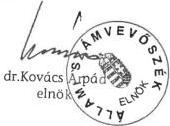
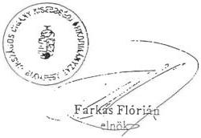
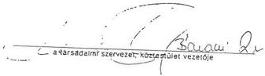
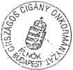

Állami Számvevőszék

# JELENTÉS

**az Országos Cigány Önkormányzat  
pénzügyi-gazdasági tevékenysége  
utóvizsgálatának ellenőrzési  
tapasztalatairól**

2000. január

0001

---

Az ellenőrzés végrehajtásáért felelős:
V. Önkormányzati és Területi Ellenőrzési Igazgatóság

dr. Lóránt Zoltán
számvevő igazgató

Az ellenőrzést vezette:

Csecserits Imréné
régióvezető főtanácsos

Az ellenőrzésben részt vettek:

dr. Csapó Anna
számvevő tanácsos

dr. Spilák Antal
számvevő tanácsos

A témakörrel foglalkozó ÁSZ vizsgálatok jegyzéke:

Az Országos kisebbségi önkormányzatok pénzügyi-gazdasági tevékenységének vizsgálata (V-1019/1995.)

Az Országos kisebbségi önkormányzatok pénzügyi-gazdasági tevékenységének vizsgálata (V-1008/1997.)

Jelentéseink az INTERNET-en 1999. június 1-től olvashatók.

Internet cím: http://www.asz.gov.hu

Jelentéseink az Országgyűlés számítógépes hálózatán is olvashatók.

---

V-1021-11/1999-2000. TÉMASZÁM: 506

# TARTALOMJEGYZÉK

# I. ÖSSZEGZŐ MEGÁLLAPÍTÁSOK, KÖVETKEZTETÉSEK, JAVASLATOK...4

# II. RÉSZLETES MEGÁLLAPÍTÁSOK ...6

1.A KOZGYULES ES A BIZOTTSAGOK MUNKAJANAK TERVSZERUSEGE. 6
2. AZ ONKORMANYZAT MUKODESENEK, PENZUGYI-GAZDASAGI FOLYAMATAINAK SZABALYOZOTTSA GA 7
3. AZ ONKORMANYZAT SZAMVITELI RENDSZERE, KIALAKITOTT NYILVANTARTASOK KORE, BIZONYLATI REND 9
4.A KOLTSEGVETES,ILLETVE A ZARSZAMADAS JOVAHAGYASANAK RENDJE 12
5. KOLCSONADOTT PENZESZKÖZÖK, KINTLEVÖSEGEK NYILVANTARTASA ES ELSZÁMOLASA 13
6. AZ EVES KOLTSEGVETES VEGREHAJTASA, PENZESZKÖZÖK FELHASNZALÁSANAK CELSZERÜSEGE ES SZABALYSZERÜSEGE 13

Mellékletek: 1-től 6-ig

1

---

   -
   -
   -
   -
   -
   -
   -
   -
   -
   -
   -
   -
   -
   -
   -
   -
   -
   -
   -
   -
   -
   -
   -
   -
   -
   -
   -
   -
   -
   -
   -
   -
   -
   -
   -

---

# Jelentés

# az Országos Cigány Önkormányzat pénzügyi-gazdasági tevékenysége utóvizsgálatának ellenőrzési tapasztalatairól

Az Állami Számvevőszék a nemzeti és etnikai kisebbségek jogairól szóló 1993. évi LXXVII. törvény 57. §-a alapján az országos kisebbségi önkormányzatok megalakulását követően 2 alkalommal ellenőrizte az állam által nyújtott pénzügyi támogatások felhasználásának törvényességét és szabályszerűségét. ÁSZ elnöki hatáskörben elrendelt vizsgálatként 1999. X. 18. – XI. 10. között utóellenőrzésre került sor.

A vizsgálat célja annak megállapítása volt, hogy

- a kozgyulés es az altala letrehozott bizottsagok munkajanak tervszerüsege, szabályszerüsege, megfelelo dokumentáltságaBiztositott-e;
- a korabbi vizsgalat soran tett megallapitasok szerint hianyz szabalyzatok elkeszültek-e, korszerusitésre és jovahagyásra kerültek-e;
- az onkormányzat szamviteli rendszere, a kialakitott nyilvantartasok kore, a bizonylati rend es okmányfegyelem mennyibenBiztositja a felsobb szintu jogszabalyokban, valamint a sajat belso szabalyzataikban foglalt megoldasi modok, hataridok ervenyesulését a gazdalkodásra vonatkozo testuleti dontesek megalapozásat;
- megallapitasra kerult-e a koltsegvetest, illetve zarszamadast jovahagykozyulési hatarozatokban az elfogadott bevetei es kiadasi fosszeg, valamint a zaro penzkeszlet;
a kolcsonadott penzek, kintlevosegek, elolegek folyamatos, napraksz nyilvantartasatBiztositottak-e, az megfele-e a szabalyzatokban elortnak. Ujabb elolegetCsak az elozovel valo elszamolas utan folyositottak-e;
- az éves költségvetés vegrehajtása soránBiztositott volt-e a kötelezettsgvallalások penzügyi fedezete. A penzeszközok felhasznalása során érvenyesult-e a takarékos és celszerú gazdalkodás kovetelmenye pl.: beruházások, penzügyi befektetesek, muködési kiadások esetében.

3

---

I. ÖSSZEGZŐ MEGÁLLAPÍTÁSOK, KÖVETKEZTETÉSEK, JAVASLATOK

# I. ÖSSZEGZŐ MEGÁLLAPÍTÁSOK, KÖVETKEZTETÉSEK, JAVASLATOK

Az Országos Cigány Önkormányzatnál (továbbiakban: OCÖ) megalakulása óta két ÁSZ ellenőrzés volt. Az ellenőrzések által feltárt szabálytalanságok nem tudatos jogsértésen alapultak, hanem jellemzően a személyi feltételek és szervezési, szervezeti hiányosságokon. Az ellenőrzés ajánlásaira nyitottak voltak, a részükre megfogalmazott javaslatokat elfogadták és intézkedtek azok végrehajtásáról. Ezek eredményeként a jelenlegi utóellenőrzés folyamatos javulásról adhat számot.

Az önkormányzat testületei – közgyűlés, elnökség, bizottságok – munkája tervszerűbbé vált, munkaterv alapján üléseznek, működésük szabályszerű és dokumentált.

A pénzügyi-gazdálkodási tevékenység törvényes kereteit – a különböző szabályzatok pótlásával és korszerűsítésével – javították. Ugyanakkor szükség van a számviteli politika és a kapcsolódó szabályzatok további kiegészítésére, módosítására.

A gazdálkodás, a pénzeszközök felhasználásának különböző elemeit szabályozták. A kialakított nyilvántartások a költségvetési címekhez kapcsolódnak, a főkönyvi könyveléshez kilenc naplót vezetnek. Az analitikus nyilvántartás és a főkönyv adatai közötti egyeztetések megtörténnek. Elszámolásra kiadott összegek ellenőrzése, egyeztetése bár megtörténik, de a behajthatatlan követeléseket négy év óta nem írták le.

A költségvetésekről és a zárszámadásokról készült közgyűlési határozatok rögzítik a bevételek és a kiadások főösszegét, a tartalék és a tőkeváltozás összegét, az előző évi pénzmaradvánnyal évközben módosítják a tárgyévi költségvetést. A költségvetés felhasználása során a szociális, segélyező és támogatás célú kifizetések az indokoltnál nagyobb mértékűek.

A kötelezettségvállalás, ellenjegyzés, utalványozás, érvényesítés rendszere szabályozott és a gyakorlatban megfelelően alkalmazzák.

Hiányosság, hogy az éves költségvetési beszámolót nem a vonatkozó kormányrendeletben foglalt határidőre, a tárgyévet követő év május 31-ig, hanem négy, illetve öt hónappal később készítik el.

Az utóellenőrzés során a korábbi vizsgálati jelentésben javasolt intézkedések és azok eredményességének minősítésén túlmenően a vizsgálat az OCÖ gazdálkodásával kapcsolatos kedvezőtlen folyamatokat is feltárt.

A költségvetési pénzeszközök felhasználása során a **pénzügyi egyensúly megbomlott**, az OCÖ saját tőkéje (vagyona) két év alatt mintegy egyharmadára (35,6%-ra) csökkent. Ehhez hozzájárul, hogy a költségvetési beszámolókat a tárgyévet követő év utolsó hónapjaiban (szeptember, november) tárgyalta a közgyűlés és így a későn megkezdett szükséges intézkedések a tárgyévi költségvetési gazdálkodásra már kevésbé voltak hatékonyak.

4

---

I. ÖSSZEGZŐ MEGÁLLAPÍTÁSOK, KÖVETKEZTETÉSEK, JAVASLATOK

Az OCÖ-hoz kapcsolódó társaságok és intézmények közül kettő, a Szociális Építő Kht. és ROM DRUCK Nyomda Kft. csődközeli állapotba került és ezáltal növekvő terheket ró a főleg központi költségvetési forrásra épülő költségvetésre. Ez összefügg azzal, hogy az OCÖ társaságai, intézmények feletti tulajdonosi jogosítványokat és az ellenőrzést nem kellő mértékben gyakorolta, illetve érvényesítette. A takarékossági intézkedések szükséges, de nem elégséges mértékben javítottak a helyzeten.

Az OCÖ rendszeres megbízási szerződés alapján szakértőket foglalkoztat az elnökség és a hivatal munkájának segítése céljából. Ez az alkalmazási rendszer nem igazodik az elnökség és a hivatal igényeivel és a szükségleteivel.

Megállapítható, hogy a gazdálkodás és pénzeszköz felhasználás törvényessége és szabályszerűsége javult, azonban a pénzügyi-likviditási helyzetet, a biztonságos működés feltételeit meg kell teremteni.

**Javaslatok:** Az elindított takarékossági intézkedéseken túl

a törvényesség betartása érdekében

az elnökség:

- kezdeményezze a számviteli politika kiegészítését, illetve módosítását az OCÖ-re jellemző sajátosságok figyelembevételével,

- készíttesse el az egyszerűsített éves beszámolót a kormányrendelet által előírt határidőre, majd rövid időn belül terjessze a következő közgyűlés elé, hogy az alapján a szükséges intézkedések kellő hatása minél előbb érvényesüljön.

az elnök:

- kezdeményezze a közgyűlésnél az elévült vagy behajthatatlan követelések leírását,

a munka színvonalának, hatékonyságának javítása érdekében célszerű, hogy

a közgyűlés:

- a költségvetés végrehajtása során csökkentse a szociális segélyező és támogató jelleget,

- tegye hatékonyabbá az intézmények és szervezetek működésével kapcsolatos alapító jogosítványok alkalmazásának gyakorlatát a működés-gazdálkodás mélyebb ellenőrzésével,

az elnök:

- a GESZ kialakításakor a szakértői kör jelenlegi folyamatos alkalmazásával ellátott feladatokat esetenkénti megbízás, vagy alkalmazotti munkaviszony keretében oldja meg.

5

---

II. RÉSZLETES MEGÁLLAPÍTÁSOK

## II. RÉSZLETES MEGÁLLAPÍTÁSOK

### 1. A KÖZGYŰLÉS ÉS A BIZOTTSÁGOK MUNKÁJÁNAK TERVSZERŰSÉGE

Az Állami Számvevőszék az 1997. I. félévi vizsgálati megállapítások eredményeként a fennálló gazdálkodási-, pénzügyi helyzet javítására, törvényes működés biztosítására különböző javaslatokat fogalmazott meg az Országos Cigány Kisebbségi Önkormányzat számára. Már a vizsgálat lezárását megelőzően az Önkormányzat elnöke az észrevételekkel egyetértve a szükséges intézkedéseket megtette és arról értesítette a vizsgálatot végzőket.

Az Országos Cigány Kisebbségi Önkormányzat (OCKÖ) közgyűlése 1997. VIII.6-án napirendre tűzte az ÁSZ javaslatát, jóváhagyta a hiányosságok megszüntetéséről készített ütemtervet határidő és felelős megjelölésével (Lásd. 1. számú melléklet), valamint a közgyűlés munkájának tervszerűségét javítandó elfogadta a II. félévi munkatervét. Ezt követően 1998. évre, majd 1999-2000. évre is elkészült az Önkormányzat munkaterve. Az utóbbi munkaterv elsősorban a kisebbség önszerveződésének erősítését, a tartós munkahelyteremtést, a szociálisan rászorulóak és a családvédelem segítését, illetve az oktatás, kulturális fejlődés előmozdítását tűzte ki célul.

Az OCKÖ **közgyűlése** a Szervezeti és Működési Szabályzat (SzMSz) szerint évente négy ülést tart. Az **ülések dokumentálása megfelelő**, a jegyzőkönyvek vezetésén túl – melynek hitelesítésére a közgyűlés 2 fő képviselőt bíz meg – a döntésekről Határozatok tárát vezetnek. Ugyanez mondható el – az általában kéthetente ülésező – Elnökségi ülésekről.

Az **Elnökség** két közgyűlés között irányítja az Önkormányzat munkáját, felügyeli az Önkormányzati Hivatal működését, gondoskodik a folyamatos működés anyagi-pénzügyi- és személyi feltételeinek biztosításáról és döntési jogosítványa van a költségtérítési előlegek, rendkívüli segélyek odaítéléséről. Az elnökségi ülésekről rövidített jegyzőkönyvek készülnek.

Az 1996. VII. 19-én elfogadott SzMSz-ben az Önkormányzat **8 bizottságot** hozott létre. Ezek működését – 2-3 kivételével – a közgyűlés nem tartotta megfelelőnek, a Programtervezési Bizottság meg sem alakult. Ezért az Elnökség javaslatára a közgyűlés az SzMSz módosítása során (1999. I. 27.) megszüntetett 5 bizottságot és jelenleg az alábbiak működnek:

- ideiglenes ad hoc jelleggel Területfejlesztési Bizottság.

A **PEB** működése folyamatos, munkaterv alapján dolgozik, segíti a közgyűlés és a hivatal munkáját. A közgyűlés és elnökség felkérésére külön vizsgálatokat végzett, 1998. XII.19-én 4 éves működéséről számolt be a közgyűlésnek.

6

---

II. RÉSZLETES MEGÁLLAPÍTÁSOK

Az ellenőrzési területe az OCKÖ egészét – Hivatal, intézmények, megyei irodák – átfogta, megállapításaikat, javaslataikat jegyzőkönyvekben dokumentálták.

Az Etikai Bizottság kidolgozta az un. Etikai Szabályzatát (1999. VI. 11-i keltezésű), melyben megfogalmazták az OCKÖ képviselők, vezető tisztségviselők általános etikai, magatartásbeli normáit, az Etikai Bizottság eljárási módjait. A vizsgált időszak alatt bizottsági eljárás kezdeményezésére és lefolytatására nem került sor.

A Területfejlesztési Bizottságot a cigány kisebbség helyzetének javítását célzó intézkedésekről szóló az 1107/1997. (X.11.) Korm.határozat végrehajtásával összefüggő területfejlesztési cél-előirányzati pénzforrások, pályázati támogatási rendszeren belüli elosztására hozta létre az Országos Cigány Önkormányzat. A bizottság 1999-től működik.

A fentiek alapján a közgyűlés, az elnökség és a létrehozott bizottságok munkájának tervszerűsége, szabályszerűsége javult, a megfelelő dokumentáltság biztosított.

2.

# AZ ÖNKORMÁNYZAT MŰKÖDÉSÉNEK, PÉNZÜGYI-GAZDASÁGI FOLYAMATAINAK SZABÁLYOZOTTSÁGA

Az OCKÖ az ÁSZ javaslatára 1997-től folyamatosan korszerűsítette, módosította a belső szabályzatait, a hiányzókat pedig pótolta. A választásokat követő első 1999. I. 27-i közgyűlés az új SzMSz-t hagyta jóvá és 1999. III. 6-án a többi belső szabályzatokat is (Lásd 2. számú melléklet). A közgyűlés határozata szerint 53 fő képviselő egyhangúlag fogadta el a módosítások figyelembevételével az önkormányzat SzMSz-ét és 48 fő igen szavazatával, 1 ellenszavazattal és 1 tartózkodással a belső szabályzatokat.

Az új SzMSz lényeges változásokat jelentett az Önkormányzat működésében és szervezetében.

Megváltozott az Önkormányzat neve (az új neve: Országos Cigány Önkormányzat, rövidítve: OCÖ lett), és megszüntetésre kerültek – elsősorban pénzügyi okok miatt – a megyei irodák, illetve ezáltal az irodák működését felügyelő Koordinációs bizottság is, helyette a területi képviseleti rendszer jött létre, 2 koordinációs titkár irányításával. Az Elnökség létszáma 11 főre bővült, elnök, elnökhelyettes és 9 alelnök megválasztására került sor. Hiányzik, hogy az SzMSz a közgyűlés hatáskörét tételesen nem tartalmazza, hanem csak az 1993. évi a nemzeti és etnikai kisebbségek jogairól szóló LXXVII. törvény 37. §-ára utal, valamint hogy a rendkívüli közgyűlés összehívásához a képviselők 2/3-ának az igenlő beleegyezése kell a korábbi SzMSz 1/3-os arányához viszonyítva. Az elfogadott arány az önkormányzati és egyéb társadalmi szervek vonatkozásában illetve azokhoz viszonyítva túlságosan magas.

Az önkormányzat munkája nyitottá vált, programjaikat, határozataikat – így pl. a költségvetés és zárszámadás adatait – a „Világunk” című havi lap mellékletében széles körben ismertetik.

7

---

II. RÉSZLETES MEGÁLLAPÍTÁSOK---

Változásra került sor az éves költségvetésben meghatározott elnöki keret felhasználásánál is. Az SzMSz szerint az elnök az éves költségvetés közgyűlés elé terjesztésével egyidejűleg ad tájékoztatást arról, hogy milyen jogcímen kíván rendelkezni a keret felhasználásáról.

A jelenleg érvényben lévő **Ügyrend** szabályozza a Hivatal működését, mely az Önkormányzat gazdasági szervezete, élén a Hivatal vezető áll. A jóváhagyott hivatali szervezet és a létszám a gyakorlatban csak részben, illetve csökkentett módon működik. A jóváhagyott szervezeti struktúrával, illetve létszámmal szemben az elnöki titkárság nem alakult meg és a 12 fő helyett a Hivatal jelenlegi létszáma 9 fő, ebből egy fő titkárnő Szolnokon a LUNGO-DROM Központban dolgozik.

Az Elnökség munkáját a hivatali létszámon kívül 5 fő szakértő (jogász, politológus, 2 fő oktatási szakértő, pszichológus) segíti. 1996. óta megbízási szerződéssel könyvvizsgálót alkalmaznak gazdasági tanácsadásra, számvitelszervezésre és az éves beszámolók hitelesítésére. Az éves költségvetések tartalmazzák a szakértői díjak előirányzatait.

A szakértőkön kívül rendszeres megbízás alapján foglalkoztatnak egy Ügyvédi Irodát, amely a szerződések, alapító okiratok, azok változásainak jogi feladatait, ellenjegyzéseit stb. látja el, továbbá 1999. IX. 16. óta egy tanácsadót, aki a nemzetközi kérdésekben az OCÖ és a kormányszervek közti kapcsolatok segítésében működik közre és egyúttal a szakértői kör koordinálását is ellátja. 1999. VI. 1-től egy jogász képesítésű szakembert bíztak meg a Magyarországi Cigány Közalapítványban szükséges jogi képviseleti feladatok végzésére.

A szerződések szerint havi 50 és 100 ezer Ft között változnak a megbízási díjak. A megbízási díjakat havonta fizetik – számla alapján vagy közvetlenül a megállapodások szerint. A Hivatal egyedi nyilvántartást vezet a szakértőkről, amelyben az általuk készített tanulmányokat, szakmai programokat, tervcélokat, akcióprogramokat, elkészített dokumentumok véleményezését stb. tartják nyilván. A kifizetésekhez azonban szerződés teljesítés igazolást nem csatolnak – legfeljebb a szerződésre és annak tárgyára hivatkoznak – ezáltal a kifizetési bizonylatok mögött nincs teljesítést igazoló dokumentum.

Az OCÖ Elnöke 1999. év elején az OCÖ szervezeti struktúrájának átszervezése és új gazdálkodási rend bevezetése miatt felülvizsgálta a hatályban lévő szerződéseket, azok egy részét felbontotta és új eseti megbízási szerződések megkötését ajánlotta a szakértőknek.

A **számviteli politika** az egyszerűsített éves beszámolóra vonatkozóan elkészült, a hozzá kapcsolódó egyéb szabályzatokkal együtt, a helyi sajátosságok figyelembevételével kiegészítésre szorul.

**A vizsgálati tapasztalatok birtokában megállapítható, hogy a korábbi ÁSZ vizsgálatban javasolt belső szabályzatok – amelyek a közgyűlés, az elnökség és a hivatal munkáját rögzítik – elkészültek, azokat a közgyűlés jóváhagyta.**

---8

---

II. RÉSZLETES MEGÁLLAPÍTÁSOK

3.

# AZ ÖNKORMÁNYZAT SZÁMVITELI RENDSZERE, KIALAKÍTOTT NYILVÁNTARTÁSOK KÖRE, BIZONYLATI REND

Az OCÖ a társadalmi szervezetekre vonatkozó 114/1992. (VII.23.) Korm. rendelet szerinti gazdálkodó tevékenységet folytat, valamint 1996. február 1-től a 8/1996. (I.24.) Korm. rendeletben előírt egyszerűsített éves beszámoló készítési és kettős könyvvitel vezetési módot alkalmazza, mert a tevékenysége szerinti bevétele meghaladja az 50 millió Ft-ot. A szabályozás az 1998. évi beszámoló készítésénél még megengedte azt, hogy a társadalmi szervezetek válasszanak: a 8/1996. (I.24.) Korm. rendelet vagy pedig a 219/1998. (XII.30) Korm. rendelet szabályai szerint készítik el az éves beszámolót. Az OCÖ a régi kormányrendelet előírása szerint készítette el az 1998. évi egyszerűsített éves beszámolóját, az új kormányrendelet rendelkezéseit az 1999. évi beszámoló elkészítésénél tervezi alkalmazni.

Az OCÖ könyvelését 1995. év végétől 1996. év végéig egy gazdasági társaság végezte nem teljes körűen és határidő késedelmekkel.

Az 1997. évben az OCÖ saját szervezetén belül látta el a könyvelési feladatot, amelyhez adott volt a számítástechnikai háttér, a gazdasági vezető pénzügyi és számviteli főiskolai végzettségű volt. A gazdasági vezető 1998. június 30-i hatállyal felmondta a munkaviszonyát.

Szükségessé vált 1998. évben újból könyvelő cég megbízása, amely 1998. április 20-tól lépett hatályba határozatlan időre, de visszamenőleg az 1998. január 1-től végzendő könyvelési feladatokra vonatkozóan, mert a saját könyvelési programját alkalmazza. A megbízási szerződésben 140.000 Ft + ÁFA havi díjban állapodtak meg, 1999. januártól 160.000 Ft + ÁFA a havi díj összege.

A könyvelő cég vállalta a könyvvezetést az önkormányzatra vonatkozó számviteli szabályok szerint, az analitikus nyilvántartások vezetését, az éves beszámoló elkészítését, adókkal kapcsolatos kötelezettségek megállapítását, bevallását, a szerződésben foglalt díj ellenében maximum 10 fő foglalkoztatott részére a bérszámfejtést.

A megbízási szerződés nem tartalmazza a könyvviteli beszámoló elkészítésének határidejét, nem teljesítés esetén a szankciókat.

A megbízási szerződés 2. pontja szerint a Kft havonta főkönyvi kivonatot készít és tájékoztatást ad az intézkedést igénylő kérdésekről, negyedévente pedig átadja az analitikus nyilvántartást az önkormányzat részére.

A könyvelő céggel kötött szerződés teljesítéseként a Kft minden hónapot követő egy héten belül floppy lemezen átadja az OCÖ-nek a teljes könyvelési anyagot, valamint a könyvelő cég alkalmazottja kézi analitikus nyilvántartást is vezet (pl. képviselői költségtérítésekről, telefon- és postaköltségről, közüzemi díjakról, szállítási és taxi-költségről stb.) az elnökség tájékoztatása céljából.

A könyvelő cég részére a fizetés számla ellenében történt, 1999. májustól a fizetést felfüggesztették, mivel az 1998. évi költségvetési beszámoló nem készült el. Ezt 1999. októberben adta le a könyvelő cég (1999. október 27-i keltezésű), így

9

---

II. RÉSZLETES MEGÁLLAPÍTÁSOK

1999. november elején fizették ki a visszamenőleg 5 havi könyvelésért járó díjat.

**A gazdálkodás folyamatát, annak részterületeit érintő szabályzatokkal az OCÖ rendelkezik, de azok közül a számviteli politika, a szakértői teljesítés igazolás a helyi sajátosságok figyelembevételével kiegészítésre szorul.**

Az önkormányzat **számviteli politikájának mellékleteként** – a számviteli törvény előírásának megfelelően – írásban rögzítették a Leltározási szabályzatot és az Értékelési szabályzatot, különállóan készítették el a Pénzkezelési szabályzatot. A számviteli politika részét képezi továbbá a számlarend, a bizonylati rend, a selejtezési szabályzat, a számítástechnikai védelmi szabályzat, az ellenőrzési szabályzatot a controlling fejezetrész helyettesíti.

A számviteli politikának nemcsak a kötelezően előírt szabályzatokat kell magába foglalnia. Ahhoz, hogy a számviteli politika biztosítsa olyan számviteli rendszer működését, amely az Országos Cigány Önkormányzatról megbízható és valós képet ad, valamint a vezetői döntések számára alkalmas információt szolgáltat, rögzíteni kell minden olyan döntést, amelyre a szabályozás választási lehetőséget nyújt, például:

- a beszámoló formáját tekintve a társadalmi szervezetre vonatkozó egyszerűsített éves számolót készít,
- a beszámoló alátámasztására szolgáló könyvvezetés módját, amely jelenleg a kettős könyvvitel,
- a pénzforgalmi könyvvitel számszerű egyezőségének ellenőrzési időpontját (célszerű havonta egyeztetni),
- az analitikus nyilvántartások, kiegészítő információk főkönyvi adatokkal történő egyeztetésének módját, tartalmát,
- a támogatások nyilvántartásának, felhasználásának, elszámolásának rendjét,
- a beszámoló elkészítéséhez a zárlati határidők meghatározását (a beszámolót legkésőbb a tárgyévet követő év május 31-ig el kell készíteni és a jóváhagyásra jogosult közgyűlés elé kell terjeszteni).

A **Leltározási szabályzat** nem tartalmazza, hogy az eszközökről és a forrásokról a nyilvántartást folyamatosan mennyiségben és értékben vezetnek. Célszerű azonban a folyamatosan vezetett nyilvántartás mellett is előírni, hogy eszközcsoportonként hány évente, mely eszközcsoportot leltározzák tényleges mennyiségi felvétellel. Az 1998. év végén az évközbeni 3 költözés miatt a teljes eszközállományt leltározták, selejteztek a tönkrement kis értékű tárgyi eszközöket, elvégezték a leltár értékelését.

Az **Értékelési Szabályzatban** az értékelésre vonatkozó döntések kapcsán nem foglalkoznak az ellenőrzés, az önellenőrzés során feltárt hibáknak, hibahatásoknak az eszközökre, a forrásokra, az eredményre gyakorolt hatásával. A számvitelről szóló 1991. évi XVIII. tv. 18. §-a alapján meg kell határozni, hogy

10

---

II. RÉSZLETES MEGÁLLAPÍTÁSOK

az OCÖ mit tekint – a számviteli szabályozás szempontjából – az ellenőrzés, az önellenőrzés során jelentősebb összegű hibának, mikor tekinti a saját tőke változását lényegesnek.

Az Országos Cigány Önkormányzat **Pénzgazdálkodási Szabályzatát és a házipénztár Pénzkezelési Szabályzatát** a közgyűlés az 1999. március 6-án megtartott ülésén a 6/1999. számú határozatával elfogadta. Ezekben meghatározták a kötelezettségvállalás, utalványozás, ellenjegyzés és érvényesítés, a bankszámla feletti rendelkezés jelenlegi rendjét.

A szabályozás szerint az OCÖ feladatainak végrehajtását szolgáló fizetési vagy más teljesítési **kötelezettségvállalás** az elnök hatáskörébe tartozik 5 millió Ft összeghatárig. Az elnök csak 5 millió Ft alatti megbízási és vállalkozási szerződéseket írt alá. Kötelezettséget vállalni a pénzgazdálkodási szabályzat szerint csak írásban, a Hivatal gazdasági vezetőjének ellenjegyzése után lehet, ez azonban a gyakorlatban elmaradt.

**Utalványozásra** az elnök, a hivatalvezető és a gazdasági vezető jogosult az utalványozási rendben (házipénztár pénzkezelési szabályzat 3. számú mellékletében) megállapított összeghatárig. A pénztári utalványozási jogot összeghatárhoz kötötték. Ennek értelmében az OCÖ elnöke 1 millió Ft felett, a hivatalvezető 1 millió Ft-ig, a gazdasági vezető 500 ezer Ft-ig és az állammal szembeni átutalások tekintetében korlátlan utalványozási jogosultsággal rendelkezik. A kinevezett gazdasági vezető távozása óta megbízott gazdasági vezető látja el a teendőket, rendelkezik utalványozási joggal. Az utalványozás ellenjegyzésére a Hivatal gazdasági szervezetének ezzel megbízott alkalmazottja jogosult.

Az összeférhetetlenségi előírásokat betartották.

A szabályszerűség érvényesítése céljából a 4/1999. (III.6.) számú közgyűlési határozattal március 6-án elfogadták, hogy a továbbiakban csak az elnökkel hivatalosan előre egyeztetett, valamint **elnök által aláírt kiküldetési rendelvény ellenében kerülnek kifizetésre útiköltségek a képviselőtestület valamennyi tagjának.**

A 6/1999. (III.6.) számú közgyűlési határozattal március 6-án szabályozták a **költségtérítések elszámolásának rendjét.** A költségtérítések elszámolásáról úgy határoztak, hogy a képviselők részére a képviselői munkájuk során felmerült és igazolt költségeiket az éves költségvetésben meghatározott összegig lehet megtéríteni. A havi költségelszámolást a Hivatal gazdasági szervezetéhez kell benyújtani, a költségek felmerülését követő hónap 10. napjáig. A határidő után benyújtott költségelszámolást a gazdasági szervezet nem fogadhatja el és nem fizetheti ki. Mégis előfordul, hogy a határidő után benyújtanak költségtérítési igényt, amit a gazdasági vezető elnöki jóváhagyással részletekben fizethet ki. (Pl.: ha az elmúlt hónapokra egyszerre nyújt be egy képviselő 4 havi költségelszámolást, akkor azt a következőkben több hónapi részletben kaphatja meg, a havi költségvetés költségkímélése céljából.)

11

---

II. RÉSZLETES MEGÁLLAPÍTÁSOK

#### 4. A KÖLTSÉGVETÉS, ILLETVE A ZÁRSZÁMADÁS JÓVÁHAGYÁSÁNAK RENDJE

Az önkormányzat 1997. évi költségvetését a 34/1997. (VIII.6.) sz. közgyűlési határozatával módosította, – mind a bevételi, mind pedig a kiadási főösszeget – a MOL részvények eladásából származó bevétellel és az előző évi pénzmaradvánnyal.

Az **1997. évi beszámolót** 1998. IX. 18-án tárgyalta, és a 35/1998. (IX.18.) sz. határozattal egyhangúlag elfogadta a közgyűlés 190.778 ezer Ft bevételi és 173.764 ezer Ft kiadási főösszeggel, 17.014 ezer Ft pénzmaradvánnyal.

Az **1998. évi költségvetést** két fordulóban tárgyalta a testület, az irányelveket 1997. XII. 20-án, majd az 1998. évi költségvetést 1998. I. 31-én 215.014 ezer Ft bevétellel és 215.014 ezer Ft kiadással hagyta jóvá.

Az **1999. évi költségvetés** 1999. III. 6-án 138.000 ezer Ft bevétellel és 138.000 ezer Ft kiadással – ezen belül 3.406 ezer Ft tartalékkal – került elfogadásra.

A költségvetések előkészítésében az elnökség, a PEB, a könyvvizsgáló és bizottsági szakemberek vettek részt és az elnök terjesztette a közgyűlés elé. A tervkészítés időszakában a bevételek tekintetében csak a központi költségvetési támogatás volt ismert. Az 1997. évi költségvetési beszámoló elfogadását követően az előző évi pénzmaradvánnyal az 1998. évi költségvetési bevételt megnövelték.

Az **1998. évi beszámoló** a helyszíni vizsgálat befejezéséig még nem került jóváhagyásra, a vonatkozó kormányrendelet előírását nem tartották be, a vizsgálat lezárását követő 1999. novemberi ülésen megtárgyalták.

Az 1997. évi és 1998. évi beszámolókat (3 és 4. számú melléklet) a könyvvizsgáló hitelesítő záradékkal látta el.

Az OCÖ elnöke 1998. XII.19-i közgyűlésen számolt be az 1998. évi un. 10%-os **elnöki keret felhasználásáról**, miszerint annak 90%-át segélyezésre, 10%-át pedig képviselői támogatásra fordította. 1999. III. 26-án az 1999. évi költségvetés tárgyalásakor rendelkezésre álló 13.800 ezer Ft-ból egy 5.000 ezer Ft-os keret létrehozását javasolta, melyből a megyei programokat, képzéseket, szemináriumokat finanszírozná, a maradék 8.800 ezer Ft-ot különböző támogatásokra fordítaná. A közgyűlés a tájékoztatást elfogadta, illetve az elkülönítéssel egyetértett.

Az **1997. évi pénzmaradvány megállapításra** került, az éves költségvetések elfogadásának időzítése a folyamatos gazdálkodási-pénzügyi feltételeket biztosítja. Az 1997-1998. évi költségvetési beszámolók (a zárszámadások) a számviteli törvény szerinti egyéb szervezetek éves beszámoló készítésének és könyvvezetési kötelezettségének sajátosságairól szóló 219/1998. (XII.30.) Korm. rend. 6. § (4) bekezdésében rögzített tárgyévet követő V. 31-re nem készültek el. Az elnökség által közgyűlés napirendjére tűzésük pedig elhúzódik, ebből adódóan a beszámoló tapasztalatai alapján esetlegesen szük-

12

---

II. RÉSZLETES MEGÁLLAPÍTÁSOK

ségessé váló döntések és intézkedések a tárgyévre már nem tudják kifejteni megfelelő hatásukat.

5.

# KÖLCSÖNADOTT PÉNZESZKÖZÖK, KINTLÉVŐSÉGEK NYILVÁNTARTÁSA ÉS ELSZÁMOLÁSA

A nyújtott kölcsönök 1998. december 31-i – 1996. évről áthúzódó – záró állománya a főkönyvi kivonat alapján 1.445 ezer Ft, amelyből 4 fő magánszemély tartozása összesen 245 ezer Ft (15 ezer Ft/fő, 30 ezer Ft/fő és 2x100 ezer Ft/fő), 4 különböző cigány szervezetnek kölcsönadott összeg együttesen 1.200 ezer Ft (Lungo Drom 300 ezer Ft, 100 tagú cigányzenekar 500 ezer Ft, oktatási alapítvány 300 ezer Ft, Bács-Kiskun megyei Cigány Érdekképviselet 100 ezer Ft). A kölcsönök elnökségi határozat alapján kerültek folyósításra, a visszafizetésükre már 1998. évet megelőzően, még 1996. évben és 1997. évben felszólító leveleket küldtek ki, de azok hatástalanok voltak.

Az elszámolásra kiadott összegeket egyénenként analitikus nyilvántartásban kimutatják. Az elszámolásra kiadott pénzeszközök 1998. december 31-i záró állománya 9.251 ezer Ft, amelyben az egyeztetési hiányosságok miatt hibásan szerepelnek programtámogatások, vagy célra nyújtott vissza nem térítendő összegek. Az előző év 13.628 ezer Ft záró állományához képest csökkenés van, illetve a mérlegkészítés időpontjára az ismételt felszólító levelek hatására az összeg tovább mérséklődött.

Újabb előleget – a rendkívüli ár- és belvíz időszaka kivételével – csak az előzővel való elszámolás után folyósítottak.

A jelenlegi vizsgálat során áttekintésre került az önkormányzat 1998. december és 1999. június havi készpénzforgalma a pénztárbizonylatok alapján, az 1998. december és 1999. június havi bankszámlák forgalma a bankkivonatok alapján. A bevételi- és kiadási pénztárbizonylatokat szigorú számsorrendben használják fel, a kitöltésük gondosan, körültekintően történt. Az útiköltség elszámolásokat minden esetben az elnök igazolta, a bevételek és a kiadások utalványozását a megbízott gazdasági vezető, vagy a hivatalvezető, vagy az elnök végezte, az összeférhetetlenség szabályainak betartásával. Az utalványozás ellenjegyzését a Hivatal mérlegképes könyvelői szakképesítésű alkalmazottja végezte, a pénztárellenőri feladatok ellátásával a hivatali titkárság vezetőjét bízták meg.

A pénzek kölcsönadása, az előlegek nyújtása szabályozott. A kiadott összegeket folyamatosan névre szólóan nyilvántartják, a kintlévőségek nagyságrendje az intézkedések hatására csökkent.

6.

# AZ ÉVES KÖLTSÉGVETÉS VÉGREHAJTÁSA, PÉNZESZKÖZÖK FELHASZNÁLÁSÁNAK CÉLSZERŰSÉGE ÉS SZABÁLYSZERŰSÉGE

Az OCÖ közgyűlése az 1999. évi költségvetését az 1999. március 6-i ülésén tárgyalta és 46 igen szavazattal, 4 tartózkodással fogadta el, annak a 138 millió Ft bevételi és kiadási főösszegnek a megjelölésével, amelyet az Országgyűlés az 1998. évi XC. törvény 1. számú mellékletében meghatározott.

13

---

II. RÉSZLETES MEGÁLLAPÍTÁSOK

Az 1998. december 31-i pénzkészlet a pénztárban és a bankszámlán együttesen 622 ezer Ft volt. Az 52/1999. (VI.18.) számú közgyűlési határozattal 47 fő igen szavazatával a közgyűlés úgy határozott, hogy a következő közgyűlésen (november végén) tárgyalja, hogy az 1999. évi költségvetés bevételi előirányzatát növeli az 1998. évi 622 ezer Ft záró pénzmaradvánnyal és 2.600 ezer Ft központi zárolással csökkenti a kiadási előirányzatát.

A vizsgált időszak jóváhagyott költségvetései az alábbi főbb előirányzatokat tartalmazzák:

Adatok: ezer Ft-ban

|  Megnevezés | 1997. évi módosított | 1998. évi eredeti | 1999. évi eredeti  |
| --- | --- | --- | --- |
|   |  előirányzat  |   |   |
|  **KIADÁSOK**  |   |   |   |
|  Képviselő-testülettel kapcsolatos kiadások | 54.900 | 56.320 | 36.775  |
|  Hivatal működési költsége | 47.905 | 55.960 | 52.179  |
|  Beruházások | 21.211 | 25.000 | 3.300  |
|  Vállalkozói díjak | 9.693 | 10.220 | 9.280  |
|  Elnöki keret | 1.000 | 6.000 | 13.800  |
|  Támogatások, egyéb kiadások, tartalék | 36.716 | 61.514 | 22.666  |
|  **Kiadások összesen:** | **171.425** | **215.014** | **138.000**  |
|  **BEVÉTELEK**  |   |   |   |
|  Állami támogatás | 96.000 | 120.000 | 138.000  |
|  MOL részvények értékesítése | 74.909 | 78.000 | –  |
|  Előző évi pénzmaradvány | 516 | 17.014 | –  |
|  **Bevételek összesen:** | **171.425** | **215.014** | **138.000**  |

Az OCÖ 1997. és 1998. években a MOL részvények értékesítéséből jelentős többletbevétellel rendelkezett, amelyet működési kiadásainak növelésére fordított.

Az 1999. évi költségvetés az előző évekhez képest szűkített, ezért takarékossági intézkedéseket tettek. Csökkentették a képviselő-testület működési költségeit és a helyi kisebbségi önkormányzatok, civil szervezetek működési, illetve programtámogatását.

**Az OCÖ gazdálkodásának pénzügyi stabilitása az utóbbi 2 évben megingott.** A központi költségvetési támogatások mellett egyéb saját bevételekkel, intézményi befizetésekkel nem rendelkeznek, különböző pályázaton megítélt összegek (pl. 1997. évben MKM 5.000 ezer Ft támogatása) a költségvetés szempontjából nem meghatározóak. Az 1998. évi 120 millió Ft központi támogatás 1999-ben 138 millió Ft-ra (11,5%-kal) növekedett – ami figyelembe

14

---

II. RÉSZLETES MEGÁLLAPÍTÁSOK

véve a várható inflációs hatásokat – reálértéken nem jelent számottevő növekedést.

Az 1996. évi éves beszámoló szerinti tőkeváltozás + 13.445 ezer Ft

1997. évi éves beszámoló szerinti tőkeváltozás – 29.197 ezer Ft

1998. évi éves beszámoló szerinti tőkeváltozás – 35.063 ezer Ft

volt, vagyis a működési kiadások jelentősen meghaladták a működési célú bevételeket. Mindez annak ellenére következett be, hogy a közgyűlés 35/1997. (VII.6.) sz. határozata alapján – a MOL részvények eladásra kerültek és az év végéig ebből 82.949.890 Ft bevétele származott az önkormányzatnak. A MOL részvényeket az önkormányzat a kisebbségi önkormányzatok költségvetésének, gazdálkodásának, vagyonjuttatásának egyes kérdéseiről szóló 20/1995. (III.3.) Korm. rendelet alapján 35.253 ezer Ft névértéken kapta. A CODEX Értéktár és Értékpapír Rt-vel 1997. II. 18-án letéti szerződést kötött az OCKÖ, majd bizományosi szerződés keretében több részletben megbízta az értékpapír értékesítéssel.

Az 1998. évi költségvetési beszámolóban teljesítésként kimutatott 249.401 ezer Ft kiadási főösszeg alakulásában és növekedésében szerepet játszottak az 1998. évi helyi kisebbségi önkormányzati és az Országos Cigány Önkormányzati választás kiadásai, az önkormányzat gazdasági társaságának vesztesége és intézményének növekvő támogatási igénye.

a) Az OCÖ és a LUNGO-DROM Cigány Érdekvédelmi és Polgári Szövetség 1998. I. 10-én együttműködési megállapodást kötött a Kormány cigány cselekvési programjának megvalósítására és a cigányság gazdasági-kulturális felemelkedésének elősegítése érdekében 1998. XII. 31-i határidőig. (Az OCÖ közgyűlés 2/1999. (III.6.) sz. határozatával 1999. XII.31-ig meghosszabbította a megállapodás szerinti határidőt.) Ezenkívül 1998. VI.16-án a helyi kisebbségi önkormányzatok képviselőinek továbbképzési és területfejlesztési képzési projekt programja tárgyában is kötöttek szerződést. Mindezek a megállapodások a választási felkészülés és együttműködés feladatait is segítették. Az OCÖ az első feladatra 5.000 ezer Ft, a másik megállapodásra 2.000 ezer Ft támogatást utalt át a LUNGO-DROM Cigány Érdekvédelmi és Polgári Szövetségnek.

b) Az OCÖ a közgyűlés 1998. XII. 19-i és az Elnökség 1999. I. 8-i határozata alapján a választás sikeres kimenetele érdekében az elektorok és a helyi kisebbségi önkormányzati képviselők fővárosba való szállítását saját költségvetéséből fedezte. (Az Országos Választási Bizottság ezen költségekhez hozzájárulást nem biztosított). A feladat méretét jellemzi, hogy 3600 elektort (a választási jegyzőkönyv jelenléti íve szerint ebből 2798 fő jelent meg) és 720 település kisebbségi képviselőit kellett az ország egész területéről a választás helyére juttatni. A Hivatal a megyei és városi Volán szervezetekkel megállapodva külön járatokkal bonyolította le a szállítást, amelynek költségvonzata összesen 7.828.061 Ft-ot tett ki. Emellett főleg a közeli településeken lakó elektorok és képviselők menetrend szerinti autóbuszt és vonatot vettek igénybe.

15

---

II. RÉSZLETES MEGÁLLAPÍTÁSOK

c) Az OCÖ az alábbi közhasznú és gazdasági társaságokkal, illetve intézményekkel rendelkezik:

- Szociális Építő Kht.
- ROM-DRUCK Nyomda Kft
- Országos Cigány Információs és Művelődési Központ
- Roma Esély Alapítványi Szakiskola
- Cigányság Kutató Intézet
- „Világunk” folyóirat szerkesztősége.
- A Szociális Építő Kht 1996-ban az 1074/1996. (VII.10.) Korm.határozat 10. pontja alapján jött létre. Célja: a hátrányos helyzetben élők, szociálisan rászorulók, készpénzzel nem, vagy csak szerény mértékben rendelkező, elsősorban többgyermekes családok segítése, a lakáshoz jutás feltételeinek biztosítása.

A program céljainak megvalósítására az Országos Cigány Önkormányzat életre hívta a Szociális Építő Közhasznú Társaságot, amely 1999. második félévétől megújult szakmai vezetéssel, átfogó koncepcióval végzi munkáját.

A Szociális Építő Közhasznú Társaság feladatköre:

- előkészítő munkálatok végzése
- típustervezés
- tervadaptálás, engedélyeztetés
- települési önkormányzatok bekapcsolásának szervezése
- banki finanszírozási háttér biztosítása
- munkaügyi, foglalkoztatási lehetőségek feltárása
- kivitelezők felkutatása, szerződéskötés
- támogatók felkutatása
- az építtető és kivitelező együttműködésének folyamatos segítése
- az építkezések folyamatos ellenőrzése.

A Kht 1996-ban a Népjóléti Minisztériumtól 20.000 ezer Ft, 1997-ben pedig 19.500 ezer Ft támogatást kapott. A Kht működéséhez az OCÖ 5 millió Ft kölcsönt biztosított, de azt 1999. évben – mivel a Kht nem tudta visszafizetni – működési támogatássá minősítette át az Elnökség. A gyakori vezetőcsere és szervezési hiányosságok miatt a Kht 1998. évben csődközeli helyzetbe került. Az 1998. évi éves beszámolója szerint 1.302 ezer Ft nyereséggel zárta az évet. A könyvvizsgáló a beszámolót auditálta és a közgyűlés 1999. VIII. 18-án jóváhagyta. A vezetést a közelmúltban megerősítették, 3 tagú felügyelő bizottságot és igazgatói tanácsot hoztak létre.

- A ROM-DRUCK Nyomda Kft működtetéséről (a MET-DRUCK Nyomda megvételével) a közgyűlés a 37/1997. (VIII.6.) számú határozatában döntött abból a megfontolásból kiindulva, hogy a különböző roma újságok, kiadványok, nyomtatványok stb. saját gazdasági szervezetben való előállítása és a felesleges nyomdai kapacitás piaci értékesítése (pl. tankönyv nyomtatására) kedvező lehet az Önkormányzat számára. A megbízott értékbecslő Kft a nyomda – újratermelési érték alapján megállapí-

16

---

II. RÉSZLETES MEGÁLLAPÍTÁSOK

tott – piaci értéken 18.200 ezer Ft-ban állapította meg. Az OCÖ a nyomda 95%-át 14.250 ezer Ft-ért megvásárolta 1998. I. 30-án, az üzletrész átruházás megtörtént, a társasági szerződést módosították (cégbírósági bejegyzés száma: CG 01-090365325/12) a törzstőkét 2.000 ezer Ft-ban határozták meg (ebből: 1.900 ezer Ft az OCÖ és 100 ezer Ft a nyomda volt tulajdonosának a betéte). A nyomda másféléves működése nem váltotta be a vételnél megfogalmazott elképzeléseket. Míg az 1997. évi mérleg szerinti eredménye 1.309 ezer Ft volt, addig az 1998. évi vesztesége 7.058 ezer Ft.

A veszteség okainak mélyebb feltárására a PEB 1999. november hónapban vizsgálatot indított és annak eredményeitől függően tervezi kezdeményezni az OCÖ-nál a szükséges lépések megtételét.

- Az Országos Cigány Információs és Művelődési Központ kialakítására a 172/1998. (V.22.) Korm.határozat alapján került sor. A közgyűlés jóváhagyta a Művelődési Központ Alapító Okiratát (25/1998. (V.30.) sz. közgyűlési határozat). A 41/1998. (IX. 18.) sz. közgyűlési határozat az intézmény céljára a Budapest Gyömrői út 103. számú ingatlant és telket (volt EVIG Kultúrház) megfelelőnek találta és 115.000 ezer Ft + ÁFA értékben hozzájárult annak megvásárlásához. Az értékbecslő Ügynöki és Szolgáltató Bt számítása alapján

|  a telek forgalmi értékét | 117.200 ezer Ft-ra  |
| --- | --- |
|  az épület forgalmi értékét | 40.000 ezer Ft-ra  |
|  összesen | 157.200 ezer Ft-ra  |

becsülte.

A megkötött szerződés szerint

|  a telek vételi ára | 87.000 ezer Ft  |
| --- | --- |
|  az épület vételi ára | 28.000 ezer Ft  |
|  összesen | 115.000 ezer Ft + épület ÁFA-ja volt,  |

összesen 122.000 ezer Ft. A szerződés 5. és 7. pontja szerint a vételárat az OCÖ-n keresztül a Művelődési Központ átutalta. A Művelődési Központ az ingatlant aktiválta és az 1998. évi egyszerűsített éves beszámoló mérlegében a tárgyi eszközök között szerepelteti.

A közgyűlés 1999. VI.18-án a Művelődési Központ 1998. évi költségvetési beszámolóját – könyvvizsgálói jóváhagyó záradékkal – elfogadta.

- A Roma Esély Alternatív Alapítványi Szakiskola – 1998. óta kiemelten közhasznú minősítésű – működése alapítványi és pályázati forrásokból biztosított és az OCÖ is évente 1-2 millió Ft-tal támogatja.

A Szolnokon működő volt szakmunkás iskola jelenleg az OCÖ segítségével érettségi bizonyítványt adó oktatási intézmény, működési engedélyét 1996. VIII. 1-én kapta meg. Kezdetben 60, jelenleg 186 nappali, 67 esti és 34 levelező hallgatóval működik. Az Alapítvány gazdálkodásának felülvizsgálatát egy könyvvizsgálóval végeztették el. A közgyűlés az 1998. évi beszámolóját elfogadta.

17

---

II. RÉSZLETES MEGÁLLAPÍTÁSOK

- A Cigány Kutató Intézetnek jelenleg főállású dolgozója nincs, főleg OCÖ támogatással és esetenként külső pályázatok útján biztosítja az egyes kutatási témákhoz a pénzügyi feltételeket.
- A Világunk folyóirat a Cigány Hírlap helyett 1999-től megjelenő havilap 5000 példányszámban jelenik meg, egy lap ára 138 Ft. A kiadást az OCÖ támogatta, valamint a Cigány Kisebbségi Közalapítványtól pályázat útján kapott támogatást.

Az OCKÖ 1998-ban az 1107/1997. (X.11.) számú a cigány kisebbség helyzetének javítását szolgáló intézkedésekről szóló kormányhatározat végrehajtásának folyamatába bekapcsolódott – az Országos Területfejlesztési Tanáccsal együttműködve – a területfejlesztési cél és kiegészítő előirányzatok elosztási rendszerébe. Az 1998. III. 31-én a környezetvédelmi és területfejlesztési, majd 1999. V. 28-án a földművelési és vidékfejlesztési miniszterrel aláírt megállapodás alapján 100.000 ezer Ft-os elkülönített kiegészítő támogatási keretet hoztak létre, amely a területfejlesztési támogatások elnyeréséhez szükséges saját forrás megteremtéséhez való segítségnyújtást célozta.

A saját forrás biztosítása érdekében az OCKÖ az 1998. évi keret igénylésére pályázati felhívást tett közzé. A pályázatok elsősorban olyan területre irányultak, ahol a különféle célok megvalósításával az ott élő cigány és nem cigány lakosság életkörülményeiben javulást lehetett elérni (útépítés, csatornázás, vízhálózat kiépítés stb.).

Az OCKÖ-hoz beérkezett pályázatokat 1998. évben a Térségfejlesztési és Foglalkoztatási Kabinet, 1999. évben az OCÖ Területfejlesztési Bizottság bírálta el és az elnökség döntött a támogatás mértékéről. A fejlesztésben érintett megyei területfejlesztési tanácsok döntése után a meghatározott összeg beépül a támogatási szerződésbe.

A rendelkezésre álló keretnek 1998-ban 70%-a, 1999-ben 80%-a a tényleges támogatási alap, míg a fennmaradó keretösszeg a támogatási cél felhasználásával összefüggő szakértői programok, oktatási tanácsadási stb. kiadások finanszírozására szolgált.

Az OCÖ 1998-ban 64 pályázat alapján 37 település fejlesztését támogatta összesen 70.000 ezer Ft összegben. Az elkülönített keret egyéb költségei meghaladták a rendelkezésre álló forrásokat, ezért a különbözetet az OCÖ és egyéb, megvalósításban résztvevő civil szervezetek finanszírozták.

Az elkülönített kiegészítő támogatás 1998. évi felhasználásáról az OCÖ a Magyar Államkincstárral elszámolt.

Az OCÖ 1999. év közepén bekapcsolódott a Zámoly-i hat roma család elhelyezési, illetve lakásépítési problémáinak megoldásába. Ennek érdekében:

- 500 ezer Ft céltámogatást biztosított a Zámoly-i települési önkormányzatnak telekvásárlásra,
- támogatást nyújtott az elmaradt közüzemi költségek fedezetére az érintett családoknak,
- részt vett a telekcsere bonyolításában,

18

---

II. RÉSZLETES MEGÁLLAPÍTÁSOK

a kivitelezest bonyolito Szocialis Epito Kht-nak tamogatast adott, a \(35\%\) -os oneroBiztositasa erdekuben,
- es vegul atmeneti megoldaskent 6 db fahazat vasarolt (2.400 ezer Ft-ert).

1999. IX. 1-ig négy lakás felépült, a másik két lakás végleges átadását 2000-ben tervezik és a költségkimutatás szerint az OCÖ tényleges kiadása 4.852 ezer Ft volt.

Az OCÖ és Hivatala 1999-ben új székházba költözött. Az 1066/1996. (VI.19.) Korm.határozat a Gyarmat u. 85/B ingatlant biztosította az önkormányzat részére.

Az épület és a tetőrész egy részének átalakításához a Kisebbségi Kompenzációs Bizottság 20.000 ezer Ft támogatási keretnövekményt biztosított. Tekintettel arra, hogy az OCÖ többször elállt az épület átvételtől, a Kincstári Vagyonigazgatóság sürgetése ellenére az átvétel és a beköltözés jelentősen elhúzódott.

A Kincstári Vagyonigazgatóság a székházat ingyenes, örök használatba adta, az OCÖ csak a szükséges berendezéseket (bútorok, számítógépek) vásárolta saját költségvetéséből.

Az OCÖ pénzügyi-gazdasági helyzetének instabilitásához a fenti társaságok-intézmények működésének problémái, a veszteségek és a sokirányú nehezen áttekinthető támogatási rendszer kialakulása is hozzájárult.

A közgyűlés és az Elnökség 1998-ban, de különösen 1999. évben takarékossági intézkedéseket hozott a költségcsökkentés érdekében:

a képviselok részère tiszteletdj helyett a tenylegesen felmerült és igazolt költségeit szamoljak el,
a kikuldetesi rendszert megszigoritottak, alairasi jogositvanyaCsak az elnoknek van,
- a mobiltelefonok számát 30-ról 16-ra csökkentéték, a hivatali Telefonok magánhasználatátCsak teritéssel tették lehetővé,
a koveteléseken beluli utolagos elszamolásra kiadott összegeket jelentösen csökkentéték,
a berleti dijak merseklese erdekuben a Szocialis Epito Kht es a Ciganysag Kutato Intezet az OCO szekhazaba koltzott.

A gazdasági-pénzügyi helyzet egyensúlyának biztosítása azonban további következetes, bevételarányos költséggazdálkodást igényel.

Budapest, 2000. január 6

19

---

(1) 2017年，公司与上海浦东发展银行股份有限公司签订了《关于使用部分闲置募集资金进行现金管理的协议》。

[Non-Text]

[Non-Text]

1

[Non-Text]

1

[Non-Text]

[Non-Text]

[Non-Text]

[Non-Text]

[Non-Text]

[Non-Text]

1

[Non-Text]

1

[Non-Text]

[Non-Text]

[Non-Text]

[Non-Text]

[Non-Text]

[Non-Text]

[Non-Text]

[Non-Text]

[Non-Text]

[Non-Text]

1

[Non-Text]

[Non-Text]

[Non-Text]

[Non-Text]

1

[Non-Text]

[Non-Text]

[Non-Text]

[Non-Text]

[Non-Text]

1

[Non-Text]

[Non-Text]

1

[Non-Text]

[Non-Text]

1

[Non-Text]

[Non-Text]

[Non-Text]

[Non-Text]

[Non-Text]

[Non-Text]

[Non-Text]

---

V-1021/1999. számú vizsgálati jelentés

# Mellékletek felsorolása

1. számú melléklet

Tájékoztató az Országos Cigány Kisebbségi Önkormányzat 1997. VIII. 6-i közgyűlésén elfogadott egyes határozatokról (3 oldal)

2. számú melléklet

Tájékoztató az Országos Cigány Kisebbségi Önkormányzat 1999. III. 6-án elfogadott 41-es számú határozatáról (1 oldal)

3. számú melléklet

Egyszerűsített éves beszámoló mérlege és eredménykimutatása – 1997. év (2 oldal)

4. számú melléklet

Egyszerűsített éves beszámoló mérlege és eredménykimutatása – 1998. év (2 oldal)

5. számú melléklet

Az Országos Cigány Önkormányzat elnökének a helyszíni jelentésre adott észrevétele

6. számú melléklet

Országos Cigány Önkormányzat elnökének észrevételeire adott válaszlevél

---

|  序号 | 名称 | 数量  |
| --- | --- | --- |
|  1 | 2017年1月1日 | 150  |
|  2 | 2017年1月2日 | 150  |
|  3 | 2017年1月3日 | 150  |
|  4 | 2017年1月4日 | 150  |
|  5 | 2017年1月5日 | 150  |
|  6 | 2017年1月6日 | 150  |
|  7 | 2017年1月7日 | 150  |
|  8 | 2017年1月8日 | 150  |
|  9 | 2017年1月9日 | 150  |
|  10 | 2017年1月10日 | 150  |
|  11 | 2017年1月11日 | 150  |
|  12 | 2017年1月12日 | 150  |
|  13 | 2017年1月13日 | 150  |
|  14 | 2017年1月14日 | 150  |
|  15 | 2017年1月15日 | 150  |
|  16 | 2017年1月16日 | 150  |
|  17 | 2017年1月17日 | 150  |
|  18 | 2017年1月18日 | 150  |
|  19 | 2017年1月19日 | 150  |
|  20 | 2017年1月20日 | 150  |
|  21 | 2017年1月21日 | 150  |
|  22 | 2017年1月22日 | 150  |
|  23 | 2017年1月23日 | 150  |
|  24 | 2017年1月24日 | 150  |
|  25 | 2017年1月25日 | 150  |
|  26 | 2017年1月26日 | 150  |
|  27 | 2017年1月27日 | 150  |
|  28 | 2017年1月28日 | 150  |
|  29 | 2017年1月29日 | 150  |
|  30 | 2017年1月30日 | 150  |
|  31 | 2017年1月31日 | 150  |
|  32 | 2017年1月32日 | 150  |
|  33 | 2017年1月33日 | 150  |
|  34 | 2017年1月34日 | 150  |
|  35 | 2017年1月35日 | 150  |
|  36 | 2017年1月36日 | 150  |
|  37 | 2017年1月37日 | 150  |
|  38 | 2017年1月38日 | 150  |
|  39 | 2017年1月39日 | 150  |
|  40 | 2017年1月40日 | 150  |
|  41 | 2017年1月41日 | 150  |
|  42 | 2017年1月42日 | 150  |
|  43 | 2017年1月43日 | 150  |
|  44 | 2017年1月44日 | 150  |
|  45 | 2017年1月45日 | 150  |
|  46 | 2017年1月46日 | 150  |
|  47 | 2017年1月47日 | 150  |
|  48 | 2017年1月48日 | 150  |
|  49 | 2017年1月49日 | 150  |
|  50 | 2017年1月50日 | 150  |
|  51 | 2017年1月51日 | 150  |
|  52 | 2017年1月52日 | 150  |
|  53 | 2017年1月53日 | 150  |
|  54 | 2017年1月54日 | 150  |
|  55 | 2017年1月55日 | 150  |
|  56 | 2017年1月56日 | 150  |
|  57 | 2017年1月57日 | 150  |
|  58 | 2017年1月58日 | 150  |
|  59 | 2017年1月59日 | 150  |
|  60 | 2017年1月60日 | 150  |
|  61 | 2017年1月61日 | 150  |
|  62 | 2017年1月62日 | 150  |
|  63 | 2017年1月63日 | 150  |
|  64 | 2017年1月64日 | 150  |
|  65 | 2017年1月65日 | 150  |
|  66 | 2017年1月66日 | 150  |
|  67 | 2017年1月67日 | 150  |
|  68 | 2017年1月68日 | 150  |
|  69 | 2017年1月69日 | 150  |
|  70 | 2017年1月70日 | 150  |
|  71 | 2017年1月71日 | 150  |
|  72 | 2017年1月72日 | 150  |
|  73 | 2017年1月73日 | 150  |
|  74 | 2017年1月74日 | 150  |
|  75 | 2017年1月75日 | 150  |
|  76 | 2017年1月76日 | 150  |
|  77 | 2017年1月77日 | 150  |
|  78 | 2017年1月78日 | 150  |
|  79 | 2017年1月79日 | 150  |
|  80 | 2017年1月80日 | 150  |
|  81 | 2017年1月81日 | 150  |
|  82 | 2017年1月82日 | 150  |
|  83 | 2017年1月83日 | 150  |
|  84 | 2017年1月84日 | 150  |
|  85 | 2017年1月85日 | 150  |
|  86 | 2017年1月86日 | 150  |
|  87 | 2017年1月87日 | 150  |
|  88 | 2017年1月88日 | 150  |
|  89 | 2017年1月89日 | 150  |
|  90 | 2017年1月90日 | 150  |
|  91 | 2017年1月91日 | 150  |
|  92 | 2017年1月92日 | 150  |
|  93 | 2017年1月93日 | 150  |
|  94 | 2017年1月94日 | 150  |
|  95 | 2017年1月95日 | 150  |
|  96 | 2017年1月96日 | 150  |
|  97 | 2017年1月97日 | 150  |
|  98 | 2017年1月98日 | 150  |
|  99 | 2017年1月99日 | 150  |
|  100 | 2017年1月100日 | 150  |

---

V-1021/1999.sz.vizsgálati jelentés
1. számú melléklete

# Tájékoztató az Országos Cigány Kisebbségi Önkormányzat
1997. VIII.6-i közgyűlésén elfogadott egyes határozatokról

A Közgyűlés 40 igen szavazattal, 1 nem szavazattal, 1 tartózkodással úgy
döntött, hogy felhatalmazza az elnökséget a MOL részvény teljes
mennyiségének eladására.

Határidő: folyamatos

Felelős: Farkas Flórián, elnök

# 3. napirendi pont

Farkas Flórián: Mindenki megkapta az Állami Számvevőszék jelentését az
OCKÖ-ről. Kérlek benneteket, hogy az ütemtervvel és az OCKÖ II. féléves
munkatervével együtt nézzétek meg. El szeretném mondani, hogy az összes
kisebbségi önkormányzat közül a mi jelentésünk volt a legpozitívabb. Itt
szeretném megköszönni Zsigmond Károly munkáját a vizsgálat során. Ki
fogadja el az ÁSZ jelentését, a II. félévi munkatervünket és az OCKÖ által
elkészített hiányosságok megszüntetésére az ütemtervet?

# 8. sz. határozat

A Közgyűlés 42 igen szavazattal, egyhangúlag elfogadta az Állami
Számvevőszék vizsgálati jelentésében foglaltakat, a Közgyűlés II. félévi
munkatervét és a hiányosságok megszüntetésére készített ütemtervet az
abban foglalt határidőkkel.

Határidő: az ütemtervben meghatározottak szerint, illetve a soron
következő közgyűlés

Felelős: az ütemtervben foglaltak elkészítéséért:

Dobóvári Ildikó, hivatalvezető

Dr. Bárdos Katalin, hiv.vez. helyettes

Baracsi Zsuzsanna, gazd.vez.

# 4. napirendi pont

Farkas Flórián: Ez olyan középtávú cigány cselekvési program ami minden
eddigi erre vonatkozó kormányprogramot felülmúl. Ha ennek a módszertani
kidolgozása tárcákra lebontva, tárcákkal egyeztetve és az OCKÖ bevonásával
történik, akkor a cigányság végre benne lesz a saját sorsának a formálásában.
Ami mindenképpen figyelmet érdemel, az a bevezetője, hogy az OCKÖ-vel
együtt kívánják végrehajtani a programot és az OCKÖ fogja megjelölni azokat a
településeket az országban, amelyek prioritást kell, hogy élvezzenek a
foglalkoztatás vonatkozásában. Az

---

Országos Cigány Kisebbségi
Önkormányzat
Hivatala

Az Állami Számvevőszék 1997 június hónapban készített jelentésében,
- amelyet az Országos Cigány Kisebbségi Önkormányzat pénzügyi-gazdasági
tevékenységének ellenőrzéséről 1996 január 01-től 1997 március 31-ig terjedő
időszakára vonatkozott készített - a hiányosságok felszámolására javaslatokat
tett az alábbiak szerint:

1) Javasolta, hogy a gazdalkodással összefüggö testületi határozatokban a legfontosabb tartalmi elementek - kiemelten a költségvetés, a beszámoló fösszegei, tartalek, zárópénzkészlet, felhasználhato maradvány, stb - is rögzítsek a törvenyes muködés a vegrehajtás szamonkérhetösege érdekében:
2) Forditsunk fokozott figyelmet az elszamolás zárt rendszerének kialakítására, a folyósított elöleg teteles analitikus nyilvántartására.

Az ÁSZ vizsgálati megállapítására figyelemmel a hiányosságok felszámolására
az alábbi

# Ü T E M T E R V E T

javaslom, elfogadni.

1) A Számviteli Politika elkészítése

Határidő: 1997 augusztus 30.

Felelős: Baracsi Zsuzsa, gazd.vez.

2) A Leltározási és Selejtezési Szabályzat módosítása és kiegészítése

Határidő: 1997 szeptember 31.

Felelős: Baracsi Zsuzsa, gazd.vez.

3) A Pénzkezelési és Pénzgazdálkodási Szabályzat módosítása és kiegészítése

Határidő: 1997 szeptember 31.

Felelős: Baracsi Zsuzsa, gazd.vez., dr. Bárdos Katalin, hiv.vez.h.

4) Ügykezelési és Iktatási Szabályzat elkészítése

Határidő: 1997 augusztus 30.

Felelős: dr. Bárdos Katalin, hiv.vez.h.

---

5) Az OCKÖ hivatali ügyrendjének elkészítése

Határidő: 1997 szeptember 31.

Felelős: Dobóvári Ildikó, hiv.vez., dr. Bárdos Katalin, hiv.vez.h.

6) A Hivatal Gazdálkodási Pénzügyi Szabályzatának elkészítése

-Határidő: 1997 október 30.

Felelős: Baracsi Zsuzsa, gazd.vez., dr. Bárdos Katalin, hiv.vez.h.

7) Titkosítási Szabályzat készítése

Határidő: 1997 augusztus 30.

Felelős: Dobóvári Ildikó, hiv.vez., dr. Bárdos Katalin, hiv.vez.h.

8) Az SzMSz módosítása

Határidő: 1997 október 31.

Felelős: Dobóvári Ildikó, hiv.vez., dr. Bárdos Katalin, hiv.vez.h.

dr. Cseresnyés János szakértő

Budapest, 1997 július 31.

---

 .

---

V-1021/1999.sz.vizsgálati jelentés

2. számú melléklete

Tájékoztató az Országos Cigány Kisebbségi Önkormányzat
1998. III. 6-án elfogadott 41. számú határozatáról

# KÖZGYŰLÉSI HATÁROZATI KIVONAT

41/1999. (03.06.)

A közgyűlés 48 fő igen szavazatával, 1 fő ellenszavazatával és 1 fő tartózkodásával elfogadta az OCÖ valamennyi belső szabályzatát a Pénzkezelési Szabályzatban történő alábbi módosítással:

5. fejezet 2.5.: Költségtérítések elszámolása: A képviselők részére a képviselői munkájuk során felmerült és igazolt költségeiket az éves költségvetésben meghatározzott összegig lehet megtéríteni. A havi költségelszámolást a hivatal gazdasági szervezetéhez kell benyújtani, beadási határideje: a költségek felmerülését követő hó 10. napja. A határidő után benyújtott költségelszámolást a gazdasági szervezet nem fogadhajta el és nem fizetheti ki.

Ezzel egyidejűleg az elnöki és személyi rendelkezésű keret felhasználására, valamint a kölcsönök és támogatások költségvetési előlegek nyújtására vonatkozó belső szabályzatok hatályukat vesztik.

A kivonat hiteléül:

Kiss Béatrix
jegyzőkönyv-vezető

---

The Ground Truth image displays a single, solid horizontal line. According to Rule 2 (UNDERSCORE & LINE RULES), this is a stylistic or background line, not a placeholder underscore. Therefore, the OCR result must ignore it and output nothing or only meaningful text. The provided OCR content is "____", which consists of four underscores. This is an incorrect interpretation of the line as a placeholder, violating the rule that stylistic lines must be ignored. The OCR has hallucinated underscores where none should exist based on the GT's visual context. Hence, the OCR result is inconsistent with the Ground Truth.

[Non-Text]

[Non-Text]

The Ground Truth image displays a single, solid horizontal line. According to Rule 2 (UNDERSCORE & LINE RULES), this is a stylistic or background line, not a placeholder underscore. Therefore, the OCR result must ignore it and output nothing or only meaningful text. The provided OCR content is "____", which consists of four underscores. This is an incorrect interpretation of the line as a placeholder, violating the rule that stylistic lines must be ignored. The OCR has hallucinated underscores where none should exist based on the GT's visual context. Hence, the OCR result is inconsistent with the Ground Truth.

[Non-Text]

The Ground Truth image displays a single, solid horizontal line. According to Rule 2 (UNDERSCORE & LINE RULES), this is a stylistic or background line, not a placeholder underscore. Therefore, the OCR result must ignore it and output nothing or only meaningful text. The provided OCR content is "____", which consists of four underscores. This is an incorrect interpretation of the line as a placeholder, violating the rule that stylistic lines must be ignored. The OCR has hallucinated underscores where none should exist based on the GT's visual context. Hence, the OCR result is inconsistent with the Ground Truth.

The Ground Truth image displays a single, solid horizontal line. According to Rule 2 (UNDERSCORE & LINE RULES), this is a stylistic or background line, not a placeholder underscore. Therefore, the OCR result must ignore it and output nothing or only meaningful text. The provided OCR content is "____", which consists of four underscores. This is an incorrect interpretation of the line as a placeholder, violating the rule that stylistic lines must be ignored. The OCR has hallucinated underscores where none should exist based on the GT's visual context. Hence, the OCR result is inconsistent with the Ground Truth.

[Non-Text]

[Non-Text]

[Non-Text]

[Non-Text]

[Non-Text]

•

[Non-Text]

[Non-Text]

[Non-Text]

[Non-Text]

[Non-Text]

[Non-Text]

[Non-Text]

The Ground Truth image displays a single, solid horizontal line. According to Rule 2 (UNDERSCORE & LINE RULES), this is a stylistic or background line, not a placeholder underscore. Therefore, the OCR result must ignore it and output nothing or only meaningful text. The provided OCR content is "____", which consists of four underscores. This is an incorrect interpretation of the line as a placeholder, violating the rule that stylistic lines must be ignored. The OCR has hallucinated underscores where none should exist based on the GT's visual context. Hence, the OCR result is inconsistent with the Ground Truth.

[Non-Text]

[Non-Text]

[Non-Text]

[Non-Text]

The Ground Truth image displays a single, solid horizontal line. According to Rule 2 (UNDERSCORE & LINE RULES), this is a stylistic or background line, not a placeholder underscore. Therefore, the OCR result must ignore it and output nothing or only meaningful text. The provided OCR content is "____", which consists of four underscores. This is an incorrect interpretation of the line as a placeholder, violating the rule that stylistic lines must be ignored. The OCR has hallucinated underscores where none should exist based on the GT's visual context. Hence, the OCR result is inconsistent with the Ground Truth.

[Non-Text]

[Non-Text]

[Non-Text]

[Non-Text]

[Non-Text]

[Non-Text]

[Non-Text]

[Non-Text]

[Non-Text]

[Non-Text]

The Ground Truth image displays a single, solid horizontal line. According to Rule 2 (UNDERSCORE & LINE RULES), this is a stylistic or background line, not a placeholder underscore. Therefore, the OCR result must ignore it and output nothing or only meaningful text. The provided OCR content is "____", which consists of four underscores. This is an incorrect interpretation of the line as a placeholder, violating the rule that stylistic lines must be ignored. The OCR has hallucinated underscores where none should exist based on the GT's visual context. Hence, the OCR result is inconsistent with the Ground Truth.

[Non-Text]

The Ground Truth image displays a single, solid horizontal line. According to Rule 2 (UNDERSCORE & LINE RULES), this is a stylistic or background line, not a placeholder underscore. Therefore, the OCR result must ignore it and output nothing or only meaningful text. The provided OCR content is "____", which consists of four underscores. This is an incorrect interpretation of the line as a placeholder, violating the rule that stylistic lines must be ignored. The OCR has hallucinated underscores where none should exist based on the GT's visual context. Hence, the OCR result is inconsistent with the Ground Truth.

[Non-Text]

[Non-Text]

[Non-Text]

[Non-Text]

[Non-Text]

[Non-Text]

[Non-Text]

[Non-Text]

[Non-Text]

[Non-Text]

The Ground Truth image displays a single, solid horizontal line. According to Rule 2 (UNDERSCORE & LINE RULES), this is a stylistic or background line, not a placeholder underscore. Therefore, the OCR result must ignore it and output nothing or only meaningful text. The provided OCR content is "____", which consists of four underscores. This is an incorrect interpretation of the line as a placeholder, violating the rule that stylistic lines must be ignored. The OCR has hallucinated underscores where none should exist based on the GT's visual context. Hence, the OCR result is inconsistent with the Ground Truth.

---

V-1021/1999.sz.vizsgálati jelentés

3. számú melléklete

|  1 | 8 | 0 | 7 | 4 | 7 | 6 | 5 | 9 | 1 | 9 | 9 | 5 | 2 | 9 | 0 | 1  |
| --- | --- | --- | --- | --- | --- | --- | --- | --- | --- | --- | --- | --- | --- | --- | --- | --- |

Statisztikai számjel vagy adószám

TÁRSADALMI SZERVEZET,
KÖZTESTÜLET MEGNEVEZÉSE: ORSZÁGOS CIGÁNY KISEBBSÉGI ÖNKORMÁNYZAT
TÁRSADALMI SZERVEZET,
KÖZTESTÜLET CÍME: 1089 BUDAPEST BELYOUSZKY H. 27.

# EGYSZERŰSÍTETT ÉVES BESZÁMOLÓ MÉRLEGE

119.917 ÉV

adatok E FT-ban

|  Sor-szám | A tétel megnevezése | Előző év | Előző év(ek) helyesbítései | Tárgyév  |
| --- | --- | --- | --- | --- |
|  a | b | c | d | e  |
|  1. | A. Befektetett eszközök (2.-5. sorok) | 6.529 |  | 39.186  |
|  2. | I. IMMATERIÁLIS JAVAK | 258 |  | 516  |
|  3. | II. TÁRGYI ESZKÖZÖK | 8.271 |  | 9.710  |
|  4. | III. BEFEKTETETT PÉNZÜGYI ESZKÖZÖK | 3.000 |  | 28.960  |
|  5. | IV. BEFEKTETETT ESZKÖZÖK ÉRTÉKHELYESBÍTÉSE |  |  | —  |
|  6. | B. Forgóeszközök (7.-10. sorok) | 97.874 |  | 38.274  |
|  7. | I. KÉSZLETEK |  |  | —  |
|  8. | II. KÖVETELÉSEK | 97.874 |  | 21.260  |
|  9. | III. ÉRTÉKPAPÍROK |  |  | —  |
|  10. | IV. PÉNZESZKÖZÖK | 516 |  | 17.014  |
|  11. | C. Aktív időbeli elhatárolások |  |  | —  |

|  12. | ESZKÖZÖK (AKTÍVÁK) ÖSSZESEN (1.+6.+11. sor) | 104.403 |  | 77.460  |
| --- | --- | --- | --- | --- |

|  13. | D. Saját tőke (14.-16. sorok) | 100.191 |  | 70.994  |
| --- | --- | --- | --- | --- |
|  14. | I. INDULÓ TŐKE | 60.000 |  | 60.000  |
|  15. | II. TŐKEVÁLTOZÁS | 40.191 |  | 10.994  |
|  16. | III. ÉRTÉKELESI TARTALÉK |  |  | —  |
|  17. | E. Céltartalék |  |  | —  |
|  18. | F. Kötelezettségek (19.-20. sorok) | 4.212 |  | 6.466  |
|  19. | I. HOSSZÚ LEJÁRATÚ KÖTELEZETTSÉGEK |  |  | —  |
|  20. | II. RÖVID LEJÁRATÚ KÖTELEZETTSÉGEK | 4.212 |  | 6.466  |
|  21. | G. Passzív időbeli elhatárolások |  |  |   |

|  22. | FORRÁSOK (PASSZÍVÁK) ÖSSZESEN (12.-17.-18.-21. sor) | Országos Cigány Kisebbségi Önkormányzat | 77.460  |
| --- | --- | --- | --- |

Budapest 1998. Sept. 17.
1074 Budapest,
Rákóczi út 80.
Adószám: 18074765-2-01

---

|   | 1 | 2 | 3 | 4 | 5 | 6 | 7 | 8 | 9 | 10  |
| --- | --- | --- | --- | --- | --- | --- | --- | --- | --- | --- |

---

# EGYSZERŰSÍTETT ÉVES BESZÁMOLÓ EREDMÉNYKIMUTATÁSA

119.19.17 ÉV

adatok E FT-ban

|  Sor-szám | A tétel megnevezése | Vállalkozási tevékenység |   |   | Tevékenységük célja szerinti  |   |   |
| --- | --- | --- | --- | --- | --- | --- | --- |
|   |   |  előző évi | előző év(ek) helyesbítései | tárgyév | előző évi | előző év(ek) helyesbítései | tárgyévi  |
|  a | b | c | d | e | f | g | h  |
|  1. | A. Összes (ár)bevélel |  |  |  | 105.353 |  | 190.778  |
|  2. | B. Összes költség (ráfordítás) |  |  |  | 91.908 |  | 219.915  |
|  3. | C. Adózás előtti eredmény |  |  |  |  |  |   |
|  4. | I. Adófizetési kötelezettség |  |  |  |  |  |   |
|  5. | D. Adózott eredmény |  |  |  |  |  |   |
|  6. | I. Átcsoportosítás |  |  |  |  |  |   |
|  7. | E. Tőkevaltozás |  |  |  | 13.445 |  | -29.197  |

Keltezés: Budapest, 1998. sz.apt. 17

Országos Cigány Kisebbségi
Önkormányzat
1074 Budapest,
Rákóczi út 60.
Adószám: 18074765-2-01

---

[Non-Text]

[Non-Text]

[Non-Text]

1

[Non-Text]

1

[Non-Text]

[Non-Text]

[Non-Text]

[Non-Text]

[Non-Text]

[Non-Text]

1

[Non-Text]

1

[Non-Text]

[Non-Text]

[Non-Text]

1

[Non-Text]

[Non-Text]

[Non-Text]

[Non-Text]

[Non-Text]

[Non-Text]

1

[Non-Text]

[Non-Text]

[Non-Text]

[Non-Text]

1

[Non-Text]

[Non-Text]

1

[Non-Text]

1

1

[Non-Text]

[Non-Text]

[Non-Text]

[Non-Text]

[Non-Text]

[Non-Text]

[Non-Text]

[Non-Text]

[Non-Text]

[Non-Text]

[Non-Text]

[Non-Text]

1

---

V-1021/1999.sz.vizsgálati jelentés

4. számú melléklete

18076765919952901

Statisztikai számjel vagy adószám

TÁRSADALMI SZERVEZET,
KÖZTESTÜLET MEGNEVEZÉSE: ORSZÁGOS CIGÁNY ÖNKORMÁNTZA

TÁRSADALMI SZERVEZET,

KÖZTESTÜLET CÍME:

1147 BP, GYARMAT u. 85/B

# EGYSZERŰSÍTETT ÉVES BESZÁMOLÓ MÉRLEGE

1998 ÉV

adatok E FT-ban

|  Sor-szám | A tétel megnevezése | Előző év | Előző év(ek) helyesbítései | Tárgyév  |
| --- | --- | --- | --- | --- |
|  a | b | c | d | e  |
|  1. | A. Befektetett eszközök (2.-5. sorok) | 39.186 |  | 36.877  |
|  2. | I. IMMATERIÁLIS JAVAK | 516 |  | 680  |
|  3. | II. TÁRGYI ESZKÖZÖK | 9.710 |  | 18.417  |
|  4. | III. BEFEKTETETT PÉNZÜGYI ESZKÖZÖK | 28.960 |  | 17.780  |
|  5. | IV. BEFEKTETETT ESZKÖZÖK ÉRTÉKHELYESBÍTÉSE |  |  |   |
|  6. | B. Forgóeszközök (7.-10. sorok) | 38.274 |  | 12.693  |
|  7. | I. KÉSZLETEK | - |  | 4  |
|  8. | II. KÖVETELÉSEK | 21.260 |  | 12.067  |
|  9. | III. ÉRTÉKPAPÍROK |  |  |   |
|  10. | IV. PÉNZESZKÖZÖK | 17.014 |  | 622  |
|  11. | C. Aktív időbeli elhatárolások |  |  |   |

|  12. | ESZKÖZÖK (AKTÍVÁK) ÖSSZESEN (1.+6.+11. sor) | 77.460 |  | 49.570  |
| --- | --- | --- | --- | --- |

|  13. | D. Saját tőke (14.-16. sorok) | 70.994 |  | 35.931  |
| --- | --- | --- | --- | --- |
|  14. | I. INDULÓ TŐKE | 60.000 |  | 60.000  |
|  15. | II. TŐKEVÁLTOZÁS | 10.994 |  | 24.069  |
|  16. | III. ÉRTÉKELÉSI TARTALÉK |  |  |   |
|  17. | E. Céltartalék |  |  |   |
|  18. | F. Kötelezettségek (19.-20. sorok) | 6.466 |  | 13.639  |
|  19. | I. HOSSZÚ LEJÁRATÚ KÖTELEZETTSÉGEK |  |  | 1.149  |
|  20. | II. RÖVID LEJÁRATÚ KÖTELEZETTSÉGEK | 6.466 |  | 12.490  |
|  21. | G. Passzív időbeli elhatárolások |  |  |   |

|  22. | FORRÁSOK (PASSZÍVÁK) ÖSSZESEN (1.+7.+11. sor) | 77.460 |  | 49.570  |
| --- | --- | --- | --- | --- |

Keltezés 2. 1999
C. Terv. 1704/A r. sz. - Pánia 21. - Fsz. 5-2214
a társadalmi szervezet, kötelessület vezetője

---

1

，

，

，

，

---

# EGYSZERŰSÍTETT ÉVES BESZÁMOLÓ EREDMÉNYKIMUTATÁSA

1998 ÉV

adatok E FT-ban

|  Sor-szám | A tétel megnevezése | Vállalkozási tevékenység |   |   | Tevékenységük célja szerinti  |   |   |
| --- | --- | --- | --- | --- | --- | --- | --- |
|   |   |  előző évi | előző év(ek) helyesbítései | tárgyév | előző évi | előző év(ek) helyesbítései | tárgyévi  |
|  a | b | c | d | e | f | g | h  |
|  1. | A. Összes (ár)bevétel |  |  |  | 190.778 |  | 216.338  |
|  2. | B. Összes költség (rafordítás) |  |  |  | 219.975 |  | 249.601  |
|  3. | C. Adózás előtti eredmény |  |  |  |  |  |   |
|  4. | I. Adófizetési kötelezettség |  |  |  |  |  |   |
|  5. | D. Adózott eredmény |  |  |  |  |  |   |
|  6. | I. Átcsoportosítás |  |  |  |  |  |   |
|  7. | E. Tőkeváltozás |  |  |  | -29.197 |  | -35.063  |

Keltezés: Bp. 1999. 10. 7
A társadalmi szervezet, köztestület vezetője

C. Terv. 1704 (c) - 57

---

The Ground Truth image displays a single, solid horizontal line. According to Rule 2 (UNDERSCORE & LINE RULES), this is a stylistic or background line, not a placeholder underscore. Therefore, the OCR result must ignore it and output nothing or only meaningful text. The provided OCR content is "____", which consists of four underscores. This is an incorrect interpretation of the line as a placeholder, violating the rule that stylistic lines must be ignored. The OCR has hallucinated underscores where none should exist based on the GT's visual context. Hence, the OCR result is inconsistent with the Ground Truth.

---

Országos Cigány Önkormányzat
Elnök

ÁI-34/7/99.XI.23
Cml
XII.2

V-1021/1999.sz.vizsgálati jelentés

5. számú melléklete

Ikt.sz: 2262-1../1999.

Tárgy: Jegyzőkönyvre észrevétel
megtétele.

Állami Számvevőszék

Dr.Spilák Antal Úr

Budapest

Tisztelt Dr.Spilák Antal Úr !

Az Országos Cigány Önkormányzat az Állami Számvevőszék vizsgálati
jegyzőkönyvét a soron következő közgyűlésén megtárgyalta, az abban
foglaltakkal egyetértett. Az erről szóló közgyűlési határozat kivonatot, valamint
a jegyzőkönyvben foglalt hiányosságok pótlására elfogadott intézkedési tervet
mellékelem szíves tájékoztatásukra.

Budapest, 1999.november 23.

Üdvözlettel:

Earkas Flórián

---

\( \therefore m = \frac{3}{11} \)

[Non-Text]

[Non-Text]

[Non-Text]

[Non-Text]

[Non-Text]

[Non-Text]

[Non-Text]

[Non-Text]

[Non-Text]

[Non-Text]

1

[Non-Text]

[Non-Text]

[Non-Text]

[Non-Text]

[Non-Text]

[Non-Text]

[Non-Text]

[Non-Text]

[Non-Text]

[Non-Text]

[Non-Text]

[Non-Text]

[Non-Text]

[Non-Text]

[Non-Text]

[Non-Text]

[Non-Text]

[Non-Text]

[Non-Text]

[Non-Text]

[Non-Text]

[Non-Text]

[Non-Text]

[Non-Text]

[Non-Text]

[Non-Text]

1

[Non-Text]

1

1

[Non-Text]

[Non-Text]

[Non-Text]

[Non-Text]

[Non-Text]

[Non-Text]

[Non-Text]

[Non-Text]

[Non-Text]

[Non-Text]

[Non-Text]

[Non-Text]

[Non-Text]

[Non-Text]

[Non-Text]

[Non-Text]

[Non-Text]

---

10

# KÖZGYŰLÉS HATÁROZATI KIVONATA

1999. november 19.

Az Országos Cigány Önkormányzat Közgyűlése 49 fő igen szavazatával,
ellenszavazat és tartózkodás nélkül az Állami Számvevőszék jelentését - annak
megtárgyalása után - a benne foglalt észrevételeket és javaslatokat, valamint a
hiányosságok pótlására és a javaslatok végrehajtására elkészített intézkedési tervet
módosítás nélkül elfogadja.

Határidő: értelem szerint

Felelős: Farkas Flórián, elnök
Dobóvári Ildikó, hivatalvezető

Budapest, 1999. november 22.

A kivonat hiteléül:

Kiss Beatrix  
jegyzőkönyv-vezető

---

1

[Non-Text]

[Non-Text]

[Non-Text]

[Non-Text]

[Non-Text]

[Non-Text]

[Non-Text]

[Non-Text]

[Non-Text]

[Non-Text]

[Non-Text]

[Non-Text]

[Non-Text]

[Non-Text]

[Non-Text]

[Non-Text]

1

[Non-Text]

[Non-Text]

[Non-Text]

1

[Non-Text]

[Non-Text]

[Non-Text]

[Non-Text]

[Non-Text]

[Non-Text]

[Non-Text]

[Non-Text]

[Non-Text]

[Non-Text]

[Non-Text]

[Non-Text]

[Non-Text]

[Non-Text]

[Non-Text]

[Non-Text]

[Non-Text]

[Non-Text]

[Non-Text]

[Non-Text]

[Non-Text]

[Non-Text]

[Non-Text]

[Non-Text]

[Non-Text]

[Non-Text]

[Non-Text]

[Non-Text]

[Non-Text]

[Non-Text]

[Non-Text]

[Non-Text]

[Non-Text]

[Non-Text]

[Non-Text]

[Non-Text]

[Non-Text]

[Non-Text]

1

[Non-Text]

[Non-Text]

[Non-Text]

[Non-Text]

1

[Non-Text]

[Non-Text]

[Non-Text]

[Non-Text]

[Non-Text]

[Non-Text]

[Non-Text]

[Non-Text]

1

[Non-Text]

[Non-Text]

[Non-Text]

[Non-Text]

[Non-Text]

[Non-Text]

[Non-Text]

[Non-Text]

[Non-Text]

[Non-Text]

[Non-Text]

[Non-Text]

[Non-Text]

[Non-Text]

[Non-Text]

[Non-Text]

[Non-Text]

[Non-Text]

---

# Intézkedési terv

1. A számviteli politika kiegészítését és az OCÖ.-re jellemző sajátosságok beépítését a GESZ létrehozásával egyidejűleg, annak megfelelően legkésőbb 2000. Március 31-ig végre kell hajtani.
2. Tovább kell egyeztetni az elszámolásra kiadott összegeket és az elmúlt időszakról áthúzódó kölcsönöket. A rendezés érdekében az 1999.év zárásakor a behajthatatlan követeléseket le kell írni.
3. A belső szabályzatban rögzíteni kell az éves beszámoló elkészítésének időpontját, mely nem lehet későbbi, mint az egyéb társaságoknak törvényben előírt időpont. Az elkészített beszámolót a mindig soron következő közgyűlésre be kell terjeszteni.
4. Tovább kell szűkíteni a költségvetés felhasználásának területeit, ezt a javaslatot a következő évi költségvetés összeállításakor figyelembe kell venni.
5. Az alapító jogosítványok hatékonyabb gyakorlását a GESZ beindításakor be kell építeni annak működési rendjébe úgy, hogy az intézmények és szervezetek működése folyamatosan ellenőrizhető és követhető legyen. ( Erre irányult már ez évben is az alapítói okiratok olyan módosítása, mely szerint a közhasznú társaságaink ügyvezető igazgatójának önálló intézkedési joga összeghatárhoz kötött.)
6. A szakértői kör és a szakértői díjak változtatása indokolt, mely a jelenleg élő szakértői szerződésekben foglalt felmondási időt figyelembe véve 2000.év januárjától hoz változást, a jövő évi költségvetés tervezésekor már a javaslatnak megfelelő szerződésformát kell alkalmazni.

Budapest, 1999.november 19.

---

\( \therefore m = \frac{3}{11} \)

，

，

1

，

---

# Állami Számvevőszék

H-1052 Budapest,
Apáczai Csere János utca 10.
Telefon: (36 1) 318 8799
Fax: (36 1) 338 4710

V-1021/1999. sz.vizsgálati jelentés

6. számú melléklete

AI-34/8/1999.

Farkas Flórián úr,
elnök

Országos Cigány Önkormányzat

Budapest XIV.,
Gyarmat u. 85/a
1147

Tisztelt Elnök Úr!

Az Országos Cigány Önkormányzat pénzügyi-gazdasági tevékenysége utóvizsgálatának ellenőrzési tapasztalatairól szóló jelentésre adott észrevételét köszönjük és azt tudomásul vettük.

A képviselő-testület által elfogadott hiányosságok pótlására és a javaslatok végrehajtására készített Intézkedési tervet – az egyes feladatok felelősének és határidejének pótlólagos megjelölése mellett – alkalmasnak tartjuk az önkormányzat gazdálkodási-pénzügyi tevékenységének további javítására, amihez sok sikert kívánunk.

Budapest, 1999. december 10.

Tisztelettel:

Csecserits Imréné
régióvezető főtanácsos

---

1

•
•

•
•

1