Állami Számvevőszék

# JELENTÉS

a Nemzeti Gyermek és Ifjúsági
Közalapítvány működésének pénzügyi-
gazdasági ellenőrzéséről

2000. február

0002

---

Az ellenőrzés végrehajtásáért felelős:

### III. Költségvetési Ellenőrzési Igazgatóság
Bihary Zsigmond

számvevő igazgató

Az ellenőrzést vezette:

Balázs Andrásné

számvevő főtanácsos

Az ellenőrzésben részt vettek:

Karsai Lászlóné számvevő tanácsos

Pongrácz Éva számvevő

Sas Imréné számvevő

Solymár Ágnes számvevő

Az ÁSZ által eddig ellenőrzött, illetve 2000-ben ellenőrzendő közalapítványok, alapítványok listája:

- Nemzeti Gyermek és Ifjúsági (Köz)alapítvány (1992, 1996)

- Magyar Vállalkozásfejlesztési Alapítvány (1994, 1996)

- Az alapítványoknak juttatott állami pénzek témaellenőrzése 388 alapítványnál (1996)

- Grassalkovich Kastély Közalapítvány (1996)

- Magyarországi Nemzeti és Etnikai Kisebbségekért Közalapítvány (1996, 1997)

- A Településekért, Régiókért Közalapítvány (1996)

- 1956-os Forradalom Történetének Dokumentációs és Kutatóintézete Közalapítvány (1996)

- Hadigondozottak Közalapítvány (1996)

- Hungária Televízió Közalapítvány (1996)

- Borsod-Abaúj-Zemlén Megyei Fejlesztési Közalapítvány (1996)

- Szabolcs-Szatmár-Bereg Megyei Fejlesztési Közalapítvány (1996)

- Illyés Közalapítvány (1996)

- Pro Professione Alapítvány (1996)

- Magyar Alkotóművészeti Közalapítvány (1996)

- Magyar Rádió Közalapítvány (1997, 1998)

- Magyar Televízió Közalapítvány (1997, 1998)

- Gandhi Közalapítvány (1997)

- Magyarországi Cigányokért Közalapítvány(1997)

- Nemzetközi Pető András Közalapítvány (1998)

- Magyar Nemzeti Üdülési Alapítvány (1999, 2000)

- Sportcélú közalapítványok (négy közalapítvány, 1999)

- Közoktatási Modernizációs Közalapítvány (2000)

- A Fogyatékos Gyermekek, Tanulók Felzárkóztatásáért Országos Közalapítvány (1999)

- Országos Foglalkoztatási Közalapítvány (2000)

A jelentések az internet www.asz.gov.hu alatt olvashatók.

Jelentéseink az Országgyűlés számítógépes hálózatán is olvashatók.

---

# TARTALOMJEGYZÉK

|  **I. ÖSSZEGZŐ MEGÁLLAPÍTÁSOK, KÖVETKEZTETÉSEK, JAVASLATOK** | **7**  |
| --- | --- |
|  **II. RÉSZLETES MEGÁLLAPÍTÁSOK** | **21**  |
|  1. Az NGYIK cél- és feladatrendszere, szervezeti és működési rendje | 21  |
|  1.1. Az NGYIK cél- és feladatrendszerének átalakítása érdekében tett alapítói intézkedések | 21  |
|  1.2. Az NGYIK működése | 23  |
|  1.2.1. A kuratórium összetétele, az összeférhetetlenségi szabályok betartása | 23  |
|  1.2.2. A kuratóriumi ülések rendszeressége, jegyzőkönyvek, határozatok szabályossága | 23  |
|  1.2.3. A közalapítvány szervezeti és működési szabályzatának összhangja a jogszabályokkal és a hatályos alapító okirattal | 24  |
|  1.2.4. A közalapítvány munkaszervezete | 25  |
|  1.2.5. Az FB összetétele és működése | 26  |
|  1.2.6. Az NGYIK belső ellenőrzési rendszere | 28  |
|  1.2.7. A kuratórium intézkedéseinek eredményei a korábbi számvevőszéki ellenőrzések során feltárt törvénytelenségek, szabálytalanságok és hiányosságok megszüntetésében | 29  |
|  2. Az NGYIK gazdálkodásának, könyvvezetésének szabályozottsága és szabályossága | 31  |
|  2.1. A gazdálkodási szabályzatok teljessége és törvényessége | 31  |
|  2.2. A számviteli nyilvántartások teljes körűsége és szabályossága | 32  |
|  2.3. A cél szerinti és a vállalkozási célú bevételek és költségek megosztása | 34  |
|  2.4. Az éves beszámolók szabályossága, a beszámolási kötelezettség teljesítése | 35  |
|  2.5. A pénzügyi fegyelem és a vagyonvédelem érvényesülése | 37  |
|  2.5.1. A kereskedelmi banknál vezetett számlához tartozó bankkártya | 38  |
|  2.6. Éves pénzügyi tervek, a közalapítvány bevételei és kiadásai | 39  |
|  2.6.1. Bevételek alakulása jogcímenként és évenként | 40  |
|  2.6.2. A közalapítvány kiadásai | 41  |
|  2.7. A közalapítvány finanszírozása és likviditása | 41  |
|  2.8. A 2000. évi dátumváltás | 45  |
|  3. A tisztségviselők tiszteletdíjának és költségtérítésének szabályossága | 45  |
|  3.1. Az NGYIK által kifizetett tiszteletdíjak és költségtérítések összege, elszámolásának szabályossága | 46  |

1

---

4. A kozalapitvany vagyongazdalkodasa, a vagyon megorzese, hasznositasa 48
4.1.A kozalapitvany vagyonszerkezete, eszközeinek összetetele, valtozasa 48
4.1.1.Az ingatlanvagyon valtozasa 48
4.1.1.1.A Budapest, XIV. Amerikai u. 96. sz. alatti ingatlan egy részenek ertekesitese 51
4.1.2.A penzugyi befektetesek alakulasa 53
4.1.3.A kozalapitvany reszvetele gazdasagi tarsasagokban 54
4.1.4.Adott hitelek es kölcsönok 56
4.1.5.Kapott hitelek es kölcsönok 57
4.1.6.Peresugyek 58
4.1.6.1.Jogvita az Amerikai uti ingatlanon felbeszakadt beruhazas fovallalkozojaval 58
4.1.7.Koztartozasok 61
4.2.A kozalapitvany vagyonkezelisi strategiaja 61
4.3.A kuratorium es a vagyonkezelo szervezetek kapcsolata 63
4.3.1.A vagyonkezelsi szabalyok, vagyonkezeli szerzodesek 63
4.3.2.A szerzodesek szerinti penzugyi elszamolask az NGYIK es a Talent Kft. kozott 65
4.4.A Talent Kft.1997.evi rendkivuli vestesegenek elszamola 66
5.A kozponti koltsegvetesi tamogatas tvernyes es celszeru felhasznalasa 67
5.1.A kozponti koltsegvetesból kapott támogatások felhasznalára vonatkozó szerzódések és megallapodások 67
5.2. Egyeb szervezetektol palyazati es megallapodas utjan elnyert tamogatasok 69
5.3.Az NGYIK tamogatasi es palyaztatasi rendszere 69
5.3.1.A kozalapitvany palyaztatasi rendszere 69
5.3.2.A palyaztatas ellenorzési rendszere, a tamogatasok felhasznalasanak ellenorzese 73
5.3.3. Palyazati rendszeren kivul nyujtott tamogatasok 73
6.A Munkaeropiaci Alapbol adott tamogatas felhasznalasa 74
6.1.A tamogatasi szerzodesek jogszerusege, elorasnak betartasa 75
6.1.1.A beruhazasra adott tamogatas felhasznalasanak szabalyossaga es celszerusege 77
6.1.2.A kozbeszerzesi törveny elorásainak érvényesitése 79
6.1.3.A beruhazasok elhuzodasanak okai 79
6.1.4.A beruhazasok tervezett es tenyleges koltsegeinek alakulasa 81
6.1.5.A beruhazasok befejezeshez felvett bankhitel es ingatlan ertekesites indokoltzaga es szabalyossaga 82
6.2.A tamogatasok Munkaeropiaci Alappal valo elszamolasanak szabalyossaga 84
6.3.A képzés beinditása, az üzemeltétés penzügyi feltételei 85

2

---

# RÖVIDÍTÉSEK JEGYZÉKE

|  Alapprogram | Gyermek és Ifjúsági Alapprogram  |
| --- | --- |
|  bt. | betéti társaság  |
|  FB | Felügyelő Bizottság  |
|  GYIA | Gyermek és Ifjúsági Alap  |
|  GYIÉT | Gyermek és Ifjúsági Érdekegyeztető Tanács  |
|  ISM | Ifjúsági és Sportminisztérium  |
|  kft. | korlátolt felelősségű társaság  |
|  Kincstár | Magyar Államkincstár  |
|  MKM | Művelődési és Közoktatási Minisztérium  |
|  MPA | Munkaerőpiaci Alap  |
|  MüM | Munkaügyi Minisztérium  |
|  NGYIA | Nemzeti Gyermek- és Ifjúsági Alapítvány  |
|  NGYIK | Nemzeti Gyermek és Ifjúsági Közalapítvány  |
|  NSZI | Nemzeti Szakképzési Intézet  |
|  OFA | Országos Foglalkoztatási Közalapítvány  |
|  OM | Oktatási Minisztérium  |
|  OSZA | Országos Szakképzési Alap  |
|  PEP program | a pályakezdő fiatalok elhelyezkedését segítő program  |
|  SzCsM | Szociális és Családügyi Minisztérium  |
|  SZFB | Szakmai Felügyelő Bizottság  |
|  Tanács | Gyermek és Ifjúsági Koordinációs Tanács  |
|  Áht. | 1992. évi XXXVIII. törvény az államháztartásról  |
|  Gt. (régi) | 1988. évi VI. törvény a gazdasági társaságokról  |
|  Gt. (új) | 1997. évi CXLIV. törvény a gazdasági társaságokról  |
|  GYIA tv. | a Gyermek és Ifjúsági Alapról, a Nemzeti Gyermek és Ifjúsági Közalapítványról, valamint az ifjúsággal összefüggő egyes állami feladatok ellátásának szervezeti rendjéről szóló, többször módosított 1995. évi LXIV. törvény  |
|  Kh. tv. | A közhasznú szervezetekről szóló 1997. évi CLVI. törvény  |
|  Ptk. | 1959. évi IV. törvény a Polgári Törvénykönyvről  |
|  Szt | A számvitelről szóló 1991. évi XVIII. törvény  |
|  1996. évi LXXVII. törvény | 1996. évi LXXVII. törvény a szakképzési hozzájárulásról és a szakképzés fejlesztésének támogatásáról  |
|  1997. évi költségvetési törvény | 1996. évi CXXIV. törvény a Magyar Köztársaság 1997. évi költségvetéséről  |
|  1998. évi költségvetési törvény | Az 1998. évi költségvetésről szóló 1997. évi CXLVI. törvény  |
|  1999. évi költségvetési törvény | A Magyar Köztársaság 1999. évi  |

---

|  8/1996. (I. 24.) Korm. rendelet | 8/1996. (I. 24.) Korm. rendelet a számviteli törvény szerinti egyéb szervezetek éves beszámoló készítésének és könyvvezetési kötelezettségének sajátosságáról  |
| --- | --- |
|  37/1997. (II. 28.) Korm. rendelet | 37/1997. (II. 28.) Korm. rendelet a Nemzeti Gyermek és Ifjúsági Közalapítványról szóló 81/1990. (IV. 27.) MT rendelet módosításáról  |
|  9/1997. (IV. 28.) MüM rendelet | 9/1997. (IV. 28.) MüM rendelet a szakképzési hozzájárulásról és a szakképzés fejlesztésének támogatásáról szóló 1996. évi LXXVII. törvény végrehajtásáról  |
|  21/1997. (XII. 29.) MüM rendelet | 21/1997. (XII. 29.) MüM rendelet a szakképzési hozzájárulásról és a szakképzés fejlesztésének támogatásáról szóló 9/1997. (IV. 28.) MüM rendelet módosításáról  |

---

Állami Számvevőszék

V-8-115/1999.

Témaszám: 478

# Jelentés

## a Nemzeti Gyermek és Ifjúsági Közalapítvány működésének pénzügyi-gazdasági ellenőrzéséről

Az ifjúságról szóló 1971. évi IV. törvény 30. §-a alapján a Magyar Köztársaság Minisztertanácsa a 81/1990. (IV. 27.) MT rendelettel hozta létre az NGYIA-t. A Ptk. módosításáról rendelkező 1993. évi XCII. törvény 40. § (6) bekezdése alapján az NGYIA 1994. január 1-jétől közalapítványnak minősül. A NGYIK alapító okiratát a 93/1995. (VIII. 8.) Korm. rendelet hirdette ki, a közalapítványt a Fővárosi Bíróság 1995. július 13-án, a 6.Pk.62582/16. számú végzéssel vette nyilvántartásba.

Az alapító okirat szerint **az NGYIK célja** a gyermekek és fiatalok egyéni és közösségi aktivitásának támogatása, az érdekükben és értük cselekvők együttműködésének szolgálata, a cselekvési lehetőségek feltételeinek bővítése a felnőtt, felelős állampolgárokhoz méltó készségek elsajátítása érdekében. Közreműködik a fiatal korosztályok szabadidő eltöltését szolgáló jobb feltételek megteremtésében, ösztönzi a kedvezményes ifjúsági turizmust, a nemzetközi, szakmai és jószolgálati cserekapcsolatokat, hozzájárul a társadalom gyermek- és ifjúságismeretének, az ifjúság önismeretének fejlődéséhez. A közalapítványi tevékenység elősegíti a gyermekek és az ifjúság valós érdekeinek védelmét, az Alkotmányban garantált jogok érvényesítését, tekintettel az 1991. évi LXIV. törvénnyel kihirdetett, a Gyermekek jogairól szóló 1989. november 20-án, New Yorkban kelt Egyezményben foglalt kötelezettségekre is.

Az 1994-ben megalakult Gyermek és Ifjúsági Koordinációs Tanácsot azzal a céllal alakította a Kormány, hogy a kormányzati tevékenység minden elemében érvényesüljenek a gyermek és ifjúsági korosztályok érdekei. A gyermek és ifjúsági-, valamint az e korosztályokat támogató szervezetek megállapodása alapján 1995. évben megkezdte működését a Gyermek és Ifjúsági Érdekegyeztető Tanács.

Az Országgyűlés a GYIA tv.-ben átfogóan rendezte a fenti feladatok ellátásához szükséges forrásokat, létrehozta a Gyermek és Ifjúsági Alapot, mint elkülönített állami pénzalapot, meghatározta a Nemzeti Gyermek és Ifjúsági Köz-

3

---

alapítvány működtetésével kapcsolatos legfontosabb állami feladatokat és hatásköröket.

Az NGYIK vagyonát az 1995-ben jóváhagyott alapító okirat mellékletében felsorolt 26 ingatlan képezte, melyek könyv szerinti értéke együttesen 2.450,9 millió Ft volt. Az ÁSZ 1995. évi ellenőrzése megállapította, hogy szabálytalan felértékelés miatt mintegy 1.900 millió Ft-tal magasabb összegben szerepeltették az alapító okiratban a vagyont. Az alapító okirat előírta, hogy a törzsvagyon 1.000 millió Ft-nál kevesebb nem lehet, értéke a közalapítvány működése során nem csökkenhet, annak csak hozadéka használható fel közvetlenül a közalapítványi célok megvalósítása érdekében.

# **Az NGYIK 1995-1999. június 30. között 502 millió Ft központi költségvetési támogatásban részesült.**

Az elmúlt években meghatározott célfeladatok finanszírozására is kapott támogatást, ezek közül kiemelkedik a fogyatékos fiatalok komplex szakképző, rehabilitáló és foglalkoztató programja, melyhez a **Munkaerőpiaci Alapból** 1997-1999. években összesen **1.394,9 millió Ft támogatást kapott.**

**Az NGYIA-t az Állami Számvevőszék első alkalommal 1992-ben ellenőrizte.** Az ellenőrzés megállapította, hogy az NGYIA működése a szabályossági, célszerűségi és eredményességi követelményeknek nem felelt meg. Ennek kialakulásában az alapítás és a működés során elkövetett mulasztások játszottak szerepet, **a gazdálkodás szabályozatlan, rendezetlen, következetlen és ellenőrizetlen volt.**

**Az NGYIA-t az Állami Számvevőszék második alkalommal 1995-ben - utóellenőrzési jelleggel is - ellenőrizte,** a fejezetek és intézményeik által az alapítványoknak juttatott állami pénzek és vagyon felhasználásának, működtetésének ellenőrzése keretében. Az ellenőrzés 1992-1994. évekre vonatkozott, de egyes vállalkozási tevékenységeket és ezekkel kapcsolatban a közalapítvány likviditását 1995. I. félévéig bezáróan értékelte. Az ellenőrzést követően - annak megállapításai alapján - az Állami Számvevőszék elnöke 1996. június 12-én a munkaszervezet két dolgozója ellen - nagy vagyoni hátrányt okozó hűtlen kezelés, illetve a számviteli fegyelem megsértése bűntettek alapos gyanúja miatt - eljárást kezdeményezett a BRFK-nál. A BRFK illetékes szerve 1998. május 20-án arról értesítette az Állami Számvevőszéket, hogy a nyomozást befejezték, az iratokat - mindkét, fent megjelölt személyt érintően - vádemelési javaslattal megküldték a Fővárosi Főügyészségnek. Az eljárás további folytatásának eredményéről nincs információnk. A közalapítvány jogszerű működése és vagyonának védelme érdekében a kuratórium intézkedési tervet készített, melyet 1996. július 3-án az Állami Számvevőszék részére megküldött.

**A jelenlegi ellenőrzés célja annak értékelése** volt, hogy a közalapítvány kuratóriuma **az állami vagyonnal és a közpénzekkel** az alapító okiratában meghatározott **céloknak megfelelően, törvényesen és célszerűen gazdálkodott-e, helyreállította-e a gazdálkodás törvényes rendjét és a pénzügyi egyensúlyt.** Az ellenőrzés **egyben utóellenőrzés volt,** amelyet a korábbi ellenőrzés során feltárt törvénysértések és gazdálkodási szabálytalan-

4

---

ságok, továbbá az ifjúsággal összefüggő egyes állami feladatok ellátásával kapcsolatos szervezeti rend változása is indokolt.

Az Állami Számvevőszék a Ptk. 74/G §-ának (8) bekezdése alapján ellenőrzi a közalapítvány gazdálkodásának törvényességét és célszerűségét.

Az ellenőrzés keretében arra kerestük a választ, hogy

- az alapíto megfeleloen intézkedett-e a kozalapitvány törvenyes muködése helyreallitásaban és a gazdalkodás stabilizálásaban;
- a kozalapitvany szervezeti-, mukodesi rendje, belso szabalyzatai megterem-tettek-e az atadott allami vagyon es a kozponti koltsegvetesi tamogatas tor-venyes es celszeru felhasznalasanak kereteit, az alapitvanyi celu- es a vallalkozasi tevekenyseget a jogszabalyoknak es a belso szabalyzatoknak megfeleloen vgeztek-e;
- a vagyonkezelésre és vagyonhasznositára vonatkozó kuratóriumi dontések a kozalapitványi célok teljesítését, illetve az atadott allami vagyon megörzsését, gyarapításat illetöen megalapozottak és celszerüek voltak-e;
- a kuratorium az alapito okiratnak megfeleloen törvenyesen és celszerüen hasznalta-e fel a kozalapitványnek adott költségvetési tamogatást;
- a kozalapitvany kuratoriuma, felugyeloBizottsaga es munkaszervezete eredmenyes intezkedeseket tett-e az Allami Szamvevoszek 1995. evi ellenorzese soran feltart torvenysertesek, szabalytalansagok es hianyossagok megszuntetese, valamint az intezkedesi tervben szereplo feladatok maradektalan megvalositasa erdekuben.

Az 1989. évi XXXVIII. törvény 21. § (3) bekezdése alapján - az egyes vizsgálati megállapítások kiegészítése érdekében - kapcsolódó ellenőrzés keretében ellenőrzést folytattunk a Talent Szervező Kft. -nél.

Az ellenőrzés 1995. január 1. és 1999. június 30-a közötti időszakra terjedt ki, de a folyamatokat a helyszíni ellenőrzés befejezéséig, 1999. szeptember végéig értékeltük.

5

---

6

---

I. ÖSSZEGZŐ MEGÁLLAPÍTÁSOK, KÖVETKEZTETÉSEK, JAVASLATOK

# I. ÖSSZEGZŐ MEGÁLLAPÍTÁSOK, KÖVETKEZTETÉSEK, JAVASLATOK

## Az Országgyűlés és a Kormány intézkedései

Az ellenőrzött időszakban az Országgyűlés és a Kormány intézkedései az NGYIK közalapítványi céljaiba tartozó gyermek- és ifjúsági korosztály támogatásával, illetve a közalapítvány törvényes működése helyreállításával, gazdálkodásának megszilárdításával függtek össze.

A gyermek és ifjúsági célú állami pénzforrásokat, a gyermekek és fiatalok programjainak, szervezeteinek támogatását 1995. végéig a Gyermek és Ifjúsági Alap, majd 1996. január 1-től - fejezeti kezelésű előirányzatként - a Gyermek és Ifjúsági Alapprogram finanszírozta, felhasználásáról az e célra létrehozott Alapprogram Tanács rendelkezett.

A gyermekek és ifjúsági korosztályok érdekeinek érvényre jutását, a kormányzati döntések előkészítésében való aktív részvételt 1995. november 16-tól 1998. szeptember 30-ig kormányhatározat, 1999. január 1-től törvény szabályozta.

1999. január 1-től - a Miniszterelnökség fejezettől - az Alapprogram pénzeszközeit kezelő Gyermek és Ifjúsági Alapprogram Titkársága, illetve a gyermek- és ifjúsági alapprogramok támogatására szolgáló fejezeti kezelésű előirányzat az ISM fejezethez került. Ez időponttól az Alapprogram pénzügyi fedezetével az ifjúsági és sportminiszter rendelkezik, éves felhasználásának irányairól és arányairól, a pályázatok elbírálásáról, a támogatás odaítéléséről továbbra is az Alapprogram Tanács dönt.

1999. január 1-től az **ISM** feladata lett az egyszerre több minisztériumnál is megjelenő, gyermekeket és fiatalokat érintő kérdésekben a kormányzati programok összehangolása, az e korosztályokat képviselők aktív részvételének biztosítása az ifjúságot közvetlenül érintő kormányzati döntések előkészítésében. Ezzel az ISM lényegében átvette az 1998. novemberi kormányhatározattal megszüntetett Gyermek és Ifjúsági Koordinációs Tanács feladat- és hatáskörét.

## Az NGYIK alapító okirata, kuratóriuma

**A közalapítvány alapító okiratban rögzített cél- és feladatrendszere** összhangban állt az Alapprogramból támogatandó célokkal és feladatokkal. 1997-ben az NGYIK cél- és feladat rendszere kiegészült a fogyatékos gyermekek, fiatalok, tanulók rehabilitációs, habilitációs célú ellátásában, szakképzésében, iskolai, kollégiumi nevelésében, oktatásában való közreműködéssel.

Az 1999. január 1-től módosított GYIA tv. előírta a közalapítvány **alapító okiratának módosítását**, új kuratórium és felügyelő bizottság jelölését is, de ezeket a feladatokat a Kormány, illetve az ISM jelentős késéssel teljesítette. Ennek következtében a módosított alapító okiratot, továbbá az NGYIK-et, mint közhasznú szervezetet a Fővárosi Bíróság - a hiánypótlások elhúzódása miatt - 2000. február köze-

7

---

I. ÖSSZEGZŐ MEGÁLLAPÍTÁSOK, KÖVETKEZTETÉSEK, JAVASLATOK---

pén - jogerős végzéssel - még nem vette nyilvántartásba. A kuratóriumi elnök, a kuratórium és a felügyelő bizottság tagjainak megbízatása - többszöri meghosszabbítás után 1999. december 31-én lejárt.

**2000. január 1. óta a közalapítványnál nem működik kuratórium és felügyelő bizottság**, mivel az új tisztségviselők csak az alapító okirat módosítását jóváhagyó bírói végzés dátumát követően láthatják el az alapító okiratban megjelölt feladataikat. Nem kezdhette meg működését a közalapítvány kuratóriuma mellett - újonnan létrehozott - Tanácsadó Testület sem, amelynek a közalapítvány éves munkatervével, költségvetésével összefüggő kérdésekben véleményezési, a szakmai programok megvalósításával kapcsolatban pedig javaslattételi joga van.

### **Az Állami Számvevőszék korábbi ellenőrzései alapján tett intézkedések**

Az NGYIK jogelődjénél, az NGYIA-nál 1990-1995 között - részben az alapításkor, részben a működés során elkövetett mulasztások miatt - a gazdálkodás mindvégig szabályozatlan, rendezetlen, következetlen és ellenőrizetlen volt, az 1994. évtől - főleg a felelőtlen vállalkozási tevékenység miatt - **súlyos pénzügyi zavarok** keletkeztek.

Az ÁSZ 1995. évi ellenőrzése során feltárt hiányosságokat az 1995. augusztusoktóber között működő 5 fős „válságkezelő” kuratórium nem számolta fel, csak néhány kezdeményezést tett a pénzügyi válság rendezése érdekében. Az 1995. november 1. óta 11 fővel működő kuratórium - amelynek személyi összetétele több alkalommal változott és megbízatásának határidejét is többször meghosszabbította a Kormány - az Állami Számvevőszék ellenőrzése során feltárt törvénysértések, szabálytalanságok és hiányosságok megszüntetése, valamint az intézkedési tervben szereplő feladatok megvalósítása érdekében, 1996. június 27-én intézkedési tervet hagyott jóvá. Az **intézkedési tervben foglalt feladatok** többségét végrehajtották, de a közalapítvány gazdálkodása részben az örökölt adósságok, részben az újabb keletű mulasztások és szabálytalanságok miatt nem stabilizálódott.

Az 5 fős „válságkezelő”, majd a 11 fős kuratóriumnak a jogelőd alapítványtól az 1995. év előtti időszakból örökölt nagy összegű adósság- és kötelezettség állományt a folyamatos működés mellett kellett rendeznie. Ennek során az NGYIK vagyonvesztést szenvedett el mind követelései behajtásakor (pl. két kft.-nek 1995 előtt nyújtott, összesen 48,5 millió Ft hitel fejében megszerzett ingatlant 1998-ban 0,8 millió Ft-ért tudtak értékesíteni), mind kötelezettségei rendezésekor (pl. az Amerikai úti félbehagyott beruházás). Az abádszalóki üdülőtelkek kialakításával és értékesítésével kapcsolatos vállalkozás által okozott vagyonvesztés összege ellenőrzésünk befejeződésekor még nem volt megállapítható (a folyamatban lévő közművesítési munkák, telekértékesítések és közmű tulajdonviszonyok rendezése miatt).

**A kötelezettségek rendezése** miatt a kuratórium a közalapítvány értékes ingatlanjai egy részének értékesítésére kényszerült, e célra fordították az ingatlanértékesítésből származó bevételek közel 80 %-át, 482 millió Ft-ot. A likviditási nehézségek megoldása érdekében az NGYIK a központi költségvetésből 70 millió Ft támogatást kapott (1996-ban az Alapprogramtól 20 millió Ft-ot, 1997-ben az MKM-től 50 millió Ft-ot).

8

---

I. ÖSSZEZGŐ MEGÁLLAPÍTÁSOK, KÖVETKEZTETÉSEK, JAVASLATOK

## A kuratórium vagyonkezelő tevékenysége

Az ellenőrzött időszakban hatályban lévő alapító okiratokban a Kormány nem nevesítette a **törzsvagyonba** tartozó - elidegenítési és terhelési tilalom alá vont - vagyonrészeket (ingatlanokat), a törzsvagyon 1995 óta 1.000 millió Ft értékben határozta meg. Ez a szabályozás az időközben az ingatlanok és a pénzügyi befektetések nyilvántartási értékében bekövetkezett változások miatt (ingatlanok felértékelése és a vagyonkezelő kft.-be történt apportálása, döntően az MPA céltámogatásából végzett 1.435,7 millió Ft összegű rehabilitációs célú beruházás) gyakorlatilag nem korlátozza a kuratóriumot az ingatlanok értékesítésében.

A **vagyonkezelésre** és vagyonhasznosításra vonatkozó kuratóriumi határozatok általában segítették a közalapítványi célok teljesítését, az átadott állami vagyon megőrzését, gyarapítását. Ugyanakkor az Amerikai úti ingatlanrész és a győri Aranypart Hotel értékesítésével kapcsolatosan vagyonvesztést okozó határozatokat, illetve döntéseket hozott a kuratórium, illetve a kuratóriumi elnök.

A kuratórium **vagyonkezelési stratégiája** az utóbbi három évben, többszöri módosítás és koncepcióváltás során alakult ki. Az 1995. novembertől működő 11 fős kuratórium megkezdte a vagyonértékelési munkák koordinálását, 1996. februárjában elkészítette a három évre szóló szakmai stratégiát és a közalapítvány gazdasági stabilitásának pénzügyi tervét. A szakmai stratégia képezte az alapját az ingatlanvagyon gazdálkodási stratégiájának, melyet 1996. májusában határoztak meg. A kuratórium az ingatlanvagyon a gyermek és ifjúsági célokat közvetlenül, illetve közvetetten szolgáló csoportokba sorolta.

Kezdetben a közvetlenül, majd a közvetetten gyermek- és ifjúsági célt szolgáló vagyon kezelésével is a Talent Kft.-ét bízták meg, majd 1998-ban az ingatlanvagyon egy részét a kft.-be apportálták. Az 1998. év végén elkészült - és még jelenleg is hatályos - alapítói határozat rögzíti az NGYIK és a Talent Kft. közötti ingatlanműködtetési jogviszonyokat.

Az ellenőrzés célszerűtlennek tartotta, hogy a kuratórium nem határolta el egyértelműen az általa két részre osztott ingatlanvagyon, nem határozta meg az érték- és kapacitáskorlátokat, így a **vagyongazdálkodásban a napi érdekek érvényesültek**. A kuratórium egyes vagyonelemek esetében a besorolást többször (éven belül is) megváltoztatta (pl. Amerikai úti székház, felsőtárkányi ifjúsági központ, létavértesi mintafarm, novákpusztai továbbképző intézet, szarvasi üdülő, Rottenbiller utcai székház, kiskőrösi ifjúsági központ, földszigeti ifjúsági tábor).

1995. évben a közalapítvány még a saját munkaszervezetét vette igénybe az ingatlanvagyon működtetésére. A kuratórium a tulajdonában lévő Talent Kft.-ét 1996. szeptemberétől kezdve - évente bővülő ingatlankörre - bízta meg az ingatlanok kezelésével, üzemeltetésével. A vagyonkezelési, üzemeltetési szabályozásban több ellentmondást tárt fel az ellenőrzés.

Az egyes ingatlancsoportokhoz különböző működtetési, üzemeltetési szabályok tartoztak, a hozzájuk igazodó megbízási szerződések eltérő pénzügyi elszámolást rögzítettek. Az ingatlan-besorolások évközi módosításai a pontos elszámolást lehetetlenné tették, továbbá a közalapítvány tárgyi adómentes, illetve vállalkozási te-

9

---

I. ÖSSZEGZŐ MEGÁLLAPÍTÁSOK, KÖVETKEZTETÉSEK, JAVASLATOK---

vékenységével kapcsolatos adókötelezettsége pontos megállapítását sem biztosították.

Az ifjúsági vagyongazdálkodásban kitűzött cél - hogy az ingatlanokból származó bevételek finanszírozzák a ráfordításokat - a tényleges ráfordításokat sem fedező összegben megállapított szállásdíjak miatt nem teljesült. A kuratórium az ellenőrzött időszak egyik évében sem volt képes - elsősorban a táborozó fiatalok támogatásához szükséges szűkös pénzügyi források miatt - a szálláskapacitás teljes kihasználására, az üzemeltető kft.-nek pedig nem teremtett anyagi érdekeltséget a ténylegesen jelentkező, kihasználatlan kapacitások lekötéséhez. A vagyonkezelésre vonatkozóan elemzések, gazdaságossági számítások nem készültek, ezek megalapozott kimunkálásának nem is voltak meg a feltételei.

### Az NGYIK vagyonának alakulása

Az 1995. évi alapító okirat szerint a közalapítvány induló vagyona 26 db ingatlanból állt, ennek könyv szerinti értéke 2.450,9 millió Ft volt, ez az összeg tartalmazta az 1992. évi mintegy 1.900 millió Ft szabálytalan felértékelés összegét is. (Ezzel kapcsolatban az 1995. évi ÁSZ ellenőrzés megállapította, hogy 1992. évben az ingatlanokat saját hatáskörben felértékelték, holott erre az Szt. akkor hatályos előírása nem adott lehetőséget.)

A mérlegadatok szerint az ellenőrzött időszakban a közalapítvány eszközeinek összértéke mintegy 123 %-ra nőtt. (Ha az ingatlanokat 1992-ben nem értékelték volna fel szabálytalanul, az eszközönövekmény mértéke 358 % lett volna.) Az eszközök túlnyomó hányada tárgyi eszközökben (főleg ingatlanokban) és befektetett pénzügyi eszközökben (főleg részesedésekben) testesült meg.

Az ingatlanvagyon értéke az 1995. január 1-jei - a szabálytalan felértékeléssel korrigált - 405,5 millió Ft összegű nyitóértékhez képest 1999. június 30-ra 1.708,9 millió Ft-ra emelkedett. A beruházások 1.875,7 millió Ft-tal, a beszerzések és térítés nélküli átvételek 45,7 millió Ft-tal növelték, az értékesítések, az apportálás, az egyéb csökkenés és az értékcsökkenés 618 millió Ft-tal csökkentették az ingatlanvagyon nyilvántartási értékét.

**Az NGYIK gazdasági társaságai** nem működtek a kuratórium által célul kitűzött jövedelmezőséggel, így a közalapítvány működésük által nem jutott olyan bevételhez, amely a vagyon növekedését eredményezte volna.

### Az NGYIK gazdálkodása, könyvvezetése, beszámolói, szabályzatai

Az alapító okirat előírása ellenére az 1995. évre az év folyamán funkcióban lévő három kuratórium közül egyik sem készített pénzügyi tervet, az 1998. évet leszámítva pedig a pénzügyi terv teljesítéséről számszaki beszámoló nem készült. Az éves pénzügyi tervek szerkezeti felépítése évenként változott, nem volt közöttük tartalmi összhang.

**Az NGYIK fizetőképessége a helyszíni ellenőrzésünk befejezéséig sem került egyensúlyba.** Az örökölt adósság- és kötelezettségállomány jelentős részének rendezése mellett újabb pénzügyi problémák keletkeztek, melyek jó része már a jelenlegi kuratórium döntéseiből (saját forrás vállalása a rehabilitációs iskolák beruházásánál), a munkaszervezet mulasztásaiból (késedelmi kamat fizetési kötele-

10

---

I. ÖSSZEGZŐ MEGÁLLAPÍTÁSOK, KÖVETKEZTETÉSEK, JAVASLATOK

zettség), az 1999. évi költségvetési támogatás megváltozott finanszírozási rendjéből (a programfinanszírozás keretében történő utólagos finanszírozás) fakadt.

Az NGYIK-nek 1995 és 1999. június 30. között **összesen 2.489,5 millió Ft pénzbevétele volt**, ennek 20,2%-a központi költségvetési támogatás, 56,1 %-a MPA céltámogatása volt. A központi költségvetési forrásként meghirdetett pályázatok a pénzbevételek 2,4 %-át tették ki. Az ún. pénzmozgás nélküli bevétel (apportálás, kompenzálás, helyesbítő könyvelési tételek) 1.982,4 millió Ft volt. A kuratórium vagyonkezelő munkája eredményeként - az Állami Számvevőszék által eddig ellenőrzött közalapítványokhoz képest - számottevő mértékű, az összes bevétel mintegy 23,7 %-át kitevő, nem a központi költségvetésből származó bevételhez is hozzájutottak.

Az NGYIK-nek 1995 és 1999. június 30. között a **költségei összesen 1.133 millió Ft-ot tettek ki**.

A közalapítvány a jogelőd alapítványtól hiányos nyilvántartásokat kapott, így az éves beszámoló elkészítéséhez szükséges, a mérlegtételek valódiságát és helyességét alátámasztó naprakész mennyiségi és értékbeni analitikus nyilvántartásokkal - a korábbi számvevőszéki felhívások ellenére - még 1995. és 1996. években sem rendelkezett, **1995. december 31-ig a könyvvezetés nem felelt meg az érvényes számviteli előírásoknak. Ezt követően a kuratórium intézkedéseket tett az előző időszakról áthúzódó számviteli, nyilvántartási hiányosságok rendezése érdekében**.

A közalapítvány könyvvezetését és a beszámolók készítését 1996. évtől végző kft. az 1997. évi beszámoló elkészítését megelőzően rendezte az 1995. december 31-e előtti könyvvezetést és számviteli nyilvántartást, kialakította az analitikus nyilvántartások rendszerét. A számviteli rendezés során az induló tőke összege jelentős mértékben csökkent, az 1995. december 31-i mérleg szerinti 2.797 millió Ft-ról 909 millió Ft-ra (a különbség az ingatlanok 1992. évben elvégzett szabálytalan felértékelésének összege).

Az előző időszakról áthúzódó hibák kijavítása azonban nem volt teljes körű, a jelen ellenőrzés megállapította, hogy az Szt. egyes előírásai továbbra sem érvényesültek maradéktalanul a közalapítvány könyvvezetésében. A bevételeket elkülönítették az alapítványi célú és vállalkozási tevékenységek szerint, de a költségek elkülönített számbavétele nem felelt meg a vonatkozó jogszabályok előírásainak. A könyvvezetés nem biztosította a közalapítvány működési költségeinek átlátható kimutatását sem.

A közalapítvány **éves beszámolói** - a könyvelést végző kft. és a könyvvizsgáló közreműködésének hatására - évről-évre szabályosabbá váltak, az 1996. évi beszámolót a könyvvizsgáló elutasító, az 1997. és 1998. évi beszámolókat már hitelesítő záradékkal látta el. Az 1997. és 1998. években a bevételek között elszámolt 1.383,6 millió Ft fejlesztési célra kapott támogatást azonban - ellentétben az Szt. előírásával - időbelileg nem határolták el, ezért az éves eredményt helytelen összegben mutatták ki.

A közalapítvány **szervezeti-, működési rendje, belső szabályzatai** nem teremtették meg teljes körűen az átadott állami vagyon és a központi költségvetési

11

---

I. ÖSSZEGZŐ MEGÁLLAPÍTÁSOK, KÖVETKEZTETÉSEK, JAVASLATOK---

támogatás törvényes és célszerű felhasználásának kereteit, az alapítványi célú- és a vállalkozási tevékenység jogszabályoknak megfelelő elszámolását. Az SZMSZ és a gazdálkodási szabályzatok nem tükrözték megfelelően a közalapítvány sajátosságait, csak részben feleltek meg a vonatkozó jogszabályoknak, nem követték azok változásait. E hiányosságok is hozzájárultak a jelentésben feltárt szabálytalanságokhoz.

**A pénzkezelés és a pénzügyi fegyelem** szabályait több esetben nem tartották be. A vagyonvédelem feltételeit nem teljesítették, mivel a közalapítvány az Szt.-ben és a leltározási szabályzatában előírt **leltározási** kötelezettségnek nem tett eleget. A pénzügyi helyzet átláthatóságát zavarta, hogy a közalapítvány több bankszámlán kezelte pénzeszközeit, a bankszámlák közötti átvezetések gyakoriak voltak. A banki aláírók összetétele az alapító okirattal ellentétes volt, mivel külső szervezet (a könyvelő kft.) munkatársai is rendelkeztek aláírási joggal.

### **Az NGYIK-nek adott központi költségvetési támogatások felhasználása és elszámolása**

**A kuratórium** az alapító okiratnak megfelelően és célszerűen használta fel a közalapítványnak adott **költségvetési támogatást, a támogatás elszámolását azonban az ellenőrzés nem tartotta kellően megalapozottnak**. A központi költségvetési támogatások felhasználására vonatkozó, az MKM és az NGYIK által megkötött **szerződések** az 1995. évben részlegesen, az 1996. és az 1997. évekre vonatkozóan teljes körűen tartalmazták a támogatás felhasználásának jogcímeit, az elszámolás határidejét és módját. A közalapítvány könyvvezetésében azonban az egyes számlaosztályokon belül nem került elkülönítésre a központi költségvetési támogatásból finanszírozott kiadások köre, így a támogatás felhasználásának elszámolását a számviteli nyilvántartás nem támasztotta alá.

Az 1998. és az 1999. évekre vonatkozóan a központi költségvetési támogatás felhasználására az érintett minisztériumok (MH, ISM) és az NGYIK nem kötött szerződést.

Az éves költségvetési törvényekben biztosított központi költségvetési támogatás folyósítása - az 1999. év kivételével - alapvetően a közalapítvány által kért ütemezésben történt.

Az 1999. évi költségvetési törvény 1999. évre 228 millió Ft támogatási összeget biztosított az ISM fejezeti kezelésű előirányzatán belül. Ez az összeg év közben - kormányhatározatok alapján - 194 millió Ft-ra csökkent.

Az 1999. évi központi költségvetési támogatás **programfinanszírozási módja** miatt az ISM és az NGYIK között véleményeltérés keletkezett, mely azzal együtt, hogy az ISM jogszerűen járt el, hátrányosan befolyásolta a közalapítvány cél szerinti működését, illetve likviditását.

### **Az NGYIK által adott támogatások**

Az NGYIK **támogatási rendszere** az SZMSZ mellékletét képezi. A támogatásokat a kuratórium - a közalapítvány, majd az 1998. évtől kezdődően a közalapítvány 100 %-os tulajdonában lévő Talent Kft. tulajdonában lévő - ingatlanok kedvezmé-

12

---

I. ÖSSZEGZŐ MEGÁLLAPÍTÁSOK, KÖVETKEZTETÉSEK, JAVASLATOK

nyes rendelkezésre bocsátásával nyújtja, a megszabott támogatási renddel összhangban. A pénzeszközként nyújtott támogatási forma nem volt jellemző.

Az ellenőrzött időszak alatt a kuratórium pályázatok útján 234 millió Ft összegű támogatást adott, ennek 94 %-a, (219 millió Ft) a szállásdíj-kedvezmény formájában elnyert támogatás volt. A pályázatok kiírásáról és elbírálásáról a kuratórium döntött. A pályázatok nyerteseivel a közalapítvány esetenként nem kötött szerződést. A pályázatok által támogatott tevékenységek az alapító okiratban rögzített, a közalapítvány céljai eléréséhez szükséges ifjúsági feladatokkal összhangban voltak.

Az NGYIK pályázati úton történő támogatásai közül mind a támogatottak számát, mind a támogatási összeget tekintve legjelentősebb - az NGYIK működésének célrendszerével összhangban lévő - a Katedra program keretében történő táborozás.

Az 1996. évben a program keretében 15 ezer fiatal 75 ezer kedvezményes szálláséjszakát, az 1997. évben 16 ezer fiatal 47 ezer szálláséjszakát, az 1998. évben 18 ezer fiatal 67 ezer szálláséjszakát tölthetett el a közalapítvány és a megyei ifjúsági alapítványok ingatlanjaiban. Az 1999. évre tervezett résztvevői létszám 16 ezer fő volt. Egy-egy fiatal 1996 és 1998 között átlagosan kettőezer és négyezer forint közötti összegű támogatást kapott.

A közalapítványnál a pályázati feladatok teljesítésének figyelemmel kísérése, a támogatások felhasználásának ellenőrzése nem minden esetben volt megfelelő.

Az ellenőrzött időszakban a hatályban lévő alapító okiratok előírásaitól eltérően a közalapítvány összesen 32 millió Ft támogatást nyújtott a pályázati rendszeren kívül.

# A fogyatékos fiatalok komplex szakképző, rehabilitáló és foglalkoztató központjainak létrehozása

Az ellenőrzött időszakban az NGYIK legnagyobb feladatát a fogyatékos fiatalok rehabilitációs célú ellátásában, képzésében való közreműködés jelentette. Erre a célra a Munkaerőpiaci Alaptól kapott támogatást. Álláspontunk szerint azonban nem volt egyértelmű szakmai indoka a feladat NGYIK-hez kerülésének.

A rehabilitációs beruházás lebonyolítása, mint újszerű feladat a kuratóriumot és a munkaszervezetet egyaránt jelentős mértékben leterhelte, ennek is betudható, hogy az ellenőrzés több hiányosságot tárt fel.

A közalapítvány a támogatást nem használta fel szabályosan. Annak egy részét nem közvetlenül beruházási célra fordította, miközben a beruházás finanszírozási problémáira hivatkozva, vagyonvesztéssel értékesített ingatlanokat.

A rehabilitációs program a beruházásra eredetileg három ütemben 1.747,9 millió Ft-ot irányzott elő, az időközben történt programcsökkentés miatt azonban 1998-ra a beruházás tervezett összes költsége 1.422,2 millió Ft-ra módosult, ezzel szemben a benyújtott számlák végösszege 1.435,7 millió Ft volt, ami 1 %-kal haladta meg a tervezett költségeket.

13

---

I. ÖSSZEGZŐ MEGÁLLAPÍTÁSOK, KÖVETKEZTETÉSEK, JAVASLATOK---

Az 1.394,9 millió Ft összegű központi támogatáson felül azonban többletforrás (pl. a többletköltségekre és az eszközbeszerzésekre) az NGYIK-nél már 1998-ban sem állt rendelkezésre, ezért a beruházás finanszírozása érdekében ingatlanokat értékesítettek. Az ellenőrzés álláspontja szerint a rehabilitációs beruházás finanszírozása önmagában nem indokolta az ingatlanok eladását. Az ingatlanok értékesítése során a közalapítványnál - mivel az eladási ár nem érte el a nyilvántartási értéket - mintegy 21 millió Ft vagyonvesztés következett be.

Az 1998-ban végrehajtott szervezeti változások következtében a támogatást nyújtó MPA három, beruházást finanszírozó része különböző fejezetekhez (GM, OM, SzCsM) került, a széttagoltság következtében a **rehabilitációs program finanszírozásának összhangja** megtört. A rehabilitációs iskolák felmerült finanszírozási és működtetési gondjai megoldására az illetékes minisztériumok (OM, SzCsM, ISM) - a helyszíni ellenőrzés befejezéséig - az erre vonatkozó 1999. júliusi kormányhatározatban megjelölt 1999. augusztus 15-i határidő ellenére sem készítettek összehangolt javaslatot.

Az NGYIK-nek a fogyatékos tanulók szakképzésében és rehabilitációs célú foglalkoztatásában való közreműködéséről szóló, 1997. februári kormányhatározat 2. pontja 1998-tól előírta, hogy a fogyatékos fiatalok komplex szakképző, rehabilitáló és foglalkoztató központjai (iskolák) folyamatos működtetéséhez a normatív támogatáson felül kiegészítő támogatást is kell bitosítani, amit azonban az iskolák eddig nem kaptak meg. Az ISM, az OM és az NGYIK között 1999. évben nem volt összhang a fogyatékos fiatalok komplex szakképző, rehabilitáló és foglalkoztató központjainak folyamatos működtetéséhez szükséges **kiegészítő támogatás** biztosításában, illetve finanszírozásában.

A helyszíni ellenőrzés befejezésekor a **három intézményben** - Nyíregyháza (Szabolcs-Szatmár-Bereg megye), Sövénykút (Veszprém megye), Nyírjes (Nógrád megye) - **összesen 10 féle szakma oktatása** folyt. A tényleges kapacitáshoz viszonyítva a kihasználtság - különösen Sövénykúton - alacsony. Az eszközök hiánya korlátozza a felvehető tanulók számát. A közalapítvány az intézményt önállóan gazdálkodó költségvetési szerv megjelöléssel alapította, az Áht. alapján azonban nem jogosult költségvetési szerv alapítására.

### A közalapítvány és a kuratórium tevékenységének ellenőrzése

A kuratórium ellenőrzésére hivatott **Felügyelő Bizottság ügyrendje megfelelő az alapító okiratban foglalt előírásoknak, de ezeket az FB az ellenőrzött időszak alatt csak részben tartotta be (pl. jegyzőkönyvek, határozatok).** Munkáját - az 1999. évet kivéve - munkaterv alapján végezte. Vizsgálatairól a kuratóriumot és az alapítót tájékoztatta, amelyek alapján a kuratórium intézkedési tervet készített, ezek végrehajtását az FB figyelemmel kísérte. A kuratóriumi határozatokkal kapcsolatos javaslataikat a kuratórium nem minden esetben hasznosította.

Az NGYIK belső ellenőrzési rendszerén belül a **vezetői ellenőrzés és a folyamatba épített ellenőrzés** nem működött megfelelően. A munkaköri leírások nem tartalmazták a tevékenységek különböző munkaszakaszainak ellenőrzési feladatait. **A belső ellenőr** a kuratórium által jóváhagyott éves munkaterv alapján

14

---

I. ÖSSZEGZŐ MEGÁLLAPÍTÁSOK, KÖVETKEZTETÉSEK, JAVASLATOK

végzett ellenőrzéseket, a hiányosságok megszüntetésére tett javaslatai azonban csak részben hasznosultak.

# **Az ellenőrzés megállapításai alapján feltárt mulasztásokért személyes felelősséget állapítottunk meg a következő ügyekben:**

- Az ellenőrzés álláspontja szerint a **Budapest, XIV. Amerikai u. 96. sz. alatti ingatlan egy részének eladása** vagyoni hátrányt okozott a közalapítványnak.

Az ingatlannal kapcsolatos jogi, műszaki és pénzügyi rendezési munkák elhúzódása miatt forgalmi értékcsökkenés következett be. A szabadpiaci értékesítés meghiúsulásához az ingatlanforgalmazó cégeknek adott rövid határidő is hozzájárult. Az adásvételi szerződés megkötése előtt nem készítettek forgalmi értékbecslést sem a telekre, sem a befejezetlen alapozási munkákra. A megállapított eladási árat független szakértői vélemény nem támasztotta alá. Az inflációt és az ingatlanpiac konjunkturális változásait figyelmen kívül hagyva a telekrész 1998. évi eladási ára azonos volt az 1996. évi ingatlanforgalmi szakvéleményben a beépítetlen telekre meghatározott tizenötezer Ft/m² értékkel, ugyanis az eladott közel 3000 m² telekrész az 1996. év elején készült ingatlanforgalmi szakvéleményt figyelembe véve - arányosan - 44,2 millió Ft értéket képviselt.

Az adásvétel készpénz fizetése nélkül történt, az ingatlan a közalapítvány lejárt fizetési kötelezettségei, illetve a jövőben teljesítendő szolgáltatások fejében jutott a vevő tulajdonába. Az ellenőrzés véleménye szerint az értékaránytalanságért felelős a kuratórium, továbbá a szerződést előkészítő és aláíró kuratóriumi elnök.

A kuratórium elnöke által adott írásos magyarázat dokumentumokkal nem cáfolta e megállapításokat.

- **Értékaránytalansággal adták el a győri Aranypart Hotelt, így a közalapítvány vagyonvesztést szenvedett.**

Az ingatlant a közalapítványnak az Amerikai úti ingatlanon félbehagyott beruházással kapcsolatos - összesen 142,5 millió Ft-os - fizetési kötelezettsége teljesítése miatt adták el. A kötelezettség összegét 1997. év végén az illetékes bíróság II. fokon jogerősen megállapította. A pernyertes fél a követelésének rendezésére 1998. áprilisában az NGYIK számláját vezető Kincstáron keresztül azonnali inkasszót vett igénybe, amelynek már részbeni teljesítése is zavarokat okozott a közalapítvány folyamatos működésében. A kuratórium elnöke a kuratórium felhatalmazásával 1998. május 15-én megállapodást írt alá a pernyertes féllel, amelyben a kötelezettségek 1998. november 30-ig történő rendezése érdekében - többek között - közösen megjelölték az e célból eladható ingatlanok körét, az eladási irányár alsó határát, az értékesítés körülményeinek egyéb feltételeit.

E megállapodástól eltérően - ennek előírásait megkerülve - nem készült el az ingatlan forgalmi értékének aktualizálása, a kuratórium elnöke a nyilvántartási érték 50 %-os arányánál is alacsonyabb áron adta el az ingatlant.

Az adásvételi szerződést már 1998. június 8-án megkötötték, ebben a fent említett megállapodástól eltérően az aktuális forgalmi érték 50 %-ában megjelölt al-

15

---

I. ÖSSZEGZŐ MEGÁLLAPÍTÁSOK, KÖVETKEZTETÉSEK, JAVASLATOK---

só irányár helyett 110 millió Ft-ot határoztak meg. Az eladási ár az 1995. év végi 253,4 millió Ft nyilvántartási érték mintegy 43 %-át tette ki. Az adásvételi szerződés aláírásával, az ingatlan fenti összegű eladási árában történt megegyezéssel a kuratóriumi elnök 16,7 millió Ft vagyoni hátrányt okozott a közalapítványnak.

A szerződés jóváhagyásáról a kuratórium - a szerződésben rögzített kikötés ellenére - nem hozott határozatot.

- **Az alapító által felkért és megbízott tisztségviselők (a kuratórium és az FB több tagja) a költségtérítési keret terhére - az indokoltan felmerült költségeik megtérítése mellett - a közalapítvány tevékenységéhez nem kapcsolódó, személyes szükségleteik kielégítését szolgáló, pazarló, vagy valótlan költségeket számoltak el.**

A szabálytalanságok keletkezését az is elősegítette, hogy a kuratórium nem határozta meg a tisztségviselők tevékenységéhez elszámolható költségek körét, az elszámoláshoz benyújtott számlák igazolásának és ellenőrzésének módszereit. Nem működött megfelelően a munkafolyamatba épített belső ellenőrzés sem. Az FB a gazdálkodás e területét nem ellenőrizte, sőt az FB tagok maguk is részesei voltak a szabálytalan költségelszámolásnak. **Az 1998. január 1. és 1999. június 30. közötti időszakban a közalapítvány tisztségviselői közül 10 fő indokolatlan, illetve valótlan költségeket számolt el a közalapítvány, illetve a Talent Kft. terhére, mellyel a közalapítványnak 4,7 millió Ft, a Talent Kft.-nek 0,2 millió Ft kárt okoztak.**

Az érintettek írásos magyarázatát egy tisztségviselőnél teljesen, két tisztségviselőnél részben tudtuk elfogadni, a többi tisztségviselő esetében a felelősséget fenntartottuk. Három tisztségviselő az ellenőrzés által indokolatlannak, illetve szabálytalannak minősített költségelszámolásokon alapuló pénzfelvételek összegét - összesen 0,47 millió Ft-ot - maradéktalanul visszafizette az NGYIK-nek, illetve egy tisztségviselő (mintegy húszezer Ft-ot) a Talent Kft.-nek. A többi tisztségviselő esetében a Ptk. 74/C. § (5) bekezdésének megfelelően - mely szerint **a tisztségviselő az általa e minőségében az alapítványnak okozott kárért a polgári jog általános szabályai szerint felel** - a kuratórium jogi intézkedései szükségesek.

- A közalapítvány bankszámlájához kapcsolódó bankkártyát a kuratórium elnöke nem őrizte kellő gondossággal, a kártya 1997. év végi **elvesztése, majd a letiltás megalapozatlan visszavonása miatt a közalapítványt kár érte, mivel a kártyával 0,1 millió Ft összegű jogosulatlan vásárlás történt.**

A megállapításokra a kuratórium elnöke nem adott megalapozott írásos magyarázatot, a közalapítvány volt gazdasági igazgatója az 1999. október 8-án írt levelében intézkedéseivel kapcsolatban azt a magyarázatot adta, hogy a kuratóriumi elnök szóbeli tájékoztatása alapján kérte a bankkártya letiltását, és ugyancsak a kuratóriumi elnök szóbeli bejelentése alapján kérte a tilalom feloldását. Az okozott kár megtérítése érdekében a kuratórium intézkedése szükséges.

16

---

I. ÖSSZEGZŐ MEGÁLLAPÍTÁSOK, KÖVETKEZTETÉSEK, JAVASLATOK

- Az NGYIK 100 %-os tulajdonában lévő Talent Kft. az 1997. évi mérlegkészítéskor 0,8 millió Ft rendkívüli veszteséget számolt el, mivel ezzel azonos összegű - a kft. hivatalos ügyintézése céljából, szabálytalan pénzkezeléssel, kiadási pénztárbizonylat nélkül magánál tartott - készpénzt az ügyvezető igazgatótól - a rendőrségen tett feljelentéséről készült jegyzőkönyv szerint 1997. március 17-én egy étteremben - elloptak. Az ismeretlen tettes ellen tett feljelentésre indult nyomozást a rendőrség megszüntette.

A kft.-nek okozott kárral kapcsolatban az ügyvezető igazgató felelősségét - azt, hogy a cselekmény elkövetésekor hatályban volt (régi) Gt. 32. § (1) bekezdésének megfelelően, a vezető tisztségviselőtől elvárható gondossággal járt-e el - a kuratóriumi elnök nem vizsgálta meg, így kártérítési intézkedést sem kezdeményezett. (A kuratóriumi elnök 1997. júliusában az ügyvezető igazgatót jutalomban részesítette.)

A helyszíni ellenőrzés megállapításaira a kuratórium elnöke nem adott megalapozott írásos magyarázatot, az ügyvezető igazgató pedig a törvényben meghatározott írásos magyarázattal kapcsolatos kötelezettségét a kuratórium elnökének és a közalapítvány jogtanácsosának utasítására nem teljesítette.

Az okozott 0,8 millió Ft kár megtérítése érdekében a kuratórium intézkedése szükséges.

Az Állami Számvevőszék a fentiekben foglalt, illetve a részletes megállapításokban szereplő mulasztások és hibák miatt saját hatáskörében kezdeményezte a szükségesnek tartott büntető- és polgári jogi intézkedéseket.

Az ellenőrzés megállapításai alapján javasoljuk, hogy

# a Kormány

1. Jelölje meg az alapíto okiratban konkrétan a törzsvagyonba tartozó elidegenitési és terhelési tilalom alá vont vagyonrészeket (ingatlanokat) az NGYIK meg meglévo vagyonanak megörzese erdekében, figyelemmel a Ptk. 74/B. (5) bekezdésere is.
2. Értekelje évente a kuratorium és az FB jelentése alapján a kozalapitványi celu vagyon megörzese és gyarapítsa érdekében tett intezkedesek törvenyességét, celszeruségét, valamint az Allami Szamvevöszek által jelen vizsgalat során feltart hiányosságok és szabálytalanságok felszámolására keszült intezkedési terv idarányos vegrehajtsat és a tett intezkedesek eredményességét.
3. Tekintse at a 37/1997. (II. 28.) Korm. rendelet melleketeben meghatarozott kozalapitvanyi celok kozott a fogyatekos fiatalok rehabilitaciós celu ellatasára, képzésere vonatkozoan az NGYIK kozremuködésenek celszeruségét, figyelemmel a 2167/1999. (VII. 8.) Korm. hatarozatban az ifjusagi es sportminiszter, az oktatasi miniszter, valamint a szociális es cshaladügyi miniszter szamára meghatarozott feladatokra.

Alakítson ki egyértelmű munkamegosztást az érintett tárcák (ISM, OM, SzCsM) között a fogyatékos tanulók képzését és munkába állását segítő program további

17

---

I. ÖSSZEGZŐ MEGÁLLAPÍTÁSOK, KÖVETKEZTETÉSEK, JAVASLATOK

feladatai ellátására. A jelen ellenőrzés tapasztalatai alapján célszerűbb a képzési feladatokat az állami vagy az önkormányzati intézmény-rendszer szervezeti keretei között ellátni.

# az ifjúsági és sportminiszter

1. Dolgozza ki - az NGYIK kuratóriumával együttműködve - az NGYIK közreműködésével megvalósuló programok központi költségvetési támogatása tervezésének, finanszírozásának, elszámolásának és ellenőrzésének szabályait, biztosítsa, hogy az ennek megfelelő eljárás keretei között az NGYIK által ellátott állami közfeladatok finanszírozása törvényes és zökkenőmentes, a központi költségvetési támogatás felhasználása célszerű és eredményes legyen.
2. Mérje fel - az Oktatási Minisztérium szakértőinek bevonásával - az NGYIK által fenntartott iskola reális üzemeltetési költségeit, és a normatív támogatással nem fedezett, indokolt költségekre - a 2048/1997. (II. 25.) Korm. határozat 2. pontjának megfelelően - biztosítsa a szükséges kiegészítő támogatást.

# az NGYIK kuratóriuma

1. Készítsen intézkedési tervet az ellenőrzés által feltárt hiányosságok, szabálytalanságok megszüntetésére, a felelősök és a határidők megjelölésével. Az intézkedési terv időarányos végrehajtásáról, a tett intézkedések eredményességéről az alapítónak készítendő közhasznúsági jelentés keretében évenként számoljon be.
2. Vizsgálja meg a szerződések megkötésének időpontjában mutatkozó feltűnően nagy értékkülönbség miatt a Bp. Amerikai u. 96. sz. alatti ingatlanrész, valamint a győri Aranypart Hotel eladására vonatkozó adásvételi szerződések polgári peres úton történő megtámadásának lehetőségét és célszerűségét, figyelemmel a Ptk. 201. § (2) és a 235. § (2) bekezdésére.
3. Intézkedjen a költségtérítésekkel kapcsolatosan feltárt károk megtérítése, illetve a továbbiakban a szabályos elszámolások érdekében. Ennek keretében
a) intézkedjen, hogy az indokolatlanul, illetve szabálytalanul felvett költségtérítést az érintettek a közalapítványnak, illetve a Talent Kft.-nek visszafizessék;
b) határozza meg belső szabályzatban a tisztségviselők tevékenységéhez elszámolható költségek körét, az elszámoláshoz benyújtott számlák igazolásának és ellenőrzésének módszereit (pl. a vidéki hivatalos utak tapasztalatairól a kuratórium számára készítendő beszámolók stb.), az elszámolás határidejét. Biztosítsa, hogy a munkafolyamatba épített belső ellenőrzés (pl. a számlák érvényesítése és utalványozása, az útnyilvántartások szabályos és folyamatos vezetésének ellenőrzése) folyamatosan működjön.
c) intézkedjen, hogy a költségtérítés keretében elszámolt, de az utólagos nyilatkozatok szerint a közalapítvány számára vásárolt, a közalapítvány tulajdonát képező kis értékű tárgyi eszközöket az érintett tisztségviselők - tisztségük megszűnésekor - a közalapítványnak visszaszolgáltassák.

18

---

I. ÖSSZEGZŐ MEGÁLLAPÍTÁSOK, KÖVETKEZTETÉSEK, JAVASLATOK

1. 4. Intézkedjen a közalapítványnak a kereskedelmi bank számlájához kapcsolódó bankkártya 1997. évi elvesztésével kapcsolatosan okozott kár kivizsgálása, a felelősség megállapítása és a kártérítés érdekében.
2. 5. Intézkedjen a Talent Kft. 1997. évi mérlegében elszámolt 0,8 millió Ft rendkívüli veszteséggel kapcsolatosan okozott kár miatti felelősség megállapítása és a kár megtérítése érdekében.
3. 6. Módosítsa az SZMSZ-t, figyelemmel a Kh. tv.-ben foglalt előírásokra és a helyszíni ellenőrzés által feltárt hiányosságokra (a 'fantázianév' használata, a határozathozatal módja, írásbeli szavazatok figyelembe vétele stb.).
4. 7. Határozza meg a munkaszervezet, illetve a megbízási szerződéssel foglalkoztatottak létszámát, összetételét - a közalapítvány mindenkori cél szerinti tevékenységével, valós feladataival összhangban -, továbbá a munkaköri leírásokban az ellenőrzési feladatokat is.
5. 8. Korszerűsítse a közalapítvány gazdálkodási szabályzatait, melynek során maradéktalanul érvényesítse a Ptk, a Kh. tv. és az Szt. hatályos előírásai mellett a közalapítvány gazdálkodási sajátosságait; teremtse meg a szabályzatok közötti összhangot; számolja fel a szabályzatok előírásai és a közalapítványnál alkalmazott módszerek közötti eltéréseket.
6. 9. Vizsgálja felül a közalapítvány vagyonának megóvása, a működtetési, felújítási költségek csökkentése, az átlátható elszámolás érdekében a vagyongazdálkodásnak - ezen belül a törzsvagyon kezelésének - a rendszerét, továbbá a közalapítvány és a kft.-i, illetve e kft.-ék egymás közötti elszámolásával kapcsolatosan kialakított gyakorlatot.
7. 10. Gondoskodjon a költségek elkülönített számbavételéről, és ennek érdekében
   1. a) dolgoztassa ki a közalapítványi és a vállalkozási célú költségek megosztására vonatkozó szabályzatot, amely biztosítja a gazdasági események egyértelmű feldolgozását, a költségek elkülönített számbavételét és ellenőrizhetőségét, a vonatkozó jogszabályok maradéktalan betartását;
   2. b) biztosítsa a cél szerinti tevékenység, valamint a közalapítvány kezelő- és munkaszervezete működési költségeinek elkülönített nyilvántartását.
8. 11. Gondoskodjon a házipénztár szabályos - a pénzügyi fegyelemnek és a vagyonvédelemnek megfelelő - működtetéséről, a bankszámlák feletti rendelkezésre vonatkozó aláírások bejelentésének rendezéséről, haladéktalanul vonja vissza a könyvelést végző kft. munkatársainak és a közalapítvánnyal már munka- és egyéb alkalmazási jogviszonyban nem álló személyek bankszámlák feletti rendelkezési jogát.
9. 12. Tekintse át a közalapítvány kereskedelmi bankoknál nyitott bankszámláit, a hatályos törvényeknek megfelelően gondoskodjon azok szükség szerinti megszüntetéséről.
10. 13. Végeztesse el a közalapítvány eszközeinek rendszeres - az Szt. és saját leltározási szabályzata előírásainak megfelelő gyakoriságú - leltározását.

19

---

I. ÖSSZEGZŐ MEGÁLLAPÍTÁSOK, KÖVETKEZTETÉSEK, JAVASLATOK

14. Módosítsa a közalapítvány és a tulajdonában lévő kft.-ék vagyonkezelésére vonatkozó szabályzatot a vagyonkezelésben feltárt gazdaságossági, szervezési, számviteli, elszámolási, ellenőrzési hiányosságok megszüntetése érdekében. A vagyonkezelést, az ingatlanok értékesítését független szakértők által készített aktuális értékbecslésekkel alapozza meg.

15. Vizsgálja felül támogatási gyakorlatát, és ennek keretében
a) gondoskodjon arról, hogy kizárólag az alapító okiratban meghatározott támogatási formát - a nyilvános pályázati rendszer kereteit - alkalmazza;
b) módosítsa a pályázati úton történő támogatások számviteli nyilvántartásának rendszerét, ezáltal biztosítva a támogatások tényleges összegének pályázatonkénti elkülönítését;
c) gondoskodjék a pályázati feladatok teljesítésének figyelemmel kíséréséről, a támogatások felhasználásának ellenőrzéséről, a támogatás elszámolásának elmulasztása, vagy eltérő célú felhasználás esetén következetesen alkalmazza a szerződésben meghatározott szankciókat.

16. Tekintse át az iskolafenntartói feladatokkal kapcsolatos teendőit, jogait, kötelezettségeit, és gondoskodjon ezeknek a hatályos jogszabályokkal összhangban való megszervezéséről, különös tekintettel az iskola törvénysértően meghatározott jogállására, a normatív és kiegészítő támogatás havi egyenlő részletekben történő folyósítására, az eddig keletkezett tartozások rendezésére, a hiányzó tárgyi feltételek pótlására.

20

---

II. RÉSZLETES MEGÁLLAPÍTÁSOK

## II. RÉSZLETES MEGÁLLAPÍTÁSOK

### 1. AZ NGYIK CÉL- ÉS FELADATRENDSZERE, SZERVEZETI ÉS MŰKÖDÉSI RENDJE

#### 1.1. Az NGYIK cél- és feladatrendszerének átalakítása érdekében tett alapítói intézkedések

Az ellenőrzött időszak alatt az Országgyűlés a GYIA tv.-ben, a Kormány négy rendeletben és hét határozatban rendelkezett, illetve intézkedett az NGYIK működéséről.

Az alapító nevében eljáró művelődési és közoktatási miniszter több mint egy év késéssel, 1995. márciusában terjesztette a Kormány elé az 1994. január 1-től közalapítványnak minősülő NGYIK alapító okiratát, mely alapján a Kormány elrendelte a bírósági bejegyzéssel és az alapító okirat közzétételével kapcsolatos intézkedések megtételét.

A Kormány az NGYIK alapító okiratát ezt követően négy alkalommal módosította, így a 93/1995. (VIII. 8.) Korm. rendelettel, a 10/1996. (I. 24.) Korm. rendelettel, a 37/1996. (III. 5.) Korm. rendelettel és a 37/1997. (II. 28.) Korm. rendelettel, ezek kihirdetéséről a GYIA tv.-ben és a Ptk.-ban előírtaknak megfelelően gondoskodott.

Az NGYIK 37/1997. (II. 28.) Korm. rendelettel kihirdetett alapító okiratának cél- és feladat rendszere kiegészült a fogyatékos gyermekek, fiatalok, tanulók rehabilitációs, habilitációs célú ellátásában, szakképzésében, iskolai, kollégiumi nevelésében, oktatásában való közreműködéssel.

Az NGYIK feladatainak kibővítését a 2048/1997. (II. 25.) Korm. határozat előzte meg, melyben a Kormány rendelkezett a feladat finanszírozási módjáról is.

Az 1994. évi kormányprogram célul tűzte ki, hogy a gyermek és ifjúsági korosztályok érdekei jussanak érvényre a kormányzati döntésekben, és kellő összhang legyen az egyszerre több minisztériumot is érintő gyermek és ifjúsági feladatok ellátásában. E cél megvalósítása érdekében hozta létre a Kormány az 1109/1994. (XII. 2.) Korm. határozattal a Gyermek és Ifjúsági Koordinációs Tanácsot.

A Tanács elsődleges feladata volt, hogy érvényesítse a gyermek és ifjúsági korosztályok érdekeit a kormányzati döntésekben, valamint, hogy fórumot biztosítson az e korosztályok ügyeiben leginkább illetékes miniszterek konzultációjának.

A gyermek és ifjúsági érdekegyeztetéssel kapcsolatos feladatokról szóló 2349/1995. (XI. 16.) Korm. határozat rögzítette az érdekegyeztetéssel kapcsolatos feladatokat.

Az Országgyűlés az ISM megalakulásával összefüggésben az 1998. évi LXXXVI. törvény XXIX. fejezetében 1999. január 1-jei hatállyal módosította a GYIA tv.-t,

21

---

II. RÉSZLETES MEGÁLLAPÍTÁSOK

melyben az ifjúsági és sportminiszterhez, illetve az ISM-hez összpontosította a gyermek és ifjúsági feladatok ellátásához szükséges forrásokat, testületeit, szervezeteit. Az ISM feladataként jelölte meg az egyszerre több minisztériumnál is megjelenő, gyermekeket és fiatalokat érintő kérdésekben a kormányzati programok összehangolását, az e korosztályok képviselőinek cselekvő részvételét az ifjúságot közvetlenül érintő kormányzati döntések előkészítésében, ezzel az ISM lényegében átvette az 1119/1998. (IX. 30.) Korm. határozattal megszüntetett Gyermek és Ifjúsági Koordinációs Tanács feladat- és hatáskörét.

A módosított GYIA tv. előírta az NGYIK alapító okiratának módosítását is, melyről, illetve az új - tizenegy főről hét főre csökkentett létszámú - kuratórium és felügyelő bizottság jelöléséről a Kormánynak a törvény hatálybalépését követő 60 napon belül kellett volna gondoskodnia. Ezeknek a feladatoknak a teljesítésében **jelentős késés tapasztalható**.

Az ifjúsági és sportminiszter csak 1999. május 31-én nyújtotta be a Kormány részére az NGYIK alapító okiratának módosításáról, illetve a közalapítvány tevékenységével összefüggésben szükséges más intézkedésekről szóló előterjesztést. Az alapító okirat módosításáról született kormányrendeletet a miniszterelnök 1999. június 22-én írta alá, 1999. augusztus 17-én hitelesítették, és augusztus 25-én küldték meg az ISM-nek a további szükséges intézkedések érdekében.

A kuratóriumi és felügyelő bizottsági tagságra vonatkozó felkérések elfogadása a helyszíni ellenőrzés befejezésekor folyamatban volt, így az alapító okirat módosításával összefüggő bírósági nyilvántartásba vételi eljárás még nem indult meg.

Az ISM közigazgatási államtitkárának 1999. december 8-án kelt észrevétele szerint benyújtották a Fővárosi Bírósághoz az alapító okiratot, azonban a Bíróság ismét hiánypótlást rendelt el, amely - a kiegészítések jellege miatt - az alapító okirat újbóli Kormány elé terjesztését igényelte. A kuratórium visszavonásával kapcsolatos bírói megjegyzésre figyelemmel a Kormány úgy rendelkezett, hogy az új kuratórium összetétele 2000. január 1-jével hatályosul. 1999. december 8-ig az ISM még nem kapta meg a Fővárosi Bíróságnak az alapító okirat befogadásáról szóló végzését. (Erre még 2000. február közepéig sem került sor, a Bíróság 2000. január 7-én kapta meg a Kormány által jóváhagyott és hiteles aláírással ellátott alapító okiratot.)

A Kh. tv. előírásai értelmében az alapító Kormány képviselőjeként a Gyermek és Ifjúsági Koordinációs Tanács titkára **1998. május 28-án** - a törvényben előírt határidőn belül - **benyújtotta a Fővárosi Bírósághoz a kiemelkedően közhasznú szervezetként történő működéshez szükséges alapító okirat módosítást, így a törvény 27. § (1) bekezdése szerint az NGYIK visszamenően 1998. január 1-jétől kiemelkedően közhasznú szervezetnek minősül. A Fővárosi Bíróság 2000. február közepéig** - a fentebb részletezett, elhúzódó hiánypótlásokkal összefüggésben - **az NGYIK-et még nem vette kiemelkedően közhasznú szervezetként nyilvántartásba**.

22

---

II. RÉSZLETES MEGÁLLAPÍTÁSOK

## 1.2. Az NGYIK működése

### 1.2.1. A kuratórium összetétele, az összeférhetetlenségi szabályok betartása

A 93/1995. (VIII. 8.) Korm. rendelettel kihirdetett alapító okirat szerint - név szerint felsorolt - 5 fős kuratórium tagjait a korosztályi és az ifjúsági célú országos társadalmi szervezetek javaslata alapján a Kormány - mint alapító - kérte fel, megbízatásuk 1995. október 31-ig szólt.

A Kormány a GYIA tv. 1995. november 1-től hatályos 7. § (1)-(5) bekezdéseiben foglalt rendelkezések alapján 1995. október 31-én felkérte az új kuratórium 11 tagját. A 10/1996. (I. 24.) Korm. rendelettel kihirdetett alapító okiratban a 11 kuratóriumi tag név szerint szerepelt, megbízatásuk 1996. január 31-ig szólt. A megbízást a 37/1996. (III. 5.) Korm. rendelettel kihirdetett, módosított alapító okirat 1998. december 31-ig, majd a 37/1997. (II. 28.) Korm. rendelettel kihirdetett, módosított alapító okirat 1999. december 31-ig hosszabbította meg.

Az NGYIK kuratóriumi tagjai feladatvállaló elfogadó nyilatkozatukban arról nyilatkoztak, hogy a kuratóriumi tagságra vonatkozó felkérést elfogadják.

A kuratórium személyi összetétele megfelelt a Ptk. 74/C. § (3) bekezdésében foglalt előírásnak, mely szerint az alapító a kuratóriumban a vagyon felhasználására meghatározó befolyást nem gyakorolhat.

**A kuratóriumi tagok összeférhetetlenségét** az NGYIK többször módosított alapító okirata nem szabályozta, azonban az 1996. március 29-én, majd 1997. november 28-án kuratóriumi határozattal elfogadott **SZMSZ** e szabályokat is **rögzítette**.

Az 1996-ban elfogadott SZMSZ szerint a határozathozatalban nem vehetett részt az a kuratóriumi tag, aki az ügyben érdekelt (érdekelt az a tag, akinek személyét, jogi helyzetét, törvényes érdekeit a hozandó határozat közvetlenül befolyásolja), a jelenleg is hatályos -1997-ben elfogadott - SZMSZ pedig azt is rögzítette, hogy a döntéshozatalból kizárható az, akit vagy akinek hozzátartozóját az ügy személyesen érinti.

A döntéshozatali összeférhetetlenségre vonatkozó szabályok betartásának ellenőrzése (pl. a „Katedra” program keretében adott támogatások elbírálásánál) nem volt lehetséges, mert név nélkül rögzítették a szavazások eredményét.

### 1.2.2. A kuratóriumi ülések rendszeressége, jegyzőkönyvek, határozatok szabályossága

A kuratórium üléseit az alapító okiratban előírt negyedéves gyakoriságot meghaladóan, feladatai ellátásához szükségesen általában havonként, esetenként havonta kétszer tartotta.

A kuratóriumi ülésről minden esetben - az SZMSZ-ben rögzítetteknek megfelelően - írásos emlékeztető és hangfelvétel formájában rögzített jegyzőkönyv készült.

23

---

II. RÉSZLETES MEGÁLLAPÍTÁSOK

## A kuratórium határozatképességének megállapítására vonatkozóan az alapító okirat és az SZMSZ között nem volt összhang.

Az ellenőrzött időszakban hatályos alapító okiratok a határozatképességhez a kuratóriumi tagok több mint felének, vagyis 50%+1 főnek a jelenlétét írták elő. Az 1996. március 29-én elfogadott és 1997. november 28-ig hatályban lévő SZMSZ szerint azonban - ezzel ellentétesen - az ülés akkor volt határozatképes, ha a kuratórium tagjainak legalább a fele jelen volt.

A 93/1995. (VIII. 8.) Korm. rendelettel kihirdetett **alapító okirat**, valamint az 1995. október 19-én, illetve 1996. március 29-én elfogadott **SZMSZ** lehetővé tette a kuratórium ülésein **a kuratóriumi tagok helyettesítését**. A Ptk. 74/C. §-a szerint azonban a kurátorok megbízatása személyre szóló, így helyettesítésük e szabályoknak nem felelt meg. (Az időközben megjelent iránymutató bírósági határozatok szerint a kurátorok nem helyettesíthetőek.) A **helyettesítési rend szabályozása** és az erre vonatkozó **gyakorlat a helyszíni ellenőrzés időpontjában már a jogszabályoknak megfelelő volt**, mivel a 37/1997. (II. 28.) Korm. rendelettel kihirdetett alapító okirat, valamint az 1997. november 28-án elfogadott - jelenleg is hatályos - SZMSZ szerint a kurátorok helyettesítése nem lehetséges. Utoljára az 1997. július 4 -iki ülésen volt helyettesítés.

Az 1996. évben öt kuratóriumi ülésen és az 1997. évben hat kuratóriumi ülésen a határozatképességhez szükséges 7 kurátor nem volt jelen, tekintettel arra, hogy ezeken a kuratóriumi üléseken több kuratóriumi tagot meghatalmazás alapján más személy képviselte szavazati joggal. A helyettesítésről szóló írásbeli meghatalmazásokat minden esetben az emlékeztetőhöz csatolták.

Az NGYIK az ellenőrzött időszakban mind az egyszerű szótöbbséggel, mind a 2/3-os szavazati aránnyal meghozandó döntéseit az alapító okiratban rögzítetteknek megfelelően hozta meg.

### 1.2.3. A közalapítvány szervezeti és működési szabályzatának összhangja a jogszabályokkal és a hatályos alapító okirattal

A közalapítvány a 93/1995. (VII. 8.) Korm. rendelettel módosított alapító okirata szerint az alapító által jóváhagyott, a 37/1997. (II. 28.) Korm. rendelet módosítása alapján a kuratórium által jóváhagyott SZMSZ alapján működik.

Az ellenőrzött időszak alatt a kuratórium által három alkalommal került elfogadásra (minősített 2/3-os szavazással) új SZMSZ. Az 1995. és 1996. években elfogadott SZMSZ - ellentétben az alapító okirattal - úgy rendelkezett, hogy azt a kuratórium hagyja jóvá.

Az SZMSZ jóváhagyásával kapcsolatban nem volt összhangban a GYIA tv, illetve az alapító okirat.

A GYIA tv 7. § (5) bekezdése szerint ugyanis a közalapítvány szervezetét és működésének szabályait a kuratórium állapítja meg, a 93/1995. (VIII. 8.) Korm. rendelettel jóváhagyott alapító okirat 9.4. pontja szerint pedig a közalapítvány az alapító által jóváhagyott szervezeti és működési szabályzat alapján működik. A kuratórium eljárása a GYIA törvénnyel összhangban volt.

24

---

II. RÉSZLETES MEGÁLLAPÍTÁSOK

A jelenleg hatályos SZMSZ-t a kuratórium 1997. november 28-án fogadta el.

Az SZMSZ - néhány, az alábbiakban felsorolt kivételtől eltekintve - összhangban áll a jogszabályokkal és az alapító okirattal:

- A „Generáció Közalapítvány” (fantázianév) elnevezés ellentétes az alapító okirattal, valamint a Ptk. 74/B. §-ának (5) bekezdésével. (Az FB elnökének 1999. október 6-án kelt levele szerint ezen névhasználatot az FB is többször kifogásolta.)
- A kuratórium hatáskörébe tartozó kérdések között nem rendelkezik a határozathozatal módjáról (egyszerű szótöbbség vagy 2/3-os szavazati arány).
- A váltó kibocsátással és elfogadással kapcsolatos szabályozás ellentétes a Kh. tv. 16. §-ának (1) bekezdésével. A közalapítvány a Kh. tv. 27. §-ának (1) bekezdése alapján 1998. január 1-től közhasznú szervezetnek minősül, így működési és gazdálkodási rendjében érvényesítenie kellett volna e törvény előírásait is.

A kuratórium elnökének 1999. október 11-én kelt észrevétele szerint a közalapítvány az ellenőrzött időszakban nem bocsátott ki és nem fogadott el váltót.

- A jelenleg hatályos SZMSZ helyesen rendelkezik arról, hogy a kuratórium tagja nem helyettesíthető. Megengedi viszont, hogy a kuratóriumi tag - távolléte esetén - írásban éljen szavazati jogával, az eredeti határozati javaslat módosulása esetén az írásbeli szavazat figyelembevételéről a kuratórium dönt. Álláspontunk szerint az előzetes határozati javaslat módosulása esetén az írásbeli szavazat figyelembevétele nem megalapozott.
- Az SZMSZ rendelkezik a kuratóriumi és FB tagok részére - szakmai és területi munkájukkal összhangban - ellátmány biztosításáról. (Az alapító okirat a költségtérítés megnevezést alkalmazza.) A költségtérítés (ellátmány) szabályozása hiányos, mert nem határozza meg a kifizethető költségek jogcímét, indokoltsága igazolásának és ellenőrzésének módját.

### 1.2.4. A közalapítvány munkaszervezete

A munkaszervezet felépítése megfelel az alapító okirat és az SZMSZ előírásainak, alapvetően a közalapítványnál végrehajtott létszámleépítéssel, feladat átcsoportosításokkal, a regionális képviseletek kiszélesedésével változott.

A jelenlegi szervezeti felépítés (1997. november 28-án elfogadott SZMSZ) szerint a kuratórium elnökének irányítása alá a kuratórium titkára, továbbá - megbízás alapján - belső ellenőr, könyvvizsgáló, jogi képviselő és sajtóreferens tartozik.

A munkaszervezet élén ügyvezető igazgató áll, alapvető feladata a kuratórium döntéseinek előkészítése és végrehajtása, valamint az igazgatóságok tevékenységének összehangolása és irányítása. A gyermek és ifjúsági szolgáltatások igazgatósága szervezi a szakmai gyermek és ifjúsági tevékenységet, melynek szakmai szervezeti egységei az un. programirodák (katedra-, párbeszéd-, ablak-, nemzedék-, szolgálat- és rehabilitációs programiroda), és összehangolja a

25

---

II. RÉSZLETES MEGÁLLAPÍTÁSOK

regionális (területi) képviseletek munkáját, utóbbiak működésükhöz éves tervet és tevékenységükről éves beszámolót készítenek. A gazdasági igazgatóság végzi a közalapítvány pénzügyi-számviteli és egyéb gazdálkodási feladatainak szervezését és irányítását.

Az ügyvezető igazgatót és az igazgatókat nyílt pályázat útján történő kiválasztás után a kuratórium bízza meg és menti fel, a programirodák és regionális képviseletek vezetőit az ifjúsági igazgató kezdeményezésére a kuratórium bízza meg. Az ügyvezető igazgatói beosztás 1996. február és 1997. december között - bár az alapító okirat előírta - betöltetlen volt.

1996-tól az operatív pénzügyi-számviteli, 1997-től pedig a vagyonkezelési feladatokat a közalapítvány nem saját szervezettel, hanem vállalkozási szerződés alapján végezteti.

1999-ben a közalapítványnál munkaszerződéssel foglalkoztatott alkalmazottak száma 29 fő volt, 10 fő a központi szervezetnél, 14 fő a területi képviseleteken, 5 fő a programirodákon dolgozott. Vállalkozási szerződéssel 7 főt foglalkoztattak. Tekintettel arra, hogy a közalapítvány cél szerinti tevékenysége 1999-ben döntően a „Katedra 99” programra (az ifjúsági korosztály iskolán kívüli képzési, nevelési feladatainak és a szabadidő hasznos eltöltésének biztosítása) korlátozódott, az ingatlankezelési feladatokat pedig szerződés alapján végeztette, ezért a munkaszervezet összetétele nem volt összhangban a közalapítvány tevékenységével.

A programirodák működését az SZMSZ határozott időre -1998. december 31-ig - jelölte meg. A Párbeszéd-, Nemzedék-, Szolgálat- és Ablak programirodák 1999. évben új szakmai programokat nem szerveztek, pályázatokat nem hirdettek meg, ugyanakkor ezen programirodák vezetőit vállalkozási szerződéssel tovább foglalkoztatták (a közalapítvány 1999. I.-VI. hónapban összesen 1,5 millió Ft-ot fizetett ki ezen a jogcímen).

### 1.2.5. Az FB összetétele és működése

Az NGYIK kuratóriumának és igazgatóságának tevékenységét a 93/1995. (VIII. 8.) Korm. rendelettel kihirdetett alapító okirat szerint 3 tagú, a 37/1997. (II. 28.) Korm. rendelettel kihirdetett alapító okirat szerint 4 tagú FB ellenőrzi.

Az FB az alapító okirat és az SZMSZ előírásainak megfelelően ügyrendjét saját maga állapította meg az 1995. április 14-iki, majd módosította az 1996. március 29-iki ülésén. Az ügyrendben megfogalmazott feladatok megfelelnek az alapító okiratban foglaltaknak.

Az ügyrend teljes körűen tartalmazza az FB működésére vonatkozó előírásokat. Ezen előírásokat az FB az ellenőrzött időszak alatt csak részben tartotta be. Az ügyrend előírása szerint az ülésekről jegyzőkönyvet kell készíteni, amelyhez mellékelni kell a jelenléti ívet, amelyet a jegyzőkönyvvezető ír alá és az FB egy erre kijelölt tagja hitelesíti. Ezzel ellentétesen az ülésekről csak emlékeztető készült, melyből nem minden esetben derült ki a jelenlévő személyek köre, jelenléti ívet nem vezettek. Az ügyrend szerint az FB ellenőrzési feladatait határozatban rendeli el, az ellenőrzött időszak alatt azonban az FB nem hozott határozatot.

26

---

II. RÉSZLETES MEGÁLLAPÍTÁSOK

Az FB 1999. december 1-jei levele szerint az FB üléseiről felvett emlékeztetők döntései és állásfoglalásai egyértelműek, és azok megvalósulását folyamatosan figyelemmel kísérik. Az FB az ÁSZ ellenőrzés megállapításai alapján 1999. november 16-án módosította az ügyrendjét.

A Kh. tv. 8. és 9. §-aiban előírt összeférhetetlenségre vonatkozóan az FB tagok írásban nyilatkoztak.

Az FB az ellenőrzési munka alapját szolgáló ellenőrzési munkatervet - melynek elkészítési kötelezettségét az ügyrend írja elő - az 1995-1998. évekre készített, az 1999. évre - a helyszíni ellenőrzés befejezéséig - nem készült.

Az FB a munkaterv elkészítésének elmaradását az alapító okirat módosításának elhúzódásával magyarázta.

Az FB két alkalommal végzett célvizsgálatot, melyekről vizsgálati jelentés készült. Az FB vizsgálatai a közalapítvány 1994-1997. közötti tevékenységének, valamint az 1997-1999. időszakra vonatkozóan a közalapítvány likviditási helyzetének - ezen belül a rehabilitációs program finanszírozását és az ehhez kapcsolódó hitel- és ingatlanértékesítési szerződések - értékelését végezte el. Vizsgálatairól a kuratóriumot és az alapítót tájékoztatta.

Az ISM közigazgatási államtitkára 1999. december 8-án kelt tájékoztatása szerint az alapító az ennek alapján szükséges intézkedést az alapító okirat módosítására irányuló kormány-előterjesztés során tett meg oly módon, hogy javasolta az oktatási, valamint a szociális és családügyi miniszterek közreműködésével a rehabilitációs program helyzetének felülvizsgálatát és az erre vonatkozó további javaslat megtételét (6.3. pont).

A kuratórium a vizsgálati jelentések javaslatainak megvalósítására intézkedési tervet készített. Az FB célvizsgálataiban megfogalmazott javaslatai alapján elkészített intézkedési tervek megvalósítását figyelemmel kísérte.

Az FB a kuratóriumi előterjesztéseket és döntéseket áttekintette, véleményezte, azokkal kapcsolatosan, szükség esetén javaslatokat dolgozott ki. A javaslatokat a kuratórium nem minden esetben hasznosította (ingatlanok apportálása, tatabányai ingatlan értékesítés, „fantázia név” használata).

Az FB az alapító okiratban és az ügyrendjében megfogalmazott feladatai közül a közalapítvány pénzügyi tervének, éves beszámolójának vizsgálatát nem végezte megfelelően, a következők szerint:

Az FB nem hívta fel a kuratórium figyelmét a közalapítvány pénzügyi tervének és éves beszámolójának hiányosságaira, így pl. 1995. évben a közalapítvány éves beszámolót és pénzügyi tervet nem készített, 1996. évben az éves beszámolót a könyvvizsgáló elutasító záradékkal látta el, az 1996. és 1997. évekre a pénzügyi terv teljesítéséről számszaki beszámoló nem készült, az 1998. évben elkészített pénzügyi terv teljesítéséről szóló beszámolót a számviteli nyilvántartások nem támasztották alá.

Az NGYIK 1994-1997. évek tevékenységéről az FB által készített vizsgálati jelentésének a közalapítvány számviteli rendszerére vonatkozó javaslatai - az ellenőrzés álláspontja szerint - az 1996. év gazdálkodásáról készített könyvvizsgálói jelentés megállapításait ismételte meg.

27

---

II. RÉSZLETES MEGÁLLAPÍTÁSOK---

Az 1996. évről készített éves beszámolót a könyvvizsgáló függő záradékkal látta el 1997. május 28-án, melyet 1997. november 28-án elutasító záradékká változtatott. A tárggyal foglalkozó felügyelő bizottsági jelentés 1997. december 9-iki keltezésű.

Az FB 1999. december 1-én tett észrevétele szerint az 1994-97. évek tevékenységéről készített ellenőrzési jelentés 1997. november 28-án lefolytatott vitája - amelyen a könyvvizsgáló is részt vett - azt támasztja alá, hogy ekkor még jelentős volt a nézeteltérés a beszámoló elutasítását illetően az FB és a könyvvizsgáló között, ezért a könyvvizsgáló álláspontját az FB nem ismételhette meg mechanikusan.

Az alapító okirat szerint az FB feladata ellenőrizni a közalapítvány gazdálkodását és működését. Az ügyrend szerint ellenőriznie kell, hogy a közalapítvány a hatályos jogszabályoknak, valamint az alapító okirat előírásainak megfelelően működik-e. A helyszíni ellenőrzés során megállapítottuk, hogy az FB nem ellenőrizte a közalapítvány tisztségviselőinek költségelszámolását, e mulasztás is hozzájárult a jogszabálysértő gyakorlat kialakulásához.

A közalapítvány SZMSZ-ét és annak mellékleteként kidolgozott szabályzatokat - elfogadásukat megelőzően - az FB véleményezte, javaslatai hasznosítását azonban nem ellenőrizte.

### 1.2.6. Az NGYIK belső ellenőrzési rendszere

Az NGYIK belső ellenőrzési rendszere a vezetői és a függetlenített belső ellenőrzésből tevődött össze. A vezetők konkrét ellenőrzési feladatait és módszereit nem határozták meg az SZMSZ-ekben. A munkafolyamatba épített ellenőrzés a közalapítvány ellenőrzési rendszerén belül nem volt megfelelően szabályozott, a munkaköri leírások nem tartalmazták a tevékenységek különböző munkaszakaszainak ellenőrzési feladatait.

A kuratóriumi elnök 1999. október 11-én kelt levele szerint a gyakorlatban a folyamatos ellenőrzés és a feladatok számonkérése a hetente tartott vezetői megbeszéléseken, valamint a regionális képviseletek vezetőivel havonta megtartott megbeszéléseken valósult meg.

Az ellenőrzött időszakban a közalapítványnál a kuratórium elnökének irányításával belső ellenőr tevékenykedett 1997. évig munkaszerződés, majd azt követően megbízási szerződés alapján. A belső ellenőr tevékenységét a kuratórium által jóváhagyott éves munkaterv alapján végezte.

A belső ellenőr feladatai a központi és régió képviseleti irodák pénztárainak rendszeres ellenőrzésére, a szabályzatok véleményezésére, a szerződések és megállapodások szabályszerűségének, a kuratóriumi határozatok végrehajtásának ellenőrzésére terjedtek ki.

#### A belső ellenőr által megfogalmazott javaslatok csak részben hasznosultak.

A belső ellenőr 1996. október 1-én jelentést készített, mely a könyvelést végző kft.-vel 1996. április 18-án megkötött szerződés és az abban vállalt feladatok végrehajtásának vizsgálatára irányult. A jelentésben megállapította, hogy a kft. a szerződésben elvállalt azon feladatait, amely a közalapítvány tárgyhavi kiadásairól és

28

---

II. RÉSZLETES MEGÁLLAPÍTÁSOK

bevételeiről szóló kimutatás elkészítésére, valamint a havi és hosszabb távú likviditási tervek elkészítésére vonatkoztak, nem végezte el, ezért javasolta, hogy ezeket a közalapítvány kérje számon. A számonkérés nem történt meg.

A közalapítvány számviteli politikájára, számlarendjére, pénzkezelési szabályzatára vonatkozó belső ellenőri javaslatokat a kuratórium nem vette figyelembe.

### 1.2.7. A kuratórium intézkedéseinek eredményei a korábbi számvevőszéki ellenőrzések során feltárt törvénytelenségek, szabálytalanságok és hiányosságok megszüntetésében

Az 1996. évi számvevőszéki jelentésben foglalt ajánlások megvalósítása érdekében a közalapítvány kuratóriuma 1996. június 27-én intézkedési tervet hagyott jóvá. Az intézkedési tervben foglalt feladatokat a kuratórium összefoglalóan a következők szerint teljesítette:

- **A közalapítvány céljainak megvalósítása érdekében, azokkal összhangban nyújtott támogatásokat, nyilvános pályázati keretek között. A pályázatok kiírásáról és elbírálásáról minden esetben a kuratórium döntött.**

A kuratórium az 1996. március 29-én elfogadott SZMSZ mellékleteként fogadta el az NGYIK támogatási rendszerét. A támogatási rendszer alapvető jellemzője a közalapítvány tulajdonában lévő eszközök - elsősorban ingatlanok - kedvezményes rendelkezésre bocsátása. A közalapítványnál a gyakorlatban - a támogatási renddel összhangban - a pénzben nyújtott támogatási forma nem volt meghatározó.

A Gyermek- és Ifjúsági Szolgáltatások Igazgatósága - illetve az ezen belül működő programirodák - a kuratórium három éves stratégiai terve szerint szervezi a közalapítvány szakmai tevékenységét.

Az ellenőrzött időszak alatt az NGYIK összes költségén - 1.133 millió Ft-on - belül összesen 234 millió Ft (21 %) volt az NGYIK pályázatai útján elnyerhető források nagysága.

- **A kuratórium működésének javítása érdekében tett intézkedések**

Megtörtént a közalapítvány munkaszervezetének átalakítása olymódon, hogy az alapító okiratban meghatározott cél szerinti feladatok ellátása került előtérbe.

Az intézkedési tervben szereplő belső szabályzatokat (számviteli politika, számlatükör, számlarend, házipénztár-, leltározási-, selejtezési- és iratkezelési szabályzat) elkészítették. (A szabályzatok tartalmát a jelentésben részletesen értékeltük.)

A mérleg-auditálással és mérleg-ellenőrzéssel kapcsolatosan 1996. szeptember 30-án a könyvvizsgáló megbízása megtörtént, de az 1995. évi mérleg-ellenőrzés nem teljesült, hitelesített mérlege a közalapítványnak sem 1995. sem 1996. évről nem készült. A teljes körű számviteli rendezés 1998. év elején történt meg, hitelesített mérlege 1997. évtől van a közalapítványnak.

29

---

II. RÉSZLETES MEGÁLLAPÍTÁSOK---

A kuratórium elnökének 1999. október 13-i észrevétele alapján a közalapítványnak 1996. évben azért nem volt hitelesített mérlege, mert a korábbi kuratóriumok által elhanyagolt területet kellett újra feldolgozni, és e mérhetetlen mennyiségű munka időigényessége miatt az első, az 1990. évi alapításig ható - hiteles mérleg 1997. évről készülhetett.

# – **A közalapítvány fizetőképessége helyreállítása érdekében tett intézkedések**

1996-ban megállapodást kötöttek az Alapprogram Tanáccsal 20 millió Ft támogatási összegre. Az intézkedési tervben 50 millió Ft szerepelt, de 30 millió Ft-ot pályázati támogatásra kaptak. A kapott támogatást teljes összegben (50 millió Ft) hiteltörlesztésre fordították.

1997-ben az MKM-mel jött létre megállapodás 50 millió Ft támogatási összegre, a korábbi kedvezőtlen hitelek visszafizetésének előlegeként, cél szerinti feladatainak ellátására. A támogatási összeg felhasználásáról az ellenőrzés nem kapott dokumentációt.

A fennálló további hitel-tartozások kiegyenlítését a hitelezők felé ingatlan felajánlással teljesítették. A Fővárosi Munkaügyi Bíróság végzései alapján megítélt végkielégítéseket (31,4 millió Ft) 1996-1998. évek között kifizették.

A felhalmozott köztartozásokat az APEH és az Egészségbiztosítási Pénztár, illetve a közalapítvány által kötött megállapodások alapján, 1997-ben rendezték.

A tett intézkedések ellenére a közalapítvány likviditása, fizetőképessége azonban az ellenőrzött időszak végéig sem rendeződött megnyugtatóan.

# – **A vagyongazdálkodást érintő feladatok teljesítése**

Az intézkedési terv a közvetlenül gyermek és ifjúsági célú vagyonkezelés módjának meghatározását, a kezelő megbízásának előkészítését; a közvetett módon gyermek és ifjúsági célú vagyonkezelés módjának meghatározását, a kezelő megbízásának előkészítését; az abádszalóki ingatlanok tulajdonjogának rendezését; az Általános Értékforgalmi Banktól felvett 150 millió Ft-ról szóló hitelszerződés módosítását; az örökölt köztartozások rendezését, az alapító okiratban feltüntetett vagyon rendezettségének ellenőrzését és a létavértesi beruházás befejezésének előkészítését írta elő feladatként a kuratórium számára.

A feladatok teljesítéséről első ízben 1996. október 30-án készített belső ellenőri jelentést a kuratórium 1996. december 13-án tárgyalta meg. A téma még kétszer szerepelt napirenden a kuratórium előtt (1998. január 16-án és február 14-én). A kuratóriumi elnök 1998. január 16-i összefoglaló megállapítása szerint a megoldható feladatok határidőre lezárultak, az objektív okok által befolyásolt ügyekben a munkákat folytatni szükséges.

Az intézkedési tervben foglalt feladatokat (a létavértesi mintafarm beruházás befejezésének előkészítésén kívül) teljesítették. A kuratórium 1997-ben a

30

---

II. RÉSZLETES MEGÁLLAPÍTÁSOK

mintafarmot az értékesítendő ingatlanok kategóriájába sorolta át, majd 1998. június 19-én a Talent Kft-be apportálta.

## 2. AZ NGYIK GAZDÁLKODÁSÁNAK, KÖNYVVEZETÉSÉNEK SZABÁLYOZOTTSÁGA ÉS SZABÁLYOSSÁGA

### 2.1. A gazdálkodási szabályzatok teljessége és törvényessége

Az Szt. 14. § (5) bekezdése rendelkezik a számviteli politika, és ennek keretében az eszközök és a források leltárkészítési és leltározási szabályzata, az eszközök és a források értékelési szabályzata, az önköltségszámítás rendjére vonatkozó belső szabályzat és a pénzkezelési szabályzat elkészítéséről.

A közalapítvány gazdálkodási szabályzatait a kuratórium 1996. szeptember 13-án fogadta el, és 1998. június 19-én aktualizálta.

Az elfogadott gazdálkodási szabályzatok nem tükrözték megfelelően a közalapítvány sajátosságait, csak részben feleltek meg a vonatkozó jogszabályoknak, nem követték azok változásait.

A számviteli politika döntően általános meghatározásokat tartalmaz. Az ellenőrzés megállapította, hogy

- a szabályzat alapját képező jogszabályi hivatkozás egyrészt hiányos, másrészt helytelen;

  Az egyéb szervezetek beszámoló készítéséről és könyvvezetéséről szóló 8/1996. (I. 4.), valamint az 1999. január 1-től hatályos 219/1998. (XII. 30.) Korm. rendeleteket nem tartalmazza. Az 1020/1995. (III. 18.) Korm. határozatra való hivatkozás helytelen.
- nem követi a vonatkozó jogszabályok változását (pl. a tárgyi eszközök beszerzési költségének meghatározásánál, kis összegű tárgyi eszközök értékhatáránál);
- a szabályzat és a közalapítványnál alkalmazott módszerek között nincs összhang (pl. a tárgyi eszközök amortizációjára és analitikus nyilvántartására vonatkozóan);
- a számviteli politika fogalomkörébe tartozó területeket hiányosan tartalmazza.

Nem tartalmazza az Szt. 14. §-a (4) bekezdésében előírt szabályozásokat.

A mérlegtételek értékelésére vonatkozó előírásokat a számviteli politika tartalmazza.

A közalapítvány külön szabályzat formájában rendelkezik számlatükörrel és számlarenddel. A számlatükör alapvetően az Szt. rendelkezése szerint tartalmazza a főkönyvi számlákat, de a saját számviteli nyilvántartásuk ettől az 5-ös, a 8-as és a 9-es számlaosztályoknál néhány helyen eltér.

31

---

II. RÉSZLETES MEGÁLLAPÍTÁSOK---

A számlarend nem tartalmazza a főkönyvi könyvelés és analitikus nyilvántartások közötti kapcsolatot, az egyeztetések lehetőségének biztosítását.

A leltározási szabályzat a leltározással kapcsolatos fogalmakat és folyamatokat általánosságban tartalmazza, nem fejezi ki a közalapítvány sajátosságait.

A házipénztár szabályzat alapvetően tartalmazza a pénz kezelésével, mozgásával, elszámolásával és a pénzforgalom bizonylatolásával kapcsolatos előírásokat és azzal összefüggő nyilvántartások vezetését, de tartalmaz szabályzaton belüli ellentmondásokat, pontatlanságokat és hiányosságokat is.

A házipénztár szabályzat utalványozásra vonatkozó rendelkezése nincs összhangban a kötelezettségvállalás, utalványozás és nyilatkozattétel rendje c. szabályozással. A pénztári bizonylatok sorszámozására vonatkozóan másként rendelkezik (havi, évi sorszámozás), a pénztárzárást eltérően szabályozza (napi, illetve heti rendszerességgel), nem tartalmazza a közalapítványnál lévő pénzszekrény kulcsainak kezelésére vonatkozó előírásokat.

A selejtezési szabályzat tartalmazza a feleslegessé vált, vagy csökkent értékű vagyontárgyak hasznosításával, leértékelésével és selejtezésével kapcsolatos feladatokat. (Selejtezés az ellenőrzött időszakban nem volt.)

Az iratkezelési szabályzat előírja a beérkező/kimenő ügyiratok központi iktatásával és kezelésével kapcsolatos feladatokat.

A közalapítvány támogatási rendszerének, valamint ingatlan- és vagyonkezelési szabályzatának értékelését a jelentés e témákkal foglalkozó részei tartalmazzák.

A felsorolt szabályzatokon kívül munkavédelmi szabályzattal és tűzvédelmi utasítással is rendelkezik a közalapítvány.

## 2.2. A számviteli nyilvántartások teljes körűsége és szabályossága

A közalapítvány éves beszámoló készítésének és könyvvezetésének sajátosságait az Szt. mellett a 8/1996. (I. 24.) Korm. rendelet, 1999. január 1-től a 219/1998. (XII. 30.) Korm. rendelet, gazdálkodási rendjét a 115/1992. (VII. 23.) Korm. rendelet szabályozza. A közalapítvány - összhangban a vonatkozó jogszabályokkal - az ellenőrzött időszakban kettős könyvvitelt vezetett és egyszerűsített éves beszámolót készített.

Az éves beszámoló elkészítéséhez szükséges, a mérlegtételek valódiságát és helyességét alátámasztó naprakész mennyiségi és értékbeni analitikus nyilvántartásokkal a közalapítvány 1995. és 1996. években nem rendelkezett, a könyvvezetés nem felelt meg az érvényes számviteli előírásoknak.

Az 1997. évi beszámoló elkészítését megelőzően a könyvelő kft. (3,4 millió Ft megbízási díj ellenében) az 1995. december 31-e előtti könyvvezetést és számviteli nyilvántartást rendezte (a helyesbítésekről szóló jelentésük 105 oldalon közel 200 hiányzó vagy rendező könyvelési tételt tartalmazott). E teljes körű számviteli rendezés keretében alakították ki az analitikus nyilvántartások

32

---

II. RÉSZLETES MEGÁLLAPÍTÁSOK

rendszerét is. Az ingatlanállományra vonatkozó helyesbítést alapításkori állapotig visszamenőleg elvégezték.

Mivel az ingatlanok indulóértékét az alapító okirat nem tartalmazta, így az eredeti átadás-átvételi jegyzőkönyvek és egyéb fellelt okmányok alapján tudták az indulási értéket meghatározni.

Az analitikus nyilvántartás felfektetésével egyidőben a főkönyvi könyvelésben nyilvántartott ingatlanértéket helyesbítették az alábbiak szerint:

- a téves könyvelési tételeket rendezték,
- az 1992. évi szabálytalan felértékelés összegét - ezt az 1995. évi számvevőszéki ellenőrzés állapította meg - az induló tőkével szemben kivezették (a felértékelés összege mintegy 1.900 millió Ft volt),
- az 1995. december 31-i vagyonértékelés alapján elszámolták az ingatlanok értékhelyesbítésének összegét (mintegy 1.200 millió Ft-ot),
- a helyesbített bruttó értékek alapján rendezték az elszámolt értékcsökkenés összegét, megteremtve ezzel a főkönyvi könyvelés és analitikus nyilvántartás egyezőségét.

A számviteli rendezés során az induló tőke összege jelentős mértékben csökkent, az 1995. december 31-i mérleg szerinti 2.797 millió Ft-ról 909 millió Ft-ra (a mintegy 1.900 millió Ft különbség az ingatlanok 1992. évben elvégzett szabálytalan felértékelésének összege).

Az egyéb tárgyi eszközöket - műszaki, irodai és egyéb igazgatási, berendezési és felszerelési tárgyak - 1995. december 31-i állapot szerinti (egyösszegben nyilvántartott) 17,9 millió Ft értékben a közalapítvány 100 %-os tulajdonában lévő Talent Szervező Kft.-be apportálták. 1997-től a tárgyi eszközök analitikus nyilvántartását folyamatosan vezetik.

Rendezték a befektetett pénzügyi eszközök főkönyvi nyilvántartását, mivel korábban, de még 1996. évben is a részesedések között szerepeltették a hosszú lejáratra adott kölcsönöket is.

A követelések és kötelezettségek rendezése során a nyitóadatokat - vevőnkénti és szállítónkénti bontásban - tételesen kidolgozták. A vevőkövetelések és szállítói tartozások egyedi nyilvántartását gépi feldolgozással végzik.

A pénzeszközök helyesbítését a pénztárjelentések, illetve a bankkivonatok alapján végezték el és 1996-tól a mérlegben szereplő összege megegyezik az év végi pénztárjelentések és bankkivonatok adataival.

A helyszíni ellenőrzés 1998. évre vonatkozóan tételesen egyeztette az analitikus nyilvántartást a főkönyvi könyveléssel. A tárgyi eszközökre vonatkozóan eltérést állapított meg az egyéb berendezések és felszerelések eszközcsoportnál, bruttó értékben az analitikus nyilvántartás 12,7 millió Ft-tal volt kevesebb a főkönyvben nyilvántartott értéknél (az eltérést 1999. évben rendezték).

33

---

II. RÉSZLETES MEGÁLLAPÍTÁSOK

A kuratórium elnökének 1999. október 11-én kelt észrevétele szerint „a tárgyi eszközökre vonatkozó eltérés annak tudható be, hogy eredetileg a főkönyv mellett részletes analitika nem volt fellelhető, így analitikus nyilvántartás csak a tárgyi eszközök eladása előtt felkért bizományi értékelés során készült, mely valóban 12,7 millió Ft eltérést mutat.”

Az ellenőrzött időszakban az Szt. előírásai néhány esetben nem érvényesültek maradéktalanul a közalapítvány könyvvezetésében:

- Az Európai Ifjúsági Kártya Kht. 0,1 millió Ft értékű üzletrészét a közalapítvány 1997. évben megszerezte, és 1998. évben értékesítette. Az üzletrész a közalapítvány nyilvántartásában egyik évben sem szerepelt.
- A Magyar Nemzeti Üdülési Alapítványtól (MNÜA) 1998. évben térítés nélkül átvett 17,7 millió Ft értékű ingatlan, valamint az 1998. évben értékesített tatabányai ingatlan, melynek nyilvántartási értéke 47,9 millió Ft volt, nem szerepelt a tárgyi eszközök között.
- A Talent Szervező Kft.-vel 1999. március 31-én kötött kölcsönszerződések szerinti 48,9 millió Ft és 82,9 millió Ft összegű kölcsönök a kötelezettségek között nem a szerződés szerinti összegben szerepeltek.

Az 1999. I. félévi főkönyvi kivonatban ezen a jogcímen 50,6 millió Ft szerepelt.

- A közalapítvány könyveiben 1996. december 31. előtt keletkezett 53,8 millió Ft összegű követelés állományt és 21,2 millió Ft összegű kötelezettség állományt mutatott ki, erről indoklással ellátott tételes kimutatást az ellenőrzés nem kapott, így azokat értékelni nem tudta. A határidőn túli követelések minősítését (teljes értékű, kétes vagy behajthatatlan) a közalapítvány nem végezte el, a kuratórium elnökének 1999. október 13-i írásbeli észrevétele alapján: „a még lezáratlan ügyekben további tárgyalásokat kell folytatni, vagy kevés reménnyel kecsegtető bírósági útra terelő határozatot szükséges hozni”.

### 2.3. A cél szerinti és a vállalkozási célú bevételek és költségek megosztása

Az alapítványi célú és vállalkozási tevékenységek bevételeit a közalapítvány elkülönítette, és külön főkönyvi számlacsoportban tartotta nyilván. A költségek elkülönített számbavétele azonban nem felelt meg a vonatkozó jogszabályok előírásainak. Nem dolgozták ki a közvetlen költségek (alapítványi célú és vállalkozási) elkülönítésének módszerét, másrészt a kezelő- és munkaszervezet működési és egyéb közvetett költségeit nem a vonatkozó jogszabályok előírásai szerint osztották meg.

A könyvvizsgálói jelentések (1996. és 1997. évi) is tartalmazták, hogy a költségek elkülönítésének helyessége nem ellenőrizhető, mivel az alapbizonylatokon nem minden esetben jelölték az alapítványi és vállalkozási költségek megosztását (az összes költségen belül a vállalkozási tevékenység költségeinek összege 12 %-ot tett ki), továbbá megállapították, hogy a felmerült költségek elkülönítése szabályozatlan.

34

---

II. RÉSZLETES MEGÁLLAPÍTÁSOK

Az alapítványi célú és vállalkozási tevékenység költségeinek elkülönített számbavétele alapvetően az ingatlanok besorolása (alapítványi és vállalkozási célt szolgáló) szerint történt az ellenőrzött időszakban, de az ingatlanokhoz közvetlenül nem rendelhető költségek elkülönítéséről, felosztásáról nem rendelkeztek.

Az 1995. évre vonatkozóan a költségek elkülönítésének és felosztásának módjáról a szervezet jelenlegi gazdasági apparátusa nem tudott tájékoztatást adni.

Az 1996. évben a költségeket az ingatlanok besorolása szerint elkülönítették (alapítványi célú-, vállalkozási- és a megosztott költségekre), az elkülönítés azonban nem felelt meg teljes mértékben a kuratórium 1996. május 31-i határozata szerinti ingatlan-besorolásnak. (Pl. a könyvelésben - a kuratóriumi határozattal ellentétesen - a balatonszemesi és a csopaki ingatlanok alapítványi, a püspökladányi ingatlan vállalkozási besorolású volt.)

Az 1997. évben a folyamatos könyvelés keretében nem különítették el a költségeket, felmerüléskor valamennyi költséget alapítványi költségként kezeltek, év végén a beérkezett költségszámlákból tételesen gyűjtötték ki a vállalkozási és megosztandó költségeket. Mivel ily módon csak a számlázott költségek kerültek kigyűjtésre, az egyéb közvetlen és a közvetett költségek (pl. bérek és járulékok) nem kerültek megosztásra.

Az 1998. évtől egyrészt a közalapítvány az alapbizonylaton megjelölte a vállalkozási- és megosztandó költségeket („V” illetve „millió” jelzéssel), másrészt a könyvelő kft. a feldolgozás során ezt kiegészítette (pl. könyvvizsgálati, könyvvezetési díjak esetén „millió”). A megosztás alapját képező útmutatót nem tudtak bemutatni.

A kuratórium elnökének 1999. december 3-i levele szerint „a közalapítvány kizárólag cél szerinti tevékenységet folytat, vállalkozási tevékenységét társaságán keresztül gyakorolja”.

A jelenlegi számviteli nyilvántartás - a 115/1992. (VII. 23.) Korm. rendelet előírásával ellentétben - nem biztosítja a közalapítvány kezelő- és munkaszervezete működési költségeinek elkülönített nyilvántartását. Az 1998. évtől a közalapítvány részéről történtek kezdeményezések ennek szabályozására (ún. költséghelyi kódszámok szerinti csoportosítást és gyűjtést vezettek be) a pénzügyi tervek megvalósulásának nyomon követése érdekében.

## 2.4. Az éves beszámolók szabályossága, a beszámolási kötelezettség teljesítése

A közalapítványnak az 1995. évről a közalapítvány képviselője által aláírt éves beszámolója nem volt.

Az 1996. évről készített beszámolót a könyvvizsgáló függő záradékkal látta el és az 1996. évi nyitó tételek rendezése érdekében javasolta elvégezni:

- a befektetett eszközök analitikus nyilvántartásának elkészítését az alapdokumentumok alapján és a változások levezetését a számviteli előírásokkal egyezően,
- a követelések és kötelezettségek egyeztetését,

35

---

II. RÉSZLETES MEGÁLLAPÍTÁSOK---

- valamennyi mérlegszámla egyenlegének tisztázását,

Mivel az előírt rendezési feladatot határidőre nem végezték el, a könyvvizsgáló korábbi függő záradékát elutasító záradékká változtatta, ezért hitelesített éves beszámoló 1996. évről sem volt.

A kuratórium elnökének 1999. október 13-i írásos észrevétele szerint a könyvvizsgáló által előírt rendezési feladatokat azért nem tudták befejezni határidőre, mert az alapításig visszanyúló problémák megoldásának folyamatában újabb adatok merültek fel, további, akkor rendelkezésre nem álló dokumentumokat kellett felkutatni. Ezért került sor a 90 napos határidő letelte után a könyvvizsgálói függő záradék elutasító záradékká változtatására.

Az 1997. és 1998. évi beszámolókat a könyvvizsgáló hitelesítő záradékkal látta el.

Az ellenőrzés megállapította, hogy az 1997. és 1998. években összesen 1.383,6 millió Ft összegben a bevételek között elszámolt, fejlesztési célra kapott támogatást - ellentétben az Szt. előírásával - időbelileg nem határolta el a közalapítvány, így az éves eredményt helytelen összegben mutatta ki.

Az 1997. évre vonatkozó megállapodások és szerződések szó szerint nem tartalmazták, hogy az adott támogatás fejlesztési célokat szolgált. A munkaügyi miniszter és az NGYIK kuratóriumi elnöke által 1996. május 7-én aláírt együttműködési megállapodás azonban az NGYIK bázisán és ingatlanjain létrehozandó módszertani-képző-foglalkoztató központokra vonatkozott, továbbá az 1997. június 5-én aláírt, 600 millió Ft támogatásra vonatkozó „Megállapodás” és „Megállapodás kiegészítés” alapján az 1997. július 24-én megkötött, majd 1997. november 24-én módosított támogatási szerződésekben a 600 millió Ft felhasználására **megjelölt feladatok fejlesztési, beruházási jellegű feladatok voltak.**

Az 1998. évi támogatásokra vonatkozóan az 1998. május 15-én kötött „Megállapodás” és az 1998. augusztus 14-én kötött „Támogatási szerződés” is **fejlesztési, beruházási jellegű feladatok megvalósítását rögzítette.**

Az Szt. 29. § (2) a) és (3) bekezdéseiben előírja, hogy a bevételként elszámolt, fejlesztési célra kapott támogatást passzív időbeli elhatárolásként kell kimutatni, és a fejlesztés során megvalósított eszközök beszerzési értékének költségkénti elszámolásakor kell az elhatárolást megszüntetni. A számviteli törvény szerinti egyéb szervezetek éves beszámoló készítésének és könyvvezetési kötelezettségének sajátosságáról szóló 8/1996. (I. 24.) Korm. rendelet melléklete szerint a közalapítványokra vonatkozó mérlegséma tartalmaz „Passzív időbeli elhatárolások” mérlegtételt.

Az ellenőrzés fenti megállapításának megalapozottságát a PM Számviteli Főosztályának 11.551/1999. SZÁM-952/99. számú, 1999. október 28-án kelt tájékoztatása is megerősíti (9. számú melléklet).

A közalapítvány számviteli politikája előírja, hogy az éves egyszerűsített beszámoló elkészítésekor a közalapítvány gazdálkodásáról írásos jelentést is kell készíteni. Írásos kiegészítő jelentés csak az 1998. évről készült.

36

---

II. RÉSZLETES MEGÁLLAPÍTÁSOK

Az alapító okirat 12.1. pont szerinti beszámolási kötelezettségének a közalapítvány az éves beszámolók alapító részére történő megküldésével eleget tett, de az 1996. évi beszámolóra vonatkozó könyvvizsgálói függő záradék elutasító záradékká változtatásának megküldéséről a helyszíni ellenőrzés dokumentumot nem kapott.

A közalapítvány az éves beszámoló közzétételi kötelezettségének az 1997. és 1998. évekre vonatkozóan eleget tett, a Hivatalos Értesítőben éves beszámolóit közzétette (1998/20. és 1999/28. számok).

A közalapítvány éves beszámolóit az 1-3. sz. tanúsítványok mutatják be.

# 2.5. A pénzügyi fegyelem és a vagyonvédelem érvényesülése

A közalapítvány a pénzkezelés és pénzügyi fegyelem alapvető szabályait több esetben nem tartotta be.

Egy központi - vasráccsal ellátott és biztonsági zárral felszerelt - házipénztárral rendelkeznek és a képviseleteken helyi pénztár működik. A központi pénztárban az átlagos napi készpénzforgalom 0,2 millió Ft, az engedélyezett záró pénzkészlet 0,5 millió Ft, a képviseleteken 0,05 millió Ft volt.

Az engedélyezett keretet gyakran túllépték (1997. januárban 12, 1998. júliusban 6, 1999. februárban 7 alkalommal, esetenként a záró állomány összege a 4-5 millió Ft-ot is elérte pl. 1997. január 23., május 16., december 21., 1998. május 25., 1999. március 5.). A képviseleteken is magasabb záróállomány volt az engedélyezettnél (pl. Miskolcon 1997. december 31-én, Debrecenben 1998. december 31-én, 1999. június 30-án, Egerben 1997. december 31-én, 1998. december 31-én).

Ellentétben a saját házipénztár szabályzattal, kijelölt pénztárellenőr nincs, a pénztáros helyettesítése megoldatlan, a pénztárkulcsról nyilvántartást nem vezetnek.

Pénztár-ellenőrzési jegyzőkönyvet bemutatni nem tudtak (átadás-átvételi jegyzőkönyv három alkalommal - ebből kettő a helyszíni ellenőrzés idején - készült.

A pénztáros anyagi felelősségvállaló nyilatkozatot nem adott.

Az utalványozást az alapbizonylaton a kuratórium elnöke, a kiadási bizonylaton a gazdasági igazgató végzi, a szúrópróbaszerű ellenőrzésre került bizonylatokon az utalványozó aláírása szerepelt.

Az elszámolásra felvett előlegekről vezetett nyilvántartás naprakész, de az előírt elszámolási határidőt (30 nap) a kuratóriumi tagok egy része - a költségtérítés elszámolása során - nem tartotta be.

1998-ban pl. a február és március hónapban felvett ellátmánnyal szeptemberben, másik esetben márciusi előleggel júniusban számoltak el.

A pénzügyi helyzet átláthatóságát zavarja, hogy a közalapítvány a Kincstárnál és kereskedelmi banknál vezetett több bankszámlán kezeli pénzeszközeit (a bankszámlák közötti átvezetések gyakoriak). Elszámolási betétszámlát vezet-

37

---

II. RÉSZLETES MEGÁLLAPÍTÁSOK

nek egy kereskedelmi banknál (négy db forintban vezetett és egy db devizabetét számlát), a Kincstárnál (két folyószámlát), az OTP Bank Rt.-nél lakásépítési számlát, a képviseletek pedig összesen 9 db helyi kereskedelmi bankszámlával rendelkeznek.

Az ellenőrzés kifogásolta a banki aláírók összetételét, illetve az aláírás módját, mivel az ellentétes volt a kuratóriumi elnök képviseleti jogával és az utalványozási renddel.

A banknál (Kincstár és kereskedelmi bank) bejelentett aláírók a közalapítvány részéről a kuratórium elnöke és a gazdasági igazgató, a könyvelő kft. részéről az ügyvezető és három alkalmazott (a könyvelő kft. felé rendelkezésre jogosultak a kuratórium elnöke és a gazdasági igazgató). A banki aláírást bármelyik két aláíró együttesen gyakorolhatja.

A könyvelő kft. munkatársainak bankszámla feletti rendelkezési joga nem megalapozott, a következők miatt:

- az alapító okirat előírja, hogy a közalapítvány vagyonának kezelője a kuratórium,
- a kft. alkalmazottainak banki aláírással való megbízása ellentétes az utalványozási renddel.

Az előbbi okok miatt megalapozatlan az OTP-nél vezetett számla feletti rendelkezési jog gyakorlása is, e számlával kapcsolatban - a rendelkezésre bocsátott dokumentumok alapján - a helyszíni ellenőrzés befejezéséig a kuratórium volt elnöke és a közalapítvány volt dolgozói rendelkeztek aláírási joggal. (A kuratórium elnökének 1999. december 3-i levele szerint „az ellenőrzés figyelemfelhívása alapján” a korábbi tisztségviselők aláírási jogosultságát megszüntették.)

A közalapítvány az Szt.-ben és saját leltározási szabályzatában előírt leltározási kötelezettségének nem tett maradéktalanul eleget. Az ellenőrzött időszakban csak mennyiségi leltárt készítettek 1995. december 31-i fordulónappal, az analitikus nyilvántartás hiánya miatt nem történt meg a felvett leltári adatok kiértékelése, eredménymegállapító leltározási jegyzőkönyvet nem készítettek.

### 2.5.1. A kereskedelmi banknál vezetett számlához tartozó bankkártya

A bankkártyával a helyszíni ellenőrzés idején a kuratórium elnöke rendelkezett (korábban a gazdasági igazgató is). 1997. év végén a bankkártya szabálytalan kezelése során 0,1 millió Ft veszteség érte a közalapítványt, mivel a kártyával jogosulatlan - a közalapítvány által el nem ismert - vásárlások történtek.

A bankkártya letiltását - annak elvesztésére hivatkozva - a közalapítvány volt gazdasági igazgatója 1997. november 25-én kérte a banktól, majd 1997. november 28-án a letiltás érvénytelenítését kérte, arra hivatkozva, hogy a kártya megkerült (3-4. sz. mellékletek).

38

---

II. RÉSZLETES MEGÁLLAPÍTÁSOK

A gazdasági igazgató csak 1998. április 21-én jelentette be a banknak, hogy a kártyával hét tételben, 0,6 millió Ft összegben jogosulatlan felvétek történtek, melyeket a közalapítvány nem ismer el sajátjának. E levélben arról is tájékoztatta a bankot, hogy a rendőrségnek azért nem tett a közalapítvány feljelentést, mert annak idején - időközben - meglett a bankkártya. Az illetéktelen felvétek ügyében azt kérte kideríteni, hogy ezeket nem a kuratóriumi elnök végezte.

A bank eljárt a jogosulatlannak minősített felvétek ügyében, két tételt, 0,5 millió Ft összegben sikeresen visszaigényelt a kifogásoknak helyt adó, a jóváírást elfogadó pénzintézetek hozzájárulása alapján. A további öt tétel esetében a kártyahasználat során a bizonylatokat - a bank szerint - szabályosan aláírták, ezért a bank nem indíthatott visszaigénylési és egyéb eljárást. A bank üzletszabályzata szerint a bankkártya jogosulatlan felhasználásából eredő károkat az ügyfél fizeti. Az előzőek szerint a közalapítványt tehát a jogosulatlan kártyahasználat miatt 0,1 millió Ft kár érte.

A jogosulatlannak minősített vásárlások 1997. december 15-én történtek, azt követően, hogy a gazdasági igazgató a letiltás érvénytelenítését kérte.

A bank végül - banki ellenőrzés keretében szerzett információk alapján - 1997. december 18-án véglegesen letiltotta a bankkártyát.

A veszteség leírásáról, illetve további 35 ezer Ft reprezentációs költség számla nélküli elszámolásáról (számla elveszett megjelöléssel) a jelenlegi gazdasági igazgató egyszemélyben rendelkezett, ellentétben az utalványozási renddel. E veszteségeket - a könyvvizsgálóval egyeztetve - leírták.

A kuratóriumi elnöktől és a volt gazdasági igazgatótól a helyszíni ellenőrzést végző számvevő **írásos magyarázatot** kért. **A magyarázatok a személyi felelősséget megalapozottan nem cáfolják.**

A kuratóriumi elnök külön írásos magyarázatot nem adott, a számvevői jelentéshez 1999. október 13-i levelében tett észrevételében azonban foglalkozott a fenti megállapításokkal. Levele szerint a bankkártya nem elveszett, hanem ellopták, amelyről rendőrségi feljelentés is készült. Erre vonatkozóan bizonyítékot nem mellékelt, az ellenőrzés által megismert iratok a bankkártya elvesztéséről szólnak, így álláspontunk szerint a kuratóriumi elnök felelős a bankkártya elvesztéséért.

A közalapítvány volt gazdasági igazgatója 1999. október 8-án írt levelében intézkedéseivel kapcsolatban azt a magyarázatot adta, hogy a kuratóriumi elnök szóbeli tájékoztatása alapján kérte a bankkártya letiltását, és ugyancsak a kuratóriumi elnök szóbeli bejelentése alapján kérte a tilalom feloldását.

## 2.6. Éves pénzügyi tervek, a közalapítvány bevételei és kiadásai

A közalapítvány gazdálkodásában az éves pénzügyi tervnek kiemelt szerepe van, az alapító okirat szerint az éves pénzügyi terv és teljesítés jóváhagyásához 2/3-os kuratóriumi többség szükséges. Az alapító okirat előírásával ellentétben 1995. évre a közalapítvány nem készített pénzügyi tervet, az 1998. évet leszámítva pedig nem készült számszaki beszámoló a pénzügyi terv teljesítéséről. Ezekben az években a teljesítés nem volt nyomon követhető (ezt a hiányosságot a korábbi számvevőszéki ellenőrzés is megállapította).

39

---

II. RÉSZLETES MEGÁLLAPÍTÁSOK---

A kuratórium az éves pénzügyi tervet minden évben február hónapban megtárgyalta és jóváhagyta. Évközi módosítás 1996. és 1998. években volt. (Az éves pénzügyi tervet a 6. sz. tanúsítvány mutatja be.)

Az éves pénzügyi tervek szerkezeti felépítése évenként változott (ez megnehezítette az évek közötti összehasonlítást), nem volt közöttük tartalmi összhang.

A kuratóriumi elnök 1999. október 11-i írásos észrevétele szerint a pénzügyi tervek időszakonkénti szerkezeti és tartalmi változásait a feladatok változása és az 1995. év előttről megörökölt probléma-halmaz rendezésével kapcsolatos teendők indokolták.

A pénzügyi tervben az előző évi pénzmaradvány téves összegben szerepelt.

1996. évben egyáltalán nem szerepelt, 1997-1999. években pedig összege eltért az éves mérlegben kimutatott összegektől.

Az 1999. évi költségvetés kiadási oldala tartalmazta az előző évről áthúzódó hitel visszafizetési kötelezettséget, a bevételi oldalon pedig a tárgyévre áthúzódó hitel folyósítás összegével nem számolt.

Az 1998. évi költségvetés teljesüléséről már készítettek számszaki beszámolót, azonban a kuratórium által jóváhagyott költségvetés és a számviteli nyilvántartásban megjelenő, a közalapítványi költségeket kimutató költségszemlélet eltért egymástól.

A helyszíni ellenőrzés a kuratóriumi és FB tagok részére kifizetett tiszteletdíjakról és költségtérítésekről tételes kigyűjtést készített, ennek összege eltért a beszámolóban szereplő összegtől (a kigyűjtés szerint 14,8 millió Ft, beszámoló szerint 8,9 millió Ft volt).

### 2.6.1. Bevételek alakulása jogcímenként és évenként

Az ellenőrzött időszakban elszámolt árbevétel összege 4.471,9 millió Ft volt (4. sz. tanúsítvány) ebből ténylegesen befolyt 2.489,5 millió Ft, pénzmozgás nélküli árbevétel (apportálás, kompenzálás miatti ingatlan-eladás, könyvelési rendező tételek) összege 1.982,4 millió Ft volt.

A közalapítvány bevételeit alapvetően a központi költségvetési támogatás, az MPA-tól kapott céltámogatás, pályázati úton elnyert és egyéb megállapodások alapján kapott támogatások, valamint az ingatlanértékesítések határozták meg.

**Az 1995 - 1999. június 30. között ténylegesen befolyt 2.489,5 millió Ft bevétel** 56 %-a az MPA céltámogatása, 20 %-a a központi költségvetési támogatás, 12 %-a az egyéb cél szerinti tevékenység bevételei (pályázati bevételek, szerződések és megállapodások alapján befolyt bevételek, pénzügyi műveletek bevételei) jogcímen került elszámolásra. A vállalkozási tevékenység (ingatlanok bérleti díja, ingatlanértékesítés, reklámtevékenység) bevétele 12 %-ot tett ki.

Az NGYIK 1995. - 1999. június 30. közötti ténylegesen befolyt bevételeinek jogcímenkénti alakulását az 1. számú mellékletben foglaltuk össze.

40

---

II. RÉSZLETES MEGÁLLAPÍTÁSOK

## 2.6.2. A közalapítvány kiadásai

A közalapítvány költségeit és ráfordításait az 5. sz. tanúsítvány mutatja be. Eszerint az 1995-1999. I. félévben elszámolt összes költség 1.133 millió Ft volt (cél szerinti és vállalkozás célú kifizetések együttesen).

Az 1995. január 1. és 1999. június 30. közötti időszak **személyi jellegű kifizetéseinek** alakulását az 1. számú mellékletben foglaltuk össze. A személyi jellegű kifizetések (354,1 millió Ft) 40 %-a munkabérköltség, 13 %-a tisztségviselők tiszteletdíja és költségtérítése, 22 %-a egyéb személyi kifizetések, 25 %-a személyi jellegű kifizetések közterhei jogcímeken kerültek elszámolásra. A személyi jellegű kifizetéseknek az összes költséghez viszonyított aránya 31,2 %. **A közalapítvány** - a 115/1992. (VII. 23.) Korm. rendelet 5. §-ával ellentétesen - **nem különítette el költségein belül a kezelő szervének költségeit, így ennek mértékét, illetve arányát nem lehetett elemezni és minősíteni. A kuratórium és az FB tagok részére kifizetett tiszteletdíj és költségtérítés** - közterhek nélkül - **az összköltséghez viszonyítva mintegy 4 %-ot tett ki.** A kifizetett tiszteletdíjak és költségtérítések mértékét, indokoltságát a 3.1. pont tartalmazza.

A közalapítvány működésével kapcsolatos tárgyi eszközök beszerzése a takarékossági szempontok figyelembevételével történt, e célra összesen 5,2 millió Ft-ot fordítottak.

Számítástechnikai berendezésekre és szoftver termékekre 1,7 millió Ft-ot, ügyviteltechnikai eszközökre 1,1 millió Ft-ot, irodabútorra és berendezési tárgyakra 1,4 millió Ft-ot, mobil telefon vásárlásra 0,4 millió Ft-ot, egyéb tárgyi eszközökre 0,6 millió Ft-ot költöttek.

Az egyéb működési költségek (pl. reprezentációs költségek, kiküldetési költségek, nyomtatvány- és irodaszer felhasználás stb.) alakulásának bemutatása, elemzése a közalapítvány könyvvezetésében a működési költségek elkülönített nyilvántartásának hiánya miatt nem volt lehetséges.

## 2.7. A közalapítvány finanszírozása és likviditása

Az éves költségvetési törvényekben biztosított központi költségvetési támogatás folyósítása 1995. - 1998. évek között alapvetően a közalapítvány által kért ütemezésben történt, 1996. és 1997. években megállapodás, 1998-ban igénylés alapján, a következők szerint:

Az **1995.** évre 25 millió Ft támogatást kaptak az 1995. évi költségvetés általános tartaléka terhére. A folyósítás két részletben (augusztus és december hónapokban) azonos összegekben (12,5-12,5 millió Ft) történt.

Az **1996.** évi költségvetési törvény az MKM fejezeten belül, fejezeti előirányzatok címen 105 millió Ft támogatást biztosított. A támogatási összeg folyósítása az év első negyedévében havi egyenlő részletekben összesen 26,3 millió Ft, a fejezettel kötött megállapodással egyidőben (július hónapban) 43,7 millió Ft és augusztus hónapban 35 millió Ft összegekben történt.

Az **1997.** évre előirányzott központi költségvetési támogatás 105 millió Ft volt, az MKM fejezeten belül, fejezeti kezelésű előirányzatok címen. A finanszírozás - egy-

41

---

II. RÉSZLETES MEGÁLLAPÍTÁSOK---

szerűsített programfinanszírozás keretében -, a fejezettel kötött szerződés alapján negyedévenként 75-18-6-6 millió Ft-os összegekben történt.

Az **1998.** évi központi költségvetési támogatás összegét 228 millió Ft-ban állapították meg (az előző évekhez viszonyítva 123 millió Ft-tal magasabb összegben) a Miniszterelnökség fejezeten belül, fejezeti kezelésű előirányzatként.

Az Oktatási Minisztérium helyettes államtitkára tájékoztatása szerint **az előirányzaton belül 40 millió Ft volt a fogyatékos fiatalok komplex szakképző, rehabilitáló és foglalkoztató központjainak folyamatos működtetéséhez szükséges kiegészítő támogatás** (ezt tartalmazta a törvényjavaslat indokolása is).

A támogatás folyósítása egyszerűsített programfinanszírozással, negyedévenként 90-66-27-45 millió Ft-os összegekben történt.

Az **1999.** évi költségvetési törvény eredeti előirányzatként 228 millió Ft támogatást hagyott jóvá az ISM fejezeti kezelésű előirányzatán belül, ezt az előirányzatot a 2028/1999. (II. 12.) Korm. határozat 4 millió Ft-tal, a 2208/1999. (VIII. 18.) Korm. határozat 30 millió Ft-tal csökkentette, így a tárgyévi **módosított előirányzat 194 millió Ft** lett.

Az **NGYIK** az 1998. évi gyakorlatával azonos módon készítette el 1999. január 21-én az 1999. évi programfinanszírozásra vonatkozó tervezetét.

Ebben a költségvetési támogatás negyedéves ütemezése (90-66-27-45 millió Ft) szerepelt, továbbá az egyszerűsített részprogram engedélyezési okirat-tervezet az NGYIK 143 millió Ft összegű támogatására, két program/ részprogram engedélyezési okirat-tervezet az „Egymásért rehabilitációs Szakképző és Foglalkoztató” program 20 millió Ft összegű támogatására, illetve a „Gyermek Ifjúsági és Szolgáltatási” program 65 millió Ft összegű támogatására.

Az ISM közigazgatási államtitkárának 1999. december 8-i észrevétele szerint a központi költségvetési támogatás felhasználására vonatkozó tervezet kialakítása előtt a közalapítvány nem egyeztetett az ISM-mel.

Az **ISM** közigazgatási államtitkára - a kuratóriumi elnök többszöri sürgetésére - 1999. március 10-én kelt levelében foglalta össze a minisztériumnak az NGYIK programfinanszírozásával kapcsolatos álláspontját.

A levél szerint a kuratórium már az 1999. január 27-i ülésén tájékoztatást kapott arról, hogy a benyújtott dokumentációt az ISM nem fogadja el a 228 millió Ft összegű központi költségvetési támogatás 40 %-ának az I. n. évre tervezett felhasználása miatt. Az ISM adatokat kért az ütemezéshez szükséges döntése előkészítéséhez. Ezeket az adatokat 1999. február 4-én az FB adta meg a minisztériumnak. A kuratórium 1999. február 5-én ismét tájékoztatást kapott a finanszírozás feltételeiről, az adatszolgáltatás szükségességéről, az ISM-nek a költségvetési helyzet tisztázásával kapcsolatos igényeiről. Az ISM kérése ellenére a kuratórium a debreceni ingatlan értékesítésével a közalapítvány vagyonát érintő döntést hozott.

A levél szerint a költségvetési támogatásnak nem célja a rehabilitációs program finanszírozása, nem célja az alapítóval nem egyeztetett hitelszerződések kamatterheinek kifizetése, nem célja beruházások finanszírozása, az 1999. évi központi költségvetési támogatásnak az alapító okiratban foglalt célok megvalósítását

42

---

II. RÉSZLETES MEGÁLLAPÍTÁSOK

szolgáló programokat kell finanszírozni. A likviditási problémákat a rehabilitációs program és az iskolafenntartás költségei okozhatják, e feladatok finanszírozására azonban a közalapítványnak érvényes szerződése van az OM-mel és az SzCsM-mel.

A központi költségvetési támogatás további részét a kuratórium által jóváhagyott szakmai programok teljesítésére lehet felhasználni, amelyhez csatolni kell a program ismertetését, a kuratórium határozatát és a program költségvetését. A programfinanszírozás elindításához az ISM engedélye szükséges.

A levél felhívta a kuratóriumi elnök figyelmét a be nem küldött dokumentumok pótlására is.

Az ISM által a Kincstár számára 1999. márciusában elkészített Programismertető meghatározta a 224 millió Ft módosított előirányzat negyedéves ütemezését (19,5-68,5-68-68 millió Ft-ban), ez a fent említett kormányhatározat által előírt zárolás miatt az utolsó két negyedévben csökkent (48-58 millió Ft-ra).

Havi 6,5 millió Ft-ban (éves szinten 78 millió Ft összegben) állapította meg az ISM a közalapítvány működési költségeihez adott támogatás összegét, ez 65 millió Ft-tal kevesebb a kuratórium által kért 143 millió Ft-nál, a jóváhagyott ütemezés is számottevően eltért a kuratórium igényétől.

1999. július 27-én írta alá az ISM és a Kincstár a „Katedra 99.” részprogram 40 millió Ft támogatásáról, illetve a „Debreceni Zöld Napok” részprogram 1,3 millió Ft támogatásról szóló engedélyezési okiratait.

Az ISM közigazgatási államtitkárának 1999. december 8-án kelt észrevétele szerint a finanszírozást megelőzően több alkalommal kérniük kellett az NGYIK által megküldött dokumentáció kiegészítését.

**A közalapítvány működésére adott támogatás a módosított központi költségvetési támogatás előirányzatának 40 %-át, a szakmai programokra adott támogatás 21,3 %-át kötötte le.**

**A helyszíni ellenőrzés befejezéséig a programmal lekötött 119,3 millió Ft előirányzat 61 %-a, 78,9 millió Ft pénzügyi teljesítése történt meg, ez a módosított előirányzat 40,7 %-ának felel meg.**

Ebből a két szakmai programra mindössze 20,5 millió Ft-ot utaltak át a közalapítványnak, az e célokra jóváhagyott keret 49,6 %-át.

**Az ISM az 1999. évi programfinanszírozás során érvényesítette az államháztartás működési rendjéről szóló 217/1998. (XII. 30.) Korm. rendelet vonatkozó előírásait.** A megváltozott követelményekre - az ellenőrzés tapasztalatai szerint - **az NGYIK kuratóriuma nem készült fel**, az előző évben kialakult gyakorlat szerint kívánta - ütemezési korlátozás és utólagos finanszírozás nélkül - felhasználni a jóváhagyott központi költségvetési előirányzatot, erre sarkallták a kuratóriumot a **likviditási problémák** is.

**Az 1999. év folyamán - a helyszíni ellenőrzés befejezéséig - az ISM és az NGYIK között nem alakult ki összhang a programfinanszírozás szabályainak gyakorlati alkalmazásában.**

43

---

II. RÉSZLETES MEGÁLLAPÍTÁSOK

**A kuratórium** - a kuratóriumi elnök tájékoztatása szerint - **nem rendelkezett valamennyi**, a közalapítvány tevékenységét érintő, fontos **információval**, ezt a véleményt azonban **az ISM közigazgatási államtitkára cáfolta**.

**Az ISM** a támogatási összeg felhasználását a folyamatos működéshez engedélyezett havi 6,5 millió Ft-on túl csak az alapító okiratban foglalt célok megvalósítását szolgáló programok finanszírozására engedélyezte. A 217/1998 (XII. 30.) Korm. rendelet 109. § (11) bekezdése alapján a fejezeti kezelésű programfinanszírozási körbe vont előirányzatokat teljesítésarányosan, a tényleges felmerüléskor finanszírozták (pl. a „Katedra” program számláinak kifizetését).

**Az NGYIK** szerint az ISM-nek nem a beküldött számlákat kell kifizetni, hanem a programfinanszírozás rendszerében a közalapítvány működését kell biztosítani. A kuratórium elnöke 1999. október 13-i észrevételében a következőket írta: „Ismereteink szerint a közalapítványnak a mai napig nincs elfogadott programfinanszírozási terve, ilyenről tájékoztatást sem az alapító képviselőjétől, sem a fejezet-gazdától nem kaptunk. Jelenleg költségvetés alapú, tervszerű gazdálkodás helyett minisztériumi pénz visszatartás zajlik, melynek lényegét az ISM közigazgatási államtitkára által jóváhagyott számlák kiegyenlítése jelenti, mely forma ellenkezik minden, a Ptk.-ban az alapítványok önállóságára vonatkozó kitétellel. E folyamatban az NGYIK az állami költségvetés által, az alapítványi célok megvalósítására jóváhagyott pénzügyi hozzájárulás töredékét kapta meg, a minisztériumnak megfelelő ütemezésben. Ezek a körülmények mára lényegében ellehetetlenítették a közalapítvány működését. ...Megállapítható, hogy a fejezet kezelője az általunk benyújtott javaslatokat lényegében elutasította, nem reagált kezdeményezéseinkre. Utolsó egyeztetésre 1999. január 14-én tudott időt fordítani az alapító képviselője.”

Az ellenőrzés azt tapasztalta, hogy **az ISM, az OM és az NGYIK között** 1999. évben **nem volt** - és még jelenleg, a 2000. évi költségvetési támogatással kapcsolatban sincs - **összhang** a fogyatékos fiatalok komplex szakképző, rehabilitáló és foglalkoztató központjainak folyamatos működtetéséhez szükséges **kiegészítő támogatás biztosításában, illetve finanszírozásában. Az 1999. évi programfinanszírozás keretében az ISM a fogyatékos fiatalok szakképzését végző iskolák számára - álláspontunk szerint téves döntés miatt - nem adott kiegészítő támogatást.**

**Az OM** helyettes államtitkárától kapott tájékoztatás szerint az 1999. évi költségvetési törvény a kiegészítő normatív támogatásnak megfelelő összeget az NGYIK részére meghatározott központi költségvetési támogatáson belül biztosította.

**Az ISM** közigazgatási államtitkára 1999. március 10-én kelt levelében azt írta a kuratóriumi elnöknek, hogy a költségvetési támogatásnak nem célja az iskolafenntartási feladatok támogatása, ezt az álláspontot megerősítette az 1999. december 8-án az Állami Számvevőszéknek küldött észrevételében is.

**Az NGYIK** az 1997. évben (még a MÜM-mel kötött megállapodás alapján) önálló Rehabilitációs programirodát hozott létre, a munkaszervezet 15 fős központi állományából 4 fő e programirodában dolgozik.

**Az NGYIK likviditási mutatójának alakulását** az 1995. január 1. - 1999. június 30. közötti időszakban az 1. sz. mellékletben mutatjuk be.

Az ellenőrzött időszakban a közalapítvány likviditási helyzete folyamatosan kedvezőtlenül alakult, rövidlejáratú kötelezettségei meghaladták likvid eszkö-

44

---

II. RÉSZLETES MEGÁLLAPÍTÁSOK

zeinek értékét. A jogelőd alapítványtól nagy összegű adósság- és kötelezettség állományt vett át, így a folyamatos működése mellett kellett rendeznie az un. „öröklött” adósságállományt is.

Az „f.a.” Fórum Kisszövetkezet által az 1998. évben benyújtott 142,5 millió Ft összegű azonnali inkasszó, és a rehabilitációs program finanszírozása további likviditási problémákat okozott.

**Az 1999. évben a központi költségvetési támogatás időarányos, illetve teljesítményarányos finanszírozása miatt a közalapítvány az alapító okirat szerinti feladatait az előző évekhez képest alacsonyabb mértékben tudta elvégezni** (pl. a „Katedra programon túl 1999. június 30-ig egyéb programot nem tudott indítani, lásd 16. sz. melléklet), **köztartozásainak összege növekedett.**

## 2.8. A 2000. évi dátumváltás

A közalapítvány munkaügyi és bérszámfejtési, pénzügyi és számviteli adatfeldolgozását, valamint az ahhoz szükséges nyilvántartások vezetését végző könyvelő kft.-től a 2000. évvel kapcsolatos dátumváltásra történő felkészülésről az ellenőrzés nyilatkozatot kapott arról, hogy a kft. számítástechnikai rendszere megfelelő.

## 3. A TISZTSÉGVISELŐK TISZTELETDÍJÁNAK ÉS KÖLTSÉGTÉRÍTÉSÉNEK SZABÁLYOSSÁGA

A közalapítvány 1996-1998. között a tisztségviselők számára összesen 16,8 millió Ft tiszteletdíjat és 22,3 millió Ft költségtérítést, együttesen 39,1 millió Ft-ot fizetett ki.

A kifizetett tiszteletdíj 1996. évben 6,6 millió Ft, 1998. évben 4,2 millió Ft volt, annak következtében, hogy a tisztségviselők tiszteletdíja - a kuratórium elnökének kivételével - 30 ezer, illetve 20 ezer Ft-ról egységesen 19,5 ezer Ft-ra csökkent, a kuratórium elnökének tiszteletdíja 30 ezer Ft-ról 78 ezer Ft-ra nőtt.

Dinamikusan nőtt a kifizetett költségtérítés összege, e jogcímen az 1996. évi 6,1 millió Ft-tal szemben 1998-ban már 10,7 millió Ft-ot számoltak el a közalapítvány tisztségviselői.

Az ellenőrzött időszakra vonatkozóan részben a hatályos alapító okirat, részben - az alapító okirat felhatalmazása alapján - az SZMSZ, illetve az FB ügyrendje szabályozta a tiszteletdíjak és költségtérítések mértékét, ez utóbbi elszámolásának szabályait. A költségtérítést igazolt költségek alapján, illetve a közalapítványnál végzett tevékenységükkel összefüggésben lehetett elszámolni.

A felügyelő bizottság ügyrendje szerint az FB tagjai a közalapítványtól igényelhették az e tisztségükkel összefüggésben felmerült és indokolt kiadásaik megtérítését.

45

---

II. RÉSZLETES MEGÁLLAPÍTÁSOK

A művelődési és közoktatási miniszter - mint az alapító képviselője - 1996. március 12-én, majd 1996. szeptember 11-én javaslatot tett a tiszteletdíjak és költségtérítések összegére.

A javaslat szerint 1996. március 12-től a kuratórium és a felügyelő bizottság tagjainak kifizetendő összeg hasonló mértékű: 35 ezer Ft/hó/fő legyen, amely magában foglalja a tiszteletdíjat és a felmerülő költségek térítését is. A kuratórium elnökének és az FB elnökének díjazása a tagokétól kismértékben eltérhet, de a közalapítvány helyzetére való tekintettel ne haladja meg a 45 ezer Ft/hó/fő összeget. A miniszter módosított javaslata szerint 1996. szeptember 11-től a 35 ezer Ft, illetve 45 ezer Ft összeg csak a tiszteletdíj összegére vonatkozott.

Az alapítványokkal összefüggő kormányzati feladatokról szóló 1052/1997. (V. 21.) Korm. határozat - többek között - foglalkozott a kurátorok tiszteletdíjának és költségtérítésének mértékével is. A kormányhatározat a már működő közalapítványok esetében úgy rendelkezett, hogy az egyéb okból szükségessé váló alapító okirat módosítási javaslat során kell kitérni a szükséges változtatásokra, így a tiszteletdíjakra és költségtérítésekre is. Az NGYIK alapító okirata ezt követően - a helyszíni ellenőrzés befejezéséig - nem került módosításra, így valamennyi kurátor és FB tag - beleértve a köztisztviselő kurátorokat és FB tagokat - továbbra is részesülnek tiszteletdíjban, illetve költségtérítésben.

Megbízatásuk időpontjában a kuratórium 11 tagjából 5 fő köztisztviselő és 2 fő közalkalmazott volt, az FB minden tagja (három, majd 1997-től négy) köztisztviselő volt.

### 3.1. Az NGYIK által kifizetett tiszteletdíjak és költségtérítések összege, elszámolásának szabályossága

Az ellenőrzött időszakban az NGYIK-nál a tiszteletdíjakat az alapító okiratban, illetve az SZMSZ-ben meghatározott mértékben állapították meg, és a hatályos SZJA törvény szerint adóelőleget vontak belőlük. A közalapítvány likviditásától függően a tisztségviselők tiszteletdíjának elszámolása és kifizetése esetenként szünetelt, illetve későbbi időpontra halasztódott.

1995. novembertől - 1996. áprilisig, majd 1998. márciustól - 1998. szeptemberig terjedő időszakokban utólag számolta el és fizette ki a tiszteletdíjakat a közalapítvány, 1999. februártól a helyszíni ellenőrzés befejezéséig pedig nem számoltak el tiszteletdíjat.

A helyszíni ellenőrzés összesített tapasztalatai szerint az NGYIK-nál **a költségtérítés keretében elszámolt egyes költségek nem, vagy csak részben függtek össze a közalapítvány tevékenységével, kirívó pazarlást, nagyvonalú költekezést is tapasztaltunk.** A benyújtott és utalványozott költségelszámolások egy része a hatályos SZJA törvénnyel, és/vagy az alapító okirattal és az SZMSZ-szel ellentétes volt. Az elszámolt költségek több esetben személyes szükségletek kielégítését szolgálták, nem a közalapítványnál végzett, illetve nem az érintett tisztségviselő tevékenysége miatt merültek fel, a költségek mértékének, illetve indokoltságának dokumentálása hiányos volt, az elszámolás több esetben hónapokkal később történt meg.

46

---

II. RÉSZLETES MEGÁLLAPÍTÁSOK

a) Az **1995. április 1 - 1995. október 31 közötti időszakban** költségtérítést csak a kuratóriumi tagok részére állapítottak meg, összege 20 ezer Ft/fő/hó, a kifizetett költségtérítés összege 0,6 millió Ft volt 4 fő részére, 1 fő nem számolt el költséget. A kifizetésekről bizonylatokat nem tudtak bemutatni, ezek összegeit a főkönyvi számlák tartalmazzák.

b) Az **1995. november 1 - 1997. december 31 közötti időszakban** a költségtérítésben részesült 15 fő elszámolásából csak 2 fő elszámolását kapta meg az ellenőrzés. Az elszámolások szerint a költségtérítés teljes összegét saját személygépkocsi hivatalos célú használata címen vették fel. A bemutatott útnyilvántartás csak részben felelt meg az SZJA tv. 3. sz. melléklete IV., továbbá az 5. sz. mellékletének II./7. pontjában meghatározott előírásoknak.

Az elszámolásokat a keretjelleggel meghatározott költségtérítés mértékének megfelelő összegben készítették el (a keretösszeg a kuratórium és FB tagok részére egységesen 30 ezer Ft/fő/hó, a kuratórium elnöke részére 60 ezer Ft/hó mértékben került megállapításra).

c) Az **1998. január 1 - 1999. június 30 közötti időszakban** a helyszíni ellenőrzés tapasztalatai szerint az érintettek a költségtérítés felső határáig megszabott összeget számlákkal, illetve útnyilvántartás által igazolt gépkocsi költséggel az esetek többségében teljes körűen igénybe vették, így adóköteles jövedelmük e bevétel alapján - az NGYIK nyilvántartásai szerint - nem keletkezett.

A személyi jövedelemadóról szóló, többször módosított 1995. évi CXVII. törvény 4. § (3) bekezdés szerint költségnek csak a bevételszerző tevékenységgel közvetlenül összefüggő, kizárólag a bevétel megszerzése, a tevékenység folytatása érdekében a naptári évben ténylegesen kifizetett, szabályszerűen igazolt kiadás minősül. A 8. § (1) bekezdése szerint nem számít költségnek azon kiadás, amely a magánszemély személyes vagy családi szükségletét részben vagy egészben kielégítő termék vagy szolgáltatás megszerzése érdekében merült fel.

A kuratórium és az FB tagjai összesen több, mint 0,7 millió Ft-ot számoltak el szállásra, étkezésre, vendéglátásra, ajándéktárgyakra, ebből az FB költségei meghaladták a 0,2 millió Ft-ot. Az FB egyik tisztségviselője étel, ital, vendéglátás jogcímen elszámolt például 0,1 millió Ft-ot (a megjelölt összeget a helyszíni ellenőrzés megállapításainak megismerését követően visszafizette), az FB másik tisztségviselője szintén 0,1 millió Ft-ot számolt el.

**Az 1998. január 1 - 1999. június 30 közötti időszakban az ellenőrzés - a 2. számú mellékletben részletezett - szabálytalanságokat, köztük valótlan elszámolásokat állapított meg. Megjegyezzük, hogy mindezek a szabálytalanságok a költségelszámolások munkafolyamatba épített ellenőrzésének hiányáról, az utalványozási és érvényesítési feladatok ellenőrzés nélküli ellátásáról tanúskodnak.**

47

---

II. RÉSZLETES MEGÁLLAPÍTÁSOK---

## 4. A KÖZALAPÍTVÁNY VAGYONGAZDÁLKODÁSA, A VAGYON MEGŐRZÉSE, HASZNOSÍTÁSA

### 4.1. A közalapítvány vagyonszerkezete, eszközeinek összetétele, változása

A Nemzeti Gyermek és Ifjúsági Alapítványról szóló 81/1990. (IV. 27.) MT rendeletet módosító 93/1995. (VIII. 8.) Korm. rendelet mellékleteként kiadott alapító okirat a közalapítvány induló vagyonaként 2.450,9 millió Ft könyv szerinti értéket képviselő (26 db-ból álló) ingatlanállományt határozott meg, amelyből 1.000 millió Ft-nak megfelelő vagyonrészt törzsvagyonként definiált. Ez az összeg **tartalmazta** az 1992. évi mintegy **1.900 millió Ft szabálytalan felértékelés** összegét is. (Ezzel kapcsolatban az 1995. évi ÁSZ ellenőrzés megállapította, hogy 1992. évben az ingatlanokat saját hatáskörben felértékelték, holott erre az Szt. akkor hatályos előírása nem adott lehetőséget.)

A törzsvagyon konkrét tartalmát az alapító nem nevesítette. Annyit írt elő, hogy annak értéke a működés során nem csökkenhet, csak a hozadéka használható fel közvetlenül a közalapítványi célok megvalósítása érdekében.

A mérlegadatok szerint az ellenőrzött időszakban a közalapítvány eszközeinek összértéke mintegy 123 %-ra - a szabálytalan felértékeléssel korrigált nyitóértékhez képest 358 %-ra - nőtt. Az eszközök túlnyomó hányada tárgyi eszközökben (ezen belül elsősorban ingatlanokban) és befektetett pénzügyi eszközökben (ezen belül elsősorban részesedésekben) testesült meg.

#### 4.1.1. Az ingatlanvagyon változása

Az ingatlanvagyon értéke az 1995. január 1-jei - az 1992. évi szabálytalan felértékeléssel korrigált - 405,5 millió Ft nyitóértékhez képest 1999. június 30-ra 1.303,4 millió Ft-tal nőtt.

A beszerzések, beruházások és térítés nélküli átvételek összességükben 1.921,4 millió Ft-tal növelték, az értékesítések, apportálás, egyéb csökkenés és értékcsökkenés 618,0 millió Ft-tal csökkentették az ingatlanvagyon nyilvántartási értékét (9. számú tanúsítvány).

A törzsvagyonnak minősített ingatlanok körét először 1996. március 29-én hagyta jóvá a kuratórium, a vagyonkezelési és befektetési szabályzat mellékleteként.

A törzsvagyonra vonatkozó határozattal ellentétesen a kuratórium jóváhagyta az 1997-98. évek között a novákpusztai kastélyszálló, a sződligeti Kikötő hotel, valamint a két balatonszemesi üdülő értékesítését.

A törzsvagyon újbóli meghatározására csak 1998. június 19-én, az apportálásra vonatkozó kuratóriumi határozatban került sor. E szerint ebbe a kategóriába az NGYIK 100 %-os tulajdonában álló - 1.399 millió Ft részesedési értéket képviselő - Talent Kft. és a három rehabilitációs szakképző iskola (Nyírjes, Nyíregyháza, Sövénykút) tartozik.

48

---

II. RÉSZLETES MEGÁLLAPÍTÁSOK

# Az ingatlanvagyon növekedése:

1995-1999. I. félév között került a közalapítvány tulajdonába:

- 660 db szántó területként nyilvántartott, valamint 400 db önálló helyrajzi számmal ellátott közművesíthető abádszalóki telek;
- az NGYIK 48,5 millió Ft értékű követelésének (IKHOR és SPAN Kft.-k) kompenzálásaként kapott tatabányai ingatlan;
- a Nógrád Megyei Ifjúsági Alapítványtól 6,7 millió Ft követelés ellenében kapott balassagyarmati ingatlanrész;
- a Magyar Nemzeti Üdülési Alapítványtól térítésmentesen átvett 17,7 millió Ft nyilvántartási értékű kőszegi, siófoki és zamárdi ingatlanok.

A kuratórium elnökének 1999. október 18-i észrevétele szerint - a felsoroltakon kívül - a közalapítvány a Vas Megyei Gyermek és Ifjúsági Alapítvánnyal kötött peren kívüli megállapodás alapján szerzett 79 millió Ft értékű ingatlant, illetve a Szabolcs Szatmár Megyei Gyermek és Ifjúsági Alapítvány tartozását átvállaló Nyíregyháza város önkormányzatával kötött megállapodás alapján a 30 millió Ft értékű követelés ellenében az NGYIK átvett egy nyíregyházi ingatlanrészt.

Az ellenőrzött időszakban mintegy 1.875,7 millió Ft értékű beruházás történt az ingatlanvagyonban.

# Az ingatlanvagyon csökkenése:

Az ellenőrzött időszakban a közalapítvány 14 ifjúsági ingatlant és 146 db abádszalóki telket értékesített a kuratórium hozzájárulásával. Az értékesítésből származó mintegy 602 millió Ft árbevételből 482 millió Ft-ot különböző, 1995. előtt keletkezett tartozások kompenzálására fordítottak.

A tatai üdülőtelep, a mártélyi üdülőház, a budapesti Gyöngyvirág utcai ifjúsági ház, a balmazújvárosi székház, a kiskőrösi ifjúsági központ, valamint a novákpusztai kastélyszálló értékesítésére azért került sor, mert a kuratórium döntése értelmében azokat nem kívánták a továbbiakban ifjúsági célra igénybevenni, hanem az értékesítésből elért bevételből kívánták fejleszteni a megmaradt ingatlanvagyont.

A csopaki Czitovszky kastélyt, a sződligeti Kikötő hotelt és 128 db abádszalóki telket azért értékesítették, hogy egy hiteltartozást rendezni tudjanak (részletesen a 4.1.5. pontnál).

A győri Aranypart Hotel eladására elvesztett per miatt került sor (részletesen a 4.1.6.1. pontnál).

A budapesti Amerikai úti telekrész eladásának körülményeit a 4.1.1.1. pont tartalmazza.

A tatabányai bezárt bányát használhatatlansága miatt 1998-ban értékesítették, 0,8 millió Ft-ért.

49

---

II. RÉSZLETES MEGÁLLAPÍTÁSOK---

Helyszíni ellenőrzésünk idejéig a Talent Kft. 72 db abádszalóki telket, valamint a debreceni és a zamárdi ingatlanokat értékesítette.

Az eladások során az ajánlati ár alapjául részben az értékeléssel megbízott cég által (az 1995. december 31-i állapot figyelembevételével) becsült tehermentes piaci érték, részben az aktualizált, illetve új forgalmi szakvélemény szolgált.

A dédestapolcsányi ingatlan tulajdonjogával kapcsolatos pert az NGYIK 1997-ben elvesztette, így a 10 millió Ft nyilvántartási értékű ingatlan az alapítvány vagyonából kikerült.

**A kuratórium 1998. június 19-i határozata értelmében az NGYIK ingatlanvagyonának egy részét a Talent Kft.-be apportálták. Az apportálás szabályosan zajlott le.**

Az **apportálással a kuratórium célja** az volt, hogy a közalapítvány kiadásai csökkenjenek, az átadott ingatlanportfolió hasznosításából a közalapítványnak folyamatos - meghatározott - éves bevétele legyen, ami fedezetet nyújt az alapító okiratban meghatározott célok és feladatok teljesítéséhez, az átadott ingatlanok értéke növekedjék, továbbá, hogy a vagyonérték növekedéssel együtt a vagyonnak olyan jövedelemtermelő képessége legyen, amely biztosítja a megfelelő fedezetet a közalapítványi célok teljesítéséhez. **Az FB kifogásolta az apportálás célszerűségét és előkészítettségét.**

Az apportálás a tervek szerint javította volna a pénzügyi helyzetet, így az 1998. évi módosított közalapítványi költségvetésből töröltek 30 millió Ft vagyonkezelési kiadást, illetve az 1998. évi költségvetésben 158,6 millió Ft vagyonkezelői befizetéssel számoltak. A kedvezőnek vélt bevétel-növelő hatás számításának megalapozottságát kétségessé teszi, hogy a vagyonkezelői befizetés gyakorlatilag az eladott ingatlanok értékesítését (egyszeri bevétel) jelentette, amelynek hatására az 1998. évi módosított 159,8 millió Ft előirányzat 123,5 millió Ft-ra (77,3 %) teljesült. Az apportálás céljaként azonban az átadott ingatlanportfolió hasznosításából a közalapítvány folyamatos - meghatározott - éves bevételre számított, ami majd fedezetet nyújthat az alapító okiratban meghatározott célok és feladatok teljesítéséhez.

Az apportálás 13 db közvetetten gyermek és ifjúsági célú (1.296 millió Ft apport értékű) ingatlant, 660 db szántóvető területként nyilvántartott és 224 db üzleti üdülőtelekként nyilvántartott (összesen 138,6 millió Ft apportértékű) abádszalóki telket érintett. Az apportáláshoz a vagyonértékelést végző kft. az 1998. június 8-i állapotnak megfelelően apportálási szakvéleményt készített.

Tulajdonjogi megosztottság miatt nem apportálták a véneki, a püspökladányi és a brennbergbányai, közvetlen gyermek és ifjúsági célú ingatlanokat, valamint a rehabilitációs szakiskolákat (Nyírjes, Nyíregyháza, Sövénykút). Az abádszalóki területből 30 db (közterületként, sportpályaként, parkolóként hasznosított) közművesített telek, valamint a közműberuházások (víz, csatorna, villamos energia, közutak) is az NGYIK tulajdonában maradtak.

A közalapítvány kuratóriuma elnökének 1999. december 3-án kelt levele szerint „az ellenőrzés figyelem felhívására is válaszolva az abádszalóki közműberuházások terhei és telkei átadásra kerültek a forgalomképes telkeket is bíró mai tulajdonos számára”. Az átadás időpontja azonban a levélből nem derül ki.

50

---

II. RÉSZLETES MEGÁLLAPÍTÁSOK

A kétszeri (1992. és 1995. évi) vagyonértékelés 1997-ben történő könyvviteli rendezése az ingatlanvagyon 738,9 millió Ft értékű csökkenését eredményezte.

#### 4.1.1.1. A Budapest, XIV. Amerikai u. 96. sz. alatti ingatlan egy részének értékesítése

Az értékesített ingatlan 2.946 m2 alapterületű telekrészből és egy félbehagyott alapozásból állt, a telekrész vételára 45 millió Ft, az alapozás vételára 5 millió Ft+ÁFA volt.

1990. október 5-én az alapítvány együttműködési megállapodást, majd 1991. április 3-án fővállalkozói szerződést kötött irodaház és lakások beruházási munkálataira a Fórum Kisszövetkezettel. A szerződés szerint a fővállalkozói ár ÁFA nélkül 339,8 millió Ft volt.

Az 1990. december 18-án kiadott építési engedély alapján a fővállalkozó egy alvállalkozó bevonásával megkezdte a kivitelezést, melyhez az alapítvány 30 millió Ft előleget utalt át. A II. fokú építésügyi hatóság 1991. április 26-án megsemmisítette az építést engedélyező I. fokú határozatot, mivel az alapítvány tulajdonosi (ezáltal építési) jogosultsága nem volt rendezve. Az alapítvány képviselője 1991. május 7-én bejegyezte az építési naplóba az építés leállítását. A tényleges kivitelezés 1991. május 22-ig tartott. Az NGYIK és a fővállalkozó közötti per 1997. december 11-én zárult jogerős bírósági végzés alapján. Az NGYIK-nek 142,5 millió Ft fizetési kötelezettsége keletkezett, melyet részben 46 millió Ft azonnali inkasszó alapján, részben a 253,4 millió Ft értékben nyilvántartott győri Aranypart Hotel 110 millió Ft + ÁFA áron való értékesítésével fedezett. A vételár 13,3 millió Ft-tal haladta meg az NGYIK tartozását. (A győri hotel értékesítésével részletesen a jelentés további része foglalkozik.) Az 1991. május 22-én félbehagyott beruházás miatt 1998. I. félévéig az NGYIK vagyona összesen 316,1 millió Ft-tal csökkent (30 + 46 + 253,4 - 13,3). Az Általános Értékforgalmi Bank 150 millió Ft-os jelzáloggal terhelte meg az ingatlant 1994-ben.

Az ingatlanrész (az. ún. "Gödör") értékesítésének előkészítése az ellenőrzés információi szerint 1997. júliusában kezdődött meg. Az 1997.09.12/184. számú kuratóriumi határozat szerint a kuratórium a telekrészt a befejezetlen beruházással együtt elsődlegesen az abádszalóki telkekkel kapcsolatos beruházás folytatásához kívánta kompenzációként felajánlani, és csak második lehetőségként más vevőnek értékesíteni (5/a. sz. melléklet). A két alternatíva előkészítése párhuzamosan folyt.

a) A szabadpiaci értékesítést ingatlanforgalmazó cégeken keresztül kívánták lebonyolítani (5/b. számú mellékletek), ami azonban a jogi, műszaki és pénzügyi rendezetlenségek miatt a megadott rövid határidőn belül nem valósult meg.

b) A közalapítványnak 1994-től fizetési kötelezettségei voltak az abádszalóki telkek beruházási munkálataival kapcsolatban, mivel a Tiszatópart Kft.-től 1997. május 24-én 34,2 millió Ft - a kivitelező kft.-vel szemben fennálló - kötelezettséget átvállalt. (A kötelezettség 19,2 millió Ft vállalkozói díjból és 1994. december 31-től számítva 15 millió Ft késedelmi kamatból tevődött össze.)

51

---

II. RÉSZLETES MEGÁLLAPÍTÁSOK

A kivitelező kft. követelése - többoldalú engedményezési eljárás során - átszállt egy másik kft.-re, ez a cég a közalapítványtól már csak 25 millió Ft+ÁFA összegre tartott igényt.

Az 1997. szeptemberben készült adásvételi szerződés tervezet (5/c. számú melléklet) arra utal, hogy az ingatlanrészt az abádszalóki beruházás szállítói tartozásai kompenzálásaként kívánták felajánlani.

A „Gödör” eladására vonatkozó adásvételi szerződést (5/d. számú melléklet) 1998. július 1-jén írták alá, az értékesítési ár 50 millió Ft+ÁFA volt (azonos az 1997. szeptemberi tervezetben szereplő árral).

Az értékesítés 2946 m2 alapterületű telekrészre vonatkozott, a telek vételára 45 millió Ft, a felépítmény (az irodaház félbehagyott alapozása) 5 millió Ft+ÁFA volt.

Az ingatlanrész úgy került értékesítésre, hogy a közalapítvány készpénzbevételhez nem jutott.

Az ingatlanrész 50 %-át a fent említett kft. a fennálló követelés kiegyenlítéseként szerezte meg. Az ingatlanrész másik 50 %-át a kivitelezési munkálatokat folytató kft „az általa elvégzett beruházási munkálatokért megillető és a jövőben esedékessé váló vállalkozói díjból” 25 millió Ft+ÁFA összegben vette figyelembe.

A fenti ingatlanhányad (az ún. „Gödör”) értékesítése vagyoni hátrányt okozott a közalapítványnak, a következők miatt:

- Indokolatlanul elhúzódtak a telekrésszel kapcsolatos jogi, műszaki és pénzügyi rendezési munkák, az értékesítés idején a telek műszakilag és telekkönyvi nyilvántartásban nem volt megosztva, továbbá az ingatlan egészét még jelzálog terhelte. E rendezetlenségek a forgalmi értéket negatívan befolyásolták.
- Az ingatlanforgalmazó cégeknek indokolatlanul és irreálisan rövid időt szabtak a szabadpiaci értékesítéshez.
- Az adásvételi szerződés megkötése előtt nem készítettek forgalmi értékbecslést, így a megállapított vételárat független szakértői vélemény nem támasztotta alá.
- Az inflációt és az ingatlanpiac konjunkturális változásait figyelmen kívül hagyva 1998-ban is az 1997. évi becsült telekár alsó határán értékesítették az ingatlan telekrészét.

A helyszíni ellenőrzés megállapításai alapján a kuratóriumi elnök írásos magyarázatában a következőket rögzítette: A „Gödör” vagyon értékelését átadták az ellenőrzésnek, amely része a PriceWaterhouseCoopers jelentésének. Ezen állítással szemben a szóban forgó jelentés nem értékeli a „Gödör” vagyont.

A kuratórium elnöke 2000. január 12-én kelt levele mellékleteként megküldte a közalapítványnál 1996. február 29-i dátummal, 465/96 számmal iktatott ingatlanforgalmi szakvélemény II. kötete 1-12 oldalának másolatát, amelynek 11. oldala tartalmazza - többek között az Amerikai úti ingatlan telek beépítet-

52

---

II. RÉSZLETES MEGÁLLAPÍTÁSOK

len értékét. A telek területeként 6.323 m2-t vett a szakvélemény figyelembe és a telek fajlagos értékét 15 E Ft/m2 összegben határozta meg. A szakvélemény a félbehagyott alapozás értékelését nem tartalmazza.

# **Az 1998-ban értékesített 2.946 m2 telekrész 1996. évi értéke - arányosan - 44,2 millió Ft.**

Az értékesített telekrész aktualizált értékbecslését, illetve a „Gödör” vagyon értékelését a fent jelzett levél mellékleteként sem csatolta a kuratóriumi elnök.

#### 4.1.2. A pénzügyi befektetések alakulása

Az 1996. március 29-én elfogadott vagyonkezelési és befektetési szabályzat részletesen előírta a közalapítvány szabad pénzeszközeinek kockázati osztályokba történő besorolását és a befektetési formákat.

# **A szabályzat alapján a befektetési üzletmenet eredményességét a kuratóriumnak folyamatosan ellenőriznie kellett volna, de e feladatának az ellenőrzött időszakban nem tett eleget.**

A közalapítvány kuratóriuma elnökének 1999. december 3-án kelt levele szerint „a közalapítvány - annak aktualitása esetén - a befektetésekkel kapcsolatos ellenőrzési feladatait ellátta”.

A helyszíni ellenőrzés idején, illetve azt követően azonban nem mutattak be olyan dokumentumot, ami ezt igazolta volna.

A közalapítvány és a könyvelő kft. között 1996. április 18-án kötött megbízási szerződés szerint a kft. feladata volt a havi és hosszabb távú - a kuratórium igényének megfelelő - likviditási tervek elkészítése, az ideiglenesen szabad pénzeszközök lekötése. A helyszíni ellenőrzés tapasztalatai szerint 1996-1998. évek között - kuratóriumi igény hiányában - egyszer sem készített likviditási tervet.

A kuratórium elnökének 1999. október 18-i tájékoztatása szerint „a gazdasági igazgatóság heti rendszerességgel figyeli a likviditási helyzetet, melyről - a Felügyelő Bizottsággal egyeztetett formátumú - tájékoztatót kap a kuratórium”.

A befektetési előírások az 1998. november 20-iki kuratóriumi határozatnak megfelelően módosultak, ennek értelmében az 5 millió Ft-nál nagyobb szabad pénzeszközök esetében a kuratórium dönt a befektetés formájáról a gazdasági igazgatóság javaslata alapján (az előírások szerint 20 millió Ft felett 60 %-ot államkötvény formájában kell lekötni).

1995-ben a közalapítvány nem foglalkozott az átmenetileg szabad pénzeszközök lekötésével. 1996-ban 8 alkalommal mintegy 205,5 millió Ft-ot, 1997-ben 4 alkalommal 320 millió Ft-ot, 1999-ben 1 alkalommal 1 millió Ft-ot helyeztek el államkötvényben, illetve diszkont kincstárjegyben. A lekötések egy kivételével (1997. április 9-én 21 hónapra) néhány hónapos lejáratúak voltak. A befektetések összhozama 1996-99. I. félév között 23,1 millió Ft volt.

53

---

II. RÉSZLETES MEGÁLLAPÍTÁSOK---

**A befektetések - rövid futamidejükre tekintettel - nem voltak negatív hatással a likviditási helyzetre, azonban hozamuk sem javította a pénzügyi helyzetet.**

### 4.1.3. A közalapítvány részvétele gazdasági társaságokban

A közalapítvány gazdasági társaságokban való részvételét az alapító okirat annyiban korlátozza, hogy a közalapítvány vállalkozásokban csak korlátozott felelősséggel vehet részt.

Az SZMSZ a gazdasági társaságokban való részvételre vonatkozóan csak a kuratórium döntési jogosítványait rögzíti.

A vagyonkezelési szabályzatok a közalapítvány gazdasági társaságokban való részvételét 1998. végéig nem szabályozták. Az 1998. november 20-án elfogadott vagyonkezelési szabályzat előírta, hogy az NGYIK szabad pénzeszközeit nem fordíthatja gazdasági társaságok üzletrészeinek, részvényeinek megvásárlására, ilyen társaságok részére történő hitel nyújtására, kivéve, ha a hitelt az NGYIK 100 %-os tulajdonában lévő gazdasági társaság részére biztosítja.

#### **A közalapítvány 1995-ben a Talent Kft.-ben és a Tiszatópart Kft.-ben rendelkezett tulajdonrésszel.**

a) 1996. május 17-én az NGYIK 100 %-os részesedést szerzett a **Talent Kft.-ben**.

A cég székhelye Szegedről Budapestre került át. Profiltisztítás utáni tevékenységi körét az NGYIK tulajdonát képező ifjúsági célú ingatlanállomány kezelésében, működtetésében határozták meg.

A kuratórium a kft. alapító okiratát az 1996. 05.17/6. sz. határozatával fogadta el. Az okirat szerint a törzstőke 25,1 millió Ft.

1997. december 19-én a kuratórium úgy döntött, hogy a közalapítvány tulajdonát képező (ifjúsági és vállalkozási célú ingatlanjaiban elhelyezett) ingóságokat a Talent Kft.-be apportálja. Szakértői értékbecslés alapján a törzstőkét 17,9 millió Ft-tal (az apportált ingóságok becsült értékével) megemelték.

A kuratórium 1998. június 19-én a 199. számú határozatával döntött a Talent Kft. törzstőkéjének 1.356 millió Ft értékű újbóli felemeléséről (az apportálásra került ingatlanok átadásával egyidejűleg).

A Talent Kft.-nél történt profilváltás, és a többszöri tőkeemelés ellenére a cég működése 1998. év végéig nem a várt eredményt hozta (1997-ben 1,6 millió Ft-os, 1998-ban 45,2 millió Ft-os veszteséggel zárta az évet). A közalapítvány a tervekkel ellentétben nem jutott az ingatlan saját tulajdonú gazdasági társaság által történő működtetéséből hozamhoz, amely a vagyon növekedését eredményezte volna.

54

---

II. RÉSZLETES MEGÁLLAPÍTÁSOK

b) 1995-ben a közalapítvány a **Tiszatópart Kft.**-ben 90 %-os tulajdonjogot szerzett (0,9 millió Ft-ért). Kuratóriumi döntés alapján a kft.-t az abádszalóki kárenyhítési program feladataival bízták meg.

1997-ben a kft. ügyvezető igazgatója a távozásakor felajánlotta 10 %-os üzletrészt (0,1 millió Ft-ért) a közalapítványnak. A kuratóriumi határozat értelmében a felajánlott üzletrészt megvásárolták. A vállalkozás továbbra is az abádszalóki projekt ügyeit intézte.

A kft. 1998-ban érdemi tevékenységet már nem végzett, működése csak a fenntartásra korlátozódott, ezért június 19-én a kuratórium a 200. számú határozatával a céget 1 millió Ft-ért értékesítette a Talent Kft.-nek.

Az 1998. december 23-i társasági szerződés értelmében a Tiszatópart Kft. új ügyvezetéssel profilt váltott. Az NGYIK-kel és a Talent Kft.-vel kötött megállapodások szerint ingatlan üzemeltetési, működtetési feladatokat lát el.

c) A Magyar Nemzeti Üdülési Alapítvány kuratóriumának 1998. február 9-i és az NGYIK kuratóriumának 1998. február 13-i határozata alapján a közalapítvány a **Hunguest Gyermeküdültetési Kft.**-ét névértéken megvásárolta.

A kft. megvásárlása célszerűnek tűnt, mert egyrészt megnövekedett az ifjúsági szálláshely-kapacitás, másrészt az átvett három üdülő a Coopers cég vagyonértékelése szerint a 17,7 millió Ft-os könyv szerinti értékkel szemben 210 millió Ft forgalmi értéket képvisel, így egyértelmű a vagyonnövekedés. A kuratórium 1998. június 19-én hozott határozata értelmében az üzletrészt névértéken a Talent Kft.-nek értékesítették. A cég Talent Ingatlanfejlesztő és Szolgáltató Kft. néven alakult újjá 2 millió Ft törzstőkével. Tagjai a Talent Szervező Kft. 49 %-os tulajdonrésszel, valamint a Profil Projekt Ingatlanfejlesztő és Építő Kft. 51 %-os tulajdonrésszel.

Az újjáalakult cég 1998. szeptember 28-tól a Talent Kft. megbízása alapján ingatlanhasznosítással foglalkozik.

A kuratórium elnökének 1999. október 18-i észrevétele szerint a cég tevékenységével szemben támasztott fő elvárás az elengedhetetlenül szükséges fejlesztések megvalósításának tervezése, a projekt(ek) megvalósítása, majd annak eredményétől függően az ingatlanok alapítványi vagy vállalkozási célú visszaszármaztatása. E többéves folyamat „mellékterméke” lehet a meglévő szálláskapacitás közvetítők nélküli értékesítése, melynek eredményéből a későbbiekben megteremthetők egy ifjúsági szálláshelyekkel kapcsolatos információs központ pénzügyi feltételei.

d) A közalapítvány képviseletében a kuratórium elnöke 1997. november 12-én 0,1 millió Ft névértékű (10%-os) üzletrészt vásárolt az **Európai Ifjúsági Kártya Kht.**-ban.

Egy évvel később 1998. december 23-án az elnök az üzletrészt eladta a Derült Zsömlék Alapítványnak 0,1 millió Ft névértéken.

55

---

II. RÉSZLETES MEGÁLLAPÍTÁSOK---

A kuratórium sem a részesedés megvásárlásáról, sem annak eladásáról nem hozott határozatot. Az elnök felhatalmazás nélkül bonyolította le az adásvételeket.

A közalapítvány kuratóriuma elnökének 1999. december 3-án kelt levele szerint a kuratórium a 4721/96 sz. határozatával támogatta az EURO 26 kártya magyarországi bevezetését. Az ellenőrzés álláspontja szerint azonban ezen elvi állásfoglalás nem mentesítette a kuratórium elnökét az alól, hogy az adás-vételi szerződés megkötéséhez a kuratórium felhatalmazását megkérje.

e) A közalapítvány az 1990. június 15-én vásárolt 5 millió Ft értékű Agrobank részvénynek a mai napig tulajdonosa. A könyvekben 1997. december 31-én 4,95 millió Ft értékvesztést elszámoltak, jelenleg 0,05 millió Ft értéken tartják nyilván a részvény értékét.

### 4.1.4. Adott hitelek és kölcsönök

A közalapítványnál az 1996-os évet megelőző időből mintegy 324 millió Ft követelésállomány halmazódott fel.

A lejárt követelésekből 1998. évben a kuratórium behajthatatlannak minősítette két kft. 30 millió Ft-os, illetve 18,5 millió Ft-os hiteltartozását, valamint három ifjúsági szövetség 0,45 millió Ft-os kölcsöntartozását.

A két kft. hiteltartozásával összefüggő kuratóriumi döntések ellentmondásosak. A kuratórium 1997-ben a 48,5 millió Ft-os hiteltartozás kompenzálásaként elfogadott egy - az elnök szerint - értéktelen tatabányai bezárt bányarészt, melyet a 11. számú tanúsítvány adatai szerint 47,9 millió Ft-os könyv szerinti értéken vettek nyilvántartásba. 1998. májusában a tartozást a kuratórium behajtatlannak minősítette. A tatabányai ingatlant 1998-ban kuratóriumi döntést követően 0,8 millió Ft-ért értékesítették.

A megyei alapítványoknak 1992-ben adott (összesen mintegy 27 millió Ft értékű) kölcsön esetében visszafizetés helyett szintén kompenzációra került sor (általában ifjúsági szálláshely biztosításával, vagy ingatlanrész átruházásával).

A közalapítvány 1994-ben működő kuratóriuma 240 millió Ft-ot (egy kereskedelmi banktól 1994. január 20-án felvett 150 millió Ft hitelt, valamint saját forrásából 90 millió Ft-ot) adott kölcsön a Tiszatópart Kft.-nek az abádszalóki rendezési munkák fedezetére.

E kölcsönökkel a korábbi ÁSZ ellenőrzés is foglalkozott.

A kft. tartozását a kuratórium jóváhagyásával az 1998. évi mérleg készítésekor rendezték.

1996-ban az NGYIK két alkalommal adott rövidtávra kölcsönt a Talent Kft-nek (augusztus 16-án 0,5 millió Ft-ot, október 22-én 6,5 millió Ft-ot) a cég likviditási problémáinak megoldására, 1996. december 3-i lejárattal. 1996. december 16-án egy újabb szerződésben a felek úgy rendelkeztek, hogy a kölcsönt számlaelőlegre módosítják.

56

---

II. RÉSZLETES MEGÁLLAPÍTÁSOK

Az előleg rendezésére csak 1997. III. negyedévében került sor (az alapítvány könyvvizsgálójának sürgetésére) több előlegszámla elszámolásával egyidejűleg.

#### 4.1.5. Kapott hitelek és kölcsönök

a) A közalapítvány 1994-ben 150 millió Ft hitelt vett fel egy kereskedelmi banktól a „Tiszatópart Üdülőtelep” közművesítési munkáinak megvalósítása céljára.

A bank a hitelösszeget egy rt.-re engedményezte 1995-ben. A közalapítvány a hitelből 1996. végéig nem törlesztett semmit.

Az új kuratórium 1996. december 17-én többszöri egyeztetés után megállapodott az rt. vezetésével arról, hogy 100 millió Ft készpénz, valamint a sződligeti Duna Hotel és a csopaki Czitovszky Kastély tulajdonjogának átruházásával a - megállapodásig kamatokkal együtt már 410 millió Ft-ra emelkedett - tartozást kiegyenlítettnek tekintik. Mivel a tárgyalások eredményeként a hitelező 50 millió Ft visszafizetése alól a közalapítványt mentesítette, összesen 360 millió Ft kiegyenlítésére került sor.

b) **Az elnök kuratóriumi hozzájárulás nélkül** 1998. december 4-én hitelszerződést kötött egy kereskedelmi bankkal 58 millió Ft keretösszeg erejéig, melynek célja a rehabilitációs program beruházásainak befejezéséhez szükséges forrás megteremtése volt. A hitel felvételéről a kuratórium elnöke az 1998. december 11-i ülésén adott tájékoztatást, melyet **a kuratórium utólag tudomásul vett.**

c) A kuratórium elnöke 1999. febr. 15-én nyilatkozatot adott arról, hogy a közalapítvány 82,9 millió Ft összeggel tartozik a Talent Kft. számára.

A 82,9 millió Ft-ból 62 millió Ft a fent említett bankkal kötött hitelszerződéssel kapcsolatosan keletkezett, ugyanis a Talent Kft. a hitel visszafizetését a debreceni ifjúsági ház értékesítéséből befolyó árbevétel terhére átvállalta, további 20,9 millió Ft a debreceni ingatlan vevőjének a követelése volt a közalapítvánnyal szemben, amelyet az a Talent Kft.-re engedményezett az adásvétel során.

A tartozás rendezésének módját 1999. március 31-én kölcsönszerződésben rögzítették, ennek értelmében a közalapítványnak a kölcsönt 1999. december 31-ig kell visszafizetnie kamatmentesen, tetszőleges részletekben.

Az APEH 1999. június 21-én a Talent Kft.-nél lefolytatott adóeljárás során a közalapítvány 82,9 millió Ft-os tartozását lefoglalta.

Az APEH követelést lefoglaló levele értelmében a közalapítványnak a kölcsönt 1999. szeptember 25-ig kell megfizetnie, az APEH által megadott számlára történő átutalással.

**A kuratórium a 82,9 millió Ft-os kölcsönszerződés aláírását másfél hónappal a szerződéskötés után, 1999. május 12-én engedélyezte.**

57

---

II. RÉSZLETES MEGÁLLAPÍTÁSOK

d) A közalapítványnak 48,9 millió Ft-os kölcsönügylete keletkezett egy építési beruházó kft. követelésével összefüggésben.

A Talent Kft. 1999. márc. 31-én értékesítette a zamárdi ingatlant. Az értékesítés során engedményezési szerződést kötött a vevővel annak 48,9 millió Ft-os - NGYIK-kel szemben fennálló - követelésére. A követelés átruházással egyidejűleg 1999. márc. 31-én a Talent Kft. kölcsönszerződést kötött a közalapítványt képviselő kuratóriumi elnökkel, 1999. dec. 31-ig történő visszafizetési határidővel.

### **E kölcsönügyletről a kuratórium helyszíni ellenőrzésünk idejéig nem döntött.**

A közalapítvány kuratóriuma elnökének 1999. december 3-án kelt levele szerint a kuratórium 1199.05.12/20. sz. határozata keretében 1034/99/b sz. alatt iktatott dokumentum alapján kapott tájékoztatást és hozta meg a határozatot. A szóban forgó dokumentum másolatát azonban nem csatolta a leveléhez.

A közalapítványnál a hitelek, kölcsönök, a különböző szállítói kötelezettségek és köztartozások rendezésében **kialakult gyakorlat** - az engedményezések, beszámítások többlépcsős, bonyolult folyamata - **a kuratórium pénzügyi tisztánlátását, a közalapítvány valós helyzetének áttekintését, az egyes döntések realitásának megítélését akadályozta, ennek ellenére az utólagosan beterjesztett tájékoztatást a kuratórium minden esetben jóváhagyta.**

#### **4.1.6. Peres ügyek**

Az 1995. március-október között működő ún. „válságkezelő kuratórium” a dolgozók egy részét elbocsátotta. A jogszabályba ütköző munkaviszonymegszüntetések miatt 12 dolgozó munkaügyi pert indított, melynek során 11 dolgozó megnyerte a pert. A közalapítványnak összesen 31,4 millió Ft fizetési kötelezettsége keletkezett, melyet 1998. júniusáig kiegyenlített.

##### **4.1.6.1. Jogvita az Amerikai úti ingatlanon félbeszakadt beruházás fővállalkozójával**

Az NGYIA (az NGYIK jogelődje) 1990. október 5-én együttműködési megállapodást kötött egy kiszövetkezettel a Bp. XIV. Amerikai u. 96-98. számú ingatlanra építendő irodaház és lakások előkészítésére, de az építkezés leállítása miatt 1991-ben a két fél között az átutalt előleg elszámolását illetően vita keletkezett. Megegyezés hiányában az alapítvány 1993-ban peres eljárást kezdeményezett a kiszövetkezet ellen, jogalap nélküli gazdagodás jogcímén. A perelt összeg 30 millió Ft volt. Az alperes vállalkozói díj, kötbér, kár és kamatigény címén mintegy 130 millió Ft összegű viszontkeresetet terjesztett elő.

Az 5P20615/1993/30. számú I. fokú végzés kelte 1996. július 11., majd a per a másodfokú bíróság ítéletével 1997. december 11-én jogerősen lezárult. A közalapítványt 59,9 millió Ft és járulékainak, valamint a perköltségeknek a megfizetésére kötelezték (142,5 millió Ft). A közalapítvány felülvizsgálati kérelmet nyújtott be a Legfelsőbb Bírósághoz 1998. március 4-én.

58

---

II. RÉSZLETES MEGÁLLAPÍTÁSOK

A pernyertes alperes felszámolójaként eljáró kft. 1998. áprilisában inkasszót nyújtott be a Kincstárhoz. A Kincstár 46 millió Ft erejéig teljesítette a kifizetést (több pénze a közalapítványnak nem volt a kincstári számlán).

A közalapítvány 1998. április 10-én ismételten kérte a Legfelsőbb Bíróságtól a felfüggesztést és a felülvizsgálati kérelem soron kívüli elbírálását.

1998. május 14-én a kuratórium elnöke és a felszámoló képviselője kidolgozta a tartozás pénzügyi rendezésére a lehetséges megoldásokat (6/a. számú melléklet), amelyet a kuratórium az 1998. május 15-én tartott rendkívüli kuratóriumi ülésen tudomásul vett (1998. 05.15/180. sz. kuratóriumi határozat, 6/b. számú melléklet), és felhatalmazta az elnököt konkrét tárgyalások folytatására. A határozatban a kuratórium hét ingatlant ajánlott fel e célra (abádszalóki építési telkek, Bp. Rottenbiller úti Zeneiskola, győri Aranypart Hotel, földszigeti községi központ, létavértesi mintafarm, győri irodaház, brennbergbányai telek), továbbá felhatalmazta az elnököt, hogy a közalapítvány működőképességét biztosító megállapodást és szerződést megkösse.

**A felszámoló és az NGYIK képviseletében a fent megjelölt határozat alapján eljáró kuratóriumi elnök 1998. májusában megállapodást kötött** (6/c. számú melléklet).

A megállapodásnak megfelelően a felszámoló 1998. május 28-án az inkasszót visszavonta (6/d. számú melléklet).

A megállapodásban a kuratóriumi elnök a közalapítvány nevében a követelés biztosítékaként felajánlotta a győri Aranypart Hotelt, a győri irodaházat és 217 db abádszalóki építési telket. Hozzájárult ahhoz, hogy a felszámoló a közalapítvány helyett és nevében 1998. november 30-ig fenti ingatlanokat egy független cég által meghatározott forgalmi érték 50 %-ának, mint legalacsonyabb értékesítési árnak a figyelembevételével értékesítse, a vételárból a hátralékos követelést kielégítse és a különbözetet az NGYIK-nek visszautalja. A kuratóriumi elnök a közalapítvány nevében vállalta továbbá, hogy a közalapítvány a felszámolóval együttműködik, mindent megtesz annak érdekében, hogy a megjelölt ingatlanok értékesítésre kerüljenek, ennek keretében maga is tárgyalásokat folytat az ingatlanok értékesítéséről. Megegyeztek abban, hogy a kedvezőbb ajánlat szerint kötik meg az adásvételi szerződéseket.

**A győri Aranypart Hotel eladására vonatkozó adásvételi szerződést a fent említett megállapodásban megjelölt 1998. november 30-iki határidővel szemben alig három hét leforgása alatt, már 1998. június 8-án megkötötték, az eladási ár az adásvételi szerződés 2. b. pontja szerint** (6/e. számú melléklet) **110 millió Ft + ÁFA lett.**

Az ingatlan nyilvántartási értéke 1995. december 31-én (és a kuratórium jelzett határozata szerint 1998. májusában) 256 millió Ft, a közalapítvány 1999. augusztus 30-án kelt tanúsítványa szerint pedig (11. sz. tanúsítvány 2. lap) 253,4 millió Ft volt.

A kuratórium 1999. december 3-án kelt, 2442/99. számú észrevétele szerint a győri Aranypart Hotelre vonatkozóan a korábbi, szakértő cég által készített értékbecslést egy másik szakértő cég aktualizálta az értékesítést megelőzően, ezt azon-

59

---

II. RÉSZLETES MEGÁLLAPÍTÁSOK

ban - többszöri írásos és szóbeli kérés ellenére - a kuratóriumi elnök nem mutatta be. Az ellenőrzés szóban azt a tájékoztatást kapta, hogy az ingatlan aktuális értékbecslése nem történt meg.

Az adásvételi szerződés 7. pontjában kikötötték, hogy a szerződés érvényességi feltétele, hogy a kuratórium e jogügyletet határozattal elfogadja. A kuratórium azonban nem hozott határozatot az adásvételi szerződés jóváhagyásáról, az ellenőrzés rendelkezésére bocsátott dokumentumok ilyen tartalmú határozatot nem tartalmaznak.

A kuratórium elnöke az ellenőrzés többszöri kérésére a 1998. 05.15/180. sz. kuratóriumi határozatot mutatta be, ez azonban nem a konkrét jogügylet jóváhagyására vonatkozik.

Az ellenőrzés álláspontja szerint az értékesítés során a közalapítvány indokolatlan vagyonvesztést szenvedett, a következők miatt:

- A jogerős bírósági végzés és az azonnali inkasszó benyújtása közötti időszakban (mintegy 5 hónap) nem kezdeményeztek érdemi tárgyalásokat az alperes felszámolójával a közalapítvány kötelezettségeinek rendezésére, ennek kölcsönösen elfogadható ütemezésére, így az azonnali inkasszó benyújtása a működést ellehetetlenítő likviditási zavarokat okozott.
- Hátrányos volt a közalapítvány számára, hogy a megállapodásban a kuratóriumi elnök az ingatlan értékesítésének jogával a felszámolót is felhatalmazta, tekintve, hogy a felszámoló az eladási ár nagyságában - az ingatlan reális piaci forgalmi értékétől függetlenül - csak a közalapítvány fizetési kötelezettsége mértékéig volt érdekelt.
- A közalapítvány számára vagyoni hátrányt okozott, hogy a megállapodásban az értékesítési irányár alsó határát a független szakértő cég által meghatározandó forgalmi érték 50 %-ában jelölték meg, az aktuális forgalmi érték meghatározásának tényét, illetve az így megállapított összeget azonban a kuratórium elnöke nem tudta igazolni.
- További, legalább 16,7 millió Ft vagyoni kárt okozott, hogy a kuratórium elnöke által, a kuratórium jóváhagyó határozata nélkül aláírt adásvételi szerződésben a tényleges eladási ár még az 1995. év végi (256 millió Ft), illetve a közalapítvány 1999. augusztusi tanúsítványában szereplő nyilvántartási érték (253,5 millió Ft) 50 %-át sem érte el.

A helyszíni ellenőrzés megállapításai alapján a kuratóriumi elnök írásos magyarázat adott, az ellenőrzési megállapítások megalapozottságát azonban dokumentumokkal nem cáfolta.

A kuratórium elnökének véleménye szerint a vagyoni hátrány kizárólagosan a korábbi alapítványi vezetők megalapozatlan perindításának volt a következménye. A helyszíni ellenőrzés azonban azt állapította meg, hogy a kuratóriumi elnök a kuratórium felhatalmazása alapján hozzájárult ahhoz, hogy a tartozás fejében értékesítésre kijelölt ingatlanokat a felszámoló egy külső cég által meghatározott forgalmi érték 50%-ának, mint legalacsonyabb értékesítési árnak a figyelembevételével értékesítse. Az ingatlan aktuális értékbecslése azonban nem történt meg. Aktuális értékbecslést a kuratórium elnöke nem csatolt leveléhez.

60

---

II. RÉSZLETES MEGÁLLAPÍTÁSOK

# **A kuratórium elnöke az értékesítés során a kuratórium felhatalmazása alapján aláírt megállapodást - a közalapítvány hátrányára - nem tartotta be.**

# **4.1.7. Köztartozások**

a) A közalapítványnál az 1996. évet megelőző időszakból közel 22 millió Ft adótartozás halmozódott fel.

Az új kuratóriumi elnök 1996. június 10-én a PM-ben megegyezett az APEH képviselőjével a tartozás pótlékmentes átütemezéséről, amelynek feltétele volt az SZJA tartozás 1996. december 31-ig való kiegyenlítése. A tartozást a közalapítvány határidőben kiegyenlítette.

Az APEH az 1998. évi adóellenőrzés során 28 millió Ft ÁFA hiányt állapított meg, ezért határozatában a közalapítványt 0,05 millió Ft mulasztási bírsággal, 3,7 millió Ft adóbírsággal és 18,6 millió Ft késedelmi pótlékkal büntette.

A közalapítvány 1999. március 22-én méltányossági kérelmet nyújtott be. Az APEH a méltányossági kérelmet elfogadva 1999. május 18-án hozott újból határozatot 5,1 millió Ft ÁFA és 0,2 millió Ft Munkaadói járulék megfizetésére 13 havi pótlékmentes részletfizetést engedélyezett, és eltekintett a 23,4 millió Ft összegű késedelmi pótlék és adóbírság megfizetésétől.

b) A közalapítványnak az 1996. évet megelőző időszakból 12,2 millió Ft TB tartozása is volt. A tartozást a közalapítvány 1997. június 12-én egyenlítette ki.

Az APEH Fővárosi és Pest megyei Járulékigazgatóságának - közbeszerzési eljárásban történő pályázathoz kiadott - 1999. május 13-i igazolása szerint a közalapítványnak 3,8 millió Ft TB tartozása volt, amely a helyszíni ellenőrzés befejezésekor még kiegyenlítetlen volt.

# **4.2. A közalapítvány vagyonkezelési stratégiája**

1995. évben a közalapítvány még a saját munkaszervezetét vette igénybe az ingatlanvagyon működtetésére. A szervezet együtt foglalkozott a szállodák üzemeltetésével, az irodák és helységek bérbeadásával, valamint az ifjúsági táborhelyek működtetésével és fenntartásával.

Az ÁSZ 1995. évi ellenőrzése során feltárt hiányosságokat a „válságkezelő kuratórium” nem számolta fel, csak néhány kezdeményezés történt az elmozdulás irányába.

A novemberben hivatalba lépő új kuratórium már részt vett a vagyonértékelési munkák koordinálásában, az érdemi munkát februárban kezdte el. Az 1996. február 14-iki ülésen fogadták el a kuratórium 3 évre szóló szakmai stratégiáját és a közalapítvány gazdasági stabilitásának pénzügyi tervét.

A szakmai stratégia képezte alapját az ingatlanvagyon gazdálkodási stratégiájának, melynek elfogadására 1996. május 31-én került sor. Ennek keretében a

61

---

II. RÉSZLETES MEGÁLLAPÍTÁSOK---

kuratórium az ingatlanvagyon közvetlenül gyermek és ifjúsági célokat, illetve közvetetten gyermek és ifjúsági célokat szolgáló csoportokba sorolta.

A kuratórium a stratégiában meghatározta a kétféle vagyonelem hasznosításának formáját, előírta a vagyonkataszter készítését és az ingatlanonkénti - egységes elveken nyugvó - nyilvántartási kötelezettséget.

A kuratórium az 1996. június 27-i ülésen elfogadta a közvetlenül gyermek- és ifjúsági célt szolgáló vagyon kezelésének koncepcióját. Úgy határozott, hogy e vagyonelem működtetését az NGYIK 100%-os tulajdonában lévő társaságra, a Talent Kft.-re kell bízni.

A közvetetten gyermek- és ifjúsági célt szolgáló ingatlancsoport vagyonkezelésére a meghívásos pályáztatás mellett döntött, de az sikertelenül zárult, ezért 1996. december 13-án a Talent Kft. ügyvezetője megbízást kapott, hogy (1997. febr. 15-i határidővel) vizsgálja meg, milyen szerepet tud vállalni a kft. a közvetetten gyermek és ifjúsági célú ingatlanok hasznosításában.

1997. május 9-én a kuratórium elfogadta a módosított vagyonkezelési stratégiát, melynek értelmében engedélyezte a közvetetten gyermek- és ifjúsági célt szolgáló vagyon kezelésére vonatkozó szerződés megkötését a Talent Kft.-vel.

Az 1998. június 19-i ülésen a kuratórium az ingatlanvagyon egy részének a Talent Kft.-be történő apportálásáról döntött. Az 1998. november 20-án hozott alapítói határozat a közalapítvány és a Talent Kft. közötti - új helyzetnek megfelelő - ingatlanműködtetési jogviszonyokat rögzíti (jelenleg is érvényben van).

Az ellenőrzés álláspontja szerint célszerűtlen volt, hogy a kuratórium nem állapított meg a két részre osztott ingatlanvagyon között egyértelmű határt, valamint érték- és kapacitáskorlátokat.

Az ingatlanstratégia legfontosabb célja a vagyongazdálkodás hosszú távú tervezhetősége. Ennek alapfeltétele a vagyonelemenkénti besorolás hosszabb távú változatlansága. A kuratórium egyes vagyonelemek esetében a besorolást többször (éven belül is) megváltoztatta, kizárva ezzel a hosszú távú tervezés lehetőségét.

A költségek és a bevételek alapfeladatokra és vállalkozásra történő számviteli megosztása elvileg az ingatlan-besorolástól függött, de az évközi változásokat a könyvvitel nem tudta követni.

A közalapítvány tárgyi adómentes, illetve vállalkozási tevékenységével kapcsolatos adókötelezettségének pontos megállapítására sem volt lehetőség.

Az ifjúsági vagyonnal kapcsolatos elvek szerint az volt a fő vagyonkezelési cél, hogy az ifjúsági ingatlanvagyon a fenntartást illetően legyen önfinanszírozó, tehát a bevételek fedezzék a ráfordításokat. Ehhez olyan szállásdíjakat kellett volna megállapítani, melyek a tényleges ráfordítások alapján biztosítják a megtérülést. Az ellenőrzött időszakban a kuratórium döntéseinél nem minden esetben a tényleges költségek játszottak meghatározó szerepet az 1 főre jutó szállásköltségre vonatkozóan.

62

---

II. RÉSZLETES MEGÁLLAPÍTÁSOK

A közalapítvány év elején lekötötte a szálláshely kapacitást, a tényleges igénybevétel során keletkezett szabad kapacitás kihasználásában azonban nem tette érdekeltté az üzemeltetőt.

1997-ben a stratégiai célok megvalósítását a vagyonértékelő cég és az FB is ellenőrizte, a szakértők a **Talent Kft üzemeltetési feladatainak ellátásában hiányosságokat tártak fel**, a következők szerint:

A vagyonértékelő cég jelentésében megállapította, hogy a Talent Kft. megbízása és szervezete az ifjúsági szálláshelyek önköltségi üzemeltetésére jött létre. A vagyonkezelő pályázat eredménytelensége után a Talent Kft. a kuratórium határozata alapján egyéb ingatlanokat is üzemeltetésbe vett, de erre ebben az időszakban sem üzletileg, sem szervezetileg nem volt megfelelően felkészülve. Az egyéb ingatlanok üzemeltetésbe adásának az volt a gazdasági indítéka, hogy azok eredménye segítse a Talent Kft. forráshiányos gazdálkodását. Komoly veszélyt láttak abban, hogy az ingatlan eladások bevételei is a kft. költségvetési hiányának pótlására fordítódnak.

A jövőre vonatkozóan javasolták, hogy a Talent Kft. szervezetén belül különüljön el a vállalkozói és a nonprofit vagyonkezelői részleg. A kuratórium vizsgálja felül az ifjúsági szálláshelyekkel kapcsolatos koncepcióját, csökkentse a lekötött kapacitást, vagy teremtsen lehetőséget, hogy a szállások magas kihasználtsággal működjenek. A vagyoneladásból származó bevételeket kezeljék külön, és ezeket a pénzeszközöket csak a portfólió módosításakor lehessen igénybe venni.

Az FB jelentése az egyik legnagyobb problémaként azt jelölte meg, hogy míg saját vagyonkezelésben a vállalkozói vagyon hasznosításának eredménye az alapítványi célú feladatok ellátásának gyarapítására lenne fordítható, a Talent Kft. kezelésében részben a kft. saját tőkéjének a visszapótlását szolgálja.

1999. január óta a Talent Kft. a vállalkozói célúnak minősített ingatlanvagyon elsődleges kezelője, annak tulajdonosaként.

A Tiszatópart Kft. működteti az alapítványi célúnak minősített ingatlanokat, amelyek az NGYIK, illetve Szarvas esetében a Talent Kft. tulajdonát képezik.

### 4.3. A kuratórium és a vagyonkezelő szervezetek kapcsolata

#### 4.3.1. A vagyonkezelési szabályok, vagyonkezelői szerződések

Az 1996. június 19-én elfogadott vagyonkezelési szabályzat hatálya az NGYIK vagyonába tartozó közvetlenül gyermek és ifjúsági célú ingatlanvagyonra terjedt ki.

a) Az NGYIK és a Talent Kft. 1996. szeptember 26-án írták alá a közvetlenül gyermek és ifjúsági célú vagyon működtetésére vonatkozó megbízási szerződést, amely 1999. január 5-ig volt hatályban és kilenc ingatlanra vonatkozott.

Az átadott kilenc ingatlan (az Amerikai úti irodaház, a sövénykúti, a csopaki, a dédestapolcsányi, a felsőtárkányi, a létavértesi, a novákpusztai (tábor), a püspökladányi, a véneki) nyilvántartási értéke 536,5 millió Ft volt.

63

---

II. RÉSZLETES MEGÁLLAPÍTÁSOK

A szerződés a vagyonkezelési szabályzattal összhangban tartalmazta a feladatokat (kivéve, hogy szerződés szerint a Talent Kft. a kuratórium hozzájárulásával egyéb tevékenységet is végezhet, míg a szabályzat szerint nem).

A felek 1,8 millió Ft + ÁFA/negyedév megbízási díjban állapodtak meg. A szerződés szerint a megbízási díjon felül a megbízott ún. sikerdíjra is jogosult volt, amelynek alapja az 1 fő/napra jutó költségekben elért megtakarítás.

A megbízási szerződést 1997. augusztus 15-én kiegészítették a 37/1997. (II. 28.) Korm. rendelet értelmében létrehozandó új rehabilitációs modellközpontokkal kapcsolatos bau-kontrolling tevékenységgel (Sövénykút, Nyírjes, Nyíregyháza).

Erre a feladatra vonatkozóan 1997. évre 5,5 millió Ft megbízási díjban állapodtak meg.

Szerződés módosításra az ingatlanapport miatt került sor 1998. szeptember 25-én, melynek értelmében a megállapodás a rehabilitációs iskolákkal kapcsolatos feladatokon kívül a püspökladányi, véneki, brennbergbányai ingatlanok működtetésére szűkült.

A lecsökkent feladatok miatt a megbízási díj 0,5 millió Ft + ÁFA/negyedévre módosult.

b) A közvetetten gyermek és ifjúsági célú ingatlanvagyonra kiterjedő vagyonkezelési szabályzatot az 1997. április 25-i kuratóriumi ülésen fogadták el.

A Talent Kft. - kuratóriumi határozatok alapján - 1997. év elejétől folyamatosan átvette az NGYIK-től a közvetetten gyermek és ifjúsági célú ingatlanokat is, de működtetésükre szerződést nem kötöttek:

1997. május 12-én az NGYIK a Talent Kft.-vel csak az „abádszalóki kárenyhítési program tárgyaira” kötött megbízási szerződést.

A Talent Kft. ügyvezető igazgatója azt a szóbeli tájékoztatást adta, hogy az abádszalóki feladatra kötött szerződést tekintette a közvetetten ifjúsági célú ingatlanok működtetésére vonatkozó szerződésnek is.

Az ingatlan apportálást követően alapítói határozat szabályozta az NGYIK és a Talent Kft. együttműködését a vállalkozói ingatlan hasznosítás tárgyában.

A közalapítvány kuratóriuma még nem döntött az új tulajdonviszonyoknak megfelelő vagyonkezelési szabályokról, amikor a Talent Kft. 1998. szeptember 23-án ún. ingatlanfejlesztési szerződést kötött a Hunguest Gyermeküdültetési (későbbi nevén Talent Ingatlanfejlesztő és Szolgáltató) Kft.-vel. A szerződés határozott időre (1998. szeptember 23. - 2003. december 31.) szólt: a siófoki, a kőszegi, a zamárdi, a Bp. XIV. Amerikai út 96. székház és Bp. Rottenbiller úti ingatlanok hasznosítására (661 millió Ft apport értékű vagyonra).

64

---

II. RÉSZLETES MEGÁLLAPÍTÁSOK

A szerződést 1998. november 2-án a megbízott névváltozása, 1999. március 31-én a zamárdi ingatlan eladása miatt módosították.

**Nem készültek gazdaságossági, célszerűségi számítások annak alátámasztására, hogy a közalapítvány ingatlan üzemeltetésre, hasznosításra szakosodott 100%-os tulajdonú cége a kapott feladat egy részét (az apportált vagyon csaknem felére szólóan) ebben a szerződéses konstrukcióban eredményesebben tudja ellátni.**

c) Az 1998. november 20-án elfogadott vagyonkezelési szabályzat hatálya az NGYIK vagyonába tartozó valamennyi alapítványi és vállalkozói vagyonra kiterjed.

Az ifjúsági célú ingatlanok üzemeltetésére 1999-ben kötött megbízási szerződések megfelelnek az új vagyonkezelési szabályzat előírásainak.

A közalapítvány 1999. január 15-től a Tiszatópart Kft.-t bízta meg a véneki, püspökladányi és brennergbányai ingatlanok működtetési feladataival.

A szerződő felek 0,15 millió Ft + ÁFA/negyedév megbízási díjban, valamint abban állapodtak meg, hogy a működtetési költségekben elért megtakarítás 50%-a sikerdíjként a megbízottat illeti, amely az éves mérleg elfogadását követően aktuális.

A Talent Kft. a felújított szarvasi üdülőház hasznosítására kötött szerződést a Tiszatópart Kft.-vel 1999. február 18-tól.

A szerződés értelmében a megbízott megbízási díjra nem, csak sikerdíjra tarthat igényt. A sikerdíj mértéke a költségekben elért megtakarítás 20%-a, amely a tárgyévet lezáró mérleg elfogadását követően esedékes.

A vagyongazdálkodással kapcsolatos alapítói határozat, a szabályzatok és szerződések összhangban álltak az elfogadott ingatlangazdálkodási stratégiával, de a szabályzatok hiányossága, hogy az ingatlan értékesítéshez kapcsolódóan nem írták elő az aktuális értékbecslés szükségességét, amely megalapozná a kuratórium árajánlatra vonatkozó döntéseit az eladásra szánt vagyonelemek tekintetében.

### 4.3.2. A szerződések szerinti pénzügyi elszámolások az NGYIK és a Talent Kft. között

Az ingatlanvagyon kezelésével, hasznosításával összefüggő pénzügyi elszámolások nyomon követését a vagyonelemek évközi besorolásának többszöri módosítása nehezítette. A hiányos és hiányzó szerződések, a különböző teljesítésekről szóló összevont számlák, a számlákon a megbízási szerződésre vonatkozó hivatkozás hiánya, a követelések és kötelezettségek nettó módon történő figyelembevétele a döntésekhez szükséges tisztánlátást akadályozta.

a) A közvetlenül gyermek és ifjúsági célt szolgáló ingatlanok üzemeltetésére kötött szerződések szerint a megbízott a feladatért megbízási díjat kap, emellett a közalapítványnak kell biztosítania azokat a költségeket, amelyek nem térülnek meg a szálláshely értékesítésből származó bevételekből.

65

---

II. RÉSZLETES MEGÁLLAPÍTÁSOK

1997. január 1-től az apportálásig (1998. közepéig) a Talent Kft. a szerződésnek megfelelő összegű számlát nyújtott be negyedévente a megbízási díjra, amelyet az NGYIK kifizetett.

A működtetési, felújítási költségek fedezetére 1997-től a kft. az elfogadott üzleti tervben szereplő bevételi összeg alapján negyedévente előlegszámlát nyújtott be, az elszámolás és végleges rendezés a tényleges költségek kimutatása szerint a táboroztatási szezon lezárását követően történt.

Sikerdíj kifizetésére nem került sor, mivel az év végi elszámolások során nem volt kimutatható költségmegtakarítás.

b) A közvetetten gyermek és ifjúsági célt szolgáló ingatlanok közül az „abádszalóki kárenyhítési program tárgyaira” kötött szerződés értelmében a vagyonkezelőt terheli a kárenyhítési program I. ütemének megvalósításával és a II. ütem jogi rendezésével, a megépített műtárgyak állagvédelmével, a fenntartással, működtetéssel, felújítással, fejlesztéssel, elidegenítéssel kapcsolatos valamennyi költség és őt illeti az adott vagyontárgy hasznosításával, értékesítésével kapcsolatos bevétel.

A vagyonkezelő meghatározott mértékű és ütemezésű összeget köteles fizetni az NGYIK részére. A vagyonkezelő esedékes befizetési kötelezettségét meghaladó bevétel 60%-a a vagyonkezelőt, 40%-a az NGYIK-et illeti. A vagyonkezelői befizetés mértékét rögzítő mellékletet nem bocsátották az ellenőrzés rendelkezésére.

A Talent Kft. ügyvezető igazgatójától kapott tájékoztatás szerint az elszámolás az 1997. és 1998. évi fejlesztési és értékesítési beszámolók szerint történt.

Az elszámolásra vonatkozó tételes kimutatást az ellenőrzés egyik évre sem kapott, a rendelkezésünkre bocsátott okmányok nem voltak elégségesek a szerződés szerinti elszámolás szabályosságának ellenőrzéséhez.

A kuratórium elnöke 2000. január 12-én kelt levele mellékleteként az 1998. évre vonatkozó - a közalapítvány és a Talent Kft. közötti elszámolásról szóló - kimutatást pótlólag megküldte.

# 4.4. A Talent Kft. 1997. évi rendkívüli veszteségének elszámolása

A Talent Kft. az 1997. évi mérlegkészítéskor 0,8 millió Ft rendkívüli veszteséget számolt el.

A veszteség okairól az ellenőrzés számára a Talent Kft. ügyvezető igazgatója adott tájékoztatást (7/a. számú melléklet).

Az okmányok tanúsága szerint a Talent Kft. ügyvezető igazgatója 1997. március 17-én személyes találkozót beszélt meg a felsőtárkányi ingatlan volt bérlőjével, hogy egyeztesse a kft. fennálló tartozását, és azt készpénzben kifizesse. Ennek érdekében az ügyvezető 0,5 millió Ft készpénzt vett fel a kft. pénztárából (abban az időszakban a kft. pénztárost nem alkalmazott). A pénz felvételéről kiadási pénztárbizonylatot nem állított ki. A kft. számlavezető bank pénztárá-

66

---

II. RÉSZLETES MEGÁLLAPÍTÁSOK

ból ugyanazon a napon 0,3 millió Ft készpénzt vett fel (7/b. számú sz. melléklet), majd a bank épületében lévő étteremben várakozott. Az étteremben a diplomatatáskát a benne lévő készpénzzel és iratokkal együtt ellopták. Az ügyvezető feljelentést tett a rendőrségen, ahol felvették a jegyzőkönyvet (7/c. számú sz. melléklet). 1997. május 7-én a rendőrség a nyomozást megszüntette (7/d. számú sz. melléklet).

# **A kft.-nek okozott kárral kapcsolatban az ügyvezető igazgató felelősségét a kuratóriumi elnök nem vizsgálta meg, így kártérítési intézkedést sem kezdeményezett.**

A cselekmény elkövetésekor hatályban volt (régi) Gt. 32. § (1) bekezdése szerint a vezető tisztségviselők - a Talent Kft. esetében az ügyvezető igazgató vezető tisztségviselőnek minősül - az ilyen tisztséget betöltő személyektől általában elvárható gondossággal kötelesek eljárni. Kötelezettségeik megszegésével a gazdasági társaságnak okozott kárért a polgári jog általános szabályai szerint felelősek akkor is, ha a gazdasági társasággal munkaviszonyban állnak.

A kuratóriumi elnök 1997. július 31-én az ügyvezető igazgatót 0,17 millió Ft jutalomban részesítette.

Az ügyvezető igazgató a kárt a kft. terhére - a könyvvizsgáló tanácsa szerint - számolta el.

A helyszíni ellenőrzés megállapításai alapján a kuratórium elnöke nem adott megalapozott írásos magyarázatot, az ügyvezető igazgató pedig a törvényben meghatározott írásos magyarázattal kapcsolatos kötelezettségét a kuratórium elnökének és a közalapítvány jogtanácsosának utasítására nem teljesítette.

## 5. A KÖZPONTI KÖLTSÉGVETÉSI TÁMOGATÁS TÖRVÉNYES ÉS CÉLSZERŰ FELHASZNÁLÁSA

### 5.1. A központi költségvetésből kapott támogatások felhasználására vonatkozó szerződések és megállapodások

Az 1995. - 1999. években az NGYIK-et az éves központi költségvetési törvényekben előírt fejezeti kezelésű előirányzatból és a központi költségvetés általános tartaléka előirányzatból összesen 691 millió Ft támogatás illette meg.

Az NGYIK központi költségvetésből kapott támogatása az általános tartalék előirányzat terhére az 1995. évben 25 millió Ft volt, az 1996. és 1997 években 105 - 105 millió Ft volt az MKM, az 1998. évben 228 millió Ft volt a Miniszterelnöki Hivatal fejezeti kezelésű előirányzataként. Az 1999. évi költségvetési törvényben az ISM fejezeti kezelésű előirányzata szerint 228 millió Ft eredeti előirányzat szerepelt az NGYIK támogatására.

Az 1995. évben az MKM-mel a 25 millió Ft-os támogatás egy részére - 12,5 millió Ft-ra - 1995. augusztus 10-én megállapodást írt alá az NGYIK, melyben rögzítették a felhasználás jogcímeit, az elszámolás módját és határidejét. Az NGYIK 1995. évre vonatkozóan az MKM felé a költségvetési támogatással nem

67

---

II. RÉSZLETES MEGÁLLAPÍTÁSOK

számolt el. A költségvetési támogatás második üteméhez - 12,5 millió Ft-ról szóló támogatáshoz - kapcsolódóan szerződést nem kötöttek.

Az 1996. és 1997. évekre vonatkozóan a központi költségvetési támogatások felhasználására vonatkozóan az MKM és az NGYIK által megkötött szerződések tartalmazták a támogatás felhasználásának jogcímeit, az elszámolás határidejét és módját. A felhasználási jogcímek összhangban álltak az alapító okiratban megjelölt feladatokkal.

Az NGYIK kuratóriuma a pénzügyi beszámolót - a főkönyvi számlaszámok felsorolásával - mindkét évben az előírt határidőre elkészítette és jóváhagyta. Az ellenőrzés azonban megállapította, hogy a közalapítvány könyvvezetésében az egyes főkönyvi számlákon belül nem különítették el a központi költségvetési támogatásból finanszírozott kiadásokat, a támogatás felhasználásának elszámolását analitikus nyilvántartások sem támasztották alá.

A központi költségvetési támogatás felhasználására vonatkozóan szerződést sem a Miniszterelnöki Hivatal (1998. évben), sem az ISM (1999. évben) nem kötött az NGYIK-kel.

Az NGYIK a központi költségvetési törvényekben előírt fejezeti kezelésű támogatásokon kívül szerződés és pályázat alapján elnyert források bevonásával finanszírozta - az alapító okiratban megfogalmazott célokkal és feladatokkal összhangban lévő - ifjúsági feladatainak ellátását célzó programokat.

Az Alapprogram Tanácstól 20 millió Ft egyszeri, vissza nem térítendő támogatást kapott az NGYIK szerződés alapján, melyben a támogatás felhasználásaként a közalapítvány tartozásainak rendezése szerepel. A támogatást a szerződésben előírtaknak megfelelően használta fel a közalapítvány.

Az 1997. évben további 50 millió Ft összegű támogatást kapott a közalapítvány korábbi kedvezőtlen hitelei visszafizetésének előlegeként az MKM-től. A szerződés a támogatás felhasználásának jogcímeként a hitel-visszafizetésen kívül ifjúsági feladatok elvégzését is előírta. Az ellenőrzés álláspontja szerint a szerződés tartalma ellentmondásos, mivel ugyanazon támogatást az MKM két egymástól eltérő jogcímre is megállapította.

A közalapítvány hiteltörlesztésre összesen 50 millió Ft-ot használt fel. Az MKM-mel megkötött szerződésben előírt elszámolást az NGYIK nem készítette el.

Az NGYIK az Alapprogram Tanácstól pályázati úton 55 millió Ft-ot nyert el az ellenőrzött időszakban. A megkötött támogatási szerződésekben előírt elszámolási kötelezettségét a közalapítvány csak részben teljesítette, a helyszíni ellenőrzés során csak 5 millió Ft támogatásról szóló elszámolást mutatott be.

Az elszámolást alátámasztó bizonylatok sem formailag, sem tartalmilag nem voltak megfelelőek. A számlák egy részét (összesen 5 számlát 0,4 millió Ft értékben) érvényesítés és utalványozás nélkül fizették ki. A számlák másik része - összesen 2,9 millió Ft értékben - más programokkal kapcsolatosan merültek fel. A NSZI-vel megkötött együttműködési megállapodásban rögzített feladatok elvégzésével

68

---

II. RÉSZLETES MEGÁLLAPÍTÁSOK

kapcsolatban felmerült költségek közül 2 millió Ft-ot, a Katedra programmal kapcsolatosan felmerült hirdetési és kiadvány költségei közül 0,5 millió Ft-ot, valamint az 1997. évi táborozási program kiadványának költségeként 0,4 millió Ft-ot számoltak el.

## 5.2. Egyéb szervezetektől pályázati és megállapodás útján elnyert támogatások

A közalapítvány egyéb szervezetektől megállapodás alapján 4,9 millió Ft, pályázati úton 21 millió Ft támogatást kapott.

Az 1997. évben az NGYIK részt vett az NSZI-vel megkötött szerződésben foglaltaknak megfelelően a PEP programban. A szerződésben meghatározott feladatok elvégzésére az NGYIK kötelezettséget vállalt, mely feladatok elvégzéséért az NSZI 4,9 millió Ft-ot utalt át a közalapítványnak.

A közalapítvány a pályázati úton kapott 21 millió Ft támogatásból az 1998. évben 4 millió Ft támogatást az OFA-hoz benyújtott pályázathoz kapcsolódóan kapott. A pályázat célja az volt, hogy az ifjúsági civil szervezetek szakmai képzést kapjanak a pályakezdőket segítő pályázati program elkészítéséhez.

A közalapítvány az 1998. évben nemzetközi pályázaton nyert el 17 millió Ft összegű támogatást, amelyet - négy európai országgal együttműködve - a hátrányos helyzetű fiatalok képzésének, foglalkoztatásának lehetőségeiről szóló tanulmány elkészítéséhez kapott.

A támogatási szerződésekben előírt elszámolási kötelezettségének a közalapítvány eleget tett, illetve folyamatosan eleget tesz.

## 5.3. Az NGYIK támogatási és pályáztatási rendszere

### 5.3.1. A közalapítvány pályáztatási rendszere

Az NGYIK alapító okiratában meghatározott céljainak megvalósítása érdekében, azokkal összhangban nyújtott támogatásokat nyilvános pályázati keretek között.

Az NGYIK gyermek és ifjúsági feladatainak ellátásáról az alapító okiratban meghatározott ifjúsági célok megvalósításáról a Gyermek és Ifjúsági Szolgáltatások Igazgatósága gondoskodott, melynek feladatait, jogait és kötelezettségeit, szervezeti felépítését a közalapítvány az 1996. március 29-én elfogadott, majd 1997. november 28-án módosított SZMSZ-e rögzítette.

A Gyermek és Ifjúsági Szolgáltatások Igazgatósága a kuratórium három éves stratégiai terve szerint szervezte szakmai tevékenységét, melynek során feladata a közalapítvány kuratóriuma által kiírt pályázatok előkészítése, gyakorlati megvalósítása, a pályázók nyilvántartása volt. Az igazgatóságon belül működő programirodák kialakításánál a stratégiai tervben meghatározott szakmai tevékenység fő irányait és összetevőit vette figyelembe a kuratórium. Az igazgatóság az ellenőrzött időszak minden évében a kuratórium által elfogadott költségvetés és az azt alátámasztó, féléves programtervek alapján működött.

69

---

II. RÉSZLETES MEGÁLLAPÍTÁSOK

A kuratórium az 1996. március 29-én elfogadott SZMSZ mellékleteként fogadta el az NGYIK támogatási rendszerét. A támogatási rendszer alapvető jellemzője a közalapítvány tulajdonában lévő eszközök - elsősorban ingatlanok - kedvezményes rendelkezésre bocsátása. A közalapítványnál a gyakorlatban - a támogatási renddel összhangban - a pénzeszközben nyújtott támogatási forma nem volt meghatározó.

Az ellenőrzött időszak alatt a kuratórium által elfogadott és kiírt pályázatok útján nyújtható 234 millió Ft összegű támogatás 94 %-a, összesen 219 millió Ft a szállásdíj kedvezmény formájában elnyert támogatás volt (a pályázat alapján nyújtott támogatásokat a közalapítvány által elkészített 15. és 16. számú tanúsítvány tartalmazza).

A pályázatok kiírásáról és elbírálásáról minden esetben a kuratórium döntött. A pályázatok nyerteseivel a közalapítvány - ellentétben a jóváhagyott támogatási renddel - esetenként nem kötött szerződést.

A Nemzedék 97/1 elnevezésű pályázat nyolc nyerteséből csak hat pályázóval kötötte meg a szerződést.

Az ellenőrzött időszak alatt kiírásra kerülő pályázatok által támogatott tevékenységek az alapító okiratban rögzített, a közalapítvány céljai eléréséhez szükséges ifjúsági feladatokkal összhangban voltak.

Az ellenőrzött időszak alatt az NGYIK összes - 1.133 millió Ft összegű - költségén belül 234 millió Ft (21 %) volt a pályázatok útján elnyerhető, nem pénzben nyújtott támogatások nagysága. Ezen belül az 1996. évben 36 millió Ft, az 1997. évben 54 millió Ft, az 1998. évben 75 millió Ft, 1999. június 30-ig 69 millió Ft volt a pályázattal elnyerhető összeg.

Az NGYIK által pályázati úton történő támogatások tényleges összege a közalapítvány számviteli, nyilvántartási rendszerének hiányosságából adódóan nem különíthető el, így annak számbavétele csak kézi kigyűjtéssel valósítható meg.

Az NGYIK pályázati úton történő támogatásai közül mind a támogatottak számát, mind a támogatási összeget tekintve legjelentősebb a Katedra program keretében történő táborozás.

Az 1996-1999. években az összes pályázati támogatás 234 millió Ft-os keretösszegéből 219 millió Ft (93%) volt a Katedra program keretében történő ifjúsági táborozás támogatására a kuratórium által elfogadott összeg, ezt szállásdíj kedvezmény formában nyerték el a támogatottak.

A program - az NGYIK működésének célrendszeréhez illeszkedve - a gyermekek iskolán kívüli nevelésének, művelődésének támogatását, a fiatal korosztályoknak a szabadidő hasznos eltöltéséhez szükséges feltételek javítását, a demokrácia tanulása, a különböző kultúrák megismerése, a testi lelki egészség megőrzése, a környezet védelme érdekében képzések szervezését segítette.

Az 1996. évben a benyújtott 336 pályázatból 168 pályázatot (50%), az 1997. évben a benyújtott 259 pályázatból 209 pályázatot ( 81% ), az 1998. évben a

70

---

II. RÉSZLETES MEGÁLLAPÍTÁSOK

benyújtott 234 pályázatból 228 pályázatot (97%), az 1999. évben 232 pályázatból 216 pályázatot (93%) fogadott el a kuratórium.

A tematikákat, a részletes pályázati feltételeket, a nyertes pályázók teendőit, valamint a pályázat körébe bevont szálláshelyek részletes adatait a közalapítvány által minden évben kiadott tájékoztató füzet tartalmazta.

A sikeres pályázatot benyújtók 70 %-a visszatérő pályázó volt, így vált megvalósíthatóvá, hogy az évenként megrendezésre kerülő táborok képzési programjai egymásra épüljenek, segítve ezzel a gyermek és ifjúsági szervezetek fejlődését.

A nyertes pályázókkal az NGYIK minden esetben szerződést kötött, melyben rögzítették a támogatás mértékét, a tábor helyét, a pályázó kötelezettségeit, a támogatás felhasználásáról szóló beszámolási kötelezettségeket. (Az ellenőrzött minta mindhárom évre vonatkozóan az adott év Katedra pályázat összes támogatásának 45%-át lefedte.)

A Katedra program útján nyújtott támogatás kizárólag a szállásköltségekhez való hozzájárulás formájában valósult meg, mértéke annak 50-90%-ig terjedt, melyről a kuratórium minden esetben kuratóriumi határozattal döntött.

Az 1996. évben ezen program keretében 15 ezer fiatal 75 ezer kedvezményes szálláséjszakát, az 1997. évben 16 ezer fiatal 47 ezer szálláséjszakát, az 1998. évben 18 ezer fiatal 67 ezer szálláséjszakát tölthetett el a közalapítvány és a megyei ifjúsági alapítványok ingatlanjaiban. Az 1999. évre tervezett résztvevői létszám 16 ezer fiatal volt.

Az 1996. évben elnyert támogatás összege 35 millió Ft, az 1997. évben 44 millió Ft, az 1998. évben 69 millió Ft, az egy résztvevőre jutó támogatás összege 1996 és 1998 között átlagosan kettőezer és négyezer forint között volt.

A táborozás pénzügyi elszámolása attól függően, hogy saját, vagy idegen tulajdonú (megyei ifjúsági alapítványok tulajdonában lévő) táborokban valósult meg, kétféle formában történt.

Az idegen tulajdonú táborokban történő táborozás az NGYIK és a megyei ifjúsági alapítványok között megkötött megállapodások alapján, a táborozást követően a tábor üzemeltetője által kiállított számla szerinti elszámolással történt. A helyszíni ellenőrzés az idegen tulajdonon történő táborozásokra vonatkozó számlák véletlenszerű ellenőrzését követően megállapította, hogy azok szabályosak voltak, mind a számlázási, mind az utalványozási szabályoknak megfeleltek.

Az 1997. évtől kezdődően a saját tulajdonú táborokban megvalósuló táborozás elszámolását alapvetően megváltoztatta az a tény, hogy az NGYIK az ifjúsági célú ingatlanjai vagyonkezelésére a Talent Kft.-vel, az 1999. évtől kezdődően pedig a Talent Ingatlanfejlesztő Kft.-vel és a Tiszatópart Kft.-vel kötött megállapodást. Ennek megfelelően a saját tulajdonú táborokban történő - a Katedra program keretében megvalósuló - táborozás elszámolása az NGYIK és a Talent Kft. között történt az 1997. és az 1998. években.

71

---

II. RÉSZLETES MEGÁLLAPÍTÁSOK---

A nyertes pályázók a szállás lefoglalásakor, a közalapítvánnyal megkötendő szerződés feltételeként „foglaló”-t voltak kötelesek fizetni, mely a pályázó szállásköltségének az NGYIK által nem támogatott un. önrésze és melynek mértéke 10-50%-ig terjedhet. Az ellenőrzés nem tartja indokoltnak, hogy a „foglaló”-t, függetlenül attól, hogy saját, vagy idegen tulajdonú ingatlanon történik a táborozás, a Talent Kft.-hez kellett befizetni. Ezzel a Talent Kft. - ideiglenesen - a megyei ifjúsági alapítványokat illető bevételhez jutott.

A Talent Kft. szállásdíjra vonatkozó számláiból nem volt megállapítható, hogy a kiszámlázott összeg mely ingatlanra, mely időszakra, mely programra vonatkozott, ezért a szolgáltatás összegének valódiságát nem tudtuk ellenőrizni. Az erre vonatkozó elszámolás a Talent Kft. és az NGYIK között nem a ténylegesen igénybe vett, vagy lefoglalt helyekre vonatkozó szállásköltségek alapján, hanem a Talent Kft. üzleti terve alapján történt, így keveredett az ingatlanok üzemeltetési és fenntartási költségeivel.

A kuratóriumi elnök 1999. december 3-án kelt levele szerint - az ellenőrzés javaslatait is figyelembe véve - az 1999. évi szállásdíj elszámolás az érvényes szerződéseknek megfelelően, a ténylegesen igénybevett szálláséjszaka számának megfelelően alakult.

Az 1997. évben 63 millió Ft-ot, 1998. évben 51 millió Ft-ot, 1999. június 30-ig 4,6 millió Ft-ot számlázott a Talent Kft. az NGYIK részére szállásdíjként.

Az 1997. évben a Katedra programon kívül az Alapprogram Tanács, az NGYIK és a Zánkai Gyermek és Ifjúsági Centrum Oktatási és Üdültetési Kht. között létrejött együttműködési keretszerződés alapján került kiírásra a Táborozás 97/1 elnevezésű pályázat. A pályázat célja a fiatal korosztályok szabadidő eltöltésének, a nyári táborozás feltételeinek pályázati úton történő megvalósítása volt.

A program keretében 26 ezer fiatal 96 ezer szálláséjszakát tölthetett 50%-os kedvezménnyel. A keretszerződés értelmében a pályázatokat az Alapprogram bírálta el szakértői csoportok és döntés-előkészítő bizottság javaslataira támaszkodva. Az NGYIK biztosította a pályázat lebonyolításának technikai hátterét, a pályázati alap kezelését. A pályázati alap, mely a program pénzügyi fedezetét volt hivatott biztosítani, összesen 48 millió Ft volt, melyből 40 millió Ft-ot az Alapprogram, 4 - 4 millió Ft-ot az NGYIK és a Zánkai Kht. - 8-8 ezer szálláséjszaka felajánlásával- biztosított.

A keretszerződés a közalapítvány kötelezettségeként előírta, hogy az 1997. év szeptember 30-ig részletes elszámolást készít, melynek alapján 1997. november 15-ig beszámol az Alapprogramnak. Az NGYIK az elszámolást sem határidőre, sem azt követően nem készítette el, a számviteli nyilvántartási rendszerében a program költségeinek elkülönítését nem valósította meg.

A közalapítvány 1997. évben hirdette meg a Párbeszéd 97/1 elnevezésű pályázatát azoknak a gyermek és ifjúsági szervezeteknek, amelyek részt vállaltak a fiatalok demokratikus közéletbe való bevonásában. Ezzel a pályázattal a közalapítvány a Központi Nyilvántartási és Választási Hivatal, a fiatal választók felkészítésére kidolgozott szakmai programjához csatlakozott.

72

---

II. RÉSZLETES MEGÁLLAPÍTÁSOK

A pályázóknak vállalniuk kellett, hogy felkészítő tanfolyamot tartanak az első választók részére. A közalapítvány biztosította a díjtalan szállást, tankönyv és oktatási segédanyagot. A tanfolyam résztvevői a 22 nyertes pályázó szervezet 57 csoportja, összesen 1.287 fő volt. A pályázat 1,5 millió Ft összegű támogatást jelentett. A nyertes pályázók egyike sem tett eleget azon - a közalapítvánnyal megkötött támogatási szerződésben vállalt - kötelezettségének, hogy a megvalósított program tapasztalatairól írásos beszámolót készít.

Az 1997. évben az NGYIK Nemzedék 97/1 névvel pályázatot hirdetett meg a 12-28 éves korosztályok képviseletének legitimitását erősítő programokat és kísérleteket leíró tanulmányok létrejöttének támogatására. A támogatásra felhasznált összeg 2,2 millió Ft volt, mely nyolc nyertes pályázó között oszlott meg.

Az NGYIK és a nyertes pályázók közötti támogatási szerződést két esetben nem kötötték meg, valamint a megkötött szerződésben rögzített kötelezettségeket egyik fél sem tartotta be. A közalapítvány minden pályázó esetében késedelmesen utalta át a támogatás összegét. A támogatott szervezetek egyike sem készített elszámolást, melyre az NGYIK az ellenőrzés befejezéséig nem hívta fel a figyelmet.

# 5.3.2. A pályáztatás ellenőrzési rendszere, a támogatások felhasználásának ellenőrzése

A pályázati feladatok teljesítésének figyelemmel kísérése, a támogatások felhasználásának ellenőrzése a közalapítványnál a gyakorlatban nem működött megfelelően.

A Katedra program nyertes pályázói és az NGYIK által megkötött szerződések mind a négy évre (1996-1999) vonatkozóan a pályázó kötelezettségeként írták elő a támogatás elszámolása céljából előre elkészített kérdőíves adatlapok kitöltését és visszajuttatását a Katedra programirodához. A szerződés szerint ezen kötelezettségek elmulasztása esetén a pályázó a későbbi pályázatokból kizárható.

Az adatlapok visszaküldési aránya az 1996. és az 1997. években 30-35 %-os volt, az NGYIK egy alkalommal sem élt szankcionálási lehetőségével.

# 5.3.3. Pályázati rendszeren kívül nyújtott támogatások

Az ellenőrzött időszakban a hatályban lévő alapító okiratok előírásai szerint a közalapítványi támogatásokat nyilvános pályázati rendszer keretei között kell nyújtani.

Ezzel ellentétben az NGYIK támogatási rendszere lehetővé tesz egyéb támogatási formát is.

Az ellenőrzött időszakban a közalapítvány pályázati rendszeren kívül nyújtott támogatásai 32 millió Ft-ot tettek ki, ezzel a közalapítvány az alapító okirat rendelkezéseit megszegte.

73

---

II. RÉSZLETES MEGÁLLAPÍTÁSOK

A támogatásokon belül a rendezvények támogatása 8 millió Ft-ot, a támogatási szerződésen alapuló támogatások 1 millió Ft-ot, az adományok 23 millió Ft-ot tettek ki.

A pályázati rendszeren kívül nyújtott támogatások összegének megállapításához az ellenőrzés egymásnak ellentmondó dokumentumokhoz jutott, azokról nem minden esetben született kuratóriumi döntés.

A 2. sz. tanúsítvány szerint a közalapítvány által támogatott rendezvények, valamint adományok összege 27 millió Ft volt, az 5. sz. tanúsítvány szerint a közalapítvány egyáltalán nem nyújtott pályázati rendszeren kívül támogatást, a számviteli nyilvántartásban viszont rögzítettek 1998. évben 5 millió Ft összegű támogatást, melyet a fent említett tanúsítványok nem tartalmaznak, és kuratóriumi határozat sem rendelkezett róla.

# 6. A MUNKAERŐPIACI ALAPBÓL ADOTT TÁMOGATÁS FELHASZNÁLÁSA

A MüM kezdeményezésére 1995. májusában program készült a fogyatékos fiatalok rehabilitációs szakképzési feladatainak megoldására. A Kormány az 1117/1995. (XII. 1.) határozatában (Cselekvési program IV/2.) felkérte az NGYIK-et a megvalósításra. A program célja, hogy Magyarországon 2000-re olyan modellközpont hálózat alakuljon ki, ahol a 15-25 éves korú fiatalok meghatározott célcsoportja számára biztosítani lehet a szakképzés, rehabilitáció és foglalkoztatás lehetőségét.

Első lépésként 1996. május 7-én a MüM és az NGYIK között megállapodás született, melyben a MüM vállalta, hogy a programban (naptári évenként kötendő szerződés szerint) az MPA támogatást nyújt. 1997. június 5-én aláírásra került e megállapodás (1996. évi) kiegészítése, valamint az 1997. évi megállapodás is. A MüM vállalta, hogy az MPA Foglalkoztatási Alaprészének központi keretéből 600 millió Ft támogatást biztosít.

Támogatási szerződést kötöttek 1997. július 24-én (MüM-NGYIK), amely tartalmazta a 600 millió Ft feladatonkénti meghatározását, melynek 1997. november 24-én módosították a 4. pontját. A szerződésmódosítás az új feladatstruktúrát és a végrehajtáshoz szükséges pénzügyi ütemezést tartalmazta.

Újabb megállapodást írtak alá 1998. május 15-én, melyben a Rehabilitációs Alaprész központi keretének terhére a MüM 500 millió Ft támogatási összeg biztosítását vállalta.

1998. augusztus 14-én az OM és az NGYIK között létrejött támogatási szerződés 295 millió Ft-tal egészítette ki a támogatást az MPA Szakképzési Alaprész központi keretének terhére, melynek 1. sz. mellékletét 1998. október 1-jén módosították. Az 1998. december 16-án aláírt szerződésmódosítás a 295 millió Ft-ból még át nem utalt 130 millió Ft felhasználásáról rendelkezett. A szerződések összesen 1395 millió Ft folyósítását biztosították.

A beruházások befejeződésével három modellközpont jött létre (iskola és kollégium) Nyíregyházán, Sövénykúton és Nyírjesen, a fogyatékos fiatalok szakképzésének és rehabilitációjának megvalósítására.

74

---

II. RÉSZLETES MEGÁLLAPÍTÁSOK

A modellközpontok eszközbeszerzésére a MüM és a nyíregyházi iskola igazgatója között 146,7 millió Ft-ot biztosító szerződés aláírására került sor 1997. november 24-én.

## 6.1. A támogatási szerződések jogszerűsége, előírásának betartása

Az NGYIK szervezetében a fogyatékos fiatalokkal való foglalkozás kiterjesztésének szakmai háttere az első támogatási szerződések (1996., 1997.) megkötésekor még nem volt biztosított. Nem volt egyértelmű szakmai indoka a feladat NGYIK-hez kerülésének, bár a 37/1997. (II. 28.) Korm. rendelet melléklete a közalapítvány céljai közé sorolja a fogyatékos fiatalok rehabilitációs célú ellátásában, képzésében való közreműködést, valamint az ifjúsági célú ingatlanok hasznosítását.

Az OM helyettes államtitkárának BA-2107/99. sz. írásbeli tájékoztatása szerint a fogyatékos fiatalok rehabilitációs programjának a célja egy intézményrendszerből álló hálózat kialakítása volt. Ez az intézményrendszer hosszú távon mintegy 10 intézmény fejlesztését jelentené. E tervezett 10 intézmény kiválasztását és fejlesztését követően olyan regionális hálózat alakulna ki, mely biztosítaná a fogyatékos fiatalok regionális ellátását. A további intézmények már nem az NGYIK fenntartásában voltak tervezettek. A három központ (Nyírjes, Nyíregyháza, Sövénykút) helyszínének kiválasztását az NGYIK felajánlása mellett regionális szempontok is befolyásolták.

A három ingatlan közül a szerződéskötés időpontjában csak a sövénykúti tábor volt az NGYIK tulajdonában, a másik két ingatlan tulajdoni lapján a mai napig széljegyzetként szerepel az NGYIK, tulajdonjoga nem került bejegyzésre.

Az 1996. évi megállapodásban a program második - a MüM részéről vállalt - szakaszára nem került sor, mely szerint nem alakult ki országos rehabilitációs központ hálózat, a hét további modellközpont kialakulása a 2000. év végére nem várható.

Az OM helyettes államtitkárának észrevétele alapján a MüM részéről az 1996. évi megállapodásban vállalt program második szakaszának megvalósítására nem szakmai okok, hanem az 1998., illetve 1999. évi költségvetés korlátozott lehetőségei miatt nem került sor.

Az NGYIK a megállapodásban vállalta, hogy tervet dolgoz ki szabad üdülőkapacitásai rehabilitációs célú hasznosítására. A közalapítvány részéről - a három központon kívül - ilyen célra készült terv az ellenőrzés során bemutatásra nem került.

A II/3. pont előírta a támogatás tőketartalékon belüli kimutatását. (Ez a fogalomzavar több szerződésben megjelent.)

Tőketartalék az NGYIK esetében nem létezik, mivel ez a fogalom a gazdálkodó szervezetek esetében használt (Szt 1. sz. melléklet). A 8/1996. (I. 24.) Korm. rendelet 14. § 2. pontja értelmében a közalapítvány mérlegében a saját tőke induló tőkéből, tőkeváltozásból, valamint értékelési tartalékból áll. A támogatást az NGYIK tőkeváltozásként tartja nyilván.

75

---

II. RÉSZLETES MEGÁLLAPÍTÁSOK

Az 1997. évi megállapodás 3. pontja szerint az 1997. szeptemberében felvételre kerülő fogyatékosok ellátására, a normatív támogatás által nem fedezett költségek biztosítására a 2048/1997. (II. 25.) Korm. határozat alapján a kiegészítő támogatásból 1997-ben a MüM 6,1 millió Ft-ot folyósított, mellyel a támogatott elszámolt.

Az OM helyettes államtitkárának észrevétele alapján a kormányhatározat elfogadásakor a feltételezés az volt, hogy a képzés 1997-ben lényegesen nagyobb létszámmal indul be. A valóságban csak 22 fővel indult a kísérleti szakasz, ennek megfelelően a MüM a támogatás egy részét folyósította.

1997-ben a MüM részéről átutalt 568,8 millió Ft nem került a szerződésben meghatározott módon, rehabilitációs beruházási célra elkülönítetten kezelésre. 1997. decemberében az NGYIK már rendelkezett elkülönített kincstári számlával, de a támogatási összeget nem itt tartotta nyilván, és a kifizetéseket sem innen teljesítette, hanem az egyik kereskedelmi banknál vezetett számlájáról, ahol egyéb pénzforgalmat is bonyolítottak. Az elvégzett munkákról benyújtott kivitelezői számlákat a közalapítványnak azonnal ki kellett volna egyenlítenie, amint a támogatás rendelkezésre állt.

Az OM helyettes államtitkára tájékoztatása szerint a közösen kialakítandó módszerek tekintetében az elszámolások és a pénzutalások rendjét kell érteni (a program módszertani részének kidolgozása a NSZI feladata volt). Egyértelműen megállapítható az a tendencia, hogy a program megvalósítását és a támogatás felhasználását a szerződésmódosítások mind szigorúbban és ellenőrzöttebben biztosították. A szigorúbb elszámolással kapcsolatosan új megállapodás megkötésére is sor került. E változásokban (közös módszerek) igen jelentős az, hogy bár a törvényi előírások lehetővé tették volna az előfinanszírozást, a program második felében csak utólagosan, az elfogadott számlák ellenében történtek az utalások. Ugyancsak a közösen kialakítandó módszerekhez sorolható a MüM által felkért független szakértő igazolását követő kifizetési gyakorlat bevezetése is.

Az 1998. augusztus 14-én aláírt támogatási szerződés 4/2/c. pontjának előírása nem teljesült.

A 4/2/c. pontban az 1999-2000. tanévre meghatározott oktatási feltételek - a helyszíni ellenőrzés befejezésekor - a három helyszín közül egyiken sem álltak rendelkezésre, vagy még nem teremtődtek meg (hiányos bútorzat: asztalok, székek, ágyak, hiányos taneszköz felszereltség stb.)

A szerződés 5.9. pontja szerint az NGYIK tudomásul vette, hogy az MPA Szakképzési Alaprészéből adott összes támogatás mértékéig - az 1996. évi LXXVII. tv. 13. § (2) és 14. § (2) pontja alapján - az MPA Szakképzési Alaprész, illetve kezelője, az OM javára 24 évig szóló elidegenítési és terhelési tilalom kerül bejegyzésre.

Az OM Szakképzési Főosztálya elkészítette a jelzálog alapítási szerződést, amelyet 1999. április 13-án levél kíséretében az NGYIK részére megküldött. A jelzálogjog bejegyzésére az ellenőrzés befejeződéséig nem került sor, mivel az NGYIK nem járult hozzá a bejegyzéshez.

Az OM közigazgatási államtitkárának 1999. november 10-én kelt levele szerint az NGYIK képviselője - többszöri megbeszélést követően - megadta a jelzálog bejegyzéshez szükséges hozzájárulást, így a bejegyzéssel kapcsolatos eljárást az OM ille-

76

---

II. RÉSZLETES MEGÁLLAPÍTÁSOK

tékes főosztálya megkezdte. A kuratórium elnökének 1999. december 3-án kelt levele szerint a jelzálog alapítási szerződés létrejött, átadták a minisztériumnak.

Az eszközbeszerzést biztosító 1997. november 24-iki szerződés 5.3. pontjának előírása nem teljesült, mely szerint a szállítóval kötött szerződés csak akkor léphet életbe, ha a szerződést a minisztérium képviselője és ellenjegyzője aláírásával jóváhagyta. Az SzCsM Alapkezelési Főosztályának 37194-1/99-3016. észrevétele szerint az Alapkezelési Főosztály a pénzeszközök felhasználása során általános ellenjegyzést gyakorol, kötelezettségvállalásra (szerződéskötésre) az érintett szakmai főosztály jogosult, illetve köteles, amely 1997-ben a MüM Szakoktatási Főosztálya volt. Minisztériumi ellenjegyzés nem szerepel.

Az OM helyettes államtitkára észrevételében jelezte, hogy az NGYIK az MPA szakképzési alaprészéből kapott támogatás szállítói szerződéseit - bár előzetesen az Országos Szakképzési Tanács titkárság vezetőjével és a Szakoktatási Főosztály vezetőjével is egyeztette - nem ellenjegyeztette. Az eljárás állásáról és lefolytatásáról az NGYIK folyamatos tájékoztatást adott. Az elszámolásnál, majd később külön célvizsgálat keretében az OM az eszközöket tételesen ellenőrizte és egyeztette. Az ellenőrzés hiányosságot nem talált.

A beruházás nem készült el a szerződésekben vállalt határidőkre. Az OM helyettes államtitkára véleménye szerint az eszközök leszállítását az építészeti beruházások határidő csúszása nem befolyásolta. Az NGYIK, illetve az iskola képviselői az eszközöket átvették, a használatba vételig szakszerűen raktározták. Az eszközök iskolákba való kiszállítása a támogatási szerződésben jelzett időpont (1998. július 1-je) után történt meg. Az elszámolás határideje 1998. május 15. volt, amit két ízben módosítottak (1998. szeptember 1., november 30.).

A támogatás már 1997. december 23-án átutalásra került az iskola részére. 1997. december 30-án a 21/1997. (XII. 29.) MüM rendelet lépett hatályba, amely módosította a 9/1997. (IV. 28.) MüM rendelet 5. § (10) bekezdését, lehetővé téve ezáltal a támogatások utólagos elszámolását.

Az OM helyettes államtitkára tájékoztatása szerint a beruházás az SZFB által jóváhagyott eltérésekkel - a hiánypótlási és garanciális javítások kivételével - befejeződött. Az iskolák megkezdték működésüket, az első év végén a végzős diákok többsége jó eredménnyel szakmai vizsgát tett. A határidők csúszása a bonyolult és összetett finanszírozásból, továbbá az 1998-as kormányváltást követő minisztériumi feladat átstrukturálódásból is eredt. Az új kormányzati struktúra kialakulásával a program gazdája az SzCsM, az NGYIK-et felügyelő főhatóság az 1999. január 1-jével megalakuló ISM, az utolsó támogatási részt folyósító pedig az OM lett.

### 6.1.1. A beruházásra adott támogatás felhasználásának szabályossága és célszerűsége

1997. július 30. - 1999. február 11. között az MPA három különböző részéből (Foglalkoztatási 600 millió Ft, Rehabilitációs 500 millió Ft és Szakképzési 295 millió Ft) a minisztérium összesen 1.395 millió Ft támogatást biztosított a közalapítvány részére. A jelzett összegből hitelesített számlákkal igazoltan az NGYIK részére 1.394,9 millió Ft került átutalásra. Az 1997. június 5-én kötött szerződés 3.2.1. pontjában az **NGYIK vállalta, hogy** a 600 millió Ft támoga-

77

---

II. RÉSZLETES MEGÁLLAPÍTÁSOK

tási összegen **felül a központok működtetéséhez szükséges további összeget** - a 2048/1997. (II. 25.) Korm. határozat 3. pontja szerint - **saját forrásként biztosítja**, ennek konkrét összegét azonban nem határozta meg.

Az FB 1999. március 2-án célvizsgálatot folytatott az NGYIK likviditási helyzetét, azon belül a rehabilitációs program finanszírozását illetően. Ellenőrizte továbbá a programmal kapcsolatos hitel- és ingatlan adás-vételi szerződéseket. Az Állami Számvevőszék ellenőrzése során hasznosította az FB célvizsgálatának pénzügyi és jogi megállapításait.

Az FB az ellenőrzése során megállapította, hogy a kivitelezők által benyújtott számlák kiegyenlíthetők lettek volna a MPA-ból átutalt összegek, valamint a saját forrásból a beruházásra fordított összegek cél szerinti hasznosítása esetén, sőt 16,8 millió Ft többletnek kellene mutatkoznia. Ezzel szemben még kiegyenlítetlen tartozásként - az FB vizsgálat lefolytatásának időszakában - 43,1 millió Ft jelentkezett. Az előzőek alapján az FB is arra a következtetésre jutott, hogy a közalapítvány az MPA által a beruházási célra biztosított támogatás egy részét nem közvetlenül beruházási célra is felhasználta.

1998. decemberében az NGYIK 50,6 millió Ft összegű hitelt vett fel, és ezzel egyidőben, szintén az év decemberében a Talent Kft. ingatlan adás-vételi, valamint ezzel kapcsolatos engedményezési szerződést kötött az egyik vállalkozóval 20,9 millió Ft, majd 1999. márciusában a másik kivitelezővel 49 millió Ft értékben. A két ingatlan (debreceni, zamárdi) eladásából származó engedményezéssel az NGYIK e vállalkozókkal szembeni tartozása került kiegyenlítésére összesen 69,9 millió Ft értékben. A hitellel együtt ezáltal 50,6 millió Ft + 69,9 millió Ft = 120,5 millió Ft forrás keletkezett. A beruházással kapcsolatos számlák (1.435,7 millió Ft) és a támogatás (1.394,9 millió Ft) különbségére (40,8 millió Ft-ra) az igénybe vett hitel már elegendő fedezetet biztosított, sőt 9,8 millió Ft többlet mutatkozott. Ennek ellenére kiegyenlítetlen tartozás rendezésére kötöttek engedményezési szerződéseket 69,9 millió Ft összegben. Az ellenőrzés megállapítása szerint e szerződéseket nem a beruházás pénzügyi teljesítése indokolta, hanem az, hogy a beruházásra kapott támogatást korábban más célokra használták fel (pl. bútorbeszerzésre, a rehabilitációs programiroda dologi és bér kiadásaira).

A helyszíni ellenőrzés során az NGYIK-nek az Állami Számvevőszék részére nyújtott adatszolgáltatása egymástól eltérő, valamint ellentmondásos információkat tartalmazott.

A kuratórium elnöke 1999. november 24 -iki - büntetőjogi felelőssége tudatában tett nyilatkozatában - a hitellel együtt keletkezett saját források összegét 99,4 millió Ft- ban jelölte meg. Az egyik kivitelezővel kötött engedményezési szerződésben rögzített összeg a pénzügyi egyeztetés után módosult, ezáltal az engedményezés összege 7,2 millió Ft maradt. Az engedményezési szerződésekben szereplő 69,9 millió Ft helyett az elnök által megadott összeg 49,3 millió Ft, ami a késedelmi kamatokat nem tartalmazza, holott a szerződéseket az ellenőrzött időszak alatt ily módon kötötték.

A felvett hitelből 50,6 millió Ft-ot használtak fel (ÁFA nélkül), ebből bútorbeszerzésre 12,9 millió Ft-ot, a rehabilitációs programmal kapcsolatos vállalkozói számlák kiegyenlítésére 37,7 millió Ft-ot fordítottak. A hitelből kiegyenlített számlák összegének ÁFA tartalmát 12,3 millió Ft (a bútorvásárlásét is, 3,2 mil-

78

---

II. RÉSZLETES MEGÁLLAPÍTÁSOK

lió Ft) a rehabilitációs programra terhelték, mellyel a közalapítvány szabálytalanul járt el. (Az összes bútorvásárlásra kifizetett számla bruttó értéke 16,1 millió Ft volt, ez nem egyezik az FB részére megadott 16,8 millió Ft-tal, ami 0,7 millió Ft-tal tovább csökkenti a befogadott számlák összegét.)

A benyújtott számlák alapján keletkezett fizetési kötelezettség (1.435,7 millió Ft) 57 %-a, a MüM által biztosított támogatás (1.394,9 millió Ft) 59 %-a késedelmesen került átutalásra, ebből 20,8 millió Ft összegű késedelmi kamat követelés származott. A közalapítványnál a szükséges fedezet rendelkezésre állt, a számlák fizetési határidőinek elmulasztása gazdálkodási, információszolgáltatási mulasztások miatt történt. A MüM késedelmes utalásai is az NGYIK-nek felróható okok miatt történtek (a 6.2. pontban részletezettek szerint ismételt vagy hiányos számlákat nyújtottak be, nem küldték meg időben a bankszámla kivonatokat).

A támogatás a vállalkozási szerződésekben foglaltak teljesülésének függvényében került felhasználásra. A közalapítvány megsértette a támogatási szerződésben előírtakat, miszerint a támogatási összeget nem tartotta folyamatosan az e célra elkülönített rehabilitációs számlán.

### 6.1.2. A közbeszerzési törvény előírásainak érvényesítése

A **beruházások** (három modell központ) **kivitelezőinek kiválasztásakor**, valamint az iskolák eszközbeszerzésére vonatkozóan az NGYIK a közbeszerzésekről szóló 1995. évi XL. tv. előírásait betartotta. A Közbeszerzési Tanácshoz panasz a pályázók részéről nem érkezett.

Az 1997. július 4-én aláírt szerződés alapján a közalapítvány által megbízott cég vállalta a közbeszerzési eljárás lebonyolítását (a beruházást és felszerelési tárgyakat illetően egyaránt). A szerződésben meghatározott vállalási díj 2,8 millió Ft +ÁFA volt.

A pályázatok bontására 1997. december 8-án közjegyző jelenlétében került sor, melyről hitelesített jegyzőkönyv készült. A beérkezett ajánlatok alapján a 8 pályázó közül mindhárom projekt esetében az összminősítés (ajánlati ár és annak kialakítása, szerződéses ajánlat, vállalási határidő) alapján legjobb ajánlatot adónak értékelt kivitelezők nyerték el a pályázatot.

A foglalkoztató központok felszerelésére (eszközbeszerzésre) meghirdetett felhívás 1997. november 12-én jelent meg a Közbeszerzési Értesítőben. A beérkezett pályázatok bontására december 23-án került sor, melyről közjegyző által hitelesített jegyzőkönyv készült. A pályázók mindegyike megfelelt a formai követelményeknek. Három cég adott be pályázatot, melyeket az SZFB 1998. január 7-i ülésén értékelt. A szerződéseket a szállítókkal 1998. január 20-án írták alá.

### 6.1.3. A beruházások elhúzódásának okai

A vállalkozási szerződések többszöri módosításai miatt a kivitelezési és üzembe helyezési határidők folyamatosan módosultak.

79

---

II. RÉSZLETES MEGÁLLAPÍTÁSOK

A vállalkozókkal kötött szerződések 1997. december 12. és 1998. november 19. között három alkalommal változtak a kivitelezés tartalmi és összegszerű vonatkozását illetően egyaránt. Nyíregyháza esetében az első ütemezési határidő 1998. augusztus 28-a volt. Ez a II. szerződés módosításakor szeptember 30-ra változott 1998. október 15-i üzembe helyezési határidő mellett. Majd a III. ütemben egy épületre vonatkozóan december 10-re módosult.

Az engedélyezési tervdokumentációhoz képest módosított, csökkentett ütemű kivitelezések valósultak meg.

Nyíregyházán az ún. Angol kisasszonyok tantermeinek átalakítása, felújítása későbbre tolódott. Sövénykúton elmaradt a tanuszoda és a tornatermi épület újonnan tervezett beruházása. A csökkentett tartalom miatt a régi építési engedélyt visszavonták, módosított engedélyt adtak.

A MüM és az NGYIK között létrejött megállapodások és támogatási szerződések (1998. május 15., illetve 1998. augusztus 14.) tartalma (teljesítési határidő, újonnan megvalósítani tervezett épületek) nem volt szinkronban a beruházásra vonatkozó engedélyezési és vállalkozói szerződésekben foglalt kivitelezési határidővel.

Nyíregyházára vonatkozóan a május 15-i együttműködési megállapodás május 29-i megvalósulási határidőt rögzít, a vállalkozói szerződésmódosítás szeptember 30-át. Az augusztusi támogatási szerződés szeptember 1-jét határoz meg teljesítési határidőként.

Utólagosan - a műszaki ellenőrzések következtében - pótmunkák elvégzésének az igénye merült fel, ami újabb szerződésmódosítást indukált.

Nyíregyházán (III. szerződés módosítás) a kollégiumi, tornatermi, oktatási szárny, a saroképület és az ún. Angol kisasszonyok épületének pótmunkálatai (nedves fallábazat, felújítást igénylő nyílászárók).

A beruházás során a közalapítvány többször késedelemmel utalta át a vállalkozók részére a számlázott összeget.

A vállalkozási szerződés VII/22.2. pontja szerint a műszaki ellenőr által igazolt számlákat a megrendelő 23 napon belül köteles kiegyenlíteni, továbbá a megrendelő fizetési késedelme esetén a teljesítési határidő a késedelmes napok számával módosul.

Az egyik kivitelező részére 12,8 millió Ft-ot, a nyíregyházi beruházásnál 577,2 millió Ft-ot (közel a teljes számlázott összeget), a harmadik cég esetében 236,6 millió Ft-ot a fizetési határidők után egyenlítettek ki.

A MüM a támogatások átutalását megelőzően ellenőrizte az NGYIK által benyújtott számlákat. Azokban az esetekben, amikor a közalapítvány nem hitelesített számla másolatokat, valamint a különböző (támogatási szerződésben meghatározott) szerződési szakaszokhoz nem beazonosítható, illetve hiányosan dokumentált számlákat nyújtott be, a megfelelő dokumentumok benyújtásáig a MüM visszatartotta a támogatások átutalását. A közalapítvány egy alkalommal már kifizetett számlát adott be ismételt kiegyenlítésre, ennek összegét (7,3 millió Ft-ot) a MüM a következő átutalásnál levonta.

80

---

II. RÉSZLETES MEGÁLLAPÍTÁSOK

Mivel a beruházás egyes munkálatai nem teljesültek maradéktalanul, a MüM a számlázott összegnek csak egy részét utalta át.

A MüM által felkért független szakértő 1997. december 5-i írásos véleménye alapján a nyíregyházi beruházás I. ütemének megvalósulásakor az 54,6 millió Ft-ból 51,5 millió Ft, Sövénykúton a 37,5 millió Ft-ból 17,9 millió Ft támogatási összeg folyósítását javasolta. A nyírjesi beruházás esetében a teljes (32,5 millió Ft) összeg átutalását indokoltnak tartotta.

A kivitelezés és átadás során a kivitelezők munkája kifogásolható volt. Az átadás óta - az eltelt idő rövidsége ellenére - a napi működést és az épületek állagát rontó műszaki meghibásodások (fallábazatok vizesedése, beázások, mennyezet részbeni leválása, hiányzó burkolatok, nyílászárók hiányos felújítása stb.) jelentkeznek kivitelezési hiányosságok miatt. A sövénykúti beruházásnak a helyszíni ellenőrzés befejezésekor még nem volt használatbavételi engedélye, mert hiányoztak a szükséges szakhatósági hozzájárulások.

### 6.1.4. A beruházások tervezett és tényleges költségeinek alakulása

Az első tervezet (amely a rehabilitációs program beruházásainak költségigényét tartalmazta) a beruházást három ütemben kívánta megvalósítani. A várható költségeket 1.398,3 millió Ft +ÁFA = 1.747,9 millió Ft összegben határozta meg. Programcsökkentés következtében az ütemezés többször módosult, végül 1.087,5 millió Ft +ÁFA = 1.450 millió Ft értékben maximálták a beruházás finanszírozási igényét. A közalapítvány által rendelkezésre bocsátott tanúsítványban a beruházás tervezett összes költsége 1998-ban 1.422,2 millió Ft-ra módosult. A benyújtott számlák végösszege 1.435,7 millió Ft volt, ami 1 %-kal haladta meg a tervezett költségeket.

A beruházásra kötött vállalkozói szerződések a kivitelezés folyamán többször kerültek módosításra. Jegyzőkönyv - amely a módosítást indokolta volna - csak az egyik kivitelező III. szerződés-módosításakor készült.

A kuratórium elnökének 1999. november 24-én - büntetőjogi felelőssége tudatában - tett észrevétele szerint minden szerződésmódosításnál tételes jegyzőkönyv került felvételre, melyek az irattárban megtalálhatók.

A kivitelezői szerződésmódosításokat nem hagyta jóvá sem kuratóriumi, sem SZFB határozat. A gazdasági vezető és a jogtanácsos nem ellenjegyezte a szerződéseket, sem azok későbbi változatait, ezáltal az NGYIK ismételten megsértette a kötelezettségvállalás rendjében foglaltakat. A szerződésmódosításokat a program koordinálásáért, ellenőrzéséért felelős SZFB-nek kellett volna jóváhagynia.

A szerződésmódosítások műszaki szakmai indokoltságát a rendelkezésre álló dokumentumokból teljességgel megítélni nem lehet. A végső módosítás mindhárom központ esetében a tervezettnél és a szerződéskötéskor meghatározott értéknél egyaránt magasabb vállalási összeget eredményezett, melyből adódóan megnövekedett - a támogatás által már nem fedezett - kivitelezési összeg.

Az előkészítés, tervezés, műszaki ellenőrzés finanszírozására 114,2 millió Ft-ot terveztek, amit a tényleges költség csak kis mértékben (0,3 millió Ft-tal) lépett túl.

81

---

II. RÉSZLETES MEGÁLLAPÍTÁSOK

A nyíregyházi beruházás eredetileg tervezett költsége 570,6 millió Ft, a módosított összeg 577 millió Ft volt, a benyújtott számlák összege (579,2 millió Ft) az eredeti költségeket 1,5 %-kal, a módosított költségeket 0,4 %-kal haladták meg.

A kivitelezővel 1997. december 15-én kötött fővállalkozói szerződés három alkalommal került módosításra, melynek végeredményeként a vállalási összeget a pótmunkák kiegészítésével 577 millió Ft értékben határozták meg. A szerződés módosításához jegyzőkönyv készült, amelyben rögzítették, hogy a pótmunkák elvégzését műszaki ellenőr rendelte el az építési naplóban.

A nyírjesi és sövénykúti beruházás tervezett összköltségét 737,4 millió Ft-ban határozták meg. A kivitelezői számlák tényleges összege 742 millió Ft, 1 %-kal volt magasabb a tervezettnél.

A vállalkozóval 1997. december 12-én aláírt szerződés 712,5 millió Ft összegben határozta meg a két központ beruházásának költségigényét. Három alkalommal módosították a szerződést. Az utolsó módosítás 740,5 millió Ft-ra változtatta a kivitelezés díját. (A módosítás következtében a munkálatok Sövénykút kollégiumi épületének külső csatornaépítési, valamint Nyírjes kerítés építési kivitelezésével egészültek ki.)

A tervezett összes költséghez (1.422,2 millió Ft) viszonyított tényleges költségeket (1.435,7 millió Ft) tovább növelték a késedelmes utalások kamatterhei (20,8 millió Ft), mellyel együtt 2,4 %-kal volt magasabb a beruházás összköltsége.

### 6.1.5. A beruházások befejezéséhez felvett bankhitel és ingatlan értékesítés indokoltsága és szabályossága

A beruházások tervezett 1.422,2 millió Ft és tényleges költségei 1.435,7 millió Ft közötti eltérés (13,5 millió Ft), valamint a benyújtott számlák (1.435,7 millió Ft) és a kapott támogatás (1.394,9 millió Ft) különbsége (40,8 millió Ft) az NGYIK - beruházással kapcsolatosan vállalt - saját forrásait terhelték.

Az 1.394,9 millió Ft támogatási összegen felül szükséges saját forrás azonban az NGYIK-nél már 1998-ban sem állt rendelkezésre. A szükséges további eszközbeszerzés (bútorok), illetve a késedelmi kamatok fedezete sem volt biztosított. Az NGYIK kuratóriuma 1998. május 8-án felhatalmazta az elnököt, hogy az évközi likviditási problémák megoldására 150 millió Ft keretösszegig hitelszerződést kössön. (Ha a hitelkamat a 26-30 %-ot meghaladja, ismételt kuratóriumi döntést írtak elő.) Az NGYIK kuratóriumának e határozata alapján került sor a hitelszerződés megkötésére. A kuratórium elnökének szóbeli tájékoztatása alapján a benyújtott hitelszerződés mellékletként tartalmazta a Talent Kft. kezességvállalási és a debreceni ingatlan adás-vételi, valamint engedményezési szerződéseit. Ezeket a kuratórium együttesen hagyta jóvá.

A kuratórium elnöke 1998. december 4-én 58 millió Ft összeghatárig hitelszerződést írt alá. (A hitel 22,625 %-os kamattal került folyósításra.) A kölcsönök lehívására a hitelszerződésben meghatározott jogcímen és összegben a kiállított számlák nettó értékének mértékéig volt lehetőség. A számlák ÁFA terhét a rehabilitációs programra folyósított támogatásból finanszírozta a közalapítvány. Az igénybe vett hitel összege 50,6 millió Ft volt, amely által ÁFA-val együtt 62,9 millió Ft bruttó értékű számla került kiegyenlítésre. A hitelt a közalapítvány - a kamatterhekkel együtt - 1999. márciusában visszafizette.

82

---

II. RÉSZLETES MEGÁLLAPÍTÁSOK

A hitelszerződés biztosítékaként az NGYIK 100 %-os tulajdonában lévő Talent Kft. készfizető kezességet vállalt a tulajdonában lévő (1998. június 19-én a közalapítvány döntése szerint a kft.-be apportált) Debrecen, Simonyi Zs. u. 14. sz. alatti ingatlanra vonatkozó jelzálog bejegyzése által.

Az FB is vizsgálta a hitelszerződés körülményeit és megállapította, hogy a költségvetési támogatás engedményezésével a közalapítvány megsértette a közhasznú szervezetekről szóló 1997. évi CLVI. tv. 16. §-ának 2/b. pontját, mely szerint közhasznú szervezet az államháztartás alrendszereitől kapott támogatást hitel fedezetül nem használhatja fel. Felhívta a kuratórium figyelmét a hitelszerződés törvénysértő részének módosítására, amely nem történt meg, mivel a hitel kiegyenlítésre került és a hitelszámla megszűnt.

Az FB ellenőrzés feltárta továbbá, hogy a Talent Kft. kezességvállalásával megsértette az NGYIK 1998. november 20-iki kuratóriumi határozatát, mely szerint a kft. a tulajdonában lévő ingatlant kizárólag az NGYIK által elfogadott üzleti tervének megvalósítása érdekében terhelheti meg, vagy ajánlhatja fel biztosítékul. Az üzleti terv a debreceni ingatlan esetében bérleti díj bevétellel számol. A kft. kezességvállalását külön kuratóriumi döntés nem előzte meg, habár a kötelezettségvállalás összege és a közalapítvány tulajdonosi pozíciója ezt indokolttá tette volna.

A hitelszerződés biztosítékaként jelzáloggal terhelt debreceni ingatlan 1999. január 25-én értékesítésre került. A Talent Kft. és a nyíregyházi beruházást kivitelező kft. adás-vételi szerződést írtak alá, melyben a vételárat 91,0 millió Ft-ban határozták meg 16,0 millió Ft ÁFA kötelezettség mellett. Ténylegesen 70,1 millió Ft került átutalásra, mivel a kft. és a Talent Kft. között engedményezési szerződés jött létre, mely szerint a felek 20,9 millió Ft értékű, az NGYIK-kel szemben fennálló követelés engedményezésében állapodtak meg.

Az ingatlan apportértéke (1998. június 19-én) 99 millió Ft volt. A kft. az ingatlant 110 millió Ft értékben kívánta nyilvánosan értékesíteni.

Az ingatlan több alkalommal meghirdetésre került. Az értékesítés lehetőségeivel kapcsolatban az ellenőrzés számára az illetékes vezetők ellentmondásos információkat adtak. A kuratórium elnökének szóbeli tájékoztatása szerint jelentkező nem volt, írásbeli észrevétele alapján viszont erre az ingatlanra volt vevő és sokkal több ingatlan került felkínálásra ebben az időszakban. A Talent Kft. 1999. március 4-én írt információ szolgáltatásában - a debreceni ingatlanra vonatkozóan - a következő szerepelt: „Sajnos az ifjúsági székházra igen kevés érdeklődést mutattak. Néhány telefonos megkeresésen kívül érdemi ajánlatot nem kaptunk az ingatlanra.”

A kialakított ár az elnök írásbeli észrevétele szerint szakértői értékbecslésen alapult, az értékbecslést azonban az ellenőrzés számára nem mutatták be. **Az apport értékéhez képest alacsonyabb áron történt eladás miatt vagyonvesztés következett be.**

1999. március 31-én újabb adás-vételi szerződés került aláírásra a Talent Kft. és a másik kivitelező között. A szerződéssel (a szintén a Talent Kft. tulajdonában lévő, 1998. június 19-én oda apportált) a Zamárdiban levő két (3438, 3436 helyrajzi számú) ingatlan került értékesítésre. A felek továbbá engedményezési szerződésben megállapodtak, hogy az NGYIK a kft.-vel szemben (vállalkozói díj

83

---

II. RÉSZLETES MEGÁLLAPÍTÁSOK

+ késedelmi kamat címen) fennálló tartozása (49 millió Ft) engedményezéssel kerül kiegyenlítésre.

A vételár kialakításánál az elnök írásbeli észrevétele alapján szakértői értékbecslést vettek alapul. Az apport értékéhez (80 millió Ft) képest ez az ingatlan is alacsonyabb áron (67,2 millió Ft) került eladásra. Ez esetben is vagyonvesztés következett be.

Az NGYIK által a rehabilitációs célú beruházással kapcsolatban - a helyszíni ellenőrzés befejezéséig - teljesített számla kiegyenlítéseket áttekintve megállapítható, hogy **az ingatlanok eladása nem az SZFB által engedélyezett beruházási számlák kiegyenlítése, hanem az SZFB és a kuratórium által nem engedélyezett, többletköltséget okozó szerződésmódosítások, a kivitelezőknek kifizetett késedelmi kamatok, illetve a saját forrás terhére vállalt eszközbeszerzések miatt vált szükségessé.** Az engedményezési szerződésekben rögzített feltételek miatt az NGYIK-nél **vagyonvesztés** következett be.

## 6.2. A támogatások Munkaerőpiaci Alappal való elszámolásának szabályossága

A Munkaerőpiaci Alapból adott támogatás 600 millió Ft-os és 500 millió Ft-os részének teljes összegéről elszámolt a támogató és az NGYIK. Az elszámolásról 1998. októberében záró jegyzőkönyv készült.

A harmadik - 1998. évi megállapodás szerint folyósított 295 millió Ft-ból 294,9 millió Ft - összegről az OM-mel számolt el az NGYIK. Az elszámolásról - a helyszíni ellenőrzés befejezéséig - záró jegyzőkönyv nem készült, mivel a támogatásból 0,1 millió Ft nem került átutalásra az NGYIK részére.

A MüM Alapkezelő Főosztályával, valamint az OM Szakképzési Főosztályával történt elszámolás szabályos volt. A támogatás átutalását megelőzően a kifizetések jogosságát folyamatosan ellenőrizték, csak a gazdasági igazgató és a kuratórium elnöke által hitelesített számlamásolatokat fogadták el.

A minisztérium részéről megbízott független szakértő két ízben (1998. december 5. és 1999. április 30.) vizsgálta a három foglalkoztató központ beruházásainak készültségi fokát, valamint ellenőrizte a számlák műszaki (a beruházási összeghez viszonyított) megfelelőségét. Erről szakértői véleményt adott a minisztérium részére.

A záró jegyzőkönyvben a minisztérium rögzítette az NGYIK késedelmes utalásait. Azt azonban sem az SZFB, sem a minisztérium nem észrevételezte, hogy a támogatások egy részét az NGYIK nem kezelte elkülönítetten, illetve a vállalkozók számláit különböző olyan bankszámlákról is kiegyenlítette, amelyeken más pénzforgalom is történt. A támogatási szerződések tartalmazták a kormányzati ellenőrzés lehetőségét, de a támogató - az NGYIK többszöri késedelmes pénzügyi teljesítései ellenére - ezt nem kezdeményezte.

Az eszközbeszerzésre biztosított 146,7 millió Ft elszámolása az OM Szakképzési Főosztályával megtörtént. Záró jegyzőkönyv nem készült, mivel a szállító jól teljesítési garanciájaként 5 % (7,3 millió Ft) visszatartásra került, ami a határ-

84

---

II. RÉSZLETES MEGÁLLAPÍTÁSOK

időre való teljesítéskor kerül kiegyenlítésre. Az aláírt szerződések és a támogatási összeg közötti különbség értékének további eszközbeszerzésre való felhasználásához a minisztérium írásos engedélyt adott. Az elszámolásra az 5 %-os visszatartott összeg kifizetését követően kerül sor.

Az OM munkatársa a három intézményben - a helyszínen - teljes körűen és tételesen ellenőrizte a beszerzett eszközöket. Jelentésében megállapította, hogy a számlákon szereplő eszközök valóban beszerzésre kerültek, és a három helyszín valamelyikén megtalálhatóak.

Az eszközök rendeltetésszerűen kerültek használatra, kivéve Nyírjesen a 12,8 millió Ft értékű optikai-, és Nyíregyházán a 4,3 millió Ft-os háztartási gépszerelő tanműhelyt, amelyeket nem használnak, és - az 1999-2000. évi beiskolázást ismerve -nem is fognak. Sövénykúton egy több millió forint értékű traktort szállító pótkocsival és kiegészítő felszereléssel, a mezőgazdasági szakmák (állatgondozó, növénytermesztő, mezőgazdasági munkás) képzéséhez használnak, de a jármű az udvaron áll az időjárás viszontagságainak kitéve, megfelelő tárolása nem biztosított.

A nyíregyházi iskola igazgatójának észrevétele alapján Nyírjesen az optikai üvegcsiszoló szakma jelentkezők hiányában nem indult meg. Írásos véleményében jelezte, hogy lehetőséget lát a szakma Nyíregyházára való átcsoportosítására, mivel a megyében (Mátészalkán) van ilyen üzem, melynek szakember utánpótlását ez által biztosíthatnák.

A nyíregyházi háztartási gépszerelő szakmára már volt jelentkező, de nem elegendő számú. Az igazgató nagyobb propagandával, a munkaerőpiac igényeinek változásával lát esélyt a szakma indítására. Az átképző központtal folytattak tárgyalásokat a tanműhely adta lehetőségek kihasználására.

### 6.3. A képzés beindítása, az üzemeltetés pénzügyi feltételei

**1997. szeptemberében** a nyíregyházi iskolában **megindult 22 fő fogyatékos tanuló** számítógép-kezelői **szakképzése**.

1997. július 31-én elkészült az iskola alapító okirata, melyet a kuratórium határozattal elfogadott. **Az iskola jogállását az alapító NGYIK tévesen önállóan gazdálkodó költségvetési szervként határozta meg, a közalapítvány az Áht. 88. § (1) bekezdése alapján nem jogosult költségvetési szerv alapítására.**

Az NGYIK FB-a 1998. augusztus 25-i rendkívüli ülésén észrevételezte mindezt és írásban tájékoztatta a közalapítványt, de intézkedés az ellenőrzés befejezéséig nem történt. Az iskolák jelenleg is ebben a jogállásban működnek.

Az **1998-99-es tanévre** az épületek 1998. októberétől szakaszosan kerültek átadásra. A sövénykúti új kollégiumi épület végleges működési engedélye - a kuratórium elnökének szóbeli tájékoztatása szerint - 1999. augusztusában kiadásra került, melyet azonban az iskola a helyszíni ellenőrzés befejezéséig nem kapott meg. A végleges működési engedélyt az ellenőrzésnek nem mutatták be.

A helyszíni ellenőrzés idején a három intézményben (Nyíregyháza, Sövénykút, Nyírjes) összesen **10 féle szakma oktatása** folyt. Az intézmények egy köz-

85

---

II. RÉSZLETES MEGÁLLAPÍTÁSOK

ponti (nyíregyházi) és két tagintézményből (sövénykúti, nyírjesi) állnak, egyedi munkaszervezéssel működnek. Az intézmények közötti nagy távolság (400, illetve 300 km) nehezíti az irányítást és a felügyeletet.

**Az intézmények 1998-99. évi kihasználtsága a tényleges kapacitáshoz viszonyítva alacsony, különösen Sövénykút esetében. A felvehető tanulók számát részben az eszközök, részben a jelentkezők hiánya korlátozza.**

Hiányos a tantermi bútorzat, Sövénykúton az állatgondozó- (a lovakon kívül nincs pl. szarvasmarha, aprójóság, ami a szakmai gyakorlathoz szükséges lenne), Nyírjesen a szakács szakma (ruházat, konyhai eszközök) feltételei nem adottak. Az állatok (lovak) és a tankonyha (berendezési tárgyak) szakképzési hozzájárulásból kapott támogatásból részben pótlásra kerültek, Nyíregyházán a számítógépek és az ahhoz szükséges bútorok a decentralizált szakképzési alapból kerültek beszerzésre, továbbá ideiglenesen átcsoportosították a meglévő eszközöket. A rendelkezésre álló eszközök egy része kihasználatlan, mert nincs jelentkező az adott szakmákra (Nyírjes - optikai üvegcsiszoló, Nyíregyháza - háztartási gépszerelő). Hiányos a rehabilitáció eszközállománya (orvosi szobák felszereltsége, sporteszközök). Nincsenek szállító eszközök a fogyatékos fiatalok számára indokolt utaztatáshoz.

Az 1999-2000. tanévre 260 tanulót vettek fel, de elhelyezésükhöz, oktatásukhoz a feltételek az ellenőrzés végén sem adottak. Szóbeli tájékoztatás szerint a közalapítvány az iskola felszereltségi gondjait a bútorok máshonnan történő átszállításával, valamint adományokból fogja megoldani.

**Az iskolák számára a normatív és kiegészítő támogatásának folyósítása az ellenőrzött időszakban rendszertelen és hiányos volt. A hatályos évi költségvetési törvények szerint a nem állami intézmények normatív támogatását a fenntartó szervezeten keresztül kell finanszírozni. A kialakult gyakorlat időszakonként ezzel ellentétes volt. A finanszírozási gondok a helyszíni ellenőrzés befejezéséig nem rendeződtek.**

1998. májusáig az NGYIK (0257) kincstári számlájára érkezett a normatív támogatás, ezt követően három hónapig a közigazgatási hivatal közvetlenül a nyíregyházi iskola számlájára utalta, majd ismét a közalapítvány (0927) rehabilitációs célra elkülönített kincstári számlájára került az összeg. Az iskolák számára járó normatív támogatást az NGYIK az OTP-nél vezetett számlára utalta, melynek két alszámláján bonyolítják le a tagintézmények számlaforgalmát.

**A havonkénti átutalt összegeket az NGYIK is rendszertelenül kapta, (a támogatás összege 3-án, 11-én, vagy csak ezt követően került a számlájára), és az NGYIK is több esetben késedelmesen, több részletben utalta tovább az iskolák számára a normatív támogatást.**

1997. december 2. és 1998. március 27. között nem kaptak az iskolák normatív támogatást.

1998. március 27-én az NGYIK 3,6 millió Ft-ot (az első negyedéves ellátást) egy összegben utalta az iskolák számlájára, majd 1998. áprilisában ismét elmaradt a normatív támogatás továbbutalása.

86

---

II. RÉSZLETES MEGÁLLAPÍTÁSOK

1998. május és június hónapokban a Fővárosi Közigazgatási Hivatal közvetlenül az iskolák számlájára utalt havi 1,2 millió Ft-ot.

1998. júliusban az NGYIK 6,7 millió Ft tartozása miatt nem utalta át a Közigazgatási Hivatal a normatív támogatást (a hivatal tájékoztatása szerint a tartozás túlfinanszírozás miatt alakult ki). A túlfinanszírozásnak tekintett összeg az NGYIK számlájára került, ezt azonban az NGYIK nem utalta tovább az iskolák részére, a pénzügyi rendezés mégis az iskoláknak járó támogatás terhére történt.

1998. november 3-án a közalapítvány rehabilitációs számlájára érkezett meg a normatív támogatás.

# **1998-ban az iskoláknak járó normatív támogatás folyósítását - az éves költségvetési törvénnyel ellentétesen - az NGYIK saját likviditási helyzetétől tette függővé, átmenetileg saját likviditási zavarai enyhítésére használta fel.**

1998. október 16-án szóbeli megállapodást kötött az NGYIK gazdasági vezetője és a nyíregyházi iskola igazgatója, mely szerint az igazgató havonta felküldte a kifizetetlen számlák listáját és a közalapítvány kuratóriumának elnöke, az ügyvezető igazgató, valamint a gazdasági igazgató döntötte el, mely tételek kerülhetnek kifizetésre.

A megállapodás óta a közalapítvány likviditási helyzetétől függően utalta a béreket (nettó módon) és az általa kifizetésre szánt számlák összegét.

A közalapítvány **1998-ban** két ízben, összesen **6 millió Ft-ot** használt fel a rehabilitációs bankszámláról a Talent Kft. részére - nem a rehabilitációs programmal összefüggő - pénztári kifizetés céljára.

**1999-ben** az NGYIK 12 millió Ft-ot vett fel a rehabilitációs számláról, ebből 6,2 millió Ft-ot átutalt az iskola számára, **5 millió Ft feletti értékben** különböző, zömmel nem a rehabilitációs programhoz (kivéve az IEB részére történt 0,7 millió Ft-os befizetést) kapcsolódó költségtérítéseket, bérkifizetéseket stb. teljesített. A pénztárból való kifizetéseket a gazdasági igazgató és a kuratórium elnöke engedélyezte, a gazdasági igazgató utalványozta. A normatív támogatásból fizette a közalapítvány a Rehabilitációs Programiroda dolgozóinak munkabérét is.

# **A helyszíni ellenőrzés megállapítása szerint az ellenőrzés befejezéséig - a rendszertelen folyósítás ellenére - az iskolák összességében megkapták a nekik járó normatív támogatást.**

A fogyatékos fiatalok komplex szakképző, rehabilitáló és foglalkoztató központjainak **folyamatos működtetéséhez** a 2048/1997. (II. 25.) Korm. határozat **kiegészítő támogatást biztosított.**

Az **1997.** szeptemberében felvételre kerülő fogyatékosok ellátására, a normatív támogatás által nem fedezett költségek biztosítására a **MűM** a fenti kormányhatározat alapján 1997. szeptember 15-ig maximum 15 millió Ft értékben **0,2 millió Ft/fő** kiegészítő támogatást biztosítását vállalta. A támogatás folyósításának **feltétele** az volt, hogy **az NGYIK** az általa alapított speciális szakiskolára és a fogyatékosság jellegének megfelelő kollégiumra **megszerzi a működési engedélyt**. A működési engedélyt a Szabolcs-Szatmár-Bereg megyei közgyűlés főjegyzője 1997. augusztus 30-i hatállyal megadta, így **a kiegészítő**

87

---

II. RÉSZLETES MEGÁLLAPÍTÁSOK

# **támogatásból 1997-ben a MüM 6,1 millió Ft-ot folyósított, mellyel a támogatott elszámolt.**

A fent jelzett kormányhatározat azt is előírta, hogy 1998. évre a Miniszterelnökség fejezet, Ifjúsági célelőirányzatai között 320 fő képzésének figyelembevételével 75-85 millió Ft-ot kell kiegészítő támogatásként előirányozni, melyet azonban az iskolák sem 1998-ban, sem 1999-ben nem kaptak meg ( 2.7. pont).

Az OM helyettes államtitkárától kapott tájékoztatás szerint a munkaügyi miniszter, valamint a Miniszterelnöki Hivatal Gyermek- és Ifjúságpolitikai Koordinációs Tanács Titkárságának vezetője 4/17/1998. számú előterjesztésében kezdeményezte a program további támogatását. A támogatásra vonatkozó előterjesztés Kormány elé terjesztését azonban 1997-ben közigazgatási államtitkári értekezlet nem javasolta. Az 1998. és 1999. évi költségvetési törvények a kiegészítő normatív támogatásnak megfelelő összeget az NGYIK részére meghatározott központi költségvetési támogatáson belül biztosították, csak nem kiegészítő normatíva formájában nevesítve.

Az iskolák likviditása 1997-ben és 1998-ban - az egyéb forrásból származó bevételek hatására - összességében kiegyensúlyozott volt, 1999-ben azonban megromlott.

Az **1997.** évi bevételeik 39 %-kal haladták meg a kiadásokat. A bevételi előirányzat 55 %-ban, a kiadási előirányzat 40 %-ban teljesült. A bevétel 95 %-át a normatív támogatás biztosította, a kiadások felét a bér jellegű kiadás jelentette.

Az **1998.** évi bevételeik 22 %-kal haladták meg a kiadásokat. A bevételek az előirányzathoz képest 58 %-ban, a kiadások 48 %-ban teljesültek. A bevételeket - a normatív támogatáson felül - a Munkaügyi Központ támogatása, szakképzési hozzájárulás, valamint a pályázati úton elnyert összeg egészítette ki. **A bevételek 26 %-a származott e forrásból.**

Az **1999.** évre elkészített költségvetést a kuratórium jóváhagyta, de ezt a helyszíni ellenőrzés befejezéséig nem kapták meg az iskolák. Az 1999. évi időarányos **bevételek** június 30-ig **2 %-kal maradtak el a kiadásoktól.** A bevételek az előirányzathoz képest (a kiegészítő támogatás elmaradása miatt) 28 %-ban, a kiadások 29 %-ban teljesültek. **A pótlólagos források** (szakképzési hozzájárulás, Munkaügyi Központ támogatása, pályázat) már csak **a bevételek 13 %-át biztosították.**

Az alulfinanszírozottság (a kiegészítő támogatás folyósításának elmaradása, a normatív támogatások késedelmes utalásai) miatt **1999. július 27-én 25,5 millió Ft** közüzemi, szállítói és egyéb **tartozás állt fenn, melyből az adótartozás 1,6 millió Ft. A köztartozás miatt az iskolák nem pályázhatnak, ezáltal elesnek a támogatás e formájától.**

**Az 1998-ban végrehajtott szervezeti változások következtében a támogatást nyújtó MPA három beruházást finanszírozó része különböző fejezetekhez került.** A Foglalkoztatási Alaprész egy részét (munkahelyteremtés, -megőrzés) a Gazdasági Minisztérium, a Rehabilitációs

88

---

II. RÉSZLETES MEGÁLLAPÍTÁSOK

Alaprészt az SzCsM, a Szakképzési Alaprészt az OM kezeli. Az alapítói képviseletet az ifjúsági és sportminiszter látja el.

A közalapítvány és az ISM közötti - az 1999. évi programfinanszírozást biztosító - 228 millió Ft-ról szóló támogatási szerződés - mely az előzőek szerint tartalmazza az iskolák kiegészítő támogatását is - a helyszíni ellenőrzés befejeződéséig nem került aláírásra. A 2167/1999. (VII. 8.) Korm. határozat 2. pontjában a Kormány kérte az oktatási, szociális és családügyi, valamint a sportminisztert, hogy vizsgálja meg a rehabilitációs program finanszírozási kérdéseit, valamint tegyen javaslatot a fogyatékos tanulók képzését, rehabilitációját biztosító iskolák további működtetéséhez szükséges feltételek megteremtésére (határidő 1999. augusztus 15.). A határidő lejártáig a javaslat nem készült el.

Az ISM közigazgatási államtitkára 1999. december 8-án kelt tájékoztatása szerint a kormányhatározat teljesítése érdekében felvették a kapcsolatot az OM-mel és az SzCsM-mel, több alkalommal került sor egyeztetésre, amelyek megállapodásai szerint előterjesztés készül az OSZA számára a rehabilitációs programhoz szükséges további - oktatáshoz szükséges eszközök megvásárlására vonatkozó - finanszírozás biztosítására. A szándékot és az előterjesztés tartalmát az OSZT megismerte és elfogadta úgy, hogy pályázati lehetőséget teremt az NGYIK számára. A pályázat benyújtására azonban eddig a közalapítvány köztartozása miatt nem kerülhetett sor. A Kormány tájékoztatása, az előterjesztés benyújtása az egyeztetések elhúzódása miatt késik.

Budapest, 2000. február 18.

Melléklet: 71 lap

dr. Kovács Árpád  
elnök

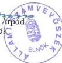

89

---

1. számú melléklet

a V-8-115/1999. számú jelentéshez

Az NGYIK bevételeinek alakulása

(1995. január 1. - 1999. június 30. között)

|  Megnevezés | Millió Ft | Megoszlás %-a  |
| --- | --- | --- |
|  Központi költségvetés támogatása | 502,0 | 20,2  |
|  MPA céltámogatása | 1.394,9 | 56,1  |
|  Pályázati úton elnyert bevételek | 77,4 | 3,1  |
|  Szerződések és megállapodások összege | 114,9 | 4,6  |
|  Alapítványi csatlakozás (IKTA) | 24,0 | 0,9  |
|  Egyéb adományok | 20,0 | 0,8  |
|  Pénzügyi bevételek | 42,5 | 1,7  |
|  Egyéb bevételek | 25,0 | 1,0  |
|  Ingatlanértékesítés bevételei | 119,8 | 4,8  |
|  Egyéb vállalkozási bevételek | 169,0 | 6,8  |
|  Összes pénzügyi bevétel | 2.489,5 | 100,0  |

Az NGYIK személyi jellegű kifizetéseinek alakulása

(1995. január 1. - 1999. június 30. között)

|  Megnevezés | Millió Ft | Megoszlás %-a  |
| --- | --- | --- |
|  Kuratórium és FB tagok tiszteletdíja és költségtérítése | 46,7 | 13,2  |
|  Munkabér költség | 141,9 | 40,0  |
|  Végkielégítések | 31,2 | 8,8  |
|  Egyéb személyi kifizetések | 19,3 | 5,5  |
|  Vállalkozói szerződés szerinti kifizetések | 27,9 | 7,9  |
|  Személyi kifizetések közterhei | 87,1 | 24,6  |
|  Összes kifizetés | 354,1 | 100,0  |

Az NGYIK likviditási mutatójának alakulása

(1995.január 1. - 1999. június 30. között, millió Ft-ban)

|  Megnevezés | 1995. | 1996. | 1997. | 1998. | 1999. június 30.  |
| --- | --- | --- | --- | --- | --- |
|  1. Követelések | 33 | 101 | 134 | 93 | 92  |
|  2. Ebből 1 éven túli követelések |  |  | -54 | -54 | -54  |
|  3. Rövidlejáratú értékpapírok | 4 | 28 | 4 | 1 |   |
|  4. Pénzeszközök | 14 | 7 | 465 | 76 | 24  |
|  5. Együtt (1-4) | 51 | 136 | 549 | 116 | 62  |
|  6. Rövid lejáratú kötelezettségek | 202 | 189 | 429 | 248 | 268  |
|  7. Likviditási mutató (5/6) | 0,25 | 0,72 | 1,28 | 0,47 | 0,23  |

Budapest, 2000. február

---

2. számú melléklet

a V-8-115/1999. számú jelentéshez

# **Az NGYIK tisztségviselői által benyújtott, megalapozatlannak, illetve szabálytalannak minősített költségelszámolások**

# **1. Oktatási és továbbképzési költségek elszámolása**

a) A közalapítvány három tisztségviselője összesen **3640,5 ezer Ft-ot** számolt el oktatási és továbbképzési költségek címén.

**Egy fő összesen 2097 ezer Ft-ot** (számára egy alapítvány - melynek ő a kuratóriumi elnöke - számla szerint oktatási, nevelési módszertani felkészítést adott, 1998. februártól 117 ezer Ft/hó, 1999. januártól a helyszíni ellenőrzés befejezéséig 135 ezer Ft/hó összegben); **egy fő összesen 1107 ezer Ft-ot** (számára egy bt. adott - számla szerint - módszertani tanácsokat 1998. januártól 58,5 ezer Ft/hó, 1999. januártól a helyszíni ellenőrzés befejezéséig 67,5 ezer Ft/hó összegben. Az érintett személy nyilatkozata szerint ténylegesen a bt. egyik munkatársa a kurátori tisztségből eredő feladatai egy részét látja el, melyben gyermekszülés és gondozás miatt akadályoztatva van); **egy fő összesen 436,5 ezer Ft-ot** (számára - számla szerint - egy kft. tartott szakmai felkészítést 1998. februárban 35 ezer Ft, egy bt. március-április-május hónapban 28,5 ezer Ft/hó összegben, 1998. július-augusztus hónapban egy kft. 30 ezer Ft/hó összegben számlázott számítástechnikai tanfolyamot, majd egy bt. számlázott információszolgáltatást szeptember-október hónapban 30 ezer Ft/hó összegben, illetve sajtófigyelést 1998. novemberében 28,5 ezer Ft, decemberben 36 ezer Ft összegben, majd 1999. márciusban 64 ezer Ft, áprilisban 67,5 ezer Ft összegben végezte el egy bt. - számla szerint - a szakmai felkészítését) **számolt el.**

A költségfelmerüléseket az ellenőrzés alapvetően a személyes továbbképzést szolgáló, illetve más szervezeteket is terhelő kifizetéseknek minősítette, mivel az NGYIK kuratóriumába és felügyelő bizottságába delegáltak **folyamatos szakmai felkészítése nem csupán a közalapítványnak, hanem az érintett tisztségviselőknek, a közalapítvány alapítójának és a tisztségviselőt delegáló szervezetnek egyaránt érdeke.**

Az érintettek írásos magyarázatukban a következőkkel indokolták a kifizetéseket: Az egyik tisztségviselő a költségek elszámolását indokoltnak minősítette és közölte, hogy „annak tartalmi, szakmai megítélésében az Állami Számvevőszék pénzügyi szakértőit nem tartom kompetensnek.” A másik tisztségviselő pedig a következőket írta: „Mint kuratóriumi tag azért volt szükség költségtérítésem keretét információszolgáltatás, továbbképzés, tanácsadás és más hasonló szolgáltatások igénybevételére, mert kuratóriumi munkám alapos, kreatív és lelkiismeretes ellátásához olyan plusz tudásokra volt szükségem, melyekkel főállású munkahelyemen két diplomám ellenére sem kell rendelkeznem, s melyeket kivétel nélkül az alapítvány érdekében kamatoztattam. Ezért mindazok a szolgáltatások,

---

melyeket a jelzett időszakban elszámoltam munkavégzésemhez szükségesek voltak, kifizetésük indokolt és megalapozott volt.” A harmadik tisztségviselő nem adott írásos magyarázatot.

b) Két tisztségviselő összesen 43,1 ezer Ft-ot számolt el számla alapján oktatási költségként (személygépkocsi hibaelhárítása, német nyelvtanfolyam), melyeket az ellenőrzés véleménye szerint a közalapítvánnyal kapcsolatos feladataik nem indokolták. Ezt az összeget az érintettek visszafizették.

## **2. A költségtérítési keret terhére vásárolt egyes kis értékű tárgyi eszközök**

A közalapítvány három tisztségviselője különböző kis értékű tárgyi eszközöket (pl. mobiltelefont akkumulátorral, szivargyújtó töltőt, mikrofon fülhallgatót, nyelvi CD-romot, szoftvert) vásárolt, azok ellenértékét - számlák alapján - költségkeretük terhére számolta el, összesen 76,4 ezer Ft értékben. Az érintettek - az ellenőrzés részére adott magyarázatuk szerint - ezeket az eszközöket a közalapítvány részére vásárolták. Két tisztségviselő erre vonatkozó nyilatkozatát a kuratóriumi elnök - az ellenőrzés, illetve az érintett kérésére - utólag írásban igazolta, továbbá az egyik tisztségviselő - a nyelvi CD-rom és szoftver 40,7 ezer Ft összegét a közalapítvány számára utólag megtérítette. A helyszíni ellenőrzés megállapította, hogy az ellenőrzés befejezéséig a vásárolt eszközöket a közalapítványnál nem vették mennyiségi nyilvántartásba, az érintett tisztségviselőknek írásban nem adták használatba (az eszközök átadását a költségtérítésekhez csatolt dokumentumok sem tartalmazták).

## **3. Lakástelefon, illetve mobiltelefon számlák**

Egy tisztségviselő 1998. év folyamán 150,5 ezer Ft-ot anélkül számolt el, hogy részletező számlák alátámasztották volna a hivatalos célú beszélgetéseket, illetve az ezekre felmerült díjakat (ellentétben az 1997/69. APEH iránymutatással).

Az érintett tisztségviselő írásos magyarázatában technikai okokra hivatkozva nem tartotta lehetségesnek a részletező számlák pótlólagos beszerzését, így a megjelölt teljes összeget a helyszíni ellenőrzés megállapításainak megismerését követően visszafizette.

## **4. A közalapítványi tevékenységhez nem kapcsolódó, költségként elszámolt számlák**

A közalapítvány három tisztségviselője olyan számlákat is a költségkeret terhére számolt el 71,9 ezer Ft értékben, amelyek nincsenek kapcsolatban a közalapítvány tevékenységével (pl. orvos házastárs szülész-nőgyógyászati továbbképzése, postai szolgáltatásként illetékbélyeg, az „informális” FB ülések helyszínéül szolgáló uszodába havi bérletek).

---2

---

Az érintettek írásos magyarázatot adtak, de azok nem támasztották alá a költségek közalapítványi tevékenységgel való összefüggését. A kifogásolt költségtérítést ketten (66,9 ezer Ft összegben) visszafizették.

## 5. Kétszeresen elszámolt költségek

Egy tisztségviselő kétszeresen számolt el költséget 35,5 ezer Ft összegben, amit írásos magyarázatában tévedésnek minősített, és a szóban forgó összeget visszafizette.

## 6. Kiküldetési- és közlekedési költségek

Az NGYIK Kuratóriumának és Felügyelő Bizottságának tagjai mintegy 520 ezer km távolságú hivatalos utat számoltak el 1998. január - 1999. június között és mintegy 1700 napon használták gépkocsijaikat vidéki utakra. Egy fő átlagosan havonta csaknem 8 napig az NGYIK érdekében használta gépkocsiját. A kuratórium és az FB tagjai közül minden nap átlagosan 3 fő végzett vidéken az NGYIK érdekében feladatot.

Mindezt kétségessé teszi azonban az a tény, hogy a „Katedra 98” pályázatról készült összefoglaló szerint a képzési programokat mindössze 87 alkalommal látogatták meg a kuratórium tagjai, a régió képviselők és a munkatársak együttesen.

Az ellenőrzés megállapítása szerint a közalapítvány tisztségviselői utazásaikat nem hangolták össze (pl. ugyanazon helyekre, ugyanazon napokon többen is utaztak).

A saját gépkocsi használatra beadott elszámolások véletlenszerű kiválasztással történő ellenőrzése alapján megállapítottuk, hogy pl. két tisztségviselő külön-külön gépkocsival 1998. március 15-én (ünnepnapon) egyaránt Győrben járt, 1998. április 15-én ugyancsak külön-külön gépkocsival három tisztségviselő egyszerre látogatott Debrecenbe, vagy 1998. szeptember 28-án két tisztségviselő Nyíregyházára.

Az ellenőrzés rendelkezésére bocsátott bizonylatok áttekintése alapján a következő szabálytalanságokat állapítottuk meg:

### a) Az útnyilvántartások tartalmi hiányosságai

Olyan útnyilvántartást, amely teljes egészében megfelel a hatályos SZJA törvény előírásainak - SZJA tv. 3. sz. melléklete IV., továbbá az 5. sz. mellékletének II./7. pontja - a kuratórium és az FB tagjai közül senki sem adott be a gépkocsi-átalány elszámolása során.

Minden elszámolásról hiányzik az év eleji és az év végi kilométer-óra-állás. A vidéki utakról, illetve a program ellenőrzésekről útjelentéseket a vizsgált időszakra vonatkozóan az elszámolásokhoz nem csatoltak. Ezek hiányában nem állapítható meg, hogy a

---3

---

gépkocsi használat útnyilvántartásaiban szerepeltetett utak tényleg megtörténtek-e, s ezek indokoltak voltak-e, s valóban az NGYIK érdekeit szolgálták.

A gépkocsi használati kimutatások többségéből a gépkocsi pontos típusa nem derült ki, ennek következtében a felhasznált üzemanyag fajtájának és normájának helyessége nem volt ellenőrizhető. A gépkocsi használók által készített számításokban az APEH által közzétett üzemanyagáraktól mindkét irányban tapasztaltunk eltérést.

A szúrópróbaszerű ellenőrzések során megállapítottuk, hogy egy tisztségviselő elszámolásaiban helytelen számítási módszert alkalmazott, s így 84,6 ezer Ft-ot szabálytalanul vett fel.

Az érintett írásos magyarázatában a szabálytalan elszámolást tévedésnek minősítette és a szóban forgó összeget visszafizette.

# b) Az NGYIK-nek és a Talent Kft.-nek párhuzamosan elszámolt vidéki utak

Az NGYIK három tisztségviselője, akik egyben az NGYIK tulajdonában lévő Talent Kft. FB tagjai, 77 esetben ugyanazokat az utakat, ugyanazokon a napokon mind az NGYIK-nál, mind Talent Kft.-nél elszámolták, s felvették a kétszeresen elszámolt költségátalányt. A benyújtott elszámolások azt mutatták, hogy ugyanazon a napon földrajzilag egymástól távol eső, két különböző vidéki hivatalos úton is voltak. Az érintett tisztségviselőknél összesen 552,6 ezer Ft elszámolását az NGYIK-nél, 184,7 ezer Ft elszámolását a Talent Kft.-nél nem tartjuk megalapozottnak.

Egy kurátor a kétszeres (párhuzamos) elszámolás, illetve a valótlan útnyilvántartás alapján az NGYIK-től felvett 424,1 ezer Ft-ot, valamint a Talent Kft.-től felvett 121,8 ezer Ft-ot. Ebből:

az NGYIK-nek és a Talent Kft.-nek párhuzamosan elszámolt vidéki hivatalos utak:

1998. januárban öt (1911 km, 30,7 ezer Ft);

februárban valamennyi (2663 km, 42,8 ezer Ft);

márciusban öt (1700 km, 27,4 ezer Ft);

áprilisban öt (1960 km, 33,6 ezer Ft);

májusban hat (2264 km, 38,8 ezer Ft);

júniusban hat (2259 km, 38,7 ezer Ft);

4

---

októberben négy (1510 km, 25,9 ezer Ft);

1999. január-február-márciusban valamennyi út, melyekre a kft.-től párhuzamosan felvett költségtérítés 67,5 ezer Ft;

# **az NGYIK-nek és a Talent Kft.-nek azonos napokon más-más helyiségekbe történt hivatalos utakra leadott elszámolás:**

1998. májusban egy (NGYIK 166 km, 2,8 ezer Ft, Talent Kft. 350 km, 6 ezer Ft);

júniusban egy (NGYIK 260 km, 4,4 ezer Ft, Talent Kft. 442 km, 7,6 ezer Ft);

júliusban hat (NGYIK 2450 km, 42 ezer Ft, Talent Kft 2236 km, 38,3 ezer Ft);

augusztusban három (NGYIK 1382 km, 23,7 ezer Ft, Talent Kft 1322 km, 22,6 ezer Ft);

szeptemberben négy (NGYIK 1406 km, 24,1 ezer Ft, Talent Kft 1348 km, 23,1 ezer Ft);

októberben egy (NGYIK 338 km, 5,8 ezer Ft, Talent Kft 518 km, 8,9 ezer Ft);

novemberben három (NGYIK 926 km, 15,9 ezer Ft, Talent Kft 896 km, 15,4 ezer Ft).

Egy **kurátor** a kétszeres (párhuzamos) elszámolás, illetve a valótlan útnyilvántartás alapján az NGYIK-től felvett **92,8 ezer Ft-ot**, a Talent Kft.-től felvett **43,1 ezer Ft-ot**. Ebből:

# **az NGYIK-nek és a Talent Kft.-nek párhuzamosan elszámolt vidéki hivatalos utak:**

1998. augusztusban egy (310 km, 5,8 ezer Ft);

1999. április egy (350 km, 7 ezer Ft);

1999. május egy (460 km, 9,2 ezer Ft);

1999. június három (1000 km, 20 ezer Ft);

# **az NGYIK-nek és a Talent Kft.-nek azonos napokon más-más helyiségekbe történt hivatalos utakra leadott elszámolás:**

---5

---

1998. januarban kettő (NGYIK 780 km, 14,6 ezer Ft, Talent Kft. 520 km, 9,7 ezer Ft);
1998. augusztusban egy (NGYIK 450 km, 8,4 ezer Ft, Talent Kft. 240 km, 4,5 ezer Ft);
1998. szeptemberben egy (NGYIK 460 km, 8,6 Ft, Talent Kft. 480 km, 8,9 ezer Ft);
1998. oktoberben kettő (NGYIK 570 km, 10,8 ezer Ft, Talent Kft. 790 km, 15 ezer Ft);
1999. februarban egy (NGYIK 450 km, 8,7 ezer Ft, Talent Kft. 260 km, 5 ezer Ft).

Egy kurátor a valótlan útnyilvántartás alapján az NGYIK-től felvett 35,7 ezer Ft-ot, a Talent Kft.-től felvett 19,8 ezer Ft-ot. Ebből:

Az NGYIK-nek és a Talent Kft.-nek azonos napokon más-más helységekbe történt hivatalos utakra leadott elszámolások:

1998. januarban egy (NGYIK 502 km, 8 ezer Ft, Talent Kft. 180 km, 2,9 ezer Ft);
1998. aprilisban kettő (NGYIK 738 km, 12,6 ezer Ft, Talent Kft. 410 km, 7 ezer Ft);
1998. majusban egy (NGYIK 246 km, 4,2 ezer Ft, Talent Kft. 189 km, 3,2 ezer Ft);
1998. juniusban egy (NGYIK 350 km, 6 ezer Ft, Talent Kft. 164 km, 2,9 ezer Ft);
1998. juliusban egy (NGYIK 280 km, 4,8 ezer Ft, Talent Kft. 226 km, 3,9 ezer Ft).

A tisztségviselők írásos magyarázatukban arra hivatkoztak, hogy a több havi késéssel kifizetett költségtérítések miatt emlékezetből állították össze az útnyilvántartást. A szabálytalanul elszámolt összegből egy tisztségviselő 19,8 ezer Ft-ot (kamataival) visszafizetett a Talent Kft.-nek.

Budapest, 2000. február

6

---

3. számú melléklet

25/11 '97 10:35

X 34 1 2525492

H. G. V. T. K.

# GENERÁCIÓ

Nemzeti Gyermek és Ifjúsági Közalapítvány

1145 Budapest, Amerikai út 96. E-11399 Budapest, 62. Pf. 633

Telefon: 252-3275, 251-1286. Fax: 252-5192. E-mail: www.zsmagyi@ugyik.datanet.hu

Magyar Külkereskedelmi Bank Rt.
Dodásné Lőrinc Ibolya úrhölgy részére
fax: 268-77-99

5950/97

A Magyar Nemzeti Gyermek és Ifjúsági Közalapítvány birtokában lévő névre szóló VISA forintkártya a mai napon elveszett. Kérjük, hogy a Varju László névre kiadott VISA forintkártyát - a kártya illetéktelen kezekbe kerülése miatt - letiltani szíveskedjék.

Intézkedését megköszönve.

Budapest, 1997. november 25.

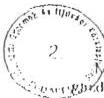

Miller Elek

gazdasági igazgató

Alapította a Magyar Köztársaság Kormánya 81, 1990 (IV. 27.) MF rendeletével
Adószám: 19022905 2 42 Magyar Államkincstv: 10032000 00280257 000000000

---

4. számú melléklet

20/11 '97 10:34

36 1 2525492

H.ÖV.1.K.

# GENERÁCIÓ

Nemzeti Gyermek és Ifjúsági Közalapítvány
1145 Budapest, Amerikai út 96. Tel: 1399 Budapest, 62. Pf.: 633
Telefon: 252-3275, 251-1286, Fax: 252-5492

Magyar Külkereskedelmi Bank Rt.
Dodásné Lőrinc Ibolya úrhölgy részére
fax: 268-77-99

5603/97

A Varju László birtokában lévő névre szóló VISA foritkártya a mai napon
megkerült. Kérem, hogy a Varju László névre kiadott kártyákat letiltását
érvénytelecíteni szívéskedjék, a kártya időközben megkerült.

Intézkedését megköszönve.

Budapest, 1997. november 28.

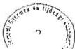

Miller Elek
gazdasági igazgató

Alapította a Magyar Köztársaság Kormánya 81./1990 (IV. 27.) MF rendeletével
Adószám: 19022905-2-12 Magyar Államkörsére: 10032000 00380257 000000000

---

5/a. számú melléklet

# **Határozat/1997.09.12./84.**

A Nemzeti Gyermek és Ifjúsági Közalapítvány kuratóriuma

1. felhatalmazza elnökét, hogy folytasson tárgyalásokat az amerikai úti "gödör" befejezetlen beruházás beszámíthatóságáról, az abádszalóki beruházás folytatásánál.
2. felajánlja a telek hasznosíthatóságát más lehetséges érdeklődőnek is zárt meghívásos pályázat formájában.

Felelős: Varju László

Határidő: azonnal

# **Határozat/1997.10.10./91.**

A Nemzeti Gyermek és Ifjúsági Közalapítvány kuratóriuma

1. a tulajdonát képező, 29803 hrsz-on nyilvántartásba vett, természetben a Budapest, XIV., Amerikai út 96. sz alatt lévő ingatlan 6323/19945 tulajdoni hányadából - a megosztási vázrajznak megfelelő részt - értékesíteni kívánja.
2. felhatalmazza elnökét az adásvételi szerződés aláírására.
3. Készüljön továbbá a szerződéshez kapcsolódóan olyan szakvélemény, amely a közbeszerzési eljárásról szóló jogszerűséget bizonyítja.

Felelős: Varju László

Határidő: azonnal

---

5/b. számú melléklet
Kuratóriumi ülés

1997 OKT 10.

TALENT SZERVEZŐ KFT
1145 Budapest Amerikai út 96.
Levelezési cím: 1390 Budapest 62 Pf.: 161
Telefon: 251-15-09

# *Helyzetismertetés a Budapest XIV. ker. Amerikai út 96. címen
lévő építési telek értékesítéséről*

Az Amerikai út 96-98 ingatlan adott állapotban (jogi, műszaki) való értékesítését
1997 július eleje óta intenzíven igyekeztünk megoldani. Folyamatosan reklámoztuk,
kínáltuk - szeptember óta pedig minden nap sugároztattuk az ATV ingatlanrovatán
(képújság) keresztül.

Az ismertebb ingatlanforgalmazó cégek felsőbb szintű vezetőit is bevontuk az
értékesítésbe - pl. OTP Ingatlan Rt. Gerő Péter ingatlanértékesítési főosztályvezető,
Postabank Invest Rt Berettyán Júlia értékesítési vezető, AIK Resource - Ingatlan
Info Radzik Károly irodaértékesítő, COMPLEX-MA Kft Müller Károlyné a volt
BUVÁTI ingatlan irodavezetője.

A hirdetésekre és kiajánlásokra többen jelentkeztek és a megtekintésre is eljöttek, de
a jogi és műszaki állapot részletesebb ismeretében érdemi ajánlatot nem tettek sőt
néhányan rövid átgondolás után nemleges választ adtak néhány napon belül.

Ugyanígy jártak a fent említett közreműködő ingatlanforgalmazó cégek és ezért
kérték az ismert problémák sürgős megoldását. Addig az érdemi kiajánlást
felfüggesztették, az ingatlant szakmailag forgalomképtelennek minősítették. A
továbbiakban csak egyedi megállapodásokkal számolhatunk, amely a 65 MFt-os
irányár jelentős csökkenésével és az értékesítési érdekegyeztetés rendezésével járna.
A jelenlegi helyzetben a zuglói építési telekárak 14-18 ezer Ft/nm között
mozognak.

A szóban forgó ingatlan földterülete 3500 nm.

Értékcsökkentő tényezők:

- nincs jóváhagyott RRT
- megkezdett építkezés van a telken, melynek engedélyét visszavonták, mivel csak
az alap készült el így értékként nemigen számolható, mert még jelentősen
változtatható a telek beépítése
- telekkönyvileg rendezetlen
- ha valaki ki is fizetné a vételárat le kellene mondania határozatlan időre
tőkehozamáról, megtérülése kétséges lenne mivel a beindítási költségek és az
időtényező felemésztenék hosszú időre az elvárt hasznot, azaz jelentős
kockázatot vállalna a vevő, racionálisan gondolkodó ingatlanberuházó nem
fektet be tőkét ilyen körülmények között.

---

5/b. számú melléklet

2.lap

Értéknövelő tényező:

- az ingatlan jó fekvése, városon belüli elhelyezkedése, infrastrukturális környezete

Ezen tényezők ismeretében az ingatlan piaci ára:

$$3500\text{nm} \times 14.000,- \text{Ft} = 49.000.000,- \text{Ft-ban határozható meg.}$$

Piaci érték azt az árat jelenti, amely összegért egy vagyontárgyban az értékelés időpontjában várhatóan eladható, feltételezve az eladó hajlandó az eladásra, az adás-vételi tárgyalások lebonyolítására ésszerűen hosszú idő áll rendelkezésre, tárgyalási időtartam alatt az érték nem változik, az ingatlan szabadon kerül piacra, meghirdetése kellő nyilvánossággal történik s mind a vevő, mind az eladó rendelkezik az ingatlannal kapcsolatos összes információval.

Budapest, 1997.10.03.

Juhász István  
Értékesítési igazgató

---

5/b. számú melléklet

3. lap

TALENT SZERVEZŐ KFT.

1145 Budapest Amerikai út 96.

Levelezési cím: 1390 Budapest 62 Pf.: 161

Telefon: 251-15-09

Tel./Fax: 251-87-39

Kuratóriumi ülés
8/b poz.
1st
10.09
1997 OKT 08.
Kuratóriumi ülés
Ikt.sz.: 415/97.

Címzett: Varju László NGYIK Kuratóriumának Elnöke

Tárgy: Tájékoztatás

Tisztelt Elnök Úr!

Kérésének megfelelően az alábbiakban mellékelem az Amerikai u. 96. Sz. alatt ingatlan jelenlegi tulajdonlapját és elkészült Helyszínrajzát, valamint Telekmegosztási Vázlatát.

Tájékoztatásul közlöm, hogy az elkészített Helyszínrajz valamint Telekmegosztási Vázlat hibásan lett elkészítve. Ennek következtében a Földhivatali átvezetés nem történt meg, a probléma rendezését folyamatba helyeztük.

Budapest, 1997. október 08.

Tisztelettel:

TALENT
Szervező Kft.
1145 Bp., Amerikai u. 96.
Zsíros László
ügyvezető igazgató

---

5/b. számú melléklet

4. lap

# Közvetítési Megállapodás

Amely létrejött egyrészről Atlantic Ingatlan Kft (1192 Budapest, Kós Károly tér 3.)

továbbiakban: Atlantic -, másrészről TALENT Szervező Kft. ( 1145 Budapest, Amerikai út 96.) továbbiakban: TALENT között alulírott napon az alábbi feltételekkel:

1. TALENT megbízza Atlantic-ot az NGYIK tulajdonát képező alábbi ingatlan eladásával.

XIV. kerület Budapest, Amerikai út 96. szám alatt lévő építési telek megkezdett irodaházzal.

2. Sikeres kozvetités eseten véget érnek a Felek eme szerzódsben rogzített kõtelezettsegei.
3. TALENT vallalja, hogy Atlantic-nak sikerdijat (Dij) fizet sikeres kozvetités eseten, amely kotelezettség az adás-vételi szerzódes megkötésel és a vételár egyössegü kifizetésel egyidöben valik esedékessé és egy össegben, szamla Ellenében fizetendő.

Amennyiben Atlantic által közvetített vevőkkel – függetlenül azok számától – nem jön létre szerződéskötés, úgy Atlantic semmilyen címen semminemű díjra nem tart igényt.

4. A Díj összege eladás esetén a kialkudott vételár három (azaz 3%) + 25% ÁFA-nak felel meg.

TALENT vállalja, hogy a sikerdíjat Atlantic javára a Magyar Hitel Bank Rt. 1051 Budapest, József Attila u. 8., 10200940-22013622-00000000 számú bankszámlájára átutalja a vételár kézhezvételét követő nyolc napon belül Atlantic számlája ellenében.

5. Jelen szerzódes határozott idejú 1997. szeptember 30-ig érvényes, mindkét fél részeröl a szerzódesben vallalt kõtelezettsegek hatályukat vesztik kiveve, ha TALENT jelen szerzódes megszünésétól szamított 6 hönapon belül adás-vételi szerzódest köt az Atlantic által kõvvetitet vásarlók valamelyikével. Ebben az esetben jelen megallapodás Atlantic számlájanak kifizetésével szünik meg.
6. TALENT es Atlantic megallapodnak abban, hogy eme szerzódes koti a tarsasagok alkalmazottjait es vitás esetekben a Magyar Köztársaság érvényes törvenyeit tekintik irányadóknak.

Budapest, 1997.09.12.

TALENT:

Talent kft

ATLANTIC:

Atlantic Ingatlan kft

TALENT
Szervező Kft.
1145 Bp., Amerikai u. 96.

---

5/b. számú melléklet

5. lap

# TALENT SZERVEZŐ KFT

1145 Budapest Amerikai út 96.

Levelezési cím: 1390 Budapest 62 Pf.: 161

Telefon: 251-15-09

Címzett: Juhász István

Cég: TANORG

Fax: 250-7777

Dátum: 1997.10.01.

Oldalak száma e lappal

Együtt: 4

Küldő: Juhász István

Cég: Talent kft

Fax: 251-87-39

Megjegyzés:

Tisztelt Uram !

Telefonbeszélgetésünkre hivatkozva a mellékelten megküldött megkezdett irodaház irányára 65 MFt.

Az M3-as autópályánál megkezdett beruházás (az alap kész) . A megkezdett beruházás építési engedélyét az I. fokú építési hatóság - a XIV.kerületi Önkormányzat Műszaki Osztálya - visszavonta és az építkezést leállította és az addig elvégzett alapozásra külön kérelem alapján fennmaradási engedélyt adott.

Telekkönyvileg rendezetlen, tulajdonjoga tisztázott. A Nemzeti Gyermek és Ifjúsági Közalapítvány tulajdona.

A beruházás új RRT készítése után folytatható.

Várom szíves válaszát.

Tisztelettel

Juhász István
Értékesítési igazgató

---

5/b. számú melléklet

6. lap

A I K

Atlantic Ingatlan Kft.

# TELEFAX

Címzett: Juhász István
Cég: Talent Kft.
Fax-szám: 251-8739.
Feladó: Radzik Károly
Dátum: 1997. október 1.
Tárgy: Amerikai úti eladó telek

Tisztelt Juhász István Úr!

Köszönettel vettük megbízásukat az Amerikai úti telek eladásával kapcsolatban, de - a telek jogi rendezetlenségei miatt - a jelenlegi állapotában, ilyen rövid idő alatt az értékesítése elképzelhetetlen.

A telek jelen pillanatban nem per- és tehermentes, az építési engedélyt visszavonták, a telek megosztása nem történt meg, közmű, csatornák tisztázatlanok stb.

Cégünk így is megpróbálta értékesíteni a területet. Három komoly érdeklődőnk is lett volna az ingatlan megvásárlására és a beruházás befejezésére, de a telek rendezetlensége miatt egyik sem foglalkozott igazán érdemben az üggyel.

Amennyiben a telekkel kapcsolatos kérdések rendeződnek, cégünk továbbra is szívesen foglalkozik a terület eladásával, de jelen állapotában az ingatlan csak nagyon alacsony áron lenne értékesíthető.

Kérjük a fentiek tudomásul vételét.

Tisztelettel:

Radzik Károly

Atlantic Ingatlan Kft.
1027 Budapest, Kapás u. 11-15.
Tel: 202-4293, 202-4561 .Fax: 202-4852.

Telefax

'97 10/01 08:29

TX/RX NO. 1496

P01

---

5/b. számú melléklet

7. lap

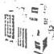

# COMPLEX - MA

MÉRNÖKI TERVEZŐ, SZOLGÁLTATÓ, INGATLANFORGALMAZÓ ÉS TANÁCSADÓ KFT

Ikt.sz.: 87/97.C.

TALENT SZERVEZŐ KFT

Juhász István úrnak
értékesítési igazgató

Fax: 251-87-39

Tárgy: Bp. XIV. Amerikai út 96-98.szám alatti ingatlan értékesítése

Tisztelt Juhász Úr!

Köszönettel vettük ingatlanértékesítéssel kapcsolatos megkeresését.

Az elmúlt időszak alatt több esetlegesen potenciális vevőnek kijánioltuk a
tárgyi ingatlant. A komolyabb érdeklődés azonban elmaradt.

A visszajelzésekre alapozva, valamint szakmai megítélésünkre hagyatkozva
tárgyi ingatlanra vonatkozóan a következő véleményünk alakult ki:

A terület osztatlan közös tulajdonban van, önálló helyrajzi számmal nem
rendelkezik, telekkönyvileg rendezetlen. Az ingatlan érvényben lévő részletes
rendezési tervvel nem rendelkezik, ezért a megkezdett építkezést a XIV.ker.
Önkormányzat Műszaki Osztálya leállíttatta, az eddig elvégzett munkára
fennmaradási engedély adott. Folytatása az RRT jóváhagyása után lehetséges.
Az RRT készítését a beruházónak (tulajdonosnak) kell konkrét szándék esetén
a helyi Önkormányzatnál megrendelni, illetve finanszírozni. A hatósági eljárás
idő- és pénzügyényes.

A fenti okok alapján nevezett ingatlan értékét indokolatlanul magasnak ítéljük.
Kérjük szíveskedjenek átgondolni az értékre vonatkozó igényüket.

Budapest, 1997. október 6.

Üdvözlettel:

COMPLEX - MA
MÉRNÖKI TERVEZŐ, SZOLGÁLTATÓ,
INGATLANFORGALMI ÉS TANÁCSADÓ KFT
1074 Budapest, Dob u. 6.
Adósz.: 10965317201

Müller Károlyné  
ügyvezető igazgató

1074 BUDAPEST, Rumbach S. u. 4.
Levélcím: BUDAPEST 1410 Pf. 171

TELEFON/FAX. 267-43:
267-50:

'97 10/06 13:08

TX/RX NO. 1544

P01

---

From : DR VINCEZ GYULA UGYVED SZOLNOK PHONE No. : 36 56 377 085

5/c. számú melléklet

Kuratóriumi Ülése

1997 OKT 10.

# Adásvételi szerződés

Mely letrejött egyrészről a Nemzeti Gyermek- és Ifjúsági Közalapítvány 3145 Budapest, Amerikai u. 96. szám, mint eladó ( a továbbiakban mint eladó )

másrészről az INVESZTA Lízing Regionális Lízing- és Befektető Kft. 5000 Szolnok, Konstantin u. 28. szám, adószám: 10709140-2-16, Cg.: 16-09-001818, továbbá a PROFIL Mérnöki Iroda Építési Fővállalkozó és Kereskedelmi Korlátolt Felelősségű Társaság 1076 Budapest, Garay utca 45.szám, adószám: 11775965-2-16 Cg.: 01-09-002602., mint vevők ( a továbbiakban mint vevők ) között a más napon az alábbi feltételek mellett:

1. Az elado cladja es a vovok megveszik a budapesti 29803 hrsz-u, irodahazkent nyilvantartoti kivert teruletbol az elado tulajdonat kepez 6323.19945, tulajdoni hanyadbol 19945, tulajdoni hanyadot - amelyet a szczoedes melleketet kepez megosztasi vazrajz tartalmaz - kolcsonosen kialkudott 50.000.000.-1t, azaz Otvenmillo forint vctelarert, amelybol 15.000.000.-Ft, azaz Negyvenmillo forint a telek erteke, 5.000.000.-Ft, azaz Otmillo forint az epitet erteke.
2./ A szerzodo felek rogzitik, hogy az clado tulajdunaban levo TISZATOPART Kft vallalkozasi szerzodest kottt a PROFII. Mernoki Iroda Epitesi Fovallalkozo es Kereskedelmi Kft-vel, amely reszere utepitesi es telekrendeza munkaikat vegzett el, amelynek ellenerteket a TISZATOPART Kft, nem fizette meg, amelynek megfizeteset az clado atvallalja. Igy a PROFII. Mernoki Iroda Epitesi Fovallalkozo es Kereskedelmi Kft. kovetelse ki nem fizett szamlak es az igazolt potmunkak alapjan 19.232.301.-Ft volt 1994. december 31-en. Ezen osszeg 14.996.908.-Ft kesedelmi kamattal megnovekszik, igy az osszes kovetelse a a PROFII. Mernoki Iroda Epitesi Fovallalkozo es Kereskedelmi Kft-nek 34.229.209.-Ft a TISZATOPART Kft-vel szemben.
3./ A szerzodo felek tudomassal bimak arrol, hogy a PROFII Mernoki Iroda Epitesi Fovallalkozo es Kereskedelmi Kft. a TISZATOPART Kft-vel szemben fennallo kovetelését mint apportot szolgaltatta az INVESZTA Lizing Regionalis Lizing- es Befektet Kft-be es ezert megfelelo üzletreszben részesult Lrc figyelemmel czen kovetelest az INVESZTA Lizing Regionalis Lizing- es Befektet Kft. jogosult érvényesiteni a TISZATOPART Kft-vel illetve - jelen szerzodes 2./ pontja alapjan - az cladoval szemben.
4/ Az clado figyelemmel arra, hogy a tulajdonaban levo TISZATOPART Kft-vel szemben az engedmenyezes utan az INVESZTA Lizing Regionalis Lizing es Befektet Kft. 34.229.209.-Ft kovetelest ervenycsit, feltetlen hozzajarulasat adja, hogy a 25.000.000.-Ft erejic ezen kovetelest az 1./ pontban megjelott ingatlan vetelaraba beszamitassal ervenycesitse.

PAGYERMEKT.DOC

'97 10/09 09:46

TX/RX NO. 1583

F01

---

From : DR VINCZE GYULA ÜGYVED SZOLNOK PHONE No. : 36 56 377 285

5/c. számú melléklet

2. lap

- 3 -

14./ A vevők az ingatlan birtokába a szerződés aláírásával lépnek, és ettől kezdve viselik az ingatlan minden terhét és húzzák annak húsznait
15./ A szerződő felek kijelentik, hogy velük szemben a szerződés megkötésének törvényi akadálya nincs.
16./ A szerződő felek meghatalmazzák jelen szerződés aláírásával Dr. Vincze Gyula 5000 Szolnok, Kossuth tér 5. fszt. 1. szám alatti ügyvédet, hogy őket a földhivatali eljárásban képviselje.
17./ A szerződő felek kijelentik, hogy a szerződéssel együttjáró költségeket az ingatlan megosztásával járó költségeket, valamint az ingatlan-nyilvántartással kapcsolatos költségeket a vevők viselik.
18./ Az eladó átadja a vevők részére a szerződés aláírásával az ingatlan használatával kapcsolatban szükséges műszaki rajzokat, dokumentációkat
19./ A felek a szerződést, mint akaratukkal mindenben megegyező a mai napon aláírták.

Szolnok, 1997. szeptember

Nemzeti Gyermek- és Ifjúsági Közalapítvány
képviseletében:

INVESZTA Lizing Regionalis Lizing- és
Befektető Kft.
képviseletében Szikszai László ügyvezető

PROFIL Mennöki Iroda Építési Fővállalkozás Kereskedelmi
Korlátolt Felelősségű Társaság
képviseletében Szikszai László ügyvezető

Előttünk, mint tanúk előtt:

1./
név, lakcím
2./
név, lakcím

Ellenjegyezte, Dr. Vincze Gyula
ügyvéd

1997/1 RM/1.00

'97 10/09 09:45

TX/RX NO. 1582

PG1

---

5/d. számú melléklet

# INGATLAN ADÁSVÉTELI SZERZŐDÉS

2586/98
a/a

amely létrejött egyrészről

Nemzeti Gyermek és Ifjúsági Közalapítvány ( 1145. Budapest, Amerikai út 96., képviseletében: Varju László elnök), mint eladó – a továbbiakban: Eladó, vagy NGYIK –

másrészről

INVESZTA Lízing Regionális Lízing – és Befektető Korlátolt Felelősségű Társaság (5000. Szolnok, Konstantin u. 28., képviseletében: Szikszai László ügyvezető igazgató; cégjegyzékszám: 1609001818) – a továbbiakban: INVESZTA Kft.-

és

PROFIL Projekt Ingatlanfejlesztő és Építő Korlátolt felelősségű Társaság ( 5000. Szolnok, Konstantin u. 28., képviseletében: Szikszai László ügyvezető igazgató; cégjegyzékszám: 1609003791) – a továbbiakban PROFIL Projekt - , mint vevők ( a továbbiakban együttesen: Vevők)

Között az alulírott helyen és napon az alábbi feltételek szerint.

# I.

1. Eladó kijelenti, hogy 6323/19945 – öd arányban tulajdonosa a Budapest, 29803 hrsz-ú és természetben Budapest, XIV. kerület Amerikai út 96. Szám alatt lévő „irodaház” megnevezésű, összesen 22180 m² alapterületű ingatlannak.

Felek megállapítják, hogy az ingatlan nyilvántartás szerint az ingatlan tulajdonostársa 13622/19945-öd arányban a Magyar Állam és ezen ingatlanrész kezelője az Eötvös Lóránd Tudományegyetem. A jelen szerződés 1. Számú mellékletét képezi az ingatlan 1998.06.02 – án kelt tulajdoni lap másolata.

2. Eladó kijelenti, hogy a jelen szerződés 2. számú mellékletét képező és 1993. December 06-án kelt helyszínrajzon piros vonallal körbehatárolt területet kizárólagosan használja, amely megfelel tulajdoni hányadának, míg az ingatlan ezt meghaladó területrészét az Eötvös Lóránd Tudományegyetem, mint kezelő használja.

if óma

---

5/d. számú melléklet

2.lap

2

Eladó kijelenti, hogy mind neki, mind az ingatlan fennmaradó része kezelőjének szándékában áll az ingatlant a jelenlegi használatnak megfelelően megosztani és ennek érdekében 1997. szeptember 29-én kérelmet nyújtott be a Budapest, Zugló Polgármesteri Hivatala Területfejlesztési és Városgazdálkodási Ügyosztályához a részletes rendezési terv módosítása iránt.

3. Eladó eladja Vevők egymás között ½-ed – ½-ed arányban megvásárolják az ingatlan Eladót illető tulajdoni hányadából az egészhez viszonyított 2946/19945-öd tulajdoni hányadot – továbbiakban: Ingatlanrész-.

Felek megállapodnak, hogy a Vevők által megvásárolt Ingatlanrész természetben a 2. Számú mellékleten kék színnel besatírozott, összesen 2946 m² alapterületű területrészt jelenti.

Eladó kijelenti, hogy a 2. pontban említett telekmegosztás miatt ezen ingatlanrész „A” – val és „B”-vel jelölt határvonalai módosulhatnak, azonban a módosulás nem eredményezheti az Ingatlanrész területének csökkenését.

4. Felek megállapodnak, hogy az Ingatlanrészből a telek vételárát 45.000.000.-Ft, azaz Negyvenötmillió forintban, míg az 5. pontban meghatározott felépítmény vételárát 5.000.000.-Ft + ÁFA, azaz Ötmillió forint + ÁFA összegben határozzák meg.
5. Felek megállapítják, hogy a Vevők által megvásárolt Ingatlanrészben megkezdett irodaház építési alapjai ( pinceszint) találhatóak. Eladó kijelenti, hogy az elkészült alap jogerős építési engedély nélkül készült, azonban Budapest Fővárosi Közigazgatási Hivatal 08-7620/95 számú határozatával ideiglenes jelleggel, visszavonásig való érvényességgel fennmaradási engedélyt adott az elkészült pinceszintre.

Eladó az elkészült pinceszintre vonatkozóan kellékszavatosságot nem vállal annak állapotát, állagát a Vevők ismerik.

Felek megállapodnak, hogy a jogerős építési engedély hiánya miatt, illetve a fennmaradási engedéllyel kapcsolatban az Eladót semmiféle anyagi, vagy egyéb felelősség Vevőkkel szemben nem terheli.

# II.

6. Felek megállapítják, hogy az 1. Számú melléklet szerint az ingatlant a Fővárosi Elektromos Művek javára bejegyzett villamos berendezések elhelyezését biztosító használati jog, valamint az Általános Értékforgalmi Bank javára 150.000.000.-Ft és járuléka erejéig bejegyzett jelzálogjog terheli.

---

5/d. számú melléklet

3. lap

3

7. Felek megállapítják, hogy az 1. számú melléklet szerint az ingatlant érdemben elintézetlen kérelemként terheli a Művelődési és Közoktatási Minisztérium javára bejegyzendő kezelői jog (széljegyszám: 147105/95), valamint a K&H IMMO-BILL Rt. javára bejegyzendő jelzálogjogosult változás (széljegyszám: 204152/95).

Eladó kijelenti, hogy a kezelői jog bejegyzése nem az Eladó tulajdoni hányadára vonatkozik, azt nem érinti, továbbá, hogy az Általános Értékforgalmi Bank Rt. javára már bejegyzett jelzálogjog, a jogosult és a K&H IMMO-BILL Rt. közötti megállapodás alapján a jövőben a K&H IMMO-BILL Rt-t illeti.

# III.

8.
8.1. Felek megallapitjak, hogy a Tisza Tópart Kft. (Abádszalok, István király ut 13.), mint megrendelő, és a PROFIL Mernöki Iroda Építési Fóvállalkozó és Kereskedelmi Kft. (Szolnok, Konstantin ut 28.), mint vallalkozó 1994. július 25-én vallalkozásí szerzódest kötöttek a vallalkozásí szerzódés I. pontjaban meghatározott kivitelezési munkák elvégzsésere.
8.2. Felek megallapitjak, hogy a 8.1. pontban meghatarozott szerzodest a Tisza Tópart Kft. věleményeltérésel irta alá.
8.3. Felek megallapitjak, hogy a 8.1. pontban meghatarozott szerzodest a Tisza Tópart Kft. és a PROFIL Mernöki Iroda Építési Fóvállalkozó és Kereskedelmi Kft. 1994. december 15-én modosította (úgynevezett 1. számú modosítás).
8.4. Felek megallapitjak, hogy a Tisza Tópart Kft., a PROFIL Mernöki Iroda Épitési Fóvállalkozó és Kereskedelmi Kft., az NGYIK, valamint a TALENT Szervező Kft. 1997. majus 27-én szerzódest kötöttek, amellyel a 8.1. pontban meghatározott szerzódest oly mádon modositották, hogy a modositás következtében a megrendelő az NGYIK lesz, és az NGYIK, mint megrendelő képviseletében a TALENT Szervező Kft. jogosult eljárni.
8.5 Felek megallapitjak, hogy a 8.1. pontban meghatarozott szerzodest a PROFIL Mernoki Iroda Epitesi Fovallalkozó és Kereskedelmi Kft., a TALENT Szervező Kft., valamint a PROFIL Projekt Kft. 1997. szeptember 03-an modosította (úgynevezett II. számú modosítás). A modosítás következtében a PROFIL Mernoki Iroda Epitesi Fovallalkozó és Kereskedelmi Kft-t illető kõtelezettsegeket a PROFIL Projekt Kft. teljesiti.

---

5/d. számú melléklet

4. lap

9. Felek megállapítják, hogy a 8.1. pontban meghatározott szerződés teljesítésével kapcsolatban a Tisza Tópart Kft. 19.232.301.-Ft + ÁFA vállalkozó díjjal, mint tőkével és ezen összeg után (1994. december 31-től számítva) 14.996.908.-Ft késedelmi kamattal, összesen 34.229.209.-Ft + ÁFA, azaz Harmincnégymillió-kettőszázhuszonkilencezer-kettőszázkilenc forint + ÁFA összeggel tartozik a PROFIL Mérnöki Iroda Építési Fővállalkozó és Kereskedelmi Kft. részére.

Figyelemmel a 8.4. pontban írtakra, ezen tartozás összegének megfizetése az NGYIK-t terheli.

10. A PROFIL Mérnöki Iroda Építési Fővállalkozó és Kereskedelmi Kft. a 9. pontban meghatározott követelését 1997. március 28-án engedményezési szerződéssel engedményezte a PROFIL Projekt részére 10.012.000.-Ft követlés értékkel (a jelen szerződés 3. számú mellékletét képezi az engedményezési szerződés).

A PROFIL Projekt az így megszerzett követelést nem pénzbeli betétként (apport) szolgáltatta az INVESZTA Kft. részére oly módon, hogy a követelés értékét 13.000.000.-Ft-ban határozták meg (a jelen szerződés 4. számú mellékletét képezi az INVESZTA Kft. 1997. május 05-én kelt apportlistája, és 5. számú mellékletét képezi a Jász-Nagykun-Szolnok Megyei Cégbíróság 16-09-001618/34 számú végzése).

Az apport szolgáltatás alapján a követelés jogosultjává az INVESZTA Kft. vált, a követelés kiegyenlítésére a PROFIL Mérnöki Iroda Építési Fővállalkozó és Kereskedelmi Kft., valamint a PROFIL Projekt nem tarthat igényt.

11. Az INVESZTA Kft. kijelenti, hogy a 9. pontban meghatározott követelésének ellenértékeként 25.000.000.-Ft +ÁFA, azaz Huszonötmillió forint + ÁFA összegre tart igényt, az ezt meghaladó összeg megtérítését sem az NGYIK-tól, sem a TALENT Szervező Kft-től, sem a Tisza Tópart Kft-től semmilyen jogcímen nem kéri, arról véglegesen és visszavonhatatlanul lemond.

# IV.

12. Felek megállapodnak, hogy a 4. pontban meghatározott vételár kiegyenlítése az alábbi módon történik:

12.1. Az INVESZTA Kft-t terheli az Ingatlanrész 1/2-ed hányadának megvásárlásáért a telek után 22.500.000.-Ft, azaz Huszonkettőezer-ötszáz forint míg a felépítmény után 2.500.000.-Ft + ÁFA, azaz Kettőmillió-ötszázezer forint + ÁFA.

---

5/d. számú melléklet

5. lap

5

12.2. Figyelemmel a 11. pontban irtakra Elado es az INVESZTA Kft. a 12.1. pontban irt vételárat kiegyenlítettnek tekintik, egymással szemben a 9. pontban meghatározott tartozással, valamint a 12.1. pontban meghatározott vételárral kapcsolatban anyagi követelésük nincsen.
12.3. A PROFIL Projekt Kft-t terheli az Ingatlanrész 1/2-ed hanyadának megvasárlásáér, a telek után 22.500.000.-Ft, azaz Huszonkettőezer-ötszáz forint mig a felépítény után 2.500.000.-Ft + ÁFA, azaz Kettőmillio-ötszázezer forint + ÁFA.
12.4. Figyelemmel az 8.5. pontban irtakra a PROFIL Projekt Kft-t az általa elvégzett munkalatokért megillető és a jovöben esedékessé való vallalkozói djból, az esedékességet követően 25.000.000.-Ft + ÁFA, azaz Huszonötmillio forint + ÁFA összeget beszámítanak a 12.3. pontban irt vételárba. A vallalkozói díj esedékességet a 8.1. pontban meghatározott szerzódés és annak modosításai határozzák meg.
13. A 12.4. pontban meghatározott összegen tül a 8.1. pontban irt szerzódés, és annak módosításai alapján a meg hátralekos vallalkozásí dj 30.000.000.-Ft + ÁFA, azaz Harmincmillio forint + ÁFA.

A PROFIL Projekt Kft. köteles a 8.1. pontban meghatározott szerződés és annak módosításaiban leírt kötelezettségeket maradéktalanul teljesíteni. Abban az esetben, ha a PROFIL Projekt Kft. kötbérfizetésre lenne köteles, úgy a kötbér összegével az NGYIK jogosult csökkenteni a 12.4. pontban meghatározott vételár teljesítést.

# V.

14.

14.1. Felek megallapodnak, hogy a 2. pontban megjelölt telekmegosztást követően közösen kezdéményezik a 2. számú mellekletben piros vonallal körülhatárolt terület további megosztását az Ingatlanrészre, amely a Vevők kizárólagos tulajdonába és hasznalatába kerül, valamint az ezt meghaladó területre, amely az Eladó kizárólagos tulajdonában és hasznalatában marad.
14.2. Felek megallapodnak, hogy a 14.1. pontban meghatarozott megosztast kovetoen Vevok tovabbra is tudomasul veszik a Fovaroisi Elektromos Muvek hasznalati jogosultsaganak ingatlannyilvantartasi bejegyzeset.
14.3. Felek megallapodnak, hogy a 14. pontban meghatarozottak teljesitese erdekében minded tóluk elvarhato intezkedest, jognyilatkozatot haladéktalanul megtesznek.

---

5/d. számú melléklet

6. lap

14.4. A 14.1. pontban meghatározottak teljesítésével kapcsolatos kölşegek Vevőket terhelik.
14.5. Elado a 14.3. pontban irtakon tul nem vallal szavatossagot a 14.1. pontban meghatarozottak teljesitese, tekintettel arra, hogy az harmadik szemelyek, illetve hatosagok hozzajarulasatol fugg.
15. Elado a jelen szerzódes aláirásat kovető 30 napon belül kérelemmel fordul a 7. pontban meghatározott jelzálogjog jogosultjához annak érdekében, hogy járuljon hozza a jelzálogjog törleséhez. Elado köteles minded tólé telhetőt megteni annak érdekében, hogy a jelzálogjogosult a kérelmet teljesítse.

Eladó szavatosságot vállal azért, hogy jelzálogjog jogosult a jelzálogjog ingatlannyilvántartásból való törléséhez legkésőbb a jelen szerződés aláírásától számított 6 hónapon belül hozzájárul.

Eladó kijelenti, hogy Vevőket a jelzálogjoggal kapcsolatban semmiféle kötelezettség nem terheli és amennyiben a jelzálogjogosult a jelzálogjog törléséhez nem járul hozzá és ily módon a Vevők jelzálogjoggal terhelt tulajdoni hányadot vásárolnának meg, úgy abban az esetben, ha Vevőknek a jelzálogjogosulttal szemben a jelzálogjoggal kapcsolatban fizetési kötelezettsége keletkezne, úgy Vevők helyett az erre irányuló felszólítástól számított 30 napon belül teljesít.

16. Elado a 6. és 7. pontban leirtakon tül szavatosságot vallal az Ingatlanrész per és tehermentességért.
17. Elado a vételár teljes kiegyenlítését követően járul hozza ahhoz, hogy Vevők tulajdonjogát egymás között 1/2-ed - 1/2-ed arányban, vétel jogcímén az ingatlannyilvántartásba bejegyezzék.

Figyelemmel a 12.3. és 12.4. pontban írtakra, a vételár akkor tekinthető teljes egészében kiegyenlítettnek, ha a PROFIL Projekt Kft. a 8.1. pontban írt szerződésben, és annak módosításaiban meghatározott kötelezettségeinek 25.000.000.-Ft + ÁFA, azaz Huszonötmillió forint + ÁFA összeg erejéig maradéktalanul eleget tesz.

18. Az Ingatlanresz birtokbaadasa a vételár teljes kiegyenlítésével egyidejúleg esedékes.
Vevok a tenyleges birtokbaveteltol kezdve viselik az Ingatlanresz terheit, illetve elvezik annak hasznait.
19. Vevok az Ingatlanreszt ismert, megtekintett allapotban vásárolják meg.

---

5/d. számú melléklet

7. lap

7

20 A jelen szerzódésel kapcsolatos vagyonátruházási és bejegyzési illeték, valamint a masodik és a 14.1. pontban meghatározott telekmegosztásokkal kapcsolatos valamennyi költség a Vevőket terheli.
21 A jelen szerzódésel kapcsolatos esetleges jogviták rendezésére a Felek a Pesti Központi Kerületi Bíroság kizárólagos illetékességét kötik ki.
22 Felek megbízzák dr. Ruttkai Tamás ügyvédet (1012. Budapest, Attila út 133.), hogy öket a jelen szerzódésel kapcsolatban a Fóvárosi Kerületek Földhivatala elöttt képviselje.
23 A jelen szerzódes 6. számú mellekletét képezi az ingatlan tulajdonostársanak nyilatkozata, amely szerint elóvasárlasi jogával nem kiván elni.

A jelen szerződés 7. számú mellékletét képezi a PROFIL Mérnöki Iroda Építési Fővállalkozó és Kereskedelmi Kft. Nyilatkozata, amely szerint a jelen szerződésben írtakat tudomásul veszi.

Felek a jelen 7 (hét) oldalból álló szerződést elolvasás és értelmezés után, mint akaratukkal mindenben egyezőt jóváhagyólag aláírták.

Budapest, 1998.07.01.

Nemzeti Gyermek és Ifjúsági Közalapítvány
Képviseli: Varju László

INVESZTA Lízing
Regionális Lízing- és
Befektető Kft.
5000 Szolnok, Konstantin u.28.

INVESZTA Lízing Regionális Lízing – és Befektető Kft
Képviseli: Szikszai László ügyvezető igazgató

Készítette és ellenjegyezte:

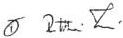

RMR. ÜGYVÉDI IRODA
DR. RUTTKAI TAMÁS
ÜGYVÉD
1012 Budapest, Attila út 133.
Adószám: 12352964-1-41

---

15/05/98

13:55

CCA ADOTÁMAGAZÓ

36 1 2208722 - 36 1 2525492

6/a. számú melléklet

15/05/98 07:25

36 1 2525492

N.GY.

Kuratóriumi ülés

1998 MÁJ 15.

1493/98

# Emlékeztető,
mely készült
a CCA (ConCordiA Rt) hivatali helyiségében
1998. május 14-én

Jelen vannak: dr. Szebellédi István, a CCA szakmai igazgatója
Varju László a Nemzeti Gyermek és Ifjúsági Közalapítvány elnöke

Jelenlévők kinyilvánítják, hogy a Legfelsőbb Bíróság Pf.v. 23074/96. sz. ítéletének
végrehajtása során kölcsönösen érdekeltek abban, hogy a Nemzeti Gyermek és Ifjúsági
Közalapítvány működőképességét megőrizzék, így van lehetőség az ítélet végrehajtására,
továbbá a közalapítvány programjainak részbeni megvalósítására.

Felek megállapítják, hogy a folyamatosan benn tartott inkasszó - annak teljesülése előtt - rövid
időn belül ellehetetleníti a közalapítvány működését.

Az érdekek kölcsönös érvényesüléséért az alábbi megoldások lehetségesek:

1. az inkasszó folyamatos benntartása mellett a közalapítvány minden bevétele az
Államkincstár számlájára érkezik, és a közalapítvány minimális működőképességének
fenntartása érdekében a közösen megállapított összeg a közalapítvány számlájára
visszautalásra kerül.

2. a követelés kiegyenlítése akként történik, hogy a közalapítvány által felajánlott ingatlanokra
a CCA ( a Coopers & Lybrand által jelölt forgalmi érték kb. 50%-os beszámítása kölcsönös
elfogadásával) a jelölt érték felett értékesítési opcióval rendelkezik garanciaként az
elidegenítésig, majd a követelésnek megfelelően elszámolnak.

Ebben az esetben az inkasszót CCA visszavonja (a gyors megállapodás érdekében az e
pontban jelölt érték meghatározását felek ideiglenesnek tekintik, addig, amíg a CCA által
felkért értékbecslő a megbízásnak eleget tesz).

Az értékesítést felek egymástól függetlenül, vagy együttesen végezhetik.

A CCA képviselője kijelenti, hogy a megállapodás feltétele a felülvizsgálati kérelem
visszavonása.

CCA ®
Adó és Pénzügyi, Tanácsadó Menedzser
Részvénytársaság

1148 Budapest, Fogarasi út 58.
Tel.: 220-8723, 220-8724, 220-8725
Fax: 220-8722

CCA

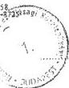

NGYIK

---

6/b. számú melléklet

# 1998. május 15.

Határozat /1998.05.15./179.

A Nemzeti Gyermek és Ifjúsági Közalapítvány kuratóriuma megbízta Lindmayer József kuratóriumi tagot az 1998. május 8.-i kuratóriumi ülés határozatainak hitelesítésével.

Felelős: Varju László

Határidő: azonnal

Határozat /1998.05.15./180.

A Nemzeti Gyermek és Ifjúsági Közalapítvány kuratóriuma

1. az elnök tájékoztatóját -mely az 1793/98. sz. emlékeztető alapján történt- tudomásul veszi, valamint felhatalmazza elnökét, hogy a CCA szakmai igazgatójával történt egyeztetést folytassa;

2. felhatalmazza az elnököt, hogy az 1793/98. sz. emlékeztető második pontjának megfelelően folytassa le a konkrét tárgyalásokat, és tegyen ajánlatot a kiegyenlítésre az alábbi ingatlanok felajánlásával:

|  Megnevezés | Funkció | Forgalmi érték (MFt)  |
| --- | --- | --- |
|  Abádszalók | építési telek | 255,0  |
|  Bp., VII., Rottenbiller u. | zeneiskola | 251,0  |
|  Győr – Hotel Aranypart | szálloda | 256,0  |
|  Földsziget | községi központ | 10,0  |
|  Létavértes | mintafarm | 17,5  |
|  Győr, Irodaház | irodaház | 25,5  |
|  Brennbergbánya | telek | 0,5  |

3. felhatalmazza az elnököt, hogy a fentiek értelmében a közalapítvány működőképességét biztosító megállapodást és a szerződést megkösse.

Felelős: Varju László

Határidő: azonnal

A hitelesítés dátuma:
1998. május 15.

Hiteles:

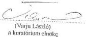

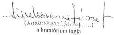

Ellenjegyezte:

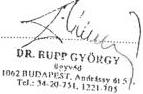

23

---

20/05 '98 07:35

36 1 2525492

H.GV.I.K

6/c. számú melléklet

2128/98

# Megállapodás

mely létrejött egyrészről a Nemzeti Gyermek- és Ifjúsági Közalapítvány (1145 Budapest, Amerikai út 96. képviselő: Varju László a kuratórium elnöke) a továbbiakban: Közalapítvány másrészről a Fórum Építő- és Szolgáltató Kisszövetkezet fa. képviseletében CCA (ConCordiA) Adó- és Pénzügyi, Tanácsadó Menedzser Rt. (1148 Budapest, Fogarasi út 58. képviselő: Hirsch László, és Dr. Várhelyi Csaba felszámoló biztosok) továbbiakban felszámoló között a mai napon az alábbiak szerint.

# I.

1./ Szerződő felek megállapítják, hogy a Közalapítvány felperesnek a Fórum Kisszövetkezet alperes ellen indított Pf. V. 23.074/1996. sz. perében a Legfelsőbb Bíróság 5. sz. jogerős ítélete helyben hagyta a Fővárosi Bíróság 5. P. 20.615/1993/630 sz. első fokú ítéletét, mely szerint a Közalapítvány köteles a Fórum Kisszövetkezetnek 59.920.596,-Ft. tőkeösszeget és annak 1991 május 23. napjától a kifizetés napjáig járó évi 20 %-os kamatát megfizetni.

2./ Szerződő felek megállapítják, hogy a Fórum Kisszövetkezet a Közalapítvány számlajáról inkasszóval eddig 45.792.736 -Ft-ot hajtott végre, mely összeget felek a Ptk. szabályai szerint számolnak el.

3./ Szerződő felek egybehangzóan megállapítják, hogy a jogerős ítélet végrehajtása, illetve teljesítése során kölcsönösen érdekeltek abban, hogy a Közalapítvány működőképessége megmaradjon, mert egyrészt így biztosított a Közalapítvány Alapító Okirata szerinti célkitűzéseinek, konkrét programjainak részbeni megvalósítása, másrészt a hitelezői igény jogszerű és pénzügyi eszközökkel tervezhető és garantált kielégítése.

4./ Felek megállapítják, hogy az inkasszó ellehetetleníti a Közalapítvány működését, amely veszélyezteti a felszámoló igényének teljesítését, figyelemmel arra, hogy a Közalapítvány tevékenységének megszűnése esetén nem számíthat további támogatásra (így költségvetési támogatásra sem), pénzeszközök hiánya miatt az inkasszóval való végrehajtás lehetetlenné válik.

# II.

A fentiek kijelentése után szerződő felek az 1/1. pontban megjelölt, és hátralékos összeg megtérítését az alábbiak szerint rendezik:

1./ A felszámoló a Közalapítvány ellen benyújtott inkasszót visszavonja, ennek fejében a Közalapítvány a követelés biztosítékként felajánlja a kizárólagos tulajdonában álló alábbi ingatlanokat:

a/ Az abádszalóki 217 db építési telek, melynek pontos megjelölését jelen szerződés 1. sz. mellékletet tartalmazza.

b/ Győr, 10721 hrsz.-u, 7578 m2 alapterületű Hotel Aranypart szálloda. ( Győr, Áldozat u. 6/b.)

c/ Győr, 6605 hrsz.-u 3482 m2 alapterületű épület megjelölésű Irodaház eszmei, osztatlan 100/1000- ed része ( Győr, Szent István út 51.)

DR. TÖZÖK  
Igység  
1015. Budapest,  
Battyány u. 1.  
Tel.: 201-8 10.

---

6/05 '98 07:36
36 1 2525492
H.GV.I.K.
6/c. számú melléklet
2. lap

2./ A Közalapítvány hozzájárul jelen szerződés aláírásával, hogy a Fórum Kisszövetkezet jelzálogjoga az I/a, b, c. pontokban megjelölt ingatlanokra az I. pontban meghatározott tőke és kamatai erejéig az Ingatlannyilvántartásba bejegyzésre kerüljön.

3./ A Közalapítvány hozzájárul ahhoz, hogy jelen szerződés 2. sz. mellékletét képező külön közjegyzői meghatalmazás alapján helyette és nevében 1998. november 30. napjáig az I/a, b, és c. pontokban megjelölt ingatlanokat a Felszámoló a jelen szerződés 3. sz. mellékletét képező, az IMSZI által meghatározott forgalmi érték 50 %-ának, mint legalacsonyabb értékesítési árnak a figyelembevételével értékesítse.
A Közalapítvány hozzájárul továbbá, hogy a Felszámoló az ingatlanok vételárát felvegye, az I./I. pontban megjelölt, és hátralékos követelés erejéig kielégítse magát, és a különbözetet a Közalapítvány részére az MNB Kincstár Budapest Pénzintézetnél vezetett 10032000-00280257-00000000 sz. számlára átutalja.

Szerződő felek megállapodnak, hogy az I/ a, b és c pontokban megjelölt ingatlanok értékesítése csak addig az ideig történik a jelen szerződésben meghatározott formában, amíg a Felszámoló teljes hátralékos követelése a költségeivel együtt kielégítést nyert.

Szerződő felek megállapodnak, hogy az 1. és 2. sz. mellékletet a Közalapítvány köteles a Felszámolónak átadni. Az 1. pontban megjelölt inkasszót a Felszámoló a jelen szerződés 1. sz. ( a 217 db. abadszalóki építési telek hiteles tulajdoni lapja ), és a 2. sz. ( közjegyzői meghatalmazás ) mellékletének átvételével egyidejűleg vonja vissza.

4./ A Közalapítvány vállalja, hogy 1998. november 30. napjáig a Felszámolóval együttműködik, vállalja továbbá, hogy mindent megtesz annak érdekében, hogy az I/a, b, c pontokban megjelölt ingatlanok értékesítésre kerüljenek, ennek keretében maga is tárgyalásokat folytat az ingatlanok értékesítéséről.

5./ Szerződő felek vállalják, hogy az adás-vételi szerződések megkötése előtt 48 órával értesítik egymást az értékesítésről, és az értesítésben felhívják a másik felet, nyilatkozzon arról, hogy van-e kedvezőbb ajánlata harmadik személytől. A másik félnek a felhívásra 24 órán belül válaszolnia kell.
Szerződő felek megállapodnak, hogy mindig az a fél írja alá az adás-vételi szerződést, aki a vevővel először érdemben tárgyalt, és nyilatkozat tételére hívta fel a másik felet.

a./ Amennyiben a másik fél válasza szerint nincs kedvezőbb ajánlat, úgy az adás-vételi szerződés/ek megkötésre kerülhet/nek.

b./ Amennyiben a másik fél tájékoztatása kedvezőbb ajánlatról szól, úgy az adás-vételi szerződést a kedvezőbb ajánlattevővel kell megkötni az értesítéstől számított 48 órán belül.

c./ Amennyiben a b./ pont szerinti adás-vételi szerződés a határidőn belül megkötésre nem kerül, úgy a másik fél jogosult az egyéb ajánlattevőnek az ingatlanokat elidegeníteni.

6./ Felszámoló kötelezettséget vállal, hogy amennyiben a követelése teljes kielégítést nyert, úgy haladéktalanul kiállít a Közalapítvány részére jelzálogjog törlesi engedélyt.

DR. TŐTŐK FERENC
Ügyvéd
1015. Budapest,
Batthyány u. 1. I/1
Tel: 201-8407

---

6/c. számú melléklet

28/05 '98 07:37

36 1 2525492

H.GV.I.K.

3. lap

# III.

Szerződő felek megállapodnak, hogy amennyiben 1998 november 30. napjáig a teljes hátralékos követelés kiegyenlítésre nem kerül az ingatlan/ok értékesítéséből befolyó összegből, úgy a Felszámoló ismét inkassző útján érvényesítheti a hátralékos követelését a Közalapítvány felé

# IV.

Jelen szerződést a Felszámoló köteles a Földhivatalhoz benyújtani
A Közalapítvány köteles viselni a jelzálogjog alapításával és törlésével kapcsolatos költségeket,
valamint a jelen okirat elkészítésével és ellenjegyzésével kapcsolatos ügyvédi költséget
Szerződő felek megállapodnak, hogy a jelzálogjog alapításával kapcsolatos költségeket a
Felszámoló megelőlegezi, mely összeg a befolyt vételárból levonásra kerül, illetve amennyiben
az értékesítésre sor nem kerül, úgy inkasszóval ezen költségeit is érvényesítheti a
Közalapítvány felé

# V.

Szerződő felek megbízzák és meghatalmazzák Dr. Török Ferenc ügyvédet (1015 Budapest,
Batthyány u. 1. I/1.) jelen okirat elkészítésével, ellenjegyzésével

# VI.

A Közalapítvány kuratóriuma 1998. május hó 15. napján megtartott kuratóriumi ülésén
feljogosította a kuratórium elnökét jelen megállapodás megkötésére. ( A kuratóriumi határozat
jelen szerződés 4. sz. melléklete.)

Szerződő felek jelen okiratot elolvasták, közösen értelmezték, azt minden részében
megértették, és mint akaratukkal mindenben egyezőt cégszerűen, ügyvédi ellenjegyzés mellett,
helybenhagyólag írták alá

Kelt. Budapest, 1998 ... hó ... napján

CCA ®
Adó és Pénzügyi, Tanácsadó Menedzser
Részvénytársaság
1148 Budapest, Fognoni ut 58.
Tel: 220-8723, 220-8724, 220-8725
Fax: 220-8727

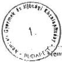

Nemzeti Gyermek és Ifjúsági Közalapítvány

Fórum Kisszövetkezett fa. képviseletében
a CCA ( ConCordiA ) Adó és Pénzügyi
Tanácsadó Menedzser Rt.

Ellenjegyezte.

DR. TÖRÖK

1015. Budapest
Batthyány
Tel: 220-8723

---

6/d. számú melléklet

Belle 2.
06.02.
Mun 2138/98
ÉRKEZETT

1993 MÁJ 29.

# MNB MAGYAR ÁLLAMKINCSTÁR

Budapest
Deák Ferenc u. 5.

1052

Tárgy: Azonnali inkasszó visszavonása

Ezúton tájékoztatjuk Önöket, hogy az Nemzeti Gyermek és Ifjúsági Közalapítvány – Fórum Építő és Szolgáltató Kisszövetkezet „f.a.” perben a Magyar Köztársaság Legfelsőbb Bírósága, mint másodfokú bíróság Pf.V. 23.074/1996./5. számú jogerős ítélete alapján a Fórum Kisszövetkezet „f.a.” 1998. július 24-én azonnali inkasszót nyújtott be az Nemzeti Gyermek és Ifjúsági Közalapítvány 10032000-00280257-00000000 számú számlájára 142.474.473,-Ft értékben.

Az azonnali beszedési megbízást a Fórum Kisszövetkezet „f.a.” felszámolója ezúton visszavonja, tekintettel arra, hogy a fenti összeg egyéb módon történő kiegyenlítéséről megállapodás született a két cég között.

Budapest, 1998. május 28.

FÓRUM KISSZÖVETKEZET „F.A.”

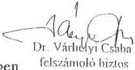

Hirsch László
felszámoló biztos

Aláírás rendben

Az aláírók a bankunknál bejelentett módon írtak alá.
Budapest 1998.május.28.

ABN AMRO Bank Rt.

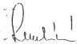

Vigyli Gábor

---

Fax honnan: +36 1 302 6641

'99 09/23 08:30 FAX +36 1 302 6641

KORÁTOR KFT.

fax: 252-5492

23/09/ 6/e. számú melléklet

a/1 13/98

Steller kir. védő

2209/98

# ADÁSVÉTELI SZERZŐDÉS

K98/0128

06.08

kp

mely létrejött egyrészt a Nemzeti Gyermek és Ifjúsági Közalapítvány (1145 Budapest, Amerikai út 96.) eladó,

másrészt Ernst & Co Ingatlanforgalmazó Kockátolt Felelősségű Társaság (1214 Budapest, Rózsa u. 17.) vevő között az alábbiak szerint:

1. Elado kizarolagos tulajdonat képezi a Györ 21021 tulajdoni lap szamon 10721 hrsz alatt nyilvantartott, Györ belterület Aldott u. 12.sz. alatt levö, felépitményes, szalloda megnevezésü ingatlan, 7578 m² alapterüsten.
2. Elado eladja, vev o megveszi az 1. pontb n megjelot ingatlant az alabbiakban

a./ Amennyiben vevő a jelen adásvételi szerződés aláírásával egyidejűleg ügyvédi letétbe helyez 70.000.000,- Ft, azaz hetven millió forint összegű vételár előleget és 1999. március hó 31. napjáig vállalja a vételár teljes kifizetését, az ingatlan teljes és végleges vételára 155.000.000,- Ft, azaz egyszázötvenöt millió forint, amelyből: 44.000.000,- Ft, azaz negyvennégy millió forint + 11.000.000,- Ft, azaz tizenegy millió forint ÁFA, összesen 55.000.000,- Ft, azaz ötvenöt millió forint a felépítmény értéke tartozékaival,

100.000.000,- Ft, azaz egyszázmillió forint a földterület értéke.

b./ Amennyiben vevő a jelen adásvételi szerződés aláírásával egyidejűleg eladónak közvetlenül megfizet 1.000.000,- Ft, azaz egymillió forint vételár előleget és 1998. július hó 15. napjáig 70.000.000,- Ft, azaz hetven millió forint vételár részletet, és kötelezi magát, hogy a teljes vételárat 1998. november hó 30. napjáig megfizeti, az ingatlan teljes és végleges vételára 121.000.000,- Ft, azaz egyszázhuszonegy millió forint, amelyből:

44.000.000,- Ft, azaz negyvennégy millió forint + 11.000.000,- Ft, azaz tizenegy millió forint ÁFA, összesen 55.000.000,- Ft, azaz ötvenöt millió forint a felépítmény értéke tartozékaival,

66.000.000,- Ft, azaz hatvanhat millió forint a földterület értéke.

c./ A vételár teljesítése az eladó által megjelölt számlára való átutalással történik. A vételár akkor minősül teljesítettnek, amikor az eladó számlájára beérkezik.

---

Fax honnan: +36 1 302 6641
09 03/23 08:30 FAX +36 1 302 6641

KURÁTOR KFT.

23/09/

6/e. számú melléklet

2. lap

2

3. A szerzódest kōtō felek jogosultak jogaikat engedményezés utján gyakorolni, aminek feltételeit kūlón okirat tartalmazza.
4. Vevö a 70.000.000,- Ft összegü vételár részlet kifizetésével egyidejüleg lép az ingatlan birtokába.

A birtokba vétellel egyidejűleg szerződést kötő felek részletes állapot felvételi jegyzőkönyvet írnak alá, az eladó által átadott, vevő által átvett ingatlan és tartozékainak pontos megjelölésével.

Szerződő felek az 1998. április 30-án és 1998. május 8-án felvett állapot-felmérési okiratban részletesen feltárt hiányosságokat ismerik. A vételár meghatározásánál erre is figyelemmel voltak, így a szerződés bármely címen történő megtámadásának jogáról már most kifejezetten lemondanak.

5. Szerződő felek kérik, hogy a 70.000.000,- Ft vételár részlet kifizetését igazoló külön okirat alapján a Földhivatal az 1. pontban megjelölt ingatlanra vonatkozó tulajdonjogot vevő javára, 1/1 arányban, vétel jogcímén jegyezze be.
Szerződő felek kérik továbbá, hogy a fennmaradó vételár hátralék (41.000.000,- Ft, azaz negyvenegy millió forint) erejéig a Földhivatal a CCA (ConCordiA) Adó és Pénzügyi, Tanácsadó Menedzser Rt. (1148 Budapest, Fogarasi út 58.) javára jelzálog jogot jegyezzen be.

Szerződő felek a földhivatali eljárás során képviseletük ellátására megbízzák a jelen adásvételi szerződést szerkesztő és ellenjegyző ügyvédet.

6. A tulajdonjog megszerzésével kapcsolatos költségek vevöt terhelik.
7. Jelen szerzódes érvényességi feltétele az elado kozalapitvány kuratoriumának, a jelen jogügylet megkötesére vonatkozo határozata.
8. Elado az ingatlan per-, teher- es igenymentessegéert szavatossagot vallal.
9. Amennyiben vevo a 2. pontban ir teljes es vegleges vetelearat hataridoben nem teljesiti, a szerzodes megkoteselek idopontjara visszameno hatallyal megszunik.

Ebben az esetben:

a./ vevő már a jelen okirat aláírásával kötelezi magát, hogy eladó tulajdonjogát a Földhivatal, eladó kérelmére, a jelen szerződés előtti állapotra állítsa vissza.

---

6/e. számú melléklet

3

3. lap

b./ vevő a már teljesített 70.000.000,- Ft vételár részlet 10%-át, átalány kártérítés jogcímén elveszíti, ezért vevő 7.000.000,- Ft-ot köteles eredeti állapot visszaállítása jogcímén megfizetni.

10. Szerződő felek a jelen jogviszonyból származó jogvita esetére kikötik a Fővárosi Bíróság kizárólagos illetékességét.

A jelen adásvételi szerződést, mint akaratunkkal mindenben egyezőt, a jelen volt két tanú előtt helybenhagyólag aláírtuk.

Budapest, 1998. június hó 8. napján.

Előttünk, mint tanúk előtt:

név: ...

lakcím: ...

név: ...

lakcím: ...

Ellenjegyezte:

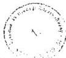

eladó

vevő

98 06/08 13:32

TX/RX NO. 1784

P03

---

7/a. számú melléklet

# TALENT Szervező Kft.

1145 Budapest Amerikai út 96.

Telefon: (36)-1-251-1509, Fax: (36)-1-251-8739

Címzett: Karsai Lászlóné

Állami Számvevőszék

Ikt. szám:

Tárgy: Tájékoztatás

Tisztelt Karsainé !

Szóbeli megbeszélésünknek megfelelően ezennel írásban is tájékoztatom az 1997 évben bekövetkezett rendkívüli káreseményről.

1997 év március 17-re Felsőtárkány-i ingatlan volt bérlőjének képviselőjével egyeztetést beszéltem meg, melynek egyik tartalmi része az lett volna, hogy a feléjük fennálló tartozásunkat készpénzben törlesszem. A készpénzzel történő fizetés a volt bérlő kérésére történt. Találkozót a bank épületében lévő étterembe beszéltem meg vele. A cég házipénztárából 500.000.- Ft-ot vettem fel, amely összegről különállóan kiadási pénztárbizonylat nem készült, és 300.000.- Ft-ot vettem fel a cég bankszámlájáról. Miközben várakoztam az átadott rendőrségi jegyzőkönyvben leírtaknak megfelelően bekövetkezett a rablás, amely után azonnal feljelentést tettem az illetékes IV. kerületi Rendőrkapitányságon.

A káresemény bekövetkezte után azonnal konzultáltam a Talent Kft könyvvizsgálójával, hogy miként kerüljön könyvelésre ez a nem kívánatos, de bekövetkezett gazdasági esemény. A vele folytatott egyeztetésnek megfelelően bevételezésre került a 300.000.- Ft (BP/85 sz. bevételi pénztárbizonylaton, 1997.03.17-én). A rendőrségi Határozat megérkezéséig mint pénztárhiányt tartottuk nyilván a hiányzó 800.000.- Ft-ot, majd a Határozat dátumával, 1997.05.26. a BP/500367 bizonylaton kiadásba helyeztük a 800.000.- Ft-ot

Budapest 1999. szeptember 06.

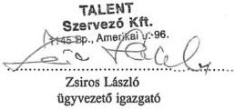

Tisztelettel:

---

7/b. számú melléklet

# TÉTELES BANKSZÁMLA KIVONAT

Lap: 1
Kereskedelmi és Hitelbank Rt. K&H BANK Rt. 702 fiókja
Dátum: 1997.03.1

Pénzforgalmi
jelzőszám

13209003-70205893

Kivonat
sorszám

34

TALENT Szervező Kft
Budapest,

1145 Bp. Amerikai ut. 96.

Tartozik forgalom

Ellenszámla tulajdonos

Jelölő adat A közlemény rovat tartalma

Ellenszámla

Tételiktatószám

Összeg

Pénztár kifizetés

1155

Terhelés összesen :

XXXXXXXX-XXXXXXXX-XXXXXXXX

1 darab

T7029700006340

300,000

300,000

Követel forgalom

Ellenszámla tulajdonos

Jelölő adat A közlemény rovat tartalma

Ellenszámla

Tételiktatószám

Összeg

Átutalási postautalványok

2245

2 db

Jóváírás összesen :

XXXXXXXX-XXXXXXXX-XXXXXXXX

1 darab

T9009700497343

7,612

7,612

13209003-70205893-

napi forgalmának összesítése :

Nyitóegyenleg :

320,000

Terhelés összesen :

1 db

300,000

Jóváírás összesen :

1 db

7,612

Záróegyenleg :

28,000

K&H BANK Rt. 702

Kereskedelmi és Hitelbank Rt.

002.

1042 BUDAPEST,

ÁRPÁD ÚT 112.

---

7/c. számú melléklet

(005049704)

Budapesti Rendőr-főkapitányság

04.KERULETI RENDŐRKAPITÁNYSÁG

ügyeleti napló sorszám: 00504 / 97

Szám:

# J E G Y Z Ö K Ö N Y V

# feljelentésről

KÉSZÜLT: Budapest, 1997.03.17 16:34-kor a fenti szerv panasz-felvételi helyiségében.

ELJÁRÁS KEZDEMÉNYEZŐ, SERTETT:

Családi neve: Zsíros utóneve: László

Anyja cs. neve: Windheim un.: Roza Személyi száma: 1-61-10-06-***

Állampolgársága: magyar Szül. helye: Kaposvár

(0)

Állandó címe: Magyarország irányítószám: 1153 Budapest 15.ker Eötvös 144

telefonszám: 30-76-473 /

JELEN VANNAK :

Panaszfelvevő : Buzás Béla r.tzis.

Elj.kezdeményező: Zsíros László

Előttem ismertették a hamis vád, a hatóság félrevezetése valamint a hamis tanúzás törvényi következményeire történt figyelmeztetést. A figyelmeztetést tudomásul vettem, nyilatkozatomat a fentiekre figyelemmel teszem meg.

Eljárás kezdeményező aláírása

Cselekmény ideje: 1997.03.17 15:00 - 15:30 között

---

7/c. számú melléklet

2. lap

(005049704)

helye: Budapest 04.ker Árpád ú

egyéb: Árpád üzletház Don-Dodó étterem

# Cselekmény részletes leírása:

Feljelentést teszek ismeretlen tettes ellen, aki a fenti időpontban a Bp. IV., Árpád üzletház földszintjén lévő Don-dodó étteremben a mellém letett samsunaik középméretű diplomatatáskát, melyben a személyes irataim, -személyi igazolvány, vezetői engedély útlevél, TB kártyám, adókártyám, egyéb irataim, csekkönyv, 2 bélyegző- Talent Szervező Kft. Ker.Hitelbankos- 1. db. East- West Kft. bélyegzője, hivatalos okiratok, és kb. 950.000.- Ft. kp., mely a Talent Kft. 800.000.- Ft-ja, és az East-West Kft 150.000.- Ft-jából tevődik össze valamint Citizen 9000. típ. Calculátor.

A diplomata táska zöld színű volt, középen szám, két oldalán kulcsos zár volt. A Fogantyúja barna fautánzatú volt. Az irataim egy barna irattartóban voltak, mely műbörből készült.

Az étteremben a személyzet elmondta, hogy akik a mögöttem lévő asztalnál ültek valószínű, hogy ők vitték el a táskam, akikről személyelírást tudnak adni.

# Feljelentés minősítése:

Btk. 316.szakasz (1) bek. lopás (személyek javai elleni bcs.)

Lopási kár: 980000 Ft

Helyszín jellege: vendéglő, étterem

Elkövetési módszer: alkalmi lopás

Az üggyel kapcsolatban mást elmondani nem tudok, és nem kívánok, a jegyzőkönyv az általam elmondottakat helyesen tartalmazza, melyet elolvasás után helybenhagyólag aláírok.

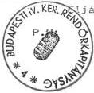

Panaszfelvevő aláírása

Aljárás kezdeményező aláírása

---

7/d. számú melléklet

# Budapesti IV.kerületi Rendőrkapitányság
Büntügyi Osztály

Szám : 144-769/97.Bü.

Előadó : Szigeti László r.tzls.

# H A T Á R O Z A T
a nyomozás megszüntetéséről

A Büntető Törvénykönyv 316.szakasz /1/ bekezdésbe ütköző, és a /4/ bekezdés a.
pont szerint minősülő, lopás büntett alapos gyanúja miatt, ismeretlen
tettes ellen indult nyomozást, a büntető eljárásról szóló törvény 139.szakasz.
/1/bekezdés, b.pont, II. fordulata alapján,

- mivel a nyomozás adatai alapján nem állapítható meg az elkö-
vető kiléte és az eljárás folytatásától sem várható eredmény -

m e g s z ü n t e t e m.

A határozat egy-egy példányának megküldésével értesítem :

Budapesti IV-XV.kerületi Ügyészséget

Zsíros László 1153 Eötvös utca 144.

A határozat ellen a büntető eljárásról szóló törvény 148.szakasz. /1/ bekezdés
alapján panasznak van helye, melyet figyelemmel a /4/ bekezdésre a kézbesítéstől
számított nyolc napon belül a Budapesti IV-XV.kerületi Ügyészséghez címezve a
fenti rendőri szervnél lehet előterjeszteni.

# I N D O K O L Á S :

Zsíros László feljelentést tett ismeretlen tettes ellen, aki 1997.03.17-n.
12:00 óra és 15:30 óra közötti időben a Bp.IV.ker.Árpád utca lévő

Árpád Üzletház Son-Dodó étteremből alkalmi lopás módszerével az alábbi
értékeket tulajdonította el:

Sansunaik közép méretű diplomtatására, benne vezetői ang., utlevél, TB-kártgyá,
adókártya, csekkönyv, 2 bélyegző, /Talent Szervező Kft., Kar. Hitelbankos/, 1 db.
East-West KFT. bélyegzője, 950.000,- Ft. készpénz, Dillizen 5000 t.p. kalkulátor,
AE 010718 sz.személyi igazolvány.

Keletkezett lopási kár : 980000.00 Forint.

A lefolytatott nyomozás során olyan személyi vagy tárgyi bizonyítékokat
felkutatni, melyek alapján az elkövető kiléte megállapítható lenne, nem sikerült.
Az eltulajdonított tárgyak felkutatására tett intézkedések jelen ideig eredménye
nem vezettek.

Tekintettel arra, mivel a nyomozás adatai alapján nem állapítható meg az elkövető
kiléte, és az eljárás folytatásától eredmény nem várható, ezért a rendelkező
részben foglaltak szerint határoztam.

Amennyiben az elévülési határidőn belül az Üggyel kapcsolatban újabb adat merülne
fel, úgy a nyomozás továbbfolytatása felől hivatalból intézkedem és erről a
mértéklet értesítse.

B u d a p e s t, 1997. május 7.

Práger Ferenc r. alezredes
Büntügyi Osztály Vezetője

---

COBRA-CONTO-PLUS: 0743 (Ecomax BT)

BÉRSZÁMFEJTŐ PROGRAM: [3.3][F1]

7/e. számú melléklet

# [ 1z1 ] Zsíros László

Kezdő dátum: 97.01.01 bérkarton

Utolsó dátum: 97.12.31

1. oldal
Talent Kft

|  Dátum | Számfejtési mód | Jogcím | Kifizetési összeg | Jövedel. adó | Nyugdíj. jár. | M.váll. jár. | Jogcím | Levonási összeg | Nett kifiz.  |
| --- | --- | --- | --- | --- | --- | --- | --- | --- | --- |
|  97.01.31 | Főállású alkalmazott | Alapbér | 150.000 | 49.983 | 15.000 | 2.250 |  |  | 82.76  |
|  97.02.28 | Főállású alkalmazott | Alapbér | 150.000 | 49.984 | 15.000 | 2.250 |  |  | 82.76  |
|  97.03.31 | Főállású alkalmazott | Alapbér | 150.000 | 49.983 | 15.000 | 2.250 |  |  | 82.76  |
|  97.04.30 | Főállású alkalmazott | Alapbér | 150.000 | 49.983 | 15.000 | 2.250 |  |  | 82.76  |
|  97.05.31 | Főállású alkalmazott | Alapbér | 150.000 | 49.984 | 15.000 | 2.250 |  |  | 82.76  |
|  97.06.30 | Főállású alkalmazott | Alapbér | 170.000 | 58.383 | 17.000 | 2.550 |  |  | 92.00  |
|  97.07.31 | Főállású alkalmazott | Alapbér | 114.500 | 129.783 | 28.450 | 5.100 |  |  | 176.60  |
|   |  | Alapbér /ny.j.nélk/ | 55.500 |  |  |  |  |  |   |
|   |  | Jutalom | 170.000 |  |  |  |  |  |   |
|  97.08.31 | Főállású alkalmazott | Alapbér /ny.j.nélk/ | 170.000 | 58.384 | - | 2.550 |  |  | 109.00  |
|  97.09.30 | Főállású alkalmazott | Alapbér /ny.j.nélk/ | 170.000 | 58.383 | - | 2.550 | Külf.napidíj szja el | 11.983 | 97.00  |
|  97.10.31 | Főállású alkalmazott | Alapbér /ny.j.nélk/ | 170.000 | 58.383 | - | 2.550 |  |  | 109.00  |
|  97.11.30 | Főállású alkalmazott | Alapbér /ny.j.nélk/ | 170.000 | 58.383 | - | 2.550 |  |  | 109.00  |
|  97.12.31 | Főállású alkalmazott | Alapbér /ny.j.nélk/ | 170.000 | 58.384 | - | 2.550 |  |  | 109.00  |
|  Összesen: |   |   | 2.110.000 | 730.000 | 120.450 | 31.650 |  | 11.983 | 1.215.9  |

---

8. számú melléklet

a V-8-115/1999. számú jelentéshez

# A rehabilitációs program finanszírozása

az 1999. július 2-án a befogadott számlák és a rendelkezésre álló források,
millió Ft-ban

|  Befogadott összes számla |   | Források összesen  |   |
| --- | --- | --- | --- |
|  kivitelezés | 1.435,7 | MPA Foglalkoztatási Alap | 600,0  |
|  késedelmi kamat | 20,8 | Rehabilitációs Alap | 500,0  |
|  bútor | 16,8 | Szakképzési Alap | 294,8  |
|   |  | saját forrás | 66,0  |
|  összesen | 1.473,3 | összesen | 1.460,8  |
|   |  | ki nem fizetett számla | 12,4  |

A rehabilitációs intézmények 1998-99. évi
kihasználtsága

|  Megnevezés | Nyíregyháza | Nyírjes | Sövénykút | Átlagosan  |
| --- | --- | --- | --- | --- |
|  a felszereltséghez (berendezési tárgyak, eszközök) viszonyítva (%) | 94,4 | 90,9 | 70,0 | 88,3  |
|  a tényleges kapacitáshoz viszonyítva (%) | 48,5 | 50,0 | 22,3 | 41,0  |

Budapest, 2000. február

---

9. számú melléklet

PÉNZÜGYMINISZTÉRIUM

1051 BUDAPEST, JÓZSEF NÁDOR TÉR 2-4.

Postacím: 1369 Budapest, Postafiók 481

Telefon: 118-2066 Telefax: 118-2570

Számviteli Főosztály

11.551/1999.

SZÁM-952/99.

Érkezett: 1999. 11. 04.

Iktatószám: V-8/58/99

Melléklet:

Ügyintéző: Papp Julianna

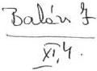

BIHARY ZSIGMOND úr

Számvevő-igazgató részére

Állami Számvevőszék

Budapest

Tárgy: A Nemzetközi Gyermek és Ifjúsági Közalapítványnál folytatott ellenőrzéssel kapcsolatos levél

Főosztályunkhoz küldött megkeresésükre a következő tájékoztatást nyújtjuk:

A számviteli törvény módosítását követően (tekintettel arra, hogy a Korm. rendelet csak az általános szabályoktól való eltérést tartalmazza), az alapítványok (közalapítványok) számára is kötelező előírás volt a kapott támogatás bevételként történő elszámolása. Mivel a kapott támogatás fejlesztési célú volt, ezért az alapítványnak az időbeli elhatárolás technikáját is kellett volna alkalmazni.

A kuratóriumi elnök a Korm. rendeletnek a céltámogatásként kapott támogatás egyéb bevételkénti elszámolására hivatkozik, bár az nem vitatott kérdés, hogy a kapott támogatást bevételként kell kezelni. Az időbeli elhatárolást azonban ez esetben is - az összemérés számviteli alapelv érvényesülése érdekében - végre kellett volna hajtani. Az előírások időközben a fent hivatkozott módon módosultak, így a fejlesztési célú támogatások időbeli elhatárolásának szabályait kellett volna alkalmazni.

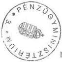

Budapest, 1999. október 28.

Dr. Nagy Gábor
főosztályvezető

v6/11551.doc

---

1. sz. tanúsítvány

# Nemzeti Gyermek és Ifjúsági Közalapítvány
eszközei és forrásai

Adatok M Ft-ban

|  Sorsz. | Megnevezés | 1994. év | 1995. év | 1996. év | 1997. év | 1998. év  |
| --- | --- | --- | --- | --- | --- | --- |
|  1. | **A.** Befektetett eszközök (2.-5. sorok) | 2.644 | 2.639 | 2.609 | 1.952 | 3.190  |
|  2. | I. Immateriális javak | 1 | - | - | - | -  |
|  3. | II. Tárgyi eszközök | 2.303 | 2.313 | 2.285 | 855 | 1.749  |
|  4. | III. Befektetett pénzügyi eszközök | 340 | 326 | 324 | 36 | 1.384  |
|  5. | IV. Befektetett eszközök értékhelyesbítése | - | - | - | 1.061 | 57  |
|  6. | **B.** Forgóeszközök (7.-10. sorok) | 75 | 55 | 139 | 607 | 170  |
|  7. | I. Készletek | 4 | 4 | 3 | 4 | -  |
|  8. | II. Követelések | 48 | 33 | 101 | 134 | 93  |
|  9. | III. Értékpapírok | - | 4 | 28 | 4 | 1  |
|  10. | IV. Pénzeszközök | 23 | 14 | 7 | 465 | 76  |
|  11. | **C.** Aktív időbeli elhatárolások | - | - | 7 | 2 | -  |
|  12. | Eszközök összesen (1.+6.+11. sor) | 2.719 | 2.694 | 2.755 | 2.561 | 3.360  |
|  13. | **D.** Saját tőke (14.-16. sorok) | 2.552 | 2.492 | 2.565 | 2.131 | 3.092  |
|  14. | I. Induló tőke | 2.797 | 2.797 | 2.797 | 909 | 909  |
|  15. | II. Tőkeváltozás | -245 | -305 | -232 | 161 | 2.126  |
|   | ebből tárgyévi eredmény |  |  |  |  | 1.901  |
|  16. | III. Értékelési tartalék |  |  |  | 1.061 | 57  |
|  17. | **E.** Céltartalék |  |  |  | - | -  |
|  18. | **F.** Kötelezettségek (19.-20. sorok) | 167 | 202 | 189 | 429 | 248  |
|  19. | I. Hosszú lejáratú kötelezettségek |  |  |  |  |   |
|  20. | II. Rövid lejáratú kötelezettségek | 167 | 202 | 189 | 429 | 248  |
|  21. | **G.** Passzív időbeli elhatárolások |  |  | 1 | 1 | 20  |
|  22. | Források összesen (13.+17.+18.+21. sor) | 2.719 | 2.694 | 2.755 | 2.561 | 3.360  |

Alulírott az 1989. évi XXXVIII. törvény 24. § c. pontja alapján aláírásommal kijelentem, hogy a feltüntetett adatok teljesek és a közalapítvány nyilvántartásaival, okmányaival mindenben egyeznek.

Budapest, 1999.augusztus 30.

P. H.

képviseletre jogosult aláírása

---

2. sz. tanúsítvány

# Nemzeti Gyermek és Ifjúsági Közalapítvány
eszközeinek és forrásainak részletezése

Adatok: M Ft-ban

|  Sor-sz. | Megnevezés | 1995. év | 1996. év | 1997. év | 1998. év  |
| --- | --- | --- | --- | --- | --- |
|  1. | Immateriális javak | - | - | - | -  |
|  2. | Ingatlanok | 2.240 | 2.241 | 543 | 1.468  |
|  3. | Műszaki és egyéb berendezések, gépek, járművek | 43 | 44 | 6 | 6  |
|  4. | Beruházások | 30 | - | 306 | 275  |
|  5. | Részesedések | 325 | 324 | 10 | 1.383  |
|  5.1. | ebből: Talent Kft. üzletrész | 8 | 9 | 9 | 1.383  |
|  5.2. | Tiszatópart Kft. üzletrész | 1 | 1 | 1 | -  |
|  5.3. | egyéb részesedés | 316 | 314 |  | 5  |
|  6. | Értékpapírok (1 éven túli) | - | - | - | -  |
|  7. | Adott kölcsönök (1 éven túli) | - | - | 26 | 1  |
|  8. | Hosszú lejáratú bankbetétek | - | - | - | -  |
|  9. | Befektetett eszközök értékhelyesbítése | - | - | 1.061 | 57  |
|  10. | Készletek | 3 | 3 | 4 | -  |
|  11. | Követelések | 33 | 101 | 134 | 93  |
|  11.1. | ebből: vevők követelése | 31 | 61 | 59 | 37  |
|  11.2. | Előlegek |  | 38 | 1 | 1  |
|  11.3. | Kölcsönök | 2 | - | - | -  |
|  11.4. | egyéb követelések |  | 2 | 74 | 55  |
|  12. | Értékpapírok (rövid lejáratú) | 4 | 28 | 4 | 1  |
|  13. | Pénzeszközök | 14 | 7 | 465 | 76  |
|  14. | Aktív időbeli elhatárolások | - | 7 | 2 | -  |
|  15. | **Eszközök összesen** | **2.694** | **2.755** | **2.561** | **3.360**  |
|  16. | Indulótőke | 2.797 | 2.797 | 909 | 909  |
|  17. | Tőkeváltozás | -305 | -232 | 161 | 2.126  |
|  18. | Értékelési tartalék | - | - | 1.061 | 57  |
|  19. | Céltartalék | - | - | - | -  |
|  20. | Hosszú lejáratú kötelezettségek | - | - | - | -  |
|  21. | Rövid lejáratú kötelezettségek | 202 | 189 | 429 | 248  |
|  21.1. | ebből: adótartozás | 12 | 14 | 14 | 31  |
|  21.2. | TB-tartozás | 9 | 5 | 1 | 3  |
|  21.3. | egyéb köztartozás |  | - | - |   |
|  21.4. | szállítói kötelezettség | 32 | 30 | 96 | 138  |
|  21.5. | egyéb kötelezettség | 149 | 140 | 318 | 76  |
|  22. | Passzív időbeli elhatárolások | - | 1 | 1 | 20  |
|  23. | **Források összesen** | **2.694** | **2.755** | **2.561** | **3.360**  |

Alulírott az 1989. évi XXXVIII. törvény 24. § c. pontja alapján aláírásommal kijelentem, hogy a feltüntetett adatok teljesek és a közalapítvány nyilvántartásaival, okmányaival mindenben egyeznek.

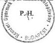

Budapest, 1999.augusztus 30.

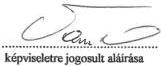

---

3. sz. tanúsítván

Nemzeti Gyermek és Ifjúsági Közalapítvány eredménykimutatásai

Adatok: M Ft-ban

|  S. sz. | Megnevezés | 1995. év |   | 1996. év |   | 1997. év |   | 1998. év  |   |
| --- | --- | --- | --- | --- | --- | --- | --- | --- | --- |
|   |   |  Tevékenység célja szerinti | Vállalkozási tevékenység | Tevékenység célja szerinti | Vállalkozási tevékenység | Tevékenység célja szerinti | Vállalkozási tevékenység | Tevékenység célja szerinti | Vállalkozási tevékenység  |
|  A) | Összes bevétel | 58 | 63 | 195 | 68 | 961 | 290 | 1.767 | 1.011  |
|  1. | Alapítótól kapott támogatás | 27 |  | 105 |  | 105 |  | 228 |   |
|  2. | Áht. alrendszeréből kapott támogatás |  |  | 20 |  | 676 |  | 815 |   |
|  3. | Pályázati úton elnyert támogatás |  |  |  |  |  |  | 6 |   |
|  4. | Egyéb adományozótól kapott támogatás | 1 |  | 50 |  | 9 |  | 4 |   |
|  5. | Egyéb bevételek | 30 |  | 20 | 68 | 171 | 290 | 714 | 1.011  |
|  B) | Összes költség (ráfordítás) | 105 | 76 | 138 | 52 | 447 | 413 | 566 | 311  |
|  1. | Anyagjellegű ráfordítások |  |  | 32 | 14 | 40 | 15 | 143 | 4  |
|  2. | Személyi jellegű ráfordítások |  |  | 42 | 13 | 65 |  | 66 |   |
|  3. | Társadalombiztosítási járulék |  |  | 12 | 4 | 23 |  | 21 |   |
|  4. | Értékcsökkenési leírás |  |  | 1 |  | 8 | 2 | 5 | 8  |
|  5. | Egyéb költségek |  |  | 46 | 21 | 181 | 13 | 102 | 3  |
|  6. | Egyéb ráfordítások |  |  | 5 |  | 130 | 383 | 229 | 296  |
|  7. | Pályázati úton nyújtott támogatás |  |  |  |  |  |  |  |   |
|  C) | Adózás előtti eredmény | -47 | -13 | 57 | 16 | 514 | -123 | 1.201 | 700  |
|  D) | Adófizetési kötelezettség |  |  |  |  |  |  |  | 2  |
|  E) | Tárgyévi eredmény | -47 | -13 | 57 | 16 | 514 | -123 |  | 698  |

Alulírott az 1989. évi XXXVIII. törvény 24. § c. pontja alapján aláírásommal kijelentem, hogy a feltüntetett adatok teljesek és a közalapítvány nyilvántartásaival,

okmányaival mindenben egyeznek.

Budapest, 1999.augusztus 30.

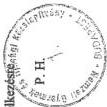

1995.évben a költségek alapítványi és vállalkozási célú megbontása nem áll rendelkezésre.

képviseletre jogosult aláírása

---

4. sz. tanúsítvány

Nemzeti Gyermek és Ifjúsági Közalapítvány
bevételei

Adatok: M Ft-ban

|  Sar-sz. | Megnevezés | 1995. év |   | 1996. év |   | 1997. év |   | 1998. év |   | 1999. év  |   |
| --- | --- | --- | --- | --- | --- | --- | --- | --- | --- | --- | --- |
|   |   |  Terv | Tény | Terv | Tény | Terv | Tény | Terv | Tény | Terv | VI. 30-ig  |
|  A. | Tevékenység célja szerinti bevételek |  | 58,0 | 219,5 | 194,9 | 212,6 | 961,1 | 1.242,1 | 1.767,0 | 458,4 | 55,0  |
|  1. | Központi költségvetési támogatás |  | 26,8 | 117,5 | 105,0 | 105,0 | 105,0 | 228,0 | 228,0 | 228,0 | 39,0  |
|  2. | Munkaerőpiaci Alap támogatása |  |  |  |  |  | 568,8 | 888,0 | 814,8 | 11,3 | 11,3  |
|  3. | Megállapodások alapján kapott támogatások |  |  |  |  | 53,0 | 106,5 |  | 2,0 |  |   |
|  4. | Pályázati útonelnyert támogatások |  |  |  | 60,2 |  |  | 20,0 | 6,0 | 31,9 |   |
|  5. | Szponzori támogatások |  |  |  |  |  |  |  |  |  | 0,6  |
|  6. | Adományok, önkéntes befizetések |  | 0,6 |  | 2,1 |  | 8,6 |  | 3,9 | 83,6 |   |
|  7. | SZJA 1 %-os felajánlásából származó bevételek |  |  |  |  | 5,5 |  | 1,0 |  |  |   |
|  8. | Cél szerinti tevékenységet szolgáló ingatlanok |  |  |  |  |  |  |  |  |  |   |
|  8.1. | - értékesítéséből származó bevételek |  | 2,7 |  | 1,2 |  | 81,7 |  | 113,7 |  |   |
|  8.2. | - bérleti díjából származó bevételek |  |  | 32,0 |  |  |  |  |  |  |   |
|  8.3. | - szálláshely értékesítéséből származó bevételek |  | 13,8 | 9,0 |  |  |  |  |  |  |   |
|  9. | Vagyonkezelői befizetések |  |  | 43,5 |  |  |  |  |  |  |   |
|  10. | Táboroztatási bevételek |  |  |  | 12,7 |  |  |  |  |  |   |
|  11. | Pályáztatási bevételek |  |  |  | 0,3 |  | 0,5 |  | 0,5 |  |   |
|  12. | Pénzügyi műveletek bevételei |  | 4,4 | 1,0 | 12,9 | 23,0 | 78,6 | 10,0 | 23,3 |  | 0,3  |
|  13. | Egyéb bevételek |  | 9,7 | 16,5 | 0,5 | 26,1 | 11,4 | 95,1 | 574,8 | 103,6 | 3,8  |
|  B. | Vállalkozási tevékenység bevételei |  | 62,7 | 49,9 | 67,6 | 103,4 | 290,4 | 308,4 | 1011,0 | 7,0 | 4,2  |
|  1. | Vállalkozási tevékenységet szolgáló ingatlanok |  |  |  |  |  |  |  |  |  |   |
|  1.1. | - értékesítéséből származó bevételek |  |  |  |  | 103,4 | 243,2 | 137,0 | 160,0 |  |   |
|  1.2. | - bérleti díjából származó bevételek |  | 46,2 | 34,0 | 52,7 |  | 12,2 | 11,6 | 10,9 |  | 2,8  |
|  1.3. | - szálláshely értékesítéséből származó bevételek |  |  | 3,0 |  |  |  |  | 0,7 |  |   |
|  2. | Vagyonkezelői befizetések |  |  |  |  |  |  | 159,8 |  | 7,0 |   |
|  3. | Pénzügyi műveletek bevételei |  |  |  |  |  |  |  |  |  |   |
|  4. | Egyéb bevételek |  | 16,5 | 12,9 | 14,9 |  | 35,0 |  | 839,4 |  | 1,4  |

Alulírott az 1989. évi XXXVIII. törvény 24. § c. pontja alapján aláírásommal kijelentem, hogy a feltüntetett adatok teljesek és a közalapítvány nyilvántartásaival, okmányaival mindenben egyeznek.

Budapest, 1999. augusztus 30.

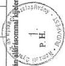

---

5. sz. tanúsítva

# Nemzeti Gyermek és Ifjúsági Közalapítvány
költségei és ráfordításai

Adatok: M Ft-ban

| Sor Sz. | Megnevezés | 1995. év | 1996. év | 1997. év | 1998. év | 1999. VI. 30. |
| --- | --- | --- | --- | --- | --- | --- |
| tevékenység célja szerinti | vállal- kozási célú | tevékenység célja szerinti | vállal- kozási célú | Tevékenység célja szerinti | vállal- kozási célú | tevékeny- ségcélja sze- rinti | vállal- kozási célú | Tevékenység célja szerinti | vállal- kozási célú |
| 1. | Anyagjellegű ráfordítások | 48 |  | 32 | 14 | 40 | 15 | 143 | 4 | 10 | 1 |
| ebből: víz-, gáz-, fűtési díjak, villamos energia, | 8 |  | 7 | 7 | 4 | 2 | 4 | 2 |  | 1 |
| Fenntartási-, karbantartási-, javítási költségek | 4 |  | 3 | 2 | 13 |  | 6 | 1 | 3 |  |
| nyomtatvány, irodaszer, fénymásolás ktg-ei | 2 |  | 3 | 1 | 3 |  | 8 |  | 2 |  |
| posta-, telefon-, telefax költségek | 11 |  | 5 | 3 | 10 | 2 | 17 |  | 3 |  |
| utazási és kiküldetési költségek | 11 |  | 5 |  | 8 |  | 7 |  | 1 |  |
| eladott áruk beszerzési értéke |  |  |  |  |  |  |  |  |  |  |
| alvállalkozói teljesítmények értéke |  |  |  |  |  |  |  |  |  |  |
| egyéb anyagköltség és anyagjellegű ráford. | 12 |  | 9 | 1 | 3 | 11 | 101 | 1 | 1 |  |
| 2. | Személyi jellegű ráfordítások | 64 |  | 54 | 17 | 88 |  | 87 |  | 33 |  |
| ebből: bérköltség | 37 |  | 24 | 8 | 26 |  | 37 |  | 16 |  |
| megbízási díjak |  |  |  |  | 6 |  | 4 |  | 1 |  |
| tiszteletdíjak | 2 |  | 5 | 2 | 6 |  | 14 |  | 3 |  |
| költségtérítések | 1 |  | 5 | 1 | 6 |  |  |  | 4 |  |
| reprezentációs költségek | 1 |  | 1 |  | 2 |  | 3 |  |  |  |
| vállalkozót terhelő táppénz összege |  |  |  |  |  |  |  |  |  |  |
| végkielégítések | 1 |  | 4 | 1 | 17 |  | 8 |  |  |  |
| személyi jellegű egyéb költségek | 6 |  | 12 | 4 | 23 |  | 21 |  | 7 |  |
| személyi jellegű költségek közterhei | 16 |  | 3 | 1 | 2 |  |  |  | 2 |  |
| 3. | Értékcsökkenési leírás | 28 |  | 1 |  | 8 | 2 | 5 | 8 |  |  |
| 4. | Egyéb költségek | 18 |  | 18 | 21 | 173 | 13 | 84 | 3 | 31 |  |
| ebből: reklám- és marketing költségek | 1 |  | 1 |  | 5 |  | 3 |  | 1 |  |
| számlázott üzemeltetési költségek | 1 |  |  |  |  |  |  |  | 12 |  |
| számlázott oktatási és továbbképzési ktg-ek |  |  |  |  |  |  |  |  | 5 |  |
| könyvvezetési költségek |  |  | 1 | 1 | 5 | 2 | 4 | 2 | 1 |  |
| köztisztasági-, takarítási költségek | 3 |  |  | 1 |  |  |  |  |  |  |

---

5. sz. tanúsítva
2. 1

|  Sor Sz. | Megnevezés | 1995. év |   | 1996. év |   | 1997. év |   | 1998. év |   | 1999. VI. 30.  |   |
| --- | --- | --- | --- | --- | --- | --- | --- | --- | --- | --- | --- |
|   |   |  tevékenység célja szerinti | vállalkozási célú | tevékenység célja szerinti | vállalkozási célú | tevékenység célja szerinti | vállalkozási célú | tevékenység célja szerinti | Vállalkozási célú | Tevékenység célja szerinti | Vállalkozási célú  |
|   | távfűtési díjak |  |  |  |  |  |  |  |  |  |   |
|   |  Perköltségek | 1 |  |  |  | 1 |  |  |  | 1 |   |
|   |  Bankköltségek |  |  | 1 |  | 1 |  | 1 |  |  |   |
|   |  hatósági díjak |  |  |  |  | 1 |  | 1 |  |  |   |
|   |  biztosítási díjak | 1 |  | 1 | 1 | 1 |  | 1 |  |  |   |
|   |  egyéb költségek | 11 |  | 14 | 18 | 159 | 11 | 74 | 1 | 11 |   |
|  5. | Az NGYIK által nyújtott támogatások | 3 |  | 28 |  | 8 |  | 18 |  | 11 |   |
|   |  ebből: pályázati úton nyújtott támogatások |  |  |  |  |  |  | 18 |  | 11 |   |
|   |  pályázatok rezsi és egyéb költségei |  |  |  |  |  |  |  |  |  |   |
|   |  pályázati rendszeren kívüli támogatások | 3 |  |  |  |  |  |  |  |  |   |
|  6. | Egyéb ráfordítások | 3 |  | 5 |  | 40 | 120 | 170 | 107 | 15 |   |
|   |  ebből: értékesített eszközök könyv szerinti értéke | 2 |  |  |  | 40 |  | 127 | 107 | 13 |   |
|  7. | Pénzügyi műveletek ráfordításai | 17 |  |  |  | 90 | 261 | 6 |  |  |   |
|  8. | Rendkívüli ráfordítások |  |  |  |  |  |  | 53 | 189 | 27 |   |
|  9. | Költségek és ráfordítások összesen | 181 |  | 138 | 52 | 447 | 415 | 566 | 311 | 127 | 1  |

Alulírott az 1989. évi XXXVIII. törvény 24. § c. pontja alapján aláírásommal kijelentem, hogy a feltüntetett adatok teljesek és a közalapítvány nyilvántartásaival,

okmányaival mindenben egyeznek.

1995 évben a költségek és ráfordítások alapítványi és vállalkozási célú megbontása nem áll rendelkezésre, a tevékenység célja szerinti oszlop az összes költséget tartalmazza.

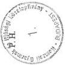

Budapest, 1999. augusztus 30.

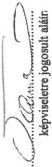

2

---

6. sz. tanúsítvány

# Nemzeti Gyermek és Ifjúsági Közalapítvány

pénzügyi tervei és teljesítései

Adatok: M Ft-ban

|  Sor- Sz. | Megnevezés | 1995. év |   | 1996. év |   | 1997. év |   | 1998. év |   | 1999. év  |   |
| --- | --- | --- | --- | --- | --- | --- | --- | --- | --- | --- | --- |
|   |   |  Terv | Tény | Terv | Tény | Terv | Tény | Terv | Tény | Terv | VI. 30-ig  |
|  1. | Előző évi pénzmaradvány |  |  | - |  | 5,0 |  | 5,0 | 468,8 | 72,6 | 76,4  |
|  1/a | Hitel |  |  |  |  |  |  |  |  |  | 25,9  |
|  2. | Tevékenység célja szerinti bevételek |  |  | 219,5 |  | 212,6 |  | 1242,1 | 1.244,3 | 458,4 | 98,5  |
|  3. | Vállalkozási tevékenység bevételei |  |  | 49,9 |  | 103,4 |  | 308,4 | 136,9 | 7,0 | 4,2  |
|  4. | Források összesen (1.+2.+3. sor) |  |  | 269,4 |  | 321,0 |  | 1555,5 | 1.850,0 | 538,0 | 205,0  |
|  5. | Közalapítványi célú kiadások |  |  | 106,1 |  | 125,4 |  | 184,6 | 209,1 | 223,9 | 63,0  |
|  6. | Működési kiadások |  |  | 114,1 |  | 156,2 |  | 255,9 | 207,9 | 239,0 | 36,8  |
|  7. | Vállalkozási célú kiadások |  |  | 30,6 |  | 39,4 |  | 137,0 | 105,4 | - | 4,4  |
|  8. | Beruházások |  |  | 18,6 |  | - |  | 978,0 | 1119,2 | 75,1 | 77,0  |
|  9. | Egyéb kiadások |  |  |  |  |  |  |  | 132,0 |  |   |
|  9. | Kiadások összesen (5.+6.+7.+8. sor) |  |  | 269,4 |  | 321,0 |  | 1555,5 | 1773,6 | 538,0 | 181,2  |
|  10. | Pénzmaradvány (4.-9. sor) |  |  | - |  | - |  | - | 76,4 |  | 23,8  |

Alulírott az 1989. évi XXXVIII. törvény 24. § c. pontja alapján aláírásommal kijelentem, hogy a feltüntetett adatok teljesek és a közalapítvány nyilvántartásaival, okmányaival mindenben egyeznek.

Budapest, 1999.augusztus 30.

Az 1995.évi pénzügyi terv, valamint az 1995,1996,1997. évi teljesítések adatai nem állnak rendelkezésre.

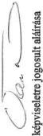

---

7. sz. tanúsítvány

Nemzeti Gyermek és Ifjúsági Közalapítvány
személyi jellegű kifizetései

|  Sor-sz. | Megnevezés | 1995. év |   | 1996. év |   | 1997. év |   | 1998. év |   | 1999. VI. 30.  |   |
| --- | --- | --- | --- | --- | --- | --- | --- | --- | --- | --- | --- |
|   |   |  Fő | E Ft | Fő | E Ft | Fő | E Ft | Fő | E Ft | Fő | E Ft  |
|  1. | Kuratóriumi tagok tiszteletdíja |  |  | 10 | 4.695 | 12 | 4.410 | 11 | 3.276 | 11 | 680  |
|  2. | Kuratóriumi tagok költségtérítése |  |  |  | 3.930 |  | 4.176 | 11 | 8.290 | 11 | 3.168  |
|  2.1. | ebből: személyi jellegű kifizetésként elszámolt |  |  |  |  |  |  |  | 5.949 |  | 2.549  |
|  2.2. | egyéb költségként elszámolt |  |  |  |  |  |  |  | 2.341 |  | 619  |
|  3. | FB tagok tiszteletdíja |  |  | 4 | 1.890 | 4 | 1.620 | 4 | 936 | 2 | 100  |
|  4. | FB tagok költségtérítése |  |  |  | 1.680 |  | 1.440 | 3 | 2.362 | 3 | 330  |
|  4.1. | ebből: személyi jellegű kifizetésként elszámolt |  |  |  |  |  |  |  | 1.788 |  | 330  |
|  4.2. | egyéb költségként elszámolt |  |  |  |  |  |  |  | 574 |  |   |
|  5. | Összesen (1.+2.+3.+4. sor) |  |  | 14 | 12.195 | 16 | 11.646 | 15 | 14.864 | 13 | 4.278  |
|  6. | Teljes munkaidőben foglalkoztatottak bére |  |  | 70 | 31.374 | 31 | 39.294 | 42 | 39.289 | 28 | 15.841  |
|  7. | Rész munkaidőben foglalkoztatottak bére |  |  | 9 | 2.817 | 3 | 5.140 | 1 | 1.087 | 1 | 309  |
|  8. | Összesen (6.+7. Sor) |  |  | 79 | 34.191 | 34 | 44.434 | 43 | 40.376 | 29 | 16.150  |
|  9. | Szerzői jogvédős díjak /szellemi/ |  |  |  | 1.226 |  | 127 |  | 0 |  |   |
|  10. | Állományon kívüli díjak összesen |  |  |  | 3.325 |  | 5.934 |  | 4.661 |  | 4.029  |
|  11. | Összesen (9.+10. sor) |  |  |  | 4.551 |  | 6.061 |  | 4.661 |  | 4.029  |
|  12. | Mindösszesen(5.+8.+11. sor) |  |  | 93 | 50.937 | 50 | 62.141 | 58 | 59.901 | 42 | 24.457  |
|  13. | Személyi jellegű kifizetések közterhei |  |  |  | 17.206 |  | 24.014 |  | 21.419 |  | 7.628  |

Alulírott az 1989. évi XXXVIII. törvény 24. § c. pontja alapján aláírásommal kijelentem, hogy a feltüntetett adatok teljesek és a közalapítvány nyilvántartásaival, okmányaival mindenben egyeznek.

képviseletre jogosult aláírása

P. H.

Budapest, 1999. augusztus 30.

---

8. sz. tanúsítvány

Nemzeti Gyermek és Ifjúsági Közalapítvány
a 93/1995. (VIII. 8.) Korm. rendelettel módosított alapító okirat melléklete szerint
a közalapítvány tulajdonába adott 26 db ingatlan változásai

Adatok M Ft-ban

|  Sor sz. | Az ingatlan neve és címe | Helyraj- zi száma | 1995. 01. 01-i nyilvántartási értéke | Változás* |   |   | 1999. VI. 30-i nyilvántartási értéke  |
| --- | --- | --- | --- | --- | --- | --- | --- |
|   |   |   |   |  időpontja | jogcíme | Összege  |   |
|  1. | Ifjúsági Központ 6200 KISKÖRÖS Liget tér 10 | 3106 | 19,7 | 95.12.31. | Értékcsökkenés | -0,2 |   |
|   |  |  |  | 97.12.31. | Könyvelés helyesbítése | -11,2 |   |
|   |  |  |  | 97.12.31. | Értékelés | +15,7 |   |
|   |  |  |  | 97.12.31. | Értékcsökkenés | -0,2 |   |
|   |  |  |  | 98.02.27. | Értékelés | -15,7 |   |
|   |  |  |  | 98.02.27. | Értékesítés | -8,1 | 0  |
|  2. | Üdülőház 6336 Mártély Tiszapart | 15326 | 2,8 | 95.12.31. | Értékelés | +0,3 |   |
|   |  |  |  | 97.12.31. | Könyvelés helyesbítése | -2,3 |   |
|   |  |  |  | 96.08.08. | Értékelés | -0,3 |   |
|   |  |  |  | 96.08.08. | Értékesítés | -0,5 | 0  |
|  3. | Üdülőtelep 2890 Tata Boróka u. 8. | 4127/2 | 4,0 | 95. | Értékesítés | -4,0 | 0  |
|  4. | Ifj Műv. Egy. Székház 1074 Bp Rottenbiller u. 16-22. | B 33576 B 33578 B 33579 | 320,0 | 97.12.31. | Könyvelés helyesbítése | -320,0 |   |
|   |  |  |  | 97.12.31. | Értékelés | +251,0 |   |

---

8. számú tanúsítvány 2. lap

|   |  |  |  | 98.06.19. | Apport | -251,0 | 0  |
| --- | --- | --- | --- | --- | --- | --- | --- |
|  5. | Üdülő 8229 Csopak Füredi u. 34. | 2046 2047 | 71,1 | 95.12.31. | Értékcsökkenés | -0,7 |   |
|   |  |  |  | 95.12.31. | Értékelés | +53,6 |   |
|   |  |  |  | 97.12.31 | Könyvelés helyesbítése | -0,2 |   |
|   |  |  |  | 97.02.13. | Értékcsökkenés | -0,8 |   |
|   |  |  |  | 97.02.13. | Értékesítés | -69,4 |   |
|   |  |  |  | 97.02.13. | Értékelés | -53,6 | 0  |
|  6. | Szálloda 8253 Révfülöp Halász u. 37. | 1179/2 | 149,0 | 95.12.31 | Értékcsökkenés | -1,6 |   |
|   |  |  |  | 95.12.31. | Értékelés | +79,0 |   |
|   |  |  |  | 97.12.31. | Értékcsökkenés | -3,3 |   |
|   |  |  |  | 97.12.31. | Könyvelés helyesbítése | -56,3 |   |
|   |  |  |  | 98.06.19. | Értékcsökkenés | -0,8 |   |
|   |  |  |  | 98.06.19. | Apport | -87,0 |   |
|   |  |  |  | 98.06.19. | Értékelés | -79,0 | 0  |
|  7. | Ifjúsági Tábor 4150 Püspökladány Farkassziget | 861/1 | 5,6 | 95.12.31. | Értékcsökkenés | -0,1 |   |
|   |  |  |  | 95.12.31. | Értékelés | +7,7 | 7,7  |
|   |  |  |  | 97.12.31. | Könyvelés helyesbítése | -0,1 |   |
|   |  |  |  | 97.12.31. | Értékcsökkenés | -0,8 |   |

2

---

8. számú tanúsítvány 3. lap

|   |  |  |  | 98.12.31. | Értékcsökkenés | -0,4 | 4,2  |
| --- | --- | --- | --- | --- | --- | --- | --- |
|  8. | Ifjúsági Tábor 9062 Vének | 74 | 10,2 | 95.12.31. | Értékcsökkenés | -0,2 |   |
|   |  |  |  | 95.12.31. | Beruházás | +0,1 |   |
|   |  |  |  | 95.12.31. | Értékelés | +2,9 | 2,9  |
|   |  |  |  | 97.12.31. | Értékcsökkenés | -1,5 |   |
|   |  |  |  | 98.12.31. | Értékcsökkenés | -0,7 | 8,9  |
|  9. | Mintafarm Létavértes | 1025/19 | 4,7 | 95.12.31. | Beruházás | +6,5 |   |
|   |  |  |  | 95.12.31. | Értékcsökkenés | -0,1 |   |
|   |  |  |  | 95.12.31. | Értékelés | +5,5 |   |
|   |  |  |  | 96.12.31. | Beruházás | +0,9 |   |
|   |  |  |  | 97.12.31. | Könyvelés helyesbítése | -0,8 |   |
|   |  |  |  | 97.12.31. | Értékcsökkenés | -0,3 |   |
|   |  |  |  | 98.06.19. | Értékcsökkenés | -0,1 |   |
|   |  |  |  | 98.06.19. | Apport | -10,8 |   |
|   |  |  |  | 98.06.19. | Értékelés | -5,5 | 0  |
|  10. | Továbbképző Intézet Novákpuszta Kastély | 1103/9 1104 1106 | 32,5 | 95.12.31. | Értékcsökkenés | -0,5 |   |
|   |  |  |  | 95.12.31. | Értékelés | +16,6 |   |
|   |  |  |  | 97.12.31. | Könyvelés helyesbítése | -13,6 |   |

3

---

8. számú tanúsítvány 4. lap

|   |  |  |  | 97.12.31. | Beruházás | +0,2 |   |
| --- | --- | --- | --- | --- | --- | --- | --- |
|   |  |  |  | 97.12.31. | Értékcsökkenés | -0,4 |   |
|   |  |  |  | 98.06.02. | Értékcsökkenés | -0,1 |   |
|   |  |  |  | 98.06.02. | Értékesítés | -18,1 |   |
|   |  |  |  | 98.06.02. | Értékelés | -16,6 | 0  |
|  11. | Irodák 9022 Győr Szent István u. 51. | 6605 | 30,4 | 95.12.31. | Értékcsökkenés | -0,3 |   |
|   |  |  |  | 95.12.31. | Értékelés | +25,0 |   |
|   |  |  |  | 97.12.31. | Könyvelés helyesbítése | -30,1 |   |
|   |  |  |  | 98.06.19. | Értékelés | -25,0 | 0  |
|  12. | Bánvölgyi Ifjúsági Tábor 3643 Dédestapolcsány | 0164 | 30,7 | 95.12.31. | Értékcsökkenés | -0,3 |   |
|   |  |  |  | 95.12.31. | Értékelés | +21,8 |   |
|   |  |  |  | 97.12.31. | Könyvelés helyesbítése | -18,2 |   |
|   |  |  |  | 97.12.01. | Értékcsökkenés | -1,9 |   |
|   |  |  |  | 97.12.01. | Vagyonvesztés | -10,3 |   |
|   |  |  |  | 97.12.01. | Értékelés | -21,8 |   |
|  13. | Hotel Aranypart 9026 Győr Áldozat u. 12. | 10721 10722 | 228,9 | 95.12.31. | Beruházás | +70,7 |   |
|   |  |  |  | 95.12.31. | Értékcsökkenés | -2,5 |   |
|   |  |  |  | 95.12.31. | Értékelés | +150,0 |   |

4

---

8. számú tanúsítvány 5. lap

|   |  |  |  | 97.12.31. | Könyvelés helyesbítése | -191,1 |   |
| --- | --- | --- | --- | --- | --- | --- | --- |
|   |  |  |  | 97.12.31. | Értékcsökkenés | -2,2 |   |
|   |  |  |  | 98.06.19. | Értékcsökkenés | -0,5 |   |
|   |  |  |  | 98.06.19. | Értékesítés | -103,3 |   |
|   |  |  |  | 98.06.19. | Értékelés | -150,0 | 0  |
|  14. | Ifjúsági Centrum 4028 Debrecen Simonyi u. 14. | 20936 | 89,4 | 95.12.31. | Beruházás | +0,4 |   |
|   |  |  |  | 95.12.31. | Értékcsökkenés | -0,8 |   |
|   |  |  |  | 95.12.31. | Értékelés | +99,4 |   |
|   |  |  |  | 97.12.31. | Könyvelés helyesbítése | -86,4 |   |
|   |  |  |  | 97.12.31. | Értékcsökkenés | -0,1 |   |
|   |  |  |  | 98.06.19. | Apport | -2,5 |   |
|   |  |  |  | 98.06.19. | Értékelés | -99,4 | 0  |
|  15. | Ifjúsági Ház 1183 Bp Gyöngyvirág u.10. | 155296 | 39,5 | 95.12.31. | Értékcsökkenés | -0,2 |   |
|   |  |  |  | 95.12.31. | Értékelés | +31,7 |   |
|   |  |  |  | 97.12.31. | Könyvelés helyesbítése | -37,0 |   |
|   |  |  |  | 97.09.15. | Értékesítés | -2,3 |   |
|   |  |  |  | 97.09.15. | Értékelés | -31,7 | 0  |
|  16. | Székház 4060 Balmazújváros Batthyányi u. 12. | 781 | 5,9 | 95.12.31. | Értékcsökkenés | -0,1 |   |
|   |  |  |  | 95.12.31. | Értékelés | +3,1 |   |

5

---

# 8. számú tanúsítvány 6. lap

|   |  |  |  | 97.12.31. | Könyvelés helyesbítése | -1,2 |   |
| --- | --- | --- | --- | --- | --- | --- | --- |
|   |  |  |  | 97.04.25. | Értékcsökkenés | -0,1 |   |
|   |  |  |  | 97.04.25. | Értékesítés | -4,5 |   |
|   |  |  |  | 97.04.25. | Értékelés | -3,01 | 0  |
|  17. | Üdölő 8636 Balatonszemes Tompa u. 9. | 1423 | 7,6 | 95.12.31. | Értékcsökkenés | -0,1 |   |
|   |  |  |  | 95.12.31. | Értékelés | +6,2 |   |
|   |  |  |  | 97.12.31. | Könyvelés helyesbítése | -5,8 |   |
|   |  |  |  | 97.10.01. | Értékesítés | -1,7 |   |
|   |  |  |  | 97.10.01. | Értékelés | -6,2 | 0  |
|  18. | Üdölő 8636 Balatonszemes Tompa u. 12. | 1426 | 5,3 | 95.12.31. | Értékelés | +5,0 |   |
|   |  |  |  | 97.12.31. | Könyvelés helyesbítése | -4,0 |   |
|   |  |  |  | 97.10.15. | Értékesítés | -1,3 |   |
|   |  |  |  | 97.10.15. | Értékelés | -5,0 | 0  |
|  19. | Üdülőház 5540 Szarvas Mongolzug | 719 | 19,6 | 95.12.31. | Értékcsökkenés | -0,2 |   |
|   |  |  |  | 95.12.31. | Értékelés | +9,6 |   |
|   |  |  |  | 97.12.31. | Könyvelés helyesbítése | -16,0 |   |
|   |  |  |  | 97.12.31. | Értékcsökkenés | -0,1 |   |
|   |  |  |  | 98.06.19. | Apport | -3,3 |   |
|   |  |  |  | 98.06.19. | Értékelés | -9,6 | 0  |

6

---

8. számú tanúsítvány 7. lap

|  20. | Ifjúsági Központ 3324 Felsőtárkány ifjúság u. 1. | 1502/5 | 344,5 | 95.12.31. | Értékcsökkenés | -2,9  |
| --- | --- | --- | --- | --- | --- | --- |
|   |  |  |  | 95.12.31. | Értékelés | +133,4  |
|   |  |  |  | 97.12.31. | Könyvelés helyesbítése | -335,3  |
|   |  |  |  | 97.12.31. | Értékcsökkenés | -0,2  |
|   |  |  |  | 98.06.19. | Értékcsökkenés | -0,1  |
|   |  |  |  | 98.06.19. | Apport | -0,6  |
|   |  |  |  | 98.06.19. | Értékelés | -133,4  |
|  21. | Hotel Kikötő 2133 Sződliget Dunagát | 1220/3 1218/1 | 320,6 | 95.12.31. | Értékcsökkenés | -6,2  |
|   |  |  |  | 95.12.31. | Értékelés | +82,0  |
|   |  |  |  | 97.12.31. | Könyvelés helyesbítése | -244,4  |
|   |  |  |  | 97.02.13. | Értékcsökkenés | -0,8  |
|   |  |  |  | 97.02.13. | Értékesítés | -69,2  |
|   |  |  |  | 97.02.13. | Értékelés | -82,0  |
|  22. | Székház 5350 Tiszafüred Szőlős u. 4. | 2983 | 3,6 | 95.12.31. | Értékelés | +3,0  |
|   |  |  |  | 97.12.31. | Könyvelés helyesbítése | -2,7  |
|   |  |  |  | 97.07.24. | Értékesítés | -0,9  |
|   |  |  |  | 97.07.24. | Értékelés | -0,3  |
|  23. | Ifjúsági Tábor, Istálló 8418 Bakonyoszlop |  | 50,7 | 95.12.31. | Értékcsökkenés | -0,8  |

7

---

8. számú tanúsítvány 8. lap

|   |  |  |  | 95.12.31. | értékelés | +46,1 | 46,1  |
| --- | --- | --- | --- | --- | --- | --- | --- |
|   |  |  |  | 97.12.31. | Könyvelés helyesbítése | -37,0 |   |
|   |  |  |  | 97.12.31. | értékcsökkenés | -0,2 |   |
|   |  |  |  | 98.12.31. | beruházás | +199,2 |   |
|   |  |  |  | 98.12.31. | értékcsökkenés | -3,1 |   |
|   |  |  |  | 99.01.29 | aktiválás | +240,9 | 449,7  |
|  24. | Ifjúsági Tábor Földsziget Kossuth tér 1. | 3320 3321 | 2,3 | 95.12.31. | értékelés | +7,2 |   |
|   |  |  |  | 97.12.31. | Könyvelés helyesbítése | +0,4 |   |
|   |  |  |  | 97.12.31. | értékcsökkenés | -0,1 |   |
|   |  |  |  | 98.06.19. | apport | -2,6 |   |
|   |  |  |  | 98.06.19. | értékelés | -7,2 | 0  |
|  25. | Föld Sopron Brennbergbánya | 0718/2 | 0,5 | 95.12.31. | értékelés | -0,5 | 0,5  |
|   |  |  |  | 97.12.31. | Könyvelés helyesbítése | -0,5 |   |
|  26. | Avar Szálloda Velem Petőfi u. 16. | 384 | - | 97.12.31. | Érték nélküli átadás | +28,0 |   |
|   |  |  |  | 97.12.31. | értékcsökkenés | -1,2 |   |
|   |  |  |  | 98.06.19. | értékcsökkenés | -0,3 |   |
|   |  |  |  | 98.06.19. | apport | -26,5 | 0  |
|  27. | Amerikai úti Székház 1145 BP amerikai út 96. |  | 386,3 | 95.12.31. | helyesbítés | +1,3 |   |

8

---

8. számú tanúsítvány 9. lap

|   |  |  | 95.12.31. | értékcsökkenés | -2,0 |   |
| --- | --- | --- | --- | --- | --- | --- |
|   |  |  | 95.12.31. | értékelés | +209,3 |   |
|   |  |  | 97.12.31. | Könyvelés helyesbítése | -366,9 |   |
|   |  |  | 97.12.31. | aktíválás | +1,0 |   |
|   |  |  | 97.12.31. | értékcsökkenés | -0,5 |   |
|   |  |  | 98.06.19. | értékcsökkenés | -0,2 |   |
|   |  |  | 98.06.19. | apport | -19,0 |   |
|   |  |  | 98.06.19. | értékelés | -209,3 | 0  |
|   | **Összesen** |  | **2.185,4** |  |  | **520,0**  |

* Ha egy ingatlanhoz a vizsgált időszakon belül több változás kapcsolódott, a változásokat külön-külön soron kérjük szerepeltetni.

Alulírott az 1989. évi XXXVIII. törvény 24. § c. pontja alapján aláírásommal kijelentem, hogy a feltüntetett adatok teljesek és a közalapítvány nyilvántartásaival, okmányaival mindenben egyeznek.

Az Amerikai úti ingatlan kimaradt az alapító okiratból!

Budapest, 1999. augusztus 30.

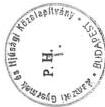

képviselőre jogosult aláírása

9

---

8./a sz. tanúsítvány

Kiegészítés a 8.sz.tanúsítványhoz

Nemzeti Gyermek és Ifjúsági Közalapítvány

|  Sor Sz. | Az ingatlan neve és címe | Helyrajzi száma | 1995. 01. 01-i nyilvántartási értéke | Változás* |   |   | 1999. VI. 30-i nyilvántartási értéke  |
| --- | --- | --- | --- | --- | --- | --- | --- |
|   |   |   |   |  időpontja | jogcíme | Összege  |   |
|  1. | Abádszalóki telek, közművek |  |  | 1997 | beszerzés | 213,3 |   |
|   |  |  |  | 1997 | értékesítés | -0,3 |   |
|   |  |  |  | 1998 | aktiválás | +64,5 |   |
|   |  |  |  | 1998 | értékesítés | -4,2 |   |
|   |  |  |  | 1998 | értékcsökkenés | -5,4 |   |
|   |  |  |  | 1998 | APPORT | 43,6 | 224,3  |
|  2. | Balassagyarmat-Nyíres |  |  | 1997 | vásárlás | 7,7 |   |
|   |  |  |  | 1997 | értékcsökkenés | -0,3 |   |
|   |  |  |  | 1998 | aktiválás | 350,1 | 367,5  |
|  3. | Nyíregyháza |  |  | 1998 | aktiválás | 654,3 | 654,3  |
|  4. | Kőszeg |  |  | 1998.02.09 | adomány | 7,1 |   |
|   |  |  |  | 98.06.19 | APPORT | -7,1 | 0  |
|  5. | Tatabánya |  |  | 1998. | Hitel fejében kapott | 47,9 |   |
|   |  |  |  | 1998 | Értékesítés | -47,9 | 0  |
|  6. | Siófok |  |  | 1998.02.09 | Adomány | 5,2 |   |
|   |  |  |  | 1998.06.19 | APPORT | -5,2 | 0  |

---

8/a. számú tanúsítvány 2.lap

|  7. | Zamárdi |  |  | 1998.02.09 | Adomány | 5,4 |   |
| --- | --- | --- | --- | --- | --- | --- | --- |
|   |  |  |  | 1998.06.19 | APPORT | -5,4 | 0  |
|   | Összesen |  |  |  |  |  | 1246,1  |

Alulírott az 1989. évi XXXVIII. törvény 24. § c. pontja alapján aláírásommal kijelentem, hogy a feltüntetett adatok teljesek és a közalapítvány nyilvántartásaival, okmányaival mindenben egyeznek.

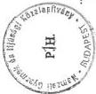

Budapest, 1999.augusztus 30.

2

---

9. sz. tanúsítvány

# Nemzeti Gyermek és Ifjúsági Közalapítvány

# ingatlan állománya

Adatok: M Ft-ban

|  Sor-sz. | Megnevezés | 1995. év | 1996. év | 1997. év | 1998. év | 1999. VI. 30.  |
| --- | --- | --- | --- | --- | --- | --- |
|  1. | Nyitóállomány | 2.185,4 | 2.240,4 | 2.241,4 | 542,9 | 1.468,0  |
|  2. | Növekedések (3.+4.+5.+6.+7. sor) | 78,9 | 1,0 | 256,5 | 1.344,1 | 240,9  |
|  3. | Beszerzés, beruházás | 78,9 | 1,0 | 228,5 | 1.326,4 | 240,9  |
|  4. | Felújítás |  |  |  |  |   |
|  5. | Apportálás |  |  |  |  |   |
|  6. | Térítés nélküli átvétel |  |  | 28,0 | 17,7 |   |
|  7. | Egyéb növekedés |  |  |  |  |   |
|  8. | Csökkenések (9.+10.+11.+12.+13.+14.+15. sor) | 23,9 | - | 1.955,0 | 419,0 |   |
|  9. | Selejtezés |  |  |  |  |   |
|  10. | Értékesítés | 4 |  | 150,1 | 181,7 |   |
|  11. | Apportálás |  |  |  | 219,1 |   |
|  12. | Átértékelés |  |  | 1.779,9 |  |   |
|  13. | Térítés nélküli átadás |  |  |  | 6,3 |   |
|  14. | Egyéb csökkenés |  |  | 10,2 |  |   |
|  15. | Tárgyévi értékcsökkenés | 19,9 |  | 14,8 | 11,9 |   |
|  16. | Záróállomány (1.+2.-8. sor) | 2.240,4 | 2.241,4 | 542,9 | 1.468,0 | 1.708,9  |

Alulírott az 1989. évi XXXVIII. törvény 24. § c. pontja alapján aláírásommal kijelentem, hogy a feltüntetett adatok teljesek és a közalapítvány nyilvántartásaival, okmányaival mindenben egyeznek.

Az ingatlanok értékhelyesbítését a táblázat nem tartalmazza.

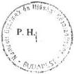

Budapest, 1999.augusztus 30.

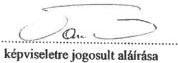

---

10. sz. tanúsítvány

# Nemzeti Gyermek és Ifjúsági Közalapítvány

# beruházásai és karbantartásai

Adatok: M Ft-ban

|  Sor sz. | Megnevezés | 1995. év | 1996. év | 1997. év | 1998. év | 1999. VI. 30. | Összesen  |
| --- | --- | --- | --- | --- | --- | --- | --- |
|  1. | Aktivált beruházások (2.+3. sor) | 83,6 | 2,3 | 231,6 | 1.328,7 | 241,4 | 1.887,6  |
|  2. | Ebből: ingatlanok | 78,9 | 1,0 | 228,5 | 1.326,4 | 240,9 | 1.875,7  |
|  3. | egyéb tárgyi eszközök | 4,7 | 1,3 | 3,1 | 2,3 | 0,5 | 11,9  |
|  4. | Befejezetlen beruházások (5.+6. sor) | - | - | 134,7 | 274,8 | 48,8 | 458,3  |
|  5. | Ebből: ingatlanok | - | - | 134,7 | 274,8 | 48,2 | 457,7  |
|  6. | egyéb tárgyi eszközök | - | - | - | - | 0,6 | 0,6  |
|  7. | Karbantartások, állagmegóvó javítások (8.+9. sor) | 1,5 | 11,4 | 3,7 | 6,9 |  | 23,5  |
|  8. | Ebből: ingatlanok | 1,4 | 10,4 |  | 6,1 |  | 17,9  |
|  9. | egyéb tárgyi eszközök | 0,1 | 1,0 | 3,7 | 0,8 |  | 5,6  |
|  10. | Összesen (1.+4.+7. sor) | 85,1 | 13,7 | 370,0 | 1.610,4 | 290,2 | 2369,4  |

Alulírott az 1989. évi XXXVIII. törvény 24. § c. pontja alapján aláírásommal kijelentem, hogy a feltüntetett adatok teljesek és a közalapítvány nyilvántartásaival, okmányaival mindenben egyeznek.

Budapest, 1999.augusztus 30.

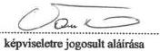

---

11. sz. tanúsítva

Nemzeti Gyermek és Ifjúsági Közalapítvány

1995. I. 1. - 1999. VI. 30. közötti ingatlan értékesítés

Adatok: M Ft-ban

|  Sor sz. | Értékesített ingatlanok megnevezése | Tulajdoni lap száma | Értékesítés időpontja | Birtokba adás idő- pontja | Értékesítéskor nyilvántartási értéke | Értékhe- lyesbítés összege | Nyilvántartási érték és érték- helyesbítés együttes összege | Eladási ára | Befolyt el- lenérték (ÁFA nél- kül) | Pénzügyi tel- jesítés idő- pontja | Vételár hátralék (1999. VI. 30-i álla- pot)  |
| --- | --- | --- | --- | --- | --- | --- | --- | --- | --- | --- | --- |
|  1. | Üdülőtelep Tata |  | 1995. | 90.08.10. | 4,0 | - | 4,0 | 2,6 | 2,6 | 1995 |   |
|  2. | Üdülőház Mártély |  | 96.06.08. | 90.05.10. | 0,5 | 0,3 | 0,8 | 0,8 | 0,8 | 96.09.02. |   |
|  3. | Üdülő Csopak |  | 97.02.13. | 93.03.01. vásárlás | 69,4 | -10,3 | 59,1 | 60,0 | 60,0 | 1997 | Kompenzálás  |
|  4. | Ifjúsági Ház Bp. Gyöngyvirág u. |  | 97.09.15. | 90.08.03. | 2,3 | 31,7 | 34,0 | 33,0 | 16,0 1,0 16,0 | 97.01.01. 96.09.02 96.10.30 |   |
|  5. | Székház Balmazújváros |  | 1997 | 1990 | 4,5 | 3,1 | 7,6 | 7,7 | 3,0 1,5 1,0 2,2 | 1997 98.03.30 98.08.07 98.12.23. |   |
|  6. | Üdülő Balatonszemes Tompa u.9 |  | 97.07.23. | 90.08.03. | 1,7 | 6,1 | 7,8 | 6,1 | 3,0 3,1 | 97.07.24. 97.09.30. |   |
|  7. | Üdülő Balatonszemes Tompa u. 12. | 1426 | 97.10. | 90.08.03. | 1,3 | 4,9 | 6,2 | 4,0 | 4,0 | 97.10.15. |   |

---

11. számú tanúsítvány 2.lap

|  8. | Hotel Kikötő Sződliget |  | 97.02.13. |  | 69,2 | 82,0 | 151,2 | 203,6 | 203,6 | 1997 | Kompenzálás  |
| --- | --- | --- | --- | --- | --- | --- | --- | --- | --- | --- | --- |
|  9. | Székház Tiszafüred |  | 97.09.17. | 90.05.30. | 0,9 | 2,9 | 3,8 | 3,8 | 1,0 | 97.06.23. |   |
|   |  |  |  |  |  |  |  |  | 2,8 | 97.07.24. |   |
|  10. | Abádszalók telkek |  | 1997. |  | 0,3 | - | 0,3 | 6,6 | 6,6 | 97.12.31 | Kompenzálás  |
|   |  |  | 1998. |  | 4,2 | - | 4,2 | 52,9 | 52,9 | 1998 | Kompenzálás  |
|  11. | Ifjúsági Központ Kiskőrös |  | 1998. | 90.10.20. | 8,1 | 15,7 | 23,8 | 10,0 | 10,0 | 98.03.16. |   |
|  12. | Tatabánya |  | 1998. |  | 47,9 |  | 47,9 | 0,8 | 0,7 | 98.05.14. | 47,9 MFt tartozás fejében kaptuk az ingatlant, /,8 MFt-ért tudtuk eladni/  |
|   |  |  |  |  |  |  |  |  | 0,1 | 98.10.13. |   |
|  13. | Kastélyszálló Novákpuszta |  | 98.06.02 | 90.11.08. | 18,1 | 16,6 | 34,7 | 50,0 | 45,0 | 98.08.13. |   |
|   |  |  |  |  |  |  |  |  | 5,0 | 98.10.27. |   |
|  14. | Hotel Aranypart Győr |  | 1998. | 90.11.08. | 103,4 | 150,0 | 253,4 | 110,0 | 59,0 | 98.07.15. | 07.21 továbbutalva CCA-nak  |
|   |  |  |  |  |  |  |  |  | 1,0 | 98.06.08 | közvetlenül CCA-nak  |
|   |  |  |  |  |  |  |  |  | 50,0 | 1998 |   |
|  15 | Amerikai u. 96 |  | 98.07.01 | 1990. |  |  |  | 50,0 | 50,0 | 1998. | Kompenzálást  |

Alulírott az 1989. évi XXXVIII. törvény 24. § c. pontja alapján aláírásommal kijelentem, hogy a feltüntetett adatok teljesek és a közalapítvány nyilvántartásaival,

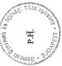

okmányaival mindenben egyeznek

Budapest, 1999.augusztus 30.

képviseletre jogosult aláírása

2

---

12. sz. tanúsítva

Nemzeti Gyermek és Ifjúsági Közalapítvány

1995. I. 1. - 1999. VI. 30. közötti ingatlan apportálásai

Adatok: M Ft-ban

|  Sor-sz. | Apportált ingatlanok megnevezése | Tulajdoni lap száma | Apportálás időpontja | Apportba vevő neve | Apportáláskor nyilvántartási értéke | Értékhelyesbítés összege | Nyilvántartási érték és értékhelyesbítés együttes összege | Apport értéke  |
| --- | --- | --- | --- | --- | --- | --- | --- | --- |
|  1. | Ifj. Műv. Egy. Székház Rottenbiller u. |  | 98.06.19. | Talent Kft | 0 | 251,0 | 251,0 | 251,0  |
|  2. | Szálloda Révfülöp |  | 98.06.19. | " | 87,0 | 79,0 | 166,0 | 170,0  |
|  3. | Mintafarm Létavértes |  | 98.06.19. | " | 10,8 | 7,2 | 18,0 | 13,0  |
|  4. | Irodaház Győr |  | 98.06.19. | " | - | 25,0 | 25,0 | 25,0  |
|  5. | Ifj. Centrum Debrecen |  | 98.06.19. | " | 2,6 | 99,4 | 102,0 | 99,0  |
|  6. | Üdülőház Szarvas |  | 98.06.19. | " | 3,3 | 9,6 | 12,9 | 20,0  |
|  7. | Ifj. Központ Felsőtárkány |  | 98.06.19. | " | 6,0 | 133,7 | 139,7 | 140,0  |
|  8. | Ifjúsági Tábor Földsziget |  | 98.06.19. | " | 2,6 | 7,3 | 9,9 | 10,0  |
|  9. | Avar szálló Velem |  | 98.06.19. | " | 26,5 | - | 26,5 | 79,0  |
|  10. | Székház Amerikai út 96 |  | 98.06.19. | " | 19,0 | 209,3 | 228,3 | 200,0  |
|  11. | Abádszalók telkek |  | 98.06.19. | " | 43,6 | - | 43,6 | 138,6  |
|  12. | Zamárdi István u. 126. | 3436, 3438 |  |  | 5,4 | - | 5,4 | 80,0  |

---

12. számú tanúsítvány 2.lap

|  13. | Kőszeg Úrhajósok u. 2. | 3277 |  |  | 7,1 | - | 7,1 | 70,0  |
| --- | --- | --- | --- | --- | --- | --- | --- | --- |
|  14. | Siófok Erkel F. u. 46. | 7365/1 |  |  | 5,2 | - | 5,2 | 60,0  |
|   | Összesen |  |  |  | 219,1 | 821,5 | 1.040,6 | 1.355,6  |

Alulírott az 1989. évi XXXVIII. törvény 24. § c. pontja alapján aláírásommal kijelentem, hogy a feltüntetett adatok teljesek és a közalapítvány nyilvántartásaival, okmányaival mindenben egyeznek.

Budapest, 1999.augusztus 30.

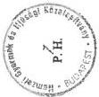

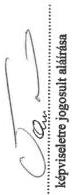

2

---

13. sz. tanúsítvány

# **Talent Szervező Kft.  
eszközei és forrásai**

Adatok: M Ft-ban

|  Sorsz. | Megnevezés | 1996. év | 1997. év | 1998. év  |
| --- | --- | --- | --- | --- |
|  1. A. | Befektetett eszközök (2. + 3. + 4. sor) | 9 | 32 | 1.272  |
|  2. | Immateriális javak | 0 | 4 | 4  |
|  3. | Tárgyi eszközök | 9 | 28 | 1.267  |
|  4. | Befektetett pénzügyi eszközök | 0 | 0 | 1  |
|  5. B. | Forgóeszközök (6. + 7. + 8. + 9. sor) | 7 | 30 | 156  |
|  6. | Készletek | 0 | 2 | 122  |
|  7. | Követelések | 0 | 22 | 32  |
|  8. | Értékpapírok | 0 | 0 | 0  |
|  9. | Pénzeszközök | 6 | 6 | 2  |
|  10. C. | Aktív időbeli elhatások | 0 | 1 | 2  |
|  11. | Eszközök (aktívák) összesen (1. + 5. + 10. sor) | 16 | 63 | 1.430  |
|  12. D. | Saját tőke (13.-14. + 15. + 16. + 17.-18. + 19. sor) | 0 | 17 | 1.327  |
|  13. | Jegyzett tőke | 25 | 43 | 1.399  |
|  14. | Jegyzett, de még be nem fizetett tőke (-) | 0 | 0 | 0  |
|  15. | Tőketartalék | 15 | 0 | 0  |
|  16. | Eredménytartalék | -22 | -25 | -27  |
|  17. | Értékelési tartalék | 0 | 0 | 0  |
|  18. | Előző évek áthozott vesztesége | -12 | 0 | 0  |
|  19. | Mérleg szerinti eredmény | -6 | -2 | -45  |
|  20. E. | Céltartalékok | 0 | 0 | 0  |
|  21. F. | Kötelezettségek (22. + 23. sor) | 17 | 42 | 98  |
|  22. | Hosszú lejáratú kötelezettségek | 0 | 0 | 0  |
|  23. | Rövid lejáratú kötelezettségek | 17 | 42 | 98  |
|  24. G. | Passzív időbeli elhatások | 0 | 5 | 5  |
|  25. | Források (passzívák) összesen (12. + 20. + 21. + 24. sor) | 17 | 63 | 1.430  |

Alulírott az 1989. évi XXXVIII. törvény 24. § c. pontja alapján aláírásommal kijelentem, hogy a feltüntetett adatok teljesek és a közalapítvány nyilvántartásaival, okmányabban nagyeznek.

Budapest, 1999. augusztus 31

**TALENT  
Szervező Kft.** 1145 Bp., Amerikai u. 96.

képviselőre jogosult aláírása

---

14. sz. tanúsítvány

# Talent Szervező Kft. kiemelt adatai

Adatok: M Ft-ban

|  Sor sz. | Megnevezés | 1996. év | 1997. év | 1998. év | 1999. VI. 30.  |
| --- | --- | --- | --- | --- | --- |
|  1. | Árbevétel összesen | 2 | 210 | 313 | -  |
|  2. | Ebből: ingatlan értékesítésből | 0 | 0 | 9 | 130  |
|  3. | ingatlan bérbeadásból | 0 | 0 | 0 | -  |
|  4. | kedvezményes szálláshely értékesítésből | 0 | 78 | 85 | -  |
|  5. | kereskedelmi szálláshely értékesítésből | 0 | 31 | 30 | -  |
|  6. | bau-kontrolling tevékenységből | 0 | 6 | 22 | -  |
|  7. | egyéb forrásból | 2 | 95 | 169 | -  |
|  8. | Költségek, ráfordítások összesen | 9 | 208 | 378 | -  |
|  9. | Ebből: ingatlanok karbantartása, állagmegóvása | 3 | 19 | 18 | -  |
|  10. | egyéb anyagjellegű költségek | 1 | 93 | 183 | -  |
|  11. | ingatlanértékesítés költségei | 0 | 0 | 0 | -  |
|  12. | személyi jellegű kifizetések | 1 | 56 | 89 | -  |
|  13. | marketing-, és reklámköltségek | 0 | 6 | 15 | -  |
|  14. | közüzemi díjak (világítás, fűtés, víz, csatorna stb.) | 0 | 13 | 15 | -  |
|  15. | egyéb költségek és ráfordítások | 4 | 21 | 57 | -  |
|  16. | Beruházás jellegű kifizetések | 6 | 25 | 50 | -  |
|  17. | Ebből: beszerzések | 6 | 25 | 16 | -  |
|  18. | felújítások | 0 | 0 | 31 | -  |
|  19. | pénzügyi befektetések | 0 | 0 | 3 | -  |
|  20. | egyéb kifizetések | - | - | - | -  |
|  21. | Alapító részére teljesített befizetések | 0 | 0 | 0 | 132  |
|  22. | Alapító által fizetett vagyonkezelői díj | 0 | 18 | 16 | 0  |

Alulírott az 1989. évi XXXVIII. törvény 24. § c. pontja alapján aláírásommal kijelentem, hogy a feltüntetett adatok teljesek és a közalapítvány nyilvántartásaival, okmányaival mindenben egyeznek.

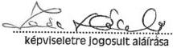

Budapest, 1999.augusztus 31

P. H.
TALENT
Szervező Kft.
1145 Bp., Amerikai u. 96.

---

15. sz. tanúsítvány

Nemzeti Gyermek és Ifjúsági Közalapítvány
pályázati úton nyújtott támogatásai

|  Évek | Pályázat megnevezése | Meghirdetésre került összeg (Ft) | Benyújtott | Elfogadott | Benyúj- tott | Elfogadott | Elnyert összeg * (Ft)  |
| --- | --- | --- | --- | --- | --- | --- | --- |
|   |   |   |  Pályázatok (db) |   | Pályázatok összege (Ft)  |   |   |
|  1995. év |  |  |  |  |  |  |   |
|  |   |   |   |   |   |   |   |
|  Összesen |  |  |  |  |  |  |   |
|  |   |   |   |   |   |   |   |
|  1996. év | Katedra 96/1 |  | 336 | 168 |  | 35.000.000 |   |
|  Összesen |  |  |  |  |  | 35.000.000 |   |
|  |   |   |   |   |   |   |   |
|  1997. év | Katedra 97/1, /2 |  | 259 | 209 |  | 44.097.500 |   |
|   | Párbeszéd 97/1 |  | 19 | 18 |  | 1.455.000 |   |
|  Összesen |  |  |  |  |  | 45.552.500 |   |
|  |   |   |   |   |   |   |   |
|  1998. év | Katedra 98/1, /2 |  | 234 | 228 |  | 69.466.900 |   |
|   | Párbeszéd 98/1 |  | 5 | 4 |  | 170.000 |   |
|  Összesen |  |  |  |  |  | 69.636.900 |   |
|  |   |   |   |   |   |   |   |
|  1999. VI. 30. | Katedra 99/1, /2 |  | 232 | 216 |  | 68.900.000 |   |
|  Összesen |  |  |  |  |  | 68.900.000 |   |
|  |   |   |   |   |   |   |   |
|  Mindösszesen |  |  |  |  |  | 219.089.400 |   |

* Megjegyzés: Az elfogadott pályázatokra a kuratórium által odaítélt összeg.

Alulírott az 1989. évi XXXVIII. törvény 24. § c. pontja alapján aláírásommal kijelentem, hogy a feltüntetett adatok teljesek és a közalapítvány nyilvántartásaival, okmányaival mindenben egyeznek.

Budapest, 1999.augusztus 30

Az ebben a táblázatban szereplő összegeket nem forintban nyerték el a támogatottak, hanem szállásdíj kedvezmény formájában.

képviseletre jogosult aláírása

---

# Nemzeti Gyermek és Ifjúsági Közalapítvány
egyéb pályázati kifizetési (versenyek)

16. sz. tanúsítvány

|  Évek | Pályázat megnevezése | Meghirdetésre került összeg (Ft) | Benyújtott | Díjazott | Kifizetett díj * (Ft)  |
| --- | --- | --- | --- | --- | --- |
|   |   |   |  Pályázatok (db)  |   |   |
|  1995. év |  |  |  |  |   |
|  Összesen |  |  |  |  |   |
|  1996. év | Katedra 96/2 |  | 20 | 20 | 610.000  |
|   | Korosztályi Szakértői Szolgálat |  | 1 | 1 | 3.000  |
|  Összesen |  |  |  |  | 613.000  |
|  1997. év | Ablak 97/1 | 270.000 | 15 | 11 | 270.000  |
|   | Sajtópályázat | 300.000 | 10 | 10 | 300.000  |
|   | Nemzedék 97/1 | 2.200.000 | 32 | 8 | 2.200.000  |
|   | PEP program | 4.900.000 | 35 | 24 | 4.900.000  |
|   | Korosztályi Szakértői Szolgálat |  | 43 | 43 | 1.248.650  |
|  Összesen |  |  |  |  | 8.918.650  |
|  1998. év | Ablak 98/1 | 230.000 | 10 | 10 | 230.000  |
|   | Ablak 98/2 | 57.000 | 1.488 | 19 | 57.000  |
|   | Van már programod? | 4.300.000 | 27 | 10 | 4.300.000  |
|   | Korosztályi Szakértői Szolgálat |  | 37 | 37 | 555.000  |
|  Összesen |  |  |  |  | 5.142.000  |
|  1999. VI. 30. |  |  |  |  |   |
|  Összesen |  |  |  |  |   |
|  Mindösszesen |  |  |  |  | 14.673.650  |

* Megjegyzés: Az elfogadott pályázatokra a kuratórium által odaítélt összeg.

Alulírott az 1989. évi XXXVIII. törvény 24. § c. pontja alapján aláírásommal kijelentem, hogy a feltüntetett adatok teljesek és a közalapítvány nyilvántartásaival, okmányaival mindenben egyeznek.

Budapest, 1999. augusztus 30.

P. 11.

Budapest, 2000. február

képviseletre jogosult aláírása