TSI: 475

Állami Számvevőszék

# JELENTÉS

a kizárólagos állami tulajdon
nyilvántartása helyzetéről

2000. április

0003

---

# Az ellenőrzés végrehajtásáért felelős:

**Halász Gejza**

igazgató

# Az ellenőrzést vezette:

**Karsainé Dömsödi Éva**

osztályvezető számvevő főtanácsos

# Az ellenőrzésben részt vettek:

**Hajkó Andrea**

fogalmazó

**dr. Szemerics Györgyi**

számvevő tanácsos

**Tóthné Kiss Katalin**

számvevő

**Tukacs Éva**

számvevő

**Villányi Antal**

számvevő

# A témához kapcsolódó korábbi ÁSZ vizsgálatok:

# 1996.:

Jelentés a helyi önkormányzatok infrastrukturális fejlesztésére fordított pénzeszközök felhasználásának ellenőrzéséről

Jelentés a Mezőgazdasági Részvénytársaságok gazdálkodásáról az állami vagyonnal

# 1997.:

Jelentés a helyi önkormányzatok ellenőrzési funkciója érvényesülésének tapasztalatairól

Jelentés a Vízügyi Alap működésének pénzügyi-gazdasági ellenőrzéséről

Jelentés a Kincstári Vagyoni Igazgatóság vagyonkezelő és hasznosító tevékenységének vizsgálatáról

# 1998.:

Jelentés a belső ellenőrzés működéséről 1996-97. években kilenc állami tulajdonban lévő részvénytársaságnál (Összefoglaló a Magyar Államvasutak, Magyar Posta, Magyar Távközlési, Antenna Hungária, Szerencsejáték, Volánbusz, Alba Volán, Dél-Pest Megyei Mezőgazdasági, Komáromi Mezőgazdasági Rt-ok ellenőrzése során tett megállapításokról) (9803.)

Jelentéseink az Internet www.asz.gov.hu oldalain is olvashatók.

Jelentéseink az Országgyűlés számítógépes hálózatán is olvashatók.

---

V-7-92/99-00.

# TARTALOMJEGYZÉK

I. ÖSSZEGZŐ MEGÁLLAPÍTÁSOK, KÖVETKEZTETÉSEK, JAVASLATOK 5

JAVASLATOK 11

II. RÉSZLETES MEGÁLLAPÍTÁSOK 15

1.A kizarolagos allami tulajdon jogi szabalyozasa 15
2.A kizarolagos allami tulajdon nyilvantartasa 17

2.1. A vagyonelemek megjelenése a nyilvántartásban 22

2.1.1.Fold mehének kincsei 23
2.1.2. A felszín alatti vizek, a felszín alatti vizek természetes viztartó képzódményei, a folyóvizek és természetes tavak, valamint ezek medre, a folyóviz elhagyott medre és a folyóvizben ujjonnan keletkezzett sziget, barlangok 24
2.1.3.Nyomvonal jellegu vagyonelemek nyilvantartasa 25
2.1.4.Legter 28
2.1.5. Kizarolagos allami tulajdonu muemlekek 28
2.1.6. Altalanos vagyon-nyilvantartasi jellemzok 29

2.2. A vagyonkezelők megjelenése a nyilvántartási rendszerben 30

2.2.1.A MAV Rt. helyzete 30
2.2.2.Az MTA helyzete 31

2.3.A vagyonnyilvantartas teljessege 32
2.4.A nyilvantartasi rendszer egyeb jellemzoi 33

3. Vagyonkezelési szerződések 36

3.1.A vagyonkezelsi szerzodesek altalanos jellemzoi 36
3.2.Kozponti koltsegvetesi szervekkel kottt vagyonkezelsi szerzodesek 38
3.3.A kizarolagos allami tulajdont kezeló tarsasagok vagyonkezelsi szer-zódései 40
3.4.Egyeb vagyonkezlok szerzódése 41

4. A tulajdonosi ellenőrzés 43

4.1.A szabalyozás érvényesülse, a szervezeti feltetelek megteremtése 43
4.2.A tulajdonosi ellenorzs gyakorlata 44
4.3.A tulajdonosi ellenorzs hierarchikus rendszere 47

1

---

### **Alkalmazott rövidítések jegyzéke:**

|  Áht. | az államháztartásról szóló 1992. évi XXXVIII. törvény  |
| --- | --- |
|  kormányrendelet | a kincstári vagyon kezeléséről, értékesítéséről és az e vagyonnal kapcsolatos egyéb kötelezettségekről szóló 183/1996. (XII. 11.) Korm. rendelet  |
|  Ptk. | a Polgári Törvénykönyvről szóló 1959. évi IV. törvény  |
|  Tulajdonosi Ellenőrzési Szabályzat | a kincstári vagyonnal történő gazdálkodás tulajdonosi ellenőrzéséről szóló szabályzat  |
|  Versenyeztetési Szabályzat | a kincstári vagyon vagyonkezelési jogának megszerzésére vonatkozó versenyeztetési szabályzat  |
|  Nyilvántartási Szabályzat | a kincstári vagyon nyilvántartási szabályzata  |

---2

---

# Jelentés

## a kizárólagos állami tulajdon nyilvántartása helyzetéről

Az államháztartási reform keretében a kincstári vagyon hatékonyabb működtetése és az azzal való gazdálkodás érdekében az 1995. évi CV. törvény meghatározta a kincstári vagyonnal való gazdálkodás szabályait, amely 1996. január 1-től lépett hatályba.

Ezzel egyidejűleg a Magyar Államot megillető tulajdonosi jogok gyakorlására, a kincstári vagyonnal kapcsolatos polgári jogi jogviszonyban az állam képviseletére kijelölték a kincstári vagyonért felelős minisztert, és létrejött a Kincstári Vagyoni Igazgatóság (a továbbiakban: KVI).

A kincstári vagyonért való miniszteri felelősség rendjét 1998. október 1-től az 1998. évi XL. törvény módosította, a kincstári vagyon tekintetében a tulajdonosi jogok gyakorlására a pénzügyminiszter helyett „a kincstári vagyonért felelős minisztert” jelölte meg, akinek személye a jelenleg hatályos rendelkezések szerint, az 1118/1998. (IX. 25.) Korm. határozat értelmében a Miniszterelnöki Hivatalt (a továbbiakban: MEH) vezető miniszter.

Az ellenőrzés jogalapja az Áht. 104. § előírása, amely szerint a kincstári vagyonnal felelős módon, rendeltetésszerűen kell gazdálkodni és ezt az Országgyűlés az Állami Számvevőszék útján ellenőrzi. Az ÁSZ 1997-ben átfogó vizsgálat keretében ellenőrizte a KVI vagyonkezelő és hasznosító tevékenységét.

**A vizsgálat célja a kizárólagos állami tulajdonba tartozó vagyonelemek vonatkozásában a KVI-nél összesített és a vagyonkezelőknél vezetett vagyonnyilvántartásának, valamint tulajdonosi ellenőrzésének megítélése.**

Ezek a kincstári vagyonnal való felelős módon, rendeltetésszerűen történő gazdálkodás feltételeinek tevékenység elemei, amelyek keretében:

*a kincstári vagyon egészére nézve:*

- áttekintettük és értékeltük **a vagyonkezelési szerződésre vonatkozó jogi szabályozást**, a szerződések tartalmát;
- összevetettük **a tulajdonosi ellenőrzés szabályozását** és gyakorlatát a vagyonvédelem, -megőrzés, -gyarapítás követelményeivel;

3

---

I. ÖSSZEGZŐ MEGÁLLAPÍTÁSOK, KÖVETKEZTETÉSEK, JAVASLATOK

a kizárólagos állami tulajdonra vonatkozóan:

- elemeztük a kincstári vagyon nyilvántartását, a KVI-nél és az egyes kizárólagos állami tulajdonú vagyonelemek vagyonkezelésével megbízott országos hatáskörű szervezeteknél;
- áttekintettük a kizárólagos állami tulajdon megjelenését a KVI nyilvántartási rendszerében;
- vizsgáltuk a kizárólagos állami tulajdonra megkötött egyes vagyonkezelési szerződéseket.

A vizsgálatot az ellenőrzésbe bevont szervezetek dokumentumainak feldolgozásával, a KVI által rendelkezésünkre bocsátott anyagokból készített elemzésekkel és szakértői interjúk készítésével hajtottuk végre. A dokumentumok a MEH, a minisztériumok és a KVI vonatkozó belső szabályzatai, vagyonkezelési szerződések, nyilvántartásból lekért táblázatok, szakértői anyagok, beszámolók, jegyzőkönyvek, valamint egyéb szakmai anyagok voltak.

Az ellenőrzés a KVI központjára terjedt ki, továbbá a vagyonkezelésbe adás folyamatának áttekintése miatt vizsgálatot folytattunk :

- a Belügyminisztériumban
- a Gazdasági Minisztériumban
- a Honvédelmi Minisztériumban
- az Igazságügyi Minisztériumban
- a Környezetvédelmi Minisztériumban
- a Közlekedési, Hírközlési és Vízügyi Minisztériumban,
- a Miniszterelnöki Hivatalnál,
- a Nemzeti Kulturális Örökség Minisztériumában,
- a Pénzügyminisztériumban,
- a Baranya Megyei Állami Közútkezelő Kht.-nél,
- a Borsod-Abaúj-Zemplén Megyei Állami Közútkezelő Kht.-nél,
- a Bükki Nemzeti Park Igazgatóságnál,
- a Dél-Dunántúli VIZIG-nél,
- az Észak-magyarországi VIZIG-nél.

Adatokat kértünk az állam kizárólagos tulajdonában lévő vagyontárgyak vagyonkezeléséről országos adatgyűjtést végző szervezetektől:

- Országos Vízügyi Főigazgatóság és valamennyi regionális szervezete,
- Útgazdálkodási és Koordinációs Igazgatóság és valamennyi Közútkezelő Közhasznú Társasága,
- Magyar Államvasutak Rt.,
- Magyar Geológiai Szolgálat.

Vizsgálatunk 1996. január 1-től 1999. június 30-ig tartó időszakra terjedt ki.

A vizsgálat és annak megállapításai a kizárólagos állami tulajdont képező vagyoni körre vonatkoznak, amelyek tételes fogalmi meghatározását a mellékletekben közölt táblázatokban részletezzük.

A vizsgálatnak nem volt célja, a kizárólagos állami tulajdon körébe tartozó állami monopóliumnak minősülő tevékenységek részletes ellenőrzése.

4

---

I. ÖSSZEGZŐ MEGÁLLAPÍTÁSOK, KÖVETKEZTETÉSEK, JAVASLATOK

# I. ÖSSZEGZŐ MEGÁLLAPÍTÁSOK, KÖVETKEZTETÉSEK, JAVASLATOK

A rendszerváltást követő jelentős tulajdonosi szerkezetváltozás eredményeként az állami tulajdonú vagyont a törvényalkotó két elkülönített részre osztotta fel: az állam vállalkozói és később az úgynevezett kincstári vagyonára, ezért nem lehet egységes állami vagyonkezelési koncepciót alkotni. A privatizációs folyamatok megindulása szükségessé tette az állam vállalkozói típusú vagyonának vagyonkezelését, vagyongazdálkodását szabályozó jogi keretek meghatározását, amely 1989-től fokozatosan történt meg. Ugyanakkor az állam vállalkozói vagyonához képest 6 év késéssel indult meg az állam kincstári vagyonával való gazdálkodás jogi szabályainak kimunkálása.

Az államháztartásról szóló 1992. évi XXXVIII. törvény 1996. január 1-től hatályos módosítása határozta meg először a kincstári vagyon típusos vagyoncsoportjait, a kincstári vagyonnal való gazdálkodás törvényi kereteit és e feladatok ellátását a Kincstári Vagyoni Igazgatóság hatáskörébe utalta. Ezt követően születtek meg az állami tulajdonú kincstári vagyonhoz tartozó nyilvántartási, vagyonhasznosítási, vagyongazdálkodási feladatokat meghatározó végrehajtási rendeletek, szabályzatok.

Az államháztartás körébe tartozó kincstári vagyon általános keretszabályain túlmenően az egyes típusos vagyoncsoportok összetételét, nyilvántartási, vagyonkezelési és gazdálkodási szabályait befolyásolta - a Ptk. generális előírásain kívül - az egyes vagyoncsoportok sajátosságait is taglaló ágazati jogi szabályozások együttese.

A kincstári vagyont meghatározó - már említett - 6 éves jogi szabályozási hiány, az egyes vagyoncsoportokra vonatkozó bonyolult és többrétegű jogszabályi környezet eredménye, hogy az érvényben lévő előírások rendszere nem kiegyensúlyozott, rendszerezett információk nem állnak teljes körűen rendelkezésre az állami tulajdonú kincstári vagyon egészének nagyságrendjéről, összetételéről, a vagyongazdálkodás helyzetéről, sem értékben, sem naturális mutatók alapján. Az átláthatóságot megnehezítették az állami vagyongazdálkodási koncepció változásai, ennek következtében a vagyoni kör összetételének módosulása, valamint a KVI felügyeleti rendjének változása.

A törvények és a kapcsolódó végrehajtási előírások önmagukban nem teremtették meg a kincstári vagyonnal való hatékony és eredményes gazdálkodás megvalósításának és ellenőrzésének feltételeit. Az elérendő célok megfogalmazása az általánosságok szintjén történt meg, a végrehajtásért felelőssé tett szervezetek saját megítélésére bízva a feladatok tartalmának, a végrehajtás hatásköreinek meghatározását olyan költségvetési körülmények között, amelyek mellett a teljesítés pénzügyi és egyéb feltételeinek megteremtése nem volt teljes körű. Ebben a folyamatban a KVI minősített, kiemelt szerepet kapott az Áht. alapján anélkül, hogy feladatai ellátá-

5

---

I. ÖSSZEGZŐ MEGÁLLAPÍTÁSOK, KÖVETKEZTETÉSEK, JAVASLATOK

sához szükséges pénzügyi feltételek és hatáskörök megfelelő mértékben rendelkezésére álltak volna.

Ennek következménye, hogy az állam kincstári vagyonának egészéről sem állnak rendelkezésre teljes körűen megbízható információk. Hiányoznak adatok arról, hogy milyen értékek birtokában van az állam, azok milyen műszaki állapotban vannak, fenntartásuk, kezelésük milyen valós állami ráfordításokat igényelne.

Az állami tulajdonú kincstári vagyon típusos vagyoncsoportjainak természetes mutatókban való számbavétele sürgető feladat, párhuzamosan a központi költségvetési szervezetekre a KVI-nál kifejlesztett, működőképes és alkalmasnak bizonyult értékalapú aggregált nyilvántartás továbbfejlesztése mellett.

A kincstári vagyon teljes körére az értékalapú nyilvántartás kialakításának lehetőségei korlátozottak. Az e vizsgálat konkrét tárgyát képező kizárólagos állami tulajdonú vagyoncsoporthoz tartozó vagyonelemek esetében ugyanis az értékalapú nyilvántartás relatív, viszonyítási alap hiányában nem megbízható becslésekkel írható körül és számos logikai buktató forrása lehet.

Az állam kincstári vagyonával való gazdálkodás hatékony és eredményes megvalósítása - az Áht.-ban rögzített törvényi előírás érvényesítése érdekében - szükségessé teszi a jogszabályi előírások összhangjának megteremtését, amely alapvető feltétel egyrészt a végrehajtó szervezetek feladatainak ellátásához, de az állami döntések megalapozásához és az ellenőrzés érdemi megvalósításához.

Az ÁSZ kincstári vagyonra vonatkozó, törvényben rögzített ellenőrzési kötelezettségének végrehajtásakor rendszeresen vizsgálja a vagyongazdálkodás helyzetét. E vizsgálatok között, ezen jelentésünkben a kincstári vagyon típusos vagyoncsoportjai közül az első elemként meghatározott: az állam kizárólagos tulajdonát képező vagyoncsoport nyilvántartását, vagyonkezelési szerződéseit és tulajdonosi ellenőrzésének jellemzőit mutatjuk be.

A hatályos államháztartási törvény alapján az állam kizárólagos tulajdonát képező vagyoncsoport a kincstári vagyon része. Az a vagyonelem tartozik az állam kizárólagos tulajdonába, amelyet törvény, nevesítetten kizárólagosnak minősít. Így kizárólagos állami tulajdonú vagyonelem a föld méhének kincsei, a folyóvizek, természetes tavak, felszín alatti vizek és ezek képződményei, az országos közutak, vasutak és műtárgyak, az ország légtere, a távközlési frekvenciák, a kizárólagosnak minősített műemlékek, stb. A kizárólagos állami tulajdonba sorolás a Polgári Törvénykönyv, az Államháztartási Törvény és az egyes ágazati jogszabályok alapján történik.

A jogszabályok nem tartalmaznak megfelelő felsorolást, és áttekinthető előírást a kizárólagos állami tulajdonú vagyon meghatározására és számbavételére. Ez abból ered, hogy rendkívül összetett, szórt elhelyezkedésű, különböző specifikumokkal, sajátos adatjellemzőkkel rendelkező vagyoncsoportról van szó. A kizárólagos állami tulajdonú vagyonelemek a forgalomképtelen vagyon kategó-

6

---

I. ÖSSZEGZŐ MEGÁLLAPÍTÁSOK, KÖVETKEZTETÉSEK, JAVASLATOK

riába tartoznak, így értékük meghatározása fogalmilag is kizárt. Ezen jellemző tulajdonságok korlátozzák a vagyoncsoport teljes körű felmérését és valósághű nyilvántartását.

Az állam kizárólagos tulajdonát képező vagyon a mindenkori kormányzat hosszú távú stratégiai elgondolásait érdemben befolyásolja, a nemzetgazdaság működését, a klasszikus állami feladatok megvalósítását szolgálja. Teljes körű számbavételét rövid távon indokolta a költségvetési tervezés megalapozása és végrehajtása, mivel ezek fenntartása, állagmegóvása forrásigényes, ugyanakkor csak korlátozott mértékben eredményez költségvetési bevételi forrásokat.

A kizárólagos állami tulajdonú vagyon nyilvántartását természetes mutatókban és könyvszerinti értéken egyrészt az ágazati jogszabályok alapján erre kötelezett szakmai szervezetek (költségvetési szervek) végzik, másrészt a KVI feladata - a kincstári vagyon részeként - országos összesítésű aggregált nyilvántartó rendszer kialakítása. Ugyanakkor a nyilvántartások egyike sem teszi lehetővé a kizárólagos állami tulajdonú vagyon teljes körű bemutatását sem volumenében (naturális mutatókban), sem értékben. A nyilvántartások kialakítása, felépítése nem összehangolt, így az adat-kommunikáció szakmai-technikai korlátokba ütközik.

A kizárólagos állami tulajdonból a vagyonkezelőknél értéken nyilvántartott vagyon 3530 Mrd Ft-ot tesz ki, amelybe az országos vasutak, víziutak, felszín alatti vizek, árvízvédelmi művek, csatornák tartoznak bele.

A rendelkezésünkre bocsátott adatok alapján, becslésünk szerint ennek három-négyszeresét kitevő nagyságrendű a nemzeti vagyon részét képező kizárólagos állami tulajdon. A központi költségvetési szervek jelenlegi beszámolási és könyvvezetési rendjében még becsléssel sem határozható meg az az összeg, amelyet a kizárólagos állami tulajdonú vagyoncsoport fenntartására, állagmegóvására, vagyonvédelmére fordít a költségvetés. (Az ÁSZ a kizárólagos állami tulajdon összegzésekor tulajdonképpen nem számvevőszéki munkát is végzett.)

A vagyonkezelők esetében nem megoldott a kizárólagos állami tulajdon körébe tartozó vagyonelemek teljes körű számbavétele. A természetben előforduló geotermikus energiaforrások, a folyóvíz elhagyott medre, a folyóvízben keletkezett sziget vagy a regionális víziközművekből a közművagyon nyilvántartása egyik szakmai szervezet feladatai között sem szerepel. Így ezen vagyonelemekről sem egyedi, sem országos összesítésű információ nem áll rendelkezésre.

A KVI állandó feladata az Áht. alapján a kizárólagos állami tulajdonú vagyonról, mint kincstári vagyonról való nyilvántartás vezetése. Az ehhez szükséges országos nyilvántartási rendszer kialakítására a jogszabályok nem írtak elő határidőt, nem határozták meg a nyilvántartás részét képező adattartalmat, és a megvalósítás módját. A nyilvántartási feladatokon túlmenően a KVI Áht.-ban meghatározott feladataiba beletartozik még az állam tulajdonosi jogainak gyakorlását polgári jogi alapokra helyező vagyonkezelési szerződések megkötése és a tulajdonosi ellenőrzés is.

7

---

I. ÖSSZEGZŐ MEGÁLLAPÍTÁSOK, KÖVETKEZTETÉSEK, JAVASLATOK

**A mindössze 4 éves múltra visszatekintő kincstári vagyonra vonatkozó rendelkezések alapján a KVI kidolgozta a kincstári vagyongazdálkodás részletes szabályzatait, megkötötte a vagyonkezelési szerződéseket a bejelentkezett vagyonkezelőkkel, kifejlesztette a vagyon-nyilvántartási rendszert és megkezdte az adatbázis működtetését.** A vizsgált időszak első felében a KVI-nek - a jogszabályokban meghatározott határidőket figyelembe véve, azok betartásához -, a vagyonkezelés feladatait a végrehajtás részletes szabályainak kidolgozásával **párhuzamosan** kellett végeznie. **Az Áht. nem rendelkezett teljes körűen a KVI és a felügyeletét ellátó MEH (korábban PM) jogairól és kötelezettségeiről**, a rendszerfejlesztés egyeztetési folyamata elhúzódott, továbbá nem álltak teljes körűen rendelkezésre a KVI megnövekedett feladatainak ellátásához szükséges személyi és szervezeti feltételek. Mindezek következtében **a KVI a törvényben meghatározott újszerű feladatainak elvégzését a megvalósítás részletes szabályozásának ismerete nélkül, a vagyon nyilvántartására és a vagyonkezelési szerződések megkötésére vonatkozó prioritások hiányában kezdte meg.**

**A kizárólagos állami tulajdon körébe tartozó vagyonelemek felmérése, nyilvántartása, vagyonkezelése és annak tulajdonosi ellenőrzése alapvető hiányosságokat mutat.**

**A KVI a vagyonnyilvántartó rendszer kifejlesztésére mintegy 150 millió Ft-ot fordított 1999. június 30-ig.** A kialakított rendszer a központi költségvetési szervek adatnyilvántartására alkalmas, azonban **a kizárólagos állami tulajdonú vagyonelemek nyilvántartásba vétele érdekében további fejlesztést, az adattartalom kiegészítését igényli.** A költségvetési számvitelen alapuló, értékadat-orientált nyilvántartás nem teszi lehetővé a kizárólagos állami tulajdon teljes körű nyilvántartását, a vagyonelem sajátosságok figyelembe vételét, mert ennek nem minden elemét lehet értéken nyilvántartani.

A kizárólagos állami tulajdonú vagyoncsoport olyan eltérő sajátosságokkal bíró vagyonelemek összessége, amely egyedi nyilvántartását realizáló, illetve kevés számú vagyonkezelőnél előforduló szakmai analitikus nyilvántartások aggregációját igényli.

A föld méhének kincsei mintegy 3250 Mrd Ft értékben és 11012 millió tonna mennyiségben szerepelnek a Magyar Geológiai Szolgálat nyilvántartásában, de a KVI rendszerében ezekről nincs adat. Eltérések mutathatók ki a KVI és a vagyonkezelők adatai között az országos közutak, a folyóvizek, víziutak, a barlangok, a műemlékek nyilvántartásában. Nem szerepelnek a KVI nyilvántartásában az országos közforgalmú vasúti pálya és tartozékainak adatai. A MÁV Rt. nyilvántartásában e vagyonelemek mintegy 250 Mrd Ft-ot tesznek ki. Ez utóbbi esetben a kizárólagos állami tulajdon elkülönítése sem megoldott. Nem szerepelt a KVI nyilvántartásában a köztestületek - így az MTA - kezelésében lévő vagyon, amelynek jogállását a 2000. évről szóló költségvetési törvény rendezte, az Áht. megfelelő módosításával. Hiányzik a KVI rendszeréből a légtérre, a távközlésre használható frekvenciák számbavételére vonatkozó adat.

8

---

I. ÖSSZEGZŐ MEGÁLLAPÍTÁSOK, KÖVETKEZTETÉSEK, JAVASLATOK

Az ÁPV Rt. hozzárendelt vagyonában találhatók olyan vagyonelemek, amelyek a kizárólagos állami tulajdon részét képezik, de a KVI-ÁPV Rt vagyonátadás részleges rendezése miatt nem kerültek át a KVI kezelésébe, így a nyilvántartásban sem lelhetők fel.

Nem jelennek meg a KVI-nél nyilvántartott aggregált adatok között a koncesszióba adott, kizárólagos állami tulajdont képező vagyonelemek, továbbá az ugyancsak koncesszióba adható vagyoni értékű jogok sem - a kizárólagos állami tulajdonba sorolt állami tevékenységekre vonatkozóan (pl. halászat joga).

A KVI vagyon-nyilvántartási rendszeréből az összesített kincstári vagyonmérleg 1997-ben bruttó 2945 Mrd Ft-ot, 1998-ban 2073 Mrd Ft-ot tartalmazott. Az 1997. évi állapotot tükröző vagyonmérleg 8.053.364 db vagyonelemet, az 1998. évi pedig 7.866.923 db vagyonelemet tartalmazott. A KVI kimutatta, hogy az adatbázisában található vagyonelemekből 1997. évi záró állapotban 113.694 db, míg az 1998. évi záró állapotban 73.027 db vagyonelem „0” bruttó értékkel szerepelt a nyilvántartásban. Az összesített adatok adattartalmának valódisága, ezen belül a kizárólagos állami tulajdonú vagyonelemek aránya nem állapítható meg.

A KVI rendszerében az adatjelentésre használt kódok tartalma nem egyértelmű. A vagyonkezelők a speciális kizárólagos állami tulajdonú vagyonelemek adatait egyedi elbírálás alapján, esetileg eltérő módon sorolják be. A vagyonkezelők által közölt adatokat a KVI nem ellenőrzi.

A vagyonkataszteri nyilvántartásból a kizárólagos állami tulajdon elemei, összetétele, volumene, értéke - amennyiben értékadatok hozzárendelhetők - nem határozhatók meg, általánosítható következtetések nem vonhatók le, naturáliákban történő felmérésük korlátozott mértékben kidolgozott, csak részlegesen megoldott. Mindezek az alábbi főbb okokra vezethetők vissza:

a jogi szabalyozas nem teljes kore,
a kialakitott nyilvantartasi rendszer hianyossagai,
a vagyonelemek nyilvantartasi rendszerben tortenog megjelenesenek bi-zonytalansagai,
a vagyonkezeloi kör teljességenek hianya.

A vagyonkezelési szerződéseket a KVI fokozatosan kötötte meg, elsőként a központi költségvetési szervek kezelésében lévő vagyonra. Az APEH-SZTADI nyilvántartásában mintegy 2200 központi költségvetési szerv szerepel. A KVI a vizsgálat lezárásáig alig több mint 800 vagyonkezelési szerződést kötött meg. Nem lelhető fel olyan nyilvántartás, amely alapján a vagyonkezelési szerződés megkötésére kötelezett szervezetek száma hitelt érdemlően meghatározható lenne, mert a kincstári vagyont kezelőkre vonatkozóan az Áht. bejelentkezési kötelezettséget írt elő, de ez a kötelezettség - joghézag miatt - a vagyont használókra nem vonatkoztatható egyértelműen.

A vagyonkezelési szerződések nem térnek ki az ellátandó állami feladatokra, nem rendelik hozzá a konkrét feladatokhoz szükséges vagyont. Nehéz a vagyonkezelők tevékenységét megítélni, mivel a kizárólagos

9

---

I. ÖSSZEGZŐ MEGÁLLAPÍTÁSOK, KÖVETKEZTETÉSEK, JAVASLATOK

állami tulajdon sajátos vagyonkezelési elvárásai csak esetlegesen és részlegesen kerültek bele a vagyonkezelési szerződésekbe.

A vagyonkezelési szerződések az alapító okiratra hivatkozva határozzák meg az ellátandó állami feladatokhoz szükséges vagyont. Az Áht. 87. § (1) bekezdése szerint a központi költségvetési szerveknek alapító okirattal kell rendelkezni, amelyet a 217/1998. (XII. 30.) Korm. rendelet 10. § (2) bekezdése alapján az alapító illetve felügyeleti szerv köteles kiadni. A vizsgált minisztériumok közül csak a Nemzeti Kulturális Örökség Minisztériuma és a Pénzügyminisztérium rendelkezett a szükséges dokumentummal, a további vizsgált minisztériumok esetében nem voltak fellelhetőek ezek az okiratok.

A KVI a bejelentkezett vagyonkezelőkkel az általuk bejelentett vagyonkörre kötötte meg a szerződést, nem vizsgálta a bejelentett vagyon összetételét, teljes körűségét, a vagyonelem sajátosságokat, így nem volt vizsgálatuk tárgya a kezelt vagyonelem kizárólagossága és az ebből következő elidegenítési korlátozások rögzítése.

A jogszabályok nem kezelték megkülönböztetetten a kizárólagos állami tulajdont képező vagyonelemeket, ami több szempontból hátrányos következményekkel járt:

- a vagyonkezelői jog gyakorlása magánjogi szerződéses alapra került úgy, hogy a vagyonkezelés tárgyát képező vagyonelemeket sem sajátosságaik (kizárólagos vagy nem) sem volumenük szempontjából nem mérték fel;
- megszűnt az állam hatalmi funkciójából eredeztetett tulajdonjog, viszont az állam tulajdonosi szerepéhez tartozó jogintézmények és gyakorlatuk még nem épült ki;
- az állam kizárólagos tulajdonának kezelése bármely jogi vagy természetes személy feladata lehet - megfelelő vagyonkezelési szerződés alapján -, ugyanakkor ennek a gazdálkodási/ellenőrzési jogosítványai, szervezeti és működtetési keretei nem megfelelő részletezettséggel kidolgozottak;
- a vagyonkezelői jog fogalmát, gyakorlásának szabályait a Ptk. nem tartalmazza.

A KVI nyilvántartási rendszer kialakítását, a Nyilvántartási Szabályzat kiadását széles körű jóváhagyási folyamat előzte meg, azonban ez nem helyettesíthetett egy komplex elemzésre épülő adatbázis felépítési, rendszerfejlesztési folyamatot. A KVI a megfelelő szakmai-szervezeti koncepció hiányában olyan kompromisszumos rendszerfejlesztési megoldásokat választott, amelyek hosszú távra meghatározták és egyben korlátozták a vagyon-nyilvántartási rendszer jellegét, felhasználhatóságát.

A kincstári vagyon teljes körű nyilvántartása csak fokozatosan valósítható meg, a meglévő szakmai alapon szervezett, jól működő analitikus nyilvántartások egységes elveken kialakított aggregációjával, a vagyonkezelési elvárások deklarálásával és mindezek alapján a végrehajtás tulajdonosi ellenőrzésével. Ez előfeltétele annak, hogy a kizárólagos állami tulajdonú kincstári vagyon va-

10

---

JAVASLATOK

gyonkatasztere naturáliákban kifejezett, hiteles adatok alapján kiépüljön és beilleszthető legyen az állami vagyon nyilvántartási rendszerébe és a gazdaságirányítás eszközévé válhasson.

A KVI nyilvántartási rendszer jelenlegi formájában - a felvitt adattartalom alapján - korlátozottan alkalmazható. A szervezet erőfeszítései ellenére a kizárólagos állami tulajdonú vagyoncsoportra vonatkozóan a vagyonnal történő hatékony és eredményes gazdálkodást - amely jogszabályi kötelezettség - nem segíti. A szolgáltatott adatok megbízhatóságát, felhasználásának korlátait főként az adatok teljességének hiánya, az értékadatok bizonytalanságai, a kódjegyzék bizonytalanságai és az azonosíthatóság nehézségei határozták meg. Az egységes értelmezés hiánya miatt a felvitt adatok tartalma bizonytalan. Nem készültek az adatok biztonságos tárolását és hozzáférését szabályozó belső utasítások a KVI-nél.

A kincstári vagyon, illetve a kizárólagos állami tulajdon tulajdonosi ellenőrzésének jogi keretét adó kormányrendelet, valamint a végrehajtására készített Tulajdonosi Ellenőrzési Szabályzat alkalmas keretet ad a tulajdonosi ellenőrzésre. Nem teljesültek a tulajdonosi ellenőrzésre megfogalmazott előírások, mivel a KVI nem kísérte maradéktalanul figyelemmel a vagyonkezelőknél folytatott vagyongazdálkodást, ezen belül nem fordított megkülönböztetett figyelmet a kizárólagos állami tulajdon vagyonkezelésére. Eseti ellenőrzésekre ugyan - főként bejelentés alapján - sor került, de az ellenőrzés megelőző funkciója ezekben az esetekben nem érvényesült.

A kialakult szabályozási keretek ellenére gátolja az ellenőrzés hatékony működését, hogy a tulajdonosi ellenőrzést ellátó felügyeleti és belső ellenőrző szervezetek számára nem határoztak meg hierarchikus rendet, továbbá hogy a kincstári vagyonra vonatkozó ellenőrzések egymástól elkülönülten, koordináció nélkül folytak.

# JAVASLATOK

# a Kormánynak:

1. Intézkedjen a kincstári vagyonkörbe tartozó, de az APV Rt. hozzárendelt vagyonában levő, kizárólagos allami tulajdonú vagyonelemek teljes körü felmérésére és meghatározott utemezessel, határidők megallapításával azok átadasára.
2. Kiserje figyelemmel a vizsgalt miniszteriumok esetuben, hogy a fejezet felugyeletét ellato vezetó potolja és adja ki a hianyzó Alapitó Okiratokat.

11

---

JAVASLATOK

# **a Miniszterelnöki Hivatalt vezető miniszternek:**

1. 1. Kezdeményezze a kincstári vagyonnal történő gazdálkodás egységes koncepciójának kidolgozását.
2. 2. Gondoskodjon a kincstári vagyonra vonatkozó vagyonpolitikai irányelvek meghatározásáról és érvényre juttatásáról oly módon, hogy vegye figyelembe a kincstári vagyon egyes vagyonelem csoportjainak sajátosságait, különös tekintettel a kizárólagos állami tulajdonra.
3. 3. Vizsgálja meg és értékelje a kifejlesztett kincstári vagyon nyilvántartó rendszert. Határozza meg azokat az irányelveket, amelyek alapján a KVI közreműködésével a nyilvántartás alkalmassá tehető a jogszabályokban megfogalmazott előírások teljesítésére, a kizárólagos állami tulajdon vagyonkataszteri számbavételére.
4. 4. Kezdeményezze a vagyonkezelői jog Ptk.-ban történő definiálását.
5. 5. Intézkedjen, hogy az ÁPV Rt. adja át a KVI részére az Áht. 109/B. § d) pontjában felsorolt kincstári vagyontárgyak közül a jelenleg az ÁPV Rt. hozzárendelt vagyonának részét képező vagyonelemeket.
6. 6. Fordítson fokozott figyelmet a kincstári vagyon gazdálkodás tulajdonosi ellenőrzésének hatékonyabb megvalósítására, az ellenőrzés megelőző funkciójának érvényesítésére és az ehhez szükséges feltételek megteremtésére.
7. 7. Dolgozzon ki javaslatokat és intézkedési tervet az ellenőrzés - ezen belül a tulajdonosi ellenőrzés - hatékonyságának javítására. Koordinálja a KVI, illetve a felügyeleti ellenőrzés keretében - a vagyongazdálkodást is ellenőrző - ágazati minisztériumi szervek együttműködését a szorosabb kapcsolattartás és a szervezettebb információcsere érdekében. Írjon elő kötelező kapcsolattartást és a KVI tulajdonosi ellenőrzése számára jelentési kötelezettséget a költségvetésre és a kincstári vagyonra nézve kárral, gazdasági és egyéb hátránnyal járó, az ellenőrzés során feltárt cselekmények esetére.
8. 8. Kezdeményezze a gazdasági miniszterrel együtt a bányászatról szóló 1993. évi XLVIII. törvény módosítását a vagyonnyilvántartásból hiányzó, kizárólagos állami tulajdont képező geotermikus energiaforrások felmérése és nyilvántartásba vétele érdekében.
9. 9. Kezdeményezze a közlekedési, hírközlési és vízügyi miniszterrel együtt a vízgazdálkodásról szóló 1995. évi LVII. törvény módosítását, a vagyonnyilvántartásból hiányzó, kizárólagos állami tulajdont képező víziközmű vagyonból a közművagyon, továbbá a folyóvíz elhagyott medre vagyonelemek felmérése és nyilvántartásba vétele érdekében.
10. 10. Kísérje figyelemmel és számoltassa be a KVI-t a tulajdonosi ellenőrzés eredményeiről, vizsgálja meg hasznosulásukat, eredményességüket.

12

---

JAVASLATOK

# **a közlekedési-, hírközlési és vízügyi miniszternek:**

1. Rendezze a MÁV Rt. által használt kizárólagos állami tulajdonú kincstári, illetve a vállalkozói vagyon megosztását - a vagyonelem sajátosságok figyelembevételével -, kísérje fokozott figyelemmel, hogy a MÁV Rt. tegyen eleget adatszolgáltatási kötelezettségének a kincstári vagyonkataszteri nyilvántartás részére.
2. Dolgozza ki a KVI-vel való rendszeres kapcsolattartás mellett - az országos hatáskörű szakmai szervezetei bevonásával - a szakterületét érintő kizárólagos állami tulajdonba tartozó vagyonelemek vagyonkataszteri számbavétele módját és a vagyonkataszteri nyilvántartás adattartalmának meghatározását (felszín alatti vizek és víztartó képződményei, az ország területe feletti légtér, távközlésre használható frekvenciák, a regionális vízközműből a közművagyon, nevesített vízi létesítmények, egyes vízfolyások).

# **a környezetvédelmi miniszternek, a gazdasági miniszternek:**

1. Dolgozza ki a KVI-vel való rendszeres kapcsolattartás mellett - az országos hatáskörű szakmai szervezetei bevonásával - a szakterületét érintő kizárólagos állami tulajdonba tartozó vagyonelemek vagyonkataszteri számbavétele módját és a vagyonkataszteri nyilvántartás adattartalmának meghatározását.

# **a Központi Statisztikai Hivatal elnökének:**

1. Segítse rendszeres kapcsolattartással a KVI kincstári vagyonkataszteri nyilvántartásánál alkalmazott kódszótár egyeztetését a KSH kódrendszerével.

# **a Kincstári Vagyoni Igazgatóság vezérigazgatójának:**

1. A nyilvántartás használhatóbbá tétele érdekében:

⇒ Tekintse át a vagyonkataszter felállításának eddigi tapasztalatait, az eddigi adatfeltöltések eredményeként meglévő adattartalmát, vesse össze az Áht. és a kapcsolódó ágazati jogszabályok szerint kívánatos adattartalommal, tegyen intézkedéseket a feltárt hiányosságok pótlására.

⇒ Dolgozza ki a KVI kezelésébe utalt kizárólagos állami tulajdonú kincstári vagyonelemek, koncesszióba adott vagyon, vagyoni értékű jogok vagyonkataszteri számbavételének módját - összehangolva az országos hatáskörű szakmai szervezeteknél alkalmazott naturáliákban és értékben kifejezett nyilvántartásokkal -, továbbá végezze el a vagyon-nyilvántartó rendszer, illetve adatbázis ezirányú kiegészítését.

⇒ Dolgozza ki a vagyonkezelők által szolgáltatott adatok ellenőrzési rendszerét. Ezen keresztül kontrollálja az adatok valódiságát, megbízhatóságát, valamint a beszámolóval történő egyezőséget. Egyeztesse a KVI az általa nyilvántartott adatokat egyéb nyilvántartások adataival (cégbírósági-, földhivatali-, adóhivatali-, államkincstári-, stb. nyilvántartások).

13

---

JAVASLATOK

⇒ Tekintse át, hogy a vagyonelemek összevonhatósága milyen információvesztéssel jár, s az így elhagyott adatok mennyire szűkítik a nyilvántartásból történő adatszolgáltatás lehetőségeit, végezze el a szükséges korrekciókat.

⇒ Tegye alkalmassá a nyilvántartási rendszert arra, hogy a mérleg szerinti tagoláson túlmenően a nyilvántartott vagyon megjelenhessen kizárólagos állami tulajdon, különleges rendeltetésű állami tulajdon, egyéb kincstári vagyon tagolásban is.

⇒ Készítse el a vagyonkataszteri nyilvántartásra vonatkozó adatbiztonsági, adatvédelmi, adatkérési és betekintési jogosultságra vonatkozó szabályzatait.

⇒ Teremtse meg, a vagyonkataszteri nyilvántartásnál alkalmazott kódszótár kódrendszerének és a KSH által kialakított kódrendszernek az egyezőségét, a közös kódok módosítása csak a KVI és KSH egyetértése esetén váljon lehetővé.

**2.** Az Áht.-ban meghatározott vagyonkezelési feladatai körében:

⇒ Vizsgálja felül a vagyonkezelési szerződéseket, figyelemmel a vagyonkezelők és a vagyonelemek sajátosságaira. Tegye meg a szükséges intézkedéseket a vagyonkezelési szerződéseknek a felülvizsgálat eredményétől függő módosítására - határidők, ütemezés megjelölésével - úgy, hogy a jogszabályoknak megfelelő vagyonkezelési szerződéseket kössék meg. Vizsgálja meg és intézkedjen, hogy ezeket az Áht. 109/G. § (2) értelmében ingatlan nyilvántartásba bejegyezzék.

⇒ Készítsen a kincstári vagyon kezelésére vonatkozó továbbfejlesztési elképzeléseiről komplex indoklással alátámasztott helyzetértékelést a MEH számára.

**3.** A KVI ellenőrző munkájának javítása érdekében:

⇒ Határozza meg a KVI által átmenetileg kezelt vagyon fogalmát.

⇒ Dolgozza ki az aggregált adatokból képzett mutatószámrendszert, korai észlelőrendszert a vagyonkezelők által teljesített adatszolgáltatáson alapuló tulajdonosi ellenőrzéshez.

⇒ Aktualizálja Szervezeti és Működési Szabályzatát. Erősítse a munkafolyamatba épített ellenőrzés szerepét és javítsa hatékonyságát, különös figyelemmel a több szervezeti egységet érintő munkafolyamatokra.

14

---

II. RÉSZLETES MEGÁLLAPÍTÁSOK

## II. RÉSZLETES MEGÁLLAPÍTÁSOK

### 1. A KIZÁRÓLAGOS ÁLLAMI TULAJDON JOGI SZABÁLYOZÁSA

A kincstári vagyon fogalmát és a vagyonnal való gazdálkodásra vonatkozó alapelveket az államháztartásról szóló 1992. évi XXXVIII. törvény (Áht.) 1996. január 1-től hatályos módosításával határozta meg a törvényalkotó. A törvény 109/B. §-ban meghatározták a kincstári vagyonba tartozó vagyonelemeket, amelynek a) pontja szerint a kincstári vagyon része az a vagyon, amelyet **törvény kizárólagos állami tulajdonnak minősít**. A kincstári vagyon kezeléséről, értékesítéséről és az e vagyonnal kapcsolatos egyéb kötelezettségekről szóló végrehajtási szabályokat a 183/1996. (XII. 11.) **kormányrendelet** tartalmazza. E két jogszabály meghatározó jelentőségű a kizárólagos állami tulajdon vagyonkezelése, nyilvántartása szempontjából.

Az Alkotmány 10., 11., 13. §-ai alapján a magyar állam tulajdona mint nemzeti vagyon nem kivételezett, az állam a polgári jog más alanyaival egyenrangú. A Polgári Törvénykönyv (Ptk.) 172-173. §-ai a kizárólagos állami tulajdont és a forgalomképtelen dolgok körét határozzák meg. A Ptk. és az Áht. kizárólagos állami tulajdonú vagyont szabályozó szakaszai alapján megengedett, hogy a kizárólagos állami tulajdon körét külön, más törvények, ágazati jogszabályok szűkítsék illetve bővítsék.

A törvényalkotás utóbbi években bekövetkezett változásainak eredményeként a **kizárólagos állami tulajdon körére vonatkozó szabályozás egyre bonyolultabbá és többrétegűvé vált**. Ennek eredményeként általában a kincstári vagyon, és ezen belül a kizárólagos állami tulajdon körébe tartozó egyes vagyontárgyak jogszabály szerinti azonosítása nehézséget jelent a jogalkalmazásra kötelezett, a gazdálkodással, nyilvántartással, illetve az annak ellenőrzésével megbízott szervezeteknek egyaránt.

Az Áht.-t 1996. január 1.-től vizsgálatunk befejezéséig a kincstári vagyongazdálkodást érintően 15 alkalommal módosították. A 2000. évi költségvetési törvényben az Áht. kincstári vagyonra vonatkozó szakaszait 21 esetben változtatta meg, illetve pontosította. A kincstári vagyon körét, gazdálkodási szabályait érintő ágazati jogszabályokat több, mint 70 esetben módosították. A szabályozás szempontjából az állam tulajdonát képező vagyonon belül **a kizárólagos állami tulajdon körét az ágazati törvények a Ptk. 172. §-ában meghatározottaktól esetenként eltérően nevesítették**. Ez a vagyonkezelői jog gyakorlása szempontjából olyan nem kívánt következményekkel járhat, hogy a vagyonkezelési követelmények rögzítése polgári jogi jogviszony alapján kötött szerződésekben történik, de a vagyonkezelő által bejelentett és nyilvántartásba vett vagyonelemekre vonatkozik.

A hatályos jogszabályok alapján törvényi szinten kizárólagosnak minősített állami tulajdonú vagyonelemek (1. melléklet):

- a föld méhének kincsei;

15

---

II. RÉSZLETES MEGÁLLAPÍTÁSOK

- - a felszín alatti vizek és víztartó képződményei;
- - a folyóvizek és természetes tavak, valamint ezek medre;
- - az országos közutak és műtárgyaik;
- - az országos vasutak,
- - az országos víziutak és közforgalmú kikötők;
- - a nemzetközi kereskedelmi repülőtér;
- - az ország területe feletti légtér;
- - a távközlésre használható frekvenciák;
- - a regionális víziközműből a közművagyon;
- - árvízvédelmi művek;
- - csatornák, tározók, nevesített vízi létesítmények, egyes vízfolyások;
- - nevesített műemlékek;
- - barlangok.

Az Országgyűlés törvényi szinten szűkítette a kizárólagos állami tulajdonba tartozó vagyontárgyak körét, így került ki e körből az önkormányzatok részére átadott vagyon az 1991. évi XXXIII. törvénnyel, vagy a legnagyobb vagyoni kört kitevő állami vállalatok jelentős része, de a vizek vonatkozásában is lényeges változások következtek be.

Az Áht. 2000. évi költségvetési törvényben megfogalmazott módosításában a kincstári vagyonba tartozónak sorolta a készleteket és bővítette a nemzeti kincsnek minősülő védett természeti értékekkel, amelyek értékesíthetőségére vonatkozóan lehetővé teszi, hogy **a KVI minősítse a vagyonelemet a kincstári vagyonba tartozás szempontjából.**

A Ptk. 172. §-a értelmében a kizárólagos állami tulajdonban lévő dolgok forgalomképtelenek. A forgalomképtelenség fő szabálya alól is megengedett a kivétel, mivel: „**ha törvény eltérően nem rendelkezik**” szabálya miatt - az ágazati vagy egyéb törvények vizsgálata nélkül - önmagában a hivatkozott rendelkezés nem határozza meg egyértelműen és kizárólagosan a forgalomképtelen tulajdonkört.

A kizárólagos állami tulajdonba tartozó, de a Ptk.-ban nem szabályozott vagyonelemek a barlangok és a műemlékek, valamint egyes vízi létesítmények.

A Ptk. 172. §-a és az Áht. 109/B. § a) pontja a kincstári vagyonba sorolja a kizárólagos állami tulajdont. Az Áht. ugyanezen szakasz további pontjai szerint a kincstári vagyon körébe tartozik az állami feladat ellátáshoz szükséges vagyon, a közcélokat szolgáló vagy nemzeti kincsnek minősülő vagyon, a védelmi és egyéb céllal létesített állami tartalékok. **Ezen vagyoncsoportok közül a feladatellátáshoz szükséges vagyont a jelenlegi jogszabályi rendelkezések nem határozták meg.** Így - bár a költségvetési intézmények, a minisztériumok feladataira vonatkozó jogszabályi előírások léteznek -, nem kezelhető az Áht. 109/B. §. c.) pontjának rendelkezése.

A kincstári vagyon feletti tulajdonosi jogok gyakorlásával szorosan összefügg a Magyar Állam jogi személynek - mint a vagyoni jogviszonyok alanyának - az

16

---

II. RÉSZLETES MEGÁLLAPÍTÁSOK

általános képviselete. 1998. június 16-ig a Ptk. kimondta, hogy „az államot a polgári jogi jogviszonyokban - ha törvény ettől eltérően nem rendelkezik - a pénzügyminiszter képviseli, ezt a jogkörét más állami szerv útján is gyakorolhatja, vagy más állami szervre ruházhatja át”. Az említett időpontban ez a rendelkezés kikerült a Ptk.-ból. Ezt a hiányt a kincstári vagyonért való miniszteri felelősség rendjének megváltoztatásához szükséges törvénymódosításokról szóló 1998. évi XL. törvény pótolta, így a rendelkezés hiánya 1998. október 1-ig - a törvény hatályba lépéséig - jelentett joghézagot.

## 2. A KIZÁRÓLAGOS ÁLLAMI TULAJDON NYILVÁNTARTÁSA

A jogszabályok alapján a KVI kötelessége a kincstári vagyonról - ezen belül annak nevesítetten elkülönült részét képező, kizárólagos állami tulajdonba tartozó vagyonról - nyilvántartást vezetni, továbbá a kincstári vagyonnal gazdálkodni, vagyonkezelési szerződéseket kötni, valamint tulajdonosi ellenőrzést végezni.

A feladatok részletes meghatározására és elvégzésére nem készített sem a KVI, sem a PM, sem a MEH ütemtervet, ezért értékelésünkben a jogszabályokban meghatározott előírásokhoz és kitűzött célokhoz viszonyítottuk az elért eredményeket.

A Kormányrendeletben előírt - a fenti feladatokról részletesen rendelkező - szabályzatok több, mint féléves késéssel léptek hatályba. A Tulajdonosi Ellenőrzési Szabályzat 1997. november 11-én, a Versenyeztetési Szabályzat 1997. november 19-én, a Nyilvántartási Szabályzat pedig 1997. november 27-én lépett hatályba. A határidő elmulasztásának oka egyrészt annak tudható be, hogy az általános jogszabályi előírások végrehajtható feladatokra bontása lassú folyamat, másrészt a szabályzatok széles körű egyeztetése ugyancsak időigényes volt, ezért elhúzódott. **A KVI a részletes végrehajtási szabályok ismerete, illetve meghatározása nélkül kezdett feladata ellátásához.**

A kizárólagos állami tulajdon **nyilvántartását vagyonelemenként elkülönítetten**, a jogszabályokban meghatározott költségvetési szervek illetve hatóságok a számukra előírt szabályok alapján végzik. A nyilvántartások előírásait egyedileg, a szakma sajátosságainak megfelelő mutatókkal alakították ki, ahol a kizárólagos állami tulajdon lehetővé teszi, ott értékbeni nyilvántartás vezetését is meghatározták. A szabályozás nem tartalmaz előírást a geotermikus energiaforrások, a folyóvíz elhagyott medre valamint a regionális víziközmű vagyonból a közművagyon országos nyilvántartására.

Az Áht. a **Kincstári Vagyoni Igazgatóság (KVI)** számára előírja, hogy a kincstári vagyonról **országos aggregált nyilvántartást** vezessen, de a végrehajtási szabályok nem határozzák meg az egyes vagyonelemekre a specifikus nyilvántartási előírásokat. A kizárólagos állami tulajdon egyes elemeihez érték nem rendelhető, ugyanakkor az Áht kimondja: „A vagyonkezelői jog jogosultját - ha jogszabály másként nem rendelkezik - megilletik a tulajdonos jogai és terhelik a tulajdonos kötelezettségei - ideértve a számvitelről szóló 1991. évi XVIII. törvény szerinti könyvvezetési és beszámoló-készítési kötelezettséget is azzal, hogy a vagyont nem értékesítheti, arra zálogjogot, valamint haszonélvezeti jogot nem alapíthat...” A kincstári vagyonnyilvántartásra az Áht. kötelező

17

---

II. RÉSZLETES MEGÁLLAPÍTÁSOK

szabályt tartalmaz - a 109/C. § (3) bekezdésben. A 105.§ általános szabálya szerint az államháztartás alrendszereihez kapcsolódó vagyont, annak változásait és értékét nyilván kell tartani, és ezek az adatok - az államtitok kivételével - nyilvánosak.

A kizárólagos állami tulajdonra teljes körűen nem értelmezhető és nem hajtható végre az érték alapú nyilvántartás törvényi előírása. E vagyoncsoport esetében a vagyonspecifikus mutatókkal kidolgozott, vagyonkataszteri, naturáliákban kifejezett nyilvántartás országos aggregált adatgyűjtésének és nyilvántartásának jogszabályi előírásai részlegesen kidolgozottak.

A jogszabály bejelentési kötelezettséget írt elő a kizárólagos állami tulajdont kezelők számára, a KVI nyilvántartásába. A hatályos szabályozás bonyolultsága nem teszi lehetővé a vagyonkezelők és használók teljes körű felmérését, így a bejelentési kötelezettség végrehajtásának ellenőrzéséhez nem állt rendelkezésre objektív összehasonlító adat.

A vagyonkataszteri nyilvántartás alapját a vagyonkezelőkre előírt műszaki és számviteli, azaz értékalapú nyilvántartás képezi, a KSH által alkalmazott, országos statisztikai adatgyűjtő kódjegyzék szerinti bontással kiegészítve. A **kormányrendelet** lehetővé teszi az értékkel nem bíró, vagy a sajátos műszaki paraméterekkel rendelkező vagyonelemek nyilvántartásba vételét. A kizárólagos állami tulajdon köréből hiányzó (föld méhének kincsei, a folyóvíz elhagyott medre és a folyóvízben újonnan keletkezett sziget, az ország területe feletti légtér, a távközlésre használható frekvenciák, a hőforrások illetve további kizárólagos állami tulajdonú) vagyonelemek sajátos adattartalmát, illetve nyilvántartásának szempontjait nem határozták meg.

**A központi költségvetési szervek könyvvezetési és beszámolási kötelezettségét meghatározó szabályokból kiinduló, értékalapú (KVI) nyilvántartás nem alkalmas a kizárólagos állami tulajdonú vagyon teljes körű országos összesítésére, számbavételére.** Ennek következményeként a KVI aggregált nyilvántartási rendszere - amely ezen alapul - nem alkalmas a naturáliákban meghatározott jelentős volumenű, specifikus tulajdonságokkal bíró kizárólagos állami tulajdonú vagyonelemek adatainak teljes körű nyilvántartására.

A kizárólagos állami tulajdonú és forgalomképtelen kategóriába tartozó vagyonelemek esetében az értékalapú nyilvántartás alkalmazása ellentmondásos (forgalomképtelen vagyon esetében fogalmilag kizárt), amelyet a KVI aggregált nyilvántartási rendszere csak korlázottan tud kezelni. Ez azért különösen fontos, mert ez a KVI rendszer képezheti a jövőbeli alapját egy országos vagyonmérleg összeállításának, de jelenlegi formájában ez nem eredményezhet valóban értékelhető adatstruktúrát és így számos félreértés forrása lehet.

A kizárólagos állami tulajdonú vagyoncsoport esetében a KSH fogalommeghatározása és az arra kidolgozott - a KVI rendszeréhez átvett - kódrendszer nem felel meg e vagyonelemek speciális szakmai alapon kialakított vagyonkezelői nyilvántartásának, így a kezelőknél naturáliákban gyűjtött adatok a KVI rendszerébe nem illeszthetők, egymásnak nem feleltethetők meg. A KSH-tól átvett kódok nem feleltethetők meg egyértelműen és teljes körűen az Áht.-ban a

18

---

II. RÉSZLETES MEGÁLLAPÍTÁSOK

kincstári vagyonba tartozóként definiált vagyoncsoportoknak, így a kizárólagos állami tulajdonú vagyonelemek sem kódolhatók az adatbázisba. Ezért az adatjelentésre kötelezett vagyonkezelők és a KVI eltérően értelmezi az egy-egy kódhoz tartozó (illetve jelentendő) adattartalmat ugyanazon kizárólagos állami tulajdonú vagyonelem esetében is.

A kizárólagos állami tulajdonú vagyoncsoport volumenét és összetételét a következő táblázatban mutatjuk be (a részletezett adatok az 1997. és 1998. év december 31-i állapotra vonatkoztatva a 2., 3. mellékletben találhatók, a részletes táblázat adatsorainak értelmezését a 4. mellékletben közreadott kitöltési utasítás könnyíti meg):

19

---

Vagyonkezelőknek
nyilvántartott adatok
Szerint.

ÁSOK

# Kizárólagos állami tulajdon 1998. évi országos összesítésű adatai a vagyonkezelői nyilvántartások szerint

|  megnevezése | Értékadatok (M Ft) |   | Adatok naturális mértékegységekben | Megjegyzés  |
| --- | --- | --- | --- | --- |
|   |  bruttó | nettó  |   |   |
|  1. A föld méhének kincsei - ásványi nyersanyagok - geotermikus energia természetes előfordulásukban |  | 3250x10³ nincs adat | 11.012 M t nincs adat | Gazdaságosan kitermelhető ásványvagyon  |
|  2. A felszín alatti vizek, a felszín alatti vizek természetes víztartó képződményei | 89 | 81 | 1.387.876 m³/nap |   |
|  3. A folyóvizek és természetes tavak, valamint ezek medre |  |  | 3792,9 km 63427,5 ha | folyók tavak  |
|  4. A folyóvíz elhagyott medre és a folyóvízben újonnan keletkezett sziget |  |  |  | nincs nyilvántartás  |
|  5. Országos közutak és műtárgyaik - elsőrendű főút - másodrendű főút - összekötő út - bekötőút - állomáshoz vezető út - egyéb - hidak |  |  | 2414 km 4231 km 17871 km 4670 km 498 km 144 km 6025 db* | * 1997-es adat  |
|  6. Országos vasutak | 247578 | 211550 |  |   |
|  7. Országos vízi utak és az országos közforgalmú kikötők | 168 | 133 | 186,2 km 8396 ha | víziutak kikötők  |
|  8. Nemzetközi kereskedelmi repülőtér |  |  | 1 db repülőtér |   |
|  9. Az ország területe feletti légtér |  |  |  |   |
|  10. A távközlésre felhasználható frekvenciák |  |  | 9 kHz - 400 GHz |   |
|  11. A regionális víziközműből a közművagyon |  |  |  | Nincs országos nyilvántartás.  |
|  12. Árvízvédelmi művek | 19725,6 | 16173,3 | 2848,1 km 3688,6 ha |   |
|  13. Csatornák, tározók | 11798 | 9424,8 | 7562,5 km 16984,8 ha 12,3 m m³/nap |   |
|  14. Műemlékek |  |  | 273 db műemlékegyüttes | A törvény értéket nem rendel a műemlékekhez.  |
|  15. Barlangok |  |  | 3341 db* | * 1997-es adat.  |

* Megjegyzés: a táblázat adatai a 3. mellékletben a vagyonkezelők által szolgáltatott naturális értékadatok összesítéséből származnak.

A táblázat alapján a kizárólagos állami tulajdonú vagyoncsoportból értékadatokkal rendelkező vagyonelemek mintegy 3530 Mrd Ft könyvszerinti bruttó értéket tesznek ki (amely csak a nyilvántartott országos ásványi nyersanyagvagyon, a felszín alatti vizek, országos víziutak, vasutak, csatornák értéke). Ez a nagyságrend érzékelteti, hogy a kizárólagos állami tulajdonú vagyoncsoport egészének állagmegóvási, felújítási, vagyonvédelmi feladatai ellátása jelentős

20

---

II. RÉSZLETES MEGÁLLAPÍTÁSOK

költségvetési terhet és vagyonkezelési feladatot ró a szakmai szervezetekre és intézményekre.

A KVI a nyilvántartó rendszert széles körű tárcaközi egyeztetéssel, a KSH és az ÁSZ véleményének kiemelt figyelembevételével alakította ki - mind a rendszer adattartalmát, mind pedig a rendszer lekérdezési szolgáltatásait illetően. Az egyeztetés alatt beérkező vélemények széles intervallumban mozogtak, mind a szakmai megalapozottság, mind pedig a részletezettség terén. A beérkezett vélemények - beleértve a KSH és az ÁSZ véleményét is - nem kezelték megfelelő súllyal a kizárólagos állami tulajdon számbavételének helyzetét. Érdemi jelzéseket e vonatkozásban a nyilvántartásokat szakmailag ismerő vagyonkezelők tettek. A kódszótárban a kizárólagos állami tulajdonú vagyonelemekre vonatkozó jogi szempontok között nem található a kizárólagos állami tulajdont azonosító kód. A széles körű tárcaközi jóváhagyási procedúra nem helyettesíthetett egy komplex jogszabály-értelmezésre és elemzésre épülő adatbázis kialakítási rendszerfejlesztési folyamatot. A választott megoldások hosszú távra determinálták és egyben korlátozták a vagyon-nyilvántartási rendszer jellegét, adattartalmát és felhasználhatóságát.

A széleskörű egyeztetési folyamatban a közútkezelő közhasznú társaságok javasolták a forgalomképtelen kincstári vagyon nyilvántartására külön adatgyűjtő lap létrehozását, de ez nem valósult meg. Hasonló javaslattal élt a Hírközlési Főfelügyelet a frekvenciavagyon, sőt a kapcsolási számok, e-mail címek tekintetében is, de erre sem került sor.

Az egyéb ágazati jogszabályokban meghatározott „kincstári vagyont használók”-at a jogszabályok nem kötelezték az általuk használt kizárólagos állami tulajdonba tartozó vagyonról a KVI által vezetett vagyonkataszteri nyilvántartás számára adatot szolgáltatni, így azok nem jelentkeztek be a KVI rendszerébe.

A vasútról szóló 1993. évi XCV. törvény 6. § alapján a MÁV Rt. az országos közforgalmú vasúti pálya és tartozékainak használójává vált, a kizárólagos állami tulajdonú vagyonkör egyértelmű elhatárolása nélkül.

A vizsgálat lezárásáig nem történt meg teljes körűen a KVI és az ÁPV Rt. által kezelt vagyon megosztása és átadása sem. Az Áht. szerint kincstári vagyonnak minősülő erdők, védett természeti területek, valamint kizárólagos állami tulajdonú műemlékek maradtak az ÁPV Rt. hozzárendelt vagyonában, illetve nyilvántartásában, így nem képezik a kincstári vagyon, illetve vagyonnyilvántartás részét.

Nem tisztázottak minden vagyoncsoport esetében egyértelműen a vagyonkezelők, illetve a vagyonkezelési szerződések megkötése érdekében bejelentésre kötelezett jogalanyok sem (pl. a Ptk. szerint kizárólagos állami tulajdonnak minősülő folyók, tavak esetében). Így e vagyoncsoport elemei részlegesen és esetlegesen kerültek nyilvántartásba.

A koncesszióba adott - kizárólagos állami tulajdonú körbe tartozó - vagyonellemek nem kerültek be a nyilvántartásba, mivel adataikat a vagyonkezelők nem jelentették be. A nyilvántartás előírásai nem rendezik egyértelműen a koncessziós szerződés érvényességi időtartamára az adatjelentés kötelezettségét.

21

---

II. RÉSZLETES MEGÁLLAPÍTÁSOK

A KVI **kétszintű vagyonnyilvántartást épített ki**, a KVI-ben kifejlesztett központi, aggregált nyilvántartáshoz kapcsolódnak a vagyonkezelőknél vezetett, meglévő analitikus nyilvántartások. Az így kiépített rendszer az információk és adatok - **kormányrendeletben** előírt - részletességét csak korlátozottan valósította meg. A kormányrendelet szerint a kincstári vagyonról vezetett nyilvántartásnak a kincstári vagyon egészéről részletes információkat, adatokat kell tartalmaznia az adott vagyontárgy sajátosságainak megfelelő, az azonosítást lehetővé tevő módon. A kataszterbe felvitt adatok köre, tartalma és lehívási lehetőségei meghatározzák milyen eseti és rendszeres adatszolgáltatási igények kielégítésére alkalmas az adatbázis.

A nyilvántartást megalapozó Nyilvántartási Szabályzat II. fejezetének 1.1 pontja kimondja: a vagyonkataszteri nyilvántartás a vagyonkezelőknél vezetett, szabályozott analitikus nyilvántartásokon alapul, a vagyonkezelők évente egyszer kötelesek adatot szolgáltatni az általuk kezelt kincstári vagyon tárgyévi változásáról.

Ilyen megközelítésben a kincstári vagyonnak csak azon elemei jeleníthetők meg a vagyonkataszterben, amelyeknek a KVI által ismert és bejelentkezett vagyonkezelőjük van, és amely vagyonkezelők műszaki illetve számviteli nyilvántartásaikban szerepeltetik is azokat.

A KVI mindezekből következően nem tett eleget az Áht. 109/C. § (3) bekezdésében és a kormányrendelet 18. § (2) bekezdésében foglalt törvényi kötelezettségének, hogy **a kincstári vagyon egészéről**, részletes információkat és adatokat tartalmazó nyilvántartást vezessen.

A Nyilvántartási Szabályzat, majd a vagyonnyilvántartó rendszer elkészítése a KVI feladata, irányítása és felülvizsgálata 1998 novemberéig a PM, ezt követően a MEH hatáskörébe tartozott.

A Nyilvántartási Szabályzatot a PM véleményeztette a közigazgatási egyeztetésben, de a beérkezett észrevételeket a KVI-nek továbbította, azok szakmai bírálata és beépítése a KVI feladata volt.

A KVI nyilvántartó rendszer kidolgozásába a KVI felügyeleti szervei az irányítás szintjén nem kapcsolódtak be.

MEH munkatervében munkatársakra lebontott feladatokat jelölt meg, de abban a kincstári vagyonkataszterre vonatkozó ellenőrzést 1999. évre állította be. A munkaterv a vizsgálat lezárásáig nem került felső vezetői jóváhagyásra.

## 2.1. A vagyonelemek megjelenése a nyilvántartásban

A kormányrendelet szerint a nyilvántartásnak a kincstári vagyon egészéről naturáliákban és értékben adatokat kell tartalmaznia. Az értékben történő nyilvántartástól csak abban az esetben lehet eltekinteni, ha természeténél fogva nem lehet a vagyonhoz értéket rendelni. A kincstári vagyonkörbe tartozó kizárólagos állami tulajdonú vagyonelemeket a forgalomképtelenség jellemzi, így sajátosságukat figyelembe véve érték e vagyonelemekhez nem rendelhető,

22

---

II. RÉSZLETES MEGÁLLAPÍTÁSOK

csak a ráfordított, aktivált költségek jeleníthetők meg. A KVI nyilvántartásában való elkülönített megjelenésüket indokolja ez a sajátos tulajdonságuk is.

A kizárólagos állami tulajdonú vagyonelemek közül nem jelennek meg a nyilvántartásban:

a fold mehének kincsei;
- az orszagos kozutak kozul a koncesszioba adott autopalyak;
a légtér;
a tavkozlésre felhasznalható frekvenciák;
- az orszagos kozforgalmu vasuti palya;
a felszin alatti vizek, a felszin alatti vizek termeszetes viztartó képzödményei, a folyovizek és termeszetes tavak, valamint ezek medre, a folyoviz elhagyott medre és a folyovizben ujjonnan keletkezzett sziget, barlangok beazonositható módon,
- kizárolagos állami tulajdonú muēmelek.

# 2.1.1. Föld méhének kincsei

A föld méhének kincseire a bányászatról szóló 1993. évi XLVIII. törvény rendelkezései az irányadóak, amelyek az 1996-1998. év közötti időszakra a Ptk. 172. § a) pontban előírtakhoz viszonyítva eltérően határozták meg a kizárólagos állami tulajdonba tartozó dolgokat.

Az ipari és kereskedelmi miniszter meghatározott időre, koncessziós szerződéssel átengedte a törvényben meghatározott, állami feladatot jelentő tevékenységek elvégzését a kizárólagos állami tulajdonú vagyonelemek esetében.

A Magyar Állam nevében - figyelemmel a bányászatról szóló 1993. évi XLVII. törvény 48. § (2) bekezdésében foglaltakra - a Magyar Geológiai Szolgálat (MGSZ) vezeti az Országos Ásványvagyon Nyilvántartást. A nyilvántartás az MGSZ által ismert ásványi nyersanyag mennyiségi, minőségi, gazdasági adatait lelőhelyenként és összesítve tartalmazza.

A KVI felé teljesített adatszolgáltatása nem tartalmazza sem értékben, sem naturáliában a Szolgálatnál nyilvántartott ásványi nyersanyagvagyont, mivel nyilvántartása műszaki jellegű, és mérlegében nem szerepelnek adatok az ásványi vagyonra vonatkozóan.

Az Országos Ásványvagyon Nyilvántartás adatai alapján követhető a kizárólagos állami tulajdonban lévő ásványi nyersanyagvagyon. Rendelkezésre állnak adatok: az éves ipari vagyonnövekményről és a kutatásra fordított költségekről, így az MGSZ adataiban nyilvántartott ásványvagyon értéke 3250 Mrd Ft volt 1998.-ban, és összességében a feltárt vagyon mintegy 11.012 millió tonna (5. melléklet).

Az ÁSZ által összeállított (a 2., 3. mellékletben lévő) és országos összesítésű adatlapokon az „Értékadatok” oszlopban a nominál gazdasági eredményt (amely a gazdaságosan kitermelhető ásványvagyon mennyiségének a fajlagos árbevétel és a fajlagos ráfordítás különbségével való szorzata, diszkontálás nélkül) Mrd Ft-ban tüntettük fel, a gazdaságosan kitermelhető ásványi nyers-

23

---

II. RÉSZLETES MEGÁLLAPÍTÁSOK

anyag mennyiségére vonatkozó naturális mértékegység millió tonna (Mt). A KVI nyilvántartási kódnak 0-t szerepeltettük, mivel az ásványi nyersanyagokat jelenleg a KVI nyilvántartásába nem lehet beilleszteni.

A geotermikus energiát természetes előfordulásában a Magyar Geológiai Szolgálat nem tartja nyilván, sőt erre vonatkozóan jelenleg semmiféle állami nyilvántartás nincs. E tárgyban több intézet készített tanulmányokat, utoljára a MOL Rt. OGIL „Az ország geotermális lehetőségeinek felmérése” címmel 1993-ban. A tanulmányban közölt adatok (hőmennyiség) az egyes társszerzők véleményét tükrözve több nagyságrenddel szóródnak. A geotermikus energia kizárólagos állami tulajdonba tartozó vagyon.

### 2.1.2. A felszín alatti vizek, a felszín alatti vizek természetes víztartó képződményei, a folyóvizek és természetes tavak, valamint ezek medre, a folyóvíz elhagyott medre és a folyóvízben újonnan keletkezett sziget, barlangok

A felszín alatti vizek, a felszín alatti vizek természetes víztartó képződményei, a folyóvizek és természetes tavak, valamint ezek medre vagyonelemekre vonatkozó külön törvény, a vízgazdálkodásról szóló 1995. évi LVII. törvény 1996. január 1-től lépett hatályba. A törvény a Ptk.-hoz képest szűkítette a vagyont - bár erre a jogszabály-alkotás szempontjából nem volt indok. Ugyanezen időponttól változott meg a Ptk. törvényi rendelkezése is (az előző rendelkezésben a folyóvizek, csatornák és természetes tavak, valamint ezek medre tartozott e vagyonkörbe). Az önkormányzatok tulajdonába is kerültek át e körből vizek és közcélú vízi létesítmények (1991. évi XXXIII. törvény). A jogszabály-változás szempontjából a csatornák a Ptk. módosításával kikerültek a kizárólagos állami tulajdonra vonatkozó törvényi rendelkezés hatálya alól, de a külön törvény alapján újból visszakerültek a kizárólagos állami tulajdon körébe.

A vagyonkezelők összesített adatai alapján e vagyonelem 1,4 m³/nap vízmennyiséget tárol, bruttó könyvszerinti értéke 89 millió Ft volt 1998-ban. A folyóvizek, természetes tavak és ezek medre mintegy 3800 km hosszúságban és 64 ezer ha területen találhatók meg a vagyonkezelő vízügyi hatóságok nyilvántartásában, míg a KVI rendszeréből ilyen adatok nem állíthatók elő.

Nem szerepelnek a KVI nyilvántartásában azok a vagyoni értékű jogok, amelyek kizárólagos állami tulajdonban vannak. Olyan jogok ezek, amelyeket koncesszióba lehet adni, például a kizárólagos állami tulajdonú vizeken a halászati jog.

A **barlangok** tárgyában 1997. január 1-től hatályos a természet védelméről szóló 1996. évi LIII. törvény szerint valamennyi barlang **kizárólagos állami tulajdonban áll és forgalomképtelen** (68. §). E szabály ismét „összevonja” a Ptk. 172. és 173. §-ait. A törvényhez képest lényegesen későbbi időpontban hatályba lépett 13/1998. (V. 6.) KTM rendelet nem csak a barlangok nyilvántartásának, látogatásának és kutatásának feltételeit szabályozta, hanem közhiteles nyilvántartás vezetését is előírta. Az Országos Barlang-nyilvántartást a Környezetvédelmi Minisztérium 2000. december 31-i határidővel köteles elkészíteni.

24

---

II. RÉSZLETES MEGÁLLAPÍTÁSOK

A kizárólagos állami tulajdont képező több mint 3300 barlang kevesebb, mint 1 %-a szerepel a vagyonkataszteri nyilvántartásban. A Környezetvédelmi Minisztérium és a vagyonkezelők által vezetett műszaki nyilvántartásokban megtalálhatók a feltárt barlangok, amelyek általában „0” értéken szerepelnek. A KVI nyilvántartásába a vagyonkezelők akkor szolgáltatnak a barlangokról adatokat (értéket akkor kapnak) ha beruházás, fejlesztés miatt költség merült fel és ezt az összeget aktiválják a vagyonelemre. A KVI nyilvántartásában az adatszolgáltatók belátásától függően esetenként alagutak, aknák, tárnák kód szerint, illetve egyéb építmények kódon jelennek meg. Ezek a nyilvántartott értékadatok függetlenek bármely geológiai, turisztikai, biológiai vagy egyéb értéktől, pusztán a ráfordítást (világítás, korlátok, stb. építése) jelezték. Ebből következik, hogy a vagyonkataszter nem teljes a barlangokat tekintve, illetve a kataszterben lévő barlangok lekérdezése ilyen módon nem megoldott (6., 7. melléklet).

### 2.1.3. Nyomvonal jellegű vagyonelemek nyilvántartása

Az országos közutak, vasutak, víziutak és az országos közforgalmú kikötők tartoznak a nyomvonal jellegű csoportba. Az országos közutak vagyonkörét meghatározó a közúti közlekedésről szóló 1998. évi I. törvény 1998. július 1. és 1999. július 1. között 14 esetben változott.

A közúti közlekedéssel összefüggő állami és önkormányzati feladatok nem kizárólagos állami feladatok. A vagyonhasznosításra az 1992. évi XXXIX. tv. módosítását követően koncesszió útján adott lehetőséget az állam. A kizárólagos állami tulajdont képező, az országos közúthálózatba tartozó autópályákat, autóutakat - illetve azok egyes szakaszait - és műtárgyaikat, azok létesítése vagy fejlesztése, felújítása, karbantartása és üzemeltetése céljából lehetett koncesszióba adni.

Országos közutak nyilvántartása - az adatszolgáltatások alapját képező nyilvántartások szerkezete az egyes jogszabályok vonatkozásában:

1. A 6/1998. (III. 11.) KHVM rendelet az országos közutak kezelésének szabályozása alapján az országos közutakat vagyonkezelői szolgáltatási osztályokba sorolják. Ez a nyilvántartás képezi az alapját az Országos Közúti Adatbank (OKA) nyilvántartásának, ahol az országos közutak km-ben és m²-ben szerepelnek. (Az OKA vonatkozásában az út: az útnak - a kiemelt szegélyt, az útpadkát, a rézsűt, az út víztelenítését szolgáló árkot, csatornát, más vízelvezető létesítményt magába nem foglaló - külső része.)

2. Az 1048/1997. (V. 13.) Kormányhatározat értelmében és a kincstári vagyon Nyilvántartási Szabályzatában foglaltaknak megfelelően az országos közutak a vagyonkataszterben az Építmények adatlapon szerepelnek a szabályzatban felsorolt kódok alapján. A vagyonkataszterben az országos közutak a Földhivatal által bejegyzett helyrajzi számhoz tartozó terület nagyság hektárban és m²-ben. (A vagyonkataszter vonatkozásában az út: a kiemelt szegélyt, az útpadkát, a rézsűt, az út víztelenítését szolgáló árkot, csatornát, más vízelvezető létesítményt is magába foglaló - külső széle.)

Építmények kódjegyzékében szereplő közutak besorolása eltér a 6/1998. (III. 11.) KHVM rendelet fogalmi kategóriáitól.

25

---

II. RÉSZLETES MEGÁLLAPÍTÁSOK

3. A közúthálózatot az 1988. I. törvény a közúti közlekedésről (továbbiakban: Kkt.) a 32. § (1) bekezdésében foglaltaknak megfelelően tulajdonosi szempontból csoportosítja: országos közutakra, helyi közutakra és magánutakra.

4. A Kkt. 47. § (h-n, r, s) pontjaiban meghatározásra kerülnek az út és a vele kapcsolatos fogalmak. A 47. § (h) pontja értelmében az útfajták és az út részeinek meghatározásában 1/1975. (II. 5.) KPM-BM együttes rendelet a közúti közlekedés szabályairól (KRESZ) az irányadó.

5. Az Építmény Jegyzékben (Vám+KSH) a 11 termékjel alatt az építményfőcsoporton belül szerepelnek az utak m²-ben és méterben, 1999. XII. 31-ig. 2000. január 1-től az építményjegyzéken belül 2. Egyéb építmények között szerepelnek az utak.

A KSH fogalom-meghatározása és csoportosítása nem felel meg egyik fentebb említett csoportosításnak sem, tehát az adatok egymásnak nem feleltethetők meg.

A kizárólagos állami tulajdonú országos közutak vagyonkezeléséért felelős szervezet az Útgazdálkodási és Koordinációs Igazgatóság (UKIG). A megfelelő időben, szakmailag igényesen kifejtett és alátámasztott módon jelezték a KVI kincstári vagyon nyilvántartó program véleményezésekor mindazokat a problémákat, amelyek a kizárólagos állami tulajdon nyilvántartását korlátozzák, illetve kizárják. Jelezték, hogy az állami megyei közútkezelő közhasznú társaságok vagyonkezelésében lévő országos közúthálózat, mint kizárólagos állami tulajdonban álló forgalomképtelen ingatlantömeg (föld és építmény) nyilvántartása nem problémamentes:

- a Földterület adatok kitöltése a könyvszerinti adatok hiánya miatt csak részadatok biztosíthat. A könyvszerinti adat mellett a forgalmi érték kötelező megadása problémát okoz, mivel forgalomképtelen ingatlan esetében ez fogalmilag is kizárt. Értékadatok hiányában a nyilvántartásba vétel (aktiválás) időpontja nem határozható meg, illetve a kizárólagos állami tulajdonú vagyonelemek esetében ugyancsak nem illeszthető össze a fogalmi kategóriával. Egy megállapodás szerinti időpont megadásának - pusztán a rendszer működőképességének fenntartása érdekében - nincs információtartalma;
- ugyanezen okokból, hasonló problémák jelentkeztek az Építmény adatok rögzítésekor;
- az építmény kódjegyzék - mivel a KSH kódjegyzékre épült - eltér a közúti ág azatban alkalmazott fogalom-meghatározástól, így nem értelmezhető az adat-szolgáltatásra kötelezett, vagyonkezelést végző kht.-k számára;
- nem értelmezhető, félrevezető információkra okot adó az országos közutak helyrajzi szám szerinti nyilvántartása.

A rendelkezésre bocsátott program kisebb - az ágazati specifikációkat figyelembe vevő, szükséges - korrekciókkal a közútkezelő kht.-k vagyonkezelésében lévő országos közútról rendelkezésre álló, korlátozott számú adattal kitölthető, de ezáltal csak a darabszám kerülne nyilvántartásra.

26

---

II. RÉSZLETES MEGÁLLAPÍTÁSOK

Az országos közutak egyetlen vagyonkezelő számviteli nyilvántartásában, mérlegében sem szerepelnek értéken, ezért az állami vagyon értékének felméréséhez szükséges adatok sem szerepelnek a vagyon nyilvántartásban.

Rendelkezésre áll viszont az utak értékének meghatározásához egy kalkulált bruttó/nettó érték, ami nem azonos a könyv szerinti bruttó/nettó értékkel. Ezen általában az újraelőállítási ár, illetve az erkölcsi-fizikai avultság értendő. Ezen értékekkel az állam tulajdonában lévő igen jelentős értékkel bíró vagyontömeg becsült értéke meghatározható lenne.

A jelzett adatok kincstári nyilvántartásba vételére nem alkalmaztak egy speciális, kizárólag az országos közutakra vonatkozó táblázatot, amelynek indokoltságát az UKIG többször jelezte a Kincstári Vagyoni Igazgatóságnak. A KVI rendszeréből nem oldható meg a nemzeti vagyon részét képező országos közúthálózat értékének tényszerű felmérése, mivel ez a mérleg adatok figyelembe vételével készült program alapján nem biztosítható.

Az országos közutak közül a koncesszióba adott autópályák vagyoni kör teljesen hiányzik a vagyonnyilvántartásból. A vagyonnyilvántartásból történő kimaradás oka kettős: A Magyar Állam nevében a közlekedési, hírközlési és vízügyi miniszter 1993-ban és 1994-ben koncesszióba adta az M1-es, M5-ös autópályát, mint kizárólagos állami tulajdonú vagyonelemet. A vagyonkezelő nem jelentkezett be a KVI nyilvántartásába. A kódjegyzék nem tartalmazott autópálya kódot, tehát a vagyonkataszterbe ennek megfelelő adatok nem sorolhatók be.

Nem volt és jelenleg sem kellően tisztázott a KVI feladata a kizárólagos állami tulajdonú autópályák koncesszióba adásának időtartama alatt, azok nyilvántartására nézve. Nincs részletes szabályozás az Áht. 109/E § rendelkezésein és az általános koncessziós szabályokon túlmenően. Nem egyértelmű a koncesszióban lévő, vagy a visszakerülő kizárólagos állami tulajdon nyilvántartása a vagyonkezelőknél sem. Egyik koncessziós társaság pl. magát a koncessziós jogot tartja értékben nyilván, míg a másik a koncesszióba kapott úthálózat értékét vezeti könyveiben.

A **vasútról** szóló ágazati törvény sem a főszabályhoz viszonyított eltéréseket, hanem a kizárólagos állami tulajdonban lévő vagyont szabályozta, az állam kizárólagos tulajdonú vagyonkörébe az országos közforgalmú vasúti pálya és tartozékai kerültek. 1994. január 1. után 6 hónapon belül a KHVM miniszter a törvény rendelkezése alapján köteles volt szerződést kötni a vagyont működtető, használó Magyar Államvasutak Részvénytársasággal.

Az országos közforgalmú vasúti pálya a MÁV Rt. mérlegében a tőketartalék részeként szerepel. Ez a kizárólagos állami tulajdon 1998. január 1-én 240 milliárd Ft értéket képviselt.

A MÁV Rt.-nél a vizsgált időszakban folyamatban volt a vagyonelemek kincstári-, ill. társasági tulajdonba történő besorolása. A földhivatali ingatlan-nyilvántartásban történő rendezés után a véglegesített kincstári vagyont az Áht. értelmében a KVI-nek nyilvántartásba kell vennie, mint kizárólagos állami tulajdont (a MÁV Rt. használatában).

27

---

II. RÉSZLETES MEGÁLLAPÍTÁSOK

### 2.1.4. Légtér

**A nemzetközi kereskedelmi repülőtér, továbbá az ország területe feletti légtér.** A vagyonkör 1996. július 1-től változott, a nemzetközi közforgalmú repülőtér helyett nemzetközi kereskedelmi repülőtér tartozott a Ptk. szabály alá. Kizárólagos állami tulajdont képező ország területe feletti légtér vagyonelem, amit a légi közlekedésről szóló 1995. évi XCVII. törvény 4. § (1) bekezdése határozott meg. Magyar légtér az országhatár által közbezárt terület feletti légtérnek a légi közlekedés számára fizikailag igénybe vehető magasságig terjedő része.

A Légiforgalmi és Repülőtéri Igazgatóságnál a légtér naturállákban mint vagyonelem nem szerepel az analitikus nyilvántartásban, ugyanakkor a légi közlekedés viszonylatában megjelenik a légtérhasználati díj, ami valójában a légi navigációs eszközök használatának és a repülésirányító szolgáltatások igénybe vételének ellenértéke. Erről részletes nyilvántartást vezet az LRI.

A frekvenciagazdálkodásról szóló 1993. évi LXII. törvény szerint: „az elektromágneses rezgések rádió-távközlési és egyéb nagy frekvenciás célokra szolgáló tartománya feletti rendelkezés az állam kizárólagos joga”. A Hírközlési Főfelügyeletnél. A távközlésre felhasználható frekvenciákról műszaki tartalmú nyilvántartást vezetnek, de a KVI nyilvántartási rendszerébe szolgáltatott adatok között nem jelenik meg a frekvencia.

### 2.1.5. Kizárólagos állami tulajdonú műemlékek

**Műemlékek** vagyonkörre az 1997. évi LIV. törvény (1998. január 1-jén lépett hatályba) az általános szabályozási elvet követte, törvényi szinten határozott meg **kizárólagos állami tulajdonban álló forgalomképtelen műemléki vagyont** (7. §, 14. §, 26. §, 59. §).

A Ptk. 1997. évben hatályban lévő rendelkezését (172. §) kibővítve a hivatkozott törvényi rendelkezések önállóan definiáltak kizárólagos állami tulajdonú vagyonelemeket. Az 1998. január 1. előtt hatályban lévő 1/1967. (I. 31.) ÉM. rendelet konkrétan nem határozott meg műemlékeket. Az 1998. január 1-től hatályba lépett törvény a mellékletében felsorolt műemlékeket, illetve műemlék együtteseket kizárólagos állami tulajdonba rendelte.

A 14. § (1) bekezdése eltérő szabályként előírta, hogy a kizárólagos állami tulajdont képező műemlékek és műemlékegyüttesek a kincstári vagyon körébe tartoznak és forgalomképtelennek minősülnek. A 26. § már a szóhasználatot tekintve is egy fogalomként tartalmazta a **kizárólagos állami tulajdonban lévő forgalomképtelen műemlékek** meghatározást.

A kormányrendeletben megfogalmazott értékbeni nyilvántartásra törekedett a KVI, amikor a Nyilvántartási Szabályzatában meghatározta a vagyonkezelők számára a szolgáltatandó értékadatok körét. A vagyonkezelők jelentős része a költségvetési szférához tartozó szervezet, amely a korábban vagyonkezelésbe adott vagyon vagyonkezelői jogának jogosultja lett. A nyilvántartásaikban szereplő vagyon értéke a valós, piaci értéknel lényegesen kisebb, az értékadatok lényegében a vagyonelemre aktivált ráfordítások költségeit jelentik.

28

---

II. RÉSZLETES MEGÁLLAPÍTÁSOK

Egyes műemlék ingatlanok könyvszerinti értéke (1999. június 16-i állapot):

|  megnevezés | bruttó érték (Ft)  |
| --- | --- |
|  Citadella | 900  |
|  Rudas fürdő | 241.300.000  |
|  Major múzeum | 4.100  |
|  Podmaniczky kastély | 50.200  |

A KVI által kezelt kizárólagos állami tulajdonú műemlékek a vagyonkataszterben nem jelennek meg. A KVI által kezelt vagyoni kör nyilvántartási adatainak átvezetését a vagyonkataszteri nyilvántartásba 1999. év végére tervezték.

# 2.1.6. Általános vagyon-nyilvántartási jellemzők

Nyomvonal jellegű építmények sajátosságainak nyilvántartására nem alkalmas a vagyonkataszter. Így a közlekedési értelemben használatos kizárólagos állami tulajdont képező úthálózat a KVI kincstári nyilvántartó rendszerének adatbázisából nem kérdezhető le.

A vizsgált Közútkezelő Kht.-k vagyonkezelési szerződése nem tartalmazza az adatszolgáltatás módjára vonatkozó KVI elvárásokat. Így ugyanaz a földterület kétszer szerepel, az eltérő bejelentési mód miatt, egyrészt mint az út alatti földterület - közlekedéssel kapcsolatban művelés alól kivett terület -, másrészt mint országos főút, vagyis mint építmény.

A vízügyi igazgatóságoknál vagyonkezelésben lévő pl. árvízvédelmi töltések, belvízelvezető csatornák mint építmények tételes adatlapján a településkód és településnév vagyonelemhez történő rendelése esetleges (amennyiben több települést is érint).

A vízügyi igazgatóságoknál kezelt kizárólagos állami tulajdont képező egyes vagyonelemek esetén a nyilvántartási érték a ráfordított munka vagyonelemre aktivált értéke. Pl.: patakok nyilvántartási értéke:

|  megnevezés | bruttó érték (Ft)  |
| --- | --- |
|  Deseda patak (építmény) | 6.573  |
|  Hejő patak (építmény) | 7.566  |

A vagyonelemek összevonhatósága 5 M Ft/db értékhatárhoz kötött. A valós piaci értéknél alacsonyabb nyilvántartási érték lehetővé teszi olyan vagyonelemek összevont nyilvántartását is, melyek valós piaci értéke meghaladná az 5 M Ft-os értékhatárt - eltekintve a kötelezően tételesen jelentett vagyonelemektől -, így azokról részletes információ, adat az azonosítást lehetővé tevő módon nem szolgáltatható. Az összevontan jelenthető vagyonelemet érintő bármilyen változásról nem kötelező 30 napon belül adatot szolgáltatni, így közvetlenül nem követhető a vagyonelem vagyonkezelői jogában történő változás. Összevont adatlapokon történt bejelentéskor építményeknél az összesített adatlap nem tartalmaz azonosító adatot (pl. helyrajzi számot) a nyilvántartott vagyonelemekről, így azonosításuk a vagyon-nyilvántartásban nem lehetséges.

A Légiforgalmi és Repülőtéri Igazgatóság 1998. évi összevont építmény adatai: 214 db építmény 228.387.000 Ft értékben, amelyből az egyes vagyonelemek nem kereshetők vissza. A probléma jelentőségét érzékelteti az, hogy a bemutatott összevont adatok részei olyan jelentős létesítmények, mint például: a Kiskunlacház i

29

---

II. RÉSZLETES MEGÁLLAPÍTÁSOK

és a Pécs-Pogányi repülőtér. A jelenlegi jogi szabályozás alapján az összevontan jelentett 5 M Ft értékhatár alatti vagyonelemek egyedi értékesítéséről a KVI felé - az azonosítást lehetővé tévő módon - a vagyonkezelőknek nincs jelentési kötelezettsége.

A Magyar Köztársaság 1998. évi költségvetéséről szóló 1997. évi CXLVI. törvény 8. § (6) bekezdése alapján a központi költségvetési szerv a használatában, illetve a kezelésében lévő és a feladatai ellátásához feleslegessé váló gépeket, felszereléseket, járműveket 10 millió forint egyedi könyv szerinti bruttó értékhatárig saját hatáskörben, 10 millió forint felett a kincstári vagyon értékesítésére vonatkozó szabályok szerint értékesítheti. **Nem rendelkezik törvény a Kincstári Vagyoni Igazgatóság jogairól és kötelezettségeiről központi költségvetési szervek vagyonértékesítése esetén, ezzel csorbul az állam tulajdonosi érdekérvényesítése.**

A **különleges rendeltetésű** vagyonelemekről vezetett nyilvántartások adattartalmát, részletezettségét és az adatszolgáltatási időket a kincstári Vagyon-nyilvántartási Szabályzat előírta, és ezeket az előírásokat betartották. A polgári nemzetbiztonsági szolgálatok, a HM és a katonai nemzetbiztonsági szolgálatok is az általuk kezelt kincstári vagyonról legfeljebb a könyvviteli mérleg szerinti részletezettségben közöltek adatokat a KVI-nek.

## 2.2. A vagyonkezelők megjelenése a nyilvántartási rendszerben

A Nyilvántartási Szabályzat hatályba lépésétől számított 90 napon belül, 1998. március 1-ig köteles volt a KVI nyilvántartásába bejelentkezni a közzétételkor kincstári vagyont kezelő szervezet. A Szabályzat előkészítése során a KVI nem mérte fel a teljes vagyonkezelői kört. Nem történt egyeztetés a földhivatalokkal, a Magyar Államkincstárral a vagyonkezelői kör lehetőségek szerinti minél teljesebb körű felmérése érdekében. Nem tartották be a kormányrendelet és a Nyilvántartási Szabályzat bejelentkezési kötelezettségre vonatkozó előírásait, sem a költségvetési szervek, sem az egyéb vagyonkezelők. A mulasztásra nézve szankciókat, hátrányos következményeket az előírások nem tartalmaztak.

A kizárólagos állami tulajdon KVI nyilvántartásban történő megjelenésének mintavételes vizsgálata során láthatóvá vált, hogy a hiányzó vagyonelemeket kezelő vagyonkezelők vonatkozásában sem lehet a nyilvántartás teljes körű. Nem jelenik meg vagyonkezelőként többek között:

- a koncesszióba adott M1-es, M5-ös autópályát kezelő szervezetek, (részletezése a vagyonelemek tárgyalásánál).

### 2.2.1. A MÁV Rt. helyzete

A MÁV Rt. nem szerepel a vagyonkezelői körben, annak ellenére, hogy kizárólagos állami tulajdont kezel. A MÁV Rt. nem költségvetési szerv, így a vagyonkezelési szerződés megkötése számára nem kötelezően előírt. Az Áht. 109/K. § (6) bekezdése alapján viszont olyan gazdasági társaságokat, amelyek törvény

30

---

II. RÉSZLETES MEGÁLLAPÍTÁSOK

vagy más rendelkezés alapján kincstári vagyont kezelnek vagyonkezelőnek kell tekinteni.

A MÁV Rt. rendelkezett használói szerződéssel a kezelésében lévő vagyonra -, amelyet a felügyeleti szervével, a KHVM-mel kötött -, de az eredeti szerződés 1996. december 31-én lejárt. Ezt meghosszabbították a szerződő felek oly módon, hogy 'Jelen szerződés 1998. december 31-én hatályát veszti, kivéve, ha a Szerződő Felek legkésőbb 1998. június 30-ig megállapodnak a Szerződés időbeli hatályának meghosszabbításában.' Ez a megállapodás a vizsgálat lezárásáig, 1999 augusztusáig nem született meg. A MÁV Rt. mérlegében elkülönítve jelenik meg a kizárólagos állami tulajdon, melynek értéke 247.577 millió Ft volt 1998. december 31-én. A vasúti vagyon tételes vagyoni megosztása viszont kizárólagos állami tulajdonú, kincstári és nem kincstári vagyon részekre - a vizsgálat lezárásáig - nem történt meg. A MÁV Rt. vagyonkezelői helyzetét és a vagyonelhatárolás problémáit a 2000. évi költségvetési törvény Áht. módosító rendelkezései rendezik. A KHVM észrevételében jelezte, hogy a MÁV Rt. használói szerződését időközben meghosszabbították, 1999. december 31.-ig.

A MÁV Rt. kezelésében lévő vagyontömeget a vagyonkezelési szerződések megkötése érdekében meg kell osztani tartósan állami tulajdonban maradó részre illetve részvénytársasági tulajdonra (valamint a társasági tulajdont a telekalakítás szabályai szerint további önálló ingatlanokra). Ez mintegy 2600 ingatlan megosztását jelenti, amelyet 2000. év végére kell elvégezni. A megosztást követően a tartós állami tulajdonú vagyonrész a kizárólagos állami tulajdon körébe tartozik.

A MÁV Rt. főbb eszközcsoportonként összesítve mutatta be a vagyonkezelésében lévő, az állam kizárólagos tulajdonát képező adatokat. A naturáliákban nyilvántartott vagyonelemek összevonására nincs mód, mivel az egyes tételek eltérő mértékegységekben szerepelnek a vagyonelem műszaki technikai adottságaitól függően.

A MÁV Rt. esetében a megkötött használati szerződés nem tér ki a MÁV vagyonkezelői feladataira.

### 2.2.2. Az MTA helyzete

**A kincstári vagyon kezelése tekintetében nem volt tisztázott a Magyar Tudományos Akadémia** (a továbbiakban: MTA) és a KVI viszonya. Az Áht. szerint nem kincstári vagyon az MTA vagyona. A Ptk. 175. §-a alapján nem kötöttek vagyonkezelési szerződést, mivel az 1994. évi XL. törvény 5. § (1) bekezdés alapján az MTA **azonos jogállásúnak tekinthető** a KVI-val. Ugyanakkor az MTA-ra nem vonatkoznak a kormányrendelet és a szabályzatok előírásai. A jogi szabályozás feltárt hiányait rendezi a 2000. évi költségvetési törvény. Módosította az Áht. 109/C. §-át és a nyilvántartásba veendő vagyonkört kiterjesztette a köztestületek vagyonára - mint pl.: MTA - illetve a meghatározott használók vagyonkezelésében lévő vagyonra (MÁV Rt.). Ezzel a joghézag a szabályozásban rendezetté vált.

31

---

II. RÉSZLETES MEGÁLLAPÍTÁSOK

### 2.3. A vagyonnyilvántartás teljessége

A KVI-nél kifejlesztett, országos összesítésű kincstári vagyon nyilvántartására létrejött számítógépes rendszer alkalmas a központi **költségvetési szervek** mérlegbeszámolójában szereplő adatok rögzítésére, kezelésére, nyilvántartására.

Jelentős informatikai háttérmunkával, többrétegű egyeztetési folyamatban korrigálták a fejezetek, a vagyonkezelők által jelzett adatbázis kezelési problémákat. Folyamatosan - a fejlesztéssel részben párhuzamosan - előállították a megfelelő rendszerdokumentációkat.

A rendszerbe integrálták a KVI saját kezelésében lévő mintegy 400 Mrd Ft értékű kincstári vagyont, amely a KVI-n belül elkülönült adatnyilvántartó rendszerben szerepelt.

A nyilvántartó program az e vizsgálat tárgyát képező, kizárólagos állami tulajdonú vagyonelemek kezelésében és nyilvántartásában kiegészítéseket és korrekciókat igényel. Az ágazati specifikációk figyelembe vétele, a naturáliákban meghatározható vagyoncsoportok nyilvántartásának módja a rendszer jelenlegi állapotában nem tekinthető megoldottnak.

A KVI nyilvántartási rendszere az állam tulajdonában álló kincstári vagyon egészére nézve nem teljes körű. Ebből következően jelenlegi adatfeltöltöttség és adattartalom sem volumenében, sem minőségében nem alkalmas az állam vagyonával való gazdálkodás megalapozására, az állami vagyonkataszter mértékadó összeállítására.

A vizsgálat lezárásakor a vagyon-nyilvántartási rendszer csak az alapadatbázist tartalmazta. 1998 decemberére állt össze az alapadatbázis ami a vagyonkezelők 1997. december 31-i mérleg szerinti állapotot tükröző adatait tartalmazta.

Hiányosság, hogy a KVI és az ÁPV Rt. közötti kincstári és vállalkozási vagyonmegosztás nem teljes körű és nem befejeződött be.

ÁPV Rt. vagyonátadásáról az állam tulajdonában lévő vállalkozói vagyon értékesítéséről szóló 1995. évi XXXIX. törvény (un. privatizációs törvény) rendelkezik. Előírta a KVI-nél található állami vállalkozói vagyon átadását az ÁPV Rt-hez. A KVI kötelezettségeit részletesen szabályozta a törvény, azonban az ÁPV Rt-től a KVI-nek átadandó vagyonkört konkrétan nem határozta meg. Az Áht. 1996. január 1-én hatályba lépett módosítása a kincstári vagyon felett a tulajdonosi jog gyakorlójának a KVI-t nevezte ki, de ez a törvénymódosítás nem írt elő kötelezettséget az ÁPV Rt. részére, a hozzárendelt vagyonában megtalálható kincstári vagyonelemek átadására. A vállalkozói vagyon átadása folyamán a KVI betekintést engedett a nyilvántartásába, a kincstári vagyon átadásánál ezt az ÁPV Rt. nem tette meg. Így védett természeti területek, erdők, műemlékek egy része a mai napig az ÁPV Rt. hozzárendelt vagyonában van. Ez nem felel meg az Áht. 109/B. § d) pontjában előírtaknak.

Az ÁPV Rt. hozzárendelt vagyonába, az Állami Vagyonkezelő Rt. portfóliójából átkerült erdők átadása lezajlott, ezekre ideiglenes vagyonkezelési szerződéseket

32

---

II. RÉSZLETES MEGÁLLAPÍTÁSOK

kötött a KVI az erdészeti részvénytársaságokkal. A szerződések ideiglenes jellege miatt az erdészeti részvénytársaságok nem szolgáltattak adatot a nyilvántartási rendszerbe helyszíni vizsgálatunk befejezéséig. Az ÁPV Rt. hozzárendelt vagyonában szerepel több olyan műemlék is, amelyek a kizárólagos állami tulajdon körébe tartozik. A műemlékvédelemről szóló 1997. évi LIV. törvény értelmében például a visegrádi vár egy része kezelőjeként a tulajdoni lapok szerint egyrészt a Közlekedési és Postaügyi Minisztérium, a Magyar Nemzeti Múzeum Visegrádi Mátyás Király Múzeuma mint költségvetési szervek, valamint a Pilisi Állami Parkerdő Gazdaság került bejegyzésre, tulajdonosként pedig a Magyar Állam. A felsorolt szervezetek egyike sem jelentette be ezeket a vagyontárgyakat a KVI nyilvántartásába.

Az erdővagyonhoz hasonlóan megosztott a - KVI és az ÁPV Rt. között a - védett természeti területek tulajdoni helyzete.

**Az adatok és információk hiányosságai jelentősen korlátozták** a KVI által vezetett vagyonkataszter teljes körűségét.

## 2.4. A nyilvántartási rendszer egyéb jellemzői

A KVI nem vizsgálja a vagyonkezelőknél nyilvántartott vagyonelemek hitelességét, nem ellenőrzi az adatszolgáltatás során megküldött adatlapok adattartalmának valódiságát.

A vagyonkezelők mintavételes ellenőrzése során megállapíthatóvá vált, hogy a KVI felé szolgáltatott, valamint a saját mérlegükben beállított adatok a vizsgált esetben eltérőek voltak.

A Bükki Nemzeti Park Igazgatósága által a KVI felé jelentett és mérleg szerinti adatai 1997-re vonatkozóan:

|  Megnevezés | KVI felé jelentett adatlap szerint (e Ft) | KVI felé jelentett mérleg szerint (e Ft) | Eltérés (e Ft)  |
| --- | --- | --- | --- |
|  földvagyon | 147.953 | 148.329 | 376  |
|  pénztárak, betétkönyvek | 3.565 | 4 | 3.561  |
|  elszámolási számlák | - | 3.561 | 3.561  |
|  Elővásárlási jog lekötésére | - | 1.310 | 1.310  |

A KVI nem volt felkészülve a Szabályzatban előírt határidő betartására, mivel a nyilvántartás alapját képező programcsomag adatgyűjtő része csak 1998. március végére készült el, majd ennek tesztelése következett. Az adatszolgáltatás kezdő időpontját 1998. július 1-i határidőben határozták meg.

Az 1997. december 31-i állapotra vonatkozó adatszolgáltatási kötelezettséget alapul véve, az akkor nyilvántartott 793 vagyonkezelőből 279 kért 1998 november 30-ig határidő módosítást, és mintegy 119 vagyonkezelőt a határidő be nem tartása miatt fel kellett szólítani az adatszolgáltatás teljesítésre. A felszólítás eredményeként a teljesítés megtörtént.

33

---

II. RÉSZLETES MEGÁLLAPÍTÁSOK

A KVI nem rendelkezik a nyilvántartási rendszer működtetésével kapcsolatosan szervezeti egységei közötti feladatmegosztásra és az információ áramlás rendjére vonatkozó jóváhagyott egységes szabályozással.

A rendszer bevezetésének folyamatában nem határozták meg Nyilvántartási Szabályzatban a rendszer adatállományainak karbantartására jogosult személyek körét. Az adatkarbantartás nem megoldott. Az 1999. május 31-i határidővel beküldött jelentések a vizsgálat befejezésének időpontjában (1999. augusztusában) még teljes körűen nem kerültek be a nyilvántartási rendszerbe. A Nyilvántartási Szabályzat hatálybalépésétől a helyszíni ellenőrzés befejezéséig az adatkérési és betekintési jogosultságra vonatkozó belső szabályzat nem készült.

A KVI adatbiztonsági és adatvédelmi szabályzattal nem rendelkezik, szóbeli megállapodások és a szakmai gyakorlat alapján végzik ezen tevékenységeket.

A kormányrendelet 18. § (3) bekezdés alapján a KVI-nek a KSH-val egyeztetett módon kell a kincstári vagyont nyilvántartani. A KSH 2000. január 1-től új építményjegyzéket léptet életbe, ami közvetlenül érinti a vagyonkezelő szervezeteket. A kódok változásáról a KSH és a KVI között nem történt egyeztetés, a módosítás miatt a KSH és a KVI által alkalmazott kódok eltérhetnek, amely adminisztrációs, adatjelentési feladat növekedést eredményez a vagyonkezelők számára.

Az adatbázis kialakításánál a bevitt adatok meghatározása volt a domináns, ugyanakkor a nyilvántartás kiépítésétől és működtetésétől várt célok teljesülése háttérbe szorult. A felhasználói igényekre akkor fordítottak figyelmet, amikor az alapadatbázis, az adattartalom már rendelkezésre állt. Így a lekérdezés lehetőségeit a vagyonelemekről bevitt adatok determinálták.

A lekérdezésekkel kapcsolatos felhasználói igényeket 1998, év őszén gyűjtötték össze, viszont akkor már folyt az adatbázis feltöltése.

A KVI a nyilvántartási rendszer fejlesztése miatt megnövekedett informatikai feladatok ellátása érdekében fejlesztette az informatikai szakterületet. A szervezeti munkamegosztást szabályozó SZMSZ tervezetét 1996. októberében hagyták jóvá. Késett az Informatikai Főosztály felállítása 1996. március helyett 1997. január 1-vel, az SZMSZ hatályba lépésével egyidejűleg történt meg. Koncepcionális szakmai hiba, hogy a kincstári vagyon-nyilvántartó rendszer fejlesztése, a rendszerfelépítés és tartalom meghatározása az informatikai szakemberek koordinációjával valósult meg, szervezéssel, ügyvitelszervezéssel foglalkozó szakterületet a KVI-ben nem hozták létre. A vagyonkezeléssel-hasznosítással foglalkozó KVI szakemberek tevékenysége az egyeztetésekre, a véleményezésre korlátozódott, a követelményspecifikáció meghatározást külső informatikai fejlesztőkre bízták oly módon, hogy a KVI részéről ugyanazon munkatársak koordinálták, akik a kataszteri adatbázis alapját képező adatgyűjtő programrendszer követelményeit összeállították, tesztelését végezték.

A vagyonkataszteri nyilvántartást megalapozó informatikai rendszer kiépítésének, üzembe helyezésének illetve működtetésének költségeit az alábbi táblázatokban foglaltuk össze:

34

---

II. RÉSZLETES MEGÁLLAPÍTÁSOK

# Rendszerkiépítés, üzembe helyezés költségei

millió Ft

|  Sorszám | Megnevezés (eszköz) | 1997. év | 1998. év | 1999. I. félév | Összesen  |
| --- | --- | --- | --- | --- | --- |
|  1. | Hardver | - | 17,585 | 22,453 | 40,038  |
|  2. | Szoftver | - | 17,32 0,9 | 4,9 4,772 | 27,892  |
|  3. | Oktatás* | - | 2,48 | 1,624 | 4,104  |
|  4. | Szabályzatok** | 2,34 | - | - | 2,34  |
|  5. | Egyéb kiadások*** | - | 10,96 | 1,953 | 12,913  |
|  6. | Összesen | 2,34 | 49,245 | 35,702 | 87,287  |
|  Mindösszesen: |   |   |   |   | 87,287  |

* Oktatási kiadások közé tartozik a vagyonkataszteri nyilvántartás működtetéséhez tartozó felhasználói képzés.

** Szabályzatoknál a vagyonkataszter működtetéséhez tartozó nyilvántartási, értékesítési, tulajdonosi ellenőrzési stb. szabályzatok elkészítésének költségeit szerepeltettük.

*** Egyéb kiadások közé tartozik minden olyan kiadás, ami a fenti csoportba nem sorolható be. Pl. projektvezetés, közbeszerzési eljárás, követelményspecifikációs tanulmány költségei stb.

A KVI vagyon-nyilvántartási rendszer fejlesztési ráfordításai folyó áron 87 millió Ft-ot tettek ki 1999. június 30-ig.

A költségadatok nettó adatok, az ÁFA-t nem tartalmazzák. A szoftver költségeket megbontottuk az alkalmazói szoftverek költségére a célában a felső érték, és az alapszoftverek költségére az alsó érték. Biztonságtechnikai költségek a vizsgált időszakban elkülönítetten nem jelentkeztek. A tudatosan megválasztott alapszoftverek és hardver elemek segítségével (a táblázatban szereplő hardver, szoftver költségadatok tartalmazzák a biztonságtechnikai költségeket is), illetve szervezési, szabályozási megoldásokkal biztosították az adatbiztonságot. Az adatbiztonsági rendszerük kialakítása keretében 1999. II. félévében beszerzett technikai eszközök külső adatbiztonsági rendszer költsége: 6.547.400 Ft + ÁFA volt.

Kialakítás alatt áll a KVI belső adatbiztonsági rendszere is, ennek költségei 2000. évben jelentkeznek.

35

---

II. RÉSZLETES MEGÁLLAPÍTÁSOK

# Működtetés költségei

millió Ft

|  Sor-szám | Megnevezés (eszköz) | 1997. év | 1998. év | 1999. I. félév | Összesen  |
| --- | --- | --- | --- | --- | --- |
|  1. | Személyi juttatások | 12,257 | 15,669 | 7,558 | 35,484  |
|  2. | Munkaadót terhelő járulékok | 5,724 | 5,648 | 2,78 | 14,152  |
|  3. | Dologi kiadások | - | 0,3 | 17,412 | 17,712  |
|  4. | Egyéb működési célú támogatások, kiadások | - | - | - | -  |
|  5. | Összesen: | 17,981 | 21,617 | 27,75 | 67,348  |
|  Mindösszesen: |   |   |   |   | 67,348  |

A személyi juttatások és munkaadót terhelő járulékok a 3 fő informatikai szakértő juttatásait is tartalmazzák, akik a Vagyonkataszter mellett a KVI informatikai rendszerének egyéb moduljait is üzemeltetik, illetve ellátják az operációs rendszer teljes felügyeletét.

A KVI vagyon-nyilvántartási rendszer ráfordításai folyóáron nettó 67 millió Ft-ot tettek ki 1999. június 30-ig.

A kincstári vagyon-nyilvántartási rendszer kifejlesztése és működtetése részlegesen teljesíti az Áht-ban meghatározott vagyonnyilvántartás követelményeit. A számítógépes rendszer kifejlesztésére a KVI 1999. július 30-ig mintegy 153 millió Ft-ot fordított. A ráfordítások növekedése várható a vagyonnyilvántartás további fejlesztési, kiegészítési és pontosítási igénye miatt.

# 3. VAGYONKEZELÉSI SZERZŐDÉSEK

# 3.1. A vagyonkezelési szerződések általános jellemzői

A KVI a végrehajtáshoz szükséges eszközök, feltételek és hatáskör hiányában nem tett eleget a kormányrendelet 10. §. (2) bekezdés 1.) pontjában foglalt azon kötelezettségének, amely szerint a vagyonkezelési szerződéseknek tartalmaznia kell a kincstári vagyonnal való mérhetően eredményes gazdálkodásra vonatkozó előírásokat.

A hatályos jogszabályok és az egyes intézmények belső működési szabályai alapján nem határozható meg egyértelműen és teljes bizonyossággal az egyes intézményekhez rendelt állami feladat - annak ellenére, hogy a kormányrendelet 10. § (2) bekezdés l) pontja előírja a mérhetően eredményes gazdálkodásra vonatkozó előírásokat - és így a feladatellátáshoz szükséges és elégséges vagyon sem. Ebből következően nem ítélhető meg teljes bizonyossággal, hogy a va-

36

---

II. RÉSZLETES MEGÁLLAPÍTÁSOK

gyonkezelők eszköz hiánnyal vagy felesleggel gazdálkodnak továbbá, hogy a kezelésükben lévő vagyon kizárólag a feladatellátást, a működést szolgálja avagy a feladat ellátásához nem feltétlenül szükséges vagyonelemek bérbe adásából gazdálkodói tevékenységet folytatnak-e. A jogszabályok a vizsgálat lezárásáig nem tartalmaztak olyan kötelező feladat-meghatározást illetve határidőt, amely az állami feladat ellátásához szükséges vagyon meghatározását, az ehhez szükséges költségvetési források megállapítását, az állami vagyon-gazdálkodási koncepció kidolgozását előírta volna.

Alapító okirattal a vizsgált minisztériumok közül csak a Nemzeti Kulturális Örökség Minisztériuma és a Pénzügyminisztérium rendelkezett. A vizsgálati körbe vont további minisztériumok esetében az alapító okirat hiánya törvényi előírást sért, mivel az Áht. 87. §. (1) bekezdése szerint a központi költségvetési szerveknek alapító okirattal kell rendelkezni, amelyet a 217/1998. (XII. 30.) Korm. rendelet 10. §. (2) bekezdése alapján az alapító, illetve felügyeleti szerv köteles kiadni.

Nem hajtották végre a 2248/1995. (VIII. 31.) Korm. határozat 2. pontját, amely szerint: „a környezetvédelmi és területfejlesztési miniszter a pénzügyminiszterrel és a privatizációért felelős miniszterrel közösen készítsen javaslatot a Kormány részére az állami tulajdonban maradó műemléki vagyon tartós kezeléséről, a kezeléshez szükséges feltételekről”. Már a meghosszabbított, 1997. december 31-i határidő is lejárt. Így ez említett miniszterek illetve jogutódjaik mulasztást követtek el.

A vagyonkezelést végző szervezetek állami feladatait a KVI nem vizsgálja – ezt ágazati feladatnak tekintik – sem a szerződésekben, sem a mellékletekben nem szerepelnek a feladatok. A szerződésekben deklarálják, hogy **a vagyonkezelésbe adott vagyon az állami feladatok ellátásához szükséges**. Ez a hatályos szabályozás alapján **nem tekinthető egyértelműnek és tisztázottnak**, és így számos vagyonkezeléssel és hasznosítással összefüggő vita és rendezetlenség forrása (MÁV Rt, MTA, Közútkezelő Kht-k, regionális Vízművek Rt-k, természetvédelmi területek).

A központi költségvetési szervekkel kötött vagyonkezelési szerződések mellékletei között szerepelnek a kizárólag **a feladatuk ellátásához szükséges vagyonelemek**, azonban ezek a listák **nem egyeznek meg** a vagyon-nyilvántartási rendszerben **a vagyonkezelők által 1997-1998-ra bejelentett adatokkal**, így például az országos közutak, az országos vízi közmű adatok, a barlangok és egyéb kizárólagos állami tulajdonú vagyonelemek esetében. Az eltérések az állami feladat nem egyértelmű meghatározására és a nyilvántartási rendszerbe való bejelentés értelmezési problémáira vezethetők vissza.

A kizárólagos állami tulajdonba tartozó vagyon kezelésének és felügyeletének rendszerében nincs olyan szervezet vagy előírás, amely meghatározná és figyelemmel kísérné az állami feladat ellátásához szükséges és elégséges vagyon volumenét és összetételét.

- A jelenlegi formában és tartalommal megkötött vagyonkezelési szerződésekkel nem érhetők el az Áht-ban és a kormányrendeletben megfogalmazott vagyongazdálkodási célok. Nincs közvetlen polgári jogi szankcionálási lehetősége a KVI-nek a vagyonkezelő központi költségvetési szervekkel szemben. A kormányrendelet szerint csak a felügyeleti szerveket kérhetik fel intézke-

37

---

II. RÉSZLETES MEGÁLLAPÍTÁSOK

désre, ez pedig az államigazgatás keretein belül polgári szerződések nélkül is megtörténhet. A vagyonkezelési szerződések döntően a jogszabályok idézéséből állnak, melyek betartása a szerződés lététől függetlenül is kötelező.

- Nem rendelkezett jóváhagyott vagyongazdálkodási koncepcióval a MEH, mint felügyeleti szerv és a vizsgált minisztériumok egyike sem a vizsgált időszakban. Miniszteri jóváhagyás előtt állt a KHVM, a HM és a Környezetvédelmi Minisztérium vagyongazdálkodási koncepciója.

Az egységes koncepció hiányát jelzi, hogy a műemlékek kezelésére az Országos Műemlékvédelmi Hivatalról szóló 6/1992. (III. 21.) KTM rendelet alapján a miniszter létrehozta a Műemlékek Állami Gondnokságát, amelynek célja a műemlékek egy részének kezelése. Működik a KVI-n belül a Műemlék- és Egyházi Ingatlankezelési Osztály, amely ugyancsak műemlék-kezelési feladatokat lát el. A két szervezet céljai, jogosítványai, működési lehetőségei lényegében nem különböznek. Költségvetési forrásaik nem azonos szempontok alapján oszlanak meg. A KVI kezelésében 298 műemlék együttes van, amelyre 1998-ban 320 M Ft-ot fordíthatott, a Műemlékek Állami Gondnoksága ezzel szemben 10 kezelt műemlékre 337 M Ft-ot (8. sz. melléklet).

### 3.2. Központi költségvetési szervekkel kötött vagyonkezelési szerződések

A vagyonkezelési szerződések megkötésére vonatkozó belső szabályozás nem készült. Nem készültek el az Áht.-ban és a kormányrendeletben, valamint annak módosítása tárgyában kiadott 78/1997. (V. 13.) Korm. rendeletben előírt Versenyeztetési Szabályzat, Nyilvántartási Szabályzat valamint a Tulajdonosi Ellenőrzési Szabályzat a megadott határidőkre.

A KVI a 1048/1997. (V. 13.) Kormányhatározatban foglaltak alapján készítette el a vagyonkezelési szerződések tervezeteit, amelyeket 1996. májusától 1997. áprilisáig több fázisban egyeztetett a PM-mel. Ennek hatására alakult ki a jelenleg alkalmazott vagyonkezelési szerződéstípusok több csoportja.

A jogszabályok alapján nem állapítható meg a vagyonkezelési szerződés megkötésére kötelezett (kizárólagos állami tulajdont kezelő) központi költségvetési szervek köre. Az APEH SZTADI 1997-ben 1186, 1999. júliusában 2271 központi költségvetési szervet tartott nyilván. A KVI vagyon-nyilvántartási rendszerében a vizsgálat lezárásakor 804 vagyonkezelő jelentkezett be. A nagyarányú eltérés magyarázata lehet az, hogy az állami tulajdonú vagyont kezelők és használók között a szabályozás nem tesz egyértelmű különbséget, továbbá a KVI nyilvántartási rendszerébe jogszabályban kötelezően előírt bejelentkezés elmulasztása, amelyet a KVI nem kellő körültekintéssel és következetességgel ellenőrzött.

A KVI és a tárcák együttműködésének eredményeként összeállított vagyonkezelők sora 708 tételt tartalmazott. A KVI levélben kérte a tárcák vezetőit, hogy adjanak tájékoztatást a felügyeletük alá tartozó vagyonkezelőkről. A beérkezett adatokat a KVI funkcionális főosztályai kontrollálták a központi költségvetési törvényben felsorolt szervezetek listájával. A szerződések megkötésétől kezdődően a lista folyamatosan bővül a vagyonkezelők bejelentkezése esetleges, de folyamatos, így bővült ki a már említett 804 vagyonkezelőre.

38

---

II. RÉSZLETES MEGÁLLAPÍTÁSOK

A kormányrendelet 22. §. (3) bekezdése szerint a központi költségvetési szervekkel kötendő vagyonkezelési szerződések határideje 1997. december 31. volt, amelyhez nem illeszkedett a Nyilvántartási Szabályzatban meghatározott bejelentkezési határidő.

A kormányrendelet 18. § (5) bekezdése szerint a Nyilvántartási Szabályzat elkészítési határideje 1997. március 11., megjelenési határideje 1997. április 11. volt. Ezzel szemben a Magyar Közlönyben csak 1997. november 19-én került közzétételre, ettől számítva 8 nap múlva lépett hatályba. Ezzel az adatszolgáltatás határideje 1998. március 1. lett.

A vagyonkezelési szerződések tartalmát, felépítését a KVI több lépcsőben egyeztette - a szerződéskötéssel megbízott ügyvédi irodák tevékenységével párhuzamosan -, megkérte a leendő vagyonkezelők, illetve felügyeleti szerveik véleményét. A Vagyonkezelési Szerződéskötést Koordináló Bizottság 1998. január 13-i ülésén azt az álláspontot alakította ki, hogy az egyes felügyeleti szervek javaslatait csak az adott tárcához tartozó vagyonkezelők esetében kell figyelembe venni. Így kizárták a fejezeti sajátosságokon túlmutató általános észrevételek beépülését a vagyonkezelői szerződésekbe (pl.: a kizárólagos állami tulajdon megkülönböztetett jelzésére tett KHVM javaslat más fejezetek szerződéseibe nem került bele).

A vagyonkezelési szerződésekben nem nevesített, nem elkülönített a kizárólagos állami tulajdonba tartozó vagyoncsoport, annak ellenére, hogy az Áht. 1996. január 1-től hatályos kincstári vagyon fogalmának meghatározásában ez a vagyoncsoport első helyen, elkülönítetten és nevesítetten jelenik meg. „A KVI álláspontja szerint nem kell a kizárólagos állami tulajdonra külön figyelni a vagyonkezelési szerződések megkötésekor, hiszen azok kezelése semmiben nem tér el a többi vagyonelemtől. Eltérés csak akkor van, ha értékesíteni, vagy apportba akarják adni, de ehhez mindenképpen a KVI előzetes írásbeli engedélyére van szükség. Ez utóbbi esetben azonban a vagyonelem kizárólagos állami tulajdon jellege szerint fog a KVI eljárni.” A KVI ezen álláspontjának helytállóságát megkérdőjelezi a nyilvántartásából hiányzó vagyonkezelők volumene és a bejelentési kötelezettség kapcsán a vagyonkezelők részéről tapasztalt önkéntes jogkövetés hiánya.

A központi költségvetési szervekkel kötött szerződés 7.8. pontjában rögzített elszámolások véleményezésének eljárásrendje nem szabályozott, ezek a feladatok nem szerepelnek a KVI érvényes munkamegosztásában, ezért a KVI a szerződésekben vállalt kötelezettségeinek csak részben tud eleget tenni.

Ugyanezen szerződés 8.1. pontjában jelzett kincstári vagyon 1997. december 31-i adatok szerinti elszámolása megtörtént, az adatok a vagyonnyilvántartásban fellelhetők. A manuális összehasonlításra, az egyezőség ellenőrzésére a KVI nem készült fel a több mint 800 vagyonkezelési szerződés esetében. Mind a mérleg, mind az adatszolgáltatás a KVI vagyonnyilvántartásából lekérhető, ugyanakkor számítógépes adatellenőrzés sem a vagyonkezelőknél, sem a KVI rendszerében nincs.

Előfordult, hogy egyik évről a másikra eltűnt a vagyonkataszterből 42 db közúti híd Hajdú-Bihar megyében a nyilvántartások összevetése alapján.

39

---

II. RÉSZLETES MEGÁLLAPÍTÁSOK

A Belügyminisztérium vagyonkezelési szerződése eltért a többi minisztériumtól abban a lényeges pontban, hogy tételesen felsorolta azokat a felügyelete alá tartozó szerveket, amelyek az általuk használt ingatlanoknak nem vagyonkezelői, hanem használói. Ez az ingatlanvagyon a BM szerződésében, de a használók mérlegében volt. A tulajdoni lapokra a BM kezelői jogát jegyezték be. A Belügyminisztérium szerződését 1998. április 27-én kötötték meg. A mellékletben felsorolt szervek között található többek között olyan megyei Rendőrfőkapitányság, amellyel a szerződést 1998. április 30-án kötötték meg, és a vagyonkezelésbe vett ingatlanok között szerepeltek a Belügyminisztérium szerződésében korábban már felsorolt ingatlanok is. Így **egy ingatlan egyidejűleg két vagyonkezelési szerződésben jelent meg**, az adatszolgáltatás is kettőzött volt. Az ingatlanok jogi helyzetének rendezése a KVI-nál a vizsgálat lezárásakor folyamatban volt.

A **műemlékek** vagyonkezelésbe adásáról kötött szerződések váza megegyezett az eddigiekkel, de a tartalommal való megtöltésük egyedi, alkalmazkodott a feladathoz, szellemében is megfelelt a vagyonkezelési szerződésre vonatkozó előírásoknak. A vagyonkataszterben azonban nem jelent meg az az ingatlan, amelyre a szerződést konkrétan megkötötték. Az ingatlanra a szerződés szövege utal, a nyilvántartási rendszerből azonban nem volt előállítható, a vagyonkezelő nem szolgáltatott adatokat.

A központi költségvetési szervekkel kötött vagyonkezelési szerződések 1996. január 1-i hatállyal keletkeztettek vagyonkezelői jogokat. 1996. január 1-je óta a költségvetési szervek vagyona jelentős mértékben változott és a jövőben is változhat.

Vizsgálatunk lezárásáig nem alakult ki egyeztetett jogkövető álláspont a MEH és a KVI között a vagyonkezelési szerződések módosítására vonatkozóan.

### 3.3. A kizárólagos állami tulajdont kezelő társaságok vagyonkezelési szerződései

Külön típust képvisel a vagyonkezelési szerződések körében a gazdálkodó szervek két csoportja, amelyek a kizárólagos állami tulajdon következő két csoportját kezelve speciális állami feladatot látnak el: a közutakat kezelő közhasznú társaságok - illetve az Észak-Kelet-Magyarországi Autópálya-fejlesztő és Üzemeltető Rt. - és a regionális vízművek. A szerződéseket a felügyeleti szervekkel történt egyeztetések következtében, egységes szövegezéssel kötötték meg.

**Közútkezelő közhasznú társaságok szerződéseinek** mellékleteiben tételesen felsorolták a kizárólagos állami tulajdont képező, vagyonkezelésbe adott vagyonelemeket. Ez a lista nem egyezik meg a KVI vagyon-nyilvántartási rendszerébe a vagyonkezelők által bejelentett adatokkal, mivel a vagyoncsoport speciális jellegű, naturáliákban nyilvántartott adatai a KVI rendszerbe nem illeszthetők be. A vagyon-nyilvántartási rendszerben nem szerepel a kizárólagos állami tulajdonú utakra, és műtárgyaikra vonatkozó, megkülönböztető, az értékesítés korlátozását jelző kód. Sem a nyilvántartó rendszer nem tartalmaz olyan, naturáliákban meghatározott adatokat, amelyek alapján a vagyonkezelésbe adott kizárólagos állami tulajdon két csoportjának volumene, összetétele nyomon követhető, ellenőrizhető volna.

40

---

II. RÉSZLETES MEGÁLLAPÍTÁSOK

A **regionális vízművek** esetében a vagyonkezelési szerződések ( 6 db) rögzítenek vagyonkezelési díjat, illetve díjfizetési kötelezettséget, míg a közútkezelő közhasznú társaságok esetében nem szerepel ilyen feltétel. A díj számításának alapja a kezelt vagyon szerződéskötéskor regisztrált nagysága. Mindkét fél kötelező állami feladatot lát el, az eltérő díjfizetési gyakorlat a vizsgált dokumentumok alapján nem indokolható.

A KVI nem rendelkezik sem megfelelő erőforrásokkal, sem megfelelő kompetenciával arra, hogy a szerződések 5.2. pontjában meghatározott feltétel teljesülését ellenőrizze, nevezetesen: a vagyonkezelő a „jó gazda gondosságával” lássa el feladatait, a felügyeleti szerv által jóváhagyott pénzeszköz mértékéig. Nem tisztázott a KVI és a vagyonkezelő felügyeletét ellátó minisztérium ellenőrzési kompetenciája, eszközei, módja sem. Az utak „0” értéken kerültek a nyilvántartásba, a számviteli előírásoknak megfelelően, az útvagyon volumenének változása nem jelenik meg az éves beszámolókban, az ellátandó állami feladatokat az előírások nem határozták meg.

A felsorolt társaságok esetében sem volt lehetséges a KVI nyilvántartási rendszeréből - a szerződésben nevesített - kizárólagos állami tulajdonú vagyonelemek lekérdezése a kizárólagos állami tulajdonú vagyoncsoport sajátosságait figyelembe vevő kód hiánya miatt.

### 3.4. Egyéb vagyonkezelők szerződése

Az egyéb vagyonkezelőkkel a vagyonkezelési szerződések megkötésére pályázat útján kerül sor. Itt alapvetően a műemlékek körét kell említeni, illetve azt a néhány vállalkozási típusú vagyonkezelési szerződést, amelyet a KVI hasznosítási céllal kötött különböző szervezetekkel.

Az egyéb vagyonkezelői szerződések megkötését megelőzi az a kötelező eljárás, amely a kincstári vagyon vagyonkezelői jogának elnyerésére vonatkozik. A szerződéskötésre minden esetben a pályázat lezárását követően - a Hasznosítási Tanács javaslata alapján - a vezérigazgató döntése után kerül sor.

Az egyéb vagyonkezelőkkel kötött szerződések alkalmazkodtak szövegezésmódjukban is a speciális vagyonkezelői feladatokhoz. A KVI-ben a 6/1999. sz. KVI Vezérigazgatói körlevélben foglaltak betartásával kötötték meg a vagyonkezelési szerződéseket.

**Az egyéb vagyonkezelési szerződések** esetében előremutató a kincstári vagyonnal való gazdálkodás tekintetében, hogy a vagyonkezelésbe-adáshoz a KVI piaci szempontok alapján megállapított vállalkozási díj megfizetését kötötte ki, a gazdálkodó által vállalt beruházási kötelezettség mellett. Ugyanakkor a díjfizetési kötelezettség elmulasztásának egyetlen következményeként a szerződés felbontását határozta meg.

A vagyonkezelői jog átruházását a KVI a szerződésben ellenértékhez kötötte, de nem szabályozták annak módját, mértékét, valamint az átruházási költségviselés feltételeit sem.

41

---

II. RÉSZLETES MEGÁLLAPÍTÁSOK

### A vagyonkezelés a Bükki Nemzeti Parki Igazgatóságon:

- A barlangok kezelése és nyilvántartása az Igazgatóság tájékoztatása alapján:
  A Nemzeti Parki Igazgatóság (továbbiakban: Igazgatóság) területén több mint 1000 barlang van, amelyből 900 van feltérképezve. Hasznosítás alatt 2 barlang (Szent István és az Anna barlang) található, amelynek hasznosítója az Igazgatóság. Az Igazgatóság területén található a miskolci tavasbarlang, amelynek kezelőjével az Igazgatóságnak nincs szerződése, kapcsolatban nem állnak. Az Igazgatóság területén közel 10 forrásbarlang található, amelyet 2 vízmű használ, amelyek szintén nem az Igazgatóság kezelésében vannak. Az ezekkel kapcsolatos gazdálkodás és nyilvántartás nem az Igazgatóság hatáskörébe tartozik. Az István barlangnak egy szakaszát gyógybarlang szakasszámínősítették, amelyet egy kórház kezel. A hasznosítási szerződést 1999. december 31-ig kötötték, a kapcsolat jó, a fenntartást folyamatosan végzik. Bérleti szerződést kötöttek, amely alapján a kórház bérleti díjat (260.000 Ft/hó) fizet, amely az Igazgatóság költségvetésében bevételként jelentkezik. A bérleti szerződés tartalmazza, hogy az értéknövekmény 10 év után térítésmentesen az Igazgatóság tulajdonába kerül. A barlangokra hasznosítási szerződést nem kötöttek. Beruházási szerződésük a 46 fokozottan védett barlangra van. Hasznosítási tervük hosszú távú, akadályozó tényező a szakember illetve a forráshiány. A vízmű kezelésében található barlangokat ellenőrzik, megállapítható a fokozatos állagromlás.
- Az Igazgatóság területén lévő **védett, hasznosított területek** (szántó, kaszáló, rét) esetében a használóval bérleti szerződést kötöttek, amelyért bérleti díjat szednek. Ezen szerződések a természet állagmegóvása érdekében hasznosak.
- A KVI tulajdonosi ellenőrzést, a Környezetvédelmi Minisztérium vagyonkezelésre vonatkozó ellenőrzést nem végzett az Igazgatóságnál.
- A kincstári vagyonelemek **számviteli és kataszteri nyilvántartási rendszerének** áttekintése után megállapítható volt, hogy az Igazgatóságnál a főkönyvi és az analitikus nyilvántartást a központi költségvetési szervekre vonatkozó szabályozásnak megfelelően vezetik, a mérlegtételek értékelése is e szabályozásnak megfelelően történt. Áttekintésre kerültek a KVI által kiadott Nyilvántartási Szabályzatnak megfelelően a kataszteri nyilvántartásba rögzített (KVI felé megküldött) 1997. és 1998. évi vagyonadatok.

Lényeges, hogy a mérlegben szereplő eszközök és kötelezettségek a kataszteri nyilvántartásban tételesen vagy összevontan teljes körben megjelennek. A vagyonelemek a KVI Nyilvántartási Szabályzatában szereplő kódok alapján kerültek a kataszteri nyilvántartásba.

**Az Igazgatóság számviteli nyilvántartásában ezen kataszteri kódok nem szerepelnek**, a vagyonelemek év végi állapotnak megfelelő értéke (mérleg szerinti értéke) kerül meghatározásra és rögzítésre kód szerinti bontásban a kataszteri nyilvántartásban, ez az Igazgatóság számára **év végén további feladatot** jelent.

Az 1997. évi kataszteri és mérlegadatok között az ingatlanok mérlegsoron - az emlékeztető felvételének időpontjában - 2.293.000 Ft-os eltérés mutatkozott. A mérleg és a kataszteri adatok összehasonlítását az Igazgatóság elvégzi (ellenőrzi), és az esetleges eltérésekről indoklást készít.

A vagyonkataszterben a barlangok nyilvántartása - a felújítási költségek aktivit értékén - az Építmények között összevontan szerepel.

Az 1997. és az 1998. évi mérleg és kataszteri adatokban lényeges változás az Ingatlanokon belül a Földterületeken belül következett be. A jelentős értéknövekedés az ingatlanvagyon érték ellenőrzésének, az Igazgatóság által történt

42

---

II. RÉSZLETES MEGÁLLAPÍTÁSOK

kezdeményezésére a vonatkozó jogszabályoknak megfelelően történt értékelés következménye.

A kincstári vagyont a vagyonkezelő a hatályos jogszabályok alapján továbbadhatja. Ennek szabályozása és ellenőrzése nem kellően körülhatárolt.

# 4. A TULAJDONOSI ELLENŐRZÉS

# 4.1. A szabályozás érvényesülése, a szervezeti feltételek megteremtése

Az ellenőrzés rendszerében a kincstári vagyon - ezen belül egyik meghatározó eleme a kizárólagos állami tulajdonba tartozó vagyon - tulajdonosi ellenőrzésének jogi keretét adó kormányrendelet, valamint a Tulajdonosi Ellenőrzési Szabályzat alapvetően alkalmas a tulajdonosi ellenőrzési feladatok végrehajtására, de a vizsgált időszakban mutatkoztak még hiányosságok a szabályozásban és a szervezeti feltételek kialakításában.

A kormányrendeletben meghatározottak szerint a kincstári vagyon egészére vonatkozóan a tulajdonosi ellenőrzést a kincstári vagyonért felelős miniszter, a KVI útján látja el. A Tulajdonosi Ellenőrzési Szabályzat a tulajdonosi ellenőrzési feladatok ellátására a KVI Tulajdonosi Vagyon-felügyeleti Főosztályt nevesíti. A Főosztály feladata - a KVI tekintetében - a Tulajdonosi Ellenőrzési Szabályzat, és a KVI hatályos SZMSZ-e szerint is a KVI által átmenetileg kezelt kincstári vagyon ellenőrzése.

Nem tisztázott a vonatkozó jogszabályok és szabályzatok alapján, hogy a KVI - mint központi költségvetési szerv - működtetését biztosító vagyon az átmenetileg kezelt kincstári vagyoni körbe tartozik-e, így annak tulajdonosi ellenőrzése a Tulajdonosi Vagyon-felügyeleti Főosztály feladata-e, vagy ha nem tartozik bele, mely szervezet látja el a tulajdonosi ellenőrzést.

A KVI SZMSZ-e és az 1998. november végéig terjedő időszak gyakorlati tapasztalata alapján nem határolható el egyértelműen a Tulajdonosi Vagyon-felügyeleti Főosztály és a Belső Ellenőrzési Osztály közötti munkamegosztás. Nem hangsúlyozott a KVI hatályos SZMSZ-ében, hogy a Belső Ellenőrzési Osztály feladatait - azok között az állami tulajdon védelmét, a tulajdonosi ellenőrzés által is ellátandó feladatot - a belső ellenőrzési rendszer elemein keresztül látja el. Így a belső ellenőrzés kiterjed a vezetők ellenőrzési kötelezettségeire, a munkafolyamatba épített ellenőrzésre, és a függetlenített belső ellenőr (1 fő) feladataira. A fenti időszakban a Belső Ellenőrzési Osztály munkatervei és ellenőrzési jelentései alapján megállapítható, hogy az Osztály ellátta a KVI belső ellenőrzési feladatait, és a függetlenített belső ellenőr értékelte a KVI működésének, gazdálkodásának különböző területeit. Az Osztály a vezérigazgató eseti megbízása alapján tulajdonosi ellenőrzést is végzett.

Ilyen típusú ellenőrzés volt például a „korrupcióra, hanyag kezelésre és egyéb visszaélésekre vonatkozó névtelen bejelentés alapján” elvégzett 1997. évi vizsgálat, valamint a Szentendrei volt szovjet laktanya hasznosításának ellenőrzése,

43

---

II. RÉSZLETES MEGÁLLAPÍTÁSOK

amely ellenőrzésre a PM Vagyonpolitikai és Privatizációs Önálló Osztály kezdeményezésére, az ott részletesen feltárt hiányosságok alapján került sor.

**A vizsgált időszakban - a KVI élén 1998. novemberétől bekövetkezett változások óta - a gyakorlatban a két szervezeti egység feladatai elkülönültek.**

A KVI tervezett, új SZMSZ-ének kialakítása során figyelembe vették a korábbi gyakorlat tapasztalatait, a KVI szervezeti egységei 1999. március 15-re teljesítették az SZMSZ készítésével kapcsolatos feladataikat, de az új SZMSZ-t a vizsgálat lezárásáig nem adták ki. Ugyanakkor tapasztalható volt, hogy már nem a hatályos SZMSZ szerinti felépítésben, hanem új alapok és elvek szerint működött a tulajdonosi ellenőrzés területe.

**A tulajdonosi ellenőrzést végző szervezet** az 1996. október 31-én hatályba lépett SZMSZ szerint a KVI Tulajdonosi Vagyon-felügyeleti Főosztálya volt, azon belül a Tulajdonosi Ellenőrzési Osztály. A Tulajdonosi Vagyon-felügyeleti Főosztály élén 1999. márciusában bekövetkezett személyi változást követően a tulajdonosi ellenőrzési feladatokat a Tulajdonosi Vagyon-felügyeleti Főosztály látja el, a Tulajdonosi Ellenőrzési Osztály megszűnt.

A Tulajdonosi Vagyon-felügyeleti Főosztály állományi létszáma 3 fő (főosztályvezető, 1 fő érdemi ügyintéző és 1 fő adminisztrátor), amely a **kormányrendeletben** meghatározott - összes vagyonkezelő szervezet tulajdonosi ellenőrzésére kiterjedő - nagy volumenű és sokrétű feladathoz képest nem elegendő. Nem áll rendelkezésre konkrét adat a vagyonkezelést végző szervezetek pontos számáról, hiszen folyamatosan jelentkeztek be a KVI-hez. A vizsgálat lezárásáig a tulajdonosi ellenőrzésnek több mint 800 vagyonkezelő szervezetet rendszeresen, ciklikusan kellett ellenőriznie. Nyilvánvaló az ellenőri kapacitáshiány, különösen, ha figyelembe vesszük a főosztály tulajdonosi ellenőrzésekben való fő felelősségét, valamint azt, hogy az elkövetkező időszakban a tulajdonosi ellenőrzési rendszer eddigi működésének hiányából adódóan jelentős többlet feladatot is el kell látniuk.

## 4.2. A tulajdonosi ellenőrzés gyakorlata

**A vizsgált időszakban a kormányrendelet 21. § (2) bekezdésében meghatározott feladat nem teljesült, a tulajdonosi ellenőrzési rendszer nem biztosította a kincstári vagyonnal való gazdálkodás folyamatos figyelemmel kísérését, a vagyon számszerű, mérhető alakulásán keresztül történő ellenőrzést.** Ezáltal nem ellenőrizhető az esetlegesen meglévő nem jogszerű, illetve a központi költségvetést súlyosan és károsan érintő eljárások, szerződések és folyamatok feltárása.

**A KVI tulajdonosi ellenőrzési rendszere a vizsgált időszakban 1996-1998. első félévéig nem funkcionált.**

A KVI ellenőrzési rendszerén belül a tulajdonosi ellenőrzési feladatokat a KVI 1996. októberében hatályba lépett SZMSZ-e szerint a Tulajdonosi Vagyon-felügyeleti Főosztály, azon belül a Tulajdonosi Ellenőrzési Osztály látja el. A tulajdonosi ellenőrzést ellátó szervezeti egység 1996. évben létrejött, de a szemé-

44

---

II. RÉSZLETES MEGÁLLAPÍTÁSOK

lyi feltételek megteremtése csak részlegesen történt meg. A Tulajdonosi Ellenőrzési Osztály létszáma 2 fő (1 fő osztályvezető, 1 fő érdemi ügyintéző) volt.

A Tulajdonosi Ellenőrzési Szabályzat - ugyan a **kormányrendeletben** megadott határidő több mint féléves túllépésével - 1997. november 11-én megjelent. A tulajdonosi ellenőrzést ellátó **Tulajdonosi Vagyon-felügyeleti Főosztály a hatályos belső szabályozás és a szabályzat hatályba lépéséig megkötött vagyonkezelési szerződések meglétének ellenére a fenti időszak egészében tulajdonosi ellenőrzést nem végzett, ellenőrzési munkatervet nem készített.** Konkrét, dokumentált személyi felelősségre vonás nem történt, de vezetői személycseréket hajtott végre a KVI e területen. Az ezt követő intézkedések pozitív változást eredményeztek a KVI tulajdonosi ellenőrzési gyakorlatában.

A tulajdonosi ellenőrzés területén az **1998. novemberétől** történt vezérigazgatói váltást követően **pozitív szemléletváltozás és szervezetfejlesztési cél kitűzése tapasztalható**, melyet a KVI vezérigazgatója a MEH felé írásban rögzített. A fentiek szerinti mulasztások következményeképpen 1999. márciusától a Tulajdonosi Vagyon-felügyeleti Főosztály élén és a tulajdonosi ellenőrzést végzők személyében teljes körű változás történt.

Az 1996-tól 1998. első félévéig terjedő időszakban az eseti tulajdonosi ellenőrzési feladatokat vezérigazgatói megbízás alapján névtelen bejelentésre, és a PM kezdeményezésére a KVI Belső Ellenőrzési Osztálya látta el.

Az ellenőrzésekre a problémák észlelésekor került sor, így a tulajdonosi ellenőrzés **megelőző funkciója nem érvényesült.**

A Szabályzat II. fejezet 8. pontjában meghatározott éves összefoglaló jelentést 1997. és 1998. évekre vonatkozóan a Tulajdonosi Vagyon-felügyeleti Főosztály nem készített.

A Belső Ellenőrzési Osztály az ellenőrzésekről készített éves jelentésében, általában rendkívüli - nem munkaterv szerint végzett - vizsgálatok címszó alatt számolt be a tulajdonosi jogok gyakorlásához kapcsolódó néhány ellenőrzésről.

A vagyonnyilvántartás megléte esetén a kincstári vagyon ellenőrzésének egyik lehetséges módja az aggregált adatok részletező elemzésén alapuló ellenőrzés. A nyilvántartási rendszer 1997-ben fejlesztés alatt állt. A vagyonkezelők első alkalommal történő adatszolgáltatását követően - az 1997. éves adatok alapján 1998. év folyamán mód lett volna az aggregált adatokból képzett mutatószámrendszer alapján ellenőrzést végezni, de erre nem került sor. Így a helyszíni ellenőrzések tervét a KVI-ban elvégzett elemzések eredményeire alapozni nem lehetett.

Mind a Tulajdonosi Ellenőrzési Szabályzat, mind az SZMSZ szerint a feladatot éves munkaterv alapján kell ellátni. Az ellenőrzési feladatok és a lehetőségek, erőforrások összehangolására **ellenőrzési munkaterv** sem 1997. évre, sem 1998. évre **nem készült.**

**A tulajdonosi ellenőrzési feladatok - kormányrendeletben és a Tulajdonosi Ellenőrzési Szabályzatban meghatározottak szerinti - teljesítése 1999. év folyamán kezdődött el.**

45

---

II. RÉSZLETES MEGÁLLAPÍTÁSOK

**Előremutató** az eddigi gyakorlathoz képest, hogy a KVI Tulajdonosi Vagyonfelügyeleti Főosztály - első ízben - **1999. évre jóváhagyott Tulajdonosi Ellenőrzési Munkatervvel rendelkezik**. A szűkös személyi erőforrást és a lehetőségeket összehangoló munkaterv szerint terveznek tulajdonosi ellenőrzéseket a KVI által átmenetileg kezelt vagyon esetében, továbbá tervezik a vagyonkataszteri nyilvántartás naprakészségének, hitelességének és teljességének ellenőrzését. A tulajdonosi ellenőrzés finanszírozására a KVI mindenkori működési költségvetése szolgál, amelyből e feladat ellátására jutó pénzeszközök nem különíthetők el, az ellenőrzési feladatok tervezésekor azokhoz költségkalkuláció illetve a tényleges ráfordításokat kimutató költségelemzés nem készült, így a tulajdonosi ellenőrzés pénzügyi feltételeinek alakulásáról nem áll rendelkezésre értékelhető adat.

A tulajdonosi ellenőrzés feladatainak megvalósításához, szerepének betöltéséhez elengedhetetlen a kincstári vagyon kezelésére, hasznosítására vonatkozóan ágazati szinten, a KVI által kezelt vagyon esetében a KVI szintjén konkrét előírások, elvárások megfogalmazása. Ezek ismeretében minősíthető a kincstári vagyonnal történő vagyonkezelői gazdálkodás felelős módja.

A tulajdonosi ellenőrzés során **a KVI ellenőrző szerepe jelenleg** - a polgári jogviszony alanyainak egyenrangúságára, valamint a KVI és a központi költségvetési szervek között keletkező vitás helyzetek bírósági úton való rendezhetőségére tekintettel, a felügyeleti szervek jogosítványait is figyelembe véve - a felügyeleti szerveken keresztül érvényesül.

A KVI-nak tehát rendelkezésére állnak a polgári jogi lehetőségek, amelyek azonban a központi költségvetési szervek felett közvetetten a felügyeleti szerven keresztül érvényesülhetnek. A vagyonkezelési szerződés rendkívüli felbontásához a **kormányrendelet** alapján a felügyeleti szerv és a kincstári vagyonért felelős miniszter egyetértése is szükséges. De a gyakorlatban a tulajdonosi ellenőrzés - nem feltétlenül szerződés felbontását eredményező - súlyosabb megállapításait is a felügyeleti szervnek továbbítják, a felügyeleti szervnek javaslatként megfogalmazva, esetlegesen további, felügyeleti szervi hatáskörben történő vizsgálatra. Így a KVI-nak rendelkezésére álló polgári jogi lehetőségek hosszadalmasak, az ellenőrzés szempontjából kevésbé hatékonyak, másrészt a KVI költségvetési szervekkel szembeni eljárás lehetőségei a felügyeleti szerv jogosítványainak figyelembevételével érvényesülnek.

A központi költségvetési szervek - a vagyonkezelők döntő többsége - által kezelt kincstári vagyon ellenőrzése tekintetében, **a KVI tulajdonosi ellenőrzési és a költségvetési szervek felügyeleti ellenőrzésének feladata, felelőssége, munkamegosztása jelenleg nem kellően tisztázott**. Nem történtek kezdeményezések a tulajdonosi ellenőrzés és a felügyeleti ellenőrzés koordinálására, szervezetek közötti feladat megosztás kialakítására, esetlegesen az ellenőrzési témák összhangjának kialakítására.

A KVI tulajdonosi ellenőrzés keretében eddig elvégzett vizsgálatai is e gyakorlati bizonytalanságot tükrözték.

Az egyik megyei bíróság és a megyei jogú város önkormányzata közötti ingatlancsereszerződés tulajdonosi ellenőrzése során a KVI a dokumentumok átvizsgálásával megállapította, hogy a gyakorlat jogszabálysértő, a vagyonkezelőt figyelmezette, majd állásfoglalásáról a vagyonkezelő felügyeleti szerveket tájékoztatta.

46

---

II. RÉSZLETES MEGÁLLAPÍTÁSOK

A KVI az egyik Vízügyi Igazgatóságnál végzett Mt 1/3 hivatkozási számú vizsgálata során - a súlyosabb megállapításokra - intézkedésként, a személyi felelősség megállapítását, a szükséges személyi konzekvenciák levonását a vagyonkezelő felügyeleti szerve és a vagyonkezelő felé tett javaslat formájában fogalmazta meg. Megjegyezzük, hogy az illetékes minisztérium a személyi felelősséget megállapította, a szükséges intézkedéseket megtette.

A vizsgált időszakban lezárult - 1998. év végén elkezdődött néhány ellenőrzés eredményeként tett megállapítások iránymutatóak, jelenleg a hibák kijavítását és az elkövetkező időszakban azok megelőzését is elősegíthetik.

A tulajdonosi ellenőrzés eredményessége, az ellenőrzés pénzügyi, gazdaságossági hatása, a megállapítások tendenciája az ellenőrzött időszakban elvégzett igen kis számú ellenőrzés alapján nem mérhető. A vizsgált időszakban elvégzett néhány eseti ellenőrzés megállapításai nem eredményeztek bírósági eljárást, továbbá nem eredményeztek a KVI és a vagyonkezelők között vagyonkezelési szerződés bontást.

A KVI tulajdonosi ellenőrzési szerepe kiteljesedéséhez a munka tartalmában, színvonalában és ütemezettségében számottevő fejlődésre, valamint ehhez a költségvetési források biztosítására van szükség.

### 4.3. A tulajdonosi ellenőrzés hierarchikus rendszere

A kincstári vagyon tulajdonosi ellenőrzését a vonatkozó jogszabályok az Országgyűlés, illetőleg az Országgyűlést szolgáló szervezetek számára különféle ellenőrző szervek által, többféle formában - a tulajdonosi jogok gyakorlásához kapcsolódóan, valamint a pénzügyi és gazdasági ellenőrzés formáiban - teszik lehetővé:

- tulajdonosi ellenőrzést végez a kincstári vagyonért felelős miniszter a KVI útján a tulajdonosi jogok gyakorlásához kapcsolódóan;
- a kincstári vagyongazdálkodást ellenőrzi továbbá a fejezet felügyeletét ellátó szerv, a belső ellenőrzés, valamint a könyvvizsgálat.

A kincstári vagyonért felelős miniszter a tulajdonosi ellenőrzés jogosultja. A tulajdonosi ellenőrzést a KVI útján látja el. Az irányításhoz, az ellenőrzési tapasztalatok visszacsatolása érdekében az egyes ellenőrzési szervezetek által végzett a kincstári vagyongazdálkodásra, vagyonkezelésre vonatkozó ellenőrzések tapasztalatairól rendszeres információval nem rendelkezett, egyedi és összefoglaló miniszteri jelentések nem készültek számára. Tulajdonosi ellenőrzés tekintetében a MEH számára az információ átadás formája az ellenőrzési rendszer átfogó szabályozása hiányában nem kellően szabályozott.

A KVI-nek a vagyonkezelők - szerződésen alapuló - tulajdonosi ellenőrzését a szerződés általános, tartalmi kikötésein kívül külön követelmények számonkérésére irányulva kellett volna elvégeznie, amely ellenőrzést a vagyonkezelési szerződéseknél leírt hiányosságok miatt nem hajtotta végre.

A KVI a tulajdon megőrzésére, gyarapítására, célszerű hasznosítására irányuló, a Tulajdonosi Ellenőrzési Szabályzatban megfogalmazott módszerei - az információk elemzése, értékelése, a helyszíni vizsgálatok, a beszámoltatás - megfelelnek a tulajdonosi ellenőrzés módszereinek.

47

---

II. RÉSZLETES MEGÁLLAPÍTÁSOK

**A fejezet felügyeletét ellátó szerv** a fejezet költségvetésének végrehajtása tekintetében költségvetési ellenőrzést végez. A tulajdonosi ellenőrzéssel és a belső ellenőrzéssel közösen ellenőrzött területe az állami tulajdon védelme, a vagyonkezelés rendeltetésszerűségének és hatékonyságának ellenőrzése.

A gyakorlatban néhány esetben tapasztalható volt, hogy a fejezet felügyeletéért felelős szerv szakmai főosztályai - a felügyeleti ellenőrzés mellett - szakmailag irányították, felügyelték a vagyongazdálkodást, illetve közreműködtek az adott terület vagyonkezelésének ellenőrzésében. Erre példa a Környezetvédelmi Minisztérium védett természeti területek és a barlangok vagyonkezelésével foglalkozó szervezeti egységeinek SZMSZ szerinti feladat meghatározása.

**A belső ellenőrzés** KVI SZMSZ-e szerint meghatározott feladatai között is szerepelt az állami tulajdon védelme, amely feladatot a belső ellenőrzési rendszer elemein keresztül látta el.

A belső ellenőrzés lényeges támpontot adott - valamennyi vizsgált fejezet esetében - a folyamat nyomon követéséhez a könyvvizsgálatnak és a fejezet felügyeletéért felelős szervnek, azok vizsgálatai során.

**A könyvvizsgálat** a tulajdonosi ellenőrzés sajátos intézménye, amely elsősorban a mérlegvalódiságot, a számviteli adatok hitelességét és szabályszerűségét ellenőrizte.

Az **ellenőrzési szervezetek között** az adott ellenőrzést végző szervezet együttműködési kapcsolata más ellenőrző szervvel a jogszabályokban nem teljes körűen, esetlegesen az adott szervezet belső utasításában jelent meg.

Így például: a KVI „A tulajdonosi ellenőrzés végrehajtásának szabályai”-ról szóló Vezérigazgatói Utasítás a tulajdonosi ellenőrzés végrehajtásában résztvevő külső szervezetek közül nevesíti a vagyonkezelő felügyeleti szervét, amely szervvel a vizsgálat során szorosan együttműködik, szükség esetén szakértői közreműködését kéri.

**Az ellenőrzés, ezen belül a tulajdonosi ellenőrzés hatékonysága nem kielégítő, az ellenőrzési szervezetek közötti együttműködés és információcsere laza, nem megfelelően szervezett - a költségvetésre és a kincstári vagyonra nézve kárral, gazdasági és egyéb hátránnyal járó cselekmények esetében - nem határoz meg kötelezően előírt kapcsolattartást, jelentési kötelezettséget.**

Budapest, 2000. április 10

dr. Kovács Árpád  
elnök

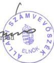

48

---

# MELLÉKLETEK

---

1. 2. 3. 4. 5. 6. 7. 8. 9. 10. 11. 12. 13. 14. 15. 16. 17. 18. 19. 20. 21. 22. 23. 24. 25. 26. 27. 28. 29. 30. 31. 32. 33. 34. 35. 36. 37. 38. 39. 40. 41. 42. 43. 44. 45. 46. 47. 48. 49. 50. 51. 52. 53. 54. 55. 56. 57. 58. 59. 60. 61. 62. 63. 64. 65. 66. 67. 68. 69. 70. 71. 72. 73. 74. 75. 76. 77. 78. 79. 80. 81. 82. 83. 84. 85. 86. 87. 88. 89. 90. 91. 92. 93. 94. 95. 96. 97. 98. 99.

---

# Mellékletek jegyzéke

1. melleklet A kizarolagos allami tulajdon fogalma
2. melleklet Adatok a kizarolagos allami tulajdonu vagyonelemekrol - 1997. December 31-i allapot (13 oldal)
3. melleklet Adatok a kizarolagos allami tulajdonu vagyonelemekrol - 1998. December 31-i allapot (12 oldal)
4. melleklet A kizarolagos allami tulajdonu vagyonelemeket bemutato tablazat ertelmezese illetve kitoltesi utasitasai (3 oldal)
5. melleklet Magyarorszag nyersanyag vagyonanak osszefoglalo adatai 1998- 1999.
6. melleklet Nemzeti park igazgatosagok barlangkimutatasa
7. melleklet Barlangkimutatasok osszehasonlitasa
8. melleklet Mulemlek ingatlanok koltsegei ASZ-KVI kimutatas (2 oldal)

---

•
•
•
•
•

---

1. melléklet

# A kizárólagos állami tulajdon fogalmi meghatározása

A Polgári törvénykönyvről rendelkező 1959. évi IV. törvény határozza meg a kizárólagos állami tulajdon fogalmát olyképpen, hogy megenged eltérést egyéb törvényekben foglaltak alapján.

A következő táblázatban a Ptk., illetve az egyes ágazati törvények kizárólagos állami tulajdonról szóló meghatározásait vetettük össze.

|  Ptk. 172. § | Ágazati törvények | Megjegyzés  |
| --- | --- | --- |
|  1. a) a föld méhének kincsei, | 1993. évi XLVIII. törvény a bányászatról 3. § (1) Az ásványi nyersanyagok, valamint a geotermikus energia természetes előfordulásukban az állam tulajdonában állnak. Nyilvántartó: Magyar Geológiai Szolgálat | A föld méhének kincsei közé tartozó geotermikus energiát természetes előfordulásában nem tartja nyilván egy intézmény sem, jogszabály erről nem rendelkezik.  |
|  2. b) a felszín alatti vizek, a felszín alatti vizek természetes víztartó képződményei, | 1995. évi LVII. törvény a vízgazdálkodásról 6. § (1) Az állam kizárólagos tulajdonában vannak: a) a felszín alatti vizek és azok természetes víztartó képződményei, Nyilvántartó: Országos Vízügyi Főigazgatóság |   |
|  3. b) a folyóvizek és természetes tavak, valamint ezek medre, | 1995. évi LVII. törvény a vízgazdálkodásról 6. § (1) b) a természetes tavak közül a megnevezettek; c) az államhatárt alkotó vagy metsző folyók, patakok, a törvény 2. számú melléklete szerinti egyéb folyók, patakok, holtágak, mellékágak és azok medre. a KHVM a 22/1996. (XI. 29.) rendeletében tette köz- | A Ptk. szerint minden természetes vízfolyás és tó kizárólagos állami tulajdon, ezt az ágazati törvény szűkíti.  |

---

|   | zé az állam kizárólagos tulajdonában lévő vizek és vízi létesítmények jegyzékét. Nyilvántartó: OVF |   |
| --- | --- | --- |
|  4. c) a folyóvíz elhagyott medre és a folyóvízben újonnan keletkezett sziget, | 1995. évi LVII. törvény a vízgazdálkodásról 6.§ (1) d) a folyóvízben újonnan keletkezett szigetek; Nyilvántartó: nincs | A vízgazdálkodásról szóló törvény az elhagyott folyómederre nem tér ki Lásd: Bős-Nagymaros  |
|  5. d) országos közutak, | 1988. évi I. törvény a közúti közlekedésről 9/B. § (1) Az állam a kizárólagos tulajdonát képező, az országos közúthálózatba tartozó autópályákat, autóutakat - illetőleg azok egyes szakaszait - és a műtárgyaikat, ... koncesszióba adhatja. Nyilvántartó: Útgazdálkodási és Koordinációs Igazgatóság, valamint az érintett vagyonkezelők. | Az ágazati törvény kifejezetten nem deklarálja az országos közutak kizárólagos állami tulajdonát, hanem csak azok koncesszióba adását tárgyalva említi meg ezt a tényt - a közutak műtárgyaival egy kategóriába sorolva.  |
|  6. d) országos vasutak, | 1993. évi XCV. törvény a vasútról 3. § (1) Az országos közforgalmú vasúti pálya és tartozékai az állam kizárólagos tulajdonában, ... vannak. Nyilvántartó: MÁV RT. | Vizsgálatunk lezárultáig a MÁV Rt. mérlegében külön soron szereplő gazdálkodói vagyon és a kizárólagos állami tulajdon tételes szétválasztására nem került sor.  |
|  7. d) országos vízi utak és az országos közforgalmú kikötők, | 1973. évi 6. törvényerejű rendelet a hajózásról 18. § (2) A hajóutat a Közlekedési Főfelügyelettel egyetértésben a vízügyi szervek jelölik ki. 20. § (3) Azokat a kikötőket, amelyek átrakodási és | Az ágazati törvény kifejezetten nem deklarálja az országos vízi utak és az országos közforgalmú kikötők kizárólagos állami tulajdonát, hanem csak azok fogalmát és kijelölési kötelezettségét határozza meg,  |

2

---

|   | elosztási központként lehetővé teszik a vízi, a közúti és a vasúti személy és áruforgalom összekapcsolását ... országos közforgalmú kikötőnek kell minősíteni. Nyilvántartó: OVF | tartalmat adva a Ptk. szövegének. A jogszabályok szerint a hajózási hatósági feladatokat az illetékes Közlekedési felügyeletek látják el  |
| --- | --- | --- |
|  8. d) a nemzetközi kereskedelmi repülőtér, | 1995. évi XCVII. törvény a légiközlekedésről 40. § (1) Állam tulajdonában levő repülőteret - a nemzetközi kereskedelmi repülőtér (Budapest Ferihegy Nemzetközi Repülőtér) kivételével - a Kormány egyetértésével lehet elidegeníteni. A törvény szerint egy nemzetközi kereskedelmi repülőtér van, nyilvántartása megoldott. | A törvény nevesíti a Ptk-ban meghatározott nemzetközi kereskedelmi repülőteret. Vizsgálatunk lezárultáig az LRI. mérlegében külön soron szereplő gazdálkodói vagyon és a kizárólagos állami tulajdon tételes szétválasztására nem került sor.  |
|  9. d) az ország területe feletti légtér, | 1995. évi XCVII. törvény a légiközlekedésről 4. § (1) A magyar légtér az országhatár által körbezárt terület feletti légtérnek a légiközlekedés számára fizikailag igénybe vehető magasságig terjedő része. (2) A Magyar Köztársaságot a magyar légtérben teljes és kizárólagos szuverenitás illeti meg. | A légtér nyilvántartására a meghatározás miatt nincs szükség. Az LRI a légiközlekedésre ténylegesen igénybevett légtér-részleteket tartja nyilván.  |
|  10. e) a távközlésre felhasználható frekvenciák. | 1993. évi LXII. törvény a frekvenciagazdálkodásról Az elektromágneses rezgések rádió-távközlési és egyéb nagyfrekvenciás célokra szolgáló tartománya feletti rendelkezés az állam kizárólagos joga. Nyilvántartó: Hírközlési Főfelügyelet | A frekvenciasávok nemzeti felosztási táblázatát a 204/1997. (XI. 19.) Korm. rendelet tartalmazza.  |

3

---

A Ptk. több kizárólagos állami tulajdonú vagyoncsoportról nem rendelkezik. A Ptk. megengedő volta alapján több ágazati törvény is meghatároz kizárólagos állami tulajdonú vagyoncsoportokat. A táblázat számozását folytatva soroljuk fel ezeket.

|  11. | 1995. évi LVII. törvény a vízgazdálkodásról 3. számú melléklet: Az állam kizárólagos tulajdonában lévő vízilétesítmények 5. regionális víziközműből a közművagyon; Nyilvántartók: Az egyes vagyonkezelők |   |
| --- | --- | --- |
|  12. | 1995. évi LVII. törvény a vízgazdálkodásról 3. számú melléklet: Az állam kizárólagos tulajdonában lévő vízilétesítmények 3. árvízvédelmi művek Nyilvántartó: OVF |   |
|  13. | 1995. évi LVII. törvény a vízgazdálkodásról 3. számú melléklet: Az állam kizárólagos tulajdonában lévő vízilétesítmények 1. a törvény 6. §-a szerinti, az államhatárt alkotó vagy metsző csatornák, valamint 2. az 1 millió m3 tározó térfogatot meghaladó állandó jellegű belvíztározók, azok töltő-ürítő csatornáival együtt; 4. a 2. számú melléklet szerinti folyók, valamint az előző pontokban említett csatornák szabályozó művei, hajó- vagy egyéb zsilipei, árvízkapui, folyók duzzasztott terei; 6. a belvízöblözetek és a belvízrendszerek főcsatornáinak közös működtetését segítő összekötő vagy megcsapoló belvízcsatornák és |   |

4

---

|   | a 2 m3/s torkolati vízszállító-képességet meghaladó belvízcsatornák, valamint az azok működéséhez szükséges műtárgyak; 7. a 2. számú melléklet 4. pontja szerinti vízfolyások - 1 millió m3 árvízi tározó térfogatot meghaladó - tározói, valamint azok ár-apasztó medrei. Nyilvántartó: OVF |   |
| --- | --- | --- |
|  14. | 1997. évi LIV. törvény a műemlékvédelemről Mellékletben sorolja fel tételesen a kizárólagos állami tulajdonú műemlékeket. |   |
|  15. | 1996. évi LIII. törvény a természet védelméről 68. § (1) Kizárólagos állami tulajdonban áll és forgalomképtelen valamennyi barlang. Nyilvántartó: KTM Barlangtani Osztály |   |

5

---

“

”

“

”

“

”

---

2. melléklet

Adatok a kizárólagos állami tulajdonú vagyonelemekről

1997. dec. 31. állapot

|  Vagyonelemek és azok különböző fogalmi meghatározásai | Értékadatok (MFt) |   |   |   | Adatok naturális mértékegységekben |   | Megjegyzések adatforrások  |   |
| --- | --- | --- | --- | --- | --- | --- | --- | --- |
|   |   |  bruttó érték |   | nettó érték |   | KVI szerint |   | egyéb for- rásokból  |
|   |   | KVI | egyéb | KVI | egyéb | db |  |   |
|  Ptk. 172. § a) 1. FÖLD MÉHÉNEK KINCSEI |   |  |  |  |  |  |  |   |
|   | Ágazati jogszabályok - ásványi nyersanyagok - geotermikus energia természetes előfordulásukban 1993. évi XLVIII. sz. tv. a bányászatról |  |  |  | 3,39x10⁶ nincs adat |  | 10.548 millió t nincs adat | Magyar Geológiai Szolgálat adatszolgáltatása Nincs kijelölt nyilvántartó, állami szinten nincs nyilvántartás  |
|   | KVI nyilvántartási kódok nincs | Ø |  | Ø |  | Ø |  | A KVI rendszerében nincs adat  |

---

1

1

1

1

1

1

---

|  Vagyonelemek és azok különböző fogalmi meghatározásai |   | Értékadatok (MFt) |   |   |   | Adatok naturális mértékegységekben |   | Megjegyzések adatforrások  |
| --- | --- | --- | --- | --- | --- | --- | --- | --- |
|   |   | bruttó érték |   | nettó érték |   | KVI szerint | egyéb for- rásokból |   |
|   |   | KVI | egyéb | KVI | egyéb | db |  |   |
|  Ptk. 172. § b) 2. A FELSZÍN ALATTI VIZEK, A FELSZÍN ALATTI VIZEK TERMÉSZETES VÍZTARTÓ KÉPZŐDMÉNYEI |   |  |  |  |  |  |  |   |
|   | Ágazati jogszabályok felszín alatti vizek és azok ter- mészetes víztartó képződményei a./ A vízgazdálkodásról szóló 1995. évi LVII. törvény b./ 22/1996. (XI. 29.) KHVM rendelet az állam kizárólagos tulajdonában levő vizek és vízilétesítmények jegyzékének közzétételé- ről - |  | 71 |  | 66 |  | 1.367.876 m³/nap | Az Országos Vízügyi Főigazgatóság adatszolgáltatása  |
|   | KVI nyilvántartás | 1.197 |  | 1.107 |  | 1.600 |  | Kutak97.lst  |
|   | KVI nyilvántartási rend- szer kódjai: | Építmény 316000 | 313000 316000 |  | 313000, 316000 |  |  | A KVI és a vagyonkezelők által al- kalmazott adatjelentő kódok  |

2

---

6

7

8

9

10

11

---

|  Vagyonelemek és azok különböző fogalmi meghatározásai | Értékadatok (MFt) |   |   |   | Adatok naturális mértékegységekben |   | Megjegyzések adatforrások  |   |
| --- | --- | --- | --- | --- | --- | --- | --- | --- |
|   |   |  bruttó érték |   | nettó érték |   | KVI szerint |   | egyéb for- rásokból  |
|   |   | KVI | egyéb | KVI | egyéb | db |  |   |
|  Ptk. 172. § b) 3. A FOLYÓVIZEK ÉS TERMÉSZETES TAVAK, VALAMINT EZEK MEDRE |   |  |  |  |  |  |  |   |
|   | Ágazati jogszabályok a./ A vízgazdálkodásról szóló 1995. évi LVII. törvény szűkítése alapján kizárólagos állami tulajdon körbe a nevesített folyók és tavak tartoznak. b./ 22/1996. (XI. 29.) KHVM rendelet az állam kizárólagos tulajdonában levő vizek és vízilétesítmények jegyzékének közzétételé- ről - |  | 8626,5 |  | 7129 |  | 3792,7 km 63427,5 ha | Az Országos Vízügyi Főigazgatóság adatszolgáltatása folyók tavak Megj: A folyóvizek megnevezése a Tv. szerint tágabb kör a Ptk.-hoz képest a holtágakkal, mellékágakkal A folyók és a víziutak külön fogalmi kategóriát jelentenek.  |
|   | KVI nyilvántartás: 1. "foly" szövegtöredék 0194 2. "F" = földmegjelölés 0194 3. „ló" szövegtöredék 0194 | 11 13.623 |  | 11 439 |  | 992 23.054 20.440 19 |  | Forrás: KVI 1999. július Forrás: KVI 2000. január 19. Forrás: KVI 1999. július Tavak97.lst  |
|   | KVI nyilvántartási rend- szer kódjai | 0194 és ki- egészítés | 312000, 313000, 318000 | 0194 és egyéb ki- egészítés | 312000, 313000, 318000 |  |  | A KVI és a vagyonkezelők által alkalmazott adatjelentő kódok  |

3

---

•
•
•
•
•

---

|  Vagyonelemek és azok különböző fogalmi meghatározásai |   | Értékadatok (MFt) |   |   |   | Adatok naturális mértékegységekben |   | Megjegyzések adatforrások  |
| --- | --- | --- | --- | --- | --- | --- | --- | --- |
|   |   | bruttó érték |   | nettó érték |   | KVI szerint | egyéb for- rásokból |   |
|   |   | KVI | egyéb | KVI | egyéb | db |  |   |
|  PTK.--172. § c) 4. A FOLYÓVÍZ ELHAGYOTT MEDRE ÉS A FOLYÓVÍZBEN ÚJONNAN KELETKEZETT SZIGET |   |  |  |  |  |  |  |   |
|   | Ágazati jogszabályok A folyóvízben újonnan keletke- zett sziget A vízgazdálkodásról szóló 1995. évi LVII. törvény |  | Ø |  | Ø |  | Ø | Megj.: A törvény az elhagyott fo- lyómedrekre nem tér ki. Az Országos Vízügyi Főigazgatóság adatszolgáltatása  |
|   | KVI nyilvántartási kódok nincs |  |  |  |  | Ø |  | Forrás: KVI 1999. július  |

4

---

6

7

-

7

-

7

7

7

---

|  Vagyonelemek és azok különböző fogalmi meghatározásai |   | Értékadatok (MFt) |   |   |   | Adatok naturális mértékegységekben |   | Megjegyzések adatforrások  |
| --- | --- | --- | --- | --- | --- | --- | --- | --- |
|   |   | bruttó érték |   | nettó érték |   | KVI szerint | egyéb for- rásokból |   |
|   |   | KVI | egyéb | KVI | egyéb | db |  |   |
|  PTK. 172. § d) 5. ORSZÁGOS KÖZUTAK |   |  |  |  |  |  |  |   |
|   | Ágazati jogszabályok országos közutak és műtárgyaik 1988. évi Ltv a közúti közlekedésről 9/B§ (1) - elsőrendű főút - másodrendű főút - összekötő út - bekötőút - állomáshoz vezető út - autópálya csomóponti ág - egyéb csomóponti ág - hidak |  |  |  |  |  | 2082 km 4386 km 17872 km 4671 km 499 km 103 km 43 km 6025 db | Az Útgazdálkodási És Koordinációs Igazgatóság adatközlése Megállapodás szerint a közutak vagyonát "0" értéken tartják nyilván, kivételt képez az autópályákat kezelő részvénytársaságok vagyona.  |
|   | KVI nyilvántartás: 1. földterületként "F" + 0193 2. építményként "ÉP" 111000 113000 115000 3. lásd 2., kiegészítve 116000 | 289 156 583 |  | 287 122 443 |  | 32.214 30.964 12.647 11.231 13.230 |  | A koncesszióba adott "autópályák" nem találhatóak meg a KVI nyilvántartásban Forrás: KVI 2000. január 19. Forrás: KVI 1999. július Forrás: KVI 2000. január 19. Forrás: KVI 1999. július Forrás: KVI 2000. január 19.  |
|   | KVI nyilvántartási rendszer kódjai | 0193 111000 113000 116000 | * | 0193 111000 113000 116000 | * |  |  | A 22 szervezet ingatlanait összesen 23 féle kódot használva jelenti vagyonát a KVI-nek  |
|   | 16/001 országos főutak 16/003 országos alsóbbrendű utak | 29 0,001 |  | 29 0,001 |  | 3.778 7.548 |  | "A Kincstári vagyon a jog tükrében" című ÁPV Rt kiadvány alapján  |

5

---

•
•
•
•
•

---

|  Vagyonelemek és azok különböző fogalmi meghatározásai |   | Értékadatok (MFt) |   |   |   | Adatok naturális mértékegységekben |   | Megjegyzések adatforrások  |
| --- | --- | --- | --- | --- | --- | --- | --- | --- |
|   |   | bruttó érték |   | nettó érték |   | KVI szerint | egyéb for- rásokból |   |
|   |   | KVI | egyéb | KVI | egyéb | db |  |   |
|  PTK. 172. § d) 6. ORSZÁGOS VASUTAK |   |  |  |  |  |  |  |   |
|   | Ágazati jogszabályok: az országos közforgalmú vasúti pálya és tartozékai 1993. évi XCV. tv a vasútról |  | 240.029 |  | 220.081 |  |  | MÁV Rt. adatszolgáltatása  |
|   | KVI nyilvántartási kódok | Ø |  | Ø |  | Ø |  | A MÁV Rt. nem szolgáltatott adatok a KVI nyilvántartásba  |
|  PTK. 172. § d) 7. ORSZÁGOS VÍZI UTAK ÉS AZ ORSZÁGOS KÖZFORGALMÚ KIKÖTŐK |   |  |  |  |  |  |  |   |
|   | Ágazati jogszabályok országos közforgalmú kikötők 1973. évi 6. törvényerejű rendelet 20.§ |  | 168 |  | 168 |  | 186,2 km 8324 ha | Az Országos Vízügyi Főigazgatóság adatszolgáltatása víziutak kikötők  |
|   | KVI nyilvántartás | 897 |  | 483 |  | 15 24 |  | Forrás: KVI 1999. július Forrás: KVI 2000. január 19.  |
|   | KVI nyilvántartási rendszer kódjai | 311000 | 311000, 511000 562200 | 311000 | 311000, 511000 562200 |  |  | A KVI és a vagyonkezelők által alkalmazott adatjelentő kódok  |
|   | 16/014 vízi utak és kikötők | 308 |  | 241 |  | 19 |  | "A Kincstári vagyon a jog tükrében" című ÁPV Rt kiadvány alapján  |

6

---

•
•
•
•
•

---

|  Vagyonelemek és azok különböző fogalmi meghatározásai |   | Értékadatok (MFt) |   |   |   | Adatok naturális mértékegységekben |   | Megjegyzések adatforrások  |
| --- | --- | --- | --- | --- | --- | --- | --- | --- |
|   |   | bruttó érték |   | nettó érték |   | KVI szerint | egyéb for- rásokból |   |
|   |   | KVI | egyéb | KVI | egyéb | db |  |   |
|  PTK. 172. § d) 8. A NEMZETKÖZI KERESKEDELMI REPÜLŐTÉR |   |  |  |  |  |  |  |   |
|   | Ágazati jogszabályok a nemzetközi kereskedelmi re- pülőtér (Budapest, Ferihegy Nemzetközi Repülőtér) 1995. évi XCVII. sz. tv a légiközlekedésről - 40. § (1) |  |  |  |  |  | 1db repülőtér |   |
|   | KVI nyilvántartás: |  |  |  |  | 2 |  | Forrás: KVI 1999. július Megj.: egyik sem kizárólagos állami tulajdon (Vagyonkezelői: - BAZ Megyei Rendőr Főkapitányság - Országos Traumatológiai Intézet A Ferihegyi repülőteret a lehívás nem tartalmazza. Forrás: KVI 2000. január 19. Tartalmazza az LRI-nél lévő Feri- hegyi repülőteret is.  |
|   | KVI nyilvántartási kódok | 2.479 |  | 1.497 |  | 21 |  |   |
|   |  | 117000 |  | 117000 |  |  |  | Az LRI vagyonában különül el tételesen a kizárólagos állami tulajdont sajátvagyonától  |
|   | 16007 repülőterek és felszál- lópályák | 47 |  | 36 |  | 2 |  | "A Kincstári vagyon a jog tükrében" című ÁPV Rt kiadvány alapján  |

7

---

1

2

3

4

5

6

---

|  Vagyonelemek és azok különböző fogalmi meghatározásai |   | Értékadatok (MFt) |   |   |   | Adatok naturális mértékegységekben |   | Megjegyzések adatforrások  |
| --- | --- | --- | --- | --- | --- | --- | --- | --- |
|   |   | bruttó érték |   | nettó érték |   | KVI szerint | egyéb for- rásokból |   |
|   |   | KVI | egyéb | KVI | egyéb | db |  |   |
|  Ptk. 172. § d) 9. AZ ORSZÁG TERÜLETE FELETTI LÉGTÉR |   |  |  |  |  |  |  |   |
|   | Ágazati jogszabályok az ország területe feletti légtér 1995. évi XCVII. sz. tv. a légiközlekedésről - 4. § (1) |  |  |  |  |  |  | 4.§. (1) - magyar légtér: az ország- határ által közbezárt terület feletti légtérnek a légiközlekedés számára fizikailag igénybe vehető magassá- gig terjedő része  |
|   | KVI nyilvántartási kódok nincs |  |  |  |  | Ø |  | Forrás: KVI 1999. július  |
|  Ptk. 172. § e) 10. A TÁVKÖZLÉSRE FELHASZNÁLHATÓ FREKVENCIÁK |   |  |  |  |  |  |  |   |
|   | Ágazati jogszabályok a távközlésre felhasználható frekvenciák 1993. évi LXII. sz. tv a frekvenciagazdálko- dásról |  |  |  |  |  | 9 kHz - 400 GHz | A frekvenciasávok nemzeti felosz- tási táblázatát a 204/1997. (XI. 19.) Korm. rendelet tartalmazza  |
|   | KVI nyilvántartási kódok nincs |  |  |  |  | Ø |  | Forrás: KVI 1999. július  |

8

---

4

3

4

4

4

4

---

|  Vagyonelemek és azok különböző fogalmi meghatározásai |   | Értékadatok (MFt) |   |   |   | Adatok naturális mértékegységekben |   | Megjegyzések adatforrások  |
| --- | --- | --- | --- | --- | --- | --- | --- | --- |
|   |   | bruttó érték |   | nettó érték |   | KVI szerint | egyéb for- rásokból |   |
|   |   | KVI | egyéb | KVI | egyéb | db |  |   |
|  Ptk. 11. NEM RENDELKEZIK |   |  |  |  |  |  |  |   |
|   | Ágazati jogszabályok regionális víziközműből a köz- művagyon a./ A vízgazdálkodásról szóló 1995. évi LVII. törvény - 3. sz. melléklet 5. pont b./ 22/1996. (XI. 29.) KHVM rendelet az állam kizárólagos tulajdonában levő vizek és vízilétesítmények jegyzékének közzétételé- ről |  | Ø |  | Ø |  | Ø | Nincs országos nyilvántartás.  |
|   | KVI nyilvántartás: | Ø |  | Ø |  | Ø |  | A regionális vízmű Rt.-k 1998. ja- nuár 1-jével alakultak, a vagyonról más forrásból a KVI nem szerzett adatokat.  |

9

---

•

•

•

•

•

•

•

---

|  Vagyonelemek és azok különböző fogalmi meghatározásai |   | Értékadatok (MFt) |   |   |   | Adatok naturális mértékegységekben |   | Megjegyzések adatforrások  |
| --- | --- | --- | --- | --- | --- | --- | --- | --- |
|   |   | bruttó érték |   | nettó érték |   | KVI szerint | egyéb for- rásokból |   |
|   |   | KVI | egyéb | KVI | egyéb | db |  |   |
|  Ptk. 12. NEM RENDELKEZIK |   |  |  |  |  |  |  |   |
|   | Ágazati jogszabályok árvízvédelmi művek a./ A vízgazdálkodásról szóló 1995. évi LVII. törvény - 3. sz. melléklet 3. pont b./ 22/1996. (XI. 29.) KHVM rendelet |  | 18919,7 |  | 15901,5 |  | 2821,1 km 3688,6 ha | Az Országos Vízügyi Főigazgatóság adatszolgáltatása Ez nem önálló vagyonelem, hanem egy olyan vagyoncsoport, amely többféle vagyonelemet tartalmaz.  |
|   | KVI nyilvántartás: | 28.194 |  | 23.649 |  | 570 1.550 |  | Forrás: KVI 1999. július Forrás: KVI 2000. január 19.  |
|   | KVI nyilvántartási kódok | 313000 | 313000 | 313000 | 313000 |  |  | A KVI és a vagyonkezelők által al- kalmazott adatjelentő kódok  |
|   | 16/016 árvízmentesítési mű- vek | 25.788 |  | 21.645 |  | 1508 |  | "A Kincstári vagyon a jog tükrében" című ÁPV Rt kiadvány alapján  |

10

---

1
2
3
4
5
6
7
8
9
10

---

|  Vagyonelemek és azok különböző fogalmi meghatározásai | Értékadatok (MFt) |   |   |   | Adatok naturális mértékegységekben |   | Megjegyzések adatforrások  |   |
| --- | --- | --- | --- | --- | --- | --- | --- | --- |
|   |   |  bruttó érték |   | nettó érték |   | KVI szerint |   | egyéb for- rásokból  |
|   |   | KVI | egyéb | KVI | egyéb | db |  |   |
|  Ptk. 13. NEM RENDELKEZIK |   |  |  |  |  |  |  |   |
|   | Ágazati jogszabályok csatornák, tározók ... a./ A vízgazdálkodásról szóló 1995. évi LVII. törvény - 3. sz. melléklet 1., 2. pont b./ 22/1996. (XI. 29.) KHVM rendelet |  | 11346,6 |  | 9348,1 |  | 7472,5 km 15956,7 ha 12,2 M m³/nap | Az Országos Vízügyi Főigazgatóság adatszolgáltatása  |
|   | KVI nyilvántartás: | 20.939 |  | 17.501 |  | 1.569 |  | Forrás: KVI 2000. január 19.  |
|   | KVI nyilvántartási kódok | 312000 315000 | 313000, 315000, 318000, 413000 | 312000 315000 | 313000, 315000, 318000, 413000 |  |  | A KVI és a vagyonkezelők által al- kalmazott adatjelentő kódok  |

11

---

•
•
•
•

---

|  Vagyonelemek és azok különböző fogalmi meghatározásai | Értékadatok (MFt) |   |   |   | Adatok naturális mértékegységekben |   | Megjegyzések adatforrások  |   |
| --- | --- | --- | --- | --- | --- | --- | --- | --- |
|   |   |  bruttó érték |   | nettó érték |   | KVI szerint |   | egyéb for- rásokból  |
|   |   | KVI | egyéb | KVI | egyéb | db |  |   |
|  Ptk. 14. NEM RENDELKEZIK |   |  |  |  |  |  |  |   |
|   | Ágazati jogszabályok műemlékek 1997. évi LIV. sz. tv a műemlékvédelemről |  |  |  |  |  | 273 db műemlék együttes | 273 (KVI-ÁSZ pontosítás után 263) műemlék együttesről szól a törvény.  |
|   | KVI nyilvántartási kódok Az adatok a KVI által kezelt vagyonelemek nyilvántartási rendszeréből származnak (VAX) és nem a kincstári vagyon nyilvántartási rendszerből. Lekérdezés ad 1 Lekérdezés ad 2 Lekérdezés ad 3 Lekérdezés ad 4 9P, 99 mozkód 01 | 11.282 14.501 10.598 |  | 12.148 8.581 |  | 225 207 1.471 57 |  | ÁSZ Jelentésben összesen 298 db műemlék szerepelt, ebből 225 kizárólagos állami tulajdon Ezek felett a KVI gyakorolja az állam tulajdonosi jogait. 1. sz. lekérdezés - 1999.06.17. 2. sz. lekérdezés - 1999.07.19. Forrás: KVI 2000. január 20. VAX Forrás: KVI 2000. január 19.  |

12

---

•
•
•
•
•

---

|  Vagyonelemek és azok különböző fogalmi meghatározásai | Értékadatok (MFt) |   |   |   | Adatok naturális mértékegységekben |   | Megjegyzések adatforrások  |   |
| --- | --- | --- | --- | --- | --- | --- | --- | --- |
|   |   |  bruttó érték |   | nettó érték |   | KVI szerint |   | egyéb for- rásokból  |
|   |   | KVI | egyéb | KVI | egyéb | db |  |   |
|  Ptk. 15. NEM RENDELKEZIK |   |  |  |  |  |  |  |   |
|   | Ágazati jogszabályok barlangok 1996. évi LIII. sz. törvény a természet vé- delméről 68.§ (1) |  |  |  |  |  | 3341 db | Adatszolgáltató: KM Barlangtani Osztály 1997 dec. 31-i adat  |
|   | KVI nyilvántartás: egyéb építmények alagutak, aknák, tárnák |  |  |  |  | 2 db 11 db |  | Forrás: KVI 1999. június 30. Megj.: a lehívásból az ÁSZ végezte el a kizárólagos állami tulajdon le- választását  |
|   | egyéb építmények+barlang alagutak, aknák, tárnák +barlang alagutak, aknák, tárnák | 35 190 668 |  | 28 152 518 |  | 4 db 12 db 224 db |  | Forrás: KVI 2000. január 19. Forrás: KVI 2000. január 19. Forrás: KVI 2000. január 19.  |
|   | KVI nyilvántartási kódok: | 999000 711000 | 999000 711000 | 999000 711000 | 999000 711000 |  |  | A KVI és a vagyonkezelők által al- kalmazott adatjelentő kódok  |
|   | 16/043 alagutak, aknák, tár- nák és földalatti helyiségek | 323 |  | 263 |  | 207 |  | A Kincstári vagyon a jog tükrében ÁPV Rt. kiadvány  |

Budapest, 2000. március

13

---

•

•

•

•

•

•

---

3. melléklet

Adatok a kizárólagos állami tulajdonú vagyonelemekről

1998. dec. 31. állapot

|  Vagyonelemek és azok különböző fogalmi meghatározásai | Értékadatok (MFt) |   |   |   | Adatok naturális mértékegységekben |   | Megjegyzések adatforrások  |   |
| --- | --- | --- | --- | --- | --- | --- | --- | --- |
|   |   |  bruttó érték |   | nettó érték |   | KVI szerint |   | egyéb for- rásokból  |
|   |   | KVI | egyéb | KVI | egyéb | db |  |   |
|  Ptk. 172. § a) 1. FÖLD MÉHÉNEK KINCSEI |   |  |  |  |  |  |  |   |
|   | Ágazati jogszabályok - ásványi nyersanyagok - geotermikus energia természetes előfordulásukban 1993. évi XLVIII. sz. tv. a bányászatról |  |  |  | 3,25x10⁶ nincs adat |  | 11.012 M t nincs adat | Magyar Geológiai Szolgálat adat-szolgáltatása Nincs kijelölt nyilvántartó, állami szinten nincs nyilvántartás  |
|   | KVI nyilvántartási kódok nincs | Ø |  | Ø |  | Ø |  | A KVI rendszerében nincs adat  |

---

1

2

3

4

5

6

---

|  Vagyonelemek és azok különböző fogalmi meghatározásai |   | Értékadatok (MFt) |   |   |   | Adatok naturális mértékegységekben |   | Megjegyzések adatforrások  |
| --- | --- | --- | --- | --- | --- | --- | --- | --- |
|   |   | bruttó érték |   | nettó érték |   | KVI szerint | egyéb for- rásokból |   |
|   |   | KVI | egyéb | KVI | egyéb | db |  |   |
|  Ptk. 172. § b) 2. A FELSZÍN ALATTI VIZEK, A FELSZÍN ALATTI VIZEK TERMÉSZETES VÍZTARTÓ KÉPZŐDMÉNYEI |   |  |  |  |  |  |  |   |
|   | Ágazati jogszabályok felszín alatti vizek és azok ter- mészetes víztartó képződményei a./ A vízgazdálkodásról szóló 1995. évi LVII. törvény b./ 22/1996. (XI. 29.) KHVM rendelet az állam kizárólagos tulajdonában levő vizek és vízilétesítmények jegyzékének közzétételé- ről - |  | 89 |  | 81 |  | 1.387.876 m³/nap | Az Országos Vízügyi Főigazgatóság adatszolgáltatása  |
|   | KVI nyilvántartás | 28.686 |  | 27.755 |  | 1.155 |  | Kutak98.lst  |
|   | KVI nyilvántartási rend- szer kódjai: | Építmény 316000 | 313000 316000 | Építmény 316000 | 313000, 316000 |  |  | A KVI és a vagyonkezelők által al- kalmazott adatjelentő kódok  |

2

---

•

•

•

•

•

•

---

|  Vagyonelemek és azok különböző fogalmi meghatározásai | Értékadatok (MFt) |   |   |   | Adatok naturális mértékegységekben |   | Megjegyzések adatforrások  |   |
| --- | --- | --- | --- | --- | --- | --- | --- | --- |
|   |   |  bruttó érték |   | nettó érték |   | KVI szerint |   | egyéb for- rásokból  |
|   |   | KVI | egyéb | KVI | egyéb | db |  |   |
|  Ptk. 172. § b) 3. A FOLYÓVIZEK ÉS TERMÉSZETES TAVAK, VALAMINT EZEK MEDRE |   |  |  |  |  |  |  |   |
|   | Ágazati jogszabályok a./ A vízgazdálkodásról szóló 1995. évi LVII. törvény szűkítése alapján kizárólagos állami tulajdon körbe a nevesített folyók és tavak tartoznak: b./ 22/1996. (XI. 29.) KHVM rendelet az állam kizárólagos tulajdonában levő vizek és vízilétesítmények jegyzékének közzétételé- ről - |  | 10233,1 |  | 8462,8 |  | 3792,9 km 63427,5 ha | Az Országos Vízügyi Főigazgatóság adatszolgáltatása folyók tavak Megj: A folyóvizek megnevezés a Tv. sze- rint tágabb kör a Ptk-hoz képest a holtágakkal, mellékágakkal A folyók és a víziutak külön fogalmi kategóriát jelentenek.  |
|   | KVI nyilvántartás: „foly” szövegtöredék 0194 „F” = földmegjelölés 0194 „tó” szövegtöredék 0194 | 11 3.016 |  | 11 3.016 |  | 788 12.317 20.440 17 |  | Foly698.lst Forrás: KVI 2. 00. január 19. Forrás: KVI 1.99. július Tavak98.lst  |
|   | KVI nyilvántartási rend- szer kódjai: | 0194 és ki- egészítés | 312000, 313000, 318000 | 0194 és ki- egészítés | 312000, 313000, 318000 |  |  | A KVI és a vagyonkezelők által al- kalmazott adatjelentő kódok  |

3

---

•
•
•
•
•

---

|  Vagyonelemek és azok különböző fogalmi meghatározásai |   | Értékadatok (MFt) |   |   |   | Adatok naturális mértékegységekben |   | Megjegyzések adatforrások  |
| --- | --- | --- | --- | --- | --- | --- | --- | --- |
|   |   | bruttó érték |   | nettó érték |   | KVI szerint | egyéb for- rásokból |   |
|   |   | KVI | egyéb | KVI | egyéb | db |  |   |
|  Ptk. -172. § c) 4. A FOLYÓVÍZ ELHAGYOTT MEDRE ÉS A FOLYÓVÍZBEN ÚJONNAN KELETKEZETT SZIGET |   |  |  |  |  |  |  |   |
|   | Ágazati jogszabályok A folyóvízben újonnan keletke- zett sziget A vízgazdálkodásról szóló 1995. évi LVII. törvény |  | Ø |  | Ø |  | Ø | Megj.: A törvény az elhagyott fo- lyómedrekre nem tér ki. Az Országos Vízügyi Főigazgatóság adatszolgáltatása  |
|   | KVI nyilvántartási kódok nincs |  |  |  |  | Ø |  | Forrás: KVI 1999. július  |

4

---

2

2

•

•

•

1

---

|  Vagyonelemek és azok különböző fogalmi meghatározásai | Értékadatok (MFt) |   |   |   | Adatok naturális mértékegységekben |   | Megjegyzések adatforrások  |   |
| --- | --- | --- | --- | --- | --- | --- | --- | --- |
|   |   |  bruttó érték |   | nettó érték |   | KVI szerint |   | egyéb for- rásokból  |
|   |   | KVI | egyéb | KVI | egyéb | db |  |   |
|  Ptk. 172. § d) 5. ORSZÁGOS KÖZUTAK |   |  |  |  |  |  |  |   |
|   | Ágazati jogszabályok országos közutak és műtárgyaik 1988. évi Ltv a közúti közlekedésről 9/B § (1) - elsőrendű főút - másodrendű főút - összekötő út - bekötőút - állomáshoz vezető út - egyéb - hidak |  |  |  |  |  | 2414 km 4231 km 17871 km 4670 km 498 km 144 km 6025 db* | Az Útgazdálkodási és Koordinációs Igazgatóság adatközlése * 1997-es adat  |
|   | KVI nyilvántartási kódok 0193 Közlekedéssel és hírközléssel kapcsolatban művelés alól kivont te- rület 1. földmegjelölés: "F" + 0193 2. építményként "É P" 111000 113000 115000 3. lásd 2., kiegészítve 116000 | 872 19.547 23.372 |  | 870 19.367 23.036 |  | 23.274 9.832 10.143 |  | A koncesszióba adott "autópályák" nem találhatóak meg a KVI nyilván- tartásban Forrás: KVI 2000. január 19. Forrás: KVI 2000. január 19. Forrás: KVI 2000. január 19.  |
|   | KVI nyilvántartási rend- szer kódjai | 0193 111000 113000 116000 | * | 0193 111000 113000 116000 | * |  |  | A 22 szervezet ingatlanait összesen 23 féle kódot használva jelenti va- gyonát a KVI-nek  |

5

---

•

•

•

•

•

•

---

|  Vagyonelemek és azok különböző fogalmi meghatározásai | Értékadatok (MFt) |   |   |   | Adatok naturális mértékegységekben |   | Megjegyzések adatforrások  |   |
| --- | --- | --- | --- | --- | --- | --- | --- | --- |
|   |   |  bruttó érték |   | nettó érték |   | KVI szerint |   | egyéb for- rásokból  |
|   |   | KVI | egyéb | KVI | egyéb | db |  |   |
|  Ptk. 172. § d) 6. ORSZÁGOS VASUTAK |   |  |  |  |  |  |  |   |
|   | Ágazati jogszabályok: az országos közforgalmú vasúti pálya és tartozékai 1993. évi XCV. tv a vasútról |  | 247578 |  | 211550 |  |  | MÁV Rt. adatszolgáltatása  |
|   | KVI nyilvántartási kódok | Ø |  | Ø |  | Ø |  | A MÁV Rt. nem szolgáltatott adatok a KVI nyilvántartásba  |
|  Ptk. 172. § d) 7. ORSZÁGOS VÍZI UTAK ÉS AZ ORSZÁGOS KÖZFORGALMÚ KIKÖTŐK |   |  |  |  |  |  |  |   |
|   | Ágazati jogszabályok országos közforgalmú kikötők 1973. évi 6. törvényerejű rendelet 20.§ |  | 168 |  | 133 |  | 186,2 km 8396 ha | Az Országos Vízügyi Főigazgatóság adatszolgáltatása víziutak kikötők  |
|   | KVI nyilvántartás: | 178 |  | 138 |  | 9 |  | Forrás: KVI 2000. január 19.  |
|   | KVI nyilvántartási kódok: | 311000 | 311000, 511000, 562200 | 311000 | 311000, 511000, 562200 |  |  | A KVI és a vagyonkezelők által alkalmazott adatjelentő kódok  |

6

---

•
•
•
•
•

---

|  Vagyonelemek és azok különböző fogalmi meghatározásai | Értékadatok (MFt) |   |   |   | Adatok naturális mértékegységekben |   | Megjegyzések adatforrások  |
| --- | --- | --- | --- | --- | --- | --- | --- |
|   |  bruttó érték |   | nettó érték |   | KVI szerint | egyéb for- rásokból  |   |
|   | KVI | egyéb | KVI | egyéb | db |  |   |
|  Ptk. 172. § d) 8. A NEMZETKÖZI KERESKEDELMI REPÜLŐTÉR |  |  |  |  |  |  |   |
|  Ágazati jogszabályok a nemzetközi kereskedelmi re- pülőtér (Budapest, Ferihegy Nemzetközi Repülőtér) 1995. évi XCVII. sz. tv a légiközlekedésről - 40. § (1) |  |  |  |  |  | 1 db repülőtér |   |
|  KVI nyilvántartás: | 2.521 |  | 1.463 |  | 21 |  | Megj.: LRI adatközlése csak egy összegben hívható le a nyilvántar- tási rendszerből - nem téve különb- séget a vagyonelemek között  |
|  KVI nyilvántartási kódok | 117000 |  | 117000 |  | 117000 |  | Forrás: KVI 2000. január 19..  |

7

---

•

•

•

•

•

•

---

|  Vagyonelemek és azok különböző fogalmi meghatározásai |   | Értékadatok (MFt) |   |   |   | Adatok naturális mértékegységekben |   | Megjegyzések adatforrások  |
| --- | --- | --- | --- | --- | --- | --- | --- | --- |
|   |   | bruttó érték |   | nettó érték |   | KVI szerint | egyéb for- rásokból |   |
|   |   | KVI | egyéb | KVI | egyéb | db |  |   |
|  Ptk. 172. § d) 9. AZ ORSZÁG TERÜLETE FELETTI LÉGTÉR |   |  |  |  |  |  |  |   |
|   | Ágazati jogszabályok az ország területe feletti légtér 1995. évi XCVII. sz. tv a légiközlekedésről - 4. § (1) |  |  |  |  |  |  | 4. §. (1) - magyar légtér: az ország- határ által közbezárt terület feletti légtérnek a légiközlekedés számára fizikailag igénybe vehető magassá- gig terjedő része  |
|   | KVI nyilvántartási kódok nincs |  |  |  |  | Ø |  | Forrás: KVI 1999. július  |
|  Ptk. 172. § e) 10. A TÁVKÖZLÉSRE FELHASZNÁLHATÓ FREKVENCIÁK |   |  |  |  |  |  |  |   |
|   | Ágazati jogszabályok a távközlésre felhasználható frek- venciák 1993. évi LXII. sz. tv a frekvenciagazdálko- dásról |  |  |  |  |  | 9 kHz - 400 GHz | A frekvenciasávok nemzeti felosz- tási táblázatát a 204/1997. (XI. 19.) Korm. rendelet tartalmazza  |
|   | KVI nyilvántartási kódok nincs |  |  |  |  | Ø |  | Forrás: KVI 1999. július  |

8

---

3

4

5

6

7

8

---

|  Vagyonelemek és azok különböző fogalmi meghatározásai |   | Értékadatok (MFt) |   |   |   | Adatok naturális mértékegységekben |   | Megjegyzések adatforrások  |
| --- | --- | --- | --- | --- | --- | --- | --- | --- |
|   |   | bruttó érték |   | nettó érték |   | KVI szerint | egyéb for- rásokból |   |
|   |   | KVI | egyéb | KVI | egyéb | db |  |   |
|  PTK 11. NEM RENDELKEZIK |   |  |  |  |  |  |  |   |
|   | Ágazati jogszabályok regionális víziközműből a köz- művagyon a./ A vízgazdálkodásról szóló 1995. évi LVII. törvény - 3. sz. melléklet 5. pont b./ 22/1996. (XI. 29.) KHVM rendelet az állam kizárólagos tulajdonában levő vizek és vízilétesítmények jegyzékének közzétételé- ről |  | Ø |  | Ø |  | Ø | Nincs országos nyilvántartás.  |
|   | KVI nyilvántartás: | 8.235 |  | 8.194 |  | 734 |  |   |
|   | KVI nyilvántartási kódok | 317000 319000 |  | 317000 319000 |  |  |  | A KVI és a vagyonkezelők által al- kalmazott adatjelentő kódok  |

9

---

•
•
•
•
•

---

|  Vagyonelemek és azok különböző fogalmi meghatározásai |   | Értékadatok (MFr) |   |   |   | Adatok naturális mértékegységekben |   | Megjegyzések adatforrások  |
| --- | --- | --- | --- | --- | --- | --- | --- | --- |
|   |   | bruttó érték |   | nettó érték |   | KVI szerint | egyéb for- rásokból |   |
|   |   | KVI | egyéb | KVI | egyéb | db |  |   |
|  PTK 12. NEM RENDELKEZIK |   |  |  |  |  |  |  |   |
|   | Ágazati jogszabályok árvízvédelmi művek a./ A vízgazdálkodásról szóló 1995. évi LVII. törvény - 3. sz. melléklet 3. pont b./ 22/1996. (XI. 29.) KHVM rendelet |  | 19725,6 |  | 16173,3 |  | 2848,1 km 3688,6 ha | Az Országos Vízügyi Főigazgatóság adatszolgáltatása Ez nem önálló vagyonelem, hanem egy olyan vagyoncsoport, amely többféle vagyonelemet tartalmaz.  |
|   | KVI nyilvántartás: | 17.351 |  | 14.034 |  | 1.328 |  |   |
|   | KVI nyilvántartási kódok | 313000 | 313000 | 313000 | 313000 |  |  |   |
|  PTK 13. NEM RENDELKEZIK |   |  |  |  |  |  |  |   |
|   | Ágazati jogszabályok csatornák, tározók ... a./ A vízgazdálkodásról szóló 1995. évi LVII. törvény - 3. sz. melléklet 1., 2. pont b./ 22/1996. (XI. 29.) KHVM rendelet |  | 11798 |  | 9424,8 |  | 7562,5 km 16984,8 ha 12,3 M m²/nap | Az Országos Vízügyi Főigazgatóság adatszolgáltatása  |
|   | KVI nyilvántartás | 13.079 |  | 10.776 |  | 1.229 |  |   |
|   | KVI nyilvántartási kódok | EP+ 312000 315000 | 313000, 315000, 318000, 413000 | EP+ 312000 315000 | 313000, 315000, 318000, 413000 |  |  | A KVI és a vagyonkezelők által al- kalmazott adatjelentő kódok  |

10

---

1

1

1

1

1

1

---

|  Vagyonelemek és azok különböző fogalmi meghatározásai | Értékadatok (MFt) |   |   |   | Adatok naturális mértékegységekben |   | Megjegyzések adatforrások  |   |
| --- | --- | --- | --- | --- | --- | --- | --- | --- |
|   |   |  bruttó érték |   | nettó érték |   | KVI szerint |   | egyéb for- rásokból  |
|   |   | KVI | egyéb | KVI | egyéb | db |  |   |
|  PTK 14. NEM RENDELKEZIK |   |  |  |  |  |  |  |   |
|   | Ágazati jogszabályok műemlékek 1997. évi LIV. sz. tv a műemlékvédelemről |  |  |  |  |  | 273 db műemlék együttes | Az egyéb kezelésű műemlék- együttesekkel együtt az országos adatokat a 1997. évi LIV. sz. műem- lékvédelmi törvény tartalmazza: 273 (KVI-ÁSZ pontosítás után 263) műemlék együttesről szól a törvény.  |
|   | KVI nyilvántartási kódok Az adatok a KVI által kezelt va- gyonelemek nyilvántartási rendsze- réből (VAX) és a kincstári vagyon nyilvántartási rendszeréből szár- maznak VAX kincstári vagyonnyilvántartásból: | 14.980 451 |  | 12.545 358 |  | 1.586 15 |  | Forrás: KVI VAX Forrás KVI vagyon-nyilvántartás  |
|   | KVI nyilvántartási kódok | jogi kód: '9P', '99' + mozkod 51 |  | jogi kód: '9P', '99' + mozkod 51 |  |  |  | A KVI és a vagyonkezelők által al- kalmazott adatjelentő kódok  |

11

---

4

，

4

，

4

1

---

|  Vagyonelemek és azok különböző fogalmi meghatározásai |   | Értékadatok (MFt) |   |   |   | Adatok naturális mértékegységekben |   | Megjegyzések adatforrások  |
| --- | --- | --- | --- | --- | --- | --- | --- | --- |
|   |   | bruttó érték |   | nettó érték |   | KVI szerint | egyéb for- rásokból |   |
|   |   | KVI | egyéb | KVI | egyéb | db |  |   |
|  PTK 15. NEM RENDELKEZIK |   |  |  |  |  |  |  |   |
|   | Ágazati jogszabályok barlangok 1996. évi LIII. sz. törvény a természet vé- delméről 68.§ (1) |  |  |  |  |  | 3341 db | Forrás: KM Barlangtani Osztály 1997 dec. 31-i adat  |
|   | KVI nyilvántartás: egyéb építmények + barlang alagutak, aknák, tárnák+barlang alagutak, aknák, tárnák | 35 8 573 |  | 27 6 436 |  | 4 1 181 |  |   |
|   | KVI nyilvántartási kódok | 999000 711000 | 999000 711000 | 999000 711000 | 999000 711000 |  |  | A KVI és a vagyonkezelők által al- kalmazott adatjelentő kódok  |

Budapest, 2000. március

12

---

i

---

4. melléklet

# Adatok a kizárólagos állami tulajdonú vagyonelemekről

A táblázat a kizárólagos állami tulajdon nagyságáról ad áttekintő képet. Az adatokat - nyilvántartásuktól függően - értékben (millió Ft), naturáliákban, vagy mindkettőben adtuk meg.

A táblázat tételesen sorra veszi a különféle törvények által kizárólagos állami tulajdonnak tekintendő vagyoncsoportokat. Minden egyes fogalomról hármas tagolást alkalmaz.

- Az elso, legszélesebb sorban a Ptk. megfogalmazása szerepel. A Ptk. 172. S-a sorolja fel tetelesen a kizárolagos allami tulajdont, megengedve, hogy egyeb törvenyek ettol elteröen rendelkezzenek.
A masodik sorban ezeket az egyeb törvenyeket vettuk sorra, bemutatva az esetlegesen elterö meghatarozasokat. Ily modon 15 csoportot képezttunk. Az elso 10 csoportot a Ptk. is nevesiti, a tovabbi öt csoportCsak az egyeb törvenyekben kūlönul el kizárolagos allami tulajdonként. Ebben a sorban mutatjuk be az orszagos nyilvantartásokat, amennyiben törveny erre kötelezett valamilyen szervezet. Adataik az "egyeb" oszlopban szerepelnek, a megjegyzés rovatban nevesitve az adatszolgaltatot. Az ertekadatok millio forintban jelennek meg, a naturalis mutatókat pedig ertelemszerüen toltöttuk ki.
A harmadik egység tobb sorbol all. Ezekben a sorokban a KVI kincstári vagyon-nyilvantartásával kapcsolatos adatok talalhatok. Az elso sorban a KVI adatszolgaltatása szerepel. A KVI nyilvantartás jellege miatt suk esetben a KVI nem tutda egyertelmüen azonositani az egyes vagyoncsoportokat, ezert tobbféle megközelitésben szolgaltatott adatokat ugyanarról a fogalomról (pl.: folyóvizek, országos kozutak, muemlékek, barlangok). Többféle adat szerepelhet a KVI oszlopában akkor is, ha a helyszíní vizsgalatunkkor adott listák nem egyeznek meg a késöbbi adatszolgaltatásukkal, akkor ezt a források datumával jeleztuk.(Pl.: folyóvizek, kozutak, országos kozforgalmú kikötk). Az adatokhoz nem lehet naturalis mutatókat hozzárendelni, csak az ingatlanok esetében fordul elő a mennyiségek jelzésére egyedüli mutatóként a darabszám.. A masodik sorban a vagyon-nyilvantartás azonosító kódjai szerepelnek. A KVI adatainak oszlopában azok a kódk, ahogy a KVI adatszolgaltatásaban a kerdéses vagyoncsoportot azonositotta, az "egyeb" oszlopban pedig azok, amelyeket az egyes vagyonkezelok adatjelentéseikben alkalmaztak. Az 1997. évre vonatkoź táblázatban kūlón egységként szerepelnek a "Kincstári vagyon a jog tukrében" címú APV Rt. kiadvány tablázatanak adatai.

---

•
•
•
•

---

|  Vagyonelemek és azok különböző fogalmi meghatározásai | Értékadatok (MFt) |   |   |   | Adatok naturális mértékegységekben |   | Megjegyzések, adatforrások  |
| --- | --- | --- | --- | --- | --- | --- | --- |
|   |  bruttó érték |   | nettó érték |   | KVI szerint | egyéb for- rásokból  |   |
|   | KVI | egyéb | KVI | egyéb | db |  |   |
|  Ptk. 172. §-a szerint A KIZÁRÓLAGOS ÁLLAMI TULAJDONÚ VAGYON MEGNEVEZÉSE vagy a "Ptk. NEM RENDELKEZIK" |  |  |  |  |  |  |   |
|  Ágazati jogszabályok: a kizárólagos állami tulajdon ágazati jogszabály szerinti meg- nevezése ágazati jogszabályok száma, címe rövidítve |  | Országos hatósági nyilvántar- tások adatai |  | Országos hatósági nyilvántar- tások ada- tai |  | Országos hatósági nyilvántar- tások adatai | Országos hatósági nyilvántartások adatforrásai  |
|  KVI nyilvántartás: a./ A kizárólagos állami tulajdon a KVI kincstári vagyon nyilvántartási rendszerében |  |  |  |  |  |  | Többféle adat szerepelhet attól füg- gően, hogy a KVI hányféleképpen tudta behatárolni a kizárólagos ál- lami tulajdont, ill. az adatok meg- egyeznek-e a kétféle időpontban kért adatszolgáltatásban.  |
|  A KVI vagyon-nyilvántartásában alkalmazott kódok a KVI adatelekér- dezése, és a vagyonkezelők adatbe- jelentése szerint |  |  |  |  |  |  |   |
|  A kincstári vagyon a jog tükrében c. ÁPV Rt. kiadvány összesített va- gyonmérleg: 1997 táblázata |  |  |  |  |  |  |   |

2

---

•

•

•

•

•

•

---

# A kimutatásban felhasznált KVI adatszolgáltatás fő jellemzői:

- Az 1997. dec. 31. állapotadatokból készített táblázat a KVI által közölt adatok két forrását tartalmazza, az esetenként azonos időpontra megadott eltérésekkel:

a./ KVI 1999. júliusi lehívásai ÁSZ lekérdezési szempontok alapján - a későbbiekben: Forrás: KVI és dátum megjelölés
b./ dr. Bencze Izabella: A kincstári vagyon a jog tükrében című ÁPV Rt. kiadvány: Összesített vagyonmérleg 1997
Figyelemelhívó céllal a táblázatban esetenként megismételtük, hogy az adatok mely időszakra/időpontra vonatkoznak.

- Ahol a KVI lehívások és az 1997. évi összesített vagyonmérleg alapján biztosan nincs ismert adat, azt jelezzük. (Jelölés: Ø)

- Jelen táblázatba azokat a lekérdezési eredmény-adatokat vettük be, ahol

- egyértelműen kideríthető, melyek a kizárólagos vagyonelemekre vonatkozó találatok,

- a kapott információk tartalmilag viszonylag nagy hányada fedi le a jogszabályok által megjelölt kizárólagos tulajdonelemek körét.

3

---

1

，

1

，

1

1

---

5. melléklet

Magyarország nyersanyag vagyonának összefoglaló adatai

(1998-1999.)

|  Nyersanyag | Ipari vagyon 1998. I. 1. M t | Termelés 1998-ban M t | Földt. vagyon 1999. I. 1. M t | Ipari vagyon 1999. I. 1. M t | Ellátottság 1999. I. 1. év | NGE** 1998. I. 1. Mrd Ft | NGE** 1999. I. 1. Mrd Ft  |
| --- | --- | --- | --- | --- | --- | --- | --- |
|  Kőolaj | 19,3 | 1,24 | 211,6 | 19,1 | 15 | 149,8 | 147,5  |
|  Földgáz * | 78,2 | 4,00 | 172,5 | 73,3 | 18 | 524,3 | 482,2  |
|  Szén-dioxid gáz * | 32,2 | 0,24 | 48,1 | 32,4 | > 100 | 10,6 | 10,9  |
|  Feketekőszén | 195,2 | 0,88 | 1 595,6 | 199,0 | > 100 | 23,5 | 31,3  |
|  Barnakőszén | 219,8 | 6,56 | 3 205,4 | 217,8 | 33 | 120,5 | 116,4  |
|  Lignit (külfejtéses) | 2 157,4 | 7,63 | 4 614,7 | 2 150,7 | > 100 | 635,8 | 631,1  |
|  Uránérc | 3,1 | - | 26,3 | - | 1997. szeptemberben bezárt  |   |   |
|  Bauxit | 16,0 | 0,91 | 138,0 | 16,0 | 17 | 16,0 | 14,8  |
|  Ólom-cinkért | 36,6 | - | 90,8 | 36,6 | - | 50,0 | 50,0  |
|  Rézérc | 159,3 | - | 781,2 | 159,3 | - | 53,5 | 53,5  |
|  Mangánérc | 0,3 | 0,03 | 77,3 | 0,2 | 6 | 0,01 | 0,01  |
|  Ásványbányászati nyersanyagok | 1 201,7 | 2,43 | 3 160,9 | 1 144,1 | > 100 | 808,7 | 718,8  |
|  Cementipari nyersanyagok | 1 903,9 | 5,65 | 3 069,5 | 1 900,8 | > 100 | 344,5 | 106,2  |
|  Építő- és díszítőkő | 1 921,6 | 7,16 | 3 413,7 | 1 954,9 | > 100 | 322,5 | 442,2  |
|  Homok és kavics | 1 630,7 | 22,43 | 3 886,9 | 2 120,8 | > 100 | 111,6 | 150,8  |
|  Kerámiaipari nyersanyagok | 828,4 | 3,92 | 1 540,0 | 841,9 | > 100 | 20,5 | 15,2  |
|  Tőzeg, lápföld, lápimész | 144,5 | 0,08 | 180,7 | 144,7 | > 100 | 200,6 | 274,0  |
|  Magyarország összesen | 10 548,2 | 63,16 | 26 213,2 | 11 011,6 | - | 3 392,4 | 3 244,9  |

* 1000 m³ gáz = 1 tonna

** NGE = Nominál Gazdasági Eredmény = az ipari ásványvagyon mennyiségének a fajlagos árbevétel (költséghatár) és a fajlagos ráfordítás (reálköltség) különbségével való szorzata, mely nincs diszkontálva.

---

•
•
•
•
•

---

6. melléklet

A nemzeti parkok igazgatóságainak vonzáskörzetébe tartozó barlangok száma

|  Név | Barlangok száma  |
| --- | --- |
|  Duna-Ipoly NP | 921  |
|  Duna-Dráva NP | 134  |
|  Balaton-felvidéki NP | 762  |
|  Fertő-Hanság NP | 29  |
|  Bükki NP | 1233  |
|  Aggteleki NP | 262  |
|  Összesen: | 3341  |

A nemzeti parkok igazgatóságainak vonzáskörzetébe tartozó barlangok aránya

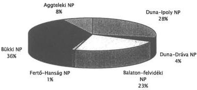

---

•
•
•
•
•

---

7. melléklet

# A nyilvántartott barlangok száma a

# Környezetvédelmi Minisztérium Barlangtani Osztálya és a

# Kicstári Vagyoni Igazgatóság adatai alapján

|  Nemzeti Parkok | Ismert barlangok 1997. december 31. db | Nyilvántartásban fellelt barlangok db  |
| --- | --- | --- |
|  Fertő-Hanság NP | 29 |   |
|  Duna-Dráva NP | 134 |   |
|  Balaton-felvidék NP | 762 |   |
|  Duna-Ipoly NP | 921 | 2  |
|  Bükki NP | 1 233 |   |
|  Aggteleki NP | 262 | 11  |
|  Összesen: | 3 341 | 13  |

---

•
•
•
•
•

---

8. melléklet 1. lap

# Kincstári Vagyoni Igazgatóság

Műemlék ingatlanokra fordított beruházási, felújítási, karbantartási és egyéb költségek megosztása

költségek nettó eFt-ban

|   | 1996. év | 1997. év | 1998. év | 1999. év | Összesen  |
| --- | --- | --- | --- | --- | --- |
|  Beruházás | 2 480 | 4 759 | 80 000 | 154 960 | 242 199  |
|  Felújítás | 72 671 | 83 947 | 86 280 | 233 500 | 476 398  |
|  Karbantartás | 138 883 | 147 022 | 101 340 | 185 130 | 572 375  |
|  Egyéb | 2 055 | 11 045 | 52 790 | 59 795 | 125 685  |
|  Mindösszesen: | 216 089 | 246 773 | 320 410 | 633 385 | 1 416 657  |

---

•
•
•
•
•

---

8. melléklet 2. lap

# Műemlék ingatlanokra fordított költségek évenkénti bontásban
MÁG

e Ft-ban

|   | 1996. év | 1997. év | 1998. év | Összesen  |
| --- | --- | --- | --- | --- |
|  Őrzés | 26 399 | 30 867 | 45 485 | 102 751  |
|  Beruházás | 2 480 | 4 759 | 80 000 | 87 239  |
|  Felújítás | 72 671 | 83 947 | 86 280 | 242 898  |
|  Karbantartás | 138 883 | 147 022 | 101 340 | 387 245  |
|  Egyéb | 2 055 | 11 045 | 52 790 | 65 890  |
|  Összesen | 242 488 | 277 640 | 365 895 |   |

---

•
•
•
•

---

•
•
•
•

---

•
•
•
•
•

---

Az érintett szervezetek vezetőinek észrevételei,
valamint az azokra adott számvevőszéki válaszok

---

1
2
3
4
5
6
7
8
9
10

---

A MAGYAR KÖZTÁRSASÁG
BELÜGYMINISZTERE

6-Á-324/2000.

|  ÁLLAMI SZÁMVEVŐSZÉK  |
| --- |
|  Érkez: 2000.04.25.  |
|  Iktat: V-7-95-5/99.00  |
|  Mellék: —  |

Hiv.szám: V-7-93/99-00.

ATH-3700/2000.

Dr. Kovács Árpád úrnak,
az Állami Számvevőszék elnöke

Budapest

Tisztelt Elnök Úr!

T. Kovács Árpád
00.4.25

KK

05.04.25

Köszönöm a kizárólagos állami tulajdonról szóló jelentésének megküldését.
A szükséges intézkedéseket megtettem, melyről az alábbiakban szeretném
tájékoztatni.

A Belügyminisztérium alapító okiratát legkésőbb május 31-éig összeállítjuk.
A Belügyminisztérium, valamint a megyei kapitányságok által megkötött
vagyonszerződések felülvizsgálatát 2000. október 31-ig elrendeltem, a
párhuzamosságok kiküszöbölése érdekében.

Budapest, 2000. április „19”

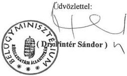

---

3

3

4

4

4

4

---

# Állami Számvevőszék

Elnök

V-7-101/1999-2000.

**dr. Pintér Sándor úr**
miniszter

Belügyminisztérium
Budapest

**Tisztelt Miniszter Úr!**

Köszönettel vettem a kizárólagos állami tulajdon nyilvántartása helyzetéről szóló ÁSZ jelentésre írt levelét.

Örömmel vettem tudomásul tájékoztatását mind az alapító okirat összeállításáról, mind pedig az egyes vagyonkezelési szerződések felülvizsgálatáról.

Tájékozatom, hogy észrevételét csatolom az ÁSZ jelentés kiadmányozási eljárásrendjének megfelelően nyilvánosságra hozandó végleges ÁSZ jelentéshez.

Bízom benne, hogy a meghozott intézkedések segítik a kincstári vagyonnal való hatékony és eredményes gazdálkodást.

*Budapest, 2000. május "10"*

Tisztelettel:

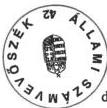

dr. Kovács Árpád

---

3

4

4

4

4

4

---

00 05/05 PÉ. 15:06 FAX +36 1 269 3485

GAZDASÁGI MINISZTÉRIUM

001

MAGYAR KÖZTÁRSASÁG
GAZDASÁGI MINISZTÉRIUM
MINISZTER

I/1455/1/2000.

Dr. Kovács Árpád úr
elnök

Állami Számvevőszék

Budapest

Lána: Tisza, ed.
Dr. Dr. Kül
(Kelem a vállalat
figyelembe remi!)

Tisztelt Elnök Úr!

A kizárólagos állami tulajdon nyilvántartásának vizsgálatáról készített jelentésükre,
illetve javaslataikra az alábbi pontosító észrevételt teszem:

A Miniszterelnöki Hivatalt vezető miniszter felelősségébe utalt javaslat 8. pontjának
alábbiak szerinti módosítását javaslom:

8. Kezdeményezze a gazdasági miniszter bevonásával a törvényi szabályozást
a vagyonnyilvántartásból hiányzó, kizárólagos állami tulajdont képező
geotermikus energia felmérése és nyilvántartásba vétele érdekében.

Fenti javaslat lehetőséget ad a bányászatról szóló 1993. évi XLVIII. törvény
módosításával, illetve a jogi és szakmai szempontok mérlegelésével, a geotermikus
energiára vonatkozó külön törvény megalkotásával a kincstári vagyonnyilvántartás
teljes körűvé tételére.

Budapest, 2000. május 4.

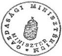

Üdvözlettel:

Dr. Matolcsy György

1055 Budapest, Szemere utca 6. 374-2713, 374-2714, Fax: 269-3485

E-mail: miniszter@gmb.gov.hu

---

1

3

4

5

6

7

---

Állami Számvevőszék

Elnök

V-7-98/1999-2000.

dr. Matolcsy György úr
miniszter

Gazdasági Minisztérium
Budapest

Tisztelt Miniszter Úr!

Köszönettel vettem a kizárólagos állami tulajdon nyilvántartásának helyzetéről szóló
ÁSZ jelentésre írt észrevételeit.

Tájékoztatom, hogy az Állami Számvevőszék eljárásrendje szerint minden jelentés az
elnöki aláírás után véglegessé válik. A Gazdasági Minisztérium észrevételeit, javasla-
tait a jelentés mellékleteként hozzuk nyilvánosságra válaszlevelünkkel együtt.

Az országgyűlési bizottságoknak és a legfőbb állami vezetőknek elküldött jelentések
kísérő levelében kiemelem, hogy javaslatainkon túlmenően az Önök észrevételeit is
vegyék figyelembe.

Kné

Budapest, 2000. május " 10 "

Tisztelettel:

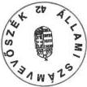

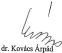

---

•
•
•
•
•

---

MAGYAR KÖZTÁRSASÁG
HONVÉDELMI MINISZTERE
Nyt.szám: 1857/49/98.
Hiv.szám: V-7-93/99-00.

sz.példány

Dr. Kovács Árpád úr
Állami Számvevőszék elnöke

Budapest

# Tisztelt Elnök Úr!

A „kizárólagos állami tulajdon nyilvántartása helyzetéről” szóló jelentést tanulmányoztattam, az abban foglalt megállapításokkal, javaslatokkal egyetértünk.

A jelentéshez a tárca részéről érdemi észrevételt nem teszek. Indokoltnak tartom ugyanakkor jelezni, hogy egyes feladatok (pl. a kódszótár átalakítása, stb.) – megítélésünk szerint – a kincstári vagyon teljes körének nyilvántartására is kihatással lesznek. A vagyonnyilvántartás korszerűsítése, kiteljesítése, illetve a várható új követelmények alkalmazásba vétele jelentős idő- és költségráfordítással lesz csak megvalósítható, ezért e tárgykörben egy több évre szóló koordinált program kidolgozását tartom célszerűnek.

Budapest, 2000. április 19.

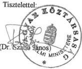

H-1885 BUDAPEST, PF.: 25. • TEL.: (36-1) 474-1104 • FAX: (36-1) 474-1285

---

3

3

3

3

3

3

---

Állami Számvevőszék

Elnök

V-7-104/1999-2000.

dr. Szabó János úr
miniszter

Honvédelmi Minisztérium
Budapest

Tisztelt Miniszter Úr!

Köszönettel vettem kézhez a kizárólagos állami tulajdon nyilvántartása helyzetéről
szóló ÁSZ jelentésre írt levelét.

Jelentésünk nyilvánosságra hozatalakor mellékletként fogja tartalmazni az Önök ész-
revételét az Állami Számvevőszék válaszával együtt.

Egyetértek észrevételével, a jelentésben felsorolt feladatok többsége jelentős idő- és
költségráfordítással jár majd, valamint több évre elhúzódó feladatot jelent.

Budapest, 2000. május " 16 "

Tisztelettel:

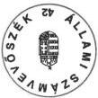

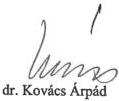

Sán

1. 1. 101 101

---

•
•
•
•

---

02/05/00 09:27 FAX 06 1 441 3722

IM CIVILISZTIKA

366/E/11/2000

315/57/2000

01

IGAZSÁGÜGYI MINISZTÉRIUM
MINISZTER

IM/CIV/2000/MAGÁNJ/549.

II. Külön G. T. Sándor ó.

V.2. Lásd G. a. K. j. u. l. a.
jelentés.

C.

Hiv. sz.: V-7-93/99-00

V-7-95-10/99-00. 05.02.

Dr. Kovács Árpád Úr részére,

V.4. 115

Állami Számvevőszék Elnöke

V.4. 115

05.04. K.

05.04. K.

Tisztelt Elnök Úr!

Köszönöm, hogy megküldte minisztériumunk részére a kizárólagos állami tulajdon kezeléséről készült ÁSZ Jelentést. Az Állami Számvevőszékről szóló 1989. évi XXXVIII. törvény 25. §-ában foglaltakra tekintettel tájékoztatom arról, hogy az IM alapító okiratának elkészítése folyamatban van. A Jelentés megállapításaival, javaslataival egyetértek, ezenkívül – élve a törvény említett §-a szerinti lehetőséggel – a következő kiegészítő észrevételeket teszem:

- A Jelentés 12. oldala javasolja a Miniszterelnöki Hivatalt vezető miniszternek, hogy kezdeményezze a vagyonkezelői jog Polgári Törvénykönyvben (Ptk.) történő definiálását.

Ezzel összefüggésben tájékoztatom arról, hogy az Igazságügyi Minisztériumban a Ptk. korszerűsítése érdekében számos magánjogi terület átfogó vizsgálatát végezzük. Ide tartozik a Ptk. tulajdoni része is, amely az egyes jogi személyek tulajdoni viszonyain kívül az állami tulajdon megváltozott szerepével összhangban álló rendelkezések kialakítását célozza. Nem egyszerűen az új vagyoni értékű jogok beiktatásáról van szó, hanem az állami tulajdon típusainak, jellegének megfelelő szabályozás kialakításáról is, amely összefügg az állam kincstári és vállalkozói vagyonára vonatkozó elképzelésekkel, ugyanakkor stabil jogi keret kialakítását tűzi ki célul. A törvénymódosításig a Ptk. jelenlegi 175. §-a alkalmas arra, hogy külön törvény alapján a vagyonkezelési jog is beilleszthető legyen a magyar jogrendszerbe, ugyanúgy, mint pl. a Magyar Tudományos Akadémia jogcíme a törvény alapján rábízott állami tulajdonú vagyontárgyak vonatkozásában.

---

J2/03/06 09:21 FAX 00 1 441 0722

IN CIVILIZITIKA

4002

2

- A Jelentés 38. oldala jelzi, hogy sem a MEH mint felügyeleti szerv, sem a vizsgált minisztériumok nem rendelkeztek jóváhagyott vagyongazdálkodási koncepcióval a vizsgált időszakban. Ezzel összefüggésben említést érdemel, hogy a kincstári vagyon kezelésével összefüggő tapasztalatokra figyelemmel 1999. év végén kiegészült az államháztartás működési rendjéről szóló 217/1998. (XII. 30.) Korm. rendelet egy új 63/A. §-sal, amely meghatározza a központi költségvetési szervek vagyongazdálkodásának szabályait, előírta az éves vagyongazdálkodási terv készítését, KVI részére történő megküldését, továbbá az éves beszámolóban a vagyongazdálkodási program szakmai, tárgyi és számszaki végrehajtásának elemzését. A rendeletmódosítás 2000. január 1-jén lépett hatályba, így a határidőket ettől az évtől kell alkalmazni. Időközben tehát megszületett az a jogszabályi rendelkezés, amely elősegíti az ÁSZ javaslatban foglaltak megvalósítását.

A Jelentésben foglalt megállapításokat és a vizsgálat anyagait minisztériumunk a jogszabály-előkészítésben történő részvétele során hasznosítani tudja.

Budapest, 2000. április 28.

Tisztelettel:

dr. Dávid Ibolya

---

# Állami Számvevőszék

Elnök

V-7-96/1999-2000.

**dr. Dávid Ibolya úrhölgy**
miniszter

Igazságügyi Minisztérium
Budapest

**Tisztelt Miniszter Úrhölgy!**

Köszönettel vettem kézhez a "kizárólagos állami tulajdon nyilvántartása helyzetéről" készített ÁSZ jelentésről írt észrevételeit, amelyben tájékoztat arról, hogy az Igazságügyi Minisztérium tervezi a Ptk. módosítását az állami tulajdon megváltozott szerepével összhangban.

A törvény módosításáig a Ptk. 175. §-a Önök szerint alkalmas a vagyonkezelői jogosítványok meghatározására, a kincstári vagyonnal való gazdálkodás polgári jogi rendezésére. A számvevőszéki vizsgálat tapasztalatai alapján kialakított megállapítások szerint azonban a vagyon "másra bízása" nem azonos a polgári szerződésben foglalt vagyonkezeléssel.

Ugyanakkor örömmel vettem tudomásul, hogy a jelentésben hiányolt vagyongazdálkodási koncepciók elkészítése 2000. január 1-től a központi költségvetési szervek kötelezettsége lett a vonatkozó kormányrendeletben megfogalmazottak szerint.

Tájékozatom, hogy észrevételét csatolom az ÁSZ jelentés kiadmányozási eljárásrendjének megfelelően a nyilvánosságra hozandó végleges ÁSZ jelentéshez.

Köszönöm tájékoztatását az újabb változásokról, amelyek segítik a kincstári vagyon megőrzését, tervszerű hasznosítását és gyarapítását.

Budapest, 2000. május " 10 "

Tisztelettel:

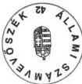

dr. Kovács Árpád

---

1

1

1

1

1

1

---

ATM-11003/2000

380/E/n/2000

330/55/2000

# KÖRNYEZETVÉDELMI MINISZTÉRIUM
közigazgatási államtitkára

KÖT-695/2000.

Hiv. sz.: V-7-93/99-00.

dr. Kovács Árpád úrnak,
elnök

Állami Számvevőszék

Budapest

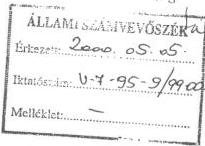

Tisztelt Elnök Úr!

Kiem a jelentős
csatolni. Kiem
lés
05.05.

Lakos: Kamon Dávid, Éva utca
V. 9 Kig

A kizárólagos állami tulajdon nyilvántartása helyzetéről szóló jelentés tervezetére a következő észrevételt teszem.

A Jelentés feltárta azt a KöM által évek óta jelzett anomáliát, mely szerint nincs rendezve az ÁPV Rt. és a KVI vagyoni körébe tartozó védett természeti területek sorsa. A korábban állami gazdaságok kezelésében lévő védett természeti területek átadása a KVI részére – a tartósan állami tulajdonban tartandó vagyoni körbe – nem történt meg, ezért sok területen rendezetlen a védett területek helyzete.

A nemzeti park igazgatóságok vagyonkezelésében lévő és haszonbérleti szerződés alapján kezelt területek esetében nem lehet szempont a jövedelmezőség, a természeti értékek megőrzését biztosító munkavégzés lehetséges, ez nem minden esetben eredményez bevételt.

Budapest, 2000. május „4„.

Tisztelettel:

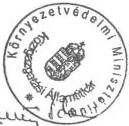

dr. Skultéty Sándor

KÖRNYEZETVÉDELMI MINISZTÉRIUM

1011 Budapest I., Fő utca 44-50. • Levélcím: 1394 Budapest, Postafiók: 351

Telefon: 201-1582 457-3506 • Telefax: 201-2364

---

The Ground Truth image displays a single, solid horizontal line. According to Rule 2 (UNDERSCORE & LINE RULES), this is a stylistic or background line, not a placeholder underscore. Therefore, the OCR result must ignore it and output nothing or only meaningful text. The provided OCR content is "____", which consists of four underscores. This is an incorrect interpretation of the line as a placeholder, violating the rule that stylistic lines must be ignored. The OCR has hallucinated underscores where none should exist based on the GT's visual context. Hence, the OCR result is inconsistent with the Ground Truth.

[Non-Text]

[Non-Text]

[Non-Text]

[Non-Text]

[Non-Text]

The Ground Truth image displays a single, solid horizontal line. According to Rule 2 (UNDERSCORE & LINE RULES), this is a stylistic or background line, not a placeholder underscore. Therefore, the OCR result must ignore it and output nothing or only meaningful text. The provided OCR content is "____", which consists of four underscores. This is an incorrect interpretation of the line as a placeholder, violating the rule that stylistic lines must be ignored. The OCR has hallucinated underscores where none should exist based on the GT's visual context. Hence, the OCR result is inconsistent with the Ground Truth.

[Non-Text]

[Non-Text]

[Non-Text]

[Non-Text]

[Non-Text]

[Non-Text]

[Non-Text]

[Non-Text]

[Non-Text]

The Ground Truth image displays a single, solid horizontal line. According to Rule 2 (UNDERSCORE & LINE RULES), this is a stylistic or background line, not a placeholder underscore. Therefore, the OCR result must ignore it and output nothing or only meaningful text. The provided OCR content is "____", which consists of four underscores. This is an incorrect interpretation of the line as a placeholder, violating the rule that stylistic lines must be ignored. The OCR has hallucinated underscores where none should exist based on the GT's visual context. Hence, the OCR result is inconsistent with the Ground Truth.

[Non-Text]

[Non-Text]

[Non-Text]

[Non-Text]

[Non-Text]

[Non-Text]

The Ground Truth image displays a single, solid horizontal line. According to Rule 2 (UNDERSCORE & LINE RULES), this is a stylistic or background line, not a placeholder underscore. Therefore, the OCR result must ignore it and output nothing or only meaningful text. The provided OCR content is "____", which consists of four underscores. This is an incorrect interpretation of the line as a placeholder, violating the rule that stylistic lines must be ignored. The OCR has hallucinated underscores where none should exist based on the GT's visual context. Hence, the OCR result is inconsistent with the Ground Truth.

[Non-Text]

[Non-Text]

[Non-Text]

[Non-Text]

[Non-Text]

[Non-Text]

[Non-Text]

[Non-Text]

[Non-Text]

[Non-Text]

[Non-Text]

[Non-Text]

[Non-Text]

[Non-Text]

[Non-Text]

[Non-Text]

The Ground Truth image displays a single, solid horizontal line. According to Rule 2 (UNDERSCORE & LINE RULES), this is a stylistic or background line, not a placeholder underscore. Therefore, the OCR result must ignore it and output nothing or only meaningful text. The provided OCR content is "____", which consists of four underscores. This is an incorrect interpretation of the line as a placeholder, violating the rule that stylistic lines must be ignored. The OCR has hallucinated underscores where none should exist based on the GT's visual context. Hence, the OCR result is inconsistent with the Ground Truth.

[Non-Text]

The Ground Truth image displays a single, solid horizontal line. According to Rule 2 (UNDERSCORE & LINE RULES), this is a stylistic or background line, not a placeholder underscore. Therefore, the OCR result must ignore it and output nothing or only meaningful text. The provided OCR content is "____", which consists of four underscores. This is an incorrect interpretation of the line as a placeholder, violating the rule that stylistic lines must be ignored. The OCR has hallucinated underscores where none should exist based on the GT's visual context. Hence, the OCR result is inconsistent with the Ground Truth.

The Ground Truth image displays a single, solid horizontal line. According to Rule 2 (UNDERSCORE & LINE RULES), this is a stylistic or background line, not a placeholder underscore. Therefore, the OCR result must ignore it and output nothing or only meaningful text. The provided OCR content is "____", which consists of four underscores. This is an incorrect interpretation of the line as a placeholder, violating the rule that stylistic lines must be ignored. The OCR has hallucinated underscores where none should exist based on the GT's visual context. Hence, the OCR result is inconsistent with the Ground Truth.

The Ground Truth image displays a single, solid horizontal line. According to Rule 2 (UNDERSCORE & LINE RULES), this is a stylistic or background line, not a placeholder underscore. Therefore, the OCR result must ignore it and output nothing or only meaningful text. The provided OCR content is "____", which consists of four underscores. This is an incorrect interpretation of the line as a placeholder, violating the rule that stylistic lines must be ignored. The OCR has hallucinated underscores where none should exist based on the GT's visual context. Hence, the OCR result is inconsistent with the Ground Truth.

The Ground Truth image displays a single, solid horizontal line. According to Rule 2 (UNDERSCORE & LINE RULES), this is a stylistic or background line, not a placeholder underscore. Therefore, the OCR result must ignore it and output nothing or only meaningful text. The provided OCR content is "____", which consists of four underscores. This is an incorrect interpretation of the line as a placeholder, violating the rule that stylistic lines must be ignored. The OCR has hallucinated underscores where none should exist based on the GT's visual context. Hence, the OCR result is inconsistent with the Ground Truth.

The Ground Truth image displays a single, solid horizontal line. According to Rule 2 (UNDERSCORE & LINE RULES), this is a stylistic or background line, not a placeholder underscore. Therefore, the OCR result must ignore it and output nothing or only meaningful text. The provided OCR content is "____", which consists of four underscores. This is an incorrect interpretation of the line as a placeholder, violating the rule that stylistic lines must be ignored. The OCR has hallucinated underscores where none should exist based on the GT's visual context. Hence, the OCR result is inconsistent with the Ground Truth.

The Ground Truth image displays a single, solid horizontal line. According to Rule 2 (UNDERSCORE & LINE RULES), this is a stylistic or background line, not a placeholder underscore. Therefore, the OCR result must ignore it and output nothing or only meaningful text. The provided OCR content is "____", which consists of four underscores. This is an incorrect interpretation of the line as a placeholder, violating the rule that stylistic lines must be ignored. The OCR has hallucinated underscores where none should exist based on the GT's visual context. Hence, the OCR result is inconsistent with the Ground Truth.

The Ground Truth image displays a single, solid horizontal line. According to Rule 2 (UNDERSCORE & LINE RULES), this is a stylistic or background line, not a placeholder underscore. Therefore, the OCR result must ignore it and output nothing or only meaningful text. The provided OCR content is "____", which consists of four underscores. This is an incorrect interpretation of the line as a placeholder, violating the rule that stylistic lines must be ignored. The OCR has hallucinated underscores where none should exist based on the GT's visual context. Hence, the OCR result is inconsistent with the Ground Truth.

The Ground Truth image displays a single, solid horizontal line. According to Rule 2 (UNDERSCORE & LINE RULES), this is a stylistic or background line, not a placeholder underscore. Therefore, the OCR result must ignore it and output nothing or only meaningful text. The provided OCR content is "____", which consists of four underscores. This is an incorrect interpretation of the line as a placeholder, violating the rule that stylistic lines must be ignored. The OCR has hallucinated underscores where none should exist based on the GT's visual context. Hence, the OCR result is inconsistent with the Ground Truth.

---

Állami Számvevőszék

Elnök

V-7-105/99-00.

dr. Skultéty Sándor úr
közigazgatási államtitkár

Környezetvédelmi Minisztérium
B u d a p e s t

# Tisztelt Államtitkár Úr!

Köszönettel vettem a kizárólagos állami tulajdon nyilvántartásának helyzetéről szóló
ÁSZ jelentésre írt észrevételeiket.

Örülök, hogy megállapításainkkal egyetért. Válaszlevelében jelezte, hogy a kincstári
vagyon részét képező védett természeti területek felett a tulajdonosi jogokat több szer-
vezet gyakorolja, nehezítve ezzel az egységes kezelést, a vagyon egységes szemléletű
megóvását. A védett természeti területeken nem szempont a jövedelmezőség. A nem-
zeti park igazgatóságoknak költségvetési szervként az értékek megőrzése az elsődle-
ges. Feladatuk ellátásához költségvetési forrásokat kell rendelni, ezért tartom célszerű-
nek, hogy egységesen a KVI gyakorolja a tulajdonosi jogokat.

Tájékozatom, hogy észrevételét csatolom az ÁSZ jelentés kiadmányozási eljárásrend-
jének megfelelően a nyilvánosságra hozandó végleges ÁSZ jelentéshez.

Budapest, 2000. május " 15"

Tisztelettel:

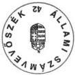

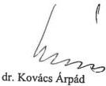

---

1. 2017年，公司与上海浦东发展银行股份有限公司签订了《关于使用部分闲置募集资金进行现金管理的协议》。

[Non-Text]

[Non-Text]

[Non-Text]

[Non-Text]

[Non-Text]

1. 2017年1月1日至2018年1月1日（含）的公司股票交易均价为4.56元/股，与前一交易日收盘价相比，涨幅为-0.97%。

[Non-Text]

[Non-Text]

1. 2017年1月1日至2018年1月1日（含）的公司股票交易均价为4.56元/股，与前一交易日收盘价相比，涨幅为-0.97%。

[Non-Text]

[Non-Text]

[Non-Text]

[Non-Text]

[Non-Text]

[Non-Text]

[Non-Text]

[Non-Text]

[Non-Text]

[Non-Text]

[Non-Text]

[Non-Text]

[Non-Text]

1. 2017年1月1日至2018年1月1日（含）的公司股票交易均价为4.56元/股，与前一交易日收盘价相比，涨幅为-0.97%。

[Non-Text]

1. 2017年1月1日至2018年1月1日（含）的公司股票交易均价为4.56元/股，与前一交易日收盘价相比，涨幅为-0.97%。

[Non-Text]

[Non-Text]

[Non-Text]

[Non-Text]

[Non-Text]

1. 2017年1月1日至2018年1月1日（含）的公司股票交易均价为4.56元/股，与前一交易日收盘价相比，涨幅为-0.97%。

[Non-Text]

[Non-Text]

[Non-Text]

[Non-Text]

[Non-Text]

[Non-Text]

[Non-Text]

[Non-Text]

1. 2017年1月1日至2018年1月1日（含）的公司股票交易均价为4.56元/股，与前一交易日收盘价相比，涨幅为-0.97%。

[Non-Text]

1. 2017年1月1日至2018年1月1日（含）的公司股票交易均价为4.56元/股，与前一交易日收盘价相比，涨幅为-0.97%。

1. 2017年1月1日至2018年1月1日（含）的公司股票交易均价为4.56元/股，与前一交易日收盘价相比，涨幅为-0.97%。

1. 2017年1月1日至2018年1月1日（含）的公司股票交易均价为4.56元/股，与前一交易日收盘价相比，涨幅为-0.97%。

1. 2017年1月1日至2018年1月1日（含）的公司股票交易均价为4.56元/股，与前一交易日收盘价相比，涨幅为-0.97%。

1. 2017年1月1日至2018年1月1日（含）的公司股票交易均价为4.56元/股，与前一交易日收盘价相比，涨幅为-0.97%。

1. 2017年1月1日至2018年1月1日（含）的公司股票交易均价为4.56元/股，与前一交易日收盘价相比，涨幅为-0.97%。

1. 2017年1月1日至2018年1月1日（含）的公司股票交易均价为4.56元/股，与前一交易日收盘价相比，涨幅为-0.97%。

1. 2017年1月1日至2018年1月1日（含）的公司股票交易均价为4.56元/股，与前一交易日收盘价相比，涨幅为-0.97%。

---

00 04/28 10:46 +36 1 461 3522

KHVM Költségvet. →→ ÁLL.SZÁMVEVŐSZÉK

001

MAGYAR KÖZTÁRSASÁG
KÖZLEKEDÉSI, HÍRKÖZLÉSI ÉS VÍZÜGYI
MINISZTÉRIUM
HELYETTES ÁLLAMTITKÁR
003.822/12/2000.

Halász Gejza úr
Igazgató

Állami Számvevőszék

Budapest

Tisztelt Igazgató Úr!

Az Állami Számvevőszék Elnöke által megküldött, a kizárólagos állami tulajdon nyilvántartása helyzetéről készített „Jelentés”-ben foglaltakkal kapcsolatosan – hivatkozva a 003822/6/2000. sz. levelemben kért határidőmódosításra is – az alábbi észrevételeket tesszük.

Az I. Összegező megállapításokhoz

A jelentés általános összegező megállapításai, következtetései általában elfogadhatóak.

Megjegyezzük ugyanakkor, hogy a Számvevőszék által a nyilvántartotthoz képest becsült három – négyszeres eltérésnek – a nemzeti vagyon valós értékéhez képest – a „vízügyi vagyon” tekintetében két igen lényeges oka van.

Az egyik, hogy a természetes folyóknak, tavaknak nincs értéke, csak a rajtuk végrehajtott beavatkozásoknak.

A másik, hogy több mint 25 éve nem történt meg a vízügyi létesítmények újraértékelése, ezért a folyó árakon aktivált új fejlesztések inhomogén értéknagyságot tükröznek. Az átértékelésre azonban tárcánknak nincs jogköre.

Megjegyezzük továbbá, hogy a MÁV Rt. nyilvántartása szerinti kincstári vagyonérték pontosnak minősíthető, mivel az megegyezik az Állam és a MÁV Rt között kötött szerződésben rögzített értékkel.

Kujja: Kunsai Dömötli Gábor
N. 78.

V-7-95-7/99-00.

Tulajdonszám: Sürgős vállalat Ekk
05.03. Külön

---

'00 04/28 10:46 +36 1 461 3522

KHVM Költségvet. →→ ÁLL.SZÁMVEVŐSZÉK

002

2

# Az I. Javaslatok a közlekedési, hírközlési és vízügyi miniszternek c. rész 2. pontjához

A javasoltakkal egyetértve az alábbiakat jegyezzük meg.

- A frekvenciák – ha nem is vagyonkataszteri nyilvántartással – de nemzeti felosztási táblázattal rendelkeznek. Erre a táblázatra utalnak az 1-3. mellékletek, de jelezzük, hogy a hivatkozott kormányrendelet száma megváltozott. A hatályos jogszabály a 221/1999. (XII.29.) Korm. rendelet. Kérjük ennek megfelelően a helyesbítést.

A jelentés több helyen említi a távközlési frekvenciákat, vagy a távközlésre használható frekvenciákat (pl. I. fejezet 6. és 13. oldal; II. fejezet 16., 18., 20., 23. és 28. oldal, 1., 2., és 3. melléklet 10. pontjai), amelyeket a jelentésben is hivatkozott, a frekvenciagazdálkodásról szóló 1993. évi LXII. törvény meghatározása alapján indokolt lenne rádiótávközlési és egyéb célú (ipari, tudományos, orvosi és háztartási) frekvenciákra módosítani, vagy pedig csak frekvenciákat említeni. A szakmai kifejezés módosítása azért szükséges, mert a távközléshez általában nem kell frekvencia, ez csak a rádiótávközlés elengedhetetlen feltétele.

A 20. oldalon található táblázat 10. pontjában az értékadatok, – hasonlóan az ország területe feletti légtérhez – hiányoznak. Ez nyilvánvaló, mivel a frekvenciák értéke nagymértékben függ az alkalmazási céltól, a felhasználás helyétől, a frekvenciasáv szélességétől, a frekvencia jellegétől (kizárólagos, megosztott, közös) és több műszaki tartalmú tényezőtől. Ugyanakkor a frekvencia sajátos vagyonelem, használni lehet, de nem lehet elfogyasztani, mint az ásványi nyersanyagokat, viszont korlátos erőforrás, mert a jelenlegi felosztás is a 9 kHz – 400 GHz tartományra vonatkozik. Ha nem használjuk, az ugyanakkor veszteségként fogható fel, mivel a használatért megállapított díjat nem fizetik meg.

A nemzeti felosztási táblázat mellett vagyonkataszteri nyilvántartás létrehozását a frekvenciák előzőekben leírt sajátosságai miatt nem tartjuk megvalósíthatónak.

- A javasolt intézkedések egy sor elvi kérdés tisztázását (pl. az elhagyott folyómedrek kérdése, vagy hogy a felszín alatti vizek víztartó képződményei a nemzeti vagyon szempontjából önállóan értelmezhetők-e; a folyók és a folyók, mint víztutak közötti átfedés tisztázása), más – az ügyben érintett – tárcákkal, KSH-val való egyeztetés igényét is szükségessé teszik, ezért e feladat elvégzéséhez véleményünk szerint legalább 1,5-2 év biztosítása szükséges.

# A II. Részletes megállapításokhoz

- A jelentés részletes megállapítások része a 27. oldalon tévedést tartalmaz. A közlekedési, hírközlési és vízügyi miniszter az M1-es autópályát, mint egészet nem adta koncesszióba, csupán annak egy részét, a Győr-Hegyeshalom közti szakaszt.

---

00 04/20 10:47 +36 1 461 3522

KHVM KÖLTSÉGVET. +++ ALL.SZAMVEVŐSZEK

003

3

Megjegyezzük, hogy ugyanez a megállapítás az anyagban később ismétlődően is megjelenik, amit korrigálni javasolunk.

- A jelentés 1. számú mellékletének 7. pontja pontatlanságokat tartalmaz. A vízi út és a hajóút fogalma nem azonos. A vízi út a víziközlekedés pályája, az a víz fogalmától nem választható el, vízi út víz nélkül nincs. Ehhez képest a hajóút a vízi út korlátozott része, amelyet a nagyhajók közlekedésére jelölnek ki (természetesen a hajóút sem létezik víz nélkül).

A vizek nyilvántartását jelenleg a vízügyi hatóság, az Országos Vízügyi Főigazgatóság végzi, ennek keretében tartja nyilván a víziutat is, azonban nyilvántartása az országos közforgalmú kikötőkre nem terjed, nem is terjedhet ki, hiszen a kikötőnek – a hajózásról szóló 1973. évi 6. tvr. 20. §-a alapján – nem része a vízterület.

A teljes körű tájékoztatáshoz hozzátartozik, hogy a tárca – a vízgazdálkodásról szóló törvény rendelkezéseit figyelembe véve (önkormányzati tulajdonban is lehetnek hajózható vizek) kezdeményezte a Ptk. módosítását a víziközlekedésről szóló törvényjavaslatban.

A törvényjavaslat – amelynek zárószavazására várhatóan a közeljövőben kerül sor – szerint a vízi út és az országos közforgalmú kikötő fogalma egyaránt kikerül a Ptk. 172. §-ából és a víziutak nyilvántartását a hajózási hatóság fogja ellátni.

- A vagyonnyilvántartás továbbfejlesztését – annak informatikai háttérigényével összehangolva – elfogadható ütemben haladva lenne célszerű végrehajtani, alapvetően szem előtt tartva azt, hogy a KVI az adattömeget érdemben kezelni is tudja.
- Tisztázásra szorul, hogy a tulajdonosi ellenőrzés „határa” meddig terjed ki. Ki terjed-e a költségvetési szerv által létrehozott gazdasági társaságra is.

Miután a korábbi időszakhoz képest az állami tulajdon nyilvántartásában résztvevő valamennyi szereplő számára a feladat valamilyen szegmensében új, lényegesnek tartjuk, hogy az ügyben érintettek elmúlt években felhalmozott tapasztalatait kritikailag feldolgozva a szükséges jogszabály módosításokra mielőbb sor kerüljön.

A jelentés rendkívül értékes megállapításait, javaslatait megköszönve, kérem, hogy fenti észrevételeinket elfogadni szíveskejdék.

Budapest, 2000. április 24.

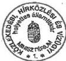

Üdvözlettel

/ Spakievics Sándor /

---

3

，

，

7

3

1

---

# Állami Számvevőszék

Elnök

V-7- 97/1999-2000.

Katona Kálmán úr
miniszter

Közlekedési, Hírközlési és Vízügyi Minisztérium
Budapest

Tisztelt Miniszter Úr!

Köszönettel vettem "a kizárólagos állami tulajdon nyilvántartása helyzetéről" készített
ÁSZ jelentéshez fűzött észrevételeit.

A jelentésben foglaltak alapján látható, hogy a kincstári vagyonnal való gazdálkodás
még számos feladat megoldását igényli mind a törvényhozás, mind a vagyonkezelés
területén.

Egyetértek azzal, hogy a KVI vagyon-nyilvántartásának fejlesztése a széleskörű
egyeztetések miatt elhúzódó folyamat. A hosszú munka ütemezése, koordinálása ki-
emelten fontos feladat, mint ahogy erre javaslatainkban is kitérünk.

A nemzeti vagyon értékelésének jelenlegi szabályozása eredményezi azt a tényt, hogy
25 évvel ezelőtti értékadatok szerepelnek a kincstári vagyon értéknyilvántartásaiban,
amely megnehezíti a vagyonnal való hatékony és eredményes gazdálkodást.

A jelentésnek nem volt célja az, hogy értékadatokat rendeljen a kizárólagos állami tu-
lajdonhoz. Az elsődleges feladat a vagyon számbavétele legalább természetes mennyi-
ségi mutatóik szerint.

A jelentés mellékletének 1. táblázata foglalja össze a kizárólagos állami tulajdon defi-
níciójára vonatkozó törvényeket, a rájuk vonatkozó kormányrendeleteket. A táblázat
bemutatja, hogy az egyes meghatározások esetenként nem épülnek egymásra, megne-
hezítve ezzel a vagyonnal való megalapozott gazdálkodást.

Egyetértek Önnel abban, hogy a feltárt helyzet alapján az érintett minisztériumoknak,
szervezeteknek több éves jogalkotói, egyeztetési feladatai lesznek annak érdekében,
hogy a nemzeti vagyonmérleget valós értékekkel el lehessen készíteni.

Tájékozatom, hogy észrevételét csatolom az ÁSZ jelentés kiadmányozási eljárásrend-
jének megfelelően a nyilvánosságra hozandó végleges ÁSZ jelentéshez.

Köszönöm Önnek és munkatársainak a jelentés összeállításhoz nyújtott segítségét.

Budapest, 2000. május "10"

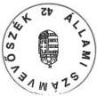

Tisztelettel:

dr. Kovács Árpád

L. Évi K. K.

---

A

1

1

1

1

1

---

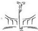

NEMZETI KULTURÁLIS ÖRÖKSÉG MINISZTÉRIUMA

MINISZTER

Kanaini D. Ér
Korp. Bécsi Adatán
V.3. 82

ATM-3839/2000
3.11/53/2000,

Agy

5.1/31/2000

Állami Számvevőszék
1052 Budapest
Apáczai Csere János u. 10.

Hiv. sz.: V-7-93-99-00

L. Kalin G. G.

Sándor u.

V.3.

dr. Kovács Árpád elnök úr részére

|  ÁLLAMI SZÁMVEVŐSZÉK  |   |
| --- | --- |
|  Érkezett: | 25. 05. 02.  |
|  Iktatószám: | V-7-95-8/99-00.  |
|  Melléklet: |   |

05.02.
Kord
5/2

05.04. Kül

Tisztelt Elnök Úr!

Az Állami Számvevőszék által készített, a „kizárólagos állami tulajdon nyilvántartása helyzetéről” szóló jelentést áttanulmányoztam, a Nemzeti Kulturális Örökség Minisztériumát érintő megállapításaival egyetértek, észrevételt nem teszek.

Budapest, 2000. április „X”

Tisztelettel

1077 Budapest, Wesselényi utca 20-22. • Telefon: 484-7100 • Fax: 484-7140

---

1. 2. 3. 4. 5. 6. 7. 8. 9. 10. 11. 12. 13. 14. 15. 16. 17. 18. 19. 20. 21. 22. 23. 24. 25. 26. 27. 28. 29. 30. 31. 32. 33. 34. 35. 36. 37. 38. 39. 40. 41. 42. 43. 44. 45. 46. 47. 48. 49. 50. 51. 52. 53. 54. 55. 56. 57. 58. 59. 60. 61. 62. 63. 64. 65. 66. 67. 68. 69. 70. 71. 72. 73. 74. 75. 76. 77. 78. 79. 80. 81. 82. 83. 84. 85. 86. 87. 88. 89. 90. 91. 92. 93. 94. 95. 96. 97. 98. 99.

---

Állami Számvevőszék

Elnök

V-7-102 /1999-2000.

Rockenbauer Zoltán úr
miniszter

Nemzeti Kulturális Örökség Minisztériuma
Budapest

Tisztelt Miniszter Úr!

Köszönettel vettem a kizárólagos állami tulajdon nyilvántartása helyzetéről szóló ÁSZ
jelentésre írt levelét.

Tájékozatom, hogy észrevételét csatolom az ÁSZ jelentés kiadmányozási eljárásrend-
jének megfelelően nyilvánosságra hozandó végleges ÁSZ jelentéshez.

Örülök, hogy a jelentésben foglalt megállapításokkal egyetért.

Budapest, 2000. május "10"

Tisztelettel:

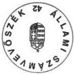

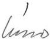

dr. Kovács Árpád

Sáma
L. Zoltán Ké

---

1

1

1

1

1

1

---

MINISZTERELNÖKI HIVATAL
MINISZTER

346/E1n/2000

Mérletet kisebb
Sándor úrnak, az
eredeti Mélén
ülhöz, szótelni.
Könyör:

XXII/K-99/2000.

doc/1000/1

közön
04.20

Dr. Kovács Árpád úrnak
elnök

Állami Számvevőszék
Budapest

Tárgy: Észrevételek „a kizárólagos állami tulajdon
nyilvántartása helyzetéről” szóló jelentéshez

Tisztelt Elnök Úr!

A V-7-93/99/2000. számú levelével kézhezvett tárgybani Állami Számvevőszék-i
jelentéshez (a továbbiakban: Jelentés) az alábbi észrevételeket teszem:

A Jelentés alapos és körültekintő elemző munkát tükröz. Az összegző
megállapítások, következtetések és javaslatok döntő többsége hozzájárulhat
ahhoz, hogy a kincstári vagyonnal való gazdálkodás színvonala növekedjék.

Az anyag áttanulmányozása alapján megállapítható, hogy a Jelentés tervezetéhez
szakértői szinten – többször – tett észrevételeink figyelembe vételre kerültek. A
vizsgálat eredményességét elősegíti az a változás is, amely szerint a vizsgálati
programhoz képest szűkült az ellenőrzés és a megállapítások tartalmi köre.

A Javaslatokhoz a következő észrevételeket teszem:

A Kormány számára javasolt intézkedések megítélésem szerint tartalmukban
szükséges feladatok, de nem a Kormány feladatát képezik. Az 1. pontban jelzett,
az ÁPV Rt. hozzárendelt vagyonát érintő teendők a Miniszterelnöki Hivatalt
vezető miniszter kompetenciájába tartoznak. A 2. pontban említett hiányzó

---

2

alapító okiratok pótlását a minisztériumok számára célszerű feladatként megjelölni.

A Miniszterelnöki Hivatalt vezető miniszter számára javasolt feladatok döntő többségével egyetértek. A 2., 3. és 7. pontban foglalt feladatok azonban megítélésem szerint részben szükségtelenek, részben a Kincstári Vagyoni Igazgatóság (KVI) feladatkörébe tartoznak. A vagyonpolitikai irányelvek kimunkálására akkor volt szükség, amikor még nem alakult ki a kincstári vagyonra vonatkozó jogi szabályozás. A meglévő jogszabályok, szabályzatok kielégítő elvi alapot adnak a vagyonnal való hatékony gazdálkodás számára. A Magyar Állam nevében a tulajdonosi jogok gyakorlását az illetékes miniszter a KVI útján gyakorolja. A KVI feladata a nyilvántartási rendszer kimunkálása, továbbfejlesztése, a megfelelő aggregátumok képzése, a mutatószám rendszer kimunkálása.

A tulajdonosi ellenőrzés tekintetében az irányelvek megfogalmazása a MeH feladatát képezheti a jövőben. A különböző vagyonkezelő szervezeteknél folyó felügyeleti ellenőrzések és a KVI tulajdonosi ellenőrzései összehangolására a Kormány rendelkezhet hatáskörrel. Ezt lenne célszerű a Kormánynak feladatul szabni úgy, hogy e cél megvalósítására az Áht. módosítása keretében kerüljön sor.

Kérem Elnök Urat, hogy a Jelentésre tett fenti észrevételeimet tudomásul venni szíveskedjék.

Budapest, 2000. április 18.

Üdvözlettel

---

Állami Számvevőszék

Elnök

V-7-103/1999-2000.

dr. Stumpf István úr
miniszter

Miniszterelnöki Hivatal
Budapest

Tisztelt Miniszter Úr!

Köszönöm "a kizárólagos állami tulajdon nyilvántartása helyzetéről" szóló jelenté-
sünkre írt válaszát, munkánk elismerését.

Az Állami Számvevőszék kiadmányozási rendje szerint minden elkészült jelentés az
elnöki aláírás után - tekintve a korábbi észrevételezési folyamatot - az adott formájá-
ban, változatlanul kerül kiadásra, így észrevételei közvetlen átvezetésére nincs utólag
módom.

Ugyanakkor az Ön megjegyzéseivel, ami az egyes ajánlások címzettjeinek módosításá-
ra irányul, messzemenően egyetértek. Így levelét és az arra adott jelen válaszomat a
végleges jelentéshez csatolom.

Az országgyűlési bizottságoknak és a kormányzati vezetőknek elküldött jelentések kí-
sérő levelében kiemelem, hogy javaslatainkon túlmenően az Önök észrevételeit is ve-
gyék figyelembe.

Budapest, 2000. május "11"

Tisztelettel:

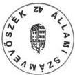

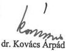

2. K.

---

3

5

3

7

4

7

---

06 04/10 WLD 10.10 FAX +36 1 331 9106

AL. VEZ. IG. HELY.

001

# KINCSTÁRI VAGYONI IGAZGATÓSÁG
VEZÉRIGAZGATÓ

Válaszadás esetén kérem levélszámunkra hivatkozzon!

22000-2857-13/2000.

Halász Gejza úr
Számvevő-igazgató

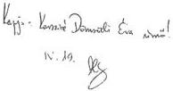

Állami Számvevőszék

Budapest

Tisztelt Számvevő-igazgató Úr!

Dr. Kovács Árpád úr, az Állami számvevőszék elnöke megküldte részünkre „A
kizárólagos állami tulajdon nyilvántartása helyzetéről” szóló vizsgálati jelentést
azzal, hogy észrevételeinket Önnek címezve küldjük meg.

Összességében meg kell erősítenem az előzőekben már többször leírtakat,
miszerint ahhoz, hogy a kincstári vagyon – mint nálunk gyakorlatilag és
elméletileg is új, de a fejlett demokráciában már évszázadok óta létező va-
gyonkategória – hazánkban is méltó és jogilag is rendszerbe állított helyére
kerülhessen, még hosszú idő és sok munka szükséges.

Az Állami Számvevőszék jelentése a Kincstári Vagyoni Igazgatóság részére
segítséget tud nyújtani az említett célok eléréséhez. Az ÁSZ ilyen irányú, a
KVI részére nyújtandó támogatásának – álláspontom szerint – az Ország-
gyűlés előtt meg kellene jelennie annak érdekében, hogy az ÁSZ által rögzí-
tett elvárások – amelyek jelentős része általunk is kívánt cél – teljesíthetőek
legyenek.

Az előzőek miatt a KVI és az általa végzett munka értékelése során kértem, – de
a végleges jelentésből hiányolom –, hogy a kritikus hangvétel mellett erőteljes-
ebben kerüljön kiemelésre a KVI 1998. novemberétől kinevezett új vezetésnek
az a törekvése, hogy a kincstári vagyon tekintetében a vagyon nyilvántartásának
teljességét és helyességét biztosítsa valamint, hogy a kincstári vagyon védelmét
és a kincstári vagyonnal történő gazdálkodást kiemelkedő fontosságúnak ítéli.
Szerettük volna, hogy nagyobb hangsúlyt kapjanak az értékelésben azok az új
irányítás alatt hozott döntések, megjelent belső szabályzatok, amelyek mind az
előzőekben megfogalmazott célok elérése érdekében születtek.

1054 Budapest, Zoltán u. 16., 1392 Pf: Tel.: (36-1) 311-7467, 311-7148 Fax: 312-1828

---

00 04/19 WED 13:10 FAX +36 1 331 9106

ÁL.VEZ.IG.HELY.

002

2

Ami a kizárólagos állami tulajdonban lévő vagyonelemeket illeti – a korábban kifejtetthez képest –, álláspontunk változatlan.

Úgy gondolom, a vizsgálat kapcsán egyértelműen szükséges lenne rögzíteni, hogy a vizsgált területre vonatkozó jogi szabályozás új keletű és korántsem teljes. Az annak végrehajtására létrehozott szervezet közel sem kapta meg eddig azon költségvetési és egyéb támogatottságot, amellyel több, mint 50 év hibáit rendkívül rövid idő alatt korrigálhatná.

A KVI munkájának vizsgálatával összefüggésben, a KVI kisszámú munkatársának azon erőfeszítéseit, amelyek az adott szituációban olyan pozitív eredményeket is felmutatnak, amelyek a kincstári vagyon egészének kezelése terén már megvalósulni látszanak, értékelni kellene. Véleményünk szerint a KVI munkájának értékelésében a hangsúlyt a kincstári vagyon védelme érdekében bekövetkezett és a tervezett jó irányú változásokra és nem a negatív megítélésre kellett volna helyezni.

Csak példaként említjük, hogy az elmúlt egy év alatt jogszabály módosításokat kezdeményeztünk a kormány kincstári vagyonnal kapcsolatos stratégiájának kimunkálása érdekében, az állami feladatok és a hozzájuk szükséges kincstári vagyon részletes felmérésére, a kincstári ingatlanvagyon teljes körű nyilvántartásának biztosítására, az ingatlan-nyilvántartás és a kincstári vagyon nyilvántartásának összekapcsolására. Kezdeményeztük a költségvetési törvény KVI gazdálkodására vonatkozó részeinek olyan irányú módosítását, ami megkönnyíti a kincstári vagyonnal történő hatékony gazdálkodást és annak ellenőrzését. A vagyonkataszterben lévő adatok hitelességének ellenőrzésére felvettük a kapcsolatot a Magyar Államkincstárral és az APEH-al.

A kincstári vagyon nyilvántartása, a vagyonkataszter – bár valóban nem teljes körű – de létrejött, az adatbázis működik, lekérdezhető. Természetesen mi magunk is törekszünk arra, hogy a nyilvántartásunk minél hamarabb átfogja a teljes kincstári vagyoni körét, kielégítse a vele szemben támasztott igényeket. A teljes körűséghez azonban elengedhetetlen a vagyonkezelők adatszolgáltatási fegyelmének fokozása, amelyre azonban a KVI nincs hatással, holott a KVI mind a 19 megyei kirendeltsége megfelelő számítástechnikai háttérrel ellátott, ahol fogadni tudják a vagyonkezelők által flopyn szolgáltatott adatokat és változásjelentéseket.

A KVI-n belül a kincstári vagyonnal való hatékony gazdálkodás érdekében stratégiai munkacsoportot hoztunk létre.

---

10. 01. 10. 10. 11. 11. 11. 11. 11. 11. 11. 11. 11. 11. 11. 11. 11. 11. 11. 11. 11. 11. 11. 11. 11. 11. 11. 11. 11.

AL. VEZ. IG. HELY.

003

3

A Kincstári Vagyoni Igazgatóság teljes szervezetét átalakítottuk annak érdekében, hogy a kincstári vagyonnal kapcsolatos feladatok maradéktalanul és hatékonyan elvégezhetők legyenek.

Sajnálattal tapasztaltam, hogy ezek az elvégzett, – véleményem szerint – fontos és előremutató feladatok továbbra sem, vagy csak nagyon elmosódva jelennek meg az ÁSZ végleges jelentésében.

# **„A kizárólagos állami tulajdon nyilvántartása helyzetéről” szóló, jelenlegi végleges Állami Számvevőszék vizsgálati jelentésével kapcsolatos általános észrevételeink a következők:**

Az Állami Számvevőszék a vizsgálatot 1999. tavaszán kezdte el a Kincstári Vagyoni Igazgatóságnál. A vizsgálati jelentést három ízben munka-, most, negyedik alkalommal végleges anyagként kaptuk meg véleményezésre.

Minden alkalommal tételes és részletes véleményt adtunk, amelyek azonban jelentős részben nem épültek be a későbbi jelentésekbe, de az észrevételeinkre az ÁSZ szakértői részéről megfelelő szakmai cáfolat sem érkezett. Így most immár negyedszer is, a végleges anyag megállapításaira, részletesen vagyunk kénytelenek reagálni.

# **I. Összegző megállapítások, következtetések, javaslatok**

Az állam kincstári vagyonának nyilvántartását megvalósító kincstári vagyonkataszter létrehozása, karbantartása több mint ötvenéves nyilvántartási mulasztást volt hivatva megszüntetni. Utoljára 1948-ban rendelkezett az állam központi nyilvántartással a kincstári vagyonról. Az 1992. évi XXXVIII. törvényben (továbbiakban Áht.) a 109/A és 109/B §-ban definiálta, mit értünk az állam kincstári vagyonán, beleértve természetesen a kizárólagos állami tulajdonú vagyont is. (109/B § (a) bekezdés.)

Az Áht. 109/C § (3) bekezdésében kimondja: A kincstári vagyonról a KVI nyilvántartást vezet. A 183/1996 (XII.11.) Kormányrendelet (továbbiakban: Korm. rendelet) 18. § (2) bekezdése feladatul szabta, a **“KVI által a kincstári vagyonról vezetett nyilvántartásnak (továbbiakban: vagyonkataszter) a kincstári vagyon egészéről részletes adatokat, információkat kell tartalmaznia”**.

---

'00 04/19 WED 13:12 FAX +36 1 331 9106

ÁL. VEZ. IG. HELY.

004

4

A vagyonkataszter rendszerére a KVI-nek a Korm. rendelet 18. § (5) értelmében 120 nap alatt kellett - az ÁSZ és a KSH véleményének figyelembe vétele mellett - javaslatot tennie. A rendszer kialakítása során a KVI nem csak ezen két szerv, hanem a felügyeleti szervek véleményét is kikérve, közgazdász szakértők bevonásával alakította ki a rendszerre vonatkozó elgondolását, amely a lehetséges legnagyobb vagyonelemkör felölelésével az Áht.-ben megfogalmazott valamennyi kincstári vagyonelem rendszerbe foglalását célozta meg. (A KVI ugyanakkor tisztában volt azzal a ténnyel, hogy 0-ról indulva a 100 %-os lefedettséget biztosítani lehetetlen ilyen jogszabályi, szemléleti környezetben és a rendelkezésre álló idő alatt.) A KVI, a rendelkezésére álló erőforrásokat maximálisan kihasználva, a határidők szorításában sem vállalt fel kompromisszumot, amely a vagyonkataszter adatainak megbízhatóságát, felhasználhatóságát veszélyeztette volna. A kidolgozás legfontosabb szempontja az volt, hogy az adatbázis a kincstári vagyonkör lehető legszélesebb halmazát egységesen, tipizálhatóan tudja átfogni, kezelése pedig felhasználóbarát legyen.

Továbbra is meggyőződésünk, hogy a számviteli szempontú értékalapú nyilvántartás volt a legmegbízhatóbb alap. Ezt támasztották alá a PM felső vezetői, a vagyonelemkör és adattartalom kialakításában résztvevő közgazdász szakértők illetve a felügyeleti szervek szakértői is. Ez nem zárta ki az értékkel nem bíró vagyonelemek nyilvántartásba vételét - lásd a kizárólagos vagyoni körből országos utak, erdők, patakok, medrek stb. -, amelyet tartalmaz az adatbázis.

Még azt sem tekintjük kompromisszumnak, hogy a kezelt kincstári vagyon nem teljes körű, mert a kizárólagos kincstári vagyonkörből hiányzó: föld méhének kincsei, légtér, frekvenciák speciális adattartalmát illetve nyilvántartási szempontjait a Nyilvántartási Szabályzat hatályba lépésének időpontjáig nem tudták az illetékes szervek olyan formában meghatározni, amely alkalmas lett volna a rendszerbe történő integrálásra.

Az idő szorításában ekkor elfogadhatónak tűnt - de természetesen ma már törekszünk rá -, hogy a kizárólagos állami tulajdonba tartozó, nem tipizálható "erős" vagyonelem sajátossággal bíró vagyonelemek egyedi nyilvántartását realizáló illetve kevés számú vagyonkezelőnél előforduló vagyonelemek adatai, a szakanyag sajátosságot figyelembevevő nyilvántartási módon - a tulajdonosi szempontoknak megfelelően - fokozatosan kerüljenek be az adatbázisba.

A KVI vagyonkatasztere egyébként tartalmazza a vagyonkezelők kezelésében található immateriális javakat (bérleti jog, szolgalmi jog, stb.) a földterületeket művelési ág bontásban, az épületeket, építményeket, gépeket, eszközöket, járműveket, részesedéseket, értékpapírokat, befektetett pénzügyi

---

00 04/19 WED 13:12 FAX +36 1 331 9106

ÁL. VEZ. IG. HELY.

005

5

eszközöket, beruházásra adott előlegeket, készleteket, hosszúlejáratú hiteleket stb.

Sajnálatos, hogy az ÁSZ által tett megállapítások, vélemények egyszer a teljes kincstári vagyonkörre, másszor csak a kizárólagos vagyoni körre vonatkozó következtetésekre utalnak.

A rendszer bevezetése időszakára vonatkozóan végzett vizsgálatnál eleve kérdésesnek kellene tekinteni, hogy szabad-e végkövetkeztetéseket levonni a kincstári vagyonkör egy sajátos szeletének vizsgálatából a rendszer egészére vonatkozóan.

A gyakorlat tapasztalatai azt bizonyítják, hogy a vagyonkataszter nyilvántartási információrendszerének kidolgozásakor a prioritások helyesen lettek meghatározva.

Az elmúlt időszak „lekérdezési” igényeiből levonható következtetések igazolják a rendszerépítési koncepció helyességét, hiszen a lekérdezések zöme mind a kormányzati szervek, mind a főhatóságok, mind a KVI vezetése részéről elsősorban az ingatlanokra (föld, épület, építmény), vagyonértékű jogokra, részesedésekre, stb. vonatkoztak. Nem igazolódtak azok az aggályok, hogy komoly zavarokat fog okozni, hogy a nyilvántartás kezdetben nem terjed ki a föld méhének kincsére és a légtérre. Ilyen „lekérdezési” igény egyelőre nem érkezett, de az ilyen igény megjelenése esetén sem működésképtelen a rendszer, hiszen az adatforrások ismertek és elérhetők.

A kialakított számítógépes rendszer rugalmas és az ÁSZ által említett kizárólagos állami tulajdonra vonatkozó - és a vagyonkataszterből jelenleg valóban hiányzó - adatok, megfelelő definiálás után a rendszerbe bevihetők.

Egyetértünk az ÁSZ jelentésben megfogalmazottakkal: “A jogszabályok nem tartalmaznak megfelelő felsorolást, és áttekintő előírást a kizárólagos állami tulajdonú vagyon meghatározására és számbavételére. Ez abból ered, hogy rendkívül összetett, szórt elhelyezkedésű, különböző specifikumokkal, sajátos adatjellemzőkkel rendelkező vagyoncsoportról van szó.”

A fenti indokok alapján nem kerültek fel első körben ezen a vagyonelemek adatai a vagyonkataszterbe és nem azért nem, mert forgalomképtelen vagyonkategóriák és így értékük meghatározása fogalmilag kizárt. Ezt támasztják alá a kizárólagos vagyoni körből a vagyonkataszterben szereplő értékkel nem rendelkező: országos utak, erdő vagyon, patakok, medrek stb.

---

'00 04/19 WED 13:13 FAX +36 1 331 9106

ÁL. VEZ. IG. HELY.

006

6

A kizárólagos állami tulajdonú vagyon országos nyilvántartási rendszer kialakítására a jogszabályok nem írtak elő határidőt, nem határozták meg a nyilvántartás részét képező adattartalmat és a megvalósítás módját. Nem került meghatározásra, hogy a nyilvántartás alapjául szolgáló ágazati adatbázisokból milyen adatok kerüljenek át a KVI-nál vezetett központi vagyonkataszterbe, a geotermikus energiaforrások, a folyóvíz elhagyott medre, a folyóvízben keletkezett sziget, a regionális víziközművekből a közművagyon elsődleges nyilvántartását melyik szakmai szervezet végezze, milyen adatokat tartson nyilván ezen vagyonelemekről a szakanyag gazda, és milyen adatok kerüljenek fel a KVI központi vagyonkataszterébe.

Nem értünk egyet azzal a megállapítással, hogy az adatjelentésre használt kódok tartalma nem egyértelmű. A használt kódok alkalmazása egyértelmű, az adatszolgáltató rendszerben minden adat értelmezéséhez "help"-et hívhat az adatszolgáltató.

Az, hogy jó vagyonelem azonosítót használt-e a vagyonkezelő, a Tulajdonosi Vagyonfelügyeleti Főosztály - a tulajdonosi ellenőrzések során -, a helyszínen a helyi nyilvántartás, illetve a helyszíni szemle alapján tudja ellenőrizni, hogy például valóban többlakásos lakóépület-e, amit annak jelentettek.

A különböző kódszótárak alkalmazása az informatikában elfogadott, előremutató módszer, a definiálatlan, nem egyértelmű, formalizálatlan információk rendszerbe foglalására. Kódszótárak alkalmazása nélkül az adott fogalomra az adatszolgáltatók valószínűsíthetően eltérő fogalmakat használnának, lehetetlenné téve a számítógépes rendszerben az azonos fogalmakra való keresést és kigyűjtést. A kódszótárak és a kezelő program együttesen biztosítják, hogy csak a rendszerben definiált fogalmakat lehet használni az objektumok jelölésére. Ugyanakkor a kódszótárak alkalmazása nem rugalmatlan, hiszen ha olyan fogalom bukkant elő az életben, amely korábban még nem fordult elő, akkor lehetőség van az új elem felvételére és további használatára. Így van ez a KVI-nél is. Minden vagyonkezelői képzésen hangsúlyozzuk, hogy ha valamely vagyonelem azonosító hiányzik a kódszótárból, jelezni kell és a kódszótár bővítésre kerül.

Ismételten - immáron negyedszer - vitatjuk azt a megállapítást, hogy a vagyonkezelők által közölt adatokat a KVI nem ellenőrzi. Az ÁSZ vizsgálat ideje alatt a számvevők kérésére szakértői anyagot állítottunk össze arra vonatkozóan, hogy milyen programtechnikai ellenőrzésekkel biztosítjuk az adatszolgáltatás hitelességének ellenőrzését. (1. számú melléklet, ismételten mellékelve).

---

00 04/19 WED 13:13 FAX +36 1 331 9106

ÁL. VEZ. IG. HELY.

007

7

A tulajdonosi ellenőrzési modulban biztosított ellenőrző táblák segítségével számítógépes úton válik lehetővé az “eltérések” elemzése. Induló adatbázis feltöltésénél, létrehozásánál természetesen még nincs mihez viszonyítani. A hitelesség ellenőrzése egy tervezett, célirányos folyamat keretében csak manuális úton hajtható végre. A **Tulajdonosi Vagyonfelügyeleti Főosztály** ennek érdekében a helyszíni tulajdonosi ellenőrzései során a vagyonkezelők főkönyvi könyvelése, analitikus nyilvántartása, illetve műszaki szakértői nyilvántartásai segítségével **ellenőrzi az adathitelességet. A számítógépes nyilvántartási rendszer úgy lett kialakítva, hogy a vagyonkataszter adatai a közös azonosító révén egyértelműen beazonosíthatók a vagyonkezelői helyi nyilvántartásaiban.** A KVI a kincstári vagyonra vonatkozó tulajdonosi ellenőrzést a Korm. rendelet 21. §-ában, és a kincstári vagyonnal történő gazdálkodás tulajdonosi ellenőrzésére vonatkozó szabályzatában foglaltak szerint végzi, tehát erőteljesen megkérdőjelezhető azon megállapítás, hogy a tulajdonosi ellenőrzés alapvető hiányosságokat mutat.

**Rendszerfejlesztési megoldásaink nem határozzák meg hosszútávra, és nem korlátozzák a nyilvántartási rendszerbe kerülő vagyonok körét.**

Határozottan visszautasítjuk ismét a Jelentés azon megállapítását, mely szerint “A KVI a megfelelő szakmai-szervezeti koncepció hiányában olyan kompromisszumos rendszerfejlesztési megoldásokat választott, amelyek hosszú távra meghatározták, és egyben korlátozták a vagyon-nyilvántartási rendszer jellegét, felhasználhatóságát.” A **kidolgozás legfontosabb szempontja az volt, hogy az adatbázis a kincstári vagyonkör lehető legszélesebb halmazát egységesen, tipizálhatóan tudja átfogni, kezelése pedig felhasználóbarát legyen.** Ezen célok maximális elérésében egyedüli korlátot a vizsgálat idején a KVI –nél lévő adatbázis kezelő lehetőségei, nem pedig a választott megoldások szabtak. Az adatbázis kezelő legfrissebb verziójának installálása (2000. február 20.-án lezárult) csak fokozza a kialakított adatstruktúra rugalmasságát. A KVI szakemberei jelenleg már az adatgyűjtő rendszer ill. valamennyi adatbázisra épülő alrendszer fejlesztésén dolgoznak.

**Célunk volt – és e feladatot már teljesítettük is –, hogy a legtöbb vagyonkezelőnél, leggyakrabban előforduló vagyonelemek kerüljenek fel első körben az adatbázisba.** Az egy vagyonkezelőt érintő **speciális tulajdonságokkal bíró vagyonelemkör**, a sajátosságok figyelembevételével – a tulajdonosi szemléletben – kialakított adattartalom meghatározása után **fokozatosan kerüljenek be a vagyonkataszterbe.** (Pl. Légtér – csak az LRI-nél előforduló vagyonelemkör –, földméhének kincse Magyar Geológiai Szolgálatnál nyilvántartott vagyonelemkör.)

---

'00 04/19 WED 13:14 FAX +36 1 331 9106

ÁL. VEZ. IG. HELY.

008

8

Csak így lehetett felhasználóbarát, megbízható típus adatszolgáltató program-csomagot előállítani. Miért kapjon 800 vagyonkezelő "légtér" adatlapot, ha csak az LRI jelenti ezt a vagyonelemkört?

A kincstári vagyon nyilvántartásának informatikai megoldása szinte korlátlan bővíthetőséget biztosít a speciális adattartalommal rendelkező kizárólagos vagyonelem körök vagyonkataszterben történő szerepeltetéséhez.

A vagyonkezelési szerződésekkel kapcsolatos észrevétel, miszerint az APEH-SZTADI-nál jelentősen nagyobb számú költségvetési szerv szerepel, mint ahánnyal a KVI vagyonkezelési szerződést kötött álláspontunk szerint téves megállapításon alapszik.

A KVI-nek az Áht. szerint azon költségvetési szervvel kellett vagyonkezelési szerződést kötnie, amely szerv a kincstári vagyont kezelte, tehát az egyéb jogcímen használókkal nem. A KVI-nél szereplő költségvetési szervezetek számának nem kell megegyeznie az APEH-SZTADI-nál nyilvántartott költségvetési szervezetek számával, hiszen vannak olyan szervezetek, amelyek nem kezelnek kincstári vagyont.

A vagyonkezelési szerződések valóban nem térnek ki a költségvetési szervezet által ellátandó állami feladatra, és - sajnálatos módon - nem ehhez van a kincstári vagyon hozzárendelve, de erre - a feladat és vagyon vizsgálatára -, a KVI-nek nem is volt felhatalmazása, az adott helyzetet kellett rögzítenie, a szerződésekben.

A kincstári vagyonnal történő gazdálkodásra vonatkozó tulajdonosi ellenőrzés 1999. márciusát követően munkaterv alapján és munkaterven felüli ellenőrzés alapján folyamatosan történik.

A KVI az ellenőrzés hatékonyságának fokozása érdekében jogszabálymódosítási javaslatot készített elő és ennek következtében a kincstári vagyont kezelő költségvetési szerveknek 2000. január 1-jét követően, a kincstári vagyonnal való gazdálkodásra vonatkozóan tervet kell készíteniük, amelyet minden év március 31.-ig meg kell küldeniük a KVI részére. Ez lehetőséget biztosít egyrészt a kincstári vagyonra vonatkozóan stratégiai elképzelések rögzítésére, másrészt a költségvetési szervek által beküldött tervek betartásának ellenőrzésére.

---

05 04/19 WED 13:15 FAX +36 1 331 9106

ÁL. VEZ. IG. HELY.

009

9

Végezetül szeretném megköszönni az ÁSZ – a kizárólagos állami tulajdon nyilvántartásának helyzetéről szóló vizsgálatra fordított – közel egy éves munkáját. A Kincstári Vagyoni Igazgatóság vezetőjeként úgy vélem, hogy az ÁSZ által a KVI-nél a kincstári vagyonnal kapcsolatban folyó ellenőrzések segítik az Országgyűlés és a közvélemény figyelmét ráirányítani a KVI nehéz és felelősségteljes munkájára.

Segít abban, hogy a kincstári vagyon működésének és működtetésének már létező jogi háttere még biztonságosabb és egyértelműbb legyen, hiszen a kincstári vagyon szerepe a nemzeti vagyonban örökérvényű.

Budapest, 2000. április „19„

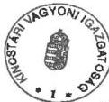

Üdvözlettel:

Dr. Molnár Zoltán

---

1
2
3
4
5
6
7
8
9
10

---

00 04/19 WED 13:15 FAX +36 1 331 9106

ÁL.VEZ.IG.HELY.

010

1. sz. melléklet

# KINCSTÁRI VAGYONI IGAZGATÓSÁG

Vagyonnyilvántartási és Számítástechnikai Főosztály

Állami Számvevőszék

Dr. Szemerics Györgyi tanácsos

részére

Tárgy: Az informatikai rendszer által biztosított hitelesség elemei a Kincstári Vagyon-kataszter adathitelességének kérdése az azt létrehozó informatikai rendszer tükrében a vagyonkezelők adatainak átvétele és feldolgozása során

ad. B/3.

Az informatikai rendszer azon elemei, amelyek a Kincstári Vagyonkataszter adatainak formai és tartalmi hitelességét biztosítják:

- Vagyonkezelők szintjén a PC-s adatgyűjtő programba épített elemek

- A programban alkalmazott egységes azonosító rendszer (Vagyonkezelő azonosító, Szerzódésazonosító, Vagyonelem egyedi azonosító, Kíserölap azonosító).
A kozpontilag kidolgozott, letrehozott, folyamatosan karbantartott törzsadatok, kódszótar és paramétr allományok, amelyek biztosítják a rendszerben, hogy valamennyi vagyonkezelőCsak egységesen, a programrendszer adatlapjaival meghatározott vagyoncsoportok kódszótarból valaszthato vagyonclemeire, azok jogi tenyadataira, korlatozásaira, vagyoncsoportonként a programban meghatározott számviteli, területi, muszaki és tulajdoni adatokra tudja elkészíteni a jelenteseit. A programrendszer e zártkö kizárja, hogy a jelentések ötletszerüek, elterő adattartalmúak a kozponti SQL rendszer szármára formailag alkalmatlanok legyenek.
A jelentett adatok tartalmi hitelessegenek erdekuben a vagyonkezelokhoz telepitett PC-s (elsfazisban a 97. Dec. 31-i allapot jelenteshez telepitett KVK97ZAR, RGP97ZAR es a tovabbi adatszolgaltatas bitzosit KVKMOD, RGPMOD) programrendszerbe beepitesre kerultek oyan adatellenorzesi funkciok, amelyek e celok elereset elosegitik. Ennek erdekuben a PC-s programba ketszintu adatellenorzs kerult beepitesre.

Első szint a vagyonelem rögzítése és az adatállományba történő felvitele során végrehajtott adatellenőrzések, amikor az adatok rögzítése során közvetlenül a képernyőre történő kiírással jelzi a helytelen adatközlést és programba beépített F1- billentyűre, a képernyőre feladásra kerülő help szövegek adnak segítséget annak helyes magadásához.

---

'00 04/19 WED 13:15 FAX +36 1 331 9106

ÁL. VEZ. IG. HELY.

011

# Néhány példa:

- A kód szótáras mezők esetében csak a kód szótárban szereplő értéket tartalmazhatja a mező.

- A kötelezően kitöltendő mező tartalma meghatározott vagyonelemeknél nem lehet üres.(leltári szám, helyrajzi szám, vagyonelem kód, BTO kód, területi adatok, tulajdonosok száma, vagyonkezelők száma, állami tulajdoni hányad, kezelt hányad, stb.)

- Mezők közötti tartalmi összefüggések vizsgálata (Bruttó-nettó érték, a tulajdonosok száma a tulajdoni terület és hányad, vagyonkezelők száma a kezelt terület és hányad, stb. közötti összefüggés)

- Azon vagyonelemeknél, ahol a helyrajzi szám kitöltendő csak meghatározott formai követelmények szerint történhet és e követelményekre a hibás megadás esetén az F1 billentyűre feladásra kerülő help szövegben, kap tájékoztatást.

- Több művelési ágú földterületek esetében az albetétek területi összegének egyeznie kell a föld vagyonelem területi adatával.

- A rögzített adatnak az adatállományba történő felvitele során készített hibalista, ahol kijelzésre kerülnek, hogy mely hibák javítandók (javítása nélkül nem küldhető el a jelentés a KVI-nek) és mely hibák csak átnézendők, javítása nélkül a jelentés elküldhető csak figyelmeztetést ad a rendszer, hogy bizonyos mezők kitöltése hiányos (pl. Közútkezelő KHT-nál az utak érték adatai- értéken történő nyilvántartás hiánya miatt- kitöltetlenek vagy az épület helyrajzi száma nem a formai követelmények szerint került megadásra).

- Meghatározott mozgásnem kódok esetében a megjegyzés mezőbe a képernyőn kiírva jelzett adatokat rögzíteni kell vagy az átadó/átvevő vagyonkezelő azonosítóját kódszótárból történő választási lehetőséggel az átadó/átvevő mezőben kötelező megadni, stb.

- Összevont adatlapok esetében nem engedi a program az 5 millió feletti értékkel bíró vagyonelemek összevonását /vagyonelem darab és érték mező összefüggés vizsgálata/.

Második szintje az ellenőrzésnek a vagyonelem rögzítése után a KVI-nek küldendő jelentés (csomag) összeállítása ellőtt történik. A jelentéshez tartozó adatok ismételt teljes körűen ellenőrzésre és a vagyonkezelő PC-s adatbázisával összevetésre kerülnek. Ezen műveletek a program csoportos feldolgozás hibaellenőrző menüjével hajthatók végre. Az ellenőrzés eredménye az a tételes hibalista, amely egyrészt tartalmazza azokat a javítandó hibákat, amiket a vagyonelem rögzítése után az adatállományba történő felvitel során már a képernyőre kijelzett a program, de akkor ott rögtön nem került kijavításra és tartalmazza azokat a javítandó tételeket is, amelyek a jelentés elküldése előtt csak a vagyonkezelő PC-s adatbázisának teljes adatállományával összevetve szűrhető ki (leltári számra dupla tétel). Vagyonkezelő a jelentését csak valamennyi javítandóra jelzett hiba kijavítása után tudja aláírni, és elküldésre összeállítani.

2

---

00 04/19 WED 13:16 FAX +36 1 331 9106

ÁL.VEZ.IG.HELY.

012

- A fentieken kívül, a vagyonkezelő felelős a saját vagyonkezelői törzsadatainak karbantartásáért és az adatszolgáltatás során elküldött jelentésének tartalmi hitelességét a vagyonkezelő kijelölt jogosultja, a programban jelszóval védett aláírási eljárásban, aláírásával igazolja. Ez a tény az adathitelesség szempontjából döntőnek tekinthető, mert bár közvetlenül annak valódisága nem ellenőrizhető, de a felelősség vállalás megtörtént és az a helyszíni ellenőrzés során, nyomon követhető.

- Az elküldésre összeállított vagyonkezelői jelentés (CSOMAG) úgy nevezett „kísérő lap”-ot tartalmaz, amely a jelentés elkészítésének megkezdésekor kerül létrehozásra a CSOMAG. DBF egy rekordjaként és a jelentés elküldésre történő összeállítása során kerül lezárásra és elhelyezésre a vagyonkezelő jelentésébe. A kísérőlap a vagyonkezelő elküldött jelentésének további útja során a KVI kirendeltségen történő átvételkori ellenőrzésekor és a jelentés SQL-be történő bevitelkor tartalmaz a vagyonkezelői jelentés (csomag) hitelességére vonatkozó lényeges információkat. Tartalmazza a kísérőlap számát, ami az elküldött jelentés egyedi azonosítója, tartalmazza, hogy az elküldött jelentés milyen vagyoncsoportokra hány adatlapot tartalmaz és hány adatlap található összesen a csomagban, ezen kívül az adatlapok meghatározott mezőiben szereplő értékadatok összegét, a kísérőlap megnyitásának, ellenőrzésének és aláírásának dátumát, az aláíró, az összeállított csomag nevét. Ezen adatok a feldolgozás további menetében nélkülözhetetlenek az elküldött jelentés (csomag) hitelességének megállapítása, az adathordozó esetleges sérülése és a már az adathordozón szereplő adatok utólagos megváltoztatásnak kiszűrése érdekében.

- A fentiekben bemutatottak alapján a vagyonkezelőktől érkező jelentések adatai teljes mértékben kielégítik az SQL adatbázisba történő bevitel formai, tartalmi és adatintegritási követelményeit. Ennek következtében a PC-s programmal előállított és elküldött adatszolgáltatás SQL-be történő beviteléig csak annak ellenőrzésére kell hangsúlyt fektetni, hogy a csomag hiteles-e, nem történt-e a szállítás közben sérülés, az adathordozó vírusmentes-e, a leadott lemezen valóban adatszolgáltatást tartalmaz-e, nem történt-e beavatkozás az adatokban, zárt technológiai menetben történt-e a feldolgozás. Ezen ellenőrzési funkció megvalósítása történik a KVI kirendeltségein a POSTABE program segítségével.

- KVI kirendeltségeinek ellenőrző szerepe a csomag adathitelességének ellenőrzésében

- A csomag hitelességének ellenőrzése a kirendeltségekre telepített POSTABE programmal történik, a vagyonkezelők leadott jelentései a programmal ellenőrzésre kerülnek, a jelentésben lévő kísérőlap információi alapján és az ellenőrzés eredményének függvényében a vagyonkezelőtől a jelentés elfogadó igazolás kiadásával átvételre, kerül vagy hiba esetén ismételt adatszolgáltatásra, szólítják fel. Az 1997. 12. 31-i bejelentkező első jelentések során mivel a KVI belső számítógépes hálózata még nem állt rendelkezésre és a kirendeltségeken ellenőrzött adatok közvetlenül a KVI központból nem voltak elérhetők, ezért a kirendeltségek felhozták az elfogadott adathordozókat a KVI központba, ahol ismételten a POSTABE programmal ellenőrzésre kerültek, a szállítás közbeni sérülés lehető-

3

---

'00 04/19 WED 13:18 FAX +36 1 331 9106

ÁL.VEZ.IG.HELY.

013

sége miatt. Ellenőrzés után feladásra került az SQL-be történő adatbevitelhez. Az időközben kiépítésre került számítógépes hálózat a továbbiakban lehetővé teszi, hogy a kirendeltségeken elfogadásra került jelentések közvetlenül a kirendeltségeken elérhetők és a hálózaton keresztül adatsérülés nélkül áthozható, így ismételt ellenőrzés közbeiktatása nélkül az SQL-be történő adatbevitelre feladható. Az elfogadott adathordozókat és az elfogadó igazolás egy példányát a kirendeltségek archiválás céljából átadják a Vagyonnyilvántartási Osztálynak.

- Az SQL adatbázisba történő bevitelné az adatszolgaltatas különboző szintjein több-szörì ellenörzésen atment adatok ismetelt ellenörzsésre kerülnek. Megtörténik annak a vizsgálata, hogy egy adott jelentésCsak egyszer kerüljön bevitelre az adatbázisba, és azok ismetelt bevitelét a rendszer nem, engedi meg. Amennyiben a vagyonkezelőtól oyan jelentés érkezik, amelynek kisérólap azonositójával egyező csomag már bevitelre került az SQL-be, akkor vizsgálat tárgyát képezi, hogy mi volt a jelentés ismetelt elküldésenek oka.
A Kincstári Vagyonkataszter SQL adatbázis vizsgálata az adathitelesség szempontjából.

A fentiekben vázolt ellenőrzések ellenére a központi SQL adatbázisban aggregáltságából eredően létezhetnek a jelentett adatok egymásközti összefüggéseiben olyan tartalmi ellentmondások, amelyeket csak a központi adatbázis szintjén lehet- és tervezünk kiszűrni és intézkedünk annak megszüntetésére.

Áttekintés az SQL-es adatbázis kiszűrendő ellentmondásairól:

Vagyoncsoporton belül:

- A vagyonelemnek több vagyonkezelője van, akkor

Föld esetében:

Adott földterületnek több vagyonkezelője van (TELEPÜLÉS, HRSZ azonos), akkor vizsgálandó, hogy:

- valamennyiük jelentésében azonos-c

- Földterület kódja, (vagyonelem azonosító)
- Osszes földterület nagysága,
- Résztulajdonosok száma
- Magyar Állam tulajdoni területe
- Magyar Állam tulajdoni hanyada
Vagyonkezelok szama

- a jelentett kezelt területeik összege megegyezik-e a Magyar Állam tulajdoni területével

4

---

UU 04/19 WED 13:19 FAX +36 1 331 9106

ÁL.VEZ.IG.HELY.

014

Épület esetében:

Adott épületnek több vagyonkezelője van (TELEPÜLÉS, HRSZ azonos), akkor vizsgálandó, hogy:

- valamennyiük jelentésében azonos-e

- Epilet koda,
-Szintszam,
- Netto összes szintterület
- Résztulajdonosok száma
- Magyar Állam tulajdoni területe
- Magyar Állam tulajdoni hanyada
Vagyonkezelok szama

- a jelentett kezelt szintterületeik összege megegyezik-e a Magyar Állam tulajdoni területével

- Valamennyi tetelesen nyilvantartott vagyonelemek esetuben a vagyonelemek vagyonezelok egymas kozotti atadas /atvetel eseten az eltero nyilvantartasi adatok okanak vizsgalata.
- Az ertek adatok nélkül jelentett vagyonelemek jogosságanak ellenörzese.
Specialis adat helyesseg ellenorzestBiztosit tovabba a Tulajdonosi Vagyonfe-lugyeleti modulban kidolgozott egyeb elemzesi lehetosegek.

Vagyoncsoportok közötti vizsgálat:

- Az épûlet vagyonelemnél megadott hordozó ingatlan szerepel-e a föld vagyonelemek között.
A lekérdezési hitelességet hivatott javitani a vagyonkezelok által kitöltömezek elemzese, annak érdekében, hogy a kulönbozó betukódkban keszült jelentésk kiszürresé es egységesitésre kerüljenek.

A Kincstári Vagyonkataszter adathitelessége a vagyonkezelők és vagyonelem körének teljessége szempontjából az arra vonatkozó kérdéskörnél került bemutatásra.

Budapest, 1999. július 7.

Tisztelettel:

Kreisz Gyula
informatikai szakértő

Gorza Jenőné
főosztályvezető

5

---

1

2

3

4

5

6

---

# Állami Számvevőszék

Elnök

V-7-100/1999-2000.

dr. Molnár Zoltán úr
vezérigazgató

Kincstári Vagyoni Igazgatóság
Budapest

Tisztelt Vezérigazgató Úr!

Köszönettel vettem kézhez a kizárólagos állami tulajdon nyilvántartása helyzetéről ké-
szített ÁSZ jelentéshez fűzött észrevételeit.

Az ÁSZ kiadmányozási rendje szerint az elkészült jelentés az elnöki aláírás után vég-
legessé válik, az eljárási rend nem teszi lehetővé az észrevételükben javasolt módosítá-
sokat.

A nyilvánosság elé kerülő jelentés mellékletként természetesen tartalmazni fogja mind
az Önök észrevételeit, mind az azokra adott válaszainkat.

Az országgyűlési bizottságoknak és a legfőbb állami vezetőknek elküldött jelentés kí-
sérő levelében kiemelem, hogy javaslatainkon túlmenően az Önök észrevételeit is ve-
gyék figyelembe.

A vizsgálatban résztvevő számvevők többször egyeztettek a KVI képviselőivel. Ennek
ellenére maradt véleménykülönbség. Fenntartom véleményünket, hogy a kizárólagos
állami tulajdon helyzetéről megfogalmazott megállapításaink, a hiányosságok feltárása
tárgyszerű, helytálló, amelyeket a helyszíni vizsgálat alapozott meg. Abban egyetér-
tünk, hogy a kincstári vagyon nyilvántartási rendszere még kiegészítést igényel, ame-
lyet a KVI az érintett minisztériumokkal való folyamatos egyeztetés mellett oldhat
meg. Mind a kódrendszer hiányosságai, mind a rendszerből még kimaradt kizárólagos
állami tulajdonú vagyonelemek egyértelműen meghatározzák a KVI előtt álló feladat
megoldásának fontosságát.

Véleményem szerint a vagyonnal akkor lehet eredményesen gazdálkodni, ha ismert a
vagyon összetétele, a vagyon kezelője, illetve megkötötték a megfelelő vagyonkezelési
szerződést. Ezen felül szükséges a hatékony, megfelelő hatáskörrel rendelkező tulaj-
donosi ellenőrzés megvalósítása. Ezen tevékenységek összességének ellenőrzését tár-
gyalja jelentésünk.

Örömmel állapítottam, meg, hogy a megkötött vagyonkezelési szerződésekről és a tu-
lajdonosi ellenőrzésről írt megállapításokat elfogadták, a javaslatokkal egyetértenek.

Köszönöm tájékoztatását a vizsgálat lezárulta után tett intézkedésekről. A megszületett
törvénymódosítások alapján például a vagyonkezelők 2000. január 1-től kötelesek a
kincstári vagyonnal való gazdálkodásra tervet készíteni, a vagyont használóknak is be
kell jelentkezni a KVI vagyon-nyilvántartási rendszerébe.

---

A KVI előtt álló feladatok természetesen a kincstári vagyon egészére, jelentésünk pedig csak a kizárólagos állami tulajdonra, mint a kincstári vagyon egy részére vonatkozik.

Jelentésünk felhívni kívánja a figyelmet a hiányosságokon kívül az elért eredményekre, továbbá segítséget kívánt nyújtani a további sikeres munkához megállapításaival, javaslataival. A kincstári vagyonnal való gazdálkodás az ÁSZ rendszeres feladata, így minden jobbító törekvés, amelyet munkatársaim észlelnek az adott témakört tárgyaló jelentésekben nyilvánosságra kerülnek.

Végezetül szeretném megköszönni Önnek és a KVI munkatársainak a jelentés összeállításához nyújtott segítségét.

Budapest, 2000. május "10"

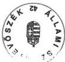

Tisztelettel:

2

---

Központi Statisztikai Hivatal
Elnök

601-99/1/2000.

ATM-3615/2000.

ÁLLAMI SZÁMVEVŐSZÉK

Érkezett: 2000.04.20.

Iktatószám: U-2-45/2/99.00.

Melléklet: —

Állami Számvevőszék

IV. Vagyonellenőrzési Igazgatósága

Budapest

T. 16. sz. 46. sz. 47.

2000.04.20

11
05.04.2000

Az Állami Számvevőszék által készített „a kizárólagos állami tulajdon nyilvántartása helyzetéről” szóló jelentéshez észrevételt nem teszek.

A javaslati részben a KSH részére megfogalmazott rendszeres kapcsolattartásban való részvételt a szakmai terület részéről biztosítom.

Budapest, 2000. április 19.

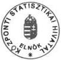

dr. Mellár Tamás

Központi Statisztikai Hivatal 1024 Budapest, Keleti K. u. 5-7. Pf.: 51. Budapest 1525

☎: (361) 201-9246 ☎: (36) 202-0739 e-mail: tamas.mellar@ksh.x400gw.itb.hu Internet: http://www.ksh.hu

---

ذ

ر

ب

ر

د

ر

---

Állami Számvevőszék

Elnök

V-7-99/1999-2000.

dr. Mellár Tamás úr
elnök

Központi Statisztikai Hivatal
Budapest

Tisztelt Elnök Úr!

Köszönettel vettem kézhez a kizárólagos állami tulajdon nyilvántartása helyzetéről
szóló ÁSZ jelentésre írt levelét.

Tájékozatom, hogy észrevételét csatolom az ÁSZ jelentés kiadmányozási eljárásrend-
jének megfelelően a nyilvánosságra hozandó végleges ÁSZ jelentéshez.

Örülök, hogy a KSH részére javasolt feladattal egyetért, azt támogatja.

Budapest, 2000. május " 1o "

Tisztelettel:

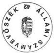

dr. Kovács Árpád

Sákm

L. Kio Asztke

---

1

2

3

4

5

6