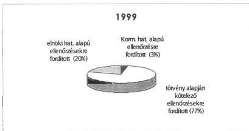

Állami Számvevőszék

# JELENTÉS

az Állami Számvevőszék 1999. évi
tevékenységéről

J.2435.

2000. március

0006

---

Jelentéseink az INTERNET-en a www.asz.gov.hu címen olvashatók.

Jelentéseink az Országgyűlés számítógépes hálózatán is olvashatók.

---

# Tartalom

1. Az ÁSZ 1999. évi tevékenysége...4

1.1.Az ellenorzési munka sulypontjai 4
1.2.Az 1999. evi ellenorzesek alapjan altalanosithato tapasztalatok.. 7
1.3.Az ellenorzesek alapjan tett ajanlasok hasznositasi tapasztalatai 20

2. Az ellenőrzési munka színvonalának javítását, az új feladatok eredményes ellátását
szolgáló intézkedések és kezdeményezések ...23

2.1.A penzugyi ellenorzési rendszer tovabbfejlesztese erdekében vegzett tevekenység 24
2.2.A szamvevoszeki tovabbképsz, oktatas 26

3. Az ellenőrzési munkát segítő hazai és nemzetközi kapcsolatok fejlesztése...27

3.1.Az Orszaggyulesi kapcsolatok 27
3.2.Nyilvanossag, sajtókapcsolatok 28
3.3.Nemzetkozi kapcsolatok 29

4. A működés személyi és tárgyi feltételei ...30

4.1.Szemelyi feltetelek 30
4.2.Targyi feltetelek 31

1

---

2

---

A-105-5/2000.

## Jelentés az Állami Számvevőszék 1999. évi tevékenységéről

Az Állami Számvevőszék a korábbiakhoz hasonlóan 1999-ről, működésének tizedik esztendejéről is elkészítette éves beszámolóját. E már hagyományosnak tekinthető módon kíván az Országgyűlés ellenőrző szervezete számot adni törvényi kötelezettségei teljesítéséről.

Az éves beszámoló összeállításának célja, hogy átfogó képet adjon az Országgyűlés részére az elmúlt évben végzett ellenőrzésekről, azok általánosítható tapasztalatairól, bemutassa a jelentések elkészítését támogató folyamatokat és az ÁSZ munkáját. A tapasztalatok közreadását is az a szándék hatja át, hogy az ÁSZ a hibák kijavítását, a közpénzek takarékos és hatékony felhasználását segítse. Ez természetesen a jelentés hangsúlyaira, kiemeléseire és belső, terjedelmi arányaira is visszahatott, az eredmények bemutatása mellett **inkább a tennivalókról, a megoldásra váró feladatokról szól**.

Jelen beszámoló – az Országgyűlés 1998. évi számvevőszéki beszámolót elfogadó 82/1999. (X. 22.) határozatában megfogalmazott tájékoztatási kötelezettségnek megfelelően – figyelmet fordít az ellenőrzési tapasztalatok hasznosításának bemutatására. A számvevőszéki ajánlásokkal, illetve megvalósulásukkal az ellenőrzések alapján tett ajánlások hasznosítási tapasztalatai című szakasz (1.3.), illetve a költségvetési fejezeteket felügyelő szervek vezetőinek tett javaslatokat és a kezdeményezett intézkedéseket (realizálás) egybevető melléklet foglalkozik részletesen.

Az országgyűlési ajánlásoknak és az új feladatoknak megfelelően 1999-ben az ÁSZ több, a számvevőszéki tevékenység személyi és tárgyi feltételeit javító intézkedést valósított meg, felhasználva az e célokra a költségvetési törvény előírásai szerint rendelkezésre álló forrásait. A személyi feltételek javításában a továbbképzések jelentettek érdemi előrelépést. A beruházások a munkafeltételek javítását, az informatikai fejlesztéseket, a NATO biztonsági normáknak megfelelő számvevőszéki irattár kialakítását és ehhez kapcsolódóan a székház beléptetési és őrzési rendjének technikai fejlesztését szolgálták. Az ÁSZ 1999. évi pénzügyi gazdálkodásáról az éves zárszámadás keretében számol majd be, melynek alapját az intézmény – közbeszerzési pályázaton kiválasztott magyar könyvvizsgáló cég által – hitelesített beszámolója adja.

3

---

# 1. Az ÁSZ 1999. ÉVI TEVÉKENYSÉGE

## 1.1. Az ellenőrzési munka súlypontjai

Az ÁSZ 1999-ben is az Elnök által jóváhagyott – az Országgyűlés Számvevőszéki bizottsága által megtárgyalt – ellenőrzési tervben foglaltak szerint végezte munkáját. Az ÁSZ a vizsgálati feladatok meghatározásával arra törekedett, hogy ellenőrzési kapacitását az államháztartást érintő legfontosabb feladatokra fordítsa. Első helyen szerepeltek az évenkénti ellenőrzési kötelezettséget jelentő feladatok (a központi költségvetés, a helyi önkormányzatok és a társadalombiztosítási alapok költségvetése és zárszámadása, valamint az ÁPV Rt. működésének ellenőrzése).

Az ÁSZ a kétévenkénti ellenőrzési kötelezettségként jelentkező feladatok közül 1999-ben 4 párt gazdálkodását ellenőrizte. A vizsgálatok egyharmadát kitevő egyéb rendszeres ellenőrzési feladatok túlnyomórészt az önkormányzatok pénzügyi-gazdasági tevékenységének, az önkormányzati feladatokhoz kapcsolódó állami támogatások felhasználásának, valamint az 1998. évi országgyűlési és önkormányzati választásokra fordított pénzeszközök elszámolásának vizsgálatára irányultak.

A fennmaradó erőforrások – a társadalmi igényeket figyelembe véve az ÁSZ elnökének döntése alapján – olyan területekre összpontosultak, ahol a pénzfelhasználás a lakosság széles körét érintő feladatokhoz kapcsolódott, illetve jelentős nagyságrendet képviselt (pl. a helyi önkormányzati egészségügyi intézmények gép-, műszer ellátottságának, valamint egyes diagnosztikai egységek teljesítmény vizsgálata, a települési önkormányzatok vízrendezési és csapadékvíz elvezetési feladatainak ellátása, a helyi önkormányzatok által nyújtott pénzbeli szociális ellátások, a központi költségvetés vám- és egyéb adóbevételei realizálásának ellenőrzése, a társadalombiztosítás informatikai rendszereinek ellenőrzése, a Munkaerőpiaci Alapból származó pénzeszközök felhasználásának ellenőrzése, a Magyar Nemzeti Üdülési Alapítványnak juttatott állami eszközök felhasználásának ellenőrzése, a megyei területfejlesztési tanácsok működésének ellenőrzése, stb.).

Az ellenőrzések irányítottságának javítására és hatékonyságuk növelésére, a korlátozottan rendelkezésre álló erőforrások maximális kihasználására az ÁSZ különböző kockázati és mintavételi technikákat dolgozott ki az elmúlt években mind a helyi önkormányzatok, mind a központi költségvetés ellenőrzési területére.

---4

---

## A számvevőszéki összefoglaló jelentések – témák – számának alakulása

|  Ellenőrzések | Terv | Tény  |
| --- | --- | --- |
|  1998-ban megkezdett, 1999-re áthúzódó ellenőrzések | 18 | 18  |
|  1999-ben megkezdett, 1999-ben befejezett ellenőrzések | 20 | 18^{1}  |
|  1999-ben megkezdett, 2000-re áthúzódó ellenőrzések | 23 | 21^{2}  |

**Összesen 36 ellenőrzésről készült jelentés az elmúlt évben.** Ennek megalapozására 2553 ellenőrzési részjelentés készült. Az arányok mutatják, hogy cél az egyenletes és folyamatos munkavégzés, így megközelítően egyenlő arányban találhatók meg az előkészítés alatt, a folyamatban és a befejező szakaszban lévő ellenőrzések. 1998-ban 51 jelentést publikált az ÁSZ. Évek óta megfogalmazódott az igény az összefoglaló jelentések számának csökkentésére, ennek megfelelően 1999-ben a tapasztalatanyagot igyekeztünk nagyobb témablokkokba rendezni, ezért kevesebb összefoglaló jelentés készült. Ez azonban nem jelentette a helyszíni ellenőrzések és az ellenőrzött szervezetek számának csökkenését.

**A befejezett ellenőrzések mintegy 35 ezer ellenőrzési napot igényeltek.** (Az áthúzódó ellenőrzésekhez lekötött kapacitások ebben nem szerepelnek, de hasonló nagyságot képviselnek.) Ennek közel fele a helyi önkormányzatok, mintegy 40%-a a központi költségvetés, a fennmaradó rész pedig az állami vagyon ellenőrzését jelentette. 1999-ben 802 helyi önkormányzat és ezek 1533 intézménye, 217 központi költségvetési szerv és 86 állami tulajdonú, résztulajdonú és egyéb szervezet ellenőrzésére került sor.

$^{1}$ Az állam kizárólagos tulajdonát képező vagyonelemek vizsgálata - a szükséges adatok beszerzésének nehézségei, illetve a vizsgálati feladatoknak az ellenőrzés folyamatában szerzett tapasztalatok alapján történő kibővítése miatt - 2000. áprilisában zárul le. A MIÉP vizsgálatának a befejezése pedig technikai okok miatt halasztódott 2000-re. (Az ismeretlen tettes a párt által használt autóval együtt gazdálkodási dokumentumokat is eltulajdonított, így a nyomozás időtartamára az ellenőrzést az ÁSZ felfüggesztette.)

$^{2}$ A kórházak ápolási és ellátási (hotelszolgáltatási) tevékenységének szervezettsége, finanszírozása című vizsgálatot töröltük, mert helyette – figyelembe véve a fekvőbeteg ellátás egésze vizsgálatára irányuló kezdeményezéseket, az egészségügyi reform előkészítése segítése szándékával – 39 önkormányzatai tulajdonú kórház gazdálkodása átfogó vizsgálata előkészítésére került sor. Hasonlóan változott a Magyar Fejlesztési Bank vizsgálatával kapcsolatos elképzelés is. Az MFB korábbi veszteségeire irányított, a Postabank vizsgálathoz kapcsolódó munka, illetve a Reorg-Apport vizsgálatának előkészítésével kapcsolatos tennivalók lekötötték a figyelembe vehető kapacitásokat.

5

---

A vizsgálatok döntő többsége az előzetesen meghatározott program szerint haladt. Tekintettel azonban arra, hogy az ÁSZ kapacitásai teljes leterhelését figyelembe véve alakítja ki ellenőrzési tervét, így az esetleges többletfeladatok és a technikai feltételek változásai (például az ellenőrzés iratbeszerzési okok, adat-hozzáférési korlátok miatti halasztása) a vizsgálatoknak mintegy 10%-ánál határidő-módosításokat, illetve feladatátrendezéseket igényelt. Ezekről minden esetben tájékoztattuk az Országgyűlés Számvevőszéki Bizottságát.

Az ellenőrzések mintegy kétharmadát (ami az erőforrás-felhasználás háromnegyedét kötötte le) a nagyobb feladatot jelentő, törvényekben előírt évenkénti, illetve egyéb rendszeres ellenőrzési kötelezettségek határozták meg. Ez az arány közel azonos az 1998. évivel.

A törvényben előírt kötelezettségeken túl az erőforrás felhasználások a korábbiaknál nagyobb arányban alapultak az ÁSZ Elnökének döntésén.

A Kormány részéről az 1155/1998. (XII. 9.) Korm. határozattal egy – a Postabank és Takarékpénztár Rt. vizsgálatra irányuló – felkérés érkezett, melynek az ÁSZ eleget tett. Az 1999-ben elkészült jelentések összefoglaló adatait a melléklet tartalmazza.

### A számvevőszéki erőforrás-felhasználás megoszlása

A számvevőszéki ellenőrzések 1999-ben is ráépültek az előző évi tapasztalatokra, és így az ellenőrzési feladatok súlypontjai az előző évek eredményei és az Országgyűlés igényei ismeretében kerültek meghatározásra. E folyamatszemlélet – a törvények által meghatározott kereteken belül – tovább folytatódik az elkövetkezendő években is. Ennek megfelelően az ÁSZ ellenőrzései meghatározásakor, illetve azok végrehajtásakor a következő témakörökre összpontosít: a széles rétegeket érintő feladatellátások keretében az egészségügyi ellátásra, csatornázási feladatokra, a vízvédelemre, a fővárosi önkormányzat által ellátandó feladatok ellenőrzésére és a forrásmegosztásra, a környezetvédelmi tevékenységre és annak hatékonyságára, valamint a vagyongazdálkodás és a vagyonnyilvántartással kapcsolatos feladatok ellenőrzésére.

6

---

## 1.2. Az 1999. évi ellenőrzések alapján általánosítható tapasztalatok

Az ÁSZ – az éves munkájáról szóló beszámolójában – a legfontosabb megállapításokat, az általánosítható tendenciákat, s az azokból levonható átfogó következtetéseket vázolja, egyben bemutatja a korábbi ellenőrzések hasznosításának főbb jellemzőit is.

Az 1999. évi ellenőrzések megállapításait, következtetéseit és javaslatait az elmúlt évben közreadott számvevőszéki jelentések teljes körűen tartalmazzák, e beszámoló mellékletében a jelentések összefoglalói szerepelnek.

Az ellenőrzött szervezetek működésében és gazdálkodásában több területen is történt előrelépés. Az ÁSZ ellenőrzései során feltárt hiányosságok megszüntetésére az 1.3. pontban és a mellékletben részletezett intézkedések történtek. Ezek tanulságai rávilágítanak arra, hogy a számvevőszéki ellenőrzések segíteni tudják a vizsgált területeken a szabályszerű és hatékony munkavégzést, az észszerű szervezést és irányítást.

**A működés és gazdálkodás, a feladatellátás hiányosságai csak részben vezethetők vissza közvetlenül gondatlanságra, szervezetlenségre. Gyakori, hogy egyidejűleg több egymást erősítő tényező, vagy mélyebb okok (például az egyértelmű célmeghatározás hiánya, a szabályozást szolgáló joganyag tartalmi, értelmezési problémái, a nem tisztázott teljesítménykövetelmények, a vezetés-irányítás, a visszacsatolás és a konkrét ellenőrzés gyengeségei) állnak a hiányosságok mögött. Az ilyen típusú rendszerbeli hibák, hiányosságok egyedi javaslatok, elszigetelt intézkedések útján rendszerint nem orvosolhatók.**

Az ÁSZ az Országgyűlés figyelmébe ajánlja a következőkben összegzett főbb tendenciákat és összefüggéseket érzékeltető általánosítható megállapításokat, tapasztalatokat, következtetéseket.

**Az államháztartás központi költségvetési alrendszerének** működését érintő pénzügyi-gazdasági ellenőrzések tapasztalataiból kiemelhető, hogy a fejezetek, költségvetési szervezetek tervezési, gazdálkodási és beszámolási tevékenysége – az elmúlt évben mutatkozó javuló tendencia ellenére – nem tekinthető kielégítőnek. A költségvetési pénzeszközök felhasználásánál nem érvényesült következetesen a jogszabályok szigorú betartása, a célszerűség és eredményesség.

A központi költségvetés 1998. évi zárszámadásának ellenőrzése során az előkészítő munkálatok mechanizmusa, színvonala lényegében a korábbi évek gyakorlatának felelt meg. Az ismétlődő, de a pénzügyminisztériumi apparátussal kialakult jó munkakapcsolatnak megfelelően részben már az előkészítés során kijavított hibák nem a munkavégzés színvonalából, hanem **alapvetően rendszerbeli sajátosságokból adódtak**. A fejezetek és intézményeik zárszámadási adatai, valamint a Kincstár adatai között az előirányzatok, a támo-

7

---

gatások, s a teljesítési adatok körében egyaránt hiányzott a teljes körű egyezőség. Tartalmi és számszaki eltérések voltak tapasztalhatók. A programfinanszírozásba vont előirányzatok körének bővülése ugyanakkor az adott költségvetési előirányzatok korábbiaknál célszerűbb és szabályszerűbb felhasználását eredményezte.

A költségvetési fejezetek feladataiban, címrendjében, az előirányzatok tartalmában bekövetkezett kedvező irányú változás nem jelentette automatikusan az előirányzatok célszerű, hatékony és szabályszerű felhasználását. **Továbbra is hiányoznak a központi költségvetésből nyújtott támogatásokhoz és az egyéb bevételekhez kapcsolódó teljesítmény-követelmények.** Ezek hiánya – a korábbi évekhez hasonlóan – 1999-ben is nehezítette a számonkérést, mérsékelte az ellenőrzés hatékonyságát, nehezítette a számvevőszéki teljesítmény-ellenőrzési tevékenységet.

A kormányzati struktúraváltáshoz kapcsolódó konkrét ellenőrzési tapasztalat, hogy a vagyontárgyak fejezetek közötti átadása-átvétele, s azok számviteli elszámolása helytelenül, esetenként egyáltalán nem valósult meg.

A Magyar Köztársaság 2000. évi költségvetése törvényjavaslatának megalapozottságára, a bevételi előirányzatok teljesíthetőségére irányuló ellenőrzések megmutatták, hogy – az 1999. évi tervezéshez képest – **összességében javult a költségvetés fő bevételi előirányzatainak megalapozottsága.**

A tervezési szempontok között kiemelt helyen szerepelt az intézmény- és feladat-felülvizsgálat, azonban csak néhány fejezetnél készült az átvilágítást szolgáló felmérés, számítás. A feladat-felülvizsgálat kapcsán több fejezet szüntetett meg fejezeti kezelésű előirányzatokat, vagy tervezett újakat, s csoportosított át tételeket. Ugyanakkor a **központi költségvetési szervek egyes kiadási előirányzataik kialakításánál nem kellő körültekintéssel jártak el, ezen előirányzatok számításokkal nem megfelelően alátámasztottak.** Az inflációs hatást ellentételező automatizmus hiánya, valamint a saját bevételek növelésének korlátai miatt a fejezetek többségénél a dologi kiadások előirányzata feszített. Ebben közrejátszik az is, hogy **elmaradtak, vagy nem vezettek hasznosítható eredményhez az intézményi feladat-felülvizsgálatok.**

A korábbi tapasztalatokhoz hasonlóan az elmúlt évi ellenőrzések is arra engednek következtetni, hogy **sürgető feladat** a központi költségvetés előirányzatai kimunkálását szolgáló – évek óta lényegében változatlan – **tervezési rendszer megújítása.** Bár a tervezés módszertanának megújítására irányuló munkák a pénzügyi kormányzat részéről megkezdődtek, indokolt e folyamat felgyorsítása:

Az államháztartás központi költségvetési alrendszere által kezelt pénzeszközök áttekinthetőségének, zárt és maradéktalan ellenőrizhetőségének egyik alapfeltétele **az államszámviteli rendszer újbóli kidolgozása és a jelenlegi követelményeknek megfelelő bevezetése és alkalmazása.** Mindezt az éves költségvetések és zárszámadások ellenőrzéséről szóló jelentések többször felvették. Megfelelő számviteli szabályok hiányában fordulhatott elő, hogy a kormányzati beruházási, illetve beruházási célprogram előirányzatok fejezetek

8

---

közötti átcsoportosításánál a kedvezményezett beruházás esetenként nem volt azonosítható. A fejezeti ellenőrzések rendszeresen állapítanak meg szabálytalan előirányzat-átcsoportosítást, rendeltetéstől eltérő felhasználást, előirányzat túllépést, amelyeket az államszámvitel alkalmazása esetén már csak könyveléstechnikai okokból sem lehetne végrehajtani. **Az egységes, törvényi szintű államszámviteli rendszer kidolgozása és bevezetése fontos és indokolt. Ennek megalkotására vonatkozó kezdeményezést az ÁSZ megtette.**

A költségvetési beszámoló valódisága szempontjából **kockázati tényező** a gazdálkodás szabályozottságának és **a belső irányítás rendszerének nem kielégítő kiépítettsége, működése.** Az e téren szerzett korábbi kedvezőtlen megállapításokhoz viszonyítva – néhány fejezet kivételével (a pozitív kivételek között említhető a Pénzügyminisztérium) – **nem tapasztalható előrelépés.** Az intézményi gazdálkodás átfogó szabályozása (számviteli politika, leltározás, eszközök és források értékelése, pénzkezelés), a meglévő szabályzatok aktualizálása a fejezetek intézményeinek többségénél hiányos.

A fejezetek költségvetési beszámolóinak valódisága – a beszámoló jelentés és a könyvvezetés egyezőségének, az analitikus nyilvántartások vezetésének és a mérlegtételek dokumentumokkal (elsősorban leltárral) való alátámasztottságának hiánya miatt – nem volt teljes körű. Ugyanakkor a kevés intézménnyel rendelkező fejezeteknél az előző évek gyakorlatához képest pozitív irányú elmozdulás volt, hogy a felügyeleti szerv az intézményi beszámolók adatait a főkönyvi kivonatokkal is egyeztette.

Tekintettel arra, hogy az EU-tagországokban a zárszámadási törvényjavaslat – ahol ilyen készül – rendszerint auditált (hitelesítéssel záruló) pénzügyi beszámolókra támaszkodik. **Az ÁSZ is évről évre szélesebb körben végez** intézményi beszámoló mélységű, szabályszerűségi, a számviteli alapelvek teljesülését **könyvvizsgálati módszerekkel értékelő ellenőrzést** (pénzügyi audit). Az Országgyűlés Számvevőszéki bizottsága 1999 áprilisában törvényjavaslatot nyújtott be azzal a céllal, hogy az ÁSZ megbízhatósági nyilatkozattal zárja a központi költségvetési szervek pénzügyi ellenőrzését. Az 1998 évi zárszámadás ellenőrzése részeként ilyen típusú vizsgálatra 1999-ben az Országgyűlési Biztos Hivatalánál, a Történeti Hivatalnál, valamint a Kormányzati Ellenőrzési Hivatalnál került sor.

**A társadalombiztosítási alrendszer** saját bevételei – alapvetően a folyamatos finanszírozás alapját képező források megteremtésének korlátai miatt – nem fedezik a nyugdíj- és egészségbiztosítás kiadásait. Ezért, bár az **alrendszer két alapjának gazdálkodása az 1998. évi zárszámadás ellenőrzésének tanúsága szerint összességében szabályszerű és rendezett volt, a folyószámla nyilvántartás hiányosságai miatt azonban a könyvvizsgáló mindkét alap beszámolóját korlátozó záradékkal látta el. A társadalombiztosítás finanszírozási gondjai nem csökkentek.**

Az alapok pénzügyi helyzete 1998-ban a tervezettnél lényegesen kedvezőtlenebbül alakult (a hiány 1998. évi nagysága együttesen meghaladta a 90 milliárd Ft-ot), aminek várható bekövetkeztét az ÁSZ már az alapok költségvetés-

9

---

ének véleményezésekor előre jelezte. A hiány nagyobb része (70 milliárd Ft) az Egészségbiztosítási Alapnál halmozódott fel, egyes bevételi előirányzatok elmaradó teljesülése, illetve **a kiadási oldal évek óta legkritikusabb tétele, a gyógyszerkiadások** túllépése következtében. **A járulékrendszer azonban a Nyugdíjbiztosítási Alap kiegyensúlyozott működéséhez sem biztosítja a szükséges fedezetet.**

A társadalombiztosítási ellátások 1998. évi törvényi szabályozásában bekövetkezett változások pénzügyi hatásait – elsősorban a nyugdíjbiztosítás területén, a magán-nyugdíjpénztárak működésének megkezdésével összefüggésben – a tervezés időszakában nem sikerült teljes körűen és megbízhatóan felmérni, számszerűsíteni.

Évről-évre nő a központi költségvetésből átadott pénzeszközök súlya és szerepe. Ez a tény a két nagy elosztó rendszer államháztartáson belüli kezelését, működtetését, reformjának irányát is befolyásolhatja és indokolhatja, hogy a központi költségvetés és a társadalombiztosítás költségvetésének tervezése – az alrendszerek közötti kölcsönös összefüggésekre és hatásokra tekintettel – a jövőben prezentációs szempontból is együtt történjen.

Az egészségbiztosítást érintően 1998-ban jelentősebb változtatásokra nem került sor. **Az ellátórendszer finanszírozásának gondjait az egészségügyi reform késedelme is fokozza.** Ezzel kapcsolatosan a zárszámadási ellenőrzés rámutatott arra, hogy az egészségügyben a magánosítás folyamata részben spontán, nem megfelelően szabályozott módon és ellenőrizetlenül kezdődött meg, az ún. „funkcionális” (eszközökre, gépekre, műszerek felhasználására irányuló) privatizáció lépései megbontották az egységes finanszírozását a diagnosztikai és gyógyítási technológiának. Mindez a társadalombiztosítási alap részére finanszírozási kényszerhelyzeteket okozott és okoz, ami **a rendelkezésre álló források jogszerű és célszerű felhasználása szempontjából is aggályos.**

A társadalombiztosítás pénzügyi alapjainak 2000. évi költségvetése szigorúbb feltételek mellett, de a korábbiaknál reálisabb alapokra épült. Az előirányzatokat a tervezéshez meghatározott közgazdasági mutatók és a jogszabályok alapján alakították ki. **Egyes bevételi és kiadási tételek vizsgálata ugyanakkor jelezte a tervezés egyes elemeinek megalapozatlanságát, illetve bizonytalanságát, a jelentős kockázatvállalást.** A bevételeknél az 1999. évi várható (bázis) adatok, a kiadásoknál pedig a természetbeni egészségbiztosítási ellátások (gyógyító-megelőző ellátás, gyógyszerek és gyógyászati segédeszközök támogatása) tartalmaztak feszültségforrásokat. Kockázati tényezőt jelent a társadalombiztosítás kintlévőségeinek hiányos nyilvántartása, e kintlévőségek behajtásának eredményessége, az egészségügyi hozzájárulás előirányzatainak felültervezése, a tervezett vagyonbevételek teljesülése.

Az elmúlt évben zárult le a társadalombiztosítás informatikai rendszereinek ellenőrzése. A vizsgálat az ÁSZ történetében először tekintette át a pénzfelhasználás célszerűségét és eredményességét a számítástechnikai alkalmazás területén. Világbanki kölcsönből és az alapok pénzeszközeiből a vizsgált időszakban (1993 és 1998 között) 10,5 milliárd Ft-ot fordítottak informatikai fejlesztésekre

10

---

és működtetésre. A végrehajtott fejlesztésekből azonban csak a nyugdíjbiztosítás – nyilvántartási rendszereinek – fejlesztéseit lehetett pozitívan értékelni. A társadalombiztosítás ágazatainál **a működtetéshez szükséges korszerű, integrált, komplex informatikai rendszert nem sikerült kielégítő, az elhatározott céloknak megfelelő színvonalon kiépíteni.**

Az egészségbiztosítás területén az irányítás gyengesége és a fejlesztések összehangolatlansága miatt a ráfordítások csak részlegesen hasznosultak. Nem oldott meg a sok éve húzódó járulék- és folyószámla nyilvántartás helyzete sem, az erre fordított több, mint 500 millió Ft elveszettnek tekinthető. Ez az OEP munkatársainak személyes felelősségét is felvetette, aminek kivizsgálását az ÁSZ javasolta a társadalombiztosítás igazgatási szerveit felügyelő politikai államtitkárnak.

Az ÁSZ a helyi önkormányzatok egészségügyi intézményeinek gép-, műszer ellátottságára, valamint az egyes diagnosztikai részlegek vizsgálatára vonatkozó jelentése megállapította, hogy hiányzik a lakosság körében előforduló megbetegedések részletes elemzését, a feladatok meghatározását és súlypontozását, a beavatkozások hatékonyságának követését lehetővé tevő, megbízható országos morbiditási adatbázis.

**Az ellátórendszer fejlesztési céljainak meghatározásában - részben a tulajdonosi megosztottság és a többszatornás finanszírozás kényszerpályái miatt - nem érvényesült egységes szakmai irányítás.** A progresszív ellátás egyes szintjein elvégezhető beavatkozások, vizsgálatok körét nem határozták meg, ezért mindenütt a legfejlettebb technika, nagykapacitású műszerek beszerzésére törekedtek, miközben a tulajdonos (fenntartó) önkormányzatok és az intézmények pénzügyi lehetőségei az így támasztott igényektől messze elmaradtak. A beruházások előkészítése sem volt mindig megfelelő. Volt olyan önkormányzati tulajdonú kórház, ahol a fejlesztési előirányzatot a tényleges ráfordítások többszörösen, több milliárdos nagyságrendben meghaladták. **Az elkövetett hibák miatt finanszírozási kényszerpálya alakult ki.**

**Az amortizáció fedezetének hiányában a gépek, műszerek pótlásának reális szükségletei nem jelentek meg a fejlesztési források képzésében.** A beszerzésekben mutatkozó különbségek a fenntartó önkormányzatok eltérő pénzügyi lehetőségeivel, a fejlesztések helyi prioritási sorrendjével, a kórházi gazdálkodás körülményeivel, a központi támogatások és pályázati lehetőségek eltérő igénybevételével függtek össze.

**Az ellátórendszer működése pontosabb megítéléséhez szükség lenne a teljesítmény-követelmények kidolgozására és rendszeres értékelésére.** Az ellátások tekintetében az ágazat adós a szakmai tevékenység hatékonysági, eredményességi szempontok szerinti értékelési módszereinek kidolgozásával. Nem kerültek kiadásra azok a teljesítmény-követelmények, létszám-, költségnormák, amelyek érvényesítésével kellene a költséghatékonyságot figyelemben véve a feladatokat ellátni.

Az egészségügy finanszírozásának gondjai is jelzik, hogy ha az ellátás jövőjét – elsősorban a fekvőbeteg-ellátást – érintő koncepcionális elképzelések lezárása késik, akkor a szakmai kérdésekben mutatkozó megosztottság növeli a jelen

11

---

pénzügyi nehézségeit, zavarokat okoz. A zárt koncepcionális háttér és az intézményi szinten **elengedhetetlen üzemgazdasági szemlélet hiányában a kiadások fékentartására irányuló törekvések nem lehetnek eredményesek.** Lerontják azoknak az erőfeszítéseknek az eredményét is, amelyek a járóbetegek érdekében illetve a sürgősségi ellátásban történtek. Az ÁSZ érzékelve e problémakör súlyát, 2000-ben a kórházi fekvőbeteg ellátással kapcsolatos kérdéseket nagy mintavétellel, kiterjedten ellenőrzi.

**Az elkülönített állami pénzalapok alrendszere** az államháztartás korszerűsítésére, átláthatóvá tételére irányuló többéves törekvések eredményeként vesztett súlyából, jelentőségéből. A szabályozási és működési hiányossággal funkcionáló alapok többsége korábban integrálódott a központi költségvetésbe.

A megmaradottak közül a Munkaerőpiaci Alap működtetése az elmúlt években a munkanélküliek elhelyezkedését segítő programok megvalósítását, a foglalkoztatás és a szakképzés fejlesztését támogatta. Az alap gazdálkodása kiegyensúlyozott volt. Az 1992-ben megszüntetett Lakásalap és a Gépjármű Felelősségbiztosítási, Kárrendezési Alap fennálló követeléseinek és kötelezettségeinek teljes körű rendezése – ami a PM feladata – eddig még nem történt meg.

**A helyi önkormányzatok** gazdálkodása, feladatellátása a lakosság egészét érinti. Ennek megfelelően az ÁSZ ellenőrzési **erőforrásainak közel felét a helyi önkormányzatok és intézményeik ellenőrzésére fordítja** átfogó és témavizsgálatokkal, valamint az állami hozzájárulások igénybevételének ellenőrzésével.

A helyi önkormányzatok pénzügyi pozícióiban, gazdálkodási lehetőségeiben nagy különbségek mutatkoznak. Általában a kisebb, helyi adóbevételekkel nem rendelkező települések nehezebb helyzetben vannak. A tapasztalatok abban a tekintetben kedvezőek, hogy döntő többségében még ezek az önkormányzatok is **eleget tettek alapvető feladataiknak.** 1995 óta első ízben 1998-ban sikerült megőrizni kiadásaik reálértékét, amely azonban 1999-re vonatkozóan már nem állt fenn. A kiadások finanszírozásában a csökkenő tendencia ellenére is az állami támogatások, hozzájárulások és átvett pénzeszközök a meghatározók (részarányuk mintegy 50 %).

A korábban bővülő helyi adóbevételek növekedési üteme lassult. A privatizációs bevételek visszaesése folytán jelentősen mérséklődtek a pénzügyi befektetésekből származó bevételek. **Az ellátási szint megőrzéséhez szükséges fedezetet ezért az önkormányzatok egy része a vagyontárgyak (ingatlanok), valamint a részvények és értékpapírok értékesítésével igyekezett biztosítani.** E források azonban szintén kimerülőben vannak. Figyelemmel a közgazdasági környezet és szabályozás szigorításaira is (adósságrendezési eljárás, hitelképesség szabályozása stb.) **jelentős eredmény, hogy kevés önkormányzat vált fizetésképtelenné.**

Az Országgyűlés, a Kormány, a helyi önkormányzatok és szövetségeik, s az ÁSZ törekvései eredményeként az utóbbi években a helyi önkormányzatok működési és gazdálkodási feltételeinek központi szabályozása kedvező irányú változásokon ment át. Ez azonban nem vezetett a gazdálkodási és a finanszírozási rendszer átfogó reformjához.

12

---

**A jelenlegi túlzottan elaprózott, decentralizált önkormányzati feladat- és hatásköri rendszer nem teremt kedvező feltételeket a közpénzek hatékony felhasználásához, a közszolgáltatások szakmailag és gazdaságilag is hatékony ellátása nem megoldott. A térségi feladatok ellátása egyre inkább meghaladja az önkormányzatok szakmai, pénzügyi teljesítőképességét és tervszerűség, kellő együttműködés hiányában alacsony ellátási színvonalat eredményez.**

A jelentésekben évek óta szerepel, hogy a jelentős központi költségvetési támogatás ellenére az állami feladatok, az önkormányzatok kötelező és nem kötelező feladatai nem egyértelműen meghatározottak, teljesítmény-követelmények nincsenek és a szakmai ellenőrzés nem biztosított. Évek óta halasztást szenved az önkormányzati feladat- és hatáskörök felülvizsgálata, ésszerű telepítése, differenciálása az önkormányzatok teljesítőképességéhez igazodóan, a térségi, kötelező feladatok pontos meghatározása, a megye és a régió szerepének a tisztázása.

Ugyanakkor az is tény, hogy **esetenként az önkormányzatok a jól meghatározott feladataiknak sem tesznek eleget, s változatlanul szerény az együttműködési készség.** Így – mint ezt a vizsgálati tapasztalatok bizonyították – a bekövetkezett, **belvíz okozta súlyos károk jelentős mértékben elkerülhetők lettek volna az önkormányzati kötelezettségek teljesítésével.**

**Az önkormányzati gazdálkodás alapvető problémái évek óta ismétlődnek. Az ellenőrzés további mennyiségi kiterjesztésével ezek a gondok nem oldhatók fel.** Ez a tény – az EU-csatlakozással is összefüggő, a régiókra vonatkozó feltételekre is tekintettel – ismételten felveti a komplex megoldást szolgáló koncepció kialakításának igényét.

Ehhez járul még, hogy az önkormányzatok szakemberekkel való ellátottsága, illetőleg kvalifikált szakemberállomány-megtartó képességük változatlanul erősen differenciált, s különösen a kistelepüléseken korlátozott. A szakember ellátottság gondjai abban is kifejezésre jutnak, hogy a felügyeleti, valamint a belső ellenőrzés továbbra sem működik megfelelően. A pénzügyi ellenőrzési bizottságok is kevésbé élnek lehetőségeikkel. Tevékenységük sokszor a testületi előterjesztések véleményezésére korlátozódik. (Némi fejlődés az ellenőrzés terén a megyei, a fővárosi kerületi, valamint a városi önkormányzatok körében tapasztalható.)

Az igények és a lehetőségek közötti – sok helyen igen számottevő – eltérés mellett a szakmai színvonal és a jogkövetés hiánya is közrejátszottak abban, hogy a költségvetési támogatások jogosulatlan igénylése és felhasználása miatt az ÁSZ évről-évre jó néhány önkormányzatnál kényszerül visszafizetési kötelezettséget megállapítani.

A fővárosi és a kerületi önkormányzatok közti forrásmegosztással kapcsolatos érdekkellentétek és az ebből származó finanszírozási problémák a Főváros és a kerületek közti, a fejlesztés, illetve működtetés feladatainak koncepcionális megoldatlanságát, ellentmondásosságát jelzik. A Főváros a fejlesztést részesíti előnyben, míg a kerületek – ellátási kötelezettségeiknek megfelelően – az intézmény-üzemeltetést.

13

---

**A forrásmegosztás jelenlegi** (alapjaiban 1992-ben kialakított és 1996-ban módosított) **rendszere ellentmondásos és a feladatarányos elosztást** – sem az igazgatás, sem pedig a település (kerület) üzemeltetés esetében – **nem biztosítja**. A feladatok fővárosi átlagszinten történő finanszírozásának elve, a tervezett kiadások lakosságszámra vetítése – akárcsak a kapcsolódó állami hozzájárulásoké – sem az igazgatás, sem pedig a településüzemeltetés esetében nem biztosít közvetlen összhangot a kiadásokkal. Ezen feszültséget ellenőrzési eszközökkel nem lehet feloldani, megoldást megfelelő törvényi szabályozás és az érdekek harmonizációja hozhat.

A szakértői munkát részletes számszaki elemzéssel, ún. hatásvizsgálattal kell megalapozni, mivel több milliárd forint 'újra-elosztásáról' van szó. A korszerűsítéshez a szakértői munka megkezdődött, ennek eredményességéhez azonban a kerületek szakembereinek fokozottabb bevonására, a megalapozott vélemények kialakításához szükséges idő biztosítására, **az Ötv. vonatkozó rendelkezéseinek egyértelművé tételére van szükség**. Az ÁSZ 2000-ben, az 1999. évi zárszámadás ellenőrzése keretében ismételten vizsgálni kívánja a forrásmegosztás témakörét.

**A helyi önkormányzatok vagyonáról nem adnak hiteles tájékoztatást az önkormányzati mérlegek és költségvetési beszámolók.** A tárgyi eszközök bruttó nyilvántartási értékei 1994 óta szinte változatlanok. Emiatt elsősorban az ingatlanok nyilvántartási értéke csak töredéke a piaci forgalmi értéknek. A földterületek (beépített és beépítetlen) mintegy 80%-át érték nélkül tartják nyilván.

A nagyobb portfólió-vagyonnal rendelkező önkormányzatok esetében a nem kellő körültekintéssel megkötött portfólió-kezelési szerződések következményeként jelentős vagyonvesztés következhet be. (Sopron Város Önkormányzata a Globex Rt-vel kötött portfólió-kezelési szerződéssel kapcsolatban valószínűsíthetően 3,5 milliárd Ft vagyonvesztést szenved el). Mindezek ismeretében az ÁSZ négy éves ellenőrzési programot dolgozott ki, mely az önkormányzati vagyon teljes körű vizsgálatát biztosítja.

A vagyonellenőrzés tapasztalatai arra utalnak, hogy **az állam vállalkozói és kincstári vagyonával való gazdálkodás körében** a vagyonkezelés és működtetés általában szabályszerű és jogkövető.

1999-ben az ÁSZ vagyonellenőrzési tárgyú ellenőrzéseit a felkészülés jellemezte az állami vagyonkezelés megoldatlan kérdéseinek számbavétele és az ellenőrzés eszközeivel történő megoldása érdekében. E törekvésnek felelt meg az erdőgazdaságok vizsgálata, amely megalapozta a 2000. évben elvégzendő, az erdőgazdálkodásra vonatkozó szakmai irányító munka és az erre fordított pénzforrások hasznosulásának ellenőrzését.

E társasági körben a kincstári vagyon felett tulajdonosi jogokat gyakorló állami szervek jogállásában és feladataiban átfedések vannak, továbbá érdekkellentétek mutatkoznak a szakmai szabályozásra feljogosított minisztériumok, a kincstári vagyont, illetve a részvényesi jogokat gyakorló szervezetek és a gazdálkodó állami tulajdonú társaságok között.

14

---

A **kincstári vagyon** tartalma vagyonkezelési, gazdálkodási és ellenőrzési feladatai szabályozottak, de **egységes vagyontörvény hiányában nehezen áttekinthető működési környezet alakult ki**. Megkezdődött a kincstári vagyon teljes körű nyilvántartására alkalmas rendszer kifejlesztése, de még nem sikerült elérni, hogy az állam vagyonáról állami szinten egységes nyilvántartás, továbbá emellett a kezelő szervezeteknél hiteles, valóságos vagyon-nyilvántartás készüljön. Felszínre kerültek az állam tulajdonát képező ingatlanok, földterületek nyilvántartásának hiányosságai, a tulajdonjog földhivatali nyilvántartása nem tudott lépést tartani a gazdasági-társadalmi átalakulással, a tulajdonszerkezet megváltozásával.

Ezért a 2000. évre tervezett vizsgálatok között szerepel az állami tulajdonú földterületek tulajdonosi, illetve vagyonkezelői nyilvántartási rendjének átvilágítása, továbbá a nyilvántartások finanszírozására fordított pénzeszközök hasznosulásának ellenőrzése.

Az 1998. évi költségvetési törvényben az **Állami Privatizációs és Vagyonkezelő Rt.** részére meghatározott kötelezettségek, előirányzatok teljesítésére, a társaság működésére és a saját vagyonnal való gazdálkodásra irányuló ellenőrzés megállapításai tükrözték a társaságot érintő, jelentős változások hatását. A vezetésben és az irányításban végbement változásokhoz is kapcsolhatóan az ÁPV Rt. szervezetének leépítése, a vagyonkezelési feladatok utódintézményhez csatolása helyébe a szervezet hosszabb távú, vagyonkezelési feladatokra való felkészítésének elgondolása lépett. Az ebből következő, eltérő irányú intézkedések következtében az ÁPV Rt. működésének, saját vagyonnal való gazdálkodásának tervszerűsége nem, illetve csak korlátozottan volt megítélhető.

A szervezet le- és visszaépítése (a létszámleépítés és csere költsége) jelentős anyagi terhet rótt a társaságra és ezen keresztül a költségvetésre, mivel a költségek fedezetének döntő hányadát (a bevétel 96%-át) a költségvetési törvény határozza meg.

A változatlan eszközérték mellett a tárgyévben számottevően módosult az eszközök összetétele, ami az ingatlanok részarányának növekedésében és a pénzeszközök arányának csökkenésében nyilvánult meg. A változások mögött a hozzárendelt vagyonból vásárolt ingatlan saját vagyonba vétele és ezen ingatlan felújítása húzódik meg. A pénzeszközök túlsúlya ugyankkor nem változott, ami arra utal, hogy a ÁPV Rt. finanszírozása – a központi költségvetés folyamatos feszültségei mellett – bőkezűen történt.

**A közszolgálati média** ellenőrzésére az elmúlt években több alkalommal került sor. Összegezve eddigi tapasztalatainkat az állapítható meg, hogy a rádiózásról és televíziózásról szóló 1996. évi I. törvény (médiatörvény) hatálybalépését követően a közszolgálati tömegtájékoztatási szervezetek egyszemélyes részvénytársaságokká alakultak át, de a gazdálkodás jellegében, eredményességében – az MTI Rt. kivételével – alapvető változások nem következtek be.

A Magyar Rádió Rt. és a Duna Televízió Rt. gazdasági egyensúlyát meg tudta őrizni. Súlyos problémákkal működött a Magyar Televízió, amelynek helyzetén a részvénytársasággá alakulás 1999-ig nem változtatott. **E szervezetek közgazdasági értelemben nem valódi részvénytársaságok. Haszonelvű**

15

---

**működésre, önálló fejlődést megalapozó gazdasági eredmények elérésére nincs érdemi lehetőség, de mód van arra, hogy a gazdálkodás hatékonyságán - költségkímélő megoldásokkal, ésszerű szervezéssel - javítsanak, csökkentsék a költségvetési terheket.**

A működésük felügyeletét ellátó szervezetek, testületek jogállása, hatásköri befolyásolási lehetősége mindegyik médiumnál eltérő, de szakszerű, a tényleges tulajdonosi érdekeltség erejével ható intézkedésre – a vizsgálati tapasztalatok szerint – eddig egyik testület sem volt alkalmas és képes. Indokolt a vonatkozó törvény és az alkalmazott jogi megoldások felülvizsgálata és a törvény céljának jobban megfelelő, gazdasági szempontból nagyobb eredményt hozó megoldások választása.

**A vagyonellenőrzés keretében az állami tulajdonú (résztulajdonú) pénzintézetek** ellenőrzésére rendelkezésre álló viszonylag szűk szakmai kapacitás évente legfeljebb egy pénzintézet ellenőrzését teszi, tette lehetővé. 1999-ben a Kormány felkérésére az ÁSZ Elnöke elrendelte a Postabank és Takarékpénztár Rt. és a Magyar Fejlesztési Bank Rt. vesztesége okait feltáró vizsgálatot.

A Postabank és Takarékpénztár Rt. esetében az ellenőrzés megállapította, hogy a bank üzletpolitikája alapvetően elhibázott volt, a bank vezetése ismétlődően eltért a saját mag által alkotott szabályoktól is, **a banküzem működésére vonatkozó garanciális előírásokat tudatosan megsértette. Mindez súlyos veszteségekhez vezetett, amelyek eltitkolása a bank válságát súlyosbította, halasztotta és megnehezítette a rendezésre irányuló külső lépéseket.** A veszteség kialakulásáért felelőssé tehető személyekkel szemben bűncselekmény elkövetésének alapos gyanúja miatt az ÁSZ megtette a feljelentéseket.

A bank kialakult veszteségei rendezésére szolgáló konszolidációs lépések költségvetésére gyakorolt végső hatása csak a Reorg Apport Rt-hez került követelések értékesítése, behajtása, vagy leírása és a befektetések értékesítése után állapítható meg. E vizsgálat előkészítése az ÁSZ 2000. évi ellenőrzési tervében szerepel.

A Magyar Fejlesztési Bank Rt. esetében a veszteség kialakulásának meghatározója a postabanki részvények leértékelése, illetve a bank részvétele – Kormányhatározat alapján – a postabanki tőkeemelésben volt. A veszteséghez hozzájárult még a bank befektetési portfóliójának minőségromlása miatti céltartalék képzés. Az ÁSZ megállapította, hogy a kormánydöntés alapján végrehajtott konszolidáció milliárdos nagyságrendű 'túlkonszolidációt' tartalmaz, amelyet a bank visszafizetett a költségvetésnek.

Az utóbbi két évben az állami pénzintézeteknél lefolytatott vizsgálatok a bankrendszer működéséről is szolgáltattak néhány általánosítható tapasztalatot. Bebizonyosodott például, hogy a privatizáció – a bankrendszer sajátosságai miatt – nem csökkenti az állami kockázatot egyes bankok rossz működése esetén (lásd Postabank Rt.), illetve, hogy a bankok állami felügyelete, nem kis részben az információs rendszer hiányosságai miatt, az elmúlt években nem bizonyult kellően hatékonyak.

16

---

Az ÁSZ a közpénzek államháztartáson kívüli felhasználását a közalapítványoknál, valamint az állami támogatásban részesülő pártoknál és társadalmi szervezeteknél ellenőrizte.

**A közalapítványok** körében a korábbi ellenőrzésekhez képest nem tapasztaltak a számvevők érdemi változásokat. A vizsgált közalapítványok általában központi költségvetési támogatásból finanszírozzák működésüket. Más forrásokat csak elenyésző mértékben tudnak feltárni, hasznosítani. Nem jutnak érdemben hasznosítható mértékű bevételekhez a vállalkozási célra átadott állami vagyon működtetése útján sem. Ilymódon – eredeti rendeltetésüktől, s a jogalkotó szándékától eltérően – voltaképpen sajátos államigazgatási elosztási funkciót töltenek be.

A kuratóriumok nem bizonyulnak a tulajdonosi érdekek eredményes képviselőjének. A tervezési tevékenység nem alapozza meg megfelelően a gazdálkodást. Az éves pénzügyi tervezés gyakran formális, és a teljesülést sem elemzik, értékelik. Nem különítik el szabályosan az alapítványi, illetőleg a működési célú költségeket számvitelükben. A vizsgált alapítványok többsége nem is rendelkezik a működéshez és a gazdálkodáshoz elengedhetetlen szabályzatokkal, meglévő szabályzataik többnyire hiányosak, pontatlanok. Nem ritka a célszerűtlen – s esetenként az erőforrások nem kellő hasznosítását, pazarlást maguk után vonó – döntés. Gyenge színvonalú a visszacsatolás, a vezetői ellenőrzés is. A felügyelő bizottságok változatlanul kevés érdemi ellenőrzést végeznek. A Kormány – az ÁSZ jelzéseit is hasznosítva – az elmúlt évben is több törvénymódosítást kezdeményezett a hiányosságok megszüntetésére.

A költségvetési támogatásban részesülő **pártok gazdálkodásának törvényességi ellenőrzése** során 1999-ben általánosítható tapasztalat volt, hogy a párttörvény tiltása ellenére a helyi önkormányzatok ingyenesen engednek át pártszervezeteknek irodahelyiségeket és berendezési tárgyakat, átvállalják a működtetés költségeit. Mindez az ÁSZ ismétlődő figyelemfelhívásai ellenére terjedő jelenség. Bonyolulttá és nehezen átláthatóvá teszi a politikai pártok gazdálkodását, esetenként félreérthető helyzeteket teremt.

A jelzett törvényellenes gyakorlat megállapítása esetén a párt köteles az anyagi hozzájárulás átvételét az állami költségvetésbe befizetni, továbbá ezzel az értékkel csökkenteni kell a párt költségvetési támogatását is. Mivel az ilyen jellegű adományozás is tiltott, ezért az adományozók magatartásának megítélése érdekében az ÁSZ a Legfőbb Ügyészség állásfoglalását kérte, és jelezni kénytelen azt is, **hogy felszólítása ellenére az érintett önkormányzatok nem szüntették meg a törvénysértő gyakorlatot**. Ezért 2000-ben az ÁSZ a helyi önkormányzatok gazdálkodásának ellenőrzése során ezt a kérdést is átfogóan, az önkormányzatok szélesebb körében megvizsgálja. A kialakult helyzet előrevetíti, hogy amennyiben a szabályok megváltoztatására nem kerül sor az ÁSZ több tízmillió forint nagyságrendben lesz kénytelen költségvetési befizetésre kötelezni az érintett pártokat.

A számviteli törvény 1992. évi hatálybalépése óta gondot okoz, hogy a párttörvény 1992. évi módosítása során az éves pártbeszámoló tartalmának meghatározásakor nem vették figyelembe a számviteli törvény által megszabott alapvető követelményeket. A párttörvényben előírt beszámoló nem felel meg a

17

---

mérleg és az eredmény-kimutatás követelményeinek. A párttörvény módosítását az ÁSZ 1995. év óta folyamatosan kezdeményezte. Akkor elkészült a tárcákkal és az ÁSZ-szal egyeztetett tervezet, de országgyűlési beterjesztésre nem került sor.

Mindez jelzi a **politikai pártok finanszírozási kérdései, működési feltételei átfogó felülvizsgálatának és korszerűsítésének szükségességét**, amelyről tudjuk, hogy az Országgyűlés előtt álló és megoldásra váró feladatok között szerepel, de az ÁSZ a munka felgyorsítását különösen sürgetőnek tartja.

**Az 1998. évi országgyűlési választásra fordított pénzeszközök elszámolásának** a jelölő szervezeteknél és a független jelölteknél végzett ellenőrzése feltárta, hogy a **jelenlegi rendszerben az ilyen célokra fordított források nyomon követése gyakorlatilag megoldhatatlan**, szükséges a választási eljárásról szóló 1997. évi C. törvény módosítása, illetve pontosítása.

Az ÁSZ a **társadalmi szervezetek** ellenőrzési tapasztalatai alapján javasolta, hogy a szervezetek állami támogatásánál – a jelenlegi bázis szemlélettel meghatározott, általánosan működési célúnak tekintett juttatás helyett – törekedni kell finanszírozási normatívák kialakítására. A közel 60 ezer civil szervezet munkáját az állam ingyenesen – olyan, a könyvvezetést és ügyvitelt segítő, az alkalmazás során különösebb szakmai felkészülést nem igénylő – szoftver csomaggal támogassa, melynek csak a folyamatos frissítési, karbantartási költsége terhelné a felhasználót.

### **Néhány átfogó következtetés, ajánlás**

A sokrétű ellenőrzési tapasztalatok, nem kevésbé az ajánlások, javaslatok megvalósításának eredményei és problémái egyaránt arra engednek következtetni, hogy a pénzügyi rendszer és **az államháztartás nagyobb léptékű – az EU-követelményekhez is igazodó – átalakításának, reformjának felgyorsítása nélkül érdemben és tartósan nem küszöbölhetők ki** az ellenőrzésekkel (is) felszínre hozott hibák, hiányosságok, ellentmondások. Többéves tapasztalat, hogy a kisebb-nagyobb hibák, hiányosságok, mulasztások lényegében folyamatosan 'újratermelődnek'.

A pénzügyi rendszer, a korszerű államháztartás és az ahhoz illeszkedő ellenőrzés szükséges, de – önmagában – nem elégséges feltétele a közszféra reformjának, amely a nemzetgazdaság kiegyensúlyozott működése és fejlődése szempontjából túl nem becsülhető jelentőségű.

Bár az összefüggés és kölcsönhatás természetesen ismert, az ellenőrzési tapasztalatok külön is megerősítik: fontos, hogy a közszféra reformját társadalmi és politikai szinten is tisztázott, s társadalmi közmegegyezéssel vállalható (elfogadott) elvek és rangsorolt célrendszer alapozzák meg. Ilyen formán nem nélkülözhető például a lépésről-lépésre haladó, de még mindig késésben lévő komplex egészségügyi stratégia kimunkálása, amelynek szakmapolitikai rendező elveit, céljait és a finanszírozási lépéseit a szervezési-szervezeti kérdésekkel kölcsönhatásban lehet és ajánlatos tisztázni.

18

---

Lényegében ugyanez mondható el a tágan értelmezett – az óvodától a felsőoktatásig és a posztgraduális képzésig terjedő horizonton – oktatási szféráról is, amelynek gazdálkodási gondjai – hasonlóan az egészségügyhöz – szintén nem pusztán a mindennapi működési gyakorlat kisebb-nagyobb hibáiból, mulasztásaiból adódnak.

Mindezek mellett a szorosabban vett közigazgatás korszerűsítése, s ahhoz kapcsolódóan a kor követelményeinek megfelelően kvalifikált köztisztviselői kar kialakítása, munkafeltételeinek, erkölcsi és anyagi megbecsülésének rendezése is egyik feltétele a közszféra működési hatásfoka javításának. Az ÁSZ tapasztalatai is jelzik a közelmúltban tett kezdeményezések fontosságát és időszerűségét.

Az ellenőrzések által felszínre hozott konkrét hibák, ellentmondások is megerősítik: az elvek és a célok tisztázása mellett szükséges annak elrendezése is, hogyan alakuljanak a közszférában az állami (államilag elvégzendő, államilag garantálandó) feladatok, szolgáltatások, valamint megvalósításuk teljesítmény- és hozamkövetelményei. Azt is fontos átgondolni, milyen szerepet játszhat a feladatellátásban a civil szféra, a különböző tulajdonformájú üzleti és versenycégek, valamint a helyi önkormányzatok. Ezzel összefüggésben **tisztázandó, hogyan alakulhat, bővülhet az állam tulajdonosi szerepvállalása a versenyszférában**, így milyen módon célszerű az állami vagyon kezelése, a közhasznú társaságok működtetése stb.

Mindez – egyebek mellett – igényli és feltételezi azt a rendszerszemléletű tevékenységet, a költségvetési szféra intézményeinek átvilágítását, amely évek óta hol nekilendül, hol pedig megtorpan. Minden bizonnyal akkor lehet az eddigieknél sikeresebben végigvinni ezt a folyamatot, ha előzőleg sikerül világossá tenni azokat a stratégiai és koncepcionális célokat, rendező elveket, amelyek némelyikére vonatkozó igényt ellenőrzési tapasztalataink alapján ezúton is az országgyűlési képviselők szíves figyelmébe ajánljuk.

**Az ÁSZ ellenőrzései – a szervezet jogállásából és feladatköréből adódóan – a korrupciós kérdésekkel összefüggésben csak közvetett tapasztalatokat hoznak.** Ugyanakkor, mivel a számvevőszéki ellenőrzések az átláthatóságot, a rendteremtést és a gazdálkodási biztonságot szolgálják, a tapasztalatok, javaslatok **közvetve hozzájárulnak a korrupció életterének csökkentéséhez.** Ebben a megközelítésben lényegében az ÁSZ minden ellenőrzése kapcsolódik a feketegazdaság és a korrupció elleni tevékenységhez.

Hasonló meggondolások hatják ma át a korrupció elleni küzdelem nemzetközi törekvéseit. **A változást, az eredményeket elsősorban a korrupció életterének csökkentésére irányuló, az állami és a gazdasági élet átláthatóságát erősítő törekvésektől várják**, ezért nemzetközi tapasztalatcserében e közvetett ÁSZ gyakorlat iránt jelentős és növekvő az érdeklődés. E tapasztalatcserében szerzett információk ugyanakkor arra figyelmeztetnek, hogy a korrupciós veszélyre való hivatkozás, az ilyen gyanú felvetése, az érdekérvényesítés a gazdasági életben államközi szinten is a nyomásgyakorlás eszköze lett. Az ÁSZ-hoz növekvő számban érkeztek felkérések ilyen indíttatásból, gyanúk alapján különböző intézmények, feladatok ellenőrzésére. Ezek a jelzések az ellenőrzések témáinak kiválasztásában közvetlenül – tekintettel az ÁSZ kötött

19

---

ellenőrzési tervére – nem vehetők figyelembe, de a konkrétumokat – amennyiben ez lehetséges – a folyamatban lévő vizsgálatoknál figyelembe veszi az ÁSZ. 2000 évi ellenőrzési tervében különös figyelmet fordít a közbeszerzések átláthatóságával kapcsolatos követelmények érvényesülésére, s ez nem csak a korábbi vizsgálatok alapján alapos korszerűsítésre javasolt közbeszerzési törvény formai előírásának betartását foglalja magában.

### 1.3. Az ellenőrzések alapján tett ajánlások hasznosítási tapasztalatai

1999-ben az ÁSZ jelentéseiben mintegy félezer javaslatot, ajánlást fogalmazott meg összesen, ebből közel száz szól a minisztériumok, országos hatáskörű szervek, hatóságok részére.

A legutóbbi számvevőszéki beszámoló elfogadásakor hozott 82/1999. (X. 22.) határozata szerint az Országgyűlés fontosnak tartja, hogy a vizsgálatok megállapításainak hasznosulását az ÁSZ még inkább figyelemmel kísérje és erről tájékoztatást adjon az éves beszámoló keretében. Az országgyűlési határozat végrehajtása érdekében – a visszatérő ellenőrzések keretében végzett utóellenőrzések tapasztalatain és az ellenőrzéseket követően megküldött intézkedési terveken túlmenően – **az ÁSZ, működése során először, felkérte a fejezetek vezetőit, hogy adjanak tájékoztatást arról, miképpen segítették a számvevőszéki ajánlások az irányító munkát, a fejezeti gazdálkodást és a javaslatok milyen formában valósultak meg.**

A felkérésre valamennyi érintett fejezet részletes tájékoztatást adott a megtett, illetve tervezett intézkedéseiről. A helyszíni ellenőrzések és a tájékoztatók alapján megállapítható, hogy a hiányosságok rendezésekor az ÁSZ javaslatainak mintegy kétharmada hasznosult. Ezt az ÁSZ javuló aránynak tartja. **A felkérésre kapott fejezeti válaszokat a melléklet mutatja be.**

Az ÁSZ ellenőrzési jelentéseit javaslatokkal zárja, melyek egy része a jogi szabályozásokat érinti. Ennek megfelelően egyes 1999. évi jogszabályváltozások a megelőző évek vizsgálati tapasztalataival, illetve javaslataival hozhatók összefüggésbe. Gyors és konkrét intézkedések lehetősége elsősorban az éves költségvetési és zárszámadási törvény, valamint a támogatások feltételeit részletező rendeletek megalkotásakor adott.

Az ÁSZ a központi költségvetés végrehajtásáról készülő éves zárszámadás ellenőrzése keretében visszatérő számvevőszéki ajánlásokat fogalmazott meg (pl. az állami és intézményi feladatok meghatározása, átlátható szigorúan ellenőrzött közpénzfelhasználás, mennyiségi és minőségi teljesítmény mutatók kidolgozása, költséghatékonyság, helyi önkormányzatok külső ellenőrzésének teljes körűvé tétele, önállóan gazdálkodó szervi besorolások kritériumainak szigorítása, ellátási színvonal mérése, összehasonlítása, az államháztartás vagyonváltozásának konzekvens bemutatása, a pénzügyi információs rendszer továbbfejlesztése, államszámvitel kidolgozása). Ezek a javaslatok jól illeszkednek és döntő többségükben megjelentek „az államháztartás pénzügyi rendszerének továbbfejlesztési irányairól és a kincstári rendszer új szervezeti rendjének kialakításáról” szóló PM 2000. évi koncepció tervében.

20

---

Az ÁSZ a fejezetek és közalapítványok ellenőrzése során több jogszabály módosítására tett javaslatot, melyek közül az alábbiak már megvalósultak. A Pénzügyminisztérium fejezet működésének pénzügyi-gazdasági ellenőrzéséről készített jelentésben az ÁSZ javasolta a pénzügyminiszternek, hogy a fejezetbe tartozó felügyeletek szakmai tevékenységét és költségvetési gazdálkodását érintő irányítási és felügyeleti jogosultságok egységes szabályozása érdekében kezdeményezze az Állami Pénz- és Tőkepiaci Felügyeletről szóló 1996. évi CXIV. törvény módosítását. Az egységes szabályozásról a Pénzügyi Szervezetek Állami Felügyeletéről szóló 1999. évi CXXIV. törvény előírásai - javaslatunkkal összhangban - rendelkeznek.

A polgári nemzetbiztonsági szolgálatok pénzügyi-gazdasági ellenőrzése alkalmával tett számvevőszéki javaslatokkal összhangban a Kormány – a közbeszerzésekről szóló 1995. évi XL. törvény alapján – megalkotta a polgári és katonai, a nemzetbiztonsági szolgálatok védett beruházásaival összefüggő sajátos szabályokról szóló 151/1999. (X. 22.) Korm. rendeletet. Szintén az ÁSZ javaslatainak megfelelően a beruházási előirányzathoz kapcsolódó megállapítások nyomán rendezték a tervezési, előirányzat-felhasználási, módosítási, beszámolási és információ szolgáltatási kötelezettségeket.

A polgári nemzetbiztonsági szolgálatokat irányító tárca nélküli miniszter a javaslatok figyelembe vételével kezdeményezte a költségvetés alapján gazdálkodó szervek beszámolási és könyvvezetési kötelezettségéről szóló 54/1996. (IV. 12.) Korm. rendelet módosítását.

A sportcélú közalapítványok működésének pénzügyi-gazdasági ellenőrzéséről szóló jelentésében az ÁSZ javasolta a Kormánynak, hogy tekintse át a közalapítványok azon gyakorlatát, mely szerint a központi költségvetésből származó pénzeszközeiket kereskedelmi bankoknál vezetett folyószámlán helyezik el. A Magyar Köztársaság 2000. évi költségvetéséről szóló 1999. évi CXXV. törvény 62. § (4) bekezdése módosította az Áht. 18/C. § (6) bekezdését, s ennek alapján – rendelkezési joguk biztosítása mellett – a Kincstárban kötelesek pénzforgalmi számlát vezetni az Országgyűlés és a Kormány által alapított közalapítványok.

Ugyanezen ellenőrzés kapcsán az ÁSZ javasolta az ifjúsági és sportminiszternek, hogy kísérje figyelemmel a Wesselényi Miklós Sport Közalapítvány bírósági nyilvántartásba vételéig a jogelőd közalapítványok likviditási helyzetét, szükség esetén soron kívül intézkedjen, hogy vállalt kötelezettségeik – elsősorban a sportolók és sportszakemberek, sportösztöndíjak – kifizetése zavartalan legyen. Ennek rendezése a Magyar Köztársaság 2000. évi költségvetéséről szóló 1999. évi CXXV. törvény 101. §-ában megtörtént.

Az ÁPV Rt. éves tevékenységének rendszeres vizsgálata az ÁSZ törvényi kötelezettsége. A vizsgálatok mindig ajánlásokat fogalmaznak meg az ÁPV Rt. Igazgatósága és ügyvezetése részére. Az ÁPV Rt. Igazgatósága mind az 1997., mind az 1998. évekre vonatkozó vizsgálat ajánlásait teljes egészében elfogadta és a feladatokat intézkedési tervben rögzítette. (516/1998. (XII. 17.) sz. hat., 644/1999. (XII. 2.) sz. hat.). Az intézkedési tervben foglaltak végrehajtását az ÁSZ a következő évi vizsgálata során szigorúan ellenőrzi.

21

---

**A helyi önkormányzatokat érintően** az ÁSZ évenként visszatérő – az önkormányzatoknak nyújtott központi támogatások igénybevételére és felhasználására irányuló – vizsgálatai kapcsán folyamatosan felvetette a Kormánynak és a szaktárcáknak azokat a szabályozásbeli problémákat, amelyek megoldása nélkül a vizsgált állami támogatások célszerű és hatékony felhasználása nem biztosítható. Az ÁSZ javaslatai a költségvetési és zárszámadási törvényekben, a kapcsolódó végrehajtási rendeletekben, valamint a szakmai törvénymódosításokban realizálódtak.

Megjelent – az évek óta szorgalmazott – a közműfejlesztési hozzájárulás igénybevételét újraszabályozó 73/1999. (V. 21.) Korm. rendelet. Az ÁFA visszaigénylésével kapcsolatos anomáliák rendeződtek. Intézkedések történtek az önkormányzatok együttműködésének erősítésére, a körjegyzőségek kialakításának további ösztönzésére, az önhibájukon kívül hátrányos helyzetbe került önkormányzatok támogatási feltételeinek szigorítására, a központosított előirányzatok számának jelentős csökkentésére, ezáltal a támogatási rendszer elaprózottságának csökkentésére és kiszámíthatóbbá tételére, a térségi különbségek mérséklésére, illetve a támogatások igénylésének és elszámolásának a pontosítására. A támogatási rendszer átfogó reformja azonban az államháztartási reform egészének megtorpanása miatt nem valósult meg.

Az ÁSZ az önkormányzati gazdálkodással kapcsolatos 1999. évi vizsgálatai kapcsán 0,9 milliárd Ft jogtalan igénybevételt és 1,2 milliárd Ft előirányzat lemondási kötelezettséget állapított meg, amelyről az Országgyűlés az 1998. évi zárszámadás keretében döntött. **A törvényesség helyzetét, a felelősség érvényesülését rontja az a gyakorlat, miszerint a céltámogatások igénybevételénél az önkormányzatok egy részét kérésükre – az ÁSZ megállapításainak jogosságát nem vitatva – az Országgyűlés mentesítette a visszafizetési kötelezettség alól, míg a visszafizetési kötelezettségüket tudomásul vevő önkormányzatokat – ugyanolyan okok alapján – nem.**

Az ÁSZ az önkormányzati vizsgálatok kapcsán 11 személy ellen kezdeményezett munkajogi felelősségre-vonást, de az önkormányzatok mindössze 1 fő esetében hoztak elmarasztaló döntést, a többivel nem foglalkoztak. Ezen túlmenően az önkormányzati gazdálkodással kapcsolatos megállapítások, javaslatok a vizsgált önkormányzatok, intézmények és egyéb szervezetek intézkedései által hasznosultak.

### **A büntetőjogi feljelentések összegzése**

Az ÁSZ működése során összesen 26 vizsgálata eredményeképpen volt szükség arra, hogy törvényi kötelezettségének eleget téve büntető feljelentést tegyen. E feljelentések kapcsán mintegy 65 személyt jelölt meg gyanúsítottként és 15-re tehető azon esetek száma, ahol ismeretlen volt a tettes. A feljelentésekben a leggyakrabban előforduló bűncselekmények: számviteli fegyelem megsértése (10), hűtlen kezelés (10), csalás (7), hanyag kezelés (6), jogosulatlan gazdasági előny megszerzése (4).

22

---

Az ÁSZ feljelentései elsősorban olyan gazdasági és vagyon elleni bűncselekményekre vonatkoznak, amelyek összetettek, rendkívül bonyolultak és a bizonyítás több okból is sok nehézségbe ütközik. A büntető eljárási szabályok szerint a nyomozó hatóságnak nincs visszajelzési kötelezettsége a büntető eljárás során foganatosított intézkedéseket illetően, de információink szerint a feljelentéseink alapján 21 esetben indult nyomozás és csupán 4 esetben született nyomozást megtagadó határozat. Értesüléseink szerint ezekben az ügyekben a nyomozás rendszerint hosszadalmas. (Pl. a Budapest Bank és a Polgári Bank ügyében 1997-ben tett feljelentésünk nyomán csupán 2000. januárban kaptunk tájékoztatást arról, hogy a rendőrség a nyomozást befejezte és számviteli fegyelem megsértése miatt vádemelési javaslatot tett az ügyészségnek.)

Egyéb személyek vagy szervezetek bűncselekmény alapos gyanújára hivatkozó bejelentésekor – a hatályos törvényi szabályozásnak megfelelően – az illetékes nyomozó hatósághoz továbbítjuk az ügyet.

1999-ben került sor a Postabank és Takarékpénztár Rt. befejezett vizsgálata nyomán feljelentésre, melyben gazdasági társaság vezető tisztségviselőinek visszaélése, hűtlen kezelés, sikkasztás, tartozás fedezetének elvonása, számviteli fegyelem megsértése és csalás alapos gyanújára hivatkozva fordult az ÁSZ a rendőrséghez a bank egyes vezető tisztségviselői és egyes üzletfelei által elkövetett cselekmények miatt. Szintén 1999-ben fejeződött be a helyszíni vizsgálat a Nemzeti Gyermek- és Ifjúsági Közalapítvány ügyében, ahol a kuratórium és a felügyelő bizottság egyes tagjai ellen tettünk feljelentést már ez év folyamán csalás és hűtlen kezelés alapos gyanúja miatt.

Az 1999. évben lezárt vizsgálatoknál több esetben elemzés és mérlegelés alá került a büntető jogi felelősség kérdésének a vizsgálata, azonban a konkrét eset kapcsán megállapítottuk, hogy a büntető jogi felelősség valamely, a törvény által megkívánt eleme még az alapos gyanú szintjén sem vethető fel. A legtöbbször a hűtlen kezelés esetében a szándékra vonatkozó alapos gyanú hiányát állapítottuk meg. A büntető felelősség megállapításához szükséges feltételek maradéktalan megléte nélkül az ÁSZ nem kezdeményez eljárást, mivel senkit sem kíván alaptalanul gyanúba keverni. Ilyen esetekben legfeljebb a fegyelmi, vagy a polgári jogi felelősség érvényesítésére tesz javaslatot az arra jogosultaknak.

## 2. AZ ELLENŐRZÉSI MUNKA SZÍNVONALÁNAK JAVÍTÁSÁT, AZ ÚJ FELADATOK EREDMÉNYES ELLÁTÁSÁT SZOLGÁLÓ INTÉZKEDÉSEK ÉS KEZDEMÉNYEZÉSEK

Az ellenőrzési megállapítások kellő megalapozottsága, helytállósága, a jelentések kiegyensúlyozott színvonalának biztosítása érdekében az 1998-ban bevezetett új minőségbiztosítási eljárási rendszer 1999-ben is hatékonyan működött.

A minőségbiztosítási felülvizsgálat eredményeként a Jogi és Igazgatási, valamint a Minőségbiztosítási Osztály tanúsítványt ad ki, ha a jelentéstervezetekben foglalt ellenőrzési megállapítások jogi és szakmai megalapozottsága, tényszerű alátámasztottsága megfelelő. A tanúsítvány 1999-ben – a szükségesnek ítélt számos korrekciót követően – minden esetben kiadható volt

23

---

az év során elkészült és felülvizsgált ÁSZ jelentések kapcsán. A jelentések tárgyszerűségét, megállapításainak megalapozottságát az ellenőrzött szervezetek nem vitatták és azokat az országgyűlési viták során sem kérdőjelezték meg.

A magyar számvevőszéki munka áttekintése keretében a NAO tanácsadója (lásd részletesebben a 2.1. pont alatt) a minőségbiztosítás helyzetét is értékelte. Megítélése szerint a minden számvevőszéki jelentésre kiterjedő, két fázisú minőségbiztosítási eljárási rend hatékony és teljes körű.

A minőségbiztosítási felülvizsgálat által megvalósuló többlépcsős szűrés ugyanakkor rávilágított arra, hogy a helyszíni vizsgálatok megállapításainak megalapozásában, dokumentálásában van még javítani való. A kidolgozásra kerülő és a hazai viszonyokra adaptált ellenőrzési sztenderdek gyakorlati alkalmazása hozzá fog járulni ahhoz, hogy az ellenőrzések célzottabbak, a nemzetközi sztenderdekben megfogalmazott magas bizonyossági, megbízhatósági színvonalúak legyenek. Ehhez az ellenőrzési eljárásokat és a munkatársakkal szembeni követelményeket is egységesíteni kell. Az ÁSZ ellenőrzési tevékenységének folyamatos fejlesztésével egyidejűleg javítja a belső minőségbiztosítási rendszer megbízhatóságát is. A feladatellátásban problémát a vizsgálatok ütemessége, illetve egyenetlen elosztása jelentett. A jelentés tervezetek kétharmadának felülvizsgálatára az év középső öt hónapjában került sor.

Az ÁSZ 1998-ban közzétette a változó környezeti kihívásoknak megfelelni kívánó stratégiáját, amelyben fő feladat – az ÁSZ ellenőrzési rendszerének átalakításával – a „pénzügyi-audit” és a „teljesítmény vizsgálatok” számának folyamatos növelése. Az Európai Unió követelményeinek megfelelő pénzügyi rendszer alapfeltétele, hogy a zárszámadási törvényjavaslat auditált beszámolókra épüljön. Ennek irányában 1999-ben a zárszámadási ellenőrzés keretében történtek meg az első lépések. 2000-ben további fejezeteknél és intézményeknél kezdi meg az ilyen típusú pénzügyi ellenőrzést az ÁSZ. A teljesítmény vizsgálatok témakörében is sor került néhány ilyen jellegű ellenőrzésre (pl. önkormányzati egészségügyi intézmények egyes diagnosztikai részlegének teljesítmény ellenőrzése).

A pénzügyi audit és a teljesítmény ellenőrzések végzésének előkészületeként megkezdődött a nemzetközi gyakorlat megismerése és az oktatásra való felkészülés, valamint az ellenőrzés végrehajtása során a nemzetközi sztenderdekben foglaltak érvényesítése.

## 2.1. A pénzügyi ellenőrzési rendszer továbbfejlesztése érdekében végzett tevékenység

1999-ben PHARE támogatással intézményfejlesztési program kezdődött. Az ÁSZ a Kormány felkérésére részt vesz az Európai Unióhoz történő csatlakozás folyamatában. Ennek részeként 1997-2000 között az ÁSZ vezetésével működött az Európai Integrációs Tárcaközi Bizottság 28. Pénzügyi ellenőrzés munkacsoportja, amely kidolgozta az Európai Bizottság szervezésében 1999 májusában megtörtént pénzügyi ellenőrzési átvilágítás előtt a témával kapcsolatos Kormány-előterjesztést, és a Kormány felkérése alapján az ÁSZ adta a magyar küldöttség vezetőjének személyét is. Az átvilágítás sikeresen megtörtént.

24

---

Az ÁSZ átadta a PM-nek – mint a Kormány részéről a továbbfejlesztés előkészítésért megbízottnak – a pénzügyi ellenőrzés reformjára vonatkozó számvevőszéki koncepciót, valamint átadta a IM-nek a számvevőszéki törvény korszerűsítésével kapcsolatban kidolgozott elképzeléseit.

Ennek keretében az ÁSZ és az Egyesült Királyság Számvevőszéke (NAO) között létrejött ikerkooperáció célja a pénzügyi ellenőrzési rendszer megerősítése hazánkban, közelítve az EU tagállamaitól elvárt normákhoz azáltal, hogy a „legjobb gyakorlat” szerint megerősödik az ÁSZ intézményi kapacitása, hogy az megfeleljen a közösségi jogszabályokból eredő kötelezettségeknek.

Az ikerkooperációs szerződésnek megfelelően a NAO tanácsadója elvégezte az ÁSZ jogszabályi környezetének, gyakorlati tevékenységének nemzetközi sztenderdekhez viszonyított elemzését és megállapításait, javaslatait jelentésbe foglalta, amit az ÁSZ elnöke elfogadott s határozatokat hozott a javaslatok megvalósításáról, illetve a NAO tanácsadója által megfogalmazott cselekvési program végrehajtásáról.

A cselekvési programmal összhangban az ÁSZ áttekintette a számvevőszéki ellenőrzés törvényi környezetét, összeállítást készített a vonatkozó törvényekről a számvevőszéki feladatok világos, egységes értelmezéséhez.

Ugyancsak a cselekvési programnak megfelelően létrejött két munkacsoport (kísérleti jelleggel pénzügyi és teljesítményellenőrzési vizsgálatok előkészítésére, oktatási tananyagok, kézikönyvek írására). A munkacsoportok tevékenységében részt vesz a NAO tanácsadója is.

Többirányú kapcsolatfelvételre került (kerül) sor. Az ÁSZ és a Magyar Könyvvizsgálói Kamara vezetői áttekintik a közszféra pénzügyi ellenőrzésének helyzetét. Egyetértettek abban, hogy célszerű, ha a két intézmény – a feladatok színvonalas ellátása, összehangolása érdekében – együttműködési megállapodást köt.

Az ÁSZ az állami ellenőrzés korszerűsítése keretében együttműködik a Kormányzati Ellenőrzési Hivatallal. A KEHI tájékoztatást kapott – a twinning projektek keretében szervezendő – financial audit és a teljesítmény-ellenőrzési tréningeken való részvételi lehetőségéről.

A Pénzügyi és Számviteli Főiskola (ma Budapesti Gazdasági Főiskola) vezetőjével arról folyt konzultáció, miként volnának átvihetők a twinning projekt keretében kifejlesztett és oktatott tananyagok a főiskolai tanításba. E mellett az ÁSZ munkatársai – a számvevőszéki törvény módosításának köszönhetően – több egyetem és főiskola oktatási programjába kapcsolódtak be az államháztartási gazdálkodás és pénzügyi ellenőrzés témakörében.

Az együttműködés alapján a közelmúltban került sor egy olyan rendezvényre, ahol az ÁSZ és a NAO tanácsadó tájékoztatást adott a minisztériumok (főhatóságok) felügyeleti ellenőrzést végző (irányító) munkatársainak a pénzügyi ellenőrzésre vonatkozó intézményfejlesztési tevékenységről és a belső ellenőrzéssel való együttműködés erősítéséről.

25

---

Az ikerkooperációval függ össze a 2349/1999. (XII. 21.) Korm. határozat, melyben a Kormány „felkéri az Állami Számvevőszéket, hogy a SAPARD Program végrehajtása során az Igazoló Szervezet feladatait lássa el”. Az új feladat ellátásához a feltételek megteremtése megtörtént. Folyamatban van az Agrárintervenciós Központ – mint kifizető ügynökség – elő-akkreditációja is. Az ehhez szükséges szakmai szempontokat a Brüsszeli Bizottság DG VI. Igazgatósága bocsátotta rendelkezésünkre.

Az ÁSZ Euroatlanti Füzetek sorozatban megjelentek a közpénzek ellenőrzése nemzetközileg elfogadott alapdokumentumainak szakszerű fordításai (Limai Nyilatkozat, INTOSAI-sztenderdek, INTOSAI Etikai Kódex, EU-irányelvek).

1999-ben hazánk teljes jogú tagja lett a NATO-nak, ami az ÁSZ munkájában is új feladatot jelentett. Intézményesült a kapcsolat a NATO Nemzetközi Számvevő Testületével (IBA), melyben az ÁSZ alelnöki szinten képviselteti magát. A testület tagjaként előzetesen véleményezte az IBA éves tevékenységéről szóló beszámolót, és javaslatokat tett az elkövetkezendő időszak tevékenységére. Az IBA elfogadta a javaslatokat, melynek eredményeként 2000 tavaszán az ÁSZ nemzetközi konferenciát rendez a NATO biztonsági beruházási programjának pénzügyi ellenőrzéséről. (E téma előzetes elemzése az Euroatlanti Füzetek sorozatban jelent meg „Pénzügyi ellenőrzés a NATO-ban” címmel.)

## 2.2. A számvevőszéki továbbképzés, oktatás

A számvevők és a vezetők képzésének fő bázisa a velencei Továbbképzési és Módszertani Intézet, ahol 1999-ben 33 témában, több mint 300 főt érintő oktatási program valósult meg. További 16 alkalommal a fővárosban került sor továbbképző foglalkozásokra. Az oktatásban, továbbképzésben a szakmai kihívásoknak megfelelő új modulok jelentek meg (EU-felkészülés, bankellenőrzés, vezető-továbbképzés). Gyakoribbá váltak a kommunikációs tréning típusú foglalkozások. Törvényi előírás alapján 1999-ben 36 középfokú végzettségű munkatárs tett sikeres közigazgatási vizsgát. Új lehetőségek nyíltak – elsősorban a már megfelelő előképzettséggel rendelkező – dolgozók nyelvismeretfejlesztésére (külső anyagi támogatás az EU-csatlakozásban közreműködő köztisztviselők részére).

A velencei Intézet 1999-ben kezdte meg – az ÁSZ stratégiai célkitűzéseivel összhangban – szakmai továbbképzési tanfolyamok szervezését nem számvevőszéki dolgozók részére. E továbbképzéseken részt vett ellenőrzési szakemberek száma elérte a 200 főt. Az Intézet oktatási programokat, tanfolyami tematikákat dolgozott ki az ÁSZ belső oktatása, valamint a szélesebb ellenőri szakma részére.

A képzéseken a minisztériumok és intézményeik részéről költségvetési és ellenőrzési főosztályvezetők, osztályvezetők, az önkormányzatokkal foglalkozó tanfolyamokon a belső ellenőrök, valamint a pénzügyi ellenőrző bizottságok elnökei és tagjai vettek részt. Egy alkalommal a közalapítványok kuratóriumi elnökei, ügyvezetői, felügyelő-bizottsági elnökei részére is szervezett tanfolyamot az Intézet. A tanfolyamok előadói a Számvevőszék munkatársai mellett, a

26

---

Pénzügyminisztérium, a Belügyminisztérium, a Könyvvizsgálói Kamara, a Budapesti Közgazdaságtudományi és Államigazgatási Egyetem, az APEH vezető szakemberei voltak.

1999. októberében az Intézetben az ÁSZ megalakulásának 10. évfordulója alkalmából tudományos ülésszak szervezésére került sor, amelyen az INTOSAI főtitkára, az Európai Unió Számvevőszékének vezető munkatársai és a környező országok számvevőszékeinek elnökei és hazai szakemberek vettek részt.

Sikeres országos pályázat eredményeként az Intézet a köztisztviselői továbbképzési rendszer keretében akkreditált képzési programmal rendelkezik. További akkreditálandó programok kidolgozása folyamatban van. A hatékony közigazgatás, a belső ellenőrzés és irányítás német tapasztalatainak megismerését, hasznosítását szolgálja az Intézet és a Kölni Közigazgatási Főiskola között 1999. októberében kötött együttműködési szerződés, amely közös projektek kimunkálását és szakemberek cseréjét teszi lehetővé.

Az Intézetnek együttműködési megállapodása van az Önkormányzati Képzési Alapítvánnyal. Az Intézet fontos feladatának tekinti az ellenőrzéshez kapcsolódó alkalmazott kutatási projektek szervezését, illetve ezekben történő részvételt. Kezdeményezte az önkormányzati ellenőrzési rendszer megújításával kapcsolatos kutatási projekt indítását. Folyamatban van az ÁSZ történetével kapcsolatos levéltári kutatás.

### 3. AZ ELLENŐRZÉSI MUNKÁT SEGÍTŐ HAZAI ÉS NEMZETKÖZI KAPCSOLATOK FEJLESZTÉSE

#### 3.1. Az Országgyűlési kapcsolatok

Az ÁSZ az előírt határidőre eleget tett azoknak az országgyűlési beszámolási és jelentéstételi kötelezettségeinek, amelyek a központi és a társadalombiztosítási zárszámadások ellenőrzéséhez, a költségvetési törvényjavaslatok véleményezéséhez, valamint az ÁPV Rt. és az MTI Rt. gazdálkodása ellenőrzéséhez, továbbá saját beszámolója előterjesztéséhez kapcsolódtak.

1999-ben kedvezően fogadott és eredményes kezdeményezésnek bizonyult, hogy az illetékes országgyűlési bizottságok elnökeinek figyelmét félévente felhívta az ÁSZ az elkészült, illetve készülő jelentéseire. Részben ennek köszönhetően – a korábbi éveknél nagyobb arányban – tűzték napirendre a különböző bizottságok a számvevőszéki jelentéseket. Az Országgyűlés megtárgyalta az ÁSZ 1997. és 1998. évi beszámolóját, az országgyűlési bizottságok pedig összesen 40 alkalommal 29 témában tárgyaltak számvevőszéki anyagokat. **Amint az a melléklet adataiból is látható az 1999. évben elkészült jelentések mintegy 70%-a szerepelt a szakbizottságok napirendjén, ami az Országgyűlés növekvő figyelmét és a tapasztalatok hasznosításának szándékát bizonyítja.**

27

---

Az országgyűlési bizottságok több esetben fordultak vizsgálati felkéréssel az ÁSZ-hoz. Az ÁSZ e felkéréseket, amennyiben az lehetséges volt – tekintettel a kötött ellenőrzési tervre és az erőforrások kihasználtságára – a folyó vizsgálatok sorába beillesztette, ez azonban csak bizonyos fáziskésekkel sikerült. Ahhoz, hogy az aktuális törvényalkotási és ellenőrzési feladatokhoz az ÁSZ jobban tudjon alkalmazkodni, az éves ellenőrzési tervek még részletesebb megvitatására, az Országgyűlés bizottságaival kialakult együttműködés folyamatossága erősítésére van szükség.

**Az ellenőrzési tapasztalatok alapján tett ajánlások hasznosítását az ellenőrzött szervezeteknél, a hatáskörrel rendelkező főhatóságoknál és a Kormány szintjén is, nagymértékben segítette, hogy az Országgyűlés igényelte, hogy az ÁSZ tapasztalatai, javaslatai figyelembevételéről, eredményéről tájékozódjon és számoljon be. Mindez a bevezetett gyakorlat fenntartásának és következetessége erősítésének szükségességét jelzi.**

Az Országgyűlés Hivatalával az ÁSZ információs kapcsolatot épített ki. Az ÁSZ az Országgyűlés nyilvános adatbázisához hozzáfér, így a számvevőszéki munkatársak hozzájutnak mindahhoz az információhoz, ami számukra hasznos lehet. Az országgyűlési képviselők pedig hozzájuthatnak a munkájukhoz szükséges számvevőszéki információkhoz, jelentésekhez.

### 3.2. Nyilvánosság, sajtókapcsolatok

A számvevőszéki ellenőrzések által megszerzett tapasztalatok nyilvános közzététele – egyes különleges eseteket leszámítva – törvényi kötelezettség. Az ÁSZ évek óta kiegyensúlyozottan jelenik meg a sajtóban. Tevékenységéhez évente átlagosan mintegy háromezer tudósítás kapcsolódik. A negyedéves rendszerességgel tartott sajtótájékoztatókon a média szinte minden jelentős szereplője képviselteti magát. A sajtó a társadalmat érdeklő hírek forrásaként kezeli az ÁSZ-t, s ez fontos szerepet játszik abban, hogy a számvevőszéki munkatársak érzékelik a munkájuk iránti bizalmat. Az ÁSZ jelentős érdeklődés mellett 1999-ben ünnepelte legújabb kori fennállásának tízéves évfordulóját.

A korábbi évekhez képest növekedett a szakmai publikációk száma. Ez nem pusztán a választott vezetők társadalmi, gazdasági problémákkal kapcsolatos véleménye iránti megnövekedett sajtóérdeklődést tükrözi, hanem az EU-csatlakozás előkészítését szolgáló ellenőrzési eljárások, módszerek közreadásának is köszönhető.

1999-ben készült el az ÁSZ INTERNET honlapja (www.asz.gov.hu). Fogadtatása kedvező volt, mivel a szerkesztőségek és a közvélemény így gyorsabban, egyszerűbben jut hozzá a jelentésekhez. Az ÁSZ honlapján 1996-tól a jelentések, 1999-től pedig azok angol nyelvű összefoglalója is megtalálható. Emellett a honlap lehetőséget nyújt az intézmény bemutatására, az intézményre és az ellenőrzésre vonatkozó jogszabályok, módszertani tanulmányok ismertetésére, valamint a szélesebb körű kapcsolatteremtésre.

28

---

### 3.3. Nemzetközi kapcsolatok

Az ÁSZ 1999. évi nemzetközi tevékenységét jellemzően két Budapesten rendezendő jövőbeni esemény – az INTOSAI (Ellenőrző Szervezetek Világszövetsége) 2004-es XVIII. Kongresszusa, illetőleg a 2000. május 8-11-i II. Nemzetközi Belső Ellenőrzési Konferencia – előkészítése érdekében végzett multilaterális együttműködés határozta meg. Az INTOSAI XVIII. Kongresszusa előkészületei keretében az ÁSZ vezetése jóváhagyta a találkozó tartalmi és szervezési feladatainak munkatervét.

Az INTOSAI II. Nemzetközi Belső Ellenőrzési Konferenciájának megrendezését az ÁSZ az INTOSAI Belső Ellenőrzési Szabvány Bizottsága munkájának és tevékenységének koordinátoraként végzi. A konferencia megrendezésének előkészítése érdekében az ÁSZ a Belső Ellenőrzési Szabvány Bizottság szakértői tanácskozása keretében véglegzte a Nemzetközi Belső Ellenőrzési Konferencia szakmai forgatókönyvét. Ehhez kapcsolódóan az ÁSZ elnöke a Bizottság tevékenységének koordinátoraként meghívta az INTOSAI tagjait és egyéb nemzetközi szervezeteket, felkérte az előadókat az előadási témák kidolgozására.

Az ÁSZ képviselői 1999. októberében részt vettek az INTOSAI Privatizációs Ellenőrzési Munkacsoportjának ülésén. 'Az állam szerepe és felelőssége, mint kisebbségi tulajdonos privatizált társaságok esetében' c. témában tett kiegészítő előadásuk kedvező fogadtatásra talált. Az ÁSZ aktív közreműködése eredményeként a munkacsoport nyolcadik ülésének megtartására Budapesten kerül sor 2001. júniusában.

1999. június elején az ÁSZ részt vett az EUROSAI IV. Kongresszusán, ahol döntés született arról, hogy az INTOSAI Európai Regionális Szervezete Magyarországot kéri fel a 2004-es világkongresszus megrendezésére. Az ÁSZ – tekintettel arra, hogy korábban erről a lehetőségről az Országgyűlést és az állami vezetést tájékoztatta – a felkérést elfogadta. Ennek megfelelően 2001-től az ÁSZ tölti be e szervezet alelnöki pozícióját és megkezdi a felkészülést a kongresszusra, amelynek időpontjától három éven át az INTOSAI elnöki pozíciója Magyarországot illeti. E munkának jelentős költségkihatásai és személyi leterheléssel járó külföldi kapcsolattartási kötelezettségei vannak. Utóbbiak már 1999-től és különösen 2000-től jelentkeznek.

Az ÁSZ e költségekről és szervezési feladatokról külön tájékoztatta az Országgyűlés és a Kormányzat illetékeseit. A pozitív visszajelzések mellett azonban ahhoz, hogy az ÁSZ ezt a feladatot – amely hazánknek és a szervezetnek széles nemzetközi elismertséget jelenthet – biztonsággal elláthassa, **nélkülözhetetlen az Országgyűlés további támogatása és elvi egyetértése abban, hogy a felkészüléshez szükséges pénzügyi források a felkészülés időszakában, a kongresszusra vonatkozólag és az ezt követő periódusban az intézmény rendelkezésére álljanak.**

Az Európai Unió Számvevőszékével kialakult együttműködés keretében az ÁSZ két jelentős találkozó munkájában vett részt. Az ÁSZ elnökének kezdeményezésére az Európai Unióhoz első körben csatlakozásra meghívott országok számvevőszéki elnökei 1999. áprilisában találkoztak Velencén.

29

---

Az ECA-CEEC elnökei prágai 1999. októberi találkozója keretében az Európai Unió Számvevőszékének elnöke, illetve a csatlakozni kívánó közép- és kelet-európai országok számvevőszéki vezetői vitatták meg az együttműködés időszerű kérdéseit.

Annak ellenére, hogy a kétoldalú együttműködések a nemzetközi életben kialakult trendnek megfelelően kissé háttérbe szorultak, történtek kétoldalú találkozók. A Svájci Számvevőszék elnökének budapesti látogatása jelentős magyar-svájci együttműködés lehetőségét alapozta meg. A találkozó konkrét eredménye az a szakértői konzultáció, melynek keretében a költségvetési törvény megvalósulását és az állami közbeszerzések ellenőrzésének kérdéseit és tapasztalatait vitatják meg a felek.

A Norvég Számvevőszék elnökének budapesti látogatása jelentőségét az adta, hogy az INTOSAI oktatási intézménye (IDI) 2001-től a Norvég Számvevőszék irányítása alatt tevékenykedik. Az INTOSAI oktatási programjaiba a magyar szakemberek is szeretnének bekapcsolódni. Megerősödtek a kapcsolataink a Román Számvevőszékkel, és tovább mélyültek kapcsolataink az osztrák partnerekkel. A szakértői szinten folytatott együttműködés keretében sikeres volt az önkormányzatok finanszírozása ellenőrzésének kérdéseiről rendezett magyar-osztrák határmenti konferencia.

## 4. A MŰKÖDÉS SZEMÉLYI ÉS TÁRGYI FELTÉTELEI

### 4.1. Személyi feltételek

1999-ben az ÁSZ a személyi állomány építésében a felkészültség növelésére (szakmai pályáut, nyelvismeret), valamint a fiatal szakemberek számának emelésére fordított fokozott figyelmet. Ez a többdiplomás – a kettő vagy még további szakképesítéssel rendelkező –, valamint az állami nyelvvizsgával rendelkező pályázók előnyben részesítését jelentette. Néhány esetben a minőségi csere tudatos volt. Összességében a személyi mozgások élénkültek a korábbi évekhez képest.

#### Az ÁSZ személyi állományának szakképzettségi adatai

|  1999. december 31-i létszám | 412 fő  |
| --- | --- |
|  ebből: felsőfokú végzettségű | 295 fő  |
|  több diplomával rendelkezők száma | 117 fő  |
|  okleveles könyvvizsgálók száma | 72 fő  |
|  Közép és felsőfokú nyelvvizsgával rendelkezők száma | 90 fő  |

30

---

A ÁSZ jelenlegi személyi állományában (valamennyi dolgozó köztisztviselői besorolású) a közvetlen ellenőrzést végzők mintegy 55%-ot, ehhez kapcsolódva az ellenőrzést közvetlenül támogatók további 20%-ot képviselnek. Az intézmény működését biztosítók aránya 25%.

A számvevőszéki munkatársak mintegy 60%-a 50 év feletti. Az intézmény átlagéletkora a teljes személyi állományra vonatkoztatva 50 év. Az elkövetkezendő öt évben mintegy 100 munkatársunk éri el a nyugdíjkorhatárt. Középtávon nem megkerülhető feladat a fiatalítás, ami célszerűen rövidebb távon a középkorosztály megerősítésével történhet, de megkezdjük gyakornokok fogadását és a korszerű életpálya építést is. A teljesítménybeli különbségeket a címadományozás (tanácsadó, főtanácsadó) és az ennek megfelelő illetményalapemelés juttatta érvényre. A tanácsosoknak biztosított további előrelépési lehetőséggel valamelyest tagoltabbá vált az előmeneteli skála.

A Területi és Önkormányzati Igazgatóságon – a megyékben – módosult a szervezeti-vezetési rend: a kollégiumi titkárok helyébe irodavezetők léptek, feladat- és hatáskörük egyértelműbbé vált, illetményük rendeződött.

Jelentős belső szervezeti átalakítás és létszámmozgás (átszervezés) nem volt. A fontos és bizalmas munkakörben foglalkoztatott dolgozók biztonsági ellenőrzését újraszabályozva szűkült az ellenőrzésre kötelezettek köre. Így közel 50 munkatárs átvilágítására került sor. Kialakult a székházra vonatkozó, a személyi- és vagyonvédelmet is jobban szolgáló – a korábbinál szigorúbb – beléptetési rend.

A munkaszervezésben a merev osztály és igazgatósági kereteket, illetőleg az ennek megfelelő irányítási-vezetési szisztémát rugalmasabbá célszerű tenni. Ehhez számos feltétel szükséges. A munkatársak szakmai irányultságán túl, személyes adottságaikat is mérlegelni kell a betöltendő munkakör kívánalmaihoz képest. Az elvégzendő feladatokra a minden tekintetben legalkalmasabb számvevőket kell megtalálni, amihez megfelelő – és az adott vezetők számára az adott időben hozzáférhető – nyilvántartások, valamint élénkebb belső kommunikáció, bizonyos esetekben jobb empátiás készség szükséges. A karrier-tervezésben a hivatali érdekek és az egyéni pályatervek összhangját is keresni kell.

## 4.2. Tárgyi feltételek

1999-ben az Állami Számvevőszék és Továbbképző Intézete **2.341** millió Ft-ból gazdálkodott, ami az előző évi költségvetését mintegy 350 millió Ft-tal haladta meg. A kiadások 69%-a a bér és járulékait, 16%-a a dologi kiadásokat és 15%-a beruházás, felújítás céljait szolgálta.

A tárgyi feltételek vonatkozásában – mivel a szükséges támogatásokat az Országgyűlés rendelkezésre bocsátotta – kétirányú munka indult meg 1999-ben, ez részben a személyi elhelyezés feltételeinek javítását, részben az informatikai rendszer fejlesztését jelentette. Az informatikai fejlesztésben jelentős szerepe volt a twinning együttműködés keretén belüli PHARE támogatásnak is. E támogatásból az év során 23 millió Ft bevétel és kiadás keletkezett.

31

---

Az ellátandó feladatok és a pénzügyi lehetőségek összhangjának megteremtésével a szakmai tevékenység zavartalan ellátásához szükséges alapvető pénzügyi és technikai feltételek biztosítottak voltak.

A Lónyay utcai irodaház újabb emeleteit a KVI rendben átadta. Így az ingatlanvagyon értéke 124 millió Ft-tal növekedett. Az épület felújítása, átalakítása, a számítástechnikai beszerzések és a bútorzat kiegészítése összesen 136 millió Ft-ba került. Az irodaház felújítása első ütemének befejezésével lehetővé vált a munkatársak elhelyezési körülményeinek javítása, a kulturáltabb munkavégzési feltételek megteremtése, mely program tovább folytatódik.

Az Apáczai utcai székházban végzett felújítási, átalakítási munkák egyik súlypontját jelentette, hogy az ÁSZ bekerült a Köztársasági Őrezred által védett objektumok körébe, ezért az előírásoknak megfelelő védelmi-biztonsági rendszert kellett kiépíteni. Ez összefügg azzal, hogy a NATO számvevőszékével való szoros együttműködés érdekében az ÁSZ 1999-ben a székházában a NATO biztonsági szabályzatának megfelelő irattárat alakított ki.

A székház védett környezetben lévő, műemlék jellegű, nagy értékű épületének fokozatos épületszerkezeti és vezetékhálózati, fűtési rekonstrukciója nem halogatható. Ennek első lépéseként a belső felújításokat kezdtük meg. Sor került az aula átépítésére, a kormányőrség elhelyezésére szolgáló helyiségek kialakítására, és a költözések következtében a munkaszobák felújítására. Az elektromos rekonstrukció megkezdésére a pénzügyi lehetőségek hiányában nem volt mód. További feladatot a nagy tanácsterem beázásának megszüntetése, az üvegtető cseréje és a terem felújítása jelentett. A tanácsterem ünnepélyes átadása a twinning szerződés aláírásával, az Országgyűlés elnökének és a Egyesült Királyság főszámvevőjének jelenlétében történt.

Az ÁSZ és a Magyar Államkincstár között működik az on-line számítógépes kapcsolat. Az összeköttetés segítségével a PM és a kincstári vezetés számára készülő információs táblák adatai tekinthetők meg. A további fejlesztéshez – az elemi tranzakciós adatok fogadása érdekében – az ÁSZ megállapodást kötött a Kincstár vezetőivel. A technikai feltételek, a hozzáférés lehetősége a PHARE program társfinanszírozási keretéből 2000 első félévében a Kincstár szakembereinek közreműködésével teremthetők meg.

Ugyancsak a PHARE program keretében a helyszíni vizsgálatok munkálatait segítő auditálást támogató szoftver (IDEA) magyar változata rendelkezésre áll a központi és a telephelyi számítógépes hálózatokon, valamint a helyszíni ellenőrök hordozható számítógépein.

A számítástechnikai, informatikai fejlesztés keretében 1999-ben folytatódott a Lotus Notes dokumentációs adat-báziskezelő rendszer oktatása és telepítése az ÁSZ számítógépeire. 1999 végére minden munkaállomással rendelkező dolgozó részesült alapszintű képzésben. Sor került a Windows98 operációs rendszer bevezetésére. Megvalósult Lotus Notes adatbázisként az ÁSZ jelentések dokumentumait fogadni képes alkalmazási rendszer fejlesztése és üzembe állítása. Az adatbázis naprakészen tartalmazza az 1996. január 1. óta kiadmányozott jelentéseket.

32

---

Az ÁSZ iktatási rendszerének részletes felmérését követő közbeszerzési eljárás eredményeként szerződést kötöttünk a központi iktatást és ügykövetést támogató szoftver szállítására, telepítésére és használatának oktatására. A rendszer üzembe helyezése megtörtént.

A 2000. év számítástechnikai problémájának megoldása érdekében részletes projekt terv készült. Ennek megfelelően az ÁSZ hardver és szoftver eszközeinek szükséges cseréje, illetve javítása megtörtént. A kritikus jelentőségű informatikai rendszerekre Y2K zavar-elhárítási terv készült. A 2000. évre történő átállás az ÁSZ működésében zavarok nélkül történt meg.

Az ÁSZ Lónyay utcai irodaház egy részében az 1999-re jóváhagyott terv szerint elkészült a strukturált telekommunikációs hálózat kiépítése. A beruházás keretében megvalósult az ÁSZ központi hálózatának közvetlen elérése. A projekt eredményeként a Lónyay utcai telephely ezen részein dolgozó munkatársak a központi telephely (Apáczai Csere J. u.) informatikai szolgáltatásaival megegyező színvonalú szolgáltatásokat tudnak igénybe venni.

Az ÁSZ a gazdálkodás belső ellenőrzéséről gondoskodott, 1999-ben a belső ellenőr hat ellenőrzést végzett. Ezek főként a beruházás, felújítás és költözés témaköreit érintették. A közbeszerzéseket, a szerződéskötések célszerűségét, szabályszerűségét a belső ellenőr folyamatosan vizsgálja.

Az ÁSZ 1999. évi gazdálkodásának könyvvizsgálata befejeződött. A gazdálkodásról készített pénzügyi beszámolót a könyvvizsgáló – a mellékletben bemutatott – hitelesítő záradékkal látta el.

Budapest, 2000. március „20”.

Sándor István  
alelnök

dr. Kovács Árpád  
elnök

dr. Nyikos László  
alelnök

33

---

•

•

•

•

•

•

---

# MELLÉKLETEK

A JELENTÉSEK KÖZZÉTÉTELÉVEL KAPCSOLATOS INFORMÁCIÓK 3

JELENTÉSEK JELLEMZŐI 9

ÖSSZEFOGLALÓK 18

AZ ÁLLAMI SZÁMVEVŐSZÉK JELENTÉSEIBEN AZ EGYES MINISZTEREKNEK CÍMZETT JAVASLATOKRA ADOTT VÁLASZOK 97

KÖNYVVIZSGÁLÓI ZÁRADÉK 105

---

2

---

# A JELENTÉSEK KÖZZÉTÉTELÉVEL KAPCSOLATOS INFORMÁCIÓK

## I. A KÖLTSÉGVETÉS VÉGREHAJTÁSÁVAL ÉS A KÖLTSÉGVETÉS ELŐIRÁNYZATAINAK VÉLEMÉNYEZÉSÉVEL KAPCSOLATOS ELLENŐRZÉSEK 18

### 1. A Magyar Köztársaság 1998. évi költségvetése végrehajtásának ellenőrzéséről 18

*A feladatot az 1999. évi ellenőrzési terv 19. pontja tartalmazta. A jelentés nyilvánosságra hozatalának ideje 1999. augusztus hónap, sorszáma 9927.*

*A jelentést a Foglalkoztatási és munkaügyi, a Kulturális és sajtó, a Költségvetési és pénzügyi, a Környezetvédelmi, a Számvevőszéki, az Önkormányzati és rendészeti, az Alkotmány- és igazságügyi, a Gazdasági és a Környezetvédelmi bizottságok is megtárgyalták.*

### 2. A Magyar Köztársaság 2000. évi költségvetéséről készült ÁSZ véleményről 21

*A feladatot az 1999. évi ellenőrzési terv 20. pontja tartalmazta. A jelentés nyilvánosságra hozatalának ideje 1999. október hónap, sorszáma 9932.*

*A jelentést a Foglalkoztatási és munkaügyi, az Alkotmány- és igazságügyi, a Gazdasági és a Környezetvédelmi, a Honvédelmi, az Egészségügyi és szociális, az Ifjúsági és sport-, a Területfejlesztési, az Európai integrációs ügyek, a Költségvetési és pénzügyi bizottságok is megtárgyalták.*

## II. A KÖZPONTI KÖLTSÉGVETÉSSEL KAPCSOLATOS ELLENŐRZÉSEK 25

### 3. A polgári nemzetbiztonsági szolgálatok pénzügyi-gazdasági ellenőrzéséről 25

*A feladatot az 1999. évi ellenőrzési terv 01. pontja tartalmazta. A jelentés nyilvánosságra hozatalának ideje 1999. május hónap, sorszáma 9910.*

*A jelentést az Nemzetbiztonsági bizottság megtárgyalta.*

### 4. Az Országos Testnevelési és Sporthivatal költségvetési cím pénzügyi-gazdasági ellenőrzéséről 27

*A feladatot az 1999. évi ellenőrzési terv 02. pontja tartalmazta. A jelentés nyilvánosságra hozatalának ideje 1999. május hónap, sorszáma 9911.*

*A jelentést az Ifjúsági és sportbizottság megtárgyalta.*

### 5. A központi költségvetés vám- és egyes adóbevételei realizálásának pénzügyi-gazdasági ellenőrzéséről 28

*A feladatot az 1999. évi ellenőrzési terv 03. pontja tartalmazta. A jelentés nyilvánosságra hozatalának ideje 1999. június hónap, sorszáma 9914.*

*A jelentést a Gazdasági bizottság megtárgyalta.*

3

---

6. A Pénzügyminisztérium fejezet működésének pénzügyi-gazdasági ellenőrzéséről 31

*A feladatot az 1999. évi ellenőrzési terv 21. pontja tartalmazta. A jelentés nyilvánosságra hozatalának ideje 1999. október hónap, sorszáma 9935.*

7. A Magyar Távirati Iroda Rt. 1998. évi pénzügyi-gazdasági ellenőrzéséről 34

*A feladatot az 1999. évi ellenőrzési terv 30. pontja tartalmazta. A jelentés nyilvánosságra hozatalának ideje 1999. augusztus hónap, sorszáma 9924.*

*A jelentést a Számvevőszéki bizottság, Kulturális és sajtó bizottság is megtárgyalta.*

8. A költségvetési fejezetek jóléti célú kiadásainak és jóléti intézményei működésének pénzügyi-gazdasági utóellenőrzéséről 35

*A feladatot az 1999. évi ellenőrzési terv 22. pontja tartalmazta. A jelentés nyilvánosságra hozatalának ideje 1999. augusztus hónap, sorszáma 9925.*

## II. A HELYI ÖNKORMÁNYZATOKKAL KAPCSOLATOS ELLENŐRZÉSEK 36

9. Egyes települési és helyi kisebbségi önkormányzatok pénzügyi-gazdasági tevékenységének ellenőrzéséről 36

*A feladatot az 1999. évi ellenőrzési terv 04. pontja tartalmazta. A jelentés nyilvánosságra hozatalának ideje 1999. május hónap, sorszáma 9908.*

10. Az önkormányzati egészségügyi intézmények gép-műszer ellátottságának, valamint egyes diagnosztikai részlegek teljesítményének vizsgálatáról 37

*A feladatot az 1999. évi ellenőrzési terv 05. pontja tartalmazta. A jelentés nyilvánosságra hozatalának ideje 1999. május hónap, sorszáma 9905.*

*A jelentést az Egészségügyi és szociális bizottság, az Önkormányzati és rendészeti bizottság is megtárgyalta.*

11. A megyei területfejlesztési tanácsok működésének és a decentralizált területfejlesztési támogatások felhasználásának ellenőrzéséről 40

*A feladatot az 1999. évi ellenőrzési terv 06. pontja tartalmazta. A jelentés nyilvánosságra hozatalának ideje 1999. június hónap, sorszáma 9912.*

12. A települési önkormányzatok vízrendezési és csapadékvíz elvezetési feladatai ellátásának és az ehhez kapcsolódó állami támogatás felhasználásának vizsgálatáról 42

*A feladatot az 1999. évi ellenőrzési terv 07. pontja tartalmazta. A jelentés nyilvánosságra hozatalának ideje 1999. május hónap, sorszáma 9909.*

*A jelentést a Gazdasági bizottság megtárgyalta.*

13. A helyi önkormányzatok által nyújtott pénzbeli szociális ellátások helyzetének vizsgálatáról 44

*A feladatot az 1999. évi ellenőrzési terv 08. pontja tartalmazta. A jelentés nyilvánosságra hozatalának ideje 1999. június hónap, sorszáma 9913.*

*A jelentést a Szociális és egészségügyi bizottság megtárgyalta.*

4

---

14. A helyi önkormányzatok által igényelhető 1998. évi központosított előirányzatok felhasználásának ellenőrzéséről 46

A feladatot az 1999. évi ellenőrzési terv 24. pontja tartalmazta. A jelentés nyilvánosságra hozatalának ideje 1999. július hónap, sorszáma 9921.

15. A helyi önkormányzatok beruházásaihoz és rekonstrukcióihoz nyújtott 1998. évi címzett és céltámogatások felhasználásának ellenőrzéséről 48

A feladatot az 1999. évi ellenőrzési terv 25. pontja tartalmazta. A jelentés nyilvánosságra hozatalának ideje 1999. július hónap, sorszáma 9922.

16. Az 1997. évi népszavazásra, továbbá az 1998. évi országgyűlési, valamint a helyi és kisebbségi önkormányzati képviselő-választások lebonyolítására felhasznált pénzeszközök ellenőrzéséről 49

A feladatot az 1999. évi ellenőrzési terv 18. pontja tartalmazta. A jelentés nyilvánosságra hozatalának ideje 1999. július hónap, sorszáma 9920.

A jelentést az Egészségügyi és szociális és az Önkormányzati és rendészeti bizottság is megtárgyalta.

17. A helyi önkormányzatok 1998. évi normatív állami hozzájárulás, valamint az ezekhez kapcsolt kiegészítő támogatások igénybevételének és elszámolásának ellenőrzéséről 52

A feladatot az 1999. évi ellenőrzési terv 23. pontja tartalmazta. A jelentés nyilvánosságra hozatalának ideje 1999. szeptember hónap, sorszáma 9929.

# IV. A TÁRSADALOMBIZTOSÍTÁSI ALAPOKKAL KAPCSOLATOS ELLENŐRZÉSEK 54

18. A társadalombiztosítás informatikai rendszereinek ellenőrzéséről 54

A feladatot az 1999. évi ellenőrzési terv 09. pontja tartalmazta. A jelentés nyilvánosságra hozatalának ideje 1999. március hónap, sorszáma 9904.

A jelentést a Gazdasági bizottság megtárgyalta.

19. A társadalombiztosítás pénzügyi alapjai 1998. évi költségvetése végrehajtásának ellenőrzéséről 58

A feladatot az 1999. évi ellenőrzési terv 26. pontja tartalmazta. A jelentés nyilvánosságra hozatalának ideje 1999. augusztus hónap, sorszáma 9928.

A jelentést a Költségvetési és pénzügyi, a Számvevőszéki és a Szociális és egészségügyi bizottságok is megtárgyalták.

20. A társadalombiztosítás pénzügyi alapjai 2000. évi költségvetéséről készült ÁSZ véleményről 50

A feladatot az 1999. évi ellenőrzési terv 27. pontja tartalmazta. A jelentés nyilvánosságra hozatalának ideje 1999. október hónap, sorszáma 9933.

A jelentést a Költségvetési és pénzügyi, a Számvevőszéki és a Szociális és egészségügyi bizottságok is megtárgyalták.

5

---

# V. AZ ELKÜLÖNÍTETT ÁLLAMI PÉNZALAPOKKAL KAPCSOLATOS ELLENŐRZÉSEK 61

21. A Munkaerőpiaci Alap működésének pénzügyi-gazdasági ellenőrzéséről 61

A feladatot az 1999. évi ellenőrzési terv 10. pontja tartalmazta. A jelentés nyilvánosságra hozatalának ideje 1999. augusztus hónap, sorszáma 9923.

A jelentést a Foglalkoztatási és munkaügyi bizottság megtárgyalta.

# VI. AZ ÁLLAMI VÁLLALKOZÓI ÉS KINCSTÁRI VAGYONÁVAL KAPCSOLATOS ELLENŐRZÉSEK 63

22. Az állami erdővagyon működtetésének ellenőrzéséről 63

A feladatot az 1999. évi ellenőrzési terv 11. pontja tartalmazta. A jelentés nyilvánosságra hozatalának ideje 1999. szeptember hónap, sorszáma 9930.

A jelentést a Gazdasági bizottság megtárgyalta.

23. Az Állami Privatizációs és Vagyonkezelő Rt. 1998. évi működésének és a központi költségvetés végrehajtásához kapcsolódó tevékenységének ellenőrzéséről 66

A feladatot az 1999. évi ellenőrzési terv 31. pontja tartalmazta. A jelentés nyilvánosságra hozatalának ideje 1999. augusztus hónap, sorszáma 9926.

A jelentést a Gazdasági bizottság, a Költségvetési és pénzügyi bizottság is megtárgyalta.

# VII. AZ ÁLLAMHÁZTARTÁSON KÍVÜLI SZERVEZETEKKEL KAPCSOLATOS ELLENŐRZÉSEK 68

24. A Magyar Nemzeti Üdülési Alapítványnak (MNÜA) juttatott állami eszközök felhasználásának és működtetésének pénzügyi-gazdasági ellenőrzéséről 68

A feladatot az 1999. évi ellenőrzési terv 12. pontja tartalmazta. A jelentés nyilvánosságra hozatalának ideje 1999. május hónap, sorszáma 9906.

25. A sportcélú közalapítványok működésének pénzügyi gazdasági ellenőrzéséről 70

A feladatot az 1999. évi ellenőrzési terv 13. pontja tartalmazta. A jelentés nyilvánosságra hozatalának ideje 1999. május hónap, sorszáma 9907.

A jelentést az Ifjúsági és sportbizottság megtárgyalta.

26. A Fogyatékos Gyermekek, Tanulók Felzárkóztatásáért Országos Közalapítvány működésének pénzügyi gazdasági ellenőrzéséről 72

A feladatot az 1999. évi ellenőrzési terv 32. pontja tartalmazta. A jelentés nyilvánosságra hozatalának ideje 1999. június hónap, sorszáma 9915.

6

---

27. Az Értelmi Fogyatékosok és Segítőik Országos Érdekvédelmi Szövetsége gazdálkodásának ellenőrzéséről 75

A feladatot az 1999. évi ellenőrzési terv 33. pontja tartalmazta. A jelentés nyilvánosságra hozatalának ideje 1999. július hónap, sorszáma 9917.

A jelentést az Egészségügyi és a Foglalkoztatási és munkaügyi bizottságok is megtárgyalták.

28. A Mozgáskorlátozottak Egyesületeinek Országos Szövetsége gazdálkodásának ellenőrzéséről 76

A feladatot az 1999. évi ellenőrzési terv 34. pontja tartalmazta. A jelentés nyilvánosságra hozatalának ideje 1999. július hónap, sorszáma 9918.

A jelentést az Egészségügyi és a Foglalkoztatási és munkaügyi bizottságok is megtárgyalták.

29. A FIDESZ Magyar Polgári Párt 1996-1997. évi gazdálkodása törvényességének ellenőrzése 77

A feladatot az 1999. évi ellenőrzési terv 14. pontja tartalmazta. A jelentés nyilvánosságra hozatalának ideje 1999. március hónap, sorszáma 9901.

A jelentést a Számvevőszéki bizottság megtárgyalta.

30. A Magyar Demokrata Fórum 1996-1997. évi gazdálkodása törvényességének ellenőrzéséről 78

A feladatot az 1999. évi ellenőrzési terv 15. pontja tartalmazta. A jelentés nyilvánosságra hozatalának ideje 1999. március hónap, sorszáma 9902.

A jelentést a Számvevőszéki bizottság megtárgyalta.

31. A Szabad Demokraták Szövetsége 1997-1998. évi gazdálkodása törvényességének ellenőrzéséről 81

A feladatot az 1999. évi ellenőrzési terv 37. pontja tartalmazta. A jelentés nyilvánosságra hozatalának ideje 1999. december hónap, sorszáma 9936.

32. A Köztársaság Párt 1997-1998. évi gazdálkodása törvényességének ellenőrzéséről 82

A feladatot az 1999. évi ellenőrzési terv 35. pontja tartalmazta. A jelentés nyilvánosságra hozatalának ideje 1999. december hónap, sorszáma 9937.

# VIII. EGYÉB ELLENŐRZÉSEK

33. Az 1998. évi országgyűlési választásra fordított pénzeszközök felhasználásának ellenőrzéséről a jelölő szervezeteknél és a független jelölteknél 84

A feladatot az 1999. évi ellenőrzési terv 17. pontja tartalmazta. A jelentés nyilvánosságra hozatalának ideje 1999. július hónap, sorszáma 9916.

7

---

34. A határmenti együttműködést támogató Phare programok ellenőrzéséről 86

*A feladatot az 1999. évi ellenőrzési terv 16. pontja tartalmazta. A jelentés nyilvánosságra hozatalának ideje 1999. szeptember hónap, sorszáma 9931.*

*A jelentést a Foglalkoztatási és munkaügyi, a Területfejlesztési bizottságok is megtárgyalták.*

35. A 2000. évi dátumváltással kapcsolatos informatikai feladatok végrehajtásának az államháztartás egyes szervezeteinél történt ellenőrzésről 88

*A feladatot az 1999. évi ellenőrzési terv 38. pontja tartalmazta. A jelentés nyilvánosságra hozatalának ideje 1999. július hónap, sorszáma 9919.*

*A jelentést a Gazdasági bizottság megtárgyalta.*

36. A Postabank és Takarékpénztár Rt. gazdálkodása, működése és a Magyar Fejlesztési Bank Rt. 1998. évi veszteségének ellenőrzéséről 91

*A feladatot az 1999. évi ellenőrzési terv 28. pontja tartalmazta. A jelentés nyilvánosságra hozatalának ideje 1999. október hónap, sorszáma 9934.*

---8

---

1999. évi jelentések jellemzői

|  Sor-szám | A jelentés tárgya, száma | Jelentést készítő igazgatóság | Az ellenőrzés jogszabályi alapja és indoka | Az ellenőrzés célja, jelentősége | Az ellenőrzött költségvetési nagyságrend  |
| --- | --- | --- | --- | --- | --- |
|  **I. 1998. évben megkezdett, 1999. évre áthúzódó ellenőrzések**  |   |   |   |   |   |
|  1. | Jelentés a FIDESZ Magyar Polgári Párt 1996-97. évi gazdálkodása törvényességének ellenőrzéséről *(Átfogó ellenőrzés)* 9901 | Vagyon | törvényekben előírt kétévenkénti ellenőrzési kötelezettség | a párt működéséhez szabályszerűen igénybe vehető forrásokat használták-e fel, a párttörvényben engedélyezett gazdálkodó tevékenységet folytattak-e, valamint betartották-e a pénzügyi-számviteli szabályokat | költségvetési támogatás: 1996-ban 129,4 M Ft 1997-ben 159,0 M Ft  |
|  2. | Jelentés a Magyar Demokrata Fórum 1996-97. évi gazdálkodása törvényességének ellenőrzéséről *(Átfogó ellenőrzés)* 9902 | Vagyon | törvényekben előírt kétévenkénti ellenőrzési kötelezettség | a párt működéséhez szabályszerűen igénybe vehető forrásokat használták-e fel, a párttörvényben engedélyezett gazdálkodó tevékenységet folytattak-e, valamint betartották-e a pénzügyi-számviteli szabályokat | költségvetési támogatás: 1996-ban 178,6 M Ft 1997-ben 219,1 M Ft  |
|  4. | Jelentés a társadalombiztosítás informatikai rendszereinek ellenőrzéséről *(Témaellenőrzés)* 9904 | Vagyon | ÁSZ Elnök döntése alapján végzett egyéb ellenőrzés | az informatikai rendszer működésének rendszerszemléletű áttekintése, a működés jelenlegi és a fejlesztés jövőbeni korlátainak feltárása, az eddigi ráfordítások értékelése | A tb. két ágazata 1994-1997. között az alapokból és a világbanti kölcsönből folyó áron informatikai célokra összesen 10.053 M Ft-ot fordított.  |
|  5. | Jelentés az önkormányzati egészségügyi intézmények gépműszer ellátottságának valamint egyes diagnosztikai részlegek teljesítményének vizsgálatáról *(Témaellenőrzés)* 9905 | Önk. | törvényekben előírt egyéb rendszeres ellenőrzési kötelezettség | az egészségügyi gép-műszer beruházások finanszírozási rendszere összhangban van-e az egészségpolitikai célokkal, biztosítja-e a rendelkezésre álló források megfelelő felhasználását, mennyiben teremtették meg a műszerezettség tekintetében a szakmai feltételeket | a vizsgált időszakban (1994-1997) a beszerzések értéke 16,5 Mrd Ft  |
|  6. | Jelentés a Magyar Nemzeti üdülési Alapítványnak juttatott állami eszközök felhasználásának és működtetésének pénzügyi-gazdasági ellenőrzéséről *(Átfogó ellenőrzés)* 9906 | Ktgv. | ÁSZ Elnök döntése alapján végzett egyéb ellenőrzés | a központi költségvetési támogatás felhasználásának, az átadott állami vagyon hasznosításának, értékesítésének, a kuratórium által ellátott tulajdonosi jogok gyakorlásának, továbbá - kapcsolódó vizsgálat keretében - az alapítvány által létrehozott gazdálkodó szervezetek vagyongazdálkodásának törvényességi, célszerűségi és eredményességi ellenőrzése | költségvetési támogatás 1993-ban 760,6 M Ft 1994-ben 760,6 M Ft 1995-ben 800,0 M Ft 1996-ban 800,0 M Ft 1997-ben 800,0 M Ft 1998-ban 940,0 M Ft összesen 4861,2 M Ft  |

9

---

|  Sor-szám | A jelentés tárgya, száma | Jelentést készítő igazgatóság | Az ellenőrzés jogszabályi alapja és indoka | Az ellenőrzés célja, jelentősége | Az ellenőrzött költségvetési nagyságrend  |
| --- | --- | --- | --- | --- | --- |
|  7. | Jelentés a sportcélú közalapítványok működésének pénzügyi-gazdasági ellenőrzéséről (Témaellenőrzés) | Ktgv. | ÁSZ Elnök döntése alapján végzett egyéb ellenőrzés | a sporttörvényben az állam számára megfogalmazott közfeladatok ellátására létrehozott közalapítványok működése mennyiben járult hozzá a civil szféra erőforrásainak mozgósításához, a közalapítványok alapító okiratában meghatározottak teljesítéséhez, a közpénzekkel törvényesen és célszerűen gazdálkodtak-e | négy alapítvány költségvetési támogatása: 1996-ban 50,0 M Ft 1997-ben 332,5 M Ft 1998-ban 385,0 M Ft  |
|  8. | 9907 Jelentés egyes települési és helyi kisebbségi önkormányzatok pénzügyi-gazdasági tevékenységének 1998. évi ellenőrzési tapasztalatairól (Témaellenőrzés) | Önk. | törvényben előírt egyéb rendszeres ellenőrzési kötelezettség | annak megállapítása, hogy az önkormányzatok gazdálkodására vonatkozó törvényeket és rendelkezéseket betartják-e. Belső szabályzataik és azok végrehajtása gyakorlata összhangban van-e a magasabb szintű jogszabályokkal. Célszerűen és rendeltetésszerűen gazdálkodtak-e az önkormányzati vagyonnal | a gazdálkodás törvényességére irányuló átfogó ellenőrzés összesen 38 helyi és 9 helyi kisebbségi önkormányzatot érintett  |
|  9. | 9908 Jelentés a települési önkormányzatok vízrendezési és csapadékvíz elvezetési feladatai ellátásának és az ehhez kapcsolódó állami támogatás felhasználásának vizsgálatáról (Témaellenőrzés) | Önk. | törvényben előírt egyéb rendszeres ellenőrzési kötelezettség | annak megállapítása, hogy a helyi önkormányzatok tulajdonában lévő létesítmények működtetése és szinten tartása megoldott-e, rendelkeznek-e a feladat megvalósításához szükséges pénzügyi eszközökkel, s a központi támogatások, valamint a saját források hogyan járulnak hozzá a feladat ellátásához | a vizsgálatban érintett 98 önkormányzat vízrendezési és csapadékvíz elvezetési feladattal összefüggő tervezett kiadásaik 1992-1997 között 299,6 M Ft-ról 865,9 M Ft-ra emelkedtek  |
|  10. | 9909 Jelentés a polgári nemzetbiztonsági szolgálatok pénzügyi-gazdasági ellenőrzéséről (Átfogó ellenőrzés) | Ktgv. | törvényben előírt egyéb rendszeres ellenőrzési kötelezettség | a polgári nemzetbiztonsági szolgálatok feladatai, valamint a meglévő források összhangjának, a fejezetszintű és intézményi gazdálkodás irányítási színvonalának megítélése, továbbá a működésre fordított bizalmas kiadások szabályszerűségi szempontok szerinti, az egyéb előirányzatok törvényességi, célszerűségi és eredményességi szempontok szerinti ellenőrzése | költségvetési előirányzat 1994-ben 5,6 Mrd Ft 1995-ben 6,6 Mrd Ft 1996-ban 7,9 Mrd Ft 1997-ben 9,1 Mrd Ft 1998-ban 10,8 Mrd Ft  |

10

---

|  Sor-szám | A jelentés tárgya, száma | Jelentést készítő igazgatóság | Az ellenőrzés jogszabályi alapja és indoka | Az ellenőrzés célja, jelentősége | Az ellenőrzött költségvetési nagyságrend  |
| --- | --- | --- | --- | --- | --- |
|  11. | Jelentés az Országos Testnevelési és Sporthivatal költségvetési cím pénzügyi-gazdasági ellenőrzéséről (Átfogó ellenőrzés) | Ktgv. | törvényben előírt egyéb rendszeres ellenőrzési kötelezettség | annak megállapítása, hogy az OTSH az állami sportigazgatási, a verseny-, a diák-, a szabadidősport irányító, intézmény felügyeleti feladatait a rendelkezésre álló közpénzek felhasználásával törvényes keretek között, a célszerűségi, az eredményességi követelmények érvényesítésével látta-e el, a sportpolitikai célok megvalósítását támogatási rendszerével eredményesen segítette-e elő, s mennyire hasznosította az ÁSZ korábbi ellenőrzéseinek megállapításait, ajánlásait | OTSH Ogy. által jóváhagyott 1998. évi kiadási előirányzata 7.887 M Ft, ebből a támogatási előirányzat 6.011 M Ft  |
|  12. | 9011 Jelentés a megyei területfejlesztési tanácsok működésének ellenőrzéséről, különös tekintettel a decentralizált támogatási keret felhasználásának célszerűségére és szabályszerűségére (Témaellenőrzés) | Önk. | ÁSZ Elnök döntése alapján végzett egyéb ellenőrzés | annak megállapítása, hogy a megyei területfejlesztési tanácsok megalakulásánál és feladataik ellátásánál betartották-e a vonatkozó jogszabályi előírásokat, milyen célokra és milyen eredményességgel használták fel a rendelkezésre álló támogatási keretet, a decentralizált döntéshozatal mennyiben segítette elő a központi pénzeszközök célszerű és hatékony felhasználását, a területfejlesztési feladatok összehangolását, a területi kiegyenlítődés folyamatát | a területfejlesztési és költségvetési törvény szerinti keret: 1996-ban 9,7 Mrd Ft 1997-ben 13,2 Mrd Ft 1998-ban 18,5 Mrd Ft összesen: 41,4 Mrd Ft  |
|  13. | 9912 Jelentés a helyi önkormányzatok által nyújtott pénzbeli szociális ellátások helyzetének vizsgálati tapasztalatairól (Témaellenőrzés) | Önk. | törvényben előírt egyéb rendszeres ellenőrzési kötelezettség | annak megállapítása, hogyan érvényesülnek a szociális igazgatásról és ellátásról szóló 1993. évi III. törvény előírásai. Összhang van-e a vonatkozó helyi rendeletek és a törvényi előírások között. Az önkormányzatok milyen hatékonysággal tettek eleget a szociális ellátással összefüggő feladataiknak | önkormányzatok által folyósított szociális ellátások kiadásai: 1995-ben 38,2 Mrd Ft 1996-ban 41,9 Mrd Ft 1997-ben 45,1 Mrd Ft  |
|  14. | 9913 Jelentés a központi költségvetés vám- és egyéb adóbevételei realizálásának pénzügyi-gazdasági ellenőrzéséről (Célellenőrzés) | Ktgv. | ÁSZ Elnök döntése alapján végzett egyéb ellenőrzés | a Vám- és Pénzügyőrség Országos Parancsnoksága által kezelt egyes adó- és vámbevételek beszedésének, a központi költségvetés szóban forgó bevételei realizálása eredményességének, szükség szerinti törvényességének és célszerűségének értékelése | adó- és vámbevételek: 1994-ben 467,9 Mrd Ft 1995-ben 666,8 Mrd Ft 1996-ban 764,1 Mrd Ft 1997-ben 841,3 Mrd Ft 1998-ban 1.329,0 Mrd Ft  |
|   | 9914 |  |  |  |   |

11

---

|  Sor-szám | A jelentés tárgya, száma | Jelentést készítő igazgatóság | Az ellenőrzés jogszabályi alapja és indoka | Az ellenőrzés célja, jelentősége | Az ellenőrzött költségvetési nagyságrend  |
| --- | --- | --- | --- | --- | --- |
|  15. | Jelentés az 1998. évi országgyűlési választásra fordított pénzeszközök elszámolásának ellenőrzése a jelölő szervezeteknél és a független jelölteknél (Témaellenőrzés) | Vagyon. | törvényben előírt egyéb rendszeres ellenőrzési kötelezettség | a választási eljárásról szóló 1997. évi C. tv. előírja, hogy a választások előkészítésével és lebonyolításával kapcsolatos, a központi költségvetésből biztosított pénzeszközök felhasználásáról az ÁSz-nak tájékoztatnia kell az Országgyűlést az országgyűlési képviselethez jutott jelölő szervezetek és független jelöltek tekintetében hivatalból, egyéb esetekben külön kérelemre | az 1998. évi választási kiadásokra fordítható összeg a jelöltek száma alapján: 3919 M Ft  |
|  16. | 9916 Jelentés az 1997. évi népszavazásra, továbbá az 1998. évi országgyűlési, valamint a helyi és kisebbségi önkormányzati képviselő-választások lebonyolítására felhasznált pénzeszközök vizsgálatáról (Témaellenőrzés) | Önk. | törvényben előírt egyéb rendszeres ellenőrzési kötelezettség | központi támogatásból finanszírozták a népszavazás és a választások feldolgozásának számítógépes programját, valamint a technikai lebonyolítást. Az ellenőrzés mintegy 150-200 önkormányzatra terjedt ki. A kiválasztott mintavétel alapján következtettünk a sokaságra | a központi költségvetésből biztosított előirányzat: 8.207 M Ft  |
|  17. | 9920 Jelentés a Munkaerőpiaci Alap működésének pénzügyi-gazdasági ellenőrzéséről (Átfogó ellenőrzés) | Ktgv. | törvényben előírt egyéb rendszeres ellenőrzési kötelezettség | a Munkaerőpiaci Alap pénzeszközeivel való gazdálkodásnak, a felügyelet gyakorlásának, az Alap működtetésének ellenőrzése törvényességi, célszerűségi és eredményességi szempontok szerint | kiadási előirányzat: 1996-ban 101,6 Mrd Ft 1997-ben 119,9 Mrd Ft 1998-ban 132,1 Mrd Ft  |
|  18. | 9923 Jelentés az állami erdővagyon működtetésének ellenőrzéséről a "Gyulaj" Erdészeti és Vadászati Rt. és az Ipoly Erdő Rt. 1997-98. évi gazdálkodása tükrében (Átfogó ellenőrzés) | Vagyon. | ÁSZ Elnök döntése alapján végzett egyéb ellenőrzés | annak feltárása, hogy az Rt-vé alakult egykori erdőgazdaságokhoz közcélokra rendelt vagyon elegendő-e a működéshez, fejlesztéshez, szükség van-e a társaságok feltőkésítésére, továbbá a Magyar Állam, mint tulajdonos képviseletében eljáró szervezetek betartották-e a vonatkozó törvényeket, intézkedéseik elősegítették-e a kincstári erdővagyon hatékony működtetését. 1998-ban Magyarország 1,9 millió ha erdőgazdálkodás alá vont területéből 60% köztulajdonban, 21% magántulajdonban, 19% pedig rendezetlen vagy társulás előtti tulajdonban volt | Mérleg főösszef: - "Gyulaj": 733 M Ft - "Ipoly": 934 M Ft  |

12

---

|  Sor-szám | A jelentés tárgya, száma | Jelentést készítő igazgatóság | Az ellenőrzés jogszabályi alapja és indoka | Az ellenőrzés célja, jelentősége | Az ellenőrzött költségvetési nagyságrend  |
| --- | --- | --- | --- | --- | --- |
|  19. | Jelentés a határmenti együttműködést (Cross Border Cooperation - CBC) támogató PHARE programok ellenőrzéséről (Témaellenőrzés) 9931 | Vagyon. | ÁSZ Elnök döntése alapján végzett egyéb ellenőrzés | az együttműködési folyamat eredményeinek és problémáinak feltárása a regionális tervezés és fejlesztés, az infrastruktúra és a gazdaság fejlődése, valamint az emberi erőforrások kiaknázása területén: az együttműködési részprogramok előkészítettségének és a megvalósulás helyzetének elemzésével Magyarország integrációs felkészülésének elősegítése | a CBC Phare programokra 1998. dec. 31-ig rendelkezésre bocsátott támogatási keret 47 millió EURO (kb. 11.885 M Ft) volt  |
|  **II. 1999. évben induló, 1999. évben befejezett ellenőrzések**  |   |   |   |   |   |
|  20. | Jelentés a Fogyatékos gyerekek, tanulók felzárkóztatásáért országos közalapítvány működésének pénzügyi-gazdasági ellenőrzéséről (Átfogó ellenőrzés) 9915 | Vagyon. | ÁSZ Elnök döntése alapján végzett egyéb ellenőrzés | annak értékelése, hogy a fogyatékos gyermekek és tanulók esélyegyenlőségének növelése állami közfeladat ellátásának támogatására létrehozott közalapítványnak mennyiben sikerült mozgósítania céljához a civil szféra erőforrásait, a kapott vagyonnal, közpénzekkel az alapító okiratában meghatározottak szerint törvényesen és célszerűen gazdálkodott-e | költségvetési támogatás: 1997-ben 200 M Ft 1998-ban 200 M Ft 1999-ben 200 M Ft  |
|  21. | Jelentés az Értelmi Fogyatékos és Segítőik Országos Érdekvédelmi Szövetsége gazdálkodásának ellenőrzéséről (Átfogó ellenőrzés) 9917 | Vagyon. | ÁSZ Elnök döntése alapján végzett egyéb ellenőrzés | a Szövetség által ellátott feladat és az ehhez juttatott állami költségvetési támogatás felhasználása törvényességek és célszerűségének vizsgálata. Az ÁSZ e szervezet gazdálkodását még nem vizsgálta | költségvetési támogatás 1996: 14,4 M Ft 1997: 21,0 M Ft 1998: 38,6 M Ft  |
|  22. | Jelentés a Mozgáskorlátozottak Egyesületeinek Országos Szövetsége gazdálkodásának ellenőrzéséről (Átfogó ellenőrzés) 9918 | Vagyon. | ÁSZ Elnök döntése alapján végzett egyéb ellenőrzés | a Szövetség által ellátott feladat és az ehhez juttatott állami költségvetési támogatás felhasználása törvényességek és célszerűségének vizsgálata. Az ÁSZ e szervezet gazdálkodását még nem vizsgálta | költségvetési támogatás: 1996-ban 72,1 M Ft 1997-ben 77,0 M Ft 1998-ban 92,4 M Ft  |
|  23. | Jelentés a 2000. évi dátumváltással kapcsolatos informatikai feladatok végrehajtásának az államháztartás egyes szervezeteinél történt ellenőrzéséről (Témaellenőrzés) 9919 | EMI | ÁSZ Elnök döntése alapján végzett egyéb ellenőrzés | annak vizsgálata, hogy a 2000. évi dátumváltásból adódó - 1059/98. (V.8.) Korm. határozatban meghatározott - feladatokat elvégezték-e az intézményeknél, időben meghatározták-e a szükséges intézkedéseket az informatikai eszközök és rendszerek zökkenőmentes működése érdekében |   |

13

---

|  Sor-szám | A jelentés tárgya, száma | Jelentést készítő igazgatóság | Az ellenőrzés jogszabályi alapja és indoka | Az ellenőrzés célja, jelentősége | Az ellenőrzött költségvetési nagyságrend  |
| --- | --- | --- | --- | --- | --- |
|  24. | Jelentés a helyi önkormányzatok által igényelhető 1998. évi központosított előirányzatok felhasználásának ellenőrzéséről (Témaellenőrzés) 9921 | Önk. | törvényben előírt egyéb rendszeres ellenőrzési kötelezettség | annak megállapítása, hogy a központi költségvetésből a különböző feladatokra elkülönített előirányzatok felhasználása hogyan alakult, mennyiben elégítette ki az igényeket. A támogatási igények benyújtásánál, a támogatások odaítélésénél, felhasználásánál és elszámolásánál betartották-e a vonatkozó törvényi előírásokat, hogyan értékelhető a támogatási rendszer működésének célszerűsége és eredményessége | a központosított előirányzatok 25-re bővült jogcíméhez 53,5 Mrd Ft módosított költségvetési előirányzat állt rendelkezésre  |
|  25. | Jelentés a helyi önkormányzatok beruházásaihoz és rekonstrukcióihoz nyújtott 1998. évi címzett és céltámogatások vizsgálatáról (Témaellenőrzés) 9922 | Önk. | törvényben előírt egyéb rendszeres ellenőrzési kötelezettség | annak megállapítása, hogy a támogatások mechanizmusa miként segíti elő a helyi önkormányzatok fejlesztéseinek megvalósítását és az ágazati szakmai szempontok érvényre jutását, támogatásokkal megvalósított beruházásoknál érvényesült-e a pénzeszközök takarékos és hatékony felhasználása | az előző évi maradványok figyelembevételével cél- és címzett támogatás 1998. évi összege 62 286,4 M Ft  |
|  26. | Jelentés a Magyar Távirati Iroda Rt. működésének pénzügyi-gazdasági ellenőrzéséről (Célellenőrzés) 9924 | Ktgv. | törvényekben előírt évenkénti ellenőrzési kötelezettség | annak értékelése, hogy az MTI Rt. közszolgálati feladatainak ellátása, gazdálkodása, beszámolása során mennyiben érvényesítette a vonatkozó jogszabályok, kiemelten a nemzeti hírügynökségről szóló 1996. évi CXXVII. tv. előírásait, továbbá az alapító okiratában foglalt kötelezettségeit | 1998. évi költségvetési támogatás 1399,4 M Ft  |
|  27. | Jelentés a költségvetési fejezetek jóléti célú kiadásainak és jóléti intézményei működésének pénzügyi-gazdasági utóellenőrzéséről (Célellenőrzés) 9925 | Ktgv. | ÁSZ Elnök döntése alapján végzett egyéb ellenőrzés | annak értékelése, hogy a központi költségvetési szervek jóléti célra, jóléti intézményekre fordított kiadásai hogyan változtak az előző vizsgálat óta, kedvezőbb-e a rendelkezésre álló anyagi és személyi erőforrások felhasználásában a célszerűségi, eredményességi, szabályszerűségi követelmények érvényesítése, történtek-e intézkedések a jóléti juttatások egységes, normatív szabályozására | 1998-ban a fejezetek összesített jóléti kiadása 10,3 Mrd Ft  |
|  28. | Jelentés az Állami Privatizációs és Vagyonkezelő Rt. 1998. évi működésének és a központi költségvetés végrehajtásához kapcsolódó tevékenységének ellenőrzéséről (Átfogó ellenőrzés) 9926 | Ktgv. | törvényekben előírt évenkénti ellenőrzési kötelezettség | az 1998. évi költségvetésben jóváhagyott, az ÁPV Rt-t érintő előirányzatok és kötelezettségek teljesítésének, elszámolásának szabályszerűsége, a privatizációs bevételeket terhelő, illetve azokkal összefüggő kötelezettségek és teljesítésük alakulása, az ÁPV Rt. működésével, saját vagyonával kapcsolatos gazdálkodás értékelése | költségvetési törvényben foglalt 1998. évi befizetési kötelezettség: 20,0 Mrd Ft privatizációs tartalék: 28,0 Mrd Ft ráfordítási kötelezettség: 2,5 Mrd Ft  |

14

---

|  Sor-szám | A jelentés tárgya, száma | Jelentést készítő igazgatóság | Az ellenőrzés jogszabályi alapja és indoka | Az ellenőrzés célja, jelentősége | Az ellenőrzött költségvetési nagyságrend  |
| --- | --- | --- | --- | --- | --- |
|  29. | Jelentés a Magyar Köztársaság 1998. évi költségvetése végrehajtásának ellenőrzéséről: 1.sz.füz: összefoglaló és javaslatok 2.sz.füz: A dokumentum törvényességi, számszaki ell. 3.sz.füz: A központi költségvetés helyszíni ellenőrzése 4.sz.füz: A helyi önkormányzatok ellenőrzése (Átfogó ellenőrzés) 9927 | EMI EMI Ktgv. Önk. | törvényekben előírt évenkénti ellenőrzési kötelezettség | annak megállapítása, hogy az 1998. évi költségvetési törvényben jóváhagyott előirányzatok felhasználása a vonatkozó törvényekben, szabályokban foglaltaknak megfelelően történt-e, a központi költségvetés fejezetenként elkészített be-számolójának adatai valósághűen és áttekinthetően tükrözik-e az 1998. évi pénzügyi folyamatokat, a helyi önkormányzatok miként tettek eleget éves beszámolási és egyéb elszámolási kötelezettségeiknek, a költségvetés végrehajtásáról készített törvényjavaslat megbízható, hiteles képet biztosít-e az Országgyűlés számára | költségvetési kiadási főösszeg 3 176,6 Mrd Ft  |
|  30. | Jelentés a társadalombiztosítás pénzügyi alapjai 1998. évi költségvetése végrehajtásának ellenőrzéséről 1.sz.füz: Összefoglaló és javaslatok 2.sz.füz: A TB alapok helyszíni ellenőrzése (Célellenőrzés) 9928 | Ktgv. | törvényekben előírt évenkénti ellenőrzési kötelezettség | az alapok 1998. évi költségvetéséről szóló törvény végrehajtásának vizsgálata | 1998. évre: • 1,382 Mrd Ft a nyugdíjbiztosítási és egészségbiztosítási alapok kiadásainak tervezett összege, • 286 Mrd Ft az ágazatok által folyósított ellátások kiadásainak összege  |
|  31. | Jelentés a helyi önkormányzatok 1998. évi normatív állami hozzájárulás, valamint az ezekhez kapcsolt kiegészítő támogatások igénybevételének és elszámolásának ellenőrzéséről (Témaellenőrzés) 9929 | Önk. | törvényekben előírt évenkénti ellenőrzési kötelezettség | annak megállapítása, hogy az 1998. évre vonatkozó költségvetési törvényben előírtaknak megfelelően tervezték és vették-e igénybe az önkormányzatok az őket megillető normatív állami hozzájárulásokat, valamint egyes közoktatási feladatok kiegészítő támogatását. Gondoskodtak-e a szükséges nyilvántartások, dokumentumok folyamatos, pontos vezetéséről. Ellenőrizték-e az intézményeik adatszolgáltatását | 1998. évre: • 271,0 Mrd Ft normatív állami hozzájárulásra, • 6,5 Mrd Ft egyes közoktatási feladatok kiegészítő támogatására  |

15

---

|  Sor-szám | A jelentés tárgya, száma | Jelentést készítő igazgatóság | Az ellenőrzés jogszabályi alapja és indoka | Az ellenőrzés célja, jelentősége | Az ellenőrzött költségvetési nagyságrend  |
| --- | --- | --- | --- | --- | --- |
|  32. | Vélemény a Magyar Köztársaság 2000. évi költségvetéséről 1.sz.füz: A dokumentum törvényességi és számszaki ellenőrzése 2.sz.füz: A helyszíni ellenőrzés tapasztalatai 3.sz.füz: A helyi önkormányzatok szabályozott forrásai tervezésének megalapozottsága (Átfogó ellenőrzés) 9932 | EMI Ktg.v. Önk. | törvényekben előírt évenkénti ellenőrzési kötelezettség | annak megállapítása, hogy a költségvetési dokumentumot a hatályos törvényeknek megfelelően készítették-e el, illetve az esetleges számszaki eltérések feltárása, értékelni, hogy a 2000. évi központi költségvetési javaslat előirányzatai, továbbá a 2001-2002. évekre kimunkált számszerűsített elképzelések számításokkal alátámasztottak-e, megalapozottak-e, illetve teljesíthetők-e, a törvényjavaslat megalapozottságát a tervezésnél alkalmazott módszerek, az állami feladatrendszer és a szabályzók, valamint azok javasolt módosításai kielégítően biztosítják-e, a fejezetek költségvetési javaslatainak összeállítása megfelel-e az Áht. és a végrehajtására kiadott kormányrendeletek előírásainak | költségvetés kiadási főösszege: 3 788 275,6 M Ft  |
|  33. | Vélemény a társadalombiztosítás pénzügyi alapjai 2000. évi költségvetéséről 1.sz.füz: A dokumentum törvényességi és számszaki ellenőrzése 2.sz.füz: A helyszíni ellenőrzés tapasztalatai (Célellenőrzés) 9933 | Ktg.v. | törvényekben előírt évenkénti ellenőrzési kötelezettség | a társadalombiztosítás pénzügyi alapjai költségvetési törvényjavaslatának vizsgálata a megalapozottság szempontjából | kiadási főösszeg: 1 759 460,0 M Ft  |
|  34. | Jelentés a Postabank és Takarékpénztár Rt. gazdálkodása, működése és a Magyar Fejlesztési Bank Rt. 1998. évi veszteségének ellenőrzéséről (Témaellenőrzés) 9934 | Vagyon. | Kormányhatározat alapján | annak feltárása, milyen okok és tényezők vezettek a bank 1998. évre felhalmozott 152 milliárd Ft-os veszteségéhez. Az okok feltárása alapján a bankvezetés (menedzsment, Igazgatóság, Felügyelő Bizottság) ehhez kapcsolódó felelősségének tisztázása | eszközeinek értéke: 330 Mrd Ft hitelállomány: 216 Mrd Ft befektetések: 95 Mrd Ft  |

16

---

|  Sor-szám | A jelentés tárgya, száma | Jelentést készítő igazgatóság | Az ellenőrzés jogszabályi alapja és indoka | Az ellenőrzés célja, jelentősége | Az ellenőrzött költségvetési nagyságrend  |
| --- | --- | --- | --- | --- | --- |
|  35. | Jelentés a Pénzügyminisztérium fejezet működésének pénzügyi-gazdasági ellenőrzéséről (Átfogó ellenőrzés) 9935 | Ktgv. | törvényekben előírt egyéb rendszeres ellenőrzési kötelezettség | értékelni - a korábbi ellenőrzések megállapításai alapján -, hogy a fejezetek a rendelkezésre álló közpénzek felhasználásával a törvényes keretek között, célszerűségi és eredményességi követelmények érvényesítésével látta-e el pénzügyi-gazdasági, intézmény irányítói feladatait. ennek során kell megítélni hogyan, milyen eredményességgel élt az előtérbe kerülő célok, a megnövekedett feladatok (államháztartás, adóigazgatás korszerűsítése, nyugdíj reform) körében a támogatási előirányzatokkal, a programfinanszírozás lehetőségével | A fejezet teljesített kiadása: 1996-ban 54,0 Mrd Ft 1997-ben 87,1 Mrd Ft 1998-ban 82,4 Mrd Ft  |
|  36. | Jelentés a Szabad Demokraták Szövetsége 1997-98. évi gazdálkodása törvényességének ellenőrzéséről (Átfogó ellenőrzés) 9936 | Vagyon. | törvényekben előírt kétévenkénti ellenőrzési kötelezettség | annak megállapítása, hogy a párt működéséhez szabályszerűen igénybe vehető forrásokat használták-e fel, a párttörvényben engedélyezett gazdálkodó tevékenységet folytattak-e, valamint betartották-e a pénzügyi-számviteli szabályokat | költségvetési támogatás: 1997. évben: 320,8 M Ft 1997. évben: 331,0 M Ft  |
|  37. | Jelentés a Köztársaság Párt 1997-98. évi törvényességének ellenőrzéséről (Átfogó ellenőrzés) 9937 | Vagyon. | törvényekben előírt kétévenkénti ellenőrzési kötelezettség | annak megállapítása, hogy a párt működéséhez szabályszerűen igénybe vehető forrásokat használták-e fel, a párttörvényben engedélyezett gazdálkodó tevékenységet folytattak-e, valamint betartották-e a pénzügyi-számviteli szabályokat | költségvetési támogatás: 1997. évben: 32,7 M Ft 1998. évben: 20,9 M Ft  |

17

---

# ÖSSZEFOGLALÓK

## az 1999-ben befejezett ellenőrzések tapasztalatairól

### I. A KÖLTSÉGVETÉS VÉGREHAJTÁSÁVAL ÉS A KÖLTSÉGVETÉS ELŐIRÁNYZATAINAK VÉLEMÉNYEZÉSÉVEL KAPCSOLATOS ELLENŐRZÉSEK

#### 1. A Magyar Köztársaság 1998. évi költségvetése végrehajtásának ellenőrzéséről

Az Állami Számvevőszék évek óta folyamatosan felhívja a figyelmet a finanszírozás, a szabályozás és a gazdálkodás rendszerének működésében tapasztalt hiányosságokra. Ezzel összefüggésben fontosnak tartja az államháztartás (költségvetés) pénzügyi reformjának folytatását, a költségvetési szervek tervezési, gazdálkodási, s különösen az információs rendszerének felülvizsgálatát, korszerűsítését. A végrehajtható költségvetési gazdálkodási szabályok az irányítás minden szintjén a döntéseket megalapozó, értelmezhető és áttekinthető információkat kell, hogy biztosítsanak.

A költségvetés végrehajtásáról való beszámolás a törvényjavaslatban nem teljes és nem következetes. A törvényjavaslat normaszövegének és törvényi mellékleteinek jóváhagyásával alkotott zárszámadási törvény – elfogadása után – már nem tartalmazza azokat a kimutatásokat, mérlegeket és szöveges beszámolást, amelyek a törvényjavaslat általános indokolásában jelentek meg és egyes – a költségvetési törvény paragrafusaiban kapott – felhatalmazással számolnak el.

Az államháztartás alrendszereinek egységes szemléletű vagyonkimutatása az 1998-as zárszámadásban sem jelent meg, mert nem teljesült a vagyonnyilvántartás részletes szabályainak kidolgozására vonatkozó törvényi előírás.

A törvényjavaslat az államadósságot nem a törvényi előírás részletezésben mutatja be. Nem kap az Országgyűlés tájékoztatást a helyi önkormányzatok, a társadalombiztosítási és az elkülönített állami pénzalapok adósságáról.

---18

---

A törvényjavaslat normaszövege helyenként számszakilag pontatlan, a megjelölt összegek nem egyeztethetők a törvényjavaslat általános indokolásával. A törvényjavaslat normaszövegének és az 1998. évi költségvetési törvény rendelkezéseinek összhangja nem érvényesül maradéktalanul (az ÁPV Rt-vel kapcsolatos költségvetési előírások).

Az 1998. évi zárszámadás helyszíni ellenőrzése során - élve azon törvényi felhatalmazással, hogy törvényességi szempontból értékelhetjük a pénzügyi-gazdasági folyamatokat - első alkalommal végeztünk audit jellegű (a számviteli alapelvek teljesülését könyvvizsgálati módszerekkel értékelő) ellenőrzést két költségvetési fejezetnél és egy fejezeti jogosítványokkal rendelkező címnél.

A központi költségvetés bevételeit képező adók, illetékek szinte minden jogcímen túlteljesültek. A behajtási tevékenység javult. Hasonlóan kedvező a vámbevételek növekedése, azonban a vámtestület által kimutatott kintlevőség állomány nem tekinthető pontos adatnak a nyilvántartások megbízhatatlansága, az alapbizonylatok hiánya miatt. Ezen kívül a kintlevőségek nyilvántartása elévült, törölhető adatokat is tartalmaz.

A központi költségvetési szervek 1998. évi kiadásai a tervezettel szemben túlteljesültek. A kiadások növekedését kisebb részben az év folyamán költségvetési támogatás növelő intézkedések, nagyobb részben a költségvetési intézmények saját bevételének növekedése fedezte.

A fejezetek intézményei a rendelkezésükre álló forrásból - helyenként nehézségekkel - működőképességüket fenn tudták tartani. Az előirányzat-maradványok keletkezésében a központi költségvetés tervezési és finanszírozási rendje mellett a tudatos megtakarításnak is szerepe volt. A PM az érvényben lévő kormányrendelet előírásától eltérően késve hagyta jóvá a fejezetek előirányzat-maradványait.

A kincstári rendszer 1998-ban tovább fejlődött, de Magyar Államkincstár nyilvántartásaiban és a zárszámadási törvényjavaslatban szereplő adatok között tartalmi és számszaki eltéréseket tapasztaltuk, és a Kincstár könyvvezetési és beszámolási kötelezettségéről szóló kormányrendelet előírásai nem teljesültek teljes körűen.

A fejezetek és az intézmények beszámolói, illetve a Kincstár nyilvántartásai közötti egyeztetés a gyakorlatban nem működött kielégítően. A központi költségvetési szervek kincstári nyilvántartásától való eltérésekről készített szöveges indokolásai nem feleltek meg az előírt követelményeknek.

A központi költségvetési szervek többségénél a gazdálkodás átfogó szabályozása - számviteli politika, leltározás, pénzkezelés - a meglévő szabályzatok aktualizálása hiányos. A fejezetek költségvetési beszámolójának valódisága nem teljes körű. Ennek okai a beszámolók és a könyvvezetés egyezőségének, az analitikus nyilvántartások vezetésének és a mérlegtételek leltárral történő alátámasztottságának hiányosságai.

A fejezeti kezelésű előirányzatok felhasználási rendje a fejezeteknek csak egy részénél szabályozott megfelelően. A szakmai feladatok végrehajtásának eljá-

19

---

rási rendjét a fejezetek egy része a törvényben foglaltakkal szemben nem, vagy nem kellő időben szabályozták. A programfinanszírozásba vont fejezeti kezelésű előirányzatok felhasználásának szabályszerűsége az előző évhez képest javult.

A fejezetek általános tartalék és céltartalék terhére történő igénylései jellemzően megalapozottak és dokumentáltak voltak. A költségvetés általános tartalékból kapott forrás célirányos felhasználását és hasznosulását a fejezetek külön vizsgálat keretében nem ellenőrizték.

Az új prezentációs rendnek megfelelően a nemzetközi pénzügyi szervezetek és külföldi pénzintézetek kihelyezett hiteleire kiadási tételt nem terveztek (azt a projektet megvalósító funkcionális fejezet tervezte). A világbanki szerződések hitelkerete az egyes projektek esetében meghaladta a valós költségvetési igényt. Az ebből adódó többletköltségeket a költségvetés viselte.

A vizsgálat megállapítása szerint a helyi önkormányzatok a támogatások és hozzájárulások előirányzatainak évközi megváltoztatására vonatkozó előírásokat betartották. Az Országgyűlés hatáskörében nem volt előirányzat módosítás. A Kormány – a lakossági adósságkezelési és az árvíz elleni védekezés támogatása címén – 600 M Ft-tal növelte a helyi önkormányzatok részére eredetileg jóváhagyott központosított előirányzatok összegét.

A Pénzügyminisztérium és a Belügyminisztérium az 1998. évi zárszámadási munkálatok elvégzéséhez tájékoztatót adott ki. Az önkormányzatok által visszafizetett központosított támogatások összegéről a Belügyminisztérium havonta értesítette a megyei TÁKISZ-okat, hogy az egyeztetések alapján kezdeményezzék az érintett önkormányzatoknál az előirányzatok zárolását. Év végén és félévkor a Belügyminisztérium valamennyi TÁKISZ-ánál egyeztette a megye önkormányzatainak előirányzatait.

A vizsgált önkormányzatok többsége reálisan vette számba a pénzügyi lehetőségeit. A költségvetési rendeletek a vizsgált önkormányzatok egyharmadánál tartalmazták az előirányzat módosításának rendjére, a költségvetés végrehajtására és a tartalékok felhasználására vonatkozó helyi szabályokat. A költségvetési előirányzatok évközi módosításának hatásköre és annak gyakorlata a vizsgált önkormányzatok kétharmadánál rendezettnek volt tekinthető. 10%-os arány feletti volt viszont azon önkormányzatok száma, ahol a képviselőtestület általános jogköre mellett nem szabályozták a bizottságokra és a polgármesterekre ruházott előirányzat- módosítási jogkört. A költségvetési beszámolók valódisága területén az előző évekhez képest nem történt előrelépés, ami a számviteli mulasztásokra, a leltározási kötelezettségek hiányos teljesítésére vezethető vissza. Az önkormányzatoknak a mérlegben kimutatott aktív és passzív vagyonrészek értékét leltárral kell dokumentálniuk. Ennek ellenére az ellenőrzött önkormányzatok alig fele támasztotta alá a könyvviteli mérlegét leltárral.

Az állami tulajdon lebontása révén az önkormányzatok jelentős vagyonhoz jutottak. Ezen vagyon nyilvántartásba vételének szabályait a számviteli jogszabályok meghatározták, ennek ellenére a zárszámadási vizsgálat több hiányosságot tárt fel, főképpen az üzemeltetésre, kezelésre átadott eszközök területén és

20

---

a gazdasági társaságokban lévő részesedéseknél. A vizsgált helyi önkormányzatok könyvviteli mérlegeinek vonatkozó adatai alapján a helyenként elkészített és kiértékelt leltárak 1998. december 31-i adatai között az eszközöknél 1,2 Mrd Ft plusz és 36,8 M Ft mínusz, a forrásoknál pedig 1 Mrd Ft plusz és 21,2 M Ft mínusz eltérést állapított meg az ÁSZ.

A vizsgált kisebbségi önkormányzatok a települési önkormányzatoktól feladatokat és hatásköröket nem vettek át. Tevékenységük elsősorban a nemzetiségi hagyományok ápolására, a kulturális rendezvények szervezésére, a kultúrcsoportok és egyesületek támogatására irányul. A cigány kisebbségi önkormányzatok körében előtérbe került a források szociális jellegű támogatásokra történő felhasználása. A vizsgált kisebbségi önkormányzatok többsége nem állapodott meg a települési önkormányzattal a költségvetési gazdálkodás lebonyolításával összefüggő feladatok végrehajtására.

Az ÁSZ a hozzá beérkezett könyvvizsgálói jelentések fontosabb adatait 1999-ben is összesítette. A beérkezett 619 jelentésből a könyvvizsgálók 569 esetben hitelesítő záradékkal, korlátozó záradékkal 36, függő záradékkal 10 és elutasító záradékkal 4 esetben látták el az egyszerűsített tartalmú beszámolókat.

A vizsgálattal kapcsolatban javasoltuk a Kormánynak, hogy kezdeményezze az Ötv. módosítását annak érdekében, hogy a főváros és a kerületi önkormányzatok közötti forrásmegosztás módja konkrét és egyértelmű legyen. Ugyancsak kezdeményeztük, hogy a kis településeknél a társulások számának növelését pozitív és negatív ösztönzőkkel támogassák. A forrásmegosztás területén előrelépés mindeideig nem történt, viszont az önkormányzati társulások fokozottabb ösztönzését a 2000. évi önkormányzati törvény tartalmazza. A Pénzügyminisztériumnak és a Belügyminisztériumnak javasoltuk a központosított támogatások nyilvántartási rendszerének korszerűsítését, az APEH SZTADI adatbázisból nyert adatok gyakoribb egyeztetését, amelynek realizálása megtörtént, illetve 2000-ben megtörténik.

## 2. A Magyar Köztársaság 2000. évi költségvetéséről készült ÁSZ véleményről

Az Állami Számvevőszék Alkotmányban foglalt kötelezettsége és a számvevőszéki törvény alapján készítette el véleményét a költségvetési törvényjavaslat megalapozottságáról, a bevételi előirányzatok teljesíthetőségéről.

Az ÁSZ a törvényi felhatalmazásoknak megfelelően a következő évi költségvetés megalapozottságával kapcsolatban tett észrevételeket. Nem foglalkozott a hiány mértékével és a fejezetek közti elosztás politikai-gazdaságpolitikai döntéseivel.

A 2000. évi költségvetési törvényjavaslat előterjesztésére vonatkozó törvényi előírások érvényesülésében – az előző évekhez hasonló – hiányosságok tapasztalhatók. A törvényjavaslatban, az általános indoklásban és annak mellékleteiben jellemzően hiányoznak az idősorokat bemutató táblázatok, az előző évekre utaló tény és várható teljesülési adatok, illetve a jövőre vonatkozó kite-

21

---

kintések, melyek elősegítenék a tervezett előirányzatok összevetését, folyamatszemléletű megítélését.

Az Áht. előírásai szerint az államháztartás információs rendszerét – a nemzetgazdasági pénzügyi információrendszer részeként – úgy kell kialakítani, hogy segítse az államháztartási pénzügyi folyamatok megtervezését, a költségvetési előirányzatok kialakítását, és a teljesülés elemzésére, értékelésére, ellenőrzésére alkalmas legyen. A költségvetési törvényjavaslat dokumentumának tartalma, szerkezete, összeállításának metodikája nem meghatározott, ezért évről-évre a mérlegekkel kapcsolatos bemutatási kötelezettség teljesítése nem teljes körű.

A 2000. évi költségvetési törvényjavaslatban új, 11/B. számú mellékletként jelenik meg a központi költségvetés funkcionális szerkezetű mérlege. Ez a központi költségvetés kiadásait kormányzati fő funkciók szerint mutatja be. A funkcionális mérleg a nemzetközi elszámolási rendszerek átvételének kezdeti lépései közé tartozik, elősegíti a kormányzati programok és az ellátott feladatok áttekintését.

A helyszíni ellenőrzései alapján a makroszámítások módszertani fejlesztésében figyelemreméltó előrelépés ugyan nem történt, de kedvező, hogy szoros és kiegyensúlyozott munkakapcsolat alakult ki a GM és a PM között. A tervezéshez hasznos információs segítséget jelentettek a gazdaságkutató kockázatát növelte néhány lényeges adat késői szolgáltatása, valamint a Kincstár adatbázisának hiányosságai.

A költségvetés fő bevételi előirányzatainak megalapozottsága összességében – az 1999. évi tervezéshez képest – javult. Ebben közrejátszott az is, hogy az adó- és járulékrendszer tervezett átalakításával kapcsolatban több munkaanyag, háttéranyag készült és a többlépcsős változatok közül a legtöbb adónemnél – a tapasztalati adatokat mérlegelve – a reálisnak tekinthető előirányzatot választották (pl. vállalkozások társasági adója, bányajáradék, vám és import befizetések, egyéb befizetések, általános forgalmi adó). Egyes bevételi előirányzatok teljesülése azonban bizonytalan, részben a tervező munka hiányosságai (játékadó), részben a külső tényezők hatása (pénzintézeti társasági adó) következtében.

A fejezetek többsége a PM tervezési körirat megküldésével együtt körlevelekben tájékoztatta a központi költségvetési szerveket a tervezés feltételrendszeréről, ugyanakkor az intézményi költségvetés tartalmára vonatkozóan meghatározott követelmények jellemzően az általános irányelvek szintjén maradtak. A tervezési szempontok között kiemelt szerepe volt az intézmény- és feladatfelülvizsgálatnak, azonban csak egyes fejezeteknél végzett a felügyeleti szerv az intézmények ellátottságának felmérése számításokat. Az államháztartási reformmal összefüggő intézménykorszerűsítések végrehajtási folyamata lassú, a tervezett változások várhatóan érdemi megtakarítást nem eredményeznek.

A központi költségvetési szervek kiadási előirányzataik kialakításánál esetenként nem kellő körültekintéssel jártak el, egyes előirányzatok számításokkal nem megfelelően alátámasztottak. A fejezetek kiadási előirányzatai – személyi juttatások, dologi kiadások, felhalmozási kiadások, fejezeti kezelésű előirányzatok – többnyire elmaradtak az igényektől.

22

---

Létszámcsökkentéssel, üres álláshely zárolásával - az illetményszínvonal saját forrásból való emelése érdekében - a fejezetek jellemzően nem számoltak. A létszámcsökkentési törekvés ellen hat a különböző jogszabályokban és az állami irányítás egyéb eszközeiben meghatározott többletfeladatok létszámigénye, illetve az előírt létszámfejlesztések végrehajtása. A költségvetési törvényjavaslat a feladatbővülések létszám- és személyi juttatás vonzatát nem, vagy nem elégséges mértékben tartalmazta, egyes fejezeteknél nincs, vagy csak részben van fedezet a személyi juttatás saját forrásból finanszírozandó hányadának kigazdálkodására.

A fejezetek többségénél a dologi kiadások előirányzata az inflációs hatást ellentételező automatizmus hiánya, a saját bevételek növelésének korlátai miatt, továbbá az intézményi feladat-felülvizsgálatok elégtelenségére is visszavezethetően feszített.

A feladat-felülvizsgálattal összefüggésben számos fejezet szüntetett meg, illetve tervezett új fejezeti kezelésű előirányzatokat, valamint csoportosított át nem determinált tételeket. Néhány fejezet több olyan új fejezeti kezelésű előirányzatra is javaslatot tett, amelyre a költségvetési törvényjavaslat nem nyújt fedezetet.

A fejezetek a kormányzati beruházások és az intézményi felhalmozási kiadások tervezésekor jellemzően figyelembe vették a takarékossági és rangsorolási szempontokat, a javasolt előirányzatok azonban néhány esetben a determinációkra sem biztosítanak fedezetet, számos fejezetnél pedig a beruházások lassítása, a felújítások elmaradása, illetve a beszerzések halasztása prognosztizálható.

A fejezetek és intézményeik a saját bevételi előirányzataikat döntően a köriratban szereplő elvárásoknak megfelelően tervezték. Bizonytalansági tényezőt jelent, hogy a bevételeket determináló jogszabály-módosítások jóváhagyása ellenőrzésünk idején folyamatban volt.

Az elkülönített állami pénzalapok bevételi és kiadási tervszámai háttérszámításokkal alátámasztottak, a kitűzött célokkal összhangban vannak.

A kezesség és viszontgarancia érvényesítésére előirányzott kiadás és bevétel teljesíthetőségét megalapozza a kezesség érvényesítésének valószínűségére kiterjedő körültekintő előkészítő munka és a várható megtérülések reális felmérése.

A Magyar Köztársaság 2000. évi költségvetési törvényjavaslatának az előkészítése során az önkormányzati, államháztartási és az egyes ágazati, szakmai törvények tervezésre vonatkozó főbb előírásai érvényesültek. A törvényjavaslat és azok mellékletei részletesen rögzítik a központi költségvetésből az önkormányzatokat megillető források nagyságát, azok felosztásának, igénylésének, folyósításának, elszámolásának módját. A Kormány a javaslat részeként beterjesztette azokat a törvénymódosítási tervezeteket is, melyek a változó körülményekhez igazítják a forrásokkal való gazdálkodás rendjét.

23

---

Az önkormányzati pénzügyi szabályozó rendszer egyes elemeinek kisebb javasolt korrekciói révén a társulásos feladatellátási formák ösztönzőbbé, az állami szerepvállalások feladatarányosabbá, a finanszírozás és a felhasználások dokumentálása valamelyest egyszerűbbé válik. A szabályozó rendszer egésze és főbb alapelemei azonban nem változnak, miközben eddig nem tapasztalt mértékben kristályosodnak ki a reform szükségessége mellett szóló érvek.

A rendszerváltással együtt bevezetett forrásszabályozásban a megosztott bevételek alappillérének tekinthető személyi jövedelemadó egyre nagyobb mértékben veszi át a kizárólagos állami források (hozzájárulások, támogatások) szerepét. Az adó, a helyben maradó részének fokozatos csökkentésével végleg elveszíti az önkormányzatoknak e bevétel növekedéséhez fűződő érdekeltségét. A 2000. évre javasolt 5%-os mérték ugyanakkor megkérdőjelezi a befolyt személyi jövedelemadó településenkénti – jelentős költségigényű – gyűjtésének indokoltságát.

A forráshiányos önkormányzatok számának növekedési üteme – az önkormányzati feladatok és a rendelkezésre bocsátott források közötti feszültség mellett – egyben jelzi a szabályozó rendszer egészétől elvárt hatékonyság hiányát is.

A törvényjavaslat önkormányzatokat érintő rendelkezései, s a központi költségvetési források elosztására, igénybevételére vonatkozó részletek kidolgozottabbá váltak azáltal, hogy azok várható hatásait megalapozó modellszámítások már a Parlament részére történő benyújtást megelőzően elkészültek. Vizsgálataink szerint a Kormány által az önkormányzati gazdaság egészére prognosztizált saját bevételek reálisak, teljesíthetőek. A tervezett központi források összessége viszont továbbra sem veszi kellően figyelembe az önkormányzatok által ellátott feladatok nagyságrendjét, az inflációs hatásokat, s esetenként a szakmai törvények által megfogalmazott igényeket.

A központi költségvetésből az önkormányzatok a tervezett infláció alsó értékéhez igazodó növekménnyel, míg az átvett és saját források tekintetében attól elmaradó többletekkel számolhatnak. Az ellátandó feladatok és a rendelkezésre álló források közötti egyensúly így a 2000. évben várhatóan tovább romlik.

A Számvevőszék törvényekben meghatározott feladataként az önkormányzatoknál rendszeresen ellenőrzi a központi költségvetésből igénybe vett források elszámolásait, felhasználását. A jelentéseinkben megfogalmazott javaslatok többsége a törvényelőkészítő munka során hasznosult.

A Kormánynak javasoltuk, hogy kezdeményezze, hogy az önkormányzatok feladat és hatáskörének, valamint a forrás-szabályozó rendszerének a felülvizsgálata és korrekciói olyan időpontig készüljenek el, hogy annak eredményei a tervező munkában mielőbb hasznosíthatók legyenek. Hagyja jóvá elkülönítetten külön alcímen a közoktatásról, kulturális javak védelméről szóló szaktörvények által előírt kiegészítő előirányzatokat a Belügyminisztérium, az Oktatási Minisztérium, továbbá a Nemzeti Kulturális Örökség Minisztérium fejezetben, és a törvény végrehajtásáról szóló rendelkezések között írja elő ezeknek az összegeknek a célhoz kötött felhasználását. Határozza meg azokat a objektív követelményeket a címzett- és céltámogatásról szóló törvény mellék-

24

---

letében, amelyek alapján a Kormány a szennyvízelvezetés és tisztítás támogatására beérkezett pályázatok között rangsorolhat.

## II. A KÖZPONTI KÖLTSÉGVETÉSSEL KAPCSOLATOS ELLENŐRZÉSEK

### 3. A polgári nemzetbiztonsági szolgálatok pénzügyi-gazdasági ellenőrzéséről

Az ellenőrzés a polgári nemzetbiztonsági szolgálatok gazdálkodására, a szolgálatokat felügyelő tárca nélküli miniszter hivatalának működésére és gazdálkodására, valamint az azonos körben 1993-ban végzett ellenőrzésünk alapján megtett intézkedésekre irányult. Az ellenőrzés kiterjedt a speciális eszközök bérleti konstrukciójára is.

A polgári nemzetbiztonsági szolgálatok feladatait 1990-től törvény szabályozza. A felügyeleti és irányítási feladatok nem konzisztens szabályozása azonban kedvezőtlenül hatott a szolgálatok felett felügyeletet gyakorló miniszter munkáját segítő hivatal, valamint a szolgálatok gazdálkodását érintő területek belső szabályozására.

A polgári nemzetbiztonsági szolgálatok felügyeleti szervének szabályzó tevékenysége a szükségesnél és elvártnál lassabban bontakozott ki, 1995-ig lényegében csak egyes részterületekre korlátozódott. Az általános, valamint a szolgálatok szakmai, gazdasági tevékenységét szabályzó rendelet- és utasítás alkotási folyamatban 1996-tól tapasztalt előrelépés mellett a szabályozások több tekintetben hiányosak, ellentmondásosak. A szabályzatok kiadásának elhúzódása azzal is járt, hogy az 1997. februárban hatályba lépett kormányrendelet előírásától eltérően, nem megfelelő - miniszteri helyett főigazgatói - szinten szabályozták a speciális működésből adódó feladatokat.

A szolgálatok főigazgatói utasításokban - egyes területeken késedelemmel - szabályozták szervezeteik vagyonának analitikus nyilvántartását, használatból történő kivonását, illetve selejtezését. A hatályos utasítások szerint a hasznosítás (pl. lakás, személygépkocsi esetében) a gyakorlatban korrekt módon nem hajtható végre, illetve egyes eljárások során eltértek a belső előírásoktól.

A polgári nemzetbiztonsági szolgálatok költségvetési előirányzata elmaradt a szolgálati feladatok alapján felmért szükségletektől. Az ellenőrzött időszakban bekövetkezett jogszabályi változások, a külső környezet módosulása a szolgálatok feladatainak növekedésével járt, ezt a költségvetési előirányzatok változása nem követte, ami szükségessé tette az előirányzatok módosítását. Ezek főbb okai a többletfeladathoz kapcsolódó többlettámogatás nyújtása, a központi intézkedések miatti pótelőirányzat, a feladatátvételhez kapcsolódó pénzeszközátvétel, valamint a dologi előirányzatok hiányának megszüntetése miatti költségvetésen belüli átcsoportosítások voltak.

25

---

A polgári nemzetbiztonsági szolgálatok 1999. évi költségvetése - jobban igazodott a szakmai feladatokhoz - így az reálisabbá vált, de még mindig elmarad az úgynevezett szükségleti tervben foglalt igényektől. A szolgálatok létszáma a költségvetési források szűkösségére tekintettel 1994-1998. között belső döntések alapján összességében 6%-kal csökkent. Ezzel összefüggésben a hivatásos állomány aránya növekedett, míg a közalkalmazotti állomány aránya és létszáma is csökkent.

A létszámváltozások következtében az ellenőrzött években az üres álláshelyek aránya mintegy 10% volt. Az üres álláshelyek bérfedezetét - azok megszüntetése nélkül - a meglévő állomány rendszeres személyi juttatására (illetményfejlesztés, teljesítmény elismerés stb.) is felhasználták (NBH, NBSZ).

A polgári nemzetbiztonsági szolgálatok általában mentesítést kértek és kaptak az OGY Nemzetbiztonsági Bizottságától 1996. évtől a közbeszerzésről szóló törvény előírásainak betartása alól. Néhány esetben - mint pl. az NBH épületfelújítás, NBSZ speciális eszközbeszerzés - a felmentés kérése elmaradt.

A polgári nemzetbiztonsági szolgálatok feladataihoz az 1990-es évek közepén rendelkezésre álló eszközpark - figyelemmel a távközlési környezet fejlődésére, a nemzetbiztonsági és bűnügyi felderítési követelmények változására - mindenképpen korszerűsítésre szorult. A Kormány 1996-ban döntött a korszerűsítés pénzügyi hátterének megteremtéséről.

Kormányzati rendkívüli kiadások cím speciális eszközök bérleti díja alcímen 1997. évre 2,2 Mrd Ft, 1998. évre 2,3 Mrd Ft összegben tervezett előirányzatot a költségvetésben, amely különböző szakterületek speciális eszközei rekonstrukciója, fejlesztése megvalósítására nyújtott fedezetet. A rekonstrukció megvalósítása során mind a szerződéskötéseknél, mind az eszközök beszerzésénél, beépítésénél előfordultak hiányosságok.

A teljesítések elszámolási módja kínálta a lehetőséget a szolgálat számára, hogy más - általa hasznosnak ítélt - beszerzést és szolgáltatást is elfogadjon, sőt igényeljen a szolgáltatásba bevont gazdálkodó szervezettől, a NÁDOR Rt-től. Ezek között előfordult, hogy a rendeltetési céltól eltérően a költségvetési forrásból megkezdett építési beruházást a bérleti díjból finanszírozva folytatták. Külső ellenőrzés hiányában - 1998. őszéig - a konspirációra tekintettel a szabálytalanságok felszínre kerülésének az esélye sem volt meg.

A TNM Hivatala a felügyeleti költségvetési ellenőrzéseket általában a hivatalhoz vezényelt, majd berendelt állománnyal végeztette el. Ez ugyan javította a fejezeti szintű pénzügyi-gazdasági ellenőrzés személyi feltételeit, de kapacitást vont el a szolgálatok belső ellenőrzési szervezeteitől, ami az ottani belső ellenőrzések végrehajtására volt kedvezőtlen hatással. A személyi feltételek késői kialakítása miatt a felügyeleti jellegű költségvetési ellenőrzés kétévenkénti végrehajtása a szolgálatoknál elmaradt. A függetlenített belső ellenőrzés szervezeteit az ellenőrzött időszakban folyamatosan a létszámhiány, a betöltetlen álláshelyek jellemezték.

26

---

#### 4.

### Az Országos Testnevelési és Sporthivatal költségvetési cím pénzügyi-gazdasági ellenőrzéséről

A sport céljait szolgáló központi állami és egyéb forrásból származó pénzeszközök felhasználását és ennek keretében az Országos Testnevelési és Sporthivatal (OTSH) működésének, gazdálkodásának törvényességét, célszerűségét és eredményességét először 1994-ben ellenőriztük. Jelenlegi ellenőrzésünk az OTSH - mint a központi költségvetés fejezeti jogosítvánnyal rendelkező címe - 1994-1998. I. félév közötti költségvetési gazdálkodására irányult. A helyszíni ellenőrzés kiterjedt a Népstadion 1994-1998. közötti és a Császár uszoda 1996-1997. évi rekonstrukciójára is.

Az OTSH költségvetési cím 1994-ben a Miniszterelnökség fejezetben, 1995-től 1998. XII. 31-ig, megszüntetéséig a Belügyminisztérium fejezetben szerepelt. A cím 1998-ban 10 önállóan gazdálkodó költségvetési intézmény működésének előirányzatait, valamint az OTSH kezelésű sport szakmai és sporttámogatási célelőirányzatokat és a sportcélú közalapítványok támogatását tartalmazta.

Az ellenőrzött időszakban lépett hatályba a sportról szóló 1996. évi LXIV. törvény (Sport tv.), amely meghatározta az OTSH központi állami feladatait. E szerint ellátta a sportigazgatással, a verseny-, a diák- és szabadidősport ágazati irányításával, a központi sportlétesítményeket üzemeltető, intézmények felügyeletével, a központi költségvetési források felosztásával és felhasználásának ellenőrzésével kapcsolatos feladatokat. Gazdálkodott a kezelésében lévő sportcélú ingatlanokkal, tevékenységi körébe tartozott az önkormányzatok és a sportszervezetek tulajdonába adott sportcélú ingatlanok rendeltetés szerinti működtetésének ellenőrzése.

A központi sportcélok támogatására összesen 9,8 Mrd Ft állt az OTSH rendelkezésére 1994-98-ban, elosztási rendjét rögzítő egységes és nyilvános szabályzat hiányában az elosztás módja nem volt széles körben megismerhető a sportágazatban. Az OTSH elosztási rendszere a verseny- és élsportot preferálta.

Az OTSH a sportági szakszövetségeket a verseny- és élsport előirányzat terhére támogatta, ennek során nem tett maradéktalanul eleget a Sport tv. előírásának, amely szerint központi költségvetési támogatás kizárólag a szervezet saját forrásainak figyelembevételével adható. A támogatások felhasználására vonatkozó elszámolási kötelezettség teljesítését nem ellenőrizték, elmulasztását nem szankcionálták. E téren kedvező változást jelentett 1997-től a programfinanszírozás bevezetése, amelynek körében a támogatásokkal való elszámolást rendszerszerűen érvényesítették. Több esetben előfordult, hogy a normatív módon, illetve pályázati úton megítélt támogatásokat - az éves költségvetési törvények előírásaitól eltérően - egyedi döntések alapján, alkalmanként céltól eltérően osztották fel.

A sportszervezetek felhalmozódott köztartozásainak rendezésére időszakonként állami beavatkozások váltak szükségessé, amelyek azonban nem bizonyultak kellően eredményesnek. Ebben az is szerepet játszott, hogy az OTSH nem dolgozott ki olyan szempontrendszert, amely megakadályozhatta volna az adósságok újratermelődését.

27

---

Az egyes sportcélú ingatlanok tulajdoni helyzetének rendezéséről szóló törvény előírásainak az OTSH nem tett eleget. Nem gyakorolta ellenőrzési kötelezettségét, így nem volt megállapítható, hogy a tulajdonosok, illetve a vagyonkezelők rendeltetésszerűen működtettek-e 309 sportcélú ingatlant.

Az OTSH tervezési, intézmény finanszírozási tevékenysége az ellenőrzött időszakban szabályszerű volt, ugyanakkor több esetben előfordult, hogy az előirányzatot - az államháztartásról szóló törvény előírásaitól eltérően - eredeti rendeltetésétől eltérően csoportosították át és használták fel. Két intézmény esetében pedig egy-egy alkalommal nem teljesítették a központi költségvetést illető befizetési kötelezettséget.

A felügyeleti jellegű költségvetési ellenőrzési kötelezettségnek nem tettek maradéktalanul eleget, ebben szerepet játszott a személyi feltételek hiányossága is. Több intézménynél nem, vagy csak esetenként alkalmaztak belső ellenőrt.

A kiemelten ellenőrzött két beruházás - a Népstadion részleges- és a Császár uszoda teljes rekonstrukciója - indokolt, tervszerűségük azonban eltérő színvonalú volt. (A Népstadionnál nem állt rendelkezésre a beruházás indulásakor komplex program.) A beruházások pénzügyi fedezetét 90%-ban központi költségvetési forrás biztosította. A kivitelezési munkák megfelelő színvonalúak voltak mindkét esetben, s a beruházások határidőre megvalósultak. A Népstadion egyes épületrészei rendkívül leromlott műszaki állapotuk miatt azonban további rekonstrukciót igényelnek.

Ellenőrzésünk megállapításai alapján javasoltuk az ifjúsági és sportminiszternek, hogy a Sport tv. végrehajtása eddigi tapasztalatait értékelve kezdeményezze, szükség szerint annak módosítását, továbbá a sportcélú állami pénzeszközökből nyújtott támogatások elosztásának elveit, módszereit meghatározó kormányrendelet megalkotását. A sportszervezetek köztartozásainak rendezése érdekében folyamatosan ellenőriztesse az egyesületi gazdálkodást.

## 5. A központi költségvetés vám- és egyes adóbevételei realizálásának pénzügyi-gazdasági ellenőrzéséről

Az Állami Számvevőszék másodszor ellenőrizte átfogóan a Pénzügyminisztérium fejezeten belül önálló címet képező országos hatáskörű központi költségvetési szervet, a Vám- és Pénzügyőrséget (VP). Ellenőrzésünk alapvetően az 1998. évi adó- és vámbeszedési tevékenységre, kiemelt hangsúllyal a vámhatósági beavatkozásokra (vámvisszatérítés ellenőrzése, jövedéki adó visszatérítésének ellenőrzése, jövedéki ellenőrzés, utólagos ellenőrzés, végrehajtás), valamint a vám ellenőrzési feladatokra terjedt ki. Az adó- és vámbevételeket realizáló tevékenységet elsősorban eredményességi szempontból, a teljesítmény ellenőrzés módszereinek felhasználásával értékeltük, amelyet az Egyesült Királyság Számvevőszékének szakértőivel folytatott konzultációk keretében és a rendelkezésünkre bocsátott anyagaik ismeretében alakítottunk ki. A szakmai együttműködés az ellenőrzés valamennyi munkaszakaszára kiterjedt.

28

---

Az elmúlt években a vámhatóság tevékenységét meghatározó jogszabályok folyamatosan és jelentősen módosultak. A vámtörvény végrehajtási rendelete még eltér az Európai Közösség szabályaitól, azonban azok számos eleme (vámérték meghatározás, egységes vámárunyilatkozat stb.) a végrehajtás szintjén már átvételre került. A vámterhek beszedésének szabályozása EU konform (1998. január 1-jétől hatályba lépett jövedéki adóról szóló törvény például a jogharmonizációs kötelezettség keretében került elfogadásra), de a fizetési határidők és a vámterhek megtérülését biztosító vámgarancia rendszer az EU-ban honos szabályozásnál szigorúbb.

Az új törvényi szabályozások következtében változó feladatokhoz igazodás érdekében a VP az elmúlt három évben folyamatosan átszervezés alatt állt, amelynek eredményeként 1998. évre alakult ki a jogszabályokban előírt feladatrendszerhez megfelelően illeszkedő szervezeti és irányítási mechanizmus.

A VP által ellátott feladatok és a szervezet rendelkezésére álló személyi, és tárgyi feltételek között az összhang még nem teremtődött meg, de a rendszerben - az erőforrások szűkössége mellett - vannak tartalékok, amelyeket célirányosan indokolt felhasználni. A feladatnövekedéshez rendelt többlet létszám mellett sem biztosított a technológiai rend szerint szükséges minimális létszámigény, alacsony a magasan kvalifikált szakemberek aránya és a kialakult jövedelmi viszonyok nem segítik a munkaerő megtartását.

A VP létesítményekkel és egyéb tárgyi-, illetve technikai eszközökkel való ellátottsága nem kielégítő. A területileg - feladataiból következően - rendkívül szétagoltan működő szervezeti egységek többségénél hiányoznak az áruvizsgálatok feltételei.

A testület informatikai fejlesztése területén jelentős eredmények, illetve részeredmények (számítógépes munkahelyek számának és arányának növekedése, a hardver eszközök és rendszerszoftverek korszerűségének javulása, a nemzetközileg is elismert Vám Regisztrációs Rendszer alkalmazása stb.) születtek. Ugyanakkor nem épült ki a vámhatóság, az állami adóhatóság és a cégbíróságok adatállományának közös információs rendszere, amelynek hiányában nem megoldott a fiktív cégek és ügyletek kiszűrése.

Az eredeti tervek szerint a magyar vámigazgatás egészét lefedő programrendszerrel megvalósult volna az egységes export-import, a tranzitkezelés a folyószámla-vezetés. A rendszer adaptálása évek óta folyik, de még egyetlen modulját sem helyezték üzembe. A vám- és adóigazgatási, vámeljárási, vámkövetési feladatellátásra a VP négy nagy rendszer működtet. Ezek integráltsági foka nem megfelelő, a testület nem gondoskodott a végleges rendszerrel való harmonizálásról sem. Az informatikai rendszerek nem biztosítják teljes körűen a feladatellátáshoz szükséges információkat, esetenként adattartalmukban is bizonytalanságok vannak.

Az államháztartási (nemzetgazdasági) számlák pénzforgalmi állománya, illetve a vámadások folyószámlájára vonatkozó adatokkal a VP rendelkezik. Az ezeket kezelő rendszer változása ellenére a kimutatott tartozásállomány fizikailag is elkülönült, azonban a vámadások terhére kimutatott kötelezettségek (előírások), illetve azok befizetéseinek elszámolása nem egységes. Az új szám-

29

---

lavezető rendszer bevezetés óta több tízmilliárd Ft nagyságrendű a vámadások által befizetett, de elszámolatlan vámbiztosíték. A folyószámlák adattartalma nem felel meg a számvitelről szóló törvény alapelveinek.

A VP hatósági tevékenysége (alaphatározatok előkészítettsége, jogszerűsége, a jogerős bírósági ítéletekben megerősített köztartozások aránya) a korábbi ellenőrzésünk idején tapasztaltakhoz viszonyítva javult, az ellenőrzés során tapasztalt hibák és hiányosságok ellenére a bevételek beszedése területén eredmény. A területi parancsokságok hatósági tevékenységének színvonala ugyanakkor nem kiegyensúlyozott.

A származási szabályok helyes alkalmazását a nemzetközi gyakorlat és többnyire a bírósági ítéletek is alátámasztják. A testület a vámbiztosíték rendszer engedélyezési eljárásánál 1998-ban körültekintően járt el, de az általános (korlátlan) készfizető kezességvállalás területén a vámbiztosíték rendszer a nem kellően szigorú szabályozás, valamint a vámhatóság vámbiztosíték nyilvántartási rendjének hiányosságai miatt a költségvetés számára indokolatlan kockázatvállalást jelentett.

A tételes vámvizsgálati kötelezettség (külkereskedelmi áruforgalomnál) teljesítése mellett megállapítottuk, hogy a határellenőrzések hatékonysága vitatható, mivel a vámvizsgálatok célzott szempontrendszerét nem alakították ki és a kiválasztás jellemzően szubjektív alapon történt.

A vámérték vizsgálatok eredményességének eltérő képét érzékelteti, hogy míg a külföldi megkeresés által felderített elkövetési érték jelentősen emelkedett, a vámvizsgálatok esetszámának növekedése nem állt arányban a vizsgálatokból származó bevételek növekedésével.

A vámvisszatérítések kontroll nélküli végrehajtását az 1997. évi központi költségvetés zárszámadásának ellenőrzése során kifogásoltuk. Ennek eredményeként a VP elrendelte a vámvisszatérítések felülvizsgálatát. A feltárt hiányosságok igazolták az előzetes és az utólagos ellenőrzések indokoltságát, ezért a hiányosságok felszámolására a szükséges intézkedéseket a VP megtette.

A kereskedelmi áruk vizsgálatánál kialakult okmányszerű (tételes áruvizsgálat nélküli) ellenőrzések magas aránya az utólagos ellenőrzések szerepét felértékelte. Az ellenőrzéseket a kockázatelemzések alapuló célirányos szakszerű kiválasztás módszerével végezték, így az ellenőrzési jelentések megállapításait az objektivitás és szakmaiság jellemezte.

A jövedéki ellenőrzés területén a jövedéki adóbevételek 81%-át kitevő 11 adóalany ellenőrzésének különleges és a többi adóalanyhoz viszonyítva kiemelt vizsgálatára nem helyeztek kellő hangsúlyt, az adóalanyok speciális ellenőrzésének módszertanát nem dolgozták ki, önálló ellenőrzési szervezetet nem hoztak létre.

A behajtási tevékenység eredményessége mind az eljárások számát, mind a befolyt összeget tekintve növekedett. A végrehajtási eljáráson belül az azonnali beszedési megbízásokkal megkísérelt behajtási műveletek döntően eredménytelenül záródtak, amelyben a vámhivatalok késedelmes intézkedései is közreját-

30

---

szottak. A felszámolási eljárások száma és a követelés összege nem csökkent, az eljárásoknál a hitelezői igénybejelentés valódiságát a folyószámla rendezése nem biztosítja és kedvezőtlenül befolyásolta az eljárások eredményességét, hogy a hitelezői igénybejelentés nem történt meg az előírt határidőre.

Az ellenőrzés megállapításai alapján javasoltuk a pénzügyminiszternek, hogy kezdeményezze a gazdálkodó szervezetek köztartozásainak regisztrációjához szükséges adatokat tartalmazó központi nyilvántartás létrehozását. Továbbá, hogy szakmai irányadó tevékenysége keretében kísérje figyelemmel a Vám- és Pénzügyőrségnek befizetett és a folyószámlákon nem rendezett vámbiztosíték állomány korábbi évekkel összefüggő nyitott tételeinek rendezését. A VP országos parancsnokának javasoltuk a belső áruvizsgálat célirányosabb elvégzéséhez, a hatósági tevékenység informatikai hátterének biztosításához, a jövedéki adó ellenőrzés hatékonyabbá tételéhez szükséges intézkedések megtételét. Mindezeken túl az elévült követelések kezelésének, a nyilvántartások megbízhatóságának mielőbbi megvalósítását is szorgalmaztuk. Kiemelten felhívták a figyelmet a szakmai és informatikai feladatok áttekintésére, összehangolására, az adatkezelés egységességére és teljességére.

A vizsgálati jelentést megküldtük az érintett parlamenti bizottságoknak és a Pénzügyminisztériumnak. A jelentést a Gazdasági Bizottság megtárgyalta.

## 6. A Pénzügyminisztérium fejezet működésének pénzügyi-gazdasági ellenőrzéséről

Az Állami Számvevőszék másodszor ellenőrizte átfogóan a Pénzügyminisztérium fejezet működésének és gazdálkodásának törvényességét, célszerűségét, eredményességét. Jelenlegi ellenőrzésünk az 1994-1998. évek közötti időszakban a minisztérium ágazati és fejezeti irányító tevékenységére, valamint a fejezet és a hatáskörébe tartozó címek költségvetési gazdálkodására irányult. A helyszíni ellenőrzés a minisztériumi igazgatás feladatellátására és gazdálkodására terjedt ki, továbbá érintette az APEH, a Magyar Államkincstár, az Állami Pénztárfelügyelet és a Támogatásokat és Járadékokat Kezelő Szervezet tevékenységét.

A fejezet 1-13. címe a minisztériumi igazgatás és a felügyelete alá tartozó intézmények, valamint a pénzügy-politikai célok megvalósítását a pénzügyigazgatás fejlesztését szolgáló előirányzatokat foglalja magában. A fejezet további címei a vállalkozások folyó támogatása; a lakástámogatások; a társadalombiztosítási ellátásokhoz nyújtott hozzájárulás; az állami kezesség és viszontgarancia érvényesítése; a kormányzati rendkívüli kiadások; a vállalkozások, a lakosság, az államháztartás alrendszerei, a pénzintézetek költségvetést megillető befizetései; a fogyasztáshoz kapcsolt adók és egyéb költségvetési bevételek előirányzatait tartalmazzák.

Az ellenőrzött időszakban a kormányzati munkamegosztásban bekövetkezett változásokhoz kapcsolódóan módosult a Pénzügyminisztérium feladatköre, s ehhez igazodott a fejezet intézményrendszere is. Az intézményi struktúrán belül a pénz-, tőke-, értékpapír- és a biztosítási piac szélesedésével jelentősebb átren-

31

---

deződések a különböző típusú felügyeleteknél történtek, továbbá átalakultak, illetve megszűntek meghatározott állami feladatot ellátó kezelő szervezetek.

A feladatváltozásokkal, a működés racionalizálásával összehangolt intézkedések eredményeként a minisztérium szervezeti felépítése alkalmazkodott a feladatrendszeréhez, s mérséklődött túltagoltsága. A főosztályok szervezeti struktúrája és létszáma kapcsolatában azonban esetenként arányeltolódások mutatkoztak. A fejezeti szintű irányítást és a minisztérium gazdálkodását ellátó főosztályra továbbra is jellemző az operatív feladatok túlsúlya.

A szervezeti, működési és gazdálkodási rend szabályozottsága nem volt kielégítő. Az ellenőrzött időszak utolsó két évében e téren előrelépést jelentettek a folyamatosan kiadott új szabályzatok. A minisztérium irányítási rendszerében a munkamegosztást, a döntési szinteket és fórumokat megfelelően alakították ki. A pénzügyminiszter felügyeleti jogosítványának érvényesítése az Állami Pénz- és Tőkepiaci Felügyeletnél szabályozásbeli és koordinációs problémák miatt nem volt zavartalan. A tulajdonosi jogok érvényesítésének szabályozási háttért az MNB esetében - ahol a pénzügyminiszter képviseli az államot, mint részvénytulajdonost - törvényi előírás és az MNB alapszabálya rendezi. A törvény hiányossága, hogy a felügyelő bizottság feladatait, hatáskörét nem részletezi.

A költségvetési tervezés előkészítése, irányítása, az intézményi költségvetési javaslatok tartalmi és számszaki ellenőrzése terén hiányosságokat állapítottunk meg. A fejezeti kezelésű előirányzatok tervezése 1994-1996. között nem volt kellően megalapozott, ezt követően javuló tendenciát tapasztaltunk, elsősorban a programfinanszírozás körében. Az előirányzat-módosítások indokoltak és szabályszerűek voltak. Néhány intézménynél előfordult, hogy az Áht. előírásaival ellentétesen túllépték a kiemelt előirányzatokat. A fejezet és az intézmények többsége szabályszerű pénzellátási-, illetve előirányzat felhasználási tervet készített, az intézményi körben azonban előfordult céltól eltérő felhasználás és indokolatlan előirányzat előrehozatal igénylés is.

A költségvetési gazdálkodás ellenőrzési rendszerében az elmúlt két évben előrelépés történt. Ezt megelőzően a felügyeleti jellegű költségvetési ellenőrzési kötelezettségnek csak részben tettek eleget. Az éves pénz- illetve előirányzat maradványok felülvizsgálatát egyik évben sem végezték el határidőre.

Az informatikai szervezet irányító funkciója sem az ágazaton, sem a minisztériumon belül nem érvényesült megfelelően. Az informatikai fejlesztéseket nem hangolták össze. A minisztérium informatikai biztonsága nem volt kielégítő. Nem teljesítették határidőre a 2000. évszámmal összefüggő informatikai feladatokat.

Az ellenőrzött fejezeti kezelésű előirányzatokat általában szabályszerűen használták fel. A kormányzati beruházási-, illetve beruházási célprogram előirányzatok fejezetek közötti átcsoportosításainál a kedvezményezett beruházás esetenként nem volt azonosítható, s előfordult rendeltetéstől eltérő célú engedélyezés is.

A programfinanszírozás körébe vont, kiemelten ellenőrzött célfeladatok - „az államháztartással összefüggő rendszerfejlesztési munkák”, „az adóigazgatás

32

---

korszerűsítése” és a „nyugdíjreform” - előirányzatainak felhasználásánál hiányosságokat, szabálytalanságokat állapítottunk meg.

A Pénzügyminisztérium Igazgatás cím éves költségvetésének tervezése általában szabályszerű volt, egyes években azonban az elemi költségvetések nem voltak megalapozottak. Az előirányzat-módosítások esetenként indokolatlanok voltak, elmaradtak, illetve késedelmesen történtek. A létszámmal és személyi juttatásokkal való gazdálkodás szabályozottságában 1997. évtől javuló tendencia mutatkozott, az apparátus személyi összetétele iskolai végzettség tekintetében kedvezően változott. A személyi juttatások előirányzatai fedezetet biztosítottak a köztisztviselői illetményalap növelésére, a közalkalmazottak általános béremelésére, s az illetményváltozással összefüggő egyéb személyi juttatásokra. A minisztérium kezelésében lévő ingatlanállomány bruttó értéke a megalapozott és indokolt beruházások, felújítások következtében 41% nőtt.

A saját bevételek körében az ingatlan hasznosításból származó bérleti díjakat egyes esetekben helytelenül kezelték, ezért nem tettek eleget a központi költségvetést megillető befizetési kötelezettségnek. A kötelezettségvállalással terhelt pénz- illetve előirányzat-maradványokat 1996-1997. években nem megfelelően mutatták ki, felhasználásuk 1995. év kivételével szabályos volt. Pénzellátásból eredő likviditási feszültségek a Gazdálkodó Szervezetnél nem fordultak elő, de 1994-ben és 1998-ban a gazdálkodási helyzet nem volt kiegyensúlyozott. A számviteli tevékenység szabályozásában az 1998-ban hatályba léptetett számviteli politika kedvező változást jelentett. A Gazdálkodó Szervezet mérlege kétes, behajthatatlan követelések miatt nem felelt meg a valódiság elvének.

A fejezetnél végzett korábbi ellenőrzéseinket követően nem született megoldás a Lakásalap és a Gépjármű Felelősségbiztosítási, Kárrendezési Alap megszűnése óta fennálló követelések és kötelezettségek teljes körű rendezéséről.

Az ellenőrzés megállapításai alapján javasoltuk a pénzügyminiszternek, hogy kezdeményezze a fejezethez sorolt felügyeletek szakmai tevékenységét és költségvetési gazdálkodását érintő irányítási és felügyeleti jogosítványok egységes szabályozását. Továbbá javasoltuk a különböző területeken (szabályozás, a minisztérium szervezete, a költségvetési gazdálkodás ellenőrzése, saját bevételek kimutatása, programfinanszírozás, informatikai rendszer, követelések és kötelezettségek rendezése) feltárt hiányosságok megszüntetésére a szükséges intézkedések megtételét és azok végrehajtásának figyelemmel kísérését.

---33

---

## 7. A Magyar Távirati Iroda Rt. 1998. évi pénzügyi-gazdasági ellenőrzéséről

A nemzeti hírügynökségről szóló törvény és az MTI Rt. Alapító Okirata előírja, hogy a részvénytársaság elnöke évente beszámol az Országgyűlésnek a részvénytársaság tevékenységéről, amelynek keretében sor kerül a mérleg és eredmény-kimutatás jóváhagyására, valamint a nyereség felosztására. A beszámolóhoz mellékelni kell az Állami Számvevőszék elnökének jelentését a részvénytársaság tevékenységéről. Az ellenőrzés célja az volt, hogy értékelje az MTI Rt. 1998. évi gazdálkodási tervének megalapozottságát, a terv végrehajtásának törvényességét, célszerűségét és eredményességét.

A gazdálkodási terv összeállítása indokolatlanul óvatos feltételezésekből kiindulva mintegy 50 M Ft nagyságrendű veszteséggel számolt. Az 1998. évi mérleget és eredmény-kimutatást a könyvvizsgáló auditálta (hitelesítette). A hitelesített dokumentumok szerint a Társaság közel 244 M Ft összegű eredményt ért el az év során.

Az eredmény valódiságát az Állami Számvevőszék ellenőrzése is igazolja. Szakmai szempontú véleménykülönbség az archívumban őrzött tárgyak értékelésében áll fenn, amelynek végleges rendezése több szerv együttműködésével lehetséges. Az előző (1997.) évi gazdálkodás ellenőrzéséről készült jelentésünk megállapította már, hogy a részvénytársaság elnöke gyors és határozott intézkedései jó irányba mutatnak.

Az Rt. 1998-ban eredményes intézkedéseket tett a munka szervezettségének növelésére, a gazdálkodás ésszerűsítésére. Saját bevételeit közel 50%-kal növelni tudta egy év alatt, ezen kívül átfogó költségcsökkentési programot hajtott végre. Korábban keletkezett adósságait részben felszámolta, részben azok ütemes kiegyenlítésében az illetékes szervekkel megállapodott.

A költségvetésből kapott támogatásokat szabályszerűen használta fel. Létszámát különböző intézkedésekkel tovább csökkentette. A technikai, műszaki feltételek számottevően nem változtak, a távlatosabb fejlesztési tervek még csak részben készültek el. Az ellenőrzés felhívta az Rt. vezetésének figyelmét arra, hogy a belső információs rendszer még nem ad kellő alapot az operatív vezetői döntésekhez, e téren gyors fejlesztésre van szükség.

Az Rt. vezetésének jó és rendszerkapcsolata alakult ki a Tulajdonosi Tanácsadó Testülettel és a Felügyelő Bizottsággal, amelyek sok hasznos segítséget adnak véleményükkel és megállapításaikkal. Hasonlóan kedvező megállapítások tehetők az Rt. és a könyvvizsgáló cég kapcsolataira is. Az ellenőrzés a gazdálkodásban nagyobb súlyú hiányosságokat nem állapított meg. A tapasztaltak alapján tettük meg javaslatainkat az Országgyűlés, a Felügyelő Bizottság és az Rt. elnöke számára.

34

---

## 8. A költségvetési fejezetek jóléti célú kiadásainak és jóléti intézményei működésének pénzügyi-gazdasági utóellenőrzéséről

Ebben a tárgykörben 1995. évben végzett az Állami Számvevőszék minden központi költségvetési fejezetre és intézményre kiterjedő ellenőrzést. Az utóellenőrzés célja annak megállapítása volt, hogy az eltelt időszakban mennyiben változott a központi költségvetéshez tartozó szerveknél a jóléti, szociális ellátottság színvonala.

Az utóellenőrzés során az volt megállapítható, hogy alapvető változások nem következtek be, a korábbi ellenőrzési megállapításaink és javaslataink továbbra is időszerűek. A köztisztviselők és közalkalmazottak jóléti, szociális ellátásának átfogó, szakszerű, közgazdaságilag és szociálpolitikailag átgondolt jogszabályi rendezésére nem került sor.

A bírák, ügyészek és a fegyveres szervek hivatásos állományú tagjait érintő törvények hoztak kedvező változásokat. Mindezek figyelembevételével sem állítható, hogy a felsorolt területeken hosszabb távra rendezett az ellátottság, legfeljebb jobb a közigazgatás átlagánál.

A szociális juttatások enyhítik a bérben és jövedelemben a versenyszférához mérten megmutatkozó hátrányokat, de a különbséget érdemben nem módosítják. A jóléti célokra fordított pénzeszközök eredményességi mutatói romlottak, az ilyen célra rendelkezésre álló eszközök kihasználtsága romlott. A meglévő rendszer az indokoltnál nagyobb mértékben differenciál, első sorban az adott intézmény gazdasági helyzete és a rendelkezésre álló vagyoni javaktól függő okokból.

A Kormány szándékai szerint foglalkozik a köztisztviselők és közalkalmazottak helyzetének elemzésével és javításával, ehhez nyújthat tárgyszerű adatokat az utóellenőrzésről készült jelentés.

---35

---

## II. A HELYI ÖNKORMÁNYZATOKKAL KAPCSOLATOS ELLENŐRZÉSEK

### 9. Egyes települési és helyi kisebbségi önkormányzatok pénzügyi-gazdasági tevékenységének ellenőrzéséről

Az 1998. év végén befejezett pénzügyi-gazdasági ellenőrzések összegzett tapasztalataiként megállapítható, hogy a vizsgált önkormányzatok a lakosság ellátásával, a települések üzemeltetésével kapcsolatos kötelező és önként vállalt feladataiknak alapvetően eleget tettek. A nehéz gazdasági helyzetben is igyekeztek a rendelkezésre álló pénzügyi erőforrásokat megfelelően hasznosítani, ezáltal a helyi közösség érdekeit szolgálni.

A képviselő-testületek és a polgármesterek pénzügyi-gazdasági döntéseiben, illetve azok előkészítésében és végrehajtásában szinte valamennyi vizsgált önkormányzatnál előfordultak különböző súlyú hiányosságok. Ezek elsősorban a gazdálkodás ügyvitelének, a hivatali munka szervezettségének, valamint a szükséges szakértelemnek a hiányosságaira vezethetők vissza. Mindkezek miatt a vonatkozó jogszabályi előírások nem, vagy nem maradéktalanul érvényesültek.

A számviteli fegyelem alacsony színvonala következtében a költségvetési beszámolók és mérlegek az ellenőrzött önkormányzatok több mint felénél nem voltak kellően alátámasztottak, megbízhatóak, így az önkormányzatok vagyoni helyzetéről ezeken a településeken nem nyújtottak a valóságnak megfelelő képet.

Számos helyen tapasztalta a vizsgálat, hogy a vagyon számbavétele, nyilvántartása hiányos, nem naprakész. A költségvetési rendeletek szerkezete és tartalma általában nem felel meg az államháztartási törvény és annak végrehajtását szolgáló rendeletek előírásainak.

Az éves gazdálkodás során a költségvetési előirányzatok módosítását a helyi önkormányzatok mintegy kétharmada, a helyi kisebbségi önkormányzatok 71%-a nem, vagy csak részben hajtotta végre. Az általánosnak tekinthető kedvezőtlen gyakorlat következtében az önkormányzatok közel fele túllépte pénzügyi előirányzatait, megsértve ezzel az ÁHT-ban foglaltakat. A fedezet nélküli kötelezettségvállalással a vizsgált 39 önkormányzat közül 5 településen találkozott az ellenőrzés. Ez azonban – felhívásunk ellenére – következmény nélkül maradt.

A települési önkormányzatok ellenőrzésével párhuzamosan vizsgált helyi kisebbségi önkormányzatok költségvetésének tervezésében, végrehajtásában és zárszámadásában a vonatkozó gazdálkodási jogszabályok előírásai nem érvényesültek maradéktalanul. A gazdálkodás törvényes vitelét a polgármesteri hivatalok nem segítették kellő mértékben.

36

---

Az önkormányzatok gazdálkodásával összefüggő feladatok tekintetében továbbra is leggyengébb a belső és a felügyeleti ellenőrzés. A legkritikusabb terület a felügyeleti ellenőrzés volt, amely az érintettek többségénél (61%) egyáltalán nem működött, 21% esetében csak részben valósult meg. A vizsgált önkormányzatok mindössze 18%-ánál tapasztaltunk megfelelően szervezett, hatékony ellenőrzési munkát. A belső ellenőrzés feltételrendszerét illetően valamelyest kedvezőbbek a tapasztalatok. A vizsgált önkormányzatok egyharmadánál állapítottuk meg a belső ellenőrzés teljes hiányát.

1998-ban sem történt előrehaladás az önkormányzati gazdálkodás belső és felügyeleti ellenőrzési rendszerének kiépítésében. Jogszabály nem állít követelményrendszert az önkormányzatok elé, a különböző szakmai kiadványok alkalmazását pedig a kellő szakértelem hiánya akadályozza.

Továbbra sem realizálható az átfogó pénzügyi-gazdasági ellenőrzés keretében feltárt jogalap nélkül igénybe vett állami hozzájárulások és támogatások visszafizettetése. A jelenlegi gyakorlat csak a tárgyévi zárszámadáshoz kapcsolódó pénzügyi eltéréseket kezeli.

Korábban felmerült az ún. kisönkormányzatok vonatkozásában közös, a gazdasági ügyvitelt ellátó 'könyvelői irodák' létrehozása. Az önkormányzatok e téren való összefogását azonban nem ösztönzik központi eszközök.

Az 1998. évben befejezett átfogó ellenőrzések nyomán 11 személy ellen kezdeményezett az ÁSZ munkajogi felelősségrevonást. Az önkormányzati testületek mindössze egy fő esetében hoztak elmarasztaló döntést, a többi 10 esettel egyáltalán nem foglalkoztak.

## 10. Az önkormányzati egészségügyi intézmények gép-műszer ellátottságának, valamint egyes diagnosztikai részlegek teljesítményének vizsgálatáról

Az Állami Számvevőszék az önkormányzati tulajdonban levő kórházrendelőintézetek orvosi gép-műszer ellátottságát, finanszírozását, valamint a klinikai laboratóriumok (automaták), Computer Tomográf (CT), Mágneses Magspinrezonanciás képalkotó berendezés (MRI) beszerzését, teljesítményét, üzemeltetését ellenőrizte. Helyszíni vizsgálatra 11 megyében és a fővárosban 11 megyei, 3 fővárosi és 12 városi kórház-rendelőintézetben (kórházban) került sor.

A vizsgált kórházakban a beszerzések és az ágyszám csökkenés együttes hatására az egy aktív ágyra jutó orvosi gépek, műszerek értéke 1994-1997. között megduplázódott, azonban a kórházak között jelentős a szóródás. Ennek oka egyrészt az, hogy az ellátórendszer fejlesztési céljainak meghatározásában nem érvényesült egységes szakmai irányítás. A progresszív ellátás egyes szintjein elvégezhető beavatkozások, vizsgálatok körét az ágazati miniszter nem határozta meg, ezért mindenütt a legfejlettebb technika, nagykapacitású műszerek beszerzésére, alkalmazására törekedtek, miközben a tulajdonos (fenntartó) ön-

37

---

kormányzatok és az intézmények pénzügyi lehetőségei az így támasztott igényektől messze elmaradtak.

Másik oka az, hogy az amortizáció fedezetének hiányában a gépek, műszerek pótlásának reális szükségletei nem jelentek meg a fejlesztési források képzésében. A beszerzésekben mutatkozó különbségek a fenntartó önkormányzatok eltérő pénzügyi lehetőségeivel, a fejlesztések helyi prioritási sorrendjével, a kórházi gazdálkodás körülményeivel, a központi támogatások és pályázati lehetőségek eltérő igénybevételével függtek össze.

A vizsgált időszak 16,5 Mrd forint értékű beszerzéseinek eredményeként az ellenőrzött intézményekben nőtt a korszerű eszközök mennyisége. Ugyanakkor a betegellátás több területén a korszerűtlenné vált eszközök cseréje, pótlása, illetve a minimumfeltételekben előírt műszerek beszerzése – fedezet hiányában – nem valósulhatott meg. Erre utal a nullára leírt eszközök arányának 1994. évi 8,1%-ról 1997. évben 17,4%-ra történő növekedése, valamint az eszközök használhatósági fokát jelző nettó, bruttó érték hányadosnak ugyanezen időszakban 47,6%-ról 40,1%-ra történő csökkenése.

A korszerű diagnosztikai és terápiás eszközök megjelenése mellett néhány területen a használatban levő eszközök átlagéletkora meghaladja a fizikai és erkölcsi avulás időtartamát. Bár az 50 ezer forint fölötti bruttó értékű gépek, műszerek 48,2%-a 5 év alatti, de 25,5%-a 10 évnél régebbi beszerzésű. Ez utóbbi, nullára leírt eszközöknek az eredeti beszerzési ára 4 milliárd forint, amelyek pótlásához új áron 16-18 milliárd forintra lenne szükség. A műszaki színvonalban kórházak között és intézményen belül is tapasztalható különbség. Az elkülönülten hozott fejlesztési és működtetési döntések között nincs mindig kellő összhang. Néhány esetben forráshiány gátolja a hiányzó vagy elavult eszközök pótlását, cseréjét, ugyanakkor nagy értékű eszközök kihasználtsága esetenként alacsony.

A vizsgált intézmények által évente használatba vett új eszközök beszerzésére 1994. évben még 50%-ban a tulajdonos (fenntartó) önkormányzatok és az intézmények pénzeszközeinek terhére került sor, amely arány 1998. évben 20,3%-ra csökkent. Az 5 év során beszerzett eszközök 35%-át fedezte önkormányzati és intézményi forrás, a nagyobb hányadot cél-címzett, központi pályázati támogatás biztosította.

A beszerzések, pótlások fedezetének tervezhetetlensége és képződésének hiánya miatt a rövid távú szempontok érvényesültek. Az egészségügyi intézmények a fejlesztési, beszerzési döntések meghozatalakor elsősorban nem az ellátandó feladatból és az ehhez szükséges gép-műszér igényből, hanem az éppen adódó, főként pályázati úton elérhető pénzügyi lehetőségekből indultak ki. A döntések meghozatalakor hiányzott a költségszemlélet, nem mérlegelték kellő súllyal az üzemeltetési szempontokat. Fejlesztési források hiányában a kórházak drága, gazdaságtalan megoldásokra kényszerültek, amikor a működési költségek terhére finanszírozták műszerbeszerzésüket, vagy előnytelen bérleti szerződést kötöttek eszközeik használatára.

A kórházi ellátás szervezésében az érintett önkormányzatok közötti együttműködés formái nem alakultak ki, nincs törekvés közös létesítésre és üzemeltetés-

38

---

re. A kórházak a beszerzések lebonyolításban, a működtetésben, a műszaki ellátás (karbantartás) területén sem használták ki a lehetséges együttműködésből származó előnyöket, jóllehet a közös műszerpark és szakemberállomány gyorsabb, költségtakarékosabb megoldást biztosítana.

A kórházi, rendelőintézeti laboratóriumok (automaták) és nagy értékű diagnosztikai berendezések (CT, MRI) üzemeltetése évente 14-15 milliárd forinttal terhelte a gyógyító-megelőző ellátások költségvetését, amely mintegy 7%-a a járó- és fekvőbeteg-szakellátás működési költségeinek. A technikai fejlődés (a laborautomaták, a modern képalkotó berendezések használata) megnövelte a diagnosztika szerepét és a vizsgálati igényeket. A vizsgálatot kérő (beutaló) orvost, kórházi osztályt nem terheli sem anyagi, sem szakmai felelősség az indokolatlan, vagy ismételt vizsgálatokért. Ennek hatása közvetlenül a többletköltségekben, közvetetten indokolt vizsgálatok elmaradásában, a várakozási idő növekedésében jelentkezik.

Az egyes laboratóriumok által elvégezhető vizsgálatok szabályozásának hiányában a kórházak nem használják ki az ésszerű munkamegosztásból származó előnyöket, minden intézmény szélesíteni igyekszik vizsgálatainak körét. Ez a drága és viszonylag kevés számú vizsgálatok esetében az eszközök, az élőmunka alacsony kihasználtságához, a költségek növekedéséhez és a minőségbiztosítás megoldatlanságához vezet. A differenciálatlan feladatellátás, autark fejlesztés eredményeként felesleges kapacitások jöttek létre (pl. a városi kórházak jelentős részében kevés számú, de költséges immunológiai vizsgálatok elvégzésére alkalmas automatákat telepítettek, holott az ilyen vizsgálatok mintaszállítással központosítottan, a megyei kórházakban is elvégezhetők lennének).

A laborautomaták üzemeltetéséhez szükséges reagens és fogyóanyag felhasználás jelentősen megdrágult, a költségek növekedése mögött sok esetben a célszerűtlenül megválasztott berendezés vagy az a beszerzési forrás hiányában alkalmazott megoldás húzódik meg, hogy az automata beszerzési árát a működési költségek terhére a vállalt reagens beszerzési árában fedezik a kórházak.

A nagy értékű képi diagnosztikai eszközök (CT, MRI) működtetésének finanszírozási rendje nem kellően szabályozott, a nem ellátási térképen alapuló telepítésük következtében az országon belül jelentős ellátottságbeli különbségek alakultak ki. A képi diagnosztikai vizsgálatok szakmai indokoltságának ellenőrzését szolgáló szakmai protokoll tervezete elkészült, de szakmaközi egyeztetése, elfogadása még nem történt meg.

Javasoltuk a Kormánynak a pótlás fedezetének normatív alapokra helyezését, valamint a címzett- és céltámogatások, központi szakmai programok, pályázati lehetőségek szakmapolitikai céloknak megfelelő összehangolását. Javasoltuk továbbá a központosított közbeszerzés körébe tartozó, országosan kiemelt termékek körének felülvizsgálatát és a jobb költséggazdálkodás, a versenyből származó árelőny kihasználása érdekében ezen termékek körének bővítését az egyes laborautomatáknál használt reagensekre, a képi diagnosztikában felhasznált filmekre.

39

---

Az egészségügyi miniszternek javasoltuk, hogy dolgozza ki a szakmapolitikai és az erre épülő fejlesztési koncepciót. Gyorsítsa fel a progresszív ellátás egyes szintjein végezhető vizsgálatok, terápiás és egyéb eljárások szakmai szabályokba (protokollokba) történő foglalásával, a diagnosztikai vizsgálatok, gyógyító eljárások szakmai hatásosságával és költséghatékonyságának mérésével kapcsolatos szabályozást. Szükségesnek tartjuk, hogy intézkedjen az orvosi gépműszer állomány nyilvántartási, adatszolgáltatási rendszerében tapasztalható problémák megszüntetéséről.

A tulajdonos (fenntartó) önkormányzatok testületeinek azt javasoltuk, hogy tekintsék át kórházaik gép- műszer ellátottságának helyzetét és határozzák meg a pótlás és fejlesztés stratégiai kérdéseit, a tulajdonosi kötelezettségek teljesítésének pénzügyi ütemezését. Kezdeményezniük kell az együttműködést az ellátásban érdekelt önkormányzatokkal a fejlesztési, pótlási szükségletek kielégítésében.

## 11. A megyei területfejlesztési tanácsok működésének és a decentralizált területfejlesztési támogatások felhasználásának ellenőrzéséről

Az Állami Számvevőszék második alkalommal tekintette át az ország térségeinek koordinált, harmonikus fejlesztését, a területi különbségek mérséklését célul kitűző területfejlesztés szabályozási, szervezeti és eszközrendszerét.

Az előző alkalommal - még 1995-ben, a Területfejlesztési törvény megalkotása előtt - az önkormányzatok infrastrukturális fejlesztéseinek ellenőrzésén keresztül összegeztük a területfejlesztés jellemzőit, amelyek alátámasztották a területpolitika egészét érintő törvényi szabályozás szükségességét.

Az 1996. áprilisában elfogadott területfejlesztésről és területrendezésről szóló törvény az Európai Unió regionális politikájára, annak alapelveihez, eszköz- és intézményrendszeréhez való csatlakozás követelményeire figyelemmel sokszereplős, a szubszidiaritás, az addicionalitás, a decentralizáció és a partnerség elvére épülő területi politika intézményi, tervezési és finanszírozási gyakorlatát alapozta meg.

A törvény Magyarországon először határozza meg azokat a kereteket és normákat, amelyeket a területfejlesztési tevékenységben érvényesíteni kell. Ugyanakkor a területfejlesztés térségi szereplői a gyakorlati munkához kevés konkrét útmutatást kaptak.

A törvény előírásainak megfelelően még 1996-ban kiépült a legalapvetőbb intézményrendszer. Megalakultak és megkezdték működésüket a megyei területfejlesztési tanácsok, valamint a kistérségi szerveződés elvét követő területfejlesztési önkormányzati társulások.

Az intézményrendszer kiépülését azonban - főleg a közigazgatási egyeztetési folyamat nehézkessége, időigénye miatt - nem követte kellő ütemben a törvény végrehajtását szolgáló, az Országgyűlés és a Kormányzat hatáskörébe utalt

40

---

szabályozás, ezek késedelme lassította a kiegyensúlyozott, programszerű területi politika érvényesítését.

Az újonnan kiépült intézményrendszer működése nem mentes az ellentmondásoktól. Ma sem tisztázott egyértelműen a megyei területfejlesztési tanácsok és munkaszervezeteik szervezeti hovatartozása, és nem egyértelműek a vonatkozó gazdálkodási követelmények. A szervezetalakítás szabadsága változatos működési kereteket és gazdálkodási körülményeket eredményezett. Miközben a törvény szabályozási alapelvei hangsúlyozzák a regionalitás fontosságát, a pénzeszközök döntési jogkörének megyei területfejlesztési tanácsokhoz való decentralizálása a területi közigazgatás középszintjét jelentő megyék szerepét erősítette. Ezáltal az önkormányzati társulások és régiók anyagi eszköz hiányában a területfejlesztés erőtlen szereplőivé váltak.

A megyei területfejlesztési tanácsok tevékenységében ugyanakkor eddig nem kapott elegendő hangsúlyt a térségi feladatok koncepcionális megalapozása. A sürgető igényként megfogalmazódó régiós gondolkodás késik, helyenként a régiószervezés tekintély alapú vitáiban csúcsosodik ki, az uniós csatlakozástól remélt fejlesztési források fogadásának előkészítésében kiemelt feltételként szereplő koncepció alkotásban és programtervezésben megnyilvánuló együttműködés késik. Még nem alakult ki a döntések előkészítéséhez, hatásainak elemzéséhez, a társadalom, a gazdaság, a környezet területi jellemzői változásának a figyelemmel kíséréséhez, ezáltal az állami pénzeszközök hatékony felhasználásához szükséges területi információs rendszer sem.

A döntési jogkörükbe utalt pénzeszközök felhasználása így többségében - indokolt, de infrastrukturális ellátottsági mutatókkal nem kellően alátámasztott - egyedi településfejlesztési feladatokhoz kapcsolódott. A rendelkezésre álló pénzügyi keretet többszörösen meghaladó igények ugyanis - konkrét fejlesztési koncepciókba való illeszthetőségük hiányában - a támogatási feltételeket fellazították, ami a tanácsok sajátos szervezeti felépítéséből következő döntési mechanizmussal párosulva további decentralizációhoz, ezáltal a támogatások elaprózódásához vezetett.

A decentralizált fejlesztési támogatások - azáltal, hogy a döntéshozók közelebb kerültek a pályázókhoz - a korábbiakhoz képest jobban igazodnak a területi sajátosságokhoz, azonban sem nagyságrendileg, sem céljaikban nem képesek a területfejlesztés lényegi befolyásolására. 1998-ban a térségfejlesztési célú pénzeszközöknek - 256 Mrd Ft - ugyanis csak mindössze 7,2%-a tartozott a területfejlesztési tanácsok döntési kompetenciájába, amelyből átlagosan 6,7 M Ft összegű (az előző két évhez viszonyítottan is évről-évre csökkenő) támogatást tudtak odaítélni egy-egy pályázónak. A területfejlesztést szolgáló támogatások országosan is szétaprózottak és a források koordinált felhasználásában országosan és térségi szinten egyaránt kevés előrelépés tapasztalható.

Ezáltal - bár az odaítélt támogatások szükségessége, felzárkóztatásban, területi kiegyenlítésben elért eredménye elvitathatatlan - a leginkább indokolt hatékonyságbeli követelmények váltak nehezen érvényesíthetővé és igazolhatóvá.

Az intézményrendszer működésének eddig eltelt időszaka alatt nem tudott kellő energiát fordítani a támogatott fejlesztések (munkahelyteremtő és meg-

41

---

tartó beruházások, infrastrukturális fejlesztések és egyéb, lakossági életminőséget befolyásoló beruházások) megvalósulásának szabályszerűségi, cél szerinti és hatékonyság típusú ellenőrzésére. A támogatási rendszer egészének működése során a jövőben az eddigieknél erőteljesebb figyelmet kell fordítani a pályázati monitoring működtetésére, annak döntés-előkészítési folyamatokhoz való visszacsatolására, a tanácsi jogkörök következetes gyakorlására.

Az ellenőrzési tapasztalatok alapján megfogalmazott javaslatok egyrészt a régiók szerepének erősítését szolgáló törvénymódosításra, a tanácsok és munkaszervezeteik jogi, szervezeti és gazdálkodási körülményei egyértelmű meghatározásának szükségességére, a támogatási rendszer harmonizált működését biztosító kormányzati intézkedések megtételére irányultak.

A helyszíni ellenőrzések során a tanácsok figyelmét ráirányítottuk a működésük szabályozottságának és az ellenőrzésnek a fontosságára, valamint javasoltuk, hogy a tanácsi tevékenység súlypontjait a rendszerszemléletű területfejlesztés irányába mutató forráskoordinációra, programalkotási és programmenedzselési feladatokra helyezzék.

## 12. A települési önkormányzatok vízrendezési és csapadékvíz elvezetési feladatai ellátásának és az ehhez kapcsolódó állami támogatás felhasználásának vizsgálatáról

Az 1990-es években a feladatellátás szabályozásában alapvető változások következtek be. A települési önkormányzatok feladatellátását az önkormányzati törvény, illetőleg a vízgazdálkodási törvény együttesen szabályozza és kötelezőnek minősíti. A szabályozásban megerősödött az önkormányzat közszolgáltatási és tulajdonosi minőséget kifejező feladatellátás megfogalmazása és a feladatellátás kiterjedt a település külterületére is, vagyis a közigazgatási terület egészére tevődött át. A települések vízrendezési tevékenysége a településeken átfolyó vízfolyások, belvízcsatornák rendezésén és csapadékvíz-elvezető hálózatok kiépítésén túl magában foglalja a védelmet szolgáló létesítmények építését, fenntartását is. A vízrendezési tevékenység célja az élet- és vagyonbiztonság, a kulturált lakókörnyezet megteremtése és egyes települések lakosságmegtartó képességének erősítése. A vízrendezés, a vízkárok megelőzése megköveteli a feladatok előre megtervezett, szervezett végrehajtását. Az önkormányzatok e feladataiknak úgy tudnak eleget tenni, ha ismert a feladatellátáshoz szükséges vagyon és megfelelő pénzeszközök állnak rendelkezésre.

Az önkormányzatok feladatai ellátásához a törvények két lépésben biztosították a vagyont. Először az önkormányzati törvény, majd az önkormányzati vagyon tulajdonba adását szabályozó törvény alapján. Ez utóbbi törvény szerint az önkormányzatok a felajánlott vagyont visszautasíthatták. Ezzel a jogával élt a vizsgált önkormányzatok mintegy 80%-a, így a felajánlott vagyon töredékét vették át, elsősorban azokat a vízfolyásokat, tározókat, holtágakat, amelyektől kis ráfordítással gazdasági hasznosítást reméltek. Országosan a vízfolyásoknál 17,4%, a tavaknál és holtágaknál 83,1%, a belvízcsatornáknál 10,6%, a műtárgyaknál 17,1% volt a felajánlott vagyontárgyak átvételi ará-

42

---

nya. A tározók iránti igény viszont háromszorosan meghaladta a felajánlott mennyiséget. A vizsgált önkormányzatoknál ugyanazon sorrendben 32,0%, 145,0%, 5,8%, és 3,0% átvételi arány volt megállapítható. Ebben a körben felajánlható, átvett tározó nem szerepelt. Az önkormányzatok átvételt visszautasító döntését a feladatellátásra rendelkezésre álló források finanszírozási bizonytalanságai is befolyásolták, mivel a feladatkijelölésen túl a működtetésre, folyamatos üzemeltetésre vonatkozóan központi pénzügyi források nevesítetten nem álltak rendelkezésre.

A törvényi szabályozás alapján sokrétű tulajdonosi struktúra alakult ki. Megmaradt az állami tulajdon, ugyanakkor az önkormányzatok mellett természetes és jogi személyek is tulajdonjogot szereztek, legtöbbször ugyanazokon a vízfolyásokon. Az így kialakult tulajdonviszonyok nehezítik az összehangolt feladatellátást. Azokban az esetekben, amikor a korábban osztatlan állami tulajdonban lévő vagyon sok, eltérő érdekeltségű tulajdonos között oszlik meg, nem alakult ki a különböző tulajdonosok közötti együttműködés rendszere a vagyon működtetésében.

Az önkormányzati törvény előírása ellenére a vizsgált önkormányzatok alig 20%-a tekinti kötelező feladatának a vízrendezést és a csapadékvíz elvezetését. A túlnyomó többségük önként vállalt feladatai közé sorolja, elsősorban az önkormányzati törvény szerintük félreérthető szövegezése miatt.

A feladatok önkormányzati helyi rendeleti szabályozásában a lakossági részvételt szinte mindenütt azonos módon szabályozták. E szerint az ingatlantulajdonos kötelezettsége a járdaszakaszok melletti nyílt árok és ennek műtárgyai tisztántartása, a csapadékvíz zavartalan lefolyását akadályozó anyagok és más hulladékok eltávolítása is. Az ellenőrzés nem tapasztalta, hogy a feladat elmulasztása esetén bármilyen felelősségrevonás történt volna. Előfordult, hogy a lakosság az árkok egy részét betemette, de ezt az önkormányzat nem szankcionálta. A vizsgálati tapasztalatok azt is bizonyították, hogy az önkormányzatok döntő többsége nem ismerte fel a feladatellátás elmaradásának kockázatát, az emiatt bekövetkező káresetek hatását.

Általános tapasztalat, hogy az önkormányzatok a feladat ellátására a szükségesnél kevesebb pénzeszközt fordítottak. A kiadások előirányzatának részesedése az éves költségvetési főösszegben az ellenőrzött önkormányzatok kétharmadánál nem éri el még az 1%-ot sem. Még a veszélyeztetett települések önkormányzatai sem adtak mindenütt prioritást az éves költségvetésük előirányzatai között ennek a feladatnak. A tulajdonosi szemlélet összességében még alig alakult ki, mindezt az önkormányzati tulajdonba került vagyon nyilvántartásbeli és statisztikai adatszolgáltatási hiányosságai is mutatják. A feladatok és a megoldásukra fordított pénzeszközök statisztikai, szakmai előírásbeli eltérései, illetve hiányosságai nem biztosítják az egyértelmű, elkülönített adatszolgáltatást.

A pályázati úton megszerzett központi források célirányos felhasználása – egyes esetekben – kedvezően hatott a feladatellátás színvonalára. Címzett támogatások igénybevételére a belterületi feladatok megoldásához 1997-től nyílt lehetőség. A központi támogatás iránti igény azonban jelentősen meghaladta a rendelkezésre álló keretet. A fejlesztési célú központi források szerény mérté-

43

---

kénél fogva csupán néhány önkormányzat gondjainak enyhítésében segített, a fenntartási felújítási források szűkössége azonban a települések vízvédelmi védettségének hosszabb távú biztosítását nem tette lehetővé.

A jelenleg érvényben lévő jogszabályok megteremtik a települési önkormányzatok számára a vizek kártételei elleni védekezés jogi és szakmai alapjait. A vizsgált 98 önkormányzat közül azonban mindössze 18 készítette el a jogszabályokban kötelezően előírt védekezési (helyi vízkár elhárítási) tervét.

A vizsgálat tapasztalatai alapján a kormány számára javasoltuk, hogy tekintse át és komplex módon elemezze a települési önkormányzatok vízrendezési feladatainak meghatározását, a feladatellátásra szolgáló vagyon tulajdoni helyzetét, a finanszírozás megoldási lehetőségét, összhangban az EU csatlakozás követelményeivel. Törvényi-rendeleti szabályozás szükséges a helyi önkormányzatok kötelező feladatainak meghatározására, az ingatlanvagyon nyilvántartási és adatszolgáltatási rendjének módosítására, a helyi jelentőségű közcélú vizek és vízilétesítmények fogalmának és tartalmának meghatározására. Intézkedés szükséges a települési önkormányzatok tulajdonát képező közcélú vizek, vízfolyások és vízilétesítmények műszaki állapotának, mennyiségének – egységes szakmai elvek szerint koordinált – felmérésére.

A belvízelvezetésre rendelkezésre álló források szűkössége miatt az 1998. évben jogtalanul igénybe vett állami támogatás és hozzájárulás visszafizetéséből származó összegek vízkár elhárítási feladatra történő átcsoportosítására tettünk javaslatot.

### 13. A helyi önkormányzatok által nyújtott pénzbeli szociális ellátások helyzetének vizsgálatáról

Az ÁSZ 1998 évben 82 települési önkormányzatnál, valamint a szaktárcánál vizsgálta az önkormányzatok által nyújtott rászorultságtól függő pénzbeli - természetbeni formában is nyújtható - ellátások rendszerét, a szabályozás alakulását és a helyi források hasznosulását az 1995-től eltelt évekre vonatkozóan. A vizsgálat tapasztalatainak összefoglalására 1999. évben került sor.

A szociális juttatásokra, pénzbeli szociális ellátásra szorulók támogatásának feltételeit a szociális igazgatásról és ellátásokról szóló törvény szabályozza, amely a támogatásra jogosultság megállapításánál a rászorultsági elv következetes érvényesítését írja elő.

Az önkormányzatok számára juttatott szociális célú források nagyságrendjét, az elosztás feltételeit a szakmai törvényekben meghatározott garanciális elemek figyelembevételével az éves költségvetési törvények rögzítik. A források között - nagyságrendjét tekintve - kiemelt szerepe van a felhasználási kötöttség nélkül juttatott szociális normatívának, amely a szociálisan hátrányos adottságú, a népesség összetételét tekintve kedvezőtlen helyzetben levő települések számára az átlagosnál magasabb összegű támogatást biztosít. A szociális források felhasználása során tapasztaltak azonban nem teljes mértékben támasztják alá az elosztási szempontok helyességét. Az önkormányzatok több-

44

---

sége e források egy részét a törvényalkotói szándéktól eltérően nem szociális célokra használja fel.

Az önkormányzatok költségvetésük mind kisebb hányadát fordították a rászorultságtól függő támogatások finanszírozására. Országos szinten 1995 évben ez a költségvetésük 4,4%-át tette ki, 1997. évben ilyen célra összes kiadásaiknak már csak 3,4%-át fordították. E kiadások növekedése a két év viszonylatában mindössze 18,1%-os volt, amely az inflációs hatásokat figyelembe véve azok reálértékének csökkenését mutatja.

Az önkormányzatok többsége helyi rendeleteiben a saját hatáskörben szabályozható ellátásokat a törvényben ajánlott keretek között rögzítette, de messzemenően figyelembe vette saját anyagi lehetőségeit és a helyi prioritásokat is. Az e kategóriába tartozó lakásfenntartási támogatásra inkább a nagyobb települések képviselőtestületei biztosítanak forrást, míg a községekben inkább az átmeneti segélyként történő támogatást részesítik előnyben. E körben gyakori, hogy egyes lakossági rétegek (időskorúak, gyermekek) számára egy-egy alkalomhoz kötődően rászorultság vizsgálata nélkül is folyósítanak segélyeket.

A havi rendszerességgel - a szakmai törvényekben előírt feltételek megléte esetén - kötelezően nyújtandó támogatások tekintetében egyes nagyvárosok, fővárosi kerületek, települések kivételével csak az azokban rögzített minimális összeget biztosították. Mindezek ellenére összességében az ezen ellátásra szorulók szociális biztonsága javult, hiszen a törvényben foglalt feltételek megléte esetén biztosan számíthatnak ezen támogatásokra. Ebben a tekintetben a törvényben szabályozott rendszeres gyermekvédelmi támogatás bevezetése különösen jelentős változásokat hozott. A törvényben foglalt - a korábbi helyi szabályozáshoz képest többnyire kedvezőbb - jogosultsági feltételek alapján mind a támogatott gyermekek száma, mind az egy-egy gyermekre tekintettel nyújtott támogatás nagyságrendje megemelkedett.

A szociális ellátások között legnagyobb súlyt jelentő munkanélküliek jövedelempótló támogatása az önkormányzati hatáskörbe tartozó juttatások körébe kevésbé illeszkedik. A munkanélküli járadék megszűnését követően meghatározott ideig igénybe vehető ellátás lényegében ugyanazt a réteget, a munkaügyi központok hatáskörébe tartozó korábbi járadékosok körét érinti. A tömegesen jelentkező kérelmek és a szabályozás kötöttségei miatt az önkormányzatoknál az igények elbírálása automatikus. Differenciálásra (a minimális összegnél magasabb összegű támogatás megállapítására) alig kerül sor, a támogatás mértékét a jövedelemnyilatkozatban szereplő összeg nagysága lényegében meghatározza. A jelentős részben a Munkaerőpiaci Alapból finanszírozott normatív jellegű juttatás szabályszerű megállapításához az önkormányzatoknak a munkaügyi központokkal rendszeres és folyamatos kapcsolatot kell kiépíteni és fenntartani, az önbevalláson alapuló jövedelemigazolások kivételével ugyanis minden egyéb információ ott áll rendelkezésre. Ez párhuzamos nyilvántartásokhoz, a bürokrácia felduzzadásához vezetett.

Az önkormányzatok az ellátások bővülése és a rászorulók széles köre miatt megnövekedett feladataiknak eltérő színvonalon tudnak megfelelni. A sokrétű, esetenként bonyolult jogi előírások értelmezése és alkalmazása megfelelő szakképzettséggel rendelkező munkatársakat igényel, akik főként a kisebb települé-

45

---

seken gyakran hiányoznak. Az egyes ellátásokban részesülő személyek támogatásának figyelemmel kíséréséhez szükséges korszerű nyilvántartási rendszer kialakításának feltételeit kevés önkormányzat teremtette meg. Kisebb településeken a már meglévő számítástechnikai géppark e célra történő hasznosítására sem történt intézkedés. A személyi feltételek hiánya mellett szabályozásbeli hiányosság is közrejátszik abban, hogy az önkormányzatok nem fordítanak kellő figyelmet a jogosulatlan kifizetések nyilvántartására és azok visszafizetésére. Ennek következtében a költségvetéssel történő elszámolás is sok esetben elmaradt.

A szakmai statisztikai rendszer jelentős adatbázissal rendelkezik. Ezek az adatok - a helyi adatszolgáltatás hibái, valamint az esetenként nem egyértelmű központi előírások miatti hiányosságok ellenére is - jól használhatók a különböző felsőszintű döntésekhez. Ugyanakkor kifogásolható, hogy a felnőttek és a gyermekek ellátását biztosító támogatások mérése eltérő szempontok szerint történik. A felnőtt korosztály támogatását bemutató statisztika az egyes ellátások tekintetében részletes információkat tartalmaz, míg a gyermekekre vonatkozóan ilyen mélységű adatok nem állnak rendelkezésre. A rendszer alapvető hibája, hogy nem képes kiszűrni a támogatásban részesülők számánál a többféle segélyt igénybevevő ellátottak miatti halmazódást. Ennek következtében pontosan nem ismert az önkormányzatok szociális támogatásában részesülők száma, de a különféle pénzbeli ellátásban részesítettek létszámának növekedése arra utal, hogy az a lakosság egyre szélesebb körét érinti. A pénzügyi információs rendszer sem nyújt megfelelő tájékoztatást, mivel nem igazodik kellően a szakmai törvények által nevesített ellátásokhoz.

A rászorultságtól függő pénzbeli ellátások rendszerének hatékonyabb működtetése érdekében javasoltuk, hogy a Kormány fontolja meg a munkanélküliek számára biztosított jövedelempótló támogatás rendszerének átalakítását és annak a munkaügyi központokhoz történő telepítését.

Intézkedések megtételét szorgalmaztuk a makroszintű elemzések elvégzésére, szociálpolitikai célkitűzések megalapozására alkalmas információs rendszer kialakítására, a szociálpolitikai célok és az azok megvalósítását segítő eszközrendszer összhangjának további javítására. Szükségesnek tartunk olyan törvénymódosításokat, amelyek a rászorultság elvének gyakorlatban való következetesebb érvényesítéséhez szélesebb eszköztárat biztosítanak az önkormányzatok számára.

### 14. A helyi önkormányzatok által igényelhető 1998. évi központosított előirányzatok felhasználásának ellenőrzéséről

A támogatások a normatív finanszírozás keretében nem kezelhető egyedi helyzetek, helyi sajátosságokból adódó feladatok megoldását, s a pénzügyi szabályozás feltételeinek változása következtében egyre inkább az aktuális társadalompolitikai feladatok megvalósításának elősegítését szolgálják. A központosított előirányzatok jogcímének és mértékének évenkénti szerkezeti módosulásai időszakról időszakra jól mutatják a támogatandó célok súlyának, fontosságá-

46

---

nak változását, de egyben a szabályozórendszer kiforratlanságát, az igények és lehetőségek összhangjának megteremtésére irányuló törekvést is tükrözik.

A központosított előirányzatok 1998. évi felhasználását, a támogatási rendszer működtetését 1999-ben 81 települési önkormányzatnál és közel ugyanennyi intézménynél az ország 14 megyéjében és a fővárosban, valamint négy minisztériumban vizsgáltuk.

A központosított előirányzatok 52,8 Mrd Ft-os eredeti összege 1998-ban az önkormányzatoknak biztosított állami támogatások, hozzájárulások és az átengedett személyi jövedelemadó együttes összegének 9%-át tette ki az előző évi 7,4%-kal szemben. Míg az említett források 18,4%-kal nőttek az 1997. évihez képest, addig az eredeti központosított előirányzatok növekedése 44,3%-os. A nagyarányú növekedést elsősorban az okozta, hogy a támogatási rendszerben a szociális törvény változása miatt hangsúlyozottabbá vált a családok szociális támogatása és tovább nőtt a közoktatási feladatokhoz való hozzájárulás is. Az igénybevett előirányzatok 53%-át a szociális jellegű, 21%-át a közoktatási feladatokra juttatott, 9%-át pedig a közművekhez kapcsolódó, általunk is vizsgált támogatások tették ki.

A központosított előirányzatok igénybevételének és felhasználásának rendjét számos külön törvény, kormányrendelet, miniszteri rendelet és évente megjelenő közlemény szabályozta, ezek sokasága önmagában is egyik oka a tévedéseknek, elkövetett szabálytalanságoknak. Ezt fokozták a jelentős többletadminisztrációval járó igénylések és a felhasználási kötöttségből fakadó számviteli feladatok. Mindehhez esetenként a hatásait kellően nem mérlegelő, vagy hiányos jogi normák is társultak. Összességében 1998-ban a központosított előirányzatok önkormányzatok közötti elosztásának normativitása erősödött, ugyanakkor az állami források szabályszerű és célszerű felhasználását - az adott feladattól függően - ebben az évben is számos tényező nehezítette.

Vizsgálatunk tapasztalatai ez évben is azt igazolták, hogy az önkormányzatok (elsősorban a kisebb települések) nem kellően felkészültek az elaprózott és bonyolult támogatási rendszerben a támogatási formákhoz kapcsolódó jogszabályok, közlemények, pályázati kiírások egész sorának alkalmazására, az egyes jogcímek igénybevételével, felhasználásával összefüggő bonyolult nyilvántartási, elszámolási feladatok előírásszerű megoldására. Részben ebből adódik, hogy a támogatási igénybejelentéseket az önkormányzatok többsége ugyan a jogszabályi előírásoknak megfelelően és megalapozottan nyújtotta be, de az igények dokumentáltsága esetenként hiányos, a felhasználás, valamint annak dokumentáltsága is több esetben jogszabálysértő volt. A feltárt hibák döntő többsége az önkormányzatok ellenőrző tevékenységével kiszűrhető lett volna, de sem a belső, sem pedig a felügyeleti ellenőrzés nem, vagy alig működött a vizsgált egységeknél. A felügyeleti ellenőrzés hiányát jelzi, hogy több önkormányzat még a költségvetési beszámoló készítéséhez kapcsolódóan sem számoltatta el intézményeit, az általuk szolgáltatott adatokat felülvizsgálat nélkül elfogadta.

A helyszíni vizsgálatok során 1998. évre a 81 önkormányzatból 73 településre vonatkozóan 32,6 M Ft összegű állami támogatás jogosulatlan lehívását állapítottuk meg. A vizsgálat közben vagy azt megelőzően az önkormányzatok egy

47

---

része a hibák kiküszöbölésére megtette a szükséges intézkedéseket, valamint maga is korrigálta az elszámolásait, és az éves költségvetési beszámolóban ebből 13,5 M Ft-ot már szerepeltetett. Az ezen felül fennmaradó 19 M Ft visszafizetési kötelezettségről a zárszámadási törvény rendelkezett.

A vizsgálati tapasztalatok alapján több javaslatot tettünk a Kormánynak, valamint az illetékes szaktárcák minisztereinek elsősorban a pedagógus továbbképzéshez, valamint a lakossági víz- és csatornaszolgáltatáshoz kapcsolódó támogatások jogszabályi hátterének egyértelműbbé tételére, a támogatások szabályszerű felhasználásának különböző intézkedésekkel történő segítésére vonatkozóan.

## 15. A helyi önkormányzatok beruházásaihoz és rekonstrukcióihoz nyújtott 1998. évi címzett és céltámogatások felhasználásának ellenőrzéséről

Az előző évek vizsgálataihoz hasonlóan ez évben is tapasztaltuk, hogy az önkormányzatok egy része a beruházáshoz szükséges saját pénzügyi forrást nem teljes körűen, vagy egyáltalán nem tudta biztosítani. Jellemző, hogy saját pénzügyi teljesítőképességüket túlbecsülték, valamint az, hogy a saját forrás megteremtéséhez az elkülönített és egyéb állami pénzalapokból igényelhető támogatásokra is számítottak, ugyanakkor ezek elbírálása eltér a céltámogatásos pályázatokétól. Kedvezőtlen elbírálású pályázat esetén, forráshiány miatt veszélybe kerül a beruházás megindítása. A szükséges saját forrás biztosítása érdekében több önkormányzat az állami támogatást terhelő, a beruházási költségeket indokolatlanul növelő ügyletekbe bonyolódott (pl. közterületi használati, bérleti díj fizetése az önkormányzatnak a kivitelezők és fővállalkozók részéről – melyet utólag a vállalkozói díjban érvényesítenek). A saját források hiánya, elégtelensége részben a beruházások elhagyásához, vagy csökkentett mértékű megvalósításához, illetve előirányzatról való lemondáshoz vezetett, részben pedig a fejlesztések megvalósításának elhúzódását idézte elő. A céltámogatásokhoz a saját erőt több önkormányzat csak számottevő hitel segítségével tudta előteremteni.

Az előirányzatok felhasználása tekintetében az Állami Számvevőszék vizsgálatai kedvezőtlen jelenségre hívták fel a figyelmet. A címzett és céltámogatások rendszeréről szóló törvény bevezetésének (1992. év) második évétől kezdődően az éves maradványok jelentős emelkedést mutatnak: a címzett és céltámogatásoknál együttesen az 1994-95-ben az év végi kimutatott, fel nem használt pénzeszközök aránya 21-24%-ot tett ki, 1996-97. évben ez az arány már 47%-ra növekedett. Az 1999. évi vizsgálatunk azt mutatta, hogy 1998. év végén az országos összesített adatok alapján a címzett és céltámogatások összes maradványa 27 Mrd Ft volt. Ez a 43,1%-os arány kismértékű javulást mutat, azonban ezen belül a céltámogatásoknál a fel nem használt pénzeszközök minden korábbi évet meghaladóan 58,9%-ra emelkedtek. Itt a szennyvízelvezetés és tisztítás ágazatban 21,4 Mrd Ft maradt felhasználatlanul. A maradványok keletkezésének meghatározó oka az, hogy a fejlesztések előkészítettsége, főként a pénzügyi megalapozottság tekintetében nem volt megfelelő.

48

---

A vizsgálat az ellenőrzött 191 beruházásból 32-nél (17%) 40 szabálytalanságot állapított meg. A feltárt jogtalan felhasználás mindösszesen 1,5 Mrd Ft, az ellenőrzött beruházások 1998. évi előirányzatának mintegy 5%-a. A vizsgálat megállapításai alapján az Állami Számvevőszék kereken 470 Mrd Ft jogtalanul igénybe vett címzett és céltámogatás visszafizetési, valamint 1 Mrd Ft címzett és céltámogatási és 110 M Ft Céltámogatási Kiegészítő Keret előirányzat lemondási javaslatot tett a zárszámadási törvényhez. A vizsgálat által feltárt jogtalan állami támogatás igénybevételét a következők okozták: nem támogatott célra történő felhasználás (üdülő övezetek, üdülő ingatlanok szennyvízcsatornázása), beruházáshoz közvetlenül nem kapcsolódó költségek elszámolása, ÁFA visszaigénylés miatt keletkezett jogtalan igénybevétel.

Az önkormányzatok általában gondoskodtak az elkészült beruházások műszaki átvételéről, üzembe helyezéséről, számviteli nyilvántartásba vételéről. A befejezett beruházásokat tekintve az önkormányzatok a támogatás segítségével általában a pályázatban megjelölt célokat valósították meg. A létesítményeket az önkormányzatok a támogatott célnak megfelelően használják. Előfordul azonban, hogy a létesítmények kihasználtsága alacsony fokú, különösen a szennyvízelvezető csatorna rákötése tekintetében. Több településnél a rákötések a tervezett szint tizedét-harmadát érik el. Kivételes esetnek tekinthető, ha egy önkormányzat a központi támogatás segítségével megvalósított beruházás üzembe helyezését követően elemzi, értékeli a beruházás eredményességét.

A központi támogatások segítségével megvalósult önkormányzati beruházások – a beruházások befejezését követően – a lakosság ellátását, életkörülményeit javították. A címzett és céltámogatási rendszer hatékonysága, valamint a kapcsolódó területek jogi szabályozásának fejlesztése, működésének javítása és a törvényesség érvényesítése érdekében javasoltuk a jogosulatlan ÁFA visszaigénylés elkerülése érdekében a vonatkozó kormány-rendelet módosítását, a szennyvízelvezetés és tisztítás költségeinek tervezésére meghatározott KHVM fajlagos normák és a műszaki szükségletekhez alkalmazkodó differenciált kidolgozását, és ÁFA tartalmának elhagyását.

## **16. Az 1997. évi népszavazásra, továbbá az 1998. évi országgyűlési, valamint a helyi és kisebbségi önkormányzati képviselő-választások lebonyolítására felhasznált pénzeszközök ellenőrzéséről**

Az 1997. évben megtartott országos népszavazásra és az 1998. évben végrehajtott kétfordulós országgyűlési, majd helyi és kisebbségi önkormányzati képviselő-választásra, valamint a tervezett, de elmaradt nemzetiségi és etnikai kisebbségi országgyűlési képviselő-választásokra a központi költségvetés összesen 8,2 Mrd Ft-ot biztosított. A teljes összegből központi kiadásra 48%-ot, a választások lebonyolításában közreműködő helyi önkormányzatok és egyéb szervezetek feladataira pedig 52%-ot fordítottak. A népszavazásra, választásokra fordított költségvetési pénzeszközök 65,5%-ára kiterjedő helyszíni, részletes vizsgálat kellő alapot nyújtott a pénzeszközök felhasználásának általános megítéléséhez.

49

---

Az 1998. évi választások tervezése, pénzügyi előkészítése és lebonyolítása az 1994. évi választásokéhoz viszonyítva megalapozottabban és szabályszerűbben történt. A választási előkészületek közben elrendelt ügydöntő országos népszavazás, a kisebbségi országgyűlési képviselők választásáról elhúzódó vita, a helyi és kisebbségi önkormányzati képviselők választása pénzügyi fedezetének az országgyűlési választások után megalakuló új kormány hatáskörébe utalása megnehezítette a feladatok előírás szerinti végrehajtását. Az ezek miatt egyidejűleg jelentkező többlet-terhelések rámutattak arra a problémára, hogy a KÖNYV Hivatal nem rendelkezett a feladatok – elsősorban az informatikai komplex projektek – irányításához szükséges felkészültségű szakemberállománnyal. A jogszabályi előírásoktól eltérő eljárásuk is általában erre volt visszavezethető, nem volt tehát megalapozott a Hivatal kényszerhelyzetre való hivatkozása. A közbeszerzési eljárás több esetben formális volt, a KÖNYV Hivatal a megbízások során a tőle, illetve jogelődjétől – a köztisztviselői fizetésnek a versenyágazati szinttől való lényeges elmaradása miatt – korábban eltávozottak szaktudását vásárolta meg.

Az 1997. évi költségvetés nem tartalmazott előirányzatokat az 1998. évi választások előkészítésére, az 1998. évi költségvetés pedig csak az országgyűlési képviselő-választásra biztosított fedezetet. Az 1997. évi népszavazásra, az országgyűlési képviselő-választás előkészítésére, a kisebbségi országgyűlési képviselők választására, valamint a helyi és kisebbségi önkormányzati képviselők választására csak a költségvetés általános tartaléka terhére, kormányhatározatokkal történő átcsoportosításokkal hoztak létre pénzügyi forrást. A választások pénzügyi fedezetének mértékét a feladatellátás módjának tervezéséhez és a hosszú átfutási idejű nyílt közbeszerzési eljárások szabályszerű lebonyolításához célszerű lett volna korábbi időpontban eldönteni.

A választások költségigényét a költségtakarékos eljáráshoz viszonyítva túltervezték. A rendelkezésre bocsátott források a tervezetben szereplő legigényesebb informatikai fejlesztésekre is fedezetet biztosítottak. Az informatikai fejlesztések nemcsak a választási feladatok szükségletét elégítették ki, hanem azoknál figyelembe vették az 1999. évben induló, a választások előkészítése során azonban még részletesen nem kidolgozott és jóvá nem hagyott okmány projektet is. A helyi és kisebbségi önkormányzati képviselő választások sokat vitatott forráshiánya ténylegesen csak a jegyzőkönyvvezetők és a helyi választási irodai tagok alacsony normatív díjazásában jelent meg.

A pénzeszközök felhasználására, elszámolására és azok ellenőrzésére a belügyminiszter választásonként rendeletet adott ki és jóváhagyta a választások költség-tervezetét. Az előlegek számítása a BM rendeletben meghatározottak szerint történt, kivéve a körjegyzőségek részére az országgyűlési képviselő-választások alkalmával megállapított összeget. A nem normatív jellegű pénzeszköz felhasználásokról az OVI vezetője döntött. A felhalmozási célú eszközbeszerzés és szolgáltatás túlnyomó részét a KÖNYV Hivatal rendelte meg, de az OVI egyedi rendelkező levele alapján a helyi önkormányzatok és a TÁKISZ-ok is lehetőséget kaptak ilyen beszerzésekre.

A helyi önkormányzatok esetében a BM rendeletek nem az államháztartásról szóló törvény és a költségvetési szervek tervezésének, gazdálkodásának, beszámolásának rendszeréről szóló Korm. rendelet előírásával összhangban szabá-

50

---

lyozták a kötelezettségvállalást, hanem minden választással kapcsolatos kiadás kötelezettség-vállalójaként a jegyzőt jelölték meg. Ez azonban nem okozott fennakadást a választási feladatok pénzügyi lebonyolításában.

A belügyminiszteri rendeletek a területi, helyi választási irodák vezetőit (főjegyzőket, jegyzőket) tették felelőssé a választás pénzügyi tervezéséért, lebonyolításáért, elszámolásáért, akik a választási kiadásokat kevés kivételtől eltekintve nem tervezték meg. A jegyzőknek gondoskodniuk kellett többek között a választásokra fordított kiadások számvitelen belüli elkülönített kezeléséről. A vizsgált egységek több mint felénél nem, vagy nem az előírásoknak megfelelően történt meg a saját és a támogatásként kapott pénzeszközök felhasználásának elkülönítése a számviteli nyilvántartásokban.

A központilag kialakított elszámolási rendszer fölöslegesen nehezítette az önkormányzatok munkáját és a központi elszámolást is bonyolulttá tette. A helyi önkormányzatoknak és a TÁKISZ-oknak a működési célú támogatást átfutó bevételként, a kiadásokat átfutó bevétel rendezéseként, a kapott felhalmozási célú támogatást pedig átvett pénzeszközként kellett nyilvántartania az OVM vezetőjének utasítása alapján.

A pénzeszközök felhasználásánál a KÖNYV Hivatal nem mindig, illetve gyakran csak látszólagosan tartotta be a közbeszerzésekről és a szabadkézi vétellel történő beszerzésekről szóló jogszabályi előírásokat. A Magyar Államkincstárnál vezetett Választás, népszavazás megnevezésű fejezeti kezelésű elszámlát az előírásoktól eltérve nem csak pénzellátási számlaként kezelték, hanem az intézmények és önkormányzatok pénzellátása mellett a KÖNYV Hivatal működési költségeinek – amelyek választásra elszámolható arányát megalapozottan nem határozták meg – közvetlen finanszírozására is. Ez utóbbi szabálytalansággal függ össze, hogy az országgyűlési képviselők választásáról, a helyi és kisebbségi önkormányzati képviselők választásáról a KÖNYV Hivatal által készített feladat típusú pénzügyi elszámolások nem felelnek meg a választási költségek normatíváiról, tételeiről, elszámolási és belső ellenőrzési rendjéről szóló rendeletek előírásainak.

A választási pénzeszközök felhasználásának menetközbeni ellenőrzése hiányos volt. A vezetői és a folyamatba épített ellenőrzés elmulasztása tette lehetővé a szabálytalan beszerzéseket és kifizetéseket a KÖNYV Hivatalban. Nem teljesítette a helyi választási irodáknál az ellenőrzési kötelezettségét a területi választási irodák többsége sem.

Ellenőrzési tapasztalataink alapján megfogalmazott javaslataink egyrészt a népszavazások és választások kiadásainak megfelelő időben történő költségvetési tervezésére, az egyszerűbb, áttekinthetőbb elszámolási rendszer kialakítására, az ellenőrzési feladatok végrehajtására irányultak. Javasoltuk továbbá, hogy az Országos Választási Iroda készítsen az előírásoknak megfelelő, részletes elszámolást az 1997. évi népszavazásra és az 1998-99. évi választásokra előirányzott teljes összeg együttes felhasználásáról.

---51

---

## 17. A helyi önkormányzatok 1998. évi normatív állami hozzájárulás, valamint az ezekhez kapcsolt kiegészítő támogatások igénybevételének és elszámolásának ellenőrzéséről

A helyi önkormányzatok forrás-finanszírozási rendszerében 1990. év óta meghatározó jelentőségű, de minden évben kismértékben változó tartalmú elem a normatív állami hozzájárulás, amely az 1998. évi költségvetési törvényben előirányzott hozzájárulások, támogatások 67,7%-át képviselte, azaz a 410 Mrd Ft eredeti előirányzatból 277,5 Mrd Ft volt a normatív állami hozzájárulás és az azt kiegészítő normatív támogatás. Az ellenőrzésbe bevont önkormányzatok összesen 43 Mrd Ft normatív állami hozzájárulásban részesültek. Ez az összeg a költségvetési törvényben a helyi önkormányzatok részére ilyen címen tervezett eredeti előirányzat 15,5%-a.

A normatív állami hozzájárulások jogcímeit és összegét a központi költségvetési törvény 25 kiemelt előirányzatban, továbbá egy önálló alcímen, összesen 56 fajlagos összeggel határozta meg. A helyi önkormányzatoknak azonban az 1998. évi igénybejelentés és a költségvetési beszámolók elkészítése során ennél sokkal részletesebb elszámolást kellett készíteniük. Az államháztartásról szóló törvényben kapott felhatalmazás alapján a Belügyminisztérium, a Pénzügyminisztérium, valamint az érintett ágazati minisztériumok által közösen kialakított 210 tételes igény-bejelentési adatlapot és a kapcsolódó kódjegyzéket alkalmazva állították össze normatív állami hozzájárulás igényüket és elszámolásukat. A költségvetési törvényben meghatározottat jóval (3,75-szeresen) meghaladó részletes (jogcím-bontásos) adatkérés és elszámoltatás elsősorban közoktatási szakmai információk megszerzését biztosította, sok esetben párhuzamosan a statisztikai jelentésekkel. A jogcímbontások révén mind az igénylésnél, mind az elszámolásnál esetenként 8-10 különböző tételben, illetve feldolgozási kódszámhoz rendelve részleteztek azonos fajlagos összegű hozzájárulást ágazati, szakmai információk megszerzése érdekében.

A normatív állami hozzájárulások igénybejelentésének és elszámolásának módosítását és nagyszámú feldolgozási kódjainak csökkentését az Állami Számvevőszék évek óta folyamatosan javasolja, tekintettel arra, hogy az önkormányzati törvény alapján a hozzájáruláshoz nem kapcsolódik a jogcímmel összefüggő felhasználási kötöttség, ugyanakkor nagymértékben megnehezíti az igénylési-elszámolási rendszer áttekinthetőségét, ellenőrzését.

Az előző években végzett számvevőszéki ellenőrzések során tett felelősségi felvetéseink ellenére a vizsgált önkormányzati hivataloknak csak 24,4%-a ellenőrizte a helyszínen az intézmények által közölt adatok valódiságát. A végrehajtott ellenőrzések szakmai színvonala sem volt megfelelő, nem terjedtek ki a szakmai jogszabályokban foglalt előírások betartására és az önkormányzati szintű összesítés, elszámolás ellenőrzése is elmaradt. A vizsgálati megállapítások alapján összesen 15 önkormányzatnál vetettük fel a jegyző felelősségét az ellenőrzési kötelezettség visszatérő elmulasztása, valamint jogosulatlan állami hozzájárulás igénylése és elszámolása miatt. Néhány önkormányzatnál a gazdálkodási előadó felelősségét is felvetettük a jogszabályi előírásoktól eltérő elszámolás miatt.

52

---

A gyermekjóléti és szociális ellátást érintően a jogcímek szabályozási hiányosságai és értelmezési problémái, valamint a működési engedélyek, alapító okiratok és a törzskönyvi bejegyzések hiánya, illetve hiányosságai okoztak gondokat. A törzskönyvi bejegyzés rendszere jelenleg nem kellően szabályozott, az alapító okiratokban az ellátandó feladat meghatározása nincs összhangban a normatív állami hozzájárulás kapcsolódó jogcíménél leírt követelményekkel. A hajléktalanok nappali intézményeinél a napi taglétszám dokumentálása és nyomon követése az előírt nyilvántartási rendszerben nem megoldott, tekintettel arra, hogy ezen intézményeknél a taglétszámból a folyamatosan hosszabb ideig – 30 napon túl – távollévőket sem kell figyelmen kívül hagyni. A hiányos jogszabályi előírás miatt nem egyértelmű, hogy a mozgásfogyatékosok esetében ki jogosult megállapítani az ápoló-, gondozóotthoni ellátást indokoló mozgásfogyatékosság mértékét.

A közoktatást érintően a legtöbb problémát a közoktatási törvény alapján szervezett középfokú oktatás és szakképzés, a különleges gondozás keretében végzett korai fejlesztés-gondozás és fejlesztő felkészítés, a szervezett közoktatási intézményi étkeztetés és az általános iskolai napközis ellátás, az óvodai nevelés, valamint a cigánytanulók felzárkóztatása jogcímeknél észleltük. Ezen jogcímeknél a feladatmutató meghatározása túlzottan bonyolultnak bizonyult az önkormányzatok számára, a legnagyobb összegű eltéréseket ezeknél állapította meg a vizsgálat.

A cél szerinti felhasználási kötöttséggel biztosított kiegészítő támogatások esetében feladatfinanszírozás van, de az elszámolható költségek körének, módjának részletes központi, valamint helyi meghatározatlansága következtében a feladatokra fordított közvetlen és közvetett kiadások nem állapíthatók meg, nem mérhetők egyértelműen, a felhasználási kötöttség dokumentálása közvetlen adatgyűjtéssel nem biztosítható. A cél szerinti felhasználás megfelelő dokumentálása csak a könyvtári ellátás és/vagy informatikai oktatás jogcím esetében volt megvalósítható. A többi jogcím esetében – mivel nem egyértelműen elhatárolható részfeladatot, kiadást érintenek – erőltetett a kiadásarányosításon alapuló utólagos dokumentálás, ezért célszerűtlen a felhasználási kötöttség fenntartása.

A közoktatási célú normatív állami hozzájárulás központi tervezéséhez a közoktatásról szóló törvény kötelező jellegű előírást tartalmaz, amely feltételeknek az 1998. évi eredeti előirányzat megfelelt.

A normatív állami hozzájárulások jogcímeinek szabályozása, kapcsolódó összegeinek tervezése, elszámolása az 1996. évet érintő vizsgálat alapján megfogalmazott javaslataink ellenére nem egyszerűsödött kellő mértékben. A normatívkénti szabályozás hiányosságainak egy része megmaradt. A közoktatási statisztikai jelentések adattartalma jelenleg sem alkalmas a normatív állami hozzájárulás tervezésénél és elszámolásánál a költségvetési és a közoktatási törvényben előírtak szerinti mutatószámok megállapítására.

A vizsgált 156 helyi önkormányzat elszámolásának kódszámainál összesen 945,9 M Ft jogosulatlanul elszámolt összeget és 583,5 M Ft pótlólagos állami hozzájárulást állapítottunk meg. A kódszámonkénti eltérések egyenlegeként 97 önkormányzatnál 376,5 M Ft központi költségvetés részére történő visszafizetési

53

---

kötelezettséget, 44 önkormányzatot érintően pedig 14 M Ft központi költségvetésből pótlólagosan kiutalandó hozzájárulást tártunk fel. Az 362,5 M Ft különbözet a központi költségvetés egyensúlyát javítja. Az ellenőrzés 15 önkormányzatnál az elszámolásban nem állapított meg eltérést. A jogtalanul igénybe vett normatív állami hozzájárulás és támogatás visszavonása az ÁSZ zárszámadási jelentésének jóváhagyása keretében megtörtént.

Az ellenőrzési tapasztalatok alapján a pénzügyminiszter, az oktatási miniszter, a szociális és családügyi miniszter, valamint a helyi önkormányzatok részére javasoltunk intézkedéseket. A minisztériumok részére a jelenlegi bonyolult elszámolási tervezési-, elszámolási rendszer egyszerűsítését, a költségvetési törvény 3. és 8. számú mellékleteiben tapasztalt értelmezési problémák megszüntetésének kezdeményezését javasoltuk. A helyi önkormányzatokat felhívtuk a tervezés és elszámolás megalapozottabbá tételére, ennek során az intézmények részére érdemi segítségnyújtás biztosítására, valamint az ellenőrzési rendszer hatékonyabbá tételére.

## IV. A TÁRSADALOMBIZTOSÍTÁSI ALAPOKKAL KAPCSOLATOS ELLENŐRZÉSEK

### 18. A társadalombiztosítás informatikai rendszereinek ellenőrzéséről

A társadalombiztosítás két ágazata az alapokból és a világbanki kölcsönből informatikai célokra folyó áron összesen 10 Mrd Ft-ot fordított 1994. és 1997. között. Ennek 45%-át a nyugdíjbiztosítási ágazat, 55%-át pedig az egészségbiztosítási ágazat használta fel. Az összes kiadás 70%-30% arányban oszlott meg az alapok és a világbanki források között.

A társadalombiztosítás ágazatainál a vizsgált években nem épült ki integrált, rendszerezett elveken nyugvó, komplex informatikai rendszer. A finanszírozási források a két ágazatnál jelentősen eltérő hatékonysággal hasznosultak. Ebben számos - a szakigazgatási szervezetek funkcionális és működési hiányosságaitól függetlenül ható - szabályozási, illetve gazdasági tényező is közrejátszott.

A nyugdíjbiztosítási ágazat informatikai fejlesztéseinek hatékonysága kedvező. A rendelkezésre álló erőforrásokat tervszerűen hasznosította az ágazati feladatok ellátási színvonalának javítása érdekében.

Az egészségbiztosítási ágazatnál a központi irányítás gyengeségei és a fejlesztések összehangolatlansága miatt a ráfordítások csak részben hasznosultak. A szakfeladatok informatikai támogatottsága nem kielégítő. Az elszigetelten működő alkalmazói rendszerekkel csak a működőképesség fenntartása volt megvalósítható. Nem jöttek létre egységes informatikai elvek alapján működő

54

---

rendszerek a járulék-elszámolás, a gyógyszer-gyógyászati segédeszköz ellátás, a TAJ nyilvántartás feladatainak támogatására. A felhasznált pénzeszközök hasznosulása alacsony szinten valósult meg.

A rendszerszemléletű informatikai fejlesztést akadályozta a két ágazat egészét átfogó informatikai stratégia hiánya. Ennek következménye, hogy a társadalombiztosítási rendszer strukturális változásainak követése jelentette azt a „vezérfonalat”, amelynek mentén az informatikai fejlesztéseket végrehajtották. Az alkalmazásban volt rendszerek és eszközök, valamint az informatikai támogatottságot igénylő feladatok összhangja csak korlátozott mértékben valósult meg. A társadalombiztosítás ágazatainál teljes körű informatikai stratégiai rendszerterv nem készült, a világbanki hitelből finanszírozott stratégiai tervezés két fázisában mintegy 2,6 millió USD ráfordítás nem hasznosult.

Az egészségbiztosítási ágazatnál feltárt koncepcionális, irányítási és finanszírozási hiányosságok felvetik az Egészségbiztosítási Önkormányzat és az OEP vezetésének felelősségét.

A társadalombiztosítási feladatok ellátásába szervezetlenül és nagy késéssel, a rendszerszemlélet hiányával épült be a számítástechnika alkalmazása. A spontán fejlesztések eredményeként elvált egymástól a fejlesztett rendszer, az adattartalom, az alkalmazott módszer. A megbízhatatlan adattartalom folyamatos többletterheket rótt az alkalmazottakra és az ügyfelekre. Nem vált lehetővé az adósságállományok megbízható összesítése, a behajtható és a veszteségként elkönyvelendő adósságok korrekt elkülönítése. A rendszerek nem voltak alkalmasak a kiáramló támogatások megbízható ellenőrzésére, de ezekkel az egyedi fejlesztésű, szakfeladatokat támogató rendszerekkel vált lehetővé a működőképesség fenntartása.

A társadalombiztosítási jogszabályok által meghatározott feladatok nem alkottak egységes együttműködő, algoritmizálható rendszert. A szabályozási környezet legfőbb jellemzői: az instabilitás és a konzisztencia hiánya voltak. A vizsgált időszakban több mint 100 olyan jogforrás volt hatályban, amely közvetlenül a nyugdíjbiztosítási és az egészségbiztosítási igazgatási szerveknek adott feladatot és hatáskört, vagy alkalmazási-, működési-, illetve eljárási szabályt határozott meg.

A szervezeti, működési feltételeknél általános, hogy az önkormányzati irányítás a döntési lánc meghosszabbítását eredményezte, ami a hatékonyságot kedvezőtlenül befolyásolta. Az ONYF igazgatási szervezet kialakítása és egységes vezetése megoldott. A közvetlen irányítás és a felső vezetés stabil volt, megkövetelte és támogatta az informatika megalapozott fejlődését. Az OEP-ban, több mint öt év alatt nem alakult ki a hatékony munkavégzéshez szükséges, megfelelő szervezettségű és szakmai személyi összetételű informatikai szervezet. Nem épült ki az informatika irányításához szükséges hatáskörök és jogkörök stabil rendje.

Az 1997. évi LXXX. törvény előírásainak megfelelő nyilvántartási rendszer nem jött létre a társadalombiztosításban, az adatbázisok, nyilvántartási rendszerek rendszerszemléletben nem épültek ki. Az OEP és az ONYF nyilvántartásai között nincs adatkapcsolat. Az adatgazdálkodás szakmai elvei csak esetlegesen

55

---

érvényesülnek - részben a közérdekű adatok megőrzéséről és megosztásáról rendelkező átfogó törvényi szabályozás hiányában. A biztosítottak TAJ-számán alapuló nyilvántartása nem lelhető fel az igazgatási szervezeteknél olyan tartalommal, amelyet a törvény előír. Nincs olyan rendszer amely a befizetett járulékoknak megfelelő ellátások igénybevételének megítélésére alkalmas lett volna. Felesleges kiadások forrása volt, hogy az összes háziorvosi szolgálatnál bejelentett biztosítottak száma több, mint a népesség száma. Így finanszírozásuk több személy után történt meg, mint az a népesség alapján egyáltalán lehetséges lenne, amit csak részben indokolt a külföldiek és a menekültek száma. A háziorvos finanszírozás országos összefuttatása és annak TAJ számon alapuló ellenőrzése nem megoldott.

A gyakorlatban nehezen végrehajtható, visszamenőleges adatgyűjtési kötelezettséget jelentett a Társadalombiztosításról szóló 1975 évi II. törvény kereseti adatokra vonatkozó előírása. A megvalósítás korlátait jelzi, a többszöri módosítás azért, hogy hitelesen reprodukálhatók legyenek a biztosítottak 1988. január 1-je és 1992. február 29-e közötti kereseti adatai. Az adatbázis elszigetelt alkalmazás, nincs adatkapcsolat a tb. más nyilvántartási rendszereivel, a feltöltöttsége mintegy 80%-os mértékű. Az adatbázis jogi státusza a törvény szerint közhiteles. A valós tényadatokat azonban nem tükrözi - a helyszíni adatbázis ellenőrzésünk alapján - a tényleges adattartalom. Az ellenbizonyításhoz megkövetelt dokumentumokat a korábbi adótörvények szerint 5 évig kellett megőrizni, az adatszolgáltatáskor ezen dokumentumok hiánya nem kérhető számon, megőrzésük általában nem várható el, ami a biztosítottakat kiszolgáltatott helyzetbe hozta.

Mindkét ágazat informatikai rendszereinek fokozott biztonsági követelményeket kell kielégíteni, amelyeknek e rendszerek többsége nem felel meg.

A nyugdíjbiztosítási ágazat két stratégiai célját az eddigi tapasztalatok alapján sikeresen valósítja meg. A nyugdíjmegállapító szoftver fejlesztése elkészült, saját forrásból 1,5 Mrd Ft-ot fordítottak rá. A nyugdíj-nyilvántartási rendszer fejlesztése a hitel felhasználásával folyamatban van. Az ágazati feladatok ellátása igényli nyugdíj-megállapítást és folyósítást végző számítógépes rendszerek szoftver-hardver korszerűsítését.

Az egészségbiztosítási ág esetében stratégiai feladat volt a decentralizált járulék folyószámla nyilvántartás és a gyógyszernyilvántartás rendszerének kifejlesztése, amelyek egyike sem valósult meg, így későbbi részleges hasznosításuk hiányában a ráfordítások lényegében elvesztek. Az összes fejlesztésből a járulék és folyószámla rendszerre kereken 500 M Ft, az OVER rendszerre 300 M Ft volt a ráfordítás, a TAJ-jal összefüggésben közel 300 M Ft-ot használtak fel.

Az OEP mintegy öt éve foglalkozik eredménytelenül az on-line decentralizált járulék-folyószámla rendszer kifejlesztésével, bevezetésével. A DEJÁK nagymértékben javította volna a nyilvántartások átláthatóságát, azonban a fejlesztési tevékenység nem volt kellően célratörő és eredményorientált. A kudarc a jogszabályi rendezetlenségre, a vezetői koordináció és a motiváltság hiányára, szakmai hibákra, illetve mulasztásokra vezethető vissza. A DEJÁK fejlesztés pozitív eredménye, hogy auditálása felszínre hozta, hogy a járulék-folyószámla nyilvántartás és elszámolás gyakorlata nem felelt meg a jogszabá-

56

---

lyi követelményeknek, nem zárja ki a visszamenőleges adatmódosítást és a manuális beavatkozás lehetőségét.

A mágneslemez adathordozón történő társadalombiztosítási járulék-bevallás lebonyolítását az OEP nem kellő körültekintéssel hajtotta végre, a folyamat gazdaságossága megkérdőjelezhető. A jogszabályok és az informatikai feladat kívánt összhangja nem valósult meg. Az új adathordozó bevezetésével a bevallások feldolgozása jelentősen nem gyorsult fel, országosan 10-30 % közötti arányú a mágneses adathordozón teljesítő adatszolgáltatók köre, az adatrögzítés költségeinél indokolatlan pazarlások is előfordultak.

A világbanki hitelből informatikai célra kereken 4 Mrd Ft-ot fordítottak. A hitel igénybevételének akadozása miatt átstrukturált kölcsön alig egyharmadát használták fel 1998-ig. A ráfordítások hasznosulása az eltelt hat év alatt nem érte el az eredeti célokat. Nem jött létre egy egységes, korszerű információ technológiai bázison működő társadalombiztosítási informatikai rendszer. Nem alakult ki modernizált adminisztratív infrastruktúra, így a NYEP nem támogatta a szakigazgatási szervek feladatainak minőségi, hatékonyabb elvégzését, a költségvetések megalapozottságát, a pénzgazdálkodás javítását. A társadalombiztosítási folyamatokra a szándékolt racionalizáló befolyásolást nem érte el, nem vált a társadalombiztosítási folyamatok részévé, a feladatellátás eszközévé, nem épült be a szervezetek működési gyakorlatába. A társadalombiztosítási ágazatok hitelfelhasználása eltérő mértékű. Az EB ágazat vette igénybe az 1998 szeptember 30.-ig felhasznált összeg 63%-át, a NYB ágazat a 4%-át, a közös felhasználás 33%.

A NYEP kezdeti, informatikai stratégiai projektjében részvett a nyugdíjigazgatási ágazat, majd tudatosan eltávolodott a programtól, informatikai fejlesztéseit saját forrásaiból finanszírozta. Az ágazati felhasználás várhatóan jelentősen megnő a nyugdíj-nyilvántartási projekt beindításával, amelyre 17,2 millió USD értékben kötötték meg a szerződést, 1998 október végén.

A világbanki program sikertelenségi tényezői részben az egészségbiztosítás strukturális problémáira vezethetők vissza, így az ágazat, illetve ezen belül az OEP nem tehető kizárólagosan felelőssé a kialakult helyzetért. A NYEP sikertelenségének okai a társadalombiztosítási alrendszer összetevőin kívül a szakigazgatási szervezetek funkcionális, működési hiányosságaiban keresendők. A projekttervek nem teljesültek az elfogadott ütemezésben. A tényleges felhasználás arányait kedvezőtlenül befolyásolta a Világbank sajátos szabályaiból következő, a kölcsön működtetését szolgáló, magas járulékos költséghányad.

Az infrastruktúra tender a világbanki hitelből az egészségbiztosítás eddigi legnagyobb számítástechnikai eszközbeszerzése, a szállított eszközök az ágazatban országosan használt mennyiség közel egynegyedét tették ki. Az eljárás lebonyolítása a Világbank beszerzési-tender szabályai szerint történt, a tenderkírásban figyelembe vették a stratégiai tervezés eszközbeszerzési módszertani anyagában lefektetett irányelveket, a DEJÁK üzemeltetéséhez szükséges szempontokat. A szállító céggel kötött szerződés összege 6 millió USD volt. A tendereljárásban nem érvényesült maradéktalanul az egyenlő elbírálás elve, a bizottsági tagok objektív értékelési szándéka a pontozások alapján megkérdőjelezhető volt. A bizottság az értékelés alatt megosztottá vált, patthelyzet alakult

57

---

ki, amelyben az OEP érdekeinek képviselete háttérbe került. A tenderértékelés eredményeként kihirdetett győztest végül a bankgarancia formai hibája miatt kizárták, és a szerződést a második helyezett céggel kötötték meg, hátrányosabb fizetési feltételek mellett.

## 19. A társadalombiztosítás pénzügyi alapjai 1998. évi költségvetése végrehajtásának ellenőrzéséről

Az államháztartási törvény 1999. január 1-től hatályos rendelkezése értelmében 1998. volt az első év, amikor a központi költségvetés végrehajtásával egyidőben kerül benyújtásra a Társadalombiztosítási Alapok költségvetésének zárszámadása az Országgyűlésnek. Az újfajta szabályozás lehetőséget ad e két fontos államháztartási alrendszer zárszámadási beszámolásának egyidejű megítélésére, az összefüggések pontosabb feltárására. Ugyanakkor a korábbi évekhez hasonlóan az 1998. év tapasztalatai is megerősítették az ÁSZ-nak azt a véleményét, hogy a költségvetési tervezés módszereit javítani kell.

A társadalombiztosítás előterjesztett törvényjavaslata eleget tesz az államháztartási törvény előírásainak, azaz rendelkezik az alapok hiányának finanszírozásáról és a működési költségvetés előirányzat-maradványának felhasználásáról. A törvényjavaslat szerkezete, címrendje megegyezik a társadalombiztosítás pénzügyi alapjai 1998. évi költségvetéséről szóló törvény felépítésével. A törvényjavaslat teljesíti a társadalombiztosítás pénzügyi alapjairól és azok 1993. évi költségvetéséről szóló törvénynek a zárszámadásra vonatkozó előírásait, bemutatja az alapok vagyoni helyzetét, és annak alakulását az 1998. év során.

A Pénzügyminisztérium által kiadott, a zárszámadási törvény előkészítése során elvégzendő feladatokat tartalmazó köriratban foglalt rendelkezések jelentős részét a törvényjavaslat nem, vagy csak részben teljesíti. Az Alapok vagyonával kapcsolatos állományváltozásokat a zárszámadási törvényben részletesen be kell mutatni, a törvényjavaslatban azonban csak a befektetett eszközök bemutatása történik meg a 10. és 11. számú törvényi mellékletekben. A jogtalan kifizetések alakulásáról a törvényjavaslat nem ad tájékoztatást. A vagyongazdálkodásból – ezen belül a tartozás fejében átvett vagyonelemek eladásából – származó bevételek felhasználásának bemutatása hiányzik.

A zárszámadási törvénynek be kell mutatnia az alapok kiadási többletét és annak fedezetét. Ugyanakkor a törvényjavaslat indokolása 46. oldala 3. bekezdésében tárgyalt vagyongazdálkodással kapcsolatos kiadások a tervezett 252 M Ft-hoz képest 357 M Ft teljesítést, az E. Alap vagyongazdálkodásával kapcsolatos kiadások 133 M Ft-os előirányzat túllépést tartalmaznak. Az előirányzat túllépésére az indokolás nem ad magyarázatot.

Az alrendszer elmúlt évi pénzügyi helyzete a vártnál lényegesen kedvezőtlenebbül alakult. A bevételek 1.342,6 Mrd Ft-ra, a kiadások pedig 1.433,3 Mrd Ft-ra teljesültek, a hiány meghaladja a 90,7 Mrd Ft-ot (a Nyugdíjbiztosítási Alap hiánya 20 Mrd Ft, az Egészségbiztosítási Alap hiánya pedig 70,7 Mrd Ft). A hiány finanszírozásáról – az eddigi gyakorlat szerint – a központi költségvetés 1998. évi zárszámadási törvénye intézkedik.

58

---

1998-ban módosult a társadalombiztosítási ellátások törvényi szabályozása, a társadalombiztosításról szóló 1975. évi II. törvény helyébe (a társadalombiztosítás ellátásaira és a magánnyugdíjra való jogosultságról, az ellátások fedezetéről, a társadalombiztosítási nyugellátásról, az egészségbiztosítás ellátásairól, illetve a magánnyugdíjakról szóló) új törvények léptek. E törvények a költségvetés bevételi és kiadási oldalát egyaránt érintették. Azok számszerű hatásait a tervezés időszakában nem minden esetben sikerült jól felmérni, előre becsülni. Mindez fokozta a tervezés bizonytalanságát.

Az ellátó rendszereket érintő 'reformértékű' változtatásra a nyugdíjbiztosítás területén került sor. Az elmúlt évtől kezdték meg működésüket a magánnyugdíjpénztárak, amelyekbe az átlépők egyéni járulékainak összege korábban a Nyugdíjbiztosítási Alap bevételét képezte. A pénztárakba a számítottnál többen léptek be, így az Alap hiányzó bevételének pótlására a központi költségvetésben térítésként tervezett 20 Mrd Ft-os összeg kevésnek bizonyult. Hátrányosan érintette a Nyugdíjbiztosítási Alapot, hogy a rokkantság rendszer átalakításának első lépéseként a korhatárt be nem töltött I-II. csoportba tartozó rokkantak nyugellátását csak részleges forrás biztosítása mellett tették át az Alap kiadásai közé. Jelentős mértékben átalakult a hozzátartozói nyugellátások rendszere. Mindezek alapján az ÁSZ megítélése szerint a Nyugdíjbiztosítási Alapot érintő változtatásoknak tartósan „egyenleg-rontó” hatása van, amihez a jelenlegi járulékrendszer nem biztosítja a szükséges fedezetet.

Az Egészségbiztosítási Alap kiadásainak összege 632,2 Mrd Ft volt, amiből 458,5 Mrd Ft-ot a különböző természetbeni juttatások kiadásai tesznek ki. A legjelentősebb tétel a gyógyító-megelőző egészségügyi ellátásra felhasznált 299,1 Mrd Ft, ami 790 M Ft-tal több, mint az eredetileg „zárt előirányzat” összege volt. A túllépés – a kialakított szabályozással összhangban – a végkielégítésre és az ügyeleti díjakra teljesített kifizetések miatt következett be.

Az Alap legkritikusabb előirányzatát évek óta a gyógyszer kiadások alkotják. Az ígért intézkedések, a támogatási rendszer érdemi átalakítása mindeddig elmaradt. A gyógyszerek támogatásának kiadási összege – a Pénzügyminisztérium kezdeményezésére 1998. évi kiadásként lekönyvelt 10,5 Mrd Ft összegű decemberi támogatással – 135,5 Mrd Ft-ra emelkedett, szemben a 102,6 Mrd Ft-os előirányzattal.

Az Országos Nyugdíjbiztosítási Főigazgatóság és az Országos Egészségbiztosítási Pénztár működési kiadásainak összege együttesen 36,6 Mrd Ft volt, ami az alapok összes kiadásának mintegy 2,6%-át (az Országos Nyugdíjbiztosítási Főigazgatóság esetében 1,9%-át, az Országos Egészségbiztosítási Pénztár esetében 3,8%-át) teszi ki. A költségvetésekben jelentős (egy milliárd forintot meghaladó) a működési előirányzat-maradvány nagysága, főként az elmaradt, illetve áthúzódó feladatok miatt.

Mindkét szervezet működési költségvetését érintő megállapítás, hogy a társadalombiztosítás 1998. közepétől állami feladatot képező felügyeleti és irányítási teendőinek költségeit – helytelenül – részlegesen az alapokból fedezték a központi költségvetés helyett.

59

---

## 20. A társadalombiztosítás pénzügyi alapjai 2000. évi költségvetéséről készült ÁSZ véleményről

A Kormány – az Áht. előírásának megfelelően – egyidejűleg nyújtotta be a központi költségvetés és a társadalombiztosítási alapok költségvetési törvényjavaslatát. A társadalombiztosítási alapok költségvetési törvényjavaslatáról az ÁSZ önálló véleményt készített.

A törvényjavaslat szerint az alapok 2000. évi hiányát a 2000. évi központi költségvetés végrehajtásáról szóló törvény fogja rendezni. A törvényjavaslat szövege az előírásokkal ellentétben nem tartalmazza az alapok kiadási többletének fedezetét, illetve a hiány finanszírozásának módját. Annak ellenére, hogy a munkáltatói társadalombiztosítási járulék csökkentése 2000-ben elmarad, a tervezett hiány 41,4 Mrd Ft.

Az ÁSZ eddigi, a társadalombiztosítási alrendszer költségvetési törvényjavaslatáról szóló, helyszíni vizsgálaton alapuló jelentéseiben is megállapította, hogy az Alapok költségvetési tervezése során nem történik meg az előirányzatok reális kialakítása, és az Alapok által elérhető bevételek nem képesek önmagukban fedezni azok kiadásait. Ezt a megállapítást az Alapok rendszeresen túlteljesülő hiánya is alátámasztja. A probléma átmenetileg orvosolható ugyan a hiányok központi költségvetés által történő ismétlődő rendezésével (átvállalásával) és egyszeri bevételek folyó kiadásokra történő felhasználásával, de ez a gyakorlat egyben hozzájárul a rendszerbeli feszültségek fennmaradásához is. Ezért kifogásolható, hogy a vagyongazdálkodással kapcsolatos bevételek vagyongazdálkodással kapcsolatos kiadások feletti részét az ellátások fedezetére kell fordítani. Ez azonban csak egyszeri bevételt jelent, a folyamatos működésre nem jelent fedezetet.

Az Áht. szerint az államháztartás mérlegeinek a költségvetés előterjesztésekor a vonatkozó év és az előző év várható, valamint az azt megelőző év tényadatait kell tartalmaznia. A törvényjavaslat mellékletei azonban csak a 2000. évi előirányzatokat mutatják be és a törvényjavaslat indokolása mellékletei sem tartalmazzák az Áht. által előírt adatsort.

A társadalombiztosítás 2000. évi költségvetéséről szóló törvény-javaslat az alapok bevételeinek főösszegét 1718,1 Mrd Ft-ban, a kiadásokat 1759,5 Mrd Ft-ban határozza meg, 41,4 milliárd forint hiány mellett (az E. Alapnál). Az alapkezelők költségvetési javaslatukban a bevételeket 64,4 Mrd Ft-tal, a kiadásokat pedig 5,9 Mrd Ft-tal alacsonyabb összegben prognosztizálták. Az E. Alapnál a GYED folyósításával sem a bevételeknél sem a kiadásoknál nem számoltak.

Az előirányzatokat a tervezéshez meghatározott makró szintű mutatók és a törvényi változások figyelembevételével alakították ki. Ennek elismerése mellett a bevételek és a kiadások vizsgálatakor egyaránt megfogalmazódtak bizonytalanságra, megalapozatlanságra utaló megállapítások is.

A bevételeknél a bázis (1999. évi várható) adatok körüli bizonytalanság okozza a legnagyobb gondot. A társadalombiztosítási járulék és hozzájárulás bevételeiről jogcímek szerinti részletezettségben hiteles adatok jelenleg még nem

60

---

állnak rendelkezésre. Emiatt a prognózis csak fenntartásokkal kezelhető, aminek következtében az erre épített 2000. évi terv adatok is bizonytalanná válhatnak. Továbbá nagyon sok múlik azon, hogy a járulék-beszedési tevékenység hatékonyságát milyen mértékben tudja az APEH növelni. A rendelkezésre álló részleges információk és az eddigi tapasztalatok birtokában úgy látjuk, hogy ez évben a várt bevételek minden tételnél nem teljesülhetnek.

Kiadási oldalon az E. Alap természetbeni ellátásainak zárt előirányzatait ítéltük (a gyógyító-megelőző egészségügyi ellátás finanszírozása, a gyógyszerek és gyógyászati segédeszközök kiadási tételei) alultervezettnek. A kiadások „fekentartására” irányuló törekvések megítélésünk szerint nem párosulnak intézményi szinten a működés hatékonyságát javító intézkedésekkel és esetenként az ezt segítő (kikényszerítő) koncepcionális háttér sem alakult ki. (Pl. az egészségügy ellátó rendszerét illetően.)

Mindezek alapján - a korábbi évekhez hasonlóan - az E. Alap egyensúlyi helyzetét tartjuk kérdésesnek, ugyanis nem zárható ki, hogy a tervezettnél magasabb összegű hiány fog bekövetkezni. Az Állami Számvevőszék a társadalombiztosítási alapok költségvetési törvényjavaslata dokumentumának törvényességi és számszaki ellenőrzése valamint a társadalombiztosítási alapoknál végzett helyszíni ellenőrzése alapján öt javaslatot fogalmazott meg a Kormány részére.

## V. AZ ELKÜLÖNÍTETT ÁLLAMI PÉNZALAPOKKAL KAPCSOLATOS ELLENŐRZÉSEK

### 21. A Munkaerőpiaci Alap működésének pénzügyi-gazdasági ellenőrzéséről

A Munkaerőpiaci Alap ellenőrzése az 1996-98-as évekre irányult azzal a céllal, hogy értékeljük az alapból felhasznált pénzeszközök hatását a munkanélküliek ellátására, munkához jutásra, a foglalkoztatás és a szakképzés fejlesztésére. (Az Alapot az 5 alaprész összevonásával hozták létre, működését 19 megyei, 1 fővárosi munkaügyi központ - 175 kirendeltséggel - és az Országos Munkaügyi Módszertani Központ biztosította.)

Az alap gazdálkodása az ellenőrzött időszakban kiegyensúlyozott volt, eredeti bevételi előirányzata 336 Mrd Ft, a kiadási előirányzata 354 Mrd Ft volt. (A bevételeket csaknem teljes körűen az APEH szedi be.) Kedvező, hogy emelkedett a munkanélküliek elhelyezkedésére (ún. aktív eszközökre) kifizetett összegek részaránya, csökkent viszont a munkanélküli ellátásokra és a jövedelempótló támogatásra (ún. passzív támogatásra) történt kifizetések aránya.

61

---

A kormányprogramok új munkahelyek létrehozását tűzték ki célul annak érdekében, hogy a munkanélkülieknek esélyt adjanak - segély helyett - az elhelyezkedéshez. A munkanélküliek elhelyezkedését segítő ún. aktív munkaerőpiaci eszközöket, programokat a foglalkoztatási és rehabilitációs alaprészből finanszírozták, amire az ellenőrzött időszakban 73 Mrd Ft-ot fordítottak. (Enélkül a munkanélküliségi ráta - ami 1998. végén 9,1% volt - kb. 3% ponttal magasabb lett volna.)

A foglalkoztatást elősegítő támogatások közül a munkaerőpiaci képzésre 19,4 Mrd Ft-ot használtak fel, évente átlag 77 ezer főt oktattak. A támogatás eredményességét jelzi, hogy a képzés befejezését követően a végzettek felének volt munkahelye.

A munkanélküliség csökkentésében 3 bértámogatási formának volt szerepe - amire 10,9 Mrd Ft-ot fordítottak - ezzel a munkanélküliek munkaerőpiaci pozícióját, a pályakezdők elhelyezkedését segítették. A támogatások lejárta után jelentős arányban véglegesítették a foglalkoztatottakat, ez a pályakezdőknél - a munkájuk elismeréseként - a fiatalok kétharmadát érintette.

A 4 féle munkahelyteremtő támogatási formára (munkahelyteremtés támogatása, vállalkozóvá-, önfoglalkoztatóvá válás, rehabilitációs alaprész) három év alatt 8,5 Mrd Ft-ot fordítottak. A hagyományos munkahelyteremtés támogatásánál kedvezőtlen, hogy a tervezettnél kevesebb munkahely valósult meg, alacsonyabb a betöltött új munkahelyek száma, gyakori volt a szerződésszegés, nagy arányú volt a visszafizetési kötelezettség. Mindez a támogatási forma gazdaságosságát, hatékonyságát rontotta. A munkanélküliek vállalkozóvá válásánál csak a munkanélküli járadék összegének megfelelő juttatás vált gyakorivá, további három lehetőség azért nem, mert a költség felét a támogatottaknak kellett megfizetni, így csökkent az igénylők száma. Azokat a munkanélkülieket, akik munkaviszonyon kívüli tevékenységgel akartak önmaguk foglalkoztatásáról gondoskodni, önfoglalkoztatóvá válás támogatásában részesítették, ezzel két év alatt 3000 fő kikerült a munkanélküliek köréből, teljesült az a célkitűzés, hogy az érintettek vállalkozók legyenek, sőt kb. egy évvel a támogatás befejezése után csaknem teljes körűen továbbra is működtek.

A gazdasági rendszerváltást követően a munkanélküliség elsősorban a munkaerőpiacról tartósan kiszoruló hátrányos helyzetű megváltozott munkaképességűeket érintette. A rehabilitációs alaprész felhasználása lehetővé tette, hogy az elmúlt három évben 4538 új munkahelyet teremtsenek és 6305 munkahely megőrzéséhez nyújtsanak támogatást.

Közhasznú foglalkoztatásra 24,2 Mrd Ft-ot fordítottak, éves szinten a munkanélküliek kb. 6%-a jutott közhasznú munkához, ezzel az önkormányzatok saját kiadásukat is csökkentették. A közmunkavégzést 8,7 Mrd Ft felhasználásával segítették, 40,4 ezer főt foglalkoztattak, az éves támogatás 60%-át az északi országrész kapta, ahol a legmagasabb a munkanélküliségi ráta. Központi programokat szerveztek a foglalkoztatási válsághelyzetek kezelésére, amire 10 Mrd Ft-ot használtak fel, a legjelentősebb programok a borsodi térséget érintették.

A munkájukat elvesztők jövedelmének pótlását az ún. passzív ellátást a szolidaritási és a jövedelempótló alaprészekből finanszírozták, azzal a céllal, hogy

62

---

segítse a megélhetést, valamint a munkába való visszatérést. A támogatásra 222,5 Mrd Ft-ot fizettek ki, ennek 76%-át munkanélküli járadékra, pályakezdők munkanélküli segélyére, illetve előnyugdíjra fordították. A munkanélküli járadékban részesülők száma alig változott, 1998. decemberében 142 ezer fő volt, a segélyezési típusú jövedelempótló támogatás - amire 49,2 Mrd Ft-ot fizettek ki - 158 ezer főt érintett.

Hazánkban a szakképzési hozzájárulási rendszer - s ezen belül az Munkaerőpiaci Alap részét képező szakképzési alaprész - a humánerőforrásfejlesztés számára stratégiai fejlesztési forrás. Kedvező, hogy a központi és önkormányzati költségvetést kímélve a gazdaság részéről jelentős mértékű pénzeszköz bevonását teszi lehetővé. Az alaprészből felhasznált forrás 19,5 Mrd Ft volt.

Ellenőrzésünk részletes megállapításainak hasznosulása mellett javasoltuk az alapot kezelő szociális és családügyi miniszternek: Kezdeményezze az érintett törvény módosításával a hagyományos munkahelyteremtés jelenlegi támogatási feltételeinek a megváltoztatását; a közhasznú munkán belül a nem támogatható munkakörök meghatározását, a visszatérő korlátozó szabályok kiegészítését. Kösön szerződést az APEH-hel az alap bevételeit jelentő források adatszolgáltatási és átutalási feltételeiről. Ugyancsak javaslattal éltünk az oktatási miniszter felé azzal, hogy kezdeményezze a gazdálkodó szervezetek nagyobb részvételét a szakképzés gyakorlati oktatásában.

## VI. AZ ÁLLAMI VÁLLALKOZÓI ÉS KINCSTÁRI VAGYONÁVAL KAPCSOLATOS ELLENŐRZÉSEK

### 22. Az állami erdővagyon működtetésének ellenőrzéséről

Az Állami Számvevőszék 19 állami erdőgazdasági rt. közül kettőben - a 'Gyulaj' Erdészeti és Vadászati Részvénytársaságnál (Tamási) és az Ipoly Erdő Részvénytársaságnál (Balassagyarmat) - részletesen vizsgálta, hogy a társaságok közcélú feladataikat milyen jogi, vagyoni, piaci, irányítási körülmények között, milyen szakmai, pénzügyi-gazdasági eredménnyel végezték 1997-98-ban. Az ÁSZ a két társaság ellenőrzése során felmerült rendszerbeli problémák megítélése érdekében az ÁPV Rt., a KVI és a minisztériumok dokumentumainak elemzése alapján vont le következtetéseket.

1997-ben Magyarország 1,7 millió ha erdőterületének 51,3 %-át az ÁPV Rt. hozzárendelt vagyonában lévő, tartósan 100 %-ban állami tulajdonban maradó 19 erdőgazdasági részvénytársaság kezelte. A kiválasztás szempontja az volt, hogy a vizsgált időszakban mindkét társaság alaptevékénységet végezzen, ugyanakkor eltérő legyen a működési területükön lévő erdők faállományának minősége és a vadgazdálkodásuk jellege is.

63

---

Az erdő- és vadgazdálkodást sokszereplős intézményi rendszer irányítja. Az erdők nemzetgazdasági, közjóléti és védelmi szerepe, az erdők hosszú távú fenntartásának társadalmi igénye az irányításban résztvevő szervezetek összehangolt együttműködését feltételezi.

A vizsgálat kiterjedt a két Rt. tevékenységére, gazdálkodásuk törvényességére, eredményességére és célszerűségére. Az ellenőrzés feltárta a jogi környezetet, az eszközök hatékony hasznosítását, megőrzését és gyarapítását. A vizsgálat kiterjedt arra is, hogy a társaságok fejlesztéseihez szükség volt-e a társaságok feltőkésítésére és a Magyar Állam képviseletében különböző minőségben eljáró szervezetek intézkedései elősegítették-e a kincstári erdővagyon hatékony működését.

A vizsgálat legfontosabb megállapítása az, hogy az állami erdők fenntartása, védelme és gyarapítása, az erdőgazdálkodás nem szabályozott teljes körűen. Elkerülhetetlen az állami erdővagyon működtetésének összehangolt szabályozása, beleértve a sokszereplős intézményi rendszert is. Nem egyértelmű az állami - ezen belül - a kincstári erdővagyon, az erdő és azzal szorosan összefüggő vagyontárgyak összetételének, kezelésének, működtetésének és számvitelének szabályozása. A kincstári vagyon felett tulajdonosi jogokat gyakorló állami szervek körének és jogállásának meghatározásában átfedések vannak. Pontosításra vár e vagyoni kör vagyontárgyainak, a működtető és vagyonkezelő szervezetek feladat- és hatáskörének meghatározása.

Az erdővagyon-kezelés szabályai hiányoznak, a végleges és jogszerű vagyonkezelői szerződést a KVI és a társaságok között nem kötötték meg. Az állami források igénybevétele és felhasználása sem volt minden esetben indokolt illetve rendeltetésszerű. Az állam az erdőgazdálkodással kapcsolatos közcélú feladatainak ellátását az agrárgazdaság támogatási rendszerén belül szinte átláthatatlanul bonyolult, gyakran változó szabályozási keretek között hajtotta végre. Ez lehetőséget adott állami támogatás jogosulatlan igénybevételére.

1993-ban a „Gyulaj” Erdészeti és Vadászati Rt.-t, valamint az Ipoly Erdő Rt.-t - az állami tulajdonú további 17 erdőgazdasági rt.-vel együtt - az ÁV Rt. olyan körülmények között alakította át, amikor még a kincstári vagyon fogalmára, összetételére, kezelésére, működtetésére és számviteli nyilvántartására irányuló koncepciók sem voltak egységesek. Ebben az időszakban még nem újították meg a nemzeti erdővagyon megőrzésével és gyarapításával, fenntartható fejlődéssel összefüggő szakmai törvényeket. A szakmai törvényekben előírt végrehajtási rendeletek készítése jelenleg is folyamatban van. Felülvizsgálatra szorul az erdőrészletek minőségéhez jobban igazodó járulék-kategóriák jelenlegi törvényi meghatározása. A ágazati miniszter nem gondoskodott kellő időben a körzeti vadgazdálkodási terv elkészítéséről és annak közzétételéről.

Nem volt összehangolt stratégia a kincstári vagyon kezelését illetve a működtető vagyon kezelését felügyelők, és az állami támogatást biztosító ágazati minisztérium között. A társaságok rövid időn belüli túlzott mértékű pénzellátása azért következett be, mert nem készült a vagyonkezelés és működtetés fő elveire irányuló, a tulajdonos képviselői és a szakmai irányítók közötti összehangolt stratégia.

64

---

A helyszíni vizsgálatok lezárása után a társaságok részére ajánlásokat fogalmaztunk meg. A Kormány, a Miniszterelnöki Hivatalt vezető miniszter és az érintett tulajdonosi, szakmai irányító szervezetek részére az ÁSZ a következő főbb javaslatokat, ajánlásokat fogalmazta meg:

Korszerűsítsék - a jelenleg folyamatban lévő Ptk. kodifikációja és az egyéb jogszabályelőkészítés során - az erdő és a vad bonyolult tulajdonosi szerkezetét, a földtulajdon-nyilvántartást.

Az érintett tárcák együtt dolgozzanak ki egy összehangolt erdőkezelési stratégiát az állami erdővagyon megőrzése, védelme és gyarapítása érdekében.

Intézkedjenek - az állam vállalkozói és kincstári vagyona hasznosítása jogi, közgazdasági és szervezeti keretei átfogó áttekintésének folyamatában - a kincstári és társasági vagyonrészek szétválasztásáról, a vagyonjogi kérdések egyértelmű tisztázása érdekében.

Vizsgálják felül és hangolják össze a KVI és az ÁPV Rt. feladatait. Az állami tulajdon funkció szerint elkülönült vagyoncsoportjaiban a gyakorlatban is egységes tulajdoni és tulajdonosi joggyakorlás érvényesüljön. Ebben a folyamatban valósuljon meg a feladat és forrásigény meghatározása és összhangja.

Vizsgálják meg, van-e lehetőség az agrárgazdasági célok költségvetési támogatási rendszerének áttekinthetőbbé tételére.

Mérjék fel, van-e lehetőség az erdőfenntartási járulék mainál differenciáltabb, az erdőrészletek minőségéhez jobban igazodó kategóriáinak kialakítására.

Kössék meg a jogszerű vagyonkezelési szerződéseket. Határozzák meg és biztosítsák az erdőgazdasági rt.-k gazdasági-, pénzügyi teljesítményeinek egységes elveken alapuló mérhetőségét és összehasonlíthatóságát. Dolgozzanak ki az erdőgazdasági rt.-kre egységes elveken alapuló, valós többlet-teljesítményre ösztönző érdekeltségi rendszert.

Az állami erdővagyon működtetésének ellenőrzéséről készült jelentés kiemelkedő megállapításai:

Nem egyértelmű és teljes körű a kincstári erdővagyon, az erdő és azzal szorosan összefüggő vagyontárgyak körének, működtetésének és számvitelének szabályozása. A kincstári vagyon felett tulajdonosi jogokat gyakorló állami szervek körének, jogállásának és feladatainak meghatározásában átfedések vannak. Ezért pontosítani szükséges e vagyoni kör vagyontárgyainak, a működtető szervezetek feladat- és hatáskörét. A vagyonkezelés és működtetés fő elveire irányuló összehangolt stratégia a kincstári vagyont, a részvényvagyont kezelők és az állami támogatást biztosító ágazati minisztérium között nem volt. Ennek a következménye a társaságok rövid időn belüli túlzott mértékű pénzellátása lett.

Az állam az erdőgazdálkodással kapcsolatos közcélú feladatainak ellátását az agrárgazdaság támogatási rendszerén belül szinte átláthatatlanul bonyolult, gyakran változó szabályozási keretek között hajtotta végre. Ez lehetőséget adott állami támogatás jogosulatlan igénybevételére. Az állami források felhaszná-

65

---

lása nem minden esetben volt rendeltetésszerű és célszerű. Az erdővagyonkezelés szabályai hiányoznak, a vagyonkezelői szerződéseket a KVI és a társaságok között nem kötötték meg, így azok az ingatlan-nyilvántartásba sem jegyezhetők be.

### **23. Az Állami Privatizációs és Vagyonkezelő Rt. 1998. évi működésének és a központi költségvetés végrehajtásához kapcsolódó tevékenységének ellenőrzéséről**

Az Állami Privatizációs és Vagyonkezelő Rt. 1998. évi működésének és a központi költségvetés végrehajtásához kapcsolódó tevékenységének ellenőrzése a meghatározott kötelezettségek, előirányzatok teljesítésére, a társaság működésére, a saját vagyonnal való gazdálkodására irányult. (Az 1998. és 1999. évi privatizációs tevékenységet, a hozzárendelt vagyon kezelését, hasznosítását együttesen 2000-ben fogjuk ellenőrizni.)

A kormányváltást követően a tartósan állami tulajdonban maradó társaságok, vagyonrészek kezelésének, hasznosításának szervezeti kereteire vonatkozó elgondolások változása kapcsán végbemenő - ellenőrzésünk idején sem lezárult - folyamatok révén az ÁPV Rt. 1998. évi működése, gazdálkodása speciális hatásokat is tükröz.

A társaság működését, gazdálkodását a belső szabályzatok lefedték. Visszalépést jelentett ugyanakkor, hogy a működést meghatározó átfogó szabályzat kormányhatározattal elfogadott módosítása nem történt meg a feladat- és szervezetstruktúra változtatásával párhuzamosan és összehangoltan.

A szervezet fokozatos leépítését célul tűző 1998. évi üzleti pénzügyi terv nem szolgált megfelelő alapul a társaság működéséhez, gazdálkodásához, a tervszámokban mutatkozó megalapozatlanság, a feladat- és szervezetrendszert érintő koncepcionális változások által indokolt tervfelülvizsgálat elmaradása, valamint a működésre fordítható előirányzat év végi módosítása miatt.

Az ÁPV Rt. gazdálkodásának eredménye művinek tekinthető, mivel a bevétele nem a tevékenység piaci megmérettetés útján alakul ki, hanem döntő hányadában (96%) a költségvetési törvény által meghatározott. Eszközösszetételében a pénzeszközök változatlan túlsúlya arra utal, hogy - a központi költségvetés folyamatos feszültségei mellett - az ÁPV Rt. finanszírozása bőkezűen történt. Az éveken át felhasználatlan 6-8 Mrd Ft jelzi, hogy 1995-ben a saját és rendelt vagyon elkülönítésekor nem voltak elképzelések ennek a vagyonrésznek a működtetéséről, az lényegében tartaléknak tekinthető.

Az ÁPV Rt. humán erőforrásokat érintő intézkedései - a vezetésben-irányításban végbement változáshoz is kapcsolhatóan - 1998-ban eltérő irányúak voltak. Az első félévben létszámleépítést hajtottak végre, majd az új irányítás a feladatstruktúra megváltoztatását és ehhez - az alkalmazottak számának növelésével, cseréjével - a szükséges létszám biztosítását helyezte előtérbe. A szervezet le- és visszaépítése jelentős anyagi terhet rótt a társaságra és ezen keresztül a költségvetésre. Az érdekeltségi rendszer a bérszerkezet (alapbér-

66

---

mozgóbér arány) szempontjából megfelelő keretet adott a társasággal szemben támasztott követelmények teljesítésének ösztönzésére, célrendszere, a teljesítmények elismerésének módja ugyanakkor kevésbé volt ösztönző.

A Bp. XI. Fehérvári u. 70. sz. alatti ingatlan felújítására hozott 1998. évi kormányhatározatban rendkívül szűkre szabott határidő a későbbiekben problémák forrásává vált. Nem jártak el körültekintően a kivitelező kiválasztásánál a lebonyolító és kivitelező kft. ugyanis azonos tulajdonosi körhöz tartozott. A lebonyolító kft-nek így a saját tulajdonosával szemben kellett képviselnie az ÁPV Rt. érdekeit. Egyes dokumentumok, köztük az építési napló hiánya a számlák érdemi ellenőrzését is lehetetlenné tette. A szerződésben foglaltaktól eltérően a használható és bontott anyagokkal kapcsolatos jegyzőkönyvet, kapcsolódó elszámolásokat bemutatni nem tudtak, az anyagok pedig nem voltak már a helyszínen. A szerződés mellékletét képező munkanemenkénti főösszesítőhöz mérten a számlák szerinti teljesítmények jelentős eltéréseket mutattak. Mindezek alapján szükségesnek tartottuk a beruházás, felújítás tételes felülvizsgálatát és annak eredményétől függően felelősség érvényesítését.

A belső ellenőrzés három ága (a vezetői, a munkafolyamatba épített és a függetlenített belső ellenőrzés) a saját vagyonnal való gazdálkodást, működést érintően nem funkcionált egymást kiegészítő rendszerként. A tulajdonosi ellenőrzés és a könyvvizsgálói tevékenység 1998-ban nem volt folyamatos. Az FB működése megfelelő az előírásoknak, érvényesítette a függetlenített belső ellenőrzés koordináló hatáskörét. Tevékenységének hatékonyságát a határozatainak esetenként vontatott, időben elhúzódó végrehajtása fékezte.

Az ÁPV Rt. könyvvezetése az előző évihez mérten javult. A saját vagyonnal való gazdálkodásához kapcsolódó számviteli szabályozás a jogszabályi előírásoknak megfelelő. A hozzárendelt vagyont érintő elszámolásoknál - a költségvetési törvényben előírt kötelezettségek, ráfordítások teljesítéséhez kapcsolódó - helyszíni ellenőrzés tapasztalata szerint - nem érvényesült maradéktalanul a folytonosság, a teljes körűség és valódiság számviteli alapelve. A követelések nyilvántartása nem volt teljes, melynek következtében a hozzárendelt vagyon 1998. évi vagyonmérlegének adatai - helyszíni ellenőrzésünkkor - nem a valóságot tükrözték, továbbá a beszámoló a részvényesi jogok gyakorlója hatályos rendelkezésétől eltérő formában és adattartalommal mutatta be az év végi kötelezettségállományt.

Az ÁPV Rt. az 1998. évi módosított költségvetési törvény 11. sz. mellékletében előírt, összesen 17,8 Mrd Ft költségvetési befizetési kötelezettségét teljesítette, a tartalékképzési kötelezettségének eleget tett. A Magyar Fejlesztési Bank tőketartalékának növelése céljára a társaság 37,7 Mrd Ft-ot fordított, megegyezően a kapcsolatos kormányhatározat szerint végzett könyvvizsgálói értékelés összegével. (A társaság privatizációs tartalékába a központi költségvetésből e célra juttatott forrás is 37,7 Mrd Ft volt, szemben a törvény 40 Mrd Ft-os előirányzatával.

Az ÁPV Rt. nem tett eleget a költségvetési törvényben foglalt kötelezettségének, mivel a szovjet csapatkivonás révén felszabadult ingatlanok hasznosításából származó - a ráfordításokkal csökkentett - nettó készpénzbevétel 50 %-át (841 E Ft) nem utalta át a központi költségvetésnek. Nem tudott eleget tenni a költség-

67

---

vetési törvényben foglalt térítésmentes ingatlan-átadási kötelezettségének, mivel a Budapest, XI. ker. 6420-as tulajdoni lapon szereplő 4197/2 hrsz. alatt lévő ingatlan E-3 számú ingatlan-rész KVI részére történő átadására a jogcím nélküli használat alóli tehermentesítést követően nyílik majd lehetősége. Nem tudta teljesíteni továbbá teljes körűen a törvény 9. § (2) bekezdésében foglalt kötelezettségét, mivel a Társadalmi Unió jelenlegi elhelyezésére (székhely) szolgáló ingatlan nem szerepel sem a saját, sem pedig a hozzárendelt vagyona körében.

Az ellenőrzés megállapításai alapján javaslatokat fogalmaztunk meg a Kormány, a privatizációért felelős miniszter, továbbá az ÁPV Rt. menedzsmentje részére.

## VII. AZ ÁLLAMHÁZTARTÁSON KÍVÜLI SZERVEZETEKEL KAPCSOLATOS ELLENŐRZÉSEK

### 24. A Magyar Nemzeti Üdülési Alapítványnak (MNÜA) juttatott állami eszközök felhasználásának és működtetésének pénzügyi-gazdasági ellenőrzéséről

Az Állami Számvevőszék 1995-ben ellenőrizte először az alapítványoknak juttatott állami pénzek és vagyon felhasználását, működését. Ennek keretében 1992-94. évekre vonatkozóan adatlapok kitöltésével beszámoltattuk a MNÜA-t, a helyszínen azonban nem ellenőriztük. Adatai azt mutatták, hogy vagyonát tekintve a MNÜA volt a legnagyobb alapítvány. Szabályozottsága hiányos volt, 1992-95. között eszközeit nem leltározta, jóllehet eszközei értékben és összetételben jelentősen változtak. Vagyona kezelésére gazdasági társaságot hozott létre, alapítványi célú kiadásai fedezetére ingatlanai egy részét értékesítette. A központi költségvetésből adott nagy összegű támogatás mellett e megállapítások is indokolttá tették, hogy a MNÜA-t a helyszínen ellenőrizzük.

Újabb ellenőrzésünk célja - mely a korábbi javaslataink hasznosulására is visszatérő utóvizsgálat - az volt, hogy törvényességi, célszerűségi és eredményességi szempontból értékeljük a MNÜA-nak átadott 5,1 Mrd Ft vagyon működtetését, hasznosítását, és a központi költségvetésből 1992-98. között juttatott, összesen 4,9 Mrd Ft támogatás felhasználását. A MNÜA helyszíni ellenőrzését - a velük egyeztetett ellenőrzési program alapján - 1998. július végén kezdtük meg, azonban a kuratórium időközben hozott döntésére hivatkozva megakadályozták a vagyonra irányuló ellenőrzést, így csak a központi költségvetésből juttatott támogatás felhasználását volt módunk vizsgálni.

A MNÜA új kuratóriumának megváltozott az ÁSZ ellenőrzésével kapcsolatos álláspontja, az 1999. március 26-i alakuló ülésén egyhangúan fontosnak tartotta, hogy az ÁSZ lefolytassa a vagyonra irányuló ellenőrzést, így 2000-ben megteremtjük a szükséges ellenőrzési kapacitást, hogy elvégezzük a jelenlegi

68

---

ellenőrzés utóvizsgálatát és annak keretében kapcsolódó jelleggel a MNÜA vagyonának ellenőrzését.

A közhasznú szervezetekről szóló törvény előírását megszegve a MNÜA alapítói elmulasztották 1998. június 1. előtt benyújtani a Fővárosi Bírósághoz az alapítvány közhasznúsági nyilvántartásba vételére vonatkozó kérelmet, mivel két társalapító - a Munkástanácsok Országos Szövetsége és a Független Szakszervezetek Demokratikus Ligája - megtagadta az alapító okirat módosításának aláírását. A közhasznú szervezetté átsorolás csak 1999. február 25-ével történt meg.

Az ellenőrzés tapasztalatai alapján arra a következtetésre jutottunk, hogy a korábbi állami üdülővagyon alapítványi keretek közötti működtetése nem bizonyult célszerű döntésnek. A vagyon jelentős része kikerült a MNÜA kizárólagos tulajdonából egyes üdülők eladása, illetve új, profitorientált tulajdonostársak bevonása miatt, akik tőkeemeléssel (ingatlanapport, készpénz) szereztek többségi tulajdonrészt.

Az Országgyűlés és a Kormány 1992-ben nem állami közfeladat ellátásához - sajátos privatizációként - adta át az állami vagyont, melyből sem a központi költségvetésnek, sem a MNÜA-nak eddig nem származott bevétele, ugyanakkor a központi költségvetés jelentős összegű támogatást folyósított a MNÜA-nak, minden külső kontroll nélkül. A MNÜA tulajdonában 1992. szept. 30-án 365 db ingatlan volt, 1998. december 31-re 1 db tisztázatlan tulajdonviszonyú ingatlan kivételével valamennyi ingatlan gazdasági társaságok tulajdonába került, és e társaságok egy részében a MNÜA - a 100%-os tulajdonában lévő Hunguest Rt.-n keresztül - már csak kisebbségi tulajdonrészekkel rendelkezik (a Hotel Rózsadomb Rt.-ben 46%, a Hunguest Hotels Rt.-ben 48%).

A MNÜA összesen 1,2 Mrd Ft-ot fordított az ún. kooperációs kötelezettségek megváltására (az egyes üdülők beruházásához, felújításához pénzügyi hozzájárulást biztosító szervezetek - nagyobb részben szakszervezetek - meghatározott időpontig és létszámban jogosultak voltak a kedvezményes üdültetés igénybevételére), ebből 450 M Ft forrása az 1998. évi központi költségvetési támogatás volt. Álláspontunk szerint az alapítványi célok teljesítése nem indokolta a kooperációs kötelezettségek megváltását.

A kuratórium és egyes kurátorok működésében több hiányosságot, szabálytalanságot tárt fel az ellenőrzés (jogszabálysértő helyettesítés; díjazás ellenében egyéb jogviszony létesítése a MNÜA-val, illetve gazdasági társaságaival; a kuratórium elnöki tisztség összeférhetetlensége az állami vezetői státusszal; a kuratórium működésképtelensége). A MNÜA-nak nincs számviteli politikája, pénzkezelési-, értékelési és egyéb, a szabályszerű működéshez szükséges belső szabályzata, a kuratórium 1992-98. között nem hagyta jóvá a mérlegeket, melyek nem feleltek meg a számviteli törvény előírásainak

A MNÜA bevételei zömmel a központi költségvetésből származtak, más forrásból származó bevételt gyakorlatilag nem tudott integrálni. Az Országgyűlés felhasználási cél megjelölése nélkül hagyta jóvá a központi költségvetési támogatást 1992-98. között a MNÜA számára. A Népjóléti Minisztérium (NM) jogosult lett volna ellenőrizni a támogatás felhasználását, elszámolását és a fi-

69

---

nanszírozási gyakorlatot, de ezzel a lehetőséggel nem élt. 1993-94-96-97. években az NM a központi költségvetési támogatást - ellentétben az éves költségvetési törvényekben foglaltakkal - a kuratórium elnökének (népjóléti miniszter) rendelkezésére nem a MNÜA, hanem közvetlenül a Hunguest Rt. részére utalta, így az rt. gyakorlatilag évente 3-400 M Ft kamatmentes hitelhez jutott.

Az üdüléshez nyújtott támogatásokat a kuratórium folyamatosan elemezte, a szociális szempontokra figyelemmel korrigálta. Az új, csekkes üdültetési rendszer vontatottan indult, eddig elsősorban az inaktív kedvezményezettek körében váltotta be a hozzáfűzött reményeket. A megállapított kedvezmények a vállalkozói szféránál eddig nem bizonyultak elég ösztönzőnek, a költségvetési intézményeknél pedig - érdekeltség hiányában - nem hatnak.

Megállapításaink alapján a Kormánynak, valamint a szociális és családügyi miniszternek az ellenőrzés erősítését és teljessé tételét, a támogatási rendszer továbbfejlesztését, a MNÜA kuratóriumának pedig a feltárt hiányosságok megszüntetését javasoltuk.

## 25. A sportcélú közalapítványok működésének pénzügyi gazdasági ellenőrzéséről

A korábban elkülönített állami pénzalapként működő Nemzeti Sport Alap helyett, a sportcélok egy részének finanszírozására az Országgyűlés közalapítványok létrehozását rendelte el, az 1996-ban elfogadott Sport tv.-ben. A megjelölt bevételekkel (központi költségvetési támogatás, a totó és a sorsolásos szerencsejátékok játékadójának meghatározott része) hosszú távon biztosítani kívánta a közalapítványok közcélú működését.

A Sport tv. alapján átalakítással jött létre a Wesselényi Miklós Nemzeti Ifjúsági és Szabadidősport az Egészséges Életmódért Közalapítvány (NISZKA) a szabadidő- és a tömegsportok finanszírozására, új közalapítványként a Gerevich Aladár Nemzeti Sport Közalapítvány (NSKA) a versenysportok, az élsportolók és a sportszakemberek finanszírozására, a Mező Ferenc Közalapítvány (MFKA) a nyugdíjas olimpiai és világbajnoki érmes sportolók és sportszakemberek támogatására. A Kormány alapította 1998-ban az Unió Labdarúgó Európa Bajnokság Közalapítványt (Unió EBKA) a 2004. évi Labdarúgó EB pályázatának és megrendezésének előkészítésére.

Az alapítástól 1998. december 31-ig terjedő időszakban a négy sportcélú közalapítvány összesen 2,7 Mrd Ft bevételt realizált és 2,4 Mrd Ft kiadást teljesített. Elsősorban az elosztó funkciót vették át az államtól, az államháztartáson kívülről származó bevételekhez a kuratóriumok nem tudtak hozzájutni.

A sportcélok támogatási rendszere még kiforratlan, nem dőlt el véglegesen, mely sportcélokat, milyen szervezeti keretek között és hogyan kíván az Országgyűlés, illetve a Kormány finanszírozni. Alig másfél éves működést követően az Országgyűlés elrendelte az NSKA és a NISZKA egyesítésével egy új közalapítvány, a Wesselényi Miklós Sport Közalapítvány (SKA) létrehozását, az MFKA közalapítványi céljai között szereplő olimpiai bajnokok és érmesek anyagi tá-

70

---

mogatását pedig átvette a központi költségvetés. Nem tisztázott az Ifjúsági és Sportminisztérium, a Magyar Labdarúgó Szövetség és az Unió EBKA szerepe, feladata az EB megrendezésében.

A közalapítványi célként megjelölt sportfeladatok támogatásához, illetve a közalapítványok működéséhez szükséges jogi és pénzügyi feltételek hiányosak, így 1999. január 1-je óta - még jelenleg is - az SKA működésének a jogi, az NSKA és a NISZKA működésének pedig a pénzügyi feltételei hiányoznak. Az átmeneti állapot zavarokat okoz a törvény szerint járó bevételek rendelkezésre bocsátásában, az NSKA és a NISZKA által ellátott feladatok finanszírozásában.

A pénzügyi támogatás késedelmes átutalása elsősorban a sportösztöndíjasokat érintette hátrányosan. Az 1999. évi költségvetési törvény előirányzatai elkülönítetten nem tartalmazzák a 2004. évi Labdarúgó Európa Bajnokság megrendezésével kapcsolatos céltámogatást. Az NSKA és a NISZKA alapító okirataiban a Kormány, mint alapító ellentmondásosan, illetve nem kellő körültekintéssel szabályozta a vagyonhoz és a törzsvagyonhoz kapcsolódó jogokat, az állami tulajdonban lévő Sportlétesítmények Rt.-vel kapcsolatos tulajdonosi jogok gyakorlását és a közalapítványok vállalkozási tevékenységét. Ezek az előírások gyakorlatilag a jövedelemszerzési célú vállalkozási tevékenység tilalmát jelentették. Az NSKA és a NISZKA együttesen - a privatizációs törvény és a számviteli törvény előírásaival ellentétesen - az 1998. évi mérlegben az SL Rt.-vel kapcsolatban több, mint 1,7 Mrd Ft megalapozatlan és valótlan vagyonnövekményt mutatott ki.

A kuratóriumok működését az ellenőrzött időszakban külső és belső okokra is visszavezethető szervezeti, személyi, pénzügyi és szabályozottsági problémák zavarták. Bizonytalanságot okozott a kuratóriumok munkájában egyes közalapítványok megszüntetésével kapcsolatban 1998. nyarától ismertté vált tervek (NSKA, NISZKA), a kuratóriumi elnök személyében várható változás, forráshiány, illetve a központi költségvetési támogatás összegének bizonytalansága (Unió EBKA). vált teljes körűvé az Unió EBKA-nál és a NISZKA-nál. Nem készítette el az MFKA kuratóriuma az SZMSZ-t, felügyelő bizottsága az ügyrendet. Szabályozás hiányában egyes kuratóriumi tagoknál döntéshozatali összeférhetetlenség volt az NSKA-nál. A felügyelő bizottságok többsége nem látta el megfelelően a feladatait, munkaterveik hiányosak voltak, az elvégzett ellenőrzésekről írásos anyagot nem készítettek.

Az alapító okiratban meghatározott közalapítványi célok teljesítése érdekében kialakított támogatási rendszer jól funkcionált a NISZKA-nál és az MFKA-nál, több hiányossággal az NSKA-nál. A NISZKA a normatív támogatásokon kívül csak pályázati úton fizetett támogatást, kialakították és működtették a támogatások felhasználásának elszámoltatási rendszerét. A támogatási szerződések szakmai, jogi, pénzügyi feltételeket, szankciókat és az elszámolásra vonatkozó kikötéseket tartalmaztak. Az NSKA kuratóriuma egyedi döntésekkel pályázaton kívüli, eseti, illetve a Sport tv.-vel ellentétesen nem a versenysport konkrét támogatását szolgáló feladatokat is finanszírozott. A helyszíni ellenőrzés során az NSKA által támogatott sportszervezetek egy részénél szabálytalan felhasználást is tapasztaltunk, melyek a szerződéskötési és az elszámoltatási hiányosságokra, illetve az ellenőrzés elmulasztására is visszavezethetőek. Az MFKA támogatásának elveit körültekintően, a szociális szempontok figyelembevételével

71

---

határozta meg, a támogatások összegét a beérkezett igényekhez és a rendelkezésre álló anyagi forrásokhoz igazította, de a támogatható személyeknél a kuratórium nem tartotta be az alapítói előírásokat. Az Unió EBKA az EB pályázat előkészítését eredményesen végezte, de kifogásoltuk, hogy a közalapítvány terhére számoltak el olyan költségeket, melyek az EB rendezésében érintett társadalmi szervezetek és gazdasági társaságok közreműködése miatt merültek fel.

Megállapításaink alapján javasoltuk a Kormánynak, hogy tekintse át az MFKA és az Unió EBKA önálló működése indokoltságát, a közalapítványok kincstári számlavezetési gyakorlatát, az alapító okiratokban meghatározott vagyonkezelési szabályokat, valamint a Sportlétesítmények Rt. tulajdonosi jogai közalapítványi keretek között történő ellátásának célszerűségét. Javasoltuk az ifjúsági és sportminiszternek, hogy az SKA bírósági nyilvántartásba vételéig kísérje figyelemmel a jogelőd közalapítványok likviditási helyzetét, szükség esetén soron kívül intézkedjen, hogy vállalt kötelezettségeik - elsősorban a sportolók és sportszakemberek sportösztöndíjának - kifizetése zavartalan legyen. A közalapítványok kuratóriumainak a feltárt hiányosságok megszüntetését javasoltuk.

## 26. A Fogyatékos Gyermekek, Tanulók Felzárkóztatásáért Országos Közalapítvány működésének pénzügyi gazdasági ellenőrzéséről

Az Alkotmány szerint minden gyermeknek joga van a családja, az állam és a társadalom részéről arra a védelemre és gondoskodásra, amely a megfelelő testi, szellemi és erkölcsi fejlődéséhez szükséges. A Gyermekek jogairól szóló, New Yorkban, 1989. november 20-án kelt Egyezményt az Országgyűlés 1991-ben hirdetette ki, elismerte a fogyatékos gyermek különleges gondozáshoz való jogát, és vállalta, hogy a rendelkezésre álló forrásoktól függően a fogyatékos gyermeknek és eltartóinak segítséget biztosít.

A Fogyatékos Gyermekek, Tanulók Felzárkóztatásáért Országos Közalapítványt (FGYKA) 1997. III. negyedévében hozta létre a Kormány, így a létrehozását előíró közoktatási törvény e rendelkezésének hatálybalépéséhez képest csaknem másfél éves késéssel kezdte meg működését. A Fővárosi Bíróság az FGYKA-t kiemelkedően közhasznú szervezetként vette nyilvántartásba. Az FGYKA feladata, hogy közreműködjön a testi, érzékszervi, értelmi, beszéd- és más fogyatékos gyermekek korai fejlesztésével és gondozásával, óvodai nevelésével, iskolai nevelésével és oktatásával, fejlesztő felkészítésével kapcsolatos feladatok megvalósításában. Feladatai ellátásához pedagógiai szakmai szolgáltatást, illetve pedagógiai szakszolgálatot vesz igénybe. Az alapító okirat 200 M Ft-ban határozta meg az FGYKA induló vagyonát, amelyből 20 M Ft a törzsvagyon, ez alá a közalapítvány vagyona nem csökkenhet. A közalapítvány még nem kapta meg a Kormánytól az induló vagyonát, működésének megkezdését 1997-ben az induló vagyonnal azonos összegű központi költségvetési támogatás biztosította.

72

---

Az 1997-1998. években 200 M Ft központi költségvetési támogatást kapott évente a FGYKA. Az 1999. évi költségvetési törvény ugyancsak 200 M Ft támogatást irányzott elő. Az ellenőrzött időszak alatt az FGYKA bevételi forrásait 90%-ban a központi költségvetési támogatás tette ki, egyéb bevételei az átmenetileg szabad pénzeszközének államilag garantált értékpapírba való befektetéséből származtak. Az Egészségbiztosítási Alap hozzájárulásából, az állampolgárok által az SZJA-ból felajánlott 1%-ból, a természetes személyek és jogi személyek önkéntes befizetéseiből és a vállalkozási tevékenység eredményéből sem 1997-ben, sem 1998-ban az FGYKA-nak nem volt bevétele. A kuratórium érdemben nem kezdeményezte, hogy a közalapítvány e forrásokból is bevételekhez jusson.

A közoktatási törvény és az alapító okirat az FGYKA bevételei között megjelölte az Egészségbiztosítási Alap hozzájárulását, mivel a fogyatékos gyermekek, tanulók nevelése és oktatása nemcsak az oktatási ágazatot, hanem a szociális és egészségügyi ellátást is érinti. Az Alap hozzájárulását az FGYKA a fogyatékosok mozgását elősegítő eszközök, járművek beszerzéséhez nyújtott támogatásoknál használhatná fel. Az Egészségbiztosítási Alap hozzájárulásából az ellenőrzött időszak alatt a közalapítványnak nem volt bevétele, sem az alapító nevében eljáró Művelődési és Közoktatási Minisztérium, sem az FGYKA kuratóriuma nem tudott ilyen jogcímen pótlólagos pénzeszközökhöz jutni.

Az FGYKA kuratóriuma az alapító okiratban megjelölt közcélok többségének támogatására pályázatokat írt ki. Ezek elbírálására, az odaítélt támogatások felhasználásának ellenőrzésére célszerűen funkcionáló rendszert és módszereket dolgoztak ki. A helyszíni ellenőrzés azonban azt is megállapította, hogy eddig a rendelkezésre álló pénzeszközök alig felét használták csak fel a pályázati programok pénzügyi teljesítésére. A kuratórium egyes támogatásokat késve, illetve a pénzügyi lehetőségeihez képest kisebb mértékben juttatta el az alapító okiratban meghatározott kedvezményezettekhez. Az ellenőrzött időszakban a rendelkezésre álló fedezet jelentős részére nem hirdetett pályázatot, a pályázati programokkal le nem kötött pénze 1997. év végén 76 M Ft-ot, 1998. év végén 71 M Ft-ot tett ki.

Az FGYKA kuratóriuma - a közalapítvány széles támogatási körében - évről-évre más célok támogatását kívánja előtérbe helyezni. A szülői gondozói tanfolyamra és a számítógépes hálózatok kiépítésére írtak ki 1997-ben pályázatot. További 13 pályázati programhoz adtak 1998-ban pénzügyi támogatást, pl. a súlyosan-halmozottan fogyatékos gyermekek ellátásához szükséges útiköltségre; a korai fejlesztés, nevelés, oktatás, fejlesztő programok kidolgozásához; a testi, érzékszervi, értelmi, beszéd és más fogyatékos gyermekek ellátásával, nevelésével, oktatásával foglalkozó intézményrendszer működtetéséhez, fejlesztéséhez; a fogyatékos gyermekek szabadidős és sport tevékenységének megszervezéséhez; a fogyatékos tanulók iskolai tanulmányainak megkezdéséhez, a munkába állást segítő tevékenységekhez. Az 1999. évi pályázati programokat elsősorban a megyei és fővárosi fejlesztési tervek gyógypedagógiai elveire, illetve a gyógypedagógiai szolgáltatásokra alapozták, meghirdették pl. a középfokú iskoláztatási programot és a diákotthoni programot, folytatják a szülői gondozói tanfolyamot, ugyanakkor háttérbe szorultak a szabadidős programok.

73

---

A közalapítvány megalakulása óta a kuratórium által kiírt pályázatokra összesen 1608 db pályázatot nyújtottak be. A pályázatok alaki és tartalmi feltételei felülvizsgálatát követően a kuratórium 346 db pályázatot fogadott el, 759 db pályázatot elutasított, 503 db értékelése az ellenőrzés befejezésekor még folyamatban volt. A juttatott támogatás a pályázatokra igényelt összeg 14 %-át tette ki, egy pályázatra átlagosan ötszázezer forint támogatás jutott. A nyertes pályázókkal a kuratórium szerződést kötött, mely tartalmazta a teljesítendő célokat, az elszámolás határidejét és az esetleges szankciókat is. A pályázati támogatás átutalását követően a kuratórium által felkért szakértői bizottság ellenőrizte a pályázati programok megvalósulását, az ellenőrzés során szerzett tapasztalatokat - a pályázat eredményességét, a pénzügyi elszámolást stb. - összegezték és az érintettek részére is hozzáférhetővé tették.

A kuratórium forráshiányra hivatkozva nem adott eddig támogatást a fogyatékos gyermekek ellátásához, gondozásához, közlekedéséhez szükséges eszközök és járművek beszerzéséhez. E támogatási cél teljes háttérbe szorítása pénzügyi szempontból indokolatlan, az elmúlt két évben az FGYKA rendelkezésére álló szabad pénzeszközök már lehetőséget adtak volna - szociális, vagy más szempontok szerint kialakított sorrend szerint - az eszköz- és jármű beszerzési igények fokozatos, illetve szakaszos kielégítésére. A közalapítvány e célra fordítható forrásait - törvényi felhatalmazás után - az Egészségbiztosítási Alap hozzájárulása egészíthetné ki.

A felsőfokú tanulmányok megkezdésének, illetve folytatásának támogatása keretében a kuratórium azt tervezte, hogy a fogyatékos hallgatóknak szükséges speciális eszközök beszerzéséhez ad támogatást, illetve tanulmányi ösztöndíjat adományoz. E közalapítványi cél teljesítését részben az alapító okirat nem egyértelmű szabályozása, részben a kuratórium határozatlansága gátolta. A kuratórium eddig az alapító okiratban biztosított támogatási lehetőséggel sem élt, a felsőfokú iskolai tanulmányaik megkezdéséhez sem adott támogatást.

Az ellenőrzött időszakban a kuratórium összességében törvényesen működött, bár a közalapítvány szabályozottsága csak 1998. év végére vált teljes körűvé. Hiányosságként állapítottuk meg, hogy a kialakított számviteli rendszer csak részben volt alkalmas az alapítványi célú tevékenység pontos számbavételére, az alapítványi célú és a működési célú költségek elkülönítésére.

Megállapításaink alapján - többek között - azt javasoltuk a Kormánynak, hogy kezdeményezze az Országgyűlésnél az Egészségbiztosítási Alap éves költségvetését meghatározó törvényekben az Alap hozzájárulását az FGYKA közfeladatai ellátásához. A közalapítvány kuratóriumának a központi költségvetésen kívülről származó bevételek növelését szolgáló módszerek kidolgozását és alkalmazását javasoltuk, továbbá megfelelő intézkedéseket a számviteli munka javítására, a belső szabályzatok maradéktalan betartására.

74

---

## 27. Az Értelmi Fogyatékosok és Segítőik Országos Érdekvédelmi Szövetsége gazdálkodásának ellenőrzéséről

A Szövetség működése és gazdálkodása a jogszabályozási előírások figyelembe vételével szabályozott. Az érdekvédelmi és érdekképviseleti tevékenység mellett a Szövetség jelentős mértékben végez a tagjai tevékenységét és társadalmi beilleszkedését elősegítő tevékenységet.

A központi költségvetési támogatás mellett törekszik a Szövetség arra, hogy egyre nagyobb mértékben vonjon be egyéb forrásokat gazdálkodásába. Ennek a törekvésnek az eredményességét mutatja a növekvő adomány bevétel és a különböző pályázatokon elnyert összegek.

A Szövetség forrásait a saját működésének finanszírozásán kívül egyre nagyobb összegben a céljai megvalósítása érdekében használja fel. A gazdálkodás területén pazarlásra utaló jeleket nem tapasztaltunk. A gazdálkodás tervszerűsége azonban folyamatosan romlott.

A Szövetség a gazdálkodás rendjét teljes körűen szabályozta, számviteli politikáját és számlarendjét kialakította. A számviteli politikában és a számlarendben foglalt előírások egy része azonban nem felel meg a beszámoló-készítési és könyvvezetési előírásokat tartalmazó jogszabályoknak. Az egyes főkönyvi számlák tartalma nincs megfelelően meghatározva. Emiatt és helytelen könyvelési gyakorlat miatt a beszámolók egyes sorai hibás adatokat tartalmaznak és a könyvelés nem a tényleges vagyoni helyzetet tükrözi. A tényleges vagyoni helyzet megállapítását nehezítette, hogy nem szabályozták teljes körűen a megyei szervezetek elszámolási rendjét, a rendelkezésre álló források elszámolási kötelezettségének módját és időpontját. A Szövetség Baranya-megyei szervezetének titkára évek óta nem számolt el maradéktalanul a szervezet pénzfelhasználásával. Az elszámolási kötelezettség teljesítése a helyszíni vizsgálat lezárása után megtörtént. A Szövetség elnökének tájékoztatása szerint a megyei szervezet titkára maradéktalanul elszámolt.

A Szövetség meglévő vagyontárgyainak megőrzésére nagy gondot fordít, azokat nyilvántartja és rendszeresen leltározza. Nyilvántartásbeli hiányosság, hogy az egyedileg nyilvántartott gépek és gépi berendezések nyilvántartásának adattartalma nem elégséges az eszközök egyedi azonosításához. A szigorú számadású nyilvántartások pedig nem tartalmazták valamennyi felhasznált bizonylat adatait, és az elszámolásra kiadott pénzeszközök sem voltak teljes körűen nyilvántartva.

A Szövetségnél a bizonylati fegyelem területén hiányosságok tapasztalhatók. A nyilvántartások és a bizonylati fegyelem területén tapasztalható hiányosságok kialakulásában szerepet játszott a nem megfelelő vezetői ellenőrzés.

A Szövetség az adó- és társadalombiztosítási járulék bevallásával és befizetésével kapcsolatos kötelezettségeinek a vizsgált időszakban eleget tett.

75

---

A vizsgálat során tapasztalt hiányosságok kiküszöbölése érdekében az Állami Számvevőszék az alábbi intézkedések megtételét javasolja a Szövetség elnökének: A Számviteli politikát és a Számlarendet az Számviteli Törvény előírásainak megfelelően dolgozzák át. A Szövetség belső szabályzatban részletesen szabályozza a megyei és városi szervezetek pénzügyi elszámolási kötelezettségének gyakoriságát, határidejét. A pénzügyi gazdálkodási, pénzkezelési és nyilvántartási belső szabályzatok maradéktalan betartására tegyenek intézkedéseket. Az egyedileg nyilvántartott tárgyi eszközök beazonosítása érdekében a Szövetség az eszközöket egyedi azonosító számmal megjelölve vegye nyilvántartásba. A Szövetség gazdálkodásával és annak számviteli nyilvántartásával kapcsolatos ellenőrzési tevékenységet erősítsék meg.

## 28. A Mozgáskorlátozottak Egyesületeinek Országos Szövetsége gazdálkodásának ellenőrzéséről

A Szövetség Alapszabályában lefektetett elveknek, alapfeladatoknak megfelelően aktívan részt vett nemcsak a mozgássérült, de valamennyi fogyatékossággal élő ember esélyegyenlőségének megteremtésére irányuló erőfeszítésekben. A mozgáskorlátozottak életfeltételeit javító napi feladatokon - lakás akadálymentesítés, közlekedés, parkolás, segédeszközök biztosítása, gyógykezelés, lelki segély szolgálat stb. - túlmenően tevélegesen részt vettek a fogyatékos személyek jogairól és esélyegyenlőségük biztosításáról szóló 1998. évi XXVI. törvény kidolgozásában, részt vettek a Fogyatékossági Tanács munkájában. Naponta tapasztalható módon jelen vannak és rávilágítanak megoldásra váró problémáikra a tömegkommunikáció fórumain, rendezvényeik és kiadványaik útján segítenek a több százezres létszámú mozgáskorlátozott ember gondjainak megoldásában. Törekszenek arra, hogy a társadalom ismerje meg sajátos problémáikat, megfogalmazzák mit várnak el a Magyar Köztársaság Parlamentjétől és Kormányától, hogy a fogyatékos emberek képesek legyenek magukról és családjukról gondoskodni, a társadalom aktív, értékes és egyenjogú tagjaivá válni. Felhívják a figyelmet arra, hogy a fogyatékossággal élő emberek helyzetének javítását, valamint a fogyatékosság bekövetkezésének megelőzését célzó intézkedések a társadalom számára hosszú távon megtérülő beruházások.

A Szövetség gazdálkodási rendjének szabályozottsága, az ellenőrzés hatékonysága nem volt megfelelő. Ezt a Szövetség Ellenőrző Bizottsága (továbbiakban: EB) által 1998. évben lefolytatott átfogó ellenőrzés is megállapította. A Szövetség által alkalmazott nyilvántartási rendszer, könyvvezetési gyakorlat nem biztosította a valódiság, a világosság és a következetesség számviteli alapelveinek betartását. Megállapításaik alapján, önellenőrzés keretében a hibákat nagyrészt kijavították. Megkezdték a feladatrendszerükhöz igazoló nyilvántartási és elszámolási rendszerük átdolgozását, számviteli politikájuk aktualizálását. Az ÁSZ ellenőrzés idejére e munka nagyrészt befejeződött.

A Szövetség céljainak elérése érdekében a rendelkezésére bocsátott pénzeszközökkel való gazdálkodása a törvényi előírásoknak - a végrehajtott önrevízió után - összességében megfelel, számviteli nyilvántartási, belső információs

76

---

rendszerük korszerűsítése, pontosítása az Állami Számvevőszék ellenőrzése idején még folyamatban volt.

A Szövetséget a Fővárosi Bíróság 1998. január 1. napjától kiemelten közhasznú szervezetnek minősítette, ezért meg kell felelnie a közhasznú szervezetekről szóló törvény gazdálkodási, illetőleg a nyilvántartási szabályokra vonatkozó szigorúbb követelményeknek. A megtett intézkedések következtében a Szövetség a jogszabályi feltételeknek megfelelt.

Működési költségeit döntő mértékben és évente egyre nagyobb arányban a központi költségvetési támogatásból származó bevételeiből finanszírozta. Vállalkozási tevékenységet nem végzett, ilyen jellegű bevételszerző tevékenységet a Szövetség által alapított Alfa Ipari Rt folytatott.

A vizsgált időszakban a Szövetség részére biztosított központi költségvetési támogatás az össz-szövetségi feladatellátás céljait szolgálta, annak mintegy 50%-át fordították közvetlenül az önálló jogi személyiséggel rendelkező tagszervezetek működési költségeinek finanszírozására. Alapszabály szerinti feladataikat összességében eredményesen, hatékonyan látták el.

Az Állami Számvevőszék javasolja a Szövetség elnökének, hogy a jelentésben foglalt részletes megállapítások hasznosítása mellett fejezze be belső információs rendszerének korszerűsítését, pontosítsa számviteli politikáját az Szt. előírásainak megfelelően, számlarendjét igazítsa feladatrendszeréhez.

## 29. A FIDESZ Magyar Polgári Párt 1996-1997. évi gazdálkodása törvényességének ellenőrzése

A Párt által készített és a Magyar Közlönyben közzétett éves beszámolók alapvetően megfelelnek a törvényi előírásoknak, bár az 1996. évi beszámoló egyes adatai nem egyeznek meg a könyvvezetés adataival. A könyvvezetés és a beszámolók elkészítése során - főleg 1996. évben - sérült a teljesség, a valódiság és a következetesség alapelve. A hibák azonban nagyságrendileg nem meghatározóak, így az éves beszámolók módosítása és ismételt megjelentetése nem szükséges.

Az 1997. január 1-jétől hatályos Számviteli Politika mind a könyvvezetésben, mind annak bizonylati megalapozottságában további kiegészítést igényel. Nem készítették el a számviteli elszámolás szempontjából lényeges és meghatározó - pl. az ellenőrzés, önellenőrzés, az eszközök és források leltárkészítési és leltározási, valamint értékelési - szabályzatokat.

A gazdálkodás során a Párt - a külföldi kiküldetések elszámolására vonatkozó szabályzatában foglaltak kivételével - betartotta a gazdálkodással összefüggő egyéb jogszabályi előírásokat.

Az éves beszámolók tartalmát illetően felvetett észrevételek alapvető oka az éves beszámolóra vonatkozó nem egyértelmű, és szakmailag is vitatható párttörvényi szabályozás, mely azt kívánná, hogy a pártokra nézve is érvényesül-

77

---

jenek a társadalmi szervezetek éves beszámoló készítésével kapcsolatos számviteli szabályok.

A számviteli bizonylatok alapján megállapítható, hogy a Párt a működéséhez szabályszerűen igénybevehető forrásokat használt fel, nem folytatott a párttörvény által tiltott tevékenységet, nem fogadott el tiltott adományt.

Az Állami Számvevőszék elnöke a vizsgálat megállapításai alapján felhívta a Párt elnökét, hogy egészítse ki a Számviteli Politikát a Számviteli törvényben előírtak szerint az ellenőrzés, önellenőrzés során jelentősebb hibák meghatározásával, az előírt leltározási és értékelési szabályzattal; biztosítsa a törvény szerinti bizonylati megalapozottságot; pontosítsa a működési és politikai kiadások tartalmának meghatározását. Az Alapszabállyal összhangban rendezze a Területi Koordinációs Irodáknál kisebb szervezeti egységek gazdálkodási adatainak beépítését a számviteli információs rendszerbe; a számítógépes könyvelés adatainak egyértelmű azonosíthatósága érdekében készítsessen kódjegyzéket, aktualizálja és alkalmazza a külföldi kiküldetési utasítást, az 1996. január 1-jétől hatályos jogszabályi rendelkezéseknek megfelelően.

Az Állami Számvevőszék elnöke javasolja a Kormánynak, hogy gondoskodjon a pártok működéséről szóló, valamint a számvitelről szóló törvény - pártok nyilvántartási és beszámolási rendszerét érintő - ellentmondásának feloldásáról.

### 30. A Magyar Demokrata Fórum 1996-1997. évi gazdálkodása törvényességének ellenőrzéséről

A Párt az 1996. és 1997. évi gazdálkodásáról készült beszámolókat a párttörvényben előírt határidőre és a törvényben meghatározott formában a Magyar Közlönyben nyilvánosságra hozta. A beszámolók a törvényi előírásoknak nem mindenben felelnek meg, mert csak részben egyeztethetők a könyveléssel, és így a beszámolók tartalmi helyessége teljes körűen nem állapítható meg. A beszámoló-készítés és a könyvvezetés során megsértették a valódiság, a világosság, a következetesség és a bruttó elszámolás elvét.

Az 1996. évi beszámoló bevételi adatainak egy részét nem a megfelelő soron mutatták ki. Az „Egyéb bevételek” összege a könyveléssel nem volt összehasonlítható, így e jogcímen kimutatott bevétel helyessége nem állapítható meg. Nem mutatták ki továbbá a bevételek között a tárgyi eszközök és az értékpapír értékesítéséből származó összesen 13 M Ft összegű bevételt.

Az 1996. évi beszámoló kiadási oldalán szereplő 250 M Ft összegű kiadás - számítási anyag hiányában - nem volt összehasonlítható a könyveléssel, így nem állapítható meg, hogy a beszámoló a Párt tényleges kiadásait tartalmazza-e.

Az 1997. évi beszámoló bevételei között kimutattak 105 M Ft összegű olyan bevételt is, amely a bevételek között nem került elszámolásra, illetve nem tényle-

78

---

ges bevétele a Pártnak. Nem mutatták ki a bevételek között a Párt Kft-je az Otthon 300 Kft által átvállalt 38 M Ft összegű szállítói tartozást, és elévült követelést, melyeket a 9. számlaosztályba bevételként elkönyveltek. Nem szerepel továbbá a beszámoló bevételei között 65 E Ft külföldi jogi személytől származó adomány sem.

A Párt 1997. évi beszámolójának kiadási oldalán 48 M Ft összegű - eszközátadással kompenzált - tartozás kiegyenlítése nem a megfelelő soron - a politikai tevékenység kiadásai helyett az eszközbeszerzések között - szerepel. Emellett pontatlanságból származóan valamivel kevesebb működési kiadást és több egyéb kiadást mutattak ki.

Az Országos Hivatal könyvvezetési kötelezettségének kettős könyvvitel vezetésével tesz eleget. A megyei irodák és a helyi szervezetek naplófőkönyvet vezetnek. A Párt alapszabályával ellentétes a megyei szervezetek önálló könyvvezetése, mivel a megyei irodák az Országos Hivatal részei és így ezen szervezetek adatainak a központi könyvelésben kellene szerepelni.

A Számviteli törvény előírásai szerint egy gazdálkodó szervezet csak egységes típusú könyvvezetést választhat. Ezért a törvény előírásával ellentétes, hogy az Országos Hivatal kettős könyvvezetése mellett a többi szervezeti egységnél egyszeres könyvvezetést gyakorolnak.

A Párt számviteli rendje szabályozott, a könyvvezetés gyakorlata általában megfelel a belső követelményeknek. 1996-ban néhány esetben azonban előfordult, hogy megsértették a bruttó elszámolás számviteli alapelvét, 1997-ben pedig nem könyvelték el a 20 M Ft összegű - az Otthon 300 Kft által átvállalt - szállítói tartozás késedelmi kamatának összegét. Előfordult továbbá, hogy egyes gazdasági eseményeket nem a megfelelő főkönyvi számlára könyveltek.

Az analitikus nyilvántartások vezetése túlnyomórészt megfelel a követelményeknek, a főkönyvi könyvelés és az analitikus nyilvántartás kapcsolata - az előlegek kivételével - biztosított. Az analitikus nyilvántartás vezetése során az eszköz, a készpénzforgalom- és az elszámolási előlegek nyilvántartásával kapcsolatban fordultak elő hiányosságok.

A bizonylati rend az elszámolási előlegek és személygépkocsik üzemanyag elszámolásainak bizonylati hiányosságai kivételével a követelményeknek megfelel. A külföldi kiküldetések korábbi hiányosságait megszüntették. A kiküldetések szabályozása, elrendelése és elszámolása az előírásoknak megfelel. A gépjármű üzemeltetéssel kapcsolatos jogszabályokat - gépjármű igénybevétel szabályozása hiányának és egyes esetekben az üzemanyag elszámolás hiányosságainak kivételével - betartották.

Az Országos Hivatal és a Párt két ellenőrzött szervezete 1996-ban a párttörvény által tiltott gazdálkodásnak minősülő tevékenységeket folytatott, melyek árbevétele kereken 14 M Ft volt.

A Párt XI. kerületi szervezete a párttörvényben foglaltak ellenére az önkormányzat tulajdonát képező ingó- és ingatlan vagyontárgyakat is használt ingyenesen, mely tiltott vagyoni hozzájárulásnak minősül. A törvénysértő álla-

79

---

pot megszüntetésével kapcsolatban az ÁSZ szignalizációval élt a XI. kerületi Önkormányzat jegyzője felé.

Az Otthon 300 Kft által 1997-ben átvállalt 37 M Ft összegű tartozást, mint vagyoni hozzájárulást az Országos Hivatal „jogi személytől származó adományként” a bevételei között sem a könyvelésben, sem a beszámolóban nem mutatta ki.

Az Országos Hivatal 1997. január 1-jétől ingyenesen használja a Bem tér 3. sz. alatti ingatlan 3200 m²-es területi részét. Ennek értékét a párttörvény előírásai szerint nem határozta meg, ezért a vagyoni hozzájárulás értéke az 1997. évi beszámolóban sem szerepel.

A vizsgálati jelentésben foglalt megállapítások figyelembe vételével a párttörvényben kapott felhatalmazás alapján az Állami Számvevőszék elnöke felhívta a Párt elnökét az alábbi intézkedések megtételére: Újra készíttesse el és tegye közzé a Párt 1996. és 1997. évi gazdálkodásáról szóló beszámolókat. Intézkedjen a könyvvezetési hiányosságok felszámolására, hogy a könyvvezetési gyakorlat az Számviteli törvény előírásainak megfelelően. Intézkedjen, hogy a Párt könyvvezetési gyakorlata - a könyvvezetési helyek kialakítása - az alapszabály előírásaival kerüljön összhangba. Csak az alapszabály alapján önálló jogi személyiséget kapott szervezeteket kötelezzék önálló könyvvezetésre. Intézkedjen, hogy az elszámolási előlegek utalványozása, elszámolása és nyilvántartása feleljen meg a Párt Pénzkezelési Szabályzatában előírt követelményeknek, valamint ellenőrizhető legyen, hogy az elszámolási előleget az engedélyezett célra használták-e fel. Szabályozza a magántulajdonú gépkocsik hivatali célú, valamint a hivatali gépkocsik igénybevételének és az igénybevétel elszámolásának módját, feltételeit. Intézkedjen, hogy az elszámolási gyakorlat maradéktalanul feleljen meg a személyi jövedelemadó törvény, valamint a Kormányrendeletben előírtaknak. A párttörvénybe ütköző gazdálkodó tevékenységet szüntesse be és az abból származó bevételnek megfelelő összeget a jelentés kézhezvételétől számított 15 napon belül fizessék be a központi költségvetésbe. Tegyen intézkedést, hogy a XI. kerületi Pártszervezet az Önkormányzat tulajdonát képező ingó- és ingatlan vagyontárgyak - a párttörvénybe ütköző - ingyenes használata megszűnjön. Az Országos Kárrendezési és Kárpótlási Hivatallal szemben fennálló szállítói tartozásnak pénzügyi rendezéséről intézkedjen.

Az Állami Számvevőszék elnöke javasolta a Kormánynak, hogy gondoskodjon a pártok működéséről és gazdálkodásáról szóló törvény, valamint a számvitelről szóló törvény - a pártok nyilvántartási és beszámolási rendszerét érintő - ellentmondásainak feloldásáról.

Az Állami Számvevőszék elnöke javasolta a pénzügyminiszternek, hogy a párttörvény értelmében a Párt költségvetési támogatását a tiltott gazdálkodásból származó kereken 14 M Ft összeggel csökkentse.

---80

---

### 31. A Szabad Demokraták Szövetsége 1997-1998. évi gazdálkodása törvényességének ellenőrzéséről

Az ellenőrzés célja annak megállapítása volt, hogy a Párt által készített és a Magyar Közlönyben közzétett éves beszámolók a törvényi előírásoknak megfelelnek-e, és a könyvvezetéssel és a valósággal megegyező adatokat tartalmaznak-e. A könyvvezetés és a gazdálkodás során betartották-e a vonatkozó jogszabályi előírásokat. A Párt a működéséhez szabályszerűen igénybevehető forrásokat használt-e fel, nem folytatott-e a párttörvény által tiltott gazdálkodó tevékenységet, illetve nem fogadott-e el tiltott adományt.

Az ellenőrzés módszere: törvényességi ellenőrzés volt, szűrőpróbaszerű kiválasztás alapján. Az Állami Számvevőszék a Párt gazdálkodásának törvényességét ezúttal negyedízben vizsgálta. Ezért az ellenőrzés kiterjedt annak vizsgálatára is, hogy a Párt megtette-e az 1998. évben végzett vizsgálat alapján kezdeményezett intézkedéseket.

A vizsgálati jelentés megállapításai a Párt Országos Központjában rendelkezésre bocsátott számviteli bizonylatok (iratok, dokumentumok) alapján lefolytatott ellenőrzés tapasztalatain alapulnak. A Párt gazdálkodása törvényességének ellenőrzését az ÁSZ a Magyar Közlöny 1997. évi 42. számában közzétett ÁSZ általános ellenőrzési program alapján végezte.

A Párt által készített és a Magyar Közlönyben közzétett éves beszámolók alapvetően megfelelnek a törvényi előírásoknak, a könyvvezetéssel és a valósággal megegyező adatokat tartalmaznak. Az 1997. évi beszámoló kiadásai között nem szerepel 1 M Ft gazdasági társaság alapítására fordított összeg amelyet a Párt könyvelése tartalmaz. Emiatt a beszámoló vonatkozásában 1997. évben sérült a teljesség és a lényegesség számviteli alapelve.

A Párt könyvvezetési gyakorlata megfelel a számviteli törvényben foglalt követelményeknek, könyvviteli nyilvántartása az eszközeiben és forrásaiban bekövetkezett változásokat a valóságnak megfelelően, folyamatosan, áttekinthetően mutatja. Számviteli politikája további kiegészítést igényel. Így pl. szükséges annak rögzítése, hogy az ellenőrzés, önellenőrzés során milyen nagyságrendű hibát minősít lényegesnek a párttörvény 1. sz. melléklete szerinti beszámoló összeállítása során.

A gazdálkodás során a Párt betartotta a gazdálkodással összefüggő egyéb jogszabályi előírásokat. Számviteli bizonylatai alapján megállapíthatóan a működéséhez szabályszerűen igénybevehető forrásokat használt fel, nem folytatott a párttörvény által tiltott tevékenységet. A XI. kerületi Önkormányzattól ingyenesen bérelt irodahelyiség meg nem fizetett bérleti díja azonban tiltott bevételnek minősül, mely mértékének számszerűsítése az ÁSZ által külön folytatott eljárás során történik meg hasonlóan mint más pártok esetében. Az adózásra, illetőleg a járulék fizetésre, valamint az azokhoz kapcsolódó nyilvántartások vezetésére és a beszámolásra vonatkozó követelményeknek a Párt eleget tett.

A Számvizsgáló Bizottság és a függetlenített belső ellenőr az 1998 évi országgyűlési választásokig az alapszabályban foglaltak szerint tevékenykedett. Elvégezte a Párt gazdálkodásának ellenőrzését, véleményezte a költségvetést, illetve

81

---

annak végrehajtását. Vizsgálati tapasztalatait évente két alkalommal írásban összegezte. Az 1998. évi országgyűlési választások utáni időszakban a Számvizsgáló Bizottság ellenőrzést nem végzett, a független belső ellenőr munkaviszonya megszűnt.

Az 1995-1996. évek gazdálkodását érintő előző ellenőrzés kötelezte a Pártot, hogy az ellenőrzési megállapítások figyelembe vételével helyesbítsek a vonatkozó főkönyvi számlákat, készítsék el és ismételten hozzák nyilvánosságra a Párt 1996. évi módosított beszámolóját, valamint korszerűsítsék a tényleges vagy jogszabályok által szabályozottan folytatott gyakorlatnak nem megfelelő szabályzataikat. A felhívásnak a Párt eleget tett, az 1996. évi módosított beszámoló a Magyar Közlöny 1999. évi 31. számában megjelent, továbbá 1999. április 11-től módosították alapszabályukat, 1997. és 1998. évekre új számviteli politikát készítettek. A módosított Alapszabálynak megfelelően új Szervezeti és Működési Szabályzat, valamint új Gazdálkodási Szabályzat kidolgozása a jelenlegi ellenőrzés idején folyamatban volt.

A jelenlegi vizsgálat megállapításai alapján az Állami Számvevőszék felhívta a Párt elnökét, hogy: - pontosítsa számviteli politikáját az ellenőrzés, az önellenőrzés során lényegesnek minősülő hiba nagyságrendjének meghatározásával, - a cégautók használatával kapcsolatban rendszeresítsen az Szja törvény előírásnak megfelelő útnyilvántartást, - valamint haladéktalanul szüntesse meg a XI. kerületi Önkormányzatnál az ingyenes bérleti jogviszonyt. Vizsgálja meg, hogy a Párt által használt valamennyi bérelt helyiség bérleti jogviszonya mennyiben felel meg a párttörvény előírásainak, és a feltárt törvénysértő gyakorlatot szüntesse meg.

Az Állami Számvevőszék javasolta a Kormánynak, hogy kezdeményezze a pártok működéséről és gazdálkodásáról szóló, valamint a számvitelről szóló törvény - a pártok nyilvántartási és beszámolási rendszerét érintő - ellentmondásait feloldó szabályozás kialakítását. Az Állami Számvevőszék felszólította Budapest Főváros XI. kerületi Önkormányzatát, hogy a pártok részére nyújtott tiltott vagyoni hozzájárulás eddig alkalmazott gyakorlatát szüntesse be, állapítsa meg a törvénysértő testületi határozat semmisségét és a törvényes állapot helyreállítására tegye meg a szükséges intézkedéseket.

## 32. A Köztársaság Párt 1997-1998. évi gazdálkodása törvényességének ellenőrzéséről

Az ellenőrzés célja annak megállapítása volt, hogy a Párt által készített és a Magyar Közlönyben közzétett éves beszámolók a törvényi előírásoknak megfelelnek-e, és a könyvvezetéssel és a valósággal megegyező adatokat tartalmaznak-e. A könyvvezetés és a gazdálkodás során betartották-e a vonatkozó jogszabályi előírásokat. A Párt a működéséhez szabályszerűen igénybevehető forrásokat használt-e fel, nem folytatott-e a párttörvény által tiltott gazdálkodó tevékenységet, illetve nem fogadott-e el tiltott adományt.

Az ellenőrzés módszere törvényességi ellenőrzés volt, szűrőpróbaszerű kiválasztás alapján, melyet az ÁSZ a Magyar Közlöny 1997. évi 42. számában közzétett

82

---

ÁSZ általános ellenőrzési program alapján végezte. Az Állami Számvevőszék a Párt gazdálkodásának törvényességét ezúttal harmadízben vizsgálta. Ezért az ellenőrzés kiterjedt annak vizsgálatára is, hogy a Párt megtette-e az 1997. évben végzett vizsgálat alapján kezdeményezett intézkedéseket.

A jelentés megállapításai a Párt Országos Központjában rendelkezésre bocsátott iratok, dokumentumok tanulmányozásával megvalósított ellenőrzés tapasztalatain alapulnak. A Pártnak az Alapszabálya szerint önálló jogi személy helyi szervezetei nincsenek. Gazdálkodási adatainak teljes körű könyvelése az Országos Központban történik.

A Párt a vizsgált évekről eleget tett beszámolási kötelezettségének. Az 1997. évi gazdálkodásról határidőben, az 1998. évi gazdálkodásról azonban közel három hónappal a törvényben megszabott határidőn túl tették közzé a beszámolót. A beszámolók elkészítése során néhány esetben megsértették a következetesség és a bruttó elszámolás számviteli alapelveket. Ugyanis a két egymást követő évben a működési és a politikai költségek tartalma nem azonos (következetesség), továbbá bevételeket költségekkel szemben számoltak el (bruttó elszámolás).

A Párt Számviteli Szabályzatában meghatározta számviteli politikáját, a gazdálkodás és a könyvvezetés, valamint a kötelezettségvállalás és utalványozás rendjét. A számviteli politikát azonban nem módosították a számviteli törvény előírásainak megfelelően, továbbá nem készítették el a számviteli politika keretében kötelezően elkészíteni előírt szabályzatok közül az Eszközök- és források értékelési szabályzatát.

A Párt könyvvezetési kötelezettségének az egyszeres könyvvitel keretében naplófőkönyv alkalmazásával tett eleget, a könyvvezetést külső cég végezte.

A Párt a számviteli törvényben előírt, valamint a gazdálkodáshoz szükséges analitikus nyilvántartásokat a törvényi előírásoknak megfelelően vezette. A bizonylati fegyelem a törvényi előírásoknak megfelelő volt, néhány nem jelentős hiba csak 1997. évben volt tapasztalható.

Az adózásra, illetőleg a járulék fizetésre, valamint az azokhoz kapcsolódó nyilvántartások vezetésére és a beszámolásra vonatkozó követelményeknek a Párt maradéktalanul eleget tett. A belsőellenőrzés megfelelő módon működött és az előző vizsgálat által kifogásolt szabálytalanságokat megszüntették, az ÁSZ korábbi felhívásának eleget tettek.

A Jelentésben megállapított hiányosságokra tekintettel a párttörvényben kapott felhatalmazás alapján az Állami Számvevőszék felhívta a Párt elnökét, hogy intézkedjen a számviteli törvénynek megfelelő számviteli politika és a hiányzó értékelési szabályzat elkészítése érdekében.

83

---

# VIII. EGYÉB ELLENŐRZÉSEK

## 33. Az 1998. évi országgyűlési választásra fordított pénzeszközök felhasználásának ellenőrzéséről a jelölő szervezeteknél és a független jelölteknél

A jelenlegi többpárti demokrácia kialakulásakor 1989. évben törvényi szinten megfogalmazásra került az az igény, hogy az országgyűlési képviselőválasztáson indult független jelöltek és pártok hozzák nyilvánosságra a választási kampánykiadásaikat és ezek forrását. Az 1989. évi XXXIV. törvény és annak 1994. évi módosítása csak az igényt fogalmazta meg, a közzététel helyeként a sajtót jelölte meg, de időpontját nem határozta meg, ezért a várt eredmény elmaradt.

A választási eljárásról szóló törvény már szélesebb körűen és részletesebben rendelkezett, sőt kijelölte az Állami Számvevőszéket, hogy az országgyűlési választásra fordított állami és más pénzeszközök felhasználását ellenőrizze.

Az országgyűlési választáson indult 26 párt és 53 független képviselőjelölt közül a Magyar Közlönyben 12 párt és egy független képviselőjelölt tett eleget - a törvényben megjelölt határidőben - beszámoló közzétételi kötelezettségének. A beszámoló megjelentetését 7 párt mulasztotta el, 7 párt pedig jelentős késéssel adta közre azt. A független képviselőjelöltek közül 7 fő nem tette közzé, 1 fő határidőben, 45 fő pedig - egy-egy kivételtől eltekintve - több hónapot késett a megjelentetéssel annak ellenére, hogy az ÁSZ levélben két alkalommal is felszólította a késedelmeskedőket közzétételi kötelezettségük teljesítésére.

A választási kampányra 3873 fő képviselőjelölt kapott központi állami támogatást összesen 100 M Ft nagyságrendben, amelyet az Országgyűlés állapított meg. Ebből az összegből minden jelölő szervezet, amely a választáson jelöltet állított, a jelöltállítással arányos központi támogatásra volt jogosult. A független jelölteket szintén - a jelölő szervezetek jelöltjeivel azonos mértékű - központi támogatás illette meg. A központi támogatásra megállapított 100 M Ft-tal (jelöltenként 25.819 Ft) minden egyes jelölő szervezetnek és független jelöltnek a választást követő 30 napon belül el kellett számolnia.

A Pénzügyminisztérium közlése alapján 1999. februárjáig az országgyűlési képviselőválasztáson indult pártok közül 8, a független képviselőjelöltek közül 43 fő a választásra fordított központi támogatás összegével nem számolt el, amely összesen 2,4 M Ft-ot jelent.

Az országgyűlési képviselőválasztásra fordított állami és más pénzeszközök, anyagi támogatások felhasználásának teljes körű ellenőrzése összesen 7 pártot és 1 független képviselőjelöltet érintett. Az ellenőrzés az országgyűlési képviselethez jutott szervezetek és független jelöltek tekintetében hivatalból és teljes körűen folyt le. Képviselethez nem jutott jelölő szervezetek és független jelöltek esetében egy szervezet kivételével - mivel más jelölttől, jelölő szervezettől vizsgá-

84

---

lati kérelem 1998. augusztus 24-ig bezárólag az ÁSZ-hoz nem érkezett - adatszolgáltatáson alapuló ellenőrzés történt.

A helyszínen teljes körűen ellenőrzött pártok - kettő kivételével - a választást megelőzően, a választási célú bevételek és kiadások elkülönített nyilvántartása céljából, külön szabályozást készítettek, amelyek - figyelemmel a választási törvény hézagaira - elősegítették a kiadások elszámolását. A helyszínen vizsgált elszámolások - két párt kivételével - teljes körűek voltak.

A választási törvény nem határozta meg a kampány, a választási költség és azon belül a dologi költség fogalmát. Nem határozta meg továbbá a költségvetési támogatás kifizetőhelyét. A törvény szerinti és a tényleges kampányidőszak a gyakorlatban egymástól eltérhetett.

A törvény nem határozta meg továbbá, hogy milyen formában kell a választásra fordított összegeket és azok forrásait nyilvánosságra hozni. Az ÁSZ - a választást megelőzően - a Választási Füzetek 44. kötetének függelékében ajánlásként közzétett egy elszámolási mintát, amelyet a jelölő szervezetek és független jelöltek közül többen nem vettek figyelembe. Ennek következtében a közzétett elszámolások (beszámolók) formája és tartalma eltérő.

A törvény arról sem rendelkezett, hogy mi a teendő azokkal a jelölő szervezetekkel és jelöltekkel szemben, akik elmulasztották az elszámolást közzétenni. Mindezek megnehezítették a határidőre történő pontos elszámolás teljesítését. A választási törvény nem határozta meg, hogy választási kampányhoz nem pénzben nyújtott támogatásokat a választási források és kiadások között hogyan és milyen mértékben kell figyelembe venni. Az ellenőrzés számára az minősült kampányköltségnek, ami a pártok számviteli nyilvántartásában megjelent, illetőleg átfutott.

A teljes körűen vizsgált 7 párt összesen 2584 képviselőjelöltet állított, és ez - egy párt kivételével - megegyezik a közzétett beszámolók adataival. A közzétett beszámolókban a bevételt, illetve a forrásokat 2 párt pontatlanul jelölte meg, azaz nem az országgyűlési képviselőválasztásra fordított, hanem 1998. I. félévi politikai tevékenységi célokra rendelkezésre álló pénzeszközöket tüntette fel.

A pártok az 1998. évi országgyűlési választáson állított jelöltek száma alapján - a jelöltek száma után juttatott központi támogatással együtt - összesen 3,9 Mrd Ft-ot fordíthattak volna választási kiadásra, ezzel szemben a közzétett beszámolók 1,4 Mrd Ft választási kiadást mutatnak.

A választáson indult és beszámolóját közzétett 26 párt, illetve jelölő szervezet közül egyetlen szervezet sem lépte át a törvényben megengedett, rá eső összeghatárt. Az 53 független képviselőjelöltből 1 jelölt lépte túl az 1998. évi országgyűlési választások esetében megállapított felső határt. E képviselőjelölt - a törvény rendelkezésének megfelelően - az ÁSZ felhívására a túllépés összegének kétszeresét befizette a központi költségvetésbe. A jelölő szervezetek és független képviselőjelöltek által közzétett választási kiadások 1,4 Mrd Ft-ot kitevő összege 3593 képviselőjelöltet érint.

85

---

Az 1998. évi országgyűlési képviselőválasztásra fordított állami és más pénzeszközök anyagi támogatások felhasználásának helyszíni ellenőrzése keretében az ÁSZ 7 jelölő szervezet és 1 független képviselőjelölt elszámolását vizsgálta felül, amely a közzétett és kimutatott kiadások 94,5%-át, a képviselőjelöltek számát tekintve pedig 71,9%-át tette ki. A fennmaradó, a teljes körű ellenőrzés által nem érintett választási kiadások összege, továbbá a hozzá kapcsolódó képviselőjelöltek száma - az egy főre jutó átlagos ráfordítást is tekintve - a lefolytatott ellenőrzés egésze szempontjából nem meghatározó.

A jelentésben foglaltak alapján az Állami Számvevőszék javasolja a Kormánynak, hogy kezdeményezze az Országgyűlésnél a választási eljárásról szóló törvény módosítását, illetve pontosítását a felsorolt területeket érintően: Határozza meg, hogy a választási költségek elszámolása szempontjából mely időszak, illetve tevékenység forrásait és ráfordításait kell figyelembe venni. Határozza meg a jelöltek száma alapján normatív módon juttatott állami támogatást illetően a dologi költségek fogalmát, a felhasználás elszámolásának formáját, tartalmát és a kifizetőhelyet. A választási költségek forrásai tekintetében határozza meg, hogy az egyéb anyagi támogatások között milyen formában nyújtott és kiktől származó juttatásokat kell figyelembe venni (pl. ingyenes, illetve kedvezményes hirdetés és egyéb szolgáltatás). Határozza meg az országgyűlési választásra fordított állami és más pénzeszközök, anyagi támogatások összegét, forrását és a felhasználás módját bemutató, a Magyar Közlönyben megjelentetett választási beszámoló formáját és részletes tartalmát. Módosítsa a választási beszámolók jelenlegi szűk 60 napon belül nyilvánosságra hozatali határidejét 90 vagy 120 napra, és fontolja meg szankció alkalmazását. Rögzítse követelményként az egyéni jelöltek választási költségeinek és forrásainak nyilvántartási kötelezettségét, a kapott támogatások minősítését, figyelemmel a személyi jövedelemadóról, illetőleg az adózás rendjéről szóló törvényekben foglaltakra.

### 34. A határmenti együttműködést támogató Phare programok ellenőrzéséről

Az Európai Unió tagországai és a tagjelölt országok határmenti együttműködésének támogatására az EU Bizottsága sajátos programot hagyott jóvá 1994-ben, amellyel a Phare programok nyújtotta támogatási formákat bővítette. A program keretében először Magyarország számára nyílt lehetőség, 1995-től - Ausztria EU taggá válásától kezdődően - az úgynevezett határon átnyúló együttműködést támogató Phare programok (Cross Border Cooperation - CBC) megvalósítására. Ez a támogatási forma esélyt jelent az EU taggá válás szempontjából kiemelt régiók fejlesztésére - a beruházások, az ipari szerkezetátalakítás, a vidékfejlesztés, a foglalkoztatás és az emberi erőforrás-fejlesztés támogatása révén.

Elsősorban az EU tag Ausztria és Magyarország határmenti megyéi közötti gazdasági együttműködés feltételeinek javítása volt a cél, de különböző bilaterális és trilaterális programok jöttek létre magyar-román, magyar-osztrák-szlovák,

86

---

magyar-osztrák-szlovén viszonylatban is, amelyek az országok közös projektjeinek összehangolt megvalósítását szolgálták.

A Phare segélyprogramok keretében Magyarország számára 1990 és 1998 között összességében mintegy 800 millió EURO (202,3 Mrd Ft) vissza nem térítendő támogatás kapott, amelyhez viszonyítva a határmenti régiók fejlesztésére 1995-ben indított programok 5,5%-os arányt képviseltek.

A CBC Phare programokra 1998. december 31-ig rendelkezésre bocsátott támogatási keret 47 millió EURO (kb. 12 Mrd Ft) volt, amelyből az 1995., 1996. és 1997. évi programokra összesen 12,9 millió EURO (kb. 3 Mrd Ft) értékű szerződést hagyott jóvá az Európai Unió Bizottsága. Az összes kifizetések 7 millió EURO-t (kb. 1,5 Mrd Ft) jelentettek. A rendelkezésre álló Phare támogatás 25%-a szerződésileg lekötött, a támogatások 12%-ának kifizetése történt meg, amely a tervezett ütemezéstől elmaradt. A határmenti együttműködést támogató Phare programokból 1999. augusztus végén még összességében mintegy 6 Mrd Ft értékű, 1999. december 31-i lejárati idejű projektek sorsa volt bizonytalan az EU Bizottság jóváhagyásától függően.

A Phare CBC programok teljesítéséhez az EU támogatást legalább 25%-os magyar hozzájárulással szükséges kiegészíteni, amely elvárásnak valamennyi lebonyolított projekt esetében a magyar fél eleget tett. A ténylegesen szerződéssel lekötött, abból kifizetett CBC Phare támogatást kiegészítette a részben költségvetésből, részben a kedvezményezettek saját forrásaiból fedezett hazai hozzájárulás - mint társfinanszírozás -, amely mintegy 480 M Ft felhasználást tett ki 1996-1998. között. A felhasználások elszámolásánál a Phare és a magyar költségvetés az alkalmazott eltérő tervezési időszakok miatt nem volt összhangban, mivel a magyar költségvetés éves tervezésű, míg a Phare programok több éves kalkulációt alkalmaznak. A vizsgálat körébe vont Phare és központi költségvetési források felhasználásakor sem a befejezett, sem a folyamatban lévő programoknál nem volt pénzügyi szabálytalanság a végrehajtás során.

A Phare CBC programok esélyt jelentenek az EU taggá válás szempontjából a határmenti régiók fejlesztésére - a beruházások, az ipari szerkezet-átalakítás, a vidékfejlesztés, a foglalkoztatás és az emberi erőforrás-fejlesztés támogatása révén. A határmenti megyék közötti gazdasági együttműködés feltételeinek javítására az osztrák-magyar programokra 32 millió EURO, a magyar-román programokra 9 millió EURO, a trilaterális magyar-osztrák-szlovák programokra 3 millió EURO, míg a magyar-osztrák-szlovén programokra 3 millió EURO támogatást biztosított az EU.

A befejezett projekteknél a regionális területfejlesztési célok a magyar és a partner országok érdekeinek egyeztetése révén teljesültek. Például: a meglévő infrastruktúra továbbfejlesztése, a helyi vállalkozók versenyképességének növelése, a határmenti régiók gazdasági fejlődésének támogatása, környezetvédelmi problémáinak megoldása, a területek elkülönültségének csökkentése, az életminőség javítása, a két oldal együttműködésével. Az esetenként bekövetkezett tartalmi változások nem jelentettek eltávolodást az eredeti céloktól, a vizsgált témaköröknél és a projektek megvalósításánál a magyar jogszabályoknak és a Phare előírásoknak megfelelően jártak el. A Phare CBC programok megvalósí-

87

---

tása modellértékű az integrációs feladatok végrehajtásában és az EU strukturális alapok kezelésére történő felkészülésben.

A programok esetében jellemző a megítélt támogatási kerethez képest az alacsony pénzügyi felhasználás. Az okok összetettek, döntő mértékben az EU jóváhagyási folyamatok időtartamának növekedésére vezethetők vissza. Szerepet játszottak a Phare Iroda szervezeti kialakításának időbeni elhúzódása, a szakértői háttérbázis szűkössége, a kapacitásfejlesztés pénzügyi korlátai, a Phare eljárások alkalmazási tapasztalatainak kezdeti hiánya, továbbá, hogy a vezetői információs rendszer és egyéb szervezési eljárások fejlesztése kezdeti fázisban van.

Az EU és Magyarország között a célkitűzésekben elért konszenzus eredménye, hogy az Európai Bizottság például a CBC magyar-osztrák programra 1995-1999. időszakra tervezett eredeti keretösszeget 35 millió EURO-ról (kb. 8,9 Mrd Ft) 42 millió EURO-ra (kb. 10,6 Mrd Ft) emelte.

Az ÁSZ ajánlások kiterjednek a külső és belső időigényes folyamatok részletesebb elemzésének szükségességére, amelyhez kapcsolódik a pályázati dokumentumok minőségi színvonalának javítása, a minőségbiztosítás rendszerének továbbfejlesztése. Időszerűvé vált a területfejlesztési törvény módosítása a regionális fejlesztések környezeti feltételeinek biztosításához. A támogatások felhasználhatósága érdekében tárgyalásokat szükséges folytatni az EU Bizottság illetékes szervezeteivel a programok szerződéskötési lejárati határidejének meghosszabbítására.

### 35. A 2000. évi dátumváltással kapcsolatos informatikai feladatok végrehajtásának az államháztartás egyes szervezeteinél történt ellenőrzésről

A 2000. évi dátumváltás az informatikai rendszerekben - vagy egyéb, dátumot kezelő, chip-et tartalmazó berendezésekben - működési zavarokat idézhet elő. Ezek a zavarok jelenthetnek hibás működést, részleges vagy teljes üzemképtelenséget is. A probléma megoldása meghatározott tevékenységek szervezett végrehajtását követeli meg, jelentős erőforrás igény és szigorú időkorlát mellett. A feladatok megoldását nehezíti, hogy a probléma - szakmai értékelését és kockázatait tekintve - előzmény nélküli. A dátumváltás problémájának megoldása a szűken vett informatikai kérdéseken túl legalább ugyanilyen mértékben jelent általános kockázat-, és változáskezelési, valamint jelentős szervezési feladatokat is.

A kormányzati szervezetek közvetlen vagy közvetett közigazgatási feladatai közé tartoznak adat-nyilvántartási, adatszolgáltatási kötelezettségek, pénzügyi tranzakciók teljesítése, melyek ellátását informatikai rendszerek összetett egysége támogatja. Ezek biztonságos működése elengedhetetlen ahhoz, hogy a nyilvántartott és szolgáltatott adatok hitelesek legyenek, vagy a pénzügyi tranzakciók pontosan folyhassanak le.

88

---

Az ÁSZ az ellenőrzött szervezeteket a nemzetgazdaságban, illetve az államigazgatásban betöltött szerepük fontossága alapján választotta ki. A helyszíni ellenőrzés a Pénzügyminisztérium szervezetei közül az Adó- és Pénzügyi Ellenőrzési Hivatalra és a Magyar Államkincstárra, a Belügyminisztérium szervezetei közül a Bács-Kiskun Megyei, a Jász-Nagykun-Szolnok Megyei és a Fővárosi Területi Államháztartási és Közigazgatási Információs Szolgálatra terjedt ki. A vizsgálat által átfogott időszak az intézményeknek a tárgyhoz kapcsolódó első intézkedésétől az 1999. április közepéig terjedő időszak volt.

A vizsgálat során tájékozódást végeztünk a Miniszterelnöki Hivatal Informatikai Helyettes Államtitkárságán működő Y2K Központi Operatív Munkabizottságnál és a Közlekedési, Hírközlési és Vízügyi Minisztérium Fejlesztési Főosztályán.

Az ÁSZ ellenőrzés célja annak megállapítása volt, hogy a vizsgált szervezeteknél elvégezték-e az informatikai rendszereik 2000. évre való felkészítésével összefüggő feladatokat. E munkát megfelelően szervezték-e meg, időben megtették-e a szükséges intézkedéseket annak érdekében, hogy az intézmények, 1999. december 31. után is folyamatosan, zavarmentesen működhessenek. A jelentés arra törekszik, hogy a vizsgált intézmények helyzetértékelésén alapulva olyan képet mutasson be, amely alapján, ha szükséges, még intézkedések tehetők.

A Kormány 1998-ban hozott határozatában a kormányzati szervezetet és intézményeiket a 2000. évi dátumváltással összefüggő feladatok megoldására kötelezte. E határozat kérte fel az Állami Számvevőszéket arra, hogy ellenőrzési programjaiba építse be a határozatban megjelölt feladatok végrehajtásának ellenőrzését. A határozat célja, hogy az intézmények informatikai rendszerei és eszközei 2000. január 1. után is megőrizhessék működőképességüket, illetve előrelátó intézkedésekkel a működési zavarokat csökkenteni lehessen. Az ellenőrzés tematikája kialakításakor figyelembe vettük, hogy a határozat a Kormányzati Ellenőrzési Hivatalt a témakörben ugyancsak vizsgálatra kötelezte.

A vizsgálat megállapítása szerint - a kormányzati informatikai rendszerek méretére, bonyolultságára, heterogén szerkezetére, a közbeszerzési eljárások időigényére, az Y2K problematika újszerűségére és az ebből fakadó fokozott kockázatokra is tekintettel - a probléma kormányzati szintű kezelése kb. egy-másfél évvel megkésve kezdődött.

A 2000. évre való felkészülés felszínre hozta az informatika kormányzati koordinációjának jelenlegi szervezeti, hatásköri rendezetlenségeit, miközben megerősítette az igényt erre a szerepvállalásra. Az Y2K felkészülés irányítását érintő újabb, 1999. április végi kormányhatározattal elrendelt szervezeti változtatások a rendelkezésre álló idő rövidségére tekintettel szintén későn születtek. A szervezeti változtatások hatása főként már csak 2000-ben jelenhet meg, elsősorban az esetleges károk csökkentésében, a vészhelyzetek kezelésében.

Az 1999. évi központi költségvetésben az Y2K problematika kezelésére célzottan nem került elkülönítésre pénzügyi forrás, a kormányzati szerveknek saját költségvetésükben kellett betervezniük a felkészülésük költségeit. Mindössze a Miniszterelnökség fejezet költségvetésében áll rendelkezésre 325 M Ft az Y2K probléma központi koordinációjára.

89

---

Az ellenőrzött szervezeteket irányító tárcák Y2K felügyeleti tevékenysége a vizsgált időszakban nem volt kielégítő. A Pénzügyminisztérium ezirányú tevékenysége mindössze az időszakos beszámoltatásban merült ki. A Belügyminisztérium szakmai és módszertani segítséget nyújtott az intézményei számára, azonban ez a támogatás megkésve, a vonatkozó kormányhatározat megjelenése után fél évvel indult meg.

A 2000. év dátumváltásával összefüggő informatikai feladatok végrehajtása - helyszíni tapasztalataink szerint - nem felel meg a kormányhatározatban előírt határidőknek. Ebben szerepet játszott az is, hogy a kormányhatározatban az átalakítások elvégzésére és a katasztrófater elkészítésére megadott határidők - a kormányhatározat 1998. május 8-i megjelenéséhez képest - irreálisaknak, a gyakorlatban betarthatatlannak bizonyultak.

Az Y2K projektek a vizsgált intézményeknél - a helyszíni ellenőrzés időszakában - mindenütt a végrehajtás fázisában voltak (rendszerek javítása, cseréje, kiváltása). Az ütemtervek alapján az un. integrációs tesztek őszre várhatók. Tekintettel arra, hogy a leggondosabb javítást és tesztelést követően is maradhatnak az informatikai rendszerekben rejtett hibák, a már 2000. megfelelőnek nyilvánított rendszerek együttműködéséből adódó váratlan események kezelésére csak minimális tartalékidő áll majd az intézmények rendelkezésére.

A felkészülési munkák irányítása - eltérő okokból ugyan - a vizsgált intézmények egyikénél sem zajlott maradéktalanul a projektirányítási elveknek megfelelően. Ennek következményei - szintén eltérő módon - megmutatkoztak a döntés-előkészítés és döntéshozatal elhúzódásában, valamint dokumentálási és tájékoztatási hiányosságokban is. Az ellenőrzött szervezeteknél a munkák előrehaladását bemutatni képes - és egyben a felső vezetés számára a mindenkori helyzet megítéléséhez nélkülözhetetlen - dokumentumok aktualizálása nem rendszeres. A vizsgált intézményeknél még nem álltak rendelkezésre az Y2K-val kiegészített, tesztelt, begyakoroltatott katasztrófa (elhárítási) tervek (üzletmenet folytonossági tervek).

Az APEH munkaterve az informatikai rendszerének 2000. évre való felkészítésében és átállításában jelentősen elmaradt a kellő biztonságot jelentő ütemezéstől, illetve azon belül annak időarányos végrehajtásától. Ennek okai egyrészt projektvezetési, másrészt az Y2K problematikához kapcsolódó módszertani bizonytalanságokra vezethetőek vissza.

A Magyar Államkincstár 2000. éves projektjének 1999. I. negyedév végi készültségi foka nem ítélhető meg pontosan, illetve a megítélés a rendelkezésre bocsátott dokumentumok alapján ellentmondásos. A feladatok pontos meghatározása és erőforrásokhoz való hozzárendelése időben nem történt meg, az intézmény vezetése a megvalósításhoz szükséges fontos döntéseket több hónapos késéssel hozott meg. A döntéseket és határidőket utólag többször is változtatta, több határidő betarthatósága kétséges.

A TÁKISZ-ok esetében az egységes feladat-végrehajtás és az ütemtervek betartása a projekt megvalósítás és módosítás szakaszában nem biztosított. Ennek alapvető oka, hogy az alprojektek többségének végrehajtására anyagi fedezet nem állt rendelkezésre, továbbá a feladat- és erőforrás tervezés nem volt kellő-

90

---

en megalapozott és kidolgozott. Az APEH-nél és a Kincstárnál a nem informatikai, un. beágyazott és infrastrukturális rendszerek problémájával lényegében csak a helyszíni vizsgálat lezárultával kezdtek el foglalkozni.

A tapasztalt hiányosságok pótlásának, a végrehajtáshoz szükséges erőforrások biztosításának elmaradása esetén az intézmények 2000. évi felkészülése veszélybe kerülhet. A felkészülés jelenlegi helyzete alapján úgy ítélhető meg, hogy minden olyan további intézkedés, amely a szükséges tesztelések eredményes lezárásáig az informatikai rendszerekbe új funkciók beépítését követeli, vagy a meglévőket alapvetően megváltoztatja - a humán erőforrások elvonása miatt - tovább veszélyezteti a felkészülési munkák időre történő befejezését. A tervezett döntések, jogszabály módosítások és azok informatikai rendszerekre gyakorolt várható hatásainak felmérésére az arra illetékes kormányzati szervek nem fordítottak kellő figyelmet, így azok kockázata ma még nagyságrendileg sem becsülhető meg.

Az ellenőrzés tapasztalatai alapján a vizsgált szervezetek és felettes minisztériumaik számára javaslatokat fogalmaztunk meg. Ezek főként a jelentésben megnevezett hiányosságok megszüntetésére és a szükséges intézkedések meghozatalára irányulnak. Az ellenőrzés hatására mind a vizsgált szervezeteknél, mind a felügyeletet és koordinációt gyakorló fejezeteknél már számos intézkedés történt a feltárt hiányosságok kiküszöbölésére.

36.

### **A Postabank és Takarékpénztár Rt. gazdálkodása, működése és a Magyar Fejlesztési Bank Rt. 1998. évi veszteségének ellenőrzéséről**

A vizsgálatot az Állami Számvevőszék Elnöke a Miniszterelnök úr 1998. november 25-i levelében, illetve kormányhatározatban foglalt felkérés alapján rendelte el. A Postabank és Takarékpénztár Rt. és a Magyar Fejlesztési Bank Rt. ellenőrzésének célja a pénzintézetek működésének vizsgálatával a veszteségeket előidéző okok feltárása, a bankok időszaki jövedelmezősége alakulásának, a pénzintézetek hitelezési, befektetési, kockázatkezelési és céltartalékképzési politikája előírásainak és gyakorlatának értékelése volt.

A vizsgálat a bankok tevékenységére, a bankvezetés működésére, a kormányzati és egyéb szervek esetében pedig a banknál lévő dokumentumok alapján feltárható szakmai tevékenységre terjedt ki. Az ellenőrzött időszak: a Postabank és Takarékpénztár Rt.-nél a bank tőkehelyzete és jövedelmezősége 1991-től 1998-ig, az egyedi befektetési és hitelügyletek a keletkezésük időpontjától kezdődően. Az Magyar Fejlesztési Bank Rt.-nél az 1998. év, illetve ahol az egyes gazdasági események indokolták, azok keletkezési időpontjától. A Magyar Fejlesztési Bank Rt.-nél az ellenőrzés 38 befektetési ügylet tételes minősítését fogta át, amely a minősített állomány 82%-ának felelt meg. A követelések és egyéb eszközök közül a mintavétel 11 tételt és az ehhez kapcsolódó céltartalék 44%-át fedte le.

91

---

A Postabank és Takarékpénztár Rt.-nél az egyedi hitelügyletek ellenőrzése kiterjedt a bank 1998. év végi állományának 67%-ára, a céltartalék 76%-ára, és közel azonos arányú volt a Reorg-Apport Rt.-re engedményezett állománynál is. Az egyedi hitelügyletek vizsgálati aránya a kétes és a rossz minősítésű hiteleknél magasabb volt (85%-os). Az ellenőrzés összesen 32 ügyfélkapcsolatra és 81 ügyletre terjedt ki. Ez az ügyletszám az összes, közel ezer hiteltranzakció 8%-át, a problémamentesnek minősített hiteleken kívülieknek 20%-át jelentette, azaz az összes hitelügylet 8%-ánál keletkezett céltartalékképzési kötelezettség 76%-a. Az egyedi befektetési ügyletek ellenőrzése kiterjedt a bank befektetésekre fordított céltartalékának 83%-ára, és közel azonos volt a Reorg-Apport Rt.-re engedményezett portfóliónál.

A Postabank Rt. és az MFB Rt. ellenőrzési feladatai az időintervallum és a veszteség nagysága tekintetében is jelentősen eltérőek voltak. A Postabank esetében olyan közel 10 éves tevékenységet kellett áttekinteni, amelynek 152 Mrd Ft-os konszolidációs következménye lett. Ezzel szemben az MFB Rt.-nél a vizsgálat egy évre terjedt ki és a konszolidáció összege 37,7 Mrd Ft volt. Ezt az eltérést a jelentés arányai is kifejezik, illetve ez indokolja azt is, hogy az MFB Rt.-ről külön összefoglaló nem készült.

A Postabank és Takarékpénztár Rt. ellenőrzésekor sajátos helyzet alakult ki, mert a vizsgálat befejezéséig eltelt időszakban olyan meghatározó jelentőségű intézkedések történtek, amelyek célszerűségét az Állami Számvevőszék tapasztalatai is megerősítettek, illetve büntetőeljárás kezdeményezésére került sor, amelyeket az ÁSZ munkatársainak törvényi kötelezettségüknek megfelelően meg kellett tenniük. Mindezért az ÁSZ a Postabank és Takarékpénztár részére ajánlásokat nem tett.

A Postabank és Takarékpénztár Rt. veszteségeinek legfontosabb okait a következőkben foglaljuk össze: A bank veszteségeit és az ennek következtében elkerülhetetlenné váló konszolidációt a bankvezetés hibás, gyakran törvény- és szabálysértő, gazdaságilag megalapozatlan kockázatot vállaló döntései okozták. A bankvezetés gondosan ügyelt a látszatra, a belső szabályozottság elfogadható színvonalára, a banki szabályok fiókhálózatban és a banküzem más alsóbb szintjén való betartására. A döntési folyamat során az egyedileg vizsgált tranzakciók mintegy 70%-ánál, azonban a vezetés szintjén eltért saját, lefektetett kogens szabályaitól, ezzel 'tüntetve' el a kockázatokat.

A bank üzletpolitikája alapvetően elhibázott volt. A mérlegfőösszeg megalapozatlanul gyors növekedését irányozták elő, amely - a nemzetközi bankfelügyeleti tapasztalatok szerint - súlyos kihelyezési és fizetőképességi kockázatokat eredményezett. A beáramló források tömege a bankot nagyobb kockázatokat felvállaló hitelezésre késztette, mint amely egy szerényebb növekedési ütem mellett lehetséges lett volna. A bank a forrásbőség 'nyomása' alatt úgy kereste a kihelyezési lehetőségeket, hogy a nagy kockázatvállalást jelentő kihelyezéseknél saját, belső szabályzataitól eltért, illetve - hogy azoknak látszatra megfelelően - a problémákat elfedő, vagy elhallgató előterjesztések alapján döntött.

A kihelyezési döntésekben a szabályzatok szerint - amelyet a bank tulajdonosai nem kifogásoltak - az elnök-vezérigazgató hatásköre túlzott döntési és ezzel együtt járó felelősség-vállalási központosítást eredményezett. Az egyszemélyre

92

---

koncentrált döntési hatáskört csak a bankfelügyelet erőteljes ráhatására változtatták meg úgy, hogy a jelentősebb volumenű ügyleteket bizottsági formában kellett eldönteni. Ezt a garanciális szabályt azonban a bank megkerülte. Például olyan nagyságrendű ügyben, amely a konszolidációs összeg egyharmadát is elérte, hiányosan előkészített, alig dokumentált előterjesztés alapján hozott döntést. A döntéshozatal módja nem volt összhangban a bankokra vonatkozó jogszabályokkal és a bank belső szabályzataival, a „jó gazda gondosságának” követelményével.

Ezt mutatja, hogy az 1998. évi mérleg szerinti veszteség - 135 Mrd Ft - döntő többségét, közel 124 Mrd Ft-ot a fedezetek és biztosítékok nem megfelelő kikötése, a kihelyezések és fedezetek figyelemmel kísérésének elmaradása és a dokumentáltság hiányával jellemezhető ügyletek okozták. Mindezen ügyletek miatt 1998-ban 170 Mrd Ft céltartalékot kellett képezni. Ebből az 1998. év előtti tranzakciók hatása 85 Mrd Ft, az 1998-ban keletkezett követelések és befektetések miatti céltartalék képzési szükséglet szintén 85 Mrd Ft volt. A 152 Mrd Ft konszolidáció hatásaként a bank saját tőkéje a mínusz 112 Mrd Ft-ról plusz 40 Mrd Ft-ra növekedett.

A különböző „kozmetikázási” célú ügyletek következményeként 1997. évre a nem kamatozó eszközök állománya elérte a mérlegfőösszeg egyharmadát. Ezt a nagyságrendet tartósan egyetlen kereskedelmi bank sem képes jövedelmezőségében elviselni, mivel az idegen forrásokért az adott piaci viszonyoknak megfelelő kamatot kell a banknak fizetnie akkor is, ha a kihelyezésekből nem származik kamatbevétele. Már 1996-ban mintegy 10,5 Mrd Ft-os pénzintézeti (működési) költséget nem fedezett a kamatkülönbözet. Ez 1997-ben 17 Mrd Ft, 1998-ban pedig 13 Mrd Ft volt. Mindez azt jelenti, hogy e három év alatt havi átlagban a bank 1 Mrd Ft-ot meghaladó veszteséget „termelt”.

A prudens gazdálkodással ellentétes hazárd üzletpolitikára utal a tudatosan felvállalt nagykockázatú kihelyezések aránytalanul magas összege. A bank tényleges kockázata a felügyelő hatóságok számára sem volt kellően átlátható, mivel a bank a kockázatos kihelyezéseket egyrészt szétaprózta, másrészt olyan finanszírozási konstrukció formájában rejtette el, mint például a kintlevőség halasztott fizetéssel történő értékesítése. Ezzel azonban a kockázat nem tűnt el, csak rejtve maradt addig, amíg a felügyelet auditora rá nem mutatott a pénzügyi innováció valós hitelviszony voltára.

A bank a veszteséget elfedő tevékenységéhez költséges partnereket talált olyan külső tulajdonos csoportokban, amelyeknek kritikus követeléseit, befektetéseit értékesítette, gyakran a bank által nyújtott hitel segítségével. Ily módon a bank saját kihelyezéseinek formáit váltogatta, az adás-vétel árfolyamaival, azok alakításával fiktív nyereséget mutathatott ki, holott esetleg reális veszteséget keletkeztetett. Ezen ügyletek egyike sem csökkentette érdemben a kockázatokat, sőt esetenként növelte. A bank célja ezekkel a tranzakciókkal kizárólag a kockázat tényének és nagyságának elleplezése volt.

A kockázatok elfedését, látszólagos fedezését jelentette a szavatoló tőkének alárendelt kölcsöntőke emelés útján való megemelése. A szavatoló tőke ezen eleme olyan kötvénykibocsátások révén került a bankba, amelyeknél a kötvények lejegyzői a bank hitelígénylő ügyfelei voltak. Az adott cégek likviditási és tőke-

93

---

helyzete mellett az alárendelt kölcsöntőke kötvények lejegyzését a bank saját pénzéből biztosította. 1996-ban a felügyelet megbízásából vizsgálatot végző könyvvizsgáló cég a szabálytalanságra felhívta a figyelmet, melyet a bank azzal válaszolt meg, hogy e kötvények visszavásárlásával és más befektetői csoportoknak való értékesítésével oldja meg a helyzetet. Ez az ellen-ügylet megoldás világosan jelzi, hogy a bank befektetői előtt a kötvényt, mint jövedelmező befektetési eszközt tüntette fel és nem kockázatfedezési célra bevonható, azt mérséklő eszközként. Ez világossá vált azáltal is, hogy a kötvényeket az öt év letelte előtt kivonták és összevezették a cégek hiteltartozásával.

A bank holdingrendszerének kialakításával, befektetési politikájával, portfólió értékesítési és cserélési politikájával ugyancsak a meglévő kockázatok elfedésére törekedett. Ezt mutatja az a megoldás, hogy hitelnyújtás és az ahhoz kötődő mellékkötelezettséget tartalmazó háttérszerződés révén közvetetten bankirányítási pozícióhoz jutva, olyan garanciavállalásra késztette egy másik bank vezetését, - a Postabank kintlévőségének biztosítására - amely annak tőkehelyzetét megingatta. Mindez az auditor félrevezetését szolgálta, amíg a felügyelet erre fényt nem derített, s ez az auditort korábbi jóváhagyó véleményezésének visszavonására és a mérleg utólagos záradékolására késztette.

A belső szabályzatok szerinti cenzúrabizottságok nem működtek, az elnökvezérigazgató korlátlan, önálló döntés-felülvizsgálati jogosultsággal rendelkezett. A bank vezetőinek és alkalmazottainak - képzettségük, szakmai előéletük alapján - tudniuk kellett, hogy a jogszabályok és belső szabályzatok megsértése a prudens bankműködést alapvetően veszélyezteti, a kockázatokat hatványozottan növeli és vagyoni hátrányt, kárt okoz.

A banknál, mint gazdasági társaságnál tevékenykedő vezetők és alkalmazottak felelősségét az egyéb gazdasági társaságok, azok vezetői, alkalmazottai felelősségéhez képest jelentősen fokozza az a körülmény, hogy a bank saját forrásainak mértéke elhanyagolható a betétesek által rábízott jelentős idegen forrásokhoz képest. Azaz a bank (vezetői és alkalmazottai) a rábízott idegen forrásokkal gazdálkodik úgy, hogy a bank folyamatosan azonnali fizetőképességű legyen. A saját vagyon megőrzési kötelezettsége mellett jövedelmezőségre is szert kell tennie. A Postabank érintett vezetői és munkatársai nem tettek eleget kötelezettségeiknek. A bank vezető tisztségviselői több éven keresztül tévedésben tartották a bank igazgatósági képviselettel nem rendelkező tulajdonosait, amikor olyan döntési mechanizmust alkalmaztak, amely lehetőséget adott a szakértői kontroll kiiktatására. Részben ennek a következménye, hogy a tulajdonosok elzárkózása lehetetlenítette azokat a közvetlen állami beavatkozásokat, amelyek a betétesek és az üzleti partnerek védelme érdekében szükségesek lettek volna. Így 1998-ig a bank pozícióinak megerősítése érdekében csak olyan lépésekre kerülhetett sor, amelyeket a banki menedzsment is elfogadhatónak tartott és amelyek vezető pozícióikat nem veszélyeztették.

A Bankfelügyelet, illetve ÁPTF részéről késve került sor a helyszínen kívüli elemzésekből és bankközi piaci jelzésekből is indokolható átfogó helyszíni vizsgálatra.

94

---

A Magyar Fejlesztési Bank Rt.-nél az 1998. évi mérleg szerinti veszteség legfontosabb meghatározó tényezői a következők voltak: Döntő volt az alapítói (állami) beavatkozás, a Postabank Rt. tőkeemelésében a banki részvétel. Az ezzel összefüggő céltartalékképzés (ráfordítás) 24 Mrd Ft a teljes, 41,5 Mrd Ft veszteség 58%-át tette ki. A különböző jogszabályok (Hpt., a számviteli elszámolásokra vonatkozó kormányrendelet a deviza árfolyam kockázat és veszteség esetében, az országkockázati céltartalékképzést előíró PM rendelet) olyan kötelező tartalékolást írtak elő, amely nem függ közvetlenül össze a bank jó, vagy rossz munkájával. Ezen céltartalékok összege több mint 2 Mrd Ft volt. Ezen túlmenően mintegy 10,1 Mrd Ft a további kockázati céltartalékot kellett képezni a bank befektetési portfóliójának minősítés szerinti romlása miatt.

A bank tevékenységében alapvető gond volt a kamatkülönbözet alacsony szintje és jelentős visszaesése az előző évhez képest. Ez 1998-ban mindössze 608 M Ft volt, ami a kamatbevételre vetítve 4% körüli kamatrést jelent. A kamatkülönbözet az előző évi összegnek alig több mint 25%-a. 1998-ban a nem kamatozó eszközállományt egyre növekvő mértékben és összegben fedezték idegen források. Vagyis a romló minőségű befektetési portfólió, valamint a növekvő üzemi veszteség finanszírozását a bank saját tőkéje nem biztosította. Év közben ez az állomány 6-12 Mrd Ft között mozgott, és főként a bankközi forrás igénybevétel révén, jelentős kamatráfordítás növekedést okozott. A kamatterhes források éves átlagos állománya az előző évhez képest csaknem megduplázódott. Az összesen 5,8 Mrd Ft körüli kamatköltség növekmény döntő részben ebből származott. Emellett az idegen források összetételében olyan változás következett be, hogy a nagyobb kamatterhekkel járó, bankközi hitelek, betétek, azaz a drágább források aránya megnőtt.

A kamatozó eszközök átlagos állománya is jelentősen nőtt. Az eszközök és források átlagos hozamai és költségei %-os különbözetének mértéke 1998-ban azonban igen alacsony volt, 2,03 és 0,35% között mozgott. Ez azt mutatja, hogy a bank egyre drágább forrásokat vett igénybe és ezt nem tudta a kihelyezéseinél a kamatkondíciókban továbbhárítani, így csak minimális kamatrést ért el. A banknak nem volt valódi kamatpolitikája. A kamatjövedelem évközi alakulását, annak okait mérték, figyelték ugyan, de hathatós intézkedéseket nem hoztak.

A befektetés-állomány „jövedelemtermelő képessége” alacsony szintű volt, hiszen 1997-ben 411,8, 1998-ban 852 M Ft osztalékbevétele volt a banknak. Mindemellett a veszteségforrásokat tekintve, súlyuknál fogva fontos szerepet játszottak az ide kapcsolódó különböző ráfordítások.

A banküzemi költségek („pénzügyi és befektetési szolgáltatások költségei”) összege 3,1 Mrd Ft-ot tett ki, az előző évhez képest 25,7%-kal emelkedett. A kamatkülönbözet ugyanakkor jelentősen visszaesett és így 2,5 Mrd Ft üzemi költségnek nem volt fedezete. A bank - postabanki befektetésén kívüli - 13,8 Mrd Ft 1998. évi veszteségének ez 18,1%-a.

Egyes költségnemeknél nagyvonalú, pazarló gazdálkodás volt érzékelhető. A szakértői tevékenység ebből a szempontból kiemelendő, hiszen a teljes költségtömegben meghatározó volt és jelentősen meg is emelkedett a kifizetések összege, 1997-ben 318, 1998-ban 635 M Ft volt. A szakértői foglalkoztatásnál, na-

95

---

gyobb tanulmányok stb. elvégeztetésekor nem volt pályáztatás. Ezért árkalkuláció, részletes árajánlat nem állt rendelkezésre, ami alapján a teljesítmény, a ráfordítás nagysága alátámasztható lenne.

A bank üzemi költségének és céltartalék hiányának pótlásáról, a konszolidációról a Pénzügyminisztérium megítélése alapján a Kormány döntött. Összegét 37,7 Mrd Ft-ban határozta meg. A konszolidációnál azonban figyelembe vettek közel 1,5 Mrd Ft nyilvántartási értékű postabanki részvényt, amelyet az MFB Rt. - opciós szerződés keretében - az eladónak visszaadott és ellenértékét 1999. január 22-én meg is kapta. Ennek rendezésére az Állami Számvevőszék az illetékeseket felhívta.

---96

---

# Az Állami Számvevőszék jelentéseiben az egyes minisztereknek címzett javaslatokra adott válaszok

## Miniszterelnöki Hivatal

|  ÁSZ javaslat: | A Miniszterelnöki Hivatalt vezető tárca nélküli miniszter intézkedjen az állam vállalkozói és kincstári vagyona hasznosítása jogi, közgazdasági és szervezeti keretei átfogó áttekintésének folyamatában a kincstári és társasági vagyonrészek szétválasztása, a vagyonjogi kérdések egyértelmű tisztázása érdekében, vizsgálja felül és hangolja össze a KVI és az ÁPV Rt.- mint a tulajdonosi jogok gyakorlóinak feladatait (a vagyonkezelési szerződések megkötése). Intézkedjen arról, hogy az állami tulajdon funkció szerint elkülönült vagyoncsoportjaiban a gyakorlatban is egységes állami tulajdoni joggyakorlás érvényesüljön és valósuljon meg a feladat- és forrásigény meghatározása és összhangja.  |
| --- | --- |
|  Válasz: | *A KVI-re és az ÁPV Rt.-re vonatkozó feladat-összehangolás felülvizsgálata jelenleg folyik, a javaslat megvalósításához több törvény módosítására és egy új vagyontörvény megalkotására van szükség. Az állam vállalkozói vagyonával kapcsolatos Kormány-döntés után kezdődik meg a törvényelőkészítő szakértői munka. A jelenleg hatályos törvények nem teszik lehetővé, hogy az ÁPV Rt.-hez rendelt vagyonban fellelhető erdők a KVI birtokába kerüljenek. Az államháztartási törvény módosítása szerint az ÁPV Rt. a kincstári vagyon hasznosítása révén elért bevételeit átutalja a KVI-nek.*  |
|  ÁSZ javaslat: | A Miniszterelnöki Hivatalt vezető tárca nélküli miniszter kérje számon az erdőről szóló 1996. évi LIV. tv. végrehajtási rendeletének I. §-ában megfogalmazott erdővagyon-kezelés szabályait.  |
|  Válasz: | *A fenti rendeletben megfogalmazott erdővagyon kezelés szabályaira az ÁPV Rt. 1999-ben az erdőgazdasági többletteljesítményre ösztönző rendszert dolgozott ki. Ennek eredményeként az erdőgazdasági célcsoport adózás előtti eredménye 25%-kal nőtt, de negatív hatások is jelentkeztek (pl. természetvédelmi károk).*  |
|  ÁSZ javaslat: | A Miniszterelnöki Hivatalt vezető tárca nélküli miniszter kísérje figyelemmel az ellenőrzés megállapításainak, ajánlásainak végrehajtását az ÁPV Rt.-nél.  |
|  Válasz: | *A Privatizációs Titkárság munkatársai rendszeresen részt vesznek az ÁPV Rt. Igazgatósága és Felügyelő Bizottsága ülésein, és figyelemmel kísérik az ellenőrzési javaslatok végrehajtását.*  |

## Miniszterelnöki Hivatal Segélykoordinációs Titkárság

|  ÁSZ javaslat: | A PHARE programokat koordináló tárca nélküli miniszter tegyen lépéseket az EU szervezeteinél a jóváhagyási folyamatok gyorsítására és a magyar PHARE támogatási keretek lehető legnagyobb mértékű felhasználása érdekében.  |
| --- | --- |
|  Válasz: | *A Segélykoordinációs Titkárság munkatársai rendszeresen felhívták a figyelmet a várakozó dokumentumok növekvő számára. A CBC (Határmenti Együttműködési) Programok szerződéskötési határidejét az EU budapesti delegációjával egyetértésben 3 hónappal kiterjesztették.*  |
|  ÁSZ javaslat: | A PHARE programokat koordináló tárca nélküli miniszter kezdeményezze a CBC PHARE eljárások és az INTERREG eljárások egymáshoz való közelítését a magyar-osztrák közös projektek hatékonyabb végrehajtása érdekében.  |
|  Válasz: | *1999 júliusában az érintett országok közös nyilatkozatot adtak ki, mely szerint az együttműködési programok integrált és decentralizált fejlesztési módszeren kell, hogy alapuljanak.*  |
|  ÁSZ javaslat: | A PHARE programokat koordináló tárca nélküli miniszter készíttessen országos elemzést a társfinanszírozásra rendelkezésre bocsátott, fel nem használt forrásokról és dolgozza ki azok felhasználásának rendszerét.  |
|  Válasz: | *A fel nem használt források felmérése nem tartozik a PHARE programokat koordináló tárca nélküli miniszter feladatkörébe, és szükséges információ hiányában annak végrehajtására nem képes.*  |

## Polgári Nemzetbiztonsági Szolgálatok

|  ÁSZ javaslat: | A Polgári Nemzetbiztonsági Szolgálatokat felügyelő tárca nélküli miniszter intézkedjen a PNSZ-nél a személyi juttatás maradvány felhasználásának elszámolásáról, a jogszabályi előírások érvényesítéséről.  |
| --- | --- |
|  Válasz: | *Az intézkedés megtörtént, 1999-től a rendszeres személyi juttatások előirányzaton megmaradó összeg felhasználásának elszámolása a nem rendszeres személyi juttatások előirányzatokon történik.*  |

97

---

|  ÁSZ javaslat: | A Polgári Nemzetbiztonsági Szolgálatokat felügyelő tárca nélküli miniszter vizsgálja felül és annak függvényében kezdeményezze a 19/1997. (II. 13) Korm. rendelet módosítását a speciális ellentmondások (beszámoló űrlapok egyezősége, év végi pénzkészlet számbavétele, a kincstári adatszolgáltatás részlegessége, stb.) megszüntetése érdekében.  |
| --- | --- |
|  Válasz: | A fenti Korm. rendelet felülvizsgálata befejeződött és ennek során figyelembe vették az 1999. év során végrehajtott jogszabály módosításokat.  |
|  ÁSZ javaslat: | A Polgári Nemzetbiztonsági Szolgálatokat felügyelő tárca nélküli miniszter kezdeményezze a speciális eszközökkel való gazdálkodást meghatározó 1995. évi CXXV. tv. 63-66. §-ainak és a 19/1997. (II. 13) Korm. rendelet 9. §-ának módosítását, a nyugdíjjogosultságot elérő hivatásos állományúak végkielégítésére vonatkozó Hszt. 63. §-a (6) bekezdése a) pontjának egységes értelmezését.  |
|  Válasz: | A felülvizsgálat megtörtént. A nemzetbiztonsági törvény megjelölt szakaszainak módosítását nem látják célszerűnek. A fenti Korm. rendelet módosítása folyamatban van, a Hszt módosítását kezdeményezték.  |
|  ÁSZ javaslat: | A Polgári Nemzetbiztonsági Szolgálatokat felügyelő tárca nélküli miniszter gondoskodjon a TNM (tárca nélküli miniszter) feladatává tett szabályozások mielőbbi kiadásáról, ezen belül a szolgálatok azonos, hasonló jellegű tevékenységi folyamatának, nyilvántartásának egységes elvek alapján történő szabályozásáról (speciális működési kiadások, számviteli politika stb.).  |
|  Válasz: | A szabályozások előkészítése folyamatban van, kiadásuk március hónapban megtörténhet.  |
|  ÁSZ javaslat: | A Polgári Nemzetbiztonsági Szolgálatokat felügyelő tárca nélküli miniszter teremtse meg felügyeleti és irányító tevékenysége keretében a szervezetek költségvetési és állománytábla szerinti létszámának azonosságát.  |
|  Válasz: | A 2000. évi költségvetés tervezése folyamán az egyeztetés megtörtént.  |
|  ÁSZ javaslat: | A Polgári Nemzetbiztonsági Szolgálatokat felügyelő tárca nélküli miniszter tekintse át a felügyeleti költségvetési ellenőrzés feladatait, szervezeti, személyi feltételeit és a 15/1999. (II.15.) Korm. rendelet előírásai alapján a sajátos szervezeti felépítést, a speciális működési kiadások ellenőrzési feladatait is figyelembe véve.  |
|  Válasz: | A 15/1999. (II. 15.) Korm. rendelet előírásainak megfelelő szervezeti felépítés a TNM Hivatala új szervezeti és működési szabályzatának kiadásával kialakításra került. Az önálló ellenőrzési osztály 1999. novemberétől munkaterv alapján dolgozik, személyi állománya feltöltésre került.  |
|  ÁSZ javaslat: | A Polgári Nemzetbiztonsági Szolgálatokat felügyelő tárca nélküli miniszter kísérje figyelemmel ellenőrző tevékenysége során a szolgálatoknál az ellenőrzés megállapításainak, javaslatainak hasznosítását.  |
|  Válasz: | Az ellenőrzési osztály 2000. évi munkaterve a feladatot tartalmazza.  |

|  **Belügyminisztérium**  |   |
| --- | --- |
|  ÁSZ javaslat: | A belügyminiszter kezdeményezze az állami támogatásban megtervezett áfa visszaigénylés jogosulatlanságának elkerülése érdekében a 9/1998 (I. 23.) Korm. rendelet módosítását, és címzett-, céltámogatási, valamint CKK előirányzat csökkentését a feltárt összegben a zárszámadásban.  |
|  Válasz: | A Korm. rendelet módosítását a BM elkészítette. A fenti előirányzatokból a feltárt összeget az önkormányzatok önként lemondták.  |
|  ÁSZ javaslat: | A belügyminiszter kezdeményezze, hogy az Országos Választási Iroda vezetője készítsen megfelelő elszámolást az 1997.-1998.-1999. évi tevékenységéről. Az OGY választások előtti év költségvetése tartalmazzon előirányzatot a választások előkészítésére, és a választási év költségvetése tartalmazzon fedezetet a helyi és kisebbségi választásokra.  |
|  Válasz: | Az OVI teljes elszámolására az 1999. évi fejezeti kezelésű előirányzati zárszámadásban kerül sor, a 2002 évi választások előkészítése során a javaslatot figyelembe veszik.  |
|  ÁSZ javaslat: | A belügyminiszter tegye átláthatóbbá a választási pénzek finanszírozási és elszámolási rendszerét, szorgalmazza a Központi Adatfeldolgozó Nyilvántartó és Választási Hivatal szakemberekkel való megerősítését a választási feladatok saját erőforrásokkal való ellátása érdekében. Kezdeményezze a helyi önkormányzatok választási kiadásai esetében a kötelezettségvállalás és az utalványozás összhangjának javítását.  |
|  Válasz: | A választási költségekről és azok ellenőrzéséről szóló rendeleteket módosították. A speciális tudású szakemberek állandó foglalkoztatása gazdaságtalan. A polgármester a helyi képviselőtestület vagy annak tisztségviselője nem adhat utasítást a választási irodának.  |
|  ÁSZ javaslat: | A belügyminiszter szabályozza teljes körűen a fejezeti kezelésű előirányzatok felhasználásának eljárási rendjét és az intézményi körben felhasznált fejezeti kezelésű előirányzatok maradványának elszámolási rendjét.  |
|  Válasz: | A fejezeti kezelésű előirányzatok felhasználásának eljárási rendjét szabályozták, intézményi körben fejezeti kezelésű előirányzat-maradvány nem keletkezik.  |

98

---

|  ÁSZ javaslat: | A belügyminiszter vizsgálja felül a Nemzetközi Követelményeknek Megfelelő Okmánycsaláddal kapcsolatos pénzfelhasználás humán erőforrást érintő tételeit.  |
| --- | --- |
|  Válasz: | A tárca nem adott választ az ÁSZ javaslatára, a tárca vezetőjét ezért ismételten felkértük, hogy az Okmányirodák működésének első tapasztalatairól az ÁSZ javaslatot figyelembe véve adjon számot.  |
|  ÁSZ javaslat: | A belügyminiszter a zárszámadást megelőzően gondoskodjon a TÁKISZ-ok és az APEH-SZTADI közötti valamint ez utóbbi, a BM és a MÁK közötti adategyeztetésről és az eltérések tisztázásáról az önkormányzati támogatások tekintetében. Az Ötv. egyértelművé tételével segítse a fővárosi forrásmegosztás eljárási rendjének fejlesztését.  |
|  Válasz: | A fentiekre a minisztérium fokozott figyelmet fordít.  |

# Földművelésügyi és Vidékfejlesztési Minisztérium

|  ÁSZ javaslat: | A földművelésügyi és vidékfejlesztési miniszter szervezze meg a területfejlesztés szereplőinek szakmai felkészítését, továbbképzését.  |
| --- | --- |
|  Válasz: | A módosított területfejlesztésről és területrendezésről szóló törvény meghatározza a tervezési, statisztikai régiók feladat és hatáskörét, kijelöli a közigazgatási hivatalokat és meghatározza azok jogkörét, előírja regionális decentralizált források létrehozását. Elkészült az Országos Területrendezési Terv, és 2000-ben sor kerül a területi információs rendszer megyei kiépítésére. Elkészült a támogatási rendszer EU konform átalakítását szolgáló Átfogó Fejlesztési Terv, és egy OGY határozat-tervezet a támogatások és a decentralizáció elveiről.  |
|  ÁSZ javaslat: | Vegye figyelembe a CBC Phare programok ellenőrzési tapasztalatait a területfejlesztési törvény módosítási javaslataihoz annak érdekében, hogy az előírások jobban igazodjanak az EU szabályozásokhoz.  |
|  Válasz: | A módosított területfejlesztésről és területrendezésről szóló törvény tekintettel van a nemzetközi források összetételére, ütemezésére és a 2000. évi költségvetés tervezése is ehhez igazodott.  |
|  ÁSZ javaslat: | A minisztérium mérje fel és elemezze a megkötött, illetve a lejárathoz közeledő programokat a lejárati idő lehetséges és indokolt meghosszabbítása érdekében, továbbá kezdeményezze a szükséges meghosszabbítást az EU illetékes szervezeteinél.  |
|  Válasz: | A lejárathoz közeledő területfejlesztési Phare programok elemzése és felmérése megtörtént. Két program szerződéskötési határidejének meghosszabbításával az EU egyetértett, további egy program határidejének meghosszabbítása folyamatban van.  |
|  ÁSZ javaslat: | A minisztérium alakítsa ki az EU illetékes szerveivel egyetértésben minőségbiztosítási rendszerét.  |
|  Válasz: | A Területfejlesztési Phare Programirányító Irodánál folyamatban van az ISO 9001 bevezetése és a végső belső ellenőrzési rendszer korszerűsítése. Az 1999-ben benyújtott tenderdokumentációk független mérnöki tanácsadóval való ellenőriztetése megtörtént.  |
|  ÁSZ javaslat: | A földművelési és vidékfejlesztési miniszter gondoskodjon arról, hogy a JPMC üléseken a magyar tagok az osztrák projektekkel kapcsolatban érvényesítsék jóváhagyási jogosultságukat.  |
|  Válasz: | Az Európai Uniós Interreg szabályozás kiterjedésével a CBC programokra talán nagyobb mértékben lesz lehetséges a magyar tagok jóváhagyásának érvényesítése.  |

# Gazdasági Minisztérium

|  ÁSZ javaslat: | A gazdasági miniszter gondoskodjon a regionális idegenforgalmi bizottságok szervezeti, gazdálkodási korszerűsítéséről.  |
| --- | --- |
|  Válasz: | A regionális idegenforgalmi bizottságok titkárságai megszűntek mint költségvetési intézmények, a feladatokat a Magyar Turizmus Rt vette át.  |
|  ÁSZ javaslat: | A gazdasági miniszter gondoskodjon az Országos Műszaki Információs Központ Könyvtára 1998. évi beszámolója főkönyvi egyezőségének vizsgálatáról.  |
|  Válasz: | A gazdálkodási tevékenység ellenőrzése utóvizsgálat keretében megtörtént, a gazdálkodás javításáról intézkedtek.  |

# Környezetvédelmi Minisztérium

|  ÁSZ javaslat: | A környezetvédelmi miniszter gondoskodjon a természetvédelmi törvény végrehajtási rendeleteinek mielőbbi megalkotásáról és biztosítsa a végrehajtásukhoz szükséges forrásokat.  |
| --- | --- |
|  Válasz: | A kormányrendeletek előkészítése megkezdődött, és ez átfogó tárcaközi egyeztetést igényel. A természetvédelmi területek jegyzékéről szóló közös KöM-FVM rendelet előkészítése és a tárcaközi egyeztetések is folyamatban vannak.  |

99

---

# Közlekedési Hírközlési és Vízügyi Minisztérium

ÁSZ javaslat: A közlekedési hírközlési és vízügyi miniszter vizsgáltassa felül a szennyvízelvezetés és tisztítás tervezési KHVM fajlagos normákat.

Válasz: A fajlagos beruházási költségek számításakor az ÁFA-t már nem veszik figyelembe, a fajlagos költségek felülvizsgálatára 2000. évre forrást igényeltek.

ÁSZ javaslat: A közlekedési hírközlési és vízügyi miniszter a lakossági víz- és csatornaszolgáltatási rendszer eredményesebbé tétele érdekében gondoskodjon a) az önkormányzatok ellenőrző szerepe erősítéséről, b) pályázatás feltételeinek megteremtéséről.

Válasz: a) A Tárcaközi Bizottság új útmutatásokat adott ki (helyi képviselőtestületi határozat a költségekről) és kiemelten vizsgált egyes ráfordításokat (amortizáció, eszközhasználati díj), b) a KHVM a pályázati előkészítést a jövőben az Országos Vízügyi Főigazgatósághoz tervezi áttelepíteni.

# Szociális és Családügyi Minisztérium

ÁSZ javaslat: A szociális és családügyi miniszter a Munkaerőpiaci Alap működésének pénzügyi-gazdasági ellenőrzése alapján kezdeményezze a Foglalkoztatás elősegítéséről és a munkanélküliek ellátásáról szóló 1991. évi IV. tv. módosítását és ennek keretében javasolja a hagyományos munkahely teremtés jelenlegi támogatási feltételeinek a megváltoztatását; a közhasznú munka nem támogatható munka- és tevékenységi köreinek meghatározását, valamint a visszatérő alkalmazásokat korlátozó szabályok kiegészítését.

Válasz: Az 1999. évi CXXII. tv elfogadásával a munkahely-teremtés és megtartás támogatási előirányzatai a Gazdasági Minisztériumhoz kerültek. Pontosabbá váltak a közhasznú munka támogatási szabályai.

ÁSZ javaslat: A szociális és családügyi miniszter gondoskodjon az új támogatási formák bevezetésével összefüggésben a függetlenített belső ellenőrzés személyi feltételeinek javításáról.

Válasz: A Munkaerőpiaci Alap ellenőrzési irányelvei megfelelnek a javaslatnak.

ÁSZ javaslat: A szociális és családügyi miniszter kezdeményezze szerződés megkötését az APEH-el a Munkaerőpiaci Alap bevételeit jelentő források adatszolgáltatási és átutalási feltételeiről, ütemezéséről.

Válasz: A szerződés megkötését kezdeményezték.

ÁSZ javaslat: A szociális és családügyi miniszter vizsgálja felül az informatikai, információs rendszer működését és a hatékonyabb feladat ellátás érdekében dolgoztassa ki a szervezet feladataihoz illeszkedő informatikai stratégiát, valamint az erre épülő részletes, ütemezett feladattervet; az informatikai rendszerek - nyilvántartási, fejlesztési és üzemeltetését dokumentáló - szabályzatát; az Egységes Munkaügyi Alapnyilvántartás kifejlesztésére vonatkozó szakmai munkaügyi követelményrendszert, továbbá intézkedjen az informatikai rendszerek 2000. évre vonatkozó feladatainak maradéktalan megvalósítása érdekében.

Válasz: Az informatikai rendszer fejlesztése folyamatban van, az informatikai stratégia rekonstrukciója megkezdődött, az informatikai biztonsági és üzemeltetési szabályzatot elfogadták, 2000-től megkezdődik a nyilvántartási rendszer korszerűsítése.

ÁSZ javaslat: A szociális és családügyi miniszter vizsgálja felül és aktualizálja az Igazgatás címnél a gazdálkodási tevékenység szabályozását, építse ki a munkafolyamatba épített ellenőrzés zárt rendszerét, intézkedjen, hogy a függetlenített belső ellenőrzés az Igazgatás cím gazdálkodását folyamatosan ellenőrizze.

Válasz: A belső szabályzatokat aktualizálták, a munkafolyamatban épített ellenőrzés zárt rendszerének kialakítására intézkedések történtek (banki aláírások módjára vonatkozó előírások, munkaköri leírások, kötelezettségvállalás, utalványozás, ellenjegyzés rendje felülvizsgálata).

ÁSZ javaslat: A szociális és családügyi miniszter vizsgáltassa meg az újrakönyvelést szükségessé tevő okokat, intézkedjen a felelősség megállapítása és a gazdálkodási fegyelem maradéktalan betartása érdekében.

Válasz: Az 1998. évi újrakönyvelés okairól a Pénzügyi Főosztály jelentést készített, a Pénzügyi Főosztály vezetője 1999. év végén nem részesült jutalomban mert az ellenőrzést 1998-ban nem megfelelően gyakorolta. 1999-re könyvvizsgálatot kértek.

ÁSZ javaslat: A szociális és családügyi miniszter teremtse meg a fejezeti előirányzatai terhére, a program finanszírozás keretében a MNÜA-nak adott központi költségvetési támogatás felhasználásának, elszámoltatásának és ellenőrzésének feltételeit, szervezeti kereteit, módszereit. A támogatás finanszírozásával és felhasználásával kapcsolatos szerződésekben részletesen rögzítsék az alapítvány által támogatott állampolgárok körét, a központi költségvetési támogatás felhasználása elszámolásának határidejét, a számadás tartalmát, a szerződés-szegés szankcióit. Gondoskodjon arról, hogy a MNÜA a kapott támogatás felhasználásáról évente számot adjon és ellenőriztesse az elszámolást.

Válasz: A MNÜA-val kötött szerződés rögzítette az állami támogatásban részesíthetők körét, és az alapítvány negyedévente beszámolt a támogatás felhasználásáról. Az SZCSM a Közgazdasági Titkárság vezetőinek kura-

100

---

tóriumi tagságán keresztül és a tárca Ellenőrzési Főosztálya által ellenőrzi az alapítványnál az állami támogatás felhasználását.

ÁSZ javaslat: A szociális és családügyi miniszter kezdeményezzen olyan törvénymódosításokat, amelyek a rászorultság elvének gyakorlatban való következetesebb érvényesítéséhez szélesebb eszköztárat biztosítanak az önkormányzatok számára. Legyen lehetőség a támogatást igénylők tényleges jövedelmi, vagyoni helyzetének, életmódjának vizsgálatára, és annak az önkormányzati döntések során történő figyelembe vételére.
Válasz: A rászorultság elvének szélesebb érvényre juttatását célozza az 1999. évi CXXII. törvény módosítása, mely lehetőséget biztosít a gyermekvédelmi támogatást igénybe vevők jövedelmi helyzetének vizsgálatára. Ezzel összefüggésben szükségessé vált a 149/1997 Korm. rendelet módosítása. A fenti törvény felhatalmazza a Kormányt a szociális rászorultság szabályainak meghatározására.

### Oktatási Minisztérium

ÁSZ javaslat: Az oktatási miniszter intézkedjen a pedagógus szakvizsga kötelezővé válásáig az oktató-nevelő munkát segítő ismeretek megújítását célzó tanfolyamok finanszírozására szolgáló fajlagos támogatás szükséges mértéke meghatározásáról. Az oktatási miniszter intézkedjen, hogy az intézményi nyilvántartás vezetésével kapcsolatban a fenntartó ellenőrzési kötelezettségét írják elő. A pedagógus továbbképzéshez biztosított támogatások analitikus nyilvántartása elkészítéséhez módszertani útmutatóval segítsék az önkormányzatokat, szabályozzák a tanulmányi szerződések alapján visszatérülő támogatás jogosultját, felhasználási kötöttségét, vagy a központi költségvetésbe történő visszafizetési kötelezettségét.
Válasz: A finanszírozás az 1999. és 2000. évi költségvetésben normatív, kötött felhasználású támogatások között szerepel.
ÁSZ javaslat: Az oktatási miniszter intézkedjen, hogy szüntessék meg a tanulói tankönyvtámogatáson belül a tartós tankönyv beszerzés kötelező jellegét, tegyék lehetővé, hogy a teljes támogatási összeget a tanulók közvetlen támogatására fordítsák az önkormányzatok.
Válasz: A tanulói tankönyvvásárlás támogatása 1999-től a költségvetés központosított előirányzatai közül a normatív kötött felhasználású előirányzatok közé került, felhasználását az 5/1998. (II. 18.) MKM rendelet szabályozza.
ÁSZ javaslat: Az oktatási miniszter intézkedjen, hogy az iskolák számítástechnikai eszközökkel és internet szolgáltatással való ellátásának szakmai koncepcióját hozzák összhangba a rendelkezésre álló forrásokkal.
Válasz: Az iskolák számítástechnikai eszközökkel és Internet szolgáltatásokkal történő ellátását az adott évek költségvetési lehetőségei keretében folytatni kívánják.
ÁSZ javaslat: Az oktatási miniszter intézkedjen az általános tartalék, a céltartalék terhére megvalósított feladatok ellenőrzési módjának kialakításáról és megvalósításáról.
Válasz: Az intézmények év végi számszaki beszámolójához csatolt kiegészítő táblákon a számszaki beszámoltatás megtörténik és az OM Elemzési és Ellenőrzési Főosztálya az ellenőrzési programban külön pontként szerepelteti az általános tartalékból és a céltartalékból felvett támogatások ellenőrzését.

### Egészségügyi Minisztérium

ÁSZ javaslat: Az egészségügyi miniszter gondoskodjon a GI-nél az ügyviteli szabályzatok elkészítéséről és a feladatok ellátására megfelelő számú és képzettségű munkaerő biztosításáról.
Válasz: Az ügyviteli szabályzatok aktualizálása részben megtörtént, részben folyamatban van, a növekvő feladatokat a minisztérium jobb munkaszervezés mellett, magasabb szakképzettségű munkaerővel kívánja teljesíteni.
ÁSZ javaslat: Az egészségügyi miniszter vizsgáltassa meg az egészségügy területén a magánosítás folyamatát és határozza meg a jogi háttér, a finanszírozási szabályokkal való összhang, az ellenőrzés feltételeinek megteremtéséhez szükséges feladatokat.
Válasz: A minisztérium részéről felgyorsult a privatizáció jogi szabályozása és az elvi alapokat meghatározó egészségügyi stratégia kidolgozása, elkészült az orvosi tevékenységről szóló törvény, változtatásokat kezdeményeztek a betegellátás finanszírozásában.

### Pénzügyminisztérium

ÁSZ javaslat: A pénzügyminiszter gondoskodjon a Magyar Fejlesztési Bank Rt. túlkonszolidálásából eredő helyzet rendezésének felgyorsításáról.
Válasz: A túlkonszolidálás összegének befizetése a Magyar Államkincstár számlájára megtörtént.

101

---

|  ÁSZ javaslat: | A pénzügyminiszter tegye egységessé az állami erdővagyon jelenlegi számviteli elszámolását és nyilvántartását, megszüntetve az erdőtelepítések eltérő - a társaságok vagyonszerkezetét torzító - számviteli szabályozást.  |
| --- | --- |
|  Válasz: | A Pénzügyminisztérium szerint a jelenlegi elszámolási elvek megfelelőek, az ÁSZ a témával 2000-ben ismételten átfogóan foglalkozik.  |
|  ÁSZ javaslat: | A társadalombiztosítási alapok kezelői a konszolidálásnál azonos elveket kövessenek, a könyvvizsgálói záradékot csatolják a zárszámadási törvényjavaslathoz.  |
|  Válasz: | A feltárt különbségeket az alapok kezelői megszüntették, a könyvvizsgálói záradékot 1999-ben bemutatták a zárszámadási törvényjavaslatban.  |
|  ÁSZ javaslat: | A társadalombiztosítási alapok zárszámadása a működési költségvetés esetében igazodjon a költségvetési beszámolás rendjéhez.  |
|  Válasz: | Ennek lehetősége a Pénzügyminisztérium szerint adott, a teljesítést az ÁSZ a zárszámadás keretében ellenőrzi.  |
|  ÁSZ javaslat: | A pénzügyminiszter kezdeményezze az 1998. évi XCI. tv módosítását, mely szerint a társadalombiztosítási alapok Postabankkal kapcsolatos garanciális kötelezettségeit szükség esetén a központi költségvetés egészítse ki.  |
|  Válasz: | A Pénzügyminisztérium a központi költségvetés általános helytállása miatt ezt nem tartotta indokoltnak. A véleményeltérés a költségvetési vitában szerepelt, az ÁSZ fenntartotta álláspontját.  |
|  ÁSZ javaslat: | A pénzügyminiszter vizsgáltassa meg az Országos Egészségbiztosítási Pénztár és az Országos Nyugdíjbiztosítási Főigazgatóság fővárosi igazgatási szerveinek elhelyezését.  |
|  Válasz: | A hosszú távú elhelyezés kérdését a 2001. évi költségvetés keretében rendezik.  |
|  ÁSZ javaslat: | A pénzügyminiszter intézkedjen a régi korengedményes nyugdíjtartozások leírásáról és az új korengedményes nyugdíjak emelésének pénzügyi fedezetéről.  |
|  Válasz: | A korengedményes nyugdíjak rendezése a 2001. évi költségvetés keretében történik.  |
|  ÁSZ javaslat: | A pénzügyminiszter kezdeményezze a Miniszterelnöki Hivatalt vezető miniszter és a társadalombiztosítás igazgatási szervei között létrejött szerződések módosítását az irányító politikai államtitkár hivatala által igénybevett szolgáltatások költségei figyelembevételével.  |
|  Válasz: | A Pénzügyminisztérium megállapodást kötött az alapok kezelőivel a nyújtandó szolgáltatásokról.  |
|  ÁSZ javaslat: | A pénzügyminiszter kezdeményezze a köztartozások központi nyilvántartásának létrehozását, kísérje figyelemmel a vámbiztosítékok rendezését az adós folyószámláján.  |
|  Válasz: | A társadalombiztosítási járulék-beszedés APEH-hatáskörbe adásán túl további intézkedések is történtek, a VP célvizsgálatokat rendelt el a vámbiztosítékok folyószámlán való rendezésére.  |
|  ÁSZ javaslat: | A pénzügyminiszter kezdeményezze a jogtalanul igénybevett címzett- és céltámogatások büntetőkamattal történő visszafizetését.  |
|  Válasz: | A visszafizetési kötelezettségek levonásáról és előirányzat-csökkentésekről a belügyminiszter intézkedik. A Parlament módosította a jogtalanul lehívott támogatások értékeit.  |
|  ÁSZ javaslat: | A pénzügyminiszter dolgoztassa ki az államháztartási mérlegek összeállítási szabályait, követelje meg a Magyar Államkincstár beszámolási kötelezettségéről szóló Korm. rendelet betartását.  |
|  Válasz: | A központi költségvetés mérlegére szabályozás nem született. Beszámolási kötelezettségeit a Magyar Államkincstár teljesítette, az analitikus nyilvántartások egy részét nem a MÁK vezeti, így ezek valódiságáért és teljességéért nem tekinthető felelősnek.  |
|  ÁSZ javaslat: | A pénzügyminiszter gondoskodjon a VPOP és az APEH közös hatáskörébe tartozó adónemek megbontásáról, és a jövedéki és fogyasztási adó elkülönített bemutatásáról a zárszámadásban.  |
|  Válasz: | Az import és a belföldi áfa megbontása indokolatlan és tervezési akadályai vannak, a jövedéki és fogyasztási adók elkülönítése már lehetséges.  |
|  ÁSZ javaslat: | A pénzügyminiszter szabályozza a külföldi követelések minősítési szempontjait, intézkedjen a külföldi adósságállomány követeléstípus- és lejárat szerinti bemutatásáról, vizsgálja felül az államadósságnyilvántartások vezetését.  |
|  Válasz: | A külföldi követelések minősítésében 2000-től a MeH és az ÁPV Rt. illetékes. A nyilvántartási és elszámolási rendszereket teljes körűen felül fogják vizsgálni.  |
|  ÁSZ javaslat: | A pénzügyminiszter követelje meg a VPOP AS folyószámla-rendszere rendezésének ütemezését. Biztosítsa az önkormányzati támogatási rendszerrel összefüggő, a zárszámadási törvényben szereplő számadatok valódiságát, és korszerűsítse az önhibájukon kívül hátrányos helyzetbe jutott önkormányzatok támogatási rendszerét.  |
|  Válasz: | A rendezetlen vámbiztosítékok kezelésére intézkedési tervet dolgoztak ki, az önkormányzati támogatásokról folyamatos egyeztetések történtek a Belügyminisztérium és a Kincstár között és az önhibájukon kívül hátrá-  |

102

---

|   | *nyos helyzetbe jutott önkormányzatok támogatási rendszerébe beépítették egyes sajátos feladatok forrásait, a feltételrendszer normatív jellege erősödött.*  |
| --- | --- |
|  ÁSZ javaslat: | A pénzügyminiszter mérje fel az 1999. II. félévi informatikai jogszabályi változásokat, gondoskodjon a Pénzügyminisztérium ágazati informatikai koordinációs feladatainak ellátásáról, és kísérje figyelemmel a felkészülést a 2000. évre.  |
|  Válasz: | *A 2000. évvel kapcsolatos felkészülést a kormánybiztos megfelelőnek ítélte.*  |
|  ÁSZ javaslat: | A pénzügyminiszter kezdeményezze a Pénzügyminisztérium alapító okiratának kiadását, rendezze Gazdálkodó Szervezete jogi helyzetét és adja ki a hiányzó szabályzatokat, csökkentse a szervezeti rendszer tagoltságát.  |
|  Válasz: | *A PM alapító okirata elkészült, a gazdálkodási rendet aktualizálni fogják, a szabályzatokat elkészítik.*  |
|  ÁSZ javaslat: | A pénzügyminiszter vizsgáltassa felül a PM saját bevételei kimutatását, és a befizetési kötelezettségeket, dolgoztassa ki a programfinanszírozás körébe vont előirányzatok értékelését, dolgoztassa át az Informatikai Stratégiát az ITB ajánlásainak megfelelően, intézkedjen a Lakásalappal és a Gépjármű Felelősségbiztosítási és Kárrendezési Alappal kapcsolatos követelések és kötelezettségek rendezéséről.  |
|  Válasz: | *A PM saját bevételeit és befizetési kötelezettségeit felülvizsgálják, a programfinanszírozás körébe vont előirányzatok értékelését kidolgozzák, az Informatikai Stratégiát az ITB ajánlásainak megfelelően átdolgozzák, az Informatikai Biztonsági Szabályzatot 2000 március 31.-ig elkészítik, a Lakásalappal és a GFKA-val kapcsolatos követelések és kötelezettségek rendezését megkezdték.*  |
|  ÁSZ javaslat: | A Kormány építse be az információs rendszerekkel összefüggő jogszabályok előkészítési folyamatába a döntések hatásvizsgálatát, figyelemmel a rendszerfejlesztések technikai megvalósíthatósági feltételeire és dolgoztassa ki a nagy tömegű adatszolgáltatások gyűjtéséhez, továbbításához, feldolgozásához szükséges, illetve az elektronikus adat-, és iratforgalmazásról szóló törvényi szabályozást.  |
|  Válasz: | *Az ajánlással egyetért, azonban a hatásvizsgálat elemzése, eljárási rendek kidolgozása, és az elektronikus adat- és iratforgalmazással kapcsolatos törvényi szabályozás meghaladja a társadalombiztosítási alrendszer kompetenciáját.*  |
|  ÁSZ javaslat: | A Kormány intézkedjen a társadalombiztosítási, a számviteli és az adóigazgatási eljárást szabályozó törvények közötti inkonzisztencia megszüntetéséről, a társadalombiztosítási járulék-folyószámla elszámolás és nyilvántartás egységes követelményeinek kialakítása érdekében.  |
|  Válasz: | *A járulék folyószámla elszámolás és nyilvántartás APEH-hez történő integrálása az államtitkár szerint feloldotta a törvények közötti ellentmondást.*  |
|  ÁSZ javaslat: | A Kormány dolgoztassa ki – a korrekt állami nyugellátás biztosítása érdekében – a megbízható élet-kereseti adatok összegyűjtésére és nyilvántartására alkalmas, hosszú távon érvényben tartható kötelező szabályozási rendszert, az eljárás működtetési rendjét, valamint a szankcionálás módját.  |
|  Válasz: | *1998 január 1-étől a Nyugdíjbiztosítási Egyéni Nyilvántartási Lap igénybevétele útján papíron vagy elektronikus úton éves adatszolgáltatás történik. Az adatok feldolgozása 2000. január 1-jétől folyamatos. A nyilvántartási, adatszolgáltatási kötelezettség elmaradása, késedelmes teljesítése esetére a társadalombiztosítási nyugellátásról szóló törvény tartalmaz szankciót.*  |
|  ÁSZ javaslat: | A társadalombiztosítási szerveket felügyelő politikai államtitkár kezdeményezze a társadalombiztosítási adatbázisok és nyilvántartási rendszerek egységes adatgyűjtés alapján történő – a hatályos törvényeknek megfelelő – feltöltését és működtetését, mivel az adatbázis jogi státusza törvény szerint közhiteles, azonban az adattartalom a valós tényadatokat nem tükrözi.  |
|  Válasz: | *A TAJ rendszer modernizálása folyamatban van, az adatok hitelessé tétele és a hibás adatok kiszűrése részben megtörtént.*  |
|  ÁSZ javaslat: | A társadalombiztosítási szerveket felügyelő politikai államtitkár fontolja meg a DEJÁK rendszer informatikai felülvizsgálatát, a rendszerben felhalmozott korszerű informatikai és ügyvitel-szervezési megoldások hasznosíthatósága érdekében, az Adó- és Pénzügyi Ellenőrzési Hivatal bevonása mellett.  |
|  Válasz: | *Az adóhatóság nyilatkozata alapján nem kívánja a DEJÁK rendszer elemeit felhasználni, ezért a projekt újraindítását nem tervezik.*  |
|  ÁSZ javaslat: | A társadalombiztosítási szerveket felügyelő politikai államtitkár koordinálja a társadalombiztosítási igazgatási szervezetek jelenleg működő informatikai rendszereiben alkalmazott személyes adatok védelme érdekében szükséges intézkedéseket, az adatvédelmi törvény előírásaival összhangban.  |
|  Válasz: | *A személyes adatok védelme érdekében az adatbázisok kezelése minden esetben visszakerült a hivatalok hatáskörébe.*  |
|  ÁSZ javaslat: | A társadalombiztosítási szerveket felügyelő politikai államtitkár mérje fel és koordinálja a világbanki kölcsön eredményes felhasználása és a projektterv teljesülése érdekében szükséges intézkedéseket. Tegyen lépéseket a hazai hozzájárulás zökkenőmentes biztosítása érdekében.  |

103

---

|  Válasz: | A világbanki kölcsön felhasználása befejeződött, annak eredményességéről az audit befejezése után lehet érdemben nyilatkozni.  |
| --- | --- |
|  ÁSZ javaslat: | A társadalombiztosítási szerveket felügyelő politikai államtitkár kísérje fokozott figyelemmel a 2000. évhez kapcsolódó dátumprobléma által érintett rendszerek felmérését és a szükséges intézkedések megtételét.  |
|  Válasz: | Az intézmények felkészülése eredményes volt, a dátumváltás zökkenőmentesen megtörtént.  |
|  ÁSZ javaslat: | A társadalombiztosítási szerveket felügyelő politikai államtitkár kezdeményezzen saját hatáskörében vizsgálatot az ÁSZ tapasztalatai, megállapításai alapján az Országos Egészségbiztosítási Pénztár munkatársait érintő esetleges személyi felelősség megállapítására.  |
|  Válasz: | Az ÁSZ megállapításai alapján, miszerint az OEP a késedelmes szerződésteljesítéssel kapcsolatos kötbér érvényesítése elhanyagolásával mulasztást követett el, Selmeczi Gabriella akkori politikai államtitkár megbízásából büntető feljelentésre került sor, de a BRFK Nyomozó Főosztály Gazdaságvédelmi Osztálya bűncselekmény hiányában megszüntette a nyomozást.  |

|  **Ifjúsági és Sportminisztérium**  |   |
| --- | --- |
|  ÁSZ javaslat: | Az ifjúsági és sportminiszter kísérje figyelemmel a Wesselényi Miklós Sport Közalapítvány bírósági nyilvántartásba vételéig a jogelőd közalapítványok likviditási helyzetét, szükség esetén soron kívül intézkedjen, hogy vállalt kötelezettségei teljesítése, elsősorban a sportolók és sport szakemberek sport ösztöndíjának kifizetése zavartalan legyen.  |
|  Válasz: | A két jogelőd közalapítvánnyal támogatási szerződést kötött az ISM, és támogatásait ennek megfelelően teljesítette.  |
|  ÁSZ javaslat: | Az ifjúsági és sportminiszter kezdeményezze az alapító nevében, hogy a Mező Ferenc Közalapítvány Felügyelő Bizottsága tegyen eleget az alapító okiratban megszabott feladatainak (az ügyrend elkészítése, az ellenőrzési feladataik maradéktalan ellátása).  |
|  Válasz: | A felügyelő bizottság saját hatáskörben a jenti feladatokra vonatkozó intézkedéseket megtette.  |
|  ÁSZ javaslat: | Az ifjúsági és sportminiszter tekintse át a sporttörvény végrehajtásának eddigi tapasztalatait és szükség szerint – ellenőrzési megállapításainkra is figyelemmel – kezdeményezze annak módosítását (pl. a sport területén az állami feladatvállalás mértéke; a sport igazgatásban résztvevő intézmények közötti feladatmegosztás; Sport Tanács szerepe, annak szükségessége; az ifjúsági és sportminisztert megillető speciális jogosítványok).  |
|  Válasz: | Az új sporttörvény tervezete elkészült, jelenleg szakmai szervezetek véleményezik.  |
|  ÁSZ javaslat: | Az ifjúsági és sportminiszter kezdeményezze a sport célú állami pénzeszközökből nyújtandó támogatások elosztásának elveit, prioritásait, módszereit, az elosztás tartalmi és formai elemeit meghatározó kormányrendelet megalkotását.  |
|  Válasz: | Az ISM 2000. évi fejezeti kezelésű előirányzatai felhasználására vonatkozó szakmai programok kialakításával párhuzamosan készül a központi állami pénzeszközök felhasználására vonatkozó rendelet tervezete.  |
|  ÁSZ javaslat: | Az ifjúsági és sportminiszter gyakorolja a sportszervezetek köztartozásának rendezése érdekében megkötött megállapodásokban biztosított jogosítványát, ennek keretében méresse fel az egyesületi gazdálkodás gyenge pontjait és kezdeményezze a gazdálkodás javítását célzó intézkedéseket.  |
|  Válasz: | 1999-ben az ISM folyamatosan figyelemmel kísérte a szerződésben foglaltak teljesítését. Az eredetileg megállapodást kötő 159 sportszervezetből kettő megszűnt, kettő felmondta a megállapodást, kilenccel a minisztérium mondta fel a megállapodást és ezt még további nyolc esetben tervezi.  |
|  ÁSZ javaslat: | Az ifjúsági és sportminiszter gondoskodjon az OTSH (mint az ISM jogelődje) 6 M Ft összegű és a Népstadion és Létesítményei (NSL) 74,063 M Ft összegű befizetési kötelezettségének rendezéséről.  |
|  Válasz: | Az ISM 1999 decemberében teljesítette a 6 M Ft befizetését a központi költségvetés Különleges bevételek számlájára. Az NSL tartozását 1999-ben az ISM fizette volna be a költségvetésbe ezt az összeget azonban a Budapest Sportcsarnokban pusztított tűz kárainak enyhítésére átutalta az NSL számára és engedélyt kapott a pénzügyminisztertől, hogy befizetési kötelezettségét 2000-ben teljesíthesse.  |

104

---

## Hitelesítő záradék

A könyvvizsgálat megállapította, hogy az Állami Számvevőszék az 1999. évi költségvetési beszámolóját a vonatkozó jogszabályi előírásoknak megfelelően állította össze.

A beszámolóban a bevételek 2.328,1 MFt összege, a kiadások 2.217,4 MFt összege, valamint a módosított előirányzathoz képest a 109,4 MFt kiadási megtakarítás és a 0,8 MFt bevételi többlet helyesen, a vonatkozó eredeti dokumentumokkal egyezően nyert kimunkálást.

A mérleg az eszközök és források összegét egyezően, 786.159 eFt-ban tartalmazza.

Az éves költségvetési beszámoló az Állami Számvevőszék vagyoni és pénzügyi helyzetéről megbízható és valós képet ad.

Budapest, 2000. március 17.

AUDIT
Könyvszakértő és Tanácsadó Rt

Dr. Jehei Tibor  
bejegyzett könyvvizsgáló  
(ig.sz. 003487)

Tolnai Károly  
bejegyzett könyvvizsgáló  
(ig.sz.: 002533)

---

1

2

3

4

5

6

7