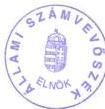

Állami Számverőszék

# JELENTÉS

a települési önkormányzatok tulajdonában lévő közutak, hidak, alagutak fejlesztésének, fenntartásának és üzemeltetésének vizsgálatáról

2000. május

0007

---

Az ellenőrzés végrehajtásáért felelős:

# V.Önkormányzati és Területi Ellenőrzési Igazgatóság

Dr. Lóránt Zoltán

számvevő igazgató

Az ellenőrzést vezette:

Farkas László

régióvezető főtanácsos

Csuti Lajos

számvevő tanácsos

Dr.Hegedűs György

számvevő tanácsos

Dr.Szirota István

számvevő

közreműködésével.

Az ellenőrzésben részt vettek:

A résztvevők névsorát az 1.sz. melléklet tartalmazza.

A témakörrel foglalkozó ÁSZ vizsgálatok jegyzéke:

Az önkormányzatok tulajdonába került vagyontárgyakkal való gazdálkodás ellenőrzése (V-1016/1992-1993.)

A helyi önkormányzatok közüzemi víz- és csatornaszolgáltatási feladatainak és az ehhez kapcsolódó lakossági díjtámogatási rendszer működésének utóvizsgálata (V-1007/1995-1996.) (A Parlament számítógépes hálózatán a vizsgálat fájl neve:0314/000 doc.)

A települési önkormányzatok vízrendezési és csapadékvíz-elvezetési feladatai ellátásának és az ehhez kapcsolódó állami támogatás felhasználásának vizsgálata (V-1017/1998.) (A parlament számítógépes hálózatán a vizsgálat fájl neve 9909/00 doc)

A helyi önkormányzatok vagyonszerkezetének, vagyonhasznosítási és nyilvántartási tevékenységének vizsgálata. (Előkészületben)

Jelentéseink az INTERNETEN 1999. június 1-től WWW.ASZ.gov.hu

Jelentéseink az Országgyűlés számítógépes hálózatán is olvashatók.

---

V-1011-111/1999-2000. TSZ. 487

# TARTALOMJEGYZÉK

J E L E N T É S 2

A TELEPÜLÉSI ÖNKORMÁNYZATOK TULAJDONÁBAN LÉVŐ KÖZUTAK, HIDAK, ALAGUTAK FEJLESZTÉSÉNEK, FENNTARTÁSÁNAK ÉS ÜZEMELTETÉSÉNEK VIZSGÁLATÁRÓL 2

I. OSSZEGZO MEGALLAPITASOK, KÖVETKEZTÉSEK, JAVASLATOK 5
II. RÉSZLETES MEGÁLLAPÍTÁSOK 10

1. A települési önkormányzatok feladatainak és a közutak vagyoni helyzetének meghatározása 10

1.1.Az utugyi feladatok szabalyozottsaga 10
1.2. A telepūlési feladatellátás önkormányzati szabályozottsága és ertelmezese 11
1.3.A feladatellatastbiztositovagyon tulajdoni helyzete 13
1.4.Az onkormanyzati vagyon szabalyozottsaga 15
1.5.A vagyon nyilvantartasa, statisztikai szambavetele 16

2. Az útügyi feladatok ellátása 17

2.1.A feladatellatas penzugyi alapjai (forrasok tervezese, elszamolasa) 17
2.2.Az utugyi uzemeltetesi, fenntartasi es igazgatasi feladatok ellatasa 21
2.3.A felujitasi, fejlesztesi feladatok ellatasa 26
2.4.Az utugyi feladatellatas szamviteli elszamolasa 31

MELLÉKLETEK

TÁBLÁZATOK

FÜGGELÉK

---

# J e l e n t é s

## **a települési önkormányzatok tulajdonában lévő köz-utak, hidak, alagutak fejlesztésének, fenntartásának és üzemeltetésének vizsgálatáról**

Az Állami Számvevőszék 1999. évi ellenőrzési terve alapján vizsgáltuk a települési önkormányzatok közszolgáltatási tevékenységét, ennek keretében a köz-utak, hidak, alagutak fejlesztésének, fenntartásának és üzemeltetésének feladatellátását (továbbiakban: útügyi feladatok). A vizsgálatunk kiterjedt az önkormányzati bel- és külterületi utakra egyaránt. Az útügyi tevékenység szakmailag magában foglalja az úthálózat fejlesztési, az útügyi hatósági és az útkezelői feladatokat, ez utóbbi megoszlik útügyi igazgatási jellegű, útüzemeltetési és útfenntartási feladatokra.

A jogszabályi háttér, a feladatellátás rendszere és módszere folyamatosan korszerűsödött, az önkormányzatok fejlődése, feladatellátása, tulajdonosi pozíciója, továbbá az Európai Unióhoz való várható csatlakozás a szabályozás és a feladatellátás területén módosításokat tett indokolttá. Mindezek következményeként időszerűvé vált a nem állami tulajdonú útügyi kérdések átfogó vizsgálata.

Az ország önkormányzati közúthálózata működőképességének biztosítása, folyamatos fenntartása, felújítása, valamint összehangolt fejlesztése össztársadalmi, nemzetgazdasági érdek és feladat.

Nemzetközi összehasonlításban a magyar közúthálózat mennyiségét tekintve megfelel az európai átlagértéknek, minőségi jellemzőit illetően az európai rangsor utolsó harmadában foglal helyet a szakmai értékelés szerint (pl. a települések egy részén a kiépített utak alacsony aránya, a hidak nem megfelelő teherbírása, a nagyobb települések körüli közlekedésben az utak és csomópontok nem megfelelő áteresztőképessége, az elkerülő szakaszok alacsony aránya). Magyarországon a tengelyterhelés megengedett határértéke 10 tonna, az EU-ban elfogadott 11,5 tonna; a legnagyobb nehéz tehergépkocsik megengedett össztömege jelenleg 40 tonna, míg az EU határérték 44 tonna.

A Közlekedési, Hírközlési és Vízügyi Minisztérium (továbbiakban: KHVM) 1992. évben kidolgozta a magyar közlekedéspolitikai koncepció téziseit, s ezt követően 1994. év végén a magyar közlekedéspolitikai koncepciót. A Kormány 1996. júliusában megtárgyalta és elfogadta a magyar közlekedéspolitikát, a stratégia irányát, eszközrendszerét és a fejlesztés főirányait.

**Ezen dokumentumok azonban nem, vagy csak alig néhány gondolat erejéig foglalkoztak a helyi önkormányzatok közúti kérdéseivel.** Így

2

---

a települések útügyi feladatai nem képeztek jelentőségüknek megfelelő helyet az országos koncepciókban.

**Az ellenőrzés célja:** annak megállapítása volt, hogy:

- a települési önkormányzatok a törvényekben és a kapcsolódó kormány és miniszteri rendeletekben meghatározott útügyi feladatainak eleget tesznek-e;
- a feladat ellátásához mekkora nagyságrendű vagyonnal rendelkeznek, milyen fejlesztéseket valósítottak meg, megoldott-e a tulajdonukban lévő útügyi létesítmények fenntartása, üzemeltetése;
- rendelkeztek-e a feladat megoldásához szükséges pénzügyi eszközzel (saját forrás, központi, fővárosi és megyei támogatás, különböző alapok stb.);
- a támogatások felhasználásánál érvényesült-e a törvényesség és szabályszerűség;
- a pénzeszközök felhasználása célszerűen és eredményesen szolgálta-e a települések útügyi feladatainak ellátását, milyen fejlődést biztosított a település infrastrukturális állapotában;
- a belső nyilvántartás (számvitel, ingatlankataszter stb.) és az erre épülő adatszolgáltatás lehetővé teszi-e az útügyi feladatellátásnak (műszaki, pénzügyi) figyelemmel kísérését, a döntéshozók megfelelő tájékoztatását.

**Vizsgált időszak:** 1993-1999. I. félév

A helyszíni vizsgálat során ellenőrzést végeztünk a KHVM-nél. **Vizsgálatunk 65 önkormányzatra terjedt ki** (Főváros, 6 fővárosi kerület, 5 megyei jogú város, 20 város, 13 nagyközség és 20 község) amelyek közigazgatási területe 425 921 hektár, az ország összes területének 4,6%-a és a belterületek nagysága a települések összes belterületének 14,2%-a. Az ellenőrzött települések összes közútjainak hossza 9 516 km, az ország helyi útjainak 9,0%-a, míg a belterületi útjaik hossza 7 229 km, amely 14,3%-át teszik ki az ország összes belterületi útjának.

A helyszíni vizsgálat így kiterjedt a települési önkormányzatok útügyi feladatainak egészére, mivel közszolgáltatási tevékenységüket a belterületi és a külterületi közutak tekintetében egységesen és összehangoltan kell ellátniuk. Ugyanis csak a belterületi és a külterületi utak és egyéb útügyi létesítmények megfelelő, jó karba helyezett állapota teszi lehetővé ezen infrastruktúra biztonságos működését. Az önkormányzatok a helyi közutak fenntartásával és fejlesztésével kapcsolatos feladataikat a tulajdonukban lévő helyi közutakkal, illetve azok tartozékaival és műtárgyaival (hidak, alagutak, átereszek, forgalomtechnikai létesítmények és berendezések) látták el.

Az önkormányzatok ellenőrzése során a szakmai, a vagyoni és a feladatellátási vizsgálati szempontok részletesebb megalapozása érdekében tájékozódó jellegű vizsgálatot végeztünk az egységes közlekedési hatósági feladatokat ellátó Közlekedési Főfelügyeletnél, a Fővárosi és nyolc megyei közlekedési felügyeletnél, továbbá az országos közutak fenntartását, üzemeltetését és fejlesz-

3

---

tését ellátó nyolc közútkezelő közhasznú társaságnál. (A vizsgált egységek jegyzékét a 2. és a 2/a számú mellékletek tartalmazzák.)

A helyszíni vizsgálatok kiegészítésére és az országos összefoglaló jelentés elemzésének kidolgozása céljából további műszaki és pénzügyi adatokat, dokumentumokat szereztünk be a Magyar Államkincstártól, az Útgazdálkodási és Koordinációs Igazgatóságtól, az Állami Közúti Műszaki és Információs Közhasznú Társaságtól.

Nem képezte a jelenlegi vizsgálat tárgyát, azonban a szakterületek feladatellátási összekapcsolódása miatt meg kell említeni, hogy az Állami Számvevőszék 1998-99. években ellenőrizte a települési önkormányzatok vízrendezési és csapadékvíz-elvezetési feladatai ellátását és az állami támogatás felhasználását. Jelentésünk bemutatta, hogy az önkormányzatok tulajdonában lévő csapadékvíz-elvezető létesítmények és műtárgyak elhanyagolt állapota a helyi vízrendezési és vízkárelhárítás, valamint az árvíz- és belvízvédekezés az önkormányzati feladatok között nem kapott jelentőségének megfelelő helyet. A vizsgált települési önkormányzatok 80%-a nem készítette el a kötelezően előírt vízkár-elhárítási tervet, kiadásai előirányzatainak részesedése az éves költségvetési főösszegekhez viszonyítva az ellenőrzött önkormányzatok 2/3-ánál nem érte el még az 1%-os mértéket sem. A vízelvezető árkok elhanyagolt állapota következtében lakóházakban, önkormányzati intézményekben, közutakban és műtárgyakban évente növekvő összegű károk keletkeztek.

Az 1999. évi és a 2000. évi csapadékosabb időjárás következtében bekövetkezett árvízi és belvízi káresemények még inkább erősítik az utak és ezek szerves részét képező vízelvezető rendszerek és ezek műtárgyainak folyamatos karbantartását és a szükségleteknek megfelelő fejlesztését, az ehhez szükséges pénzügyi eszközök biztosítását.

Magyarország útügyi feladatainak ellátását a 135 478 km hosszú közúthálózat szolgálja, amelyből a főúthálózat 12 868 km, a mellékúthálózat 122 610 km. Az ország összes útjaiból 30 245 km országos közút, míg 105 233 km helyi (önkormányzati) közút. A helyi úthálózatból 50 545 km belterületi és 54 688 km külterületi út. Az országos közúthálózat 98,9%-ban, a helyi közúthálózat pedig 34,0%-ban kiépült. A városok helyi belterületi útjainak kiépítettségi aránya 72%-os. (A fogalmi meghatározásokat a 2. sz. függelék tartalmazza).

A vizsgált önkormányzatok 9 516 km helyi közúthálózatából 5 798 km, 60,9% kiépített, ezen belül a belterületi utak hossza 7 229 km, amelynek 76,6%-a, míg a 2 287 km külterületi út 11,5%-a tekinthető kiépítettnek, valamilyen szilárd burkolattal ellátottnak. A városok belterületi útjainak (6 458 km) 76,7%-a (4 956 km) kiépült közút. (Magyarország úthálózatának helyzetét, kiépítettségét, a helyi közutak és közúti hidak jellemző adatait az 1-1/e számú táblázatok tartalmazzák).

A vizsgált nem városi települések belterületi közútjainak kiépítettsége 12% és 70% között alakult, esetenként kiemelt idegenforgalmi és üdülési térségekben 70%-85%-os mutató is előfordult. A külterületek kiépítettsége városoknál is

4

---

I. ÖSSZEGZŐ MEGÁLLAPÍTÁSOK, KÖVETKEZTETÉSEK, JAVASLATOK

alacsony, az 50%-ot nem haladta meg. A községek, nagyközségek tekintetében maximálisan 30%-os arány volt tapasztalható.

Az országos közutak az állam, a helyi közutak a települési önkormányzatok tulajdonában vannak. Természetes és jogi személyek (mezőgazdasági, erdészeti) tulajdonában 52 919 km út van, amely magánút. Magyarország közúthálózata – a tulajdonviszonyoktól függetlenül – egységes infrastrukturális rendszert képez. Az úthasználók ugyanis azonos igényeket támasztanak a közúthálózat egészével szemben, s így ezen elvárásoknak az állami és önkormányzati utak vonatkozásában – ugyan eltérő szervezeti rendszerben – de eleget kell tenni.

Az önkormányzati tulajdonú utak fejlesztésének, fenntartásának bele kell illeszkednie Magyarország távlati közúthálózat fejlesztési koncepciójába. A helyi utak fenntartásának és üzemeltetésének szakmai és műszaki követelményei – a forgalom nagyságával összhangban – meg kell, hogy feleljenek az állami közutakra érvényes igényeknek. E nélkül ugyanis nem biztosítható az egységes hazai közúthálózat zavartalan, forgalombiztos és az Európai Unió követelményeinek is megfelelő működése.

# I. ÖSSZEGZŐ MEGÁLLAPÍTÁSOK, KÖVETKEZTETÉSEK, JAVASLATOK

A települési önkormányzatok **útügyi feladatainak ellátását**, a közutak üzemeltetését, fenntartását, fejlesztését – kötelező jelleggel – a helyi önkormányzatokról szóló 1990. évi LXV. törvény (továbbiakban: Ötv.), továbbá a közúti közlekedésről szóló – többször módosított – 1988. évi I. törvény (továbbiakban: Kkt.) – **együttesen** – fogalmazták meg.

A közúti közlekedésről szóló alapvető jogszabály – a Kkt. – akkor született meg, amikor az ország teljes közúthálózata egységes állami tulajdonban volt és a tanácsok voltak a helyi közutak kezelői.

A törvényekben is nevesített kötelező feladatellátásnak a vizsgált önkormányzatok a helyi lehetőségeik és anyagi erőforrásaik függvényében tettek eleget. **Az útügyi tevékenység ellátásának helyi szabályozása, a feladatok és hatáskörök egyértelmű, számon is kérhető elhatárolása azonban szinte valamennyi önkormányzatnál kifogásolható volt.**

Az Ötv, továbbá az egyes állami tulajdonban lévő vagyontárgyak önkormányzati tulajdonba adásáról szóló 1991. évi XXXIII. törvény (továbbiakban: Vtv.), a tulajdonviszonyok átalakítása keretében létrehozta az önkormányzatok közfeladatainak ellátásához szükséges vagyoni kört. Így az önkormányzatiság megjelenésével a tulajdonviszonyok alapvetően megváltoztak, s a települési önkormányzatok tulajdonosai lettek a helyi közutaknak, amely a tulajdonosi kötelezettségek teljesítésével is jár. Nem csak a belterületének, hanem a közigazgatási határainak egészére, a külterületére is kötelezettségek hárulnak az útügyi feladatok tekintetében. Ennek csak akkor tud megfelelni, ha a törvények

5

---

I. ÖSSZEGZŐ MEGÁLLAPÍTÁSOK, KÖVETKEZTETÉSEK, JAVASLATOK

alapján a neki járó vagyont tulajdonába veszi, egyúttal a tulajdonbavétel törvényileg (Ötv: törzsvagyonba vételi kötelezettség) szabályozott nyilvántartásbeli kötelezettségének eleget tesz. A törzsvagyon – a többi vagyontárgytól elkülönítve történő – nyilvántartása, értékelése és tételes leltár szerinti kimutatása elengedhetetlen követelmény.

A települési önkormányzatok a közút vagyont több lépésben szerezték meg:

donttobbsegben az Otv erejenel fogva,
- kisebb részben a Vtv szerint a Vagyonatado Bizottsagok (tovabbiakban: VAB) eljarasa eredmenyekent, illetve,
a karpólásrol szólo 1991. évi XXV. törveny, a szövetkezetekrol szólo 1992. évi I. törveny hatálybalépeséról és az atmeneti szabályokrol szólo 1992. évi II. törveny, továbbá a foldrendező és foldkiadó bizottságokrol szólo 1993. évi II. törveny alapján,
- egyeb cimen (vasarlas).

A vizsgált önkormányzatok a közutak törzsvagyonba sorolását és forgalomképtelennek minősítését egy-egy kivétellel megtették. A vizsgálati tapasztalatok szerint azonban az önkormányzatok tulajdonát képező helyi közutak tényleges mennyisége és értéke nem volt megállapítható a nyilvántartások alapján. Értékbeli nyilvántartást nem vezettek, a mennyiségi nyilvántartás pontatlan volt. Alig volt olyan vizsgált önkormányzat, ahol a számviteli, analitikai nyilvántartások hibátlanok lettek volna, az ellenőrzés az ingatlan kataszteri nyilvántartások 90%-ánál is talált hibát.

Ebben a helyi hiányosságokon kívül közrejátszott, hogy a tulajdonukba vett közút vagyon kötelező értékelésére, az érték meghatározásának módszerére, sem műszaki, sem pénzügyi vonatkozásban – az önkormányzatoknak nem állt rendelkezésükre központi iránymutatás.

A feladatellátás módjait döntően a települések jellege – főváros, fővárosi kerület, megyei jogú város, város, nagyközség, község – az ütügyi feladatok nagyságrendjének különbözősége határozta meg. Az önkormányzatok e feladatot az általuk alapított és felügyelt költségvetési szervekhez, illetve gazdasági társaságokhoz (Rt., Kft.) telepítetten, esetenként vállalkozásba adással, illetve közhasznú munkások foglalkoztatásával oldották meg.

A települési önkormányzatok feladatainak ellátását biztosító pénzeszközök a Magyar Köztársaság éves központi költségvetésében, a költségvetési és államháztartási törvényben előírt szabályozás szerint álltak rendelkezésre. Az önkormányzatok saját hatáskörben döntöttek az ütügyi feladatellátáshoz szükséges pénzeszközök mértékéről és nagyságáról.

Az önkormányzatok számára üzemeltetésre-fenntartásra csupán a normatív támogatásoknál a "Települési igazgatási, kommunális és sportfeladatok" jogcím keretében jelent meg nevesítetten az út- hídfenntartási tevékenység. A normatíva azonban más (pl. közterület-fenntartás, település-üzemeltetés, sportcélok) feladatok ellátására is szolgált, nagysága változó: az állandó népesség alapján 1995. évben 3 820 Ft/fő; 1996. évben 1 637 Ft/fő; 1997. évben 312 Ft/fő; 1998. évben 1 200 Ft/fő és 1999. évben 594 Ft/fő, ez utóbbit 421 Ft/fő összeg egészítette ki a személyi jövedelemadóból. A feladatellátásra szolgáló normatíva mértéke jelentősen változott, illetve csökkenő

6

---

I. ÖSSZEGZŐ MEGÁLLAPÍTÁSOK, KÖVETKEZTETÉSEK, JAVASLATOK

irányzatot mutatott, ebből következő bizonytalansága is hozzájárult a feladatellátás alacsony színvonalához.

A fejlesztési és felújítási tevékenység végzéséhez a települési önkormányzatok pénzeszközöket nevesítetten, a céljellegű decentralizált támogatásból és a területi kiegyenlítést szolgáló pénzeszközökből kaptak, illetve kaphattak pályázat útján. Az Útalapról szóló – többszörösen módosított – 1992. évi XXX. törvény 1993. január 1-től tette lehetővé az önkormányzati törzsvagyonhoz tartozó helyi közúthálózat (utak, hidak, csomópontok, járdák) és kerékpárutak építésének támogatását ugyancsak pályázatok útján.

A vizsgálati tapasztalatok azt mutatták, hogy az önkormányzatok általában keveset fordítottak az útügyi feladatok megoldására. Az éves költségvetések útügyi kiadási előirányzatainak aránya az ellenőrzött önkormányzatok 80%-ánál nem érte el az éves költségvetési kiadások főösszege 1%-át. Az önkormányzatok ezen célú bevételi és kiadási előirányzatai, illetve ezek tényleges teljesítései valamennyi vizsgált önkormányzatnál egyértelmű műszaki-szakmai meghatározás hiányában együtt tartalmazták a fenntartási és a felújítási tevékenység ellátásának pénzösszegeit, ezért a tevékenységek elkülönített (fenntartás, felújítás) valós ráfordításai csak nagy bizonytalansággal voltak elhatárolhatók. Az országos összesített adatok alapján a tendencia ehhez hasonló, 1993. és 1998. év között 1,07%, illetve 0,41% szélső értékek között alakultak.

A közutak, hidak alagutak üzemeltetése, fenntartása jogcímen elszámolt kiadások a vizsgált kör egészét tekintve 1993-1995. közötti időszakban 6,5 Mrd Ft-ról 16,6 Mrd Ft-ra emelkedtek, míg 1996. évtől e kiadások fokozatosan csökkentek, 5 Mrd Ft-ról 1998. évre 3,6 Mrd Ft-ra, lényegében követve a normatíva évenkénti alakulását. Az önkormányzatok ezen pénzeszközöknek mintegy 40-50%-át fordították kifejezetten közút fenntartásra, lényegében a legégetőbb burkolathibák eseti kijavítására (kátyúzás). Ugyanakkor ez utóbbi időszakban a fejlesztés, felújítás címen elszámolt felhasználások 10,2 Mrd Ft-ról 15,6 Mrd Ft-ra növekedtek (152,9%). Az arányeltolódás a központi és -1996. évtől kezdődően - a decentralizált megyei támogatások felújításokkal, illetve fejlesztésekhez kapcsolódó igénybevételi lehetőségével függött össze. (A pénzügyi adatokat a 2-2/e számú. táblázatok tartalmazzák.)

A szűkösen rendelkezésre álló központi források felhasználásánál a maradványelv érvényesült, az önkormányzatoknál a kötelezően ellátandó feladatok rangsorolásakor e tevékenység általában háttérbe szorult, elsőbbséget kaptak az életkörülményeket közvetlenül befolyásoló tevékenységek (oktatás, egészségügy). A folyamatos minőségromlást megakadályozó fejlesztési és fenntartási koncepciókat, terveket általában nem készítettek. Az önkormányzatoknál még az előre látható, tervezhető pénzügyi eszközöket (pl. gépjármű adó, közterület használatba vételi díj) sem e feladat megoldására tervezték forrásként, csupán esetenként a tényleges ráfordításoknál vették figyelembe. A vizsgálati tapasztalatok azt is bizonyították, hogy az önkormányzatok döntő többsége nem ismerte fel a feladatellátás elmaradásának kockázatát, a helyi közutak és műtárgyaik folyamatos állagromlását és ennek következtében előálló társadalmi és gazdasági hatásokat.

7

---

I. ÖSSZEGZŐ MEGÁLLAPÍTÁSOK, KÖVETKEZTETÉSEK, JAVASLATOK---

A jogszabályokban követelményként előírt számviteli részletező nyilvántartásokat és az ingatlankatasztert nem megfelelő tartalommal vezették, ezek adatai az egyéb naturáliákban vezetett nyilvántartásokkal nem egyeztek. Az egyes közúti létesítmények építésének időpontjáról, műszaki (szerkezeti) jellemzőiről sem tartalmaztak megbízható információkat. Az ezekből készített statisztikai adatszolgáltatás megbízhatatlan volt, a szolgáltatott adatok nem fedték le az útügyi tevékenység teljes terjedelmét, így az értékeléshez megfelelő – naprakész – információk nem álltak rendelkezésre.

A kötelező feladatellátást szolgáló vagyon meghatározó hányadát a vizsgált önkormányzatok csak naturáliákban tartották nyilván, mivel a vagyonátvétel során érték nélkül vették tulajdonba. Így csupán mennyiségben képezte az önkormányzati vagyon részét. Mindössze három vizsgált önkormányzat értékeltette az átvett közútvagyonát.

Az önkormányzatok 85%-a még a tanácsrendszer idején elfogadott – azóta sem korszerűsített – településrendezési (fejlesztési) tervvel rendelkezett, külön közút fejlesztési tervet pedig a vizsgált önkormányzatok közül mindössze 5% készíttetett. Ezek a ténymegállapítások alátámasztják, hogy **tervszerű és tudatos közép, illetve hosszabb távra szóló helyi közútfejlesztési programok hiányában a fejlesztési célok meghatározásában az esetszerűség volt a jellemző.**

Az ellenőrzött időszakban a vizsgált önkormányzatok - saját források, központi és megyei területfejlesztési tanácsi támogatás igénybevételével- megvalósítottak (különböző mértékegységben nyilvántartott) 494 km és 411.464 m² közút, 55 km és 71.000 m² járda, továbbá 91 km és 4900 m² kerékpárút fejlesztést, illetve felújítást.

A vizsgált önkormányzatok mintegy 90%-ánál a folyó kiadások elszámolásának kialakult helytelen gyakorlatát is kifogásolta az ellenőrzés. A hatályos szakfeladatrendben rögzített tartalmi előírásokat a kiadások elszámolásánál félreértelmezve alkalmazták. Keveredett az útfenntartás-felújítás-fejlesztés számviteli kategória, ebből következően a működési és felhalmozási kiadások sem voltak pontosan elhatároltak, melynek az önkormányzati vagyon - befektetett tárgyi eszközök - értékére is hatása volt.

Az útügyi feladatellátás céljellegű belső ellenőrzés keretében történt vizsgálatot - a főváros kivételével - egyetlen önkormányzatnál sem tapasztalt az ÁSZ ellenőrzés. A szakmai és a hatósági ellenőrzés a Közlekedési Főfelügyelet és a Fővárosi és Megyei Közlekedési Felügyeletek útján valósult meg.

A helyszíni vizsgálatok tapasztalatai alapján a települési önkormányzatoknak tett javaslatok a hatáskörök és feladatok jogszabályokban (Ötv., Kkt.) meghatározott telepítésére (képviselő-testület, polgármester, jegyző), az útellenőri szolgálat működtetésére, a vagyonkataszter és a nyilvántartások pontos vezetésére, a PM által előírt szakfeladatok, a bevételi és kiadási előirányzatok és teljesítések szabályszerű vezetésére és elszámolására hívták fel a figyelmet. Az érintett önkormányzatoknál kezdeményeztük az eltérések legkésőbb az 1999.

8

---

I. ÖSSZEGZŐ MEGÁLLAPÍTÁSOK, KÖVETKEZTETÉSEK, JAVASLATOK

év végi zárlati munkák keretében történő számviteli rendezését, hogy az éves beszámoló mérlege már a valós önkormányzati vagyon értékét mutassa.

Javasoltuk a térségi együttműködési, az útügyi üzemeltetési és fenntartási feladatok társulásos módszereinek eddigieknél eredményesebb kihasználását, a különböző pályázatok benyújtásának települések közötti összehangolását, a közutakról szóló statisztikai adatszolgáltatások és az ingatlan kataszteri nyilvántartás egyezőségének megteremtését.

A vizsgált önkormányzatok a javaslatokat elfogadták, a jelentések tartalma miatt észrevételt nem tettek. Két önkormányzat a tervezett intézkedéseket írásba foglaltan közölte.

Két önkormányzatnál (Bárdudvarnok, Bátonyterenye) a helyszíni vizsgálat megállapította, hogy a helyi közutak jogsértő módon kerültek magántulajdonba. A jogsértő állapot megszüntetését kezdeményeztük a Legfőbb Ügyészségnél.

A helyszíni vizsgálat befejezése után az 1999. évi tavaszi rendkívüli árvíz és belvíz, valamint a csapadékos téli időjárás miatt az önkormányzati közutakban, hidakban bekövetkezett káresemények helyreállítására kapott állami támogatások felhasználásának felmérésére soron kívül tájékozódást végeztünk a Belügyminisztériumban. A vizsgált önkormányzatok közül 17 önkormányzat részesült az 1042/1999. (IV. 29.), illetve az 1091/1999. (VIII. 13.) Korm. határozattal jóváhagyott, az önkormányzati tulajdonban lévő közutakban és hidakban keletkezett károk helyreállítására biztosított 4.840,4 M Ft összegű központosított támogatásból. A felhasználás szabályszerűségét az 1999. évi zárszámadási vizsgálatunk keretében ellenőrizzük. E vizsgálatban történik az igénybevétel indokoltságának, a pénzfelhasználás megalapozottságát igazoló dokumentáció és szervezet ellenőrzése is.

Az ellenőrzés tapasztalatai és következtetései alapján a szükséges intézkedések előmozdítása érdekében javasoljuk:

### A belügyminiszternek

1. Kezdeményezze, hogy az Ötv-ben egyértelműen fogalmazzák meg az önkormányzatok saját rendeletalkotás kiterjesztését a törzsvagyon egészére.
2. Kezdeményezze a közigazgatási hivataloknál, hogy a törvényességi ellenőrzés keretében kérjék számon az önkormányzati hatáskör és feladatellátás telepítésének jogszerűségét, s az érvényes jogszabályoknak megfelelő helyreállítását.
3. Vizsgálja meg az önkormányzatok tulajdonában levő ingatlanvagyon nyilvántartási és adatszolgáltatási rendjéről szóló 147/1992. (XI.6.) Korm. rendelet végrehajtását. Az eddigi ÁSZ vizsgálatok tapasztalatai szerint a rendelet nem tölti be a neki szánt szerepet. Tegyen javaslatot a kataszteri nyilvántartás rendszerének egyszerűsítésére, a számviteli nyilvántartásokkal és a statisztikai adatszolgáltatásokkal való összhangjának megteremtésére, egyezőségére.

9

---

II. RÉSZLETES MEGÁLLAPÍTÁSOK

# A pénzügyminiszternek

1. Vizsgálja felül a jelenleg érvényben lévő szakágazati, illetve szakfeladatrendet, s azok tartalmát – a Központi Statisztikai Hivatal bevonásával – hozza összhangba a tevékenységek egységes ágazati osztályozási rendszerének (TEÁOR) előírásaival, teremtse meg a szakfeladatrend egyszerűsítésének és pontosításának lehetőségét.

# A közlekedési, hírközlési és vízügyi miniszternek

1. Intézkedjen a települési önkormányzatok tulajdonában lévő helyi közutak kezelői feladataira vonatkozó koncepció előkészítéséről.
2. Dolgozzon ki olyan műszaki, szakmai irányelveket és útmutatót, amely segítséget nyújt a települési önkormányzatok helyi közútjai és műtárgyai vagyoni értékeléséhez.
3. Alakítsa ki – a Központi Statisztikai Hivatal bevonásával – valamennyi települési önkormányzat helyi útjai és műtárgyai állományának és állapotának rendszeres figyelemmel kíséréséhez szükséges statisztikai adatszolgáltatási rendszert, ennek keretében kezdeményezze a 2000. XII. 31-i helyzetnek megfelelő teljes körű adatgyűjtést.

# II. RÉSZLETES MEGÁLLAPÍTÁSOK

# 1. A TELEPÜLÉSI ÖNKORMÁNYZATOK FELADATAINAK ÉS A KÖZUTAK VAGYONI HELYZETÉNEK MEGHATÁROZÁSA

# 1.1. Az útügyi feladatok szabályozottsága

Az Ötv. kötelezően ellátandó közszolgáltatási önkormányzati feladatok közé sorolta a helyi közutak fenntartásáról való gondoskodást. A helyi közutak fejlesztésének önkormányzati kötelezettségét a Kkt. 8. § /1/ bekezdése, továbbá az épített környezet alakításáról és védelméről szóló 1997. évi LXXVIII. tv. fogalmazta meg.

Az eddigi közúti közlekedéssel összefüggő állami feladatokat a törvény kiterjesztette az önkormányzatokra, illetve megosztotta az állam és az önkormányzatok között. A törvényi szabályozással, a közút vagyon biztosításával az önkormányzatok tulajdonosi jogosultságot és ezzel együtt kezelői feladatokat kaptak a helyi közutak tekintetében.

10

---

II. RÉSZLETES MEGÁLLAPÍTÁSOK

A települési önkormányzatok közúti feladatait a Kkt., a hatáskörök megosztását, telepítését pedig a helyi önkormányzatok és szerveik feladat- és hatásköréről szóló 1991. évi XX. tv. (Htv.) fogalmazta meg. Ezek a törvények hatalmazták fel az ágazati minisztériumot, hogy a részletes szakmai szabályozásokat rendeletben határozza meg. Ennek értelmében:

- Miniszteri rendelet konkretizálta a feladatot a képviselő-testületnek (Az utak forgalomszabályozásáról és a közúti jelzések elhelyezéséről szóló 20/1984. (XII.21.) KM rendelet 2. § /1/ bekezdése szerint az utak forgalmának szabályozása, a közúti jelzések elhelyezése, fenntartása, üzemeltetése és eltávolítása az út kezelőjének feladata).
- Miniszteri rendelet konkretizálta a feladatot a jegyzőnek (A 19/1994. (V.31.) KHVM rendelet 6. § /3/-/4/ bekezdése alapján a közút nem közlekedési célú igénybevételéhez való hozzájárulást megadja, vagy megtagadja, a közút igénybevételéért fizetendő díj összegét megállapítja).

Az útügyi feladatok között vannak olyanok, amelyek államigazgatási ügynek, feladatnak minősülnek. Ezeket túlnyomórészt a jegyző hatáskörébe, egyet a polgármester és a hivatal ügyintézőjének hatáskörébe utalták a jogszabályok és a közszolgáltatási feladatellátás körén kívül esnek.

A KHVM szakmai feladatellátási kötelezettsége keretében szabályozta az állami tulajdonú országos közutak kezelői feladatait, viszont ilyen szabályozás a települési önkormányzatok tulajdonában lévő helyi közutakra a vizsgálat időpontjáig nem készült.

Az ellenőrzés fő célját tekintve ezért a közhatalmi jellegű államigazgatási feladatok (forgalombiztonsági, forgalomtechnikai, forgalmi rend szabályozási) teljesítésének vizsgálata kiegészítő, járulékos szerepet kapott és arra irányult, hogy segítették-e az önkormányzati közszolgáltatási feladatok ellátását (pl. út- és vagyonnyilvántartás, főkönyvi könyvelés és analitika).

## 1.2. A települési feladatellátás önkormányzati szabályozottsága és értelmezése

A vizsgált önkormányzatok kötelező feladatuknak tartották a helyi közutak fenntartását, a fejlesztését – egy-két kivétellel – viszont nem, mivel az Ötv. 8. § /4/ bekezdése szerint csak az előbbiről kötelesek gondoskodni. A fenntartás kötelező feladat jellegét nem vitatva azonban az önkormányzatoknak 10%-a egyáltalán nem szabályozta le SZMSZ-ben, hogy melyek a kötelező, vagy önként vállalt feladatok, ezeket milyen módon és mértékben kívánják ellátni (Dunaújváros, Kunhegyes, Pásztó, Velence).

Az önkormányzati feladatokat tartalmazó SZMSZ-ek a szabályozottságot tekintve nem voltak egységesek, ennek megfelelően három csoportba sorolhatók:

- Az önkormányzatok 30%-a úgy intézte el, hogy csupán hivatkozott az Ötv. 8. § /4/ bekezdésben előírt kötelező feladatokra (Fertőd, Cegléd, Hollókő, Jászfényszaru).

11

---

II. RÉSZLETES MEGÁLLAPÍTÁSOK

- Az önkormányzatok 40%-a megnevezte az SZMSZ-ben a kötelező feladatokat (Adony, Abádszalók, Putnok, Veszprém, Zalaegerszeg).
- A további 30 % pedig az SZMSZ mellékletében, hatásköri jegyzékben sorolta fel a feladatokat. Itt azonban már keveredtek az önkormányzati és államigazgatási feladat- és hatáskörök (Fővárosi Önkormányzat, Balatonalmádi, Karcag).

Néhány önkormányzat (Kaposvár, Kunhegyes, Pásztó, Jászalsószentgyörgy) az SZMSZ-t nem az önkormányzat egészére, hanem a képviselő-testületre vonatkoztatta, figyelmen kívül hagyta, hogy a képviselő-testület nem jogi személy és így költségvetési szerv sem lehet.

Ezeknél az önkormányzatoknál az SZMSZ-ek általános hiányossága: nem jutott kifejezésre, hogy azoknak az adott önkormányzat szervezetére és működésére vonatkozó legfontosabb, legalapvetőbb szabályokat kell megállapítaniuk.

Az önkormányzatok útügyi tevékenységét meghatározó jogszabályok nagy száma és szabályozási terjedelme, valamint a normák különböző jellege miatt az önkormányzati tapasztalatok igen eltérő képet mutattak az útügyi feladatok megosztása, valamint a konkrét feladatok ügyrendben és munkaköri leírásokban való megjelenítése terén.

A központi szabályozáshoz hasonlóan nehezen volt áttekinthető a konkrét feladat és hatáskörök önkormányzati telepítése. Ebben szerepe volt annak is, hogy egyes forgalomban lévő és önkormányzatoknál használt, központilag készített és terjesztett hatásköri jegyzékek hibásan, (KODEXPRESS; Complex CD jogtár) csak részben vették figyelembe a hatásköri kijelöléseket, (a Htv. előírása szerint a Kkt. 34. § (3) bekezdésében megfogalmazott feladat – nyilvántartás – a jegyzőé, a KODEXPRESS és a Complex CD jogtár szerint viszont a képviselő-testületé). Néhány önkormányzat (Budapest XIII.ker., Karcag) ezeket a központilag készített jegyzékeket használta, mint SZMSZ mellékletet.

Egyes önkormányzatok (Marcali, Balatonfenyves) (Példatár 1.) feladat telepítése törvénysértő, mivel ellentétes volt a Htv. által előírt feladatmegosztással.

Az előzőekhez hasonlóan további jogsértő feladat-átruházásokat is feltárt az ellenőrzés: jegyzői hatáskört polgármesternek adtak, (Bátonyterenye), a polgármestert – Közlekedési Felügyelet hatáskörét elvonva – hatósági jogkörrel ruházták fel, (Kunhegyes), valamint a közgyűlés által a főpolgármesternek átruházott feladatkört a hivatal szervezetének adták tovább (Fővárosi Önkormányzat) (Példatár 2.)

Ezen önkormányzatok esetében, a szabálytalan, jogsértő feladat- és hatáskör telepítések a törvényességi ellenőrzés hiányára hívták fel a figyelmet.

Általános megállapítás, hogy az útügyi feladatokat az önkormányzatok nem tekintették egységes tevékenységnek, azokat az egymástól elkülönült szervezeti egységek az együttműködést nélkülözve, koordinálatlanul végezték. Ezért is fordulhatott elő, hogy a különféle szervezeti egységektől szerzett

12

---

II. RÉSZLETES MEGÁLLAPÍTÁSOK

hivatalos adatok, statisztikák ugyanazt a naturáliát más-más mennyiségi mutatóval közölték. (Dunaújváros, Kaposvár, Győr).(Példatár 3.)

Kisebb, kevés lélekszámú önkormányzatoknál (Foktő, Somogybükkösd, Nógrádsáp, Babót) a feladatoknak csak némelyikét valósították meg. Ennek oka egyrészt, hogy alig érintettek a feladatellátásban, másrészt a szakemberek, a szakképzettség hiánya állt fent.

### 1.3. A feladatellátást biztosító vagyon tulajdoni helyzete

A feladatellátáshoz szükséges vagyon átvétele több lépcsőben számos hibával tarkítottan történt. Leginkább az volt a jellemző, hogy az önkormányzatok teljes körűen nem ismerték az átvett vagyont, mintegy 80%-uknál a mezőgazdasági területekből származó külterületi utak átvétele még nem tekinthető lezártnak.

A törvény erejénél fogva jutottak az önkormányzatok – az Ötv. hatálybalépése napján – a helyi közutak tulajdonjogához, amelyek korábban állami tulajdonban és tanácsi kezelésben voltak.

A helyszíni vizsgálatok tapasztalatai szerint az országos és helyi közutak tulajdonosi helyzete (Bárdudvarnok, Badacsonytomaj) esetében (Példatár 4.) nem rendezett, illetve nem történt meg teljes körűen a közúthálózat felmérése és tulajdonosi rendezése az önkormányzatok létrejöttekor.

A Nógrád Megyei Állami Közútkezelő Kht tájékoztatása szerint 1998-ban a Kht és a Kincstári Vagyoni Igazgatóság megállapodást kötöttek a kezelt vagyoni körre, amelynek során észlelték, hogy 63 tétel, helyrajziszám valóságban önkormányzati út, de a Kht-t jegyezték be kezelőnek, viszont 78 esetben a nyilvánvalóan országos közútra önkormányzatokat jegyeztek be tulajdonosnak.

A Szolnok Megyei Közútkezelő Kht-tól szerzett információk szerint rendezetlen tulajdonú közutak vannak több településen (Szolnok, Jászberény, Túrkéve, Kunhegyes, Jászladány, Pusztamonostor), amelynek okát a régi és téves földhivatali bejegyzésekben látják.

A vizsgálat lezárásának időpontjáig az érintett önkormányzatok a visszás tulajdoni helyzetet nem rendezték.

Négy önkormányzatnál fordult elő, hogy a vizsgált önkormányzatok rendelkeztek az utak tulajdonjogát igazoló tulajdonlap másolatokkal. A földhivatal a tulajdonjogot csak a polgármester kérelmére – az állam tulajdonjogának törlése mellett – jegyezhette be (Balatonalmádi Veszprém, , Pirtó, Zirc) (Példatár 5.).

A vizsgált 65 önkormányzat a törvény alapján szerezte meg helyi közútjainak túlnyomó részét, amelyek a települések belterületein találhatók, azonban két esetben előfordult, hogy az önkormányzat nem szerezte meg a nyilvánvalóan helyi közútnak tekinthető utak tulajdonjogát.

13

---

II. RÉSZLETES MEGÁLLAPÍTÁSOK

**Bárdudvarnok Önkormányzata** a törvény erejénél fogva alig jutott helyi közúthoz, mivel a 16 lakott helyvel rendelkező település részeket összekötő utak a helyi állami gazdaság használatába kerültek az idők folyamán és ezeket a gazdaság felszámolásakor, mint saját tulajdont, eladták külföldi tulajdonban lévő Kft-éknek 1993-ban. **Az önkormányzat mindeddig sikertelenül próbálkozott a helyi közutak visszaszerzésével.**

Az utak eladásában döntő tényező volt, hogy a **jogelőd tanácstól az állami gazdasághoz került a közutak kezelői joga, a földhivatal viszont – hibásan – a gazdaság saját használatú útjaként jegyezte be a közutakat és az állami gazdasági utakat** az ingatlan-nyilvántartásba és ezért a gazdaság saját tulajdonaként adta el a gazdaságot felszámoló cég.

**Bátonyterenye városban** nem került az önkormányzat tulajdonába két településrészt (Nagybátony, Szorospatak) összekötő közút. A 4,5 km hosszú 45.102 m² területű aszfaltutat 1990 előtt a Magyar Állam tulajdonaként és a Nógrádi Szénbányák Vállalat kezelői jogaként jegyezték be – jogosan – a földhivatali nyilvántartásokba. A Szénbányák felszámolása során **egy magánvállalkozó szerezte meg a közút tulajdonjogát.**

A vagyoni kör kialakulása a Főváros esetében egyedi módon rendeződött: a vagyonmegosztás a feladatellátás szerint történt a Főváros és a kerületek vonatkozásában. Budapest teljes úthálózatából (4 256,2 km) 482,7 km a Fővárosi Önkormányzat, míg 3 773,5 km a kerületi önkormányzatok tulajdonában szerepel. A kerületek tulajdonában levő, de tömegközlekedéssel érintett közutak fenntartását és üzemeltetését (530 km) a Fővárosi Önkormányzat látja el.

**A vagyonátadó bizottságok (VÁB) döntése alapján is kerültek utak az állam tulajdonából az önkormányzatok tulajdonába a Vtv. alapján. (Kaposvár, Kiskunhalas, Badacsonytomaj, Zalaegerszeg, Nagykutas). (Példatár 6.)** A Fővárosi Önkormányzat ez utóbbi törvény alapján szerezte meg a közúti hidak, alul- és felüljárók tulajdonjogát a Fővárosi Vagyonátadó Bizottság határozata alapján.

**Egyéb jogcímen** (csere, átvétel, építés, kiigazítás, vásárlás, átminősítés) **szerzett útvagyon** a vizsgált **önkormányzatok 30%-a. (Győr, Jánossomorja, Bátonyterenye, Veszprém ) (Példatár 7.)**. Az egyéb speciális jogcímek között szerepel a **mezőgazdasági jellegű külterületi földutak átvétele**. A vizsgált önkormányzatok 20%-a (**Magyaregres, Tiszaalpár, Rétság, Szentistván, Adony, Polgárdi, Letenye**) lett tulajdonosa külterületi földutaknak a törvényi szabályozásnak megfelelően. A helyszíni vizsgálatok az önkormányzatok 80%-ánál azonban azt jelezték, hogy **az eljárás vagy el sem kezdődött, vagy pedig még folyamatban volt** (pl. **Dunaújváros, Kiskunhalas, Mezőfalva ) (Példatár 8.)**.

A szabályozás (1991. évi XXV. tv., 1992. évi II. tv, 1993. évi II. tv) rendelkezett a külterületi földutak önkormányzati tulajdonba adásáról. A kezdeményezés a földkiadó és a fölrendező bizottságok kezében volt, hogy a közutak önkormányzati tulajdonba kerüljenek. Ezzel azonban alig éltek az önkormányzati pénzügyi források szűkössége miatt.

**Az önkormányzatok utak átminősítése útján is juthattak tulajdonhoz. Utak átminősítését** - országos közútból helyi közúttá, illetve helyi

14

---

II. RÉSZLETES MEGÁLLAPÍTÁSOK

közút országos közúttá, vagy magánúttá - **a megyei (fővárosi) közlekedési felügyeletek végzik.** A tájékozódó vizsgálatunk szerint kevés hatósági ügyük keletkezett az utak átminősítésével kapcsolatban.

**Somogy megyében** – a Megyei, Állami Közútkezelő Kht. tájékoztatója szerint – eddig állami tulajdonból és a Közútkezelő Kht kezeléséből **23 önkormányzatnak** 36.627 fm helyi jelentőségű közutat adtak át. Ebből 26.647 fm szilárd burkolatú út, 9.980 fm burkolatnélküli földút.

### 1.4. Az önkormányzati vagyon szabályozottsága

A helyi közutakat az Ötv. és a Kkt egyaránt forgalomképtelen törzsvagyonnak minősíti. Valamennyi vizsgált önkormányzat vagy önállóan, vagy pedig az SzMSz részeként határozta meg a vagyongazdálkodás főbb szabályait.

A vizsgált önkormányzatok 90%-a – szabályosan – a helyi közutakat a törzsvagyonban, forgalomképtelen vagyonként mutatta ki, ahogy ezt a törvény előírta. **Mindössze három önkormányzatnál utalt a szabályozás törvénysértésre (Hévíz, Zirc, Csopak). (Példatár 9.)** Elsősorban a helytelen vagyongazdálkodási szabályozás miatt: ugyanis vagy a vagyonrendeletük nem tartalmazta a törzsvagyonba tartozó vagyontárgyak felsorolását, vagy lehetőséget biztosítottak arra, hogy képviselő testületi határozattal – egyébként törzsvagyonba tartozó vagyontárgyak – korlátozottan forgalomképes vagyonná történő minősítésre.

**A törvénysértő megoldások ugyancsak a törvényességi ellenőrzés hiányosságaira hívták fel a figyelmet.**

Az önkormányzatok 10%-a ugyan rendelkezett vagyonáról, de nem határozta meg a törzsvagyonát és annak részeit (**Pásztó, Zirc, Badacsonytomaj, Nógrádsáp**)

Az Ötv. csak a korlátozottan forgalomképes törzsvagyon tárgyai (közmű, intézmény, középület, illetve azon ingó és ingatlan) fölötti rendelkezést írta elő rendeletbe foglalni.

Ehhez képest a forgalomképtelen törzsvagyon (helyi közutak, terek, parkok, vizek, vízfolyások) kérdésében nem szükséges rendeletet alkotni, erre az Alkotmánybíróság már korábban felhívta a figyelmet határozatában.

Az 1018/H/1994. AB határozat ezzel kapcsolatban kijelenti, hogy az Ötv. rendelkezéseiből nem következik olyan jogalkotási kötelezettség, amely szerint az önkormányzati vagyonrendeletnek a törzsvagyon körét tételesen, egyes vagyontárgyak ingatlan nyilvántartás szerinti felsorolásával meg kell jelölni.

Igaz viszont, hogy erre a megállapításra az Alkotmánybíróság azt követően jutott, hogy meggyőződött arról, hogy **az önkormányzat ingatlan vagyon katasztere vagyontárgyanként tartalmazta a törzsvagyon körébe tartozó önkormányzati vagyont**, vagyis a kataszter megfelelt a törvény nyilvántartási követelményének.

A törvényi követelmény szerint csupán a korlátozottan forgalomképes törzsvagyon szabályozását kellett rendeletbe foglalni, a forgalomképtelen törzsva-

15

---

II. RÉSZLETES MEGÁLLAPÍTÁSOK

gyon szabályozását a képviselő-testület határozattal is elvégezhette. A vagyongazdálkodás egységessége miatt **e kérdést egy szabályozásban, rendeletben kell kezelni.**

### 1.5. A vagyon nyilvántartása, statisztikai számbavétele

A több törvényben – Vtv., Kkt., Ötv. és az államháztartásról szóló 1992. évi XXXVIII. törvény (továbbiakban: Áht.) – és rendeletben (147/1992. (XI.6.) Korm. rendelet) egyértelműen előírt követelmény, hogy az önkormányzat vagyonát a jogszabályban meghatározott módon köteles nyilvántartani, értékelni és adatszolgáltatást teljesíteni, vagyonleltárt és ingatlankatasztert kell készítenie, a főkönyvi könyvelést egyedi, tárgyi eszköz analitikával kell részletezni, illetve alátámasztani, továbbá műszaki tartalmú nyilvántartásokat kell vezetnie.

A különböző nyilvántartási kötelezettségeknek, illetve azok mindegyikének az önkormányzatok teljes körűen nem tettek eleget, amelyre már a korábbi számvevőszéki ellenőrzések is rámutattak. **Nem volt olyan önkormányzat, ahol az ellenőrzés valamilyen hibát ne talált volna a nyilvántartásokban.**

**A vagyon nyilvántartásának jellemző hibái** a következőkben összegezhetők.

- Az ingatlan katasztert értékben nem vezették, alig néhány önkormányzat végezte el a kataszter felvételekor a vagyon értékelését. A kataszter értékadatai elvétve egyeztek a számviteli analitika adataival. A vagyon számbavételére a 147/1992. (XI.6.) Korm. rendelet „U” jelű betétlapjában előírt mértékegységeket (fm, m²) felváltva használták, az átszámítás és az összesítések a vizsgált önkormányzatoknál e miatt sem volt teljes körűen megoldható.

A Központi Statisztikai Hivatal (továbbiakban: KSH) által elrendelt ingatlanvagyon kataszter statisztikai jelentést valamennyi önkormányzatnak kell készítenie. **A kataszteri statisztikában a vizsgált önkormányzatok 90 %-ánál talált hibát az ellenőrzés (Dunaújváros, Tiszapüspöki, Csopak, Cegléd, Balatonalmádi, Berhida, Mátraterenye, Vindornyaszőlős) (Példatár 10.).** A Fővárosi Önkormányzat tulajdonába került útügyi létesítményeket 1993. évben vezették fel az ingatlankataszterbe. Az éves vagyonleltárban a létesítmények naturális adatai szerepeltek, értékadatok azonban nem.

A kataszteri nyilvántartás „U” jelű betétlapján nincs helye a hídnak, áteresznek, alagútnak, közműalagútnak. A statisztikai jelentés adatlapja azonban ezek közül kéri a hidak hossz és terület adatait. A hidakról viszont – az 1/1999. I. 14.) KHVM rendelet szerint – külön nyilvántartást, hídtörzslapot kell vezetni.

- A műszaki nyilvántartások az 1989-ben elkészült tanácsi felmérésen alapultak, korszerűsítésük nem történt meg. Az ezekből készített statisztikai adatszolgáltatás nem volt összhangban a kataszteri statisztikai adatszolgáltatással (**Kaposvár, Marcali, Zirc, Berhida**).

16

---

II. RÉSZLETES MEGÁLLAPÍTÁSOK

- A tárgyi eszközök analitikus nyilvántartási rendszere az önkormányzatoknál, azok összevontsága miatt, nem felelt meg a számviteli követelményeknek (**Budapest XIII.kerület, Veszprém, Rétság, Hollókő, Balaton-almádi**).

A városi önkormányzatok a kataszteri statisztikán felül a belterületi útjaik állományáról is készítettek jelentést a KSH részére naturális mutatókat használva. A kétféle statisztikákban egyaránt **szerepel a belterületi út hossz és terület adata**. Az önkormányzatok a kétféle jelentésben eltérő adatokat közöltek (**Kaposvár, Marcali, Zirc**). (**Példatár 11.**).

A helyi közutakról a KHVM csak esetenkénti statisztikai felméréssel rendelkezett. A megyei tanácsok 1989. évig folyamatos felmérést végeztek, 1990-től felmérés nem volt. 1996.-ban szervezte meg a KHVM a teljes körű felmérést a mezőgazdaságtól és erdésztől önkormányzati tulajdonba került közutak műszaki adataival együtt. Jelenleg csak az országos közúthálózatokról van pontos, naprakész statisztikai számbavétel, míg a helyi közutakról csak az 1996. évi statisztikai adatokkal rendelkeztek. Folyamatos adatszolgáltatást az önkormányzatok csak a városi belterületi utakról készítettek évenként.

## 2. AZ ÚTÜGYI FELADATOK ELLÁTÁSA

### 2.1. A feladatellátás pénzügyi alapjai (források tervezése, elszámolása)

A vizsgált időszak első felére esett az országosan meghirdetett és ütemesen megvalósított, illetve még részben folyamatban lévő közműprogram - ivóvíz-, földgáz-, szennyvíz-, távközlés - melyek mind műszaki, mind pénzügyi szempontból hatással voltak az önkormányzati úthálózat felújítására és fejlesztésére. A szűkös önkormányzati forrásokból **ebben az időszakban elsősorban a legszükségesebb útfenntartási- feladatokat igyekeztek megoldani**. Az útfelújítás és útfejlesztés – főként a kistelepüléseken – háttérbe szorult.

**A vizsgált időszak második felében** az ellenőrzési tapasztalatok szerint a kiadások aránya a **felújítás-, és fejlesztés irányába tolódott el** a különböző pályázati lehetőségekkel megszerezhető pótlólagos állami források következtében.

Az önkormányzatok tulajdonát képező útvagyon üzemeltetése, fenntartása, és fejlesztése, e kötelező feladatellátáshoz kapcsolódó követelmények - pl. külterületi utak törvényekben előírt (1991. évi 25. tv., 1992. évi II. tv. és 1993. évi II. tv.) kötelező átvétele - egyre fokozódó nagyságrendű forrásigényt támasztottak a települési önkormányzatokkal szemben.

A települések a **központi költségvetésből** alanyi jogon járó normatív támogatásból az útfenntartási kiadásoknak is csak töredékét voltak képesek finanszírozni. A biztosan tervezhető, **központi költségvetésből normatív módon juttatott támogatás** mértéke - mely más feladatok (pl. közterületfenntartás, település-üzemeltetés, sportcélok) ellátására is szolgált – változóan

17

---

II. RÉSZLETES MEGÁLLAPÍTÁSOK

alakult, **mértéke alapvetően meghatározta az önkormányzati feladatellátást.**

Az igazgatási, kommunális, **út- híd fenntartásra**, közművelődési és sport feladatokra biztosított központi költségvetési normatívát, évente a hatályos költségvetési törvények a következők szerint határozták meg:

|  1993. | 3 950 Ft/fő  |
| --- | --- |
|  1994. | 3 820 Ft/fő  |
|  1995. | 3 820 Ft/fő  |
|  1996. | 1 637 Ft/fő  |
|  1997. | 312 Ft/fő  |
|  1998. | 1 200 Ft/fő  |
|  1999. | 1 015 Ft/fő  |

A normatív állami támogatás a működtetést szolgálta. Az 1993. évtől 1998. végéig önálló elkülönített állami pénzalapként működő Útalap-ból, valamint 1996. évtől a megyei területfejlesztési tanácsoktól pályázati úton megszerezhető pénzügyi források a fejlesztésekhez és felújításokhoz kapcsolódtak.

Az e tevékenységhez kapcsolódó **saját bevétel** a kistelepülések esetében elenyésző, a városok tekintetében - jellegűktől, adottságaiktól függően - pedig erősen behatárolt volt. A vizsgált önkormányzatok e forrásokat költségvetésükben nem az útügyi szakfeladatok bevételeként tervezték.

A **gépjárműadó** 50%-a, - bár kötelezően a törvény nem rendelte el - a helyi utak fenntartásának egyik forrásaként maradt a települési önkormányzatoknál, mint megosztott központi költségvetési bevétel.

A törvényjavaslat eredeti indoklása szerint ez az adótípus **a közutak használatához kapcsolódó**, céljelleggel funkcionáló adó, **mely nem kizárólagos, de meghatározó cél.**

Az adó a motorizáció következtében felmerülő társadalmi többletkiadásokra (**út-híd építés, fenntartás, környezetvédelem, közlekedésszervezés és igazgatás**) teremtett forrást. A gépjármű adó úthálózat felújítására, fenntartására történő felhasználásának követelményét a vizsgált körben csupán a Főváros XIII. kerületének Önkormányzata határozta meg az 1999. évi költségvetési koncepciójában. Az éves költségvetésében ezzel egyező összegű útügyi kiadást fogadott el.

További helyi forrás még **a közterület használatából származó díjbevétel**. Jellemző volt, hogy azok az önkormányzatok, ahol a közterületek használatának helyi rendeletben meghatározott díjtétele volt – parkolási díj, közutak rendeltetéstől eltérő igénybevétele után fizetett összegek – költségvetéseikben e bevételeket nem útügyi szakfeladaton irányozták elő.

**Kiskunhalas és Szentistván** a befolyt parkolási díjak összegét útfenntartási célra használta fel, de ilyen bevételi előirányzatot útügyi szakfeladaton nem terveztek.

18

---

II. RÉSZLETES MEGÁLLAPÍTÁSOK

Az útügyi feladatellátás nem kellő súlyozását, a feladatellátás háttérbe szorulását mutatja, hogy amíg vizsgált önkormányzatok költségvetési adatai szerint az éves költségvetések bevétel-kiadási főösszegének eredeti előirányzata 1993. és 1999. év vonatkozásában több mint háromszorosára (321%) nőtt, ettől elmaradva ugyanezen időszakban az útügyi célú bevételek előirányzata csak a kétszeresére (215,6%) növekedett.

A tervezett útügyi bevételek összes költségvetési bevételhez viszonyított aránya a vizsgált körben 0,09% (1995. év) és 0,3% (1998. év) közötti mértékben volt kimutatható, de önkormányzatonként jelentős eltérésekkel. **(Berhida, Badacsonytomaj, Nagykutas, Szentgyörgyvár) (Példatár 12.)**

Az ellenőrzött körben az **útügyi célú saját bevételt eredeti előirányzatként tervező önkormányzatok aránya nem érte el a 25%-ot (Magyaregres, Somogybükkösd, Karcag, Letenye)**. Olyan önkormányzat, amely valamennyi évben útügyi bevételt tervezett volna a vizsgált körben nem volt.

A vizsgált körben a **ténylegesen elért**, és kimutatott útügyi **bevételek** - döntően a folyósított központi-, és megyei területfejlesztési tanácsi támogatások következtében- 1993-1998. évek között valamennyi évben meghaladták a tervezettet, 1996. évben 102,6%, illetve 1995. évben 232,9% között alakult.

A kedvező mutatókat a finanszírozási többleten túl a visszafogott tervezői munka is befolyásolta, **1995-ben volt a legalacsonyabb a bevételi előirányzat, ugyanakkor ebben az évben volt a legmagasabb a költségvetési előirányzat teljesítése**. A túlteljesítés előidéző oka, hogy ebben az évben az előző évekhez viszonyítva a vizsgált önkormányzatok egy része magas összegű állami támogatásban részesült **(Dunakeszi, Fővárosi Önkormányzat, Belezna, Bárdudvarnok, Meggyaszó, egyenként 10-15 millió Ft támogatásban, amelyek eredeti előirányzatként nem voltak tervezhetők)**.

A **tényleges bevételek** között a vizsgált időszak egészét tekintve - a Fővárosi önkormányzattal együtt - 47 önkormányzat részesült központi, megyei támogatásban évenként eltérő összegben.

A **Fővárosi Önkormányzatnál** 3,56 Mrd forint Világkiállítási Alap és összesen 3,85 Mrd Ft egyéb központi támogatást útügyi forrásként vettek figyelembe.

A további 46 önkormányzat részére folyósított összes állami támogatás 2,46 Mrd forint volt 1993-99. I. félév között. Ebből **Kiskunhalas** 127 millió Ft-al, **Kaposvár** 75 millió Ft-al, **Szerencs** 57 millió Ft-al, **Bátonyterenye, Nagykutas, Meggyaszó, Szentistván** 40-40 millió Ft körüli összeggel részesedett.

A **kiadások előirányzatánál** az 1995. évi 1,4 Mrd Ft volt a legalacsonyabb, míg az 1998. évi 27,5 Mrd Ft volt a legmagasabb összegű előirányzat. A kiadásokban keveredett és együtt szerepelt a fenntartásra, felújításra, fejlesztésre fordított pénzeszköz. Különböző felhasználási jogcímekre történő egyértelmű és valós ráfordítás nem volt elhatárolható. A kiadások alakulását döntő mértékben befolyásolta a központi normatíva mértéke és a fejlesztésekre kapott eseti központi támogatás. A tervezett kiadások összes kiadásból való részesedése

19

---

II. RÉSZLETES MEGÁLLAPÍTÁSOK

0,6% és 7,3% között alakult (1995., illetve 1998. évek) A Fővárosi Önkormányzat az összes kiadásainak 1993-1995. években 5-10%-át, az 1996-1998. években 4 %-át az útügyi létesítmények fejlesztésére, fenntartására, üzemeltetésére használta fel, amelynek 42-48%-a volt fővárosi saját pénzügyi forrás.

A ténylegesen elszámolt útügyi kiadások aránya az éves költségvetések főösszegéhez viszonyítottan 0,00% és 37,6% között szóródtak a vizsgált önkormányzatoknál. A kiadások aránya a költségvetési főösszeghez viszonyítva az alábbiakkal jellemezhető:

A vizsgált önkormányzatok 80%-ánál ez az arány nem érte el az 1%-ot, 15% az 1-3%-os érték közé esett, 5%-uknál haladta meg a 3%-os arányt. Kiugróan magas arány (10% fölött) évente egy-egy önkormányzatnál fordult elő. (A 10% arány feletti kiadást kimutató önkormányzatok a következők voltak: **Meggyaszó, Jászfényszaru.**)

Az előzőekben kimutatott szélső értékek nagyarányú eltérését alapvetően befolyásolta az a tény, hogy a kistelepülések részére céljelleggel folyósított központi, valamint megyei fejlesztési célú támogatások az adott év költségvetési főösszegét a megelőző-, illetve a következő évekhez viszonyítottan lényegesen megnövelték. Mindez az útügyi kiadások összegében és arányában is kifejezésre jutott. (A 10% feletti fejlesztési arányt kimutató önkormányzatok a következők voltak: **Belezna, Balatongyörök, Hollókő, Pirtó, Kulcs, Szentgyörgyvár, Vindornyaszőlős.**)

Az országos tapasztalatok is hasonlóak voltak a vizsgált kör jellemző kiadási arányaihoz, a vizsgálati időszak éveiben 0,4 és 1,0 %-os átlagértékeket mutattak ki az útügyi feladatok tényleges kiadási összegeinél.

Az útügyi feladatokra **ténylegesen elszámolt kiadások** jelentős ingadozást mutattak, 1993. és 1996. évek között a tervezettet meghaladóan, az ezt követő két évben a tervezett előirányzat alatt teljesültek.

A tényleges teljesítés többlete 11,2%-ról (1996.) a 12-szeres túlteljesítés között (1995.) volt kimutatható, míg a lemaradás 1997. évben 33,5%, 1998. éven 28,9% mértékű volt.

Ezek a határértékek rámutatnak a tervezés-, elszámolás-, és adatszolgáltatás önkormányzati hiányosságaira, mely mind a helyi, mind a külső információ szolgáltatást megbízhatatlanná teszi és negatívan minősíti.

Az alulteljesítésben a Fővárosi Önkormányzat alacsony teljesítési mutatói meghatározó szerepet játszottak - mivel 1997. évben 8,5 Mrd Ft-tal, 1998. évben 8,6 Mrd Ft-tal maradtak el az eredeti előirányzat összegétől (45202-5, illetve 63121-1 szakfeladatok).

Az Áht. 114. § 3. pontjában előírt követelmény (1996. 01. 01-től), hogy a költségvetési szerveknek mind a tervezéskor, mind a zárszámadás során a finanszírozási műveleteket, bevételeiket és kiadásaikat szakfeladatonként is nyilván kell tartaniuk, illetve be kell mutatniuk.

Az útügyi bevételi és kiadási előirányzatokat illetve a teljesítéseket összesen **18 szakfeladat** alkalmazásával mutatták ki a vizsgált önkormányzatok.

20

---

II. RÉSZLETES MEGÁLLAPÍTÁSOK

**A legtöbb eltérést a szakfeladatrend előírásaitól eltérő elszámolásokból adódóan, a rosszul értelmezett és alkalmazott tartalmi követelmények miatt – az önkormányzatok 80%-ánál – állapítottak meg a helyszíni vizsgálatok.**

Az önkormányzatoknál kialakult gyakorlat, hogy az útügyi saját bevételeket az egységes pénzalap bevételeként tervezték és számolták el, leggyakrabban a 75184-5 „Város- és községgazdálkodási szolgáltatás” szakfeladaton.

Az ellenőrzött években érvényben lévő szakfeladatrend előírásainak megfelelő (Mélyépítőipar, továbbá a Helyi közutak, hidak, alagutak létesítése és felújítása, illetve üzemeltetése és fenntartása) szakfeladatokat tizenhárom, illetve ötvenkilenc önkormányzat alkalmazta. A kifejezetten útügyi feladatokon kívül további tizenkét olyan szakfeladatra (utazás szervezés, magas-építőipar, kisegítő mezőgazdasági szolgáltatás) is számoltak el kiadást, amelynek tartalma ettől eltérően rendelkezett. (**Mátraterenye: „kisegítő mezőgazdasági szolgáltatás”, Velence: „utazásszervezés”, Főváros XIII.kerület: „magas-építőipar”** szakfeladatokon is számolt el útügyi kiadásokat.)

Ezekből a hiányosságokból következően a vizsgált önkormányzatok esetében a helyszíni ellenőrzés megbízható, számszerűen is alátámasztott valós képet nem tudott megállapítani.

A hibás gyakorlatot az idézte elő, hogy **az önkormányzati tulajdonban lévő közutak fenntartása és felújításának számviteli elszámolása tekintetében a fogalmakat az önkormányzatok eltérően értelmezték.**

**A kiadások elszámolását érintő általánosítható megállapítás volt, hogy keveredett a működési (fenntartás, üzemeltetés), illetve fejlesztési, felújítási kategória (Mezőfalva, Mátraterenye, Bátonyterenye, Nagykutas, Badacsonytomaj).**

Az eltérő értelmezés az útügyi feladatellátás belső- és külső ellenőrzését, annak megítélését rendkívül körülményessé, esetenként átláthatatlanná tette, melyhez további negatívumként járult hozzá az ellenőrzések során tapasztalt, rosszul értelmezett kiadás-elhatárolás is, a fenntartás-felújítás-fejlesztési kiadások szabálytalan kimutatása (**Veszprém, Berhida, Balatonfenyves, Badacsonytomaj, Bátonyterenye, Somogybükkösd, Magyaregres**) (**Példatár 13.**)

Az ellenőrzés álláspontja szerint az útügyi tevékenység ráfordításainak a vizsgált önkormányzatok elszámolási gyakorlata nem biztosított – sem helyileg, sem nemzetgazdasági szinten – megbízható pénzügyi információkat. Ennélfogva az értékmutatók nem reálisak, nem nyújtanak valós információt a különböző útügyi döntések előkészítéséhez, a tényleges ráfordítások értékeléséhez.

## 2.2. Az útügyi üzemeltetési, fenntartási és igazgatási feladatok ellátása

Az önkormányzati útügyi feladat ellátása az üzemeltetési, fenntartási, igazgatási és fejlesztési feladatok gyűjtőfogalmába tartozó komplex tevékenység. A

21

---

II. RÉSZLETES MEGÁLLAPÍTÁSOK

közutak üzemeltetésének feladatát az úthálózat biztonságos forgalom lebonyolításra alkalmas állapotban tartását jelenti. Ide tartozó tevékenységek: az útellenőrző és útinformációs szolgálat, az utak, műtárgyak és vízelvezető rendszerek tisztántartása, a forgalmi rendet alapvetően meghatározó jelzések karbantartása, a viharkárok megszüntetése, a forgalomterelés, útlezárás, a téli útüzemeltetés és a burkolathibák megszüntetése.

A települési önkormányzatoknak, mint a tulajdonukban lévő helyi közúthálózat gazdáinak alapvető feladatuk a közutak és műtárgyaik állagának megóvása, fenntartása. Az útfenntartás célja a leromlási folyamat lassítása, az eredeti állapot megtartása, illetve a használhatóság megőrzése. Ezeket a különböző útfenntartási módok kombinációjával biztosították

Az Ötv. sajátos módon fogalmazta meg Budapest területén a közutakkal kapcsolatos közszolgáltatási feladatokat. A fővárosi önkormányzat ellátta a főváros egésze tömegközlekedési és forgalomtechnikai feladatait, kijelölte a főútvonalakat, a tömegközlekedés által igénybevett útvonalakat, ellátta Budapest területén a fővárosi önkormányzat tulajdonában lévő országos közutak, közúti hidak, alul- és felüljárók bevezető szakaszának – az autópályák és autóutak kivételével – üzemeltetését, fenntartását és fejlesztését, valamint a kerületi önkormányzatok tulajdonában levő tömegközlekedés által igénybe vett utak üzemeltetését, fenntartását és fejlesztését.

Az önkormányzatok a módszerek különböző formáit választva végezték feladataikat, a település jellegétől, a tulajdonban lévő úthálózat méretétől, állapotától függően oldották meg üzemeltetési feladataikat. Ennek megfelelően különböző szervezeti formákat választottak (saját szervezet, vállalkozás jellegű megoldás, Kft, Rt.). **(Győr, Kaposvár, Dunaújváros, Zalaegerszeg, Polgárdi, Kiskunhalas, Adony, Kulcs, Jászfényszarú, Budapest) (Példatár 14.)** A közutak fenntartásának ellátását a mindenkori pénzügyi forrásoknak rendelték alá. Ezt támasztja alá, hogy a vizsgált körben az egy km közútra jutó fenntartási és üzemeltetési kiadás mintegy felére csökkent. Az országos adatok hasonlóak, de kisebb mértékű csökkenést jeleztek. (A 2/e számú táblázat szerint a vizsgált települések esetében a vizsgálati időszak időtartama alatt az 1 km helyi közútra jutó fenntartási- üzemeltetési kiadások 108,9 ezer Ft-ról 54,0 ezer Ft-ra, míg az országos adatok 144,2 ezer Ft-ról 89,2 ezer Ft-ra való csökkenést mutattak.

A vizsgálat általános megállapítása, hogy a feladat ellátására szolgáló pénzeszközöket a szakfeladatokon előre nem tervezték, a munkák végzése nem volt tudatos, a minőségromlást megakadályozó tevékenység. Gyakran a rendelkezésre álló keret mértékéig teljesítették a feladatokat.

A vizsgált önkormányzatok által a 63121-1 számú szakfeladaton elszámolt kiadások **40-50 % közötti hányadát** a burkolathibák (kátyúk, süllyedések, gyűrődések) megszüntetésére fordították az önkormányzatok. Az útburkolat hibák egy része a természetes elhasználódás következményeként a burkolat felületek elöregedéséből - pl. kopóréteg hámlása - de a legnagyobb részben a téli időjárás okozta fagykárok miatt következett be.

Nagymértékben hozzájárult a helyi közutakban keletkezett károk kialakulásához 1999. és 2000. évben a nagyintenzitású árvíz és belvíz helyzet. A természeti

22

---

II. RÉSZLETES MEGÁLLAPÍTÁSOK

tényezők hatását, illetve a rendkívüli árvízi és belvízi helyzetet fizikálisan tovább rontotta a közutak szerves részét képező vízelvezető rendszerek elhanyagolt állapota. Az 1042/1999. (IV. 29.) és az 1091/1999. (VIII.13.) Korm. határozatok együttesen 14 396,5 M Ft központosított előirányzatot biztosított az önkormányzatok építményeiben, ezen belül 4 842 M Ft-ot az önkormányzati közutakban és hidakban keletkezett károk helyreállításához. A helyreállítási költségek 50%-át biztosította a Kormány a központi költségvetésből. A károk okozta feladatok összehangolására a Kormány Helyreállítási és Újjáépítési Tárcaközi Bizottságot és megyei bizottságokat hozott létre. Feladatuk többek között a védekezés megszervezése, a biztosított központi költségvetési pénzügyi előirányzatok felhasználásának irányítása volt. A települési önkormányzatok által előterjesztett igények jogszerűségét, szakmai indokoltságát, pénzügyi megalapozottságát a megyei bizottságok vizsgálták felül és terjesztették fel a Tárcaközi Bizottsághoz. A helyszíni ellenőrzésbe vont 65 önkormányzat közül 17 részesült a központosított előirányzatból. **(Az útügyi létesítményekben bekövetkezett károkra országosan biztosított központosított támogatások megoszlását a 3. számú táblázat tartalmazza.)**

A különböző okokból bekövetkezett burkolathibák mind a gyalogos, mind a közutak gépjármű forgalmát veszélyeztetik, az emiatt bekövetkezett károkozásért a tulajdonos önkormányzat felel. **(Főváros XIII.ker., Kaposvár, Emőd, Nógrádsáp, Kunhegyes, Hollókő, Bárdudvarnok) (Példatár 15.)**

A feladatellátás volumene miatt külön figyelmet érdemel a Fővárosi Önkormányzat. Ezen feladatok ellátásához szükséges pénzügyi forrásokat a Közgyűlés rendeletben határozta meg. Az egyik legfontosabb feladat az úthibák gyorsjavítása (kátyúzás), amelyre növekvő nagyságrendű pénzügyi lehetőséget biztosítottak (1993. évben 400 millió Ft, 1998. évben 838 millió Ft). A feltárt és a kijavított úthibák száma 2,5 szeresére növekedett. A ki nem javított úthibák aránya 1993. évben 2,7%, míg 1998. évben 4,9% volt. A javított útfelület 30%-kal, míg az egy m²-re jutó költség 25%-kal emelkedett. A vizsgált időszakban a Fővárosi Közterület-fenntartó Rt. részére biztosított pénzeszközök 20-50%-a került felhasználásra kátyúzás céljaira.

A kiadások között mutatták ki az útkezelői- (pl. forgalmi rend felülvizsgálata) valamint az általános üzemeltetéssel kapcsolatos kiadásokat is (út menti csapadékvíz elvezető árkok tisztítása, útkárok helyreállítása) is. Ezeknek az összes ráfordításon belüli aránya megfelelő elkülönítés hiányában körülményesen - külön kigyűjtéssel - volt megállapítható, az erre vonatkozó helyi információs igény - a városok kivételével - nem is volt tapasztalható.

Az útkarbantartások elsődlegesen a belterületi közutakra, járdákra, autóbusz megállókra (öblökre) koncentrálódtak, a már önkormányzati tulajdonba került külterületi utakra történt kiadás nem volt jellemző, mindössze két önkormányzatnál **(Tiszaalpár, Abádszalók)** fordult elő.

Az önkormányzatok általában a köztisztaságról szóló, valamint egyéb (környezetvédelmi, kommunális) rendeletekben írtak elő út (járda) karbantartási kötelezettséget a helyi lakosság, valamint az ingatlan tulajdonosok és használók részére. A kötelezettség az ingatlan előtti járdaszakasz tisztántartá-

23

---

II. RÉSZLETES MEGÁLLAPÍTÁSOK

sára, hó- és síkosságmentesítésre terjedt ki (**Hollókő, Jászfényszaru, Abádszalók, Tiszapüspöki, Hévíz, Szentgyörgyvár**).

Az állampolgári részvételt szabályozó helyi rendeletek a mulasztókkal szemben szabálysértési szankciókat is tartalmaztak, azonban a vizsgált körben ennek érvényesítésére nem került sor.

**Az útügyi igazgatási feladatokat a hagyományos útkezelés hatósági-igazgatási jellegű feladatai tették ki.**

A közútkezelői igazgatási jellegű feladatok lényegében négy főtevékenység – a kezelői engedélyezés, a forgalmi rend ügyei, az útügyi érdekek képviselete és az útügyi nyilvántartások vezetése köré csoportosultak.

**Útellenőri szolgálatot** (Kkt 45. §) **az ellenőrzött önkormányzatok 60%-a nem működtetett**, a további 40%-a kötelezettségét különböző módon oldotta meg, a település nagysága, a helyi közút forgalma, állapota figyelembevételével.

**Budapesten** a Fővárosi Közterület-fenntartó Rt látta el az útellenőri feladatokat, a nagyobb városokban (**Győr** az útkezelő szervezeténél) **önálló munkakörben útellenőröket** foglalkoztattak.

Közterület és környezetvédelmi felügyelők, valamint hivatali **ügyintézők kapcsolt munkaköri feladatként** láttak el útellenőri feladatot (**Szerencs, Putnok, Karcag, Hévíz**)

Megyei szinten szervezett önkormányzati **társulás, illetve közhasznú társaság** végzett útellenőri feladatot (**Nógrádsáp, Rétság, Jászfényszaru, Nagykutas, Vindornyaszölős**).

Megbízási szerződés alapján külső **vállalkozó** látta el az útellenőri teendőket (**Adony, Bátonyterenye, Dunaújváros**).

A kistelepüléseken a szóban forgó törvényi előírás végrehajtásának sem a szakmai, sem a pénzügyi feltételei nem voltak biztosítottak. E területen a helyi önkormányzatok társulásairól és együttműködéséről szóló 1997. évi CXXXV. törvény eddig megfelelően ki nem használt kedvező feltételeket kínál.

Az ellenőrzött önkormányzatok között nem volt jellemző az útügyi céllal alapított társulásban való részvétel, a feladatokat általában megbízási szerződés alapján végeztették

**Zala** megyében a vizsgált kilenc önkormányzat közül öt (**Belezna, Nagykutas, Szentgyörgyvár, Vindornyaszölős, Zalabaksa**) (**Példatár 16.**) volt tagja az 1993. évben létrehozott Települési Önkormányzatok Útkezelő Társulásának. Más megyékben is előfordult egy-egy önkormányzatnál a társulásban való részvétel (**Abádszalók, Rétság, Nógrádsáp, Magyaregres**). (**Példatár 16.**)

**Útügyi hatósági** feladatok ellátására alapított **igazgatási társulásban** a helyszíni vizsgálatok időszakában három megyében **öt önkormányzat vett részt** (7,7%).

24

---

II. RÉSZLETES MEGÁLLAPÍTÁSOK

Győr-Moson-Sopron megyében három önkormányzat (**Lébény, Jánossomorja és Babót**) **Nógrád** megyében **Nógrádsáp** község, **Borsod-Abaúj-Zemplén** megyében **Megyaszó** önkormányzata vett részt hatósági társulásban.

A vizsgált önkormányzatoknál **közutak** és műtárgyaik működtetésének a koncesszióról szóló 1991. évi XVI. tv. alapján történt **koncesszióba adását**, ezt célzó pályázati kiírást **az ellenőrzés egyetlen esetben sem tapasztalta**.

**Az utak állagának, minőségromlásának egyik kiváltó tényezőjét az útfelbontásokat** megelőző eljárás - egyeztetések - helyi rendjét, az útkezelői hozzájárulás megadásának feltételeit **az ellenőrzött önkormányzatok 90%-a nem szabályozta**. A többi önkormányzat a közterületek használatáról szóló helyi rendeletében rögzítette az egyeztetési és egyéb feltételeket (burkolat felbontás helyett út átfúrás támogatása), de e szabályozások csak a legszükségesebb intézkedésekre terjedtek ki. Azoknál az önkormányzatoknál, amelyeknél az útfelbontások engedélyezési rendjét helyileg nem szabályozták, a közútkezelői hozzájárulást – az érintettekkel történő előzetes egyeztetést követően – a jegyző adta ki. (**Nógrádsáp, Kiskunhalas, Emőd, Putnok**) Az útfelbontások esetenkénti előfordulásakor ezen önkormányzatok a Kkt. előírásainak betartásával jártak el. Az útkezelői hozzájárulás megadásával egyidejűleg a helyreállítás követelményét is meghatározták.

A **Fővárosi**, illetve a **XIII. kerületi önkormányzatnál** még a Fővárosi Tanács 1978., illetve 1973. évi rendelete volt érvényben az útfelbontások engedélyezési rendjét illetően.

**Csopak** az útfelbontási hozzájárulás megadásának rendjét rendelettel szabályozták (19/1996. sz. ÖK. r.).

A települési általános, illetve részletes **rendezési tervvel a vizsgált önkormányzatok 85%-a rendelkezett**. A bemutatott rendezési tervek tizenöt önkormányzatnál még a tanácsrendszer időszakában készültek, aktualizálásukra mindössze négy önkormányzatnál került sor. A vizsgált önkormányzatok egyharmada a helyi közutakat nem sorolta osztályba a közutak igazgatásáról szóló 19/1994. (V.31.) KHVM rendeletben foglaltak szerint. (**Berhida, Szany, Polgárdi, Kulcs, Pilisvörösvár, Balatonfenyves, Marcali, Budapest XIII.kerület**)

A vizsgálatba bevont önkormányzatok közül az ellenőrzött időszakban **tíz önkormányzat fizetett közútkezelői kötelezettségének megszegésével összefüggő kártérítést**, járadékot.

**Kiskunhalas** város önkormányzata esetében e kötelezettséget - felelősségbiztosítás alapján - a biztosító intézet átvállalta, míg további két önkormányzat a bejelentett kár megfizetésétől mentesült - kárigény elutasítás (**Pásztó**), illetve a káresemény nem megfelelő módon történt igazolása miatt (**Pilisvörösvár**).

A ténylegesen kifizetett kártérítések összegei széles határok között - 23 E Ft (**Kaposvár**) és 55.400 E Ft (**Budapest**) változtak.

A leggyakoribb káresemény a gépjárművek rongálódása volt, de nem vagyoni kár megtérítése - végtag sérülések, törések miatt - valamint a bíróság által meg-

25

---

II. RÉSZLETES MEGÁLLAPÍTÁSOK

ítélt életjáradék fizetési kötelezettség mellett zajártalom miatti térítés (**Veszprém**) is előfordult a vizsgált önkormányzatoknál.

Az ellenőrzés kitért annak vizsgálatára is, hogy az önkormányzatok milyen rendszerességgel és mélységben foglalkoztak a település közlekedésének forgalmi rendjével, milyen döntéseket hoztak. A vizsgálati megállapítások a képviselőtestületek ezirányú tevékenységét rendkívül eltérő módon értékelték. Az érintett **önkormányzatok közül 41 (63%)** a megfigyelt időszakban önálló előterjesztést e témakörben **nem** tárgyalt, 15% egy alkalommal **foglalkozott** - lakossági jelzés, illetve egyéb körülmények hatására - **a forgalmi rend helyi kialakításának, vagy módosításának kérdéseivel**. A további önkormányzatok közútfejlesztéssel kapcsolatos téma tárgyalása, vagy pályázatok benyújtásával összefüggésben, közvetve foglalkozott forgalmi renddel kapcsolatos kérdésekkel, többször visszatérő jelleggel.

**Veszprém** a Vár utca közlekedésének forgalmi rendjét képviselőtestületi **határozattal szabályozta**. Az Alkotmánybíróság 15/1999. (VI.3.) sz. határozata értelmében a **közlekedés helyi rendjét csak rendelettel** lehet szabályozni.

A közutak létesítésének, korszerűsítésének, megszüntetésének engedélyezése a megyei közlekedési felügyelet hatáskörét képezi. Az engedélyezési eljárás részét képezi a közútkezelői hozzájárulás beszerzése, melyet a vizsgált önkormányzatok - a feltételeik egyidejű közlésével - valamennyi esetben megadtak.

A Kkt. 29. § (5) bekezdése a helyi (kivéve a fővárosi önkormányzat tulajdonában lévő) közutak részét képező **járdák és gyalogutak** építésének, korszerűsítésének és megszüntetésének (elbontásának) **engedélyezését** a települési (fővárosban a kerületi) **önkormányzat jegyzőjének hatósági jogköreként állapította meg**.

A ellenőrzött önkormányzatok hivatalainak belső ellenőrzési tevékenységére az **útügyi feladat ellátás céljelleggel történt ellenőrzése** - a Főváros kivételével - **nem volt jellemző**.

A **Főváros** Főpolgármesteri Hivatala évente beszámoltatta a tevékenységet ellátó szervezetet és az ellenőrzött időszak szinte minden évében végeztetett útügyi tevékenységet érintő belső ellenőrzést.

**A vizsgált önkormányzatok mintegy 30%-a nem rendelkezett a jogszabályi követelménynek megfelelő tartalmú útnyilvántartással.**

A megtekintett útnyilvántartások kiegészítés, és az adatok naprakész állapotra történő átdolgozása után az ellenőrzött önkormányzatok 70%-ánál alkalmasak voltak a törvényben előírtak teljesítésére. Húsz önkormányzatnál semmiféle útnyilvántartást nem vezettek.

### 2.3. A felújítási, fejlesztési feladatok ellátása

A vizsgálati tapasztalatok azt bizonyítják, hogy a **közutak tervszerű fejlesztésére az önkormányzatok alig több mint 10%-a törekedett**. Míg a többi a helyi közutak fejlesztését a mindenkori saját erőforrásainak, és a hozzá esetlegesen megszerezhető kiegészítő központi és megyei pénzügyi források rendelkezésre állásától tette függővé.

26

---

II. RÉSZLETES MEGÁLLAPÍTÁSOK

**Közútfejlesztési tervet** hat önkormányzat, (**Veszprém, Győr, Bátonyterenye, Marcali, Kunhegyes, Budapest**) készített, koncepcióval pedig **Zalaegerszeg** rendelkezett. Elfogadott, de tervnek nem tekinthető programja volt **Pásztó** önkormányzatának és ötévre szóló út-karbantartási tervet mutatott be **Tiszaalpár** önkormányzata is. Közút fejlesztési terv ötévenként esedékes felülvizsgálatának írásbeli dokumentumaival az ellenőrzés egyik vizsgált egységnél sem találkozott.

A közútfejlesztési **tervek hiánya**, a rendezési tervek aktualizálásának elmaradása, **a távlati, és tudatos programon alapuló** város- község **fejlesztés szándékát kérdőjelezték meg** az érintett önkormányzatoknál. (**Zirc, Szentistván, Megyaszó, Dunaújváros, Zalabaksa**)

A Főváros Önkormányzata részére folyósított állami támogatások figyelmen kívül hagyásával a települési (kerületi) önkormányzatok részéről igénybe vett útügyi támogatások 30%-át az Útalap-, (742,5 millió Ft) 18,6%-át a megyei területfejlesztési tanácsok döntése alapján juttatott támogatások képezték (449,1 millió Ft).

Az egyéb központi támogatások - lakossági közműépítés támogatása, idegenforgalmi alap, céljelleggel biztosított egyéb támogatási összegek - együttesen 51,4%-os arányt képviseltek.

A vizsgált körben a települési önkormányzatok által ténylegesen igénybevett állami támogatások az útügyi kiadásokat 0,25% (1993. év) és 7,3% (1996. év) közötti mértékben fedezték.

A támogatások kiadást finanszírozó aránya önkormányzatonként és évenként eltérő mértékű volt, ezt döntően az elkülönített állami pénzalapok és a megyei területfejlesztési tanácsok által nyújtott támogatások határozták meg.

**Kiskunhalas** útügyi fejlesztési kiadásait az Útalapból nyert támogatások 1994. évben 2,8 %-ban, 1997. évben 20,5 %-ban, 1998. évben 60 %-ban fedezték.

**Lébény** 1993. évben 50%-, 1995. évben 65 % mértékű Útalap támogatásban részesült egy-egy fejlesztéshez.

**Abádszalók** 1997-99. I. félév közötti időszakban 21,8 millió Ft értékű útberuházásához 65,7 % mértékű támogatásban részesült.

**Belezna** 76,6 %-ban **Vindornyaszőlős** 83 %-ban **Szentistván** 60 %-ban, **Letenye** 71 %-ban finanszírozhatta a vizsgált időszakban megvalósított útügyi fejlesztéseinek kiadását központi- és megyei támogatásokból.

Az ellenőrzésbe vont önkormányzatoknál a felújítási- és fejlesztési feladatok megoldását szolgáló források döntő részét a pályázatok útján részükre folyósított központi, illetve 1996. évtől a megyei területfejlesztési tanács támogatások képezték.

A helyi közúthálózat fejlesztésének és felújításának legjelentősebb kiegészítő állami pénzügyi forrását képezte az útalapról szóló 1992. évi XXX. tv. alapján - elkülönített önálló állami pénzalapként 1998. XII. 31-ig működő - alap.

27

---

II. RÉSZLETES MEGÁLLAPÍTÁSOK

A törvény 1993. január 1-től tette lehetővé az önkormányzati törzsvagyonhoz tartozó helyi közúthálózat (utak, hidak, csomópontok), járdák és kerékpárutak építésének támogatását pályázatos úton, konkrétan meghatározott keretekkel és lebonyolítási móddal.

A Magyar Köztársaság 1999. évi költségvetéséről szóló 1998. évi XC. törvény 71. §-a, a Kkt. 32. §-át (4) bekezdéssel egészítette ki, melynek értelmében az országos közúthálózat üzemeltetésére, fenntartására és fejlesztésére vonatkozó állami feladatok pénzügyi forrásait az éves költségvetési törvényben - fejezeti kezelésű célelőirányzatként - kell megállapítani. Így 1999. január 1-től változatlanul, pályázatok útján tovább folytatódik az önkormányzati helyi közútfejlesztés támogatása.

A vizsgált körben harmincnégy önkormányzat (52,3%) vehetett igénybe eredményes pályázata alapján összesen 742,5 millió Ft összegben Útalap támogatást 1993-98. között.

Tizennyolc önkormányzat a megfigyelt időszakban több alkalommal is vett igénybe Útalap támogatást.

A **Fővárosi Önkormányzat** - 1996. évet kivéve - valamennyi évben részesült támogatásban (355 millió Ft), három alkalommal vett igénybe Útalap támogatást **Zalaegerszeg** (5,32 millió Ft), **Marcali** (5,94 millió Ft), valamint **Magyaregres és Megyaszó** önkormányzata (21,9 millió, illetve 11,4 millió Ft összegben).

A pályázatokat az ellenőrzés tartalmi, formai szempontból megfelelőnek értékelte.

Az elutasított pályázatok indoka a legtöbb esetben a rendelkezésre álló központi keret benyújtott igényekhez viszonyított alacsony összege volt. (**Badacsonytomaj, Vindornyaszőlős, Letenye, Csopak, Pilisvörösvár, Pásztó, Hévíz**) Az e miatt elutasított önkormányzati pályázatok ismételt benyújtást követően az esetek többségében a következő időszakban kedvező elbírálásban részesültek.

A támogatások felhasználását az ellenőrzés jogszerűnek és célszerűnek minősítette, jogosulatlan támogatást nem állapított meg.

Az Útalap-ból kapott támogatásokkal az önkormányzatok határidőre elszámoltak, azonban a vizsgálat a számviteli elszámolásokban eltéréseket is megállapított.

Az elkülönített pénzalapokból eredményesen pályázó önkormányzatok 10%-a figyelmen kívül hagyta a vizsgált időszak egészére vonatkozó, de különböző időtartamig hatályos kormányrendeletekben [(137/1993. (X.12.), 156/1995. (XII.26.), 217/1998. (XII.30.)] változatlan szövegtartalommal rögzített tervezési szabályt, melynek értelmében **nem lehet eredeti előirányzatként megtervezni** a felügyeleti szervnél **más fejezetnél jóváhagyott, fejezeti kezelésű előirányzatok felhasználását még akkor sem, ha arról a kedvezményezettnek tudomása van**'. E bevételek módosított évközi előirányzatként jelenhettek meg az önkormányzat költségvetésében.

28

---

II. RÉSZLETES MEGÁLLAPÍTÁSOK

A saját forrásként elfogadott **természetbeni munkák elszámolását**, annak **számviteli rendezését az ellenőrzés négy önkormányzatnál megkifogásolta (Szentgyörgyvár, Nagykutas, Zalabaksa, Belezna)**. A Megyei Állami Közútkezelő Kht. - által hivatalosan leigazolt - **természetben elvégzett munkát a létesítmény értékét növelő tételként nem vették figyelembe, számviteli aktiválásuk elmaradt**.

A tevékenység ellátását segítette a **közműfejlesztési célú támogatás bevezetése** a szilárd burkolatú közút és közterületi járda építéshez a magánszemélyek által befizetett hozzájárulás 15% mértékű visszaigénylés lehetőségének biztosításával.

Ilyen támogatást igényelt többek között **Tiszapüspöki** 135 E Ft, **Kunhegyes** 747 E Ft, valamint **Pásztó, Hévíz és Balatongyörök** önkormányzata, ez utóbbiak összesen 780 E Ft összegben.

A támogatások igénybevétele általában szabályos volt, azonban az ellenőrzés tapasztalt a jogszabályban rögzítettől eltérő szabálytalan elszámolási gyakorlatot is.

**Mezőfalván** a közműfejlesztési hozzájárulás részletekben történő megfizetését vállalóknak csak az utolsó részlet befizetés után térítik vissza a 15% támogatást.

**Adonyban** a támogatás összegét nem fizették ki maradéktalanul, annak egy kisebb hányadát egyéb közműépítés hozzájárulásaként tudták be.

A feladatellátás további jelentős forrását a megyei területfejlesztési tanácsoktól pályázati úton megszerzett pénzeszközök képezték.

Az ellenőrzött körben huszonöt önkormányzat 449,1 millió Ft támogatás igénybevételéről adott számot, mely magában foglalja a területi kiegyenlítő támogatások (TEKI), illetve céljellegű decentralizált alapból (CÉDA) folyósított összegeket is. A vizsgált önkormányzatok közül mindössze egy szabálytalan felhasználás történt:

**Mátraterenye** a Megyei Területfejlesztési Tanácsától kapott támogatással az előírt 90 napon belül nem számolt el, szöveges értékelést sem készített.

Az utóbbi években gyakori természeti csapások a helyi közúthálózatban és azok létesítményeiben helyenként jelentős károkat okoztak. E károk felszámolásának kiegészítő forrásaként - 1996. és 1999. I. félév közötti időszakban tíz önkormányzat 41,7 millió vis maior támogatásban részesült (közülük **Bárdudvarnok** 6,3 M Ft, **Győr** 10 M Ft, **Zalabaksa** 14,8 M Ft).

A központi és megyei támogatásokon kívül három zalai település - **Zalaegerszeg, Hévíz és Letenye - PHARE CBC** támogatás iránti pályázat benyújtásának lehetőségével is élt. Ebből Zalaegerszeg pályázata járt eredménnyel, 1997. évben a 74. sz. országos közút várost elkerülő szakaszának megépítéséhez 1288 ECU PHARE CBC támogatásban részesült. A II. ütem elbírálása - melynek keretében további 1500 ECU támogatást kértek- a helyszíni vizsgálat időpontjában még folyamatban volt.

29

---

II. RÉSZLETES MEGÁLLAPÍTÁSOK

Központi- és megyei támogatás igénybevétele nélkül **saját forrásból** - kötvény kibocsátásból, lakossági hozzájárulásból és hitelfelvételből finanszírozottan- kiemelkedő útfejlesztést valósított meg **Kunhegyes**.

1994. évtől harminc utcában befejeződött az útépítés 46 millió Ft ráfordítással, további huszonkettő utcában pedig alépítményt (útalapot) készítettek 22 millió Ft felhasználásával, melyből tizenhat utca szilárd burkolata még nem készült el.

Egyéb támogatásként (összevontan) kezelte az ellenőrzés azokat a támogatási jogcímeket, melyek részben helyi közutakhoz is kapcsolódtak, de ennek aránya és összege a vizsgálat során - nem volt egyértelműen megállapítható (ilyenek a közműépítésekhez kapcsolódó céltámogatások, támfal rendszerek támogatása, az önkormányzati létesítményekben okozott károk ellentételezése). Az e kategóriába figyelembe vett támogatások összege a vizsgált időszak egészét illetően 10,09 Mrd forintban mutatható ki.

A meglévő közutak és azok létesítményeinek felújítására 51,3 Mrd Ft-ot költöttek a vizsgált önkormányzatok, melyből a Fővárosi Önkormányzaton kívüli önkormányzatok 6,84 Mrd Ft-tal részesednek (13,3%). A felújítás összes útügyi felhalmozási ráfordításon belüli aránya 25,6%.

A vizsgált önkormányzatok között volt, amely fejlesztési célú pénzeszköz átadással is hozzájárult az állami tulajdont képező, de településükön áthaladó közutak fejlesztéséhez, forgalombiztonságának fokozásához.

**Hévíz** 1997 évben 13351 E Ft 1998. évben további 7745 E Ft fejlesztési célú pénzügyi forrást adott át a Zala Megyei Állami Közútkezelő Kht. részére a városon átvezető állami tulajdont képező Széchenyi út felújításához, illetve a körforgalom kialakításához.

**Badacsonytomaj** 3,6 M Ft-al, **Berhida** 6 M Ft-ot adott át a Veszprém Megyei Állami Közútkezelő Kht-nak körforgalom és csomópont kialakításához.

Ezen kívül összegüket tekintve kisebb nagyságrendben - elkülönített állami pénzalap és egyéb, minisztériumok által biztosított - pénzügyi forrásokat is vehettek igénybe az önkormányzatok.

Az ellenőrzöttek közül tíz önkormányzat összesen 109,2 millió Ft FVM támogatást, három önkormányzat 12,6 millió Ft Központi Környezetvédelmi Alap, két önkormányzat összesen 3 millió Ft Vízügyi Alap támogatást használhatott fel útügyi feladatainak finanszírozásához.

A pályázati úton megszerezhető, illetve a vizsgált körben ténylegesen, folyósított központi és megyei támogatások alapvető módon segítették az önkormányzati tulajdonú utak felújítását és fejlesztését. Az utóbbi években tapasztalt különösen nagyarányú kerékpárút fejlesztések támogatása a sport és turisztikai célokon túl a közlekedés biztonságát, ezzel összefüggésben az élet- és vagyonvédelmet is szolgálták. A támogatások hozzájárultak a természeti csapások okozta út károk mielőbbi felszámolásához, az önkormányzati terhek csökkentéséhez. Követelményként határozta meg, hogy a támogatott útügyi létesítmények az előírt szakmai feltételeknek megfelelő épüljenek és funkcionáljanak, de néhány támogatott létesítmény esetében e követelmény nem jutott érvényre.

30

---

II. RÉSZLETES MEGÁLLAPÍTÁSOK

**Szentgyörgyvár** az Alsópáhokkal összekötő út megépítésével kapcsolatban a kivitelezői mulasztások miatti útkárainak érvényesítését folyamatba tette.

**Balatonfenyvesen** bonyodalmak támadtak az 1995. évben útalap támogatással megvalósult Fenyves utcai (3 075 fm-ben tervezett) járdaépítés körül, mivel az nem a pályázatban megjelölt műszaki tartalommal készült el. Emiatt eljárások indultak a kivitelezővel szemben (szakvélemény szerint csak 2492 fm épült meg). Az ügy még nem zárult le, az önkormányzat - ügyvédi közreműködéssel - 1999. május 19-én szavatossági igényét érvényesítette, egyben a bírósági út igénybevételét is kilátásba helyezte.

**Az ellenőrzött időszakban a vizsgált önkormányzatoknál (különböző mértékegységekben nyilvántartott) 494 km és 411464 m² közút, 55 km és 71000 m² járda, 91 km és 4900 m² kerékpárút, 7 db közúti és egyéb híd felújítása és fejlesztése valósult meg.**

Az ellenőrzés szerint rendkívül alacsony szintű volt az önkormányzatok együttműködési készsége a kiegészítő források iránti igények benyújtása során a közös útfejlesztés megvalósításában. A megyei támogatások iránti pályázatok elbírálásánál, a források odaítélésénél már erőteljesebben jutott kifejezésre a regionális (kistérségi) szemlélet, a társulásban rejlő gazdasági előnyök kihasználására irányuló szándék, de mindez még csak a kezdeti lépéseket jelentette e területen.

**Jászalsószentgyörgy** közös útépítés megvalósítását tervezte Jászapáti és Jászladány községekkel, azonban e kezdeményezést Jászapáti nem támogatta, így az építés meghiúsult.

**Karcagon** kezdeményezték a Karcag - Kunhegyes közötti összekötő út, illetve a Karcag - Berekfürdő közötti kerékpárút közös megvalósítását az érintett önkormányzatokkal, azonban kezdeményezésük nem járt eredménnyel.

**Nagykutas** a Vas megyei Telekes községgel vette fel a kapcsolatot összekötő út megépítése ügyében, de kezdeményezésük nem realizálódott.

Az együttműködés meghiúsulásának legfőbb oka a rendelkezésre álló pénzügyi források hiánya volt.

A vizsgálat két esetben tapasztalta, hogy az útalap támogatással megvalósított önkormányzati út kikerült az önkormányzati vagyoni körből, nevezetesen: a Hollókő-Rimóc kerékpárút, illetve Jászfényszarú-Boldog közötti 1995. évben épített 3 km hosszúságú - 90%-ban állami támogatásból finanszírozott - összekötő út. Ez utóbbi az állam tulajdonába, míg a kerékpárút egy szakasza – kárpótlási licit során – magántulajdonba került.

## 2.4. Az útügyi feladatellátás számviteli elszámolása

A számviteli tevékenység alapvető - törvényben meghatározott - célja, hogy a gazdálkodó szervezetek vagyoni, pénzügyi helyzetéről, azok alakulásáról megbízható és valós összképet biztosító tájékoztatást nyújtson.

Az ellenőrzött önkormányzatok 90%-ára érvényes az a megállapítás, hogy az **útügyi kötelező feladatok ellátását szolgáló vagyon számviteli nyil-**

31

---

II. RÉSZLETES MEGÁLLAPÍTÁSOK

vántartása nem felelt meg a számvitelről szóló 1991. évi XVIII. törvénynek (továbbiakban: Szt. 79. § (6) bek.), illetve a költségvetési szervek beszámolási és könyvvezetési kötelezettségét szabályozó, módosított 54/1996. (IV.12.) Korm. rendelet előírásainak.

A már előzőekben bemutatott, az Ötv. erejénél fogva tulajdonukba került közutak értékben nem jelentek meg a számviteli nyilvántartásokban, emiatt azok az önkormányzatok mérlegében sem szerepeltek.

Az ellenőrzés mindössze három olyan esettel találkozott, ahol az ingatlanvagyon kataszterben értékben szerepeltetett útvagyon értéke a számviteli nyilvántartásokkal - egyezően szerepel (Adony, Cegléd, Jászalsószentgyörgy önkormányzatok).

Az Szt. szerint az elvégzett felújítások és fejlesztések értékét a számviteli elszámolásokban szerepeltetni kell. Ez utóbbi követelménynek a vizsgált önkormányzatok eleget tettek, de a nyilvántartott (aktivált) érték összegszerűségét 50 esetben (76%) kifogásolták a helyszíni vizsgálatok.

Több önkormányzatnál, (köztük Velence, Adony, Polgárdi, Kulcs településeken), esetenként városoknál is (Veszprém, Dunaújváros)- befektetett tárgyi eszköz érték korrekció elvégzésének szükségességét állapította meg az ellenőrzés a kiadások helytelen tartalmú elszámolása, illetve a létesítmények elmaradt aktiválása miatt (Szentgyörgyvár, Kiskunhalas).

Az előbbiekből következően az önkormányzati közútvagyon tényleges értékét megbízható- és valós módon az ellenőrzés nem állapíthatta meg, de az elszámolási hiányosságok mielőbbi felszámolására a javaslatokat megtette.

Az Ötv. 79. § (2) a) pontja szerint a forgalomképtelen törzsvagyon részét képező helyi közutakról és műtárgyaikról, a terekről, parkokról az 54/1996. (IV.12.) Korm. rendelet kiegészítő rendelkezésében előírt részletező analitikus nyilvántartást - törzsvagyon (ezen belül külön a forgalomképtelen, illetve a korlátozottan forgalomképes), illetve a nem törzsvagyon részét képező eszközök értékéről az ellenőrzött önkormányzatok nem készítették el.

Az útvagyon értékének ismerete nem csak az Szt-ben előírt követelmény, hanem ezen túlmenően a tervezett EU csatlakozásunkkal, a várható támogatásokkal összefüggő elvárásként is jelentkező sürgető feladat.

A működési- és felhalmozási kiadások az előírásoktól eltérő szétválasztása azzal a hátrányos következménnyel járt, hogy a hibás elszámolásból adódóan a működési kiadásként elszámolt - de ténylegesen felújításnak, vagy fejlesztésnek minősülő műszaki beavatkozások értéke - a befektetett tárgyi eszközök között nem kerültek aktiválásra, emiatt az önkormányzat vagyonértéke nem növekedett. (Polgárdi, Zalabaksa, Velence)

A főkönyvi számlák és az analitikus nyilvántartások adatainak eltérése a legtöbb önkormányzatnál előfordult. A felhalmozási célra fo-

32

---

II. RÉSZLETES MEGÁLLAPÍTÁSOK

lyósított útalap támogatást bevételként helyesen, de kiadásként már ettől eltérően, szabálytalanul - működési kiadásként - számolták el (Bátonyterenye, Rétság, Vindornyaszőlős, Szentgyörgyvár, Lébény).

A négy esetben előfordult közös önkormányzati beruházásban megvalósult útügyi létesítményeknél a vagyon megosztásának elmaradását észrevételezte az ellenőrzés és annak legkésőbb az 1999. évi zárlati munkák során történő rendezését javasolta. (Szentgyörgyvár-Alsópáhok, Nagykutas-Kispáli, Letenye-Becsehely, Zirc)

Budapesten kettősség érvényesül a közút- és annak tartozékai számviteli nyilvántartásában. Más tulajdonában - a kerületi önkormányzatoknál - szerepel az út, mint tárgyi eszköz értéke, és a Fővárosi Önkormányzatnál annak tartozéka (pl. korlát). A tartozékoknál - mivel ezek a beruházás részét képezik - nem lehet alkalmazni a kis értékű tárgyi eszköz elszámolási lehetőségét- azokat a befektetett tárgyi eszköz tartozékaként kell nyilvántartani.

A gyakorlatban tehát egy fővárosi út értéke a két önkormányzat számviteli adatából állapítható meg (XIII.kerület).

Budapest, 2000. május „ 24 „

Dr. Kovács Árpád
elnök

33

---

1.számú melléklet
a V-1011/1999-2000.sz. jelentéshez

# A helyszíni vizsgálatot végezték

Közlekedési, Hírközlési és Vízügyi Minisztérium

dr. Szirota István számvevő

Budapest

dr. Kőrös István számvevő

Marosi Gyöngyi számvevő tanácsos

Szabó Gabriella számvevő

Bács-Kiskun megye

dr.Botta Tibor számvevő tanácsos

Borsod-Abaúj-Zemplén megye

Kocsis István

Fejér megye

Czifra Erzsébet számvevő tanácsos

Győr-Moson-Sopron megye

Kalmár István számvevő tanácsos

Jász-Nagykun-Szolnok megye

Csomán Mihály számvevő tanácsos

Nógrád megye

Bocsi Sándor számvevő tanácsos

Pest megye

dr.Kőrös István számvevő

Somogy megye

dr.Hegedűs György számvevő tanácsos

Veszprém megye

Komlósiné Bogár Éva számvevő tanácsos

Zala megye

Csuti Lajos számvevő tanácsos

Dér Livia számvevő

2000.03.31. 10:02 DE c:\wmunkao\kozut1m.doc

---

2.számú melléklet

a V-1011/1999-2000.sz. jelentéshez

# A vizsgált önkormányzatok (65 db)

# Budapest

Fővárosi Önkormányzat

II.kerület

IV.kerület

XI.kerület

XIII.kerület

XIX.kerület

XX.kerület

# Bács-Kiskun megye

Kiskunhalas város

Tiszaalpár nagyközség

Foktó község

Pirtó község

# Borsod-Abaúj-Zemplén megye

Putnok város

Szerencs város

Emőd nagyközség

Szentistván nagyközség

Megyaszó község

# Fejér megye

Dunaújváros mj. város

Polgárdi város

Adony nagyközség

Mezőfalva nagyközség

Velence nagyközség

Kulcs község

# Győr-Moson-Sopron megye

Győr mj. város

Fertőd város

Jánossomorja nagyközség

Lébény nagyközség

Szany nagyközség

Babot község

2000.03.31. 10:03 DE c:\wmunkao\kozut2m.doc

---

# **Jász-Nagykun-Szolnok megye**

Jászfényszarú város
Karcag város
Kunhegyes város
Abádszalók nagyközség
Jászalsószentgyörgy község
Tiszapüspöki község

# **Nógrád megye**

Bátonyterenye város
Pászto város
Rétság város
Mátraterenye nagyközség
Hollókő község
Nógrádsáp község

# **Pest megye**

Budaörs város
Cegléd város
Dunakeszi város
Pilisvörösvár város

# **Somogy megye**

Kaposvár mj. város
Marcali város
Balatonfenyves község
Bárdudvarnok község
Magyaregres község
Somogybükkösd község

# **Veszprém megye**

Veszprém mj. város
Balatonalmádi város
Zirc város
Badacsonytomaj nagyközség
Berhida nagyközség
Csopak község

# **Zala megye**

Zalaegerszeg mj. város
Hévíz város
Letenye város
Balatongyörök község
Belezna község
Nagykutas község
Szentgyörgyvár község
Vindornyaszőlős község
Zalabaksa község

2

---

2/a számú melléklet
a V-1011/1999-2000.sz. jelentéshez

# A vizsgált Közlekedési Felügyeletek (9 db)

Fővárosi

Bács-Kiskun megyei

Borsod-Abaúj-Zemplén megyei

Fejér megyei

Jász-Nagykun-Szolnok megyei

Nógrád megyei

Somogy megyei

Veszprém megyei

Zala megyei

# A vizsgált Állami Közútkezelő Közhasznú Társaságok (8db)

Bács-Kiskun megyei

Borsod-Abaúj-zemplén megyei

Fejér megyei

Jász-Nagykun-Szolnok megyei

Nógrád megyei

Somogy megyei

Veszprém megyei

Zala megyei

2000.03.31. 10:08 DE c:\wmunkao\kozut2a.doc

---

1.számú táblázat

a V-1011/1999-2000. sz. jelentéshez

# Magyarország úthálózatának helyzete
(1998.XII.31.)

km

|  Megnevezés | Belterület |   |   | Külterület |   |   | Ország összesen  |   |   |
| --- | --- | --- | --- | --- | --- | --- | --- | --- | --- |
|   |  Összes | Kiépített | % | Összes | Kiépített | % | Összes | Kiépített | %  |
|  Országos közutak | 8 403 | 8 398 | 99,9 | 21 842 | 21 514 | 98,5 | 30 245 | 29 912 | 98,9  |
|  Helyi közutak* | 50 545 | 32 148 | 63,6 | 54 688 | 3 681 | 6,6 | 105 233 | 35 829 | 34,0  |
|  Közutak összesen | 58 947 | 40 546 | 68,8 | 76 530 | 25 195 | 32,8 | 135 478 | 65 741 | 48,5  |
|  Mezőgazdasági út | - | - | - | 48 000 | 13 670 | 28,5 | 48 000 | 13 670 | 28,5  |
|  Erdészeti út | - | - | - | 4 919 | 2 536 | 51,6 | 4 919 | 2 536 | 51,6  |

Adatforrás: KHVM Közúti Főosztály

Megjegyzés: * Az önkormányzatok 1996.évi adatszolgáltatásai alapján 1996.XII.31.-i állapot

---

1/a számú táblázat

a V-1011/1999-2000.sz. jelentéshez

A helyi közutak kiépítettsége (1996.XII.31.)

km

|  Megnevezés (megye) | B e l t e r ü l e t |   |   | K ü l t e r ü l e t |   |   | Helyi közút összesen  |   |   |
| --- | --- | --- | --- | --- | --- | --- | --- | --- | --- |
|   |  Összes | Kiépített | % | Összes | Kiépített | % | Összes | Kiépített | %  |
|  Budapest | 4 253 | 3 279 | 77,1 | - | - | - | 4 253 | 3 279 | 77,1  |
|  Baranya | 2 260 | 1 586 | 70,2 | 4 220 | 304 | 7,2 | 6 480 | 1 890 | 29,7  |
|  Bács-Kiskun | 3 089 | 1 951 | 63,2 | 6 331 | 326 | 5,1 | 9 420 | 2 277 | 24,2  |
|  Békés | 2 432 | 1 239 | 50,9 | 2 409 | 144 | 6,0 | 4 841 | 1 383 | 28,6  |
|  Borsod-Abaúj-Zemplén | 4 113 | 2 963 | 72,0 | 5 713 | 325 | 5,7 | 9 826 | 3 288 | 33,5  |
|  Csongrád | 1 862 | 1 120 | 60,2 | 3 896 | 75 | 1,9 | 5 758 | 1 195 | 20,6  |
|  Fejér | 2 322 | 1 832 | 78,9 | 1 090 | 167 | 15,3 | 3 412 | 1 999 | 58,6  |
|  Győr-Moson-Sopron | 2 267 | 1 416 | 62,5 | 2 147 | 185 | 8,6 | 4 413 | 1 601 | 36,3  |
|  Hajdú-Bihar | 2 621 | 1 369 | 52,2 | 3 413 | 183 | 5,4 | 6 034 | 1 552 | 25,7  |
|  Heves | 1 965 | 1 518 | 77,2 | 1 494 | 84 | 5,6 | 3 459 | 1 602 | 46,3  |
|  Komárom-Esztergom | 1 317 | 957 | 72,7 | 1 084 | 90 | 8,3 | 2 401 | 1 047 | 43,6  |
|  Nógrád | 1 341 | 935 | 69,7 | 1 520 | 50 | 3,3 | 2 861 | 985 | 34,4  |
|  Pest | 5 823 | 2 676 | 46,0 | 5 168 | 243 | 4,7 | 10 992 | 2 919 | 26,6  |
|  Somogy | 2 421 | 1 632 | 67,4 | 3 038 | 164 | 5,4 | 5 459 | 1 796 | 32,9  |
|  Szabolcs-Szatmár-Bereg | 2 775 | 1 686 | 60,8 | 3 813 | 300 | 7,9 | 6 588 | 1 986 | 30,1  |
|  Jász-Nagykun-Szolnok | 2 602 | 1 354 | 52,0 | 1 538 | 155 | 10,1 | 4 140 | 1 509 | 36,4  |
|  Tolna | 1 738 | 1 063 | 61,2 | 1 773 | 138 | 7,8 | 3 511 | 1 201 | 34,2  |
|  Vas | 1 205 | 866 | 71,9 | 884 | 57 | 6,4 | 2 089 | 923 | 44,2  |
|  Veszprém | 2 387 | 1 463 | 70,9 | 2 093 | 250 | 11,9 | 4 480 | 1 713 | 38,2  |
|  Zala | 1 752 | 1 243 | 71,0 | 3 064 | 441 | 14,4 | 4 816 | 1 684 | 35,0  |
|  Ö s s z e s e n : | 50 545 | 32 148 | 63,6 | 54 688 | 3 681 | 6,6 | 105 233 | 35 829 | 34,0  |

Adatforrás: KHVM Közúti Főosztály

---

1/b. számú táblázat

a V-1011/1999-2000.sz. jelentélshez

# Magyarország közúti hídjai

# ( 1998. XII. 31. )

|  Megnevezés | Darabszám | Hosszúság fm | Terület m2  |
| --- | --- | --- | --- |
|  Országos közúti híd | 5 942 | 94 780 | 1 007 735  |
|  Helyi közúti híd | 7 187 | 70 873 | 516 555  |
|  Ö s s z e s e n : | 13 129 | 165 653 | 1 524 290  |
|  Megoszlás % |  |  |   |
|  - Országos | 45,3 | 57,2 | 66,1  |
|  - Helyi | 54,7 | 42,8 | 33,9  |

Adatforrás: KHVM Közúti Főosztály

---

1/c számú táblázat

a V-1011/1999-2000.sz. jelentéshez

# A városok belterületi önkormányzati közút adatai
(1998. XII. 31.)

km

|  Megye | Összes közút | Burkolt közút | Burkolt aránya %  |
| --- | --- | --- | --- |
|  Budapest | 4 256 | 3 317 | 77,9  |
|  Baranya | 839 | 689 | 82,1  |
|  Bács-Kiskun | 1 579 | 1 033 | 65,4  |
|  Békés | 1 434 | 836 | 58,3  |
|  Borsod-Abaúj-Zemplén | 1 366 | 1 155 | 84,6  |
|  Csongrád | 1 181 | 846 | 71,6  |
|  Fejér | 811 | 692 | 85,3  |
|  Győr-Moson-Sopron | 772 | 620 | 80,3  |
|  Hajdú-Bihar | 1 512 | 968 | 64,0  |
|  Heves | 495 | 415 | 83,8  |
|  Komárom-Esztergom | 690 | 585 | 84,8  |
|  Nógrád | 364 | 295 | 81,0  |
|  Pest | 2 126 | 1 066 | 50,1  |
|  Somogy | 839 | 652 | 77,7  |
|  Szabolcs-Szatmár-Bereg | 964 | 632 | 65,6  |
|  Jász-Nagykun-Szolnok | 1 333 | 903 | 67,7  |
|  Tolna | 575 | 442 | 76,9  |
|  Vas | 498 | 416 | 83,5  |
|  Veszprém | 787 | 534 | 67,8  |
|  Zala | 528 | 461 | 87,3  |
|  Ország összesen: | 22 949 | 16 557 | 72,1  |

Adatforrás: KSH

---

1/d számú táblázat

a V-1011/1999-2000. sz. jelentéshez

# A vizsgálatba bevont városok belterületi önkormányzati közút adatai

(1998.XII.31.)

km

|  Megnevezés | Összes közút | Burkolt közút | Burkolt aránya %  |
| --- | --- | --- | --- |
|  Budapest | 4 256 | 3 317 | 77,9  |
|  Kiskunhalas | 131 | 81 | 61,8  |
|  Putnok | 30 | 30 | 100,0  |
|  Szerencs | 51 | 50 | 98,0  |
|  Dunaújváros | 120 | 101 | 84,2  |
|  Polgárdi | 29 | 29 | 100,0  |
|  Győr | 346 | 305 | 88,2  |
|  Fertőd | 29 | 10 | 34,5  |
|  Jászfényszarú | 39 | 20 | 51,3  |
|  Karcag | 100 | 83 | 83,0  |
|  Kunhegyes | 48 | 36 | 75,0  |
|  Bátonyterenye | 78 | 67 | 85,9  |
|  Pásztó | 45 | 37 | 82,2  |
|  Rétság | 18 | 11 | 61,1  |
|  Budaörs | 93 | 52 | 55,9  |
|  Cegléd | 139 | 75 | 53,9  |
|  Dunakeszi | 100 | 35 | 35,0  |
|  Pilisvörösvár | 62 | 23 | 37,1  |
|  Kaposvár | 188 | 152 | 80,8  |
|  Marcali | 45 | 40 | 88,9  |
|  Veszprém | 164 | 130 | 79,3  |
|  Balatonalmádi | 118 | 55 | 42,4  |
|  Zirc | 31 | 25 | 80,6  |
|  Zalaegerszeg | 155 | 151 | 97,4  |
|  Hévíz | 28 | 27 | 96,4  |
|  Letenye | 15 | 14 | 93,3  |
|  Vizsgált összesen | 6 458 | 4 956 | 76,7  |

Adatforrás: KSH

---

1/e számú táblázat

a V-1011/1999-2000. sz. jelentéshez

# A Főváros belterületi önkormányzati közút adatai
(1998. XII. 31.)

km

|  Megnevezés | Összes közút | Burkolt közút | Burkolt aránya %  |
| --- | --- | --- | --- |
|  I. | 59 | 59 | 100.0  |
|  II. | 285 | 248 | 87.0  |
|  III. | 301 | 229 | 76.3  |
|  IV. | 141 | 138 | 97,6  |
|  V. | 47 | 47 | 100.0  |
|  VI. | 34 | 34 | 100.0  |
|  VII. | 35 | 35 | 100.0  |
|  VIII. | 70 | 70 | 100.0  |
|  IX. | 91 | 89 | 97,8  |
|  X. | 210 | 180 | 85,7  |
|  XI. | 300 | 250 | 83,3  |
|  XII. | 179 | 160 | 89,4  |
|  XIII. | 140 | 139 | 99,3  |
|  XIV. | 207 | 190 | 91,8  |
|  XV. | 190 | 136 | 71,6  |
|  XVI. | 320 | 240 | 75.0  |
|  XVII. | 385 | 180 | 76,6  |
|  XVIII. | 334 | 300 | 89,8  |
|  XIX. | 140 | 139 | 99,3  |
|  XX. | 165 | 106 | 64,2  |
|  XXI. | 223 | 138 | 61,9  |
|  XXII. | 260 | 151 | 58,1  |
|  XXIII. | 140 | 59 | 42,1  |
|  Budapest összesen | 4 256 | 3 317 | 77,9  |

Adatforrás: Fővárosi Önkormányzat Főpolgármesteri Hivatal

---

2. számú táblázat

a V-1011/1999-2000.sz. jelentéshez

A helyi önkormányzatok kiadásai a helyi közutak, hidak, alagutak
létesítése és felújítása szakfeladaton

( 45 202 - 5 )

Millió Ft

|  Megnevezés | 1993. | 1994. | 1995. | 1996. | 1997. | 1998.  |
| --- | --- | --- | --- | --- | --- | --- |
|  Ország összesen | -- | -- | 2 358,90 | 1 351,10 | 20 566,80 | 31 095,70  |
|  A kiadási főösszeg %-ában | -- | -- | 0,12 | 0,53 | 0,79 | 1,36  |
|  Vizsgált önkormányzatok | -- | -- | 281,90 | 9 504,40 | 10 561,80 | 15 250,30  |
|  A kiadási főösszeg %-ában | -- | -- | 0,08 | 1,56 | 1,24 | 1,40  |
|  Ebből (db): |  |  |  |  |  |   |
|  0,00 - 1,00 % | -- | -- | 60 | 53 | 45 | 37  |
|  1,00 - 3,00 % | -- | -- | 4 | 7 | 9 | 15  |
|  3,00 - 5,00 % | -- | -- | -- | 1 | 5 | 4  |
|  5,00 - 10,00 % | -- | -- | -- | 2 | 4 | 4  |
|  10,00 - 20,00 % | -- | -- | 1 | 1 | 2 | 4  |
|  20,00 - % | -- | -- | -- | 1 | -- | 1  |

Megjegyzés: A szakfeladat csak 1995-től használatos

Adatforrás: APEH-SZTADI, Vizsgált önkormányzatok adatai.

---

2/a számú táblázat

a V-1011/1999-2000.sz. jelentéshez

A helyi önkormányzatok kiadásai a helyi közutak, hidak, alagutak

üzemeltetése, fenntartása szakfeladaton

( 63 121 - 1 )

Millió Ft

|  Megnevezés | 1993. | 1994. | 1995. | 1996. | 1997. | 1998.  |
| --- | --- | --- | --- | --- | --- | --- |
|  Ország összesen | 15 187,90 | 19 094,40 | 21 898,50 | 11 894,10 | 11 226,70 | 9 392,30  |
|  A kiadási főösszeg %-ában | 1,05 | 1,03 | 1,07 | 0,46 | 0,43 | 0,41  |
|  Vizsgált önkormányzatok | 6 796,70 | 9 822,10 | 16 468,20 | 4 816,90 | 3 284,70 | 3 318,50  |
|  A kiadási főösszeg %-ában | 3,13 | 3,49 | 4,73 | 0,79 | 0,39 | 0,3  |
|  Ebből (db): |  |  |  |  |  |   |
|  0,00 - 1,00 % | 39 | 42 | 54 | 50 | 62 | 62  |
|  1,00 - 3,00 % | 21 | 18 | 8 | 14 | 1 | 3  |
|  3,00 - 5,00 % | 3 | 1 | -- | 1 | 1 | --  |
|  5,00 - 10,00 % | 2 | 4 | 1 | -- | 1 | --  |
|  10,00 - 20,00 % | -- | -- | 2 | -- | -- | --  |
|  20,00 - % | -- | -- | -- | -- | -- | --  |

Adatforrás: APEH-SZTADI, Vizsgált önkormányzatok adatai.

---

2/b számú táblázat

a V-1011/1999-2000.sz.jelentéshez

# Központi támogatások az önkormányzatok útügyi létesítményeinek megvalósításához

( 1993. - 1999. )

Millió Ft

|  A támogatás célja | Odaítélt támogatás |   | Kifizetett támogatás |   | Támogatás aránya %  |
| --- | --- | --- | --- | --- | --- |
|   |  összege | pályázatok száma | összege | pályázatok száma  |   |
|  Összekötő és bekötőutak | 4 780 | 273 | 4 438 | 261 | 57,7  |
|  - KHVM | 2 291 |  | 2 139 |  |   |
|  - FM | 965 |  | 917 |  |   |
|  - KTM | 1 024 |  | 892 |  |   |
|  - FVM | 500 |  | 490 |  |   |
|  Kerékpárutak: | 3 552 | 463 | 3 433 | 438 | 53,8  |
|  - KHVM | 3 252 |  | 3 148 |  |   |
|  - KTM | 100 |  | 95 |  |   |
|  - IKIM | 100 |  | 95 |  |   |
|  - FVM | 100 |  | 95 |  |   |
|  Közúthálózat, járda, híd és csomópont | 4 799 | 1 380 | 4 678 | 1 346 | 57,5  |
|  - KHVM | 4 799 |  | 4 678 |  |   |
|  **Összesen:** | **13 131** | **2 116** | **12 549** | **2 045** | **55,7**  |

Adatforrás: KHVM UKIG

Megjegyzés: a minisztériumok közötti feladatátcsoportosítások következtében:

FM 1998-ig, KTM 1998-ig, FVM 1999-től, IKIM 1998-ig

---

2/c számú táblázat

a V-1011/1999-2000. sz. jelentéshez

# Céljellegű decentralizált támogatás az önkormányzatok közúti létesítményeinek megvalósításához

millió Ft

|  Megnevezés | 1998. | 1999.  |
| --- | --- | --- |
|  Budapest | 146,2 | 24,3  |
|  Baranya | 37,3 | 13,4  |
|  Bács-Kiskun | 5,5 | 12,9  |
|  Békés | 10,9 | 10,0  |
|  Borsod-Abaúj-Zemplén | 6,2 | --  |
|  Csongrád | 16,4 | 7,3  |
|  Fejjér | - | 1,5  |
|  Győr-Moson-Sopron | 27,5 | 33,7  |
|  Hajdú-Bihar | 25,9 | 18,0  |
|  Heves | 26,8 | 40,0  |
|  Komárom-Esztergom | 27,4 | 2,6  |
|  Nógrád | 5,9 | --  |
|  Pest | 9,1 | 30,6  |
|  Somogy | 8,5 | 6,9  |
|  Szabolcs-Szatmár-Bereg | 11,2 | --  |
|  Jász-Nagykun-Szolnok | 29,2 | 7,4  |
|  Tolna | -- | --  |
|  Vas | 17,3 | 15,0  |
|  Veszprém | 9,9 | 1,1  |
|  Zala | 51,1 | 12,8  |
|  Ö s s z e s e n : | 472,3 | 237,5  |

Adatforrás: Magyar Államkincstár

---

2/d számú táblázat
a V-1011/1999-2000. sz. jelentéshez

# Területi kiegyenlítést szolgáló fejlesztési célú
támogatás az önkormányzatok útügyi
létesítményeinek megvalósításához

|  Megnevezés | 1996. | 1997. | 1998. | 1999.  |
| --- | --- | --- | --- | --- |
|  Budapest | -- | -- | -- | --  |
|  Baranya | 27,1 | 131,5 | 214,2 | 123,4  |
|  Bács-Kiskun | 123,2 | 410,9 | 401,1 | 319,3  |
|  Békés | 93,2 | 258,8 | 169,7 | 174,6  |
|  Borsod-Abaúj-Zemplén | 157,9 | 351,5 | 502,3 | 166,3  |
|  Csongrád | 105,7 | 154,1 | 215,7 | 69,0  |
|  Fejér | 60,5 | 12,1 | 69,7 | 26,3  |
|  Győr-Moson-Sopron | 12,4 | 79,7 | 19,3 | 126,7  |
|  Hajdú-Bihar | 161,3 | 108,4 | 254,9 | 137,3  |
|  Heves | 86,1 | 180,5 | 172,9 | 117,9  |
|  Komárom-Esztergom | -- | -- | 27,4 | 2,6  |
|  Nógrád | 34,5 | 161,6 | 214,1 | 79,6  |
|  Pest | 116,0 | 373,8 | 245,7 | 59,4  |
|  Somogy | 20,0 | 202,1 | 77,6 | 30,2  |
|  Szabolcs-Szatmár-Bereg | 185,9 | 595,9 | 313,3 | 18,0  |
|  Jász-Nagykun-Szolnok | 17,6 | 136,2 | 211,2 | 151,7  |
|  Tolna | 46,4 | 90,1 | 39,3 | 33,6  |
|  Vas | 5,7 | 69,3 | -- | 11,5  |
|  Veszprém | -- | 12,8 | 6,0 | 30,8  |
|  Zala | 8,0 | 64,5 | 87,1 | 101,0  |
|  Összesen: | 1 261,5 | 3 393,8 | 3 241,5 | 1 779,2  |

Adatforrás: Magyar Államkincstár

---

2/e számú táblázat
a V-1011/1999-2000. sz. jelentéshez

Egy km helyi közútra jutó fenntartási-üzemeltetési kiadás

|  Megnevezés | 1993. | 1994. | 1995. | 1996. | 1997. | 1998.  |
| --- | --- | --- | --- | --- | --- | --- |
|  Vizsgált települések | 108,9 | 159,2 | 265,9 | 75,2 | 53,4 | 54,0  |
|  Országos adat | 144,2 | 181,4 | 208,1 | 113,0 | 106,7 | 89,2  |

Adatforrás: Vizsgálati jelentések és APEH SZTADI adat

---

# 3. számú táblázat

# a V-1011-105/1999-2000.sz. jelentéshez

Az 1999. évi tavaszi és nyári árvíz, belvíz, rendkívüli téli időjárás,
esőzés és vihar miatt okozott károkhoz kiutalt központi
költségvetési támogatás az önkormányzatok közutjainál és hídjainál

E Ft

|  Megye | 1042/1999. (IV.29.) Korm.hat. | 1091/1999. (VIII.29.) Korm. hat.  |
| --- | --- | --- |
|  a l a p j á n  |   |   |
|  Baranya | -- | 78 545,00  |
|  Bács-Kiskun | 22 392,50 | 90 449,00  |
|  Békés | 160 858,70 | 41 039,00  |
|  Borsod-Abaúj-Zemplén | 381 395,50 | 130 075,80  |
|  Csongrád | 79 475,10 | 80 264,10  |
|  Fejér | 5 398,40 | 112 995,70  |
|  Győr-Moson-Sopron | 35 426,60 | 21 212,00  |
|  Hajdú-Bihar | 266 742,90 | 17 848,20  |
|  Heves | -- | 1 214 687,10  |
|  Komárom-Esztergom | -- | 111 960,90  |
|  Nógrád | -- | 196 297,40  |
|  Pest | -- | 504 786,40  |
|  Somogy | 18 512,30 | 126 130,60  |
|  Szabolcs-Szatmár-Bereg | 480 109,90 | --  |
|  Jász-Nagykun-Szolnok | 136 774,80 | 222 558,20  |
|  Tolna | -- | 101 226,50  |
|  Vas | 12 129,50 | 1 215,00  |
|  Veszprém | -- | 11 199,00  |
|  Zala | 24 747,20 | 153 905,10  |
|  Ország összesen: | 1 623 963,60 | 3 216 395,00  |

Adatforrás: BM Önkormányzati Gazdasági Főosztály 2000. 04. 14-i kimutatása alapján.

---

1. számú függelék
a V-1011/1999-2000. sz. jelentéshez

# PÉLDATÁR

1. Marcali az SZMSZ 1. számú mellékletében rendszerezte és részletezte az útügyi feladat- és hatásköröket. Ebben a polgármester feladatai közé sorolták a Kkt. 3, 14, 34, 39, 41, 42/A §-okban megjelölt kezelői feladatokat, melyeket a Htv jegyzői hatáskörbe utalt.

Balatonfenyves az SZMSZ mellékletében bizottsági, illetve polgármesteri hatáskörbe sorolta a Kkt szerint jegyzői hatáskörbe tartozó kezelői feladatokat 34, 36, 42/A §-ok).

2. Bátonyterenye Önkormányzata jogellenesen ruházott át jegyzői hatásköröket a polgármesterre. Így például a polgármester feladatát képezte a helyi utak, járdák, valamint helyi kerékpárutak és gyalogutak építésének, korszerűsítésének és forgalomba helyezésének és megszüntetésének engedélyezése. Ezek a Kkt 29. §-ában megfogalmazott hatósági feladatok részben a jegyző részben a megyei közlekedési felügyelet hatáskörébe tartoznak.

Kunhegyes SZMSZ-e 6/a. számú mellékletének 27. pontja szerint a polgármester engedélyezi a helyi utak építését, korszerűsítését. Ez a felhatalmazás jogsértő, mert nem csupán a jegyző, hanem a közlekedési felügyelet hatósági jogkörét is elvonja.

Budapest Főváros önkormányzata közgyűlés útügyi feladatait részben a főpolgármesterre, részben a bizottságokra ruházta át. Az átruházott feladatokat az SZMSZ melléklete tartalmazza. Az ügyrend szerint a főpolgármesterre ruházott feladatok a Közlekedési Ügyosztály feladatkörébe kerültek át.

3. Győrben a helyszíni vizsgálati jelentés megállapította, hogy az útügyi létesítményekhez kapcsolódó naturális adatok a különböző nyilvántartásokban eltérőek. Nem volt kiépítve az egyeztetés, ellenőrzés mechanizmusa, gyakorisága, felelősségi rendszer.

Kaposvárott a Vagyonigazgatóság és a Városgondnokság ugyanazt az adatot (belterületi utak hossza) kétféle mértékben közölte a statisztikában.

Dunaújvárosban a statisztikai jelentések adattartalma 1995. január 1-től változatlan volt, holott a kiépített közúthálózat hossza évente nőtt.

2000.04.19. 3:54 DU c:\wmunkao\utpeld.doc

---

4. Bárdudvarnok Önkormányzata egy pályázat benyújtásához megkért tulajdoni lap másolatból szerzett tudomást arról, hogy a helyi jellegű közút állami tulajdonban és a Közútkezelő Kht kezelésben van. A földhivatalban korrigáltatták - ehhez közös nyilatkozatukra volt szükség - a közút jogállását és tulajdonjogi bejegyzését.

Badacsonytomaj önkormányzatnál még voltak jogvitás, rendezetlen állapotú – állami tulajdonban és Nagyközségi Közös Tanács kezelői jogának bejegyzésével – vagyontárgyak, amelyek között szerepeltek saját használatú utak (az 1059., 147015., 2616., 012/25. hrsz-ok).

5. Balatonalmádi kérelmére a földhivatal a 31.548/1995. számú határozatával a tulajdonjogot átvezette az önkormányzat javára, tulajdoni lapokat nem adott csupán határozatában az ingatlanok helyrajzi számát sorolta fel.

Veszprémben az önkormányzat javára bejegyzett ingatlanokról (így a közutakról is) a tulajdoni lapokat nem kérték meg, a földhivatal a tulajdonosi bejegyzést az önkormányzat által készített kimutatáson igazolta vissza.

Pirtó 5,7 km belterületi és 54,7 km külterületi út tulajdonjogát kapta meg a törvény erejénél fogva. A földhivatal a 9. sz. tulajdonlapon a 3758/2/1991. (03. 20.) számon az önkormányzati tulajdont bejegyezte.

Zirc még a földhivatali átvezetés, határozat előtt kérte meg a tulajdoni lapokat és jelenleg is csak azokkal rendelkezett.

6. Kaposvár 12 db önálló hrsz-ú út tulajdonhoz jutott VÁB eljárás következtében, amelyek a belterületi földek tulajdonba adása, valamint az IKV kezelésében lévő vagyon átadásának eljáráshoz kapcsolódtak.

Kiskunhalas a védett természeti területen lévő földutakat vette tulajdonba VÁB határozat alapján.

Badacsonytomaj 2 db védett természeti területen lévő út tulajdonához jutott, amelyek a Badacsonyi Állami Gazdaság kezelésében voltak.

Zalaegerszeg az Észak-zalai Víz- Csatornamű és Fürdő Vállalat kezeléséből 12 db 6,5 km hosszúságú bel- és külterületi út tulajdonjogát vette át a VÁB határozata alapján.

Nagykutas a víziközmű vagyonátvétellel együtt - mint külterületi közös vagyon - 126 m² úthoz jutott 1993. évben. Ez az útfelület két település - Zalaegerszeg, Zalaszentiván - területén 11 db hrsz-on mint résztulajdont illette meg az önkormányzatot.

2

---

7. Győr öt jogcímen (vétel, telekalakítás, saját létesítés, csere, felajánlás) szerzett utakat.

Jánossomorja vásárolt egy 35 m hosszú belterületi, valamint átvett egy 700 m hosszú külterületi utat.

Bátonyterenye vásárlással szerzett 6,2 km hosszúságú és 21.427 m² területű utat. A 13 útból 4 rendelkezett értékkel, ezek 247 E Ft-tal növelték a város vagyonát.

Veszprém a Bakony Művek Rt. kezdeményezte a lakótelepi utak önkormányzati tulajdonba adását. Az 1993-ban kezdődött eljárás - az önkormányzat az átvételt megelőzően kérte a bejárás során tapasztal hibák kijavítását- folyamata nem zárult le, a vizsgálat befejezéséig nem történt meg az utak hibáinak kijavítása.

8. Dunaújvárosban a tsz földek önkormányzati tulajdonba vételére nem került sor, annak ellenére, hogy a közgyűlés 64/1994/V.30./ KH számú határozatában állást foglalt 7 db. hrsz.-on nyilvántartott, a táblák megközelítését szolgáló 7 méter szabályozási szélességű, de 4 méter útszélességgel kialakítandó dűlőutak kialakítást követő átvételéről.

Kiskunhalas nagy külterülettel rendelkezik, ahol a mezőgazdasági termelőszövetkezetek privatizációja után a földkiadó bizottságok a régi tsz utakat, illetve az újonnan kialakított bekötő-utakat nem ajánlották fel az önkormányzatnak. Ezek tulajdonjoga rendezetlen.

Mezőfalva önkormányzatánál végzett helyszíni vizsgálat tapasztalata jól szemléltették az átadás-átvétel bonyolultságát. A Mezőfalvai Mezőgazdasági Szövetkezet felszámolója felajánlotta a tsz saját használatú útjainak átadását, azonban a képviselő-testület 12/1999. (I.27.) számú határozatával anyagi okokra hivatkozva nem vette tulajdonba az utakat.

9. Hévíz vagyonrendelete a helyi közutakat és műtárgyait forgalomképtelen törzsvagyonnak minősítette, azonban ezt a szabályt feloldotta. Ugyanis az ingatlan forgalomképtelensége megszűnik, amennyiben külön jogszabály alapján lefolytatott telekrendezési eljárásban közterület jellegét megszüntetik. A képviselő-testület jogszabályilag szükséges és indokolt esetekben a forgalomképtelen vagyon körébe tartozó vagyontárgyakat korlátozottan forgalomképessé nyilváníthatja.

Zirc vagyonrendelete nem tartalmazta, hogy mely önkormányzati vagyontárgyak tartoztak a törzsvagyon körébe. Az önkormányzati vagyontárgyakról készített lista szerint több önkormányzati (a 15, 26, 29, 30, 46, 97, 99, 107. stb. helyrajzi számok alatti) közút korlátozottan forgalomképes vagyonként volt besorolva.

Csopak vagyonáról és a vagyonkezelés, gazdálkodás szabályairól első ízben 1992. évben alkotott rendeletet, ezt követően többször módosították. Új rendeletet 1996. évben alkottak, melyet a 13/1999. (VI.09.) Ökt. sz. rendelettel módosítottak. A rende-

3

---

letmódosítás egyrészt arra terjedt ki, hogy az önkormányzat törzsvagyonához tartozó vagyontárgyak elidegeníthetők a képviselő-testület hozzájárulásával.

10.Dunaújváros Önkormányzatánál a helyszíni vizsgálat közbenső jegyzőkönyvet vett fel, mivel a hivatal nem tudott adatot szolgáltatni, nem rendelkeztek az úgynevezett „U” betétlapok kitöltésével. Nem bocsátották rendelkezésre a vagyon megszerzésének időszakában feltehetően meglévő földhivatali és VÁB dokumentációkat. A hivatal azzal érvelt, hogy az „U” lapokon olyan adatokat kellene felfektetni, amely adatok nem álltak birtokukban.

Tiszapüspökinél a kataszterben rögzített adatok pontatlanok voltak. A vizsgálathoz igényelt adatszolgáltatás miatt az önkormányzatnál felülvizsgálták az utakra vonatkozó adatokat és megállapították, hogy a kataszterben szereplő 29 km kiépített és 3,8 km kiépítetlen út valójában 10,2 km, illetve 4,2 km.

Csopak kataszteri nyilvántartási adatait a vizsgálat alatt megkért földhivatali tulajdoni lapok adataival korrigálni kellett, a 108 km hosszúságú és 89.300 m² területű helyi közutak ténylegesen 41,565 km hosszal és 320.587 m² területtel rendelkeztek.

Cegléd a vizsgálat megállapította, hogy a nyilvántartás nem a valós helyzetet tükrözi, mivel az állami tulajdonban levő - Pest Megyei Közútkezelő Kht. kezelésében levő - utakat is tartalmazta. A Kht. kezelésében volt 14 utca, 16 km hosszúságban. A vagyonkataszter pontatlansága miatt a KSH részére küldött éves jelentés nem a valós adatokat tartalmazta.

Berhida elkezdődött közműépítések kapcsán felmérték a helyi közutakat. A tényleges felmérés alapján az ellenőrzés a vezetett vagyonkataszteri nyilvántartást kontrollálni tudta, melynek során több eltérést is tapasztalt. Az ingatlanvagyonról készített 1616 számú KSH jelentés 07. Közlekedési területek lapján 32 km a belterületi út, és 51 km a külterületi út, ténylegesen pedig 27,6 km a belterületi út, és 45,6 km a külterületi út hossza.

Balatonalmádi a folyamatos közlekedés biztosítása érdekében 14 db híd épült, melyek az ingatlanvagyonról készített 1616. sz. KSH jelentésekben nem kerültek kimutatásra. A település közútjait érintő hidakra vonatkozó információt az „U” betétlapon nem kell szerepeltetni, ezért nem mutatták ki a jelentésekben sem a 07-es adatlapon.

Vindornyaszőlős az előírt ingatlanvagyon katasztert külső vállalkozó megbízásával elkészítették, azonban az 1993. decemberében elkészült nyilvántartásban a helyi utak és azok műtárgyai nem szerepeltek. Ennek oka az volt, hogy e vagyonelemek nem képezték ekkor még az önkormányzat tulajdonát. A vagyonkataszter folyamatos vezetésének hiányát mutatta, hogy abban az 1996. évben rendezett önkormányzati, illetve a helyi tsz-től átvett utak az ellenőrzés időpontjáig felvételre nem kerül-

4

---

tek. Ugyanez volt megállapítható a vizsgált időszakban megvalósult útügyi létesítmények esetében is.

Mátraterenye az ellenőrzés 9 egység U lapját részletesen felülvizsgálta. Valamennyi ingatlannál tapasztalható volt hibás adat, egyharmad részében az eltérés nagyságrendi volt. (pl. az Alkotmány útból leágazó Névtelen út hossza 75 m helyett 750 m, a Táncsics út 450 m helyett 4500 m. A Sportpálya melletti Névtelen út pedig a valóságban nem is létezik.) A többi ingatlanegységnél is tapasztalható volt 20-30%-os eltérés, és az egyéb azonosító adataik sem egyeztek meg. (pl. az út felszereltsége, a burkolat típusa, a kiépített hossz stb:) A vagyonkataszter nem a tényleges helyzetet mutatta, emiatt a statisztikai adatok sem valósak.

11.Kaposvár a kataszter jelentés 174 000 m, a városi jelentés 187 689 m belterületi útról tájékoztatott.

Marcali a kataszteri jelentésben 33 800, a városi jelentésben 45 032 m volt a belterületi utak hossza.

Zirc belterületi útjainak hossza a kataszter szerint 66 500 m volt, a városi statisztikában 30 800 m.

12.Berhida esetében a tervezett útügyi bevétel az összes költségvetési bevétel 0,01-0,06%-át, Badacsonytomajnál 0,18-4,2%-át tette ki.

Nagykutas, Szentgyörgyvár – helytelenül – az állami pénzalap támogatást eredeti előirányzatként szerepeltette költségvetésében, így a tervezett bevétel aránya kiugróan magas volt a korábbi és a következő évekhez viszonyítva (1995-ről 1996-ra, 1996-ról 1997-re 2-4-szeresére).

13.Veszprém az ellenőrzés helytelen elszámolásból adódó eltéréseket állapított meg az útvagyont érintően. Tárgyi eszköz növekményként 206 513 E Ft üzemeltetésfenntartás kiadások tekintetében 150 104 E Ft (-) eltérést munkált ki a vizsgált időszak egészére.

Berhida a 63121-1 szakfeladaton fejlesztési (felhalmozási) kiadásokat is elszámoltak, ugyanakkor a 90811-3 szakfeladaton számolták el az utak tisztítását, hó- és síkosság-mentesítését.

Balatonfegyvesen egy járda felújítás során a vállalkozó 992 E Ft értékben földkitermelést, valamint föld-, és törmelék felrakást és elszállítást végzett egy korábbi tevékenységével összefüggő késedelmi kötbér fejében, számlát nem adott, így ÁFÁ-t sem számított fel. Ezt az ellenőrzés mind a költségvetési gazdálkodás-, mind pedig az adó-jogszabályokat sértő megoldásnak minősítette.

Badacsonytomaj valamennyi kiadást – jellegüktől függetlenül – egyetlen szakfeladaton (63121-1) működési kiadásként számolták el.

5

---

Bátonyterenyén visszatérő ellenőrzési problémaként jelentkezett az útjavítás, felújítás, korszerűsítés, útépítés fogalmának keveredése és az ebből adódó elszámolási pontatlanságok kezelése.

Somogybükkösd az útügyi kiadások elszámolására a 75184-5 (város- és községgazdálkodás) szakfeladatot alkalmazzák, de a működés és a felhalmozás jellegű kiadások szétválasztása nem történt meg.

Magyaregres községben 6 szakfeladaton számoltak útügyi kiadást, e körülmény nehezítette, utólag lehetetlenné tette a közszolgáltatási feladatokra fordított felhasználások reális értékelését és elemzését.

14.Győr Útkezelő Szervezetet alapított a közutak, hidak, alagutak üzemeltetése, fenntartása, felújítása, terveztetése, ideiglenes és végleges jellegű forgalomszabályozás, igazgatási jellegű feladatok és útellenőri szolgálat ellátására. A parki járdák fenntartását, hóletakarítást, síkosságmentesítést és úttisztítást pedig a város tulajdonában lévő KOMSZOL Kft végte. A közutak fejlesztését a Polgármesteri Hivatal látta el.

Kaposvárott a felsorolt feladatokat a Városgondnokság, a Városgazdálkodási Rt, valamint a Műszaki Igazgatóság végte.

Dunaújváros az útkezelői- fenntartási és útüzemeltetési feladatokat a Városüzemeltetési Irodán keresztül, nagyrészt vállalkozók bevonásával látta el.

Zalaegerszeg az Útépítési és Közlekedési Csoportjával, valamint a Városgazdálkodási Kft bevonásával végte az üzemeltetési feladatokat.

Polgárdi az üzemeltetési feladatokon túlmenően az útkezelői, útfenntartási és fejlesztési munkákat is saját szervezettel, a VERTIKÁL Rt-vel végeztette el.

Kiskunhalason a Városüzemeltetési Gondnokság, a Polgármesteri hivatal részben önálló intézményeként látta el az üzemeltetési feladatokat.

Adonyban az útkezelői, útfenntartási és útüzemeltetési feladatokat saját szakemberrel, illetve szerződés alapján vállalkozóval látták el.

Kulcs önkormányzata a fenntartási és üzemeltetési feladatokat saját műszaki szakemberrel és közhasznú munkásokkal láttatták el.

Jászfényszaru Önkormányzata 1994. évben határozatlan időre szóló megállapodást kötött egy helyi Kft-vel a tulajdonát képező 37 ha földterület mezőgazdasági célú használatbaadásáról. A földhasználat ellenértékeként a Kft vállalta – 1 út kivételével – a város belterületi útjainak, valamint a polgármesteri hivatal által megjelölt külterületi utak hóeltakarítási munkáinak elvégzését, továbbá a bel- és külterületi utak szükség szerinti karbantartását. A megállapodásban ellenértéket nem tüntettek fel, számlázás, – a vizsgálat lezárásáig – sem történt, mely ellentétes a számviteli törvényben–,

6

---

illetve az 54/1996. (IV.12.) Korm. rendeletben rögzített bruttó elszámolás elvével és magában hordozza az adókikerülés lehetőségét is.

A Fővárosi Önkormányzat a tulajdonában lévő, továbbá a kerületek tulajdonában lévő, de a tömegközlekedés által igénybe vett útvonalak fenntartási és üzemeltetési feladatait "Megbízási szerződés" alapján a Fővárosi Közterület-fenntartó Rt látta el. E feladatok ellátáshoz szükséges pénzügyi forrásokat a Főváros Közgyűlése évenként rendeletben határozta meg.

15. A Főváros XIII. kerületében a vizsgált időszakban 3 068 esetben 23 443 m² közút- és járdafelületen végeztek burkolat hiba javítást (kátyúzást), és további 108 alkalommal – összesen 23 638 m² felületen – egybefüggő járdajavítást.

Kaposvár az 1999. évi költségvetésében az útügyi kiadásokra tervezett 160 000 E Ft előirányzata 25,6%-át (41 000 E Ft-ot) 96 utca kátyúzására irányozta elő és használta fel.

Emőd az 1998. évben egyik utcáját – 6 m³ anyag felhasználásával – 300 E Ft értékben kátyúzással tartotta karban.

Nógrádsáp a 63121-1 szakfeladaton előirányzott – költségvetési főösszeg 1-4%-át kitevő összeg – 1997. előtt költségvetési tartalékként működött. A döntően kátyúzási feladatokra felhasznált 97 E Ft-294 E Ft kiadáson felüli részarányt egyéb pénzügyi feszültségek kezelésére – döntően intézményfinanszírozási előirányzatok emelésére – használták fel.

Kunhegyes a helyi utak fenntartására előirányzott, évenként 270 E Ft-1000 E Ft közötti összeg lényegében az eltulajdonított forgalomszabályozási tárgyak (KRESZ-táblák) pótlására nyújtott fedezetet.

Hollókő évenként néhány tízezer forint csupán az utak karbantartására felhasznált összeg, mely síkosságmentesítést és kisebb kátyúzási feladatok finanszírozását foglalja magában. A kiadások tényszáma átlagosan a költségvetési főösszeg 0,5%-át tette ki.

Bárdudvarnok az útfenntartás, útkezelés alkalomszerű, folyamatos és szervezett tevékenységről a vizsgálat nem győződhetett meg annak ellenére, hogy a település szerkezete, területének nagyságrendje ezt indokolttá tenné.

16. Zala megyében a vizsgált 9 önkormányzat közül 5 tagja az 1993. évben létrehozott Települési Önkormányzatok Útkezelő Társulásának (Belezna, Nagykutas, Szentgyörgyvár, Vindornyaszőlős és Zalabaksa községek).

Jász-Nagykun-Szolnok megyében Abádszalók 1997. december 31-ig, Kunhegyes 1996. június 30-ig vett részt a Megyei Önkormányzat Településrendezési és Műszaki

7

---

Társulásában, a kilépés indoka az utóbbi önkormányzatnál a romló pénzügyi helyzet volt (korábbi hitelek törlesztése).

Nógrád megyében két település (Rétság és Nógrádsáp) megállapodást kötött útkezelői, útfenntartási és útüzemeltetési feladatok ellátására a Nógrád Megyei Önkormányzatok Közútkezelő Kht-val.

Somogy megyében Magyaregres kötött megbízási szerződést a Somogy Megyei Közlekedési Felügyelettel – többek között – útkezelési, útüzemeltetési, forgalomszabályozási és igazgatási feladatokban szaktanácsadói – szakértői közreműködésre.

8

---

2.számú függelék

a V-1011/1999-2000.sz. jelentéshez

# Útügyi fogalmi meghatározások

1. Közút: a gyalogosok és a járművek közlekedésére szolgáló közterület.

2. Közúthálózat: az országos közutak és az önkormányzati közutak összefüggő rendszere.

3. Országos közúthálózat: az állam tulajdonában lévő főutak, (autópályák, autóutak, első- és másodrendű főutak, helységeket összekötő utak) és mellékutak (összekötő, bekötő utak, autópálya csomóponti ág).

4. Helyi közúthálózat: az önkormányzatok tulajdonában lévő és az országos közúthálózatba nem tartozó belterületi közutak, külterületi közutak, kerékpár és gyalogutak.

4.1 Belterületi közutak: a települések területrendezési tervében beépítettként feltüntetett (vagy beépíteni tervezett) területen belül (belterületen) vagy annak határán elhelyezkedő (határát alkotó) közutak. Ide tartoznak a belterületi elsőrendű főutak, belterületi másodrendű főutak, gyűjtőutak, kiszolgáló és lakóutak.

4.2 Külterületi közutak: a települések területrendezési tervében beépítettként feltüntetett (vagy beépíteni tervezett) területen kívül (külterületen) vezető közutak.

4.3 Kerékpárutak: kerékpárosok közlekedésére szolgáló önálló utak (ideértve a gyalogosok és a kerékpárosok egyidejű közlekedésére szolgáló gyalog- és kerékpárutakat is).

4.4 Gyalogutak és járdák: a gyalogutak a gyalogosok közlekedésére szolgáló önálló utak. A járdák a közútnak a gyalogosok közlekedésre szolgáló, attól szintkülönbséggel kiemelt, szegéllyel, vagy más módon elválasztott része.

5. Közutak műtárgyai: a híd, a pontonhíd, a hajóhíd, a felüljáró, az áteresz, az alagút, az aluljáró, a támfal, a bélésfal, az út víztelenítését szolgáló burkolt árok, csatorna, vagy más vízelvezető létesítmény. A két méternél nagyobb nyílású áthidaló műtárgy: híd, a két méternél kisebb nyílású áthidaló műtárgy: áteresz.

2000.03.31. 10:01 DE c:\wmunkao\kozut3m.doc