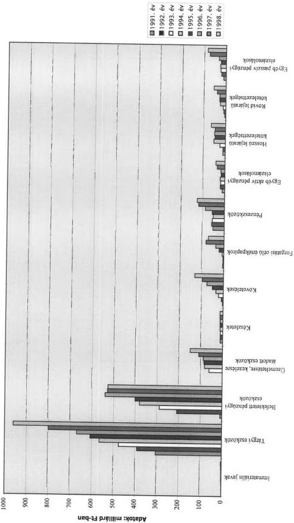
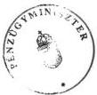
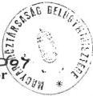

Állami Számvevőszék

# JELENTÉS

a helyi önkormányzatok
vagyonszerkezetének, vagyonhasznosítási
és nyilvántartási tevékenységének
vizsgálatáról

2000. május

0008.

---

Az ellenőrzés végrehajtásáért felelős:

V. Önkormányzati és Területi Ellenőrzési Igazgatóság

Dr. Lóránt Zoltán

számvevő igazgató

Az ellenőrzést vezette és a jelentést összeállította:

Csecserits Imréné

régióvezető főtanácsos

Fancsali Mária

számvevő

Németh Gábor

számvevő tanácsos

Szilágyi Sándor

számvevő tanácsos

közreműködésével.

Az ellenőrzésben részt vevők névsorát az 1. számú melléklet tartalmazza.

A témakörrel foglalkozó ÁSZ vizsgálatok jegyzéke:

Az önkormányzatok tulajdonába került vagyontárgyak megszerzésével, nyilvántartásával és gazdálkodásával kapcsolatos tapasztalatokról (V-1016/1992.)

Az önkormányzatok és intézményeik vállalkozási tevékenységének a vizsgálata (V-1017/1993.)

Az önkormányzatok vagyonhasznosítási, vállalkozási tevékenységének vizsgálatáról (V-1017/1994.)

Jelentéseink az INTERNET-en 1999. június 1-től olvashatók.

Internet cím: http://www.asz.gov.hu

Jelentéseink az Országgyűlés számítógépes hálózatán is olvashatók.

---

V-1010-65/1999-2000. TÉMASZÁM: 486

# TARTALOMJEGYZÉK

BEVEZETÉS...3

I. ÖSSZEGZŐ MEGÁLLAPÍTÁSOK, KÖVETKEZTETÉSEK, JAVASLATOK...5

II. RÉSZLETES MEGÁLLAPÍTÁSOK...10

1. A VAGYON NAGYSÁGÁNAK ÉS ÖSSZETÉTELÉNEK ALAKULÁSA...10

2. A VAGYON KIALAKULÁSÁHOZ BIZTOSÍTOTT EGYSZERI VAGYONJUTTATÁSOK...13

2.1. A törvény erejénél fogva kialakult önkormányzati tulajdon...13

2.2. A vagyonátadó bizottságok közreműködésével létrejött önkormányzati tulajdon...14

2.3. A belterületi földérték alapján az ÁPV Rt-től kapott önkormányzati vagyon...15

2.4. Egyéb jogszabályokban az önkormányzatok részére biztosított vagyon...17

3. A VAGYON BŐVÍTÉSÉT SEGÍTŐ PÉNZÜGYI FORRÁSOK ÉS AZOK HATÁSA...18

3.1. Cél-címzett támogatások...18

3.2. Felhalmozási célú pénzeszközátvételek...19

4. AZ ÖNKORMÁNYZATOK GAZDÁLKODÁSI DÖNTÉSEINEK HATÁSA A VAGYON ALAKULÁSÁRA...20

4.1. A közszolgáltatási feladatokat ellátó szervezetek gazdasági társasággá alakítása...20

4.2. Felhalmozási és tőke jellegű bevételek...22

4.3. Beruházások...27

4.4. Felújítások...29

4.5. Vállalkozási tevékenység...29

4.6. Az ingatlanok hasznosítása...30

5. A VAGYON-NYILVÁNTARTÁSOK MEGBÍZHATÓSÁGA, MEGALAPOZOTTSÁGA...32

5.1. A számviteli nyilvántartások kialakítása és vezetése...32

5.2. Az ingatlanvagyon-kataszter és a számviteli nyilvántartás egyezősége...34

5.3. A vagyonmérlegben az eszközök és források besorolásának, minősítésének megfelelősége...36

5.4. Az eszközök értékelésének szabályszerűsége...37

6. A VAGYON-GAZDÁLKODÁS, VAGYONNYILVÁNTARTÁS BELSŐ ÉS KÖNYVVIZSGÁLÓI ELLENŐRZÉSE...39

MELLÉKLET: 1-től 9-ig

1

---

2

---

BEVEZETÉS

# Jelentés

### a helyi önkormányzatok vagyonszerkezetének, vagyonhasznosítási és nyilvántartási tevékenységének vizsgálatáról

#### BEVEZETÉS

Az államháztartásról szóló 1992. évi XXXVIII. törvény (Áht.) 120. § f) és g), valamint 121. § (1) és (3) bekezdésében foglaltak alapján az Állami Számvevőszék jogosult annak vizsgálatára, hogy a helyi önkormányzatok tulajdonában lévő vagyon állapotáról rendelkezésre állnak-e a szükséges információk a különböző szintű gazdasági-pénzügyi döntések elősegítésére, alátámasztására; a vagyonnal kapcsolatos döntések megfelelnek-e a felelős módon, rendeltetésszerűen történő gazdálkodás követelményeinek.

A törvényi felhatalmazás és az Állami Számvevőszék 1999. évi ellenőrzési terve alapján vizsgáltuk az önkormányzati vagyon összetételének változását, a vagyonhasznosítási és nyilvántartási tevékenységet.

A különböző időben megalkotott törvények alapján az önkormányzatok térítésmentes vagyonjuttatásokban részesültek, továbbá folyamatosan biztosított volt az önkormányzati feladatellátás feltételeinek kialakításához, fejlesztéséhez a több csatornás központi támogatási rendszer is. Az önkormányzatok a vagyonnal való gazdálkodás során annak mértékét növelő és kedvezőtlenül befolyásoló döntéseket is hoztak. A helyi önkormányzatok a vagyon nagyságrendjét és változását tükrözni hivatott, a számviteli előírások alapján készülő vagyonmérlegükben 1999. évben mintegy 2 000 milliárd Ft értékű saját vagyont mutatnak ki.

**A vizsgálat célja** annak megállapítása volt, hogy:

- milyen központi és helyi döntések befolyásolták a vagyon nagyságrendjének és összetételének alakulását, ezek hatására hogyan változott az önkormányzati vagyon struktúrája;
- az önkormányzatok felelős módon, a döntési szinteket szabályozva, a szabályozásoknak megfelelően és eredményesen gazdálkodnak-e a vagyonnal;
- a vagyoni állapot kimutatása az önkormányzatoknál az előírásoknak megfelelő-e, a vagyonnyilvántartás megalapozott tájékoztatást ad-e a helyi önkormányzatok és a központi szervek gazdasági-pénzügyi döntéseihez, a vagyon védelméhez, valamint a vagyongazdálkodás értékeléséhez.

**A vizsgált időszak:** az önkormányzati vagyonszerkezet kialakulási folyamatának, a változás tendenciájának bemutatása érdekében és a téma sajátosságai miatt felhasználtuk az 1992. év óta készült, a vagyongazdálkodásnyilvántartás egy-egy részterületére kiterjedő Állami Számvevőszék-i jelentések

3

---

BEVEZETÉS

megállapításait, valamint az elemzéshez igénybe vettük az önkormányzatok költségvetési beszámolóinak az APEH-SZTADI által készített országos feldolgozását. Figyelembe vettük a most végzett helyszíni vizsgálat során az 1997., 1998. évi és az 1999. I-III. n.évi vagyongazdálkodási, nyilvántartási tevékenységre tett megállapításokat is. (Az 1999. évi költségvetési beszámoló és ennek keretében a vagyonmérleg adatai a helyszíni vizsgálatok befejezéséig még nem álltak rendelkezésre.)

Ez az áttekintés alapját képezi a vagyon egy-egy főbb csoportjára vonatkozóan – a három évre kiterjedő gördülő tervezés keretében – előirányzott további vizsgálatoknak. A több vizsgálaton alapuló áttekintés egyrészt egy korábbi vizsgálati jelentéshez (jelentés a helyi önkormányzatok nem közszolgáltatási célú társasági befektetésekkel, valamint értékpapírokkal történő gazdálkodás ellenőrzéséről, 1998. július) csatolt Tájékoztatóban nagyvonalakban, összegező jelleggel adott értékeléssel szemben konkrét, megalapozott információt ad az önkormányzatok vagyonáról, a vagyon-struktúráját, struktúrájának változását befolyásoló, meghatározó tényezőkről. Másrészt eleget tesz az akkor megfogalmazott elvárásnak, miszerint célszerű további vizsgálatokkal az önkormányzati vagyon összetételének, struktúrájának megismerése, mivel ez lehet az alapja az önkormányzati gazdálkodás során bekövetkező esetleges vagyonvesztések további feltárásának.

A most végzett helyszíni vizsgálat kiterjedt: 4 megyei, 3 fővárosi kerületi, 5 megyei jogú városi, 27 városi és 2 községi önkormányzatra. Az átvett 14 korábbi ÁSZ jelentés a vagyongazdálkodás, nyilvántartás egy-egy részterülete tekintetében további, összesen 510 önkormányzatnál tett megállapításon alapul. (Előfordult, hogy ugyanazon megyei, városi, nagyközségi önkormányzatokra több vizsgálat is kiterjedt az elmúlt években, ezért ezen halmozódásokat kiszűrtük a számításnál.) A vizsgálati jelentés összeállításánál figyelembe vett korábbi ÁSZ jelentések címeit a 8. számú melléklet ismerteti. A részletes megállapításoknál a mostani vizsgálatok megállapításait elkülönítettük, a korábbi vizsgálatokra hivatkozásnál feltüntettük az érintett jelentés címét és a lezárás évszámát.

A vizsgálati körbe vont 41 önkormányzat tulajdonában volt az 1998. év végi önkormányzati vagyonállomány 11,1%-a. A jelentés elkészítésnél figyelembe vett korábbi ÁSZ vizsgálati jelentések együttesen a városi önkormányzatok 69%-ánál, a nagyközségek 32%-ánál, a községek 9%-ánál tett megállapításokon alapultak. (Az egyes vizsgálatok mintavételi összetételéről részletes információt a jelentések tartalmaznak.)

A jelen vizsgálatba vont önkormányzatok kiválasztásánál az igazgatósági munkatervben meghatározott 13 megyében a legjelentősebb vagyonnal rendelkezőket, ezen belül az elmúlt években legnagyobb vagyonváltozást mutatókat vettük figyelembe. Lehetőség szerint figyelmen kívül hagytuk azokat az önkormányzatokat, amelyeknél – az Állami Számvevőszék éves munkaterve alapján – más témájú vizsgálatok is voltak ugyanezen időszakban. A két községi önkormányzatot az országos vizsgálat kezdését megelőzően a témához kapcsolódó tartalommal írt bejelentésben foglalt kérés elfogadása alapján vontuk be a vizsgálatba.

4

---

I. ÖSSZEGZŐ MEGÁLLAPÍTÁSOK, KÖVETKEZTETÉSEK, JAVASLATOK

Az önkormányzatoknál végzett helyszíni ellenőrzések során a polgármesteri hivatalok, valamint az önkormányzat vagyongazdálkodási feladatainak lebonyolításában közvetlenül közreműködő egy-egy szervezet (költségvetési intézmény, gazdasági társaság) számviteli nyilvántartásainak, ingatlankataszteri nyilvántartásának ellenőrzésén túlmenően áttanulmányoztuk a költségvetési beszámolókat, vagyongazdálkodási rendeleteket és a közgyűlések, képviselőtestületek tárggyal kapcsolatos előterjesztéseit, határozatait, rendeleteit is.

A vizsgálat keretében tájékozódtunk a Központi Statisztikai Hivatalnál, a Belügyminisztérium Önkormányzati Gazdálkodási Főosztályánál, valamint adatokat kértünk az Igazságügyi Minisztérium Igazságügyi Informatikai és Cégnyilvántartási Szolgálatától, a Kincstári Vagyoni Igazgatóságtól, az Állami Privatizációs és Vagyonkezelő Rt-től.

# I. ÖSSZEGZŐ MEGÁLLAPÍTÁSOK, KÖVETKEZTETÉSEK, JAVASLATOK

Az 1990. évben megalakult helyi önkormányzatok vagyonának mértékét és szerkezetét a különböző időben megjelent törvények alapján az állami tulajdonból átadott eszközök, valamint az önkormányzatok döntése eredményeként elért vagyonnövekmények és -csökkenések alakították az elmúlt 9 évben.

**Ezen döntések együttes hatására az önkormányzatok megalakulásakor kimutatott 257 milliárd Ft saját vagyon 1999. év végére meghaladja a 2 000 milliárd Ft-ot.**

A vagyon kialakulásában a helyi önkormányzatokról szóló 1990. évi LXV. törvény (Ötv.) 107. § szerinti vagyonjuttatás mértéke és aránya a meghatározó. Ez a vagyon képezte az önkormányzatok induláskori vagyonának 100%-át. Az egyes állami tulajdonban lévő vagyontárgyak önkormányzatok tulajdonába adásáról szóló 1991. évi XXXIII. törvény (Övt.) alapján – a Vagyonátadó Bizottságok (VÁB) közreműködésével – kialakult önkormányzati vagyon mind nagyságrendjében, mind szerkezetében folyamatosan változott, illetve változik. Az 1991-1992. évi átadáskor a lakások és egyéb helyiségek értéke volt túlsúlyban. Ezek 1993. évtől felgyorsult ütemű értékesítése miatt azonban állományuk mintegy 2/3-dal csökkent. Ezzel egyidejűleg az önkormányzatok tulajdonába adott közszolgáltató vállalatok gazdasági társasággá átalakítása és eszközeinek felértékelése következményeként a részesedések saját vagyonon belüli korábbi 2,4%-os részaránya 1998. év végére 29%-ra növekedett. A gazdasági társasági érdekeltségek állományának és részarányának növekedéséhez az állami vállalatok átalakulásához, értékesítéséhez kapcsolódóan a belterületi földérték alapján az önkormányzatoknak eddig átadott 114,7 milliárd Ft névértékű társasági részesedés is hozzájárult.

**A helyi önkormányzatokról szóló törvény megjelenésekor az e törvény erejénél fogva önkormányzati tulajdonba került mintegy 257 milliárd Ft nyilvántartási értékű volt tanácsi kezelésű vagyon nagyságát, szerkezetét az alábbi döntések befolyásolták elsősorban:**

5

---

I. ÖSSZEGZŐ MEGÁLLAPÍTÁSOK, KÖVETKEZTETÉSEK, JAVASLATOK

- a VÁB-ok közreműködésével önkormányzatoknak átadott közüzemi vállalatok vagyona, valamint a tanácsi ingatlankezelő szervek kezelésében volt lakások és nem lakás céljára szolgáló helyiségek átadása,
- az állami vállalatok átalakítása, privatizációja során, valamint egyéb jogcímen az ÁPV Rt-től kapott pénz, társasági érdekeltség és értékpapír,
- a központi költségvetésből, elkülönített állami pénzalapoktól, lakosságtól, vállalkozásoktól átvett pénzeszközök,
- a közüzemi vállalatok gazdasági társasággá átalakításakor végzett eszköz felértékelések következtében kialakult jegyzett tőke növekedés a korábbi önkormányzati vállalati alapítói hozzájáruláshoz viszonyítva,
- a Kincstári Vagyoni Igazgatóság útján kapott volt szovjet laktanyák meghatározott ingatlana, valamint a társadalmi szervek kezeléséből átadott sport célú ingatlanok, lőterek, polgári légiforgalmi célokat is szolgáló repülőterek.

A vagyon jelenlegi nyilvántartási értékének kialakulásában ezen főbb tényezők és az önkormányzatok vagyongazdálkodási döntései mellett jelentős szerepe volt az eszközök érték-megállapítási és nyilvántartási hiányosságainak is. (Az önkormányzati vagyon 1990-1999. évek közötti változását eredményező főbb döntések számszerűsített hatásáról a 7. sz. melléklet nyújt tájékoztatást.)

**Az önkormányzatok a vagyongazdálkodás feltételeit és a vagyon feletti rendelkezés döntési szintjeit – a kezdeti bizonytalanságokon túljutva – mára már általában szabályozták.** Az ingatlanvagyonnal történő gazdálkodás feltételeit meghatározták, azonban a részesedések, értékpapírok vételi-eladási feltételeire nem, vagy csak érintőlegesen térnek ki a vagyongazdálkodási rendeletek. A vagyongazdálkodási döntéseknél a vizsgált önkormányzatok a központi és helyi szabályozás feltételeit betartva jártak el, a döntések végrehajtásánál két önkormányzatnál tapasztaltunk szabálytalanságot.

**A közép- és hosszabb távú tervezés hiánya miatt a képviselő-testületek eseti döntései a meghatározóak a központi döntések következményein túlmenő önkormányzati vagyonváltozásra.**

A vizsgált önkormányzatok 19,5%-a rendelkezett az 1994. évben megválasztott képviselő-testület megbízása idejére vonatkozó, elfogadott gazdasági programmal és további 24,4% két-három éves vagyongazdálkodási koncepcióval.

**A vagyoni állapot kimutatása jelenleg nem felel meg a valódiság és az áttekinthetőség követelményének. A számvitelről szóló törvényben és az ennek végrehajtására kiadott kormányrendeletben előírt értékelési kötelezettségek megszegése miatt az önkormányzatok vagyoni helyzete nehezen áttekinthető. A vagyongazdálkodás ellenőrzését megnehezíti, hogy az önkormányzatok számviteli nyilvántartásából, vagyonmérlegéből – önkormányzatonként eltérő nagyságrendben – hiányzik a földterületek és a telkek értéke.**

Az eszközök értékének megjelölésénél a legfőbb hiányosságok:

6

---

I. ÖSSZEGZŐ MEGÁLLAPÍTÁSOK, KÖVETKEZTETÉSEK, JAVASLATOK

a targyi eszkozokhoz tartozo ingatlanok, gepek, berendezesek es jarmuek brutto nyilvantartasi ertekei 1969. ev ota nem kovettek az evenkenti inflaciot, illetve a forgalmi ertekvaltozast semmilyen mertekben, erre a szamviteli elorasok nem adtak lehetoseget;
- az onkormányzatok tulajdonában levő ingatlanok kozül erték nélküli a helyi kozutak és mutárgyaik, a terek, parkok, erdők, egyeb földterületek, vizek és kozcelu vizilétésitmények 95%-a;
a beepitett ingatlanok foldterulete, valamint a beepitetlen lakó-és udulotelkek mintegy \(80\%\) -a ertek nelkuli. A szamviteli nyilvantartasban ertekkel nem szerepló ingatlan eladasi arabol szarmazo bevetel - barmilyen aron is törtent az eladas - vagyonnövekményt eredményez a vagyonnérlegben meg akkor is, ha lenyegesen a realis forgalmi ar alatt, annak toredekéert adtak el azt. (A vagyonnvaltozás, a vagyonnmozgás, az esetleges vagyonefelés az onkormanyzatok vagyonnérlegból nem allapithato meg a nyilvantartasi ertek nelkuli eszközok esetében.) Az onkormanyzatok \(70\%\) -a vizsgalat soran jelezte, hogy a jogszabályban elóirt egyedi ertekeles elvégzeshez kello szakmai felkeszültseggel és penzügyi fedezettel nem rendelkezik;
- az 1992-1999. évek kozott onkormányzati forrásból beruházás, felujítás során letrejött uj érték a gáz- és elektromos halózatok esetében - az aktivalás elmaradása miatt - nem szerepel értékkel az onkormányzatok vagyonmérlegében. (Az onkormányzatok a beruházás megvalósításahoz a kivitelező szervezeteknek támogatasként adták át a pénzeszközt. Ezert ezen infrastruktúra-fejlesztések kovetkezményeként az onkormányzatok számviteli nyilvántartás szerinti vagyona nem novekedett, hanem csökkent);
a részesedesek nyilvantartasi erteke hianyos, valamint a vizsgalt onkormanyzatok felénel a részesedesek esetleges tartos ertekvesztését nem is vizsgalták, ezälal megsertették a szamviteli törveny elóirását.

Az eszközök besorolásánál, minősítésénél hiányosság, hogy a hatályos jogszabályi előírásoktól eltérően

- a részesedesek és ertékpapirok besorolását, valamint ezen befektetesek tartóssagát helytelenül allapitották meg;
- az onkormányzaton kivuli szerv részére (más onkormányzatnak, vagy allamháztartáson kivülre) üzemeltetésre, kezelésre átadott eszköket helytelenül továbbra is tárgyi eszközként mutatták ki;
- az adott kölcsönök összegeiböl nem különítéték el az egy éven belüli követelések ertékét a tobb éves lejáratu követelésektól.

Az önkormányzati vagyon legnagyobb részarányát kitevő ingatlanokra vonatkozóan előírt ingatlan-nyilvántartás (ingatlankataszter) és a számviteli nyilvántartás ingatlanokra kiterjedő adatai között jelentős az eltérés. A vizsgált önkormányzatoknál a számviteli nyilvántartási értéknél magasabb és alacsonyabb összeget is tartalmazott az ingatlankataszter. Ezek egyenlegeként 26,2%-kal alacsonyabb az ingatlankataszterben szereplő értékadat. Az önkormányzatok 10%-a értékadatot szinte egyálta-

7

---

I. ÖSSZEGZŐ MEGÁLLAPÍTÁSOK, KÖVETKEZTETÉSEK, JAVASLATOK

lán nem tüntetett fel, csupán egy önkormányzatnál egyezett meg a számviteli és ingatlan-kataszteri nyilvántartásban feltüntetett érték.

Az eltéréseket alapvetően a kataszteri értékadatok folyamatos vezetésének hiánya, valamint a számviteli és a kataszteri nyilvántartások egyeztetésének elmulasztása okozta.

A kötelezően és önként vállalat feladatok ellátását vagy a helyi közhatalom gyakorlását közvetlenül szolgáló törzsvagyon-részek jogszabályban előírt elkülönítését a vizsgált önkormányzati hivatalok háromnegyed részénél (30-nál) nem, vagy nem teljes körűen hajtották végre számviteli nyilvántartásaikban. Ahol megvalósították a törzsvagyon-részek elkülönítését, a végrehajtás összhangban volt a törvényi előírásokkal. Eltérést a forgalomképességre vonatkozó központi és helyi rendelkezésektől mindössze 2 önkormányzatnál állapítottunk meg.

Az önkormányzati vagyongazdálkodás eredményességének közvetlen mérésére a vállalkozási tevékenységnél, valamint a részesedésekkel, értékpapírokkal történő gazdálkodásnál van lehetőség. Az önkormányzati tevékenység többi területén az eredményesség közvetetten értékelhető, amelynek minősítését egy-egy konkrét önkormányzati tevékenységgel foglalkozó számvevőszéki vizsgálat tartalmazza.

A vállalkozási tevékenység pénzforgalmi eredménye, hozama a társasági befektetéseknél 1,5% alatti. A költségvetésen belül, önálló szakfeladaton kimutatott vállalkozásoknál 1998.évben a pénzforgalmi eredmény az összes bevétel 9,6%-a volt. Az önkormányzatok ezen vállalkozásoknál elsősorban nem az eredmény, vagy hozam növelésében, hanem a társaságok, vállalkozások által biztosított önkormányzati közszolgáltatások színvonalas elvégzésében voltak érdekeltek. A költségvetésen belüli vállalkozások bevételének változatlan szintje mellett a pénzügyi eredmény 1996.év óta erőteljesen csökkent (1/3-ára), valamint a vállalkozások száma is mintegy egyötödére visszaesett 1991-1998. évek között.

A részesedések évenkénti alacsony hozama miatt a közszolgáltatáshoz nem kapcsolódó befektetések mielőbbi értékesítésére törekedtek az önkormányzatok. A tulajdonukba jutott és az értékesítéseket követően jelenleg még önkormányzati tulajdonban lévő gazdasági társasági részesedések összetételéről 1995. és 1997. évben ugyan végzett egyedi felmérést a Belügyminisztérium, de évenkénti rendszeres országos összesítés, értékelés nem készült. Így nem ismert az sem, hogy a jelenleg önkormányzati tulajdonban lévő társasági részesedések között milyen arányú az üzleti célú pénzügyi befektetés és milyen arányt képvisel az önkormányzati feladatok helyi megoldása érdekében alapított társasági befektetés. A korábbi számvevőszéki vizsgálat során végzett becslés, valamint a már hivatkozott belügyminisztériumi felmérések szerint az összes társasági részesedés 80-85%-a kapcsolódik közvetlen önkormányzati kötelező jellegű feladathoz és 15-20% (mintegy 80 milliárd Ft) a vállalkozási célú befektetés 1998. év végén.

A helyszíni ellenőrzés alapján készített vizsgálati jelentésekben az önkormányzatok figyelmét felhívtuk a törvényi előírások betartásá-

8

---

I. ÖSSZEGZŐ MEGÁLLAPÍTÁSOK, KÖVETKEZTETÉSEK, JAVASLATOK

ra. Jogszabályok megsértése miatt 2 önkormányzatnál összesen 4 fő személyes felelősségét vetettük fel, illetve jeleztük a munkáltatók részére a helyszíni vizsgálatok során.

A helyszíni vizsgálatok tapasztalatai alapján a helyi önkormányzatoknak tett javaslatok a vagyongazdálkodási rendeletben a részesedések, értékpapírok vételi-eladási feltételeinek meghatározására, a vagyongazdálkodási döntéseknél a központi és a helyi szabályozás feltételeinek betartására, a vagyongazdálkodás középtávú koncepciójának, programjának kidolgozására hívták fel a figyelmet. Javasoltuk az eddig érték nélkül nyilvántartott eszközök egyedi érték-megállapítását és a szabálytalan eszköz-forrás besorolások, minősítések kijavítását, valamint az ingatlan-nyilvántartásban feltárt hiányosságok felszámolására, az elmaradások pótlására, az egyeztetések elvégzésére, a törzsvagyon elkülönített nyilvántartásának kialakítására is ráirányítottuk az érintett önkormányzatok figyelmét. (A javaslatokat a 8. számú mellékletben részletesen ismertetjük.)

A megfogalmazott javaslatok alapján 2 önkormányzat már a vizsgálat ideje alatt intézkedett a javaslatok teljes körű végrehajtásáról. További 11 önkormányzat a javaslatok végrehajtását a vizsgálat ideje alatt megkezdte és azok folytatásához intézkedési tervet készített a felelősök és határidők megjelölésével.

Az önkormányzatok vagyongazdálkodásának szabályszerűbbé, hatékonyabbá és ellenőrzöttebbé tétele érdekében javasoljuk, hogy:

# 1. A pénzügyminiszter

- adjon szakmai segitséget az onkormányzatok részère a szamviteli törvenyben elóirt egyedi ertékelés elvégzéséhez a szamviteli ertékkel nem rendelkező ingatlanokra vonatkozoan;
- kezdemenyezze a szamviteli törvény betartása és a helyi önkormányzati tulajdonosi érdek érvényesítés érdekében az önkormányzati vagyon 1969. év ota bekovetkezzett értékvaltozásat figyembe vevo átertekelés elvégzését, határozza meg az ennek érdekében szükséges eljárásokat,

# 2. A belügyminiszter

- kezdemenyezze az onkormanyzatok tulajdonaban levo ingatlanvagyon nyilvantartasi es adatszolgaltatasi rendjerol szoló 147/1992. (XI.6.) Korm. rendelet modositásat, a nyilvantartás egyszerúsitése, a szamviteli nyilvantartásokkal történőosszehangolása erdekében,
- igényeljen az onkormányzatok gazdalkodásanak attekintéséhz, rendszeres ertékeléshez az onkormányzati tulajdonban levő gazdasági társasági érdekelteségek összetételeről - tulajdonosi arány-csoportként, fótevékenség szerint, társasági formanként - országos szintú feldolgozást a költségvetési informácios rendszerbe beepíte.

9

---

II. RÉSZLETES MEGÁLLAPÍTÁSOK

## II. RÉSZLETES MEGÁLLAPÍTÁSOK

### 1. A VAGYON NAGYSÁGÁNAK ÉS ÖSSZETÉTELÉNEK ALAKULÁSA

**Az összes helyi önkormányzat a számviteli nyilvántartások szerinti saját vagyona (eszközök összértéke csökkentve a kötelezettségekkel) az 1991. évi 369,5 milliárd Ft-ról 1998. év végére 1819,4 milliárd Ft-ra emelkedett, azaz hét év alatt mintegy megötszöröződött.**

E vagyon nagyságrendjének és összetételének alakulását szerteágazó központi és helyi döntések, valamint a helyi nyilvántartási hiányosságok befolyásolták. (A vagyon mértékét és összetételét az egyszerűsített mérleg 1991–1998. évi adataival a mellékelt 3. számú melléklet tartalmazza.)

**A gazdasági események pontatlan rögzítése, valamint a nyilvántartás hiányosságai ellenére az APEH-SZTADI által feldolgozott önkormányzati költségvetési beszámolók országos összesítéséből egyértelműen megállapítható, hogy legdinamikusabban – 60-szorosára – a tartós jellegű pénzügyi befektetések emelkedtek.** Az önkormányzatok saját vagyonán belüli részarányuk 2,4%-ról 38%-ra nőtt 1996. évre. Az emelkedés 1996. évig folyamatos volt, ezt követően kis mértékben (1996-1998. évek között 2,5%-kal) csökkent ennek az eszközcsoportnak az értéke.

Jelentősen – 14-szeresére – emelkedett 1991–1998. évek között a rövid távú befektetést jelentő értékpapírok év végi állománya is. Ennek összege az 1991. év végi 5,1 milliárd Ft-ról 1997. év végére 83,0 milliárd Ft-ra bővült, amely 1998. év végére 72,3 milliárd Ft-ra mérséklődött.

Az elmúlt nyolc év alatt kiemelkedő mértékben emelkedett még az önkormányzati követelések (kintlévőségek) (43-szorosára), valamint a rövid lejáratú fizetési kötelezettségek (hitelek, szállítói követelések) év végi állománya (13-szorosára).

Az egyes eszközcsoportok különböző arányú és nagyságrendű változása az összes önkormányzati vagyon összetételét, struktúráját is megváltoztatta. **Az eszközökön belül a befektetett eszközök és a forgóeszközök arányának lényegében változatlansága mellett** (1991. évben 79,1-20,9%, illetve 1998. évben 80,9-19,1%) **a befektetett eszközökön belüli csoportok között tapasztalható jelentős részarány-változás.** Az önkormányzati működés első évének végén a tárgyi eszközök képviselték a vagyon 82,3%-át, a befektetett pénzügyi eszközök aránya csupán 2,4% volt. A tárgyi eszközök részarányának 1996. évig folyamatos csökkenése és a befektetett pénzügyi eszközök részarányának növekedése, majd ezt követő kis mértékű ellentétes irányú változás eredményeként 1998. év végére a tárgyi eszközök a helyi önkormányzatok vagyonának már csak 52,8%-át, a befektetett pénzügyi eszközök pedig 29,0%-át, együttesen a vagyon 81,8%-át biztosították. Az állami vállalatok átalakulásához, értékesítéséhez kapcsolódóan a belterületi földérték alapján önkormányzatoknak juttatott részesedések mértéke 1996. év után már nem el-

10

---

II. RÉSZLETES MEGÁLLAPÍTÁSOK

lensúlyozta a részesedések értékesítése, valamint elszámolt értékvesztése miatti állománycsökkenést. A vagyon többi összetevőinek (immateriális javak, üzemeltetésre átadott eszközök, készletek, követelések, rövid távú befektetésként, forgatási céllal vásárolt értékpapírok, pénzeszközök, hitelek, szállítói kötelezettségek, egyéb aktív és passzív pénzügyi elszámolások) részaránya 0,2% és 8,1% között mozgott 1991-1998. években.

A számviteli előírások módosulása eredményeként 1993. évtől kezdődően ismert – illetve biztosított az elkülönített megjelenítése a mérlegben – az üzemeltetésre, kezelésre átadott eszközök állománya. (1998. évben a vagyon 8,1%-át képviselte). Ebbe az eszközcsoportba tartoznak jellemzően a volt tanácsi közszolgáltatási tevékenységet végző szervezetek VÁB közreműködésével önkormányzati tulajdonba, majd önkormányzat által az adott közszolgáltatást végző gazdasági társaságnak üzemeltetésre átadott ingatlanok, gépek, berendezések, tartozékok. Ezen eszközcsoport megjelenése ugyanazon vagyontömeg módosított csoportosítását jelenti, vagyonnövekedésként az eszköz önkormányzati tulajdonba vételekor, vagy a nyilvántartási hiányosság korrigálásakor jelentkezik.

Budapest Főváros XVIII. Kerület Önkormányzata a VÁB közreműködésével 1992-1993. évben kapott és üzemeltetésre az általa alapított Vagyonkezelő Rt részére ugyanekkor átadott eszközök (pl. ingatlanok, gépek, berendezések) nettó értékét a saját eszközei között csak 1997. év végén vette figyelembe. Ezért az 1996-97. évi vagyonmérlegben jelentkező összesen 2,6 milliárd Ft-os eszköznövekményből 2,3 milliárd Ft nem tényleges vagyonváltozást, hanem a korábbi nyilvántartási hiányosság ez évi megszüntetését jelentette.

A kötelezettségek (tartozások), a forgatási célú értékpapírok és a követelések részaránya is emelkedett. A vagyonváltozással azonos arányban emelkedett az immateriális javak, készletek, pénzeszközök és egyéb aktív-passzív pénzügyi elszámolások év végi állománya.

A most vizsgált 41 önkormányzat vagyona 1996-1998. év között nagyon tág határok között mozgott. Két önkormányzat (Bonyhád Város és Szekszárd Megyei Jogú Város) vagyona nem változott; 17 önkormányzat vagyonának növekedési aránya több mint 10%-kal maradt el az átlagostól, 9 önkormányzat esetében az eltérés 10%-nál kevesebb volt, 13 önkormányzaté az átlagos változást több mint 10%-kal haladta meg. Ez utóbbiak közül 3 önkormányzat vagyona több, mint kétszeresére emelkedett

- Balatonlle Varos Onkormányzata 100,94%-kal, a belterületi fold utan kapott részesedesek névértek fölotti áron törtent értékesitése és a szennyvizcsatorna viziközmú társulástól valo átvetele miatt;
Fuzesabony Varios Onkormanyzatae 187,52%-kal a celtamogatassal megvalosult szennyvizkezelessel kapcsolatos beruhazas eredmenyekent;
Tiszaujvaros Onkormanyzatae 119,34%-kal a nagy mennyisegu részesedeseinek nevertek folotti aron valo eladasa reven.

A vizsgált 41 önkormányzatnál a vagyonnövekedés arányát több tényező befolyásolta. (A vagyon mértékét és változását a 4. számú melléklet mutatja be.)

11

---

II. RÉSZLETES MEGÁLLAPÍTÁSOK

- A vagyon három önkormányzat esetében nem gazdasági esemény hatására növekedett. Budapest Főváros XII. Kerület Önkormányzata elvégezte a korábban érték nélkül nyilvántartott földvagyon értékelését, ez 5,6 milliárd Ft-tal növelte a vagyonát, a földterület felértékelése nélkül vagyona 1,23 milliárd Ft-tal csökkent volna 1997-1998. év között. Kecskemét Megyei Jogú Város Önkormányzata az ingatlankataszterben becsült értékű, de számviteli nyilvántartásban korábban nem szereplő vagyonát 1998. évben vette állományba 3,925 milliárd Ft értékben. Budapest Főváros XVIII. Kerület Önkormányzata 1997. évig az üzemeltetésre, kezelésre átadott vagyonát nem mutatta ki.

- Békéscsaba Megyei Jogú Város Önkormányzatánál a vagyonnövekedéssel közel azonos értéket képviselnek a megyétől térítésmentesen átvett dr. Réthy Pál Kórház eszközei és a Vízmű Vállalattól átvett épületek, építmények.

- Tamási Város Önkormányzatának vagyonát 22 millió Ft-tal csökkentette a nála nyilvántartott, de Pincehelyen lévő kórház vagyonának a további részbeni üzemeltetést vállaló Tolna Megyei Önkormányzat részére történt átadása, ezzel szemben növelte a volt szovjet laktanya térítés mentes átvétele. Balassagyarmat Város Önkormányzata a volt megyeházát vette át térítésmentesen.

- Kőszeg Város Önkormányzata vagyonát a több település megbízása alapján végzett víziközmű beruházás teljes értékének a város vagyonaként történő – számvitelileg helyes – kimutatása a valóságosnál közel 1 milliárd Ft-tal nagyobbnak mutatta az aktiválás elvégzéséig.

- Budapest Főváros V. Kerület Önkormányzatának vagyona, a nagy mennyiségű nem lakás célú helyiségállomány jó hasznosítása következményeként növekedett 57%-kal annak ellenére, hogy egy gazdasági társaságnak 2,252 milliárd Ft-ot fejlesztési célra történő átadása, valamint a lakások és helyiségek felújítására történt ráfordítás aktiválásának elmaradása a nyilvántartott vagyon értékét csökkentette.

Az önkormányzatok vagyonának növekedésében – a fővárosi kerületek kivételével – döntő szerepe volt azoknak a cél- és címzett támogatásoknak, amelyeket a kórházak rekonstrukciójához és a szennyvízkezeléshez kaptak a központi költségvetésből.

A vizsgálati körbe vont 41 önkormányzatnál megállapított vagyonváltozási tendenciák nem érvényesültek országos szinten a főváros túlsúlya miatt. A Budapest Fővárosi Önkormányzat vagyonának szerkezete eltér az önkormányzatok átlagos vagyonszerkezetétől, aránya miatt annak változása döntően befolyásolta az önkormányzatok összes vagyonának szerkezeti változását.

A Budapest Fővárosi Önkormányzat – amely az önkormányzatok összes részesedési állományának 1996. évben a 67,68%-ával rendelkezett – 1996-1998. években átcsoportosítást hajtott végre a befektetett és a forgóeszközei között, a részesedések értékesítési bevételét rövid távú befektetésre, forgatási célú értékpapírok vásárlására fordította. A vizsgált önkormányzatok ugyanakkor a részesedések értékesítési árbevételét és az elért hozamot elsősorban tárgyi eszközök és befektetési célú értékpapírok vásárlására fordították (pl. Tiszaújváros 6 milliárd Ft-ért vett tartós befektetési célra értékpapírt).

Az előzőekben ismertetett struktúraváltozások – néhány kivételtől eltekintve – nem az önkormányzatok tudatos, hosszú távú tervezé-

12

---

II. RÉSZLETES MEGÁLLAPÍTÁSOK

sének következményeként valósultak meg, hanem eseti döntések hatására.

A helyi önkormányzatokról szóló 1990. évi LXV. törvény 91. § (1) bekezdése szerint az önkormányzat meghatározza gazdasági programját. Már az 1993. évben lezárt, az önkormányzatok tulajdonába került vagyontárgyak megszerzésével, nyilvántartásával és gazdálkodásával kapcsolatos tapasztalatokról szóló vizsgálati jelentés tartalmazta, hogy az önkormányzatok 71%-a gazdasági programmal nem rendelkezett. Az 1994. évi önkormányzati választásokat követően sem tett eleget a képviselő-testületek többsége ennek a törvényben előírt kötelezettségének.

A most vizsgált 41 önkormányzat közül mindössze 8 (19,5%) rendelkezett az 1994. decemberben megválasztott képviselő-testület megbízási idejére vonatkozó, elfogadott gazdasági programmal és további 10 (24,4%) vagyongazdálkodási koncepcióval. Ezekben az önkormányzati vagyon megőrzésének szükségességét fogalmazták meg, rögzítették, hogy a befektetett eszközök értékesítéséből származó bevételeket nem működési célra, hanem az eszközök pótlását, fejlesztését szolgáló beruházásokra, valamint felújításokra kell fordítani.

A hosszabb távú tervezés hiánya miatt a képviselő-testületek eseti döntései a meghatározóak a központi döntések következményein túlmenő önkormányzati vagyonváltozásra. A döntést előkészítő előterjesztések fele tartalmazott csak döntést megalapozó gazdasági számítást. Az infrastruktúra fejlesztések esetében nem kérték a képviselő-testületek a források megalapozott számbavételét, időbeli rendelkezésre állásának tisztázását. A céltámogatással megvalósítani tervezett beruházások esetében pedig a saját forrás rendelkezésre állását nem megalapozott pénzügyi terv alapján határozták meg és ez okozta a kivitelezés elhúzódását vagy a beruházás elhalasztását az 1998. évi címzett és céltámogatások vizsgálatáról készített jelentés szerint az önkormányzatok 44%-ánál.

# 2. A VAGYON KIALAKULÁSÁHOZ BIZTOSÍTOTT EGYSZERI VAGYONJUTTATÁSOK

A vagyon nagyságrendjét, összetételét befolyásoló központi döntések 1990. évben kezdődtek és még ma is születnek. Ezekre vonatkozó jogszabályi hivatkozásokat a 6. számú melléklet ismerteti, ezért csupán rövid „ráutaló” megfogalmazással ismertetjük a továbbiakban.

# 2.1. A törvény erejénél fogva kialakult önkormányzati tulajdon

A helyi önkormányzatokról szóló 1990. évi LXV. törvény erejénél fogva 1990. szeptember 30-án jutottak az önkormányzatok a megszűnt tanácsok szerveinek, intézményeinek kezelésében lévő ingatlanok, pénz és értékpapírok, erdők, vizek tulajdonjogához. Ezek átadáskori együttes értékére vonatkozó megbízható összegezett adatokkal sem az önkormányzatok sem a központi szervek nem rendelkeznek. Az önkormányzati vagyon mérlegszerű bemutatására hivatott számviteli kimutatás (vagyonmérleg) a pénzt és

13

---

II. RÉSZLETES MEGÁLLAPÍTÁSOK

értékpapírokat, valamint az ingatlanok egy részét tartalmazta. Nem szerepelt értékkel a vagyonmérlegben az ingatlanok közül a telkek és földterületek, az erdők, vizek, valamint a közúti és vízi létesítmények állománya. Az értékkel nyilvántartott, az Ötv. erejénél fogva átadott vagyon könyv szerinti értéke az önkormányzatok megalakulásakor 257 milliárd Ft volt. Az 1969. előtt beszerzett (épített, átvett) ingatlanok esetében a nyilvántartás szerinti bruttó értéket 1969. év végén központi intézkedés alapján átértékelték (felértékelték) a költségvetési szervek állóeszközeinek átvételéről, az állóeszközök éves értékcsökkenésének elszámolásáról, a folyamatos értékhelyesbítésről és az állóeszközök fogalmának meghatározásáról szóló 109/1969. (PK.19.) PM sz. utasítás alapján. Azóta azonban az évenkénti infláció, illetve a forgalmi értékváltozás ellenére az eszközök felértékelésére nem kaptak lehetőséget az önkormányzatok.

## 2.2. A vagyonátadó bizottságok közreműködésével létrejött önkormányzati tulajdon

A VÁB-ok közreműködésével 1991. szeptember 1-től kezdődően, vitás kérdésekben máig tartó folyamat során jutottak, illetve jutnak az önkormányzatok a volt tanácsi közüzemi vállalatok, költségvetési üzemek, műemléki és természetvédelmi oltalom alatt álló ingatlanok, vizek, vízi létesítmények, muzeális értékek, belterületi beépítetlen ingatlanok, valamint a volt tanácsok, illetve ingatlankezelő szerveik kezelésében lévő lakások és nem lakás célú helyiségek tulajdonjogához. **Sem a volt tanácsi vállalatok, költségvetési üzemek vagyonáról, sem az előbb részletezett ingatlanokról, ingóságokról az átadáskori értéket tartalmazó országos összesítés nem készült. Az átadáskor az érték-megállapítás nem kapott kellő hangsúlyt.**

Budapest Főváros Önkormányzata részére a fővárosi közüzemi vállalatok vagyonát a Fővárosi VÁB értékadatokat nélkülöző határozattal adta át. A hiányosság megszüntetésére vonatkozó számvevőszéki javaslat után 1993. évben történt meg a hiányzó értékadatok pótlása.

Az 1993. évben lezárt, az önkormányzatok tulajdonába került vagyontárgyak megszerzésével, nyilvántartásával és gazdálkodásával kapcsolatos tapasztalatokról szóló számvevőszéki vizsgálati jelentés is tartalmazta, hogy az önkormányzatok nem rendelkeznek a tulajdonukban lévő vagyonról a jogszabályi előírásoknak megfelelő, szükséges nyilvántartással, vagyonleltárral. **Az átadáskori értéket azóta sem pontosították az önkormányzatok.**

Az 1996. évben lezárt, a helyi önkormányzatok közüzemi víz- és csatornaszolgáltatási feladatainak és az ahhoz kapcsolódó lakossági díjtámogatási rendszer működésének vizsgálatáról készített jelentésben már megállapítottuk, hogy „a vagyonátadást többnyire az üzemeltetők által a VÁB döntést megelőzően készített leltárak alapján hajtották végre. A minden érdekelt általi hitelesítésük azonban teljes körűen nem történt meg. A gyakran értékadatok nélküli és bonyolult, nehezen értelmezhető tulajdoni hányadokat tartalmazó határozatokból az átadott vagyon értéke nem állapítható meg.

A hiányos és nem egyértelmű vagyonátadó határozatokat a polgármesteri hivataloknál is csak nehézkesen, sokszor külön egyeztetésekkel sem tudták értelmezni, amely gyakran az önkormányzati tulajdonba adott vagyon nyilvántar-

14

---

II. RÉSZLETES MEGÁLLAPÍTÁSOK

tásba vételének elmaradásához, vagy nem megfelelő módon és nem valós értékadatokkal történő bevételezéséhez, továbbá az éves beszámolókban a teljesség és a valódiság érvényesülésének hiányához vezetett.”

A beépítetlen, állami tulajdonú földeket – a törvényben meghatározott kivételekkel – szintén a VÁB-ok közreműködésével kapták meg az önkormányzatok. Ezek értékére vonatkozó adatot sem a számviteli nyilvántartások, sem a vagyonátadó bizottsági döntések nem tartalmaztak.

A belügyminiszter által 1996. november 4-én aláírt, az Országgyűlés Önkormányzati és Rendészeti Bizottsága részére megküldött tájékoztatóban foglaltak szerint a VÁB-ok közreműködésével – az Övt. 10. §-a alapján – összesen 38 169 db beépítetlen belterületi ingatlant szereztek meg a települési önkormányzatok. (Az ingatlanok összterületére, értékét befolyásoló naturális jellemzőkre, valamint az értékükre vonatkozóan adatot nem tartalmaz ez a tájékoztató.)

A volt tanácsok, illetve ingatlankezelő szervezetek kezeléséből az önkormányzatoknak átadott lakások állománya 1991. január 1-én 648 ezer db, könyv szerinti értékük pedig a nem lakás célú helyiségekkel együtt 286 milliárd Ft volt. Az elidegenítések következtében az önkormányzati lakásállomány 1999. év végére várhatóan mintegy 200 ezerre csökken (1998. év végén 235 650 db volt.) Az 1997. évben lezárt, a helyi önkormányzatok lakás- és nem lakás célját szolgáló ingatlanvagyonával való gazdálkodásának ellenőrzéséről készített jelentésben már szerepelt a jelenlegi vizsgálati tapasztalatokkal egyezően az a megállapítás, hogy a lakás és nem lakás célú ingatlanvagyon számviteli nyilvántartásba vétele több éven át rendezetlen volt. A lakások és nem lakás célú helyiségek nyilvántartási értékére vonatkozó adatok a vagyon valós piaci értékének megítélésére alkalmatlanok.

2.3.

# A belterületi földérték alapján az ÁPV Rt-től kapott önkormányzati vagyon

Az önkormányzatok az ÁPV Rt-től gazdasági társasági érdekeltséget vagy pénzösszeget a belterületi földérték alapján az állami tulajdonú gazdálkodó szervezet ingatlanának értékesítésekor, az ingatlan gazdasági társaságba bevitelkor és az állami vállalatok átalakulásakor kaptak. Ezek nyilvántartásának ellenőrzése során az adatok pontatlanságát állapítottuk meg a korábbi és a most végzett vizsgálatunk során is.

Az 1998. évben befejezett, a helyi önkormányzatok nem közszolgáltatási célú társasági befektetésekkel, valamint értékpapírokkal történő gazdálkodásának ellenőrzéséről készített jelentés is tartalmazta már, hogy „Az önkormányzatok a tulajdonukban lévő gazdasági társaságokról megbízható számviteli nyilvántartást még nem alakítottak ki, s emiatt az évenkénti költségvetési beszámolókban szereplő adatok sem a valós képet mutatják.”

Több hasonló példa mellett nagyságrendje miatt kiemelkedő, hogy egy városi önkormányzatnál a 121 401 ezer Ft névértékű Richter Rt részvényeket az ÁPV Rt-től történt térítésmentes átvételt követően az 1996. év végi tőzsdei átlagárfolyam figyelembevételével felértékelten 1 147 239 ezer Ft-on szerepeltették a vagyonmér-

15

---

II. RÉSZLETES MEGÁLLAPÍTÁSOK

legben annak ellenére, hogy a számvitelről szóló 1991. évi XVIII. törvény a költségvetési szervek esetében felértékelésre nem ad lehetőséget. Az ÉDÁSZ Rt térítésmentesen átvett 41 250 ezer Ft névértékű részvényeit 29 290 ezer Ft-tal (71%-on), az ÉGÁZ Rt szintén térítésmentesen átvett 20 520 ezer Ft névértékű részvényeit 25 650 ezer Ft-tal (125%-on) vették nyilvántartásba és szerepeltették az 1996. év végi vagyonmérlegben. Ezeknél az átértékeléseknél a későbbi (1997. január 22. illetve január 31-i) eladási szerződésben szereplő árfolyamot vették alapul.

Az önkormányzatoknak a hatályos számviteli előírások szerint nem kellett elkülönítetten nyilvántartaniuk az ÁPV Rt-től kapott társasági részesedéseket a vásárolt vagy alapítóként létesített társasági érdekeltségektől. A költségvetési beszámoló számszaki részében arra sincs információ, hogy milyen nagyságrendben 100%, illetve 75–50-25% feletti vagy 25% alatti arányban tulajdonos gazdasági társaságokban az önkormányzat.

Az Igazságügyi Minisztérium Igazságügyi Informatikai és Cégnyilvántartási Szolgálata is csupán arra vonatkozóan tudott – egyedi kérés alapján – adatot szolgáltatni, hogy az önkormányzatok a cégjegyzékben szereplő összes gazdasági társaság közül, melyekben tagok, illetve részvényesek. Részvénytársaság esetében azonban csak azon társaságok szerepeltek a feldolgozásban, amelyeket egyszemélyesen alapított, illetve ahol egyedüli részvényes az önkormányzat. Ezen korlátokkal készített 2000.január havi összesítés szerint országos szinten összesen az önkormányzatok

47 Beteti tarsasagban
9 Egyesulésben
324 Kozhasznu tarsasagban
1067 Korlatolt felelossegu tarsasagban
99 Részvenytársaságban

érdekeltek. (Az adatok a helyi önkormányzatok mellett a kisebbségi önkormányzatok érdekeltségeit is tartalmazzák.)

A vétel útján, vagy az ÁPV Rt-től térítésmentes átvétellel – akár alapítóként, akár más módon – létrejött önkormányzati részvénytulajdonra vonatkozó információt a cégjegyzék nem tartalmaz. Így nem ismert, hogy mennyi önkormányzat jutott ily módon részvényhez és összesen hány részvénytársaságban szereztek tulajdonosi részesedést az önkormányzatok. Az elmúlt kilenc év alatt a Belügyminisztérium egyedi elrendeléssel, két alkalommal (1995. és 1997. évben) kért erre vonatkozóan adatokat az önkormányzatoktól. Azonban nem készül rendszeres (évenkénti) országos összesítés az önkormányzatok gazdasági társasági érdekeltségeiről

- tulajdonosi aranycsoportonkent (pl. \(100\%\), illetve 75-50-25% feletti, vagy \(25\%\) alatti),
- fótevékenység szerint (pl. távfútest, viziközmú szolgáltatást, kóztisztasági szolgáltatást, temetkezest, építóipari kivitelezest stb. vegzó társaságok csoportjai),
- társasági formánként (pl. Rt, Kft stb.),
- onkormányzati tulajdon kialakulási modjaként (pl. alapítoi jogként, vételi jogán, APV Rt-tól teritésmentesen kapott, de nem alapíto stb.).

16

---

II. RÉSZLETES MEGÁLLAPÍTÁSOK

A belterületi földérték alapján az önkormányzatok 1990-1999. években az ÁPV Rt-től kapott tájékoztató szerint összesen 71,6 milliárd Ft készpénzhez, 114,7 milliárd Ft névértékű részesedéshez, 1,4 milliárd Ft értékű vagyontárgyhoz és 4,3 milliárd Ft nyilvántartási értékű kárpótlási jegyhez jutottak. Ezek együttes összege (191,7 milliárd Ft) az önkormányzatok vagyonnövekményének 13,27%-át képezi. A kapott részesedések között olyanok is voltak, amelyek piaci értéke az átadáskor már csak a névérték töredéke volt, de a számviteli előírások szerinti névértéken kellett nyilvántartásba venni. Így Budapest Főváros XVII. Kerület Önkormányzatának emiatt 1997. és 1998. években 250 millió Ft értékvesztést kellett volna elszámolnia.

# 2.4. Egyéb jogszabályokban az önkormányzatok részére biztosított vagyon

- Lakossági szolgáltatást végző szövetkezetek vagy jogelődjük részére korábban e célra térítésmentesen adott állami tulajdonú ingatlanok a tevékenység megszüntetése esetén a területileg illetékes, a tevékenységet a továbbiakban is biztosító önkormányzat tulajdonába kerültek az 1994. július 27-ig hatályos szabályozás alapján. Ezen ingatlanok átadásának évenkénti mennyiségéről, értékéről nyilvántartás nem készült, ezen a jogcímen kialakult önkormányzati vagyon mértékére vonatkozóan adatot a költségvetési beszámoló nem tartalmaz és egyedi felmérés sem készült.

- Az önkormányzatok az állam által a szövetkezetek ingyenes használatába adott és a kárpótlási törvények végrehajtása során az árveréseken nem értékesített földterület tulajdonjogához jutottak, amennyiben azt nem utasították vissza. Ezek értékére vonatkozó információt sem a költségvetési beszámolók sem az önkormányzatok által készítendő ágazati statisztikák nem tartalmaznak.

- A volt tanácsok által alapított vállalatok ÁPV Rt által történt értékesítésének bevételéből az önkormányzati költségvetési beszámolók országos szintű összesítése szerint 1991 – 1998. évek között 42,2 milliárd Ft bevételhez jutottak.

- Az összes önkormányzat közül 45 a közigazgatási területén fekvő volt szovjet laktanya ingatlannak egy részét – esetenként több lépcsőben – térítésmentesen megkapta 1990–1997. évek között. A kapott ingatlanok értékéről a költségvetési beszámoló nem ad információt, azok a vagyonmérlegben szereplő összevont ingatlanérték részét képezik. A Kincstári Vagyoni igazgatóságnál vezetett nyilvántartás szerint összesen 3,8 milliárd Ft bruttó nyilvántartási értékű ingatlant kaptak ezen jogcímen az önkormányzatok 1996. év végéig.

A VÁB-ok, illetve az ÁPV Rt közreműködésével – külön törvények alapján – a volt megyei tanácsok a gyógyszertári központjainak értékesítéséből befolyt ellenértéket, valamint a gazdasági társasággá átalakult áramszolgáltató és gázközmű társaságok állami tulajdonú vagyonrészeinek meghatározott (25, illetve 40) százalékát a területileg illetékes önkormányzatok részvények formájában kapták meg. A VÁB-ok által az önkormányzatoknak átadott gyógyszer-kereskedelmi érdekeltségek mennyiségére vonatkozóan országos összesítés nem készült. Az ÁPV Rt nyilvántartása szerint az áramszolgáltató

17

---

II. RÉSZLETES MEGÁLLAPÍTÁSOK

és gázszolgáltató társaságokból összesen 47,1 milliárd Ft névértékű részesedést kaptak az önkormányzatok 1996–1997. évben.

- A volt MSZMP vagyonának hasznosításáról szóló 1990. évi Minisztertanácsi határozatok és ezek többszöri módosítása alapján 1990. évben még az önkormányzatok létrejötte előtt az MSZMP körzeti, vagy községi szervezetei elhelyezését biztosító ingatlanok és további 134 település (városi, fővárosi, fővárosi kerületi) területén lévő ingatlanok kezelői jogát kapták meg a tanácsok. Az önkormányzatok megalakulásakor az Ötv. erejénél fogva jutottak tulajdonukba ezek az ingatlanok.

A volt munkásőrségi ingatlanokból az 1059/1993. (VIII.5.) Korm. határozat alapján országos szinten összesen kilenc önkormányzat kapott térítésmentesen feladatai ellátását segítő ingatlanra tulajdonjogot, a tulajdonosi joggyakorlás meghatározott ideig terjedő részleges korlátozásával.

- Az egyes sportcélú ingatlanok tulajdoni helyzetének rendezéséről szóló 1996. évi LXV. törvény alapján 1996. évtől kezdődően jutottak vagyonhoz – sportcélú ingatlanokhoz, lőtérhez, polgári légiforgalmi célokat is szolgáló repülőtérhez – önkormányzatok. Ezek értékéről az önkormányzatoknál elkülönített nyilvántartást nem vezetnek.

# 3. A VAGYON BŐVÍTÉSÉT SEGÍTŐ PÉNZÜGYI FORRÁSOK ÉS AZOK HATÁSA

# 3.1. Cél-címzett támogatások

Az önkormányzatok kötelező feladatai ellátásához szükséges beruházások megvalósítását a központi költségvetés cél és címzett támogatások biztosításával segítette. Az önkormányzatok által felhasznált céltámogatások összege 1991-1998. években 101,2 milliárd Ft, a címzett támogatásoké pedig 116,6 milliárd Ft volt. (Évenkénti összegét az 5. számú melléklet mutatja be).

A támogatások mértéke 1991. és 1998. évek között az összes önkormányzati vagyonnövekmény 13,73%-ával azonos nagyságrendű volt. Azonban ez az összeg nem jelentett ugyanekkora vagyonnövekményt az önkormányzatoknál, mivel az elkészült létesítmények mintegy 20%-át nem ők vették nyilvántartásba, hanem a létesítményt üzemeltető gazdasági társaság.

A helyi önkormányzatok beruházásaihoz és rekonstrukcióihoz nyújtott címzett és céltámogatások igénylését és felhasználását minden évben vizsgálta az Állami Számvevőszék. Az 1999. évben készült jelentés megállapította, hogy a támogatott fejlesztések előkészítése és megvalósítása a pályázó önkormányzatok felénél nem tekinthető megalapozottnak, illetve tervszerűnek. Ezt jelzi, hogy az önkormányzatok részére pályázati úton odaítélt címzett és céltámogatások 1998. év végi maradványa 27 284,7 millió Ft volt. E maradvány döntő hányada – 21 385,5 millió Ft – a szennyvízelvezetés és tisztítás ágazatban keletkezett.

18

---

II. RÉSZLETES MEGÁLLAPÍTÁSOK

**A költségvetési törvényekben biztosított cél- és címzett támogatások teljes körű felhasználásának elmaradása miatt az önkormányzatok vagyona a lehetségesnél kisebb mértékben növekedett.** Ez annak a következménye, hogy az önkormányzatok évente eltérő arányban, a cél-címzett támogatással tervezett beruházáshoz szükséges saját pénzügyi forrást nem teljes körűen, vagy egyáltalán nem tudták biztosítani. Az 1998.évi címzett- és céltámogatások vizsgálatáról készített jelentés 103 önkormányzat közül 45-nél állapította meg a saját forrás hiányát. Egyrészt az önkormányzatok céltámogatási igénybejelentését a befogadtatási szándék érvényesítése jellemezte, ezzel összefüggésben saját pénzügyi teljesítőképességüket túlbecsülték, másrészt a fejlesztések támogatási aránya csökkent. Az önkormányzatok a saját forrás megteremtéséhez az elkülönített állami pénzalapokból és célelőirányzatokból igényelhető támogatásra is számítottak, ezek elbírálása azonban a céltámogatástól időben is és rendszerében is eltérően történt. Az önkormányzatok kivárták az egyéb állami támogatások pályázatának az eredményét, ettől tették függővé egy-egy beruházás megindítását. Kedvezőtlen elbírálású pályázat esetén bizonytalanná vált a beruházás megindítása.

### 3.2. Felhalmozási célú pénzeszközátvételek

A központi költségvetés fejezetei évről-évre különböző összegű előirányzatot tartalmaztak kiemelt fontosságú önkormányzati beruházásokra. A Közlekedési-, Hírközlési- és Vízügyi Minisztérium fejezet a kiemelt városok szennyvízkezelésére, a balatoni regionális víziközműhálózat fejlesztésére, a Környezetvédelmi és Területfejlesztési Minisztérium fejezet területfejlesztési célfeladatokra, a céltámogatási keret kiegészítésére, a Belügyminisztérium fejezet a területi kiegyenlítést szolgáló fejlesztési célú támogatásra felhasználható, pályázati úton elnyerhető pénzeszközt tartalmazott.

Ugyancsak pályázati úton kaphattak támogatást az önkormányzatok infrastrukturális és környezetvédelmi fejlesztésük megvalósításához az elkülönített állami pénzalapokból (Útalap, Vízügyi alap, Központi Környezetvédelmi Alap, Munkaerőpiaci alap). Az államháztartáson belüli felhalmozási célú önkormányzati támogatások, pénzeszköz-átvételek alakulását 1991-1998. évek között az 5. számú melléklet mutatja be. **Az államháztartáson belüli felhalmozási célú pénzeszközátvétel 1992-1998. év között összesen 79 milliárd Ft volt, amely az önkormányzati vagyonnövekmény 5,3%-ával azonos nagyságrendű.**

Közműfejlesztési célra a vállalkozások is adtak át pénzeszközt az önkormányzatoknak. Ezek közül az önkormányzati többségi tulajdonú közüzemi gazdasági társaságok nem a saját igényük kielégítését szolgáló fejlesztés fedezetére adtak át pénzeszközt, hanem az önkormányzat céltámogatással megvalósítandó beruházásának saját forrását biztosították.

**A vállalkozásoktól átvett fejlesztési célú pénzeszköz az 1992. évi 1,1 milliárd Ft-ról 1998. évi 8,8 milliárd Ft-ra növekedett, összesen 35,9 milliárd Ft volt.**

19

---

II. RÉSZLETES MEGÁLLAPÍTÁSOK

# 4. AZ ÖNKORMÁNYZATOK GAZDÁLKODÁSI DÖNTÉSEINEK HATÁSA A VAGYON ALAKULÁSÁRA

Az Alkotmány 44/A § (1) bekezdés b) pontja szerint a helyi képviselő-testület gyakorolja az önkormányzati tulajdon tekintetében a tulajdonosi jogokat. A helyi önkormányzatokról szóló 1990. évi LXV. törvény 9. § (3) bekezdése szerint a képviselő-testület egyes hatáskörét a polgármesterre, a bizottságaira, a részönkormányzat testületére, a helyi kisebbségi önkormányzat testületére ruházhatja.

A vizsgált önkormányzatok szervezeti és működési szabályzatukban és vagyongazdálkodással kapcsolatos rendeletükben – 6 (14,6%) kivételével – szabályozták a döntési szinteket, meghatározták vagyontípusonként és értékhatártól függően a polgármester, a bizottságok és a képviselő-testület hatáskörét. A hatáskör átruházás lehetőségével nem élő önkormányzatok esetében célszerűtlenül minden tulajdonnal kapcsolatos döntés a képviselő-testület feladata maradt. A szabályozások még hasonló jellemzőkkel rendelkező önkormányzatok esetében is nagyon eltérőek.

Budapest Főváros V. Kerületi Önkormányzat a forgalomképes ingatlanok elidegenítéséről szóló döntést értékhatártól függetlenül képviselő-testületi hatáskörbe tartotta, Budapest Főváros XII. Kerületi Önkormányzatnál ezzel szemben a polgármester 100 millió Ft értékhatárig dönthet arról. Tiszaújváros Önkormányzata a 10 millió Ft egyedi forgalmi értéket meghaladó ingó- és ingatlanvagyon feletti döntési jogot megtartotta a képviselő-testület hatáskörében, az ez alatti értékű vagyontárgyak esetében a tulajdonosi bizottság jogosult dönteni.

A saját önkormányzati rendeletben meghatározott döntési szintek betartásával kapcsolatosan tártunk fel szabálytalanságot a korábbi vizsgálatok során. A jelen vizsgálatnál két önkormányzatnál tapasztaltunk az előírásoknak megfelelő szinten hozott döntések végrehajtásánál szabálytalanságot.

- Csanytelek Közseg Önkormányzata forgalomképtelen törzsvagyonát képező épuletet értékesített forgalomképessé valo atminősítés nélkül. Az értékesésrol a vagyonrendeletükben és az SZMSZ-ükben előirt Penzügyi Bizottsági előzetes veleményezetés emulasztásával dontöttek.
- Tolna Város Önkormányzatánál egy ingatlan értékesitését a képviselő-testület határozában foglaltaktól eltérő áron végezték.

# 4.1. A közszolgáltatási feladatokat ellátó szervezetek gazdasági társasággá alakítása

Az 1991. szeptember 1-én hatályba lépett 1991. évi XXXIII. törvény alapján az egy település szükségleteit kielégítő tanácsi közüzemek vagyonát az illetékes VÁB-ok 1992. év végéig önkormányzati tulajdonba adták.

A közüzemi vállalatokat 1996. év végéig – túlnyomórészt 1993. és 1994. évben – az önkormányzatok gazdasági társasággá alakították át. A gazdasági társasággá történő átalakításkor gazdasági társaságba bevitt vagyont értékelni és az átalakulási tervben szereplő vagyonmérleg tervezetet könyvvizsgálóval hitelesíttetni kellett. A vagyonértékelés során a vagyont előfordult, hogy felértékel-

20

---

II. RÉSZLETES MEGÁLLAPÍTÁSOK

ték. Legnagyobb mértékben a Budapest Fővárosi Önkormányzat vállalatai esetében végeztek felértékelést.

A távhőszolgáltatás gazdálkodási rendszerének utóvizsgálatáról, illetve a Budapest Főváros Önkormányzat pénzügyi-gazdasági ellenőrzéséről 1996. és 1997. évben készült jelentések szerint a Budapesti Távhőszolgáltató Vállalat esetében 3,6-szoros, a Fővárosi Vízművek esetében 4,5-szeres, a Fővárosi Csatornázási Művek esetében 4-szeres, a Budapesti Közlekedési Vállalat esetében 3,8-szoros volt az eszközfelértékelés. E négy vállalat vagyonát gazdasági társasággá történt átalakításkor végzett felértékeléssel 260,3 milliárd Ft-tal növelték.

# A felértékelések mértéke az önkormányzatok 1991-1998. évek közötti összes vagyon-növekedésének 19,75%-ával azonos.

A befektetett pénzügyi eszközök 1992. évi ugrásszerű növekedését a közüzemi vállalatok önkormányzati tulajdonba adása okozta. Az 1993-1995. évekbeli növekedés pedig döntően ezek gazdasági társasággá történt átalakításakori vagyonfelértékelésének a következménye, amelyet mérsékeltek az átalakuláskor előfordult leértékelések és a tőketartalékkénti vagyonátadások. A tőketartalékkénti átadás a számviteli előírások szerint az önkormányzatnál vagyoncsökkenést jelent. Míg az állami tulajdonú tanácsi vállalat önkormányzati tulajdonba adásakor a teljes saját vagyon alapítói vagyonként az önkormányzat vagyonmérlegében eszközként megjelent, addig a gazdasági társasággá átalakítás után ebből már csak a visszatartott – át nem adott – és a jegyzett tőkeként átadott érték maradt az önkormányzati vagyonmérlegben. A tőketartalékként átadott alapításkori, vagy későbbi eszköz (pénz, vagy tárgy) az önkormányzat számviteli szabályok szerint kimutatott vagyonmérlegéből kikerült, ott nem szerepelhet.

A vizsgált önkormányzatok, különösen a 100%-ban tulajdonukban lévő gazdasági társaságnak nem jegyzett tőke emeléseként, hanem egyéb módon átadott pénzt, egyéb eszközt nem tekintették vagyonvesztésnek. A vizsgálati jelentésben az ilyen jellegű megállapításra tett észrevételben nem vitatták, hogy a számviteli előírások szerint ez többé nem az önkormányzat tulajdona, azonban megítélésük szerint a számviteli előírás a helytelen, mivel nem ad lehetőséget vagyon-összevonásra (konszolidálásra) önkormányzat és gazdasági társaság között.

A Budapest Főváros V. Kerületi Önkormányzat által a 100%-ban tulajdonában lévő gazdasági társaságnak 1997-1998. évben rendelőintézet beruházására történt 2,252 milliárd Ft pénzeszköz átadása az önkormányzatnál – a számviteli előírások szerinti vagyonnyilvántartásában – vagyonvesztést eredményezett.

# A közüzemi vállalatok gazdasági társasággá történő átalakítása során az önkormányzatok több törvényi előírást is megsértettek.

- A távhőszolgáltatás gazdálkodási rendszerének utóvizsgálatáról 1996. évben készült jelentés szerint az 1992. évi LIV. törvény 35. §-ában előírt jegyzett tőke és tőketartalék arányát nem tartották be a Komárom-Esztergom Megyei Távhőszolgáltató Rt, a Győri Hőszolgáltató Kft esetében. A vagyon előírtnál nagyobb hányadát helyezték tőketartalékba. Ezért az önkormányzat nyilvántartott vagyona (amely a társaság jegyzett tőkéjével azonos) kevesebb a törvényi előírásnak megfelelő vagyonmegosztás szerintinél.

21

---

II. RÉSZLETES MEGÁLLAPÍTÁSOK

• A Budapest Főváros Önkormányzatának pénzügyi-gazdasági ellenőrzéséről 1997.évben készült jelentés megállapította, hogy a gazdasági társaságok tulajdonába apportálás útján olyan eszközöket is átadtak, amelyeknek a helyi önkormányzatokról szóló 1990. évi LXV. törvény 79. § 2/a bekezdése, valamint a vízügyről szóló 1995. évi LVII. törvény 6. § (3) bekezdése, az egyes állami tulajdonban lévő vagyontárgyak önkormányzatok tulajdonba adásáról szóló 1991. évi XXXIII. törvény 20. § (2) bekezdése, illetve a vasútról szóló 1993. évi XCV. törvény 3. § (1) és 7. § (1) bekezdése, értelmében törzsvagyonként kell az önkormányzat tulajdonában maradniuk (víziközművek, helyi közforgalmi vasúti pályák és tartozékaik pl. HÉV, földalatti vasút, villamospálya).

## 4.2. Felhalmozási és tőke jellegű bevételek

Az önkormányzatok felhalmozási és tőke jellegű bevételei három nagy csoportból tevődnek össze:

- tárgyi eszközök, immateriális javak értékesítése,
- önkormányzatok sajátos felhalmozási és tőkebevételei,
- pénzügyi befektetések bevételei.

Az önkormányzatok sajátos felhalmozási és tőkebevételei között kell elszámolni az önkormányzati lakások és lakótelkek értékesítéséből, a vadászati és egyéb vagyoni értékű jog értékesítéséből, a privatizációból (a tanácsi alapítású vállalat értékesítéséből származó bevételnek a költségvetési törvényben meghatározott hányadát) és a vállalatértékesítésből (önkormányzat saját vállalatának értékesítéséből és az 1991. évi XXXIII. törvény 51. §-a alapján történő értékesítésből) képződő bevételét.

A pénzügyi befektetések bevételei közé tartoznak az osztalék és hozambevételek, a részvények, a kárpótlási jegyek, az államkötvények és egyéb értékpapírok értékesítési bevétele és az egyéb pénzügyi befektetések bevételei.

**A felhalmozási és tőke jellegű bevételek esetében a saját tulajdonú eszközök értékesítésének csak a nyilvántartási értéket meghaladó bevételi része jelent vagyonnövekedést.**

Az önkormányzatok felhalmozási és tőke jellegű bevételei az 1992. évi 28,46 milliárd Ft-ról 1997. évig dinamikusan növekedtek és akkor 160,3 milliárd Ft-ot értek el. 1998. évben azonban döntően a részvények értékesítéséből származó bevételnek az 1997. évi 81,25 milliárd Ft-ról 15,67 milliárd Ft-ra való csökkenése miatt 94,07 milliárd Ft-ra esett vissza.

A most vizsgált önkormányzatok 78%-a rendelkezett hitelállománnyal. A hitelek felvételéről megfelelő indoklást tartalmazó, írásos előterjesztések alapján döntöttek a testületek. A jogszabályok és a helyi előírások megsértését két önkormányzatnál tapasztaltuk.

Siófokon az önkormányzat egyik intézménye a Városi Kórház vett fel hosszú lejáratú hitelt, megsértve ezzel az 1992. évi XXXVIII. törvény 100. § (1) bekezdésében foglaltakat.

22

---

II. RÉSZLETES MEGÁLLAPÍTÁSOK

Csanytelek Község Önkormányzata a törzsvagyoni körbe tartozó vagyonelemekre jegyeztetett be jelzálogjogot, megsértve ezzel a saját előírásait és az Ötv. 88. § (1) bek. b) pontjában előírtakat.

A felvett hiteleket a vizsgált önkormányzatok a hitelszerződés szerinti ütemben fizették vissza.

**A hitelek és kötelezettség-vállalások év végi állománya országos szinten 1994. évig erőteljesen emelkedett – az 1991. évi 11,3 milliárd Ft-ról 52,7 milliárd Ft-ra nőtt, ezt követően azonban csökkent az eladósodás évenkénti üteme** (1998. év végén 57,6 milliárd Ft volt).

A vizsgált önkormányzatok közül hatnál (Budapest Főváros XVIII. Kerület, Pásztó, Sátoraljaújhely, Tamási városok, Vas és Somogy megye) 1998. év végén a pénzeszközök nem nyújtottak fedezetet a mérlegben kimutatott rövid lejáratú kötelezettségekre. Ezek gazdálkodásának biztonsága – Sátoraljaújhely Város Önkormányzata kivételével – veszélyeztetett helyzetbe jutott, vagyonszerkezetük egyértelműen kedvezőtlen irányba változott a hitel-felvételek miatt.

#### 4.2.1. Befektetett eszközök értékesítésének eredményessége, hatása a vagyon nagyságára, a döntések szabályszerűsége

A tárgyi eszközök értékesítéséből származó bevétel 1997. évig folyamatosan növekedett az 1993. évi 10,81 milliárd Ft-os értékről 29,21 milliárd Ft-ra, 1998. évben ezen a szinten maradt.

**A hat év alatti összesen 127,8 milliárd Ft értékesítési árbevétel 95,7%-a ingatlan értékesítésből származott.**

**A vizsgálati tapasztalat szerint az önkormányzatok csaknem kivétel nélkül értékesítettek érték nélkül nyilvántartott földterületet. Ennek révén a számvitelileg nyilvántartott vagyon növekedett, noha nem tényleges vagyonnövekedés történt.** Az értékesítések könyvelése során nem tartották be a költségvetés alapján gazdálkodó szervek beszámolási és könyvvezetési kötelezettségéről szóló 54/1996. (IV.12.) Korm. rendelet 21. § (1) bekezdésének szabályát, amely alapján az érték nélkül nyilvántartott ingatlanokat forgalmi értéken nyilvántartásba kell venni. Az értékesítés előkészítése során az önkormányzatok értékbecsléssel megállapították a földterület forgalmi értékét, ez volt a meghirdetés, pályáztatás alapja, de az ingatlanoknak ezt a becsült értékét a számviteli nyilvántartáson nem vezették át. Az ingatlan-eladási bevétel, amíg azt működési kiadásra nem használták fel addig vagyonnövekményként jelentkezett a számviteli vagyonmérlegben. Amennyiben az érték nélküli ingatlanok eladási bevételét az eladás évében működési célra felhasználták, úgy a vagyonmérleg a ténylegesen bekövetkezett vagyoncsökkenést, vagyonfeléletet nem mutatta ki.

Az értékesítési árbevétel mintegy 90%-a számvitelileg kimutatott vagyonnövekedést eredményezett, ez az 1993. és 1998. évek közötti önkormányzati vagyonnövekedés 9,9%-ának felel meg.

23

---

II. RÉSZLETES MEGÁLLAPÍTÁSOK

A most vizsgált önkormányzatok közül nem lakás célú helyiségek értékesítése Budapest Főváros V. Kerület Önkormányzata esetében volt kiugróan nagy mennyiségű. Az önkormányzatok ebből származó 1998. évi 3 366 millió Ft árbevétele mintegy kétszerese volt a vizsgálati körbe tartozó további 40 önkormányzat ezen jogcímű bevételének. A nem lakás célú helyiségek értékesítése – két önkormányzatnál (Hajdú-Bihar Megyei és Hajdúnánási Városi Önkormányzat) egy-egy ingatlant, illetve nem lakás célú helyiséget kivéve – a nyilvántartási értéket meghaladó áron történt.

Budapest Főváros V. Kerület esetében a nem lakás célú helyiségek értékesítése 1997. évben a nettó érték hétszeresének, 1998. évben tizenhatszorosának megfelelő összegen történt. Az utóbbi évben emelkedett az értékesített „0”-ra leírt eszközök aránya, amely szintén jelzi a nyilvántartási nettó érték és a forgalmi érték közötti kapcsolat hiányát.

Az ingatlanok és az üzemeltetésre, kezelésre átadott eszközök értékesítése kapcsán a számviteli nyilvántartásnak a gazdasági eseménnyel egyidejű módosítása nem történt meg, illetve a módosítás megelőzte azt.

- Somogy megye, Hajdúnánás, Bonyhád, Siófok és Paks varások önkormányzatánál a nyilvántartásokból nem vezették ki az értékesített ingatlanokat.
- Hajdu-Bihar Megyei Onkormanyzat egy intezmenyenel egy ingatlant teritesmentes atadaskent - teves jogcim - a vetelar teljes megfizeteset megelozve kivezzettek a nyilvantartasbol.

Súlyos szabálytalanság Tolna Város Önkormányzatánál fordult elő. A polgármester a jegyző ellenjegyzésével úgy értékesített egy ingatlant, hogy az eladási ár nem érte el a képviselő-testület által meghatározott ár 50%-át és az adásvételi szerződésben még további 3 300 ezer Ft hálózatfejlesztési hozzájárulás önkormányzati kifizetését is vállalták felhatalmazás nélkül. Az ügyben fegyelmi és büntető eljárást is kezdeményezett a képviselő-testület, a büntető eljárás a helyszíni vizsgálat befejezéséig nem zárult le. A jegyző hivatalvesztés fegyelmi büntetést kapott a képviselő-testülettől.

Az önkormányzati tulajdonú bérlakások értékesítéséből származó bevétel 1995. évig növekedett, az akkori 24,8 milliárd Ft-ról fokozatosan csökkent az 1998. évi 17,0 milliárd Ft-ra. A lakások és helyiségek bérletére, valamint az elidegenítésükre vonatkozó egyes szabályokról szóló 1993. évi LXXVIII. törvény alapján a vételi jogosultsággal, illetve elővásárlási joggal rendelkező lakók részére a törvény kedvezményes vásárlási lehetőséget biztosított. Az engedmények következményeként a helyi önkormányzatok lakás- és nem lakás célját szolgáló ingatlanvagyonával való gazdálkodásának ellenőrzéséről 1996. évben készült jelentés azt állapította meg, hogy amíg az 1991-1995. között értékesített lakások forgalmi értéke 512 milliárd Ft, az eladási ár ennek csupán 27%-a, azaz 137 milliárd Ft volt. Az önkormányzatok a vételár, illetve a vételárhátralék egyösszegű kifizetése esetén további kedvezményt adtak. A lakások nyilvántartási érték alatti áron való eladása – bár ez törvényes volt – a számviteli előírások szerint az önkormányzatoknál vagyoncsökkenést okozott.

A vizsgált önkormányzatok saját döntésüktől függő felhalmozási és tőke jellegű bevételeinek az önkormányzatok saját bevételeihez vi-

24

---

II. RÉSZLETES MEGÁLLAPÍTÁSOK

szonyított aránya nagyon eltérő. Amíg 2 önkormányzat (Budapest Főváros V. Kerület és Siófok város) esetében eléri a 32%-ot és 5-nél (Budapest Főváros XII. Kerület, Csongrád város, Hatvan város, Kőszeg város, Szekszárd város) 25 és 30% közötti, addig 12-nél csak 5-10% közötti, sőt 4 önkormányzatnál (Mór város, Pásztó város, Ráckeve város és Tiszaújváros) az 5%-ot sem éri el 1998. évben. Tiszaújváros Önkormányzata esetében azonban megjegyzendő, hogy 1997-ben a felhalmozási és tőke jellegű bevételei elérték a saját bevétel 63%-át.

#### 4.2.2. Gazdálkodás a részesedésekkel

**A részesedések eladásából származó önkormányzati bevétel 1993-1998.években országosan összesen 151,2 milliárd Ft volt, évenkénti alakulása és ennek aránya a részesedések nyilvántartási értékéhez viszonyítva a következő:**

|  1993. évben | 1,45 milliárd Ft | 0,53%  |
| --- | --- | --- |
|  1994. évben | 5,75 milliárd Ft | 1,61%  |
|  1995. évben | 19,76 milliárd Ft | 5,30%  |
|  1996. évben | 27,33 milliárd Ft | 5,51%  |
|  1997. évben | 81,25 milliárd Ft | 17,54%  |
|  1998. évben | 15,66 milliárd Ft | 3,40%  |

Az 1997. évi kiugróan magas bevételt Budapest Főváros Önkormányzata által értékesített víziközmű társasági részvények, Tiszaújváros Önkormányzata által eladott MOL Rt részvények, valamint több önkormányzat által – esetenként összehangoltan – eladott áramszolgáltató, gázközmű és gyógyszer-kereskedelmi társasági részesedések okozták.

**A fővárosi és kerületi önkormányzatoknál jelentkezett 1995. évben az összes önkormányzati részesedés-értékesítési bevétel 79,21%-a. Ez az arány 1996. évtől kezdve a Fővárosi Vízmű Rt és a Fővárosi Csatornázási Művek Rt részvényeinek részbeni értékesítéséből származó bevétel ellenére csökkent, 1998. évben már csak 35,7% volt.**

A vizsgált önkormányzatok a tulajdonukban lévő és nem általuk alapított gazdasági társaságok részvényeit értékesítés útján kívánták hasznosítani. Ezt azzal indokolták, hogy a tőkére vetített hozam tapasztalatuk szerint csak töredéke az értékpapírok és bankbetétek útján elérhetőnek. Az árfolyam-emelkedés bizonytalansága (időpont és mérték) miatt az esetleges hozamnövekedésre nem vártak, hanem azokat a részvényeket, amelyekre volt vételi ajánlat, értékesítették. Jellemző példa erre az áramszolgáltató társaságok részvényeinek gyors eladása. A részvényeket 1997. évben kapták meg az önkormányzatok és a vizsgált önkormányzatok 40%-a még abban az évben értékesítette azokat. **A névérték alatti, 62-81,4%-ot elérő eladási árfolyam az értékesítés időpontjában megfelelt az átlagos piaci árfolyamnak, azonban későbbi eladásukkal kedvezőbb árfolyamot tudtak volna elérni.** Csongrád Város Önkormányzata 1998. évben az áramszolgáltató társasági részvényeit a névérték 178%-ának megfelelő áron értékesítette.

25

---

II. RÉSZLETES MEGÁLLAPÍTÁSOK

A nyilvános piaci árfolyammal nem rendelkező részvények esetében a kedvezőbb eladási ár elérése érdekében az önkormányzatok együttműködését is tapasztaltuk.

- A gázszolgáltató gazdasági társaság részvényeinek eladásánál Csongrád–Bács–Kiskun–Békés megye önkormányzatai egy csomagban történő értékesítésben állapodtak meg. Energia Bizottságot hoztak létre, amely együttesen hallgatta meg a részvényekre vételi ajánlatot adó cégeket. Az értékesítésnél az ott elfogadott megállapodást vették figyelembe.
- Tolna megyében egy nagykereskedelmi cég részvényeit értékesítették egyeztetett árfolyamon az önkormányzatok.

Az összefogás elmaradása miatt bekövetkezett rendkívül eltérő árfolyamon lebonyolított eladásra is volt példa.

Egy nagykereskedelmi gazdasági társaság részvényeire két cég – egy szakmai és egy pénzügyi befektető – egymást gyakran túllicitálva jelentkezett több Békés Megyei Önkormányzatnál 1996. évben. A két vételi ajánlatot tevő folyamatos árfolyam-növelésének eredményeként az értékesítés az első ügyletnél elért 220%-os árfolyamról az utolsó két önkormányzatnál 500%-os eladási árfolyamra emelkedett.

**A korábbi és a most végzett vizsgálat együttes tapasztalata szerint az önkormányzatok gazdasági társasági érdekeltségeiket a névértékhez viszonyítva jelentős szóródással (30 és 900% között, de néhány esetben csupán 1-2%-on) tudták értékesíteni. Ezen értékesítések révén néhány önkormányzat vagyontöbblethez jutott, de országos szinten ez a vagyonnövekedés nem mutatható ki.**

A Budapest Főváros XVIII. Kerületi Önkormányzat a tulajdonában levő 88 630 ezer Ft névértékű kárpótlási jegyet hasznosító társasági részesedését a névérték 1,4%-án értékesítette 1998.évben.

### 4.2.3. Gazdálkodás az értékpapírokkal

Az önkormányzatok a privatizációs törvények kapcsán országos szinten összesen 1996. évben 21,38 milliárd Ft-ot, 1997.évben 26,1 milliárd Ft-ot kaptak az ÁPV Rt-től a belterületi föld után járó, de már ki nem adható részvények, üzletrészek megváltásaként, illetve a késedelmes kifizetés miatti kamatként és osztalékként. Ezek és a tulajdonukban lévő részesedések értékesítési árbevételének egy részét, mint átmenetileg szabad pénzeszközt az önkormányzatok értékpapír-vásárlásra (állampapírok, befektetési jegyek, pénzintézeti kibocsátású értékpapírok) fordították.

Az értékpapírok értékesítését, vagy lejáratát követően a hozammal, illetve kamattal növelt árbevételüket az önkormányzatok – számlájukra való visszautalás nélkül – ismételten értékpapír-vásárlásra fordították a megbízott bróker cég útján. Így az értékpapír-vásárlások és értékesítések az önkormányzatoknál nem jelentettek pénzforgalmat, a változásokat a jogszabályi előírásokat megsértve a főkönyvi számlák nem tartalmazták és megfelelő analitikus nyilvántartás hiányában a gazdasági folyamat nem ellenőrizhető.

26

---

II. RÉSZLETES MEGÁLLAPÍTÁSOK

Budapest Főváros XVIII. Kerület Polgármesteri Hivatala a vizsgálat ideje alatt készítette el visszamenőleg az analitikus nyilvántartást.

A helyi önkormányzatok nem közszolgáltatási célú társasági befektetésekkel, valamint értékpapírokkal történő gazdálkodásának vizsgálatáról 1998. évben készített jelentés szerint a **közösségi vagyon fokozott védelmére vonatkozó elvárások ellenére az önkormányzatok nem gondoskodtak arról, hogy az államilag garantált értékpapírba fektetett vagyont az értékpapír-kereskedő cég esetleges csődje esetén se veszíthessék el. Általánosan elkövetett szabálytalanságként jelentkezett, hogy az éven belüli forgatási céllal vásárolt értékpapírok vételi összegére és az értékesítésükből származó bevételre sem eredeti, sem a módosított költségvetések nem, vagy csak nettó módon tartalmaztak előirányzatokat.** Az Áht. 12/A § (1) bekezdése szerint tárgyévi fizetési kötelezettség a jóváhagyott előirányzatok mértékéig vállalható. Az előirányzat nélküli értékpapír vétellel-eladással a hivatkozott előírást megsértették.

Az önkormányzatok sem előzetesen, sem utólag nem számították ki, nem ellenőrizték a befektetés várható, illetve realizált hozamát. Az értékpapírforgalmazó cég üzletkötőjének befektetési tanácsadására támaszkodtak ellenőrzés nélkül, így az önkormányzat számára anyagilag hátrányos befektetési döntéseket is hoztak. **Összességében megállapítható volt, hogy az értékpapír-vásárlások – mint pénzügyi befektetések – az önkormányzatok számára nem nyújtottak kellő biztonságot.**

**A jelenlegi vizsgálat során előrelépést tapasztaltunk mind az önkormányzatok mind a pénzintézetek részéről. Az elszámolási számlát vezető pénzintézetek pénzpiacon elérhetőhöz közelálló kamatot biztosítottak az önkormányzatok által ott elhelyezett szabad pénzeszközök után** (Budapest Főváros V. Kerület Önkormányzata, Tiszaújváros Önkormányzata).

### 4.3. Beruházások

**Az önkormányzati beruházások – attól függően, hogy a forrásuk miből, honnan származott – jelenthették az önkormányzati saját vagyon bővülését, vagy az eszközök átcsoportosítását. A támogatásokból, átvett pénzeszközökből megvalósulók mintegy 85%-a vagyonnövekedést is eredményezett.** A meglévő eszközök eladásából megoldott beruházások azonban csupán az eszközök összetételének változását jelentették, amennyiben az eladási ár a nyilvántartási nettó értékkel azonos volt. A beruházások megvalósításához igénybe vett hitel annak visszafizetési forrásától függően eredményezett vagyonnövekedést az önkormányzatnál.

**A most vizsgált önkormányzatok a közbeszerzésekről szóló 1995. évi XL. törvényben előírt értékhatárt meghaladó beruházási feladatok megvalósítására minden esetben közbeszerzési eljárás alapján kötöttek szerződést.** A közbeszerzési eljárások formáit az előírásoknak megfelelően választották ki. Létrehozták az ajánlatok elbírálására kijelölt közbeszerzési bizottságokat és meghatározták a döntési jogosultsággal rendelkező személye-

27

---

II. RÉSZLETES MEGÁLLAPÍTÁSOK

ket. A közbeszerzési eljárás szabálytalansága miatt a most vizsgált önkormányzatok közül csak egyet marasztalt el a Közbeszerzési Döntőbizottság,

Celldömölk Város Önkormányzatát 2 millió Ft bírság megfizetésére kötelezte, mert az ajánlatok értékelése során eltért az ajánlati felhívástól. A bírság összegét a nyertes pályázó és a bonyolító átvállalta.

A közbeszerzés helyi szabályozására vonatkozó önkormányzati rendelet egy vizsgált önkormányzat esetében a döntési szintet nem a törvény előírásával összhangban szabályozta.

Budapest Főváros V. Kerületi Önkormányzati rendelete döntéshozóként nem a polgármestert, hanem a döntés-előkészítő bizottságot jelölte ki.

Az önkormányzatok nyilvántartott vagyonának csökkenését vonta maga után a beruházási célra államháztartáson kívülre – pl. gazdasági társaságnak – történt pénzeszköz-átadás is. Ennek összege országos szinten 1994. évig erőteljes növekedési ütemben 26,94 milliárd Ft-ot ért el, ezt követően a növekedés üteme mérséklődött és 1998. évben 31,77 milliárd Ft volt. Ennek csak 44,45%-át fedezte a vállalkozásoktól és lakosságtól felhalmozási célra átvett pénzeszköz.

A vizsgált önkormányzatok – 2 kivételével – adtak át államháztartáson kívülre felhalmozási célú pénzösszeget 1998. évben úgy, hogy abból nem származott önkormányzati vagyon.

Győr Megyei Jogú Város a lakossági szolgáltatást végző gazdasági társaságoknak adott át 362 728 ezer Ft-ot. Szekszárd Megyei Jogú Város a várost elkerülő, tehermentesítő út építésére adott át 39 037 ezer Ft-ot. Szentes Város a Kurca főcsatorna rekonstrukcióját támogatja több éven át fejlesztési célú pénzeszközátadással. Ezek a pénzeszközátadások célszerűek voltak, indokolhatók, de az önkormányzatok számviteli nyilvántartás szerinti vagyonát csökkentették.

Valamennyi vizsgált önkormányzat adott saját dolgozóinak és a települési önkormányzatok a lakosságnak lakáshozjutási támogatást. A legnagyobb ilyen támogatást 1998. évben Hatvan Város Önkormányzata biztosította 228,2 millió Ft értékben.

A most vizsgált önkormányzatok közül hálózatfejlesztésre 10 a gázszolgáltató, 7 pedig az áramszolgáltató gazdasági társaságoknak adott át fejlesztési célú pénzeszközt. Ezekben az estekben a lakosság is hozzájárult a költségekhez. Az önkormányzat a lakossági befizetéseket is magában foglaló pénzeszközátadással ÁFA-mentesen biztosította a hálózat kiépítését, de a megépítendő hálózat tulajdonjogát a kivitelezés megkezdése előtt átengedte a szolgáltató gazdasági társaságnak.

Csongrád Város Önkormányzata 27 326 ezer Ft-ot villamos és gázhálózat építésére, Siófok Város Önkormányzata 53 436 ezer Ft-ot közvilágítás korszerűsítésére adott át gazdasági társaságnak.

28

---

II. RÉSZLETES MEGÁLLAPÍTÁSOK

A költségvetési beszámolóban gazdasági társaságnak átadott felhalmozási pénzeszközök között tévesen szereplő összeget is feltártunk a jelen vizsgálat során.

Budapest Főváros V. Kerületi Önkormányzat helytelenül gazdasági társaságnak átadott felhalmozási célú pénzeszközként számolta el a nem lakás célú helyiségek bérlői részére a bérleti jogról való lemondásért 1997-1998. években kifizetett 856 670 ezer Ft-ot. A szabálytalanság a számlarend hiányának következménye.

#### 4.4. Felújítások

A felújítási ráfordítások évenkénti növekedési üteme dinamikusabb volt az értékcsökkenés elszámolt összegének évenkénti növekményénél. Országos szinten a felújítási ráfordítások összege 1993. évben a számított értékcsökkenés (32,54 milliárd Ft) 24,9%-ának megfelelő, 1998. évben pedig 46,9% volt. **E kedvező irányú változás ellenére a felújítás költségvetési előirányzata valamennyi ellenőrzéssel érintett önkormányzatnál – az évenkénti költségvetési előterjesztésekben megfogalmazottak szerint – a műszaki állapot, használhatósági színvonal, lakások komfortfokozata alapján szükségesnek ítélt mérték alatt maradt.** Ezeket, a reális igényekhez viszonyítva alultervezett előirányzatokat is csupán a vizsgált önkormányzatok egyharmada teljesítette. Az elmaradást elsősorban forráshiány és a műszaki-gazdasági előkészítés elhúzódásával indokolták a testületi előterjesztésekben.

**A vizsgált önkormányzatok 73%-ánál 1998. évben a felújításként kimutatott számadatokat nyilvántartási és elszámolási szabálytalanságok torzították. Azokban az esetekben, ahol a lakás és nem lakás céljára szolgáló helyiségek kezelését gazdasági társaság végezte, nem érvényesült a teljesség és a bruttó elszámolás elve, mivel az összes bevétel és kiadás – így a felújítási is – nem jelent meg az önkormányzat költségvetésében és zárszámadásában.**

- Győr Megyei Jogú Város Önkormányzata a lakások kezelését végző gazdasági társaságnak szerződésben átengedte a bérleti díjbevételt.
- Balassagyarmat Városi Önkormányzat költségvetési beszámolójában nem jelentek meg az 1997. és az 1998. évi lakás bérbeadási díj-bevételek, illetve a lakás fenntartási (kezelési és felújítási) költségek. A Városüzemeltetési Kft-vel kötött szerződésben nincs megállapodás arról, hogy a bevételek és a szerződés szerint elfogadható ráfordítások elszámolását hogyan kell rendezni.

#### 4.5. Vállalkozási tevékenység

A költségvetési intézmények az alaptevékenységüket nem veszélyeztetve az átmenetileg, vagy tartósan szabad kapacitásukat és eszközeiket az államháztartási törvény előírásai szerint vállalkozás útján hasznosíthatják.

Az önkormányzati hivatalok az államháztartásról szóló 1992. évi XXXVIII. törvény 96. §-ában megfogalmazott feltételekkel vállalkozhatnak. A költségvetési szervek alapító okiratában kell meghatározni azok alapfeladatát és azt, hogy a vállalkozás milyen tevékenységre terjedhet ki és az abból származó bevétel a költségvetés tervezett összkiadásaihoz viszonyítva milyen mértéket érhet

29

---

II. RÉSZLETES MEGÁLLAPÍTÁSOK

el. A képviselő-testületek – néhány kivétellel – a jogszabályi előírást figyelmen kívül hagyva nem adták ki a polgármesteri hivatalok – mint költségvetési szervek – alapító okiratát.

A vizsgált 41 önkormányzat közül egyik önkormányzat hivatala sem végzett szakfeladaton elszámolt vállalkozási tevékenységet 1996-1998. évek között.

A költségvetési beszámolók országos adatai szerint a szakfeladaton elszámolt vállalkozási tevékenységet végző önkormányzatok száma az 1992. évi 571-ről folyamatosan az 1998. évi 147-re csökkent.

A vállalkozások összes bevétele az 1993. évi 6,7 milliárd Ft-tal szemben – 1997. évig 3-5%-os ingadozás után – 1998. évben elérte a 9,1 milliárd Ft-ot.

**A vállalkozások pénzforgalmi eredménye 1996. évig növekedve 2,45 milliárd Ft-ot ért el, ezt követően rohamosan csökkent és 1998. évben 0,87 milliárd Ft volt.** A költségvetési szervek útján végzett vállalkozási tevékenység a vagyon növekedéséhez jelentéktelen mértékben járult hozzá, az elért pénzforgalmi eredményt – élve a szabályozás adta lehetőséggel – az alapfeladatok ellátására fordították vissza az önkormányzatok.

## 4.6. Az ingatlanok hasznosítása

### 4.6.1. Bérbeadás

**Az önkormányzatok bérbeadás útján elsősorban a lakásokat és a nem lakás célú helyiségeket, a közterületeket, a beépítetlen ingatlanokat hasznosították. A vizsgált 41 önkormányzat 73%-ánál a bérleti-díjbevétel számviteli nyilvántartása a számvitelről szóló 1991. évi XVIII. törvény 15. § (10) bekezdésben előírt bruttó elszámolási kötelezettség elmaradása miatt szabálytalan volt, ezért az erre vonatkozó országos összesített adatok nem tekinthetők megalapozottnak.** A lakások és nem lakás célú helyiségek bérleti díját az üzemeltetést végző gazdasági társaságok szedték be és azok értéke – a bruttó elszámolás hiánya miatt – az önkormányzatok költségvetési beszámolójában nem szerepelt.

Győr Megyei Jogú Város Önkormányzata költségvetési beszámolója nem tartalmazza az önkormányzati tulajdonú bérlakások bérbeadásából származó díjat, mert az a megkötött szerződés szerint – megsértve a lakások és helyiségek bérletére, valamint elidegenítésére vonatkozó egyes szabályokat tartalmazó 1993. évi LXXVIII. törvény 12. § (1) bekezdés rendelkezését – az a lakáskezelést végző gazdasági társaság bevételét képezi.

Az önkormányzatok bérbeadásból származó, költségvetési beszámolókban kimutatott bevétele 1994. évben 15,6 milliárd Ft, amiből 1,4 milliárd Ft, a teljes bevétel 8,7% volt lakbér. 1998. évig a bérbeadási díjbevétel 31,1 milliárd Ft-ra emelkedett és ennek 12,06%-a kapcsolódott a lakásokhoz.

**A vizsgált önkormányzatok 22%-ánál – Budapest Főváros V. Kerületi Önkormányzat nélkül – 1998. évben a költségvetési beszámolóban szereplő bérleti díjbevétel az összes saját bevétel 5-10%-át képezte, 44%-**

30

---

II. RÉSZLETES MEGÁLLAPÍTÁSOK

ánál 1-5% közötti értékű volt, 31,5%-ánál pedig nem érte el a saját bevétel 1%-át.

Kiemelkedő összegű bérleti díjbevétele csak a Budapest Főváros V. Kerületi Önkormányzatnak volt. A költségvetési beszámolóban nem szereplő – a Vagyonkezelő Rt által beszedett – 3,08 milliárd Ft bérleti díjjal korrigált összes önkormányzati saját bevétel 37,25%-át képezte bérleti díjbevétel. A bérleti díjbevételből 1,0 milliárd Ft felújítás, beruházás és pénzbevételként hozzájárult az önkormányzati vagyonnövekedéshez.

A többi önkormányzat esetében a lakások kezelési és fenntartási költségeinek lakbérrel nem fedezett hányadára fordították a többi vagyontárgy bérbeadásából származó bérleti díj-bevételt. Így összességében a bérbevételek vagyonnövekedést nem eredményeztek.

A vizsgált önkormányzatok 15%-a szabálytalanul, a pártok működéséről és gazdálkodásáról szóló 1989. évi XXXIII. törvény 4. § (2) bekezdés előírását megsértve pártok részére térítésmentesen biztosított helyiséget. Ezt a megállapítást a pártok gazdálkodásáról szóló jelentések is alátámasztják.

#### 4.6.2. Használaton kívüli eszközök

**A vizsgált önkormányzatok nem rendelkeztek az eszközök használaton kívüliségét jelző nyilvántartási rendszerrel, ezek áttekintését az önkormányzati testületek csak ritkán tűzték napirendre.** Az önkormányzati hivatalok kérésünkre, a vizsgálat ideje alatt készítették el az erre vonatkozó kimutatást. E szerint a vizsgált önkormányzatok 87,8%-a rendelkezett használaton kívüli tárgyi eszközzel. Az átmenetileg nem hasznosított vagyontárgyak között lakások, helyiségek, beépítetlen ingatlanok, földek fordultak elő jellemzően. Ezen túlmenően a vizsgált önkormányzatoknál használaton (üzemen) kívüli volt még:

- Szennyvíztisztító, szemétegető, víztorony, kastély a Somogy Megyei Önkormányzatnál,
- egészségügyi gyermekotthon, kemping, fogadó, szálloda a Nógrád Megyei Önkormányzatnál,
- idősek otthona, rehabilitációs központ a Berettyóújfalu Város Önkormányzatnál,
- könyvtár, strand, mozi Hatvan Város Önkormányzatnál.

A használaton kívüliség okozói

- az ingatlan felújítás nélkül nem volt hasznosítható,
- a hasznosítási eljárás (felújítás és pályáztatás) időbelleg elhúzódott,
- az értékesítésre kijelölt ingatlanra, berendezésre nem volt kereslet.

A használaton kívüliség időben pár hónaptól több éves időtartamig terjedt. Hosszabb ideig a beépítetlen ingatlanok és a mezőgazdasági földterületek voltak használaton kívül.

**A nem hasznosított vagyontárgyak értékben, illetve természetes mértékegységben kifejezett mértéke nem haladta meg az összes tárgyi eszközök 1%-át.**

31

---

II. RÉSZLETES MEGÁLLAPÍTÁSOK

# 5. A VAGYON-NYILVÁNTARTÁSOK MEGBÍZHATÓSÁGA, MEGALAPOZOTTSÁGA

Az önkormányzati vagyonváltozást teljes körűen a számviteli nyilvántartásoknak kell tartalmazniuk. A hatályos 147/1992. (XI.6.) Korm. rendelet alapján vezetniük kell a tulajdonukban lévő ingatlanvagyonról az ingatlan-katasztert is. Az Ötv. 79. § (1) bekezdése szerint az önkormányzati teljes vagyon-állapotot évente a zárszámadáshoz csatolt leltárban kell kimutatni. Mindhárom dokumentációban – a vonatkozó jogszabályi előírások szerint – a közvetlenül kötelező önkormányzati feladat- és hatáskör ellátását, vagy a közhatalom gyakorlását szolgáló törzsvagyont az egyéb vagyontól elkülönítve kell nyilvántartani. A törzsvagyonon belül a forgalomképtelen és korlátozottan forgalomképes vagyont is meg kell határozni.

A vagyon fentieknek megfelelő nyilvántartását, kimutatását már több korábbi számvevőszéki vizsgálat során is ellenőriztük. Megállapításaink nagyon sok hiányosságra felhívták a figyelmet. A hiányosságok egyrészt a jogi szabályozásra, másrészt a helyi önkormányzati mulasztásokra, téves értelmezésekre vezethetők vissza. Mind a szabályozásban, mind a helyi nyilvántartásoknál a most végzett vizsgálatunk során előrelépést, javulást tapasztaltunk, de még mindig sok a visszatérő, nem egyértelműen megoldott szabályozási hiányosság, nyilvántartási mulasztás.

A hiányos jogszabályi előírásokra példa a költségvetés alapján gazdálkodó szervek beszámolási és könyvvezetési kötelezettségéről kiadott 54/1996. (IV.12.) Korm. rendelet 25. §. Az ebben előírt – a vagyoni helyzetet tükröző mérlegadatok valódiságának alátámasztására szolgáló – leltározási kötelezettséget pontosították ugyan a 218/1998. (XII.30.) és a 222/1999. (XII.29.) Korm. rendeletek és így a jelenleg érvényes szabályozás szerint mennyiségi felvételezések nélkül, csak a vonatkozó értékadatok egyeztetésével kell leltározni a követeléseket, aktív pénzügyi elszámolásokat és a forrásokat. Ezeken kívül az immateriális javak, a hosszú lejáratú bankbetétek, az adott kölcsönök, valamint a költségvetési bankszámlák és az idegen pénzeszközök főkönyvi számlái is csak az értékadatok egyeztetéseivel leltározhatók.

Az önkormányzatok által kialakított belső szabályozások hiányosságait, valamint a központi és helyi szabályozások végrehajtásában tapasztalt hibákat az alábbi részletezésekben ismertetjük.

# 5.1. A számviteli nyilvántartások kialakítása és vezetése

Az önkormányzatok vagyon-nyilvántartási rendszerét a központi jogszabályok (törvények és kormányrendeletek) csak keret jelleggel szabályozták, azokat a helyi sajátosságok figyelembevételével az önkormányzatok belső rendelkezéseinek kellett megfelelő tartalommal kitölteniük.

A most vizsgált önkormányzati hivatalok háromnegyed részénél (31-nél) késedelmesen és hiányosan tettek eleget az 54/1996. (IV.12.) Korm. rendelet 37- és 41. §-aiban foglaltaknak. Az analitikus nyilvántartások kialakításának és vezetésének hiányosságai nem biztosították a jogszabályokban előírtaknak megfelelően a költségvetési

32

---

II. RÉSZLETES MEGÁLLAPÍTÁSOK

# **beszámolók vagyonmérleg adatainak megbízhatóságát és áttekint-hetőségét.**

- A hivatkozott rendeletben előírt 1996. június 30-i határidőn belül a módosított számlakeretnek megfelelő számlarendet csak 28 önkormányzati hivatalban készítették el.
- 10 önkormányzati hivatalnál határozták meg csupán teljes körűen a központilag előírt követelmények konkrét helyi megoldásait, feltételeit.
- Teljes körűen hiányoztak az analitikus nyilvántartások formájára, tartalmára, vezetésének módozataira és a főkönyvi feladások elkészítési határidőire vonatkozó előírások 6 önkormányzatnál (Budapest Főváros V. Kerület, Dunaújváros és Győr megyei jogú város, valamint Balatonlelle, Csongrád és Paks városok önkormányzati hivatalánál).
- Az analitikus nyilvántartások formai megoldásait és tartalmi előírásait a vizsgált önkormányzati hivatalok 61%-ánál, vezetési módozatait 50,9%-ánál, a feladási határidőket pedig 37,8%-ánál határozták meg számlarendjükben.
- A tételesen vizsgált 12, 16, 17, 19, 28, 29, 43, 44, 45 és 48 számlacsoportokban a szabályozottság aránya 59,8% és 47% közötti, átlagosan pedig 52,4%-os volt csupán.
- A vizsgált számlacsoportok analitikus nyilvántartási követelményeit meghatározó 35 önkormányzati hivatal csak részben (mintegy 50%-ban) tett eleget saját előírásainak. Az eltérés elsősorban annak következménye, hogy a korábbiakban meghatározott manuális vezetési módok helyett időközben számítógépes programok alkalmazására tértek át és ezek által módosultak a nyilvántartások formai és tartalmi megoldásai is, melyeket azonban nem vezettek át számlarendjeikben, illetve azok mellékleteiben.

# **Az analitikus nyilvántartások és a kapcsolódó főkönyvi számlák egyezőségének, valamint leltárakkal való alátámasztásának hiánya 14 önkormányzatnál, azaz a most vizsgált önkormányzatok egyharmad részénél (34,1%) nem biztosította megfelelően a költségvetési beszámolók vagyonmérleg adatainak valódiságát.**

- Az 1998. évi analitikus és főkönyvi adatok egyeztetése során 8 önkormányzati hivatalban, összesen 11 számlacsoportnál állapítottunk meg eltérést, amely a belső egyeztetések elmulasztására vezethető vissza. Ebből 7 számlacsoport eltérése az előző évi eltérés rendezetlensége folytatásaként jelentkezett. Eltérés 2-2 számlacsoportnál volt a Vas megyei, valamint a Szentes és Csongrád városok önkormányzati hivatalaiban; 1-1 számlacsoportnál volt eltérés Budapest Főváros XII. Kerület és XVIII. Kerület önkormányzatainak hivatalánál, valamint Sátoraljaújhely és Siófok városok önkormányzatainak hivatalánál, továbbá Mucsony Nagyközség Önkormányzatának hivatalában. Ezek közül az előző évben is rendezetlen volt 2 számlacsoport Csongrád Város Önkormányzatának hivatalánál, valamint 1-1 számlacsoport eltérése Budapest Főváros XII. Kerület Önkormányzatának hivatalánál, valamint Sátoraljaújhely, Siófok, Szentes városok és Mucsony Nagyközségi Önkormányzatának hivatalánál.
- További 6 önkormányzat hivatala nem rendelkezett teljes körűen a vagyonmérleg adatait alátámasztó egyeztetett leltári dokumentációval, illetve megfelelő analitikus nyilvántartásokkal. (Győr Megyei Jogú Város, Budapest Főváros V. Kerület és Berettyóújfalu, Kalocsa, Kazincbarcika, Szigetszentmiklós városok önkormányzatainak hivatala.)

33

---

II. RÉSZLETES MEGÁLLAPÍTÁSOK

A törzsvagyon-részek jogszabályilag előírt elkülönítését a vizsgált önkormányzati hivatalok háromnegyed részénél (30-nál) nem, vagy nem teljes körűen hajtották végre számviteli nyilvántartásaikban.

- A törzsvagyon-részek teljes körü elkülönítésétCsak 8 önkormányzat hivatala végezte el. Részleges elkülönítéseket valósitottak meg további 3 önkormányzatnál.
- Az e szempontból vizsgált 12 (ingatlanok), 16 (üzemeltetésre-kezelésre átadott eszközök) és 17 (befektetett penzügyi eszközök) számlacsoportokban az előirás vegrehajtásanak aránya az ingatlanok esetében 26,8%-os az üzemeltetésrekezelésre átadott eszközöknél 24,4%-os, a befektetett penzügyi eszközöknél pedig 22%-os, vagyis rendkivül alacsony. Igy ezek számviteli nyilvántartásal-ból nem allapithato meg, hogy mely vagyontárgyak tartoznak az el nem idegenithető, gazdasági társaságokba nem apportálhato, vagyonjogilag meg nem terhelhető forgalomképtelen törzsvagyon részekhez, illetve a felsőbb szintú jogszabályokban, valamint a helyi önkormányzatok vagyonrendeletében meghatározott feltételek fennálasa eseten korlátozottan forgalomképesnek minősített vagyonrészekhez.

Azoknál az önkormányzatoknál, ahol megvalósították a törzsvagyon-részek elkülönítését, a végrehajtás összhangban volt a törvényi és a helyi rendeletek szerinti előírásokkal, azaz

- forgalomképtelennek minősítéték a helyi kózutakat mutárgyaikkal együtt, a köztereket, parkokat és az önkormányzatok tulajdonában alló természetes és mesterséges vizfolyásokat, tavakat, kóczélú vizi létésitményeket,
- korlatozottan forgalomképesnek minősítéték az önkormányzati tulajdonú közműveket, intézményeket, kósepúleteket, muemlékeket, védett természeti területeket és muzeális gyüjteményeket, valamint a helyileg ezekhez sorolt más eszközöket (pl. kóztéri mulkotásokat, koztemetőket, stb.) bizonyos mertékü védettségük celjából.

Eltérést a forgalomképességre vonatkozó központi és helyi rendelkezésektől mindössze 2 önkormányzatnál állapítottunk meg.

- Berettyóújfalu Városi Önkormányzat hivatalában nem az 1. számlaosztály egészénél, hanem azon belül csak az ingatlanok esetében hajtották vegre a törzsvagyon-reszek elkülönitéseit, azt sem a vonatkozo elóirások szerint az analitikus nyilvántartásokban, hanem listaszerú külön összeallitásokban, amelyeknél nem vettek figyembe sem a törvenyi elóirásokat, sem pedig a helyi vagyonrendeletben talalhato minősít séket.
- A Budapest Fóváros V. Kerületi Önkormányzat hivatalában az 1998. év vegi vagyonleltár összesítójében a helyi vagyonrendelettól elteröen korlátozottan forgalomképesnek minősítéték az immaterialis javakat és a befektetett penzügyi eszközöket is.

# 5.2. Az ingatlanvagyon-kataszter és a számviteli nyilvántartás egyezősége

A 147/1992.(XI.6.) Korm. rendeletben előírt határidőig a vizsgált önkormányzatok elkészítették az ingatlan-katasztert, azonban a módosulásokat nem rögzítették folyamatosan. A kataszter folyamatos és pontos vezetése azért is szük-

34

---

II. RÉSZLETES MEGÁLLAPÍTÁSOK

séges, mert ezekre épül a KSH és a BM által közösen kidolgozott – és az Országos Statisztikai Adatfelvételi Programba beépített – „Jelentés az önkormányzatok tulajdonában lévő ingatlanvagyonról” című 1616 sz. adatgyűjtés. Ebben az önkormányzati kataszter információinak csak azon része szerepel, amelyik a statisztikai hasznosítás szempontjából fontos. További szűkítést jelent, hogy az adatgyűjtés kérdőívein szereplő adatokból a KSH által bizonytalannak ítéltek (pl. közlekedési területek, vizek, közcélú vízilétesítmények, közművek, távfűtés adatai) a KSH kiadványban nem szerepelnek. Az önkormányzatok által szolgáltatott adatokat a TÁKISZ-ok – összesítés után – megküldik a KSH-nak. A beküldött adatok valódiságáért és hitelességéért minden adatszolgáltató maga felel. A TÁKISZ-ok és a KSH helyszíni ellenőrzést nem végeznek, kontrolltevékenységük csak a logikai ellenőrzésre terjed ki a hozzájuk küldött adatlapokon.

A KSH feldolgozásában készülő kiadványt a BM is felhasználja az önkormányzatok vagyongazdálkodásának értékelésekor.

**Az ingatlankataszteri adatok gyakorlati hasznosítását nehezíti, hogy a nyilvántartási követelmény bonyolult és nincs megfelelő összhangban a számviteli analitikus nyilvántartásokra vonatkozó előírásokkal.**

- Az ingatlan-kataszteri adatlap összevontan tartalmazza a számvitelben egyedileg, külön-külön nyilvántartott földterületek, épületek és építmények értékadatait;
- a földterületekről, épületekről és építményekről szóló ingatlan-kataszteri betétlapok közül nem tartalmaz értékadatot az ivóvíz- és szennyvíz, valamint a távfűtés közműveinek, továbbá a lakás és a nem lakás célú helyiségeknek a betétlapjai;
- az ingatlan-kataszteri kitöltési útmutató a teljesen leírt ingatlanok bruttó értékeként a „0 érték” bejegyzését írja elő. A számviteli előírások szerint a bruttó érték változatlan, a nettó érték lesz ilyen esetekben nulla.

A vizsgált önkormányzati hivatalok felénél 25%-nál nagyobb arányú eltérést állapítottunk meg. Ezek közül két esetben (Békés város és Dunaújváros) a kataszteri nyilvántartás szerinti bruttó értékadat volt a magasabb (a számviteli nyilvántartás szerinti bruttóérték két-, illetve háromszorosának megfelelő összeg szerepelt a kataszterben). Az eltérést mindkét esetben egy-két építmény 10-szeres értékben történő nyilvántartásba vétele okozta. További három önkormányzatnál (Kazincbarcika, Tolna, Szigetszentmiklós) elmaradt a kataszterben a számviteli bruttó értékadatok kitöltése. Egy önkormányzatnál (Budapest Főváros V. Kerület) pedig a számviteli értékadat (12,4 milliárd Ft) 0,5%-a (56,4 millió Ft) szerepelt csupán az ingatlankataszterben a számítógépes nyilvántartásba vett korábbi adatállomány megsemmisülése és nagyon hiányos pótlása miatt.

Alacsony arányú (5% alatti) eltérést az önkormányzatok 27%-ánál állapítottunk meg. Teljes körű egyezőség csak egy önkormányzatnál (Mór város) volt tapasztalható.

35

---

II. RÉSZLETES MEGÁLLAPÍTÁSOK

A vizsgált önkormányzatoknál összességében a számviteli nyilvántartásban szereplő értéknél 26,2%-kal alacsonyabb összeg szerepelt az ingatlankataszteri nyilvántartásokban. Az indokolatlan, kataszteri nyilvántartásban tévesen feltüntetett többletértékek figyelmen kívül hagyása esetén az eltérés 37,3 %-os nagyságrendű.

Az ismertetett eltéréseket a kataszter folyamatos vezetésének hiánya, valamint a számviteli és kataszteri értékadatok egyeztetésének elmulasztása okozta. Ezeket a munkafolyamatokat a mindkét nyilvántartási rendszer megfelelő kialakításáért felelős jegyzők nem szervezték meg, nem rendelték el a jelentős eltéréseket mutató önkormányzatoknál. Ezáltal megsértették a 147/1992. (XI. 6.) Korm. rendelet 1. §-ában és 4. §-ában előírtakat.

# 5.3. A vagyonmérlegben az eszközök és források besorolásának, minősítésének megfelelősége

Az eszközök és források késedelmes és nem megfelelő mérlegsoron történő kimutatásával kapcsolatos szabálytalanságokat több korábbi számvevőszéki vizsgálat során is megállapítottunk.

A mostani vizsgálat során késedelmes nyilvántartásba vételt egy önkormányzatnál tapasztaltunk.

A Hajdúnánás Városi Önkormányzatnál a 100 %-os tulajdonú Építő és Szolgáltató Kft-ben lévő 80,4 millió Ft üzletrészüket csak 5 év után, vizsgálatunk idején vették nyilvántartásba.

Téves nyilvántartásba vétel miatt nem az előírásoknak megfelelő mérlegsorokon került kimutatásra a most vizsgáltak közül két önkormányzatnál társasági részesedés, illetve kárpótlási jegy. Ezáltal megsértették a költségvetés alapján gazdálkodó szervek beszámolási és könyvvezetési kötelezettségéről szóló 54/1996. (IV. 12.) Korm. rendelet 11. §-ának (2) és (3) bekezdéseiben előírtakat.

- A forgoeszkozok kozott vettek nyilvantartasba a Somogy Megyei Onkormany-zatnal 20,4 millio Ft erteku oyan uzletreszt es 2 millio Ft erteku oyan reszvenyt amely mar 2 eve tulajdonukban volt.
- A befektetett eszkoczok kozott vettek nyilvantartasba a Budapest Fóváros V. Kérület Önkormányzatánal 3,6 millio Ft értékü nem befektetési celú kárpólasi jegyeket.

A most vizsgált önkormányzatok közül 7-nél összesen 2.4 milliárd Ft nettó értékű üzemeltetésre, kezelésre átadott eszközt tévesen a saját üzemeltetésű és kezelésű tárgyi eszközök között az ingatlanok, valamint a gépek, berendezések sorain szerepeltették több év óta a vagyonmérlegükben. Ezáltal megsértették az előbb hivatkozott Korm. rendelet 12. §-ának (4) bekezdésében előírtakat.

Ebből az összegből a Nógrád Megyei Önkormányzatnál 1.201 millió Ft, a Berettyóújfalu Város Önkormányzatnál 604 millió Ft, Hatvan Város Önkormányzatnál pedig 224 millió Ft lett tévesen kimutatva más szervezeteknek üzemeltetés-

36

---

II. RÉSZLETES MEGÁLLAPÍTÁSOK

re, kezelésre átadott ivóvíz- és szennyvízvezetékek, illetve lakások és egyéb helyiségek miatt.

A befektetett pénzügyi eszközök között az adott kölcsönök sorában 15 önkormányzat szerepeltetett tévesen egy éven belül visszafizetendő olyan kölcsön-összeget, amelyet helyesen forgóeszközként az egyéb követelések mérlegsorban kellett volna kimutatniuk. Ezáltal megsértették a már hivatkozott Korm. rendelet 13. §-ának (3) bekezdésében előírtakat.

Ezek közül a legjelentősebbek a Hajdú-Bihar Megyei Önkormányzatnál 11,7 millió Ft, Szarvas Város Önkormányzatnál 5,5 millió Ft és Berettyóújfalu Város Önkormányzatnál 2,4 millió Ft, mindhárom önkormányzati hivatalnál a helyszíni vizsgálat ideje alatt gyűjtötték ki az összegeket.

Hasonló hibát okozott 3 önkormányzatnál a hosszú lejáratú fejlesztési célú hitelből egy éven belül visszafizetendő összegek rövid lejáratú kötelezettségek közötti kimutatásának elmulasztása. Ezáltal megsértették az előbbi Korm. rendelet 17. §-ának (2) és (3) bekezdéseiben előírtakat.

Szigetszentmiklós Város Önkormányzata esetében 101,7 millió Ft, a Budapest Főváros XII. Kerületi Önkormányzatnál 11,4 millió Ft és Vas Megye Önkormányzatnál 0,3 millió Ft nagyságrendű volt a tévesen kimutatott összeg.

A felsorolt hibák torzítják a vagyonstruktúrák helyi bemutatását és az országos szinten összegezett adatokat is.

# 5.4. Az eszközök értékelésének szabályszerűsége

Az önkormányzatok vagyonmérlegeiben kimutatott érték nagyságrendjét torzítja, hogy az 1992. évi számviteli jogszabályváltozást megelőzően érték nélkül nyilvántartott ingatlanok, valamint az 1992. év után az önkormányzatoknak térítésmentesen, értékadatok nélkül átadott ingatlanok érték-megállapítása nagyon sok esetben – a vizsgált 41 önkormányzat közül 39-nél – elmaradt.

A vizsgált önkormányzatok közül csak 2 helyen tapasztaltuk az értékadat nélküli ingatlanállomány felértékelésének csaknem teljes körű elvégzését.

A Budapest Főváros XII. Kerület Önkormányzata 5,6 milliárd Ft-ra, Hajdú-Bihar Megye Önkormányzata pedig 0,2 milliárd Ft-ra felértékelte 1998. évben a korábban érték nélkül nyilvántartott eszközöket, azonban a vizsgálat során mindkét önkormányzatnál néhány esetben további értékadat nélküli földterületeket tártunk fel az egyeztetések során.

A helyszíni jelentéseinkben megfogalmazott ezzel kapcsolatos javaslatokra reagálva az értékelés magas költségigényét jelezték az elhúzódás indokaként.

Az önkormányzati ingatlan-kataszter feldolgozásaként kiadott belügyminisztériumi kiadványban szereplő adatok szerint az önkormányzatok tulajdonában 360 841,5 hektár földterület és telek volt 1998. év végén, ennek 65%-a a

37

---

II. RÉSZLETES MEGÁLLAPÍTÁSOK

beépítetlen terület. A térítésmentesen, érték nélkül átvett eszközök (beépítetlen és beépített területek) egyedi értékelési kötelezettségét 1992. I. 1-től kezdődően a számvitelről szóló 1991. évi XVIII. törvény mellett a költségvetés alapján gazdálkodó szervek beszámolási és könyvvezetési kötelezettségéről szóló rendeletek is előírták, azonban ezt a kötelezettséget az önkormányzatok csak részben teljesítették.

A jelen vizsgálati tapasztalatokon alapuló becslés szerint a földterületek 90%-a nem szerepel a számviteli nyilvántartásokban értékkel.

Az érték-megállapítás módjára vonatkozó konkrét központi intézkedés nem történt. Ezen túlmenően az értéket nagymértékben befolyásoló kérdés annak eldöntése, hogy forgalmi, vagy más típusú értéket kell-e figyelembe venni. Különösen gondot jelentett a forgalomképtelen közterületek forgalmi értékének meghatározása, ezért ezt a vizsgált önkormányzatok egyike sem végezte el.

Az előírttól eltérő értékcsökkenési leírási kulcsok alkalmazása a vagyonmérlegben nettó értéken szereplő eszközök téves érték-megállapítását okozta több vizsgált önkormányzatnál.

Györ Megyei Jogú Város Önkormányzatának Hivatalánál 16-os számlacsoportban nyilvántartott 3.628 millio Ft brutto ertékü, üzemeltetésre atadott épuleteknél a kezelő szerv az elóirt 2%-os leirásí kulcs helyett tobb év otaCsak 1%-os leirásí kulcs alapjan szamolta el és adta meg a hivatali fokonyvi nyilvántartás részére az ertéksökkenest. Ehhez hasonloan a Budapest Fóváros XVIII. Kerület Önkormányzatának Hivatalában egyes épuletek ertéksökkeneseiCsak 1%-os leirásí kulccsal voltak elszamolva a rendeletileg elóirt 2%-os leirásí kulcs helyett.
Budapest Fóváros V. Kerület Önkormányzatának Hivatalában az utak, hidak nem aktivalhato muszaki tervei utan is elszamolták az épitményekre elóirt 3%-os ertéksökkenest, a parkok teljes ertékère pedig az ultetvenyekre elóirt 10%-os leirasi kulcsot alkalmazták annak Ellenère, hogy azokban épitmények is vannak.

A most vizsgált önkormányzatok közül 7 a részesedések értékvesztését helytelenül állapította meg, 19 pedig nem vizsgálta értékpapírjai értékállóságát az éves mérleg összeállítása előtt. Ezáltal megsértették a számvitelről szóló 1991. évi XVIII. törvény 39. §-ának (3) és (4) bekezdéseiben előírtakat.

A jogos összegnél kevesebb ertékvesztest szamolt el a Budapest Fóváros XVIII. Kerület Önkormányzata (99,9 millio Ft-tal), Csongrad Város Önkormányzata (36 millio Ft-tal), Szekszárd Megyei Jogú Város Önkormányzata (9,1 millio Ft-tal), Hajdúnanás Város Önkormányzata (2 millio Ft-tal) és Kiskunmajsa Város Önkormányzata (0,1 millio Ft-tal).
A jogosult összegnél tobb ertékvesztest szamolt el Siófok Város Önkormányzata (143,1 millio Ft-tal) és Kalocsa Város Önkormányzata (0,2 millio Ft-tal).

38

---

II. RÉSZLETES MEGÁLLAPÍTÁSOK

## 6. A VAGYON-GAZDÁLKODÁS, VAGYONNYILVÁNTARTÁS BELSŐ ÉS KÖNYVVIZSGÁLÓI ELLENŐRZÉSE

Az önkormányzatok gazdálkodásuk belső ellenőrzéséről az Ötv. 92. § (2) és (3) bekezdés értelmében kötelesek gondoskodni. A vagyon működtetésének, a vagyongazdálkodás ellenőrzésének megszervezése az önkormányzatok számára alapvető tulajdonosi érdek is. **Több korábbi vizsgálatunk is azt mutatta, hogy az önkormányzatok nem ismerték fel ennek jelentőségét.**

A korábbi vizsgálatok közül az 1997. évben lezárt, a helyi önkormányzatok ellenőrzési funkciója érvényesülésének tapasztalatairól készült jelentés 153 önkormányzatnál végzett vizsgálat megállapításain alapult. Az összegzés a korábbi – 1992. évi – alapvizsgálathoz viszonyítva tartalmazza, hogy az önkormányzatok ellenőrzési rendszerében általános javulás nem tapasztalható, némi fejlődés a megyei, fővárosi kerületi, megyei jogú városi, városi önkormányzatok felügyeleti ellenőrzés tevékenységében figyelhető meg.

Az 1998. évben készült, a helyi önkormányzatok pénzügyi-gazdasági tevékenységének 1997. évi ellenőrzési tapasztalatairól szóló jelentés tartalmazza, hogy a vizsgált 29 települési önkormányzat – egy kivételével – az intézményeket ellenőrző feladatát vagy egyáltalán nem, vagy nem folyamatosan, vagy nem az intézmények teljes körére kiterjedően végezte el. Ehhez hasonló megállapítást tartalmaz az 1999. évben 38 települési önkormányzatnál készült 1998. évre vonatkozó azonos című jelentés is.

Az 1998. évben lezárt, a helyi önkormányzatok nem közszolgáltatási célú társasági befektetésekkel, valamint értékpapírokkal történő gazdálkodásának ellenőrzéséről készített jelentésben is a társasági részesedésekkel és értékpapírokkal történő gazdálkodás belső ellenőrzésének hiányát állapítottuk meg.

A most vizsgált 41 önkormányzatból 8 önkormányzatnál a belső ellenőrzési feladatok ellátását nem oldották meg. Ezek közül 5 helyen: a Budapest XII. Kerület és XVIII. Kerület, valamint a Hajdú-Bihar és a Vas Megye, továbbá a Kőszeg Város önkormányzatainál csak az intézmények felügyeleti vizsgálatát végeztették el. A felsorolt helyeken csak a munkafolyamatba épített és a vezetői szintű ellenőrzési funkciók működtek. A további 3 helyen: Balassagyarmat, Tamási és Tolna városok önkormányzatainál nem gondoskodtak a belső ellenőrzési feladatok ellátásáról, megsértették ezáltal az Ötv. 92. §-ának (2) bekezdésében előírtakat.

A belső ellenőrök 13 önkormányzatnál (a most vizsgált önkormányzatok 31,7 %-ánál) tettek észrevételeket, kezdeményezéseket a vagyonnyilvántartásokkal összefüggő feladatok rendezése érdekében. Ezek közül vizsgálatunk befejezéséig 12 önkormányzatnál megtörténtek, illetve folyamatban voltak a rendező intézkedések.

**A most vizsgált önkormányzatok közül 37 önkormányzat volt az Ötv. 92./A. § alapján éves költségvetési beszámolójának könyvvizsgálóval történő felülvizsgálatára kötelezve. Ennek a kötelezettségének 36 önkormányzat tett eleget. Siófok Város Önkormányzata – annak ellenére, hogy 1997. év és 1998. év végén is hosszú lejáratú fejlesztési hitelállománya volt – nem végeztette el költségvetési be-**

39

---

II. RÉSZLETES MEGÁLLAPÍTÁSOK

számolójának felülvizsgálatát, nem tett eleget az Ötv. 92/A. §-ának (2) bekezdésében előírt kötelezettségének.

A könyvvizsgálók a vagyonnyilvántartással kapcsolatosan 22 önkormányzatnál (az általuk vizsgált önkormányzatok 61,1 %-ánál) tettek észrevételeket, adtak felhívásokat különböző hiányosságok rendezése érdekében. Ezek közül 7 önkormányzatnál nem történtek meg a kezdeményezett intézkedések, 2 önkormányzatnál pedig vizsgálatunk ideje alatt hajtották végre azokat. Nem hasznosultak vizsgálatunk befejezésének időpontjáig a könyvvizsgálók kezdeményezései Budapest Főváros V. Kerület Önkormányzatánál, ahol „korlátozó” és Budapest Főváros XII. kerület Önkormányzatánál, ahol „függő” záradékolással fogadták el a beszámolókat, valamint a Vas megyei és a Balassagyarmat, Berettyóújfalu, Paks és Szarvas városok önkormányzatainál. Vizsgálatunk időszakában végezték el a könyvvizsgáló által javasolt intézkedéseket a Hajdú-Bihar Megye és Tamási Város önkormányzatainál.

A könyvvizsgálók által kezdeményezett, de elmaradt intézkedések a belső szabályozások aktualizálására, az analitikus nyilvántartások kiegészítéseire, a számviteli és kataszteri nyilvántartások egyezőségének biztosítására, elmaradt aktiválások pótlására, adott kölcsönök és hosszú lejáratú kötelezettségek összegeiből a mérlegkészítést követő egy éven belül esedékes törlesztő részletek szabályszerű áttételezésére, az önkormányzati követelések behajthatóságának felülvizsgálatára, valamint a belső ellenőrzések hiányos végrehajtására vonatkoztak.

Budapest, 2000. május

Dr. Kovács Árpád  
elnök{
  "label": "",
  "top_left": [
    0.71952786835403,
    0.7848484848484849
  ],
  "bottom_right": [
    0.8695254193548387,
    0.8848484848484849
  ]
}

40

---

V-1010/1999-2000. sz. vizsgálati jelentés

# Mellékletek felsorolása:

1. számú: Helyszíní vizsgálatot vegzők neve
2. számú: A vizsgalt önkormányzatok jegyzeke
3. számú: A helyi önkormányzatok vagyonának alakulása a mérlegadatok alapján (milliard Ft-ban)
3/a. számú: A helyi önkormányzatok vagyonának alakulása a mérlegadatok alapján (%-ban)
3/b. számú: A helyi önkormányzatok fóbb vagyoncsoportjainak alakulása a mérlegadatok alapján (ábra)
4. számú: A vizsgalt önkormányzatok saját vagyonának alakulása
5.számú: Az önkormányzatok államháztartáson belüli felhalmozásí celú támogatásanak alakulása
6. számú: Tájékoztató az allami vagyon lebontása során a helyi önkormányzatoknak átadando vagyon összetételét, mertékét meghatározó törvenyi elóirásokról
7. számú: Tájékoztató az önkormányzati vagyon 1990-1999. évek közöttti valtozását eredményező fóbb dontéskrol
8. számú: Tájékoztató a helyi önkormányzatok részére a helyszíní vizsgálatról késztéttt jelentéskben megfogalmazott javaslatokról, kezdéményezéskröl
9. számú: A vizsgálati jelentés összeallitásanál figyelembe vett korábbi ÁSZ jelentések

---

$$\therefore m = \frac{3}{11}$$

---

V-1010/1999-2000.sz.vizsgálati jelentés

1. számú melléklete

# Helyszíni vizsgálatot végzők neve:

|  Megye | Vizsgálatot végző neve  |
| --- | --- |
|  Bács-Kiskun | Nagy János számvevő tanácsos  |
|  Békés | Koltay Zsoltné számvevő  |
|  Borsod-Abaúj-Zemplén | Kerezsi Pál számvevő  |
|   | dr. Szikszai Bertalan számvevő  |
|  Csongrád | Csiszárné dr. Kosik Mária számvevő tanácsos  |
|  Fejér | Ébner Vilmosné számvevő tanácsos  |
|  Győr-Moson-Sopron | Varga József külső szakértő  |
|  Hajdú-Bihar | Szilágyi Sándor számvevő tanácsos  |
|  Heves | dr. Tóth András számvevő tanácsos  |
|  Nógrád | Zeke József számvevő tanácsos  |
|  Somogy | Zsigmondné Preller Zsuzsanna számvevő  |
|  Tolna | Kispálné Wiedemann Györgyi számvevő tanácsos  |
|   | Péntek László számvevő tanácsos  |
|  Vas | dr. Gyuk József főtanácsadó  |
|  Főváros és Pest | Cséffai János számvevő  |
|   | Fancsali Mária számvevő  |
|   | Lusztig Péter külső szakértő  |
|   | Németh Gábor számvevő tanácsos  |
|   | Vojcsekné Szabó Ágnes számvevő  |

---

$$\therefore m = \frac{3}{11}$$

---

V-1010/1999-2000.sz. vizsgálati jelentés

2. számú melléklete

# Vizsgált önkormányzatok jegyzéke

|  Megye | Önkormányzat  |   |
| --- | --- | --- |
|  Budapest | V. kerület XII. kerület XVIII. kerület |   |
|  Bács-Kiskun megye | Kecskemét Kalocsa Kiskunmajsa | megyei jogú város város város  |
|  Békés megye | Békéscsaba Békés Szarvas | megyei jogú város város város  |
|  Borsod-Abaúj-Zemplén megye | Kazincbarcika Múcsony Tiszaújváros Sátoraljaújhely | város nagyközség város város  |
|  Csongrád megye | Csongrád Szentes Csanytelek | város város község  |
|  Fejér megye | Dunaujváros Mór | megyei jogú város város  |
|  Győr-Moson-Sopron megye | Győr | megyei jogú város  |
|  Hajdú-Bihar megye | Hajdú-Bihar Berettyóújfalu Hajdúnánás | megye város város  |
|  Heves megye | Füzesabony Gyöngyös Hatvan | város város város  |
|  Nógrád megye | Nógrád Balassagyarmat Pásztó | megye város város  |
|  Pest megye | Ráckeve Szigetszentmiklós | város város  |
|  Somogy megye | Somogy Balatonlelle Siófok | megye város város  |
|  Tolna megye | Szekszárd Bonyhád Paks Tamási Tolna | megyei jogú város város város város város  |
|  Vas megye | Vas Celldömölk Kőszeg | megye város város  |

---

$$\therefore m = \frac{3}{11}$$

---

V-1010/1999-2000. számú vizsgálati jelentés
3. számú melléklete

A helyi önkormányzatok vagyonának alakulása a mérlegadatok alapján

Adatok: milliárd Ft-ban

|  Megnevezés | 1991. év | 1992. év | 1993. év | 1994. év | 1995. év | 1996. év | 1997. év | 1998. év | Index 1998/1991.  |
| --- | --- | --- | --- | --- | --- | --- | --- | --- | --- |
|  I. Immateriális javak | 0,6 | 0,6 | 1,0 | 1,5 | 1,6 | 1,8 | 2,3 | 3,2 | 533,3  |
|  II. Tárgyi eszközök | 304,1 | 391,4 | 475,7 | 565,6 | 607,6 | 668,7 | 799,5 | 959,8 | 315,6  |
|  III. Befektetett pénzügyi eszközök | 8,7 | 208,2 | 288,5 | 380,3 | 401,2 | 540,2 | 529,1 | 526,8 | 6 055,2  |
|  IV. Üzemeltetésre, kezelésre átadott eszközök | - | - | 61,3 | 81,9 | 84,9 | 88,4 | 109,0 | 149,2 | -  |
|  **A) Befektetett eszközök** | **313,4** | **600,2** | **826,5** | **1 029,3** | **1 095,3** | **1 299,1** | **1 439,9** | **1 639,0** | **523,0**  |
|  I. Készletek | 10,9 | 10,8 | 10,6 | 11,3 | 12,2 | 12,3 | 12,6 | 13,0 | 119,3  |
|  II. Követelések | 3,1 | 8,7 | 21,7 | 34,0 | 51,0 | 76,5 | 98,5 | 132,8 | 4 283,9  |
|  III. Értékpapírok | 5,1 | 3,2 | 3,8 | 7,6 | 21,5 | 37,4 | 83,0 | 72,3 | 1 417,6  |
|  IV. Pénzeszközök | 51,8 | 58,2 | 55,4 | 51,0 | 56,2 | 87,4 | 118,8 | 126,1 | 243,4  |
|  V. Egyéb aktív pénzügyi elszámolások | 11,8 | 20,0 | 18,9 | 21,0 | 16,7 | 18,1 | 35,3 | 41,7 | 353,4  |
|  **B) Forgóeszközök** | **82,7** | **100,9** | **110,4** | **124,9** | **157,6** | **231,7** | **348,2** | **385,9** | **466,6**  |
|  **A-B) Eszközök összesen:** | **396,1** | **701,1** | **936,9** | **1 154,2** | **1 252,9** | **1 530,8** | **1 788,1** | **2 024,9** | **511,2**  |
|  I. Hosszú lejáratú kötelezettségek | - 11,2 | - 10,6 | - 24,5 | - 53,3 | - 48,4 | - 49,9 | - 47,5 | - 65,7 | 586,6  |
|  II. Rövid lejáratú kötelezettségek | - 4,2 | - 9,0 | - 12,4 | - 24,6 | - 28,3 | - 27,5 | - 39,8 | - 54,9 | 1 307,1  |
|  III. Egyéb passzív pénzügyi elszámolás | - 11,2 | - 20,8 | - 24,6 | - 25,9 | - 23,2 | - 32,4 | - 75,1 | - 84,9 | 758,0  |
|  **F) Kötelezettségek** | **- 26,6** | **- 40,4** | **- 61,5** | **- 103,8** | **- 99,9** | **- 109,8** | **- 162,4** | **- 205,5** | **772,6**  |
|  **Önkormányzati vagyon összesen:** | **369,5** | **660,7** | **875,4** | **1 050,4** | **1 153,0** | **1 421,0** | **1 625,7** | **1 819,4** | **492,4**  |

Megjegyzés: A fenti adatok az APEH-SZTADI adatfeldolgozása alapján összeállított költségvetési beszámolók mérlegűrlapjaiból kerültek kimunkálásra.
Az 1991-1997. évek mérlegsorai az adott éveket követően kimutatott, korrigált bázisadatokat tartalmazzák.

---

$$\therefore m = \frac{3}{11}$$

---

V-1010/1999-2000. számú vizsgálati jelentés
3/a számú melléklete

A helyi önkormányzatok vagyonának alakulása a mérlegadatok alapján

Adatok: %-ban

|  Megnevezés | 1991. év | 1992. év | 1993. év | 1994. év | 1995. év | 1996. év | 1997. év | 1998.év  |
| --- | --- | --- | --- | --- | --- | --- | --- | --- |
|  I. Immateriális javak | 0,2 | 0,1 | 0,1 | 0,1 | 0,1 | 0,1 | 0,1 | 0,2  |
|  II. Tárgyi eszközök | 82,3 | 59,2 | 54,3 | 53,9 | 52,7 | 47,1 | 49,2 | 52,8  |
|  III. Befektetett pénzügyi eszközök | 2,4 | 31,5 | 33,0 | 36,2 | 34,8 | 38,0 | 32,6 | 29,0  |
|  IV. Üzemeltetésre, kezelésre átadott eszközök | - | - | 7,0 | 7,8 | 7,4 | 6,2 | 6,7 | 8,1  |
|  **A) Befektetett eszközök** | **84,8** | **90,8** | **94,4** | **98,0** | **95,0** | **91,4** | **88,6** | **90,1**  |
|  I. Készletek | 2,9 | 1,7 | 1,2 | 1,1 | 1,1 | 0,8 | 0,8 | 0,7  |
|  II. Követelések | 0,9 | 1,3 | 2,5 | 3,2 | 4,4 | 5,4 | 6,0 | 7,3  |
|  III. Értékpapírok | 1,4 | 0,5 | 0,4 | 0,7 | 1,9 | 2,6 | 5,1 | 4,0  |
|  IV. Pénzeszközök | 14,0 | 8,8 | 6,3 | 4,9 | 4,9 | 6,2 | 7,3 | 6,9  |
|  V. Egyéb aktív pénzügyi elszámolások | 3,2 | 3,0 | 2,2 | 2,0 | 1,4 | 1,3 | 2,2 | 2,3  |
|  **B) Forgóeszközök** | **22,4** | **15,3** | **12,6** | **11,9** | **13,7** | **16,3** | **21,4** | **21,2**  |
|  **A-B) Eszközök összesen:** | **107,2** | **106,1** | **107,0** | **109,9** | **108,7** | **107,7** | **110,0** | **111,3**  |
|  I. Hosszú lejáratú kötelezettségek | - 3,0 | - 1,6 | - 2,8 | - 5,1 | - 4,2 | - 3,5 | - 2,9 | - 3,6  |
|  II. Rövid lejáratú kötelezettségek | - 1,1 | - 1,4 | - 1,4 | - 2,3 | - 2,5 | - 1,9 | - 2,5 | - 3,0  |
|  III. Egyéb passzív pénzügyi elszámolás | - 3,0 | - 3,1 | - 2,8 | - 2,5 | - 2,0 | - 2,3 | - 4,6 | - 4,7  |
|  **F) Kötelezettségek** | **- 7,1** | **- 6,1** | **- 7,0** | **- 9,9** | **- 8,7** | **- 7,7** | **- 10,0** | **- 11,3**  |
|  **Önkormányzati vagyon összesen:** | **100,0** | **100,0** | **100,0** | **100,0** | **100,0** | **100,0** | **100,0** | **100,0**  |

---

[Non-Text]

[Non-Text]

•

[Non-Text]

[Non-Text]

[Non-Text]

[Non-Text]

[Non-Text]

[Non-Text]

[Non-Text]

[Non-Text]

[Non-Text]

[Non-Text]

[Non-Text]

[Non-Text]

[Non-Text]

[Non-Text]

[Non-Text]

[Non-Text]

[Non-Text]

[Non-Text]

[Non-Text]

[Non-Text]

[Non-Text]

[Non-Text]

[Non-Text]

[Non-Text]

1

[Non-Text]

[Non-Text]

[Non-Text]

1

[Non-Text]

[Non-Text]

[Non-Text]

[Non-Text]

[Non-Text]

[Non-Text]

1

[Non-Text]

1

1

[Non-Text]

[Non-Text]

[Non-Text]

[Non-Text]

[Non-Text]

[Non-Text]

1

1

---

V-1010/1999-2000.sz.vizsgálati jelentés
3/b. számú melléklete

A helyi önkormányzatok főbb vagyoncsoportjainak
alakulása a mérlegadatok alapján

---

$$\therefore m = \frac{3}{11}$$

---

V-1010/1999-2000.sz.vizsgálati jelentés

4.számú melléklete

A vizsgált önkormányzatok saját vagyonának alakulása

|  Sor-szám | Főváros/Megye | Önkormányzat | 1996. 12.31. | 1997. 12.31. | 1998. 12.31. | 1997/1996. % | 1998/1997. % | 1998/1996. %  |
| --- | --- | --- | --- | --- | --- | --- | --- | --- |
|  1 | 2 | 3 | 4 | 5 | 6 | 7 (5/4) | 8 (6/5) | 9 (6/4)  |
|  1. | Budapest | V. kerület | 7 416 973 | 8 100 827 | 11 646 898 | 109,2 | 143,8 | 157,0  |
|  2. |   | XII. kerület | 11 584 746 | 11 991 590 | 15 955 348 | 103,5 | 133,1 | 137,7  |
|  3. |   | XVIII. kerület | 3 300 352 | 5 881 602 | 5 084 371 | 178,2 | 86,4 | 154,1  |
|  4. | Bács-Kiskun | Kalocsa | 1 963 014 | 2 938 811 | 3 497 752 | 149,7 | 119,0 | 178,2  |
|  5. |   | Kecskemét | 11 391 328 | 15 393 338 | 15 871 374 | 135,1 | 103,1 | 139,3  |
|  6. |   | Kiskunmajsa | 663 863 | 801 404 | 1 030 605 | 120,7 | 128,6 | 155,2  |
|  7. | Békés | Békés | 1 636 924 | 1 790 244 | 1 837 518 | 109,4 | 102,6 | 112,3  |
|  8. |   | Békéscsaba | 9 788 357 | 10 667 886 | 13 200 491 | 109,0 | 123,7 | 134,9  |
|  9. |   | Szarvas | 1 169 190 | 1 211 923 | 1 660 215 | 103,7 | 137,0 | 142,0  |
|  10. | Borsod-Abaúj-Zemplén | Kazincbarcika | 3 174 118 | 3 847 388 | 3 991 780 | 121,2 | 103,8 | 125,8  |
|  11. |   | Mucsony | 192 556 | 217 203 | 263 282 | 112,8 | 121,2 | 136,7  |
|  12. |   | Sátoraljaújhely | 1 553 446 | 1 956 243 | 2 495 671 | 125,9 | 127,6 | 160,7  |
|  13. |   | Tiszaújváros | 7 099 262 | 14 651 520 | 15 571 507 | 206,4 | 106,3 | 219,3  |
|  14. | Csongrád | Csanytelek | 103 070 | 103 732 | 103 501 | 100,6 | 99,8 | 100,4  |
|  15. |   | Csongrád | 1 172 274 | 1 451 468 | 1 585 092 | 123,8 | 109,2 | 135,2  |
|  16. |   | Szentes | 2 399 690 | 2 355 900 | 2 538 429 | 98,2 | 107,7 | 105,8  |
|  17. | Fejér | Dunaújváros | 8 620 728 | 8 906 862 | 10 260 969 | 103,3 | 115,2 | 119,0  |
|  18. |   | Mór | 1 113 659 | 1 326 829 | 1 432 450 | 119,1 | 108,0 | 128,6  |
|  19. | Győr-Moson-Sopron | Győr | 15 677 433 | 21 404 790 | 23 041 510 | 136,5 | 107,6 | 147,0  |
|  20. | Hajdú-Bihar | Berettyóújfalu | 2 824 332 | 3 765 359 | 3 744 005 | 133,3 | 99,4 | 132,6  |
|  21. |   | Megyei | 3 746 160 | 5 206 157 | 6 726 466 | 139,0 | 129,2 | 179,6  |
|  22. |   | Hajdúnánás | 1 060 851 | 1 161 954 | 1 313 166 | 109,5 | 113,0 | 123,8  |
|  23. | Heves | Füzesabony | 406 859 | 798 996 | 1 149 477 | 196,4 | 143,9 | 282,5  |
|  24. |   | Gyöngyös | 5 036 061 | 5 144 486 | 5 193 525 | 102,2 | 101,0 | 103,1  |
|  25. |   | Hatvan | 3 664 478 | 3 817 451 | 4 541 538 | 104,2 | 119,0 | 123,9  |

1. oldal

---

|  Sor-szám | Főváros/Megye | Önkormányzat | 1996. 12.31. | 1997. 12.31. | 1998. 12.31. | 1997/1996. % | 1998/1997. % | 1998/1996. %  |
| --- | --- | --- | --- | --- | --- | --- | --- | --- |
|  1 | 2 | 3 | 4 | 5 | 6 | 7 (5/4) | 8 (6/5) | 9 (6/4)  |
|  26. | Nógrád | Balassagyarmat | 2 533 615 | 2 627 831 | 2 737 352 | 103,7 | 104,2 | 108,0  |
|  27. |   | Megyei | 3 512 464 | 4 376 763 | 5 157 948 | 124,6 | 117,8 | 146,8  |
|  28. |   | Pásztó | 598 172 | 684 909 | 975 948 | 114,5 | 142,5 | 163,2  |
|  29. | Pest | Ráckeve | 532 474 | 645 361 | 838 064 | 121,2 | 129,9 | 157,4  |
|  30. |   | Szigetszentmiklós | 2 175 392 | 2 586 363 | 3 450 566 | 118,9 | 133,4 | 158,6  |
|  31. | Somogy | Balatonlelle | 615 317 | 1 092 395 | 1 236 400 | 177,5 | 113,2 | 200,9  |
|  33. |   | Megyei | 5 144 189 | 5 436 555 | 6 144 082 | 105,7 | 113,0 | 119,4  |
|  32. |   | Siófok | 4 677 072 | 5 271 782 | 5 610 101 | 112,7 | 106,4 | 119,9  |
|  34. | Tolna | Bonyhád | 1 262 947 | 1 229 929 | 1 264 035 | 97,4 | 102,8 | 100,1  |
|  35. |   | Paks | 3 272 292 | 3 478 015 | 4 199 946 | 106,3 | 120,8 | 128,3  |
|  36. |   | Szekszárd | 3 614 557 | 3 311 959 | 3 611 787 | 91,6 | 109,1 | 99,9  |
|  37. |   | Tamási | 578 759 | 575 734 | 588 251 | 99,5 | 102,2 | 101,6  |
|  38. |   | Tolna | 696 005 | 803 091 | 800 986 | 115,4 | 99,7 | 115,1  |
|  39. | Vas | Celldömölk | 1 141 625 | 1 275 420 | 1 378 134 | 111,7 | 108,1 | 120,7  |
|  40. |   | Kőszeg | 2 479 007 | 3 099 662 | 3 179 376 | 125,0 | 102,6 | 128,3  |
|  41. |   | Megyei | 4 185 150 | 5 759 757 | 6 344 577 | 137,6 | 110,2 | 151,6  |
|  Vizsgált önkormányzat összesen: |   |   | 143 778 761 | 177 149 489 | 201 254 493 | 123,2 | 113,6 | 140,0  |
|  Önkormányzatok összesen: |   |   | 1 420 983 519 | 1 625 862 119 | 1 819 354 218 | 114,4 | 111,9 | 128,0  |
|  Fővárosi Önkormányzat: |   |   | 429 464 273 | 467 102 538 | 499 912 791 | 108,8 | 107,0 | 116,4  |
|  Főváros és kerületek összesen: |   |   | 608 961 826 | 667 606 173 | 719 731 018 | 109,6 | 107,8 | 118,2  |
|  Önkormányzatok összesen |   |   |  |  |  |  |  |   |
|  Főváros és kerületek nélkül: |   |   | 812 021 693 | 958 255 946 | 1 099 623 200 | 118,0 | 114,8 | 135,4  |

2. oldal

---

V-1010/1999-2000.sz.vizsgálati jelentés
5. számú melléklete

Az önkormányzatok államháztartáson belüli felhalmozási célú támogatásának alakulása

| Év | Támogatások összege | Az államháztartáson belüli felhalmozási célú pénzeszköz-átvétel |
| --- | --- | --- |
| Címzeti támogatás | Céltámogatás | Támogatások aránya a vagyon-növekedésben (%) | Felhalmozási célú pénzeszköz-átvétel Áth-n belül | Ebből | Az átvételek aránya a vagyon-növekedésben (%) |
| Fejezetektől | Elkülönített állami pénzalapoktól |  |
| 1991* | 12 298,5 | 5 570,4 | - |  |  |  |  |
| 1992 | 9 411,5 | 13 650,8 | 7,9 | 2 529,3 | 912,2 | 1 606,1 | 0,9 |
| 1993 | 10 077,3 | 11 868,4 | 10,2 | 6 514,6 | 1 838,3 | 4 670,3 | 3,0 |
| 1994 | 12 441,0 | 21 241,0 | 19,3 | 15 369,7 | 4 125,9 | 11 145,3 | 8,8 |
| 1995 | 10 995,7 | 18 698,6 | 28,9 | 7 392,4 | 3 069,4 | 3 947,6 | 7,2 |
| 1996 | 10 451,8 | 13 276,9 | 8,9 | 11 819,7 | 7 144,2 | 4 149,2 | 4,4 |
| 1997 | 16 113,9 | 15 280,7 | 15,3 | 14 152,6 | 6 912,4 | 7 117,9 | 6,9 |
| 1998 | 19 423,5 | 17 045,1 | 18,8 | 21 218,3 | 8 998,5 | 11 085,6 | 11,0 |
| Összesen: | 101 213,2 | 116 631,9 | 13,8 | 78 996,6 | 33 000,9 | 43 722,0 | 5,3 |

Megjegyzés:

* a számviteli nyilvántartási rendszer 1992. I. 1-i változása miatt az összehasonlítható adat nem biztosított.

---

$$\therefore m = \frac{3}{11}$$

---

V-1010/1999-2000. sz.vizsgálati jelentés

6. számú melléklete

Tájékoztató

az állami vagyon lebontása során a helyi önkormányzatoknak átadandó vagyon összetételét, mértékét meghatározó törvényi előírásokról

|  Törvény száma | Törvény címe | Az átadást meghatározó törvényhely és hatályosságának időtartama |   | Megjegyzés  |
| --- | --- | --- | --- | --- |
|  1969. évi VII. törvény | A gázenergiáról | 19. § (3) bek. | 1993. VIII.3. – 1994.VII.25. | Hatályon kívül helyezte: 1994.évi XLI.törvény  |
|  1989. évi XIII. törvény | A gazdálkodó szervezetek és a gazdasági társaságok átalakulásáról | 21. § (2) bek. | 1990.IV.18. – 1992.VIII.37. | Hatályon kívül helyezte: 1992. évi LV. törvény  |
|  1990. évi CIV. törvény | A Magyar Köztársaság 1991. évi állami költségvetéséről és az államháztartás vitelének 1991. évi szabályairól | 1. § (9) bek. | 1991. I.1. |   |
|  1990. évi LXV. törvény | A helyi önkormányzatokról | 107, 107/A § | 1990.IX.30. | Időközbeni módosítások: 1994.X.6.; 1998.IX.16. 1995.VII.28. 107/A §  |
|  1991. évi XCI. törvény | A Magyar Köztársaság 1992. évi költségvetéséről és az államháztartás vitelének 1992. évi szabályairól | 12. § | 1992.I.1. |   |
|  1991. évi XXXIII. törvény | Egyes állami tulajdonban lévő vagyontárgyak önkormányzatok tulajdonba adásáról | 1-26. § | 1991.IX.1. |   |
|  1992. évi II. törvény | A szövetkezetekről szóló 1992. évi I. törvény hatálybalépéséről és az átmeneti szabályokról | 3.§ (3) bek. 16. § (közös használatú utak) 25.§ (4) bek. | 1992.I.20. 1992.VII.3. 1993.IV.20. |   |

1. oldal

---

|  Törvény száma | Törvény címe | Az átadást meghatározó törvényhely és hatályosságának időtartama |   | Megjegyzés  |
| --- | --- | --- | --- | --- |
|  1992. évi LIV. törvény | Az időlegesen állami tulajdonban lévő vagyon értékesítéséről, hasznosításáról és védelméről | 16. § (3) bek. 42. § (1) bek. | 1992.VIII.27. – 1995.VI.16. | Hatályon kívül helyezte: 1995. évi XXXIX. törvény A 42§ (1) bek. rendelkezéseit továbbra is alkalmazni kell a Legfelsőbb Bíróság 3/1999. Polgári jogegységi határozata alapján  |
|  1992. évi LXXX. törvény | A Magyar Köztársaság 1993. évi költségvetéséről | 22. § | 1993.I.1. |   |
|  1993. évi II. törvény | A földrendező és a földkiadó bizottságokról | 12/A § (1) bek. | 2000. I.1.. |   |
|  1993. évi CXI. törvény | A Magyar Köztársaság 1994. évi költségvetéséről | 8. § (1) és (2) bek. 22. § | 1994. I.1. |   |
|  1993. évi XCV. törvény | A vasútról | 3. § (1) bek. | 1994.I.1. |   |
|  1994. évi CIV. törvény | A Magyar Köztársaság 1995. évi költségvetéséről | 24. § | 1995.I.1. |   |
|  1994. évi LV. törvény | A termőföldről | 40.§ | 1994.VII.27. |   |
|  1995. évi CXXI. törvény | A Magyar Köztársaság 1996. évi költségvetéséről | 26. § | 1996.I.1. |   |
|  1995. évi XXXIX. törvény | Az állami tulajdonban lévő vállalkozói vagyon értékesítéséről | 69/A § (5) bek. | 1997.III.13. |   |
|  1996. évi LXV. törvény | Egyes sportcélú ingatlanok tulajdoni helyzetének rendezéséről | 3. § 4. § | 1996.VII.23. 1996.X.16. |   |
|  1996. évi CXXIV. törvény | A Magyar Köztársaság 1997. évi költségvetéséről | 25.§1997I.1. | 1997I.1. |   |
|  1997. évi CXLVI. törvény | A Magyar Köztársaság 1998. évi költségvetéséről | 22. § | 1998.I.1. |   |
|  1998. évi XC. törvény | A Magyar Köztársaság 1999. évi költségvetéséről | 22. § | 1999.I.1. |   |

2. oldal

---

V-1010/1999-2000.sz.vizsgálati jelentés

7. számú melléklete

# Tájékoztató

# az önkormányzati vagyon 1990-1999. évek közötti változását eredményező főbb döntésekről

|  Megnevezés | Összeg milliárd Ft  |
| --- | --- |
|  1 a Vagyonátadó Bizottságok közreműködésével önkormányzatoknak átadott: = lakások és nem lakás céljára szolgáló helyiségek ^{(1)} = tanácsi közüzemi vállalatok ^{(1)} | 286 333  |
|  2 ÁPV Rt-től önkormányzatoknak átadott ^{(2)} = belterületi földérték alapján készpénz, részesedés és kárpótlási jegy (névértéken) = volt tanácsi vállalatok értékesítési bevételnek meghatározott hányada = gáz- és áramszolgáltató társaságokból (részesedés és készpénz) | 125 20 47  |
|  3 Kincstári Vagyoni Igazgatóságtól ^{(3)} | 7  |
|  4 központi költségvetésből cél-címzett támogatásként ^{(1)} | 218  |
|  5 központi alapoktól, költségvetési fejezetektől ^{(5)} | 79  |
|  6 lakosságtól, vállalkozásoktól ^{(5)} | 72  |
|  7 közüzemi vállalatok gazdasági társasággá átalakításakor végzett felértékelések miatti növekedés ^{(4)} (4 fővárosi közüzemnél 260,3 milliárd Ft, valamint a főváros többi társaságánál és más városokban további mintegy 140 milliárd Ft) | 400  |
|  **Növekedés összesen:** | **1 587**  |

# Megjegyzés:

(1) forras: korabi ASZ vizsgalati jelentes
(2) forras: APV Rt
(3) forras: Kincstari Vagyoni Igazgatosag
(4) forras: korabbi ASZ vizsgalati jelentes es becsles
(5) forras: onkormanyzati koltsegvetesi beszamolok osszesitese (APEH-SZTADI)

---

$$\therefore m = \frac{3}{11}$$

---

V-1010/1999-2000.sz.vizsgálati jelentés
8. számú melléklete

# Tájékoztató

# a helyi önkormányzatok részére a helyszíni vizsgálatról
készített jelentésekben megfogalmazott javaslatokról,
kezdeményezésekről

Az önkormányzatok figyelmét felhívtuk a törvényi előírások betartására
és a helyszíni vizsgálatról készített jelentésekben kezdeményeztük

1. a vagyongazdálkodás feltételeinek, módszerelnek javítása érdekében:

- Határozzák meg az önkormányzat gazdasági programját, eleget téve ezzel az 1990. évi LXV. törvény 91. § (1) bekezdésében foglaltaknak.
- Gondoskodjanak a belső ellenőrzés hatékonyabb működtetéséről, a belső és a könyvvizsgálói ellenőrzés megállapításainak, javaslatainak végrehajtásáról.
- A vagyonváltozást eredményező döntéseket gazdasági számítást tartalmazó előterjesztések alapján hozzák meg.
- Hozzák összhangba a közbeszerzésre vonatkozó önkormányzati rendeletüket a hatályos törvényi előírásokkal.
- Szorgalmazzák a jelenleg hasznosítatlan vagyonelemek mielőbbi hasznosítását, ezzel is növelve a saját bevételek nagyságát.

2. a nyilvántartási kötelezettségek teljesítése érdekében:

- Készítsek el és alkalmazzák a hatályos jogi szabályozásnak megfelelő számlarendet, szabályozzák az analitikus nyilvántartások tartalmi és formai követelményeit.
- Különítsek el a törzsvagyon és azon belül a forgalomképtelen és korlátozottan forgalomképes, valamint a nem törzsvagyon részét képező vagyoni kört a számviteli nyilvántartásban.
- Maradéktalanul tegyenek eleget a 147/1992. (XI.6.) Korm. rendelet 4. §-ában foglaltaknak, gondoskodjanak az ingatlankataszter folyamatos vezetéséről és a kataszterben nyilvántartott értékadatoknak a számviteli nyilvántartással történő egyeztetéséről.
- Gondoskodjanak az értékesített eszközök – a gazdasági eseménnyel egyidejű – számviteli nyilvántartásokból történő kivezetéséről.

---

Tartsak be a brutto elszamolás elvet a lakás és nem lakás celú helyiségek berbeadásaból származó bevetelek, valamint a fenntartásukra és felujitásukra fordított penzeszközök elszamolásainál.
Gondoskodjanak arrol, hogy az even beluli forgatasi celal vasarolt ertekpapir vetele es eladasra cak koltsegvetesi eloranyzat elozetes meghatarozasa utan keruljon sor. Az ertekpapir ertekesitesenel az eladasi es vetelear kulonbozet hozam bevetelkent szamoljak el.
A merlegkeszitest megelozoen kerjek be a rzesedesekre es az egyeb ertekpapirokra vonatkozo informaciokat es azok alapjan szamoljak el a szuksegesse valo ertekveszteseket, betartva ezzel az 54/1996. (IV.22.) Korm. rendelet 12. § (6) bekezdeseben foglaltakat.
- Vezessek at (tetelezzek at) az adott kolcsonok ertekból az egy even beluli kovetelések összegét az egyeb kovetelések soron a merlegben, továbbá a hosszú lejáratu kötelezettsegek kozott nyilvantartott fejlesztési celú hitelekból a merleg fordulónapját kovető evben esedékes törlesztő részleteket a rovid lejáratu kötelezettsegek koze.
Gondoskodjanak az ertekcsokkenesek kiszamitasanal a jogszabalyban eloirt leirasi kulcsok alkalmazasarol.

# 3. a vagyongazdálkodással összefüggő jogszabályok betartása érdekében:

Keszitsék el és hagyják jová a polgarmesteri hivatalok alapíto okiratait.
Tartsak be az 1989. evi XXXIII. törveny 4. § (2) bekezdés elóirásait a pártok résére történő helyiség biztosítás, berbeadás során.

2

---

V-1010/1999-2000.sz.vizsgálati jelentés

9.számú melléklete

# A vizsgálati jelentés összeállításánál figyelembe vett korábbi ÁSZ jelentések:

A helyi önkormányzatok infrastrukturális fejlesztéseire fordított pénzeszközök felhasználásának ellenőrzése (V-1011/1995.)

A helyi önkormányzatok településtisztasági tevékenységének és finanszírozási rendszerének vizsgálatáról (V-1015/1995.)

A helyi önkormányzatok közüzemi víz- és csatornaszolgáltatási feladatainak és az ehhez kapcsolódó lakossági díjtámogatási rendszer működésének vizsgálatáról (utóvizsgálat) (V-1007/1996.)

A Budapest Fővárosi Önkormányzat pénzügyi-gazdasági ellenőrzése (V-1012/1996) .(A Parlament számítógépes hálózatán a vizsgálat fájl neve 0364J000.doc)

A távhőszolgáltatás gazdálkodási rendszerének utóvizsgálatáról (V-1013/1996.)

A helyi önkormányzatok lakás és nem lakás célját szolgáló ingatlanvagyonával való gazdálkodásának ellenőrzése (V-1014/1996.) (A Parlament számítógépes hálózatán a vizsgálat fájl neve 0359J000.doc)

A helyi önkormányzatok ellenőrzési funkciója érvényesülésének tapasztalatairól (V-1003/1997.) (A Parlament számítógépes hálózatán a vizsgálat fájl neve 0362J000.doc)

A helyi önkormányzatok pénzügyi-gazdasági tevékenységének 1997. évi ellenőrzési tapasztalatairól (V-1003/1998.) (A Parlament számítógépes hálózatán a vizsgálat fájl neve 9813J000.doc)

A főváros és a megyei jogú városok szennyvíztisztítási programjára rendelkezésre álló források felhasználásának vizsgálata (V-1014/1998.) (A Parlament számítógépes hálózatán a vizsgálat fájl neve: 9805J000.doc)

A helyi önkormányzatok nem közszolgáltatási célú társasági befektetésekkel, valamint értékpapírokkal történő gazdálkodásának vizsgálata (V-1016/1998.) (A Parlament számítógépes hálózatán a vizsgálat fájl neve 9814J000.doc)

Egyes települési és helyi kisebbségi önkormányzatok pénzügyi-gazdasági tevékenységének 1998. évi ellenőrzési tapasztalatairól (V-1003/1999) (A Parlament számítógépes hálózatán a vizsgálat fájl neve: 9908J000.doc)

---

A megyei területfejlesztési tanácsok működésének ellenőrzéséről, különös tekintettel a decentralizált támogatási keret felhasználásának célszerűségére és szabályszerűségére (V-1014/1999.)

A helyi önkormányzatok beruházásaihoz és rekonstrukcióihoz nyújtott 1998. évi címzett és céltámogatások igénybevételének és felhasználásának az ellenőrzése (V-1001/1999.) (A Parlament számítógépes hálózatán a vizsgálat fájl neve 9925J000.doc)

A települési önkormányzatok vízrendezési és csapadékvíz-elvezetési feladatai ellátásának és az ehhez kapcsolódó állami támogatás felhasználásának vizsgálata (V-1017/1999.) (A Parlament számítógépes hálózatán a vizsgálat fájl neve 9909J000.doc)

2

---

MAGYAR KÖZTÁRSASÁG

PÉNZÜGYMINISZTER

Ikt.sz.: 8638/2000.

Dr. Kovács Árpád
elnök úr részére

Állami Számvevőszék

Budapest

Tárgy: Jelentés a helyi önkormányzatok
vagyonszerkezetének,
vagyonhasznosítási és nyilvántartási
tevékenységének vizsgálatáról

2000. VI. 25
V-1010-63/2000
Melléklet: ---

Tisztelt Elnök Úr!

A helyi önkormányzatok vagyonszerkezetének, vagyonhasznosítási és nyilvántartási
tevékenységének vizsgálatáról szóló jelentést köszönettel vettem.

A jelentésben leírt, az önkormányzati vagyon értékelésével, a vagyonnal való
gazdálkodással, a hasznosítással, a nyilvántartás rendszerével összefüggő szabályozási és
gyakorlati kérdések megoldását jelentős mértékben segíti a rendkívül átfogó és a
rendszerproblémákat feltáró elkészített jelentés.

A számomra megfogalmazott, az önkormányzati vagyon egységes átértékelésére és
számviteli kezelésére vonatkozó javaslatai egybeesnek szándékainkkal, azonban az
átértékelést nem lehet leszűkíteni csak önkormányzati körre, hiszen ez az államháztartás
más alrendszerei körében is megoldandó ügy.

A rendezésre 1990. évben célszerűen lett volna alkalom, azonban az átértékeléshez
szükséges költségvetési források sem akkor, sem a későbbi években nem állhattak
rendelkezésre. A helyi önkormányzatok jó része saját forrása terhére nem volt képes az
igen drága procedúrát felvállalni, ráadásul a vagyon tekintetében az elhúzódó
vagyonátadási ügyek is bizonytalanságot okoztak, az önkormányzatok „várakozó
álláspontra” helyezkedtek és döntően csak azokban a vagyoni kérdésekben léptek,
amelyeket vagy kötelező feladat-ellátásuk megoldása, vagy gazdasági (pénzügyi) nehézség
diktált.

Az önkormányzati vagyon értékelésére a számviteli törvény és a hozzá kapcsolódó, a
költségvetés alapján gazdálkodó szervek beszámolási és könyvvezetési kötelezettségéről
szóló 54/1996. (IV.12.) Kormányrendelet együttes alkalmazása szerint egyedileg kell, hogy
sor kerüljön és csak abban a vagyoni körben, amelynek könyv szerinti értékc nincs (érték
nélkül és térítésmentesen került az önkormányzati tulajdonba), vagy nem fellelhető a
nyilvántartásokban.

Cím: 1051 Budapest, József nádor tér 2-4.; Tel.: 318 6191; Fax: 318-0738

---

2

Ez a jelenlegi jogszabályok szerint történő értékelés is hordoz magában torzulást, hiszen a könyv szerinti érték és becsült piaci (forgalmi) érték-szemlélet szerint – vegyesen - alakuló vagyonösszeg sem tartható következetes megoldásnak.

Az önkormányzati vagyon teljes körű értékelésének nem a megállapított érték nagysága szempontjából, hanem azért van elsődleges jelentősége, hogy minden vagyonmozgást jelezzen a döntéshozók számára. Ebben a vagyoni körben a tulajdonjog gyakorlása szempontjából az önkormányzati törvény kemény korlátokat állít. A vagyon-mérleg önmagában még nem jelzi az önkormányzat üzleti partnerei számára az önkormányzat vállalkozás és hitelképességét, hiszen ez alapvetően a csak vállalkozási típusú vagyonára és hosszabb rövidebb távú egyéb befektetéseire, megtakarításaira alapítható.

Ennek a logikának a jelenlegi szabályozás megfelel, mert előírja minden vagyontárgy értékkel történő nyilvántartását és az értékelési módszereket. Az egyedi értékelés elvét a számviteli törvény rögzíti (hiszen azonos vagyontárgyak különböző környezetben nem feltétlenül azonos értéket képviselhetnek). Más kérdés az, hogy az önkormányzatok nem megfelelően alkalmazzák a vagyon kezelésére, nyilvántartására, értékelésére vonatkozó előírásokat, vagy egyszerűen figyelmen kívül hagyják azokat. Ebben természetesen van tennivalónk: szakmai iránymutatásokkal segíthetjük a helyi értékelési, számviteli munkát.

A probléma azonban ezzel csak részlegesen oldható meg. Az ügyet valóban az 1968. évihez hasonló, de az államháztartás egészére, egységes végrehajtás keretében lehet rendezni, és ennek költségvetési vonzatairól is gondoskodni kell.

Az előkészítés csak akkor indítható, ha reális lehetőség látszik a központi költségvetési források biztosítására a szakszerű végrehajtáshoz.

Végezetül ismételten megköszönve a rendkívül hasznos információkat nyújtó jelentést kérem tájékoztatásom szíves elfogadását.

Budapest, 2000. május 17.

Üdvözlettel

---

# A MAGYAR KÖZTÁRSASÁG
BELÜGYMINISZTERE

1-a-2/23/00

Dr. Kovács Árpád úrnak
elnök

Állami Számvevőszék

Budapest

Tisztelt Elnök Úr!

Az Állami Számvevőszék által készített és a helyi önkormányzatok
vagyonszerkezetének, vagyonhasznosítási és nyilvántartási tevékenységének
vizsgálatáról szóló Jelentés belügyminisztert érintő javaslataival egyetértek.

Tájékoztatom Elnök urat, hogy az önkormányzatok tulajdonában levő
ingatlanvagyon nyilvántartási és adatszolgáltatási rendjéről szóló 147/1992.
(XI.6.) Korm. rendelet felülvizsgálata eredményeként a jogszabály módosítására
készült Kormány-előterjesztés tervezetében a kataszternek a számviteli
nyilvántartásokkal történő összehangolása már meg is történt.

Budapest, 2000. május „ 18 „

Tisztelettel:

Dr. Pintér Sándor

---

|   | 1 | 2 | 3 | 4 | 5 | 6 | 7 | 8 | 9 | 10  |
| --- | --- | --- | --- | --- | --- | --- | --- | --- | --- | --- |