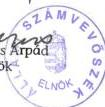

Állami Számvevőszék

# JELENTÉS

a helyi és helyi kisebbségi önkormányzatok pénzügyi-gazdasági tevékenységének 1999. évi ellenőrzési tapasztalatairól

2000. június

0010

---

Az ellenőrzés végrehajtásáért felelős:

V. Önkormányzati és Területi Ellenőrzési Igazgatóság

Dr.Lóránt Zoltán

számvevő igazgató

Az ellenőrzést vezette:

Turnheimné Lakos Zsuzsa

régióvezető főtanácsos

A jelentés összeállításában közreműködtek:

Kántor Ilona

számvevő tanácsos

Koltayné Szepesi Zsuzsa

számvevő tanácsos

Köcse Istvánné

számvevő tanácsos

Az ellenőrzésben résztvevők névsorát az 1. sz. melléklet tartalmazza

A témakörrel foglalkozó ÁSZ vizsgálatok jegyzéke:

Az önkormányzatok pénzügyi egyensúlyi helyzetének ellenőrzési tapasztalatai (V-1006/1995-1996.) (A Parlament számítógépes hálózatán a vizsgálat fájl neve: 0317J000 doc.)

49 települési önkormányzatnál 1996. évben tartott pénzügyi-gazdasági ellenőrzés (V-1007/1996-1997.) (A Parlament számítógépes hálózatán a vizsgálat fájl neve: 0360J000 doc).

29 települési és 18 helyi kisebbségi önkormányzat pénzügyi-gazdasági tevékenységének 1997. évi ellenőrzése (V-1003/1997-1998.) (A Parlament számítógépes hálózatán a vizsgálat fájl neve: 9813J000 doc).

Egyes települési és helyi kisebbségi önkormányzatok pénzügyi-gazdasági tevékenységének 1998. évi ellenőrzési tapasztalatai (V-1011/1998-1999.) (A Parlament számítógépes hálózatán a vizsgálat fájl neve:9908J000 doc).

Jelentéseink az INTERNETEN 1999. június 1-től a WWW.ASZ.gov.hu címen olvashatók.

Jelentéseink az Országgyűlés számítógépes hálózatán is olvashatók.

---

V-1003-72/1999-2000.

TSZ:468

# TARTALOMJEGYZÉK

I. ÖSSZEGZŐ MEGÁLLAPÍTÁSOK, KÖVETKEZTETÉSEK, JAVASLATOK 5

II. RÉSZLETES MEGÁLLAPÍTÁSOK 8

1. A gazdalkodás szabályozottsága, szervezettsége 8
2. A költségvetés tervezése, jováhagyása 16
3. A költségvetés vegrehajtása, az önkormányzati gazdalkodás törvenyessége 20
4.A szamviteli rend es a beszamolas 27
5. Az onkormanyzatok ellenorzési tevekenysége 30

1

---

|   | 1 | 2 | 3 | 4 | 5 | 6 | 7 | 8 | 9 | 10  |
| --- | --- | --- | --- | --- | --- | --- | --- | --- | --- | --- |
|   | 1 | 2 | 3 | 4 | 5 | 6 | 7 | 8 | 9 | 10  |
|   | 1 | 2 | 3 | 4 | 5 | 6 | 7 | 8 | 9 | 10  |
|   | 1 | 2 | 3 | 4 | 5 | 6 | 7 | 8 | 9 | 10  |
|   | 1 | 2 | 3 | 4 | 5 | 6 | 7 | 8 | 9 | 10  |

---

# Jelentés

## a helyi önkormányzatok és a helyi kisebbségi önkormányzatok pénzügyi-gazdasági tevékenységének 1999. évi ellenőrzési tapasztalatairól

A helyi önkormányzatokról szóló, többször módosított 1990. évi LXV. törvény 92. § (1) bekezdése, figyelemmel a 102/A §-ra, az Állami Számvevőszék feladataként jelölte meg a helyi önkormányzatok és a helyi kisebbségi önkormányzatok gazdálkodásának ellenőrzését. A törvényi felhatalmazás alapján az Állami Számvevőszék elsősorban törvényességi és szabályszerűségi szempontok szerint - 1992. óta már nyolcadik alkalommal - ellenőrizte az önkormányzatok pénzügyi-gazdasági tevékenységét. Az 1992-1999. években az összes önkormányzat 16,8%-át kitevő 532 önkormányzatot érintett e vizsgálatunk, melyek kiválasztásában a gazdálkodással kapcsolatos problémákra utaló külső jelzések és - a rendelkezésre álló kapacitás függvényében - törvényben előírt ellenőrzési kötelezettségünk egyaránt szerepet játszott.

A kiválasztásból eredően az ellenőrzött körben megtalálhatók voltak a néhány száz lakosú községek, a több tízezres városok, a megyei jogú városok, a fővárosi kerületek települési és (1995-től) helyi kisebbségi önkormányzatai egyaránt. Ennek következtében e vizsgálatok alapvető funkciója az volt, hogy a vizsgált szervek számára megmutassák, hogy az adott helyi viszonyok között melyek a feladatellátás pozitívumai és melyek azok a területek, ahol a törvényesség, szabályszerűség biztosítása érdekében különféle teendőik vannak. A végrehajtott ellenőrzéseknek konkrét mondanivalója is elsősorban a vizsgált önkormányzatok számára volt.

Az 1999. évi ellenőrzés célja annak megállapítása volt, hogy a vizsgált önkormányzatok

- testületének és polgármesterének pénzügyi-gazdasági döntéseiben, valamint hivatalának előkészítő, végrehajtó munkájában a törvények és rendeletek előírásai maradéktalanul érvényesültek-e;
- pénzügyi-gazdasági tevékenységének hatékonysága, célszerűsége miként alakult, s arra milyen hatást gyakorolt a vizsgált időszakban kifejtett gazdaságszervező és végrehajtó tevékenység;
- hivatala miként segítette a helyi kisebbségi önkormányzat(ok) gazdálkodása törvényességének megteremtését;
- gazdasági és szakmai tevékenységének szabályszerűségét a külső és belső ellenőrzések hogyan szolgálták.

3

---

A gazdálkodás törvényességére irányuló ellenőrzés ez évben összesen 50 helyi és 27 helyi kisebbségi önkormányzatot érintett, amely az önkormányzatok száma alapján 1,6%-os, lakosságszámukat tekintve pedig 3,3%-os reprezentációt jelentett. Az ellenőrzésbe vont önkormányzatok 18%-a városban, míg 82%-a községben, nagyközségben működött. (Megyénkénti részletezését a 2. és a 2/a. számú mellékletek tartalmazzák).

Vizsgálati programunk kialakításánál kiemelt helyet kapott az önkormányzatok ellenőrzési tevékenysége, s célként fogalmazódott meg a gazdálkodás egészének áttekintése, a tapasztalatokból azonban a teljes önkormányzati körre általánosítható megállapítások, következtetések csak nagy óvatossággal vonhatók le. Ennek egyik oka a magyarországi önkormányzati struktúrától némileg eltérő - a városokat a tényleges összetételnél jobban reprezentáló - merítés, másrészt az, hogy az ellenőrzött önkormányzatok 42%-ánál bejelentés alapján indult a vizsgálat, ahol az átlagosnál nagyobb számban tapasztaltunk jogszabállyal ellentétes gyakorlatot.

Ennek ellenére a vizsgálat főbb megállapításai egyértelműen jelzik a gazdálkodás egyes területein meglévő főbb problémákat, hiszen egybecsengenek az elmúlt évek hasonló vizsgálatainak tapasztalataival, amelyek a feltárt szabályozásbeli és gyakorlati problémák közül rendszeresen rávilágítottak például arra, hogy a kistelepülések önkormányzatai a szervezet-alakítás során szűk körben éltek a feladatok hatékonyabb, szakszerűbb és költségkímélőbb ellátását biztosító társulásos, körjegyzőségi formákkal. Útmutatás hiányában sokszor nem tettek eleget a vizsgált önkormányzatok gazdasági programkészítési kötelezettségüknek. Nem az előírásoknak megfelelően alakították ki a költségvetési előirányzatok évközi megváltoztatásának rendjét, annak gyakorlata pedig sem a jogszabályoknak nem felelt meg, sem a költségvetés szabályos végrehajtását nem szolgálta. A hivatalok a gazdasági események elszámolásánál nem tartották be maradéktalanul a jogszabályok előírásait, így a beszámolók nem adtak megbízható, valós képet az önkormányzat gazdálkodásáról, vagyoni és pénzügyi helyzetéről. Évről-évre azt is megállapítottuk, hogy az önkormányzatok nem fektettek kellő súlyt a belső ellenőrzésre. E megállapításokat megerősíti az önkormányzati feladatellátás szervezeti formái és működésük célszerűségének - 1999. évi vizsgálatunkkal egyidőben végzett - ellenőrzéséről készített számvevőszéki jelentés is.

Az ÁSZ az elmúlt években rendszeresen közzétette vizsgálati tapasztalatait az Önkormányzati Tájékoztatóban, ellenőrzési kézikönyvet jelentetett meg, és képzési lehetőséget is biztosított az eziránt érdeklődők számára. Mindezek a belső kontrollt segítik, de az időről-időre visszatérő - az önkormányzat nagyságrendjétől szinte függetlenül előforduló hibák kiküszöbölését elősegítő, a gazdálkodás egészét átvilágító - külső ellenőrzést nem helyettesítik.

Ezévi megállapításainkat a vizsgált önkormányzatok 1997. és 1998. zárszámadással lezárt évei, valamint egyes kérdésekben az 1999. év gazdálkodásának tapasztalatai alapozták meg. Munkánk során az önkormányzatok számára előírt gazdálkodásra vonatkozó szabályzatokat teljeskörűen, a kiadások teljesítését és dokumentálását egy-egy hónap bizonylatainak tételes vizsgálatával, egyes esetekben a pénztári pénzállomány ellenőrzésével, az ellenőrzési programban feltett további kérdések megválaszolását testületi döntések, határoza-

4

---

tok, okmányok, nyilvántartások felhasználásával, azok hitelessége, teljessége és tartalmi követelményei vizsgálatával szúrópróbaszerűen ellenőriztük.

# I. ÖSSZEGZŐ MEGÁLLAPÍTÁSOK, KÖVETKEZTETÉSEK, JAVASLATOK

A helyi önkormányzatoknak a törvényi kötelezettségek, vagyoni-pénzügyi helyzetük, a lakossági igények és a rendelkezésre álló források függvényében kell ellátandó feladataikról, azok szervezeti kereteiről és a megvalósításukhoz kapcsolódó pénzügyi-gazdasági kérdésekről dönteniük. Az 1999-ben lefolytatott pénzügyi-gazdasági ellenőrzések tapasztalatai szerint a saját hivatali apparátussal, a kistelepülések esetében részben társulásos formában ellátandó, elsősorban kötelező feladatokat az önkormányzatok általában reálisan határozták meg. Ugyanez nem mondható el a hivatali szervezetek nagyságának, tagolásának meghatározásáról, az önkormányzati gazdálkodással kapcsolatos feladatok szabályozottságáról, mivel többnyire nem a helyi adottságok és a hatékonyságra irányuló tudatosság motiválta a döntéseket.

A hivatalok döntéselőkészítő és végrehajtó munkáját hibák jellemezték, többek között a vizsgált önkormányzatok nagyobbik felénél el nem készített vagy nem a helyi viszonyoknak megfelelő szervezeti és működési szabályzat, ügyrend, számviteli politika, számlarend, a számviteli rend és végrehajtását biztosító intézkedések összhangjának hiánya a módosuló jogszabályokkal, a feladatok egyértelmű meghatározására nem alkalmas vagy rendelkezésre sem álló munkaköri leírások.

Mindezek, valamint az önkormányzati és az államháztartási törvény, illetve ez utóbbi végrehajtási rendeletének néhány nem kellően pontosított előírása együttesen vezethettek ahhoz, hogy a képviselőtestületek döntései nem vették figyelembe a törvényi, rendeleti előírásokat:

- a költségvetési rendeletek szerkezete, tartalma nem volt összhangban az államháztartási törvényben foglaltakkal;
- a költségvetési előirányzatok és rendeletek módosítását nem végezték el, vagy ezt utólagosan hajtották végre, amikor a költségvetési gazdálkodást érdemben befolyásolni már nem lehetett, sőt az éves beszámolót is benyújtották már;
- a zárszámadási rendeleteket nem a költségvetési rendelettel összehasonlítható módon hagyták jóvá, de azok az éves beszámoló jelentésekkel sem mindig voltak összhangban, s nem nyújtottak kellő tájékoztatást a vagyoni, pénzügyi, jövedelmi helyzet reális megítéléséhez.

Vegyes képet mutat az önkormányzatok gazdaságszervező tevékenysége. A képviselőtestületek felelősséggel hozták meg döntéseiket annak érdekében, hogy az önkormányzat elláthassa feladatait. Egyes vagyonelemek hasznosításával, értékesítésével teremtettek saját forrást a vagyonuk megóvása, gyarapítása érdekében szükséges beruházásokhoz, a közműfejlesztésekhez támogatá-

5

---

I. ÖSSZEGZŐ MEGÁLLAPÍTÁSOK, KÖVETKEZTETÉSEK, JAVASLATOK---

sokat pályáztak meg, hiteleket vettek igénybe. A törvényben megjelölt nagyságrendet elérő beruházásokat jellemzően a központi és a helyileg megalkotott szabályokkal összhangban lefolytatott közbeszerzési eljárást követően valósították meg. A tudatos vagyongazdálkodás eredményeképpen általában - a hatékonysági mutatók romlása mellett - megőrizték pénzügyi stabilitásukat. Ugyanakkor a gazdálkodásból - főleg a kistelepüléseken - hiányzott a hosszabb távú tudatos előretekintés; az önkormányzatok többsége nem készített gazdasági programot, s olykor a pénzügyi helyzet elemzése nélkül döntöttek hitelfelvételről.

Az operatív gazdálkodást hiányosságok nehezítették: a számviteli rend, a pénzgazdálkodási jogkörök nem megfelelő szabályozása és/vagy gyakorlása, a követelményeket csak részben kielégítő nyilvántartások vezetése, a bizonylati fegyelem megsértése következtében a számvitel esetenként nem szolgáltatott megbízható adatokat a döntéshozóknak, sőt az éves beszámolók és a mérleg valódiságát sem biztosította.

Hasonló megállapítások tehetők a vizsgált kisebbségi önkormányzatok gazdálkodásáról is. Költségvetésük tervezése, annak évközi módosítása, végrehajtása, valamint zárszámadásuk sem felelt meg mindenben a jogszabályi előírásoknak. Ennek oka többek között, hogy az 1998-ban alakult új kisebbségi önkormányzatok a helyszíni vizsgálatok idejére még nem szereztek kellő gazdálkodási tapasztalatot. Ezen túl azonban a többi kisebbségi önkormányzat sem igényelte minden esetben a helyi önkormányzat segítő együttműködését, s együttműködési megállapodás megkötésére sem került sor.

A szabályozásból, a jogszabályi változásokból, szervezeti, létszámellátottsági problémákból is adódó jelentős hibaforrások jó része a rendszeres ellenőrzéssel kiszűrhető lenne. Ennek ellenére a vizsgált önkormányzatok - ha rendelkeztek is ellenőrzési szabályzattal - sem intézményeiket nem ellenőrizték rendszeresen, sem a belső ellenőrzés rendszerét nem építették ki. Ha a szabályzatok, munkaköri leírások megfelelő alapot biztosítanak a munkafolyamatba épített ellenőrzésnek, akkor is szükséges a belső ellenőrzés folyamatos, a gazdálkodás minden területét érintő, hibafeltáró, a közpénzek védelmét biztosító működése. Erre azonban sem jogszabályi kényszerítő eszköz nincs, sem saját ezirányú érdekét nem ismeri fel az önkormányzatok jelentős része. A kistelepülések nem éltek az ellenőrzési társulás létrehozásának lehetőségével sem.

A megismert belső ellenőri vizsgálatokhoz hasonlóan az esetenként alkalmazott külső szakértők és a könyvvizsgálók megállapításai, javaslatai - akárcsak az ÁSZ korábbi témavizsgálatai - is az önkormányzatok gazdálkodásának egy-egy részterületét érintették, amelyeket az önkormányzatok általában igyekeztek munkájuk során hasznosítani.

Az ellenőrzöttek tevékenységét értékelő, s a jelen vizsgálat megállapításait is megalapozó adatlapok összesítése alapján minősíti az önkormányzatok szabályozottságát, gazdálkodását a 3. sz. melléklet. Adatai egyértelműen jelzik, hogy a szabályozottság a vizsgált önkormányzatok felénél, a tervezéssel és a beszámolással kapcsolatos előírások betartása és az ellenőrzési feladatok végrehajtása ezen önkormányzatok kétharmadánál nem megfelelő vagy hiányzik. A belső ellenőrzés hiányára, illetve hiányosságaira azért is fontos a figyelem felhívá-

---6

---

I. ÖSSZEGZŐ MEGÁLLAPÍTÁSOK, KÖVETKEZTETÉSEK, JAVASLATOK

sa, mivel csak a külső ellenőrzés mennyiségi fokozásával nem érhető el jobb eredmény az önkormányzati gazdálkodás törvényessége, szabályszerűsége területén.

A helyi önkormányzatok pénzügyi-gazdasági tevékenységének 1999. évi helyszíni ellenőrzési megállapításai alapján az ellenőrzést végzők a hiányosságok felszámolására és a törvényes állapot helyreállítására számos javaslatot tettek, többek között

# a gazdálkodás szervezettebbé tétele, szabályozottsága érdekében

- a költségvetési szervek tevékenségénék, gazdalkodási jogkörénék egyertelmü meghatározását, a hiányzo alapíto okiratok, törzskönyvi nyilvántartásbavetelek potlását;
- az eloirasoknak megfelelo szervezeti es mukodesi szabalyzatok, ugyrendek elkeszitsesel a hivatalok, korjegyzosegek tevekenysse alapfelteteleinek javita-sat;
a penzgazdalkodasi jogkork egyertelmuve tetelet, a hivatal es az intezmenyek egyseges szamviteli rendjenek kialakitasat, a szamviteli rendszer kialakitasara es mukdtetese vonatkozo jogszabalyok valtozasanak koveteset;
egyenre szabott, a belso szabalyzatok elorasait tukroz, az ellenorzesi feladatokat es felelossegi szabalyokat is tartalmazmunkakori leirasok keszitset;

# a költségvetés és a zárszámadás megalapozottabbá tétele, jóváhagyásuk során a jogszabályi előírások érvényesülése érdekében

- gazdasagi program összeallitásat a feladatok és lehetósegek hosszabb távra történő vegiggondolása alapján;
- az eloiranyzatok részletes kidolgozásat, a költségvetés vegrehajtásával összefuggó helyi szabályok megalkotásat, a képviselótestület megalapozott dontéseihez a szükséges tajékoztatás megadásat;

# a költségvetés végrehajtása és a beszámolás során elkövetett hibák kiküszöbölése, illetve megelőzése érdekében

- az eloiranyzatok megfelelo idoben es tartalommal tortenó modositásat;
a penzgazdalkodasi hataskorok erdemi gyakorlasat, a gazdasagi esemenyek hianytalan elszamolasat, dokumentalasuk soran a bizonylati rend es az okmanyfegyelem, valamint a tulajdonvedelem kovetelmenyinek betartasat;
a beszamolo leltarral valo alatamasztasat, a zarlati teendok teljeskoru elvegzest, az allami hozzajarulasok es tamogatasok elszamolasat megelozoen az intezmenyek adatszolgaltatasanak ellenorzese;
- az onkormanyzat sajatossagaihoz igazodofelugyeleti es belso ellenorzesi rendszer kialakitasat es folyamatos mukdteteset, a belso es kulso ellenorzesek altal feltart hibak kijavitasat celzo intezkedesek megtetelet.

Az érintett önkormányzatok harmada a helyszíni ellenőrzéseket követően, e javaslatokat figyelembe véve a szükséges intézkedések megtételéről, vagy annak szándékáról írásbeli tájékoztatást is adott.

7

---

II. RÉSZLETES MEGÁLLAPÍTÁSOK

Az 1999. évi helyszíni ellenőrzéseknek a korábbi évek megállapításaival összecsengő tapasztalatait figyelembe véve - , s az ezekben javasoltakra is építve - javasoljuk

a kormánynak, hogy

- terjessze ki - a szükséges korrekciókkal - a központi, a társadalombiztosítási és a köztestületi költségvetési szervek kormányzati, felügyeleti, valamint belső költségvetési ellenőrzéséről szóló 15/1999. (II. 5.) Korm. rendelet hatályát a helyi önkormányzati körre is, ezzel biztosítva az önkormányzati és az államháztartási törvényekben foglalt önkormányzati ellenőrzési kötelezettség rendszerének, eljárási szabályainak jogszabályi hátterét;

a belügyminiszternek, hogy

- rendeleti szintű előírásokkal vagy ajánlás formájában segítse az önkormányzatok gazdasági programjának elkészítését, amelyben az elvárható időhorizonton kívül a program tartalmának minimum-követelményeit is megjelölik;

a pénzügyminiszternek, hogy

- kezdeményezze az államháztartási törvény 124. §-ának felhatalmazása alapján az államháztartás működési rendjéről szóló kormányrendelet módosítását annak érdekében, hogy az konkrétan és egyértelműen határozza meg az önkormányzati költségvetési, illetve zárszámadási előterjesztésekhez benyújtandó mérlegek, valamint leltárak és vagyonkimutatások tartalmi követelményeit;
- további ösztönzők bevezetésével segítse elő különösen a 2000 fő alatti települések önkormányzatainak társulásos formában történő feladatellátását.

## II. RÉSZLETES MEGÁLLAPÍTÁSOK

### 1. A GAZDÁLKODÁS SZABÁLYOZOTTSÁGA, SZERVEZETTSÉGE

A vizsgált helyi önkormányzatok ellátandó feladataikat a lakosság igényei és gazdasági lehetőségeik függvényében határozták meg. Ebben döntően a helyi önkormányzatokról szóló 1990. évi LXV. törvényben (továbbiakban Ötv) előírt kötelező közszolgáltatásokra helyezték a hangsúlyt, amelyek ellátásának feltételeit – ha nehézségek árán is, de – valamennyien igyekeztek megteremteni.

Az Ötv lehetővé teszi, hogy a települési önkormányzatok képviselő-testületei feladat- és hatáskört ruházzanak át a helyi kisebbségi önkormányzat testületére annak kérésére, de a vizsgált helyi kisebbségi önkormányzatok egyike sem vett át feladatot a települési önkormányzattól. Tevékenységüket inkább a saját hagyományuk, kultúrájuk ápolása jellemezte. A feladataik ellátá-

8

---

II. RÉSZLETES MEGÁLLAPÍTÁSOK

sához a települési önkormányzatok személyi és tárgyi segítséget nyújtottak, pl. irodahelyiség biztosításával, irodai feladatok elvégzésével.

A helyi önkormányzati gazdálkodás végrehajtását biztosító szervezeti rendszert - a feladatok, összetétele alapján - döntő súllyal a képviselőtestületek hivatalai és az általuk létrehozott költségvetési szervek alkották. A feladatok ellátásában - elsősorban a sajátos szolgáltatási területeken - egyéb szervek, személyek (ezen belül különféle vállalkozások) részvétele is tapasztalható volt. A közüzemi ivóvíz ellátást, szennyvíz-elvezetést és -tisztítást, illetve a hulladékkezelést általában vállalkozások útján végeztették. Mindezek előfordultak közhasznú társasági, illetve költségvetési szervi tevékenységben is (pl. településtisztaság, hulladékkezelés közhasznú társaságban Algyőn, költségvetési szervi keretekben Zalakaroson, a település- és strand-üzemeltetés feladatainak többségét a hivatal szervezetéhez tartozó dolgozókkal látták el Zalalövőn, Révfülöpön).

Az önkormányzatok feladatainak ellátásában helyenként jelentős szerepet töltöttek be a különféle társulások (pl. igazgatási feladatokra társult Pusztaottlaka, Sárszentmihály, Soponya, ellenőrzési társulásban vett részt Biharugra, Tompa, a közoktatási feladatok területén Hejőpapi, Nagytőke, fejlesztési célra társult Nagytőke, Zalakaros, Zalalövő). Elsősorban a kisebb településeknél fordult elő, hogy az önkormányzat nemcsak egy, hanem több társulásban is érdekelt volt (pl. Somogyvámos, Soponya, Sárszentmihály).

Valamennyi ellenőrzött önkormányzat létrehozta a képviselőtestületek működésével, a gazdálkodás végrehajtásával, valamint az államigazgatási ügyek döntésre való előkészítésével kapcsolatos feladatok végzésére egységes hivatalát, illetve körjegyzőség alakításával tett eleget ezirányú törvényi kötelezettségének. A szervezet-alakítás törvényben biztosított szabadságával az Ötv keretei között, a helyi adottságok figyelembe vételével éltek. Ennek megfelelően, az apparátusi szervezet az elmúlt két évben a vizsgálattal érintett települések jelentős részében (80-76%-ában) polgármesteri hivatal, 20-24%-nál pedig körjegyzőség volt.

Az ellenőrzésbe bevont önkormányzatok közel egynegyede ezernél kisebb lélekszámú községben működött. A körjegyzőségi formát 1997. évben ezek fele, 1998-ban pedig 58%-a, az ezer-kétezer fő közötti településeknek pedig 30%-a választotta. Az összes vizsgált önkormányzatnak előbbiek 12, illetve 14%-át, a körjegyzőségben érdekelt utóbbiak pedig további 8, illetve 10%-át tették ki. Ez azt mutatja, hogy a közös igazgatás - az 1997-től megemelt összegű körjegyzőségi támogatás, az alap-támogatáson felül a résztvevő települések és lakosságszámuk szerint differenciált kiegészítő ösztönző támogatás ellenére, az országos tendenciákhoz hasonlóan - az Ötv rendelkezései alapján elsődlegesen érintett községek körében nem vált általánossá.

A vizsgált körben az elmúlt két év során az önálló hivatalok száma egy városi településrész (Algyő) községgé nyilvánítása révén növekedett, míg a korábban hivatalt működtető települések képviselőtestületei közül kettő körjegyzőség létrehozásáról döntött, amit azonban (1999. december 31-ével) meg is szüntettek.

9

---

II. RÉSZLETES MEGÁLLAPÍTÁSOK

Ópusztaszer és Dóc községi önkormányzatoknál a körjegyzőség 1997. július 1-i létrehozása a feladat-ellátásban létszám- és bérmegtakarítást, hatékonyabb munkamegosztást nem eredményezett (új elnevezéssel, de változatlan személyi állománnyal és munkamegosztással lényegében továbbra is a polgármesteri hivatalok tevékenykedtek). A két település önkormányzata ezt felismerte és úgy határozott, hogy a körjegyzőségi formát 1999. december 31-ével megszünteti.

A vizsgált **önkormányzatok igazgatási szervezeteit egységes munkaszervezetként hozták létre**, amelyen belül – főként a nagyobb létszámúaknál – a helyi adottságok, illetve feladat és hatásköri struktúra alapján jogi személyiség nélküli belső szervezeti egységeket alakítottak ki (pl. Sopron, Érd, Pápa városoknál, Pomáz nagyközségben).

A vizsgált **hivatalok, körjegyzőségek mérete, tagozódása** még a hasonló lakosság számú településeknél is meglehetősen **változó képet mutatott**, amely jórészt annak következménye, hogy ellátott feladataik és azok megoldásának választott módja rendkívüli mértékben eltérő volt (pl. 1998. évben az ezer-kétezer lakost számláló községek közül Somogyvámos 4, Szakály 5, Sióagárd 6, Igal nagyközség 11 fős, míg a két-háromezer lakosú települések közül Sár- szentmihály 8, Nemesnádudvar 10, Döge 11 fős hivatalt működtetett). Nem vált általános gyakorlattá a szervezet-alakításban a feladatok komplex áttekintése és arra épülő koncepció kidolgozása a vizsgált körben. Az elmúlt években **mindössze néhány** ellenőrzött **önkormányzatnál** határoztak el, illetve hajtottak végre különféle, **a szervezet racionalizálását célzó intézkedéseket** (pl. Budapest VII. kerület, Érd, Algyő).

A helyi önkormányzatok számára a **hivatali szervezetek nagyságának, összetételének meghatározásához** a BM 1996-ban kiadott ajánlásában szereplő modell-javaslat ad szakmai iránymutatást. A benne foglaltak eredményes alkalmazásának meghatározó feltétele az érintett **település adottságainak és feladatainak kellő mélységű feltárása** és a szervezeti keretek azzal összhangban történő kialakítása. Ezt támasztják alá az ellenőrzések azon megállapításai, amelyek szerint egyes községekben a javasolnál kisebb hivatal is elegendőnek bizonyult a tevékenység megfelelő ellátásához (Torony és Dozmat községi önkormányzatok körjegyzőségének létszáma 46%-kal alacsonyabb a modell-javaslatban feltüntetettnél, de az ellátandó feladatok jelentős növelést nem indokolnak). Más önkormányzatoknál az alacsony színvonalú pénzügyi-gazdasági tevékenység okai között - a helyszíni ellenőrzés megállapítása szerint - a feladatok által indokoltnál kisebb és az ajánlott mértékekhez viszonyítva is elégtelennek minősíthető létszámú hivatal szerepelt. Tokodaltáró község polgármesteri hivatalának létszáma például az ajánlott alsó határnak 2/3-át, - a felső határnak a felét - tette ki, amely a feladatok maradéktalan ellátásához a vizsgálat megítélése szerint sem elegendő.

Az ellenőrzött önkormányzatok hivatalaiban **a pénzügyi-gazdasági tevékenység feltételeiben** a helyi adottságok következtében ugyancsak jelentős **eltérések** tapasztalhatók. Ezzel együtt a helyszíni vizsgálatok a legtöbb munkaszervezet **létszámát, szakmai összetételét** az ellátandó feladatokhoz viszonyítva **megfelelőnek értékelték**. Megállapították, hogy az egyenletes munkavégzés helyenként a stabilitásnak, az évek óta változatlan, illetve alig változó személyi állománynak köszönhető. (Nemesnádudvar község polgár-

10

---

II. RÉSZLETES MEGÁLLAPÍTÁSOK

mesteri hivatalában például az alkalmazottak átlagosan 7,3 éve töltik be jelenlegi munkakörüket, Tompa nagyközségben átlag 14 éve dolgoznak a helyi közigazgatás hivatalában.)

A jogszabály szerinti, folyamatos működést egyes hivataloknál viszont a gyakori cserélődés, vagy a megfelelő szakemberek hiánya, illetve mind-ezen gondok halmozódása jelentősen nehezítette.

A közel 1600 lakosú Szakály község kis létszámú (5 fős) hivatala 1995. április 1.-1999. január 31. közötti időszakban (4 éven át) jegyző nélkül látta el feladatait.

A Kétújfalu községi önkormányzatnál a körjegyző személyében az elmúlt öt év során háromszor történt változás, 1997. évben pedig közel 6 hónapon keresztül nem volt kinevezett jegyző és a gazdasági területet is a fluktuáció jellemezte.

Nagyszentjános községben a polgármesteri hivatal több mint másfél évig felelős vezető nélkül működött, ahol az ellenőrzés a feltárt szabálytalanságokat, visszaélések gyanúját elsősorban a szabályozatlanságból eredő hiányosságokra és az ellenőrzés teljes hiányára vezette vissza, de ez utóbbi okai között a jegyző tartós távollétére is rámutatott.

Hejőpapi községben a jegyzői munkakört 1997. július 31-ig négyórás foglalkoztatással, majd helyettesítéssel, illetve később megbízással oldották meg. A hivatalt kinevezett jegyző 1998. februárjától irányította, aki huzamosan (1998. novemberétől, a helyszíni ellenőrzés 1999. május 3-ig tartó időszakában is) táppénzes állományban volt, s 1999. januárjától ellene fegyelmi eljárás folyt.

Az Érd városi önkormányzat hivatalából az engedélyezett létszámnak 1997. évben 19%-a, 1998-ban 16%-a távozott, ezen belül a Pénzügyi és Adóügyi Irodát 12%, illetve 11,5%-os mértékű kilépés érintette.

Az önkormányzati működés tárgyi feltételei szempontjából meghatározó jelentőségű, hogy a hivatalokat általában a feladatoknak megfelelő nagyságú és műszaki állapotú épületekben helyezték el. Az irodai helyiségek az adott funkcióhoz elegendőek voltak és berendezésük a feladatok ellátásának feltételeit biztosította; az ügyfelek fogadása differenciált, de többnyire elfogadható szintű környezetben történhet(ett). Eredendően szűkös elhelyezést, vagy rendkívüli körülmény miatti zsúfoltságot mindössze néhány önkormányzatnál tapasztaltunk (pl. szűkös elhelyezés Bagamér, Nyírábrány nagyközségekben, a hivatal tűzeset miatt átmenetileg szolgálati lakásban működött Felsőtelekes községben).

A vizsgált önkormányzatok hivatalainak apparátusi szervezetei az ügyviteli feladatokat részben manuális úton, részben számítógép alkalmazásával végezték. A számítógép alkalmazása jelentősen segítette a pénzügyi-gazdasági tevékenységet, bár a programok lehetőségeit az ellenőrzött területeken teljes körűen még nem minden önkormányzat hivatalánál használták ki: a gépi feldolgozás elsősorban a gazdasági események főkönyvi könyvelésére terjedt ki, a kapcsolódó analitikus nyilvántartások vezetésére több helyen nem használták (pl. Algyő, Záhony, Torony, Zalalövő önkormányzatoknál). A gazdálkodásban használt számítógépes programokat általában a TÁKISZ-ok bocsátották az önkormányzatok rendelkezésére, elvégezve a jogszabályi változások által indokolt módosítást, aktualizálást is (pl. Algyő, Budapest VII. kerület, Pomáz, Zalalövő).

11

---

II. RÉSZLETES MEGÁLLAPÍTÁSOK

A helyszíni tapasztalatok azt mutatják, hogy a **gép-ellátottság nem egyenletes**, egyes helyeken az elmúlt években komoly számítástechnikai fejlesztések történtek (pl. Sopron), míg máshol a meglévő eszközök amortizálódása miatt a technikai színvonal emelését biztosító beszerzések szükségesek (pl. Dóc, Ópusztaszer, Tarhos).

A vizsgált önkormányzatoknál a költségvetési szervek létrehozása területén az államháztartásról szóló 1992. évi XXXVIII. törvény (a továbbiakban Áht) 88. §-ának előírásai a hivatalok, körjegyzőségek esetében kevésbé érvényesültek, mint a különféle ágazati intézmények tekintetében. Az ellenőrzött körben előfordult, hogy a **hivatalok, körjegyzőségek alapító okirattal nem rendelkeztek és a törzskönyvi nyilvántartásban sem szerepeltek, helyettük költségvetési szervként a képviselőtestületeket tüntették fel** (pl. Tokodoltáró, Kétújfalu, Kópháza, Pusztaottlaka, Zalalövő, Zalakaros települési önkormányzatoknál). Ez azonban jogszabálysértő, mivel a hatályos törvények szerint a képviselőtestület **nem jogi személy, jogképessége nincs, költségvetési szervként nem működhet**.

**Alapító okirat és törzskönyvi bejegyzés hiányában** az érintett hivatalok, körjegyzőségek, mint költségvetési szervek **jogi értelemben nem léteztek**, mivel ennek döntő, törvényben előírt kritériumai nem teljesültek. Mindezen esetekben kétséges az is, hogy a hivatali dolgozók tekintetében a köztisztviselői törvény előírásai jogszerűen alkalmazhatók voltak-e.

A Zalakaros Városi Önkormányzat alapító okirattal nem rendelkező hivatalában rendezetlen besorolású feladatokat láttak el és olyan szervezeti egységet (Idegenforgalmi és Közművelődési Iroda) működtettek, amelynek jogállása tisztázatlan, ezért az ellátott tevékenységek jellege, összetétele, valamint az adott szervezet hivatalhoz fűződő gazdasági kapcsolatai egyértelműen nem voltak megállapíthatók (pl. idegenforgalmi szolgáltatások, gyümölcstermesztés és értékesítés).

A vizsgálatba bevont önkormányzatok **feladatellátásában** az igazgatási szervezetek mellett **jelentős számú** (1997. évben 295, 1998-ban 312) - egy-egy önkormányzatnál átlagosan hat - költségvetési **intézmény** vett részt. Ezen belül az érintett települések között a helyi közszolgáltatási igények és lehetőségek alapján alapvető különbségek mutatkoztak, amelyek legfőbb meghatározó tényezői az ellátandó lakosság számában és az igazgatási szolgáltatás igényjogosultjainak összetételében találhatók.

Az **intézmények döntő része (73%-a) a nagyobb lakosságszámú**, - ötezer feletti - **településeken működött**, ahol átlagosan 20, míg a vizsgált önkormányzatok 78%-át kitevő, ötezer alatti lélekszámú településeken átlagosan két intézmény fenntartásáról gondoskodtak.

A nagyszámú **önkormányzati intézmény** esetében az **alapítással és a törzskönyvi bejegyzéssel** összefüggő előírások érvényesítése **terén** a hivatalokéhoz képest **rendezettebb viszonyokat** állapított meg az ellenőrzés, ami jórészt az elmúlt években ezt a területet érintő ÁSZ témavizsgálatoknak köszönhető, de ezeknél is előfordultak hiányosságok:

12

---

II. RÉSZLETES MEGÁLLAPÍTÁSOK

Zalalövő Nagyközségben az önkormányzat által létrehozott költségvetési intézmények alapító okirattal rendelkeztek, de 44%-uk törzskönyvi nyilvántartásba vételéről és feladat-módosulásának bejegyeztetéséről nem gondoskodtak.

Tokodaltáró községben az idősek klubját is magába foglaló Szociális Gondozó Szolgálat alapító okirattal nem rendelkezett, az Igali Önkormányzatnál az Idősek Klubja törzskönyvi bejegyzését elmulasztották, holott ezek a nappali ellátást nyújtó intézményeknél a normatív állami hozzájárulás igénybe vételének is törvényben előírt feltételei (az Áht 88 §. és az éves költségvetési törvények 3. számú mellékletében rögzített előírások alapján).

Tompa Nagyközség négy - részben önállóan gazdálkodó - intézményének törzskönyvi bejegyzése a helyszíni vizsgálat idején fejeződött be, korábban azok a törzsadattárban (helytelenül) a hivatal szakfeladataként szerepeltek.

A Budapest VII. kerületi Önkormányzatnál az 1999. áprilisában végrehajtott FÁKISZ egyeztetés hozta felszínre, hogy a törzskönyvi nyilvántartásban 6 megszűnt intézmény is szerepelt, kettő címváltozását nem jelezték, 11 új intézmény adatait pedig még nem vezették be. A felülvizsgálat során a szükséges korrekciókat elvégezték.

Az alapító okiratok tartalmában - a hiányos, és nem kellően egyértelmű, esetenként a jogszabályi előírásokkal ellentétes szabályozás miatt - gondot okozott a tevékenységek és a gazdálkodási jogkör, illetve a jogi személyiség értelmezése, egyértelmű megfogalmazása és ennek következtében az intézmények jogszabályszerű besorolása. Így pl. Sopron Megyei Jogú Városnál az intézményi tevékenységek kellően nem pontos meghatározását, Zalalövő Nagyközségnél a gazdálkodási jogkörök szabályszerű, egyértelmű meghatározásának elmulasztását, egyes részben önálló intézmények nem önálló jogi személyként történő besorolását, Székely Község esetében az Általános Művelődési Központ részére az önálló gazdálkodási jogkör jogszabályi feltételek hiányában történt biztosítását kifogásolták a helyszíni ellenőrzések.

A részben önálló intézmények tették ki az összes intézmény 57%-át, melyek meghatározott gazdasági feladatait az erre kijelölt önállóan gazdálkodó költségvetési szervek, illetve a hivatalok végezték. Ez utóbbi alapvetően a vizsgált kör sajátos összetételéből eredt, ugyanis az önkormányzatok nem elhanyagolható része (21 önkormányzat) önálló intézménnyel nem rendelkező településen működött.

Az intézmények részben önálló gazdálkodóként történt besorolásakor rendszerint elmaradt az önálló és a részben önálló költségvetési szervek közötti munkamegosztás és felelősségvállalás rendjének rögzítése, valamint testület általi jóváhagyása. Így a vonatkozó kormányrendeletek (156/1995. (XII.26.) Korm. rendelet a költségvetési szervek tervezésének, gazdálkodásának és beszámolásának rendszeréről - a továbbiakban Gr -, illetve a 217/1998. (XII. 30.) Korm. rendelet az államháztartás működési rendjéről - a továbbiakban Ámr) kötelező jellegű előírásai ellenére több önkormányzatnál nem szabályozták, hogy a gazdálkodás különböző területein (tervezés, előirányzat-felhasználás, pénzellátás, analitikus nyilvántartások, stb) melyek a hivatalok, mint önálló szervek és melyek a gazdaságilag hozzájuk kapcsolt, részben önálló intézmények feladatai (pl. Nagykálló, Berkesd, Kétújfalu, Hejőpapi, Biharugra, Dóc, Ópusztaszer, Nagyszentjános).

13

---

II. RÉSZLETES MEGÁLLAPÍTÁSOK

Az önkormányzati **gazdálkodás szervezettsége, szabályozottsága** területén rendkívül szerteágazóak a helyszíni ellenőrzések tapasztalatai. A jelentésekben rögzített megállapítások egységesek abban a tekintetben, hogy **a képviselőtestületek működésének részletes szabályait** – az Ötv 18 §.(1) bekezdésében foglalt rendelkezések alapján – a szervezeti és működési szabályzatról szóló rendeletekben valamennyi ellenőrzött önkormányzatnál **meghatározták**. Ezekben különféle módon és mélységben rögzítették az önkormányzatok feladatait, a költségvetési tervezés és gazdálkodás alapvető hatásköri rendjét, valamint a képviselőtestület és szervei közötti munkamegosztást. Egyes szervezeti és működési szabályzatokban azonban nem rendelkeztek az önkormányzat kötelező és önként vállalt feladatairól, valamint a hatáskör-gyakorlás rendjéről (pl. Jászárokszállás), a polgármester és a jegyző gazdálkodással kapcsolatos feladat- és hatásköréről (pl. Ács), illetve általánosságban határozták meg az önként vállalt feladatok ellátásának mértékét, módját (pl. Tokodaltáró).

Az **önkormányzati gazdálkodással kapcsolatos hivatali, körjegyzőségi feladatok szabályozottsága** az ellenőrzések számszerűsített adatai szerint összességében mindössze 41%-os mértékű. (Ennél valamivel kedvezőbb a kép, ha figyelembe vesszük, hogy a vállalkozási tevékenység nem volt jellemző a vizsgált önkormányzatokra, így az ezzel kapcsolatos „szabályozatlanság” valójában nem jelent negatív minősítést.) Ezen belül a feladatellátás egyes területei között jelentős eltérések mutatkoznak. Alapvető szabályozási hiányosság, hogy a módosított Gr 5. és 10. §-ában, majd a szintén módosított Ámr 10. és 17. §-ában **valamennyi költségvetési szerv számára előírt szervezeti és működési szabályzatok nem készültek el**. Így többek között nem rögzítették az alapító okiratban foglaltak részletezéseként az állami feladatként ellátott alaptevékenységet, a vállalkozási tevékenység részletes felsorolását és mindezek forrásait.

A **helyi kisebbségi önkormányzatnak** az Áht 66. §-a és a 68. § (3) bekezdése értelmében a települési önkormányzattal kötött megállapodásban kell rögzítenie az **együttműködésük rendjét**. A vizsgált településeken a helyi és kisebbségi önkormányzatok **74%-a rögzítette** megállapodásban a költségvetési rendelet megállapításával, a kisebbségi önkormányzat gazdálkodásával összefüggő teendőket. Az 1998-as választásokat követően megalakult kisebbségi önkormányzatok közül kettő nem kötött megállapodást a helyszíni vizsgálat idejéig (Torony és Zalakaros), a korábban is működő önkormányzatok közül pedig ötnek 1994. óta nem sikerült megállapodnia a települési önkormányzatokkal (pl. Pusztaottlaka, Budapest VII. kerület 3 kisebbségi önkormányzata).

Az önkormányzati gazdálkodást végrehajtó valamennyi szervezet számára **kötelezően szabályozandó tevékenységek** közül a legnagyobb mértékben (64%) a pénzkezelési és a selejtezési feladatok, a legkevésbé (20%) a számviteli rendszer részét képező értékelési módok és eljárások **szabályozása** történt meg.

A **gazdasági feladatokat**, valamint a vezetők és más dolgozók feladat-, hatás- és jogkörét **tartalmazó**, a vonatkozó jogszabályok és a helyi sajátosságok alapján **megfelelőnek** ítélt **ügyrenddel** az ellenőrzött önkormányzatok hivatalainak **mindössze 46%-a rendelkezett** (pl. Gersekarát, Pápa, Sióagárd,

14

---

II. RÉSZLETES MEGÁLLAPÍTÁSOK

Tarhos). Az ügyrend összeállítására vonatkozó kötelezettségét 14% nem teljesítette (pl. Algyő, Hejőpapi, Ópusztaszer, Sárszentmihály), a további 40% ügyrendje pedig különféle tartalmi hiányosságok miatt nem felelt meg a követelményeknek (pl. Budapest VII. kerület, Ács, Kópháza, Nagyszentjános,). Ezen belül a leggyakoribb kifogás a teljeskörűség és a helyi adottságokkal való összhang hiánya, valamint a feltételek változása miatt indokolt aktualizálás elmaradása volt. Ahol nem rögzítették a hivatal gazdasági feladatait, a szabályozásból a gazdálkodás lényeges területei maradtak ki (pl. tervezés, előirányzat felhasználás-, módosítás), illetve az egyes szervezeti egységek feladatai, azok egymáshoz fűződő kapcsolata és a köztük lévő munkamegosztás, amely a személyekre lebontott munkaköri leírások alapját képezhetné.

A pénzgazdálkodási jogkörök szabályozottsága a vizsgált körnek csak alig több mint felénél (56% esetében) érte el a jogszabályi előírások alapján elvárható szintet. A költségvetés végrehajtásának vertikális folyamatát az érintett önkormányzatok 16%-ánál nem rögzítették (pl. Jászárokszállás, Berkesd, Kétújfalu, Kópháza), 28% esetében pedig nem megfelelően szabályozták (pl. Bagamér, Nagytőke, Szirmabesenyő). Ennek következtében nem volt meghatározva, illetve a belső rendelkezésekből egyértelműen nem volt megállapítható a kötelezettségvállaláshoz, valamint a be- és kifizetések teljesítéséhez kapcsolódó hatásköri rend.

Helyenként csak a hatáskörgyakorlás általános szabályait határozták meg, de a felhatalmazottak átmeneti és tartós távolléte esetén érvényes szabályokat nem rögzítették (pl. Nagytőke, Szirmabesenyő, Nagyszentjános). A tartalmilag hibás szabályozások nem alkalmasak arra, hogy a pénzgazdálkodás folyamatában az összeférhetetlenségi helyzeteket kizárják, hogy saját részre, vagy közvetlen hozzátartozó számára történő kifizetésről a tisztségviselők, illetve a hivatali dolgozók ne rendelkezhessenek, továbbá, hogy a különféle jogosultságokat ugyanazon személy együttesen ne gyakorolhassa.

Az önkormányzati gazdálkodás összetett és követelményeit illetően gyakran változó területe a számviteli politika és a számlarend, amelynek szabályozása már alapszinten is sokrétű, aktualizálása pedig folyamatos feladatot jelent a költségvetési szervek számára. A helyi szabályozás kialakítását és működtetését a hatásköri törvény a jegyzők feladatkörébe utalta, akik e kötelezettségüket a hivatalok számlarendje tekintetében a vizsgált önkormányzatok 10%-ánál nem teljesítették (Berkesd, Kétújfalu, Hejőpapi, Budapest VII. kerület, Tokodaltáró), és ezen túl az önkormányzati szintű intézkedések sem voltak fellelhetők a vizsgált körben még azoknál az önkormányzatoknál sem, amelyek felügyelete alá több intézmény tartozott, s ezért feltétlenül szükséges lett volna a követendő elvek megfogalmazása, illetve írásba foglalása és olyan irányelvek kiadása, amelyek az egységes gyakorlatot biztosíthatják (pl. Budapest VII. kerület, Sopron, Pápa, Záhony, Révfülöp).

Az ellenőrzött önkormányzatok hivatalainál gyakoriak voltak a hiányos, továbbá a vásárolt és a helyi viszonyokra nem adaptált, vagy még hatályba sem léptetett, a számviteli politika részét képező, a módosított 54/1996. (IV.12.) Korm. rendelet 4. §-ában előírt szabályzatok, amelyek ezért a napi feladatellátásban megfelelően nem alkalmazhatók. Előfordult az is, hogy az önkormányzati működés kezdete óta a hivatali számviteli rendet és

15

---

II. RÉSZLETES MEGÁLLAPÍTÁSOK

a kapcsolódó egyéb szabályzatokat nem dolgozták ki, az ügyintézők különféle szakkönyvekből, segédanyagokból, tájékoztatókból dolgoztak (Hejőpapi), illetve a szabályozás szükséges módosításait 1994. óta nem végezték el (Igal).

Vásárolt és nem a helyi viszonyokat tükröző szabályozással rendelkeztek pl. Sióagárd, Nemes-nándudvar, Ács önkormányzatok hivatalainál. Egyes esetekben a vásárolt szabályzat-csomagok - a helyi körülmények szerint történő átdolgozás elmulasztása mellett - cserélhető szabad-lapokból álltak (gyűrűskönyv-jellegűek), ezért adott időpontra érvényes rendelkezéseik és a végrehajtáshoz kapcsolódó felelősség kellő pontossággal történő megállapítására nem voltak (nem lehettek) alkalmasak (pl. Dozmat, Torony, Nyírábrány, Zalalövő).

A helyszíni ellenőrzéskor hatályba nem léptetett szabályozással rendelkezett pl. Budapest VII. kerület, Sióagárd, Tokodaltáró. A szabályozás hiányos volt pl. Berkesd, Kétújfalu községekben, ahol a számviteli politika, a számlarend és az értékelés rendjének kidolgozása, Sárszentmihály községben az előbbieken kívül a selejtezési tevékenység szabályozása, Pusztaottlaka községben a részben önálló intézmény könyvviteli rendjének szabályozása nem történt meg.

A számviteli szabályzatokban a vonatkozó **jogszabályi előírások változását**, módosulását **nem követték**, ezért a helyszíni ellenőrzéskor gyakran az aktualitás hiányát kellett megállapítani (pl. Algyő, Kópháza, Nemesnádudvar, Ács, Tivadar, Ambrózfalva, Csanádalberti). A legtöbb esetben a költségvetés alapján gazdálkodó szervek beszámolási és könyvvezetési kötelezettségéről szóló 54/1996. (IV. 12.) Korm. rendeletet módosító 218/1998. (XII. 30.) Korm. rendelet előírásainak megfelelő módosítások maradtak el, amelyeket 1999. január 1-től már alkalmazni kellett volna.

A pénzügyi-gazdálkodási, számviteli tevékenység jogszabályi előírásoktól eltérő belső szabályozása következményeként **az egyénre szabott feladatmeghatározás feltételei** számos helyen **nem alakultak ki** és a munkaköri követelmények rögzítését nem, vagy nem megfelelően végezték el. Elfogadható színvonalú munkaköri leírásokkal mindkét évben az ellenőrzött önkormányzatoknak mindössze 38%-ánál rendelkeztek (pl. Pálháza, Soponya, Tompa), s csökkent (20%-ról 12%-ra) azon hivatalok részaránya, ahol a dolgozók munkaköri leírását nem készítették el (mindkét évben pl. Budapest VII. kerület, Berkesd, Felsőtelekes, Kétújfalu). A vizsgált időszakban ugyan növekedett azon szervezetek száma, amelyeknél az alkalmazottak feladatait írásba foglalták (pl. Zalakaros, Dozmat, Torony), ez azonban nem eredményezett tartalmi előrelépést, mivel a hiányos, általános, nem a ténylegesen meglévő munkakörökre és az érvényes belső szabályzatokra épülő munkaköri leírások arányát emelte. E hiányosságok miatt a vizsgált esetek nem elhanyagolható részében a **dolgozók munkaköri leírásai nem voltak alkalmasak a feladatok** teljes körű és **egyértelmű meghatározására**, illetve elhatárolására (pl. Sopron, Gyöngyöshalász, Jászárokszállás).

## 2. A KÖLTSÉGVETÉS TERVEZÉSE, JÓVÁHAGYÁSA

A vizsgált körben a települési önkormányzatok által ellátott feladatok és a végrehajtásukhoz rendelt források meghatározása általában az éves tervezés folyamatában történt. Az Ötv 91 §. (1) bekezdésének rendelkezése a helyi önkormányzatok számára ugyan nemcsak a költségvetés, hanem a **gazdasági**

16

---

II. RÉSZLETES MEGÁLLAPÍTÁSOK

**program** készítését is előírta, de azzal az ellenőrzött önkormányzatok nagy része egyik évben sem rendelkezett (1997-ben 56%, 1998-ban 50%, pl. Igal, Záhony, Sárszentmihály, Zalalövő).

Nagykálló Város Önkormányzatának saját szervezeti és működési szabályzata szerint a választást követő 90 napon belül gazdasági programot kell készíteni. A jóváhagyásra azonban nem került sor, mivel a képviselőtestület úgy látta, hogy az önkormányzati forrásszabályozás nem elég stabil ahhoz, hogy több évre szóló terveket célszerű lenne készíteni.

A gazdasági program időintervallumára, tartalmára nincs törvényi előírás, amely nehezítette az önkormányzatok munkáját. A gyakorlatban hiányzott a feladat teljesítéséhez (kötelező, vagy ajánlás jelleggel) azon minimum követelmények meghatározása, amelyeket az éves tervezés megalapozása érdekében valamennyi önkormányzatnál teljesíteni kell.

Az ellenőrzött önkormányzatoknál az 1998. évben megválasztott képviselőtestületek az 1994. évben megválasztottakhoz képest 6%-kal **nagyobb arányban tettek eleget** a gazdasági **program összeállítására**, illetve elfogadására **vonatkozó kötelezettségüknek**. Előfordult emellett az is, hogy a jelenlegi választási ciklusra szóló gazdasági programot ugyan elkészítették, a bizottságok és a képviselőtestület megismerte és lakossági fórumon való megtárgyalásra alkalmasnak találta, képviselőtestületi határozattal történő jóváhagyása mégis elmaradt (Tokodaltáró).

**A több évre szóló tervezés hiánya** főként a kétezer lélekszám alatti **kistelepüléseket jellemezte** (pl. Biharugra, Dozmat, Tivadar, Pusztaottlaka, Gersekarát), amelyeknek 59%-a egyik évben sem rendelkezett gazdasági programmal. Emellett a jóval nagyobb lakosságszámú, és ezáltal sokkal összetettebb feladatokkal rendelkező településeken sem mindig történt meg a gazdasági feladatok és lehetőségek több évre előretekintő gazdasági programban való rögzítése (pl. Sopron, Érd, Jászárokszállás).

Az éves tervezés első ütemében valamennyi vizsgált önkormányzatnál a **költségvetési koncepció elkészítéséről**, majd képviselőtestületi jóváhagyásáról **gondoskodtak**. A döntést megalapozó előterjesztések különféle szerkezetben és általában az előterjesztő egyéni értékítéletén alapuló tartalommal készültek, mivel arról a jogszabályok nem rendelkeztek, és követelményeit a képviselőtestületek sem szabályozták.

**A jóváhagyás folyamatában az** Áht-ban meghatározott **eljárási rendet** a vizsgált önkormányzatoknál **betartották** és a testületek döntését külön határozatba foglalták. Előfordult azonban, hogy a törvényben előírt határidőn túl történt az előterjesztés és a jóváhagyás (pl. Ács 1997. évi, Nagyszentjános 1997. évi, Sárszentmihály 1999. évi költségvetési koncepciója), továbbá, hogy a javaslatot a képviselőtestület nem fogadta el (Sárszentmihályon az 1998. évi koncepciót), illetve elfogadásáról nem döntött vagy arról határozatot nem hozott (Nagyszentjános).

A helyszíni ellenőrzések - kötelező jogszabályi és helyi szintű előírások hiányában - egyes **koncepciók** tartalmát **célszerűségi szempontból**, a tervezés további szakaszában történő alkalmazhatóság oldaláról értékelték. Ennek során

17

---

II. RÉSZLETES MEGÁLLAPÍTÁSOK

kifogásolták, hogy a jóváhagyott koncepciókban a **költségvetés kidolgozásának** eljárási **feladatait** nem mindig határozták meg (pl. Ács, Zalalövő). Előfordult, hogy a tervező munka folytatásának **tartalmi követelményeit nem rögzítették** (pl. Ács, Sárszentmihály, Zalalövő 1997. évi), egy-egy esetben kizárólag a beruházási, felújítási célkitűzések rangsorolásával foglalkoztak, a működési költségvetést érintő kérdésekre nem tértek ki (pl. Tokodaltáró), illetve nem tisztázták, hogy az intézményi működtetésre fordítandó bevételeket mely vagyonelemek értékesítéséből és milyen arányban kell növelni (Budapest VII. kerület 1997. év).

A vizsgált önkormányzatok képviselőtestületei a tervezés második ütemében a **költségvetési rendelet-tervezetek** elfogadásáról döntöttek. A jóváhagyás folyamatában a vonatkozó határidőket és eljárási szabályokat betartották. A testületi előterjesztések **pénzügyi bizottsági tárgyalásáról**, valamint - az erre kötelezettek - könyvvizsgáló általi **véleményezéséről gondoskodtak** (pl. Budapest VII. kerület, Ács, Sopron). Néhány helyen azonban megsértették a jogszabályi rendelkezéseket, mivel a költségvetési javaslatot az Áht 71. §-ában előírt határidő lejárta után nyújtották be a képviselőtestületnek megtárgyalásra (pl. Budapest VII. kerület, Gersekarát az 1997. évit, Biharugra az 1997. és 1999. évit). Előfordult, hogy a körjegyzőség költségvetésének jóváhagyásáról az abban érintett önkormányzatok - az Ámr 29. §. (7) bekezdésében előírtak ellenére - nem a költségvetési rendeletüket tárgyaló képviselőtestületi ülés előtt, hanem azt követően határoztak (pl. 1999. évben Dóc és Ópusztaszer).

Az ellenőrzött önkormányzatok az éves költségvetések jóváhagyása során maradéktalanul érvényre juttatták az Ötv és az Áht azon rendelkezéseit, amelyek szerint a helyi önkormányzat költségvetéséről rendeletet alkot. Az elfogadott **költségvetési rendeletek szerkezete és tartalma** azonban mindössze **50%-nál felelt meg** az Áht és végrehajtási rendeletében foglalt **követelményeknek**, a továbbiak esetében különféle tartalmi elemek hiányoztak a rendeletekből, vagy az előirányzatokat a szükséges mértékben nem részletezték, illetve az előírt tájékoztatási kötelezettségnek teljes körűen nem tettek eleget. Így **elmaradt** az Áht 67. §-ában előírt **címrend meghatározása** (pl. Bagamér, Sopron és Torony 1997. évben, Budapest VII. kerület 1997-98. évben, Dozmat 1997-99. évben), nem történt meg az **előirányzatok** önállóan és részben önállóan gazdálkodó **költségvetési szervenkénti** (pl. Biharugra, Szirmabesenyő, Gersekarát), illetve **kiemelt előirányzatonkénti jóváhagyása** (pl. Bagamér, Biharugra, Tivadar). A költségvetési rendeletek szabályozásából kimaradt a **létszámkeret**, illetve annak költségvetési szervezetenkénti **meghatározása**, amely 1997. évtől tartozott a kötelező tartalmi elemek közé (pl. Sopron 1997, Budapest VII. kerület és Gyöngyöshalász 1997-98. évben). A **több éves kihatással járó kötelezettségeket**, illetve azok hatásait egyes esetekben nem (pl. Gersekarát), vagy **nem teljes körűen mutatták be** a képviselő testületeknek (pl. Algyő, Sárszentmihály).

A költségvetési rendeletek hiányossága volt, hogy a **végrehajtás szabályait nem** (pl. Berkesd, Ópusztaszer, Sárszentmihály, Tokodaltáró), vagy csak részben (pl. Dóc, Pusztaottlaka) **tartalmazták**, esetenként **általános megfogalmazásokat** alkalmaztak, amelyekből a konkrét feladatok nem állapíthatók meg (pl. Budapest VII. kerület, Jászárokszállás). Rendeleti szinten **nem foglalkoztak** az esetleges **bevételi többletek** felhasználásának, valamint az

18

---

II. RÉSZLETES MEGÁLLAPÍTÁSOK

átmenetileg **szabad pénzeszközök** hasznosításának szabályaival (pl. Tivadar, Zalakaros, Zalalövő), továbbá a költségvetési **hiány kezelésének módjával**, hatásköri rendjével (pl. Dóc, Bagamér, Tivadar). Nem került sor a **működési és felhalmozási célú bevételek és kiadások mérlegszerű bemutatására**, amely a pénzügyi-vagyoni helyzet megítéléséhez feltétlenül szükséges lett volna (pl. Biharugra, Budapest VII. kerület, Tarhos, Torony 1997-1998.).

Az elmúlt két évben a vizsgált **önkormányzatok tervezési tevékenységét általában a kellő előrelátás** és a helyi szempontból jelentős célkitűzések meghatározása, illetve a megvalósításukra való felkészülés **jellemezte**. Költségvetésükben a kötelező feladatok ellátásának és a meglévő intézmények működtetésének feltételeit lehetőségeik keretein belül biztosították, a településük ellátottsági viszonyait figyelembe vették, a működtetés elsődlegességére általában megfelelő hangsúlyt helyeztek (pl. Gyöngyöshalász, Tarnaméra, Somogyvámos, Torony).

A **jóváhagyott önkormányzati költségvetések** a vizsgált szervek mintegy kétharmadánál kellően **megalapozott** bevételi és kiadási **előirányzatokat tartalmaztak** (pl. Cigánd, Soponya, Tompa). Pozitívumként értékelhető, hogy az elmúlt két év gazdálkodását a lehetőségeket meghaladó bevételi-, illetve a szükségleteknél alacsonyabb kiadási tervszámok általában nem jellemezték és mindezekből eredően **tervezési hibára visszavezethető**, a működést zavaró **likviditási gondok nem merültek fel**.

A költségvetési **előirányzatok megalapozatlanságát** a helyszíni ellenőrzések a vizsgált kör **10, illetve 8%-ánál állapították meg**. Egy-egy önkormányzatnál a tervezéskor irreálisan alacsony kiadásokkal számoltak, a költségvetés egyensúlyát a dologi kiadások alultervezésével, valamint a felújítási, beruházási feladatok kényszerű elhagyásával biztosították (Érd), illetve a költségvetés bevételi és kiadási oldalának aránytalanságai, a bevételek és a kiadások részleges megtervezése, egyes források és kiadások figyelmen kívül hagyása miatt a tervezés pontatlan, az előirányzatok megalapozatlanok voltak (Budapest VII. kerület). Más esetekben az előirányzatok kellő megalapozottságának hiányát a költségvetés részletes kidolgozásának, illetve a megalapozó számítások, megelőző felmérések elmaradása okozta (pl. Dóc, Ópusztaszer, Nagyszentjános). Ugyanakkor előfordult az is, hogy egyes bevételek a költségvetésben az előzetes felmérések, számítások alapján hozott testületi döntés ellenére sem jelentek meg (pl. Kópháza: helyi adók 1997. év).

Ennek ellenére az ellenőrzött önkormányzatok **jóváhagyott költségvetései** azt mutatják, hogy a települések számára **elérhető bevételi források a kiadási szükségletek** kiegyensúlyozott **finanszírozását nem mindig biztosították**. Az önkormányzatok pénzügyi helyzete 1997. és 1998. években a vizsgált körnek mindössze 58%-ánál ítélhető stabilnak, a továbbiak gazdálkodását különböző mértékű pénzügyi-likviditási gondok nehezítették.

Néhány önkormányzatnál évek óta fennálló és egyre növekvő **forráshiány** tapasztalható (pl. Ambrózfalva, Bagamér, Csanádalberti, Pusztaottlaka). Ennek **áthidalására** a központi **támogatás** (ÖNHIKI) mellett vagy anélkül pénzügyi **hitel** igénybe vételével is számolni kellett (pl. Ambrózfalva, Budapest VII. kerület, Csanádalberti, Hejőpapi, Pálháza, Szakály). A forráshiánnyal küzdő önkormányzatok előirányzatainak reális kialakítását befolyásolta, hogy a tervezett bevételek között a szükségesnél nagyobb összeggel jelent meg a kölcsönforrás

19

---

II. RÉSZLETES MEGÁLLAPÍTÁSOK

(hitel), amely a később elbírált ÖNHIKI-s pályázat eredményétől függően rendszerint csökkent (pl. Pusztaottlaka, Tarhos 1998. évben), illetve igénybevétele nem vált szükségessé (pl. Biharugra, Nagytőke, Tarhos és Pusztaottlaka 1997. évben).

A kisebbségi önkormányzatok számára rendelkezésre álló előirányzatokat alapvetően a központi költségvetésből származó források jelentették, amelyekhez anyagi erejüknek megfelelően a települési önkormányzatok is hozzájárultak. A rendelkezésre álló források figyelembevételével a kisebbségi önkormányzat költségvetését az Áht 65. és 69. §-aiban foglaltak szerint **önállóan, költségvetési határozatban állapítja meg**, s a települési önkormányzat költségvetési rendeletének a határozat alapján elkülönítetten, kiemelt előirányzatonkénti részletezésben kell tartalmaznia **a kisebbségi önkormányzat költségvetését** is. A helyszíni vizsgálatok során szerzett tapasztalatok kedvezőtlenek, mivel a kisebbségi önkormányzatok 7%-a **nem**, 41%-a pedig nem maradéktalanul **tett eleget** a jogszabályi kötelezettségének. A hozott határozatok jelentős időbeli késéssel születtek meg, szerkezetükben, tartalmukban nem feleltek meg a követelményeknek (pl. Cigánd, Kópháza, Érd). A gazdálkodást érintő testületi döntések, dokumentumok tartalmi hiányosságai a jegyzők szakmai közreműködésének hiányát is tükrözték.

### 3. A KÖLTSÉGVETÉS VÉGREHAJTÁSA, AZ ÖNKORMÁNYZATI GAZDÁLKODÁS TÖRVÉNYESSÉGE

Az önkormányzati költségvetés végrehajtása során olyan többletfeladatok, előre nem látható, a jóváhagyott előirányzatok kereteit meghaladó kötelezettségek merülnek fel általában, amelyek miatt szükséges a tervszámok módosítása. A költségvetési rendelet módosítása az Ötv 10. § (1) bekezdése alapján csak rendelettel lehetséges, ami a képviselőtestület át nem ruházható, kizárólagos hatásköre. Az Áht 74. § (2) bekezdése alapján a képviselőtestület engedélyezheti a korábban jóváhagyott előirányzatok átcsoportosítását, vagy ezt a jogát bizottságaira, és a polgármesterre átruházhatja. A költségvetési **előirányzatok megváltoztatására** vonatkozó, a kialakított szervezetre illő **hatásköri rendet** azonban - a magasabb szintű jogszabályok adta keretek között - **helyben kell kialakítani**.

A helyszíni vizsgálat tapasztalata, hogy az önkormányzatok megközelítően **80%-a szabályozta** - de többnyire nem teljes körűen - az előirányzat módosítás **eljárási és hatásköri rendjét**. A vizsgált önkormányzatok közül elsősorban a városiak alakították ki a **saját hatáskörben végrehajtandó**, valamint az önkormányzat költségvetési szerveire vonatkozó előirányzat **módosítási szabályokat** (pl. Sopron, Pápa, Záhony).

Az **előirányzatok** évközi **módosításának jogát** az ellenőrzött **önkormányzatok** képviselőtestületei szinte teljes egészében **maguknál tartották, csak néhány** önkormányzat **jogosította fel polgármesterét**, illetve valamely **bizottságát** a tartalék értékhatárhoz kötött felhasználására, az előirányzatok közötti **átcsoportosításra**, de ezen szabályokat sem tartották be a testületek minden esetben (pl. Zalakaros).

20

---

II. RÉSZLETES MEGÁLLAPÍTÁSOK

A gyakorlatban a költségvetési rendeletek módosítására vonatkozó előterjesztések több esetben nehezen áttekinthetők voltak, sem az ellenőrzést végzők, sem a testület számára nem adtak megfelelő tájékoztatást (pl. Csanádalberti, Pápa, Zalakaros város, Budapest VII. kerület). Az előirányzatok módosítása a vizsgált időszakban előszörban a központi pótelőirányzatok változtatására korlátozódott. Emellett azonban - az elmúlt évekhez hasonlóan - azt is megállapítottuk, hogy a Gr előírását sem tudták az önkormányzatok maradéktalanul betartani, mivel a központi forrásból juttatott pótelőirányzattal nem módosították legkésőbb december 31-ig költségvetési rendeletüket. (Az Ámr 53. § (2) bekezdése már a zárszámadási rendelettervezet képviselőtestület elé terjesztéséig - a következő év április 30-ig, tehát az éves beszámoló leadási határidejét követő időpontig - adott lehetőséget a módosítás utólagos, december 31-i hatállyal történő előterjesztésére. E jogszabályi változás hatását a költségvetési rendeletek módosításának szabályszerűségére a gyakorlatban 2000. évi vizsgálataink minősíthetik.)

A vizsgált önkormányzatok 62-66%-a az előirányzat-módosításokat nem, vagy csak részben a jogszabályokhoz igazodóan hajtotta végre. A főbb hiányosságok az alábbiakban foglalhatók össze:

- Az önkormányzatok mintegy 8%-ánál - megsértve az Ötv előírását - a vizsgálattal érintett egyik, vagy mindkét lezárt évben elmaradt a költségvetés rendelettel történő módosítása (Berkesd, Sióagárd, Tivadar, Tokodaltáró). Mindez nem minden esetben jelentette azt, hogy a testület egyáltalán nem ismerte a különböző költségvetési előirányzatokat érintő eseményeket, de mégis az előirányzatok módosításának lényeges eleme maradt el.
- Több önkormányzat egyik, vagy mindkét vizsgált évben csak egy alkalommal, legtöbbször a zárszámadással egyidejűleg hozott döntést a módosított előirányzatot illetően (pl. Döge, Kétújfalu, Nagyszentjános, Pálháza, Szakály, Székely). Gyakori volt csak a központi pótelőirányzatokra vonatkozó, évente két alkalommal történő költségvetési rendeletmódosítás (pl. Ambrózfalva, Kópháza, Tarnaméra), és előfordult utólag legalizált előirányzat-túllépés is (pl. Tokodaltáró, Bagamér), mellyel megsértették az Áht és a Gr előírását.
- Bagamér nagyközségben a költségvetési rendeletek módosított előirányzatait a beszámolók teljesítési adataihoz igazították, a rendeletmódosítás előterjesztését pedig a beszámolók szöveges indoklása, illetve annak mellékletei képezték, a polgármester a pótelőirányzatokról nem adott tájékoztatást, az intézményi előirányzat változások pedig nem voltak dokumentálva.
- Székely községben csak a költségvetés főösszegeinek módosítását végezték el, s nem rendelkeztek arról, hogy a változás konkrétan mely kiemelt előirányzatot és milyen mértékben érinti, több településen pedig tapasztalható volt előirányzat nélküli kötelezettségvállalás is (pl. Ópusztaszer, Nyírábrány, Révfülöp).

Hasonló képet mutat a kisebbségi önkormányzatok előirányzat-módosítási gyakorlata is. A költségvetési előirányzatok módosítása csupán a kisebbségi önkormányzatok 30%-nál volt a jogszabályi előírásoknak megfelelő, 37%-nál részben megfelelőnek, s 33%-nál nem megfelelőnek minősíthető,

21

---

II. RÉSZLETES MEGÁLLAPÍTÁSOK

mivel az előirányzatok módosítására nem az előírt időben, vagy egyáltalán nem került sor.

A vizsgált helyi önkormányzatoknak csak mintegy **egyharmada rendelkezett** olyan **előirányzat nyilvántartással**, amelyben a változások nyomkövethetők, áttekinthetők. Többnyire azok az önkormányzatok nem, vagy nem a megfelelő tartalommal vezették előirányzat nyilvántartásukat, amelyek a módosításokat sem a szabályokhoz illeszkedően hajtották végre.

A tapasztalt hiányosságokból, abból, hogy a saját forrásaik terhére végrehajtott módosításaikat nagyrészt nem, vagy helytelenül hajtották végre, a központi forrásból juttatott pénzeszközök előirányzatainak előírás szerinti rendezését pedig formálisnak tekintették, az következett, hogy az önkormányzatok döntéseinek megalapozottságára a megfelelő tájékozódás, tájékoztatás hiánya negatívan hatott; a költségvetés végrehajtásáról a **képviselő-testületeknek év közben** sokszor nem volt kellő mélységű információja, **nem ismerték a gazdálkodás pillanatnyi helyzetét**.

Az éves gazdálkodást bemutató költségvetési **beszámolókban feltüntetett módosított előirányzatok sem tekinthetők** minden önkormányzatot illetően **megalapozottnak**, mert a nem megfelelő időben és tartalommal végrehajtott előirányzat változtatások miatt az abban feltüntetett adatokkal a zárszámadás adatai sem egyeztek meg, és a ténylegesen rendelkezésre álló forrásokhoz képest is olyan eltéréseket mutattak, amelyek egyrészt zavarták a beszámolók adatainak értékelését, másrészt nem ritkán előirányzat túllépést, szabálytalan gazdálkodást jeleztek (pl. Dóc, Érd, Gersekarát).

Mindez az Áht 12/A § (1) bekezdése azon előírásának megszegését is eredményezte, amely szerint az éves költségvetés végrehajtása során az önkormányzatoknál a jóváhagyott kiadási előirányzatok mértékéig vállalható tárgyévi fizetési kötelezettség, a kifizetések ezen összeghatárig rendelhetők el. E törvény a költségvetési szerv vezetőjének felelősségi körébe utalja a körültekintő kötelezettségvállalást, s nem teszi lehetővé, hogy a költségvetési szerv a jóváhagyott költségvetési előirányzaton felüli gazdálkodást folytasson. A szigorú törvényi megfogalmazás ellenére a vizsgált önkormányzatok 34%-a **kiemelt előirányzatait részben, vagy teljes körben túllépte**. A kiemelt előirányzatok betartásáról adtak számot az ellenőrzött önkormányzatok 66%-ánál a vizsgálatot végzők, de a már korábban bemutatott, az előirányzatok módosítására és nyilvántartására vonatkozó negatív tapasztalatok alapján megállapítható, hogy ez a kedvező arány megtévesztő, mert a pozitív eredmény mögött a kiemelt előirányzatok nagy részének szabálytalanul végrehajtott módosítása húzódik meg.

**A túllépések között legnagyobb arányú a jóváhagyott felhalmozási előirányzatokat meghaladó kifizetés** (pl. Nagytőke, Ópusztaszer, Pálháza, Szirmabesenyő, Tarhos, Budapest VII. kerület), de tapasztaltunk a személyi, vagy dologi kiadások jóváhagyott előirányzatát meghaladó felhasználást is (pl. Dóc, Pápa, Somogyvámos, Tarnaméra, Záhony). Az előirányzatokat meghaladó teljesítések kiértékelésével, okának feltárásával a képviselőtestületek nem foglalkoztak, felelősség megállapítására, felelősségre vonásra - egy önkormányzati intézmény kivételével (Ács) - nem került sor.

22

---

II. RÉSZLETES MEGÁLLAPÍTÁSOK

Az Ötv 88.§ (1) bekezdése az önkormányzatok kizárólagos hatáskörébe utalja a hitelfelvételt, kötvénykibocsátást, alapítvány létrehozását, továbbá a közérdekű kötelezettségvállalást. A feladat ellátása során alapvető követelmény a megfelelő döntés-előkészítés, a szükséges információk biztosítása annak érdekében, hogy az önkormányzat gazdálkodása ne kerüljön veszélybe. A **kizárólagos képviselőtestületi hatáskörbe tartozó kötelezettségvállalások előírásai** az ellenőrzött önkormányzatoknál többnyire **érvényre jutottak**. Előfordult azonban testületi döntés nélküli kölcsönfelvétel (pl. Kópháza, Budapest VII. kerület), illetve az Ötv 88 § (2) bekezdésében meghatározott felső mértéket - a korrigált saját folyó bevétel 70%-át - meghaladó kötelezettségvállalás is (pl.Ács, Gersekarát). Némelyik önkormányzat írásos előterjesztés, megfelelő háttéranyag, a pénzügyi helyzet elemzése nélkül hozott érvényes döntést (pl. Budapest VII. kerület, Székely, Hejőpapi, Felsőtelekes, Igal).

Az Áht 97. §-a, valamint az Ötv 90. § (1) bekezdése kiemelt jelentőséggel határozza meg a költségvetési szervek vezetőinek felelősségét az éves költségvetés végrehajtása tekintetében. A képviselőtestület a gazdálkodás biztonságáért felelős, míg a **költségvetési szerv vezetője felel a pénzügyi gazdálkodás szabályszerűségéért, a kiemelt előirányzatok betartásáért**, a szakmai hatékonyság és gazdaságosság előírt követelményeinek maradéktalan érvényesítéséért.

A gazdasági események dokumentumainak helyszíni ellenőrzése során a **bizonylati rend és okmányfegyelem megsértésével**, valamint a tulajdonvédelem követelményeinek meg nem felelő gyakorlattal találkoztunk. A **vizsgált önkormányzatok mintegy háromnegyedénél** tapasztaltuk a pénzgazdálkodással kapcsolatos **jogszabályok és helyi előírások megszegését**.

Gyakori volt az ellenjegyzés nélküli kötelezettségvállalás (pl. Bagamér, Érd, Hejőpapi, Révfülöp, Tokodaltáró), az érvényesítés, utalványozás, ellenjegyzés, illetve a teljesítés szakmai igazolása nélküli kifizetés (pl. Ács, Érd, Gersekarát, Gyöngyöshalász, Igal, Kópháza, Pomáz, Sárszentmihály, Sióagárd, Székely), a pénzforgalom nélküli gazdasági események megalapozatlan elszámolása, nem az önkormányzat részére szóló számla alapján teljesített kifizetés (pl. Székely, Nagyszentjános, Torony), az anyagbeszerzés és felhasználás, saját kivitelezés felületes dokumentálása (pl. Döge, Érd, Székely, Tivadar), a műszaki és a pénzügyi teljesítés közötti összhang hiánya, szabálytalan szerződéskötés (pl. Berkesd, Nagykálló, Nagyszentjános, Záhony, Budapest VII. kerület).

A pénz- és értéktári tevékenység vizsgálata a már felsorolt hiányosságokon túl az önkormányzatok mintegy egyharmadánál a szabályzatokban rögzített összeget jóval meghaladó záró pénzkészletet, a pénz őrzésére előírt feltételek, továbbá a pénztárellenőrzés, az időszakos átadás-átvételek dokumentálásának teljes hiányát (pl. Biharugra, Pusztaottlaka, Tarhos, Sárszentmihály), esetenként pénztárhiányt (Cigánd), számla nélküli kifizetést (Nagyszentjános), a gazdasági események számviteli követelményeknek meg nem felelő, könyvelésre alkalmatlan bizonylatokon való rögzítését, munkaszerződés nélkül elrendelt munkavégzést, majd a közterhek levonása és befizetése nélküli zsebből történő kifizetést (Berkesd), a bevételek és kiadások több hónapos késedelemmel való nyilvántartásba vételét (Sióagárd) állapította meg.

A **kisebbségi önkormányzatok pénzeszközeit** - öt önkormányzat kivételével - az Ámr 103. § (1), (6) bekezdéseiben előírt követelményeknek **megfele-**

23

---

II. RÉSZLETES MEGÁLLAPÍTÁSOK

**lően** a települési önkormányzat hitelintézeténél vezetett elszámolási számlához kapcsolódó alszámlán **kezelték**.

Az érdi szerb kisebbségi önkormányzat pénzeszközeit nem az önkormányzat hitelintézeténél vezetett elszámolási számlához kapcsolódóan kezelte. Ennek oka az volt, hogy az önkormányzat 1998. évben bankot váltott. Az említett kormányrendelet 1999. I. 1-vel hatályos. A bankváltásról a kisebbségi önkormányzatot 1999. márciusában értesítették. Mivel a hitelintézet-váltás a naptári év első napjával történhet, az Ámr 103. § (1) bekezdésében foglalt követelményeknek csak 1999. év végével lehetett megfelelni.

Három kisebbségi önkormányzat (Torony, Kópháza, Cigánd) bankszámlával nem rendelkezett, pénzeszközeit - szabálytalanul - a települési önkormányzat bankszámláján és pénztárában kezelték.

Egy további önkormányzatnál (Bagamér) - mivel a leköszönő elnök a bankszámlát, a házipénztári pénzkészletet, illetve az átadást megelőző dokumentumokat nem adta át - 1999-ben megnyitották az önkormányzat számlájához kapcsolódó új alszámlát annak ellenére, hogy az ellenőrzés időszakában a helyi takarékszövetkezetnél vezetett számla is élt. A megtett feljelentés nyomán az ellenőrzés időszakában az ügyészségi vizsgálat folyamatban volt.

Az előirányzatok felhasználásánál a kisebbségi önkormányzatok képviselőtestületeinek meghatározó szerepe érvényesült. A támogatásokat szabályszerűen az önkormányzatok 70%-a használta fel. Ezekben az esetekben a kötelezettségvállalást és utalványozást a kisebbségi önkormányzat elnöke, az ellenjegyzést a testület egyik képviselője, míg az érvényesítést a polgármesteri hivatal kijelölt pénzügyes dolgozója látta el.

A vizsgált települési önkormányzatok **85%-a a kisebbségi önkormányzatok vagyonát, számviteli adatait** az Áht és annak végrehajtási rendeletei alapján **elkülönítetten tartotta nyilván**.

Az önkormányzati vagyongazdálkodást több jogszabály együttes alkalmazása és ennek helyi szabályozása alapozza meg. Az Ötv 80. § (1) bekezdésének előírása szerint valamennyi tulajdonosi és gazdálkodási, illetve az önkormányzati vagyonnal való rendelkezési jog a képviselő-testületet illeti meg, amely e jogok gyakorlásáról rendelkezik. Az Áht szerint a vagyon változásait és értékét nyilván kell tartani és a helyi rendeletben meghatározott módon kell vele gazdálkodni. A vizsgált helyi **önkormányzatok** közel **90%-a** a tulajdonukra vonatkozó rendelkezések alapján **megalkotta vagyongazdálkodási rendeletét**. A helyi szabályozás tartalmi hiányosságai közül az ellenőri megállapítások főképpen a rendeletek hatályát (pl. Nagykálló, Nyírábrány), az eljárási szabályok magasabb szintű jogszabályoktól eltérő kialakítását (pl. Csanádalberti, Érd, Székely, Zalalövő), és a mellékletek hiányát emelték ki (pl. Igal, Budapest VII. kerület). Emellett azt is megállapították, hogy **nem jellemző** az önkormányzatok részéről a megalapozott vagyongazdálkodás fontos eszközének tekinthető **vagyonnyilvántartás** naprakész és áttekinthető vezetése és a **számvitel adataival való egyeztetése**.

A feladatellátás folyamatában az önkormányzati **vagyonnal kapcsolatban** szinte valamennyi **hatáskört a képviselőtestületek gyakorolták**. Ennek megfelelően ingatlanok elidegenítéséről, vásárlásáról, bérbeadásáról, a bérleti

24

---

II. RÉSZLETES MEGÁLLAPÍTÁSOK

és használati díjak megállapításáról, részvények eladásáról, a szabad pénzeszközök befektetéséről, értékpapírok kezeléséről többnyire a testületek hoztak döntést. Sopron és Budapest VII. kerülete **önkormányzatánál** a tulajdonosi jogosítványt - vagyonkezelői szerződéssel - **külső vagyonkezelő** vállalkozásnak adták át.

A vizsgált önkormányzatok figyelmet fordítottak arra, hogy a vagyonhasznosításból származó **bevételeket** elsődlegesen az önkormányzati **vagyon megóvására és gyarapítására** engedélyezzék felhasználni. Fejlesztési feladataik megvalósítása az igénybe vehető külső források adta előnyök felismerésén és a saját lehetőségeik reális megítélésén alapult. A vagyon növekedésének **belső forrása** elsősorban a részesedések, értékpapírok, és a korábban érték nélkül nyilvántartott vagy jelentéktelen könyv szerinti értékű, de valójában számottevő értékkel bíró ingatlanok - földterületek, önkormányzati lakások - **értékesítéséből, külső forrása** pedig címzett és céltámogatásból, az elkülönített állami pénzalapokból pályázat útján elnyert **támogatásokból**, kisebb részben **hitelből** és egyéb **átvett pénzeszközből** tevődött össze.

A vizsgált időszakban a legdinamikusabban a nagyközségek befektetett eszközállománya növekedett a támogatások segítségével végrehajtott különböző közműberuházások révén. Az önkormányzatok a **különböző pályázati lehetőségekkel általában megfelelően éltek**, a támogatások elnyerésének feltételét jelentő saját forrás költségvetésükben - néhány kivételtől eltekintve (pl. Biharugra, Gersekarát) - rendelkezésre állt, a juttatott támogatások felhasználása szabályszerűen történt. Megalapozatlan pályázattal és felhasználással a vis-maior keret (Berkesd, Kétújfalu), az önhibáján kívül hátrányos helyzetben lévők támogatása (Dóc) és területi kiegyenlítésre szolgáló pénzeszköz (Biharugra) vonatkozásában találkozott a helyszíni vizsgálat, egy önkormányzatnál pedig a céltámogatás időközben visszaigényelhetővé vált általános forgalmi adó tartalmának késedelmes lemondása merült fel (Ács).

A közpénzek felhasználásának - és ezzel az önkormányzati vagyongazdálkodás - hatékonyságát, átláthatóságát, szabályszerűségét kívánja elősegíteni a **közbeszerzésekről** szóló 1995. évi XL. törvény. A helyi önkormányzati rendeletek megalkotására adott jogszabályi felhatalmazással a vizsgált önkormányzatok kétharmad része nem élt, mivel beszerzéseik, beruházásaik nem érték el a törvényben megjelölt nagyságrendet. Elsősorban azok az önkormányzatok alkották meg helyi szabályaikat, amelyek beruházásaik révén közbeszerzési eljárás lefolytatására váltak kötelezetté. Az önkormányzatok által lefolytatott közbeszerzési **eljárások** összességében **igazodtak a helyi és a központi szabályokhoz**, de egyik-másik szabályozási elemet néhány önkormányzat gyakorlata megsértette:

Saját forrás vagy fedezet biztosítása nélkül írtak ki és bonyolítottak le előminősítési eljárást, illetve indították el az eljárást (pl. Pálháza, Érd), melynek eredményét nem tették közzé, a számlákat a teljesítés igazolása nélkül kiegyenlítették, a tapasztalatokat nem értékelték (Érd), nem a megfelelő bíráló bizottság hozott döntést (Pomáz), az önkormányzat vagyonkezelő szervei által végzett szolgáltatás kikerült a közbeszerzés hatálya alól, hibás részekre bontás miatt nem a közbeszerzés szabályait alkalmazták, a teljesítés ellenőrzése szűrőpróbaszerűen zajlott (Budapest VII. kerület).

25

---

II. RÉSZLETES MEGÁLLAPÍTÁSOK

A helyenként rendkívül koncentrált beruházási tevékenység általában nem nélkülözte a közgazdasági megfontolásokat. A vagyongazdálkodási döntések között találtunk megalapozatlant is (pl. Sopron), de a vagyon elidegenítése többnyire a szükséges eljárási szabályok betartásával történt. A tudatos vagyongazdálkodás eredményeképpen az ellenőrzött önkormányzatok **megőrizték pénzügyi stabilitásukat**. Néhány helyen azonban vagyonfelélés volt tapasztalható, (pl. Gersekarát, Igal, Pomáz), de csődközeli helyzetet (Tarhos) is jeleztek a számvevők. Az önkormányzati portfólió kezelésével megbízott vagyonkezelő-társasággal kapcsolatos problémák és a közgyűlés döntései következtében - az időközben megtett kárenyhítő lépéseknek köszönhetően várhatóan csökkenthető, de így is - jelentős, a helyszíni vizsgálat idején még nem számszerűsíthető vagyonvesztéssel kell számolnia Sopron önkormányzatának.

A vállalkozásokban való részvétel (Érd, Pomáz, Sióagárd, Pápa, Zalakaros), valamint - a helytelenül alaptevékenységnek tekintett - saját vállalkozási tevékenység folytatása (pl. Szakály, Gersekarát) is előfordult.

Az önkormányzatok tulajdonában lévő **részesedések többnyire** közüzemi, közszolgáltatói, tehát főleg **önkormányzati feladatokat ellátó társaságokban** voltak, így közvetlenül lakossági igények kielégítését szolgálták, ahol nem a lehető legnagyobb nyereség elérése az alapvető cél. Ebből következően a hozamok nagyságrendje - néhány kivételtől eltekintve (pl. Zalakaros, Révfülöp) - nem volt jelentős.

Összességében a **vagyonszerkezet átrendeződése** volt megfigyelhető: a részesedések értékesítését a forgóeszközök növekedése követte, majd a befektetett eszközök állományának - a nagyközségeknél jelentős, a városoknál, kisközségeknél szerényebb mértékű - emelkedése következett be. A vizsgált időszakot megelőzően kimutatott eszközállományhoz viszonyítottan így a nagyközségeknél a korábbi 86-87%-os - és a többi településtípus 80% alatti - részarányával szemben 90%-ra nőtt a befektetett eszközök mérlegben kimutatott aránya. A vizsgálati időintervallum végére csak néhány önkormányzat birtokában maradt költségvetési súlyához viszonyítottan jelentős, még értékesíthető részvény, ebből adódóan e jogcímen már nem lehet számottevő forrásbővüléssel számolni. Az önkormányzatok fejlesztéseihez szükséges saját erő összegyűjtése a saját bevételek további növelésének korlátai miatt is nehezebbé válik, így prognosztizálható a fejlesztési lehetőségek csökkenése.

A vizsgált időszakot megelőzően megvalósult fejlesztések aktiválását, a befektetett eszközök nyilvántartásba vételét az önkormányzatok egy része nem, vagy nem a megfelelő időben végezte el, ezért a beszámolóban **kimutatott vagyonállapot** és annak **változása nem pontos** (pl. Érd, Gersekarát, Zalakaros).

Az **intézményi kapacitások kihasználásának alakulását** az önkormányzatok **figyelemmel kísérték**. A tapasztalatok azt mutatják, hogy megfelelő fenntartói intézkedéseket csak olyan településen tudtak hozni, ahol egy-egy intézmény típusból több is működött, (pl. tanulócsoportokat, intézményi munkahelyeket szüntettek meg Sopronban) egyéb esetben - a demográfiai adottságok és más település megközelíthetősége miatt - a kedvezőtlen tendenciák visszafordítására kevés lehetőség volt.

26

---

II. RÉSZLETES MEGÁLLAPÍTÁSOK

# 4. A SZÁMVITELI REND ÉS A BESZÁMOLÁS

A számviteli renddel szemben támasztott alapvető követelmény, hogy világos, áttekinthető legyen és a valós helyzetnek megfelelő információkat szolgáltatson, következésképp jó alapot nyújtson az önkormányzati beszámoló elkészítéséhez. E követelménynek azonban az önkormányzatok fele - mint az 1. fejezetben már szó volt róla - a nem megfelelően kialakított helyi szabályozás, valamint a végrehajtást segítő intézkedések hiánya miatt nem tett eleget.

A helyszíni ellenőrzések az előírásoknak megfelelően szervezett és egyúttal megfelelően működtetett számvitellel az önkormányzatok 32%-ánál találkoztak. További 54% számviteli elszámolásait csak részben szabályszerűnek, a vizsgált önkormányzatok 14%-ánál pedig kifejezetten rossznak, alapvető és jelentős hibákat tartalmazónak minősítették.

A költségvetés alapján gazdálkodó szervezetek beszámolási és könyvvezetési kötelezettségéről szóló 54/1996. (IV. 12.) Korm.rendelet 25. § (1) bekezdése előírja, hogy a mérlegben kimutatott eszközök és kötelezettségek értékét leltárral kell alátámasztani. Az ellenőrzés tapasztalatai szerint az önkormányzatoknak mindössze 36%-a támasztotta alá éves beszámolóját leltárral, 26%-uk részben (pl. Bagamér, Nagyszentjános), 38%-uk pedig egyáltalán nem tett eleget ennek az előírásnak (pl. Kunszentmiklós, Hejőpapi, Sióagárd). Megtörtént, hogy a végrehajtott leltározásnak érdemi eredménye nem volt, mert egyes mérlegsorok tartalmi hibáit nem hozták felszínre (pl. Zalakaros, Zalalövő), ezért a beszámolókban a tényleges vagyonállapotot csak az önkormányzatok 28%-a mutatta be.

A pénzforgalmi szemléletű kettős könyvvitel a költségvetési szervek bevételeit és kiadásait zárt rendszerben tartja nyilván. Az alkalmazott könyvvitel a gazdasági események hatását év közben csak részlegesen mutatja be, nem kezeli egyes számlák forgalmát, ezért ezeket analitikus nyilvántartásokban indokolt rögzíteni, majd a zárlatot követően a főkönyvi kimutatásokba beilleszteni. Az önkormányzatok többsége a tulajdonukban lévő eszközökről és forrásokról az előírt részletező nyilvántartások nem mindegyikével rendelkezett, a szükséges zárlati teendőket, egyeztetéseket nem, vagy nem kellő mélységben és dokumentáltsággal végezte el. Ezáltal nem volt biztosított a tulajdon védelme, a számviteli rendszer zártsága, s végső soron a beszámoló mérlegek valódisága. A vizsgált önkormányzatok beszámolóinak 72%-a nem felelt meg a jogszabályok előírásainak.

A jellemzően előforduló hibák a következőben foglalhatók össze:

- a vagyon számbavételénél nem volt megfelelő kiindulási alap, mert nem készült el a vagyonkataszter, vagyonrendelet, a vagyonmozgások nem voltak kellően dokumentáltak (pl. Gersekarát, Pomáz), vagy a dokumentumok naprakész vezetése maradt el (pl. Érd), illetve nem volt megállapítható az utolsó teljeskörű vagyonleltár (pl. Dozmat, Felsőtelekes, Gersekarát, Pálháza, Torony);
- az egyébként saját szabályzataikban is előírt analitikus nyilvántartásokat nem (pl. Kétújfalu, Sárszentmihály, Szakály, Tokodaltáró, Zalalövő), vagy hibásan vezették (pl. Algyő, Ópusztaszer, Révfülöp);

27

---

II. RÉSZLETES MEGÁLLAPÍTÁSOK

- elmulasztották nyilvántartani a részesedéseket (pl. Biharugra, Dóc, Soponya, Tarhos), vagy nem a megfelelő értékadatokkal állították be azokat a beszámolóba (pl. Sopron, Tivadar);
- nem történt meg a beruházások aktiválása (pl. Érd, Döge);
- hiányzott a követelések, kötelezettségek mérlegbe való beállítása (pl. Hejőpapi, Nemesnádudvar, Révfülöp), illetve nagyságrendjük nem volt valós (pl. Pálháza);
- előfordult, hogy a vagyonban bekövetkezett változások áttekinthetetlenek és ellenőrizhetetlenek voltak (Berkesd), a tárgyi eszközök a mérlegben bruttó értékben szerepeltek, mert az értékcsökkenést nem számolták el (Döge), a költségvetési beszámoló egyes részei nem a főkönyvi könyvelés adataiból készültek, azokat bizonylatok nem támasztották alá, az alkalmazott számítási módszerek nem voltak dokumentáltak, az önkormányzat a tényleges vagyoni helyzetét nem ismerte (Budapest VII. kerület).

A hibák ellenére is megállapítható a mérlegadatokból, hogy a befektetett eszközök saját tőkével való fedezettsége - a nagyközségek jórészt hitelfelvétellel megvalósított beruházásainak következtében - romlott, hasonlóan a fizetőképességüket bemutató likviditási mutatóhoz.

A központi költségvetésből igénybe vett hozzájárulások és támogatások jogszerűségéért az önkormányzat tartozik felelősséggel. Ebből következően az elszámolásoknak ellenőrzött adatokon kellene alapulnia. A vizsgált önkormányzatoknál ugyanakkor még nem alakult ki az ilyen tárgyú ellenőrzés gyakorlata, amit az is mutat, hogy mindössze 10%-uk ellenőrizte dokumentáltan az intézményi adatszolgáltatás tartalmi helyességét.

A vizsgált önkormányzatok az elszámolások rendjét többnyire nem szabályozták. Az elszámolásoknak nincs kialakult nyilvántartási rendszere, amelynek hiányában a központi költségvetés felé legtöbbször csak az intézményi statisztikák, illetve adatszolgáltatások alapján számolhattak el. Megbízható intézményi információk esetén ez nem jelentene problémát, de a helyszíni ellenőrzések tapasztalatai szerint az intézményi adatszolgáltatások nem, vagy csak részben tartalmaztak minden vonatkozásban pontos adatokat. (A megvizsgált önkormányzatok alapadat mélységű ellenőrzése szinte kivétel nélkül eltérést állapított meg.)

Az ellenőrzött önkormányzatok polgármesterei az 1997. és 1998. évi gazdálkodásról szóló zárszámadási rendelet tervezetet - egy kivételével (Nagyszentjános, ahol csak a módosított előirányzatok elfogadására került sor) - a képviselőtestület elé terjesztették, és ezzel az Áht 82. §-ában előírt kötelezettségüknek eleget tettek. Az előterjesztések azonban nem mindig a törvényben meghatározott határidőn - költségvetési évet követő 4 hónapon - belül történtek, ezért helyenként a rendeleti jóváhagyásra is később került sor (pl. Budapest VII. kerület, Sárszentmihály).

A helyi kisebbségi önkormányzat az éves gazdálkodásáról szóló beszámolót határozatban köteles elfogadni. A települési önkormányzat zárszámadási rendeletébe e határozat alapján épülhet be elkülönítetten a kisebbségi önkormányzat zárszámadása. E kötelezettségüknek a kisebbségi önkormányzatok 26%-a (pl. Kópháza, Budapest VII. kerület) nem, 21%-a pedig

28

---

II. RÉSZLETES MEGÁLLAPÍTÁSOK

nem hiánytalanul (pl. Pomáz 3 kisebbségi önkormányzata, Érd) tett eleget. (A 8 újonnan alakult önkormányzat 1998-as beszámolót még nem készített.)

A helyi önkormányzatok **zárszámadási rendeleteinek szerkezete, tartalma** az előterjesztések hiányosságaiból eredően, a vizsgált körnek mindössze 40, illetve 44%-ánál felelt meg a jogszabályban előírt követelményeknek (pl. Kunszentmiklós, Nemesnádudvar, Tompa). A továbbiak esetében a képviselőtestületek kellő tájékoztatásához, a vagyoni, pénzügyi, jövedelmi **helyzet reális megítéléséhez** szükséges **információk** hiányoztak, vagy **csak részben álltak rendelkezésre** (pl. vagyoni helyzet, előirányzatoktól való eltérés, tervszerűség, több éves elkötelezettséggel járó döntések számszerűsítése, következő évekre várható hatásuk).

Bár az Áht 18. §-a 1996. január 1-től előírta, hogy a **zárszámadást** az elfogadott **költségvetéssel összehasonlítható módon** kell jóváhagyni, az ellenőrzött önkormányzatok polgármestereinek 1997. és 1998. évi előterjesztései nem mindig a költségvetési rendelettel azonos szerkezetben készültek, és emiatt az összehasonlíthatóság követelménye nem volt biztosított (pl. Bagamér, Hejőpapi, Szirmabesenyő). Ugyanakkor a költségvetéssel való összehasonlíthatóság az **azonos szerkezet mellett sem feltétlenül érvényesült**, mert az ahhoz szükséges előirányzatok bemutatását elmulasztották (pl. Pomáz, ahol az előterjesztés csak a pénzmozgás-változást, Gersekaráton mindössze a teljesítési adatokat tartalmazta), vagy már a költségvetési rendeleteket sem az előírt szerkezetben és tartalommal állították össze (pl. Biharugra, Sopron).

Az előterjesztések, és így a **jóváhagyott rendeletek** egyik **leggyakoribb hibája**, hogy ahhoz **nem csatolták** az Ötv 78. §-ában előírt, a **vagyonállapotot bemutató leltárt** (pl. Ács, Érd, Sopron Szakály), illetve az Áht 118. §-ában **meghatározott mérlegeket** (pl. Tokodaltáró, Révfülöp, Zalalövő). A végrehajtást és az ellenőrzést is nehezíti, hogy a **jogszabályokban tisztázatlanok a testületek elé kerülő leltárak és vagyonkimutatások konkrét tartalmi követelményei**. Másrészt ugyanarról a vagyonról gyakorlatilag háromféle tájékoztatást írtak elő (összevont mérleg, leltár, vagyonkimutatás), amely a jelentős volumenű és összetettebb vagyonnal rendelkező önkormányzatok esetében szinte végrehajthatatlan követelményt jelent.

A vizsgált önkormányzatoknál a zárszámadás keretében a **pénzmaradvány** és a vállalkozási tevékenység eredményének (ahol volt ilyen) **megállapítása megtörtént**. A jóváhagyás azonban csak az önkormányzati szintű adatokra vonatkozott, a **költségvetési szervenkénti részletezésre nem mindig terjedt ki** (pl. Algyő, Igal, Gersekarát, Kópháza). Emellett előfordult tartalmilag hibás összegek megállapítása, illetve jóváhagyása is (pl. Budapest VII. kerület, Pusztaottlaka). Szabályszerű, a jogszabályi előírásoknak mindenben megfelelő pénzmaradvány megállapítást a helyszíni ellenőrzések a vizsgált körnek csak alig több mint felénél tapasztaltak (mindkét évben 56% esetében, pl. Nagykálló, Pápa, Somogyvámos).

29

---

II. RÉSZLETES MEGÁLLAPÍTÁSOK

## 5. AZ ÖNKORMÁNYZATOK ELLENŐRZÉSI TEVÉKENYSÉGE

Az Ötv 92. § (2) bekezdése szerint a saját intézmények pénzügyi ellenőrzését a helyi önkormányzat látja el és jogszabályban meghatározott képesítésű ellenőr útján gondoskodik gazdálkodásának belső ellenőrzéséről. A keretjellegű szabályozás alapján az önkormányzatok önállóan dönthetnek arról, hogy az ellenőrzési feladataikat milyen szervezetben végzik és milyen megoldást választanak.

A vizsgálat tapasztalatai azt mutatják, hogy **az önkormányzatok változatlanul kevés figyelmet fordítanak ellenőrzési rendszerük kialakítására, szabályozására.** A különböző szabályzatokban az ellenőrzésre vonatkozó konkrét feladatok, illetve eljárási szabályok csak részben jelentek meg, hézagmentesen nem ölelték fel az ellenőrzési rendszer egészét. A vizsgált önkormányzatok 52%-a rendelkezett megfelelőnek minősíthető ellenőrzési szabályzattal. A további 20% szabályzatai a helyi sajátosságokat nélkülöző mintaszabályzatok voltak, az önkormányzatok 28%-a pedig egyáltalán nem tett eleget az ellenőrzés helyi szabályozásával kapcsolatos követelményeknek.

A költségvetési és belső **ellenőrzési kötelezettségeiknek** - a szabályozásbeli hiányosságokra is visszavezethetően - az önkormányzatoknak csupán **24%-a tett eleget**, ezen belül a városokban 56%-ban, a nagyközségekben 25%-ban, a községekben 14%-ban volt elfogadható szintű az ellenőrzési kötelezettségek teljesítése.

A vizsgált körbe vont önkormányzatok közül önállóan gazdálkodó költségvetési intézményt 29 önkormányzat működtetett. Ezzel szemben pénzügyi ellenőrzési kötelezettségének különböző gyakorisággal és színvonalon csak ezen önkormányzatok 41%-a tett eleget, **intézményét egyáltalán nem ellenőrizte 3 városi, 5 nagyközségi és 9 községi önkormányzat** (pl. Nagykálló, Záhony, Zalakaros városok, Szirmabesenyő, Pálháza, Ács nagyközségek, Nemesnádudvar, Hejőpapi, Sárszentmihály községek) a vizsgált időszakban.

Az ellenőrzési feladatok ellátására a megyei jogú városban, a városi és kerületi önkormányzatoknál - **6 helyen - saját szervezetet** (ellenőrzési irodát) hoztak létre, illetve **függetlenített revizort** alkalmaztak, akiknek tevékenysége a felügyeleti és belső ellenőrzésre is kiterjedt.

Pozitív példaként említhető Kunszentmiklós és Sopron városok felügyeleti jellegű **intézményi ellenőrzése**.

Kunszentmiklóson a polgármesteri hivatal, valamint az intézmények ellenőrzését függetlenített belső ellenőr végezte, Sopronban ellenőrzési iroda útján látták el. Sopronban az intézményi vizsgálatok kiterjedtek a gazdálkodás általános szervezettségére, rendjére, a számviteli rendre, az önkormányzati tulajdon védelmére, a munkaerő és bérgazdálkodásra.

Az éves ellenőrzési munkatervek teljesítéséről, az ellenőrzések tapasztalatairól rendszeresen beszámoltak a testületeknek.

**A belső ellenőrzés rendszerének szabályozása és gyakorlati végrehajtása** - a pénzügyi ellenőrzéshez hasonlóan - **elmaradt az elvárható színvonalától**: rendszerét mindössze 14 önkormányzatnál építették ki, ami a vizsgált önkormányzatok számához viszonyítva igen alacsony arány (28%).

30

---

II. RÉSZLETES MEGÁLLAPÍTÁSOK

Az ellenőrzés rendszeréből **sem a vezetői, sem a munkafolyamatba épített ellenőrzés nem volt megfelelőnek minősíthető**, ami részben a korábbiakban már ismertetett szabályozási hiányosságokra vezethető vissza, részben pedig arra, hogy a gazdálkodás folyamatában nem volt biztosított a rendszeres, hézagmentes ellenőrzés.

Azon törvényi előírás betartása érdekében, hogy a helyi önkormányzat jogszabályban **meghatározott képesítésű belső ellenőr** útján gondoskodik gazdálkodásának belső ellenőrzéséről, az önkormányzatok 44%-ánál semmilyen intézkedést nem tettek. (Pl. Nagykálló, Záhony, Zalakaros városok; Pálháza, Bagamér nagyközségek; Pusztaottlaka, Hejőpapi, Nagytőke községek.) Így - a korábbi évek vizsgálati tapasztalataihoz hasonlóan - **nem történt előrelépés** a polgármesteri **hivatalok** és a részben önállóan gazdálkodó **intézmények belső ellenőrzése területén sem**.

Az ellenőrzési feladatokat 1998-ban 2 nagyközségben (Nyírábrány, Pomáz) és 4 községben (Tarnaméra, Gyöngyöshalászi, Székely, Tivadar) **osztott munkakörben** látták el a pénzügyi dolgozók. Gazdálkodási feladataik mellett az **ellenőrzésre így kevés időt tudtak fordítani**. Ellenőrzési társulásban mindössze 3 önkormányzat vett részt (Tompa, Igal - 1999. II. 1-től - nagyközségek és Biharugra község).

A belső ellenőrök által **elvégzett vizsgálatok** elsősorban a **szabályszerűségi** követelmények betartására, az operatív **gazdálkodás egy-egy részterületére** irányultak (helyi adók kivetése, beszedése, térítési díjak, lakbérek ellenőrzése, köztisztviselők besorolásának, juttatásainak ellenőrzése, pénzkezelési szabályzatban foglaltak betartása, leltározás). A polgármesteri hivatalok működésének és gazdálkodásának teljeskörű ellenőrzésére kevés helyen került sor.

Külső szakértőket is jellemzően egy-egy részterület ellenőrzésére vett igénybe az önkormányzatok 28%-a. (Pl. Cigánd, Nagyszentjános, Nyírábrány nagyközségek, Ambrózfalva, Csanádalberti községek.)

Nagyszentjánosan azt követően, hogy a jegyző tartós távollétéből visszatért, külső szakértőként könyvvizsgálót bízott meg a gazdálkodás ellenőrzésével. A vizsgálat súlyos szabálytalanságokat, visszaéléseket állapított meg, amely alapján büntető-eljárást kezdeményeztek a közben lemondott társadalmi megbízatású polgármester és a hivatal gazdálkodási előadója ellen. A vizsgálat a helyszíni ellenőrzés idején még folyamatban volt.

Új jelenségeként tapasztalta az ellenőrzés, hogy **külső szakértőként a beszámoló auditálásával megbízott könyvvizsgáló** (szervezet) **látta el** a felügyeleti, illetve belső ellenőrzést (Révfülöp, Kópháza). Az alkalmazott gyakorlat nem felel meg a Magyar Könyvvizsgálói Kamaráról és a könyvvizsgálati tevékenységről szóló 1997. évi LX. tv. 29. §-ában foglalt függetlenség elvének. A könyvvizsgáló ugyanis független az önkormányzati vezetéstől, míg az intézményi- és belső ellenőrzést a tulajdonosi érdekek szolgálatában, az irányítás részeként kell működtetni.

Kópházán a polgármesteri hivatal és az intézmények ellenőrzését külső szakértő felkérésével, az önkormányzatnál könyvvizsgálattal is megbízott szakember végezte. Munkáját a képviselő-testület által elfogadott ellenőrzési ütemterv határoz-

31

---

II. RÉSZLETES MEGÁLLAPÍTÁSOK

ta meg. 1997. évben az ellenőrzési ütemtervnek megfelelően vizsgálta az önkormányzat I. félévi gazdálkodását, a szennyvíz közműberuházással kapcsolatos elszámolásokat, a helyi adók bevezetésével kapcsolatos befizetési kötelezettségek teljesítését. Az önkormányzat intézményeinél a pénzkezelés ellenőrzésére nem került sor. 1998. évben az intézményi leltárak, a konyha elszámolásának, a térítési díjak intézményi elszámolásának és a polgármesteri hivatal helyi adó kivetésének és könyvelésének ellenőrzésére került sor.

Az Ötv 22. §-ának a 2000-nél nagyobb lélekszámú településekre vonatkozó előírását **az érintett önkormányzatok mindegyike** betartotta és **létrehozta pénzügyi bizottságát**. E bizottságok feladatait az önkormányzatok a legtöbb esetben - átvéve a törvényben megfogalmazottakat - az SZMSZ-ben szabályozták. Működésük során alapfeladatuknak tekintették a költségvetés előkészítésében való aktív részvételt, a féléves és éves beszámoló véleményezését, állást foglaltak hitelfelvétel, illetve társulati hitelfelvételhez szükséges kezességvállalás kérdésében. Konkrét ellenőrzési jogosítványaikkal - a pénzkezelési szabályok megtartása, a bizonylati rend és okmányfegyelem érvényesítése - jellemzően nem éltek. (Pl. Budapest VII. kerület, Zalakaros, Nagykálló, Érd.)

**A 2000 alatti lélekszámú településeken**, ahol pénzügyi bizottságot nem kötelesek választani az önkormányzatok, a költségvetési gazdálkodás - a **belső ellenőrzés hiánya** miatt - kontroll nélkül folyik.

Az Ötv. 92/A. § (1) és (2) bekezdése alapján az ellenőrzött önkormányzatok 40 %-a volt köteles egyszerűsített tartalmú beszámolót készíteni, s azt könyvvizsgálóval felülvizsgálni, illetve közzétenni. E törvényi kötelezettségének valamennyi önkormányzat eleget tett, s a könyvvizsgálatra nem kötelezettek közül is egy önkormányzat (Cigánd nagyközség) felülvizsgáltatta beszámolóját.

**A könyvvizsgálók a beszámolók döntő többségét hitelesítő záradékkal látták el.** Korlátozó záradékot 1997. évben 3 (Pomáz, Révfülöp, Kétújfalu), 1998. évben 2 (Gersekarát, Kétújfalu) önkormányzatnál adtak a beszámoló felülvizsgálata során megállapított hiányosságok miatt.

Az éves jelentésekben **a könyvvizsgálók számos észrevételt és javaslatot tettek** a szabályozottság biztosítása, a gazdálkodás színvonalának javítása érdekében. A megfogalmazott javaslatok jellemzően a szabályozottságot (szabályzatok aktualizálását), a leltározást, az érték nélkül nyilvántartott vagyonelemek (földterületek, telkek) értékelését, illetve a belső ellenőrzést érintették.

Az önkormányzatok **50%-a törekedett a könyvvizsgálói javaslatok hasznosítására**. Részletes intézkedési tervet fogadtak el, amelyek alapján a hivatali apparátus megkezdhette a hiányosságok felszámolását. A javaslatok hasznosítása a gazdálkodási, számviteli munka színvonalának javulásában mutatkozik meg. Ugyanakkor **az önkormányzatok 29%-ánál nem**, további 9%-nál csak részben **tették meg** a javaslatok alapján **a szükséges intézkedéseket**. Ezeken a helyeken az önkormányzatok képviselő-testületei a könyvvizsgálók érdemi megállapításaival külön nem foglalkoztak, a hibák kijavítására feladattervet, intézkedési tervet nem fogadtak el.

32

---

II. RÉSZLETES MEGÁLLAPÍTÁSOK

Ács nagyközségnél a könyvvizsgáló többek között javasolta a számviteli politika keretében előírt szabályzatok áttekintését, kiegészítését, a céltámogatás részbeni felhasználása következtében felszabaduló központi támogatásról (ÁFA miatt) történő lemondást, az Ötv. 88. §-a szerinti kötelezettségvállalási (hitel- és kezeségvállalási) korlát betartását, a vagyonleltár csatolását.

A könyvvizsgálói javaslatoknak csak egy részét hasznosította a hivatal, döntően azokat, amelyek a beszámoló és a zárszámadási rendelet-tervezet szinkronját biztosították.

A helyszíni vizsgálatot 22 önkormányzatnál bejelentés alapján indítottuk. E bejelentések a közpénzek felhasználásánál, a vagyon hasznosításánál elkövetett pénzügyi szabálytalanságok gyanújára hívták fel a figyelmet (segélyek, pályázaton nyert támogatások, ingatlanok bérbeadása, értékpapírok eladása stb). A bejelentések 50%-a részben (4), vagy egészében (7) megalapozottnak minősült. A bejelentésekkel összefüggésben az ÁSZ három esetben kezdeményezte a polgármester, illetve a jegyzők munkajogi felelősségrevonását (Igal, Kétújfalu, Döge).

A pénzügyi, gazdálkodási szabályok megsértéséért további négy települési és egy helyi kisebbségi önkormányzatnál is felvetettük az érintett tisztségviselők személyes felelősségét (Révfülöp, Bagamér, Sióagárd, Sárszentmihály, illetve Bagamér helyi kisebbségi önkormányzat).

A jelen vizsgálattal érintett önkormányzatok 28%-ánál nem volt az elmúlt években számvevőszéki ellenőrzés. Ott, ahol már volt ellenőrzés, az előző vizsgálatok megállapításait, javaslatait - a helyszíni vizsgálatok megállapítása szerint - az önkormányzatok döntő többsége (72%-a) igyekezett munkája során hasznosítani.

Az önkormányzatok gazdasági és szakmai tevékenységének ellátásában - különösen a nagyközségi, községi önkormányzatok esetében - az ellenőrzések mégsem eredményeztek érzékelhető javulást. Mivel e körben a korábbi ÁSZ vizsgálatok jellemzően csak egy-egy részterületet (központosított előirányzatok, normatívák, választási pénzeszközök felhasználása) érintettek, így a feltárt hibák is az adott szakterületekre korlátozódtak. Hatékonyabb segítséget jelent az önkormányzatok számára a jelenlegi pénzügyi-gazdasági ellenőrzés, mivel ez jobban ráirányítja a figyelmet a jellemző gazdálkodási hibákra.

A vizsgálati jelentésekben foglalt megállapítások hasznosítása, a feltárt hibák, hiányosságok felszámolása, megelőzése érdekében az ellenőrzést végzők számos javaslatot tettek. Ezek alapján a vizsgált önkormányzatok 32%-a feladattervet, intézkedési tervet készített, s azt megküldte az ÁSZ részére.

Budapest, 2000. június „ 6 „

dr. Kovács Árpád  
elnök

33

---

1. 2. 3. 4. 5. 6. 7. 8. 9. 10. 11. 12. 13. 14. 15. 16. 17. 18. 19. 20. 21. 22. 23. 24. 25. 26. 27. 28. 29. 30. 31. 32. 33. 34. 35. 36. 37. 38. 39. 40. 41. 42. 43. 44. 45. 46. 47. 48. 49. 50. 51. 52. 53. 54. 55. 56. 57. 58. 59. 60. 61. 62. 63. 64. 65. 66. 67. 68. 69. 70. 71. 72. 73. 74. 75. 76. 77. 78. 79. 80. 81. 82. 83. 84. 85. 86. 87. 88. 89. 90. 91. 92. 93. 94. 95. 96. 97. 98. 99.

•

•

•

•

•

•

---

1. sz. melléklet
a V-1003/1999. sz. jelentéshez

# A helyi önkormányzatok és a helyi kisebbségi önkormányzatok
pénzügyi-gazdasági tevékenységének 1999. évi ellenőrzését végezték:

Baranya megye:

Maczekó Károly tanácsos

Bács-Kiskun megye:

Tréfás Antal tanácsos

dr. Csikai Zsolt számvevő

Békés megye:

Hirka Mihály tanácsos

Borsod-Abaúj-Zemplén megye:

dr. Szikszai Bertalan számvevő

Kerezsi Pál számvevő

Csongrád megye:

dr. Boda Sándor tanácsos

Fejér megye:

Ébner Vilmosné tanácsos

Győr-Moson-Sopron megye:

Fátrayné Zsebedics Katalin tanácsos

Kalmár István tanácsos

Hajdú-Bihar megye:

Pálfi András számvevő

Heves megye:

dr. Tóth András tanácsos

Jász-Nagykun-Szolnok megye:

dr. Csapó Anna tanácsos

Komárom-Esztergom megye:

Koltayné Szepesi Zsuzsanna tanácsos

Ambrus Lajos tanácsos

---

Somogy megye:

Tormáné Ivánfi Irén tanácsos

Szabolcs-Szatmár-Bereg megye:

dr.Szűcs Zoltán tanácsos

Tolna megye:

Péntek László tanácsos

Vas megye:

Kántor Ilona tanácsos

Veszprém megye:

Koronczai Sándorné számvevő

Zala megye:

Köcse Istvánné tanácsos

Főváros és Pest megye:

Marosi Gyöngyi tanácsos

Nagy Józsefné tanácsos

Vojcsekné Szabó Ágnes számvevő

dr. Telkes Imre tanácsos

---2

---

2. sz. melléklet

a V-1003/1999. sz.jelentéshez

# Az 1999. évi pénzügyi-gazdasági ellenőrzéssel érintett önkormányzatok településtípusonként

|  Megye: | Vizsgált önk. száma: | Városi | Nagyközségi | Községi  |
| --- | --- | --- | --- | --- |
|   |   |  önkormányzatok megnevezése  |   |   |
|  Főváros | 1 | Bp. VII.ker. |  |   |
|  Baranya | 2 |  |  | Kétújfalu Berkesd  |
|  Bács-Kiskun | 3 | Kunszentmiklós | Tompa | Nemesnádudvar  |
|  Békés | 3 |  |  | Biharugra Pusztaottlaka Tarhos  |
|  Borsod-A-Zemplén | 5 |  | Cigánd Pálháza Szirmabesenyő | Felsőtelekes Hejőpapi  |
|  Csongrád | 6 |  |  | Algyő Ambrózfalva Csanádalberti Dóc Nagytőke Ópusztaszer  |
|  Fejér | 2 |  | Soponya | Sárszentmihály  |
|  Győr-M-Sopron | 3 | Sopron |  | Kópháza Nagyszentjános  |
|  Hajdú-Bihar | 2 |  | Bagamér Nyírábrány |   |
|  Heves | 2 |  |  | Gyöngyöshalász Tarnaméra  |
|  Jász-N-Szolnok | 1 | Jászárokszállás |  |   |
|  Komárom-E. | 2 |  | Ács | Tokodaltáró  |
|  Pest megye | 2 | Érd | Pomáz |   |
|  Somogy | 2 |  | Igal | Somogyvámos  |
|  Szabolcs-Sz-Bereg | 5 | Nagykálló Záhony |  | Döge Székely Tivadar  |
|  Tolna | 2 |  |  | Sióagárd Szakály  |
|  Vas | 3 |  |  | Dozmat Gersekarát Torony  |
|  Veszprém | 2 | Pápa | Révfülöp |   |
|  Zala | 2 | Zalakaros | Zalalövő |   |
|  Összesen: | 50 | 9 | 12 | 29  |

---

2/a. sz. melléklet

a V-1003/1999. sz.jelentéshez

# Az 1999. évi pénzügyi-gazdasági ellenőrzéssel érintett helyi kisebbségi önkormányzatok

|  Megye: | Települések neve: | Vizsgált helyi kisebbsé-ségi önkorm.száma  |
| --- | --- | --- |
|  Főváros | VII. kerület | 3  |
|  Bács-Kiskun | Kunszentmiklós | 1  |
|  Békés | Pusztaottlaka | 1  |
|  Borsod-Abaúj-Zemplén | Cigánd | 1  |
|   |  Hejőpapi | 1  |
|  Győr-Moson-Sopron | Kópháza | 1  |
|   |  Sopron | 2  |
|  Hajdú-Bihar | Bagamér | 1  |
|   |  Nyírábrány | 1  |
|  Pest megye | Érd | 3  |
|   |  Pomáz | 3  |
|  Szabolcs-Szatmár-Bereg | Döge | 1  |
|   |  Nagykálló | 1  |
|   |  Záhony | 1  |
|  Tolna | Szakály | 1  |
|  Vas | Torony | 1  |
|  Veszprém | Pápa | 2  |
|  Zala | Zalakaros | 1  |
|   |  Zalalövő | 1  |
|  Összesen: | 19 | 27  |

---

3. sz. melléklet

a V-1003/1999. sz. jelentéshez

# A helyi önkormányzatok 1999. évi pénzügyi-gazdasági ellenőrzésének egyes adatai a vizsgált önkormányzatok arányában

Adatok: %-ban

|  Megnevezés | Igen | Nem | Nem/részben megfelelő  |
| --- | --- | --- | --- |
|  **Szabályozottság:** rendelkeztek-e megfelelő szabályzatokkal  |   |   |   |
|  Ügyrend | 46 | 14 | 40  |
|  Gazdálkodási jogkörök | 56 | 16 | 28  |
|  Számviteli politika | 44 | 14 | 42  |
|  Számlarend | 48 | 10 | 42  |
|  Munkaköri leírások | 38 | 12 | 50  |
|  Ellenőrzési szabályzat | 52 | 28 | 20  |
|  **Tervezés:** eleget tettek-e az Ötv és az Áht egyes előírásainak  |   |   |   |
|  Gazdasági program készült-e | 40 | 50 | 10  |
|  Ktgyetés szerkezete, tartalma megfelelő-e | 50 | 12 | 38  |
|  Előirányzat-módosítás szabályszerű-e | 34 | 30 | 36  |
|  **Beszámolás:** megfelelt-e az Áht-nek és végrehajtási rendeleteinek  |   |   |   |
|  Leltározás végrehajtása | 36 | 40 | 24  |
|  Vagyon bemutatása | 28 | 36 | 36  |
|  Zárszámadás szerkezete, tartalma | 44 | 16 | 40  |
|  Pénzmaradvány-elszámolás | 56 | 18 | 26  |
|  **Ellenőrzés**  |   |   |   |
|  Felügyeleti ellenőrzést végeztek-e | 28 | 72 | -  |
|  Belső ellenőrzés rendszere kiépült-e | 34 | 30 | 36  |
|  Függetlenített belső ellenőrt alkalmaztak-e | 22 | 78 | -  |
|  Ellenőrzési társulásnak tagjai-e | 6 | 94 | -  |

---

•
•
•
•
•

---

BELÜGYMINISZTÉRIUM
ÖNKORMÁNYZATI HELYETTES
ÁLLAMTITKÁR

305-140/12/2000.

Dr.Kovács Árpád úr
elnök
Állami Számvevőszék

Budapest

Tisztelt Elnök Úr!

A helyi és helyi kisebbségi önkormányzatok pénzügyi-gazdasági
tevékenységének ellenőrzéséről szóló jelentés-tervezetet - Miniszter úr
megbízásából - áttanulmányoztam és azzal egyetértek.

Egyetértek azzal is, hogy az önkormányzatok gazdasági programjának
elkészítéséhez segítséget kell nyújtani. A segítségnyújtás formájaként ajánlás
kiadását tartom indokoltnak. Ehhez köszönettel vennénk az Állami Számve-
vőszék - szakmai tudásra, széleskörű ellenőrzési tapasztalatokra alapozott -
javaslatait.

Budapest, 2000. június „ 1 „

Tisztelettel:

---

•

•

•

•

•

•

---

# PÉNZÜGYMINISZTÉRIUM
HELYETTES ÁLLAMTITKÁR

ATM - 4941/2000

Ikt.sz.: 970411/2000.

Dr. Lóránt Zoltán úrnak
Számvevő-igazgató

Állami Számvevőszék
Budapest

Tárgy: Az Állami Számvevőszék
jelentés tervezete a helyi
önkormányzatok pénzügyi-gazdasági
ellenőrzéséről

Tisztelt Számvevő-igazgató Úr!

A helyi és helyi kisebbségi önkormányzatok pénzügyi-gazdasági tevékenységének
1999. évi ellenőrzéséről szóló jelentés tervezethez fűzött azon észrevételemet a
továbbiakban is fenntartom, mely szerint külön pénzügyi ösztönző beépítését az adott
évi költségvetési törvénybe - az ellenőrzés társulásos formában történő ellátása
érdekében - nem látom indokoltnak. E feladat hatékony ellátásáról a helyi
önkormányzatok a társulásos feladatellátáson kívül más módon pl. részfoglalkoztatás
keretében is gondoskodni tudnak. Egyébként a Magyar Köztársaság 2000. évi
költségvetéséről szóló 1999. évi CXXV. törvény a helyi önkormányzatok feladatainak
társulásos formában történő ellátását többféle módon is ösztönzi.

Kérem Számvevő-igazgató urat, hogy a jelentés tervezet véglegézése során az
észrevételemet figyelembe venni szíveskedjen.

Budapest, 2000. május 31.

Üdvözlettel:

Dr. Mohos András

---

，

1

•

•

•

•

•

•