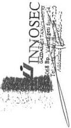
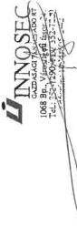
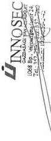
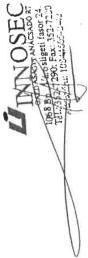
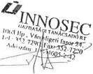
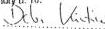

Állami Számvevőszék

# JELENTÉS

**A Közoktatási Modernizációs  
Közalapítvány működésének  
ellenőrzéséről**

2000. május

0011

---

Az ellenőrzés végrehajtásáért felelős:

IV. Vagyonellenőrzési Igazgatóság

Halász Gejza számvevő igazgató

Az ellenőrzést vezette:

Balázs Andrásné számvevő főtanácsos

Az ellenőrzésben részt vettek:

Dr. Lengyel Attila számvevő

Solymár Ágnes számvevő

Az ÁSZ által eddig ellenőrzött, illetve 2000-ben ellenőrzendő közalapítványok, alapítványok listája:

Nemzeti Gyermek és Ifjúsági (Köz)alapítvány (1992, 1996, 2000)

Magyar Vállalkozásfejlesztési Alapítvány (1994, 1996)

Az alapítványoknak juttatott állami pénzek témaellenőrzése 388 alapítványnál (1996)

Grassalkovich Kastély Közalapítvány (1996)

Magyarországi Nemzeti és Etnikai Kisebbségekért Közalapítvány (1996, 1997)

A Településekért, Régiókért Közalapítvány (1996)

1956-os Forradalom Történetének Dokumentációs és Kutatóintézete Közalapítvány (1996)

Hadigondozottak Közalapítvány (1996)

Hungária Televízió Közalapítvány (1996)

Borsod-Abaúj-Zemlén Megyei Fejlesztési Közalapítvány (1996)

Szabolcs-Szatmár-Bereg Megyei Fejlesztési Közalapítvány (1996)

Illyés Közalapítvány (1996)

Pro Professione Alapítvány (1996)

Magyar Alkotóművészeti Közalapítvány (1996)

Magyar Rádió Közalapítvány (1997, 1998)

Magyar Televízió Közalapítvány (1997, 1998)

Gandhi Közalapítvány (1997)

Magyarországi Cigányokért Közalapítvány (1997)

Nemzetközi Pető András Közalapítvány (1998)

Magyar Nemzeti Üdülési Alapítvány (1999, 2000)

Gerevich Aladár Nemzeti Sport Közalapítvány (1999)

Wesselényi Miklós Nemzeti Ifjúsági és Szabadidősport az Egészséges Életmódért Közalapítvány (1999)

Mező Ferenc Közalapítvány (1999)

Unió Labdarúgó Európa Bajnokság Közalapítvány (1999)

A Fogyatékos Gyermekek, Tanulók Felzárkóztatásáért Országos Közalapítvány (1999)

Országos Foglalkoztatási Közalapítvány (2000)

A jelentések az internet www.asz.gov.hu alatt olvashatók.

Jelentéseink az Országgyűlés számítógépes hálózatán is olvashatók.

---

V-18-29/1999-2000.

# TARTALOMJEGYZÉK

I. ÖSSZEGZŐ MEGÁLLAPÍTÁSOK, KÖVETKEZTETÉSEK, JAVASLATOK 5

II. RÉSZLETES MEGÁLLAPÍTÁSOK 13

1. A kozalapitvany megalakitásanak jogi, penzügyi, szervezeti feltetelei, muködése 13
2. A kuratorium, a titkárság és a Felügyelő Bizottság működése 16

2.1.A kuratorium mukodese 16
2.2.A titkárság muködése 18
2.3.A FelugyelBizottsag mukodese 19

3. A közalapítvány gazdálkodása, könyvvezetése 20

3.1.A belso szabalyzatok 20
3.2.A szamviteli nyilvantartasok 22
3.3.Az éves penzügyi tervek 23

3.3.1. A működési költségek tervezése 24

3.4.A kozalapitvany bevetelei 25
3.5.A kozalapitvany raforditasai 26

3.5.1.A titkárság muködési kiadásai 27
3.5.2.A kuratorium es az FB tagjainak tiszteletdija 28

3.6.Az éves beszámolok 30
3.7.A kotelezettségvallalas, utalványozás, penzkezelés, leltározás 32
3.8.A kozalapitvany likviditasa 34

4. A közalapítványnak nyújtott központi költségvetési támogatás felhasználása 35

4.1.A kozalapitvanynak nyujtott tamogatas osszege es folyositasa 35
4.2.Tamogatasi elvek, palyaztatasi rend 37
4.3.A kozalapitvany altal adott tamogatasok felhasznalasa 41

4.3.1. Az alapító okirat előírásaival ellentétes támogatási gyakorlat 42

5. A közalapítvány vagyona és hasznosítása 46

1

---

|   | 1 | 2 | 3 | 4 | 5 | 6 | 7 | 8 | 9 | 10  |
| --- | --- | --- | --- | --- | --- | --- | --- | --- | --- | --- |

---

# Rövidítések jegyzéke

ÁSZ Állami Számvevőszék

EüM Egészségügyi Minisztérium

FB Felügyelő Bizottság

KOMA Közoktatási Modernizációs Közalapítvány

MFIA Magyar-Francia Ifjúsági Alapítvány

MKM Művelődési és Közoktatási Minisztérium

NAT Nemzeti Alaptanterv

OM Oktatási Minisztérium

SZMSZ Szervezeti és Működési Szabályzat

TB társadalombiztosítás

Áht. az államháztartásról szóló 1992. évi XXXVIII. tv.

Kh. tv. a közhasznú szervezetekről szóló 1997. évi CLVI. törvény

Ptk. a Polgári Törvénykönyvről szóló 1959. évi IV. tv.

Kööt. a közoktatásról szóló 1993. évi LXXIX. törvény

Szt. a számvitelről szóló 1991. évi XVIII. törvény

SZJA törvény a személyi jövedelemadóról szóló 1995. évi CXVII. törvény

1996. évi költségvetési törvény a Magyar Köztársaság 1996. évi költségvetéséről szóló 1995. évi CXXI. törvény

1997. évi költségvetési törvény a Magyar Köztársaság 1997. évi költségvetéséről szóló 1996. évi CXXIV. törvény

115/1992. (VII. 23.) az alapítványok gazdálkodási rendjéről
Korm. rendelet

219/1998. (XII. 30.) a számviteli törvény szerinti egyéb szervezetek éves beszámoló készítésének és könyvvezetési kötelezettségének sajátosságairól
Korm. rendelet

---

$$\therefore m = \frac{3}{11}$$

---

Állami Számvevőszék
V-18-29/1999-2000.

Témaszám: 500.

# JELENTÉS

# a Közoktatási Modernizációs Közalapítvány működésének ellenőrzéséről

Az oktatási rendszer működtetésében részt vevők körét és azok feladatait, az ország jövője szempontjából meghatározó közoktatási feladatok ellátásának munkamegosztását, illetve e tevékenység fejlesztését a közoktatásról szóló, többször módosított 1993. évi LXXIX. törvény szabályozza.

A Magyar Köztársaság Kormánya az 1059/1995. (VI. 29.) Korm. határozatával azért hozta létre a Közoktatási Modernizációs Közalapítványt, hogy működésével segítse elő az oktatási miniszter közoktatás-fejlesztési feladatai közül az alábbiakat:

- az országos vizsgarendszer fejlesztését és korszerűsítését (a szakmai vizsgák kivételével);
- az iskolahálózat és iskolaszerkezet alakulásához fejlesztési program kidolgozását, az átalakulás figyelemmel kísérését;
- a közoktatásban jelentkező pedagógiai problémák vizsgálatát, a pedagógiai megoldások és eljárások kifejlesztését;
- a neveléstudományi kutatások anyagi, intézményi feltételeinek biztosítását.

A közalapítványt a Fővárosi Bíróság 1995. augusztus 16-án a 9. Pk. 61014/1995 számú végzésével, 5613 számon vette nyilvántartásba. A Fővárosi Bíróság 1998. július 2-án a KOMA-t - 1998. január 1-jei visszamenőleges hatállyal - kiemelkedően közhasznú szervezetnek minősítette.

A Kormány a Közoktatási Modernizációs Közalapítvánnyal kapcsolatban az alapítót megillető jogkör gyakorlására - az alapító okiratban, illetve az alapításról szóló kormányhatározatban meghatározott terjedelemben - az oktatási minisztert hatalmazta fel.

A Fővárosi Főügyészség 1996. márciusában törvényességi vizsgálatot tartott a közalapítványnál, a feltárt hiányosságok rendezése érdekében felszólalással élt. A kuratórium az ügyészségi felszólalást követően a hatáskörébe tartozó

3

---

ügyekben csak részben, illetve késedelmesen tette meg a szükséges intézkedéseket.

A közalapítvány éves beszámolóit 1996-tól könyvvizsgáló auditálja.

A közalapítvány alapító okiratban rögzített célja, hogy támogassa a Nemzeti Alaptantervre és az országos vizsgakövetelményekre alapozott, választható tantervek fejlesztését és terjesztését, az országos vizsgák (érettségi és alapvizsga) intézményi szintű fejlesztését, a közoktatás információs rendszere kialakítását és fejlesztését, neveléstudományi kutatásokat, pedagógiai problémák vizsgálatát, pedagógiai innovációt, az iskola és társadalmi környezete kapcsolatát javító projekteket, a közoktatásban jelentkező mentálhigiénés és nevelési problémák megelőzését, a környezeti nevelés elősegítését, a pedagógustovábbképzéseket megalapozó fejlesztéseket és az egészséges életmód fejlesztésével összefüggő pedagógiai programokat.

Induló vagyonát a Kormány az alapító okiratban 300 millió Ft-ban határozta meg, ezen belül a törzsvagyon összege 10 millió Ft. A KOMA bevételei éves költségvetési törvényekben jóváhagyott előirányzatok, a minisztériumok által adható céltámogatások és pályadíjak, a természetes és jogi személyek önkéntes befizetései, valamint az alapító okiratában meghatározott jogcímű egyéb bevételek.

Az Országgyűlés az éves központi költségvetési törvényekben a KOMA részére az 1996-1999. években összesen 1.433 millió Ft támogatást hagyott jóvá.

Az Állami Számvevőszék ellenőrzi a Ptk. 74/G. §-ának (8) bekezdése alapján a közalapítványok gazdálkodásának törvényességét és célszerűségét, az ÁSZ tv. 2. § (5) bekezdése alapján a központi költségvetésből juttatott támogatás felhasználását az alapítványoknál, a Kh. tv. 21. §-a alapján a költségvetési támogatás felhasználását a közhasznú szervezeteknél.

Az ellenőrzés keretében arra kerestük a választ, hogy

- a közalapítvány működése során hogyan segítette elő a közoktatásról szóló 1993. évi LXXIX. törvényben szereplő, valamint az alapító okiratban meghatározott célok és feladatok megvalósítását;
- szabályosan és eredményesen gazdálkodott-e;
- rendeltetésszerűen és eredményesen használta-e fel a központi költségvetési támogatást;
- törvényes és eredményes volt-e a közalapítványnak átadott vagyon kezelése és hasznosítása.

Az ellenőrzés a közalapítvány megalakulásától az 1999. december 31-ig tartó időszakra terjedt ki.

4

---

I. ÖSSZEGZŐ MEGÁLLAPÍTÁSOK, KÖVETKEZTETÉSEK, JAVASLATOK

# I. ÖSSZEGZŐ MEGÁLLAPÍTÁSOK, KÖVETKEZTETÉSEK, JAVASLATOK

## A közalapítványi célok teljesítése

Az oktatási miniszternek a Kööt.-ban meghatározott közoktatás-fejlesztési feladatai - amelynek segítésére a Kormány a közalapítványt létrehozta - az ellenőrzött időszakban több alkalommal módosításra kerültek, a közalapítvány alapító okiratában megjelölt céloknál e változások azonban csak részben érvényesültek.

A kuratórium működése első éveiben a NAT egyes témáiban folyó oktatás elősegítését és azoknak a pedagógiai alaphelyzeteknek a feltárását támogatta, amelyek segíthetik, illetve akadályozhatják az oktató-nevelő tevékenységet, így a NAT műveltségterületei nevelési feladatainak megvalósítására, módszereinek kialakítására. A további években a kuratórium általánosabb szemléletű, tematikus megközelítésű pályázatokat hirdetett.

Bár a pályázati célok témaválasztásai fokozatosan sokrétűbbé váltak, a közalapítvány elsődlegesen a NAT-ra és az országos vizsgakövetelményekre alapozott választható tantervek, tanítási programok fejlesztését támogatta, az alapító okiratban megjelölt több cél támogatása háttérbe szorult.

A kuratórium a támogatások odaítélésével az állami közfeladatokból az elosztó funkciót vette át, sőt 1997-ben - jutalék ellenében - egy MKM által kiírt pályázat elbírálását, a támogatási összegek megállapítását és folyósítását is elvégezte, melynek fedezetét, mint céltámogatást kapta meg - utólag - a minisztériumtól.

Az alapító okiratban szereplő célok alapján a kuratórium évente határozta meg a támogatási elveket, majd pályázatási szabályzatának megfelelően hirdette meg és bírálta el a pályázatokat.

1999. végéig 24 pályázatot hirdettek meg, a beérkezett 9857 pályázatból 4359 pályázó összesen 1.336 millió Ft támogatásban részesült. Egy nyertes pályázó átlagosan 307 ezer Ft támogatást kapott.

A kuratórium a pályázati témák kiválasztásában, a kiírások megvitatásában és a döntéseknél körültekintő munkát végzett, több esetben a döntéseket részletes szakmai viták előzték meg. A kuratórium és a titkárság a pályázatokat megalapozottan bírálta el, kivéve 23 db, összesen 40,3 millió Ft-tal támogatott pályázatot, melyek a közalapítványi célokkal, illetve az adott pályázati felhívás követelményeivel nem voltak összhangban. A bírálást és minősítést mintegy 400 szakértő segítette. A nyertes pályázók döntő többsége az előírt határidőre szakmai beszámolót készített pályázata megvalósulásáról és az előírt határidőre igazolta ráfordításait.

Az ellenőrzés kifogásolta, hogy az MKM 1996-ban a tárgyévi költségvetési törvényben a közalapítvány számára jóváhagyott 366,5 millió Ft előirányzatból

5

---

I. ÖSSZEGZŐ MEGÁLLAPÍTÁSOK, KÖVETKEZTETÉSEK, JAVASLATOK---

66 millió Ft felhasználására a törvényben jóvá nem hagyott és a közalapítvány alapító okiratában nem szereplő célra kötött megállapodást a kuratóriummal, az így biztosított támogatást (külföldi nyelvtanárok díjazására) az MKM által kijelölt alapítványok nyilvános pályázat, felhasználási szerződés és utólagos elszámoltatás nélkül kapták meg.

A kuratórium a multimédia pályázatok nyerteseivel - a közalapítványi támogatással létrejött, majd piaci forgalomba került termékekhez kapcsolódóan - az elért nyereségből részesedést biztosító megállapodást kötött. A nyertes pályázók az első termékeket 1999. végén értékesítették, amelyből a közalapítványnak a helyszíni ellenőrzés befejezésének időpontjáig 1,5 millió Ft-ot meghaladó bevétele keletkezett.

A közalapítvány támogatásával létrejött szellemi értékek eddig csak részben jutottak el (pld. kiadványok, konferenciák révén) mindazokhoz, akik ezeket hasznosítani tudnák. A kuratórium fokozatosan alakítja ki azokat a módszereket, amelyek segítenek a létrehozott szellemi értékek hasznosításában.

### A kuratórium és az FB összetétele, díjazása, működése

A kuratóriumi elnök, illetve a kurátorok személye a KOMA megalakulása óta többször változott, a tagok száma 11 főről 17 főre nőtt. 1998. őszén az alapító új kuratóriumi elnököt és 7 új kurátort kért fel. A kuratóriumi tagságra csak oktatási szakemberek kaptak felkérést, pénzügyi, számviteli képzettségű tagja a kuratóriumnak a megalakulása óta nem volt.

A kuratóriumi tagok egynegyede köztisztviselő az Oktatási Minisztériumban. A kuratórium létszámát az operatív munkavégzés szempontjából az ellenőrzés magasnak tartja. Az eddig tartott ülések több, mint felén nem jelent meg a minősített többséghez szükséges számú kurátor, teljes létszámban a kuratórium még nem tudott ülést tartani.

Az új kuratórium 1998. őszétől több intézkedést tett a gazdálkodás szabályozottsága és szabályossága feltételeinek kialakítására, működésének a törvényekben előírt részletezettségű dokumentálására, a szakmai közvélemény jobb tájékoztatására.

Az ellenőrzés kifogásolta, hogy az alapító okirat nem szabályozta és nem korlátozta a kuratóriumi elnök és kurátorok, valamint az FB elnök és tagok tiszteletdíjának nagyságát, nem rendelkezett az FB elnök és tagok tiszteletdíjának megállapításával kapcsolatos hatáskörről, így a kuratórium, illetve az FB felhatalmazás nélkül állapította meg az FB elnök és tagok tiszteletdíját. Az FB nincs függelmi viszonyban a kuratóriummal, megbízását az alapítótól kapta, beszámolásra is az alapító számára kötelezett. Álláspontunk szerint az FB kuratóriumot ellenőrző tevékenységével összeférhetetlen, hogy a kuratórium állapította meg az FB tagjai számára a tiszteletdíjat.

A két testületnek kifizetett tiszteletdíj összege az ellenőrzött időszakot tekintve évről évre dinamikusan nőtt, 1996-hoz képest 1999-re - részben a kurátorok létszámának, részben a kuratórium által elvégzett feladatok növekedése, illetve a tiszteletdíjak 1999. évi nagymértékű (57,2 %-os) emelése miatt - közel megtízszereződött.

---6

---

I. ÖSSZEZGŐ MEGÁLLAPÍTÁSOK, KÖVETKEZTETÉSEK, JAVASLATOK

Költségtérítést csak a kuratórium néhány tagja, kizárólag útiköltség jogcímen, tételes elszámolás alapján vett igénybe.

A kuratórium általában egy-két havi gyakorisággal ülésezett, a pályázatok kiírásának előkészítéséhez és elbírálásához igazodóan. A határozatok túlnyomó többsége törvényes volt, a helyszíni ellenőrzés azonban az 1998-at megelőző években olyan határozatokat is talált, melyekről nem az alapító okiratban előírt számú kurátor döntött.

A közalapítvány tevékenységének és gazdálkodásának legfontosabb adatait nyilvánosságra kell hozni. Az ellenőrzés azt tapasztalta, hogy a kuratóriumnak a nyilvánosságot és a szakmai közvéleményt tájékoztató gyakorlata nem szabályozott és még nem teljesen kiforrott, bár 1999-től kezdve a közszolgálati médiában, a szakfolyóiratokban, saját kiadványaikban, valamint országos konferenciákon már rendszeresebben biztosították az érintettek tájékoztatását.

Az FB tagjainak száma a közalapítvány megalapítása óta 5 fő, a jelenlegi tagokat - 2-2 fő közgazdászt és jogászt, 1 fő marketing szakembert - az alapító 1998-ban kérte fel.

Az FB az ellenőrzött időszak csaknem egészében munkaterv, ügyrend nélkül tevékenykedett, 1998. előtti tevékenységéről írásos anyag (pl. előterjesztés, határozat, jegyzőkönyv, emlékeztető stb.) nem készült. Az FB a kuratóriumi üléseken rendszeresen képviseltette magát, az aktuális kérdésekben véleményt nyilvánítottak, szükség esetén az MKM-nél kezdeményezték a felmerült problémák megoldását.

Az FB a közalapítvány működéséhez, gazdálkodásához, számviteléhez, ügyviteléhez, kötelezettségvállalásaihoz kapcsolódó ellenőrző tevékenységet - dokumentált módon - nem végzett. Az FB az ülésein elsősorban az éves beszámolókkal, illetve az éves pénzügyi tervekkel foglalkozott, az ezekkel kapcsolatos megállapításokat nem foglalta írásba.

### A közalapítvány szabályozottsága, gazdálkodása

A közalapítvány szabályozottsága az ellenőrzés befejezésekor még nem volt teljes körű, egyes szabályzatok hiányoztak vagy hiányosak voltak. A közalapítvány hatályos SZMSZ-e összhangban volt a Ptk. és az alapító okirat előírásaival, alkalmas volt a kuratórium munkájának szabályozására, a közalapítvány képviseleti, bankszámla és értékpapír befektetései feletti rendelkezési jog szabályozása kivételével, mely ellentétes volt a kuratóriumi elnöknek az alapító okiratban meghatározott és a Fővárosi Bíróság által nyilvántartásba vett képviseleti jogával.

Az SZMSZ a kuratórium és a titkárság feladatait nem szabályozta teljes körűen, továbbá nem határozta meg, hogy kiket tekint vezető beosztású alkalmazottnak. Az SZMSZ nem tartalmazta kuratóriumi és FB tagok költségtérítésként elszámolható költségeinek körét, a felmerült költségek indokoltsága igazolásának és ellenőrzésének módját, az elszámolás határidejét. A kuratórium és a titkárság ügyrendjét, a befektetési és a munkavédelmi szabályzatot, valamint a munkaruha juttatásról, gépkocsi használatról szóló belső utasításokat a helyszíni ellenőrzés befejezéséig nem készítették el.

7

---

I. ÖSSZEGZŐ MEGÁLLAPÍTÁSOK, KÖVETKEZTETÉSEK, JAVASLATOK---

A közalapítványnak van számviteli politikája (ennek része a számlatükör és az alkalmazott értékelési eljárások), leltározási és házipénztár szabályzata. Nincs számlarendje, mely szabályozná az Szt.-ben előírt beszámoló elkészítését alátámasztó könyvvezetést. A számviteli politika csak részben felelt meg az Szt. előírásainak, nem rögzítette, hogy mi a számviteli elszámolás szempontjából lényeges elem, az ellenőrzéssel, önellenőrzéssel kapcsolatos jelentős összegű hiba, illetve az adósonkénti együttesen kis összegű követelés. A számviteli politikát - a helyszíni ellenőrzés 2000. februári befejezéséig - a jogszabályok változásainak megfelelően nem aktualizálták.

A helyszíni ellenőrzés megállapításai alapján - 2000. január - április között - a kuratórium már több intézkedést tett a feltárt hiányosságok megszüntetésére: elkészítette a befektetési szabályzatot, a számlarendet, a munkavédelmi szabályzatot, a munkaruha juttatásról és a gépkocsi használatról szóló belső utasítást. Módosították a közalapítvány számviteli politikáját, melyben rögzítették, mit tekintenek lényeges elemnek, jelentős összegű hibának, adósonkénti együttesen kisösszegű követelésnek, illetve a vonatkozó jogszabályok változásainak megfelelően a számviteli politika aktualizálása is megtörtént.

Az alapító okirat a működési költségek vetítési alapjául az „éves költségvetési kiadások”-at jelölte meg, azonban az ellenőrzés álláspontja szerint nem egyértelmű, hogy a működési kiadások korlátjaként a tervezett, vagy a tényleges kiadások meghatározott mértékét kell-e figyelembe venni. A működési költségeket döntően a tárgyévben teljesített alapítványi célú kiadások nagysága határozza meg, mivel a kuratórium és a titkárság munkája elsősorban a pályázatok lebonyolításához kötődik.

A könyvvezetésben az alapítványi célú tevékenységek bevételeit az alapító okiratnak megfelelő részletezésben mutatták ki, az alapítványi célú tevékenység számbavételére azonban a közalapítványnál kialakított számviteli rendszer csak részben volt alkalmas, mivel a közalapítvány kezelő- és munkaszervezete működési költségeit nem választották el az alapítványi célú tevékenység közvetlen költségeitől. Azokat a támogatásokat, melyeket a közalapítvány az alapító okiratában meghatározott feladatai fedezetére kapott, de ezeket nem saját maga látta el, hanem pályázati úton használta fel, a jogszabályi előírás módosítása ellenére - 1999. január 1-jét követően továbbra is - bevételként, és nem kötelezettségként vették nyilvántartásba.

A közalapítvány egyszerűsített mérlegei és eredmény-kimutatásai könyvvezetéssel és leltárral alátámasztottak voltak. Az ellenőrzés kifogásolta az induló tőke és tőkeváltozás mérlegsorok tartalmát az ellenőrzött időszak valamennyi mérlegében, mivel a közalapítvány alapító okiratában megjelölt 300 millió Ft induló vagyon helyett a mérlegben - tévesen - 10 millió Ft induló tőkét mutattak ki. Az induló tőke összege a helyszíni ellenőrzés megállapítása alapján időközben helyesbítésre került. Az 1996. és 1997. évi mérlegben a rövidlejáratú kötelezettségek mérlegsorok - helytelenül - nem tartalmazták az 1996. évi támogatási szerződésekben vállalt, de a következő évekre áthúzódott kötelezettségeknek a tárgyévi mérleg fordulónapján fennálló összegét.

Az ellenőrzés kifogásolta a kuratórium pénzügyi tervező tevékenységét, az éves pénzügyi tervek tartalmát, megalapozottságát, az alapítványi célú kiadások

---8

---

I. ÖSSZEGZŐ MEGÁLLAPÍTÁSOK, KÖVETKEZTETÉSEK, JAVASLATOK

tervezési módszerét. A kuratórium az ellenőrzött időszakban - 1999 kivételével - nem hagyta jóvá az éves pénzügyi tervet, pedig az alapító okirat szerint a pénzügyi terv jóváhagyása a kuratórium megkülönböztetett fontosságú döntéseinek egyike, elfogadásához kétharmados szótöbbség szükséges. A tervezett kiadásokat 1997-1999. években összességében csak 54 %-ra - ezen belül az alapítványi célú kifizetéseket (pályázati támogatásokat) 47 %-ra, a működési kiadásokat 89 %-ra - teljesítették.

A közalapítvány összes bevétele az ellenőrzött időszakban 2.149 millió Ft volt, melyből a központi költségvetési támogatás (a 10 millió Ft összegű törzsvagyon nélkül) 1.825 millió Ft-ot, a pénzügyi műveletek bevételei 320 millió Ft-ot, a pályázati úton elnyert bevételek 4 millió Ft-ot tettek ki. Az ellenőrzött időszak minden évében a központi költségvetési támogatás részaránya meghaladta a közalapítvány összes bevételének a háromnegyed részét. A civil szféra pénzügyi erőforrásait nem sikerült a kuratóriumnak a közalapítványi célok finanszírozásába bevonni. A közalapítvány jogosult az adózók SZJA befizetései 1 %-ának fogadására, az ellenőrzött időszakban e forrásból azonban még nem keletkezett bevétele, a kuratórium csak a 2000. év elején tett először intézkedést ennek előmozdítása érdekében.

A közalapítvány eszközeinek 96,5 %-át a forgóeszközök tették ki, tehát a likvid eszközök meghatározó arányt képviseltek. A szabad pénzeszközök 93 %-át - az alapító okirat előírásainak megfelelően - a kuratórium államilag garantált értékpapírokba fektette. Az ellenőrzött időszak alatt a vásárolt értékpapírok árfolyamnyereségéből származó hozam 210 millió Ft volt.

A közalapítvány a központi költségvetési támogatást mindegyik évben rendszertelenül, általában az év második felében kapta meg. A késedelmes finanszírozás - 1997 kivételével - az MKM mulasztásai miatt történt, mivel a minisztérium munkatársai a programfinanszírozáshoz szükséges programismertetőket késedelmesen, május-szeptember hónapokban készítették el. 1997-ben a KOMA kuratóriuma az előző évi támogatás felhasználásáról szóló beszámolóját csak 1997 májusában juttatta el a minisztériumhoz, az 1997. évi programismertető pedig szeptemberben készült el. A tervszerűtlen finanszírozás a kuratóriumban bizonytalanságot keltett, erre hivatkozva rendszeresen előfordult, hogy a tárgyévben elbírált pályázatokra megítélt támogatásokat csak a következő évben fizették ki. Ezt a gyakorlatot az ellenőrzés kifogásolta, mivel a közalapítványnak likviditási gondjai nem voltak. Az 1996-ban kapott induló vagyon nagyobb része - mint szabad pénzmaradvány - folyamatosan rendelkezésre állt, döntően ez tette lehetővé az értékpapír befektetéseket is.

A számlavezető banknál és az értékpapír forgalmazó rt.-nél bejelentett aláírás módja ellentétes volt a kuratóriumi elnöknek az alapító okiratban meghatározott és a Fővárosi Bíróság által nyilvántartásba vett képviseleti jogával, mivel lehetővé tette, hogy a titkárság vezetője és a könyvelő cég munkatársai a kuratóriumi elnök nélkül is rendelkezhessenek a bankszámla és a befektetések felett.

9

---

I. ÖSSZEGZŐ MEGÁLLAPÍTÁSOK, KÖVETKEZTETÉSEK, JAVASLATOK

# Az ellenőrzés megállapításai alapján javasoljuk, hogy

# a Kormány

tekintse át a Közoktatási Modernizációs Közalapítvány alapító okiratát, és az 1006/2000. (I. 18.) Korm. határozat 2. pontjában meghatározott feladatok keretében

1. vizsgalja felul es - szukseg szerint - bovitse az alapito okiratban megjelott kozalapitvanyi celokat, osszhangban az oktatasi miniszternek a Koot. tobbszor modositott 95. \(\S\) -aban meghatarozott kozoktatas-fejlesztesi feladataival;
2. pontositsa a kozalapitvany mukodesi koltsegeivel kapcsolatos alapitoi elorast, a kozalapitvany mukodesi koltsegeit a targyevben teljesitett alapitvanyi celu kiadasok aranyaban hatarozza meg;
3. merlegelje, hogy a kozalapitvany celjainak megvalositasahoz szukseges es celszeru-e a kuratorium, ezen belul a koztisztvelok jelenlegi letszama;
4. allapitsa meg az FB tagok tiszteletdijat, vagy hatalmazza fel erre az alapito nevenekormanyzati feleloskent eljaro oktatasi miniszert;
5. az FB-tol igenyelje a Kh. tv.-ben es az alapito okiratban meghatarozott feladatai maradektalan ellatasat es errol az alapito, vagy az alapito nevenekormanyzati feleloskent eljaro oktatasi miniszter evenkenti rendszeres tajekoztatasat;

# a Közoktatási Modernizációs Közalapítvány kuratóriuma

1. dolgozza ki a kozalapitvany szakmai tamogatasi koncepciój - figyelemmel az alapito okiratban rogzitet valamennyi celkituzes tamogatasanakbiztositasara - es a jovoben az eves tamogatasi elveket erre figyelemmel hatarozza meg;
2. intezkedjen a palyazatoknak a kozhaszn szerveretekrol szol 1997. evi CLVI. törveny 15. § (1) - (2) bekezdesei, az alapito okirat és a palyaztatasi szabalyzat részletes elorásainak megfelelo tartalomban történ nyilvanos meghirdetéserol, gondoskodjon arrol, hogy az odaitelt tamogatasok maradektalanul felejenek meg a palyazati felteteleknek;
3. biztositsa - a Kh. tv. 7. §-anak megfeleloen, az alapito okiratban es az SZMSZ-ben meghatarozott részletes szabalyok szerint - a kuratoriumi ülesek hatarozatképességét, a hatarozatok törvenyességét;
4. dolgozza ki azokat a modszereket, amelyek segitségével a kozalapitvany nagyobb mertékben hozájuthat az alapito okirataban megjelölt bevételi forrasokhoz, igy pl. a természetes es jogi személyek önkéntes befizeteseihez;
5. intezkedjen, hogy a kozalapitvany szamvitele legyen alkalmas a kozalapitvanyi celu tevekenyseg alapito okiratnak megfelelo szambavetele, a

10

---

I. ÖSSZEGZŐ MEGÁLLAPÍTÁSOK, KÖVETKEZTETÉSEK, JAVASLATOK

közalapítványi és működési célú kiadások szabályos elkülönítésére, a kötelezettségek nyilvántartására;

6. gondoskodjon a bankszámlák feletti rendelkezésre vonatkozó aláírások bejelentésének rendezéséről, haladéktalanul vonja vissza a könyvelést végző kft. munkatársainak bankszámlák feletti rendelkezési jogát;
7. módosítsa az SZMSZ-t a következők figyelembevételével:
a) a közalapítvány vagyona feletti rendelkezési jog szabályozása kerüljön összhangba az alapító okirattal;
b) szabályozza az értékpapír befektetésekkel kapcsolatos jogköröket;
c) határozza meg a pénzügyi tervezés folyamatának, az éves pénzügyi tervnek és az esetleges évközi módosításoknak a tartalmi és formai követelményeit;
d) szabályozza - a Kh. tv. 7. § (2) bekezdése b) és d) pontjának, illetve az alapító okirat előírásának megfelelően - a nyilvánosság tájékoztatására vonatkozó eljárási rendet (a kuratórium határozatainak az érintettekkel való közlési, illetve nyilvánosságra hozatali módja, a közalapítvány működésének, szolgáltatási igénybevétele módja, a beszámolók nyilvánosságra hozása, valamint a szakmai nyilvánosság rendszeres tájékoztatása);
e) szabályozza a költségtérítésként elszámolható költségek körét, az indokoltság igazolásának és ellenőrzésének módját, az elszámolás határidejét;
8. készítse el és hagyja jóvá a közalapítvány működéséhez szükséges belső szabályzatokat, kiemelten a kuratórium és a titkárság ügyrendjét és a pályáztatási szabályzatot.

11

---

II. RÉSZLETES MEGÁLLAPÍTÁSOK

12

---

II. RÉSZLETES MEGÁLLAPÍTÁSOK

## II. RÉSZLETES MEGÁLLAPÍTÁSOK

### 1. A KÖZALAPÍTVÁNY MEGALAKÍTÁSÁNAK JOGI, PÉNZÜGYI, SZERVEZETI FELTÉTELEI, MŰKÖDÉSE

A KOMA-t a Kormány az 1059/1995. (VI. 29.) Korm. határozattal alapította, a többször módosított Kööt. 95. § (1) bekezdése b)-e) pontjaiban felsorolt, közoktatás-fejlesztéssel kapcsolatos miniszteri feladatok ellátásának segítésére. A KOMA működésén keresztül minden területi vagy intézményi pedagógus műhelynek lehetőséget kívántak adni - a szakmai prioritások alapján meghatározott - éves pályázatokon való részvételre, innovációs eredményeik hasznosítására.

Az alapító okirat a Kööt. 95. § (1) b) - e) pontjaiban felsorolt közoktatás-fejlesztési feladatok ellátásának segítéséhez a közalapítványi célokat a következőkben határozta meg:

- a Nemzeti Alaptantervre és az országos vizsgakövetelményekre alapozott választható tantervek, tanítási programok (beleértve a nemzeti és etnikai iskolák, a speciális nevelést igénylők tanterveit és programjait) fejlesztésének és terjesztésének támogatása;
- az országos vizsgák (érettségi vizsga, alapvizsga) intézményi szintű fejlesztésének támogatása;
- a közoktatás „információs rendszere” kialakításának és tájékoztatásfejlesztésének támogatása iskolai és iskolarendszer szinten;
- a közoktatás fejlesztését szolgáló neveléstudományi kutatások támogatása;
- a közoktatásban jelentkező pedagógiai problémák vizsgálata, pedagógiai megoldások és eljárások kifejlesztése körében a pedagógiai innováció támogatása;
- az iskola és társadalmi környezete, az iskola és a fenntartó kapcsolatát javító, a diákság és a szülők demokratikus kultúráját erősítő projektek támogatása, elsősorban a diákönkormányzatok, a szülői civil szerveződések, a szülői munkaközösségek és az iskolaszék intézményének fejlesztése;
- a közoktatásban jelentkező mentálhigiénés és nevelési problémák megelőzésének és pedagógiai megoldásának előmozdítása;¹
- a környezeti nevelés elősegítése;¹
- a pedagógus-továbbképzés megalapozását célzó kutatások, fejlesztések támogatása;¹
- az egészséges életmód fejlesztésével összefüggő pedagógiai programok és megoldások kidolgozásának támogatása.¹

(¹ E célokkal az alapító okirat az 1997., illetve az 1998. évi módosításkor bővült.)

13

---

II. RÉSZLETES MEGÁLLAPÍTÁSOK---

A KOMA induló vagyona az MKM 1995. évi fejezeti kezelésű előirányzataiból biztosított 300 millió Ft volt, melyből a törzsvagyon összegét az alapító 10 millió Ft-ban jelölte meg. Az alapító okirat lehetővé tette természetes és jogi személyek csatlakozását, illetve adományozás révén történő hozzájárulásukat a KOMA céljainak megvalósulásához.

A 300 millió Ft induló vagyont az MKM átutalta a közalapítvány számára.

A közalapítvány létrehozásakor a kuratórium tagjainak száma 11 fő, az FB tagjainak száma 5 fő volt. A vagyon kezelésével összefüggő pénzügyi és számviteli feladatok ellátására és a folyamatos ügyintézésre az alapító okirat 3 fős titkárság megszervezését írta elő, amelyet a kuratóriumi elnök által kinevezett titkár vezet.

A KOMA bírósági bejegyzése a kormányhatározat után rögtön beadott bejegyzési kérelem alapján 1995. augusztus 16-án megtörtént.

A közalapítvány megalapításához és működésének megindításához szükséges adó- és TB igazgatási, eljárási intézkedések a bírósági bejegyzést követően egy hónapon belül megtörténtek.

A Kormány, mint alapító nevében és felhatalmazása alapján az eredeti alapító okirat szerint a művelődési és közoktatási miniszter járt el. A Kormány által alapított közalapítványok és alapítványok kormányzati felelőseinek kijelöléséről szóló 1117/1998. (IX. 18.) Korm. határozat - a kormányzati struktúrában történt változásokra tekintettel - a Közoktatási Modernizációs Közalapítvány tekintetében az alapítót megillető jogkör gyakorlására - az alapító okiratban, illetve az alapításról szóló kormányhatározatban meghatározott terjedelemben - az oktatási minisztert hatalmazta fel.

A közalapítvány alapító okirat szerinti székhelye 1055 Budapest, Báthory utca 10. Az irodahelyiségeket az MKM-től - jelenleg az OM-től - bérli. A közalapítvány 1995. augusztusi bírósági nyilvántartásba vételekor nem volt megoldott a megfelelő elhelyezés, jelenlegi székhelyükre 1996. márciusában költöztek.

1996. márciusáig a titkárság és a kuratórium „albérletben” tudta végezni tevékenységét, az MKM-ben, illetve a Kurátor Kft-nél. Még 1996-ban sem volt biztos, hogy az elhelyezés végleges lesz, mert irodahelyiségeikre más szervezet is igényt tartott. Helyiség problémáik csak tevékenységük megkezdése után több mint egy évvel rendeződtek. A helyszíni ellenőrzés idején a közalapítvány 6 szobát és 1 tárgyalótermet bérelt, ez a tevékenység ellátásához elegendő.

A működéshez szükséges technikai feltételeket (berendezés, számítógépek) az irodahelyiségek rendelkezésre állását követően fokozatosan teremtették meg.

Az irodák berendezése kulturált, mind a teljes-, mind a részmunkaidős alkalmazottaknak biztosított a számítógép.

A 11 fős kuratórium az 1995. augusztusi bírósági bejegyzés után azonnal megalakult, az első hónapban két ülést tartott.

---14

---

II. RÉSZLETES MEGÁLLAPÍTÁSOK

Az FB - a helyszíni ellenőrzés során rendelkezésre bocsátott információk szerint - nem tartott ülést a közalapítvány létrehozásának első évében, 1995-ben.

A 3 fős titkárság 1995. végére jött létre, a további években az állandó létszám fokozatosan 5 főre bővült, valamint megbízási szerződésekkel szükség szerint nyugdíjasok, illetve részmunkaidősök munkavégzését is igénybe vették.

A Kh. tv. 27. § -ában előírt kötelezettségeket maradéktalanul teljesítették, 1998. májusában benyújtották a KOMA kiemelkedően közhasznú szervezetként történő nyilvántartásba vételéhez szükséges dokumentumokat a Fővárosi Bíróságnak. A Fővárosi Bíróság 1998. július 2-án a KOMA-t - 1998. január 1-jei visszamenőleges hatállyal - kiemelkedően közhasznú szervezetnek minősítette.

Az MKM előkészítette az alapító okirat szükséges módosítását, melyet a Kormány az 1998. április 16-i ülésén elfogadott. A módosítás a Kh. tv. előírásainak megfelelően kiterjedt a tevékenységi kör pontosítására, a közalapítványi vagyon korábban részletesebb felhasználási szabályaira, a kuratórium és az FB működési szabályainak kiegészítésére, az összeférhetetlenségi szabályok rögzítésére, a nyilvánosság tájékoztatásával kapcsolatos előírásokra. Egyéb módosításokról is döntött az alapító, így pl. bővítette a közalapítványi célokat, új kuratóriumi tagokat kért fel, meghatározta az SZMSZ-szel és a titkárság működési szabályaival kapcsolatos követelményeket.

Az új kuratóriumi tagok felkérését követően a kuratórium előkészítette az SZMSZ szükséges módosításait, az FB tagok nyilatkoztak arról, hogy személyükkel kapcsolatban nem merülnek fel a Kh. tv. 8. § (2) bekezdésében megjelölt összeférhetetlenségi tényezők.

A Fővárosi Főügyészség 1996. márciusában törvényességi vizsgálatot tartott a közalapítványnál.

A vizsgálat kiterjedt az alapító okiratban foglaltakra; a KOMA tevékenységének beindítására; az induló vagyon átutalására; a kuratórium, a FB és a titkárság működésére; a pénzügyi terv és az éves beszámoló elkészítésére.

A Főügyészség az ügyészségről szóló 1972. évi V. törvény 16.§. (1) bekezdése alapján felszólalással élt.

A felszólalás a következő kifogásokat tartalmazta:

- az alapító okirat nem szabályozta egyértelműen a minősített többséget megkívánó ügyekkel kapcsolatos döntéseket, a határozatképességet;
- a kuratóriumi ülésekről nem készültek jegyzőkönyvek;
- nem volt pályázati szabályzat;
- nem készült éves pénzügyi terv;
- a Magyar-Francia Ifjúsági Alapítványnak (MFIA) az alapító okirattal ellentétesen adtak támogatásokat.

A kuratórium az ügyészségi felszólalást követően a hatáskörébe tartozó ügyekben a következő intézkedéseket tette:

15

---

II. RÉSZLETES MEGÁLLAPÍTÁSOK---

A kuratóriumi ülésekről 1996. hátralévő részében már készültek jegyzőkönyvek, de 1997-ben és 1998. novemberéig ismét nem készült sem jegyzőkönyv, sem emlékeztető, csak a határozatokat sorolták fel, ami ellentétes volt az SZMSZ előírásaival, s nem adott teljes képet a végzett munkáról. 1997-től kezdődően a kuratóriumi ülésekről hangfelvétel készült, ami az elhangzottak nyomon követését általában biztosítja. Igen alapos és részletes jegyzőkönyvek készültek az 1999. évi ülésekről.

A pályázati szabályzat tervezet formájában csak másfél év múltán készült el, végleges, elfogadott formája még a vizsgálat időpontjában is hiányzott.

Az 1997. évtől kezdve készítettek pénzügyi terveket.

Az 1996. év hátralévő részében - a Főügyészség felszólalását követően - még utaltak át támogatást az MFIA-nak. A későbbi években a kifogásolt célra már nem adott támogatást a kuratórium (részletesen a 4.3.1. pontban).

Az ellenőrzés megállapításai szerint a kuratórium tehát csak részben, illetve késve tette meg a szükséges intézkedéseket.

Az alapító okirat kifogásolt részét - az MKM előterjesztésében - a Kormány az 1118/1996. (XII. 11.) Korm. határozatával módosította, ezt követően a Fővárosi Bíróság 1997. március 4-én nyilvántartásba vette.

## 2. A KURATÓRIUM, A TITKÁRSÁG ÉS A FELÜGYELŐ BIZOTTSÁG MŰKÖDÉSE

### 2.1. A kuratórium működése

A kuratóriumi elnök, illetve a kurátorok személye a KOMA megalakulása óta többször változott. A tagok száma a megalakuláskor 11 volt, 1997. március 4. óta 17 fő. A kuratórium jelenlegi személyi összetételében 1998. október 21-e óta tevékenykedik, öt tagjának megbízatása 2000. március 4-én lejárt.

A kuratórium első két elnöke és a kuratórium hat tagja lemondott, két tagját 1998-ban az oktatási miniszter az új összetételű kuratórium kinevezésekor visszahívta.

A kuratóriumi tagokat a művelődési és közoktatási miniszter, illetve az oktatási miniszter pedagógusok és pedagógiai kutatásokkal foglalkozók közül kérte fel. A pedagógusok túlnyomó többsége intézményvezető.

A volt és a jelenlegi kurátorok pedagógus szakemberek, akik jól ismerik a közalapítványi célok megvalósításához szükséges szakmai feladatokat. A közalapítványok pénzügyi és számviteli szabályozásában, gazdálkodásában járatos szakember a kuratórium tagjai között a kuratórium megalakulása óta nem volt.

A jelenleg hatályos alapító okirat szerint 1998. októbere óta négy kurátor - a kuratóriumi tagok egynegyede - köztisztviselő az Oktatási Minisztériumban, miközben az alapítót megillető jogkör gyakorlására - az alapító okiratban, illetve az alapításról szóló kormányhatározatban meghatározott terjedelemben - a Kormány felhatalmazása alapján az oktatási miniszter jogosult. A köz-

---16

---

II. RÉSZLETES MEGÁLLAPÍTÁSOK

tisztviselő kurátorok fenti aránya a Ptk. 74/C. § (3) bekezdésében foglalt előírással nem ellentétes, a hatályos 1052/1997. (V. 21.) Korm. határozat 1/5/d. pontja szerint azonban az állami szerv képviseletét a kuratóriumban lehetőleg kerülni indokolt. A Kormány által alapított közalapítványok alapítói jogainak gyakorlásával kapcsolatos kormányzati feladatok meghatározásáról szóló 1006/2000. (I. 18.) Korm. határozat 2. pontja előírta, hogy 2000. március 1-ig rögzíteni szükséges a köztisztviselő kuratóriumi tagok részvételének szabályait.

Az alapító okirat és az SZMSZ részletesen szabályozta a kuratórium működését, de emellett előírta a kuratóriumi ügyrend készítését is. A kuratórium az ügyrendet alapítása óta - a helyszíni ellenőrzés befejezéséig - nem készítette el.

A kuratóriumi elnök 2000. február 21-én kelt levelében azt a tájékoztatást adta, hogy 1999. végén a kuratórium és az FB megkezdte az ügyrend kidolgozásával és az SZMSZ módosításával kapcsolatos munkát.

A kuratórium az ellenőrzött időszakban általában egy-két havi gyakorisággal ülésezett, az alapító okiratban előírt legalább negyedévenkénti ülésezés minden évben megvalósult.

Az 1999. évet megelőzően a kuratórium nem fordított kellő figyelmet arra, hogy határozatai érvényesek legyenek, illetve az érvényességi feltételek teljesülését nem dokumentálta.

A kuratóriumi ülésekről készített írásos anyagok, illetve határozatok nem mindegyikén szerepel a hitelesítő, az ellenjegyző, illetve a készítő személy aláírása, így pl. az 1995-ben készült három dokumentációból kétszer; az 1996-ban készült négyből egyszer; 1997-ben mind a nyolcszor; 1998-ban nyolcból hétszer hiányoznak az aláírások.

A kuratóriumi ülésekről készült anyagokból - a jelenléti ívek hiányában - az 1998. december 17-i ülést megelőzően - nem volt megállapítható a jelen voltak száma, illetve a szavazati arányok. Ez 1998-tól kezdődően a Kh. tv. 7. § (2) bekezdése a) pontjának megfelelően módosított alapító okirat előírásaiba ütközik. A véletlenszerűen kiválasztott határozatok áttekintése alapján az ellenőrzés érvénytelen határozatokat is talált.

Az egyes határozatokon rögzített szavazati arányok alapján a helyszíni ellenőrzés megállapította, hogy nem volt jelen a határozatképességhez szükséges létszám, így a kuratórium érvénytelen határozatot hozott az 1995. december 12-i ülésen a KOMA-II. pályázat 60 pályázatának ügyében, illetve az 1998. december 17-i ülésen a 60-61-62/1998. számú határozatokkal, melyből 2 db egyedi pályázatok elfogadásával, 1 db pedig szakértő kijelölésével foglalkozott.

Nem volt meg az érvényes döntéshez szükséges szavazatok száma az 1996. június 26-i kuratóriumi ülésen a KOMA II. pályázat 40., 131. illetve 252. sz. pályázatainál, illetve 1996. október 14-én a KOMA III. pályázatnál egy magánszemély és egy szervezet pályázatáról történő döntésnél.

A közalapítvány 1998. végétől eleget tett a Kh. tv. 7. § (2) bekezdése a) és b) pontjai előírásainak, így határozatairól már előírt nyilvántartást vezette, ezekről az érintetteket személyes kapcsolatfelvétellel tájékoztatta.

17

---

II. RÉSZLETES MEGÁLLAPÍTÁSOK

A nyilvánosságot érintő döntéseket a pályázati információkat közlő szaklapokban, valamint „Szertár”, illetve „KOMA-lap” című hírleveleiben nyilvánosságra hozta. Az ellenőrzés megállapítása szerint a kuratórium tájékoztatási gyakorlata még kiforratlan, módjáról és formájáról a kurátoroknak még nem volt egységes véleménye a helyszíni ellenőrzés befejezésekor.

A közalapítványnak 1997. május óta megjelenik „Szertár” néven saját időszaki kiadványa, illetve időközben kiadták a „Komalap” c. lapot is. A két lap megtartása, illetve valamelyik megszüntetése ügyében még nem határozott a kuratórium.

Az 1999. évben nem teljesült a szakmai közvélemény alapító okiratban előírt rendszeres - legalább negyedévenkénti - tájékoztatása, bár 1999-től kezdve a közszolgálati médiában, a szakfolyóiratokban, a saját kiadványokban, valamint az országos konferenciákon már rendszeresebben biztosították az érintettek tájékoztatását.

A tisztségviselők összeférhetetlenségére vonatkozó szabályokat az alapító okirat és az SZMSZ a Kh. tv.-nek megfelelően szabályozta. A kuratóriumi tagok nyilatkozatban kijelentették, hogy tagságukkal kapcsolatos összeférhetetlenségi okok nem állnak fenn.

A kuratórium 17 fős taglétszáma álláspontunk szerint - az operatív munkavégzés szempontjából - magas. Az eddig tartott ülések több, mint felén nem jelent meg a minősített többséghez szükséges számú (13) kurátor. Teljes létszámban, a 17 fős kuratórium valamennyi tagja részvételével még nem tudtak kuratóriumi ülést tartani.

## 2.2. A titkárság működése

A titkárság 1996-tól kezdetben három főállású, teljes munkaidős dolgozóval látta el feladatát, ez a létszám a feladatok növekedésével négy, majd öt főre nőtt. A titkárság vezetőjével együtt 1999. végén öt teljes munkaidős dolgozót foglalkoztatott a közalapítvány, továbbá négy részmunkaidős felnőtt dolgozót és négy részmunkaidős egyetemistát alkalmaztak, elsősorban a lökésszerűen beérkező pályázatok feldolgozására. A munka mennyiségétől függően további, eseti megbízású egyetemi hallgatót is bevontak a feladatok ellátásába. Az ellenőrzött időszakban a foglalkoztatott létszámról a kuratórium döntött.

A titkárság tevékenységét, valamint a titkárság vezetőjének feladatait az alapító okirat és az SZMSZ szűkszavúan szabályozta, kuratóriumi ügyrend pedig nem készült, így az elvégzendő feladatok (pl. kinek a feladata a konferenciák szervezése, a kiadványok szerkesztése) a kuratórium és a titkárság között nem voltak egyértelműen megosztva. A titkárság tevékenységének keretei az ellenőrzött időszakban fokozatosan alakultak ki, az elvégzett munka a tapasztalatok megszerzésével párhuzamosan - elsősorban 1998-tól, a jelenlegi titkárságvezető munkába állásával - javult, szervezettebbé vált.

Az első években pl. nem fordítottak kellő gondot a pályázatok megfelelő iktatására, nyilvántartására, a kuratóriumi munka dokumentálására. A titkárság 1999. évben jelentős többletmunkával pótlólag elkészítette a szükséges nyilvántartáso-

18

---

II. RÉSZLETES MEGÁLLAPÍTÁSOK

kat, beszámoltatta a nyertes pályázókat a KOMA által adott támogatás felhasználásáról.

Az ellenőrzött időszak alatt a KOMA-nál foglalkoztatott dolgozók a Munka Törvénykönyvben előírtaknak megfelelő munkaszerződéssel rendelkeztek, melyek azonban általánosságban tartalmazták a munkaköri feladatokat.

A titkárság munkáját megbízási szerződéssel foglalkoztatott ügyvéd segíti, aki ma már a közalapítványi tevékenység legtöbb fázisában - a KOMA vezetésének igénye szerint - ellenőrzi a tevékenység jogszerűségét és részt vesz az adminisztráció szervezésében (pl. kuratóriumi jegyzőkönyvek készítése). A könyvelést megbízási szerződés alapján külső könyvelő cég látja el.

A titkárság munkája megfelelően szervezett, a titkárságvezető - a kuratórium elnökével való rendszeres egyeztetés mellett - önállóan dolgozik. A titkárság munkája az ellenőrzött időszakban végig fontos tényezője volt a közalapítvány tevékenységének.

### 2.3. A Felügyelő Bizottság működése

A közalapítvány kuratóriumának és titkárságának tevékenységét öt tagú FB ellenőrzi. A tagok személye az első megbízás 1998. évi lejártakor változott. Jelenleg 2 közgazdász, 2 jogász és 1 marketing szakember alkotja az FB-t.

A FB-nek az alapító okirat és az SZMSZ szerint ügyrendet kell készítenie. Ügyrendjét csak 1999. márciusában fogadta el, 1995-től ügyrend nélkül tevékenykedett.

Az 1998. február 11. előtti időszakról a KOMA-nál nem volt fellelhető felügyelő bizottsági előterjesztés, határozat, jegyzőkönyv vagy egyéb dokumentum, melyek alapján a helyszíni ellenőrzés az FB tevékenységét áttekintette volna. A FB-nek ebben az időszakban végzett munkájáról a kuratóriumi jegyzőkönyvek, illetve a FB 1998. májusában - a KOMA első három éves tevékenységéről - készített jelentése tartalmazott - az átfogó értékeléshez nem elegendő - információt.

Az FB az 1995-1997. évi tevékenységéről az alapítót képviselő miniszternek - az alapító okirat előírásaitól eltérően - nem évente, hanem először 1998. májusában adott tájékoztatást, melyben értékelte az első három évben végzett munkát. Az FB elnöke 1999-ben szóban konzultált az oktatási miniszterrel az időszerű közalapítványi problémákról, átfogó beszámolóra - várhatóan - 2000-ben kerül sor.

Az ellenőrzött időszakban az FB nem készített munkatervet.

Az FB elnöke és/vagy egy tagja a kuratóriumi üléseken rendszeresen részt vett és az aktuális kérdésekben véleményt nyilvánított. Ezáltal a közalapítvány, tevékenységéről folyamatosan információt szereztek és szükség esetén megpróbáltak közreműködni a felmerült problémák megoldása érdekében (pl. a MFIA-nak nyújtandó támogatás megszüntetése vagy a költségvetési támogatás 1997. évi késedelmes folyósítása ügyében). Az FB önálló tevékenysége az évi - legfeljebb kettő - ülésen elsősorban az éves beszámolóval, illetve az éves pénzügyi

19

---

II. RÉSZLETES MEGÁLLAPÍTÁSOK---

tervvel való foglalkozásra korlátozódik. Az FB a Kh. tv. 11. § (1) bekezdésében a közalapítvány működéséhez és gazdálkodásához, illetve az alapító okirat 4. pontjában a közalapítvány gazdálkodásához, számviteléhez, ügyviteléhez, kötelezettségvállalásaihoz kapcsolódó ellenőrző tevékenységet nem végzett, ezzel kapcsolatos írásos megállapításaikat a helyszíni ellenőrzés során bemutatni nem tudták.

A helyszíni ellenőrzés időszakában az FB elnökének irányításával folyt az SZMSZ felülvizsgálata, és a kuratórium ügyrendjének készítése. Az ellenőrzés álláspontja szerint ez nem az FB feladata.

### 3. A KÖZALAPÍTVÁNY GAZDÁLKODÁSA, KÖNYVVEZETÉSE

#### 3.1. A belső szabályzatok

A KOMA eredeti és módosított alapító okiratai SZMSZ, valamint vagyonkezelési szabályzat elkészítését írták elő. Az SZMSZ-t mintegy másfél éves működés után, 1997. április 9-én tárgyalta és hagyta jóvá a kuratórium az alapító okirat előírásának megfelelően kétharmados szótöbbséggel. Az ellenőrzött időszak alatt az alapító okirat módosítása miatt egy alkalommal, 1998. május 6-án módosították az SZMSZ-t.

Az SZMSZ tartalmazza a közalapítvány belső jogviszonyait, felelősségi rendszerét, a szervezeti és irányítási rendszerét, ezen belül a kuratórium jog és feladatkörét, működési rendjét, az operatív irányítást végző titkárság feladat- és jogkörét, az ellenőrzési rendszert, az operatív működés rendjét.

A jelenleg hatályos SZMSZ - a közalapítvány képviseleti és bankszámla feletti rendelkezési jogának szabályozása kivételével, amelyben a kuratórium a titkárság vezetőjének többlet jogosítványt biztosított - megfelel a Ptk 74/C. § (4) bekezdésének, valamint az alapító okirat előírásainak.

A Ptk 74/C. § (4) bekezdése szerint az alapító okiratban meg kell jelölni az alapítvány képviseletére jogosult személyt, ha pedig a képviseletre többen jogosultak, úgy a képviseleti jog gyakorlásának módját, illetőleg terjedelmét is. A KOMA alapító okirata nem tartalmazza azt, hogy a KOMA képviseletére a titkárság vezetője is jogosult.

Az alapító okirat - mind az eredeti mind a módosított - úgy rendelkezett, hogy a közalapítvány képviseletére a kuratórium elnöke jogosult, képviseleti jogát írásbeli meghatalmazással a kuratórium bármely tagjára átruházhatja. Az alapító okirat rögzítette továbbá, hogy a közalapítvány vagyonkezelő szerve a kuratórium. Ezzel ellentétesen az SZMSZ III. 4. 3. pontja szerint a titkárság vezetője jogosult a közalapítvány képviseletére a kuratórium elnöke által meghatározott ügyekben, jogosult továbbá a kuratórium elnökének jóváhagyása nélkül a működéssel kapcsolatos kérdésekben szerződést kötni 0,3 millió Ft összeg határig.

A közalapítvány SZMSZ-e szerint a közalapítvány bankszámlája feletti rendelkezéshez a számlát kezelő bankhoz bejelentett, aláírási joggal felruházott személyek - a kuratórium elnöke, a titkárság vezetője, a közalapítvány pénzügyi-gazdasági tevékenységének folytatásáért felelős szervezet megbízottja - közül kettőnek az együttes aláírása szükséges. Ezzel a szabályozás lehetővé tette, hogy a közalapítvány vagyona felett a kuratórium elnöke nélkül is lehessen rendelkezni.

---20

---

II. RÉSZLETES MEGÁLLAPÍTÁSOK

Az SZMSZ a kuratórium és a titkárság - az alapító okiratnak megfelelő - feladatainak részletes szabályozását nem tartalmazza teljes körűen.

Az SZMSZ rögzítette a vezető és nem vezető beosztású alkalmazottak felelősségét, ugyanakkor nem határozta meg, hogy kiket tekint vezető beosztású alkalmazottnak. Nem határozta meg továbbá az SZMSZ a kuratóriumi és FB tagok költségtérítésként elszámolható költségeinek körét, indokoltságuk igazolásának és ellenőrzésének módját, valamint az elszámolások határidejét és módját.

Az SZMSZ VI. 8. pontja felsorolta a belső szabályozási rend kialakítása érdekében elkészítendő dokumentumokat, melyek közül a helyszíni ellenőrzés befejezéséig csak a pályáztatás rendje és az FB ügyrendje készült el. A kuratórium ügyrendjét, a befektetési és vagyonkezelési szabályzatot, a munkavédelmi szabályzatot, valamint belső utasításokat a munkaruha juttatásról, gépkocsi használatról a helyszíni ellenőrzés befejezéséig nem készítették el.

A befektetési szabályzat elkészítését a Kh. tv. 17. §-a írta elő.

A kuratórium elnökének 2000. február 21-i levele szerint folyamatban van az SZMSZ módosítása, ügyrendek és az SZMSZ mellékleteinek elkészítése, 2000. április 6-i levelében pedig arról adott tájékoztatást, hogy elkészült a közalapítvány befektetési szabályzata, valamint a munkavédelmi szabályzata, továbbá a munkaruha juttatásról és a gépkocsi használatról szóló belső utasítás.

Az Szt. 14. § (5) bekezdése szerint a gazdálkodó szervezeteknek kötelező elkészíteni a számviteli politikát, értékelési és pénzkezelési szabályzatokat, valamint a 79. § (1) bekezdése szerint a számlarendet.

Fent felsorolt szabályzatok közül a közalapítványnak - önálló szabályzat formájában - 1997. április 30-tól van számviteli politikája, leltározási és házi pénztár szabályzata. A helyszíni ellenőrzés 2000. február közepén történt befejezéséig nem volt számlarendje, mely szabályozta volna az Szt.-ben előírt beszámoló elkészítését alátámasztó könyvvezetést. A számviteli politika részeként elkészült a számlatükör, de ez a számlarenddel kapcsolatos követelményeket nem elégíti ki.

A kuratórium elnökének 2000. április 6-i levele és az ahhoz csatolt mellékletek szerint a számlarend 2000. március 1-jén elkészült.

A KOMA leltározási szabályzata teljes körűen tartalmazza a leltározással kapcsolatos fogalmakat és a leltározás részletes szabályait, a leltárértékelés módszereit.

A pénzkezelés és pénzforgalom szabályozására vonatkozó házipénztár szabályzat teljes körűen, a többi szabályzattal összhangban tartalmazza a pénz kezelésével, mozgatásával kapcsolatos szabályokat és feladatokat, a pénzzel való elszámolás bizonylatainak fajtáit és azok kezelését, a készpénzkészlet változásához kapcsolódó szabályokat, a készpénz elszámolás szabályait.

A közalapítványnak külön értékelési szabályzata nincs, de az alkalmazott értékelési eljárásokat a számviteli politika teljes körűen - minden eszközre és forrásra kiterjedően - tartalmazza.

21

---

II. RÉSZLETES MEGÁLLAPÍTÁSOK---

A KOMA hatályos számviteli politikája csak részben felelt meg az Szt. 14. § (4) bekezdése előírásainak, mivel nem rögzítette, mit tekint a számviteli elszámolás szempontjából lényeges elemnek, az ellenőrzés, önellenőrzés során jelentős összegű hibának, adósonkénti együttesen kis összegű követelésnek. A közalapítvány jelenlegi számviteli politikáját a vonatkozó jogszabályok változásaival összhangban nem módosították.

Az 1999. január 1-től hatályos 219/1998. (XII. 30.) Korm. rendelet előírása szerint a térítés nélkül kapott eszközöket rendkívüli bevételként kell kimutatni, ezzel szemben a hatályos számviteli politika induló tőkével szembeni állományba vételt ír elő. A könyvvezetésben azonban helyesen mutatták ki a térítés nélkül átvett eszközöket.

A kuratórium elnökének 2000. április 6-i levele és az ahhoz csatolt mellékletek szerint 2000. március 1-jén módosították a KOMA számviteli politikáját, melyben rögzítették, hogy mit tekintenek lényeges elemnek, jelentős összegű hibának, adósonkénti együttesen kisösszegű követelésnek, továbbá a vonatkozó jogszabályok változásainak megfelelő aktualizálását is elvégezték.

A kötelezően elkészítendő gazdálkodási szabályzatokon túl a közalapítványnak van tűzvédelmi utasítása is.

### 3.2. A számviteli nyilvántartások

A közalapítvány könyvelését vállalkozási szerződés alapján az ellenőrzött időszakban két külső könyvelő cég végezte, az egyik 1995 -1997, a másik 1998 -1999 években.

A közalapítvány éves beszámoló készítését és könyvvezetési kötelezettségét az ellenőrzött időszakban a 8/1996. (I. 24.) Korm. rendelet, illetve a 219/1998. (XII. 30.) Korm. rendelet, gazdálkodási rendjét a 115/1992. (VII. 23.) Korm. rendelet szabályozta, ez alapján készítette el saját szabályzatait.

A könyvvezetésben az alapítványi célú tevékenységek bevételeit az alapító okiratnak megfelelő részletezésben mutatták ki, az alapítványi célú tevékenység számbavételére azonban a közalapítványnál kialakított számviteli rendszer csak részben volt alkalmas:

- A számviteli nyilvántartásban az ellenőrzött időszakban - a 115/1992. (VII. 23.) Korm. rendelet 5. §-ával ellentétben - nem különítették el a közalapítvány kezelő- és munkaszervezete működési költségeit, azokat nem választotta el az alapítványi célú tevékenység közvetlen költségeitől.

Nem különítették el egymástól a pályázatokhoz és a titkárság működéséhez kapcsolódó anyag költségeket, a pályázatokhoz kapcsolódó személyi jellegű költségeket pedig csak 1997. évtől kezdődően és csak részben különítették el a kezelő és munkaszervezet ilyen jellegű költségeitől. A szerződés szerinti megbízási díjak kézi kigyűjtéssel azonban szétválaszthatók aszerint, hogy a működéshez, vagy a pályázatokhoz kapcsolódtak.

- Azokat a támogatásokat, melyeket a közalapítvány az alapító okiratában meghatározott feladatai fedezetére kapott, de ezeket nem saját maga látta el, hanem pályázati úton használta fel, a jogszabályi előírás módosításával

---22

---

II. RÉSZLETES MEGÁLLAPÍTÁSOK

(219/1998. (XII. 30.) Korm. rendelet 22. § (6) bekezdése) ellentétesen, 1999. január 1-jét követően továbbra is bevételként, nem pedig kötelezettségként vették nyilvántartásba.

- A támogatási szerződésekből eredő kötelezettségvállalásokat - melyeket a pályázatok alapján a kuratórium jóváhagyott - 1995 és 1997 között nem könyvelték.

### 3.3. Az éves pénzügyi tervek

A kuratórium az 1995. és 1996. évekre vonatkozóan, ellentétben az alapító okirat előírásával, a gazdálkodás alapjául szolgáló éves pénzügyi tervet nem készített. Az 1997. és 1998. évekre elkészített pénzügyi terveket - az ellenőrzés rendelkezésére álló dokumentumok alapján - a kuratórium az ülésein nem tárgyalta meg, elfogadásukról határozatot nem hozott, annak ellenére, hogy az alapító okirat szerint azok elfogadásához minősített, vagyis kétharmados szótöbbség szükséges. Az 1999. évre elkészített pénzügyi tervet a kuratórium egyhangúan elfogadta.

Az 1997 - 1998. évekre elkészített pénzügyi tervekből nem tűnt ki, hogy a tárgyévben biztosított-e a pénzügyi egyensúly, mivel azok csak a kiadások tervszámait tartalmazták (alapítványi és működési célú kiadások bontásban), a bevételeket nem. Az ellenőrzés kifogásolta az alapítványi célú kiadások tervezési módszerét, mert a tervezett 2.613 millió Ft összes kiadáson belül a 90 %-os részarányt képviselő pályázati támogatásokat egy összegben, és nem az alapító okiratban meghatározott, egymástól elkülönülő felhasználási célok szerint tervezték.

Az 1997. évi pénzügyi terv és a számviteli nyilvántartások részletezettsége nem volt összhangban. A működési költségeket és a pályázatokhoz kapcsolódó költségeket a pénzügyi tervben elkülönítve tervezték, de a számviteli nyilvántartásokban a felmerült költségeket csak összevontan könyvelték, így a költségek tervezett és tényleges alakulása részleteiben nem volt összehasonlítható.

Az ellenőrzés álláspontja szerint a közalapítvány pénzügyi tervei nem voltak megalapozottak, a következők miatt:

Az 1997-1999. évi pénzügyi tervekben a kuratórium az előző évi maradvány és a tárgyévi bevételek (vagyis a tárgyévben rendelkezésre álló pénzügyi forrás) teljes mértékű felhasználásával számolt, e forrásoknak azonban ténylegesen csak 54 %-át használta fel.

Az 1997. évben 802 millió Ft ráfordítást terveztek, ténylegesen azonban ennek csak 37 %-át, 299 millió Ft-ot teljesítettek. Az 1998. évben a tervezett 783 millió Ft ráfordítás 72 %-át, 565 millió Ft-ot teljesítették. Az 1999. évi 1.027 millió Ft tervezett ráfordításból 52 %, azaz 535 millió Ft teljesült.

Az 1997-1999. években a tervezett összes kiadások 54 %-ra teljesültek, ezen belül az alapítványi célú kifizetések (pályázati támogatások) teljesítése alacsony, átlagosan 47 %, míg a működés kiadások teljesítése átlag feletti, 89% volt.

23

---

II. RÉSZLETES MEGÁLLAPÍTÁSOK---

Az 1997. évben a tervezett 735 millió Ft-tal szemben 206 millió Ft, az 1998. évben 730 millió Ft-tal szemben 488 millió Ft, az 1999. évben 898 millió Ft-tal szemben 421 millió Ft pályázati támogatást fizettek ki ténylegesen.

Az 1997. évben a működési költségek a tervezett 66 millió Ft-tal szemben 65 millió Ft-ot, az 1998. évben az 53 millió Ft-tal szemben 50 millió Ft-ot, az 1999. évben a 82 millió Ft-tal szemben 65 millió Ft-ot tettek ki.

### 3.3.1. A működési költségek tervezése

A KOMA alapító okirata több alkalommal módosította a működési költségekre vonatkozó szabályozást. Az 1998. július 2-től hatályos alapító okirat szerint a működési költségek vetítési alapjául az „éves költségvetési kiadások” szolgálnak, azonban nem egyértelmű, hogy a működési kiadások korlátjaként a tervezett, vagy a tényleges kiadások meghatározott mértékét kell-e figyelembe venni. A KOMA kuratóriuma a működési költségek megtervezésekor az éves pénzügyi tervben megtervezett összes kiadást vette figyelembe, és az év során az alapító okirat által megszabott korlátot ennek figyelembevételével teljesítették, miközben a tervezett kiadások az ellenőrzött időszak alatt csak 54 %-ra teljesültek.

A közalapítvány az 1997. és 1998. években az éves működési költségeit nem az alapító okirat előírásai szerint tervezte. Az 1997. évben az alapító okirat által engedélyezett mértéket a kuratórium a pénzügyi tervben 37 millió Ft-tal túllépte, 1998-ban pedig 10 millió Ft-tal alultervezte. A tényleges működési költségek - az 1997. évet kivéve - nem haladták meg az alapító okiratban meghatározott keretet (részletesen a 3.5. pontban).

- 1997-ben a hatályos alapító okirat szerint a titkárság működési költségeire - mely tartalmazza kuratóriumi és FB tagok tiszteletdíját, a pályázatok elbírálóinak szakértői díjait, valamint az adminisztrációs költségeket is - a költségvetési év első napján rendelkezésre álló vagyon 4%-a volt fordítható.

Az 1997. évben - a költségvetési év első napján - 733 millió Ft vagyona volt a közalapítványnak, tehát az alapító okirat szerint a működési költségekre 29 millió Ft-ot lehetett volna tervezni. Az 1997. évi pénzügyi terv - a működési költségekre előirányzott 29 millió Ft-on felül - külön tartalmazta a pályázatokhoz kapcsolódó költségeket, melynek mértékét a tervezett 735 millió Ft pályázati kifizetések 5%-ában, 37 millió Ft-ban irányozták elő. Így az 1997. évre a pénzügyi tervben összesen 66 millió Ft működési költséget hagyott jóvá a kuratórium, az alapító okirat előírása szerint lehetséges 29 millió Ft-tal szemben.

- Az 1998. július 2-től hatályos alapító okirat „A közalapítványi vagyon felhasználása” fejezet 3. pontja a kuratóriumot hatalmazta fel a működési költségek összegének meghatározásával, az éves költségvetési kiadások maximum 8%-a mértékéig. A kuratórium és az FB tagjainak tiszteletdíjára évente legfeljebb a működési költség 25 %-a használható fel.

Az 1998. évi pénzügyi tervben a működési költség keret viszonyítási alapjaként nem a költségvetési kiadások 788 millió Ft-os, hanem a tervezett pályázati kiadások 730 millió Ft-os összegét vették figyelembe, így a lehetséges 63

---24

---

II. RÉSZLETES MEGÁLLAPÍTÁSOK

millió Ft helyett csak 53 millió Ft-ot terveztek. A kuratóriumi és FB tagok tiszteletdíjának az alapító okirat meghatározott korlátozását - legfeljebb a működési költségek 25 %-a lehet - betartották.

- Az 1999. évben az alapító okirat előírásának megfelelően a tervezett 1.027 millió Ft költségvetési kiadás 8%-át, vagyis 82 millió Ft-ot terveztek működési költségekre, melyen belül a kuratóriumi és FB tagok tiszteletdíjának tervezett összege 15 millió Ft - az alapító okirat előírásának megfelelően - a működési költségek 18 %-a volt.

### 3.4. A közalapítvány bevételei

A közalapítvány alapító okirata szerint a bevételek forrása a mindenkori éves költségvetésről szóló törvényben meghatározott támogatás, a csatlakozók által hozott vagyon, más természetes és jogi személyek, vagy ezek jogi személyiséggel nem rendelkező társasága által nyújtott hozzájárulás, a személyi jövedelemadónak a közalapítvány részére - a törvényben meghatározottak szerint - felajánlott része, a vállalkozásaiból származó bevétel és egyéb bevételek.

A közalapítvány összes bevétele az ellenőrzött időszakban 2.149 millió Ft volt, melyből a központi költségvetési támogatás 1.825 millió Ft-ot (84,9 %), a pénzügyi műveletek bevételei 320 millió Ft-ot (14,9 %), a pályázati díjakból származó bevételek 4 millió Ft-ot (0,2 %) tettek ki (a bevételek részletes adatait a 3. számú tanúsítvány tartalmazza).

Az 1.834,5 millió Ft központi költségvetési támogatáson belül az éves költségvetési törvényekben eredetileg előirányzott támogatás 1.733 millió Ft volt, amelyből ténylegesen 1.666,5 millió Ft-ot kapott meg a KOMA, mivel 1997-ben a költségvetési törvényben a közalapítvány részére jóváhagyott 366,5 millió Ft-os költségvetési támogatást a Kormány 300 millió Ft-ra csökkentette.

A központi költségvetésből szerződés alapján kapott külön céltámogatás 168 millió Ft volt, az 1997. évben céltámogatásként 33 millió Ft-ot az MKM-től, az 1998. évben 65 millió Ft az OM-től, 70 millió Ft az EüM-től kapott a közalapítvány.

Az ellenőrzött időszakban összesen kapott 1.835 millió Ft-ból (induló vagyon, központi költségvetési támogatás, céltámogatás) bevételként 1.825 millió Ft-ot, induló vagyonként 10 millió Ft-ot számolt el a közalapítvány, mellyel részletesen a jelentés 3.6.1. pontja foglalkozik.

Az ellenőrzött időszak minden évében a központi költségvetési támogatás aránya meghaladta a közalapítvány bevételeinek háromnegyed részét.

Az 1995. évben 99 %; az 1996. évben 83 %; az 1997. évben 78 %; az 1998. évben 83 %; az 1999. évben 86 % volt az összes bevételen belül a központi költségvetési támogatás aránya.

A bevételek a központi költségvetési támogatásból és az államilag garantált értékpapírok árfolyamnyereségéből származtak, a civil szféra pénzügyi erőforrásait nem sikerült a kuratóriumnak a közalapítványi célok finanszírozásába bevonni.

25

---

II. RÉSZLETES MEGÁLLAPÍTÁSOK

A személyi jövedelemadó meghatározott részének az adózó rendelkezése szerinti felhasználásáról szóló 1996. évi CXXVI. tv. 4. § (1) bekezdés c. pontja szerint a közalapítvány kedvezményezettnek minősül, így az SZJA 1 %-nak a fogadására jogosult. A közalapítványnak e forrásból még nem keletkezett bevétele, a kuratórium nem tett érdemi intézkedéseket ennek előmozdítása érdekében.

A kuratórium elnökének 2000. április 6-i levele és az ahhoz csatolt mellékletek szerint a közalapítvány 2000. január és február hónapokban egy országos napi lapban öt alkalommal jelentetett meg hirdetést, melyben a KOMA részére kérte az SZJA 1%-ának felajánlását.

### 3.5. A közalapítvány ráfordításai

A közalapítvány összes ráfordítása az ellenőrzött időszakban 1.769 millió Ft volt, melyből az alapítványi célú kiadás 1.509 millió Ft (85 %), a működésre fordított összeg 197 millió Ft (11 %), a pénzügyi műveletek ráfordítása 63 millió Ft (4 %) volt. A közalapítvány összes ráfordítása az azonos időszak 2.149 millió Ft összegű bevételének 82 %-át tette ki (a ráfordítások évenkénti részletes adatait a 4. sz. tanúsítvány tartalmazza).

Az 1995. évben, az indulás évében az 5 millió Ft összegű ráfordítást teljes egészében a működésre használták fel, a nyilvántartás időpontjától az év végéig rendelkezésre álló négy hónap alatt a kuratórium nem adott pályázati támogatást.

Az 1996. és 1997. években az alapítványi célú kiadások csak az alapítványi célú támogatások kifizetését tartalmazták, mivel a pályázatok miatt felmerült anyagi és személyi jellegű költségeket a működésre fordított összegek között tartották nyilván, az anyagi és személyi jellegű költségeken belül pedig - a 115/1992. (VII. 23.) Korm. rendelet 5. §-ával ellentétesen - nem különítették el a titkárság működéséhez és a pályázati támogatásokhoz kapcsolódó költségeket.

Az 1998. és az 1999. években az alapítványi célú kiadások már tartalmazták a pályázatokhoz kapcsolódó személyi jellegű költségeket, a szakértőknek kifizetett díjakat is.

A közalapítvány által nyújtott pályázati támogatások az ellenőrzött időszakban 1.464 millió Ft-ot tettek ki, mely a központi költségvetésből kapott 1.834,5 millió Ft -nak csak 80 %-át tette ki.

Az alacsony felhasználás a kuratórium 1995. évi tevékenységére vezethető vissza. 1995. évben a KOMA kuratóriuma nem nyújtott pályázati támogatást, így a 300 millió Ft induló vagyon (amely a kedvezményezettek tárgyévi támogatására szánt összeget is tartalmazta), csaknem teljes egészében megmaradt. A későbbiekben - elsősorban 1998. és 1999. években - már a KOMA által nyújtott pályázati támogatások összege meghaladta a közalapítvány tárgyévre vonatkozó, központi költségvetésből származó bevételét. Bár a KOMA kapott támogatásainak összegét az általa adott támogatások összege 1998-ban 12 %-kal, 1999-ben 5 %-kal haladta meg, az ellenőrzött időszak alatt mindvégig jelentős volt a szabad pénzeszközök aránya, 1997-től kezdődően minden évben meghaladta pl. a tárgyévben kapott központi költségvetési támogatás összegét.

26

---

II. RÉSZLETES MEGÁLLAPÍTÁSOK

A bevételek és ráfordítások alakulását az 1. számú melléklet és a 3. számú tanúsítvány, a költségek alakulását a 4. számú tanúsítvány, a kapott és adott támogatások alakulását a 4. számú melléklet, a szabad pénzeszközök alakulását az 1. számú melléklet 2. sora mutatja.

A KOMA tényleges működési költségei - az 1997. év kivételével, amikor a túllépés összege 36 millió Ft volt - nem haladták meg az alapító okiratban meghatározott korlátokat. Az 1997. évben a működésre fordított összeg 65 millió Ft volt, az alapító okirat korlátozása szerint azonban csak 29 millió Ft lehetett volna (részletesen a 3.3.1. pontban).

Az ellenőrzött időszakban a 197 millió Ft-ra teljesített működési költség 13 %-kal alacsonyabb az éves pénzügyi tervekben jóváhagyott összegeknél.

A működési költségek aránya az 1.769 millió Ft összegű ráfordításokon belül mintegy 11 % volt.

A ráfordításokon belül a működési költségek aránya az 1996. évben 3%-ot, az 1997. évben 21,5 %-ot, az 1998. évben 8,8 %-ot, az 1999. évben 12 %-ot tett ki. Az évenkénti jelentős eltéréseket az alapító okirattal ellentétes tervezési módszer és a kiadások nem reális tervezése okozta (részletesen a 3.3. pontban).

A KOMA 1999-ben kutatási ösztöndíjként fizetett 50 fő részére összesen 540 ezer Ft-ot, konferencián megtartott szakmai előadásért. Az előadókkal minden esetben megállapodást kötött. Az ellenőrzés álláspontja szerint e célra a kuratórium az SZJA törvény 1. számú mellékletének 3.1. pontjával ellentétesen adott adómentes kutatási ösztöndíjat.

Az SZJA törvény 1. számú mellékletének 3.1. pontjában meghatározottak szerint az adományok felhasználása körében adómentes a közalapítványból, annak alapszabályában rögzített céljával összhangban, a magánszemély részére kifizetett azon összeg, amelyet oktatási intézményekben folytatott kutatásra ösztöndíj címén folyósítanak.

### 3.5.1. A titkárság működési kiadásai

A működési költségeken belül anyagjellegű ráfordításokat, nem anyagi jellegű szolgáltatásokat (iroda bérleti díja, könyvvezetés díja) és személyi jellegű ráfordításokat (a titkársági alkalmazottak bérei, megbízási díjai és azok közterhei) számoltak el.

A KOMA működési költségeit a 2. számú melléklet tartalmazza.

Az anyagjellegű ráfordítások az ellenőrzött időszakban 21,7 millió Ft-ot tettek ki, mely a működési költségek 11 %-át jelentette, ezek jellemzően nyomtatvány és irodaszerek vásárlásából, valamint posta, telefon, javítás-karbantartás költségeiből tevődtek össze.

1995-ben 0,2 millió Ft, 1996-ban 1 millió Ft, 1997-ben 6,7 millió Ft, 1998-ban 5,9 millió Ft, 1999. évben 7,9 millió Ft volt az anyagjellegű ráfordítások összege.

A nem anyagi jellegű szolgáltatások az ellenőrzött időszakban 49,2 millió Ft-ot tettek ki, mely a működési költségek 25 %-át jelentette.

27

---

II. RÉSZLETES MEGÁLLAPÍTÁSOK---

Ezek között számolták el az irodák bérleti díját (17 %), melynek összegét az MKM-mel, illetve OM-mel megkötött bérleti szerződés határozta meg (1997. évben 1,9 millió Ft, 1998. évben 2,6 millió Ft, 1999. évben 3,9 millió Ft), a könyvvezetés és könyvvizsgálat díja, mely a nem anyagi jellegű szolgáltatásokon belül 32 %-ot tett ki (1997. évben 2,9 millió Ft, 1998. évben 7 millió Ft, 1999. évben 5,8 millió Ft), a reklám költség 6 % (1997. évben 0,9 millió Ft, 1998. évben 0,9 millió Ft, 1999. évben 1,3 millió Ft) volt.

Az anyagjellegű ráfordítások és a nem anyagi jellegű szolgáltatások között elszámolt kiadások mértékét az ellenőrzés indokoltnak tartotta.

Az ellenőrzött időszakban a működési költségek között legnagyobb súllyal - 58 %-kal - szereplő személyi jellegű ráfordítások a tisztségviselők tiszteletdíjából, költségtérítéséből, a titkárság alkalmazottainak bérköltségéből, a közterhekből és a megbízási díjakból tevődtek össze (a bérek, tiszteletdíjak, költségtérítések, megbízási díjak részletes adatait a 7. számú tanúsítvány tartalmazza).

Az ellenőrzött időszakban a titkárság alkalmazottainak bérköltsége és azok közterhe 47 millió Ft volt, amely a személyi jellegű ráfordítások (115 millió Ft) 41 %-át, a működési költségek (197 millió Ft) 24 %-át tette ki.

A közalapítvány megbízási szerződés alapján 1996. december 2-től jogi szakértőt foglalkoztatott jogi képviseletének ellátására, szerződések előkészítésére, jogi tanácsadásra.

### 3.5.2. A kuratórium és az FB tagjainak tiszteletdíja

A közalapítvány eredeti alapító okirata lehetővé tette a kuratóriumi és FB tagok részére havi tiszteletdíj kifizetését, továbbá az 1998. április 22-én módosított alapító okirat a tiszteletdíjon kívül a számlával igazolt, munkájukkal összefüggő költségeik megtérítését is.

Az alapító okirat nem határozta meg a kuratórium és az FB tagok tiszteletdíjának konkrét összegét, vagy számítási módját. A kuratóriumi tagok tiszteletdíjának megállapítására a kuratórium kapott felhatalmazást, arra vonatkozóan, hogy az FB tagok tiszteletdíját ki jogosult megállapítani, az alapító okirat nem tartalmazott előírást.

A kuratórium - az alapító okirat felhatalmazása alapján a kurátoroknak, az alapító okirat felhatalmazása nélkül 1998-ig az FB tagoknak is - meghatározta a tiszteletdíjak összegét. Az FB tagok 1999. évi tiszteletdíjáról - a kuratórium javaslata alapján - az FB maga döntött, havi díj helyett éves díjat állapított meg.

Az ellenőrzés álláspontja szerint az FB kuratóriumot ellenőrző tevékenységével összeférhetetlen, ha a kuratórium állapítja meg az FB tagok számára a tiszteletdíjat. Az FB nincs függelmi viszonyban a kuratóriummal, megbízását az alapítótól kapta, beszámolásra is az alapító számára kötelezett.

Az alapító okirat azon előírását, mely szerint a kuratóriumi és FB tagok tiszteletdíja nem lehet több a működési költségek 25 %-nál, a közalapítvány az ellenőrzött időszakban betartotta.

---28

---

II. RÉSZLETES MEGÁLLAPÍTÁSOK

A KOMA 115 millió Ft összegű személyi jellegű ráfordításai között az ellenőrzött időszakban összesen 31 millió Ft-ot (27 %-ot) tett ki a kuratóriumi és FB tagok tiszteletdíja és költségtérítése.

Az 1995. és 1996. évi tiszteletdíjakra vonatkozóan a kuratórium - az ellenőrzés rendelkezésére álló dokumentumok alapján - határozatot nem hozott, azok éves összegét a 7. számú tanúsítvány a közalapítvány számviteli nyilvántartásával egyezően tartalmazza.

A kuratórium 1997. április 9-i, majd 1999. április 15-i ülésén hozott határozatot a kuratórium elnökének és a kuratórium tagjainak havi tiszteletdíjáról, és az FB kuratóriumi ülésen, továbbá FB ülésen résztvevő tagjainak díjazásáról (15/1997., 16/1997., 17/1997., 18/1997. számú határozatok).

1997. áprilisától a kuratóriumi elnök havi tiszteletdíja a köztisztviselői illetményalap 7,5-szeres, a kurátorok havi tiszteletdíja, továbbá az FB kuratóriumi ülésen résztvevő tagjainak ülésenként járó díjazása a köztisztviselői illetményalap 1,5-szeres összegének felelt meg. Az FB tagok az FB üléseken való részvételért a köztisztviselői illetményalap egynegyedének megfelelő további díjazást kaptak.

1999. áprilisától a tiszteletdíjakat a kuratórium - az elnök és a kurátorok tiszteletdíja közötti, korábban kialakított 5:1 arányt megtartva - 57,2 %-kal emelte, így a kuratóriumi elnök havi tiszteletdíja a köztisztviselői illetményalap 11-szeresének, a kurátorok havi tiszteletdíja a köztisztviselői illetményalap közel 2-szeresének megfelelő összegű lett.

A kuratóriumi elnök tiszteletdíja - melyet a KOMA kuratóriuma saját hatáskörben állapított meg - az ÁSZ által eddig ellenőrzött közalapítványok kuratóriumi elnökei között a legmagasabb.

A kuratóriumi elnök 2000. február 21-én kelt levelében azt a tájékoztatást adta, hogy „a kuratóriumi tiszteletdíjak emelését a kuratórium kérte a megnövekedett feladatokra tekintettel, ami nemcsak a pályázatokra vonatkozott, hanem a nagyobb nyilvánosságra is, konferenciákon való részvétel, előadások tartása és azok költségei”.

1999. évben az FB elnök egy hónapra számított tiszteletdíja a köztisztviselői illetményalap 64 %-ának, az FB tagoké pedig a köztisztviselői illetményalap 32 %-ának felelt meg.

A két testületnek kifizetett tiszteletdíj összege az ellenőrzött időszakot tekintve évről évre dinamikusan nőtt, 1996-hoz képest 1999-re - részben a kurátorok létszámának, részben a kuratórium által elvégzett feladatok növekedése, illetve a tiszteletdíjak 1999. évi nagymértékű emelése miatt - közel megtízszereződött.

A tiszteletdíjakat megállapító határozatokban a kuratórium nem alkalmazta az 1052/1997. (V. 21.) Korm. határozat vonatkozó ajánlását, mely szerint „a kuratórium és az ellenőrző szerv civil tagjai részére sem feltétlenül indokolt tiszteletdíj megállapítása”.

A kurátorok kizárólag útiköltség címen részesültek költségtérítésben, melyről minden esetben elszámoltak. Az FB tagjai nem igényeltek költségtérítést.

29

---

II. RÉSZLETES MEGÁLLAPÍTÁSOK---

### 3.6. Az éves beszámolók

A KOMA az ellenőrzött időszak minden évére az egyszerűsített éves beszámolót, valamint a közalapítvány 1998. évi működésére vonatkozó közhasznúsági jelentést elkészítette.

A közalapítványnak a megalapítástól a 8/1996. (I. 24.) Korm. rendelet, 1999. január 1-től az Szt. 11. § (5) bekezdése és a 219/1998. (XII. 30.) Korm. rendelet alapján egyszerűsített éves beszámolót - ennek keretében egyszerűsített mérleget és eredmény-kimutatást - kellett készítenie.

A Kh. tv. 19. §-a szerint a közalapítványnak 1999. január 1-től (az 1998. évről készített egyszerűsített éves beszámoló készítésekor) az éves beszámoló jóváhagyásával egyidejűleg közhasznúsági jelentést is kell készítenie.

A KOMA egyszerűsített mérlegeit és eredmény-kimutatásait az 1. és 2. számú tanúsítványok tartalmazzák.

Az 1995. évről készült egyszerűsített éves beszámolót - az alapító okirat előírásával ellentétben - a kuratórium nem tárgyalta és nem fogadta el.

A közalapítvány az 1996-1998. évekre vonatkozó egyszerűsített éves beszámolót a kuratórium egyhangúan elfogadta.

Az 1996. évi beszámolót az 1997. június 11-én hozott 31/1997. sz.; az 1997. évi beszámolót az 1998. május 12-én hozott 14/1998. sz.; az 1998. évi beszámolót az 1999. március 18-án 45/1999. sz. határozatával fogadta el a kuratórium.

A közhasznúsági jelentés tartalmát és formáját tekintve nem a Kh. tv. által előírt részletezettség szerint, hanem a könyvvizsgálói jelentéssel azonos szerkezetben készült.

A közhasznúsági jelentés a cél szerinti juttatások összegét összevontan és nem az alapító okiratban megfogalmazott célok szerinti bontásban mutatja ki, a vagyon felhasználásával kapcsolatosan nem készült kimutatás, ehelyett a jelentés szöveges része több helyen, de nem egységes, átlátható szerkezetben foglalkozik a közalapítvány vagyonának felhasználásával.

A közalapítvány alapító okirata szerint a kuratórium köteles az alapítónak évente beszámolni működéséről. E kötelezettségének a közalapítvány az éves beszámolók alapító részére történő megküldésével eleget tett.

A Ptk. 74/G § (8) bekezdése és az alapító okirat előírja, hogy a közalapítványok tevékenységének és gazdálkodásának legfontosabb adatait nyilvánosságra kell hozni. E kötelezettségének a KOMA az 1995. és 1996. évekre vonatkozóan nem, az 1998. évre vonatkozóan azonban már eleget tett. Az 1997. év adatainak nyilvánosságra hozatalát alátámasztó dokumentumot az ellenőrzés részére bemutatni nem tudták, de az 1997. év gazdálkodásáról szóló könyvvizsgálói jelentés szerint e kötelezettségének a KOMA eleget tett.

A KOMA könyvvizsgálói feladatait, az 1996-1998. évekre vonatkozó éves beszámolóinak felülvizsgálatát és hitelesítését megbízási szerződés alapján könyvvizsgálói engedéllyel rendelkező cégek végezték.

---30

---

II. RÉSZLETES MEGÁLLAPÍTÁSOK

Az 1996., 1997. és 1999. évekre a könyvvizsgáló cégekkel megkötött megbízási szerződések alapvető hiányossága, hogy nem tartalmazta az SZMSZ-ben a könyvvizsgáló feladataként megjelölt folyamatos ellenőrzési kötelezettséget. Az 1998. évben a könyvvizsgáló a közalapítvány évközi - 1998. január 1-től június 30-ig terjedő időszakra vonatkozó - könyvvizsgálatát is elvégezte, arról jelentést készített.

A megbízott könyvvizsgálók a közalapítvány egyszerűsített éves beszámolóiról mindhárom évben könyvvizsgálói jelentést készítettek és a beszámolókat hitelesítő záradékkal ellátták. Az 1999. évi egyszerűsített éves beszámoló könyvvizsgálata 2000. január végén megkezdődött, de a beszámoló hitelesítése még nem történt meg.

A közalapítvány egyszerűsített mérlegei és eredmény-kimutatásai könyvvezetéssel és leltárral alátámasztottak voltak. Az ellenőrzés kifogásolta az induló tőke és tőkeváltozás mérlegsorok tartalmát az ellenőrzött időszak valamennyi mérlegében, mivel a közalapítvány alapító okiratában megjelölt 300 millió Ft induló vagyon helyett a mérlegben - tévesen - 10 millió Ft induló tőkét mutattak ki, továbbá az 1996. és 1997. évi mérlegben a rövidlejáratú kötelezettségek mérlegsorok tartalmát, mivel ezek nem tartalmazták az 1996. évi szerződésekben vállalt kötelezettségeknek a tárgyévi mérleg fordulónapján fennálló összegét.

- Az induló vagyon, az induló tőke és tőkeváltozás elszámolása

Az alapítványok gazdálkodási rendjéről szóló 115/1992. (VII. 23.) Korm. rendelet 8. § (1) bekezdése szerint az alapítvány az alapító által az alapítvány céljára rendelt pénzeszközöket és eszközöket induló tőkeként köteles kimutatni, ugyanezen rendelet 8. § (3) bekezdése alapján tőkeváltozásként kell kimutatni:

- az alapítványi célú tevékenység eredményét,
- a vállalkozási célú tevékenység adózott eredményét,
- az alapító rendelkezése szerint a vagyonként átadott pénzeszközt, vagy a térítés nélkül kapott eszközök rászorultak részére történő juttatását.

A közalapítvány alapító okirata szerint az induló vagyon 300 millió Ft volt, ezzel szemben a mérlegben ezen a soron csak a 10 millió Ft összeg szerepelt.

A különbözet az 1995. év árbevételeként, majd az 1995. évi összes ráfordítás levonását követően tőkeváltozásként került kimutatásra. Így az 1995 - 1999. évekre elkészített egyszerűsített mérlegek induló tőke és tőkeváltozás sorai nem a valós helyzetet tükrözték, induló tőkeként minden évben 300 millió Ft helyett 10 millió Ft került kimutatásra, a tőkeváltozás soron minden évben 290 millió Ft-tal magasabb összeg szerepelt, így nemcsak az adott és előző évek halmozott eredményét tartalmazta.

A kuratórium elnökének 2000. április 6-i levele és az ahhoz csatolt mellékletek szerint az induló vagyon összege a mérlegben módosításra került, így induló tőkeként az alapító okirat szerinti 300 millió Ft szerepel.

31

---

II. RÉSZLETES MEGÁLLAPÍTÁSOK

- A rövidlejáratú kötelezettségek sorai az 1996. és 1997. években nem a valós helyzetet rögzítették, mert a támogatási szerződésekből eredő kötelezettségvállalásokat nem könyvelték.

Az 1996. évi mérleg rövidlejáratú kötelezettségek során 0,762 millió Ft szerepel, amely tartalmazza a belföldi szállítókat (0,242 millió Ft), valamint a bérfizetéssel kapcsolatos kötelezettségeket (0,52 millió Ft). Ezzel szemben a közalapítvány által az 1996. évben kiírt és elbírált pályázatokra a támogatási szerződést megkötötte, vagyis a kötelezettségvállalás megtörtént, a támogatási összeg tényleges kifizetése azonban részben az 1997. és 1998. évekre áthúzódott, így az 1996. és 1997. évi mérleg fordulónapján kötelezettségként kellett volna kimutatni.

Az ellenőrzés e szempontból a KOMA III. elnevezésű pályázatot vizsgálta. A nyertes pályázókkal megkötött szerződéseknek (110 db) 50 %-át elemezve az ellenőrzés megállapította, hogy 20 db támogatási szerződés esetében nincs évek közötti áthúzódás, mert a szerződések megkötése és a támogatás kifizetésének esedékessége ugyanazon évben volt, 35 db szerződés esetében azonban csak a kötelezettségvállalás történt meg 1996. évben, a fizetés esedékessége már az 1997. évre esett. Az áthúzódó összeg ennél a 35 db pályázónál 9,5 millió Ft volt, amely a vizsgált minta összes támogatási összegének - 21 millió Ft-nak - a 45 %-a, mely összeg nem került a kötelezettségek között kimutatásra.

### 3.7. A kötelezettségvállalás, utalványozás, pénzkezelés, leltározás

Az ellenőrzés kifogásolta a banknál és az értékpapír forgalmazó Rt.-nél bejelentett aláírók összetételét, illetve az aláírás módját, mivel az ellentétes a kuratóriumi elnöknek az alapító okiratban meghatározott és a Fővárosi Bíróság által nyilvántartásba vett képviseleti jogával.

A banknál (a Kincstárnál és a kereskedelmi banknál) vezetett számlákhoz kapcsolódó aláírási kartonok szerint a kuratórium elnöke és a titkárság vezetője első helyen, a könyvelést végző cég három dolgozója második helyen jogosult aláírásra. E szabályozás tehát megengedi, hogy a titkárság vezetője és egy a könyvelő cégnél dolgozó személy - a kuratórium nélkül - rendelkezzen a bankszámla felett.

A kuratóriumi elnök 2000. február 21-én kelt levelében azt a tájékoztatást adta, hogy a szabályozást - összhangban az alapító okirattal - a kuratórium módosítani fogja.

Az értékpapírt forgalmazó rt.-nél bejelentett rendelkezésre jogosultak a kuratórium elnöke és a könyvelést végző Rt. egyik alkalmazottja, akik az ügyfélszámla feletti rendelkezésre teljes körűen jogosultak. Az ellenőrzés álláspontja szerint a könyvelést végző cég alkalmazottjának rendelkezési joggal való megbízása ellentétes a kuratóriumi elnöknek az alapító okiratban meghatározott és a Fővárosi Bíróság által nyilvántartásba vett képviseleti jogával.

Az SZMSZ szerint a titkárság vezetője a titkárság működésével kapcsolatosan 0,3 millió Ft összeghatárig a kuratórium elnökének jóváhagyása nélkül vállalhat kötelezettséget, illetve utalványozhat. Az 1997. 1998. és 1999. évi szállítói számlák teljes körű ellenőrzése során az ellenőrzés megállapította, hogy a jóváhagyott utalványozási rendet betartották, 0,3 millió Ft értékhatárnál maga-

32

---

II. RÉSZLETES MEGÁLLAPÍTÁSOK

sabb összegű számlákat a kuratórium elnöke, ez alatt a titkárság vezetője utalványozta.

A kuratórium elnöke az 1998. és 1999. években a közalapítvány a szabad pénzeszközeinek befektetése céljából vásárolt értékpapírjainak kezelésével, az adás-vétel lebonyolításában való közreműködéssel a könyvelést végző céget bízta meg, az ezzel kapcsolatos feladatokat rögzítették a vállalkozási szerződésben.

A szerződés szerint a könyvelő cég javaslatot tesz a közalapítványnak az értékpapír-befektetés összegére, az értékpapír fajtájára, hozamára, az értékpapír befektetésről a döntést azonban a közalapítvány hozza meg, és erről írásban értesíti a céget.

Az 1998. évi mérlegben 540 millió Ft, az 1999. évi mérlegben 503 millió Ft volt az értékpapírok állománya. A KOMA kuratóriuma az értékpapír befektetésekről nem hozott határozatot, az alapító okirattal ellentétesen a vásárlásokról - hatáskörét túllépve - a titkárság vezetője is hozott döntéseket.

A befektetésekhez kapcsolódó dokumentumok szűrőpróbaszerű vizsgálata során - az 1999. év minden hónapját felölelte a kiválasztott minta - az ellenőrzés megállapította, hogy egy esetben a kuratórium elnöke, egy esetben a titkárság vezetője részéről történt írásbeli jóváhagyás, a többi esetben (havonta egy-két alkalommal) a titkárságvezető a könyvelő céget csak szóban értesítette a közalapítvány döntéséről. A titkárság vezető soronkívüli döntéseit a közalapítvány gazdasági érdekei, az elérhető hozam növelése motiválta.

A kuratórium elnöke 2000. február 21-én kelt levelében azt a tájékoztatást adta, hogy a kuratórium a befektetések rendjéről tájékoztatást kapott, illetve a befektetésekkel kapcsolatban a 2000. évi első kuratóriumi ülésre javaslatot terjesztettek elő.

A helyszíni ellenőrzést követően a 2000. március 1-jén elkészített befektetési szabályzatban rögzítették az értékpapír befektetésekkel kapcsolatos jogköröket, mely szerint az értékpapír vásárlásról és értékesítésről szóló megbízást minden esetben a kuratórium elnökének kell jóváhagynia.

A házipénztárban lévő pénzeszközöket a titkárságon páncélszekrényben tárolták, annak bizonylatokkal alátámasztott kezelését - az alábbiakban részletezett kivételektől eltekintve - alapvetően a házipénztár szabályzat előírásai szerint végezték.

Az 1997. évi pénztár kiadási bizonylatainak teljes körű ellenőrzését követően az ellenőrzés megállapította, hogy azokról 70 %-ban hiányzott az utalványozó aláírása, így a kifizethetőség igazolása nem volt biztosított.

A házipénztár szabályzat szerint a pénztárban lévő készpénz állomány 0,5 millió Ft-nál nem lehet több, ezzel szemben 1999. évben 5 alkalommal túllépték az előírt keretet (1999. áprilisban 0,748 millió Ft; májusban 0,729 millió Ft; júniusban 0,795 millió Ft; szeptemberben 0,974 millió Ft; novemberben 1,113 millió Ft volt a pénztár záró állománya).

A kuratóriumi elnök 2000. február 21-i levelében azt a magyarázatot adta, hogy sok szakértő készpénzben kérte a honoráriumát. Intézkedtek azonban, hogy a jövőben átutalással történjenek a kifizetések.

33

---

II. RÉSZLETES MEGÁLLAPÍTÁSOK

Az Áht. 18/C. § (6) bekezdésének d) pontja szerint a közalapítványok 2000 január 1-től a Kincstárban pénzforgalmi számlát kötelesek vezetni, más pénzintézetnél vezetett pénzforgalmi számlával nem rendelkezhetnek. A KOMA a helyszíni ellenőrzés befejezésekor, 2000. február közepén még rendelkezett egy kereskedelmi banknál vezetett számlával is.

A kuratóriumi elnök 2000. február 21-i levele szerint még az előző kuratórium nyitott egy kereskedelmi banknál bankszámlát, de ezt 1999-ben a közalapítvány már nem használta, továbbá 2000. április 6-i levelében azt a tájékoztatást adta, hogy 2000. március 30-án kezdeményezték a kereskedelmi banknál vezetett számla megszüntetését, és a bank visszaigazolása alapján a számla megszűnt.

A vagyoneszközök analitikus nyilvántartása áttekinthető, a főkönyvi kivonattal egyező (a helyszíni ellenőrzés az 1998. és 1999. évekre vonatkozóan tételesen ellenőrizte az analitikus nyilvántartás és a főkönyvi könyvelés egyezőségét).

A KOMA a számviteli politikájában és a saját leltározási szabályzatában előírt leltározási kötelezettségének eleget tett.

A KOMA a számviteli politikájában előírtaknak megfelelően az immateriális javaknál, a tárgyi eszközöknél folyamatos és értékbeni analitikát vezet, melyet a főkönyvi nyilvántartással negyedévenként egyeztet.

A követelések és kötelezettségek analitikáját a megfelelő főkönyvi számlák tartalmazzák, így az éves beszámoló fordulónapjával - a tárgyév december 31. - nem leltároznak mennyiségi felvétellel. A számviteli politikában rögzítettek szerint az analitikát az ingatlanoknál és immateriális javaknál öt évente, a tárgyi eszközöknél három évente kell mennyiségi leltárfelvétellel ellenőrizni.

A tárgyi eszközök mennyiségi és értékbeni leltárfelvételére 1998. október 30-án került sor, de a felvett adatok kiértékeléséről, a főkönyvi analitikával való egybevetéséről a helyszíni ellenőrzés dokumentumot nem kapott.

### 3.8. A közalapítvány likviditása

A közalapítvány a 300 millió Ft-os induló vagyonát 1995. szeptemberben két részletben kapta meg (1995. szeptember 18-án 31 millió Ft-ot, szeptember 25-én 269 millió Ft-ot).

Szabad pénzeszközeinek jelentős részét - 93 %-át - az alapító okiratban előírásainak megfelelően államilag garantált értékpapírba fektette, a Kincstár hálózatában értékesített állampapírok vásárlásával.

A KOMA szabad pénzeszköz állományának és értékpapírjainak aránya a mérleg fordulónapján az 1995. évben 84 %; az 1996. évben 95 %; az 1997. évben 93 %; az 1998. évben 88 %; az 1999. évben 98 % volt (az értékpapírok állományára vonatkozó adatokat az 1. és a 6. számú tanúsítvány tartalmazza).

Az ellenőrzött időszak alatt a közalapítvány által vásárolt értékpapírok árfolyamnyereségéből származó hozam 210 millió Ft volt.

34

---

II. RÉSZLETES MEGÁLLAPÍTÁSOK

Az 1996. évben az értékpapírok árfolyamnyereségéből származó hozam 73 millió Ft volt, amely az értékpapír állomány (352 millió Ft) 20,7 %-át tette ki. Az 1997. évben az értékpapírok árfolyamnyereségéből származó hozam 62 millió Ft volt, amely az értékpapírba befektetett pénzeszköz (447 millió Ft) 13,9 %-át tette ki. Az 1998. évben az elért hozam 75 millió Ft volt, amely a befektetett pénzeszköz (540 millió Ft) 13,9 %-át jelentette.

Az ellenőrzött időszak alatt a KOMA szabad pénzeszközeivel való gazdálkodása körültekintő volt, a folyószámláján lekötetlen szabad pénzeszközt csak a folyamatos fizetőképessége fenntartása erejéig tartott.

A közalapítvány likvid (egy éven belül pénzzé tehető) eszközeinek értéke jelentős mértékben meghaladta a rövidlejáratú kötelezettségei értékét.

A közalapítvány likviditását a 3. sz. melléklet és az 5. számú tanúsítvány mutatja be.

A KOMA az ellenőrzött időszak minden évében a rendelkezésére álló pénzügyi források összege alatt vállalt kötelezettséget és teljesített kifizetéseket. Folyamatosan rendelkezett szabad pénzeszközzel, így pénzügyi helyzete stabil, likviditása jó volt.

## 4. A KÖZALAPÍTVÁNYNAK NYÚJTOTT KÖZPONTI KÖLTSÉGVETÉSI TÁMOGATÁS FELHASZNÁLÁSA

### 4.1. A közalapítványnak nyújtott támogatás összege és folyósítása

A KOMA 300 millió Ft induló vagyont, továbbá az éves költségvetési törvényekben 1996-1999. évekre eredeti előirányzatként 1.433 millió Ft központi költségvetési támogatást kapott (a 4. számú melléklet szerinti éves megoszlásban). A támogatás éves összegeinek meghatározásánál a javaslattevő MKM (majd az OM) - a szóbeli tájékoztatás szerint - általában abból indult ki, hogy a KOMA feladatának lebonyolításához - figyelembe véve az oktatási tárca éves költségvetési lehetőségeit is - mintegy 300 millió Ft-ot tud alapvetően biztosítani, megnövelve ezt az adott év lehetőségeitől, illetve egy-egy terület sürgős igényeitől függően kisebb-nagyobb összegekkel (1997-1999-es évek). A minisztérium a kuratóriumot e tekintetben nem kérdezte meg, s ők maguk sem tettek javaslatot a támogatás nagyságára. Az egyes évek költségvetési törvénytervezeteiben javasolt támogatási előirányzatok írásbeli indoklását a tárca nem tudta bemutatni.

A költségvetési törvényekben jóváhagyott 1.433 millió Ft-tal szemben a közalapítvány a négy év alatt összesen 1.534,5 millió Ft támogatást kapott, az eredeti előirányzathoz képest 1997-ben, illetve 1998-ban kapott - összesen 101,5 millió Ft támogatással - többet. Az 1997. évi költségvetési törvény által a KOMA részére jóváhagyott 1997. évi 366,5 millió Ft-os költségvetési támogatást a Kormány - az Országgyűlés felhatalmazása alapján, a 2037/1997. (II. 12.) Korm. határozattal elrendelt általános költségvetés csökkentési intézkedés keretében - 300 millió Ft-ra csökkentette. A MKM a közalapítvánnyal már a fentiek szerint módosított előirányzat felhasználásáról kötött megállapodást.

35

---

II. RÉSZLETES MEGÁLLAPÍTÁSOK---

1997-ben a KOMA összesen 333 millió Ft központi költségvetési támogatást kapott, mert az MKM a fejezeti kezelési előirányzatából céltámogatásként 33 millió Ft-ot adott a közalapítványnak. A céltámogatás felhasználása felett a kuratórium csak korlátozottan rendelkezett, ezzel kapcsolatban az MKM által kiírt pályázat lebonyolítása volt a feladata.

1998-ban a közalapítvány a költségvetési törvényben jóváhagyott 300 millió Ft előirányzattal szemben 435 millió Ft-ot kapott. Az MKM 65 millió Ft-ot adott át a fejezeti kezelésű előirányzatából a közalapítványnak a pedagógiai szakértők számára - a KOMA által kiírandó - két pályázat fedezetére. Az EüM 70 millió Ft költségvetési támogatást adott a KOMA-nak meghatározott célra, a „hátrányos élethelyzetű csoportok egészségmegtartásának javítása” című pályázat fedezetére, az OM és az EüM 1998. szeptember 23-án aláírt megállapodása alapján.

A támogatások átutalására és felhasználására az MKM (OM) és a közalapítvány 1996-1999. években évente rövid megállapodásokat kötött.

A kifizetések - beleértve a céltámogatásokat is - programismertető, illetve egyszerűsített részprogram engedélyezési okiratok alapján történtek.

1997. januárjától a közalapítvány támogatására a 208/1996. (XII. 23.) Korm. rendelet 6. § (1) bekezdése alapján az egyszerűsített programfinanszírozás szabályai vonatkoztak.

A közalapítvány a támogatás felhasználásáról való beszámolási kötelezettségének eleget tett, de általában késve, az éves beszámolási kötelezettséggel egyidőben.

A támogatások átutalása nem a 208/1996. (XII. 23.) Korm. rendelet 6. § (2) bekezdése szerint, időarányosan történt, hanem évenként eltérő ütemezésben. A közalapítvány az ellenőrzött időszakban az év első felében általában nem jutott hozzá a támogatás időarányos részéhez. A késedelmes finanszírozás - 1997 kivételével - az MKM mulasztásai miatt történt, mivel a minisztérium munkatársai a programismertetőket késedelmesen, csak május-szeptember hónapokban készítették el.

1997-ben a KOMA kuratóriuma az előző évi támogatás felhasználásáról szóló beszámolóját 1997. január 31. helyett csak 1997 májusában juttatta el a minisztériumhoz, az 1997. évi programismertető szeptemberben készült el, így a támogatás folyósítása csak októberben kezdődött.

1998-ban a költségvetési támogatás folyósítása májusban kezdődött.

A tervszerűtlen finanszírozás a közalapítványnál bizonytalanságot keltett, s jóllehet sosem fenyegetett annak veszélye, hogy a közalapítvány kötelezettségeit nem tudják teljesíteni, több pályázati döntés esetében - a bizonytalan pénzállításra hivatkozva - halogatás volt tapasztalható, elsősorban egyik évről a másikra csúsztatva kifizetéseket.

---36

---

II. RÉSZLETES MEGÁLLAPÍTÁSOK

## 4.2. Támogatási elvek, pályáztatási rend

A KOMA kuratóriuma pályáztatási tevékenységében - a későbbiekben jelzett, az alapító okiratban megjelölt célok aránytalan támogatásától eltekintve - szakmailag megalapozott, körültekintő munkát végzett. A pályázati felhívásokat megfontoltan készítették elő, minden év elején áttekintve az adott év feladatait.

A kuratórium tevékenysége kezdetén a legfontosabb vezérelvnek tekintette a NAT egyes témáiban folyó oktatás elősegítését és azoknak a pedagógiai alaphelyzeteknek a feltárását, amelyek segíthetik illetve akadályozhatják az oktató-nevelő tevékenységet.

A kuratórium koncepciója 1997. közepéig az volt, hogy a NAT fontos műveltségterületei nevelési feladatainak megvalósítási lehetőségeire, azok általános, illetve sajátos módszerei kialakítására hirdettek pályázatot.

Ezzel a koncepcióval írta ki a kuratórium az I. - IV. pályázatokat. A KOMA II. pályázat bevezetőjében a kuratórium jelezte is, hogy ezt a továbbiakban is vezérfonalnak szánják.

1997. második felétől a kuratórium fenti koncepciója - a hozott határozatok tartalmát tekintve - változott, a tematikus megközelítésű pályázatok meghirdetésével az oktatás működési feltételeinek megteremtését célzó, a közvetlen tantervi-tananyagi kutatásoktól eltérő, általánosabb szemléletű pályázati kiírások kerültek előtérbe.

Ebben közrejátszott az is, hogy az oktatási tárca is a korábbinál jobban - két esetben céltámogatást is juttatva - igyekezett előtérbe helyezni az aktuális témákat a kuratórium témaválasztásában.

A kuratórium 1998. októbere után pályázati-támogatási koncepcióját - a kuratórium elnökének szóbeli tájékoztatása szerint - az alábbi alapelvekre építette:

- a közoktatás területén, illetve folyamatában tapasztalható hiányokkal, illetve fehér foltokkal érintett területeken célszerű elsősorban felszínre hozni az ötleteket, kedvező tapasztalatokat (pl.: kollégiumi élet, tehetséggondozás).
- a magyar és az európai gyakorlat összevetésével igyekeztek feltárni azokat a területeket, ahol mindenképpen előrelépésre van szükség (pl. kistérségi együttműködés, gazdasági kultúra fejlesztése az iskolákban).

Fenti elvek alapján jelölték ki az 1999. évben tartott első kuratóriumi üléseken a kurátorok által javasolt 27 téma közül azt a nyolcat, melyre 1999-ben pályázatot írtak ki.

A közalapítványnak a helyszíni ellenőrzés befejezéséig átfogó, írásba foglalt támogatási koncepciója nem volt.

A kuratórium elnökének 2000. február 21-i levele szerint a támogatási koncepciót csak a közoktatás kerettanterveinek ismeretében tudják elkészíteni, melyeket az OM várhatóan 2000-ben tesz közzé.

37

---

II. RÉSZLETES MEGÁLLAPÍTÁSOK---

A 2000. március 27-én kelt levélben leírt észrevétel szerint „írásos, átfogó támogatási koncepciót az alapító okirat tartalmaz, ennek éves megfogalmazása, konkretizálása a jegyzőkönyvek tanúsága szerint is az év eleji kuratóriumi ülések egyikén történik. Nem könnyű a feladat, hiszen a kuratórium összetétele, az Oktatási Minisztérium koncepciója alakul, változik”.

Az ellenőrzés az ügyészségi felszólalással egybehangzóan kifogásolta, hogy 1997-ig a KOMA-nak nem volt pályáztatási szabályzata és a kuratórium a szabályzat megvitatásakor sem hozott az elfogadásról határozatot. A pályáztatási eljárás azonban a közalapítványnál 1997. júliusa óta alapvetően e tervezet alapján folyt, így a helyszíni ellenőrzés során a pályáztatási tevékenységet az ebben leírt eljárási renddel vetettük össze.

A kuratórium 1997. július 16-i ülésén megtárgyalta „A pályáztatás eljárási rendje” című tervezetet, ezt azonban akkor nem fogadta el. Később - félreértések miatt - úgy vélték, hogy a szabályzatot a kuratórium jóváhagyta. A szabályzat-tervezet alapvetően átfogta a pályáztatást és a lebonyolítást, megfelelő technikai hátteret nyújtott a végrehajtáshoz. Szükszavúan szabályozta a pályázókkal kötendő megállapodás tartalmát, nem foglalkozott az általános pályázati rendtől való esetleges eltérésekkel, illetve pályázati szerződéstől eltérő gyakorlat esetén érvényesítendő szankciókkal.

A kuratórium és a titkárság pályázatok lebonyolításával kapcsolatos eljárási tevékenysége alapvetően megfelelt e szabályzat-tervezetnek.

A kuratórium az egyes pályázati témákhoz több, általában három felelős kurátort választott, akik elkészítették a pályázati kiírást és a nyertes pályázókról szóló döntéseket is előkészítették.

A kuratórium a pályázati témák kiválasztásában, a kiírás megvitatásában és a döntéseknél körültekintő munkát végzett, több esetben szakmai viták után döntött.

A pályázati kiírásokat a „Sansz”, „Pályázati Figyelő”, „Köznevelés” szakmai folyóiratokban, az Interneten, saját honlapjukon és a KOMA időszakos „Szertár”, illetve „KOMA-lap” című hírleveleiben jelentetik meg.

A beérkezett pályázatokról 1998-ig nem vezettek pontos és részletes nyilvántartást, az 1998. novemberében munkába álló titkárság azonban - visszamenőleg - pótolta ezt.

A kuratórium - az un. egyedi pályázatok kivételével - megfelelő súlyt fordított arra, hogy a pályázatok elbírálása maradéktalanul megfeleljen a pályázati kiírásokban foglaltaknak, és a pályázatokról szóló döntések előkészítéseként megfelelő információk álljanak rendelkezésre.

Minden beérkező pályázatot két, egyes speciális esetekben három szakértő vizsgált meg s a felelős kurátorok az ő szakvéleményüket figyelembe véve készítették elő a döntést, mellétéve a saját javaslatukat. A beérkező pályázatokat - több száz pályázó esetén is - 2-3 hónap alatt elbírálták. Valamennyi pályázót értesítették a döntés eredményéről és a nyertesekkel a döntéstől számított egy hónapon belül megállapodást kötöttek.

---38

---

II. RÉSZLETES MEGÁLLAPÍTÁSOK

A szakértőket a titkárság által naprakészen vezetett - mintegy 400 főt tartalmazó - szakértői listáról választotta a kuratórium, a felelős kurátorok javaslatai alapján. A szakértők véleményüket - kevés kivételtől eltekintve - kellő indoklással s a javasolt támogatási összeg megjelölésével adták le. Ritkán fordult elő, hogy a kuratórium az egybehangzó (támogató, vagy elutasító) szakértői véleménytől eltérő döntést hozott. Vita esetén a felelős kurátor(ok) véleménye volt a döntő, a kuratórium a pályázatoknak csupán néhány %-ánál hozott az előterjesztéstől eltérő döntést.

A kuratóriumi döntés után egy héten belül értesítették a pályázókat az eredményről. A nyertes pályázókkal megállapodást kötöttek. Kezdetben (1995-1996-ban) a megállapodás szövege igen szűkszavú, ennél fogva nem elég körültekintő volt. 1997-től az általánosan alkalmazott szerződésforma részletesen kitért mindkét szerződő fél jogaira és kötelességeire. A közalapítványi támogatással elkészülő termék terjesztése esetén a pályázónak fel kellett tüntetni, hogy „készült a KOMA támogatásával”. Szükség esetén - pl. az oktatásban felhasználható multimédiás eszközök készítésének támogatására kiírt VIII. sz. pályázatnál (6. számú melléklet 8. sor) - az általánosan alkalmazottól eltérő szövegű megállapodást készítettek, alkalmazkodva a pályázati téma sajátosságaihoz.

A pályázati szabályzat többféle támogatásfajtát sorolt fel, anélkül, hogy ezeknek a tartalmát meghatározta volna, így e rész a gyakorlatban nem volt alkalmazható. Ténylegesen a közalapítvány a pályázati megállapodásokban is rögzítetten kétféle módszert alkalmazott:

- (kutatasi) ösztöndijat a pályázatot nyert intézmények munkajában résztvevo, szellemi munkát vegzők és az egyedi pályázok esetében;
- támogatást az intézményi pályázok esetében.

A kettő közti különbségtételt a személyi jövedelemadózás szabályai indokolták, szükség esetén a pályázóval kötött megállapodásban rögzítették, hogy a pályázat mely célkitűzésének vagy mely munkafázisának megvalósítására kívánják folyósítani a támogatást.

A kuratórium a multimédia pályázatok nyerteseivel megkötött megállapodásokban a támogatással létrejött, majd piaci forgalomban értékesített termékek nyeresége után részesedést kötött ki. A nyertes pályázók az első termékeket 1999. végével értékesítették, melyből a közalapítványnak a helyszíni ellenőrzés befejezéséig 1,5 millió Ft bevétele keletkezett.

E pályázatoknál a „végtermék” forgalomképes eszköz (hang- illetve videokazetta, CD, CD-ROM) volt, amelyek egy része forgalomba is kerül.

A pályázati szabályzat szerint a pályázónak a közalapítvány titkársága megkeresése esetén kötelessége volt beszámolni a támogatott pályázat megvalósulásáról. Bár a szabályzat a pályázati célkitűzések megvalósulásának ellenőrzését csak lehetőségként, és nem kötelezettségként fogalmazta meg, a kuratórium minden egyes nyertes pályázót beszámoltatott. 1997 óta a közalapítvány minden megállapodásban előírja, hogy a nyertes pályázó köteles az előírt határidőre (általában a kuratóriumi döntéstől számított egy éven belül) szakmai beszámolót készíteni a pályázat megvalósulásáról, s igazolni ráfordításait.

39

---

II. RÉSZLETES MEGÁLLAPÍTÁSOK

A közalapítvány e beszámolókat következetesen számon kéri, és ellenőrzi a vállalások megvalósulását.

A folyamatos felülvizsgálat 1999. december 31-i állapotát a 5. számú melléklet mutatja.

A közalapítvány támogatásának hatékonyságát a célszerű pályázati kiírások és a támogatni érdemes pályázatok megfelelő kiválasztása mellett a megvalósult pályaművek hasznosítása határozza meg. E tekintetben a KOMA-nak még kevés tapasztalata van.

A támogatott pályázatok nagyobb része szándékoltan és tudottan a helyi gyakorlathoz, illetve környezetbe illeszkedve valósult meg, a helyi tantervek, oktatási segédanyagok és kiadványok, illetve oktatási segédeszközök megvalósítását célozta. Kevesebb volt a széles körben alkalmazható tananyag, tankönyv, kutatás, felkészítés, ezek is csak kisebb arányban kerültek kiadásra szélesebb vagy éppen országos körben. A KOMA által nyújtható támogatás nagysága általában még részben sem fedezte a jelentős nyomdai és terjesztési költségeket.

A közalapítvány támogatásával létrejött szellemi értékek csak részben jutottak el mindazokhoz, akik ezeket hasznosítani tudnák. A kuratórium fokozatosan alakítja ki azokat a módszereket, amelyek segítenek a - jelentős részben a közalapítványnál is rendelkezésre álló - létrehozott szellemi értékek hasznosításában. A már alkalmazott módszerek a következők voltak:

- A pályázó vállalta, vagy kötelezték rá - a lehetőség keretein belül - hogy a pályaművet juttassa el meghatározott intézményi, vagy tanári körbe (kiadvány, előadás vagy konferencia formájában) ingyenesen vagy meghatározott áron. Ez a gyakorlat a támogatási lehetőség korlátozottsága miatt viszonylag szűk körű volt (az ilyen pályázatok száma nem érte el a százat).
- A VIII. számú pályázat (6. számú melléklet 8. sor) a forgalmazható, multimédiás taneszközök létrehozására irányult, a kuratórium a minél szélesebb körű hasznosítást tudatosan ösztönözte. Az e célnak megfelelő pályázatok jelentős költségigényére tekintettel a pályázókat magas követelmények elé állította, de egy-egy nyertes pályázatra átlagosan 2 millió Ft-ot meghaladó összeget juttatott.
- 1999-től alkalmazzák - mint módszert - a konferenciák szervezését.

Eddig két konferenciát szerveztek. A létrehozott értékek közkinccsé tételét szolgálta a közalapítvány III. számú pályázatának témájában a „Művészeti nevelés” című, kétnapos országos konferencia, neves előadókkal, több száz résztvevővel, több szekcióban, mely elsősorban az e témában pályázók által létrehozott értékekre épült. A másik konferencia a „Pályáztatás a közoktatásban” a pályáztatási gyakorlattal foglalkozott a megyei közoktatási közalapítványok és pedagógiai intézetek bevonásával.

- A KOMA közreműködésével létrehozott értékekről a szakfolyóiratokban, általában pályázatonként összefoglaló ismertetéseket tesznek közzé, amelyet a kuratórium, és az adott folyóirat szerkesztősége készít, illetve ösztönöz.

1997. óta 5-6 alkalommal közöltek ismertetéseket pedagógiai folyóiratokban (Új Pedagógiai Szemle, Iskolakultúra, Köznevelés).

40

---

II. RÉSZLETES MEGÁLLAPÍTÁSOK

A nyertes pályázatok témája mellett az alkotók elérhetőségét is közzéteszik, részben a szakfolyóiratokban, részben a KOMA Internet honlapján, ezzel az érdeklődőknek lehetőséget adnak a kapcsolatfelvételre.

### 4.3. A közalapítvány által adott támogatások felhasználása

1999. végéig a KOMA 24 témakört hirdetett meg pályázattal.

A pályázatok címét, a beérkezett és támogatott pályaművek számát a 6. számú melléklet és a 8. számú tanúsítvány mutatja be részletesen.

A pályázatok időbeli eloszlása nem volt egyenletes, a működés első másfél évében csak három pályázatot hirdettek meg illetve bíráltak el. 1997-től ugrásszerűen nőtt a pályázatok száma, rendszeressé és egyenletessé vált a tevékenység. 1997-ben hat témakört hirdettek meg és négyet bíráltak el, a meghirdetett és elbírált pályázatok száma 1998-ban hét illetve négy, 1999-ben pedig nyolc illetve tíz volt.

A kuratórium aktivitása az első nagy érdeklődést kiváltó, „Modernizáció” című, legtöbb beérkezett és támogatott pályaművet valamint a legnagyobb összegű támogatást felmutató pályázati témakör elbírálása után csökkent, 1996-ban csak egyetlen pályázatot írtak ki. 1997-1998-ban - mint a 6. számú melléklet is mutatja - jelentősen nőtt a kiírt pályázatok s ennek megfelelően a beérkezett pályaművek száma is. Ennek következtében a támogatások száma is fokozatosan nőtt 1996-hoz képest, így pl. 1999-ben a három évvel azelőttinek több mint duplája volt (1900 eset). A pályázatokkal kapcsolatos döntések tehát 1999-ben állították legnagyobb feladat elé a kuratóriumot.

A közalapítvány fennállása alatt a 24 pályázati felhívásra 9857 db pályázat érkezett, melyből 4359-et részesítettek támogatásban, 1999. végén 1954 db még elbírálás alatt volt. A nyertes pályázóknak összesen 1.336,3 millió Ft-ot ítélt meg a kuratórium (mintegy 10 %-ának pénzügyi teljesítése 2000-ben vagy 2001-ben realizálódik).

Egy nyertes pályázó átlagosan 307 ezer Ft-os támogatásban részesült. Mind a pályázók és a támogatottak száma, mind a kielégítettség mértéke, mind az átlagosan nyújtott támogatás jelentős szóródást mutat (6. számú melléklet).

- Az 1995. évi „Modernizáció” című pályázatra pl. 1607 pályázat érkezett, melyből 658 kapott támogatást, míg pl. az 1999. évi „Pedagógiai kutatások”-ra 27 jelentkező volt, melyek közül 12 pályázatát fogadták el.
- A közoktatási intézmények szakkönyv támogatásában gyakorlatilag minden jelentkező részesült, de a 658 intézmény támogatására csak 17,4 millió Ft-ot költöttek, vagyis az átlagos támogatás 26,4 ezer Ft volt.
- A multimédiás taneszközök pályázatán a téma jellege által meghatározottan egy-egy sikeres pályázó átlagban több mint 2 millió Ft-ot kapott.

A témaválasztások a fokozatosan sokrétűbbé váló pályázati célokkal együtt is jellemzően az alapító okiratban megfogalmazott első - fő - célkitűzés fogalomkörében mozogtak, a NAT-ra és az országos vizsgakövetelményekre alapozott választható tantervek, tanítási programok fejlesztésének támogatása volt a

41

---

II. RÉSZLETES MEGÁLLAPÍTÁSOK

közalapítvány elsődleges törekvése. Az 1999. végéig kiírt 24 pályázatból 12-nek e cél állt a középpontjában vagy jellemzően ezt érintette. A KOMA további - a jelentés bevezetőjében felsorolt - célkitűzéseiből öthöz kettő-négy pályázati téma kapcsolódott.

A közoktatás információs rendszere kialakítását és támogatásfejlesztését, az iskola és a társadalom demokratikus kapcsolatainak kialakítását, különös tekintettel a civil szerveződések fejlesztésére, valamint az egészséges életmód fejlesztését támogatni szándékozó célkitűzések kevés szerepet kaptak a pályáztatásban. A meghirdetett pályázatok közt csak két-két olyan volt, melyek legalább részben érintették e témákat. A KOMA fennállásának több mint négy éve alatt egyetlen pályázat sem foglalkozott az alapító okiratban szereplő „országos vizsgák (érettségi vizsga, alapvizsga) intézményi szintű fejlesztésének támogatása” céllal.

A kuratórium támogatási gyakorlata tehát jól szolgálta a NAT - mint rugalmas oktatás-szervezési eszköz - megvalósításához szükséges pedagógiai szakmai kezdeményezések felszínre hozását, ugyanakkor több ágazatpolitikailag preferált célkitűzés megvalósulásának támogatása háttérbe szorult.

A pályáztatási és szakmai bírálati munka során a kuratórium és a titkárság megfelelő súlyt fektetett a szakszerű munka érdekében az alábbi feladatokra:

- a beérkezett pályaművek vizsgálata a tekintetben, hogy ezek megfelelnek-e a pályázati kiírásnak;
- a pályázatokat legalább két szakértő bírálja el, a szakértői bírálatok mindig rendelkezésre álljanak a kuratóriumi döntésnél;
- a támogatási megállapodás mindenkor összhangban álljon a kuratóriumi döntéssel;
- a megállapodás írja elő a támogatott beszámolási kötelezettségét a támogatás felhasználásáról;
- a titkárság minden esetben ellenőrizze a beszámoló megküldését, ennek hiányában tegye meg a szükséges intézkedéseket.

A pályázatok helyszíni ellenőrzése során 405 pályázatot, a nyertes pályázatok csaknem 10 %-át ellenőriztük, ami kiterjedt a fentiekben felsorolt kuratóriumi és titkársági feladatok végzésére és ezek megfelelő dokumentálására. Az egyedi pályázatok kivételével - melyekkel a jelentés további része foglalkozik - csak néhány esetben fordult elő, hogy a szükséges dokumentumok valamelyike hiányzott illetve részben a hiányzó dokumentumok is fellelhetőek voltak másutt.

### 4.3.1. Az alapító okirat előírásaival ellentétes támogatási gyakorlat

- Az 1996. évi költségvetési törvényben a XVIII. MKM fejezet fejezeti kezelésű előirányzatai között a KOMA számára előirányzott 366,5 millió Ft-ból 66 millió Ft-ot az alapító okiratban nem szereplő célra, nyilvános pályázat, felhasználási szerződés és utólagos elszámoltatás nélkül folyósítottak három szervezet számára. A folyósítás az MKM kezdeményezésére történt, az

42

---

II. RÉSZLETES MEGÁLLAPÍTÁSOK

MKM által megnevezett alapítványok számára, az 1996. április 3-án kötött megállapodás szerint (7. számú melléklet). A KOMA kuratóriuma a három alapítvánnyal nem kötött megállapodást, így a támogatás felhasználását sem ellenőrizte. (A támogatás folyósítását az ügyészség törvényességi ellenőrzése is kifogásolta.)

A központi költségvetési támogatás felhasználásáról szóló - az MKM és a KOMA közötti - megállapodás megkötése előtt, 1996. januárjában jelentkezett a KOMA kuratóriumi elnökénél a Magyar-Francia Ifjúsági Alapítvány (MFIA) képviselője és közölte, hogy az 1996. évi költségvetési törvényben a KOMA számára jóváhagyott előirányzatból - az MKM tájékoztatása szerint - 60 millió Ft az MFIA-t illeti meg, ebből kell fedezniük a hazánkban működő francia nemzetiségű franciatanárok munkabérét.

A KOMA kuratóriumi ülése 1996. január 24-i, február 27-i és április 3-i ülésén foglalkozott e kérdéskörrel. A február 27-i ülés jegyzőkönyve szerint a kuratóriumi elnök és az FB elnöke január 15-én levélben kért tájékoztatást az MKM-től, de arra 1996. április 3-ig választ nem kaptak. A kuratórium elnöke - ennek ellenére - januárban, februárban és márciusban 6-6 millió Ft-ot az MFIA-nak átutaltatott. A FB elnöke és az átutalási megbízást aláíró másik tag az 1996. február 27-i ülésen úgy foglalt állást, hogy a kuratórium elnökének intézkedése szabálytalan volt.

A kuratórium tagjai a felsorolt üléseken kifogásolták, hogy előzetesen nem kaptak tájékoztatást a minisztériumtól arról, hogy - mint az később kiderült - összesen 66 millió Ft (melyből 63 millió Ft az MFIA, 2 millió Ft az Alternatív Közgazdasági Gimnázium Alapítvány, 1 millió Ft pedig a Német Gimnázium Alapítvány támogatása) a KOMA költségvetésében jelent meg. A kuratórium nem kapott felkérést az összeg kezelésére, illetve ilyen megállapodás megkötésére sem került sor. A kuratórium - az FB jóváhagyásától függően - két alternatívát fogadott el a 66 millió Ft kezelésére: az MKM-mel megkötött szabályos szerződés és 4 %-os jutalék fejében havonta elvégzi a három alapítvány finanszírozását, vagy az eddig átutalt, és nem a KOMA-t illető támogatást egy összegben továbbítja az érintetteknek. A kuratórium két tagja különvéleményt jelentett be: tiltakoztak az ellen, hogy a minisztériumi beavatkozás szabálytalanság elkövetésére késztesse a KOMA-t, ezért, és az ehhez hasonló ügyekben nem vállalják a felelősséget; továbbá ragaszkodnak ahhoz, hogy a minisztérium a felhasználókhoz rendeltetésszerűen juttassa el a számukra jóváhagyott összeget.

Az MKM főosztályvezetője - aki abban az időszakban a kuratóriumnak is tagja volt - 1996. április 3-án - a kuratóriumi ülésről készült emlékeztető szerint - arról tájékoztatta a kuratóriumot, hogy az Országgyűlés a KOMA 300 millió Ft-jához csatolt összesen további 66,5 millió Ft-ot. Ennek az összegnek a továbbutalása érdekében nemcsak az MFIA elnökével, hanem az Alternatív Közgazdasági Gimnázium Alapítvány és a Német Gimnázium Alapítvány vezetőivel is megállapodást kell kötnie a KOMA-nak. A KOMA-t a közvetítésért nem illeti meg díjazás. Az egyik kurátor fenntartotta korábbi álláspontját, nem értett egyet az alapítványi pénzek összevonásával. Az MKM főosztályvezetője azt felelte, hogy „a francia tanárok foglalkoztatására irányuló döntés francia-magyar kormányszintű megállapodás része. Ennek forintfedezetét a magyar kormány úgy vállalta, hogy egyidejűleg francia támogatást is elnyert a tanárok foglalkoztatásához, az összegnek a KOMA pénzével együtt történő kezelése pedig kifejezetten parlamenti elhatározás következménye”.

Az 1996. évi költségvetési törvény a KOMA számára címzetten tartalmazta a 366,5 millió Ft előirányzatot, konkrét támogatási célt nem jelölt meg.

43

---

II. RÉSZLETES MEGÁLLAPÍTÁSOK---

A költségvetési törvényjavaslat MKM fejezetének indokolásában a Közoktatási Modernizációs Közalapítvány 1996-ra tervezett 366,5 millió Ft költségvetési támogatása mellett a közalapítvány céljait sorolták fel. A fent megnevezett három alapítvány meghatározott összegű és célú támogatását az indokolás sem tartalmazza.

Az MKM főosztályvezetője az 1996. évi költségvetési törvény 1. sz. mellékletében, a XVIII. MKM fejezet fejezeti kezelésű előirányzatai között a Közoktatási Modernizációs Közalapítvány számára jóváhagyott előirányzatból 66,5 millió Ft felhasználására a törvényben jóvá nem hagyott célokra kötött - törvényes felhatalmazás nélkül, az Áht. akkor hatályos 94. § (3) és (5) bekezdéseivel ellentétesen - megállapodást.

94. § (1) A 87. § (2) bekezdésének *b)-e)* pontjaiban meghatározott költségvetési szerv társadalmi szervezetet, alapítványt a felügyeletét ellátó helyi, helyi kisebbségi, az Egészségbiztosítási, a Nyugdíjbiztosítási, az országos kisebbségi önkormányzat, valamint a köztestület engedélyével hozhat létre. Ugyanez a szabály vonatkozik a társadalmi szervezethez, alapítványhoz való csatlakozásra, hozzájárulásra, azok támogatására is.

(3) Központi költségvetési szerv alapítványt nem alapíthat, ahhoz nem járulhat hozzá, de évi 5 millió forint értékhatárig alapítvány által ellátott feladattal összefüggő kifizetésre - ha az a központi költségvetési szerv állami feladatai ellátásával és tevékenységi körével összhangban áll - kötelezettséget vállalhat, illetve kapacitásának rendelkezésre bocsátásával elért bevételét - a kiadások megtérítése mellett - átengedheti.

(5) Az (1) és (3) bekezdésben foglaltak nem vonatkoznak a központi költségvetési szerveknél megtervezett fejezeti kezelésű speciális előirányzatokra és a fejezeti kezelésű előirányzatokra, ha azok rendeltetése államháztartáson kívüli szervezetek közvetlenül szervezetre címzett támogatása, illetve közfeladat ellátása e szervezetek közreműködése útján.

A céltámogatás felhasználására kötött szerződés részben ellentétes volt az MKM 1996. évi gazdálkodási szabályzatával is, mivel ez nem tartalmazta az MFIA részére adandó 60,0 millió Ft összegű támogatást.

Az MKM 1996. évi gazdálkodási szabályzata a Közoktatási Modernizációs Közalapítvánnyal kapcsolatosan (8. sz. melléklet) a tárgyévi költségvetési törvényben a közalapítvány számára jóváhagyott előirányzatot, alapító okiratban megjelölt célokat tartalmazta. Ugyanakkor azt is rögzítette, hogy az előirányzat tartalmazza az Alternatív Közgazdasági Gimnázium Alapítvány 5,5 millió Ft-os és a Német Iskola Alapítvány 1,0 millió Ft-os működési költségvetési támogatását. A gazdálkodási szabályzat e részével a pénzügyminiszter 34.163/96. számú, 1996. március 21-én kelt levelében egyetértett (9. számú melléklet).

- Szabálytalan gyakorlatot tárt fel a helyszíni ellenőrzés az un. egyedi pályázatoknál.

A KOMA kuratóriumának álláspontja szerint - az MKM-vel, illetve az OM-vel egyetértésben - a közoktatás modernizációja témakörben indokolt az egyedi pályázatok kiírása is, mivel a pályázati témakörök leggondosabb kiírása esetén is lehetnek olyan célkitűzések, szándékok, szellemi erőfeszítések, amelyek támogatásra érdemesek, de egyik meghirdetett témakör sem fedi le őket.

---44

---

II. RÉSZLETES MEGÁLLAPÍTÁSOK

Egyedi pályázatokat két alkalommal hirdettek meg, és kétféle módon hozták nyilvánosságra. Első alkalommal a régi kuratórium a KOMA Szertár című hírlevelének 1997. június 6-i számában egy felhívásban, a második alkalommal az új kuratórium szabályos pályázat meghirdetésével, 1999. július 1-jei keltezéssel történt.

A „Felhívás” a szokásos pályázati kiírási gyakorlatnak nem felelt meg. Nem állított összemérhető tartalmi követelményeket, nem szabott a pályázati résztvevőknek korlátot, nem adott műfaji meghatározást (szellemi, vagy konkrét termék, ötlet vagy végtermék, helyi vagy szélesebb körű hasznosítás, stb.). Nem tüntették fel a leadási és elbírálási határidőt, az elnyerhető pályázati támogatás nagyságát és formáját sem.

A KOMA a felhívás szerint az alábbi célokra kívánt támogatást nyújtani:

- nemzetközi kapcsolatok fejlesztése;
- szakterületi és regionális kapcsolatok, szakmai közélet fejlesztése;
- szakmai publikációs tevékenység élénkítése;
- a legfrissebb tudományos eredmények hasznosítása.

A felhívás csak korlátozottan volt hozzáférhető, mert csak egy szűk körhöz eljutó időszakos kiadványban jelent meg. Mindezeket figyelembe véve nem felelt meg az alapító okirat III/6. pontjának, mely szerint a közalapítványból támogatás nyilvános pályázat útján adható.

A kuratórium elképzelése a meghirdetett pályázatok témakörébe nem illeszthető, de az alapító okirat céljait elősegítő törekvések támogatására jó volt, megvalósítását azonban a helyszíni ellenőrzés kifogásolta. A közzétett felhívás nem pályázati felhívás volt.

A felhívás alapján 200 pályázat érkezett folyamatosan a közalapítványhoz (sőt nem egy korábban érkezett igényt is közéjük soroltak). Látva az igények parttalanságát, a KOMA új kuratóriuma ilyen jellegű támogatási kérést már nem fogad be.

A „pályázatok” dokumentáltsága hiányos volt, a helyszíni ellenőrzés számára egyes pályázatokat és támogatási megállapodásokat nem tudtak átadni. A 200 pályázat több, mint felénél hiányzott a szakértői vélemény.

A 200 pályázatból 76-ot támogatott a kuratórium, mellőzve annak elbírálását, hogy a pályázat a közoktatás modernizációjának keretei közé tartozik-e, illetve megfelel-e a pályázati felhívásban felsorolt szempontoknak.

A helyszíni ellenőrzés megállapítása szerint 23 db, összegében 40,3 millió Ft-ot kitevő támogatásnál a kuratórium döntése a KOMA célkitűzéseinek, illetve a felhívás követelményeinek nem felelt meg (10. számú melléklet).

Az újabb egyedi pályázatot az új kuratórium már hagyományosan, a feltételeket pontosan meghatározva írta ki.

45

---

II. RÉSZLETES MEGÁLLAPÍTÁSOK---

## 5. A KÖZALAPÍTVÁNY VAGYONA ÉS HASZNOSÍTÁSA

Az ellenőrzött időszakban a közalapítvány eszközeinek átlagosan 1,2 %-át a befektetett eszközök, 96,5 %-át a forgóeszközök és 2,3 %-át az aktív időbeli elhatárolás adták. Az eszközök összetételét tekintve tehát magasabb hányadot képviseltek a likvid eszközök.

Az 1996. évben a befektetett eszközök aránya 0,2 %, a forgóeszközök aránya 97,8 %, az aktív időbeli elhatárolás aránya 2 % volt. A forgóeszközökön belül a az értékpapírok aránya 95 %, a pénzeszközök aránya 5 % volt.

Az 1997. évben a befektetett eszközök aránya 1,3 %, a forgóeszközök aránya 94,8 %, az aktív időbeli elhatárolás aránya 3,9 % volt. A forgóeszközökön belül az értékpapírok aránya 93 %, a pénzeszközök aránya 7 % volt.

Az 1998. évben a befektetett eszközök aránya 1,3 %, a forgóeszközök aránya 95,6 %, az aktív időbeli elhatárolás aránya 3,1 % volt. A forgóeszközökön belül az értékpapírok 87,4 %-ot, a pénzeszközök 12,6 %-ot képviseltek.

Az 1999. évben a befektetett eszközök aránya 1,7 %, a forgóeszközök aránya 98,3 % volt. A forgóeszközökön belül az értékpapírok 98,2 %-ot, a pénzeszközök 1,6 %-ot, a követelések 0,2 %-ot tettek ki.

Aktív időbeli elhatárolásként - az Szt. 24.§ (1) bekezdésének megfelelően - az értékpapírok után a tárgyévet illető, de csak a következő évben realizálódó kamatot és árfolyamnyereséget, valamint a tárgyévben kifizetett, de a következő év költségei között elszámolható előfizetési díjakat mutatták ki.

Az ellenőrzött időszakban a befektetett eszközökön belül a legjelentősebb arányt (83 %-ot) a tárgyi eszközök képviselték. A tárgyi eszközök a közalapítvány számítástechnikai eszközeit és irodai berendezéseit, felszereléseit foglalják magukban. A befektetett eszközök között kimutatott - 17 %-ot képviselő - immateriális javak között a közalapítvány által vásárolt szoftverek szerepelnek.

A befektetett eszközök alakulását a 11. számú melléklet mutatja be.

Az eszközök beszerzése az indulás évében megkezdődött, de jelentősebb beszerzésekre csak 1997. évben került sor, majd 1998. és 1999. években további eszköz állomány bővítést végeztek, elsősorban számítástechnikai eszközök és a működési feltételeket biztosító irodai gépek (fénymásoló, telefonközpont, fax stb.) beszerzésével. Az ellenőrzés megállapította, hogy a kuratórium az eszközök beszerzésénél ésszerűen és takarékosan járt el.

Az ellenőrzött időszak alatt a forgóeszközökön belül jelentős hányadot átlagosan - 92,8 %-ot - képviseltek az értékpapírok, amelyek - az alapító okirat előírásainak megfelelően - államilag garantáltak, valamint a pénzeszközök (7,2 %), amelyek a házipénztár és az elszámolási betétszámlák állományából tevődtek össze.

A KOMA köztartozásait az ellenőrzött időszakban mindvégig időben teljesítette.

---46

---

II. RÉSZLETES MEGÁLLAPÍTÁSOK

A közalapítvány - betartva a Kh tv. 16. § (1) és (2) bekezdéseit - váltót, illetve más hitelviszonyt megtestesítő értékpapírt nem bocsátott ki, az államháztartás alrendszereitől kapott támogatást hitel fedezetéül, illetve hitel törlesztésre nem használta fel, tekintettel arra, hogy sem külföldi, sem belföldi hitelezőtől nem vett fel hitelt. A KOMA az ellenőrzött időszak alatt vállalkozási tevékenységet nem folytatott.

Az alapító a KOMA induló vagyonát az alapító okiratban 300 millió Ft-ban határozta meg, ezen belül 10 millió Ft a törzsvagyon, melynek összege nem csökkenhet, csak a hozama használható fel. Ezt az előírást a KOMA kuratóriuma az ellenőrzött időszakban betartotta.

Budapest, 2000. május
Melléklet: 32 lap

dr. Kovács Árpád  
elnök

47

---

$$\therefore m = \frac{3}{11}$$

---

1. számú melléklet  
a V-18-29/1999-2000. számú jelentéshez

# **A KOMA bevételeinek és ráfordításainak alakulása  
1995-1999. években**

millió Ft-ban

|  Sorszám | Megnevezés | 1995 | 1996 | 1997 | 1998 | 1999 | Összesen  |
| --- | --- | --- | --- | --- | --- | --- | --- |
|  I. (1+2) | A tárgyévben rendelkezésre álló pénzügyi forrás | 292 | 731 | 806 | 1029 | 1099 |   |
|  1. | Tárgyévi bevétel összesen | 292 | 444 | 427 | 522 | 464 | 2149  |
|   |  **ebből:** központi költségvetési támogatás | 290 | 367 | 333 | 435 | 400 | 1825  |
|  2. | Előző évi maradvány |  | 287 | 379 | 507 | 635 |   |
|  II. (1+2+3) | Az alapítványi célú tevékenység összes ráfordítása | 5 | 361 | 303 | 565 | 535 | 1769  |
|  1. | Alapítványi célú kiadások |  | 349 | 206 | 505 | 449 | 1509  |
|   |  ebből pályázati támogatás |  | 349 | 206 | 488 | 421 | 1464  |
|  2. | Működési költség | 5 | 12 | 65 | 50 | 65 | 197  |
|  3. | Pénzügyi műveletek ráfordítása |  |  | 32 | 10 | 21 | 63  |

---

2. számú melléklet  
a V-18-29/1999-2000. számú jelentéshez

# **A KOMA működési költségeinek alakulása  
1995-1999. években**

|   | Megnevezés: | 1995 | 1996 | 1997 | 1998 | 1999  |
| --- | --- | --- | --- | --- | --- | --- |
|  1. | Anyagjellegű ráfordítások | 0,2 | 1,0 | 6,7 | 5,9 | 7,9  |
|  2. | Személyi jellegű ráfordítás | 3,1 | 7,4 | 38,6 | 26,0 | 39,9  |
|  3. | Nem anyagi jellegű szolgáltatás | 1,0 | 2,7 | 17,4 | 14,5 | 13,6  |
|  4. | Értékcsökkentés | 0,008 | 0,2 | 2,1 | 3,4 | 3,2  |
|  5. | Egyéb költség | 0,8 | 1,0 | 0,2 | 0,02 | 0,006  |
|   | **Összes működési költség** | **5,1** | **12,4** | **65,0** | **50,0** | **64,5**  |

millió Ft-ban

---

3. számú melléklet
a V-18-29/1999-2000. számú jelentéshez

A KOMA likvid eszközeinek alakulása
1995-1999. években

|   | Megnevezés | 1995 | 1996 | 1997 | 1998 | 1999  |
| --- | --- | --- | --- | --- | --- | --- |
|  1. | Összes eszköz | 298 | 380 | 509 | 646 | 543  |
|  2. | Forgóeszközök (3+4+5) | 297 | 371 | 483 | 618 | 517  |
|  3. | Követelések |  | 0,001 |  | 0,04 | 0,3  |
|  4. | Értékpapírok | 250 | 352 | 447 | 540 | 503  |
|  5. | Pénzeszközök | 47 | 19 | 36 | 78 | 14  |
|  6. | Rövidlejáratú kötelezettségek | 1 | 0,8 | 1,8 | 179 | 129  |
|  7. | Likviditási mutató (2/6) | 297 | 464 | 268 | 3,45 | 4  |

---

4. számú melléklet
a V-18-29/1999-2000. számú jelentéshez

A KOMA-nak adott központi költségvetési támogatások alakulása
és ezek pályázati célú felhasználása
1995-1999. évek között

millió Ft-ban

|   | Induló vagyon | A tárgyévi költségvetési törvény szerinti eredeti előirányzat | Fejezeti kezelésű előirányzatokból adott céltámogatás | Költségvetési előirányzat zárolása | Központi költségvetési támogatás pénzügyi teljesítése | A KOMA által nyújtott támogatás  |
| --- | --- | --- | --- | --- | --- | --- |
|  1995 | 300,0^{1} |  |  |  | 300,0 | -  |
|  1996 |  | 366,5 |  |  | 366,5 | 348,8  |
|  1997 |  | 366,5 | 33,0^{2} | - 66,5^{4} | 333,0 | 206,1  |
|  1998 |  | 300,0 | 135,0^{3} |  | 435,0 | 488,3  |
|  1999 |  | 400,0 |  |  | 400,0 | 421,1  |
|  Összesen: | 300,0 | 1.433,0 | 168,0 | - 66,5 | 1.834,5 | 1.464,3^{5}  |

1 Az alapításról szóló 1059/1995. (VI. 29.) Korm. határozat szerinti alapítói vagyon

2 Céltámogatás az MKM által kiírt pályázat lebonyolítására

3 - Az MKM-tól kapott céltámogatás 65,0 millió Ft (40,0 millió Ft + 25,0 millió Ft,

a pedagógiai szakértők számára kiírt két pályázatra);

- az EüM-től kapott céltámogatás 70,0 millió Ft

(a „hátrányos élethelyzetű csoportok egészségmegtartásának javítása” című pályázatra)

4 A 2037/1997. (II. 12.) Korm. határozat alapján zárolás

5 Ebből pályázati támogatás 1.361,8 millió Ft

---

5. számú melléklet
a V-18-29/1999-2000. számú jelentéshez

A pályázati nyertesek beszámolóinak felülvizsgálata pályázatonként (db)
(1999. XII. 31 -i állapot)

|   | Nyertes pályázatok száma | Határidőre nem küldtek beszámolót, ezért felszólítást kaptak | Időtalan | A beszámolót már pótolták. | A beszámoló pótlása folyamatban | Kuratóriumi döntés szükséges | Újabb - ügyvédi - felszólítás a támogatás visszafizetésére  |
| --- | --- | --- | --- | --- | --- | --- | --- |
|  I. pályázat | nincs feldolgozva  |   |   |   |   |   |   |
|  II. pályázat | nincs feldolgozva  |   |   |   |   |   |   |
|  III. pályázat | 110 | 14 |  | 6 | 5 | 0 | 3  |
|  IV. pályázat | 147 | 23 |  | 7 | 12 | 0 | 4  |
|  V. pályázat | 29 | 0 |  | 0 | 0 | 0 | 0  |
|  VI. pályázat | 273 | 41 |  | 23 | 15 | 0 | 3  |
|  VII. pályázat | a felülvizsgálat folyamatban  |   |   |   |   |   |   |
|  VIII. pályázat | még nem járt le a határidő  |   |   |   |   |   |   |
|  IX. pályázat | 215 | 60 |  | 40 | 20 | 0 | 0  |
|  X. pályázat | 254 | 53 |  | 16 | 37 | 0 | 0  |
|  XI. pályázat | 54 | 27 |  | 22 | 0 | 2 | 3  |
|  XII. pályázat | a felülvizsgálat folyamatban  |   |   |   |   |   |   |
|  XIII. pályázat | még nem járt le a határidő  |   |   |   |   |   |   |
|  XIV. pályázat | 34 | 4 |  | 0 | 4 | 0 | 0  |
|  XV. pályázat | 500 | 33 |  | 0 | 33 | 0 | 0  |

A XVI. pályázattól kezdődően még nem járt le a határidő.

---

$$\therefore m = \frac{3}{11}$$

---

6. számú melléklet

1. lap

a V-18-29/1999-2000. számú jelentéshez

A KOMA által eddig meghirdetett pályázatok

|  Sorsz. | A pályázat meg-jelölése | A pályázat neve | Beérkezett pályázatok száma (db) | Igényelt összeg (millió Ft) | Nyertes pályázatok száma (db) | Kuratórium által megítélt összeg (millió Ft)  |
| --- | --- | --- | --- | --- | --- | --- |
|   | **1995** |  |  |  |  |   |
|  1. | KOMA I. | Modernizáció | 1607 | 2545,2 | 658 | 238,5  |
|  2. | KOMA II. | Ember és természet | 268 | 226,0 | 108 | 60,6  |
|   | **1996** |  |  |  |  |   |
|  3. | KOMA III. | Művészeti nevelés | 206 | 164,6 | 110 | 38,3  |
|   | **1997** |  |  |  |  |   |
|  4. | KOMA IV. | Ember és társadalom | 243 | 327,9 | 147 | 56,9  |
|  5. | KOMA V. | Továbbképzés I. (oktatásügyi szakértőknek) | 39 | 72,3 | 29 | 40,7  |
|  6. | KOMA VI. | Iskolai mentálhigiéné | 579 | 537,8 | 273 | 72,9  |
|  7. | KOMA VII. | Továbbképzés II. (oktatásügyi szakértőknek) | 375 | 364,2 | 250 | 89,6  |
|  8. | KOMA VIII. | Multimédia taneszköz, CD-ROM, videó, CD készítésére | 202 | 606,7 | 56 | 116,0  |
|  9. | KOMA IX. | A kezdő szakasz | 386 | 222,0 | 215 | 69,3  |
|   | **1998** |  |  |  |  |   |
|  10. | KOMA X. | Hátrányos élethelyzetű csoportok egészségmegtartásának javítására | 584 | 461,0 | 254 | 93,5  |
|  11. | KOMA XI. | Alternatív pedagógiai programok | 92 | 162,4 | 55 | 38,7  |
|  12. | KOMA XII. | Idegen nyelvek oktatásának korszerűsítésére | 106 | 96,5 | 52 | 20,2  |

---

6. számú melléklet  
2. lap  
a V-18-29/1999-2000. számú jelentéshez

|  Sorsz. | A pályázat megjelölése | A pályázat neve | Beérkezett pályázatok száma (db) | Igényelt összeg (millió Ft) | Nyertes pályázatok száma (db) | Kuratórium által megítélt összeg (millió Ft)  |
| --- | --- | --- | --- | --- | --- | --- |
|  13. | KOMA XIII. | Kistérségek iskolái pedagógiai együttműködésének (társulásának) elősegítése | 48 | 152,5 | 41 | 90,1  |
|  14. | KOMA XIV. | Nemzetközi kommunikáció az Európai Unióra vonatkozó ismeretek bővítésére | 80 | 68,2 | 35 | 14,6  |
|  15. | KOMA XV. | Óvodai nevelés | 953 | 505,3 | 501 | 90,0  |
|  16. | KOMA XVI. | Kiemelkedő képességű gyermekek, fiatalok nevelése, oktatása | 628 | 541,3 | 321 | 67,3  |
|  **1999**  |   |   |   |   |   |   |
|  17. | KOMA XVII. | Közoktatási intézmények szakkönyvtámogatása | 663 | 35,3 | 658 | 17,4  |
|  18. | KOMAXVIII. | Kollégiumi élet | 326 | 297,5 | 182 | 48,9  |
|  19. | KOMA XIX. | Pedagógiai kutatások | 27 | 33,3 | 12 | 12,0  |
|  20. | KOMA XX. | Komplex környezeti értékek helytörténeti, földrajzi háttérrel | 347 | 205,2 | 219 | 43,9  |
|  21. | KOMA XXI. | Prevenció az iskolában | 165 | 111,6 |  |   |
|  22. | KOMA XXII. | Gazdasági kultúra fejlesztése az iskolában | 144 | 131,6 | 62 | 16,9  |
|  23. | KOMA XXIII. | Egyedi pályázatok | 613 | 587,2 | 121 | 25,5  |
|  24. | KOMA XXIV. | Számítástechnika tartalmi fejlesztése | 1 176 | 841,2 |  |   |
|  **ÖSSZESEN:** |   |   | **9 857** | **9296,7** | **4 359** | **1361,8**  |

---

7. számú melléklet

a V-18-29/1999-2000. számú
jelentéshez

MŰVELŐDÉSI ÉS KÖZOKTATÁSI
MINISZTÉRIUM

Közoktatásfejlesztési és Kutatásszervezési
Főosztály

1055 Budapest, Szalay u. 10-14.

FAX 331-0599

42.264/96.XI.

# Megállapodás
költségvetési támogatás felhasználására

amely létrejött egyrészt a Művelődésügyi és Közoktatási Minisztérium
Közoktatásfejlesztési és Kutatásszervezési Főosztálya (a továbbiakban támogató) és
a Közoktatási Modernizációs Közalapítvány (a továbbiakban támogatott) között az
alábbiakban meghatározott feltételekkel:

1. A költségvetési támogatás célja: A támogatott Alapító Okiratában meghatározott
feladatok 1996. évi megvalósításához szükséges költségek biztosítása, valamint a
Magyar-Francia Ifjúsági Alapítvány(MFIA); az Alternatív Közgazdasági Gimnázium
Alapítvány (AKG) és a Német Gimnázium Alapítvány (NGA), (a továbbiakban
együtt altámogatottak) 2. pontban részletezett támogatása.
2. A költségvetési támogatás összege: 365.000.000,- Ft, azaz Háromszázhalvanöt
millió Forint, amelyből 300.000.000,- Ft, azaz Háromszáz millió Forint a támogatot-
tat, 59.500.000,- Ft, azaz Ötvenkilenc millió ötszázezer Forint az MFIA
5.500.000,- Ft, azaz Ötmillió ötszázezer Forint az AKG-t 1.000.000,- Ft, azaz
Egymillió Forint az NGA-t illeti meg; az utóbbiakkal a támogatott által megkötendő
külön megállapodás alapján. Fenti összeget a megállapodás aláírását követően
támogató támogatott bankszámlájára az érvényes rendelkezéseknek megfelelő
ütemezésben utalja át.
3. A támogatás felhasználásának legkésőbbi időpontja: 1996. december 31. Az
esetlegesen fel nem használt összeg a támogatott és az altámogatottak Alapító
Okiratainak megfelelően az aláírányok vagyonát gyarapítja.
4. A támogatás elszámolásának határideje: 1997. január 31. Az elszámolásnak
tartalmaznia kell rövid szakmai és pénzügyi beszámolót. Az elszámolás nem
helyettesíti a jogszabályokban és a támogatott, illetve altámogatottak Alapító
Okiratában előírt beszámolási kötelezettségeit

Budapest, 1996. április 3.

Boldizsár Gábor
főosztályvezető

Marx György
a KOMA kuratórium
elnöke

---

1

---

MKM 1996. évi Gazdálományi
Szabályzatából

8. számú melléklet

a V-18-29/1999-2000. számú
jelentéshez

MKM illetékes szakmai vezetője részére. A beszámolási kötelezettséget a támogatott szervezettel megkötött megállapodásban rögzíteni szükséges a határidővel együtt.

6/8 Közoktatási Modernizációs Közalapítvány

366,5 millió Ft

Egyéb működési célú támogatások, kiadások

366,5 millió Ft

A Közoktatási Modernizációs Közalapítvány tervezett működési támogatása 366,5 millió Ft. A Közalapítványt a Kormány 1995. évben hozta létre, célja a Nemzeti Alaptantervre és az országos vizsgakövetelményekre alapozott választható tantervek, tanítási programok (beleértve a speciális nevelést igénylők tanterveit és programjait) fejlesztésének és terjesztésének támogatása; országos vizsgák (érettségi vizsga, alapvizsga) fejlesztésének támogatása; a nevelési-oktatási intézményekben folyó pedagógiai munka szakmai ellenőrzési rendszere létrehozásának, fejlesztésének és működtetésének támogatása; a közoktatás statisztikai információs rendszerének kialakítása és tájékoztatás fejlesztésének támogatása iskolai és iskolarendszer szinten; a közoktatás fejlesztését szolgáló neveléstudományi kutatások támogatása; a közoktatásban jelentkező pedagógiai problémák vizsgálata, pedagógiai megoldások és eljárások kifejlesztése körében a pedagógiai innováció, alternatív pedagógiai megoldások támogatása; az iskola és társadalmi környezete, az iskola és a fenntartó kapcsolatát javító, a diákság és a szülők demokratikus kultúráját erősítő projektek támogatása, elsősorban a diákönkormányzatok, a szülői civil szerveződések, a szülői munkaközösségek és az iskolaszék intézménynek fejlesztése.

Az előirányzat tartalmazza az Alternatív Közgazdasági Gimnázium Alapítvány 5,5 millió Ft működési költségvetési támogatását. A Művelődési és Közoktatási Minisztérium több pénzintézettel, kül- és belkereskedelmi vállalattal együttesen 1988. decemberében hozta létre az alapítványt. A tárca kísérleti tapasztalatok elterjesztése érdekében támogatja az alapítványt tantervek, tankönyvek kiadására, pedagógus továbbképzésre kötendő szerződések alapján.

Az előirányzat tartalmazza a Német Iskola Alapítvány 1,0 millió Ft működési költségvetési támogatását. Az alapítvány célja a Budapesti Német Iskola működtetése. A német tannyelvű négyosztályos alapfokú iskolára épülő nyolcosztályos magyar-német közös iskola elvégzése, a német érettségi vizsga letételével a két állami mindenkori hatályos jogszabályai szerint felsőfokú továbbtanulásra jogosít.

A teljes összeget tartalmazó kötelezettségvállalás az MKM és a közalapítvány közötti, a feladatellátásra vonatkozó megállapodás szerint, a közoktatási helyettes államtitkár javaslata alapján történik. Ezt követően a támogatás 1/12-ed részét havonta automatikusan utalja át a Pénzügyi és Fejlesztési Főosztály és erről a pénzügyi intézkedést tartalmazó ügyirat utólagos megküldésével tájékoztatja a javaslattevő illetékes vezetőt.

A közalapítvány képviselője/kuratóriumi elnöke a támogatás felhasználásáról a tárgyévet követő év január 31-éig tájékoztató számszaki és szöveges jelentést köteles készíteni és megküldeni az MKM illetékes szakmai vezetője részére. A beszámolási kötelezettséget a támogatott szervezettel megkötött megállapodásban rögzíteni szükséges a határidővel együtt.

a másolat
2000. 02. 17

---

1. 2017年，公司与上海浦东发展银行股份有限公司签订了《关于使用部分闲置募集资金进行现金管理的协议》。

[Non-Text]

[Non-Text]

[Non-Text]

[Non-Text]

[Non-Text]

[Non-Text]

[Non-Text]

[Non-Text]

[Non-Text]

[Non-Text]

[Non-Text]

[Non-Text]

[Non-Text]

[Non-Text]

[Non-Text]

[Non-Text]

[Non-Text]

[Non-Text]

[Non-Text]

[Non-Text]

[Non-Text]

[Non-Text]

[Non-Text]

[Non-Text]

[Non-Text]

[Non-Text]

[Non-Text]

[Non-Text]

[Non-Text]

[Non-Text]

[Non-Text]

[Non-Text]

[Non-Text]

[Non-Text]

[Non-Text]

[Non-Text]

[Non-Text]

[Non-Text]

[Non-Text]

[Non-Text]

[Non-Text]

[Non-Text]

[Non-Text]

[Non-Text]

[Non-Text]

[Non-Text]

[Non-Text]

[Non-Text]

[Non-Text]

---

9. számú melléklet

a V-18-29/1999-2000. számú
jelentéshez

1 x + e r u s 24/051
590/7.5 1996 2017 4-1

ad. Min 891/96.

1047/7re' 864/5x-1/96.

# Pénzügyminiszter

34.163/96.

Dr. Magyar Bálint úrnak,

miniszter

Művelődési és Közoktatási Minisztérium

Budapest

Tisztelt Miniszter Úr!

Dr. Polányi Adaléki u.p.
11/5

A tárca fejezeti kezelésű előirányzatai gazdálkodási, kötelezettségvállalási és
utalványozási szabályzata - 90203/96. XX. sz. levelével megküldött - tervezetével
kapcsolatos észrevételeim a következők.

Az 5. oldal 5. bekezdése központosított tartalék képzését tartalmazza
meghatározott jogcímeken tervezett előirányzatokból. Ezt tudomásul veszem, de
az Áht. 24. § (3) bekezdésre is tekintettel felhívom a figyelmet arra, hogy a
költségvetési törvényben jóváhagyott feladattól eltérő felhasználásra kötelezettség
nem vállalható.

A 6. oldal utolsó bekezdése szerint a fejezeti kezelésű előirányzatok terhére a
tárgyéven túli kötelezettségvállalás a szabályzat szerint megközelítené a 4
milliárd forintot. A feszített éves költségvetések, az államháztartási reform
keretében végrehajtandó, változó feladatok az ilyen mértékű "túlköltés"
felvállalását nem teszik lehetővé.

A 7. oldal 1-2 bekezdés alapján a fejezeti kezelésű előirányzatokból nem
közvetlenül a támogatottnak, hanem közbenső lebonyolítónak átutalt támogatás
pénzügyi végrehajtásáért, illetve a pályázatok teljeskörű lebonyolításáért
felszámított rendszeres kezelési költségeket a "felkért" intézetek elemi
költségvetésébe kérem beépíteni, illetőleg az átszervezett feladatok előirányzatát
a minisztérium költségvetéséből kiemelni.

A szabályzattal észrevételeim elfogadása esetén egyetértek.

Budapest, 1996. március 21.

Üdvözlettel
Dr. Medgyessy Péter

---

$$\therefore m = \frac{3}{11}$$

---

10. számú melléklet

4. lap

a V-18-29/1999-2000. számú jelentéshez

Támogatott un. egyedi pályázatok, amelyek nem feleltek meg a KOMA alapító okirata szerinti céloknak, illetve az 1997. évi felhívás szerint támogatott céloknak

|  I. Pályázat száma | A közalapítvány alapító okiratának céljaival nem összeegyeztethetők  |   |   |   |   |
| --- | --- | --- | --- | --- | --- |
|   |  Pályázó neve | Pályázat témája | Igényelt támogatás | Megítélt támogatás | Támogatási szerződés kelte  |
|  4. | Zsámbéki Katolikus Tanárképző Főiskola | drámapedagógiai továbbképzés | 1.220 eFt | 1.300 eFt | 1998.02.10.  |
|  49. | Galántai 8 osztályos Gimnázium | az iskola felújítása | 5.600 eFt | 3.000 eFt | 1998.05.06.  |
|  52. | 21. Színház a Nevelésért Egyesülés | két színdarab színrevitele | 496 eFt | 496 eFt | 1998.04.16.  |
|  55. | Vállalkozásoktató Tanárok Országos Egyesülete | gazdasági ismeretekkel kapcsolatos továbbképzés | 261 eFt | 261 eFt | 1998.03.15.  |
|  73. | Janus Pannonius Tudományegyetem Tanárképző Főiskola | humánökológiai továbbképzés | 500 eFt | 500 eFt | 1998.06.04.  |
|  75. | Kossuth Lajos Tudományegyetem | "Alkalmazott pszichológia" c. folyóirat megalapítása | 3.000 eFt | 3.000 eFt | 1998.07.29.  |
|  77. | Más Szemmel Alapítvány | kiállítás a vakok világáról | 3.000 eFt | 3.000 eFt | 1998.07.15.  |
|  110. | Iskolakultúra folyóirat | két hónapi megjelenés költségei | 5.000 eFt | 5.000 eFt | 1998.12.14. 1999.01.04.  |
|  114. | Szent István Király Zeneiskola | nem közoktatási tananyag kidolgozása | 1.809 eFt | 200 eFt | 1999.07.13.  |
|  119. | Szent István Király Zeneiskola | iskolai kórus külföldi szereplése | 600 eFt | 500 eFt | 1999.06.15.  |
|  156. | Új Katedra folyóirat | lapkiadás támogatása | 2.500 eFt | 1.500 eFt | 1999.06.15.  |

---

10. számú melléklet

2. lap

a V-18-29/1999-2000. számú jelentéshez

|  160. | Zöld Szív Ifjúsági Természetvédő Mozgalom | a mozgalom országos találkozójának megszervezése | 1.000 eFt | 300 eFt | 1999.07.13.  |
| --- | --- | --- | --- | --- | --- |
|  186. | Magyar Gyorsírók és Gépírók Országos Szövetsége | ifjúsági gépírócsapat részvétele külföldi versenyen | 100 eFt | 100 eFt | 1999.07.13.  |
|  **II. A támogatásra kiírt "Felhívás" tartalmának nem felelt meg:**  |   |   |   |   |   |
|  **Pályázat száma** | **Pályázó neve** | **Pályázat témája** | **Igényelt támogatás** | **Megítélt támogatás** | **Támogatási szerződés kelte**  |
|  7. | Csodák Palotája Kht. | "élő természettudományi kiállítás" kísérleteihez szükséges eszközök beszerzése | 10.000 eFt | 10.000 eFt | 1998.01.06.  |
|  16. | Józsefvárosi Tanoda Alapítvány | eszközbeszerzés | 1.700 eFt | 1.000 eFt | 1997.12.15.  |
|  40. | Magyar Drámapedagógiai Társaság | drámapedagógiai konferencia | 900 eFt | 900 eFt | 1997.11.18.  |
|  58. | Világpolgár 2000 Bt | országos oktatási konferencia megszervezése | 3.700 eFt | 3.700 eFt | 1998.03.11.  |
|  108. | Padányi Bíró Márton Római Katolikus Gimnázium és Általános Iskola | oktatási segédanyagok beszerzése | 3.790 eFt | 3.790 eFt | 1999.02.15.  |
|  133. | Idegennyelv-tanárok Regionális Egyesülete | konferencia szervezés | 510 eFt | 300 eFt | 1999.06.15.  |
|  151. | Józsefvárosi Önkormányzati Általános Iskola | eszközök beszerzése | 100 eFt | 100 eFt | 1999.07.13.  |
|  159. | Miskolci Egyetem Bölcsészettudományi Kar | neveléstörténeti konferencia szervezése | 50 eFt | 50 eFt | 1999.06.15.  |

---

10. számú melléklet  
3. lap  
a V-18-29/1999-2000. számú jelentéshez

|  185. | Borsod-Abaúj-Zemplén megyei Pegagógiai Intézet | megyei konferencia szervezése | 1.300 eFt | 1.000 eFt | 1999.10.07.  |
| --- | --- | --- | --- | --- | --- |
|  200. | Kossuth Lajos Tudományegyetem Neveléstudományi Tanszék | Karácsony Sándor tudományos emlékkonferencia | 350 eFt | 350 eFt | 1999.10.07.  |
|  **Mind- összesen:** |  | **23 db** | **47.486 eFt** | **40.347 eFt** |   |

$^{1}$ A felhívás nem tette lehetővé sem konferenciák, sem eszközbeszerzés támogatását

---

1. 2017年，公司与上海浦东发展银行股份有限公司签订了《关于使用部分闲置募集资金进行现金管理的协议》。

[Non-Text]

[Non-Text]

[Non-Text]

[Non-Text]

[Non-Text]

[Non-Text]

[Non-Text]

[Non-Text]

[Non-Text]

[Non-Text]

[Non-Text]

[Non-Text]

[Non-Text]

[Non-Text]

[Non-Text]

[Non-Text]

[Non-Text]

[Non-Text]

[Non-Text]

[Non-Text]

[Non-Text]

[Non-Text]

[Non-Text]

[Non-Text]

[Non-Text]

[Non-Text]

[Non-Text]

[Non-Text]

[Non-Text]

[Non-Text]

[Non-Text]

[Non-Text]

1. 2017年1月1日至2018年1月1日（含）的公司股票交易均价为4.56元/股，与前一交易日收盘价相比，涨幅为-0.97%。

[Non-Text]

[Non-Text]

[Non-Text]

[Non-Text]

[Non-Text]

[Non-Text]

[Non-Text]

[Non-Text]

[Non-Text]

[Non-Text]

[Non-Text]

[Non-Text]

[Non-Text]

[Non-Text]

[Non-Text]

[Non-Text]

---

11. számú melléklet
a V-18-29/1999-2000. számú jelentéshez

# A KOMA befektetett eszközeinek alakulása
1995-1999. években

millió Ft-ban

|  Megnevezés | 1995 | 1996. XII. 31. |   |   |   | 1997. XII. 31. |   |   |   | 1998. XII. 31. |   |   |   | 1999. XII. 31.  |   |   |   |
| --- | --- | --- | --- | --- | --- | --- | --- | --- | --- | --- | --- | --- | --- | --- | --- | --- | --- |
|   |  XII.31. NETTÓ | növekedés | csökkenés | ÉCS | NETTÓ érték | növekedés | csökkenés | ÉCS | NETTÓ érték | növekedés | csökkenés | ÉCS | NETTÓ érték | növekedés | csökkenés | ÉCS | NETTÓ érték  |
|  IMMAT ERIÁLI S JAVA | - | 165 | - | 3 | 162 | 259 | - | 45 | 376 | 495 | - | 181 | 690 | 2531 | - | 400 | 2821  |
|  MŰSZAKI BERENDEZÉSEK GÉPEK | 381 | 249 | - | 132 | 498 | 2856 | 280 | 911 | 2163 | 2878 | - | 2679 | 2362 | 2796 | - | 4053 | 1105  |
|  EGYÉB BERENDEZÉS | 42 | 305 | - | 79 | 268 | 4057 | - | 190 | 4135 | 2895 | - | 1904 | 5126 | 2596 | - | 3345 | 4377  |
|  ÖSSZESEN | **423** | **719** | - | **214** | **928** | **7172** | **280** | **1146** | **6674** | **6268** | - | **4764** | **8178** | **7923** | - | **7798** | **8303**  |

---

1. 2017年1月1日，公司与上海浦东发展银行股份有限公司签订了《关于使用部分闲置募集资金进行现金管理的协议》。

[Non-Text]

[Non-Text]

[Non-Text]

[Non-Text]

[Non-Text]

[Non-Text]

[Non-Text]

[Non-Text]

[Non-Text]

[Non-Text]

[Non-Text]

[Non-Text]

[Non-Text]

[Non-Text]

[Non-Text]

[Non-Text]

[Non-Text]

[Non-Text]

[Non-Text]

[Non-Text]

[Non-Text]

[Non-Text]

[Non-Text]

[Non-Text]

[Non-Text]

[Non-Text]

[Non-Text]

[Non-Text]

[Non-Text]

[Non-Text]

[Non-Text]

[Non-Text]

[Non-Text]

[Non-Text]

[Non-Text]

[Non-Text]

[Non-Text]

[Non-Text]

[Non-Text]

[Non-Text]

[Non-Text]

[Non-Text]

[Non-Text]

[Non-Text]

[Non-Text]

[Non-Text]

[Non-Text]

[Non-Text]

The Ground Truth image displays a single, solid horizontal line. According to Rule 2 (UNDERSCORE & LINE RULES), this is a stylistic or background line, not a placeholder underscore. Therefore, the OCR result must ignore it and output nothing or only meaningful text. The provided OCR content is "____", which consists of four underscores. This is an incorrect interpretation of the line as a placeholder, violating the rule that stylistic lines must be ignored. The OCR has hallucinated underscores where none should exist based on the GT's visual context. Hence, the OCR result is inconsistent with the Ground Truth.

---

1. számú tanúsítvány

a V-18-29/1999-2000. számú jelentéshez

# Közoktatási Modernizációs Közalapítvány eszközei és forrásai

|  Sorsz |   | Megnevezés | 1995 év | 1996 év | 1997 év | 1998 év | 1999 év  |
| --- | --- | --- | --- | --- | --- | --- | --- |
|  1 | A | Befektetett eszközök (2-5 sorok) | 1,123 | 928 | 6 674 | 8 178 | 8 303  |
|  2 | I | Immateriális javak | - | 162 | 376 | 690 | 2 821  |
|  3 | II | Tárgyi eszközök | 1,123 | 766 | 6 298 | 7 488 | 5 482  |
|  4 | III | Befektetett pénzügyi eszközök | - | - | - | - | -  |
|  5 | IV | Befektetett eszközök értékhelyesbítése | - | - | - | - | -  |
|  6 | B | Forgóeszközök (7-10 sorok) | 291.139 | 371 423 | 482 649 | 617 408 | 516 928  |
|  7 | I | Készletek | - | - | - | - | -  |
|  8 | II | Követelések | - | 1 | - | 38 | 326  |
|  9 | III | Értékpapírok | 249.666 | 352 280 | 447 049 | 539 751 | 502 696  |
|  10 | IV | Pénzeszközök | 47.473 | 19 142 | 35 600 | 77 619 | 13 906  |
|  11 | C | Aktív időbeli elhatárolások | - | 7 308 | 19 733 | 20 320 | 17 357  |
|  12 |  | Eszközök összesen (1+6+11 sor) | 291.562 | 379 659 | 509 056 | 645 906 | 542 588  |
|  13 | D | Saját tőke (14-16 sorok) | 296.440 | 378 551 | 507 167 | 466 365 | 413 085  |
|  14 | I | Induló tőke | 10 000 | 10 000 | 10 000 | 10 000 | 10 000  |
|  15 | II | Tőkeváltozás | 286.440 | 368 551 | 497 167 | 456 365 | 403 085  |
|   |  | ebből tárgyévi eredmény |  | 82 111 | 128 616 | -40 802 | -53 280  |
|  16 | III | Értékelési tartalék | - | - | - | - | -  |
|  17 | E | Céltartalék | - | - | - | 9 | -  |
|  18 | F | Kötelezettségek (19-20 sorok) | 1.122 | 762 | 1 843 | 178 818 | 128 837  |
|  19 | I | Hosszú lejáratú kötelezettségek | - | - | - | - | -  |
|  20 | II | Rövid lejáratú kötelezettségek | 1.122 | 762 | 1 843 | 178 818 | 128 837  |
|  21 | G | Passzív időbeli elhatárolások | - | 346 | 46 | 714 | 666  |
|  22 |  | Források összesen (13+17+18+21 sor) | 291.562 | 379 659 | 509 056 | 645 906 | 542 588  |

Alulírott az 1989. évi XXXVIII törvény 24. § c. pontja alapján aláírásommal kijelentem, hogy a feltüntetett adatok teljesek és a közalapítvány nyilvántartásaival, okmányaival mindenben egyeznek.

Budapest, 2000. január 27.

INNOSTEC
OKZALAPÍTVÁNY SZK. O.R.L.
1068 Bp., Városliget, Pf. 1/34
Tel.: 352 7290, Fax: 352 7291
Adószám: 10844605 2 42

Módosítko: 2000 01.01

A. A. L.

Közoktatási Modernizációs
Közalapítvány
1064 Budapest, Báthory u. 10.

képviselőre jogosult aláírása

---

2. számú tanúsítvány

a V-18-29/1999-2000. számú jelentéshez

# Közoktatási Modernizációs Közalapítvány eredmény kimutatása

Adatok e Ft.-ban

|  Sorsz. | Megnevezés | Vállalkozási tevékenység |   |   |   |   | Alapítványi célú tevékenység  |   |   |   |   |
| --- | --- | --- | --- | --- | --- | --- | --- | --- | --- | --- | --- |
|   |   |  1995. | 1996. | 1997. | 1998. | 1999. | 1995. | 1996. | 1997. | 1998. | 1999.  |
|  1. | Összes (ár)bevétel |  |  |  |  |  | 291 368 | 444 238 | 427 540 | 522 114 | 481 674  |
|  2. | Összes költség (ráfordítás) |  |  |  |  |  | 5 428 | 362 127 | 298 924 | 562 916 | 534 954  |
|  3. | Adózás előtti eredmény |  |  |  |  |  | 236 440 | 82 111 | 128 616 | -40 802 | -53 280  |
|  4. | Adófizetési kötelezettség |  |  |  |  |  | - | - | - | - | -  |
|  5. | Adózott eredmény |  |  |  |  |  | 236 440 | 82 111 | 128 616 | -40 802 | -53 280  |
|  6. | Átcsoportosítás |  |  |  |  |  | - | - | - | - | -  |
|  7. | Tőkeváltozás |  |  |  |  |  | 236 440 | 82 111 | 128 616 | -40 802 | -53 280  |

Alulírott az 1989. Évi XXXVIII. Törvény 24. § c. pontja alapján aláírásommal kijelentem, hogy a feltüntetett adatok teljesek és a közalapítvány nyilvántartásaival, okmányaival mindenben egyeznek.

Budapest, 2000. január 27.

Közoktatási Modernizációs Közalapítvány
1054 Budapest, Sándory u. 10.

dr. Dóra K. K.
képviseletre jogosult aláírása

Módosítva: 2000. 02. 01.

---

# Közoktatási Modernizációs Közalapítvány
bevételei

3. számú tanúsítvány

a V-18-29/1999-2000. számú
jelentéshez

Adatok e Ft-ban

|  Sorsz. | Megnevezés | 1995. |   | 1996. |   | 1997. |   | 1998. |   | 1999.  |   |
| --- | --- | --- | --- | --- | --- | --- | --- | --- | --- | --- | --- |
|   |   |  Tény. | Terv. | Tény. | Terv. | Tény. | Terv. | Tény. | Terv. | Tény. | Terv.  |
|  A. | Közhasznú tevékenység összes bevétele | 291 868 |  | 444 238 |  | 427 540 |  | 522 114 |  | 481 674 |   |
|  1. | Közhasznú célra, működésre kapott támogatás |  |  |  |  |  |  |  |  |  |   |
|  1.1 | alapítói támogatás |  |  |  |  |  |  |  |  |  |   |
|  1.2 | központi költségvetési törvény alapján kapott támogatás | 289 994 |  | 366 500 |  | 333 000 |  | 300 000 |  | 400 000 |   |
|  1.3. | egyéb központi költségvetési támogatás |  |  |  |  |  |  | 135 000 |  |  |   |
|  1.4. | államháztartás más alrendszerétől kapott támogatás |  |  |  |  |  |  |  |  |  |   |
|  1.5. | egyéb támogatás |  |  |  |  |  |  |  |  |  |   |
|  2. | Pályázati úton elnyert támogatás |  |  |  |  |  |  |  |  |  |   |
|  3. | Önkéntes befizetések, adományok |  |  |  |  |  |  |  |  |  |   |
|  4. | Magánszemélyek SZJA-nak 1%-a |  |  |  |  |  |  |  |  |  |   |
|  5. | Egyéb bevételek | 1 874 |  | 77 738 |  | 94 540 |  | 87 114 |  | 81 674 |   |
|  B. | Vállalkozási tevékenység bevétele |  |  |  |  |  |  |  |  |  |   |

Alulírott az 1989. Évi XXXVIII. Törvény 24. § c. pontja alapján aláírásommal kijelentem, hogy a feltüntetett adatok teljesek és a közalapítvány nyilvántartásaival, okmányaival mindenben egyeznek.

Megjegyzés: az 1995 évi illetve az 1996 évi adatok hiányosak lehetnek, mivel azokat kizárólag a Kurátor Kft. által rendelkezésünkre bocsátott anyagokból tudtuk kitölteni, melyben főkönyvi kivonat nem volt.

Budapest, 2000. január 27.

INNOSEC
GÁZADÁSI TANÚSÍTVA
1068 Bp., Vigyancsics, 1-2
Tel.: 36-2-2000 Fax: 36-2-2001
www.innosec.hu

Közoktatási Modernizációs
Közalapítvány
1054 Budapest, Báthory u. 10.

képviseletre jogosult aláírása

---

$$\therefore m = \frac{3}{11}$$

---

# **4. számú tanúsítvány**

a V-18-29/1999-2000. számú jelentéshez

1. lap

# **Közoktatási Modernizációs Közalapítvány költségei**

Adatok a Ft-ban

|  Sorsz. | Megnevezés | 1995. |   | 1996. |   | 1997. |   | 1998. |   | 1999.  |   |
| --- | --- | --- | --- | --- | --- | --- | --- | --- | --- | --- | --- |
|   |   |  Tény. | Terv. | Tény. | Terv. * | Tény. | Terv. * | Tény. | Terv. * | Tény. | Terv. *  |
|  A. | Közhasznú tevékenység költségei | 4 273 |  | 360 194 |  | 266 379 |  | 554 717 |  | 513 768 |   |
|  1. | Alapítványi célú támogatások kiadásai összesen | 0 |  | 348 796 |  | 201 518 |  | 504 761 |  | 449 248 |   |
|  1.1. | Pályázatok költsége összesen | 0 |  | 348 796 |  | 201 518 |  | 500 364 |  | 435 146 |   |
|  1.1.1. | Pályázatok kifizetése |  |  | 348 796 |  | 201 518 |  | 488 330 |  | 421 068 |   |
|  1.1.2. | Megbízásos pályázati szakértők díja |  |  |  |  |  |  | 6 337 |  | 8 539 |   |
|  1.1.3. | Megbízásos pályázati szakértők díjának közterhei |  |  |  |  |  |  | 2 234 |  | 2 537 |   |
|  1.1.4. | Számlával igazolt szakértők költségei |  |  |  |  |  |  | 3 463 |  | 3 002 |   |
|  1.2. | Pályázati utógondozás költsége |  |  |  |  | 0 |  | 4 397 |  | 14 102 |   |
|  1.2.1. | Alapítványi célú pénzügyi ráfordítások |  |  |  |  |  |  | 0 |  | 0 |   |
|  1.2.2. | KOMA lap, Hírlevél költségei |  |  |  |  |  |  | 1 613 |  | 6 031 |   |
|  1.2.3. | Egyéb kiadványok és konferenciák költsége |  |  |  |  |  |  | 2 784 |  | 5 368 |   |
|  1.2.4. | Alapítványi célú egyéb ráfordítás |  |  |  |  |  |  | 0 |  | 2 703 |   |
|  2. | Működési költségek összesen | 4 273 |  | 11 397 |  | 64 861 |  | 49 956 |  | 64 520 |   |
|  2.1. | Anyagjellegű ráfordítások összesen | 218 |  | 1 060 |  | 6 749 |  | 5 923 |  | 7 899 |   |
|  2.1.1. | Anyag költség | 64 |  | 229 |  | 1 189 |  | 1 499 |  | 1 814 |   |
|  2.1.2. | Nyomdai költség |  |  |  |  | 0 |  | 280 |  | 867 |   |
|  2.1.3. | Telefon költség |  |  | 31 |  | 633 |  | 1 094 |  | 2 152 |   |
|  2.1.4. | Egyéb anyagjellegű ráfordítás | 154 |  | 800 |  | 4 927 |  | 3 050 |  | 3 066 |   |
|  2.2. | Személyi jellegű ráfordítások összesen | 3 066 |  | 7 402 |  | 38 583 |  | 26 044 |  | 39 893 |   |

---

4. számú tanúsítvány

a V-18-29/1999-2000. számú jelentéshez

Közoktatási Modernizációs Közalapítvány költségei

|  Sorsz. | Megnevezés | 1995. |   | 1996. |   | 1997. |   | 1998. |   | 1999.  |   |
| --- | --- | --- | --- | --- | --- | --- | --- | --- | --- | --- | --- |
|   |   |  Tény. | Terv. | Tény. | Terv.* | Tény. | Terv.* | Tény. | Terv.* | Tény. | Terv.*  |
|  2.2.1. | Bérköltség | 992 |  | 3 035 |  | 14 247 |  | 6 806 |  | 10 871 |   |
|  2.2.2. | Tiszteletdíjak | 210 |  | 1 452 |  | 8 165 |  | 8 616 |  | 14 037 |   |
|  2.2.3. | Megbízási díjak | 877 |  | 1 011 |  | 2 544 |  | 2 369 |  | 4 535 |   |
|  2.2.4. | Költségtérítések | 38 |  | 112 |  | 168 |  | 437 |  | 554 |   |
|  2.2.5. | Személyi jellegű egyéb költségek |  |  |  |  | 4 820 |  | 302 |  | 236 |   |
|  2.2.6. | Személyi jellegű költségek közterhei | 950 |  | 1 793 |  | 8 639 |  | 7 514 |  | 9 660 |   |
|  2.3. | Értékcsökkenés | 8 |  | 213 |  | 2 086 |  | 3 446 |  | 3 172 |   |
|  2.4. | Nem anyagi jellegű szolgáltatások összesen | 981 |  | 2 722 |  | 17 443 |  | 14 543 |  | 13 550 |   |
|  2.4.1. | Bérleti díj |  |  |  |  | 1 892 |  | 2 573 |  | 3 870 |   |
|  2.4.2. | Reklám költség |  |  |  |  | 861 |  | 852 |  | 1 324 |   |
|  2.4.3. | Könyvvezetés könyvvizsgálat költsége | 953 |  | 2 500 |  | 2 900 |  | 7 028 |  | 5 837 |   |
|  2.4.4. | Egyéb nem anyagi jellegű szolgáltatás | 28 |  | 222 |  | 11 790 |  | 4 090 |  | 2 519 |   |
|  2.5. | Pénzügyi műveletek ráfordításai |  |  |  |  | 32 265 |  | 10 624 |  | 21 190 |   |
|  2.6. | Egyéb költségek | 779 |  | 1 032 |  | 154 |  | 22 |  | 6 |   |
|  B. | Vállalkozási tevékenység költségei |  |  |  |  | 0 |  | 0 |  |  |   |

Alulírott az 1989. Évi XXXVIII. Törvény 24. § c. pontja alapján aláírásommal kijelentem, hogy a feltüntetett adatok teljesek és a közalapítvány nyilvántartásaival, okmányaival mindenben egyeznek.

Megjegyzés: az 1995 évi illetve az 1996 évi adatok hiányosak lehetnek, mivel azokat kizárólag a Kurátor Kft. által rendelkezésünkre bocsájtott anyagokból tudtuk kitölteni, melyben főkönyvi kivonat nem volt.

Budapest, 2000. január 27.

Közoktatási Modernizációs Közalapítvány
1054 Budapest, Báthory u. 10.

Dr. Dóbert V. Károly
képviseletre jogosult aláírása

INNOSEC
GÁZASÁGI TANÚSÍTVA
1068 Bp., Választva, 1844-14.
Tel: 2-3-7700, Fax: 2-3-7700
Adószám: 10844605-3-2

---

|  5. számú tanúsítvány  |   |   |   |   |   |   |   |   |   |   |
| --- | --- | --- | --- | --- | --- | --- | --- | --- | --- | --- |
|  Közoktatási Modernizációs Közalapítvány  |   |   |   |   |   |   |   |   |   |   |
|  Ilkviditása  |   |   |   |   |   |   |   |   |   |   |
|  Adatok e Ft-ban  |   |   |   |   |   |   |   |   |   |   |
|  Sorsz. | Megnevezés | 1995. II. félév | 1996. I. félév | 1996. II.félév | 1997. I. félév | 1997. II.félév | 1998. I. félév | 1998. II.félév | 1999. I. félév | 1999. II.félév  |
|  A. | Előző évi zárdállomány | 0 | 16 473 |  | 378 384 | 287 693 | 482 649 | 360 425 | 617 370 | 488 502  |
|  B. | Közhasznú tevékenység bevétele |  |  |  | 16 560 | 410 980 | 84 707 | 436 985 | 222 365 | 262 557  |
|  1. | Közhasznú célra, működésre kapott támogatás |  |  |  | 0 | 333 000 | 65 000 | 370 000 | 200 000 | 200 000  |
|  1.1 | alapítói támogatás |  |  |  | 0 | 0 | 0 | 0 | 0 | 0  |
|  1.2. | költségvetési törvény alapján kapott támogatás |  |  |  | 0 | 333 000 | 0 | 300 000 | 200 000 | 200 000  |
|  1.3. | egyéb központi költségvetési támogatás |  |  |  | 0 | 0 | 65 000 | 70 000 | 0 | 0  |
|  2. | Pályázati úton elnyert támogatás |  |  |  | 0 | 0 | 0 | 0 | 0 | 0  |
|  3. | Önkéntes befizetések, adományok |  |  |  | 0 | 0 | 0 | 0 | 0 | 0  |
|  4. | Magánszemélyek SZJA-nak 1%-a |  |  |  | 0 | 0 | 0 | 0 | 0 | 0  |
|  5. | Befektetett eszközök eladása |  |  |  | 0 | 0 | 0 | 0 | 0 | 0  |
|  6. | Pénzügyi műveletek bevételei |  |  |  | 16 560 | 77 817 | 17 962 | 66 972 | 22 331 | 60 228  |
|  7. | Rendkívüli bevételek |  |  |  | 0 | 0 | 0 | 0 | 0 | 0  |
|  8. | Egyéb bevételek |  |  |  | 0 | 163 | 1 745 | 13 | 34 | 2 329  |
|  C. | Közhasznú tevékenység kiadása |  |  |  | 107 251 | 216 024 | 206 931 | 180 040 | 351 233 | 234 458  |
|  1. | Alapítványi célú támogatások kiadásai |  |  |  | 50 171 | 163 845 | 178 889 | 139 640 | 299 872 | 173 790  |
|  1.1. | Pályázati úton történő támogatás |  |  |  | 46 623 | 159 473 | 174 945 | 138 575 | 299 437 | 170 991  |
|  1.2. | Pályázaton kívüli támogatás |  |  |  | 0 | 0 | 0 | 0 | 0 | 0  |
|  1.3. | Véglegesen átadott pénzeszköz |  |  |  | 0 | 0 | 0 | 0 | 0 | 0  |
|  1.4. | Befektetett eszközök beszerzése |  |  |  | 3 548 | 4 372 | 3 944 | 1 065 | 435 | 2 799  |
|  1.5. | Egyéb alapítványi célú támogatás |  |  |  | 0 | 0 | 0 | 0 | 0 | 0  |
|  2. | Működési kiadások |  |  |  | 57 080 | 52 179 | 28 042 | 40 400 | 51 361 | 60 668  |
|  2.1. | Anyagjellegű kiadások |  |  |  | 3 087 | 4 138 | 2 029 | 3 011 | 3 436 | 4 676  |
|  2.2. | Személyi jellegű kiadások |  |  |  | 14 586 | 19 146 | 16 728 | 16 058 | 27 904 | 24 756  |
|  2.3. | Nem anyagi jellegű szolgáltatások kiadásai |  |  |  | 6 518 | 10 880 | 9 285 | 10 672 | 14 139 | 15 928  |
|  2.4. | Pénzügyi műveletek ráfordításai |  |  |  | 32 265 | 0 | 0 | 10 624 | 5 882 | 15 308  |
|  2.5. | Egyéb kiadások |  |  |  | 624 | 18 015 | 0 | 35 | 0 | 0  |
|  D(A+B-C) | Összes szabad pénzeszköz | 16 473 |  | 378 384 | 287 693 | 482 649 | 360 425 | 617 370 | 488 502 | 516 601  |

---

$$\therefore m = \frac{3}{11}$$

---

6. számú tanúsítvány

a V-18-29/1999-2000. számú jelentéshez

1. lap

Közoktatási Modernizációs Közalapítvány

Értékpapír állományának alakulása

1995-1999. Évek között

Adatok M Ft.-ban

|  ÉRTÉKPAPÍR VÉTELÉNEK |   |   |   |   | ÉRTÉKPAPÍR ELADÁSNAK  |   |
| --- | --- | --- | --- | --- | --- | --- |
|  Helye | Fajtája | Időpontja | Összege | Lejárata | Időpontja | Összege  |
|   | DK 12hó (980506) |  | 250 | 1998.05.06 | 1997. | 50  |
|   |  |  |  |  | 1998.01.09 | 10  |
|   |  |  |  |  | 1998.03.04 | 28  |
|   |  |  |  |  | 1998.03.09 | 20  |
|   |  |  |  |  | 1998.03.16 | 9  |
|   |  |  |  |  | 1998.04.14 | 18  |
|   |  |  |  |  | 1998.05.06 | 115  |
|   | DK 12hó (980624) | 1998.05.11 | 64 | 1998.06.24 | 1998.06.24 | 64  |
|   | DK 12hó (980715) |  | 52 | 1998.07.15 | 1997. | 34  |

Alulírott az 1989. Évi XXXVIII. Törvény 24. § c. pontja alapján aláírásommal kijelentem, hogy a feltüntetett adatok teljesek és a közalapítvány nyilvántartásaival, okmányaival mindenben egyeznek.

Budapest, 2000. január 27.

Kozoktatasi Modernizaciós
KoZalapitvany
1054 Budapest, Bathory u. 10.

---

6. számú tanúsítvány

a V-18-29/1999-2000. számú
jelentéshez

2. lap

Közoktatási Modernizációs Közalapítvány

Értékpapír állományának alakulása
1995-1999. Évek között

Adatok M Ft.-ban

|  ÉRTÉKPAPÍR VÉTELÉNEK |   |   |   |   | ÉRTÉKPAPÍR ELADÁSNAK  |   |
| --- | --- | --- | --- | --- | --- | --- |
|  Helye | Fajtája | Időpontja | Összege | Lejárata | Időpontja | Összege  |
|   |  |  |  |  | 1998.01.06 | 9  |
|   |  |  |  |  | 1998.03.16 | 9  |
|   | DK 12hó (980923) |  | 49 | 1998.09.23 | 1998.08.05 | 20  |
|   |  |  |  |  | 1998.09.03 | 13  |
|   |  |  |  |  | 1998.09.23 | 16  |
|   | DK 12hó (981007) | 1998.07.02 | 16 | 1998.10.07 | 1998.10.07 | 16  |
|   | DK 12hó (981104) | 1998.05.11 | 40 | 1998.11.04 | 1998.11.04 | 40  |
|   | DK 12hó (981104) | 1998.05.06 | 126 | 1998.11.04 | 1998.05.11 | 126  |
|   | MÁK 1999/F. | 1999.09.11 | 170 | 1999.04.12 | 1999.02.19 | 15  |

Alulírott az 1989. Évi XXXVIII. Törvény 24. § c. pontja alapján aláírásommal kijelentem, hogy a feltüntetett adatok teljesek és a közalapítvány nyilvántartásaival, okmányaival mindenben egyeznek.

Budapest, 2000. január 27.

Közoktatási Modernizációs
Közalapítvány
1054 Budapest, Báthory u. 10

képviseletre jogosult aláírása

---

6. számú tanúsítvány

a V-18-29/1999-2000. számú
jelentéshez

3. lap

# Közoktatási Modernizációs Közalapítvány

Értékpapír állományának alakulása
1995-1999. Évek között

Adatok M Ft.-ban

|  ÉRTÉKPAPÍR VÉTELÉNEK |   |   |   |   | ÉRTÉKPAPÍR ELADÁSNAK  |   |
| --- | --- | --- | --- | --- | --- | --- |
|  Helye | Fajtája | Időpontja | Összege | Lejárata | Időpontja | Összege  |
|   |  |  |  |  | 1999.02.23 | 5  |
|   |  |  |  |  | 1999.03.01 | 10  |
|   |  |  |  |  | 1999.03.09 | 16  |
|   |  |  |  |  | 1999.03.11 | 4  |
|   |  |  |  |  | 1999.04.12 | 120  |
|   | MÁK 1999/F | 1998.10.15 | 13 |  | 1999.01.29 | 3  |
|   |  |  |  |  | 1999.02.23 | 10  |
|   | MNB 99/I. KÖTV. | 1998.11.11 | 44 | 1999.01.14 | 1999.01.14 | 44  |
|   | DK 91-N | 1998.12.22 | 30 | 1999.03.17 | 1999.01.19 | 5  |

Alulírott az 1989. Évi XXXVIII. Törvény 24. § c. pontja alapján aláírásommal kijelentem, hogy a feltüntetett adatok teljesek és a közalapítvány nyilvántartásaival, okmányaival mindenben egyeznek.

Budapest, 2000. január 27.

Kozoktatasi Modernizaci
Kozaipitvany
1054 Budapest, Bishory u. 10

dr. Dobi Károly
képviseletre jogosult aláírása

---

6. számú tanúsítvány

a V-18-29/1999-2000. számú jelentéshez

4. lap

Adatok M Ft-ban

Közoktatási Modernizációs Közalapítvány

Értékpapír állományának alakulása
1995-1999. Évek között

|  ÉRTÉKPAPÍR VÉTELÉNEK |   |   |   |   | ÉRTÉKPAPÍR ELADÁSNAK  |   |
| --- | --- | --- | --- | --- | --- | --- |
|  Helye | Fajtája | Időpontja | Összege | Lejárata | Időpontja | Összege  |
|   |  |  |  |  | 1999. jan. 29. | 25  |
|   | DK 364N-99 | 1999.01.18 | 35 | 1999.07.14 | 1999.03.23 | 10  |
|   |  |  |  |  | 1999.04.01 | 10  |
|   |  |  |  |  | 1999.04.26 | 14  |
|   |  |  |  |  | 1999.05.04 | 1  |
|   | DK 12 HÓ (990922) | 1999.09.24 | 49 | 1999.09.22 | 1999.05.04 | 8  |
|   |  |  |  |  | 1999.05.10 | 40  |
|   |  |  |  |  | 1999.05.26 | 1  |
|   | DK 364N-99 | 1999.04.12 | 76 | 1999.09.22 | 1999.05.26 | 5  |

Alulírott az 1989. Évi XXXVIII. Törvény 24. § c. pontja alapján aláírásommal kijelentem, hogy a feltüntetett adatok teljesek és a közalapítvány nyilvántartásaival, okmányaival mindenben egyeznek.

Budapest, 2000. január 27.

Kozoktatasi Modernizaci
Kozalapitvany
1054 Budapest, Bathory u. 10.

képviseletre jogosult aláírása

---

6. számú tanúsítvány

a V-18-29/1999-2000. számú jelentéshez

5. lap

Közoktatási Modernizációs Közalapítvány

Értékpapír állományának alakulása
1995-1999. Évek között

Adatok M Ft-ban

|  ÉRTÉKPAPÍR VÉTELÉNEK |   |   |   |   | ÉRTÉKPAPÍR ELADÁSNAK  |   |
| --- | --- | --- | --- | --- | --- | --- |
|  Helye | Fajtája | Időpontja | Összege | Lejárata | Időpontja | Összege  |
|   |  |  |  |  | 1999.06.07 | 5  |
|   |  |  |  |  | 1999.06.09 | 21  |
|   |  |  |  |  | 1999.07.09 | 11  |
|   |  |  |  |  | 1999.08.05 | 6  |
|   |  |  |  |  | 1999.09.02 | 5  |
|   |  |  |  |  | 1999.09.09 | 23  |
|   | DK 12 HÓ (991006) | 1998.10.07 | 17 | 1999.10.06 | 1999.09.09 | 17  |
|   | MÁK 1999/H | 1998.06.23 | 195 | 1998.10.25 | 1999.10.18 | 5  |
|   |  |  |  |  | 1999.10.25 | 190  |

Alulírott az 1989. Évi XXXVIII. Törvény 24. § c. pontja alapján aláírásommal kijelentem, hogy a feltüntetett adatok teljesek és a közalapítvány nyilvántartásaival, okmányaival mindenben egyeznek.

Budapest, 2000. január 27.

Közoktatási Modernizációs
Közalapítvány
1054 Budapest, Báthory u. 10

Dr. Dobi V. K.
képviseletre jogosult aláírása

---

6. számú tanúsítvány

a V-18-29/1999-2000. számú
jelentéshez

6. lap

Adatok M Ft-ban

Közoktatási Modernizációs Közalapítvány

Értékpapír állományának alakulása
1995-1999. Évek között

|  ÉRTÉKPAPÍR VÉTELÉNEK |   |   |   | ÉRTÉKPAPÍR ELADÁSNAK  |   |   |
| --- | --- | --- | --- | --- | --- | --- |
|  Helye | Fajtája | Időpontja | Összege | Lejárata | Időpontja | Összege  |
|   | MÁK 1999/H | 1999.07.19 | 28 | 1999.10.25 | 1999.09.09 | 1  |
|   |  |  |  |  | 1999.10.25 | 27  |
|   | DK 364N | 1999.08.17 | 25 | 2000.07.12 |  |   |
|   | DK 364N | 1999.10.12 | 4 | 2000.07.12 |  |   |
|   | MÁK 2000/I | 1999.09.20 | 20 | 2000. |  |   |
|   | MÁK 2000/I | 1999.09.24 | 33 | 2000. |  |   |
|   | MÁK 2000/J | 1999.10.25 | 205 | 2000. |  |   |
|   | MÁK 2003/F |  | 260 | 2003. | 1997. | 32  |
|   | MÁK 2000/G | 1999.12.20 | 10 | 2000. |  |   |

Alulírott az 1989. Évi XXXVIII. Törvény 24. § c. pontja alapján aláírásommal kijelentem, hogy a feltüntetett adatok teljesek és a közalapítvány nyilvántartásaival, okmányaival mindenben egyeznek.

Budapest, 2000. január 27.

INNOSEC
GÁDASÁGI TANÚSÍTÓ
1068 Bp., Városügyi, I. 1
Tel.: 355-7290; Fax: 355-7290
Adószám: 1084-1605-1-2

Közoktatási Modernizációs
Közalapítvány
1054 Budapest, Báthory u. 10

c. D. D. K. K.
képviseletre jogosult aláíráse

---

# 7. számú tanúsítvány

a V-18-29/1999-2000. számú jelentéshez

Közoktatási Modernizációs Közalapítvány személyi jellegű kifizetései

|  Sorsz. | Megnevezés | 1995. év |   | 1996. év |   | 1997. év |   | 1998. év |   | 1999. év  |   |
| --- | --- | --- | --- | --- | --- | --- | --- | --- | --- | --- | --- |
|   |   |  fő | E Ft. | fő | E Ft. | fő | E Ft. | fő * | E Ft. | fő * | E Ft.  |
|  1. | Kuratóriumi tagok tiszteletdíja |  |  |  |  |  |  | 26 | 8 261 | 17 | 12 862  |
|  2. | Kuratóriumi tagok költségtérítése |  |  |  |  |  |  |  | 76 |  | 312  |
|  2.1. | ebből: személyi jellegű kifizetésként elszámolt |  |  |  |  |  |  |  | 76 |  | 312  |
|  2.2. | egyéb költségként elszámolt |  |  |  |  |  |  |  |  |  |   |
|  3. | FB tagok tiszteletdíja |  |  |  |  |  |  | 9 | 355 | 5 | 1 175  |
|  4. | FB tagok költségtérítése |  |  |  |  |  |  |  |  |  | 6  |
|  4.1. | ebből: személyi jellegű kifizetésként elszámolt |  |  |  |  |  |  |  |  |  | 6  |
|  4.2. | egyéb költségként elszámolt |  |  |  |  |  |  |  |  |  |   |
|  5. | Összesen (1.+2.+3.+4. sor) |  | 210 |  | 1 452 |  | 8 165 |  | 8 692 |  | 14 355  |
|  6. | Teljes munkaidőben foglalkoztatottak bére |  | 992 |  | 3 035 |  | 14 247 | 9 | 6 806 | 13 | 10 871  |
|  7. | Részmunkaidőben foglalkoztatottak bére |  |  |  |  |  |  |  |  |  |   |
|  8. | Összesen (6.+7. sor) |  | 992 |  | 3 035 |  | 14 247 | 9 | 6 806 | 13 | 10 871  |
|  9. | Rendszeres megbízási díjak |  |  |  |  |  |  | 4 | 1 087 | 5 | 839  |
|  10. | Eseti megbízási díjak |  |  |  |  |  |  |  | 7 619 |  | 12 532  |
|  11. | Összesen (9.+10. sor) |  | 877 |  | 1 011 |  | 2 544 |  | 8 706 |  | 13 371  |
|  12. | Mindösszesen (5.+8.+11. sor) |  | 2 079 |  | 5 497 |  | 24 956 |  | 24 204 |  | 38 597  |
|  13. | Személyi jellegű kifizetések közterhel |  | 950 |  | 1 793 |  | 8 639 |  | 9 748 |  | 12 854  |

Alulírott az 1989. Évi XXXVIII. Törvény 24. § c. pontja alapján aláírásommal kijelentem, hogy a feltüntetett adatok teljesek és a közalapítvány nyilvántartásaival, okmányaival mindenben egyeznek.

Megjegyzés: az 1995 évi illetve az 1996 évi adatok hiányosak lehetnek, mivel azokat kizárólag a Kurátor Kft. által rendelkezésünkre bocsájtott anyagokból tudtuk kitölteni, melyben főkönyvi kivonat nem volt.

Közoktatási Modernizációs Közalapítvány
1054 Budapest, Báthory u. 16

Budapest, 2000. január 27.

INNOSEC
GAZDASÁGI TANÚSÁDO R.T.
1068 Budapest, Báthory u. 16

képviseletre jogosult aláírása

---

1. 2017年1月1日，公司与上海浦东发展银行股份有限公司签订了《关于使用部分闲置募集资金进行现金管理的协议》。

1. 2017年1月1日，公司与上海浦东发展银行股份有限公司签订了《关于使用部分闲置募集资金进行现金管理的协议》。

[Non-Text]

[Non-Text]

[Non-Text]

[Non-Text]

[Non-Text]

[Non-Text]

[Non-Text]

[Non-Text]

[Non-Text]

[Non-Text]

[Non-Text]

[Non-Text]

[Non-Text]

[Non-Text]

[Non-Text]

[Non-Text]

[Non-Text]

[Non-Text]

[Non-Text]

[Non-Text]

1. 2017年1月1日，公司与上海浦东发展银行股份有限公司签订了《关于使用部分闲置募集资金进行现金管理的协议》。

[Non-Text]

[Non-Text]

[Non-Text]

[Non-Text]

[Non-Text]

[Non-Text]

[Non-Text]

[Non-Text]

[Non-Text]

[Non-Text]

[Non-Text]

[Non-Text]

[Non-Text]

[Non-Text]

[Non-Text]

[Non-Text]

[Non-Text]

[Non-Text]

[Non-Text]

[Non-Text]

[Non-Text]

[Non-Text]

[Non-Text]

[Non-Text]

[Non-Text]

[Non-Text]

[Non-Text]

---

8. számú tanúsítvány

a V-18-29/1999-2000. számú jelentéshez

# Közoktatási Modernizációs Közalapítvány pályázati úton nyújtott támogatása

1. lap

|  Évek | Pályázat megnevezése | Benyújtott pályázatok | Elfogadott száma (db) | Benyújtott pályázati | Elfogadott összeg (Ft) | Ténylegesen átutalt összeg (Ft.)  |
| --- | --- | --- | --- | --- | --- | --- |
|   |   |  1 607 | 658 |  | 238 539 590  |   |
|  1995 év | Modernizáció | 1 607 | 658 |  | 238 539 590 |   |
|  Összesen: |  | 1 607 | 658 |  | 238 539 590 |   |
|  1996 év | Ember és Természet | 268 | 108 |  | 60 600 000 |   |
|  Összesen: |  | 268 | 108 |  | 60 600 000 |   |
|  1997 év |  |  |  |  |  |   |
|  KOMA III | Művészeti Nevelés | 206 | 110 |  | 38 345 000 |   |
|  KOMA IV | Ember és Társadalom | 243 | 147 |  | 56 900 000 |   |
|  KOMA V | Továbbképzés I. | 39 | 29 |  | 40 678 300 |   |
|  KOMA VI | Iskolai mentálhigiénia | 579 | 273 |  | 72 891 200 |   |
|  KOMA VII | Továbbképzés II. | 375 | 250 |  | 89 616 660 |   |
|  KOMA VIII | Multimédia taneszk. | 202 | 56 |  | 116 030 000 |   |
|  Összesen: |  | 1 644 | 865 |  | 414 461 160 |   |
|  1998 év |  |  |  |  |  |   |
|  KOMA IX | A kezdő szakasz | 386 | 215 |  | 69 339 850 |   |
|  KOMA X | Hátr. Helyz. Csop. Eg. | 584 | 254 |  | 93 518 386 |   |
|  KOMA XI | Alt. Pedagógiai progr. | 92 | 55 |  | 38 704 000 |   |
|  KOMA XII | Idegen nyelv oktatási k. | 106 | 52 |  | 20 208 800 |   |
|  KOMA XIII | Kistérségi isk. p. egy. | 48 | 41 |  | 90 080 200 |   |
|  KOMA XIV | Nemz. Komm. Az EU | 80 | 35 |  | 14 611 300 |   |
|  KOMA XV | Óvodai nevelés | 953 | 501 |  | 90 007 335 |   |
|  Összesen: |  | 2 249 | 1 153 |  | 416 469 871 |   |
|  1999 év |  |  |  |  |  |   |
|  KOMA XVI | Kiemelk. Képess. Gy. | 628 | 321 |  | 67 271 200 |   |
|  KOMA XVII | Közokt. Int. Szakkönyv | 663 | 658 |  | 17 388 717 |   |
|  KOMA XVIII | Kollégiumi élet | 326 | 182 |  | 48 876 350 |   |
|  KOMA XIX | Pedagógiai kutatások | 27 | 12 |  | 11 989 000 |   |
|  KOMA XX | Komplex köny. ért. | 347 | 219 |  | 43 924 130 |   |
|  KOMA XXII | Gazd. Kult. Fejl. | 144 | 62 |  | 16 854 000 |   |
|  KOMA XXIII | Egyedi pályázatok | 613 | foly. |  | foly. |   |
|  Összesen: |  | 2 748 | 1 454 |  | 206 303 397 |   |
|  Mindössz: |  | 8 516 | 4 238 |  | 1 336 374 018 |   |

Alulírott az 1989. Évi XXXVIII. Törvény 24. § c. pontja alapján aláírásommal kijelentem, hogy a feltüntetett adatok teljesek és a közalapítvány nyilvántartásaival, okmányaival mindenben egyeznek.

Budapest, 2000. január 27.

Közoktatási Modernizációs

Közalapítvány

1054 Budapest, Bájhory u. 10.

képviseletre jogosult aláírása

---

Melléklet a 8.sz. tanúsítványhoz

# **8. számú tanúsítvány**

a V-18-29/1999-2000. számú jelentéshez

2. lap

|  Kódszám | Pályázati kifizetések |   | Pályázati kifizetések összesen  |
| --- | --- | --- | --- |
|   |  1 998 | 1 999  |   |
|  I | 200 000 | 0 | 200 000  |
|  II | 647 000 | 70 000 | 717 000  |
|  III | 430 000 | 0 | 430 000  |
|  IV | 18 499 500 | 0 | 18 499 500  |
|  V | 4 550 900 | 0 | 4 550 900  |
|  VI | 31 428 560 | 0 | 31 428 560  |
|  VII | 73 474 400 | 430 600 | 73 905 000  |
|  VIII | 57 589 000 | 50 127 802 | 107 716 802  |
|  IX | 61 326 815 | 8 061 880 | 69 388 695  |
|  X | 0 | 93 343 386 | 96 740 386  |
|  XI | 35 744 000 | 2 604 963 | 38 348 963  |
|  XII | 2 402 500 | 16 160 500 | 18 563 000  |
|  XIII | 0 | 38 367 380 | 38 367 380  |
|  XIV | 0 | 14 174 300 | 14 174 300  |
|  XV | 0 | 89 647 335 | 89 647 335  |
|  XVI | 0 | 55 150 200 | 55 150 200  |
|  XVII | 0 | 17 322 763 | 17 322 763  |
|  XVIII | 0 | 38 450 050 | 38 450 050  |
|  XIX | 0 | 5 486 750 | 5 486 750  |
|  XX | 0 | 850 000 | 850 000  |
|  XXI | 0 | 0 | 0  |
|  XXII | 0 | 0 | 0  |
|  XXIII | 0 | 0 | 0  |
|  XXIV | 0 | 0 | 0  |
|  K | 26 777 000 | 38 516 890 | 65 293 890  |
|  **Összesen:** | **313 069 675** | **468 764 799** | **785 231 474**  |

---

8. számú tanúsítvány

a V-18-29/1999-2000. számú jelentéshez

# A KOMA ÁLTAL EDDIG MEGHIRDETETT PÁLYÁZATOK

3. lap

|  Sorsz | A pályázat megjelölése: | A pályázat neve: | Beérkezett pályázatok száma: | Nyertes pályázatok száma: | Megítélt összeg:  |
| --- | --- | --- | --- | --- | --- |
|  1. | 1995. KOMA I. | Modernizáció | 1.607 | 658 | 238.539.590.-Ft.  |
|  2. | 1996. KOMA II. | Ember és természet | 268 | 108 | 60.600.000.-Ft.  |
|  3. | 1997. KOMA III. | Művészeti nevelés | 206 | 110 | 38.345.000.-Ft.  |
|  4. | KOMA IV. | Ember és társadalom | 243 | 147 | 56.900.000.-Ft.  |
|  5. | KOMA V. | Továbbképzés I. (oktatásügyi szakértőknek) | 39 | 29 | 40.678.300.-Ft.  |
|  6. | KOMA VI. | Iskolai mentálhigiéné | 579 | 273 | 72.891.200.-Ft.  |
|  7. | KOMA VII. | Továbbképzés II. (oktatásügyi szakértőknek) | 375 | 250 | 89.616.660.-Ft.  |
|  8. | KOMA VIII. | Multimédia taneszköz, CD-ROM, videó CD-videó készítésére | 202 | 56 | 116.030.000.-Ft.  |
|  9. | 1998. KOMA IX. | A kezdő szakasz | 386 | 215 | 69.339.850.-Ft.  |
|  10. | KOMA X. | Hátrányos élethelyzetű csoportok egészségmegtartásának javítására | 584 | 254 | 93.518.386.-Ft.  |
|  11. | KOMA XI. | Alternatív pedagógiai programok | 92 | 55 | 38.704.000.-Ft.  |
|  12. | KOMA XII. | Idegen nyelvek oktatásának korszerűsítésére | 106 | 52 | 20.208.800.-Ft.  |
|  13. | KOMA XIII. | Kistérségek iskoláinak pedagógiai együttműködésének (társulásának) elősegítésére | 48 | 41 | 90.080.200.-Ft. (3 évre)  |
|  14. | KOMA XIV. | Nemzetközi kommunikáció az Európai Unióra vonatkozó ismeretek bővítésére | 80 | 35 | 14.611.300.-Ft.  |
|  15. | KOMA XV. | Óvodai nevelés | 953 | 501 | 90.007.335.-Ft.  |
|  16. | 1999. KOMA XVI. | Kiemelkedő képességű gyermekek, fiatalok nevelése, oktatása | 628 | 321 | 67.271.200.-Ft.  |
|  17. | KOMA XVII. | Közoktatási intézmények szakkönyvtámogatása (PSZM) könyvek | 663 | 658 | 17.388.717.-Ft.  |
|  18. | KOMA XVIII. | Kollégiumi élet | 326 | 182 | 48.876.350.-Ft.  |
|  19. | KOMA XIX. | Pedagógiai kutatások | 27 | 12 | 11.989.000.-Ft.  |
|  20. | KOMA XX. | Komplex környezeti értékek helytörténeti, földrajzi háttérrel | 347 | 219 | 43.924.130.-Ft.  |
|  21. | KOMA XXII. | Gazdasági kultúra fejlesztése az iskolában | 144 | 62 | 16.854.000.-Ft.  |
|  22. | KOMA XXIII. | Egyedi pályázatok | 613 | foly. | foly.  |
|  23. | KOMA XXIV. | Számítástechnika tartalmi fejlesztése | foly. | foly. | foly.  |

---

8. számú tanúsítvány

a V-18-29/1999-2000. számú

jelentéshez

# KIEGÉSZÍTÉS

(A tanúsítványokban csillaggal jelölt részekhez)

4. lap

# 4. számú tanúsítvány:

1. Az 1997 illetve az 1998 évi tervadatokat az 1999 évihez hasonlo felosztásban nem tudjuk szolgáltatni. Ezeket a tervadatokat a konyvvizsgálói jelentés alapján mellekeljuk.
2. Az 1999 évi tervet mellekeljuk a 4. szamu tanusitvanyhoz.
3. A 2.5 pontot kitöltöttük, am ez ertelemszerüen nem tartozik a muködési költségek körébe.

# 7. számú tanúsítvány:

1. 1998-ban a kuratorok kozul 9 fô távozott és helyükre meg ugyanebben az évben új kuratorok érkeztek, tehat a tiszteletdij fizétés szempontjából 26 fô kapott pénzt a KOMÁ-tól.
2. 1998-ban a felügyelőBizottsági tagok kozül szintén távozott 5 fó és helyükre 4 fó érkezett meg ugyanebben az évben, tehat a tiszteletdij kifizétés szempontjából 9 fó részére törtent szamfejtés.
3. A teljes munkaidoben foglalkoztatottak letszama 1998-ban 9 fo volt, mivel a meglevo 5 fos allomanyhoz meg 4 uj teljes munkaidos dolgozo lepett be.
4. 1999-ben a teljes munkaidoben foglalkoztatottak letszama 13 f, mivel az elo z evben kilepettek felmondasi ideje meg athuzodott 1999-re. Ebben az evben meg 5 f lepett be. Ebbol az allomanybol meg szinten ebben az evben - az atfedeses munkaviszonnyal rendelkezokkel egyutt - 7 f lepett ki a teljes munkaidoben foglalkoztatottak kozul. Igy alakult ki a jelenlegi 6 fos letszam.

# 8. számú tanúsítvány:

1. A Közoktatási Modernizációs Közalapítvány pályázati úton nyújtott támogatása című táblázat ténylegesen átutalt összeg oszlopát a rendelkezésünkre álló adatok alapján nem lehet valós módon kitölteni, hiszen csak az 1998-as illetve az 1999-es kifizetéseket tudjuk, tehát az adatok hamis képet mutatnának. Ezért az 1998 illetve 1999 években kötött kifizetésekről egy általunk készített valós és jól áttekinthető táblázatot mellékeltünk.

---

8. számú tanúsítvány

a V-18-29/1999-2000. számú jelentéshez

# Magyarázat

5. lap

A tanúsítványok kitöltése az 5. sz. illetve a 8 sz. tanúsítvány kivételével a számviteli szemlélet figyelembevételével történt. Az említett két tanúsítvány ellenben a pénzforgalmi szemléletet veszi alapul.

A 4 sz. illetve a 7 sz. tanúsítvány között az alábbi összefüggések figyelhetők meg:

- a 4. sz. tanusitvany 2.2.2 sora megegyezik a 7. sz. tanusitvany 1. es 3. sorainak összegével
- a 4. sz. tanusitvany 2.2.1 sora megegyezik a 7. sz. tanusitvany 6. soraval
- a 7. sz. tanusitvanyban megbizasi dijkent feltuntetett osszeg azert nem egyezik a 4. sz. tanusitvanyban szerepl0 1.1.2 es 2.2.3 sorok osszegével mivel megbizasi dijak kerultek kifizetésre az utogondozasi koltségek kozott is.

Budapest, 2000. május

---

1