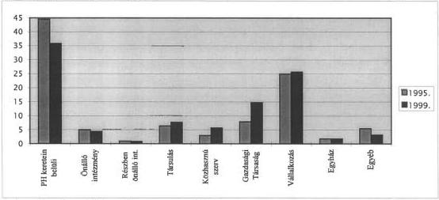
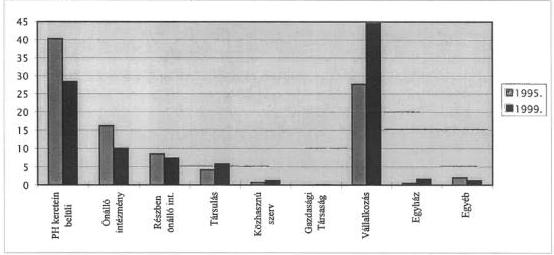
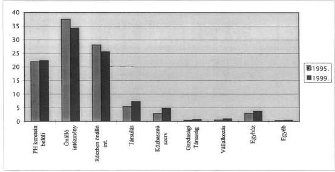
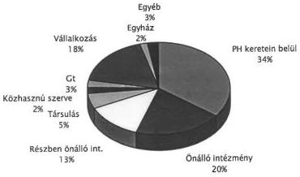
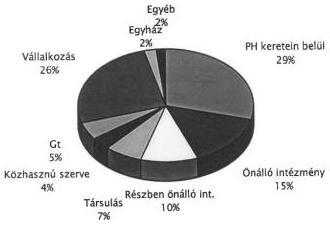

Állami Számvevőszék

# JELENTÉS

**az önkormányzati feladatellátás  
szervezeti formáiról és működésük  
célszerűségének ellenőrzéséről**

2000. június

0012

---

# ---**Az ellenőrzés végrehajtásáért felelős:  
V. Önkormányzati és Területi Ellenőrzési Igazgatóság**

**Dr. Lóránt Zoltán**

számvevő igazgató

# **Az ellenőrzést vezette:**

**Németh Péterné**

számvevő igazgatóhelyettes

**Dr. Mezei Imréné**

számvevő tanácsos - tanácsadó

**Tímár József**

számvevő tanácsos - tanácsadó

**Vécsey László**

számvevő tanácsos közreműködésével

# **Az ellenőrzésben részt vettek:**

A résztvevők névsorát az 1. sz. melléklet tartalmazza

Jelentéseink az INTERNETEN 1999. június 1-től a WWW.ASZ.gov.hu címen olvashatók

---Jelentéseink az Országgyűlés számítógépes hálózatán is olvashatók.

---

V-1008-29/1999-2000. TSZ.481

# TARTALOMJEGYZÉK

|  **I. ÖSSZEGZŐ MEGÁLLAPÍTÁSOK, KÖVETKEZTETÉSEK, JAVASLATOK** | **4**  |
| --- | --- |
|  **II. RÉSZLETES MEGÁLLAPÍTÁSOK** | **12**  |
|  1. Az önkormányzati önállóság érvényesülése a helyi közszolgáltatások biztosításának szervezeti megoldásaiban | 12  |
|  1.1. A közszolgáltatások helyi szabályozása, ellátásuk szervezeti keretei | 12  |
|  1.2. A térségi feladatot ellátó intézmények fenntartásának ellentmondásai | 18  |
|  2. Az önkormányzati költségvetési szervek feladatellátásban betöltött szerepe | 23  |
|  2.1. A költségvetési szervek keretei között ellátott feladatok jellemzői | 23  |
|  2.2. Az önkormányzatok hivatalai és a körjegyzőségek, a hivatalok felépítése, tevékenységük szabályozása, létszámellátottsága, javadalmazása | 24  |
|  2.3. A költségvetési szervek alapításának, átszervezésének megszüntetésének jellemzői | 30  |
|  2.4. A költségvetési szervek nyilvántartása | 33  |
|  2.5. A költségvetési szervek felügyeleti és belső ellenőrzése | 35  |
|  3. Önkormányzati társulások a közszolgáltatásokban | 37  |
|  4. A közhasznú szervezetek és az önkormányzati feladatok | 40  |
|  5. Önkormányzati tulajdonú gazdasági társaságok a közszolgáltatásokban | 45  |
|  5.1. A gazdasági társaságok száma, tevékenységének jellemzői | 45  |
|  5.2. A közszolgáltató vállalkozások eredményessége, a tulajdonosi érdekek megvalósulása | 46  |
|  6. Egyéb, nem az államháztartáshoz tartozó szervezetek részvétele az önkormányzatok közszolgáltatásaiban | 50  |

1

---

[Non-Text]

\( \therefore m = \frac{3}{11} \)

\( \therefore m = \frac{3}{11} \)

[Non-Text]

[Non-Text]

[Non-Text]

[Non-Text]

[Non-Text]

[Non-Text]

[Non-Text]

[Non-Text]

[Non-Text]

[Non-Text]

[Non-Text]

The Ground Truth image displays a single, solid horizontal line. According to Rule 2 (UNDERSCORE & LINE RULES), this is a stylistic or background line, not a placeholder underscore. Therefore, the OCR result must ignore it and output nothing or only meaningful text. The provided OCR content is "____", which consists of four underscores. This is an incorrect interpretation of the line as a placeholder, violating the rule that stylistic lines must be ignored. The OCR has hallucinated underscores where none should exist based on the GT's visual context. Hence, the OCR result is inconsistent with the Ground Truth.

[Non-Text]

[Non-Text]

[Non-Text]

[Non-Text]

[Non-Text]

[Non-Text]

[Non-Text]

[Non-Text]

[Non-Text]

[Non-Text]

[Non-Text]

[Non-Text]

[Non-Text]

[Non-Text]

[Non-Text]

[Non-Text]

[Non-Text]

[Non-Text]

[Non-Text]

[Non-Text]

[Non-Text]

[Non-Text]

[Non-Text]

[Non-Text]

[Non-Text]

[Non-Text]

[Non-Text]

[Non-Text]

[Non-Text]

[Non-Text]

[Non-Text]

[Non-Text]

[Non-Text]

[Non-Text]

[Non-Text]

---

# Jelentés

## az önkormányzati feladatellátás szervezeti formáiról és működésük célszerűségének ellenőrzéséről

Az Állami Számvevőszék az elmúlt évek témaellenőrzései során rendre áttekintette az önkormányzatok által ellátott különböző közszolgáltatások helyzetét. Nem került sor azonban ez idáig a közszolgáltatásoknak keretet adó szervezeti formák átfogó felmérésére, működésük jellemzőinek összegzésére.

A vizsgálat előkészítése során nyert információk szerint az önkormányzatokra és szerveikre telepített 3 646 feladat- és hatáskört összesen 351 jogszabály (ezen belül 133 törvény) szabályozza, ugyanakkor a feladatellátás szervezeti kereteire vonatkozó döntési önállóság hatásairól nem áll rendelkezésre információ.

A képviselő-testület a közszolgáltatások biztosítása céljából intézményt, gazdasági társaságot, szövetkezetet alapíthat, különböző társulásokat hozhat létre, illetve ellátási felelősségét érvényesítve civil szervezeteket, vállalkozásokat bízhat meg, önállóan szervezheti vagyonának kezelését és hasznosítását. Eközben – a törvényi keretek közt – szabadon dönthet intézményeinek, szervezeteinek átszervezéséről, átalakításáról, a térségi jellegű ellátást szervező intézmények fenntartásának kérdéseiről.

A közszolgáltatások változatosabbá váló szervezeti keretei és megoldásai egyrészt az ellátási felelősség érvényesítésében új megközelítést indokolnak, másrészt keretfeltételeket biztosítanak az államháztartási reform által megkívánt önkormányzati feladat- és hatáskör felülvizsgálat munkálataihoz, valamint az erre alapozott differenciált hatáskör telepítés előkészítéséhez.

**Az ellenőrzés célja:** annak megállapítása volt, hogy

- az önkormányzatok kötelező és önként vállalt feladataikat milyen szervezeti formában látják el, azok hogyan segítik a feladatellátás szakszerűségét, hogyan befolyásolják a költségvetési eszközök felhasználását,
- a feladatellátás szervezeti megoldásaiban milyen elmozdulások tapasztalhatók, az elhatározott szervezeti intézkedések a szakágazati feladatellátás oldaláról előkészítettek és megalapozottak voltak-e, érvényesült-e az ellátási felelősség elsődlegessége,
- változott-e a társulások, non profit szervezetek, az egyéni és társas vállalkozások közszolgáltatásokban betöltött szerepe,

3

---

I. ÖSSZEGZŐ MEGÁLLAPÍTÁSOK, KÖVETKEZTETÉSEK, JAVASLATOK---

- a helyi szervezetalakítási intézkedések a pénzeszközök hatékonyabb felhasználásának igényével történtek-e, hogyan érvényesültek az önkormányzati kincstári gazdálkodásban rejlő lehetőségek.

# **Vizsgált időszak:** 1995-1999. I. félév.

Az ellenőrzés szervezése és végrehajtása során mind a témakörből következő eredendő, mind pedig a követelmények oldaláról szerteágazó, jogszabályi háttér miatt az ellenőrzést érintően is magas kockázati tényezőket kellett számbavenni.

Az ellenőrzés szervezésére és végrehajtására kettős megközelítésben – egyrészt helyszíni ellenőrzésre, másrészt adatfelmérésre alapozottan – került sor. Ezáltal lehetővé vált, hogy az ellenőrzött megyékben a 134 város mindegyike, az 1732 községből (nagyközségből) 254-ről (14,7%), összesen tehát a települések 20,8%-áról álljon rendelkezésre ellenőrzési tapasztalat. A vizsgálat kiterjedt továbbá 3 fővárosi kerületi önkormányzatra is.

A helyszíni ellenőrzéssel is érintett önkormányzatokat úgy kellett kiválasztani, hogy lehetőség szerint valamennyi szervezeti forma működéséről tapasztalatokat szerezhessünk. E mellett a megyei fenntartásba visszakerült, illetve a már ismert, testületi döntésekre alapozott folyamatban lévő intézményátadások körülményei, a körjegyzőségek és a helyi kincstári modellek is áttekinthetők legyenek. Az ellenőrzött és adatszolgáltatásra felkért önkormányzatokat megyénként a **2. sz. melléklet** részletezi.

A témához kapcsolódóan tájékoztatást, illetve információt kértünk a Belügyminisztériumtól, a megyei közigazgatási hivataloktól, valamint a megyei TÁKISZ-októl is.

# I. ÖSSZEGZŐ MEGÁLLAPÍTÁSOK, KÖVETKEZTETÉSEK, JAVASLATOK

Az elmúlt rendszerben a tanácsok a közszolgáltatásokat saját hivatalukkal, költségvetési intézményeikkel, illetve a többnyire monopol helyzetben lévő közüzemi vállalatokon keresztül látták el. Jelen időszakban mind a vagyonhoz kapcsolódó tulajdonosi jogosultság, mind a feladatellátáshoz tartozó hatáskör, így a szervezetalakítás szabadsága a helyi önkormányzatokhoz van rendelve.

A rendkívül sokrétű lakossági szolgáltatások ma már kizárólag önkormányzati (költségvetési) kereteken belül nemcsak a sokirányú szakmai felkészültség biztosításának nehézségei, hanem az igen jelentős eszköz- és forrásigényük miatt is, egyre inkább megoldhatatlanok. Az utóbbi években ezért az önkormányzatok vagyoni helyzetétől, kezdeményező készségétől, tájékozottságától függően e területen új típusú szervezeti formák egyre növekvő mértékben jelentek meg a közfeladatok ellátásában. Ezzel párhuzamosan a jogalkotás részben a szakirányú törvények megalkotásával, felülvizsgálatával, részben a közszolgáltatásban alkalmazható szervezeti formák típusainak a meghatározásával és a vonatkozó eljárási szabályok megalkotásával, illetve a pénzügyi szabályozás össz-

---4

---

I. ÖSSZEGZŐ MEGÁLLAPÍTÁSOK, KÖVETKEZTETÉSEK, JAVASLATOK

tönző elemeinek szélesítésével és erősítésével segítette elő az önkormányzatok ez irányú törekvéseit.

A helyi önkormányzatokról szóló 1990. évi LXV. törvény (továbbiakban Ötv.) előírásainak értelmében a rendkívül széleskörű közszolgáltatási feladatellátási kötelezettséggel rendelkező önkormányzatok néhány garanciális szabály betartása mellett helyben dönthetik el, hogy a közszolgáltatásokat milyen szervezeti formában biztosítják a településen élők számára. Mindez feltételezi, hogy az önkormányzatok önállóságukkal felelősen élve számba vegyék, gazdasági **lehetőségeikkel összehangoltan fogalmazzák meg a település üzemeltetésének, fenntartásának szervezeti keretekre is kiterjedő koncepcióját**, meghatározzák annak rövid távú feladatait. Az ellenőrzött önkormányzatok esetében azonban – függetlenül azok településtípusától, nagyságrendjétől – mindez a vizsgált időszakban **nem volt gyakorlat**. A közszolgáltatások szervezeti feltételeit illetően lassú, helyenként alig érzékelhető változások voltak tapasztalhatók.

Az önkormányzatok többsége nem tekintette át, nem mérte fel a rendelkezésre álló erőforrásait, melynek alapján eldönthette volna, hogy a kötelező és nem kötelező feladatai közül mit vállalhat fel, s a közszolgáltatásai mértékét és módját hogyan biztosítja. A tudatosság, a szándékok rendszerszemléletű megfogalmazásának hiánya megnyilvánult abban is, hogy **jelentékeny hányaduk gazdasági programot sem készített**, holott ez az önkormányzati törvényből és a hatásköri törvényből szükségszerűen következett volna.

Az önkormányzatok arra sem fordítottak kellő figyelmet, hogy a helyi közügyek ellátásával összefüggő **kötelező és önként vállalt feladataikat** dokumentált módon felmérjék. Általános jelenség, hogy az önkormányzatok a Szervezeti és Működési Szabályzataikban csak visszautalnak minden olyan jogszabályra, ami részükre feladatot ír elő, illetve önként vállalt feladatnak tekintik mindazt, amely az előzőeken túl az éves költségvetésben szerepel. Ez a közvetett feladat-meghatározás és elhatárolás azonban településnagyságtól függetlenül éppen a döntéshozók számára nem teszi lehetővé a feladatok rangsorolását és nem teremt alapot arra, hogy anyagi kényszerhelyzetben az önkormányzat a felelős, megalapozott visszavonulás útját választhassa.

Az Ötv. keretjellegű szabályozását figyelembe véve **az önkormányzatok által ellátott feladatok rendszerbe foglalása**, az ellátás módjának, mértékének helyi szabályozása épp a kötelezően ellátandó feladatok biztonsága érdekében **nem kerülhető meg** annak ellenére, hogy a jelenlegi önkormányzati gyakorlatot a törvényességi ellenőrzést ellátó közigazgatási hivatalok nem kifogásolták.

Az önkormányzati feladatellátás struktúrájának, szervezeti kereteinek alakításában **a gazdasági programokból építkező tervszerű intézkedések nem voltak jellemzőek**. A gazdasági kényszer hatására mégis egyre többen próbálkoztak a hagyományosnak tekintett szervezeti keretek módosításával, melynek során az ellátási felelősség érvényesítését elsődleges szempontként kezelték. A szervezeti intézkedéseket kellő mélységű, megalapozottságú helyzetelemzések azonban nem előzték meg. A célszerűséget, eredményességet igazoló gazdasági számítások, várható megtakarítások, alternatívák kimunkálása,

5

---

I. ÖSSZEGZŐ MEGÁLLAPÍTÁSOK, KÖVETKEZTETÉSEK, JAVASLATOK---

melyekre a döntéshozók támaszkodhattak volna elmaradt. A szervezeti változások indítékát, célját illetően bizonyos egyoldalúság volt tapasztalható, mivel túlnyomó részt a már meglévő szervezeti formák, keretek megtartásával igyekeztek kiadásmérséklő intézkedéseket hozni, s kevésbé foglalkoztak a szervezeti formaváltásban, megszüntetésben rejlő lehetőségekkel. Megalapozott szakmai, gazdasági elemzést azonban ez esetekben sem végeztek, így a vagyonhasznosítás célszerűsége szempontjából mérhető, értékelhető eredmények lényegében nem is születhettek.

Az önkormányzati feladatellátást érintő szervezeti változások egyik sajátos területét a **körzeti feladatok ellátását végző intézmények fenntartói jogkörében bekövetkezett módosulások jelentették**. A megyei önkormányzatok feladat- és hatáskörével összefüggésben megfogalmazott előírások ugyanis a települési önkormányzatok számára biztosítanak választási, mérlegelési lehetőséget a körzeti feladatot ellátó intézmények fenntartásának vállalása vagy átadása tekintetében.

A megyei önkormányzatok forráshiányos helyzetbe kerülése jelentős részben összefüggött a települési önkormányzatok által fenntartott intézmények átadásával. Ezek az intézkedések a kis- és középvárosok számára a költségvetési stabilitás legegyszerűbben elérhető útját jelentették. **Az önkormányzati törvény liberális szabályozása** - a kis- és középvárosok körzeti szerepkörének önfelismerésére alapozva - **a feladat- és hatáskör telepítésben semmilyen feltételt, korlátot nem szabott**. A körzeti jellegű intézmények sorsát a rövidtávú pénzügyi érdekek által motivált – a pénzügyi szabályozás egyes elemei által még fel is erősített – körülmények közé helyezte.

A térségi szerepkört betöltő, de körzeti feladatokat ellátó intézményeitől megszabaduló város intézménystruktúrája ellátóképesség tekintetében lényegében községi szintűvé válik, miközben a pénzügyi szabályozás kiegészítő mechanizmusai városként kezelik.

Az önkormányzati pénzügyi szabályozás megkésve ugyan, de érzékelte az előzőekben jelzett problémát. A 2000. évi költségvetési törvény a jövedelemdifferenciálódás mérséklésére rendelkezésre álló előirányzat felosztásakor többlettámogatással ösztönzi a térségi feladatokat ellátó községi és városi önkormányzatokat az intézmények megtartására.

**Az önkormányzati feladatellátás jellemző színtere** – annak ellenére, hogy a társulások, non profit szervezetek, egyéni és társas vállalkozások szerepe ha kismértékben is, de növekedett – **még mindig az önkormányzati intézmény**.

Sajátos, hogy az önkormányzatok szervezetalakítási szabadsága, különösen annak kialakított és alkalmazott gyakorlata helyenként nincs összhangban a feladatellátás szakmai törvényekben szabályozott kívánalmaival, valamint az államháztartási törvény és az államháztartás működési rendjét szabályozó kormányrendelet költségvetési szervekre vonatkozó előírásaival. E jogszabályi háttér ugyanis fel sem tételezi, hogy a megkívánt szakmai önállóság nem intézményesül, vagy intézményesülése esetén annak önálló jogi személyiségét önkormányzati döntés korlátozza. Ez a fajta, úgynevezett **szakfeladaton**

---6

---

I. ÖSSZEGZŐ MEGÁLLAPÍTÁSOK, KÖVETKEZTETÉSEK, JAVASLATOK

**működő intézmény** a községekben, sőt még a kisvárosokban is gazdasági megfontolásból alkalmazott gyakorlat.

Szükséges, hogy e szervezetek **helyét, szerepét** az államháztartás működési szabályai a szakmai törvényekkel összhangban, az ellátott közszolgáltatás szakmai kritériumainak sérelme nélkül **rendezzék**. Ennek során azonban kiemelt figyelmet kell fordítani arra, hogy az e szervezetek által ellátott feladatok az államháztartás információs rendszeréből ne kerüljenek ki.

**A polgármesteri hivatalok valamennyi településtípusban jelentős gazdálkodást szervező funkciót töltenek be.** Szerepük egyes feladatszportokban változó súlyú, a kisebb településeken az igazgatás, a településüzemeltetés szervezése, az egészségügyi és szociális ellátás, közművelődés hagyományosan hivatali feladat, míg a városokban a hangsúly az intézményi ellátásokra került.

Koncentráltságuk foka is igen változó, az azonban az elvégzett számításainkkal igazolható, hogy **a körjegyzőségi formát választó községi önkormányzatok** mind igazgatási, mind gazdálkodási feladataikat tekintve **lényegesen költségtakarékosabban működtethetik hivatalaikat**, mint ha önálló hivatali szervezetben tennék. Ennek ellenére a körjegyzőségek alakításában nem történt meg a kívánt fordulat. Az erőteljes, gyakran eltúlzott önkormányzati önállósággal szemben a pénzügyi szabályozás eddig alkalmazott eszközei nem bizonyultak elegendőnek, sőt egyes elemei – ÖNHIKI – ellene hatottak.

A körjegyzőségek száma az önkormányzatok megalakulása óta stagnált, sőt némileg csökkent. 1997-ben volt a legalacsonyabb, 492 körjegyzőségbe 1302 önkormányzat tartozott. A körjegyzőségek támogatása 1996. év végéig csak a körjegyzők bérének és TB. járulékának támogatására irányult. A további csökkenés megakadályozása érdekében a központi támogatás mértékét 1997-ben közel háromszorosára növelték, differenciáltabbá tették és a felhasználást nem korlátozták. Ennek következtében 1999-ben már minimális növekedés volt tapasztalható, 508 körjegyzőségben 1403 önkormányzat működött.

Szükséges, hogy a körjegyzőségek létrehozásának ösztönzése a jelenlegi pénzügyi szabályozás eszközeinek a koordinálásán túl, az önkormányzati alapjogok sérelme nélkül, hatáskör-telepítés oldaláról kapjon erőteljesebb támogatást.

Mindezt az is indokolja, hogy az önkormányzatok hivatalaiban **az ügyintézői létszám a széles differenciáltság ellenére alulméretezett**. A települések képviselő-testületeinek többsége, még ha ismerte is a BM által 1996-ban kiadott hivatali szervezetek felépítésére, létszámigényére vonatkozó ajánlásokat, nem kívánta vagy nem tudta azokat érvényesíteni. Egyes hivataloknál az ügyintézők létszáma olyannyira alacsony, hogy képtelenek az alapvető összeférhetetlenségi előírások betartására. Nincsenek olyan standardok, melyek megfelelően segítenék az önkormányzatokat a hivatalok szervezésére, méretezésére vonatkozó döntéseik meghozatalában.

7

---

I. ÖSSZEGZŐ MEGÁLLAPÍTÁSOK, KÖVETKEZTETÉSEK, JAVASLATOK

Az önkormányzatok szervezetalakító döntéseik szabályosságára nem fordítottak elegendő figyelmet. Az **intézményi alapító okiratok** nem tartalmazták kellő részletezettséggel és konkrétsággal az intézmények tevékenységi körét, különösen hiányos a szakmai törvények által előírt sajátos követelmények érvényesítése. Nem irányult megfelelő figyelem a gazdálkodási körülmények, a vállalkozás jellegű tevékenységek folytatásának, az intézményvezetők kinevezési és munkáltatói rendjének következetes, összehangolt szabályozására és a vagyongazdálkodás intézményi területeire sem.

Az intézményi feladatellátásokat érintő átszervezések, szervezeti korszerűsítések a vizsgált időszak folyamatos kísérő jelenségei voltak. Ezek céljaként az átláthatóbb, takarékosabb ellátórendszer kialakítását fogalmazták meg, melyek azonban kevés helyen párosultak a közszolgáltatások terjedelmének és tartalmi színvonalának a növelésével.

A megyék jelentős részében **kezdeményezések történtek a helyi kincstári rendszerek kiépítésére**. Ezek azonban csak az intézményi finanszírozás valamilyen fokú központosításáig, a tervszerű, saját bevételeket figyelembe vevő pénzellátás szintjéig jutottak el, azzal a céllal, hogy a központosított pénzgazdálkodás révén elérhető kamatjövedelmek önkormányzati szinten realizálódjanak, és az önkormányzatok likviditási gondjai enyhüljenek. Az intézmények érdekeltségére már nem fordítottak kellő figyelmet.

A vizsgált időszakban az Országgyűlés az Ötv. módosításával, a társulási törvény megalkotásával és a pénzügyi szabályozás ösztönző elemeinek erősítésével igyekezett elősegíteni a hosszabbátvú közös feladatellátást, a társulások elterjedését. Áttörést azonban nem sikerült elérni annak ellenére, hogy a vizsgálati tapasztalatok szerint olcsóbb, szakszerűbb a társulásban történő közszolgáltatás. **A társulások** aránya a közszolgáltatásban meglévő különböző szervezeti formák között változatlanul alacsony, mindössze 1,5%-kal növekedett a vizsgált időszakban. Még mindig legnagyobb akadály az önkormányzatok szemlélete, az autonómia helytelen értelmezése, előtérbe helyezése a hatékony működéssel szemben. Nem véletlen az, hogy sok településen csak a helyben nem biztosítható szakértelmet igénylő igazgatási vagy más szakfeladatok közös megvalósítására társultak a legegyszerűbb formában. Kevés a társulás a városok és a vonzáskörzetükhöz tartozó községek között a nagyobb intézményi és pénzügyi feltételeket igénylő feladatok ellátásában, kihasználva a körzetközpontok kiszolgáltatott helyzetét. Tekintettel a településszerkezet elaprózottságára, indokolt az ösztönzés, érdekeltség további fokozása.

A vizsgált időszakban az állami támogatások reálértékének fokozatos csökkenése, az intézmények fenntartási kiadásainak növekedése, az új feladatok, igények megjelenése következtében az önkormányzatok a közszolgáltatások megfelelő színvonalú biztosítása érdekében törekedtek az önkormányzaton kívüli források bevonására és a feladatellátás „kiszervezésére”. Közhasznú szervezeteket, vállalkozásokat hoztak létre, illetve szerződést kötöttek gazdálkodó szervezetekkel, egyéni vállalkozókkal és egyéb szervezetekkel. Ennek következtében az intézményi feladatellátás 13%-kal csökkent.

**A közhasznú szervezetek** száma közel kétszeresére növekedett, azonban még kevés (5%) a részesedésük az önkormányzati feladatok ellátásában, in-

8

---

I. ÖSSZEGZŐ MEGÁLLAPÍTÁSOK, KÖVETKEZTETÉSEK, JAVASLATOK

kább csak segítik, támogatják azokat. Közrejátszik ebben az ösztönzés gyengesége mellett, hogy az önkormányzatok még kevés helyen ismerték meg az e viszonylag új típusú szervezetek alapításának, működésének szabályait, illetve a közhasznú szervezetek közszolgáltatásokba való bevonásának lehetőségeit, előnyeit.

Az Ötv. garanciális szabályainak betartásával létrejött **gazdasági társaságoknak** (Rt. Kft.) jelentős szerepe van egyes közfeladatok ellátásában. Döntően a település üzemeltetést látják el, többségük a korábbi állami tanácsi vállalatok átalakulása, privatizációja során jött létre. Az önkormányzatok tulajdonosi érdekei érvényesítésének mechanizmusai, módszerei azonban lassan alakulnak ki, de valójában ehhez többségük megfelelő tapasztalatú, felkészültségű szakemberekkel sem rendelkezik. Különösen gondot jelent a társaságok eredményes működéséhez kapcsolódó tulajdonosi érdek és a lakosság érdekeit, teherviselő képességét figyelembe vevő helyi árhatósági szerepkör összehangolása, melyből fakadó döntések sok esetben a közszolgáltatások feltételeinek romlását okozzák. A tapasztalatok azt mutatják, hogy csak a legnagyobb települések (nagyvárosok) rendelkeznek azokkal a feltételekkel, melyek vállalkozások alapításához, felügyeletéhez (irányításához) elegendők ahhoz, hogy a települési, önkormányzati érdekek érvényesülhessenek. Ahol ez nem biztosítható, ott a közszolgáltatás piaci alapon történő ellátása jelent megoldást.

Terjedőben van a **nem önkormányzati szervezetek közreműködése** a közszolgáltatásokban, azonban az önkormányzatok velük kialakított kapcsolata, együttműködése – különösen az egyházak tekintetében – laza, esetleges. Szorosabb együttműködésre, koordinációra lenne szükség velük annak figyelembevételével, hogy a feladatellátásért való felelősség – a fenntartótól függetlenül – az önkormányzatokat terheli.

A humán szolgáltatások ellátásában az egészségügyi ellátás területén volt jelentős változás. Országos szinten az 1992. évben meginduló privatizáció eredményeképpen 1999. évben a háziorvosok 85,7%-a, a gyermekorvosok 91,1%-a, a fogorvosok 44,9%-a egyéni és társas vállalkozás keretében látják el az ez irányú feladatokat. A vizsgált és az adatfelmérési körbe tartozó önkormányzatoknál a vizsgált időszakban az egyéni és társas vállalkozásban működő háziorvosok, gyermekorvosok és fogorvosok száma megduplázódott.

Az önkormányzati feladatellátás szervezeti kereteiről kialakult jellemzők összegzésére csak külön, a vizsgálattal egy időben elvégzett felmérés alapján volt mód. Az a sajátos helyzet alakult ki ugyanis, hogy a **feladatellátásban résztvevő költségvetésen kívüli szervezetekről** – társulások, közalapítványok, közhasznú társaságok, egyéni és társas vállalkozások – **önkormányzati körre rendezett összegző információ jelenleg egyáltalán nincs**. A költségvetési szervek nyilvántartására hivatott **törzskönyv** pedig nem egységes elvek alapján szolgáltat információkat, sőt teljes körűsége sem biztosított.

**A törzskönyvi nyilvántartás rendszerének szabályozása** ezért **elkerülhetetlen**. Ennek során azonban nem a nyilvántartani kívánt szervezet típusra (költségvetési szerv) indokolt a hangsúlyt helyezni, hanem az ellátott közszolgáltatásra.

9

---

I. ÖSSZEGZŐ MEGÁLLAPÍTÁSOK, KÖVETKEZTETÉSEK, JAVASLATOK

**Az önkormányzati szervezetirányítás egyik legelhanyagoltabb területe a felügyeleti és a belső ellenőrzés**, holott azt az önkormányzati törvény 92. § (2) bekezdése – alapozva a helyhatóságok felelős, tulajdonosi szemléletet érvényesítő önállóságára – előírja.

E tekintetben nem bizonyult elegendőnek a pénzügyi bizottságok törvényben garantált szerepének megerősítése sem, a könyvvizsgálat intézménye pedig sajátosságainál, céljainál fogva nem válthatja ki sem az intézmények felügyeleti, sem a hivatalok belső ellenőrzését.

Mind a felügyeleti, mind pedig a belső ellenőrzés elhanyagolása olyan törvénysértés, amelyet sem az önkormányzatok képviselő-testületei, sem a törvényességi ellenőrzés nem kezel súlyának megfelelő módon.

Arra pedig, hogy az önkormányzati szférán kívülre szervezett feladatok ellátásának helyzetét, a szakmai követelmények teljesítését a megkötött megállapodásokra és a szerződéses kötelezettségek teljesítésére figyelemmel ellenőrizték volna, szinte sehol sem volt példa. Előfordultak olyan önkormányzatok is, amelyek az ellátásban résztvevő egyéb szervezetek (alapítványok, egyházak, magánvállalkozások) tevékenységéről egyáltalán nem rendelkeztek információval.

**Összességében** a hagyományos költségvetési keretek súlya azt jelzi, hogy sem az önkormányzati társulásokban, sem a közhasznú szervezetek szerepének bővülésében nem történt meg az a kívánt fordulat, amelyet a parlament az elmúlt időszakban az önkormányzati törvény módosításával, a társulási és közhasznú szervezetekre vonatkozó törvények megalkotásával, valamint a pénzügyi szabályozás ösztönző elemeinek fokozásával kívánt elérni.

## JAVASLATOK

**Ellenőrzési tapasztalataink alapján a következő intézkedések megtételét javasoljuk:**

1. **A Kormánynak**, hogy a helyi önkormányzatok feladat- és hatáskörének felülvizsgálata során szerezzen érvényt a differenciált hatáskör telepítésben rejlő szakmai-, gazdaságossági, célszerűségi és jogharmonizációs szempontoknak, külön figyelemmel a körzeti jellegű közszolgáltatások ellátását biztosító intézményrendszer fenntartásának helyzetére.
2. **A belügyminiszternek**, hogy:
   - kezdeményezze az önkormányzati ellenőrzés hatékonyságának fokozása érdekében, hogy a pénzügyi bizottságok megalakításának kötelezettsége ne kizárólag a település népességszámától, hanem az önkormányzat költségvetésének volumenétől is függjön,
   - a közigazgatási hivatalok az önkormányzatok törvényességi ellenőrzése során:
     - érvényesítsék a helyben kötelező és önként vállalt feladatok számbavételének, valamint az ellátás módjára, mértékére, szervezetére vonatkozó önkormány-

10

---

I. ÖSSZEGZŐ MEGÁLLAPÍTÁSOK, KÖVETKEZTETÉSEK, JAVASLATOK

zati döntés dokumentált rögzítésének követelményét és kérjék számon a gazdasági programok kidolgozását,

- kísérjék figyelemmel, hogy a közszolgáltatások ellátásának szakmai törvényekben előírt szervezeti feltételeit megvalósították-e,
- kérjék számon az önkormányzati felügyeleti és a belső ellenőrzés működését.

- Útmutatókkal, létszámstandardokkal, szervezési segédletekkel segítse elő az önkormányzatok feladatszervező tevékenységének javítását.

3. A pénzügyminiszternek, hogy:

- segítse elő az államháztartás működési rendjének felülvizsgálata során a költségvetési gazdálkodás kereteire vonatkozó előírások áttekintésével a hatáskör telepítéssel együtt járóan a szervezeti keretek differenciálódását, azok önkormányzati sajátosságokkal való összehangolását,
- a belügyminiszter közreműködésével az önkormányzati pénzügyi szabályozás felülvizsgálata keretében fokozottan ösztönözze a társulások, körjegyzőségek szerepének a növelését, a körzeti jellegű feladatot ellátó intézmények települési (városi, nagyközségi) szinten való fenntartásának lehetőségét az ösztönzési célú többlettámogatások arányosabb, prioritásokat jobban érvényesítő szabályainak megalkotásával,
- az ellátott közszolgáltatások teljes körű figyelemmel kísérésének igényét érvényesítve helyezze új alapokra, és eszerint szabályozza a törzskönyvi nyilvántartás rendszerét. A feladatrendszerből kiindulva, annak kialakult szervezeti megoldásait számba véve olyan integrált törzskönyvi rendszer kialakítása célszerű, amely a teljesség igénye és a nyilvántartott információk szakmai egységesítése mellett a közszolgáltatás céljára rendelt vagyon nyilvántartására is kiterjed, ezáltal alapul szolgálhat az állami feladatvállalás rendező elveinek megfogalmazásához.

A helyszíni ellenőrzések során az önkormányzatoknak javasoltuk:

- a feladatellátás, feladatvállalás lehetőségeinek áttekintését a rendelkezésre álló erőforrásokkal történő összevetés alapján, s a cselekvési irányok meghatározását,
- a szakmailag-gazdaságilag előnyösebb szervezeti formák keresését, előnyeik kihasználását,
- a polgármesteri hivatalok közszolgáltatásokban betöltött szerepének, az ahhoz szükséges feltételek megteremtésének javítását, erősítését,
- a közszolgáltatások ellátásában lehetséges különféle együttműködések fokozását,
- a közhasznú szervezeti formák előnyeinek aktívabb kihasználását,
- az intézmény-irányítás és felügyelet erősítését, javítását,
- a vállalkozások közszolgáltatásainak eredményesebbé tételét, különös tekintettel az önkormányzati érdekérvényesítés határozottságának fokozására,
- a mozgósítható tartalékok feltárása céljából fokozottabban keressék a szervezésnek, a megfelelőbb szervezeti-működési keretek kialakításának a lehetőségét.

11

---

II. RÉSZLETES MEGÁLLAPÍTÁSOK---

# II. RÉSZLETES MEGÁLLAPÍTÁSOK

## 1. AZ ÖNKORMÁNYZATI ÖNÁLLÓSÁG ÉRVÉNYESÜLÉSE A HELYI KÖZSZOLGÁLTATÁSOK BIZTOSÍTÁSÁNAK SZERVEZETI MEGOLDÁSAIBAN

### 1.1. A közszolgáltatások helyi szabályozása, ellátásuk szervezeti keretei

A közszolgáltatások helyi koncepcióinak kidolgozása, a településüzemeltetésre, fenntartásra vonatkozó programok és az erre alapozott rövidebb időszakra szóló intézkedések megfogalmazása nem kapott megfelelő hangsúlyt az ellenőrzött önkormányzatok körében. Település-üzemeltetési, fenntartási programokat nem készítettek és az esetek jelentős hányadában a valós gazdasági programok kidolgozása is elmaradt. Gazdasági programként legfeljebb a választási ciklusokhoz igazodó elképzelések felvázolására került sor, azonban ezek éppen a ciklusváltásból következően nem egymásra épülő, kellő konkrét-sággal bíró, hanem felszínes, a realitásokkal kevésbé számoló dokumentumok szintjén maradtak.

**Fejér megyében Bodajk, Sukoró és Rácalmás** képviselő-testülete egyáltalán nem rendelkezett gazdasági programmal, **Pusztaszabolcs** nagyközségben 1994-98. közötti időszakra készült ugyan ciklusprogram, de az csak általánosság szintjén fogalmazott meg tennivalókat, a feladatok rangsorolása és az anyagi erőforrások hozzárendelése nélkül. **Sárbogárd** város 1991. novemberében megfogalmazott településüzemeltetési és fejlesztési terve csak 1996. év végéig tartalmazott fejlesztési feladatokat, **Bicske** város pedig, miközben az 1995-98. közötti időszakra vonatkozó gazdasági programjában fő célkitűzésként a város és intézményeinek működőképességét jelölte meg, az 1999. évtől esedékes programja és fejlesztési koncepciója még novemberben sem került a képviselő-testület elé.

**Győr-Moson-Sopron megyében Bogyoszló, Börcs, Szerecseny** községek sem készítettek gazdasági programot, míg **Kapuváron** formailag készült ugyan ilyen dokumentum, azonban az még a program szintjén elvárható részletezettségtől, konkrét-ságtól is elmaradt.

**Békés megyében** az ellenőrzött 10 önkormányzat közül 8, **Vas megyében** a 6-ból 4 település készített eltérő részletezettségű, feladatokat csak felsorolásszerűen tartalmazó programot, **Pest megyében** a vizsgálatba bevont 12 önkormányzat közül mindössze 3 település (**Gödöllő, Nagymaros, Bénye**) fogalmazott meg konkrét város- és községüzemeltetési feladatokat a középtávú fejlesztési program részeként.

E dokumentumok sem tartalmi részletezettségüket, sem súlyponti területeiket illetően nem voltak alkalmasak arra, hogy az önkormányzatok feladatvállalásaihoz igazodóan a legcélszerűbb szervezeti megoldásokat, azok alternatíváit és indokait, költségvetési kihatásait számba vegyék, az önkormányzati va-

---12

---

II. RÉSZLETES MEGÁLLAPÍTÁSOK

gyonműködtetésre gyakorolt hatásának elemzését megköveteljék, s a képviselő-testületeket ezáltal megfelelő döntési helyzetbe hozzák.

Szinte csak kivételnek tekinthető **Gyomaendrőd** és **Szolnok város** önkormányzata, ahol a gazdasági program hiányát az ágazati törvényekre alapozott önálló fejlesztési koncepciókkal igyekeztek pótolni.

A vizsgált fővárosi kerületi önkormányzatok közül is csak a **VIII. kerület** készített 1995–1998. évek közötti időszakra ágazatonkénti fejlesztési koncepciót.

Mindez azért következhetett be, mert a gazdasági programra sem tartalmi követelményeit, sem szerkezetét érintően nem volt útmutatás. Így az önkormányzatok e területen is megnyilvánuló önállósága igen eltérő megoldásokat eredményezett.

Az önkormányzatok pénzügyi, vagyoni, technikai és egyéb koordinációs lehetőségeiket sehol sem mérték fel teljes körűen abból a célból, hogy eldönthessék milyen közszolgáltatásokat biztosítanak a településeken élők számára azokat hogyan, milyen szervezeti formákban, mértékben és módon szervezzék meg.

Jellemzően **elmaradt a kötelező és önként vállalt önkormányzati feladatok számbavétele**, azok önkormányzati dokumentumban való rögzítése.

A hatályos Szervezeti és Működési Szabályzatok mellékletét képező feladat és hatásköri jegyzék ugyanis egyrészt nem állt mindenütt rendelkezésre, másrészt ha volt is, az több vonatkozásban nem kellően aktualizált. A formallag meglévő dokumentum nem az adott önkormányzat feladatrendszerét tükrözi vissza, – minden, potenciálisan előforduló, önkormányzat típustól független feladatot felsorol –, másrészt a jogszabályi háttérre való hivatkozás nem veszi figyelembe a hatásköri törvényt felváltó ágazati szakmai törvények (közoktatási, szociális, egészségügyi, gyermekvédelmi, vízügyi stb.) konkrét előírásait. Az önkormányzatra telepített feladatok még mindig az időközben szabályozás szempontjából nagyrészt kiürült 1991. évi XX. tv. előírásaira alapoznak. Gyakori, hogy a tevékenység szabályozási alapjául szolgáló dokumentumok csak utalásszerű jelzést tartalmaznak a kötelező és az önként vállalt feladatok körére.

**Szolnok megyei jogú város** például mindössze azt rögzíti Szervezeti és Működési Szabályzatában, hogy megilletik és terhelik mindazok a jogok és kötelezettségek, amelyeket számára törvény előír, illetve azok a helyi feladatok, amelyeket önként felvállal. Úgy tekintik, hogy az éves költségvetésekben szereplő feladatok, egymásra épülő programok képezik az önkormányzat feladatstruktúrájának egészét, függetlenül attól, hogy azok felvállalása törvényi kötelem vagy önkéntes elhatározás következménye. Az ezekről való döntés pedig azáltal válik kötelező erejűvé, hogy a képviselő-testület a költségvetésben ahhoz forrást biztosít.

Ez a megoldás azonban – amellett, hogy az ellátandó feladatok rangsora tekintetében nem biztosít tisztánlátást – különösen a nagyobb népességű, széles feladat- és intézmény-struktúrájú önkormányzatok esetében hátrányos, mivel – miként azt az ellenőrzési megállapítások igazolják – hozzájárulhat a szervezeti struktúrák indokolatlan rugalmatlanságához.

13

---

II. RÉSZLETES MEGÁLLAPÍTÁSOK

Kedvezőtlen, hogy a feladatok helyi számbavételét az önkormányzatok törvényességi felügyeletét ellátó megyei közigazgatási hivatalok nem kívánják meg.

Annak ellenére, hogy az önkormányzati feladatellátás struktúrájának, szervezeti feltételeinek alakításában gazdasági programokra alapozott tervszerű intézkedések nem voltak jellemzőek a vizsgált önkormányzati körben, a települések gazdasági kényszer hatására egyre többen próbálkoztak a közszolgáltatás eddig hagyományosnak tekintett szervezeti kereteinek módosításával, a nonprofit szervezetek, vállalkozások bevonásával.

Az ellenőrzött és az adatfelmérés körébe vont **391 önkormányzatnál**, 1995-1999 között, összesen **2 448 esetben hajtottak végre valamilyen szervezeti intézkedést**. Ezek 33%-a új önkormányzati feladat megjelenésével (építésügy, gyámügy, gyermekvédelem) függött össze, és kétharmada a feladatellátás átszervezéséhez kapcsolódott. Az utóbbi intézkedések megközelítően fele része más típusú szervezethez való átrendeződést jelentett, ezen belül az egészségügyi alapellátás vállalkozásba adása 64,8%-ban volt megfigyelhető, míg a településüzemeltetés, kommunális ellátás (víz- és csatornaszolgáltatás, köztisztaság, közútkezelés) területeit érintő változások közel 8%-ban voltak jelen (3., 3/a. sz. mellékletek).

Az önkormányzatok a feladatellátás alternatív szervezeti lehetőségeit többnyire a folyó költségvetés leterheltsége szempontjából vizsgálták. A költségkímélés, a külső források bevonásának szándéka mellett esetenként irányításraccionalizálási törekvések is helyet kaptak a döntések előkészítésében, mégis **kevés helyen történt megalapozott szakmai és gazdasági elemzés** a szervezeti intézkedéseket megelőzően.

A lehetséges megoldások előnyeit, hátrányait a döntéshozók kevésbé tudták megismerni, **a döntések gyakran elhúzódtak, bizonytalanságot mutattak**.

**Győr-Moson-Sopron megyében, Mosonmagyaróváron** a polgármesteri hivatal helyi adottságoknak legjobban megfelelő modelljét többszöri kísérlet, próbálkozás és sok vita után sem sikerült még a vizsgálat időpontjáig sem megtalálni. Már 1995-ben átvilágították külső szakértő céggel a hivatalt, melynek alapján a vagyongazdálkodás, illetve a humánpolitikai és intézményfenntartó feladatok szervezeti megoldásaira hoztak intézkedéseket 1996-ban. Ezeket azonban – előkészítetlenségük miatt – nem érvényesítették, a következő évben módosították azokat, melyeket szintén nem hajtottak végre. Mindennek következményeként a vizsgálat időpontjáig sem sikerült a vagyongazdálkodás, intézményfelügyelet legmegfelelőbb szervezeti megoldását megtalálniuk, 1999-ben ismételten felülvizsgáltatták a vagyongazdálkodást, újólag kijelölték annak rövid- és középtávú szervezési feladatait.

**Baranya megyében Sásd** városában részben a településüzemeltetési koncepció hiányára, részben a több évre vonatkozó közgazdasági számításokkal alá nem támasztott döntésre vezethető vissza, hogy az önkormányzat 1996. január 1-jével olyan intézmény fenntartását vállalta fel, amely nem is a saját közigazgatási területén működött. Az Időskorúak Otthonának átvételénél nem kellő gondossággal mérték fel az intézményfenntartás jövőbeni anyagi vonzatát, amely az adott finanszírozási feltételek mellett csak jelentős önkormányzati támogatással volt működtethető. Ez a támogatás az önkormányzat saját kötelező feladataitól vont

14

---

II. RÉSZLETES MEGÁLLAPÍTÁSOK

el forrásokat, ezért az önkormányzat 2 év 7 hónap elteltével az intézményt Pécs Egyházmegyei Hatóság részére értékesítette. Az eladási ár nem fedezte még az önkormányzati támogatás összegét sem, ugyanakkor ezen túl a dolgozóknak járó végkielégítések is a központi költségvetést terhelték.

**Tolna megyében Bátaszéken** a vizsgált időszakban ugyanazt az intézményt többször is átszervezték. Az 1995-től önálló gazdálkodási jogkörű Egészségügyi Gondnokságot előbb részben önálló gazdálkodási jogkörű költségvetési intézménnyé minősítették, a polgármesteri hivatalhoz integrálva. Az önkormányzat 1997-ben ezt az intézményt is megszüntette, feladatait 1998. január 1-jétől a polgármesteri hivatal látja el.

**Vas megyében Szentpéterfán** a rendelkezésre álló dokumentumok szerint előkészítetlen, a döntés időpontjában megalapozatlan volt a Kommunális Üzemeltető és Építő Szervezet megalakítása. Az 1998. decemberében megalapított, törzskönyvbe bejegyzett részben önálló gazdálkodási jogkörű költségvetési intézmény még 1999. decemberében sem működött, költségvetése sem volt.

Megfigyelhető, hogy az önkormányzatok az adott szervezeti formákon belül keresték elsősorban a feladatok gazdaságosabb és hatékonyabb ellátásának alternatíváit. Ebben egyaránt szerepet játszottak a már kialakult struktúrához való helyi kötődések, érdekek, a nem kellően megalapozott és kiérlelt döntések, az önkormányzati távlati érdekek felismerésének a hiánya, valamint az önkormányzati pénzügyi szabályozás ösztönzésének erőtlensége.

Különösen a kis települések esetében volt szerény mértékű az elmozdulás, amely egyrészt az önkormányzati **hivatali apparátus ez irányú szakértelmének és kezdeményezőkészségének hiányával**, másrészt a szakfeladaton történő feladatellátás takarékosabb megoldásával is magyarázható.

A városok jelentősebb számban vették igénybe a külső szakértő szervezetek szolgáltatásait, illetve vállalták fel a szervezetkorszerűsítést megelőző, azt megalapozó előkészítő munkát.

**Pest megyében Gyál, Szigethalom, Győr-Moson-Sopron megyében Mosonmagyaróvár, Kapuvár, Jász-Nagykun-Szolnok megyében Szolnok** város igényelte külső szakértő szervezet közreműködését.

**Szolnok megyei jogú város** a feladatvállalás racionalizálásának előfutáraként a költségvetés tervezésében új megközelítésű tervezési technikát honosított meg. A költségvetési tervezési technikák elméletében ez a megoldás a PPBS (tervezés-, programozás- költségvetés rendszere) módszerként ismeretes. Lényege, hogy a programköltségvetés szakít a korábbi bázison építkező hagyományos, kettős arculatú önkormányzati tervezési és költségvetés összeállítási gyakorlattal, felülvizsgálja a kialakult költségvetési struktúrát, a mire-mennyit kérdés mellé megfogalmazza a miből-mit kérdését is. A kiindulási alap azoknak a finanszírozásra felvállalt feladatoknak, programoknak – más megfogalmazásban indikátoroknak – a meghatározása, amelyek köré az önkormányzati feladatok előirányzatai a feladat szakmai logikával igazolt összetartozása szempontjából igazolhatóan összerendezhetők. Erre alapozottan, országos kitekintésre is módot adó helyzetelemzés az intézményi ellátások teljes körét érintette.

Az ellenőrzés igazolta, hogy az anyagilag kedvezőbb kondíciójú települések szervezeti intézkedéseit nem feltétlen a folyó költségvetés egyensúlyi követel-

15

---

II. RÉSZLETES MEGÁLLAPÍTÁSOK---

ményei motiválták, sokkal inkább az alkalmasabb vezetési struktúra, a kívánatos személyi feltételek, a források koncentrált kezelése.

**A végrehajtott szervezeti intézkedések hatásaként** – a vizsgált és az adatfelmérési körbe tartozó önkormányzati jellemzők alapján – a közszolgáltatások ellátásának országosan is jellemző tendenciái alakultak ki.

**Az igazgatás, település-üzemeltetés** (ideértve a vagyongazdálkodás, köztemető-fenntartás, folyékony hulladékkezelés, közterületek, közutak kezelése, víz- és szennyvízkezelés, csatornaszolgáltatás, közvilágítás, kéményseprés, tűzvédelem feladatait) területén lévő szervezetek száma több mint 20%-kal nőtt a vizsgált időszakban.

Az ellátások szervezéséről 1995-ben 44%-ban a polgármesteri hivatalok saját maguk, 25%-ban az egyéni és társas vállalkozásokkal létrejött üzleti kapcsolatokra alapozva gondoskodtak.

Az önkormányzati alapítású gazdasági társaságok elsősorban a víz- és csatornaszolgáltatásban és a köztisztasági területeken jelentek meg, közel 8%-os részarányt képviselve.

A társulások ekkor 6%-kal, az önkormányzati alapítású közhasznú szervezetek (közalapítványok, közhasznú társaságok) 3%-kal, a költségvetési szervek pedig megközelítően 6%-kal részesedtek a feladat ellátásából.

Az arányokat tekintve 1999-re kismértékű elmozdulás történt. A polgármesteri hivatalok részesedésének 8,7% ponttal való csökkenése mellett arányaiban erősödött az önkormányzati alapítású gazdasági társaságok (6,9% ponttal), a társulások (1,3% ponttal) és közhasznú szervezetek (2,6% ponttal) szerepe. A feladatellátás egyéb szereplőinek – költségvetési szervek, egyéni és társas vállalkozások – pozíciója lényegében nem változott.

**Az egészségügyi és szociális alap- és szakellátásban, a gyermekvédelemben** a feladatot ellátó szervezetek összességében jelentékenyebb számban – közel egynegyedével – bővültek, amely elsősorban a gyermekvédelmi törvény által megkívánt ellátások intézményesülésével és az egészségügyi alapellátások vállalkozói körbe kerülésével van összefüggésben.

Az ellenőrzött időszakot tekintve az egészségügyi alapellátó egyéni és társas vállalkozások száma megduplázódott, miközben a feladatcsoport egészét tekintve részarányuk 28%-ról 45%-ra emelkedett. Ezzel egy időben jelentősen – 22%-kal – csökkent a feladatellátás operatív szervezésében addig résztvevő polgármesteri hivatalok tevékenységének aránya.

Kismértékben – 7% ponttal – csökkent az önálló és részben önálló gazdálkodási jogkörű költségvetési szervek egészségügyi, szociális ellátásban betöltött szerepe olymódon, hogy gazdálkodási jogkör szerinti szerepükben a jogkörök központosításával járó átrendeződés következett be. A társulások száma és részaránya egyaránt növekedett, 1999-ben 5,8%-os részesedést jelentve.

Számukat tekintve jelentősen – mintegy háromszorosára – nőtt az e körbe tartozó közhasznú szervezetek, az egyházak és társadalmi szervezetek nagyság-

---16

---

II. RÉSZLETES MEGÁLLAPÍTÁSOK

rendje, azonban az önkormányzati feladatok ellátásában vállalt szerepük részaránya még 1999-ben együttesen sem érte el a 3%-ot.

**A közoktatás, közművelődés, sport** feladatok ellátását biztosító szervezeti keretek szám szerint is csökkentek a vizsgált időszakban, ezen belül is lényegesen – mintegy egytizedével – csökkent a költségvetési szervként működtetett önkormányzati intézmények száma.

A polgármesteri hivatalok feladatvállalásának részaránya ugyanakkor lényegében nem változott, míg a társulások szerepe több mint egyharmadával, az egyházak és társadalmi szervezetek részesedése pedig közel negyedével nőtt. Ennek ellenére a feladatstruktúra egészében való jelenlétük még mindig alacsony, a közhasznú szervezetekkel kibővülve is csak 16%-kal részesednek.

**Budapest** főváros helyzetéből adódóan a helyi önkormányzati feladat- és hatásköröknek a **fővárosi** és a **kerületi** önkormányzatok közötti megosztása sajátosan alakult.

Az egészségügy és az oktatás terén történő feladatmegosztáson túlmenően a Fővárosi Önkormányzat a település-üzemeltetés területén is jelentős feladatokat lát el, amely a település-üzemeltetési feladatoknak mintegy 45%-át teszi ki. Kiemelkedő a Fővárosi Önkormányzat, valamint az általa létrehozott szervezetek feladata a köztemetők fenntartásában, a folyékony- és szilárd hulladék kezelésében és ártalmatlanításában, a víz- és csatorna-szolgáltatásban, a szennyvízkezelés- és vízrendezésben, a helyi közutak, közterületek kezelésében és tisztántartásában, a távhőszolgáltatásban, a közvilágításban, a kéményseprési és a tűzvédelmi feladatok ellátásában (4/c., 5/d. sz. mellékletek).

**A közszolgáltatások ellátásához alkalmazott szervezeti formák gazdaságosságáról**, az igénybevett önkormányzati vagyon célszerű működtetéséről **kevés információ volt fellelhető** a vizsgálat során. Ennek legfőbb oka, hogy az önkormányzatok legfeljebb egy-egy szervezeti megoldás működéséről, gazdaságosságáról rendelkeztek számításokkal, kalkulációkkal. Csak elvétve fordult elő, hogy egy közszolgáltatás különböző típusú szervezettel történő ellátását vizsgálták, elemezték volna. Az egyes szervezeti formák előnyeiről vagy hátrányairól így áttételesen, főként részkérdések alapján lehetett információkat szerezni.

Az egyes átszervezési, szervezetalakítási intézkedések áttekintése igazolta, hogy az önkormányzati feladatok ellátásához választott szervezeti formák az ellenőrzött körben többségében biztosították a rendelkezésre álló vagyon rendeltetés szerinti hasznosulását. Tapasztalható volt ugyanakkor, hogy a cél szerinti hasznosulás mellett a vagyonműködtetés hatékonysági, távlati érdekeket is szem előtt tartó követelményeinek érvényesítése főként a kisebb települések esetében erőteljesen összefügg a folyó költségvetés pozícióival. A települések egy része a források szűkössége miatt nem képes megteremteni az adott önkormányzati vagyon működtetésének célszerűbb – és jogszabály szerinti – szervezeti feltételeit, más esetben viszont anyagi kényszer híján nem is érzékelik a gazdaságosabb, a település jövőbeni érdekeit szolgáló változtatás szükségességét.

17

---

II. RÉSZLETES MEGÁLLAPÍTÁSOK

E sajátos kettősséget jól példázza **Jász-Nagykun-Szolnok megye** két közel azonos népességű – ezer főt alig meghaladó –, megközelítően azonos intézménystruktúrájú, de anyagi alapjaiban egymástól messze eltérő lehetőségekkel rendelkező települése. Miközben **Örményes** évek óta forráshiányos helyzetű település, éves költségvetése alig 80 millió forint, addig **Berekfürdő** üdülő-település, évi 310 millió forintot meghaladó bevétellel és az éves pénzmaradványa megközelítően annyi, mint Örményes évről-évre gyarapodó, folyamatos kiadáscsökkentő intézkedések ellenére fennálló forráshiánya.

Örményes község a víziközművének üzemeltetésére semmilyen formában nem alakított szervezetet – holott ezt a vízgazdálkodásról szóló 1995. évi LVII. törvény 9. §-a tételesen előírja –, a vízmű az önkormányzatnál mint szakfeladat működik, jogi személyiség hiányában működési engedély, megfelelő képzettségű felelős szakmai vezető nélkül, mindössze 1 fő kútkezelő alkalmazásával.

Berekfürdőn a teljes víziközmű és a hozzákapcsolódó vagyon – termálvízű gyógy- és strandfürdő, camping és panzió – költségvetési intézményként működik oly módon, hogy az intézményi alapító okirat szerint a teljes fürdő- és strandszolgáltatás, vendéglátás maradványérdekeltséggel az alaptevékenység keretei között működik. Ez a megoldás – bár törvényes – a rövidtávú folyó bevételi érdekeltséghez való kötődése miatt nem biztosítja a közművagyon célszerűbb, távlati hatásokkal számoló, az utánpótlás forrásképződésének lehetőségét megteremtő szervezeti keretek közötti üzemeltetését.

## 1.2. A térségi feladatot ellátó intézmények fenntartásának ellentmondásai

Az ellenőrzött 11 megyében a vizsgálat időpontjáig **35 települési** (ezen belül mindössze egy Fejér megyei nagyközség, a többi városi) **önkormányzat összesen 66 intézmény megyei fenntartásba való visszaadását kezdeményezte**. Az intézmények közel kétharmada középfokú oktatási intézmény és középiskolai kollégium, egytizede fogyatékos gyermekek oktatását biztosító intézmény, illetve előfordult alapfokú művészeti és zenei oktatást végző intézmény, kórház, szociális otthon és nevelési tanácsadó megyei fenntartásba való átadása is (6. sz. melléklet).

A települési önkormányzatok általában az éves költségvetési terv előkészítése során kezdtek foglalkozni azzal, hogy a térségi feladatot is ellátó intézményeik működéséhez szükséges önkormányzati kiegészítést romló anyagi körülményeik miatt nem tudják (nem kívánják) felvállalni. E döntéseiket azonban konkrét számítások nem alapozták meg. A települési döntés alapjául szolgáló indok nem kellő megalapozottsága csaknem minden megyében előfordult.

A települési önkormányzatok legnagyobb számban **Zala és Békés megyében** kívántak megválni intézményeiktől. **Békés megyében** csak a vizsgált négy és fél éves időszak alatt 6 **város** (**Battonya, Békés, Elek, Mezőhegyes, Mezőkovácsháza, Szeghalom**) 3 500 tanulót ellátó középfokú oktatási intézményeit és azok kollégiumait, egy 175 tanulót oktató fogyatékosok általános iskoláját és kollégiumát, 2 utókezelő kórházat (178 ággyal) adott át megyei fenntartásba. Így jelenleg a **megyei** önkormányzat összesen 10 középfokú oktatási intézmény fenntartásáról gondoskodik, közülük mindössze csak egy volt folyamatosan megyei irányítású.

18

---

II. RÉSZLETES MEGÁLLAPÍTÁSOK

**Zala megyében** 3 város (**Keszthely, Lenti és Zalaszentgrót**) összesen 11 intézményt adott megyei fenntartásba, közülük **Keszthely** város két ütemben 6 közoktatási intézmény átadását kezdeményezte. Az 1995-ben átadott 3 intézmény működési költségeinek 30%-át – utólagos elszámolás mellett – megállapodás szerint a város fizeti. Hasonlóképpen hozzájárul a működési költségekhez **Lenti** város is.

**Fejér megye** 8 városa közül 3 (**Bicske, Sárbogárd, Mór, illetve Pusztaszabolcs nagyközség**) kezdeményezte a 3 nevelési tanácsadó, a 2 középiskola, a 3 gyógypedagógiai feladatot ellátó általános iskola és speciális szakiskola és a 2 alapfokú művészeti oktatást végző intézmény megyei fenntartásba adását, amelyet mindenütt az önkormányzatok anyagi helyzetével, költségvetési forráshiánnyal indokoltak.

**Nógrád, Szabolcs és Tolna megyékben** egyaránt 3-3, **Pest megyében** 5 város, **Fejér megyében** 2 település vált meg hasonló indokok alapján intézményeitől.

A helyszíni ellenőrzés igazolta, hogy több megyében – így **Szabolcs-Szatmár-Bereg, Nógrád, Jász-Nagykun-Szolnok megye** – a megyei önkormányzatok forráshiányos helyzetbe kerülése jelentős részben összefügg a települési önkormányzatok által átadott intézményfenntartással, amelyet a megyei önkormányzatok nem tudnak elhárítani.

**Jász-Nagykun-Szolnok megyében Jászapáti város** valamennyi középfokú szerepkört betöltő intézményét (3 középiskoláját, azok kollégiumát, idősek otthonát) megyei fenntartásba adta. A város még 1990-ben úgy foglalt állást, hogy az intézmények fenntartása indokolatlan terhet jelent a városnak, amelyet nem kíván felvállalni. A képviselő-testület az eltelt 10 év alatt az intézmények létével, sorsával kapcsolatban egyetlen alkalommal sem foglalkozott újólag.

Az intézményekben a jászapáti lakosú ellátottak száma változó, a szakképző intézetekben 14,4-16,7% közötti, a gimnáziumban 36%, a szociális otthonban azonban a gondozottak több mint négyötöde helyi lakos. Az önkormányzati pénzügyi szabályozás a települést, mint várost ismeri el, holott középfokú, térségi szerepet betöltő intézménye híján a város intézménystruktúrája (2 általános iskola, 1 óvoda, bölcsőde, egyesített szociális intézmény, könyvtár-művelődési ház) községi szintű.

A városi önkormányzat anyagi okokra hivatkozó döntését a költségvetés helyzete nem támasztja alá. A vizsgált időszak alatt évente jelentős összegeket fordított és fordít fejlesztési feladatokra, miközben az év végi maradványai rendre 30% közelében alakultak. A maradványok döntően fejlesztési jellegűnek minősülnek, 1998-ban már meghaladták a 300 millió forintot.

Eközben a megyei önkormányzat jelentős erőfeszítések árán gondoskodik a fenntartásába adott intézmények működőképességéről. A négy intézmény fenntartásához, felújításához, kisebb intézményi körben realizálandó beruházásaihoz, 1994 és 1998 között a normatív állami hozzájáruláson felül összesen 265 millió forintot biztosított, miközben évről-évre jelentős nagyságrendű – arányaiban változóan elismert – forráshiánnyal küzd.

Tovább fokozza az önkormányzat egyébként törvényes keretek közt maradó döntése és a pénzügyi szabályozás közötti ellentmondást az önhibáján kívül forráshiányos önkormányzatok pályázati feltételeinek tételes értelmezése is. Az 1999.

19

---

II. RÉSZLETES MEGÁLLAPÍTÁSOK

évre kiadott pályázati feltétel és számítási útmutatás szerint működési-fenntartási forrásaik kiegészítését igényelhetik azok a települési önkormányzatok is, amelyek 1 lakosra jutó működési kiadásai nem érik el a településtípusra jellemző országos átlag 85%-át.

Ez azt jelenti, hogy Jászapáti város a településtípusra (egyéb város 9 999 főig) jellemző országos fajlagos működési kiadási szint (27 122 Ft/fő) 85%-áig a működési kiadási szint kiegészíthetőségét figyelembe véve mindkét pályázati ütemben (I. ütemben 31,5 millió forint, II. ütemben 54,4 millió forint) támogatási igényt nyújtott be.

Az már csupán érdekes adalék, hogy amennyiben a tényleges intézményfenntartó szerepkört tekintve a községi kategória – község 5 000 főtől – fajlagos működési átlagát lehetne figyelembe venni, az önkormányzat csak 21 716 Ft/fő összeg 85%-áig való kiegészítési igénnyel számolhatna. Ebben az esetben viszont legfeljebb 4,1 millió forint kiegészítési igényt fogalmazhatott volna meg.

**A települési önkormányzatok így a törvényes keretek közt jártak el ugyan, döntéseik azonban a jogalkotói szándékoktól eltérő, pénzügyi szabályozás tekintetében igen visszás, etikailag megkérdőjelezhető megoldásokhoz vezettek.**

Az ellenőrzött körben pozitív kivételként találkozott az ellenőrzés a városi ranggal arányosan az intézményfenntartásban is körzeti felelősséget vállaló önkormányzati magatartással is.

**Békés megyében** a vizsgálatba vont városok közül **Gyomaendrőd város** nem adott át térségi feladatot ellátó oktatási intézményt a megyei önkormányzatnak. Az 1995-ben meghozott döntést azzal indokolták, hogy vagyonátadás esetén jelentős vagyonvesztés következne be, az ingatlanok ingyenes használatba adásakor viszont a felújítás változatlanul az önkormányzatot terheli.

Az intézmények megtartásában szerepet játszott az a tény is, hogy a megyéhez való átadás esetén a feladatellátás mikéntjéről való további döntés is a megyei önkormányzat joga, így előfordulhat, hogy az adott intézményt fokozatosan leépítik, ezért inkább az intézmények gazdálkodásban rejlő tartalékok fokozottabb feltárását helyezték előtérbe.

**Pest megyében Gyál nagyközség** 1995-ben a megyei önkormányzat tulajdonába adta közgazdasági szakközépiskoláját, majd amikor 1999-ben a megye meg akarta szüntetni, a település visszakérte azt, holott az iskola működtetése a normatív állami hozzájárulással nem fedezett kiadások miatt a városnak jelentős többletterhet jelentett. Hasonló okok miatt nem mond le középiskolai kollégiumáról **Mosonmagyaróvár** sem, ahol pedig a 301 fős férőhelyen mindössze 218 tanulót helyeztek el.

**Győr-Moson-Sopron megyében** a vizsgált időszakban mindössze 1 szociális otthon átadásra-átvételre került sor, ugyanakkor ismert, hogy 1999-ben **Győr, Sopron, Csorna, Fertőszentmiklós** települések kezdeményeztek intézményi átadásokat. A megyei önkormányzat munkacsoportot hozott létre a tárgyalások megalapozására és a megoldások keresésére, miután Csorna város az önkormányzati törvényben biztosított jogvesztő hatályú határidő után döntött az átadásról, illetve Sopron város, mint megyei jogú cím viselője, csak kezdeményezheti a középiskolák, kollégiumok, valamint idősek otthonának átvételét.

20

---

II. RÉSZLETES MEGÁLLAPÍTÁSOK

Jász-Nagykun-Szolnok megyében Kunszentmárton város 1998-ban visszakérte gimnáziumát, az egyeztetések során a megyei önkormányzat a visszavétel ösztönzésének sajátos módját választotta azzal, hogy a megyei fenntartás időszaka alatt beiskolázott tanulók felmenőrendszerben való kifutásáig az alap közoktatási normatíva 50%-ának megfelelő hozzájárulást biztosít, valamint vállalta az átadott ingatlan fűtéskorszerűsítése tárgyában megkötött többéves szerződéses kötelezettség teljesítését is.

Az intézmény átadás-átvételek kapcsán eltérő megoldások alakultak ki a tulajdonlás tekintetében. Az átadott intézmények által ellátott feladatokhoz igényelt ingatlan és ingóvagyon túlnyomórészt az átadást kezdeményező önkormányzatok tulajdonában maradt azok felújítási, állagmegóvási terhei mellett. Ezekben az esetekben – Vas, Fejér, Tolna, Pest megyékben – a megyei önkormányzat a feladatellátás időtartamára ingyenes használóként rendelkezik a szükséges vagyonnal, a használat részletszabályait megállapodások rögzítik. Egyedül Jász-Nagykun-Szolnok megyében alakult ki az a sajátos megoldás, miszerint a visszaadott körzeti feladatot ellátó intézmények teljes vagyona a megyei önkormányzaté, más esetekben – Szabolcs-Szatmár-Bereg, Nógrád megyék – településenként vegyes megoldások születtek.

Mindez azért vált lehetővé, mert az önkormányzati törvény nem tartalmaz előírást a tulajdonlás tekintetében, azt az érintett felek együttműködésére bízta. A vagyonátadási törvény szabályozásának szelleméből a feladatellátás időtartamára kiterjedő ingyenes használat következik, miközben az átvétel megtagadására nem jogosult megyei önkormányzat több esetben ragaszkodott a vagyon teljes tulajdonba adásához. E szándék helyenként – Szabolcs-Szatmár-Bereg megyében például a nagykállói középfokú oktatási intézmények, Pest megyében Nagykőrös esetében – képes volt az intézmények fenntartói jogkörének helyben tartására.

A 2000. évi költségvetési törvény önkormányzatokra vonatkozó szabályozása támogatási differenciák érvényesítésével kíván gátat szabni a kedvezőtlen folyamatoknak.

Az ösztönzés annak a pénzátcsoportosítási rendszernek a keretén belül valósul meg, amelynek célja, hogy a hátrányos helyzetű települések kiegészítő támogatásban részesüljenek, az anyagilag legkedvezőbb helyzetben lévő önkormányzatok támogatásának terhére.

A differenciálás alapja az önkormányzatok adóerőképessége, amelynek 1 lakosra vetített értéke az iparűzési adóalapból és a lakosságszámból a költségvetési törvényben meghatározott módszer szerint számítandó. Amennyiben az 1 lakosra jutó adóerő kisebb egy meghatározott értéknél – 2000-ben a községeknél 11 800 Ft/fő, városoknál 14 715 Ft/fő, megyei jogú városnál 16 500 Ft/fő, fővárosnál 22 295 Ft/fő –, akkor addig a szintig kiegészítik a település jövedelmét, ha magasabb annál, sávosan elvonnak belőle. Az elvonás a feladatmutatóhoz kötött normatívák egy meghatározott – lényegében intézmény-üzemeltetéshez kapcsolódó – köre terhére valósul meg.

A községek és városok intézményeinek helyben tartását a rendszer annyiban ösztönzi, hogy a térségi feladatot ellátó intézményt fenntartó önkormányzat intézményi ellátottanként további 14 905 Ft kiegészítésben részesülhet. A kedvezőbb anyagi kondíciójú településeket azonban hátrányosan érinti azzal,

21

---

II. RÉSZLETES MEGÁLLAPÍTÁSOK

hogy amennyiben a számított adóerőképesség jövedelem-elvonással jár, az a normatív állami hozzájárulások terhére történik. Ez esetben az önkormányzat abban válik érdekeltté, hogy a normatív állami hozzájárulások meghatározott körét érintő intézményi ellátásokat feladatköréből – akár megyei önkormányzati, akár költségvetésen kívüli területekre – kiszervezze, ezáltal a jövedelem-elvonás lehetőségét kizárja.

A települési önkormányzatok jellemzően eddig sem törekedtek arra, hogy önként vállalt feladatként körzeti jellegű intézményeket hozzanak létre, az ellenőrzött körben ez szinte egyedi kivételként fordult elő.

**Nógrád megyében Szécsény város** 1994-ben alapított gimnáziumot, amelyet azóta is fenntart, ugyanakkor mezőgazdasági szakközépiskoláját – miután ez vitathatatlanul költségigényesebb – 1999-ben megyei fenntartásba adta.

Sajátos önkormányzati indíttatású döntés alapján hozott létre önként vállalt feladatként új körzeti szerepkört vállaló intézményt **Békés megyében Dévaványa nagyközség**. A nagyközség képviselő-testülete célul tűzte ki a városi rang megszerzését, amelynek szerepkör, vonzáskörzet tekintetében fontos tényezője az intézményi ellátottság mutatója.

Az önkormányzat életveszélyessé vált általános iskolájának kiváltását célzó beruházáshoz céltámogatásban részesült, amelyet 1997-1999-ben meg is valósított. Három hónappal a céltámogatási pályázat kedvező elbírálása után az önkormányzat önálló gimnázium és szakközépiskola 1999. szeptember 1-jei indításáról határozott, azzal, hogy a tanévet az új iskolaépületben kívánják megkezdeni.

Az önkormányzat intézményalapítási szándéka nem volt összhangban a megyei közoktatás-fejlesztési tervben foglaltakkal, azonban az intézményt még a megyei önkormányzat véleményének megismerése előtt 1997. októberében megalapította, majd a megyei közgyűlés a tényhelyzetet tudomásul véve, másfél év elteltével befogadta a megye közoktatás-fejlesztési tervébe.

**A fővárosban** is hasonló indíttatású folyamatok zajlottak le – illetve vannak folyamatban –, mint az ellenőrzött megyékben. A vizsgálat lezárásáig 14 közoktatási intézmény átadás-átvételére került sor, amelyek elsősorban speciális feladatot ellátó általános iskolák illetve gimnáziumok.

**A Fővárosi Önkormányzat** és a kerületek között az egészségügyi ellátásban – alapozva az Ötv. 68. §-ára, valamint a Fővárosi Közgyűlés 23/1992. (VII. 30.) sz. rendeletére – ellenkező irányú intézményátadás-átvételi folyamatok is történtek.

A 23/1992. (VII. 30.) Főv. Kgy. rendelet 1. § (1) és (2) bekezdése szerint az egészségügyi alapellátás a kerületi önkormányzatok feladata, az ezt meghaladó ellátás pedig a Budapest Főváros Önkormányzatának olyan feladata, amely a kerületi önkormányzatok részére átadható.

Ennek megfelelően a háziorvosi szolgálatok átadása a kerületi önkormányzatok részére 1992-ben megkezdődött, és 1993-ban szinte teljesen befejeződött. Jelenleg a háziorvosi ellátást teljesen, a fogászati ellátást pedig négy kivétellel (III., IV., VII., XIV.) a kerületek biztosítják.

22

---

II. RÉSZLETES MEGÁLLAPÍTÁSOK

A 23/1992. (VII. 30.) Főv. Kgy. rendelet 2. § (1) és (2) bekezdése szerint a Budapest Főváros Önkormányzata a járóbeteg szakrendelőket a kerületi önkormányzatok feladat- és hatáskörébe átadja, ha azt a kerületi önkormányzatok kérik. Átadhatók a gondozók, illetve a tüdő- és ernyőszűrő állomások is, ha azt a kerületi önkormányzatok kérik és a szakrendelési feladatokat egyébként átvették.

Önként vállalt feladatként a járóbeteg szakrendelést 13 kerületi önkormányzat, a gondozó intézeti ellátást pedig részben vagy egészben 5 kerületi önkormányzat vette át.

**Budapest Főváros Önkormányzata** az egyes egészségügyi feladatok átadását követően arról is döntött, hogy az Ötv. 68. §-át meghaladóan a háziorvosi rendelők és később a szakrendelők is a feladatot átvett kerületi önkormányzatok tulajdonába kerüljenek. Az ingatlanok tulajdonba adása 1994-ben kezdődött és az önkormányzati tulajdonok rendezésével párhuzamosan jelenleg is folyik.

## 2. AZ ÖNKORMÁNYZATI KÖLTSÉGVETÉSI SZERVEK FELADATEL-LÁTÁSBAN BETÖLTÖTT SZEREPE

### 2.1. A költségvetési szervek keretei között ellátott feladatok jellemzői

Az önkormányzatokra háruló **kötelező és önként vállalt feladatok ellátásában a költségvetési szerveknek van döntő szerepe**. Az ellenőrzött önkormányzatok összességében e szervezeti keretek közt realizálják a költségvetési források több mint 90%-át. Ezen belül – a költségvetés koncentráltsági jellemzőivel összhangban – a városokban az intézmények gondoskodnak a rendelkezésre álló előirányzatok közel 60%-ának felhasználásáról, míg a községekben ez az arány csak 30%-os (7. sz. melléklet).

A vizsgált és az adatfelméréssel érintett önkormányzatok feladataik ellátása érdekében – az 1999. június 30-i állapotot tekintve – összesen 1 649 önálló gazdálkodási jogkörű költségvetési szervet, valamint további 1 171 részben önálló gazdálkodási jogkörű intézményt működtettek. Az intézmények száma – szervezeti átalakításokkal, összevonásokkal összhangban – egyébként a vizsgált időszakban együttesen 10%-kal csökkent. E csökkenés az egészségügyi alapellátásban, illetve a közoktatás-, közművelődés-, sport területén következett be (4/b., 4c. sz. mellékletek).

Ezen túl jelen vannak az önkormányzati feladatellátásban azok az intézményesült ellátási formák, amelyeket a képviselő-testületek – élve szervezetalakítási szabadságukkal – önálló jogi személyiséggel létre sem hoztak, vagy ha létre is hozták, alapító okirataikban az államháztartási törvény és az államháztartás működési rendjéről szóló kormányrendelet intézményalapításra vonatkozó előírásaitól eltérő gyakorlatot szabályoztak.

A helyszíni ellenőrzés körébe vont önkormányzatok esetében a városoknál a működési-fenntartási kiadások mintegy 14%-át, a nagyközségeknél 17%-át, a községeknél közel 24%-át, a fővárosi kerületekben 13%-át önálló jogi személyiség nélküli intézményi ellátások keretében realizálják.

23

---

II. RÉSZLETES MEGÁLLAPÍTÁSOK

Elsősorban a kistelepülések kis intézményei – bölcsődék, óvodák, általános iskolák, könyvtárak, művelődési házak – azok, ahol a szakmai törvényekből következő önálló jogi személyiség által megkívánt működés körülményei többletterheket jelenthetnek, ugyanakkor a hivatali szakfeladaton működő intézmények esetében nemcsak a feladatellátás szakmai önállósága, hanem a gazdálkodási jogosítványok tisztánlátásának követelménye is sérül.

Azon túl azonban, hogy ezeknek az intézményesült ellátásoknak az önálló jogi léte vált megkérdőjelezetté, gondot okoz az is, hogy az önkormányzat hivatala az érintett intézményekkel való kapcsolatában, gazdálkodási folyamataiban sokkal inkább alapoz a kézi vezérlésre, mintsem a 217/1998.(XII. 30.) Korm. sz. rendelet 14-15. §-ában foglaltakra.

**Pest megyében** a hivatalok és az intézmények közötti gazdálkodási jogkörök megosztása legtöbb önkormányzatnál nem szabályozott, azok a gyakorlatban kialakult szokások és közvetlen kommunikációs csatornákon keresztül működnek (Márianosztra Körjegyzőség, Nagymaros, Szigethalom, Győmrő, Gyál). Az önkormányzatok nem határozták meg az önállóan gazdálkodó intézmények közötti költségvetési, zárszámadási, gazdálkodási és egyéb számviteli információs kapcsolatokat, a könyvvezetés szabályait [54/1996. (IV. 28.) Korm. rendelt 4. § (8) bekezdés], valamint a Hivatal és intézmények, részben önálló és önálló intézmények kapcsolatait [156/1995. (XII. 26.) Korm. rendelet 8. § (6), (7) bekezdés és a 217/1998. (XII. 30.) Korm. rendelet 14. § (5) bekezdése].

A községek gazdálkodásának túlzott centralizációjára utal az is, hogy míg a városok a költségvetési kiadások átlagosan 38-40%-át, addig a községek mintegy 70%-át realizálják a polgármesteri hivatalok szervezeti keretein belül. A jelentős különbség csak részben magyarázható azzal, hogy a kistelepülések kis intézményeinél nincsenek meg a gazdasági önállóság feltételei.

**Győr-Moson-Sopron megyében Beleden** például a 16 osztállyal üzemelő, több mint 300 gyermeket oktató, jelentős nagyságrendű körzeti feladatokat ellátó intézmény nem rendelkezik teljes gazdálkodási jogkörrel.

**A vizsgált fővárosi kerületek** közül is csak a VIII. kerületben gondoskodtak kellő időben a gazdálkodási jogkörök előírás szerinti megosztásáról, míg a XV. és a XXII. kerület késedelmesen, csak 1999-ben alkotott erre vonatkozó szabályokat.

## 2.2. Az önkormányzatok hivatalai és a körjegyzőségek, a hivatalok felépítése, tevékenységük szabályozása, létszámellátottsága, javadalmazása

A vizsgált és az adatfelmérés körébe vont önkormányzatok közel háromnegyede önálló hivatali szervezetet alapított, mindössze 93 önkormányzat hivatala működik körjegyzőségi keretek között.

Az egyes megyék között – településszerkezeti sajátosságokból eredően – igen jelentősek a differenciák.

**Baranya megyében**, – ahol a népesség megközelítően azonos, mint **Békés megyében** (416, illetve 413 ezer fő) –, összesen 301 települési önkormányzat működik, míg az utóbbiban mindössze 75.

24

---

II. RÉSZLETES MEGÁLLAPÍTÁSOK

**Baranya megyében** a települések 84,8%-a 81 körjegyzőségben tevékenykedik, **Békés megyében** pedig egyáltalán nem választották ezt a szervezeti megoldást. Hasonló párhuzam vonható **Győr-Moson-Sopron**, illetve **Jász-Nagykun-Szolnok megye** (népességük 435 ezer fő) között, az előbbiben az önkormányzatok 31%-át jelentő 55 település 20 körjegyzőséget hozott létre, addig az utóbbiban mindössze 3 körjegyzőség működik.

**Szabolcs-Szatmár-Bereg megyében** a megye 229 önkormányzatából 66 település – 29% – látja el körjegyzőségi keretek között az igazgatási feladatait.

Az ellenőrzés egyértelműen igazolta, hogy a **körjegyzőségek eredményesen, ugyanakkor költségtakarékosan biztosítják a hivatali feladatok ellátását**. A vizsgált községek összességét tekintve 1999-ben az egy lakosra jutó átlagos igazgatási kiadás 10 500 forint volt, ezen belül a körjegyzőségi keretek között 6 500 forint, míg körjegyzőséghez nem tartozó település esetében 14 500 forint – azaz több mint kétszeres – igazgatási kiadás jutott minden egyes lakosra.

A községi településkategórián belül a legjelentősebb szélső értékek az 500 és 1000 lakos közötti településcsoportban figyelhetők meg. Itt a körjegyzőséghez nem tartozó települések 1 lakosra vetített fajlagos önkormányzati igazgatása háromszor annyi ráfordítást igényelt, mint ha azt körjegyzőségi keretek között szervezték volna. A többi községi kategóriában a különbség kétszeres (8. sz. melléklet).

Az előzőeket legmarkánsabb módon **Baranya megye** ellenőrzési tapasztalatai támasztják alá.

Az ellátott terület egy lakosára jutó kiadás a körjegyzőségi feladatokat ellátó önkormányzati hivatalokban nagyságrenddel alacsonyabb, mint azokban a polgármesteri hivatalokban, amelyek önálló formában működnek. Az azonos népességű **Hobol (1 003 fő) és Egerág (1 009 fő)** községek esetében is szembetűnő az eltérés. Míg **Egerágon**, ahol körjegyzőség működik, az egy lakosra jutó kiadás 8 624 forint, addig **Hobolban**, – ahol polgármesteri hivatal van – 15 974 forint, az eltérés közel kétszeres. Mindkét önkormányzat hasonló intézményhálózatot üzemeltet. **Oroszló (330 fős) és Szulimán (302 fő)** lakossága is közel azonos. **Oroszló** körjegyzőséghez tartozik, míg **Szulimán** önálló polgármesteri hivatali formát választott. Az egy főre jutó igazgatási kiadás **Oroszlón** 15 518 forint, **Szulimánban** 21 354 forint. Ugyanakkor mind **Hobolban**, mind **Szulimánban** a működési forráshiányt (ÖNHIKI-s támogatás) a központi költségvetés fedezi, amely a közpénzek indokolatlan felhasználását okozza. Az ÖNHIKI-s támogatás ezekben az esetekben rendkívül igazságtalan, a körjegyzőségi önkormányzati hivatali forma ellen hat, hiszen a körjegyzőségek alakításának és működtetésének ösztönzésére biztosított központosított állami támogatás a kapott ÖNHIKI-s támogatáshoz képest elhanyagolható nagyságrendű.

A községek közül a körjegyzőségi formában működő **Kozármisleny** község 1 főre jutó kiadása nem éri el az 5 000 forintot sem, igazgatási kiadása az ellátott lakosság számához viszonyítottan (az öt önkormányzat területén 5 523 fő) legkedvezőbb, amely a dolgozók leterheltsége ellenére is a körjegyzőségi hivatal eredményességét jelzi.

Az ellenőrzött önkormányzatok szervezeti és működési szabályzataikban még kevésbé, a hivatali ügyrendjeikben azonban már nagyobb eredményességgel

25

---

II. RÉSZLETES MEGÁLLAPÍTÁSOK

törekedtek a helyi sajátosságok érvényesítésére, az ellátandó feladatokkal való összehangolására.

**A hivatali szervezetek felépítése településtípustól függő.** A kistelepüléseken nem került sor a hivatal további belső szervezeti tagolására. A kisvárosokban, ahol a hivatali létszám jellemzően 20-40 fő közötti, a szakmai ágazati feladatokhoz – többnyire hatósági, műszaki, pénzügyi, illetve humánellátáshoz – igazított csoport vagy irodaszervezet működik, a nagyobb városokban lévő hivatali szervezet pedig főosztályokra, osztályokra tagozódik.

A szervezetek belső munkamegosztásának ügyrendbeli, illetve a dolgozók munkaköri kötelezettségeinek szabályozására nem irányult megfelelő figyelem. E dokumentumok aktualizálása nem vált gyakorlattá, kivételként a hivatali tevékenység szabályozásának teljes hiánya is tapasztalható volt.

A vizsgált önkormányzatok többségére jellemző az ügyrend, belső szabályzatok, munkaköri leírások karbantartásának, folyamatos és indokolt korszerűsítésének elmaradása. Ebből is következik, hogy a **hivatali szervezetek és a létszám alakulása** nem mindig követi a feladatváltozásokat, belső aránytalanságot és feszültséget okozva a munkában, a hivatalon belüli viszonyokban.

**Jász-Nagykun-Szolnok megyében Berekfürdő** község esetében maga a hivatali szervezeti ügyrend sem készült el, sőt a hivatali dolgozók az önkormányzat megalakulásától kezdve (1992. július 1.) nem rendelkeztek munkaköri leírással, ezek tervezetei csak a helyszíni ellenőrzés ideje alatt készültek el. A jegyzői állás előírt végzettségű dolgozóval való betöltésére is csak 1999. júniusától került sor. A hivatali ügymenetben számos dokumentálási hiányosság – például képviselő-testületi jegyzőkönyvek másfél-, két éves késéssel készültek el – fordult elő, az önkormányzat adatszolgáltatási fegyelme igen laza volt. A polgármester – aki egyben a település vállalkozó háziorvosa – társadalmi megbízatású. A képviselő-testület, miután erre törvényi kötelezettsége az 1 017 fős népességre való tekintettel nem volt, semmilyen bizottságot nem hozott létre, holott költségvetése 1998-ban már meghaladja a 310 millió forintot.

**Békés megyében Gerendás** községben az ügyrendben csak a képviselő-testület, a képviselők tevékenységével kapcsolatos-, az államigazgatási-, hatósági-, valamint a gazdálkodási- elszámolási feladatokat sorolták fel, a település-üzemeltetés szervezésével kapcsolatos teendőket nem. **Mezőhegyesen** az előbbieken túl a döntések szakmai előkészítésével és a bizottságok működésével kapcsolatos feladatok ellátása is szerepel az ügyrendben, de a belső szervezeti rend részeként ellátandó feladatokról, a költségvetési szervek felügyeletéről nem rendelkeztek. **Gyomaendrődön** a különböző okmányok között eltérés van, az ügyrendből nem lehet pontosan megállapítani a polgármesteri hivatal feladatait, nem rendezik a részben önálló intézményekkel, kisebbségi önkormányzatokkal kapcsolatos teendőket.

**Pest megyében** két önkormányzatnál (**Gyál, Gyömrő**) hiányoztak az irodák részletes feladatait meghatározó szabályozások, valamint a munkaköri leírások nem tartalmazták a folyamatba épített ellenőrzési feladatok és kötelezettségek részletezését (**Szigethalom, Nagymaros**). Aktualizálásra szorul az ellenőrzött **fővárosi kerületek** Szervezeti és Működési Szabályzata is.

**Zala megyében** is alapvető gond, hogy a hivatali ügyrendek, munkaköri leírások nem a munkafolyamatok elemzéséből kiindulva, a feladat- és hatásköröket,

26

---

II. RÉSZLETES MEGÁLLAPÍTÁSOK

az együttműködést, munkakapcsolatokat feltárva, szabályozva készülnek. A hagyományos módon, a szervezeti egységekre e nélkül tagolt feladat megjelölés és erre épülő szervezeti felépítés rugalmatlan. A belső konzisztencia összehangoltság hiányában egyszerre magában hordozza a párhuzamos feladatellátás és az ellátatlan közszolgálati feladatok keletkezésének veszélyét.

**A hivatalok szervezetében, létszámában** főként a városokban volt tapasztalható számottevőbb módosulás, az azonban általános, hogy az intézményszervezeti változások nem voltak jelentékeny hatással a hivatali struktúrákra, azok létszámára (9. sz. melléklet).

**Győr-Moson-Sopron megyében Kapuváron** 1996-ban megszüntették a hivatali szervezet ágazati tagozódását, s az igazgatási tevékenység típusokhoz igazodó szervezetet hoztak létre. Az átszervezés eredményeként – melyet követően több feladatot (városi főorvos, sportfelügyelő, stb.) megbízásos jogviszony keretében, illetve néhányat (aljegyző, honvédelmi feladatok) kapcsolt munkakörben láttak el – 57 főről 47 főre csökkent a hivatal szervezett álláshelyeinek száma.

**Jász-Nagykun-Szolnok megyében Szolnok megyei jogú város** hivatali szervezetében ugyancsak történtek kisebb léptékű változások, átrendeződtek az egyes főosztályok közötti feladatok. Közbeszerzés-felügyeleti osztályt hoztak létre, megjelent az önkormányzati feladatok között a városmarketing, a minőségbiztosítás, az Uniós kapcsolattartás és a humánmenedzseri területek létszámigénye. A polgármesteri hivatal létszámában bekövetkező változások – különösen az 1996-97. közötti 22 fős mintegy 10%-os – létszámcsökkentés azonban nem hivatali feladatcsökkenéssel, sokkal inkább a kormányzati akaratot közvetítő testületi elvárásokkal volt magyarázható, amely párosulva a már jelzett új típusú önkormányzati feladatokkal, elkerülhetetlen létszám visszarendeződéshez vezetett.

A polgármesteri hivatalok jelentősebb átszervezésére **Békés megyében** is csak két városban került sor: **Gyomaendrődön** és **Mezőkovácsházán**.

**Gyomaendrődön** 1995. elején 8 szervezeti egységre tagozódott a polgármesteri hivatal. (Titkárság, Igazgatási-, Szociális- és Egészségügyi-, Intézményirányító-, Adó- Költségvetési- Gazdálkodási-, Vagyongazdálkodási-, Építésgazdálkodási Csoport.)

1997. augusztusában a Szociális- és Egészségügyi, valamint az Intézményirányító Csoport összevonásával alakították ki a Humánpolitikai Csoportot, a Vagyongazdálkodási és Építésigazgatási Csoport összevonásával a Műszaki és Vagyongazdálkodási Csoportot, majd 1997. októberében újabb szervezeti változással a vagyongazdálkodást a Költségvetési Csoporthoz szervezték át. 1998. január 1-jétől létrehozták a Városi Gyámhivatalt.

**Mezőkovácsházán** 1995-ben öt csoport volt (igazgatási, titkársági, költségvetési, adó, műszaki), 1997-ben a titkársági és az igazgatási csoportot összevonták. 1998-ban négy osztályt alakítottak ki, ezzel növelték az irányítási szinteket és a vezetők számát, és a körzeti igazgatási feladatok miatt 5 fővel nőtt az ügyintézők száma (Gyámhivatal, Körzeti Építésügyi Hatóság).

Általános jelenségnek tekinthető a vizsgált önkormányzatoknál, hogy a hivatalok, s különösen az **ügyintézői létszám** a feladatokhoz viszonyítva **alulméretezett** annak ellenére, hogy a vizsgált önkormányzatoknál 6,4%-kal növekedett.

27

---

II. RÉSZLETES MEGÁLLAPÍTÁSOK

A testületek csak a legminimálisabb mértékben hajlandók (képesek) a hivatalok működéséhez pénzügyi erőforrásokat biztosítani. Nincsenek standardok, a BM 1996-ban kiadott hivatali szervezetek felépítésére, létszámigényére vonatkozó ajánlásait nem tekintik megfontolandónak, követendőnek elsősorban annak anyagi vonzata miatt. A testületek többsége valójában nem is tudja megítélni azt, hogy az önkormányzati hivatalban mekkora szervezet szükséges a feladatok ellátásához. A városok ezért külső szakértők bevonásával, átvilágításokkal igyekeztek több-kevesebb sikerrel megalapozni szervezetük működését, de a kistelepüléseken – többnyire anyagi okok miatt – erre nem volt mód.

Az 5-10 ezer fő közötti városokban a legalacsonyabb ügyintézői létszáma **Bátaszék és Újszász** városnak van (1999-ben 16 illetve 17 fő), itt az egy ügyintézőre jutó lakosok száma 451 illetve 403 fő. E településcsoportban a legmagasabb hivatali létszámmal rendelkező Szentgotthárd város 32 ügyintézőjére átlagosan csak 283 lakos jut, a fajlagos mutatók 246-451 lakos/ügyintéző értékek között szóródnak.

A 10-20 ezer fős népességű városokban az átlagos ügyintézői létszám 1999-ben 38 fő, a legalacsonyabb **Kapuváron** (29 fő), a legmagasabb **Bátonyterenyén** (46 fő). Az egy ügyintézőre jutó lakosok száma a településcsoporton belül 260 (**Siklós** és 517 fő/ügyintéző (**Gyál**) között változik, a legalacsonyabb ügyintézői létszámú Kapuváron 387, Bátonyterenyén 341 lakos jut egy ügyintézői létszámra.

Szembetűnő, hogy az 1 hivatali ügyintézőre jutó lakosszám nem feltétlen településtípus függő mutató. A vizsgált városokban a 405 fő, a nagyközségekben 450 fő, a községekben 338 fő jut egy ügyintézőre. Azt viszont a számítások egyértelműen igazolják, hogy ezen belül a körjegyzőségekhez tartozó községek fajlagos mutatói magasabbak, ez esetben ugyanis egy hivatali ügyintézőre 409 lakos hivatali ügyeinek intézése tartozik.

A létszám egyes helyeken olyan alacsony, hogy rendkívül megnehezíti a hivatali működéssel kapcsolatos egyes, pl. összeférhetetlenségi előírásokra, pénzgazdálkodási hatáskörök gyakorlására vonatkozó követelmények betartását, egyúttal a legminimálisabb szakosodást is.

**Győr-Moson-Sopron megyében Szerecsenyben** az 1 000 fős település önkormányzatának hivatali teendőit 3 fő ügyintéző végezte a vizsgált időszakban, ami a fele annak, mint amit a BM az ilyen nagyságrendű települések önkormányzatainak javasolt.

**Bogyoszlón**, ahol a körjegyzőségi teendőket 4 fő ügyintéző látta el 1995. óta, szintén jelentősen kevesebb létszámmal működött a hivatal a javasoltnál (6 fő). Enyhítette viszont e helyen az alacsony létszám miatti gondokat az, hogy az önkormányzat számos társulásba lépett be, így a hivatali teendők egy része alól mentesültek.

**Szabolcs-Szatmár-Bereg megyében** is az a jellemző, hogy az önkormányzatok a többletfeladatokat a dolgozók leterheltségének növelésével tudják megoldani, ami a szabadságok kivételénél, továbbképzéseken való részvételek csökkentésénél a jövőben gondot jelent.

A **Baranya megyei** vizsgálat során szerzett tapasztalatok szerint a hivatalokban foglalkoztatott létszám minden szakterületen „csúcsra járatott”, amely az önkormányzati igazgatási feladatellátást indokolatlanul veszélyezteti.

28

---

II. RÉSZLETES MEGÁLLAPÍTÁSOK

**Jász-Nagykun-Szolnok megyében** összefüggés tapasztalható az azonos településkategóriák létszámellátottsága és anyagi helyzete között. Párhuzamba állítható **Örményes** (1 128 fő) és **Berekfürdő** (1 017 fő), valamint **Újszász** (6 859 fő) és **Jászapáti** (9 722 fő), ahol a települések közül a kedvezőbb gazdálkodási körülmények között lévő Berekfürdő és Jászapáti lényegesen kedvezőbb létszámellátottság mellett látja el feladatait. Amíg **Örményesen** 5, addig **Berekfürdőn** 9, (+80%), míg **Újszászon** 18, addig Jászapátiban 26 ügyintéző (+44%) látja el a megközelítően azonos nagyságrendű önkormányzati feladatokat. Berekfürdő ilyen arányú létszámtöbbletét az üdülőhelyi lét sem indokolja.

A **VIII.** és a **XV. kerület** közel azonos lakosságszám mellett jelentősen eltérő hivatali szervezetet működtet. A VIII. kerületben 57 fővel (ezen belül 21 ügyintézővel és 15 ügyosztály vezetővel) több dolgozót foglalkoztatnak, mint a XV. kerület önkormányzatánál (233) és irreálisan tagolt a hivatal szervezete is.

Évek óta az egyes évek költségvetési törvényei ugyanakkor bizonyos mértékű létszámleépítés mellett teszik csak lehetővé az önkormányzati hivatalokban dolgozók béremelését, amely a kistelepüléseken már megoldhatatlan.

A létszámhelyzethez hasonlóan, **differenciált** az önkormányzati hivatalokban **foglalkoztatottak díjazása is**. A szerényebb helyzetű önkormányzatok csak az éves költségvetési törvény által meghatározott illetményalap figyelembe vételével díjazták köztisztviselőiket, de van példa attól jelentősen eltérő illetményalap érvényesítésére is. Az önkormányzatok mintegy 2/3-a saját döntésével, a törvényi mértéket meghaladó illetményalapok érvényesítéséről határozott.

**Győr-Moson-Sopron megyében** az 1995-ben általánosnak tekinthető 18.000 forintos illetményalap 1999. évre Mosonmagyaróváron és Kapuváron 28 600, illetve 27 500 forintra növekedett, míg a községekben 28 600 forinttól (Szerecseny) 31 100 forintig (Beled) terjedően alakult.

**Fejér megyében** a vizsgált önkormányzatok közül Rácalmáson volt a legmagasabb az illetményalap, 32 200 forint, Bodajkon és Pusztaszabolcson viszont 26 100 forint, Bicskén 28 000 forint, Sárbogárdon 31 600 forint volt az 1999. évre testület által meghatározott illetményalap.

**Zala megyében** a vizsgált önkormányzatok mindegyike magasabb illetményalapot állapított meg, 28 860-30 000 Ft közötti összegben.

A vizsgált körben legmagasabb illetményalapot 32 800 forintot a **Baranya megyei Egerág** község érvényesített.

Az illetményalap eltérítésére **Nógrád megyében** egy település esetében (Romhány, 29 380 forint), **Pest megyében** a 11 település közül mindössze 3 esetben került sor.

A létszámhelyzettel, javadalmazással kapcsolatos, kedvezőtlen megállapításokkal ellentétben általában **pozitívan értékelhető az önkormányzati hivatalokban foglalkoztatottak képzettségi szintje**.

A vizsgált időszakban a vezetők és az ügyintézők körében a felsőfokú szakképesítéssel rendelkezők aránya 16,1%-kal növekedett. A vezetői állományban csak kivételesen – életkoruknál fogva mentesítetten – találhatók középfokú

29

---

II. RÉSZLETES MEGÁLLAPÍTÁSOK

végzettségű, ugyanakkor nagy államigazgatási gyakorlattal rendelkező köztisztviselők, amelyek száma a vizsgált időszakban több mint 50%-kal csökkent és 1999. évben már csak 13 fő volt.

### 2.3. A költségvetési szervek alapításának, átszervezésének megszüntetésének jellemzői

Az önkormányzatok az intézmények alapítása, átszervezése, megszüntetése során (változó eredményességgel) törekedtek az államháztartási törvény és az államháztartás működési rendjéről szóló kormányrendelet előírásainak betartására. Az intézményi alapító okiratok, az önálló és részben önálló gazdasági szervezetek közötti kapcsolatok szabályozása többnyire megtörtént, de ezekben különböző súlyú hiányosságok voltak fellelhetők.

**Elmaradt az átszervezések, feladatstruktúra változások alapító dokumentumokon való átvezetése**, nem követelték meg az intézményi szervezeti és működési szabályzatok aktualizálását, nem érvényesítették a szakmai törvényekben foglalt előírásokat. Nem történt meg – vagy csak keret jelleggel – az önálló és a részben önálló költségvetési szervek kapcsolatrendszerének, gazdálkodási körülményeinek az államháztartás működési rendjéről szóló kormányrendelet előírásai szerinti szabályozása. Nem fordítottak kellő figyelmet a kisebbségi önkormányzatokkal kötendő megállapodásokra sem, amelyek tartalmára, évenkénti felülvizsgálatára az Áht előírásai alapján kormányrendelet állapított meg kötelezettséget.

**Békés megyében** az alapításhoz – átszervezéshez kapcsolódó dokumentálás az önkormányzatok felénél hiányos volt.

**Dévaványán** alapvető hiányosságokat tárt fel a vizsgálat. A GAMESZ megszüntetése után a szakmunkásképzést az általános iskolához szervezték át, de ezt a döntést nem követte az alapító okirat módosítása. Ebből anyagi hátrány is érte az önkormányzatot, mivel a vállalkozások nem tudták átutalni a szakképzési támogatást.

Az Áht végrehajtására kiadott kormányrendeletek szerint „a költségvetési szervet – szakmai szempontból meghatározó – alaptevékenységének jellege szerint kell a KSH által kiadott, a gazdasági tevékenységek egységes ágazati osztályozási rendjében meghatározott szakágazatba sorolni”. E helyett az óvoda, az idősek otthona, a polgármesteri hivatal, a családsegítő alapító okirata a teljes alaptevékenységként ellátandó szakfeladat felsorolást tartalmazza, az óvodánál például helytelenül szerepel a város- és községgazdálkodás, valamint az önkormányzati elszámolás is a feladatok között.

Az önkormányzat által alapított intézmény felügyeleti szerve nem lehet a polgármesteri hivatal, csak a képviselő-testület. A családsegítő-gyermekjóléti és védőnői szolgálat alapító okiratában pedig helytelenül szerepel, hogy „a dolgozói felett a főbb munkáltatói jogokat a polgármester gyakorolja”. Ezzel szemben a feladat- és hatásköröket tartalmazó megállapodás szerint az alkalmazási okiratokban kötelezettségvállalási jogköre van az intézményvezetőnek. A feladat- és hatásköröket tartalmazó megállapodásról viszont nem rendelkezik az alapító okirat.

30

---

II. RÉSZLETES MEGÁLLAPÍTÁSOK

A könyvtár alapító okiratában alaptevékenységként a könyvtári tevékenységen kívül öt egyéb feladatot is meghatároztak, a költségvetési alapokmányban viszont ezek nem szerepelnek. Az óvoda alapító okiratában rögzítették, hogy a bölcsőde önálló szakmai egység (ez a 15/1998. IV. 30.) NM rendelet 35. § (4) bekezdése szerinti előírás), de csak a tagóvodák vezetőinek kinevezési rendjét határozták meg, a bölcsőde vezetőjét nem.

**Baranya megyében** az alapító okiratokat az oktatási intézményeknél az oktatási törvény előírásának megfelelően nem minden esetben aktualizálták (**Bóly, Kozármisleny, Szulimán**). **Sásdon** az idősek otthona megszűnésekor az Áht. 87. § (3) bekezdésében előírt megszüntető okiratot nem készítették el, az intézményt a törzskönyvi nyilvántartásból nem töröltették.

**Tolna megyében** a községi önkormányzatok jellemzően a szakmai jogszabályok előírásainak megfelelően alapítottak intézményeket, azonban azok a gazdálkodási jogkörüket tekintve nem sorolták be az Áht. előírásainak megfelelően, a tevékenységek szakfeladatokon szerepelnek (**Gyönk, Nagymányok**).

Az önkormányzatoknál a szervezeti struktúra alakítása során egyaránt sor került intézmények összevonására, megszüntetésére, gazdálkodási- irányítási struktúrájuk átalakítására, önállósági kritériumaik áttekintésére.

Az intézmény alapítási, szervezet átalakító döntések alapvetően az ésszerűbb, átláthatóbb intézményrendszer kialakítását, a létszám csökkentésének lehetőségét, a racionálisabb gazdálkodást, a megtakarítást, az új jogszabályok által előírt feladatok ellátását kívánták biztosítani.

**Nógrád megyében** a kisebb önkormányzatok az intézményeket alapvetően változtatás nélkül működtették. Változást az egészségügyi ellátást végzők igénye szerint az ellátás vállalkozásba adása jelentett. A nagyobb önkormányzatok, elsősorban a városok a költségvetési intézmények szervezetét jelentősebb mértékben módosították, a középfokú oktatási intézményeket megyei fenntartásba adták, intézményi önállóságot megszüntettek (**Szécsény**), intézményeket összevontak (**Balassagyarmat, Salgótarján, Bátonyterenye**), költségvetési intézményt közhasznú társasággá átalakítva működtetnek (**Salgótarján** Sportcsarnok).

Minden típusú változás alapvető indítéka a gazdaságosabb, költségkímélő működtetés megteremtése volt.

**Baranya megyében** a vizsgált időszakban, mind a vizsgált és mind az adatbekérésbe vont önkormányzatok az intézményi feladatellátás szervezetét érintően rendkívül sok változtatásról határoztak. A vizsgált önkormányzatok 75, az adatbekérésbe vont önkormányzatok 285 szervezetalakítási, átalakítási döntést hoztak. A változtatások indítéka alapvetően a feladatok racionálisabb ellátása volt, amelyre a központi források reálértékének évről-évre történő ütemes csökkentése késztette az önkormányzatokat. Az önkormányzatok a veszteség-forrásokat igyekeztek feltárni és felszámolni, a szétszórt, önálló vezetésű intézményhálózat irányítását központosítani (**Sásd és Siklós városok**). A változtatásokat indokolta tovább a feladatok vállalkozásba adása, az új társulási formák előnyeinek kihasználása is. A változtatások gyakorlatilag érintették az összes önkormányzati feladat ellátását.

**Békés megyében** a vizsgált önkormányzatok közül **Gerendáson** nem volt az utóbbi négy és fél év alatt szervezeti átalakítás; két községben (**Kaszaperen** és

31

---

II. RÉSZLETES MEGÁLLAPÍTÁSOK

**Végegyházán**), két nagyközségben (**Dombegyházán** és **Újkígyóson**), és egy városban nem eredményezett megtakarítást az átszervezés, vagy még annak értékeléséhez rövid az azóta eltelt idő. **Dévaványán**, **Mezőhegyesen** és **Gyomaendrődön** viszont feladat-ellátási szerződések, az önálló gazdálkodási jogkör megvonása, és az intézmény összevonás egyaránt kedvező eredménnyel járt.

A vizsgált **fővárosi** kerületi önkormányzatok közül a **XV. kerületben** széles körű intézményi ellátásokat érintő szervezeti változásokat hajtottak végre. Legjelentősebb döntés a Művelődési Intézmények Gazdasági Igazgatóságának megszüntetése volt (MIGI). A MIGI megszüntetését követően a közoktatás területén iskolák és óvodák összevonásával 10 gazdálkodási központot hoztak létre. Az önkormányzat 1999. évben tovább folytatta intézményeinek koncentrációját, amelyet 2001-ig kívánnak megvalósítani. Ennek indoka elsősorban az, hogy a gyermeklétszám csökkenése miatt nőtt az 1970-es években épült nagy befogadó képességű iskolák kihasználatlansága és ez jelentős gazdasági, gazdálkodási problémákat okozott. Ennek kihatására sérült a tervezett pedagógiai programok végrehajthatósága is.

A megyék jelentős részében tettek kezdeményezéseket **a helyi kincstári rendszerek kiépítésére**. Általános tapasztalat azonban, hogy e kísérletek többnyire az intézményi finanszírozás valamilyen fokú központosításáig, a tervszerű, saját bevételeket figyelembe vevő operatív pénzellátás – intézményi gazdálkodás – szintjéig jutottak el azzal az alapvető céllal, hogy a központosított pénzgazdálkodás révén elérhető kamatmegtakarítások az önkormányzatnál akkumulálódjanak.

**Nógrád megyében** a vizsgált önkormányzatok közül **Szécsény** város tett lépéseket a költségvetési eszközök koncentrált felhasználását célzó kincstári rendszer kialakítására. Az eredeti tervekben szereplő kincstári szervezetet nem hozták létre, e feladatokkal a hivatal gazdasági szervezetét bízták meg. Így szervezet kialakítása nélkül megvalósították a kincstár jellegű gazdálkodás feltételeit. A költségvetési eszközök koncentrált felhasználása biztosított, ennek előfeltétele az intézmények önálló gazdálkodási jogkörének megvonása volt. A rendszer bevezetésével jelentős költségmegtakarítást értek el, a vizsgált időszakban állandósult likviditási gondokat csak ezzel a módszerrel tudták kezelni.

Az adatfelmérési köbe vont önkormányzatok közül **Pásztó** jelezte a kincstár jellegű gazdálkodásra való áttérést 1998. I. 1-től. Az Intézmények Pénzügyi és Ellátó Szervezetének (IPESZ) létrehozásával az önálló gazdálkodási jogkörű intézmények önálló gazdálkodási jogköre megszűnt. Az IPESZ teljes jogkörrel rendelkező, önállóan gazdálkodó költségvetési szerveként bonyolítja az intézményi gazdálkodást. Kevesebb létszámmal, olcsóbban, rugalmasabban, ellenőrizhetőbben és egységesebben látja el a gazdálkodást.

**Pest megyében** önkormányzati kincstári rendszert csak **Gödöllő** város alakított ki 1990. évtől kezdődően. Az év elején készített finanszírozási ütemtervben jóváhagyott havi önkormányzati támogatás összege csak mint felső korlátos igénybevételi lehetőség működik. A polgármesteri hivatalban a számlavezető bank által kitelepített online típusú program teszi lehetővé az intézmények számlaforgalmának részletes elemzését és tényleges pénzügyi szükségletek figyelemmel kísérését. Ezzel az eljárással az önkormányzat minimalizálni tudja az intézményi számlákon lekötés nélküli pénzek mennyiségét és a likviditás menedzselésén keresztül évente változó mértékű, több 10 millió forintos kamatbevételre tesz szert.

32

---

II. RÉSZLETES MEGÁLLAPÍTÁSOK

**Békés megyében** a vizsgált önkormányzatok közül **Gyomaendrőd Város** Önkormányzata döntött 1996-ban az önkormányzati kincstár bevezetéséről. Ezzel az intézkedéssel az önkormányzat fizetőképességét kívánták biztosítani. Meg akarták szüntetni azt az ellentmondást, hogy az önkormányzat 1996-ban havi átlagban 14 millió forint bérhitelt vett fel, miközben az intézmények kamatbevétele 2 618 ezer forint volt. Az önálló gazdálkodási jogkörrel rendelkező intézmények minimális napi egyenleggel rendelkezhetnek a költségvetési elszámolási számláikon, aminek alapfeltétele az OTP-től kihelyezett ügyfélterminál.

E rendszer bevezetése eredményességét igazolja, hogy 1997-től megszűnt az önkormányzat likviditási gondja, az önkormányzati kamatbevétel éves összege 16-18 millió forint közötti volt, az intézményeké 1997-ben ennek 15, 1998-ban 5%-át tette ki.

Az ellenőrzött fővárosi kerületek közül a **XV. kerületi Önkormányzat Képviselő-testülete** 1997. évben döntött az intézményi finanszírozás korszerűsítéséről, a „kincstár” bevezetéséről, működtetésének részletes szabályai azonban nem készültek el, ezért a finanszírozási rendszere csak kincstárjellegű működtetésnek tekinthető. Az önkormányzat a kincstár jellegű finanszírozásra 1997. novemberében az egyes intézményeivel megállapodást kötött, amelyben a finanszírozással kapcsolatos eljárás rendjét meghatározták.

A kincstári jellegű finanszírozás konkrét, számszakilag alátámasztható eredménye, hogy mintegy 2-5%-kal magasabb kamatbevétel realizálható, ugyanakkor alkalmazásával javult a pénzügyi fegyelem, a pénzügyi felhasználás ütemessége, a likviditás és általánosságban a gazdálkodás biztonsága.

**Jász-Nagykun-Szolnok megyében Szolnok** város ugyan nem kifejezett kincstári jellegű finanszírozást vezetett be, de az előirányzatok együttes, összevont kezelésében rejlő lehetőségeket igyekszik kihasználni. A koncentrált gazdálkodás előnyei egyrészt az önkormányzat közbeszerzési tevékenységében, illetve az intézményi energiagazdálkodás központosításában nyilvánulnak meg. Ez utóbbi lényege, hogy a városi intézmények energiakiadásait alapszerűen kezelik, az energia-megtakarításban a szolgáltató, az önkormányzat, az intézmény a megtakarítás meghatározott arányú részre osztása (70-20-10%) révén egyaránt érdekelt. A közös érdekfelmérésre alapozott megállapodásokat 5 évre kötötték.

## 2.4. A költségvetési szervek nyilvántartása

A költségvetési szervezetekről kialakult nyilvántartás hiányos és megbízhatatlan, amelyhez nagyban hozzájárul, hogy a **költségvetési szervek törzskönyvi nyilvántartásának rendszere szabályozatlan**, azzal a Pénzügyminisztérium közel 8 éve, az államháztartási törvény megjelenése óta adós.

A törzskönyvi nyilvántartás vezetésének kötelezettségét még 1991-ben kormányrendelet tette a TÁKISZ-ok feladatává. Az igen lényeges tartalmi információk naprakész, dokumentált vezetéséhez számukra semmiféle jogkört, egységes, szabályozott eljárási rendet nem biztosított. A nyilvántartást jelenleg is a PSZTI által 1991. évben kiadott rendszerleírás alapján végzik, ami az időközben kialakult új szervezeteket, fogalmakat, adattartalmat nem képes maradéktalanul kezelni.

A törzskönyvi nyilvántartás rendszerének szabályozása során nem a szervezet típusra (költségvetési szerv), hanem elsődlegesen az ellátott feladatra és annak

33

---

II. RÉSZLETES MEGÁLLAPÍTÁSOK

kialakult szervezeti megoldásaira kellene a hangsúlyt helyezni, valamennyi önkormányzati-, állami feladatot ellátó szervezetet megjelenítve.

Jelenleg ugyanis nincs mód a törzskönyvi nyilvántartás folyamatában az alapítás – átszervezés feladatellátás kérdéseinek azonos megközelítésű értelmezésére. **A költségvetésből kiszervezett feladatok ellátásának jellemzői teljesen látókörön kívülre kerülnek, azokról az önkormányzati szférára rendezett információ jelenleg nincs.** A törzskönyvi nyilvántartásban ugyanis egyáltalán nincs információ a közhasznú szervezetek, a magánszféra által ellátott önkormányzati (állami) feladatokról, sőt a társulások teljes körű számbavétele sem biztosított. E szervezetek nyilvántartására egyrészt a megyei cégbíróságok a felhatalmazottak, amelyek viszont alapítói szektorként nem kezelik külön az önkormányzatokat, sőt a KSH adatszolgáltatása sem teszi lehetővé ennek megfigyelését.

A társulások esetében a megyei közigazgatási hivatalok rendelkeznek ugyan információkkal, azonban ezek nem teljes körűek, számukra sincs kötelező előírás a különböző társulási formák nyilvántartására vonatkozóan.

Az állami támogatások igénybevételére jogosult államháztartáson kívüli szervezetek nyilvántartása jelenleg a közigazgatási hivatalok feladatköre, ami ugyan rendelkezésre áll, de indokolatlan, hogy a feladatstruktúrától teljesen elszakítva kezeljék.

Fokozza a törzskönyvi nyilvántartás körüli bizonytalanságot az is, hogy egyes megyékben **eltérő álláspontok alakultak ki** – előzőekben már jelzett – **a szakfeladaton működő intézményi státuszokkal**, valamint **a polgármesteri hivatalok és a körjegyzőségek költségvetési szervi létével kapcsolatban.**

Az önkormányzati törvény szerint jogi személynek az önkormányzat minősül. Önálló jogi személyiségből következő jogok és kötelezettségek a helyi önkormányzatot illetik, amelyek gyakorlásáról a képviselő-testület rendelkezik.

Az államháztartási törvény – 66. §-ában – ugyanakkor kimondja, hogy a helyi önkormányzat gazdálkodásának végrehajtó szerve a költségvetési szervként működő önkormányzati (polgármesteri) hivatal, körjegyzőség és a közös képviselő-testület hivatala. Szintén az államháztartási törvény rögzíti azt is (87-88. §), hogy a költségvetési szerv jogi személy, amely a törzskönyvbe történő bejegyzéssel jön létre, illetve az onnan való törléssel szűnik meg.

Ez az ellentmondásos, nehezen követhető jogi helyzet vezetett ahhoz, hogy a vizsgált megyékben mind a képviselő-testületek, mind pedig a hivatalok – különösképpen a körjegyzőségek – tekintetében változatos, megyénként eltérő törzskönyvezési gyakorlat alakult ki.

Számos esetben előfordult, hogy az önkormányzat hivatala helyett a képviselő-testületet törzskönyvezték önálló költségvetési szervként (például **Baranya, Fejér, Nógrád** megyében), máshol (például **Győr-Moson-Sopron** megyében) a polgármesteri hivatalok, míg **Békés és Vas** megyében a települések önkormányzatai szerepelnek a nyilvántartásban.

34

---

II. RÉSZLETES MEGÁLLAPÍTÁSOK

Az önkormányzat-, képviselő-testület-, hivatal-, intézmény- törzskönyvezése a köztisztviselői és a közalkalmazotti törvény hatálya szempontjából is ellentmondásokat vet fel. Jogilag nehezen tisztázható – és munkaügyi perek kimenetele szempontjából sem közömbös –, hogy a foglalkoztatottak milyen szervezet, milyen besorolása esetén, mely törvény hatálya alá tartoznak.

Tovább árnyalta a kialakult képet a **körjegyzőségek helyzetének tisztázatlansága**.

**Baranya, Szabolcs-Szatmár-Bereg** megyében fordult elő, hogy a megalakított körjegyzőség mellett több településen működtetik a polgármesteri hivatalt is olyan feladatokkal, amelyek egyébként a körjegyzőség tevékenységi körébe kellene hogy tartozzon.

Az Alkotmány minden helyi önkormányzat minden képviselő-testületét kötelezi hivatalának létrehozására, akár önálló szervezetben, akár más testülettel közösen.

A kormányzati szervek joggyakorlata a körjegyzőséget kezdettől fogva társulásnak minősítette, a körjegyzőség székhelye szerinti település intézményének – nem pedig képviselő-testületek közös hivatalának – tekintették.

Maga az önkormányzati törvény indoklása is egymásnak ellentmondó minőséget tulajdonít a körjegyzőségnek. Elismeri, hogy a körjegyzőség az érdekelt képviselő-testületek közös hivatala, ugyanakkor kinyilvánítja, hogy „a körjegyzőséget egyes önkormányzati és államigazgatási feladatok közös ellátását szolgáló legátfogóbb társulásnak tekintjük”.

Ily módon a hivatalok, körjegyzőségek helyzetének tisztázatlansága, a költségvetési szerv besorolási problémája, valamint a foglalkoztatott dolgozók munkajogi helyzetének rendezetlensége együttesen van jelen az önkormányzati rendszerben.

## 2.5. A költségvetési szervek felügyeleti és belső ellenőrzése

Az ellenőrzés az önkormányzati tevékenység legelhanyagoltabb területe, holott azt az önkormányzati törvény 92. § (2) bekezdése előírta az önkormányzatok számára.

Az önkormányzatok által alapított intézmények felügyeleti jellegű tulajdonosi ellenőrzése néhány egyedi – elsősorban városokat érintő – kivételtől eltekintve lényegében nem működik, vagy ha annak szervezeti keretei ki is alakultak, a hatékonysága – elsősorban a feladatellátás szakmai területeinek teljes mellőzése miatt – megkérdőjelezhető. A felügyeleti ellenőrzés szinte kizárólag a szűken vett költségvetési gazdálkodási részterületekre koncentrál. Az intézményi ellátóképesség komplex vizsgálata valamilyen átszervezési indíttatású - külső szervek által végzett - átvilágítást jelent.

Rendkívül kedvezőtlen jelenség, hogy az ellenőrzött önkormányzatok belső ellenőrzési kötelezettségüknek szinte sehol sem tettek maradéktalanul eleget. A függetlenített belső ellenőrzés feltételeit csak kivételes esetekben, akkor is jelentős késedelemmel teremtették meg. Nem tekinthető elegendőnek a pénzügyi bizottságok ellenőrzésben betöltött szerepe sem.

35

---

II. RÉSZLETES MEGÁLLAPÍTÁSOK

**Nógrád megyében** a vizsgált önkormányzatoknál jellemző intézmény-irányítási, ellenőrzési módszerek nem alakultak ki. Az éves költségvetések jóváhagyásával megteremtették a gazdálkodás feltételeit, melynek végrehajtását általában figyelemmel kísérték. A felügyeleti ellenőrzést belső ellenőri társulás útján (Nógrádkövesd), ellenőr munkakörben foglalkoztatott dolgozóval (Bátonyterenye, Karancslapujtó), hivatali dolgozók bevonásával (Romhány, Szécsény) oldották meg. A felügyeleti ellenőrzések – esetenként rosszul megválasztott témák miatt – nem kellő hatékonysággal működtek.

A pozitív kivételek között említhető **Gödöllő, Szolnok, Gyomaendrőd város** intézmény-irányítási és ellenőrzési gyakorlata.

**Jász-Nagykun-Szolnok megyében Szolnok** megyei jogú **város** a belső ellenőri álláshelyet megszervezte ugyan 1995-ben, azonban az 1999. januárjáig nem volt betöltve. **Berekfürdő községben** – ahol a már jelzett hivatali szabályozásbeli, működésbeli zavarok előfordultak – 1992-től semmiféle ellenőrzés nem működött, sőt miután erre az Ötv. nem kötelezte, még pénzügyi bizottságot sem működtetett, holott éves költségvetése már 1998-ban is meghaladta a 300 millió forintot.

**Győr-Moson-Sopron megyében Kapuváron** néhány évi szünet után hozták létre 1999-ben a belső ellenőri státuszt a hivatalban, de néhány hónap eltelte után – a vizsgálat idejekor – az álláshely ismét betöltetlen volt. A korábbi években – amikor nem volt ilyen státusz – nem valósult meg a hivatal megfelelő szintű belső ellenőrzése, ugyanis azt esetenként felkért külső szakértővel, illetve a beszámoló auditálását végző könyvvizsgálóval nem lehet teljesítettnek tekinteni. **Szerecsenyben** a 3 fős „mini” hivatalban valójában nem tudtak semmiféle belső ellenőrzésről számot adni.

A belső ellenőrzés helyzete **Szabolcs-Szatmár-Bereg megyében** is változó képes mutat. **Tiszavasvári** városban, **Fehérgyarmat** városban működik belső ellenőrzési szervezet, más településeken nem. Társulás ezen a területen a vizsgált önkormányzatoknál nincs, megyei szinten a Közigazgatási Hivatal felmérése szerint egy ilyen társulás működik. A belső ellenőrzésre nem fordítanak megfelelő figyelmet, a helyszíni vizsgálat idején **Tiszaszalka** községben éppen az ellenőrzés elmulasztása miatt fordulhatott elő, hogy az óvoda élelmezésvezetője a beszedett térítési díjakat nem fizette be, erre csak a munkakör átadásakor jöttek rá.

**Békés megyében** a belső ellenőrzés terén – három önkormányzat kivételével – alapvető hiányosságok tapasztalhatók: **Gyomaendrődön, Dombegyházán, Kaszaperen** nincs belső ellenőr; **Mezőkovácsházán és Dévaványán** a belső ellenőrzés a pénzügyi csoporton (osztályon) belül működik, ami összeférhetetlen. **Újkígyóson** két évente adnak megbízást külső szakértő részére a belső ellenőrzés elvégzésére, **Végegyházán** csak a pénzügyi bizottságra hárul ez a feladat. Három önkormányzat – **Mezőhegyes, Gerendás, Kötegyán** – társulással biztosítja a belső ellenőrzést.

**A vizsgált fővárosi kerületi önkormányzatoknál** is elsősorban a belső ellenőrzés működése volt hiányos. Átmenetileg nem volt belső ellenőr a **XV. kerületben**, illetve 1-1 főt foglalkoztattak a **VIII. és a XXII. kerületben**, amely létszámát tekintve sem kielégítő.

36

---

II. RÉSZLETES MEGÁLLAPÍTÁSOK

### 3. ÖNKORMÁNYZATI TÁRSULÁSOK A KÖZSZOLGÁLTATÁSOKBAN

A vizsgált és adatfelmérési körbe tartozó önkormányzatok feladatellátása szervezeti struktúrájának értékelése alapján megállapítható volt, hogy a közszolgáltatások társulásos formában történő biztosítására irányuló szándék 1995-99. évek között differenciáltan, de összességében alig tapasztalható mértékben élénkült. A társulások aránya a közszolgáltatásokban meglévő különböző szervezeti formák között változatlanul alacsony, mivel az 1995. évi 5,3%-ról 1999. évre csak 6,9%-ra változott.

A vizsgálat a helyi önkormányzatok társulásairól és együttműködéséről szóló 1997. évi CXXXV. törvényben foglalt fő célok tekintetében – ami az önkormányzatok együttműködésének bővítése, feladataik célszerűbb, gazdaságosabb és hatékonyabb megvalósítása, a közszolgáltatások színvonalának javítása, a társulások általánosabbá és tartósabbá tétele érdekében került megalkotásra – sem állapított meg számottevő változást.

**Tolna, Nógrád, Vas, Jász-Nagykun-Szolnok, Győr-Moson-Sopron, Békés megyékben** kifejezetten alacsony a társulási hajlandóság, és a társulásokról szóló törvény sem idézett elő kimutatható változást.

**Vas** megyében az aprófalvas településszerkezet ellenére sem számottevő a társulásban fenntartott intézmények száma, mivel pl. a vizsgált 6 önkormányzatnál mindössze 1 óvodát, míg a 27 adatszolgáltatásra felkért önkormányzatnál 8 óvodát tartottak fenn közösen az önkormányzatok. Az iskolák esetében ugyanez 3, illetve 9 volt úgy, hogy – hasonlóan az óvodákhoz – **semmiféle változás** nem volt 1995-1999 évek között.

**Győr-Moson-Sopron** megyében a 29 adatszolgáltató önkormányzatból csak 16 jelezte azt, hogy tagja valamilyen társulásnak. E körben – de a helyszínen ellenőrzött önkormányzatoknál is – az építésügyi hatósági társulás a legjellemzőbb, mivel az összes (19) társulásból 12-t alapítottak ilyen jellegű feladatokra. Ez egyben azt is jelenti, hogy viszonylag alacsony számú az egyéb – nem hatósági – önkormányzati feladatra létrehozott társulás.

**Jász-Nagykun-Szolnok** megyében is rendkívül szűk körben vannak jelen a közoktatásban és az egészségügyben a társulások, s **Békés** megyében is csak az igazgatási és területfejlesztési feladatok megvalósításában működnek közre.

Az egyes önkormányzati feladatcsoportokban összességében nem voltak számottevő nagyságrendű eltérések vagy változások a társulásokban történő közszolgáltatásokat illetően annak ellenére, hogy az önkormányzatok egyes – elsősorban törvényi kötelezettség alapján jelentkező – új feladataikat (pl. a területfejlesztés, gyermekvédelem) társulásos formában igyekeztek megoldani a szakmai gazdasági előnyök kihasználása érdekében.

A területfejlesztésről és területrendezésről szóló 1996. évi XXI. törvény hatására nagy számban alakultak társulások, melyek célja elsősorban forrásszerzés, illetve az ahhoz szükséges feltételek – koncepciók, programok stb. – biztosítása volt. A vizsgált időszakban ezért még kevés közvetlen hatásuk volt a helyi közszolgáltatásokra, a területfejlesztésbe való bekapcsolódásuk inkább hosszabb távon fog kimutatható előnnyel járni.

37

---

II. RÉSZLETES MEGÁLLAPÍTÁSOK

A társulásban történő feladatellátás általánosan tapasztalt alacsony szintje mellett egyes önkormányzatoknál már felismerték a társulásban rejlő lehetőségeket, így pl. a Baranya megyei **Egerág** község kilenc társulás tagja. A szintén Baranya megyei **Hobol** település önkormányzata ugyanakkor egy társulásban sem vesz részt. Hasonló tapasztalatok minden megyében előfordultak, melynek oka nemcsak a települések eltérő adottságaiban, hanem a testületek, tisztségviselők eltérő aktivitásában, hozzáállásában keresendő. Általános tapasztalat, hogy a társulási készségre fékezőleg hat az önállóság csorbulásától való félelem. Nem véletlen az, hogy a területfejlesztési társulások mellett sok településen csak a **helyben nem biztosítható szakértelmet igénylő** igazgatási vagy más szakfeladatok (építésügyi, adóügyi, gyámügyi, fogorvosi, védőnői stb.) ellátására társultak elsősorban, melyeknél a **megbízásos** társulási forma a legelterjedtebb, ami lényegében megrendelő-szállító viszonyt jelent.

Még igen kevés ugyanakkor a magasabb szintű, jelentősebb intézményi és költségvetési feltételeket igénylő feladatok társulásokban történő ellátása. Ez leginkább a községi önkormányzatoknál a nevelési-oktatási feladatokat ellátó intézmények fenntartásánál tapasztalható.

**Fejér megyében** az 1995. évi 105, illetve 1999. évi 107 önálló intézményből mindössze **egy** iskolát tartottak fenn közösen az önkormányzatok.

**Nógrád** megyében a 26 önkormányzat 1995 évben összesen 47 óvodát tartott fenn önállóan, míg társulásban egyet sem, amiben 1999-re sem következett be semmiféle elmozdulás.

**Zala** megyében viszonylag elterjedtebbek a társulások, bár az öt év alatt bekövetkezett változások itt sem tekinthetők jelentősnek. A vizsgálattal érintett 33 önkormányzatnál 1995 évben 33 önálló, illetve részben önálló óvodával szemben 8 működött közös fenntartásban. Ugyanez 1999. évre 30-ra, illetve 9-re módosult. Általános iskola 1995-ben 32 működött önálló vagy részben önálló gazdálkodási jogkörben, ezzel szemben 12-t tartottak fenn társulásban. 1999-re mindez 32-re, illetve 15-re módosult.

A társulási készséget esetenként fékezi, hogy az ösztönzés súlya erőtlen más, ellenkező hatást kiváltó érdekeltségi elemmel szemben.

A **Jász-Nagykun-Szolnok megyei Örményes** például már több alkalommal is kifejezte társulási hajlandóságát a szomszédos Kuncsorba felé az általános iskola társulásban történő működtetésével kapcsolatban, eredménytelenül. A szomszédos település, mint 1 100 fő alatti lakosú önkormányzat, az általa önállóan fenntartott óvodai és 1-4. osztályos általános iskolai neveléshez központosított előirányzatból támogatást kaphat, így nem érdekelt a társulásban.

Az önkormányzatok társulásaik egy részét még a társulásokról szóló 1997. évi CXXXV. törvény megjelenése előtt hozták létre, melyekre vonatkozó szerződéseket az Ötv. és a Ptk. szerinti tartalommal kötötték meg. E szerződéseket az időközben megjelent új törvény előírása alapján legkésőbb 1998. április 15-ig felül kellett vizsgálniuk és a szükséges módosításokat végre kellett hajtaniuk. E kötelezettségeknek **Pest és Nógrád megye** néhány önkormányzatának kivételével eleget tettek. Előfordultak határidőcsúszások is pl. a **Vas megyei Gerencsapáti és Pernye** településeken.

38

---

II. RÉSZLETES MEGÁLLAPÍTÁSOK

A társulási törvény hatályba lépése után létrejött szerződéseket már az új szabályozás szerint kötötték meg az önkormányzatok, így a társulások összességében **törvényes keretek között** tevékenykedhetnek. A vizsgálat tapasztalatai azt mutatták, hogy a társult önkormányzatoknál a testületek, tisztségviselők, hivatalok közötti együttműködés nemcsak **törvényesnek**, de **eredményesnek is ítélhető**.

A vizsgálati tapasztalatok szerint **a társulási készség igen differenciált** a nagyobb, jobb lehetőségekkel rendelkező és a kevésbé fejlett, kisebb önkormányzatok között. Az együttműködésre való törekvés, s az ezzel együtt járó pénzügyi tehervállalási készség **inkább a községek között lelhető fel**, míg a körzeti feladatokat felvállaló, elsősorban kis és középvárosok és környezetükbe tartozó községek viszonylatában kevésbé érzékelhető. A városok által fenntartott intézmények nemcsak e települések, hanem körzetük településeinek is nyújtanak szolgáltatásokat, elsősorban az egészségügyi, szociális, illetve az oktatási-nevelési feladatok ellátására. Ez számukra gyakran előnytelen, mivel a vizsgálat tapasztalatai szerint egyes községek – természetesnek véve a körzetközpont által nyújtott szolgáltatást – nem hajlandóak pénzügyi tehervállalásra. Pénzügyi nehézségekre hivatkozva vagy a feladatellátás kötelezettségét elhárítva kitérnek a társulás, a megállapodás megkötése elől, vagy ha meg is kötik azt, fizetési kötelezettségeiknek nem tesznek eleget. A városok általában kényszerhelyzetben vannak, nem tagadják meg a számukra nem kötelező szolgáltatásokat. Ez esetben – egyéb hátrányok mellett – ugyanis még az adott szolgáltatáshoz biztosított központi (normatív) hozzájárulástól is elesnének, ami már szinte megoldhatatlan helyzet elé állítaná őket. Marad a sokszor évekig elhúzódó vita, ellentét, amit a pénzügyi szabályozásba beépített ösztönzők sem igen tudtak mindezideig oldani.

A **Vas** megyei **Vasvár** város pl. 19 község számára biztosítja az orvosi ügyeleti szolgálatot, míg 13 számára a fogászati ellátást. Ez utóbbira – néhány település ellenállása miatt – nem tudták megkötni a feladatvállalási megállapodást, ami a város számára pénzügyi hátrányt idézett elő. Az ellátásért kért, a tényleges költségeket magába foglaló térítési díj ugyanis magasabb annál, mint amit az Egészségbiztosítási Pénztár biztosít az ellátáshoz, azonban a községek mégsem tettek mindig eleget fizetési kötelezettségeiknek. 1998 októberében pl. az emiatt keletkezett hátralék 1,7 millió Ft volt. A város ezért keresi azokat a lehetőségeket (pl. vállalkozásba adás), melyek segítségével a feladatellátás sérelme nélkül elháríthatók a pénzügyi hátrányok.

A **Győr-Moson-Sopron** megyei **Kapuvár** kb. 30 környékbeli település számára nyújt szolgáltatásokat a járó-fekvőbeteg szakellátás, az alsó és középfokú oktatás stb. területén, azonban a települések mégsem hajlandók társulás révén pénzügyi tehervállalásra. **Szárföld és Veszkény** településekről pl. 70 felső tagozatos általános iskolai tanuló jár Kapuvárra, ezért az önkormányzatok megállapodtak – nem társultak – abban, hogy a normatív állami hozzájárulás és a tényleges költséget közötti különbözetet részben megtérítik a városnak. E megállapodást 1996-ban teljesítették, de 1997-98 években már nem, ami együttesen 4 millió Ft többletkiadást okozott a városnak. Emiatt újabb kísérletek, próbálkozások történtek társulás létrehozására, ami a vizsgálat ideje alatt járt biztató eredménnyel. 1999. szeptember 1-től indult az általános iskola közös fenntartásban történő működtetése úgy, hogy a megállapodás szerint a bejáró tanulók utazási költségeit térítik a községek, míg a következő években az aktuális állami hozzájárulás és tényleges kiadások ismeretében fogják meghatározni a pénzügyi hozzájárulás mértékét. Így

39

---

II. RÉSZLETES MEGÁLLAPÍTÁSOK

egyenlőre még csak remélni lehet, hogy a társulásban résztvevők megfelelően eleget is tesznek a társulásból származó, vállalt kötelezettségeiknek.

Ennek ellenkezőjére is van ugyanis példa, mivel a **Tolna** megyei **Tamásiban** a Vályi Péter Szakmunkásképző Intézet és Szakközépiskola közös fenntartására létrehozott társulás nem működik. A társulást a Tamási Városi Önkormányzat kezdeményezte abból a célból, hogy az érintett önkormányzatok a bejáró tanulók után járuljanak hozzá az intézmény fenntartásához. A megye másik városában, **Dombóváron** is hasonló a helyzet, ahol a város kezdeményezte általános iskolai intézményfenntartó társulás létrehozását, azonban a társult települések csak részben tettek eleget fizetési kötelezettségeiknek.

A városkörnyéki települések igen alacsony társulási hajlandóságában az is közrejátszik, hogy a nagyobb települések elsősorban nem szakmai indokokat hangsúlyozva, hanem pénzügyi-finanszírozási gondjaik enyhítésére, valójában forrásszerzési céllal kezdeményezik a társulásokat.

Mindezek ellenére a létrehozott társulások haszna minden érintett önkormányzatnál érzékelhető volt, ami egyrészt **ellátási biztonságot, magasabb szintű szolgáltatást és szakszerűséget** biztosított. Ez különösen a kistelepüléseken jelentett előnyöket, ahol számos közszolgáltatás egyedül történő megszervezésére sem szakmai, sem gazdaságossági okokból célszerűen nem is lett volna mód. Másrészt **olcsóbbá** vált a feladatellátás a közös, arányosabb tehervállalás és a társulás révén elnyerhető többlettámogatás miatt is.

Ez utóbbit mutatja pl. többek között az, hogy a **Fejér megyei Bodajk** önkormányzata 7 104 ezer Ft-tal több normatív állami hozzájáruláshoz jutott 1998 évben az intézményfenntartó társulása révén, ami a település költségvetéséhez képest nem volt jelentéktelen többletforrásnak tekinthető.

A **Győr-Moson-Sopron** megyei 740 lakosú **Bogyoszló** körjegyzőséget tart fenn a szomszédos, 123 fős **Potyond** önkormányzatával. A kis méretek miatt felismerték, hogy számos közfeladat megszervezését, működtetését önállóan nem tudnák szakszerűen, gazdaságosan megvalósítani, ezért több társulásba is részt vettek. E társulások által nyújtott szolgáltatások mindkét település számára egyértelmű szakmai előnyökkel járnak, amit viszonylag olcsón tudnak biztosítani. Az ütügyi társulás évi 25 ezer Ft, az építésügyi társulás évi 116 ezer Ft, a belső ellenőrzési társulás évi 75 ezer Ft, míg a gyermekjóléti társulás évi 381 ezer Ft kiadást jelent számukra, ami rendkívül kedvező a körjegyzőség mindkét települése számára.

#### 4. A KÖZHASZNÚ SZERVEZETEK ÉS AZ ÖNKORMÁNYZATI FELADATOK

A közhasznú szervezetek önkormányzati feladatellátásban elfoglalt helye a vizsgált öt év alatt fokozatosan növekedett. Számuk közel kétszeresére emelkedett, 1999. évre elérte a 390-et, miközben arányuk 2,2%-ról 3,7%-ra nőtt az összes közszolgáltatást végző szervezeti formák között.

E változás – melyben a közhasznú szervezetekről szóló 1997. évi CLVI. törvény hatása is megjelenik – még nem jelentett látványos növekedést. Az egyes megyékben az önkormányzatok **igen eltérő** mértékben vonták be a közfeladataik ellátásába a közhasznú szervezeteket.

40

---

II. RÉSZLETES MEGÁLLAPÍTÁSOK

**Baranya** megyében az adatkérésbe bevont 25 önkormányzat az átlagosnál nagyobb érdeklődést tanúsított a „non profit” szervezetek iránt, 14 közhasznú társaságot és 32 közalapítványt hoztak létre úgy, hogy a 46 szervezetből 22 közhasznú, míg 16 kiemelten közhasznú – tehát önkormányzati – feladatot lát el.

**Fejér** megyében 40 közhasznú szervezetet alapítottak, amiből 8 volt közhasznú társaság és 32 közalapítvány.

**Győr-Moson-Sopron** megyében ugyanakkor 35 önkormányzatból csak 10 jelezte azt, hogy közhasznú szervezetet alapított, míg **Békés** megyében az ellenőrzött és adatszolgáltató önkormányzatok szervezeteinek egyike sem nyert el kiemelkedően közhasznú besorolást. **Nógrád** megyében is lassan terjed e szervezeti forma, mivel a 21 adatszolgáltató önkormányzatból mindössze 5 jelezte annak jelenlétét közfeladatok ellátásában.

A közhasznú szervezeteket az **önkormányzatok** alapították. Egyik formánál sem volt jellemző, hogy a gazdaság államháztartáson kívüli szereplőt sikerült volna alapítóként bevonni a közfeladatok ellátását végző vagy azt segítő szervezet létrehozásába.

**A közhasznú szervezetek a település-üzemeltetésben és a közoktatás-közművelődésben a legelterjedtebbek, míg számuk viszonylag alacsonyabb az egészségügyi-szociális ellátások területén.** A településüzemeltetésben inkább a közhasznú társasági forma, az egyéb önkormányzati feladatok ellátása terén a közalapítványi forma a gyakoribb. **Az ellenőrzés ugyanakkor nem tudott szoros korrelációt kimutatni a közhasznú szervezeti forma és a közszolgáltatás tartalma között,** mivel megyénként, területenként rendkívül színesek, differenciáltak voltak a vizsgálat tapasztalatai a vállalt közfeladat, a választott szervezeti forma, s nem utolsó sorban az alapítói célok, szándékok tekintetében.

Hasonlóak voltak a fővárosi tapasztalatok is. A vizsgált kerületek önkormányzatainál 1995-99. évek között 3-ról 9-re emelkedett a közhasznú szervezetek száma, melyek az egészségügy, kultúra, közművelődés területén tevékenykednek.

Az önkormányzatok kötelező feladatai ellátására létrehozott **közhasznú szervezetek működési tapasztalatai általában kedvezőek.** Az előkészítésre, a feltételek megfelelő biztosítására azonban nem mindenhol fordítottak kellő figyelmet, s a gyakorlatlanságnak helyenként felszámolás lett a következménye.

A kedvező tapasztalatok között említést érdemel a **Szabolcs-Szatmár-Bereg** megyei **Tiszavasvári**, ahol 1997. április 1-től hoztak létre egy közhasznú társaságot szociális, rehabilitációs feladatok ellátására. A Kht. – melyet az önkormányzat alapított – kiemelten közhasznú tevékenységet folytat, s a szociális otthon mint költségvetési intézmény megszüntetése után az idős és fogyatékos emberek ellátását, hotelszolgálatot, vendégétkeztetést, szállítást, mosodai szolgáltatást végez. A társaság létrehozásával a tartalékoknak a vállalkozás keretei között történő jobb kihasználását, az érdekeltség fokozását, s ezzel a szolgáltatás javulását kívánták elérni. Ez az elmúlt két év tapasztalatai alapján nagyrészt megvalósult, mivel a dolgozók érdekeltségi rendszerének kidolgozásával nőtt az intézmény saját bevétele, vagyona gyarapodott, miközben lényegesen javultak a dolgozók jövedelmi viszonyai is. Az intézmény vagyona 20 528 ezer Ft-ról 37 060

41

---

II. RÉSZLETES MEGÁLLAPÍTÁSOK

ezer Ft-ra nőtt 1998. december 31-re, s adózás előtti eredménye – ami megegyezik az adózottal is, mivel az árbevétel 97%-a származott közhasznú tevékenységből – 12 619 ezer Ft volt. Mindezt úgy érték el, hogy egy gondozottra 645 ezer Ft ráfordítás jutott. A Kht. 140 fő főállású dolgozót foglalkoztatott, s az egy főre jutó éves jövedelem 378 600 Ft-ot tett ki, amiből az ösztönző bér 25 700 Ft volt.

A **Tolna** megyei tapasztalatok is kedvezőek, ahol a település-üzemeltetési szolgáltatások (víz-csatorna) területén számottevő a közhasznú szervezetek jelenléte, de az egészségügyi, kulturális szolgáltatásokban is megjelentek. Ez utóbbiakra példa **Dombóvár**, ahol a város önkormányzata és egy részvénytársaság 1995. június 22-én hozta létre 6 millió Ft-os törzstőkével, 50-50%-os tulajdoni aránnyal az Integrált Egészségügyi Szolgáltató Kht-t. Alapos előkészítés után a város önkormányzatának képviselőtestülete 1996. július 1-től a Kht-ra bízta a városi kórház egészségügyi tevékenységének ellátását, egyidejűleg megszüntette az intézményt. Az önkormányzat jelenleg már 100%-os tulajdonosa a Kht-nek, mivel időközben megvette az említett vállalkozástól tulajdonrészét. Ugyanebben a városban szintén Kht. formában működik már a művelődési ház, és kiemelten közhasznú tevékenységként végez bölcsődei ellátást, parkfenntartást és közhasznú foglalkoztatást. s egy jóléti-szolgáltató Kht. is,

A **Fejér megyei Sárbogárdon** ugyanakkor az előkészítetlenül, kellő körültekintés és gyakorlat nélkül létrehozott egészségügyi és szociális ellátó közalapítvány tevékenysége olyannyira ellehetetlenült, s veszélyeztette a kötelező közszolgáltatások ellátását, hogy a szervezetet fel kellett számolni. Az önkormányzat úgy döntött a közalapítvány létrehozásáról, hogy csak a várható előnyöket vette számba anélkül, hogy alternatív működtetési formákról vagy az alapítványi működtetés gazdasági feltételeiről alaposan tájékozódott volna. Az előkészítetlenségre utalt, hogy a teljes egészségügyi alapellátást, a teljes szociális ellátást, a védőnői szolgálatot, a hajléktalan-ellátást és bölcsődei ellátást végző közalapítvány működési problémáiról a két és fél év alatt 22 alkalommal kellett az önkormányzat képviselőtestületének tárgyalni, melynek során az alapító okiratot, a kuratórium összetételét többször is módosították. Az alapításkori szándékok rendre nem valósultak meg, amiben számos tényező szerepet játszott. Ilyen volt a használt ingatlanok helyzetének tisztázatlansága (hol bérbeadás, hol ingyenes használat), a háziorvosok vállalkozói alapon történő működése lehetőségének hiánya, a beszerzések forrás oldalról történő megalapozatlansága, az indokolatlanul megemelkedett adminisztratív létszám stb. Nem valósult meg a környező településekkel való együttműködés sem, s a remélt adományok, pályázati pénzek sem realizálódtak, ami – egyebek mellett – a dolgozóknak beígért bérfejlesztést sem tette lehetővé.

A közhasznú szervezetek többsége olyan **közalapítvány**, amely főként a személyi jövedelemadóból biztosított rendelkezési jogosultság alapján megszerezhető többletbevétel érdekében jött létre, valós forráskoordinációt nem végez rendszeres – esetleg vállalkozói – tevékenységet nem folytat, s gyakran beszámolót, közhasznúsági jelentést sem készít. Önálló szervezetük, vagyonuk általában nincs, s pénzforgalmuk sem jelentős. Kifejezetten az önkormányzati feladatok, intézmények **támogatására**, a közszolgáltatások színvonalasabbá, kínálatának szélesebbé tétele érdekében, s nem azok **ellátására** alapították.

**Gödöllőn** a város öt közalapítványa összesen 18 400 ezer Ft bevételt ért el 1998 évben, amiből csak 8 100 ezer Ft származott önkormányzati támogatásból, a többi **adományokból** (7 271 ezer Ft), **közhasznú tevékenység bevételéből** (1 744 ezer Ft), illetve egyéb bevételekből keletkezett (1 185 ezer Ft).

42

---

II. RÉSZLETES MEGÁLLAPÍTÁSOK

Az **Egerágért Közalapítvány** 100 ezer Ft induló vagyonnal kezdte meg 1997-ben tevékenységét, amit 1998-ban már 8 vállalkozó összesen 1 475 ezer Ft-tal, illetve 110 magánszemély összesen 508 ezer Ft-tal támogatott. A Mágocsért Közalapítvány 1995 évben még csak 895 ezer Ft adományt tudott összegyűjteni, azonban 1998-ban már 2 292 ezer Ft-tal tudták a helyi közcélokat segíteni.

A **Bóly Városért Közalapítvány** hasonló forrásokból származó bevétele minden vizsgált évben meghaladta a 2 millió Ft-ot, de volt olyan év is, amikor elérte az 5,7 millió Ft-ot.

A **Mosonmagyaróvár Környezetvédelemért Közalapítvány** a környezeti kultúrára való nevelés mellett a környezetvédelem konkrét segítése érdekében a Lajta-holtág rehabilitációját vállalta fel, melynek során Phare CBC támogatást pályáztak meg és nyertek el közel 10 000 ECU értékben.

Bár a közalapítványok tevékenysége, gazdálkodása általában szűkebb terjedelmű a Kht-nél, segítő, kiegészítő jellegű szolgáltatásaik egyre több helyen és egyre több formában bővítik az önkormányzatok közszolgáltatásait.

**Bodajk** nagyközségben a Művészetekért Közalapítvány által működtetett iskola egy éves működése alatt 15 település közel 2000 gyermeke részére biztosította az alapfokú művészeti oktatás lehetőségét.

A **szolnoki** Gyermek- és Ifjúsági Közalapítvány a tulajdonába adott balatonszepezdi gyermektábor, a tiszaligeti közpark, a káptalanfüredi gyermektábor segítségével biztosítja a város általános iskolásainak nyári táborozását, nyári napközis foglalkoztatását, önköltséges áron. Tevékenysége gyermekétkeztetéssel is bővült az alapítást követően, s tulajdonába került a tiszaligeti Turisztikai és Szabadidő Központ, s más ifjúsági célokat szolgáló vagyon is.

A közhasznú szervezetek másik csoportját jelentik a közhasznú társaságok, melyeket közvetlenül közszolgáltatási funkciók ellátására alapítottak és ehhez jelentős államháztartásból származó (önkormányzati, illetve központi költségvetési) forrásokat használnak fel. Az adakozás, a civil szféra segítése e körben viszonylag kisebb szereppel bír.

A **tiszavasvári** szociális és rehabilitációs Kht. gazdálkodásának nagyságrendjét mutatja pl. az, hogy 1998 évben a 35 957 ezer Ft normatív állami hozzájáruláson felül összesen 50 651 ezer Ft olyan pénzeszközökhöz jutott, melyeket különböző pályázatokon nyert el. Az adományok összege az előzőekhez képest nem volt számottevő, mivel csak 320 ezer Ft-ot tett ki.

A **dombóvári** egészségügyi Kht. működését a TB finanszírozta a vizsgált időszak éveiben 93-96%-os mértékben úgy, hogy ahhoz az önkormányzat járult hozzá évenként 2,0-3,5 millió Ft-tal. Egyéb adományban, támogatásban nem részesültek. Ugyanezen település jóléti szolgáltatásokat végző Kht-ja 1997-ben még csak 7 961 ezer Ft, míg 1998-ban már 31 586 ezer Ft bevételre tett szert, amiből az önkormányzati támogatás 8 158 ezer Ft-ot, a központi támogatás pedig 9 151 ezer Ft-ot tett ki. A támogatás, adomány itt sem volt számottevő, mivel csak 170 ezer Ft-ot tett ki.

A **fővárosban** a vizsgált kerületekben két jelentős közhasznú szervezetet hoztak létre, a **VIII. kerületben** a Bárka Színház Kht-t és a **XXII. kerületben** a Dél-Budai Egészségügyi Szolgálat Kht-t, melyek szintén jelentős – 1998 évben 80 700 ezer Ft, illetve 289 241 ezer Ft – költségvetési forrással gazdálkodtak.

43

---

II. RÉSZLETES MEGÁLLAPÍTÁSOK

A közhasznú szervezetek közül azok, melyek az államháztartás valamely alrendszerétől valamilyen **támogatásban részesültek**, az előírt szerződés szerinti határidőben és tartalommal **teljesítették elszámolási kötelezettségüket**. A beszámolókból – melyeket a törvény által előírt esetekben könyvvizsgálóval hitelesíttettek – megállapítható volt a közhasznú tevékenység teljesítése, e sajátosan működő szervezetek eredményessége. Néhány helyen ugyanakkor megsértették a közhasznú szervezetekről szóló 1997. évi CLVI. törvény beszámolásra vonatkozó előírásait (**Baranya, Fejér, Pest és Tolna megyékben**).

A közhasznú szervezetek közül a Kht-k száma ugyan még alacsony, de tevékenységük egyre inkább elterjedőben van a közszolgáltatások területén. A vállalkozásokra érvényes szabályozás előnyeit, kihasználható lehetőségeit egyre több helyen ismerik fel és eredményesen alkalmazzák. Azokon a helyeken, ahol a szervezetek alapítását, működésének anyagi-, technikai-, személyi feltételeinek biztosítását, irányítását megfelelő alapossággal és hozzáértéssel végezték el, ott mind az önkormányzat, mind a közhasznú szervezet, de a lakosság számára is konkrét előnyöket tudtak elérni. Az önállóbb, függetlenebb szervezeti, működési feltételek keretei között folyó gazdálkodás, az érdekeltség, az ösztönzés növelésének lehetősége hozzájárult a közszolgáltatások terjedelmének, színvonalának javulásához.

Az eredményes működés lehetővé tette nemcsak a támogatások csökkenését, esetleg elmaradását, hanem a fejlesztésekhez szükséges források bővülését is. A költségvetési finanszírozási körből való kikerülés révén javult a likviditás, amit a tapasztalatok több helyről is visszaigazoltak.

A már említett **tiszavasvári szociális és rehabilitációs Kht.** a korábbitól eltérően – amikor is költségvetési intézményi keretek között folyt a közszolgáltatás – jelentős bevételeket tudott elérni saját tartalékai mozgósításával, szolgáltatásai bővítésével. Ez egyebek mellett azt eredményezte, hogy az önkormányzatnak **semmilyen támogatást nem kellett számára nyújtania**. A fejlesztéseket sem önkormányzati forrásból kellett finanszírozniuk, de az is könnyebbséget jelentett, hogy a normatív állami hozzájárulás igénylése, elszámolása kívül került az önkormányzati elszámolási körön, s finanszírozása, pénzellátása, beszámolása adminisztratív könnyebbséggel járt az alapító számára.

**A gödöllői városüzemeltetést ellátó „VÜSZI Kht.”** eredményességét jelzi az, hogy 1998 évben 582 005 ezer Ft-os árbevétel mellett 22 707 ezer Ft eredményt tudott elérni, amit az 1999. évre elfogadott üzleti tervben előirányzottak szerint a közszolgáltatásokhoz szükséges eszközök beszerzésére fordított. Ez megteremti az alapját annak, hogy tovább javíthassák az utak, parkok, közterületek állapotát, tisztaságát, a temetkezési szolgáltatás és a települési szilárd hulladékgyűjtés feltételeit.

**A Sárrétvíz Kht.** ugyanakkor teljesen más típusú közszolgáltatást, a vízellátást és szennyvízelvezetést nyújtja **Sárbogárd** és 4 környező település lakosságának. Közhasznú tevékenységüket közmegelégedésre végzik úgy, hogy 1997-98 években együttesen 19 millió Ft eredményt tudtak elérni, ami – egyebek mellett – szintén biztosítja a fejlesztések forrásszükségletét.

44

---

II. RÉSZLETES MEGÁLLAPÍTÁSOK

## 5. ÖNKORMÁNYZATI TULAJDONÚ GAZDASÁGI TÁRSASÁGOK A KÖZSZOLGÁLTATÁSOKBAN

### 5.1. A gazdasági társaságok száma, tevékenységének jellemzői

Az önkormányzatok a helyi közszolgáltatások egy részét olyan gazdasági társaságokon keresztül biztosítják, melyeknek kizárólagos vagy részbeni tulajdonosai. Tulajdoni részarányuk a néhány ezreléktől a 100%-ig terjed attól függően, hogy a társaságok alapítására milyen módon és célból került sor. A helyi döntések alapján megalakult, elsősorban lokális célokat szolgáló társaságokban általában magasabb, míg a nagy, területi ellátórendszereket működtető (elektromos áram, vízszolgáltatás, szennyvízelvezetés-, tisztítás stb.) társaságokban alacsonyabb az egyes önkormányzatok tulajdoni hányada.

A vizsgált és adatfelmérési körbe tartozó önkormányzatok 1995 évben 237, 1999 évben már 534 gazdasági társaságban voltak tulajdonosként érdekeltek, ami 125,3% pontos növekedést jelent. A változás következményeképpen a közfeladatok ellátásában közreműködő különféle típusú szervezetek közötti részarányuk is jelentősen változott. 1995. évi 2,6%-ról 1999. évre 5,1%-ra emelkedett. A társaságok típusa szinte kizárólag Kft. és Rt., melyek döntően a településüzemeltetés körébe tartozó kötelező és önként vállalt önkormányzati feladatokat, vagyongazdálkodást végzik (1999 évben 508 db), míg nem jellemző részvételük az egészségügyi, szociális ellátások 6 db és a közoktatás, közművelődés terén 20 db. (Részletezve a 4/b., 5/c. sz. mellékletekben)

Az önkormányzatok közül elsősorban a nagyobb vagyonnal rendelkező és nagyobb számú, terjedelmű közszolgáltatásokat biztosító **városi** önkormányzatok törekedtek érdekeik, céljaik olyan gazdasági társaságok útján történő megvalósítására, melyekben kizárólagos vagy az akaratérvényesítést még biztosító többségi tulajdonrésszel rendelkeznek.

A **községek** alacsonyabb tulajdonrésszel rendelkeznek a közüzemi szolgáltatást végző gazdasági társaságokban. Többségük a korábbi állami, tanácsi vállalatok átalakulása, privatizációja révén jutott résztulajdonhoz, melynek alacsony nagyságrendje tényleges tulajdonosi aktivitást, hatékony érdekérvényesítést valójában nem tesz lehetővé.

A községi önkormányzatok elsősorban megrendelőnként kerülnek kapcsolatba - az általános piaci viszonyok és szabályok alapján - a gazdasági vállalkozásokkal. E kapcsolatokban a feladatellátással összefüggő érdekeik érvényesítésének, képviseletének nagyobb tere, lehetősége van amellett, hogy a vállalkozások alapításának egyéb okokból (kis méretek, forrásszükséglet stb.) sincsenek meg az optimális feltételei.

Általános tapasztalat volt, hogy az önkormányzatok a társaságok alapításakor egyrészt az általános, másrészt a rájuk vonatkozó különös szabályokat betartva jártak el. A megyei cégbíróságok, közigazgatási hivatalok közreműködésének eredményeként a helyszíni ellenőrzések során törvénysértő gyakorlatot sehol sem állapított meg az ellenőrzés.

45

---

II. RÉSZLETES MEGÁLLAPÍTÁSOK

A vizsgálati tapasztalatok ugyanakkor arra is rámutattak, hogy az alapítók nem mindig mérlegelték a társaságok alapításához szükséges feltételeket, indokokat körültekintően, s olyan döntéseket hoztak, ami azok működésének későbbi zavaraihoz, a közszolgáltatásokhoz fűződő érdekek sérelméhez, s nem utolsó sorban pénzügyi veszteségekhez vezetett.

## 5.2. A közszolgáltató vállalkozások eredményessége, a tulajdonosi érdekek megvalósulása

Az önkormányzati tulajdoni részvétellel működő gazdasági társaságok általános célja a településüzemeltetési-közüzemi szolgáltatások ellátása volt, s többségében másodlagos szempontnak tekintették a nyereséget. A nyereséget azért nem kezelték a társaságok munkáját mérő, jellemző mutatónak, mivel az önkormányzatok a helyi közüzemi szolgáltatások egy részénél ármegállapító hatósági funkcióval is rendelkeznek. Ez azt jelenti, hogy döntéseiknél nemcsak a nyereség növeléséhez kötődő tulajdonosi, hanem más, pl. megrendelői, lakossági érdekeket is figyelembe kellett venniük. Az egymásnak ellentmondó érdekek között az optimum keresése, megtalálása a testületek részéről **nem mindig** járt sikerrel, s a hibás, rövid távú szemléletet tükröző döntések gyakran negatívan befolyásolták a társaságok működési feltételeit. Bár a vizsgálati tapasztalatok szerint az önkormányzati tulajdoni részvétellel működő vállalkozások többsége megfelelő szinten, eredményesen biztosítja a közszolgáltatásokat, az említett hibás döntések, tulajdonosi magatartás következtében – amihez a társaságok működésének belső problémái is hozzájárultak – szinte minden megyében tapasztalhatók voltak a társaságok működésével kapcsolatos **zavarok**. Ezek száma, gyakorisága nem elhanyagolható nagyságrendű, különösen azért, mert közpénzek felhasználásához kapcsolódtak, s az államháztartás számára okoztak károkat.

**Szolnok** megyei jogú város 1996-ban hozta létre a Városfejlesztési Részvénytársaságot, az akkori koncepció szerint vagyongazdálkodási, vagyonhasznosítási céllal. A társaság már működésének első évében 4 millió Ft mérleg szerinti veszteséget mutatott ki, s alaptőkéjének több mint egyharmadát elveszítette. Az 1997. évi eredménye ugyan 1,9 millió Ft volt, de a város önkormányzata **újólag** megfogalmazott vagyongazdálkodási koncepciójának részeként a vagyonhasznosítást hivatali feladatkörbe sorolta, szűkítve az Rt. feladatkörét, s felbontva a vele e tárgyban kötött szerződést, mellyel kapcsolatban teljesítési viták voltak a két fél között. A társaság jegyzett tőkéjének több mint felét elvesztette 1998. március 31-ig, saját vagyona már csak 3,8 millió Ft volt, s a felhalmozott tőkeveszteség meghaladta a 7,8 millió Ft-ot. Az önkormányzat – megállíthatatlannak ítélve a kedvezőtlen folyamatokat – 1998. szeptemberében az Rt. jogutód nélküli **végelszámolással** történő megszüntetéséről döntött. Ennek során az önkormányzatnak 2 millió Ft-ot meghaladó követelése keletkezett a társasággal szemben, melyről a felszámolási eljárás elkerülése érdekében a közgyűlés lemondott. A társaságnál alig több mint két év alatt teljes vagyonvesztés következett be.

A **főváros XV. kerületének** önkormányzata szintén a vagyongazdálkodás és hasznosítás ellátására alapította 95%-os tulajdoni részaránnyal a Palota-Holding Rt-t. A társaság 1998. évi nettó árbevétele 370 206 ezer Ft, az üzemi tevékenység **vesztesége 85 087 ezer Ft** volt, ami még az 1997. évi 28 735 ezer Ft veszteséget is jelentősen meghaladta. Annak ellenére, hogy az 1991-ben alapított társaság gazdálkodása évek óta romló tendenciájú, az önkormányzat – bár több esetben is

46

---

II. RÉSZLETES MEGÁLLAPÍTÁSOK

megkísérelte – a vizsgálat időpontjáig sem tudta a kedvezőtlen folyamatokat megállítani, visszafordítani.

**Szentgotthárdon** ugyancsak az önkormányzati vagyonhasznosítás, az önkormányzati tulajdonú földterületek hasznosítása céljából csatlakoztak alapítóként a Terminál Idegenforgalmi Beruházó Kft-hez, melynek később – a kivásárlások következtében – az önkormányzat kizárólagos tulajdonosa lett. Az apportált 22 ha földterületből 16 ha-t értékesítettek, mégsem tudta a Kft. az alapításkor kitűzött célokat megvalósítani, mivel gazdálkodása **sorozatosan veszteséges** volt. Az ugyancsak Szentgotthárdon alapított Ipari Park Kft – melyben az önkormányzat 65%-ban vett részt – működése sem tekinthető pénzügyi szempontból kedvezőnek, mivel 10 millió Ft-os törzstőkéjét felélte, üzleti tevékenységét nem tudta a szándékoknak megfelelően kiterjeszteni.

**Fehérgyarmat** önkormányzata építőipari tevékenység, szállítás, kereskedelem, ingatlankezelés, településtisztasági szolgáltatás, hulladékkezelés ellátására alapította 96,3%-os tulajdoni részaránnyal a „FIKSZ Kft”-t 1992 évben, amit 1998 évben annak működésképtelenné válása miatt értékesíteni kellett. Az értékesítésig eltelt évek alatt képződött összes nyeresége 523 ezer Ft-ot, míg a veszteség 10 078 ezer Ft-ot tett ki. Az alapítástól folyamatos volt a rendkívül széles feladatkörű társaság vagyonvesztése. A felhalmozott adósságok rendezését átvállaló vállalkozásnak a képviselőtestület határozata alapján 27 000 ezer Ft üzletrészt, valamint a magánszemélyektől megvásárolt 1 000 ezer Ft üzletrészt 100 ezer Ft jelképes összeg fejében értékesítették. A Kft. tevékenységét ellenőrző könyvvizsgáló megállapítása szerint a csődhelyzetet nem külső, hanem elsősorban belső okok idézték elő, valamint az, hogy az önkormányzat nem élt tulajdonosi jogosítványaival akkor, amikor tudomására jutottak a vállalkozás működési zavarai.

A vizsgált időszak előtt ingatlanhasznosítás, ingatlankezelés, parkolás, járműmegőrzés ellátása céljára alapított **siklósi** „VÉKOM Kft.” árbevétele a vizsgált időszakban 95 millió Ft-ról 37 millió Ft-ra csökkent, tevékenysége 1996. évtől veszteséges, melynek mértéke 1998 évben 7 millió Ft volt.

Az előzőekben említett hasonlóan negatív jelenségeket más megyék településein (pl. **Albertirsán, Sárbogárdon, Pakson, Keszthelyen** stb.) is tapasztalt az ellenőrzés, amiben egyaránt szerepet játszott az önkormányzati tulajdonosi érdekvényesítés gyengesége, az arra való képesség gyakran elégtelen volta, valamint a társaságok irányításában, befolyásolásában esetenként nem kellő jártassággal bíró testületek, tisztségviselők tevékenysége is.

Az önkormányzati hivatalokban dolgozók nem mindenhol rendelkeztek a társaságok irányításához, működése megítéléséhez, e szervezetek befolyásolásához szükséges ismeretekkel és gyakorlattal. Ez a testületi munkát is hátrányosan érintette, mert a hivatalok ezeken a helyeken nem tudták hatásosan támogatni képviselőiket a nagyobb önállósággal bíró vállalkozásokkal kapcsolatos döntések előkészítése, megalapozása során.

A társaságok vezető szerveibe, felügyelő bizottságaiba delegált személyek munkája, az önkormányzati érdekek képviselete általában nehezen követhető nyomon, kérhető számon, még ha munkájukról esetenként tájékoztatást is adnak. Mivel az említett okok miatt valójában nincsenek mindig megfelelően felkészítve arra, hogy a társasági döntések során konkrétan mit képviseljenek.

A tulajdonlással kapcsolatos jogok gyakorlásában hiányosságok különösen akkor és ott érzékelhetőek, ahol bonyolult érdekviszonyok közepette kell a piaci viszonyok, a vállalkozásokra vonatkozó szabályozás szerint működő társasá-

47

---

II. RÉSZLETES MEGÁLLAPÍTÁSOK

gokkal kapcsolatos döntéseket meghozni. Leginkább a helyi ármegállapítási hatáskörbe tartozó közszolgáltatások esetében figyelhető meg, hogy nem hoznak a különböző érdekeket **kiegyensúlyozottan** figyelembe vevő, hosszú távon is helytálló és megalapozott döntéseket, melyek következményei a társaságok munkájában, a közszolgáltatások feltételei romlásában tapasztalhatók.

A **Békés megyei Gerendáson** – hasonlóan más településekhez – a lakosság által fizetendő vízdíjat évente határozza meg rendeletében az önkormányzat, hasonlóan a tulajdonukba lévő társaság által működtetett strand belépőjegy áraihoz. Ennek során nem mérlegelték, hogy a társaság által elérhető árbevétel milyen mértékben biztosítja az üzemeltetéshez és fejlesztésekhez (rekonstrukciókhoz) szükséges forrásokat. Mivel a Kft. folyamatosan jelezte gazdasági nehézségeit az önkormányzat felé, a kimutatott működési hiányok mértékéig támogatást biztosítottak számára. A társaság eszközeinek fejlesztésére megalapítása óta viszont **nem került sor**, ami a közszolgáltatások hosszú távon történő biztonságát veszélyezteti. Nem látni azt sem, hogyan lenne biztosítható a társaság likviditása akkor, ha az önkormányzat – ami könnyen előfordulhat – nem tudná támogatásban részesíteni.

A **Gyál** és Vidéke Vízügyi Kft-nél ez már bekövetkezett, ugyanis a társaság jelentős veszteséggel (36 628 ezer Ft) zárta az 1998-as évet annak ellenére – vagy amiatt –, hogy az önkormányzati támogatás 16 781 ezer Ft volt.

A **keszthelyi** Városüzemeltető Kft. a vizsgálatot megelőző években azért „ért el” növekvő mértékű, 13 507 ezer Ft, illetve 18 651 ezer Ft veszteséget, mivel a szolgáltatási díjak megállapításakor az önkormányzatnál olyan kompromisszumok születtek, melyek még minimális nyereség biztosítására sem adtak lehetőséget.

A **siklósi** TENKESVÍZ Kft. nagyfokú eredményromlásában – amit az 1997. évi 25 914 ezer Ft adózott eredményt követően az 1998. évi 5 672 ezer Ft veszteség jelez – szintén közrejátszottak az előzőekben említett okok is.

**Mosonmagyaróváron**, ahol 1999 évben 67, illetve 46 Ft/m³ volt a víz, illetve csatornadíj, 2000. január 1-től drasztikus (49,6%-os) áremelésre kényszerültek a nyomott árak miatt, de a díjak még így is csak 2/3-át teszik ki az országos átlagnak.

A tulajdonlással kapcsolatos érdekek érvényesülésében nemcsak a viszonylag kisebb, korlátozottabb lehetőségekkel rendelkező településeken vannak zavarok, hanem pl. a főváros vizsgált kerületeiben is.

A **VIII. kerület** négy vállalkozása 1998 évben veszteséges volt, melynek mértéke az 572 ezer Ft-tól a 16 928 ezer Ft-ig terjedt.

A **XV. kerületben** ugyan az egyik vállalkozás 4 883 ezer Ft nyereséget ért el, de a már említett Palota Holding Rt. 85 087 ezer Ft veszteséget halmozott fel.

A **XXII. kerületi** VAX Rt. realizált nyeresége 775 ezer Ft volt, ami különösen az elért 334 233 ezer Ft nettó árbevétel alapján tekinthető minimálisnak.

Az önkormányzatok általában tulajdonuk arányának megfelelő mértékben vannak kapcsolatban gazdasági társaságaikkal.

A **kisebbségi résztulajdonú** önkormányzatok kapcsolata a társaságokkal **formális**, gyakran semmilyen vagy csak nagyon hézagos információkkal rendelkeznek azok tevékenységéről. Előfordult az is, hogy még üzletrészüket is

48

---

II. RÉSZLETES MEGÁLLAPÍTÁSOK

elmulasztották könyveikben kimutatni, vagy ha meg is tették azt, nem érzékelték valójában a tulajdonlásból származó előnyöket, lehetőségeket.

**Dombóvár** város önkormányzatánál az ellenőrzés a Caminus Tüzeléstechnikai Kft-ben lévő törzsbetétet nem találta a nyilvántartásokban. **Nógrád** megyében az ellenőrzött Nógrádkövesd, s az adatfelmérési körbe tartozó 11 önkormányzat **nemleges** választ adott a vállalkozásokra feltett kérdésre, miközben a területi ellátást végző Vízmű Kft-ben érdekeltek.

A kisebbségi tulajdonrésszel rendelkező önkormányzatok valójában nem tudnak partnerei lenni a társaságoknak, más lehetőség híján megbíznak az ügyvezetők szakértelmében, előterjesztéseiket, beszámolóikat általában kritika nélkül elfogadják. E helyeken általános, hogy a vállalkozások feladatellátásban betöltött helyét, szerepét, eredményességét **nem értékelték**. Valójában kiszolgáltatottak, s a tulajdonosi lét számukra nem jelent valós érdekvényesítési lehetőséget.

A **többségi tulajdonrésszel** rendelkező önkormányzatoknál ugyanakkor a testületek általában megfelelő figyelmet igyekeztek fordítani vállalkozásaikra. Az üzleti terveket, éves beszámolókat megtárgyalták, amellett az ármegállapítással kapcsolatos döntések során is foglalkoztak a közszolgáltatásokkal, az azokat biztosító vállalkozásokkal.

A tulajdonosok és vállalkozásaik kapcsolatát, a települések közszolgáltatásokhoz fűződő érdekeinek érvényesítését ugyanakkor gyakran nehezíti az, hogy az önkormányzatok sajátos viszonyai közepette még kevés helyen sikerült kialakítani a tulajdonosi joggyakorlás **helyi elveit, rendjét**, s a testületek, bizottságok, tisztségviselők, hivatalok ezzel kapcsolatos hatásköreit, feladatait.

A vállalkozások üzleti terveinek, beszámolóinak tartalmi követelményeit nem fogalmazták meg a testületek, ezért azok gyakran felszínesek, az eredményeket és eredménytelenségeket tekintve aránytalanok, nem a valós helyzetet tükrözőek voltak. Nem véletlen ezért, hogy a társaságok működésével, megítélésével kapcsolatban visszatérő viták voltak a testületekben, bizottságokban. A téma gyakori napirendre kerülése, tárgyalása azonban önmagában nem mindig tudta megakadályozni azt, hogy a viszonylag nagy gazdálkodási önállósággal bíró, függetlenebb vállalkozásoknál ne következhessen be eredményromlás, vagyonvesztés, csődhelyzet. Mindezek a kedvező, többségében eredményességet mutató tapasztalatok ellenére arra hívják fel a figyelmet, hogy a társaságok befolyásolására, az önkormányzati érdekvényesítésre gyakran még ott sincs megfelelően mód, ahol a tulajdoni részarány egyébként arra lehetőséget adna.

Erre az egyik legjellemzőbb vizsgálati tapasztalat a **mosonmagyaróvári Flexum Rt.**, ahol az önkormányzat 67%-os részesedése ellenére sem tudta érdekeit megfelelően érvényre juttatni. Az alapszabály értelmében ugyanis a lényeges döntésekhez a leadott szavazatok 3/4 része kell, mellyel nem rendelkezik az önkormányzat. Az alapszabály eme rendelkezését nem az önkormányzati érdekeknek megfelelően fogadták el, mivel megakadályozhatóvá váltak a kisebbségi tulajdonosok részéről a többségi tulajdonos törekvései. Az első önkormányzati választási ciklusban működő képviselőtestület szándékai utólag már nehezen ítélhetők meg, de tény, hogy olyan helyzet kialakításában működtek közre, melyben a társaság működésével kapcsolatos stratégiai döntések felett a többségi tulajdonos

49

---

II. RÉSZLETES MEGÁLLAPÍTÁSOK

elvesztette a tényleges felügyelet lehetőségét. Az átgondolatlan, kellő tapasztalat hiányában meghozott döntések következményét nemcsak az azóta is tartó állandó vita, kritika mutatja az Rt. munkáját illetően, hanem pl. az is, hogy 1997. január 27-én külön vagyonműködtetési megállapodást kötött az önkormányzat a saját vállalatából átalakult, többségi tulajdonába álló társasággal azért, hogy őt a fő tulajdonos szándéka szerinti gazdálkodásra, az önkormányzati vagyon városi érdekeket jobban szolgáló hasznosítására ösztönözzék. E szerződés eredménytelenségére utal, hogy az önkormányzat jelenleg az Rt-ben meglévő többségi, de valós érdekérvényesítést korlátozottan lehetővé tevő részesedésének értékesítését mérlegeli.

Az ellenőrzés nem tapasztalta, hogy az önkormányzatok olyan átfogó elemzéseket, értékeléseket készítettek volna, melyek a tulajdonukban lévő közszolgáltató vállalkozások tevékenységét objektív vizsgálatnak vetették volna alá annak érdekében, hogy az alkalmazott szervezeti forma előnye/hátránya megállapítható lett volna. A közpénzek önkormányzati társaságok tevékenységén keresztül történő felhasználásának hatásfokát így a vizsgálat során általában nem is tudták bizonyítani.

## 6. EGYÉB, NEM AZ ÁLLAMHÁZTARTÁSHOZ TARTOZÓ SZERVEZETEK RÉSZVÉTELE AZ ÖNKORMÁNYZATOK KÖZSZOLGÁLTATÁSAIBAN

A megyék mindegyikében növekvő számban működnek közre közfeladatok ellátásában olyan szervezetek, melyek létrejöttében, tevékenységében az önkormányzatok nem vállaltak szerepet. Az államháztartás rendszerébe nem tartozó szervezetek (egyéni és társas vállalkozások, egyházi intézmények, különféle társadalmi szervezetek, alapítványok stb.) egyrészt olyan közszolgáltatások nyújtását vállalták fel, melyek az önkormányzatok feladatkörébe tartoznak, másrészt hézagpótló, a közszolgáltatásokat segítő, gazdagító tevékenységeket látnak el.

Az ellenőrzött és adatszolgáltatásra felkért megyék helyi önkormányzatainál 1995-1999 évek között 1 629-ről 2 727-re nőtt a közszolgáltatásokban közreműködő egyéni és társas vállalkozások száma, míg az egyházi és egyéb társadalmi szervezeteké 159-ről 238-ra változott. A főváros három vizsgált kerületében is igen dinamikus volt az említett szervezetek térhódítása, mivel pl. az egyéni és társas vállalkozások száma 28-ról 128-ra nőtt.

A változások következtében ezen szervezeteknek juttatott önkormányzati pénzeszközök (ellenszolgáltatás, támogatások) is növekedtek, ami a vizsgált körben 1995 évben még csak 1,4%-át, 1999-ben már 2,9%-át tette ki az összes működési, fenntartási kiadásoknak.

Az államháztartási körhöz nem tartozó szervezetek közszolgáltatásokban való közreműködésének jelentősége azonban még nagyobb annál, mint amit az önkormányzati kiadások között elfoglalt részarányuk jelez. Számos szervezetnek ugyanis az önkormányzat nem kell, hogy támogatást nyújtson, illetve a szolgáltatás ellenértéke nem a közkiadásokat, hanem pl. a lakosságot terheli, így pénzügyi kapcsolatban nem állnak a helyi közigazgatással. Tevékenységük, szolgáltatásaik ugyanakkor egyre érzékelhetőbben vannak jelen a közszolgáltatásokban.

50

---

II. RÉSZLETES MEGÁLLAPÍTÁSOK

Igen jelentős az egyéni vállalkozások szerepe a felnőtt és gyermek háziorvosi, fogorvosi szolgáltatásban, ahol a privatizáció kapcsán megduplázódott az elmúlt időszakban. Az egészségügyi alapellátás ezen területein végbement változásokat a vizsgálat során általában sikeresnek minősítették az ellenőrzéseket végzők. Az önkormányzatok és a vállalkozások kapcsolata rendezett, a szerződésekben rögzített feltételek szerint működnek.

Más egészségügyi közszolgáltatásoknál is tapasztalható volt ugyanakkor a vállalkozások megjelenése, de ez nemcsak kisebb számú volt, hanem eredményét tekintve sem volt az előzőekben említettekhez hasonlóan mindenhol sikeresnek ítélhető.

**Mezőkovácsházán** a járóbeteg szakellátást végző privatizált rendelőintézet az önkormányzat megítélése szerint szakmai és pénzügyi szempontból egyaránt eredményesen működik, s végzi hét település lakosainak szakellátása mellett további hat település pulmonológiai ellátását. Ez a folyamat egész Békés megyére jellemző, mivel a háziorvosi és gyermekorvosi ellátás privatizációja szinte teljes egészében befejeződött 1999-re, s a fogorvosok 2/3-a is már ezen formában végzi a szolgáltatást.

**A főváros XXII. kerületében** működő 24 felnőtt háziorvosi szolgálatból már csak 4 volt a nem privatizált 1999-ben, de ezek is a közhasznú szervezetté átalakult Egészségügyi Szolgálat keretén belül folytatták tevékenységüket.

A más megyékben tapasztalt, többségében hasonlóan pozitív tapasztalatok mellett annak ellenkezőjére is talált – igaz viszonylag kisebb számban – példát az ellenőrzés.

**Siklós** város önkormányzata 1997 év végén megszüntette a Városi Kórház- és Rendelőintézetét. A dolgozóknak emiatt 10 millió Ft került kifizetésre, melyből a központi költségvetés 9 millió Ft-ot megtérített. Az intézmény működtetési jogát egyidejűleg átadták az Irgalmas Rend és a Máltai Szeretetszolgálat Kht-nek. Az Irgalmas Rend 1998. március 23-án azonban indok nélkül felmondta az önkormányzattal kötött szerződést, tevékenységét megszüntette. A város önkormányzata ezt követően – felvállalva a kórház további működtetését – a Kht. üzletrészét felvásárolva, annak 100%-os tulajdonosa lett.

A közoktatásban és közművelődésben is jellemző volt a nem államháztartáshoz tartozó – elsősorban egyházi – szervezetek terjedése.

**Békés** megyében 6 óvoda, 8 általános iskola, 4 gimnázium működik egyházak fenntartásában.

**Gyomaendrődön** egy 248 férőhelyes és – korábban költségvetési intézményként működő – mozit adtak üzemeltetésre vállalkozásnak, melynek feltételeit az önkormányzat pontosan kikötötte a szerződésben. A 437 ezer Ft-os egyszeri többletköltséggel végrehajtott átszervezés 1 650 ezer Ft folyamatos megtakarítással járt az önkormányzat számára amellett, hogy a vállalkozó 1 000 ezer Ft éves bérleti díjat is fizet. Ugyanítt a művelődési központot is vállalkozásba adták, melyre vonatkozó szerződésben szintén kikötötték az önkormányzat által biztosítandó szakmai követelmények teljesítését.

**Jász-Nagykun-Szolnok** megyében 29 településen működik 38 nem állami önkormányzati fenntartású alapfokú oktatási intézmény, melyeket egyházak, magánvállalkozók és alapítványok tartanak fenn.

51

---

II. RÉSZLETES MEGÁLLAPÍTÁSOK

Általános tapasztalat ugyanakkor, hogy az önkormányzatok kevésbé tájékozottak a nem önkormányzati fenntartásban működő, de önkormányzati feladatot végző szervezetek munkájáról. Különösen az egyházi intézményekkel meglévő kapcsolatuk laza, esetleges, figyelmen kívül hagyva azt, hogy az önkormányzatok a feladatellátás megszervezésének módjától függetlenül is felelősek közszolgáltatásaikért. Az oktatási, szociális ellátórendszer intézményei tekintetében pedig terjedőben van az egyházak tevékenysége, melyek munkáját az önkormányzatoknak – azok függetlenségét nem sértve – jobban figyelemmel kell kísérni, koordinálni.

A főváros XXII. kerületében tapasztaltak a legjellemzőbbek, ahol a

- Menedék Alapítvány hajléktalanok átmeneti elszállásolását végzi és rehabilitációs intézményeket működtet,
- Szent Bernát Alapítvány befogadó átmeneti otthont működtetését végzi krízis helyzetbe került családoknak, illetve idős egyedülállóknak,
- Krízis Szociális Szolgálat Alapítvány az elégtelen családi környezetből átmenetileg kiemelt gyermekek elhelyezéséről gondoskodik,
- Küldetés Egyesület az értelmi fogyatékos fiatalok napközbeni foglalkoztatását, felügyeletét látja el,
- Magyar Máltai Szeretetszolgálat hajléktalanok alapszintű egészségügyi ellátását, szállórendszerű elhelyezését, szakellátó intézményekbe történő elhelyezését, természetbeni segélyezését végzi,
- Magyar Vöröskereszt Kerületi Szervezete a rászorulóknak természetbeni segélyezést biztosít.

Kedvezőbbek a kapcsolattartás terén szerzett tapasztalatok a különféle településüzemeltetési szolgáltatások területén, ahol az önkormányzatok nagy számú vállalkozással állnak piaci kapcsolatban. A helyszínen ellenőrzött és adatszolgáltató, önkormányzatok 1999 évben összesen 885 olyan vállalkozással voltak kapcsolatban, ami valamilyen településüzemeltetési szolgáltatást látott el. Addig, amíg 1995-ben a költségvetési források 0,9%-át használták fel e szervezetek által végzett szolgáltatásokra az önkormányzatok, 1999-ben már 2,2%-át. Befolyásuk azonban a helyi ellátásokra ennél lényegesen nagyobb, mivel a közszolgáltatások ellenértékének jelentős részét nem az önkormányzat fizeti.

A településüzemeltetési – szilárd és folyékony hulladékgyűjtés, közterület és köztemető-fenntartás stb. – funkciók vállalkozásba adása a községekben szinte kizárólagosnak tekinthető, mivel a kis önkormányzatok nem rendelkeznek a sokrétű, komoly technikai feltételeket igénylő tevékenységekhez szükséges szervezetekkel. A városokban a saját önkormányzati szervezetek (vállalkozások) szerepe ugyan nagyobb a településüzemeltetésben, de a kínálati piacon kialakult versenyhelyzet ismeretében az önkormányzatok általában igyekeznek kihasználni a pályáztatásban rejlő lehetőségeket, s a lehető legkedvezőbb feltételekkel megkötni a szolgáltatási szerződéseket.

Dombóváron a település-üzemeltetési feladatok ellátására minden esetben nyilvános pályáztatás útján került sor.

Hasonlóan jártak el Kapuváron és Győr-Moson-Sopron megye más településein is, ahol a közbeszerzési eljárási kötelezettségeket figyelembe véve jártak el a közszolgáltatások vállalkozásba adása során.

52

---

II. RÉSZLETES MEGÁLLAPÍTÁSOK

Általánosnak tekinthető elsősorban a városi önkormányzatoknál az, hogy eredményesebben tudják közfeladataik ellátását a tisztán piaci alapon működő kapcsolataikra szervezetten ellátni annál, mint amikor saját alapítású vállalkozásokkal végeztetnek közszolgáltatásokat. Egyértelműbb, átláthatóbb a megrendelő és a szállító (szolgáltató) viszonya, s a szerződéses kapcsolatokat nem zavarják tulajdonosi érdekek. Az önkormányzatok fellépése, tárgyalási pozíciója, a teljesítés ellenőrzése erősebb, hatásosabb e településeken, melynek eredményét jelzi – egyebek mellett – hogy az ellenőrzési tapasztalatok sokkal kevesebb gondot, problémát mutattak azokkal szemben, ahol a saját vállalkozásoknak volt nagyobb szerepe a szolgáltatásokban.

Egyes településeken – felismerve a vállalkozásba adásban rejlő új lehetőségeket – olyan hagyományosnak tekinthető kötelező közszolgáltatásokat, mint a víz- és csatornaszolgáltatás vagy a távhőellátás, új szervezeti formában biztosítanak sikeresen.

**Szolnok** a városkörnyék 6 településével együtt a települések teljes víziközmű hálózatának és létesítményeinek működtetését – beleértve a város zárt csapadékvíz-elvezető rendszerét, továbbá a strandfürdőt és az uszodát – 1996. január 1-től kezdődően 35 évre **koncesszióba** adta. A pályázat nyertesének a koncessziós időtartam alatt szükségessé váló felújítási munkákat, továbbá a vízmű és szennyvíztisztító telep fejlesztését is el kellett végeznie. Jogosult egyszersmind az önkormányzati törzsvagyon birtoklására és használatára, hasznainak szedésére úgy, hogy a gazdasági társaságot a saját kockázatára üzemelteti. A koncessziós díj 1996. január 1. és 2000. december 31. között 1 milliárd 216 millió Ft, illetve az ennek megfelelő természetbeni teljesítés a rekonstrukciókhoz.

A vállalkozás sikerességét – amit az önkormányzat is eredményesnek minősített – mutatja egyebek mellett az, hogy a város víziközmű vagyona a fejlesztések révén 2,8 milliárd Ft-ról 6,4 milliárd Ft-ra nőtt, amiben nagy szerepe volt a választott koncessziós megoldásnak, mely szerint a vállalkozás biztosította a beruházásokhoz szükséges saját forrásokat.

A távhőellátást ugyancsak **Szolnokon** adták koncesszióba, az előzőekkel hasonló módon.

A koncessziós eljárás keretében vállalkozásba adott feladatok ellátására megfelelő figyelmet fordítottak az önkormányzatok, s a társaságok vezető testületeibe delegált képviselők révén megfelelően biztosított volt az érdekérvényesítés is.

Hasonló példák, ahol a versenyhelyzet miatt elérhető előnyöket minden tekintetben igyekeztek volna kihasználni, még kevés helyen tapasztalhatók.

**Tolna** megyében pl. a vizsgált községi önkormányzatok pályáztatás nélkül kötöttek szerződést a közszolgáltatásokra a vállalkozásokkal, de ez más településeknél is előfordult.

Budapest, 2000. június 15.

Dr. Kovács Árpád{
  "label": "",
  "top_left": [
    0.7297225806373548,
    0.7746454371475754
  ],
  "bottom_right": [
    0.8195004674373553,
    0.8848484871757843
  ]
}

53

---

1. 2017年，公司与上海浦东发展银行股份有限公司签订了《关于使用部分闲置募集资金进行现金管理的协议》。

[Non-Text]

[Non-Text]

[Non-Text]

[Non-Text]

[Non-Text]

[Non-Text]

[Non-Text]

[Non-Text]

[Non-Text]

[Non-Text]

[Non-Text]

[Non-Text]

[Non-Text]

[Non-Text]

[Non-Text]

[Non-Text]

[Non-Text]

[Non-Text]

[Non-Text]

[Non-Text]

[Non-Text]

[Non-Text]

[Non-Text]

[Non-Text]

[Non-Text]

[Non-Text]

[Non-Text]

[Non-Text]

[Non-Text]

[Non-Text]

[Non-Text]

[Non-Text]

[Non-Text]

[Non-Text]

[Non-Text]

[Non-Text]

[Non-Text]

[Non-Text]

[Non-Text]

[Non-Text]

[Non-Text]

[Non-Text]

[Non-Text]

[Non-Text]

[Non-Text]

[Non-Text]

[Non-Text]

[Non-Text]

[Non-Text]

---

1. sz. melléklet

a V-1008/1999-2000. sz. vizsgálati jelentéshez

# A helyszíni vizsgálatot végezték:

Baranya megye:

Alexovics Ágota számvevő

Remeczki László számvevő tanácsos

Békés megye:

Kollár Lászlóné számvevő tanácsos

Vida László számvevő

Fejér megye:

Benn Imréné számvevő

Győr-Moson-Sopron megye:

Vécsey László számvevő tanácsos

Jász-Nagykun-Szolnok megye:

Dr. Mezei Imréné számvevő tanácsos, tanácsadó

Nógrád megye:

Huszár Sándorné számvevő tanácsos

Pest megye:

Kalmár Ferencné számvevő tanácsos

Dr. Spilák Antal számvevő tanácsos

Szabolcs-Szatmár-Bereg megye:

Valu Tibor számvevő

Szabó Zoltán számvevő

Tolna megye:

Kopaczné Horváth Zsuzsanna számvevő

Vas megye:

Dr. Pál Lehelné számvevő

Zala megye:

Angyalosi Dániel számvevő tanácsos

Főváros:

Dr. Telkes Imre számvevő tanácsos

Tímár József számvevő tanácsos, tanácsadó

---

1. 2017年，公司与上海浦东发展银行股份有限公司签订了《关于使用部分闲置募集资金进行现金管理的协议》。

[Non-Text]

[Non-Text]

[Non-Text]

[Non-Text]

1. 2017年1月1日至2018年1月1日（含）的公司股票交易均价为4.56元/股，与前一交易日收盘价相比，涨幅为-0.97%。

[Non-Text]

[Non-Text]

[Non-Text]

[Non-Text]

[Non-Text]

[Non-Text]

[Non-Text]

[Non-Text]

[Non-Text]

[Non-Text]

[Non-Text]

[Non-Text]

[Non-Text]

[Non-Text]

[Non-Text]

[Non-Text]

[Non-Text]

[Non-Text]

[Non-Text]

[Non-Text]

[Non-Text]

[Non-Text]

[Non-Text]

[Non-Text]

[Non-Text]

[Non-Text]

[Non-Text]

[Non-Text]

[Non-Text]

[Non-Text]

[Non-Text]

[Non-Text]

[Non-Text]

[Non-Text]

[Non-Text]

[Non-Text]

[Non-Text]

[Non-Text]

[Non-Text]

[Non-Text]

[Non-Text]

[Non-Text]

[Non-Text]

[Non-Text]

---

2. sz. melléklet
a V-1008/1999-2000. sz. vizsgálati jelentéshez

# ÖSSZESÍTŐ KIMUTATÁS

# a vizsgálat reprezentációjáról

|   | A vizsgált megyékben lévő |   |   | Adatkérésbe bevont |   |   | Helyszíni ellenőrzésbe bevont  |   |   |
| --- | --- | --- | --- | --- | --- | --- | --- | --- | --- |
|   |  Városok (megyei önk.) | Községek (nagyköz- ségek) | Összes település | Városok (megyei önk.) | Községek (nagyköz- ségek) | Összes település | Városok (megyei önk.) | Községek (nagyköz- ségek) | Összes település  |
|   |  száma |   |   | száma |   |   | száma  |   |   |
|  Baranya megye | 12 | 291 | 303 | 9 | 16 | 25 | 3 | 6 | 9  |
|  Békés megye | 14 | 61 | 75 | 11 | 19 | 30 | 3 | 7 | 10  |
|  Fejér megye | 9 | 99 | 108 | 7 | 20 | 27 | 2 | 5 | 7  |
|  Győr-Moson-Sopron megye | 7 | 167 | 174 | 5 | 24 | 29 | 2 | 4 | 6  |
|  Jász-Nagykun-Szolnok megye | 17 | 62 | 79 | 14 | 16 | 30 | 3 | 2 | 5  |
|  Nógrád megye | 7 | 121 | 128 | 5 | 16 | 21 | 2 | 3 | 5  |
|  Pest megye | 23 | 164 | 187 | 19 | 12 | 31 | 4 | 8 | 12  |
|  Szabolcs-Szatmár-Bereg megye | 17 | 211 | 228 | 14 | 18 | 32 | 3 | 7 | 10  |
|  Tolna megye | 10 | 99 | 109 | 8 | 18 | 26 | 2 | 5 | 7  |
|  Vas megye | 9 | 208 | 217 | 7 | 20 | 27 | 2 | 4 | 6  |
|  Zala megye | 9 | 249 | 258 | 7 | 20 | 27 | 2 | 4 | 6  |
|  Főváros | - | - | - | - | - | - | - | - | 3  |
|  Összesen | 134 | 1732 | 1866 | 106 | 199 | 305 | 28 | 55 | 86  |

---

   '
   .
   .
   .
   .
   .

---

2/a. sz. melléklet
a V-1008/1999-2000. sz. vizsgálati jelentéshez

# KIMUTATÁS
a helyszíni vizsgálatba bevont önkormányzatokról

Baranya megye

- Bóly város
- Sásd város
- Siklós város
- Mágocs nagyközség
- Egerág község
- Hobol község
- Kozármisleny község
- Oroszló község
- Szulimán község

Békés megye

- Gyomaendrőd város
- Mezőhegyes város
- Mezőkovácsháza város
- Dévaványa nagyközség
- Dombegyház nagyközség
- Újkígyós nagyközség
- Gerendás község
- Kaszaper község
- Kötegyán község
- Végegyháza község

Fejér megye

- Bicske város
- Sárbogárd város
- Bodajk nagyközség
- Csákvár nagyközség
- Pusztaszabolcs nagyközség
- Rácalmás nagyközség
- Sukoró község

Győr-Moson-Sopron megye

- Kapuvár város
- Mosonmagyaróvár város
- Beled nagyközség
- Bogyoszló község
- Börcs község
- Szerecseny község

Nógrád megye

- Bátonyterenye város
- Szécsény város
- Romhány nagyközség
- Karancslapujtó község
- Nógrádkövesd község

1. oldal

---

1. 2017年，公司与上海浦东发展银行股份有限公司签订了《关于使用部分闲置募集资金进行现金管理的协议》。

[Non-Text]

[Non-Text]

，

[Non-Text]

，

[Non-Text]

[Non-Text]

[Non-Text]

[Non-Text]

[Non-Text]

[Non-Text]

[Non-Text]

[Non-Text]

[Non-Text]

[Non-Text]

[Non-Text]

[Non-Text]

[Non-Text]

[Non-Text]

[Non-Text]

[Non-Text]

[Non-Text]

[Non-Text]

[Non-Text]

[Non-Text]

[Non-Text]

[Non-Text]

[Non-Text]

[Non-Text]

[Non-Text]

[Non-Text]

[Non-Text]

[Non-Text]

[Non-Text]

[Non-Text]

[Non-Text]

[Non-Text]

[Non-Text]

[Non-Text]

[Non-Text]

[Non-Text]

[Non-Text]

[Non-Text]

[Non-Text]

[Non-Text]

[Non-Text]

[Non-Text]

[Non-Text]

[Non-Text]

---

2/a. sz. melléklet

a V-1008/1999-2000. sz. vizsgálati jelentéshez

# Pest megye

Gödöllő város

Gyál város

Nagykőrös város

Nagymaros város

Albertirsa nagyközség

Gyömrő nagyközség

Szigethalom nagyközség

Bénye község

Gomba község

Ipolydamásd község

Kóspallag község

Márianosztra község

# Szabolcs-Szatmár-Bereg megye

Megyei önkormányzat

Fehérgyarmat város

Tiszavasvári város

Dombrád nagyközség

Gávavencsellő nagyközség

Nyírbéltek nagyközség

Mánd község

Szakoly község

Szatmárcseke község

Tiszaszalka község

# Jász-Nagykun-Szolnok megye

Szolnok megyei jogú város

Jászapáti város

Újszász város

Berekfürdő község

Örményes község

# Tolna megye

Bátaszék város

Dombóvár város

Gyönk nagyközség

Nagymányok nagyközség

Bölcske község

Kölesd község

Ozora község

# Vas megye

Szentgotthárd város

Vasvár város

Gencsapáti község

Perenye község

Szentpéterfa község

Uraiújfalu község

2. oldal

---

1. 2017年，公司与上海浦东发展银行股份有限公司签订了《关于使用部分闲置募集资金进行现金管理的协议》。

[Non-Text]

，

，

[Non-Text]

1. 2017年1月1日至2018年1月1日（含）的公司股票交易均价为4.56元/股，与前一交易日收盘价相比，涨幅为-0.97%。

[Non-Text]

[Non-Text]

[Non-Text]

[Non-Text]

[Non-Text]

[Non-Text]

[Non-Text]

[Non-Text]

[Non-Text]

[Non-Text]

[Non-Text]

1. 2017年1月1日至2018年1月1日（含）的公司股票交易均价为4.56元/股，与前一交易日收盘价相比，涨幅为-0.97%。

[Non-Text]

[Non-Text]

[Non-Text]

[Non-Text]

[Non-Text]

[Non-Text]

[Non-Text]

[Non-Text]

[Non-Text]

[Non-Text]

[Non-Text]

[Non-Text]

[Non-Text]

[Non-Text]

[Non-Text]

[Non-Text]

[Non-Text]

[Non-Text]

[Non-Text]

[Non-Text]

[Non-Text]

[Non-Text]

[Non-Text]

[Non-Text]

[Non-Text]

[Non-Text]

[Non-Text]

[Non-Text]

[Non-Text]

[Non-Text]

[Non-Text]

[Non-Text]

---

2/a. sz. melléklet

a V-1008/1999-2000. sz. vizsgálati jelentéshez

# Zala megye

Keszthely város

Lenti város

Alsópáhok község

Bagod község

Bak község

Gellénháza község

# Budapest Főváros

VIII. kerület

XV. kerület

XXII. kerület

3. oldal

---

.

.

.

---

3. sz. melléklet
a V-1008/1999-2000. sz. vizsgálati jelentéshez

# KIMUTATÁS

# a feladatellátásban végrehajtott szervezeti változásokról
a vizsgált és az adatfelmérési körbe tartozó önkormányzatoknál

|  Megnevezés | Új feladat vállalása |   | A feladatellátás átszervezése* |   |   |   | A feladatellátás megszüntetése végleges jelleggel  |   |
| --- | --- | --- | --- | --- | --- | --- | --- | --- |
|   |  Új szervezet alapításával, létrehozásával, megbízásával | Már működő szervezet által | azonos | más | intézmény megszüntetéssel | intézmény megszüntetés nélkül | intézmény megszüntetéssel | intézmény megszüntetés nélkül  |
|   |   |   |  típusú szervezethez |   |  |  |  |   |
|  1. Igazgatás, hatósági | 33 | 43 | 16 | 15 | 7 | 16 | - | 3  |
|  2. Vagyongazdálkodás, haszn. | 3 | - | 3 | 12 | 4 | 6 | - | -  |
|  3. Köztemető fenntartás | 3 | - | 3 | 21 | 6 | 11 | - | -  |
|  4. Folyékony hulladék kezelés | 3 | 2 | 7 | 7 | 2 | 5 | - | 2  |
|  5. Közterület tiszt., szilárd hulladék kezelés | 7 | 4 | 14 | 48 | 14 | 24 | 3 | 2  |
|  6. Víz-csatorna szolgáltatás, szennyvízkezelés, vízrend. | 21 | 8 | 7 | 54 | 3 | 13 | - | -  |
|  7. Helyi közutak kezelése | 1 | 1 | 4 | 10 | 1 | 5 | - | -  |
|  8. Közvilágítás | - | 1 | 3 | 2 | - | 2 | - | -  |
|  9. Növény és állategészségügy, rágcsálómentesítés | 2 | 1 | 5 | 12 | - | 6 | - | 3  |
|  10. Kéményseprés | 1 | - | 1 | 17 | - | 1 | - | 1  |
|  11. Tűzvédelem | 26 | 10 | 2 | 6 | 3 | 5 | - | 2  |

1. oldal

---

1. 2017年，公司与上海浦东发展银行股份有限公司签订了《关于使用部分闲置募集资金进行现金管理的协议》。

[Non-Text]

•

“

[Non-Text]

•

[Non-Text]

[Non-Text]

[Non-Text]

[Non-Text]

[Non-Text]

[Non-Text]

[Non-Text]

[Non-Text]

[Non-Text]

[Non-Text]

[Non-Text]

[Non-Text]

[Non-Text]

[Non-Text]

[Non-Text]

[Non-Text]

[Non-Text]

[Non-Text]

•

[Non-Text]

[Non-Text]

[Non-Text]

[Non-Text]

[Non-Text]

[Non-Text]

[Non-Text]

[Non-Text]

[Non-Text]

[Non-Text]

[Non-Text]

[Non-Text]

[Non-Text]

[Non-Text]

[Non-Text]

[Non-Text]

[Non-Text]

[Non-Text]

[Non-Text]

[Non-Text]

[Non-Text]

[Non-Text]

[Non-Text]

[Non-Text]

[Non-Text]

---

3. sz. melléklet
a V-1008/1999-2000. sz. vizsgálati jelentéshez

|  Megnevezés | Új feladat vállalása |   | A feladatellátás átszervezése* |   |   |   | A feladatellátás megszüntetése végleges jelleggel  |   |
| --- | --- | --- | --- | --- | --- | --- | --- | --- |
|   |  Új szervezet alapításával, létrehozásával, megbízásával | Már működő szervezet által | azonos | más | intézmény megszüntetéssel | intézmény megszüntetés nélkül | intézmény megszüntetéssel | intézmény megszüntetés nélkül  |
|   |   |   |  típusú szervezethez |   |  |  |  |   |
|  12. Egészségügyi alapellátás | - | - | - | - | - | - | - | -  |
|  - háziorvosi | 5 | 33 | 8 | 302 | 36 | 126 | 1 | 1  |
|  - házi gyermekorvosi | 6 | 13 | 2 | 133 | 23 | 54 | 2 | 3  |
|  - fogorvosi | 43 | 34 | 4 | 284 | 36 | 127 | 2 | 5  |
|  - védőnői | 3 | 15 | 4 | 42 | 6 | 35 | - | -  |
|  13. Egészségügyi járóbeteg ellátás | 5 | 6 | 3 | 10 | 5 | 7 | 3 | -  |
|  fekvőbeteg ellátás | 2 | 4 | 5 | 3 | 3 | 4 | 2 | 3  |
|  14. Szociális ellátás: alap | 27 | 15 | 12 | 21 | 8 | 17 | 2 | 1  |
|  szakosított | 17 | 25 | 9 | 12 | 9 | 14 | 2 | -  |
|  15. Gyermekvédelmi ellátás | 113 | 96 | 19 | 15 | 14 | 13 | - | -  |
|  16. Közoktatási ellátás: óvoda | 5 | 4 | 66 | 20 | 24 | 69 | 4 | 3  |
|  iskola | 9 | 20 | 72 | 29 | 47 | 49 | 8 | 6  |
|  gyógypedagógia | 1 | 2 | 9 | 1 | 1 | 3 | 2 | 1  |
|  diákotthon | - | 2 | 11 | 4 | 6 | 10 | 4 | 3  |
|  egyéb | 5 | 12 | 14 | 7 | 7 | 20 | 5 | 2  |
|  17. Közművelődés | 10 | 2 | 34 | 40 | 31 | 32 | 7 | 1  |
|  18. Sport | 14 | 2 | 4 | 7 | 5 | 6 | - | -  |
|  19. Egyéb | 68 | 5 | 14 | 22 | 15 | 16 | 5 | -  |
|  Összesen | 433 | 360 | 355 | 1 156 | 316 | 696 | 52 | 42  |

*A feladatellátás átszervezését részletező 1-2 oszlop a szervezet típust érintő módosítások teljes köréről nyújt információt, míg a további két oszlop csak a költségvetési intézményi kört érintő átszervezéseket részletezi

2. oldal

---

.

.

.

---

3/a. sz. melléklet
a V-1008/1999-2000. sz. vizsgálati jelentéshez

# KIMUTATÁS

a feladatellátásban végrehajtott szervezeti változásokról
a fővárosban vizsgált önkormányzatoknál (VIII., XV., XXII.)

|  Megnevezés | Új feladat vállalása |   | A feladatellátás átszervezése* |   |   |   | A feladatellátás megszüntetése végleges jelleggel  |   |
| --- | --- | --- | --- | --- | --- | --- | --- | --- |
|   |  Új szervezet alapításával, létrehozásával, megbízásával | Már működő szervezet által | azonos | más | intézmény megszüntetéssel | intézmény megszüntetés nélkül | intézmény megszüntetéssel | intézmény megszüntetés nélkül  |
|   |   |   |  típusú szervezethez  |   |   |   |   |   |
|  1. Igazgatás, hatósági |  |  |  |  |  |  |  |   |
|  2. Vagyongazdálkodás, haszn. |  |  | 1 | 3 |  |  |  |   |
|  3. Köztemető fenntartás |  |  |  |  |  |  |  |   |
|  4. Folyékony hulladék kezelés |  |  |  |  |  |  |  |   |
|  5. Közterület tiszt., szilárd hulladék kezelés |  |  |  |  |  |  |  |   |
|  6. Víz-csatorna szolgáltatás, szennyvízkezelés, vízrend. |  |  |  |  |  |  |  |   |
|  7. Helyi közutak kezelése |  |  |  |  |  |  |  |   |
|  8. Közvilágítás |  |  |  |  |  |  |  |   |
|  9. Növény és állategészségügy, rágcsálóment. |  |  |  |  |  |  |  |   |
|  10. Kéményseprés |  |  |  |  |  |  |  |   |
|  11. Tűzvédelem |  |  |  |  |  |  |  |   |

1. oldal

---

1. 2017年，公司与上海浦东发展银行股份有限公司签订了《关于使用部分闲置募集资金进行现金管理的协议》。

[Non-Text]

[Non-Text]

，

[Non-Text]

，

[Non-Text]

[Non-Text]

[Non-Text]

[Non-Text]

[Non-Text]

[Non-Text]

[Non-Text]

[Non-Text]

[Non-Text]

[Non-Text]

[Non-Text]

[Non-Text]

[Non-Text]

[Non-Text]

[Non-Text]

[Non-Text]

[Non-Text]

[Non-Text]

[Non-Text]

[Non-Text]

[Non-Text]

[Non-Text]

[Non-Text]

[Non-Text]

[Non-Text]

[Non-Text]

[Non-Text]

[Non-Text]

[Non-Text]

[Non-Text]

[Non-Text]

[Non-Text]

[Non-Text]

[Non-Text]

[Non-Text]

[Non-Text]

[Non-Text]

[Non-Text]

[Non-Text]

[Non-Text]

[Non-Text]

[Non-Text]

[Non-Text]

[Non-Text]

---

3/a. sz. melléklet
a V-1008/1999-2000. sz. vizsgálati jelentéshez

|  Megnevezés | Új feladat vállalása |   | A feladatellátás átszervezése* |   |   |   | A feladatellátás megszüntetése végleges jelleggel  |   |
| --- | --- | --- | --- | --- | --- | --- | --- | --- |
|   |  Új szervezet alapításával, létrehozásával, megbízásával | Már működő szervezet által | azonos | más | intézmény megszüntetéssel | intézmény megszüntetés nélkül | intézmény megszüntetéssel | intézmény megszüntetés nélkül  |
|   |   |   |  típusú szervezethez  |   |   |   |   |   |
|  12. Egészségügyi alapellátás |  |  |  |  |  |  |  |   |
|  - háziorvosi |  |  |  |  | 4 |  |  |   |
|  - házi gyermekorvosi |  |  |  |  | 2 |  |  |   |
|  - fogorvosi |  |  |  |  | 1 |  |  |   |
|  - védőnői |  |  |  |  | 1 |  |  |   |
|  13. Egészségügyi járóbeteg ellátás |  |  | 3 | 1 | 3 |  |  |   |
|  fekvőbeteg ellátás |  |  |  |  | - |  |  |   |
|  14. Szociális ellátás: alap |  |  |  |  | 1 |  |  |   |
|  szakosított |  |  | 1 |  | 1 |  |  |   |
|  15. Gyermekvédelmi ellátás | 1 |  | 1 |  | 1 |  | 1 | 1  |
|  16. Közoktatási ellátás: óvoda |  |  |  |  | 2 |  | 2 |   |
|  iskola |  |  |  | 3 | 5 | 3 |  |   |
|  gyógypedagógia |  |  |  |  | 1 |  |  |   |
|  diákotthon |  |  |  |  | - |  |  |   |
|  egyéb |  |  | 1 |  | 2 |  | 1 |   |
|  17. Közművelődés | 1 |  |  | 2 | 1 | 2 |  |   |
|  18. Sport |  |  |  |  | 1 |  |  |   |
|  19. Egyéb | 1 |  | 3 |  | 1 |  |  |   |
|  Összesen | 3 |  | 9 | 7 | 30 | 5 | 4 | 1  |

2. oldal

---

.

.

.

.

---

4. sz. melléklet

a V-1008/1999-2000. sz. vizsgálati jelentéshez

Önkormányzatok: 83 db

Ebből: körjegyzőségekben:

1995: 29 db

1999: 29 db

Kincstári jellegű finanszírozásban:

1995: 3 db

1999: 7 db

Az önkormányzati feladatellátás szervezeti keretei

a vizsgált önkormányzatoknál

|  Feladatellátás szervezeti formái | Igazgatás, település üzemeltetés |   |   | Egészségügy, szoc. ellátás, gyermekvédelem |   |   | Közoktatás, közművelődés sport |   |   | Összesen  |   |   |   |
| --- | --- | --- | --- | --- | --- | --- | --- | --- | --- | --- | --- | --- | --- |
|   |   |  1995. | 1999. | % | 1995. | 1999. | % | 1995. | 1999. | % | 1995. | 1999. | %  |
|   |   |  db | db | - | db | db | - | db | db | - | db | db | -  |
|  1. | Polgármesteri Hivatal keretein belül szervezett | 305 | 295 | 96,7 | 318 | 219 | 68,9 | 148 | 152 | 102,7 | 771 | 666 | 86,4  |
|   |  Ebből: szakfeladaton | 282 | 269 | 95,4 | 281 | 175 | 62,3 | 77 | 63 | 81,8 | 640 | 507 | 79,2  |
|  2. | Önk. által alapított önálló gazd. jogkörű költségvetési szerv | 22 | 23 | 104,5 | 87 | 61 | 70,1 | 208 | 169 | 81,3 | 317 | 253 | 79,8  |
|  3. | Önk. által alapított részben önálló gazd. jogkörű költségvetési szerv | 2 | 5 | 250,0 | 24 | 41 | 170,8 | 122 | 96 | 78,7 | 148 | 142 | 95,9  |
|  4. | Társulásban történő ellátás | 34 | 63 | 185,3 | 26 | 49 | 188,5 | 44 | 67 | 152,3 | 104 | 179 | 172,1  |
|  5. | Önk. alapítású közhasznú szervezetben | 14 | 34 | 242,9 | 2 | 12 | 600,0 | 13 | 21 | 161,5 | 29 | 67 | 231,0  |
|  6. | Önk. alapítású gazdasági társaságban | 73 | 85 | 116,4 | - | - | - | - | 3 | - | 73 | 88 | 120,5  |
|  7. | Egyéni és társas vállalkozásban | 195 | 225 | 115,4 | 204 | 435 | 213,2 | 5 | 9 | 180,0 | 404 | 669 | 165,6  |
|  8. | Egyházak és egyéb társadalmi szervezetek | 13 | 19 | 146,2 | 5 | 33 | 660,0 | 20 | 25 | 125,0 | 38 | 77 | 202,6  |
|  9. | Egyéb, előzőekhez nem sorolható | 42 | 31 | 73,8 | 28 | 26 | 92,9 | 3 | 4 | 133,3 | 73 | 61 | 83,6  |
|  10. | Összesen: | 700 | 780 | 111,4 | 694 | 876 | 126,2 | 563 | 546 | 97,0 | 1957 | 2202 | 112,5  |

---

1. 2017年，公司与上海浦东发展银行股份有限公司签订了《关于使用部分闲置募集资金进行现金管理的协议》。

[Non-Text]

.

.

[Non-Text]

.

[Non-Text]

[Non-Text]

[Non-Text]

[Non-Text]

[Non-Text]

[Non-Text]

[Non-Text]

[Non-Text]

[Non-Text]

[Non-Text]

[Non-Text]

[Non-Text]

[Non-Text]

[Non-Text]

[Non-Text]

[Non-Text]

[Non-Text]

[Non-Text]

[Non-Text]

[Non-Text]

[Non-Text]

[Non-Text]

[Non-Text]

[Non-Text]

[Non-Text]

[Non-Text]

[Non-Text]

[Non-Text]

[Non-Text]

[Non-Text]

[Non-Text]

[Non-Text]

[Non-Text]

[Non-Text]

[Non-Text]

[Non-Text]

[Non-Text]

[Non-Text]

[Non-Text]

[Non-Text]

[Non-Text]

[Non-Text]

[Non-Text]

[Non-Text]

---

4/a sz. melléklet
a V-1008/1999-2000. sz. vizsgálati jelentéshez

Önkormányzatok: 305 db
Ebből: körjegyzőségekben:

1995: 62 db
1999: 64 db

Kincstári jellegű finanszírozásban:

1995: 1 db
1999: 22 db

# **Az önkormányzati feladatellátás szervezeti keretei
az adatfelmérési körbe tartozó önkormányzatoknál**

|  Feladatellátás szervezeti formái | Igazgatás, település üzemeltetés |   |   | Egészségügy, szoc. ellátás, gyermekvédelem |   |   | Közoktatás, közművelődés sport |   |   | Összesen  |   |   |
| --- | --- | --- | --- | --- | --- | --- | --- | --- | --- | --- | --- | --- |
|   |  1995. | 1999. | % | 1995. | 1999. | % | 1995. | 1999. | % | 1995. | 1999. | %  |
|   |  db | db | - | db | db | - | db | db | - | db | db | -  |
|  1. Polgármesteri Hivatal keretein belül szervezett | 954 | 935 | 98,0 | 998 | 836 | 83,8 | 532 | 530 | 99,6 | 2484 | 2301 | 92,6  |
|  Ebből: szakfeladaton | 900 | 853 | 94,8 | 920 | 753 | 81,8 | 285 | 269 | 94,4 | 2105 | 1875 | 89,1  |
|  2. Önk. által alapított önálló gazd. jogkörű költségvetési szerv | 120 | 129 | 107,5 | 441 | 368 | 83,4 | 957 | 879 | 91,8 | 1518 | 1376 | 90,6  |
|  3. Önk. által alapított részben önálló gazd. jogkörű költségvetési szerv | 24 | 24 | 100,0 | 253 | 252 | 99,6 | 751 | 687 | 91,5 | 1028 | 963 | 93,7  |
|  4. Társulásban történő ellátás | 146 | 203 | 139,0 | 110 | 157 | 142,7 | 125 | 155 | 124,0 | 381 | 515 | 135,2  |
|  5. Önk. alapítású közhasznú szervezetben | 72 | 161 | 223,6 | 21 | 36 | 171,4 | 76 | 126 | 165,8 | 169 | 323 | 191,1  |
|  6. Önk. alapítású gazdasági társaságban | 151 | 373 | 247,0 | 1 | 6 | 600,0 | 12 | 17 | 141,7 | 164 | 396 | 241,5  |
|  7. Egyéni és társas vállalkozásban | 513 | 610 | 118,9 | 702 | 1488 | 212,0 | 10 | 20 | 200,0 | 1225 | 2118 | 172,9  |
|  8. Egyházak és egyéb társadalmi szervezetek | 37 | 43 | 116,2 | 10 | 31 | 310,0 | 74 | 87 | 117,6 | 121 | 161 | 133,1  |
|  9. Egyéb, előzőekhez nem sorolható | 115 | 80 | 69,6 | 39 | 21 | 53,8 | 5 | 7 | 140,0 | 159 | 108 | 67,9  |
|  10. Összesen: | 2132 | 2658 | 124,7 | 2575 | 3196 | 124,1 | 2542 | 2508 | 98,7 | 7249 | 8261 | 114,0  |

---

.

.

.

---

4/b. sz. melléklet
a V-1008/1999-2000. sz. vizsgálati jelentéshez

Önkormányzatok: 388 db
Ebből: körjegyzőségekben:

1995: 91 db
1999: 93 db

Kincstári jellegű finanszírozásban:
1995: 4 db
1999: 29 db

# **Az önkormányzati feladatellátás szervezeti keretei
a vizsgált és az adatfelmérési körbe tartozó önkormányzatoknál
összesen**

|  Feladatellátás szervezeti formái | Igazgatás, település üzemeltetés |   |   | Egészségügy, szoc. ellátás, gyermekvédelem |   |   | Közoktatás, közművelődés sport |   |   | Összesen  |   |   |
| --- | --- | --- | --- | --- | --- | --- | --- | --- | --- | --- | --- | --- |
|   |  1995. | 1999. | % | 1995. | 1999. | % | 1995. | 1999. | % | 1995. | 1999. | %  |
|   |  db | db | - | db | db | - | db | db | - | db | db | -  |
|  1. Polgármesteri Hivatal keretein belül szervezett | 1259 | 1230 | 97,7 | 1316 | 1155 | 87,8 | 680 | 682 | 100,3 | 3255 | 3067 | 94,2  |
|  Ebből: szakfeladaton | 1182 | 1122 | 94,9 | 1201 | 928 | 92,8 | 362 | 332 | 91,7 | 2745 | 2382 | 86,8  |
|  2. Önk. által alapított önálló gazd. jogkörű költségvetési szerv | 142 | 152 | 107,0 | 528 | 406 | 76,9 | 1165 | 1048 | 90,0 | 1835 | 1606 | 87,5  |
|  3. Önk. által alapított részben önálló gazd. jogkörű költségvetési szerv | 26 | 29 | 111,5 | 277 | 296 | 106,9 | 873 | 783 | 89,7 | 1176 | 1108 | 94,2  |
|  4. Társulásban történő ellátás | 180 | 266 | 147,8 | 136 | 236 | 173,5 | 169 | 222 | 131,4 | 485 | 694 | 143,1  |
|  5. Önk. alapítású közhasznú szervezetben | 86 | 195 | 226,7 | 23 | 48 | 208,7 | 89 | 147 | 165,2 | 198 | 390 | 197,0  |
|  6. Önk. alapítású gazdasági társaságban | 224 | 508 | 226,8 | 1 | 6 | 600,0 | 12 | 20 | 166,7 | 237 | 534 | 225,3  |
|  7. Egyéni és társas vállalkozásban | 708 | 885 | 125,0 | 906 | 1814 | 200,2 | 15 | 29 | 193,3 | 1629 | 2728 | 167,5  |
|  8. Egyházak és egyéb társadalmi szervezetek | 50 | 62 | 124,0 | 15 | 64 | 426,7 | 94 | 112 | 119,1 | 159 | 238 | 149,7  |
|  9. Egyéb, előzőekhez nem sorolható | 157 | 111 | 70,7 | 67 | 47 | 70,1 | 8 | 11 | 137,5 | 232 | 169 | 72,8  |
|  10. Összesen: | 2832 | 3438 | 121,4 | 3269 | 4072 | 124,6 | 3105 | 3054 | 98,4 | 9206 | 10 564 | 114,8  |

---

.

.

.

.

---

4/c. sz. melléklet

a V-1008/1999-2000.sz.vizsgálati jelentéshez

Önkormányzatok: 3 db

Kincstári jellegű finanszírozásban:

1995: 1 db

1999: 1 db

Az önkormányzati feladatellátás szervezeti keretei a fővárosban a vizsgált önkormányzatoknál (VIII., XV., XXII.)

|  Feladatellátás szervezeti formái | Igazgatás, település üzemeltetés |   |   | Egészségügy, szoc. ellátás, gyermekvédelem |   |   | Közoktatás, közművelődés sport |   |   | Összesen  |   |   |
| --- | --- | --- | --- | --- | --- | --- | --- | --- | --- | --- | --- | --- |
|   |  1995. | 1999. | % | 1995. | 1999. | % | 1995. | 1999. | % | 1995. | 1999. | %  |
|   |  db | db | - | db | db | - | db | db | - | db | db | -  |
|  1. Polgármesteri Hivatal keretein belül szervezett | 22 | 31 | 140,9 | - | - | - | 7 | 6 | 85,7 | 29 | 37 | 127,6  |
|  Ebből: szakfeladaton | 15 | 19 | 126,7 | - | - | - | 7 | 5 | 71,4 | 22 | 24 | 109,1  |
|  2. Önk. által alapított önálló gazd. jogkörű költségvetési szerv | - | - | - | 8 | 9 | 112,5 | 38 | 34 | 89,5 | 46 | 43 | 93,5  |
|  3. Önk. által alapított részben önálló gazd. jogkörű költségvetési szerv | - | - | - | 11 | 6 | 54,5 | 58 | 57 | 98,3 | 69 | 63 | 91,3  |
|  4. Társulásban történő ellátás | - | - | - | - | - | - | - | - | - | - | - | -  |
|  5. Önk. alapítású közhasznú szervezetben | 1 | 1 | 100,0 | - | 4 | - | 2 | 4 | 200,0 | 3 | 9 | 300,0  |
|  6. Önk. alapítású gazdasági társaságban | 8 | 8 | 100,0 | - | 2 | - | - | - | - | 8 | 10 | 125,0  |
|  7. Egyéni és társas vállalkozásban | - | - | - | 28 | 128 | 457,1 | - | - | - | 28 | 128 | 457,1  |
|  8. Egyházak és egyéb társadalmi szervezetek | - | - | - | 4 | 8 | 200,0 | 1 | 4 | 400,0 | 5 | 12 | 240,0  |
|  9. Egyéb, előzőekhez nem sorolható* | 27 | 27 | 100,0 | - | 4 | - | - | - | - | 27 | 31 | 114,8  |
|  10. Összesen: | 73 | 86 | 117,8 | 51 | 161 | 315,7 | 113 | 110 | 97,3 | 237 | 357 | 150,6  |

* Megjegyzés: Fővárosi Önkormányzat gazdasági társaságai, intézményei, stb. által történő feladatellátás.
(9. sor)

---

The Ground Truth image displays a single, solid horizontal line. According to Rule 2 (UNDERSCORE & LINE RULES), this is a stylistic or background line, not a placeholder underscore. Therefore, the OCR result must ignore it and output nothing or only meaningful text. The provided OCR content is "____", which consists of four underscores. This is an incorrect interpretation of the line as a placeholder, violating the rule that stylistic lines must be ignored. The OCR has hallucinated underscores where none should exist based on the GT's visual context. Hence, the OCR result is inconsistent with the Ground Truth.

[Non-Text]

[Non-Text]

•

[Non-Text]

•

[Non-Text]

[Non-Text]

[Non-Text]

[Non-Text]

[Non-Text]

[Non-Text]

[Non-Text]

[Non-Text]

[Non-Text]

[Non-Text]

[Non-Text]

[Non-Text]

[Non-Text]

[Non-Text]

[Non-Text]

[Non-Text]

[Non-Text]

[Non-Text]

[Non-Text]

[Non-Text]

[Non-Text]

[Non-Text]

[Non-Text]

[Non-Text]

[Non-Text]

[Non-Text]

[Non-Text]

[Non-Text]

[Non-Text]

[Non-Text]

[Non-Text]

[Non-Text]

[Non-Text]

[Non-Text]

[Non-Text]

[Non-Text]

[Non-Text]

[Non-Text]

[Non-Text]

[Non-Text]

[Non-Text]

[Non-Text]

[Non-Text]

[Non-Text]

---

5. sz. melléklet

a V-1008/1999-2000.sz. vizsgálati jelentéshez

Az önkormányzati feladatellátás szervezeti kereteinek

megoszlása a vizsgált önkormányzatoknál

%-ban

|  Feladatellátás szervezeti formái | Igazgatás, település üzemeltetés |   | Egészségügy, szoc. ellátás, gyermekvédelem |   | Közoktatás, közművelődés sport |   | Összesen  |   |   |
| --- | --- | --- | --- | --- | --- | --- | --- | --- | --- |
|   |   |  1995. | 1999. | 1995. | 1999. | 1995. | 1999. | 1995. | 1999.  |
|  1. | Polgármesteri Hivatal keretein belül szervezett | 43,6 | 37,8 | 45,8 | 25,0 | 26,3 | 27,8 | 39,4 | 30,2  |
|   |  Ebből: szakfeladaton | 40,3 | 34,5 | 40,5 | 20,0 | 13,7 | 11,5 | 32,7 | 23,0  |
|  2. | Önk. által alapított önálló gazd. jogkörű költségvetési szerv | 3,1 | 2,9 | 12,5 | 7,0 | 36,9 | 31,0 | 16,2 | 11,5  |
|  3. | Önk. által alapított részben önálló gazd. jogkörű költségvetési szerv | 0,3 | 0,6 | 3,5 | 4,7 | 21,7 | 17,6 | 7,6 | 6,4  |
|  4. | Társulásban történő ellátás | 4,9 | 8,1 | 3,7 | 5,6 | 7,8 | 12,3 | 5,3 | 8,1  |
|  5. | Önk. alapítású közhasznú szervezetben | 2,0 | 4,4 | 0,3 | 1,4 | 2,3 | 3,8 | 1,5 | 3,0  |
|  6. | Önk. alapítású gazdasági társaságban | 10,4 | 10,9 | - | - | - | 0,5 | 3,7 | 4,0  |
|  7. | Egyéni és társas vállalkozásban | 27,9 | 28,8 | 29,4 | 49,7 | 0,9 | 1,6 | 20,6 | 30,4  |
|  8. | Egyházak és egyéb társadalmi szervezetek | 1,9 | 2,4 | 0,7 | 3,8 | 3,6 | 4,6 | 1,9 | 3,5  |
|  9. | Egyéb, előzőekhez nem sorolható | 6,0 | 4,0 | 4,0 | 3,0 | 0,5 | 0,7 | 3,7 | 2,8  |
|  10. | Összesen: | 100,0 | 100,0 | 100,0 | 100,0 | 100,0 | 100,0 | 100,0 | 100,0  |

---

•
•
•

---

5/a. sz. melléklet

a V-1008/1999-2000.sz. vizsgálati jelentéshez

Az önkormányzati feladatellátás szervezeti kereteinek megoszlása az adatfelmérési körbe tartozó önkormányzatoknál

%-ban

|  Feladatellátás szervezeti formái | Igazgatás, település üzemeltetés |   | Egészségügy, szoc. ellátás, gyermekvédelem |   | Közoktatás, közművelődés sport |   | Összesen  |   |   |
| --- | --- | --- | --- | --- | --- | --- | --- | --- | --- |
|   |   |  1995. | 1999. | 1995. | 1999. | 1995. | 1999. | 1995. | 1999.  |
|  1. | Polgármesteri Hivatal keretein belül szervezett | 44,7 | 35,2 | 38,8 | 26,2 | 20,9 | 21,1 | 34,3 | 27,9  |
|   |  Ebből szakfeladaton | 42,2 | 32,1 | 35,7 | 23,6 | 11,2 | 10,7 | 29,0 | 22,7  |
|  2. | Önk. által alapított önálló gazd. jogkörű költségvetési szerv | 5,6 | 4,9 | 17,1 | 11,5 | 37,6 | 35,0 | 20,9 | 16,7  |
|  3. | Önk. által alapított részben önálló gazd. jogkörű költségvetési szerv | 1,1 | 0,9 | 9,8 | 7,9 | 29,5 | 27,4 | 14,2 | 11,7  |
|  4. | Társulásban történő ellátás | 6,8 | 7,6 | 4,3 | 4,9 | 4,9 | 6,2 | 5,3 | 6,2  |
|  5. | Önk. alapítású közhasznú szervezetben | 3,4 | 6,1 | 0,8 | 1,1 | 3,0 | 5,0 | 2,3 | 3,9  |
|  6. | Önk. alapítású gazdasági társaságban | 7,1 | 14,0 | - | 0,2 | 0,5 | 0,7 | 2,3 | 4,8  |
|  7. | Egyéni és társas vállalkozásban | 24,1 | 26,7 | 27,3 | 46,6 | 0,4 | 0,8 | 16,9 | 25,6  |
|  8. | Egyházak és egyéb társadalmi szervezetek | 1,7 | 1,6 | 0,4 | 1,0 | 2,9 | 3,5 | 1,7 | 1,9  |
|  9. | Egyéb, előzőekhez nem sorolható | 5,4 | 3,0 | 1,5 | 0,7 | 0,2 | 0,3 | 2,2 | 1,3  |
|  10. | Összesen: | 100,0 | 100,0 | 100,0 | 100,0 | 100,0 | 100,0 | 100,0 | 100,0  |

---

1. 2017年，公司与上海浦东发展银行股份有限公司签订了《关于使用部分闲置募集资金进行现金管理的协议》。

[Non-Text]

[Non-Text]

，

[Non-Text]

1. 2017年1月1日至2018年1月1日（含）的公司股票交易均价为4.56元/股，与前一交易日收盘价相比，涨幅为-0.97%。

[Non-Text]

[Non-Text]

[Non-Text]

[Non-Text]

[Non-Text]

[Non-Text]

[Non-Text]

[Non-Text]

[Non-Text]

[Non-Text]

[Non-Text]

[Non-Text]

[Non-Text]

[Non-Text]

[Non-Text]

[Non-Text]

[Non-Text]

[Non-Text]

[Non-Text]

[Non-Text]

[Non-Text]

[Non-Text]

[Non-Text]

[Non-Text]

[Non-Text]

[Non-Text]

[Non-Text]

[Non-Text]

[Non-Text]

[Non-Text]

[Non-Text]

[Non-Text]

[Non-Text]

[Non-Text]

[Non-Text]

[Non-Text]

[Non-Text]

[Non-Text]

[Non-Text]

[Non-Text]

[Non-Text]

[Non-Text]

[Non-Text]

[Non-Text]

---

5/b. sz. melléklet

a V-1008/1999-2000.sz.vizsgálati jelentéshez

# Az önkormányzati feladatellátás szervezeti kereteinek megoszlása a vizsgált és az adatfelmérési körbe tartozó önkormányzatoknál

Igazgatás, település-üzemeltetés

%-ban

Egészségügyi szociális ellátás, gyermekvédelem

Közoktatás, közművelődés, sport

---

1. 2017年，公司与上海浦东发展银行股份有限公司签订了《关于使用部分闲置募集资金进行现金管理的协议》。

[Non-Text]

•

•

[Non-Text]

，

[Non-Text]

[Non-Text]

[Non-Text]

[Non-Text]

[Non-Text]

[Non-Text]

[Non-Text]

[Non-Text]

[Non-Text]

[Non-Text]

[Non-Text]

[Non-Text]

[Non-Text]

[Non-Text]

[Non-Text]

[Non-Text]

[Non-Text]

[Non-Text]

[Non-Text]

[Non-Text]

[Non-Text]

[Non-Text]

[Non-Text]

[Non-Text]

[Non-Text]

[Non-Text]

[Non-Text]

[Non-Text]

[Non-Text]

[Non-Text]

[Non-Text]

[Non-Text]

[Non-Text]

[Non-Text]

[Non-Text]

[Non-Text]

[Non-Text]

[Non-Text]

[Non-Text]

[Non-Text]

[Non-Text]

[Non-Text]

[Non-Text]

[Non-Text]

---

5/c. sz. melléklet

a V-1008/1999-2000.sz.vizsgálati jelentéshez

# Az önkormányzati feladatellátás szervezeti kereteinek megoszlása a vizsgált és adatfelmérési körbe tartozó önkormányzatoknál összesen 1995. év és 1999.év

1995. év

1999. év

---

5/d. sz. melléklet

a V-1008/1999-2000. sz. vizsgálati jelentéshez

Az önkormányzati feladatellátás szervezeti kereteinek megoszlása
a fővárosban vizsgált önkormányzatoknál (VIII., XV., XXII.)

%-ban

|  Feladatellátás szervezeti formái | Igazgatás, település üzemeltetés |   | Egészségügy, szoc. ellátás, gyermekvédelem |   | Közoktatás, közművelődés sport |   | Összesen  |   |   |
| --- | --- | --- | --- | --- | --- | --- | --- | --- | --- |
|   |   |  1995. | 1999. | 1995. | 1999. | 1995. | 1999. | 1995. | 1999.  |
|  1. | Polgármesteri Hivatal keretein belül szervezett | 37,9 | 46,3 | - | - | 6,6 | 5,7 | 13,5 | 11,1  |
|   |  Ebből: szakfeladaton | 25,9 | 28,4 | - | - | 6,6 | 4,8 | 10,2 | 7,2  |
|  2. | Önk. által alapított önálló gazd. jogkörű költségvetési szerv | - | - | 15,7 | 5,6 | 35,8 | 32,4 | 21,4 | 12,9  |
|  3. | Önk. által alapított részben önálló gazd. jogkörű költségvetési szerv | - | - | 21,6 | 3,7 | 54,7 | 54,3 | 32,1 | 18,9  |
|  4. | Társulásban történő ellátás | - | - | - | - | - | - | - | -  |
|  5. | Önk. alapítású közhasznú szervezetben | 1,7 | 1,5 | - | 2,5 | 1,9 | 3,8 | 1,4 | 2,7  |
|  6. | Önk. alapítású gazdasági társaságban | 13,8 | 11,9 | - | 1,2 | - | - | 3,7 | 3,0  |
|  7. | Egyéni és társas vállalkozásban | - | - | 54,9 | 79,5 | - | - | 13,0 | 38,4  |
|  8. | Egyházak és egyéb társadalmi szervezetek | - | - | 7,8 | 5,0 | 0,9 | 3,8 | 2,3 | 3,6  |
|  9. | Egyéb, előzőekhez nem sorolható | 46,6 | 40,3 | - | 2,5 | - | - | 12,6 | 9,3  |
|  10. | Összesen: | 100,0 | 100,0 | 100,0 | 100,0 | 100,0 | 100,0 | 100,0 | 100,0  |

---

1. 2017年1月1日，公司与上海浦东发展银行股份有限公司签订了《关于使用部分闲置募集资金进行现金管理的协议》。

---

6. sz. melléklet

a V-1008/1999-2000. sz. vizsgálati jelentéshez

# Az ellenőrzött megyék települési önkormányzatai által
megyei fenntartásba adott körzeti feladatokat ellátó intézményekről
1995-1999.

|  Sorszám | Megye | Átadó települési önk. száma | Intézmények száma | ebből  |   |   |
| --- | --- | --- | --- | --- | --- | --- |
|   |   |   |   |  közoktatási* | egészségügyi szakellátási | szociális  |
|   |   |   |   |  feladatot ellátó körzeti intézmény  |   |   |
|  1. | Baranya | 2 | 2 | 2 |  |   |
|  2. | Békés | 6 | 10 | 8 | 2 |   |
|  3. | Fejér | 4 | 10 | 10 |  |   |
|  4. | Győr-Moson Sopron | 1 | 1 |  |  | 1  |
|  5. | Jász-Nagykun-Szolnok | 2 | 5 | 4 |  | 1  |
|  6. | Nógárd | 3 | 7 | 7 |  |   |
|  7. | Pest | 5 | 7 | 7 |  |   |
|  8. | Szabolcs-Szatmár-Bereg | 3 | 5 | 3 | 2 |   |
|  9. | Tolna | 3 | 3 | 3 |  |   |
|  10. | Vas | 3 | 5 | 5 |  |   |
|  11. | Zala | 3 | 11 | 11 |  |   |
|  **Összesen** |   | **35** | **66** | **60** | **4** | **2**  |
|  Fővárosi kerületek |   |  | 14 | 14 |  |   |

* A közoktatási feladatokat ellátó intézmények között gimnáziumok, szakképző intézmények, középiskolai kollégiumok, alapfokú művészeti (zene és képzőművészet) oktatást végző intézmények, fogyatékos gyermekek oktatását, nevelését ellátó intézetek, nevelési tanácsadók találhatók.

---

7. sz. melléklet
a V-1008/1999-2000. sz. vizsgálati jelentéshez

A helyszíni ellenőrzésbe bevont önkormányzatok működési, fenntartási kiadásainak szervezeti formák szerinti megoszlása az egyes településkategóriákban

|  Szervezeti formák | Városok |   | Nagyközségek |   | Községek |   | Összesen |   | Kerületi önk.-ok  |   |
| --- | --- | --- | --- | --- | --- | --- | --- | --- | --- | --- |
|   |  1995. tény | 1999. várható | 1995. tény | 1999. várható | 1995. tény | 1999. várható | 1995. tény | 1999. várható | 1995. tény | 1999. várható  |
|  1. Önkormányzat polgármesteri hivatalán belüli felhasználás összesen (intézményfinanszírozás nélkül) | 37,9 | 40,9 | 61,3 | 63,0 | 70,1 | 69,9 | 42,1 | 44,7 | 46,2 | 45,6  |
|  Ebből: |  |  |  |  |  |  |  |  |  |   |
|  a) testületi és a hivatali szervezet működéséhez kapcsolódó | 14,1 | 16,8 | 23,4 | 19,3 | 19,5 | 19,3 | 15,4 | 17,2 | 19,0 | 20,8  |
|  b) önálló jogi személyiségű, részben önálló intézmények | 1,4 | 3,3 | 11,4 | 20,0 | 20,1 | 21,7 | 3,4 | 6,0 | 11,4 | 10,1  |
|  c) önálló jogi személyiség nélküli (szak-feladaton ellátott intézményi feladatok) | 14,3 | 13,9 | 23,2 | 17,2 | 27,2 | 23,7 | 15,9 | 14,7 | 15,6 | 13,0  |
|  d) önkormányzati feladatot ellátó szervezetnek adott hozzájárulás (támogatás, szerződéses jogviszonyból származó kötelezettség) | 8,1 | 6,9 | 3,3 | 6,5 | 3,3 | 5,2 | 7,4 | 6,8 | 0,2 | 1,7  |
|  Önkormányzati alapítású (részvételű) szervezetnek | 7,0 | 4,3 | 0,3 | 1,5 | 1,5 | 3,4 | 6,0 | 3,9 | - | 1,6  |
|  Nem az önkormányzat részvételével működő egyéni és társas vállalkozásoknak | 0,8 | 2,2 | 2,0 | 3,2 | 0,9 | 0,9 | 0,9 | 2,2 | - | -  |
|  Egyházi jogi személyeknek | 0,1 | 0,1 | 0,1 | 0,1 | 0,1 | 0,1 | 0,1 | 0,1 | - | -  |
|  Egyéb társadalmi szervezeteknek, alapítványoknak, közalapítványoknak | 0,2 | 0,3 | 0,9 | 1,7 | 0,8 | 0,8 | 0,4 | 0,6 | 0,2 | 0,1  |
|  2. Önkormányzat által alapított költségvetési szervek felhasználása összesen | 62,1 | 59,1 | 38,7 | 37,0 | 29,9 | 30,1 | 57,9 | 55,3 | 53,8 | 54,4  |
|  Ebből: |  |  |  |  |  |  |  |  |  |   |
|  a) önálló gazdálkodási jogkörrel rendelkező költségvetési szervnél | 46,9 | 35,7 | 32,6 | 31,0 | 22,3 | 23,4 | 44,1 | 34,6 | 25,1 | 36,6  |
|  b) részben önálló gazd. jogkörrel rendelkező költségvetési szervnél | 15,2 | 13,8 | 6,1 | 6,0 | 7,6 | 6,7 | 13,8 | 12,6 | 28,7 | 17,8  |
|  c) helyi kincstári szervezeten belül | 0,0 | 9,6 | 0,0 | 0,0 | 0,0 | 0,0 | 0,0 | 8,1 | 0,0 | 0,0  |
|  3. ÖSSZESEN (1 + 2) | 100,0 | 100,0 | 100,0 | 100,0 | 100,0 | 100,0 | 100,0 | 100,0 | 100,0 | 100,0  |

---

(1)  \( \frac{1}{2} \)  (2)  \( \frac{1}{2} \)  (3)  \( \frac{1}{2} \)  (4)  \( \frac{1}{2} \)  (5)  \( \frac{1}{2} \)  (6)  \( \frac{1}{2} \)  (7)  \( \frac{1}{2} \)  (8)  \( \frac{1}{2} \)  (9)  \( \frac{1}{2} \)  (10)

[Non-Text]

[Non-Text]

，

[Non-Text]

，

[Non-Text]

[Non-Text]

[Non-Text]

[Non-Text]

[Non-Text]

[Non-Text]

[Non-Text]

[Non-Text]

[Non-Text]

[Non-Text]

[Non-Text]

[Non-Text]

[Non-Text]

[Non-Text]

[Non-Text]

[Non-Text]

[Non-Text]

[Non-Text]

[Non-Text]

[Non-Text]

[Non-Text]

[Non-Text]

[Non-Text]

[Non-Text]

[Non-Text]

[Non-Text]

[Non-Text]

[Non-Text]

[Non-Text]

[Non-Text]

[Non-Text]

[Non-Text]

[Non-Text]

[Non-Text]

[Non-Text]

[Non-Text]

[Non-Text]

[Non-Text]

[Non-Text]

[Non-Text]

[Non-Text]

[Non-Text]

[Non-Text]

[Non-Text]

---

8. sz. melléklet

a V-1008/1999-2000. sz. vizsgálati jelentéshez

# A vizsgált önkormányzatok polgármesteri hivatalait jellemző mutatók 1995-1999 években

|  Megnevezés | Egy ügyintézőre jutó lakosszám átlagosan (fő) |   | Egy lakosra jutó átlagos igazgatási kiadás (E Ft) |   | Egy ügyintézője jutó átlagos igazgatási kiadás (E Ft)  |   |
| --- | --- | --- | --- | --- | --- | --- |
|  **Városok**  |   |   |   |   |   |   |
|  5000 lakosig | 288 | 252 | 11,3 | 16,4 | 3264,9 | 4142,9  |
|  5000-10000 lakos | 424 | 354 | 10,7 | 16,5 | 4518,3 | 5851,5  |
|  10000-20000 lakos | 418 | 372 | 7,5 | 12,5 | 3146,7 | 4668,1  |
|  20000-30000 lakos | 451 | 377 | 8,3 | 12,1 | 3726,5 | 4585,9  |
|  30000 lakos felett | 452 | 472 | 3,7 | 6,6 | 1673,8 | 3141,3  |
|  Főv. kerületek | 480 | 447 | 6,5 | 17,0 | 3102,9 | 7614,4  |
|  **VÁROSOK ÖSSZESEN** | **445** | **405** | **7,0** | **13,6** | **3135,4** | **5506,2**  |
|  **Nagyközségek**  |   |   |   |   |   |   |
|  3000 lakosig | 308 | 374 | 5,9 | 9,6 | 1828,0 | 3577,7  |
|  3000-5000 lakos | 440 | 433 | 7,1 | 10,6 | 3141,6 | 4593,7  |
|  5000-10000 lakos | 422 | 449 | 11,2 | 11,2 | 4729,9 | 5014,8  |
|  10000 lakos felett | 431 | 507 | 9,0 | 10,3 | 3904,8 | 5238,2  |
|  **NAGYKÖZSÉGEK ÖSSZ.** | **407** | **450** | **8,7** | **10,2** | **3552,3** | **4605,6**  |
|  **Községek**  |   |   |   |   |   |   |
|  500 lakosig  |   |   |   |   |   |   |
|  - körjegyzőséghez tartozó | - | - | 7,9 | 10,0 | - | -  |
|  - körjegyzőséghez nem tartozó | 121 | 117 | 8,4 | 17,2 | 1020,8 | 881,0  |
|  500-1000 lakosig  |   |   |   |   |   |   |
|  - körjegyzőséghez tartozó | 268 | 242 | 3,3 | 6,8 | 1521,6 | 1889,2  |
|  - körjegyzőséghez nem tartozó | 140 | 164 | 15,2 | 20,9 | 2129,4 | 3442,4  |
|  1000-2000 lakosig  |   |   |   |   |   |   |
|  - körjegyzőséghez tartozó | 357 | 357 | 4,2 | 7,8 | 1488,0 | 2786,5  |
|  - körjegyzőséghez nem tartozó | 276 | 297 | 11,1 | 15,7 | 3049,8 | 4674,4  |
|  2000 lakos felett  |   |   |   |   |   |   |
|  - körjegyzőséghez tartozó | 436 | 509 | 3,2 | 5,1 | 1255,8 | 2600,9  |
|  - körjegyzőséghez nem tartozó | 366 | 312 | 6,4 | 12,5 | 2341,0 | 3893,3  |
|  **KÖZSÉGEK ÖSSZESEN** | **338** | **338** | **6,5** | **10,5** | **2213,7** | **3558,2**  |
|  - körjegyzőséghez tartozó | 403 | 409 | 3,9 | 6,5 | 1565,3 | 2669,8  |
|  - körjegyzőséghez nem tartozó | 293 | 288 | 9,1 | 14,5 | 2662,6 | 4175,8  |

Megjegyzés:

- a körjegyzőségi feladatokat ellátó nagyközségeknél, valamint a körjegyzőségi székhely községeknél a társ települések is figyelembevételre kerültek

- a körjegyzőséghez tartozó, de nem székhely településeknél hivatali létszám nem volt kimutatható

---

\[ \left\{{\begin{array}{l}{\text{,}}\\{\text{,}}\\{\text{,}}\\{\text{,}}\\{\text{,}}\\{\text{,}}\\{\text{,}}\\{\text{,}}\\{\text{,}}\\{\text{,}}\\{\text{,}}\\{\text{,}}\\{\text{,}}\\{\text{,}}\\{\text{,}}\\{\text{,}}\\{\text{,}}\\{\text{,}}\\{\text{,}}\\{\text{,}}\\{\text{,}}\\{\text{,}}\\{\text{,}}\\{\text{,}}\\{\text{,}}\\{\text{,}}\\{\text{,}}\\{\text{,}}\\{\text{,}}\\{\text{,}}\\{\text{,}}\\{\text{,}}\\{\text{,}}\\{\text{,}}\\{\text{,}}\end{array}\right. \]

---

9. sz. melléklet  
a V-1008/1999-2000. sz. vizsgálati jelentéshez

# **A vizsgált önkormányzatok vezetői és ügyintézői  
létszámának és iskolai végzettségének alakulása**

|  Megnevezés | Osztályvezető |   |   | Egyéb vezető |   |   | Ügyintéző  |   |   |
| --- | --- | --- | --- | --- | --- | --- | --- | --- | --- |
|   |  1995. | 1999. | % | 1995. | 1999. | % | 1995. | 1999. | %  |
|  A megyék településein vizsgált összesen (fő) | 99 | 120 | 121,2 | 100 | 92 | 92,0 | 1351 | 1447 | 107,1  |
|  Felsőfokú végzettségű | 94 | 115 | 122,3 | 39 | 39 | 100,0 | 357 | 412 | 115,4  |
|  Előírt végzettségnek nem megfelelő | 5 | 5 | 100,0 | 5 | 3 | 60,0 | 17 | 9 | 52,9  |
|  Fővárosban vizsgált összesen (fő) | 34 | 44 | 129,4 | 52 | 56 | 107,7 | 483 | 504 | 104,3  |
|  Felsőfokú végzettségű | 34 | 44 | 129,4 | 33 | 34 | 103,1 | 128 | 151 | 118,0  |
|  Előírt végzettségnek nem megfelelő | - | - | - | 1 | 1 | 100,0 | 10 | 4 | 40,0  |
|  Mindösszesen (fő) | 133 | 164 | 123,3 | 152 | 148 | 97,4 | 1834 | 1951 | 106,4  |
|  Felsőfokú végzettségű | 128 | 159 | 124,2 | 72 | 73 | 101,4 | 485 | 563 | 116,1  |
|  Végzettségnek nem megfelelő | 5 | 5 | 100,0 | 6 | 4 | 66,7 | 27 | 13 | 48,1  |
|  Felsőfokú végzettségűek aránya % | 96,2 | 97,0 |  | 47,4 | 49,3 |  | 26,4 | 28,9 |   |

---

1. 2017年，公司与上海浦东发展银行股份有限公司签订了《关于使用部分闲置募集资金进行现金管理的协议》。

1. 2017年，公司与上海浦东发展银行股份有限公司签订了《关于使用部分闲置募集资金进行现金管理的协议》。

[Non-Text]

1. 2017年，公司与上海浦东发展银行股份有限公司签订了《关于使用部分闲置募集资金进行现金管理的协议》。

[Non-Text]

1. 2017年，公司与上海浦东发展银行股份有限公司签订了《关于使用部分闲置募集资金进行现金管理的协议》。

[Non-Text]

[Non-Text]

[Non-Text]

[Non-Text]

[Non-Text]

[Non-Text]

[Non-Text]

[Non-Text]

[Non-Text]

[Non-Text]

[Non-Text]

[Non-Text]

[Non-Text]

[Non-Text]

[Non-Text]

[Non-Text]

[Non-Text]

[Non-Text]

[Non-Text]

[Non-Text]

[Non-Text]

[Non-Text]

[Non-Text]

[Non-Text]

[Non-Text]

[Non-Text]

[Non-Text]

[Non-Text]

[Non-Text]

[Non-Text]

[Non-Text]

[Non-Text]

[Non-Text]

[Non-Text]

[Non-Text]

[Non-Text]

[Non-Text]

[Non-Text]

[Non-Text]

[Non-Text]

1. 2017年，公司与上海浦东发展银行股份有限公司签订了《关于使用部分闲置募集资金进行现金管理的协议》。

1. 2017年，公司与上海浦东发展银行股份有限公司签订了《关于使用部分闲置募集资金进行现金管理的协议》。

[Non-Text]

[Non-Text]

---

MAGYAR KÖZTÁRSASÁG

PÉNZÜGYMINISZTER

Ikt.sz.: 9705/1/2000.

dr. Kovács Árpád Úrnal

elnök

Budapest

# Tisztelt Elnök Úr!

Köszönettel megkaptam az önkormányzati feladatellátás szervezeti formáiról és működésük célszerűségének ellenőrzéséről szóló jelentést.

Magam is egyetértek azzal a – széleskörű, alapos vizsgálattal alátámasztott – javaslattal, mely szerint a jelen kori magyar önkormányzatiság tíz éves tapasztalatait értékelve, át kell tekinteni az önkormányzatok által ellátott feladat- és hatásköröket. Az áttekintés alapján olyan rendszer kialakítása szükséges, mely mind a szakmai, mind a pénzügyi-költségvetési racionalitást is figyelembe véve keresi meg az államszervezet, a helyi önkormányzati rendszer azon szintjét, ahol az adott feladat a leghatékonyabban látható el.

Ezek a jelentős reformok az önkormányzati törvény egy átfogó módosítása útján lehetségesek, melynek előfeltétele széleskörű politikai konszenzus megteremtése a kérdésben. A Számvevőszék jelentését azért is tartom különösen értékesnek, mert, mint közvetlenül az Országgyűlésnek alárendelt, a Kormánytól független szerv támasztja alá a hatáskör-telepítés elkerülhetetlenségét.

Amennyiben a konkrét reformlépések hatályosulnak, akkor természetesen a Pénzügyminisztérium számára is elsőrendű kötelezettséggé válik az, hogy – amint a Jelentés javaslatai között szerepel – a megindult folyamatot a költségvetési gazdálkodás eszközeivel messzemenően támogassa.

Cím: 1051 Budapest, József nádor tér 2-4.; Tel.: 318 6191; Fax: 318-0738

---

2

Ugyanez mondható a társulásos feladatmegoldás támogatásáról is: bár a közeli jövőben is kiemelt figyelmet fordítunk az ösztönző rendszer továbbfejlesztésére, a szabályozás további finomítására, áttörésszerű változtatás csak a fentebb jelzett átfogó reform keretében várható.

A törzskönyvi nyilvántartás jelenleg is működő rendszerének koherenssé tételét, miniszteri rendeleti szintű szabályozása álláspontom szerint is sürgető. Ezt a feladatot azonban nem csupán az önkormányzati alrendszerre, hanem az államháztartás egészére vonatkozó egységes szabályok kialakításával lehet és érdemes megoldani.

Végezetül ismételten köszönetet mondva alapos és színvonalas munkájukért kérem észrevételeim szíves elfogadását.

Budapest, 2000. május 30.

Üdvözlettel

---

**BELÜGYMINISZTÉRIUM**
ÖNKORMÁNYZATI HELYETTES ÁLLAMTITKÁR

Szám: 301-1339/3/2000.

Hiv. sz:

**Dr. Kovács Árpád Úrnak**
elnök
Állami Számvevőszék

Budapest
Apáczai Csere János u. 10.
1052

ÁLLAMI SZÁMVEVŐSZÉK
2000 -06- 08
ÉRKEZETT:
V-1008-28/99
MELLÉKLET:
DB

**Tisztelt Elnök Úr!**

Az önkormányzati feladatellátás szervezeti formáinak és működésük célszerűségének számvevőszéki vizsgálatáról szóló jelentésre - belügyminiszter úr megbízásából - észrevételeimről és intézkedéseimről az alábbiak szerint tájékoztatom.

A helyi önkormányzatokról szóló 1990. évi LXV. törvény (a továbbiakban: Ötv.) szerint a helyi önkormányzatok alapfeladata a lakosság közszolgáltatásokkal való ellátása. Az Ötv. ezen alapfeladatokhoz szervezetalakítási szabadságot biztosít. Ennek birtokában a szerteágazó közszolgáltatási feladataikat az önkormányzatok - néhány garanciális szabály betartása mellett - helyben meghatározott szervezetek útján látják el.
Mivel a helyi önkormányzati rendszer tíz éves, ezért időszerű volt a helyi önkormányzatok szervezet alakítási gyakorlatának áttekintése, elemzése, illetve a szükségesnek mutatkozó intézkedések kezdeményezése.
A jelentésbe foglaltak alapján különösen értékesnek látszik a helyszíni ellenőrzések során az egyes önkormányzatoknak nyújtott szakmai segítség, iránymutatás és a számukra írásban is megfogalmazott konkrét javaslatok sora.

A belügyi tárca tapasztalatai megegyeznek a vizsgálat megállapításaival abban, hogy az önkormányzatok gazdálkodási színvonala, az intézmények ellenőrzésének eredményessége javítható.

---

2

Ezért egyetértünk azzal, hogy - az önkormányzati gazdálkodás és a pénzügyi ellenőrzés hatékonyságának fokozása céljából - indokolt felülvizsgálni az önkormányzati pénzügyi bizottság alakítási szabályokat. Elfogadhatónak tartjuk, hogy a pénzügyi bizottság alakítási kötelezettség ne kizárólag a település népességszámától, hanem e mellett az önkormányzati költségvetés volumenétől is függjön.

A javaslat az Ötv. módosítása útján valósítható meg. A törvénymódosítás szakmai előkészítésébe indokolt bevonni az ágazati minisztert is, ezért felkérjük, hogy dolgozza ki azt a szakmailag indokolt költségvetési volument, amely esetében - függetlenül a települések lélekszámától - kötelező lenne pénzügyi bizottság választása. A szakmai javaslat alapján kezdeményezzük az Ötv. módosítását, illetve kiegészítését.

Az ellenőrzés feltárta, hogy a helyi önkormányzatok nem mindig tartanak be egyes törvényi előírásokat. Így például nem dolgozzák ki gazdasági ciklusprogramjukat, illetve nem minden esetben valósítják meg a közszolgáltatások ellátásának szakmai törvényekben előírt szervezeti feltételeit. Az ilyen önkormányzati mulasztás a mi szakmai véleményünk szerint is törvénysértő. A mulasztások megszüntetése céljából - irányítási jogkörükben - felhívjuk az önkormányzatok törvényességi ellenőrzését ellátó fővárosi, megyei közigazgatási hivatalvezetőket, hogy intézkedjenek a jelentésben jelzett mulasztások feltárása, megszüntetése érdekében.

Az ÁSZ vizsgálat rámutatott arra, hogy az önkormányzatok nem fordítanak kellő figyelmet a kötelező és önként vállalt feladataik dokumentált felmérésére. Továbbá elmulasztják az általuk ellátott feladatok rendszerbe foglalását.

Jelezzük, hogy a törvényességi ellenőrzés mindaddig nem kifogásolhatja e szakmai szempontokból indokolt feladatok elmulasztását, amíg ezeket jogszabály elő nem írja az önkormányzatok számára.

Az Ötv. a helyi közhatalom kontrolljaként kiépítette az önkormányzatok ellenőrzési rendszerét.

Az önkormányzatok törvényességi ellenőrzését a fővárosi, megyei közigazgatási hivatalvezetők látják el.

Gazdálkodásukat az Állami Számvevőszék vizsgálja.

A közszolgáltatásokat ellátó szervezetek működési előírásainak érvényesülését - feladatkörükben - az ágazati miniszterek ellenőrzik (dekoncentrált szerveik útján). Szintén az ágazati miniszter tájékoztatja a helyi önkormányzatot az ellenőrzés eredményéről és tesz javaslatot a hiányosságok megszüntetésére. Kezdeményezheti továbbá, hogy a testület tárgyalja meg az ellenőrzés

---

3

tapasztalatait. E mellett az ágazati miniszter - feladatai körében - adatokat és tájékoztatást is kérhet, amelyet az önkormányzat köteles teljesíteni.

A fentiek ismeretében észrevételezzük, hogy a jelentés az ágazati minisztériumok tevékenységére vonatkozóan nem tartalmaz következtetéseket, javaslatokat és a törvényességi ellenőrzést ellátó közigazgatási hivatalok számára fogalmaz meg az ágazati hatáskörbe tartozó feladatot. (Nevezetesen: javasolja, hogy a közigazgatási hivatal kérjen beszámolót az önkormányzati felügyeleti ellenőrzés, valamint a belső ellenőrzés működéséről.)

A vizsgálat megállapította, hogy a polgármesteri hivatalokban az ügyintézői létszám - a széles differenciáltság ellenére - alulméretezett. Észrevételezte továbbá, hogy nincsenek olyan standardok, melyek megfelelően segítenék az önkormányzatokat a hivatalok szervezésére, méretezésére vonatkozó döntéseik meghozatalában.

E felvetéssel kapcsolatban jelezzük, hogy kezdeményeztük a BM által 1996-ban kiadott hivatali szervezeti modell felülvizsgálatát. A helyi önkormányzatok országos szövetségeinek bevonásával aktualizáljuk a korábban készített hivatali modellt, a létszámigényre vonatkozó ajánlásokat. A felülvizsgálat céljaként tűztük ki azt, hogy az átdolgozott modell alapja legyen az önkormányzatok számára a költségvetési törvényben biztosítandó közigazgatási normatívának.

Budapest, 2000. június 1.

Tisztelettel:

Dr. Kara Pál

---

1. 2017年，公司与上海浦东发展银行股份有限公司签订了《关于使用部分闲置募集资金进行现金管理的协议》。

1. 2017年，公司与上海浦东发展银行股份有限公司签订了《关于使用部分闲置募集资金进行现金管理的协议》。

[Non-Text]

，

[Non-Text]

1. 2017年，公司与上海浦东发展银行股份有限公司签订了《关于使用部分闲置募集资金进行现金管理的协议》。

[Non-Text]

[Non-Text]

[Non-Text]

[Non-Text]

[Non-Text]

[Non-Text]

[Non-Text]

[Non-Text]

[Non-Text]

[Non-Text]

[Non-Text]

[Non-Text]

[Non-Text]

[Non-Text]

[Non-Text]

[Non-Text]

[Non-Text]

[Non-Text]

[Non-Text]

[Non-Text]

[Non-Text]

[Non-Text]

[Non-Text]

[Non-Text]

[Non-Text]

[Non-Text]

[Non-Text]

[Non-Text]

[Non-Text]

[Non-Text]

[Non-Text]

[Non-Text]

[Non-Text]

[Non-Text]

[Non-Text]

[Non-Text]

[Non-Text]

[Non-Text]

[Non-Text]

[Non-Text]

[Non-Text]

[Non-Text]

[Non-Text]

[Non-Text]