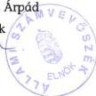
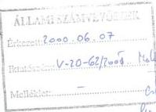
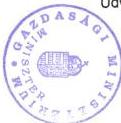

Állami Számvevőszék

# JELENTÉS

a magyar áruk és szolgáltatások
exportjának ösztönzéséhez fűződő állami
érdekek érvényesülése a Magyar Export-
Import Bank Rt. és a Magyar Exporthitel
Biztosító Rt. tevékenységén keresztül

2000.

június

0013

---

# ---**Az ellenőrzés végrehajtásáért felelős:  
IV. Vagyonellenőrzési Igazgatóság**

**Halász Gejza** számvevő igazgató

# **Az ellenőrzést vezette:**

**Harsányi Sándor** számvevő igazgatóhelyettes

# **Az ellenőrzésben részt vettek:**

**a Pénzügyminisztériumnál,  
a Gazdasági Minisztériumnál  
és az ÁPV Rt.-nél:**

**Makkai Mária** főtanácsadó

**Dr. Ocskovszky Jánosné** tanácsadó

# **az Eximbank Rt.-nél:**

**Kopányi Lászlóné** számvevő

**Lőrinc Alajos** főtanácsadó

**Matuk Károly** számvevő

# **a Mehib Rt.-nél:**

**Németh Béláné** tanácsadó

**Szűcs Ivánné** számvevő

**Dr. Szöllősi Géza** számvevő tanácsos

**Tornai József** számvevő tanácsos

---Jelentéseink az Országgyűlés számítógépes hálózatán is olvashatók.

---

TÉMASZÁM: 502 V-20-66/1999-2000.

# TARTALOMJEGYZÉK

|  **BEVEZETÉS** | **5**  |
| --- | --- |
|  **I. ÖSSZEGZÉS** | **8**  |
|  **A MAGYAR ÁRUK ÉS SZOLGÁLTATÁSOK EXPORTJÁNAK ÖSZTÖNZÉSÉHEZ FŰZŐDŐ ÁLLAMI ÉRDEKEK ÉRVÉNYESÜLÉSE A MAGYAR EXPORT-IMPORT BANK RT. ÉS A MAGYAR EXPORTHITEL BIZTOSÍTÓ RT. TEVÉKENYSÉGÉN KERESZTÜL CÍMŰ VIZSGÁLATRÓL** | **8**  |
|  1. Ajánlások | 10  |
|  1.1. A Kormány | 10  |
|  1.2. A Pénzügyminiszter | 10  |
|  1.3. Az Eximbank Rt. ügyvezetése | 10  |
|  1.4. A Mehib Rt. ügyvezetése | 11  |
|  **II. RÉSZLETES MEGÁLLAPÍTÁSOK** | **12**  |
|  1. Az Eximbank Rt. és a Mehib Rt. szakmai és tulajdonosi irányítása | 12  |
|  1.1. A szakmai irányítás | 12  |
|  1.2. A tulajdonosi irányítás | 15  |
|  1.3. A költségvetési kapcsolatok | 17  |
|  1.4. Illeszkedés a nemzetközi szabályokhoz | 18  |
|  2. Az Eximbank Rt. tevékenysége | 20  |
|  2.1. A bank gazdálkodása, jövedelmezőségének alakulása | 20  |
|  2.2. A költségvetési kapcsolatok alakulása | 22  |
|  2.3. A tőkeelemek alakulása | 22  |
|  2.4. A forrásgyűjtési tevékenység | 23  |
|  2.5. Az eszközök alakulása | 24  |
|  2.6. A kamatrés alakulása | 26  |
|  2.7. A működési költségek alakulása | 27  |
|  2.8. A hitelezési tevékenység vizsgálata | 29  |
|  2.8.1. Az Eximbank Rt. szerepe az ország exportteljesítményeinek alakulásában | 29  |
|  2.8.2. Az Eximbank Rt. hitelállományának és aktivitásának alakulása | 31  |
|  2.8.3. A hitelezési tevékenység banki szervezete, szabályozottsága, döntési rendszere | 35  |
|  2.8.4. A hitelek egyedi vizsgálatának tapasztalatai, egyes banki termékek értékelése | 36  |
|  2.8.4.1. A kamattámogatásos Exim hitelek | 38  |
|  2.8.4.2. A közvetett, kamatkiegyenlítéses refinanszírozási hitelek | 41  |

1

---

2.8.4.3. A nagyvolumenű stratégiai jellegű ügyletek finanszírozása 44
2.9. A garanciavállalási ügyletek 46
3. A Mehib tevékenysége 49
3.1. Az üzleti tevékenység alakulása 49
3.2. A szerződéses állomány alakulása 50
3.3. A Mehib Rt. tényleges biztosítási kötelezettségvállalása, a fedezetbe vett biztosítások és az ahhoz kapcsolódó díjbevétel alakulása. 51
3.3.1. A piacképes ügyletek fedezetbevétele, és díjbevétele 52
3.3.2. A nem piacképes ügyletek fedezetbevétele és díjbevétele 55
3.4. A Mehib Rt. nem piacképes biztosítási kötelezettségekre felhasználható költségvetési összegek, globállimit kihasználtsági mutatói 56
3.5. Kockázatkezelés, tartalékképzés, kárelszámolások 57
3.5.1. Kockázatelbírálási (értékelési) tevékenység 57
3.5.2. A biztosítástechnikai tartalék képzése 62
3.5.3. A Mehib Rt. kárfizetése és kárbehajtási tevékenysége 66
3.6. A jogszabályi előírások betartása 69
3.6.1. A szerződések vizsgálata 69
3.7. A nyilvántartások megléte és szabályszerűsége 72
3.8. A törvényi előírások betartása a kárfizetéseknél és a kárrendezés során 74
3.9. A biztosító tőkehelyzete, az eredmény alakulása 75
3.9.1. A mérleg eszköz- és forrásstruktúrája, vagyoni helyzet 75
3.9.2. A mérlegen kívüli tételek 80
3.9.3. Az eredmény alakulása 81

2

---

TÉMASZÁM: 502 V-20-66/1999-2000.

# A jelentésben előforduló fontosabb fogalmak és rövidítések

**Globállimit:** a politikai kockázatok elleni biztosítási kötelezettség összegének felső határa, amely a tényleges és a szerződéses biztosítási kötelezettség vállalásokat öleli fel. Azon tényleges és feltételes szerződéses biztosítási kötelezettség vállalások összessége, amelyeknél a szerződés teljesítése megkezdődött, vagy folyamatban van. A tényleges kötelezettségvállalás

- a szambavétel idópontjában fedezetbe vettBiztosítás,
- a szambavételt követően előirányzott kiszállítás (szerzódötttBiztosítás)

A feltételes kötelezettségvállalások összegét pedig azok a biztosítási ajánlatok adják, amelyek - legfeljebb 6 hónapra - a biztosítót szerződéskötési kötelezettség terheli (**ígérvény**).

**A tényleges szerződéses biztosítási kötelezettségvállalás**= azon ügyletek teljes biztosítási szerződés értékével, amelyeknél a kereskedelmi szerződés teljesítése megkezdődött vagy folyamatban van, függetlenül attól, hogy a biztosítás teljes körű vagy szállításonként történik, vagyis a szerződés ellenértékére egyösszegű, vagy szállításonkénti a fedezetbevétel.

**A feltételes kötelezettségvállalás** = a fennálló biztosítási ajánlatokkal, amelyek legfeljebb hat hónapos érvényességi ideje alatt a biztosítót az ígérvényben szereplő feltételekkel szerződéskötési kötelezettség terheli.

**A fennálló biztosítási kötelezettségvállalás** = a tényleges és a feltételes kötelezettségvállalás összegével.

**A mindenkori vállalási lehetőség** = a globállimit és a fennálló kötelezettségvállalás különbözetével.

**Fedezetbevétel** = a kereskedelmi szerződés alapján az exportőr tényleges teljesítést végez ( kiszállít ) és ezen kiszállítás értékét a biztosítónak bejelenti. Ennek alapján számlázza a biztosító a biztosítási díjat.

**Tőkemegfelelési mutató** = Szavatoló tőke
korrigált mérlegfőösszeg

**Szavatoló tőke** = Saját tőke és azok a források, amelyek a hitelintézettel szemben fennálló követelések kielégítésébe tőkeként bevonhatók.

**Korrigált mérlegfőösszeg** = kockázati tényezők figyelembevételével súlyozott szorzószámok alapján kiszámított eszközök és mérlegen kívüli tételek összege.

**Refinanszírozási hitel** = kereskedelmi bankoknak továbbkölcsönzési céllal nyújtott hitel, mely lehet üzleti kondíciójú, illetve kedvezményes fix kamatozású hitel.

3

---

**Kamatkiegyenlítési rendszer** = az Eximbank által nyújtott kedvezményes refinanszírozási hitelek tényleges költségeit, (bázis költséget) negyedévente meghatározzák és az eltérést a költségvetésből finanszírozzák.

**OECD** = Gazdasági Együttműködési és Fejlesztési Szervezet.

**CIRR** = az OECD titkársága által negyedévente meghatározott egységes kamatláb.

**GFC** = a Gazdasági Minisztérium által kezelt Gazdaságfejlesztési Célelőirányzat.

**CB-k** = a hitelkihelyezéseket elbíráló banki testületek, cenzúra bizottságok.

---4

---

BEVEZETÉS

# Jelentés

## a magyar áruk és szolgáltatások exportjának ösztönzéséhez fűződő állami érdekek érvényesülése a Magyar Export-Import Bank Rt. és a Magyar Exporthitel Biztosító Rt. tevékenységén keresztül című vizsgálatról

# BEVEZETÉS

Az Állami Számvevőszék az 1989. évi XXXVIII. törvényben 2. § (6) bekezdésében kapott felhatalmazás alapján ellenőrizte a Magyar Export-Import Bank Rt. és a Magyar Exporthitel Biztosító Rt. (továbbiakban Eximbank Rt. és Mehib Rt.) vagyonértékmegőrző és vagyongyarapító tevékenységét.

**Az ellenőrzés célja:** az állam export stratégiai célkitűzései teljesítésében az Eximbank Rt. és a Mehib Rt. szerepének, a társaságok tevékenységének, gazdálkodásának értékelése.

**A téma jelentősége:** a rendszerváltást követően a magyar gazdaság átalakulásával az export szerkezete is megváltozott. Az Országgyűlés a külgazdasági kapcsolatok, ezen belül a magyar áruk és szolgáltatások ösztönzésének elősegítésére, az exporthoz fűződő állami érdekek érvényesítésére, az exportőrök külpiaci versenyképességének erősítésére, a pénzügyi kockázatok megosztása érdekében hozta létre e két társaságot. A megalakulásuktól eltelt öt, és különösen az utóbbi két év működési tapasztalatainak felmérésével az alapítói célok teljesülése értékelhető.

**Az ellenőrzés módszere:** a bank és a biztosító gazdálkodásának törvényességi és szabályszerűségi ellenőrzése a törvények és a kapcsolódó egyéb jogszabályok alapján. Annak vizsgálata, hogy a bank és a biztosító mennyire felelt meg rendeltetésének és az alapítók elvárásának.

**Az ellenőrzött időszak:** 1998. és 1999. évek, illetve ahol szükséges, az adott gazdasági esemény keletkezésétől számított időszak.

**A vizsgált szervezetek:** a Pénzügyminisztérium és a Gazdasági Minisztérium érintett főosztályai, az ÁPV Rt., az Eximbank Rt. és a Mehib Rt.

5

---

BEVEZETÉS---

A 181/1994. (XII. 28-i) kormányrendelet a Kormányzati Ellenőrzési Hivatal kötelezettségeként írja elő a két szervezet évenkénti központi költségvetéssel történő elszámolásának ellenőrzését, ezért jelen vizsgálat e témakört csak érinti.

### **Az export főbb jellemzői**

Az 1990-es évek elején szinte teljes körűvé vált Magyarországon a külkereskedelmi tevékenység és termékforgalmazás liberalizálása, megnőtt a külkereskedelemmel foglalkozó vállalkozások száma. Ebben az időben megszűnt a KGST, így a keleti piacok elvesztése következtében a vállalatok a túlélés érdekében piacváltásra kényszerültek és a nyugati piacokon próbálták termékeiket értékesíteni. 1990-1992. között az ipari termelés visszaesett és ez tükröződött az exportban is.

A 90-es évek elején a kivitelben 40 %-ot meghaladó volt az aránya a nem túl magas feldolgozottságú nyersanyag és félkész termékeknek. A gépek és magas feldolgozottságú termékek szerény mértéket képviseltek.

A 90-es évek közepén a magyar külkereskedelmi fogalomban struktúraváltás következett be. A szerkezeti átalakulásban és az export növekedésében jelentős szerepet játszott a külföldi működő tőke beáramlása is. 1993-94-től folyamatosan nőtt a vámszabadterületi társaságok száma és az általuk lebonyolított beruházások, termelés és export értéke is. A nyugat-európai dekonjunktúra elmúltával lehetővé vált az Európai Unió (a továbbiakban EU) felé az export növelése.

1997-ben a nemzetgazdasági exporton belül az ipari vámszabadterületekről származó kivitel aránya 26 %, a bérmunkáé 21 % volt. Az export mintegy 78 %-a a fejlett országokkal, 71 %-a az EU tagországaival bonyolódott.

Az exportban a gépiparnak volt meghatározó szerepe, részaránya 45 % volt. A feldolgozott termékek pedig az exporton belül 35 %-ot képviseltek. A gépek, gépi berendezések exportjában a vámszabadterületi társaságoknak volt jelentős szerepük.

1998-ban - az orosz válság és a pénzpiaci zavarok ellenére - az export bővült. Az összes kivitel 52 %-a a vámszabadterületekről és a bérmunkából származott. A fejlett országokkal az export 80 %-a bonyolódott. A gépek, berendezések részaránya az exportban 52 %-ot képviselt.

1999-ben közel azonos nagyságrendek és szerkezeti helyzet várható az év első 11 hónapjának adatai szerint.

Az utóbbi két évben összességében a kivitel több mint egyharmada a multinacionális társaságok teljesítménye, s mintegy 20 %-a bérmunka eredménye. Az export növekedése elsősorban az ipari teljesítménynek köszönhető. Ez utóbbin belül is a multinacionális cégek szerepe a meghatározó, melyek termelésében - a dokumentumok szerint - a magyar hozzáadott érték viszonylag alacsony.

A nem vámszabadterületeken működő magyar tulajdonú vállalatok, kis és közepes cégek kivitele lassabban nő mint a multinacionális társaságoké, illetve

---6

---

BEVEZETÉS

külföldi tőkével működő egyéb vállalatoké, 1999. első tizenegy hónapjában pedig abszolút mértékben is csökkent.

A magyar áruk piacrajutását segítik a szabadkereskedelmi egyezmények, melyek kereteiben a legnagyobb kedvezményes elbánás elve érvényesül. Kiemelt jelentősége van az Európai Megállapodásnak, melynek eredményeként a magyar ipari termékek vám- és mennyiségi korlátozás nélkül juthatnak be az EU országokba.

### Az exportösztönzés állami intézményei

Az exportösztönzés két legfontosabb állami intézménye az Eximbank Rt. és a Mehib Rt. Az Eximbankot és a Mehibet az 1994. évi XLII. törvény hozta létre, mint az exportösztönzés állami eszközeinek legfontosabb, egymástól elkülönített közvetítő intézményeit, melyek 100 %-ban állami tulajdonban vannak.

A törvény szerint a társaságok létrehozásának céljai a következők voltak:

- a külgazdasági kapcsolatoknak, ezen belül kiemelten a magyar áruk és szolgáltatások exportjának ösztönzése és segítése,
- az exporthoz fűződő állami érdekek érvényesítése,
- az exportőrök külpiaci versenyképességének erősítése,
- az export hagyományos piaci eszközökkel nem biztosítható pénzügyi kockázatainak megosztása,
- a pénzügyi intézményrendszer, ezen belül az exportfinanszírozás és export-hitel-biztosítás rendszerének a piacgazdasági eszközökkel, valamint a nemzetközi normákkal összhangban történő továbbfejlesztése.

A célok elérése érdekében a két társaság működését az állam segíti.

Az **Eximbank Rt. esetében** egyrészt a bank forrásszerzéseiből eredő kötelezettségek teljesítéséért a központi költségvetés készfizető kezességet vállal. Másrészt a bank a Kormány megbízása alapján vállalt garanciaügyletei mögött az állam készfizető kezessége áll. Ezen túl kormányrendeletben meghatározott kedvező kamatozású hitel nyújtásához a bank a költségvetésből ún. kamatki-egyenlítésben részesül.

A **Mehib Rt.** nem piacképes kockázatú biztosításaiból és a biztosítási tevékenységhez kapcsolódóan felvett hiteleiből eredő fizetési kötelezettségei mögött a központi költségvetés készfizető kezessége áll.

A két társaság számára meghatározott keretösszegeket a mindenkori költségvetési törvények tartalmazzák.

Az Eximbank Rt. tevékenysége jelenleg a magyar export közel 2 %-át, a Mehibé 1,1 %-át fedi le. A fejlett országokban ez az arány 5-8 % között van.

7

---

I. ÖSSZEGZÉS

# I. ÖSSZEGZÉS

## A MAGYAR ÁRUK ÉS SZOLGÁLTATÁSOK EXPORTJÁNAK ÖSZTÖNZÉSÉHEZ FŰZŐDŐ ÁLLAMI ÉRDEKEK ÉRVÉNYESÜLÉSE A MAGYAR EXPORT-IMPORT BANK RT. ÉS A MAGYAR EXPORTHITEL BIZTOSÍTÓ RT. TEVÉKENYSÉGÉN KERESZTÜL CÍMŰ VIZSGÁLATRÓL

Az Eximbank Rt. és a Mehib Rt. 1994. évi létrehozásának alapvető célja az volt, hogy segítsék a külgazdasági kapcsolatok fejlődését ezen belül kiemelten a magyar áruk és szolgáltatások exportjának ösztönzését. A két társaság e céloknak megfelelően működött. 1999-ben a magyar exportnak az Eximbank Rt. közel 2 %-át, a Mehib Rt. 1,1 %-át fedte le. Mindez - figyelemmel arra, hogy az ország exportjában meghatározó szerepe olyan teljesítményeknek van, amelyek nem tartoznak az államilag támogatandó területek közé (vámszabadterületi társaságok, bérmunka) - pozitív eredmény, azonban nem jelenti a lehetőségek kihasználásának felső határát. A két intézmény évről évre növekvő kötelezettségvállalást tervezett a költségvetésben, ezzel szemben a keret kihasználtsága csak 25-65 % között volt.

A társaságok 1997-re kialakították a fő üzleti kapcsolataikat, hitelezési és biztosítási konstrukciókat. A működéshez az állam megfelelő alaptőkét biztosított, a tárgyi és a személyi feltételek adottak voltak. Mindezen feltételek mellett is az exporthoz fűződő állami érdekek a társaságok tevékenységén keresztül csak korlátozottan érvényesültek. Ennek egyik oka, hogy a Kormány 1998-2000. évekre meghatározott gazdaságpolitikai elvárásaiban az állami preferenciaként megjelölt számos viszonylat (országok, országcsoportok) és termékkör közül a két társaság tevékenységében csak egy-egy termékcsoport és piaci viszonylat jelenik meg. A társaságok nem törekedtek a diverzifikációra, ennek következtében az Eximbank Rt.-nél és a Mehib Rt.-nél is magas az államilag támogatott tevékenységen belül a koncentráció, ezzel együtt a kockázat.

Az exporthoz fűződő állami érdekek korlátozott érvényesülésében szerepet játszott az 1998. második félévében kibontakozó orosz pénzügyi válság és a délszláv háború két társaságot érintő hatása, illetve az ezekre történő reagálás is. 1999-ben az Eximbank Rt. és a Mehib Rt. visszafogta ezen magas kockázatú piaci viszonylatok hitelezését és biztosítását. Ez szükségszerű magatartás volt. Ennek eredményeként a költségvetésre háruló terhek a törvényben rögzített előirányzatok keretei között maradtak. A kieső viszonylatok pótlása, új területek bevonása azonban elmaradt. A Mehib Rt. a piacképes - államilag nem preferált - biztosításokon belül a belföldi hitelbiztosításokra helyezte a hangsúlyt úgy, hogy a törvénnyel ellentétesen négy esetben a belföldi kötelezettségvállalás meghaladta az exportirányú kötelezettségvállalásokat. Az Eximbank Rt. az üzleti aktivitás fokozásának nem kielégítő eredménye miatt a belföldi bankokon keresztül nyújtott refinanszírozó hiteleket helyezte előtérbe, továbbá forrásai egy részét - amelyek mögött állami garancia áll - értékpapírokba fektette. A kieső kamatbevételek pótlása érdekében vásárolt értékpapírok állománya az Eximbank Rt.-nél az alaptőke közel másfélszeresét érte el 1999. december 31-én.

8

---

A MAGYAR ÁRUK ÉS SZOLGÁLTATÁSOK
EXPORTJÁNAK ÖSZTÖNZÉSÉHEZ FŰZŐDŐ ÁLLAMI ÉRDEKEK ÉRVÉNYESÜLÉSE A MAGYAR EXPORT-IMPORT
BANK RT. ÉS A MAGYAR EXPORTHITEL BIZTOSÍTÓ RT. TEVÉKENYSÉGÉN KERESZTÜL CÍMŰ VIZSGÁLATRÓL

A társaságok létrehozása céljának megfelelően a Kormány „háromezres” hatá-
rozatban rögzítette, hogy az Eximbank Rt. és a Mehib Rt. gazdálkodása ne le-
gyen veszteséges, a társaságoknak beviteleikből fedezniük kell működési költ-
ségeiket és ráfordításaikat, ezzel szemben az állam, mint tulajdonos osztalék-
követelményt nem támaszt.

Az Eximbank Rt. gazdálkodása során a vele szemben támasztott követelmé-
nyeknek eleget tett. Figyelemre méltó, hogy a korábbi évektől eltérően 1999-
ben a kamatrés 40 %-a már nem a hitelek kamataiból, hanem az
értékpapírforgalmazás kamatkülönbözetéből származott. Működési költségei
között több mint 70 %-os arányt képviseltek a létszámhoz és a bérelt székház-
hoz kapcsolódó kiadások.

Az Eximbank Rt. tőkemegfelelési mutatójának 55,6 %-os értéke azt jelzi, hogy a
tőkéhez képest lehetőség van az üzleti aktivitás növelésére és a kockázatválla-
lás markánsabb megjelenítésére. A pénzintézet 1998-ban veszteséges volt,
amelyet az orosz válsággal összefüggő megnövekedett céltartalékképzési köte-
lezettség teljesítése idézett elő.

A Mehib Rt. gazdálkodása megfelelt az elvárásoknak, de az üzleti tevékenység
veszteséges volt, mivel a díjbevételek nem biztosították a működési költségek és
a tartalékképzés fedezetét. Ennek fő oka, hogy a rendelkezésre álló kapacitás
alapján a működési költségek viszonylagos állandósága mellett alacsony volt a
szerződésállomány, ehhez kapcsolódóan a díjbevétel is. Ezt a vizsgált években a
biztosítónál ellensúlyozta a betétekből és értékpapírokból származó kamatbe-
vétel. A Mehib Rt. az 1999-es évet veszteséggel zárta, ez azonban az év végén
előírt, a nem piacképes biztosítások után képzett céltartalék miatt következett
be.

Az Eximbank Rt.-ről és a Mehib Rt.-ről szóló hatályos törvény rendelkezései,
mind a tulajdonosi, mind a szakmai irányítás tekintetében hiányosak. A tör-
vény nem nevesíti a tulajdonosi jogok gyakorlóját, azt az állam tulajdonában
lévő vállalkozói vagyon értékesítéséről szóló 1995. évi törvény melléklete tar-
talmazza. 1998. július 27-ig a tulajdonosi jogok gyakorlója a pénzügyminiszter
volt, döntéseiről alapítói határozatokat adott ki. A határozatokat nem sorszá-
mozták, így a teljes-körűség nem volt megállapítható. A Pénzügyminisztérium
Szervezeti és Működési Szabályzata nem rendezi az alapítói határozatok nyil-
vántartásának rendjét és azt sem, hogy a pénzügyminiszter távollétében ki jo-
gosult alapítói határozatot kiadni.

A két társaság alapításáról szóló 1994. évi törvény a szakmai irányítást fenn-
tartotta a Kormány számára azzal, hogy irányelvek kiadását írta elő. Az 1997.
december 20-tól hatályos törvény a Kormány e kötelezettségét törölte és az üz-
leti tervek jóváhagyását a tulajdonosi jogok gyakorlójának hatáskörébe utalta.
A szabályozás arra nem tér ki, hogy az üzletpolitika jóváhagyásakor milyen
nemzetgazdasági követelményeket kell a tulajdonosnak érvényesítenie. Az
irányelvek kiadásáról szóló törvényi kötelezettség megszűnése ellenére az alap-
vető gazdaságpolitikai elvárásokról kiadott „háromezres” határozat szolgált a
továbbiakban is szakmai iránymutatóként. E határozat szerint a költségvetési
hátterű garanciavállalásokról 10 millió USD értékhatár felett a pénzügyminisz-

9

---

A MAGYAR ÁRUK ÉS SZOLGÁLTATÁSOK
EXPORTJÁNAK ÖSZTÖNZÉSÉHEZ FŰZŐDŐ ÁLLAMI ÉRDEKEK ÉRVÉNYESÜLÉSE A MAGYAR EXPORT-IMPORT
BANK RT. ÉS A MAGYAR EXPORTHITEL BIZTOSÍTÓ RT. TEVÉKENYSÉGÉN KERESZTÜL CÍMŰ VIZSGÁLATRÓL

ter, az alatt pedig az Eximbank Rt. igazgatósága dönt. Ez a rendelkezés ellentétes a törvényi előírással, miszerint költségvetési hátterű garancia csak a Kormány megbízása alapján vállalható. Mivel a kormányhatározat nem jogszabály az abban foglaltak egy gazdasági társaság részére nem kötelező érvényűek.

## 1. AJÁNLÁSOK

### 1.1. A Kormány

1. Kezdeményezze az Eximbank Rt. és a Mehib Rt.-ről szóló törvény módosítását, amelynek keretében határozza meg a két társaság jogállását és tulajdonosát, valamint a szakmai irányítás érdekében azt a szervezetet/intézményt, amely a nemzetgazdasági érdekeket a két társaság felé közvetíti és annak megvalósulását ellenőrzi.
2. Szüntesse meg az 1994. évi XLII. tv. és a „háromezres” kormányhatározat közötti ellentmondást - figyelemmel az Áht. 42. §-ban foglaltakra - a költségvetési hátterű garanciavállalásokkal kapcsolatban.
3. Rendelje el a jelenlegi exporttámogató mechanizmus és teljesítmények kormányzati felülvizsgálatát. Határozza meg azokat a hosszú távú növekedésre képes ágazatokat és termékcsoportokat, ahová az exporttámogatásra felhasználható eszközöket koncentrálni szükséges.
4. Vizsgáltassa meg a költségvetési garanciákkal biztosított ügyletek esetében az Eximbank Rt. finanszírozási részvételének lehetőségét, a nemzetgazdasági exportcélok teljesítésére fordított fajlagos költségvetési ráfordítások csökkentése érdekében.
5. Biztosítsa a belföldi bankokkal működtetett kedvezményes, fix kamatozású refinanszírozási hiteleknél, hogy a kamatkiegyenlítések elszámolására szolgáló költségvetési eszközök megfelelően támogassák az export növekedését.

### 1.2. A Pénzügyminiszter

Vizsgálja felül a Pénzügyminisztérium Szervezeti és Működési Szabályzatát annak érdekében, hogy szabályozott legyen a tulajdonosi jogok gyakorlásának hatásköre a pénzügyminiszter akadályoztatása esetén is. Egyben szabályozza az alapítói határozatok kezelésének, naprakész nyilvántartásának rendjét.

### 1.3. Az Eximbank Rt. ügyvezetése

1. Egészítse ki a származékos kölcsönszerződések kezelésével és az adósok szúrópróba szerű kontrolljával a támogatott exportcélok teljesülésének ellenőrzését, a belföldi bankokkal keretjelleggel működtetett refinanszírozási hitelek esetében.

10

---

A MAGYAR ÁRUK ÉS SZOLGÁLTATÁSOK
EXPORTJÁNAK ÖSZTÖNZÉSÉHEZ FŰZŐDŐ ÁLLAMI ÉRDEKEK ÉRVÉNYESÜLÉSE A MAGYAR EXPORT-IMPORT
BANK RT. ÉS A MAGYAR EXPORTHITEL BIZTOSÍTÓ RT. TEVÉKENYSÉGÉN KERESZTÜL CÍMŰ VIZSGÁLATRÓL

2. Gondoskodjon a GFC alapból történt támogatás megszűnése miatt a kis és középvállalkozásokat támogató Eximhitel konstrukció továbbműködtetésének feltételeiről.

# 1.4. A Mehib Rt. ügyvezetése

1. Vizsgalja felul a piacképesBiztositások tervezési rendszerét, mivel az elöirányzatok jelentós elterése a tenyleges teljesistól megingathatja a gazdál-kodást.
2. Gondoskodjon arról, hogy a belföldiBiztositási kockázatvallalast a törvenynek megfeleloen végezzek, azaz egybiztositott felé fennallo belföldi kötelezettsegvallalas ne haladja meg az exportiránybiztositási kötelezettsegvallalast.
3. Egésztse ki aBiztositástechnikai tartalekok képzésével foglalkozó utasítást a teteles IBNR kártartalek alapjául szolgálo kárveszélyes allomány definiálasával, az elszamolás, a szambavétel modjának szükségserinti leirásával. Alakitsa ki a nem piacképesbiztositások utani celtartalek képzésenek és elszamolásanak részletes eljárási rendjét.
4. Biztositsa az ügyrendi szabalyzatok folyamatos karbantartasát és a kárrendezés megfelelo dokumentálását.

11

---

II. RÉSZLETES MEGÁLLAPÍTÁSOK

## II. RÉSZLETES MEGÁLLAPÍTÁSOK

### 1. AZ EXIMBANK RT. ÉS A MEHIB RT. SZAKMAI ÉS TULAJDONOSI IRÁNYÍTÁSA

#### 1.1. A szakmai irányítás

A társaságok alapításáról szóló törvény a szakmai irányításról csak közvetetten rendelkezett, oly módon hogy

- egyrészt szabályozta a kormányzati kapcsolatokat. A társaságok "működésének, az állami érdekekkel, a gazdaságpolitikai célokkal, valamint a költségvetési törvénnyel való összhang" biztosítása érdekében irányelvek kiadását írta elő a Kormány számára,
- másrészt meghatározta az igazgatóságokba, felügyelő bizottságokba a tulajdonos, illetve az érintett tárcák részéről delegálható tagok létszámát.

Az Eximbank Rt. és a Mehib Rt. 1995. évi működésére vonatkozó kormányzati irányelvekről a Kormány kiadta 2157/1994. (XII. 28.) határozatát. E határozat a társaságok felett tulajdonosi jogokat gyakorló pénzügyminiszter számára írt elő irányelveket annak érdekében, hogy a két társaság tevékenysége összhangban legyen a Kormány gazdaságpolitikai céljaival és az éves költségvetési törvénnyel. Ez azt jelentette, hogy a tulajdonosi jogok gyakorlójának feladata a szakmai irányítás is.

A kormányzati kapcsolatok szabályozására vonatkozó előírást 1997. XII. 20-tól az 1997. évi CXIII. törvény 16.§ (2) bekezdésével hatályon kívül helyezték.

A törvénymódosítás következtében a Kormány már ezt követően nem kívánta irányelveken keresztül meghatározni a két társaság számára a gazdaságpolitikai elvárásokat. A törvény a pénzintézet és a biztosító tevékenységére kiterjedő üzleti terv jóváhagyását a tulajdonosi jogok gyakorlójának hatáskörébe utalta. (A korábbi törvényi szabályozás szerint az üzleti tervet az igazgatóságok hagyták jóvá, a kormányzati irányelvekkel összhangban.)

Ezzel a módosítással implicite már törvényi előírássá vált az, hogy a tulajdonosi jogok gyakorlójának hatásköre a szakmai irányítás is. Ezt a megoldást feltehetően a költségvetési kapcsolatok, illetve a két társaság alaptevékenysége (bank és biztosító) indokolhatta. Az intézmények tevékenysége olyan gazdasági területekhez kapcsolódik - export, külgazdasági kapcsolatok - amelyek felügyeleti és szakmai irányítása egyébként más tárcák hatásköre.

Sem ez a törvény, sem más jogszabály nem rendezte azonban azt, hogy a tulajdonosi jogok gyakorlójának milyen nemzetgazdasági elvárásokat kell érvényesítenie a társaságok üzletpolitikájának jóváhagyásakor.

12

---

II. RÉSZLETES MEGÁLLAPÍTÁSOK

Az 1997. évi törvénymódosítás ellenére 1998. május 14-én a Kormány kiadta háromezres határozatát 'a Magyar Export - Import Bank Rt. és a Magyar Exporthitelbiztosító Rt. tevékenységével kapcsolatos alapvető gazdaságpolitikai elvárásokról az 1998 - 2000 évekre' címen.

A kormányhatározat kiadásakor az előterjesztés szerint a tárcákat az vezérelte, hogy a gazdasági szerkezetváltást követően az alaptörvény 1997. évi módosítása ellenére szükségesnek ítélték az érintett tárcák egyetértésével kidolgozott, számonkérhető, középtávra szóló előírások, illetve elvárások megfogalmazását. A határozat irányt szabott a társaságoknak arra, hogy mely területekre kell üzleti aktivitásukat összpontosítani a költségvetésben biztosított pénzügyi eszközök felhasználásával. Az irányelvek kiadására vonatkozó törvényi előírás megszüntetése nem volt megfelelően átgondolt, megalapozott. Ezt támasztja alá az is, hogy a törvénymódosítást követő rövid időn belül ugyanazon tárcák mégis javasolták az elvárások kiadását.

Az előterjesztés arra nem tér ki, hogy az elvárások kiadását az előzőekben megfogalmazottakon túl valójában mi motiválta, hiszen 1996-97. évre is igazak voltak ezek az elvárások - sőt törvényi kötelezettség lett volna megjelentetésük - és mégsem határozták meg azokat, illetve az erre vonatkozó kormányhatározat kiadását is törölték a törvényből.

Az 1998. május 14-én „önszorgalomból” megfogalmazott gazdaságpolitikai elvárások kidolgozása a PM vezetésével, az IKIM és az MNB közreműködésével történt. Az IKIM feladatköréből adódóan meghatározta az államilag támogatni javasolt termékkört és a relációkat is. Javaslatainak döntő többsége az elvárásokban megjelent. A PM azok megfogalmazásában egyrészt mint a társaságok tulajdonosa, másrészt mint a két társaságot érintő - pénzintézeti és biztosítási - szabályozás felelőse vett részt. A kormányhatározat államigazgatási egyeztetése során az Igazságügyi Minisztérium felvetette, hogy a Kormány a törvénymódosításból adódóan nem dönthet az elvárások elfogadásáról, ezért azt javasolta, hogy a Kormány által megtárgyalt előterjesztés alapján azokat a tulajdonosi jogokat gyakorló pénzügyminiszter érvényesítse a társaságokkal szemben az üzleti tervek elfogadása keretében. Az IM észrevételét nem vették figyelembe.

A két társaság működésére kormányhatározatot 3000-es, szigorúan titkos határozatként adták ki, és ez annak alkalmazását is nehezítette.

A két társaság tevékenységével szemben támasztott gazdaságpolitikai elvárások teljesítését a kormányhatározat szerint a tárcáknak (PM, IKIM, MNB) 2000. december 31-ig kell megvizsgálniuk és arról előterjesztést készíteniük. Ezzel és az IM javaslatának figyelmen kívül hagyásával **1998. és 2000. év vége közötti időszakban az ellenőrzés és számonkérés területén vákuum keletkezett.** Ebben az időszakban nincs kijelölt szervezet, amelyik köteles lenne ellenőrizni a két társaság működését a tekintetben, hogy az megfelel-e az elvárásoknak. A kormányhatározat betartása a két társaságon múlik.

Mindkét társaság ügyvezető szerve az igazgatóság. A bank és a biztosító létrehozásáról rendelkező törvény meghatározta, hogy mely intézmények hány főt delegálhatnak az igazgatóságokba és a felügyelő bizottságokba. E szerint az

13

---

II. RÉSZLETES MEGÁLLAPÍTÁSOK---

igazgatóságokba a pénzügyminiszter és az ipari, kereskedelmi és idegenforgalmi (ma gazdasági) miniszter 3-3 főt, egy-egy főt a földművelésügyi és a külügyminiszter jelöl ki.

A felügyelő bizottságokba, melyeknek feladata az ügyvezetések és az üzletvitel ellenőrzése, 2-2 tagot a pénzügyminiszter és az ipari, kereskedelmi és idegenforgalmi (gazdasági) miniszter jelöl.

Az egyes miniszterek által delegált tisztségviselők nem minden esetben az érintett tárcák dolgozói, független szakértők is szerepelnek köztük. Az igazgatóság tagjai jogi felelősséggel tartozó magánszemélyként járnak el, mivel nem az őket jelölő intézményeket, mint jogi személyt képviselik. Ebből következően az igazgatóságban nem egyeztetett, tárcavéleményt képviselnek. Ez különösen érvényes azoknál az igazgatósági tagoknál, akik nem a tárcák alkalmazottjai. Tekintettel arra, hogy a tisztségviselők jogi és anyagi felelősséggel is tartoznak konkrét üzleti döntéseikért, a képviselt minisztérium szakmai érdekeinek közvetítésén túl, szem előtt kell tartaniuk a társaságok prudens működését is. Az egyes döntéshozataloknál a két szempont nem feltétlenül esik egybe.

Az igazgatósági ülések emlékeztetőinek tanúsága szerint az egyes minisztériumok által delegáltak állásfoglalásai egyetlen esetben sem úgy jelentek meg mint egyeztetett hivatalos tárca vélemény, ebből fakadóan olyan véleményalkotás pedig nem is lehetett, amely a képviselt négy minisztérium egyeztetett álláspontja lett volna.

**A dokumentumok a vezető testületekbe delegált tisztségviselőkön keresztüli, gazdaságpolitikai elvárásokat közvetítő, szakmai irányítást nem tükrözik.**

### A törvény és az irányelvek/elvárások kapcsolata

A társaságok létrehozásáról szóló törvény szerint 'a Kormány a központi költségvetés terhére készfizető kezesként felel az Eximbank Rt. által ... a **Kormány megbízása alapján vállalt garanciaügyletek** esetleges beváltásából fakadó fizetési kötelezettségekért.' Az 1995. évi működésre vonatkozó kormányzati irányelveket rögzítő határozat a Kormány megbízása alapján, a központi költségvetés terhére vállalható garanciaügyletekkel kapcsolatban azt írja elő, hogy azok 'olyan esetekben adhatók, amikor az adott exportügylet megvalósulása olyan nemzetgazdasági érdek, amelynek gazdasági kockázatát a bank a magas kockázat, vagy a nagyságrend miatt nem vállalhatja fel. Annak eldöntése, hogy az adott ügylet befogadható-e közvetlen költségvetési hátterű garanciaként a bank igazgatósága jogosult dönteni. Meghatározott összeghatár fölötti (10 millió dollár) garancia nyújtásáról az igazgatóság javaslata alapján a tulajdonos dönt.'

**Ez az előírás nem felel meg a törvény azon kitételének, hogy a költségvetési hátterű garancia, csak a Kormány megbízása alapján vállalható.** A kormányhatározat szerint ugyanis a társaság szabad döntése, hogy mit fogad be ilyen jellegű garanciának.

---14

---

II. RÉSZLETES MEGÁLLAPÍTÁSOK

1996-tól 1998 májusáig a Kormány új irányelveket nem adott ki, a törvényi előírás a költségvetési hátterű garanciákra vonatkozóan nem változott.

A Kormány 1998-ban - már nem törvényi kötelezettségként - meghatározta az alapvető gazdaságpolitikai elvárásokat 1998-2000. évekre a két társaság tevékenységével kapcsolatban. Ebben a költségvetési hátterű garanciavállalások döntési jogosultságát az 1995. évi irányelvekben megfogalmazottakhoz hasonló módon szabályozta azzal az eltéréssel, hogy a 10 millió USD fölötti garancia nyújtásáról a pénzügyminiszter dönt. Tehát továbbra is a társaság vezetésének hatáskörébe tartozik 10 millió USD alatt a költségvetési hátterű garancia vállalása és **változatlanul fennáll a törvénnyel ellentétes döntési jogkör gyakorlásának lehetősége.** Az elvárásokban - új előírásként - azt is rögzítették hogy az egy exportőrrel, illetve egy exportügylettel vállalt kötelezettség mértéke mennyi lehet.

A kormányhatározat az állami irányítás egyéb jogi eszközeként nem minősül jogszabálynak és ennél fogva csak a kormányzati szervezetre vonatkozóan bír kötelező erővel. Nem kormányzati szervek esetében a kormányhatározat betartásának kikényszerítése nem lehetséges. Az Eximbank Rt. még ha 100 %-os állami tulajdonú társaság is, gazdasági társaságnak, azok között is speciális hitelintézetnek minősül, amelyre vonatkozóan az alapítói törvény szabja meg a követendő rendelkezéseket.

Az Eximbank Rt. egy speciális feladatra létrehozott szakosított pénzintézet, amelynek nem feladata (nem is lehet) a nemzetgazdasági érdek meghatározása és nincs is mindazon ismeretek birtokában, amelyek alapján azt eldönthetné. Nem véletlen, hogy a törvény a költségvetési hátterű garanciák nyújtását a Kormány megbízásához köti.

## 1.2. A tulajdonosi irányítás

A két társaság létrehozásáról rendelkező 1994. évi XLII. törvény rögzítette, hogy azok 'állami tulajdonban lévő egyszemélyes részvénytársaságok, melyekben a Magyar Állam nevében a tulajdonosi jogokat mindkét részvénytársaságban a pénzügyminiszter gyakorolja.'

A törvény - 1994. április 26-i - kihirdetését követően alig egy évvel már a tárcák, a tulajdonos és az érintett szervezetek is annak módosítását szorgalmazták. A módosítás tervezetek kiterjedtek mind a tulajdonosi, mind a szakmai irányítás kérdéseire. Közel két éves előkészítés, többszörös egyeztetés után 1997. december 20-án hatályba lépett az 1997. évi CXIII. törvény, amely számos korábbi előírás megváltoztatásán (igazgatóság elnöke feletti munkáltatói jog, felügyelő bizottságba való delegálás, stb.), illetve hatályon kívül helyezésén (osztalék, könyvvizsgálók, befektetés korlátozása, stb.) túl sem a tulajdonosi, sem a szakmai irányítás területén módosítást nem tartalmazott.

A pénzügyminiszter, mint a tulajdonosi jogok gyakorlója 1998. július 27-én képviseleti meghatalmazást adott az ÁPV Rt.-nek az alapítói jogok teljes körű gyakorlására.

15

---

II. RÉSZLETES MEGÁLLAPÍTÁSOK---

A Magyar Köztársaság 1999. évi költségvetéséről szóló 1998. évi XC. törvény (128. § (1/n) 1999. január 1-től hatályon kívül helyezte az 1994. évi XLII. törvény, tulajdonosra vonatkozó rendelkezését (1. § (2)) és ugyanezen törvény pedig azzal, hogy módosította az ÁPV Rt.-ről szóló 1995. évi XXXIX. törvény mellékletét, a tulajdonosi jogokat az ÁPV Rt.-re átruházta és egyidejűleg a pénzügyminiszter tulajdonosi joggyakorlását megszüntette.

A több törvényen keresztüli áttételes rendelkezés azt eredményezte, hogy a bankról és a biztosítóról szóló **alaptörvényben sem a két társaság tulajdoni összetétele** (egyszemélyes részvénytársaság), **sem a tulajdonosi jogokat gyakorló intézmény nincs nevesítve**. A hatályos törvényben e lényegi adatok nem szerepelnek annak ellenére, hogy a potenciális befektetők, üzleti partnerek, illetve a gazdaság többi szereplői tájékoztatására a társaságok legfontosabb adatairól, alapvetően az alapításról rendelkező törvény szolgál.

A hatályos törvénnyel összhangban a társaságok Alapító Okiratai szerint a tulajdonos “a hatáskörébe tartozó ügyekben Alapítói határozat formájában dönt, amelyről az igazgatóságot értesíteni köteles.”

A pénzügyminiszter 1998-ban a képviseleti meghatalmazás kiadásáig – a rendelkezésre álló dokumentumok szerint – 17 alapítói határozatot adott ki az Eximbankra és a Mehibre együttesen. A határozatok nem sorszámozottak, így a teljes körűség nem megállapítható.

A határozatok közül 8 a tisztségviselők, 2 a könyvvizsgáló díjazásáról, egy az igazgatósági tagok kinevezéséről, 2 a társaságok tulajdonában lévő részvények eladásáról, 2 konkrét ügyek, egy az Eximbank Rt. 1997. évi beszámolójának, egy pedig az Eximbank Rt. 1998. évi üzleti tervének jóváhagyásáról szól. Nincs alapítói határozat a Mehib Rt. 1997. évi beszámolójának elfogadásáról és az 1998. évi üzleti tervének jóváhagyásáról.

Az 1994. évi XLII. tv. a tulajdonosi jogok gyakorlására a pénzügyminisztert jelölte ki. A pénzügyminisztérium Szervezeti és Működési Szabályzata nem rendelkezik arról, hogy a miniszter akadályoztatása esetén e jogokat ki gyakorolhatja. Az 1998-ban kiadott 17 db alapítói határozatból 13 esetben, a közigazgatási államtitkár írta alá a határozatokat.

Az sem volt szabályozva, hogy a két társasággal kapcsolatos alapítói határozatok kezelése, gondozása és naprakész nyilvántartása a minisztériumon belül mely szervezeti egység feladata. Ez vezethetett oda, hogy a Pénzügyminisztériumban az alapítói határozatok teljes körűsége nem volt megállapítható.

A Pénzügyminisztériumnál a rendelkezésre álló dokumentumok között az Alapító okirat kiadását megalapozó előterjesztés, feljegyzés nem található.

Az ÁPV Rt. 1998. július 27-től 1999. december 31-ig 46 db. Alapítói határozatot adott ki a két társasággal kapcsolatban. Ezek közül 14 db a tisztségviselők díjazásáról és a vezetők premizálásáról, 3 db alaptőke emelésről, 4 db ügyrendekről, 4 db az alapító okiratok módosításáról, 2 db a könyvvizsgálók megválasztásáról és díjazásáról, 2 db az üzleti tervek, 2 db a beszámolók jóváhagyásáról, és 15 db pedig a tisztségviselők kijelöléséről, illetve visszahívásáról rendelkezett.

---16

---

II. RÉSZLETES MEGÁLLAPÍTÁSOK

Az ÁPV Rt.-nél az alapítói határozatokról részletes előterjesztés alapján az ÁPV Rt. igazgatósága dönt. A tulajdonosi jogok gyakorlója és a két társaság között a kapcsolattartás folyamatos, és szakmai kérdésekben is rendszeres a konzultáció.

### 1.3. A költségvetési kapcsolatok

A Magyar Köztársaság mindenkori éves költségvetéséről szóló törvény keretében az Országgyűlés meghatározza az Eximbank Rt. és a Mehib Rt. azon tevékenységéből eredő kötelezettségvállalások felső határait, amelyek állami szerepvállalás mellett történhetnek.

A kezességvállalás, kezesi helytállás és viszontgarancia fejezetben rögzítik, az Eximbank Rt. által forrásszerzés céljából felvehető hitelek együttes állományának, az exportcélú garanciaügyletek állományának és a Mehib Rt. által vállalható politikai és árfolyamkockázatok elleni biztosítások állományának felső határát. A társaságok az adott év egyetlen napján sem léphetik túl a meghatározott limiteket.

Konkrét költségvetési kiadási és bevételi előirányzatként a PM fejezeten belül az Eximbank Rt. által vállalt garanciaügyletekből és a Mehib által biztosítási tevékenységből eredő fizetési kötelezettség és bevétel, valamint az Eximbank Rt. kamatkiegyenlítésére fordítandó összeg jelenik meg.

1998-ban garanciaügylet miatti fizetési kötelezettség nem volt (terv 1 milliárd Ft), biztosítási tevékenységből eredő kifizetés 36,6 millió Ft volt a tervezett 770 millió Ft-tal szemben. Kamatkiegyenlítésre 300 millió Ft-ot terveztek, a felhasználás 32,3 millió Ft volt. Az 1999. évi tényadatok még nem állnak rendelkezésre.

A költségvetési törvényben megjelenő - a két társasággal kapcsolatos - előirányzatok, tervszámok kialakítása a költségvetés tervezésének rendje szerint történik. A társaságok a PM fejezetébe tartoznak, ezért a tervezés a minisztérium feladata, ezen belül is a vállalkozásfejlesztési és szabályozási főosztályé. A tervezéshez szükséges alapadatokat a társaságok szolgáltatják. A következő évi tervszámok kidolgozásánál figyelembe veszik az előző évek tényszámait, a várható elkötelezettségeket, tendenciákat. A PM a társaságok által tervezett adatok megítéléséhez a rendszeres adatszolgáltatáson keresztül rendelkezik információval. 1998. I. félévéig a PM azzal, hogy ugyanazon főosztálya látta el a tulajdoni jogok gyakorlásából eredő feladatokat is, mint tulajdonos is részt vett a tervezésben. Ezt követően a tulajdonosi jogok gyakorlója az ÁPV Rt. lett, azonban a fejezeti hovatartozás miatt a tervezés felelőse a társaságokat illetően továbbra is a PM maradt. Az ÁPV Rt. mint tulajdonos így közvetlenül a tervszámok kialakításában nem vesz részt. Ráhatása közvetetten az üzleti tervek jóváhagyásán keresztül van.

A tervezéssel kapcsolatban rendelkezésre álló dokumentumok egyike sem tér ki arra, hogy a költségvetésben rögzített limitek évenkénti emelését - annak ellenére, hogy azok kihasználtsága egyik évben sem érte el az 50 %-ot - részleteiben mi indokolja.

17

---

II. RÉSZLETES MEGÁLLAPÍTÁSOK---

Ugyanakkor a zárszámadás összeállításához készített dokumentumok sem tartalmazzák az alacsony kihasználás okait.

A két társaságról szóló törvényben (1994. évi XLII. tv.) kapott felhatalmazás alapján a pénzügyminiszter rendeletben szabályozta a társaságok központi költségvetéssel történő elszámolását.

E rendelet olyan adatszolgáltatást írt elő az intézményeknek, amelyből az államot terhelő kötelezettségek és az államot megillető követelések megállapíthatók, illetve prognosztizálhatók. Ez az adatszolgáltatás képezi a társaságokkal történő jutalékelszámolás alapját is.

A PM mint a költségvetés gazdája az adatszolgáltatásokon keresztül valamennyi olyan információ birtokába jut, amely a költségvetési törvényben meghatározott keret, vagy kiadási- bevételi előirányzat figyelemmel kísérését lehetővé teszi.

A PM-nek e rendelet alapján nem feladata annak ellenőrzése, hogy az egyes ügyletek tartalmukban a társaságok tevékenységéről szóló törvény előírásainak megfelelően, a preferált területek és termékkörök támogatását jelentik-e és a helyes viszonylatok felé irányulnak. Tartalmában a PM csak az esedékes jutalékelszámolás megfelelőségét ellenőrzi.

Az államot terhelő mindenféle kötelezettség és az államot megillető követelés részletes nyilvántartása a társaságok feladata.

E rendelet szerinti szabályozás a PM részéről sem tulajdonosi, sem szakmai irányítást nem jelent, hanem mint a költségvetés végrehajtásáért felelős tárca tájékoztatását szolgálja a költségvetési előirányzatok figyelemmel kísérése érdekében.

A társaságok központi költségvetéssel történő elszámolásának ellenőrzése (181/1994. (XII. 28.) kormányrendelet alapján a Kormányzati Ellenőrzési Hivatal feladata.

A rendszeres adatszolgáltatásokból a PM előtt ismert, hogy mind a garanciaügyletek beváltásából, mind pedig a biztosítási szerződések alapján keletkező kárkintlévőségekből mennyi az államot megillető követelés. A követelések behajtását a törvény a két társaság feladatává tette. A kárbehajtás módszereit, szervezetét a társaságok saját maguk alakították ki.

### 1.4. Illeszkedés a nemzetközi szabályokhoz

A Kormány 2230/1997. (VII. 29.) határozatában döntött az Eximbankról és a Mehibről szóló 1994. évi XLII. törvény módosításáról. A határozat 2. pontjában előírta, hogy a törvény módosítását követő két éven belül (a törvény 1997. december 20-val módosult) fel kell mérni a külföldi eximbankokkal és exporthitel biztosítókkal kapcsolatos nemzetközi tapasztalatokat és szükség szerint felül kell vizsgálni a két társaságra vonatkozó jogszabályokat, különös tekintettel az EU harmonizációra.

---18

---

II. RÉSZLETES MEGÁLLAPÍTÁSOK

Ennek végrehajtásaként 1999. december 20-án a pénzügyminiszter benyújtotta előterjesztését a Kormánynak.

A leírtak szerint az előterjesztés az EU-hoz történő csatlakozásig megvalósítandó jogharmonizációs munka - Eximbankot és Mehibet érintő - elindításának tekinthető.

Az exporthitelezéssel és biztosítással kapcsolatban - röviden - a következőket tartalmazza.

A nemzetközi szabályozás az exportügyletek finanszírozására tartalmaz megkötéseket. Az államilag támogatott exporthitel intézmények szervezeti és tulajdonosi felépítésére nincs nemzetközi jogszabály, az minden ország belső ügye.

Az EU szabályai szerint - melyek az export ügyletekkel kapcsolatos finanszírozási, garancianyújtási, kamattámogatási, hitelbiztosítási tevékenységekre szól - a rövidtávú exporthitel biztosítás lebonyolítása a magánszektor feladata. E szektor helyére csak akkor lép az állam - de piaci feltételekkel - ha a feladatot nem tudja ellátni a magánszféra.

Az államilag támogatott exporthitelek irányelveit a OECD rögzítette. Ebben a két éven túli államilag támogatott exporthitelezés szabályait rögzítették azzal a céllal, hogy korlátozzák a versenyt torzító állami támogatásokat. Lényeges eleme még az egységes díjképzés elve.

Az OECD irányelveit az EU saját rendszerébe átvette, s alkalmazásuk a tagállamokban kötelező. Magyarország EU-hoz történő csatlakozási tárgyalásai keretében, a külgazdasági fejezet átvilágításakor megállapították, hogy a magyar szabályozás jelentős részben már ma is harmonizál az EU-val, a szükséges módosítás - mely a Mehib Rt. tevékenységét érinti - a csatlakozásig végrehajtható.

Az Eximbankot érintően a magyar fél azt szeretné elérni, hogy a bank tőke-megfelelésére szóló előírások területén a hitelintézetekre vonatkozó általános előírásoknál kedvezőbb szabályozás váljék alkalmazhatóvá.

A két társaság tevékenységét meghatározó törvény is igényel részbeni módosítást. Ezt meg kell előzze a két társaság tevékenységének pontos elhatárolása, az átfedések és a relatív versenyhelyzet kiküszöbölése. Vizsgálni szükséges a társaságok tevékenységének hatékonyságát és az export bővítésében játszott szerepüket is. A jogszabályok átfogó rendezését csak ezt követően célszerű végrehajtani.

Az Eximbank Rt. tevékenysége jelenleg a magyar export közel 2 %-át, a Mehibé 1,1 %-át fedi le. A fejlett országokban ez az arány 5-8 % között van. A szabályozás harmonizálásakor arra is figyelemmel kell lenni, hogy miként segíthető elő a fejlett országokban lévő arány megközelítése Magyarországon is.

A Kormány az előterjesztést megtárgyalta és az annak elfogadásáról szóló 2339/1999. (XII. 20.) sz. határozatának 3. pontjában elrendelte az Eximbank Rt. és a Mehib Rt. tevékenységének vizsgálatát az exportösztönzés hatékonyságáról és a működésükben meglévő párhuzamosságok kiküszöböléséről, valamint az állami támogatások átfedésének megszüntetéséről. A vizsgálat határideje 2000. június 30.

19

---

II. RÉSZLETES MEGÁLLAPÍTÁSOK---

E kormányhatározat végrehajtása során az ÁPV Rt. kezdeményezni fogja a két társaságot érintő szabályozási környezet teljes körű áttekintését. Ezt annak érdekében tervezi, hogy a korábbi törvénymódosítások miatt történjen meg valamennyi kapcsolódó jogszabály olyan rendezése, amely egyértelműen tükrözi azt a helyzetet, hogy a tulajdonos és a költségvetés végrehajtásáért felelős szervezet különvált. Ennek keretében célszerűnek tartja az ÁPV Rt. a döntési és felelősségi hatáskörök újraszabályozását is.

## 2. AZ EXIMBANK RT. TEVÉKENYSÉGE

### 2.1. A bank gazdálkodása, jövedelmezőségének alakulása

A bank gazdálkodásával kapcsolatban az 1998-2000. évekre megfogalmazott alapvető gazdaságpolitikai elvárás az, hogy ne legyenek veszteségesek.

A bank tehát a külgazdasági expanzió elősegítését szolgáló eszközök működtetését a profitszerzés kényszere nélkül tudja ellátni. Ennek a középtávra megfogalmazott irányelvnek megfelelően 1998-ra 20 millió Ft, 1999-re 30 millió Ft mérleg szerinti eredményt terveztek.

A tervhez képest **1998-ban 259,7 millió Ft veszteség, 1999-ben 183,6 millió Ft nyereség** volt a gazdálkodásuk eredménye.

Az 1998. évi szokásos vállalkozási eredmény tényleges összege 594,6 millió Ft veszteség, amit a korábbi években megképzett általános tartalék teljes összegének felhasználásával csökkentettek.

Az 1998. évi veszteség kialakulásában a követelések után képzett kockázati céltartalék - az előző évhez képest - közel 1 milliárd Ft-tal történő növekedése játszott szerepet.

A kockázati céltartalék alakulása az 1998. évi orosz és jugoszláv pénzügyi válság hatásával függ össze.

Az oroszországi fizetésképtelenség az Eximbank Rt.-t vevőhitelei révén közvetlenül, orosz viszonylatba exportáló ügyfelei révén közvetetten érintette.

1999. évben a pénzügyi és befektetési szolgáltatások eredménye - a követelések után képzett és az egyéb céltartalékok csökkenése miatt - továbbá a kamatkülönbözet is elősegítette a pozitív mérleg szerinti eredményt.

Az egyes eredménykategóriák részletezését az 1. sz. mellékletet tartalmazza.

Az Eximbank Rt. tevékenységének lényeges fejlesztése - az 1994. évi megalakulását követően - 1997-98. években valósult meg.

1997. évben a **mérlegfőösszeg** 36,7 milliárd Ft-ot tett ki, ami az előző évi megháromszorozódását jelenti. 1998-ban további, közel 60 %-os, **1999-ben** közel 11 %-os növekedést követően a mérlegfőösszeg **64,6 milliárd Ft**.

---20

---

II. RÉSZLETES MEGÁLLAPÍTÁSOK

Ezzel a bank a 38 magyarországi bank (1998. évi adatai alapján állított) rangsorában mérlegfőösszeg tekintetében a 22., saját tőke alapján a 19. helyet foglalja el, „középen” helyezkedik el. Az összbanki mérlegfőösszegből (1998-as adat) 0,9 %-kal, a saját tőkéből 1,2 %-kal rendelkezik.

A tulajdonosi elvárásokat tartalmazó kormányhatározat előírja, hogy az Eximbanknak működési hatékonyság szempontjából el kell érnie az üzemgazdasági szempontból hasonlónak tekinthető, hálózat nélküli középbankok átlagosnak tekinthető hatékonysági mutatóit.

Az **Eximbank Rt.** olyan **szakosított pénzintézet**, amely kizárólag exporthoz - továbbá külföldön megvalósuló magyar befektetésekhez és importhoz - kapcsolódó pénzkölcsön nyújtásával, egyéb bankári kötelezettség vállalással foglalkozik, hálózati egységekkel nem rendelkezik, pénzforgalmi - bankszámlavezetési - szolgáltatásokat nem végez. Ezért a Magyarországon tevékenykedő pénzintézetek mutatószámaihoz az Eximbank Rt. gazdálkodási hatékonysági mutatói nem hasonlíthatók.

Összbanki szinten a mérlegfőösszeghez viszonyított működési költségek például 3,6 %-ot, az **Eximbank Rt.** esetében 2,4 %-ot tesznek ki, (1998-ban) ami jelzi, hogy hálózati és számlavezetési költségeik nincsenek, az átlagosnál hatékonyabb költséggazdálkodásra azonban ebből nem lehet következtetni.

A bank részére az Alapító törvény 1997. december 20-ai hatályú módosításával nyílt meg a számlavezetés lehetősége, ami korlátozott rendeltetésű pénzforgalmi számlavezetést jelent.

A korlátozás szerint kizárólag olyan ügyfelei részére végezheti ezt a szolgáltatást, amelyeknek hitelt nyújtott, vagy amelyekért garanciát vállalt, a hitel-, illetve a garancia-jogviszony fennállásáig.

Az erre vonatkozó engedélyt a bank az ÁPTF-től 1998. év folyamán beszerezte.

**A korlátozott számlavezetés gyakorlati bevezetésére eddig nem került sor**, amit a számlavezetés feltételei kiépítésének relatíve magas költségei indokolnak.

Az **Eximbank Rt.** a hitelintézeti törvény általános szabályainak megfelelően működik, ettől eltérő előírás, hogy

- a szavatoló tőke 25 %-át meghaladó követelés minősül nagykockázatnak,
- egy ügyféllel, vagy ügyfélcsoporttal szemben vállalt kockázatok együttes összege nem haladhatja meg a szavatoló tőke 35 %-át,
- ezeket a nagykockázatra vonatkozó rendelkezéseket nem kell alkalmazni a bel- és külföldi hitelintézetek számára nyújtott exportcélú hiteleknél, valamint azon külföldi vevőknek nyújtott hiteleknél, amely esetekben a célország - a Mehib Rt. által - kockázatmentes, alacsony, illetve közepes kockázatúnak minősül és - az OECD tagországok kivételével - azok központi költségvetése, illetve központi bankja garantálja a hitel visszafizetését.

21

---

II. RÉSZLETES MEGÁLLAPÍTÁSOK

Az Eximbank Rt. a vizsgált időszakban a számára előírt nagykockázat vállalási limiteket betartotta.

# 2.2. A költségvetési kapcsolatok alakulása

Az Eximbank Rt.(és a MEHIB Rt.) feladatait meghatározó Alapító törvény tartalmazza a működőképesség fenntartását szolgáló eszközök rendszerét.

A törvény részletezi azoknak az adatoknak a körét, melyet az éves költségvetési törvényben kell meghatározni.

A két leglényegesebb keretszám az Eximbank Rt. által forrásszerzés céljából kül- és belföldi hitelintézetektől elfogadott betétek, felvett hitelek, és kibocsátott kötvények együttes állományának felső határa, illetve a költségvetés terhére vállalható exportcélú garanciák állományának felső határa,

- melyek, egyetlen napon sem léphetők tül,
- melyek utan a Kormány keszfizető kezesként feel.

A keretek kihasználása a forrásoknál növekvő, a garanciáknál stagnáló jellegű, nem éri el a felső határt.

A költségvetési keretszámok alakulását és azok kihasználását a 2. sz. melléklet részletezi.

1999. évben az előző évekkel ellentétben költségvetési hátterű garanciabe-váltásra került sor. A tartozás év végi állománya 734,8 millió Ft, a garancia adósának részteljesítéséből származó összeget a költségvetés részére átutalták. Ez alapján az Eximbank Rt. 4,5 millió Ft behajtási jutalékbevételt számolhatott el.

# 2.3. A tőkeelemek alakulása

A bank 1994-ben 1 milliárd Ft-os alaptőkével jött létre. 1995-ben és 1996-ban készpénzzel, illetve részvényapporttal történő tőkeemelést követően 1998-ban már 6,5 milliárd Ft a bank alaptőkéje.

A részvény apport egy erőmű részvényeiből állt, melyeket a bank értékesített.

Az alaptőke 1999. évben 6,6 milliárd Ft, ami a tulajdonosi jogokat gyakorló ÁPV Rt. intézkedéseit követően 1999. decemberében 500 millió Ft-tal emelkedett.

A tőkeellátottság alakulását, az alaptőke emelés formáit és értékét az 3. sz. melléklet mutatja be.

A táblázat tartalmazza az egyéb tőkeelemek alakulását is.

Az Alapító törvényhez kapcsolódó kormányzati irányelv kimondta, hogy „a tulajdonos a bankkal szemben rövid távú osztalékkövetelményt nem támaszt”,

22

---

II. RÉSZLETES MEGÁLLAPÍTÁSOK

így a bank 1994-96. évi nyereségét eredménytartalékba helyezte, illetve az előírások szerinti **tartalékot** megképezte.

1998-ban a veszteség rendezése az eddig megképzett általános tartalék, továbbá eredménytartalék felhasználásával történt.

Az 1999. évi pozitív eredményből a törvényi előírásnak megfelelően általános tartalékot képeztek, ennek összege 21 millió Ft. Várhatóan az 1999. évi teljes nyereség az eredménytartalékot fogja növelni.

**A tőkemegfelelési mutató** alakulását a 4. sz. melléklet szemlélteti.

A mutató 1996-tól jelzi az üzleti tevékenység beindítását.

A magyarországi bankok átlagos tőkemegfelelési mutatója 1997-ben 16 %, 1998-ban 15,8 % volt, (1999. évi aggregált adat még nem áll rendelkezésre) az Eximbank Rt. mutatója ennek többszöröse, 1997-ben 30,65 %, 1998-ban 49,5 %, 1999-ben 55,65 %.

A mutató alakulása a szavatoló tőke és a kötelezettségvállalások jó arányát fejezi ki, jelzi emellett **a tőkéhez képest visszafogottabb üzleti aktivitást**, illetve az eszközök eredendően jó minőségi összetételét, az ügyletek mögött álló biztosítéki hátteret (Mehib Rt. biztosítás, bankgaranciák).

Az 1997. évtől vizsgálva a mérlegfőösszeg folyamatos növekedése mellett a korrigált mérlegfőösszeg folyamatosan csökken, ami a mérlegen kívüli tételek csökkenésével, a kockázati tényezőkkel függ össze.

A bank **céltartalékai** 1998-ban 304 millió Ft-ot, 1999-ben 290 millió Ft-ot tettek ki.

Az országkockázati céltartalék esetében 1999-ben nagyobb mértékű céltartalék felszabadításra került sor a harmadik és negyedik kategóriájú országokkal szemben fennálló országkockázat nettó értékének csökkenése miatt.

## 2.4. A forrásgyűjtési tevékenység

A bank üzleti tevékenységének fejlődésével szükségessé vált a kihelyezett hitelek lejáratához igazodó hosszú lejáratú források biztosítása.

**1997-ben** az év végi mérlegben szereplő **kötelezettségek** állománya **28,9 milliárd Ft**, ennek mindössze 21 %-a, 6,2 milliárd Ft a hosszú lejáratú kötelezettség.

**1998. évben** december 31-én a kötelezettségek már **50,8 milliárd Ft-ot** tesznek ki, 76 %-kal növekedtek az előző évihez képest. A kötelezettségek 60 %-a már hosszú lejáratú kötelezettség, értékük 30,9 milliárd Ft.

A bankkal szemben kormányhatározatban megfogalmazott elvárás kitér arra, hogy a nemzetközi piacokról vonjanak be kedvező kondíciójú forrásokat, kihasználva a költségvetési háttér adta lehetőségeket.

23

---

II. RÉSZLETES MEGÁLLAPÍTÁSOK---

Az elvárások és az ezzel azonos banki törekvések megvalósítását a bank hosszú távú **szindikált** hitelek felvételével biztosította.

Az első **50 millió USD** összegű szindikált hitel szerződésének aláírására 1997. december 15-én került sor. A hitel futamideje 3 év, teljes lehívására 1998. I. negyedévében került sor. A hitel kondíciói (Libor + 0,125 %) a bank saját értékelése szerint Magyarországon akkor a legkedvezőbbek voltak.

A hitel 2000. december 15-én jár le, az eredeti szerződés szerint 2 évvel meghosszabbítható. A bank megtette a lépéseket a hitel meghosszabbítása érdekében, és tárgyalásokat folytat a meghosszabbítás feltételeiről.

Az eszköz-forrás lejárati összhang javítására 1998-ban egy további szindikált hitelfelvételre került sor, 3 + 2 év futamidőre.

Egy másik külföldi bank által szervezett hitel szerződését 1998. szeptember 14-én írták alá, összege **100 millió dollár**. A növekvő hitelállomány finanszírozására a hitel 90 %-a még 1998. évben lehívásra került, a még fennmaradó szabad keretet - 10 millió dollár - 1999-ben vették igénybe.

A hitel induló kamata Libor + 0,2 %, ami - az orosz válság a kamatokat növelő hatása miatt - szintén kedvezőnek tekinthető.

A hitelintézetekkel szembeni kötelezettségek **1999-ben** tovább növekedtek, év végén **55,6 milliárd Ft-ot** tettek ki. Ebből a rövid lejáratú állomány 1998-ban és 99-ben is szinte azonos, 19,6, illetve 19,4 milliárd Ft, ez gyakorlatilag a bankközi felvéteknek felel meg.

A bank fennállása óta még nem élt azzal a lehetőséggel, hogy forrásait kötvénykibocsátással emelje.

## 2.5. Az eszközök alakulása

A bank 1998. évi és 1999. évi (előzetes) mérlegében szereplő eszközök 98 %-át a forgóeszközök teszik ki.

A vizsgált időszakban a forgóeszközökön belül **megfigyelhető** a (magyar állami) **értékpapírok részarányának növekedése**.

Ez a részarány 1997-ben 6,8 %-os, 1998-ban 8,7 %-os, **1999-ben már 15,9 %-os**.

Az állampapírok aránya, a saját tőke %-ában mérve is jelentős 33,8; 75,2; illetve 1999-ben 137,5 %-ot tesz ki, azaz az értékpapírok állománya jóval meghaladja a saját tőkét.

Az értékpapírok 1998. évi 5 milliárd, 1999. évi 10 milliárd Ft-os összegét növeli - a követelések között kimutatott -, egy értékpapír Rt.-nek éves **vagyonkezelési szerződés** keretében átadott 800; illetve 500 millió Ft. A bankközi betételhelyezések év végi állománya 1998-ban 2187; 1999-ben 470 millió Ft volt.

---24

---

II. RÉSZLETES MEGÁLLAPÍTÁSOK

Az értékpapír Rt.-vel kötött vagyonkezelési megbízási szerződések tőke, illetve minimum hozam garanciát is tartalmaznak, azonban a befektetések kockázatára utal az 1998. évi szerződésben még meglévő kitétel: „Amennyiben az értékpapír Rt. kezelésben lévő vagyon az induló tőke 50 %-a alá csökken, úgy a szerződésnek a hozamgaranciára vonatkozó rendelkezései hatályukat vesztik.”

1999-ben a bank az I. negyedéves tevékenység értékelésekor döntött úgy, hogy mivel kihelyezései nem érték el a tervezett értéket, a kieső kamatbevételeket értékpapír műveletek kamat- és árfolyamnyereségével pótolja.

Az Eszköz- Forrás Bizottság döntése szerint a bankközi pénzpiaci limit terhére (akkori kihasználtsága 20 %-os volt) 5 milliárd Ft kölcsönt vettek fel a bankközi pénzpiacról, hogy azt állampapírokba fektessék.

Ettől a tranzakciótól 60 millió Ft nettó plusz kamatbevételt vártak.

Az Eszköz- Forrás Bizottság döntéséről a bank Igazgatósága szóban nyert tájékoztatást.

Az átmenetileg szabad pénzeszközök befektetését az Eximbank Rt. részére nem tiltja jogszabály.

Az 1997. évi CXIII. törvény indoklása kimondja, hogy „az Eximbanknak nem feladata a költségvetés finanszírozása, épp ellentétben ezzel, annak terhére vállal kötelezettségeket. Amennyiben szabad pénzeszközökkel rendelkezik, indokolatlan, hogy korláthoz kössük a belső hitelezés mértékét.”

Az értékpapírvásárlási céllal felvett 5 milliárd Ft bankközi hitel esetében azonban

- nem rendelkezett a bank szabad pénzeszközzel, ilyen célú forrásbevonást kellett eszközölnie;
- ez a tevékenység - különösen részarányának bővülésével - eltér a rendelkezésre bocsátott állami források kezelésével végzendő exportösztönzési kormányzati feladattól.

Az értékpapírok lejárati összetételét tekintve az 1998. év végi állomány 69,5 %-a, 1999-ben 99,9 %-a éven túli esedékességű.

Az Eximbank Rt. aktivitását jellemző fő adatokat az 5. sz. melléklet tartalmazza. A táblázat az 1999. évi tervvel való összehasonlítást is bemutatja.

A kihelyezések összességében mintegy 10 %-kal maradtak el a tervtől, ezen belül közvetlenül az ügyfeleknek, vállalkozásoknak nyújtott hitelek tervteljesítése 60 %, év végi értékét tekintve alacsonyabb az előző évinél, 9 milliárd Ft.

A hitelintézeti kihelyezések terv szerint alakultak, értékük 44 milliárd Ft.

A hitelintézeti kihelyezések a hitelportfolión belül 83 %-os részarányt képviselnek, és a portfólió 93 %-a hosszú távú kihelyezés.

25

---

II. RÉSZLETES MEGÁLLAPÍTÁSOK

1999. éven a **MEHIB Rt.-vel szemben** az egyéb követelések között 1,47 milliárd Ft kárigény szerepel a biztosított hitelek kárigény érvényesítésével kapcsolatban.

A MEHIB RT. a kárfizetést a biztosított hitelszerződések eredeti lejáratai szerint teljesíti.

**A követelések után képzett céltartalék** a következő képet mutatja:

|   | Követelésállomány | MEHIB RT. által fedezett | Céltartalék állomány  |
| --- | --- | --- | --- |
|  **Hitelintézettel szemben** |  |  |   |
|  1998. | 39,4 | 3,1 | 0,46  |
|  1999. | 43,1 | 0,11 | 0,31  |
|  **Ügyfelekkel szemben** |  |  |   |
|  1998. | 13,6 | 6,6 | 1,1  |
|  1999. | 9,8 | 3,8 | 1,2  |

A táblázat adataiból megállapítható, hogy mind a hitelintézeti, mind az ügyfelekkel szembeni **követelésállomány Mehib Rt. által fedezett része** csökkent, a teljes követelés állományt tekintve a MEHIB RT. által biztosított hányad 1998-ban 18,4 %; 1999-ben 7,5 % volt.

A **céltartalék felhasználás** nagyságrendje hasonló mindkét évben, 411, illetve 431 millió Ft, melyre követelés értékesítés, illetve leírás miatt került sor.

Az eszközök között szereplő **tárgyi eszközök** 1998-ban 207 millió Ft új beszerzést tartalmaznak, ami a bank új bérelt ingatlanba való költözésével függ össze.

## 2.6. A kamatrés alakulása

A kamatrés alakulását a 6. sz. melléklet tartalmazza.

Mint ahogy az eszközök összetételénél is egyre jelentősebb az értékpapírok szerepe, a bevételek és a kamatkülönbözőt alakulásánál is megfigyelhető az értékpapírforgalmazás jelentősége.

**1999-ben a kamatrés 40 %-át az értékpapírforgalmazás kamatkülönbözete adja.** Mivel az eszközök között részarányuk 15,9 %, egyértelmű, hogy az értékpapírügyletek jövedelmezősége kedvezőbb az alaptevékenységénél.

A tulajdonosi elvárások szerint a banki kamatkülönbözőtnek csak a költségeket kell fedeznie, eredménykövetelménynek nem kell eleget tenni, így az értékpapír tevékenységet kiegészítő jelleggel célszerű folytatni.

26

---

II. RÉSZLETES MEGÁLLAPÍTÁSOK

# 2.7. A működési költségek alakulása

A bank működési költségei 1998-ban az előző évhez képest 19 %-kal emelkedtek, míg az 1999. évi bázisindex 97,7 %. A költségek részletezését a 7. sz. melléklet mutatja be.

1998. évben az előző évhez képest 89 %-kal nőtt az értékcsökkenés, és 58 %-kal az egyéb költségek. A költségek 1999. évi „stagnálását” az elszámolt értékcsökkenés mérséklődése, illetve a személyi jellegű ráfordítások megtakarítása tette lehetővé.

Két év viszonylatában a legszembetűnőbb változás az egyéb költségeknél következett be, melyek 163 millió Ft-tal emelkedtek, így részarányuk az összes ráfordításokon belül 21,5 %-ról 30,2 %-ra bővült.

A költség növekedésnek meghatározó tényezője a bérleti díjak 1997-99. között történő 119 millió Ft-os, valamint a hatósági díjak és adók 37 millió Ft-os növekedése.

Az Eximbank Rt. részére 1996-97-ben megoldandó problémává vált a működés megfelelő tárgyi feltételeinek kialakítása.

A jogelőd (Exportgarancia Rt.) 1992-ben 10 évre szóló bérleti szerződést kötött egy céggel az irodaház bérlésére.

A bérleti díj a szerződés szerint 1996-ban 46 DEM/m² volt, amit a bank csökkenteni kívánt. Hosszas mérlegelést követően - a tulajdonosi jogokat gyakorló PM döntésével - újabb terület bérlését határozták el, a régi szerződés keretében 2002. december 31-ig szólóan 35 DEM/m² bérleti díjjal. (Hat irodaház bérleti díjait és üzemeltetési költségét tekintve az Eximház adatai szinte a legkedvezőbbek.)

Az újabb területen idegen ingatlanon végzett beruházás keretében megvalósították

- a novekvő munkatársi letszám kulturál'telhelyezését,
- az ügyfelek részére szírvonalias fogado, várakozó és tárgyalóhelyiséget hoztak létre,
- kiépītéték a bank mūködésehz szükséges kommuníciós, informatikai, biztonságtechnikai (páncélterem, beléptető) rendszert.

Az új székház Eximház néven az Eximbank Rt. és a Mehib Rt. igényeit szolgálja, megfelelő körülmények között. A székház kialakítása a bérelt terület szükséges növekedése miatt a bérleti díjak megkétszereződését jelentette, ami jelenleg 200 millió Ft-os nagyságrendű.

Az egyéb költségeken belül meg kell még említeni a reklám propaganda költségeket, melyek a sokrétű tevékenység fenntartása mellett a vizsgált időszakban csökkentek, és a tervnél is alacsonyabbak voltak, 1999-ben 47,8 millió Ft-ot tettek ki.

27

---

II. RÉSZLETES MEGÁLLAPÍTÁSOK---

Az **értékcsökkenési leírás** 1997-ben 56,6 millió Ft-ot, 1998-ban 107 millió Ft-ot, 1999-ben 92,9 millió Ft-ot tett ki.

Az 1998. évi növekedés összefügg az új bérelt ingatlanba költözéssel, az előző években végzett beruházások, illetve az elavult számítástechnikai berendezések leírásával.

Az **anyagjellegű szolgáltatások** az összes ráfordítás 6,8 %-át alkotják 1999-ben, abszolút értékben némileg mérséklődtek 1998-hoz képest. Kevesebb volt a karbantartás, a postaköltség és a telefonköltség. Két év viszonylatában a belföldi kiküldetések 827 ezer Ft-ról 464 ezer Ft-ra, a külföldi kiküldetési költségek 23 millió Ft-ról 11,4 millió Ft-ra, **ésszerűen mérséklődtek**.

A **bérköltség** és járulékai, valamint a **személyi jellegű** egyéb kifizetések a költségeken belül 1997-ben 65 %-os, 1998-ban 56 %-os, 1999-ben 55,4 %-os - meghatározó - részarányt képviseltek.

Az alapításkori 29 fős **létszám** 1995–96-ban 55, illetve 85 fő, 1997-ben 30,6 %-os növekedést követően 111 fő, ugyanaz mint 1999-ben. 1998-ban az előző évihez hasonlított átmeneti további emelkedéssel a létszám 115 fő.

A mérlegben elszámolt bérköltség is a létszámhoz hasonlóan a megalakulást követő években ugrásszerű, később mérsékelt emelkedésekkel bővült; 1997-ben még 54,6 %-kal, 1998-ban 5,8 %-kal, 1999-ben 0,3 %-kal.

1999-ben az egy fő átlagos statisztikai létszámra jutó éves bérköltség 4507,35 ezer Ft, az éves személyi jellegű egyéb kifizetés 720 ezer Ft.

A gazdaságpolitikai elvárásokat magában foglaló kormányhatározat kihangsúlyozza a létszám- és bértakarékos gazdálkodást, és előírja, hogy a bérfejlesztés mértéke nem térhet el az adott évre vonatkozó ÉT(Érdekegyeztető Tanács) megállapodásban foglaltaktól.

Az ÉT megállapodásra épülő 1998-99. évi tulajdonosi előírásnak **megfeleltek**.

A létszám eddigi folyamatos fejlesztése 1999-ben megtorpant, és az átlaglétszám 4 fővel mérséklődött. Ebben már kifejezésre jut a bank vezetésének a hatékonyabb létszámgazdálkodásra irányuló törekvése.

Az év során több elemből álló szervezet racionalizálást hajtottak végre, mely végül is a szervezet tagoltságát - 4 főosztállyal - csökkentette.

A bank igen jó személyi feltételekkel rendelkezik. Megnyilvánul ez a vizsgálat-hoz áttekintett anyagok, írásos dokumentumok színvonalában, a munkatársak hozzáértésében és felkészültségében. Ezzel is összefügg, a személyi elismerést szolgálja a vezetői munkakörök magas száma; a vezetők és a beosztottak aránya mindössze 1,2.

A tagolt és hierarchikus szervezetre utal, hogy a 2 vezérigazgató-helyettes mellett a felső irányítás feladatait 5 ügyvezető igazgató és 12 főosztályvezető látja el.

---28

---

II. RÉSZLETES MEGÁLLAPÍTÁSOK

A szervezeten belül az üzleti területek és a banküzemi, igazgatási területek aránya 1:3-hoz.

A banki tevékenység speciális jellegénél fogva sokrétű ismereteket igényel, ezt akceptálva is az aktív ügyletek számának figyelembevételével megállapítható, hogy a szervezetben a bank további növekedéséhez személyi tartalékok vannak.

Az aktív ügyletek számának alakulása:

|   | 1998. év végi | 1999. ügyletszám | 1998. új | 1999. ügylet  |
| --- | --- | --- | --- | --- |
|  Hitel | 83* | 70** | 62 | 67  |
|  Garancia | 14 | 15 | 8 | 10  |
|  Együtt | 97 | 85 | 70 | 77  |

* = ebből a külföldi bankoknak nyújtott hitelkeretek száma 15

** = ebből a külföldi bankoknak nyújtott hitelkeretek száma 3

Megjegyzés: A refinanszírozási hitelkonstrukció 1 db szerződésnek felel meg.

A bank személyi jellegű egyéb kifizetéseinél megtakarítás tapasztalható a változatos és többrétű személyi juttatás fenntartása mellett.

### 2.8. A hitelezési tevékenység vizsgálata

#### 2.8.1. Az Eximbank Rt. szerepe az ország exportteljesítményeinek alakulásában

Az Eximbank Rt. magyar vállalkozások export ügyleteinek finanszírozását látja el közvetlen, vagy bel és külföldi kereskedelmi bankoknak nyújtott közvetett hitelezés formájában. A költségvetési háttérből, valamint a speciális szabályozásból eredő előnyeit a tevékenységében a kereskedelmi bankok finanszírozási hajlandóságának javítására, a belföldi exportőrök versenyképességének elősegítésére, a külföldi kockázatok ésszerű megosztására tudja irányítani.

A Magyar Export-Import Bank Rt. tevékenységével kapcsolatos, az 1998-2000. évekre vonatkozó alapvető stratégiát az ország külgazdasági kapcsolataiból adódó preferált viszonylatokat, valamint előnyös elbírálás alá eső termékkört a vonatkozó kormányhatározat mellékletét képező gazdaságpolitikai elvárások (irányelvek) rögzítik. Ez az a dokumentum, melynek alapján az állam export stratégiai célkitűzéseinek teljesítésében a bank szerepe, vállalása vizsgálható.

A bank tevékenységének az exportra gyakorolt hatása az exportlefedettségi mutatóval, a bank által elősegített (hiteleivel generált) export és az összes export összevetésével vizsgálható.

Az Eximbank Rt. termékei különböző finanszírozást nyújtanak az export megvalósításához. Például a refinanszírozási hitelekkel a külkereskedelmi ügyleteknek maximum 85 %-a, az Exim hitelekkel maximum 75 %-a finanszírozható. (Az Exim típusú, valamint az 1-2 év közötti forgóeszköz refinanszírozási hiteleknél a készletek a hitel futamideje alatt többször is megfordulnak és többszörös exportot eredményeznek. Mindezek hatására a bank hitel és garancia

29

---

II. RÉSZLETES MEGÁLLAPÍTÁSOK---

kihelyezései által generált export az állományokat kb. 25-30 %-ot meghaladja.)

**Figyelembe véve az Eximbank Rt. 1998. december 31-i mintegy 75,36 milliárd Ft hitel és garancia állományát, valamint az ezáltal generált több mint 100 milliárd Ft értékű exportot, a tárgyidőszaki lefedettség mutató 2,08 % körüli értéket képvisel.**

Az Eximbank Rt. potenciális ügyfélkörébe értelemszerűen nem tartoznak a multinacionális vállalkozások, melyek egyébként a magyar exportteljesítmények legdinamikusabban fejlődő - az Eximbank Rt. mozgásterét szűkítő - szektorát képviselik. A főleg zöld mezős beruházásokkal megjelent multinacionális cégek exportjukat főként vámszabadterületi exportként bonyolítják. A multinacionális cégek export teljesítményeire vonatkozó statisztikai adatok nem állnak rendelkezésre, így jó megközelítéssel a vámszabadterületi export levonásával képezhető egy korrigált mutató, mely az Eximbank Rt. teljesítményeit jobban közelíti. **A korrigált export lefedettségi mutató 1998. december 31-i év végi állományok alapján 3,25 %-ra tehető.**

A gazdaságpolitikai irányelvek az Eximbank Rt. számára preferált export viszonylatokat rögzíti.

A vizsgált 1998-99. időszakban a bank relációs hitel és garancia állományai változásának értékeléséhez összehasonlítási alapként a teljes magyar külkereskedelmi forgalom vonatkozó viszonylati adatait alkalmaztuk.

A gazdaságpolitikai elvárásokban az Eximbank Rt. számára előírt viszonylatokban az összehasonlító adatokat (változási tendenciákat) a 8. sz. melléklet tartalmazza.

(Megjegyzendő, hogy a magyar külkereskedelmi forgalom alakulását az előírt viszonylatokban a rendelkezésre álló I-XI. havi export teljesítmények összehasonlításával vizsgáltuk, melyek a változási tendenciákat már megfelelően tükrözik).

Az 1998-2000. év időszakára vonatkozó gazdaságpolitikai irányelvekben a bank számára előírt viszonylatokban a teljes külkereskedelmi forgalomban, valamint a bank által kihelyezett állományok alakulásában jelentős eltérések tapasztalhatóak. Az eltéréseket főként a 1998. év második felében kialakult orosz válság, valamint a délszláv háború miatt átrendeződő export struktúra eredményezte, melyet az Eximbank Rt. közép és hosszú távon vállalt kötelezettségeit tartalmazó hitel és garancia állományaival késleltetve tud csak követni. A bank új kihelyezéseinél egyes viszonylatok felfüggesztésének, valamint a bankok limitjének csökkentése hatására azonban megfelelő visszafogottság érvényesült.

Az összehasonlító adatok alapján megállapítható, hogy a teljes magyar kivitelen belül a preferált viszonylatok aránya 1998-ban több, mint 19 % volt, mely 1999-re, mintegy 16 %-ra csökkent. A teljes magyar kivitel ugyan 18,2 %-kal növekedett, az előírt viszonylatokba irányuló export azonban összességében 5 %-kal csökkent.

---30

---

II. RÉSZLETES MEGÁLLAPÍTÁSOK

Az Eximbank Rt. teljes kihelyezési állománya (hitel és garancia) 1998-hoz viszonyítva 1999-ben a magyar export 18,2 %-os növekedésével szemben csak 7,4 %-kal bővült, ugyanakkor az előírt viszonylatokban a bank állománya az export 5 %-os csökkenése ellenére 10,2 %-kal növekedett.

Az eltérő dinamikák alapján arra lehet következtetni, hogy a bank 1999. évi tevékenységével mérsékelte a FÁK országokba, azon belül Oroszországba irányuló export csökkenését, ugyanakkor jelentősen hozzájárult a fejlődő országokba irányuló kivitel növekedéséhez.

**Az Eximbank Rt. teljesítménye bemutatásához jól alkalmazható még a gazdaságpolitikai irányelvekben előírt viszonylatok export lefedettségi mutatója. Ez a vizsgált időszakban a következők szerint alakult.**

|   | 1998. I-XII. % | 1998. I-XI. % | 1999. I-XI. %  |
| --- | --- | --- | --- |
|  Teljes export | 2,08 | 2,3 | 1,92  |
|  Előírt viszonylatok | 8,5 | 9,3 | 9,9  |

A korábban ismertetett tendenciák és eltérő dinamikák tükröződnek a banknak a teljes export lefedettségi mutatójának csökkenésében, az előírt viszonylatok növekvő értékében.

### 2.8.2. Az Eximbank Rt. hitelállományának és aktivitásának alakulása

A bank tevékenységével túlsúlyban hosszabb távon megvalósuló export célokat támogat export előfinanszírozó, külföldi vevőhitelek, valamint banki refinanszírozó hitelek formájában. A piaci hatások lereagálásának és a banki aktivitás felmérésére az időszaki hitelállományok mellett vizsgálatunkat kiterjesztettük az 1998. és 1999. években létrehozott új hitelszerződésekre.

**A bank 1998. és 1999. évi összes hitelállománynak összetételét, a változásokat a 9. sz. mellékletként csatolt táblázat tartalmazza.**

A változások értékelésénél figyelembe kell venni, hogy a délszláv háború, az orosz és a FÁK piacokat érintő válság, valamint a portfólió tisztítás során a Mehib Rt. biztosítással érintett követelések átadása következtében 1998-ról a viszonylatok állománya több mint 10 milliárd Ft-tal csökkent. (A hitelek és garanciák tárgyidőszaki országonkénti alakulását a 10. sz. melléklet tartalmazza).

A potenciális ügyfélkört, illetve piacokat érintő kedvezőtlen változások ellenére az Eximbank Rt. a kihelyezett hitelállományát - javítva a portfólió összetételét - szinten tartotta.

A kieső, illetve beszűkülő viszonylatok állomány csökkenését az egyébként is jelentős súlyú hiteltípus, a hazai kereskedelmi bankok éven túli refinanszírozási hitelállományának dinamikus - mintegy 28 %-os - növelése ellensúlyozta.

31

---

II. RÉSZLETES MEGÁLLAPÍTÁSOK---

A külföldi pénzintézeteknek nyújtott hitelek a vizsgált időszakban közel 6 milliárd Ft-tal lecsökkenve minimális szintre süllyedtek. A csökkenést főleg a portfólió tisztítás során egy orosz bankkal szembeni követeléseknek a biztosítónak történő átadása, valamint egy horvát bank esetében végrehajtott adócsere eredményezte.

A kihelyezett 1999. évi hitelállomány változatlan volumene a belföldi kereskedelmi banki hitelek 28 %-os növekedése, a külföldi pénzintézeteknek nyújtott hitelek 96 %-kal történő visszaesése, valamint a kül- és belföldi vállalkozóknak nyújtott hitelek 17 %-os csökkenése egyenlegeként alakult ki.

**Jelentősebb strukturális átrendeződést mutat az Eximbank Rt. 1998-99. években megkötött új hitelszerződései összetételének és volumenének az alakulása.** (11. sz. melléklet).

**Az 1998-as évben - részben az orosz pénzügyi válságot megelőzően - létrehozott mintegy 47 milliárd Ft-os szerződési állománnyal szemben 1999-ben azonos ügyletszám mellett csak ennek közel a felét, 24,7 milliárd Ft szerződéses kötésállományt és új pénz kihelyezést sikerült biztosítani. A hiányzó hitelezési kötésállomány kedvezőtlenül befolyásolhatja a bank következő időszaki teljesítményeit.**

**A visszaesés ellenére a bank egyik alapvető terméke, az Exim típusú hitelekre** változatlanul megfelelő kereslet volt és ezek állományát növekvő ügyletszám mellett 34 %-kal megnövelték. A GFC támogatással 6 hónapos futamidőre kamat és garancia díj támogatás mellett forgóeszköz finanszírozásra nyújtott hiteleket kizárólagosan magyar gyökerű kis és középvállalkozások vehetik igénybe. A visszatérő ügyfelek fejlődését tekintve a banki termék jól segítette a kis és középvállalkozások export potenciáljának javulását.

Az EU harmonizáció kötelezettségeit is figyelembevéve **perspektivikus hiteltípus a költségvetési kamatkiegyenlítéssel az Eximbank Rt. bonyolításában működtetett középtávú belföldi refinanszírozási hitelkonstrukció.** A vizsgált időszakban az újonnan létrehozott szerződéseknél ezek volumene - a teljes állományban jelentős, mintegy 70 %-os súlyt képviselve - stagnált. Figyelembe véve, hogy a számlavezető kereskedelmi bankok közvetítésével évente 58-63 vállalkozás jut kedvezményes fix kamatozású középtávú exportösztönző hitelhez, ez a gazdaság exportképességének alakítását megfelelően támogatta.

**Az ismertetett két eredményesen művelt és kisebb-nagyobb kiigazításokkal perspektivikusan is működtetendő hitelezési üzletág azonban nem tudja ellensúlyozni a kiesett nagy értékű gépipari beruházási cikkek exportfinanszírozásának korábbi volumeneit, a kockázati kitettség miatt főként üzleti alapon történt hitelezés elmaradó kamatbevételeit.**

A fő viszonylatokban jelentkező kedvezőtlen piaci hatások kivédésére a banki portfólió tisztítása, a relációs üzletpolitika következetes átalakítása jórészt 1999. év elejétől elindult, ezek eredményeként csökkent a banknak a kritikus

---32

---

II. RÉSZLETES MEGÁLLAPÍTÁSOK

viszonylatokban a kockázati kitettsége (10. sz. melléklet), fajlagosan javult a portfólió állománya.

A bank 1998. óta változatlan gazdaságpolitikai elvárásokkal determinált mozgástérben működik. E keretek között módosuló üzletpolitikáját tükrözik a különböző formákban és irányokban tett erőfeszítések. Ezek megvalósulása időben és hatékonyságban azonban sok bizonytalanságot vet fel. (Pl. előkészítés alatt álló de ezideig nem realizálódott 100 millió USD értékű oktatási rendszerek brazíliai exportjának finanszírozása, Vietnamnak előirányzott - de forgalmat ezideig nem hozó - általános, illetve beruházási vevő hitelek stb.).

**A portfólió javítására irányuló törekvések ellenére azonban egyenlőre nem alakultak ki megfelelő volument eredményező, elviselhető kockázatok vállalásával megfelelő jövedelmezőséget biztosító hitelezési struktúra tartós, fejlődőnek ítélhető elemei.**

A vonatkozó kormányhatározat a bank hitelezési struktúrájával kapcsolatban a következő elvárásokat fogalmazza meg, melyek az alábbiak szerint valósultak meg.

A gazdaságpolitikai elvárások szerint az export finanszírozásban előnyt kell biztosítani a magasabb hozzáadott értéket tartalmazó exportügyleteknek, de preferálhatóak a magasabb feldolgozottságú élelmiszeripari termékek, valamint mezőgazdasági termékek is.

Súlyponti területként az alábbi gépipari termékcsoportokat jelöli meg:

- közúti és vasúti járműgyártás,
- egészségügyi berendezések, orvosi eszközök és műszerek exportja,
- oktatási berendezések és eszközök,
- energetikai gépek és berendezések,
- kikötői gépek és berendezések
- szerszámgépek.

A bank legnagyobb hitelügyletei és költségvetési hátterű garanciái komplett létesítmények exportjának megvalósulását támogatták (pl. erőművi berendezések törökországi, közúti járművek orosz és FÁK viszonylatú, valamint egészségügyi berendezések brazíliai értékesítését).

Az Eximbank Rt. új szerződési kötésállományában a portfólió ágazati megoszlását, valamint az ipar dominanciáját az alábbi adatok mutatják.

|  Időszak | Ipar | Mezőgazdaság | Élelmiszeripar | Más alacsony feldolg. termék | Összesen  |
| --- | --- | --- | --- | --- | --- |
|  1998. Hitel M Ft | 44,975,6 | 471,34 | 1561,6 | 23,5 | 47,032  |
|  % | 95,60 | 1,02 | 3,33 | 0,05 | 100  |
|  1999. Hitel M Ft | 22002,7 | 321,75 | 2425,5 | 0 | 24,750  |
|  % | 88,90 | 1,30 | 9,80 | 0,00 | 100  |

33

---

II. RÉSZLETES MEGÁLLAPÍTÁSOK

**A stratégiai irányelvekben csak általánosan meghatározott termék orientációt az Eximbank Rt. minden egyes hitelkihelyezésénél betartotta, esetleges kritikai észrevételek csak banküzemi szempontból egyes értékesítési relációk, illetve gyártmánycsoport magas koncentrációja miatt tehetőek.**

Elmúlt időszaki hitelezési tevékenységét főleg a súlyponti területként megjelölt termékcsoportok exportjának támogatására irányította. A megjelölt gépipari termékcsoportok mind olyan gyártmánykultúrák, melyeket korábban ipari nagyvállalatok műveltek. Az elmúlt közel 10 éves időszak során a vállalati átalakítások, privatizáció, belföldi tulajdonosi struktúrák kialakulása során fejlesztési és gyártási kapacitásaik szétforgácsolódtak, export potenciáljuk jó esetben szintenmaradt, illetve teljesítőképességük lecsökkent. Komplett létesítmények exportjára irányuló üzleteket főként kevésbé igényes piacokon jelentős árengedményekkel tudnak csak létrehozni, illetve korábbi exportlétesítményeik kapacitásbővítő, felújítási feladataira vállalkoznak.

A gazdaságpolitikai elvárások hatálya 2000. évig terjed. Az új stratégiai irányelvek kimunkálásánál a jogharmonizációs kötelezettségek mellett egyéb kiigazításokat is meg kell valósítani. Az új irányelvekben az elmúlt időszaki exportteljesítmények alapján, szelektív módon rögzíteni szükséges, hogy melyek azok a hosszútávon fenntartható növekedésre képes ágazatok, termékcsoportok, ahová az export támogatására felhasználható költségvetési eszközöket koncentrálni kell. A stratégiailag fontos piacok megtartásakor is figyelembe kell venni a konkrét export tevékenységek perspektíváját.

**A kormányhatározat a bank hitelezési struktúrájával kapcsolatban is elvárásokat fogalmaz, melyek az alábbi formában teljesültek.**

A lejárati struktúrára vonatkozóan rögzíti, hogy **előnyben kell részesíteni a közép és hosszúlejáratú exportfinanszírozást.** A rövid futamidőre kötött ügyletek nem haladhatják meg a 20 %-os részarányt. **A követelmény teljesült, mivel 1998-ban a hosszabb távú (éven túli) hitelek aránya 89,4 %-ot, 1999-ben 94,3 %-ot képviselt** (9. sz. melléklet)

**Az irányelvek a vállalkozóknak történő „közvetlen”, illetve a pénzintézeteknek továbbkölcsönzésre nyújtott „közvetett” finanszírozás kívánatos arányára 40-60 %-os arányt rögzít.** Ebben kifejeződik az a követelmény, hogy az **Eximbank Rt.** egyik alapvető feladata a költségvetési kamatkiegyenlítés alapján kedvező kondíciójú hitelkeretek biztosítása a kereskedelmi bankok exportfinanszírozási hajlandóságának a javítására. **A közvetett refinanszírozási hitelek súlya 1998-ban 78,5 %-os, 1999-ben 82,6 %-ot tett ki.**

A kormányzati irányelvekben meghatározott viszonylati súlypontok megfelelően orientálták a bank tevékenységét. A jelentősebb hitelkihelyezéseinek országonkénti megoszlását a 10. sz. melléklet tartalmazza.

A súlyponti viszonylatok kedvezőtlen jelenségeit a bank működési mechanizmusa megfelelően követte, viszonylatok felfüggesztésével, ország és külföldi banklimitek szűkítésével, valamint az üzleti döntések átcsoportosításával. (Pl.

34

---

II. RÉSZLETES MEGÁLLAPÍTÁSOK

oroszországi hitelkihelyezésekre a központi CB javaslati kezdeményezésére az Igazgatóság egyedi döntése alapján, a feltőkésített legnagyobb orosz bankok kockázatára építve kerülhet csak sor jelenleg.)

### 2.8.3. A hitelezési tevékenység banki szervezete, szabályozottsága, döntési rendszere

A bank jórészt az ÁPTF korábbi vizsgálati kezdeményezésére a kockázat és minősített követelések kezelésével kapcsolatos tevékenységeinek erősítésére az Igazgatóság 1999. januári döntése alapján átszervezést hajtott végre. A kockázatkezelési tevékenységet ellátó főosztályt az üzleti vezérigazgatóhelyettes alá, az Aktív Műveletek Igazgatósága mellé rendelte. A tevékenység telepítésével biztosítva a preventív működéshez szükséges szakmai együttműködést, valamint az elkülönült kontrolling szerepkör ellátását. A minősített követelések kezelését ellátó főosztály feladatkörét a korábbi biztosítékok érvényesítésével történő kárenyhítési teendők mellett többek között kibővítették a lejárt követelések átalakításának feladataival. A bővített feladatkörű főosztály az üzemi vezérigazgatóhelyettes irányítása alá lett sorolva.

A szervezeti változásokat a 6/1999. (II. 4.) vezérigazgatói utasítás rendelte el, a végleges Szervezeti és Működési szabályzat a 20/1999. (III. 17.) vezérigazgatói utasítás formájában jelent meg.

Az átszervezés kapcsán a hitelezési tevékenység több belső szabályzatát is át kellett dolgozni.

A hitelezési, hitelgondozási tevékenységek hatályos alapvető belső szabályzatai részben 1997-ben készültek, részben az átszervezés miatti módosítások átvezetése után 1999-ben lettek kiadva.

Korábbi, 1997-ben megjelentetett utasítások a fedezetek értékeléséről (6. sz. vezérigazgatói utasítás), a hitelezés szabályozásáról (14. sz. vezérigazgatói utasítás), hitelintézetek és befektetési szolgáltatók minősítéséről (16. sz. vezérigazgatói utasítás), valamint az adósminősítésről (17. sz. vezérigazgatói utasítás), szóló szabályzatok.

Átdolgozást követően, 1999-ben adták ki a kockázat vállalások minősítéséről (4. sz. vezérigazgatói utasítás), a céltartalékképzésről (5. sz. vezérigazgatói utasítás), a hitelgondozásról és problémás kintlévőségek kezeléséről (16. sz. vezérigazgatói utasítás), a bank cenzúra ügyeinek eljárási rendjéről (16. sz. vezérigazgatói utasítás) szóló rendelkezéseket.

Az aktív ügyletek elbírálása a banknál értékhatár szerint három szinten az alábbi döntéshozó testületekben történik. Aktív Műveletek Igazgatóság, Cenzúra Bizottsága, Központi Cenzúra Bizottság, a bank Igazgatósága. Az AMI CB döntési jogköre 100 millió Ft értékhatárig, Eximhitelnél hitelgarancia esetében 200 millió Ft-ig terjed. Az Igazgatóság hatáskörébe tartozik 10 millió USD összegig költségvetési hátterű garanciák eldöntése (értékhatár feletti garancianyújtásra az alapító jogosult), az 1,5 milliárd Ft értékhatárt meghaladó ügyletek elbírálása, valamint időszakosan hatáskörébe vont ügyletek elrendelése (pl. jelenleg az orosz viszonylatú hitelkihelyezések elbírálása). A döntési hatásköri

35

---

II. RÉSZLETES MEGÁLLAPÍTÁSOK

jogosultság meghatározásánál nem csak az új ügylet értékét, hanem az ügyfél bankkal szemben fennálló egyéb kötelezettségeit is figyelembe veszik.

**A belső szabályzati rendszer áttekintése, valamint az egyedi ügyletek tapasztalatai alapján megállapítottuk, hogy az Eximbank Rt. rendelkezik mindazon szabályzattal, melyeket a jogszabályi előírások a hitelezésre előírnak, és mindazokkal a szabályozásokkal, melyek a tevékenység szervezett ellátásához szükségesek.** Az üzleti döntések előkészítése során az adósminősítés, fedezet biztosítás szabályozott követelményeit betartják, és megfelelően figyelembe veszik a különböző korlátozó tényezőket, aktualizált pénzintézeti és országlimiteket. A szabályozott hitelgondozási tevékenység keretében - a negyedévenként lefolytatott követelésminősítések és fedezet értékelések alapján - figyelemmel kísérik a kockázatok időszaki alakulását.

Dokumentálási hiányosság volt - mely a bank tevékenységének áttekintését nehezítette - hogy nem volt szabályozva a hitelezési iratgyűjtőknek a kötelező dokumentum tartalma, valamint, hogy ezek általában nem rendelkeztek iratjegyzékkel. (Az ellenőrzés kezdeményezésére - menet közben - az 1/2000. (I. 25.) vezérigazgatói utasítás kiadásával rendezték a dokumentálási feladatokat, valamint megkezdték a hiánypótlásokat).

A szabályozás megfelelő színvonalának elismerése mellett azonban **utalni szükséges a bank speciális feladataiból adódó egyedi helyzetére is.**

Az **Eximbank Rt.** kiemelt feladataként működteti a kereskedelmi bankok exporthitelezési készségét serkentő refinanszírozási konstrukciót, valamint az Eximhiteleket jelentős számban kereskedelmi banki garanciával helyezi ki. Ezekben az esetekben az Eximbank Rt. csak az érintett kereskedelmi banki kockázatot viseli, az ügyfél kockázatot a kereskedelmi banknak kell kezelnie. Ez azt eredményezi, hogy csak igen kevés olyan ügylete van, melynél a belső szabályzataiban rögzített ügyintézési tevékenységeket teljes egészében el kell látnia. Azokban az esetekben, mikor az ügyfél kockázatát a kereskedelmi bank viseli, az adósminősítés, fedezet biztosítás, hitelgondozás szerteágazó feladatai elmaradnak.

Az Eximbank Rt. hitelezési kockázatvállalásának alacsony mértékét és számarányait az 12. sz. melléklet mutatja.

### 2.8.4. A hitelek egyedi vizsgálatának tapasztalatai, egyes banki termékek értékelése

Egyedi vizsgálatra az ügyleteket szúrópróbaszerűen, véletlen kiválasztással jelöltük ki. Az 1998-99. években eszközölt közel 72 milliárd Ft értékű kihelyezett hitelállományból a kiválasztott 39 hitel 22 milliárd Ft követelést, a vizsgált állomány 30,8 %-át képviselte. A kiválasztott ügyletek az Exim típusú vállalkozói hitelek 34,8 %-át, az egyéb bel és külföldi vállalkozói hitelek 66,4 %-át, a közvetett refinanszírozási hitelek állományának 24,7 %-át reprezentálták.

Az Eximbank Rt. üzleti kockázatvállalásának mértékére vonatkozóan megállapítható, hogy a bank 1998-ban megkötött összesen 123 db exportfinanszírozó szerződésből csak 8 belföldi vállalkozói hitel, továbbá 2 külföldi refinanszírozó

36

---

II. RÉSZLETES MEGÁLLAPÍTÁSOK

hitel, összesen 10 ügylet esetében viselte 100 %-ban az ügyfél kockázatot. Ezen túl 4 külföldi vevő, illetve 4 refinanszírozó hitel esetében kell viselnie a Mehib Rt. biztosítással le nem fedezett 5-15 % közötti önrészeket. **A 10 teljes, valamint 8 részleges ügyleti kockázat közel 3 milliárd Ft-ot tesz ki és az a tárgyévben megkötött hitelszerződések volumenének mindössze 6 %-a.**

1999-ben az Eximbank Rt. 58 ügylet kereskedelmi banki refinanszírozását biztosította és közvetlenül 64 szerződést kötött, összesen 122 exportfinanszírozó ügyletet hozott létre. **A megkötött szerződéseknél összesen 10 esetben viseli a közel teljes ügyfélkockázatot** (1 külföldi vállalkozói, valamint 1 külföldi refinanszírozó hitelnél 10-15 %-os készpénz óvadék lett lehelyezve). **Továbbá 2 külföldi éven túli hitel esetében Mehib Rt. biztosítással a követelés 90 %-a fedezett. Az Eximbank Rt. által viselt teljes, illetve részkockázatok összege közel 2,2 milliárd Ft és ez az éves szerződések alapján kihelyezett összeg, csupán 9 %-a.**

A vizsgált időszakban kihelyezett exporttámogató hitelek jelentős hányadában az ügyfélkockázatot a refinanszírozási konstrukcióval érintett, valamint az Exim belföldi vállalkozói hitelekhez visszavonhatatlan bankgaranciát kibocsátó közel 23 belföldi kereskedelmi bank viseli. A magas kockázatú külföldi nagy volumenű hitelkihelyezések esetében - különösen 1998-ban - jelentős a biztosító társaság vállalása, mely 1999-re azonban a korábbi volumen 6,7 %-ára csökkent.

Az egyedi hitelvizsgálatok tapasztalatai szerint az üzleti kockázatvállalás viszonylagosan kis számú esetében a hitelbírálathoz és adósminősítéshez szükséges adatokat (céginformációk, pénzügyi gazdálkodási adatok, üzleti terv, export szállítási szerződések, stb.), begyűjtötték és megfelelően mérlegelték. A hitel fedezetének a biztosítására a szükséges műveleteket elvégezték. (Megtörtént a felajánlott fedezetek tulajdoni viszonyainak tisztázása, vagyonértékeltetése, a banki zálogjog megfelelő bejegyeztetése, a fedezetként bevont tárgyak vagyonbiztosítása és ennek bankra történő engedményezése, stb.). Külföldi ingatlan fedezet és készfizető kezességvállalás esetén a szükséges tisztázó jogi munkát is ellátták. A vizsgált egyedi ügyletek esetében a bevont fedezeteknek a belső szabályozás szerint számbavehető értéke a hitel tőke, kamat és járulékos költségeit a folyósítás időpontjában megfelelően biztosította.

A hitelgondozási teendők főként az aktív terület által negyedévenként végzett fedezet értékelések és követelésminősítések készítéséből állnak. A céltartalékok megképzendő mértékét elsődlegesen a követelés fedezetét képező biztosítékok alapján a várható veszteség nagysága, valamint az adós pénzügyi helyzete alapján határozzák meg.

A követelésenként egyedileg kiállított, kockázatvállalási minősítő lapok alapján a kockázatkezelés állítja össze a teljes állomány negyedéves minősítésének összefoglalóját.

37

---

II. RÉSZLETES MEGÁLLAPÍTÁSOK

Az Eximbank Rt. teljes hitelállományának kockázati szempontú összetétele az alábbiak szerint alakult.

|  Időszak | Probléma mentes % | Külön figyelendő % | Átlag alatti % | Kétes % | Rossz %  |
| --- | --- | --- | --- | --- | --- |
|  1998. XII. 31. | 70,4 | 6,2 | 4,8 | 11,1 | 7,6  |
|  1999. VI. 30. | 81,3 | 5,3 | 3,9 | 5,9 | 3,6  |
|  1999. XII. 31. | 73,2 | 17,9 | 0,1 | 7,0 | 1,8  |

Az egyedi ügyletek ellenőrzési tapasztalata alapján a követelések kockázati csoportba történő besorolását, valamint a várható veszteségek fedezésére szolgáló céltartalék összegének a meghatározását a bank a törvényi kötelezettségeknek megfelelően teljesítette.

Az Eximbank Rt. 1998. IV. negyedévében 94.929,47 E Ft céltartalék képzési alapra 1.594.163 E Ft céltartalék szükségletet határozott meg. Továbbá 1999. IV. negyedévében 93.199.515 E Ft alapra vetítve közel azonos szintű 1.573.963 E Ft céltartalék szükségletet állapított meg.

(Megjegyzendő, hogy a Mehib Rt. által biztosított hitelek esetében a bank a céltartalékképzés alapját helytelenül határozta meg, azonban a követelés minősítése és céltartalékszükséglet összegének meghatározása helyesen történt.

#### 2.8.4.1. A kamattámogatásos Exim hitelek

Az Eximhitel kis- és középvállalkozások exportcélú termeléséhez, forgalmazásához és üzletkötéseik előmozdításához szükséges forgóeszközök részbeni (75 %-os) előfinanszírozására szolgáló hitel, melyet kamat- és garanciadíj támogatással nyújtanak.

A támogatásokat a Gazdasági Minisztérium a kezelésében lévő GFC alapból nyújtja, az igénybe vehető összegre és a pályázati folyósítási feltételekre a minisztérium és a bank évente keretszerződést köt.

A kamat és garanciadíj támogatású kedvezményes hiteleket azok a kis- és középvállalkozások vehetik igénybe, melyek hitelfelvételét kereskedelmi bank garantálja és megfelelnek a következő - kivonatosan ismertetett - feltételeknek:

- magyarországi bejegyzésű cégek,
- nettó árbevételük nem haladja meg egy meghatározott limit értéket (1999-ben 4.000 millió Ft), továbbá mérlegfőösszegük évente meghatározott összegen belül marad,
- alkalmazottaik létszáma nem éri el a 250 főt,
- a pályázó társaságban nem lehet 25 %-os tulajdonú hányadnál nagyobb részesedése az előzőekben limitált méreteket meghaladó nagyvállalkozásnak,
- a kedvezményes hitelkonstrukcióba nem fogadható be olyan pályázó, aki csőd-, felszámolási-, végelszámolási eljárás alatt áll, a költségvetés alrendszereiből származó teljesítetlen kötelezettségei állnak fenn, továbbá éven túli köztartozásai (adó-, vám- és TB) vannak.

38

---

II. RÉSZLETES MEGÁLLAPÍTÁSOK

A kedvezményes hitel:

- összege maximálisan 200 millió Ft lehet, futamideje maximálisan 12 hónap, melyból a támogatott szakasz maximum 6 hónap lehet,
- a bank a hiteleknél forint kölcsön esetében MNB alapkamat + maximum 2%, deviza hiteleknél LIBOR max. 2% kamatétereket alkalmazhatja, továbbá kizárólagosan 0,5% egyszeri kezelési költséget szamolthat el,
- a támogatásra befogadott pályázóknak a GFC számlájára a támogatás 0,5 %-át képező eljárási dijat kell megfizetnie,
- a pályázat benyújtásánál csatolni szükséges az érvényes export értékesitési szerzódest, valamint az export termék magyar származásibizonyitványát,
- garanciadij támogatas esetében a kereskedelmi banki garancia dija maximum 3% lehet, melynek 50%-a a támogatas mertéke.

# A GM által kialakított pályázati feltételeknek megfelelő hiteligények alapján a bank

- 1998. évben összesen 44 db pályázatot fogadott be és 4.419.209 E Ft kedvezményes forgóeszköz hitelt folyósított. Az ügyleteknél 37 követelés megtérülését a folyószámla vezető kereskedelmi bankok által kibocsátott visszavonhatatlan garancia biztosította.

A kamat és garanciadíj támogatásként az éves keretmegállapodás alapján az Eximbank Rt. az 1997-98. évben 300 millió Ft GFC eszközt vehetett igénybe, melyből ténylegesen 161 millió Ft-ot, (a keret 54 %-át) használt fel,

- 1999. évben összesen 59 pályázatot fogadott el és 5.619.378 E Ft hitelt folyósított. A hiteleknél 54 db kölcsönt kereskedelmi banki garanciák biztosítottak. A támogatásokra az éves keret 200 millió Ft volt, melyből a bank- a vizsgálat elzárásáig - kamat és garanciadíj támogatásra összesen 186 millió Ft-ot, a keret 93 %-át számolta el.

Az Eximbanknak a viszonylagosan alacsony volumenű hitelezési kockázatvállalását eredményező sajátos helyzete a GFC támogatással nyújtott hitelezés feltételivel is összefügg. A feltételek szerint az Eximbank Rt. a támogatásos hiteleket főként, az évnél rövidebb gazdálkodási múlttal rendelkező pályázók esetében pedig kizárólagosan bankgaranciák mellett nyújthatja. A belföldi refinanszírozó ügyleteket is figyelembe véve ez azt eredményezi, hogy hitelkihelyezési ügyletek mintegy 85 %-át kereskedelmi banki közreműködéssel valósítja meg. Eredményes működésének alapvető feltétele a belföldi kereskedelmi bankokkal folytatott együttműködési kapcsolatok ápolása. Emellett az üzleti alapon történő alacsony volumenű és csökkenő tendenciájú belföldi vállalkozói hitelkereslet miatt is „átfogó” ügyfélkapcsolatai elenyészőek, a banknak a saját ügyfélkör építésével kapcsolatos lehetőségei korlátozottak.

Az egyedi ügyletek vizsgálati tapasztalatai alapján megállapítható, hogy az exporttámogatási hiteligények, pályázatok elbírálásához szükséges dokumentumokat a bank begyűjtötte. A feltételektől történő kisebb eltérés eseteinél (hitel futamidő, foglalkoztatott létszám) a GM szükséges egyedi engedélyeit is beszerezte.

39

---

II. RÉSZLETES MEGÁLLAPÍTÁSOK

Garancia nyújtására vonatkozó szándéknyilatkozat esetében az ügyleteket a garanciát nyújtó bank minősítése alapján értékelte, és a teljes futamidő alatt problémamentes követelésként kezeli. Az ellenőrzés előrelépésként értékeli, hogy az 1999-ben bankgarancia mellett folyósított hitelek esetében is a rendelkezésre álló adatok alapján belső hasznosításra lefolytatják az adós minősítését is.

Teljes körű hitelbírálatot és ügyintézést a bank csak a saját kockázat vállalásával folyósított hitelek esetében folytatott le. Az esetek többségében a jellemzően kisebb volumenű Eximhiteleknél a vállalások pénzügyi pozíciói nem tették lehetővé az igényeik bankgaranciával történő biztosítását, így az Eximbank Rt. rákényszerült a nagyobb kockázatok vállalására. A hitelkihelyezési eseteknél kiemelhető a csak korlátozottan rendelkezésre álló fedezetek feltárása és megalapozott bevonása, a folyósított kölcsönöknek a belső szabályzatok szerinti biztosítása. A saját kockázatú hitelezési ügyleteknél, főként elhúzódó teljesítések esetében sor került hitelgondozási beavatkozásokra, helyszíni szemléken a fedezetek állagának felmérésére, fedezetkiegészítésekre, stb.

**Figyelemmel a részletesen szabályozott és szigorúan betartott pályázati feltételekre, az Eximhitel konstrukció olyan exporttámogató finanszírozási forma, mely ténylegesen a kis- és középvállalkozások felzárkózását segíti.** (A vizsgált körben több társaság igényes piacokra jelentős exportot bonyolít és az évente ismétlődően igénybevett kedvezményes hitelekkel dinamikusan fejlődik. A dokumentumok alapján ilyennek tekinthető egy diagnosztikai műszereket gyártó Kft., egy borászati vállalkozás, valamint élelmiszer exportőr Kft., stb.)

A vizsgált két évben kibocsátott kamattámogatásos hitelek döntő többsége a tárgyidőszakban kifutott, a támogatott export célok megvalósultak, az adósok a kölcsönöket visszafizették. Ezideig csak két 1998. évben folyósított hitel esetében került sor a bankgarancia beváltására, illetve egy hitel esetében többszöri prolongációt követően az export cél meghiúsulása miatt kötelezték az adóst az exporttámogatás visszafizetésére és valószínűsíthető a határidő lejáratakor a garancia lehívása is.

**Figyelembe véve a versenyhátrányban működő kis- és középvállalkozói kört, az Exim hitel konstrukció a jövőben is fenntartandó, kisebb módosításokkal perspektivikusnak ítélhető banki termék.** A regionális területfejlesztésre történő súlypont áthelyezés esetében is a kis- és középvállalkozói körnek bankári módszerekkel nyújtott célirányos támogatása, az eszközök hasznosulása miatt is az átfogó támogatási rendszer elemeként a továbbiakban is működtethető. **A GFC alapból történő minisztériumi támogatás megszűnése miatt a banknak saját hatáskörében szükséges biztosítania a konstrukció továbbműködtetésének feltételeit.** (Az átalakítás során ismételten napirendre lehet tűzni a konstrukció hatékonyságának javítására irányuló korábbi elképzeléseket, pl. a hitel futamidő, valamint a támogatható időciklus szakmai feltételekhez kötött hosszabbítását, a multinacionális cégek hazai bedolgozó hátterének fejlődését elősegítő támogatási konstrukciókat, stb.)

40

---

II. RÉSZLETES MEGÁLLAPÍTÁSOK

### 2.8.4.2. A közvetett, kamatkiegyenlítéses refinanszírozási hitelek

Az Eximbank Rt. export ösztönző tevékenységében kiemelt szereppel bír a kereskedelmi bankoknak nyújtott refinanszírozási hitel. A konstrukció az éves költségvetésben meghatározott eszközöket igénybe véve az ügyfélkockázatot felvállaló pénzintézet részére nyújt kötött felhasználású és kedvezményes fix kamatozású hitelt továbbkölcsönzés céljából.

A refinanszírozási hitelt export előfinanszírozás (forgóeszköz finanszírozás), exporttőr által nyújtott céghitel finanszírozás, exporthoz kapcsolódó vevőhitel nyújtására lehet igénybe venni.

Az Eximbank Rt. először 1995. év végén indította be a refinanszírozási üzletágat, majd a működési tapasztalatok alapján 1997. márciusában a felhasználási lehetőségek bővítésével a konstrukciót továbbfejlesztette.

A kamatkiegyenlítés tárgyában megjelent 85/1998. (V. 6.) kormányrendelet szerint alakította ki a jelenleg is érvényben lévő finanszírozási konstrukciót. Az Eximbank Rt. az új hitelezési feltételeket tartalmazó 20 milliárd Ft éves összeg felhasználását előirányzó kereskedelmi banki keretmegállapodásokat az érintett 23 pénzintézettel 1998. júniusában kötötte meg.

Az új kamatkiegyenlítéses támogatási rendszer alapvető változása, hogy az egy-két év közötti futamidejű kedvező kamatozású hiteleket módosult kamatlábon nyújtja az Eximbank. További változás, hogy megszűnt az egyedileg folyósítható hitelek korábbi 5 millió USD-s felső korlátja.

A refinanszírozási hitelek az export szerződés értékének maximum 85 %-ára, 90 %-ban magyar termék, vagy szolgáltatás értékesítésére nyújthatók az alábbi fix kamatfeltételekkel.

- az egy és a két év közötti futamidejű kölcsön kamata a Kamatkiegyenlítési Rendszer Szakértői Bizottsága által meghatározott szerződéskori legkisebb kamatláb mínusz 1-2 %-a,
- a két éves, vagy hosszabb lejáratú kölcsön esetén a kamat mértéke CIRR mínusz 1-2 %, (CIRR az OECD Titkársága által az adott időszakra közölt kamatláb),
- az egységes kamatlábakhoz nyújtható mínusz 1-2 %-os kedvezmény mértéke az exporttermék feldolgozottsági szintjéből és az exportáló társaság méretétől függően kerül a konkrét hitel folyósításakor meghatározásra. Az Eximbank Rt. akkor nyújtja a legnagyobb kedvezményt, ha a hitel kedvezményezettje kis- és középvállalkozás, valamint a termék magas feldolgozottságú,
- a kereskedelmi bankok által felszámítható kamatfelár mértéke maximum 2 % lehet.

A bank a refinanszírozási hitelkonstrukció gyors lebonyolítására, a szükséges műveletekre és bírálati információkra típusminta dokumentációt dolgozott ki, melyek a kereskedelmi bankokkal megkötött keretmegállapodások mellékletei. A konkrét ügyletek befogadásához és elbírálásához ezek kötelezően alkalma-

41

---

II. RÉSZLETES MEGÁLLAPÍTÁSOK---

zandók. (Kölcsönszerződés, befogadási és folyósítási kérelmek, stb.). A megfelelően megszervezett bonyolítás eredményeként az Eximbanknak az igényelt kölcsönök folyósítására vonatkozó döntésének kialakítására 5 munkanap áll rendelkezésére.

Az ismertetett formalizált dokumentáción túlmenően a kereskedelmi banknak szolgáltatni kell a finanszírozási ügyletekkel kapcsolatos külkereskedelmi szerződést (előszerződést), valamint a származási bizonyítványt.

A bank a finanszírozási feltételek teljesülésének elbírálása mellett döntésénél figyelembe veszi a kereskedelmi banki limitet, illetve a 20 milliárd Ft-os refinanszírozó keret felosztására a hitelek befogadásának koordinálására belső használatra kialakított technikai limiteket.

Az Eximbank Rt. 23 kereskedelmi bank közreműködésével 1998-ban megkötött keretmegállapodás alapján összesen 66 db refinanszírozási hitelt fogadott be és 19.406 millió Ft kölcsönt folyósított. A követő évben összesen 58 db származékos hitelügyletet finanszírozott, 17.455 millió Ft ráfordítással.

A költségvetésből finanszírozott kamatkiegyenlítési rendszer az Eximbank Rt. által nyújtott hitelek tényleges költségeit ismeri el szakértői bizottság által negyedévenként meghatározott bázis költség formájában. A bázisköltség tartalmazza az Eximbank Rt. forrásszerzési költségét, a banküzemi költséget valamint a kockázati felár fedezetét.

**Az 1998. évi Költségvetési törvényben** az Eximbank Rt. kamatkiegészítésének előirányzata, 300 millió Ft volt, mellyel szemben a bank az 1997. IV. negyedév - 1998. III. negyedév közötti időszakra csak 32,3 millió Ft-ot számolt el. Az alacsony igénybevételt több tényező mellett főként az okozta, hogy az új feltétel rendszer csak 1998. II. félévében lépett be.

**Az 1999. évi Költségvetési törvény** a kamatkiegyenlítési előirányzatot változatlanul 300 millió Ft összegben határozta meg, majd az év során a Pénzügyminisztérium - fejezetén belüli forrásátcsoportosítással és korrekcióval - végül is 594 millió Ft-ban rögzítette. Az Eximbank Rt. az 1998. IV. negyedév és 1999. III. negyedév közötti időszakra összesen 607 millió Ft kamatkiegyenlítési igényt dokumentált és az előirányzatot 100 %-ig kimerítve 594 millió Ft-ot számolt el.

A refinanszírozási hiteleknél az Eximbank Rt. a kereskedelmi bankok kockázatát viseli. Ezek a kockázat alacsony mértékű volt, mivel a belföldi kereskedelmi bankokkal kapcsolatos követelések zömében mindvégig problémamentesnek bizonyultak, és csak elvétve került sor egy bankkal kapcsolatos követelés „külön figyelendő” kategóriába tartozó sorolására.

A refinanszírozási hitelek felhasználásának és a hitelezési cél megvalósulásának ellenőrizhetősége érdekében a kereskedelmi bankok kötelesek folyamatos nyilvántartást vezetni a származékos kölcsönök folyósításáról és törlesztéséről, valamint a tárgyévet követő hónapban írásban beszámolni arról, hogy a tárgyévben folyósított kölcsönök milyen exportügyletek megvalósulását segítették.

---42

---

II. RÉSZLETES MEGÁLLAPÍTÁSOK

Az Eximbank Rt. ellenőrzési jogait a refinanszírozási hitelkeret megállapodások rögzítik. E szerint az Eximbank Rt. jogosult az ügyletek megvalósulásával kapcsolatos kereskedelmi banki dokumentumokba betekinteni, a realizálással kapcsolatos információkat begyűjteni. A vonatkozó banktitok feloldásához a kedvezményes származékos kölcsönszerződések adósainak is hozzá kell járulniuk.

Az elmúlt időszakban az Eximbank Rt. munkatársai csak korlátozott mértékben éltek ellenőrzési jogosítványaikkal. Ez főleg az éves beszámolók begyűjtésére, valamint banklátogatásokra korlátozódott. Az ellenőrzéshez becsatolt jelentések szerint a helyszíni tárgyalások a refinanszírozási ügyletek nagyvonalú áttekintése mellett főként a működési tapasztalatok megvitatására, a szakmai együttműködés elmélyítésére, a banki új termékek ismertetésére irányultak.

Az Eximbank Rt. által végzett ellenőrzési tevékenységet a középtávú származékos kölcsönszerződések realizálási eseményeire irányulóan elmélyíteni szükséges a jövőben. Megfontolandó a származékos kölcsönszerződések begyűjtése is, mivel ezáltal a refinanszírozó hitelek jóváhagyott cél szerinti felhasználása áttekinthetővé válik.

A vizsgált időszakban 1998-ban két nagy volumenű egyedileg kezelt refinanszírozási hitel is kihelyezésre került. Ezekben az ügyletekben a bank finanszírozási szerepvállalásának változása, valamint költségvetési garancia kibocsátása miatt az előzőekben tárgyalt „keret” jellegű refinanszírozáshoz képest eltérő döntéselőkészítés és ügyintézés valósult meg. Az egyedileg finanszírozott ügyletek a következők:

- Orvosi műszerek és berendezések 42,5 millió USD exportjának, a vonatkozó szállítói 8 éves futamidejű hitel finanszírozása, illetve refinanszírozása.

Az ügyletek előkészítése megközelítően egy évet vett igénybe. Kezdetben az Eximbank Rt. a szállítói hitel finanszírozójaként szerepelt az ügyletben, majd közbülső döntés eredményeként hitelezői konzorcium szervezésére vonatkozó ajánlattal kereste meg a belföldi bankokat. Átmenetileg az is felmerült, hogy az Eximbank Rt. hitelező konzorciumi tagként lép be, majd a brazil piaci kockázat helyett a kereskedelmi banki kockázatot választva alakult ki a végleges szerepköre. A hitelező konzorcium 3 bank belépésével alakult meg.

Az Eximbank Rt. a 42,5 millió USD (9,3 milliárd Ft) értékű refinanszírozási hitelt a legkedvezőbb fix kamaton (CIRR-2 %), 1998. december 30-án folyósította, 8 éves futamidővel.

- A másik egyedi refinanszírozási hitel egy FÁK köztársaságba történő jármű-exporttal kapcsolatos. A gyártó Rt. szállítói hitelt nyújtott, melyre az adós kockázatának lefedésére a PM által kiadott alapítói határozat értelmében 11.076 E USD költségvetési garanciát bocsátottak ki.

A költségvetési garanciával teljes körűen biztosított szállítói hitel követelést később egy bankkonzorcium megvásárolta. A hitelező konzorcium vezető bankja finanszírozási feladatainak teljesítéshez kedvezményes kamatozású Eximbanki refinanszírozási hitelt is igénybe vett. A 7,4 millió USD (1.618 millió Ft) 32 hónapos futamidejű refinanszírozó hitelt CIRR-1,5 % kedvez-

43

---

II. RÉSZLETES MEGÁLLAPÍTÁSOK---

ményes kamat kondíciók mellett az Eximbank Rt. 1998. augusztusában folyósította.

Az ellenőrzés álláspontja szerint a költségvetési garanciával teljeskörűen lefedett ügylet esetében indokolatlan és megalapozatlan volt kedvezményes fix kamatozású refinanszírozási hitel nyújtása. Ez a kamatkiegyenlítési rendszeren keresztül a költségvetés terheit növelte, míg a refinanszírozott banknál az állami támogatás „halmazódását” eredményezte.

**A keretjelleggel művelt Eximbanki exporttámogató refinanszírozási hitelezés feltételei, lebonyolítási rendszere - a 85/1998. (V. 6.) kormányrendelet alapján - megfelelően szervezett. A finanszírozás alkalmazott feltételrendszere - főként a két éven túli hitelek esetében - megfelel az OECD ajánlásoknak, és az EU követelményekhez illeszthető.**

A jövőre vonatkozóan biztosítani szükséges, hogy a költségvetési kamatkiegyenlítési éves előirányzatok összhangban álljanak és támogassák a várható volumennövekedést.

A bank tevékenységével kapcsolatban megállapítjuk, hogy a refinanszírozó hitelek felhasználására irányuló ellenőrzési tevékenységet a származékos kölcsönszerződések kézbentartásával és szűrőpróba szerű kontrolljával célszerű kiegészíteni.

### 2.8.4.3. A nagyvolumenű stratégiai jellegű ügyletek finanszírozása

**A nagyvolumenű stratégiai ügyleteket főként magas kockázatú országviszonylatokba történő beruházási cikkek exportját támogató, általában piaci kamat kondíciókkal nyújtott hitelek képezik.**

A hitelek konstrukciójukat tekintve exportfinanszírozó, egyedi vevő, valamint vevőhitelkeret, továbbá piaci kamatozású refinanszírozó (bankközi) hitelek is lehetnek.

A magas kockázatú viszonylatokba nyújtott hitelek közül 1998-ban még 8 ügyletre kötött a Mehib Rt. biztosítást, ez 1999-re csak két ügylet esetében jelentkezik. Megjegyzendő, hogy a banki nyilvántartásban ez a horvát bank korábbi csődje miatt 1999-ben lefolytatott adósság csere folytán keletkezett. **Megállapítható, hogy az Eximbank Rt. 1999-ben jelentősen visszafogta a korábbi fő piaci viszonylatainak hitelezését, illetve gyakorlatilag megszüntette. Mindez az orosz pénzügyi válság, valamint a délszláv háború hátterével racionális üzleti magatartásként értékelhető. Hosszabb távon ez azonban nem tartható fenn és hiányolható az exporttámogatásra szakosított banknak a kereskedelmi bankok vállalási készségét meghaladó kockázatviselése.**

A banknak a hitelezési szerkezetének átalakítására irányuló törekvését mutatja, hogy a korábbi nagyvolumenű jármű export után 1999-ben is kötött 3 millió USD vevőhitel keretmegállapodást egy konszolidált és tőkeerős orosz bankkal élelmiszer, mezőgazdasági és gyógyászati cikkek exportjának támogatására. A közel egy éve megnyílt keretre ezideig ügylet befogadása az orosz fél ré-

---44

---

II. RÉSZLETES MEGÁLLAPÍTÁSOK

széről nem történt. Hasonlóan eredménytelenek a vietnami üzleti próbálkozásai.

A költségvetési garanciával biztosított, illetve Mehib Rt. biztosítással jórészt fedezett és Eximbank Rt. által finanszírozott ügyletek az exportőr külföldi kockázatát fedik le, ezek a különböző konstrukciók egymással helyettesíthetőek. A konverziós lehetőségeket közvetve mutatja az a körülmény is, hogy a bank nem alakított ki olyan rendező elveket, melyek alapján az Eximbank Rt. a különböző külföldi kockázatokat lefedő támogatási konstrukciókat alakítja, az igényeket tereli.

Az Eximbank Rt. elmúlt időszaki nagy volumenű (stratégiai) exporttámogató hitelei, egy cég törökországi erőmű szállítása, valamint egy másik társaság orvosi műszer és berendezés exportja kivételével különböző finanszírozási konstrukcióban szinte teljes körűen közúti járművek piaci értékesítését segítette.

A gyártó cég (menedzsment) támogatottságánál figyelembe szükséges venni a járművek exportjával kapcsolatban kibocsátott időszaki költségvetési garanciákat.

Az exporttámogatások cég koncentrációját mutatja, hogy 1997-99. közötti időszakban összesen 9,4 milliárd Ft értékben nyújtottak költségvetési garanciát a közúti járművek értékesítésének segítésére. Az utóbbi két évben a jármű exporttal kapcsolatban kiadott garanciák az éves összkibocsátásnak átlagosan 85 %-át képviselték. Az igényelt biztosítékoknak az értéke döntő többségben belül maradt a 10 millió USD-ben meghatározott hatásköri limiten, így a garancia kiadására irányuló döntések döntő többségben az Eximbank Rt. Igazgatóságának hatáskörében történtek.

A költségvetési garanciával, illetve kedvezményes Eximbanki hitelekkel történő támogatási konstrukciók egymást helyettesítő lehetőségét mutatja, hogy 1999-ben a járműgyártó társasággal kapcsolatban kiadott költségvetési biztosítékok változatlanul magas értéket képviselnek a hitelezés megszűnése mellett.

A bank 1997 és 1998-as években összesen 30,5 milliárd Ft exporttámogató hitelt nyújtott buszok értékesítésével kapcsolatban. Az 1997. évi kiugróan magas értékhez képest 1998-ban a járműexporttal kapcsolatos hitelezési tevékenység jelentősen lecsökkent, azonban még ekkor is az összehasonlítható banki tevékenységi csoporton belül, a gyártó cég külföldi kockázatát lefedő hitelek a tevékenység több mint kétharmadát képezték.

**A közúti jármű hiteleket egyedenként vizsgálva megállapítható, hogy ezek megfeleltek az érvényben lévő kormányzati stratégiai irányelvek követelményeinek, azonban a túlzott termékkoncentráció bankári prudenciális szempontokat vet fel.**

**A járműgyártó banki támogatásának és hitelezésének túlsúlya 1997-98. I. féléves időszakában alakult ki, és ez a korábbi banki menedzsment tevékenységével hozható összefüggésbe.**

**Az Eximbank Rt. már korábban felismerte gazdasági stratégiája újragondolásának szükségét, üzletpolitikájának módosítási követel-**

45

---

II. RÉSZLETES MEGÁLLAPÍTÁSOK---

**ményét. Kidolgozta és 1999. márciusában megjelentette a bank új középtávú stratégiai tervét.** Az ebben foglalt elképzelések és üzletpolitikai törekvések alkalmasak a bank aktivitásának fokozására, javuló működési hatékonyság kiváltására.

## 2.9. A garanciavállalási ügyletek

Garancia kibocsátás az Eximbank Rt. saját kockázatvállalásával, valamint a költségvetés készfizető kezességvállalása mellett történhet.

A garanciavállalás szabályai alapvetően megegyeznek a hitelezés szabályaival, a költségvetés készfizető kezessége mellett vállalható ügyletekre további jogszabályok is vonatkoznak, pl. költségvetési törvény, a rendelkezésre álló keretek meghatározása, a PM-al kapcsolatos elszámolás szabályai.

A garancia ügyletek - a költségvetési kockázatuak is - azonos módon kerülnek döntéselőkészítésre és elbírálásra, de a költségvetési hátterű garanciáknál a központi Cenzúra Bizottság csak döntéselőkészítési fórum. A döntési fórum az Igazgatóság és a 10 millió USD-t meghaladó ügyletek esetében a tulajdonosi jogok gyakorlója.

**1998-ban** összesen 8 db garancia került kibocsátásra 4.109.792.612 Ft összegben, ebből állami készfizető kezesség mellett 7 db 4.096.826.045 Ft összegben, saját banki kockázatvállalással 1db 12.966.567 Ft összegben.

**1999. évben** összesen 10 db bankgarancia lett kibocsátva 4.461.863.356 Ft összegben, ebből állami készfizető kezesség mellett 9 db 4.456.598.314 Ft értékben, saját banki kockázatra 1 db 5.265.042 Ft összegben.

**Mindkét évben a költségvetési hátterű, azon belül a hitelfedezeti garanciák számaránya és súlya az összes vállalás döntő többségét képezi. A banki kockázatvállalás elenyésző mértékű.**

**A vizsgált időszakában kibocsátott export garanciák megközelítően megfeleltek a vonatkozó kormányhatározatban, azon belül az Eximbank Rt. garancia vállalási fejezetében foglalt előírásoknak.**

A garancia vállalások a termékkört illetően főként gépipari, ezen belül közúti és vasúti járművek és berendezések exportját támogatták. Az export viszonylatok, Oroszország, a FÁK országok, Törökország, és Egyiptom voltak.

A költségvetési hátterű garanciák kibocsátására akkor kerül sor, ha a kereskedelmi bankok, illetve az Eximbank Rt. nem vállalhatja az ügyletet annak magas gazdasági kockázata miatt, ugyanakkor az export megvalósulásához nemzetgazdasági érdek fűződik. Az évente újonnan kibocsátott garanciák jegyzékei alapján azonban megállapítható, hogy az 1999. évi 3 db hitelfedezeti garancia éven belüli lejáratúak voltak a kormányhatározatban preferált közép és hosszú távú ügyletekkel szemben.

**Az 1998. évre szóló** költségvetési törvény 36. § (2) bekezdésében az Eximbank Rt. által a központi költségvetés terhére vállalt export célú garanciaügyletek

---46

---

II. RÉSZLETES MEGÁLLAPÍTÁSOK

állománya 75 milliárd Ft lehetett. A kiadott irányelvek szerint az egy exportőrrel, illetve egy ügylettel kapcsolatban vállalt 1998. évi kötelezettség nem haladhatta meg az éves keret 15 %-át, azaz 11,25 milliárd Ft-ot. 1998-ban az előirányzott 75 milliárd Ft-os kerettel szemben a tényleges december 31-i költségvetési garancia állomány összesen 25.027 millió Ft-ot, a keret 33,4 %-át tette ki. Az export célú garanciák beváltására előirányzott 1 milliárd Ft-ból 1998-ban nem történt felhasználás.

Az 1999. évre szóló a költségvetési törvény 38. § (2) bekezdésében az Eximbank Rt. által a központi költségvetés terhére vállalt export célú garancia ügyletek állománya 80 milliárd Ft lehetett. Egy exporttörrel, illetve egy ügylettel kapcsolatban az évben vállalt kötelezettség nem haladhatta meg az éves keret 15 %-át, azaz 12 milliárd Ft-ot. Ténylegesen 1999. évben az előirányzott 80 milliárd Ft-os kerettel szemben a költségvetési garancia állomány 27.898 millió Ft-ot, a keret 34,9 %-át tette ki. Az 1999. évben az export célú garanciák beváltására előirányzott 1,5 milliárd Ft-ból mindössze 735 millió Ft-ot használtak fel.

Megjegyzendő, hogy a vizsgált évek december 31. záró állományában a - erőművi berendezések exportjával összefüggő - 20 milliárd Ft-ot meghaladó hitelfedezeti garanciája meghaladta az előírt 15 %-os keretet, de a garancia vállalása még a gazdaságpolitikai elvárások megjelentetése előtt, az 1996-os évben történt.

A költségvetési háttérrel biztosított garancia ügyletek gondozása, figyelemmel kísérése, a hitelek gondozásával azonos módon, a vonatkozó utasítások szerint történik. Az Eximbank Rt. az esetlegesen várható garancia beváltásról szükség szerint, de legalább negyedévente a PM-ot tájékoztatja.

A függő kötelezettségek között nyilvántartott kibocsátott garanciák állománya negyedévenként a hitelkövetelésekkel azonos módon kerül minősítésre. Vonatkozó PM rendelet, valamint kormányhatározat alapján a költségvetési hátterű garanciák állományának minősítését 1998. június 30-a óta az auditor is megvizsgálja és értékeli.

A költségvetési hátterű garancia állományok negyedéves minősítése a következőképpen alakult:

- 1998. II. negyedév; 12 db 27.151 millió Ft összértékű garancia ügylet mindegyike probléma mentes,
- 1998. III. negyedév; 10 db 25.925 millió Ft összértékű garancia ügyletből 8 db problémamentes, 2 db kétes. A kétes minősítésű tételek összege 1,6 milliárd Ft, az állomány 6,1 %-a,
- 1998. IV. negyedév; a 25 milliárd Ft-os összállományból külön figyelendő 1 ügylet (összege 17,5 milliárd Ft), két ügylet kétes (1,6 milliárd Ft), 7 ügylet problémamentes,
- 1999. I. negyedév; a 26,5 milliárd Ft összállományból külön figyelendő 1 garancia ügylet (értéke 19 milliárd Ft), kétes 4 ügylet (értéke 2.632 millió Ft), 7 ügylet probléma mentes,

47

---

II. RÉSZLETES MEGÁLLAPÍTÁSOK

- 1999. II. negyedév; a 12 db-os 27,2 milliárd Ft értékű garancia állományból külön figyelendő 6 db ügylet (értéke 21 milliárd Ft), rossz minősítésű 2 db ügylet (2,2 milliárd Ft), 4 db garancia ügylet problémamentes. Elvi céltartalékképzési szükséglet 2.677 millió Ft,
- 1999. III. negyedév; a 10 db 27,6 milliárd Ft értéket kitevő garancia vállalásokból külön figyelendő 6 ügylet (értéke 23,3 milliárd Ft), rossz minősítésű 1 ügylet (1,7 milliárd Ft), 3 ügylet probléma mentes. Elvi céltartalékképzési szükséglet 1,713 millió Ft,
- 1999. IV. negyedév; a 27,9 milliárd Ft értékű 11 db költségvetési garancia ügyletből külön figyelendő 7 db kibocsátott garancia (értéke 22 milliárd Ft), 1 db vállalás rossz minősítésű (1,8 milliárd Ft), 3 db ügylet probléma mentes.

Megjegyzendő, hogy a külön figyelendő állományban szerepel a több mint 20 milliárd Ft garancia vállalási értéket képviselő erőművi berendezés exportja. az ügylet a törökországi földrengés miatt kapta a „külön figyelendő” minősítést.

A kétes - később rossz minősítésű kötelezettség vállalások egy FÁK köztársaságba irányuló járműexporttal kapcsolatban keletkeztek. Az 1999. évben az exportgarancia részleges beváltására már sor került és további terhelések jelentkeznek 2000-ben. Részleteiben a következő ügylet kapcsán.

A gyártó cég 100 db közúti jármű vásárlásához szállítói hitelt nyújtott. Az ügylet megvalósításához az adós fizetési kockázatának a lefedésére az Eximbank Rt. egyrészt kezdeményezte a korábbi hitelezési konstrukciót tartalmazó PM 36/97. sz. Alapítói Határozat módosítását, majd az új 50/98. (VII. 24.) Alapítói Határozattal összhangban összesen 11.075.520 USD összegű költségvetési hátterű garanciát bocsátott ki. A szállítói hitelt ezt követően követelésvásárlás formájában átvállalta és refinanszírozta két bankból álló konzorcium.

# A FÁK adós fizetési esedékessége (USD)

|  Dátum | 15 % hitel-rész | 85 % hitelrész | Kamatok | Összesen  |
| --- | --- | --- | --- | --- |
|  1999. 03. 31 | 1.955.070 | 1.846.455 | 510.404 | 4.311.929  |
|  1999. 09. 30. |  | 1.846.455 | 336.924 | 2.183.379  |
|  2000. 03. 31. |  | 1.846.455 | 252.660 | 2.099.115  |
|  2000. 09. 30. |  | 1.846.455 | 168.397 | 2.014.852  |
|  2001. 03. 31. |  | 1.846.455 | 84.133 | 1.930.588  |
|  Mindösszesen | 1.955.070 | 9.232.275 | 1.352.518 | 12.539.863  |

Az ügyletnél az Eximbank, azaz a költségvetés kockázat viselése 90 %, a fennmaradó kockázati részen a gyártó (7,5 %), valamint a finanszírozó bankkonzorcium (2,5 %) osztozik.

Az 1998. augusztusában kirobbant orosz gazdasági és pénzügyi válság nehéz helyzetbe hozta a deviza hitelekkel rendelkező önkormányzatokat és föderációs köztársaságokat.

48

---

II. RÉSZLETES MEGÁLLAPÍTÁSOK

Az adós fizetőképességében bekövetkezett romlás, a március 31-i esedékességkori nem fizetés miatt a konzorcium lehívta a garanciát és az Eximbank Rt. 3,1 millió USD értéknek megfelelő 735 millió Ft-ot átutalt a konzorcium javára.

A 3,1 millió USD kifizetésből a költségvetés számára - az adós utólagos fizetése miatt - 373,5 ezer USD megtérült. Az Eximbank Rt. ezért 1999. október 13-án 90 millió Ft-ot visszautalt a költségvetésnek kárenyhítés céljára.

A szeptember 30-án esedékes törlesztőrészlet nemfizetése miatti lehívásra az Eximbank Rt.-nek 2000. január 10-ig 1.965 ezer USD összegű fizetést kellett teljesítenie.

A bankkonzorcium 1999. november 10-én felmondta a gyártó cég felé a 2001. március 31-i véglejáratú refinanszírozási szerződést és felszólította fizetésre az adóst is. Ezzel együtt 1999. november 12-én lehívta az Eximbanktól a költségvetési hátterű garanciát 5.039.766,21 USD összegben, amelyre a garancia nyilatkozat alapján 2000. február 10-ig kell fizetést teljesíteni.

# 3. A MEHIB TEVÉKENYSÉGE

# 3.1. Az üzleti tevékenység alakulása

A Mehib Rt. üzleti tevékenysége kiterjed a piacképes és nem piacképes kockázatú biztosítások megkötésére. A biztosítási ágazatok a következők:

- hitelezés,
- kezesség,
- különbozó penzügyi veszteségek.

A Mehib Rt. tevékenységét az export irányú külkereskedelmi ügyletekhez, külföldi befektetésekhez és a belföldi értékesítéshez kapcsolódóan jogosult végezni.

A nem piacképes biztosításokkal a cég megalakulása óta foglalkozik olymódon, hogy a vállalható kötelezettségekre a kormány - a költségvetés terhére - a költségvetési törvényben meghatározott keretek között készfizető kezességet vállalt.

A piacképes biztosításokkal csak 1995. április 1. óta foglalkoznak, együttműködve egy holland viszontbiztosítóval, a belföldi biztosításokat pedig 1999. évtől alkalmazzák.

Magyarországon a Hermes (amely a Hungaria Biztosító Rt.-vel együtt az Allianz tulajdonába került), a Gerling és a Colonia Biztosító foglalkozik exporthitelbiztosítással, amely alapján versenyhelyzet alakult ki a piacképes biztosítások piacán és ez a Mehib Rt.-től is rugalmas üzletpolitikát, és az ügyfélkapcsolatok erősítését, megtartását kellett, hogy eredményezze.

Mehib Rt. biztosítási módozatai a piacképes üzletágban, - amelyeket a biztosítási jogszabályok alapján végez - a következők:

49

---

II. RÉSZLETES MEGÁLLAPÍTÁSOK

- Szállítói hitel biztosítás a kereskedelmi szerződés teljesítése előtti (gyártási) és utáni (hitelezési) időszakra, fizetésképtelenség és nemfizetés kockázatra, valamint szállítóihitel-biztosítás a kereskedelmi szerződés teljesítése utáni időszakra (ez a hitelezési időszak, amíg a vevő az áru ellenértékét ki nem fizette), kizárólag fizetésképtelenség kockázatra.

**A Mehib Rt. nem piacképes kockázatú biztosítási tevékenységét** a központi költségvetés terhére a kormány készfizető kezessége mellett végzi, amelynek feltételeit a 84/1998. (V. 6.) számú kormányrendelet szabályozza. **A kockázat akkor minősül nem piacképesnek, ha a biztosítási piacon nem biztosítható, illetve nem viszontbiztosítható.** Ebbe a körbe tartoznak

- a politikai kockázatok (háború, zavargások, polgárháború), a vevő országában bekövetkezett politikai események, államhatalmi és gazdasági intézkedések,
- kereskedelmi kockázatok (pl. fizetésképtelenség) amelyek nem viszontbiztosíthatók,
- és azok a kockázatok amelyek azért nem viszontbiztosíthatóak, mert a vevő, országának joga szerint államinak, közületinek, önkormányzatinak minősül.

A nem piacképes biztosítási módozatok a teljes forgalom biztosítására vonatkozóan azonosak a piacképes üzletágban leírt módozatokkal (ez nem jellemző a cégre). Az egyedi külkereskedelmi ügyletekre vonatkozóan pedig lehetnek

- szállítói-hitel biztosítás
- vevőhitel biztosítás
- befektetés biztosítás
- lízingbiztosítás
- tenderajánlat biztosítás
- konszignációs raktári készlet biztosítás
- exportlízing biztosítás.

A Mehib Rt. termékfejlesztésében a vállalható kockázatok körével az ügyletek specifikus igényeinek megfelelően alakította ki a kötvényeket, melyek alapján az exportőrök igényeit jobban kielégítette, valamint figyelembe vették az OECD és a Berni Unió vonatkozó előírásait.

A Mehib Rt. üzleti forgalmának jellemző adatait, a forgalom dinamikáját és az előirányzatokhoz való viszonyítását az 1. sz. melléklet tartalmazza.

### 3.2. A szerződéses állomány alakulása

A szerződések 1999. év végi állománya 91,9 milliárd Ft volt, amelyből a piacképes viszonylatban 78,5 milliárd Ft, a nem piacképes viszonylatú szerződések értéke 13,4 milliárd Ft volt.

50

---

II. RÉSZLETES MEGÁLLAPÍTÁSOK

A szerződéses állomány 85%-át kitevő piacképes biztosítások megoszlása a következő:

belföldi hitelbiztosítás: 34 %

export hitelbiztosítás: 66 %

A piacképes szerződéses állomány ágazati megoszlása

|  Ágazat megnevezése | 1998. év % | 1999. év %  |
| --- | --- | --- |
|  vegyipar | 59 | 73  |
|  mezőgazd., élelmiszer | 21 | 15  |
|  gépipar | 9 | 2  |
|  könnyűipar | 11 | 10  |
|  Összesen: | 100 | 100  |

A nem piacképes szerződéses állomány ágazati megoszlása: gépipar 96 %, a vegyipar pedig 4 %-os részarányú.

# 3.3. A Mehib Rt. tényleges biztosítási kötelezettségvállalása, a fedezetbe vett biztosítások és az ahhoz kapcsolódó díjbevétel alakulása.

Az 1999. évben fedezetbe vett biztosítások összes értéke 60,7 milliárd Ft volt, amely 21 %-kal - 10,5 milliárd Ft-tal - haladta meg az 1998. évit, és 30 %-kal az 1997. évit.

1997. év és 1998. év között a fedezetbe vett export dinamikája 7,4 % volt.

A fedezetbe vett állomány 1999. évi dinamikus növekedése, - 16 milliárd Ft értékben - a belföldi hitelbiztosítási tevékenység bevezetésének eredménye volt. A nem piacképes biztosítások értéke majd a felére visszaesett - 11,5 milliárd Ft-tal - és a piacképes exportirányú hitelbiztosítás pedig 6 milliárd Ft-tal nőtt (23,0 %-kal).

Mivel a biztosított exportirányú összes kötelezettségvállalása 1999. évben 44,7 milliárd Ft volt, az előző évi 50 milliárd Ft-hoz viszonyítva visszaesett, mintegy 11 %-kal, ugyanakkor a magyarországi export 8,7 %-kal nőtt, ennek következtében a Mehib Rt. exportlefedettségi mutatója is romlott az 1997. évi 1,31 %-ról 1998. évre 1,02 %, majd 1999. évre 0,75 %-ra esett vissza. A vámszabad területi és az itt végzett bérmunka kivitele nélküli mutatók: 1997. év: 2,2 %, 1998. év 1,6 %, 1999. év 1,3 %.

A Mehib Rt. üzletszabályzata tartalmazza a cég díjszámításának rendszerét. A 84/1998. (V. 6.) Kormányrendelet előírja, hogy a Mehib Rt. biztosítási díjtételeit az országkockázati besorolástól, az adós/garans minősítésétől, a vállalt önrészesedés mértékétől, a kockázatviselés tartamától és mértékétől, továbbá az üzletpolitikájában foglalt szempontokat is figyelembevéve állapítja meg.

51

---

II. RÉSZLETES MEGÁLLAPÍTÁSOK

Mindezeknek a feltételeknek a díjszámításra vonatkozó üzletszabályzat megfelel.

Az 1999. évben kiszámlázott díj értéke 606 millió Ft összegű volt, ami az előző évhez viszonyítva 123 millió Ft csökkenés (index 83,1 %). Az előirányzathoz képest 273 millió Ft-tal maradt el (index 68,9 %). A díjbevétel elmaradása a nem piacképes üzletágnál jelentős, az előző évhez viszonyítva 173 millió Ft, az előirányzathoz viszonyítva pedig 26 millió Ft-os az eltérés.

# 3.3.1. A piacképes ügyletek fedezetbevétele, és díjbevétele

A piacképes kockázatokra fedezetbevett szállítások (exportügyletek és a belföldi ügyletek együttesen) értéke 49,2 milliárd Ft, ami megközelítette az előirányzott 50 milliárd Ft-ot. Az 1998. évihez viszonyítva 22,1 milliárd Ft-tal nagyobb értékű biztosítást vettek fedezetbe, így a dinamika igen erőteljes, 81,5 %-os volt.

A biztosításként 22,1 milliárd Ft-os fedezetbe vett többletből 16,0 milliárd Ft a belföldi üzletág bevezetéséből származott, ebből jelentős tétel volt két vegyipari cég elhódítása a konkurens biztosítócégtől (14 milliárd Ft forgalomvonzattal).

A belföldi hitelbiztosítás feltételeit az alaptörvényt módosító 1997. évi CXIII. törvény rögzítette.

Az új feltételek kialakításának célja - mintegy új tevékenységi kör - a hazai exportőrök rövid lejáratú, jellemzően 6 hónapnál rövidebb fizetési határidejű ügyleteivel kapcsolatban felmerülő belföldi fizetési kockázatok mérséklése. A belföldi biztosításban résztvevő cégek jellemzően, a feldolgozóipar, az alapanyag, a kész- és félkész termékek gyártási és kereskedelmi ágazatban működnek.

Az 1997. december 20-án hatályba lépett törvénymódosítás után a Mehib Rt. a belföldi hitelbiztosítás bevezetéséhez előkészítési feladatokat tett az akvizíciós tevékenységén belül a piacralépés és tájékoztatás területen a termékkínálat általános feltételeinek kidolgozásában és a nyilvántartás területén.

A viszontbiztosítást egy holland céggel kötötték meg, amelyben a belföldi hitelbiztosítással kapcsolatos kockázatok lefedték a fizetésképtelenség és a nemfizetés esetét is. Ezzel a belföldi hitelkockázatok viszontbiztosítási háttere is megvalósult.

A belföldi hitelbiztosításokhoz kapcsolódó cégkockázatok felmérése hasonló az exportálóékkal. A beérkező limitkérelmekre (ezek határozzák meg a Mehib Rt. által fedezetbe vett, egy vevővel szembeni maximális kintlevőség mértékét) a Mehib Rt. céginformációt szerez be, amely a belföldi hitelbiztosítások területén helyzeti előnyt jelent az exportbiztosításhoz viszonyítva, hiszen ott a vevő országa szerinti céginformációt szükséges beszerezni.

A belföldi kockázatok kezelésénél a Mehib Rt. a viszontbiztosítótól átvett kárkezelési rendszert alkalmazza. A díjtételek megállapításánál a piacképes export-

52

---

II. RÉSZLETES MEGÁLLAPÍTÁSOK

ügyletek díjtétel-meghatározásával azonos módon jártak el, de a végső biztosítási díj kialakításánál különösen a két legnagyobb belföldi ügyletnél jelentős engedményt adtak.

**A belföldi hitelbiztosítást a törvény értelmében üzleti alapon, kizárólag saját kockázatra, és/vagy viszontbiztosítással végezheti a Mehib Rt. az általa biztosított exportőrök körében. Az 1994. évi XLII. törvényt módosító 1997. évi CXIII. törvény 3. § (7) bekezdése szerint, az ilyen típusú „biztosítási kötelezettségvállalás mértéke az év egyetlen napján sem haladhatja meg az exportirányú külkereskedelmi szerződés alapján fennálló kötelezettségvállalást”.**

Ez azt is jelenti, hogy **egy belföldi kötelezettségvállalás, amelyet egy céggel kötnek nem haladhatja meg az exportirányú külkereskedelmi szerződés alapján fennálló biztosítási kötelezettség vállalást.**

A Mehib Rt. a - a PM állásfoglalásával egyezően, amelyet a 3. sz. függelék mutat be - a törvényt úgy értelmezte, hogy **a biztosított cégek összes belföldi kötelezettségvállalásai nem haladhatják meg a biztosított cégek összes exportirányú kötelezettségvállalásait.**

Négy cégnél **a belföldi szerződés értéke meghaladta az export biztosítás összegét.** Ezek a következők: az első cégnél a belföldi fedezetbevétel 718 millió Ft, az export 279 millió Ft, a második cégnél a belföldi fedezetbevétel 8 milliárd Ft, az export 1 milliárd Ft, a harmadik cégnél a belföldi fedezetbevétel 22 millió Ft, az export 17 millió Ft, a negyedik cégnél a belföldi fedezetbevétel 80 millió Ft, az export 56 millió Ft.

A Mehib Rt. 1999. évi piacképes biztosításainál a belföldi ügyleteknél 16 milliárd Ft, az export ügyleteknél 33,4 milliárd Ft fedezetbevétel történt, így a belföldi fedezetbevétel aránya 47 %-os, azonban az előzőekben **felsorolt egyedi ügyleteknél törvényt sértettek.**

A Mehib Rt.-nél 1999. évben az **exportbiztosításhoz fedezetbe vett piacképes biztosítások értékei belföldi biztosítások nélkül csupán 6,0 milliárd Ft-tal (23 %-kal) bővültek**, holott az 1999. évi előirányzatban 11 milliárd Ft-os - 40,1 %-os üzletági fejlődést terveztek be. **Ez az eltérés az akvizíciós és az üzletkötési tevékenység nem megfelelő színvonalát jelzi, amely megmutatkozik abban is, hogy rendkívül magas a biztosított cégek koncentrációja.**

A piacképes export biztosításokra 1999. évben 48 kötvényt kötöttek, fedezetbe vettek 33,3 milliárd Ft-ot, ebből 5 biztosított (exportőr) fedezetbevétele 22,8 milliárd Ft volt, az összes fedezetbevétel 68 %-a.

A belföldi ügyleteknél pedig 2 biztosított teszi ki a 9 kötvényfogalomból (16,0 milliárd Ft értékből) 14,2 milliárd Ft-ot, e 2 kötvényes fedezetbevétele 87 %-os arányú, így egy-egy nagy exportőr elhódítása a konkurens biztosítók részéről alapvetően megingathatja a Mehib Rt. piaci pozícióját, az eredményességét.

53

---

II. RÉSZLETES MEGÁLLAPÍTÁSOK---

A Mehib Rt.-nél az akvizíciós tevékenység javulását és az üzletkötési tevékenység bővítését kell elérni, hiszen az újabb exportőrök bevonása stabilabbá teheti a cég működését, és ezzel az a kormányzati cél is jobban megvalósulna, - amelyet a cég megalapításakor törvényben megfogalmaztak -, hogy az állami források jelentős részének kezelésével az export ösztönzés elsődlegességet élvezzen.

A piacbővítésre, a kötvények számának jelentős növelésére a szervezet rendelkezik belső tartalékokkal, hiszen a 67 fős állományi létszám kapacitása meghaladja az 56-65 biztosítási kötvény kezeléséhez és a kapcsolódó biztosítási tevékenység munkaráfordítási szükségletét. E belső tartalékot nem elsődlegesen a belföldi ügyletekre kellene felhasználni (az 1999. évi fedezetbevétel több mint 30 %-a belföldi ügylet volt), hanem az exportügyletek bővítésére, amely alapfeladatuk. Az 1 fő állományi létszámra jutó kötvény darabszáma 0,9 db, ugyanez az üzleti dolgozókra vetítve sem túl magas 2,6 db/fő/év.

A fedezetbe vett piacképes export biztosításoknál az 1998. évhez viszonyítva jelentős szerkezeti változás nem történt. Változatlanul első helyen a németországi viszonylat áll 6, illetve 7,4 milliárd Ft-tal, majd Ausztria követi 2,7, illetve 2,9 milliárd Ft-tal. (2,2-2,6 milliárd Ft közötti viszonylatok, Lengyelország Izrael, Svájc, és fejlődés mutatkozott az olaszországi exportszállításoknál, az 1998. évi 1,3 milliárd Ft-tal szemben 1999. évben 2,9 milliárd Ft-os exportot biztosított a Mehib Rt.)

Az Igazgatóság részére **1999. május 25-én** elkészült a Mehib Rt. **marketing koncepciója**.

Ebben **kiemelt célcsoportként** jelölték meg az 5-25 millió USD éves exporttal bíró mintegy 400 vállalatot. Megállapították, hogy célszerű a biztosítási állományt e körből felépíteni, ügyfélszerzési tevékenységüket erre a 400 cégre koncentrálni, ennek eszközeként a személyes kapcsolatfelvételt és látogatásokat tekintik. E 400 cég jelentheti a Mehib Rt. további akvizíciós tevékenységének alapját.

**A piacképes biztosítások utáni számlázott díj megközelítette az előirányzatot** - terv 150 millió Ft tény, 143 millió Ft - mivel a fedezetbe vett biztosított forgalom is összességében az előirányzatnak megfelelően alakult.

Részleteiben azonban a belföldi biztosítás - amely 1999. évben új üzletágként lépett be - adta a díjbevétel előző évhez viszonyított növekedésének - 50 millió Ft - 74 %-át, ezen üzletág díjbevétele 37 millió Ft volt. Az exportbiztosítások - mint alaptevékenység - díjbevétele 14 %-kal emelkedett, úgy hogy 1999. évben a biztosításhoz kapcsolódó differenciált minimális díjemelést alkalmaztak, amelyet a biztosított által a felajánlott piacképes forgalomra vonatkozó kötelezettségvállalás értékére határoztak meg.

Összességében a kiszámlázott díj a fedezetbe vett biztosításokhoz viszonyítva az 1998. évi 0,34 %-hoz képest 0,29 %-ra esett vissza, amiatt, hogy a belföldi biztosításokat jóval alacsonyabb díjtétellel számolták el - 0,22 %-kal -, ezen belül is jelentős a szóródás, 0,08 %-tól - 0,66 %-ig - és ez rontotta a díjbevétel e muta-

---54

---

II. RÉSZLETES MEGÁLLAPÍTÁSOK

tószámát. A piacképes biztosításoknál a viszontbiztosítónak 68,9 millió Ft díjátadás történt meg.

A Mehib Rt. vezető belső ellenőre 1998 decemberében vizsgálta a díjszámítási rendszer alkalmazását. Megállapította, hogy „a Mehib Rt. díjszámítási rendszere szabályozott. A díjtétel számítás képletének és a szabályozás egyes elemeinek többszörös változása azonban a végrehajtásban több problémát okozott. A változások az önrész, valamint a biztosítási összeg számításának módszerét, az időtényező figyelembevételét, valamint a díj vetítési alapjának módosítását érintették. Ezek hatásaként a fizetendő díj százaléka - a díjkalkuláció időpontjától függően - lényeges eltérést mutat. A szabályozásban rögzítetteket és a módosításokat a számítástechnikai programok megfelelően követték”. A díjszámítási munka további javítása érdekében feladatterv készült, amelyet a vezérigazgató jóváhagyott, majd azt utóvizsgálat keretében a vezető belső ellenőr a végrehajtást is áttekintette. Megállapította, hogy „A realizáló utasításban foglalt feladatok végrehajtása gyakorlatilag megtörtént. Egyedül a javasolt díjtól való eltérés megfelelő dokumentálása és indoklása hiányos. Ezt a problémát azonban a limitkihasználás utóvizsgálata során történt megállapodás, azaz a kötvényelemzés kibővített és egységes tartalommal történő elkészítése megoldja.”

### 3.3.2. A nem piacképes ügyletek fedezetbevétele és díjbevétele

**A nem piacképes ügyleteknél 1999. évben a fedezetbe vett biztosítások értéke 11,5 milliárd Ft volt**, amely a fele volt az 1998. évi értéknek és a tervteljesítés is 45 %-os. A nem piacképes biztosítások speciális jellegéből fakadóan a Mehib Rt.-nek nincs érdemi ráhatása a nagy projektek és a nagy értékű, hosszú futamidejű ügyletek megvalósítására, ezért tervezésükben mint bizonytalansági tényező a jövőben is meg fog jelenni. A mintegy 14 milliárd Ft-os kiesett fedezetbe nem vett forgalom a FÁK országok és a kelet-ázsiai partnerek kedvezőtlen pénzügyi és gazdasági helyzete miatt következett be, ennek alapján rendkívül kockázatos és kárveszélyes lett volna a kiszállítás. **A biztosító Igazgatósága is megfogalmazta véleményét a Mehib Rt. felé, amely szerint e területen mértéktartó és visszafogott magatartást kellett tanúsítaniuk.** Így nem valósult meg egy 2,5 milliárd Ft értékű szállítói hitelbiztosítás, egy FÁK országbeli 2,2 milliárd Ft-os kiszállítás azért nem jött létre, mert a hitelfelvevők személyét nem lehetett tisztázni, egy háborús válság miatt ugyancsak elmaradt 4,4 milliárd Ft értékű exportügylet.

A fedezetbe vett forgalomból 51 %-os részarányú a szállítói hitelbiztosítás, 45 %-os arányú a vevőhitel biztosítás.

1999. évben az Eximbank Rt. a Mehib Rt. üzleti partnereinek nem adott hitelt. A fedezetbe vételek ágazati megoszlása szerint a gépipar 96 %-os részarányú, míg a vegyipar 4 %-ot képvisel. **Nem sikerült elérni - főként a FÁK országok kedvezőtlen gazdasági és pénzügyi helyzet miatt - a cég stratégiájában megjelölt célt, miszerint a nem piacképes biztosításoknál preferenciát élveznek a magasabb feldolgozottságú élelmiszeripari és mezőgazdasági termékek.**

55

---

II. RÉSZLETES MEGÁLLAPÍTÁSOK---

A fedezetbe vett ügyletek elmaradása - az előző évtől és a tervtől is - következtében a **kiszámlázott díj csupán 463 millió Ft lett**, ami az 1998. évi 636 millió Ft-hoz (index 72,8 %) és a tervezett 730 millió Ft-hoz viszonyítva (index 63 %) is jelentős eltérés.

### 3.4. A Mehib Rt. nem piacképes biztosítási kötelezettségekre felhasználható költségvetési összegek, globállimit kihasználtsági mutatói

A Mehib Rt. két üzletágban folytat biztosítási tevékenységet, piacképes és nem-piacképes kockázatok biztosítását vállalja. A nem piacképes üzletág eredményének elszámolása a biztosítóra vonatkozó jogi szabályozásokban bekövetkezett módosítások miatt megváltozott. Az 1998. évben a Mehib Rt. a nem piacképes biztosításokhoz kapcsolódó költségeit és ráfordításait 260/1997. (XI. 21.) Korm. r. 10. § (4) bekezdésében foglaltak szerint (az 1998. május 14-i hatállyal) tevékenységéből származó bevételeiből fedezi. Korábban ezeket a tételeket a PM-mel kapcsolatos elszámolási számlákon jelenítette meg.

#### A nem piacképes biztosítások kárfizetései továbbra is a költségvetést terhelik.

A központi költségvetés a kárfizetésre fordítható összegeket és a nem piacképes kockázatú biztosításokból eredő fizetési, biztosítási kötelezettségekre felhasználható összegeket (globállimit) az éves költségvetési törvényben határozza meg.

A Magyar Köztársaság **1998. évi költségvetéséről hozott** 1997. évi CXLVI. tv. 36. § (3) - (4) bekezdése alapján a Mehib Rt. **által vállalt a politikai és árfolyamkockázatok elleni biztosítások állományának felső határát 185 milliárd Ft-ban határozta meg**, a megállapított keretet a tényleges állományok az év egyetlen napján sem haladhatják meg. Az állam által vállalt kezesség és viszontgarancia érvényesítésére a Mehib Rt. által biztosítási tevékenységből eredő fizetési kötelezettségként **770 millió Ft-ot** engedélyezett.

A Magyar Köztársaság **1999. évi költségvetéséről szóló** 1998. évi XC. törvény 38. § (3) - (4) bekezdése alapján a Mehib Rt. részére globállimit felső határát **250 milliárd Ft-ban**, a biztosítási tevékenységből eredő az állam által vállalt kezesség és viszontgarancia fizetési kötelezettséget pedig **5600 millió Ft-ban határozta meg**.

A Mehib Rt. a központi költségvetés terhére a Kormány készfizető kezessége mellett vállalt biztosításairól folyamatosan nyilvántartást vezet biztosítási módozatonként forintban és deviza követelés esetén devizában is.

Az éves költségvetésről szóló törvényben meghatározott globállimitnek megfelelő devizaösszeget a tárgyév első munkanapján az USD-ra érvényes, az MNB által hivatalosan közzétett devizaárfolyamon állapítják meg, meghatározott szorzók segítségével.

1998 december 31-én a fennálló biztosítási állomány 76,4 milliárd Ft-, a vállalási lehetőség 108,6 milliárd Ft volt. A mérlegbeszámolóban az **1998. decem-**

---56

---

II. RÉSZLETES MEGÁLLAPÍTÁSOK

ber 31-i állapotot tükröző **globállimit kihasználtsági mutató a 43,5%-os volt.**

**1999. december 31-én** a fennálló biztosítási állomány 60,0 milliárd Ft, a vállalási lehetőség 190,0 milliárd Ft volt. **A globállimit kihasználtsági mutató 24,7 %.** A globállimit kihasználtsági mutatót a következő táblázat szemlélteti:

### Globállimit kihasználtsági mutatók

adatok ezer USD-ben

|  Megnevezés | 1997. XII. 31. | megoszlás % | 1998. XII. 31. | megoszlás % | 1999. XII. 31. | megoszlás %  |
| --- | --- | --- | --- | --- | --- | --- |
|  Ígérvény állomány | 246 499 | 30,5 | 48 663 | 5,4 | 62720 | 5,3  |
|  Szerződött állomány* | 68 168 | 8,4 | 119 947 | 13,3 | 64095 | 5,5  |
|  Fedezetbe vett állomány | 216 077 | 26,8 | 223 194 | 24,8 | 163283 | 13,9  |
|  Összesen: | 530 744 | 65,7 | 391 804 | 43,5 | 290098 | 24,7  |
|  Tárgyévre jóváhagyott** | 807 153 | 100,0 | 901 647 | 100,0 | 1173378 | 100  |
|  A költségvetési tv.-ben meghatározott összeg milliárd Ft-ban | 130 |  | 185 |  | 250 |   |

\* **Az 1998. évi szerződött állomány** 1.566 EUSD összegben tartalmazza a C módozatú kötvények maximális kötelezettség vállalásának értékét.

**Az 1999. évi szerződött állomány** 995,96 EUSD összegben tartalmazza a C módozatú kötvények maximális kötelezettség vállalásának értékét.

**C módozat:** teljes forgalom biztosítására vonatkozóan a szállítói hitel-biztosítás a külkereskedelmi szerződés teljesítése előtti és utáni időszakra.

\*\* **A globállimit kihasználtságának méréséhez:** a költségvetési törvényben meghatározott forin összeg a tárgyév január első munkanapjára hivatalosan közzétett MNB USD árfolyam figyelembe vételével került meghatározásra.

**A vizsgált időszakban a Mehib Rt. a költségvetési törvényben engedélyezett globállimit keretet egyik esetben sem lépte túl, kihasználtsága alacsony mértékű volt.**

## 3.5. Kockázatkezelés, tartalékképzés, kárelszámolások

### 3.5.1. Kockázatelbírálási (értékelési) tevékenység

A biztosító alaptevékenységének munkafolyamatában az üzletkötési szakasz meghatározó része a kockázatelbírálás. Ez a tevékenység a vevő-, a garans- és ügyletkockázatok előzetes értékelését foglalja magába. Célja, hogy a biztosító felmérje az adott ügyletekben rejlő lehetséges károk mértékét, és azok bekövetkezésének valószínűségét.

A Mehib Rt. kockázatelbírálási munkája elsősorban piacképes biztosításokra koncentrálódik és a vevőkockázat értékelésre, valamint az országkockázatok értékelésére tagozódik. Emellett egy-egy ügylet elbírálásnál az adott szakágazat elemzésére is kiterjed a tevékenység.

57

---

II. RÉSZLETES MEGÁLLAPÍTÁSOK---

A rövidtávú szerződéseknél, vagyis az éven belüli kockázatoknál a vevő, a cégértékelés a döntő jelentőségű, míg a közép-hosszú távú ügyleteknél magának a tranzakciónak, a bevont banknak és az országkockázat elbírálásának van komoly súlya. Az elemzés alapján határozzák meg a kockázatvállalás összegének a maximumát, amit limitnek neveznek.

A nem piacképes (politikai) biztosítások esetében is történik cégértékelés, ami azonban csak egy részét teszi ki a teljes kockázatelbírálásnak, a döntéselőkészítésnek. Ott nagyobb jelentősége van az ország-, és garans minősítésnek (általában külföldi bank, de más garans is lehetséges). Az ügyletek mennyisége és az ehhez kapcsolódó limitmegállapítások alapján a Mehib Rt. kockázatelemzési tevékenységének döntő részét a piacképes biztosítási módozatok szállítói exporthitel biztosítással összefüggő cégértékelési, hitellimit megállapítási feladatai teszik ki. Az utóbbi munkát a Kockázatelbírálási Főosztály, az országkockázat elemzést a Közgazdasági Főosztály, míg a pénzintézetek bevizsgálását a korábbi években született megállapodás alapján az Eximbank Rt. elemzéseit figyelembevéve szintén a Kockázatelbírálási Főosztály végzi.

A feladatokat a biztosítási vezérigazgató helyettesnek alárendelten a Kockázatelbírálási Főosztály végzi, az összes létszám 6 fő. A főosztály szervezeti tagozódása: a főosztályvezető mellett 3 fő kockázatelbíráló végzi az ezirányú munkát, a kockázatelemzéshez kapcsolódó céginformációs feladatokat pedig külön szervezeti egységként a 2 fős céginformációs osztály.

A főosztály a vizsgálat időszakában rendelkezett érvényes ügyrenddel, a munkafolyamatok szabályozása 1998. augusztusában történt meg. A munkaköri leírásokat elkészítették, és kiadták a munkatársaknak. Az üzletviteli szabályzat hibája, hogy az 1998. évi szervezeti felépítést követi, ma már nem aktuális.

A kockázatelbírálási tevékenység eljárási rendjét „A Biztosítási Igazgatóság Ügykezelési szabályzata és a vonatkozó ügyrendek” c. utasítás tartalmazza. Ebben szerepel a teljes biztosítási tevékenység, mint folyamat leírása, és egyes ügyrendjei foglalkoznak a kockázat elbírálással is (pl. 1. sz. melléklet, illetve „A rövid lejáratú ügyletek kockázata”, 3. sz. melléklet a Vevőkockázat-elbírálási-eljárási rend stb.).

Az ügyrend a kockázatelbírálás, vevőlimitek, üzleti limitek stb. megállapításának munkafolyamatára, az eljárási szabályokra vonatkozóan alapos leírásokat, szabályokat tartalmaz. Az ellenőrzés tapasztalatai azt támasztották alá, hogy a gyakorlati munkavégzés alapvetően e szerint történik. Kivételt ez alól a vevőlimit megállapítást támogató rendszer (VTR) képez. (Itt a vevő mérlegbeszámolói alapján a gazdálkodásra és „pénzügyi helyzetre” vonatkozó mutatószámokkal közelítik meg a limitnagyságot.)

A Főosztályon belül a céginformációs terület végzi a kockázatelbíráláshoz szükséges adatok, információk begyűjtését és adatbázisba történő bevitelét. Fontos feladatuk a külföldi és belföldi profi céginformációs szolgáltató cégekkel való kapcsolattartás, részben fix szerződéssel (jelenleg mindössze 3 céggel van ilyen szerződés), részben eseti megrendelésekkel. Az állandónak tekinthető partnerek száma 30 körüli. A céginformációs osztály az egyedi információkérések adatait

---58

---

II. RÉSZLETES MEGÁLLAPÍTÁSOK

rögzíti, így a szolgáltatókkal történő elszámolásnak is biztosítják a számítógépes analitikáját.

A vevőkre vonatkozó így felálló saját adatforrások mellett a Mehib Rt. külföldi partnerének a holland viszontbiztosítónak a hatalmas, kb. 20 milliós nagyságrendű adatbázisát is igénybe veszik a vevők értékelésekor. A Mehib Rt viszontbiztosítójának a kockázatmegosztás révén azonos érdekeltsége van.

A céginformációkkal kapcsolatos költségek: 1998-ban 9,9 millió Ft, 1999-ben közel 22,0 millió Ft költség merült fel, fizetett szolgáltatási díjak címén. Az 1999. évi költség két olyan kiadást is magában foglal, amelyek döntően nem az 1999. évet terhelik. Az egyik kft.-től 1,5 millió Ft értékben ún. bónuspont egységet vásároltak előre, aminek a felhasználása csak közel 50 %-ban történt meg, a másik kft.-től pedig 4,9 millió Ft körüli „egységet” vettek, aminek 80 %-át 2000. évben fogják igénybevenni. (A két szolgáltatónak kifizetett ezen díjak a teljes 1999. évi költségnek több mint 50 %-át teszik ki.) A pontossághoz hozzátartozik, hogy az „Információ szolgáltatások igénybevételének” számvitelben rögzített költsége egyéb, nem a kockázatelbíráláshoz kapcsolódó tételeket is tartalmaz. Ezzel korrigálva az előbbi összegeket 1998-ban 6,8 millió Ft, 1999-ben 17,6 millió Ft költség merült fel céginformációk beszerzése címén. (Az összegek az ÁFA-t tartalmazzák.) A költségek ellentételezésére 1998-ban 8,9 millió Ft, 1999-ben 15,1 millió Ft limitmegállapítási díjat számláztak ügyfeleik felé. A „nettó” költség tehát - 1999-ben - elhanyagolható.

A kockázatelbírálási munkának a legjelentősebb problémáját jelenti, hogy a saját céginformációs adatbázis még alacsony volumenű és külső, nyugat-európai szolgáltatók, valamint a viszontbiztosító információit kell felhasználniuk, igénybevenniük, és esetenként csak több napos kieséssel tudják a cégértékeléseket elvégezni. Ez lassítja a folyamatot, és időnként veszélyeztetheti az üzletkötést is. Az infrastruktúra tehát ezen a téren még nem kellő színvonalú. (A biztosító a vizsgálat lezárásakor viszontbiztosító váltást határozott el, amely a problémát várhatóan meg fogja szüntetni.)

Az előzetes tájékozódásnak sokszor fontos eleme az exportőr cég saját véleménye a partneréről, vagy a vevőtől szerzett adatok is, de „szakmai” szempontból a leginkább hasznos a külföldi exportbiztosítóktól bekért minősítés.

A kockázatelbírálás folyamatában a viszontbiztosító fontos szerepet tölt be. 1998-ig először 50, majd 100 e/dollár kerethatárig adott önállóságot a Mehib Rt.-nek, 1998 májusától pedig, a kedvező tapasztalatok alapján, (kárstatisztika, a kiküldött cégelemzések, a napi munkakapcsolatok, és a munkatársak kinti 1-2 hetes tréningjei,) 200 ezer dollár saját hatáskörű döntési jogosultságot biztosítottak.

A céginformációk főbb csoportjai: mérleg-, pénzügyi adatok, banki-, menedzser-üzleti-, nyilvános, hivatalos-, cégbírósági-, jogi eljárásokra vonatkozó, valamint a sajtó információk. A pénzügyi-, vagyoni helyzetről a fizetőképességről mutatószámokat számolnak. Itt gond a mérlegek megléte és azok megbízhatósága egyes relációkban (pl. olasz. orosz). Többek között a megfelelő mérlegadatsor hiányosságai eredményezik azt, hogy a vevőlimit nagyságát a mutatók, az objektív adatokból meghatározott algoritmus segítségével, egzakt

59

---

II. RÉSZLETES MEGÁLLAPÍTÁSOK

módon nem számítják (a „közvetett” további információk persze akkor is nélkülözhetetlenek lennének).

A **nem piacképes biztosítások** esetében a vevő jogállása dönti el a cégértékelés elvégzését, vagyis, ha nem bank az ügyfél, hanem cég van a biztosítás mögött. Az értékelés hasonló módon történik, de a döntéshozatalhoz emellett az üzleti terület minősítése, valamint az országkockázat elemzés együttesen szolgál alapul.

**A nem piacképes biztosítások kárkifizetések 1999. évi adatai** összes értéke közel (2,8 milliárd Ft) azt mutatja, hogy a hitelbiztosításokból eredő **károk főként a bankok különböző okokból történő nemfizetésével volt összefüggésben.**

A kockázatelbírálási tevékenység „minőségét” a nemzetközi gyakorlatban általában a kárhányad mutatóval jellemzik. A Mehib Rt. piacképes kockázatú biztosításainál a kárfizetés-díjbevétel adatok a következők voltak (érték: millió Ft ban):

|  Megnevezés | 1997. | 1998. | 1999.  |
| --- | --- | --- | --- |
|  díjbevétel (bruttó) | 71,0 | 93,3 | 143,2  |
|  kárfizetés | 12,6 | 72,4 | 54,4  |
|  ebből |  |  |   |
|  - Vb-vel fedezett | 12,6 | 16,1 | 54,4  |
|  - saját kockázat | - | 55,1 | -  |
|  - díjvisszatérítés | - | 1,2 | -  |
|  kárhányad (%) | 17,7 | 77,6 | 38,0  |
|  viszontbiztosító- nak átadott díj | 29,5 | 40,6 | 68,9  |
|  viszontbiztosító által megtérített kár | 7,4 | 8,0 | 27,2  |

A kárhányad mutatók az 1998. évi kivételével elfogadható mértékűek. (A biztosítási szakma mutatószámaihoz viszonyítva.) Az 1998. évi kirívóan rossz adat egy üzlet következménye. Egy szállítói hitel biztosítás kára a vevő cégnél bekövetkezett csődre vezethető vissza. A kockázatelbíráláskor a viszontbiztosító nem fogadta be ezt a limitet, hanem csökkentett összeget javasolt, ezért a Mehib Rt. saját hatáskörben kötötte meg a biztosítási szerződést. A döntést 1997. október 10-én a Cenzúra Bizottság hozta meg.

A kárhányad mutató véleményünk szerint csupán egyfajta, főként több év távlatában a tendenciát kifejező, jellemző lehet, hiszen mind a díjbevétel, mind a kárfizetés alakulását a kockázatelbíráláson túlmenően igen sok egyéb tényező befolyásolja. Elég pl. a kockázati időszak és a gazdasági év közötti eltérésre, az évek közötti áthúzódásokra utalni, vagy javít a helyzeten a kárkintlevőség megtérülés is.

60

---

II. RÉSZLETES MEGÁLLAPÍTÁSOK

## Országkockázatok, országminősítés

A biztosító kockázatelbírálási tevékenységének igen fontos része az országminősítés, az országkockázatok elemzése.

Szervezetileg elkülönítve, a Közgazdasági Főosztály feladata ezen munka folyamatos elvégzése. A biztosító ezen kötelezettségét a 84/1998. (V. 6.) kormányrendelet 4. § (7) bekezdése fogalmazza meg. Itt az igazgatóság részére írja elő a jogszabály, hogy a nemzetközi hitelminősítő intézmények országkockázati értékelését alapulvéve, az egyes országokat öt kategóriába kell besorolnia minimális, alacsony, közepes, nagy kockázatú és nem biztosítható kategóriákba.

Előírás az is, hogy a biztosító igazgatósága a globállimitet, és az országkockázati besorolás alapján félévenként, illetve szükség szerint országlimiteket állapítson meg.

A biztosító ezen jogszabályi előírásoknak megfelelően látja el a feladatot. Mind a kategóriábasorolás, mind a limitmegállapítás félévente megtörténik. Az országkockázati besorolásra A-D (biztosítható) és E (nem biztosítható kategóriát alakítottak ki. Ezzel párhuzamosan 1999-től kezdődően, (miután országunk az OECD tagjává vált és ezzel az exportbiztosítókra vonatkozó minimum díjtétel szabályát 3 éves átmeneti időszak alatt szintén bevezeti a Mehib Rt.), az OECD gyakorlatának megfelelő 1-7 ország kategóriát alakítottak ki (gyakorlatilag 8-ról van szó, mivel a hetediket a/ és b/ részére osztva, utóbbi a „nem biztosítható” országcsoport). A kétfajta felosztás egymással összhangban van, meg kell azonban jegyezni, hogy a kormányrendelet ma még nem az OECD besorolási formát tükrözi. A biztosító módszerének alapja 70 %-ban az Euromoney, az Institutional Investor-s országkockázati besorolása, valamint a Standard and Poor-s, és a Moody-s minősítése. A nemzetközi minősítők a politikai és gazdasági kockázatokra jelzőszámokat adnak, elemzik a pénzügyi mutatókat, értékelik a hitelvisszafizetéseket stb. Ezen túlmenően a Mehib Rt. 30 %-ban a kétoldalú kapcsolatok sajátosságait is figyelembeveszi (pl. export dinamikája, kintlévőség). Mindezen szempontokra pontrendszert alakítottak ki és minden országot pontoznak, majd ez alapján sorolják be azokat.

A biztosító kockázatelemzési tevékenységének része az is, hogy az egyes biztosítási ügyletek befogadása előtt egy országismertető anyagot készítenek, a gazdasági és politika helyzetről, a kétoldalú kapcsolatok alakulásáról.

Az országminősítés ma már a fedezeti politikát elősegítő módszer, elsősorban ahhoz nyújt konkrét segítséget. Mindemellett - az üzleti döntéseken túl - a biztosítási díjak képzésének is alapját képezi.

Összegezve, a biztosító ezen tevékenységét színvonalasan, jól szervezetten végzi.

61

---

II. RÉSZLETES MEGÁLLAPÍTÁSOK

A Mehib Rt. biztosításainak megoszlása országkockázat szerint 1998-99. év végén a következő volt (%):

|  Országkategória | 1998. december 31. | 1999. december 31.  |
| --- | --- | --- |
|  A | - | -  |
|  B | 2,9 | 7,2  |
|  C | 84,7 | 54,7  |
|  D | 12,0 | 37,7  |
|  E | - | -  |
|  C kötvény | 0,4 | 0,4  |
|  **Összesen** | **100,0** | **100,0**  |

### 3.5.2. A biztosítástechnikai tartalék képzése

A piacképes biztosítások után **1998-ban** hét jogcímen összesen 224,2 millió Ft-os, **1999-ben** hat jogcímen 120,9 millió Ft-os tartalékképzésre került sor (az állományi adatokat a 2. sz. melléklet tartalmazza). A vizsgálat során a jogszabályi előírások betartása szempontjából az 1998. évi képzést, azon belül pedig a nagykárok tartaléka és a tételes IBNR kár tartalék ellenőrzését végeztük el. (Ez utóbbi a mérleg fordulónapján bekövetkezett, de be nem jelentett késői károk, biztosítási események miatti kötelezettségek tartaléka.) A ráfordításként elszámolt összesen 224,2 millió Ft tartalékképzésnek ezen két tétel a 75 %-át tette ki.

#### A nagykárok tartalékának képzése

A 12/1996. (IV. 24.) PM rendelet 7. számú mellékletének 1. pontja következőket rögzíti:

„A nagykárok tartalékát azon kockázatokra lehet képezni, amelyek az 1995. évi XCVI. törvény 1. számú mellékletének D) része szerint nagy kockázatnak minősülnek, és amelyek esetében a lehetséges legnagyobb kár saját megtartású része meghaladja a külön rendeletben meghatározott nagykárok határértékét, illetve azokra a nem életbiztosítási szerződésekre amelyeknél a lehetséges legnagyobb kár saját megtartású része különlegesen magas:

b) a kockázat különleges jellege, ...miatt.”

Az exporthitel biztosítás az 1995. évi XCVI. törvény A) rész 14. pontja c) alpontjában szerepel, mint külön biztosítási kockázat. A kockázat „különleges jellegét” a MEHIB RT. speciális tevékenysége jelenti. Emellett a törvény D) rész 2. pontja a nagykockázatok fogalmának ismertetésekor az A) rész 14. pontja alá besorolt kockázatokat (exporthitel biztosítás) konkrétan fel is sorolja. A külön jogszabály ebben az esetben a 45/1996. (XII. 29.) PM rendelet, ami a nagykockázatok és nagykárok határértékeiről szóló jogszabály.

A hatályos rendelet 1. § c) pontja szerint a tv. A) rész 14. pontja alá besorolt kockázatok esetében **nagykockázatnak** minősülnek azok az esetek, amikor a káreseményekkénti maximális biztosítási összeg meghaladja a 200 millió Ft-ot. A 2. § alapján pedig **nagykárnak** számítanak mindazok bekövetkezett és ismertté vált biztosítási események, amelyek után a „biztosítási szolgáltatások”

62

---

II. RÉSZLETES MEGÁLLAPÍTÁSOK

bruttó nagysága már meghaladta, vagy várhatóan meghaladja az 50 millió Ft-ot. A törvény és a rendelet a MEHIB Rt.-re különleges szabályokat tehát nem határoz meg.

A biztosító a nagykárok tartalékának képzésére vonatkozó belső szabályokat az 1/1999. számú Vezető matematikusi Utasításban rögzítette.

A képzés előírt módja, valamint a tartalékállomány felső értékének előbbi meghatározása a 12/1996. (IV. 24.) PM rendelet 7. sz. mellékletének 3. és 4. pontjában szereplő szabályokkal megegyező, így a belső utasítás a jogszabályi feltételeknek megfelelő.

A tényleges tartalékképzés a következő volt.

Az 1998. évi éves beszámoló mérlegében a nagykárok tartalékának **1998. december 31-i záróállománya 328.343 E Ft volt**. A ráfordításként elszámolt 1998. évi **képzés összege 93.114 E Ft** (felszabadítás nem történt). **Az 1997. december 31-i állomány értéke 235.229 E Ft**, és e szerint **a képzés azonos** a két állományi érték **különbségével**.

A tartalékképzés alapjául szolgáló **analitikus nyilvántartásban** a nagykockázat, valamint a **nagykárok meghatározása megfelelt az értékhatárokra vonatkozó előírásnak**, ami 200, illetve 50 millió Ft. **A díjbevételek számbavétele is megfelelő**. Megállapítható emellett az, hogy kárráfordítások és költségek a díjbevétellel szemben nem voltak. Így a díjbevétel önmagában eredményezte a „nyereségként” kimutatott értéket. Részletezve:

200 millió Ft-ot elérő kockázatok utáni díjbevétel: 23.470.886 Ft

50 millió Ft-os nagykárok (itt az adott vevőlimitekhez tartozó) díjbevétel összege: 9.363.438 Ft

**összesen: 32.834.324 Ft**

**A szabályzat értelmében a tartalékképzés összege ennyi lehetett volna.** A ténylegesen elszámolt ráfordítás ezzel szemben az említett 93.114 E Ft-volt. A biztosítástechnikai tartalékok közötti nagykárok tartaléka címén kimutatott 1998. december 31-i záróállomány - 328.343 E Ft - a fenti végösszeg tízszerese. Az 1998. évi képzés értékét a nyitó és a záróállomány különbségeként határozták meg, szemben a szabályok szerint figyelembevehető értékkel (32,8 millió Ft). Az **eltérés** kerekítve **60,7 millió Ft**.

A nagykárok tartalékállományának felső határára vonatkozó előírást - a tartalék maximuma az érintett díjbevétel tízszeresét nem haladhatja meg - betartották. **A tartalékképzés módja és így összege** azonban sem a PM rendeletben, sem a belső utasításban megfogalmazottaknak **nem felel meg**.

A számítás módjának eltérését a biztosító a következő szempontokkal, érvekkel indokolta (a lényeget röviden összefoglalva).

A piacképes biztosítási kockázatok állománya, ezen tevékenység volumene igen alacsony szintű, mind a szerződések számát, mind a díjbevétel nagyságát tekintve. (Ez utóbbi, (nettó) díjbevétel értéke 1998-ban mindössze 65,5 millió Ft

63

---

II. RÉSZLETES MEGÁLLAPÍTÁSOK

volt). Az elérhető díjbevételt - véleményük szerint - erősen befolyásolja a piaci verseny, hiszen ezen a területen a Mehib Rt.-nek konkurenciája van, így kedvezőtlen díjkondíciókat kénytelenek alkalmazni. A szerződésekből eredő nagykockázatok, és az esetlegesen bekövetkező 50 millió Ft-ot meghaladó nagykárok potenciálisan léteznek, a jövőbeni kötelezettségekre pedig előre fedezetet kell teremteni. A nagykockázatok összefüggenek a piacképes portfólió nagyságával és összetételével, aminek legfőbb jellemzője, hogy néhány nagy cégre koncentrálódik és hiányzik a nagyszámú és számottevő díjbevételt hozó kisebb biztosítások állománya, vagyis az kedvezőtlen szerkezetű. A jogszabály előírásait betartva 1997-ben mindössze 21 millió Ft körüli, 1998-ban 32,8 millió Ft összegű tartalékot képezhetett volna a biztosító, ezért a rendeletben lehetővé tett, a vonatkozó díjbevétel összeg tízszeres felső határra „álltak rá”. Ellenkező esetben a saját tőke terhére lehetne csak az esetleges nagykárok miatti veszteséget elszámolni.

A rendelkezésre bocsátott dokumentumok az elméletileg lehetséges, maximális kárviselési kötelezettségek relatíve nagy összegére utalnak és alapvetően alátámasztják az előbbi érveket. Ezek közül kiemelhető:

- az 1998. január 1. december 31. közötti időszakban a teljes forgalom elvén kötött kötvényeknél az ún. maximális kötelezettségvállalás értékeket figyelembevéve - K₁, K₂, K₄ módozatok, az összesen 43 db kötvény közül - a 200 millió Ft feletti érték összesen 6 volt, az 50 millió Ft feletti kötelezettségek száma 19. A kötelezettség értékek, ez utóbbi körben 60 millió Ft és 1 milliárd Ft (!) között mozogtak (ez utóbbi egy nagy ismert cég limitje), a többségük meghaladta a 100 millió Ft-ot, összegük csaknem 5 milliárd Ft. (Megjegyzés: a kötvényállomány egyes tételei közül természetesen a 200 millió Ft felettiek minősülnek a tartalékképzés szempontjából nagy kockázatnak),
- a legnagyobb összesített limittel rendelkező exportőr egy adott számú kötvényére, amely állomány 1998. július 1. - 1999. június 30. közötti időszakban érvényben volt, 6,5 milliárd Ft értékben összesen 164 db hitellimitet adtak ki (azaz ennyi külföldi vevővel kötött szerződés került be a biztosított állományba). Ebből 50 millió Ft-os határt meghaladó, „nagy kár” kategóriájú összesen 36 volt, nagy számban (16 db) 100 millió Ft feletti egyedi hitellimitekkel. A legnagyobbak a 256,3 millió Ft, 192,3 millió Ft összegek voltak.

Ezek az adatok az alacsony díjbevétel, valamint a befogadott nagy kockázatok közötti komoly ellentmondásra utalnak. A megképzett tartalékállomány összege tehát nem túlzott. Mindezen indokok ellenére a tartalékképzést a jogszabály előírásainak megfelelően kell elvégeznie a biztosítónak. Az előbbi jogcímeken nem lehet nagyobb forrást biztosítani, a rendelet ugyanis az összes biztosítóra ír elő szabályokat és külön az exportbiztosításra nem tér ki.

### IBNR tartalék képzése

A 12/1996. (IV. 24.) PM rendelet 3. sz. melléklete B/1 pontja így fogalmaz: „ Az IBNR tartalék a mérleg fordulónapján bekövetkezett, de be nem jelentett késői károk, biztosítási események miatti kötelezettségek és azok várható költségének fedezetére szolgál.” A biztosító tartalékképzési gyakorlatában kétfajta, tételes és nem tételes, IBNR tartalék számítása létezik. Tételes IBNR tartalék címén 1998-ban 74,7 millió Ft, nem tételes jogcímen 17,6 millió Ft tartalékot képeztek. A teljes képzésnek a „tételes” IBNR az egyharmada.

64

---

II. RÉSZLETES MEGÁLLAPÍTÁSOK

A 2/1999. Vezető matematikusi utasítás a hatályos PM rendeletet követve igen részletesen, áttekinthetően foglalkozik ezzel a tartalék fajtával. Hiányosság, hogy a szabályozás végig „késői” kár kifejezést használ a szövegben, azonban a fogalmat nem definiálja. A szabályzat tartalmi vonatkozású hiányossága, hogy a képzés módjának leírása a bekövetkezett károk miatt várható jövőbeni kötelezettséggel foglalkozik, a tartalékképzés során a gyakorlatban alkalmazott elhúzódó kintlevőség fogalmával pedig nem.

**A tételes IBNR** tartalékokat a tételes függőkárnál használt módszerrel azonos módon számítják, vagyis a tartalékszükségletet a kárösszeg és a kárfizetéshez kapcsolódó költségek együttesen határozzák meg. A Mehib Rt. **gyakorlatában az ún. elhúzódó kintlevőségeket veszik figyelembe** akkor, amikor a képzéshez az adatbázist kijelölik, vagyis ezek a tételek jelentik a **feltételezett károk** összegeit.

A külföldi vevőnek a Mehib Rt.-nél is van tulajdonképpen egy folyószámla analitikája, vagyis a kiszállított és számlázott tételeket, majd a pénzügyi teljesítéseket, azaz az egyenleget jelentő kintlevőség állományt, a biztosítás tárgyát képező hitelt, itt is folyamatosan figyelemmel kísérik. (A jól kialakított, bevált nyilvántartási rendszer a biztosított értesítései alapján (!) képes naprakész állományt produkálni, amennyiben a biztosított ügyfél rendesen küldi a jelentéseit).

A tételes vizsgálat célja volt, megállapítani indokolt volt-e tartalékképzés, másrészt milyen tényezők alapján, hogyan határozták meg az adatállományt. A kijelölt tételek a teljes elhúzódó kintlevőség kárveszély analitikában szereplő értéknek és számla mennyiségnek a 26 %-át tették ki. Összesen 5 kárakta, 18 db számlája, 15,8 millió Ft értéket jelentett. A megállapítások a következők.

- A kijelölt tételek csaknem mindegyike esetében fennállt a fizetési késedelem az 1998. december 31-i időpontban, tehát jogosan szerepeltek ebben a kintlevőség állományban.
- Voltak olyan esetek, amikor a fizetési késedelem ténye nem volt egyértelműen megállapítható, mert az exportőr többszöri felszólítás ellenére nem küldte meg a szerződésben előírt „befolyás jelentést”. Az egyik cég felszámolás alatt van, az ügyvitelük rendezetlen. A kárveszélyes állományban azonban a helyzet tisztázatlansága miatt (még jelenleg is) indokoltan szerepelnek ezek a tételek (az egyik kárakta 2 db számlája, 1,1 millió Ft értékben). A másik kárakta 12 db tételénél csak 1999. november 9-re tisztázódott, hogy végül is a külföldi vevő rendezte tartozásait, 1998. év végén jogosan volt az elhúzódó kintlevőségek között.

A vizsgálatra kijelölt tételek közül mindössze 2 db kárakta, összesen 4,7 millió Ft értékű számláinál következett be tényleges kárfizetés 1999-ben. A többi tételnél a fizetés, ha késedelemmel is, de megtörtént, vagyis a kijelölt kárveszélyes, elhúzódó állománynak az esetek számát tekintve mindössze alig 28 %-a végződött tényleges káreseménnyel. Az 1999. évi elszámolt károk közé az IBNR tartalékképzésnél figyelembevett teljes analitikából is csupán (nyilván véletlenszerűen) ez az összeg, ezek a számlaértékek kerültek be, ami 8 % körüli arányt jelent. Hangsúlyozni kell, hogy így is **1999-ben** bekövetkezett kárról van szó. Mindez is alátámasztja: az IBNR tartalék képzésekor a Mehib Rt. gyakorlatában nem „bekövetkezett, de be nem jelentett károkról” van szó, hanem az elhúzódó kintlevőség lényegéből is adódó, kárveszélyes állomány-

65

---

II. RÉSZLETES MEGÁLLAPÍTÁSOK

ról. Ebből következik, hogy a PM rendelet 7. mellékletének előbbi definíciójának nem felelnek meg ezek a tételek. A **nem fizetés** az esedékességkor **azonban** a biztosítási szerződések értelmében **a biztosítási esemény bekövetkezését jelenti. Tehát** a kárveszély fennállt és emiatt, valamint az óvatosság elvéből következően **jogosan képeztek tartalékot**, összhangban rendelet korábban idézett pontjával, amely ezt a fogalmat is definiálja, („bekövetkezett biztosítási esemény”). Előbbiek alapján tehát az egyébként jogszerű **elszámolási gyakorlatnak a belső utasításban való rögzítést tartjuk indokoltnak**, a tényleges tartalékképzés szabályszerűnek tekinthető. A vizsgálat alapján látható, hogy sajátos helyzet alakult ki, vagyis a teljes forgalom elvén működő, piacképes szerződéseknél a biztosítási esemény nem esik egybe a káreseménnyel, a kárfizetéssel a kárveszély viszont fennáll. A vevők számára nyújtott szállítói hitelek eleve a teljesítést követő hosszabb futamidejű fizetést feltételeznek. A késedelmes fizetés bekövetkeztekor, a Mehib Rt. szerződések általános feltételeiben rögzített módon, a nemfizetést követően további általában 180 napos kárfizetési időt határoznak meg a felek. Ennek a türelmi időszaknak az a szerepe, hogy ezalatt a fizetésben a vevővel esetleg megegyeznek, az okokat tisztázzák, vagy például a Mehib Rt. a kárenyhítés céljából lehetőséget kapjon a követelések behajtására, ha a késedelem eléri a 90 napot.

- Az elszámolás pontosságához tartozik, hogy az analitikus lista a kárveszélyes állományról a következő év január 31-i állapotot tükrözi, ami a mérlegzárás időpontjához igazodik. Így nem a mérlegforduló napjában december 31-én fennálló kintlévőségekről, hanem már az esetleges januári pénzügyi teljesítéseket is figyelembevevő állományról van szó. Ezt így természetesen helyesnek kell tekinteni a tartalékolás indokoltsága szempontjából, a mérlegzáráskor ugyanis ismertté vált, hogy nincs már kárveszély ezen tételeknél. (A PM rendelet kifejezetten a mérleg forduló napján fennálló károkról, illetve biztosítási eseményekről beszél!)

### 3.5.3. A Mehib Rt. kárfizetése és kárbehajtási tevékenysége

A biztosító kárbehajtási és kárkezelési ügyrenddel rendelkezik, piacképes és a nem piacképes biztosításokra külön-külön. Az ügyrend tartalmazza a kárkezelési szakasz tennivalóit, a káresemény bekövetkezése és a kárfizetési szakaszban előírt feladatokat. A kármegtérülési szakaszra vonatkozó ügyrendet a nem piacképes biztosításoknál még nem készítették el, az a PM, a GM és az MNB együttes megállapodásától függően kerül kimunkálásra.

(A szabályzattal kapcsolatos részletes észrevételeink a 3.8. pontnál szerepelnek).

A Mehib Rt. a kár elhárítása érdekében jelentős feladatokat lát el a kármegelőzési, kárenyhítési munkákban, amely a kárelhárítás fontos eszköze.

A kármegelőzési szakaszban segítséget nyújt a biztosítottnak, hogy jelentési kötelezettségeit pontosan ismerje és teljesítse, közreműködik az adóssal történő fizetési megállapodás létrehozásában. Ellenőrzi, hogy a biztosított eleget tesz e kárenyhítési kötelezettségeinek. Ezt a kármegelőzési folyamatot a szerződéses feltételeken túlmenően a követelés behajtás eljárási rendje is rögzíti. Ebben tételesen határozták meg azokat a munkafolyamatokat, amelyek alapján az exportőr a szerződésben vállalt feltételek alapján hozzájuthat jogos követelései-

66

---

II. RÉSZLETES MEGÁLLAPÍTÁSOK

hez, illetve ennek elmaradásakor eleget tesz a kárigény elismeréséhez előírt dokumentumok elkészítéséhez.

A Mehib Rt. jelentős szerepet vállal a követelés behajtásában az exportőr által adott megbízás alapján.

Amennyiben az adós cég nem rendezi adósságát 180 napig, illetve a fizetésképtelenség ténye bizonyítottá válik, úgy a káresemény bekövetkezettnek minősül, és a biztosított jogosulttá válik - bizonyos ellenőrzési feladatok elvégzése után, amelyre a Mehib Rt.-nek 30 nap áll rendezésre - a kárigényének rendezésére. Az exportőr ezután megküldi a követelés Mehib Rt.-re vonatkozó átruházási okiratát, és ekkor a Mehib Rt. kifizeti a jóváhagyott kárfizetési összeget.

A kárfizetést követi a **kármegtérülés** a követelésbehajtási szakasz, amely függ a követelés nagyságrendjétől, az adós ország jogrendjétől, a kapcsolódó kihozatali költségektől.

### **A nem piacképes biztosításokra kifizetett károk és kármegtérülések alakulása. A kárkintlevőségi állomány bemutatása**

**Kárfizetésre** a Mehib Rt. **1997. évben 19 millió Ft-ot, 1998. évben 117,3 millió Ft-ot, 1999. évben pedig 2.748 millió Ft-ot fordított.** A kárfizetési tervükben 1998. évre 2.510 millió Ft-ot, 1999. évre 5.850 millió Ft-ot terveztek, melyeket meg sem közelítettek a tényszámok (teljesítés 6,5 %, illetve 47 %). Ezek a számok az előirányzatok bizonytalanságait, és a tervezési rendszer esetleges hiányosságait is tükrözik. A Mehib Rt. véleménye szerint a kárelőirányzat nem teljes mértékű kihasználása a valószínűsített káresemény elmaradásának, illetve a hatékony kármegelőzési tevékenységnek is köszönhető. A megfelelő költségvetési fedezet feltétele annak, hogy az üzletkötési oldal ne kerüljön korlátok közé.

Az 1998. évi kifizetésből 4.1 millió Ft összegű egy délamerikai kárral, 111.9 millió Ft egy vevőhitellel kapcsolatos biztosítási eseményekre terjedt ki, és 1.3 millió Ft volt egy tendervesztés miatti kárkifizetés.

1999. évben jelentősen nőttek a kárkifizetések az előző évi 117.3 millió Ft-ról 2.748 millió Ft-ra, ebből egy országhoz tartozó bankok és adósok nemfizetése 1.554 millió Ft-os kárt tett ki.

Egy FÁK országbeli relációban két magánvevő nemfizetése 9.4 millió Ft-os kárfizetést eredményezett. Egy hiteladósoknak 923 millió Ft-os kárfizetést teljesítettek, bár a hiteladósoknak az Eximbank Rt. és a Mehib Rt. folyamatos halasztást adott, azonban a kirobbant háború miatt a devizatartalékokat befagyasztották, így a kárigényt ki kellett elégíteni a nemfizetés miatt.

Az egyik délszláv banknak - amelynek az Eximbank Rt. adott vevőhitelt és a Mehib Rt. biztosította be - 262.5 millió Ft értékű kárt fizettek ki. A kárfizetésnél minden esetben az Eximbank Rt. volt a biztosított.

**A nem piacképes biztosításokra a kármegtérülés 1997. évben** még elenyésző volt, 1998. évben az előirányzott 660 millió Ft-tal szemben 426 millió

67

---

II. RÉSZLETES MEGÁLLAPÍTÁSOK

Ft - teljesítés 64,5 % -, 1999. évre pedig 844 millió Ft-ot terveztek és 405 millió Ft-os kármegtérülés realizálódott - teljesítés 48 % -.

A kármegtérülésből 1998. évben 399 millió Ft és 1999. évben a megtérülés egésze egy kárbehajtás eredménye volt, és ezt mintegy 3-3 millió DEM értékű árulebontásos konstrukcióban számolták el. A megtérülésből 10,6 %-ot a tőke, 54,3 % az árfolyamváltozás és 35,1 %-ot a kamatbevétel képviselt.

### **A kárkintlevőségi állomány alakulása**

A nem piacképes kockázatú biztosítások 1999. december 31-ei kárfizetéskori árfolyamon számított Ft értéke 10,1 milliárd Ft. **ebből a jogelődöktől** (Hungária Biztosító) átvett állomány értéke 7,3 milliárd Ft. A kárkori árfolyamon számított **150 millió USD jelenkori Ft értéke 35 milliárd Ft.**

A Mehib Rt. által kötött biztosítási szerződésekben egy FÁK ország felé a kárkintlevőség 1,7, két délszláv ország esetében pedig összesen 1,1 milliárd Ft-ot tett ki.

A FÁK országbeli kintlevőségek érvényesítését, csőd, illetve felszámolási eljárás keretében, továbbá az adóssal kötendő adósság átütemezések és tartozásátvállalással kívánja a cég rendezni.

A jogelődötől átvett biztosítási szerződéseket érintő kárkintlevőségnél változás csak egy afrikai, mintegy 70 %-os mértékű megtérülés következtében történt. A délamerikai kármegtérülés - 858 millió Ft - pénzügyi rendezése nem történt meg, mivel vitatott az MNB, a PM és az érintett cégek között, hogy az árfolyamkülönbözet elszámolása miként történjék meg. A költségvetést megillető összeget az MNB letétbe helyezte, a Mehib Rt. pedig 2000. januárjában pert indított a vita rendezésére. A PM az Áht-vel ellentétesen ítéli meg az árfolyamkülönbözet cégek javára történő elszámolását.

### **A piacképes biztosítási tevékenységre kifizetett károk, a kárbehajtás alakulása, a kárkintlevőség helyzete**

A Mehib Rt. a követelés behajtásakor a viszontbiztosítótól átvett folyamatot követi, szabályzatuk ennek alapján került kidolgozásra. Azonnali fizetés hiányában, illetve az adós által be nem tartott fizetési ütemterv nem teljesítésekor a Mehib Rt. külső, az adós országában működő behajtó ügynökséget veszi igénybe.

A biztosító a viszontbiztosító követelés-behajtó hálózatát veszi igénybe, a keleti piacokon, valamint a jövőben a belföldi kárbehajtási tevékenységében saját hálózatát alakítja ki.

**A piacképes biztosításokra kifizetett károk értéke az 1997. évi 12,6 millió Ft-ról, 1998. évre 72,4 millió Ft-ra nőtt, majd 1999. évre 54,4 millió Ft-ra csökkent.** 1998. évi előirányzatban 400 millió Ft-os kárértékkel számoltak, ebből külföldi kockázatra 300 millió Ft-ot terveztek be, - tervteljesítés 23 %-os -, 1999. évben pedig a 354 millió Ft-os terv ugyancsak alacsony színvonalon teljesült - 15,3 %-ra -. A jelentős mértékű eltérés az előirányzattól

68

---

II. RÉSZLETES MEGÁLLAPÍTÁSOK

befolyásolja a Mehib Rt. gazdálkodási előirányzatait, az eredménykimutatást, annak alakulását.

A piacképes biztosításoknál a kárveszélyes állomány 349 millió Ft, amelyből az önrészesedést és a viszontbiztosítást terhelő összeg levonása után a Mehibet terhelő várható veszély összege 154 millió Ft. A kárveszély állományból **a belföldi biztosításoknál a fizetési késedelemnek és átütemezések kárveszély értéke 200 millió Ft, melyből a Mehib Rt.-t terhelő várható összeg 81,8 millió Ft.**

A piacképes kármegtérülés 1998. évben 1 millió Ft, 1999. évben 18 millió Ft volt, amely a terv 110 %-ának felel meg. A teljes kárkintlevőséget behajtották az orosz, olasz német magánvevőktől.

A Mehib Rt. **kárkintlevőségének állománya 1999. december 31-én 123,5 millió Ft, amelynek 10 %-a 1997. évi, 55 %-a az 1998. évi, és 35 %-a 1999. évi kárfizetésből keletkezett és az állomány jelentős hányada - 74 %-a - egy biztosított kárbekövetkezése miatt áll fenn.**

### A peres eljárások

**Az ÁSZ által ellenőrzött időszakban az 1998-99-es években a Mehib Rt.-nek nem volt olyan peres ügye, mely összefüggésben lett volna a költségvetési hátterű biztosítási módozatokkal.**

Az egyik perük - 1992-ben indult és **1995-ben** fejeződött be. A polgári jogi per költségvetési hátterű biztosítási módozattal kapcsolatos engedményezési ügy volt, a perérték: 105.890.964 Ft, a pernyertes a Mehib Rt. volt.

Az elmúlt 5 évben összesen 3 db (az említett eseten kívül, egy munkajogi és egy piacképes biztosítással díjhátralék megtérítési) peres ügye volt a Mehib Rt.-nek, arra utal, hogy az Rt. a felmerülő vitás ügyeit kétoldalú tárgyalások során bírósági út igénybevétele nélkül oldja meg.

## 3.6. A jogszabályi előírások betartása

### 3.6.1. A szerződések vizsgálata

A Mehib Rt. biztosítási szerződései három különálló részből tevődnek össze, melyek tartalma kölcsönösen kiegészíti, illetve esetenként ismétli egymást.

1.) Az üzletszabályzat, mely a Mehib Rt. és ügyfelei között létrejövő **jogügyletek általános feltételeit** határozza meg.

Az üzletszabályzatot az ügyfelek rendelkezésére bocsátják - tájékoztatás céljából - még a biztosítási ajánlat megtétele előtt, illetve az ügyfélfogadásra nyitva álló helyiségekben kifüggesztik.

2) Az egyes biztosítási módozatok általános feltételeit tartalmazó anyag.

69

---

II. RÉSZLETES MEGÁLLAPÍTÁSOK

A Mehib Rt. 10 db nem piacképes kockázatú biztosítási konstrukciót alkalmaz.

A biztosítási módozatok általános feltételei részben eltérnek egymástól (különböző okokra visszavezethető károkra vonatkoznak, eltérnek a biztosítottak stb.) részben megegyeznek egymással (a biztosítottak kötelezettségei a biztosító mentesülése stb.).

3) A konkrét szerződés adatait tartalmazó biztosítási kötvény.

Lényegében a kötvény tartalmazza a szerződés egyedi jellegét.

- a biztosított nevét, címét, ügyintézőjét
- a biztosítás területi hatályát
- a biztosítási időszakot
- a kereskedelmi szerződéseket
- a minimális biztosítási díjat
- a kárfizetési hányadot stb.

A kötvény tartalmának prioritását kiemeli a záradékában rögzített közlés, mely szerint, amennyiben a kötvény feltételei eltérnek az Általános feltételektől, úgy a Kötvény feltételei az irányadók.

A jogszerűséget vizsgáló ellenőrzés során mind a 10 db nem piacképes kockázatú biztosítási módozatra vonatkozó általános szerződési feltétel, tételes vizsgálat tárgyát képezte.

Megállapítások:

- A hatályos kormányrendelet 14. §-a előírja „A Mehib Rt. által a központi költségvetés terhére a Kormány készfizetőkezessége mellett vállalt biztosítások részletes szerződéses feltételeit a pénzügyminiszter hagyja jóvá.”
- A pénzügyminiszter külön-külön jóváhagyta mind a 10 db biztosítási módozat általános szerződési feltételeit.
- A kormányrendelet 12. §-a részletesen megszabja a Mehib Rt. általános szerződési feltételei tartalmát.

A T-jelű általános biztosítási szerződésből hiányzott a szerződés megszűnése esetében a biztosított jogainak és a Mehib Rt. kötelezettségeinek ismertetése, a C1-C2-C4-es jelű általános biztosítási szerződésekből kimaradt a kárfizetési hányad maximumának meghatározása.

A revizori észrevételre azonnal reagálva írásban megkeresték a pénzügyminisztert, melyben többek között a felvetett hiányok pótlására kértek engedélyt, vagyis a jelzett biztosítási módozatok kiegészítésére. A pénzügyminiszter 2000. február 7-i levelében jóváhagyta a javasolt módosításokat.

A 10 db nem piacképes kockázatú biztosítási szerződés általános feltételeiben a kormányrendelet által követett sorrendet megváltoztatták, egyes pontokat a szerződésben szétapróztak, ez azonban csak formai és nem érdemi változtatás.

A nem piacképes kockázatú biztosítási szerződések általános feltételei tartalmukban - figyelembe véve a vizsgálat időtartama alatti kiegészítéseket - megegyeznek a kormányrendelet előírásaival (pl. részletesen felsorolják a nem piacképes kockázatú biztosítási eseményeket is:

70

---

II. RÉSZLETES MEGÁLLAPÍTÁSOK

- a külföldön bekövetkezett politikai események,
- a külkereskedelmi szerződés vevő általi jogalap nélküli egyoldalú felmondása,
- az áru átvételének vevő általi jogalap nélküli megtagadása stb.).

# A kockázatviselés tartamának és mértékének besorolása

A hatályos kormányrendelet 7-9. §-a szerint „A Mehib Rt. Igazgatósága a nemzetközi hitelminősítő intézmények országkockázati értékelését alapulvéve az egyes országokat a következő kockázati kategóriákba sorolja be: a) minimális kockázatú, b) alacsony kockázatú, c) közepes kockázatú, d) nagy kockázatú, e) nem biztosítható.

A Mehib Rt. Igazgatósága a Magyar Köztársaság éves költségvetéséről szóló törvényben rögzített globállimitet és az országkockázati besorolást alapul véve félévenként, illetve szükség szerint megállapítja az országlimiteket.

Az országkockázati besorolást a Mehib Rt. Igazgatósága legalább félévenként felülvizsgálja. Szükség esetén a félévenkénti kötelező felülvizsgálatok között is köteles módosítani az országkockázati besorolást.

Megállapítások:

A revízió rendelkezésére bocsátották az ide vonatkozó Igazgatósági határozatokat, illetve előterjesztéseket. Üm.

a) 1997. december 4-i ülés 82. sz. határozat 1998. I. f. évre vonatkozik,
1997. július 1-jei ülés 31. sz. határozat 1998. II. f. évre vonatkozik
1998. december 16-i ülés 57. sz. határozat 1999. I. f. évre vonatkozik
1999. július 6-i ülés 36. sz. határozat 1999. II. f. évre vonatkozik
b) 1999. november 17-i ülés 63. sz. határozat egyedi előterjesztés az egyik ország besorolásának megváltoztatása ügyében. Az Igazgatóság az ügyletet elutasította és az országot a nem biztosítható kategóriába sorolta.

A Mehib Rt. Igazgatósága teljesítette ezeket a feladatait, mert a jelzett és jóváhagyott előterjesztésekből kitűnik, hogy az országok kockázati besorolását, illetve az országlimitek megállapítását az adott országok mindenkori politikagazdasági helyzetének figyelembevételével (a megfelelő tájékoztatást szolgáló források felhasználásával) állapították meg, félévenként a besorolásokat felülvizsgálják, karbantartják, tehát egyeseket megbízhatóbbnak, másokat megbízhatatlanabbnak ítélnek meg, mely ítélet változtatja addigi besorolásukat és ennek következtében az esetlegesen megkötésre kerülő biztosítás feltételeit is.

A kockázatviselés tartamát és mértékét (a biztosítottat a biztosítás keretében önrészesedés terheli) az egyes biztosítási konstrukciók feltételei tartalmazzák.

A Mehib Rt. a kockázatok szempontjából rendszeresen minősíti ügyleteit. Az elmúlt 2 esztendőben 1 db szerződést és 10 db biztosítási ígérvényt soroltak át rosszabb kockázati kategóriába.

71

---

II. RÉSZLETES MEGÁLLAPÍTÁSOK

# A biztosítási díj megállapítása

A Mehib Rt. Igazgatósága az 1998. június 13-i üléséről készített jegyzőkönyv 6. pontja értelmében elfogadta a Mehib Rt. üzletszabályzatát, melynek 1. sz. melléklete tartalmazza a Mehib Rt. díjszámítási rendszerét.

Ez a rendszer megfelel a hatályos kormányrendelet 7. § (1-3) bekezdéseiben foglalt követelményeknek úgymint a Mehib Rt. biztosítási díjtételeit az országkockázati besorolástól, az adós/garans minősítésétől, a vállalt önrészesedés mértékétől, a kockázatviselés tartamától és mértékétől függően, továbbá az üzletpolitikájában foglalt szempontokat is figyelembevéve állapítja meg.

# 3.7. A nyilvántartások megléte és szabályszerűsége

A 16/1998. (V. 20.) PM rendelet 5-10. §-a szabályozza a Mehib Rt. központi költségvetéssel történő elszámolásának részletes szabályain belül a nyilvántartási és beszámoló készítési kötelezettségeit.

A hatályos PM rendelet bekezdése előírja, hogy a Mehib Rt. a Kormány készfizető kezessége mellett vállalható biztosításairól folyamatos nyilvántartást vezet, ennek alapján negyedévenként beszámolót készít, melyet megküld a Pénzügyminisztériumnak, illetve a Magyar Államkincstár és Államadósság Kezelő Központjának is.

A Mehib Rt. üzleti főosztálya teljesítette a beszámoló készítési kötelezettségét a Kormány készfizető kezessége mellett vállalható biztosítási állományról és a jogszabály által meghatározott módon elkészített beszámolókat (8 db) negyedévente megküldték az illetékes szerveknek.

Ezek a beszámolók nevesítve:

- biztosítási kötelezettségvállalási állomány,
- fedezetbe vett biztosítási állomány,
- szerződött (fedezetbe nem vett) állomány,
- feltételes biztosítási állomány.

Az Üzleti Főosztály a biztosításokról a folyamatos nyilvántartást a Mehib Rt. számítógépes informatikai rendszerében vezeti, azonban ezen tevékenységre vonatkozó ügykezelési szabályzatuk elavult mert az 1998-ban készült „A biztosítási igazgatóság Ügykezelési Szabályzata és a vonatkozó ügyrendek” elnevezésű szabályzat szervezeti változások következtében nem tükrözi a valós struktúrát és a végzett munkát. Ugyanez a megállapítás vonatkozik a Kárkezelési Főosztály „A Mehib Rt. Kárkezelési és Kárbehajtási Szabályzata, a vonatkozó ügyrendek és a célkitűzésekhez kapcsolódó cselekvési program” elnevezésű 1998-as szabályzatra is.

A Mehib Rt. 1999. június 1-jén jóváhagyott Szervezeti és Működési Szabályzata új szervezeti felépítést rendelt el, továbbá a 6.4./a és c, illetve 13. pontjaiban meghatározta, hogy a szervezeti egység vezetőinek feladatkörébe tartozik a

72

---

II. RÉSZLETES MEGÁLLAPÍTÁSOK

hatáskörébe tartozó belső szabályozás és ügyviteli utasítás elkészítése, betartása, és betartatása, továbbá a Mehib Rt. tevékenységnek, ügyvitelének szabályozása, korszerűsítése az ezzel összefüggő szervezési intézkedések kezdeményezése a vezetők folyamatos feladata.

A jelzett ügykezelési szabályzatok nem követték az új szervezeti felépítést.

Időközben a Mehib Rt. vezetősége megtette az első intézkedéseket, ugyanis a 2000. február 18-án megtartott vezetői értekezlet foglalkozott a témával és a vezérigazgató kérte, hogy március 10-ig készüljön egy javaslat a vezetői értekezlet részére, ami tartalmazza a szabályozási rendszer kezelését, figyelembevéve az informatikai rendszer korszerűsítését és a munkaerő kapacitások felmérését.

A PM rendelet további paragrafusai (5. § (2-4) bekezdés, 6-9. §-ok) szintén beszámoló kötelezettségeket írnak elő:

- a bekövetkezett biztosítási eseményekről, a kárfizetések jogcíméről, várható időpontjáról és összegéről a Mehib Rt. módozatonként, negyedévenként előrejelzést készít, amit meg küld a PM-nek,
- a Mehib Rt. a kárigénynek a Mehib Rt. Korm. rend. alapján való elismerését azonnal köteles bejelenteni a PM-nek,
- a Mehib Rt. negyedévenként kimutatást készít a kárkintlévőségi állományról és jelentést küld a PM-nek,
- a Mehib Rt. negyedévenként jelentést készít a kárkintlévőség megtérülése és a hozzá kapcsolódó elszámolások alakulásáról és megküldi a PM-nek,
- a Mehib Rt. a tenderajánlatok költségeiről havi összesítést készít és megküldi a PM-nek,
- a Mehib Rt. a biztosítási tevékenységéhez felvett hitelekről negyedévenként beszámolót készít a PM részére.

A Mehib Rt. Kárkezelési Főosztálya - az átvizsgált jelentések alapján - a jogszabályban meghatározott feltételek (tárgy, időpontok, stb.) betartásával teljesítette az első négy pontban szereplő bejelentési kötelezettségét.

Az utolsó két bejelentési kötelezettség részleges, vagy teljes elmaradásával kapcsolatban javasoljuk, hogy írásban egyeztessék ezekre az esetekre vonatkozóan a további teendőjüket (ugyanis 1999-ben már nem kötöttek tenderajánlati biztosítást és ezért nem volt mit jelenteni), illetve az adatszolgáltatási kötelezettségük megszűnését a PM-mel (az Rt. nem vett fel hiteleket), hiszen PM rendelet szabályozza ezeket a tájékoztatási kötelezettségeket.

73

---

II. RÉSZLETES MEGÁLLAPÍTÁSOK

### 3.8. A törvényi előírások betartása a kárfizetéseknél és a kárrendezés során

Az egyedi, T/63, 2772, 2699, hitelkárszámú akták vizsgálata során megállapítható hogy:

- a kárakták lényeges adatok helyét tartalmazó borítólapjának külső és belső részei nincsenek rendesen kitöltve (pl. az ügygel kapcsolatos lényeges dokumentumok tételes felsorolása stb.) és hiányzik az ún. rendező és ellenőr aláírása,

  az egyes kárügyekre vonatkozó dokumentumok (bejelentések, levelezések, feljegyzések, kifizetési bizonylatok stb.) nincsenek egy db káraktába lerakva, hanem a Kárkezelési Főosztályon belül több különböző beosztású kollégánál találhatók, ezért a kárügyek időrendbeli, folyamatos történéseinek ellenőrzése nehézségekbe ütközik,

- a vizsgált káraktákban a bekövetkezett káreseményeket a kormányrendelet előírásainak megfelelően ítélték meg, s fogadták el,

  - a biztosítottak és a biztosító kapcsolata, együttműködése megfelelő, ezt támasztja alá az a tény is, hogy lényegébe véve nincsenek peres ügyeik és az esetleges nézeteltéréseket tárgyalások útján rendezni tudják,

  - a biztosítottak betartják szerződési kötelezettségeiket, teljesítik kárenyhítési és átruházási feladataikat,

  - 1998-99-ben nem volt arra példa, hogy a Mehib Rt. mentesült volna a kárfizetési kötelezettsége alól, mert a biztosított a) a biztosítási szerződés megkötéséhez valótlan, vagy megtévesztő adatokat közölt, b) a biztosítási szerződésből eredő kötelezettségeit megszegte, c) a biztosított ügylethez kapcsolódóan olyan cselekményt valósított meg, amelyhez más hazai, vagy külföldi jogszabály joghátrányt fűz,

  - a káraktákban található banki bizonylatok alapján megállapítható, hogy a kárrendezés során devizakövetelés biztosítása esetén a kárfizetés összegét a követelés esedékességének napján az ügyletet lebonyolító hitelintézet által alkalmazott deviza vételi árfolyamon állapították meg, a kormányrendelet 10. §-ában foglaltaknak megfelelően,

  - a 84/1998. (V. 6.) Korm. rend. 11. §-a és a 16/1998. (V. 20.) PM rendelet 7. §-a foglalkozik a kárkintlévőségek kezelésének rendezésével.

A Pénzügyminisztériumnak megküldésre kerülő kimutatásokat elkészítették és rendben átadták.

1998-ban és 1999-ben két-két esetben került sor kárkintlévőség megtérülésére, a rendelkezésre bocsátott bizonylatok alapján a Mehib Rt. a követelésekből befolyt összegeket, valamint kamatot és késedelmi kamatot átutalta az APEH Állami Kezességbeváltás folyósítási számla javára a PM rendelet 7. § (3) bekezdésének előírása szerint.

A kormányrendelet 11. § (1) bekezdése szerint -1999. XII. 31.-ig hatályos -. „A követelés behajtása során előrelátható veszteség mértékéről a Mehib Rt. tájékoztatja a PM-et. Az elfogadható veszteség mértékéről a pénzügyminiszter dönt.”

74

---

II. RÉSZLETES MEGÁLLAPÍTÁSOK

Az államháztartásról szóló 1992. évi XXXVIII. számú törvény 108/A § (3) bekezdését módosító 1998. évi LXXXVI. tv. 47. §-a ezt a feladatot 1999. XII. 31-ig érvényes hatállyal a gazdasági miniszterre ruházta.

A Mehib Rt. az egyik biztosítási kötvénnyel kapcsolatos törlesztési ütemterv ügyében az 1999. június 8-i levelében megkereste a Gazdasági Minisztériumot, amely tudomásul vette a Mehib Rt. által javasolt megoldást. 1998. május 14-től 1999. december 31-ig ez az egyetlen eset, mely az idézett jogszabály alá tartozott.

A vizsgálat során összesen 6 db új kötvény ellenőrzésére került sor.

Az egyes módozatok tartalmi hiányosságával a jelentés 3.6.1. pontja foglalkozik.

A kötvények tartalmazzák az ügyletre vonatkozó egyedi adatokat, tartalmuk szabályszerű.

### 3.9. A biztosító tőkehelyzete, az eredmény alakulása

#### 3.9.1. A mérleg eszköz- és forrásstruktúrája, vagyoni helyzet

##### Az eszközök összetétele, változásai

Érték: millió Ft-ban

|  Eszközök | 1997. |   | 1998. |   | 1999.  |   |
| --- | --- | --- | --- | --- | --- | --- |
|   |  érték | % | érték | % | érték | %  |
|  Immateriális javak | 20,0 | 0,4 | 7,1 | 0,1 | 66,4 | 0,9  |
|  Befektetések | 4672,9 | 93,2 | 5682,4 | 89,2 | 6537,9 | 88,6  |
|  Követelések | 86,4 | 1,8 | 217,0 | 3,4 | 355,6 | 4,8  |
|  Egyéb eszközök | 61,4 | 1,2 | 112,9 | 1,8 | 127,2 | 1,7  |
|  Aktív időbeli elhat. | 171,9 | 3,4 | 351,7 | 5,5 | 299,3 | 4,0  |
|  **Összesen** | **5012,6** | **100,0** | **6371,1** | **100,0** | **7386,4** | **100,0**  |

(Megjegyzések a táblázat adataihoz: A mérlegadatok közül az 1997. évi összegek korrigált tényadatok, a 260/1997. (XII. 21.) kormányrendelet alapján az éven belüli lejáratú értékpapírok, pénzintézeti betétek, éven belüli kölcsönök a befektetések között kerültek kimutatásra. Az 1999. december 31-i eszközállomány a **2000. február 24-i zárás alapján készült, auditálás előtti mérlegadatokat** tartalmazza.)

A mérlegfőösszeg mindkét évben jelentősen nőtt a viszonyítás alapjául szolgáló előző évi adathoz képest. **1998-ban** a csaknem 1,4 milliárd Ft-os emelkedés 27,1 %-os, **1999-ben** az 1 milliárd Ft-os növekmény 15,9 %-os pozitív irányú változásnak felel meg. A változások fő okai: 1998-ban a mérlegszerinti eredmény emelkedése, 1999-ben pedig az év végén végrehajtott 750 millió Ft értékű tulajdonosi tőkeemelés növelte a mérlegfőösszeget (természetesen emellett szá-

75

---

II. RÉSZLETES MEGÁLLAPÍTÁSOK

mos, egyéb tényező is közrejátszott a mérlegfőösszeg alakulásában). A mérleg adatokat a 3. sz. melléklet tartalmazza.

Az eszközök összetételének **további** jellemző adatai a következők:

Érték: millió Ft-ban

|  Megnevezés | 1997. | 1998. | 1999. | Index  |   |
| --- | --- | --- | --- | --- | --- |
|   |   |  |  | 1998/97. | 1999/98.  |
|  **Egyéb befektetések** | 4646,0 | 5643,3 | 6509,0 | 121,4 | 115,3  |
|  **ebből** |  |  |  |  |   |
|  - betét, pénzint.nél | 477,9 | 468,1 | 1360,3 | 99,9 | 290,6  |
|  - értékpapírok | 4141,5 | 5147,7 | 5107,3 | 124,3 | 99,2  |
|  = az értékpapírok közül |  | 5137,7 | 4996,6 |  |   |
|  = állam által garantált | - | 5137,7 | 4996,6 | - | 97,3  |
|  = egyéb értékpapír | 2631,5 | - | - | - | -  |
|  = részvények | 1510,0 | - | - | - | -  |
|  **Követelések** | 86,4 | 217,0 | 355,6 | 251,1 | 163,9  |
|  **ebből** |  |  |  |  |   |
|  - egyéb követelések | 67,4 | 162,9 | 293,0 | 241,7 | 179,9  |
|  **Egyéb eszközök** | 61,4 | 112,9 | 127,2 | 183,9 | 112,7  |
|  **ebből** |  |  |  |  |   |
|  - tárgyi eszközök | 54,5 | 100,4 | 115,8 | 183,5 | 115,3  |
|  **Aktív időbeli elhat.** | 171,9 | 351,6 | 299,3 | 204,5 | 85,1  |
|  **ebből** |  |  |  |  |   |
|  kamatok, bérleti díjak | 160,4 | 340,2 | 290,0 | 212,1 | 85,2  |

A fenti adatok fontos információkat nyújtanak a biztosító eszközvagyonának utóbbi években tapasztalt változásairól, annak összetevőiről. Ezek meghatározó elemei az alábbiakban foglalhatók össze.

A vagyon döntő része értékpapírokban volt mindhárom évben, az arányok ezt mutatják (1997-ben 82,6 %, 1998-ban 79,8 %, míg 1999-ben 69,1 %). A táblázat az elszámolás változásait is tükrözi, hiszen míg 1997-ben egyéb értékpapírokként mutatták ki az állampapírokat (discont kincstárjegyek), addig 1998-99-ben már az állam által garantált értékpapír sorban. 1997-ben részvény formájában rendelkezésre álló eszközök 1.510 millió Ft-os értéke mögött az állami tulajdonos 1996. decemberben végrehajtott 1,5 milliárd Ft-os tőkeemelése áll (10 millió Ft egyéb társasági részesedés). 1997 évégén az e címen apportált Mátrai Erőmű Rt. részvények, még megvoltak, 1998-ban viszont 584 millió Ft-os árfolyamnyereséggel értékesítették azokat. Látható az is, hogy ez az értékesítés később állampapírokba történő 'átforgatást' is jelentett, mivel főként emiatt 1998. év végére csaknem megduplázódott az állomány. Számottevő szerkezeti változás a pénzintézeti betétek 1999. végére történő megháromszorozódása. Az 1999. december 22-én végrehajtott újabb tőkeemelést (750 millió Ft készpénz) követően a biztosító betétként helyezte el az összeget.

76

---

II. RÉSZLETES MEGÁLLAPÍTÁSOK

'Egyéb követelések' között meghatározó az átruházott követelések állománya a piacképes biztosítások után, amely a biztosítási károk kifizetését követően a biztosítottak által átruházott vevőköveteléseket jelenti (eredményt nem növel, mert a forrásoldalon, passzív időbeli elhatárolások között is kimutatják). 1998-ban az összeg 85,9 millió Ft volt.

Az 'Aktív időbeli elhatárolás' döntően az értékpapírok közül az állampapírok év végén fennálló időarányos kamatbevételeit és árfolyamnyereséget tartalmazza. Az így kimutatott kamatbevétel a teljes éves kamatjövedelmeknek is 25-30 %-át teszi ki. **Összegezve, a tulajdonos által végrehajtott tőkeemelések meghatározták a biztosító vagyonának alakulását, és tekintettel arra, hogy ezek likvid, állampapírokba történő befektetéseket tettek lehetővé, mind a likviditás, mind a jövedelmezőség szempontjából pozitív hatást fejtettek ki.** Az 1996. évi tőkeemelés mindezen túlmenően az 584 millió Ft-os árfolyamnyereség következtében az 1998. évi pozitív mérlegszerinti eredmény egyik meghatározó tényezője volt.

### A források alakulása

A források 1997-99. közötti időszakra vonatkozó összegező adatai:

Érték: millió Ft-ban

|  Megnevezés | 1997. |   | 1998. |   | 1999. |   | Index %  |   |
| --- | --- | --- | --- | --- | --- | --- | --- | --- |
|   |  Érték | % | Érték | % | Érték | % | 1998/97. | 1999/98.  |
|  Saját tőke | 4366,1 | 87,1 | 5422,1 | 85,1 | 5024,6 | 68,1 | 124,2 | 92,7  |
|  Bizt. techn. tart. | 532,5 | 10,6 | 459,4 | 7,2 | 384,7 | 5,2 | 86,2 | 83,7  |
|  Céltartalékok | 0,7 | - | 10,9 | 0,2 | 888,3 | 12,1 |  |   |
|  Kötelezettségek | 45,0 | 0,9 | 281,1 | 4,4 | 816,6 | 11,0 | 624,7 | 290,5  |
|  Passzív időb. elhatárol. | 68,3 | 1,4 | 197,6 | 3,1 | 272,2 | 3,7 | 289,3 | 137,7  |
|  **Összesen** | **5012,6** | **100,0** | **6371,1** | **100,0** | **7386,4** | **100,0** | **127,1** | **115,9**  |

A források szerkezetében **1999-ben** következett be olyan számottevő változás, ami bővebb magyarázatot igényel.

### A saját tőke alakulása, a céltartalékok és a tőkeemelés összefüggése.

|  Saját tőke összetevői | 1998. | 1999. | változás  |
| --- | --- | --- | --- |
|  jegyzett tőke | 3500,0 | 3500,0 | -  |
|  eredménytartalék | 866,1 | 1922,1 | + 1056,0  |
|  mérleg szerinti eredmény | 1056,0 | - 397,5 | - 1453,5  |
|  együtt | 5422,1 | 5024,5 | - 397,5  |

A saját tőke csökkenésének oka az 1999. évi eredmény, a közel 400 millió Ft-os veszteség, ami a **céltartalékképzés** következménye. **Ezt az élő nem piacképes biztosítások** várható költségeinek és esetleges díjvisszatérítések fedezetére biztosított tartalékot **első ízben 1999-ben**, kormányrendelet alapján kellett megképeznie a biztosítónak. A céltartalék **887,7 millió Ft-os értéke** egyrészt a források között jelentős szerkezeti változást okozott, másrészt mint elszámolt ráfordítás a saját tőkét, a mérleg szerinti eredményen keresztül, csökkentette. A céltartalékállomány kisebb összegű egyéb céltartalékot is tartalmaz.

77

---

II. RÉSZLETES MEGÁLLAPÍTÁSOK

A saját tőke mérlegben kimutatott csökkenése tehát ilyen módon **jogszabályváltozásra** vezethető vissza.

A saját vagyon változását mindemellett ellensúlyozni fogja az 1999. december 22-i tőkeemelés. A 750 millió Ft alaptőkeemelést, miután **a cégbejegyzés 1999. december 31-ig nem történt meg** a biztosító 1999. évi mérlegében még nem könyvelhette le a jegyzett tőke javára, és mivel erre nem került sor, a **'kötelezettségek'** között kellett kimutatnia. (Az előző évi értékhez viszonyított teljes állománynövekedés ezzel van kapcsolatban).

A **saját tőke** tehát valójában csak a mérlegfordulónapon csökkent, technikai okok miatt, **valójában** több mint **350 millió Ft-tal** nőtt.

A saját tőke értékét korrigálva, a vizsgált időszakban a vagyonnövekedés a következő összetevők szerint alakult (érték millió Ft-ban):

|   | 1998. január 1. | 1999. december 31. | eltérés | annak oka  |
| --- | --- | --- | --- | --- |
|  jegyzett tőke (korrigált) | 3500,0 | 4250,0 | + 750,0 | tőkeemelés készpénzben  |
|  eredménytartalék | 866,1 | 1922,1 | + 1056,0 | 1998. évi nyereség  |
|  mérlegszerinti eredmény | - | - 397,5 | - 397,5 | 1999. évi veszteség  |
|  együtt | 4366,1 | 5774,6 | + 1453,5 |   |

A táblázat szemlélteti, hogy a **saját tőke csaknem 50-50 %-ban nőtt a tulajdonosi tőkerendezés, illetve a biztosító eredményes gazdálkodása révén, azaz nyereséggágon.** A „korrigált” saját tőke mérlegfőösszeghez viszonyított aránya 1999. december 31-én, jó tőkeellátottságot fejez ki. 1998. évhez képest ugyanakkor némileg romlott a mutató, ami az említett céltartalékképzés következménye.

### **Likviditási helyzet, a szolvencia (minimális szavatolótőke) szabályok betartása**

A biztosító 1999. évi likviditását jellemző adatokat az 4/a és 4/b sz. melléklet foglalja össze. **A táblázat adatai és a számított mutatók egyaránt azt jelzik, hogy likviditás szempontjából igen jó, stabil a helyzet.** A mérlegben kimutatott eszközök értékéhez viszonyítva az egyes időpontokban 87,9 %, 90 %, 89,2 %, 86,2 % és 86,6 %-ot tettek ki a likvid eszközök. A biztosító belső ellenőrzése 1999-ben az 1998. évet és az I. félévet vizsgálva - színvonalas vizsgálati jelentésében szintén stabil likviditási helyzetről ad képet, vagyis az előző időszakban is ez volt a jellemző.

A likvid eszközök és a rövidlejáratú kötelezettségekből számított igen magas mutatószámok a biztosító speciális helyzetére is utalnak. A kötelezettségek döntő része a piacképes biztosításokhoz kapcsolódik, de ugyanakkor ezen üzletág alacsony részesedése a teljes üzleti tevékenységből a mérlegben kimutatott rövidlejáratú kötelezettségeket is befolyásolja. **A kötelezettségek mérlegben szereplő állománya kis részarányt képvisel (I. előbb). A saját és idegen források viszonya kedvező, vagyis a biztosító helyzete nemcsak a likviditás, hanem a fizetőképesség szempontjából is stabil.**

78

---

II. RÉSZLETES MEGÁLLAPÍTÁSOK

(Meg kell jegyezni, hogy az 1999. december 31-i adatok hasonló helyzetet tükröznek, mint a korábbiak, sőt a 750 millió Ft-os tőkeemelés, mivel készpénzben történt, a likviditást tovább javítja). A pénzügyi helyzetet kedvezően befolyásolja, hogy **a nem piacképes kockázatú biztosítások**, melyek költségvetési hátterűek, **a kárfizetések szempontjából** semmilyen **finanszírozási igényt**, még átmenetileg sem, **nem jelentenek a biztosítónak**, mivel a kárfizetést a biztosítottak felé jogszabályban (PM rendelet) rögzítettek alapján megelőzi a költségvetéstől való pénzügyi lehívás. Mindezekből adódik az is, hogy hitelfelvételre a vizsgált időszakban értelemszerűen nem került sor.

A 4/a melléklet táblázatához még az a hozzáfűznivaló, hogy az ott szereplő „aktuális kötelezettségvállalás értéke” egy, a piacképes üzletág szerződésállományát alapulvéve kiszámított összeg. Ez az érték egy elméleti adat, amely a maximális kötelezettségeket fejezi ki, vagyis amennyiben az adott időpontban valamennyi fedezetbevételből a biztosítónak fizetési kötelezettsége keletkezne, ez milyen összeget tenne ki. A likvid eszközök állománya 1999. folyamán ezt az értéket 4,7-2,0-szeresen mindig meghaladta. 1998. folyamán még magasabbak voltak a mutatószámok, mint azt a belső ellenőri jelentés tartalmazza (8,7-2,8 közötti értékek).

Az 1995. évi XCVI. törvény (BIT) a biztosító társaságokra vonatkozóan meghatározza **a szavatoló tőke, a minimális szavatoló tőke, minimális biztonsági tőke** fogalmát, valamint számítási módját. A Mehib Rt. esetében a nem piacképes biztosításokra nem kell a **BIT előírásait** alkalmazni, **csak a piacképes kockázatokra** kötelezőek.

A **szavatoló tőke** BIT 78. § (1) bekezdés értékében a korrigált saját tőke, ami arra szolgál, hogy a biztosító akkor is teljesíteni tudja a kötelezettségeit, ha erre a díjbevétel, illetve a biztosítástechnikai tartalékok nem nyújtanak fedezetet.

**A minimális szavatoló tőke** (szolvencia) az üzleti tevékenység terjedelméhez (díjbevétel, várható kár és kármegtérülés, függőkár tartalék stb.) igazodó korrigált saját tőke, melynek számítási módját a BIT 5. sz. melléklete rögzíti. A **minimális biztonsági tőke** a Mehib Rt.-re vonatkoztatva a törvényben rögzített **350 millió Ft**. Az említett belső ellenőri anyagot felhasználva a következő értékek mutathatók ki.

Érték millió Ft-ban

|  Megnevezés | 1998. december 31. | 1999. június 30.  |
| --- | --- | --- |
|  saját tőke | 5.422 | 5.778  |
|  szavatoló tőke | 5.415 | 5.742  |
|  minimális szavatoló tőke | 11 | 11  |
|  minimális biztonsági tőke | 350 | 350  |

**A biztosító tehát a törvényi előírásokat jóval meghaladó mértékben rendelkezett szabad, a biztonságos üzletmenetet biztosító tőkével (minimális szavatoló, illetve biztonsági tőke - saját tőke arány).**

A BIT 84, 86. és 87. §-a azt határozza meg, hogy **a biztonsági tőkét** milyen eszközök formájában, **milyen feltételeket teljesítve kell a biztosítónak befektetnie**. A 84. § szerint: „ a befektetések a biztosító mindenkori likviditá-

79

---

II. RÉSZLETES MEGÁLLAPÍTÁSOK

sának megőrzése mellett egyidejűleg a lehető legnagyobb biztonságot és jövedelmezőséget teljesítsék”, több befektetési formát kell választani, a kockázatot meg kell osztani (utalni kell arra, hogy a törvény emellett a biztosítástechnikai tartalékokra vonatkozva is ezen kritériumokat fogalmazza meg.)

**A biztosító a tőkéjének döntő részét betétként és értékpapírok formájában, azon belül állampapírokban tartotta a teljes vizsgált időszakban.** A mérleg eszközoldalán rögzített állományi adatok, valamint a vizsgálathoz bekért leltárak egyértelműen alátámasztják, hogy a biztonsági tőke (350 millió Ft) és a biztosítástechnikai tartalékok (1998-ban 459,4, 1999-ben 384,7 millió Ft) értékét többszörösen meghaladó értékpapír, csaknem 100 %-ban államkötvény és discont kincstárjegy állománnyal rendelkezett a biztosító. **A treasury tevékenysége biztonságos,** a kihelyezésekről, futamidőkről, valamint a brókerenként megállapított limitek betartásáról folyamatos (napi) tájékoztatás készül. A kihelyezési limiteket a vezérigazgató hagyja jóvá. **Az állampapírok megfelelő hozamot nyújtottak.**

### 3.9.2. A mérlegen kívüli tételek

A társaság a biztosítási ügyletekre vonatkozó állományi adatokat a mérlegen kívüli „0” számlaosztályban nem piacképes (politikai), piacképes (kereskedelmi) és tevékenységre nem bontott kockázatú biztosítás elkülönítésével ügyfelenként és módozatonként tartja nyilván. Nagyságukat a mérlegfőösszeghez képest a 5. sz. mellékletben mutatjuk be. Ezen belül a **fedezetbe vett piacképes biztosítás** az üzletág művelésekor az időszak végéig fedezetbe vett összeget mutatja. Nyilvántartása a fedezetbe vételkori árfolyamon számított Ft összegben történik.

**Az elhúzódó kintlevőség** azokra a követelésekre vonatkozik, amelyek a fizetési határidő, illetve a kötvényben feltüntetett türelmi idő figyelembevételével nem kerültek kiegyenlítésre, esedékességkori árfolyamon tartják nyilván.

**Piacképes biztosításoknál a kárkintlevőség** a kárfizetésekkel növelt, megtérülésekkel és a törlésekkel csökkentett állomány. Nyilvántartása kárfizetéskori árfolyamon történik.

**A fennálló, nem piacképes biztosítás állományát** az ígérvény-, a szerződött és a fedezetbe vett állomány beszámolási időszak végén még élő része alkotja. Kiadáskori, illetve fedezetbevételkori árfolyamon van nyilvántartva.

**A nem piacképes kárkintlevőség a költségvetési kárfizetésekkel növelt,** törlésekkel csökkentett állomány (törlés: behajtáskor további megtérülés nem várható). Nyilvántartása esedékességkori, kárfizetéskori és aktuális árfolyamon is.

**Az árfolyambiztosítás** a jogelődtől átvett még élő állományt tartalmazza, amely folyamatosan csökken. Ma már a Mehib Rt. nem köt árfolyam veszteségre biztosítást.

80

---

II. RÉSZLETES MEGÁLLAPÍTÁSOK

### 3.9.3. Az eredmény alakulása

Az 1999. évi eredménykimutatás a 6. sz. mellékletben szerepel.

A vizsgált időszakban az eredmény **összevont** adatai a következők voltak (1997. év, mint viszonyítási alap szerepel a táblában).

Érték: millió Ft-ban

|  Megnevezés | 1997. | 1998. | 1999. | Index (%)  |   |
| --- | --- | --- | --- | --- | --- |
|   |   |   |   |  1998/97. | 1999/98.  |
|  Bevételek | 1.163,4 | 2.754,2 | 4.631,1 | 136,7 | 168,1  |
|  (követés kármegtér. nélkül) | (1.144,2) | (2.636,9) | (1.882,8) | (230,59) | (71,4)  |
|  Költségek, ráfordítások | 1.161,0 | 1.465,7 | 5.028,6 | 126,2 | 343,1  |
|  (követés kárfiz. nélkül) | (1.142,8) | (1.348,4) | (2.280,3) | (117,8) | (169,1)  |
|  Adózás előtt eredmény | 1,4 | 1.288,5 | - 397,5 |  | -  |

(Az 1999. évi eredményadatok a 2000. február 24-i zárás szerinti, tehát még nem feltétlenül a végleges, állapotot tükrözik).

Az összevont értékek alapján látható, hogy 1998-99. között egy erőteljes növekedés, a másik két év összehasonlításában nagy mértékű eredménycsökkenés következett be. A negatív előjelű változásban mind a bevételek, jelentős visszaesése, mind a ráfordítások növekedése közrejátszott.

(A táblázatban közöltek közül **az elemzés szempontjából reálisabb képet** a központi **költségvetéssel történő elszámolások nélküli** adatok biztosítanak, ezért is célszerű ez a fajta megközelítés is).

A táblázatból kitűnik, hogy a **költségek, ráfordítások** összege 1999-re elérte az 5 milliárd Ft-ot, és ez 1998-hoz viszonyítva csaknem 3,5-szeres értéket jelentett. Ebben meghatározó két tényező volt. A nem piacképes biztosításokra jutó kárfizetés 2.748,3 millió Ft-ot tett ki, amit „egyéb ráfordításként” mutattak ki, és amit ezzel párhuzamosan „egyéb bevételként is” elszámolnak, miután a költségvetés megtéríti a biztosítónak ezt a kiadást. A másik, a szintén „egyéb ráfordítások” között elszámolt, a nem piacképes biztosítási kockázatok jövőbeni költségeinek, díjvisszatérítéseinek fedezetére biztosított céltartalékképzés 887,7 millió Ft-os értéke, amit a 192/1999. (XII. 20.) kormányrendelet írt elő.

Az **eredményre ható tényezők** részletesebb elemzését célszerű az egyes eredménykategóriákat követve elvégezni.

81

---

II. RÉSZLETES MEGÁLLAPÍTÁSOK

# Az eredményre ható tényezők 1997-1999. közötti időszakban

Értékadatok: millió Ft-ban

|  Megnevezés | 1997 (korrigált) | 1998. | 1999. | Változás az eredményre gyakorolt hatás szerint  |   |   |
| --- | --- | --- | --- | --- | --- | --- |
|   |   |   |   |  1998-97. | 1999-98. | teljes időszak együtt  |
|  a) Biztosítási bevételek | *355,8 | 753,0 | 570,2 | + 397,2 | - 182,8 | + 214,4  |
|  károk ráfordításai | 42,3 | 113,3 | 143,8 | - 71,0 | - 30,5 | - 101,5  |
|  biztosítástechn. tartalék vált. | 349,3 | + 63,8 | + 77,5 | + 413,1 | + 13,7 | + 426,8  |
|  nettó működési költségek | 649,8 | 851,5 | 873,8 | - 201,7 | - 22,3 | - 224,0  |
|  b) Bizt. ráford. összesen: | 1.041,4 | 901,0 | 940,1 | + 140,4 | - 39,1 | + 101,3  |
|  1) Biztos.techn. eredmény (a-b) | - 685,6 | - 148,0 | - 369,9 | + 537,6 | - 221,9 | +315,7  |
|  Egyéb bevételek | 93,1 | 132,7 | 2.771,6 | + 39,6 | + 2.638 | + 2.678,5  |
|  Egyéb ráfordítások | 42,2 | 167,0 | 3.666,6 | - 124,8 | - 3.499,6 | - 3.624,4  |
|  2)'Egyéb' különbözet | + 50,9 | - 34,3 | - 895,0 | - 85,2 | - 860,7 | - 945,9  |
|  3) Biztosítás üzleti eredménye | - 634,7 | - 182,3 | - 1.264,9 | + 452,3 | - 1.082 | - 630,2  |
|  4) Befektetési eredmény | + 621,8 | + 1.480,0 | + 993,6 | + 858,2 | - 596,4 | + 261,8  |
|  5) Nem bizt. terv. eredmény | + 1,9 | + 1,3 | + 1,2 | - 0,6 | - 0,1 | - 0,7  |
|  6) Rendkívüli eredmény | + 12,4 | - 10,5 | - 17,4 | - 22,9 | - 6,9 | - 29,8  |
|  7) Adózás előtti eredmény | + 1,4 | + 1.288,5 | - 397,5 | + 1.287,1 | - 1.686,0 | - 398,9  |

(Megjegyzések: az 1997. évi biztosítási bevételek 317.4 millió Ft 'egyéb bevételek' között elszámolt nem piacképes díjbevételt tartalmaznak. Az 1999. évi adatok a 2000. II. 24-i zárást tükrözik.)

A biztosító alaptevékenységének jövedelmezőségét a **biztosítástechnikai eredmény** tükrözi elsősorban. Ez **mindhárom évben veszteség** volt. A biztosítási bevételek mellett - ennek fő összetevője a megszolgált díjak összege - a piacképes biztosítások kárfizetései és a mindkét ágazattal kapcsolatos kárrendezés ráfordítások, valamint a piacképes biztosítások utáni tartalékolás határozza meg az alaptevékenység (biztosítástechnikai) eredmény alakulását. **Értelemszerűen meghatározó a díjbevételek nagysága. A tábla „biztosítási bevételek” sora jól jelzi a tendenciát és ezzel az eredményre gyakorolt hatást: „egyik évben nőtt, a másikban jelentősen visszaesett a díjbevétel.** Meg kell jegyezni, hogy nettó értékekről van szó, mert már a viszontbiztosítónak átadott díjakkal csökkentett összegek, másrészt kisebb arányban tartalékváltozást és egyéb biztosítástechnikai bevételt is tartalmaznak. Az eredmény szempontjából a bruttó díjbevétel, valamint a viszontbiztosításnak átadott díj adatai nyújtanak legtöbb támpontot.

82

---

II. RÉSZLETES MEGÁLLAPÍTÁSOK

|   | 1997. | 1998. | 1999. | Index (1999/97.)  |
| --- | --- | --- | --- | --- |
|  bruttó díjbevétel összesen (+) | 513,7 | 770,9 | 620,7 | 120,8  |
|  ebből |  |  |  |   |
|  - piacképes | 71,0 | 93,3 | 144,6 | 203,7  |
|  - nem piacképes | 442,7 | 677,6 | 476,1 | 107,5  |
|  viszontbiztosítónak átadott díj (-) | 29,5 | 40,6 | 68,9 | 233,6  |
|  nettó díjbevétel | 484,2 | 730,3 | 551,8 | 114,0  |

Az 1997. adatokat az összehasonlíthatóság érdekében szükséges volt korrigálni. 1998. január 1-től ugyanis a nem piacképes biztosítások elszámolási rendje, jogszabály módosítás miatt jelentősen megváltozott. Az 1997. évi díjbevétel, a reális összehasonlítás céljából, 442,7 millió Ft nem piacképes biztosítási díjbevételt tartalmaz.

**1998-ban** a 260/1997. (XII. 21.) kormányrendelet 10. § (4) bekezdésében foglalt rendelkezés **változtatta meg** a korábbi **elszámolási rendet**. **A nem piacképes biztosítások** díjbevételét a biztosítónak 1998. január 1-jétől már nem kellett befizetnie a költségvetésbe, a tevékenység költségeit és ráfordításait a bevételeiből kell fedezni (ebbe természetesen nem értendő bele a károk kifizetett összege). **Az elszámolás változása** 1997-hez viszonyítva végeredményben **a gazdálkodásra pozitív hatást gyakorolt**. 1997-ben az adózás előtti eredményt a nem piacképes biztosítások érvényes elszámolási rendje nem érintette, 1998-ban azonban a 677,6 millió Ft díjbevétel és a biztosításra jutó összes ráfordítás 559,3 millió Ft összegének különbözete, **+ 118,3 millió Ft , azaz nyereségnövekedés következett be**. (A költségadat az 1998. évi önköltségszámítási kontrolling elszámolásból származik).

Az előző táblázatból jól látható, hogy a teljes időszakban negatív és pozitív tendencia is érvényesült, ezek együttesen azonban kedvezőtlenek, mind az alaptevékenység megítélése, mind a nyereségre gyakorolt hatás szempontjából. Árbevétel oldalról pozitívum, hogy a piacképes kockázatú biztosítások területén előrelépés történt, a másik biztosítási ágazat azonban, nagyjából az 1997. évi szinten hozott díjbevételt, úgy, hogy 1999-ben jelentősen visszaesett 1998-hoz képest. Hiába tűnik folyamatosnak tehát a piacképes biztosítások térnövekedése a biztosítási tevékenység egészén belül és hiába jó a dinamika, ha a meghatározó nem piacképes ágazat, stagnál. A domináns ágazat visszaesése, az eredményre igen kedvezőtlenül hat. **A nettó díjbevétel és a működési költségek** összevetése egyébként a következő helyzetet mutatja:

|  Év | nettó díjbev. | nettó működési költségek | különbség  |
| --- | --- | --- | --- |
|  1997. | 484,2 | 649,8 | - 165,6  |
|  1998. | 730,3 | 851,5 | - 121,2  |
|  1999. | 551,8 | 873,8 | - 322,0  |

**A működési költségek** jóval meghaladják a díjbevételek összegét, **ez a biztosító gazdálkodásának** egyik **gyenge pontja**. (A költségek alakulásával később részletesen foglalkozunk).

83

---

II. RÉSZLETES MEGÁLLAPÍTÁSOK

**A biztosítástechnikai eredmény másik fontos összetevője a tartalékok képzése, illetve felszabadítása**, vagyis azok változásai. A biztosítástechnikai tartalékképzés a vizsgált két évben **kizárólag a piacképes** biztosítási kockázatokra történt, a jogszabály ezt tette lehetővé. 1997-ben került sor a tartalékállomány feltöltésére. Akkor, összefüggésben az Állami Biztosítás Felügyelet vizsgálatával, a korábbi időszak tartalékhiányát erőteljes képzéssel pótolták, de emellett az üzleti tevékenység jelentős bővülése is közrejátszott. 1997-ben tehát ráfordításnövekedés, a következő két évben pedig egyenlegét tekintve nyereség növelő hatás jellemezte a tartalékokkal való gazdálkodást. Ennek **1998-ban igen nagy kihatása volt, hiszen önmagában ez a tényező** az előző évihez viszonyított nyereség növekedésből **413,1 millió Ft-os** részesedést, a teljes növekményre vetítve **32,1 %-ot** jelentett (!) (másképpen a tartalékképzés az előző évben a nyereséget jelentősen csökkentette). A tartalékok **1999. évi alakulását** a 2. sz. melléklet tartalmazza.

A biztosító **1999. évi eredményét** rendkívüli mértékben érintette a **nem piacképes** biztosítások utáni **céltartalékképzés**, amely **jogszabályváltozás** hatását fejezi ki. Az „**egyéb ráfordítások**” 1999. évi összegéből 887,7 millió Ft-ot tett ki ez a fajta ráfordítás, a költségvetést terhelő kárkifizetésen felül csaknem a teljes egyéb ráfordításokat ez a tétel teszi ki. A teljes vizsgált időszak eredményalakulását - ha ettől a céltartalékképzéstől eltekintünk - az egyéb bevételek - ráfordítások különbözete egyébként nem érinti számottevően. A nem piacképes biztosítások kárai a biztosító eredményét a költségvetési háttér következtében a kárkifizetés oldaláról nem, a későbbi kárrendezési, behajtási ráfordítások, költségek oldaláról azonban már befolyásolja. Ez utóbbiak 1998-99-ben az eredményre gyakorolt hatásukat tekintve nem voltak jelentősek. (Pl. közvetlen ráfordítások összege 2,5 millió Ft.) Ennél már jelentősebb a kárrendezéssel összefüggő költségek értéke, ami 1999-ben a számvitel elkülönítése szerint 51 millió Ft volt (főként munkabér költségek.)

A céltartalékképzést előíró 192/1999. (XII. 20.) kormányrendelet alkalmazásával kapcsolatos észrevételeket a 2. sz. függelékben foglaltuk össze. A céltartalék felhasználása a későbbi költségek fedezetére - mint célkitűzés -, a tartalékszámolás technikájának következtében nehezen, ellentmondásosan valósul majd meg. Az éves mérlegben kimutatott céltartalékot a tárgyévet követően teljes egészében fel kell szabadítani („egyéb bevétel”), majd az ügyletenként újra kiszámított díjak alapján a következő évben újra tételes céltartalékot kell képezni („egyéb ráfordítás”). A felszabadítás és képzés különbözete az adott év eredményét - a konkrét ügyletek díjbevételeinek függvényében - bármelyik irányban érintheti. A nem piacképes biztosítások „összes költsége” ugyanakkor a biztosító eredményt mindig csökkenti. **A díjbevételen alapuló céltartalékolás és a költségek tehát külön-külön hatnak az eredményre, a céltartalékot pedig nem lehet közvetlenül a költségek fedezetére használni**, vagyis a céltartalék konkrét felhasználásával a jövőbeni költségeket (és még az esetleges díjvisszatérítést is) ellentételezni. A rendelet fő célja, az ilyen nagy összegű (egyszeri) 1999. évi céltartalékolás ellenére, a későbbiekben csak akkor valósulhat meg és fedezi a károk behajtásával kapcsolatos, az érintett nem piacképes ügyletek egyéb költségeit, ha a céltartalék felszabadítás nagyobb, mint a képzés, és emellett ez a különbözet nagyobb, mint a költségek és díjvisszatérítések összege. Ez csak véletlenszerű lehet és csak akkor

84

---

II. RÉSZLETES MEGÁLLAPÍTÁSOK

pozitív az egyenleg, ha biztosítási állomány, valamint a díjbevétel csökkenő tendenciájú.

(A Pénzügyminisztérium 2000. április 19-én kelt levelében kifejtette a kormányrendelettel kapcsolatos véleményét, melyet a 2. sz. függelék tartalmaz.)

A nem piacképes biztosítások „egyéb ráfordítások” közötti kárfizetéseivel összefüggésben célszerű kitérmi a **központi költségvetést érintő elszámolásokra**, a költségvetés szempontjából mérhető kiadásokra, megtérülésekre (bár a biztosító eredménye szempontjából közömbös adatokról van szó).

### **Költségvetés nettó kiadásai 1998-99. években (nem piacképes biztosítások)**

Érték: millió Ft-ban

|  Megnevezés | 1998. | 1999.  |
| --- | --- | --- |
|  Kárkifizetés (-) | - 117,3 | - 2748,3  |
|  Kármegtérülés (+) | 425,6 | 405,1  |
|  Kárbehajtási jutalék (-) | - 13,7 | -  |
|  egyéb (árf. nyereség) (+) | + 9,0 | -  |
|  Költségvetés nettó kiadása | + 303,6 | - 2343,2  |

A költségvetési nettó kiadás tehát kedvezőbb a kárfizetések összegénél, a korábbi károk részbeni megtérülése folytán. Ez a szám nem azonos a zárszámadási törvényben rögzített összeggel, aminek oka, hogy a központi költségvetés pénzforgalmi szemléletű.

A biztosítónál az eredményalakulás egyik meghatározója a **befektetési eredmény**, magyarul a **betétek és döntően** a biztosító tulajdonában lévő **értékpapírállomány „jövedelemtermelő képessége”**. Az **elért kamatbevétel és árfolyamnyereség** a vizsgált időszak egészében meghatározó volt az eredmény alakulásában. **1998-ban a teljes nyereség valójában ennek a következménye**, mivel a közel 1,5 milliárd Ft több volt mint az adózatlan eredmény, vagyis még a többi tétel összesített veszteségeit is kiegyenlítette. Ebben az évben a Mátrai Erőmű Rt. részvények értékesítése 584,9 millió Ft árfolyamnyereséget eredményezett.

A befektetések (a pénzügyi tevékenység) eredményének összetevői 1998-99-ben:

|  Megnevezés | 1998. | 1999. | (1997.)  |
| --- | --- | --- | --- |
|  kapott kamatok | 928,8 | 944,8 | (630,7)  |
|  részvény árf. nyereség | 584,9 | - | -  |
|  befektetések ráfordításai | - 33,7 | - 61,2 | (- 8,9)  |
|  eredmény | 1480,0 | 883,6 | (621,8)  |

A számvitelben kimutatott befektetések átlagos állománya **1998-ban** 4,9 milliárd Ft, a hozam 18,56 %, **1999-ben** 5,7 milliárd Ft, az átlagos hozam pedig 15,9 % volt. Az 1999-98. közötti csökkenés közel 600 millió Ft, vagyis láthatólag az **1998. évi árfolyamnyereség egyszeri hatása** érvényesült. **A teljes 1999. évi nyereségvisszaesés egyik fontos tényezőjéről van tehát szó.**

85

---

II. RÉSZLETES MEGÁLLAPÍTÁSOK

A befektetések utáni jövedelem alapvetően a korábbi (1996.) tőkeemelésre vezethető vissza. A **tulajdonosi döntés** következtében a biztosító rendelkezésére álló **szabad pénzeszközöket értékpapírokba fektették és banki betétként helyezték el és az ebből** származó kamatbevétel **az eredmény egyik meghatározó forrását biztosította**. Megjegyzendő, hogy a **kamatjövedelem a díjbevételek értékét is jóval meghaladta mindhárom évben**. A teljes időszakban 1,8 milliárd Ft körüli díjbevétellel szemben a realizált kamatjövedelem 2,4 milliárd Ft. volt. Ez a tény a gazdálkodás gyengeségét is jelzi, vagyis **ezen jövedelemforrás nélkül a biztosító mindenképpen veszteséges lett volna**. A megállapítás jövőre nézve is érvényes lehet. Mindemellett figyelembe kell venni, hogy a kamatiábak és a hozamok jövőbeni folyamatos csökkenésére lehet számítani, aminek következtében a jövőben indokoltá válhat az, hogy a kieső bevételt a tőke volumenének emelésével, tulajdonosi tőkejuttatásokkal kell ellentételezni. **A biztosító gazdálkodásának jelenlegi alapproblémája, nevezetesen az, hogy az üzleti tevékenységből adódóan a díjbevételek alacsony szintje a működési költségek és a tartalékképzés fedezetét nem biztosítja, előrevetíti a későbbi tulajdonosi beavatkozások szükségességét**. Ez mindaddig fennáll, amíg a biztosítási bevételek és a ráfordítások nem kerülnek összhangba. (A vizsgált két évben és 1997-ben is ez volt a helyzet).

A költségek, ráfordítások, valamint a bevételek között, külön súlyuk van a **károkkal** összefüggő tételeknek. Ezek részletes adatait a 7. és 8. sz. mellékletek foglalják össze. (A melléklet adataihoz annyit kell hozzáfűzni, hogy ezek a bevétel és költség ráfordítás csoportosítások a károkkal kapcsolatos, valamennyi információt foglalják egybe, de ilyen formában nem jelennek meg az eredménykimutatásban). A bevételek teljes egészében, a ráfordítások pedig döntően szintén a piacképes biztosítási tevékenységre vonatkoznak. A bevételek és ráfordítások végösszegeinek összehasonlítása azt mutatja, hogy **az eredményre gyakorolt hatás 1999-ben nem volt túl jelentős**, (alig 90 millió Ft veszteség), **1998-ban** pedig 170 millió Ft körüli a negatív egyenleg, amiben a tartalékképzés és a korábban említett 55 millió Ft-os kárkifizetés játszott döntő szerepet. A ráfordítások, költségek összegén belül a **kárrendezési költségek** (1999-ben pl. 122,3 millió Ft) az üzleti terület kárkezeléssel foglalkozó munkatársainak bérjellegű költségeit, (84 millió Ft), valamint egyéb, elsődlegesen működési költségek között elszámolt összeget tartalmazza. A kidolgozott önköltségszámítási metodika alapján, a munkaköri leírásokban is rögzített módon ma már a költségek legnagyobb hányadát tevékenységekre, üzletágra lebontják. A kárrendezési költség 1998. évhez viszonyított megnövekedése erre vezethető vissza (az eredményre nincs hatása a funkcionális költség ezen növekedésének).

86

---

II. RÉSZLETES MEGÁLLAPÍTÁSOK

## Működési költségek alakulása

millió Ft-ban

|  Megnevezés | 1997. év |   | 1998. év |   | 1999. év |   | Változás %  |   |
| --- | --- | --- | --- | --- | --- | --- | --- | --- |
|   |  érték | % | érték | % | érték | % | 1998/1997 | 1999/1998.  |
|  Anyagköltség | 13,0 | 1,8 | 17,7 | 1,9 | 22,6 | 2,2 | 136,2 | 127,7  |
|  Anyag jellegű szolgáltatások | 38,2 | 5,4 | 43,7 | 4,8 | 60,1 | 5,8 | 114,4 | 137,5  |
|  Anyag és anyagjellegű szolgáltatások | 51,2 | 7,2 | 61,4 | 6,7 | 82,7 | 8,0 | 119,9 | 134,7  |
|  Bérköltség | 290,0 | 40,6 | 360,9 | 39,2 | 414,5 | 40,0 | 124,4 | 114,9  |
|  Bérjellegű kifizetések | 32,2 | 4,5 | 38,3 | 4,2 | 53,4 | 5,1 | 118,6 | 139,4  |
|  TB járulék | 121,2 | 16,9 | 144,4 | 15,7 | 149,0 | 14,4 | 119,1 | 103,2  |
|  Személyi jellegű ráfordítások | 443,5 | 62,0 | 543,5 | 59,1 | 616,9 | 59,5 | 122,5 | 113,5  |
|  Értékcsökkenési leírás | 38,6 | 5,4 | 53,6 | 5,8 | 60,0 | 5,8 | 138,9 | 111,9  |
|  Egyéb költségek | 182,1 | 25,4 | 260,9 | 28,4 | 277,4 | 26,7 | 143,3 | 106,3  |
|  Összesen: | 715,4 | 100,0 | 919,4 | 100,0 | 1.037,0 | 100,0 | 128,5 | 112,8  |

**A működési költségek alakulását vizsgálva megállapítható, hogy 1998. évben közel 200 millió Ft-os költség növekedés történt. Ez a 10 millió Ft-os anyag és anyagjellegű szolgáltatásból, a személyi jellegű ráfordítás 100 millió Ft-os, az értékcsökkenési leírás 15 millió Ft-os és az egyéb költségek pedig közel 79 millió Ft-os növekedéséből adódott.**

**1999. évben a költségnövekedés - 118 millió Ft - döntő részét, 62 %-át a személyi jellegű ráfordítások növekménye és 14 %-át - 16,5 millió Ft-ot - az egyéb költségek növekedései okozták. A teljes időszakot tekintve az emelkedés mértéke közel 45 %, ennyivel bővültek a működéssel összefüggő kiadások.**

A biztosítási tevékenység költségei tehát értékben is és %-os mértékeket tekintve is, jelentősen emelkedtek a vizsgált időszakban. A díjbevétel összege ugyanakkor - amint amiatt arra korábban kitértünk - 1999-ben visszaesett, és a teljes időszakban mindössze 14 %-kal nőtt.

A működési költségeken belül csaknem 60 %-os részarányt érnek el a létszámhoz kapcsolódó személyi jellegű ráfordítások. A ráfordításokat meghatározó bérgazdálkodás legfontosabb adatait a 9. sz. mellékletben foglaltuk össze.

Az ÁPV Rt., mint a tulajdonosi jogok gyakorlója, Igazgatóságának 1999. május 21-i ülésén a 252. sz. határozata alapján kiadott 51/1999. sz. Alapítói Határozatával a Mehib Rt. 1999. évi átlagkereset növekedését 8 %-ban hagyta jóvá. A tényleges kereset emelkedés 7 % volt. 1998-ra az Alapító a keresetnövekedés mértékére vonatkozó külön határozatot nem hozott. Az Igazgatóság által 1998. július 13-án jóváhagyott 1998. évi üzleti tervben 14,4 % átlagkereset növekedés és 14,5 % létszámemelkedés szerepelt. A tényleges 1 főre jutó bér és prémium 1998-ban 444,2 ezer Ft volt, ami a tervezettnél jóval magasabb 19,9 %-os növekedésnek felelt meg. A létszám a tervezett alatt maradt, az ezzel összefüggő

87

---

II. RÉSZLETES MEGÁLLAPÍTÁSOK---

bér döntő részben megtakarításra került. (Ez a számvitel bérköltségként kimutatott, lekönyvelt adataiból számított átlagkereset.)

A biztosító személyi állományát és bérköltségének további adatait a 10. sz. melléklet tartalmazza.

A személyi jellegű ráfordításokon belül jelentős hányadot tesznek **ki a személyi jellegű egyéb kifizetések**. Ezek 1998-ban 38,3 millió Ft-ot, 1999-ben pedig 53,4 millió Ft-ot értek el.

**A személyi jellegű egyéb kifizetésekről** a dolgozók jövedelmét közvetlenül növelő támogatás jellegű juttatások a következők voltak 1999-ben: étkezési hozzájárulás, munkaruha, üdülésicsekk, nyugdíjpénztár, üzemegészségügyi költségek. Ezek összege 23,7 millió Ft, egy főre vetítve közel havi 30 ezer Ft. (1998-ban 16,1 millió Ft, az egy főre jutó juttatás átlagosan 25,1 ezer Ft volt.)

Összegezve tehát, **a létszámhoz kapcsolódó költségek** arányukat és növekedési ütemüket tekintve is **a gazdálkodás egyik meghatározó** elemét képezték.

**A működési költségek 27 %-át az egyéb költségek teszik ki.**

**Az egyéb költség** jelentős mértékű (79 millió Ft-os) **emelkedését** 1998-ban elsősorban a helyiség bérleti díjak és az üzemeltetési költségek okozták. (11. sz. melléklet)

**A társaság 1998. február 23-tól használja a jelenlegi irodabérleményt. Az új irodaház kedvező munkakörülményeket teremtett és az ügyfelek kultúráltabb kiszolgálását eredményezte.**

**A bérleti szerződést 1997. július 14-én kötötték** határozott időre 2002. december 31-ig, a **bérbeadó** és az Eximbank Rt. és Mehib Rt **bérbevevők között**. Az irodaházból 4850 m² irodahelyiséget vettek bérbe.

**A bérleti díj DEM-ben került megállapításra:**

Az iroda céljára használt terület után: 35 DEM/m²/hó+ÁFA

Parkoló helyenként: 150 DEM/hó+ÁFA

Raktár céljára használt terület után: 7 DEM/m²/hó+ÁFA

A terasz: után: 1,3 DEM/m²/hó+ÁFA

**Az üzemeltetési költséget a bérleti díj nem tartalmazza.**

A bérleti díj és valamennyi egyéb a bérlőket terhelő költség számlázása és fizetése Ft-ban történik.

**1998-ra az üzemeltetési költség: 500 Ft/hó/m² + ÁFA volt.**

---88

---

II. RÉSZLETES MEGÁLLAPÍTÁSOK

# **Az előzőek összegzéseként az irodaházzal kapcsolatos költségek a következő képen alakultak:**

|  Megnevezés | 1997. év | 1998. év | 1999. év | Index %  |   |
| --- | --- | --- | --- | --- | --- |
|   |   |   |   |  1998/1997 | 1999/1998  |
|  Bérleti díj | 59,1 | 130,6 | 136,0 | 220,9 | 103,6  |
|  Üzemeltetési költség | 3,8 | 9,0 | 13,5 | 236,8 | 150,0  |
|  **Összesen** | **62,9** | **139,6** | **149,5** | **221,9** | **107,1**  |

Az évek során a bérleményen a biztosító beruházásokat végzett. Az idegen ingatlanra aktivált érték a 10 évre szóló bérleti szerződés értelmében elveszett volna - kivéve az új székházba átépített klímaberendezések, de a Mehib Rt. vezetése tárgyalásokat kezdett engedmény céljából a bérbeadóval, ill. a jövőbeni bérlővel. Megállapítottuk, hogy a biztosító gondosan, körültekintően járt el bérelt ingatlanokból le - illetve kiszerelt és elhozott berendezésekkel kapcsolatban. Jó gazdához méltóan törekedett felhasználásukra (klímaberendezés) értékesítésükre (kulcs-, zár- és beléptető rendszer) és selejtezésekről (elektromos munkák és szőnyegek). A régi bérleményből kiszerelt válaszfalakat többszöri kísérlet után sem tudták értékesíteni, ezért egy Alapítvány kapta meg.

Az üzemeltetési költségek (főként az „egyéb” költségek között) egy része a **személygépkocsi használathoz** kapcsolódik. A Mehib Rt. tulajdonában 1999. év végén összesen 17 db cégautó, ebből személyi használatban 15 db gépkocsi volt. A lízingdíj, garázsbérlet, javítási költségek, biztosítások, üzemanyag és értékcsökkenési leírás címén elszámolt költségek összege 35,5 millió Ft-ot tett ki. Így egy személygépkocsi éves használata 2,1 millió Ft-os költséget jelentett (a garázsbérleti díj arányosított, a cégautóknak megfelelő összeg).

**A Mehib Rt. önköltség szabályzata 1999. január 1-jétől van érvényben, először az 1998. évi eredményfelosztás során alkalmazták.** Az egyes üzletágak bevételeit, költségeit részben közvetlenül, részben vetítési alapok segítségével különítik el, és a tartalékok hozamával is kiegészített üzleti eredményt mutatnak ki. A kialakított elszámolási rend jó, 1999-ben pedig még továbbfejlesztették a költségelszámolások módját. Ez lényegében azt jelenti, hogy az általános költségeknek jórészét már az elsődleges felmerülésekor üzletágakra bontják, azon belül a bérköltségeket a munkaköri leírásokban rögzített arányok szerint osztják szét (ahol valaki pl. mindkét üzletággal és/vagy más területtel is foglalkozik).

**1998-ban** a nem piacképes üzletág 102,4 millió Ft-os pozitív eredményt, a piacképes üzletág 193,9 millió Ft veszteséget ért el.

**1999-ben**, mivel a vizsgálat időszakában végleges üzletági rentabilitási számítások még nem voltak, csupán a számvitelben már egyes tevékenységekre közvetlenül lekönyvelt tételek alapján lehet a jövedelmezőséget megállapítani:

89

---

II. RÉSZLETES MEGÁLLAPÍTÁSOK

|   | Piacképes | nem piacképes  |
| --- | --- | --- |
|  Bizt. tevék. bevétele | 429,2 | 480,8  |
|  Ráfordítások | 691,9 | 588,1  |
|  Biztosítástechnikai eredmény | - 262,7 | - 107,3  |
|  Egyéb bevételek, ráford. különb. | - 0,2 | - 877,4  |
|  Bizt. üzleti eredménye | - 262,9 | - 984,7  |

Tehát **mindkét üzletág esetében veszteséges a gazdálkodás és** az előző évhez képest az előzőekben már ismertetett okokra visszavezethetően romlás tapasztalható. A nem piacképes biztosításoknál a díjbevétel csökkenése és a céltartalék képzés együttesen eredményezte a visszaesést. A piacképes üzletágnál a fentinél kedvezőbb a helyzet, ha a pénzügyi műveleteket figyelembe vesszük. A tartalék befektetési hozamából 161,9 millió Ft-ot mutat ki a számvitel további bevételként, így a biztosítási ágazat „csak” **101,0 millió Ft** veszteséggel zárt.

Az önköltségszámítás eljárási rendje még nem tartalmazza a saját tőke üzletágak közötti megosztásának elvi és módszerbeli kérdéseit, a tőkemegosztás tehát 1999. évben még nem történt meg (erre tulajdonosi határozat nem is volt).

Budapest, 2000. június „16”.

Dr. Kovács Árpád

elnök

90

---

# **MAGYAR EXPORT-IMPORT BANK RT.  
MELLÉKLETEI**

---

1. sz. melléklet

Az Eximbank egyes eredménykategóriáinak alakulása

|   | 1998 (eFt) | 1999 előzetes (eFt)  |
| --- | --- | --- |
|  kamatkülönbözet | 1,868,044 | 2,028,883  |
|  pénzügyi és befektetési szolgáltatás eredménye | -594,778 | 253,386  |
|  nem pénzügyi és befektetési szolgáltatás eredménye | 222 | 1,479  |
|  szokásos vállalkozási eredmény | -594,556 | 254,865  |
|  rendkívüli eredmény | -4,084 | -1,024  |
|  adózás előtti eredmény | -598,640 | 253,841  |
|  adózott eredmény | -598,640 | 203,977  |
|  mérleg szerinti eredmény | -259,675 | 183,579  |

Az Eximbank kamatbevételeinek és kiadásainak alakulása

|   | 1998 (MFt) | 1999 előzetes (MFt) | 1998/1999 (%)  |
| --- | --- | --- | --- |
|  kamatbevétel | 4.404 | 7.209 | 163,7  |
|  kamatkiadás | 2.536 | 5.180 | 204,3  |
|  kamatkülönbözet | 1.868 | 2.029 | 108,6  |
|  kamatbevétel | 4.404 | 7.209 | 163,7  |
|  ebből kamatkiegyenlítés elszámolt bevétele | 131 | 594,3 | 453,7  |
|  aránya | 3% | 8,2% |   |

---

2. sz. melléklet

# Az Eximbank részére meghatározott költségvetési keretszámok és azok kihasználása

|   | 1997 | 1998 | érték M Ft 1999  |
| --- | --- | --- | --- |
|  Megnevezés |  |  |   |
|  Forrásoldali garancia: | 60.000 | 75.000 | 85.000  |
|  Kihasználás: | 27.150 | 49.145 | 55.605  |
|  Költségvetési hátterű garanciakeret: | 50.000 | 75.000 | 80.000  |
|  Keret kihasználás: | 25.428 | 25.027 | 27.896  |
|  Beváltás: | 1.500 | 1.000 | 1.500  |
|   | nem volt | nem volt | 734,8  |
|  Beváltás behajtásából eredő jutalék: | nem volt | nem volt | 4,5  |
|  Kamatkiegyenlítési rendszer: | 675 | 300 | 594,3  |
|  Befizetés: | 1,271 | 0,283 | 0,58  |
|  Kiegyenlítési igény: | 5,690 | 32,3 | 594,3  |

---

3. sz. melléklet

Az EXIMBANK Rt. alaptőkeellátottságának és tőkelemeinek alakulása

(1994-1999)

|  Dátum | esemény | alapítói határozat száma, kelte | Cégbírósági bejegyzés kelte, hatálya | tuladonos | Tőkeellátottság alakulása |   |   | Tőkelemek alakulása  |   |   |   |
| --- | --- | --- | --- | --- | --- | --- | --- | --- | --- | --- | --- |
|   |   |   |   |   |  tőkeemelés MFt | névértéke MFt | alaptőke MFt | jegyzett tőke MFt | egyéb tőkelemek MFt | saját tőke MFt | szavatoló tőke MFt  |
|  1994.05.26 | megalakulás szétválással |  | 1994.12.08 | PM |  |  | 1 000 |  |  |  |   |
|  1994.12.31 | mérlegkészítés |  |  |  |  |  |  | 1 000 | 285 | 1 285 | 1 242  |
|  1995.02.13 | alaptőke emelés készpénzzel | 2/1995, 1995.02.09 | 1995.03.28, 1995.02.13 | PM | 1 500 | 1 500 | 2 500 |  |  |  |   |
|  1995.12.31 | alaptőke emelés készpénzzel | 2/1995, 1995.02.09 | 1995.03.28, 1995.02.13 | PM | 1 700 | 1 700 | 4 200 |  |  |  |   |
|  1995.12.31 | mérlegkészítés |  |  |  |  |  |  | 4 200 | 511 | 4 711 | 4 668  |
|  1996.11.15 | alaptőke emelés készpénzzel | 20/1996, 1996.11.05 | 1997.01.21, 1996.11.05 | PM | 800 | 800 | 5 000 |  |  |  |   |
|  1996.12.31 | mérlegkészítés |  |  |  |  |  |  | 5 000 | 592 | 5 592 | 5 559  |
|  1997.01.20 | alaptőke emelés részvény apporttal | 21/1996, 1996.12.24 | 1997.05.30, 1996.12.29 | PM | 2 400 | 1 500 | 6 500 |  |  |  |   |
|  1997.12.31 | mérlegkészítés |  |  |  |  |  |  | 6 500 | 735 | 7 235 | 6 795  |
|  1998.12.31 | mérlegkészítés |  |  |  |  |  |  | 6 500 | 137 | 6 637 | 6 629  |
|  1999.06.28 | alaptőke emelés ázsíjával | 132/1999, 1999.06.23 | 1997.10.07, 1999.10.07 | APV Rt. | 500 | 100 | 6 600 | 6 600 | 537 | 7 137 | 7 114  |
|  1999.12.27 | alaptőke emelés készpénzzel | 256/1999, 1999.12.22 | - | APV Rt. | 500 | 500 |  |  |  |  |   |

2000.03.20

---

4. sz. melléklet

# Az EXIMBANK Rt. tőkemegfelelésének és általános tartalékainak alakulása

(1994-1999)

|  Dátum | saját tőke MFt | szavatoló tőke MFt | Mérlegfőösszeg MFt | Mérlegen kívüli tételek MFt | Korrigált mérlegfőösszeg MFt | Tőkemegfelelési mutató % | Általános tartalék MFt | Általános kockázati céltartalék MFt  |
| --- | --- | --- | --- | --- | --- | --- | --- | --- |
|  1994.12.31 | 1 285 | 1 242 | 1 322 | 0 | 269 | 461,15 | 17 | 0  |
|  1995.12.31 | 4 711 | 4 668 | 5 202 | 12 803 | 1 392 | 335,25 | 72 | 0  |
|  1996.12.31 | 5 592 | 5 559 | 12 138 | 44 780 | 8 450 | 65,78 | 325 | 0  |
|  1997.12.31 | 7 235 | 6 795 | 36 703 | 86 489 | 22 166 | 30,65 | 339 | 92  |
|  1998.12.31 | 6 637 | 6 629 | 58 430 | 36 085 | 13 170 | 49,51 | 0 | 111  |
|  1999.12.31* | 7 137 | 6 981 | 64 679 | 38 229 | 12 545 | 55,65 | 21 | 157  |
|  * Nem auditált, előzetes év végi adatok alapján  |   |   |   |   |   |   |   |   |

2000.03.20

---

# Az Eximbank aktivitását jellemző főbb számok 5. sz. melléklet

|  termék | 97/12/31 tény | 98/12/31 tény | 99/12/31 tény | 99/12/31 terv | 99/12/31 tény / terv %  |
| --- | --- | --- | --- | --- | --- |
|  Saját kockázatú garanciák | 52 | 29 | 34 | 13 | 262  |
|  Állami hátterű garanciák | 25429 | 25 027 | 27 896 | 31 184 | 89  |
|  **GARANCIÁK** | **25 481** | **25 056** | **27 930** | **31 197** | **90**  |
|  - közvetlen (ügyfelek felé) | 157 | 43 | 0 | 0 | -  |
|  - közvetett (pénzintézetek felé) | 60 851 | 25 007 | 16 107 | 10 300 | 156  |
|  **KI NEM HASZNÁLT HITELKERETEK** | **61 009** | **25 051** | **16 107** | **10 300** | **156**  |
|  Refinanszírozási hitelek | 16 084 | 33 026 | 42 322 | 36 700 | 115  |
|  Vevőhitelkeret-lehívások* | 2 854 | 4 045 | 1 712 | 6 810 | 25  |
|  **HITELINTÉZETI KIHELYEZÉSEK** | **18 938** | **37 071** | **44 034** | **43 510** | **101**  |
|  - éven belüli *** | 5 177 | 2 927 | 0 | 2 100 | -  |
|  - éven túli *** | 13 761 | 34 144 | 44 034 | 41 410 | 106  |
|  Export előfinanszírozó hitelek | 1 370 | 1 434 | 588 | 2 060 | 29  |
|  Eximhitelek | 2 106 | 3 590 | 3 612 | 4 100 | 88  |
|  **Belföldi vállalkozásoknak nyújtott hitelek**** | **4 148** | **5 470** | **4 602** | **6 370** | **72**  |
|  Vevőhitelek | 3 453 | 7 798 | 4 401 | 8 692 | 51  |
|  **KIHELYEZÉSEK VÁLLALKOZÁSOKHOZ** | **7 601** | **13 267** | **9 003** | **15 062** | **60**  |
|  - éven belüli *** | 3 451 | 4 402 | 4 590 | 3 800 | 121  |
|  - éven túli *** | 4 098 | 8 865 | 5 502 | 11 262 | 49  |
|  **KIHELYEZÉSEK ÖSSZESEN** | **26 539** | **50 338** | **53 037** | **58 572** | **91**  |
|  - éven belüli (szerződés szerint) *** | 8 628 | 7 328 | 4 590 | 5 900 | 78  |
|  - éven túli (szerződés szerint) *** | 17 859 | 43 010 | 49 536 | 52 672 | 94  |
|  - hitel állomány | 26 030 | 50 205 | 51 497 | 58 572 | 88  |
|  - MEHIB követelés | 509 | 134 | 1 538 | 0 | -  |
|  **EVEN TÚLI KIHELYEZÉSEK/ÖSSZES KIHELYEZÉS** | **67** | **85** | **93** | **90** | **104**  |
|  **KIHELYEZÉSEK HITELINTÉZETEKHEZ / ÖSSZES KIHELYEZÉS (%)** | **71** | **74** | **83** | **74** | **112**  |
|  Kormányhatározat szerinti minimum az éven túli kihelyezések arányára | 80 | 80 | 80 | 80 | -  |
|  Kormányhatározat szerinti minimum a hitelintézeti kihelyezések arányára | 60 | 60 | 60 | 60 | -  |
|  **ERTEKPAPIROK** | **3 942** | **4 992** | **10 090** | **4 149** | **243**  |
|  **MÉRLEGADATOK** |  |  |  |  |   |
|  Követelések összesen | 31 556 | 52 284 | 53 419 | 57 328 | 93  |
|  Követelések után képzett céltartalékok | -605 | -1 594 | -1 543 | -1 994 | 77  |
|  Mérlegfőösszeg | 36 703 | 58 431 | 64 631 | 63 170 | 102  |
|  Költségek összesen | 1 188 | 1 417 | 1 384 | 1 605 | 86  |
|  Mérleg szerinti eredmény | 129 | -260 | 187 | 30 | 623  |
|  **EGYÉB ADATOK** |  |  |  |  |   |
|  Tőkemegfelelési mutató % | 32% | 50% | 56% |  |   |

* 1999. júniusától tartalmazza a MEHIB-nek átadott külföldi hitelintézetekkel szembeni követelés állományát.

**Tartalmazza a belföldi vállalkozások felmondott hiteleit és az exportőrökre áthárított MEHIB önrészeket is.

*** A mérlegadatoktól eltérő, mert nem a hátralévő lejárat szerinti bontásban tartalmazza

Forrás: EXIMBANK Rt.

Controlling Főosztály

Adatok MFt-ban és %-ban

---

6. sz. melléklet

# A kamatrés alakulása

érték: MFt

|   | 1998. | 1999.  |
| --- | --- | --- |
|  **Kapott kamatok és kamatjellegű bevételek** | **4.404** | **7.209**  |
|  ebből: |  |   |
|  hitelezés kamat- és kamatjellegű bevétele | 2.671 |   |
|  3.467 |  |   |
|  értékpapírok és bankközi (Ft) betétek kamatbevétele | 1.733 | 3.742  |
|  **Fizetett kamatok és kamatjellegű kifizetések** | **2.536** | **5.180**  |
|  ebből: |  |   |
|  hitelezés kamatkiadása | 1.919 | 2.251  |
|  értékpapírok és bankközi felvétek kamatjellegű ráfordítása | 617 | 2.929  |
|  **Kamatkülönbözet** | **1.868** | **2.029**  |
|  ebből: |  |   |
|  hitelezés kamatkülönbözete | 752 |   |
|  1216 |  |   |
|  értékpapírforgalmazás kamatkülönbözete | 1.116 |   |
|  813 |  |   |
|  * értékpapírforgalmazás árfolyamnyeresége | 545 | 251  |

Megjegyzés: Nem a kamatrés alakulásánál kerül kimutatásra az értékpapírforgalmazás árfolyamnyeresége, amely a pénzügyi és befektetési szolgáltatás eredményét jelentősen befolyásolja

---

AZ EXIMBANK RT. KÖLTSÉGEINEK ALAKULÁSA
1997-1999

7. sz. melléklet

|  MEGNEVEZÉS | TÉNY |   |   | TERV  |
| --- | --- | --- | --- | --- |
|   |  1997 | 1998 | 1999 | 1999  |
|  Üzemanyagfelhasználás | 1 995 | 2 749 | 3 562 | 4 000  |
|  Közüzemi díjak | 0 | 0 | 0 | 0  |
|  Eszközfelhasználás | 670 | 1 081 | 598 | 2 000  |
|  Nyomtatvány, irodaszer | 5 915 | 5 148 | 4 447 | 7 000  |
|  Szakkönyv, folyóirat | 5 687 | 4 816 | 5 234 | 6 500  |
|  Egyéb anyagköltség | 2 922 | 2 210 | 1 671 | 3 600  |
|  Névjegykártya | 490 | 227 | 182 | 500  |
|  Informatikai anyagköltség | 0 | 2 212 | 4 343 | 3 205  |
|  **ANYAGKÖLTSÉG** | **17 680** | **18 443** | **20 037** | **26 805**  |
|  Szállítás, rakodás, fuvardíj | 40 | 1 158 | 126 | 1 000  |
|  Javítás, karbantart. költségei | 5 763 | 4 703 | 4 522 | 9 725  |
|  Postaköltség | 1 556 | 1 246 | 981 | 2 000  |
|  Telefon, fax | 10 911 | 19 830 | 18 916 | 26 000  |
|  SWIFT | 4 875 | 8 880 | 8 524 | 9 000  |
|  Telex | 62 | 68 | 69 | 75  |
|  ZSIRO költség | 0 | 4 601 | 5 601 | 6 338  |
|  REUTERS költség | 39 391 | 39 576 | 40 311 | 40 000  |
|  Telefonközpont karbantartási k | 0 | 201 | 717 | 0  |
|  Számítastech, eszk. karb. tart. kt | 0 | 1 141 | 2 968 | 2 225  |
|  Belföldi kiküldetési ktg. | 827 | 991 | 464 | 2 500  |
|  Külföldi kiküldetési ktg. | 23 043 | 11 339 | 11 391 | 23 000  |
|  Egyéb anyagjell. szolgáltatás | 354 | 1 450 | 17 | 1 800  |
|  **ANYAGJELLEGŰ SZOLGÁLTATÁSOK** | **86 822** | **95 184** | **94 608** | **123 663**  |
|  Teljes munkaid. fogl. bérkölts. | 294 471 | 334 205 | 335 048 | 384 888  |
|  Részmunkaid. foglalk. bérkölts. | 397 | 530 | 32 | 626  |
|  Nyugdíjasok bérköltsége | 448 | 2 798 | 3 030 | 3 126  |
|  Állományon kívüliek bérköltség | 325 | 187 | 2 052 | 2 280  |
|  Dolg. prém. jut. bérktg terhére | 177 541 | 161 071 | 160 155 | 192 976  |
|  **BÉRKÖLTSÉG** | **473 182** | **498 793** | **500 317** | **552 749**  |
|  Betegszabadság | 5 330 | 3 397 | 4 579 | 3 600  |
|  Dolgozóknak nyújtott segély | 100 | 72 | 240 | 0  |
|  Természetbeni juttatás(adóment | 298 | 478 | 594 | 0  |
|  Végkielégítés | 0 | 0 | 0 | 0  |
|  Külföldi napidíj | 6 150 | 4 976 | 4 156 | 6 500  |
|  Belföldi napidíj | 0 | 6 | 4 | 500  |
|  Étkezési hozzájárulás (1400) | 1 570 | 1 914 | 1 840 | 1 957  |
|  Bérlettérítés (hk 80 %) | 563 | 877 | 744 | 747  |
|  Repr. ajándék | 3 156 | 3 948 | 2 774 | 2 000  |
|  Repr. vendéglátás | 2 380 | 2 726 | 1 862 | 0  |
|  GK üzemanyagköltség térítés | 116 | 328 | 400 | 381  |
|  Élet és balesetbiztosítás | 90 | 0 | 933 | 850  |
|  Repr. vendéglátás külföldi | 500 | 772 | 52 | 0  |
|  OKBP hozzájárulás | 8 427 | 10 953 | 13 477 | 12 956  |
|  Tan.szerz.oktatási ktg. | 1 593 | 561 | 734 | 0  |
|  Munkaruha térítés | 12 597 | 12 937 | 12 414 | 13 977  |
|  Bérlettérítés | 2 303 | 2 464 | 2 471 | 2 515  |
|  Repr. ajándék /adóköt./ | 127 | 0 | 0 | 0  |
|  Repr. belső fogyasztás | 2 478 | 2 564 | 2 441 | 2 486  |
|  Egyéb költségtérítés | 6 | 31 | 66 | 0  |

Forrás: EXIMBANK RT. Controlling Főosztály
2000.03.20

Adatok e Ft-ban

- 1 -

---

AZ EXIMBANK RT. KÖLTSÉGEINEK ALAKULÁSA
1997-1999

7. sz. melléklet

|  Egyéb személyi jellegű kifiz. | 84 | 938 | 0 | 0  |
| --- | --- | --- | --- | --- |
|  SZJA munkaruha után | 5 576 | 5 768 | 5 473 | 6 150  |
|  SZJA bérlettérítés után | 1 078 | 983 | 1 188 | 1 116  |
|  SZJA reprezentáció után | 1 094 | 1 128 | 1 088 | 1 107  |
|  SZJA GK hozzáj. után | 772 | 1 420 | 2 008 | 2 037  |
|  Egyéb költségtérítés SZJA | 1 046 | 1 379 | 1 611 | 0  |
|  SZJA belső kölcsön után | 22 667 | 5 474 | 1 327 | 0  |
|  IG FB tagok tiszteletdíja | 13 276 | 16 507 | 17 468 | 19 080  |
|  **SZEMÉLYI JELLEGŰ EGYÉB KIFIZETÉSEK** | **93 377** | **82 603** | **79 946** | **77 960**  |
|  TB járulék | 200 102 | 208 363 | 180 813 | 189 759  |
|  Egészségügyi hozzájárulás | 2 347 | 2 835 | 5 902 | 5 862  |
|  **TB JÁRULÉK** | **202 449** | **211 198** | **186 715** | **195 621**  |
|  Immat. javak tsz écs 20eFt felett | 16 165 | 15 133 | 10 195 | 16 618  |
|  Tárgyi eszk.tsz écs 20eFt felett | 36 518 | 65 328 | 72 787 | 76 276  |
|  Immat. javak terven felüli écs | 0 | 0 | 0 | 0  |
|  Tárgyi eszk. terven felüli écs | 0 | 21 574 | 0 | 0  |
|  20 eFt alatti immat. javak écs | 574 | 0 | 18 | 0  |
|  20 eFt alatti tárgyi eszk écs | 3 359 | 4 972 | 1 253 | 0  |
|  **ÉRTÉKCSÖKKENÉS** | **56 615** | **107 006** | **84 252** | **92 894**  |
|  MICROBANKER költségei | 10 026 | 11 886 | 13 655 | 24 957  |
|  BANKSCOPE költségei | 9 043 | 6 151 | 11 841 | 7 000  |
|  Informatikai szolgáltatás | 0 | 9 801 | 8 120 | 13 846  |
|  Boss rendszer költségei | 0 | 0 | 351 | 0  |
|  Épület bérleti díj | 84 694 | 189 695 | 203 777 | 250 000  |
|  Szoftver bérleti díj | 124 | 102 | 271 | 160  |
|  Egyéb bérleti díj | 555 | 112 | 0 | 250  |
|  GK lízingdíj | 12 081 | 9 816 | 1 450 | 3 000  |
|  Egyéb berendezés lízingdíj | 75 | 0 | 0 | 0  |
|  Könyvvizsgálói díj | 1 875 | 5 125 | 8 063 | 9 875  |
|  Egyéb szakértői díjak | 6 082 | 19 131 | 22 600 | 30 000  |
|  Jelzálog bejegyzések | 475 | 989 | 564 | 1 000  |
|  Foglalkozás-eü.szolg.díja |  | 986 | 1 375 | 1 100  |
|  Hirdetés, reklám, propaganda | 84 520 | 55 912 | 47 850 | 80 000  |
|  Tagsági díjak | 4 870 | 6 167 | 6 000 | 7 500  |
|  Oktatás | 399 | 1 020 | 768 | 1 500  |
|  Konferencia és továbbképzés | 2 439 | 3 563 | 2 677 | 4 500  |
|  Takarítási ktg. | 117 | 2 541 | 3 485 | 3 800  |
|  Ügyfélinformáció ktg. | 52 | 0 | 0 | 0  |
|  Egyéb üzemeltetési ktg | 10 643 | 20 989 | 27 648 | 28 500  |
|  Széf és postafiókbérlet | 16 | 17 | 12 | 30  |
|  Egyéb nem anyagjellegű szolg. | 5 483 | 2 782 | 3 224 | 5 000  |
|  Illetékbélyeg | 3 286 | 1 271 | 1 660 | 3 000  |
|  BAF díj | 8 742 | 17 527 | 19 389 | 18 794  |
|  Perköltségek | 0 | 0 | 0 | 1 000  |
|  Statisztikai illeték | 0 | 0 | 0 | 0  |
|  Egyéb hatósági díjak | 338 | 422 | 327 | 0  |
|  Munkaadói járulék | 0 | 20 797 | 15 886 | 16 582  |
|  Szakképzési hozzájár. | 0 | 7 482 | 7 699 | 9 087  |
|  Rehabilitációs hozzájár. | 0 | 1 265 | 2 287 | 1 221  |
|  Épületbiztosítás | 253 | 195 | 0 | 0  |
|  Gépjármű felelősségbiztosítás | 299 | 418 | 453 | 500  |

Forrás: EXIMBANK RT. Controlling Főosztály
2000.03.20

Adatok e Ft-ban

- 2 -

---

AZ EXIMBANK RT. KÖLTSÉGEINEK ALAKULÁSA
1997-1999

7. sz. melléklet

|  Gépjármű CASCO | 1 831 | 4 121 | 4 545 | 5 500  |
| --- | --- | --- | --- | --- |
|  Berendezés biztosítás | 565 | 1 415 | 1 696 | 2 500  |
|  Egyéb biztosítás | 191 | 9 | 285 | 250  |
|  Behajt. kapcs. őrzés-vagyonvédelem | 3 046 | 1 739 | 0 | 4 000  |
|  Behajt. kapcs. állagmegóvás, karbantart. | 175 | 215 | 0 | 400  |
|  Behajt.kapcs.hirdetés | 130 | 0 | 0 | 100  |
|  Behajt.kapcs.értékesítés közvetett ktgei | 178 | 0 | 0 | 200  |
|  EGYÉB KÖLTSÉGEK | 252 602 | 403 665 | 417 956 | 535 151  |
|  KÖLTSÉGEK ÖSSZESEN | 1 182 727 | 1 416 891 | 1 383 831 | 1 604 842  |

Forrás: EXIMBANK RT. Controlling Főosztály
2000.03.20

Adatok e Ft-ban

- 3 -

---

8. sz. melléklet

# **A teljes magyar külkereskedelmi forgalomban és a vonatkozó kormányhatározatban az Eximbank számára előírt viszonylatokban az export alakulása**

érték milliárd Ft-ban

|   | 1998. I-XII. | 1998. I-XI. | 1999. I-XI. | 1999/98. %  |
| --- | --- | --- | --- | --- |
|  KKE | 782,8 | 720,8 | 656,8 | 91,1  |
|  CEFTA | 437,6 | 410,7 | 419,1 | 102,0  |
|  FÁK | 221,8 | 208,5 | 123,4 | 59,2  |
|  Oroszország | 140,2 | 132,1 | 72,6 | 55,0  |
|  fejlődő országok | 160,1 | 143,3 | 166,6 | 116,3  |
|  Törökország | 21,3 | 19,0 | 15,5 | 81,6  |
|  **Összesen:** | **964,2** | **883,1** | **838,9** | **95,0**  |
|  Összes forg. | 4934,5 | 4468,8 | 5282,8 | 118,2  |
|  előírt visz. aránya | 19,5 % | 19,8 % | 15,9 % |   |

# **Az Eximbank hitel és garancia állományai 1998. és 1999. végén**

érték milliárd Ft-ban

|   | 1998. I-XII. | 1999. I-XII. | %  |
| --- | --- | --- | --- |
|  *KKE | 28,21 | 20,75 | 73,09  |
|  CEFTA | 3,4 | 3,79 | 111,5  |
|  FÁK | 12,56 | 14,65 | 116,6  |
|  Oroszország | 12,31 | 10,99 | 89,3  |
|  *fejlődő országok | 2,72 | 14,11 | 524,5  |
|  *Törökország | 29,3 | 31,4 | 107,2  |
|  *Összesen | **60,23** | **66,26** | **110,01**  |
|  Összes állomány | 75,36 | 80,93 | 107,4  |
|  Összes állományon belüli arány | 79,9 % | 81,87 % |   |

---

9. sz. melléklet

Eximbank hitelállományának alakulása

|  Típus | 1997. december 31. E Ft | 1998. december 31. E Ft | 1999. december 31. E Ft | 1999. december 31. Terv E Ft | 1999. tény/terv | 1999/98. %  |
| --- | --- | --- | --- | --- | --- | --- |
|  1. Közvetlen kihelyezés | 7.601.000 | 10.824.243 | 8.979.762 | 15.062.000 | 59,6 | 83,0  |
|  1.1. Hazai ügyfelek | 4.148.000 | 5.469.523 | 4.578.884 | 6.370.000 | 71,9 | 83,7  |
|  Éven belül |  | 3.915.872 | 2.929.767 |  |  | 74,8  |
|  Éven túl |  | 1.553.651 | 1.649.117 |  |  | 106  |
|  1.2. Külföldi ügyfelek | 3.453.000 | 5.354.720 | 4.400.879 | 8.692.000 | 50,6 | 82,2  |
|  Éven belül |  |  | 28.282 |  |  |   |
|  Éven túl |  | 5354.720 | 4.372.596 |  |  | 81,7  |
|  2. Közvetett kihelyezés | 18.938 | 39.536.446 | 42.562.343 | 43.510.000 | 97,8 | 107,6  |
|  2.1. Hazai bankok |  | 33.047.739 | 42.320.564 |  |  | 128,0  |
|  Éven belül |  |  |  |  |  |   |
|  Éven túl |  | 33.047.739 | 42.320.564 |  |  | 128,0  |
|  2.2. Külföldi bankok |  | 6.488.708 | 241.779 |  |  | 3,7  |
|  Éven belül |  | 1.420.617 |  |  |  |   |
|  Éven túl |  | 5.068.091 | 241.779 |  |  | 4,8  |
|  Mindösszesen: | 26.539 | 50.360.689 | 51.542.106 | 58.572.000 | 88,0 | 102,35  |
|  Közvetett kihelyezés | 18.938 (71,36 %) | 39.536 (78,5 %) | 42.562 (82,6 %) | 43.343 (74 %) | 98,2 | 107,7  |
|  Közvetlen kihelyezés | 7.601 | 10.824 | 8.980 | 15.229 | 59,0 | 83,0  |
|  Éven túli | 18.421 (69,41 %) | 45.024 (89,4 %) | 48.584 (94,3 %) | 52.715 (90 %) | 92,2 | 107,9  |
|  Éven belüli | 8.118 | 5.337 | 2.658 | 5.857 | 45,4 | 49,8  |

---

10. sz. melléklet

# **Az Eximbank Rt. hiteleinek és garanciáknak  
országonkénti megoszlása**

|  Viszonylatok | 1997. december 31. | 1998. december 31. | 1999. december 31.  |
| --- | --- | --- | --- |
|  Anglia | 0,82 | 0,71 | 2,27  |
|  Ausztria | 6,74 | 1,53 | 2,35  |
|  Brazília | 1,83 | 4,21 | 24,47  |
|  Csehország | 0,62 | 0,34 | 1,39  |
|  Horváthország | 6,37 | 1,84 | 1,57  |
|  Jugoszlávia | 1,56 | 1,99 | 0,0  |
|  Lengyelország | 0,47 | 0,73 | 1,61  |
|  Moldávia | 0,18 | 20,31 | 2,22  |
|  Németország | 16,48 | 9,82 | 11,09  |
|  Olaszország | 1,28 | 0,77 | 0,07  |
|  Oroszország | 38,86 | 21,27 | 15,55  |
|  Románia | 0,34 | 2,78 | 0,62  |
|  Szlovákia | 1,21 | 2,92 | 3,53  |
|  Tadszikisztán | 0,0 | 0,0 | 4,47  |
|  Törökország | 7,53 | 24,08 | 21,22  |
|  Ukrajna | 2,19 | 0,26 | 0,41  |
|  USA | 1,18 | 0,91 | 0,51  |
|  Egyéb | 12,34 | 5,53 | 6,65  |

**Megjegyzés:**(- A vizsgált időszakban még további 22 országba irányuló export finanszírozása történt, ezek súlya azonban 1 % alatt maradt.

- A tárgyidőszakban kiadott költségvetési garanciák főleg török, orosz ill. FÁK exporttal kapcsolatban keletkeztek, megnövelve ezáltal a viszonylatok súlyát.

---

11. sz. melléklet

1998-1999 években megkötött hitelszerződések típusonkénti és lejárati összetétele

|  Típus | 1998. év |   | 1999. év |   | 1999/98. %  |
| --- | --- | --- | --- | --- | --- |
|   |  db | szerződött hitel E Ft. | db | szerződött hitel E Ft.  |   |
|  1. Közvetlen kihelyezés | 51 | 11.530.243 | 65 | 6.565.443 | 56,94  |
|  1.1. Hazai ügyletek | 45 | 5.642.656 | 62 | 6.513.927 | 115,44  |
|  - Éven belüli GFC | 38 | 3.905.032 | 55 | 5.266.210 | 134,86  |
|  - Éven belüli egyéb | 3 | 1.223.447 | 2 | 165.548 | 13,53  |
|  - Éven túli GFC | 4 | 514.177 | 4 353.168 | 68,68 |   |
|  - Éven túli egyéb | 0 | 1 | 729.000 | 0 |   |
|  1.2. Külföldi ügyfelek | 6 | 5.887.586 | 3 | 697.251 | 11,84  |
|  - Éven belüli | 0 | 0 | 1 | 51.516 | 0  |
|  - Éven túli | 6 | 5.887.586 | 2 | 645.735 | 10,96  |
|  2. Közvetett kihelyezés | 72 | 35.502.167 | 59 | 18.184.890 | 51,22  |
|  2.1. Hazai bankok | 66 | 31.113.463 | 58 | 17.455.890 | 56,10  |
|  - Éven belüli | 1 | 780.513 | 0 | 0 | 0  |
|  - Éven túli ref. hitel | 63 | 19.406.458 | 58 | 17.455.890 | 89,94  |
|  - Éven túli egyedi ref. hit. | 2 | 10.926.491 | 0 | 0 | 0  |
|  2.2. Külföldi bankok | 6 | 4.388.704 | 1 | 729.000 | 16,61  |
|  - Éven belüli | 3 | 1.327.232 | 1 | 729.000 | 54,92  |
|  - Éven túli | 3 | 3.061.472 | 0 | 0 | 0  |
|  Mindösszesen | 123 | 47.032.410 | 124 | 24.750.333 | 52,63  |
|  - Éven belüli | 45 | 7.236.225 | 59 | 6.212.274 | 85,85  |
|  - Éven túli | 78 | 39.796.185 | 65 | 19.283.793 | 48,20  |

---

12. sz. melléklet

A megkötött szerződéseknél Eximbanki kockázat vállalással nyújtott hitelek

|  Év | Típus | Hitel |   | Eximbanki kockázat  |   |   |   |
| --- | --- | --- | --- | --- | --- | --- | --- |
|   |   |  összeg E Ft | db | összeg E Ft | db | % | Megjegyzés  |
|  1998. | 1. Közvetlen kihelyezés | 11 530 243 Ft | 51 | 2 063 622 | 10 | 18 |   |
|   |  1.1. Hazai ügyfelek | 5 642 656 Ft | 45 | 1 346 606 | 8 | 24 | A 45 ügyletből 37 hitel ker.banki  |
|   |  - Éven belüli | 5 128 479 Ft | 41 | 1 090 654 | 6 | 21 | garanciával folyósítva  |
|   |  - Éven túli | 514 177 Ft. | 4 | 255 952 | 2 | 50 |   |
|   |  1.2. Külföldi ügyletek | 5 887 586 Ft | 6 | 689 916 | 2 | 12 | A 6 ügyletből 4 ref. hitel 5-10 %-os önrész mellett Mehib biztosítással, 2 hitel Exim kockázat.  |
|   |  - Éven belüli | - Ft | 0 | 0 | 0 | 0 |   |
|   |  - Éven túli | 5 887 586 Ft | 6 | 689 916 | 2 (4) | 12 |   |
|   |  2. Közvetett kihelyezés | 35 502 167 Ft | 72 | 0 | 2 | 0 |   |
|   |  2.1. Hazai bankoknak | 31 113 463 Ft | 66 | 0 | 0 | 0 | Az ügyfélkockázatot a ker. bankok viselik  |
|   |  - Éven belüli | 780 513 Ft | 1 | 0 | 0 | 0 |   |
|   |  - Éven túli | 30 352 Ft | 65 | 0 | 0 | 0 |   |
|   |  2.2. Külföldi bankoknak | 4 388 704 Ft | 6 | 943 591 | 2 | 22 | 6 ügyletből 4 ref. hitel 10-15 % önrész mellett Mehib biztosítással, 2 hitel Exim kockázat  |
|   |  - Éven belüli | 1 327 232 Ft | 3 | 543 334 | 1 (2) | 41 |   |
|   |  - Éven túli | 3 061 472 Ft | 3 | 400 258 | 1 (2) | 13 |   |
|   |  Mindösszesen 1998. | 47 032 410 Ft | 123 | 2 980 113 | 12 (8) | 6 | Mehib biztosítás önrészét is tartalmazza  |
|   |  1. Közvetlen kihelyezés | 6 565 443 Ft | 65 | 1 573 217 | 9 | 24 |   |
|   |  1.1. Hazai ügyfeleknek | 6 513 927 Ft | 62 | 1 526 853 | 8 | 23 | A 62 ügyletből 54 hitel ker. banki garanciával folyósítva  |
|  1999. | - Éven belüli | 5 431 927 Ft | 57 | 623 806 | 5 | 11 |   |
|   |  - Éven túli | 1 082 168 Ft | 5 | 903046 | 3 | 83 |   |
|   |  1.2. Külföldi ügyfelek | 697 251 Ft | 3 | 110938 | 1 | 16 | Az 1 db készpénz óvadék mellett 90 %-os Eximbanki kockázat. További 2 db hitel 10 %-os önrész mellett Mehib biztosítással fedezet.  |
|   |  - Éven belüli | 51 516 | 1 | 46 934 | 1 | 90 |   |
|   |  - Éven túli | 645 735 | 2 | 64 573 | (2) | (10) |   |
|   |  2. Közvetett kihelyezés | 18 184 890 | 59 | 619 650 | 1 | 3 |   |
|   |  2.1. Hazai bankoknak | 17 455 890 | 58 | 0 | 0 | 0 | Az ügyfélkockázatot a ref. hitellel érintett belföldi ker. bankok viselik  |
|   |  - Éven belüli | 0 | 0 | 0 | 0 | 0 |   |
|   |  - Éven túli | 17 455 890 | 58 | 0 | 0 | 0 |   |
|   |  1.2. Külföldi bankoknak | 729000 | 1 | 619650 | 1 | 85 | 15 % készpénz óvadék mellett vállalt Exim kockázat.  |
|   |  - Éven belüli | 729000 | 1 | 619650 | 1 | 85 |   |
|   |  - Éven túli | 0 | 0 | 0 | 0 | 0 |   |
|   |  Mindösszesen 1999. | 24750333 | 124 | 2192867 | 10 (2) | 9 | A Mehib biztosítás önrészét is tartalmazza.  |

---

# MAGYAR EXPORTHITEL BIZTOSÍTÓ RT MELLÉKLETEI

---

1. sz. melléklet

A Mehib Rt. üzleti tevékenységét jellemző adatok

érték: millió Ft

|  Megnevezés | 1997. évi tény | 1998. évi terv | 1998. évi tény | 1998. évi tény |   | 1999. évi terv | 1999. évi tény | 1999. évi tény |   | 1999. évi tény  |
| --- | --- | --- | --- | --- | --- | --- | --- | --- | --- | --- |
|   |  |  |  | a terv %-ában | az 1997. évi tény %-ában |  |  | a terv %-ában | az 1998. évi tény %-ában | az 1997. évi tény %-ában  |
|  Szerződés állomány december 31-én | 53.549 | 106.746 | 73.215 | 68,6 | 136,7 | 121.500 | 91.918 | 75,6 | 125,5 | 171,6  |
|  Fedezetbe vétel | 46.735 | 65.854 | 50.175 | 76,2 | 107,4 | 76.496 | 60.741 | 79,4 | 121,1 | 130,0  |
|  Díjbevétel | 514 | 877 | 729 | 83,1 | 141,8 | 879 | 606 | 83,1 | 68,9 | 117,9  |
|  Kárfizetés | 32 | 2.910 | 190 | 6,5 | 587,5 | 6.204 | 2.803 | 45,2 | 1477,6 | -  |
|  Kármegtérülés | 738 | 693 | 427 | 61,6 | 57,9 | 860 | 423 | 49,2 | 99,1 | 57,3  |

---

2. sz. melléklet

|  Placképes üzletág biztosítástechnikai tartalékainak alakulása 1999. évben  |   |   |   |   |   |
| --- | --- | --- | --- | --- | --- |
|  (az adatok ezer Forintban értendők)  |   |   |   |   |   |
|  |   |   |   |   |   |
|  |   |   |   |   |   |
|  |   |   |   |   |   |
|  |   |   |   |   |   |
|  Megnevezés | 1998.12.31 | 1999. évi változás |   |   | 1999.12.31  |
|   |  | Bruttó képzés | VB rész | Felszabadítás |   |
|  |   |   |   |   |   |
|  Függőkár tartalék | 100 219 | 81 006 | 40 522 | 92 303 | 48 400  |
|  Teljes függőkár tartalék | 7 916 | 17 330 | 10 905 | 0 | 14 341  |
|  IBNR tartalék | 92 303 | 63 676 | 29 617 | 92 303 | 34 059  |
|  |   |   |   |   |   |
|  Nagykárok tartaléka | 328 343 | 22 664 |  | 26 838 | 324 169  |
|  |   |   |   |   |   |
|  Meg nem szolgált díjak tartaléka | 3 147 | 10 377 | 5 129 | 3 147 | 5 248  |
|  |   |   |   |   |   |
|  Törlési tartalék | 919 | 1 595 | 0 | 919 | 1 595  |
|  |   |   |   |   |   |
|  Eredménytől független díjvisszatérítési tartalék | 3 950 | 5 298 | 0 | 3 950 | 5 298  |
|  |   |   |   |   |   |
|  Egyéb biztosítástechnikai tartalék | 22 810 | 0 | 0 | 22 810 | 0  |
|  |   |   |   |   |   |
|  Összesen | 459 388 | 120 940 | 45 651 | 149 967 | 384 710  |

---

3. sz. melléklet

Mehib Rt.

1999. XII. hó

Mérleg

Eszközök (aktívák)

adatok EPI-ban

|  Ssz. | A TETEL MEGNEVEZÉSE | 1999.01.01. | 1999.12.31. | Változás  |
| --- | --- | --- | --- | --- |
|  A/ | IMMATÉRIÁLIS JAVAK | 7.124 | 66.375 | 59.251  |
|  2. | 1. Biztosítási állomány megszerzéséért fizetett díjak |  |  |   |
|  3. | 2. Egyéb immateriális javak | 7.124 | 66.375 | 59.251  |
|  4. | 3. Egyéb immateriális javak értékhelyesbítése |  |  |   |
|  B/ | Befektetések | 5.682.423 | 6.537.889 | 855.466  |
|  6. | I. Ingatlanok | 39.093 | 28.845 | -10.248  |
|  7. | II. RÉSZESEDÉSEK |  |  |   |
|  8. | 1. Kapcsolódó vállalkozások részvényei, üzletrészei |  |  |   |
|  9. | 2. Kapcsolódó vállalkozások értékpapírjai |  |  |   |
|  10. | 3. Adott kölcsönök kapcsolódó vállalkozásoknál |  |  |   |
|  11. | III. Egyéb befektetések | 5.643.330 | 6.509.044 | 865.714  |
|  12. | 1. Értékpapírok (a II/2. kivételével) | 5.147.672 | 5.107.268 | -40.404  |
|  13. | 1.1 Állam által garantált értékpapírok | 5.137.672 | 4.996.580 | -141.092  |
|  14. | 1.2 Részvények, üzletrészek (a II/1. kivételével) | 10.000 | 110.688 | 100.688  |
|  15. | 1.3 Egyéb értékpapírok |  |  | 0  |
|  16. | 2. Adott kölcsönök (a II/3. kivételével) | 27.549 | 41.476 | 13.927  |
|  17. | 2.1 Jelzáloggal fedezett kölcsönök | 27.549 | 41.476 | 13.927  |
|  18. | 2.2 Egyéb kölcsönök |  |  |   |
|  19. | 3. Betétek hitelintézeteknél | 468.109 | 1.360.300 | 892.191  |
|  20. | 4. Más befektetések |  |  |   |
|  21. | IV. Viszontbiztosításba vett biztosítási ügyletből eredő letéti követelések |  |  |   |
|  22. | V. A befektetések értékhelyesbítése |  |  |   |
|  C/ | Életbiztosítási kötvények befektetési kockázatot viselő tulajdonosai javára végrehajtott befektetések |  |  |   |
|  D/ | Követelések | 217.044 | 355.599 | 138.555  |
|  25. | I. Közvetlen biztosítási ügyletből származó követelések | 54.072 | 42.271 | -11.801  |
|  26. | 1. Követelések a biztosítási kötvénytulajdonosoktól | 54.072 | 42.271 | -11.801  |
|  27. | 2. Követelések a biztosítási közvetítőktől |  |  |   |
|  28. | II. Követelések viszontbiztosítói ügyletekből | 77 | 20.293 | 20.216  |
|  29. | III. Viszontbiztosítókkal szembeni követelés a biztosítástechnikai tartalékok fedezetére |  |  |   |
|  30. | IV. Egyéb követelések | 162.895 | 293.035 | 130.140  |
|  E/ | Egyéb eszközök | 112.919 | 127.287 | 14.368  |
|  32. | 1. Tárgyi eszközök (az ingatlanok kivételével) | 100.357 | 115.816 | 15.459  |
|  33. | 2. Bankbetétek, pénztár | 10.748 | 11.471 | 723  |
|  34. | 3. Visszavásárolt saját részvények |  |  | 0  |
|  35. | 4. Egyéb | 1.814 |  | -1.814  |
|  F/ | Aktív időbeli elhatárolások | 351.631 | 299.283 | -52.348  |
|  37. | 1. Kamatok, bérleti díjak | 340.210 | 290.014 | -50.196  |
|  38. | 2. Halasztott életbiztosítási szerzési költségek |  |  | 0  |
|  39. | 3. Egyéb aktív időbeli elhatárolások | 11.421 | 9.269 | -2.152  |
|  40. | ESZKÖZÖK (AKTÍVÁK) ÖSSZESEN | 6.371.141 | 7.386.433 | 1.015.292  |

Készült a 2000.02.24-i zárás alapján.

Készítette: Gazdasági Igazgatóság

- 1 -

---

MEHIB Rt.

1999. XII. hó

Mérleg

Források (passzívák)

adatok EPI-ban

|  Ssz. | A TÉTEL MEGNEVEZÉSE | 1999.01.01. | 1999.12.31. | VALTOZÁS  |
| --- | --- | --- | --- | --- |
|  G/ | SAJÁT TŐKE | 5.422.078 | 5.024.619 | -397.459  |
|  42. | I. JEGYZETT TŐKE | 3.500.000 | 3.500.000 | 0  |
|  43. | ebből: |  |  |   |
|  44. | a/ visszavásárolt tulajdoni részesedés névértéken |  |  |   |
|  45. | b/ részvénytársaságnál a cégbíróságon még be nem jegyzett |  |  |   |
|  46. | - tőkeemelés, illetve |  |  |   |
|  47. | - tőkeleszállítás összege |  |  |   |
|  48. | II. JEGYZETT, DE MÉG BE NEM FIZETETT TŐKE (-) |  |  |   |
|  49. | III. TŐKETARTALÉK |  |  |   |
|  50. | IV. EREDMÉNYTARTALÉK | 866.104 | 1.922.078 | 1.055.974  |
|  51. | V. ÉRTÉKELÉSI TARTALÉK |  |  |   |
|  52. | VI. MÉRLEG SZERINTI EREDMÉNY | 1.055.974 |  | -1.055.974  |
|  53. | VI.a. 99 évi számvit.eredm |  | -397.459 | -397.459  |
|  H/ | Alárendelt kölcsöntőke |  |  |   |
|  I. | Biztosítástechnikai tartalékok | 459.388 | 384.710 | -74.678  |
|  55. | 1. Meg nem szolgált díjak tartaléka | 3.147 | 5.248 | 2.101  |
|  56. | 1.1 bruttó összeg | 3.147 | 10.377 | 7.230  |
|  57. | 1.2 viszontbiztosításba adott összeg (-) |  | 5.129 | 5.129  |
|  58. | 2. Matematikai tartalékok |  |  |   |
|  59. | a/ életbiztosítási díjtartalék |  |  |   |
|  60. | - ebből viszontbiztosításra jutó összeg |  |  |   |
|  61. | b/ betegségbiztosítási járadéktartalék |  |  |   |
|  62. | 1. bruttó összeg |  |  |   |
|  63. | 2. viszontbiztosításba adott összeg (-) |  |  |   |
|  64. | c/ balesetbiztosítási járadéktartalék |  |  |   |
|  65. | 1. bruttó összeg |  |  |   |
|  66. | 2. viszontbiztosításba adott összeg (-) |  |  |   |
|  67. | d/ felelősségbiztosítási járadéktartalék |  |  |   |
|  68. | 1. bruttó összeg |  |  |   |
|  69. | 2. viszontbiztosításba adott összeg (-) |  |  |   |
|  70. | 3. Függyőkár tartalékok | 100.218 | 48.400 | -51.818  |
|  71. | a/ bekövetkezett és bejelentett károk tartaléka /tételes függőkar (tételes függőkár tartalék) | 7.915 | 14.341 | 6.426  |
|  72. | 1. bruttó összeg | 7.915 | 25.246 | 17.331  |
|  73. | 2. viszontbiztosításba adott összeg (-) |  | 10.905 | 10.905  |
|  74. | b/ bekövetkezett, de be nem jelentett károk tartaléka (IBNR) | 92.303 | 34.059 | -58.244  |
|  75. | 1. bruttó összeg | 92.303 | 63.676 | -28.627  |
|  76. | 2. viszontbiztosításba adott összeg (-) |  | 29.617 | 29.617  |
|  77. | 4. Eredménytől függő díjvisszatérítési tartalék |  |  |   |
|  78. | 4.1 bruttó összeg |  |  |   |
|  79. | 4.2 viszontbiztosításba adott összeg (-) |  |  |   |
|  80. | 5. Eredménytől független díjvisszatérítési tartalék | 3.950 | 5.298 | 1.348  |
|  81. | 5.1 bruttó összeg | 3.950 | 5.298 | 1.348  |
|  82. | 5.2 viszontbiztosításba adott összeg (-) |  |  |   |
|  83. | 6. Kázingadozási tartalék |  |  |   |
|  84. | 7. Nagy károk tartaléka | 328.343 | 324.169 | -4.174  |
|  85. | 8. Törlési tartalék | 919 | 1.595 | 676  |
|  86. | 8.1 bruttó összeg | 919 | 1.595 | 676  |
|  87. | 8.2 viszontbiztosításba adott összeg (-) |  |  |   |
|  88. | 9. Egyéb biztosítástechnikai tartalék | 22.811 |  | -22.811  |
|  89. | 9.1 bruttó összeg | 22.811 |  | -22.811  |
|  90. | 9.2 viszontbiztosításba adott összeg (-) |  |  |   |

Készült a 2000.02.24-i zárás alapján.

Készítette: Gazdasági Igazgatóság

- 2 -

---

MEHIB Rt.

1999. XII. hó

Mérleg

Források (passzívák)

adatok EPI-ban

|  Ssz. | A TETEL MEGNEVEZÉSE | 1999.01.01. | 1999.12.31. | VALTOZÁS  |
| --- | --- | --- | --- | --- |
|  J/ | Biztosítástechnikai tartalékok az életbiztosítási kötvények befektetési kockázatot viselő tulajdonosai végrehajtott befektetések |  |  |   |
|  K/ | Céltartalékok | 10.928 | 888.264 | 877.336  |
|  93. | 1. Céltartalékok várható veszteségekre | 444 | 525 | 81  |
|  94. | 2. Egyéb céltartalék a várható kötelezettségekre | 10.484 |  | -10.484  |
|  95. | 3. Egyéb céltartalék |  |  |   |
|  96. | 4. Céltartalék a várható költségekre |  | 887.739 | 887.739  |
|  L/ | Viszontbiztosítóktól kapott letétek |  |  |   |
|  M/ | Kötelezettségek | 281.122 | 816.567 | 535.445  |
|  98. | I. Kötelezettségek közvetlen biztosítási ügyletekből | 83.909 | 544 | -83.365  |
|  99. | II. kötelezettségek viszontbiztosítási ügyletekből | 5.943 | 15.872 | 9.929  |
|  100. | III. Kötelezettségek kötvénykibocsátásból |  |  |   |
|  101. | IV. Hitelek |  | 4.257 | 4.257  |
|  102. | V. Egyéb kötelezettségek | 191.270 | 795.894 | 604.624  |
|  N/ | Passzív időbeli elhatárolások | 197.625 | 272.273 | 74.648  |
|  104. | Források (passzívák) összesen | 6.371.141 | 7.386.433 | 1.015.292  |

Készült a 2000.02.24-i zárás alapján.

- 3 -

Készítette: Gazdasági Igazgatóság

---

4/a. sz. melléklet

# Likviditási adatok
1998.

adatok M Ft-ban

|  Megnevezés | 1998.01. 01. | 1998.03. 31. | 1998.06. 30. | 1998.09. 30. | 1998.12. 31.  |
| --- | --- | --- | --- | --- | --- |
|  Rövid lejáratú kötelezettségek | 45,0 | 138,3 | 94,3 | 96,0 | 281  |
|  Aktuális kötelezettség- vállal. értéke (piacképes) | 489,8 | 1641,8 | 1849,1 | 909,6 | 909  |
|  Kötelezettségek összesen | 534,8 | 1780,1 | 1943,4 | 1005,6 | 1190  |
|  Likvideszközök, (értékpa- pirok, bankbetétek, pénztár) | 4624,9 215,8 171,9 | 5269,6 310,8 179,7 | 5409,6 334,6 224,6 | 5514,6 299,5 259,0 | 5627 392 352  |
|  Egyéb eszközök Aktív időbeli elhatárolás |  |  |  |  |   |
|  Eszközök összesen | 5012,6 | 5760,1 | 5968,8 | 6073,1 | 6371  |
|  Pénzügyi helyzet: likvid eszközök rövid lejáratú kötelezetts. | 102,8 | 38,1 | 57,4 | 57,4 | 20,0  |
|  likvid eszközök összes kötelezettség | 8,7 | 3,0 | 2,8 | 5,5 | 4,7  |
|  Likvid eszközök aránya: likvid eszköz összes eszköz | 92,3 | 91,5 | 90,6 | 90,8 | 88,3  |

---

4/b. sz. melléklet

# Likviditási adatok
negyedévenként
1999.

adatok M Ft-ban

|  Megnevezés | 1999.01.01. | 1999.03.31. | 1999.06.30. | 1999.09.30. | 1999.11.30.  |
| --- | --- | --- | --- | --- | --- |
|  Rövid lejáratú kötelezettségek | 281 | 257 | 138 | 75,4 | 54,7  |
|  Aktuális kötelezettség-vállal. értéke (piacképes) | 909 | 1.000 | 1.440 | 2115, | 2753,6  |
|  Kötelezettségek összesen | 1.190 | 1.257 | 1.578 | 2190,5 | 2808,3  |
|  Likvideszközök, (értékpapírok, bankbetétek, pénztár) | 5.616 | 5.825 | 5.783 | 5577,6 | 5677,6  |
|   | 403 | 354 | 418 | 512,9 | 541,6  |
|  Egyéb eszközök | 352 | 287 | 275 | 381,2 | 334,6  |
|  Aktív időbeli elhatárolás | ↓ |  |  |  |   |
|  Eszközök összesen | 6.371 | 6.466 | 6.476 | 6471 | 6553,8  |
|  Pénzügyi helyzet: likvid eszközök rövid lejáratú kötelezetts. | 20,0 | 22,7 | 41,9 | 74,0 | 103,8  |
|  likvid eszközök összes kötelezettség | 4,7 | 4,6 | 3,7 | 2,6 | 2,0  |
|  Likvid eszközök aránya: likvid eszköz összes eszköz | 88,1 | 90,1 | 89,2 | 86,2 | 86,6  |

---

5. sz. melléklet

# Kimutatás a Mehlő Rt. mérlegfőösszegének és a mérleg alatti tételeinek alakulásáról.

|  Hivatalos szegénység | 2014 |   | 2015 |   | 2016  |   |
| --- | --- | --- | --- | --- | --- | --- |
|   |  2014 | 2015 | 2014 | 2015 | 2014 | 2015  |
|  Nyilvántartási számlák főösszege | 137 202 841 | 96,5% | 152 257 725 | 96,0% | 199 613 449 | 96,4%  |
|  *mérlegfőösszeghez* | 2737,2% |  | 2389,8% |  | 2702,2% |   |
|  Mérlegfőösszeg | 5 012 588 | 3,5% | 6 371 141 | 4,0% | 7 386 976 | -3,6%  |
|  *nyilv.számlához* | 3,7% |  | 4,2% |  | 3,7% |   |
|  **Együtt** | **142 215 461** | **100,0%** | **160 620 890** | **100,0%** | **207 000 452** | **100,0%**  |
|  Fedezetbe vett placképes bizt. | 25 286 394 | 18,4% | 52 374 321 | 34,4% | 101 566 467 | 50,8%  |
|  Elhúzódó kintlévőség | 98 304 | 0,1% | 168 405 | 0,1% | 375 860 | 0,2%  |
|  Kérkintlévőség | 15 683 | 0,0% | 85 525 | 0,1% | 123 489 | 0,1%  |
|  behajthatatlan követelés |  |  | 1 145 |  | 1 657 |   |
|  *Placképes összesen* | 25 401 351 | 18,5% | 52 629 305 | 34,6% | 102 067 473 | 51,1%  |
|  Fennálló nem placképes biztosítás | 93 970 320 | 68,5% | 74 497 084 | 49,0% | 60 565 592 | 30,2%  |
|  Lejáróállomány | 371 831 | 0,3% | 2 816 246 | 1,8% | 129 564 | 0,1%  |
|  potenciális kárveszély | 400 610 | 0,0% | 75 584 | 0,0% | 478 907 | 0,2%  |
|  kérkintlévőség | 7 405 548 | 5,4% | 7 378 666 | 4,8% | 10 138 229 | 5,1%  |
|  Kérkintl.biztosított | 0 | 0,0% | 0 | 0,0% | 311 997 | 0,2%  |
|  árfolyambiztosítás | 387 216 | 0,3% | 198 202 | 0,1% | 120 404 | 0,1%  |
|  tenderbizt. | 2 500 | 0,0% | 0 | 0,0% | 0 |   |
|  átérlékelt átr.követelés | 4 148 488 | 3,0% | 5 910 782 | 3,9% | 10 222 305 | 5,1%  |
|  kérf.ért. átruházott követelés |  |  | 1 345 520 | 0,9% | 4 508 241 | 2,3%  |
|  Egyösszegű átruházás |  |  |  |  | 2 611 012 | 1,3%  |
|  Behajthatatlan követelés | 10 |  | 10 |  | 59 |   |
|  Átérlékelés nyereség/veszteség |  |  | 1 603 173 | 1,1% | 2 912 892 | 1,5%  |
|  *Nem placképes összesen* | 166 285 911 | 97,8% | 93 925 267 | 61,8% | 91 990 202 | 46,1%  |
|  Értékpapírok névértéke | 3 010 623 | 2,2% | 5 708 240 | 3,8% | 5 449 390 | 2,8%  |
|  tulajdoni részesedés | 2 410 000 | 1,8% | 10 000 | 0,0% | 10 000 | 0,0%  |
|  Behajthatatlan követelés | 0 | 0,0% | 0 | 0,0% | 0 | 0,0%  |
|  Gépkocsi telj.lizingdíj | 55 368 | 0,0% | 44 163 | 0,0% | 43 692 | 0,0%  |
|  Kiegyenlített lizingdíj | 39 558 | 0,0% | 40 659 | 0,0% | 43 692 | 0,0%  |
|  *Tevékenységre nem pótlott* | 5 545 549 | 4,0% | 5 603 062 | 3,8% | 5 546 774 | 2,8%  |

---

6. sz. melléklet

Eredménykimutatás

MEHIB Rt.

adatok E Ft-ban

|  Sorsz. | A TÉTEL MEGNEVEZÉSE | 1998.12.31. | 1999.12.31. | Változás  |
| --- | --- | --- | --- | --- |
|  01 | Megszolgált díjak | 731.869 | 549.680 | -182.189  |
|   | a/ bruttó díj | 770.911 | 620.689 | -150.222  |
|   | b/ viszontbiztosítónak átadott díj (-) | 40.603 | 68.907 | 28.304  |
|   | c/ meg nem szolgált díjak tartalékának változása (±) | 1.561 | -7.231 | -8.792  |
|   | d/ a viszontbiztosító részesedése a meg nem szolgált díjak tartalékának változásából (±) |  | 5.129 | 5.129  |
|  02. | Törlési tartalék változása (±) | 7.776 | -676 | -8.452  |
|  03. | Biztosítástechnikai bevételek befektetésekből (csak életbiztosítási ágnál) |  |  |   |
|   | a/ kapott osztalék és részesedés |  |  |   |
|   | b/ biztosítási állományhoz kapcsolódó tárgyi eszközök bevételei |  |  |   |
|   | c/ kapott kamatok és kamatjellegű bevételek |  |  |   |
|   | d/ pénzügyi műveletek egyéb bevételei |  |  |   |
|   | e/ életbiztosításból allokált befektetési bevételek (-) |  |  |   |
|  04. | Biztosítottaknak visszajuttatandó befekt.eredmény (csak nem-életbiztosít. ágnál) |  |  |   |
|  05. | Egyéb biztosítástechnikai bevétel | 13.375 | 21.212 | 7.837  |
|  I. | Biztosítási bevételek összesen (01±02+03+04+05) | 753.020 | 570.216 | -182.804  |
|  06. | Károk ráfordításai | 113.279 | 143.762 | 30.483  |
|   | a/ bruttó összeg | 72.435 | 54.448 | -17.987  |
|   | b/ viszontbiztosító részesedése (-) | 8.034 | 27.224 | 19.190  |
|   | c/ kárrendezési költségek | 49.494 | 128.968 | 79.474  |
|   | d/ bevételek kármegtértésből és kárrendezési költségtértésekből (-) | 616 | 12.430 | 11.814  |
|  07. | Függő károk tartalékainak változása (±) | -30.576 | -51.819 | -21.243  |
|   | a/ tételes függőkár tartalék (±) | -69.604 | 6.425 | 76.029  |
|   | a) bruttó összeg | -69.604 | 17.330 | 86.934  |
|   | b) viszontbiztosító részesedése (-) |  | 10.905 | 10.905  |
|   | b/ IBNR tartalék (±) | 39.028 | -58.244 | -97.272  |
|   | a) bruttó összeg | 39.028 | -28.627 | -67.655  |
|   | b) viszontbiztosító részesedése (-) |  | 29.617 | 29.617  |
|  08. | Káringadozási tartalék változása (±) |  |  |   |
|  09. | Nagy károk tartalékának változása (±) | 93.114 | -4.174 | -97.288  |
|  10. | Matematikai tartalékok változása (±) |  |  |   |
|   | a/ életbiztosítási díjtartalék (±) |  |  |   |
|   | ebből viszontbiztásra jutó összeg |  |  |   |
|   | b/ betegségbiztosítási díjtartalék (±) |  |  |   |
|   | a) bruttó összeg |  |  |   |
|   | b) viszontbiztosító részesedése (-) |  |  |   |
|   | c/ balesetbiztosítási járadéktartalék (±) |  |  |   |
|   | a) bruttó összeg |  |  |   |
|   | b) viszontbiztosító részesedése (-) |  |  |   |
|   | d/ felelősségbiztosítási járadéktartalék (±) |  |  |   |
|   | a) bruttó összeg |  |  |   |
|   | b) viszontbiztosító részesedése (-) |  |  |   |
|  11. | Bekövetkezett károkkal kapcsolatos, valamint a károk, kötelezett-ségek fedezetére képzett ráfordítások (06±07±08±09±10) | 175.817 | 87.769 | -88.048  |

Készült a 2000.02.24-i zárás alapján.

- 1 -

Készítette: Németh Zsuzsanna

---

MEHIB Rt.

Eredménykimutatás

adatok E Ft-ban

|  Sorsz. | A TÉTEL MEGNEVEZÉSE | 1998.12.31. | 1999.12.31. | Változás  |
| --- | --- | --- | --- | --- |
|  12. | Eredménytől függő díjvisszatérítési tartalék változása (±) |  |  |   |
|   | a/ bruttó összeg |  |  |   |
|   | b/ viszontbiztosító részesedése (-) |  |  |   |
|  13. | Eredménytől független díjvisszatérítési tartalék változása (±) | 2.794 | 1.348 | -1.446  |
|   | a/ bruttó összeg | 2.794 | 1.348 | -1.446  |
|   | b/ viszontbiztosító részesedése (-) |  |  |   |
|  14. | Egyéb biztosítástechnikai tartalék változása (±) | -129.079 | -22.810 | 106.269  |
|   | a/ bruttó összeg | -129.079 | -22.810 | 106.269  |
|   | b/ viszontbiztosító részesedése (-) |  |  |   |
|  15. | Nettó működési költségek | 851.469 | 873.812 | 22.343  |
|   | a/ tárgyévben felmerült szerzési költségek | 77.198 | 134.710 | 57.512  |
|   | b/ elhatárolt szerzési költségek változása (±) |  |  |   |
|   | c/ igazgatási költségek | 785.856 | 759.774 | -26.082  |
|   | d/ viszontbiztosítótól járó jutalékok és nyereségrészesedések (-) | 11.586 | 20.672 | 9.086  |
|   | e/ saját tulajdonú és használatú ingatlanok miatti korrekció |  |  |   |
|  16. | Biztosítástechnikai ráfordítások befektetésekből (csak életbiztosítási ágnál) |  |  |   |
|   | a/ fizetett kamatok és kamatjellegű ráfordítások |  |  |   |
|   | b/ pénzügyi befektetések leírásai |  |  |   |
|   | c/ pénzügyi műveletek egyéb ráfordításai |  |  |   |
|   | d/ biztosítási állományhoz kapcsolódó tárgyi eszközök ráfordításai |  |  |   |
|   | e/ befektetések egyéb ráfordításai |  |  |   |
|  17. | Egyéb biztosítástechnikai ráfordítások |  |  |   |
|  II. | Biztosítási ráfordítás összesen (±11±12±13±14 +15+16+17) | 901.000 | 940.119 | 39.119  |
|  A/ | BIZTOSÍTÁSTECHNIKAI EREDMÉNY (I-II) | -147.980 | -369.903 | -221.923  |
|  III. | Egyéb bevételek | 132.728 | 2.771.550 | 2.638.822  |
|  IV. | Egyéb ráfordítások | 167.091 | 3.666.575 | 3.499.484  |
|  B/ | BIZTOSÍTÁS ÜZLETI EREDMÉNYE (±A+III-IV) | -182.343 | -1.264.928 | -1.082.585  |
|  18. | Kapott osztalék és részesedés |  |  |   |
|  19. | Kapott kamatok és kamatjellegű bevételek | 928.824 | 944.762 | 15.938  |
|  20. | Befektetett tárgyi eszközök bevételei |  |  |   |
|  21. | Saját tulajdonú, saját használatú ingatlanok bevételkorrekciója (15/e. sorral egyezően) |  |  |   |
|  22. | Pénzügyi műveletek egyéb bevételei | 584.869 |  |   |
|  23. | Életbiztosításból allokált befektetési bevétel (03/e. sorba) |  |  |   |
|  24. | Biztosítottaknak visszajuttatandó befektetési eredmény (-) (egyezően a 04. sorral) |  |  |   |
|  V. | Befektetések nettó árbevétele (18+19+20+21+22+23-24) | 1.513.693 | 944.762 | -568.931  |
|  25. | Fizetett kamatok és kamatjellegű ráfordítások | 25.536 | 41.139 | 15.603  |
|  26. | Pénzügyi befektetések leírásai |  |  |   |
|  27. | Pénzügyi műveletek egyéb ráfordításai | 460 | 1.651 | 1.191  |
|  28. | Befektetett tárgyi eszközök ráfordításai |  |  |   |
|  29. | Befektetések egyéb ráfordításai | 7.656 | 18.395 | 10.739  |

Készült a 2000.02.24-i zárás alapján.

- 2 -

Készítette: Németh Zsuzsanna

---

MEHIB Rt.

MEHIB Rt.

0001

Eredménykimutatás

MEHIB Rt.

adatok E Ft-ban

|  Sorsz. | A TÉTEL MEGNEVEZÉSE | 1998.12.31. | 1999.12.31. | Változás  |
| --- | --- | --- | --- | --- |
|  VI. | Befektetések ráfordításai (25+26+27+28+29) | 33.652 | 61.195 | 27.533  |
|  C/ | BEFEKTETÉSI EREDMÉNY (V-VI.) | 1.480.041 | 883.577 | -596.464  |
|  VII. | Nem biztosítási tevékenység bevételei | 2.247 | 2.299 | 52  |
|  VIII. | Nem biztosítási tevékenység ráfordításai | 986 | 1.071 | 85  |
|  D/ | NEM BIZTOSÍTÁSI TEVÉKENYSÉG EREDMÉNYE (VII-VIII) | 1.261 | 1.228 | -33  |
|  E/ | SZOKÁSOS VÁLLALKOZÁSI EREDMÉNY (aBaCaD) | 1.298.989 | -380.123 | -1.679.082  |
|  IX. | Rendkívüli bevételek | 3.061 | 2.523 | -538  |
|  X. | Rendkívüli ráfordítások | 13.527 | 19.859 | 6.332  |
|  F/ | RENDKÍVÜLI EREDMÉNY (IX-X) | -10.466 | -17.336 | -6.870  |
|  G/ | NEM BIZTOSÍTÁSTECHNIKAI EREDMÉNY (III-IV&CaDaF) | 1.436.473 | -27.556 | -1.464.029  |
|  H/ | ADÓZÁS ELŐTTI EREDMÉNY (aEaF) | 1.288.493 | -397.459 | -1.685.952  |
|  XI. | Adófizetési kötelezettség | 232.519 |  | -232.519  |
|  II/ | Adózott eredmény (II-XI) | 1.055.974 |  | -1.055.974  |
|  30. | Eredménytartalék igénybevétele osztalékra, részesedésre |  |  |   |
|  31. | Fizetett (jóváhagyott) osztalék, részesedés |  |  | 0  |
|   | b/ viszontbiztosító részesedése (-) |  |  |   |
|  J/ | MÉRLEG SZERINTI EREDMÉNY (a3+30-31) |  |  | 0  |

Készült a 2000.02.24-i zárás alapján.

- 3 -

Készítette: Németh Zsuzsanna

---

MEHIB Rt.

Tájékoztató adatok

adatok EPI-ban

|  Sorsz. | A TÉTEL MEGNEVEZÉSE | 1998.12.31. | 1999.12.31. | Változás  |
| --- | --- | --- | --- | --- |
|  33. | Anyagköltség | 17.674 | 22.641 | 4.967  |
|  34. | Igénybe vett anyagjellegű szolgáltatások értéke | 43.683 | 60.063 | 16.380  |
|  35. | Eladott áruk beszerzési értéke |  |  |   |
|  36. | Alvállalkozói teljesítmények értéke |  |  |   |
|  37. | Anyagjellegű ráfordítások (33-36. sorok) | 61.357 | 82.704 | 21.347  |
|  38. | Bérköltség | 360.819 | 414.531 | 53.712  |
|  39. | Személyi jellegű egyéb kifizetések | 38.323 | 53.405 | 15.082  |
|  40. | Társadalombiztosítási járulék | 144.424 | 148.996 | 4.572  |
|  41. | Személyi jellegű ráfordítások (38-40. sorok) | 543.566 | 616.932 | 73.366  |
|  42. | Értékcsökkenési leírás | 53.593 | 59.970 | 6.377  |
|  43. | Egyéb költségek | 260.875 | 274.648 | 13.773  |
|  44. | Költségek összesen (37+41+42+43. sor) | 919.391 | 1.034.254 | 114.863  |

Készült a 2000.02.24-i zárás alapján.

- 5 -

Készítette: Németh Zsuzsanna

---

7. sz. melléklet

Károkkal, szolgáltatásokkal kapcsolatos ráfordítások

érték: millió Ft

|  Megnevezés | 1997. | 1998. | 1999. | Index  |
| --- | --- | --- | --- | --- |
|   |   |   |   |  1999/98.  |
|  Piacképes biztosítás |  |  |  |   |
|  Kárfizetés | 12,6 | 72,4 | 54,4 | 75,1  |
|  - Vb-vel fedezett | 12,6 | 16,1 | 54,4 | 337,9  |
|  - Saját kockázat | 0 | 55,1 | 0 | -  |
|  - Díjvisszatérítés | 0 | 1,2 | 0 | -  |
|  Kármegyérítés | 0 | 0,8 | 12,2 | ...  |
|  Kárrendezési ráfordítás | 0,1 | 0,2 | 6,6 | ...  |
|  Tartalékképzés | 196,2 | 193,3 | 103,6 | 53,6  |
|  Összesen | 208,9 | 266,7 | 176,9 | 66,3  |
|  Működési költségek között elszámolt kárrend. | 38,6 | 49,3 | 122,3 | 248,1  |
|  Mindösszesen | 247,5 | 316,0 | 299,2 | 94,7  |
|  ebből: |  |  |  |   |
|  Piacképesbiztosítás | 226,6 | 297,5 | 244,1 | 82,1  |
|  Nem piacképes biztosítás | 20,8 | 18,5 | 55,1 | 297,8  |

---

8. sz. melléklet

Károkkal, kapcsolatos bevételek

érték millió Ft

|  Megnevezés | 1997. | 1998. | 1999.  |
| --- | --- | --- | --- |
|  Viszontbiztosító kármegtérítése | 7,4 | 8,0 | 27,2  |
|  Kármegtérülés | - | 1,3 | 22,5  |
|  Kárráfordítás megtérülés | - | 0,1 | 2,2  |
|  Bevételek tart. csökk-ből. | 0,0 | 130,8 | 119,1  |
|  Bevételek tart. (vb rész.) | - | - | 40,5  |
|  Összesen | 7,4 | 140,2 | 211,5  |

---

9. sz. melléklet

A bértömeg és létszám alakulás adatai

Érték: millió Ft-ban

|  Megnevezés | 1997. évi |   | 1998. évi |   | 1999. évi |   | Index %  |   |
| --- | --- | --- | --- | --- | --- | --- | --- | --- |
|   |  érték | % | érték | % | érték | % | 1998/1997. | 1999/1998.  |
|  Főfogl. bér és pótlékai | 178,0 | 61,4 | 203,0 | 56,3 | 222,6 | 53,7 | 114,0 | 109,7  |
|  Prémium és jutalom | 97,7 | 33,7 | 138,2 | 38,3 | 159,5 | 38,5 | 141,5 | 115,4  |
|  Munkavállalói bérráfordítás | 275,7 | 95,1 | 341,2 | 94,6 | 382,1 | 92,2 | 123,8 | 112,0  |
|  Felmentett vezérig. bérjellegű kifizetése | - | - | 96,6* | - | 7,6 | 1,8 | - | 79,2  |
|  Megbízási díjak | 0,8 | 0,3 | 3,2 | 0,9 | 3,2 | 0,8 | 400,0 | 100,0  |
|  Tisztségviselők tisztelet díja | 13,5 | 4,6 | 16,4 | 4,5 | 21,6 | 5,2 | 121,5 | 131,7  |
|  Bérköltség összesen | 290,0 | 100,0 | 360,8 | 100,0 | 414,5 | 100,0 | 124,4 | 114,9  |
|  Átlagos állományi létszám (fő) | 62 |  | 64 |  | 67 |  | 103,2 | 104,7  |
|  1 főre jutó bér + prémium/hónap E Ft-ban | 370,6 |  | 431,8 |  | 475,2 |  | 119,9 | 107,0  |

* Felmentett vezérigazgató bérjellegű kifizetése elhatárolva.

---

10. sz. melléklet

A biztosító személyi állománya és bérköltsége

Létszám: főben, Érték ezer Ft-ban

|  Megnevezés | 1997. évben |   | 1998. évben |   | 1999. évben  |   |
| --- | --- | --- | --- | --- | --- | --- |
|   |  létszám | bérköltség | létszám | bérköltség | létszám | bérköltség  |
|  Felsővezetés | 5* | 59.649 | 5* | 63.254 | 4* | 56.557  |
|  Igazgatási dolgozók | 13 | 53.698 | 37 | 182.671 | 36 | 197.662  |
|  Kockázatelbírálók, kárszakértők és kárügyintézők | 8 | 39.224 | 9 | 34.577 | 12 | 61.315  |
|  Üzleti dolgozók | 10 | 41.815 | 9 | 55.106 | 11 | 59.595  |
|  Állománycsoportra ki nem emelt dolgozók | 26 | 81.341 | 4 | 5.610 | 4 | 6.971  |
|  Összesen | 62 | 275.727 | 64 | 341.218 | 67 | 382.100  |

* A társaság a Felsővezetésnél a 49/1996. (XII.30.) PM. rendelet által meghatározott munkavállalókat vette figyelembe.

** A 10/1999. (IV.16.) PM. rendelet által meghatározott munkavállalókat vette figyelembe.

---

11. sz. melléklet

# Egyéb költségek

Érték: millió Ft-ban

|  Megnevezés | 1997. évi |   | 1998. évi |   | 1999. évi |   | Index %  |   |
| --- | --- | --- | --- | --- | --- | --- | --- | --- |
|   |  érték | % | érték | % | érték | % | 1998/1997. | 1999/1998.  |
|  Helyiség bérleti díjak | 59,3 | 32,6 | 131,3 | 50,3 | 135,7 | 48,9 | 221,4 | 103,4  |
|  Lízing díjak | 17,6 | 9,7 | 12,3 | 4,7 | 3,2 | 1,2 | 69,9 | 26,0  |
|  Könyvvizsgálói díj | 1,9 | 1,0 | 2,5 | 1,0 | 6,9 | 2,5 | 131,6 | 276,0  |
|  Szakértői díjak | 13,3 | 7,3 | 14,1 | 5,4 | 30,2 | 10,9 | 106,0 | 214,2  |
|  Oktatás, továbbképzés | 4,6 | 2,5 | 3,5 | 1,3 | 5,2 | 1,9 | 76,1 | 148,6  |
|  Üzemeltetési költség | 3,8 | 2,1 | 9,0 | 3,5 | 8,3 | 3,0 | 236,8 | 92,2  |
|  Reklám, propaganda | 54,7 | 30,1 | 51,9 | 19,9 | 44,8 | 16,2 | 94,9 | 86,3  |
|  Tagsági díjak | 4,5 | 2,5 | 11,2 | 4,3 | 12,0 | 4,3 | 248,9 | 107,1  |
|  Illetékek, hatósági díjak | 0,2 | 0,1 | 0,3 | 0,1 | 0,4 | 0,1 | 150,0 | 133,3  |
|  Biztosítások | 3,6 | 2,0 | 3,7 | 1,4 | 5,4 | 1,9 | 102,8 | 145,9  |
|  Hozzájárulások* | 17,1 | 9,4 | 19,2 | 7,4 | 23,3 | 8,4 | 112,3 | 121,4  |
|  Egyéb | 1,4 | 0,7 | 1,8 | 0,7 | 2,0 | 0,7 | 128,6 | 111,1  |
|  Összesen: | 182,0 | 100,0 | 260,8 | 100,0 | 277,4 | 100,0 | 143,3 | 106,4  |

* A hozzájárulások a korábban egyéb ráfordítások között elszámolt munkaadói járulékot (13,0 millió Ft-os) és szakképzési hozzájárulást (4,1 millió Ft-tal) tartalmazzák.

---

1. SZ. FÜGGELÉK

# Az egyes biztosítási módozatok felsorolása

# Piacképes kockázatú biztosítási módozatok

K1 módozat Szállítói hitel-biztosítás teljesítés előtti és utáni időszakra fizetés-képtelenség és nemfizetés kockázatára,

K2 módozat Szállítói hitelbiztosítás teljesítés utáni időszakra

K4 módozat Szállítói hitelbiztosítás kizárólag fizetésképtelenség kockázatára

# Nem-piacképes kockázatú biztosítási módozatok

# a) Egyedi külkereskedelmi ügyletekre vonatkoz

G módozat Szállítóhitel-biztosítás a külkereskedelmi szerződés- Teljesítés előtti (gyártási) időszakra

S -Szállítóhitel Teljesítés utáni időszakra

V - Vevőhitel-biztosítás (bankközi hitelkeret bankközi kötött hitel, vevőhitel)

R - Konszignációs raktári készlet biztosítás

B - Befektetés biztosítás

L - Exportlízing biztosítás

T - Tenderajánlat biztosítás

# b) Teljes forgalom biztosításra vonatkozóan

C₁ módozat Szállítói hitel biztosítás külkereskedelmi szerződés Teljesítés előtti és utáni időszakra

C₂ módozat Szállítói hitelbiztosításTeljesítés utáni időszakra.

C₄ módozat Szállítói hitelbiztosítás teljesítés utáni időszakra, kizárólag fizetés-képtelenségre és politikai kockázatokra

---

2. SZ. FÜGGELÉK

## Nem piacképes biztosítások utáni céltartalékképzés

A biztosító az 1999. évi mérlegben, eredménykimutatásban 887,7 millió Ft összegben számolt el céltartalékot a nem piacképes biztosítások után.

A 192/1999. (XII. 20.) kormányrendelet írta elő, hogy a várható költségekre, az esetleges későbbi díjvisszatérítések fedezetére céltartalékot kell képezni. Az új rendelkezéseket első ízben az 1999. évi éves beszámoló elkészítése során kellett alkalmazni. A tartalékot az ún. számított díjak összegének mértékéig, az érvényes díjszámítás szabályai szerint lehetett meghatározni. A rendelet célkitűzése az volt, hogy bár a költségvetés a nem piacképes (politikai) biztosítási kockázatok kárait megtéríti a biztosítónak, a jövőben felmerülő, a díjakban előre nem kalkulálható nagy kárbehajtási költségeket, vagy az esetleges díjvisszatérítéseket a gazdálkodás biztonságosabbá tétele érdekében egy külön forrás segítségével fedezni lehessen. A rendelet alapján a biztosító egy külön számítógépes program segítségével a biztosítási szerződések díjbevételeit kigyűjtötte, és az 1999. évet követő időszakra jutó díjakat összesítette. Az adatállomány az 1998. előtti évek, valamint az 1998-99. évek szerződéseiből számított bevételeket is magában foglalja. A nem piacképes biztosítási módozatok esetében a díjfizetés döntőrészben az export kiszállítás időpontjában megtörténik, ugyanakkor a biztosítói kockázatviselés a közép- és hosszú távú ügyletek fizetési ütemezésének megfelelően, azok lejártáig, tehát a következő években is fennmarad. Az 1997. december 31-ig érvényes jogszabályi rendelkezések szerint a nem piacképes biztosítások díjbevételeit - a költségek levonása után - a biztosítónak a központi költségvetésbe be kellett fizetnie. A „számított” díjak összege ennek következtében (a céltartalékképzés alapja) egy olyan részt is tartalmaz, ami mögött már nincs pénzügyi fedezet.

A biztosító gazdálkodását jelentősen érintette az új rendelkezés, ezért szükséges a jogszabály alkalmazásával kapcsolatos észrevételeket megtenni. Ezek a következők.

- a rendelet nem írja le a tartalékképzés szabályait, sem annak felső határát nem szabja meg. Ez alól részben kivétel a 4. § (4) bekezdése, amiben a jogalkotó az országkockázat romlása esetében konkrét %-os eltéréseket tesz lehetővé. Ez azonban nem a képzés végső értékének maximálására vonatkozó szabály, csak azt növelő tényező. Nem határozza meg a jogszabály azt sem, hogy milyen időszakot kell figyelembe venni, mely következő évek költségeiről, illetve díjbevételeiről van szó, hanem csupán azt, hogy az „érvényes díjszámítási” előírások szerint kell eljárni.
- helyes megoldás, bár ezt az előző problémát nem rendezi, az, hogy a biztosítónak az éves beszámoló kiegészítő mellékletében a kiszámítást ügyletenként, országonként be kell mutatnia és a „konkrét ügyletek tárgyévben felmerült költségeit, melyre a céltartalék fedezetet nyújt, „dokumentálni” kell,
- a 4. § (1) bekezdés szerint „az adózás előtti eredmény terhére” kell a céltartalékot képezni. Az 1999. évi ráfordításként elszámolt közel 900 millió Ft-os céltartalék az egyébként, e nélkül pozitív adózás előtti eredményt csaknem

---

400 millió Ft veszteséggé változtatta, vagyis ez a hányad már a saját vagyont csökkenti (éppenséggel lehetne elméletileg ennél sokkal nagyobb összeg is !)

- **a céltartalék felhasználása** a későbbi költségek fedezetére - mint célkitűzés -, a tartalékszámolás technikájának következtében nehezen, ellentmondásosan valósul majd meg. Az éves mérlegben kimutatott céltartalékot a tárgyévet követően teljes egészében fel kell szabadítani („egyéb bevétel”), majd az ügyletenként újra kiszámított díjak alapján a következő évben újra tételes céltartalékot kell képezni („egyéb ráfordítás”). A felszabadítás és képzés különbözete az adott év eredményét - a konkrét ügyletek díjbevételeinek függvényében - bármelyik irányban érintheti. A nem piacképes biztosítások „összes költsége” ugyanakkor a biztosító eredményét mindig csökkenti. A díjbevételen alapuló céltartalékolás és a költségek tehát külön-külön hatnak az eredményre, a **céltartalékot** pedig **nem lehet közvetlenül a költségek fedezetére használni**, vagyis a céltartalék konkrét felhasználásával a jövőbeni költségeket (és még az esetleges díjvisszatérítést is) ellentételezni. A rendelet fő célja, az ilyen nagyösszegű (egyszeri) 1999. évi céltartalékolás ellenére a későbbiekben csak akkor valósulhat meg és fedezi a károk behajtásával kapcsolatos, az érintett nem piacképes ügyletek egyéb költségeit, ha a céltartalék felszabadítás nagyobb, mint a képzés, és emellett ez a különbözet nagyobb, mint a költségek és díjvisszatérítések összege. Ez csak véletlenszerű lehet.

Összegezve tehát: az 1999. évi nagyösszegű céltartalékképzés, amely a biztosító veszteséges gazdálkodásának egyik összetevője is, a felhasználási célkitűzés megvalósulását feltételezhetően nem fogja biztosítani.

A PM 2000. április 19-én kelt levelében az ÁSZ jelentéshez a következő véleményt fűzte.

„A kormányrendelet megalkotásakor nem tűzte ki azt a célt, hogy a céltartalékkal szemben közvetlenül elszámolhatók legyenek a rendeletben szabályozott ügyletek költségei. A költségeket a rendelet alapján elkülönítetten, az átláthatóságot biztosítva kell elszámolni, és az alkalmazott módszert a kiegészítő mellékletben is szükséges bemutatni. A szükséges fedezetet a céltartalék tárgyévet követő évi felszabadítása természetesen annyiban teremti csak meg, amennyiben az előre beszedett díjakban annak fedezetét a Mehib Rt. érvényesítette. A rendszer lényege éppen az, hogy 2001. áprilisára, amikorra a Mehib Rt.-nek alkalmazkodnia kell a nemzetközi előírásokhoz, a beszedett díjbevételeknek fedezetet kell nyújtaniuk a várható költségek teljes egészére. Értelemszerűen egy 1998-ban kalkulált díjtétel mellett kialakuló céltartalék (még ha azt a Mehib Rt., mint „meg nem szolgált díjat” el is határolja) nem feltétlenül biztosítja azt, hogy az esetleges kárfizetés nyomán felmerülő összes behajtási, kárenyhítési költségre a felszabadításra kerülő céltartalék 2003-ban teljes egészében fedezetet nyújt.”

2

---

'99 01/15 14:26 FAX +36 1 317 8389

PM.KÖZIG. ÁLLAMT

01

PÉNZÜGYMINISZTÉRIUM
ÁLLAMTITKÁR

390/1999.

Cs: Huber E.
Lalás T.

Dr.Botos Balázs úrnak

vezérigazgató

Magyar Exporthitel Biztosító Rt.

# BUDAPEST

Tisztelt Vezérigazgató Úr!

Az 1999. január 12-én kelt megkeresésére hivatkozással ezúton tájékoztatom arról, hogy az 1994. évi XLII. törvény 3.§ (7) bekezdésének értelmezése kérdésében a Pénzügyminisztérium álláspontja változatlanul a következő:

Azt, hogy a MEHIB Rt. belföldi hitelbiztosítás alapján fennálló kötelezettségvállalása nem haladhatja meg az exportirányú külkereskedelmi szerződés alapján fennálló biztosítási kötelezettségvállalás mértékét, úgy kell értelmezni, hogy a belföldi hitelbiztosítási kötelezettségvállalás portfolió (állományi) szinten - nem exportőrönként - nem haladhatja meg az exportirányú külkereskedelmi szerződésekhez kapcsolódó exporthitel biztosítás alapján fennálló kötelezettségvállalást az év egyetlen napján sem.

Végezetül tájékoztatom, hogy az Alkotmánybíróság 60/1992. (XI.17) AB határozatában rögzítette, hogy a jogalkotásról szóló 1987. évi XI. törvény garanciális szabályainak mellőzésével hozott minisztériumi és egyéb központi állami szervektől származó jogi iránymutatást tartalmazó leiratok, körlevelek, útmutatók, iránymutatások, állásfoglalások és egyéb informális jogértelmezések kiadása és az ezekkel való irányítás gyakorlata alkotmányellenes.

---

2

Az említett alkotmánybírósági határozattal összhangban tájékoztatom arról, hogy ez az állásfoglalás egy szakmai vélemény, kötelező erővel nem bír, erre bíróság vagy más hatóság előtt megalapozottan hivatkozni nem lehet.

Budapest, 1999. január „ 15 - ”

250 Uro

---

EXIMBANK

MAGYAR EXPORT-IMPORT BANK RT.

ATM-5029/2000,

463/E1n/2000,

121/ST/2000,

K/5328/2000

# VEZÉRIGAZGATÓ

Dr. Kovács Árpád úr elnök

Állami Számvevőszék

Budapest

Tisztelt Elnök Úr!

L. Halász Győr

4.7. Sándor

E. Harsányi Sándor!

T. Moklói Mária!

Sándor úr!

Kiemi szótni

a jelentéshez.

Kormán

L

06.07.

Wóze

c/o

ÁLLAMI SZÁMVEVŐSZÉK 06.07

2000.06.07.

V-20-G1/99-2000

Melléklet: -

Köszönettel megkaptam az Állami Számvevőszéknek "A magyar áruk és szolgáltatások exportjának ösztönzéséhez fűződő állami érdekek érvényesülése a Magyar Export-Import Bank Rt. és a Magyar Exporthitel Biztosító Rt. tevékenységén keresztül" című jelentését, amelyhez a következő észrevételt teszem.

A jelentés tárgyilagos elemzést ad az Eximbank tevékenységéről, részletes megállapításai alkalmasak a Banknak az exportösztönzésben betöltött szerepe megítélésére. Ahhoz, hogy e szerep a továbbiakban is az alapítói szándéknak megfelelően bontakozhasson ki - figyelembe véve az Eximbank szakosított hitelintézeti jellegét és korlátozott jövedelemszerzési lehetőségét - átgondolásra javaslom a Jelentésnek az Eximbank ügyvezetése felé tett ajánlását. Az ajánlás szerint az Eximbank ügyvezetése "Gondoskodjon a GFC alapból történt támogatás megszűnése miatt a kis és középvállalkozásokat támogató Eximhitel konstrukció továbbműködtetésének feltételeiről."

Az Eximbank ügyvezetése és Igazgatósága úgy látja, hogy a gazdaságpolitikai célokat szolgáló, a kis- és középvállalkozások exportpiaci versenyképességét javító konstrukció működési feltételeinek megteremtése kormányzati feladat.

Az Eximbank Rt. az ÁSZ jelentésben is perspektivikusnak ítélt, valamint a Gazdasági Minisztérium által is jónak minősített Eximhitel konstrukció fenntartását a 2000. évi pénzügyi tervébe saját jövedelmezősége terhére betervezte. Ezt a tulajdonosi jogokat gyakorló Állami Privatizációs és Vagyonkezelő Rt. elfogadta, de olyan ajánlást fogalmazott meg, amely szerint a mindenkori költségvetési törvényben kell megjeleníteni a gazdaságpolitikai szándékkal találkozó termékek támogatásához szükséges előirányzatokat (kamatkiegyenlítés, kamattámogatás). Ennek megvalósítása érdekében az ÁPV Rt. tárcaközi egyeztetést kezdeményezett.

1065 Budapest, Nagymező u. 46-48.

Tel.: 269-0593 Fax: 269-5749

---

2

A jelentésben szereplő adatok véleményem szerint az Eximbank szempontjából sem banktitkot, sem üzleti titkot nem sértenek, így a jelentés a benne foglalt adattartalommal nyilvánosságra hozható. Ugyanakkor szeretném megjegyezni, hogy a 2. számú mellékletben az 1998. évi kamatkiegyenlítési igény eltér az anyag 42. oldalán helyesen szereplő 32,3 millió forinttól.

Tisztelt Elnök Úr!

Ez úton is köszönöm munkatársai értékes tényfeltáró és elemző munkáját.

Budapest, 2000. június 6.

Tisztelettel

Dr. Bánki Frigyes

---

MEHIB
MAGYAR EXPORTHITEL BIZTOSÍTÓ RT

ATH-5037/2000

469/E1n/2000
423/57/2000
VEZÉRIGAZGATÓ

3381/00

1 Halász Gy

01.7.

T. Sándor: ác

Dr. Kovács Árpád úr
Elnök
Állami Számvevőszék

BUDAPEST

Tisztelt Elnök Úr!

Kérem csatolni a

jelentéshez.

Körönöm

Családjuk a jelentéshez és

kez kell vezetőjünk a

felvetéshez

06.08. 1/1

06.07.

iöze

017

Köszönettel megkaptam az Állami Számvevőszék jelentését, amely a magyar áruk és szolgáltatások exportjának ösztönzéséhez fűződő állami érdekek érvényesülését vizsgálta a Magyar Export-Import Bank Rt. és a Magyar Exporthitel Biztosító Rt. tevékenységén keresztül.

Röviden összefoglalva a jelentéssel kapcsolatos véleményemet, szeretném mindenekelőtt megköszönni, hogy a korábbi változathoz tett megjegyzéseink, javaslataink közül számos figyelembevételre került. Azt is hangsúlyoznom kell, hogy a Magyar Exporthitel Biztosító Rt. tevékenységével kapcsolatosan felvetett gondok, kérdőjelek nagy részével már évek óta szembesülünk, s azt reméljük, hogy a tárgybani jelentés hozzájárul ahhoz, hogy a megfelelő fórumok állásfoglalásai segítsenek ezek megoldásában.

Tisztelt Elnök Úr, a Magyar Exporthitel Biztosító Rt. már megkezdte az ajánlásokban, illetve a részletes megállapításokban szereplő javaslatok realizálását. Ezek mindenképpen hozzá fognak járulni jövőbeli tevékenységünk célravezetőbbé, illetve hatékonyabbá válásához. A jelentés megerősítette azonban, hogy számos olyan dilemma is megoldásra vár, amelyeket saját hatáskörben nem tudunk érdemben befolyásolni. Így szeretném megemlíteni az alábbiakat:

- A Magyar Exporthitel Biztosító Rt., mint gazdálkodó szervezet folyamatosan változó követelményekhez kell igazítsa szolgáltatásait. Jelenlegi szabályozási környezetünkben ez számos gondot vet fel, hiszen minden jogszabály módosítása lassú és nehézkes folyamat, ezért jóval rugalmasabb jogszabályi környezet kialakítását látjuk célszerűnek.

---

-2-

- A Magyar Exporthitel Biztosító Rt. alapvető feladata, hogy mint az egyik legfontosabb állami exportösztönzési intézmény, segítse a gazdaságpolitika kapcsolódó célkitűzéseinek megvalósulását. Ennek érdekében tett saját erőfeszítéseink mellett elengedhetetlennek tűnik a gazdaságpolitikai prioritásokhoz való szorosabb kapcsolódás, s az, hogy a gazdaságpolitika valóban éljen ezekkel a lehetőségekkel.

- A Magyar Exporthitel Biztosító Rt. gazdálkodásában mindazon követelményeket szem előtt tartjuk, melyek a gazdasági társaságok számára meghatározóak. Ugyanakkor feladataink jellegéből fakad, hogy az alapvető elvárás velünk szemben nem a nyereségorientált működésmód, hanem a minél magasabb szintű szolgáltatások nyújtása az exportőrök számára, hiszen a közép- és hosszúlejáratú ügyleteink esetén nem csupán a termékek és az exportőrök, hanem az ezek mögött álló állami támogatási rendszerek is versenyeznek egymással.

Az említett és hasonló jellegű dilemmák megoldása fontos feltétele jövőbeli sikeres működésünknek. Ezért a jogalkotás, a tulajdonosi jogok gyakorlója, illetve a szakmai felügyelet gyakorló kormányzati intézmények számára is segítheti az Állami Számvevőszék jelentése az alapvető kérdésekkel való szembesülést és a kialakítandó állásfoglalást.

Tisztelt Elnök Úr, a fentiek alapján szeretném még egyszer megköszönni a jelentést, egyben jelzem, hogy a jelentésben szereplő adatok bank- biztosítási titkot, illetve üzleti titkot nem sértenek.

Budapest, 2000. június 6.

Tisztelettel

Dr. Botos Balázs

---

**PÉNZÜGYMINISZTÉRIUM**
HELYETTES ÁLLAMTITKÁR

10153/1/2000

**Dr. Kovács Árpád elnök**
**úr részére**
**Állami Számvevőszék**

**Budapest**

**Tisztelt Elnök Úr!**

„A magyar áruk és szolgáltatások exportjának ösztönzéséhez fűződő állami érdekek érvényesülése a Magyar Export-Import Bank Rt. és a Magyar Exporthitel Biztosító Rt. tevékenységén keresztül” című Állami Számvevőszék-i jelentéssel kapcsolatos záró észrevételünk a következő:

A Kormány számára megfogalmazott 2. számú ajánlással kapcsolatosan jelezzük, hogy az *Eximbank* garanciavállalását a Magyar Export-Import Bank Részvénytársaságról és a Magyar Exporthitel Biztosító Részvénytársaságról szóló 1994. évi XLII. törvény (Exim tv.) teszi lehetővé. Az államháztartásról szóló 1992. évi XXXVIII. törvény 42. §-a a *Kormány* egyedi kezességvállalására vonatkozik, így az abban foglalt előírások az Exim tv. 6. §-a által biztosított, jogszabályon alapuló kezességvállalásra nem vonatkoztathatóak.

Budapest, 2000. június „6.”

L. Kalász Győr
VI. 8.
Sákon

ATM-5073/2000
472/Eln/2000
T. Sándor út!
Kétel csatolják
és valamilyenek meg.

|  **ÁLLAMI SZÁMVEVŐSZÉK**  |
| --- |
|  Érkezett: 2000. 06. 08.  |
|  Határozat: V-20-63/2000.  |
|  Melléklet: —  |

Könyörű
Lens

06. 07

Köze
6/7

T. Farkas Sándor!
Mollói Mária!

06.08

Üdvözlettel

Barátossy Györgyné

Address: József nádor tér 2-4, H-1051 Budapest; Phone: (36 1) 327 2245; Fax: (36 1) 327 2744

---

MAGYAR KÖZTÁRSASÁG
GAZDASÁGI MINISZTÉRIUM
MINISZTER
I/2260/1

Kovács Árpád úr
elnök

Állami Számvevőszék

Budapest

Tisztelt Elnök Úr!

ATM-5219/2000.

Sándor út!
Képen népen csütölni

I. Halán Gy

ULN

Sáman

lésze

06.13.

köz
6113

7. Bokloni Mária!

06.15. Gy

|  **ÁLLAMI SZÁMVEVŐSZÉK**  |
| --- |
|  Érkezett: 2000. 06. 15.  |
|  Iktatószám: V-20-64/99-2000.  |
|  Melléklet: -  |

"A magyar áruk és szolgáltatások exportjának ösztönzéséhez fűződő állami érdekek érvényesülése a Magyar Export-Import Bank Rt. és a Magyar Exporthitel Biztosító Rt. tevékenységén keresztül" című vizsgálati jelentésüket megkaptam. Ezúton is szeretném megköszönni a Gazdasági Minisztériumban vizsgálatot folytató munkatársai értékes elemzését, melyet a munkánkban a jövőben is hasznosítani fogunk.

A tárca által tett korábbi lényeges észrevételeket a jelentés tartalmazza. A kis- és középvállalkozásokat támogató hitelkonstrukció további működtetésének feltételeire vonatkozó ajánlás kidolgozásában részt kívánunk venni, annak érdekében, hogy a tárca számára is fontos gazdaságpolitikai feladat megvalósítása a bank számára ne jelentsen indokolatlan terheket.

Budapest, 2000. június " 9 "

Üdvözlettel:

✉ 1055 Budapest, Szemere utca 6. ☎ 374-2713, 374-2714, Fax: 269-3485
E-mail: miniszter@gmb.gov.hu

---

AJ

ATH-5288/2000.
490/Elm/1000

ÁLLAMI PRIVATIZÁCIÓS ÉS VAGYONKEZELŐ RT.

HUNGARIAN PRIVATIZATION AND STATE HOLDING COMPANY 25985/2000

ELNÖK-VEZÉRIGAZGATÓ | CHAIRMAN AND CEO

ÁLLAMI SZÁMVEVŐSZÉK

Érkezett: 2000. 06. 16.

Iktatószám: V-20-65/93-2000.

dr. Kovács Árpád úr
Elnök

Állami Számvevőszék

Budapest, 2000. június 8.

Budapest

Tárgy: Az Állami Számvevőszék jelentése a magyar áruk és szolgáltatások exportjának ösztönzéséhez fűződő állami érdekek érvényesülése a Magyar Export-Import Bank Rt. és a Magyar Exporthitel Biztosító Rt. tevékenységén keresztül

Tisztelt Elnök Úr!

A fenti tárgyú vizsgálati jelentéssel kapcsolatban, megerősítve korábban megküldött véleményeinket, melyek az anyagba beépítésre kerültek, az alábbiakról tájékoztatom:

1./ Rendkivul fontosnak tartom a Kormany felé megfogalmazott ajanlasokat, kulönosen annak 1. pontjat. A Kormany szamara, a 2339/1999.(XII.20) sz. hatarozat vegrehajtsara keszulö eloterjesztés kapcsan az APV Rt. kezdemenyezi, hogy a tulajdonosi joggyakorlasban-elobb a képviseleti meghatalmazás, majd az allam tulajdonaban levó vallalkozói vagyon ertekesitéserol szólo 1995. évi XXXIX. törveny modositasa réven-bekovetkezett valtozast kovesse „jogharmonizácio", vagyis történjen meg kovetkezetesen valamennyi kapcsoló jogforras hozzaigazitasa ahhoz a helyzethez, hogy kulönvalt a tulajdonos és a koltségvetés vegrehajtsaert felelos tárca.
2./ Nem ertek egyet azzal, hogy a Jelentes az Eximbank Rt. ügyvezetésenek ajánlja, hogy gondos-kodjon a GFC alapból történő tamogatas megszünés miatt a kis és kozépvállalkozásokat tamogató Eximhitel konstrukcio továbbmuködtetésenek felteteleiról.

A Jelentés is tartalmazza azt a tényt, hogy az Eximbank Rt. 2000. évi gazdálkodási paramétereit két lényeges körülmény kedvezőtlen alakulása befolyásolja.

A 2000. évi tervben a fennálló állományok és a tervezett folyósítások figyelembe vételével a tervezéskor érvényes kondíciók (forrásköltség, banküzemi spread, kockázati kamatfelár, árfolyam) mellett számszerűsíthető kamatkiegyenlítési igény, a forrásköltségek drasztikus növekedése miatt jelentős, 170 MFt-os túllépést mutat a költségvetésben tervezett kamatkiegyenlítési lehetőséghez képest. A Bank Igazgatóságának határozata értelmében a Bank ezen többlet igényt folyamatos monitorozás mellett saját eredménye terhére igyekszik kigazdálkodni. Bármely tényező további változása ugyanakkor hatással lehet a tényleges igény mértékére. A bank termékköréből ez a kor-

H-1133 BUDAPEST, POZSONYI ÚT 56. | TEL.: (36 1) 350-4428. FAX: (36 1) 350-4451

H-1399 BUDAPEST, PF. 708 | INTERNET: WWW.APVRT.HU

---

lát a középlejáratú vevőhiteleket, bankközi hiteleket és a refinanszírozási hitelezést érinti elsősorban.

Az 1999. évi keretet terhelő 1999. évi Eximhitelek kihelyezéséhez, amelyek összege 5,6 Mrd Ft volt, 186 MFt kamat és garanciadíj támogatás kapcsolódik. Ebből pénzügyileg 1999-ben 120 MFt került lehívásra, maradék 61 MFt a GM-mel az 1999-es évre kötött szerződés alapján 2000-ben lesz lehívva és rendezve. A GM 2000-re nem biztosítja a konstrukcióhoz szükséges támogatást. Az igények felmérése alapján mintegy 7 Mrd Ft-os új hitelkihelyezésre lenne kereslet. Ebből a terv a Bank lehetőségeinek maximális kihasználása mellett 4,2 Mrd Ft kihelyezésével számol. Ennek eredményhatása –60 MFT, ami elmaradt haszon címén jelentkezik.

Tekintettel arra, hogy a tervezett tevékenység minden szempontból egyezik a Társaság alaptevékenységével, az alapítás alapvető céljaival, bizonyíthatóan az exportösztönzést célozza, nem kifogásolható a Társaság Igazgatóságának döntése. Véleményünk szerint azonban a Tulajdonos nem hagyhatja szó nélkül a gazdálkodás költségvetési kapcsolataiban bekövetkezett, egyértelműen a költségvetés szempontjait tükröző, egyoldalú forrás átstrukturálást. Amennyiben továbbra is elvárás a gazdaságpolitikai prioritásokba illeszkedő termék struktúra fenntartása, az export ily módon történő ösztönzése és ezzel egyidejűleg a tevékenység folyó költségvetési háttere szűkül, az egyértelműen azzal a következménnyel jár, hogy a Társaság saját forrásai mérséklőnek, ez pótlólagos tőkeigényt indukál, ami ugyan tulajdonosként közvetlenül az ÁPV Rt.-t terheli, de végső soron mégis csak a költségvetés egy másik során jelentkezik majd.

Mivel a tulajdonos érdeke nem esik egybe a költségvetés rövid távú érdekeivel, kezdeményezni kell, hogy a Kormányzati oldal a kérdéskör komplex áttekintésével strukturálisan rendezze a tevékenység folytatásához szükséges költségvetési források nagyságát és megfelelően illessze a preferált eszköztárába.

Ennek megfelelően az Eximbank Rt. ügyvezetésének figyelmébe ajánlott fenti feladat áttekintése és rendezése véleményem szerint kormányzati kompetenciába tartozik.

Kérem észrevételeim figyelembevételét, üdvözlettel:

---

IV. Vagyonellenőrzési Igazgatóság

V-20-66 /1999-2000.

## *FELJEGYZÉS*

*Dr. Lévai János számvevő tanácsos úr részére*

A IV. Vagyonellenőrzési Igazgatóság elkészítette "Jelentés a magyar áruk és szolgáltatások exportjához fűződő állami érdekek érvényesüléséről a Magyar Export-Import Bank Rt. és a Magyar Exporthitel Biztosító Rt. tevékenységén keresztül" című "Jelentés"-t ellenőriztem, aláírható, közreadható.

Budapest, 2000. június 16.

Kemény Emil
számvevő igazgatóhelyettes