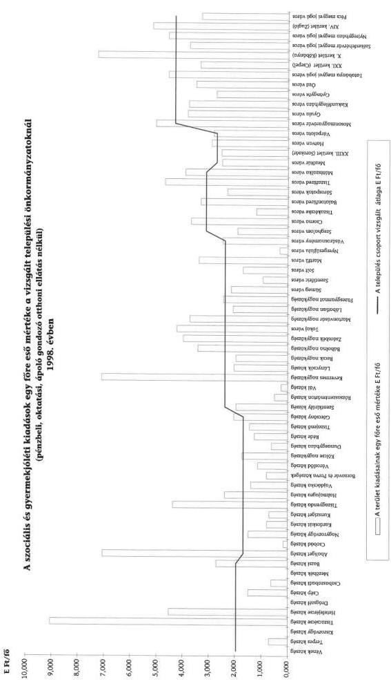
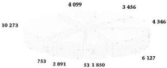
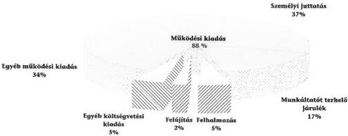
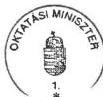
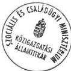

Állami Számvevőszék

# JELENTÉS

a települési önkormányzatok szociális és gyermekjóléti szolgáltatásai helyzetéről

2000. június

0015

---

Az ellenőrzés végrehajtásáért felelős:
V. Önkormányzati és Területi Ellenőrzési Igazgatóság

Dr. Lóránt Zoltán
számvevő igazgató

Az ellenőrzést vezette:

Berényi Magdolna
számvevő tanácsos

A jelentés összeállításában közreműködtek:

Huberné Kuncsik Zsuzsanna
számvevő tanácsos

Dr. Lacó Bálintné
számvevő tanácsos

Kalmár István
számvevő tanácsos

Az ellenőrzésben résztvevők névsorát az 1. sz. melléklet tartalmazza

A témakörrel foglalkozó ÁSZ vizsgálatok jegyzéke:

Jelentés az önkormányzatok felnőtt szociális alapellátási tevékenységéről
(V-1/1993.)

Jelentés a családban nevelkedő fiatalkorúak szociális ellátásáról
(V-1018/1994.)

Jelentéseink az INTERNETEN 1999. június 1-től a WWW.ASZ.gov.hu. címen
olvashatók.

Jelentéseink az Országgyűlés számítógépes hálózatán is olvashatók.

---

V-1012-31/1999-2000. Tsz.: 489

# TARTALOMJEGYZÉK

I. ÖSSZEGZŐ MEGÁLLAPÍTÁSOK, KÖVETKEZTETÉSEK, JAVASLATOK 5

II. RÉSZLETES MEGÁLLAPÍTÁSOK 10

1. A személyes gondoskodást nyújtó ellátások jogi feltételrendszere és ellenőrzése 10

1.1. Az ellátások formái, előírt feltételei, megszervezésének határideje 10
1.2. Az önkormányzatok szakmai feladatellátása értékelésének, ellenőrzésének szabályozása, tapasztalatai 12

2. Szolgáltatások ellátásának forrásszabályozása és kiadásainak nagyságrendje, összetétele, 14

2.1. Az önkormányzatok által nyújtott szolgáltatások forrásszabályozása, a kiadások forrásainak alakulása 14
2.2. A személyes gondoskodást nyújtó szociális kiadások nagyságrendje, összetétele 15

3. Szociális és gyermekjóléti-gyermekvédelmi személyes gondoskodás ellátásának feltételei, szabályozottsága. 17

3.1. A települések feladat-ellátásának szabályozottsága 17
3.2. Feladat-ellátás szervezeti keretei, hatáskörök, feladatok megosztása 19

4. Az önkormányzatok által biztosított személyes gondoskodás formái 23

4.1. A szociális törvény által kötelezően előírt ellátások 23
4.2. Gyermekjóléti alapellátások 38

5. A szolgáltatásokkal kapcsolatos szakmai, pénzügyi nyilvántartások rendje, megbízhatósága 43

5.1. Statisztikai jelentések, intézményi nyilvántartások tartalma, hiányosságai 43
5.2. Pénzügyi információs rendszer és a szakmai feladatellátás összhangja 45

1

---

1

---

# Jelentés
a települési önkormányzatok szociális és
gyermekjóléti szolgáltatásai helyzetéről

Bevezetés

A lezajlott demográfiai, társadalmi-gazdasági változások eltérően érintették a lakosság egyes rétegeit. Kedvezőtlenül változott a gazdaságilag aktív korosztály létszáma (1980-ban a 18-60 évesek száma 6.140 ezer fő, 1998-ban 5.925 ezer fő), melyen belül a 40-60 év közöttiek halálozási arányszáma nőtt. A születések száma 1980-1998. között mintegy 50.000 fővel csökkent. Mindezek következtében emelkedett a 60 éven felüliek aránya, 1980-ban 16%, 1998-ban pedig 18,5%-os az összlakosságon belül. Ezen belül nőtt a magára maradt, önmagukról már nem vagy csak segítséggel gondoskodni tudó idősek száma is.

A Statisztikai Évkönyv adatai szerint 1995. évben az egy főre jutó reáljövedelem az előző évhez képest 94,7%, 1996. évben 99,9%, 1997. évben 101,4% volt. A regisztrált munkanélküliek száma az elmúlt években (1994-től) folyamatosan csökkent, azok aránya 1998. évben még mindig 11% volt. A jobb megélhetésért folytatott fokozott küzdelem, stressz, a munkanélküliségtől való félelem a családok, egyének életvitelében, életmódjában jelentős változásokat hozott. A családon belüli konfliktusok, a válások számának növekedése, az alkohol, a drog hatására egyre több az elhanyagolt, magatartás-zavaros, fokozottan veszélyeztetett gyermek.

Mindezen tényezők fokozottabban indokolják a személyes gondoskodás egyes formáinak biztosítását, a rászorultak ellátását, melyek egyes elemeinek megszervezését a törvények a települési önkormányzatok kötelező feladatává tették.

Az elmúlt időszakban az Állami Számvevőszék többször vizsgálta az önkormányzatok által nyújtott szociális ellátások egy-egy területét:

- a települési önkormányzatok szociális alapellátási tevékenységét 1993-ban,
- a tartós bentlakásos elhelyezést biztosító ellátásokat 1996-ban,
- a pénzbeli és természetbeni ellátások helyzetét 1998-ban.

A vizsgálatok tapasztalatai, valamint a szociális igazgatásról és szociális ellátásokról szóló, többször módosított 1993. évi III. törvény (továbbiakban: Szt.), valamint a gyermekek védelméről és a gyámügyi igazgatásról szóló 1997. évi XXXI. törvény (továbbiakban: Gyvt.) indokolták, hogy az Állami Számvevőszék tekintse át az önkormányzatok szociális-, és gyermekvédelmi- gyermekjóléti ellátások területén tett intézkedéseit és azok hatásait a kötelező személyes gondoskodások megszervezésére.

Ezen személyes gondoskodások körébe tartoznak a szociális igazgatásról és szociális ellátásokról szóló többször módosított Szt. szerint:

3

---

I. ÖSSZEGZŐ MEGÁLLAPÍTÁSOK, KÖVETKEZTETÉSEK, JAVASLATOK

- az alapellátás (étkeztetés, házi segítségnyújtás, családsegítés),
- nappali ellátást nyújtó intézmények (idősek klubja, fogyatékosok nappali intézménye, nappali melegedő, szenvedélybetegek nappali intézménye) és
- átmeneti elhelyezést nyújtó intézményi ellátás (időskorúak, fogyatékosok gondozóháza, pszichiátriai és szenvedélybetegek átmeneti otthona, hajléktalanok éjjeli menedékhelye és átmeneti szállása).

A gyermekek védelméről és a gyámügyi igazgatásról szóló Gyvt. szerint:

- a gyermekek napközbeni ellátása (ami megszervezhető különösen bölcsődében, családi napközben, óvodában, iskolai napközis foglalkozás vagy házi gyermekfelügyelet keretében),
- a gyermekjóléti szolgálat és
- a gyermekek átmeneti gondozása (helyettes szülő, gyermekek, családok átmeneti otthona).

Az ellenőrzés célja: annak megállapítása volt, hogy

- a feladatok ellátását a tárcák és azok intézményei milyen szakmai és módszertani útmutatással segítették;
- hogyan alakították ki a feladatellátás rendszerét és mennyire jellemző az önkormányzati társulás keretében, illetve ellátási szerződés alapján – nem állami szervekkel – történő szolgáltatás;
- a személyes gondoskodás keretébe tartozó kötelező ellátási formák tárgyi, személyi feltételeit a jogszabályi előírásoknak megfelelően alakították-e ki, illetve működtetik;
- a szolgáltatások és ellátások mennyiben felelnek meg a lakossági igényeknek;
- a feladatok megszervezéséhez, az intézmények létrehozásához, átalakításához központi forrásokból milyen anyagi támogatást kaptak,
- biztosítani tudják-e az előírt határidőre a törvényekben foglalt személyes gondoskodás körébe tartozó kötelező ellátásokat?

Az ellenőrzés az 1997-1998. éveket, valamint 1999. I. félévet érintően a Szociális és Családügyi Minisztériumra, a felügyelete alatt működő Országos Család- és Gyermekvédelmi Intézetre, valamint 66 települési önkormányzatra terjedt ki.

A vizsgálati körbe bevont önkormányzatok közül 4 fővárosi kerület, a további 62 települési önkormányzat 12 megyében működik (2. sz. melléklet.)

A kiválasztásnál figyelemmel voltunk az önkormányzatok Szt-ben rögzített település lakosságszámához igazodó eltérő feladat-ellátási kötelezettségére. A vizsgált körbe magasabb arányban vontuk be a többféle ellátásra kötelezett nagyobb lakosságszámú településeket. (3. sz. melléklet)

4

---

I. ÖSSZEGZŐ MEGÁLLAPÍTÁSOK, KÖVETKEZTETÉSEK, JAVASLATOK

A vizsgálattal érintett településeken él az ország lakosságának 12%-a, e körbe tartozó önkormányzatok 1998. évi költségvetési kiadásai az összes önkormányzati ráfordításnak 9,5%-át, a szociális és gyermekjóléti kiadásnak (gyermekvédelmi szakellátások kiadásai nélkül) pedig 11,6%-át képezik.

# I. ÖSSZEGZŐ MEGÁLLAPÍTÁSOK, KÖVETKEZTETÉSEK, JAVASLATOK

Az Szt. és a Gyvt. új alapokra helyezte a helyi önkormányzatok szociális és a gyermekvédelemmel kapcsolatos ellátási kötelezettségét. A szabályozás újszerűsége abban nyilvánul meg, hogy rendszerbe foglalta az ellátási kötelezettséget, az Szt. a település lélekszámától függően differenciáltan, míg a Gyvt. azt egységesen állapította meg.

A Szt-ben nevesített személyes gondoskodási formák biztosításának határideje 1999. december 31-e volt, a rendelkezések következtében az önkormányzatok kötelezettsége a szakellátási körben – nappali és átmeneti gondoskodás – lakosságszámhoz igazodó, az alapellátások vonatkozásában viszont egységes. Ez utóbbiak olyan gondoskodási formák, melyeket valamennyi településen elérhetővé kell tenni a lakosok számára. Az étkeztetés és a házi segítségnyújtás megszervezésén túlmenően a törvény ide sorolja a **családsegítést** is, e szolgáltatás **biztosításának kötelezettsége** azonban az egyes jogszabályhelyeknél **eltérően értelmezhető**. (Az Szt. 59. §-a alapján csak az étkeztetés és a házi segítségnyújtás, míg a 86. § szerint ezen felül a családsegítés is a kötelezően biztosítandó ellátások közé tartozik.)

Az Szt. rendelkezik arról, hogy az önkormányzatok alapellátás keretében nem gondozható lakosaik szakosított ellátáshoz való hozzájutásáról is kötelesek gondoskodni, ellenben ennek tartalma részletesen nem szabályozott. Az intézményi gondoskodás biztosítására kötelezett önkormányzatok a nappali és átmeneti ellátásokat a saját településük lakossága, illetve az életvitelszerűen ott-tartózkodók számára szervezik, így más települések lakói ellátási-, társulási szerződés hiányában e szolgáltatásban nem részesülnek.

**Az Szt-ben és a Gyvt-ben szabályozott egyes ellátási formák** (a családsegítés és a gyermekjóléti szolgálatok) **feladatai közel azonosak**, nehezen különíthetők el. A gyermekes családok estében a gyermek problémái csak a családon belül rendezhetők. Így a két ellátás egyidejű megszervezése, működtetése párhuzamos gondoskodást jelent. A Gyvt-ben nevesített ellátások – bölcsőde, családi napközi, óvoda, általános iskolai napközi, házi gyermekfelügyelet – nem minden esetben egymást helyettesítő szolgáltatások. Az önkormányzatok különösen kisebb településeken az óvoda és általános iskolai napközi működtetésével teljesítettnek tekintik kötelezettségüket. Így a 0-3 éves gyermekek, valamint a fokozottan veszélyeztetett idősebb korosztály ellátása, nem biztosított.

**Az egyes ellátási formákhoz rendelt személyi és tárgyi feltételek eltérőek.** A törvényi szabályozás alapján az önkormányzatok úgy is dönthetnek, kizárólag gazdaságossági szempontok alapján, hogy költséges saját intézmé-

5

---

I. ÖSSZEGZŐ MEGÁLLAPÍTÁSOK, KÖVETKEZTETÉSEK, JAVASLATOK---

nyek fenntartása helyett minőségileg hátrányosabb feltételekkel szervezik meg az ellátást.

Az óvodák, általános iskolai napközik a közoktatásról szóló 1993. évi LXXIX. törvény (továbbiakban Kt.) hatálya alá tartoznak, az abban megfogalmazott szabályok szerint működnek. A jelenlegi törvényi szabályozás nem tér ki arra, hogy az óvodában, általános iskolai napközis foglalkozás keretében megszervezett napközbeni ellátásokra mennyiben érvényesek a Gyvt. és végrehajtási rendeletei (nyilvántartási kötelezettség, szakmai működés ellenőrzése).

A Gyvt-ben foglalt feladatok végrehajtása terén jelentős lemaradások vannak, ez egyrészt a végrehajtási rendeletek, másrészt az újszerű ellátások megszervezését segítő szakmai ajánlások, módszertani segédletek késedelmes elkészítésével is magyarázható.

További nehézségeket okoz, hogy terjesztésük nem szabályozott, a feladatellátó önkormányzatok, intézmények azokhoz rendszerint különböző szakmai ankétokon, eseti továbbképzéseken juthatnak hozzá.

A települési önkormányzatok kötelező feladatát képező személyes gondoskodási formák kiadásai jelentős nagyságrendet képviselnek. Annak összege 1998. évben országosan mintegy 131 Mrd Ft volt, a vizsgált körben 16,9 Mrd Ft. A költségvetési kiadások döntő része a működtetéssel függ össze (mintegy 90%) ezek közel kétharmada személyi juttatás és azzal összefüggő járulék. A ráfordítások összes költségvetési kiadásokhoz viszonyított aránya 1998-ban 9,2%, részarányuk csökkenő tendenciát mutat. Az egyes települések között a ráfordítások volumene, fajlagos mutatói tekintetében nagyok a differenciák, melyet a feladatellátás kiépítettségén túlmenően jelentősen befolyásol az önkormányzatok pénzügyi pozíciója.

**A jelenlegi pénzügyi információs rendszerben előírt szakfeladatok nincsenek összhangban a szakmai jogszabályokkal, nem tükrözik részletesen az egyes ellátási formákat, így a törvényekben részletezett szolgáltatások ráfordításai nem elemezhetők. A feladatellátáshoz kapcsolódó valós önkormányzati ráfordítások országos szinten nem állnak rendelkezésre, mert az egyéb fenntartóval kötött szerződések esetén a céljelleggel átadott pénzeszközök szakfeladatokra bontva az önkormányzati beszámolókban nem jelennek meg.**

A feladatellátáshoz az állam a forrásszabályozáson keresztül járul hozzá, melynek rendszere bonyolult, nehezen áttekinthető. Az egyes önkormányzati feladatokat a központi költségvetés nem azonos elvek szerint támogatja (lakosságszám, feladatmutatóhoz kötött normatív állami hozzájárulás, pályázati úton elosztott támogatás). Az évek közötti összehasonlíthatóságot nehezíti, hogy a támogatások tartalma, forráshelye is változó.

A központi források többségét képező normatív állami hozzájárulások egy része a településen élő lakosság számát, szociális jellemzőit figyelembe véve differenciáltan kerül megállapításra. Míg más részük az intézményi ellátásban részesülők létszámához kapcsolódik.

---6

---

I. ÖSSZEZGŐ MEGÁLLAPÍTÁSOK, KÖVETKEZTETÉSEK, JAVASLATOK

A vizsgált időszakban az ellátórendszer kialakításához, működési feltételei javításához a szaktárca kötött felhasználású támogatásokkal járult hozzá. (A szociális és gyermekjóléti szolgáltatások fejlesztését segítő ágazati célelőirányzat 1998. évben a 3 Mrd Ft-ot is meghaladta).

A személyes gondoskodáshoz való hozzájutás formáit, feltételeit a vonatkozó törvények keretjelleggel határozzák meg, míg a helyi sajátosságokat tükröző szabályokat az önkormányzatok rendeletei rögzítik. A **képviselő-testületek mintegy 30%-a rendeletalkotási kötelezettségének késve, hiányosan tett eleget.** A települések rendszerint széleskörűen tájékoztatták a lakosságot a személyes gondoskodás bevezetett formáiról, míg az egyes szolgáltatások iránti igényekről felmérések csak néhány esetben készültek.

A személyes gondoskodást nyújtó intézmények működési engedélyezési eljárási rendjét a szociális és gyermekvédelmi intézmények vonatkozásában kormányrendeletek szabályozzák. A 161/1996. (XI.7.) sz. kormányrendeletet, valamint a 2/1994. (I.30.) NM rendeletet időközben hatályon kívül helyezték, a vizsgálat lezárását követően jelentek meg az új rendeletek. A jelenleg **hatályos szabályozás sem rendelkezik azonban a nem intézményes formában működtetett szolgáltatások engedélyezési rendjéről, szakmai ellenőrzésének módjáról.**

**A szigorú szakmai előírásoknak az átmeneti ellátásokat nyújtó intézmények 90%-a nem felel meg,** így csak határozott idejű működési engedéllyel rendelkeznek. Eredetileg a hiányosságokat (szűkös alapterület, felszereltség, hiányzó foglalkoztatotti létszám, szakképzettség) 1999. december 31-ig kellett volna pótolniuk a fenntartóknak, az új jogszabály (188/1999. (XII.16.) Korm.rend.) ezt gyakorlatilag további három évvel meghosszabbította, így a tömeges intézménybezárások elkerülhetők lesznek. **Az elhelyezési feltételek javítását** elősegítő intézkedések végrehajtása rendkívül költségigényes, azt a települések **általában önerőből nem tudják megoldani.**

A szociális, gyermekjóléti és gyermekvédelmi **személyes gondoskodás törvényekben kötelezően előírt formáinak kiépítettsége településenként rendkívül differenciált.** A vizsgált önkormányzatok egyike sem tett maradéktalanul eleget a jogszabályban előírt kötelezettségeinek, melynek okai között meghatározó a szükséges pénzeszközök hiánya. Emellett szerepet játszik az is, hogy a testületek nem ismerik a szolgáltatások iránti lakossági igényeket.

**Az Szt. hatálya alá tartozó alapellátásokat** a tapasztalatok szerint **a kis népességszámú településeken nem szervezték meg.** Nagyobb városokban a speciális gondoskodást nyújtó nappali és átmeneti intézmények – pszichiátriai, szenvedélybetegek – sem mindenütt állnak rendelkezésre.

**A Gyvt-ben nevesített** újszerű gondoskodások közül csak a gyermekjóléti szolgálatok kiépítettsége széleskörű, az **átmeneti ellátások megszervezése minimális.** A helyettes szülői hálózat elterjedése sem jellemző. **A családok átmeneti otthona kivétel nélkül anya-gyerekotthonként működik,** általános probléma, hogy a krízishelyzet megszüntetésére, az ellátottak helyzetének végleges megoldására nincsenek jogi garanciák.

7

---

I. ÖSSZEGZŐ MEGÁLLAPÍTÁSOK, KÖVETKEZTETÉSEK, JAVASLATOK---

A szociális és gyermekjóléti szolgáltatásokat az önkormányzatok jellemzően saját szervezettel, intézmények működtetésével, illetve a kisebb lakosságszámú településeken más munkakörben (védőnő, pedagógus) foglalkoztatott dolgozó megbízásával biztosítják.

**A szakmai statisztikák rendszere nem terjed ki valamennyi ellátásra, az csak a főbb tendenciák jelzésére alkalmas.** Az adatlapok nem informálnak az önkormányzatok feladat-ellátási kötelezettségének teljesítéséről, az egyes települések által biztosított gondoskodások formáiról, a megoldás módjáról. Általános probléma, hogy a statisztikai jelentések adatai ellenőrzés nélkül kerülnek összesítésre. A Gyvt-ben nevesített újszerű ellátásokra (gyermekjóléti szolgálatok, családi napközi, helyettes szülő) csak 1999-től szervezték meg a statisztikai adatgyűjtést.

A statisztikai jelentések az előírt nyilvántartások adataira épülnek, melyek egyes elemei nem kellően kidolgozottak, azok soraira esetenként többféle válasz adható.

A feladatellátás ágazati felügyelete, irányítása és ellenőrzése differenciáltan valósul meg. A **szociális** ellátások területén a szakmai szabályok érvényesülésének ellenőrzését az intézmény működését engedélyező önkormányzati jegyző, illetőleg a közigazgatási hivatal vezetője – a módszertani feladatot ellátó intézmény segítségével – valósítja meg. A **gyermekvédelmi, gyermekjóléti** ellátást nyújtó intézmények esetében pedig – a jogi szabályozás szerint – a megyei gyámhivatal, az Országos Család- és Gyermekvédelmi Intézet vagy az általa kijelölt területi szakmai módszertani feladatokat ellátó intézmény bevonásával ellenőrzi a működést. A szakmai ellenőrzésekben fontos szerepet játszó módszertani intézmények kijelölése lassan halad. Ennek egyik oka, hogy működtetésük finanszírozási garanciái nem biztosítottak. A működést engedélyező (jegyző, illetve az illetékes megyei (fővárosi) gyámhivatal) szerv évenkénti ellenőrzési kötelezettségét a Gyvt. végrehajtását szabályozó 281/1997.(XII.23.) kormányrendelet határozza meg.

Az önkormányzati ellenőrzések többsége a pénzügyi gazdálkodás szabályszerűségére irányult.

A helyszíni vizsgálat tapasztalatai alapján az Állami Számvevőszék javasolta az önkormányzatoknak a feltárt hiányosságok megszüntetését és felhívta a figyelmet a jogszabályokban előírt határidőig a személyes gondoskodást nyújtó ellátások megszervezésére. Az önkormányzatok egy része a jelentés megállapításaira intézkedési tervet készített, melyről – a vizsgálat lezárásáig 15 önkormányzat – tájékoztatta a Számvevőszéket. A testületek a működő intézmények tárgyi és személyi feltételeinek javítását, az új szolgáltatások iránti igények felmérését tűzték ki célul. A kifogásolt önkormányzati rendeletek, intézményi alapító okiratok módosítására intézkedést tettek.

A vizsgált önkormányzatok az Szt-ben és a Gyvt-ben előírt kötelezettségeiknek településenként differenciáltan tettek eleget. Az ellátó rendszerek teljes körű kiépítése érdekében az ágazati irányító szervek fokozottabb intézkedése szükséges.

---8

---

I. ÖSSZEGZŐ MEGÁLLAPÍTÁSOK, KÖVETKEZTETÉSEK, JAVASLATOK

A szociális és gyermekvédelmi személyes gondoskodási formák ellátórendszerének szélesítése, hatékonyabb működtetése érdekében javasolja az ÁSZ, hogy

a Kormány:

- tegyen intézkedéseket az Szt, valamint a Gyvt-ben előírt személyes gondoskodást nyújtó ellátások összehangolására, a kötelező önkormányzati feladatok áttekintésével a kellően differenciált, a valós szükségletekhez jobban igazodó ellátórendszer kiépítésére,
- jelenjenek meg hangsúlyosabban a szabályozásban, valamennyi korosztályra kiterjedően az ellátási kötelezettségek, így a fokozottabban veszélyeztetett 14 éven felüli fiatalokról való gondoskodási formák, az azzal kapcsolatos tevékenységek,
- intézkedjen a családsegítő, vagy a gyermekjóléti szolgálatok feladatainak bővítése érdekében, hogy az önkormányzatoknál elkerülhető legyen hasonló jellegű feladatokra párhuzamos intézmények, tevékenységi körök kialakítása,
- tegyen intézkedéseket valamennyi személyes gondoskodást nyújtó szolgáltatást tükröző, a makroszintű elemzések elvégzését és az évek közötti összehasonlíthatóságot biztosító információs rendszer kialakítására. Ennek keretében javítani szükséges az ellátások egységesebb számbavételét.

A Pénzügyminiszter:

- a forrásszabályozás differenciáltabbá tételével érje el, hogy az állami pénzeszközök fokozottabban hasznosuljanak az ellátások területén, a támogatások fokozottabban ösztönözzék a feladat-ellátást,
- teremtse meg a feladatellátásban részt vállaló gyermekjóléti módszertani intézmények finanszírozási garanciáit,
- kezdeményezze állami pénzeszközök fokozottabb bevonásával, rangsorolásával a hiányzó ellátások kiépítését, a már működő szervezetek előírt személyi, tárgyi feltételeinek biztosítását,
- alakítson ki a szakmai törvényekben előírt ellátásokhoz jobban igazodó pénzügyi információt.

A Szociális és Családügyi Miniszter:

- kezdeményezzen olyan jogszabály módosításokat, melyek a feladatellátások tekintetében fokozottabb segítséget nyújtanak az önkormányzatok számára a szolgáltatások megszervezéséhez, azok szervezeti kereteinek kialakításához, a működés irányításához, ellenőrzéséhez,
- kezdeményezze a személyes gondoskodási feladatok ellátásában szerepet vállaló szaktárcákkal a tevékenységek jobb összehangolását,

9

---

II. RÉSZLETES MEGÁLLAPÍTÁSOK---

- kezdeményezze a szakmai adatgyűjtés átalakítását, hogy megállapítható legyen a feladat-ellátással kapcsolatos önkormányzati kötelezettségek teljesülése.

## II. RÉSZLETES MEGÁLLAPÍTÁSOK

### 1. A SZEMÉLYES GONDOSKODÁST NYÚJTÓ ELLÁTÁSOK JOGI FELTÉTELRENDSZERE ÉS ELLENŐRZÉSE

#### 1.1. Az ellátások formái, előírt feltételei, megszervezésének határideje

A személyes gondoskodás keretében nyújtott szolgáltatások formáit, szervezeti kereteit az ellátásokra való jogosultság feltételeit, valamint érvényesítése garanciáit is rögzítő első átfogó szabályozást az Szt. elfogadása jelentette.

A törvényben előírt **személyes gondoskodási formák kiépítésére megszabott határidő eredetileg 1997. december 31. volt**, melyet a gazdasági stabilizációt szolgáló egyes törvénymódosításokról szóló 1995. évi XLVIII. tv. **1999. december 31-re módosított**. Az államadósság csökkentése, a gazdaság stabilizációjának biztosítása mellett ezen ágazati feladatok megvalósítása háttérbe szorult.

A személyes gondoskodást biztosító ellátások tekintetében jelentős változást a gyermekvédelem átfogó reformjának alapjául szolgáló törvény (Gyvt.) megalkotása hozott. Az 1997. november 1-én hatályba lépett jogszabály a gyermekek törvényben foglalt jogainak és érdekeinek érvényesítésével, a szülői kötelesség teljesítésével kapcsolatos valamennyi intézkedést és ellátást egységes keretben kívánta szabályozni.

**A Gyvt-ben szabályozott alapellátások közül a gyermekjóléti szolgáltatás megszervezése a törvény hatályba lépésével (1997. november 1.), a többi gondoskodási forma biztosítása 1999. december 1-ig volt kötelező valamennyi települési önkormányzat számára.**

**A törvények az alap-, a szakosított, illetve a szakellátások körét eltérő módon szabályozzák.** Míg az Szt. a szakosított ellátások között nevesíti a nappali és az átmeneti ellátást is, addig a Gyvt. csak a fővárosi és megyei önkormányzatok kötelező feladatellátásába tartozó tartós, bentlakásos elhelyezést nyújtó szolgáltatást határozza meg szakellátásként.

**A két törvény szabályozása nem egységes** a tekintetben sem, hogy míg a Gyvt. a települési önkormányzatok között nem tesz különbséget **a feladatellátási kötelezettséget illetően**, az Szt. a nappali és egyes átmeneti gondoskodás biztosítását a települések lakosságszáma függvényében határozza meg.

---10

---

II. RÉSZLETES MEGÁLLAPÍTÁSOK

Az a települési önkormányzat, amelyiknek területén 2000-nél több állandó lakos él, idősek nappali ellátását nyújtó intézményi szolgáltatást, 10.000-nél több állandó lakos esetén az idősek nappali ellátásán túl, idősek átmeneti elhelyezését szolgáló intézményt, 20.000-nél több állandó lakosú település az előzőeken túlmenően valamennyi nappali ellátást nyújtó intézményi formát, míg a 30.000-nél több állandó lakosú település valamennyi nappali ellátást nyújtó és átmeneti elhelyezést szolgáló intézményi formát köteles biztosítani.

Az Szt. rendelkezése szerint valamennyi települési önkormányzat az alapellátás keretében nem gondozható rászorultak szakosított ellátáshoz való hozzájutásáról is köteles gondoskodni. A törvény értelmezésében **bizonytalanságot okoz a szakosított ellátáshoz való hozzájutásról történő gondoskodás tartalma.**

A nappali és átmeneti gondoskodást nyújtó intézményi formát biztosítani köteles települési önkormányzatok ellátási kötelezettsége alapvetően csak a település lakosságára, illetve az életvitelszerűen ott tartózkodókra terjed ki. Mivel a törvény intézményfenntartó társulás létrehozására, ellátási szerződés megkötésére nem kötelezi az önkormányzatokat, nem szabályozott a más településen élők nappali és átmeneti ellátáshoz való hozzájutása.

**A családsegítéssel kapcsolatos törvényi szabályozás ellentmondásos.** Az Szt. 59., illetve 86. §-a a szolgáltatás kötelező megszervezését illetően eltérően rendelkezik.

Az Szt. 59. § (1) bekezdése alapján csak az étkeztetés (62.§), házi segítségnyújtás (63.§) igénybevételének lehetőségét kell valamennyi településen biztosítani. Ugyanakkor a törvény 86. §-a a kötelező személyes gondoskodások között az 59-65. §-ok szerinti alapellátásokat nevesíti, mely magában foglalja a családsegítést is.

A Gyvt. megjelenésével a gyermekek és a felnőttek részére biztosított ellátások, szolgáltatások jogi keretei különváltak, a gyermekek részére nyújtott ellátások egységes szabályozása megtörtént. Így szükségessé vált az Szt. egyes rendelkezéseinek hatályon kívül helyezése.

**A családsegítő szolgálatok** tevékenységét az Szt. szabályozza, míg a gyermek problémájának kezelésére a Gyvt. **a gyermekjóléti szolgálatok** megszervezését írta elő. A szolgálatok feladatai közel azonosak, nehezen különíthetők el. A két **ellátás egyidejű megszervezése, működtetése párhuzamos gondoskodást jelent.** Miután a család egy komplex társadalmi egység a gyermek problémái, a szülők gondjainak rendezése nélkül nem oldhatók meg. Felvetődik, hogy állami pénzeszközök felhasználásával célszerű-e két alapellátást nyújtó intézményt (ellátást) működtetni egy települési önkormányzatnak úgy, hogy a szolgáltatás feladatai, a szakmai, képesítési előírások közel azonosak.

A napközbeni ellátások (bölcsőde, óvoda, iskolai napközis foglalkozás) meghatározott korosztályokhoz, kötődnek, egymást nem helyettesítik. A törvény nem rendelkezik kötelezően valamennyi korosztály (Ptk. 12. §-a (2)) ellátásáról, így óvoda és/vagy általános iskolai napközi működtetésével az önkormányzatok teljesítettnek tekint(het)ik a gyermekek napközbeni ellátását.

11

---

II. RÉSZLETES MEGÁLLAPÍTÁSOK

Ezen intézmények a közoktatásról szóló, többször módosított 1993. évi LXXIX. tv. (továbbiakban Kt.) hatálya alá tartoznak. Joghézag van ugyanakkor a tekintetben, hogy **az óvodában**, illetve **napközis foglalkozás keretében megszervezett napközbeni ellátásokra** a továbbiakban **mennyiben érvényesek a Gyvt., valamint** a személyes gondoskodásra vonatkozó **egyéb jogszabályok** (pl. nyilvántartás, szakmai feladatellátás ellenőrzése).

A 14 éven felüli fiatalok veszélyeztetettségének megelőzését célzó foglalkozások, programok nem kellő részletezettséggel kidolgozottak.

**A törvényben nevesített, egyes ellátási formákhoz rendelt tárgyi és személyi feltételek eltérőek.** A rendkívül szigorú tárgyi, személyi, képesítési feltételek mellett működtethető ellátásokkal (bölcsőde, óvoda, általános iskolai napközi) szemben a családi napközi biztosító személlyel kapcsolatban csupán annyi a követelmény, hogy büntetlen előélettel, érvényes egészségügyi könyvvel rendelkezzen, vér szerinti gyermeke nem lehet ideiglenes hatályú elhelyezésben, átmeneti vagy tartós nevelésben. A törvényi szabályozás keretein belül, kizárólagosan gazdaságossági szempontok alapján az önkormányzatok úgy is dönthetnek, hogy költséges saját intézmények fenntartása helyett a kevesebb kötöttséggel megszervezhető ellátást biztosítják (bölcsőde és általános iskolai napközi helyett családi napközi).

A Gyvt-ben felsorolt napközbeni ellátások egyes intézményei (bölcsőde, óvoda, általános iskola) már korábban is működtek. Az újszerű szolgáltatások megszervezését azonban hátráltatta, hogy a törvény végrehajtási rendelete (15/1998.(IV.30.) NM rend.) közel egy éves késéssel jelent meg. A gondoskodások bevezetését nehezítette, hogy a szakmai ajánlások, útmutatók, módszertani segédletek nem álltak időben rendelkezésre, azoknak az érintettekhez való eljuttatása sem kellően szabályozott.

## 1.2. Az önkormányzatok szakmai feladatellátása értékelésének, ellenőrzésének szabályozása, tapasztalatai

A vizsgálat témakörébe tartozó **személyes gondoskodást nyújtó intézmények működésének ellenőrzéséről a vonatkozó jogszabályok eltérően rendelkeznek.**

**Az Szt. hatálya alá tartozó intézmények esetében a működést engedélyező szerv a módszertani feladatot ellátó intézmény szakmai segítségével legalább 3 évenként ellenőrzi a szakmai szabályok érvényesülését.** (2000. január 1-től 2 évenként).

**A gyermekjóléti, gyermekvédelmi ellátást nyújtó intézmények** ellenőrzésével kapcsolatos feladatokat a Gyvt. és végrehajtási rendeletei részletesebben szabályozzák. **A működést engedélyező szerv évenkénti ellenőrzésén túl a fenntartó** a gazdálkodás és működés tevékenységének vizsgálata mellett köteles értékelni **a szakmai munka eredményességét. A megyei gyámhivatal az Országos Család- és Gyermekvédelmi Intézet** vagy az általa kijelölt területi **szakmai-módszertani feladatokat ellátó intézmény bevonásával ellenőrzi** az intézmények működését. Előzőeken túlme-

12

---

II. RÉSZLETES MEGÁLLAPÍTÁSOK

nően az önkormányzat évente átfogó értékelést készít a gyermekjóléti, gyermekvédelmi feladatok ellátásáról a képviselőtestület részére.

Az ellenőrzési feladatok ilyen sokoldalú és részletes szabályozása mellett a tapasztalatok azt mutatják, hogy a kis számú (10) ellenőrzés a szakmai jogszabályok szerinti feltételek meglétére korlátozódott.

A személyes gondoskodási formák működését a vizsgált önkormányzatok mintegy fele ellenőrizte, azok túlnyomó többsége (60%) a pénzügyi gazdálkodás szabályszerűségére irányult. Az egyéb szervezettel kötött ellátási szerződések teljesítését többnyire az éves beszámolók bekérésével együtt a megbízott szervezet testület előtt történő beszámoltatásával kontrollálták.

Tatabánya a fogyatékosok nappali ellátására a DOH-UNGARN kht-vel kötött ellátási szerződést, mely a végzett tevékenységéről évente beszámolt a Közgyűlés előtt.

Martfű önkormányzata 1998. szeptemberétől a személyes gondoskodási feladatok egy részét Kht-nek adta át. A képviselő-testület ad-hoc bizottsága a helyszínen vizsgálta a szerződésben vállalt kötelezettségek teljesítését.

A megyei gyámhivatalok folyamatosan figyelemmel kísérték a gyermekvédelmi, gyermekjóléti szolgáltatások hálózatának alakulását. Ezek a tájékozódások nem feleltek meg a jogszabályban foglalt ellenőrzések kritériumainak. Ebben szerepet játszik, hogy **a módszertani, továbbképzési feladatokat ellátó intézmények kijelölésére még nem került sor.** Ennek oka, hogy az Országos Család- és Gyermekvédelmi Intézet által kidolgozott szakmai feltételeknek kevés intézmény felelt meg, másrészt a működtetési többletkiadásokat az önkormányzatok finanszírozási garanciák hiányában nem vállalták fel.

Heves megyében nem volt pályázó, Baranya megyében feltételek hiánya miatt a pályázó Pécsvárad nem felelt meg a követelményeknek, így nem jelöltek ki módszertani intézményt.

Békés megyében a módszertani gyermekjóléti szolgálatra két pályázó volt (Békéscsaba, Elek). A módszertani intézet nem tudott a vizsgálat lezárásának időpontjáig dönteni.

A megyei gyámhivatalok ellenőrzéseik során megyei, területi módszertani intézmények hiányában több alkalommal felkérték az Országos Család- és Gyermekvédelmi Intézet munkatársait, akik – amennyiben azt egyéb feladataik lehetővé tették – tájékozódó jelleggel szereztek tapasztalatokat a vonatkozó jogszabályok gyakorlati végrehajtásáról.

A Gyvt-ben előírt, a gyermekjóléti feladatok ellátásáról szóló éves beszámolási kötelezettségnek a vizsgálat befejezéséig csak az önkormányzatok 24%-a tett eleget, melyet a testületek rendszerint tudomásul vettek, annak alapján csak néhány önkormányzatnál hoztak intézkedéseket a jelzett problémák megoldására.

Vásárosnamény önkormányzata a beszámolót követően javította a gyermekjóléti szolgálat létszámellátottságát, döntöttek a telephelyek bővítéséről.

13

---

II. RÉSZLETES MEGÁLLAPÍTÁSOK---

Sümeg város a feladatellátást követő beszámolót követően felmérést készített a bölcsődei, családi napközi iránti igényekről, rendelkezett a helyettes szülői hálózat kialakításáról, a házi gyermekfelügyelet ellátásáról.

## 2. SZOLGÁLTATÁSOK ELLÁTÁSÁNAK FORRÁSSZABÁLYOZÁSA ÉS KIADÁSAINAK NAGYSÁGRENDJE, ÖSSZETÉTELE,

### 2.1. Az önkormányzatok által nyújtott szolgáltatások forrásszabályozása, a kiadások forrásainak alakulása

A forrásszabályozás jelenlegi rendszerében az állami pénzeszközök lebontása meghatározó részben nem kapcsolódik konkrét feladat-ellátáshoz. Így a kiadásokhoz rendelhető központi források nagyságrendje és összetétele egzakt módon nem állapítható meg.

A költségvetési támogatások, hozzájárulások jogcímeit és mértékét az éves költségvetési törvények határozzák meg. A finanszírozási rendszer bonyolult, az egyes évek közötti összehasonlíthatóságot nehezíti, hogy belső tartalma változott. A kiadások pénzügyi forrásainak elemzésénél az évek közötti összehasonlíthatóság érdekében figyelembe kellett venni a tartós, bentlakást biztosító intézmények, valamint a pénzbeli és természetbeni szociális ellátások, gyermekjóléti feladatok kiadásait és bevételeit is.

**Az önkormányzatok költségvetési bevétele a vizsgált időszakban 39,8%-kal nőtt**, 1998. évben 1346 Mrd Ft volt a pénzügyi információ adatai szerint, a vizsgált körben ugyanezen adatok 44,3%, 135 Mrd Ft. (4. sz. melléklet)

Ezen belül a szociális és gyermekjóléti bevételek – melyek a központi támogatások és hozzájárulások mellett a működési bevételeket is tartalmazzák – országosan 76,9%-kal, vizsgált körben 63,0%-kal nőttek 1996-1998. évek között.

A települési önkormányzatok képviselőtestülete által megállapított és folyósított szociális és gyermekvédelmi kiadásokhoz, az állam kötetlen felhasználású normatív támogatással és különböző célhoz kötött központi támogatásokkal járul hozzá.

A normatívák egy része a településen élő lakosság számát, szociális jellemzőit (munkanélküliek száma, lakosság korcsoportos összetétele, aktív korú SzJA-t fizetők aránya) figyelembe véve differenciáltan kerül megállapításra, míg más részük az intézményi ellátásban részesülők számához kapcsolódik.

A finanszírozási rendszer változása kapcsán **a támogatási jogcímek köre 6-ról 9-re bővült**. A szociális ellátásokhoz kapcsolódó normatívákon belül 1998-tól a pénzbeli és természetbeni juttatások címén nevesített állami hozzájárulás elkülönítve jelenik meg az éves költségvetési törvényekben.

Míg a feladatmutatóhoz kötött normatív hozzájárulások igénybevételéről utólag az éves beszámoló keretében az önkormányzatoknak el kell számolniuk, a szociális és gyermekjóléti alapszolgáltatási feladatok normatívája a lakosság

---14

---

II. RÉSZLETES MEGÁLLAPÍTÁSOK

száma után garantáltan megilleti a települési önkormányzatokat, igénybevételéhez nem fűződik elszámolási kötelezettség.

A költségvetési törvény előírásai szerint ez a normatíva az Szt-ben és a Gyvt-ben meghatározott szociális és gyermekjóléti alapellátási kötelezettségek körébe tartozó szolgáltatások és intézmények működési költségeihez kapcsolódik. Ezen alapellátási kötelezettségek körébe 1996-1997-ben a pénzbeli és természetbeni szociális ellátások is beletartoztak. Az igénybevételnek azonban nem volt feltétele az intézmények működtetése, illetve az ellátások biztosítása.

Az 1998. évtől a forrásszabályozás változásának következtében új forráselemként jelent meg a személyi jövedelemadóból szociális és gyermekjóléti feladatokra lebontott összeg. (Országosan 46 Mrd Ft). A fentiekből következik, hogy – bár a szociális és gyermekjóléti feladatokhoz kapcsolódó normatív állami hozzájárulások összegének növekedése 1996-1998. évek között minimális (országosan 2,3%, vizsgált körben 4,5%) – az előbbiekben említett célokhoz kapcsolódó központi támogatások együttesen ennél lényegesen nagyobb (70%-ot meghaladó) mértékben emelkedtek.

A vizsgált időszakban **az ellátórendszer kialakításához**, működési feltételei javításához **a tárca kötött felhasználású támogatásokkal** járult hozzá. A támogatáshoz jutás döntően pályázati rendszerben, esetenként egyedi elbírálással történt. A vizsgált évek mindegyikében a tárca kiemelt feladatként kezelte a hajléktalan ellátást, a szociális szakellátást, a falugondnoki hálózat fejlesztését, a hátrányos helyzetű megyék, térségek felzárkóztatását a szociális ellátás területi kiegyenlítését. A Gyvt. megjelenésével 1997. évtől újabb fejezeti címek kerültek meghatározásra a családsegítő központok, gyermekjóléti szolgálatok kiépítésére, fejlesztésére a gyermekvédelmi intézményhálózat korszerűsítésére, fejlesztésére. A pénzügyi információ adatai szerint a szociális és gyermekjóléti szolgáltatások fejlesztését elősegítő fejezeti kezelésű előirányzatok összege 1997. évben 2,71 Mrd Ft, 1998. évben 3,25 Mrd Ft volt.

## 2.2. A személyes gondoskodást nyújtó szociális kiadások nagyságrendje, összetétele

A települési önkormányzatok kötelező feladatát képező **személyes gondoskodási formákra országosan, 1996. évben 98,4 Mrd Ft-ot, 1998. évben 130,9 Mrd Ft-ot használtak** fel az önkormányzatok és intézményeik. Ugyanezen adatok a vizsgált körben 13,1 Mrd Ft, illetve 16,9 Mrd Ft. A ráfordítás az önkormányzati költségvetési kiadásoknak 1998-ban 9,2%-át (vizsgált körben 12,5%-át) képezte, arányában 1996-hoz viszonyítva csökkenő tendenciát mutat. (5. sz. melléklet)

A Gyvt. alapján a települési önkormányzatok kötelező feladatait képező személyes gondoskodást nyújtó szolgáltatások közé a gyermekek napközbeni ellátása (ami megszervezhető többek között óvodában és iskolai napközis foglalkozás keretében) is beletartozik. Emiatt a szociális alágazat mellett további ágazatok egyes szakágazatainak kiadásai is összegzésre kerültek [intézményi étkeztetés (5523), iskolai napközis foglalkozás (8051), valamint óvodai ellátás (8011)].

15

---

II. RÉSZLETES MEGÁLLAPÍTÁSOK---

Ezen kiadásokon belül az oktatási és étkeztetési kiadások növekedése a mérsékeltebb, országosan 29,9%-os, a vizsgált körben 25,8%-os volt.

A személyes szolgáltatások közül a szociális alágazatba tartozó gondoskodások költségvetési kiadása 42,7%-kal emelkedett országosan 1996-1998. között, a vizsgált körben a változás 38,3%-os volt.

A szociális alágazatba tartozó ráfordítások nagyságrendje a különböző lakónépességgel rendelkező települések csoportjai között eltérő mértékű.

A 30.000-nél több állandó lakossal rendelkező településeken 1998. évben a vizsgált ellátások biztosítására az önkormányzatok átlagosan egy lakosra vetítve országosan 4363 Ft-ot, a vizsgált körben 4297 Ft-ot fordítottak, közel háromszor többet, mint az 500–2000 fős településeken.

Az egyes **települések szociális kiadásai között rendkívül nagyok a különbségek**, melyet befolyásol a fenntartott intézmények száma, a nyújtott szolgáltatások köre.

Ezen túlmenően a ráfordítások alakulására hatást gyakorol az önkormányzat pénzügyi pozíciója. Mindezek következtében a költségvetés főösszegéhez viszonyított közel azonos arányú ráfordítás mellett a települések egy főre vetített e célú kiadásai is nagy szóródást mutatnak. (6. sz. melléklet)

**A legnagyobb volumenű kiadás-növekedés 1996. évről 1998. évre** (országosan több mint 2 Mrd Ft, a vizsgált körben több mint 250 M Ft) **a családsegítő és gyermekjóléti szolgálatok megszervezésével kapcsolatos.**

Csepelen a családsegítő és gyermekjóléti szolgáltatásokkal kapcsolatos kiadások 1996-ról 1998. évre 25 M Ft-tal, Zuglón 23 M Ft-tal, Székesfehérváron 21 M Ft-tal emelkedtek.

Az átmeneti elhelyezést, valamint a nappali ellátást nyújtó kiadások dinamikája meghaladja a szociális alágazatban vizsgált ellátások kiadásai növekedésének átlagos szintjét.

Átmeneti elhelyezést biztosító ellátások növekedése országosan 68,9%, vizsgált körben 103,1%, a nappali szociális ellátások esetében 39,5% és 37,8% az 1996. évi adatokhoz viszonyítva.

**A szakfeladatokon kimutatott költségvetési kiadások döntő része** (1998-ban országosan 88,6%, vizsgált körben 92,6%) **működtetéssel összefüggő** ráfordítás. A működési kiadások között jelentős részarányt képvisel a személyi juttatás és az azzal összefüggő járulék. 1998-ban országosan 61,1%-os, a vizsgált önkormányzatoknál 62,3%-os arányú. (7. sz. melléklet)

---16

---

II. RÉSZLETES MEGÁLLAPÍTÁSOK

# 3. SZOCIÁLIS ÉS GYERMEKJÓLÉTI-GYERMEKVÉDELMI SZEMÉLYES GONDOSKODÁS ELLÁTÁSÁNAK FELTÉTELEI, SZABÁLYOZOTTSÁGA.

# 3.1. A települések feladat-ellátásának szabályozottsága

A törvények a személyes gondoskodáshoz való hozzájutás formáit, feltételeit keretjelleggel rögzítik, míg a helyi sajátosságoknak megfelelő szabályozás a képviselőtestületek feladata. Az önkormányzatoknak a törvények hatálybalépését követő 6 hónapon belül kellett megalkotniuk helyi rendeletüket. Az Szt-t megjelenése óta több alkalommal – esetenként éven belül is – módosították, melyet a helyi rendeleteknek is követniük kellett.

A vizsgált önkormányzatok többsége (80%) eleget tett törvényben foglalt kötelezettségének, megalkották, illetve módosították a személyes gondoskodás helyi szabályait.

Nem szabályozták a személyes gondoskodási formák helyi rendszerét Nyíregyháza, Vajdácska, Csobád, Lábatlan, a Gyvt-ben nevesített ellátásokhoz kapcsolódó rendeletben csak a pénzbeli és természetbeni juttatások rendjét rögzítették Vásárosnamény, Hetefejérce, Sárospatak, Kevermes.

A Gyvt. megjelenését megelőzően a személyes gondoskodást nyújtó ellátásokat korosztályra tekintet nélkül a helyi szociális rendeletekben szabályozták. A Gyvt. hatályba lépése szükségessé tette a szabályozott, illetve biztosított ellátások áttekintését, a gyermekekkel kapcsolatos ellátások újra gondolását.

Az önkormányzatok képviselőtestületei eltérő gyakorlatot folytattak a rendeletalkotás tekintetében. Többségük (59%) az Szt. és a Gyvt. hatálya alá tartozó ellátásokat külön rendeletben szabályozta, így a gyermekvédelmi és gyermekjóléti ellátásokra vonatkozó helyi rendelkezések megalkotásával egyidejűleg módosították a szociális ellátások helyi rendeletét. Az önkormányzatok egy részénél (6 db) a hatályos rendeletek tartalma ellentmondásos. Egyes ellátásoknál párhuzamos szabályozás érvényesült, esetenként a rendeletek nem az aktuális helyzetet tükrözték.

Csabaszabadi község önkormányzata a Gyvt. szerinti ellátásokról önálló rendeletet alkotott, ellenben az óvodai, napközis ellátások továbbra is a szociális rendeletben szerepeltek. A szociális rendelet az Idősek Klubját is szabályozta, holott annak működése 1999. évtől megszűnt.

Tiszacsécse község szociális és gyermekvédelmi helyi rendeleteiben átfedések tapasztalhatók, a gyermekjóléti alapellátás működési rendjét viszont egyik rendelet sem szabályozta.

A tapasztalatok szerint a helyi rendeletek megalkotására hiányosságokkal került sor. A szabályozás helyi jogi normái nem tartalmazták teljes körűen az önkormányzat által biztosított ellátásokat, az ellátási szerződés alapján nyújtott szolgáltatásokat. Egyetlen rendelet sem tért ki arra, hogy az önkormányzat milyen módon gondoskodik a kötelezően biztosítandó ellátások mellett a rászorultak szakosított ellátásához való hozzájutásáról.

17

---

II. RÉSZLETES MEGÁLLAPÍTÁSOK

**Az egyes ellátási formákat eltérő részletezettséggel szabályozták.** Általános tapasztalat, hogy nem rögzítették a szolgáltatás igénybevételének feltételeit, a kérelem benyújtásának módját, az elbírálás döntésmechanizmusát és az ellátásért fizetendő személyi térítési díjak megállapításának szabályait.

Bazsi a falugondnoki szolgáltatás igénybevételének rendjét nem szabályozta, hiányzik a helyi rendeletből a családsegítő és gyermekjóléti feladatok ellátásának módja, szervezeti kerete.

Kunsziget és Vál önkormányzata a házi segítségnyújtásért fizetendő térítési díjakat nem szabályozta a helyi rendeletében, ezzel sérültek a 29/1993.(II.17.) Korm. rendelet előírásai.

Különösen szűkszavúak a rendeletek a gyermekek napközbeni ellátása tekintetében, amennyiben az ellátás óvodában, iskolai napközben biztosított. Ezen intézmények működési szabályait a Kt., valamint végrehajtási rendeletei szabályozzák, így az önkormányzatok megítélése szerint azt nem szükséges a helyi gyermekjóléti-gyermekvédelmi rendeletben szabályozni.

A helyi szabályozások szerint a feladatellátásra létrehozott intézmények esetében a gondoskodás igénybevételével kapcsolatos döntések meghozatalára általában a jogszabályi előírásoknak megfelelően azok vezetői jogosultak, az esetleges fellebbezéseket a szakbizottságok bírálják el. A kisebb lélekszámú településeken, ahol a szociális ellátásokat nem intézményes formában, hanem a polgármesteri hivatalhoz telepítetten oldják meg (igazgatási előadó, házi gondozónő, egyszemélyes klubvezető) a gondoskodásokhoz kapcsolódó döntési hatásköröket rendszerint a polgármester vagy a szakbizottság gyakorolja, az esetleges jogorvoslat pedig a képviselő-testületek feladata.

**A feladatellátással kapcsolatos hatáskörök összhangban vannak a jogszabályokkal,** az önkormányzatok és intézmények szervezeti és működési szabályzataiban, egyéb belső utasításaiban foglaltakkal. Többféle ellátást nyújtó nagyobb intézmények esetében a vizsgálat tapasztalatai szerint nem mindenütt (8) megoldott a gyermekjóléti szolgálat önálló szakmai egységként történő működtetése.

Zugló Önkormányzatánál a gyermekjóléti szolgálat feladatait a családsegítő szolgálat részeként látják el. Az intézményen belül a gyermekjóléti szolgálat nem önálló szakmai egységként működik.

Martfűn egy-egy családgondozó látja el a gondozási körzetébe tartozó kliensek családgondozását és a gyermekjóléti szolgálat feladatait is.

**Az egyes ellátásokkal kapcsolatosan** az önkormányzatok a személyes gondoskodás bevezetett formáit, azok igénybevételének lehetőségeit, stb. általában a helyben szokásos módon (önkormányzati lapok ingyenes terjesztése, tömegkommunikációs eszközök, rendeletek kifüggesztése, szórólapok, hangos híradó, stb.) ismertetik a lakossággal. **Széleskörű tájékoztatásban részt vállalnak** a szociális és gyermekvédelmi **intézmények** vezetői, munkatársai, valamint a különböző **civil szervezetek** is. (Alapítványok, karitatív szervezetek, egyesületek, egyház, stb.) A helyi rendeletek hiányosságaiból adódóan a

18

---

II. RÉSZLETES MEGÁLLAPÍTÁSOK

lakosság nem szerez tudomást a jogszabály (Szt.) alapján igényelhető valamennyi ellátásról.

### 3.2. Feladat-ellátás szervezeti keretei, hatáskörök, feladatok megosztása

**A vizsgált önkormányzatok mindössze 27%-a rendelkezik dokumentált felmérésekkel** a személyes gondoskodás egyes formái iránti igényekről. Szociális térkép kevés településen (10) készült, így az önkormányzatok a lakosság szociális helyzetéről, a potenciális igényekről csak közvetve jutnak információhoz.

Kiskunfélegyháza kérdőíves felmérés alapján 1990. évben készítette el a város szociális térképét, 1997. évben újabb kiadvány jelent meg, mely a lakosság egészségi és szociális helyzetével is foglalkozott.

Ózdon 1993. évben szociológiai felmérést készítettek, erre alapozták a későbbiekben megszervezett személyes gondoskodást.

A gondoskodásra szorulók felkutatásában, a jelentkező igények közvetítésében a saját intézményeiktől, szakapparátusuktól kapták a leghathatósabb segítséget, de ebben szerepet játszottak a területen működő civil szervezetek is.

A valós lakossági igények felmérése, az adott ellátás, szolgáltatás nyújtását megelőzően nem minden esetben mutat reális képet. A tapasztalatok szerint ugyanis az igények alakulását jelentős mértékben befolyásolja a nyújtott szolgáltatás minősége, színvonala, a fizetendő térítési díj összege, melyek a felméréskor még nem ismertek.

Az igények mellett a személyes szolgáltatások egyes formáinak kiépítését, annak működtetését meghatározza az önkormányzat pénzügyi pozíciója, a képviselőtestület szociális érzékenysége.

**A szociális és gyermekjóléti szolgáltatásokat jellemzően saját szervezettel, intézmények működtetésével**, illetve a kisebb lakosságszámú településeken a polgármesteri hivatal keretében **biztosítják**. Az önkormányzatok által működtetett személyes gondoskodást nyújtó **intézmények többnyire széles feladatkört látnak el**, komplex módon biztosítják a szociális ellátásokat, a Gyvt-ben szabályozott gondoskodási formákat (egyesített szociális intézmények, területi gondozási központok, stb. működtetése, amelyekhez több telephelyen biztosított különböző típusú ellátások kapcsolódnak).

A tapasztalatok szerint a képviselőtestületek az újonnan bevezetett ellátásokkal a már meglévő intézmények tevékenységét bővítik.

Szentlőrincen a gyermekjóléti és a családsegítő szolgálat megszervezésével az önkormányzat nem létesített új intézményt, hanem az Időskorúak Otthona feladatkörét bővítette.

Mosonmagyaróváron az önkormányzat az Egyesített Szociális Intézmény tevékenységét bővítette valamennyi újonnan ellátott feladattal.

19

---

II. RÉSZLETES MEGÁLLAPÍTÁSOK---

Kiskunfélegyházán 1998. júliusában került átadásra az értelmi fogyatékosok napközi otthona, működtetését a már meglévő intézményhez szervezték (Szivárvány Személyes Gondoskodást Nyújtó Intézmény).

**Kisközségekben gyakori** a családsegítő és/vagy gyermekjóléti szolgálatok, az óvodai, iskolai napközis ellátások **társulás** formájában történő ellátása. A társulási szerződések megfeleltek a vonatkozó törvény (1997. évi CXXV. tv.) előírásának.

A szociális és gyermekjóléti ellátások területen egyre nagyobb számban jelentek meg a nem állami szervezetek. A vizsgált települések 35%-án nem állami szervezetek is részt vesznek a szociális és gyermekjóléti szolgáltatások biztosításában.

Várpalotán a Magyar Vöröskereszt városi szervezete működteti a hajléktalanok átmeneti szállását, a nappali melegedőt.

Pécsett a Magyar Máltai Szeretetszolgálat Pécsi Csoportja biztosítja a súlyos értelmi fogyatékosok és halmozottan sérült fiatalok nappali ellátását. A Támasz Alapítvány, valamint az United Way Dél-dunántúli Alapítvány vesz részt a hajléktalanok ellátásában. Az Ifjúságért Egyesület a családok átmeneti otthonát működteti.

Ezen szervezetek részben a hiányzó önkormányzati szolgáltatásokat pótolják, részben szélesítik az igénybe vehető ellátások körét. A kötelező feladatokra ellátási szerződést azonban csak kevés (17%) önkormányzatnál kötöttek.

Pécs a Fogd a Kezem Alapítvánnyal az értelmi fogyatékosok, a Kerek Világ Alapítvánnyal pedig a mozgásfogyatékosok ellátására kötött szerződést.

Csepel a Magyar Vöröskereszttel kötött ellátási szerződés keretében biztosítja a családok átmeneti ellátását.

Soroksár önkormányzata a családsegítés és gyermekjóléti szolgáltatás feladatait az Ökumenikus Szeretetszolgálattal kötött ellátási szerződés keretében biztosítja.

A megkötött szerződések nem minden esetben feleltek meg maradéktalanul a jogszabályi előírásoknak (Csepel), illetve az elvárásoknak, nem tartalmazták a gondoskodásra jogosultak körét, számát, a garanciális elemeket (Nyergesújfalu).

Az önkormányzatok **szociális és gyermekvédelmi intézményei rendelkeznek alapító okiratokkal**, melyek a feladatok időközbeni változásait többnyire folyamatosan rögzítik és csak elvétve fordult elő (9%), hogy kisebb hiányosságok miatt nem feleltek meg a jogszabályoknak, illetve a tényleges helyzetnek.

Csorna önkormányzata a bölcsőde feladatait annak alapító okiratában nem a hatályos jogszabályok szerint határozta meg. A Népjóléti Szolgálat elnevezésű intézmény komplex szociális és gyermekvédelmi tevékenységet végez, melyet az alapító okirat nem az aktuális helyzetnek megfelelően tartalmazott.

---20

---

II. RÉSZLETES MEGÁLLAPÍTÁSOK

Mezőhék önkormányzata az Általános Művelődési Központ alapító okiratában az alaptevékenységek között több ténylegesen ellátott feladatot – napközi otthon, intézményi étkeztetés – nem szerepeltetett.

A személyes gondoskodást nyújtó intézmények **működési engedélyezési eljárási** rendjét kormányrendeletek szabályozzák. (161/1996. (XI.7.) Korm. rendelet, valamint a 281/1997. (XII.23.) Korm. rendelet).

**Az előírások** azonban **csak az intézményes formában működtetett szolgáltatásokra vonatkoznak**, holott az Szt. és Gyvt. szerint az ellátások nemcsak intézményi keretben láthatók el.

A működési engedélyek kiadásáról az ellátásoktól függően az önkormányzat jegyzője, a megyei (fővárosi) közigazgatási hivatal vezetője, illetve a megyei (fővárosi) gyámhivatal vezetője dönt.

Alap- és nappali ellátás esetén a szociális intézmények székhelye szerint illetékes jegyző, egyéb gondoskodásnál a megyei közigazgatási hivatal vezetője, gyermekjóléti szolgáltatást, gyermekek napközbeni ellátását végző intézmény (bölcsőde, családi napközi) esetén szintén a jegyző, gyermekek átmeneti és szakellátását biztosító intézmény (szervezet) vonatkozásában a megyei gyámhivatal vezetője jogosult a működés engedélyezésére.

A kérelemhez csatolandó dokumentumok meglétén és szabályszerűségén túlmenően az intézményeknek meg kell felelniük a vonatkozó miniszteri rendeletekben (2/1994. (I.30.) NM rend., 15/1998. (IV.30.) NM rendelet) meghatározott szakmai követelményeknek, személyi, tárgyi feltételeknek.

Az intézmények szakmai feladatairól és működésük feltételeiről szóló miniszteri rendeletek ellátási formánként szabályozzák a szolgáltatás tartalmát, az elhelyezés körülményeit, a foglalkoztatottak létszámnormáit, szakképzettségét stb.

A rendeletek hatálybalépését megelőzően kiadott működési engedélyeket felül kellett vizsgálni, s amennyiben az intézmény működése a jogszabályi feltételeknek nem felelt meg, de annak további fenntartását ellátási érdekkel indokolták az engedélyek csak határozott időre, – a vizsgálat idején – legfeljebb 1999. december 31-ig szólhattak.

**A vizsgált önkormányzatok** az általuk fenntartott szociális és gyermekvédelmi **intézmények működési engedélyeinek felülvizsgálatáról**, az időközben létrehozott új ellátások engedélyezéséről **intézkedtek**.

A működést engedélyező jegyzői hatáskör tekintetében a vizsgált településeken eltérő gyakorlat volt tapasztalható. A működési engedélyek egy részét az intézményt fenntartó önkormányzat jegyzője adta ki, míg másutt a Közigazgatási Hivatal által kijelölt önkormányzat jegyzője járt el.

A személyes gondoskodást nyújtó szociális intézmény és a falugondnoki szolgálat működésének engedélyezéséről, továbbá a szociális vállalkozás engedélyezéséről szóló 188/1999. (XII.16.) Korm. rendelet alapján a működési engedélyek kiadása 2000. január 1-től a rendeletben kijelölt jegyző hatáskörébe tartozik.

21

---

II. RÉSZLETES MEGÁLLAPÍTÁSOK---

A feladatot ellátó intézmények a jegyzői hatáskörbe tartozó gondoskodási formák esetében általában (70%) határozatlan idejű működési engedéllyel rendelkeztek. Ugyanakkor a helyszíni vizsgálatok tapasztalatai azt mutatták, hogy 9 önkormányzatnál ezen intézmények sem feleltek meg mindenben az előírt (szakképzettség, elhelyezési körülmények, létszámfeltételek, stb.) követelményeknek.

Tatabánya város jegyzője a szociális alap- és nappali ellátást nyújtó intézmények részére határozatlan idejű működési engedélyt adott ki, azok tárgyi és személyi feltételei azonban a jogszabályi előírásoknak nem feleltek meg.

Balatonfüred jegyzője a személyes gondoskodást nyújtó alap- és nappali ellátást nyújtó intézmények részére határozatlan időre szóló engedélyt adott ki. A Családsegítő Központ elhelyezési körülményei, személyi feltételei, az idősek klubjának tárgyi ellátottsága nem felelt meg teljes körűen jogszabályi előírásoknak.

A vizsgált önkormányzatok átmeneti ellátást nyújtó intézményeinek mintegy 90%-a ideiglenes működési engedéllyel rendelkezik.

**A legtöbb működési hiányosság a szociális és gyermekvédelmi átmeneti ellátások vonatkozásában merült fel.** A korábban is működő intézmények szinte egyike sem rendelkezett végleges működési engedéllyel. A szigorú szakmai előírások – a létszámnormák betartása, a szakképzettségi arány, az intézménytípusokra meghatározott elhelyezési körülmények, tárgyi feltételek, stb. – elsősorban pótlólagos pénzügyi források hiányában szinte teljesíthetetlen feladatot jelentenek az önkormányzatok számára.

Az átmeneti ellátást nyújtó intézmények létszámfeltételei, a dolgozók szakképzettségi aránya, az ellátottak elhelyezési körülményei nem feleltek meg a 2/1994. (I.30.) NM rendelet előírásainak. (Székesfehérvár, Ózd, Várpalota)

Az intézmények belső szabályzatai (pl. házirend, szakmai programok, pénz- és értékkezelési szabályzat) hiányoztak, az alkalmazott térítési díjak rendszere eltért az Szt. 117.§-ában megfogalmazott követelményektől (Mosonmagyaróvár, Tiszafüred, Vásárosnamény).

**A kiadott működési engedélyekben felsorolt hiányosságok pótlásáról az önkormányzati testületek** rendszerint tárgyaltak, azok felszámolására **feladattervet dolgoztak ki.** Intézménybezárásra kizárólag néhány (6) idősek klubjánál került sor a működési engedélyben rögzített hiányosságok, illetve az igények csökkenése miatt.

Abaliget 650 lakosú kisközség önként vállalt feladatként Idősek Gondozóházát és Idősek Klubját is működtetett. Egyik gondoskodási forma sem felelt meg a jogszabályi előírásoknak, így a klubot 1999. január 1-jétől bezárták, a gondozóházat korszerűsítették.

Városlőd szintén önként vállalt feladatként tartott fenn Idősek Klubját, melynek működését a lakossági igények csökkenése miatt 1998. február 28-ától szüneteltetik.

Saját hatáskörben megtehető intézkedésekről döntöttek (szakmai programok kiegészítése, nyilvántartási hiányosságok megszüntetése, férőhelyek felülvizsgálata, létszámbővítések, beiskolázások szorgalmazása), ellenben a komolyabb

---22

---

II. RÉSZLETES MEGÁLLAPÍTÁSOK

forrásokat igénylő felújításokat, helyiségbővítéseket, korszerűsítéseket önerőből nem tudták megoldani. Előfordult, hogy ilyen céllal pályáztak pótlólagos pénzeszközök elnyerésére, de sikertelenség következtében a programot kizárólag önerőből nem tudták megvalósítani, így az elhelyezési feltételek alapvetően nem javultak.

Szentlőrinc város Idősek Otthonát tart fenn, melyben integráltan biztosítja a szociális alap- és szakosított (nappali, átmeneti) ellátásokat. Az intézmény tárgyi és személyi feltételei nem feleltek meg a jogszabályi előírásoknak, emiatt az önkormányzat mintegy 30 M Ft-os beruházással tervezte az intézmény korszerűsítését. A szakminisztériumhoz 1997. évben 15 M Ft-os pályázati igényt nyújtott be, melyet a tárca kerethiányra hivatkozva elutasított. Így forráshiány miatt a tervezett munkálatok elmaradtak, az ellátási feltételek nem javultak.

#### 4. AZ ÖNKORMÁNYZATOK ÁLTAL BIZTOSÍTOTT SZEMÉLYES GONDOSKODÁS FORMÁI

A helyszíni vizsgálatok tapasztalatai szerint **a szociális, gyermekjóléti és gyermekvédelmi személyes gondoskodás törvényekben kötelezően előírt formáinak kiépítettsége településenként rendkívül differenciált.** A vizsgált 66 önkormányzat egyike sem tett maradéktalanul eleget a jogszabályban előírt kötelezettségeinek, ugyanakkor önként vállalt feladatként a személyes gondoskodás különböző formáit szervezték meg. (8. sz. melléklet) Néhány város, egyéb település (11) tartós bentlakásos intézményt is fenntart, részt vesz a hajléktalan ellátásban, segíti a jelentkező egyéb igények kielégítését, két kisközség idősek klubját működtet. Az Szt-ben nevesített szociális ellátások egy része (házi segítségnyújtás) főleg a kis településeken leépült, megszűnt (5) vagy lecsökkent (5), míg másutt csak a már korábban is működtetett ellátási formákat biztosítják. A Gyvt-ben nevesített újabb ellátások megszervezésére (a Gyermekjóléti Szolgálat kivételével) nem került sor. Az egyes ellátásban részesültek adatait a 9. sz. melléklet tartalmazza.

##### 4.1. A szociális törvény által kötelezően előírt ellátások

###### 4.1.1. Szociális alapellátások

###### *Étkeztetés*

Étkeztetésben országos szinten 1998. évben átlagosan a lakosság mintegy 1%-a részesült. A vizsgált önkormányzatoknál ez az arány 0,9%, melyen belül településenként rendkívül nagy eltérések (0-12,3%) tapasztalhatók. A statisztikai jelentések összesített adatai szerint a közigazgatási egységek közel 30%-ánál azon belül az 500 fő alatti lélekszámú települések több mint felénél (52,2%) nem biztosított az ellátás. A vizsgált körben kedvezőbbek a tendenciák ugyanis az önkormányzatok mindössze 13,6%-a nem szervezte meg az étkeztetést. Az 500 fő alatti településeken ez az arány 40%.

Az ellátást biztosító települések köre az 1992. évhez viszonyítva (44%) bővült, miközben az étkeztetettek létszáma 1992. és 1998. évek között 109.067 főről, 100.254 fő-re csökkent.

23

---

II. RÉSZLETES MEGÁLLAPÍTÁSOK---

A vizsgált körben 1992-ben 10.263 fő, 1998-ban 11.718 fő részére nyújtottak ellátást.

Szembetűnő, hogy míg a lakónépességen belül emelkedett a 60 éven felüliek száma, az étkeztetésben részesülők között megnőtt a fiatalabb, 60 éven aluli korosztályok aránya.

Országosan 1992-ben az étkeztetettek 12,6%-a 60 éven aluli, 1998-ban arányuk már 21,3%.

**Az étkeztetés biztosításában meghatározó az önkormányzatok szerepvállalása**, ugyanakkor az ellátásban egyre nagyobb mértékben vesznek részt egyházi karitatív szervezetek, alapítványok, egyéb civil szerveződések is.

Nyergesújfalu városban az étkeztetést a Római Katolikus egyházközség által fenntartott Idősek Otthona biztosítja. Pécsett és Ózdon az önkormányzati feladatellátás mellett a Magyar Máltai Szeretetszolgálat népkonyhát üzemeltet.

A helyszíni tapasztalatok azt mutatták, hogy étkeztetési kérelmek elutasítására – egy önkormányzat kivételével – nem került sor.

Nyíregyházán fordult elő, hogy a felülvizsgálat során 44 fő étkeztetését szüntették meg, mivel munkaképesség-csökkenésük mellett rehabilitálhatók, önmaguk ellátására képesek.

A kiterjedt peremkerülettel rendelkező településeken belül **az egyes településrészek ellátása nem egyenletes** a nagy távolságok és a közlekedési eszközök hiánya miatt.

A szolgáltatás igénylésében meghatározó, hogy honnan történik az étkeztetés, milyen az étel minősége, illetve hogyan alakul a fizetendő térítési díj mértéke.

Tatabányán előfordult, hogy a nehéz anyagi helyzetben lévők azért nem igényelték az étkeztetést, mert az alacsony, az inflációt sem követő térítési díjat sem tudták megfizetni.

Bazsi községben az 1996. évben az igénylők 50%-a lemondta az étkezést, majd 1997-1998. években az új szolgáltatóval kötött szerződés és a házhoz szállítás biztosítása után a korábbi igénylők újra jelentkeztek.

A vizsgált településeken az ebédért fizetendő térítési díj 0-308 Ft között alakult. Magas térítési díj mellett az igények erőteljesen csökkentek, azt a szociálisan valóban rászorultak már nem tudták megfizetni, másrészt hasonló összegért piaci alapon is megoldható az ellátás.

Zuglón jellemzően a hónap első két hetében kérik az étkeztetést, majd hónap végéig szüneteltetik, illetve egyre többen térnek át a 7 napos étkezésről az 5 napos étkezésre.

A tapasztalatok szerint **az emelkedő térítési díjak megfizetése** – mely étkeztetés esetén a jövedelem 20%-áig terjedhet – **egyre fokozódó terhet jelent a rászorulók részére**.

---24

---

II. RÉSZLETES MEGÁLLAPÍTÁSOK

A vizsgált önkormányzatok Kölcse, Zugló, Kiskunfélegyháza kivételével az étkeztetést csak munkanapokon biztosítják, a hétvégi étkeztetés feltételei nem megoldottak, illetve annak megszervezésére az önkormányzatok nem vállalkoztak. Előfordult az is (Kevermes, Füzesgyarmat), hogy az étkeztetést csak más ellátással (házi segítségnyújtással) együtt biztosítják.

**Az étkeztetést** valamely szociális célú **intézmény** – idősek klubja, gondozási központ – keretében szervezik **vagy a polgármesteri hivatal** által e feladattal megbízott személy **közreműködésével biztosítják**.

A vizsgált körben 7 önkormányzat (Lábatlan, Kőbánya, Csepel, Balatonfüred, Drágszél, Sümeg, Tiszajenő) kivételével az étel biztosítása az önkormányzat által működtetett valamely intézmény konyhájáról történt (általános iskola, óvoda, szociális intézmény, bölcsőde).

Kölcsén az általános iskola konyhájáról történik az étkeztetés, Csép községben a nagyigmándi óvoda biztosítja, Várpalotán az étkeztetés részben saját üzemeltetésű szociális konyháról, részben külső szolgáltatóktól biztosított.

**Vásárolt élelem esetén nem mindenütt kötöttek szerződést** az ellátás biztosítására, így annak garanciális elemei sem rendezettek. Nincs lehetőség arra sem, hogy az önkormányzat felülvizsgálja a jogszabályban előírt mennyiségi, minőségi követelmények betartását.

Saját konyháról történő ellátás esetén sem került sor évente a nyersanyagnorma betartásának felülvizsgálatára, az intézményi belső ellenőrzés, valamint az önkormányzati felügyeleti ellenőrzések – szervezési okok és létszámhiányból adódó – elmaradása miatt.

Az önkormányzatok fokozódó pénzügyi problémáik, tárgyi feltételek hiányában nem tudják biztosítani, illetve szükség-megoldásokat alkalmaznak a helyben történő étkeztetésre (iskolai napközi, bentlakásos szociális intézményben).

**Öt vizsgált településen** (Csép, Mezőtúr, Sárospatak, Csobád, Mátészalka) tárgyi feltételek (étkezésre alkalmas helyiség) hiányában **nincs lehetőség az étel helyben történő elfogyasztására**.

A pénzügyi információ és a statisztikai jelentések adataiból számított fajlagos mutatók alapján a működési kiadások egy étkeztetetre vetített összege országosan 1996. évben 28,2 E Ft, 1998. évben 40,2 E Ft. Ugyanezen adatok a vizsgált körben 39,6 E Ft és 47,4 E Ft. A településenkénti rendkívül nagy szóródást (3,2 E Ft– 109,3 E Ft) az eltérő szervezeti megoldások, a tárgyi és személyi feltételekben meglévő differenciák indokolják. Befolyásolja azt az önkormányzatok számviteli fegyelme, a szakfeladatra elszámolt, felosztott kiadások nagyságrendje.

### **Házi segítségnyújtás**

**A házi segítségnyújtást**, mint személyes gondoskodást nyújtó szolgáltatást egyes településeken már az Szt. megjelenését megelőzően is széles körben alkalmazták. Az Szt. az alapellátások körében nevesítette, megszervezését vala-

25

---

II. RÉSZLETES MEGÁLLAPÍTÁSOK---

mennyi települési önkormányzat kötelező feladatává tette, ennek ellenére **egyre több önkormányzat szüntette meg** az ellátást. Míg 1992-ben a települések mintegy 60,8%-a, 1998. évben már csak 48,2%-a működtette az ellátást.

A vizsgált önkormányzatok körében az ellátottság ennél kedvezőbb (1992-ben 74,3%, 1998-ban 86,4%), melyet a kiválasztott magasabb népességszámú települések nagyobb aránya indokol.

A helyszíni vizsgálat tapasztalatai is azt erősítik, hogy a kisebb településeken az ellátást nem szervezték meg, illetve időközben megszüntették.

Mezőhék községben a vizsgált időszakban a házi gondozást nem szervezték meg.

Bazsi községben 1996-1998. években házi segítségnyújtásban nem részesült senki, a házi gondozottak száma 1992-ben 8 fő volt, számuk az évek során fokozatosan csökkent. Az igények csökkenése miatt a szolgálatot 1995. december 31.-én megszüntették.

Országosan az 500 fő lakónépesség alatti települések közel 80%-a nem biztosította 1998. évben a házi segítségnyújtást. A vizsgált 500 főnél kevesebb lakosú települések egyikén sem volt házigondozott 1998. évben.

A házi segítségnyújtásban részesítettek száma az 1990-es évek elejétől folyamatosan csökkent. A csökkenés 1996-ban megállt, s a vizsgált időszakban – ha minimális szinten is – az ellátottak számában már némi emelkedés volt tapasztalható.

Országos szinten 1992-ben 52.525 fő, 1996-ban 41.037 fő, 1998-ban 41.329 fő vette igénybe az ellátást. Ugyanezen adatok a vizsgált körben 7.099, 5.700, 5.983 fő.

**Az ellátást igénylők számára vonatkozóan felmérések, megbízható adatok nem állnak rendelkezésre, a vizsgálati tapasztalatok alapján azonban megállapítható, hogy az nagy mértékben függ a fizetendő térítési díjak nagyságától.**

Miután Hetefejérce önkormányzat közhasznú szociális munkások átmeneti foglalkoztatásával ingyenesen biztosította az ellátást, megnőtt az ellátottak köre.

A személyi térítési díj mértéke a vizsgált településeken 1999. évben 50 Ft/óra (Bábolna) és 384 Ft/óra (Tiszakécske) összegben került meghatározásra, míg néhány önkormányzat (Sümeg, Tiszagyenda, Nyergesújfalu, Dunaegyháza, Tiszacsécse, Hetefejérce, Kunsziget) az ellátásért nem számolt fel külön díjazást.

A házi segítségnyújtás munkanapokon történik. Két településen (Csorna, Kiskunfélegyháza) biztosították csupán – az igények alapján – az ellátás megszervezését a hétvégeken, ünnepnapokon, illetve az esti órákban. Kiskunfélegyházán a gondozási központ az önköltség térítése mellett – saját apparátusával – felvállalta a gondozottak részére egyéb munkálatok elvégzését is (festés, javítás lakókörnyezet rendezés).

A kedvező tapasztalatok mellett ugyanakkor általános, hogy a **kiterjedt külterülettel, tanyasi körzettel rendelkező közigazgatási egységekben**

---26

---

II. RÉSZLETES MEGÁLLAPÍTÁSOK

**ezen településrészeken** – a nagy távolságokra tekintettel – **az ellátás nem vagy csak rendkívül szűk réteget érintően működik**. Feszültségeket okoz, hogy a kórházból kikerült súlyos betegek, társadalombiztosítási alapokból finanszírozott otthoni szakápolása mellett ma még a komplex, megfizethető, lakáson történő szociális gondoskodás keretei nem épültek ki.

A vizsgált önkormányzatoknál az igényelt **házi gondozás meghatározó részben a napi egyszeri meleg étel biztosítására**, annak házhoz szállítására, továbbá heti **1-2 órai egyéb feladatok ellátására** (takarítás, bevásárlás, gyógyszer-felíratás, orvoshoz kísérés stb.) **korlátozódik**. A tapasztalatok szerint az ellátottak jövedelmi helyzetükre tekintettel nem igénylik a hosszabb idejű házigondozást.

Az ellátás tárgyi, személyi feltételeiben településenként jelentős eltérések tapasztalhatók. Országosan egy gondozó átlagosan 4 fő ellátását végzi. Az össz gondozói létszámon belül jelentősen csökkent a tiszteletdíjas gondozónők száma. A 3.000 Ft összegű adómentesen kifizethető gondozói díj mellett egyre kevesebb a feladat ellátására vállalkozók száma. A hivatásos gondozók mintegy kétharmada rendelkezik az előírt szakmai képesítéssel, illetve annak megszerzése folyamatban van.

A vizsgált önkormányzatoknál a viszonylag alacsony bérezés miatt jelentős problémát okoz a fluktuáció, szakképzett dolgozók felvétele. Kisebb településeken a feladatot részmunkaidőben történő foglalkoztatással vagy tiszteletdíjas gondozónővel látják el.

Kőbányán 1997-ben az álláshelyek 75%-a volt betöltve, mivel a gondozók bére alacsony. 1998-tól az önkormányzat az állandó létszámhiány feloldására a területi gondozók részére területi pótlékot és pótlólagos munkaruha-juttatást vezetett be.

Füzesgyarmaton a házigondozást öt fő látja el, közülük egy fő szakképzett, jelenleg ketten tanulnak.

A vizsgált önkormányzatoknál a gondozók részére nem biztosították (5) minden esetben 2/1994. (I.30.) NM rendeletben előírt, a munkavégzéshez szükséges tárgyi feltételeket és eszközöket.

Kevermes községben a házigondozók részére nem biztosították a rendeletben előírt munkaruhát, 1998. évben erre a célra 18 E Ft-ot kaptak. Külön helyiségük nincs, mindössze egy íróasztal áll rendelkezésükre a gondozóházban.

Görcsöny, Szentlőrinc és Lánycsók településeken a házigondozók részére a feladat-ellátáshoz szükséges eszközök (takarítóeszközök, tisztítószerek) hiányosan állnak rendelkezésre.

A házi gondozást nyújtó önkormányzatok 24%-ánál az ellátással kapcsolatosan a jogszabályokban kötelező jelleggel előírt **nyilvántartások vezetése hiányos**, nem felelt meg a követelményeknek. Nem (Mosonmagyaróvár, Tiszafüred, Szentkirály) vagy hiányosan (Réde, Várpalota) vezették a gondozási lapokat. Azok leggyakrabban nem rögzítették a háziorvos gondozási feladatokkal kapcsolatos javaslatát. Csornán, Szentkirályon a gondozottak létszáma tartalmazta azon személyek adatait is, akik gondozása átmenetileg szünetelt

27

---

II. RÉSZLETES MEGÁLLAPÍTÁSOK---

vagy megszűnt, így a statisztikai jelentések a ténylegesen ellátottaknál magasabb létszámadatokat tükröztek.

Több problémát vet fel a gondozási naplók vezetése, abból nem minden esetben állapítható meg a gondozott ellátásának, azon belül a lakáson való tartózkodás időtartama, mely a térítési díj megállapításának alapját kell, hogy képezze. A gondozási naplót nem íratták alá esetenként az ellátottal, így a feladat ellátása nem tekinthető igazoltnak.

Dunaegyháza községben a képviselőtestület döntése alapján a házi segítségnyújtás a rászorultak számára ingyenes. A házigondozást végző gondozónő, aki egyszemélyben látja el a feladatokat, gondozási naplót vezet ugyan, de 1996. évtől kezdődően nem vezeti a gondozásra fordított időt.

Lábatlan nagyközségben valamennyi házigondozott étkeztetésben is részesül. A gondozási naplót naprakészen vezetik, hiányossága azonban, hogy a gondozás idejét nem tüntetik fel és az ellátottal sem íratják alá.

Az ellátással kapcsolatos pénzügyi ráfordítások országosan 1996-1998. év között 32,5%-kal a vizsgált körben 39,6%-kal emelkedtek.

Az egy ellátottra vetített működési kiadások összege 1998-ban országosan 97,2 E Ft és a vizsgált önkormányzatoknál 91,6 E Ft.

### Falugondnok

Kistelepüléseken az önkormányzatok Szt-ben megfogalmazott feladatai ellátásának hatékony eszköze a falugondnok alkalmazása. A szolgáltatás országos hálózatának kiépítését a tárca többéves program keretében, az ellátási forma szakmai-területi szempontjaira tekintettel, meghívásos pályázati rendszerben támogatta. A program eredményeként a minisztérium beszámolójában foglaltak szerint 1999. évben mintegy 400 településen működött falugondnok szolgáltatás, mely az 500 fő alatti településeknek is csak mintegy 40%-a.

A vizsgált önkormányzatok közül három községben (Bazsi, Kisrozvágy, Tiszajenő) alkalmaztak falugondnokot, a szociális alapellátási feladatokra. További két (Nyíregyháza, Vásárosnamény) közigazgatási egységben pedig a külterületek, tanyabokrok ellátásában vesznek részt az e munkakörben dolgozók.

A tapasztalatok szerint a megfelelő tárgyi feltételekkel (gépjármű, mobiltelefon stb.) is rendelkező dolgozók a szociális alapellátási körbe tartozó feladatokon túlmenően aktívan részt vállalnak egyéb települési feladatok ellátásában is. Így többek között az egészségügyi ellátáshoz való hozzájutás biztosításában, az óvodás és iskoláskorú gyermekek intézményekbe történő szállításában, egyéb szolgáltatási feladatok ellátásában, információk közvetítésében.

Problémát jelent ugyanakkor, hogy **nem mindenütt (3) rendelkeznek részletes munkaköri leírással, nem szabályozott az általuk vezetendő nyilvántartások köre.**

**Az ellátásért az igénybevevők térítési díjat nem fizettek.** A pénzügyi információ követelményei szerint összeállított adatokból az önkormányzatok-

---28

---

II. RÉSZLETES MEGÁLLAPÍTÁSOK

nál **nem állapítható meg a feladatellátással kapcsolatos ráfordítások nagyságrendje** (nincs a falugondnoki szolgáltatásokra külön szakfeladat).

### *Családsegítő szolgálatok*

Az első családsegítő szolgálatok (továbbiakban CSSK-k) az 1980-as évek közepén alakultak szakmai kísérletként a szociális tárca támogatásával. Jogállásuk, feladataik hosszú évekig rendezetlenek voltak.

A családsegítést, mint a személyes gondoskodást nyújtó ellátások egyik formáját az „Szt. emelte be” az ellátások körébe. A szolgálatok száma lassan nőtt. Ebben szerepet játszott a családsegítő központok törvényi szabályozásával kapcsolatban a gyakorlatban tapasztalható bizonytalanság, ellentmondás.

A rendelkezésre álló statisztikai felmérések szerint 1996. évben országos szinten 141 szolgálat működött. Az újabb szervezetek létrehozásában jelentős szerepet játszott a Gyvt. megjelenése, illetve a végrehajtást elősegítő, a népjóléti tárca által kiírt együttes pályázati felhívás, mely többek között családi és/vagy gyermekjóléti szolgálatok létrehozását, bővítését is támogatta.

A hálózatfejlesztés eredményeként országos szinten 2 év alatt, 1998. év végére a szolgálatok száma mintegy 3,5-szeresére emelkedett (463 db), a folyamat 1999. évben tovább folytatódott.

A helyszíni vizsgálattal érintett települések közül 1998. évben 35 helyen biztosított a családsegítés. E szolgálatok további 27 nem vizsgált településen vesznek részt az arra rászoruló és azt igénylő családok problémáinak segítésében, megoldásában.

Gyöngyös város a feladatellátásra társult két településen (Mátraháza, Mátrafüred) ellátandó családsegítésre a Máltai Szeretetszolgálattal kötött megállapodást.

Martonvásár a környező öt településsel társulási megállapodást kötött a gyermekjóléti szolgáltatásokra 1998. áprilisában, melyet 1998. december 1-től a családsegítés feladataira is kiterjesztettek.

A CSSK-k fenntartását, a feladatok ellátását meghatározó részben az önkormányzatok biztosítják, bár e szolgáltatások színterén is fellelhetők már egyéb szervezetek. A vizsgált körben két településen vesznek részt egyéb szervezetek az ellátásban.

A statisztikai adatok szerint országos szinten 1996. évben 636.806, 1998. évben 819.518 fő (változás 28,7%) kereste fel a szolgálatokat. A vizsgált körben az önkormányzatok által készített kimutatások adatai szerint a kliensek száma 1998. évben 61.388 fő.

**A szolgálatok tevékenységi köre, a kliensek száma rendkívül nagy szóródást mutat**, abban meghatározó szerepe van a szolgálatok, családsegítő részlegek elhelyezési körülményeinek, személyi, tárgyi feltételeinek.

29

---

II. RÉSZLETES MEGÁLLAPÍTÁSOK

**Nagyobb településeken**, városokban az **intézményi keretek között működő családsegítő szolgálatokban** egy kivételével (Kőbánya) **gyermekjóléti, gyermekvédelmi feladatokat is ellátnak**. Hét településen a feladatot intézmény létrehozása nélkül, családsegítő foglalkoztatásával oldják meg.

Az intézményi keretek között megfelelő apparátussal, tárgyi feltételekkel működő szolgálatok (Csepel, Székesfehérvár, Gyula, Gyöngyös, Zugló) fokozatosan bővítették/bővítik tevékenységi körüket. Nyíregyházán területi megosztás vagy szakmai szempontok alapján alközpontokat hoztak létre pl. drog-alkoholos életmód kezelése, baba-mama klub, gyermek pszichológiai ellátás stb.

**Jogszabályban előírt számban** (2500-3000 fő lakosonkénti) szakképzett, kellő tapasztalatokkal rendelkező **családsegítő**, a szakmai tevékenységet elősegítő **egyéb dolgozó** (pszichológus, jogász) **sehol sem biztosított**. Nagyok az eltérések az egyes településeken az elhelyezési körülmények, az irodatechnikai ellátottság, az ügyfelek kiszolgálása körülményeit illetően is.

Mátészalkán az integrált szervezetben dolgozó CSSK családgondozója, még az íróasztalt is felváltva kénytelen használni kollégáival.

Martfű városban a családsegítő szolgálat felújított épületben működik, melyben interjúszoba, két személyes dolgozószobák, közösségi helyiség, egy váróhelyiség található. Telefon, magnó, számítógépek állnak a dolgozók rendelkezésére.

A működő szolgálatokról statisztikai felmérés első alkalommal 1996. évben készült. Annak tartalma, részletezettsége évente változott, mely gátolja az összehasonlítást. Problémát okoz továbbá, hogy az intézmények által kötelezően vezetendő részletező nyilvántartások köre, rendszere, adattartalma nem szabályozott. Így az adatok utólagos gyűjtése, rögzítése nem dokumentálható.

Az önkormányzati éves beszámolóból nyerhető pénzügyi információ adataiból a működéssel összefüggő kiadások sem határolhatók el egyértelműen. E címen az önkormányzatok országosan 1996-ban 1.349 M Ft, 1998-ban 3.456 M Ft költségvetési előirányzat felhasználást mutattak ki, mely összegek egyéb ellátások (gyermekjóléti szolgálat, falugondnok) kiadásait is tartalmazhatják. Ugyanezen adatok a vizsgált körben 179 M Ft, illetve 447 M Ft. A kiadások nagymértékű (156, vizsgált körben 149%) növekedését a szolgálatok, családsegítők számának emelkedése okozza.

#### 4.1.2. Szakosított szociális ellátások

A Szt. szerint életkorúk, egészségi állapotuk, szociális helyzetük miatt az alapellátás keretében nem gondozható rászorult személyeket szakosított ellátási formában kell gondozni.

##### *Nappali ellátást nyújtó intézmények*

Az Szt. szerint idősek klubját a 2000 fő feletti lakónépességgel rendelkező településeknek kell megszervezniük. A statisztikai jelentések szerint **országosan e települések** 1992-ben 30%-án, 1998-ban mintegy **32%-án nem biztosított az ellátás**. A vizsgált körben ugyanezen arány mindkét évben 7,3%, melyen

30

---

II. RÉSZLETES MEGÁLLAPÍTÁSOK

belül a szolgáltatást biztosító önkormányzatok köre az egyes években változott. Önként vállalt feladatként ugyanakkor több (19%, 24%) kistelepülésen is megszervezték 1992. és 1998. évben az idősek klubját.

A vizsgált településeken az elmúlt években a klubok száma folyamatosan csökkent, 1996. évben 96, 1999-ben 89 idősek klubja működött.

Hét önkormányzat 1996-1998. évek között kihasználatlanság, a szükséges feltételek hiánya miatt megszüntette, illetve szünetelteti az ellátást.

Görcsöny község önként vállalt feladatként 30 férőhelyes idősek klubját működtetett. Az ideiglenes működési engedély lejártakor az intézményt bezárták, ugyanis a működéshez szükséges személyi feltételeket nem tudták biztosítani.

Rózsaszentmárton az igénylők alacsony számára tekintettel átmenetileg szünetelteti az ellátást.

A feladat ellátásában vizsgált körben 4 településen (Ózd, Martfű, Mátészalka, Gyöngyös) részt vállalnak a nem önkormányzati szervezetek is (egyházak, karitatív szervezetek, közalapítvány).

**Nagyobb településeken** a klubok működtetése **integrált szociális intézmények keretében** történik, esetenként bentlakásos intézményekkel közös szervezésben, ahol a szakmai munka sem különül el minden esetben az intézmények között.

Az ellátást igénybevevők száma a statisztikai jelentések adatai szerint országosan 1992. évben 39.501 fő, 1998. évben 39.979 fő, a vizsgált körben 3.363, 3.353 fő volt.

Az intézményekbe felvettek létszáma, a férőhely-kihasználtság településenként nagy szóródást (52,0–147,5%) mutat. Míg egyes településeken (Tiszacsécse, Sárospatak, Tiszafüred) alig haladja meg az 50%-ot, másutt (Nyíregyháza, Szeghalom, Füzesgyarmat, Solt) jelentős a zsúfoltság.

**Az intézmények nagyobb része** (mintegy 65%), az épületek adottságai miatt, **szűkös, rossz elhelyezési körülmények között működik**, míg másutt biztosítottak a közös együttlét, pihenés, a személyi tisztálkodás stb-hez szükséges feltételek is.

Balatonfüreden a klub céljaira szolgáló épület helyiségeinek mérete és száma nem felel meg a 2/1994.(I.30.) NM rendelet előírásainak. Nem tudják megoldani az épület adottságai miatt a nemenként elkülönített WC kialakítását, a gondozónők részére külön öltöző, az orvosi szobát. A társalgó mérete az engedélyezett 40 fő részére nem elegendő, a pihenőszobában mindössze 4-5 fő pihenésére van lehetőség.

Füzesgyarmaton az idősek klubjában a társalgóban az ellátható 40 fő nem fér el, külön pihenőhelyiség nincs, zuhanyozásra csak a mosókonyha sarkában van lehetőség.

Nyíregyházán a nappali ellátást nyújtó klubok mindegyike rendelkezik a rendeletben felsorolt helyiségekkel, a klubszobák lehetőséget biztosítanak a közösségi

31

---

II. RÉSZLETES MEGÁLLAPÍTÁSOK---

együttlétre. Rendelkeznek továbbá megfelelő pihenőhelyiséggel, fürdőszobával. Biztosított a folyamatos orvosi ellátás.

Rendkívül nagyok az eltérések a személyi feltételeket illetően is. Néhány kivételtől eltekintve a foglalkoztatott létszám, illetve szakmai képzettsége nem felel meg a jogszabályi előírásoknak. Az alacsony bérek miatt a településeken komoly probléma szakképzett gondozók, esetenként az előírt felsőfokú végzettséggel rendelkező vezetők alkalmazása.

Zsámbék község Szállást Biztosító Idősek Klubja álláshelyeinek száma 5 fő, melyből 1 fő vezető, 1 fő éjszakai műszakban dolgozó gondozónő. Az 5 fős létszámmal – amely nem felel meg a jogszabályi előírásoknak – biztosítják a nappali és átmeneti ellátást.

Füzesgyarmaton az idősek klubjában egy gondozónőt foglalkoztatnak, aki az étel melegítését, kiosztását stb. feladatokat ellátja, míg az idősekkel történő délutáni foglalkozást az azonos épületben működő családsegítő szolgálat családgondozója végzi.

A klubok munkanapokon nyújtanak szolgáltatást általában reggel 8 és délután 5 óra közötti időszakban. Kiskunfélegyházán a jelentkező igények alapján hét napos nyitvatartással működik az intézmény, Várpalotán és Zsámbékon szükség esetén szállást is biztosít a rászorulóknak.

**A programok nagyrészt kimerülnek, a kézimunkázás, tv nézés, kártya és egyéb társas játékokban, sajtótermékek, könyvek biztosításában.** Másutt (Sümeg, Kőbánya, Zugló Székesfehérvár, Tatabánya) tartalmas előadásokat, műsoros délutánokat, közös ünnepségeket, kirándulásokat szerveznek, ahol a tagok szívesebben töltik idejüket, akár az újonnan nyugdíjba vonulók is igénybe veszik az intézmények szolgáltatásait.

**Az előírt nyilvántartások vezetése** (gondozási lap, eseménynapló, étkezők nyilvántartása) a klubokban egy kivételével az **előírásoknak megfelelően történt.**

Lábatlan nagyközségben az idősek klubja által bonyolított étkeztetésben részesülők létszámát is klubtagként jelentették a statisztikában.

**Az idősek klubja ráfordításainak elemzését akadályozza,** hogy a pénzügyi információ szerinti **nappali szociális intézményi ellátás szakfeladaton többféle ellátási forma kiadása is megjelenik** (fogyatékosok nappali intézménye, nappali melegedő, szenvedélybetegek nappali intézménye).

A pénzügyi információ adatai szerint nappali szociális ellátás működtetésére az önkormányzatok 1996-ban 4.114 M Ft-ot, 1998-ban 5.732 M Ft-ot, vizsgált körben 469,1 M Ft-ot, illetve 659,4 M Ft-ot fordítottak.

---32

---

II. RÉSZLETES MEGÁLLAPÍTÁSOK

### **Fogyatékosok nappali ellátása**

A fogyatékos személyek, a pszichiátriai és szenvedélybetegek, a társadalom perifériájára szorult hajléktalanok nappali ellátását a 20.000 főnél nagyobb lakónépességű települések kötelesek megszervezni.

Az e körbe tartozó ellátások közül a legnagyobb múltra a fogyatékosok ellátását szolgáló intézmények tekinthetnek vissza.

Országosan 1992-ben 37, 1998-ban 75 intézményben biztosítottak 943 fő és 1730 fő részére ellátást.

A fogyatékosok nappali intézménye a harmadik életévüket betöltött önkiszolgálásra részben képes értelmi fogyatékos és halmozottan sérült személyek gondozását, foglalkoztatását és képességfejlesztését hivatott biztosítani. Az intézményekben a foglalkoztatás megszervezése az ellátottak széles korosztályi összetételére tekintettel esetenként jelentős gondot okoz.

A statisztikai adatok szerint országosan 1998. évben az ellátottak közel negyede 18 év alatti volt.

A napi programok keretében kiscsoportos foglalkozások során fejlesztés, rehabilitáció folyik. Előfordult az is, hogy megszervezték a gondozottak csoportos foglalkoztatását és tervezik az egyéni szerződésen alapuló foglalkoztatás feltételeinek megvalósítását.

**A vizsgált 16, e feladatellátásra kötelezett önkormányzat közül 11 szervezte meg az ellátást.** A szolgáltatásban 3 településen (Székesfehérvár, Pécs, Tatabánya) az önkormányzattal kötött szerződés alapján egyéb szervezetek (Kht, alapítvány stb.) is részt vállalnak. Az 1998. évben működtetett 506 férőhely 32%-a nem önkormányzati fenntartású volt. Egy településen (Mátészalka), amely a törvény szerint nem kötelezett ilyen típusú intézményt fenntartani, a lakossági igényekhez igazodóan 25 férőhelyen biztosítják az ellátást.

A helyszíni vizsgálat időszakában mindössze 5 intézmény rendelkezett határozatlan idejű működési engedéllyel, azonban ezek sem feleltek meg maradéktalanul a jogszabályi követelményeknek. A végleges működési engedélyek kiadását akadályozta az előírt létszám, a szakképzettség, belső szabályzatok, szakmai programok hiánya.

Várpalotán a fogyatékosok Napközi Otthona elhelyezésére szolgáló épület leromlott állapotú, a tárgyi feltételek nem felelnek meg a 2/1994.(I.30.) sz. NM rendelet előírásainak. Nincs tornaterem, a gondozottak életkorának, fejlettségi szintjének megfelelően elkülönített csoportszobák hiányoznak, különösen kedvezőtlen, hogy a népkonyha ugyanabban az épületben működik.

Az önkormányzatok a szabályozásbeli hiányosságokat többnyire felszámolták, a tárgyi feltételek azonban alapvetően csak ott javultak, ahol pótlólagos pénzeszközök is rendelkezésre álltak.

33

---

II. RÉSZLETES MEGÁLLAPÍTÁSOK---

### *Pszichiátriai és szenvedélybetegek nappali intézménye*

Pszichiátriai és szenvedélybetegek nappali ellátását szolgáló intézmény 1992-ben még nem működött, 1996-ban 1 intézményben 46, 1997-1998. években 3 intézményben 96 volt az ellátottak száma országosan.

**A vizsgáltak közül** mindössze **egy önkormányzat (Ózd) működtet 50 férőhellyel szenvedélybetegek nappali intézményét**, ahol az ellátottak száma 1998. évben 46 fő volt. A hajléktalan-ellátáshoz integráltan biztosítják valamennyi szenvedélybeteg pszichoterápiás, szocioterápiás kezelését. Két településen (Pécs, Székesfehérvár) rendelkezik nem önkormányzati szerv a feladat ellátására működési engedéllyel.

Székesfehérváron a RÉV Szenvedélybetegsegítő Szolgálatnak Pécs területén 1999. szeptember 1-től a Gyöngyház Egyesületnek van működési engedélye.

**A személyes gondoskodásnak ezen intézményes formája még nem terjedt el**, melyben szerepet játszik az is, hogy az ilyen gondokkal küszködők felkutatása, problémáinak kezelése, megfelelő szakmai felkészültséget, empátiát igényel.

### *Nappali melegedő*

A nappali melegedő az Szt. megfogalmazása szerint elsősorban a hajléktalan személyek nappali tartózkodására nyújt lehetőséget, melynek megszervezése a 20.000 népességszámot meghaladó települések önkormányzatainak kötelező feladata.

Budapesten a hajléktalanok ellátása a kerületi önkormányzatokkal való egyéb megállapodás hiányában a Fővárosi Önkormányzatra hárul.

A hajléktalanok nappali ellátását szolgáló intézmények száma dinamikusan emelkedett. Míg 1993-ban országosan 14 intézmény működött 552 férőhellyel, számuk 1998-ra 60-ra, illetve 2816-ra emelkedett. **A vizsgált körben 3 kivételével valamennyi ellátásra kötelezett önkormányzat biztosította a szolgáltatást**, melyben nem önkormányzati szervezetek is közreműködtek.

A vizsgált nappali melegedők férőhelyei 120-szal bővültek 1996. óta, 1999-ben az 510 férőhely mintegy 45%-a nem állami fenntartásban működött.

A hajléktalan-ellátást Pécs területén szerződés keretében alapítványok, Csepelen és Várpalotán a vöröskereszt helyi szervezete biztosítja. Várpalota nem rendelkezik szerződéssel a feladat ellátására.

A hajléktalanok egy része különböző okokból nem veszi igénybe a menhelyek, szállók szolgáltatásait, így fokozott jelentősége van az utcai szociális munkának, a rászorulók felkutatásának, élelemmel, ruházattal való ellátásának. Néhány önkormányzat ezt az ellátását is megszervezte, jellemző e téren a különböző civil szervezetekkel, egyházakkal való szoros együttműködés, összehangolt segítségnyújtás.

---34

---

II. RÉSZLETES MEGÁLLAPÍTÁSOK

A helyszíni tapasztalatok azt mutatják, hogy **a hajléktalan ellátást az önkormányzatok komplex módon szervezték meg.** A nappali melegedők a hajléktalanok átmeneti elhelyezésére szolgáló intézmény keretében működnek. Az **egyes ellátások tárgyi-személyi feltételei esetenként összemosódnak**, különösen igaz ez akkor, ha a gondoskodás egy épületegyüttesben valósul meg. A közösségi helyiség nappali melegedőként, étteremként is szolgál és esetenként pótágyak elhelyezésével egyben éjjeli menedékhelyként is hasznosul stb.

Székesfehérváron a központi telephelyen működő nappali melegedő ebédidőben étteremként szolgál, zsúfoltság esetén pótágyak elhelyezésével itt is biztosítanak a rászorulóknak éjjeli menedéket, így télen senki nem maradhat ellátatlanul.

Mosonmagyaróváron 1997. évtől 2,1 millió Ft-os pályázati pénzeszköz felhasználásával egy épületegyüttesben nyert elhelyezést a nappali melegedő, az éjjeli menedékhely és átmeneti szállás is. A különböző funkciókat ellátó részegységek nem különülnek el, a nappali melegedő egyben a hajléktalan átmeneti szálláson élők közösségi helyiségeként is szolgál.

### *Átmeneti elhelyezést nyújtó intézmények*

#### *Időskorúak átmeneti elhelyezését nyújtó intézménye*

Időskorúak átmeneti elhelyezését nyújtó intézményekben a férőhelyek száma országosan az utóbbi években nem emelkedett számottevően.

1996-ban 1999., 1998-ban 2107 férőhely volt országosan, a növekedés mértéke 5,4%.

A vizsgált települések közül 16 önkormányzat szervezte meg az idősek átmeneti ellátását, melyből kettő (Zsámbék, Abaliget) önként vállalt feladatként működtet intézményt. Összességében a **kötelezettek 61%-a gondoskodik az idősek átmeneti elhelyezéséről.**

A férőhelyek száma a vizsgált időszakban érdemben nem változott, (1996-ban 331, 1999-ben 334) néhány önkormányzat a törvényi minimumra (10 férőhely) emelte azt, kettő egyéb szervezettel kötött szerződést a gondoskodás biztosítására.

A vizsgálat tapasztalatai alapján a településeken fokozottan jelentkezik a tartós elhelyezés iránti igény. Erre való tekintettel **11 önkormányzat önként vállalt feladatként hozott létre idősek otthonát**, a kötelező feladatának az idősek otthona férőhelyeinek megosztásával tett eleget.

Gyula, Szeghalom az időskorúak otthonában meglévő szabad kapacitás erejéig biztosítja az átmeneti ellátást, Kiskunfélegyháza, Tiszafüred 8-8 férőhelyet különített erre a célra.

Öt (Sárospatak, Ózd, Várpalota, Zsámbék, Nyíregyháza) településen az időskorúak átmeneti ellátását idősek klubja keretében szállás biztosításával oldják meg. Előfordult, hogy az átmeneti férőhelyeket nem számszerűsítették, illetve azt a minimális szint alatt határozták meg.

35

---

II. RÉSZLETES MEGÁLLAPÍTÁSOK---

Sárospatak és a főváros XXIII. kerülete 8 főben határozta meg az átmeneti férőhelyeket, Zsámbék önkormányzata a működési engedélyben egyértelműen nem rögzítette a szállást biztosító férőhelyek számát. (Ezt a vizsgálat során nem tudták bemutatni.)

**A vizsgált intézmények mintegy 50%-ánál gyakori volt a tartózkodás idejének meghosszabbítása** (1-2 év), mivel a gondozott ellátása más, személyes gondoskodás útján (tartós bentlakásos intézmény) nem biztosítható.

**A jogszabályok által előírt tárgyi, személyi feltételek az intézmények többségében (75%) nem teljesültek.** Az eredetileg nem e célra létesült épületekben az egy ellátottra jutó lakóterület nem éri el a jogszabályban rögzített mértéket, a kisegítő létesítmények (fürdőszoba, étkező, nappali helyiség stb.) szűkösek, állapotuk, felszereltségük nem kielégítő. Nem mindenütt biztosítottak a létszámfeltételek, illetve az integrált intézményekben a munkakörök, feladatok nem határolhatók el egyértelműen.

Tiszafüreden a Platán Nyugdíjas Otthonban biztosítják az időskorúak átmeneti ellátását is, az intézményen belül a munkakörök, feladatok nem határolhatók el egyértelműen.

Zsámbékon a Szállást Biztosító Klubban a lakószobák alapterülete alapján egy lakóra mindössze az egy ellátottra meghatározott négyzetméter 60%-a jut.

Sümegen az önkormányzat fenntartásában működő Szállást Biztosító Klub adottságai nem feleltek meg az előírt elhelyezési követelményeknek, emiatt az intézményt 1998. januárjától megszüntették. (A rászorulóknak végleges elhelyezést biztosítanak az időskorúak otthonában.)

### *Hajléktalanok éjjeli menedékhelye és átmeneti szállása*

**A hajléktalan ellátások fejlesztését**, a különböző szakmai programok megvalósulását a **központi költségvetés kiemelten támogatta**. A hajléktalanok éjjeli menedékhelye és átmeneti szállása férőhelye 1993-1998. között országosan közel 60%-kal nőtt. Az ellátottak létszáma 5917 fő volt 1998. december 31-én.

A vizsgált körben **valamennyi (9) feladat-ellátásra kötelezett önkormányzat megszervezte a hajléktalanok átmeneti ellátását**. Emellett önként vállalt feladatként 5 településen működik hajléktalan szálló. A 14 településen lévő 800 férőhely 43%-át nem önkormányzatok tartják fenn.

Balatonfüred 14 ezer lakosú város önként vállalt feladatként a területén élő számos hajléktalan megfelelő ellátása érdekében mind a nappali, mind pedig az átmeneti gondoskodást megszervezte.

Pécsett alapítvány, Várpalotán és a főváros XXI. kerületében a Vöröskereszt helyi szervezete a fenntartó.

**Problémaként jelentkezik, hogy az ellátás főleg a férfiak részére biztosított**, míg az otthontalanná vált nők elhelyezése nem megoldott. Több (Vásárosnamény, Tatabánya, Székesfehérvár) településen kizárólag krízis hely-

---36

---

II. RÉSZLETES MEGÁLLAPÍTÁSOK

zetbe került gyermekes anyák elhelyezésére intézkednek az anyagyermekotthonokban.

Az intézményekben elhelyezési gondok jellemzően a téli hónapokban jelentkeznek.

A hajléktalan ellátás kiépítésére a közelmúltban került sor, ebből adódóan **néhány vizsgált intézményben kedvezőbb elhelyezési feltételeket tudtak biztosítani, mint például az idősek átmeneti otthonában.**

Gyulán a hajléktalanok ellátása jó körülmények között (biztosított a személyi tisztálkodás, étel melegítés, közösségi együttlét, orvosi ellátás, forgótárcsás mosógép, centrifuga, szociális és mentális gondozás, napi egy alkalommal ingyenes hideg élelem) 2-4 ágyas szobákban volt biztosított, (harminc napon túli tartózkodás esetén) jövedelemtől függetlenül 100 Ft/nap térítés ellenében.

A hajléktalan szállásokon élők egy része rendszeres jövedelemmel rendelkezik, ennek ellenére a társadalomba való visszaintegrálódásra önerőből nem képes. Szakszerű segítség, utógondozás mellett erre lényegesen több eséllyel kerülhetne sor, ellenben ennek gátat szab az ilyen programok finanszírozásának megoldatlansága. (Célirányos pályázatokon gyakori az időbeli korlát – csak bizonyos időszakra jár a támogatás – a normatív hozzájárulás igénybevétele viszont szigorúan a menhelyek, szállók férőhelyeihez kötődik.)

Székesfehérvár a hajléktalanok társadalomba történő visszaintegrálására két év alatt megvalósítható kísérleti albérleti programot dolgozott ki, melyhez 1999. évben pótlólagos pénzeszközök elnyerésére is pályázott. A sikertelenség oka az volt, hogy a szakminisztérium több éves működési programot nem támogat. Az un. teajáratok szervezéséhez nyújtott támogatás is csak meghatározott időszakra biztosít fedezetet.

A jogi szabályozás szerint a nappali melegedők, éjjeli menhelyek igénybevétele ingyenes, ellenben a szállókon élők 30 nap elteltével térítési díj fizetésére kötelezhetők a helyi rendeletben foglaltak szerint. A hajléktalan átmeneti szállásokon a térítési díjak megállapításánál esetenként eltértek a jogszabályi előírásoktól, a díjak jövedelmi helyzettől függetlenül egységesek, vagy az ellátás díjtalan volt.

További problémaként vetődik fel, hogy a „30 napon túli tartózkodás” elvileg néhány napos kiköltözést követően a szálló ismételt igénybevételekor az ingyenesség újabb egy hónapig jogszerű, s ez újabb megszakításokkal tovább folytatható.

### ***Fogyatékosok gondozóháza, pszichiátriai és szenvedélybetegek átmeneti otthona***

A fogyatékosok gondozóházában olyan személyek helyezhetők el, akiknek ellátása időlegesen családjukban nem biztosított, vagy a család tehermentesítése azt indokolja. **Ezen ellátási formák elterjedése nagyon lassan halad, melyben közrejátszik az is, hogy a szolgáltatás iránti igények sem nagyon jelentek meg.** Ezt támasztja alá a meglévő férőhelyek kihasználtsága is.

37

---

II. RÉSZLETES MEGÁLLAPÍTÁSOK---

Országosan a fogyatékosok gondozóházaiban az engedélyezett férőhelyek száma 1996-ban 28, 1998-ban 30 volt.

Pszichiátriai és szenvedélybetegek otthonainak férőhelyei a Szociálpolitikai Fejlesztési Központ információs évkönyvének adatai szerint 1996. évi szinthez (31) viszonyítva duplájára nőtt.

A vizsgált körben 12 településből (lakosságszámuk alapján kötelezettek) **fogyatékosok gondozóháza** 10-10 férőhellyel **mindössze két önkormányzatnál** (Pécs, Székesfehérvár) **működött** 1997-1998. években. A gondozóházak férőhelyeinek kihasználtsága országosan és a vizsgált önkormányzatoknál egyaránt átlagosan 60%.

Ez az ellátás a napközi otthonokhoz integráltan szervezett, a szolgáltatást alkalomszerűen, hosszabb-rövidebb időre veszik igénybe a gondozottak. Teljes feltöltöttség nem jellemző, ellenben mint gondoskodási forma csak akkor kaphat működési engedélyt, ha legalább 10 fő ellátására alkalmas (2/1994. (I.30.) NM rend 42. §.(1) bekezdése).

Ez a jogszabályi kötöttség nem teszi lehetővé, hogy a férőhelyeket a tényleges kihasználtsághoz igazítsák, de arra sincs mód, hogy a szálláshelyeket más módon hasznosítsák.

A vizsgált településeken **pszichiátriai és szenvedélybetegek átmeneti elhelyezését nem szervezték meg**, holott az Szt-ben foglaltak szerint erre 18%-uk kötelezett.

## 4.2. Gyermekjóléti alapellátások

### 4.2.1. Gyermekjóléti szolgálat

A **gyermekek napközbeni** ellátásában a Gyvt. a gyermekek védelmével kapcsolatos intézkedések összehangolásában kiemelt feladatokat ró a **gyermekjóléti szolgálatokra**. A megyei gyámhivatalok által készített és országos szinten összesített adatfelmérés szerint 1999. év végével 1557 gyermekjóléti szolgálat működött, mely 2814 (89,4%) településen biztosította az ellátást.

A **szolgálatok létrehozására** a Gyvt-ben rögzített határidőhöz mérten – 1997. november 1. – **késve, meghatározó részben csak 1998., 1999. években került sor**. A vizsgálattal érintett 66 település közül a helyszíni ellenőrzések lezárásáig 4 önkormányzat (Kisrozvágy, Csobád, Nagyrozvágy, Vajdácska) nem tett eleget tv-ben foglalt kötelezettségének. Kőbányán a feladatot ellátási szerződés alapján nem önkormányzati szervezet (Magyar Ökumenikus Szeretetszolgálat) biztosítja.

A feladatok a jogszabályi rendelkezések szerint önálló gyermekjóléti szolgálat létesítése, más intézmény, társulás keretében vagy ellátási szerződés kötése útján, illetve meghatározott képesítésű személy családgondozói munkakörben történő alkalmazásával, megbízással is elláthatók. A Gyvt. végrehajtási rendeletei a szolgálatok részére rangsorolás nélkül olyan szerteágazó szervezési, szolgáltatási, gondozási feladatok ellátását írnak elő, mely megfelelő létszámú és

---38

---

II. RÉSZLETES MEGÁLLAPÍTÁSOK

kellő szakmai felkészültséggel rendelkező apparátus biztosítását, további ellátások kiépítését igényelné.

**Önálló intézményként** gyermekjóléti szolgálatot mindössze **két településen** (Kőbánya, Nyergesújfalu) **hoztak létre** családsegítő, egyéb szociális feladatot ellátó intézmény keretében 27 helyen működik a szolgálat. Jelentős szerepe van a feladatellátásban a társulásoknak, megállapodásoknak. A vizsgált önkormányzatok közül 19 társulással, illetve megállapodás alapján 20 településen biztosítja a tv-ben előírt kötelező szolgáltatást. Széles körben elterjedt gyakorlat, különösen kisebb falvakban, hogy a feladattal, (napi, heti) pár órában a településen foglalkoztatott védőnőt, pedagógust bízzák meg. Előfordult a feladatellátás nem jogszabálynak megfelelő formában történő megszervezése is.

Martonvásár társulási szerződés keretében 5, Székesfehérvár 4 településen látja el a gyermekjóléti szolgáltatást.

Drágszél, Kardoskút településeken a védőnő csatolt munkakörben látja el a gyermekjóléti szolgálatok feladatait. Mezőhéken az óvónő kapott heti két órában megbízást a feladat ellátására.

Előfordult a feladat-ellátás nem jogszabálynak megfelelő formában történő megszervezése is.

Tiszafüreden a szolgáltatást a polgármesteri hivatal köztisztviselője látja el osztott munkaidőben, Kunszigeten bizottságot hoztak létre a gyermekjóléti ellátásban résztvevők köréből (iskolai gyermekvédelmi felelős).

**A szolgálatok tárgyi-személyi feltételei elmaradnak a kívánalmaktól.** E téren óriási eltérések vannak az önkormányzatok között.

A vizsgálati tapasztalatok alapján a nagyobb települések, ha nem is kellő számban – esetenként a létszám-irányszámhoz mérten 5-8 fős eltéréssel – de az előírt végzettséggel rendelkező szakembereket foglalkoztatnak a feladat ellátására.

Mindössze három településen (Nyíregyháza, Székesfehérvár, Martonvásár) kiemelkedően jók az elhelyezés körülményei és a tárgyi feltételek.

A szakképzett apparátus munkáját korszerűen felszerelt irodák, számítógépek segítik. Biztosítható az ügyfelekkel való nyugodt, intim megbeszélés, ügyintézés, rendelkezésre állnak a szakmai-módszertani feladatok elvégzéséhez szükséges feltételek is.

Másutt rendkívül kedvezőtlenek az elhelyezési feltételek, az irodák tárgyi felszereltsége.

Mosonmagyaróváron a gyermekjóléti szolgálat 3 munkatársa egy irodahelyiségben kapott elhelyezést, gondozói szoba a kliensekkel történő elbeszélgetésre nem biztosított.

Sümegen a családsegítők számára biztosított az önkormányzat egy megfelelő gondozói szobát, az irodai feladatok zavartalan ellátása, a kezelt dokumentumok megfelelő tárolása azonban nem megoldott.

39

---

II. RÉSZLETES MEGÁLLAPÍTÁSOK---

Városlőd községben a gyermekjóléti szolgálatot ellátó pedagógusnak szükség esetén lehetősége van a házi szociális gondozói szoba igénybevételére, az irodai munkát azonban saját otthonában végzi.

A megfelelő képzettséggel, magasabb létszámot foglalkoztató intézményekben szerteágazó feladatokat látnak el.

A szolgálat a segítésre szorulók körének, problémáinak megismerésére, kérdőíves felmérést készített a fiatalok körében (Kőbánya, Zugló, Székesfehérvár), rendszeresen ifjúsági kerekasztal megbeszéléseket tartanak (Sárospatak), nyári táborozásokat, szabadidős programokat szerveznek (Kiskunfélegyháza, Martonvásár, Mosonmagyaróvár).

Általános gondként jelentkezik, hogy a gyermekek veszélyeztetettségét észlelő és jelző rendszer (védőnő, háziorvos, iskolai gyermek- és ifjúságvédelmi felelős, stb.) működtetésében csak kisebb eredményeket sikerült elérni. Az egymás mellé rendelt önkormányzati intézmények együttműködése még nem zökkenőmentes.

### 4.2.2. Gyermekek napközbeni ellátása

A gyermekek napközbeni ellátása keretében **a Gyvt. által nevesített újszerű ellátási formák alkalmazása nem jellemző**. Az önkormányzatok a nappali felügyelet, gondozás, nevelés és ellátás hagyományos formáit (bölcsőde, óvoda, általános iskolai napközi) működtetik.

#### Bölcsőde

A bölcsődék a családban nevelkedő 3 éven aluli gyermekek napközbeni ellátását, szakszerű gondozását és nevelését biztosítják, jellemzően csak nagyobb településeken, főképp városokban működnek. **Az intézmények, férőhelyeinek száma az 1990-es években jelentősen csökkent.** 1990-ben országos szinten 50,3 ezer fh 1998-ra 26,9 ezer fh.

A vizsgált önkormányzatok közül 30 településen működött bölcsőde, 1996. évben 4822, 1998. évben 4700 férőhellyel. Hetes jelleggel egy önkormányzat (Kőbánya) működtet bölcsődét, egy városban (Nyíregyháza) vesz részt a bölcsődéskorú gyermekek ellátásában alapítvány.

Számos bölcsőde, hagyományos feladatain túl egyéb szolgáltatásokat (időszakos gyermekfelügyelet) is nyújt. A bölcsődei ellátásnak jelentős a létszám igénye (gondozónő, kisegítő állományú dolgozó, orvos, pedagógus, gyógypedagógus, pszichológus stb.), melyet a fenntartók biztosítanak. A gondozónők rendelkeznek az előírt szakmai végzettséggel.

Az elmaradt beruházási, felújítási munkálatok következtében az épületek állaga, **a berendezések, felszerelések jelentősen elmaradnak a kívánalmaktól.**

Csepelen az ellenőrzött bölcsődei részleg külső homlokzata sürgős javítást igényel. A korszerűtlen berendezések, felszerelések cseréjére a vizsgált időszakban 1,9 M Ft-ot fordítottak.

---40

---

II. RÉSZLETES MEGÁLLAPÍTÁSOK

Csornán az elhasználódott csoportszobai berendezések egy részének cseréje pályázati pénzeszközök felhasználásával vált lehetővé.

### Óvoda

A gyermek napközbeni ellátásban, foglalkoztatásában harmadik életévének betöltésétől fontos szerepet tölt be az óvoda és az általános iskolai napközi. **Az intézmények működését a Kt. szabályozza, abban alapvető változást a Gyvt. megjelenése nem okozott.** Az óvodákban elhelyezett gyermekek száma országosan 1998-ban 374867 fő volt, 1996. évhez viszonyítva 5%-kal csökkent. A vizsgált önkormányzatok óvodáiban a felvett gyermekek száma 1996-ban 44.717, 1998-ban 41.762 fő volt.

A vizsgált körben egy önkormányzat kivételével valamennyi településen a gyermekek óvodai ellátása megoldott. Kisebb önkormányzatoknál a feladatot társulás keretében látják el. Az intézmények működtetésében egyre nagyobb arányban vesznek részt az egyházak, alapítványok, egyéb szervezetek.

Tiszacsécse, Hetefejércse, Terpes a szomszédos településekkel kötött társulási szerződést az óvodai feladatok ellátására.

1996-ban nem önkormányzati fenntartásban működött óvodai fh 3,9, 1998-ban 4,9%.

Az intézmények személyi, tárgyi feltételei rendkívül eltérőek. Több településen az alacsony bérekre tekintettel dajka, kisegítő munkaerő hiány jelentkezik. A szükséges beruházási, felújítási munkálatok az elmúlt években nagyrészt elmaradtak, mely rányomja bélyegét az épületek állagára, a berendezési tárgyak állapotára.

### Általános iskolai napközi

Az általános iskolás gyermekek délutáni foglalkoztatását, napközbeni ellátását a iskolai napközben szervezik meg. Országos szinten 1998-ban 340.831 fő részesült napközis ellátásban, az össz általános iskolai tanulók 35%-a (növekedés 1996. évhez mérten 6.441 fő 5,2%).

A vizsgált településeken az önkormányzati fenntartású általános iskolákban a napközis tanulók száma 1998. évben 44.589 fő volt, 1,2%-kal több mint 1996. évben. **A napközi meghatározó részben az alsóbb évfolyamon tanulók ellátására szolgál**, mintegy 80-90%-ban e korosztály számára szervezik. Nincsenek felmérések, így többnyire nem bizonyítható, hogy valós érdektelenség vagy egyéb ok miatt nem működik felsős napközis csoport. Így éppen a **környezeti hatásoknak széles körben kitett kamaszodó, nagyobb mértékben veszélyeztetett korosztály védelme, prevenciója nem biztosított.**

Az oktatási intézményekben a nevelés-oktatás mellett fontos szerepe van a gyermek- és ifjúságvédelemnek. E feladatokra a Kt. létszámnormatívát határoz meg, melyet meghatározó részben pedagógusok látnak el órakedvezménnyel. A Gyvt. szerint a gyermek- és ifjúságvédelmi felelősök a veszélyeztetettséget

41

---

II. RÉSZLETES MEGÁLLAPÍTÁSOK---

észlelő-jelzőrendszer és az esetmegbeszélések fontos szereplői. Ugyanakkor tapasztalat az, hogy amíg a gyermek magatartásával, veszélyeztetettségével kapcsolatos problémák – az iskola vezetésének megítélése szerint – az intézményen belül kezelhetők, annak továbbítására nem kerül sor.

### *Családi napközi, házi gyermekfelügyelet*

A Gyvt. által nevesített ellátási formák közül a családi napközi és a házi gyermekfelügyelet nem terjedtek el. Az SZCSM 1999. évi egyedi felmérése szerint az országban mindössze 11 családi napközi van.

**A vizsgált települések ilyen ellátási formákat nem szerveztek meg.** Több önkormányzat (4) kezdeményezte az ellátás megszervezését, mely azonban sikertelen pályázati kiírás, illetve igény hiányában meghiúsult.

### 4.2.3. Gyermekek átmeneti gondozása

A Gyvt-ben kötelező jelleggel előírt személyes gondoskodás körébe tartozó alapellátások közül **a legjelentősebb elmaradás a gyermekek átmeneti gondozása terén tapasztalható.** A törvény az ellátás megszervezését – nagyságrendtől függetlenül – valamennyi település számára kötelezővé teszi.

#### *Helyettes szülő*

Országosan (az SZCSM felmérése) a helyettes szülői hálózatok száma 1999-ben 4 volt.

**Helyettes szülő alkalmazására a vizsgált körben 12 önkormányzat tett kísérletet.** A meghirdetett pályázatokra többen is jelentkeztek, a jogszabályokban rögzített feltételrendszer megismerését (képzési előfeltétel, állandó ügyelet, kedvezőtlen bérezési feltételek stb.) követően **azonban a pályázók többsége visszalépett.**

Sümegen a helyettes szülői hálózat létrehozására több alkalommal adtak fel hirdetést 1998-1999. években írtak ki pályázatot. A feltételek megismerése után a pályázók egy kivételével visszaléptek.

Sárospatakon a helyettes szülői hálózat megszervezésére tett intézkedések nem jártak sikerrel, a feladatot senki nem vállalta.

Az ellátási forma elterjedése lassú ütemben halad. Az ellenőrzés időszakában egy önkormányzat (Kőbánya) kötött szolgáltatási szerződést ezen ellátás biztosítására alapítvánnyal. Ez idáig 4 alkalommal helyeztek el gyermeket helyettes szülőhöz. Folyamatban volt továbbá Székesfehérváron és Tiszakécskén a szerződés megkötés a helyettes szülőkkel, ahol a feladatot ellátók kiképzése már megtörtént.

---42

---

II. RÉSZLETES MEGÁLLAPÍTÁSOK

### *Gyermekek átmeneti otthona*

Gyermekek átmeneti elhelyezésére szolgáló otthon 1999-ben országosan 29 volt. **A vizsgált településeken** mindössze **3 önkormányzat** (Mosonmagyaróvár, Pécs, Nyíregyháza) **tartott fenn gyermekek átmeneti otthonát**. Az intézmények ideiglenes működési engedéllyel rendelkeztek, a tárgyi feltételek elégtelensége miatt. Az épületek nem e célra létesültek, rendkívül szűkös elhelyezésre adnak csak lehetőséget.

Recsken és Balatonfüreden az önkormányzat saját intézmény alapítása helyett – megyei önkormányzat által fenntartott gyermekotthonban – ellátási szerződéssel kíván feladat-ellátási kötelezettségének eleget tenni.

### *Családok átmeneti otthona*

Családok átmeneti otthona – ahol az otthontalanná vált szülő és gyermek együttesen helyezhető el – országosan 55, a vizsgálattal érintett településeken 5 működött 1999-ben. Ezen intézmények közül négynek önkormányzat, egynek egyesület a fenntartója. **A tapasztalatok szerint az önkormányzati intézményekben az apát nem, csak az otthontalanná vált krízishelyzetbe került anyát és gyermekét, gyermekeit tudják elhelyezni.**

**Az otthonok épületi adottságai, tárgyi, személyi feltételei eltérőek.** Három vizsgált intézményben (Székesfehérvár, Ózd, Nyíregyháza) a bentlakók részére családias körülményt tudnak biztosítani és egyéb szolgáltatásokat is nyújtanak a rászorulók részére, pl. az anya elfoglaltságának idejére biztosítják a gyermek felügyeletét.

Kiskunfélegyházán ugyanakkor az épület állaga, felszerelése, az elmaradt beruházási-felújítási munkálatok miatt lehangoló. A közösségi helyiségeket több intézmény (gyermekjóléti szolgálat és az átmeneti otthon) is használja.

Általánosan jelentkező probléma, hogy **az intézményekből való kikerülés módja nem szabályozott**, ahhoz a törvények sem nyújtanak eligazítást, **nincsenek garanciák az ellátottak helyzetének végleges megoldására.**

## **5. A SZOLGÁLTATÁSOKKAL KAPCSOLATOS SZAKMAI, PÉNZÜGYI NYILVÁNTARTÁSOK RENDJE, MEGBÍZHATÓSÁGA**

### **5.1. Statisztikai jelentések, intézményi nyilvántartások tartalma, hiányosságai**

A személyes gondoskodás egyes formái országos kiépítettségéről az ellátottak számának alakulásáról az intézményfenntartók éves statisztikai jelentései, nyilvántartásai szolgáltatnak adatokat.

Az Szt. hatálya alá tartozó ellátásokkal kapcsolatos statisztikai és nyilvántartási rendszer több éves múltra tekint vissza, melynek elemei a vizsgált időszakban – a családsegítést kivéve – nem változtak.

43

---

II. RÉSZLETES MEGÁLLAPÍTÁSOK---

A személyes gondoskodás körébe tartozó szolgáltatásokról, intézményi ellátásokról vezetendő nyilvántartásokkal kapcsolatos előírásokat a többször módosított 29/1993. (II.17.) és a 32/1993. (II.17.) Korm. rendeletek, valamint a 2/1994. (I.30.) NM rendelet tartalmazza.

A vizsgálat befejezését követően a 2/1994. (I.30.) NM rendeletet az 1/2000. (I.7.) SZCSM rendelet hatályon kívül helyezte, amely több pontjában módosította a vezetendő nyilvántartások körét, tartalmát.

**A vizsgált területre vonatkozó szakmai statisztikák nehezen kezelhetők**, jellemzőjük, hogy egyes vonatkozásokban túlságosan részletesek, más területen viszont nem adnak értékelhető információt, nem tájékoztatnak arról, hogy az önkormányzat mennyiben tett eleget feladat-ellátási kötelezettségének. A KSH adatokból nem derül ki az sem, hogy az ellátást az adott intézmény mely településeken biztosítja, csak a fenntartóra vonatkozó adatokat rögzíti.

Ezek kiegészítésére **1999.** évre vonatkozóan alapinformációs kérdőívvel egészült ki a statisztikai jelentés.

A családsegítő szolgálatokról 1996. évtől kezdve készülnek statisztikai jelentések, melyek tartalma a vizsgált időszakban eltérő volt, ami a feladatellátás értékelését nehezítette.

**A Gyvt-ben foglalt újszerű ellátásokra** (gyermekjóléti szolgálat, családi napközi) vonatkozóan **csak 1999-től van statisztikai adatgyűjtés**. Az ellátások kiépítettségéről **1998.** év végéig a tárca a megyei gyámhivataloktól bekért adatokból tájékozódott.

A fenntartók által készített statisztikai jelentések az – intézményekben – ellátottakról vezetett nyilvántartások alapján készülnek. **Nem biztosított minden esetben a statisztikai adatkérés és az azt alátámasztó egyedi nyilvántartások összhangja.**

A családsegítéssel kapcsolatos nyilvántartásra – a speciális ellátásokat kivéve – az Szt. 18-20. §-ai – az irányadók, azok elsősorban az igénybevevők személyes adataira vonatkoznak, melyek nem alapozták meg a statisztikai jelentéseket.

**A gyermekjóléti alapellátás keretében nyújtott szolgáltatások, gondoskodások nyilvántartási rendszerének egyes elemei még nem kellően kidolgozottak.** A gyermekek sorsának megtervezését a Népjóléti Miniszter által jóváhagyott, az Országos Család- és Gyermekvédelmi Intézet által kidolgozott útmutató szerint kell rögzíteni 1999. november 1-től. Az útmutató megfogalmazása több ponton nem ad egyértelmű eligazítást (esetenként csak az adatok kitöltésének megkezdését köti határidőhöz, míg más esetben teljes és/vagy utólagos elkészítését írja elő), így az adatlapok kitöltése intézményenként, családgondozónként eltérő lehet.

Az egyes statisztikai jelentések **azonos elnevezésű fogalmakat használnak, melyek tartalma nem egyértelműen rögzített.** Így például a veszélyeztetett gyermekek száma az oktatási statisztikákban, illetve a gyermekvédelmi és gyámügyi statisztikai jelentésekben eltérő tartalommal egyaránt megjelenik.

---44

---

II. RÉSZLETES MEGÁLLAPÍTÁSOK

**A nyilvántartások vezetésében** – figyelemmel a vonatkozó jogszabályok előírásaira – **párhuzamosságok is előfordulnak.**

A 235/1997. (XII.17.) Korm. rendelet XII. számú adatlapját a gyermekjóléti alapellátásban részesülő valamennyi gyermekekről el kell készíteni. Az adatok egy része más – kötelezően előírt – nyilvántartásokban is szerepel.

A „gyermekeink védelmében” elnevezésű adatlap rendszer olyan adatokat is felsorol, amelyek az egészségügyi és a hozzájuk kapcsolódó adatok kezeléséről és védelméről szóló 1997. évi XLVII. tv. 4. § (3) szerint csak az érintett, illetve törvényes vagy meghatalmazott képviselője megfelelő tájékoztatáson alapuló írásbeli hozzájárulásával tölthetők ki.

A vizsgálat tapasztalatai szerint **általános probléma, hogy az ellátásokkal kapcsolatos statisztikai adatok ellenőrzés nélkül kerülnek összesítésre.** A rosszul értelmezett, tévesen kitöltött táblázatok összesítéséből származó országos adatok megbízhatósága esetenként megkérdőjelezhető. Ez támasztja alá az is, hogy a már megjelentetett egyes összesített adatok utólag módosításra kerültek.

A szociális étkeztetésben részesülők számáról 1997. évre vonatkozóan – a Szociálpolitikai Fejlesztési Központ által megjelentetett – 1997. és 1998. évi információs évkönyvben különböző adatok szerepelnek (99.966 fő; 99.229 fő)

## 5.2. Pénzügyi információs rendszer és a szakmai feladatellátás összhangja

A költségvetési szervek az éves költségvetési előirányzatok felhasználásáról a végzett tevékenység jellegének megfelelő szakfeladat-rend szerint számolnak el. A jelenlegi pénzügyi információs rendszerben előírt **szakfeladatok nincsenek összhangban a szakmai jogszabályokkal, nem tükrözik részletesen az egyes ellátási formákat.** Egy-egy szakfeladathoz vagy több ellátási forma kapcsolódik vagy nevesítetten nem is kapcsolódnak szakfeladathoz. (10. sz. melléklet)

A 85325-7 Nappali Szociális ellátás szakfeladaton kell elszámolni a nappali gondozásra szoruló időskorúak, fogyatékosok, valamint szenvedélybetegek részére fenntartott klubok és egyéb nappali intézmények tevékenységével kapcsolatban felmerülő kiadásokat.

Az információs rendszer csupán arra alkalmas, hogy főbb ellátási területenként (tartós, átmeneti, nappali) megfigyelje a bevételek és kiadások alakulását, a szakmai törvényekben foglalt egyes ellátások ráfordításainak elemzését nem teszi lehetővé (például hajléktalan ellátás).

A reális költségelemzést az is nehezíti, hogy a különböző szervezeteknek a szociális és gyermekvédelmi ellátás biztosítása céljából **átadott pénzeszközök a kijelölt szakfeladatokon nem jelennek meg**, s az éves önkormányzati szintű beszámolók egyéb űrlapjaiból sem mutathatók ki.

45

---

II. RÉSZLETES MEGÁLLAPÍTÁSOK

Az országos szintű szakmai statisztikák a naturális és költségadatokat a főbb ellátások vonatkozásában fenntartók szerint nem összesítik, elemzik. Az alapellátások és nappali ellátások esetében az adatgyűjtés nem is terjed ki a működési, és egyéb kiadásokra, térítési díj bevételekre, így fajlagos mutatók sem számíthatók, elemezhetők.

Budapest, 2000. június 26"

dr. Kovács Árpád

46

---

1.sz. melléklet

a V-1012/1999-2000 sz. vizsgálati jelentéshez

# A helyszíni vizsgálatot végezték:

Baranya megye:

Bács-Kiskun megye:

Békés megye:

Borsod-Abaúj-Zemplén megye:

Fejér megye:

Győr-Moson-Sopron megye:

Heves megye:

Jász-Nagykun-Szolnok megye:

Komárom-Esztergom megye:

Pest megye:

Szabolcs-Szatmár-Bereg megye:

Veszprém megye:

Főváros:

Maczekó Károly

Domján Jenő

Hirka Mihály

Dr. Takács András

Huberné Kuncsik Zsuzsanna

Berényi Magdolna

Dr. Lacó Bálintné

Maróti Sándor

Buczkó András

György Árpád

Nagy Józsefné

Kenéz Sándor

Koronczai Sándorné

Gordos László

Benczik Lászlóné

---

2.sz. melléklet
a V-1012/1999-2000 sz. vizsgálati jelentéshez

Helyszíni vizsgálattal érintett települési önkormányzatok

|  Megyék | Vizsgált önkormányzatok száma | Települések a lakosságszám alapján  |   |   |   |   |   |
| --- | --- | --- | --- | --- | --- | --- | --- |
|   |   |  30 000 fő felett | 20 000-30 000 fő között | 10 000-20 000 fő között | 2 000-10 000 fő között | 500-2 000 fő között | 500 fő alatt  |
|  Főváros | 4 | X. kerület XIV. kerület XXI. kerület | XXIII. kerület |  |  |  |   |
|  Baranya | 5 | Pécs |  |  | Szentlőrinc Lánycsók | Abaliget Görcsöny |   |
|  Bács-Kiskun | 6 | Kiskunfélegyháza |  | Tiszakécske | Solt Szentkirály | Dunaegyháza | Drágszél  |
|  Békés | 6 | Gyula |  | Szeghalom | Füzesgyarmat Kevermes | Kardoskút | Csabaszabadi  |
|  Borsod-Abaúj-Zemplén | 7 | Ózd |  | Sárospatak | Tokaj | Csobád Nagyrozvágy Vajdácska | Kisrozvágy  |
|  Fejér | 3 | Székesfehérvár |  |  | Martonvásár Vál |  |   |
|  Győr-Moson-Sopron | 4 | Mosonmagyaróvár |  | Csorna |  | Kunsziget | Vének  |
|  Heves | 6 | Gyöngyös | Hatvan |  | Recsk Rózsaszentmárton | Halmajugra | Terpes  |
|  Jász-Nagykun-Szolnok | 6 |  | Mezőtúr | Tiszafüred | Martfű | Tiszagyenda Tiszajenő | Mezőhék  |
|  Komárom-Esztergom | 6 | Tatabánya |  |  | Nyergesújfalu Bábolna Lábatlan | Réde | Csép  |
|  Pest | 1 |  |  |  | Zsámbék |  |   |
|  Szabolcs-Szatmár-Bereg | 6 | Nyíregyháza |  | Mátészalka | Vásárosnamény | Kölcse | Hetefejércse Tiszaécse  |
|  Veszprém | 6 |  | Várpalota | Balatonfüred | Sümeg | Városlőd Borzavár-Forva | Bazsi  |
|  Összesen: | 66 | 12 | 4 | 7 | 18 | 15 | 10  |

---

3. sz. melléklet
a V-1012/1999-2000 sz. vizsgálati jelentéshez

A vizsgálatba bevont települési önkormányzatok számának és állandó lakosainak
aránya és megoszlása az 1998. évi beszámolók alapján

|  Településcsoport | Települési önkormányzatok száma |   |   |   |   | Települési önkormányzatok lakosságszáma  |   |   |   |   |
| --- | --- | --- | --- | --- | --- | --- | --- | --- | --- | --- |
|   |  vizsgált |   | országos |   | vizsgált arány | vizsgált |   | országos |   | vizsgált arány  |
|  Lakosságszám (fő) | Db | Megoszlás | Db | Megoszlás | % | fő | Megoszlás | fő | Megoszlás | %  |
|  0-500 | 10 | 15,2% | 983 | 31,2% | 1,0% | 3 537 | 0,3% | 277 239 | 2,7% | 1,3%  |
|  500-2000 | 15 | 22,7% | 1 359 | 43,1% | 1,1% | 18 964 | 1,5% | 1 463 145 | 14,0% | 1,3%  |
|  2000-10000 | 18 | 27,3% | 646 | 20,5% | 2,8% | 91 948 | 7,4% | 2 484 988 | 23,8% | 3,7%  |
|  10000-20000 | 7 | 10,6% | 76 | 2,4% | 9,2% | 97 223 | 7,8% | 1 079 402 | 10,3% | 9,0%  |
|  20000-30000 | 4 | 6,1% | 26 | 0,8% | 15,4% | 93 571 | 7,5% | 628 777 | 6,0% | 14,9%  |
|  30000- | 12 | 18,2% | 60 | 1,9% | 20,0% | 942 286 | 75,5% | 4 498 958 | 43,1% | 20,9%  |
|  Teljes mennyiség | 66 | 100,0% | 3 150 | 100,0% | 2,1% | 1 247 529 | 100,0% | 10 432 509 | 100,0% | 12,0%  |

---

4. sz. melléklet
a V-1012/1999-2000 sz. vizsgálati jelentéshez

Az önkormányzatok bevételei

|  Megnevezés | 1996 | Megoszlás | 1997 | Megoszlás | 1998 | Megoszlás | Változás  |
| --- | --- | --- | --- | --- | --- | --- | --- |
|   |  Tény E Ft | %-a | Tény E Ft | %-a | Tény E Ft | %-a | 1998/1996  |

|  Vizsgált önkormányzatok összesen  |   |   |   |   |   |   |   |
| --- | --- | --- | --- | --- | --- | --- | --- |
|  Önkormányzat összes bevétele | 93 558 470 | 100,0% | 107 924 569 | 100,0% | 134 958 454 | 100,0% | 144,3%  |
|  GFS bevételek | 92 205 287 | 98,6% | 106 380 617 | 98,6% | 126 384 954 | 93,6% | 137,1%  |
|  Normatív állami hozzájárulás összesen | 24 976 901 | 26,7% | 28 930 127 | 26,8% | 29 604 417 | 21,9% | 118,5%  |
|  Szociális és gyermekjóléti bevételek összesen | 13 126 772 | 100,0% | 17 424 650 | 100,0% | 21 401 890 | 100,0% | 163,0%  |
|  Szociális és gyermekjóléti célú normatív állami hozzájárulás összesen | 8 367 560 | 63,7% | 11 857 530 | 68,1% | 7 561 218 | 35,3% | 90,4%  |
|  Szociális és gyermekjóléti fejlesztések cél- és címzett támogatása | 0 | 0,0% | 31 850 | 0,2% | 174 549 | 0,8% |   |
|  Központosított előirányzatokból szociális és gyermekjóléti feladatokra lebontott | 740 955 | 5,6% | 169 501 | 1,0% | 1 771 701 | 8,3% | 239,1%  |
|  Intézmények és önkormányzatok működési bevételei | 2 940 781 | 22,4% | 3 472 731 | 19,9% | 3 967 506 | 18,5% | 134,9%  |
|  Egyéb szociális célú forrás | 1 077 476 | 8,2% | 1 893 038 | 10,9% | 2 193 309 | 10,2% | 203,6%  |
|  Pénzbeli és természetbeni szociális ellátások |  |  |  |  | 1 186 324 | 5,5% |   |
|  Személyi jövedelem adóból szociális és gyermekjóléti feladatokra |  |  |  |  | 4 547 283 | 21,2% |   |

|  Települési önkormányzatok összesen  |   |   |   |   |   |   |   |
| --- | --- | --- | --- | --- | --- | --- | --- |
|  Önkormányzat összes bevétele | 713 868 357 | 100,0% | 869 205 954 | 100,0% | 1 012 734 255 | 100,0% | 141,9%  |
|  GFS bevételek | 700 342 620 | 98,1% | 848 216 667 | 97,6% | 973 209 581 | 96,1% | 139,0%  |
|  Normatív állami hozzájárulás összesen | 194 585 264 | 27,3% | 223 060 928 | 25,7% | 226 871 668 | 22,4% | 116,6%  |
|  Szociális és gyermekjóléti bevételek összesen | 110 108 593 | 100,0% | 146 366 238 | 100,0% | 189 024 838 | 100,0% | 171,7%  |
|  Szociális és gyermekjóléti célú normatív állami hozzájárulás összesen | 69 238 588 | 62,9% | 100 219 188 | 68,5% | 60 143 610 | 31,8% | 86,9%  |
|  Szociális és gyermekjóléti fejlesztések cél- és címzett támogatása | 34 989 | 0,0% | 191 342 | 0,1% | 560 503 | 0,3% | 1601,9%  |
|  Központosított előirányzatokból szociális és gyermekjóléti feladatokra lebontott | 8 813 760 | 8,0% | 1 197 613 | 0,8% | 19 087 559 | 10,1% | 216,6%  |
|  Intézmények és önkormányzatok működési bevételei | 20 253 702 | 18,4% | 24 394 744 | 16,7% | 28 627 153 | 15,1% | 141,3%  |
|  Egyéb szociális célú forrás | 11 767 554 | 10,7% | 20 363 351 | 13,9% | 24 082 204 | 12,7% | 204,6%  |
|  Pénzbeli és természetbeni szociális ellátások |  |  |  |  | 10 654 574 | 5,6% |   |
|  Személyi jövedelem adóból szociális és gyermekjóléti feladatokra |  |  |  |  | 45 869 235 | 24,3% |   |

|  Önkormányzatok összesen  |   |   |   |   |   |   |   |
| --- | --- | --- | --- | --- | --- | --- | --- |
|  Önkormányzat összes bevétele | 963 126 855 | 100,0% | 1 193 130 573 | 100,0% | 1 346 538 393 | 100,0% | 139,8%  |
|  GFS bevételek | 941 939 912 | 97,8% | 1 168 727 925 | 98,0% | 1 300 182 137 | 96,6% | 138,0%  |
|  Normatív állami hozzájárulás összesen | 231 230 421 | 24,0% | 259 009 729 | 21,7% | 274 503 262 | 20,4% | 118,7%  |
|  Szociális és gyermekjóléti bevételek összesen | 118 146 697 | 100,0% | 157 381 180 | 100,0% | 209 027 936 | 100,0% | 176,9%  |
|  Szociális és gyermekjóléti célú normatív állami hozzájárulás összesen | 73 751 131 | 62,4% | 105 935 077 | 67,3% | 64 816 625 | 31,0% | 87,9%  |
|  Szociális és gyermekjóléti fejlesztések cél- és címzett támogatása | 484 466 | 0,4% | 1 272 233 | 0,8% | 1 306 017 | 0,6% | 269,6%  |
|  Központosított előirányzatokból szociális és gyermekjóléti feladatokra lebontott | 8 820 860 | 7,5% | 1 433 520 | 0,9% | 19 262 520 | 9,2% | 218,4%  |
|  Intézmények és önkormányzatok működési bevételei | 23 128 651 | 19,6% | 28 165 664 | 17,9% | 33 267 178 | 15,9% | 143,8%  |
|  Egyéb szociális célú forrás | 11 961 589 | 10,1% | 20 574 686 | 13,1% | 24 351 893 | 11,7% | 203,6%  |
|  Pénzbeli és természetbeni szociális ellátások |  |  |  |  | 10 654 574 | 5,1% |   |
|  Személyi jövedelem adóból szociális és gyermekjóléti feladatokra |  |  |  |  | 55 369 129 | 26,5% |   |

---

5. sz. melléklet
a V-1012/1999-2000 sz. vizsgálati jelentéshez

# A szociális és gyermekjóléti kiadások aránya az összes költségvetési kiadáshoz a települési önkormányzatoknál

(pénzbeli és ápoló gondozó otthoni ellátás nélkül)

|  Településcsoport | Költségvetési kiadások összesen (E Ft) |   |   | Szociális és gyermekjóléti kiadások összesen (pénzbeli és ápoló gondozó otthoni ellátás nélkül) (E Ft) |   |   | Vizsgált terület kiadásainak aránya az összes költségvetési kiadásokhoz  |   |   |
| --- | --- | --- | --- | --- | --- | --- | --- | --- | --- |
|   |  1996 | 1997 | 1998 | 1996 | 1997 | 1998 | 1996 | 1997 | 1998  |
|  **Vizsgált önkormányzatok**  |   |   |   |   |   |   |   |   |   |
|  0-500 | 169 257 | 191 324 | 258 253 | 13 873 | 14 375 | 17 105 | 8,2% | 7,5% | 6,6%  |
|  500-2000 | 1 138 334 | 1 225 665 | 1 587 686 | 162 108 | 179 389 | 211 958 | 14,2% | 14,6% | 13,4%  |
|  2000-10000 | 7 154 533 | 8 932 885 | 10 482 429 | 887 346 | 1 007 467 | 1 172 067 | 12,4% | 11,3% | 11,2%  |
|  10000-20000 | 9 008 345 | 11 150 024 | 12 602 782 | 1 084 338 | 1 175 276 | 1 301 445 | 12,0% | 10,5% | 10,3%  |
|  20000-30000 | 7 252 097 | 11 353 120 | 12 852 999 | 824 703 | 866 999 | 975 680 | 11,4% | 7,6% | 7,6%  |
|  30000- | 67 432 422 | 81 841 342 | 97 729 538 | 10 144 102 | 11 498 013 | 13 258 969 | 15,0% | 14,0% | 13,6%  |
|  **Vizsgált önk. összesen** | **92 154 988** | **114 694 360** | **135 513 687** | **13 116 470** | **14 741 519** | **16 937 224** | **14,2%** | **12,9%** | **12,5%**  |
|  **Önkormányzatok összesen**  |   |   |   |   |   |   |   |   |   |
|  0-500 | 14 255 598 | 18 791 082 | 20 746 165 | 1 457 978 | 1 698 679 | 1 878 775 | 10,2% | 9,0% | 9,1%  |
|  500-2000 | 74 804 046 | 96 593 410 | 119 831 957 | 11 968 425 | 13 364 327 | 15 705 815 | 16,0% | 13,8% | 13,1%  |
|  2000-10000 | 133 267 964 | 176 066 635 | 213 729 281 | 19 472 805 | 21 972 580 | 25 990 858 | 14,6% | 12,5% | 12,2%  |
|  10000-20000 | 91 067 258 | 119 855 072 | 136 012 171 | 10 379 087 | 11 849 084 | 13 855 562 | 11,4% | 9,9% | 10,2%  |
|  20000-30000 | 51 544 955 | 64 698 454 | 76 059 320 | 5 918 008 | 6 683 362 | 8 146 868 | 11,5% | 10,3% | 10,7%  |
|  30000- | 335 978 185 | 401 992 455 | 456 941 737 | 47 805 462 | 53 754 920 | 62 674 745 | 14,2% | 13,4% | 13,7%  |
|  **Települési önk. összesen** | **700 918 006** | **877 997 108** | **1 023 320 631** | **97 001 765** | **109 322 952** | **128 252 623** | **13,8%** | **12,5%** | **12,5%**  |
|  Megyei önkormányzatok | 122 451 751 | 152 193 583 | 177 159 035 | 451 244 | 957 233 | 1 045 270 | 0,4% | 0,6% | 0,6%  |
|  Főváros | 149 911 195 | 199 094 007 | 223 510 099 | 995 156 | 1 431 410 | 1 615 139 | 0,7% | 0,7% | 0,7%  |
|  **Ország összesen** | **973 280 952** | **1 229 284 698** | **1 423 989 765** | **98 448 165** | **111 711 595** | **130 913 032** | **10,1%** | **9,1%** | **9,2%**  |

---

6. sz. melléklet
a V-1012/1999-2000 sz. vizsgálati jelentéshez

---

7. sz. melléklet

a V-1012/1999-2000 sz. vizsgálati jelentéshez

# A szociális és gyermekjóléti kiadások 1998. évben

(oktatási, ápoló gondozó otthoni és pénzbeli ellátások nélkül)

országos adatok millió Ft-ban

Bentlakásos bölcsődei ellátás

85312-5

53 M Ft

Bölcsődei ellátás

85321-3

10272 M Ft

Szociális étkeztetés

85324-6

4345 M Ft

Átmeneti elhelyezést biztosító ellátások

85318-1

2891 M Ft

Házi segítségnyújtás

85322-4

4099 M Ft

Nappali szociális ellátás

85325-7

6127 M Ft

Egyéb szociális ellátás szállásnyújtással

85319-2

752 M Ft

Családsegítés

85323-5

3455 M Ft

Egyéb szociális szolgáltatás

85329-1

1849 M Ft

# A kiadások megoszlása

33 848 millió Ft

Egyéb költségvetési kiadás

1618 M Ft

Munkáltatót terhelő járulék

5652 M Ft

Egyéb működési kiadás

11653 M Ft

Felhalmozás

1562 M Ft

Személyi juttatás

12620 M Ft

Felújítás

743 M Ft

---

8. sz. melléklet

a V-1012/1999-2000 sz. vizsgálati jelentéshez

# **FELADATELLÁTÁS**

# **Intézményei**

# **1999. évben**

1=önkorm. fenntartás
2=nem önkorm. fenntartás
3=mindkettő

Vének község
Terpes község
Kisrozvágy község
Tiszacsécse község
Hetefejércse község
Drágszél község
Csép község
Csabaszabadi község
Mezőhék község
Bazsi község
Aboliget község
Csobád község
Nagyrozvágy község
Kardoskút község
Kunsziget község
Tiszagyenda község
Halmajugra község
Vajdácska község
Borzavár és Porva községek
Városlőd község
Kölcse nagyközség
Dunaegyháza község
Réde község
Tiszajenő község
Görcsöny község
Szentkirály község
Rózsaszentmárton község
Vál község
Kevermes nagyközség
Lánycsók község
Recsk nagyközség
Bábolna nagyközség
Zsámbék nagyközség
Tokaj város
Martonvásár nagyközség
Lábatlan nagyközség
Füzesgyarmat nagyközség
Sümeg város
Szentlőrinc város
Solt város
Martfű város
Nyergesújfalu város
Vásárosnamény város
Szeghalom város
Csorna város
Tiszakécske város
Balatonfüred város
Sárospatak város
Tiszafüred város
Mátészalka város
Mezőtúr város
XXIII. kerület (Soroksár)
Hatvan város
Várpalota város
Mosonmagyaróvár város
Gyula város
Kiskunfélegyháza város
Gyöngyös város
Ózd város
Tatabánya megyei jogú város
XXI. kerület (Csepel)
X. kerület (Kőbánya)
Székesfehérvár megyei j. város
Nyíregyháza megyei jogú város
XIV. kerület (Zugló)
Pécs megyei jogú város
ÖSSZESEN (66)[{"box_2d": [311, 64, 958, 978], "label": "table", "caption": "|   | Állandó népesség (fő) | Szociális étkeztetés | Házi segítségnyújtás | Családsegítő szolgálat | Falugondnokok száma | Idősek klubja | Fogyatékosok nappali intézménye | Szenvedélybetegek nappali intézm. | Nappali melegedő | Időskorúak gondozóháza | Fogyatékosok gondozóháza | Pszich. és szenv. betegek átm. otth. | Hajlékt. éjjeli men.helye és átm. otth. | Gyermekjóléti szolgálat | Bölcsődei ellátás | Óvodai ellátás | Általános iskolai napközi | Családi napközi | Házi gyermekfelügyelők száma | Helyettes szülők száma | Gyermekek átmeneti otthona | Családok átmeneti otthona  |
| --- | --- | --- | --- | --- | --- | --- | --- | --- | --- | --- | --- | --- | --- | --- | --- | --- | --- | --- | --- | --- | --- | --- |
|  0 - 500 | 1 |  |  |  |  |  |  |  |  |  |  |  |  | 1 |  | 1 | 1 |  |  |  |  |   |
|   | 1 |  |  | 1 |  |  |  |  |  |  |  |  |  | 1 |  | 1 | 1 |  |  |  |  |   |
|   | 1 |  |  |  |  | 1 |  |  |  |  |  |  |  | 1 |  | 1 | 1 |  |  |  |  |   |
|   | 1 |  |  |  |  |  |  |  |  |  |  |  |  | 1 |  | 1 | 1 |  |  |  |  |   |
|   | 1 |  |  |  |  |  |  |  |  |  |  |  |  | 1 |  | 1 | 1 |  |  |  |  |   |
|   | 1 |  |  |  |  |  |  |  |  |  |  |  |  | 1 |  | 1 | 1 |  |  |  |  |   |
|   | 1 |  |  |  |  |  |  |  |  |  |  |  |  | 1 |  | 1 | 1 |  |  |  |  |   |
|   | 1 |  |  | 1 |  |  |  |  |  |  |  |  |  | 2 |  | 1 | 1 |  |  |  |  |   |
|   | 1 |  |  |  |  |  |  |  | 1 |  |  |  |  | 1 |  | 1 | 1 |  |  |  |  |   |
|   | 1 |  |  |  |  |  |  |  |  |  |  |  |  |  |  | 1 | 1 |  |  |  |  |   |
|   | 1 |  |  |  |  |  |  |  |  |  |  |  |  | 1 |  | 1 | 1 |  |  |  |  |   |
|   | 1 |  |  |  |  |  |  |  |  |  |  |  |  | 1 |  | 1 | 1 |  |  |  |  |   |
|   | 1 |  |  |  |  |  |  |  |  |  |  |  |  | 1 |  | 1 | 1 |  |  |  |  |   |
|   | 1 |  |  |  |  |  |  |  |  |  |  |  |  | 1 |  | 1 | 1 |  |  |  |  |   |
|   | 1 |  |  |  |  |  |  |  |  |  |  |  |  | 1 |  | 1 | 1 |  |  |  |  |   |
|   | 1 |  |  |  |  |  |  |  |  |  |  |  |  | 1 |  | 1 | 1 |  |  |  |  |   |
|   | 1 |  |  |  |  |  |  |  |  |  |  |  |  | 1 |  | 1 | 1 |  |  |  |  |   |
|   | 1 |  |  |  |  |  |  |  |  |  |  |  |  | 1 |  | 1 | 1 |  |  |  |  |   |
|   | 1 |  |  |  |  |  |  |  |  |  |  |  |  | 1 |  | 1 | 1 |  |  |  |  |   |
|   | 1 |  |  |  |  |  |  |  |  |  |  |  |  | 1 |  | 1 | 1 |  |  |  |  |   |
|   | 1 |  |  |  |  |  |  |  |  |  |  |  |  | 1 |  | 1 | 1 |  |  |  |  |   |
|   | 1 |  |  |  |  |  |  |  |  |  |  |  |  | 1 |  | 1 | 1 |  |  |  |  |   |
|   | 1 |  |  |  |  |  |  |  |  |  |  |  |  | 1 |  | 1 | 1 |  |  |  |  |   |
|   | 1 |  |  |  |  |  |  |  |  |  |  |  |  | 1 |  | 1 | 1 |  |  |  |  |   |
|   | 1 |  |  |  |  |  |  |  |  |  |  |  |  | 1 |  | 1 | 1 |  |  |  |  |   |
|   | 1 |  |  |  |  |  |  |  |  |  |  |  |  | 1 |  | 1 | 1 |  |  |  |  |   |
|   | 1 |  |  |  |  |  |  |  |  |  |  |  |  | 1 |  | 1 | 1 |  |  |  |  |   |
|   | 1 |  |  |  |  |  |  |  |  |  |  |  |  | 1 |  | 1 | 1 |  |  |  |  |   |
|   | 1 |  |  |  |  |  |  |  |  |  |  |  |  | 1 |  | 1 | 1 |  |  |  |  |   |
|   | 1 |  |  |  |  |  |  |  |  |  |  |  |  | 1 |  | 1 | 1 |  |  |  |  |   |

|   | 1 |  |  |  |  |  |  |  |  |  |  |  |  | 1 |  | 1 | 1 |  |  |  |  |   |
| --- | --- | --- | --- | --- | --- | --- | --- | --- | --- | --- | --- | --- | --- | --- | --- | --- | --- | --- | --- | --- | --- | --- |
|  5 00 - 2 000 | 1 |  |  |  |  |  |  |  |  |  |  |  |  | 1 |  | 1 | 1 |  |  |  |  |   |
|   | 1 |  |  |  |  |  |  |  |  |  |  |  |  | 1 |  | 1 | 1 |  |  |  |  |   |
|   | 1 |  |  |  |  |  |  |  |  |  |  |  |  | 1 |  | 1 | 1 |  |  |  |  |   |
|   | 1 |  |  |  |  |  |  |  |  |  |  |  |  | 1 |  | 1 | 1 |  |  |  |  |   |
|   | 1 |  |  |  |  |  |  |  |  |  |  |  |  | 1 |  | 1 | 1 |  |  |  |  |   |

|   | 1 |  |  |  |  |  |  |  |  |  |  |  |  | 1 |  | 1 | 1 |  |  |  |  |   |
| --- | --- | --- | --- | --- | --- | --- | --- | --- | --- | --- | --- | --- | --- | --- | --- | --- | --- | --- | --- | --- | --- | --- |
|  3 00 - 10 000 | 1 |  |  |  |  |  |  |  |  |  |  |  |  | 1 |  | 1 | 1 |  |  |  |  |   |
|   | 1 |  |  |  |  |  |  |  |  |  |  |  |  | 1 |  | 1 | 1 |  |  |  |  |   |
|   | 1 |  |  |  |  |  |  |  |  |  |  |  |  | 1 |  | 1 | 1 |  |  |  |  |   |
|   | 1 |  |  |  |  |  |  |  |  |  |  |  |  | 1 |  | 1 | 1 |  |  |  |  |   |

|   | 1 |  |  |  |  |  |  |  |  |  |  |  |  | 1 |  | 1 | 1 |  |  |  |  |   |
| --- | --- | --- | --- | --- | --- | --- | --- | --- | --- | --- | --- | --- | --- | --- | --- | --- | --- | --- | --- | --- | --- | --- |
|  2 000 - 10 000 | 1 |  |  |  |  |  |  |  |  |  |  |  |  | 1 |  | 1 | 1 |  |  |  |  |   |
|   | 1 |  |  |  |  |  |  |  |  |  |  |  |  | 1 |  | 1 | 1 |  |  |  |  |   |
|   | 1 |  |  |  |  |  |  |  |  |  |  |  |  | 1 |  | 1 | 1 |  |  |  |  |   |
|   | 1 |  |  |  |  |  |  |  |  |  |  |  |  | 1 |  | 1 | 1 |  |  |  |  |   |

|   | 1 |  |  |  |  |  |  |  |  |  |  |  |  | 1 |  | 1 | 1 |  |  |  |  |   |
| --- | --- | --- | --- | --- | --- | --- | --- | --- | --- | --- | --- | --- | --- | --- | --- | --- | --- | --- | --- | --- | --- | --- |
|  3 000 - 10 000 | 1 |  |  |  |  |  |  |  |  |  |  |  |  | 1 |  | 1 | 1 |  |  |  |  |   |
|   | 1 |  |  |  |  |  |  |  |  |  |  |  |  | 1 |  | 1 | 1 |  |  |  |  |   |
|   | 1 |  |  |  |  |  |  |  |  |  |  |  |  | 1 |  | 1 | 1 |  |  |  |  |   |

|   | 1 |  |  |  |  |  |  |  |  |  |  |  |  | 1 |  | 1 | 1 |  |  |  |  |   |
| --- | --- | --- | --- | --- | --- | --- | --- | --- | --- | --- | --- | --- | --- | --- | --- | --- | --- | --- | --- | --- | --- | --- |
|  3 000 - 10 000 | 1 |  |  |  |  |  |  |  |  |  |  |  |  | 1 |  | 1 | 1 |  |  |  |  |   |
|   | 1 |  |  |  |  |  |  |  |  |  |  |  |  | 1 |  | 1 | 1 |  |  |  |  |   |
|   | 1 |  |  |  |  |  |  |  |  |  |  |  |  | 1 |  | 1 | 1 |  |  |  |  |   |

|   | 1 |  |  |  |  |  |  |  |  |  |  |  |  | 1 |  | 1 | 1 |  |  |  |  |   |
| --- | --- | --- | --- | --- | --- | --- | --- | --- | --- | --- | --- | --- | --- | --- | --- | --- | --- | --- | --- | --- | --- | --- |
|  3 000 - 10 000 | 1 |  |  |  |  |  |  |  |  |  |  |  |  | 1 |  | 1 | 1 |  |  |  |  |   |
|   | 1 |  |  |  |  |  |  |  |  |  |  |  |  | 1 |  | 1 | 1 |  |  |  |  |   |

|   | 1 |  |  |  |  |  |  |  |  |  |  |  |  | 1 |  | 1 | 1 |  |  |  |  |   |
| --- | --- | --- | --- | --- | --- | --- | --- | --- | --- | --- | --- | --- | --- | --- | --- | --- | --- | --- | --- | --- | --- | --- |
|  3 000 - 10 000 | 1 |  |  |  |  |  |  |  |  |  |  |  |  | 1 |  | 1 | 1 |  |  |  |  |   |
|   | 1 |  |  |  |  |  |  |  |  |  |  |  |  | 1 |  | 1 | 1 |  |  |  |  |   |

|   | 1 |  |  |  |  |  |  |  |  |  |  |  |  | 1 |  | 1 | 1 |  |  |  |  |   |
| --- | --- | --- | --- | --- | --- | --- | --- | --- | --- | --- | --- | --- | --- | --- | --- | --- | --- | --- | --- | --- | --- | --- |
|  3 000 - 10 000 | 1 |  |  |  |  |  |  |  |  |  |  |  |  | 1 |  | 1 | 1 |  |  |  |  |   |
|   | 1 |  |  |  |  |  |  |  |  |  |  |  |  | 1 |  | 1 | 1 |  |  |  |  |   |

|   | 1 |  |  |  |  |  |  |  |  |  |  |  |  | 1 |  | 1 | 1 |  |  |  |  |   |
| --- | --- | --- | --- | --- | --- | --- | --- | --- | --- | --- | --- | --- | --- | --- | --- | --- | --- | --- | --- | --- | --- | --- |
|  3 000 - 10 000 | 1 |  |  |  |  |  |  |  |  |  |  |  |  | 1 |  | 1 | 1 |  |  |  |  |   |
|   | 1 |  |  |  |  |  |  |  |  |  |  |  |  | 1 |  | 1 | 1 |  |  |  |  |   |

|   | 1 |  |  |  |  |  |  |  |  |  |  |  |  | 1 |  | 1 | 1 |  |  |  |  |   |
| --- | --- | --- | --- | --- | --- | --- | --- | --- | --- | --- | --- | --- | --- | --- | --- | --- | --- | --- | --- | --- | --- | --- |
|  3 000 - 10 000 | 1 |  |  |  |  |  |  |  |  |  |  |  |  | 1 |  | 1 | 1 |  |  |  |  |   |
|   | 1 |  |  |  |  |  |  |  |  |  |  |  |  | 1 |  | 1 | 1 |  |  |  |  |   |

|   | 1 |  |  |  |  |  |  |  |  |  |  |  |  | 1 |  | 1 | 1 |  |  |  |  |   |
| --- | --- | --- | --- | --- | --- | --- | --- | --- | --- | --- | --- | --- | --- | --- | --- | --- | --- | --- | --- | --- | --- | --- |
|  3 000 - 10 000 | 1 |  |  |  |  |  |  |  |  |  |  |  |  | 1 |  | 1 | 1 |  |  |  |  |   |
|   | 1 |  |  |  |  |  |  |  |  |  |  |  |  | 1 |  | 1 | 1 |  |  |  |  |   |

|   | 1 |  |  |  |  |  |  |  |  |  |  |  |  | 1 |  | 1 | 1 |  |  |  |  |   |
| --- | --- | --- | --- | --- | --- | --- | --- | --- | --- | --- | --- | --- | --- | --- | --- | --- | --- | --- | --- | --- | --- | --- |
|  3 000 - 10 000 | 1 |  |  |  |  |  |  |  |  |  |  |  |  | 1 |  | 1 | 1 |  |  |  |  |   |
|   | 1 |  |  |  |  |  |  |  |  |  |  |  |  | 1 |  | 1 | 1 |  |  |  |  |   |

|   | 1 |  |  |  |  |  |  |  |  |  |  |  |  | 1 |  | 1 | 1 |  |  |  |  |   |
| --- | --- | --- | --- | --- | --- | --- | --- | --- | --- | --- | --- | --- | --- | --- | --- | --- | --- | --- | --- | --- | --- | --- |
|  3 000 - 10 000 | 1 |  |  |  |  |  |  |  |  |  |  |  |  | 1 |  | 1 | 1 |  |  |  |  |   |
|   | 1 |  |  |  |  |  |  |  |  |  |  |  |  | 1 |  | 1 | 1 |  |  |  |  |   |

|   | 1 |  |  |  |  |  |  |  |  |  |  |  |  | 1 |  | 1 | 1 |  |  |  |  |   |
| --- | --- | --- | --- | --- | --- | --- | --- | --- | --- | --- | --- | --- | --- | --- | --- | --- | --- | --- | --- | --- | --- | --- |
|  3 000 - 10 000 | 1 |  |  |  |  |  |  |  |  |  |  |  |  | 1 |  | 1 | 1 |  |  |  |  |   |
|   | 1 |  |  |  |  |  |  |  |  |  |  |  |  | 1 |  | 1 | 1 |  |  |  |  |   |

|   | 1 |  |  |  |  |  |  |  |  |  |  |  |  | 1 |  | 1 | 1 |  |  |  |  |   |
| --- | --- | --- | --- | --- | --- | --- | --- | --- | --- | --- | --- | --- | --- | --- | --- | --- | --- | --- | --- | --- | --- | --- |
|  3 000 - 10 000 | 1 |  |  |  |  |  |  |  |  |  |  |  |  | 1 |  | 1 | 1 |  |  |  |  |   |
|   | 1 |  |  |  |  |  |  |  |  |  |  |  |  | 1 |  | 1 | 1 |  |  |  |  |   |

|   | 1 |  |  |  |  |  |  |  |  |  |  |  |  | 1 |  | 1 | 1 |  |  |  |  |   |
| --- | --- | --- | --- | --- | --- | --- | --- | --- | --- | --- | --- | --- | --- | --- | --- | --- | --- | --- | --- | --- | --- | --- |
|  3 000 - 10 000 | 1 |  |  |  |  |  |  |  |  |  |  |  |  | 1 |  | 1 | 1 |  |  |  |  |   |
|   | 1 |  |  |  |  |  |  |  |  |  |  |  |  | 1 |  | 1 | 1 |  |  |  |  |   |

|   | 1 |  |  |  |  |  |  |  |  |  |  |  |  | 1 |  | 1 | 1 |  |  |  |  |   |
| --- | --- | --- | --- | --- | --- | --- | --- | --- | --- | --- | --- | --- | --- | --- | --- | --- | --- | --- | --- | --- | --- | --- |
|  3 000 - 10 000 | 1 |  |  |  |  |  |  |  |  |  |  |  |  | 1 |  | 1 | 1 |  |  |  |  |   |
|   | 1 |  |  |  |  |  |  |  |  |  |  |  |  | 1 |  | 1 | 1 |  |  |  |  |   |

|   | 1 |  |  |  |  |  |  |  |  |  |  |  |  | 1 |  | 1 | 1 |  |  |  |  |   |
| --- | --- | --- | --- | --- | --- | --- | --- | --- | --- | --- | --- | --- | --- | --- | --- | --- | --- | --- | --- | --- | --- | --- |
|  3 000 - 10 000 | 1 |  |  |  |  |  |  |  |  |  |  |  |  | 1 |  | 1 | 1 |  |  |  |  |   |
|   | 1 |  |  |  |  |  |  |  |  |  |  |  |  | 1 |  | 1 | 1 |  |  |  |  |   |

|   | 1 |  |  |  |  |  |  |  |  |  |  |  |  | 1 |  | 1 | 1 |  |  |  |  |   |
| --- | --- | --- | --- | --- | --- | --- | --- | --- | --- | --- | --- | --- | --- | --- | --- | --- | --- | --- | --- | --- | --- | --- |
|  3 000 - 10 000 | 1 |  |  |  |  |  |  |  |  |  |  |  |  | 1 |  | 1 | 1 |  |  |  |  |   |
|   | 1 |  |  |  |  |  |  |  |  |  |  |  |  | 1 |  | 1 | 1 |  |  |  |  |   |

|   | 1 |  |  |  |  |  |  |  |  |  |  |  |  | 1 |  | 1 | 1 |  |  |  |  |   |
| --- | --- | --- | --- | --- | --- | --- | --- | --- | --- | --- | --- | --- | --- | --- | --- | --- | --- | --- | --- | --- | --- | --- |
|  3 000 - 10 000 | 1 |  |  |  |  |  |  |  |  |  |  |  |  | 1 |  | 1 | 1 |  |  |  |  |   |
|   | 1 |  |  |  |  |  |  |  |  |  |  |  |  | 1 |  | 1 | 1 |  |  |  |  |   |

|   | 1 |  |  |  |  |  |  |  |  |  |  |  |  | 1 |  | 1 | 1 |  |  |  |  |   |
| --- | --- | --- | --- | --- | --- | --- | --- | --- | --- | --- | --- | --- | --- | --- | --- | --- | --- | --- | --- | --- | --- | --- |
|  3 000 - 10 000 | 1 |  |  |  |  |  |  |  |  |  |  |  |  | 1 |  | 1 | 1 |  |  |  |  |   |
|   | 1 |  |  |  |  |  |  |  |  |  |  |  |  | 1 |  | 1 | 1 |  |  |  |  |   |

|   | 1 |  |  |  |  |  |  |  |  |  |  |  |  | 1 |  | 1 | 1 |  |  |  |  |   |
| --- | --- | --- | --- | --- | --- | --- | --- | --- | --- | --- | --- | --- | --- | --- | --- | --- | --- | --- | --- | --- | --- | --- |
|  3 000 - 10 000 | 1 |  |  |  |  |  |  |  |  |  |  |  |  | 1 |  | 1 | 1 |  |  |  |  |   |
|   | 1 |  |  |  |  |  |  |  |  |  |  |  |  | 1 |  | 1 | 1 |  |  |  |  |   |

|   | 1 |  |  |  |  |  |  |  |  |  |  |  |  | 1 |  | 1 | 1 |  |  |  |  |  |   |
| --- | --- | --- | --- | --- | --- | --- | --- | --- | --- | --- | --- | --- | --- | --- | --- | --- | --- | --- | --- | --- | --- | --- | --- |
|  3 000 - 10 000 | 1 |  |  |  |  |  |  |  |  |  |  |  |  | 1 |  | 1 | 1 |  |  |  |  |   |   |
|   | 1 |  |  |  |  |  |  |  |  |  |  |  |  | 1 |  | 1 | 1 |  |  |  |  |   |   |

|   | 1 |  |  |  |  |  |  |  |  |  |  |  |  | 1 |  | 1 | 1 |  |  |  |  |  |   |
| --- | --- | --- | --- | --- | --- | --- | --- | --- | --- | --- | --- | --- | --- | --- | --- | --- | --- | --- | --- | --- | --- | --- | --- |
|  3 000 - 10 000 | 1 |  |  |  |  |  |  |  |  |  |  |  |  | 1 |  | 1 | 1 |  |  |  |  |   |   |
|   | 1 |  |  |  |  |  |  |  |  |  |  |  |  | 1 |  | 1 | 1 |  |  |  |  |   |   |<table><thead><tr><th></th><th>1</th><th></th><th></th><th></th><th></th><th></th><th></th><th></th><th></th><th></th><th></th><th></th><th></th><th>1</th><th></th><th>1</th><th>1</th><th></th><th></th><th></th><th></th><th></th><th></th></tr></thead><tr><td>3 000 - 10 000</td><td>1</td><td></td><td></td><td></td><td></td><td></td><td></td><td></td><td></td><td></td><td></td><td></td><td></td><td>1</td><td></td><td>1</td><td>1</td><td></td><td></td><td></td><td></td><td></td></tr><tr><td></td><td>1</td><td></td><td></td><td></td><td></td><td></td><td></td><td></td

---

9. sz. melléklet

a V-1012/1999-2000 sz. vizsgálati jelentéshez

# A személyes gondoskodást nyújtó ellátások főbb mutatói

Adatok fő-ben

|  Megnevezés | 1992 | 1996 | 1997 | 1998 | 1998 1992 (%) | 1998 1996 (%)  |
| --- | --- | --- | --- | --- | --- | --- |

|  **SZOCIÁLIS ALAPELLÁTÁS**  |   |   |   |   |   |   |
| --- | --- | --- | --- | --- | --- | --- |
|  Csak étkeztetésben részesülők száma | **70 962** | **69 040** | **70 445** | **72 113** | 101,6% | 104,5%  |
|   |  6 990 | 7 260 | 7 858 | 8 015 | 114,7% | 110,4%  |
|  Csak házi segítségnyújtásban részesülők száma | **14 420** | **10 900** | **11 717** | **13 188** | 91,5% | 121,0%  |
|   |  3 826 | 2 038 | 2 059 | 2 280 | 59,6% | 111,9%  |
|  Étkeztetésben és házi segítségnyújtásban részesülők száma | **38 105** | **30 137** | **28 784** | **28 141** | 73,9% | 93,4%  |
|   |  3 273 | 3 662 | 3 524 | 3 703 | 113,1% | 101,1%  |
|  Családsegítő szolgáltatást igénybe vevők száma | **n.a** | **636 806** | **685 614** | **819 518** |  | 128,7%  |
|   |  24 110 | 57 811 | 64 341 | 61 388 | 254,6% | 106,2%  |

|  **SZAKOSÍTOTT ELLÁTÁSI FORMÁK**  |   |   |   |   |   |   |
| --- | --- | --- | --- | --- | --- | --- |
|  *Nappali ellátást nyújtó intézmények*  |   |   |   |   |   |   |
|  Idősek klubjában ellátottak száma | **39 501** | **39 672** | **40 554** | **39 979** | 101,2% | 100,8%  |
|   |  3 363 | 3 528 | 3 360 | 3 353 | 99,7% | 95,0%  |
|  Fogyatékosok nappali intézményében ellátottak száma | **943** | **1 401** | **1 530** | **1 730** | 183,5% | 123,5%  |
|   |  207 | 247 | 253 | 292 | 141,1% | 118,2%  |
|  Szenvedélybetegek nappali intézményében ellátottak száma |  | **46** | **96** | **96** |  | 208,7%  |
|   |   | 54 | 51 | 46 |  | 85,2%  |
|  Nappali melegedőben ellátottak száma |  | **2 244** | **2 744** | **3 152** |  | 140,5%  |
|   |   | 236 | 238 | 1 350 |  | 572,0%  |
|  *Átmeneti elhelyezést nyújtó intézmények*  |   |   |   |   |   |   |
|  Időskorúak gondozóházában ellátottak száma | **1908*** | **1 936** | **2 039** | **2 061** | 108,0% | 106,5%  |
|   |  207 | 365 | 368 | 364 | 175,8% | 99,7%  |
|  Fogyatékosok gondozóházában ellátottak száma |  | **n.a** | **16** | **81** |  | 506,3%  |
|   |   | 25 | 45 | 18 |  | 40,0%  |
|  Pszichiátriai és szenvedélybetegek átmeneti otthonában ellátottak száma | **n.a** | **n.a** | **6** | **60** |  |   |
|   |  0 | 0 | 0 | 0 |  |   |
|  Hajléktalanok éjjeli menedékhelye és átmeneti szállásán ellátottak száma | **3574*** | **6 024** | **6 237** | **5 917** | 165,6% | 98,2%  |
|   |  255 | 612 | 648 | 729 | 285,9% | 119,1%  |

|  **GYERMEKJÓLÉTI ALAPELLÁTÁSOK**  |   |   |   |   |   |   |
| --- | --- | --- | --- | --- | --- | --- |
|  *Gyermekek napközbeni ellátása*  |   |   |   |   |   |   |
|  Bölcsődét igénybevevő gyermekek száma | **n.a** | **31 838** | **30 762** | **33 209** |  | 104,3%  |
|   |  5 643 | 6 625 | 6 929 | 7 324 | 129,8% | 110,6%  |
|  Óvodai ellátásban részesülő gyermekek száma | **394 420** | **394 327** | **383 486** | **374 867** | 95,0% | 95,1%  |
|   |  43 826 | 44 717 | 43 470 | 41 762 | 95,3% | 93,4%  |
|  Általános iskolai napközis tanulók száma | **383 346** | **323 857** | **334 390** | **340 831** | 88,9% | 105,2%  |
|   |  50 813 | 44 072 | 44 391 | 44 589 | 87,8% | 101,2%  |

* = 1993. évi adatok
félkövér számok = ország összesen adatok

---

10. sz. melléklet

a V-1012/1999-2000 sz. vizsgálati jelentéshez

# Személyes gondoskodást nyújtó ellátások kiadásai a vizsgált önkormányzatoknál

Ezer Ft

|  Szakfel. száma | Szakfeladat ellátás | Költségv. kiadás | Költségv. kiadás | Változás %  |
| --- | --- | --- | --- | --- |
|   |   |  1996 | 1998  |   |

|  85312-5 | Bentlakásos bölcsődei ellátás | 33 156 | 33 688 | 101,6%  |
| --- | --- | --- | --- | --- |
|  85318-1 | *Átmeneti elhelyezést biztosító ellátások* | 227 942 | 463 064 | 203,1%  |
|   | Időskorúak gondozóháza |  |  |   |
|   | Fogyatékosok gondozóháza |  |  |   |
|   | Pszichiátriai és szenvedélybetegek átmeneti otthona |  |  |   |
|   | Hajléktalanok éjjeli menedékhelye |  |  |   |
|   | Hajléktalanok átmeneti szállása |  |  |   |
|   | Helyettes szülő |  |  |   |
|   | Gyermekek átmeneti otthona |  |  |   |
|   | Családok átmeneti otthona |  |  |   |
|  85319-2 | Egyéb szociális ellátás szállásnyújtással | 114 834 | 111 165 | 96,8%  |
|  85321-3 | Bölcsődei ellátás | 1 468 669 | 1 881 692 | 128,1%  |
|  85322-4 | Házi segítségnyújtás | 403 405 | 563 053 | 139,6%  |
|  85323-5 | *Családsegítés* | 178 942 | 447 491 | 250,1%  |
|   | Családsegítő központ |  |  |   |
|   | Gyermekjóléti szolgálat |  |  |   |
|   | Falugondnok |  |  |   |
|  85324-6 | Szociális étkeztetés | 437 213 | 561 542 | 128,4%  |
|  55231-2 | Általános iskolások étkeztetése | 1 653 944 |  | 0,0%  |
|  55231-2 | Óvodai intézményi étkeztetés |  | 1 654 284 |   |
|  55232-3 | Iskolai intézményi étkeztetés |  | 3 125 995 |   |
|  80111-5 | Óvodai nevelés, iskolai életmódra felkészítés | 5 817 530 | 5 278 899 | 90,7%  |
|  80112-6 | Fogyatékos gyermekek iskolai életmódra felkészítése |  | 67 483 |   |
|  80511-3 | Általános iskolai napköziotthonos ellátás | 2 128 938 |  |   |
|  80512-4 | Tanulószobai foglalkoztatás | 835 |  |   |
|  80511-3 | Napköziotthoni és tanulószobai ellátás |  | 1 949 862 |   |
|  85325-7 | *Nappali szociális ellátás* | 499 807 | 688 573 | 137,8%  |
|   | Idősek klubja |  |  |   |
|   | Fogyatékosok nappali intézménye |  |  |   |
|   | Nappali melegedő |  |  |   |
|   | Szenvedélybetegek nappali intézménye |  |  |   |
|  85329-1 | *Egyéb szociális szolgáltatás* | 151 255 | 110 433 | 73,0%  |
|   | Családi napközi |  |  |   |
|   | Házi gyermekfelügyelet |  |  |   |
|  85317-0 | *Ápoló gondozó otthoni és rehab.* | 1 398 379 | 2 302 705 | 164,7%  |
|   | Idősek otthona |  |  |   |
|   | Pszichiátriai betegek otthona |  |  |   |
|   | Rehabilitációs intézmények |  |  |   |
|   | Egyéb otthonok |  |  |   |
|  **Személyes gondoskodást nyújtó ellátások összesen :** |   | 14 514 849 | 19 239 929 | 132,6%  |

---

## MAGYAR KÖZTÁRSASÁG

### PÉNZÜGYMINISZTER

Szám: 9763/ 1 /2000.

**Dr. Kovács Árpád úrnak** elnök**

**Állami Számvevőszék**

**Budapest**

### **Tisztelt Elnök Úr!**

A települési önkormányzatok szociális és gyermekjóléti szolgáltatásai helyzetének vizsgálatáról szóló jelentést köszönettel vettem. A benne foglalt megállapításokkal alapvetően egyetértek, néhány észrevételemet a Kormány, illetve a pénzügyminiszter részére tett javaslatokhoz az alábbiakban foglalom össze.

A Kormány részére tett javaslatok között szerepel „a családsegítő és gyermekjóléti szolgálatok feladatainak bővítése” a párhuzamos intézmények és tevékenységi körök kialakulásának megszüntetése érdekében. Megítélésem szerint a két ellátás feladatkörét nem bővíteni, hanem profiltisztítani szükséges az esetleges párhuzamos ellátások elkerülése érdekében. Meggyőződésem az is, hogy az önkormányzatok nem érdekeltek a két szolgáltatás működtetésére párhuzamos intézmények fenntartásában. Az önkormányzatok többnyire meglévő családsegítő vagy szociális feladatokat ellátó intézményeikre telepítették a gyermekjóléti szolgáltatást, sőt gyakori a társulásos feladatellátás is. Fentieket az ÁSZ vizsgálat is alátámasztotta.

A pénzügyminiszter részére megfogalmazott javaslatok között szerepel, hogy meg kell teremteni a feladatellátásban részt vállaló módszertani intézmények finanszírozási garanciáit. A vizsgálat az 1997-1998-as évekre terjedt ki. A költségvetésben 1999. évtől már kiemelten szerepelnek a bentlakásos és átmeneti intézményi ellátással kapcsolatos módszertani feladatok, a 2000. évtől pedig a gyermekvédelmi szakellátásnál is fontos szerepet kap a szakszolgálat működtetéséhez való hozzájárulás.

Cím: 1051 Budapest, József nádor tér 2-4.; Tel.: 318 6191; Fax: 318-0738

---

A pénzügyminiszter számára tett javaslatok között található az is, hogy a finomítani szükséges a forrásszabályozást a feladatokra szánt állami pénzeszközök fokozottabb hasznosulása érdekében. Az előttünk álló költségvetési tervező munka során az allokácios szempontokat a szaktárcával közösen vizsgáljuk. Fontosnak tartom azonban azt is megjegyezni, hogy az ágazati ellenőrzés súlyát erősíteni szükséges, mert a pénzeszközök hatékonyabb hasznosulását a forrásszabályozás csak a megfelelő ellenőrzés mellett képes biztosítani.

A jelentésnek azzal a megállapításával, hogy a jelenlegi pénzügyi információs rendszerben előírt szakfeladatok és a szakmai jogszabályok között nincs meg az összhang, egyetértek. A 2001. évi költségvetési tervezés során a szaktárcával áttekintjük a szakfeladat-rendet, annak érdekében, hogy a feladatellátáshoz kapcsolódó tényleges önkormányzati ráfordításokról a megfelelő információk rendelkezésre álljanak.

Budapest, 2000. június 8.

Üdvözlettel:

Járai Zsigmond

---

BELÜGYMINISZTÉRIUM

Önkormányzati Helyettes Államtitkár

Iktatószám: 5-871/2000.

Dr. Kovács Árpád úrnak
elnök
Állami Számvevőszék

Budapest

Tisztelt Elnök Úr!

A települési önkormányzatok szociális és gyermekjóléti szolgáltatásai helyzetéről készült vizsgálati jelentést tanulmányoztam. A jelentésben összegzett megállapításokkal egyetértek, helyesbítő, kiegészítő javaslatot nem kívánok tenni.

B u d a p e s t, 2000. május „3”

Tisztelettel:

Budapest, V. József Attila u. 2-4. Postacím: 1903 Budapest, Pf. 314.

---

，

i

---

A MAGYAR KÖZTÁRSASÁG OKTATÁSI MI

Ikt: XXVI-921/2000

dr. Kovács Árpád úr részére
elnök

Állami Számvevőszék
Budapest

2000 -06- 2 0
V-1012-29/99-2000

Tisztelt Elnök Úr!

Az Állami Számvevőszéknek a települési önkormányzatok szociális és gyermekjóléti szolgáltatásai helyzetéről szóló jelentését áttanulmányoztuk, s ahhoz érdemi észrevételt nem teszünk.

Budapest, 2000. június „b”.

Üdvözlettel:

Pokorni Zoltán

---

•

[Non-Text]

[Non-Text]

[Non-Text]

[Non-Text]

[Non-Text]

[Non-Text]

[Non-Text]

[Non-Text]

[Non-Text]

[Non-Text]

[Non-Text]

[Non-Text]

[Non-Text]

[Non-Text]

[Non-Text]

[Non-Text]

[Non-Text]

[Non-Text]

[Non-Text]

[Non-Text]

[Non-Text]

[Non-Text]

[Non-Text]

[Non-Text]

[Non-Text]

[Non-Text]

[Non-Text]

[Non-Text]

[Non-Text]

[Non-Text]

[Non-Text]

[Non-Text]

[Non-Text]

[Non-Text]

[Non-Text]

[Non-Text]

[Non-Text]

[Non-Text]

[Non-Text]

[Non-Text]

[Non-Text]

[Non-Text]

[Non-Text]

[Non-Text]

[Non-Text]

[Non-Text]

[Non-Text]

[Non-Text]

[Non-Text]

[Non-Text]

[Non-Text]

[Non-Text]

[Non-Text]

[Non-Text]

[Non-Text]

[Non-Text]

[Non-Text]

[Non-Text]

[Non-Text]

[Non-Text]

[Non-Text]

[Non-Text]

[Non-Text]

[Non-Text]

[Non-Text]

[Non-Text]

[Non-Text]

[Non-Text]

[Non-Text]

[Non-Text]

[Non-Text]

[Non-Text]

[Non-Text]

[Non-Text]

[Non-Text]

[Non-Text]

[Non-Text]

[Non-Text]

[Non-Text]

[Non-Text]

[Non-Text]

[Non-Text]

[Non-Text]

[Non-Text]

[Non-Text]

[Non-Text]

[Non-Text]

[Non-Text]

[Non-Text]

[Non-Text]

[Non-Text]

[Non-Text]

[Non-Text]

[Non-Text]

[Non-Text]

[Non-Text]

[Non-Text]

[Non-Text]

[Non-Text]

[Non-Text]

[Non-Text]

[Non-Text]

[Non-Text]

[Non-Text]

[Non-Text]

[Non-Text]

[Non-Text]

[Non-Text]

[Non-Text]

[Non-Text]

[Non-Text]

[Non-Text]

[Non-Text]

[Non-Text]

[Non-Text]

[Non-Text]

[Non-Text]

[Non-Text]

[Non-Text]

[Non-Text]

[Non-Text]

[Non-Text]

[Non-Text]

[Non-Text]

[Non-Text]

[Non-Text]

[Non-Text]

[Non-Text]

[Non-Text]

[Non-Text]

[Non-Text]

[Non-Text]

[Non-Text]

[EMPTY]

The Ground Truth image displays a single, solid horizontal line. According to Rule 2 (UNDERSCORE & LINE RULES), this is a stylistic or background line, not a placeholder underscore. Therefore, the OCR result must ignore it and output nothing or only meaningful text. The provided OCR content is "____", which consists of four underscores. This is an incorrect interpretation of the line as a placeholder, violating the rule that stylistic lines must be ignored. The OCR has hallucinated underscores where none should exist based on the GT's visual context. Hence, the OCR result is inconsistent with the Ground Truth.

[Non-Text]

---

# SZOCIÁLIS ÉS CSALÁDÜGYI MINISZTÉRIUM

MINISZTER

9688-2/2000-2019

Dr. Kovács Árpád úrnak
elnök

Állami Számvevőszék

Budapest

1052

# Tisztelt Elnök Úr!

A települési önkormányzatok szociális és gyermekjóléti szolgáltatásai helyzetének vizsgálatára készült jelentés megállapításaival alapvetően egyetértek, amelyek korrektek és előremutatóak. A jelentés tervezetéhez 2000. május 5-én írásban megküldött észrevételünket fenntartva az alábbi kiegészítést teszem.

A szociális intézmények elhelyezési feltételei jelenleg még nem felelnek meg a korszerű szakmai elvek szerint megfogalmazott jogszabályi előírásoknak. Kiemelt szakmai célunk a rossz épületi adottságokkal rendelkező intézmények - központi támogatással való - fokozatos korszerűsítése. Az 1999. évben készült – 326 intézményre kiterjedő – felmérésre alapozva fogadta el a Kormány a 2001. évtől induló rekonstrukciós programról szóló 1106/1999. (X. 8.) Korm. határozatot, amely várhatóan 10 éves ütemezéssel segít felszámolni a korszerűtlen intézményeket.

Az évente meghirdetésre kerülő pályázati támogatásból kívánjuk továbbra is elősegíteni a már működő ellátásoknak a szakmai jogszabályoknak való megfeleltetését, illetve a hiányzó ellátások kiépülését mind a szociális, mind a gyermekvédelem területén.

Különösen fontosnak tartjuk az alapellátási formák fejlesztését, és ennek érdekében a szociális alapellátásból az étkeztetés és a házi segítségnyújtás tárgyi feltételrendszerének bővítését, valamint a több ellátási formát egy szervezeti keretbe integráló gondozási központok kialakítását helyeztük előtérbe.

ÁLLAMI SZÁMVEVŐSZEK

2000 -06- 2 3

ÉRKEZETT:

IKTATÓSZÁM: V-1012-30/99-2000.

MELLÉKLET:

DB

1051 Budapest, Roosevelt tér 7-8. Tel.: 332-7184, Telefax: 332-8128

E-mail: peter.harrach@szcsm.gov.hu-

Internet: http://www.meh.hu/szcsm

---

2

A szociális törvény 1999. októberi módosítása új szervezeti formaként nevesíti a gondozási központot, segítve az önkormányzatok feladatellátásának szervezeti kereteit, a működés irányítását és ellenőrzését. Az Országos Statisztikai Adatgyűjtési Program rendszerébe is beillesztettük ezen ellátási formát a pontosabb szakmai adatgyűjtés érdekében. Ebben az évben a bentlakásos szociális intézmények tárgyi feltételeinek javítására 360 millió Ft-ot fordítunk, de jelentős az alap- és a nappali ellátás fejlesztésére fordítandó keretösszeg is (200 millió Ft).

A 2000. évi költségvetésről szóló törvény értelmében a gyermekvédelmi ágazat fejlesztésére szánt pénzkeret részben a családsegítő és gyermekvédelmi prevenciós programok és szolgálatok fejlesztését (267 millió Ft), részben a gyermekvédelmi intézmények fejlesztését (550 millió Ft) segíti. A gyermekvédelmi törvény várható módosítása pedig jogszabályi szinten is segíteni kívánja az önkormányzatok differenciáit feladatellátási kötelezettségét.

A jogalkalmazói munka segítésére számos módszertani levelet, ajánlást juttattunk el az önkormányzatokhoz, gyámhivatalokhoz, azonban a szervezettebb tájékoztatás érdekében vizsgáljuk a Szociális és Munkaügyi Közlönyben való megjelentetésük újbóli lehetőségét is.

A gyermekjóléti szolgálatok munkája egyidejűleg jelent gondozási, szervezési és szolgáltatási tevékenységet a családban élő, valamint a családból kiemelt gyermekek tekintetében. Az általuk végzett gyermekvédelmi szociális munka a gyermek egyéni gondozását és a gyermekközpontú családgondozási tevékenységet jelöli, amely nem tartozik a családsegítő szolgálatok tevékenységi körébe. A gyakorlatban előforduló esetleges azonosság, illetve párhuzamosság elkerülése érdekében a családsegítő szolgálatok által végzett szociális segítő tevékenységet jogszabályi szinten is hangsúlyosabban kell elkülöníteni a gyermekjóléti szolgálatok kötelező feladatellátásból eredő gondozási tevékenységtől.

A gyermekjóléti szolgálatnak nem feladata a szociálisan hátrányos helyzetű egyének, munkanélküliek, hajléktalanok, elszegényesedett idősek és deviáns életvezetésű kliensek problémái rendezésével kapcsolatos szociális segítségnyújtás, így a szülő egyéni gondozása sem. A családsegítő és gyermekjóléti szolgálatokban végzett tevékenység csak munkamódszerükben azonos.

Rendezést igényel továbbá az is, hogy a jogszabályok a szociális munkát minden esetben családgondozásnak nevezik és ez fogalomzavart eredményezhet az önkormányzatoknál éppúgy, mint az egy szervezetben – de külön szakmai egységekben – működő szolgálatoknál.

---

3

Az egyszemélyes gyermekjóléti szolgálatok komplex segítésére teljesedik ki a módszertani gyermekjóléti szolgálatok – megyénkénti – hálózata, amelyhez a finanszírozási garanciákat is meg kívánjuk teremteni a 2001. évi költségvetés tervezése során.

Úgy gondolom, hogy a szociális és a gyermekvédelmi ellátások minél teljesebb kiépülése közös célunk az elkövetkező években is, melynek során az érintett – egészségügyi, oktatási, ifjúsági és belügyi – tárcákkal való együttműködésünk folyamatos.

Budapest, 2000. június „21.

Harrach Péter