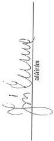

Állami Számvevőszék

# JELENTÉS

# az Oktatási Minisztérium fejezet
működésének ellenőrzéséről

2000. június hó

0016

---

Az ellenőrzés végrehajtásáért felelős:

**Bihary Zsigmond**
számvevő igazgató

Az ellenőrzést vezette:

**Matusek István**
számvevő igazgatóhelyettes

Az ellenőrzésben részt vettek:

**Belovai Sándorné**
számvevő tanácsos

**dr. Csikai Zsolt**
számvevő tanácsos

**Éva Katalin**
számvevő tanácsos

**Deák Tamásné**
számvevő tanácsos

**dr. Horváth Margit**
számvevő tanácsos

**Littomericzky Jánosné**
számvevő tanácsos

**Maklári Ferencné**
számvevő tanácsos

**dr. Mihály Sándor**
tanácsadó, sz. tanácsos

**Norczen Győzőné**
számvevő tanácsos

**Surányi Tamás**
számvevő tanácsos

**Varga Szabolcs**
számvevő tanácsos

**Benczik Lászlóné**
számvevő tanácsos

**Csiszárné dr. Kosik Mária**
számvevő tanácsos

**Gordos László**
főtanácsadó,
számvevő tanácsos

**dr. Gyuk József**
főtanácsadó,
számvevő tanácsos

**Kenéz Sándor**
számvevő tanácsos,
irodavezető

**Kispálné Wiedemann Györgyi**
számvevő tanácsos

**Kocsis István**
számvevő tanácsos

**Koronczai Sándorné**
számvevő

**Nagy János**
számvevő tanácsos

**Péntek László**
számvevő tanácsos,
irodavezető

**dr. Szikszai Bertalan**
számvevő

**dr. Tóth András**
számvevő tanácsos,
irodavezető

Jelentéseink az Országgyűlés számítógépes hálózatán is olvashatók.

---

# A fejezetet érintő korábbi ellenőrzéseink:

A Nemzeti Színház felújítását szolgáló pénzforrások ellenőrzése (1990. augusztus) (16)

Az egyéb központi beruházásokra előirányzott pénzeszközök felhasználásának ellenőrzése (1991. november) (72)

A központi államigazgatási szervezetek létszám- és bérgazdálkodásának ellenőrzése (1992. január) (80)

A Művelődési és Közoktatási Minisztérium fejezet pénzügyi-gazdasági ellenőrzése (1992. december) (131)

A minisztériumok, országos hatáskörű szervek költségvetési és vállalati felügyeleti ellenőrzési tevékenységének, valamint a belső ellenőrzési szektor működésének vizsgálata (1993. április) (142)

A központi költségvetési szerveknél az alapítványoknak juttatott állami pénzek és a vagyon ellenőrzése (1994. június) (210)

A magyar egyetemi felsőoktatás ellenőrzése (1994. augusztus) (218)

A költségvetési fejezetek jóléti célú kiadásainak és jóléti intézményei működésének pénzügyi-gazdasági ellenőrzése (1995. augusztus) (268)

A főiskolák és az egyetemek főiskolai karai állami támogatásának ellenőrzése (1996. szeptember) (318)

A Nemzeti Kulturális Alap pénzügyi-gazdasági ellenőrzése (1998. július) (398)

Az esztergomi Vitéz János Római Katolikus Tanítóképző Főiskola, a Zsámbéki Katolikus Tanítóképző Főiskola, valamint a debreceni Kölcsey Ferenc Református Tanítóképző Főiskola költségvetési támogatásának, illetve ezen főiskolák gazdálkodásának ellenőrzése (1998. október) (439)

A központi költségvetési szervek jóléti célú kiadásainak és jóléti intézményei működésének pénzügyi-gazdasági ellenőrzése (1999. augusztus) (9925)

Az éves zárszámadások és költségvetési előirányzatok ellenőrzései

---

.

.

.

.

.

.

---

# Rövidítések jegyzéke

|  BM | Belügyminisztérium  |
| --- | --- |
|  MEH | Miniszterelnöki Hivatal  |
|  MüM | Munkaügyi Minisztérium  |
|  MTESZ | Műszaki és Természettudományi Egyesületek Szövetsége  |
|  MKM | Művelődési és Közoktatási Minisztérium  |
|  NKÖM | Nemzeti Kulturális Örökség Minisztériuma  |
|  MTA | Magyar Tudományos Akadémia  |
|  OM | Oktatási Minisztérium  |
|  PM | Pénzügyminisztérium  |
|  SzCsM | Szociális és Családügyi Minisztérium  |
|  FPI | Felsőoktatási Pályázatok Irodája  |
|  OKSZI | Országos Közoktatási Szolgáltató Iroda  |
|  KPSZTI | Katolikus Pedagógiai, Szervezési és Továbbképzési Intézet  |
|  KVIF | Kereskedelmi, Vendéglátóipari és Idegenforgalmi Főiskola  |
|  ELTE | Eötvös Loránd Tudományegyetem  |
|  BME | Budapesti Műszaki Egyetem  |
|  BKE | Budapesti Közgazdaságtudományi Egyetem  |
|  OKI | Országos Közoktatási Intézet  |
|  JATE | József Attila Tudományegyetem  |
|  JPTE | Janus Pannonius Tudományegyetem  |
|  POTE | Pécsi Orvostudományi Egyetem  |
|  Kecskeméti TKF | Kecskeméti Tanítóképző Főiskola  |
|  JGYTF | Juhász Gyula Tanárképző Főiskola  |
|  DOTE | Debreceni Orvostudományi Egyetem  |
|  GAMF | Gépipari- és Automatizálási Műszaki Főiskola  |
|  GATE | Gödöllői Agrártudományi Egyetem  |
|  Berzsenyi TKF | Berzsenyi Dániel Tanárképző Főiskola  |
|  SZIF | Széchenyi István Főiskola  |
|  DATE | Debreceni Agrártudományi Egyetem  |

---

|  SOTE | Semmelweis Orvostudományi Egyetem  |
| --- | --- |
|  SE | Soproni Egyetem  |
|  KLTE | Kossuth Lajos Tudományegyetem  |
|  Bessenyei TKF | Bessenyei György Tanárképző Főiskola  |
|  PATE | Pannon Agrártudományi Egyetem  |
|  Áht. | Államháztartási törvény  |
|  Ktv. | A köztisztviselők jogállásáról szóló, többször módosított 1992. évi XXIII. törvény  |
|  Kjt. | A közalkalmazottak jogállásáról szóló többször módosított 1992. évi XXXIII. törvény  |
|  Ftv. | A felsőoktatásról szóló, többször módosított 1993. évi LXXX. törvény  |
|  FEFA | Felsőoktatási Fejlesztési Alapprogram  |
|  NAT | Nemzeti Alaptanterv  |
|  OKTV | Országos Középiskolai Tanulmányi Verseny  |
|  EGR | Egységes Gazdasági Rendszer alprojekt  |
|  ETR | Egységes Tanulmányi Rendszer alprojekt  |
|  KIR-STAT | Közoktatási Információs Rendszer  |
|  iMIR | Integrált Minisztériumi Informatikai Rendszer  |
|  OSAP | Országos Statisztikai Adatgyűjtési Program  |
|  KIR | Kormányzati Információs Rendszer  |
|  KEFIR | Korszerű egységes felsőoktatási információs rendszer  |

2

---

TÉLÉK

V-11-174/1999-2000.

# TARTALOMJEGYZÉK

I. ÖSSZEGZŐ MEGÁLLAPÍTÁSOK, KÖVETKEZTETÉSEK, JAVASLATOK 5

II. RÉSZLETES MEGÁLLAPÍTÁSOK 13

1. A minisztérium fejezeti-irányító tevékenysége 13

1.1.A feladat es a szervezet osszhangja, szabalyozasa, mukodese 13
1.2.A fejezet iranyitasa 1992-1998. I.feleveig 15
1.3.Az Oktatasi Minisztérium megalakulása.Az atalakulás lebonyolítása 18

1.3.1.Az OM szervezeti es mukodesi rendje 19
1.3.2.Az OM es az NKOM, (MuM), valamint az SzCsM kozotti feladatok atadas-atyetele 20
1.3.3.Az atszervezessel egyuttjaro vagyonmegosztas lebonyolitasa 22

1.4. A fejezeti költségvetés tervezése, finanszírozása, a végrehajtás irányítása (1992-1999) 24

1.4.1.A tervezésnel érvenyésitett prioritások és forrásaik 25
1.4.2. Az intézménystruktúra és a feladat-felülvizsgálat vegrehajtása és azok penzügyi kihatásai 26

1.4.2.1. A felsőoktatási intézményi struktúrák fejlesztésére előirányzott pénzeszközök felhasználása 28
1.4.3.A fejezeti kezelésu eloranyzatok tervezese es beszamoltatasa 30
1.4.4. Egyuttmukodes a Magyar Allamkincstárral 32

1.5. Az információs rendszer működése, fejlesztése 34

1.5.1.Az informatika helye a miniszterium szervezetuben.A szemelyi feltetelek 34
1.5.2.Az informatikai tevekenyseg targyi feltetelei, a fejlesztsek alakulasa 36
1.5.3.A rendszerfejlesztések megvalositásanak tapasztalatai 37

1.5.3.1. Az integralt miniszteriumi informatikai rendszer (iMIR) 37
1.5.3.2. A kormányzati információs rendszerhez (KIR) való csatlakozás 38
1.5.3.3. Az adatok, informaciok hasznosulasa a donteshozok, a felhasznalok tevekenyseguben, az informaciós igenyek kielégítésben 39
1.5.3.4. Az egységes gazdasági rendszer (EGR) és az egységes tanulmányi rendszer (ETR) alprojekt megvalóslása 40
1.5.3.5. A kozoktatasi informaciós rendszer (KIR-STAT) megvalóslása 41
1.5.3.6.Az Y2K program teljesitese 42

1.6. A fejezet kiemelt jelentőségű beruházásai 43

1.6.1. A Lágymányosi Egyetemek fejlesztésére kitűzött célok megvalósítása 44

2.A minisztérium, mint onallo koltsegvetesi szervezet 47
2.1.A koltsegvetesi gazdalkodas folyamata, vegrehajtasa 47

1

---

2.1.1. Takarékossági intézkedések a költségvetési hiány csökkentésére 49
2.1.2. A saját bevételek alakulása 50
2.1.3. Az OM igazgatás likviditási helyzete 52
2.1.4. Az előirányzat-maradványának alakulása 52
2.2. A minisztérium létszám- és illetménygazdálkodása 52
2.2.1. Létszámgazdálkodás 53
2.2.2. Illetménygazdálkodás 54
2.2.3. Személyi juttatások 55
2.2.3.1. Rendszeres személyi juttatások 55
2.2.3.2. Jutalmazás 56
2.2.3.3. Munkavállalók részére adott költségtérítések, juttatások 56
2.2.4. Megbízási díjak 57
2.3. A tárgyi eszközök beszerzése, beruházások és felújítások lebonyolítása.
A létesítmények kihasználtsága, biztonságos védelme 58
2.4. A számviteli és bizonylati rend 62
2.4.1. A számviteli politika és számlarend 62
2.4.2. Pénzkezelési szabályzat 63
2.4.3. Leltározási és leltárkészítési szabályzat 63
2.4.4. Értékelési szabályzat 63
2.4.5. Önköltségszámítási szabályzat 63
3. A felügyeleti és a belső ellenőrzés rendszere 63
3.1. Az ellenőrzés szabályozottsága és működésének feltételei 63
3.2. Az ellenőrzések tervszerűsége, megalapozottsága 65
3.3. Az ellenőrzési megállapítások és javaslatok hasznosulása 66
4. A korábbi ÁSZ ellenőrzések megállapításainak, javaslatainak hasznosulása 67
5. Néhány kijelölt költségvetési intézmény gazdálkodásának áttekintése 70
**1. sz. függelék:** A fejezeti kezelésű előirányzatok felhasználása
**2. sz. függelék:** Az ellenőrzött intézmények gazdálkodását érintő egyes tapasztalatok
**3. sz. függelék:** Az Esztergomi Vitéz János Római Katolikus Tanítóképző Főiskola, a Zsámbéki Katolikus Tanítóképző Főiskola és a Kölcsey Ferenc Református Tanítóképző Főiskola 1998. évben lefolytatott ellenőrzésének utóvizsgálati tapasztalatai

2

---

---**Állami Számvevőszék  
V-11-174/1999-2000.  
Témaszám: 483**

## **az Oktatási Minisztérium fejezet működésének ellenőrzéséről**

A fejezet feladata és intézményi struktúrája az 1992-1998. közötti időszakban jelentősen megváltozott. A Művelődési és Közoktatási Minisztérium (MKM) megszűnt, az újonnan alakult Oktatási Minisztérium (OM) fejezethez kerültek az ugyancsak megszűnt Munkaügyi Minisztérium illetékességi köréből a szakképzési feladatok, az intézeti szervezettel együtt. További feladatbővüléssel járt az OM-nél az Európai integráció Felsőoktatási Nemzeti Programnak a fejezeti költségvetésbe illesztése. A kulturális intézmények és kulturális feladatfinanszírozás az újonnan megalakult Nemzeti Kulturális Örökség Minisztériuma (NKÖM) fejezethez kerültek. Az OM fejezethez - a szétválás és feladatátrendeződés következtében - 72 önálló költségvetési intézmény tartozik.

A Magyar Köztársaság 1999. évi költségvetéséről szóló 1998. évi XC. törvény az OM fejezet bevételi előirányzatát 72.135 M Ft-ban, támogatási előirányzatát 131.182,9 M Ft-ban, összes kiadási előirányzatát 203.317,9 M Ft-ban állapította meg. A feladatok végrehajtásához 52.283 fő költségvetési létszámot hagyott jóvá.

Az Állami Számvevőszék (ÁSZ) 1992-ben végzett az MKM fejezetnél átfogó pénzügyi-gazdasági ellenőrzést. Az 1992-1999. közötti időszakban az ÁSZ egyéb ellenőrzései során többször vizsgálta a fejezet és intézményei különböző feladatokkal kapcsolatos tevékenységét (pl. a jóléti célú kiadások alakulása és az önálló jóléti intézmények működése, az egyetemi és főiskolai felsőoktatás állami támogatása, a Nemzeti Kulturális Alap működése és gazdálkodása, az egyházi kezelésű tanítóképző főiskolák állami támogatása és annak felhasználása, éves költségvetési tervek és zárszámadások).

---3

---

I. ÖSSZEGZŐ MEGÁLLAPÍTÁSOK, KÖVETKEZTETÉSEK, JAVASLATOK

**A jelenlegi ellenőrzés célja** annak értékelése volt, hogy a minisztérium

- szervezeti rendszere, irányítási és működési rendje, költségvetési előirányzata összhangban volt-e a szakmai feladatokkal, biztosította-e azok hatékony és eredményes ellátását;
- a közpénzek felhasználása során a fejezeti, az ágazati irányítói, valamint a költségvetési, gazdálkodási feladatait a jogszabályi rendelkezéseknek megfelelően, célszerűen és eredményesen látta-e el;
- a fejezeti kezelésű előirányzatoknál biztosította-e a jogszabályszerű felhasználást, hatékonyan és eredményesen segítette-e az ágazati és a szakmai célkitűzések megvalósítását;
- irányító és gazdálkodó tevékenységében hogyan hasznosította a korábbi számvevőszéki ellenőrzések megállapításait, javaslatait.

Az Állami Számvevőszék az államháztartásról szóló - többször módosított - 1992. évi XXXVIII. törvény 121. § (1) bekezdése alapján ellenőrzi az államháztartás forrásait, azok felhasználását, a vagyonnal való gazdálkodást. **Az ellenőrzést** az Állami Számvevőszékről szóló **1989. évi XXXVIII. törvény 17. § (3) bekezdése alapján végeztük.**

A **helyszíni ellenőrzés** a korábbi átfogó pénzügyi-gazdasági ellenőrzés lezárását követő időszakra, az **1992-1999. évekre**, elsősorban a fejezeti címet alkotó költségvetési szervekre és a fejezeti kezelésű előirányzatokra **terjedt ki**, részletesebb elemzés alá véve az 1997-1999. közötti időszakot.

Az ellenőrzés a költségvetési beszámolók, belső szabályzatok, nyilvántartások és az ellenőrzött szervek által kitöltött tanúsítványok adataira, valamint a helyszíni ellenőrzés során feltárt tényekre alapozódott. A fejezeten, a minisztériumon kívül 21 (ebből 19 felsőoktatási) költségvetési intézménytől kértünk be adatokat, tanúsítványokat és a helyszíni ellenőrzés is erre a körre terjedt ki.

Utóellenőrzés keretében megvizsgáltuk az esztergomi, zsámbéki és debreceni egyházi fenntartású tanítóképző főiskoláknál a korábbi ellenőrzésünk megállapításaira, javaslataira tett intézkedéseket, továbbá - az 1998. évi ellenőrzésünket követően - a három főiskolának juttatott egyszeri költségvetési támogatás felhasználását.

Az ellenőrzés megállapításait, az azok alapján levont következtetéseket és javaslatainkat a jelentés tartalmazza. A fejezeti kezelésű előirányzatokkal, az OM fejezet felügyelete alá tartozó intézmények gazdálkodásával, valamint a három egyházi fenntartású főiskola gazdálkodásával kapcsolatos ellenőrzési megállapításainkat az 1-3. sz. függelékek részletezik.

4

---

I. ÖSSZEGZŐ MEGÁLLAPÍTÁSOK, KÖVETKEZTETÉSEK, JAVASLATOK

# I. ÖSSZEGZŐ MEGÁLLAPÍTÁSOK, KÖVETKEZTETÉSEK, JAVASLATOK

Az 1992. évi vizsgálat több olyan fontos jelenségre felhívta a figyelmet, amelyek sürgető intézkedést kívántak a fejezet szervezeti, szakmai és gazdálkodási tevékenységének megújításában. Ezek közül kiemelést érdemelnek a szervezeti, személyi, szabályozási változások; a nominális költségvetési előirányzatok növekedése mellett a restrikciós intézkedések hatásai; az alsó és felsőoktatás prioritása, a költségvetésen kívüli források bevonásának lehetősége; a kulturális szakterület alacsonyabb részesedése és alkalmazkodóképességének hiánya; a beruházási és felújítási célokra rendelkezésre álló források stagnálása és nem rendeltetésszerű felhasználása; a saját bevételi lehetőségek elégtelen érvényesülése; a szervezeti megoldások, döntési pontok koncentrálása, magasabb szintekre helyezése.

Az Állami Számvevőszék 1992. évi MKM ellenőrzését követően a miniszter részletes **intézkedési tervet** dolgoztatott ki, amely alapján a minisztérium vezetése a közel 9 év alatt több olyan intézkedést tett (NKA újraszabályozása, kulturális külképviseletek szervezeti hovatartozása, Ftv. hatálybalépése, az állami, egyházi, magán felsőoktatásban résztvevők képzésének támogatása, szabályozási hiányosságok felszámolása - SZMSZ, ügyrendek, munkaköri leírások korszerűsítése, az ideiglenesen szabad pénzeszközök más irányú befektetésének, felhasználásának megszüntetése), amelyek eredményeként javult a fejezet működésének és gazdálkodásának színvonala. Ugyanakkor csak részlegesen hajtotta végre a minisztérium vezetése az intézkedési tervet. Időközben a külső gazdasági (szabályozási) feltételekben és a fejezet, valamint a minisztérium belső szervezetében, feladatában végbement mélyreható változások azonban a korábbi elképzelések felülvizsgálatát igénylik.

Az Oktatási Minisztérium költségvetési fejezet szervezete és működése az 1992. évi fejezeti ellenőrzés óta eltelt időszakban többször módosult és 1998. II. féléve óta alapvetően átalakult.

Az új minisztérium szakágazati irányítási feladatköre átfogja az alsó-, közép-, és felsőfokú oktatás egész intézményrendszerét, kiterjed a szakképzésre, átképzésre és 2000. évtől a műszaki fejlesztésre is.

A kulturális szakirányítás - az intézményekkel és a külföldön működő magyar intézetekkel együtt - az újonnan alakult Nemzeti Kulturális Örökség Minisztériuma illetékességi körébe került.

Az Oktatási Minisztériumot érintő változások lebonyolításának szervezettsége és gyorsasága kiemelkedően jónak minősíthető. Lényegében **törésmentes folytonossággal állt fel az új szervezet**, 1998. szeptember 1-jével hatályba lépett a jóváhagyott SZMSZ (az oktatási miniszter feladat- és hatásköréről szóló

5

---

I. ÖSSZEGZŐ MEGÁLLAPÍTÁSOK, KÖVETKEZTETÉSEK, JAVASLATOK---

162/1998. (IX. 30.) Kormányrendeletet csak szeptember 30-án hirdették ki és október 8-án lépett hatályba).

Az új szervezet működését leginkább az NKÖM jelentős késedelemmel megvalósuló elköltözése zavarta, de ennek a helyzetnek az OM vétlen elszenvedője volt. A költözés 1999. novemberéig halasztódott. Néhány vagyonjogi kérdés van még függőben (épületek kezelési jogának rendezése, művészeti tárgyak megosztása, nyilvántartások átadása).

A vizsgált időszakban a fejezet irányítását ellátó szerv vezetésében, felépítésében többször volt nagyobb létszámot érintő változás. Az elmúlt 8 év során a fejezet élén négyszer volt személycsere, a szervezeti- és feladatváltozásokat hét alkalommal kibocsátott új SZMSZ foglalta aktuálisan rendszerbe.

A Művelődési és Közoktatási Minisztérium és az 1998. júliusában életrehívott **Oktatási Minisztérium szervezeti és működési rendje** megfelelően szabályozott volt. A gyakori, egyébként indokolt szervezeti változások a szakmai feladatok teljesítését megelőzték. A döntéselőkészítő, illetve döntésre jogosult szervek annak ellenére megfelelően működtek, hogy a szakágazati, pénzügyi, számviteli és a tágabb értelemben vett gazdasági folyamatok irányítószervi és fejezeti szintű áttekintéséhez, folyamatos figyelemmel kíséréséhez szükséges információk csak a hagyományos úton összegyűjtve álltak rendelkezésre.

Mindeddig nagyobb részt sikertelenek voltak azok a szervezési, számítástechnikai fejlesztések, amelyek a kor színvonalán gyorsan és megbízhatóan állítanák elő a vezetés számára szükséges információkat, fejezeti, illetve minisztériumi szinten és biztosítanák az on line összeköttetést a tárcához tartozó intézményekkel. Ebben egyaránt szerepe van a személyi, szervezeti feltételek elégtelenségének, a szabályozás hiányosságainak és a fejlesztést célzó döntések nem következetes végrehajtásának.

Problémák, késedelmek mutatkoznak **az ágazati információs rendszerek fejlesztésénél** is, az elégtelen koordináció, az intézkedések késedelmei miatt (EGR, ETR alprojektek). Az informatika, az információs rendszer fejlesztésére, működtetésére fordított pénzeszközök hatékony felhasználása érdekében az irányító szerv koordinációs, ellenőrző szerepe, szakmai-pénzügyi felügyelete nem kellően érvényesült. Döntést igényel az ún. Sulinet program 2002. utáni finanszírozása, majd 2003-tól a számítógépek folyamatos cseréje, illetve a program további sorsa.

A költségvetés tervezésének, végrehajtásának **fejezeti irányítását** és a költségvetési beszámolók összesítését részben a hagyományos eszköztár, részben új módszerek alkalmazásával végezték. A minisztérium gazdasági apparátusa a fejezethez tartozó intézményeket az egységes eljárás elősegítése érdekében részletes útmutatókkal, módszertani segédletekkel látta el a tervezés kezdete előtt és a gazdasági év során. Az ellenőrzött időszak általánosan jellemző alapelve volt a bázis-alapú költségvetési tervkészítés, amelynek eredményeként a terv arányaiban és értékében is egyre jobban elszakadt a reális szükségletektől.

Az **oktatási**, de különösen a **kulturális ágazat finanszírozási** szempontból nehéz időszakot tudhat maga mögött. Az 1995. évre elrendelt szigorító in-

---6

---

I. ÖSSZEGZŐ MEGÁLLAPÍTÁSOK, KÖVETKEZTETÉSEK, JAVASLATOK

tézkedések tovább nehezítették az egyébként is pénzügyi gondokkal terhelt fejezet működését. A döntési alkupozícióban a tárca érdekei változó súllyal érvényesültek.

Az ágazat terheit növelték azok a felsőoktatási intézmények, amelyek a felsőoktatási törvény elrendelése folytán a tárca felügyelete alá kerültek (egészségügyi, mezőgazdasági jellegű felsőoktatás). Ezek az átlagon felül eszközigényes felsőoktatási intézmények elveszítették a korábbi felügyeleti szerveik támogatását és ennek kiesését az MKM - többletforrás hiányában - képtelen volt kiegyenlíteni, főként a beruházások, felújítások területén.

Az oktatás (közoktatás, szakképzés, felsőoktatás) és a kutatás-fejlesztés államháztartási támogatása 1990-1999. között a GDP %-ában minden részterületen csökkent (a felsőoktatást kivéve, ahol 1999-ben kis mértékben nőtt). (Az oktatás támogatása 5,3%-ról 4,3%-ra, a kutatásé 0,95%-ról 0,54%-ra esett vissza. A támogatás tervezett növekedése 2000-2002. között az oktatásban 18%-os, a kutatásban 68%-os mértékű.)

Az MKM fejezethez tartozó intézmények és a fejezet éves költségvetési beszámolói 1996-tól rendszeresen jelezték a likviditási problémákat az oktatási és kulturális ágazatoknál. A kulturális ágazat problémáit az MKM a Nemzeti Kulturális Alap forrásainak bővítésével enyhítette, mint ahogy azt az Alap 1998. évi vizsgálata során megállapítottuk. A felsőoktatási intézményeknél pedig a minisztériumi források átcsoportosításával igyekeztek megoldani a legsürgetőbb problémákat. A felsőoktatásban - a helyszíni ellenőrzés tapasztalatai szerint is - az intézmények financiális feszültségei továbbra is fennállnak (SOTE, BKE).

A kialakult helyzetben egyaránt része van az oktatás (közoktatás, szakképzés, felsőoktatás), a kutatás és fejlesztés alacsony szintű támogatottságának, a támogatási rendszer anomáliáinak, valamint az intézmények működése és gazdálkodása alacsony hatékonyságának.

A közép- és alsó fokú oktatás financiális problémáinak megoldására az oktatási tárcának közvetlen pénzügyi lehetősége nincs, az oktatási intézmények fenntartásáért az önkormányzatok vagy más fenntartók a felelősek.

A felsőoktatási intézményhálózat átalakításáról rendelkező 1999. évi LII. törvénnyel erőteljesen támogatott felsőoktatási integrációtól joggal elvárható gazdaságosabb működtetés haszna a jelenlegi milliárdos nagyságrendű (250 M USD értékű felsőoktatási fejlesztési program) többletráfordítások eredményeként a következő években várható. (A felsőoktatás integrációjának szervezeti, szakmai és gazdasági kihatásait indokolt egy-két év elteltével részletesebben elemezni.)

A szakképzés átvétele és a műszaki fejlesztés beillesztése az oktatás rendszerébe nem okozott különösebb problémát, mivel ezek a rendszerek magukkal hozták intézményi infrastruktúrájukat, személyi állományukat és a költségvetésen kívülről származó pénzügyi forrásaikat.

A finanszírozás alapelveiben új alapelemet jelentett a felsőoktatásban bevezetett, majd bővített körben alkalmazásra került normatív alapú finanszíro-

7

---

I. ÖSSZEGZŐ MEGÁLLAPÍTÁSOK, KÖVETKEZTETÉSEK, JAVASLATOK---

**zás.** Az elvszerű alapokon nyugvó finanszírozás előnyeinek kibontakozását gátolta az a körülmény, hogy a kényszerű pénzszűke viszonyai között a normatívák a tényleges költségek egy részére nyújtottak fedezetet és az áttérés során jelentkező feszültségek levezetésére csak korlátozottan volt mozgósítható pénztartalék.

A fejezet - lehetőségei határán belül - megtette azokat az intézkedéseket, amelyek szükségesek voltak (normatívák finomítása, előirányzat-növelés, elvonás mellőzése, pénzügyi támogatás stb.).

**A fejezeti kezelésű előirányzatok** évenként változó, de jelentős arányt képviseltek a fejezet költségvetésében (1997-ben 31%-ot, 1998-ban 35%-ot, 1999-ben 21%-ot). A rendelkezésre álló pénzügyi források elosztásánál előresorolták a törvényi és egyéb jogszabályokban előírt kötelezettségeket (intézményfinanszírozás), de lehetőséget biztosítottak az egyéb intézményi kezdeményezésű célok támogatására is. A széles körre (19 intézmény) kiterjedő vizsgálatunk általánosítható tapasztalata szerint a rendelkezésre álló forrásokat (42 Mrd, 57 Mrd, 39 Mrd Ft) döntően az intézmények használták fel, s elemi költségvetésük kvázi részének tekintették.

Az utóbbi években (1997-től kezdődően egyre nagyobb mértékben) szélesítették ki a programfinanszírozást, amelynek forrásaihoz pályázati úton lehet hozzájutni. A programfinanszírozás a közoktatásban és a felsőoktatásban egyaránt lehetővé tette olyan szakmai projektek megvalósítását, amelyekre a költségvetés elkülönített forrást biztosított.

Ezek a források 1999-ben 31 közoktatási részprogram megvalósulását segítették elő, általuk vált lehetővé az alsó- és középfokú oktatási intézmények számítógépes fejlesztése (a középiskolák internet-hozzáférési lehetősége 1998. évben teljes körűvé vált), támogatták a közoktatási tankönyvkiadást, a nemzetközi két- és többoldalú kapcsolatok fejlesztését (Socrates, Leonardo programok), tanulmányi versenyek szervezését, vizsgamodellek kifejlesztését.

A felsőoktatásban a részprogramok száma 1999-ben 42 volt. A felsőoktatási programok, részprogramok a képzési rendszer korszerűsítéséhez, a struktúra átalakításához, az infrastruktúra fejlesztéséhez nyújtottak támogatást.

**A felsőoktatási intézményekben végzett helyszíni ellenőrzések** kedvezőtlen tapasztalatokat is feltártak:

A pénzeszközök elosztása az elaprózódás irányába tart. Ezt jelzik a pénzügyi lehetőségeket meghaladó ütemben bővülő programok és részprogramok, csökken az egységnyi pályázatra nyújtható támogatás összege. A pályázatokban megjelölt támogatási igényeknek többnyire a felét, vagy annál kevesebbet hagyták jóvá, s ennek következményeként sok pályázat feladatait módosítani kellett, némely esetben a projekt megvalósítása elmaradt. A pályázatok elbírálása és a jóváhagyott támogatási összeghez való hozzáférés lehetősége hónapokig elhúzódott és az év elején kezdeményezett célhoz október-november hónapban állt rendelkezésre a fedezet. Általánosnak mondható tehát, hogy a pénzfelhasználás a következő évre tolódik át, a programok előkészítésének hiányosságai miatt évente jelentős összegek maradványként megmaradnak. Nincs megnyugtatóan megoldva a szakmai teljesítmények elbírálása, értékelé-

---8

---

I. ÖSSZEGZŐ MEGÁLLAPÍTÁSOK, KÖVETKEZTETÉSEK, JAVASLATOK

se. Az intézmények egy része gyakorol csak szakmai zsűrit a fennhatósága alatt folyó pályázati munkák felett. Többnyire a pályázati vezető ad szakmai önértékelést és számol el a kapott összegekről. Az OM a felügyeleti ellenőrzés keretében ezen pénzeszközök felhasználását megvizsgálta, de a szakfőosztályok ezzel önállóan esetenként sem foglalkoztak. Az intézmények helyenként beszámoltatták a projekt vezetőket, de ez nem volt általános gyakorlat.

A FEFA támogatások felhasználásnak ellenőrzésével megbízott finn cég is rámutatott arra, hogy a finanszírozóknak nincs arról ismeretük, hogy az általuk támogatott szakmai célt még hányan, milyen feltételekkel és összegekkel támogatják. Az általunk megvizsgált esetek között is előfordult céltól, ütemezéstől eltérő, nem koordinált felhasználás. (Részletes megállapításaink az 1. sz. függelékben.)

**A fejezet- és intézményei kapcsolata a Magyar Államkincstárral** - a kezdeti nehézségeket leszámítva - megfelelőnek minősíthető. A technikainak minősülő problémákat a személyes egyeztetések során megoldották. Probléma a pénzügyi folyamatok szakellenőrzésének hiányában van. A Kincstár csak formalizált ellenőrzésekre jogosult és képes. Ha a benyújtott bizonylatok alaki kifogás alá nem esnek, a Kincstár a pénzügyi tranzakciót az előirányzat mértékéig teljesíti. A fejezethez tartozó költségvetési szervek számára problémákat okozott az év végi (december 20. utáni) pénzügyi események könyvviteli zárlata, amelyet - szabályozás hiányában - eltérő módon oldottak meg. Ennek rendezése egységes megoldást kíván.

A Magyar Államkincstár vonatkozásában rendezést igénylő további feladat még a költségvetési szervezetek többségétől technológiailag, vagy működésileg eltérő azon szervezetek finanszírozása, amelyeknél az éves pénzszükséglet egyenetlenül merül fel (mezőgazdasági jellegű felsőoktatási intézmények technológiai pénzügyénye, felsőoktatási intézmények és színházak nyári szünete).

**A fejezet kiemelt jelentőségű beruházásai** közül a Lágymányosi Egyetemek beruházásait áttekintve az állapítható meg, hogy a beruházás kettős cél megvalósításának szándékával indult: a Világkiállítás infrastruktúrájának kiépítése, annak befejeződése után - kisebb átalakításokkal - oktatási célokra való hasznosítása.

Már a tervezés kezdetén hibásnak bizonyult feltételekből kiindulva a beruházás költségeit mintegy 13 Mrd Ft-ban állapították meg, majd többször „átáraták”. A Világkiállítás elmaradása miatti bizonytalanság, majd a költségvetésből megvalósuló beruházások visszafogása lelassították a kivitelezést, az inflációs hatások és a lekötött, de nem hasznosuló tőke kieső hozamai pedig felgyorsították a költségek növekedését. A történtek együttes következményeként a jelenleg prognosztizált bekerülési összeg 82 Mrd Ft körül várható, úgy, hogy kevesebb laboratórium létesül, az Északi és Déli összekötő tömb öt szintje helyett kettő valósul meg, nem épül meg a négyezer adagos menza, helyette külső tőke bevonásával különböző típusú (és vélhetőleg drágább szolgáltatást nyújtó) étkező helyeket alakítanak ki. A tervezett befejezési határidő 2005, de ennek még nincsenek meg a financiális feltételei. A mintegy kétharmad részben kész sportlétesítmények befejezése feltétlenül indokolt, a tervezett kulturális létesítményekről döntés szükséges.

9

---

I. ÖSSZEGZŐ MEGÁLLAPÍTÁSOK, KÖVETKEZTETÉSEK, JAVASLATOK---

**Az egyházi fenntartású tanítóképző főiskolák** utóellenőrzése újból rávilágított arra, hogy az OM és a felsőoktatási intézmények éves finanszírozási megállapodását általában a tárgyév október-november hónapjában kötik meg, ami hátrányosan befolyásolja az oktatási intézmények gazdálkodását. (Részletes megállapításainkat a 3. sz. függelék tartalmazza.)

**A minisztériumnak**, mint önálló költségvetési szervezetnek a **gazdálkodása** tervszerű, megfelelően szabályozott és megfelel a törvényesség követelményeinek. Hiányosságként állapította meg az ellenőrzés, hogy az MKM gazdálkodó szervezete alapító okirattal és ügyrenddel nem rendelkezett. Alapító okirattal az OM gazdálkodó szervezete jelenleg sem rendelkezik. A szakmai célokra szolgáló előirányzatok kezelése után lebonyolítási díjat számítottak fel, amelynek mértéke 4-5% volt. A lebonyolítási díjból a felmerült túlórákat és a dologi többletkiadásokat fizették. Kifogásoljuk azonban, hogy a lebonyolítási díj mértékét és felszámíthatóságát nem szabályozta miniszteri rendelet.

A minisztérium igazgatási címe működési költségvetése javára 1994-1996-ban a külön kezelt, szakmai célok előirányzatából a miniszter engedélyével átcsoportosítást hajtottak végre, mert a szakmai feladatok működési költségére elkülönített fedezet nem állt rendelkezésre. A szabályosan végrehajtott átcsoportosításokat a megnövekedett feladatok finanszírozása is indokolta.

A minisztérium igazgatási létszáma 1994-ben volt a legnagyobb 617 fővel, azóta különböző címeken csökkent a létszáma, az újonnan alakult Oktatási Minisztérium nyitó költségvetési létszámát 449 főben állapították meg. Bérgazdálkodása 1997. óta a szervezeti egységek jogkörébe helyezve vált decentralizálttá, a részükre megállapított státusz mértékéig. Az eddigi tapasztalatok szerint ez a megoldás bevált. Az NKÖM szervezetébe 110 fő került át az MKM szétválásával.

A bérgazdálkodás rendje, a személyi juttatások rendszere a vonatkozó törvényeknek, jogszabályoknak megfelelt.

A tárgyi eszközökben megtestesülő vagyonnal való gazdálkodás - a képző- és iparművészeti alkotások nyilvántartásba vételének kivételével - megfelelően szabályozott volt.

A rendelkezésre álló - főként irodai célú - helyiségek száma nagyobb, mint a minisztérium reális igénye. A felesleges helyiségek bérbeadásából származó bevétel a gazdálkodás szempontjából jelentéktelen.

**Az OM felügyeleti és belső ellenőrzési rendszerének**, tevékenységének átvizsgálása alapján az állapítható meg, hogy a minisztérium vezetése mindenkor fontosnak tartotta az ellenőrzés mindkét ágának fejlesztését, ennek ellenére az idevonatkozó belső határozatokat csak részben hajtották végre.

**A belső ellenőrzés** hatásosságának tervezett szintre emelését a minisztériumi információs rendszer kifejlesztésének sikertelensége is akadályozta és a szabályozás korszerűsítése, munkakörökre bontása is késett.

---10

---

I. ÖSSZEGZŐ MEGÁLLAPÍTÁSOK, KÖVETKEZTETÉSEK, JAVASLATOK

A felügyeleti ellenőrzést nehezítette a folyamatosnak tekinthető ellenőrzési létszámhiány, létszámzárolás és a szakfőosztályok nem kielégítő közreműködése. Emiatt az eltervezett ellenőrzések fele, háromnegyede valósult meg, főképpen az intézmények kétévenkénti felügyeleti ellenőrzése maradt el, vagy azok szakmai szempontú értékelésében jelentkeztek problémák. Utóellenőrzésre csak elvétve került sor.

A felügyeleti ellenőrzések tapasztalatai szerint az intézményeknél a gazdálkodási fegyelem, a számviteli szabályok betartása nem megfelelő, nem javult a belső ellenőrzések színvonala. Az ellenőrzések kiterjedtek a mérlegvalódiság, a teljesség, a leltárral való alátámasztás vizsgálatára is, de a személyi és tárgyi feltételek hiányában, még utólag sem garantálhatják az intézményi beszámolók és az ezeket is magában foglaló fejezeti beszámoló teljességét, megbízhatóságát. Az ellenőrzések évenként nem fedik le a teljes intézményi kört. (A korábbi kormányrendelet kétévenkénti, a hatályos kormányrendelet háromévenkénti átfogó intézményi ellenőrzést ír elő.)

Az OM által lefolytatott ellenőrzések az elhatározott célnak megfeleltek, konkrét megállapításokat és javaslatokat tettek, amelyek intézkedésre alkalmasak voltak. A minisztérium vezetése több esetben foglalkozott az ellenőrzési jelentésekkel, ennek ellenére a hibák egy része ismétlődött.

Az ellenőrzés részletes megállapításaink hasznosítása mellett javasoljuk az oktatási miniszternek:

1. Gondoskodjon arrol, hogy az agazati es miniszteriumi informatikai rendszerek fejlesztésere hozott dontesek eredmenyesen megvalosuljanak. Ennek erdekében:
a) alakitsa ki az informatikai szervezet szemelyi, szervezeti felteteleit es leptesse hatalyba az informatikai szabalyzatot;
b) szerezzen érvényt annak az elhatározásnak, hogy az OM gezetői szintü információs rendszere szolgáltassa a gezetői dontéskhez szükséges informáciokat és egyidejüleg biztositsa a szakmailag indokolt mertékben az on line összekottétest a tárcához tartozó intezményekkel;
c) gondoskodjon arrol, hogy folyamatosanBiztositott legyen a tarca reszerol a megkezdett fejlesztesek atfogorendszerkent valo megvalositasanak es mukodtetesenek szakmai-penzugyi felugyelete;
d) kiserje figyelemmel intezkedesei vegrehajtsat.
2. Gondoskodjon arrol, hogy
a) a programfinanszirozasi eloranyzatok elokeszitese, palyaztatasa, a szerzodesek megkotese es a finanszirozasi keretek megnyitasa tegye lehetove a targy evi felhasznalast;

11

---

I. ÖSSZEGZŐ MEGÁLLAPÍTÁSOK, KÖVETKEZTETÉSEK, JAVASLATOK

b) a pályázatokra odaítélt összegek felhasználását - a belső szabályzatban előírtaknak megfelelően - szakmai és pénzügyi szempontból ellenőrizzék;

c) az OM gazdálkodó szervezetének legyen alapító okirata.

3. Tekintse át és értékelje a felsőoktatási intézmények integrációjának szervezeti, szakmai és gazdasági tapasztalatait a 2000/20001. tanévet követően, ennek keretében vizsgáltassa felül a felsőoktatási intézményeknél alkalmazott normatívákat és az átalakult intézmények sajátosságaira figyelemmel kezdeményezze azok módosítását.

4. Intézkedjen annak érdekében, hogy a jelen állapotból kiindulva szakszerűen és megalapozottan mérjék fel a lágymányosi egyetemi építkezések további fázisait, a létesítmények végső kapacitását, az elkészítési határidőket, a továbbiakban prognosztizálható költségeket és azok ütemezését, a lehetséges és számbavehető forrásokat. Ezek ismeretében döntsön a beruházások további lebonyolításáról. Követelje meg az érintett egyetemektől a megvalósult infrastruktúra megfelelő hasznosítását.

5. Gondoskodjon arról, hogy az egyházi fenntartású felsőoktatási intézményeket megillető normatív és nem normatív támogatások finanszírozását szabályozó éves megállapodások a gazdasági év elején kerüljenek megkötésre, hogy az intézmények a törvényekben garantált pénzügyi feltételekkel zavartalanul működhessenek.

12

---

## II. RÉSZLETES MEGÁLLAPÍTÁSOK

### 1. A MINISZTÉRIUM FEJEZETI-IRÁNYÍTÓ TEVÉKENYSÉGE

#### 1.1. A feladat és a szervezet összhangja, szabályozása, működése

A fejezet az ellenőrzött időszak döntő hányadában (1992-1998. II. félévig) Művelődési és Közoktatási Minisztériumként működött, magában foglalva a kulturális és oktatási ügyek szakágazati irányítását, a felsőoktatási törvény hatálybalépését követően az összes állami felsőoktatási intézmény közvetlen felügyeletét.

Az ún. éves személyügyi tevékenység irányelveit minden esetben miniszteri értekezlet (azt megelőzően államtitkári) hagyta jóvá.

A szükséges döntés-előkészítő, illetve döntéshozó fórumok működtek, működésük nyomon követhető volt, a működést kiszolgáló egységes információs rendszer kialakítása azonban sikertelen volt.

A főosztályi ügyrendek - különösen a funkcionális területeken - racionális belső munkamegosztást tükröztek.

A vezetői és a munkafolyamatba épített ellenőrzési tevékenység hangsúlyosabbá tételére - mind szabályozási szinten, mind a gyakorlatban - tettek lépéseket, így pl. 1997. májusában az MKM belső ellenőrzési rendszerének erősítéséről, korszerűsítéséről a miniszteri értekezleten a vezetői ellenőrzés pontosabb szabályozásáról hoztak határozatot.

**Hiányosságként** állapítható meg, hogy **az MKM gazdálkodó szervezete az Áht. 88. § (3) bekezdése előírásainak megfelelő alapító okirattal, illetve a 156/1995. (XII. 26.) Korm. rendelet 10. § (6) bekezdése szerinti ügyrenddel nem rendelkezett. Az OM gazdálkodó szervezete jelenleg sem rendelkezik alapító okirattal. A fejezeti irányítási és minisztérium gazdasági-pénzügyi működésével kapcsolatos szabályzatok rendelkezésre álltak.**

A szabályozottságot a jogszabályi előírásokon túl az MKM fejezet költségvetési támogatásának nagyságrendje is indokolta.

Az MKM fejezet költségvetési támogatása (intézményi támogatás, fejezeti előirányzatok és kormányzati beruházás címén) 1996-ban 85.215 M Ft, 1997-ben 109.614 M Ft, 1998-ban 132.356 M Ft volt.

---13

---

II. RÉSZLETES MEGÁLLAPÍTÁSOK

**Az MKM az intézményi tervezési és beszámoltatási tevékenységet** a vonatkozó PM köriratokon túlmutató részletezettséggel és precizitással **segítette**. Több esetben felhívták a figyelmet a jogszabályi változásokból adódó egyes kiemelt feladatokra.

Az 1996. évi tervezési köriratban a kincstári rendszerre való áttérést, az 1997. évi tervezési köriratban a központosított közbeszerzés kapcsán teendő egyes intézkedéseket emelték ki. **Az intézmények közbeszerzéseire fejezeti szintű szabályozást nem adtak ki**, de a közbeszerzéseket az intézményeknél kiemelt vizsgálati szempontként kezelték.

Az intézmények szakmai feladatellátásának felülvizsgálatára a felügyeleti (komplex) ellenőrzések keretében történtek utalások, **az átfogó feladatfelülvizsgálat rendszerszerűen nem történt meg**, a fejezet intézményeinek alapító okiratairól teljes körű nyilvántartással nem rendelkeznek. Az alapító okiratok hiányosságára, a felügyeleti ellenőrzés minden esetben rámutatott. Egyes intézmények az alapító okiratukat maguk sem lelték fel. A Magyar Nyelvi Intézet és az Állami Artistaképző Intézet ilyen értelmű tájékoztató levelet küldött a minisztériumnak 1999. szeptemberében. Ezeket a hiányosságokat több, előző ÁSZ ellenőrzés is megállapította.

**A fejezeti irányításban - különösen 1994-től - jelen voltak az operatív beavatkozásra utaló jelek:**

így az alapító okiratban az egészen kis intézményeknél az SzMSz-ek és/vagy a munkatervek miniszteri jóváhagyásának előírása (FEFA Iroda, Országos Közoktatási Intézet), illetőleg a miniszteri biztosí kinevezések gyakorisága. 1994-ig 4 miniszteri biztosí, 1994-től 13-at neveztek ki. A jogcímek különböznek voltak, az intézményvezetés és válságkezelés (Miskolci Egyetem, Rock Színház, Márton Áron Kollégium, Országos Közoktatási Intézet), egyes kiemelt feladatok menedzselése (Millecentenáriumi megemlékezések, Seuso Kincsek visszaszerzése, Restitúciós ügyek vitele).

Az MKM mint intézmény szervezetére, létszámára, működésére kiható intézkedéseket minden évben hozott a minisztérium vezetése, ezekből súlyukat tekintve kiemelkedők az alábbiak:

**1995-ben** az 1994. évi 665 fős létszámot 618-ra csökkentették (korengedményes nyugdíjazás, felmentés), átszervezéssel a korábbi 36 helyett 29 főosztály keretében látták el az egyébként megnövekedett feladatokat a (az 1060/1994. (VIII. 21.) Korm. határozat a Miniszterelnöki Hivatalnál lévő egyházi, ifjúsági és tudománypolitikai feladatokat az MKM feladatkörébe utalta, a felsőoktatásról szóló 1993. évi LXXX. törvény alapján az agrár és egészségügyi felsőoktatási intézmények 1995-től az MKM fejezethez kerültek).

**Az ágazati feladatok ellátása** megosztott a közoktatási-, felsőoktatási- és a kulturális helyettes államtitkárhoz rendelt szakmai főosztályok között. **A fejezeti és minisztériumi gazdálkodási, ellátási, informatikai feladatokat** 5 főosztály látta el. A feladatkör a gazdasági helyettes államtitkáron keresztül kapcsolódott a közigazgatási államtitkárhoz, aki a saját felügyelete alatt tartotta a további funkcionális (jogi, igazgatási, személyügyi, ellenőrzési) és egyes speciális (külkapcsolatok, egyházi, ifjúsági, kisebbségi) feladatokat végző főosztályokat.

14

---

II. RÉSZLETES MEGÁLLAPÍTÁSOK

1995. év végére újabb átszervezésekkel a közigazgatási államtitkárhoz tartozó szervezeti egységek számát csökkentették, egy külön igazgatósághoz szervezték a határon túli magyarsággal, a kisebbségekkel és az ifjúsággal kapcsolatos ügyeket. A nemzetközi ügyek ellátására helyettes államtitkári vezetéssel két főosztályt létesítettek, az egyházi ügyekkel kapcsolatos feladatok irányítását címzetes államtitkárhoz rendelték, ezáltal a felső vezetők számát 9-re, a főosztályvezetőkét 30-ra növelték.

1995-96-ban végrehajtották az ún. Bokros-csomag létszám-leépítési intézkedéseit, így 1997-re 500 státusszal rendelkeztek. Bevezették a decentralizált bérgazdálkodást, a közigazgatás reformjáról szóló 1100/1996. (X. 2.) Korm. határozat végrehajtására átvilágították a minisztérium szervezetét, előtérbe helyezve a szolgáltatási tevékenységek más formában való működtetését, szabályozták a vezetői munkakörök betöltésének feltételét, a munkakörök átruházhatóságát, a Civil Kapcsolatok Igazgatósága mellett megjelent az Informatikai Igazgatóság.

1998-ban az OM megalakulásáig az MKM 500 státusszal, 8 felső vezetővel, 28 főosztállyal (a titkárságokat nem számítva) látta el a feladatait. Az OM megalakulásakor az új minisztérium létszáma 35 fővel csökkent.

# 1.2. A fejezet irányítása 1992-1998. I. félévéig

Az oktatási és kulturális ágazatot egyaránt irányító MKM szakmai feladatellátása keretében az 1992-1998. közötti időszakban teljesítette a kormányprogramok által kitűzött céloknak megfelelő jogalkotási feladatait, az alapvető törvények és egyes végrehajtási jogszabályok már a rendszerváltoztatást követő első kormányzati ciklusban megszülettek (A felsőoktatásról szóló 1993. évi LXXX. törvény, a közoktatásról szóló 1993. évi LXXIX. törvény, a „Felzárkózás az európai felsőoktatáshoz” alapról szóló 1993. évi XXI. törvény).

A második kormányzati ciklus oktatáspolitikai törekvései igen jelentős jogszabály-módosítási és oktatási tevékenységgel jártak, egyben kihatottak a finanszírozási rendszerre is.

A felsőoktatás fejlesztésének irányelveiről hozott 107/1995. (XI. 4.) OGY határozat főbb célkitűzései (autonómia, versenysemlegesség, minőségelvűség, esélyegyenlőség) mentén az 1996. évi LXI törvénnyel a felsőoktatási törvény módosult és számos végrehajtási szabályt hoztak, az egyetemi és főiskolai hallgatók részére nyújtható támogatásokról és az általuk fizetendő díjakról, térítésekről (144/1996. (IX. 17.) Korm. rendelet), a képzési normatívák bevezetéséről a felsőoktatásban (154/1996. (X. 6.) Korm. rendelet), a Széchenyi Professzori Ösztöndíj odaítéléséről (17/1996. (XII. 13.) MKM rendelet.

A gazdálkodási rend átalakításának jelentős lépése volt a képzési normatívák 1996. évi bevezetése (154/1996. (X. 6.) Korm. rendelet). Ugyanakkor az 1996. évi előirányzatok a képzési normatívák 77%-os költségvetési támogatására nyújtottak fedezetet.

Tovább folytatódott a felsőoktatási intézmények integrációja, amelynek a hátteréből a 2. kormányzati ciklusra felhasználták (lekötötték) az ún. első világbanki kölcsönnel biztosított 66,7 M USA dollárt, így a folyamat továbbvi-

15

---

II. RÉSZLETES MEGÁLLAPÍTÁSOK

telét a költségvetés finanszírozta. Egyúttal az elkülönített állami pénzalapot megszüntették, a támogatást speciális fejezeti kezelésű előirányzatként folytatták.

Külön támogatásként jelent meg a Kormány 1045/1996. (V. 15.) határozatával a privatizációs bevételekből származó kamatmegtakarításból e célra biztosított 275 M Ft.

A közoktatásban az 1993. évi LXXIX. törvény által meghatározott alapdokumentumot, a Nemzeti Alaptantervet (NAT) 1996-ban vezették be.

A NAT, szakítva a korábbi központi tantervi szabályozással, a tankötelezettség tíz évfolyamára állapítja meg a nevelő- és oktató munka közös követelményeit minden hazai iskola számára. A NAT-hoz kapcsolódik az alapműveltségi vizsga és arra épül az új kétszintű érettségi vizsga.

A közoktatásban a jellemző kétszatornás (önkormányzati és állami) támogatási rendszeren belül 1996-ban meghatározták az állami támogatás kötelező arányát, valamint a normatív támogatáson túl egy, ún. központi keretből a közoktatás korszerűsítése jegyében különböző területeket és célokat finanszíroztak meg (informatikai fejlesztés, pedagógiai kutatás, tanári továbbképzések reformja).

A kultúra területére vonatkozóan 1997-ben fontos törvények születtek meg, így a műemlékvédelemről szóló 1997. évi LIV. törvény, amelyben meghatározták és szabályozták a környezetvédelemért, illetve a művelődésért felelős tárcák együttes felelősségét, a kulturális örökség védelméről és a muzeális intézményekről, a könyvtári ellátásról és a közművelődésről szóló 1997. évi CXL. törvény, amely egyesítette a korábbi múzeumi, könyvtári és közművelődési törvényeket, továbbá rögzítette a kulturális alapfeladatok finanszírozását.

Az MKM támogatási előirányzatainak ágazatok (alágazatok) szerinti megoszlása 1996. és 1998. között az alábbi volt:

= közoktatásra 1996-ban 9.154 M Ft-ot, 1997-ben 13.108 M Ft-ot, 1998-ban 17.797 M Ft-ot;
= felsőoktatásra 1996-ban 59.429 M Ft-ot, 1997-ben 76.810 M Ft-ot, 1998-ban 88.100 M Ft-ot;
= kultúrára 1996-ban 11.842 M Ft-ot, 1997-ben 12.731 M Ft-ot, 1998-ban 17.149 M Ft-ot

fordítottak.

Az egyes ágazatokra (alágazatokra) fordított tényleges támogatást az önkormányzati támogatásokkal együtt számított összegek fejezik ki:

= közoktatásra 1996-ban 148.380 M Ft-ot, 1997-ben 191.149 M Ft-ot, 1998-ban 217.422 M Ft-ot;
= felsőoktatásra 1996-ban 59.429 M Ft-ot, 1997-ben 76.810 M Ft-ot, 1998-ban 88.100 M Ft-ot;

16

---

II. RÉSZLETES MEGÁLLAPÍTÁSOK

= kultúrára 1996-ban 15.453 M Ft-ot, 1997-ben 18.910 M Ft-ot, 1998-ban 30.822 M Ft-ot

fordítottak.

Az adatokból egyértelműen megállapítható, hogy amíg a közoktatásban az MKM támogatásnak csak kiegészítő szerepe volt, (az összes támogatás 6-8%-át tette ki), addig a felsőoktatásban az az intézményi működés létalapja volt, a kultúrában átlagosan a támogatás 2/3-át tette ki.

Az MKM fejezet cím- és intézményrendszere 1996. és 1999. között érdemben nem változott.

Négy külön címen jelentek meg a felsőoktatási intézmények (Tudomány- és műszaki egyetemek; Agrártudományi egyetemek; Orvosegyetemek, Egészségtudományi egyetem; Főiskolák), további külön címen a továbbképző, a kutató és szolgáltató, az egyéb oktatási és a nemzeti kulturális intézmények. Ezeken kívül a fejezeti kezelésű előirányzatok keretében számos, céljukat és irányultságukat tekintve egymást átfedő előirányzat-csoport, amelyeken belül a normatív finanszírozás viszonylag jól elkülöníthető volt. Ugyanakkor feladatfinanszírozásként megjelentek normatív finanszírozások (gyakorló iskolák normatív ellátása), illetve intézményfinanszírozások (Felsőoktatási Tudományos Tanács, Magyar Akkreditációs Bizottság) is.

A fejezeti kezelésű előirányzatok nagy száma - bár a felhasználás célhoz kötöttsége nyomon követhető - arra utal, hogy az ágazati és/vagy intézményi rendszer működtetésének bizonyos preferenciáit a mindenkori évenkénti költségvetési alku határozta meg, az ágazatok (alágazatok) költségvetési helyzete - még egyes intézménytípusonként is - kevésbé volt áttekinthető és főleg kevésbé volt kiszámítható.

A címrend és intézményi módosulásokat Kormány, illetve minisztériumi döntések alapozták meg.

Az egyéb oktatási intézmények címen belül a Zánkai Gyermeküdülő Centrum a 21/1996. (II. 7.) Korm. rendelet alapján 1996. szept. 1-étől közhasznú társaságként működött, a Kodolányi János Intézetet 1997. március 31-én átszervezték, alapfeladatait két önálló költségvetési szerv a Márton Áron Kollégium és a Magyar Nyelvi Intézet vette át. A Kutató és Szolgáltató intézmények címen belül a Mobilitás Ifjúsági Szolgálat 1997-től az ifjúságpolitikai feladatokkal együtt 1996. XII. 31-ével átkerült a Miniszterelnökség fejezethez, a továbbképző intézetek címen belül a BME Mérnöktovábbképző Intézete a Műszaki Egyetemhez integrálódott és részben önálló költségvetési szervként működött 1998. áprilisától a BME Egyetemi Tanácsának és az MKM vezetésének döntése alapján; a nemzeti kulturális intézmények címen belül a Szerzői Jogvédő Hivatal 1997. XII. 31-i hatállyal megszűnt a Kormány 239/1997. (XII. 18.) rendelete alapján. Az intézmény jogutóda az ARTISJUS Magyar Szerzői Jogvédő Iroda Egyesület lett. A Nemzeti Filharmónia 1998. I. 1-jével megszűnt, jogutód a Magyar Állami Hangversenyzene-kar, Énekkar és Kottatár központi költségvetési szerv lett, amely a jogelőd szűkített alaptevékenységi körét látja el.

Az MKM fejezet éves költségvetési beszámolói 1996-tól rendre jelezték mind a felsőoktatási, mind a nemzeti kulturális intézményeknél

17

---

II. RÉSZLETES MEGÁLLAPÍTÁSOK

**a gazdálkodási nehézségeket, a likviditási problémákat** (a közoktatási intézmények önkormányzati fenntartásúak, azok gazdálkodási nehézségeiről ott rendelkeznek információkkal).

Az MKM fejezet **1996. évi** végrehajtásáról szóló beszámoló szerint: ...”Az előző évek kumulált hiánya miatt mintegy 20 felsőoktatási intézmény jelezte működési hiányát az év elején. Részben a finanszírozási rendszer változása, részben pedig a belső strukturális átalakítások támogatásával sikerült enyhíteni a likviditási gondokat, biztosítani az intézmények működőképességét.

A kultúra költségvetési támogatási helyzete 1996-ban kedvezőtlenebbé vált, elsősorban a központi intézmények kondíciói romlottak jelentősen reálértékben. Ezt csak részben kompenzálta a Nemzeti Kulturális Alap forrásbővülése. Így esetenként komoly gondot jelentett a kulturális rendezvények, illetve a nemzetközi kötelezettségű hazai programok finanszírozása”...

Az MKM fejezet **1998. évi** költségvetésének végrehajtásáról szóló beszámoló megállapítja: „Az orvostudományi egyetemek az oktatás, tudományos kutatás és a betegellátás tekintetében fejtik ki tevékenységüket. A hármas feladat ellátása, a likviditás megőrzése az intézményeknél komoly erőfeszítést igényelt. Átmeneti és tartós (SOTE) likviditási problémák jelentkeztek. Az OEP által bevezetett teljesítményfinanszírozás óta a működési költségek tekintetében alulfinanszírozott helyzetbe kerültek, az igénybevett kamatmentes konszolidációs hitelt az intézmények törlesztették...”

### 1.3. Az Oktatási Minisztérium megalakulása. Az átalakulás lebonyolítása

Az Oktatási Minisztérium a Művelődési és Közoktatási Minisztérium egyik jogutódjaként jött létre 1998. július 1-i hatállyal.

A létesítés jogforrása a Magyar Köztársaság minisztériumainak felsorolásáról szóló 1998. évi XXXVI. törvény.

Az OM feladatköre és intézményrendszere szorosan kapcsolódik a jogelőd MKM-éhez, részint attól eltérő.

Tartalmazza a jogelőd minisztérium - kulturális területet nem érintő - összes feladatát és intézményét, továbbá a volt Munkaügyi Minisztérium szakképzési feladatait és intézményeit.

Az oktatási miniszter feladat- és hatásköréről szóló 162/1998. (IX. 30.) Korm. rendelet meghatározott elvek mentén (tankötelezettség, tanszabadság és a tanítás szabadsága, a szükséges szakképesítés megszerzéséhez, a kisebbségek anyanyelvű oktatásához való jog, tudományos élet szabadsága, lelkiismereti és vallásszabadság) részletezi az oktatási ágazat egyes területeire vonatkozóan (közoktatás, szakképzés, felsőoktatás, felnőttoktatás) **az oktatási miniszter** feladatait és hatáskörét, amely összegzően az **oktatási ágazat vezetését és irányítását** jelenti. Ehhez szabályozási, különböző felügyeleti és gazdálkodási, valamint jogalkalmazási és operatív döntési jogosítványokat rendel hozzá. Emellett kitér a nemzetközi ügyekre (pl. az európai integrációval összefüggésben), egyes munkamódszerbeli, kapcsolattartási követelményekre. Ez utóbbi

18

---

II. RÉSZLETES MEGÁLLAPÍTÁSOK

körbe tartozik az egyházak, valamint a határon túli magyarok vonatkozásá-
ban a kormányprogramban meghatározott szempontok érvényesítése.

A jogelőd MKM-nek a kultúrával, mint ágazattal, a nemzeti kulturális intéz-
ményekkel és a kultúra feladatfinanszírozásával kapcsolatos feladatait a Nemze-
ti Kulturális Örökség Minisztériuma (a továbbiakban: NKÖM) vette át,
újonnan alapított minisztériumként.

# 1.3.1. Az OM szervezeti és működési rendje

Az OM az MKM általános jogutódjaként megörökölte annak - két
kormányzati ciklus alatt formálódott - szervezetét és működési rendjét.

Az Oktatási Minisztérium az MKM-örökséget felmérte és határozott
intézkedéseket hozott a szükséges korrekciókra.

A Magyar Köztársaság minisztériumainak felsorolásáról szóló 1998. évi XXXVI.
törvény alapján számba vették az OM leendő feladatait, ennek alapján elkészí-
tették az új minisztérium SzMSz-ét, azt az 1998. aug. 28-i miniszteri értekezlet
jóváhagyta, így az 1998. szept. 1-ével hatályba is lépett, megteremtve ezzel az
új minisztérium működésének alapdokumentumát. A működést így
nem hátráltatta, hogy az oktatási miniszter feladat- és hatásköréről szóló
162/1998. (IX. 30.) Korm. rendelet csak 1998. okt. 8-án lépett hatályba.

A működési rendre vonatkozó legfontosabb előírásokat az átdolgozott SzMSz
tartalmazza, meghatározza a miniszteri, államtitkári, főosztályvezetői, felügye-
leti területi értekezletek szerepét, főbb eljárási szabályait (állandó résztvevők,
meghívottak, emlékeztető készítése), a munkatervekkel kapcsolatos előírásokat.

Újszerű, a közigazgatási munkával kapcsolatos megváltozott szemléletmódot tük-
röz a szervezeti egységek szolgáltatási feladatainak meghatározása, ugyanakkor
a vezetői beosztáshoz kötődő ellenőrzési feladatok nem kapnak elég hangsúlyt.

A minisztérium többi szabályzatára kimondták az általános jogutódlást, egyút-
tal az Államtitkári Hivatal felügyelete mellett megkezdték azok átdolgozását.

Az SzMSz 3.2.17. pontjában felsorolt személyzeti, igazgatási, biztonsági, gazda-
sági és speciális jellegű szabályzatok nagy részét 1999. I. 1-ével hatályba is lép-
tették.

A személyzeti jellegű szabályzatok közül a Közszolgálati Szabályzat kiadása azért
késik, mert az OM szakszervezeti érdekképviseleti szervét még nem jegyezték be
az illetékes bíróságnál. A gazdálkodási területre vonatkozó szabályzatokat kiad-
ták. (Az Oktatási Minisztérium igazgatási, gazdálkodási szabályzat részeként
rögzítették a külön kezelt szakmai pénzeszközök gazdálkodási, kötelezettségvállalási és utalványozási rendjét. A szabályzat mellékletében és függelékében fektet-
ték le a számlarend, számlatükör, az önköltségszámítás, a leltározás és selejtezés,
valamint a számviteli politika elveit. Elkészült a Pénzkezelési Szabályzat, Anyag-
és eszközgazdálkodási Szabályzat és a Bérkeret gazdálkodási szabályzat. Gépjár-
művek igénybevételének és használatának szabályzata, Bizonylati Szabályzat és
Album. Szabályozták a reprezentációs kiadások rendjét, rádiótelefon használatát.

19

---

II. RÉSZLETES MEGÁLLAPÍTÁSOK

**A minisztérium feladatrendszerének szerkezete, működési rendje és az ehhez igazodó felügyeleti rendszer nem változott, de a súlypontok eltolódtak a szakmai területek javára. A szervezeti egységek száma közel ötödével csökkent, a felső vezetők (8) és a főosztályvezetők (28) száma változatlan maradt, a minisztériumi szervezet egyszerűsödött, áttekinthetőbbé vált.**

Az operatív intézkedések körében fontos volt az előző miniszter által felmentett vezetők pótlása, ez az SzMSz elfogadásának idejére megtörtént.

A korábbi miniszter felmentette a nemzetközi, a közoktatási, a kulturális helyettes államtitkárt, a Miniszteri Titkárság, a Kabinetiroda, a Sajtóiroda vezetőit, közös megegyezéssel távozott a Jogi, a Felsőoktatási-, a Közoktatásfejlesztési és a Közoktatási Testületek Főosztályának vezetője (összesen 14 fő).

Szabályozási hiányosság, hogy az OM gazdálkodó szervének elnevezése a mindenkori éves költségvetési törvények címrendjével nincs összhangban.

Az 1999. évi költségvetés 1. címe az „Oktatási Minisztérium igazgatása” három alcímet és ezzel azonosan három önálló költségvetési intézményt foglal magában, amelyek mindegyike kincstári számlával, államháztartási azonosítóval (PIR törzsszámmal) rendelkezik.

Az 1997-1998. években a költségvetési címrend hasonló tartalmú volt, azzal a különbséggel, hogy az MKM Igazgatása címet négy önálló költségvetési intézmény alkotta.

A fejezet költségvetésének 1. alcíme ugyancsak az „Oktatási Minisztérium igazgatása”, önálló költségvetési szerv, amelynek nincs alapító okirata és így nem felel meg az Áht. VII. fejezete 88. § (3) bekezdése előírásainak.

**Felgyorsult a felsőoktatási intézményhálózat átalakítása, a 1137/1998. (XII. 9.) Korm. határozatban lefektetett elvek mentén 1999. VI. 12-én hatályba lépett a felsőoktatási intézményhálózat átalakításáról, továbbá a felsőoktatásról szóló 1993. évi LXXX. törvény módosításáról szóló 1999. évi LII. törvény. A felsőoktatási intézményi integráció anyagi forrásául az a 250 M USD felsőoktatási fejlesztési program szolgál(t), amelyből 150 M USD összegű világbanki kölcsön felvételéről 1998-ban írtak alá egyezményt.**

### 1.3.2. Az OM és az NKÖM, (MűM), valamint az SzCsM közötti feladatok átadás-átvétele

Az MKM általános jogutódjaként létrejött **OM**, illetve a kulturális ágazat irányítását új minisztériumként ellátó **NKÖM között a feladatok átadás-átvétele mind fejezeti, mind minisztériumi szinten, az összes érinthető területre, megfelelő hatáskörrel rendelkezők által aláírt, kellő részletezettségű megállapodások végrehajtásával történt meg.** Késedelem az NKÖM végleges székházba költözésénél mutatkozott.

Ebben az 1089/1998. (VII. 15.) Korm. határozatban foglaltaknak megfelelően számba vették az átadandó központi költségvetési szerveiket. Külön melléklet-

20

---

II. RÉSZLETES MEGÁLLAPÍTÁSOK

ben részletezték a legfontosabb adatokat (1998. évi eredeti költségvetési előirányzatok kiemelt előirányzatok szerinti bontásban létszámadatokkal, továbbá ezen intézmények kiadási és bevételi előirányzatainak teljesítési adatai államkincstári bizonylatolással az 1998. I. 1-IX. 30. közötti időszakra).

Rögzítették, hogy a külön részletezett igazgatási és fejezeti kezelésű előirányzatok ténylegesen 1999. I. 1-étől kerülnek átadásra, addig a velük kapcsolatos pénzügyi-gazdasági feladatokat az átadó látja el az előirányzatok tényleges megosztása nélkül, így az OM 1998. évi költségvetési beszámolója tartalmazza az NKÖM igazgatási cím a fejezeti előirányzatok adatait is.

Az átvevő állományába került 110 köztisztviselői státusz a szükséges személyi juttatások forrásával és a működési kiadásokra fordítható kiadási előirányzatokkal együtt.

A külkapcsolatok alcímen belül 1999. I. 1-jével a külföldi magyar kulturális intézetek 1.872,8 M Ft kiadási előirányzattal (ebből 570 M Ft felhalmozási kiadásra fordítható) és 90 fő létszámmal kerültek átadásra.

Az NKÖM részére átadásra került 30 intézmény, 5236 fővel. Az intézményeknek átadott kiadási előirányzat 10.208,3 M Ft, bevételi előirányzat 2.389,8 M Ft, a költségvetési támogatás 7818,5 M Ft.

A felek megállapodtak néhány speciális kérdés rendezéséről is, így az új Nemzeti Színház építésére közadakozásból összegyűlt, diszkont kincstárjegyben fekvő államkötvény 2680,5 M Ft névértékben, az OM Lakásépítési Alap tartós betétjéből 7 M Ft induló összeg és 4 M Ft (az áthelyezett 18 fő) tartozás átadásáról.

Az alap-megállapodást követően - közigazgatási (helyettes) államtitkári szinten megkötött (jóváhagyott) - együttműködési szerződésekkel, megállapodásokkal rendezték az NKÖM-nek átmenetileg az OM székházában történő elhelyezéséből fakadó helyiséghasználat, telefoni és egyéb szolgáltatás biztosítását (1998. okt-i, nov. 3-i, 1999. febr. 2-i, márc. 24-i, ápr. 21-i, ápr. 22-i, ápr. 26-i megállapodások), továbbá az NKÖM részére biztosított igazgatási előirányzat felhasználásával, elszámolásával kapcsolatos, a különböző berendezések, szoftverek, eszközök, gépkocsik átadására vonatkozó, valamint az NKÖM-hez átkerülő ingatlanok kezelői jogának, a közhasznú társaságok, alapítványok, közalapítványok vagyonának átadásával kapcsolatos kérdésköröket.

Az átadás-átvételeket szabályszerűen bonyolították le.

A MüM-től átvett szakképzési feladatokkal kapcsolatban az OM a MüM 1998. évi igazgatási előirányzatát kezelő Szociális és Családügyi Minisztériummal kötött megállapodást.

A megállapodás szerint a szakképzés irányítására és koordinálására az OM átvesz az SZCSM-től 70 főt (3 főosztályt) és egy intézményt.

Ezzel kapcsolatosan átadásra került 487,5 m Ft kiadási előirányzat. (478,7 M Ft költségvetési támogatás és 8,8 M Ft a Szakképzési Alaprészből.) A munkatársak átköltöztetésére az NKÖM késedelmes kiköltözése miatt a helyszíni ellenőrzés befejezéséig nem kerülhetett sor.

21

---

II. RÉSZLETES MEGÁLLAPÍTÁSOK

Az MKM, illetőleg a MüM érintett felügyeleti szervei külön jegyzéket állítottak össze a folyamatban lévő ügyekről, a munkatervi feladatok állásáról, a folyamatban lévő jogalkotási és egyéb ügyintézési teendőkről. A vezetőváltásoknál szabályos átadás-átvételi jegyzőkönyvet készítettek.

A fejezet rendelkezésére álló pénzügyi forrásokat külön is áttekintették, kiemelten az igazgatási és a fejezeti kezelésű előirányzatokat.

Az igazgatási költségvetés féléves teljesítési adatai jelentős túllépést mutattak (eredeti el.: 2.006.200 e Ft, I. féléves teljesítés: 1.924.154 e Ft (95,9%)), mivel évközben a fejezeti kezelésű előirányzatoknál jelentős mértékű átcsoportosításra került sor az igazgatási költségvetés részére a speciális szakmai feladatok ellátására, amelyek túlnyomó része programfinanszírozási körbe vont előirányzat volt.

Az MKM 1998. évi fejezeti kezelésű 56.999 M Ft összegű előirányzatából 1998. június 30-ig 45.852 M Ft volt (80,44%) kötelezettségvállalással terhelt. A kötelezettségvállalások a Gazdálkodási Szabályzatban foglalt előírások szerint történtek, mértéküket indokolja, hogy csak így tudták biztosítani a feladatokhoz szükséges forrásokat.

### 1.3.3. Az átszervezéssel együttjáró vagyonmegosztás lebonyolítása

A NKÖM átszervezésével együttjáró pénzügyi elszámolás az 1998. évi beszámolóban rögzített előirányzatmaradvány-elszámolással megtörtént.

A NKÖM önállóságának kialakításához 1998. évben juttatott 192 M Ft felhasználása - technikai okok következtében - az OM Gazdálkodási Főosztálya által lebonyolított beszerzések útján történt meg, az eszközök nyilvántartásbavételével együtt. Ezeknek az eszközöknek az átadását térítés nélküli átadással szabályszerűen végrehajtották. Az NKÖM az állománybavételt visszaigazolta.

A MKM szervezetén belül a kultúra területén dolgozó munkatársak saját használatában lévő eszközök közül a személyi nyilvántartással összefüggőek tekintetében az átvezetés megtörtént. Az ügyvitel- és számítástechnika vonatkozásában azonban a nyilvántartások közötti átvezetés az ellenőrzés időpontjában folyamatban volt.

A képzőművészeti alkotások megosztásával kapcsolatban a két minisztérium még nem hozta meg a döntést. A vagyonnyilvántartás e tekintetben nem módosult.

**Az ingatlanok** vagyonkezelői jogának átadása az NKÖM-höz tartozó feladatellátásból következően az egyértelmű esetekben - Budavári Palota, Vasarely Múzeum, Egri várfal - térítés nélküli átadással rendeződött, az OM nyilvántartásból való kivezetésük megtörtént.

Az OM nyilvántartásában lévő **közösen használt ingatlanok** (Báthory u., Dorottya u. épületek) kezelői jogának esetleges változásáról - döntés hiányában - nem készült dokumentáció.

22

---

II. RÉSZLETES MEGÁLLAPÍTÁSOK

Az Oktatási Minisztérium ingatlan vagyonát egyéb változás is érintette. A korábban az MKM által kezelt Európai Ifjúsági Központ az Ifjúsági és Sport Minisztériumhoz került. Az ezzel összefüggő vagyon átadása az ellenőrzés időtartama alatt - 1999. november hónapban - megkezdődött. A nyilvántartások közötti átvezetéseket még nem hajtották végre az ehhez szükséges dokumentáció hiányában.

Átadásra került 8 db személygépkocsi, tartozékokkal együtt 35 M Ft bruttó értékben. Az átadott nagyobb értékű eszközök 3,2 M Ft-ot, a kísértékű beszerzéseké 1,8 M Ft-ot tett ki.

Szociális jellegű létesítmények átadására nem került sor. A rosszabb állapotú üdülőkre a NKÖM nem tartott igényt, később ezek az ingatlanok a MEH kezelésébe kerültek.

Az OM és az SZCSM feladat-átadásával összefüggő vagyonátadás még nem történt meg.

Az OM az átvett, de egyelőre át nem költöztetett dolgozói által igénybe vett szolgáltatások ellenértékeként havonta 3,8 M Ft-ot fizet - megállapodás szerint - az SZCSM-nek.

Az OM vagyonértékét érintő változásokat az Eszközgazdálkodási Osztály naprakészen vezeti. Részben döntések, részben megfelelő leltárak, ill. megállapodások hiánya következtében nem volt mód az említett, még megvalósításra váró átvezetések végrehajtására. A legmeghatározóbb tényező az NKÖM elhelyezésével összefüggő döntés késedelméből fakadt, amely a költözés időpontját rendkívül hátrányosan befolyásolta. Ezáltal a vagyontárgyak tényleges átadása, azoknak a nyilvántartatásból történő kivezetése sem történhetett meg. A költözés végül is 1999. november végén valósult meg. A késedelem mind a két minisztérium tevékenységét nehezítette.

A pénz- és előirányzat-maradványok kimutatása az NKÖM-mel egyeztetetten történt.

A kötelezettségvállalással terhelt összegeket az OM 1999. január 1. után az NKÖM tárcához átutalta, a le nem kötött összegeket a költségvetésbe befizette. A pénzmaradvány elszámolást a két fejezetre szétbontva nyújtották be jóváhagyásra a Pénzügyminisztériumhoz.

Az OM feladatok átvételével együtt jogosultságot kapott a Munkaerőpiaci Alap Szakképzési Alaprészének pénzügyi kezelésére, amely nem került az OM 1998. évi költségvetésébe, hanem évközi pénzeszköz átadással, konkrét feladatokhoz kapcsolódóan a Szakképzési Alaprészből történt.

Az Ifjúsági Szakképzés Korszerűsítése világbanki hitel a fejezeti kezelésű előirányzatok részeként használták fel.

A világbanki hitelszerződést 1997-ben három évre kötötték, meghosszabbítására előre láthatólag - a feladatok teljesítésének késedelmei és a rendelkezésre álló támogatás évenkénti ütemezése miatt - szükség lesz. A hitel összege mintegy 8 Mrd Ft-nak megfelelő összegű 62,9 M DM. Ebből 1998-ban 475 M Ft, 1999-ben 3.590 M Ft felhasználására volt lehetőség.

23

---

II. RÉSZLETES MEGÁLLAPÍTÁSOK

A kormányengedélyhez kötött működési és felhalmozási kiadások közötti átcsoportosítási intézményi igényeket a 2249/1998. (XI. 18.) Korm. határozat alapján a tárca felmérte és a Kormány elé terjesztette, mivel a végbement átszervezések többletköltségeit az 1998. évre hatályos tervezési irányelvek szerint tervezhető 5%-os mértékű dologi és felhalmozási kiadási támogatási igény kevésnek bizonyult.

### 1.4. A fejezeti költségvetés tervezése, finanszírozása, a végrehajtás irányítása (1992-1999)

A minisztérium SZMSZ-e az MKM Pénzügyi és Fejlesztési Főosztályt, illetve az OM Költségvetési Főosztályát jelölte meg a fejezeti költségvetés gazdájának.

A szabályzat a tervezési, zárszámadási feladatokat nem részletezi, annak módszereit, a felelős szervezetek maguk alakították ki, figyelembevéve a mindenkori PM útmutatásokat, előírásokat.

Az 1992-1997. közötti években a fejezeti költségvetési munkák végrehajtásában hátráltató tényezőt jelentettek a gyakori személycserék. Az 1998-1999. két év során stabilizálódott a személyi állomány, ami a munka színvonalának érzékelhető javulását eredményezte.

Az MKM, illetve az OM az irányítása alá tartozó önálló költségvetési szervek szakszerű és egységes eljárása érdekében a PM tájékoztatója alapján körlevélben adott útmutatást a költségvetési tervezés lebonyolításához, az ágazat speciális követelményeinek érvényesítéséhez. A minisztérium referensi rendszert alakított ki az intézményekkel való folyamatos együttműködés érdekében.

Az ellenőrzött időszak bevételi és kiadási előirányzatait a 1-8. sz. táblázatok mutatják be fejezeti és minisztériumi szinten. Az évenkénti pénzmaradvány elszámolást - fejezeti szinten - a 9. sz. táblázat tartalmazza.

A költségvetés indokolásához a szakterületek készítettek anyagokat, ezek tartalma különböző színvonalú volt. További egyeztetésekkel váltak többé-kevésbé alkalmassá a költségvetés elkészítéséhez. (A javasolt keret kb. kétszerese volt a jóváhagyottnak.) A gazdálkodási szabályzat elkészítéséhez a részprogramok költségvetési tervezése - a központi költségvetés elfogadása után - ismét a szakterületek feladata volt, az egyeztetés, a javaslatok összefogása pedig a Költségvetési Főosztály hatásköre.

Az adott év költségvetéséről szóló törvény elfogadása után ismét körlevelet kaptak az intézmények a részletes (elemi) költségvetés kidolgozásához.

Az elemi költségvetések a 156/1995. (XII. 26.) Korm. rendelet 12-19. §-ai, továbbá a 158/1995. (XII. 26.) Korm. rendelet 3-18. §-aiban előírtak szerint készültek.

A kialakított tervezési mechanizmus szerint - a Kormány által kiadott irányelvekre és a PM tervezési útmutatójában meghatározott feladatokra figyelemmel - a fejezet költségvetési keretéből először az intézmények támogatási előirányzatát biztosították, a fennmaradó forrást pedig a fejezeti kezelésű előirányzatok

24

---

II. RÉSZLETES MEGÁLLAPÍTÁSOK

között osztották fel. Az elosztásnál a törvényi és egyéb jogszabályi kötelezettségek (Áht, Ftv, Korm. rendeletek) kaptak prioritást, a jogszabályhoz nem kötött, egyéb feladatokra pedig a még felhasználható forrást rangsorolva osztották fel. **A törvényi kötelezettségek teljesítéséhez a rendelkezésre álló forrásokból elsőbbséget biztosítottak.**

#### 1.4.1. A tervezésnél érvényesített prioritások és forrásaik

**A Kormány, valamint az OM oktatás-fejlesztési programjának megfelelően** kerültek kijelölésre azok a feladatok, amelyek elsőbbséget élveztek a finanszírozás során.

A szakmailag előresorolt feladatok pénzügyi fedezetét az MKM, illetve az OM rendszerint a fejezeti kezelésű előirányzatok között elkülönítve tervezi meg. Vagy a saját bevételek növelésével teremt pótlólagos forrásokat. (Az ellenőrzött időszakban az éves költségvetés tervezése során több alkalommal kellett a saját bevételek növelését tervezni a szükségletek miatt, 1996-1998. közötti időszakban ez előírt kötelezettség is volt.)

1997-ben 18%, 1998-ban 23,5% volt a kötelezően előírt többletbevétel. Az 1999. évi tervben az 1997. évit 30%-kal meghaladó mértékű saját bevételt volt kötelező tervezni, az 1998. I. félévi tényt 10%-kal kellett a II. félévben meghaladni.

Az 1998/1999-es tanévre a Kormány programjának megfelelően az első diploma megszerzésével összefüggő **tandíj-mentesség** jogszabályi módosítást tett szükségessé (felsőoktatási törvény). A felsőoktatási intézményeknél a kieső tandíjbevétel kompenzálására 6 Mrd Ft támogatás többletben részesült a fejezet, melyen felüli részt kellett kigazdálkodniuk az intézményeknek.

**A kultúra és civilkapcsolatok** többletigénye 3,2 Mrd Ft volt 1998-ban az MKM-ben, amelyet a tervezés időszakában már felmerült és a költségvetési törvény jóváhagyásával egyidejűleg megkapott a tárca.

**A hallgatói normatíva** 1992-ben megállapított és több évig változatlan 65 E Ft/fő éves összegét 1998-tól 70 E Ft összegre emelték. Szintén 1998-tól lépett életbe a felsőoktatási hallgatók **lakhatási többlettámogatása** (albérletben lakó hallgatók 3.000 Ft/hó összegű díjazásban részesültek), ez utóbbi évente 2 Mrd Ft-tal terheli a központi költségvetést. A törvény normaszövegének módosítását tette szükségessé a fejezet feladataival összefüggésben.

**A felsőoktatásban** foglalkoztatott oktatók kiemelkedő teljesítményének elismerését, anyagi helyzetük javítását a minisztérium kiemelt feladatának tekintette. Ebből a célból hozták létre 1997-2000, közötti évekre a **Széchenyi ösztöndíjat**, amelyben évente 500 fő részesülhet, az utolsó évben számuk elérheti a 2000 főt. A díj mértéke a minimálbérhez kötött, az ösztöndíj forrása a fejezeti kezelésű előirányzatokból biztosított.

Az egyébként sikeresen működő rendszer hibája az, hogy a minimálbér évenkénti emelkedése eltérő összegű kezdő díjakat eredményez és az így keletkező eltérésből automatikusan képződő személyenkénti díj törvényes, de indokolatlan. .

25

---

II. RÉSZLETES MEGÁLLAPÍTÁSOK

A felsőoktatásban foglalkoztatott oktatók keresete 1995-ig meghaladta a szellemi foglalkozásúak bruttó átlagkeresetét, azóta az oktatói keresetek elmaradtak (1998-ban 7,6%-kal).

A **közoktatásban** a pedagógus keresetek elmaradása okoz gondot.

A pedagógusok bruttó havi keresetének átlaga a szellemi foglalkozásúakénak 69%-ának felelt meg 1998-ban, 1999-ben valamivel kevesebb volt (66,8%).

Elegendő forrás hiányában az oktatói és pedagógus bérek megfelelő rendezésére az ellenőrzött időszakban nem volt lehetőség.

A fejezeti kezelésű előirányzatok között kiemelt jelentőségű az **ifjúsági szakképzés**, amelynek célja: a szakképzést befejezők arányának növelése, a szakképzési struktúra munkaerőpiaci folyamatokhoz való illesztése, a korszerű nemzetközi szintű oktatási módszerek és eszközök biztosítása.

A cél megvalósítására 3,6 Mrd Ft-ot hagytak jóvá 1999-ben.

#### 1.4.2. Az intézménystruktúra és a feladat-felülvizsgálat végrehajtása és azok pénzügyi kihatásai

Az **oktatási és kulturális szféra** működésében az **1996. év** több szempontból is meghatározó volt. Ez az év a **millecentenárium** éve volt, s ehhez kapcsolódóan jelentős ünnepségek, programok megrendezésére került sor, az évfordulóhoz kapcsolódó fontos rekonstrukciók valósultak meg, illetve kezdődtek el.

Az oktatás vonatkozásában új feladatokat hozott a felsőoktatási és közoktatási törvények módosítása és a felsőoktatás fejlesztésének irányelveiről hozott országgyűlési határozat.

A felsőoktatási törvény módosításának legfőbb célkitűzése a racionálisabb intézményhálózat és intézményi működés kialakítása volt, összhangban az államháztartási reform célkitűzéseivel. Megvalósítását az intézményhálózat széttagoltságának csökkenésével, a gazdaságilag és szakmailag hatékony intézményirányítás és működés kialakításával, a rugalmas képzési rendet szolgáló egységes kreditrendszer bevezetésével és a többcsatornás támogatásra épülő hatékony intézményi gazdálkodással irányozta elő.

A felsőoktatás fejlesztéséről szóló 107/1995. (XI. 4.) OGY határozat kijelölte a felsőoktatás fejlesztésének főbb feladatait, célkitűzéseit, meghatározta a fejlesztés irányait és alapelvét: minőségelvűséget, nyitottságot, az esélyek kiegyenlítődését, a méltányos tehermegosztást, a felsőoktatás kapcsolatának erősítését, az autonómiát, versenysemlegességet, stb-t.

Az oktatási miniszter felügyelete alá tartozó állami felsőoktatásban végrehajtandó intézményi integráció elveiről szóló 1157/1998. (XII. 9.) Korm. határozat egyértelműen állást foglalt a regionalitás elve mellett, végül 1999. VI. 4-én kihirdették a felsőoktatási intézményhálózat átalakításáról, továbbá a felsőoktatásról szóló 1993. évi LXXX. tv. módosításáról szóló 1999. évi LII. törvényt, amely már konkrétan szabályozta a 2000. január 1-jei hatállyal létrejövő felsőoktatási intézményeket (és egyes karokat).

26

---

II. RÉSZLETES MEGÁLLAPÍTÁSOK

A gazdálkodási rend átalakításának jelentős lépése volt a képzési normatívák 1996. évi bevezetése. Tárgyévi előirányzatok azonban a képzési normatívák 77%-os költségvetési támogatására nyújtottak csak fedezetet. A képzési normatívák beállási szintje 1997-ben 88,5%-ra növekedett.

A normatív finanszírozáson belül a képzési és a létesítményfenntartási előirányzat tervezését és felhasználását továbbfejlesztették a finanszírozási kategóriák szűkítésével és finomították az egyes szakok normatív támogatásának feltételeit. A képzési és fenntartási normatívák - a módosított felsőoktatási törvény alapján - a nem állami (egyházi és alapítványi) felsőoktatási intézményeket is megilletik, finanszírozásuk az állami felsőoktatási intézményekével azonos szabályok szerint történik. A nem állami intézmények normatív támogatására a finanszírozási szerződések elhúzódása miatt a kiadások fedezetét előfinanszírozással kellett biztosítani (72/1998. (IV. 10.) Korm. rendelet).

A kultúra költségvetési támogatási helyzete 1996-ban romlott, elsősorban a központi intézmények esetében a költségvetési egyensúly megőrzése komoly nehézségeket okozott. A Nemzeti Kulturális Alap forrásbővülése ezt csak részben volt képes kompenzálni, mint ahogy arról a Nemzeti Kulturális Alap pénzügyi-gazdasági ellenőrzéséről 1998-ban készült ÁSZ jelentés említést tett. Jelentősebb segítséget jelentett a millecentenáriumi ünnepségek lebonyolítására biztosított költségvetési támogatás mind a célberuházások, mind a programtámogatások révén.

Az 1997-es évben az intézmények egy része továbbra is pénzügyi gondokkal küzdött, annak ellenére, hogy az MKM fejezet költségvetési támogatási előirányzatainak reálértéke emelkedett.

Három intézményhez kincstári biztost kellett kirendelni.

Az 1997-ben fejeződtek be azok a világbanki tárgyalások, amelyek a felsőoktatás fejlesztéséhez az elkövetkezendő hat évre mintegy 150 M USD világbanki támogatást biztosítanak (további 100 M USD-nek megfelelő összeget a magyar fél a költségvetésből bocsát rendelkezésre). A megállapodás végrehajtását volt hivatva szabályozni a 11/1996. (X. 9.) MKM rendelet a Felsőoktatás Fejlesztési Alapprogramról.

A fejlesztési program kiemelt feladatköre a felsőoktatási intézmények integrációjának elősegítése. Ennek során valósult meg 1997-ben pl. a Miskolci Egyetem és a Liszt Ferenc Zeneművészeti Főiskola Miskolci Tanárképző Tagozatának integrációja. 1998. január 1-től létrejött a Kőrös Főiskola (mezőtúri, békéscsabai és szarvasi főiskolák integrációjaként).

A kormányváltáshoz kapcsolódóan alapvetően módosult az intézménystruktúra azáltal, hogy a kulturális feladatok és intézmények - a Nemzeti Kulturális Örökség Minisztérium - irányítása alá kerültek. Feladatbővülést és struktúramódosulást eredményezett az OM-nél az SZCSM-től átvett szakképzési terület, a Nemzeti Szakképzési Intézet.

27

---

II. RÉSZLETES MEGÁLLAPÍTÁSOK

### 1.4.2.1. A felsőoktatási intézményi struktúrák fejlesztésére előirányzott pénzeszközök felhasználása

A cél érdekében a Kormány 1991. áprilisában a **Világbankkal kölcsönegyezményt** kötött Emberi Erőforrások Fejlesztése Program néven. A program két részből, a **Foglalkoztatás és Munkaerőképzés Programból**, a **Felsőoktatási és Kutatási Programból** állt. Az utóbbi programon belül két alprogram keretében folyt a fejlesztés, ezek egyike volt az **Általános Felsőoktatás-fejlesztési Program**, a másik pedig az **Idegennyelvoktatási Program**.

A hitel és a hazai források **pályázati rendszerű** felhasználása érdekében a Kormány létrehozta a „Felzárkózás az európai felsőoktatáshoz” (FEFA) elnevezésű **elkülönített állami pénzalapot**. A szabályozást 1993-ban törvényi szintre emelték (1993. évi XXI. törvény).

A két jogszabály lényegében azonos fejlesztési célokat jelölt meg.

Az Alap pénzeszközeivel a művelődési és közoktatási miniszter rendelkezett, aki egyben az Alap döntéshozó testületének, a Bizottságnak is az elnöke volt (e jogosultságát a felsőoktatási helyettes államtitkáron keresztül gyakorolta).

Az Alap 1994-ben jóváhagyott SzMSz alapján működött. A működtetés feladatait a Titkárság, mind a Professzorok háza önálló költségvetési szerv egyik szervezeti egysége látta el elfogadott ügyrend alapján.

**Az Alap 1996-ig működött.** A Magyar Köztársaság 1996. évi költségvetéséről szóló 1995. évi CXXI. törvény 109. § (1) bekezdése hatályon kívül helyezte az Alapról szóló törvényt és az Alapból finanszírozott feladatokra, lényegében ugyanazon célokra az MKM fejezetében Felsőoktatási Fejlesztési **Alapprogramok** elnevezésű **kiemelt előirányzat** keretében biztosított forrást. A végrehajtásra megjelent, a Felsőoktatás Fejlesztési Alapprogramokról szóló 11/1996. (X. 9.) MKM rendelet szerint az alapprogramok előirányzat pénzeszközeit a FEFA Iroda, mint önállóan gazdálkodó költségvetési szerv kezeli. Az Iroda alapító okiratát a művelődési és közoktatási miniszter 1996. október 4-én hagyta jóvá.

Az alapprogramokról szóló MKM rendelet és az alapító okirat is többször módosult, legutóbb 1999. szeptemberében (39/1999. (IX. 3.) OM rendelet), a módosítások alapján az Irodán belül több részjogkörű részben önállóan gazdálkodó költségvetési szerv jött létre (Felsőoktatási Pályázatok Irodája a felsőoktatási pályázatok működtetésére, a Felsőoktatási Fejlesztési Programok Irodája a felsőoktatási intézményi átalakulást és egyes felsőoktatási fejlesztéseket támogató források felhasználására, a Nemzeti Információs Infrastruktúra Fejlesztési Iroda egy, külön e célra létrehozott program működtetésére).

**Az Alap az 1991-1995. közötti időszakban 10.200.056 E Ft és 66,675 E USD forrással rendelkezett, a kötelezettségei 10.352.697 E Ft-ot és 66.199,1 USD-t tettek ki. A Felsőoktatás fejlesztési alapprogram költségvetési forrása 1996-ban 1,2 Mrd Ft, 1997-ben 1,7 Mrd Ft volt.**

**A rendelkezésre álló összegeket felhasználták.**

28

---

II. RÉSZLETES MEGÁLLAPÍTÁSOK

Az Alap és az Alapprogram pénzeszközeinek felhasználása lényegében azonos eljárási szabályok szerint történt azzal, hogy a döntési mechanizmusban az alapprogramnál a miniszter szerepe nőtt.

A rendelkezésre álló keretekre évente pályázatot írtak ki és a támogatást versenyeztetéssel ítélték oda a pályázati célkitűzéseknek leginkább megfelelő programokra.

A kölcsöngyezmény előírta a világbanki direktívák kötelező alkalmazását, ezt kiterjesztették a Ft-fedezet elosztására is. Így a közbeszerzési törvényt megelőzően egy, ahhoz hasonló pályáztatási és elszámolási szisztémát sikerült bevezetni. A könnyebb alkalmazhatóság érdekében ún. ÚTMUTATÓVAL segítette a FEFA Titkárság/Iroda a pályázó költségvetési szerveket.

**A közbeszerzések (központosított közbeszerzések) belépésével az útmutatót aktualizálták.**

Az eljárási rendből adódott, hogy a támogatásokat - külön a devizában, külön a Ft-ban nyújtottakat - projektenként tartották nyilván.

Az első fordulóban (1991.) a projektek még nem kaptak támogatást a működési költségekre, így a második fordulóban (1992.) magasan, a forint-keret 40%-ában, a harmadik fordulóban 20, a negyedig és ötödik fordulóban 10%-ában határozták meg.

Az 1-4. pályázati fordulók nyerteseinek 1995. végéig kifizetett összeg 4.705 M Ft (és 58.621 e USD) megoszlása azt mutatja, hogy abból elsősorban beszerzésre 70-80%-ot, továbbá kisebb részben technikai segítségnyújtásra és utazásra fordítottak.

A projektek nyilvántartását 1994-től az intézmények szerinti kifizetések rögzítésére is alkalmassá tették.

Az Alap az 1991-95. közötti időszakban 5 alkalommal hirdetett pályázatot. Miután a finanszírozás a Bizottság elnöke és a nyertes intézmény vezetője közötti szerződés alapján - részprogramok szerint - utólag történt, a pályázati fordulók pénzügyi teljesítése jóval elhúzódott. 1997-ben még csak az első 3 fordulóban támogatott projektek keretében folyó fejlesztések zárultak le.

Költségvetési támogatásból 63,9%-ban, USD-támogatásból 76,2%-ban az egyetemek, 27,5, illetve 21,3%-ban a főiskolák részesültek. A területi megoszlást tekintve a támogatások közel felét a budapesti intézmények kapták, 10% feletti volt a kelet-magyarországi (Nyíregyháza, Debrecen, Békéscsaba), a dél-magyarországi (Szeged, Baja), a dél-dunántúli (Pécs, Kaposvár, Szekszárd) régió intézményeinek támogatása.

**A világbanki hitelprogramban az intézményrendszer szerkezetát-alakításával kapcsolatos elvárások azonban túlzottnak bizonyultak.**

Közvetve természetesen szolgálták a szervezeti integrációt, javították az intézmények esélyét, a képzési-kutatási szisztéma és infrastruktúra fejlesztésével (telefonhálózat, könyvtári szolgáltatások, multimédia központok, számítógépes hallgatói laborok, többfokozatú képzés, kreditrendszer, távoktatás, új szakok lé-

29

---

II. RÉSZLETES MEGÁLLAPÍTÁSOK

tesítése, intézmények között szakmai kooperáció, az idegennyelvi képzés korszerűsítése).

**Tényleges szervezeti integrációra** első ízben 1994-ben állapított meg a FEFA Bizottság egy 500 M Ft összegű támogatási keretet (1994-re az USD összeg felhasználása - kötelezettségvállalással való lekötése - megtörtént), majd 1995-ben 200 M Ft-ot különített el e célra. Az 1996. évi Alapprogram-előirányzatot kizárólag, az 1997. éviből 800 M Ft-os keretet a szervezeti integráció előkészítésére lehetett felhasználni (1998-ban nem írt ki a FEFA Bizottság integrációs pályázatot).

Az **Alap pénzeszközeinek felhasználását** a **Világbank** szakemberei, főleg a kezdeti időszakban rendszeresen ellenőrizték.

A FEFA Bizottság döntése alapján 1993-ban nemzetközi pályázatot írtak ki az első két fordulóban nyertes pályázatok eredményeinek tételes és átfogó felülvizsgálatára (102 projekt). A pályázatot egy finn cég nyerte el. A megfelelő elemzések és értékelések alapján a cég összefoglaló jelentése az alapvetően pozitív helyzetkép mellett számos negatív megállapítást tett (irányítási, szervezési hiányosságok, intézmények közötti együttműködés hiánya, információs problémák, párhuzamos finanszírozás).

Az **MKM Ellenőrzési Főosztálya** 1997-ben célvizsgálat keretében áttekintette a Felsőoktatás Fejlesztési Alapprogram pénzeszközeinek felhasználását és a FEFA Iroda működését. Megállapításaik megerősítették a finn cég által feltárt hiányosságok meglétét, továbbá szabályozási hiányosságokat és a pénzügyi fegyelem megsértését tárták fel.

**Az intézményi integráció megvalósulásához szükséges oktatáspolitikai szabályozások - a világbanki kölcsön felvételéhez képest - hosszabb folyamat eredményeként késéssel születtek meg.**

A felsőoktatási szövetség megalakulásának feltételeiről és az egységes, integrált felsőoktatási intézménnyé történő átalakulás szabályairól szóló 67/1997. (IV. 18.) Korm. rendelet terelte megfelelő mederbe az addig az egyesülésről szóló 1989. évi II. tv. alapján esetenként létrejövő szövetkezési folyamatot.

### 1.4.3. A fejezeti kezelésű előirányzatok tervezése és beszámoltatása

**A fejezeti kezelésű előirányzatok gazdálkodási, kötelezettségvállalási, utalványozási rendjét, elszámolási kötelezettségét, a maradványok jóváhagyását a fejezet felügyeletét ellátó szerv vezetője az Áht. 24. és 49. §-ában foglaltaknak megfelelően minden év első hónapjában a pénzügyminiszterrel egyetértésben szabályozta.** Az előírások betartása a lebonyolítás folyamatában nem volt következetes, az egyeztetések, kiegészítések hosszadalmasak, időigényesek voltak mind az előirányzatok, mind a részprogramok tervezésénél és beszámoltatásánál.

Az előirányzatok megnyitásához, felhasználásához szükséges dokumentumok (részprogramok, szerződések) nem készültek el időben és részben hiányosak voltak. Az előirányzatok átcsoportosítása nem determinált feladatok között

30

---

II. RÉSZLETES MEGÁLLAPÍTÁSOK

(1999-ben a szétválás, más minisztériumtól átvett-átadott feladat, előirányzatátadás intézményeknek) és a fejlesztési többletek determinált feladatokra (hallgatói létszámnövekedés, előző évi előirányzatok szintre hozása, tandíjmentesség kompenzálása) történő növelésével függött össze. A fejezeti kezelésű előirányzatok felhasználásánál a programfinanszírozást, a pályáztatás rendszerét egyre több feladatra terjesztették ki. A kormányzati beruházáson belül az előző évekéhez képest 1998-tól jelentősebb volt a fejezeti kezelésű előirányzat összege és aránya, amely a világbanki hitel és a hazai forrás felhasználásával a felsőoktatás kompatibilitását segíti az európai államok felsőoktatásához. A világbanki hitelből és költségvetési forrásból a programfinanszírozás keretében megvalósuló ifjúsági szakképzés fejlesztése (korszerű szakképzési anyagok, eszközök beszerzése, az oktatók szakmai, módszertani továbbképzése) a tenderek, a szerződés-tervezetek előkészítésével megkezdődött.

**A fejezeti kezelésű előirányzatok nem kellő megalapozottságát, a programok nem megfelelő előkészítését mutatja, hogy év végén rendszerint jelentősek voltak a fel nem használt előirányzat összegei, amelyek kötelezettségvállalás hiányában maradványként jelentek meg.**

A fejezet költségvetéséből a fejezeti kezelésű előirányzat összege 1997-ben 41.728 M Ft-ot, 1998-ban 56.906 M Ft-ot, 1999-ben 39.381,0 M Ft-ot tett ki. Az előirányzatok döntő része év végén kötelezettségvállalással terhelt volt, azonban a szabadkeret összege évről-évre növekedett. (1997-ben 1.962,0 M Ft, 1998-ban 8.085,0 M Ft, 1999. november 18-ig 13.101,0 M Ft volt.)

**A normatív finanszírozáson belül a képzési és a létesítményfenntartási előirányzat tervezését és felhasználását továbbfejlesztették** a finanszírozási kategóriák szűkítésével és finomították az egyes szakok normatív támogatásának feltételeit. A nem állami intézmények normatív támogatására a finanszírozási szerződések elhúzódása miatt a kiadások fedezetét előfinanszírozással kellett biztosítani.

**A fejezeti kezelésű előirányzaton belül 1997-ben vezették be a programfinanszírozást.**

Az elkülönített állami pénzalapok részeként törvényi szabályozással 1996. december 31-én a FEFA megszűnt és alapprogramként jelent meg a költségvetésben, de nem került be a programfinanszírozási körbe. A halasztást a 208/1996. (XII. 23.) Korm. rendelet engedélyezte, mert a Kincstár még nem készült fel a programfinanszírozással kapcsolatos feladatokra. A felsőoktatási fejlesztési alapprogram fejezeti kezelésű előirányzat 1999-ben vált programfinanszírozási előirányzattá. Így a feladathoz rendelt, cselekvési programhoz kötött előirányzatok teljes körűen a programfinanszírozás körébe kerültek.

A programfinanszírozás 1997-ben jelentős többletfeladatot jelentett mind a szakmai, mind a pénzügyi-számviteli területen (szükséges dokumentumok másolása, továbbjuttatása, nyilvántartások egyeztetése, stb.). A programfinanszírozás továbbfejlesztésével 1998-ban a kincstári előirányzatfelhasználási és programfinanszírozási pénzforgalmának külön választásával pontosan követhető a két különböző terület forgalma és előirányzat gazdálkodása. A bevételek és kiadások előirányzat-alakulásáról, a teljesítésekről készített táblák havonta biztosítják a kincstári és az intézményi adatok közötti egyeztetéseket. A Kincstár a finanszírozási szerződés alapján megfelelő időben finanszírozta a felada-

31

---

II. RÉSZLETES MEGÁLLAPÍTÁSOK

tokat. **A finanszírozás keretében vállalt kötelezettségek pénzügyi nyilvántartása megfelelő volt**, a szakmai területen 1998. II. felében sikerült megoldani - a feladatok átszervezésével és koordinálásával - a naprakész, pontos nyilvántartást. Nehézséget okoz azonban az elszámolási bizonylatoknál a Kincstár által meghatározott határidő december 20-i betartása. **Az év végi zárási munkához kapcsolódó módosító könyvelési tételek hátrányosan hatnak a beszámoló valódiságára**, mivel a Kincstár a módosításokat nem fogadja és azok átfutó tételen szerepelnek a beszámolókban. A probléma rendezése a Pénzügyminisztérium hatáskörébe tartozik.

A programfinanszírozásba vont előirányzatok felhasználásánál **indokolatlanul maradványt idézett elő** (pl. a kutatási előirányzatnál 1997-ben 497 M Ft) **a pályázatok késői elbírálása**, a szerződések megkötésének, a részprogramok döntési folyamatának elhúzódása, a támogatások év vége előtti kiutalása. A megnövekedett adminisztrációs munka miatt kezdetben (1997-ben) a keretmegnyitás elhúzódott és az intézmények kénytelenek voltak a felmerült kiadásokat megelőlegezni, később (1998-99-ben) ilyen probléma a programfinanszírozásnál kevésbé merült fel.

A költségvetési beszámoló összegezéséhez átadott szakmai részanyagok színvonala, tartalma gyakran nem volt megfelelően hasznosítható az értékelésnél, további egyeztetésre volt szükség.

Az előirányzatok elosztásánál nagyobb részt az az elv érvényesült, hogy az igénylők minél szélesebb köre jusson támogatáshoz (ezáltal egy-egy intézmény több féle kisebb összegű támogatásban részesült) és kevésbé alkalmazták a viszonylag nagyobb összegű, az adott cél megvalósítását hatékonyabban segítő támogatási formát. **A források elosztása és felhasználása** a részprogramok bővítésével és az azokban résztvevő intézmények számának növekedésével **szétaprózottá vált**, ezáltal a pénzeszközök a koncentráltabb ráfordításnál kevésbé hatékonyan hasznosultak.

### 1.4.4. Együttműködés a Magyar Államkincstárral

A fejezet és intézményei a vizsgált időszakban eleget tettek az Áht. 102. § (1)-(2) bekezdésében meghatározott előirányzat-felhasználási tervkészítési kötelezettségüknek. A finanszírozást a kialakított rendszernek megfelelően korszerűsítették.

A Kincstárral az OM Költségvetési Főosztálya havonta egyezteti az előirányzatok felhasználását. A Kincstár azt vizsgálja, hogy rendelkezésre áll-e előirányzat a teljesítésre, a kifizetés (számla) jogosságát, annak tartalmát nem ellenőrzi. A számlák kiegyenlítése költségvetési intézmények esetében nem átutalással, hanem előirányzat átadással történik. Mind a keretek megnyitása, mind a felhasználások nyilvántartása és egyeztetése elkülönül az intézményi és fejezeti kezelésű előirányzatok szerint. Az előirányzatok megnyitásának központi szabályozásából eredő likviditási problémák általában nem merültek fel, bizonyos esetekben - az egyes intézmények alaptevékenységétől függően - azonban rendszeresen jelentkeztek.

32

---

II. RÉSZLETES MEGÁLLAPÍTÁSOK

Előrehozásra volt szükség a felsőoktatási intézményeknél, színházaknál a nyári szabadság miatt előre kifizetett személyi juttatás fedezetének biztosításához és a mezőgazdasági jellegű intézményeknél az agrár-jellegű kiadások idényszerű felmerülése miatt.

Egyes esetekben a PM az indokokat elfogadva, hozzájárult a tervtől eltérő fizetési igény kielégítéséhez (UNESCO tagdíj egyösszegű befizetése, a 13. havi illetmények és járulékainak 1999. januárban történő kifizetése).

A fejezeti kezelésű előirányzatok pénzeszközeinek felhasználása előirányzat előrehozást nem igényelt. Több alcím esetében az eredeti előirányzat sem került felhasználásra.

1999. I-XI. hónapjában az eredeti kiadási előirányzat 50,4%-át, a módosított kiadási előirányzat 54,1%-át használták el. A Világbanki hitelből megvalósuló felsőoktatási program hitelfedezete (program finanszírozott feladat) 1.300 M Ft eredeti, 1.680 M Ft módosított előirányzata teljes egészében rendelkezésre állt 1999. év végén.

A fejezeti kezelésű előirányzatok felhasználását a tervezéstől az intézmények általi igénybevételig az 1. sz. függelékben ismertetjük részletesen, felhasználva a helyszíneken (OM; lebonyolító és elszámoltató intézmények és kijelölt felsőoktatási intézmények) szerzett személyes tapasztalatokat, információkat. A részprogramok összeállítása és elfogadása is nagy mértékben késett, egyes esetekben csak év végén teljesítettek reájuk kifizetéseket.

A kifizetési igényeket tartalmazó programismertetők többnyire jóval később készülnek el, mint a finanszírozási terv, ezért reális ütemezés nem volt készíthető.

A Magyar Államkincstár és az intézmények, ezáltal a fejezet pénzforgalmi adatai is rendszeresen eltérést mutattak 1997. és 1998. év végén.

Az intézmények egy része a megfelelő helyre könyvelte a zárás utáni kifizetéseit, másik részük függő kiadásként szerepeltette. Emiatt az előirányzatmaradvány, vagy a vagyonmérleg nem volt valós.

Az ÁSZ 1998-ról készített zárszámadási ellenőrzése során külön figyelmet fordított a fejezetek és a Kincstár által készített beszámolók eltéréseinek kimutatására és az eltérések okainak feltárására.

A 74 intézmény közül kb. 10 esetében a beszámoló adatai egyeztek, kb. 15 intézménynél csupán kerekítési eltérés merült fel. A további esetekben az eltérések ú.n. rendszerbeli okokra vezethetők vissza.

A devizaszámlán lévő záróegyenleg, a házipénztár egyenlege, a pénzmaradvány igénybevétele, valamint a függő kiadások más rendszerben történő kezelése okozta az eltéréseket.

Szükség lett volna több korrekciós műveletre - a kincstári tranzakciós kód (KTK) - módosítására.

33

---

II. RÉSZLETES MEGÁLLAPÍTÁSOK

Az 1998. évi kincstári nyilvántartás és intézményi beszámolók adatainak eltérését egy munkacsoport vizsgálta ki és rendezte. Az 1999. év havi adatait év közben rendszeresen egyeztették.

## 1.5. Az információs rendszer működése, fejlesztése

### 1.5.1. Az informatika helye a minisztérium szervezetében. A személyi feltételek

Az informatikai szervezettel, feladataival, felügyeletével a minisztériumi vezetői szinte minden évben foglalkoztak. A változtatások célja a szervezet hatékonyabb működtetése, esetenként pedig az előzőleg hozott döntések korrigálása volt. Az a felismerés, hogy a szervezet felügyeletét - az informatikai rendszer fontossága miatt - a közigazgatási államtitkár hatáskörébe célszerű helyezni 1997-től vált egyértelművé. Az informatikai szervezet belső struktúrája évente folyamatosan módosult, ez azonban nem hozott érdemi változást a feladatok megoldásában. A sűrű szervezeti és személyi változtatások azt igazolják, hogy **az informatikai szervezet belső struktúráját, feltételeit teljes körűen nem sikerült kialakítani, nem volt egyértelmű, határozott elképzelés (stratégiai terv) a megoldásra vonatkozóan és a személyi feltételeket sem sikerült a feladatokhoz mérten megteremteni.**

Az informatikai szervezet 1995. július 1-től a gazdasági helyettes államtitkár felügyelete alá tartozott. Az 1997. májusi miniszteri értekezlet elé terjesztett jelentés az MKM Informatikai Igazgatóságának átszervezésére tett javaslatot.

A szervezetet érintő változás az 1998. január hótól érvényes SZMSZ-ben jelent meg, mely szerint az Informatikai Igazgatóság a közigazgatási államtitkár felügyelete alá került. Az SZMSZ külön kiemeli az Informatikai Igazgatóságon belül az igazgató feladatait.

Az újabb változást az 1998. szeptember 1-je óta érvényes SZMSZ tartalmazza, melyben az informatikai feladatokkal a közigazgatási államtitkár felügyelete alatt az Ágazati Informatikai Főosztály foglalkozik.

Az informatikai szervezet személyi feltételei az eltelt időszakban nem javultak, az 1997. évi 21 főről 1999-ben 14 főre csökkent a főfoglalkozásúak létszáma. Egyes feladatok ellátására szerződéses munkatársakat alkalmaztak. Az Ágazati Informatikai Főosztálynak 1 éve nincs vezetője, ami negatívan hat a feladatok ellátására.

Az informatikai és statisztikai szakterületen dolgozók 2 fő kivételével egyetemi, főiskolai végzettséggel rendelkeznek, emellett valamennyien a munkavégzéshez szükséges, esetenként több tanfolyami képesítést szereztek. A munkatársak iskolai végzettség és tanfolyami képesítés alapján megfelelnek a munkakörből adódó feladatok ellátására.

A tárca információs rendszerének működésével, **az informatikai adatbázisok feldolgozásával, hasznosításával jelenleg több szervezeti egység** (Államtitkári Hivatal, főosztályok, stb.) **foglalkozik, ezek között azonban nincs folyamatos kapcsolat, működésük koordinálása nem megol-**

34

---

II. RÉSZLETES MEGÁLLAPÍTÁSOK

dott. Az információs rendszer szervezeti egységeinek feladatai nincsenek pontosan meghatározva, átfedések vannak a feladatok között. Az MKM szétválását és az OM megalakulását követően az információs, informatikai fejlesztések és az üzemeltetéssel kapcsolatos koordinációs feladatok közvetlenül az Államtitkári Hivatal hatáskörébe kerültek, ezek megoldásához azonban a szükséges, személyi, szakmai feltételeket nem, illetve csak részben biztosították. Esetenként sor került közös szakmai egyeztetésekre az Államtitkári Hivatal szervezésében az egyes területek részvételével, amelyeken hasznosítható tapasztalatokat lehetett szerezni. Ezek az értekezletek részben segítették a felmerült problémák koordinációs megoldását is, az utóbbi időben azonban ezek a szervezett megbeszélések elmaradtak.

A Kabinet Iroda tevékenysége körében az SZMSZ nem írta elő az információs rendszer, az informatika fejlesztésével kapcsolatos feladatokat. Ugyanakkor a Kabinet Iroda feladatává tették az informatikai fejlesztési koncepció kialakítását, az informatika szerepének, hatásának érvényesítését az OM PR tevékenységében, az OM-ről alkotott kép kialakításában. Ezeknek a feladatoknak a teljesítéséről, hatásáról vezetői szintű előterjesztések, emlékeztetők nem álltak rendelkezésre.

Az Ágazati Informatikai Főosztály a gyakori vezetőváltás, a munkatársak fluktuációja, a létszámhiány miatt alapvető funkcióját, koordinációs tevékenységét sohasem tudta ellátni. Az SZMSZ-ben kiemelten meghatározott koordinációs feladatokkal ténylegesen nem az Ágazati Informatikai Főosztály, hanem a szakterületi főosztályok foglalkoztak.

A tárcánál az informatikai terület működését, az ezzel kapcsolatos feladatokat tartalmazó informatikai szabályzatot és annak kiegészítő mellékleteit (adatvédelmi-, biztonságtechnikai-, adatmentési-, archiválási rend, mágneses adathordozók kezelése, vírusvédelem szabályozása, minősítetté tett anyagok számítástechnikai adathordozón való kezelése) az eltelt időszakban nem készítették el, emiatt a szakterület belső szabályzat nélkül, ad-hoc intézkedésekkel működött. Az informatikai szabályzat tervezete időközben elkészült, most van belső egyeztetés alatt.

A tárca informatikai feladatai körében a statisztikai adatgyűjtés, ellenőrzés, feldolgozás, adatszolgáltatás az Országos Statisztikai Adatgyűjtési Programnak (OSAP) megfelelően történt. A Statisztikai Osztály koordinálásával van folyamatban a közoktatásstatisztikai és információs rendszer (KIR-STAT) fejlesztése; és adatszolgáltatást végez a szakterületek és külső partnerek (EU, OECD) felé.

A számítógépek, az informatikai eszközök üzemeltetése a Belső Informatikai Osztály feladata. Közreműködik a fejlesztések előkészítésében, a belső informatikai oktatásban és nem hatáskörébe tartozó ágazati feladatokat is ellát. Ezek a feladatok a jelenleg érvényes SZMSZ-ben teljes egészében hiányoznak, az osztály ügyrend tervezetében már szerepelnek.

A költségvetésből, alapokból, külső forrásokból megvalósuló célprogramok, fejlesztések irányítása a szakterületek (közoktatás, felsőoktatás, szakképzés) hatáskörében történik. A közoktatási és a felsőoktatási területen folyamatban van a programok feltételeinek, a teljesítés alakulásának, az esetleges módosításának felmérése és a szükséges döntések előkészítése. A felsőoktatási szakterületen a belső információs rendszer működésének fejlesztésére (felvételi, hallgatói nyilvántartási rendszer adatainak feldolgozása) külön információs csoportot hoztak létre. A

35

---

II. RÉSZLETES MEGÁLLAPÍTÁSOK

szakképzési területen több informatikai fejlesztési programot indítottak (MűM-Szak: országos adatok másodlagos feldolgozásával az iskolatrendszerű szakképzési statisztika kialakítása, folyamatos fejlesztése; Szak-Hoz: a munkaerőpiaci alap szakképzési alaprésze felhasználásának nyilvántartása, ellenőrzése; kvalifikációs alrendszer: képzési jegyzék összeállítása szakmánként, bizonyítvány alapján.) A programok szakmai menedzselése, Világbankkal való koordinációja, a pénzügyi lebonyolítás rendszere a főosztályokra bontva megoldott.

A feltételek, a szabályozás és az egységes irányítás, koordináció hiányában a tárca információs rendszere kevésbé működőképes. **Ma sem és a korábbi évekre visszamenőleg sem tapasztalható, hogy a minisztérium vezetése jelentőségének megfelelően foglalkozott volna az információs rendszer működésével, az informatikai fejlesztések megvalósításával és a szükséges intézkedések következetes végrehajtásával. (Kihatásai az 1.5.3.3 pontban vannak kifejtve.)**

### 1.5.2. Az informatikai tevékenység tárgyi feltételei, a fejlesztések alakulása

A tárgyi eszközök és az immateriális javak állománya (szoftverek) 1999. évben nem volt elkülönítve az OM és a NKÖM nyilvántartásában, az állományi adatok és a beszerzések (fejlesztések) összevonva szerepelnek, illetve történtek ebben az időszakban. A beszerzésekkel, csökkenésekkel korrigált adatok az 1999. évi költségvetési beszámoló elkészítésével állnak rendelkezésre.

Az MKM igazgatás 1997-ben 582 db olyan elavult, kisteljesítményű és nem kompatibilis számítógéppel rendelkezett, amelyek informatikai rendszer működtetésére nem voltak alkalmasak. Bruttó értéke 237.387 E Ft-ot, nettó értéke 83.211 E Ft-ot tett ki. 1998-ban a számítógépek száma 759 db-ra növekedett.

A szoftverek (operációs rendszerek) 1997. évi nyilvántartott állományának (1052 db) bruttó értéke 53 M Ft-ot, nettó értéke 17,1 M Ft-ot tett ki. Az 1998. évi 796 db szoftver állomány bruttó értéke 116,2 M Ft, nettó értéke 49,6 M Ft volt.

Az informatikai fejlesztések koordinálásáról a Kormány az 1039/1993. (V. 21.) Korm. számú határozatában intézkedett. **A határozatban előírt feladatok többségét a tárcánál nem teljesítették**, így többek között nem készítettek a fejlesztésekre stratégiai tervet, amit az Informatikai Tárcaközi Bizottságnak (ITB) kellett volna véleményeznie; nem szabályozták a fejlesztés, üzemeltetés tervezésének, lebonyolításának, nyilvántartásának, finanszírozásának rendjét; nem volt hozzáférhető dokumentum arra vonatkozóan, hogy az ITB ajánlásait az éves fejlesztéseknél figyelembe vették. Az 1066/1999. (VI. 11.) Korm. határozat az államigazgatási informatika koordinációjának továbbfejlesztését irányozta elő. A határozat előírta, hogy a központi államigazgatási szerveknél a stratégiai terv, az éves fejlesztési terv felügyeletével a közigazgatási államtitkár közvetlen alárendeltségébe tartozó informatikai vezetőt kell megbízni. A kinevezés határideje 1999. augusztus 31-e volt, azonban a helyszíni ellenőrzés befejeződéséig az Ágazati Informatikai Főosztály vezetőjét nem nevezték ki.

Az informatikai eszközök (hardver, szoftver) fejlesztésére, beruházásaira csökkenő összegeket fordítottak.

36

---

II. RÉSZLETES MEGÁLLAPÍTÁSOK

Az 1997. évi 211 M Ft-os beruházási forrás terhére közbeszerzési eljárással fejlesztették a telefon és a számítógépes hálózatot, számítógépeket és szoftvereket szereztek be. A tárca főosztályai összesen mintegy 4 M Ft-ért saját kereteik terhére vásároltak informatikai eszközöket.

Az 1998. évi 94 M Ft összegű központi beruházási előirányzatból a minisztérium informatikai rendszerének fejlesztésére, számítógépek és szoftverek beszerzésére 88,7 M Ft-ot fordítottak.

Az 1999. évi informatikai beruházás, beszerzés előirányzata 60 M Ft volt, ebből 59,3 M Ft a lekötött összeg, amellyel a Y2K probléma megoldása érdekében a 386-es és 486-os gépek cseréjét határozták el, az ehhez szükséges 15 M Ft előirányzatot belső átcsoportosítással biztosították, mert a központi költségvetésből az igényelt támogatást nem kapták meg.

A fejlesztések eredményeként a számítógépek 100-120 db-os cseréjével az állomány jelentősen korszerűsödött. A szoftver beszerzések is minőségi fejlesztéssel jártak. Kevésbé értékelhető sikeresnek az integrált minisztériumi információs rendszer kiépítése, amelyet a kísérleti tapasztalatok alapján alkalmatlannak minősítették a bevezetésre.

### 1.5.3. A rendszerfejlesztések megvalósításának tapasztalatai

#### 1.5.3.1. Az integrált minisztériumi informatikai rendszer (iMIR)

Az 1997. június 9-i miniszteri értekezlet döntése alapján közbeszerzési eljárás keretében ajánlati felhívást tettek közzé egy olyan informatikai rendszer kialakítására, amely egységes keretrendszert biztosít az igazgatási feladatokra; alkalmas az ügyiratok, dokumentumok nyilvántartására; támogatja a vezetést a tervezési, végrehajtási és ellenőrzési feladatok ellátásában. A bíráló bizottság a legalacsonyabb árajánlatot tevő Kft. ajánlatát fogadta el (bruttó 18,7 M Ft). A felek 1998. február 27-én kötötték meg a szerződést 20 M Ft+ÁFA, összesen 25 M Ft összegben, 1998. október 31-i teljesítési határidővel. (A program leszállításáért a minisztérium 23,5 M Ft-ot fizetett a megbízottnak, aminek ellenértéke a bevezetés leállításával nem hasznosult.) **A rendszer teljes körű átadásátvétele sem az előírt határidőben, sem később nem történt meg.** Az OM Elemzési és Ellenőrzési Főosztálya 1998. december 10. -1999. február 15. között célvizsgálatot végzett a szerződésben megfogalmazott feltételek teljesítéséről. Az informatikai kérdések tisztázására szerződéses megbízás alapján szakértői véleményt kértek. Az OM Ellenőrzési és Elemzési Főosztálya kiegészítő jelentést készített a személyes felelősség megállapításáról is. A vizsgálatok alapján érdemi intézkedéseket nem tettek, a projekt bevezetését később leállították.

A kialakult kedvezőtlen helyzetet, a projekt sikertelen megvalósítását több olyan probléma idézte elő, amelyek felelősségteljesebb, körültekintőbb közreműködéssel elkerülhetők lettek volna.

A megismert dokumentumok, jelentések és egyéb információk alapján a projekt bevezetését az alábbi okok hiúsították meg:

37

---

II. RÉSZLETES MEGÁLLAPÍTÁSOK

- • a projekt tanács, a projektfelelősök megbízási ideje előbb lejárt (1998. június 30!) a szerződés teljesítési időpontjánál (1998. október 31!), emiatt a hátralévő teljesítések ellenőrzése már elmaradt;
- • az előkészítés és a megvalósítás folyamatában nem tisztázódtak a rendszer éles bevezetéséhez szükséges szervezeti, szabályozási és hardver feltételek;
- • az MKM szétválása, az OM létrejötté után az iMIR-rel kapcsolatos új igények érvényesítésére a tervezett közigazgatási csoport nem jött létre, a projekt vezetése gazdátlanná vált;
- • a projekt-rendszer működéséről, bevezetésének alkalmasságáról a minisztériumon belül eltérőek voltak a szakmai vélemények és ezekről nem sikerült időben konszenzusra jutni, miközben a januárban és májusban lefolytatott tesztelések során feltárt hibák miatt a rendszert alkalmatlannak ítélték;
- • a nem megfelelő együttműködés, a felmerült problémák közvetítésének hiánya és a program „tanulás igényessége” miatt a projektet nem sikerült felhasználó barátá tenni;
- • a projekt kiírásáról, a szerződés megkötéséről miniszteri értekezleten született döntés; a megvalósítás helyzetével, a felmerülő kérdések áttekintésével, szükség esetén a program időközbeni leállításával miniszteri értekezleten nem foglalkoztak.

A fegyelmi felelősségre vonás indokoltsága két személy esetében merült fel, azonban erre nem volt mód, mert az OM-mel közszolgálati jogviszonyuk megszűnt. A kártérítési eljárás megindítását az OM-nél nem javasolták, mert a projekt bevezetéséről miniszteri értekezlet döntött; a rendszer prototípus jellegű volt, bevezetése az eredménytől függ, ezáltal az esetleges veszteség jóval kisebb a teljes megvalósítás ráfordításánál. Az OM közigazgatási államtitkára az 1999. augusztus 18-i feljegyzés alapján a személyes felelősség megállapításáról készült célvizsgálatot a fenti indokokkal lezárta.

### 1.5.3.2. A kormányzati információs rendszerhez (KIR) való csatlakozás

Az iMIR rendszer 1999. I. félévében történt leállítása után az OM csatlakozott a MeH által központilag irányított projekthez, amelyben 6 minisztérium vesz részt. A KIR projekt feladata a közigazgatásban általánosan használható kormányzati iratnyilvántartás alkalmazási program kifejlesztése a rendszer központosítottabbá és áttekinthetőbbé tételére.

A programban résztvevő minisztériumok részére olyan egységes rendszer jön létre, amely minden iratkezelési típusra alkalmazható, a változtatásokhoz igazítható az iratkezelési funkciók azonos elvek szerinti működése alapján. A projekt megvalósításával prioritást kap az iratok útjának nyomon követése, hollétének megállapítása, a másodlagos nyilvántartások kiváltása, az iratkezelés könnyítése, egyszerűsítése. Az iratkezelési funkciók (átvétel, érkeztetés, iktatás, egyéb) elektronikus megvalósításával a program lehetővé teszi, hogy az adatok az érkeztetési és az iktatási nyilvántartásból egyaránt kezelhetőek legyenek, a küldeményekből különböző szempontok szerint listák képezhetők, az iratok közötti kapcsolatok megjeleníthetők.

38

---

II. RÉSZLETES MEGÁLLAPÍTÁSOK

A projekt megvalósítására létrehozott három (projekt bizottság, ügyviteli munkacsoport, informatikai hátteret felmérő és üzemeltető) munkacsoportban résztvevő szakembereket az OM képviseletével megbízták. A korábbi szervezeti megoldáshoz képest jelentős változást a felügyeleti területi kezelő irodák rendszerbe állítása jelent. A megvalósításhoz a személyi (21 fő) és a tárgyi feltételek (14 db számítógép, 7 db nyomtató, 1 db szerver) körvonalazódtak. A projektben résztvevő minisztériumok a bevezetés időpontját 2000. január 1-jével határozták meg.

A megvalósítás költségéről még pontos adat nem állt rendelkezésre, az előzetes kalkuláció szerint 80-100 M Ft-tal lehet számolni, ennek forrását a központi költségvetés a MeH beruházási előirányzatából biztosítja.

# 1.5.3.3. Az adatok, információk hasznosulása a döntéshozók, a felhasználók tevékenységében, az információs igények kielégítésében

Az OM-ben a szoftverek lokálisan, elszigetelten, egyes területeken speciális feladatok adatgyűjtését, feldolgozását segítik. Ezek azonban rendszerszerűen nem kapcsolódnak, nem kapcsolhatók össze és igény szerinti lekérdezési, elemzési lehetőséget sem biztosítanak. A rendszerfejlesztések a kezdetén tartanak, bizonyos eredményei most kezdenek realizálódni. A korszerű számítástechnikai eszközök beszerzésével, az elavult eszközök lecserélésével az alapinfrastruktúra megteremtése előrehaladt az OM-ben.

# Az informatika eredményei eddig szerényeknek minősíthetők, nem támogatják kellően a vezetői döntések előkészítését, megalapozását.

A gazdálkodási és egyéb folyamatok adatainak aktuális elérhetősége az informatikán keresztül a felső vezetés részére nem megoldott, a számítógépes tájékozódás lehetőségei és feltételei nem állnak rendelkezésre. A vezetői értekezleteken hagyományos módon készített előterjesztések alapján születnek döntések. Az OM-ben informatikai alapokra helyezett korszerű vezetői információs rendszert nem alakítottak ki. Ilyen előterjesztés miniszteri, államtitkári értekezleten nem szerepelt, ezzel kapcsolatos döntést nem hoztak.

A vezetői információs rendszer projekt működtetések hiányában a vezetés és az egyéb jogosult felhasználók nem tudják a működési területeket folyamatosan figyelemmel kísérni; nincs módjuk az adatok, információk menürendszer szerinti, paraméterezhető lekérdezésére a többi alrendszer adatbázisára építve; nem oldható meg az éves beszámolók adattábláinak elkészítése, tárolása; több év adatainak, adatbázisának együttes kezelése; elemző táblák készítése a folyamatok alakulásának követésére, értékelésére.

Részterületet érintő, de fontos döntést hoztak az 1997. június 9-i miniszteri értekezleten a minisztérium határidős kötelezettségeinek és teljesítésének (kormányzati, miniszteri, államtitkári értekezletek döntései) egységes számítógépes nyilvántartásának bevezetéséről, ezt azonban nem valósították meg.

Kisebb léptékű változás, eredmény az utóbbi időszakban tapasztalható, ugyanakkor a lehetőségek adottak ahhoz, hogy a megkezdett fejlesztések átfogó rendszerként is működőképesek legyenek.

39

---

II. RÉSZLETES MEGÁLLAPÍTÁSOK

Az 1999. február 5-i miniszteri értekezleten döntés született az OM arculati tervére pályázati kiírásról az OM által támogatott kiadványokkal kapcsolatban. A döntésnek megfelelően az arculati terv elkészült.

Az Intranet alkalmazásával lehetővé vált a telefonkönyv, a szerződések, a tanfolyamok és a CD jogtár lekérdezése. Az új levelezési rendszer bevezetése biztosítja a határidők kezelését, az elektronikus (e mail) levelezés alkalmazását.

A fejlesztés alatt álló egységes gazdasági rendszer projekt - sikeres bevezetés esetén sem - biztosítja, hogy az OM on line adatokkal rendelkezzen; a szerződés csak az intézményi szintű feldolgozást, hasznosítást tartalmazza, teszi lehetővé. Egy újabb, kiegészítő programmal az on line adathozzáférés, hasznosítás megoldható lenne.

# 1.5.3.4. Az egységes gazdasági rendszer (EGR) és az egységes tanulmányi rendszer (ETR) alprojekt megvalósulása

A Felzárkózás az Európai Felsőoktatáshoz Alap (FEFA) és 14 felsőoktatási intézmény 1994. augusztusában megállapodást kötöttek az ún. 1208-as projektre, ezen belül az integrált számítógépes gazdálkodás és tanulmányi rendszer kifejlesztésére az Alap által biztosított 1 M USD és 100 M Ft kerettámogatással. A projekt célját a „Megvalósítási Tanulmány”-ban leírtak szerint kellett megvalósítani a két alprojekt teljesítésével. A program felügyeletére Felügyelő Bizottságot, irányítására Operatív Bizottságot hoztak létre; az EGR és az ETR alprojekt vezetésére projekt menedzsereket bíztak meg. A projektre adott támogatási összeg felhasználását és a projekt megvalósítását az MKM Ellenőrzési főosztálya 1997-ben célvizsgálat keretében ellenőrizte.

A célvizsgálat észrevételezte, hogy a megvalósításnál a megállapodástól eltértek, a projektvezetés nem látta el maradéktalanul feladatait, a keretfelhasználásra költségvetés nem készült; a projektvezető alapfeladatával összefüggően külön díjazásban is részesült; megbízási szerződések egyösszegű kifizetéseit havi díjként kezelték és fizették ki. Felvetette a közreműködők felelősségét (FEFA elnök, OB elnök, alprojekt vezető) a megállapodástól eltérő szerződések megkötéséért, elmaradásáért, az irányítási és ellenőrzési feladat nem megfelelő érvényesítéséért. A javaslatokban - elismerve a projekt szükségességét és befejezésének indokoltságát - a jogi (szerzői, tulajdoni, felhasználási) problémák rendezésére, a hibák kijavítására intézkedési terv készítését kezdeményezték.

Az ellenőrzést követően érdemi intézkedések nem történtek.

Az informatikai rendszer szerződését 1996. február 28-án kötötték, I. fázisát 53,4 M Ft, II. fázisát 30,6 M Ft összegben ÁFÁ-val együtt. Az I. fázis teljesítési határideje 1997. június 15., a II. fázisé 1998. január 31. volt. A szerződést 1998. január 20-án a Tb járulék miatt módosították, így a szerződés összege 15,4 M Ft-tal emelkedett. Az I. ütem sem teljesült határidőre, a II. ütem pedig fedezethiány miatt elmaradt. Fontos momentum volt a projekt ügyében az 1996. október 24-én megtartott megbeszélés, amelyen döntés született egy közhasznú társaság (KHT) és a projekt-team létrehozásáról, a rendszer tulajdonjogáról, a KHT megalakításával az MKM-et terhelő pénzügyi kötelezettségek teljesítéséről. A továbbfejlesztéshez 150 M Ft keretet biztosítottak, a KHT-t azonban nem hozták létre.

40

---

II. RÉSZLETES MEGÁLLAPÍTÁSOK

A BME, mint megrendelő külön szerződést kötött szakértőkkel a program kidolgozása során felmerülő szakértői és tanácsadási feladatok elvégzésére.

A szakértői feladatok kiterjedtek a befektetett eszközök, a személyi juttatások, a főkönyvi alrendszer, a hallgatói juttatások, a keret-előirányzat nyilvántartási és kötelezettségvállalási, a készlet a pénzügyi és a vezetési információs alrendszer adatnyilvántartási, szolgáltatási feladatainak meghatározására és a vállalkozó részére ezzel kapcsolatos információk nyújtására.

A szakértői megvalósítás szintén két fázisra terjedt ki, az I. fázisnál 14 M Ft-ra, a II. fázisnál 4,5 M Ft-ra, összesen 18,5 M Ft-ra. A II. fázis a szakértői teljesítésnél is elmaradt.

Az 1999. év elejétől a felsőoktatási informatikai fejlesztés irányítása a felsőoktatási helyettes államtitkári hivatal hatáskörébe került. Az EGR és az ETR alprogramok teljesítésének helyzetfelmérése, továbbfejlesztése a szakterület feladatává vált.

Az EGR 9 komponenséből 8 elkészült, a hiányzó 9.-re (vezetői információs rendszer) 35-40 M Ft összegben 1999. X. 31-én kötöttek szerződést, a többi komponensre is sikeresen pályázó Rt-vel.

Az ETR alprogramot a BME képzési rendszerére (Neptun szoftver) és az ELTE bölcsészképzési rendszerére (ARION szoftver) fejlesztette ki. Végül az ARION szoftver mellett döntöttek a biztonságosabb fejlesztői háttér miatt. A szerződéskötési eljárás folyamatban van, a megvalósítás költsége 98 M Ft+ÁFA összegben várható. Az alprogram teljesítése így mintegy 2 évvel később valósul meg a tervezettnél.

Az alprojektekre a költségvetésből juttatott támogatások összege 1994-1999. közötti időszakban összesen 466 M Ft-ot tett ki. Ebből a Korszerű egységes felsőoktatási információs rendszer (KEFIR) programra 138 M Ft, az EGR programra 246 M Ft, az ETR program előkészítésére 2 M Ft, a Reseda (kutatás-fejlesztési program) 80 M Ft jutott. A támogatások, kifizetések összegéből 418 M Ft, a programköltségvetésből, 48 M Ft a FEFA Iroda költségvetéséből származott.

A több mint 5 éves átfutási idő a projekt megvalósítására a reálisnál lényegesen hosszabbnak tekinthető. A FEFA Iroda a szerződéskötésen túl a kifizetések teljesítését bonyolította le, a megvalósítás ellenőrzése nem volt feladata. A projekt vezetés nem volt következetes a szerződésben foglaltak betartásában. Az MKM irányító, kontroll szerepe nem érvényesült hatékonyan. Az ellenőrzési megállapításoknak, javaslatoknak megfelelő MKM intézkedések elmaradtak.

### 1.5.3.5. A közoktatási információs rendszer (KIR-STAT) megvalósulása

Az MKM 1997-ben előbb nyilvános, ezt követően meghívásos közbeszerzési eljárást hirdetett meg a közoktatási információs rendszer tervezésére és a számítógépes közoktatás statisztikai adatszolgáltatási rendszer kifejlesztésére. A feladatot az MKM a pályázat ajánlati dokumentációjában adta közre. Az MKM és a nyertes Kft. 1997. december 17-én kötött szerződést a projekt megvalósítására 1999. március 31-i teljesítési határidővel.

41

---

II. RÉSZLETES MEGÁLLAPÍTÁSOK

A fejlesztés célja az oktatásirányítás alapvető adatigényének kielégítése; az oktatásellátás változásainak követése (NAT, vizsgarendszer); az adatszolgáltatók adatigényének kielégítése. Ehhez szükséges az oktatási intézményekben és az oktatásirányításban végbement változások elemzése, a közoktatástatisztikai fogalmak, az oktatástervezés, a statisztikai követés igényeinek figyelembevétele. Az ellenőrzés szerint a dokumentum részfeladat-mélységig a felelősök megjelölésétől a célok, követelmények, előzmények, a tartalom, az erőforrások, az értékelés és a határidő meghatározásáig tartalmazza a megvalósítás szakaszait, a követendő eljárást. A dokumentum precízen kimunkált, megalapozott feltételeket, körülményeket teremtett a program teljesítéséhez. A közoktatási információs rendszer fejlesztésével kapcsolatos feladatokat 1998. február 6-án kiadott projektindító dokumentumban foglalták össze.

A megkötött vállalkozási szerződés szerint a program vállalkozási díja összesen 93 M Ft-ot tett ki. Ebből eddig a feladat teljesítése alapján 46 M Ft-ot fizettek ki, 47 M Ft-nak megfelelő feladat teljesítése még hátra van.

A feladatok közül eddig teljesült, - de nem minden esetben határidőre - a projektindító dokumentum elkészítése, a közoktatási rendszer információs modellje, a megvalósíthatósági tanulmány, az intézmény törzsfejlesztése és a statisztikai rendszer fejlesztése. A határidőt jóval meghaladóan sem teljesült eddig az iskola-adminisztrációs rendszer fejlesztésének 4 részfeladata (vállalkozási díja 19,5 M Ft), holott legkésőbbi határideje 1999. március 31-e volt. (Az igényfelmérés, a specifikációs részfeladat ebből megvalósult, ennek vállalkozási díja 5 M Ft-ot tett ki.) Ugyancsak nem teljesült határidőre eddig az adatösszesítő rendszer programfeladat.

A teljes projektet felügyelő, döntéseket hozó **projekt tanács** ülésén a vállalkozó és az OM projektvezető beszámolója alapján áttekintették a megvalósítás időarányos folyamatát, a lefolytatott szemlék eredményeit, döntöttek a teljesítések igazolásáról és meghatározták a következő időszak feladatait. Az ülésekről készített jegyzőkönyvek a projekt tanács érdemi irányító, döntéshozó tevékenységét igazolják.

### 1.5.3.6. Az Y2K program teljesítése

A 2000. év dátumváltással kapcsolatos informatikai problémáinak megoldására vonatkozó feladatokat a Kormány 1059/1998. (V. 8.) Korm. határozatában írta elő. Az OM a kormányhatározat végrehajtására 1998. november 16-án bizottságot hozott létre. A bizottság feladatául határozták meg a számítástechnikai eszközök (hardverek, alapszoftverek), a szervezeti egységek speciális programjainak, a háttérintézmények informatikai rendszerének, egyes ágazati informatikai programoknak a felülvizsgálatát abból a célból, hogy azok 2000. évi kompatibilitása biztosított legyen.

Az OM Y2K projekt terve alapos előkészítéssel, részletesen kimunkált feladatokat tartalmaz a probléma kezelésére, megoldására.

A problémák összegyűjtésére, a megoldások, tesztelési módszerek, válaszok kidolgozására szakértői csoport megalakítását és tesztlabor létrehozását tervezték. A feladatok teljesítésére a program részletes költségvetést is tartalmaz, melynek fedezetét (45 M Ft) a központi költségvetésből igényelték.

42

---

II. RÉSZLETES MEGÁLLAPÍTÁSOK

A program végrehajtása a hardver eszközök felmérésével kezdődött. Az átvilágítás alapján megállapítást nyert, hogy a hardver eszközök közül a 286, 386, 486-os típusok Y2K szempontból nem megfelelőek, az 1999-es fejlesztéseknél ezek cseréjét meg kell oldani. A szoftverek megfelelőségét felmérték, az új alapszoftverek konformok, a régebbieket az új gépekkel együtt kicserélik. A szervezeti egységek vezetői felkérték a speciális programok készítőit, hogy szavatolják a rendszerek Y2K megfelelőségét. A miniszter külön levélben hívta fel az intézmények vezetőinek figyelmét a 2000. év informatikai problémáira. A levél azokat a feladatokat tartalmazza, amelyeket tárcaszinten is meg kell oldani (kompatibilis beszerzés, nem megfelelő programok átírása, leállás esetén követendő eljárás).

A program megvalósítására az OM központi költségvetési támogatást nem kapott. A tárca 1999. évi beruházási keretéből 30 M Ft-ot különített el erre a célra, de ténylegesen 34,5 M Ft-ot fordított a számítógépek cseréjére, szoftver fejlesztésekre.

Az Y2k program végrehajtását központilag a Miniszterelnöki Hivatal koordinálta. Az OM projekt teljesítésének alakulásáról a közigazgatási államtitkár a MeH illetékes helyettes államtitkárát 1998. november 23-án, a MeH miniszterét az oktatási miniszter 1999. január 12-én tájékoztatta. A MeH koordinációs tevékenysége 1999. február hótól fokozatosan csökkent, majd gyakorlatilag megszűnt. Az OM a továbbiakban saját hatáskörben foglalkozott az Y2K program kezelésével. A viszonylag zökkenőmentes év végi-év eleji átmenet biztosítására - a katasztrófa terv keretében - 1999. december 28. - 2000. január 3. között üzemeltetési szabadságot rendeltek el. A dátumváltás végül is zavartalanul megtörtént.

## 1.6. A fejezet kiemelt jelentőségű beruházásai

E jogcímen 1998-ban - nem programfinanszírozási előirányzatként - az új **Nemzeti Színház** 2.000 M Ft-tal, a **Lágymányosi Egyetemek** fejlesztése 7.805 M Ft-tal szerepelt a fejezeti kezelésű előirányzatok gazdálkodási szabályzatában. Az új Nemzeti Színházra a 2.000 M Ft előirányzat felhasználási célját a gazdálkodási szabályzat nem tartalmazza. A nyilvántartásban az előirányzat kötelezettségvállalásként megjelent. A Lágymányosi Egyetemek fejlesztésére felhasználható előirányzat tervezését az előző évek kötelezettségvállalásaira, az elkészült két épület használatbavételi igényére és a rendelkezésre álló forrásra alapozták. A kötelezettségvállalási nyilvántartás adatai szerint 1999. november 18-ig a 7.805 M Ft előirányzatból 5.711 M Ft-ot terheltek le kötelezettségvállalással, 2.093 M Ft-ot az árvíz miatt elvontak, ezt azonban a kötelezettségvállalási nyilvántartásban nem vezették át.

Az 1999. évi fejezeti kezelésű előirányzatok között a kiemelt jelentőségű beruházásokat a programfinanszírozás körébe sorolták. Ezen a címen a Lágymányosi Egyetemek fejlesztése szerepel a programban. A gazdálkodási szabályzatban a költségvetési törvény szerinti 7.480 M Ft előirányzat a 2028/1999. (II. 11.) Korm. határozat szerinti zárolással (718 M Ft) a felhasználható összeg 6.762 M Ft-ra módosult. A programot 3 részprogramra bontották. Két részprog-

43

---

II. RÉSZLETES MEGÁLLAPÍTÁSOK

ramnál új közbeszerzési eljárást indítottak, egy részprogramnál az érvényes fővállalkozói szerződés szerint jártak el.

### 1.6.1. A Lágymányosi Egyetemek fejlesztésére kitűzött célok megvalósítása

A lágymányosi beruházás kivitelezése az eredeti ütemtől rendkívül eltérően alakult időben és pénzügyileg egyaránt. A beruházási okmányokban az ütemezést folyamatosan módosították, mivel rendszerint a költségvetési források elégtelensége miatt ez szükségessé vált. Az időbeli késedelem jelentős költségnövekedéssel járt.

A beruházás kezdetei a 80-as évekre nyúlnak vissza, ekkor kezdődött meg az ELTE TTK kémiai épületének és az ELTE Számítóközpontjának beruházása. A fejlesztésre kijelölt területen az 1991. évi LXXV. törvény értelmében először a Világkiállítás céljaira használták volna az épületeket és annak befejezése után alakították volna át oktatási célokra. A részletes rendezési tervek is ennek megfelelően készültek el.

A területen az 1992. évben tervezett létesítmények összes szintterülete 293.500 m² volt, melynek a becsült beruházási igénye az 1990. évi árszinten 13,5 Mrd Ft-ot tett ki. A Lágymányosi egyetemi beruházások megvalósításának első szakaszát a Világkiállítás előhasznosítással létrejövő beruházások képezték, amelyek alapokmányai 1996-ig tartalmazták a beruházás adatait.

A Világkiállítás lemondása után a törvény megerősítette az egyetemi célokat szolgáló beruházás folytatását. A törvény melléklete - és ebből következően az erről szóló alapokmányok is - a beruházás teljes megvalósításának határidejét 1999-ig történő befejezéssel, 31,63 Mrd Ft bekerülési összeggel prognosztizálta.

Időközben, 1995. évben az 1082/1995. (IX. 4.)Korm. határozat rendezte az ELTE Bölcsészkar épületének egyházi tulajdonba való visszaadásának forrását, illetve a Trefort-kerti infrastruktúra felhasználását. Háromezres Korm. határozat a Ludovika épületnek a Természettudományi Múzeum részére történő átadásról rendelkezett. Nehezítette az ELTE helyzetét az is, hogy a BME központi épületének süllyedése miatt a rekonstrukciót sürgősen meg kell kezdeni és a sérült épületet szakaszosan ki kellett üríteni.

Ezt követően a beruházás célja úgy módosult, hogy az új, korszerű felsőoktatási kapacitások létrehozása tegye lehetővé az egyházi ingatlanok visszaadását, a Magyar Természettudományi Múzeum új helyszínen történő elhelyezését, a BME központi épületének süllyedése miatt a kiköltöztetések megoldását.

Mindezek alapján a **Lágymányosi egyetemi fejlesztés programjának megvalósulása az egyetemi sport- és kultúrlétesítmények tekintetében hoz létre többlet kapacitást és színvonal-növekedést, a többi létesítmény megépítése lényegében a meglévők kiváltását, pótlását szolgálja a kor technikai színvonalán.**

44

---

II. RÉSZLETES MEGÁLLAPÍTÁSOK

A beruházás kezdeti pénzügyi tervezése során hibásan megválasztott árindex alkalmazásával állapították meg a várható költségeket, 13,5 Mrd Ft-ban. A hibát felismerve a Pénzügyminisztérium 1995-ben módosított beruházási árindexet határozott meg. Az eredeti, 1999. évi befejezéssel és az eredeti pénzügyi ütemezéssel, de a módosított prognosztizációs szorzókkal számítva a 31,63 Mrd Ft-os költségterv 42,71 Mrd Ft-ra módosult.

Az 1997. év elején végzett becslés szerint - az 1994-ben meghatározott feladatok 1999. évi teljes befejezését figyelembevéve - mintegy 67 Mrd Ft volt a fedezetigény. (Ez nem tartalmazta a megvalósítás véghatáridejének esetleges elcsúszásából adódó többletigényeket.) Ugyancsak 1997. évi számítások alapján - évi 12-13 Mrd Ft biztosítását feltételezve - a teljes beruházás véghatáridejét 2001. év végére prognosztizálták.

Az Állami Számvevőszék „a Világkiállítási és a hozzá kapcsolódó Fejlesztési Alappal összefüggő gazdálkodás egyes kérdések célvizsgálatáról” szóló 1996. évi jelentése nyomatókusan ugyancsak az egyetemi beruházások felgyorsítását javasolta a költségmegtakarítás érdekében.

Az EXPO lemondásáig az egyetemi beruházásokat a Fejlesztési Alapból és az Universitas kötvényből finanszírozták. Az EXPO lemondását követően 1997-ig alapvetően az Universitas kötvényből, kis részben már az éves költségvetésből egészítették ki a fedezetet. Az 1997. év volt az első év, amikor teljes egészében a költségvetés biztosította az éves szükségletet, amelyben a jóváhagyott 8 Mrd Ft kb. 3,7 Mrd Ft-tal volt kevesebb, mint amennyit - az érvényes engedélyokmányok alapján - 1997. évre már szerződéssel lekötöttek.

Az 1997. évi költségvetésről szóló törvény 98. §-a kötelezettséget tartalmazott a beruházás 1998. évi költségvetésben való bemutatására. A Pénzügyminisztériumnak átadott MKM dokumentáció a beruházás befejezési határidejét 2005. évben jelölte meg, 82 Mrd Ft bekerülési összeggel.

**A rendelkezésre álló dokumentációk szerint a beruházási többletköltség az 1996. évi változathoz képest kisebb mértékben a tervek pontosítása, nagyobb mértékben az eredeti kivitelezési ütem lassítása miatt merült fel.** A költségek növekedését okozta továbbá az EXPO-ra való felkészülés és annak leállítása.

A beruházás költségei összehasonlító áron és az 1994-ben az EXPO Kormánybiztosi Iroda feladatául kijelölt, de nem teljesített épületen kívüli beruházási költségekkel korrigált költsége 1996-os folyó áron 12,6 Mrd Ft-tal magasabb volt, mint azt az 1994. évi LXX. törvény feltételezte.

Végül is 1998-ban átadásra került a BME-ELTE informatikai tömbje és az ELTE Északi tömbjének fizikai épülete. Ekkor a Déli tömb elkészülésének tervezett ideje 2000. év volt. A BME oktatási tömbjének, a Sport- és Kulturális létesítményeknek, közműveknek és kiegészítő létesítményeknek az átadása 2001. és 2005. közötti időszakra tolódott át. Az éves beruházási fedezet további csökkenése miatt azonban ezt a programot is két ütemre kellett bontani. Az I. ütem keretében - terv szerint - a Déli tömb 2001-ben, az Építészmérnöki Kar épülete

45

---

II. RÉSZLETES MEGÁLLAPÍTÁSOK

és a Sportlétesítmények 2003-ban kerülnek átadásra, míg a beruházás tervezett további létesítményei a II. ütem keretében - éves bontás meghatározása nélkül - szerepelnek.

Az elkészült épületekre, valamint a megkezdett létesítményekre 1998. év végéig összesen 27 Mrd Ft-ot fordítottak. A 2005-ig prognosztizált 82 Mrd Ft összegű befejezéshez szükséges összeg 55 Mrd Ft.

Az elkészült ingatlanok nyilvántartásba vétele az ellenőrzés befejezéséig részben történt meg. A teljes körű üzembehelyezés dokumentálására és ennek megfelelően az aktiválásra még nem került sor (Informatikai és fizikai épület).

A közbeszerzésről szóló 1995. évi XL. törvény megjelenését követően az előírt közbeszerzési eljárásoknak megfelelően jártak el a beruházások lebonyolítása során.

A minisztérium és a beruházó egyetemek együttesen megvizsgálták a beruházás folytatásához szükséges források külső befektető-üzemeltetők bevonásának és az egyes beruházási programok módosításának lehetőségét. Ennek megfelelően az ellenőrzés időtartama alatt - 1999. év végén - az OM és az ELTE újabb megállapodást készített elő. Ennek értelmében a Déli tömbben a megállapodás szerinti beköltözés igényeihez igazodva - a takarékossági szempontok figyelembe vételével -, az eredeti **laboratóriumi helyiségek számát várhatóan csökkentik. Az Északi és Déli összekötő tömb eredeti, tanulmányterve öt szint megépítését tartalmazta.** A jelenlegi mérlegelés alapján **két szint megvalósítását tartják indokoltnak. Módosul az eredeti paszszáz szint kivitelezése is**, miszerint a korábban elképzelt négyezer adagos menza helyett külső tőke bevonásával, különböző kereskedelmi cégek a kornak megfelelő, többféle típusú étkező helyet alakítanak ki.

A Lágymányosi fejlesztések kihasználása érdekében 1992. óta az MKM többször sürgette a fejlesztésben érintett egyetemek rektorait, hogy az egyetemek mutassák be a beruházási létesítmények oktatás-politikai hatását /hallgatói létszámadatok, oktatói létszámadatok, többletfunkciók kielégítése stb./, továbbá dolgozzák ki a közös oktatási, kutatási, működtetési lehetőségek racionális feltételeit.

**A Lágymányosi Egyetemek infrastruktúrájának** - és ennek következtében létrejövő rekonstrukcióknak - a hasznosításáról és **kihasználásáról oktatási, szervezési és gazdaságossági elemzések** többszöri levélváltás ellenére évekig **nem készültek.** Az érintett intézmények 1998. nyarán küldték meg az Oktatási Minisztérium részére a kért adatokat. A beküldött dokumentációk nem feleltek meg az elvárásoknak, így azokat az OM átdolgozásra visszaadta.

Megállapítottuk, hogy az új épületek helyiségeinek igénybevételéről, kihasználtságáról nyilvántartást nem vezetnek.

A kémiai és fizikai épületben (Északi tömb) a kapacitás- kihasználtság próbaszerű ellenőrzése alapján megállapítható volt, hogy a laboratóriumok kihasználtsága is javítható, de elsősorban a szemináriumi termek kihasználását kell növelni, tekintettel a jelenlegi, kb 50 % -os igénybevételre. A szemináriumi termek eseté-

46

---

II. RÉSZLETES MEGÁLLAPÍTÁSOK

ben jellemzően a hétfői és pénteki napok terhelése kedvezőtlen, de ilyen más napokon is tapasztalható. Az épület fenntartási költségei megkövetelik, hogy az egyetem folyamatosan a lehető legoptimálisabb kihasználtsággal működtesse az új ingatlanokat.

## 2. A MINISZTÉRIUM, MINT ÖNÁLLÓ KÖLTSÉGVETÉSI SZERVEZET

### 2.1. A költségvetési gazdálkodás folyamata, végrehajtása

A minisztérium **gazdálkodó szervezetének** az SZMSZ szerinti **alapfeladata** a szorosan vett **igazgatási feladatok ellátására előirányzott költségvetési pénzeszközök bevételeivel és kiadásaival**, valamint a külön kezelt pénzeszközökkel és a programfinanszírozásba vont szakmai célú pénzeszközökkel való gazdálkodás.

A szakmai célú pénzeszközök nyilvántartása a működési kiadásoktól elkülönítetten történik, amelyekkel az egyes szakmai területek – a „Gazdálkodási szabályzatban” foglaltak alapján – önállóan gazdálkodnak.

A minisztérium igazgatásának bevételi és kiadási előirányzatai teljesítésénél igen jól tükröződik a fejezet által leadott feladatok – így az előirányzatok módosításának – nagysága, a finanszírozás módjának megváltozása. Különösen érzékelhető ez a tendencia 1997. évben a Magyar Államkincstár által bevezetett programfinanszírozás következtében, amely jelentős többletfeladatot jelentett, s megnövelte az igazgatáson keresztül leosztott pénzeszközök mennyiségén túl a kezelt keretek számát is.

Az 1996. évben az MKM igazgatása 32, külön kóddal azonosított szakmai keret előirányzatait kezelte, melyek száma az 1997. és 1998. években 34-re emelkedett. A programfinanszírozás bevezetésével a programok, részprogramok és átadott fejezeti kezelésű előirányzatok 1997-ben további 28, 1998-ban már 64 téttel emelkedtek. Mindezek nagyobb feladatot jelentettek a pénzügyi, számviteli, valamint a szakmai területek gazdasági feladatot ellátó munkatársai számára.

Ezeket a feladatokat – OM szinten – 1998. évben 20, 1999. évben 21 fő pénzügyi és számviteli munkatárs látta el.

A minisztérium igazgatásának 1997 évi 1.633,1 M Ft-os eredeti előirányzatát az év folyamán 3.426,5 M Ft-ra (109,8 %-kal) – több mint kétszeresére – emelték. A tényleges bevételek a módosított előirányzat 98,8 %-ra, az összes kiadások (a függő, átfutó és kiegyenlítő tételek nélkül) 95,1 %-ra teljesültek.

Az 1998. évi 2.006,2 M Ft kiadási és bevételi összes előirányzat az év folyamán 4.356,6 M Ft-ra, 117,2 %-kal emelkedett. A bevételek mindössze 0,2 %-kal, a kiadások – az áthúzódó kötelezettségvállalások miatt – 4,5 %-kal maradtak el a módosított előirányzattól.

Még szembetűnőbb a változás a kiadási előirányzatokon belül az igazgatási működési kiadások és a külön kezelt szakmai pénzeszközök eredeti és módosított előirányzatának és növekedési dinamikáját tekintve. (Az 1997-1999. évi bevételi, kiadási minisztériumi adatok a 28. és 29. sz. táblázatban találhatók.)

47

---

II. RÉSZLETES MEGÁLLAPÍTÁSOK

A működési, igazgatási kiadások eredeti előirányzata 1998. évben közel négyszerese volt az 1993. évi összegnek. Az igazgatási kiadások módosított előirányzata ugyanezen időszak alatt valamivel kisebb dinamikával, 2,8-szorosra - növekedett.

A vizsgált évek alatt a **minisztérium igazgatási költségvetését három, évben is** (1994, 1995 és az 1996.) **hiánnyal zárta**, 1994-ben a működési kiadások hiányát a szakosztályi keretek és a külön kezelt szakmai célú pénzeszközök maradványával ellensúlyozták, de az 1995. évben 17 millió Ft-tal ténylegesen túl is lépte. Fizetési nehézségeit a részletezett okok miatt átmenetileg sikerült áthidalnia, illetve a hiány egy részét tovább görgette a következő évre.

Az **MKM Ellenőrzési Főosztálya** megbízást kapott az 1995. és az 1996. I. félévét felölelő időszak ellenőrzésére, amely a **pénzügyi hiány** nagyságára, az azt előidéző okok feltárására, az intézmény gazdálkodásában a feladatellátás során történő gazdaságossági szempontok érvényesülésének **kivizsgálására** irányult.

A jelentés a nagymértékű **hiány okát** az igazgatás számára 1995. évben **megnőtt feladatok**, a pótlólagos finanszírozási lehetőségek hiányában történő **szervezeti átcsoportosítások** (Civil Kapcsolatok Igazgatóságának létrehozása, Egyházi Főosztály vezetőjének címzetes államtitkárrá történő kinevezése, amelyhez további 1 fő gépkocsivezetői státusz társult, továbbá az átalakítási többletkiadások részbeni fedezetének biztosítása, nemzetközi kapcsolatok területén helyettes államtitkárrá történő kinevezés többlettámogatás biztosítása nélkül stb.), valamint az infláció hatásának együttes következményében látta.

Kifogásolta a jelentés, hogy a külön kezelt szakmai pénzeszközök költségvetési támogatásának felhasználásánál gyakran nem az engedélyezett jogcímen (bér, járulékok, dologi kiadások) történtek a kifizetések.

Az 1996. évben az MKM igazgatása kiadási maradványa ugyan többlettel zárult összességében, a szakosztályi keretek nélküli igazgatási kiadások – a bevételek 27,7 millió Ft-os elmaradása miatt – a minisztérium szorosan vett működési kiadásai területén 10,4 millió Ft hiány mutatkozott.

A kiemelt előirányzatok – személyi juttatások, munkaadókat terhelő járulékok, dologi kiadások, felújítási és felhalmozási kiadások – döntő többségében a módosított előirányzaton belül maradtak.

Kivételt képez az 1996. évi módosított felújítási előirányzat, amelyet 409 E Ft-tal túlléptek.

Az ellenőrzött időszakban az előirányzat-módosításokat részben az OGY, kormány, de legnagyobb mértékben felügyeleti és saját hatáskörben hajtották végre.

OGY szintű módosítás 1992, 1993 és 1995 években fordult elő. Kormány szintű és felügyeleti hatáskörben végrehajtott előirányzat-módosítás minden évben történt. Saját hatáskörű módosítás minden évben volt, 1996. év kivételével, amikor is a szabályozás csak felügyeleti szervi jóváhagyással történhetett.

Az 1997. és az 1998. években a felügyeleti szerv hatáskörében módosított előirányzatok nagyságrendje – szintén a programfinanszírozás és az igazgatásnak

48

---

II. RÉSZLETES MEGÁLLAPÍTÁSOK

leadott pénzeszközök növekedése miatt – ugrásszerűen megnőtt. Arányuk az összes módosításon belül meghatározó – 82,6 % és 75,9 %-os – volt.

A zárszámadási jelentések és a helyszíni ellenőrzés tanúsága szerint – 1997-1999. években – az előirányzatok nyilvántartási rendszere megfelelő, áttekinthető volt. Az előirányzatmódosítások a hatásköri előírásoknak megfeleltek és megfelelően dokumentáltak voltak.

# 2.1.1. Takarékossági intézkedések a költségvetési hiány csökkentésére

A minisztérium igazgatási költségvetésében jelentkező 1995. évi és az 1996. I. félévi hiány megszüntetése céljából válságbizottságot hoztak létre. A bizottság egy 11 pontból álló takarékossági programot alakított ki. Ennek annyi hatása lett, hogy az igazgatási kiadások hiánya csökkent, de nem szűnt meg.

Az oktatási miniszter az igazgatási gazdálkodási szabályzat részeként 1999. 01. 01-től takarékossági célból normatíva rendszert vezetett be a dologi kiadások egy részére. Ezek a költségcsoportok az irodaszerek, számítástechnikai anyagok felhasználása, sokszorosító anyagok, vezetékes és mobil telefon, folyóirat, reprezentáció és a szakmai szolgáltatások.

A normatívát az 1998. év 09-11. hónapok, az 1 főre eső tényleges ráfordítások alapján állapították meg. A kereteket 1999. évre a miniszteri, a 2 államtitkári és az 5 helyettes államtitkár szakmai felügyeleti területére szabták meg, összesen 279 millió Ft felosztásával. Pl. a mobil telefon normatíváját 1 telefonkészülékre – egy előző miniszteri utasítás 25 ezer Ft/hó összegével szemben – radikálisan csökkentették, s 10 ezer Ft/hó összegben határozták meg.

Takarékossági intézkedésként az elmúlt két évben kialakult az a gyakorlat, hogy a decemberi ünnepek között „leállt” a minisztérium. A bemutatott közüzemi díjak számlázott összegein – az előző november havi díjakhoz képest – a villamos energiánál kisebb megtakarítás jelentkezett. A gáz-felhasználásnál csak 1997. évben mutatható ki megtakarítás, 1998. évben nem, de ez az időjárás függvénye is volt.

Egyértelműen kimutatható és nagyságrendileg is értékelhető a telefonköltségnél elért megtakarítás, amelynek összege 1997. évben mintegy fél millió, 1998. évben mintegy 770 ezer Ft volt.

A szabályzat előírja, hogy a dologi kiadások normatíváit az első félévi adatok alapján felül kell vizsgálni, s a szükséges korrekciókra javaslatot kell tenni. Korrekciós javaslatok azonban helyszíni ellenőrzésünk befejezéséig nem készültek.

A fejezeti kezelésű előirányzatok felhasználását, kezelési költségeit, a rendelkezései jogosultságokat és a felhasználás ellenőrzését – ha a költségvetési törvény, illetve a kormányrendelet e téren másként nem rendelkezik – a fejezet felügyeletét ellátó szerv vezetője a pénzügyminiszterrel egyetértésben szabályozza. A törvény rendelkezéséhez fűzött lábjegyzet utalása alapján ez azonban nem szabályzat-készítést jelent. A kezelési költségekről tehát lehet rendelkezni, de nem szabályzatban, hanem jogszabályban.

49

---

II. RÉSZLETES MEGÁLLAPÍTÁSOK

**Nem alakult ki egységes gyakorlat** a Gazdálkodási Főosztály által kezelt, s a szakmai főosztályok – területek – kötelezettségvállalásával juttatott **lebonyolítási díj elszámolásánál**.

A gazdálkodási szabályzatban korábban 5 %, 1999. évben már csak 4 %-ban határozta meg a miniszter a Gazdálkodási Főosztály kezelésére átadott fejezeti előirányzatoknak a pénzügyi lebonyolításáért járó díját, amelyet a fejezeti kezelésű illetve programfinanszírozás alá vont és általa kezelt keretek terhére számolhatott el. Ebből 1 % rész a külön kezelt szakmai pénzeszközök lebonyolításával kapcsolatban felmerülő többletmunka díjazására, 3 % rész az igazgatási járulék és dologi (rezsi) többletkiadásokra használható fel.

A szabályzat előírása alapján a szakmai szervezeti egységeknek gondoskodniuk kellett arról, hogy a kötelezettségvállalás összege a 4 %-os lebonyolítási költséget is tartalmazza, ám esetenként ezt elmulasztva a hiányzó összeget csak túllépéssel lehetett biztosítani.

A nem pontos kötelezettségvállalás következménye, hogy nem egységes a lebonyolítási költségek elszámolási gyakorlata sem. A költségek többségét a szabályzat szerint számolják el, egy részét azonban – ahol nincs megfelelő szabad keret – átvett pénzeszközként, s annak megfelelő tételein emelik meg az előirányzatokat.

### 2.1.2. A saját bevételek alakulása

Az OM igazgatás 1997-1998. évi bevételeinek meghatározó hányadát (87,5-93,0 %-át) a támogatások, kiegészítések és átvett pénzeszközök alkották. Ezen belül a felügyeleti szervtől kapott támogatások az összes támogatás 88,7-98,6 %-át tették ki.

**A minisztérium saját bevételeinek aránya** (intézményi működési bevételek, valamint a felhalmozási és tőke jellegű bevételek) **csekély** (7-12%), s az arány – a vizsgált időszakban – lényegében nem változott.

**A saját bevételek négy fő forrásból származtak.** Az **alaptevékenység bevételeit** képezték az illeték jellegű, hatósági engedélyezési díjak. Az **alaptevékenység szolgáltatásai** között mutatták ki az igazgatáson megjelenő kiadások továbbszámlázásából származó bevételeket. Bevétele származott még a kezelésében lévő ingatlanok helyiségeinek bérbeadásából, valamint a kiszámlázott bevételekhez kapcsolódó általános forgalmi adóból, s minimális, a saját bevételek elhanyagolható hányada – mindössze 2-3 %-a – a tárgyi eszközök értékesítéséből folyt be.

Az 1997. és 1998. évi számadatok azt bizonyítják, hogy mindkét évben alátervezték a saját bevételeket.

Az intézményi **működési bevételek 1997. évi eredeti előirányzata** 127,3 millió Ft volt, amelyet az év során **215,5 millió Ft-ra** – 69,3 %-kal – megemeltek. A tényleges bevétel ettől elmaradt, s 189,2 millió Ft-ban, a módosított előirányzathoz képest csak 87,8 %-ban teljesült. A bevételkiesés nagyobb része az OM-et megillető bérleti díjak késedelmes megfizetése miatt keletkezett.

50

---

II. RÉSZLETES MEGÁLLAPÍTÁSOK

A működési bevételek 1998. évi nagyságát az MKM igazgatás 157,6 millió Ft-ban tervezte meg. Az évközben az előirányzatot 271 millió Ft-ra emelték. Ennek legnagyobb hányadát kitevő eljárási és akkreditációs díjbevételt eredetileg nem tervezték. Az 1993. évi közoktatásról szóló LXXIX. törvény felhatalmazása alapján kiadott 277/1997(XII. 22) Kormány rendelet csak 1997 december végén, jóval a költségvetés tervezése után lépett hatályba.

Az intézményi működési bevételek a módosított előirányzathoz képest 96 %-ban teljesültek.

Az alaptevékenység bevételei általában törvényi vagy kormányrendeleten, vagy azok felhatalmazása alapján kiadott miniszteri rendeleten alapuló hatósági jellegű, eljárási díj bevételek. Az alaptevékenység bevételei olykor csak technikai jellegűek, mert továbbadott pénzeszközként funkcionálnak.

Az alaptevékenység szolgáltatásainak bevételeit (a telefondíj továbbszámlázásai, az Európai Ifjúsági Központ működési kiadásainak továbbszámlázása, fénymásolás stb.) mindkét évben 7, 8 millió Ft-os előirányzattal tervezték. Az előirányzat 1997. évben 42,9 millió Ft-ra, 1998. évben 35,1 millió Ft-ra teljesült.

A minisztérium kezelésében lévő épületek szabad helyiségeinek bérbeadásából származó bevételeinek tervadatai is óvatos tervezésre utalnak.

A bérleti szerződéseket – kevés kivétellel – egy naptári évre kötötték, a bérleti díjak módosítását államtitkári értekezlet hagyta jóvá. A bérleti díjak évenkénti alakulása igen változó volt, alapvetően az előző évi díj inflációval növelt összege, de befolyásolta a bérlők minisztériumhoz való viszonya. Ezek figyelembevételével a bérleti díjak szórása elég nagy, összességében nem alkalmazkodtak a mindenkori piaci árakhoz.

A legkisebb tarifát a Szalay utcai székházban lévő OM. Jóléti és Szociális Intézmények költségvetési szerv fizeti. A legmagasabb díjat – 28.000 Ft éves négyzetméter árat – egy pénzügyi-tanácsadó Rt-től kértek, amely viszont 1998 óta nem fizet és az áthárított közüzemi díjakkal együtt 8,9 millió Ft tartozást halmozott fel 1999. novemberéig. Nem volt körültekintő a minisztérium az említett pénzügyi-befektetési Rt-vel kötött szerződés hosszabbításánál, így csak 1999. szeptember 14-ével kezdeményezték a felszámolási eljárást az Rt. ellen. A Cégbíróság által kért dokumentumok pótlását 1999. november 1-jével csatolták. Jelen ellenőrzés időtartama alatt – egy kivétellel – 1999. december 31-ével a Báthory u. 10. sz. alatt lévő ingatlanban lévő 13 bérlőnek felmondták a bérleti szerződését. A felmondást az OM szervezetei és háttérintézményei elhelyezése érdekében történő minisztériumi helyiséggazdálkodás korszerűsítésével indokolták.

A saját bevételek növelési lehetőségeit az ellenőrzés a bérleti díjak egységes, piaci viszonyokra történő emelésében látja annak ellenére, hogy a feladat a kiadásaival és bevételeivel együtt az OM. Jóléti és Szociális Intézményekhez kerül át.

51

---

II. RÉSZLETES MEGÁLLAPÍTÁSOK

### 2.1.3. Az OM igazgatás likviditási helyzete

A minisztérium igazgatása az 1997. január és 1999. szeptember 30. közötti időszakban pénzügyi gondokkal nem küszködött. Ennek bizonyítéka, hogy az előirányzat-felhasználási keretszámla havonkénti egyenlegei - az esetek döntő többségében - magasak voltak.

Jellemzően a december havi egyenlegek ugrásszerűen leapadtak, de még így is 1997. év végén 63,1 millió Ft, 1998. december végén 96,7 millió Ft-os egyenleget mutattak. A többi hónapokban sem volt kevesebb, mint 185,1 millió Ft (1997. február hó) az egyenleg, s 1999. szeptember végén érte el a legmagasabb összeget, a 828,2 millió Ft-ot.

A Magyar Államkincstár felállásával és működésével gyakorlatilag a módosított előirányzathoz viszonyított tényleges túllépés nem lehetséges.

### 2.1.4. Az előirányzat-maradványának alakulása

A zárszámadási ellenőrzések megállapították, hogy az igazgatás 1997. és 1998. évi előirányzat maradványa és annak jóváhagyása szabályszerűen történt.

## 2.2. A minisztérium létszám- és illetménygazdálkodása

Az 1991. évben lezárt ellenőrzésünk megállapítása szerint az MKM létszám és bérgazdálkodása több szempontból kifogásolható volt. A tárca vezetése ekkor a hatékony intézkedések megvalósítását a köztisztviselői törvény végrehajtásához és a kormányzati munka korszerűsítési programjához kívánta kapcsolni.

Az intézkedésekhez szükséges feltételek a tárca rendelkezésére álltak. Életbe lépett a köztisztviselői törvény, a tárca a korszerű létszám és bérgazdálkodás megvalósításához 1995. évben komplex, rendszerszemléletű megalapozó tanulmányt készített. A célszerű, gazdaságos rendszer megvalósítása érdekében a minisztérium a szervezetét a teljesség igényével átvilágította, feltárta mindazon tényezőket, amelyek a korszerű köztisztviselői munka végrehajtását hátráltatták (pl. szervezeti tagoltság, gyakori vezetőváltás, munkaidőalap kihasználása, munkakörök betöltése, vezetők-ügyintézők aránya stb.).

A köztisztviselői törvényben foglaltakat a tárca részben végrehajtotta, (besorolás, fizetési kategóriák megállapítása). Azonban az egymást követő szervezeti változások (8 év alatt 7 SZMSZ lépett életbe) miatt azonban nem valósult meg:

- az ügyrendek és a munkaköri leírások komplex, a javaslatban megfogalmazott szemléletnek megfelelő felülvizsgálata,
- nem dolgozták ki az ügyrendekben illetve belső szabályzatokban az összehangolt tevékenységek főszabályait,
- nem készült olyan hosszabb távú terv, amely a szervezeten belüli integrációt tűzte ki célul,

52

---

II. RÉSZLETES MEGÁLLAPÍTÁSOK

- nem szabályozták azt, hogy az ügyintézői hatáskör novekedjék, az ügykörön belül a dontés hozatalra is lehetőseg nyiljon,
- nem volt olyan részletes felülvizsgalat, amely az intézmények és a miniszterium kapcsolatát üj alapokra helyezte volna,
a tenyleges feladatoknak megfelelo es tagoltsagu szervezeti egységek kialakitasara, az aranyos gezetoi leterheltség,
- racionalizálási szempontok alapján a szervezeti egységek attekintése,
- az azonos munkakörben dolgozok azonos besorolásanak biztosítása, a felsőfoku, illetve a kózépfoku vegzettséget igénlyő érdemi ügyintézői munkakör pontos elhatárolása.

A köztisztviselői törvény életbelépése után a minisztérium kidolgozta, és 1993. október 15-i hatállyal életbe léptette a szervezetre érvényes Közszolgálati szabályzatot. A szabályzat összhangban van a Munka Törvénykönyve és a vonatkozó kormányrendeletek előírásaival is.

A jogszabályok több esetben változtak, a szabályzat teljes átdolgozására csak a Ktv. átfogó változása után, 1998. január 1-jével került sor.

A minisztérium vezetése minden évben megtárgyalta az adott évre vonatkozó státusz és illetménygazdálkodás éves tervét, amelynek keretében részletes javaslatot dolgoztak ki:

- az éves személyi juttatások elöirányzatainak felhasználására,
a koztisztviseloi statuszok varhato alakulasara,
a koztisztviseloi illetmenyrendszer mukodtetese.

# 2.2.1. Létszámgazdálkodás

A vizsgált időszakban a minisztérium engedélyezett költségvetési létszáma egyetlen évben sem volt azonos az előző évi létszámirányszámmal; 617 és 449 fő közötti sávban évente változott. A költségvetési és a tényleges minisztériumi létszám állománycsoportonkénti bontása a 10. és 11. sz. táblázatban látható.

Az engedélyezett létszám változásai a sűrű feladat változással, a központilag elrendelt létszámcsökkentéssel valamint az 1998. évben történt átszervezéssel függtek össze.

Az ifjúsági, az egyházi és etnikai ügyek feladatai és az ehhez kapcsolódó létszám 1994. évben került át az MKM-hez (+24 fő), 1995. évben központi létszámleépítés I. üteme címén 41 státusz hely került zárolásra, 1996. évben az egyházi ügyekkel kapcsolatos feladatok ismételten a MeH szervezetéhez kerültek vissza, amely a létszámleépítés következő ütemével együtt 77 álláshellyel csökkentette az intézményi irányszámot, 1997. évben szolgáltatási feladatok ellátása a minisztérium szervezetéből kikerült (-15 fő), 1998. évben a minisztérium átszervezése történt meg (-110 fő NKÖM címén, +75 fő a szakképzési terület átvétele). A munkaerőmozgás (1997-1999. évi) adatait a 12. sz. táblázat tartalmazza.

53

---

II. RÉSZLETES MEGÁLLAPÍTÁSOK

Az új SzMSz alapján megállapított státuszrend a korábbi munkaköri szerkezethez viszonyítva a következők szerint változott:

- a szervezeti egységek száma csökkent,
- a vezetői beosztások számszerű csökkenése (8 fő) azonban nem volt olyan mértékű, hogy arányuk döntő módon megváltozott volna,
- az állami vezetők, a főosztályvezetők és helyetteseik száma változatlan maradt, a csökkenés csak az osztályvezetői munkaköröket érintette,
- az államtitkári és helyettes államtitkári posztokon a tényleges létszám 1995. és 1997. éveket kivéve rendre meghaladta a tervezett álláshelyek számát, ez a főosztályvezetőknél és helyetteseiknél több esetben előfordult,
- a tényleges átlaglétszám csak az 1995-96. években volt alacsonyabb, mint az engedélyezett, a vizsgálat más éveiben meghaladta az engedélyezettet.

Ennek részben indoka volt az, hogy az egyes munkakörökben történő váltással együtt járó felmentési időtartama alatt a státuszon foglalkoztatott új munkaerő a létszámot növeli.

A vizsgált 8 évben egymást követően 7 SzMSz vesztette hatályát illetve lépett életbe. A minisztérium szervezeti felépítése minden alkalommal módosult. Az 1998. évben életbe léptetett SzMSz-t is módosították, készülőben van egy új SZMSZ.

Az OM megalakulásakor (1998. VII. 1-jén) nem volt lehetőség a feladatokból kiindulva a létszámszükséglet megállapítására, ehhez az oktatási miniszter tevékenységét meghatározó 162/1998. (IX. 30.) Korm. rendelet túl későn jelent meg (1998. szeptember 30.). Az új minisztérium felállásánál a létszám jóváhagyásának alapvető szempontja a finanszírozhatóság volt.

A minisztérium átalakulása során a foglalkoztattak 30 - 37%-a cserélődött le. A váltás elsősorban az „érdemi „munkaköröket” érintette. Az átszervezés hatása 1999. évben már kevésbé érződött, ekkor a foglalkoztatottak alig több, mint 12%-a lépett ki. A fluktuáció hatása ebben az évben is a felső vezetői munkakörökre volt jellemző.

### 2.2.2. Illetménygazdálkodás

A centralizált bérgazdálkodási rendszer 1997. január 31-ig volt érvényben, amelynek lényege az volt, hogy a központi béralap terhére a közigazgatási államtitkár vállalhatott kötelezettséget a Gazdálkodási és Ellátási Főosztály vezetőjének ellenjegyzésével. A béralaphoz szorosan kapcsolódó létszám-gazdálkodási irányelvek kidolgozása és bérgazdálkodás szabályozása szintén a közigazgatási államtitkár hatáskörébe tartozott. A besorolás szerinti átlagilletményeket és jutalmakat állománycsoportonként tagolva a 13. és 14. sz. táblák részletezik. A rendszeres és nem rendszeres személyi juttatásokat a 15. sz. táblázat mutatja.

54

---

II. RÉSZLETES MEGÁLLAPÍTÁSOK

**A decentralizált bérgazdálkodás rendszert** 1997. február 1-jétől vezette be a minisztérium. A felügyeleti területeknek megfelelő bontású bérkeret gazdálkodás célja a hatékonyabb és takarékosabb, egyben ösztönzőbb gazdálkodás megvalósítása volt. Az előírások szerint **a felügyeleti területek és szervezeti egységek vezetői munkáltatói jogkörük gyakorlása során a rendelkezésre álló bérkeretek között vállalhattak kötelezettséget**, azaz állapíthattak meg illetményeket.

**A bérkeret megállapítása az érvényes státuszrend és a megállapított illetmények alapján** történt. A negyedéves bérmegtakarítások jutalmazásra felhasználhatóak voltak. A személyi juttatások költségeinek kímélése céljából a megüresedett álláshelyek betöltésekor a 6 hónapos próbaidőt elsősorban megbízási szerződés keretében kellett letölteni. Az 1999. évi gazdálkodási szabályzat szerint a próbaidő 3 hónap időtartamra mérséklődött.

### 2.2.3. Személyi juttatások

Az igazgatási költségvetés személyi juttatásainak felhasználási tervét minden évben miniszteri értekezlet fogadta el. A felhasználási tervet részletes számításokkal alapozták meg.

#### 2.2.3.1. Rendszeres személyi juttatások

A közszolgálati jogviszonyból származó kereset elemek nagysága és aránya a köztisztviselői illetményrendszere szerint szabályozták. **A kereset növelési lehetőségek részben az illetményalap növeléséhez fűződtek, részben a törvény változásából adódó lehetőségekhez kötődtek.**

A minisztérium alkalmazottai a köztisztviselői törvény hatálya alá tartoznak. A teljes munkaidőben foglalkoztatottak keresete a vizsgált időszakban 389%-kal nőtt, amely alapvetően az illetménynövekedésből származott.

##### • Illetményalap

Az alapilletmények összege 1992-1999. évek között a törvényi előírásoknak megfelelően 73 %-kal nőtt, amely mindenkire nézve kötelező emelkedést jelentett.

##### • Illetménykiegészítés

Az illetménykiegészítés 1997. évig egységesen 15%, volt, majd az I. besorolási osztályban a mérték 25 %-ra változott, 1998.-ra 50%-ra emelkedett, míg a többi kategóriában egységesen 15% maradt.

##### • Személyi illetmény

1992. és 1995. évek között személyi bért a miniszter kezdeményezésére a Kormány hagyta jóvá nyilvánosságra hozatali kötelezettség mellett. A szabályozás kötöttsége és bonyolultsága miatt ebben az időszakban az MKM-ben a Ktv 42.§ (5) bekezdése szerinti személyi bér megállapítás nem történt. 1996.-tól a személyi illetményben részesíthető köztisztviselők száma az éves költségvetésben

55

---

II. RÉSZLETES MEGÁLLAPÍTÁSOK

megállapított létszám 20%-a lehetett. A minisztérium élt a Ktv változásának lehetőségével, de a maximális lehetőségeket nem használta ki.

A minisztérium vezetése alapvetően a **középfokú végzettséggel rendelkezők esetében élt a személyi bér megállapításnak lehetőségével**. Ennek indoka a köztisztviselői törvény előírásaiban keresendő. Az illetményszorzó által lehetővé tett alacsony mérték, az adható pótlékok köre épp ezt a kategóriát érinti hátrányosan, miközben a versenyszférában a hasonló kategóriák bérhelyzete kedvezőbb. A munkaerő megtartás döntő pillére a jövedelem, amelynek növelése a középfokú végzettségűek esetében kizárólag a személyi jövedelem biztosításával valamint a jutalmazási lehetőségek bővítésével érhető el.

#### • Pótlékok

A minisztériumban a következő pótlékok folyósítására került sor: nyelvtudási-, vezetői-, szakképzettségi-, közigazgatási szakvizsga utáni-, gépkocsivezetői pótlék.

A fizetett pótlékokat a vonatkozó jogszabályok szerint állapították meg.

### 2.2.3.2. Jutalmazás

A jutalmazás rendszerét jelen vizsgálatunk keretében 1996. évtől kezdve ellenőriztük. A tanúsítványok alapján megállapítható, hogy a 1996 - 98. évek között az éves szinten kifizetett jutalom összege átlagosan négyszeresére nőtt. A jutalomtömeg növekedése a besorolási kategóriákat tekintve jelentős szóródást mutatott.

**A jutalom összkereseten belüli aránya növekvő tendenciát mutatott.** Míg 1996. évben a jutalom átlagosan a kereset 9%-át tette ki, 1998. évre az arány megduplázódott, az összkereset 19%-át képviselte.

### 2.2.3.3. Munkavállalók részére adott költségtérítések, juttatások

A köztisztviselői törvény szerinti adható juttatások körét és mértékét a törvény végrehajtására kiadott 170/1992. (XII. 22.) Kormány rendelet, a minisztérium szervezetére vonatkozó helyi szabályozást a Közszolgálati szabályzat tartalmazta.

**A minisztériumi Lakásépítési Alap** számla és alszámlái forgalmáról készített tanúsítvány szerint a törlesztésből és a kamat jóváírásból származó összegek a dolgozók részére nyújtott támogatásokat fedezték.

A minisztérium Belső Ellenőrzési Osztálya néhány esetben vizsgálat tárgyává tette a minisztériumnál alkalmazott jóléti juttatásokat.

1995-ben célvizsgálat tárgya volt az MKM lakástámogatási pénzeszközeinek képzése és felhasználása. Ekkor az ellenőrzés különféle nyilvántartási hiányosságot állapított meg. Az MKM köztisztviselőinek adott egyes juttatások elszámolásának ellenőrzéséről 1996-ban készült el a jelentés. Az ellenőrzés kitért az étkezési-, üdülési hozzájárulásra, költségtérítésre, szociális támogatás és illetményelőleg folyósítására, a továbbképzés és nyelvtanulás támogatására. A vizsgálat azt ál-

56

---

II. RÉSZLETES MEGÁLLAPÍTÁSOK

lapította meg, hogy a juttatások szabályozása, elszámolása és nyilvántartása - a ruházati költségtérítés és az üdülési hozzájárulás kivételével - teljes körű.

A lakásalap képzésének és felhasználásának szabályszerűségét 1995-1998. évek közötti időszakra vonatkozóan 1999-ben tették ellenőrzés tárgyává. Az ellenőrzés a pozitív tartalmú megállapítások mellett ( a minisztérium dolgozói részére kifizetett támogatás szabályszerű volt, a támogatások mértékét a szabályzatban rögzített feltételek szerint állapították meg), több olyan hiányosságot is feltárt, amelynek alapvető oka az alapnyilvántartások rendezetlenségére illetve a munkafolyamatba épített ellenőrzés nem megfelelő működésére vezethető vissza.

Területi lakásalap megszüntetésekor a befolyt összeget elkülönített számlán kellett kezelni. A közigazgatási államtitkár rendelkezése alapján a területi lakásalappal kapcsolatos 10,3 M Ft-ot bevonták a minisztérium lakásalapjába.

A munkáltatói kölcsönnyújtáshoz utólagosan érkező iratok irattározása a Gazdálkodási Főosztályon nem volt rendezett, a munkafolyamatba épített ellenőrzés sem működött megfelelően.

Könyvelési hiba miatt a minisztérium 1997. évi beszámolója nem a valós képet mutatta.

A minisztérium Elemzési és Ellenőrzési Főosztálya által végzett ellenőrzési jelentésben foglalt hiányosságok kiküszöbölésére intézkedési terv készült, amely alapján a szükséges intézkedések egy részét már végre is hajtották.

### 2.2.4. Megbízási díjak

A KEHI az MKM igazgatási költségvetésén belül az 1994-98. évekre vonatkozóan részletesen ellenőrizte a tanácsadói, szakértői megbízások szabályozását, a konkrét szerződéseket, a teljesítések igazolását. A KEHI ellenőrzése nem sokkal az ÁSZ ellenőrzése előtt fejeződött be. Az ellenőrzés több hiányosságot állapított meg:

- a megbízási szerződéses feladatok a minisztérium alapfeladataival összekeveredtek, mind a feladatok tárgya, mind a személyi összefonódás miatt,
- a nem egységes nyilvántartási rendszer, a hiányos, pontatlan szerződések a teljesítések dokumentálásának elmaradása miatt, utólag sem a megbízás indokoltsága, sem a teljesítés ténye nem volt megállapítható,
- a köztisztviselői karból évente változó (50-100) főt foglalkoztattak belső megbízási szerződéssel, amelynek költségkihatása 6-21 M Ft között szóródott,
- a pénzügyi előzetes ellenjegyzést jogszabály írja elő, mégsem alkalmazták,
- a teljesítéssel kapcsolatos feltételek a szerződésben a legritkábban jelentek meg.

Az 1999. évet vizsgálva megállapítottuk, hogy a felsorolt hiányosságok közül megszüntették a következőket:

57

---

II. RÉSZLETES MEGÁLLAPÍTÁSOK

- a Közszolgálati Főosztályon található nyilvántartási rendszer a megbízásokra vonatkozó legfontosabb információkat már tartalmazta,
- a kifizetések teljesítését rendszeresen igazolták.

### 2.3. A tárgyi eszközök beszerzése, beruházások és felújítások lebonyolítása. A létesítmények kihasználtsága, biztonságos védelme

A tárgyi eszközök beszerzése az 1995. évi XL. törvényben, illetve a kapcsolódó kormány rendeletekben - 1997-től a vonatkozó szabályzatban - foglaltak figyelembevételével történt. A beszerzéseket a központi költségvetési szervek központosított közbeszerzési rendszerében bonyolították le, az e tárgykörben kibocsátott tájékoztatóban közzétett szállítókkal kötöttek szerződéseket. Mintegy 200 beszerzés iratainak átvizsgálása során három esetnél állapítottuk meg azt, hogy az ún. szabadkézi beszerzéseknél nem érvényesítették azt az előírást, amely szerint az 500 E Ft feletti vásárláskor legalább 3 árajánlatot kell kérni.

A Gazdálkodási Szabályzat rögzíti a kijelölt kötelezettségvállalókat, ellenjegyzőket, melynek érvényesülése a bizonylatok ellenőrzése során tapasztalható volt. A beszerzésekkel összefüggő pénzügyi teljesítések a számlák igazolását követően történtek. Az eszközök nyilvántartásba vételét az állománybavételi bizonylatok igazolták. A számlákhoz - az előírásoknak megfelelően - csatolták a szükséges dokumentációkat /megrendelés, kötelezettségvállalás, a pénzügyi forrás megjelölése, a beszerzésre vonatkozó engedély/. E témakörben a munkafolyamatba épített ellenőrzés jelenléte és pozitív hatása folyamatosan tapasztalható volt. (A tételes ellenőrzés 1998-1999. évek valamennyi tárgyi eszköz beszerzésére kiterjedt.)

A beszerzések értékét és ütemét tekintve - figyelemmel az eszközállomány korszerűségi mutatóira - alapvetően indokoltnak minősíthetők. Az ellenőrzés során megállapítható volt, hogy az igényesebb, értékesebb eszközbeszerzés valamennyi eszközcsoportban (bútor, gép- berendezés) a magasabb vezetői igényeket szolgálta. Ezek a beszerzések rendszerint az ún. szabadkézi beszerzéssel valósultak meg, a megjelölt igények alapján, amelyekben a beszerzés indokát csak ritkán jelölték meg.

Az OM szabályozása szerint a beszerzési lehetőségeket a szervezeti egységek részére évente meghatározott keretszám korlátozza. Ennek határáig a szervezeti egységtől benyújtott igény indokoltságát nem vizsgálják annak szükségessége a szervezeti egység vezetőjének felelőssége. A Gazdálkodási Főosztály a beszerzést megelőzően a keretek betartását figyelemmel kíséri.

Az eszközök selejtezése, értékesítése szabályszerűnek minősíthető. A számítógépek selejtezésének lebonyolítását megelőzően a szükséges szakvéleményt bekérték, más eszközök tekintetében a Selejtezési Bizottság állapította meg az eszközök elhasználódottságát, javításának gazdaságtalanságát. Az eszközöktől függően a bontási vagy a megsemmisítési jegyzőkönyvet elkészítették. Más intézménynek (általános iskola) vagy a MÉH-nek történő átadást szintén dokumentálták. A selejtezett és értékesített vagyontárgyak alakulását a 16/a tábla mutatja be.

58

---

II. RÉSZLETES MEGÁLLAPÍTÁSOK

A minisztérium feladatainak ellátásához gazdaságosan már nem használható eszközök hasznosításáról jegyzőkönyvet készítettek. Az értékesítéseket megelőzően a BÁV az értékbecslést elvégezte. A dolgozók részére történt értékesítésekről a készpénzfizetési számlák másolatait a jegyzőkönyvekhez csatolták.

A minisztérium vagyontárgyairól a szabályzat által előírt nyilvántartásokat - **analitikus nyilvántartás, személyi, valamint otthoni használatra kiadott eszközök nyilvántartása, szoba-leltárak - vezetik. A tárgyi eszközök** minisztériumon belüli **mozgásait dokumentálják**. A személyi változások esetében az eszközökkel történő elszámolások a nyilvántartásokon alapulnak.

Az e területet érintő, a minisztérium Ellenőrzési Főosztálya által végzett ellenőrzés során felvetett hiányosságokra többségében intézkedtek (pl. mobil telefonok, kártyák nyilvántartása, az eszközök minisztériumból történő kiviteli rendjének szabályozása stb.).

Az Állami Számvevőszék korábbi vizsgálata során, valamint a minisztérium Elemzési és Ellenőrzési Főosztálya javasolta, hogy a hatékonyabb nyilvántartás érdekében a képző- és iparművészeti alkotásokról fotó felvétel készüljön; a javaslat nyomán a minisztériumnál ennek megfelelő utasítás született. Az 1999. május hónapban vásárolt digitális fényképezőgép beszerzésének indoklásaként ezt a feladatot jelölték meg, ugyanakkor a munkát az ellenőrzés befejezéséig még nem kezdték meg. Ennek végrehajtása különösen indokolt lett volna az időközben lezajlott költözködést megelőzően, ez azonban nem történt meg.

**A tárgyi eszközök és immateriális javak vagyonértéke** intézményi szinten 1993. évben a különböző jogcímeken összesen 230 M Ft-tal emelkedett, amelyben meghatározó részt (151,6 Ft) képviselt a gépek, berendezések értéke. Ez a növekedési összeg ebben az évben 112 M Ft nyitó értéket tartalmazott, így azzal torzult. Ebből következően a korszerűségi mutató átlagosan, intézményi szinten 62,6 % volt, amely 1999. évre kis mértékben 66,2%-ra javult (16/b táblázat).

Az OM az ellenőrzött időszakban rendszerint 27-31 közötti darabszámú gépjárművel rendelkezett. A gépkocsik igénybevételének módja (személyi használatú, szolgálati, kulcsos) éven belül is gyakran változott. Kezdetben 7- 8 db személyi használatú, 14-16 db szolgálati, 3 db kulcsos, továbbá beszerző, szállító és szakmai célú gépjárművet üzemeltettek. Az 1997. évtől kezdődően a személyi használatú autók száma 11 db-ra növekedett, amely további 3 db személyi használattal (Nemzeti Színház kormánybiztosa, Egyházi Főosztály Vezetője, Informatikai igazgató) egészült ki, a szolgálati gépjárművek száma terhére.

Az 1999. évben jelentősen leszűkült a szakmai feladatok érdekében igénybevehető szolgálati gépkocsik száma.

Ez a gépkocsi igénylésben, illetve annak kielégítésében nehézségeket és feszültségeket okoz. A tartalék gépkocsival együtt 10 db jogszabályon alapuló, felső vezetői személyi használatú, 5 db kihelyezett, személyi használatúként működő, 9 db gépkocsivezetővel ellátott szolgálati, 2 db kulcsos és 1 db tartalék járművet üze-

59

---

II. RÉSZLETES MEGÁLLAPÍTÁSOK

meltet a minisztérium. A menetlevelek és a garázs-napló bejegyzései az említett igénybevételt alátámasztják.

A jelenleg hatályban lévő szabályzat által nyújtott lehetőségek nincsenek szinkronban a 131/1997.(VII. 24.) számú Korm. rendeletben foglaltakkal, mivel a kiemelt állami vezetőkön kívüli személyi használatú gépjármű igénybevételekre jogosít fel, ún. kihelyezett személygépkocsi jogcímen.

A szabályzat értelmében „a kihelyezett személygépkocsi hivatalos célú igénybevételén túl magáncélú használatra is igénybe vehető. A magáncélú felhasználás során megtett km a hivatalos úton megtett km 30 %-át nem haladhatja meg. „ A magáncélú használat után a szabályzat térítési díjat állapított meg.

A menetlevelek az érintett, kihelyezett gépkocsik esetében magáncélú igénybevételt általában nem tüntetnek fel. (A szabályzat úgy rendelkezik, hogy a munkabajárás is hivatalos útnak minősíthető.)

**A beruházás eljárási rendjét** az MKM hosszú időn keresztül nem szabályozta. Erre csak 1997. szeptemberben került sor, a 'Közbeszerzési eljárásra vonatkozó Művelődési és Közoktatási Minisztérium-i szabályzat' keretében, amely a hatályban lévő törvénynek és más jogszabályoknak megfelel.

A minisztérium 1993-1996. közötti években 178 M Ft összegű beruházást és 126 M Ft értékű felújítást valósított meg.

Az 1997. évtől kezdődően a korábbi évek többszörösének (392 M Ft) ráfordítására nyíl mód. Ebben a legnagyobb részarányt az ingatlan beszerzés, valamint - a központi és intézményi beruházás keretében egyaránt - a gép- berendezés fejlesztés képviselte. Ezen felül a felújítás 64 M Ft értéket tett ki.

Az 1998. évi 552 M Ft összegű kiadásban az előző évnek megfelelő tendencia továbbra is érvényesült, azonban az immateriális javak és számítástechnikai eszközök tekintetében a korábbi éveknél erőteljesebb pénzeszköz felhasználással egészült ki. Felújításra 52 M Ft-ot fordítottak.

Építési beruházásként az ellenőrzés az MKM által megvásárolt iskola épület - Pilisborosjenő, Fő u. 1. - átalakítására vonatkozó dokumentációkat (szerződések, számlák, stb.) tekintette át.

A beruházást a közbeszerzési eljárásra érvényes előírásoknak megfelelően hajtották végre. A megvalósult beruházási érték 190 M Ft-ról 227 M Ft-ra emelkedett, a felmerült pótmunkák miatt.

A beruházás átadását követően 1998. április 1-én kelt alapító okirattal létrejött a Pedagógus-továbbképzési Módszertani és Információs Központ Közhasznú Társaság, mely a társadalom nevelési és oktatási célú közös szükségleteinek kielégítését szolgálja.

**A felújítás eljárási rendjét** a Gazdálkodási Szabályzatban rögzítették. A korábbi időszakban meghatározott előírásokat időközben módosították, mivel az MKM Ellenőrzési Főosztálya 1996. évben kifogásolta, hogy a kötelezettségválla-

60

---

II. RÉSZLETES MEGÁLLAPÍTÁSOK

lás nem a szabályzatban foglaltak szerint funkcionál. Az 1998-99. években végrehajtott és ellenőrzött munkák esetében e hiányosságot megszüntették. Az éves költségvetésben meghatározott, felújításra szolgáló források felhasználásáról a miniszteri értekezlet döntött.

A kivitelező kiválasztását az ellenőrzött időszak korábbi éveiben árajánlatok alapján végezték. A közbeszerzési eljárásról szóló törvény megjelenését követően a munkák értékétől függően a közbeszerzési eljárásra vonatkozó szabályokat érvényesítették.

Az árajánlatok, a közbeszerzési eljárások kiértékelése megfelelő módon, esetenként rendkívüli részletességgel történt az erre kijelölt bizottságon keresztül.

A feladatok végrehajtása során a műszaki ellenőrzés folyamatossága érvényesült, amelyet az építési napló, illetve a felmérési napló bejegyzései tükröztek.

A munkák átadás-átvételét dokumentálták. A hiánypótlásokat, garanciális feladatokat figyelemmel kísérték, illetve érvényesítették. A számla-ellenőrzések a kifizetéseket megelőzően történtek.

Az ingatlanok védelméről az OM a lehetőségektől függően gondoskodott. A székház védelmét behatolásjelző és a porta-szolgálaton video-rendszerű megfigyelő biztosítja. Ezen túlmenően a földszinti ablakokat ráccsal szerelték fel.

Az OM kezelésében lévő Báthory u-i irodaház szintén behatolásjelzővel és porta-szolgálattal ellátott épület. A szolgálat lejárta után a védelmi rendszer átjelez a Szalay u.-i épületbe. A Dorottya u-i épületben a bérlők alakították ki a saját biztonsági rendszerüket. Az új, illetve átalakított pilisborosjenői ingatlan behatolásjelzővel, tűzvédelmi jelzővel, mechanikai védelemmel és állandó porta-szolgálattal ellátott épület.

Az ingatlanok kihasználtságának ellenőrzése során megállapítható volt, hogy az OM valamennyi budapesti épületében találhatók a fejezethez tartozó intézmények, illetve független bérlők is.

A Székház (Szalay u.) területéből az Országos Pedagógiai Könyvtár és Múzeum 963,3 m² iroda és 666,9 m² raktár területet foglal el. Az MKM Jóléti és Szociális Intézmény 208,7 m², a Budapesti Postaigazgatóság 170 m², a Magyar Unesco Bizottság 73 m² irodai területet vesz igénybe.

A Báthory utcai, hét emeletes épületben 23 bérlő elsősorban irodai területet használ, összesen 3.808 m²-en. A bérlők többsége nem tartozik a minisztérium felügyelete alá. Ugyanitt a bérbeadott raktárak területe 201 m², és jelenleg 176,6 m² irodai terület üres.

A Dorottya utcai Irodaházban az Országos Közoktatási Intézet (OKI) 1515,1 m², a Műcsarnok 89,6 m², a Nemzeti Kulturális Örökség Minisztériuma 163 m², irodai területen helyezkedik el. Ezen túl 119,1 m² irodai terület nem hasznosított, üres.

61

---

II. RÉSZLETES MEGÁLLAPÍTÁSOK

## 2.4. A SZÁMVITELI REND

Az 1992. decemberében lezárt ellenőrzésünk megállapította, hogy a számlarend, azaz a számviteli elszámolások mélyebb szabályozása az ellenőrzés befejezéséig még nem készült el, de a gyakorlatban a számviteli törvény előírásait érvényesítették.

### 2.4.1. A számviteli politika és számlarend

A Gazdálkodó szerv Számviteli politikája és számlarendje 1993. január 1-jével lépett hatályba.

A számviteli politika azonban az általánosságokon túl, speciális előírásokat nem tartalmazott, annak ellenére, hogy az elkészítésének célja az Szt. és a hatályos kormány rendeletek előírásainak helyi szervezetre való adaptálása. Így pl. hiányzott az értékelési módok és eljárások szervezetre vonatkozó szabályozása. A számlarend címén megjelent szabályzat csak a számlaosztályok tartalmát sorolta fel, és nem terjedt ki az intézménynél alkalmazott valamennyi főkönyvi számla tartalmi leírására, analitikus nyilvántartásokkal való egyeztetési kötelezettségére, annak módjára és idejére.

A hiányos számviteli politika 1998. január 1-jéig volt életben, annak ellenére, hogy az Szt. és a költségvetési szervek könyvvezetési és beszámoló készítésére vonatkozó kormányrendeletek ezen időszak során többször is változtak.

A **számlarend** aktualizálására 1997. január 1-jével került sor. A helyettes államtitkár által jóváhagyott számlarend tartalmi felsorolása szerint a számlarend tartalmazta a számviteli politikát is, amely jelen esetben sem elégítette ki a teljes körűség követelményét. A számlarend egyes rendelkezései eltértek az Szt. előírásaitól:

- számlarészletezése nem volt kielégítő és nem szabályozta a főkönyvi számlák és az analitikus nyilvántartások egyeztetésére vonatkozó követelményeket sem,
- a beszerzési ár (hatósági díjak és illetékek), a beszerzési ár részét képező elemek tételes felsorolása hiányzott.

Miniszteri értekezlet döntése alapján 1999. január 1-jei hatállyal kiadott szabályzat az OM Számviteli Politikájáról és a Számlarend a korábbi szabályzatok hiányosságait kiküszöbölte.

Az Szt. 1997.-től érvényes előírásai kötelezővé tették, hogy a gazdálkodó szervezetek pénzkezelési szabályzatot, leltározási és leltárkészítési szabályzatot valamint értékelési szabályzatot készítsenek. Ez utóbbi két szabályzat - a tv. előírásaival ellentétben - a minisztérium szervezetében bekövetkezett változások miatt csak megkésve 1998. évben illetve 1999. évben lépett hatályba.

62

---

II. RÉSZLETES MEGÁLLAPÍTÁSOK

# 2.4.2. Pénzkezelési szabályzat

Pénzkezelési szabályzattal az intézmény már korábban is rendelkezett, 1997. január 1-jéig az 1993. évben kiadott, osztályvezető által jóváhagyott házipénztár működési szabályzata volt érvényben. A szabályzat az Szt. előírásainak megfelelően még 1998. évben korszerűsítésre került. Tartalmát tekintve megfelelt a házipénztárra vonatkozó pénzkezelési előírásoknak. Nem tartalmazta azonban a deviza és Ft bankszámlákkal kapcsolatos előírásokat.

Az 1999. évi korszerűsített szabályzat már részletesebb előírásokat tartalmazott.

# 2.4.3. Leltározási és leltárkészítési szabályzat

Az 1998. január 1-jével kiadott szabályzatot 1999. évre átdolgozták. A módosított szabályzat részletesebben, rendszerezettebben tartalmazta a leltározás során végrehajtandó feladatokat.

# 2.4.4. Értékelési szabályzat

Az 1999. január 1-től hatályos értékelési szabályzat a jogszabályi előírásainak megfelelt. Helyesen szerepelt benne az eszközök bekerülési értéke, ideértve a speciális eseteket (pl. térítés nélküli átvétel) is. Rendszerezett formában tagolta a követelések minősítési kritériumait.

# 2.4.5. Önköltségszámítási szabályzat

Az Igazgatási gazdálkodási szabályzat függelékeként 1999. I. 1-jétől léptették hatályba az önköltségszámítási szabályzatot.

# 3. A FELÜGYELETI ÉS A BELSŐ ELLENŐRZÉS RENDSZERE

# 3.1. Az ellenőrzés szabályozottsága és működésének feltételei

Az ellenőrzési tevékenység a tárcánál belső szabályzatokban mindenkor megfelelően szabályozott volt. Az 1992. évi szabályozásokat az eltelt időszakban többször módosították, új szabályzatokat 1996-ban és 1999-ben adtak ki.

Az 1996. február 1-től 1999. április 1-ig hatályban volt belső ellenőrzési szabályzat az érvényben lévő felső szintű jogszabályok alapján az MKM belső ellenőrzéséről rendelkezett. Meghatározta a belső ellenőrzés alapvető feladatait, a belső ellenőrzés rendjét, egyes elemeinek működését, módszereit, eljárási rendjét.

Az 1999. április 1-jével kiadott felügyeleti és belső ellenőrzési szabályzat a 15/1999. (II. 15.) Korm. rendelet alapján mindkét ellenőrzési rendszer működését együttesen szabályozta. A szabályzathoz csatolt mellékletek (minták) tartalmilag és formailag megfelelő és szükséges kellékeit képezik az ellenőrzési feladat előké-

63

---

II. RÉSZLETES MEGÁLLAPÍTÁSOK

szítésétől a befejezésig tartó folyamatnak. Az OM közigazgatási államtitkára 1999. júliusban útmutatót adott ki, amely a felügyeleti és a belső ellenőrzés eljárási és végrehajtási rendjét vezetői szintenként és szervezeti egységek szerint részletesen előírta.

Az Ellenőrzési Főosztály működését ügyrendben szabályozták. A tárca statútumában, feladataiban történő változásoknak, az ellenőrzéssel szembeni új elvárásoknak megfelelően az 1992. évi ellenőrzés és a felügyeleti ellenőrzés rendjét, ügyrendjét 1995-ben és 1998-ban módosították. Több új feladat jelent meg a jelenleg is hatályos ügyrendben (szakképzési támogatások felhasználásának ellenőrzése, a controlling típusú ellenőrzések, a közbeszerzési eljárások, a szabadkézi vétellel történő beszerzések ellenőrzése). Az új feladatok is indokolták, hogy az Ellenőrzési Főosztály elnevezését Elemzési és Ellenőrzési Főosztályra változtassák.

A főosztály dolgozói rendelkeznek az érvényes munkaköri leírásokkal. A munkaköri leírások a felülvizsgálatot követően egységes, tipizált nyomtatványok kitöltésével 1997. óta érvényesek. A munkaköri leírások tartalma teljes körű, minden lényeges adatot, információt tartalmaznak.

Az Elemzési és Ellenőrzési Főosztály felügyeletét a közigazgatási államtitkár látja el. Ez kiterjed az éves munkatervek készítésére, a terven felüli vizsgálatok kezdeményezésére, az éves beszámolók elkészítésére, az ellenőrzési feladatok folyamatos figyelemmel kísérésére és beszámoltatására.

A Főosztály szervezetileg két osztályból áll. A tárcához tartozó szervezetek struktúra-változása miatt a Vállalati Ellenőrzési Osztály átalakult Költségvetési Támogatások Ellenőrzési Osztállyá és ennek keretében funkcionál a függetlenített belső ellenőrzés is. Az Osztály tevékenysége az új feladatokkal lényegesen megváltozott. Az Intézményi Ellenőrzési és Elemzési Osztály feladata nem változott.

**A minisztérium vezetése fontosnak tartotta a belső ellenőrzési rendszer korszerűsítését, a vezetői döntésekben való hasznosításának növelését.** Ennek érdekében 1997-ben államtitkári, illetve miniszteri értekezleten döntés született a belső ellenőrzési rendszer továbbfejlesztéséről, a szabályzatok felülvizsgálatáról, a pénzügyi kötelezettségek számítógépes nyilvántartásáról, a függetlenített belső ellenőrzés megerősítéséről, a személyes felelősség növeléséről, az ellenőrzési tapasztalatok szélesebb körű hasznosításáról. A javaslatokat és az intézkedési tervet a miniszteri értekezlet elfogadta, - amelyek a tárca ellenőrzési rendszere valamennyi eleme megerősítését szolgálták - ezek azonban csak részlegesen valósultak meg.

Az SZMSZ korszerűsítése, kiegészítése, egységes szerkezetbe való foglalása, karbantartása az ellenőrzési területet is beleértve nem teljesült határidőre. A belső ellenőrzési szabályzat tervezete 1998. év közepén elkészült, azonban nem adták ki. A főosztályokon a belső ügyrendek és munkaköri leírások csak részben készültek el. A pénzügyi kötelezettségekkel kapcsolatos egységes minisztériumi szintű számítógépes nyilvántartási rendszer, továbbá a minisztérium jogszabályokban előírt és magas szintű döntéseken alapuló határidős kötelezettségeinek (kormányzati, miniszteri, államtitkári értekezletek döntései) és teljesítésének egységes számítógépes nyilvántartási rendszere nem valósult meg.

Az Ellenőrzési Főosztály engedélyezett létszáma 1992-1999. között 21-18 fő között változott. Az engedélyezett létszám teljes betöltése anyagi okokból nehézségeket okozott, évente átlagosan két álláshely betöltetlen maradt.

64

---

II. RÉSZLETES MEGÁLLAPÍTÁSOK

Az 1994. évi engedélyezett 21 fős létszámból 4 üres állást zároltak - miközben a belső ellenőrzésre 1 főt a Közigazgatási Államtitkári Hivatalból átcsoportosítottak -, a további években az engedélyezett létszám 16-17 fő volt. 1998-ban 1 fővel nőtt a létszám a szakképzési támogatások ellenőrzési feladatai növekedésére tekintettel. Jelenleg mind a 18 álláshely betöltött, ebből 1 álláshelyen szerződéses munkatársat foglalkoztatnak. A megnövekedett ellenőrzési feladatok főként a szakképzési támogatások területén további külső szakértők igénybevételét teszik szükségessé.

A főosztály 18 fős létszámából az ellenőrzéssel foglalkozó 14 fő a szükséges iskolai végzettséggel, szakmai képesítéssel, gyakorlattal, 9 fő több diplomával rendelkezik. A szakmai képesítési feltételek az ellenőrzési munka végzéséhez megfelelőek.

Az intézmények szakmai tevékenységének megítélése szükségessé tette a szakmai főosztályok bevonását az átfogó, ún. komplex ellenőrzésekbe. Az együttműködés az ellenőrzések tekintetében nem volt zavartalan és kellően eredményes, mivel a szakmai ellenőrzések megállapításai gyakran kerülték az egyértelmű értékelést, többnyire nem voltak alkalmasak a szakmai teljesítmények reális, konkrét megítélésére. Újabban - különösen a felsőoktatás területén - érzékelhető a javulás az együttműködésben, amelyet a 15/1999. (II. 15.) Korm. rendelet hatálybalépése is előmozdított.

# 3.2. Az ellenőrzések tervszerűsége, megalapozottsága

A munkatervi témák ellenőrzési típus szerinti megoszlása alapján a kétévenkénti pénzügyi-gazdasági ellenőrzések voltak a dominánsak, ezeket - az intézmények kijelölésével - jogszabályi kötelezettséggel irányozták elő. Az 1992-99-es időszak első felében célvizsgálatok alig, vagy kevés számban jelentek meg a munkatervben, 1997-től azonban jelentős a számuk. Utóvizsgálatokat nem minden évben és csak egy-két esetben állítottak be a munkatervbe, de a különböző ellenőrzéseknél a korábban készített intézkedési tervek megvalósítását is vizsgálták. A 15/1999. (II. 5.) Korm. rendelet a kétévenkénti pénzügyi-gazdasági és az ötévenkénti komplex ellenőrzést megszüntette és a háromévenkénti átfogó ellenőrzést írta elő. Az OM 1999. évi ellenőrzési tervét a Korm. rendeletnek megfelelően, továbbá a felsőoktatási intézmények integrációjának előkészítése miatt miniszteri értekezleten módosították.

A tervezett ellenőrzési témák száma az 1992-1999-es időszakban - az évenkénti 46-88 közötti szóródással - 541 volt. Ebből az átfogó ellenőrzések száma 59, a kétévenkénti pénzügyi-gazdasági ellenőrzéseké 354, az egyéb (cél-, belső) ellenőrzéseké 128 volt.

A teljesített ellenőrzések a 8 év alatt - kivéve 1996. és 1999. évet - jelentősen elmaradtak a tervben jóváhagyottól. A teljesítés aránya 45-75% között mozgott. Az elmaradás döntően a kétévenkénti jogszabály alapján kötelezően előírt pénzügyi-gazdasági ellenőrzések éves munkatervbe történő beállításával függött össze, mivel az ehhez szükséges kapacitásnak csak egy része állt rendelkezésre. Emellett az egyéb jellegű vizsgálatok elég jelentős kapacitást kötöttek le.

65

---

II. RÉSZLETES MEGÁLLAPÍTÁSOK

A tervezett 59 átfogó ellenőrzésből 41 (69%), a 354 kétévenkénti ellenőrzésből 132 (37%) teljesült. A tervezett 128 egyéb ellenőrzéssel (cél-, belső) szemben 283 ellenőrzést folytattak le (221%), ami terven felül jelentkezett, és miniszteri, államtitkári elrendelésre történt.

A megállapítások kiterjedtek az intézmények szervezeti, gazdálkodási rendjére, szabályszerű működésére, az erőforrások hatékony felhasználására és a jelentések megalapozott javaslatokat is tartalmaztak. A felsőoktatási és egyéb intézmények ellenőrzésére kialakított keret- programokat az intézmények sajátosságaival és az ellenőrzés kiemelt céljaival kiegészítették és pontosították. Az ellenőrzési megállapításokat adatokkal, dokumentumokkal, feljegyzésekkel, indokolt esetben meghallgatási jegyzőkönyvekkel támasztották alá. Különösen fontos volt a terven felüli, külön felkérésre végzett vizsgálatoknál a minél teljesebb körű dokumentáltság biztosítása, a személyes felelősségre vonás és egyéb eljárások megalapozásához. A rendőrségi nyomozati szakaszba került ügyekhez további adatokat, információkat kellett nyújtani, ami jelentős felügyeleti ellenőrzési kapacitást kötött le (pl. a közoktatási fejezeti kezelésű előirányzatok szabálytalan felhasználása miatt).

A lefolytatott ellenőrzések a gazdálkodás, a működés rendszerbeni problémáira, a célvizsgálatok pedig adott intézmény, vagy tevékenység szabálytalan, jogszabályellenes gyakorlatára hívták fel a figyelmet. A szabálytalanságok okokozati összefüggésben való bemutatása általános és szélesebb körű tanúságokkal is szolgált. A megállapítások igen gyakran ismétlődő szabálytalanságokat, jogszabályokkal ellentétes gyakorlatot tártak fel, ami arra utal, hogy a problémák „újratermelődnek” és nem elég következetes a hibák megelőzése és kijavítása. Még indokolt esetben is igen kevés (1-2) a tervezett és lefolytatott utóvizsgálatok száma az összes ellenőrzési témához képest. Bár megjegyezni szükséges, hogy valamennyi vizsgálat kitért az előző ellenőrzés intézkedési tervének végrehajtására.

**A lefolytatott ellenőrzések az elhatározott célnak megfeleltek, a konkrét megállapítások a javaslatok megalapozására és az intézkedések kezdeményezésére alkalmasak voltak, ezeket a megállapításokat az általunk átvizsgált esetek dokumentumai megerősítik.**

### 3.3. Az ellenőrzési megállapítások és javaslatok hasznosulása

Az ellenőrzési megállapítások és javaslatok hasznosítási módját jelentette az éves ellenőrzési tapasztalatok összegzése és miniszteri értekezlet elé terjesztése. A minisztériumi vezetés átfogóan és a részleteket súlypontozva megfelelően informálódott az ellenőrzési megállapításokról, a javaslatokról, az intézkedések végrehajtásáról. Az éves beszámolók gazdag tartalommal és konkrétsággal adtak számot a végzett munkáról.

A költségvetési pénzügyi-gazdasági ellenőrzések tapasztalatai szerint a gazdálkodási fegyelem, a belső irányítási rend, a számviteli előírások betartása nem volt kielégítő; a meglévő intézményi belső szabályzatok több esetben hiányosak voltak vagy hiányoztak; fokozódtak az intézmények finanszírozási problémái, több intézménynél pénzügyi hiány keletkezett; az intézményi belső ellenőrzések színvonala nem javult, hiányoztak ehhez a feltételek, alapfeladatuknak nem feleltek

66

---

II. RÉSZLETES MEGÁLLAPÍTÁSOK

meg. Ezek a problémák a vizsgált intézményi kör több mint 50%-ánál jelentkeztek.

A célvizsgálatok a nyilvántartások hiányosságait, a pénzügyi kötelezettségvállalások hiányát, a számlanélküli átutalások, a szerződéses teljesítések szabálytalan igazolását, a hiányos elszámolást az alapdokumentumok hiányát vetették fel.

A megállapítások alapján a főosztály a szükséges intézkedéseket az ellenőrzött intézményeknél kezdeményezte. A javaslatok teljesítésére - esetenként hosszabb egyeztetést követően - az ellenőrzött szervek intézkedési tervet készítettek, felelős és határidő megjelöléssel. A főosztály az intézkedési tervek teljesítését figyelemmel kísérte és az éves beszámoló jelentésben a végrehajtás alakulását is értékelte.

Az ellenőrzött intézményeknél az éves intézkedési tervben szereplő javaslatok teljesítése 57-68%, a részben teljesítetteké 17,7-19%, a nem teljesítetteké 13-24,8% között szóródott. Összességében a javaslatok teljesítési és részben teljesítési aránya együtt 1994-1998-ig változó arányú volt (65-87% között), de jellemző volt a 80% fölötti arány. Figyelemreméltó azonban a nem teljesítés aránya is (pl. 1997-ben 24,8% volt).

A felügyeleti és belső ellenőrzési vizsgálatok és a fejezet éves zárszámadása között nehéz kapcsolatot, összhangot teremteni. Az átfogó és a pénzügyi-gazdasági ellenőrzések folyamatot értékelnek, több éves időszakot fognak át. A beszámolók adott költségvetési év feladatainak teljesítéséről adnak számot. Az ellenőrzések évenként nem fedik le a teljes intézményi kört. A fejezeti beszámoló az intézményi beszámolókra és a szakterületi értékelésekre épít. Az ellenőrzési programokból és a jelentésekből kitűnik, hogy a fejezetnél az intézmények ellenőrzése kiterjed a mérlegvalódiság, a teljesség, a leltárral való alátámasztás vizsgálatára is.

Az OM fejezeti szintű teljes körű ellenőrzésének a teljesség, a valódiság irányába való elmozdulásához több létszámra, felhasználható adatbázisra, szoftverre lenne szükség. Szabályozást, kötelező előírást igényelne az alapadatok, a háttérdokumentumok, tanúsítványok előkészítése és bevezetése a Kincstár közreműködésével. Még ez esetben is felmerül azonban, hogy a fejezethez tartozó mintegy 74 intézmény auditálási kapacitás-igénye hogyan oldható meg. A fejezet auditálásához az intézmények auditálására is szükség lenne saját hatáskörben.

Az auditálás és a jelenlegi kormányzati felügyeleti és belső ellenőrzési tevékenység eltérő típusú feladatok, változatlan feltételekkel a két feladat együtt nem oldható meg. Az auditálási típusú ellenőrzések lennének EU-kompatibilisek, de ennek infrastruktúrális, személyi és jogszabályi feltételei még nincsenek meg.

4.

# A KORÁBBI ÁSZ ELLENŐRZÉSEK MEGÁLLAPÍTÁSAINAK, JAVASLATAINAK HASZNOSULÁSA

Az 1992-1998. közötti időszakban az Állami Számvevőszék a fejezetet érintően többféle, eltérő mélységű és irányultságú vizsgálatot végzett. A fejezet pénz-

67

---

II. RÉSZLETES MEGÁLLAPÍTÁSOK

ügyi-gazdasági helyzetét átfogóan - az 1989-1991. évekre kiterjedően - 1992-ben ellenőrizte. A Magyar Köztársaság a mindenkori tárgyévi költségvetésének tervezési és beszámolási munkájának ellenőrzése keretében rendszeresen vizsgálta az MKM fejezet tervezési és beszámolási tevékenységét. 1996-ban megvizsgálta a főiskolák és egyetemek állami támogatásának alakulását. 1998-ban három egyházi intézmény (Vitéz János Római Katolikus Tanítóképző Főiskola, Zsámbéki Katolikus Tanítóképző Főiskola, debreceni Kölcsey Ferenc Református Tanítóképző Főiskola) költségvetési támogatását és a főiskolák gazdálkodását. 1995-ben a költségvetési fejezetek jóléti célú kiadásainak és jóléti intézményei működésének ellenőrzése keretében az MKM ez irányú tevékenységét, majd 1999-ben elvégezte a jóléti célú kiadások utóellenőrzését is.

Az 1992-ben végzett átfogó pénzügyi-gazdasági ellenőrzésünk a rendszerváltozással összefüggő kormányzati munkamegosztás módosulásának időszakát tekintette át.

**Az MKM** az 1992-ben lezárt vizsgálatunk megállapításaira, **a javasoltaknál lényegesen szélesebb körű, nagyon részletes intézkedési tervet készített** 1993. elején, amelyben számba vették a vizsgálat közben már megtett intézkedéseket (nemzetiségi könyvkiadás, nemzetiségi, közművelődési egyesületek támogatása az 1993. évi költségvetésben 5 alcímen; a Nemzeti Kulturális Alap törvénytervezetének elkészítése, a Kormány által a Parlamenthez való benyújtása, a PHARE program alapítványai alapító okiratának, folyószámla szerződésének elkészítése, az alapítványokról készített számítógépes nyilvántartás bővítése, az alapítványoknak, egyházaknak addig nyújtott, szabálytalan, saját hatáskörű támogatás megszüntetése) és további 30 pontba foglalták a már megkezdett és tervezett intézkedéseiket.

Az MKM fejezeti irányítását, továbbá a minisztériumi működést érintő megállapításokat, javaslatokat hasznosították (részletesebb programok a felügyeleti jellegű költségvetési ellenőrzéseknél; az intézményi erőforrásokkal való gazdálkodásban a takarékosság és célszerűség szempontjaira figyelemfelhívás, a kincstári vagyon fokozott védelme, a Magyar Állami Operaháznál komplex felügyeleti ellenőrzés lefolytatása; a minisztérium berendezéseinek szabályszerű leltározása; a beruházási ügyrend véglegesítése; a minisztériumban lévő képzőművészeti alkotások analitikus nyilvántartásba vétele).

Az intézkedési tervben foglaltak nagy része az oktatási és kulturális ágazat szakmai irányításához szükséges jogszabályi háttér megteremtését célozta. Megszülettek a közoktatásról szóló 1993. évi LXXIX. tv., a felsőoktatásról szóló 1993. évi LXXX. tv., a „Felzárkózás az európai felsőoktatáshoz” Alapról szóló 1993. évi XXI. tv. és egyes végrehajtási jogszabályok (a tankönyvvé nyilvánítás, a tankönyvtámogatás, valamint az iskolai tankönyvellátás rendjéről szóló 1/1994. (II. 3.) MKM rendelet (jelenleg az 5/1998. (II. 18.) MKM rendelet a hatályos).

A Nemzeti Alaptantervről szóló jogszabályt csak 1995-ben adták ki (130/1995. (X. 26.) Korm. rendelet).

A képzési normatívák bevezetéséről a felsőoktatásban a 154/1996. (X. 16.) Korm. rendelet intézkedett (jelenleg a 72/1998. (IV. 10.) Korm. rendelet a hatályos).

68

---

II. RÉSZLETES MEGÁLLAPÍTÁSOK

A kulturális ágazatot illetően adott esetben csak évek múlva sikerült a törvényi szabályozást tető alá hozni (a műemlékvédelemről szóló 1997. évi LIV. törvény., a kulturális javak védelméről és a muzeális intézményekről, a nyilvános könyvtári ellátásról és a közművelődésről szóló 1997. évi CXL. törvény., az egyházak hitéleti és közcélú tevékenységének anyagi feltételeiről szóló 1997. évi CXXIV. törvény.)

A felsőoktatással kapcsolatos ellenőrzésünk a jelenhez közelebbi időszakot fog át, megállapításai, javaslatai ezért aktuálisabbak. A bennük foglaltak teljesítésének értékelésére a felsőoktatási integrációt illetően kitértünk.

**A Magyar Köztársaság éves költségvetésének tervezésével, de főként a teljesítésről szóló beszámolóval kapcsolatos jelentéseink a fejezeteket felügyelő szervek vezetőinek számos, tartalmát tekintve nagyrészt ismétlődő javaslatot fogalmaztak meg** (intézmények alapító okiratainak, működése, gazdálkodása szabályozottságának felülvizsgálata; a vállalkozási tevékenység kezelése a számviteli rendben; a beszámolók alátámasztása érdekében a leltározási szabályzatok aktualizálása; a többi gazdálkodási szabályzat aktualizálása; vevőkövetelések, szállítói kötelezettségek analitikus nyilvántartása, a költségvetés általános (cél)tartalékból nyújtott, valamint a fejezeti kezelésű előirányzatokból kapott támogatások felhasználásának részletes értékelése; a számszaki és szöveges beszámolók értékelése, befizetési kötelezettségek érvényesítése).

Az MKM-re nevesítetten javaslatok megfogalmazása nem jellemző.

A Magyar Köztársaság 1998. évi költségvetéséről szóló jelentésünk az MKM-nek javasolja: „**Törekedjen** az intézmények átszervezésével, átalakításával, teljes vagy részleges megszüntetésével kapcsolatos előzetes tervek, elgondolások megvalósítására.”

**A jelentéseinkben megfogalmazott javaslatok áttételesen érvényesülnek a minisztérium feladat- és szervezetrendszerében.** SZMSZ és ügyrendi szinten sem nevesítik ezt a feladatot. Ugyanakkor a minisztériumi belső munkamegosztásból következően két funkcionális területre tartozik, a fejezeti gazdálkodási és ellenőrzési feladatokat ellátókra. A gyakorlatban a fejezetekhez tartozó intézmények pénzügyi-gazdasági ellenőrzése keretében realizálódik.

A minisztériumi tárgyévi ellenőrzési tevékenységről készült beszámolók - az elemzés igényével is fellépve - ezen kérdéskörökre kitérnek. **Folyamatosan meglévő hiányosságként állapítják meg, hogy az alapító okiratok nem naprakészek és/vagy hiányosak, az intézmények működési és gazdálkodási rendje nem kellően szabályozott, számos esetben lehetők fel különböző gazdálkodási-pénzügyi szabálytalanságok** (kötelezettség-vállalás, előirányzat-módosítás terén).

A javaslatok egy része megoldódik azáltal, hogy a megfelelő szabályzatokat adnak ki fejezeti szinten (számvitel, fejezeti kezelésű előirányzatok).

A miniszterelnök és az illetékes egyházak vezetőinek felkérése alapján 1998-ban megvizsgáltuk az esztergomi és zsámbéki katolikus és a debreceni reformá-

69

---

II. RÉSZLETES MEGÁLLAPÍTÁSOK

tus tanítóképző főiskolák állami támogatását a vonatkozó törvények és megállapodások figyelembevételével.

Az ellenőrzés alapján az OM operatív intézkedésként a 3 főiskola pénzügyi egyensúlyának biztosítása érdekében egyszeri, működéshez történő hozzájárulást biztosított 60 M Ft összegben. Ebből a Kölcsey Ferenc Református Tanítóképző Főiskola 10 M Ft-ot, a másik kettő 25-25 M Ft-ot kapott, egyúttal a debreceni főiskolára nem rótta ki a minisztérium az 5 M és a 800 e Ft (jogcímek: létszámcsökkenés többletköltségeinek céltól eltérő, illetve a hallgatói előirányzatoknak az állami szabályozástól részben eltérő felhasználása) visszafizetését.

Az OM ellenőrzése során - utóellenőzési jelleggel - megvizsgáltuk az egyszeri támogatás felhasználását, valamint a főiskolák gazdálkodásában azóta bekövetkezett változásokat. Megállapításainkat a 3. sz. függelékben foglaltuk össze.

# 5. NÉHÁNY KIJELÖLT KÖLTSÉGVETÉSI INTÉZMÉNY GAZDÁLKODÁSÁNAK ÁTTEKINTÉSE

A fejezeti kezelésű előirányzatok pénzeszközeinek szétosztását követően helyszíni ellenőrzéssel győződtünk meg a különböző célokra, eltérő módon és feltételekkel, - de többnyire pályázati úton - folyósított szakmai célú támogatások felhasználásának célszerűségéről és eredményességéről, (1. sz. függelék) erre kijelölt felsőoktatási intézmények gazdálkodásának néhány vonatkozásáról is igyekeztünk képet alkotni, ezzel is teljesebbé téve a fejezet egésze gazdálkodásának bemutatását. Az ellenőrzött intézmények gazdálkodásáról tett megállapításainkat a 2. sz. függelékben ismertetjük.

Budapest, 2000. június „19„

Melléklet: 3 függelék
29 db táblázat

dr. Kovács Árpád  
elnök

70

---

# FÜGGELÉK

# az Oktatási Minisztérium fejezet
működésének ellenőrzéséről készített
V-11-174/1999-2000. sz. jelentéshez

1. sz. Fuggelék: A fejezeti kezelésü elöirányatzok felhasználása
2. sz. Fuggelék: Az ellenőrzött intézmények gazdalkodásat érintő egyes tapasztalatok
3. sz Fuggelék: Az Esztergomi Vitez János Római Katolikus Tanitoképő Fóiskola, a Zsámbéki Katolikus Tanitoképő Fóiskola és a Kölsey Ferenc Református Tanitoképő Fóiskola 1998. évben lefolytatott Ellenörzsésenek utovizsgalati tapasztalatai

---

1

2

3

4

5

6

---

1. sz. függelék
a V-11- 174/1999-2000. sz-hoz

# A fejezeti kezelésű előirányzatok felhasználása

# 1. A PROGRAMFINANSZÍROZÁSBA BE NEM VONT ELŐIRÁNYZATOK

# 1.1. Fejezeti kezelésű intézményi előirányzatok

A fejezeti tartalék előirányzatot ad-hoc jellegű, szükségessé váló, elháríthatatlan igények kielégítésére képezték. Tervezett összege az elmúlt három évben jelentősen csökkent, azonban a felhasználható összeg - az évközi többletforrások eredményeként - jóval magasabb volt (1997-ben 320 M Ft-ról 377 M Ft-ra, 1998-ban NKÖM nélkül 200 M Ft-ról 245 M Ft-ra, 1999-ben 200 M Ft-ról 343 M Ft-ra növekedett). A felhasználás 1997-98-ban teljes összegű volt és a kötelezettségvállalások több mint fele az utolsó két hónapra esett. Az 1999. évi keretből november 3-án még 225 M Ft volt a szabad keret összege, és várható, hogy ugyancsak a hátralévő szűk két hónapban születnek egyedi döntések a felhasználásról. Az előirányzatot a lehetőségeket mérlegelve igyekeztek kialakítani. Nehezítette az előirányzatok felhasználásának áttekinthetőségét, hogy a kimutatás nem csak a tartalék kötelezettségvállalással kapcsolatos adatokat tartalmazta, hanem közvetlenül ide nem tartozó tételeknek is gyűjtőhelyéül szolgált. A felhasználás általában életveszélyt jelentő épülethibák, fűtési és más vezetékhibák, csőtörések elhárítására történt.

A felújítási keret előirányzat összege 1997-ben 500 M Ft, 1998-ban 500 M Ft, 1999-ben 300 M Ft-ot tett ki. A felhasználás döntően (58-80%-ban) energiaracionalizálási költségmegtakarításra, életveszély elhárítására irányult, a fennmaradó összeget biztonságtechnikai, felújítási tartalék célra, mozgáskorlátozottak intézet-használatát elősegítő fejlesztésre irányozták elő. Az előirányzatok kialakításánál az előző évi igényeket, teljesítéseket, valamint a pénzügyi lehetőségeket vették figyelembe. A célfeladatok indokolásából kitűnik, hogy támogatást tervezési, ütemezési bizonytalanságok, nem várt feladatok esetében is nyújtottak. (Ilyen jellegű volt a felújítási tartalék 1998-ban 80 M Ft, 1999-ben 30 M Ft összeggel.)

Az energiatakarékossági támogatást minden évben pályáztatás útján osztották fel. 1997-ben a 190 M Ft-os keretre 396,5 M Ft igényt nyújtottak be; 60 intézményből 95 pályázat érkezett és az elbírálás alapján 50 intézmény részesült támogatásban. Hibás, hiányos kidolgozás miatt több pályázatot elutasítottak. A megvalósítás folyamata (közbeszerzési eljárás, vállalkozásba adás) nem volt zökkenőmentes, előfordult, hogy meghiúsult pályázatra történt a támogatás kiutalása és visszavonása (Kereskedelmi, Vendéglátóipari és Idegenforgalmi Főiskola-KVIF). A pályáztatásról, a támogatások felhasználásáról összegező beszámoló készült a felhasználó intézmények elszámolása, jelentése alapján. Az intézmények a támogatás mellett a megvalósításhoz saját forrást is biztosítottak. Az elszámolás számla igazolásával - kivéve a KVIF-et - 49 intézmény részéről megtörtént.

---

Az 1998. évi energia-takarékossági támogatás 240 M Ft összegéből 45 intézmény részesült. A számlák alapján az elszámolás 3 intézmény (Idegenforgalmi Továbbképző Központ, Kereskedelmi és Gazdasági Főiskola, Magyar Művelődési Intézet) kivételével megtörtént. A gépjárműcseréhez nyújtott támogatásoknál 3 intézmény elszámolása hiányzott (Államigazgatási Főiskola 1,77 M Ft, Budapesti Kamaraszínház 2 M Ft, Budapesti Táncegyüttes 3 M Ft). A mozgássérülteket segítő fejlesztések összegéből kapott 5 M Ft-ot a Magyar Állami Operaház nem használta fel és felszólítást kapott a támogatás maradvány számlára való visszautalására. A biztonságtechnikai fejlesztések támogatására kapott 0,5 M Ft-ot a Budapesti Közgazdaságtudományi Egyetem nem használta fel, erről határidőre nem adott tájékoztatást, felszólítást kapott az OM-től az összeg maradvány számlára való visszautalására és a maradványelszámolás keretében megtörtént. Az ELTE mozgássérültek intézmény használatát segítő fejlesztések támogatásából kapott 1,5 M Ft felhasználásának meghiúsulásáról értesítette az OM-et. Ezt követően gondoskodtak az összeg maradvány számlára utalásáról. A határidőre és több esetben késve beküldött elszámolások arra utalnak, hogy a pénzügyi források felhasználása csak részben valósult meg. (Pl. a Debreceni Agrártudományi Egyetem 26,4 M Ft-ból 1998. december 31-ig 14,5 M Ft-ot használt fel).

### 1.1.1. Normatív finanszírozás

A normatív finanszírozást a felsőoktatásban több kormányrendeletben szabályozták. A képzési normatívák bevezetéséről a 154/1996. (X. 16.) Korm. rendelet, a képzési és fenntartási normatívák alapján történő finanszírozásról a 72/1998. (IV. 10.) Korm. rendelet, az egyetemi és főiskolai hallgatók részére nyújtandó támogatások az általuk fizetendő díjakról és térítésekről a 144/1996. (IX. 17.) Korm. rendelet és a 140/1998. (VIII. 25.) Korm. rendelet intézkedett. A 72/1998. (IV. 10.) Korm. rendelet a normatív támogatást az egyházi felsőoktatási intézményekre is kiterjesztette.

A normatív támogatások előirányzatának kialakításánál a kormányrendeletek előírásait vették alapul. A támogatások összegét jogcímenként egyrészt - a képzési és fenntartási előirányzatnál - a finanszírozási csoportonkénti normatíva és a finanszírozási csoportonkénti egyenértékű hallgatói létszám szorzatával alakították ki. A támogatások másik részét a költségvetési törvény és külön jogszabályok alapján - a felhasználható források és a létszám függvényében - határozták meg (hallgatói juttatás, lakhatási támogatás, tömegsport, tankönyv-, jegyzettámogatás, köztársasági ösztöndíj).

Az állami, az egyházi és az alapítványi felsőoktatás normatív finanszírozására a központi költségvetés 1997-ben 15.015 M Ft, 1998-ban 15.354 M Ft, 1999-ben 8.097 M Ft előirányzatot biztosított. A módosítás 1998-ban volt jelentős, 1,1 Mrd Ft-tal haladta meg az előirányzatot. Az 1999. évi előirányzat 50%-os csökkenése az előző évekhez képest a humánszolgáltatások normatív állami támogatása előirányzat a BM-hez történt átadásával függ össze. A felhasználható keretből mindhárom évben jelentős és növekvő mértékű volt a szabadkeret összege, amely a tervezés, a finanszírozás, a szerződéses kapcsolatok területén az előkészítés, a lebonyolítás, az adatszolgáltatás nem megfelelő megalapozottságára utal.

1997-ben a hallgatói juttatások jogcímen 983,4 M Ft, a doktorandusz jogcímen 22,6 M Ft, összesen 1.006 M Ft szabad keret maradt. 1998-ban a hallgatói juttatások jogcímen 626 M Ft, a nem állami intézmények képzési többlete jogcímen

2

---

661 M Ft, összesen 1.287 M Ft volt a felhasználatlan keret. 1999-ben a november 18-i állapot szerint csaknem valamennyi jogcímen jelentős volt a fel nem használt előirányzat, melynek összege - a jogcímenkénti összesítés alapján - 1.563,5 M Ft-ot tett ki.

Az állami felsőoktatási intézmények képzési és fenntartási feladatainak költségvetési támogatását a képzési és fenntartási normatívák és az államilag finanszírozott hallgatói létszám alapján állapították meg. Az előirányzat többletét a hallgatói létszámnövekedés, az esetleges finanszírozási szakcsoportváltás, valamint az időnként módosuló normatívák együttesen határozták meg.

Az 1997-ben bevezetett új finanszírozási rendszer nem egységesen érvényesült, egyes intézményeknél (pl. Budapesti Műszaki Egyetem) a műszaki szakok esetében a műhelyek, a laboratóriumok személyi és dologi kiadásait is a képzési normatívákból kellett finanszírozni, ellentétben az agrár és az orvosi szakokkal.

A normatív támogatás összevonásával 1998-ban alakították ki az egységes képzési és létesítmény fenntartási normatívát, változatlanul nem oldotta meg a normatív finanszírozás, valamint a közalkalmazotti illetményrendszer elveinek és követelményeinek összehangolását. A képzési és létesítmény-fenntartási normatíva intézményen belüli megosztása nem kizárólagosan intézményi hatáskör, a Kjt. által részben külsőleg meghatározott szempontok intézményen belül nagy feszültségforrást jelentenek. **A normatíva alapján történő finanszírozási rendszer megfelelő források hiányában nem fedezi teljesen a tényleges költség-szükségleteket.**

A BME alulfinanszírozottságát mutatja, hogy a gazdálkodási keretre vonatkozó javaslatok Egyetemi Tanács ülésen történt elfogadása után a karok között felosztott egységes normatív támogatás, valamint a normatív kutatás és a doktorandusz támogatás együttes összege, illetve a karok szerint a várható kötelezettségek különbözete 325.781 E Ft volt, amelyet az egyes karoknak kellett ki-gazdálkodniuk. A nem kari oktatási- és kutatási intézményi fenntartási kiadások fedezetéhez 1998-ban 424.675 E Ft-ot egyetemi szinten saját bevételből kellett ki-gazdálkodni.

A BME képzési és létesítmény-fenntartási többlete az 1998. évi 81.830 E Ft-ról 1999-ben 591.759 E Ft-ra növekedett. Az előirányzat növekedést az alapfeladatokkal kapcsolatos kiadási kötelezettségek teljesítéséhez használták fel.

A Budapesti Közgazdaságtudományi Egyetem 1997-ben a hallgatók létszámnövekedésének képzési többlete fejezeti kezelésű előirányzatból 2.688 E Ft összegben részesült. Az előirányzat módosítást a célnak megfelelően használták fel.

Az egyházi felsőoktatási intézmények normatív finanszírozása csak részben tér el az állami felsőoktatási intézmények finanszírozásától. Az 1998. évi finanszírozási tervben az előző évi október 15-i hallgatói létszám alapján megkötött szerződésekben az egyes támogatási címek (egyházi hitéleti, világi képzés, hallgatói pénzbeli juttatás) normatív támogatási összegét a tárgyévi október 15-i létszám vonzatával korrigálták. Az így módosult normatív támogatás és a kiutalt támogatás különbözetével az egyházi hitéleti képzésnél 8.796 E Ft, egyházi világi képzésnél 1.284 E Ft kiutalása, a hallgatói pénzbeli juttatásnál 1.471 E Ft kiutalása és 676 E Ft visszautalása történt.

3

---

Az 1999. évi finanszírozási tervnél a számítás módszere támogatási címenként hasonló volt. Az előzetes számítások alapján jelentős eltérés volt az egyházi világi képzésnél, az 1.236.613 E Ft összeg 1.724.397 E Ft-ra módosult a Felsőoktatási Főosztály számítása alapján. Ugyancsak eltérés volt a hitéleti támogatásnál, az előzetesen számított 716.127 E Ft a korrekciókkal 757.381 E Ft-ra módosult. A hallgatói juttatás számított összege 582.260 E Ft-ról szintén módosult 581.280 E Ft-ra a létszám változása miatt (8.371 főről 8.318 főre).

**A támogatások (képzési, fenntartási és hallgatói juttatás) elszámolása alapján az intézményeknél 1997-ben 18.584 E Ft túlfinanszírozás, és 16.583 E Ft alulfinanszírozás, egyenlegében 1.780 E Ft túlfinanszírozás történt.** A befizetésre kötelezett 13 intézmény közül 1999. október 10-ig 3 intézmény nem fizette vissza a többlettámogatást (Egri Hittudományi Főiskola 4.643.066 Ft, Görög Katolikus Hittudományi Főiskola 8.292.121 Ft, Ferences Hittudományi Főiskola 247.315 Ft). Az 1998. évi elszámolás 38.807 E Ft alulfinanszírozást mutatott, ami döntően a képzési és fenntartási támogatásoknál jelentkezett. A támogatások alapjául szolgáló finanszírozási megállapodások létrehozása 1999-ben jelentősen elhúzódott, a 31 szerződésből november 26-án még egy sem volt a Költségvetési Főosztálynak átadva. Az érvényes szerződések hiányában az intézményekkel informális egyeztetések alapján a hallgatói juttatásnál 113.190 E Ft, a képzési, létesítmény-fenntartási támogatásnál 282.421 E Ft az alulfinanszírozás összege. **A szerződések időbeni megkötése hiányában a finanszírozást ütemesen nem lehetett megvalósítani.**

Az MKM és a Károli Gáspár Református Egyetem az állami hozzájárulásban részesülő hallgatói létszámról és a támogatás mértékéről 1997. október 20-án kötött megállapodást. A központi költségvetés jóváhagyása után a szerződést módosították a támogatás korrekciójával. A szerződés tartalmazza a felhasználás kötelmeit (a hallgatói előirányzatból a nem költségtérítéses hallgatók részesülhetnek, a teljesítésről számszaki, szöveges beszámoló készítése, többlettámogatás visszautalása, elmaradt támogatás kiutalása). A támogatás tervezésénél külön számoltak az 1997. szeptember előtti és szeptemberétől beiskolázottak számával és az annak megfelelő képzési, illetve képzési és létesítmény-fenntartási normatívával.

A Vitéz János Római Katolikus Főiskolával kötött 1998. évi finanszírozási megállapodást a tervezett májusi időpont helyett november 25-én és december 15-én írták alá. A szerződés jogcímenként tartalmazza a normatív támogatás összegét. A szerződéshez három kiegészítő megállapodást kötöttek, melyeket az alapmegállapodáshoz közeli időpontban írtak alá. A kiegészítő megállapodások az Ftv. és az 1998. évi költségvetési törvényre való hivatkozással további támogatást biztosítanak a főiskolának. A későn megkötött szerződésben - megalapozottabb számításokkal - kiegészítő megállapodások nélkül meg lehetett volna határozni a támogatások mértékét.

A Pázmány Péter Katolikus Egyetemmel kötött 1999. évi finanszírozási megállapodást az Ftv. és a költségvetési törvényben foglaltak alapján 1999. október 20-án írták alá. A szerződéshez kiegészítő megállapodás is készült 1999. november 10-i dátummal, azonban az aláírások hiányoznak róla. A kiegészítő juttatást, a 135,2 M Ft-ot egyszeri költségvetési támogatásként a hallgatók képzési többlete keretéből a képzésben résztvevő épületek működtetésére csoportosították át. A felhasználás részletes indoklása, mértékének háttérszámításokkal való alátámasztása a kiegészítő megállapodásból hiányzik.

4

---

### 1.1.2. Felsőoktatási feladatfinanszírozási előirányzatok

A programfinanszírozásba nem tartozó felsőoktatási feladatfinanszírozás előirányzatai - a jogcímeket és a támogatások összegét tekintve - az 1997-1999-es időszakban módosultak. A változások az érvényben lévő jogszabályokon alapultak. A jogcímenkénti előirányzatok az 1997. évi 14-ről 1998-ban 12-re, 1999-ben 9-re csökkentek. A jogcímenkénti változások az 1999. évi előirányzatoknál jelentősebbek, amelyek egyrészt azt mutatják, hogy több jogcím átkerült a programfinanszírozási előirányzatba (felsőoktatási fejlesztési alapprogram, tankönyvkiadás, tudományos testületek, egyes egyházi intézmények működési támogatása). Másrészt új jogcímekkel bővült a programfinanszírozásba nem tartozó előirányzatcsoport (gyakorló iskolák normatív támogatása, új felsőoktatási testületek, OM-MTA határon túli kutatás közös támogatása, felsőoktatási kiegészítő támogatás, tandíj kompenzáció). A fejezeti gazdálkodási szabályzatból kitűnik, hogy **a felosztásnál törekedtek a pályáztatás módszerét, a kuratóriumi eljárást alkalmazni** (felsőoktatási fejlesztési alapprogramnál 1997-1998-ban, Széchenyi ösztöndíj elosztásánál), több jogcímnél pedig a testületek működéséhez való hozzájárulás egyedi döntés alapján történt. Néhány támogatási jogcímnél azonban kérdéses az ehhez az előirányzati csoporthoz való tartozás indokoltsága (gyakorló iskolák normatív támogatása, felsőoktatási kiegészítő támogatás normatívából nem biztosítható sajátos feladatokra szolgáló, egyes egyházi intézmények normatív kiegészítő támogatása).

A szabályozásban meghatározott előirányzat 1997-ben alig módosult és a teljesítés minimális eltéréssel a módosított előirányzatnak megfelelő volt. Nagyobb eltérés az eredeti és a módosított előirányzat között 1998-ban egy jogcímnél a központi tartalék terhére történt (gyakorló iskolák normatív támogatása 470 M Ft-ról 530 M Ft-ra). Az 1999. évi előirányzatok közül egy jogcímnél volt jelentős módosulás az árvíz miatt kormányhatározat alapján (tandíjkompenzáció 3.225,9 M Ft-ról 2.049,9 M Ft-ra); a fel nem használt keret pedig két jogcímnél volt jelentős összegű a november 18-ai nyilvántartás szerint (Széchenyi professzori ösztöndíjnál 40 M Ft, a vezető oktatók minőségi bérezésénél 333,9 M Ft).

A BKE az egyetemi tanárok pótlékára 1998. január 1-től 30.622 E Ft, az egyetemi docensek pótlékára 1998. szeptember 1-től 14.064 E Ft támogatást kapott. A feladatra nyújtott támogatás teljes mértékben felhasználásra került. Az egyetemen 36 professzor kapott az érvényben lévő pótlékalap 400%-ának megfelelő vezetőoktatói pótlékot, amit március hóban visszamenőlegesen folyósítottak először. Szeptember 1-től pedig 97 egyetemi docens három havi, a pótlékalap 250%-ának megfelelő központi pótlékban részesült. 1999-ben a vezető oktatók minőségi bérezésére nyújtott támogatási előirányzat 64.276 E Ft, a felhasználás 44.057 E Ft volt. A költségvetési beszámoló mellékleteként az egyetem a pénzmaradvány elszámolás keretében a vezető oktatók központi pótlékának felhasználásáról is számot adott. Az egyetem gyakorló iskolával nem rendelkezik, ezért a tanár szakos hallgatóinak gyakorlati képzése érdekében a II. Rákóczi Ferenc fővárosi gyakorló közgazdasági szakközépiskolával kötöttek szerződést. A szolgáltatásért az egyetem 1998-99. tanévben 330 E Ft-ot fizetett ki, valamint a két fő vezető tanár díjazására 240 E Ft + járulék került átutalásra.

5

---

# 1.2. Programfinanszírozásba vont előirányzatok

# 1.2.1. Közoktatási programfinanszírozás

A közoktatási programok keretösszegének tervezése a szakterület főosztályainak javaslatai alapján indult. A meglévő programok áttekintésével, az új igények felmérésével alakult ki a javasolt összeg, ami rendszerint meghaladta a rendelkezésre álló költségvetési forrást.

A közoktatási feladatfinanszírozásban 1997-ben 3 programot, 1998-ban 4 programot, 1999-ben 7 programot indítottak. A programokon belül a részprogramok száma 1997-ben 22, 1998-ban 23, 1999-ben 31 volt. A részprogramok növekedése a közoktatáspolitika prioritásaival, új feladatok meghatározásával, egyes előirányzatok programfinanszírozásba való bevonásával függ össze (NAT felülvizsgálat, kerettantervek, egészségnevelési és drogprevenciós feladatok, pedagógus szakvizsga, továbbképzés, Phare program kötelezettségvállalás, pedagógus továbbképző és információs központ kht, értékelési és vizsgaközpontok létrehozása).

A közoktatási programok finanszírozására a gazdálkodási szabályzat előirányzatai a felhasználás során, a kötelezettségvállalási nyilvántartás adatai alapján 1997-ben 3.098 M Ft-ról 3.509 M Ft-ra, 1998-ban 3.805 M Ft-ról 4.002 M Ft-ra, 1999-ben 4.400 M Ft-ról 4.023 M Ft-ra módosultak. A növekedés oka 1997-ben a programfinanszírozásba be nem vont pedagógiai szakvizsga és továbbképzés előirányzatról a programfinanszírozásba vont közoktatásfejlesztés, számítógépes hálózat előirányzatra való átcsoportosítás (411 M Ft); 1998-ban az EüM-től átvett pénzeszköz a közoktatási feladatokra (70 M Ft); a nem önkormányzati intézmények központi támogatásáról a közoktatás fejlesztésre átcsoportosított előirányzat (45,6 M Ft); a pedagógusok minőségi munkabérezéséről a közoktatás fejlesztésre átcsoportosított előirányzat (78,6 M Ft); 1999-ben a gazdálkodási szabályzat előirányzatához képest az árvíz miatt központi elvonással csökkent a felhasználható keret (65,7 M Ft). A programokat 1997-ben költségvetési forrásból, 1998-ban nagyobb részt költségvetési támogatásból, kis részben bevételből (maradványból, 13,5 M Ft), 1999-ben szintén költségvetési támogatásból finanszírozták.

Az egyes programok kiemelt előirányzatai mindhárom évben folyamatosan módosultak, a gazdálkodási szabályzatban jóváhagyott kiemelt előirányzatok és a teljesítési adatok között kisebb-nagyobb eltérések mutatkoztak ( 1997-ben a közoktatásfejlesztés, számítógéphálózat kialakítása programnál a dologi kiadás 0 Ft-ról 108 M Ft-ra emelkedett; 1998-ban a tankönyvkiadás programnál a személyi juttatás 53 M Ft-ról 22,4 M Ft-ra csökkent; 1999-ben a közoktatási feladatok szakmai programnál a személyi juttatások 40 M Ft-ról 84 M Ft-ra, a dologi kiadások 408,6 M Ft-ról 211,3 M Ft-ra módosultak).

A kiemelt előirányzatok közötti átcsoportosítások a miniszter engedélyével történtek. Az átcsoportosítások részben indokolhatók azzal, hogy a tervezés időpontjában nem volt előre látható, hogy egyes feladatok vállalkozásban (dologi kiadás), vagy megbízási szerződés alapján teljesülnek (személyi kiadás). Másrészt azonban a rendszeres átcsoportosítások amiatt váltak szük-

6

---

ségessé, hogy a tervezésnél nem jártak el kellő körültekintéssel, nem készültek megalapozó számítások a kiemelt előirányzatok kialakítására.

A feladatok szakmai és pénzügyi teljesítéséről az éves beszámolóhoz készültek értékelések. A főosztályok beszámolói alapján szakterületi összesítőt is készítettek. Ezek tartalma részanyagoktól függően változó színvonalú volt, több esetben kiegészítésre volt szükség a zárszámadás megalapozásához.

# 1.2.1.1. Közoktatásfejlesztési-Sulinet program

A Sulinet programban a közoktatás informatikai hátterének kialakításával az intézmények közötti összeköttetést, az internetre történő rácsatlakozást és az oktatási adatbázis elérését kívánták biztosítani. A program Sulinet megnevezéssel a szabályozásban nem szerepel, a programismertető nem tartalmazza a program részletezését, kezdeti és célállapotát, a szakmai értékelés módját, követelményeit.

A program előirányzatai a tárca költségvetésén kívül a BM költségvetésében is megjelentek. Az OM fejezeti kezelésű előirányzatai között a Sulinet program kiadásait a Közoktatásfejlesztés számítógépes hálózat kialakítása c. projektben irányozták elő (1999-ben 500 M Ft), de ennek összege átcsoportosításokkal (450 M Ft) 950 M Ft-ra növekedett.

A kiadások szerkezete a 3 év alatt jelentősen átalakult. Az internet szolgáltatás 1997-ben 14%-os, 1998-ban 28%-os arányú volt; a tartalmi szolgáltatás kiadásai az 1997. évi 200 M Ft-ról 1998-ban 400 M Ft-ra növekedtek. A forrás felosztás elveiről, a pályáztatás feltételeiről a kialakított szabályozásnak megfelelően az OM-BM-PM Tárcaközi Bizottság döntött.

A korábbi, 1998. évi ÁSZ ellenőrzés szerint a pályáztatási rendszer megfelelően működött, a támogatásoknál a saját forrás juttatását preferálták; a közbeszerzési eljárást szabályosan bonyolították le. A középiskolák internet hozzáférési lehetősége 1998. évre teljes körűvé vált. Jelentősen bővült az általános iskolák számítógéppel való ellátása. A helyszíni ellenőrzés befejeződéséig nem határozták meg a folyamatban lévő program hosszú távú stratégiai céljait, a bővítés lehetőségeit, irányait.

A számítógépek beszerzésére rendelkezésre álló 1999. évi források 200 db számítógépes laboratórium beszerzésére az ellenőrzés időpontjában - a közbeszerzési eljárás meghiúsulása miatt - felhasználatlanok maradtak (szabálytalan feltételek, magas árajánlatok, nem megfelelő műszaki paraméterek). Az újabb közbeszerzési eljárás várhatóan jelentős többletköltséggel jár.

Az OM a Műszaki és Természettudományi Egyesületek Szövetségével (MTESZ) a Sulinet program előirányzata terhére (30%-os részesedéssel) 70 M Ft összegű szerződést kötött az oktatási célú ún. Multi centerek létrehozására és működtetésére. További két szerződést a szakmai rendezvények (35 M Ft), pedagógus továbbképzések, vetélkedők szervezésére (7,3 M Ft) kötöttek meg. A Kincstár a kiutalásokat a tényleges teljesítéshez kötötte. A kiadások döntő részét képező szoftver és licence díjak elszámolása nem fogadható el, mert a licence díjakra

7

---

(69,1 M Ft) a szerződés nem tér ki, a szoftver költségeket (62 M Ft) a MTESZ saját díjaként szerepelteti számla kiállítása nélkül.

A program használatára, oktatásban betöltött szerepére vonatkozó olyan mérési módszereket nem határoztak meg, amelyekkel az Internet-Sulinet program használata, az e célra juttatott költségvetési támogatás hatékony felhasználásának szakmai kontrollja lehetővé válna. A havi bontásban rendelkezésre álló adatok szerint a Sulinet adatbázisán keresztül az egyes hónapokban 25-71%-os mértékben az iskolák a külföldi internetre csatlakoztak. A Sulinet hálózatokhoz való csatlakozás - bár áttételes módon, de nagy valószínűséggel - meghatározható volt. A havi szintre bontott 1999. évi adatok szerint a hozzáférési arány 0,7-3,6% között változott.

A rendelkezésre álló géppark, valamint a kiépített hálózat működtetési költségeinek fedezetére a tárca 2002-ig vállalt garanciát. A kiépített hálózat 1999. évi üzemeltetési költségei várhatóan közel 1 Mrd Ft-ot tesznek ki. A 2003. évtől várhatóan elkezdődik a számítógépek cseréje, amely folyó áron számítva kb. 2-3 Mrd Ft többletkiadást jelent. A költségek fedezetéről jelenleg koncepció szintjén sincs elképzelés arra vonatkozóan, hogy a többletkiadás központi vagy önkormányzati saját forrásként álljon rendelkezésre. A rendszer működtetésében további problémát okoz, hogy megfelelő képzettségű munkaerő hiányában a Sulinet programmal összefüggő oktatási célok csak korlátozott módon valósulhatnak meg.

# 1.2.1.2. A közoktatási tankönyvkiadás részprogramja

A központi költségvetés a tankönyvkiadás támogatására 1997-ben 470.652 E Ft-ot, 1998-ban 405.000 E Ft-ot, 1999-ben 499.040 E Ft-ot biztosított. Az előirányzatok a tartós, speciális, egyéb tankönyvek támogatására, tankönyv felülvizsgálatok ellátására, a taneszközjegyzékek megjelentetésének támogatására nyújtottak fedezetet. A fel nem használt keret összege 1997-ben 3.025 E Ft, 1998-ban 123 E Ft, 1999. november 18-i időpont szerint 23.660 E Ft volt. A feladatoknak megfelelő részprogramok tartalmát, célját, kiemelt előirányzatok szerinti felosztását, a lebonyolítás módját az 1997. évi gazdálkodási szabályzat még nem, az 1998-99-es gazdálkodási szabályzat azonban már tartalmazta.

A helyszíni ellenőrzés a tárca 1998. évi költségvetésében a közoktatási tankönyvkiadás fejezeti előirányzaton belül a 48.557 E Ft összegű önálló keret felhasználására terjedt ki. A részprogram megnyitásához szükséges dokumentumokat (programismertető, részprogram engedélyezési okirat, szerződések) a közoktatási helyettes államtitkár jóváhagyásával a fejezet benyújtotta a Kincstárhoz. Az engedélyezési okirat célmeghatározása formális volt, a nyomtatvány egyes sorai nem voltak kitöltve (a pályázati feladat jellemző paraméterei, a megvalósítás helye, a teljesítés mérésének módja).

A pénzeszközök felhasználása részben szakmai célok (speciális szakmai, illetve tartós tankönyvek megjelentetése), részben a feladattal kapcsolatos operatív jellegű kiadások támogatására szolgált. A forrás a közoktatási törvényben előírt preferált tankönyvkiadási feladatok megvalósítását támogatta. Tartós, több

8

---

gatási költségvetésében az Európai Uniós csatlakozás feladataira, az ET. ülésen való részvételre és a küldöttek fogadására, a konferenciákon való részvételre tervezték felhasználni. A helyszíni ellenőrzés időpontjáig a keret mindössze 53%-át használták fel a fenti célokra.

A multilaterális feladatokra a fejezet más projektekről jelentős előirányzatokat csoportosított át (a közoktatás és számítógéphálózat programról 1998-ban 100 M Ft-ot, a felsőoktatási feladatok előirányzatáról 1997-ben 320 M Ft-ot, 1998-ban 362 M Ft-ot). Főként a Socrates és a Leonardo programok költségeit fedezték az átcsoportosított összegek, ami arra is utal, hogy a tervezésnél nem megalapozottan számoltak a várható kiadásokkal.

A szakmai feladat pénzügyi felelősei az MKM kettéválása után az NKÖM-hez kerültek, ahová magukkal vitték az OM hatáskörébe tartozó feladat 1997-99. évi dokumentációját. Az ellenőrzésre az NKÖM-ben került sor.

Az MKM közoktatási helyettes államtitkára, mint megbízó, valamint a nemzetközi kapcsolatok helyettes államtitkára, mint megbízott között létrejött szerződés szerint a költségvetés közoktatási feladatok és szakmai programok címen nyilvántartott fejezeti kezelésű előirányzat önálló részprogramjának kezelésére és ennek alapján a megbízott szolgáltatásaiért rezsiköltséget számol fel a megbízónak a számlán kezelt előirányzat terhére. Ennek mértéke a részvételi díjak pénzügyi teljesítése esetén 1,5%, egyéb esetekben 5%. A rezsiköltség összege 1997-ben 10 M Ft, 1998-ban 7,5 M Ft volt.

### 1.2.1.4. Az érettségi vizsgamodell és az alapműveltségi vizsgamodell részprogramja

A két projekt finanszírozására, megvalósítására az Országos Közoktatási Intézet (OKI) kapott megbízást, a szükséges megállapodásokat megkötötték, a teljesítések áthúzódása esetére a határidőket módosították, a Kincstárral a szükséges finanszírozási szerződéseket megkötötték.

A megbízási szerződésekben a feladatokat részletezték, a teljesítési határidőket feltüntették, azokat szükség szerint módosították, a projektek keretében készült produktumok központi nyilvántartásba vételét szabályozták. A projektek elszámolási rendszerét külön az áthúzódó és lezárult projektekre 1998. utolsó negyedévében kidolgozták, a beszámolókat az OM illetékes államtitkárságának megküldték.

Az 1998. évi alapműveltségi vizsga részprogram finanszírozására az MKM helyettes államtitkári szinten az OKI-val főigazgató-helyettesi szinten kötött megállapodást, melynek keretében 33 M Ft összegű előirányzat feletti rendelkezési jogot a tárca átadott az OKI-nak az alapműveltségi vizsgarendszer követelményeinek és feladatainak kialakítására. A projektben 1998-tól 2002-ig ütemezték a feladatokat, így a megállapodásban foglalt összeg ennek csak egy részére nyújtott fedezetet.

Az érettségi vizsgamodellel kapcsolatosan két megállapodás született az MKM és az OKI között. Az egyik 1997. március 18-án 5.250 E Ft összegre, a kiválasztott tantárgyak részletes vizsgakövetelményeinek kidolgozására és lektorálásá-

---11

---

ra. A másikat 1998. április hóban 30 M Ft összegre az elméleti vizsgamodellek kidolgozására, a feladatok tesztelésére.

A projektek a megállapodásokban foglalt határidőre (1998. december 15.) nem valósultak meg. Az MKM 1999. június 30-ára, ill. 1999. december 31-ére módosította a teljesítési határidőt. A módosítások indokoltak voltak. Az érettségi vizsga projektnél a lekötetlen összeg 1999. szeptember 30-i állapot szerint 3.032 E Ft volt, a többi szerződéssel lekötött (26.968 E Ft), ezen belül a kifizetett 24.300 E Ft volt. Az alapvizsga modellnél a lekötetlen összeg 1.506 E Ft, a szerződéssel lekötött 31.494 E Ft, a kifizetett 26.687 E Ft volt. A két projekt keretében létrehozott produktumokat - a modellekről, a követelményekről, a tesztekről készült kiadványokat - az ellenőrzésnek bemutatták, azokat a szabályozás szerint nyilvántartásba vették. **A célok mindkét esetben megvalósultak, a teljesítést a dokumentumok teljes részletességgel igazolták.**

### 1.2.1.5. Az általános és középiskolai tanulmányi versenyek programja

A versenyek szervezését és lebonyolítását az Országos Közoktatási és Szolgáltató Iroda (OKSZI) látta el. A feladatok ellátására a MűM 1997-ben 118 M Ft, 1998-ban 100 M Ft, az OM 1999-ben 100 M Ft összegű szerződést kötött az OKSZI-val.

A feladatellátást a programfinanszírozás keretei között végezték, a dokumentumok a vizsgált időszakban megfeleltek a 208/1996. (XII. 23.), és az azt módosító 262/1997. (XII. 21.) Korm. rendelet előírásainak.

A program szakmai irányítását - a kötelezettségvállaló közoktatási helyettes államtitkár felügyelete alatt - a szakmai főosztály végezte. A szervezési és pénzügytechnikai feladatokat az OKSZI látta el. Az egyes feladatokra vonatkozó kötelezettségvállalások előkészítése, bizonylatolása az OM-ben érvényes, évente karban tartott szabályozások alapján történt. Szakmai sajátosság, hogy a szerződések gazdasági évhez kapcsolódtak, a tanulmányi versenyek tanévhez kötődtek, ami minden évben előirányzat- maradványt eredményezett, amelyet a következő évtől a folyamatban lévő versenyekre kötöttek le.

Az 1997. évi 118 M Ft előirányzatból a felhasználás 74,3 M Ft volt, az 1997. XII. 31-i 43,7 M Ft maradványból 1998-ban 26,9 M Ft-ot használtak fel. Az 1998. évi 100 M Ft előirányzatból felhasználásra került 63,1 M Ft. A vizsgálat során kért 1999. X. 14-i maradványelszámolás szerint az 1997. évi maradványból 9,2 M Ft, az 1998. évi maradványból 1,2 M Ft állt rendelkezésre.

Az MKM, illetve az OM a tanulmányi versenyek teljes költségét biztosította az OKSZI által szervezett általános iskolai tanulmányi versenyek (mindhárom évben 10 M Ft) és az országos középiskolai tanulmányi versenyek (mindhárom évben 70 M Ft), továbbá a gyógypedagógiai tanulók tanulmányi versenyeinek (évente átlagosan 2,8-3 M Ft) fedezetére.

Az általános iskolai tanulmányi versenyeken 1998-ban kb. 27.600 tanuló, 1999-ben 23.700 tanuló, az OKTV versenyeken évente átlagosan 38.000 tanuló vett részt.

12

---

Más szervezetek, intézmények által szervezett országos tanulmányi versenyek költségvetésének átlagosan 57%-át biztosították a vizsgált időszakban a fejezeti költségvetésből. Diákolimpiák győzteseinek jutalmazására mindhárom évben évi 3 M Ft-ot fordítottak.

Az OKSZI az egyes évek pénzügyi felhasználásáról tételes, naprakész nyilvántartással rendelkezik. A tényleges felhasználást bizonyító dokumentumok (a versenyek költségeinek átutalására felkérő OM levelek, a versenyek költségvetése, illetve a felhasznált összegekről szóló számlák, megyei elszámolások, díjazottak névsora, kincstári átutalási megbízás stb.) rendelkezésre álltak és megfeleltek a számviteli törvény előírásainak.

A vizsgálat alapján **megállapítható, hogy az általános és középiskolai tanulmányi versenyek előirányzatát a vizsgált időszakban a fejezet költségvetésében meghatározott célokra használták fel.**

### 1.2.2. Felsőoktatási programfinanszírozás

A programfinanszírozásba vont előirányzatok tervezése az igények felmérésével kezdődött. Az előzetes nagyobb keret az alkufolyamat eredményeként közeledett az irányszámhoz. A fejezet költségvetési keretéből először az intézményi költségvetési támogatások és a normatív finanszírozási előirányzatok részesedtek. A megmaradó forrás jutott a fejezeti kezelésű előirányzatokra, **a programfinanszírozás keretét pedig az Ftv írja elő a képzési normatíva meghatározott %-ában.** A programfinanszírozási keret elosztásánál a törvényi és az egyéb jogszabályok előírásai, a rendszer működési igényei szerint kellett eljárni. A felhasználható forrás alakulását a tárca mindenkori költségvetési tárgyalási pozíciója is befolyásolta. (A programfinanszírozási keret 1997-en 4.760,0 M Ft-ot, 1998-ban 3.886,5 M Ft-ot, 1999-ben 6.495 M Ft-ot tett ki.)

A fejezetnél **a programfinanszírozásba vont előirányzatok száma az eltelt három évben fokozatosan növekedett.** (1997-ben 2, 1998-ban 4, 1999-ben 9). A programok növekedésével tovább bővült **és jelentős volt a részprogramok száma** (1997-ben 15, 1998-ban 13, 1999-ben 42 volt). Különösen sok részprogramot, mintegy 20-at irányoztak elő a felsőoktatási programfinanszírozási programnál, ahol több részprogram felhasználható kerete 10-20 M Ft közötti összeget tett ki, s amely a pályázatok, egyedi döntések alapján tovább osztódott. A programok és a részprogramok között több olyan szerepel, amely csak formálisan került a programfinanszírozási körbe (Nemzeti Információs Infrastruktúra Program, felsőoktatási programfinanszírozási programnál a nemzetiségi képzés, a sérült hallgatók képzése, a Nyelvi Akkreditációs Központ, az Országos Tudományos Diákköri Konferencia). A részprogramok egy része azonos feladatra irányult, az 1999. évi szabályzat felsőoktatási program több részprogramja (pl. 17., 18., 19-es számú) egyaránt a felsőoktatás integrációját hivatott segíteni.

A módosított előirányzatot 1997-ben felhasználták, szabad keret nem maradt; 1998-ban 935 M Ft-ra kötelezettségvállalás nem történt (kutatási előirányzatnál 175 M Ft-ra, Phare segélynél 760 M Ft-ra). A Phare segély szabad kerete csak névleges, mert Phare pénzhez a tárca 1998-ban nem jutott. A kiemelt előirányzatok a programoknál változtak, de a módosított előirányzat és a teljesítés meg-

13

---

egyezett. Az 1999. évi előirányzathoz képest a november 18-ai nyilvántartás szerint a szabad keret 1546,7 M Ft-ot tett ki. A 9 program közül 6-nál maradt lekötetlen keretösszeg (felsőoktatási fejlesztési alapprogramnál 505,4 M Ft, kutatási előirányzatnál 156,7 M Ft, az informatikai fejlesztésnél 329 M Ft, a Nemzeti Információs Infrastruktúra Fejlesztésnél 481 M Ft). A felsőoktatási fejlesztési alapprogram előirányzatából (700 M Ft) a részprogram alapján 160 M Ft felhasználása a miniszter rendelkezése szerint történik. Ennek pontos célját, rendeltetését a részprogram nem tartalmazza. Az előirányzatok tervezése nem volt megalapozott az integrációs pályázatoknál, jelentős módosítás történt a személyi juttatások, a dologi kiadások javára, a felhalmozások terhére. A teljesítés alatta maradt a módosított előirányzatnak.

Az 1997-99-es években meghirdetett **felsőoktatási programok a képzési rendszer korszerűsítéséhez, a struktúra átalakításához, az infrastrukturális feltételek fejlesztéséhez nyújtottak támogatást.** Ennek keretében előnyben részesültek a szak-, és tantárgyfejlesztési programok, az oktatástechnológia, a nemzetközi képzési és kutatási kapcsolatok, a tehetséggondozás, a felsőoktatási információs infrastruktúra, a tankönyvkiadás és taneszközfejlesztés, a tudományos kutatások és a műszaki fejlesztések, tudományos műhelyek, valamint a kulturális és sportrendezvények támogatása.

A tárca által évenként a gazdálkodási szabályzatban meghatározott felsőoktatási programfinanszírozás részprogramjaihoz az ellenőrzött egyetemek (14) és főiskolák (5) nagyszámú pályázatot nyújtottak be a megvalósításhoz igényelt jelentős összeggel együtt. A felsőoktatási intézmények illetékes vezető testületei az előzetesen kialakult pályázati elképzeléseket véleményezték és az arra érdemeseket támogatták. A projektvezetők ennek alapján nyújtották be a pályázatokat a Felsőoktatási Pályázatok Irodájához.

A Pécsi Orvostudományi Egyetemen a karok vezetői véleményezték beadás előtt a pályázati témákat; a Kecskeméti Tanítóképző Főiskolán a tudományos bizottság adott előzetes véleményt, a Juhász Gyula Tanárképző Főiskolán szakbizottság véleményezte a beküldésre felterjesztett pályázatokat.

A jóváhagyott pályázatok száma és a **megvalósításhoz nyújtott összeg többnyire lényegesen elmaradt az igényektől**, de az elfogadott pályázatok teljesítéséhez - gyakran feladatmódosítással, egyéb források bevonásával - a támogatások elegendő fedezetet biztosítottak. A vizsgált intézmények 1997-98-ban a közel 2.500 pályázatra 6 Mrd Ft támogatást igényeltek és az elfogadott, mintegy 1000 pályázatra 2,8 Mrd Ft támogatást kaptak.

1997-ben a JATE 111 benyújtott pályázatához 257,9 M Ft-ot igényelt, ebből 69 (62%) pályázatot fogadtak el 73,5 M Ft (28%) támogatással. A JPTE 117 pályázatából 79-et (67%) támogattak, az igényelt 354,6 M Ft-tal szemben 84,8 M Ft-tal (24%). 1998-ban a POTE 31 pályázatából (igényelt összeg 124,5 M Ft) 18-at (58%) fogadtak el 26,6 M Ft (22%) támogatással. A BKE 93 benyújtott pályázatához 212,4 M Ft-ot igényelt, ebből 56 (60%) pályázatot fogadtak el 39,2 M Ft (18%) támogatással. Az arányok a többi intézménynél a szélső értékek között szóródtak. Az elfogadott pályázatok arányához képest a jóváhagyott támogatási összeg miatt a projektek jelentős része módosításra került. A projektek megvalósítását néhány intézmény saját forrásból is kiegészítette (Kecskeméti TKF 1998-ban 1 M Ft-tal, a DOTE 134 E Ft-tal, a GAMF 1997-ben 4,2 M Ft-tal, 1998-ban 5,4 M Ft-tal, a BKE 1998-ban 3,6 M Ft-tal).

14

---

A rendelkezésre álló források felhasználása mindhárom évben lényegesen elmaradt a programfinanszírozási előirányzatoktól. Ennek oka a lebonyolítás rendszerével függ össze. Részben a pályázatás feltételei, szempontjai változtak, a beadáshoz rövid idő állt rendelkezésre, a pályázatok elkészítése időigényesebbé vált. A fő problémát azonban az okozta, hogy a pályázati kiírás idejétől (február hó) a keret megnyitásáig (gyakran szeptember hó) több idő telt el, mint a megvalósításig (december hó) rendelkezésre álló idő.

A Széchenyi István Főiskola az 1997. évi programfinanszírozási keretnek 30%-át, az 1998. évi keretnek 56%-át, az 1999. évi keretnek 45%-át használta fel. Az 1997. évi kutatási és fejlesztési pályázat és az 1999. évi programfinanszírozási pályázat összegének mindössze 4-4%-át használták fel.

A GATE-n programfinanszírozási pályázat keretében kapott pénzeszközök felhasználása a pályázatok több, mint felénél - a szerződések késői megkötése miatt - áthúzódott a következő évre. A normatív kutatási támogatások összege 1997-ben csökkent a Kjt besorolásából adódó bérek növekedésére fordított kiadásokkal.

A JPTE és az MKM-OM közötti megállapodást 1997. év szeptember hóban kötötték meg a hátralévő rövid idő miatt a pályázat teljesítési határidejét a gazdasági helyettes államtitkár 1997. december 31-ről 1998. december 31-re módosította.

A megállapodások és a finanszírozási szerződések késői megkötése miatt több intézménynél (BKE, BME, POTE, Berzsenyi TKF, JATE) a kifizetéseket a költségvetési előirányzat terhére megelőlegezték.

A tárca és az intézmények között megkötött megállapodások alapján került sor a pénzügyi keret megnyitására a Kincstárban. A kincstári folyósítás zavartalan volt, a kifizetések az egyes programok folyamatos megvalósításának megfelelően számlák, részszámlák benyújtása alapján szabályszerűen történtek. (Az 1999. évi Felsőoktatási Fejlesztési Alapprogram hallgatói infrastruktúra fejlesztése pályázatok esetében a számlák ellenértékét a FEFA Iroda jóváhagyását követően egyenlítette ki a Kincstár, ami az átfutási idő meghosszabbodásával járt.) Esetenként zavart, nehézségeket okozott, hogy az **intézményeknél az elszámolások bizonylatolása, a költségek nyilvántartása, a számviteli előírások betartása során eltérő gyakorlat érvényesült.**

A JPTE-nél a kifizetések helyi utalványozási szabályozása eltért a tárcával kötött megállapodásban foglaltaktól, az utalványozás jogosultságát az intézményvezető helyett a projektvezetőre ruházták. A kifizetéseknél esetenként a számlákon elmaradt a teljesítés igazolása.

A Kecskeméti TKF-en a pontatlan járulékszámítás miatt 441 E Ft-tal nagyobb költségráfordítás merült fel az 1997. évi projekteknél. A pályázatok tényleges ráfordításait a költségvetésben nem különítették el. A beszerzéseknél a számlák érvényesítése elmaradt.

A Berzsenyi TKF-en a projekteknél az utalványozási jogot a gazdasági vezető helyettese gyakorolta; a kialakított gyakorlat, érvényesítés, ellenjegyzés eltér a belső szabályozástól, valamint a 156/1995. (XII. 26.) Korm. rendelet és a 217/1998. (XII. 30.) Korm. rendelet előírásaitól.

A Veszprémi Egyetemen a számviteli nyilvántartásból nem állapítható meg a témaköröknek megfelelő programfinanszírozások fő összege és felhasználása,

15

---

mivel egy alszámlán tartják nyilván a teljesítéseket, s emiatt az analitikus nyilvántartás kontrollja sem biztosított.

A POTE-n a pénzügyi teljesítés szabályszerűen történt, az utalványozó a gazdasági főigazgató volt.

A BKE-n a támogatások felhasználása a 208/1996. (XII. 23.) és a 262/1997. (XII. 21.) Korm. rendelet előírásai szerint történt. A kifizetéseket az egyes programok megvalósításának megfelelő számlák, részszámlák alapján teljesítették.

A JATE-n a kiadási bizonylatok alaki, formai és tartalmi szempontból megfeleltek a számviteli előírásoknak, valamint a 208/1996. (XII. 23.) és a 262/1997. (XII. 21.) Korm. rendeletben foglaltaknak. A kifizetéseknél a bizonylatok aláírója a témavezető szakmai felettese, a tanszékvezető, vagy a dékán volt.

A gazdálkodási szabályzat, a tárca és az intézmény vezetője közötti megállapodás alapján a projektek teljesítéséről pénzügyi és szakmai értékelést kellett készíteni. A projektvezetők a kialakított rendszernek megfelelően részletes beszámolót készítettek a teljesítésről; összességében értékelésre alkalmas információkat tartalmaznak a szakmai, pénzügyi megvalósításról. (Az összes nyertes pályázat teljesítéséről a beszámolóknak egy része - 1997-ben az 1680 db-ból 550 db - nem érkezett be a Felsőoktatási Programirodához.) A beszámolókból kitűnt, hogy **a támogatásokat a célnak megfelelően használták fel, a szakmai feladatok teljesültek, a pályázatok hozzájárultak az intézmények forrásbővítéséhez, az oktatási, tudományos, infrastrukturális feltételeinek javításához.**

A SZIF-nél készített 1997. évi beszámolókból kitűnt, hogy a projektek eredményesen valósultak meg (nemzetközi tanácskozásokon az eredmények ismertetése, költségkímélőbb szakmérnöki programok kidolgozása, az oktatandó ismeretek korszerű információhordozókon való feldolgozása, a szakkollégium működési feltételeinek javítása, a könyvtári katalógus adatbázis elérhetősége interneten keresztül stb.). Az 1998. évi pályázatokban meghatározott feladatok többsége szintén teljesült (pl. önálló tanulást segítő anyagok kidolgozása, a kreditrendszerű képzés kialakítása), egy részük azonban csak részben, vagy nem is valósult meg (pl. számítógépfeljesztés a multimédiás projekteknél, a külföldi kapcsolatok kiépítése az egyetemi szintű gazdasági- és közgazdasági szak fejlesztésénél).

A Berzsenyi TKF 1998-99. évi pályázatai közül kiválasztott 13 projekt pénzügyi és szakmai teljesítése a célnak megfelelő volt. Kiemelésre érdemes ezek közül „Az alkalmazott nyelvészet az idegen nyelv oktatásban” c. pályázat, melynek teljesítése alapján az OM kiadta a szakindítási engedélyt és 1998. szeptemberében elindult az egyetemi szintű nyelvészeti szakképzés.

A Miskolci Egyetemen a programfinanszírozási pályázatok szakmai céljai teljesültek, a támogatásokat a programokban megjelölt célok megvalósítására használták fel. A pénzügyi beszámolót - a gazdálkodási szabályzattal ellentétben - az 1997-98-as költségvetési beszámoló mellékleteként nem készítették el, illetve az adatokat nem szerepeltették a költségvetési beszámolóban. A pályázatonkénti beszámolókat a projektvezetők összeállították és benyújtották.

A POTE-n 1998-ban a 18 projektre a programvezetők a szakmai értékelést elkészítették, intézményi szintű értékelésre nem került sor.

16

---

A JPTE-n az egyes projektek értékelésére a kari tanácsok értékelésén került sor, összesített beszámoló azonban a pályázatok teljesítéséről nem készült.

A DATE 1997-98. évi pályázatai közül a helyszínen ellenőrzött témák eredményesen valósultak meg, a kitűzött célok teljesültek. A homoktalajok komplex hasznosításának kutatása eredményeként az átlagtermés növekedett; a felsőoktatási informatikai részprogramhoz benyújtott pályázat megvalósításával felgyorsult a tanulmányi osztályokon a hálózaton szereplő adatok elérése; a fenntartható mezőgazdasági és vidékfejlesztéssel összhangban c. pályázat megvalósításával a sávos művelés alkalmassá vált a széles sortávú kapásnövények termesztésére. A pályázatokról a részjelentések elkészültek és azokat benyújtották.

A SOTE 1997. évi 20 projektjére jóváhagyott 38,4 M Ft keret felhasználása a pénzügyi terv bontása szerint, a részprogram céljának megfelelően történt. A teljesítésekről összevont, intézményi szintű értékelés nem készült. Az 1998. évi felsőoktatási tankönyv pályázaton elnyert támogatással három korszerű tankönyvet jelentettek meg (Gyógynövényismeret, Gyermekfogászat-fogszabályozás, Az immunológia élettani és molekuláris alapjai). A részprogram célja a támogatással eredményesen megvalósult.

### 1.2.2.1. Kutatási és fejlesztési programok

A felsőoktatási programon belül jelentős a súlyuk, szerepük a kutatási és fejlesztési programoknak. Az Ftv. 9/E. § (1) bek. alapján a támogatások 50%-át normatív alapon, 50%-át pályázati úton osztották fel. Az előirányzat a 217/1998. (XII. 30.) Korm. rendelet 78.§-a szerint több tárcával (FVM, GM, KHVM, EüM, MTA) összehangolt felhasználásra kötelezett, ez azonban együttműködés, koordináció hiányában nem valósult meg.

Az intézmények közül 5 egyetemnél vizsgáltuk kiemelten a kutatási pályázatok megvalósítását (Veszprémi Egyetem, KLTE., ELTE, BME, GATE). A programok sajátossága, hogy több forrásból finanszírozták (külső, saját forrás, költségvetési támogatás), a megvalósításban külső intézmények is közreműködtek és a pályázatok futamidejét 3-4 évben határozták meg.

A Veszprémi Egyetemen 1997-ben kutatási témákra 246,6 M Ft állt rendelkezésre, ebből a költségvetési támogatás aránya 17% volt (9 pályázathoz 19,4 M Ft). A mintavételszerűen kiválasztott 2 kutatási témában külső intézményekkel együttműködtek, amelyek a finanszírozásból is részt vállaltak. (A talajok ásványos összetétele, környezettel való kölcsönhatása témában a Bessenyei TKF-fel, az NMR laboratórium spektrométer felújításában a PATE-vel és egy kutató fejlesztő Rt-vel.) A beszámolókat a projektvezetők elkészítették és benyújtották. A felhasználásnál a számviteli előírásokat betartották.

A KLTE az 1997. évi kutatási és fejlesztési program keretében 48 pályázatra 157,5 M Ft támogatást kapott. A pályázatok benyújtásához mindössze 1 hónap állt rendelkezésre. Az elbírálás a tervezett 1 hónap helyett 3 hónapot vett igénybe. A kutatási szerződéseket szeptember hóban kötötték meg, a program végrehajtása október hóban kezdődhetett meg. A hátralévő idő kevés volt a pályázatok teljesítéséhez, a PM engedélyezte a maradványok következő évre való átvitelét, az MKM pedig a megvalósíthatósági határidőt 1997. december 31-re módosította. A teljesítésről a részjelentéseket a projektvezetők határidőre elkészítették és felterjesztették. A végrehajtás nemzetközi, intézményközi együttműködéssel történt (Rostocki Egyetem, MTA SZBK Biológiai Intézete, továbbá 5 ország laboratóriu-

17

---

ma). Több pályázat finanszírozását a közreműködők (külföldi és hazai intézmények) is támogatták.

Az ELTE nyertes pályázataira 1997-ben 126,7 M Ft, 1998-ban 124,8 M Ft támogatásban részesült, ebből a teljesítés 68%-os, illetve 49%-os volt. A kifizetéseknél a számlák ellenjegyzése és érvényesítése a tanszékek és a gazdasági igazgatóság hatáskörében a számviteli előírásoknak megfelelően nem rendezett. A kutatási szerződésekben nem tisztázottak a létrehozott szellemi termékekkel kapcsolatos szerzői és megbízói jogok, a szerződésekben erre vonatkozó utalás nem szerepel.

A BME a kutatási és fejlesztési támogatás összegét (1997-ben 117,5 M Ft, 1998-ban 113,5 M Ft) nagyobb részt a karok és a központi (K+F) kutatási témák finanszírozására fordította (1997-ben a támogatás 85,4%-át, 1998-ban 82%-át). A pályázati pénzeszközökből finanszírozott feladatok az egyetem kutatási célkitűzéseinek megfeleltek. A támogatások felhasználásáról az egyetem 1998. február hóban részletes jelentést küldött az MKM-nek, amelyből kiemelendő, hogy a karok a legkiválóbb tudományos projektek támogatására és a doktorandusz-képzés segítésére koncentráltak.

A GATE 1997. évben megkezdett 20 kutatási pályázatára 34,2 M Ft-ot használhatott fel, ebből 7 pályázat 1998-ban fejeződött be (4,9 M Ft). Az 1998. évi előirányzatok egy részét szintén a következő évben használták fel. A pénzfelhasználás elaprózott (napi alapfeladatok ellátása, központi rezsi és kezelési költség). Több olyan kifizetésre került sor, ami elsődlegesen nem a kutatás témájához kapcsolódott (telefon-, üzemanyag-, kiküldetési költség), amely a dologi kiadások 60%-át tette ki. A kutatási és üzemgazdasági osztály és a számviteli osztály eredeti és másolati bizonylatain eltérő adatok, megjegyzések szerepeltek az adatszolgáltatás különbözősége miatt. A pályázatok teljesítéséről a beszámolók részletes szakmai tartalommal készültek, melyeket szűk körű szakmai konzultációk keretében értékeltek.

### 1.2.2.2. A felsőoktatási tankönyvtámogatás programja

A minisztérium a felsőoktatási tankönyv támogatási pályázatot 1997-től a felsőoktatásról szóló 1993. évi LXXX. tv. 9/D. § (2) bek. alapján hirdette meg.

A felsőoktatási tankönyvkiadásra előirányzott források elosztási módja azonban nem volt összhangban a felsőoktatásról szóló törvény 9/D. § (2)-(3) bekezdésével. A vonatkozó szabályozás szerint a támogatás „mértéke nem lehet kevesebb a képzési és fenntartási normatíva alapján számított támogatási előirányzat egy - 1997-ben három - %-ánál, amely pályázati rendszerben kerül elosztásra”.

A pályázati úton (programfinanszírozás keretében) elosztott előirányzat - 1997-ben 600 M Ft, 1998-1999-ben egyaránt 450 M Ft - a képzési és fenntartási előirányzat mindössze 2,2%, 0,99%, illetve 0,8%-át képezte, ami évente 218 M, 208 M, 114,1 M Ft-tal maradt el a törvényben megállapított mértéktől.

A tankönyvtámogatásra szánt források felosztásánál a Felsőoktatási Pályázatok Irodája (FPI) koordinálásával működő kuratórium, illetve az általa felkért szakbizottságok döntöttek. Az FPI előzetes tájékozódás alapján több felsőoktatási intézményből szerzett be írásos információkat a várható tankönyv szükségletről.

18

---

A pályázati kiírásban szabályozták egyrészt, hogy egy-egy könyv teljes nettó (ÁFA nélküli) előállítási költségeinek legfeljebb 50%-a finanszírozható pályázati keretből, másrészt, hogy az egyes pályázók által elnyerhető összeg nem haladhatja meg a teljes keret 10%-át.

A benyújtott pályázatok elbírálásánál döntő szempont volt a pályázó által megajánlott és az értékesítéskor alkalmazni kívánt eladási ár. A szerződésben azonban nem tértek ki a kiadók ilyen jellegű beszámoltatási kötelezettségére, a vonatkozó információk bekérésére a számviteli ellenőrzés ideje alatt került sor.

**Céltól eltérő támogatás** egy esetben volt megállapítható, amikor az 1997. évi maradvány terhére (10,4 M Ft) a minisztérium a tudományos könyvek idegen nyelvű kiadása pályázat keretében 1998-ban nem tankönyvekre, hanem a frankfurti könyvvásáron való megjelenésre biztosított előirányzatot.

Az 1999. évi pályázat kiírását követően 183 kiadó összesen 1.145 pályázatot nyújtott be. Az igényelt támogatás összege 1,8 Mrd Ft volt, amelyet 25,8 %-os mértékben tudtak kielégíteni. A támogatásra javasolt 91 kiadó 276 kiadványa hiánytalanul megjelent, amely összességében 1,14 Mrd Ft értéket képviselt.

A kuratórium működése nem terjedt ki a már megjelent felsőoktatási tankönyvek értékelésére, erre annál inkább szükséges lett volna, mivel szakmai ítélete végső soron a költségvetési források felhasználásának eredményességét értékelhette volna, és ennek dokumentuma egyben a fejezet szakmai beszámolójának részét képezte volna.

### 1.2.3. EU integrációs felkészülés felsőoktatási Nemzeti Program

Az előző években az integrációs felkészítéssel kapcsolatos oktatási feladatok, előirányzatok (Socrates, Leonardo programok) a közoktatási és a felsőoktatási programfinanszírozásban jelentek meg, 1999-től azonban **az integrációs felkészülés kiemelt feladattá vált, az elkülönített költségvetési előirányzatok egy új alcímen jelentek meg a költségvetésben.**

A 142/1997. (VIII. 29.) Korm. rendelet alapján az előirányzat az Európai Unió oktatási programjában a részvétel költségvetési hozzájárulását tartalmazza 1999-ben. A költségvetési törvény szerinti 900 M Ft - a 2028/1999. (II. 11.) Korm. határozat 30 M Ft zárolásával - 870 M Ft-ra módosult, melyet két kiemelt előirányzatra osztottak fel. (Dologi 190 M Ft, egyéb működési célú pénzeszköz átadás 680 M Ft). A program és az öt részprogram költségvetésének előirányzata a Szakképzési Alaptól átvett 287 M Ft-tal és 6,6 M Ft átcsoportosítással 1.163,6 M Ft-ra módosult.

Az 1999. november 18-ai kötelezettségvállalási nyilvántartás szerint a módosított előirányzatból 1.163 M Ft kötelezettségvállalással le volt kötve, 0,6 M Ft-ot még nem kötöttek le. A kimutatás szerint - a gazdálkodási szabályzattól eltérően - személyi juttatásra, Tb járulék kifizetésére is történt kötelezettségvállalás, a dologi és a működési célú pénzeszközátadás mellett. A 0,6 M Ft szabadkeret a személyi juttatás kiemelt előirányzaton jelentkezett.

19

---

A két közösségi programnál a pályázók támogatását a Kormány által biztosított kötelező nemzeti hozzájárulás fedezi (ü.n. Entry Ticket). Az 1997. évi pályázati keret a Socrates programnál 1.027.700 ECU, az 1998. és 1999. évi pedig 4.582.000 ECU. A Leonardo program pályázati kerete évente 508.000 ECU. A Socrates programhoz utalt MKM pénzeszközök összege 1997-ben 131,6 M Ft, 1998-ban 585 M Ft, a Leonardo programra 135 M Ft, ill. 134 M Ft volt.

A közösségi programokra felhasznált támogatások - a programokban résztvett és elfogadott pályázók számát, valamint a támogatott tevékenységeket tekintve - hasznosultak. Az idő rövidsége miatt 1997-ben a programoknak csak egyes akcióiban vehettek részt a pályázók (pl. Erasmus programon belül az intézményi szerződés, a tematikus hálózatok pályázata, Arion alprogramok). A pályázók számára 1998-tól valamennyi akció hozzáférhető volt. Legnépszerűbbek a nyelvoktatás-képzés, a nyelvtanár-képzés javítását célzó programok voltak.

Az Erasmus alprogram keretében a felsőoktatási intézmények 40%-a, 36 egyetem és főiskola pályázott 1997-ben az intézményi szerződés pályázati típusára. Az Európai Bizottság 35 pályázatot elfogadott, amely 1000 hallgató külföldi tanulmányútjára és 530 oktató néhány hetes külföldi oktatói munkájára nyújtott lehetőséget. Az ún. mobilitási tevékenységeken kívül 9 intézményben vezették be az európai kredit számítási rendszert (ECTS), illetve 31 új szak, szakirány kidolgozásában vettek részt magyar intézmények.

1998-ban 44 pályázatból 10 új pályázó intézmény volt és 2029 hallgató külföldi tanulmányútjára pályáztak az intézmények, amely megközelítően az előző évinek a duplája. A nyelvtanár képzés és a nyelvtanítás eszközeinek fejlesztését 10 projekt segítette. A beadott 1213 pályázat közül 214 volt a támogatottak száma. A közoktatást segítő Comenius programra benyújtott 112 pályázatból 79-et fogadtak el.

Az uniós közösségi programokhoz a költségvetés 967 M Ft-tal járult hozzá, ugyanakkor a programokban való részvétellel 1999-ben közel 2.000 M Ft felhasználására nyílt lehetőség.

Az OM szak- és gazdálkodási területe között létrejött megállapodás alapján az elkülönített irányzatok terhére elszámolt kezelési költség mértéke az 1998-99-es évben megfelelt a szabályzatban rögzített előírásnak, ugyanakkor 1997-ben az adható 3-5% helyett 10-20%-os kezelési költség felszámolását határozták meg a megállapodásban.

A módosított keretösszeg részprogramokra tervezése reálisnak tekinthető, a felhasználás várhatóan a szakmai teljesítéssel és a tervezett előirányzattal összhangban valósul meg. A részprogramok teljesítéséről a kedvezményezettek 2000. február 28-ig készítenek beszámolót.

---20

---

---**2. sz. függelék**  
a V-11-174/1999-2000. számhoz

# AZ ELLENŐRZÖTT INTÉZMÉNYEK GAZDÁLKODÁSÁT ÉRINTŐ EGYES TAPASZTALATOK

Az Oktatási Minisztérium fejezet felügyelete alá tartozó költségvetési szervek közül összesen 21 költségvetési intézményt ellenőriztünk a helyszínen, ezek közül 13 költségvetési intézménynél a program szerint kijelölt fejezeti kezelésű, illetve a programfinanszírozás körét érintő pénzeszközök felhasználásának, elszámolásának szabályszerűségét és célszerűségét, nyolc intézménynél a gazdálkodási tevékenységet is érintettük vizsgálataink során. A függelékben ez utóbbi nyolc intézmény gazdálkodásáról adunk áttekintést.

## 1. AZ INTÉZMÉNYI SAJÁT BEVÉTELEK NÖVELÉSI LEHETŐSÉGEI, FELHASZNÁLÁSUK SZABÁLYSZERŰSÉGE ÉS CÉLSZERŰSÉGE

A mintavétellel kiválasztott intézményeknél a bevételek nagyobb hányadát – 1997. évben 81,7–91,3 %-át, 1998. évben már csak 67 - 86,4 %-át - a költségvetési támogatás és egyéb átvett pénzeszközök tették ki. Az intézményi működési bevételek a kisebb, de egyre növekvő arányát - 1997. évben 7,6 - 16 %-át, 1998. évben 9,8-16 %-át – alkották.

Hátrányosan befolyásolta a felsőoktatási intézmények bevételeinek mértékét a tandíjfizetési kötelezettség eltörlése és csak részbeni ellentételezése.

Az ellenőrzött intézmények által elért saját bevételek teljesítése – az OKI kivételével – emelkedést mutatott 1998. évben.

Az **OKI** működési bevételeinek előirányzata 1997. évben 43,0 M Ft, a teljesítés 52 %-os volt. Hasonlóan alacsonyan teljesült az 1998. évi 47,9 M Ft, a teljesítés mindössze 38 %-os volt. Az előirányzat és a teljesítés közötti nagy különbség abból adódott, hogy az intézetből kivált PSZM programiroda bevétele egészen 1999-ig benne maradt a tervszámokban, mintegy 20,0 M Ft-os összegben.

A felügyeleti szervi komplex ellenőrzés a tárgyidőszaki pénzmaradványok nagyságát túlfinanszírozásként értékelte, akként megjelölve a szakmai feladatok teljesítési késedelmével összefüggően a pénzügyi elszámolások késését vagy elmaradását; a megfelelő kalkulációs nyilvántartási rendszer hiányát, ezáltal a befejezett és a befejezetlen projektek nem voltak nyomon követhetőek, ami az

---

egyes projektek év végi pénzmaradványa következő évi felhasználására is jellemző volt. Ezáltal az OKI megsértette a számvitelről szóló, többször módosított 1991. évi XVIII. törvény folytonossági és világossági elvét.

Az OKI 1996. évi pénzmaradvány 278.778 E Ft; az 1997. évié 14.768 E Ft volt.

A kiadások módosított előirányzata 1996-ban 919.942 E Ft; 1997-ben 750.497 E Ft; 1998-ban 539.675 E Ft; a teljesítés 1996-ban 70; 1997-ben 95; 1998-ban 52%-os volt. A tényleges kiadásokon belül a személyi juttatások 1996-ban 30; 1997-ben 32; 1998-ban 41%-ot; a dologi kiadások pedig 46,6; 53; illetve 43%-ot tettek ki.

A komplex jelentés a tervezési munkát éles kritikával illette, kifogásolta mind az alultervezést, mind a projektek túltervezését. Megállapította, hogy az államháztartásról szóló, többször módosított 1992. évi XXXVIII. törvény előírásait többszörösen megsértették a fedezet nélküli kötelezettségvállalások során, illetve a vagyon elidegenítésénél.

Az intézetnél 1998-ra kialakult likviditási problémákat a fejezeti ellenőrzés intézményvezetési, irányítási-ellenőrzési rendszerhibákra, jóvá nem hagyott projektek finanszírozására és az 1997. évi szabálytalan jutalom kifizetésekre vezette vissza.

A saját bevételek növekményeinek jelentős részét a térítéses képzések, bérleti díjak, vállalkozási bevételek, az alaptevékenységgel összefüggő egyéb bevételek képezték, amelyek egyben kedvezően befolyásolták – növelték – az intézmények önfinanszírozási arányát is.

A **SZIF** saját intézményi folyó bevételei az 1992-98. időszakban 80,4 M Ft-ról 475,8 M Ft-ra, 492 %-kal növekedtek és meghaladták a támogatások növekedési ütemét. Amíg az intézmény tényleges kiadásainak 1992-ben 11 %-át, 1996-ban 18 %-át, 1998-ban 23 %-át fedezte a saját bevétel. A kollégiumi térítési díj és az alaptandíj fokozatos növekedése mellett az intézmény jelentős bevételeket a távoktatás bevezetésével és a vállalkozási tevékenység bővítésével ért el.

A **GATE** bevételi forrása több összetevőn alapult. Az alaptevékenység bevételein és az intézményfinanszírozáson felül a felügyeleti szervtől teljesítményarányosan, konkrét feladatra kapott költségvetési támogatásban részesült. Az 1998. évi adatok alapján megállapítható, hogy az egyetem alapfeladatával összefüggő szolgáltatásainak önfinanszírozó képessége összességében kedvezően alakult. Az 1996. évi felügyeleti ellenőrzés által vizsgált 1994-95. éves időszakhoz képest a sokszorosító tevékenységének önfinanszírozása 41,5 %, illetve 54,4 %-ról 59,9 %-ra javult. Az üdülők esetében az 1998. évi bevételi eredménnyel az önfinanszírozás 24,5 %-ról 35,5 %-ra, a kollégiumi bevétellel pedig 18,3 %-ról 61,7 %-ra javult.

A **Soproni Egyetemen** a kiadások saját bevétellel fedezett aránya 1997-ben 13,9 % volt, amely 1998-ban 16,6 %-ra emelkedett.

A **SOTE** 1998. évi, az előző évhez viszonyított saját bevételének növekedése alapvetően a devizadíjas oktatás árfolyam-növekedésével és a térítési díjtételek emeléseivel függött össze. A saját bevételek aránya az összes bevételen belül növekvő tendenciát mutatott, 1998. évben az előző évhez viszonyítva 1,8 %-kal nőtt. Az egyetem 1998. évi eredeti saját 3,3 Mrd Ft-os bevételi előirányzata 77 %-ban telje-

2

---

sült. Az alaptevékenység egyéb bevételeinél az egy Mrd Ft körüli elmaradás a nem megalapozott előirányzat-tervezés következménye volt.

A **BKE** 1997-ben 875,3 M Ft, 1998-ban pedig 1.072 M Ft saját bevétellel gazdálkodott. Az intézményi kiadások saját bevétellel fedezett aránya 1997-ben és 1998-ban is 32,2 %-os volt. Az egyetem többletbevételei elsősorban az inflációs hatások érvényesítéséből - a tanfolyamok díjának emelkedéséből - származtak. A saját bevételeken belül legjelentősebbek az alaptevékenységgel összefüggő egyéb bevételek, (nyomdai fénymásolási szolgáltatások, megbízások kutatások bevételei), arányuk 1997-ben 68,7%, 1998-ban 68,4%, 1999-ben 67,4% volt.

Jelentős bevételt jelentenek még a bérleti díjak, melyek összege 1997-ben 106,3 M Ft, 1998-ban 135,3 M Ft volt.

A tapasztalatok szerint **a saját bevételek növelésének vannak még lehetőségei**, amelyek elsősorban a díjtételek piaci árakhoz történő reális igazításában, valamint azok karbantartásában rejlik. Ugyanakkor bizonyos infrastrukturális határok miatt korlátokat is állít a saját bevételek növelése elé.

A **SOTE** saját bevételeinek növelési lehetősége – változatlan személyi feltételek mellett – korlátozott. Ilyenek a deviza tandíjas hallgatók létszámának növelése, amely az infrastrukturális hiányosságok miatt korlátozott. Nem befolyásolható a gyógyításhoz, valamint a külföldi betegellátáshoz kapcsolódó saját bevételek növelése sem.

A **BKE** többletbevételei elsősorban az inflációs hatások érvényesítéséből – a tanfolyamok díjának emeléséből – származtak. A saját bevételeken belül legjelentősebbek az alaptevékenységgel összefüggő egyéb bevételek, (nyomdai fénymásolási szolgáltatások, megbízások, kutatások bevételei), arányuk 1997-ben 68,7 %, 1998-ban 68,4 %, 1999-ben 67,4 % volt.

A **GATE** az 1996. évi felügyeleti ellenőrzés kifogásolása alapján elkészítette az intézkedési tervét, amelynek részét képezte a bevételi lehetőségek növelése is. Ennek megfelelően – többek között – intézkedtek a bérleti szerződések felülvizsgálatára, valamint az alapfeladattal összefüggő szolgáltatások önfinanszírozó képességének javítására. Jelentős tétel az egyetem szolgálati lakásainak (153 db) bérleti díja, amelyet az egyetemi intézkedések nyomán az önkormányzati bérleti díj szintjére felemeltek.

Az ellenőrzött intézmények a tapasztalatok szerint többletbevételeiket megfelelő előirányzat-módosítások mellett, szabályosan használták fel.

## 2. **AZ INTÉZMÉNYI FINANSZÍROZÁSI IGÉNYEK ÉS A PÉNZELLÁTÁS ÜTEMEZÉSÉNEK ÖSSZHANGJA. AZ ELŐREHOZOTT KERETFELHASZNÁLÁSOK INDOKOLTSÁGA, A LIKVIDITÁSI HELYZET VÁLTOZÁSA.**

Az intézmények működését, likviditását lényegesen meghatározza a saját bevételek mértéke és időbeli alakulása, ütemessége.

A **BME** gazdálkodási feltételei a pénzellátás szempontjából 1998. évben kedvezően változtak az előző évek feltételeihez viszonyítva. A javulás egyrészt a költség-

3

---

vetési támogatás, másrészt a saját bevételek 24,3 %-os növekedésének volt köszönhető, miközben a takarékos gazdálkodásra, a kiadások ésszerű mértékű – esetenként kényszerű – csökkentésére törekedtek.

**A helyszínen ellenőrzött intézmények kisebb-nagyobb likviditási gondokkal valamennyien küszködtek.** Ezek egy része az előrehozott keretfelhasználásokban is megnyilvánult, de ez még nem egyedüli tényezője az intézmények likviditásának. Számos külön forrásból átmenetileg rendelkezésre álló pénzeszköz igénybevételével a likviditás átmenetileg megoldható vált, amely a támogatások lezárását követően visszapótlásra került.

Minimális, egy-egy esetben került sor előrehozatalra a **BME-n** (13. havi illetmény kifizetése).

A **BKE** előrehozott keretfelhasználása 1997-ben 40,1 M Ft, 1998-ban 120,0 M Ft, 1999-ben 199,3 M Ft volt. A keret előrehozatalok a 13. havi illetmények kifizetéseire, az oktatók nyári szabadságolása, valamint a felújítási munkák időarányos teljesítése miatt történtek.

Az **ELTE** gazdálkodásában feszültséget az 1997. évi költségvetés végrehajtása jelzett, amely összefüggésben állt a képzési normatívák bevezetésével. Az intézményi gazdálkodásban a feszültségek elsősorban a személyi juttatások előirányzatnál jelentkeztek, amelyet 24,3 M Ft-tal túl is léptek. A hiány okát a nem elégséges mértékű, kötelező bérfejlesztésre szánt forrásokra, valamint a 13. havi – gyakorlatilag fedezetlen – bérek kifizetésére lehet visszavezetni. A költségvetés végrehajtása során túllépték a „Munkaadókat terhelő járulékok” kiemelt tétel módosított előirányzatát is 32,3 M Ft-tal.

A **GATE-n** az elmúlt években előrehozott keret-felhasználási igénnyel ugyan nem éltek, de ez csupán a számos külön forrásból átmenetileg rendelkezésre álló pénzeszköz ideiglenes igénybevételével volt megoldható. Ezt a gyakorlatot a programfinanszírozás bevezetésével megerősítették.

Az intézmény pénzügyi helyzetében fennálló likviditási nehézségek tartós fennmaradásához hozzájárult, hogy több esetben évközi forráselvonásra került sor. Ezzel egyidejűleg a dologi előirányzatokban érvényesülő áremelkedéseket a költségvetés csak részben ellentételezte. Az egyetem utóbbi éveinek mérlegeiben meglehetősen magas és egyre növekvő a szállítói állomány, amely szintén összefüggésben áll a likviditási helyzettel. Ezzel párhuzamosan a vevő állománya is szinte azonos ütemben nőtt, amely a kinnlevőségek nem túl hatékony behajtására utal.

### **Súlyos gazdálkodási gondok és likviditási problémák alakultak ki a a Semmelweis Orvostudományi Egyetemen és az Országos Közoktatási Intézetnél.**

A **SOTE** finanszírozási igényeinek megfelelő a pénzellátás ütemezése, ugyanakkor a gazdálkodásában már az 1996 évtől kezdődően pénzügyi nehézségek, az egyensúly felbomlására utaló jelek voltak tapasztalhatók: az egyetem költségelszámolási szabályai alapján az intézmények leosztott keretgazdálkodását előrehozott keretfelhasználások, keretmódosítások jellemezték. 1997. II. félévétől a folyamatos pénzügyi nehézségek 1999. márciusában kritikussá váltak. Működőképessége megtartása érdekében folyamatosan fellépő forráshiányát a külső

4

---

adósságállomány növelésével kompenzálta. A SOTE adósságállománya elérte az 1,2 Mrd Ft-ot és a 60 napon túli kifizetetlen vevőállománya a 265 M Ft-ot tett ki.

A kialakult helyzet külső és belső okokra vezethető vissza. Külső tényező, hogy a dologi előirányzatok nem követték az éves inflációt; a 100 %-on felüli ágy-kihasználtsági mutatók esetén a teljesített kifizetéseket visszavonták (az OEP meghatározta az ágyak számánál az üresen hagyott ún. krónikus ágyak számát). A nagy értékű (pl. CT) berendezések kapacitása kihasználatlan, mivel az OEP csak meghatározott mértékig téríti a működés költségeit. A decentralizált karbantartási keretnél a gépek, műszerek karbantartására biztosított előirányzatoknál túlköltés volt tapasztalható.

Belső okként említhetők meg: a SOTE szervezeti egységei decentralizált jogkörei túl nagy lehetőséget biztosítottak az önálló létszám- és bérgazdálkodásra, valamint túlzottan széles körű kötelezettségvállalásokra; a belső elosztási rendszer a bérkeretek felhasználásának elsődlegességét biztosítja a dologi kiadások terhére; nem hozott kimutatható gazdasági eredményt az ágyszám-csökkentés.

Az ellenőrzés véleménye szerint az alulfinanszírozottság csak egyik tényezője volt a gazdasági helyzetnek, a túlköltések megakadályozására tett egyetemi korlátozó intézkedések alacsony hatékonyságúak voltak, mivel elégtelenek voltak a pénzügyi egyensúly helyreállításához.

Az OKI-nál az 1998. évre kialakult súlyos likviditási problémákat a felügyeleti szerv ellenőrzése intézményvezetési, irányítási-ellenőrzési rendszerhibákra, jóvá nem hagyott projektek finanszírozására és az 1997. évi szabálytalan jutalom kifizetésekre vezette vissza. A kialakult hiány okozta helyzetet úgy próbálták áthidalni, hogy az MKM-nek (OM-nek) 1998. évben két bérelt ingatlan után nem fizettek bérleti és telefondíjat. Ezekből keletkezett a hiány nagyobbik része, 21.118 E Ft.

A keletkezett hiány felszámolására a saját takarékossági intézkedéseken kívül szükség volt a felügyeleti szerv intézkedésére is, amely részint a bérleti díj törlesztés átütemezését, részint irányító szervi hatáskörben egyszeri 15 M Ft-os pótelőirányzat engedélyezését jelentette. 1999. évre stabilizálódott az intézmény helyzete.

Az intézmények összeállították a negyedéves előirányzat-teljesítési tervüket, ez azonban az intézmények számára formai jellegű kötelezettség, mivel a kincstári finanszírozási rend nem igazodik a szezonális és egyéb költségek ingadozásához. Másik döntő tapasztalat az, hogy a keret-felhasználási tervek mellett a fedezet nélküli kötelezettségvállalások súlyos likviditási problémákhoz is vezettek.

# 3. A TÁRGYI ESZKÖZÖK ÉS IMMATERIÁLIS JAVAK ALAKULÁSA, AZ ESZKÖZÖK ÁLLAGA, ELHASZNÁLÓDÁSUK MÉRTÉKE, A FELÚJÍTÁSOK ÉS A VAGYONVÉDELEM ALAKULÁSA

Az intézményi vizsgálati tapasztalatok tanúsága szerint az eszközök átlagos kihasználtsága közepesnél egy kicsit jobbnak mondható, azonban néhány kirívóan alacsony, az átlagosnál jóval elavultabb eszközcsoport is található. Általános volt, hogy a legnagyobb mérvű avulás a gépek, berendezések körében

5

---

jelentkezett. További kedvezőtlen körülmény, hogy ennél az eszközcsoportnál nőtt legjobban a nullára leírt állomány.

A BKE gépek, berendezések és felszerelések eszközcsoportjának korszerűségi mutatója az 1996. évi 24,2 %-ról 1997. évben 19,3 %-ra csökkent, majd a selejtezések és a beszerzések következtében kis mértékben, 22 %-ra javult. Azonban ez az érték is rendkívül alacsony, egy átlagosnál jóval avultabb eszközparkra utal.

A győri SZIF eszközeinek korszerűségi mutatója 1992-98. között átlagosan 60 %-ról 48,7 %-ra csökkent. Az állományon belül a járművek és az átvett eszközök 1996-97-re teljesen leírttá váltak. A gépek, berendezések 1992. évi nettó értékének aránya 26,2 %-ról 1998-ban 18,2 %-ra csökkent. Az immateriális javak 1992. évi 33,5 %-os nettó aránya 1998-ban 18,6 %-ra mérséklődött.

A BME-n az 1992-98. évek között a teljesen leírt eszközállomány értéke több, mint kétszeres mértékben haladta meg a nettó eszközök értékének növekedését. Az eszközállomány megújítása épp az oktatás szempontjából fontos területen – a gépek, berendezések csoportjában – halaszthatatlan, mivel az ebbe a körbe sorolt eszközök használhatósági foka 1993. év óta folyamatosan csökkent, a legmagasabb mértéket – 33,8 %-ot – 1993-ban érte el, a legkritikusabb mérték 1998. évben volt, 19,2 %.

Folyamatosan növekedett a SOTE „0”-ra leírt eszközeinek állománya is, arányuk az összes eszközállományon belül 1999. I. félévében 12,3 %, melynek majdnem teljes egésze gépek, berendezések.

A GATE vagyonértékének korszerűségi mutatója intézményi szinten, átlagosan az 1992. évi 61,2 %-ról 1998. év végére 49,2 %-ra csökkent. Jelentős mértékben megnőtt a teljesen (0-ra) leírt eszközök értéke. Ennek a bruttó értékhez viszonyított aránya intézményi szinten, átlagosan 1992. év végén 4,9 %, míg 1998. évben ugyanez az arány 22,6 %-ot mutatott.

Rendkívül alacsonynak minősíthető a gépek-berendezések esetében az 1998. évi 23,9 %-os mutató, különös tekintettel az egyetem eszközigényes profiljára. Még kedvezőtlenebb a kép, hogy ugyanezeknél az eszközöknél 10,4 %-ról 47,4 %-ra nőtt a „0”-ra leírt eszközök aránya.

Az intézményeknél rendelkezésre álló felhalmozási és felújítási kiadások összege sehol nem érte el a kívánt szintet, a tapasztalatok szerint sokszor ez csak a legszükségesebb, az életveszély elhárítási feladatokra volt elegendő. Ahol bevételi többletet tudtak realizálni, jellemzően egyre nagyobb mértékben használták fel saját forrásaikat ezekre a célokra.

A BME-n az eszközök megújítására fordított felhalmozási és felújítási kiadások összege az elszámolt értékcsökkenés összegét egyik évben sem érte el, egyes években kritikus arányt mutatott. A fejlesztések pénzügyi hátterét, a források összetételét tekintve viszont minden évben meghatározó mértékben a saját bevételek terhére megvalósított beszerzések biztosították. Az intézmény a felügyeleti szervhez minden évben megküldte felújítási költségigényét, az azonban a javaslatban szereplő összeget egyik évben sem tudta rendelkezésre bocsátani. Az igényelt összegeknek mindössze csak 16,6-31 %-át kapták meg.

A BKE 1997. évben épület felújításra 77 M Ft-ot fordított, melynek forrása az állami támogatás mellett 7 M Ft saját bevétel volt.

6

---

A SOTE felújításra, beruházásra fordított kiadásai 1997-ben 278,5 M Ft-ot tettek ki, melyből 267 M Ft-ot MKM forrás, 11,5 M Ft-ot pályázatok útján elnyert pénzeszközök alkották. A forrásokból elvégzett munkák veszély-elhárítási és üzemeltetési problémák megszüntetésére irányultak (tetőfelújítások, felvonók, hőközpontok felújítása, fűtési rendszerek felújítása, korszerűsítése.)

A SE felújítási, beruházási kiadások eredeti előirányzatai sem biztosították megfelelően az épületállomány állagának szinten tartását és a szakmai tevékenységet szolgáló eszközök műszaki színvonalának növelését. Az egyetem 1997. évben felújításra 17 M Ft-ot, felhalmozásra 56,8 M Ft-os használt fel. A felhalmozás 26,4 M Ft-os előirányzatát saját bevételből és átvett pénzeszközökből 61,3 M Ft-ra emelték, amelyet 56,8 M Ft-ra teljesítettek. 1998-ban felújításra 34,8 M Ft-ot, felhalmozásra 75,3 M Ft -ot használtak fel

A GATE 1998. évi felújítás előirányzata 56,5 M Ft volt, a felhasználás – amely szükségletet messze nem fedezte – 96,4 M Ft volt. A felhalmozási kiadások finanszírozására összességében (egyéb központi beruházással együtt) 339,2 M Ft állt rendelkezésre, amelynek tényleges teljesítése 546,8 M Ft-ban realizálódott. A különbözetet mindkét esetben számos forrásból – saját bevétel, (Phare, Tempus, OTKA stb.) pályázatok, egyéb átvett pénzeszközök – biztosította az egyetem.

Az ellenőrzött intézményeknél a közbeszerzésről szóló törvény előírásait többségében, de nem mindenhol tartották be maradéktalanul. Ezek a hiányosságok részben az OM költségvetési ellenőrzése során, részben a Közbeszerzések Tanácsa Közbeszerzési Döntőbizottsága jogorvoslati eljárása során kerültek felszínre.

Az OKI-nál a felügyeleti ellenőrzés megállapította, hogy az intézménynél nem minden esetben tartották be a közbeszerzési törvény és a szabadkézi vétellel történő beszerzésekről szóló jogszabályok előírásait.

A SZIF közbeszerzési eljárása sem volt - egy korábbi ÁSZ vizsgálat megállapítása szerint - előírásszerű az 1997. évben Az 1998. évben a Közbeszerzések Tanácsa Közbeszerzési Döntőbizottságához benyújtott egyik pályázó jogorvoslati kérelme alapján 500 ezer Ft bírságra és 30 ezer Ft igazgatási, szolgáltatási díj megfizetésére kötelezték a főiskolát

# 4. AZ ÁLLAMI FELSŐOKTATÁSI HALLGATÓI LÉTSZÁM KÉPZÉSI TÖBBLETÉNEK FELHASZNÁLÁSA

A felsőoktatásban bevezetett képzési normatívák alkalmazásáról a 154/1996.(X. 16.) Korm. rendelet rendelkezett. Ennek alapján az 1996. szept. 1-ét követően felvett hallgatók után az intézmények normatív képzési támogatásban részesültek. A rendeletet hatálytalanította és módosította az 1998. évben megjelent 72/1998.(IV. 10.) Kormányrendelet, amely egyes esetekben nehezítette az intézmények helyzetét. A hallgatói létszám képzési többlete a felvételi létszám szerint átszámított nappali hallgatói létszám képzési normatíváinak szintrehozásához biztosít fedezetet. A jelenlegi normatíva alkalmazása – viszonylag szűk körű felméréseink szerint – egyes területeken alufinanszírozást, máshol túlfinanszírozást eredményezett.

7

---

A GATE-t az 1997. évi 1-8. hónapot tekintve ezen a címen 150 M Ft támogatás illette meg. A hallgatói létszámok alapján kapott támogatási többlet közel 50 %-át a Kjt-vel kapcsolatos hiánypótlásra és a belső adósságállomány mérséklésére fordították. A maradék részt osztották fel a hallgatói létszám alapján. Az 1998. évben megjelent kormányrendelet nyomán nehezedett az intézmény helyzete, ugyanis a jelentős hallgatói létszámmal rendelkező gazdasági agrármérnök szak normatívája jelentősen csökkent (390 E Ft-ról 205 E Ft-ra) a korábbi rendelethez képest.

A normatívák megállapítása nem fedezte a valós szükségleteket. Ezzel a finanszírozási móddal nem megoldott az intézményhez tartozó olyan szervezeti egységek működtetése, amelyhez közvetlenül nem kapcsolódik hallgatói létszám. Ilyen pl. a kompolti Kutatóintézet, a Mezőgazdasági Eszköz- és Gépfejlődéstörténeti Gyűjtemény, a Lüdtenyésztési Kutatóállomás. A normatíva összehasonlítási alapját képező funkcionális költségvetés besorolta az ilyen tevékenységeket is a képzési és létesítményfenntartási funkcióba. A felsorolt egységek a hallgatói létszámra alapozott normatív finanszírozással ellehetetlenülnek.

A megemelt képzési és fenntartási normatíva alapján a SOTE biztosítani tudta a képzési és fenntartási előirányzatot. A normatív támogatással számított intézményt megillető keret 172.017 E Ft kevesebb volt a költségvetési támogatás módosított előirányzatánál. Az 1997. évben az elismert többlet összegét – 5.038 E Ft-ot – a minisztérium nem vonta el. Képzési és fenntartási többlettámogatásban az egyetem 1998. évben sem részesült, elszámoláskor az államilag finanszírozott nappali tagozatos hallgatók pénzbeli juttatásánál 1.761 E Ft többlete volt, amelyet 1998. évben sem vontak el.

Az 1998. évi – az előirányzat-maradványban elismert többlet – 1.761 E Ft – a tárgyévi előirányzat-maradványban szerepelt. A maradványt a SOTE lényegében más előirányzatoknál teljesített többletköltségek fedezetére használta fel.

A BKE előirányzat többletét a hallgatói létszámnövekedés, valamint a felsőoktatásban dolgozók átlagkereset növekedése következtében módosuló normatívák figyelembe vételével határozták meg. Az egyetem 1997-ben részesült a hallgatók létszámnövekedésének képzési többlete fejezeti kezelésű előirányzatból 2.688 E Ft összegben.

A BME-n a képzési és fenntartási normatívák nem fedezték a kiadásokat. Az egyetem saját bevételéből finanszírozta az alapfeladat kiadásainak hiányát.

Az ellenőrzött felsőoktatási intézmények személyi és tárgyi feltételeit rögzítő adatait a 19-27. sz. táblázatok foglalják összeg.

8

---

3. sz. függelék

a V-11-174/1999-2000. sz-hoz

# Az Esztergomi Vitéz János Római Katolikus Tanítóképző Főiskola, a Zsámbéki Katolikus Tanítóképző Főiskola és a Kölcsey Ferenc Református Tanítóképző Főiskola 1998. évben lefolytatott ellenőrzésének utóvizsgálati tapasztalatai

# 1. ESZTERGOMI VITÉZ JÁNOS RÓMAI KATOLIKUS TANÍTÓKÉPZŐ FŐISKOLA

Az Állami Számvevőszék 1998. évi jelentését a Főiskola Igazgatói Tanácsa 1998. augusztusi ülésén megtárgyalta, majd a vizsgálat főbb megállapításairól a főigazgató tájékoztatta a Főiskolai Tanácsot.

Az ellenőrzés megállapításaira és javaslataira alapozott intézkedési terv nem készült, a javasolt intézkedéseket a Főiskola csak részben hajtotta végre.

Az 1998 júniusi számvevőszéki vizsgálat időpontjában még nem zárultak le a Főiskola Művelődési és Közoktatási Minisztériummal megkezdett, majd az Oktatási Minisztériummal folytatott egyeztetései az 1998. évi finanszírozási megállapodásáról.

A Főiskola részéről a számvevőszéki utóellenőrzés során bemutatott finanszírozási megállapodásból a megkötés pontos időpontja nem állapítható meg. A hét pontot tartalmazó megállapodást 1998. november 25-ei dátumozással a Főiskola főigazgatója írta alá, a finanszírozó részéről az Oktatási Minisztérium helyettes államtitkára későbbi időpontban írta alá. A fentiek vonatkoznak a

---

„Kiegészítés az 1998. évi finanszírozási megállapodáshoz” megnevezésű kiegészítő megállapodásra is azzal az eltéréssel, hogy azon „1998. december 16.” kézzel írt dátum szerepel.

A finanszírozási megállapodás a hallgatói juttatásokra, kollégiumi támogatásra, köztársasági ösztöndíjra, képzési és fenntartási normatív támogatásra összesen 132,1 M Ft-ot hagyott jóvá.

A Főiskola a megállapodásban vállalta, hogy a támogatás felhasználásáról 1999. január 31-ig esedékes „elszámolás során megállapított többlettámogatást, erre vonatkozó külön intézkedés alapján visszautalja”. A tárca egyidejűleg kötelezettséget vállalt a részéről elmaradt támogatás biztosítására. Kitért a megállapodás arra, hogy a szakmai könyvekre és normatív kutatásra vonatkozó összegek, illetve a tankönyv- és jegyzettámogatás biztosítása külön intézkedésekben történik.

A „Kiegészítés az 1998. évi finanszírozási megállapodáshoz” címet viselő kiegészítő megállapodás a gyakorló iskola támogatására, működési célú támogatásra, a részképzésben résztvevő hallgatók támogatására összesen 121,8 M Ft-ot állapított meg.

Az 1998. november 9-én – alakilag is szabályszerűen – megkötött „Kiegészítő megállapodás az **1998. évi finanszírozási megállapodáshoz**” a **képzési és fenntartási támogatás kiegészítéseként további 25 M Ft** pénzeszköz átadással történő biztosítását rögzítette.

Az 1998. évi állami támogatás mértéke – szigorú takarékossági intézkedések (további létszámcsökkentés, energiafogyasztás racionalizálása stb.) mellett – biztosította a Főiskola (1997-ben megbomlott) költségvetési egyensúlyának helyreállítását. 1998. novemberben végrehajtották a – késedelmes kifizetés miatt járó időarányos kamatokkal növelt – február 1-jétől esedékes Kjt szerinti illetményemelést.

A Főiskola **az 1998. évi költségvetését** – a Főiskolai Tanács jóváhagyása nélkül – 1998. augusztus 5-én nyújtotta be az OM-nek, melynek elfogadásáról visszajelzést nem kapott.

Az egyházi, felekezeti hitéleti és/vagy világi képzést folytató felsőoktatási intézményekre egységes szerkezetben készült, a vonatkozó jogszabályi helyeket is széles körűen tartalmazó **1999. évi finanszírozási megállapodást** – az előző évihez hasonlóan – a naptári év késői időszakában, 1999. október 20-án kötötte meg az OM a Főiskolával.

A finanszírozási megállapodás 196,4 M Ft-ot határozott meg az 1998. évi megállapodásban is rögzítettekkel csaknem azonos feltételekkel.

A Főiskola **1999. évi költségvetésének** az 1998. évi normatív összegekkel kimunkált (269,2 M Ft főösszegű) első változatát a Főiskolai Tanács 1999. február 23-i ülésén tárgyalta. A finanszírozási megállapodás ismeretében 1999. XI. 5-én, 353,4 M Ft főösszeggel meghatározott költségvetést a Főigazgatói Tanács XI. 8., 15., és 22-i, egymást követő három ülésén tárgyalta. A XI. 23-i Fő-

---2

---

**iskolai Tanácsülésen a költségvetést** arra való hivatkozással **nem fogadták el**, hogy az még nem tartalmazta az 1999. évi költségvetésről szóló 1998. évi XC. törvény 30. §-a (12) bekezdésében nevesített – s az egyházak hitéleti és közcélú tevékenységének anyagi feltételeiről szóló (a továbbiakban: az egyházak támogatásáról szóló) 1997. évi CXXIV. törvény 6. §-ában foglaltak szerint az egyházakat (és a törvényi meghatározás értelmében nem közvetlenül azok intézményeit) megillető – kiegészítő támogatást.

A Főiskola éves költségvetési előirányzatai közül az 1998-1999. években a **bevételi** előirányzatok a korábbinál gyorsabban, a **kiadási** előirányzatok mérsékeltebben növekvő tendenciát mutattak.

A közoktatási közfeladatot ellátó **egyházak kiegészítő támogatásra** jogosultságáról első alkalommal a Magyar Köztársaság 1998. évi költségvetéséről szóló 1997. évi CXLVI. törvény rendelkezett (30. § (11) bekezdés). **A Főiskola 1998-ban ilyen címen támogatás nem kapott.**

Az egyházak hitéleti és közcélú tevékenységének anyagi feltételeiről szóló törvény 6. § (4) bekezdésében foglaltak szerint a kiegészítő támogatás a közoktatási ágazatban a megyei Közoktatási Fejlesztési Tervekben szereplő egyházi nevelési és oktatási intézmények gyermekei és tanulói után számítandó. Fenti feltételeknek történő megfelelés céljából a Főiskola 1999. április 6-án közreműködés vállalásáról szóló **egyoldalú jognyilatkozatot tett**. Abban kötelezettséget vállalt arra, hogy a tankötelezettséghez teljesíti az általános műveltséget megalapozó nevelést és oktatást a Nemzeti Alaptantervben és a helyi pedagógiai programban, helyi tantervben megfogalmazott és elfogadott célkitűzések alapján. Felkészít a középiskolai továbbtanulásra. Ezáltal közreműködik Esztergom Város Önkormányzatával közoktatási feladatellátásában.

Az egyoldalú jognyilatkozatot megküldték Esztergom város jegyzőjének, Esztergom Város Polgármesteri Hivatala Oktatási és Közművelődési Iroda vezetőjének, a Komárom-Esztergom Megyei Önkormányzati Hivatalnak, valamint a Katolikus Pedagógiai, Szervezési és Továbbképzési Intézet (a továbbiakban: KPSZTI) gazdasági vezetőjének.

Az intézménynek azóta sincs információja arról, hogy szerepel-e Komárom-Esztergom Megye Közoktatási Fejlesztési Tervében.

A Főiskola – Gyakorló Általános Iskolájának 1999. januárjában Esztergom Város Jegyzőjétől beszerzett működési engedélye birtokában – a közoktatásról szóló 1993. évi LXXIX. törvény 81. § (11) bekezdésében foglaltak alapján tett egyoldalú jognyilatkozatra hivatkozással **1999.** szeptember 28-án a KPSZTI-től kérte az egyházi kiegészítő támogatás folyósítását. November végéig tisztázódott, hogy a Magyar Katolikus Egyház részére az egyházak támogatásáról szóló törvény alapján folyósított 1999. évi kiegészítő támogatás (a KPSZTI-n keresztül) Esztergom-Budapesti Főegyházmegyéhez utalt hányadának részét képezi a közoktatási közfeladatot ellátó Vitéz János Római Katolikus Tanítóképző Főiskola tanulólétszáma után járó támogatás is. Ennek megfelelően az Esztergom-Budapesti Főegyházmegye Egyházmegyei Katolikus Iskolai Főhatósága **november 29-én a Főiskola számára 22.1 M Ft-ot utalt át.**

A Főiskola **1998. évi támogatásainak** központilag elrendelt formanyomtatványon történt **elszámolását** – a megállapodásban foglaltakhoz képest megkésve – 1999. február 15-én küldte meg az OM-nek. Az elszámoláshoz csatolt

3

---

rövid szöveges beszámolóban támogatási jogcímenként megindokolta a megállapodásban rögzített mutatószámoktól való eltéréseket. Az OM az utóellenőrzés időpontjáig nem intézkedett a különböző irányú eltérések (egyenlegében alulfinanszírozottság) rendezésére.

Az 1998. évi ellenőrzés megállapította, hogy a Főiskola 1997. évi gazdálkodásában kialakult zavarokat részben az MKM ellentmondásos, a Főiskola által nem követhető finanszírozási gyakorlata idézte elő. Az utóvizsgálattal érintett 1998. és 1999. években az MKM, majd **az OM finanszírozása időarányos ütemezéssel valósult meg.**

**A költségvetési támogatás** a vizsgált időszakban is **további – konkrét célok megvalósítására nyújtott – támogatásokkal egészült ki** (köztársasági ösztöndíj, pedagógus szakkönyv, kutatás támogatás, jegyzettámogatás, tankönyv támogatás, pedagógus továbbképzés, lakhatási támogatás, vezető oktatók minőségi bére), programfinanszírozási és egyéb pályázatok). Ezek összege 1998-ban 23.472 E Ft, 1999-ben várhatóan 9.901 E Ft.

A Főiskola **a béremeléseket 1999-ben** a jogszabályi előírásoknak megfelelően teljes körűen végrehajtotta. A Gyakorló Általános Iskolában két alkalommal: január 1-jei, majd szeptember 1-jei hatállyal került sor béremelésre. A Főiskola oktatóinak illetménypótlékát is január 1-jétől kezdődően emelték. Szeptemberben január 1-jei visszamenőleges hatállyal hajtották végre a Főiskola dolgozóinak 13%-os alapilletmény emelését. A Gyakorló Általános Iskola 12 dolgozója kiemelt munkavégzésért járó – egy éven át folyósításra kerülő – kereset-kiegészítésben részesült.

A Főiskola **bevételeinek döntő, és erőteljesen növekvő hányadát** változatlanul **az állami támogatások képezik** (1997-ben 77%; 1998-ban 86,3%).

A vizsgált időszakban az állami támogatás növekedési ütemét meghaladó mértékben (52,9%) emelkedtek a Főiskola bevételi szerkezetében mindössze 14% körüli részarányt képviselő intézményi működési bevételek. A saját bevételeket meghatározóan az alaptevékenység bevételei (a költségtérítéses képzés díjai, alaptandíj, kollégiumi térítési díj, intézményi ellátási díjak, stb.) alkotják.

A Főiskola a bevételek növelése, valamint a képzési, kutatás-fejlesztési tevékenység folytatásának támogatása céljából 1998-ban és 1999-ben is folyamatosan élt a **pályázati** lehetőségekkel, bár az 1997-1999. években összesen benyújtott 74 pályázatból csak 30 db került elfogadásra, 21 M Ft összegű támogatással.

Az 1997. és 1999. évek közötti időszakban a Főiskola **kiadásainak** évről-évre növekvő hányadát (60-63%) a személyi jellegű kifizetések és járulékai, 25-26%-át a dologi kiadások, 1-3%-át a felújítási és felhalmozási kiadások, 10-11%-át az ellátottak juttatásai képezték.

A Főiskola **dologi** kiadásaira rendelkezésre álló előirányzatai 1993. óta csak az alapvető működtetési feltételek biztosítására nyújtottak lehetőséget. Az ÁNTSZ által is ellenőrzött kötelező tisztasági festések mellett festésre csak a Főiskola ala-

4

---

csony belmagasságú, kisebb helyiségeinek egy részében került sor. A Gyakorló Iskola tantermeiben is csupán mintegy 2 méter magasságig végeztek ( a saját karbantartóikkal) javító festéseket. Egyik iskolaépületben sem festették ki hat év óta a tornatermeket, a folyosókat, a főiskolának helyet adó épület nagy előadóit és a dísztermét. Rendre elmaradtak még a legszükségesebb karbantartási munkák is. Az 1997-ben céljelleggel, energia-racionalizálásra kapott költségvetési támogatásból a főiskolai épület és a hozzá kapcsolódó kollégium melegvízellátó rendszerét olajtüzelésről az olcsóbb gázüzemre állították át. A vizsgált időszakban reálértékben is növekvő volumenű költségvetési támogatások megteremtették a lehetőségét annak, hogy napirendre kerüljön a Főiskola – a téli időszakban csak mintegy +14 °C hőmérsékletre felfűthető – tornaterme és díszterme fűtési rendszerének korszerűsítése, felújítása. (A becsült költségigény: mintegy 7 millió Ft). Alig halasztható tovább mindkét iskolaépület tornaterme elöregedett lapos tetejének szakszerű, teljes felújítása. Az elmúlt évek részleges javításai ellenére rendszeresek a beázások.

A kiadások 73–72 %-át (csökkenő tendencia mellett) főiskolai képzésre, illetve kollégiumi ellátásra, 27–28%-át a gyakorló iskola működtetésére fordítják. A támogatások és átvett pénzeszközök 1997-ben az összes kiadások 83%-át, 1998-ban már 94%-át fedezték. Ezen belül a főiskolai feladatellátás finanszírozottsága 79%-ról 97%-ra nőtt, a gyakorló iskoláé 92%-ról 87%-ra esett vissza.

Az 1998. évi ellenőrzés kritikai észrevételeket tett és javaslatokat is megfogalmazott a Főiskola számviteli nyilvántartási rendszerére vonatkozóan.

A vizsgálat megállapításait figyelembe véve az intézmény átdolgozta számviteli politikáját, valamint a leltározási szabályzatot.

Az átdolgozott számviteli politikában a jogszabályi előírásoknak megfelelően határozták meg a rövid lejáratú kötelezettségek tartalmát. Az 1998. évi mérlegben már a rövid lejáratú kötelezettségek között szerepeltették a mérleg fordulónapján esedékes, de nem teljesített társadalombiztosítási, adó, és egyéb jogszabályban meghatározott kötelezettségeket. 1997. évi mérlegüket visszamenőlegesen nem módosították.

Az 1998-ban átdolgozott leltározási szabályzatban meghatározták, hogy az eszközeikről, azok változásáról mennyiségben és értékben vezetett részletező nyilvántartás helyettesítheti a leltározás elvégzését. A minden eszközre kiterjedő teljes leltározás gyakoriságát 5 évben határozták meg.

Általánosan megállapítható, hogy szabályzataik karbantartása során olyan gyakorlatot alakítottak ki, amellyel a módosítások nem követhetők nyomon. Többnyire kicserélik az – oldalszámozással gyakran el sem látott – oldalakat, miközben a szabályzat hatálybalépését jelző, korábbi dátumot tartalmazó utolsó oldalt változatlanul hagyják.

Az 1998. évi számvevőszéki vizsgálat kritika tárgyává tette a belső ellenőrzés szabályozottságát, annak működési gyakorlatát, hatékonyságát. A javaslatok között is megfogalmazták, hogy szükséges a belső ellenőrzési szabályzat átdolgozása, meg kell határozni a függetlenített belső ellenőrzés mechanizmusát, s biztosítani kell az ellenőrzés megállapításainak hasznosulását. A javaslatok alapján az utóvizsgálat időpontjáig a Főiskola intézkedéseket nem tett.

5

---

A belső ellenőr az 1998. januárban összeállított, de a Főiskolai Tanács által jóvá nem hagyott 1998-1999. évi belső ellenőrzési munkatervben rögzített ellenőrzéseit teljes körűen lefolytatta, a szükséges javaslatokat megtette. Azok egy részét intézkedés követte.

Továbbra is érvényes az az 1998. évi vizsgálati megállapítás, miszerint az elkészült részjelentéseket az ellenőrzött terület vezetői nem írják alá. A megállapítások hasznosulása esetleges. A belső ellenőr nem számol be tevékenységéről a Főiskolai Tanácsnak. Munkatervi feladatai csaknem kizárólagosan a Gazdasági Hivatal kompetenciájába tartozó részterületeket érintenek. **Az intézmény** feladatellátásának **több területére is** – az intézmény vezetője, illetve a Főiskolai (Főigazgatói) Tanács igénye alapján – **kiterjedő komplex belső ellenőri feladat meghatározására nem került sor.**

A belső ellenőr 1999. I. félévében **ellenőrizte a Főiskola 1998. évi beszámolóját.**

A vizsgálat keretében a belső ellenőr az analitikus nyilvántartásból mérlegsorok és számlaosztályok szerinti kimutatást készített. Munkája hasznosulását nagymértékben csökkenti, hogy nem készített a Főiskola nem pénzügyi képzettségű vezetői számára is értelmezhető szöveges elemzést megállapításairól.

A Főiskola gazdálkodását, pénzfelhasználását a fenntartó Budapest-Esztergom Főegyházmegye illetékes szervezete az elmúlt időszakban nem ellenőrizte.

A Főiskola 1998-ban és 1999-ben is folytatta **takarékossági intézkedéseit** gazdasági helyzetének stabilitása, további javítása érdekében. 1999-ben újabb létszám-leépítésre került sor. Az olajjal történő rásegítő fűtést a jövőben gázfűtésre állítják át. A lecserélt, új telefonközpont kódos rendszerrel üzemel. Energiamegtakarítást eredményez a nyári időszakra bevezetett rugalmas munkaidő, továbbá a szorgalmi idő két héttel korábbi (augusztusi) kezdése, amelyel a decemberi tanítási időszakot rövidítik meg. Csökkentették az áramszolgáltatónál „lekötött” villamos energia mértékét.

Az 1998. évi helyszíni ellenőrzés megállapította, hogy a **Főiskola** 1997-2000. évekre 1997-ben elfogadott **fejlesztési stratégiájában** megfogalmazott, a megjelölt prioritásokhoz igazodó konkrét feladatok, illetve kiemelt témák finanszírozási oldalról nem megalapozottak, azok költségvonzata nem került kidolgozásra. A három egyházi pedagógiai főiskola ellenőrzési tapasztalatait összegző jelentés egyik javaslati pontja a megváltozott körülményekhez igazodó stratégia kialakításának szorgalmazása.

A Főiskola az OM-től az intézményfejlesztési tervek összeállításához 1999. szeptemberben kapott táblázatok felhasználásával – egyidejűleg egy kilátásba helyezett segédletre várva – megkezdte a fejlesztési stratégia – terminológiát felváltó **intézményfejlesztési terv** kidolgozását. Az intézmény fejlesztési terv megalapozásául szolgáló tanszéki javaslatok a kidolgozás stádiumában vannak.

6

---

## 2. ZSÁMBÉKI KATOLIKUS TANÍTÓKÉPZŐ FŐISKOLA

Az ÁSZ 1998. évi vizsgálati jelentésben megfogalmazott javaslatai alapján az oktatási miniszter 1998. november 16-ai levelében tervezett intézkedéseiről, 1998. december 14-én pedig 20 M Ft egyszeri kiegészítő támogatás folyósításáról tájékoztatta az ÁSZ elnökét.

Az egyszeri kiegészítő támogatás összege 1998. november 30-ai bankkivonat, illetve az 1998. évi finanszírozási megállapodáshoz 1998. november 9-én aláírt kiegészítő megállapodás szerint ugyanakkor 25 M Ft-ról szólt. A főiskola ezen összeget működési kiadásai finanszírozására fordította.

Az utóvizsgálat megállapította, hogy a főiskola 1998. évi gazdálkodása az 1997. évihez hasonlóan a pénzügyi egyensúly, a működő képesség fenntartására irányult.

Az 1997. évben kezdődött pénzügyi problémák, gondok 1998. évben illetve az előrejelzések szerint 1999-ben tovább folytatódtak;

- a tárgyévi finanszírozási megállapodás aláírására jelentős késedelemmel csak 1998. december hóban került sor,
- 1998. évben a közalkalmazottakra vonatkozóan kiadott bérfejlesztés irányelveinek megfelelően végrehajtott bérfejlesztést és azok közterhei pénzügyi fedezetét csak részben biztosította a minisztérium,
- az 1998. évre a 72/1998. (IV. 10.) sz. Kormányrendelettel megállapított képzési- és létesítmény-fenntartási normatíva a pedagógus képzésre irányozza elő a legalacsonyabb összeget, figyelmen kívül hagyja a specialitásokat, így nem nyújt fedezetet a romológia és drámapedagógia tanszék fenntartásához, melynek költsége 1998-ban 13,5 millió Ft volt. A finanszírozási háttér hiányában az 1994-ben létesített romológia tanszék működését felfüggesztették, és 1999. június 30-án három főállású oktató munkaviszonyát megszüntették,
- rendezetlen maradt 1998-ban is a gyakorlati képzéssel kapcsolatos többletkiadások biztosítása, melynek kimutatott összege 8 millió Ft volt,
- a normatívának illetve a költségvetési támogatásnak továbbra sem képezte a részét a fejlesztési kiadás, a tandíj kompenzációt is egyszeri támogatásként kapta meg a főiskola.

A főiskola 1998. illetve 1999. években – 1997. évhez hasonlóan – likviditását hitelfelvétel nélkül azért tudta fenntartani, mert évközben többletbevételt realizált, illetve kiadásai további csökkentésére törekedett.

A kiadások csökkentését célzó intézkedéseik, illetve a takarékosság azonban nem érvényesült kellően, emiatt dologi kiadásaik 1997. évi 94.332 ezer Ft-ról 11,6%-kal növekedtek. A személyi juttatások 1997. évihez viszonyított 18,4%-os költségemelkedését – az 1998. évi zárszámadásban – az oktatói létszám alakulásával magyarázzák.

7

---

Ezért növekvő működési kiadásaik egy részét 1998. évben is egyéb célra átvett pénzeszközből finanszírozták. A visszapótlándó összeg 1998-ban az Oktatási Minisztériumnak 1998. szeptember 8-án írt levelük szerint már 32 millió Ft volt.

A katolikus főiskola 1999. évre vonatkozó finanszírozási megállapodását a 112/1999. (VII. 16.) Korm. rend. 3. §-ával módosított 72/1998. (IV. 10.) Korm. rendelet az 1998. évi októberi létszám alapján – 1999. novemberében – kötötte meg az OM, mely támogatások az ez évi októberi adatok alapján, 1999. utolsó négy hónapjára vonatkozóan korrigálásra kerültek. Az előző évek finanszírozási megállapodásaihoz képest, a szerződések tartalmát kibővítették abból a célból, hogy az intézmény számára valamennyi támogatás – egy szerződésben – jogszabályhelyre hivatkozással áttekinthető legyen. Ennek ellenére az intézmény közel egy évig jóváhagyott költségvetés nélkül gazdálkodott.

A szerződés szerint nemcsak a hivatkozott rendelet VII. 24-ei hatálybalépésétől kezdődően, hanem teljes évre az új, magasabb normatívákat folyósítja az OM. Ugyanakkor az első félévre járó tandíj-kompenzációt levonják a megemelt normatívából, mivel az új normatívákat már tandíjkompenzáció figyelembevételével állapították meg.

Az intézmény vezető testülete a Főiskolai Tanács (FT) a nehéz pénzügyi helyzet megoldására a korábbi években hozott állami felsőoktatási takarékossági intézkedéseket (létszámleépítés) követően, 1999-ben további belső takarékossági intézkedéseket határozott el.

A Tanács három lépcsőben kívánta ezt végrehajtani (oktatási, nem oktatási, illetve fenntartási és rezsi kiadások területén).

Az oktatást közvetlenül érintő területeken a takarékossági intézkedéseket a Tanszékvezetők Tanácsának bevonásával a Tantervfejlesztő Bizottság dolgozta ki.

Ebből végrehajtásra került:

1) Az alapszakokon (nappali és levelező tagozat tanító, óvodapedagógus, szociálpedagógus, hitoktató, kántor) a tantervi óraszámok csökkentése a képesítési követelmények keretein belül. A tanítói és az óvó szakon összesen 560 órát (10%) jelent.
2) Minden szakon a szemináriumi csoportlétszámok 28-30 fős létszámra növelése. Ez azt eredményezte, hogy a tanítói szakon évfolyamonként a 6 szemináriumi csoport helyett 4 szemináriumi csoportot szerveztek. Ez az intézkedés az oktatói órák kb. 20%-os csökkenését eredményezte.
3) Az oktatók számára (beosztástól függően differenciáltan) előírt kötelező óraszámok átlagosan heti egy órával történő növelése. Ez az oktatói órákra fordítanás költség kb. 8%-os csökkenését eredményezte.
4) Az oktatói óraszámok elszámolása – tekintettel a hallgatók külső iskolai gyakorlataiból származó oktatási hetek kiesésére – nem heti óraszámmal,

8

---

hanem tanulmányi féléves (1999/2000-től tanulmányi éves) összes óraszám figyelembe vételével történik.

Az intézkedések eredményeként:

a) elbocsatasra kerult 4 foallasu oktato, felallasba kerult at 2 foallasu oktato. (Eves szinten kb. 9 millio forint megtakaritas.)
b) az oradások mennyisege kb. 30%-kal csökkent.
c) a levelezó-és tulóra-kifizétések összege kb. 30%-kal csökkent.

A takarékossági intézkedések eredményeként éves szinten a megtakarítás 15 M Ft-ra becsülhető.

A főiskola főigazgatója az ÁSZ ellenőrzésének javaslatát figyelembevéve 2000. február 1-jével függetlenített belső ellenőrt nevezett ki, akit a Főiskolai Tanács elfogadott.

# 3. A KÖLCSEY FERENC REFORMÁTUS TANÍTÓKÉPZŐ FŐISKOLA

Az 1998. évben az Állami Számvevőszék által a költségvetési támogatás felhasználásának és az intézmény gazdálkodásának tárgyában végzett ellenőrzés során tett javaslatok alapján a Főiskola Intézkedési Tervet készített, amelynek az előírt határidőre teljes mértékben eleget tett.

Ennek megfelelően:

A különböző pótelőirányzatok és átvett pénzeszközök esetében a saját hatáskörű átcsoportosításokat 1998. II. félévtől kezdődően, szabályszerűen - belső űrlap nyomtatvány felhasználásával -, az érintett pénzösszegek felhasználása előtt végezték el.

Az intézmény egységeinek gazdálkodása korábban meghatározott keretek alapján történt, amelynek túllépése előfordult. Ennek elkerülése érdekében - ideiglenesen - bevezették a központi keretgazdálkodást. Ezt pályázat útján használhatták fel az egységek (tanszékek stb.).

A hallgatói tankönyv- és jegyzetvásárlási támogatással kapcsolatban felvetett hiányosság megszüntetése érdekében a hallgatói juttatások és térítések szabályzatának felülvizsgálatát elvégezték. A Főiskolai Tanács 1999. májusában az intézkedési tervben foglaltak szerint módosította a szabályzatot.

A Belső ellenőrzési szabályzat kiegészítése a folyamatba épített ellenőrzés módjának konkrét meghatározásával és a függetlenített belső ellenőrzés megoldásával - külső céggel kötött szerződés alapján - megtörtént.

A főiskolai stratégiai terv költségvonzatokkal való kiegészítésére intézkedtek. A stratégiai tervet a Főiskolai Tanács 1999. májusi ülésén elfogadta.

A kifogásolt karbantartások felújításként történő elszámolásának helyesbítésére intézkedtek és a "0"-ás számlaosztályban kimutatott felújításokkal együtt

9

---

átadták az ingatlan tulajdonjogával rendelkező Tiszántúli Református Egyházkerületnek.

Az 1998. évi ellenőrzés az 1996. évi létszámcsökkentés többletköltségeire kapott pótelőirányzat felhasználásával és a hallgatói juttatásokkal kapcsolatban tett megállapítások pénzügyi rendezésének módját az OM hatáskörébe utalta.

Ennek keretében - figyelemmel a főiskola gazdálkodásának hatékonyságára és egyéb tényezőkre (a felhasználásnál a cél szerinti elv nem sérült, alapvetően időbeli eltérés történt) - az OM pénzeszköz elvonást nem érvényesített.

Az OM az ellenőrzést követően az 1998. évi finanszírozási megállapodáshoz 'Kiegészítő megállapodás'-t kötött a Kölcsey Ferenc Református Tanítóképző Főiskolával, amelynek értelmében **az OM a Főiskola részére** - az egyházi felsőoktatási intézményeknek az Ftv. 114/A. §-a alapján megállapított államilag finanszírozott hallgató létszámát figyelembe véve - **a képzéshez a képzési és fenntartási támogatás kiegészítéseként 10 M Ft pénzeszközt biztosított.**

Ezzel összefüggésben az utóellenőrzés áttekintette, hogy az 1998. évi költségvetésről szóló 1997. évi CXLVI. törvény alapján a 10/5/8.sz. előirányzatcsoportban az 'Egyes egyházi felsőoktatási intézmények működéséhez történő hozzájárulás' jogcímen rendelkezésre álló 114,6 M Ft-ból a Kölcsey Ferenc Református Tanítóképző Főiskola számára az OM 34,6 M Ft-ot biztosított. A Vitéz János Római Katolikus Tanítóképző Főiskola és a Zsámbéki Katolikus Tanítóképző Főiskola e normatív támogatásból 40-40 M Ft-ban részesült.

Ehhez kapcsolódott a 37.942/1998. XV. sz. ügyirat szerint a hallgatói létszám figyelembe vételével megállapított, az előzőekben már említett 10 M Ft kiegészítő támogatás. **Ugyanilyen kiegészítő támogatásban részesült az említett másik két egyházi főiskola is, 25-25 M Ft összegben.**

Megállapítható volt, hogy az érintett három, azonos tevékenységet ellátó egyházi főiskola közötti elosztásban a feladatmutatók - létszámadatok és hatékonysági mutatók - nem érvényesültek megfelelően. Tekintettel elsődlegesen a hallgatói létszámra, amely szerint a Kölcsey Ferenc Református Tanítóképző Főiskolán mindkét intézményhez képest kétszeres hallgatói létszámot oktatnak.

---10

---

A BEVÉTELEK ALAKULÁSA

1. sz. táblázat

V-11-174/1999-2000. sz-hoz

# Művelődési és Közoktatási Minisztérium

adatok EFt-ban

|  Megnevezés | 1992. év  |   |   |
| --- | --- | --- | --- |
|   |  Eredeti | Módosított | Teljesítés  |
|   |  előirányzat  |   |   |
|  Folyó bevételek | 3 987 257 | 5 844 189 | 6 095 749  |
|  Felhalmozási és tőkejellegű bevételek | 13 370 | 114 418 | 142 266  |
|  Támog., kiegészítések és átvett pénzeszk. | 38 783 382 | 41 702 191 | 42 754 867  |
|  Felügyeleti szervtől kapott támog. | 38 367 500 | 38 304 289 | 38 833 289  |
|  Folyó, felhalm. bevétele támog., átutalások | 115 671 | 726 646 | 873 529  |
|  Pénzforg. nélküli bev. | 322 012 | 2 839 696 | 2 632 555  |
|  Függő, átfutó és letéti kiad. | 38 367 500 | 38 304 289 | 39 167 974  |
|  Bevételek összesen | 81 473 521 | 92 739 309 | 96 216 045  |

---

2. sz. táblázat

a V-11-174/1999-2000. sz-hoz

A BEVÉTELEK ALAKULÁSA

Művelődési és Közoktatási Minisztérium

adatok eFt-ban

|  Megnevezés | 1993. év  |   |   |
| --- | --- | --- | --- |
|   |  Eredeti | Módosított | Teljesítés  |
|   |  előirányzat  |   |   |
|  Folyó bevételek | 3 822 348 | 6 577 514 | 6 662 061  |
|  Felhalmozási és tőkejell. bev. | 0 | 0 | 0  |
|  Támog., Kieg. és átvett pénzeszk. | 44 828 455 | 48 968 864 | 49 729 001  |
|  Felügyeleti szervtől kapott tám. | 44 492 000 | 45 680 604 | 46 168 704  |
|  Pénzforgalmi bevétel | 48 652 523 | 59 460 874 | 62 223 151  |
|  Pénzforgalom nélküli bevétel | 257 689 | 1 648 838 | 1 667 473  |
|  Függő, átfutó, kiegy. bev. | 0 | 44 105 | 1 235 242  |
|  Bevételek összesen | 48 910 212 | 61 153 817 | 65 125 866  |

---

3. sz. táblázat

a V-11-174/1999-2000. sz-hoz

A BEVÉTELEK ALAKULÁSA

adatok eFt-ban

Művelődési és Közoktatási Minisztérium

|  Megnevezés | 1994. év |   |   | 1995. év |   |   | 1996. év  |   |   |
| --- | --- | --- | --- | --- | --- | --- | --- | --- | --- |
|   |  Eredeti | Módosított | Teljesítés | Eredeti | Módosított | Teljesítés | Eredeti | Módosított | Teljesítés  |
|   |  előirányzat |   |  | előirányzat |   |  | előirányzat |   |   |
|  Intézményi működési bevételek | 5 683 014 | 8 729 516 | 8 756 353 | 16 497 334 | 19 411 450 | 17 044 377 | 17 088 000 | 24 670 603 | 23 168 570  |
|  Felhalmozási és tőkejellegű bevételek | 36 057 | 80 796 | 58 975 | 15 635 | 126 053 | 140 079 | 139 385 | 330 324 | 238 193  |
|  Felügyeleti szervtől kapott támogatások | 53 189 178 | 56 284 032 | 56 511 652 | 79 723 500 | 81 436 425 | 81 731 602 | 96 654 300 | 102 458 337 | 102 271 543  |
|  Átvett pénzeszközök | 54 594 271 | 60 920 349 | 60 966 788 | 95 374 225 | 107 779 467 | 108 253 257 | 114 546 715 | 135 651 062 | 140 714 524  |
|  Pénzforgalom nélküli bevételek | 11 600 | 1 310 985 | 1 384 129 | 15 053 | 3 115 999 | 3 254 666 | 0 | 4 367 056 | 3 946 767  |
|  Bevételek összesen | 60 324 942 | 79 057 817 | 83 848 127 | 111 905 800 | 132 556 696 | 132 768 023 | 131 774 100 | 165 021 083 | 167 813 283  |
|  Függő, átfutó, kiegyenlítő bevételek | 0 | 94 434 | 3 699 332 | 0 | 0 | 1 243 691 | 0 | 0 | -418 364  |

---

OKTATÁSI MINISZTÉRIUM

1051 szektor

4. sz. táblázat

a V-11-174/1999-2000. sz-hoz

A BEVÉTELEK ALAKULÁSÁRÓL

|  Megnevezés | 1997. év |   |   | 1998. év |   |   | 1999. év  |   |   |
| --- | --- | --- | --- | --- | --- | --- | --- | --- | --- |
|   |  Eredeti | Módosított | Teljesítés | Eredeti | Módosított | Teljesítés | Eredeti | Módosított | Teljesítés  |
|   |  előirányzat |   |   | előirányzat |   |   | előirányzat  |   |   |
|  Intézményi működési bevételek | 21 429 651 | 29 095 032 | 27 883 067 | 25 349 307 | 30 751 770 | 29 904 559 | 28 032 811 | 34 809 806 | 33 855 449  |
|  Felhalmozási célú pénzeszk. átvétel | 1 024 500 | 4 262 319 | 4 930 740 | 1 709 900 | 6 535 330 | 6 340 849 | 4 386 600 | 10 513 979 | 8 898 323  |
|  Felügyeleti szervtől kapott támogatások | 72 253 900 | 87 065 306 | 87 034 551 | 69 497 491 | 81 912 265 | 81 912 265 | 88 690 600 | 101 202 980 | 101 203 018  |
|  Átvett pénzeszközök műk.célra | 21 740 449 | 37 507 338 | 39 116 055 | 27 026 999 | 48 270 832 | 48 407 934 | 39 715 589 | 52 032 406 | 50 378 530  |
|  Pénzmaradvány igénybevétele |  | 6 014 385 | 5 637 382 |  | 10 340 377 | 9 831 190 |  | 12 468 702 | 12 196 379  |
|  Kölcsön visszafizetés |  | 37 979 | 72 962 |  | 250 343 | 277 200 |  | 234 677 | 245 224  |
|  Hitelek, értékpapírok |  | 38 | 38 |  |  |  |  |  |   |
|  Bevétel összesen | 116 448 500 | 163 982 397 | 164 674 795 | 123 583 697 | 178 060 917 | 176 673 997 | 160 825 600 | 211 262 550 | 206 776 923  |
|  Függő, átfutó, kiegyenlítő bevételek |  |  | 870 046 |  |  | 1 789 955 |  |  | -3 263 874  |

Budapest, 2000. április 4.

---

A KIADÁSOK ALAKULÁSA

5. sz. táblázat

a V-11-174/1999-2000. sz-hoz

# Művelődési és Közoktatási Minisztérium

adatok EFt-ban

|  Megnevezés | 1992. év  |   |   |
| --- | --- | --- | --- |
|   |  Eredeti | Módosított | Teljesítés  |
|   |  előirányzat  |   |   |
|  Béralap | 12 633 870 | 13 290 677 | 12 567 243  |
|  Készlet beszerzés | 2 480 928 | 3 147 511 | 2 872 792  |
|  Szolgáltatások | 5 254 046 | 5 704 453 | 5 189 080  |
|  Különféle kiad. és befiz. | 6 069 125 | 7 150 532 | 6 787 383  |
|  Folyó kiadások | 27 830 650 | 31 588 664 | 29 712 771  |
|  Felhalm. és tőkejell. kiad. | 2 374 288 | 4 565 324 | 4 398 426  |
|  Támog. elvon. és egyéb folyó átut. | 12 503 845 | 14 204 686 | 14 885 601  |
|  Folyó felhalm. kiad.,támog., átut. | 42 708 783 | 50 358 674 | 48 996 798  |
|  Pénzforg. nélküli kiad. | 397 238 | 574 830 | 111 239  |
|  Függő, átfutó és letéti kiad. | 38 367 500 | 38 304 289 | 39 285 007  |
|  Kiadások összesen: | 81 473 521 | 92 739 309 | 96 216 045  |

---

6. sz. táblázat
a V-11-174/1999-2000. sz-hoz

A KIADÁSOK ALAKULÁSA

PIR:309271 MŰVELŐDÉSI ÉS KÖZOKTATÁSI MINISZTÉRIUM

adatok EFt-ban

|  Megnevezés | 1993. év |   |   | 1994. év  |   |   |
| --- | --- | --- | --- | --- | --- | --- |
|   |  Eredeti | Módosított | Teljesítés | Eredeti | Módosított | Teljesítés  |
|   |  előirányzat |   |   | előirányzat  |   |   |
|  Béralap | 275 267 | 365 000 | 325 791 | 326 550 | 502 225 | 460 366  |
|  Készlet beszerzés | 18 922 | 26 819 | 39 175 | 25 281 | 56 909 | 59 019  |
|  Szolgáltatások | 102 583 | 133 994 | 128 449 | 103 895 | 162 382 | 137 058  |
|  Különféle kiad. és befiz. | 170 341 | 202 168 | 198 257 | 190 658 | 299 010 | 279 466  |
|  Folyó kiadások | 590 849 | 814 634 | 771 537 | 688 709 | 1 138 797 | 1 056 446  |
|  Felhalm. és tőkejell. kiad. | 50 000 | 56 637 | 61 085 | 38 600 | 78 643 | 74 177  |
|  Támog. elvon. és egyéb folyó átut. | 0 | 67 288 | 70 376 | 540 | 71 832 | 86 278  |
|  Folyó felhalm. kiad., támog., átut. | 640 849 | 938 559 | 902 998 | 727 849 | 1 289 272 | 1 216 901  |
|  Pénzforg. nélküli kiad. | 0 | 0 | 0 | 0 | 0 | 0  |
|  Függő, átfutó és letéti kiad. | 0 | 0 | -18 459 | 0 | 0 | -314  |
|  Kiadások összesen: | 640 849 | 938 559 | 884 539 | 727 849 | 1 289 272 | 1 216 587  |

---

7. sz. táblázat
a V-11-174/1999-2000. sz-hoz

A KIADÁSOK ALAKULÁSA

Művelődési és Közoktatási Minisztérium

adatok EFt-ban

|  Megnevezés | 1995. év |   |   | 1996. év  |   |   |
| --- | --- | --- | --- | --- | --- | --- |
|   |  Eredeti | Módosított | Teljesítés | Eredeti | Módosított | Teljesítés  |
|   |  előirányzat |   |   | előirányzat  |   |   |
|  Személyi juttatások | - rendszeres | 27 234 003 | 27 740 080 | 26 106 451 | 25 733 146 | 29 312 983  |
|   | -nem rendszeres | 5 047 497 | 8 878 316 | 9 285 343 | 5 374 682 | 8 731 831  |
|  Munkadót terhelő járulék |  | 14 455 200 | 15 474 794 | 14 738 090 | 14 112 500 | 16 117 072  |
|  Dologi kiadások |  | 42 692 800 | 36 111 266 | 34 355 722 | 29 762 900 | 44 015 583  |
|  Pénzeszköz átadás |  | 8 896 800 | 23 526 308 | 23 063 540 | 24 471 900 | 28 007 299  |
|  Felújítás |  |  |  |  | 2 807 700 | 3 756 784  |
|  Felhalmozási kiadások |  | 1 357 300 | 4 641 494 | 4 446 887 | 14 858 000 | 19 956 945  |
|  Fejezeti kezelésű előir. |  | 172 700 | 172 700 | 0 | 1 282 700 | 1 485 000  |
|  Pénzforg. nélküli kiadás |  | 0 | 301 985 | 120 016 | 0 | 56 336  |
|  Kiadások összesen |  | 111 905 800 | 132 556 696 | 128 573 003 | 131 774 100 | 165 021 083  |
|  Függő, átfutó, kiegyenlítő kiadások |  | 0 | 0 | 899 072 | 0 | 0  |
|   |  |  |  |  |  | -244 646  |

---

OKTATÁSI MINISZTÉRIUM

1051 szektor

8. sz. táblázat
a V-11-174/1999-2000. sz-hoz

A KIADÁSOK ALAKULÁSÁRÓL KIEMELT ELŐIRÁNYZATONKÉNT

|  Megnevezés | 1997. év |   |   | 1998. év |   |   | 1999. év  |   |   |   |
| --- | --- | --- | --- | --- | --- | --- | --- | --- | --- | --- |
|   |   |  Eredeti | Módosított | Teljesítés | Eredeti | Módosított | Teljesítés | Eredeti | Módosított | Teljesítés  |
|   |   |  előirányzat |   |   | előirányzat |   |   | előirányzat  |   |   |
|  Személyi juttatások | rendszeres | 32 203 095 | 33 690 749 | 31 751 260 | 36 375 132 | 36 869 995 | 34 459 447 | 42 817 321 | 43 005 996 | 40 076 727  |
|   |  nem rendszeres | 6 288 540 | 11 234 620 | 11 515 907 | 8 324 222 | 13 004 435 | 13 363 683 | 10 185 170 | 15 336 124 | 15 662 014  |
|   |  külső személyi jutt. | 3 141 165 | 5 321 539 | 5 333 824 | 3 801 583 | 6 430 922 | 5 573 001 | 4 472 209 | 6 850 525 | 6 059 335  |
|  Munkaadókat terhelő járulékok |   | 17 360 700 | 20 821 666 | 19 687 768 | 20 110 752 | 23 289 215 | 22 145 381 | 22 467 800 | 24 953 583 | 22 916 046  |
|  Dologi kiadások |   | 29 206 900 | 52 395 522 | 49 068 261 | 36 003 508 | 60 633 937 | 55 439 521 | 54 625 600 | 73 612 236 | 66 904 495  |
|  Kamatkiadások |   |  |  |  |  |  |  | 10 000 | 39 690 | 30 667  |
|  Ellátottak pénzbeli juttatása |   | 8 451 100 | 10 189 572 | 9 698 400 | 9 730 500 | 12 416 302 | 11 805 876 | 12 657 100 | 14 783 872 | 13 648 294  |
|  Pénzeszköz átadás |   | 1 025 600 | 2 617 104 | 2 266 333 | 948 900 | 4 058 847 | 3 646 828 | 1 083 700 | 4 398 515 | 3 985 563  |
|  Felújítás |   | 2 622 900 | 4 405 211 | 3 881 759 | 2 511 200 | 4 564 523 | 4 138 610 | 3 448 700 | 6 594 495 | 5 880 802  |
|  Felhalmozási kiadások |   | 16 148 500 | 23 292 969 | 21 799 291 | 5 777 900 | 16 718 376 | 13 404 829 | 9 058 000 | 21 578 969 | 14 861 054  |
|  Kölcsönnyújtás |   |  | 13 445 | 46 114 |  | 74 365 | 109 678 |  | 108 545 | 121 147  |
|  Kiadások összesen |   | 116 448 500 | 163 982 397 | 155 048 917 | 123 583 697 | 178 060 917 | 164 086 854 | 160 825 600 | 211 262 550 | 190 146 144  |
|  Függő, átfutó, kiegyenlítő kiadások |   |  |  | 287 633 |  |  | 1 825 545 |  |  | -2 520 301  |

Budapest, 2000. április 4.

---

9. sz. táblázat

V-11-174/1999-2000. sz-hoz

OKTATÁSI MINISZTÉRIUM

# A PÉNZMARADVÁNY (ELŐIRÁNYZATMARADVÁNY) ALAKULÁSÁRÓL ÉS FELHASZNÁLÁSÁRÓL

# (ALAPTEVÉKENYSÉG)

# FEJEZETI ÖSSZESEN

adatok eFt-ban

|  Megnevezés | 1993. év | 1994. év | 1995. év | 1996. év | 1997. év | 1998. év  |
| --- | --- | --- | --- | --- | --- | --- |
|  Előző évi halmozott (ei.) maradvány | 659.775 | 411.234 | 298.718 | 132.270 | 1.284.263 | 1.346.010  |
|  Tárgyévben képtödtött pénz (ei.) maradvány | 1.936.851 | 1.475.962 | 4.195.547 | 9.559.712 | 16.662.155 | 21.295.539  |
|  Elvonásra felajánlott pénz (ei.) maradvány | 60.085 | 9.357 | 1.329.256 | 951.274 | 3.209.016 | 2.038.523  |
|  Többlet elvonás | 63.006 | - | 285.600 | - | - | -  |
|  Kormányzati beruh. tám. maradv. |  |  |  |  | 754.401 |   |
|  Kormányzati beruh. tám. + egyéb forr.mar. |  |  |  |  |  | 4.355.637  |
|  Váll. tev. eredményéből visszaforgatott összeg | 103.005 | 125.020 | 120.016 | 79.405 | 68.809 | 95.236  |
|  Tárgyévben jóváhagyott pénz (ei.) maradvány | 1.916.765 | 1.591.625 | 2.700.707 | 9.771.387 | 17.221.126 | 18.381.148  |
|  FELHASZNÁLHATÓ PÉNZ (EL.) MARADVÁNY | 2.576.540 | 2.002.859 | 2.999.425 | 8.820.113 | 14.012.110 | 20.698.262  |
|  Költségvetési tartalék év végén | 2.596.626 | 1.887.196 | 4.494.265 | 9.691.982 | 17.906.418 | 22.641.549  |
|  ebből: |  |  |  |  |  |   |
|  - bevételi többlet | 228.167 | 1.185.412 | - 1.032.364 | 3.210.564 | 2.514.848 | 5.874.088  |
|  - kiadási megtakarítás | 1.901.862 | 478.044 | 4.882.765 | 6.587.681 | 14.294.509 | 15.619.850  |
|  - korábbi évek pénzmaradványa | 659.775 | 411.234 | 298.718 | 132.270 | 1.284.263 | 1.346.010  |
|  - korrekciók* | - 193.178 | -187.494 | 345.146 | - 238.533 | - 187.202 | - 198.399  |

Megjegyzés: a Táblázatot intézményi és fejezeti szinten kérjük kitölteni!

P.H.

Budapest, 1999. 09. 13.

* korrekció: pl. alulfinanszírozás, számlák záró egyenlegei, tárgyévi vállalkozási tervékenység pénzforgalmi eredménye, egyéb

Tárgyévben: jóváhagyott pénz (ei) maradvány)

1993 - 95. év: befizetési kötelezettséggel csökkentett tárgyévi alaptevékenység pénzmaradványa + vállalkozási tevékenység eredményéből alaptevékenységre visszaforgatott összeg

1996. év: alaptev. tárgyévi + előző évek pénzmaradványa + váll. tev. eredményéből alaptevékenységre visszaforgatott összeg

1997. év: alaptev. tárgyévi + előző évek pénzmaradványa + váll. tev. eredményéből alaptevékenységre visszaforgatott összeg, - korm. ber. tám. mar.

1998. év: alaptev. tárgyévi + előző évek pénzmaradványa+ váll. tev. eredményéből alaptevékenységre visszaforgatott összeg, - korm. beruházás tám. és egyéb forrás maradványa

---

10. sz. táblázat
V-11-174/1999-2000. sz-hoz

|  Oktatási Minisztérium fejezet  |   |   |   |   |   |   |   |   |
| --- | --- | --- | --- | --- | --- | --- | --- | --- |
|  IGAZ GATÁS  |   |   |   |   |   |   |   |   |
|  intézmény  |   |   |   |   |   |   |   |   |
|  A KÖLTSÉGVETÉSI ÉS A TÉNYLEGES ÁTLAGLÉTSZÁM ALAKULÁSÁRÓL  |   |   |   |   |   |   |   |   |
|   | 1992. év |   | 1993. év |   | 1994. év |   | adatok főben  |   |
|  Állománycsoportok megnevezése | kvi. | tényleges | kvi. | tényleges | kvi. | tényleges | kvi. | tényleges  |
|   |  létszám | átlaglétsz | létszám | átlaglétsz | létszám | átlaglétsz | létszám | átlaglétsz  |
|  államtitkár |  |  | 2 | 2 | 2 | 3 | 2 | 2  |
|  helyettes államtitkár |  |  | 3 | 4 | 3 | 5 | 5 | 5  |
|  főosztályvezető |  |  | 25 | 30 | 34 | 37 | 32 | 26  |
|  főosztályvezető helyettes | 82 | 78 | 15 | 28 | 14 | 29 | 35 | 23  |
|  osztályvezető |  |  | 31 | 16 | 29 | 29 | 25 | 24  |
|  ügykezelő osztályvezető |  |  |  |  |  |  | 4 | 3  |
|  fizikai csoportvezető |  |  |  |  |  |  | 1 | 1  |
|  I. besorolási osztály összesen |  |  | 227 | 224 | 231 | 204 | 224 | 203  |
|  II. besorolási osztály összesen | 301 | 369 | 104 | 83 | 112 | 103 | 129 | 126  |
|  III. besorolási osztály összesen |  |  | 71 | 77 | 38 | 65 | 65 | 61  |
|  IV. besorolási osztály összesen | 50 | 45 | 87 | 93 | 86 | 91 | 95 | 89  |
|  TELJES MUNKAIDŐBEN FOGL. |  |  |  |  |  |  |  |   |
|  KÖZTISZTVISELŐK ÖSSZESEN | 433 | 492 | 565 | 557 | 599 | 566 | 617 | 563  |
|  részmunkaidőben foglalkoztatottak |  | 4 |  | 1 |  | 1 |  |   |
|  nyugdíjas foglalkoztatottak | 34 | 33 |  | 43 |  | 57 |  |   |
|  MINDÖSSZESEN | 467 | 529 |  | 601 |  | 624 |  |   |
|  Budapest, 1999. szeptember 8. |  |  |  |  |  |  |  |   |

---

[{"box_2d": [102, 162, 799, 924], "label": "table", "caption": "<table><tr><td>Oktatási Minisztérium fejezet</td><td></td><td></td><td></td><td></td><td></td><td></td><td></td><td></td><td></td></tr><tr><td>igazgatás</td><td></td><td></td><td></td><td></td><td></td><td></td><td></td><td></td><td></td></tr><tr><td>intézmény</td><td></td><td></td><td></td><td></td><td></td><td></td><td></td><td></td><td></td></tr><tr><td colspan=\"10\">11. sz. táblázat</td></tr><tr><td colspan=\"10\">/-11-174/1999-2000. sz-hoz</td></tr><tr><td colspan=\"10\">A KÖLTSÉGVETÉSI ÉS A TÉNYLEGES ÁTLAGLÉTSZÁM ÁLAKULÁSÁRÓL</td></tr><tr><td></td><td></td><td></td><td></td><td></td><td></td><td></td><td></td><td></td><td></td></tr><tr><td></td><td></td><td></td><td></td><td></td><td></td><td></td><td></td><td></td><td></td></tr><tr><td></td><td></td><td></td><td></td><td></td><td></td><td></td><td></td><td></td><td></td></tr><tr><td></td><td></td><td></td><td></td><td></td><td></td><td></td><td></td><td></td><td></td></tr><tr><td></td><td></td><td></td><td></td><td></td><td></td><td></td><td></td><td></td><td></td></tr><tr><td></td><td></td><td></td><td></td><td></td><td></td><td></td><td></td><td></td><td></td></tr><tr><td></td><td></td><td></td><td></td><td></td><td></td><td></td><td></td><td></td><td></td></tr><tr><td></td><td></td><td></td><td></td><td></td><td></td><td></td><td></td><td></td><td></td></tr><tr><td></td><td></td><td></td><td></td><td></td><td></td><td></td><td></td><td></td><td></td></tr><tr><td></td><td></td><td></td><td></td><td></td><td></td><td></td><td></td><td></td><td></td></tr></table><table><tr><td></td><td></td><td></td><td></td><td></td><td></td><td></td><td></td><td></td><td></td></tr><tr><td></td><td></td><td></td><td></td><td></td><td></td><td></td><td></td><td></td><td></td></tr><tr><td></td><td></td><td></td><td></td><td></td><td></td><td></td><td></td><td></td><td></td></tr><tr><td></td><td></td><td></td><td></td><td></td><td></td><td></td><td></td><td></td><td></td></tr><tr><td></td><td></td><td></td><td></td><td></td><td></td><td></td><td></td><td></td><td></td></tr><tr><td></td><td></td><td></td><td></td><td></td><td></td><td></td><td></td><td></td><td></td></tr><tr><td></td><td></td><td></td><td></td><td></td><td></td><td></td><td></td><td></td><td></td></tr><tr><td></td><td></td><td></td><td></td><td></td><td></td><td></td><td></td><td></td><td></td></tr></table><table><tr><td></td><td></td><td></td><td></td><td></td><td></td><td></td><td></td><td></td><td></td></tr><tr><td></td><td></td><td></td><td></td><td></td><td></td><td></td><td></td><td></td><td></td></tr></table><table><tr><td></td><td></td><td></td><td></td><td></td><td></td><td></td><td></td><td></td><td></td></tr><tr><td></td><td></td><td></td><td></td><td></td><td></td><td></td><td></td><td></td><td></td></tr></table><table><tr><td></td><td></td><td></td><td></td><td></td><td></td><td></td><td></td><td></td><td></td></tr><tr><td></td><td></td><td></td><td></td><td></td><td></td><td></td><td></td><td></td><td></td></tr></table><table><tr><td></td><td></td><td></td><td></td><td></td><td></td><td></td><td></td><td></td><td></td></tr><tr><td></td><td></td><td></td><td></td><td></td><td></td><td></td><td></td><td></td><td></td></tr></table><table><tr><td></td><td></td><td></td><td></td><td></td><td></td><td></td><td></td><td></td><td></td></tr><tr><td></td><td></td><td></td><td></td><td></td><td></td><td></td><td></td><td></td><td></td></tr></table><table><tr><td></td><td></td><td></td><td></td><td></td><td></td><td></td><td></td><td></td><td></td></tr><tr><td></td><td></td><td></td><td></td><td></td><td></td><td></td><td></td><td></td><td></td></tr></table><table><tr><td></td><td></td><td></td><td></td><td></td><td></td><td></td><td></td><td></td><td></td></tr><tr><td></td><td></td><td></td><td></td><td></td><td></td><td></td><td></td><td></td><td></td></tr></table><table><tr><td></td><td></td><td></td><td></td><td></td><td></td><td></td><td></td><td></td><td></td></tr><tr><td></td><td></td><td></td><td></td><td></td><td></td><td></td><td></td><td></td><td></td></tr></table><table><tr><td></td><td></td><td></td><td></td><td></td><td></td><td></td><td></td><td></td><td></td></tr><tr><td></td><td></td><td></td><td></td><td></td><td></td><td></td><td></td><td></td><td></td></tr></table><table><tr><td></td><td></td><td></td><td></td><td></td><td></td><td></td><td></td><td></td><td></td></tr><tr><td></td><td></td><td></td><td></td><td></td><td></td><td></td><td></td><td></td><td></td></tr></table><table><tr><td></td><td></td><td></td><td></td><td></td><td></td><td></td><td></td><td></td><td></td></tr><tr><td></td><td></td><td></td><td></td><td></td><td></td><td></td><td></td><td></td><td></td></tr></table><table><tr><td></td><td></td><td></td><td></td><td></td><td></td><td></td><td></td><td></td><td></td></tr></table><table><tr><td></td><td></td><td></td><td></td><td></td><td></td><td></td><td></td><td></td><td></td></tr></table><table><tr><td></td><td></td><td></td><td></td><td></td><td></td><td></td><td></td><td></td><td></td></tr></table><table><tr><td></td><td></td><td></td><td></td><td></td><td></td><td></td><td></td><td></td><td></td></tr></table><table><tr><td></td><td></td><td></td><td></td><td></td><td></td><td></td><td></td><td></td><td></td></tr></table><table><tr><td></td><td></td><td></td><td></td><td></td><td></td><td></td><td></td><td></td><td></td></tr></table><table><tr><td></td><td></td><td></td><td></td><td></td><td></td><td></td><td></td><td></td><td></td></tr></table><table><tr><td></td><td></td><td></td><td></td><td></td><td></td><td></td><td></td><td></td><td></td></tr></table><table><tr><td></td><td></td><td></td><td></td><td></td><td></td><td></td><td></td><td></td><td></td></tr></table><table><tr><td></td><td></td><td></td><td></td><td></td><td></td><td></td><td></td><td></td><td></td></tr></table><table><tr><td></td><td></td><td></td><td></td><td></td><td></td><td></td><td></td><td></td><td></td></tr></table><table><tr><td></td><td></td><td></td><td></td><td></td><td></td><td></td><td></td><td></td><td></td></tr></table><table><tr><td></td><td></td><td></td><td></td><td></td><td></td><td></td><td></td><td></td><td></td></tr></table><table><tr><td></td><td></td><td></td><td></td><td></td><td></td><td></td><td></td><td></td><td></td></tr></table><table><tr><td></td><td></td><td></td><td></td><td></td><td></td><td></td><td></td><td></td><td></td></tr></table><table><tr><td></td><td></td><td></td><td></td><td></td><td></td><td></td><td></td><td></td><td></td></tr></table><table><tr><td></td><td></td><td></td><td></td><td></td><td></td><td></td><td></td><td></td><td></td></tr></table><table><tr><td></td><td></td><td></td><td></td><td></td><td></td><td></td><td></td><td></td><td></td></tr></table><table><tr><td></td><td></td><td></td><td></td><td></td><td></td><td></td><td></td><td></td><td></td></tr></table><table><tr><td></td><td></td><td></td><td></td><td></td><td></td><td></td><td></td><td></td><td></td></tr></table><table><tr><td></td><td></td><td></td><td></td><td></td><td></td><td></td><td></td><td></td><td></td></tr></table><table><tr><td></td><td></td><td></td><td></td><td></td><td></td><td></td><td></td><td></td><td></td></tr></table><table><tr><td></td><td></td><td></td><td></td><td></td><td></td><td></td><td></td><td></td><td></td></tr></table><table><tr><td></td><td></td><td></td><td></td><td></td><td></td><td></td><td></td><td></td><td></td></tr></table><table><tr><td></td><td></td><td></td><td></td><td></td><td></td><td></td><td></td><td></td><td></td></tr></table><table><tr><td></td><td></td><td></td><td></td><td></td><td></td><td></td><td></td><td></td><td></td></tr></table><table><tr><td></td><td></td><td></td><td></td><td></td><td></td><td></td><td></td><td></td><td></td></tr></table><table><tr><td></td><td></td><td></td><td></td><td></td><td></td><td></td><td></td><td></td><td></td></tr></table><table><tr><td></td><td></td><td></td><td></td><td></td><td></td><td></td><td></td><td></td><td></td></tr></table><table><tr><td></td><td></td><td></td><td></td><td></td><td></td><td></td><td></td><td></td><td></td></tr></table><table><tr><td></td><td></td><td></td><td></td><td></td><td></td><td></td><td></td><td></td><td></td></tr></table><table><tr><td></td><td></td><td></td><td></td><td></td><td></td><td></td><td></td><td></td><td></td></tr></table><table><tr><td></td><td></td><td></td><td></td><td></td><td></td><td></td><td></td><td></td><td></td></tr></table><table><tr><td></td><td></td><td></td><td></td><td></td><td></td><td></td><td></td><td></td><td></td></tr></table><table><tr><td></td><td></td><td></td><td></td><td></td><td></td><td></td><td></td><td></td><td></td></tr></table><table><tr><td></td><td></td><td></td><td></td><td></td><td></td><td></td><td></td><td></td><td></td></tr></table><table><tr><td></td><td></td><td></td><td></td><td></td><td></td><td></td><td></td><td></td><td></td></tr></table><table><tr><td></td><td></td><td></td><td></td><td></td><td></td><td></td><td></td><td></td><td></td></tr></table><table><tr><td></td><td></td><td></td><td></td><td></td><td></td><td></td><td></td><td></td><td></td></tr></table><table><tr><td></td><td></td><td></td><td></td><td></td><td></td><td></td><td></td><td></td><td></td></tr></table><table><tr><td></td><td></td><td></td><td></td><td></td><td></td><td></td><td></td><td></td><td></td></tr></table><table><tr><td></td><td></td><td></td><td></td><td></td><td></td><td></td><td></td><td></td><td></td></tr></table><table><tr><td></td><td></td><td></td><td></td><td></td><td></td><td></td><td></td><td></td><td></td></tr></table><table><tr><td></td><td></td><td></td><td></td><td></td><td></td><td></td><td></td><td></td><td></td></tr></table><table><tr><td></td><td></td><td></td><td></td><td></td><td></td><td></td><td></td><td></td><td></td></tr></table><table><tr><td></td><td></td><td></td><td></td><td></td><td></td><td></td><td></td><td></td><td></td></tr></table><table><tr><td></td><td></td><td></td><td></td><td></td><td></td><td></td><td></td><td></td><td></td></tr></table><table><tr><td></td><td></td><td></td><td></td><td></td><td></td><td></td><td></td><td></td><td></td></tr></table><table><tr><td></td><td></td><td></td><td></td><td></td><td></td><td></td><td></td><td></td><td></td></tr></table><table><tr><td></td><td></td><td></td><td></td><td></td><td></td><td></td><td></td><td></td><td></td></tr></table><table><tr><td></td><td></td><td></td><td></td><td></td><td></td><td></td><td></td><td></td><td></td></tr></table><table><tr><td></td><td></td><td></td><td></td><td></td><td></td><td></td><td></td><td></td><td></td></tr></table><table><tr><td></td><td></td><td></td><td></td><td></td><td></td><td></td><td></td><td></td><td></td></tr></table><table><tr><td></td><td></td><td></td><td></td><td></td><td></td><td></td><td></td><td></td><td></td></tr></table><table><tr><td></td><td></td><td></td><td></td><td></td><td></td><td></td><td></td><td></td><td></td></tr></table><table><tr><td></td><td></td><td></td><td></td><td></td><td></td><td></td><td></td><td></td><td></td></tr></table><table><tr><td></td><td></td><td></td><td></td><td></td><td></td><td></td><td></td><td></td><td></td></tr></table><table><tr><td></td><td></td><td></td><td></td><td></td><td></td><td></td><td></td><td></td><td></td></tr></table><table><tr><td></td><td></td><td></td><td></td><td></td><td></td><td></td><td></td><td></td><td></td></tr></table><table><tr><td></td><td></td><td></td><td></td><td></td><td></td><td></td><td></td><td></td><td></td></tr></table><table><tr><td></td><td></td><td></td><td></td><td></td><td></td><td></td><td></td><td></td><td></td></tr></table><table><tr><td></td><td></td><td></td><td></td><td></td><td></td><td></td><td></td><td></td><td></td></tr></table><table><tr><td></td><td></td><td></td><td></td><td></td><td></td><td></td><td></td><td></td><td></td></tr></table><table><tr><td></td><td></td><td></td><td></td><td></td><td></td><td></td><td></td><td></td><td></td></tr></table><table><tr><td></td><td></td><td></td><td></td><td></td><td></td><td></td><td></td><td></td><td></td></tr></table><table><tr><td></td><td></td><td></td><td></td><td></td><td></td><td></td><td></td><td></td><td></td></tr></table><table><tr><td></td><td></td><td></td><td></td><td></td><td></td><td></td><td></td><td></td><td></td></tr></table><table><tr><td></td><td></td><td></td><td></td><td></td><td></td><td></td><td></td><td></td><td></td></tr></table><table><tr><td></td><td></td><td></td><td></td><td></td><td></td><td></td><td></td><td></td><td></td></tr></table><table><tr><td></td><td></td><td></td><td></td><td></td><td></td><td></td><td></td><td></td><td></td></tr></table><table><tr><td></td><td></td><td></td><td></td><td></td><td></td><td></td><td></td><td></td><td></td></tr></table><table><tr><td></td><td></td><td></td><td></td><td></td><td></td><td></td><td></td><td></td><td></td></tr></table><table><tr><td></td><td></td><td></td><td></td><td></td><td></td><td></td><td></td><td></td><td></td></tr></table><table><tr><td></td><td></td><td></td><td></td><td></td><td></td><td></td><td></td><td></td><td></td></tr></table><table><tr><td></td><td></td><td></td><td></td><td></td><td></td><td></td><td></td><td></td><td></td></tr></table><table><tr><td></td><td></td><td></td><td></td><td></td><td></td><td></td><td></td><td></td><td></td></tr></table><table><tr><td></td><td></td><td></td><td></td><td></td><td></td><td></td><td></td><td></td><td></td></tr></table><table><tr><td></td><td></td><td></td><td></td><td></td><td></td><td></td><td></td><td></td><td></td></tr></table><table><tr><td></td><td></td><td></td><td></td><td></td><td></td><td></td><td></td><td></td><td></td></tr></table><table><tr><td></td><td></td><td></td><td></td><td></td><td></td><td></td><td></td><td></td><td></td></tr></table><table><tr><td></td><td></td><td></td><td></td><td></td><td></td><td></td><td></td><td></td><td></td></tr></table><table><tr><td></td><td></td><td></td><td></td><td></td><td></td><td></td><td></td><td></td><td></td></tr></table><table><tr><td></td><td></td><td></td><td></td><td></td><td></td><td></td><td></td><td></td><td></td></tr></table><table><tr><td></td><td></td><td></td><td></td><td></td><td></td><td></td><td></td><td></td><td></td></tr></table><table><tr><td></td><td></td><td></td><td></td><td></td><td></td><td></td><td></td><td></td><td></td></tr></table><table><tr><td></td><td></td><td></td><td></td><td></td><td></td><td></td><td></td><td></td><td></td></tr></table><table><tr><td></td><td></td><td></td><td></td><td></td><td></td><td></td><td></td><td></td><td></td></tr></table><table><tr><td></td><td></td><td></td><td></td><td></td><td></td><td></td><td></td><td></td><td></td></tr></table><table><tr><td></td><td></td><td></td><td></td><td></td><td></td><td></td><td></td><td></td><td></td></tr></table><table><tr><td></td><td></td><td></td><td></td><td></td><td></td><td></td><td></td><td></td><td></td></tr></table><table><tr><td></td><td></td><td></td><td></td><td></td><td></td><td></td><td></td><td></td><td></td></tr></table><table><tr><td></td><td></td><td></td><td></td><td></td><td></td><td></td><td></td><td></td><td></td></tr></table><table><tr><td></td><td></td><td></td><td></td><td></td><td></td><td></td><td></td><td></td><td></td></tr></table><table><tr><td></td><td></td><td></td><td></td><td></td><td></td><td></td><td></td><td></td><td></td></tr></table><table><tr><td></td><td></td><td></td><td></td><td></td><td></td><td></td><td></td><td></td><td></td></tr></table><table><tr><td></td><td></td><td></td><td></td><td></td><td></td><td></td><td></td><td></td><td></td></tr></table><table><tr><td></td><td></td><td></td><td></td><td></td><td></td><td></td><td></td><td></td><td></td></tr></table><table><tr><td></td><td></td><td></td><td></td><td></td><td></td><td></td><td></td><td></td><td></td></tr></table><table><tr><td></td><td></td><td></td><td></td><td></td><td></td><td></td><td></td><td></td><td></td></tr></table><table><tr><td></td><td></td><td></td><td></td><td></td><td></td><td></td><td></td><td></td><td></td></tr></table><table><tr><td></td><td></td><td></td><td></td><td></td><td></td><td></td><td></td><td></td><td></td></tr></table><table><tr><td></td><td></td><td></td><td></td><td></td><td></td><td></td><td></td><td></td><td></td></tr></table><table><tr><td></td><td></td><td></td><td></td><td></td><td></td><td></td><td></td><td></td><td></td></tr></table><table><tr><td></td><td></td><td></td><td></td><td></td><td></td><td></td><td></td><td></td><td></td></tr></table><table><tr><td></td><td></td><td></td><td></td><td></td><td></td><td></td><td></td><td></td><td></td></tr></table><table><tr><td></td><td></td><td></td><td></td><td></td><td></td><td></td><td></td><td></td><td></td></tr></table><table><tr><td></td><td></td><td></td><td></td><td></td><td></td><td></td><td></td><td></td><td></td></tr></table><table><tr><td></td><td></td><td></td><td></td><td></td><td></td><td></td><td></td><td></td><td></td></tr></table><table><tr><td></td><td></td><td></td><td></td><td></td><td></td><td></td><td></td><td></td><td></td></tr></table><table><tr><td></td><td></td><td></td><td></td><td></td><td></td><td></td><td></td><td></td><td></td></tr></table><table><tr><td></td><td></td><td></td><td></td><td></td><td></td><td></td><td></td><td></td><td></td></tr></table><table><tr><td></td><td></td><td></td><td></td><td></td><td></td><td></td><td></td><td></td><td></td></tr></table><table><tr><td></td><td></td><td></td><td></td><td></td><td></td><td></td><td></td><td></td><td></td></tr></table><table><tr><td></td><td></td><td></td><td></td><td></td><td></td><td></td><td></td><td></td><td></td></tr></table><table><tr><td></td><td></td><td></td><td></td><td></td><td></td><td></td><td></td><td></td><td></td></tr></table><table><tr><td></td><td></td><td></td><td></td><td></td><td></td><td></td><td></td><td></td><td></td></tr></table><table><tr><td></td><td></td><td></td><td></td><td></td><td></td><td></td><td></td><td></td><td></td></tr></table><table><tr><td></td><td></td><td></td><td></td><td></td><td></td><td></td><td></td><td></td><td></td></tr></table><table><tr><td></td><td></td><td></td><td></td><td></td><td></td><td></td><td></td><td></td><td></td></tr></table><table><tr><td></td><td></td><td></td><td></td><td></td><td></td><td></td><td></td><td></td><td></td></tr></table><table><tr><td></td><td></td><td></td><td></td><td></td><td></td><td></td><td></td><td></td><td></td></tr></table><table><tr><td></td><td></td><td></td><td></td><td></td><td></td><td></td><td></td><td></td><td></td></tr></table><table><tr><td></td><td></td><td></td><td></td><td></td><td></td><td></td><td></td><td></td><td></td></tr></table><table><tr><td></td><td></td><td></td><td></td><td></td><td></td><td></td><td></td><td></td><td></td></tr></table><table><tr><td></td><td></td><td></td><td></td><td></td><td></td><td></td><td></td><td></td><td></td></tr></table><table><tr><td></td><td></td><td></td><td></td><td></td><td></td><td></td><td></td><td></td><td></td></tr></table><table><tr><td></td><td></td><td></td><td></td><td></td><td></td><td></td><td></td><td></td><td></td></tr></table><table><tr><td></td><td></td><td></td><td></td><td></td><td></td><td></td><td></td><td></td><td></td></tr></table><table><tr><td></td><td></td><td></td><td></td><td></td><td></td><td></td><td></td><td></td><td></td></tr></table><table><tr><td></td><td></td><td></td><td></td><td></td><td></td><td></td><td></td><td></td><td></td></tr></table><table><tr><td></td><td></td><td></td><td></td><td></td><td></td><td></td><td></td><td></td><td></td></tr></table><table><tr><td></td><td></td><td></td><td></td><td></td><td></td><td></td><td></td><td></td><td></td></tr></table><table><tr><td></td><td></td><td></td><td></td><td></td><td></td><td></td><td></td><td></td><td></td></tr></table><table><tr><td></td><td></td><td></td><td></td><td></td><td></td><td></td><td></td><td></td><td></td></tr></table><table><tr><td></td><td></td><td></td><td></td><td></td><td></td><td></td><td></td><td></td><td></td></tr></table><table><tr><td></td><td></td><td></td><td></td><td></td><td></td><td></td><td></td><td></td><td></td></tr></table><table><tr><td></td><td></td><td></td><td></td><td></td><td></td><td></td><td></td><td></td><td></td></tr></table><table><tr><td></td><td></td><td></td><td></td><td></td><td></td><td></td><td></td><td></td><td></td></tr></table><table><tr><td></td><td></td><td></td><td></td><td></td><td></td><td></td><td></td><td></td><td></td></tr></table><table><tr><td></td><td></td><td></td><td></td><td></td><td></td><td></td><td></td><td></td><td></td></tr></table><table><tr><td></td><td></td><td></td><td></td><td></td><td></td><td></td><td></td><td></td><td></td></tr></table><table><tr><td></td><td></td><td></td><td></td><td></td><td></td><td></td><td></td><td></td><td></td></tr></table><table><tr><td></td><td></td><td></td><td></td><td></td><td></td><td></td><td></td><td></td><td></td></tr></table><table><tr><td></td><td></td><td></td><td></td><td></td><td></td><td></td><td></td><td></td><td></td></tr></table><table><tr><td></td><td></td><td></td><td></td><td></td><td></td><td></td><td></td><td></td><td></td></tr></table><table><tr><td></td><td></td><td></td><td></td><td></td><td></td><td></td><td></td><td></td><td></td></tr></table><table><tr><td></td><td></td><td></td><td></td><td></td><td></td><td></td><td></td><td></td><td></td></tr></table><table><tr><td></td><td></td><td></td><td></td><td></td><td></td><td></td><td></td><td></td><td></td></tr></table><table><tr><td></td><td></td><td></td><td></td><td></td><td></td><td></td><td></td><td></td><td></td></tr></table><table><tr><td></td><td></td><td></td><td></td><td></td><td></td><td></td><td></td><td></td><td></td></tr></table><table><tr><td></td><td></td><td></td><td></td><td></td><td></td><td></td><td></td><td></td><td></td></tr></table><table><tr><td></td><td></td><td></td><td></td><td></td><td></td><td></td><td></td><td></td><td></td></tr></table><table><tr><td></td><td></td><td></td><td></td><td></td><td></td><td></td><td></td><td></td><td></td></tr></table><table><tr><td></td><td></td><td></td><td></td><td></td><td></td><td></td><td></td><td></td><td></td></tr></table><table><tr><td></td><td></td><td></td><td></td><td></td><td></td><td></td><td></td><td></td><td></td></tr></table><table><tr><td></td><td></td><td></td><td></td><td></td><td></td><td></td><td></td><td></td><td></td></tr></table><table><tr><td></td><td></td><td></td><td></td><td></td><td></td><td></td><td></td><td></td><td></td></tr></table><table><tr><td></td><td></td><td></td><td></td><td></td><td></td><td></td><td></td><td></td><td></td></tr></table><table><tr><td></td><td></td><td></td><td></td><td></td><td></td><td></td><td></td><td></td><td></td></tr></table><table><tr><td></td><td></td><td></td><td></td><td></td><td></td><td></td><td></td><td></td><td></td></tr></table><table><tr><td></td><td></td><td></td><td></td><td></td><td></td><td></td><td></td><td></td><td></td></tr></table><table><tr><td></td><td></td><td></td><td></td><td></td><td></td><td></td><td></td><td></td><td></td></tr></table><table><tr><td></td><td></td><td></td><td></td><td></td><td></td><td></td><td></td><td></td><td></td></tr></table><table><tr><td></td><td></td><td></td><td></td><td></td><td></td><td></td><td></td><td></td><td></td></tr></table><table><tr><td></td><td></td><td></td><td></td><td></td><td></td><td></td><td></td><td></td><td></td></tr></table><table><tr><td></td><td></td><td></td><td></td><td></td><td></td><td></td><td></td><td></td><td></td></tr></table><table><tr><td></td><td></td><td></td><td></td><td></td><td></td><td></td><td></td><td></td><td></td></tr></table><table><tr><td></td><td></td><td></td><td></td><td></td><td></td><td></td><td></td><td></td><td></td></tr></table><table><tr><td></td><td></td><td></td><td></td><td></td><td></td><td></td><td></td><td></td><td></td></tr></table><table><tr><td></td><td></td><td></td><td></td><td></td><td></td><td></td><td></td><td></td><td></td></tr></table><table><tr><td></td><td></td><td></td><td></td><td></td><td></td><td></td><td></td><td></td><td></td></tr></table><table><tr><td></td><td></td><td></td><td></td><td></td><td></td><td></td><td></td><td></td><td></td></tr></table><table><tr><td></td><td></td><td></td><td></td><td></td><td></td><td></td><td></td><td></td><td></td></tr></table><table><tr><td></td><td></td><td></td><td></td><td></td><td></td><td></td><td></td><td></td><td></td></tr></table><table><tr><td></td><td></td><td></td><td></td><td></td><td></td><td></td><td></td><td></td><td></td></tr></table><table><tr><td></td><td></td><td></td><td></td><td></td><td></td><td></td><td></td><td></td><td></td></tr></table><table><tr><td></td><td></td><td></td><td></td><td></td><td></td><td></td><td></td><td></td><td></td></tr></table><table><tr><td></td><td></td><td></td><td></td><td></td><td></td><td></td><td></td><td></td><td></td></tr></table><table><tr><td></td><td></td><td></td><td></td><td></td><td></td><td></td><td></td><td></td><td></td></tr></table><table><tr><td></td><td></td><td></td><td></td><td></td><td></td><td></td><td></td><td></td><td></td></tr></table><table><tr><td></td><td></td><td></td><td></td><td></td><td></td><td></td><td></td><td></td><td></td></tr></table><table><tr><td></td><td></td><td></td><td></td><td></td><td></td><td></td><td></td><td></td><td></td></tr></table><table><tr><td></td><td></td><td></td><td></td><td></td><td></td><td></td><td></td><td></td><td></td></tr></table><table><tr><td></td><td></td><td></td><td></td><td></td><td></td><td></td><td></td><td></td><td></td></tr></table><table><tr><td></td><td></td><td></td><td></td><td></td><td></td><td></td><td></td><td></td><td></td></tr></table><table><tr><td></td><td></td><td></td><td></td><td></td><td></td><td></td><td></td><td></td><td></td></tr></table><table><tr><td></td><td></td><td></td><td></td><td></td><td></td><td></td><td></td><td></td><td></td></tr></table><table><tr><td></td><td></td><td></td><td></td><td></td><td></td><td></td><td></td><td></td><td></td></tr></table><table><tr><td></td><td></td><td></td><td></td><td></td><td></td><td></td><td></td><td></td><td></td></tr></table><table><tr><td></td><td></td><td></td><td></td><td></td><td></td><td></td><td></td><td></td><td></td></tr></table><table><tr><td></td><td></td><td></td><td></td><td></td><td></td><td></td><td></td><td></td><td></td></tr></table><table><tr><td></td><td></td><td></td><td></td><td></td><td></td><td></td><td></td><td></td><td></td></tr></table><table><tr><td></td><td></td><td></td><td></td><td></td><td></td><td></td><td></td><td></td><td></td></tr></table><table><tr><td></td><td></td><td></td><td></td><td></td><td></td><td></td><td></td><td></td><td></td></tr></table><table><tr><td></td><td></td><td></td><td></td><td></td><td></td><td></td><td></td><td></td><td></td></tr></table><table><tr><td></td><td></td><td></td><td></td><td></td><td></td><td></td><td></td><td></td><td></td></tr></table><table><tr><td></td><td></td><td></td><td></td><td></td><td></td><td></td><td></td><td></td><td></td></tr></table><table><tr><td></td><td></td><td></td><td></td><td></td><td></td><td></td><td></td><td></td><td></td></tr></table><table><tr><td></td><td></td><td></td><td></td><td></td><td></td><td></td><td></td><td></td><td></td></tr></table><table><tr><td></td><td></td><td></td><td></td><td></td><td></td><td></td><td></td><td></td><td></td></tr></table><table><tr><td></td><td></td><td></td><td></td><td></td><td></td><td></td><td></td><td></td><td></td></tr></table><table><tr><td></td><td></td><td></td><td></td><td></td><td></td><td></td><td></td><td></td><td></td></tr></table><table><tr><td></td><td></td><td></td><td></td><td></td><td></td><td></td><td></td><td></td><td></td></tr></table><table><tr><td></td><td></td><td></td><td></td><td></td><td></td><td></td><td></td><td></td><td></td></tr></table><table><tr><td></td><td></td><td></td><td></td><td></td><td></td><td></td><td></td><td></td><td></td></tr></table><table><tr><td></td><td></td><td></td><td></td><td></td><td></td><td></td><td></td><td></td><td></td></tr></table><table><tr><td></td><td></td><td></td><td></td><td></td><td></td><td></td><td></td><td></td><td></td></tr></table><table><tr><td></td><td></td><td></td><td></td><td></td><td></td><td></td><td></td><td></td><td></td></tr></table><table><tr><td></td><td></td><td></td><td></td><td></td><td></td><td></td><td></td><td></td><td></td></tr></table><table><tr><td></td><td></td><td></td><td></td><td></td><td></td><td></td><td></td><td></td><td></td></tr></table><table><tr><td></td><td></td><td></td><td></td><td></td><td></td><td></td><td></td><td></td><td></td><td></td></tr></table><table><tr><td></td><td></td><td></td><td></td><td></td><td></td><td></td><td></td><td></td><td></td><td></td></tr></table><table><tr><td></td><td></td><td></td><td></td><td></td><td></td><td></td><td></td><td></td><td></td><td></td></tr></table><table><tr><td></td><td></td><td></td><td></td><td></td><td></td><td></td><td></td><td></td><td></td><td></td></tr></table><table><tr><td></td><td></td><td></td><td></td><td></td><td></td><td></td><td></td><td></td><td></td><td></td></tr></table><table><tr><td></td><td></td><td></td><td></td><td></td><td></td><td></td><td></td><td></td><td></td><td></td></tr></table><table><tr><td></td><td></td><td></td><td></td><td></td><td></td><td></td><td></td><td></td><td></td><td></td></tr></table><table><tr><td></td><td></td><td></td><td></td><td></td><td></td><td></td><td></td><td></td><td></td><td></td></tr></table><table><tr><td></td><td></td><td></td><td></td><td></td><td></td><td></td><td></td><td></td><td></td><td></td></tr></table><table><tr><td></td><td></td><td></td><td></td><td></td><td></td><td></td><td></td><td></td><td></td><td></td></tr></table><table><tr><td></td><td></td><td></td><td></td><td></td><td></td><td></td><td></td><td></td><td></td><td></td></tr></table><table><tr><td></td><td></td><td></td><td></td><td></td><td></td><td></td><td></td><td></td><td></td><td></td></tr></table><table><tr><td></td><td></td><td></td><td></td><td></td><td></td><td></td><td></td><td></td><td></td><td></td></tr></table><table><tr><td></td><td></td><td></td><td></td><td></td><td></td><td></td><td></td><td></td><td></td><td></td></tr></table><table><tr><td></td><td></td><td></td><td></td><td></td><td></td><td></td><td></td><td></td><td></td><td></td></tr></table><table><tr><td></td><td></td><td></td><td></td><td></td><td></td><td></td><td></td><td></td><td></td><td></td></tr></table><tr><td></td><td></td><td></td><td></td><td></td><td></td><td></td><td></td><td></td><td></td><td></td></tr></table><tr><td></td><td></td><td></td><td></td><td></td><td></td><td></td><td></td><td></td><td></td><td></td></tr></table><tr><td></td><td></td><td></td><td></td><td></td><td></td><td></td><td></td><td></td><td></td><td></td><td></td></tr></table><tr><td></td><td></td><td></td><td></td><td></td><td></td><td></td><td></td><td></td><td></td><td></td></tr></table><tr><td></td><td></td><td></td><td></td><td></td><td></td><td></td><td></td><td></td><td></td><td></td></tr></table><tr><td></td><td></td><td></td><td></td><td></td><td></td><td></td><td></td><td></td><td></td><td></td></tr></table><tr><td></td><td></td><td></td><td></td><td></td><td></td><td></td><td></td><td></td><td></td><td></td></tr></table></table><tr><td></td><td></td><td></td><td></td><td></td><td></td><td></td><td></td><td></td><td></td><td></td></tr></table></table><tr><td></td><td></td><td></td><td></td><td></td><td></td><td></td><td

---

12. sz. táblázat
V-11-174/1999-2000 sz-hoz

Oktatási Minisztérium fejezet
igazgatás
intézmény

A MUNKAERŐ MOZGÁS ALAKULÁSÁRÓL

adatok főben

|  Állománycsoport megnevezése | 1997. év |   |   |   | 1998. év |   |   |   | 1999. év  |   |   |   |
| --- | --- | --- | --- | --- | --- | --- | --- | --- | --- | --- | --- | --- |
|   |  Nyitó létsz. | Be-lépő | Ki-lépő | Záró létsz. | Nyitó létsz. | Be-lépő | Ki-lépő | Záró létsz. | Nyitó létsz. | Be-lépő | Ki-lépő | Záró létsz.  |
|  államtitkár | 2 |  |  | 2 | 2 | 2 |  | 4 | 4 |  | 2 | 2  |
|  helyettes államtitkár | 5 | 1 |  | 6 | 6 | 4 | 2 | 8 | 6 | 1 | 2 | 5  |
|  főosztályvezető | 18 | 2 |  | 20 | 20 | 16 | 5 | 31 | 29 | 5 | 4 | 30  |
|  főosztályvezető helyettes | 21 | 3 | 1 | 23 | 23 | 11 | 7 | 27 | 27 | 4 | 4 | 27  |
|  osztályvezető | 12 | 3 | 1 | 14 | 14 | 4 | 3 | 15 | 14 | 2 | 2 | 14  |
|  ügykezelő osztályvezető | 4 |  |  | 4 | 4 |  |  | 4 | 3 | 1 | 1 | 3  |
|  fizikai csoportvezető |  |  |  |  |  |  |  |  |  |  |  |   |
|  I. besorolási osztály összesen | 243 | 12 | 17 | 238 | 232 | 77 | 113 | 196 | 193 | 36 | 40 | 189  |
|  II. besorolási osztály összesen | 139 | 9 | 6 | 142 | 141 | 33 | 48 | 126 | 121 | 23 | 11 | 133  |
|  III. besorolási osztály összesen | 40 | 6 | 5 | 41 | 41 | 5 | 8 | 38 | 37 | 4 | 5 | 36  |
|  IV. besorolási osztály összesen | 26 |  | 3 | 23 | 23 | 1 | 2 | 22 | 20 | 1 | 8 | 13  |
|  TELJES MUNKAIDŐBEN FOGL. KÖZTISZTVISELŐK ÖSSZESEN |  |  |  |  |  |  |  |  |  |  |  |   |
|  részmunkaidőben foglalkoztatottak |  | 2 |  | 2 | 2 |  |  | 2 | 2 |  |  | 2  |
|  nyugdíjas foglalkoztatottak | 1 |  |  | 1 | 1 |  |  | 1 | 1 |  |  | 1  |
|  MINDÖSSZESEN | 511 | 38 | 33 | 516 | 509 | 153 | 188 | 474 | 457 | 77 | 79 | 455  |

Megjegyzés: Az év végi záró és a következő évi nyitó adatok eltérésének oka a lét-számleépítés és a feladatátrendeződés.

Budapest, 2000. március 31.

P.H.

---

13. sz. táblázat
V-11-174/1999-2000. sz-hoz

Oldalási Minisztérium fejezet
IGAZGATÁS

intézmény

A BESOROLÁS SZERINTI ÁTLAGILLETMÉNYRŐL ÉS JUTALOMRÓL

adatok E Ft/év/fő

|  Átlományi csoport megnevezése | 1992. év |   |   | 1993. év |   |   | 1994. év |   |   | 1995. év  |   |   |
| --- | --- | --- | --- | --- | --- | --- | --- | --- | --- | --- | --- | --- |
|   |  Átl. illetmény | Jutalom | Összesen | Átl. illetmény | Jutalom | Összesen | Átl. illetmény | Jutalom | Összesen | Átl. illetmény | Jutalom | Összesen  |
|  államtitkár |  |  |  | 1 269 |  |  | 2 118 |  |  | 1 779 |  |   |
|  helyettes államtitkár |  |  |  | 1 057 |  |  | 1 266 |  |  | 1 636 |  |   |
|  főosztályvezető | 763 | 14 | 777 | 848 |  |  | 954 |  |  | 1 140 |  |   |
|  főosztályvezető-helyettes |  |  |  | 472 |  |  | 969 |  |  | 1 048 |  |   |
|  osztályvezető |  |  |  | 1 132 |  |  | 677 |  |  | 816 |  |   |
|  ügykezelő osztályvezető |  |  |  |  |  |  |  |  |  | 695 |  |   |
|  fizikai csoportvezető |  |  |  |  |  |  |  |  |  | 442 |  |   |
|  I. besorolási oszt. összesen | 344 | 1 | 345 | 499 |  |  | 784 |  |  | 872 |  |   |
|  II. besorolási oszt. összesen |  |  |  | 426 |  |  | 373 |  |  | 504 |  |   |
|  III. besorolási oszt. összesen | 274 | 5 | 276 | 300 |  |  | 281 |  |  | 473 |  |   |
|  IV. besorolási oszt. összesen |  |  |  | 286 |  |  | 323 |  |  | 459 |  |   |
|  TELJES MUNKAIDŐBEN FOGL. KÖZTISZTVISELŐK ÖSSZ. | 404 | 4 | 408 | 477 | 28 | 505 | 608 | 68 | 676 | 709 | 61 | 770  |
|  részmunkaidőben foglalkoztatottak | 13 |  | 13 | 310 |  | 310 | 4 |  | 4 | 71 |  | 71  |
|  nyugdíjas foglalkoztatottak | 278 |  | 278 | 360 |  | 360 | 223 |  | 223 |  |  |   |
|  MINDÖSSZESEN |  | 3 | 393 | 463 | 26 | 489 | 573 | 66 | 639 | 708 | 61 | 769  |

Budapest, 1999. szeptember 8.

---

14. táblázat

a V-11-174/1999-2000. sz-hoz

Oktatási Minisztérium fejezet

igazgatás

intézmény

A BESOROLÁS SZERINTI ÁTLAGILLETMÉNYRŐL ÉS JUTALOMRÓL

adatok E Ft/félév

|  Állományi csoport megnevezése | 1996. év |   |   | 1997. év |   |   | 1998. év |   |   | 1999. év  |   |   |
| --- | --- | --- | --- | --- | --- | --- | --- | --- | --- | --- | --- | --- |
|   |  Átl. illetmény | Jutalom | Összesen | Átl. illetmény | Jutalom | Összesen | Átl. illetmény | Jutalom | Összesen | Átl. illetmény | Jutalom | Összesen  |
|  Államtitkár | 1 221 | 269 | 1 490 | 2 897 | 775 | 3 672 | 2 905 | 1 134 | 4 039 | 4 888 | 557 | 5 445  |
|  helyettes államtitkár | 2 485 | 331 | 2 816 | 2 620 | 632 | 3 252 | 1 960 | 583 | 2 543 | 4 778 | 806 | 5 584  |
|  féosztályvezető | 1 692 | 215 | 1 907 | 2 278 | 510 | 2 788 | 2 064 | 491 | 2 555 | 2 851 | 592 | 3 443  |
|  féosztályvezető-helyettes | 1 534 | 154 | 1 688 | 1 690 | 326 | 2 016 | 1 856 | 430 | 2 286 | 2 486 | 558 | 3 044  |
|  osztályvezető | 1 056 | 123 | 1 179 | 1 531 | 306 | 1 837 | 1 700 | 400 | 2 100 | 2 160 | 475 | 2 635  |
|  ügykezelő osztályvezető | 1 043 | 100 | 1 143 | 1 200 | 300 | 1 500 | 1 334 | 350 | 1 684 | 1 247 | 258 | 1 505  |
|  fizikai csoportvezető | 598 | 90 | 688 |  |  |  |  |  |  |  |  |   |
|  I. besorolási oszt. összesen | 957 | 85 | 1 042 | 1 123 | 194 | 1 317 | 1 398 | 322 | 1 720 | 1 556 | 338 | 1 894  |
|  II. besorolási oszt. összesen | 545 | 46 | 591 | 607 | 122 | 729 | 801 | 184 | 985 | 828 | 250 | 1 078  |
|  III. besorolási oszt. összesen | 411 | 27 | 438 | 461 | 102 | 563 | 803 | 167 | 970 | 720 | 135 | 855  |
|  IV. besorolási oszt. összesen | 403 | 25 | 428 | 496 | 82 | 578 | 773 | 155 | 928 | 609 | 216 | 825  |
|  TELJES MUNKAIDŐBEN FOGL. KÖZTISZTVISELŐK ÖSSZ. | 825 | 77 | 902 | 1 037 | 204 | 1 241 | 1 282 | 307 | 1 589 | 1 441 | 343 | 1 784  |
|  részmunkaidőben foglalkoztatottak |  |  |  |  |  |  | 1 097 |  |  | 1 227 |  |   |
|  nyugdíjas foglalkoztatottak | 1 270 |  |  | 933 |  |  | 4 420 |  |  | 1 452 |  |   |
|  MINDÖSSZESEN | 829 | 76 | 905 | 1 035 | 202 | 1 237 | 1 322 | 301 | 1 623 | 1 436 | 340 | 1 776  |

Budapest, 2000. március 31.

---

15. sz. táblázat
a V-11-174/1999-2000. sz-hoz

A SZEMÉLYI JUTTATÁSOK ALAKULÁSA

PIR:309271 MŰVELŐDÉSI ÉS KÖZOKTATÁSI MINISZTÉRIUM

|  Megnevezés | 1997. év |   |   | 1998. év  |   |   |
| --- | --- | --- | --- | --- | --- | --- |
|   |  Eredeti | Módosított | Teljesítés | Eredeti | Módosított | Teljesítés  |
|   |  előirányzat |   |   | előirányzat  |   |   |
|  1. Rendszeres személyi juttatások összesen ebből: | 556 004 | 733 870 | 547 517 | 824 800 | 1 049 618 | 679 494  |
|  - alapilletmény | 390 940 | 505 205 | 331 085 | 497 964 | 661 885 | 411 012  |
|  - kiegészítés | 111 309 | 140 396 | 128 163 | 204 244 | 239 821 | 159 057  |
|  - pótlékok | 10 986 | 37 181 | 37 181 | 59 148 | 72 468 | 51 830  |
|  - 13. havi illetmény | 42 769 | 51 088 | 51 088 | 63 444 | 75 444 | 57 595  |
|  2. Nem rendszeres személyi juttatások összesen ebből: | 86 125 | 116 119 | 302 729 | 97 000 | 167 801 | 451 371  |
|  - jutalom | 0 | 19 936 | 107 770 | 0 | 44 106 | 162 637  |
|  - helyettesítés | 0 | 0 | 1 142 | 0 | 0 | 1 247  |
|  - végkielégítés | 0 | 4 507 | 5 385 | 0 | 14 470 | 9 262  |
|  - jubileumi jutalom | 15 000 | 15 000 | 17 348 | 17 300 | 17 300 | 21 141  |
|  - megbízási díj | 2 000 | 6 341 | 8 115 | 3 000 | 13 790 | 17 008  |
|  - áll-ba nem tart. juttatásai | 11 771 | 168 040 | 137 673 | 18 500 | 190 641 | 183 937  |
|  3. Személyi juttatások összesen | 653 900 | 1 018 063 | 992 586 | 940 300 | 1 408 092 | 1 345 741  |

---

2

3

4

5

6

7

---

16/a. sz. táblázat

V-11-174/1999-2000. sz-hoz

Oktatási Minisztérium fejezet

Gazdálkodási Főosztály

intézmény

Tárgyi eszközök és a selejtezett vagyontárgyak értékesítése

|  Év | Megnevezés | Tárgyi eszközök |   |   | Selejtezett vagyontárgyak  |   |   |   |
| --- | --- | --- | --- | --- | --- | --- | --- | --- |
|   |   |  Bruttó ért. | Nettó ért. | Elhaszn. m. % | Bruttó ért. | Nettó ért. | Elhaszn. m. % | Értékesít. árbev.  |
|  1997. | Ingatlanok |  |  |  |  |  |  |   |
|   |  Épületek, szolg. lak. |  |  |  |  |  |  |   |
|   |  Számítástech. ber. | 8155 |  | 100 |  |  |  |   |
|   |  Egyéb gépek, ber. | 589 | 29 | 95 | 106 | 47 | 56 | * 309  |
|   |  Járművek | 1417 | 236 | 83 |  |  |  | 485  |
|  1998. | Ingatlanok |  |  |  |  |  |  |   |
|   |  Épületek, szolg. lak. |  |  |  |  |  |  |   |
|   |  Számítástech. ber. | 11691 | 7 | 100 | 1854 | 11 | 100 |   |
|   |  Egyéb gépek, ber. | 577 | 251 | 56 | 365 | 157 | 82 | *51  |
|   |  Járművek | 4435 |  | 100 |  |  |  | 4564  |
|  1999. | Ingatlanok |  |  |  |  |  |  |   |
|   |  Épületek, szolg. lak. |  |  |  |  |  |  |   |
|   |  Számítástech. ber. | 1880 |  | 100 | 3102 | 1 | 100 |   |
|   |  Egyéb gépek, ber. | 459 | 66 | 86 | 1854 | 1004 | 46 | 196  |
|   |  Járművek | 12377 | 803 | 94 |  |  |  | 2796  |

* A számítástechnikai berendezések és az egyéb gépek, berendezésként értékesítésének árbevétele összesítve.
A Táblázatot intézményi és szinten kérjük kitölteni!

Budapest, 1999.szeptember 7.

Róbert Róbert

Balogh István

főosztályvezető

PH.

---

Oktatási Minisztérium fejezet
Gazdálkodási Főosztály
intézmény

16/b. sz. táblázat
a V-11-174/1999-2000. sz-hoz

# A TÁRGYI ESZKÖZÖKRE ÉS IMMATERIÁLIS JAVAKRA VONATKOZÓ ADATOKRÓL

|  Év | Megnevezés | Nyitó bruttó érték | Összes növekedés | Összes csökkenés | Záró bruttó érték | értékcsökkenés leírás | Nettó érték | Nettó érték a záró bruttó érték %-ában | Teljesen (0-ra) leírt eszközök  |
| --- | --- | --- | --- | --- | --- | --- | --- | --- | --- |
|  1996. | Immaterialis javak | 21965 | 15448 | 696 | 36717 | 23557 | 13160 | 35,8 | 9260  |
|   |  Ingatlanok | 1067593 | 3479535 |  | 4547128 | 856212 | 3690916 | 81,2 | 128  |
|   |  Gépek, berendezések | 236285 | 57521 | 25770 | 268036 | 190167 | 25167 | 9,4 | 104541  |
|   |  Járművek | 42001 | 744 | 6523 | 36222 | 25167 | 11055 | 30,5 | 3232  |
|   |  Átadott eszközök |  |  |  |  |  |  |  |   |
|   |  Összesen: | 1367844 | 3553248 | 32989 | 4888103 | 1095103 | 3793000 | 77,6 | 117161  |
|  1997. | Immaterialis javak | 36717 | 18085 | 1735 | 53067 | 35946 | 17121 | 32,3 | 11140  |
|   |  Ingatlanok | 4547128 | 1000801 | 190870 | 5357059 | 1199964 | 4157095 | 77,6 | 517  |
|   |  Gépek, berendezések | 268036 | 199118 | 80069 | 387085 | 243457 | 143628 | 37,1 | 119751  |
|   |  Járművek | 36222 | 68488 | 33624 | 71086 | 37350 | 33736 | 47,5 | 17427  |
|   |  Átadott eszközök |  |  |  |  |  |  |  |   |
|   |  Összesen: | 4888103 | 1286492 | 306298 | 5868297 | 1516717 | 4351580 | 74,2 | 148835  |
|  1998. | Immaterialis javak | 53067 | 185184 | 122084 | 116167 | 66543 | 49624 | 42,7 | 20936  |
|   |  Ingatlanok | 5357059 | 567802 | 15826 | 5909035 | 1329501 | 4579534 | 77,5 | 450  |
|   |  Gépek, berendezések | 387085 | 180341 | 23804 | 543622 | 340499 | 203123 | 37,4 | 142432  |
|   |  Járművek | 71086 | 50952 | 4635 | 117403 | 54406 | 62997 | 53,7 | 19792  |
|   |  Átadott eszközök |  |  |  |  |  |  |  |   |
|   |  Összesen: | 5868297 | 984279 | 166349 | 6686227 | 1790949 | 4895278 | 73,2 | 183610  |
|  1999. | Immaterialis javak | 116167 | 45715 | 17621 | 144261 | 103314 | 40947 | 28,4 | 36520  |
|   |  Ingatlanok | 5909035 | 185345 | 3397125 | 2697255 | 608233 | 2089022 | 77,4 | 450  |
|   |  Gépek, berendezések | 543622 | 216940 | 74314 | 686248 | 462295 | 223953 | 32,6 | 191150  |
|   |  Járművek | 117403 | 27724 | 50523 | 94604 | 48939 | 45665 | 48,3 | 14277  |
|   |  Átadott eszközök |  |  |  |  |  |  |  |   |
|   |  Összesen: | 6686227 | 475724 | 3539583 | 3622368 | 1222781 | 2399587 | 66,2 | 242397  |

A Táblázatot intézményi és fejezeti szinten kérjük kitölteni!

P.H.
Reka Robittai
Balogh István
főosztályvezető

Budapest, 1999.szeptember 7.

---

OKTATÁSI MINISZTÉRIUM

1051 szektor

17. sz. táblázat

V-11-174/1999-2000. sz-hoz

A TÁRGYI ESZKÖZÖKRE ÉS IMMATERIÁLIS JAVAKRA VONATKOZÓ ADATOKRÓL

|  Év | Megnevezés | Nyitó bruttó érték | Összes növekedés | Összes csökkenés | Záró bruttó érték | Értékesökkenési leírás | Nettó érték | Nettó érték a záró bruttó %-ában | Teljesen (0-ra) leírt eszközök  |
| --- | --- | --- | --- | --- | --- | --- | --- | --- | --- |
|  1992 | Immateriális javak |  |  |  | 0 |  | 0 | 0,00 |   |
|   |  Ingatlanok |  |  |  | 0 |  | 0 | 0,00 |   |
|   |  Gépek, berendezések |  |  |  | 0 |  | 0 | 0,00 |   |
|   |  Járművek |  |  |  | 0 |  | 0 | 0,00 |   |
|   |  Átadott eszközök |  |  |  | 0 |  | 0 | 0,00 |   |
|   |  Összesen: | 0 | 0 | 0 | 0 | 0 | 0 | 0,00 | 0  |
|  1993 | Immateriális javak | 300 350 | 220 291 | 75 356 | 445 285 | 239 307 | 205 978 | 46,26 | 112 116  |
|   |  Ingatlanok | 30 736 042 | 5 117 983 | 1 400 526 | 34 453 499 | 9 805 124 | 24 648 375 | 71,54 | 265 482  |
|   |  Gépek, berendezések | 13 037 286 | 2 948 947 | 1 070 933 | 14 915 300 | 9 643 633 | 5 271 667 | 35,34 | 4 375 094  |
|   |  Járművek | 368 444 | 125 167 | 44 495 | 449 116 | 233 135 | 215 981 | 48,09 | 63 969  |
|   |  Átadott eszközök |  |  |  | 0 |  | 0 | 0,00 |   |
|   |  Összesen: | 44 442 122 | 8 412 388 | 2 591 310 | 50 263 200 | 19 921 199 | 30 342 001 | 60,37 | 4 816 661  |
|  1994 | Immateriális javak | 449 635 | 294 096 | 24 860 | 718 871 | 391 900 | 326 971 | 45,48 | 192 062  |
|   |  Ingatlanok | 35 075 776 | 5 576 508 | 418 430 | 40 233 854 | 10 670 160 | 29 563 694 | 73,48 | 286 746  |
|   |  Gépek, berendezések | 15 034 345 | 3 778 894 | 882 090 | 17 931 149 | 12 181 167 | 5 749 982 | 32,07 | 5 686 681  |
|   |  Járművek | 452 877 | 95 440 | 69 247 | 479 070 | 276 752 | 202 318 | 42,23 | 68 928  |
|   |  Átadott eszközök |  | 2 126 |  | 2 126 | 696 | 1 430 | 67,26 | 0  |
|   |  Összesen: | 51 012 633 | 9 747 064 | 1 394 627 | 59 365 070 | 23 520 675 | 35 844 395 | 60,38 | 6 234 417  |
|  1995 | Immateriális javak | 997 484 | 517 636 | 94 773 | 1 420 347 | 896 323 | 524 024 | 36,89 | 294 168  |
|   |  Ingatlanok | 61 222 755 | 7 874 859 | 934 667 | 68 162 947 | 17 099 048 | 51 063 899 | 74,91 | 477 672  |
|   |  Gépek, berendezések | 35 002 827 | 11 302 057 | 2 993 907 | 43 310 977 | 26 793 092 | 16 517 885 | 38,14 | 12 016 945  |
|   |  Járművek | 998 651 | 286 273 | 187 007 | 1 097 917 | 681 836 | 416 081 | 37,90 | 273 976  |
|   |  Átadott eszközök | 68 163 | 2 755 | 0 | 70 918 | 7 233 | 63 685 | 89,80 |   |
|   |  Összesen: | 98 289 880 | 19 983 580 | 4 210 354 | 114 063 106 | 45 477 532 | 68 585 574 | 60,13 | 13 062 761  |

PH.

Budapest, 1999. augusztus 27.

adatok eFt-ban

---

OKTATÁSI MINISZTÉRIUM

1054 szektor

18. sz. táblázat
V-11-174/1999-2000. sz-hoz

A TÁRGYI ESZKÖZÖKRE ÉS IMMATERIÁLIS JAVAKRA VONATKOZÓ ADATOKRÓL

|  Év | Megnevezés | Nyitó bruttó érték | Összes növekedés | Összes csökkenés | Záró bruttó érték | Értékcsökkenési leírás | Nettó érték | Nettó érték a záró bruttó %-ában | Teljesen (0-ra) leírt eszközök  |
| --- | --- | --- | --- | --- | --- | --- | --- | --- | --- |
|  1996 | Immateriális javak | 1 418 484 | 477 649 | 135 128 | 1 761 005 | 522 440 | 1 238 565 | 70,33 | 481 819  |
|   |  Ingatlanok | 68 162 947 | 9 839 551 | 4 942 123 | 73 060 375 | 54 689 327 | 18 371 048 | 25,15 | 219 826  |
|   |  Gépek, berendezések | 43 291 724 | 9 317 869 | 2 845 894 | 49 763 699 | 17 540 785 | 32 222 914 | 64,75 | 14 781 852  |
|   |  Járművek | 1 097 917 | 201 953 | 101 490 | 1 198 380 | 396 682 | 801 698 | 66,90 | 347 705  |
|   |  Átadott eszközök | 70 918 | 2 290 | 245 | 72 963 | 62 462 | 10 501 | 14,39 | 132  |
|   |  Összesen: | 114 041 990 | 19 839 312 | 8 024 880 | 125 856 422 | 73 211 696 | 52 644 726 | 41,83 | 15 831 334  |
|  1997 | Immateriális javak | 1 760 887 | 630 594 | 178 080 | 2 213 401 | 1 649 494 | 563 907 | 25,48 | 749 089  |
|   |  Ingatlanok | 73 060 375 | 22 362 495 | 10 966 803 | 84 456 067 | 20 014 609 | 64 441 458 | 76,30 | 233 894  |
|   |  Gépek, berendezések | 49 759 550 | 9 641 408 | 3 101 763 | 56 299 195 | 38 935 602 | 17 363 593 | 30,84 | 17 418 982  |
|   |  Járművek | 1 195 080 | 328 885 | 190 502 | 1 333 463 | 893 465 | 439 998 | 33,00 | 413 936  |
|   |  Átadott eszközök | 72 963 | 4 754 | 32 | 77 685 | 16 943 | 60 742 | 78,19 | 3 058  |
|   |  Összesen: | 125 848 855 | 32 968 136 | 14 437 180 | 144 379 811 | 61 510 113 | 82 869 698 | 57,40 | 18 818 959  |
|  1998 | Immateriális javak | 2 018 474 | 781 203 | 293 274 | 2 506 403 | 1 936 353 | 570 050 | 22,74 | 1 091 332  |
|   |  Ingatlanok | 73 847 659 | 23 875 544 | 10 013 850 | 87 709 353 | 20 744 743 | 66 964 610 | 76,35 | 815 665  |
|   |  Gépek, berendezések | 54 151 613 | 12 411 957 | 3 595 180 | 62 968 390 | 44 181 542 | 18 786 848 | 29,84 | 21 700 674  |
|   |  Járművek | 1 237 048 | 389 384 | 132 780 | 1 493 652 | 979 625 | 514 027 | 34,41 | 498 198  |
|   |  Átadott eszközök | 77 685 | 1 230 | 988 | 77 927 | 19 570 | 58 357 | 74,89 | 1 801  |
|   |  Összesen: | 131 332 479 | 37 459 318 | 14 036 072 | 154 755 725 | 67 861 833 | 86 893 892 | 56,15 | 24 107 670  |
|  1999 | Immateriális javak |  |  |  | 0 |  | 0 | 0,00 |   |
|   |  Ingatlanok |  |  |  | 0 |  | 0 | 0,00 |   |
|   |  Gépek, berendezések |  |  |  | 0 |  | 0 | 0,00 |   |
|   |  Járművek |  |  |  | 0 |  | 0 | 0,00 |   |
|   |  Átadott eszközök |  |  |  | 0 |  | 0 | 0,00 |   |
|   |  Összesen: | 0 | 0 | 0 | 0 | 0 | 0 | 0,00 | 0  |

PH.

Budapest, 1999. augusztus 27.

---

19. sz. táblázat

V-11-174/1999-2000. sz-hoz

# A tényleges átlaglétszám alakulásáról

Teljes munkaidőben foglalkoztatottak tényleges átlaglétszáma (fő)

|   |  | 1992. | 1997. | 1998. | 1999. | 1999./1992.  |
| --- | --- | --- | --- | --- | --- | --- |
|  1. | Gödöllői Agrártudományi Egyetem | 2 584 | 1 847 | 1 880 | 1 080 | 41,8%  |
|  2. | Soproni Egyetem | - | 339 | 339 | 368 | -  |
|  3. | Debreceni Agrártudományi Egyetem | 1 178 | 825 | 796 | 855 | 72,6%  |
|  4. | Kossuth Lajos Tudományegyetem | 1 588 | 1 694 | 1 730 | 1 721 | 108,4%  |
|  5. | Janus Pannonius Tudományegyetem | 1 072 | 1 397 | 1 539 | 1 399 | 130,5%  |
|  6. | József Attila Tudományegyetem | 1 488 | 1 446 | 1 649 | 1 685 | 113,2%  |
|  7. | Budapesti Közgazdaságtudományi Egyetem | 952 | 854 | 831 | 797 | 83,7%  |
|  8. | Budapesti Műszaki Egyetem | 3 704 | 2 498 | 2 619 | 2 607 | 70,4%  |
|  9. | Miskolci Egyetem | 1 584 | 1 477 | 1 551 | 1 553 | 98,0%  |
|  10. | Veszprémi Egyetem | 610 | 622 | 610 | 652 | 106,9%  |
|  11. | Gépipari és Automatizálási Műszaki Főiskola | 247 | 181 | 176 | 176 | 71,3%  |
|  12. | Széchényi István Főiskola | 512 | 483 | 472 | 475 | 92,8%  |
|  13. | Berzsenyi Dániel Tanárképző Főiskola | 554 | 504 | 515 | 516 | 93,1%  |
|  14. | Kecskeméti Tanítóképző Főiskola | 244 | 218 | 219 | 217 | 88,9%  |
|  15. | Országos Közoktatási Intézet | 45 | 36 | 32 | 90 | 200,0%  |
|  16. | Debreceni Orvostudományi Egyetem | 3 550 | 3 486 | 3 533 | 3 439 | 96,9%  |
|  17. | Pécsi Orvostudományi Egyetem | - | 3 207 | 3 182 | 3 246 | -  |
|  18. | Semmelweis Orvostudományi Egyetem | 5 926 | 5 905 | 5 890 | 6 141 | 103,6%  |
|  19. | Országos Közoktatási Szolgáltató Iroda | 94 | 41 | 42 | 40 | 42,6%  |
|  20. | Juhász Gyula Tanárképző Főiskola | 551 | 477 | 480 | 502 | 91,1%  |
|  21. | Eötvös Lóránd Tudományegyetem | 3 381 | 2 909 | 2 906 | 2 906 | 86,0%  |
|   | Összesen: | 29 864 | 30 446 | 30 991 | 30 465 | 102,0%  |

A Soproni Egyetem és a POTE 1992. évi adatai hiányoznak

1 3 oldal 2000.03.20 12:08 fájl címe : ATLAGLET.XLS lap címe : telj munk

---

20. sz. táblázat

V-11-174/1999-2000. sz-hoz

# A tényleges átlaglétszám alakulásáról

Részmunkaidőben foglalkoztatottak tényleges átlaglétszáma (fő)

|   |  | 1992. | 1997. | 1998. | 1999. | 1999./1992.  |
| --- | --- | --- | --- | --- | --- | --- |
|  1. | Gödöllői Agrártudományi Egyetem | 33 | 19 | 23 | 35 | 106,1%  |
|  2. | Soproni Egyetem | - | 14 | 11 | 14 | -  |
|  3. | Debreceni Agrártudományi Egyetem | 8 | 20 | 23 | 11 | 137,5%  |
|  4. | Kossuth Lajos Tudományegyetem | 10 | 45 | 64 | 60 | 600,0%  |
|  5. | Janus Pannonius Tudományegyetem | 41 | 131 | 23 | 85 | 207,3%  |
|  6. | József Attila Tudományegyetem | 80 | 41 | 40 | 34 | 42,5%  |
|  7. | Budapesti Közgazdaságtudományi Egyetem | 25 | 50 | 64 | 82 | 328,0%  |
|  8. | Budapesti Műszaki Egyetem | 68 | 71 | 72 | 39 | 57,4%  |
|  9. | Miskolci Egyetem | 101 | 81 | 71 | 65 | 64,4%  |
|  10. | Veszprémi Egyetem | 55 | 61 | 52 | 54 | 98,2%  |
|  11. | Gépipari és Automatizálási Műszaki Főiskola | 0 | 0 | 1 | 1 | -  |
|  12. | Széchényi István Főiskola | 13 | 10 | 15 | 12 | 92,3%  |
|  13. | Berzsenyi Dániel Tanárképző Főiskola | 8 | 5 | 4 | 4 | 50,0%  |
|  14. | Kecskeméti Tanítóképző Főiskola | 0 | 0 | 0 | 5 | -  |
|  15. | Országos Közoktatási Intézet | 0 | 7 | 3 | 5 | -  |
|  16. | Debreceni Orvostudományi Egyetem | 52 | 65 | 58 | 50 | 96,2%  |
|  17. | Pécsi Orvostudományi Egyetem | - | 25 | 55 | 87 | -  |
|  18. | Semmelweis Orvostudományi Egyetem | 219 | 275 | 318 | 289 | 132,0%  |
|  19. | Országos Közoktatási Szolgáltató Iroda | 4 | 1 | 0 | 3 | 75,0%  |
|  20. | Juhász Gyula Tanárképző Főiskola | 8 | 13 | 11 | 16 | 200,0%  |
|  21. | Eötvös Lóránd Tudományegyetem | 0 | 192 | 90 | 102 | -  |
|   | Összesen: | 725 | 1 126 | 998 | 1 053 | 145,2%  |

A Soproni Egyetem és a POTE 1992. évi adatai hiányoznak

2 3 oldal 2000.03.20 12:08 fájl címe : ATLAGLET.XLS lap címe : részmunk

---

21. sz. táblázat

V-11-174/1999-2000. sz-hoz

# A tényleges átlaglétszám alakulásáról

Nyugdíjas foglalkoztatottak tényleges átlaglétszáma (fő)

|   |  | 1992. | 1997. | 1998. | 1999. | 1999./1992.  |
| --- | --- | --- | --- | --- | --- | --- |
|  1. | Gödöllői Agrártudományi Egyetem | 248 | 53 | 75 | 45 | 18,1%  |
|  2. | Soproni Egyetem | - | 10 | 13 | 14 | -  |
|  3. | Debreceni Agrártudományi Egyetem | 46 | 38 | 60 | 21 | 45,7%  |
|  4. | Kossuth Lajos Tudományegyetem | 0 | 0 | 0 | - | -  |
|  5. | Janus Pannonius Tudományegyetem | 134 | 99 | 15 | 27 | 20,1%  |
|  6. | József Attila Tudományegyetem | 147 | 93 | 79 | 77 | 52,4%  |
|  7. | Budapesti Közgazdaságtudományi Egyetem | 97 | 51 | 39 | 16 | 16,5%  |
|  8. | Budapesti Műszaki Egyetem | 560 | 158 | 152 | 103 | 18,4%  |
|  9. | Miskolci Egyetem | 142 | 65 | 25 | 30 | 21,1%  |
|  10. | Veszprémi Egyetem | 47 | 20 | 54 | 21 | 44,7%  |
|  11. | Gépipari és Automatizálási Műszaki Főiskola | 13 | 0 | 4 | 4 | 30,8%  |
|  12. | Széchényi István Főiskola | 15 | 17 | 23 | 18 | 120,0%  |
|  13. | Berzsenyi Dániel Tanárképző Főiskola | 10 | 7 | 11 | 10 | 100,0%  |
|  14. | Kecskeméti Tanítóképző Főiskola | 0 | 0 | 0 | 0 | -  |
|  15. | Országos Közoktatási Intézet | 0 | 5 | 4 | 6 | -  |
|  16. | Debreceni Orvostudományi Egyetem | 70 | 45 | 49 | 47 | 67,1%  |
|  17. | Pécsi Orvostudományi Egyetem | - | 47 | 116 | 119 | -  |
|  18. | Semmelweis Orvostudományi Egyetem | 834 | 269 | 409 | 361 | 43,3%  |
|  19. | Országos Közoktatási Szolgáltató Iroda | 2 | 0 | 0 | 0 | -  |
|  20. | Juhász Gyula Tanárképző Főiskola | 36 | 23 | 19 | 17 | 47,2%  |
|  21. | Eötvös Lóránd Tudományegyetem | 0 | 100 | 128 | 149 | -  |
|   | Összesen: | 2 401 | 1 100 | 1 275 | 1 085 | 45,2%  |

A Soproni Egyetem és a POTE 1992. évi adatai hiányoznak

3/3 oldal 2000.03.20 12:08 fájl címe : ATLAGLET.XLS lap címe : nyugdíjas

---

22. sz. táblázat
V-11-174/1999-2000. sz-hoz

# A munkaerőmozgás alakulásáról

|   | 1997. év |   |   | 1998. év |   |   | 1999. év  |   |   |
| --- | --- | --- | --- | --- | --- | --- | --- | --- | --- |
|   |  Nyitó létsz | Belépő | Záró | Nyitó létsz | Belépő | Záró | Nyitó létsz | Belépő | Záró  |
|  1. Gödöllői Agrártudományi Egyetem | 1 799 | 206 | 1 792 | 1 860 | 209 | 1 862 | 1 183 | 18 | 1 080  |
|  2. Soproni Egyetem | 337 | 45 | 339 | 334 | 51 | 339 | 361 | 47 | 368  |
|  3. Debreceni Agrártudományi Egyetem | 837 | 54 | 820 | 820 | 176 | 796 | 796 | 176 | 855  |
|  4. Kossuth Lajos Tudományegyetem | 1 753 | 950 | 1 694 | 1 684 | 246 | 1 730 | 1 730 | 80 | 1 721  |
|  5. Janus Pannonius Tudományegyetem | 1 390 | 127 | 1 362 | 1 449 | 136 | 1 460 | 1 457 | 85 | 1 387  |
|  6. József Attila Tudományegyetem | 1 471 | 179 | 1 446 | 1 456 | 372 | 1 649 | 1 689 | 186 | 1 685  |
|  7. Budapesti Közgazdaságtudományi Egyetem | 961 | 536 | 932 | 932 | 76 | 897 | 897 | 48 | 829  |
|  8. Budapesti Műszaki Egyetem | 2 497 | 258 | 2 512 | 2 478 | 240 | 2 482 | 2 454 | 235 | 2 469  |
|  9. Miskolci Egyetem | 1 500 | 123 | 1 503 | 1 533 | 143 | 1 532 | 1 475 | 127 | 1 479  |
|  10. Veszprémi Egyetem | 567 | 90 | 599 | 607 | 89 | 620 | 585 | 95 | 607  |
|  11. Gépipari és Automatizálási Műszaki Főiskola | 176 | 30 | 183 | 183 | 23 | 189 | 189 | 27 | 179  |
|  12. Széchényi István Főiskola | 450 | 37 | 458 | 458 | 45 | 479 | 479 | 44 | 496  |
|  13. Berzsenyi Dániel Tanárképző Főiskola | 514 | 58 | 511 | 511 | 62 | 514 | 514 | 45 | 516  |
|  14. Kecskeméti Tanítóképző Főiskola | 221 | 21 | 223 | 222 | 18 | 220 | 217 | 25 | 223  |
|  15. Országos Közoktatási Szolgáltató Iroda | 41 | 17 | 36 | 36 | 11 | 32 | 32 | 0 | 32  |
|  16. Debreceni Orvostudományi Egyetem | 3 991 | 509 | 3 961 | 3 974 | 525 | 3 984 | 3 917 | 585 | 4 085  |
|  17. Pécsi Orvostudományi Egyetem | 3 412 | 880 | 3 409 | 3 409 | 873 | 3 235 | 3 235 | 1 224 | 3 329  |
|  18. Semmelweis Orvostudományi Egyetem | 6 336 | 1 316 | 6 612 | 6 612 | 1 245 | 6 606 | 6 606 | 1 979 | 6 880  |
|  19. Országos Közoktatási Intézet | 41 | 2 | 42 | 42 | 3 | 42 | 42 | 3 | 43  |
|  20. Juhász Gyula Tanárképző Főiskola | 552 | 41 | 477 | 570 | 30 | 480 | 550 | 43 | 502  |
|  21. Eötvös Lóránd Tudományegyetem | 2 914 | 370 | 2 908 | 2 909 | 314 | 2 911 | 2 906 | 343 | 2 872  |
|  Összesen: | 31 760 | 5 849 | 31 819 | 32 079 | 4 887 | 32 059 | 31 314 | 5 415 | 31 637  |

Megjegyzés: Az év végi záró és a következő évi nyitó létszám eltérés okai a szervezeti változások, létszámmozgások.

1/1 oldal 2000.03.23 11:30 fájl címe : o:/ users/ mindenki/ arpi/ ESZKIMAT.XLS lap címe : Munkaer. mozg.

---

23.sz. táblázat
V-11-174/1999-2000. sz-hoz

Immateriális javak

A TÁRGYI ESZKÖZÖKRE ÉS IMMATERIÁLIS JAVAK ADATAI 1999. ÉVI.

|   | Nyitó bruttó érték | Összes növekedés | Összes csökkenés | Záró bruttó érték | Értékcsökkenési leírás | Nettó érték | Nettó érték a záró bruttó érték %-ában | adatok E Ft-ban Teljesen (0-ra) leírt eszközök  |
| --- | --- | --- | --- | --- | --- | --- | --- | --- |
|  1. Gödöllői Agrártudományi Egyetem | 84 583 | 21 973 | 1 097 | 105 459 | 88 534 | 16 925 | 16,0 | 65 142  |
|  2. Soproni Egyetem | 36 181 | 13 117 | n.a. | 49 298 | 39 677 | 9 627 | 19,5 | 23 979  |
|  3. Debreceni Agrártudományi Egyetem | 30 095 | 2 654 | 236 | 32 513 | 29 265 | 3 248 | 10,0 | 22 624  |
|  4. Kossuth Lajos Tudományegyetem | 94 315 | 15 623 | 2 303 | 107 635 | 91 288 | 16 347 | 15,1 | 61 179  |
|  5. Janus Pannonius Tudományegyetem | 121 688 | 8 674 | 4 478 | 125 884 | 107 416 | 18 468 | 14,7 | 53 626  |
|  6. József Attila Tudományegyetem | 85 569 | 11 836 | 2 141 | 94 963 | 83 925 | 11 088 | 11,6 | 69 801  |
|  7. Budapesti Közgazdaságtudomány Egyetem | 87 676 | 11 397 | 547 | 98 526 | 67 338 | 31 188 | 31,7 | 46 307  |
|  8. Budapesti Műszaki Egyetem | 256 907 | 19 973 | 533 | 276 347 | 217 513 | 58 834 | 21,3 | 122 857  |
|  9. Miskolci Egyetem | 121 787 | 15 392 | 4 935 | 132 244 | 113 418 | 18 826 | 14,0 | 76 819  |
|  10. Veszprémi Egyetem | 111 547 | 5 104 | 700 | 115 951 | 107 006 | 8 945 | 7,7 | 86 753  |
|  11. Cépipari és Automatizálási Műszaki Főiskola | 25 180 | 439 | n.a. | 25 619 | 21 121 | 4 498 | 18,0 | 15 098  |
|  12. Széchényi István Főiskola | 38 109 | 27 270 | n.a. | 65 379 | 43 353 | 22 026 | 33,7 | 21 865  |
|  13. Berzsenyi Dániel Tanárképző Főiskola | 28 027 | 1 257 | 158 | 29 126 | 26 290 | 2 836 | 9,7 | 10 785  |
|  14. Kecskeméti Tanítóképző Főiskola | 1 831 | 607 | 104 | 2 334 | 882 | 1 452 | 62,0 | 460  |
|  15. Országos Közoktatási Szolgáltató Iroda | 404 | 428 | n.a. | 832 | 275 | 557 | 67,0 | n.a.  |
|  16. Debreceni Orvostudományi Egyetem | 94 349 | 21 553 | 12 078 | 103 824 | 87 675 | 16 149 | 16,0 | 62 409  |
|  17. Pécsi Orvostudományi Egyetem | 55 906 | 19 153 | 4 182 | 70 877 | 45 844 | 25 033 | 35,3 | 27 388  |
|  18. Semmelweis Orvostudományi Egyetem | 223 016 | 18 056 | 3 500 | 237 572 | 177 675 | 59 897 | 25,2 | 95 216  |
|  19. Országos Közoktatási Intézet | 16 061 | 3 616 | n.a. | 19 677 | 16 408 | 3 269 | 16,6 | 2 531  |
|  20. Juhász Gyula Tanárképző Főiskola | 20 461 | 5 260 | 617 | 25 104 | 20 623 | 4 481 | 18,0 | 13 051  |
|  21. Eötvös Loránd Tudományegyetem | 155 799 | 33 155 | 21 487 | 167 467 | 144 967 | 22 500 | 13,4 | 73 276  |
|  Összesen: | 1 689 491 | 256 537 | 59 096 | 1 886 631 | 1 530 493 | 356 194 | 89,6 | 951 166  |

---

24. sz. táblázat

a V-11-174/1999-2000. sz-hoz

Ingatlanok

A TÁRGYI ESZKÖZÖKRE ÉS IMMATERIÁLIS JAVAK ADATAI 1999. ÉVI.

|   | Nyitó bruttó érték | Összes növekedés | Összes csökkenés | Záró bruttó érték | Értékcsökkenési leírás | Nettó érték | Nettó érték a záró bruttó érték %-ában | Teljesen (0-ra) leírt eszközök  |
| --- | --- | --- | --- | --- | --- | --- | --- | --- |
|  1. Güdállói Agrártudományi Egyetem | 2 339 305 | 1 550 366 | 1 443 402 | 2 426 269 | 748 300 | 1 677 969 | 69,0 | 61 918  |
|  2. Soproni Egyetem | 482 128 | 40 552 | n.a. | 882 680 | 207 546 | 675 134 | 76,5 | n.a.  |
|  3. Debreceni Agrártudományi Egyetem | 1 062 287 | 245 049 | 49 706 | 1 257 830 | 319 433 | 938 197 | 75,0 | 16 033  |
|  4. Kossuth Lajos Tudományegyetem | 2 886 252 | 1 499 819 | 886 607 | 3 499 464 | 689 620 | 2 809 844 | 80,3 | 887  |
|  5. Janus Pannonius Tudományegyetem | 4 147 761 | 1 313 190 | 20 727 | 5 440 227 | 838 655 | 4 601 569 | 84,6 | 18 963  |
|  6. József Attila Tudományegyetem | 2 487 733 | 102 579 | n.a. | 2 590 312 | 696 394 | 1 893 918 | 73,1 | 2 853  |
|  7. Budapesti Közgazdaságtudomány Egyetem | 1 358 398 | 410 173 | 270 365 | 1 498 206 | 609 328 | 888 878 | 59,3 | 17 287  |
|  8. Budapesti Műszaki Egyetem | 5 243 017 | 131 123 | 817 | 5 373 323 | 1 557 614 | 3 815 709 | 71,0 |   |
|  9. Miskolci Egyetem | 1 818 307 | 191 014 | 61 012 | 1 948 309 | 560 280 | 1 388 029 | 71,0 | 29  |
|  10. Veszprémi Egyetem | 1 745 484 | 356 027 | 179 363 | 1 922 148 | 288 710 | 1 633 438 | 85,0 | 1 456  |
|  11. Gépipari és Automatizálási Műszaki Főiskola | 166 853 | 37 448 | n.a. | 204 005 | 54 941 | 149 064 | 73,0 | 4 193  |
|  12. Széchényi István Főiskola | 868 096 | 111 386 | 48 460 | 931 022 | 229 958 | 701 064 | 75,3 | 1 456  |
|  13. Berzsenyi Dániel Tanárképző Főiskola | 496 046 | 69 902 | 31 983 | 533 965 | 147 241 | 386 724 | 72,4 | 570  |
|  14. Kecskeméti Tanítóképző Főiskola | 670 190 | 269 961 | 203 085 | 737 066 | 139 659 | 597 407 | 81,0 |   |
|  15. Országos Közoktatási Szolgáltató Iroda |  |  |  |  |  |  |  |   |
|  16. Debreceni Orvostudományi Egyetem | 4 659 215 | 1 251 416 | 766 034 | 5 144 957 | 873 867 | 4 270 730 | 83,0 | 98  |
|  17. Pécsi Orvostudományi Egyetem | 3 303 517 | 2 543 603 | 56 596 | 5 790 524 | 994 122 | 4 796 402 | 82,8 | 3 985  |
|  18. Semmelweis Orvostudományi Egyetem | 8 094 872 | 251 436 | 25 986 | 8 320 322 | 1 995 111 | 6 325 211 | 76,0 | 32 938  |
|  19. Országos Közoktatási Intézet | 52 706 | n.a. | n.a. | 52 706 | 4 211 | 48 495 | 92,0 | n.a.  |
|  20. Juhász Gyula Tanárképző Főiskola | 1 776 730 | 137 621 | 30 215 | 1 884 136 | 1 010 153 | 873 983 | 46,0 | 241 055  |
|  21. Főtves Lóránd Tudományegyetem | 7 725 567 | 16 437 048 | 13 852 721 | 10 309 894 | 1 871 195 | 8 438 699 | 81,5 |   |
|  Összesen: | 51 384 464 | 26 949 713 | 17 927 079 | 60 747 365 | 13 836 338 | 46 910 464 | 84,6 | 403 721  |

2/5 oldal 2000.03.22 9:25 fáll címe : o:/ users/ mindenki/ totha/ ESZKIMAT.XLS lap címe : ingat199

---

25. sz. táblázat

a V-11-174/1999-2000. sz-hoz

Gépek berendezések

A TÁRGYI ESZKÖZÖKRE ÉS IMMATERIÁLIS JAVAK ADATAI 1999. ÉVI.

|   | Nyitó bruttó érték | Összes növekedés | Összes csökkenés | Záró bruttó érték | Értékcsökkenési leírás | Nettó érték | Nettó érték a záró bruttó érték %-ában | Teljesen (0-ra) leírt eszközök  |
| --- | --- | --- | --- | --- | --- | --- | --- | --- |
|  1. Gödöllői Agrártudományi Egyetem | 1 670 040 | 216 695 | 118 252 | 1 768 483 | 1 373 285 | 395 198 | 22,0 | 913 053  |
|  2. Soproni Egyetem | 572 993 | 285 023 | 10 558 | 847 458 | 491 708 | 355 705 | 42,0 | 298 182  |
|  3. Debreceni Agrártudományi Egyetem | 1 035 097 | 172 558 | 39 537 | 1 168 118 | 755 478 | 412 640 | 35,0 | 340 626  |
|  4. Kossuth Lajos Tudományegyetem | 2 074 674 | 291 739 | 30 039 | 2 336 374 | 1 803 587 | 532 787 | 22,8 | 1 157 428  |
|  5. Janus Pannonius Tudományegyetem | 1 530 085 | 205 817 | 89 696 | 1 646 206 | 1 299 286 | 346 920 | 21,1 | 587 425  |
|  6. József Attila Tudományegyetem | 2 314 618 | 285 769 | 32 607 | 2 555 581 | 1 975 829 | 579 752 | 22,7 | 1 052 793  |
|  7. Budapesti Közgazdaságtudomány Egyetem | 798 449 | 219 205 | 113 523 | 904 131 | 702 510 | 201 621 | 22,3 | 513 255  |
|  8. Budapesti Műszaki Egyetem | 6 217 366 | 358 333 | 108 472 | 6 474 227 | 4 930 197 | 1 544 030 | 23,9 | 2 759 620  |
|  9. Miskolci Egyetem | 2 181 479 | 303 217 | 118 980 | 2 365 716 | 2 002 741 | 362 975 | 15,0 | 1 487 085  |
|  10. Veszprémi Egyetem | 1 343 563 | 171 665 | 44 855 | 1 470 374 | 1 140 189 | 330 185 | 22,5 | 680 010  |
|  11. Gépipari és Automatizálási Műszaki Főiskola | 216 680 | 70 813 | 3 671 | 283 822 | 211 174 | 72 648 | 26,0 | 130 366  |
|  12. Széchényi István Főiskola | 691 513 | 163 839 | 26 816 | 828 536 | 625 736 | 202 800 | 24,5 | 448 811  |
|  13. Berzsenyi Dániel Tanárképző Főiskola | 269 327 | 44 944 | 9 320 | 304 951 | 242 463 | 62 488 | 20,5 | 100 506  |
|  14. Kecskeméti Tanítóképző Főiskola | 62 587 | 18 077 | 7 528 | 73 136 | 55 751 | 17 385 | 24,0 | 27 289  |
|  15. Országos Közoktatási Szolgáltató Iroda | 3 569 | 5 437 | 562 | 8 444 | 2 606 | 5 838 | 69,0 | 562  |
|  16. Debreceni Orvostudományi Egyetem | 6 051 912 | 791 664 | 207 584 | 6 635 992 | 4 351 552 | 2 284 440 | 34,0 | 1 789 185  |
|  17. Pécsi Orvostudományi Egyetem | 4 359 666 | 1 923 956 | 122 316 | 6 155 306 | 3 591 928 | 2 563 378 | 41,6 | 2 204 856  |
|  18. Semmelweis Orvostudományi Egyetem | 9 358 505 | 836 357 | 51 155 | 10 143 707 | 5 867 258 | 4 276 449 | 42,2 | 2 166 842  |
|  19. Országos Közoktatási Intézet | 147 401 | 89 078 | 61 799 | 174 680 | 143 465 | 31 215 | 17,9 | 36 518  |
|  20. Juhász Gyula Tanárképző Főiskola | 230 839 | 52 898 | 7 805 | 275 932 | 223 057 | 52 875 | 19,0 | 147 840  |
|  21. Eötvös Loránd Tudományegyetem | 4 000 481 | 753 280 | 178 809 | 4 574 952 | 3 523 524 | 1 054 431 | 23,0 | 1 977 182  |
|  Összesen: | 45 130 844 | 7 260 364 | 1 383 884 | 50 996 126 | 35 313 324 | 15 685 760 | 88,5 | 18 819 434  |

3/5 oldal 2000.03.22 9:25 fáll címe: o:/ users/ mindenki/ torha/ ESZKIMAT XLS

---

26. sz. táblázat
a V-11-174/1999-2000. sz-hoz

Járművek

# A TÁRGYI ESZKÖZÖKRE ÉS IMMATERIÁLIS JAVAK ADATAI 1999. ÉVI.

|   | Nyitó bruttó érték | Összes növekedés | Összes csökkenés | Záró bruttó érték | Értékcsökkenési leírás | Nettó érték | Nettó érték a záró bruttó érték %-ában | Teljesen (0-ra) leírt eszközök  |
| --- | --- | --- | --- | --- | --- | --- | --- | --- |
|  1. Gödöllői Agrártudományi Egyetem | 217 905 | 23 117 | 14 937 | 226 085 | 177 776 | 48 309 | 21,0 | 84 974  |
|  2. Soproni Egyetem | 43 876 | 72 704 | 5 058 | 111 522 | 41 042 | 70 480 | 63,2 | 5 437  |
|  3. Debreceni Agrártudományi Egyetem | 125 436 | 37 512 | 14 590 | 148 358 | 96 056 | 52 302 | 35,0 | 37 955  |
|  4. Kossuth Lajos Tudományegyetem | 29 079 | 3 752 | 1 827 | 31 004 | 22 145 | 8 859 | 28,6 | 8 254  |
|  5. Janus Pannonins Tudományegyetem | 22 433 | 11 309 | 1 832 | 31 910 | 17 370 | 14 540 | 45,6 | 6 881  |
|  6. József Attila Tudományegyetem | 48 368 | 11 861 | 5 075 | 55 154 | 33 291 | 21 863 | 39,6 | 24 582  |
|  7. Budapesti Közgazdaságtudomány Egyetem | 9 230 | 2 690 | 951 | 10 969 | 6 551 | 4 418 | 40,3 | 2 613  |
|  8. Budapesti Műszaki Egyetem | 30 365 | - | 3 665 | 26 700 | 18 567 | 8 133 | 30,5 | 7 085  |
|  9. Miskolci Egyetem | 40 264 | 5 952 | 2 728 | 43 488 | 33 159 | 9 969 | 22,0 | 27 410  |
|  10. Veszprémi Egyetem | 21 138 | 6 117 | 2 306 | 24 949 | 18 797 | 6 152 | 24,7 | 15 687  |
|  11. Géppari és Automatizálási Műszaki Főiskola | 6 153 | n.a. | n.a. | 6 153 | 5 110 | 1 043 | 17,0 | 980  |
|  12. Széchényi István Főiskola | 3 671 | 4 393 | n.a. | 8 064 | 4 550 | 3 514 | 43,6 | 3 672  |
|  13. Berzsenyi Dániel Tanárképző Főiskola | 9 805 | - | - | 9 805 | 4 342 | 5 463 | 55,7 | -  |
|  14. Kecskeméti Tanítóképző Főiskola | 5 409 | 2 590 | 3 846 | 4 153 | 1 985 | 2 168 | 55,0 | 2 186  |
|  15. Országos Közoktatási Szolgáltató Iroda | 1 185 | - | - | - | - | - | - | -  |
|  16. Debreceni Orvostudományi Egyetem | 65 045 | 35 904 | 16 434 | 84 515 | 47 320 | 37 195 | 44,0 | 21 612  |
|  17. Pécsi Orvostudományi Egyetem | 48 667 | 2 567 | 2 297 | 48 937 | 37 394 | 11 543 | 23,6 | 26 175  |
|  18. Semmelweis Orvostudományi Egyetem | 59 641 | - | 177 | 59 464 | 41 452 | 18 012 | 30,3 | 21 267  |
|  19. Országos Közoktatási Intézet | 2 864 | n.a. | n.a. | 2 864 | 2 291 | 573 | 20,0 | n.a.  |
|  20. Juhász Gyula Tanárképző Főiskola | 10 487 | 48 | 615 | 10 535 | 5 296 | 5 239 | 50,0 | 1 820  |
|  21. Eötvös Loránd Tudományegyetem | 25 090 | 2 537 | - | 27 012 | 19 121 | 7 891 | 29,2 | 11 499  |
|  Összesen: | 826 111 | 223 053 | 76 338 | 971 641 | 633 615 | 337 666 | 85,0 | 310 089  |

---

27. sz. táblázat
a V-11-174/1999-2000. sz-hoz

Átadott eszközök

# A TÁRGYI ESZKÖZÖKRE ÉS IMMATERIÁLIS JAVAK ADATAI 1999. ÉVI.

|   | Nyitó bruttó érték | Összes növekedés | Összes csökkenés | Záró bruttó érték | Értékcsökkenési leírás | Nettó érték | Nettó érték a záró bruttó érték %-ában | Teljesen (0-ra) leírt eszközök  |
| --- | --- | --- | --- | --- | --- | --- | --- | --- |
|  1. Gödöllői Agrártudományi Egyetem | 67 567 | 948 | 0 | 68 515 | 12 884 | 55 631 | 81,0 | 990  |
|  2. Soproni Egyetem | - | - | - | - | - | - | - | -  |
|  3. Debreceni Agrártudományi Egyetem | 1 086 | 0 | 646 | 440 | 440 | - | - | 440  |
|  4. Kossuth Lajos Tudományegyetem | - | - | - | - | - | - | - | -  |
|  5. Janus Pannonius Tudományegyetem | - | - | - | - | - | - | - | -  |
|  6. József Attila Tudományegyetem | - | - | 12 499 | - | - | - | - | -  |
|  7. Budapesti Közgazdaságtudomány Egyetem | - | - | - | - | - | - | - | -  |
|  8. Budapesti Műszaki Egyetem | - | - | - | - | - | - | - | -  |
|  9. Miskolci Egyetem | - | - | - | - | - | - | - | -  |
|  10. Veszprémi Egyetem | - | - | - | - | - | - | - | -  |
|  11. Gépipari és Automatizálási Műszaki Főiskola | - | - | - | - | - | - | - | -  |
|  12. Széchényi István Főiskola | -18 838 | n. a. | 1 747 | -20 585 | n. a. | -20 585 | 100,0 | n. a.  |
|  13. Berzsenyi Dániel Tanárképző Főiskola | - | - | - | - | - | - | - | -  |
|  14. Kecskeméti Tanítóképző Főiskola | - | - | - | - | - | - | - | -  |
|  15. Országos Közoktatási Szolgáltató Iroda | - | - | - | - | - | - | - | -  |
|  16. Debreceni Orvostudományi Egyetem | - | - | - | - | - | - | - | -  |
|  17. Pécsi Orvostudományi Egyetem | - | - | - | - | - | - | - | -  |
|  18. Semmelweis Orvostudományi Egyetem | 4 181 | - | 4 181 | - | - | - | - | -  |
|  19. Országos Közoktatási Intézet | n. a. | n. a. | n. a. | n. a. | n. a. | n. a. | n. a. | n. a.  |
|  20. Juhász Gyula Tanárképző Főiskola | - | - | - | - | - | - | - | -  |
|  21. Eötvös Lóránd Tudományegyetem | - | - | - | - | - | - | - | -  |
|  Összesen: | 53 996 | 948 | 19 073 | 48 370 | 13 324 | 35 046 | - | 1 430  |

---

Oktatási Minisztérium

Igazgatása

28. sz. táblázat

a V-11-174/1999-2000. sz-hoz

A BEVÉTELEK ALAKULÁSA

adatok E Ft-ban

|  Megnevezés | 1997. év |   |   | 1998. év |   |   | 1999. év  |   |   |
| --- | --- | --- | --- | --- | --- | --- | --- | --- | --- |
|   |  Eredeti | Módosított | Tényleges | Eredeti | Módosított | Tényleges | Eredeti | Módosított | Tényleges  |
|   | előirányzat |   |   | előirányzat |   |   | előirányzat  |   |   |
|  Int. működési bevételek | 127300 | 215463 | 189238 | 157600 | 271003 | 260341 | 196500 | 303550 | 288466  |
|  Felhalm. és tőke j. bevételek | 2700 | 2700 | 1044 | 4700 | 4700 | 4615 | 4700 | 11700 | 9992  |
|  Támogatások, kiegészítések |  |  |  |  |  |  |  |  |   |
|  és átvett pénzeszközök | 1503100 | 3159647 | 3147534 | 1843900 | 3946905 | 3947383 | 3065300 | 5867395 | 5850030  |
|  Ebből: |  |  |  |  |  |  |  |  |   |
|  - felügy. szerv támogatása | 1503100 | 3102820 | 3102820 | 1843900 | 3325141 | 3325141 | 3056500 | 4549729 | 4549729  |
|  Hitelek,értékpapírok bevétele | 0 | 0 | 0 | 0 | 4900 | 4900 | 0 | 4450 | 4450  |
|  Pénzforg.bevételek össz. | 1633100 | 3377810 | 3337816 | 2006200 | 4227508 | 4217239 | 3266500 | 6187095 | 6152938  |
|  Pénzforg. nélküli bevételek | 0 | 48693 | 48693 | 0 | 129118 | 129118 | 0 | 185883 | 185883  |
|  Költségvetési bev. összesen | 1633100 | 3426503 | 3386509 | 2006200 | 4356626 | 4346357 | 3266500 | 6372978 | 6338821  |

---

29. sz. táblázat
a V-11-171/4999-2000. sz-hoz

Oktatási Minisztérium
Igazgatása

A KIADÁSOK ALAKULÁSA

adatok E Ft-ban

|  Megnevezés | 1997. év |   |   | 1998. év |   |   | 1999. év  |   |   |
| --- | --- | --- | --- | --- | --- | --- | --- | --- | --- |
|   |  Eredeti | Módosított | Tényleges | Eredeti | Módosított | Tényleges | Eredeti | Módosított | Tényleges  |
|   | előirányzat |   |   | előirányzat |   |   | előirányzat  |   |   |
|  Személyi juttatások -rendszeres | 556004 | 733870 | 547517 | 824800 | 1049618 | 679494 | 866000 | 921476 | 605669  |
|  -nem rendszeres | 86125 | 116119 | 302729 | 97000 | 167801 | 451371 | 104800 | 146521 | 363315  |
|  Külső személyi juttatások | 11771 | 168074 | 142340 | 18500 | 190673 | 214876 | 53900 | 223040 | 259643  |
|  Személyi juttatások összesen | 653900 | 1018063 | 992586 | 940300 | 1408092 | 1345741 | 1024700 | 1291037 | 1228627  |
|  Munkaadót terhelő járulékok | 295100 | 441485 | 412536 | 405200 | 608286 | 579050 | 405900 | 554836 | 485132  |
|  Dologi kiadások | 247100 | 1201249 | 1145151 | 431600 | 1293070 | 1225085 | 1057100 | 2224840 | 1947842  |
|  Pénzeszközátadás, egyéb tám. | 119000 | 267318 | 250527 | 14100 | 414559 | 405024 | 562800 | 1853803 | 1658186  |
|  Felújítások | 55000 | 65600 | 64085 | 50000 | 53715 | 53260 | 50000 | 52955 | 36755  |
|  Felhalmozási kiadások | 263000 | 432788 | 392506 | 165000 | 578904 | 552314 | 166000 | 395507 | 274511  |
|  Pénzforgalmi kiadások | 1633100 | 3426503 | 3257391 | 2006200 | 4356626 | 4160474 | 3266500 | 6372978 | 5631053  |
|  Pénzforgalom nélk. kiadások | 0 | 0 | 0 | 0 | 0 | 0 | 0 | 0 | 0  |
|  Költségvetési kiadások össz. | 1633100 | 3426503 | 3257391 | 2006200 | 4356626 | 4160474 | 3266500 | 6372978 | 5631053  |

Budapest, 2000. június hó

---

4

1

1

1

1

1