Állami Számvevőszék

# JELENTÉS

**a nemzetközi segélyek monitoring**
**rendszerének ellenőrzéséről**

2000. július

0018

---

**Az ellenőrzés végrehajtásáért felelős:**

**Halász Gejza**
számvevő igazgató

**Az ellenőrzést vezette:**

**Karsainé Dömsödi Éva**
osztályvezető főtanácsos

**Az ellenőrzésben részt vettek:**

**Bank Lajos**
számvevő tanácsos

**Kapronczai Gabriella**
számvevő tanácsos

**Tóthné Kiss Katalin**
számvevő

**A témához kapcsolódó korábbi ÁSZ vizsgálatok:**

|  A magyar környezetvédelmi programok támogatása | (1992.)  |
| --- | --- |
|  Az Állami Vagyonügynökség tevékenysége | (1993.)  |
|  A Magyar Vállalkozásfejlesztési Alapítvány tevékenysége | (1994.)  |
|  A Központi Statisztikai Hivatal támogatása | (1994.)  |
|  A pénzügyi szektor fejlesztése | (1995.)  |
|  A magyar tudományos kutatási és fejlesztési tevékenység | (1996.)  |
|  A PHARE program helyzete Magyarországon | (1997.)  |
|  A határmenti együttműködést (Cross Border Cooperation - CBC) támogató Phare programok ellenőrzéséről | (1999.)  |

Jelentéseink az INTERNET www.asz.gov.hu oldalain is olvashatók

Jelentéseink az Országgyűlés számítógépes hálózatán is olvashatók.

---

V-21-61/99-00.

# TARTALOMJEGYZÉK

# I. ÖSSZEGZŐ MEGÁLLAPÍTÁSOK, KÖVETKEZTETÉSEK, JAVASLATOK 7

# II. RÉSZLETES MEGÁLLAPÍTÁSOK 11

1. A központi Monitoring Bizottság és az Országos Monitoring Bizottság megalakulása, működése, és feladatainak finanszírozása 12

1.1. A Központi Monitoring Bizottság 12

1.1.1. A KMB és a Titkárságának tevékenysége 12

Éves jelentéstétel helyzete 13

A monitoring mutatók (indikátorok) alkalmazásának helyzete 13

A monitoring módszertan fejlesztés 14

A monitoring tevékenység számítógépes támogatása 15

1.1.2. A KMB és a Titkársága feladatainak és a rendelkezésre álló erőforrásoknak az összhangja 16

1.1.3. Az EU követelményrendszernek történő megfelelés 18

1.2. Az Országos Monitoring Bizottság megalakulása, működése, és feladatainak finanszírozása 18

1.2.1. Az OMB és Titkárságának a tevékenysége 18

A jelentések hitelességét ellenőrző tevékenység 19

Szabályzatok és módszertan 19

OMB kapcsolati rendszere 20

1.2.2. Az OMB és Titkársága feladatainak és a rendelkezésre álló erőforrásoknak az összhangja 20

1.2.3. EU követelményrendszernek történő megfelelés 21

2. A Fejezeti Monitoring Bizottságok megalakulása, működése, és feladatainak finanszírozása 21

2.1. Az FMB-k tevékenysége 21

2.2. Az FMB-k monitoring feladatai és a szükséges erőforrások összhangja 24

2.3. Az EU követelményrendszernek való megfelelés 26

1

---

2

---

V-21-61/99-00.

# Alkalmazott rövidítések jegyzéke:

|  BM | Belügyminisztérium  |
| --- | --- |
|  EüM | Egészségügyi Minisztérium  |
|  FVM | Földművelésügyi és Vidékfejlesztési Minisztérium  |
|  GM | Gazdasági Minisztérium  |
|  H. | 1009/1998 (I.30.) Korm. határozat a nemzetközi segély-programok végrehajtásának monitoring rendjéről  |
|  hat. | 1108/1997 (X.11.) Korm. határozat az Európai Unió Phare programja és az OECD-országok által Magyarországnak juttatott segélyek kormányzati irányításának és koordinációjának új rendjével összefüggő egyes feladatokról  |
|  HM | Honvédelmi Minisztérium  |
|  IM | Igazságügyi Minisztérium  |
|  KöM | Környezetvédelmi Minisztérium  |
|  KHVM | Közlekedési, Hírközlési és Vízügyi Minisztérium  |
|  KüM | Külügyminisztérium  |
|  NKÖM | Nemzeti Kulturális Örökség Minisztériuma  |
|  OM | Oktatási Minisztérium  |
|  PM | Pénzügyminisztérium  |
|  SZCSM | Szociális és Családügyi Minisztérium  |
|  KEHI | Központi Ellenőrzési Hivatal  |
|  KSH | Központi Statisztikai Hivatal  |
|  MEH | Miniszterelnöki Hivatal  |
|  MÁK | Magyar Államkincstár  |
|  KMB | Központi Monitoring Bizottság  |
|  OMB | Országos Monitoring Bizottság  |
|  RMB | Regionális Monitoring Bizottság  |

3

---

|  OTMR | Országos Támogatási Monitoring Rendszer  |
| --- | --- |
|  PMU | Phare Programiroda  |
|  SZMSZ | Szervezeti és Működési Szabályzat  |
|  VPOP | Vám- és Pénzügyőrség Országos Parancsnoksága  |
|  MVA | Magyar Vállalkozásfejlesztési Alapítvány  |
|  JMC - MVB | Joint Monitoring Comitee - Monitoring Vegyes Bizottság  |
|  IT rendszer | Információs Technológiai rendszer  |
|  ISPA | Instrument for Structural Policies for Pre-Accession (Strukturális politikát támogató eszköz az előcsatlakozáshoz)  |
|  SAPARD | Special Accession Programme for Agriculture and Rural Development (Speciális mezőgazdasági és vidékfejlesztési támogatási program)  |

---4

---

V-21-61/99-00.

## **Jelentés a nemzetközi segélyek monitoring rendszerének ellenőrzéséről**

A monitoring rendszer egy hierarchikusan kiépített megfigyelő, értékelő és jelző rendszer, amely a nemzetközi segélyek (illetve az Európai Unióban a strukturális és kohéziós eszközök) felhasználási folyamatában tapasztalt jelenségek, folyamatok követésére, a hibák megelőzésére és kiküszöbölésére, valamint a problémák megoldásának kezdeményezésére szolgál.

Az Európai Uniós Alapok fogadásának egyik feltétele egy országosan kiépített monitoring rendszer, amely az Európai Unió (EU) szabályozását követi. A Magyar Kormány - az EU által a tagországok számára kötelezően előírt - monitoring rendszer kiépítéséhez már 1998. év elejétől folyamatosan megfogalmazott feladatokat, szükséges intézkedéseket. A rendszer csatlakozás előtti kiépítése a felkészüléssel párhuzamosan támogatni kívánta a csatlakozás előtti segélyek, támogatások (Phare, ISPA, SAPARD) hatékonyabb felhasználását, nyomon követését, értékelését is.

A Kormány - az EU Bizottságával kötött megállapodás értelmében - a Phare programok alakulásának megfigyelésére 2000. januárjában létrehozta a Monitoring Vegyes Bizottságot.

A monitoring rendszer - a közigazgatás szerves részeként - az EU-tól a csatlakozás előtt elnyert támogatások eredményes, hatékony és szabályszerű végrehajtását és további támogatások elnyerését hivatott elősegíteni. A monitoring nem helyettesíthető és nem azonos a segélyek felhasználásának ellenőrzésével. A végrehajtásból fakadó feladatok értelmezése eltérő. A monitoring rendszer működéséhez rendelkezésre álló módszertani útmutatók és irányelvek nem tartalmaznak egyértelmű utasításokat a monitoring feladat gyakorlati elvégzéséhez. Ezzel a megállapításunkkal a KEHI nem ért egyet. Véleményünket továbbra is fenntartjuk - elismerve azt, hogy az elkészült útmutatók jól foglalják össze a monitoring feladatokra vonatkozó általános ismereteket -, de az útmutatók és irányelvek egyik része csak általános útmutatást tartalmaz, másik része csak az EU tagállamokra vonatkozó Strukturális Alapok monitoring feladatait tartalmazza. Az elkészült dokumentumok jó alapot adnak egy gyakorlati kézikönyv összeállításához.

A vizsgálat elvégzését időszerűvé tette, hogy 2000-től várhatóan megindul - a Phare támogatások mellett - az előcsatlakozási alapok (ISPA, SAPARD) folyósítása, továbbá felértékelődik a regionális fejlesztések gazdasági jelentősége. Ezeken túlmenően a fejlesztés első szakaszának ellenőrzése révén nyert tapasztalatok hozzájárulhatnak a jövőbeni feladatok jobb megoldásához.

A monitoring rendszer vizsgálatára elnöki döntés alapján az Állami Számvevőszék 2000. évi jóváhagyott ellenőrzési terve szerint, az ellenőrzés elvégzésére az Állami Számvevőszékről szóló 1989. évi XXXVIII. törvény 2. § (5) bekezdése, valamint az 1992. évi XXXVIII. törvény 121. § (1) bekezdése alapján került sor.

5

---

I. ÖSSZEGZŐ MEGÁLLAPÍTÁSOK, KÖVETKEZTETÉSEK, JAVASLATOK---

**Az ellenőrzés célja** annak feltárása volt, hogy a monitoring bizottságok mennyiben járultak hozzá a nemzetközi segélyek, támogatások hatékony, szabályos felhasználásához, nyomon követéséhez, értékeléséhez, valamint az előcsatlakozási alapok fogadásához szükséges, EU által előírt feltételek megteremtéséhez. Továbbá, hogy a monitoring bizottsági feladatok összhangban vannak-e a rendelkezésre álló erőforrásokkal. A vizsgálat során szem előtt tartottuk a kormány által jóváhagyott célkitűzéseket, határozatban rögzített feladatokat és a hazai szabályozást, valamint - a mielőbbi megfelelés, felkészülés érdekében - a hazai szabályozást összevetettük az EU Bizottsági előírásokkal.

Az ellenőrzés a hazai monitoring rendszer kialakításának és fejlesztésének folyamatában azzal a céllal történt, hogy hozzájáruljon a monitoring rendszer napirenden levő továbbfejlesztéséhez, az átfogó szabályozáshoz és az előcsatlakozási alapokkal (ISPA, SAPARD) kapcsolatos jövőbeni monitoring feladatok sikeres megoldásához. A tett megállapítások a rendszer fejlesztési folyamatának kezdeti szakaszára - a Phare támogatások felhasználásának időszakára - vonatkoznak.

A vizsgálat 1998. január 1. - 1999. december 31. közötti időszakot fogta át. Kiterjedt a Központi Monitoring Bizottságra és annak keretein belül működő Országos Monitoring Bizottságra, valamint - a MEH kivételével - a minisztériumoknál működő Fejezeti Monitoring Bizottságokra. A helyszíni ellenőrzés 2000. február 15 - március 31-ig tartott.

---6

---

I. ÖSSZEGZŐ MEGÁLLAPÍTÁSOK, KÖVETKEZTETÉSEK, JAVASLATOK

# I. ÖSSZEGZŐ MEGÁLLAPÍTÁSOK, KÖVETKEZTETÉSEK, JAVASLATOK

A monitoring rendszer csatlakozás előtti bevezetése sajátos helyzetet eredményezett. Párhuzamosan volt érvényben egyrészt a Phare eljárásra vonatkozó szabályozási rend, és az erre az eljárásra kiépült intézményrendszer, másrészt a monitoring rendszer kiépítését célzó kevésbé kötött és ma még nem kötelezően előírt eljárásrend. Ez a körülmény többletterhet rótt az érintett közigazgatási szervezetekre, párhuzamosságot jelentett a szabályozásban és a végrehajtásban egyaránt. A feladatok és a kompetenciák kialakulatlanok voltak; feszültséget eredményeztek a szervezetek közötti kapcsolatokban, főként a központi, koordináció szintjén. A csatlakozási felkészüléshez előnyt jelent, hogy a monitoring rendszer kiépítése megkezdődött.

A kormányhatározatokban megfogalmazott **célok és feladatok kitűzése összességében EU konform módon történt**, tagállami szintű követelményt vettek alapul, **ugyanakkor azok teljesítése nem volt előfeltétele a Phare támogatásnak**. A monitoring bizottságok működéséhez szükséges külső feltételek (átfogó jogi szabályozás, fejlesztési terv, pénzügyi monitoring) nem álltak teljes körűen rendelkezésre a vizsgált időszakban.

A nemzetközi segélyek monitoring rendszerének létrehozásáról döntő 1009/1998 (I.30.) Korm. határozat három szintű monitoring bizottsági rendszer kiépítését határozta meg: Központi Monitoring Bizottság (KMB), Fejezeti Monitoring Bizottság (FMB) és Regionális Monitoring Bizottság (RMB). A KMB keretein belül működik, nem önálló irányítási szintként az Országos Monitoring Bizottság (OMB). A vizsgált időszakban megalakult a KMB, és annak keretein belül az OMB, megalakultak az FMB-k, de az RMB-k nem jöttek létre. Az RMB-k létrejötte csak a regionális programok elfogadását követően aktuális.

A monitoring feladatok, hatás- és jogkörök meghatározásáról 1998. év elejétől a Kormány folyamatosan kormányhatározatok formájában rendelkezett, de **a feladatok egymásra épülő előírását, a hatás- és jogkörök megosztását tartalmazó átfogó jogi szabályozásra még nem került sor**. A nemzetközi segélyek felhasználásának koordinálására, valamint a monitoring rendszer kialakítására, fejlesztésére különböző felelős szervezetek kaptak egyidejűleg megbízást. A monitoring szabályozási és fejlesztési (intézményi és információs rendszerfejlesztési) elképzelésekben - a KEHI, mint a KMB Titkársága, és az OMB között - feloldatlan véleménykülönbségek és párhuzamosságok voltak. A **párhuzamos munkavégzés** következtében ellentmondásos helyzet alakult ki, a hatásköri viták gátolták a szabályozás kialakítását. Ha nem történik meg a jogszabályi rendezés, akkor a jelenlegi párhuzamos munkavégzés a továbbiakban is indokolatlan többlet munkaráfordítást okoz.

A KEHI által kifejlesztés alatt álló komplex monitoring Információs Technológiai (a továbbiakban: IT) rendszerhez a rendszer javaslat értelmében valamennyi Phare feladatot ellátónak hozzáférési jogosultsága lesz, de még nyitott

7

---

I. ÖSSZEGZŐ MEGÁLLAPÍTÁSOK, KÖVETKEZTETÉSEK, JAVASLATOK---

kérdés, hogy a külső ellenőrző szervezetek munkájának segítéséhez, illetve statisztikai célokhoz milyen hozzáférési lehetőségek lesznek biztosítva.

**A monitoring bizottságok 1998. évben nem tudták teljesíteni a kormányhatározatokban rögzített feladatokat, azok újszerűsége és a végrehajtási feltételek hiánya miatt. Ismerkedtek a módszertannal, a nemzetközi tapasztalatokkal, értelmezték a monitoringot és a bizottsági feladatokat gondolták át.** A KEHI-nek - mint ellenőrző szervezetnek és a KMB Titkárságának - kezdeményező szerepe volt a monitoring rendszer fejlesztésében, elősegítette a bizottságok megalakítását, majd módszertani anyagok átadásával, képzésekkel, a monitoring rendszert támogató információs rendszerfejlesztéssel járult hozzá azok működtetéséhez.

A fejezeteknél a monitoring bizottságok - a részletes megállapításokban sorolt kivételekkel - megalakultak, illetve a tagok a megbízólevelüket kézhez kapták, de összességében érdemi monitoring tevékenységet nem végeztek. Éves jelentési kötelezettségüknek a Phare Programirodák (PMU-k) adat- és információ szolgáltatása alapján, annak felülvizsgálata nélkül tettek eleget. A segélyprogramok felhasználása során felmerült rendellenességet csak két minisztérium jelzett.

**1999. évben a monitoring tevékenység beindult. A bizottságok, mint testületek a kormányhatározatokban és az ügyrendjükben foglaltakból főként program nyomon követési és jelentéstételi feladatokat láttak el, bizottságonként eltérő színvonalon.** Az EU által kiemelten kezelt, de nem teljesült feladatok voltak: az indikátorok alkalmazásával történő projektértékelés és a Phare végrehajtó szervezetek, valamint a bizottsági jelentések hitelességének biztosítása, valamint a programok hatékonyságának folyamatos értékelése (elő-, közbenső és utóértékelése).

Valamennyi Phare és egyéb nemzetközi segéllyel rendelkező fejezetnél megalakult a monitoring bizottság, azonban - az EU által elhatárolt - végrehajtói monitoring tevékenység és a monitoring bizottsági funkció még nem különült el. **A nemzetközi segélyek hatékony felhasználásának elősegítésében a minisztérium vezetőinek** (akik egyben az FMB tagjai is) és **a Phare Programirodának volt meghatározó szerepe**, és nem a monitoring bizottságoknak és titkárságaiknak.

**Az eredményesen működő monitoring bizottságok megfigyelő tevékenységével felgyorsult a döntéshozatal, és hozzájárultak a Phare támogatások sikeres felhasználásához, az esetleges veszteségek csökkentéséhez.** A fejezetek közül a GM-ben kialakított bizottsági struktúra modell-értékű volt, mert ez lehetővé tette az összetett, több szakmai területre kiterjedő Phare program és ehhez kapcsolódó FMB feladatok teljesíthetőségét és koordináltabb végrehajtását.

A monitoring rendszer kiépítése, fejlesztése kezdeti szakaszában **a monitoring módszertani fejlesztést, a tanulmányutakat és az információs rendszer fejlesztést az EU forrásai** (Phare támogatás, nemzetközi programok, szakértők részvételével) **biztosították.**

---8

---

I. ÖSSZEGZŐ MEGÁLLAPÍTÁSOK, KÖVETKEZTETÉSEK, JAVASLATOK

**A monitoring feladathoz, mint új eszközhöz a költségvetési és státusz többlet nem volt biztosítva, de ez a tény a Phare felhasználás időszakában még nem befolyásolta érdemben a bizottsági feladatok elvégzését.** A teljesített feladatokat a fejezetek többlet munkával, valamint a KEHI és az OMB Titkársága nemzetközi szakértőkkel együttműködve végezte el. Megalapozott költségvetési és státusz igényről az elkövetkező időszakban is csak az elvégzendő monitoring feladatok nagyságának pontos ismeretében és a végrehajtási feltételek egyidejű biztosításával lehet dönteni. Az elvégzendő feladatok alatt mind a monitoring gyakorlatban megvalósítandó elemeit, mind a monitoring alapját képező programok, eszközök volumenét, összetételét értjük. **A bizottságok Phare végrehajtástól elkülönült munkaszervezetei, valamint a KMB Titkárság - ellenőrzéstől elkülönült - munkaszervezete nem jött létre.**

**A monitoring rendszer jelenlegi kiépítettsége még nem alkalmas a nemzetközi segélyek hatékony felhasználásának támogatására, illetve az EU irányelveiben foglalt feltételek maradéktalan teljesítésére. A rendszer eddig kiépült elemei ugyanakkor jó alapot teremtettek egy EU konform továbbfejlesztés számára.**

## JAVASLATOK

### a Kormánynak:

1. Intézkedjen a nemzetközi segélyek monitoring tevékenységének átfogó, jogszabályi formában történő szabályozására. (A nemzetközi segélyek monitoringjának szabályozása mielőbb, akár a hazai támogatások monitoring rendjének teljes körű kifejlesztése előtt szükséges a kormányhatározatokban foglaltak végrehajtásához.)
2. Biztosítsa a külső ellenőrzést végző szervek számára a monitoring információs technológiai rendszerhez a hozzáférési jogosultságot.
3. Koordinálja a monitoring rendszer működését támogató, a különböző szervezeteknél folyamatban lévő információs technológiai fejlesztéseket.

### a Központi Monitoring Bizottságnak és az Országos Monitoring Bizottságnak:

1. Biztosítsák a Kormányzati és Phare prioritások összehangoltságát a programozási szakaszban, valamint azok nyomon követését a felhasználási szakaszban.
2. Dolgoztassák ki a monitoring bizottságok egységes szervezeti és működési szabályait és/vagy ügyrendjét, figyelembe véve a bizottsági feladatok, hatás- és jogkörök egymásra épülésének és egyértelmű megosztásának elvét. A helyi sajátosságok figyelembevételére csak a kötelezően végrehajtandó előírásokon túlmenően kerüljön sor.

9

---

I. ÖSSZEGZŐ MEGÁLLAPÍTÁSOK, KÖVETKEZTETÉSEK, JAVASLATOK

3. Dolgozzák ki - a nemzetközi segélyek monitoring rendjéről szóló kormányrendelet megjelenését követően, annak végrehajtására - a monitoring bizottságok és tevékenységüket segítő titkárságok működésének eljárási rendjét. Ennek során vegyék figyelembe a végrehajtó szervezetek (PMU-k) és a monitoring bizottságok közötti munkamegosztást is.

4. Koordinálják a monitoring bizottságok és a titkárságaik feladat ellátásához szükséges erőforrások felmérését, figyelembe véve a monitoring rendszer jövőbeni fejlesztését, kiteljesedését és az elvégzendő feladatok pontos számbavételét.

# **a Fejezeti Monitoring Bizottságoknak:**

1. Szabályozzák SZMSZ-ükben és/vagy ügyrendjükben az FMB elnökének és tagjainak feladat, hatás- és jogkörét.

2. Határozzák meg a projektek előrehaladását és értékelését mérő szakmaspecifikus mutatókat (indikátorokat), és igényeljék a PMU-któl az ennek megfelelő jelentéstételt.

3. Kezdeményezzenek intézkedéseket a PMU jelentések hitelességét biztosító ellenőrzésekre, a szabályosság alátámasztására. Továbbá rendszeresen végezzék el a korábbi ellenőrzések tapasztalatainak kiértékelését.

10

---

II. RÉSZLETES MEGÁLLAPÍTÁSOK

## II. RÉSZLETES MEGÁLLAPÍTÁSOK

A nemzetközi segélyek monitoring rendszerének létrehozásával első ízben háromezres kormányhatározat foglalkozott, majd ennek eredményeként az 1009/1998. (I. 30.) Korm. határozat (a továbbiakban: H.) előírta a KMB, az FMB-k és a TMB-k létrehozását, a bizottságok feladatait, valamint a feladatok ellátásához szükséges erőforrások megteremtéséhez teendő intézkedéseket. Ezt követően - a kormányváltás után - az 1026/1999. (III. 3.) Korm. határozat alapján a Phare programokért felelős tárca nélküli miniszter szintén a monitoring rendszer egyik felelőse lett.

A 2073/1999. (IV. 21.) Korm. határozat már az EU strukturális alapjaival kapcsolatos felkészülési tevékenység koordinációjával foglalkozik, mely határozat folytatásaképpen a 2134/1999. (V. 11.) Korm. határozatban foglalt cselekvési program megerősíti a monitoring rendszerfejlesztés és az átfogó szabályozás szükségességét.

A kormányhatározatokban megfogalmazott célok és feladatok kitűzése nem volt előfeltétele a Phare támogatások felhasználhatóságának. Az Európai Unió Tanácsa SAPARD-ról szóló 1268/99/EK rendelete (5. cikk 3. pontja) - az 1260/99/EK rendelettel összhangban - szabályozza, hogy minden egyes vidékfejlesztési programra monitoring bizottságot kell létrehozni. Az ISPA-ról szóló 1267/99/EK rendelet szintén foglalkozik a monitoring bizottságok felállításának kérdésével. A Strukturális alapokról szóló 1260/99/EK rendelet (35. cikk 1. Pontja) szerint minden egyes közösségi támogatási keretet vagy egyszerűsített programozási dokumentumot, valamint működési programot a monitoring bizottságoknak kell nyomon követni, értékelni.

Az EU-hoz történő csatlakozás előtt az EU jogszabályok nem kikényszeríthetők, azonban az előcsatlakozási alapok fogadására történő felkészülés érdekében Magyarországnak törekednie kell a vonatkozó előírásokban foglaltak mielőbbi hasznosítására.

A monitoring rendszer kialakítására, fejlesztésére a Phare és a bilaterális segélyprogramok felhasználásánál kötelező jelleggel alkalmazandó EU előírások és Phare intézményrendszer mellett került sor. A két feladatra, a nemzetközi segélyek jelenlegi felhasználásának koordinálására, valamint a monitoring rendszer kialakítására, fejlesztésére a kormányhatározatokban megjelölt különböző felelős szervezetek (Segélykoordinációs Titkárság, majd OMB és a KMB) párhuzamosan, saját feladataikra koncentrálva végeztek szabályozási, fejlesztési tevékenységet.

A számos kormányhatározat a teljes monitoring tevékenységnek csak valamelyik résztvevényességét szabályozta (1. melléklet). Az Európai Unió Tanácsának 1260/99/EK rendelete a tagállamokra bízza a hazai monitoring rendszer felépítését, amelyhez az EU az elvárásait fogalmazza meg. A hazai monitoring rendszer a H. alapján három szintű. A rendszer országos, központi szintjén van a

11

---

II. RÉSZLETES MEGÁLLAPÍTÁSOK

KMB, és ennek keretein belül az OMB. A rendszer középső elemét a minisztériumoknál létrehozott FMB-k alkotják. A harmadik szintet - például a projekt összetettsége, területi kiterjedése által indokolt esetekben - az Alprogram Bizottságok, illetve az RMB-k alkotják.

Az RMB-k - a regionális programok elfogadásának hiányában - nem jöttek létre. A megalakult KMB, OMB és FMB-k közötti egymásra épülő feladat meghatározásra, ugyanakkor a feladat-, hatás- és jogkörök egyértelmű megosztására, a bizottságok egységes szervezeti és működési szabályainak, eljárási rendjének kiadására nem került sor a vizsgált időszakban.

**A monitoring értékeléshez a következő fontosabb területeket vizsgáltuk:**

- a monitoring rendszer általános felépítését és működését a vonatkozó kormányhatározatok függvényében;
- a monitoring bizottságok tevékenységét és összehangoltságát az ügyrendek, rendelkezésre álló módszertani anyagok, útmutatók figyelembevételével;
- a monitoring rendszer kiépítéséből és működtetéséből adódó feladatok és a rendelkezésre álló erőforrások összhangját;
- a monitoring rendszer működésének a helyzetét az EU előcsatlakozási alapok felhasználhatósági előfeltételének tükrében.

# 1. A KÖZPONTI MONITORING BIZOTTSÁG ÉS AZ ORSZÁGOS MONITORING BIZOTTSÁG MEGALAKULÁSA, MŰKÖDÉSE, ÉS FELADATAINAK FINANSZÍROZÁSA

# 1.1. A Központi Monitoring Bizottság

# 1.1.1. A KMB és a Titkárságának tevékenysége

A KEHI, mint a KMB Titkársága a H. alapján - a KMB SZMSZ jóváhagyásától függetlenül, 1998. év elejétől a rendelkezésre álló feltételek mellett - folyamatosan törekedett a H.-ban foglalt feladatok ellátására. A monitoring bizottságok megalakulása és tevékenységének beindítása érdekében nemzetközi szakértők bevonásával módszertani anyagok sorozatát készítette el, illetve a KEHI által kért és az EU által odaítélt Phare támogatás terhére valamennyi tárca képviselője részére tanulmányutakat, tréningeket, képzéseket szervezett. (A KEHI által kiadásra került útmutatók tartalmának felsorolását a 2. melléklet tartalmazza.)

A tevékenység részletes szabályozására, a KMB SZMSZ-ének jóváhagyására a H.-ban foglalt tartalommal 1999. szeptember 17-vel került sor. A KMB és a Titkárság másfél éven keresztül jóváhagyott részletes szabályozás (SZMSZ) nélkül fejtette ki tevékenységét. Ebben az időszakban az SZMSZ készítésének és a KMB

12

---

II. RÉSZLETES MEGÁLLAPÍTÁSOK

ülés előkészítésének munkálatai folyamatban voltak, de a kormányváltás és a H. felülvizsgálata miatt az SZMSZ jóváhagyására csak a KMB első ülésén került sor.

A KEHI, mint a KMB Titkársága folyamatos monitoring tevékenységét - a KMB SZMSZ-e szerint - az EU-ban különös fontossággal kezelt területekre kívánta összpontosítani; így az éves jelentésekre és a monitoring mutatók rendszerére.

A megalakult FMB-k révén létrejöttek azok az információ-gyűjtő és -elemző szervezetek, amelyek a féléves és éves jelentéskészítés bázisát a KMB Titkársága számára biztosították.

### *Éves jelentéstétel helyzete*

Az 1998. évi KMB jelentést, valamint az 1999. évben jelentéstételhez kiadott szempont - rendszert elemezve megállapítható, hogy az éves jelentések még nem felelnek meg az EU által támasztott követelményeknek.

A jelentéstételre kedvezőtlenül ható tényezők közé tartozott, hogy

- az FMB-k nem egységes ügyrend, feladat-meghatározás alapján működtek,
- a jelentések struktúrája és szempontrendszere évenként változott és az csak közvetlenül a jelentéstételi kötelezettség előtt vált ismertté a monitoring bizottságok számára, így azok egész évi tevékenységükben nem tudtak annak megfelelően intézkedni, információt gyűjteni,
- nincs a KMB által (FMB-kre, OMB-re) jóváhagyott jelentéstételi eljárás rend, értékelési módszer, és a KMB Titkársága által kiadott segédletek sem adtak az FMB-knek konkrét útmutatást a Phare támogatások felhasználásának időszakában elvégzendő monitoring feladatokra.

**A féléves és éves jelentések bekérésének és készítésének volt egy, az FMB-k tevékenységében tapasztalt indirekt pozitív hatása, amely elsősorban a fokozott veszteségfeltáró tevékenységükben realizálódott.**

### *A monitoring mutatók (indikátorok) alkalmazásának helyzete*

A H. a fizikai, pénzügyi és hatásmutatók kötelező alkalmazása tekintetében leképezte az EU igényeket és ezt vették át a KMB SZMSZ-be is. Ismeretes, hogy az EU Phare ellenőrei és szakértői, főleg az értékelési eljárások során, még utólag is követelményeket támasztanak az indikátorok alkalmazására. Ezért minden szempontból indokolt volt a fizikai és pénzügyi hatásmutatók szabályozási kérdéseit a KMB feladatai között szerepeltetni. Az elv, amely az EU előírásban megjelenik, hogy mindent kvantifikálni, amit csak lehet, egy szakma specifikus megközelítést is kíván és azt már a programozási szakaszban meg kell valósítani. Tekintettel arra, hogy a felügyelt programok többsége már az FMB-k megalakulásakor folyamatban volt, az FMB-k nem tudták teljesíteni a KMB Titkárság indikátorok szerinti adatbekérési igényét. Figyelembe véve, hogy a H.-ban foglaltak szerint **a KMB-nek döntenie kellett volna az FMB-k és**

13

---

II. RÉSZLETES MEGÁLLAPÍTÁSOK

az OMB szintjén alkalmazandó indikátorokról (KMB SZMSZ 1/h. al-pont) és ez elmaradt.

# A monitoring módszertan fejlesztés

A H. a KMB-nek is megfogalmazott módszertan fejlesztésével kapcsolatos feladatokat, amelyeket a KEHI, mint a tárgybani Phare projekt felelős valósított meg. A módszertani fejlesztés eredménye négy kiadvány lett, amelyeket eljutattak az FMB-khez. Ezzel igyekezett a KEHI biztosítani, hogy 1998-tól módszertani segítséget nyújtson az FMB-k részére a KMB ülésének hiányában is. A KMB az első ülésén hozott egyik határozatában ezeknek az ún. segédleteknek a teljes körű figyelembevételét írta elő. Az útmutatók kiadása anélkül történt, hogy a KMB - a saját SZMSZ-ének megfelelően - jóváhagyólag döntött volna előzetesen e dokumentumok elfogadásáról és felmérte volna döntésének pl. a szakértői foglalkoztatással kapcsolatos következményeit és az FMB-k tapasztalatait. A kiadványoknak pl. az 1997. évi keltezésű Módszertani Útmutatónak az aktualizálása időszerűvé vált és célszerű megvizsgálnia a KMB-nek egy Monitoring Kézikönyv - sorozat kiadásának a lehetőségeit, amely kézikönyvek tartalmaznak az előcsatlakozás időszakában a Phare, ISPA, SAPARD támogatások, eszközök monitoring feladatait, a monitoring módszertant. A fejezetek véleménye az „Irányelvek és Útmutató az eredményesen működő monitoring rendszer megvalósításához” című módszertani anyag tanulmányozása alapján az, hogy nehezen áttekinthető, sok átfedés található benne.

Véleményünk szerint a kiadott útmutatók és irányelvek nem tartalmaznak egyértelmű utasításokat, illetve gyakorlati útmutatót a monitoring feladat elvégzéséhez:

- Az 1997. évi "Útmutatók a Monitoring Bizottságok részére" dokumentum I. része a Phare programok helyszíni ellenőrzéséről szól, amely az Ellenőrzési Főosztályok, és nem a Monitoring Bizottságok munkájához ad segítséget.
- A dokumentum II. része általános útmutatást ad a monitoringhoz, és egyben leírja, hogy az "most még - értelemszerűen - nem adhat választ minden kérdésre", továbbá, hogy csak "körvonalazza azokat a szempontokat, amelyek alapján a monitoring követelményei a különböző szinteken érvényesülnek, illetve feltárhatók".
- A dokumentum III. része a hatályos kormányhatározatok kiadása előtti elképzeléseket tartalmazza. (pl.: "A Bizottságok adminisztrációs feladatai ellátásáért egy Titkárság lenne felelős, mely szerepet a Belső Ellenőrzési Főosztályok látnák el".) A fejezet nem ad gyakorlati útmutatást a hatályos kormányhatározatok végrehajtására.
- Az "Irányelvek és útmutató az eredményesen működő monitoring rendszer megvalósításához" dokumentum az Európai Tanács Strukturális Alapok monitoring feladataira vonatkozó EU előírásokat és elméleti módszertant tartalmazza. A dokumentum nincs adaptálva a Phare programok monitoringjára.

14

---

II. RÉSZLETES MEGÁLLAPÍTÁSOK

A fentiek ellenére elismerjük, hogy a KEHI komoly erőfeszítéseket tett - a nemzetközi szakértőkkel együttműködve - a meglévő módszertani anyagok elkészítésére. Ezek jó alapul szolgálhatnak a továbbfejlesztéshez, a gyakorlati kézikönyv kiadásához.

A KMB SZMSZ-ében rögzített stratégiai fontosságú feladatai közül nem teljesültek a következők:

- nem vizsgálta az EU segélyek és a Kormány programjának összhangját,
- nem foglalkozott a minőségbiztosítási szabályozottság kérdésével, valamint
- a KMB a vizsgált időszakban nem értékelte - tekintettel arra, hogy egy alkalommal ülésezett - a Magyar Monitoring Rendszer fejlesztésének helyzetét, a jogszabályi és módszertani kérdések előkészítettségét, amelyeket lehetőségeihez mérten a KEHI, mint a KMB Titkársága teljesített.

# A monitoring tevékenység számítógépes támogatása

A nemzetközi segélyek monitoring IT rendszerének kialakításához az EU Bizottsága az 1998. évi ország program részét képező un. twinning program keretében 1,9 millió EURO támogatást biztosított.

A helyszíni vizsgálat ideje alatt, a twinning megállapodásban rögzített 3. szakasz részeként készítették - az állandó francia szakértő 4 külföldi szakértővel együtt - a rendszer software követelményeinek leírását és a hardware beszerzések számára szükséges technikai specifikációt, 2000. március 31-i határidővel. Az elkészített dokumentumokat a Programirányító Bizottság két albizottsága 2000. márciusában megtárgyalta és véleményezte. A dokumentumokat 2000. március utolsó hetében megvitatta az Informatika Tárcaközi Bizottság. A véleményezésre kb. 5 nap állt rendelkezésre, amely az átgondolt vélemények kialakítására nem elegendő idő. A twinning megállapodás szerint ezt a feladatot 2000. márciusában kellett befejezni.

A feladat elvégzését nehezíti, hogy a KEHI nem készítette el a rendelkezésére álló EU irányelvek és módszertanok, valamint az 1998-ban tett tanulmányutakon szerzett tapasztalatok alapján a rendszerrel szemben támasztott, és ismert követelmények összefoglalását tartalmazó dokumentumot, amelyet a kialakítandó rendszer komplexitása indokolt. A követelményrendszer kidolgozásához hiányzik a monitoring rendszer rendeleti szintű szabályozása, továbbá nem áll rendelkezésre az ISPA, SAPARD programok részletes szabályozása, végrehajtási rendje.

A KEHI és a nemzetközi szakértők elképzelése szerint a rendszer modulok alkalmazásával fogja kezelni a Phare, az ISPA és SAPARD programokat, s felkészül a Strukturális és a Kohéziós Alapok kezelésére is. A rendszer a pénzügyi megállapodástól a projektek lezárásáig figyelemmel kíséri az egyes tervezési és megvalósítási fázisokat. Hosszabb távú elképzelés szerint a hazai támogatások monitoringjára is alkalmas lesz a rendszer. A monitoring IT rendszer a tervek szerint a kormányzati információs rendszeren keresztül fog működni. A KEHI által kifejlesztés alatt álló komplex monitoring IT rendszerhez a rendszer javas-

15

---

II. RÉSZLETES MEGÁLLAPÍTÁSOK

lat értelmében valamennyi Phare feladatot ellátónak hozzáférési jogosultsága lesz, de még nyitott kérdés, hogy a külső ellenőrző szervezetek munkájának segítéséhez, illetve statisztikai célokhoz milyen hozzáférési lehetőségek lesznek biztosítva.

Az EU Bizottság és a Magyar Kormány által aláírt pénzügyi megállapodás szerint a rendelkezésre álló Phare támogatást 2000. október 1-ig szerződéssel le kell kötni. A KEHI az általa készített ütemterv szerint a szerződés aláírását 2000. szeptember 15-re tervezi. Az ütemterv alapján egyes tevékenységekre (tenderkiírás lefordítása az EU valamennyi nyelvére és megjelentetése; hardware és software ajánlatok párhuzamos elbírálása és annak jóváhagyása) csak egy hét áll rendelkezésre. A más Phare programoknál szerzett tapasztalatok szerint ezen tevékenységekre minimum egy hónap szükséges.

**A KEHI fejlesztési ütemterve - figyelembe véve a Phare eljárások időigényét - csak abban az esetben teljesíthető, ha az abban meghatározott határidőket a KEHI pontosan betartja, valamint az EU Képviselete és Bizottsága elfogadja és figyelembe veszi. Az ütemterv kidolgozásakor - az elhúzódó szerződés-előkészítési folyamat miatt - tartalék idővel, akadályozó tényezővel nem számolhattak, ezért a projekt hátralévő tevékenységének megvalósítása a két fél szoros együttműködésével biztosítható.**

### 1.1.2. A KMB és a Titkársága feladatainak és a rendelkezésre álló erőforrásoknak az összhangja

A KMB Titkársági feladatainak ellátása a KEHI-ben - csakúgy, mint a költségvetési fejezeteknél az FMB-k létrehozása és működtetése - 1998. évben, évközi feladatnövekedésként jelentkezett.

A KEHI, mint a KMB Titkársága a KMB tevékenységét segítő titkársági feladatokat a meglévő hivatali szervezeti kerete között látta el. Tekintettel arra, hogy a minisztériumok bizottsági monitoring tevékenységének ellátására nem került jóváhagyásra költségvetési és státusz többlet igény, a KEHI nem kívánt élni a H. szerinti lehetőséggel, hogy a Titkárság működésének fedezetét 1999. évtől a KEHI éves költségvetésében tervezze meg.

A KEHI a minisztériumok költségvetési és státusz igényének felmérésével kapcsolatos koordinációs feladatokat végrehajtotta, a kormányhatározat szerinti előterjesztést összeállította (3. melléklet). Az előterjesztés során a PM, mint költségvetési fejezet igényt nem nyújtott be. Az előterjesztést a kormányváltás után, az ismételt közigazgatási államtitkári értekezlet nem hagyta jóvá. A PM álláspontjával egyezően úgy ítélték meg, hogy a fejlesztési igény belső átcsoportosítással megoldható.

**A KMB feladatainak ellátását segítő Titkárság a KEHI szervezetében nem különült el. A vizsgált időszakban nem jött létre a KEHI-ben az ellenőrzést végzőktől elkülönült központi, monitoring tevékenységet koordináló szervezet. A monitoring rendszer kiépítése, működtetése és fejlesztése kezdeti időszakában a feladatok ellátásának személyi feltételeit döntően a KEHI nemzetközi programokat lebonyolító munkatársai,**

16

---

II. RÉSZLETES MEGÁLLAPÍTÁSOK

valamint a programok lebonyolítása során együttműködő külföldi szakértők biztosították.

**A vizsgált időszak gyakorlatában ellentmondásos, hogy a Hivatal munkatársai által elvégzett monitoring feladatokra kiterjedt ugyanazon munkatársak ellenőrzése.** A monitoring feladatok ilyen módon történő ellátása során előnyt jelent, hogy a KEHI-ben rendelkezésre álló szakismeret, tapasztalat hasznosítására lehetőség van, továbbá a feladatok megvalósítását ellenőrző szervként kérik számon, ami javíthatja például az adatszolgáltatási fegyelmet. A ellenőrzések során azonban a helyzet objektív megítélésének elvi lehetősége nem biztosított.

A KMB működését segítő titkársági, monitoring feladatok ellátásában - a KEHI felmérése szerint - a KEHI elnöke, az elnökhelyettese és a Nemzetközi Önálló Osztály osztályvezetője és munkatársa vettek részt. A titkársági feladatok ellátásában munkaideje egy részében 1998. évben 4 fő, 1999. évben 5 fő vett részt (érintett létszám). A feladatban érintettek teljes munkaidős létszámra átszámított létszáma 1998. évben 0,4 fő, 1999. évben 0,5 fő volt. (A monitoring feladatot ellátók létszámának alakulásáról szóló kimutatást a 4. melléklet tartalmazza.)

**Előremutató, hogy a KEHI-ben 2000. január 01-től hatályos SZMSZ szerint a Koordinációs, Módszertani, Jogi és Informatikai Főosztály keretén belül elkülönítették a KMB Titkárságát.** A KEHI elnökének, mint a KMB titkárának munkáját így 2000. január 01-től 1 fő teljes munkaidőben monitoring feladatot ellátó munkatárs segíti, valamint munkaideje egy részében továbbra is 4 fő lát el a KMB tevékenységét segítő monitoring feladatot.

A kimutatottakon túlmenően közvetetten - a nemzetközi programok végrehajtásán keresztül - a Hivatal több munkatársa és külföldi szakértők is részt vettek és részt fognak venni monitoring feladat ellátásában.

**A KEHI intézményi működési költségvetése a KMB Titkársági feladatok ellátására (eredeti) előirányzatot nem tartalmazott a vizsgált években, és év közben belső előirányzat átcsoportosítással sem került elkülönítésre pénzügyi keret.** A működési költségvetés terhére 1998. évben és 1999. évben a monitoring feladatot ellátók részére Személyi juttatás és járulékai címén kifizetés nem történt. **Az érintettek egyrészt túlmunkában díjazás nélkül láttak el feladatot, másrészt a tevékenység szorosan beépült a Nemzetközi Önálló Osztály tevékenységébe a KEHI által adott Tanúsítvány alapján.** Ebből következik, hogy a feladatok ellátása során esetlegesen felmerülő dologi kiadások is a Nemzetközi Önálló Osztály kiadását képezték. A működési költségvetés terhére kifizetés 1998. és 1999. évben csak Phare programhoz kapcsolódóan, az igénybevett napidíjak címén történt. A KEHI működési költségvetését 2000-ben, a január 01-től kialakított KMB titkárságon munkáját teljes munkaidőben ellátó munkatársnak fizetett Személyi juttatások és azok járulékai és a kapcsolódó dologi kiadások terhelik.

A Monitoring rendszer kiépítése, kifejlesztése kezdeti időszakában a **monitoring módszertani fejlesztést, a tanulmányutakat és az információs**

17

---

II. RÉSZLETES MEGÁLLAPÍTÁSOK

**rendszerfejlesztést nemzetközi programok, Phare támogatások biztosították.** Ezen túlmenően a bilaterális kapcsolatok keretében további, a külföldi fél által finanszírozott tanulmányutak voltak még. (Az 1998. és 1999. évi ténylegesen teljesített kiadások alakulását az 5., 6. melléklet mutatja.)

### 1.1.3. Az EU követelményrendszernek történő megfelelés

A Monitoring Intézményrendszer kiépítésének összetettségét jellemezte, hogy egyidejűleg három részcélnak kellett eleget tenni. Meg kellett felelni, illetve a lehetőségét meg kellett teremteni:

- a Phare programok, majd az előcsatlakozás időszakában
- a Phare programok és az előcsatlakozási alapok (ISPA, SAPARD), és ezt követően
- a csatlakozás után rendelkezésre álló alapok

monitoring feladatai ellátásának.

Az EU a támogatások hatékony felhasználása érdekében írta elő a monitoring intézményrendszer kialakítását tagállamainak. A végrehajtó hatóságok és a monitoring bizottságok feladatait a monitoring rendszeren belül elhatárolta, továbbá megkülönböztette a pénzügyi ellenőrzési feladatokat.

**A kormány figyelembe vette a monitoring feladatok és célok kitűzésénél az EU irányelveit. A KEHI által beindított monitoring fejlesztési tevékenység pedig megalapozta a következő fázisok (előcsatlakozási, majd a csatlakozás utáni szakasz) monitoring feladataira a felkészülést, de a jelenlegi rendszer az EU irányelvek érvényesítésére még csak korlátozottan alkalmas.**

A H.-ban foglaltak még nincsenek összhangban az EU irányelvekkel például a KMB folyamatos megfigyelési, a jelentések jóváhagyási feladatait tekintve, és az EU-részére a jelentéstételi eljárás rendezésében. A következő szakaszok monitoring feladatainak szem előtt tartásával időszerűvé vált a hazai Monitoring rendszer átfogó szabályozása.

A KMB és Titkársága tevékenységének helyszíni vizsgálata során tapasztaltak azt mutatták, hogy az adott intézményi keretek között a monitoring rendszerfejlesztési és működtetési, hosszabb távú célkitűzések a kormányhatározatokhoz képest részlegesen teljesültek.

## 1.2. Az Országos Monitoring Bizottság megalakulása, működése, és feladatainak finanszírozása

### 1.2.1. Az OMB és Titkárságának a tevékenysége

A Phare programok, valamint az EU csatlakozás előtti segélyprogramok, eszközök végrehajtásának felügyeletére az 1026/1999. (III. 3.) Korm. határozattal módosított 1108/1997. (X. 11.) Korm. határozat (a továbbiakban: hat.) alapján a KMB keretein belül, OMB működik.

18

---

II. RÉSZLETES MEGÁLLAPÍTÁSOK

Az OMB tényleges megalakulása 1999. december 6-án a hat.-hoz képest, mintegy 8 hónapos késedelemmel történt. A KMB alakuló ülése 1999. szeptemberében volt, és az OMB működése a KMB keretében történik. Az OMB a saját Ügyrendjét a KMB Ügyrendjének elfogadása (1999. november) után tudta kialakítani.

Az OMB 1999. decemberi megalakulását megelőzően a MEH Segélykoordinációs Titkársága keretében a monitoring tevékenység már 1998. január óta folyt. A Phare programokkal rendelkező tárcáknál működő Phare Programirodák (továbbiakban: PMU) havonta kimutatást küldenek a Segélykoordinációs Titkárságnak a programok és projektek állapotáról, a szerződéskötésig tervezett, és a Phare eljárásrendben meghatározott lépésekről és azok ütemezéséről. A Titkárság az ezekről készített összesítéseket 1999. évtől havonta megküldi a Phare programokat koordináló tárca nélküli miniszternek és a programokkal rendelkező tárcák illetékes vezetőinek.

Az alakuló ülésen megvitatták és néhány módosítással elfogadták az OMB Szervezeti és Működési Szabályzatát, valamint a Phare programokat koordináló tárca nélküli miniszter beszámolt a Phare programok helyzetéről.

# A jelentések hitelességét ellenőrző tevékenység

Az OMB Titkársága fél évente jelentést készít a Kormány számára a Phare programok és a kétoldalú nemzetközi segélyprogramok helyzetéről. A helyzetértékelés mellett a jelentés tartalmazza a szükséges intézkedések összefoglalását, illetve a határozati javaslatokat. A kormány-előterjesztést a Phare programokat koordináló tárca nélküli miniszter hitelesíti.

Az OMB Titkársága által elkészített kimutatások a Phare programokat végrehajtó szervezeteknél működő PMU-k vezetője által aláírt kimutatások alapján készülnek. A kimutatásokat és jelentéseket az OMB alelnöke és titkára hitelesíti.

# Szabályzatok és módszertan

A KMB titkársági feladatait ellátó KEHI a monitoring bizottságok létrehozására és működésére vonatkozó módszertani irányelveket és útmutatót 1999. április 28-án küldte meg a MEH Segélykoordinációs Titkársága részére. Az útmutatót és az irányelveket az OMB titkársága az EU monitoring előírásokkal együtt alkalmazza.

Az OMB Titkársága a programok helyzetének folyamatos nyomon követésére, német bilaterális segélyből készülő saját számítógépes rendszer kifejlesztésén dolgozik.

A tervek szerint a kifejlesztés alatt álló információs rendszer a KMB monitoring IT rendszerének bevezetéséig működne. Az OMB titkára szerint a MEH Segélykoordinációs Titkárság munkáját már most is nehezíti egy számítógépes információs rendszer hiánya. A KMB Titkársága által tervezett rendszer várhatóan csak 2001. októberére készül el, az OMB nyilatkozata szerint - feladatainak

19

---

II. RÉSZLETES MEGÁLLAPÍTÁSOK

ellátásához - az átfogó monitoring IT rendszer kifejlesztését megelőzően szüksége van a jelenlegi információs rendszerének tovább fejlesztésére.

### **OMB kapcsolati rendszere**

AZ OMB a hazai Monitoring rendszerben központi szinten a KMB keretein belül jött létre. E döntés alapján mód nyílt arra, hogy a Phare programokkal kapcsolatos információk, adatok, értékelések ne kerüljenek a KMB által újra bekérésre a Phare Irodáktól az FMB-k közvetítésével. Ugyanakkor a hat.-ban rögzítettek szerint az OMB tevékenysége nem épül az FMB-k tevékenységére. A KMB Titkársága az FMB-k 1999. évi tevékenységéről szóló beszámoló készítésekor az OMB által összegyűjtött információkat az FMB-ktől kapott információk kontroll adataként vette figyelembe. A Phare programokra vonatkozó monitoring rendszer működtetésében kezdetben a Segélykoordinációs Titkárság, majd megalakulása után az OMB és a KMB között feladat átfedések jöttek létre (jogszabály előkészítés, információs rendszer fejlesztés, jelentés készítés és részben a folyamatok nyomon követésének területén).

A MEH Segélykoordinációs Titkárságának, mint az OMB titkárságának a **Phare Programirodák havonta kimutatást készítenek a programok és projektek helyzetéről, a még megteendő tevékenységek ütemtervéről.** A kimutatások a program végrehajtásának kezdetét jelentő pénzügyi memorandum aláírásától a szerződéskötésig kísérik figyelemmel a projekteket. **A szerződések pénzügyi teljesítésének figyelemmel kísérésével az OMB kapacitás hiányában részleteiben jelenleg még nem foglalkozik. A kifizetések folyamatát azonban a Magyar Államkincstárnál működő Nemzeti Alap által szolgáltatott adatok alapján figyelemmel kíséri. Az OMB a Phare programokkal rendelkező szervezetektől további információkat nem kért, mivel a Phare kedvezményezettekkel az egyes eljárások végrehajtásakor napi kapcsolata van.**

Az OMB elnöke tagja a KMB-nek, amely ülésein még megfigyelőként részt vesz az OMB alelnöke, a Segélykoordinációs Titkárság főosztályvezetője és az OMB titkára. A KMB döntéseit az OMB a működése során figyelembe veszi. A KMB ülésein tájékoztatást adnak a Phare programok helyzetéről.

A Phare programok helyzetének figyelemmel kísérése érdekében az OMB Titkárság képviselője részt vesz az FMB üléseken, de az OMB-nek nincs jogosultsága az FMB-k működését ellenőrizni. Az OMB a feladatait a monitoring rendszer felső szintjén a KMB keretein belül látja el, de az FMB-kkel való kapcsolata nem szabályozott, így a bizottságok feladatainak egymásra épülése nem biztosított.

#### **1.2.2. Az OMB és Titkársága feladatainak és a rendelkezésre álló erőforrásoknak az összhangja**

A MEH Segélykoordinációs Titkárságon 1998. májusától, majd az OMB megalakulásával 1999. decemberétől ellátandó feladatok időbeni alakulásának és volumenének megfelelően alakult a monitoring feladattal foglalkozók létszáma.

20

---

II. RÉSZLETES MEGÁLLAPÍTÁSOK

A Segélykoordinációs Titkárságon 1998. évben teljes munkaidőben monitoring feladatot ellátók, munkaráfordítás alapján teljes munkaidős létszámra átszámított létszáma 0,2 fő. 1999. évben a monitoring feladatot ellátó munkatárs, aki az OMB megalakulását követően az OMB titkára teljes munkaidőben látja el feladatát. Az OMB titkárának munkáját 2000-ben - a jelentésben részletezett feladatok ellátásához - 2 fő teljes munkaidős munkatárs segíti.

Az OMB Titkársági, koordináló valamint a felmerülő operatív monitoring feladatok ellátásához a MEH-Phare ügyeket koordináló tárca nélküli miniszter Hivatalának költségvetése (eredeti) előirányzatot elkülönítetten nem tartalmazott, de a feladat ellátása során felmerült kiadásokat a Hivatal költségvetéséből biztosították. (A monitoring feladat ellátásához teljesített 1998. és 1999. évi kiadásokat az 5., 6. melléklet tartalmazza.)

A rendelkezésre álló erőforrások hiányosságaként említhető, hogy **a programok helyzetének folyamatos nyomon követésére alkalmas számítógépes rendszer teljes bevezetéséhez** (PMU-khoz történő telepítéséhez) **szükséges 800 ezer EURO összegű támogatási igény fedezete nem áll rendelkezésre**. A MEH Segélykoordinációs Titkársága a rendszerfejlesztési elképzelését és támogatási igényét jelezte a KEHI felé a monitoring rendszer kifejlesztésére és telepítésére rendelkezésre álló 1,9 millió EURO Phare támogatási keret terhére. Az igényt a KEHI elutasította, mert: a KEHI Phare programja keretében kifejlesztés alatt álló IT rendszer átfogó, komplex lesz.

### 1.2.3. EU követelményrendszernek történő megfelelés

Az EU Bizottságainak elvárásaira történő felkészülés szerves részét képezi a Monitoring Vegyes Bizottság (MVB) kialakítása. Az OMB Titkársága az EU Bizottság megbízottaival közösen alakította ki a bizottság ügyrendjét 2000. januárjában. Az EU Képviselőttel történt megállapodás alapján az MVB havi értekezleten számoltatja be a PMU-kat. Negyedévente 1-2 napos átfogó beszámoltatást szervez. Az MVB, mint testület félévente ülésezik. A helyszíni vizsgálat befejezéséig még nem ülésezett.

## 2. A FEJEZETI MONITORING BIZOTTSÁGOK MEGALAKULÁSA, MŰKÖDÉSE, ÉS FELADATAINAK FINANSZÍROZÁSA

### 2.1. Az FMB-k tevékenysége

A H. alapján a Phare vagy egyéb nemzetközi segélyt felhasználó fejezetekben 1998. év folyamán - a MEH FMB kivételével - a Fejezeti Monitoring Bizottságok megalakultak, de nem töltötték be azt a funkciót amelyet a H. számukra előírt.

**A vizsgálatunknak az FMB-k 1998. évben végzett tevékenységére vonatkozó megállapításai** a KMB Titkárságának Jelentésében (Budapest, 1999. május 20.) foglaltakkal részben egyeznek meg; a helyszíni tapasztalatok alapján az alábbi megállapításainkat hangsúlyozzuk:

- Általában elmondható, hogy érdemi monitoring tevékenységet 1998. évben az FMB-k nem végeztek.

21

---

II. RÉSZLETES MEGÁLLAPÍTÁSOK

Ez a KEHI véleményével egybehangzó vizsgálati tapasztalatok alapján az alábbi okokra vezethető vissza:

- a monitoring feladat újszerűségére és a monitoring bizottságok felkészüléséhez rendelkezésre álló rövid határidőre,
- a tapasztalatok hiányára,
- a minisztériumok feladat- és hatáskörének változásából adódó átszervezések elhúzódására,
- a monitoring és a Phare végrehajtási feladatok elkülönítésének hiányára,
- a bizottságok munkájának nem kellő mértékű szervezettségére.

A MEH-ben - a minisztérium által felügyelt Phare program monitoring tevékenységének ellátására - 1999. augusztusában alakult meg az FMB és a Bizottság tervei szerint 2000. első negyedévében indul meg az érdemi monitoring tevékenység.

Az FVM-ben az FMB 1998. évben formálisan megalakult, de - a kormányváltásból adódó átszervezés miatt - a bizottsági tagok megbízólevelének átadására, az SZMSZ jóváhagyására az 1999. novemberi ülésen került sor.

- A minisztériumok tevékenysége főként az FMB tagok kijelölésére, az FMB alakuló ülésének megtartására valamint a KMB által kért éves beszámoló jelentés - Phare Irodától kapott információ alapján történő - összeállítására terjedt ki. Az FMB-k alakuló ülésén előfordult, hogy a szervezeti és ügyrendi kérdések, SZMSZ jóváhagyás mellett beszámoltatták a Phare Irodát a programok helyzetének alakulásáról, amely beszámolót tudomásul vettek, de intézkedés céljából - a beszámolás előírásán túlmenően elvégzendő feladatról - határozatokat nem hoztak.
- A monitoring feladat értelmezésében félreértések voltak. Előfordult, hogy az FMB-k ügyrendjében első helyen szerepelt a szabályossági és célszerűségi ellenőrzés, amely az EU előírások szerint a pénzügyi ellenőrzés alá tartozik. Például a KÜM célszerűtlennek és indokolatlannak tartotta, hogy monitoring feladat címén a KEHI által folytatott ellenőrzéssel párhuzamosan ellenőrizzenek.
- A segélyprogramok felhasználása során felmerült rendellenességek jelzésére, néhány minisztérium kivételével (FVM, GM) nem került sor.
- Az FMB megalakult, de Phare program hiányában nem kellett monitoring feladatot végeznie az EüM, az IM, az SZCSM és a BM monitoring bizottságának.
- A bilaterális segélyprogramok monitoring feladatával a HM FMB kivételével még a végrehajtó szervezet beszámoltatása szintjén sem foglalkoztak az FMB-k.
- A monitoring bizottsági feladatokat ellátók - korábbi Phare tapasztalatokkal sem mindig rendelkező szakemberek - számára 1998. évben lehetőség nyílt a monitoring feladat értelmezésére, a bizottság feladatainak számbavételé-

22

---

II. RÉSZLETES MEGÁLLAPÍTÁSOK

re, a KEHI által szervezett képzéseken, tanulmányutakon való részvétellel a monitoring rendszerek, módszerek megismerésére.

# **A vizsgálati tapasztalatok szerint 1999. évben az FMB-k a H.-ban előírtak teljesítéséhez beindították a monitoring tevékenységet.**

A Phare támogatások igénybevétele és felhasználása során elsődleges szerepe továbbra is a kedvezményezettek számára kötelező Phare közbeszerzési utasításnak (Decentralised Implementation System Manual, DIS-Manual) volt. A Phare Programirodák, a fejezet vezetői, szakfőosztályai és intézményei folyamatosan részt vettek feladatkörüknek megfelelően a programok kialakításában és részben irányításában. A programok véglegesítését, a menet közbeni beavatkozásokat tehát széleskörű egyeztetés előzte meg; a dokumentumokat a közigazgatási államtitkár aláírásával küldték meg a Segélykoordinációs Titkárságra. Szükséges megjegyezni, hogy a fejezet, a szakfőosztály és az intézmény egyes vezetői egyben FMB tagok és a közigazgatási államtitkár (az EüM, az OM és a KüM közigazgatási államtitkár kivételével), a KSH-ban a Hivatal elnökhelyettese egyben FMB elnök.

Az EU a támogatások hatékony felhasználása érdekében a tagállamok számára előírt monitoring intézményrendszeren belül a végrehajtó hatóságok és a monitoring bizottságok feladatait elhatárolta, továbbá megkülönböztette a pénzügyi ellenőrzési feladatokat.

# **A hazai monitoring rendszerben a végrehajtói és a bizottsági monitoring funkciók nem különültek el teljes körűen. Az FMB-k, mint testületek tevékenységét tekintve az FMB-k számára a H.-ban előírt és az FMB Ügyrendben jóváhagyott feladatok fejezetenként lényegesen eltérő mértékben teljesültek.**

A teljesített feladatok dokumentációja is hiányos volt például a KüM-ben.

A minisztérium vezetésének és a Phare Programiroda tevékenységének az FMB-énél jelentősebb szerepe volt a PM, KüM, FVM, KöM, IM és az OM esetében.

A monitoring intézményrendszer kiépítésére a GM-ben kialakított struktúra modellértékű, mert ez biztosította az összetett, több szakmai területre kiterjedő FMB feladatok teljesíthetőségét, koordináltabb végrehajtását. Az FMB 1999. évben hat tanácsadó csoportot hozott létre, amelyek monitoring és értékelő tevékenységükről havi rendszerességgel történő beszámolási kötelezettséggel tartoztak az FMB Titkárság, illetve az FMB elnöke felé.

A KHVM, FMB az ügyrendjében foglaltaknak megfelelően működött. Az FMB ülések napirendjét körültekintően összehangolták a tárca operatív és stratégiai feladataival és a kormányhatározatokban előírt fejezeti szintű monitoring funkciókkal. Az ülések kiemelt napirendjét a Phare programok, projektek helyzetének értékelése képezte. A Bizottság üléseinek 1999. márciusától rendszeresen napirendi témája volt az ISPA fogadására való felkészülés elemzése, az ágazati stratégiák állása és az EU részéről történő befogadás helyzete.

Az SzCSM - korábban Népjóléti Minisztérium - Phare Iroda a felelősségi körébe tartozó projekt végrehajtásának nyomon követésére, az EU Phare eljárások fi-

23

---

II. RÉSZLETES MEGÁLLAPÍTÁSOK

gyelembevételével, a projekt keretének terhére külső szakértő céget alkalmazott. A szakértő cég által a monitorozás egyrészt folyamatos volt, másrészt szorosan kapcsolódott a támogatás folyósításának, felhasználásának rendjéhez.

## 2.2. Az FMB-k monitoring feladatai és a szükséges erőforrások összhangja

A nemzetközi segélyprogramok monitoring tevékenységének ellátása, a monitoring bizottság létrehozása és működtetése a fejezeteknél - mint új eszköz - 1998. évben, évközi feladatnövekedésként jelentkezett.

A H. alapján a monitoring feladat ellátása címén a titkársági feladatok ellátásához szükséges költségvetési és státusz igényüket a fejezeteknek fel kellett mérni, mielőtt az SZMSZ-ben, ügyrendben a végrehajtandó feladatok meghatározásra, jóváhagyásra kerültek volna.

A bizottsági titkársági feladatok ellátására fejezetenként 1-2 fővel számoltak. A fejezetek együtt 1998. évre 22 fő teljes munkaidős státuszt és 1999. évre ezen túlmenően még 5 fő teljes munkaidős státuszt igényeltek. Ez az adat nem tartalmazza a KMB Titkárság, az OMB Titkárság, a PM FMB Titkárság és a területi monitoring bizottságok létszámadatát.

A fejezetek monitoring bizottsága által felügyelt programok, illetve projektek száma és értéke, összetettsége nagyon nagy eltérést mutat, amely különbség az igényelt státuszban - fejezetenként 1-2 fő - nem nyilvánul meg.

A monitoring bizottságok a vizsgált időszakban 72 programot, ezen belül több, mint 200 projektet jelentő, mintegy 450 millió EURO összegű Phare keret felhasználását kísérték figyelemmel. (8. melléklet)

Az FMB-k szintjén a tervezett 22 fővel szemben teljes munkaidőben monitoring feladatot 1998. és 1999. évben 1 fő látott el (a KöM FMB titkára), valamint 2000. évben várhatóan ugyancsak 1 fő lát el. A költségvetési fejezeteknél (KöM kivételével), az OMB-nél és a KMB-nél monitoring feladatot főként munkaidejük egy részében láttak el az érintettek.

A fejezeteknél - a fejezetek kimutatása szerint - munkaideje egy részében monitoring feladatot

- 1998. évben 114 fő látott el, a teljes munkaidős létszámra átszámított létszám 8.51 fő,
- 1999. évben 146 fő látott el, a teljes munkaidős létszámra átszámított létszám 12,1 fő.
- 2000. évben várhatóan 152 fő lát el, a teljes munkaidős létszámra átszámított létszám 13,8 fő.

A létszámadatok alakulása azt mutatja, hogy nagyon sokan, de viszonylag kis mértékben vettek rész monitoring feladat ellátásában, a feladatban érintettek többsége bizottsági tagként. A feladat ellá-

24

---

II. RÉSZLETES MEGÁLLAPÍTÁSOK

tására külső szakértőt - a KSH és az SZCSM kivételével - nem vettek igénybe tekintettel arra, hogy fedezet nem állt rendelkezésre.

A KSH-ban minden projekt auditálással záródik, amely auditálást minden esetben külső szakértővel végeztetnek el. Az erre fordított kiadások fedezete a projekt kerete.

Az SzCSM - korábban Népjóléti Minisztérium - Phare Iroda a felelősségi körébe tartozó projekt végrehajtásának nyomon követésére EU Phare eljárások figyelembevételével, a projekt keretének terhére külső szakértő céget alkalmazott. A külső szakértő cég megbízása a projekt alprojektjeként, a projekt keretének terhére történt. Ezen a címen 1999. évben 49.900 EURO összegű kifizetés történt. Amennyiben az EU Bizottsága hasonló megoldáshoz a későbbiekben is hozzájárul, akkor szakértő cégek bevonása - szolgáltatás vásárlásként - megoldást jelenthet a projektek meghatározott monitoring feladatainak ellátásához.

Az FMB-k létrehozásán túlmenően a folyamatosan ellátandó monitoring feladatokhoz számottevő belső átcsoportosítást a fejezetek nem hajtottak végre. Az FMB titkára - az FVM kivételével - az Ellenőrzési Főosztályvezető, vagy az Ellenőrzési Főosztályvezető helyettes, akik feladatukat átmenetileg nagy leterheltség mellett, túlmunkában végezték. A KHVM-ben például az FMB titkársági feladatok ellátására az Ellenőrzési Főosztály szűkös belső kapacitása mellett került sor úgy, hogy nem a monitoring, hanem az ellenőrzési feladatok ellátásához külső szakértők igénybevétele vált szükségessé már a monitoring feladatok megjelenése előtt is. A titkárság kialakításának igénye felmerült, FMB ülés foglalkozott a kérdéssel, de a probléma jelenleg még nem nyert megoldást. A KHVM-ben és más monitoring feladatot ellátó minisztériumokban a teljesített feladatok, elért eredmények főként a feladatban érintettek többlet munka vállalásán és a Phare Iroda teljesítményén alapultak.

A rendelkezésre álló erőforrások hiányossága még, hogy a monitoring feladatok végrehajtásához a monitoring számítógépes információs rendszer, mint hatékony és korszerű eszköz nem állt rendelkezésre. A zárt információs rendszer létrehozása különösen fontos lesz az elkövetkező időszakban, miután a Phare új orientációja szerint - a KHVM, KöM, FVM, VPOP és az MVA beruházási programjai kivételével - a programokért viselt szakmai és pénzügyi felelősség elkülönült.

Monitoring tevékenységre a fejezetek (érintett szervezetek) költségvetése eredeti előirányzatot nem tartalmazott a vizsgált években, mivel az 1998. év elején - 1998. évre és az azt követő évekre bázis jelleggel - beterjesztett költségvetési igény nem került elfogadásra.

Az FMB titkársági, illetve a monitoring gyakorlati feladatok ellátására az éves költségvetésen belül előirányzatok nem kerültek elkülönítésre.

A monitoring feladat ellátásához kapcsolódóan teljesített kiadások számbavétele a monitoring feladatra fordított (becsült) részmunkaidőkre eső kiadások arányosításával történt. (A vizsgálat során kért Tanúsítványok kitöltéséhez átadott Útmutatót a 7. melléklet tartalmazza.)

25

---

II. RÉSZLETES MEGÁLLAPÍTÁSOK

# A fejezetek

- az 1998. évre jelzett 94.800 e Ft költségvetési többletigénnyel szemben 21.551 e Ft kiadást teljesítettek. A teljesített kiadások a többletigény 22,7 %-át teszik ki. Mind a személyi juttatások és járulékai, mind a dologi és a felhalmozási kiadások (számítógép-beszerzés címén) jóval alatta maradtak a jelzett többletigénynek.

Azok a minisztériumok, ahol a monitoring tevékenység nem indult be, vagy a monitoring feladatra történő felkészülést ugyan megkezdték, de tényleges monitoring tevékenység hiányában kiadás nem jelentkezett, ott adat nem szerepel a kimutatásban (KüM, FVM, EüM, SzCsM, KSH, BM OM, NKöM, MEH).

- az 1999. évre jelzett 140.200 e Ft többletigénnyel szemben 44.425 e Ft kiadást teljesítettek. A teljesített kiadások a többletigény 31,7 %-át teszik ki. 1999. évre vonatkozóan 7 minisztériumnak volt nemleges a kimutatása. Az EüM és NKöM Phare program hiányában nem végzett monitoring feladatot. A KüM, az OM, a MEH és a KSH FMB titkársági feladatainak ellátása során számba vehető kiadás nem jelentkezett.
Az SZCSM FMB titkársági feladatainak ellátása során számba vehető, a költségvetést terhelő kiadás nem jelentkezett, a monitoring feladatot ellátó külső szakértő cég finanszírozása pedig - az EU szabályok figyelembevételével - Phare projekt terhére történt.

A monitoring feladat ellátásához - a kezdeti időszakban jellemzően - oktatás, képzés, kiküldetés és módszertani anyag készítése címén felmerült kiadásokat a KEHI nemzetközi keretekből biztosította.

A monitoring rendszer meglévő erőforrásaként kell számba venni még a MÁK-ban az OTMR első ütemben történt kifejlesztését. 2000. évben az OTMR második ütemben történő kifejlesztésére rendelkezésre álló keret 350 ezer EURO.

# 2.3. Az EU követelményrendszernek való megfelelés

A vizsgálat az FMB-k H.-ban, illetve SZMSZ-ükben és/vagy Ügyrendjükben foglalt feladatok teljes körű ellátásához, majd az Európai Uniós Alapok fogadásához a monitoring bizottságok szintjén folytatott tevékenységben az alábbi hiányosságokat látja:

- A vizsgált időszakban az FMB-k - szabályozás hiányában - nem egységes ügyrend, részletes feladat meghatározás alapján dolgoztak. A terv- és tényadatok azonos értelmezését eredményező leírások hiányában végezték a monitoring tevékenységet. Az FMB-k KMB felé történő éves jelentéstételi kötelezettség szempontjai, tartalma év közben, illetve az egyes programok indulásakor nem volt ismert, így azt nem tudták figyelembe venni tevékenységükben.
- Az FMB-knél hiányzott a jelentések hitelességének alátámasztása a helyszíni reprezentatív vagy cél ellenőrzések eredményeivel.

26

---

II. RÉSZLETES MEGÁLLAPÍTÁSOK

- A külső ellenőrzések, értékelések eredményeit az FMB-k nem minden esetben építik be tevékenységükbe. Előremutató, hogy például a KHVM, FMB 2000. évi munkaterve tartalmazza a KEHI Phare program vizsgálatának feldolgozását. Nem helyettesíthető viszont a fejezet éves monitoring jelentése a külső ellenőrzés jelentésével. Erre példa a KüM esetében volt, amikor a minisztérium a KEHI vizsgálati jelentését az FMB 1998. évre vonatkozó beszámolója helyett kérte elfogadni a KMB Titkárságától.
- A H. és a monitoring bizottságok SZMSZ-e a fizikai, pénzügyi és hatásmutatók kötelező alkalmazása tekintetében összhangban áll az Article 36 of Regulation (EC) No 1260/1999.-ben szereplő EU igényekkel, amely igények teljesítése szakma specifikus megközelítést is kíván. Tekintettel arra, hogy a felügyelt programok többsége az FMB-k megalakulásakor folyamatban volt, az FMB-k - a KSH kivételével - nem tudták teljesíteni a KMB Titkársága részére a programok indikátorok szerinti értékelését.

Budapest, 2000. június "20"

dr. Kovács Árpád  
elnök

27

---

•

•

•

•

•

•

---

# MELLÉKLETEK

---

.

.

.

.

.

.

---

# Mellékletek jegyzéke

1. melleklet Felelossegi korok megoszlasa a Phare monitoring teruleten
2. melleklet A KEHI - mint a KMB Titkársága - által a monitoring feladat ellátá-sához kiadott utmutatók tartalma
3. melleklet Fejezeti monitoring bizottsagok titkárságai letszám és költségigénye 1998-1999.
4. melleklet Kimutatas a monitoring feladatot ellatok letszamanak alakulasarol 1998-2000. ev
5. melleklet Kimutatas a monitoring feladat ellatasa cimen teljesitett kiadasokrol 1998. ev
6. melleklet Kimutatas a monitoring feladat ellatasa cimen teljesitett kiadasokrol 1999. ev
7. melleklet Utmutato a monitoring feladathoz kapcsolódo penzügyi tanusitvanyok és letszam kimutatas kitoltéséhez
8. melleklet A monitoring bizottsagok altal 1998-1999. evben felugyelt Phare programok

---

,

,

,

,

,

,

---

1. melléklet

Felelősségi körök megoszlása a Phare monitoring területén

|  Feladatok/ Felelősök | Kormányhatározat száma | Phare programokat felügyelő tárca nélküli Miniszter | Kancellária miniszter | MeH Közigazgatási Államtitkára | MeH Segélykoordinációs Titkárság | KEHI | GM | PM | FVM | KoM | KHVM | Fejezeti tárcák  |
| --- | --- | --- | --- | --- | --- | --- | --- | --- | --- | --- | --- | --- |
|  KMB létrehozása és vezetése (határidő: 1998. április 30) | 1009/1998 (I.30.) |  |  | X |  |  |  |  |  |  |  |   |
|  KMB Titkársági feladatok ellátása | 1009/1998 (I.30.) |  |  |  |  | X |  |  |  |  |  |   |
|  KMB Titkárság működési fedezetének tervezése (költségvetés tervezésekor) | 1009/1998 (I.30.) |  |  |  |  | X |  |  |  |  |  |   |
|  OMB létrehozása és vezetése (határidő: 1999. március) | 1108/1997 (X.11.) | X |  |  | X |  |  |  |  |  |  |   |
|  OMB Titkársági feladatok ellátása | 1108/1997 (X.11.) |  |  |  | X |  |  |  |  |  |  |   |
|  Monitoring rend kialakítása az EU Phare előírásokkal összhangban (határidő: 1999. márc.10.) | 1108/1997 (X.11.) | X | X |  |  | X |  |  |  |  |  |   |
|  FMB-k létrehozása (határidő: 1998. február 28) | 1009/1998 (I.30.) |  |  | X |  | X |  |  |  |  |  | X  |
|  TMB-k létrehozása (határidő: a területfejlesztési intézményrendszer létrehozása után: 45 nap) | 1009/1998 (I.30.) |  |  | X |  | X |  |  | X |  |  |   |
|  Régiók Monitoring Bizottságainak létrehozása a tervezési és statisztikai régiók létrehozását követően (határidő: 1999. dec.) | 2134/1999 (VI.11.) |  | X |  |  |  | X |  | X |  |  |   |

2000.02.23

1. oldal

---

.

.

.

.

.

.

---

# Felelősségi körök megoszlása a Phare monitoring területén

|  Feladatok/ Felelősök | Kormányhatározat száma | Phare programokat felügyelő tárca nélküli Miniszter | Kancellária miniszter | MeH Közigazgatási Államtitkára | MeH Segélykoordinációs Titkárság | KEHI | GM | PM | FVM | KÖM | KHVM | Fejezeti tárcák  |
| --- | --- | --- | --- | --- | --- | --- | --- | --- | --- | --- | --- | --- |
|  FMB-k létrehozására és működésére vonatkozó útmutatók megküldése a fejezetek vezetőinek (határidő: 1998. január) | 1009/1998 (I.30.) |  |  |  |  | X |  |  |  |  |  |   |
|  A monitoring rendszer költségvetési kihatásaira, státuszigényeire és annak fedezeti forrásaira a KEHI koordinációjával a kormány számára előterjesztés készítése (határidő: 1998. február 18.) | 1009/1998 (I.30.) |  |  |  |  | X |  |  |  |  |  |   |
|  A fejlesztési célú előirányzatok, állami pénzalapok tervezése során és felhasználási szabályaiban biztosítani a támogatási és információs rendszer működtetésével, a dokumentációk elkészítésével, az értékelési és monitoring feladatok elvégzésével | 2273/1999 (X.22.) |  |  |  |  |  |  |  |  |  |  | X  |
|  kapcsolatos kiadások fedezetét (határidő: 2000. december 31.) |  |  |  |  |  |  |  |  |  |  |  |   |

2000.02.23

2. oldal

---

“

“

“

“

“

“

---

Felelősségi körök megoszlása a Phare monitoring területén

|  Feladatok/ Felelősök | Kormányhatározat száma | Phare programokat felügyelő tárca nélküli Miniszter | Kancellária miniszter | MeH Közigazgatási Államtitkára | MeH Segélykoordinációs Titkárság | KEHI | GM | PM | FVM | KÖM | KHVM | Fejezeti tárcák  |
| --- | --- | --- | --- | --- | --- | --- | --- | --- | --- | --- | --- | --- |
|  A központi, területi monitoring és ellenőrzés általános szabályainak kidolgozása (határidő: 1999. május 31.) | 2307/1998 (XII.30.) |  |  |  |  |  | X | X |  |  |  |   |
|  Monitoring rendszer elemeinek kiépítése, egységes eljárásrend, kritériumrendszer és gyakorlati segédletek kidolgozása és nyilvánosságra hozatala. (határidő: folyamatos, legkésőbb az NFT elfogadásáig) | 2273/1999 (X.22.) | X | X |  |  | X | X |  |  |  |  |   |
|  Sapard intézményfejlesztési feladatok meghatározása - monitoring és pénzügyi ellenőrző szervezet (határidő: 1999. szeptember) | 2134/1999 (VI.11.) | X | X |  |  |  | X | X | X | X |  |   |
|  A monitoring bizottságok egységes szervezeti és működési szabályainak, eljárási rendjének kormányrendeletben rögzítése (határidő: 1999. október 15.) | 2134/1999 (VI.11.) | X | X |  |  | X | X | X | SAPARD esetében | ISPA esetében | ISPA esetében |   |

3. oldal

2000.02.23

---

.

.

.

.

.

.

---

2. melléklet

# A KEHI - mint a KMB Titkársága - által a monitoring feladat ellátásához kiadott útmutatók tartalma

Az 1997-ben kiadott útmutató részletesen tartalmazta:

- a monitoring bizottságok felállítása, azok összetétele, feladat-meghatározása és működési rendjét,
- általános útmutatót a monitoringhoz és az időközi értékelésekhez,
- útmutatót az ellenőrzésekre.

1998 folyamán a francia EURO-PROSPECTIV céggel és EU bizottsági szakemberek bevonásával kiadásra kerültek a további útmutatók, melyek tartalmazták:

- a projekt elbírálási eljárásokat,
- pályázati irányelveket,
- támogatási kérelmeket, űrlapokat,
- üzleti terv készítését,
- auditálási módszertant és belső ellenőrzési kérdőívet,
- EU Strukturális, Kohéziós Alapok, monitoring eljárások,
- ellenőrzési nyomvonal (audit Trail) módszertanát és 4 EU tagállam Audit Trail-jét,
- a monitoringra és az időközi értékelésekre vonatkozó EU rendelkezéseket,
- a monitoring és értékelés együttes útmutatóját (EU Bizottság DG XVI),
- SWR (pontozás-súlyozás-sorolás) módszerrel végzett értékeléseket,
- kockázat elemzést,
- útmutatót nagyszabású projektek költség-haszon elemezéséhez (EU Bizottság DG XVI),
- audit kézikönyvet (EU Bizottság DG XX),
- a multi-kritérium módszer alkalmazása a programok értékelésében, MEANS Kézikönyvet.

---

.

.

.

.

.

.

---

3. melléklet

Fejezeti monitoring bizottságok titkárságai
létszám és költségigénye 1998 - 1999.

|  Minisztérium | létszám (fő) |   | személyi juttatás |   | járulék |   | dologi |   | beruházás |   | külső szakértői díj |   | ÖSSZESEN  |   |
| --- | --- | --- | --- | --- | --- | --- | --- | --- | --- | --- | --- | --- | --- | --- |
|   |  1998 | 1999 | 1998 | 1999 | 1998 | 1999 | 1998 | 1999 | 1998 | 1999 | 1998 | 1999 | 1998 | 1999  |
|  KIIVM | 2 |  | 3,2 | 2,0 | 1,4 | 1,0 | 3,0 | 1,0 | 2,6 | - | - | - | 10,2 | 4,0  |
|  KBM | 1 |  | 1,6 | 5,2 | 0,7 | 2,2 | 3,0 | 6,0 | 0,9 | - | - | - | 6,2 | 13,4  |
|  FM | 5 |  | 2,0 | 10,1 | 0,9 | 4,4 | - | - | - | - | - | 12,0 | 2,9 | 26,5  |
|  IM | 1 |  | 0,8 | 2,3 | 0,4 | 1,0 | 0,3 | 0,5 | 0,6 | - | 0,1 | 0,2 | 2,2 | 4,0  |
|  NJM | 1 |  | 1,4 | 3,3 | 0,6 | 1,4 | 0,5 | 0,6 | 1,2 | - | - | - | 3,7 | 5,3  |
|  MIM | 1 |  | 0,9 | 2,0 | 0,4 | 0,8 | - | 1,0 | - | - | - | - | 1,3 | 3,8  |
|  IKIM | 2 |  | 2,7 | 5,0 | 1,5 | 2,5 | 1,3 | 2,2 | 0,8 | - | - | - | 6,3 | 9,7  |
|  KSII | 1 |  | 1,5 | 3,3 | 0,7 | 1,4 | 0,5 | 0,5 | 1,1 | 0,2 | - | - | 3,8 | 5,4  |
|  BM | 2 |  | 2,3 | 4,6 | 1,1 | 2,2 | 0,9 | 1,8 | 4,7 | - | - | - | 9,0 | 8,6  |
|  MKM | 2 |  | 2,3 | 4,6 | 1,1 | 2,2 | - | - | - | - | - | - | 3,4 | 6,8  |
|  KTM fejezeti | 2 | 5 | 4,1 | 12,0 | 1,8 | 5,1 | 3,0 | 8,3 | 8,5 | 2,5 | 20,8 | 20,8 | 38,2 | 48,7  |
|  KTM területi | 7 | 21 | 14,6 | 50,2 | 6,3 | 21,3 | 5,0 | 16,6 | 20,0 | 10,0 | 100,0 | 100,0 | 145,9 | 198,1  |
|  KTM Összesen | 9 | 26 | 18,7 | 62,2 | 8,1 | 26,4 | 8,0 | 24,9 | 28,5 | 12,5 | 120,8 | 120,8 | 184,1 | 246,8  |
|  IIM | 1 | - | 2,8 | - | 1,4 | - | 0,6 | - | 0,6 | - | - | - | 5,4 | -  |
|  MEH | 1 |  | 0,8 | 2,3 | 0,4 | 1,0 | 0,3 | 0,5 | 0,6 | - | 0,1 | 0,2 | 2,2 | 4,0  |
|  Fejezetek együtt | 22 | 5 | 26,4 | 56,7 | 12,4 | 25,2 | 13,4 | 22,4 | 21,6 | 2,7 | 21,0 | 33,2 | 94,8 | 140,2  |
|  KTM területi bizottság | 7 | 21 | 14,6 | 50,2 | 6,3 | 21,3 | 5,0 | 16,6 | 20,0 | 10,0 | 100,0 | 100,0 | 145,9 | 198,1  |
|  Mindösszesen | 29 | 26 | 41,0 | 106,9 | 18,7 | 46,5 | 18,4 | 39,0 | 41,6 | 12,7 | 121,0 | 133,2 | 240,7 | 338,3  |

---

1

2

3

4

5

6

---

4. melléklet

# KIMUTATÁS

a monitoring feladatot ellátók létszámának alakulásáról

1998-2000. év

Adatok: fő

|  Minisztérium | Monitoring |   |   | feladatot |   |   | ellátók  |   |   |
| --- | --- | --- | --- | --- | --- | --- | --- | --- | --- |
|   |  Teljes munkaidőben |   |   | Munkaidejük |   |   | egy részében  |   |   |
|   |  1998. év tény | 1999. év tény | 2000. év tény | érintett 1998. év tény | 1999. év tény | 2000. év tény | teljes munkaidőre 1998. év tény | 1999. év tény | 2000. év tény  |
|  KHVM | - | - | - | 20 | 21 | 21 | 3,0 | 3,6 | 3,8  |
|  KüM | - | - | - | 7 | 7 | 7 | 1,1 | 1,2 | 1,4  |
|  FVM | - | - | - | - | 17 | 21 | - | 1,0 | 3,0  |
|  IM | - | - | - | 5 | 5 | 5 | 0,27 | 0,25 | 0,3  |
|  EüM | - | - | - | - | - | - | - | - | -  |
|  SzCSM | - | - | - | 8 | 8 | 8 | - | 0,1 | 0,2  |
|  GM | - | - | - | 26 | 27 | 27 | 0,5 | 2,0 | -  |
|  KSH | - | - | - | 3 | 3 | 3 | 0,5 | 0,5 | 0,5  |
|  BM | - | - | - | 7 | 16 | 16 | - | 1,05 | 2,1  |
|  OM | - | - | - | 12 | 12 | 12 | 1,0 | 1,0 | 1,0  |
|  KöM | 1 | 1 | 1 | - | - | - | - | - | -  |
|  HM | - | - | - | 12 | 13 | 14 | 1,0 | 1,0 | 1,0  |
|  NKÖM | - | - | - | - | - | - | - | - | -  |
|  PM | - | - | - | 14 | 17 | 18 | 0,3 | 0,4 | 0,5  |
|  Fejezetek össz. | 1 | 1 | 1 | 114 | 146 | 152 | 8,51 | 12,1 | 13,8  |
|  OMB | - | 1 | 3 | 1 | - | - | 0,2 | - | -  |
|  KMB Titkárság | - | - | 1 | 4 | 5 | 4 | 0,4 | 0,5 | 0,4  |
|  Összesen: | 1 | 2 | 5 | 119 | 151 | 156 | 8,57 | 12,6 | 14,2  |

---

.

.

.

.

.

.

---

5. melléklet

# KIMUTATÁS

a monitoring feladat ellátása címén teljesített kiadásokról

1998. év

Adatok: e Ft-ban

|  Kiadás/Szervezet | KHVM | K&M | FVM | IM | E&M | SzCSM | GM | KSH | BM | OM | K&M | HM | NK&M | PM | Fejezetek össz. | KEHI | OMB | Össz.  |
| --- | --- | --- | --- | --- | --- | --- | --- | --- | --- | --- | --- | --- | --- | --- | --- | --- | --- | --- |
|  1. Működési költségvetés |  |  |  |  |  |  |  |  |  |  |  |  |  |  |  |  |  |   |
|  1.1. Személyi juttatások | 4952 | - | - | 955 | - | - | 1628 | - | - | - | 2583 | 1851 | - | 160 | 12129 | - | 560 | 12689  |
|  1.2. Munkaadókat terhelő járulékok | 2103 | - | - | 344 | - | - | 700 | - | - | - | 1121 | 760 | - | 50 | 5078 | - | 245 | 5323  |
|  1.3. Dologi kiadások | 1939 | - | - | 66 | - | - | 536 | - | - | - | 29 | 126 | - | - | 2696 | 181 | 22 | 2899  |
|  1.4. Felhalmozási kiadások (számítógép beszerzés címén) | 1500 | - | - | - | - | - | 88 | - | - | - | - | 60 | - | - | 1648 | - | - | 1648  |
|  2. Fejezeti kezelésű előirányzatok | - | - | - | - | - | - | - | - | - | - | - | - | - | - | - | - | - | -  |
|  3. Hazai forrás összesen (1+2) | 10494 | - | - | 1365 | - | - | 2952 | - | - | - | 3733 | 2797 | - | 210 | 21551 | 181 | 827 | 22559  |
|  3. Phare vagy egyéb külföldi forrás | - | - | - | - | - | - | - | - | - | - | - | - | - | - | - | 61750 | - | 61750  |
|  Hazai és külföldi forrás összesen: | 10494 | - | - | 1365 | - | - | 2952 | - | - | - | 3733 | 2797 | - | 210 | 21551 | 61931 | 827 | 84309  |

---

.

.

.

.

.

.

1. 2017年1月1日，公司与上海浦东发展银行股份有限公司签订了《关于使用部分闲置募集资金进行现金管理的协议》。

---

6. melléklet

# KIMUTATÁS

a monitoring feladat ellátása címén teljesített kiadásokról

1999. év

Adatok: e Ft-ban

|  Kiadás/Szervezet | KHVM | KüM | FVM | IM | EüM | SzCSM | GM | KSH | BM | OM | KüM | HM | NKüM | PM | Fejezetek össz. | KEHI | OMB | Össz.  |
| --- | --- | --- | --- | --- | --- | --- | --- | --- | --- | --- | --- | --- | --- | --- | --- | --- | --- | --- |
|  1. Működési költségvetés |  |  |  |  |  |  |  |  |  |  |  |  |  |  |  |  |  |   |
|  1.1. Személyi juttatások | 7132 | - | 2410 | 943 | - | - | 4823 | - | 3248 | - | 2668 | 2417 | - | 240 | 23881 | - | 2980 | 26861  |
|  1.2. Munkaadókat terhelő járulékok | 2658 | - | 868 | 339 | - | - | 1736 | - | 1169 | - | 1001 | 863 | - | 80 | 8714 | - | 279 | 8993  |
|  1.3. Dologi kiadások | 2753 | - | 3696 | 82 | - | - | 1361 | - | 547 | - | 32 | 184 | - | - | 8655 | 77 | 937 | 9669  |
|  1.4. Felhalmozási kiadások (főként számítógép beszerzés) | 1000 | - | - | - | - | - | 717 | - | 928 | - | - | 530 | - | - | 3175 | - | - | 3175  |
|  2. Fejezeti kezelésű előirányzatok | - | - | - | - | - | - | - | - | - | - | - | - | - | - | - | 7 | - | 7  |
|  3. Hazai forrás összesen (1+2) | 13543 | - | 6974 | 1364 | - | - | 8637 | - | 5892 | - | 3701 | 3994 | - | 320 | 44425 | 84 | 4196 | 48705  |
|  3. Phare vagy egyéb külföldi forrás | - | - | - | - | - | - | - | - | - | - | - | - | - | - | - | 286000 | - | 286000  |
|  Hazai és külföldi forrás összesen: | 13543 | - | 6974 | 1364 | - | - | 8637 | - | 5892 | - | 3701 | 3994 | - | 320 | 44425 | 286084 | 4196 | 334705  |

---

.

.

.

.

.

.

---

7. melléklet

# ÚTMUTATÓ

# a monitoring feladathoz kapcsolódó pénzügyi tanúsítványok és létszám kimutatás kitöltéséhez

A kimutatás és a tanúsítványok összeállítása során alapvető szempontként vettük figyelembe, hogy a monitoring tevékenységnek a közigazgatás szerves részét kell képeznie, illetve a tevékenység szükségszerűen beépül a minisztériumi (intézményi) feladatok rendszerébe. A kiadásokról szóló tanúsítvány összeállítása során meghatározó volt, hogy a monitoring feladat ellátása magasan képzett, nyelvismerettel rendelkező munkatárs(ak), valamint számítógépes munkahely(ek) kialakítását, meglétét igényli. Figyelembe vettük, továbbá a Fejezeti Monitoring bizottság személyi összetételét is.

A fentiek alapján - a monitoring feladathoz történő erőforrás felhasználás számbavételéhez - a létszám és a pénzügyi adatok meghatározását az alábbiak szerint kérjük.

# A monitoring feladathoz történő humán erőforrás felhasználásról szóló Kimutatás

- A Kimutatas 1. soraban kell szambavenni a foglalkoztatottak kozul a teljes munkaidoben monitoring feladatokat ellatok letszamat.
- A Kimutatas 2. soraban kell szambavenni a munkaidejuk egy reszében monitoring feladatokat ellatok letszamat, majd a monitoring feladatra forditott idejuk beçselse alapjan, a havi törvenyes munkaidó figyelembevételével meg kell határozni a havi, illetve az adott évre vonatkozo - teljes munkaidós letszámra atszamított - letszámukat.
- A Kimutatas 3. soraban a foglalkoztatottak összen adatait ertelemszerüen a Kimutatas 1. és 2. soraban meghatározottakból kell megállapítani.

# A monitoring feladathoz kapcsolódó kiadási előirányzatokról és teljesítésekről szóló Tanúsítvány II.

Személyi juttatások: a minisztérium (intézmény) állományában a monitoring feladattal foglalkozó főállású dolgozók, illetve az egyéb jogviszony keretében a monitoring feladattal foglalkozókra jutó személyi juttatást kell megállapítani.

A személyi juttatások összegét minisztériumonként egységes módszer alapján - alapvetően a monitoring feladattal foglalkozók képzettségét, végzettségét, beosztását figyelembe véve - a minisztérium humánerőforrás ráfordítása (ember/év) és a minisztériumban a középvezetők jellemző átlagkeresetének alapján kell számbavenni, a tanúsítványban szerepeltetni.

A személyi juttatásokon belül a szakértői díjak összegét a tervezett, illetve teljesített kifizetés összegében és kiemelten is kell szerepeltetni.

---

.

.

.

.

.

.

---

2

Dologi kiadások számba vételekor a monitoring feladat ellátása során jellemzően előforduló kiadásokat kell számba venni, az alábbiak figyelembevételével.

- Irodaszer, nyomtatvány beszerzés: tervezett és teljesített kiadásait a költségvetési tervezési sor tartalmával egyezően, az egy főre jutó kiadási igény, illetve teljesítés figyelembevételével kell megállapítani, az egyes években létszámarányosan és 1998. évben időarányosan.

A figyelembe vehető létszám „a monitoring feladathoz történő humán erőforrás felhasználás”-ról szóló Kimutatással összhangban a foglalkoztatottaknak a teljes munkaidős, illetve a foglalkoztatottaknak teljes munkaidős létszámra átszámított létszáma.

- Könyv, folyóirat, egyéb információ hordozó: a költségvetési tervezési sor tartalmával egyezően abban az esetben kell kimutatni kiadást ezen a soron, amennyiben azt a monitoring feladat ellátása indokolta. A nem teljes munkaidőben monitoring feladatot ellátók esetében, a monitoring és más feladat ellátásához is használt, szükséges könyv, folyóirat beszerzése címén tervezett és teljesített kiadások számbavétele az Irodaszer, nyomtatvány beszerzésnél leírtakkal azonos módon történhet.

- Szakmai anyagok, szellemi termékek beszerzése: azokat a tervezett és teljesített kiadásokat kell számba venni, amelyeket a monitoring feladat ellátása indokolt.

E soron kell figyelembe venni a jellemzően szerződés alapján, illetőleg számla ellenében vásárolt szolgáltatást is.

- Kis értékű tárgyi eszközök: az egy főre jutó kiadási igény, illetve teljesítés figyelembevételével kell megállapítani, az egyes években létszámarányosan és 1998. évben időarányosan.

A figyelembe vehető létszám „a monitoring feladathoz történő humán erőforrás felhasználás”-ról szóló Kimutatással összhangban a foglalkoztatottaknak a teljes munkaidős, illetve a foglalkoztatottaknak teljes munkaidős létszámra átszámított létszáma.

- Egyéb készletbeszerzést abban az esetben kell kimutatni, amennyiben a monitoring feladat ellátásához (pl. új belépő részére bútorvásárlás) indokolt volt. A beszerzés számbavétele a nem teljes munkaidőben monitoring feladatot ellátók esetében csak a monitoring feladat ellátásának arányában történhet.

- Telefon, telefax, posta költség: az egy főre jutó kiadási igény, illetve teljesítés figyelembevételével kell megállapítani, az egyes években létszámarányosan és 1998. évben időarányosan.

A figyelembe vehető létszám „a monitoring feladathoz történő humán erőforrás felhasználás”-ról szóló Kimutatással összhangban a foglalkoztatottaknak a teljes munkaidős, illetve a teljes munkaidős létszámra átszámított létszáma.

---

.

.

.

.

.

.

---

3

- Kiküldetés: a monitoring feladatot ellatok személyehez kapcsolódo, a monitoring feladat ellatása érdekében a tervezett, illetve teljesitett belföldi és külföldi kiküldetés kiadásait kell szamba venni. E soron kell figyembe venni a jellemzöen szerzódés alapján, illetöleg szamla Ellenében vásárolt szolgaltatast is.
- Oktatas: a tervezett és teljesített kiadásokat a Kiküldetésnel leirtak szerint kell számba venni.
- Munkaltatok altal fizetett SzJA: megallapitasa a koltségvetési tervezési sor tartalmával egyezöen, a monitoring feladat ellatásanak személyi juttatasaihoz kapcsolódoan történik.

A felhalmozási kiadásokból a monitoring feladathoz kapcsolódóan, kizárólag az immateriális javak, a gépek, berendezések, felszerelések és a járművek vásárlása címén tervezett előirányzatokat és elszámolt kiadásokat kell kigyűjteni. A tárgyi eszközöket - a kifizetéshez kapcsolódó előzetesen felszámított általános forgalmi adót is magában foglaló - bekerülési áron kell kimutatni. A vásárlások értékeinél ugyancsak fel kell tüntetni - jellegüknek megfelelően - a beruházásra adott előlegeket is.

A fejezeti kezelésű előirányzatok összegét - amennyiben a monitoring feladathoz kapcsolódóan volt ilyen előirányzat -, a támogatás célját megjelölve kérjük megadni.

A monitoring feladatra PHARE-ból vagy egyéb nemzetközi támogatásból, segélyből biztosított előirányzatokat, kiadásokat komponensenként és a működési jellegű kiadásokat jogcímenként kérjük megadni.

Amennyiben a Tanúsítvány II., vagy valamely adatsorának kitöltése nemleges, kérjük a nemleges válasz szöveges indokolását.

A monitoring feladathoz kapcsolódó bevételekről, támogatásokról és a feladat finanszírozásáról szóló Tanúsítvány III.

A III. sz. Tanúsítványban a monitoring feladathoz kapcsolódó (II. sz. Tanúsítványban megadott) kiadási előirányzatok és teljesítések fedezetét kell bemutatni, bevételi, támogatási és finanszírozási fedezet bontásban.

Amennyiben a Tanúsítvány III., vagy valamely adatsorának kitöltése nemleges, kérjük a nemleges válasz szöveges indokolását.

Budapest, 2000. március

---

•

1

•

•

•

•

---

8. melléklet

# A monitoring bizottságok által 1998-1999. évben felügyelt

# Phare programok

|   | Program db | Phare keret millió EURO  |
| --- | --- | --- |
|  KHVM | 6 | 59,00  |
|  KüM | 3 | 30,50  |
|  FVM | 17 | 139,40  |
|  IM | - | 1,87  |
|  EüM | - | -  |
|  SzCsM | 1 | 2,00  |
|  GM | 9 | 56,30  |
|  KSH | 1 | 7,42  |
|  BM | 8 | 25,00  |
|  OM | 10 | 49,78  |
|  KöM | 2 | 7,50  |
|  HM | - | -  |
|  NKöM | - | -  |
|  PM | 13 | 57,18  |
|  MeH | 2 | 6,00  |
|  Összesen: | 72 | 441,95  |

---

•

•

•

•

•

•

---

Az érintett szervezetek vezetőinek észrevételei,
valamint az azokra adott számvevőszéki válaszok

---

.

.

.

.

.

.

---

ÁLLAMI SZÁMVEVŐSZÉK
Érkezett: 2000. Ü. 5.
Iktatószám: V-21-63-8/99-00
Melléklet: -
A MAGYAR KÖZTÁRSASÁG

ATM-6010/2000
45 541/E/n/2000
548/53/2000

FÖLDMŰVELÉSÜGYI ÉS VIDÉKFEJLESZTÉSI MINISZTERÉ

Dr. Kovács Árpád
elnök úr
részére

Állami Számvevőszék

Budapest
Apáczai Csere János u. 10.
1052

L. Halasz Gy
06.
Szervező

V-21-63-8/99-00.
42.308/3/2000.

T. Sándor úr
Gatójáról a vállamat
együtt.
Vissza
07.06.

Vagy: Kossuth Dániel Érint
06.7
Pg

Tisztelt Elnök Úr!

A nemzetközi segélyprogramok monitoring rendjének ellenőrzéséről szóló összefoglaló jelentés megállapításaival egyetértek, a Földművelésügyi és Vidékfejlesztési Minisztériumot érintő megállapításokat elfogadom.

A szóban forgó jelentéssel kapcsolatban az alábbi észrevételt teszem:

A valóságnak megfelelő megállapítás az, hogy az FVM - más minisztériumokkal ellentétben - már korábban is jelezte a segélyprogramok felhasználása során tapasztalható rendellenességeket.

Hiányolom azonban a "Javaslatok" részből a szükséges erőforrások felmérésén túl a monitoring tevékenységgel járó kiadások forrásának kijelölési kötelezettségére vonatkozó javaslatot. Ez történhet a támogatási forrás valamilyen hányadának megjelölésében. Ebben az esetben már a tervnek tartalmaznia kell ezt a forrásfelosztást, más esetben a tárcának a központi költségvetésből kell biztosítani az új feladatok teljesítéséhez a forrást.

Az anyaggal kapcsolatban szintén helytálló az a megállapítás, hogy a Fejezeti Monitoring Bizottság titkára - az FVM kivételével - más tárcáknál az Ellenőrzési Főosztály vezetője, illetve annak helyettese, akik feladatukat átmenetileg nagy leterheltség mellett, túlmunkában végezték. A teljesített feladatok, és elért eredmények a feladatban érintettek többletmunka vállalásán alapultak.

---

.

.

.

.

.

.

---

Ezért javaslom az egységes, jóváhagyott jelentéstételi eljárási rend és értékelési módszer kidolgozását, továbbá a teljes felelősséggel főmunkaidőben e feladattal megbízott munkatársak kijelölését, amely rendkívüli módon elősegítené a monitoring bizottságok munkáját és hatékony működését.

Budapest, 2000. július 4.

Üdvözlettel:

Dr. Torgyán József

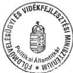

---

.

.

.

.

.

.

---

Állami Számvevőszék

Elnök

V-21-64/99-00.

Dr. Torgyán József úr
miniszter

Földművelésügyi és Vidékfejlesztési Minisztérium
B u d a p e s t

Tisztelt Miniszter Úr!

Köszönettel vettem kézhez a "Nemzetközi segélyek monitoring rendjének ellenőrzéséről" szóló ÁSZ jelentéshez fűzött észrevételeit.

Az Állami Számvevőszék kiadmányozási rendje szerint az aláírásommal kiküldött jelentések szövegén nincs mód változtatni, ezért az észrevételekben megküldött, változtatást kérő javaslatokat már nem tudjuk átvezetni, viszont azokat minden esetben mellékletként csatoljuk a jelentéshez.

Az országgyűlési bizottságoknak és a legfőbb állami vezetőknek elküldött jelentés kísérő levelében kiemelem, hogy javaslatainkon túlmenően az Ön észrevételeit is vegyék figyelembe.

Egyetértünk, hogy a szükséges erőforrások felmérésén túl a monitoring tevékenységgel járó kiadások forrásának kijelölése is szükséges az elkövetkező időszakban.

Egyetértünk továbbá azzal, hogy a teljes felelősséggel, fő munkaidőben a monitoring feladattal megbízott munkatársak kijelölése rendkívüli módon elősegítené a monitoring bizottságok munkáját, működését.

Kérem tájékoztatásom szíves tudomásul vételét.

Budapest, 2000. július " 11 "

Tisztelettel:

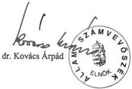

---

•

•

•

•

•

•

---

# KORMÁNYZATI ELLENŐRZÉSI HIVATAL
ELNÖK

ÁLLAMI SZÁMVEVŐSZEK
Érkezett: ATM-5858/2000,
Iktatószám: V-2163-5/1990 532/E1n/2000,
Melléklet: 1

Szám: 4-98/5/2000.

Hiv.szám: V-21-62/1999-2000.

Dr. Kovács Árpád úrnak
Elnök

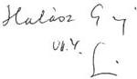

Állami Számvevőszék

Budapest

Tisztelt Elnök Úr!

A nemzetközi segélyek monitoring rendszerének ellenőrzéséről szóló, 2000. június 26-án kézhez vett
ÁSZ jelentéssel kapcsolatban az alábbi észrevételeket teszem.

A javaslatokhoz:

A Kormánynak szóló javaslatok harmadik pontja olyan feladatot határoz meg, amely már
végrehajtásra került. A Kormány és az EU Bizottság által hozott döntésnek megfelelően, a monitoring
IT rendszer kiépítését lehetővé tevő PHARE project végrehajtására megalakult az Informatikai
Tárcaközi Bizottság monitoring IT albizottsága, mely ellátja a koordinatív feladatokat. A jövőbeni
tevékenységnél a fő hangsúly ma már a rendszerfejlesztési tevékenység beindítására, a bevezetés, a
beüzemelés és a működtetés feltételeinek megteremtésére helyeződik át.

Nem tartom ésszerűnek, hogy a KMB és az OMB egységes feladatot kapjon a jövőbeni időszakra. A
KMB feladat, jog és hatásköre nem egyezhet az OMB-vel.

A KMB és OMB-nek címzett egyes számú javaslat első felével nem értek egyet, mivel a prioritások
összehangolása a programozási szakaszban a Segélykoordinációs Intézőbizottság feladatát képezi, és a
prioritásokról a Kormány hozza meg a döntést. E tárgykörben az előterjesztést a PHARE tárca nélküli
miniszter nyújtja be a Kormánynak. A Kormány által jóváhagyott prioritások és tárgyalási irányelvek
alapján kezdi el a PHARE tárca nélküli miniszter hivatala a mindenkori éves pénzügyi
megállapodások előkésztését.

A Fejezeti Monitoring Bizottságoknak javasoltak közül hiányolom a monitoring tevékenység
hatékonyabb elvégzésére vonatkozó javaslatot.

Az FMB-knek szóló javaslatok harmadik pontjában megfogalmazottakat nem tartom szerencsések,
mivel a monitoring feladatok ellátásánál a fő hangsúlyt a szabályosság és a pénzügyi ellenőrzések
tapasztalatainak kiértékelésére teszi, amelyek viszont az EU előírások szerint a pénzügyi ellenőrzés
körébe tartoznak.

Egyidejűleg jelzem, hogy a korábbi álláspontomat változatlanul fenntartom és a megküldött
észrevételemet ismételten mellékelem.

Budapest, 2000. június 30.

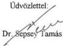

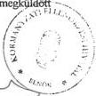

---

.

.

.

.

.

.

---

KORMÁNYZATI ELLENŐRZÉSI HIVATAL ELNÖK

Szám: 4 – 97 / 1 / 2000.

**Halász Gejza úrnak  
Állami Számvevőszék  
Számvevő-igazgató**

**Budapest**

Tisztelt Számvevő-igazgató Úr!

A „Nemzetközi segélyek monitoring rendjének ellenőrzéséről” szóló összefoglaló jelentést egy kiérlelt, gondos munkának tartom. Külön köszönöm, hogy a korábbi egyeztetésen adott észrevételeim döntő részét a jelentéstervezethez felhasználták. Jelen tervezethez fűzött észrevételeim az alábbiak:

*Összegző megállapítások:*

Az első bekezdés utolsó mondatában foglaltakkal nem értünk egyet, mivel a rendelkezésre álló, a KEHI által, illetve közreműködésével kidolgozott módszertani útmutatók tartalmaztak egyértelmű utasításokat, gyakorlati útmutatókat tekintve, hogy több EU tagállamtól, illetve az EU bizottságától kapott anyagok alapján egyértelműen rögzítették a monitoring alapvető kérdéseit.

Az összegző megállapítások és következtetések utolsó előtti bekezdésében (6. oldal) a monitoring tevékenység információtechnikai fejlesztése tárgyában írt sommás megállítás, mely szerint a fejlesztési elképzelésekben feloldatlan véleménykülönbségek és párhuzamosságok voltak, így nem állja meg a helyét.

Az Országos Monitoring Bizottságról tudni kell, hogy az a Segélykoordinációs Titkárság keretein belül működik, és az információs rendszere egyidejűleg támogatja a végrehajtás nyomon követését, amely nem monitoring, hanem végrehajtási feladat, és a Magyar Államkincstárnál létrehozott OTMR rendszer

---

>

>

>

.

>

.

---

2

sem a monitoring feladatokra készült, hanem a kis- és középvállalkozásoknak juttatott állami támogatások többszöri igénybevételének kiszűrésére. Mindkét rendszer természetesen használható a monitoring IT rendszer adatbázisául, amelyet a KEHI által egyébként a Segélykoordinációs Titkárság által menedzselt, megfigyelt és ellenőrzött módon PHARE segélyből hoz létre, és ezen monitoring rendszernél maximálisan igénybe vesszük a két adatbázist, illetve kiépítjük a velük való kapcsolatot.

#### *A javaslatokhoz:*

A Kormánynak szóló javaslatok harmadik pontja olyan feladatot róna a monitoring rendszerre, amely uniformizálná a monitoring tevékenységet, a fejezetek elvesztenék saját arculatukat, specifikus jellemzőiket. Megfontolásra javaslom a javaslat fenntartását.

A Kormánynak szóló javaslatok negyedik pontjával kapcsolatosan megjegyezném, hogy a Kormány Informatikai Tárcaközi Bizottsága létrehozott egy monitoring albizottságot – a KEHI kezdeményezésére –, amely ezt a feladatot már ellátja.

A Központi Monitoring Bizottságnak tett javaslatokkal kapcsolatban szükségesnek tartom megfontolni, illetve javaslom elhagyni a harmadik javaslati pontot, mely szerint vonják be a Joint Monitoring Committee-t a monitoring bizottságok egységes ügyrendjének előzetes jóváhagyási folyamatába. Az Európai Unió vonatkozó szabályai a nemzetállamokra bízzák a monitoring bizottság létrehozásának és működtetésének feladatait, így indokolatlannak és túlvállalásnak tartom az Európai Unió bevonását egy nemzetállami feladat végrehajtásába.

A következő, ötödik javaslati pontot nem tartom teljesíthetőnek, mivel a Központi Monitoring Bizottság titkársági feladatait ellátó KEHI ezzel már megpróbálkozott, sőt kormány-előterjesztést készített a fejlesztésre, mint ahogy azt ellenőrzési jelentés is tartalmazza, de az nem járt sikerrel, lényegében a monitoring bizottsági elnököket jelentő közigazgatási államtitkári értekezlet ellenállása miatt, így ez a javaslat várhatóan a továbbiakban sem lesz végrehajtható a számunkra.

A Fejezeti Monitoring Bizottságoknak szóló javaslatok harmadik pontja szerint a PMU jelentések hitelesítését ki kellene dolgozni. Ez a mi megközelítésünkben végrehajtási szervezeti feladat, nem monitoring feladat. Az, hogy az egyes PMU jelentések hitelesek, vagy sem szűrőpróbaszerűen indokolt csak ellenőrizni és azt sem a monitoring bizottságnak, hanem a fejezeti ellenőrzési szervezetnek.

---

1

1

1

1

1

1

---

3

# *Részletes megállapításokhoz:*

**A 9. oldalhoz** a Központi Monitoring Bizottság első ülése 1999. szeptember 17-én volt. Kérjük javítani.

**A 11. oldalon** írja a jelentés, hogy a KMB a saját SZMSZ-ének megfelelően jóváhagyólag nem döntött előzetesen az 1997. évi módszertani útmutatóknak, illetve az 1998. tavaszán kiadott módszertani anyagoknak az elfogadásáról. Ugyancsak a jelentés tényként megállapítja, két oldallal előrébb, hogy a KMB első ülése 1999. szeptember 17-én volt. Ennek megfelelően, ha a KMB Titkársága megvárta volna a KMB ülését, a monitoring rendszer teljesen magárahagyatottan, mindennemű módszertani segítség nélkül lett volna kénytelen működni.

**A 12. oldal** foglalkozik az információtechnológiai rendszer fejlesztésével. Szeretném Számvevő Igazgató Urat tájékoztatni, hogy az előzetesen meghatározott ütemtervet tartjuk, a tenderkiírás megtörtént, az EU hivatalos lapjában megjelent, az előminősítés is végrehajtást nyert. Ugyanakkor kollégánk május 15-én az Európai Unió illetékes bizottságainál tett látogatása alapján kijelenthetjük, hogy az Unió támogatja a programot, megismerte azt és mindennemű segítségét felajánlotta a végrehajtáshoz. Így ennek megfelelően az a kijelentés, hogy a projekt hátralévő tevékenységének megvalósítása kritikus útra került, az azóta történtek alapján ma már erős kijelentésnek tűnik, egyre nagyobb a reményünk arra, hogy a projekt sikerrel zárul, így kérném ezt a mondatot finomítani.

**A 15. oldal 1.1.3. fejezet utolsó bekezdése:** Megítélésünk szerint korai még a KMB következő ülésén a monitoring rendszer stratégiájának jóváhagyatása mindaddig, amíg a monitoring rendszerre vonatkozó kormányrendelet előkészítése és kiadása is a viták kereszttüzében áll.

**16. oldal „A jelentések hitelességét ellenőrző tevékenység” első bekezdése:** Az OMB Titkárság valóban félévente jelentéseket készít, ez azonban nem monitoring jelentés, hanem klasszikus, a végrehajtás állapotáról szóló jelentés. Ezt igazolja az is, hogy ez, mint a PHARE ügyekért felelős miniszter jelentése kerül a Kormány elé.

**17. oldal 4. bekezdés:** A KMB-nek a PHARE ügyekért felelős miniszter - aki az OMB elnöke is - állandó tagja, így a bekezdésben írt megfigyelők az ő tanácsadóként vesznek részt az üléseken.

---

.

.

.

.

.

.

---

4

következik. Az FMB-k munkájának ellenőrzésére azonban az OMB-nek valóban nincs jogosítványa, de ez nem is szükséges, mert a KMB-hez tartoznak az FMB-k.

**18. oldalhoz: A 3. bekezdés utolsó sorában** írt megjegyzés kiegészítendő azzal, hogy nemcsak a KEHI által kötött twinning megállapodás, hanem a PHARE Pénzügyi Memorandum is módosításra szorulna, ha az OMB által meghonosítani kívánt, a PMU-k adatnyilvántartó és kezelő adminisztrációs rendszerét is a twinning-en keresztül kellene rendszeresíteni.

**A 23. oldalon vastag betűvel** jelzi az anyag, hogy a monitoring feladat ellátásához döntően a KEHI által kezelt pénzügyi keret biztosította a feltételeket. Ez így úgy tűnik, mintha a KEHI számára a központi költségvetés elkülönített kereteket biztosítana, ez azonban nincs így, valamennyi módszertani fejlesztési tevékenységünkhöz különböző pályázatok útján elnyert, illetve nemzetközi keretek felkutatásával és kihasználásával tudtuk forrást biztosítani. Így kérném ezt a mondatot ennek megfelelően módosítani.

Budapest, 2000. június 2.

Üdvözlettel:

Dr. Sepsej Tamás

---

1

1

1

1

1

1

1

---

Állami Számvevőszék

Elnök

V-21-66/99-00.

Dr. Sepsey Tamás úr
elnök

Kormányzati Ellenőrzési Hivatal
B u d a p e s t

# Tisztelt Elnök Úr!

Köszönettel vettem kézhez a "Nemzetközi segélyek monitoring rendjének ellenőrzéséről" szóló ÁSZ jelentéshez fűzött észrevételeit.

Tájékoztatom, hogy a vizsgálatban érintett minisztériumok - a KöM kivételével - megtették észrevételeiket a véglegesített ÁSZ jelentésre, amely észrevételekben a jelentés megállapításaival egyetértő véleményt adtak. A hivatkozott minisztérium korábbi - az összefoglaló jelentésre adott - észrevétele szintén egyetértő volt.

Az FVM és az OMB - az egyetértő véleményen túlmenően - érdemi javaslatot tett. A jelentés megállapításait elfogadva kiegészítést tett a PM, amely kiegészítés megerősíti a vizsgálat megállapításait, javaslatait.

A nyilvánosság elé kerülő jelentés mellékletként természetesen tartalmazni fogja az Önök és a vizsgált minisztériumok észrevételeit, valamint az azokra adott válaszainkat is.

Az országgyűlési bizottságoknak és a legfőbb állami vezetőknek elküldött jelentés kísérőlevelében kiemelem, hogy javaslatainkon túlmenően az észrevételeket is vegyék figyelembe.

A részletes észrevételeire az alábbi tájékoztatást adom:

A Kormánynak szóló javaslatok harmadik pontjában megfogalmazott ajánlásunkkal az Ön által is hivatkozott Informatikai Tárcaközi Bizottság munkáját kívánjuk segíteni. Ajánlásunkat indokoltnak tartjuk, mert az OMB-nél és a KEHI-nél végzett vizsgálat során azt tapasztaltuk, hogy a monitoring rendszer működését támogató információs technológiai fejlesztések egymással párhuzamosan, nem egyeztetve történtek. A két rendszer koordinálását, illetve egymásra épülését igazoló dokumentumok nem álltak rendelkezésre, ugyanakkor a rendszerfejlesztés a KEHI-nél intenzíven folyik, a MEH Segélykoordinációs Titkárságon pedig 2000 júniusában befejeződött.

Véleményünk megegyezik abban, hogy nem ésszerű az, hogy "a KMB és az OMB egységes feladatot kapjon a jövőbeni időszakra. A KMB feladat, hatás- és jogkör nem egyezhet az OMB-vel". Megállapításunk és javaslatunk éppen a feladatok egymásra épülő előírását, a hatás- és jogkörök megosztását tartalmazó átfogó jogi szabályozást sürgeti. Az ajánlásokat a KMB-nek és az OMB-nek fogalmaztuk meg, figyelembe véve, hogy a vonatkozó kormányhatározatok értelmében az OMB a KMB keretében mű-

---

.

.

.

.

.

.

---

ködik. A feladatok jövőbeni ellátására, a KMB és az OMB közötti munkamegosztásra a feladat, hatás- és jogkörök megosztásának ismeretében kerülhet sor.

A kormányzati és Phare prioritások összehangoltságának biztosítására vonatkozóan az Ön által leírtakkal egyetértek, azzal a kiegészítéssel, hogy javaslatunk a Phare programozási szakasz monitoring feladatainak ellátására vonatkozik.

A monitoring tevékenység hatékonyabb elvégzésére vonatkozó - általánosan megfogalmazott - javaslatot az FMB-knek csak a bizottságok működéséhez szükséges, a jelentésben részletezett feltételek megléte esetén tartjuk időszerűnek.

Egyetértünk, hogy a PMU jelentések hitelességét biztosító szabályossági és pénzügyi ellenőrzés nem a monitoring, hanem az ellenőrzés körébe tartozik, ezért az FMB-knek megfogalmazott harmadik javaslatunk az ellenőrzés kezdeményezésére vonatkozik, erre helyeztük a fő hangsúlyt. Ezen túlmenően fontosnak tartjuk, hogy az ellenőrzés megállapításai a monitoring bizottságok tevékenységében hasznosuljanak.

A korábbi észrevételeire adott válaszommal összhangban jelzem, hogy - amint az Ön előtt is ismert - az észrevételeik egy részét elfogadtuk, más részét kiegészítésként, pontosításként vettük figyelembe, illetve az el nem fogadott észrevételéről részletes tájékoztatást adtam. Az átvezetések a végleges jelentésben tükröződnek. A megküldött korábbi tájékoztatásomat ismételten mellékelem.

Végezetül a monitoring rendszer kialakítása és fejlesztése érdekében tett erőfeszítéseiket és elért eredményeiket elismerve, szeretném megköszönni Önnek és munkatársainak a jelentés összeállításához nyújtott segítségét.

Budapest, 2000. július " 11 "

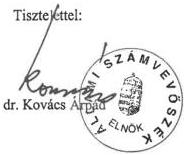

2

---

1. 2017年1月1日

•

，

，

，

，

，

---

Állami Számvevőszék

H-1052 Budapest,

Apáczai Csere János utca 10.

Telefon: (36 1) 318 8799

Fax: (36 1) 338 4710

V-21-60/99-00

Dr. Sepsey Tamás úr

a Kormányzati Ellenőrzési Hivatal elnöke
a Központi Monitoring Bizottság titkára,

Budapest

Tisztelt Elnök úr!

A "Nemzetközi segélyek monitoring rendszerének ellenőrzéséről" szóló összefoglaló
jelentés-tervezetre adott észrevételeik elfogadásáról az alábbiakban tájékoztatom:

A javaslatokhoz és a részletes megállapításokhoz tett pontosító, kiegészítő észrevétele-
iket köszönjük és a jelentést azok alapján módosítottuk. Az összegző megállapításokra
tett észrevételeiket egy kivétellel tudtuk elfogadni. Továbbra is fenntartjuk, hogy a ki-
adott útmutatók és irányelvek nem tartalmaznak egyértelmű utasításokat, illetve gya-
korlati útmutatót a monitoring feladat elvégzéséhez.

- az 1997. évi "Utmutatók a Monitoring Bizottságok részére" dokumentum I. része a Phare programok helyszíni Ellenőrzéséról szól, amely az Ellenőrzési Fóosztályok, és nem a Monitoring Bizottságok munkájához ad segítséget.
- A dokumentum II. része altalanos utmutatast ad a monitoringhoz, és egyben leirja, hagy az "most meg - ertelemszerüen - nem adhat valaszt minded kerdésre", továbbá, hagyCsak "körvonalazza azokat a szempontokat, amelyek alapjan a monitoring követelmenyei a kulönbozó szinteken érvényesülnek, illetve feltarhatók".
- A dokumentum III. része a hatályos kormányhatározatok kiadása elötti elképszeléseket tartalmazza. (pl.: "A Bizottságok adminisztrácios feladatai ellatásaert egy Titkárság lenne felelos, mely szerepet a Belso Ellenörzési Fóosztályok látnak el".) A fejezet nem ad gyakorlati utmutatast a hatályos kormányhatározatok vegrehajtására.
- Az "Irányelvek és utmutató az eredményesen muködő monitoring rendszer megvalósításához" dokumentum az Europai Tanács Strukturalis Alapok monitoring feladataira vonatkozo EU előirásokat és elméleti modszertant tartalmazza. A dokumentum nincs adaptálva a Phare programok monitoringjára.

---

.

.

.

.

.

.

---

A fentiek ellenére elismerjük, hogy komoly erőfeszítéseket tettek - a nemzetközi szakértőkkel együttműködve - a meglévő módszertani anyagok elkészítésére. Ezek jó alapul szolgálhatnak a továbbfejlesztéshez, a gyakorlati kézikönyv kiadásához.

Köszönöm az összefoglaló jelentés-tervezetre adott alapos, kiegészítő észrevételeit. Kérem válaszunk figyelembevételét és elfogadását.

Budapest, 2000. június " 15. "

Tisztelettel:

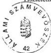

Halász Gejza
igazgató

2

---

.

.

.

.

.

.

---

ÁLLAMI SZÁMVEVŐSZÉK

Érkezett: 2000. u. 6.

Iktatószám: V-21-63-15/99-00

Melléklet: -

ATM-G053/2000
545/E14/2000
563/ST/2000

T. Sándor a!
Kétel csatolják a
válaszlovékkel együtt.

L. Halász G. y. Kormány

# MINISZTERELNÖKI HIVATAL
MINISZTER

Úr. n.

L.
09.10.
T. kormán D. Éva!
09.11. /km

dr. Kovács Árpád úrnak
elnök

I-7014/3/2000
Hiv.szám: V-21-62/99-00

Állami Számvevőszék

Budapest

Tisztelt Elnök Úr!

A nemzetközi segélyek monitoring rendszerének ellenőrzéséről szóló ÁSZ jelentéssel kapcsolatban az alábbi észrevételeket teszem.

# A javaslatokhoz

A kormánynak szóló javaslatok 3. pontja olyan feladatot határoz meg, amely már teljesült. A kormány és az EU Bizottság által hozott döntésnek megfelelően a monitoring IT rendszer kiépítését lehetővé tevő Phare projekt végrehajtására megalakult az Informatikai Tárcaközi Bizottság monitoring IT albizottsága, mely ellátja a koordinatív feladatokat. A jövőben a hangsúly a rendszerfejlesztési tevékenység beindítására, a bevezetés, a beüzemelés és a működtetés feltételeinek megteremtésére helyeződik át.

Nem tartom ésszerűnek, hogy a KMB és az OMB egységes feladatot kapjon a jövőbeni időszakra. A KMB feladat-jog- és hatásköre nem egyezhet meg az OMB-jével. Nem értek egyet továbbá a KMB-nek és az OMB-nek címzett egyes számú javaslat első felével, hiszen a prioritások összehangolása a programozási szakaszban a Segélykoordinációs Intézőbizottság feladatát képezi, a prioritásokról pedig a kormány hozza meg a döntést. E tárgykörben az előterjesztést a Phare programokért felelős tárca nélküli miniszter nyújtja be a kormánynak. A kormány által jóváhagyott prioritások és tárgyalási irányelvek alapján kezdi el a tárca nélküli miniszter hivatala a mindenkori éves pénzügyi megállapodások előkészítését.

---

1

2

3

4

5

6

---

A Fejezeti Monitoring Bizottságoknak javasoltak közül hiányolom a monitoring tevékenység hatékonyabb elvégzésére vonatkozó indítványt.

Az FMB-knek szóló javaslatok 3. pontját nem tartom szerencsésnek, mivel a szöveg a monitoring feladatok ellátásánál a hangsúlyt a szabályosságra és a pénzügyi ellenőrzések tapasztalatainak kiértékelésére teszi, amelyek viszont az EU előírások szerint a pénzügyi ellenőrzés körébe tartoznak.

Budapest, 2000. július „05.”

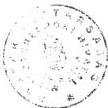

Üdvözlettel:

Stumpf István

---

1

1

1

1

1

1

---

Állami Számvevőszék

Elnök

V-21-69/99-00.

Dr. Stumpf István úr
miniszter

Miniszterelnöki Hivatal
B u d a p e s t

# Tisztelt Miniszter Úr!

Köszönettel vettem kézhez a "Nemzetközi segélyek monitoring rendjének ellenőrzéséről" szóló ÁSZ jelentéshez fűzött észrevételeit.

Tájékoztatom, hogy a vizsgálatban érintett minisztériumok - a KöM kivételével - megtették észrevételeiket a véglegesített ÁSZ jelentésre, amely észrevételekben a jelentés megállapításaival egyetértő véleményt adtak.

A hivatkozott minisztérium korábbi - az összefoglaló jelentésre adott - észrevétele szintén egyetértő volt.

Az FVM és az OMB - az egyetértő véleményen túlmenően - érdemi javaslatot tett. A jelentés megállapításait elfogadva kiegészítést tett a PM, amely kiegészítés megerősíti a vizsgálat megállapításait, javaslatait.

A nyilvánosság elé kerülő jelentés mellékletként természetesen tartalmazni fogja az Önök és a vizsgált minisztériumok észrevételeit, valamint az azokra adott válaszainkat is.

Az országgyűlési bizottságoknak és a legfőbb állami vezetőknek elküldött jelentés kísérőlevelében kiemelem, hogy javaslatainkon túlmenően az észrevételeket is vegyék figyelembe.

A részletes észrevételeire az alábbi tájékoztatást adom:

A Kormánynak szóló javaslatok harmadik pontjában megfogalmazott ajánlásunkkal az Ön által is hivatkozott Informatikai Tárcaközi Bizottság munkáját kívánjuk segíteni. Ajánlásunkat indokoltnak tartjuk, mert az OMB-nél és a KEHI-nél végzett vizsgálat során azt tapasztaltuk, hogy a monitoring rendszer működését támogató információs technológiai fejlesztések egymással párhuzamosan, nem egyeztetve történtek. A két rendszer koordinálását, illetve egymásra épülését igazoló dokumentumok nem álltak rendelkezésre, ugyanakkor a rendszerfejlesztés a KEHI-nél intenzíven folyik, a MEH Segélykoordinációs Titkárságon pedig 2000 júniusában befejeződött.

---

1

2

3

4

5

6

---

Véleményünk megegyezik abban, hogy nem ésszerű az, hogy "a KMB és az OMB egységes feladatot kapjon a jövőbeni időszakra. A KMB feladat, hatás- és jogkör nem egyezhet az OMB-vel". Megállapításunk és javaslatunk éppen a feladatok egymásra épülő előírását, a hatás- és jogkörök megosztását tartalmazó átfogó jogi szabályozást sürgeti. Az ajánlásokat a KMB-nek és az OMB-nek fogalmaztuk meg, figyelembe véve, hogy a vonatkozó kormányhatározatok értelmében az OMB a KMB keretében működik. A feladatok jövőbeni ellátására, a KMB és az OMB közötti munkamegosztásra a feladat, hatás- és jogkörök megosztásának ismeretében kerülhet sor.

A kormányzati és Phare prioritások összehangoltságának biztosítására vonatkozóan az Ön által leírtakkal egyetértek, azzal a kiegészítéssel, hogy javaslatunk a Phare programozási szakasz monitoring feladatainak ellátására vonatkozik.

A monitoring tevékenység hatékonyabb elvégzésére vonatkozó - általánosan megfogalmazott - javaslatot az FMB-knek csak a bizottságok működéséhez szükséges, a jelentésben részletezett feltételek megléte esetén tartjuk időszerűnek.

Egyetértünk, hogy a PMU jelentések hitelességét biztosító szabályossági és pénzügyi ellenőrzés nem a monitoring, hanem az ellenőrzés körébe tartozik, ezért az FMB-knek megfogalmazott harmadik javaslatunk az ellenőrzés kezdeményezésére vonatkozik, erre helyeztük a fő hangsúlyt. Ezen túlmenően fontosnak tartjuk, hogy az ellenőrzés megállapításai a monitoring bizottságok tevékenységében hasznosuljanak.

Végezetül a monitoring rendszer kialakítása és fejlesztése érdekében tett erőfeszítéseiket és elért eredményeiket elismerve, szeretném megköszönni Önnek és munkatársainak a jelentés összeállításához nyújtott segítségét.

Budapest, 2000. július " 11 "

Tisztelettel:

dr. Kovács Árpád{
  "label": "",
  "top_left": [
    0.6799,
    0.7498195798196798
  ],
  "bottom_right": [
    0.8195,
    0.8997197197197198
  ]
}

2

---

1

1

1

1

1

1

---

30/06/00 14:24 FAX +36 1 329 2092

SEGÉLYKOORD.

01

Kapja: Karmel D. Érint

# MAGYAR KÖZTÁRSASÁG
TÁRCA NÉLKÜLI MINISZTER
HIVATALVEZETŐJE

VI. 30. 85

R/762

Halász Gejza úrnak
Számvevő-igazgató
Állami Számvevőszék

Hiv. sz.: V-21-62/99-00

Budapest

Tisztelt Igazgató Úr!

Fenti számú megkeresésére hivatkozva tájékoztatom, hogy a legutóbbi – 2000. május 15-én kelt, és a nemzetközi segélyek monitoringjára vonatkozó észrevételeinket tartalmazó – levelünk elküldését követően a Joint Monitoring Committee - Monitoring Vegyes Bizottság (MVB) tárgyában az EU Bizottság új javaslatokkal állt elő. Ez teljes egészében megváltoztatja az MVB-ről általunk korábban közölt működési rendet. Az új szervezeti és működési rendről jelenleg folynak a tárgyalások, megállapodás legalább 2000. októberében várható.

Kérem, hogy a fentiekre tekintettel – amennyiben még mód van rá – a végleges szövegből az 1.2.3 pont elhagyására intézkedni szíveskedjék, mert az a tárgyalások menetét megzavarhatja, illetve ma már téves tájékoztatást tartalmaz.

Fáradozásukat előre is köszönöm.

Budapest, 2000. május 15.

Tisztelettel:

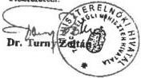

MINISZTERELNÖKI HIVATAL
PHARE PROGRAMOKAT KOORDINÁLÓ TÁRCA NÉLKÜLI MINISZTER HIVATALVEZETŐJE
1133 Budapest, Pozsonyi út 56. Tel. 239 42 65. Fax. 239 47 98

---

6

7

8

9

10

11

---

Állami Számvevőszék

Elnök

V-21-65/99-00.

Dr. Turny Zoltán úr
kabinetfőnök

Miniszterelnöki Hivatal Segélykoordinációs Titkárság
B u d a p e s t

# Tisztelt Kabinetfőnök Úr!

Köszönettel vettem kézhez a "Nemzetközi segélyek monitoring rendjének ellenőrzéséről" szóló ÁSZ jelentéshez fűzött észrevételeit.

Az Állami Számvevőszék kiadmányozási rendje szerint az aláírásommal kiküldött jelentések szövegén nincs mód változtatni, ezért az észrevételekben megküldött, változtatást kérő javaslatokat már nem tudjuk átvezetni, viszont azokat minden esetben mellékletként csatoljuk a jelentéshez.

Az országgyűlési bizottságoknak és a legfőbb állami vezetőknek elküldött jelentés kísérő levelében kiemelem, hogy javaslatainkon túlmenően az Ön észrevételét is vegyék figyelembe.

Kérem tájékoztatásom szíves tudomásul vételét.

Budapest, 2000. július " 11 "

Tisztelettel:

dr. Kovács Árpád

---

6

7

8

9

10

11

---

PÉNZÜGYMINISZTÉRIUM
ÁLLAMTITKAR

Képje: Kiványi Bónósi Ér. sz. sz.

ATM - 5855/2000,

526/E/1/2000,

124/53/2000,

I. Halás G. G.

VII-2.

Csatoljuk a

jelentéshez a

Válaszunkat együtt

Kétel a Te hatás

hőrtöltén adjuk ki

valódott.

Dr. Kovács Árpád úr
elnök
Állami Számvevőszék

Budapest

Tisztelt Elnök Úr!

ÁLLAMI SZÁMVEVŐSZÉK

Érkezett: 2000. v.1.

Iktatószám: 5-21-63-6/99-00.

Melléklet: —

Könyvnyer

06 30

Köszönettel megkaptuk a nemzetközi segélyek monitoring rendszeréről készített jelentést. A jelentés megállapításai, javaslatai hasznos segítséget nyújtanak a jelenleg még kialakulófélben lévő rendszer működésének javításához, köztük a Pénzügyminisztérium Fejezeti Monitoring Bizottsága munkájához. A Bizottság soron következő ülésén megvitatja a jelentésben foglaltakat, és intézkedik annak realizálásáról. Megköszönöm munkatársai szakszerű, segítőkész munkáját.

Engedje meg, hogy elfogadva a jelentés megállapításait, azonosulva annak javaslataival, néhány pontban kiegészítsem a jelentést:

A Regionális Monitoring Bizottságokkal a jelentés érintőlegesen foglalkozik. Ismereteink szerint a regionális monitoring rendszer kiépítésére konkrét előkészületek folynak, a PHARE támogatások felhasználása jelentős részben regionális programokhoz kötődik.

A monitoring tevékenység számítógépes támogatásával kapcsolatban definiálják a KEHI nemzetközi segélyek monitoring IT rendszerének céljait. Megítélésünk szerint a Magyar Államkincstárban 1998. január óta működő Országos Támogatási Monitoring Rendszer(OTMR) olyan pénzügyi szemléletű IT rendszer, amely a KEHI tervezett rendszerének működését kiegészítheti pénzügyi szemléletű adataival. Ezt az OTMR vázoltakkal összefüggésben fontosnak tartjuk megemlíteni.

Cím: 1051 Budapest, József nádor tér 2-4.; Tel.: 318-2066; Fax: 318-2570

---

6

7

8

9

10

11

---

A Szabályzatok és módszertani rész megemlíti, hogy az OMB Titkársága a programok helyzetének folyamatos nyomon követésére, német bilaterális segélyből készülő saját számítógépes rendszer kifejlesztésén dolgozik. Célszerűnek látjuk, hogy a KMB fejlesztés alatt álló IT rendszere kidolgozásánál figyelembe vételre kerüljenek a már működő OTMR vagy a tervezett KEHI rendszer fejlesztési céljai.

Budapest, 2000. június 30.

Tisztelettel:

dr. Naszvadi György

2

---

6

7

8

9

10

11

---

# Állami Számvevőszék

Elnök

V-21-67/99-00.

**Dr. Járai Zsigmond úr**
miniszter

Pénzügyminisztérium
B u d a p e s t

**Tisztelt Miniszter Úr!**

Köszönettel vettem kézhez a "Nemzetközi segélyek monitoring rendjének ellenőrzéséről" szóló ÁSZ jelentéshez fűzött észrevételeit.

Az Állami Számvevőszék kiadmányozási rendje szerint az aláírásommal kiküldött jelentések szövegén nincs mód változtatni, ezért az észrevételekben megküldött, változtatást kérő javaslatokat már nem tudjuk átvezetni, viszont azokat minden esetben mellékletként csatoljuk a jelentéshez.

Az országgyűlési bizottságoknak és a legfőbb állami vezetőknek elküldött jelentés kísérő levelében kiemelem, hogy javaslatainkon túlmenően az Ön észrevételeit is vegyék figyelembe.

Örömmel állapítottam meg, hogy a monitoring információs technológiai rendszer fejlesztésével kapcsolatban tett megállapításai megegyeznek az ÁSZ jelentésben leírtakkal, illetve megerősítik azokat.

Kérem tájékoztatásom szíves tudomásul vételét.

*Budapest, 2000. július " 11 "*

Tisztelettel:

dr. Kovács Árpád

---

٢

٣

٤

٥

٦

٧

---

Magyar Köztársaság
honvédelmi minisztere

Nyt. szám: 179/48/2000.
Hiv. szám: V-21-62/1999-2000.

Képhi Kossai Dánieli C. sz. 100
VII. 1. K.

ATM-5856/2000
527/Eln/2000
568/SI/2000

1. sz. példány

I Halén Gy Sándor al.
06.2
Kérdezi csökkentés
06.30.

Dr. Kovács Árpád
Állami Számvevőszék elnöke

Tárgy: ÁSZ jelentés
észrevételezése

|  **ÁLLAMI SZÁMVEVŐSZÉK**  |
| --- |
|  Érkezett: 2000. VI. 30.  |
|  Iktatószám: V-21-63-7/99-00  |
|  Melléklet: —  |

Budapest

Tisztelt Elnök Úr!

Az Állami Számvevőszék nemzetközi segélyek monitoring rendszerének
ellenőrzéséről szóló jelentését tanulmányoztattam.

A jelentésben foglalt megállapítások megalapozottak, a javaslatok hasznosak,
így azokkal egyetértek, külön észrevételt nem teszek.

A jelentés tapasztalatainak hasznosítására intézkedtem.

Budapest, 2000. június 30-én

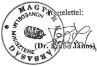

Készült: 2 példányban
Egy példány: 1 lap
Itsz.: 0506
Ügyintéző (tel.): Kárpáti János ezds. (474-1111/277-10)

---

6

5

4

3

2

1

---

KÖZLEKEDÉSI ÉS VÍZÜGYI MINISZTÉRIUM
MINISZTER

005449 (2) 2000.

Dr. Kovács Árpád úr
az Állami Számvevőszék Elnöke

Budapest

ÁLLAMI SZÁMVEVŐSZÉK
Érkezett: 2000. 5. 11. 5.
ÁLLAMI SZÁMVEVŐSZÉK

ATM-5961/2000.
1. 5. 11. 5. 2000.

Sándor ur.
Kiváló eszközök.

Hulan G-7

VII. 5.

L.

Cím

07.05.

Vagyis Vasárfó Dánieli Észak

VII. 5. 86

Pár

Tisztelt Elnök Úr!

Megkaptam az Állami Számvevőszék által összeállított, a nemzetközi segélyek monitoring rendszerének ellenőrzéséről szóló jelentés végleges példányát.

Miután a jelentés hatékony együttműködéssel készült az érintett tárcákkal, így a KHVM-mel is, ezért további észrevételt nem kívánok tenni.

Budapest, 2000. június " 30. "

Üdvözlettel:

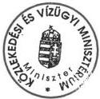

Nógrádi László

---

6

1

6

1

6

1

---

30/06 '00 14:28 FAX 36 1 2018323

MFA SZOMBATI

01

# A MAGYAR KÖZTÁRSASÁG
KÜLÜGYMINISZTERE

2736/Ma/2000

Dr. Kovács Árpád úr
elnök

Állami Számvevőszék

Budapest

Tisztelt Elnök Úr!

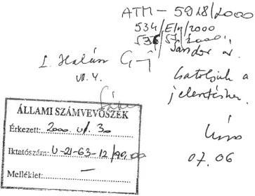

Kapja: Vannak Dánieli Ér. elnök
VII. 5. [Signature]

Köszönettel vettem június 20-iki levelét és az Állami Számvevőszék "Nemzetközi
segélyprogramok monitoring rendszerének ellenőrzése" tárgyban készített jelentését, valamint
tájékoztatását, miszerint az Állami Számvevőszékről szóló 1989.évi XXXVIII. törvény 25.§-a
értelmében a Külügyminisztériumnak módjában áll 8 napon belül a jelentéshez észrevételt
tenni.

A jelentésben foglaltak - a vizsgálók rendelkezésére bocsátott dokumentáció alapos elemzése,
illetve a vizsgálók és a KÜM munkatársai közötti egyeztetések nyomán, a Külügyminisztérium
által a jelentés-tervezethez fűzött megjegyzések figyelembevételével - megfelelően tükrözik a
Külügyminisztériumnak a nemzetközi segélyek monitoring rendszerében kifejtett
tevékenységét. Ennek fényében jelzem, hogy a Külügyminisztérium a hivatkozott jelentésben
foglaltakat tudomásul veszi, ahhoz észrevételt tenni nem kíván.

Engedje meg, hogy végezetül köszönetet mondjak az Állami Számvevőszék munkatársainak a
korrekt együttműködésért és munkájukhoz további sikert kívánjak.

Budapest, 2000. június 29.

Üdvözlettel:

( Dr. Martonyi János )

---

5

1

6

7

8

9

---

ATM-5953/2000

539/EH/2000.

A MAGYAR KÖZTÁRSASÁG OKTATÁSI MINISZTERÉ

|  ÁLLAMI SZÁMVEVŐSZÉK  |
| --- |
|  Érkezett: 2000. VII. 4.  |
|  Iktatószám: U-21-63-13/99-00.  |
|  Melléklet: —  |

Ügyintéző: dr. Sebes József

Tel./fax: 311-3088

Iktatószám: XIX/10-31/2000.

Hiv.szám: V-21-62/1999-2000.

Dr. Kovács Árpád úr
elnök

Állami Számvevőszék

Budapest

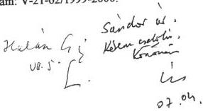

Tisztelt Elnök Úr!

Vapja: Kormány Bánczi: E. sz. 10
VII.5. 189

A nemzetközi segélyek monitoring rendszerének ellenőrzéséről készített számvevőszéki jelentést köszönettel megkaptam. A végleges összefoglaló jelentés megküldése előtt, a minisztérium szakértőivel az ÁSZ munkatársai több egyeztetést is tartottak és megállapítottuk, hogy a tárca részéről javasolt módosítások, észrevételek túlnyomó többségben átvezetésre kerültek.

A májusi összefoglaló tervezet véleményezése kapcsán is elmondtuk, hogy igen hasznosnak és szakmailag igényesnek tartjuk az ÁSZ ellenőrzési jelentését, ami fontos kezdeményezéseket tartalmaz mind a Kormány, mind az Országos- és Központi Monitoring Bizottság számára.

Az Oktatási Minisztérium részéről a Fejezeti Monitoring Bizottság tevékenységét a tárca előtt álló feladatok tükrében, a közeljövőben soron kívül áttekintjük, amely során az ÁSZ észrevételeit és megállapításait hasznosítani kívánjuk.

Tisztelt Elnök Úr!

Ismételten köszönve munkatársai korrekt munkáját és segítségét,

Budapest, 2000. június „30.”

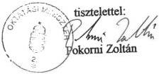

---

1

1

1

1

1

1