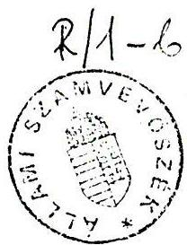
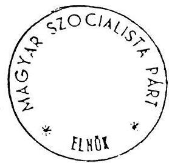

ÁLLAMI SZÁMVEVŐSZÉK

V-1-26/1990.

# JELENTÉS

a Magyar Szocialista Párt

(mint a Magyar Szocialista Munkáspárt jogutódja)

bejegyzési kérelmével egyidejűleg a bírósághoz

benyújtott vagyonmérlege vizsgálatáról

R/1-6

Budapest, 1990. február 15.

---

^{}[]

---

- 1 -

# I.

## ELŐZMÉNYEK, A VIZSGÁLATI FELADAT
## VÉGREHAJTÁSÁNAK FELTÉTELEI

### 1./ A vizsgálati feladat

Az Országgyűlés 41/1989.(XII.27.) számú határozatában az Állami Számvevőszéket felkérte

"...hogy 1990. január 31-ig részleteiben vizsgálja meg a Magyar Szocialista Pártnak (mint a Magyar Szocialista Munkáspárt jogutódjának) a bejegyzési kérelmével egyidejűleg a bírósághoz benyújtott vagyonmérlegét, és erről az Országgyűlést tájékoztassa."

Az Országgyűlés fenti határozata tehát az 1.sz.mellékletként csatolt 1989. szeptember 30-ai állapotot tükröző vagyonmérleg valódiságának ellenőrzésére vonatkozott, ami nem azonos az MSZMP vagyonelszámoltatásával.

Az MSZMP jogutódjaként bejegyzett Magyar Szocialista Párt nem számolt el a jogelődtől származó vagyonával, ezért jelezni kívánjuk, hogy a közvélemény mint ez később a népszavazás eredményében is tükröződött a vagyon eredetvizsgálatát, forgalmi értéken történő számbavételét szeretné ismerni.

Különös tekintettel kellene lenni arra, hogy napjainkban a könyvszerinti értéken nyilvántartott 8,4 Mrd Ft-os vagyon képződését mennyiben alapozták meg az elmúlt évtizedekben befizetett tagdíjak, támogatások és egyéb bevételek, valamint a működési kiadások különbségei.

---

- 2 -

Az MSZP, mint jogutód párt időközben a kezelésében és tulajdonában lévő vagyon döntő részét átadta az illetékes állami és tanácsi szerveknek, és arról adott tájékoztatást, hogy "saját" vagyonára induló vagyonmérleget készít, és azt későbbiekben ugyancsak benyújtja a bírósághoz. Rögzíteni kívánjuk, hogy a részünkre adott feladat meghatározásában nem szerepel ehhez kapcsolódó ellenőrzési feladat.

## 2./ A vizsgálat végrehajtásának körülményei

a) Az 1990. január 1-jén megalakult Állami Számvevőszék számára a kijelölt feladat teljesítésére mindössze 22 munkanap állt rendelkezésre. Ez meghatározta a vizsgálat terjedelmét és részletességét. Az MSZMP 1989. III. negyedévében nyilvántartott vagyonának ellenőrzése 1990. januárban a jogutód párt apparátusának közreműködésével, szúrópróbaszerű helyszíni ellenőrzés módszerével volt megoldható. Helyszíni ellenőrzésre került sor a párt Központi Bizottságánál, valamint a Budapesti, Baranya, Borsod-Abaúj-Zemplén, Csongrád, Fejér, Győr-Sopron és Pest megyei bizottságoknál.

Az ellenőrzés során döntően az állóeszközök, a készletek, továbbá a pénzeszközök nyilvántartását, elszámolását vizsgáltuk. (Néhány fontosabb részmegállapítást, példát a 2.sz. mellékletben szerepeltetünk.)

b) A vizsgálat során csak annyiban foglalkoztunk az MSZP jelenlegi gazdálkodásával, amennyiben az a szeptember 30-ai, jogelődhöz kapcsolódó vagyonmérleghez tartozott. Ennek megfelelően megállapításaink nem a jelenlegi gazdasági vezetést és gazdálkodást minősítik.

---

- 3 -

Az ellenőrzést nagymértékben nehezítette az a körülmény, hogy az MSZP alakuló kongresszusát követően a jogelőd párt gazdasági apparátusa lényegében megszűnt: jelentős létszámleépítés történt, a munkakörök átadására-átvételére nem került sor. A párt Gazdasági Hivatala vezetőjét csak 1989. december 1-jétől nevezték ki.

A vizsgálat idején a párt részéről megfelelő ismeretekkel rendelkező szakemberek nem álltak folyamatosan rendelkezésre. Esetenként állományba nem tartozó dolgozók segítségét kellett igénybe venni. Bizonylatok hosszabb időn keresztüli gazdátlansága, rendezetlen tárolása következtében az ellenőrzéshez szükséges dokumentumok nem mindig álltak kellő időben rendelkezésre.

A kapott tájékoztatás szerint a könyvelés és számvitel bizonylatait az érvényes állami rendelkezés szerint őrzik. Íly módon – az MSZP illetékesei szerint – nincs akadálya az esetleges további vizsgálatoknak.

Meg kívánjuk jegyezni, hogy 1989. október 6. és december 1. között, az átalakulás kimondó kongresszus utáni átmeneti időszakban a gazdasági terület felelős kezelése nem volt megnyugtatóan biztosítva.

## II.

## A VAGYONMÉRLEG HITELESSÉGE

### 1./ Általános megállapítások

Az MSZP a Fővárosi Bírósághoz 1989. november 16-án benyújtott bejegyzési kérelméhez csatolt (MSZMP) vagyonmérlegét a pártok működéséről és gazdálkodásáról szóló 1989. évi XXXIII. törvény által előírt formában készítette el (lásd 1.sz. melléklet).

---

- 4 -

A benyújtott vagyonmérleg a pártok működéséről és gazdálkodásáról szóló törvényben előírtaknak megfelel. A törvény csak formai követelményeket ír elő, a vagyonmérleg készítésének tartalmi követelményeiről és a vonatkozó időpontról nem rendelkezik. Ennek megfelelően nyújthatta be az MSZP a jogelőd párt 1989. szeptember 30-ai vagyoni állapotát rögzítő vagyonmérlegét.

Ez a vagyonmérleg csak a Központi Bizottság, a megyei és budapesti, valamint a felügyeletük alá tartozó városi, kerületi, stb. pártbizottságok, oktatási igazgatóságok, kollégiumok, az önálló intézményként működő Politikai Főiskola, Párttörténeti Intézet, Társadalomtudományi Intézet, továbbá az üdülők 1989. szeptember 30-ai vagyoni állapotát tartalmazza.

A párttörvény értelmében az MSZMP által alapított vállalatok nem a tényleges mérleg szerinti vagyonukkal, csupán a "költségvetési kapcsolatok" formájában – befizetett nyereség, illetve kapott támogatás – jelennek meg a vagyonmérlegben. Az összesen 24 ilyen szervezet sorába tartoznak a lap- és könyvkiadó vállalatok, valamint a Közlekedési Műszaki Vállalat is. Az utóbbi vállalat működése folytán azt a gyakorlatot érvényesítették, hogy az MSZMP KB és a budapesti székhelyű bizottságok tulajdonában gépkocsi nem volt, az általuk használt járművek vállalati tulajdont képeztek.

A hatályos előírások szerint az sem követelmény, hogy a vagyonmérleg a párt – adott esetben az MSZMP – tulajdonában, kezelésében, használatában, rendelkezési jogosultságában és más jogcímen birtokában lévő anyagi javak és jogosítványok teljeskörű, tételes, forintban kifejezett felsorolását nyújtsa. Ezért többek között nem tartalmazza a munkahelyi

---

- 5 -

pártbizottságoknál, a munkáltatók által a működéshez biztosított javak állományát, a saját célra kölcsönzött, valamint az ajándékba kapott és továbbajándékozott eszközöket.

## 2./ A volt MSZMP gazdálkodási utasításai és azok végrehajtása

Az MSZMP gazdálkodási rendje az állami költségvetési szervekre előírtaktól eltért, bár ahhoz hasonló eljárási szabályt dolgoztak ki. Az MSZMP gazdálkodási szabályzatának is ki kellett elégíteni az általános gazdálkodási, nyilvántartási, társadalmi tulajdonvédelmi követelményeket. Az eltérések következménye, hogy a vagyonmérlegnek a gépekre, berendezésekre, és felszerelésekre, valamint a járművekre, továbbá a fogyóeszközökre vonatkozó sorai csak összevontan értékelhetők. Ez az összehasonlítást és értékelést megnehezíti.

Tekintettel arra, hogy teljeskörű leltár utoljára 1985-ben készült, a leltározási utasítások végrehajtásánál az MSZMP KB Pártgazdasági és Ügykezelési Osztály (PGO) által 1985. júliusban kiadott útmutató előírásainak betartását vizsgáltuk. Ennek alapján az alábbi megállapításokat tesszük.

A PGO útmutató előírja a korábbi nyilvántartások felülvizsgálatát, korszerűsítését. Így pl. rendelkezik a párt használatában lévő ingatlanokkal, helyiségekkel kapcsolatos jogok tisztázásáról és meghatározza, hogy leltárbavétel csak a kezelői jog alapján történhet. Az egyéb jogcímen használt ingatlanokról, vagy ingatlanrészekről viszont helyiségnyilvántartást kell vezetni és a kezelővel a bérleti szerződésben kell megállapodni a használat feltételeiről (bérleti díj, vagy fenntartási hozzájárulás).

A leltározásra vonatkozó előírások már 1985-ben rögzítik, hogy az épületek leltározását fel kell használni a tulajdonjogi rendezettség ellenőrzéséhez és a szükséges intézkedést meg kell tenni. Erre teljeskörűen nem került sor.

---

- 6 -

A Minisztertanács 3339/1977.sz. határozatában intézkedett a párt szervek tulajdonában lévő ingatlanok helyzetének rendezéséről. Mely szerint a "Magyar Állam tulajdonaként kell nyilvántartani – az MSZMP Központi Bizottsága kezelői jogának bejegyzésével – azokat az ingatlanokat, amelyek e határozat megjelenésének időpontjában az MSZMP tulajdonában vannak, vagy ezután kerülnek az MSZMP tulajdonába". Az MT határozat végrehajtására kiadott 16/B/1977.sz. MÉM utasítás szerint a tulajdonjogi és kezelői változást az érintett tulajdoni lapra (telekkönyvi betétbe) be kell jegyezni. Ezt – ellenőrzési tapasztalatunk alapján – földhivatalok nem minden esetben hajtották végre.

Az 1978. évben készített – az ingatlanok állami tulajdonba vételét és MSZMP kezelői jogába adását rögzítő – földhivatali jegyzékekben foglalt ingatlanok földhivatali bejegyzését az MSZMP nem ellenőrizte.

Az 1985.évi leltározást követően több ingatlan szabálytalanul szerepelt az állóeszköz-nyilvántartásban. (Pl. a váci pártbizottság vonzáskörzetében hat alapszervi – községi ingatlan tulajdoni lapjára a kezelői jogot nem jegyezték be, illetve nem rendezték a sződi, verőcemarosi, váci, vámosmikolai, perőcsényi, vácrátóti épületek helyzetét.) Olyan eset is előfordult, hogy a vagyonmérlegben nem szerepel valamely ingatlan, amelynek kezelői joga a földhivatalnál az MSZMP KB javára van bejegyezve, pl. Bp., II. Moszkva tér 3., tulajdoni lapszám 3882., hrsz. 13127.

Az épületek és helyiségek épületnyilvántartó lapokon rögzített műszaki és egyéb adatainak egyeztetését az 1985. évi leltárutasítás előírásai ellenére nem minden esetben végezték el. A szúrópróbaszerűen kiválasztott eseteknél az egyes ingatlanokra vonatkozó teljes dokumentációt bekértük. A műszaki adatok eltérésén túlmenően számos esetben pl. a tulajdonjogot

---

- 7 -

sem tisztáz­ták. Pl. a Bp., II. Szemlőhegyi út 13. (körzeti alapszervek) a Földhivatalnál kertként van nyilvántartva, az épület nincs bejegyeztetve (1985-ben épült).

## 3./ A vagyonmérleg bizonylati megalapozottsága

A vagyonmérleghez nem kapcsolódott az állami számviteli előírásoknak megfelelő beszámoló jelentés (mérleg).

Az MSZMP gazdálkodási rendjében kialakított gyakorlat szerint a költségvetési intézmények gazdálkodására előírt költségvetési beszámolóhoz hasonló, az éves adatokat összefoglaló "Beszámoló jelentést" csak a budapesti és a megyei pártbizottságok, valamint a központi intézmények készítettek. A Központi Bizottságra és a teljes MSZMP-re ilyen szerkezetű és a legfelső vezető, illetve a számviteli rendért felelős vezető által hitelesített összesítő beszámoló éves szinten sem készült.

A bírósághoz benyújtott vagyonmérleg tartalmának megalapozása érdekében nem rendelték el az 1989. szeptember 30-ai állapotnak megfelelő rendkívüli "Beszámoló jelentés" valamennyi gazdálkodó egységre vonatkozó és teljes MSZMP szintű elkészítését. Összesített és hitelesített beszámoló jelentés hiányában a vagyonmérleg a központi számítógéppel összesített MSZMP szintű főkönyvi kivonatból készült.

A mérleget leltárral kell alátámasztani. Az MSZMP belső szabályozása értelmében teljeskörű leltározást a pártkongresszusokhoz kapcsolódóan kellett végrehajtani. A legutóbbi teljeskörű leltározás 1985. december 31-ei fordulónappal készült. A bírósághoz benyújtott vagyonmérleghez kapcsolódó leltár nem készült.

---

- 8 -

Az analitikus nyilvántartások és a főkönyvi számlák 1989. szeptember 30-ai állapotnak megfelelő teljeskörű, tételes egyeztetésére nem került sor.

Nem történt meg a főkönyvi számlák zárása. Ennek következtében nyitott tételek maradtak. Pl. állandó előlegekkel nem számoltak el, a munkahelyi készletek visszavételezése elmaradt.

A vázolt körülmények miatt a vagyonmérleg bizonylati megalapozottsága nem felel meg az általánosan érvényes számviteli előírásoknak.

4./ A vagyonmérleg hitelessége és a vizsgálat néhány tapasztalata az egyes főkönyvi számlák részletezésében

Az állóeszközök, készletek, továbbá a pénzeszközök szúrópróbaszerű vizsgálataiból az összefoglalóban csak a vagyonmérleget legnagyobb súllyal befolyásoló tételekre térünk ki. Tapasztalatainkat részletesebben a 2.sz. mellékletben ismertetjük.

A vagyonmérlegben a 7,4 Mrd R-os értékben szerepeltetett, 2.616 egységet tartalmazó ingatlanállományra vonatkozóan a nyilvántartások (földhivatal és MSZP) egyeztetési hiányossága miatt nincs lehetőség annak megállapítására, hogy teljeskörű-e az állományi lista, és megfelelően pontos-e a vagyonmérlegben szereplő ingatlanérték. (2.sz. melléklet 11. pontja)

A "beruházások" számlacsoportot illetően a főkönyvi kivonatot a Pest megyei Pártbizottságnál vizsgáltuk. A téves könyvelések következtében nem tudtuk megállapítani a befejezetlen beruházások állományát. Így a pontos számszerűséget illetően a vagyonmérleg erre vonatkozó adata sem tekinthető teljesen egyértelműnek. (2.sz. melléklet 19. pontja)

---

- 9 -

Az MSZMP összevont főkönyvi kivonatában az átmenő aktívákra vonatkozó számlák hitelességét a belföldi, korlátozott felelősségű társaságokba kihelyezett törzsbetéteknek vizsgáltuk.

Könyvelési hibákat, számviteli előírásokkal ellentétes eljárást, egyes tételeknél duplázódást tapasztaltunk. Így a vagyonmérleg pontossága ilyen szempontból is vitatható. (2.sz. melléklet 39. pontja)

## III.

## KÖVETKEZTETÉSEK ÉS AJÁNLÁSOK

A vizsgálat időtartama, és ebből következő részletessége alapvetően csak arra adott módot, hogy az Állami Számvevőszék állást foglaljon abban, hogy az MSZP által benyújtott és lényegében a volt MSZMP egész vagyonát bemutatni szándékozó 1989. szeptember 30-ai vagyonmérleg hitelesnek tekinthető-e vagy sem.

Nem vállalkozhattunk az eltérések mértékének megállapítására és a korrekciókra. Ehhez ugyanis olyan részletességű vizsgálatra lett volna szükség, amely lényegében felvállalta volna a benyújtottal szemben egy új vagyonmérleg készítését. A technikai és személyi korlátoktól (időtartam, hatalmas földhivatali egyeztetési igény, a vagyonmérlegért felelős volt MSZMP alkalmazottak eltávozása, a jogutód MSZP által tett vagyonmozgatások) eltekintve, az Állami Számvevőszéknek ilyen feladata nem lehet, hiszen ezzel átvállalná az ellenőrzött szervezet feladatát. Mindezek alapján az Állami Számvevőszék megállapítja a következőket:

1./ Az MSZP által 1989. november 16-án benyújtott és a jogelőd MSZMP vagyonának 1989. szeptember 30-ai állapotát feltüntető vagyonmérleg nem minősíthető teljeskörűnek és bizonylati megalapozottsága nem alkalmas a mérlegkészítés időpontjában érvényes vagyoni helyzet bemutatására;

---

- 10 -

2./ a nevezett vagyonmérleggel összefüggésben nem végeztek leltározást, nem került sor tételes és teljeskörű egyeztetésre az analitikus nyilvántartások és főkönyvi számlák 1989. szeptember 30-ai állapotának megfelelően, nem történt meg a főkönyvi számlák zárása;

3./ a vagyonmérleg bizonylati megalapozottsága nem felel meg az általánosan érvényes számviteli előírásoknak, és esetenként az MSZMP saját gazdasági utasításait sem hajtotta végre;

4./ tekintettel arra, hogy az MSZP lemond vagyonának döntő részéről és ennek megfelelően új vagyonmérleget nyújt be, az Állami Számvevőszék nem tartja indokoltnak az 1989. szeptember 30-ai állapotot tükröző korrigált vagyonmérleg elkészítését;

5./ az Állami Számvevőszék kéri az Országgyűlést, hogy tekintse teljesítettnek a 41/1989.(XII.27.) sz. határozat végrehajtását és fogadja el a tapasztalatokat összegző jelentését, valamint ajánlásait. Jelzi az Országgyűlés felé, hogy amennyiben a képviselők reális lehetőséget látnak a népszavazásnak megfelelő vagyonelszámoltatásra, annak dokumentumait az Állami Számvevőszék kész megvizsgálni, ellenőrizni.

Dr. Hagelmayer István sk.
elnök

---

1. sz.melléklet
FÜV A C H E L E N D E G
00754
1989-11-16
FELSZER, KÖZTÜK
FOLKÁSZTÁRSZÁM
UTOLHATOK: Ft-ban

A Magyar Szocialista Munkáspárt (jogutód: Magyar Szocialista Párt) összesített vagyonmére az 1989. szeptember 30-i állapot szerint

|  A vagyon megnevezése | Ft-ban | A vagyon forrása  |
| --- | --- | --- |
|  1. Állóeszközök és beruházások |  | 3. Pénzeszközök  |
|  11. Ingatlanok | 7,471.722.163,20 | 326. Beruházási juttatás  |
|  12. Gépek berendezések és felszerelések | 1,174.164.819,12 | 34. Szállítók  |
|  13. Járművek | 48.938.988,- | 35. Elszámolás a m.vállalókkal  |
|  16. Üzemkörön kív. állóeszk. | 39.669.942,- | 36. Elszámolás az állami költségvetéssel  |
|  17. Állóeszk.ért. csökk. | -2,637.405.245,05 | 37. Egyéb elszámolások  |
|  18. Jóléti állóeszközök | - | 39. Átmenő passzívák  |
|  19. Beruházások | 87.265.987,09 | 3. Összesen  |
|  1. Összesen | 6,184.356.654,36 | 1,019.783.024,36  |
|  2. Készletek |  | 4. Alapok  |
|  21,11. Anyagok | 60.019.732,20 | 41. Állóeszközök alapjai  |
|  23. Fogyóeszközök | 339.581.775,84 | 42. Fogyóeszközök alapjai  |
|  25. Befejezetlen termelés és félkésztermék | - | 43. Tartalékok  |
|  26. Késztermék | - | 44. Érdekeltségi alapok  |
|  27, 28. Áruk | 5,459.356,67 | 45. Kölcsönadott és kapott eszközök alapjai  |
|  29. Jóléti készletek | - | 46. Egyéb alapok  |
|  2. Összesen | 405.060.864,71 | 48. Elkülönített alapok  |
|  3. Pénzügy és bankszámlák |  | 49. Évi mérleg és eredménszámlák  |
|  31-32 Pénz- és bankszámlák | 692.225.919,73 | 4. Összesen  |
|  33. Adósok, vevők | 33.648.390,57 |   |
|  35. Elszám. munkavállalókkal | 58.327.507,60 |   |
|  37. Egyéb elszámolások | 48.737.579,53 |   |
|  38. Elkülönített elszámolások | 904.428.312,74 |   |
|  39. Átmenő aktívák | 49.354.888,83 |   |
|  3. összesen | 1,786.722.599,- |   |
|  Eszközök összesen | 8,376.140.118,07 | Források összesen  |

8,376.140.118,07

---

^{}[]

---

2.sz.melléklet

# A VAGYONMÉRLEG VIZSGÁLATA SORÁN TETT
## RÉSZLETES MEGÁLLAPÍTÁSOK

Az állóeszközök, a készletek, továbbá a pénzeszközök szúrópróbaszerű vizsgálata során tett megállapításaink a főkönyvi számlák szerinti részletezésben a következők.

## 11. Ingatlanok

Az MSZMP ingatlanairól központosított nyilvántartást vezettek. Az ingatlanok tekintetében általános tájékozódást és részleges ellenőrzést végeztünk.

Megállapítottuk, hogy az ingatlanvagyon az 1989. szeptember 30-ai vagyonmérlegben könyvszerinti értékben az alábbiak szerint szerepel:

- Az 1968. december 31-ig állományban nyilvántartott épületek
- az épületek jellegétől függően 130, illetve 125 %-os index alkalmazásával - átértékelt bruttó értékkel;
- az 1969. január 1-jétől állományba került épületek a ténylegesen aktivált értékkel;
- az 1986. január 1-jétől az épületeken végzett nagyjavítások, illetve jelentősebb felújítások ráfordításaival növelt értékkel.

---

- 2 -

A párt tulajdonában lévő épületeket 1977-ben államosították, jelenleg a párt csak kezelői joggal rendelkezik.

A jobb, központi ingatlankezelés érdekében 1985-ben teljeskörű ingatlanleltár készült, melyet számítógépes rendszeren rögzítettek. Az így nyilvántartásba vett adatokat a megyei, városi stb. földhivatalokkal egyeztették. 1985-ben az 1945 előtt épült és a 2,5 %-os értékcsökkenés következtében 0-ra leírt, használható épületeket felülvizsgálták és felértékelték. A felértékelés nem a valóságos műszaki állapotot tükröző forgalmi értéken történt. Gyakorlatilag az értékcsökkenést visszaírták az alacpal szemben (változatlan bruttó értékkel).

A beruházások aktíválását évenként építették be az ingatlan értékebe.

Néhány ingatlan esetében megkíséreltük az egyeztetést az MSZMP ingatlan-nyilvántartási adatai és a földhivatalok adatai között. Több esetben eltérést tapasztaltunk, így pl.:

- az egyeztetés alapján eltérés mutatkozott a Csongrád, Kossuth tér 9-11. sz. 113. tulajdoni lapon szereplő városi pártszékház kezelői jogát illetően. A földhivatali nyilvántartás szerint a vizsgálat időpontjában a nevezett ingatlan kezelői joga a Csongrád Városi Tanács VB Műszaki Osztálya részére volt beje

---

- 3 -

gyezve. Ennek alapján a vagyonmrélegben feltüntetett állóeszköz bruttó érték 17.490.000 R-tal magasabb, az értékcsökkenés pedig 1.311.750 R-tal kevesebb;

- Bp., II. Szilágyi E.fasor 73. (körzeti alapszervezetek) a Földhivatalnál: lakóház, udvar, gazdasági épület, kezelői joga megosztva az IKV-val. A Földhivatal nyilvántartása szerint az MSZMP kezelői joga a fszt. és I.em.-re 524 m²-re terjedt ki, az MSZMP nyilvántartása szerint az alapterület csak 175 m².

## 12. Gépek, berendezések és felszerelések

Az MSZMP számlarendjének sajátosságából adódóan a vagyonmérlegben kimutatott 1.174.164.819,12 R összeg egy része a gazdálkodó szervezeteknél részben a 2. Készletek számlaosztályban kellene szerepeljen. Az MSZMP az általánosan előírt 12-es számlacsoportot két részre - 12. Berendezések és felszerelések és 13. Gépek és gépi felszerelések - bontotta. A vagyonmérlegben ezek összevont egyenlege szerepel.

Az ellenőrzés az analitikus nyilvántartások meglétére, a feladások és a főkönyvi kivonat egyezésére terjedt ki, kiválasztott eszközcsoportokban. Az analitikus nyilvántartások általában fel-lehetők voltak. Kivételt képez a 131-5 számítógép eszközcsoport, ahol a KB 196 M R értékű gépparkjából egy kartonon van nyilván

---

- 4 -

tartva 153 M Ft értékű eszköz. Egyéb nyilvántartás hiányában nincs lehetőség annak megállapítására, hogy ez az érték mely vagyontárgyakban jelenik meg. Az sem állapítható meg 1977-ig visszamenően, hogy leltár támasztaná alá a számítógépek analitikus nyilvántartását. A számlacsoport egészére a főkönyvi kivonatok és az analitikus nyilvántartások között meg volt az egyezőség.

## 13. Járművek

Az MSZMP-nél a járműveket a 14. Közlekedési eszközök számlacsoportban tartották nyilván. A tevékenység ellátásához szükséges. Forgalmi rendszámmal ellátott személy- és teher szállító-eszközök az MSZMP KB és valamennyi budapesti székhelyű párt szervezet nyilvántartásaiban nem szerepelnek. A gépjárművek az MSZMP Közlekedési Műszaki Vállalatának állományában vannak és annak vagyonát képezik.

## 16. Üzemkörön kívüli állóeszközök

Az MSZMP KB-nál és a Csongrád megyei Pártbizottságnál vizsgáltuk a főkönyvi számlák és az analitikus nyilvántartások egyezőségét. A számlacsoportban gyakorlatilag a 161. Képzőművészeti alkotások számla alszámlái (161-1 festmények, 161-11 szobrok, 161-2 iparművészeti alkotások) és ezek analitikájának egyeztetése történt meg; eltérést nem tapasztaltunk. Az érték és mennyiségi adatokat

---

- 5 -

is tartalmazó nyilvántartásokban szerepelnek a más szervektől (pl. Művelődésügyi Minisztériumtól) könyvjóváírással átvett képzőművészeti alkotások is. A más szervek tulajdonát képező, kölcsön-vett műalkotásokat, műszaki cikkeket értékmegjelölés nélküli egyedi kartonokon tartják nyilván, ezek természetesen a vagyon-mérlecben nem szerepelnek.

## 19. Beruházások számlacsoporttal kapcsolatos megállapítások

A főkönyvi kivonat és analitika egyezőségét a Pest megyei Pártbizottság esetében vizsgáltuk. Megállapítottuk, hogy helytelenül – a tartozik oldal helyett – a főkönyvi számla követel oldalára könyvelték a beruházási célú kifizetéseket, mely a főkönyvi kivonatban is tévesen a követel oldalon jelent meg. Ennek következtében a befejezetlen beruházás teljesítmény értékének számbavétele nem követhető. A számla tartozik oldalára nem a kifizetett számlák, illetve ráforcítások kerültek. A befejezetlen beruházások állománya nem állapítható meg.

## A 2. Készletek számlaosztályban végzett egyeztetések során tapasztalt eltérések

Az MSZMP KB főkönyvi kivonata 2. számlaosztálya esetében elvégzett egyeztetések eredményét a 2/a.számú melléklet, az erre adott magyarázatot a 2/b.számú melléklet tartalmazza.

---

- 6 -

# Fővárosi főkönyvi kivonat

## 216. Ajánok

1989.IX.30. főkönyvi kivonat záró é. 924.420,99 R
1989.IX.30. analitikus ny.t. záró é. 881.764,99 R
melynek egyeztetése során 42.656,- R
eltérést állapítottunk meg, amely oka

41.000 R éremték tervezési díj az éremték nyilvántartási árában nem szerepel

1.656 R IP/IX. 29/235 diszdoboz beszerzés analitikában
keresztülvezetésre nem került, mivel a hó 20-a utáni beszerzéseket a következő hónapban könyvelik.

## 236., 237. Fogyóeszköz készlet számlák

A fogyóeszköz-nyilvántartások ellenőrzési tapasztalatai azt mutatják, hogy a két számlacsoport 1989. III. negyedévi könyvelési feldásában tévesen könyveltek.

---

- 7 -

|   | Főkönyvi kivonat | Analitikus | Eltérés  |
| --- | --- | --- | --- |
|  236. | 3.994.323,98 | 4.280.017,50 | + 285.693,52  |
|  237. | 32.114.862,92 | 31.829.169,40 | - 285.693,52  |

A 3. Pénzügyi elszámolások számlaosztályban végzett bevezetetések során tapasztalt eltérések

Baranya megyei főkönyvi kivonat

314. Pénztár számla

Megállapításra került, hogy a 314 Pénztár főkönyvi számla 530.370,50 R-os egyenlege nem az 1989. szeptember 30-ai 220.176 sz. pénztárjelentés záróegyenlegét 557.420,50 R-ot tartalmazza. Az eltérés összege 27.050 Rt. Oka, hogy a megyei-zottság a 314 számlán szerepeltette a VS 090049002 vegyesbizonylaton feltüntetett egyéb jutalom összegét is.

317. OTP lakásépítési betétszámla

A 317. OTP lakásépítési betétszámla záróegyenlege 8.867 R volt a főkönyvi kivonat alapján, amely összeg nem egyezett meg az OTP kivonat 30.152 R-os záróegyenlegével. Az eltérés összege 21.285 Rt. A fenti összegből 16.255 R helytelen könyvelés következményeként jelentkezik 1988. évi zárással összefüggően. A betétszámla

---

- 8 -

16.255 Rt egyenlegét az alapszámlával szemben megszüntették, és a könyvelést nem helyesbítették, az OTP záróegyenlegét pedig nem egyeztették. További 5.130 Rt-os eltérést eredményezett az, hogy a szervezet az év folyamán nem folyamatosan könyvelt és az évközi pénzügyi mozgást főkönyvi számlán sem rögzítette. A helytelen könyvelés további kihatást eredményezett a kapcsolódó egyéb számlák forgalmára is.

## 3159. Építési kölcsön

A 35191. Építési kölcsön folyósítás főkönyvi számlán feltüntetett tartozik forgalom 1989. szeptember 30-ai összege kétszeresen le-könyvelt 50.000 Rt-os tételt is tartalmazott. A kimutatott 337.573 Rt-tal szemben a helyes összeg 287.573 Rt.

A 35192. Építési kölcsön törlesztés számla egyenlege 57.467 Rt volt a kivonatban 1989. szeptember során. Ezen számlán rögzítésre került a követel oldalon 50.050 Rt összeg is, amely nem kölcsöntörlesztés, hanem a folyósított kölcsön alaptrendezéseként kell szerepeltetni. További 1.400 Rt-os eltérést eredményezett a tévesen bérből levont törlesztés is. Együttesen a helyes egyenleg 8.817 Rt lenne.

A 461. Lakásgazdálkodási alap számla 237.573 Rt-os egyenlege 303.828 Rt-ra változik a helytelen könyvelési tételek együttes hatásaként.

---

- 9 -

Győr-Sopron megyei főkönyvi kivonat

## 317. OTP Lakásépítési betétszámla

A 317-es OTP Lakásépítési betétszámlán, amely a munkavállalók hosszú lejáratú lakáshitel törlesztését mutatja, az 1989. évi forgalom nincs lekötővéve, mivel a korábbi évek gyakorlatát követve ezt az éves zárlati munkák során tették meg. 1989. szeptember 30-ig 52.373 Ft befizetés és 69.600 Ft kölcsönkihelyezés történt, melynek egyenlege nem szerepel a főkönyvi kivonatban.

## Csepporád megyei főkönyvi kivonat

## 3833. Részben önálló költségvetési szervek kiadási elszámolási számlája

Egyeztetésre került sor a megyei vagyonmérlegben szereplő 3833.sz Részben önálló költségvetési szervek kiadási elszámolási számlán feltüntetett pénzösszeg és a városi pártbizottságok, illetve oktatási igazgatóság részére biztosított pénzeszközök között.

A vizsgálat nem állapított meg egyezőséget a főkönyvi kivonat és az analitikus nyilvántartás között. Az eltérést a következő táblázat szemlélteti.

---

-10

|   | 311-14 Kivonat | 3833 Főkönyvi számla | Eltérés  |
| --- | --- | --- | --- |
|  Szeged | 429.636,24 Ft | 429.636, 24 Ft | -  |
|  Himvhely | 234.325,01 Ft | 234.325, 01 Ft | -  |
|  Szentes | 304.285,81 Ft | 304.285, 81 Ft | -  |
|  Csongrád | 194.915,72 Ft | 78.657, 72 Ft | +116.258 Ft  |
|  Makó | 310.478,64 Ft | 310.478, 64 Ft | -  |
|  Kistelek | 157.579,09 Ft | 157.979, 09 Ft | - 400 Ft  |
|  Móranalom | 134.617,40 Ft | 134.617, 40 Ft | -  |
|  Ckt.Ig. | 324.213,34 Ft | 306.118, 34 Ft | +13.095 Ft  |
|  Összesen: | 2.090.049,25 Ft | 1.956.096, 25 Ft | +133.917 Ft  |

Az 1989. szeptember 30-ai vagyonmérleg főkönyvi számláján 133,917, Ft-tal kevesebb pénzösszeget tüntettek fel a tényleges-nél. Az eltérést az okozta, hogy Csongrád város bértételének /116.258 Ft/ negyedéves átvezetése elmaradt. Kistelek esetében /-400 Ft/ téves könyvelési adat került rögzítésre. Az Oktatási Igazgatóságnál pedig /+ 18.095 Ft/ téves kontírozás történt. A vizsgálat szerint megállapított tényleges összeg megyei szinten 2.090.049,25 Ft.

Borsod-Abaúj-Zemplén megyei főkönyvi kivonat

3524. Egyéb tartozások

Főkönyvi kivonat szerinti érték 678.008,00 Ft

Analitikus ny. t. szerinti érték 876.00 Ft

Eltérés: -677.132,00 Ft

---

- 11 -

Az eltérés oka, hogy a dolgozók megbízása alapján levont átautási betétek 6-7 havi összegének (678.394,00 Ft) átutalása tévesen a 3524. Fékonyvi számla tartozik oldalára került lekötendőre, a 3545. Fékonyvi számla helyett.

## Központi Bizottság fékonyvi kivonat

### 3517. Kamatmentes kölcsön

|  Fékonyvi kivonat szerint | 7.888.574,- Ft  |
| --- | --- |
|  Analitikus ny. t. szerint | 7.889.284,- Ft  |
|  Eltérés: | 710.- Ft  |

Az eltérés magyarázata a 2/b.sz. mellékletben található.

### 37972. KB GÖ Beruházási Alosztály telefonkötvény nyilvántartási ellenszámla

Az értékpapírok vizsgálatakor 1,5 M Ft értékű telefonkötvényről megállapítottuk, hogy az összeget helyesen tartalmazza a vagyonmérleg, de a vizsgálat idejéig esedékes kamatokra és a törlesztő összegekre – összesen 698.250 Ft értékre – nem tartottak igényt. (Ily módon a kamatok összege a vagyonmérlegben nem jelent meg.)

---

- 12 -

# MSZNP összevont főkönyvi kivonat

## 39. Átmenő aktívák

A bírósághoz benyújtott vagyonmérleg 39. Átmenő aktívák során feltüntetett 49.354.888,83 R megegyezik az összevont főkönyvi kivonat 394. "Törzsetét belföldi korlátolt felelősségű gazdasági társaságban" elnevezésű főkönyvi számla tartalmával, mely a ténylegesen kihelyezett törzsetétet kell tartalmazza.

Ezzel szemben a párt által alapított korlátolt felelősségű társaságok főbb adatairól 1989. november 21-én készített belső kimutatás, mely az alapító okiratokban, illetve bírósági határozatokban szereplő törzstőke juttatási szándékot tartalmazza 51.296 E R készpénz és 113.011 E R apport, összesen 164.307 E R törzstőkét mutat ki. Ez a kimutatás nem tartalmazza a "NEXT 2000" alapítása címen az Általános Értékforgalm Bankhoz átutalt 1 M R készpénzt. valamint 1,9 M R tervezett apport összegét, mellyel az összes kihelyezésre szánt törzstőket 167.207 E R-ra emelkedett.

Megállapítottuk, hogy a Veszprém megyei CIMBRIANA Kommunikációs és Szolgáltató Kft részére kihelyezett 95 M R törzsetét – a számviteli előírásokkal ellentétben – nem szerepel sem a 394. szám főkönyvi számlán sem pedig a vagyonmérlegben.

---

- 13 -

A 394. "Törzebetét belföldi korlátolt felelősségű gazdasági társaságban" elnevezésű főkönyvi számla 3943. jelű "Átadott törzebetét a pénzeszközökből" nevű alszámláján az 1989. szeptember 30-án a Központi Bizottságnál 9.232.040 R tartozik egyenleget mutattak ki. A részletező bizonylatokból egyértelműen megállapítható, hogy, a főkönyvi számlán téves könyvelésből adódó tételek is szerepelnek. Az MSZMP Gazdasági Hivatalától kapott tájékoztatás szerint a 3943.sz. főkönyvi számlán téves könyvelés következtében 8.232.040 R helytelenül szerepel, a számla valódi egyenlege 1 M.R.

Budapest, 1990. január 30.

---

^{}[]

---

2/a. melléklet

A 2-es számlansztályon belül végzett szórárpróbaszerű
ellenőrzések megállapításai
(MSZMP KB 1989. szeptember 30-i állapot)

|  Számla szám | Számla megnevezése | A KB Főkönyvi kivonat és a feladás egyezősége | Főkönyvi kivonat egyenleg | Feladási egyenleg | Megjegyzés  |
| --- | --- | --- | --- | --- | --- |
|  2151 | Papír és irodaszerek | Nem egyezik | 5.392.141,38 | 3.785.914,92 | Az eltérések indokolását a Gazdasági
Hivatal vezetőjétől levélben kértük.  |
|  2152 | Nyomtatványok | - " - | 1.876.506,90 | 2.723.718,80  |   |
|  2153 | Nyomdai anyagok | Egyezik | 170.680,80 | 170.680,80  |   |
|  2154 | Számítóközpont anyagai | Nem egyezik | 15.040,00 | 99.760,00  |   |
|  2161 | Ajándékok | - " - | 2.782.543,28 | 2.999.459,78  |   |
|  2162 | Bőröndök | - " - | 40.616,00 | 47.928,00  |   |
|  2181 | Épületek, berendezések és gépek karbantartási anyagai | - " - | 2.787.803,34 | 2.499.165,79  |   |
|  2183 | Textilanyagok | - " - | 247.911,90 | 248.011,90  |   |
|  2191 | Egyéb anyagok | - " - | 70.827,82 | 79.627,82  |   |
|  2311 | Munkaruha, védőruha, védő-felszerelések (új) | - " - | 4.649,40 | 4.530,60  |   |
|  2312 | Textilanyagok | - " - | 16.305,50 | 122,00  |   |
|  2313 | Egyéb fogyóeszközök | - " - | 1.333.286,92 | 1.460.060,90  |   |

---

5

---

0-1-12/90

2/b. sz. melléklet

# Igazoló jelentés

az 1989. szeptember 30-i készletek főkönyvi egyenlegéről

1989. október közepén azt az utasítást kaptuk, hogy azonnal – a III. né. állapotnak megfelelően – az éves záráshoz hasonló, teljes körű zárlatot kell csinálni az országos vagyonmérleg mellékletének.

A pénzügyi csoportban akkor már csak két fő tudott ilyen irányú munkát végezni, az előzőleg ilyen munkakörben dolgozó öt munkatársal szemben. A gyors munka és kapkodás eredményeképpen /4 nap állt rendelkezésre a zárás elkészítésére/ a negédvivi gyakorlattal ellentétben nem volt idénk a raktári analitikát a szintetikus könyveléssel egyeztetni, tudva azt, hogy az év végéig az egyeztetések után a helyesbítéseket korrigálni tudjuk. Így fordulhatott elő az, hogy a készlethelyesbítések II. és III. né.-ben is feladásra kerültek.

Az egyeztetést és korrigálást már el is kezdtük, így az 1989. évi zárást csak akkor véglegesítjük, ha biztosítottuk az egyezéséket.

Az alábbiakban adunk részletes magarázatot:

2151 Irodaszerk számlán

VIII.14. banki tétel könyvelése 693.567.- Ft

" " " helyesen 632.309.- "

IX. 23. " " " 8.800.- "

a raktár téves kontirozása miatt ez az összeg a 2191 Egyéb anyagok számlára tartozik.

26, 27 vegyes bizonylaton a II. és III. né-ben is feladásra került 100.725.- Ft

248.257.30 "

248.257.30 "

Raktári bevételezésben szereplő, de október hónapi átutalások 48.240.- " 16.080.- 475.889.60 " 14.400.-

---

- 2 -

2152 Nyomtatványok számlán
2x-i visszavételezés feladása miatt 300.- Ft
III.né. bevételzésben már szereplő,
de X.3-án átutalt számla 652.636.- "

A 2151 és 2152 számlák között ± eltérés további egyeztetést igényel.

2154 Számítógépes feldolgozás
III.né. bevételzésben szereplő X.9-én átut. 84.720.- Ft

2151 Mándékok
Visszavételezés 2xi feladása miatt 2.430.-
Téves raktári bevételzés miatt 23.000.-
17.981.60
28.704.-
a 2151-ról kerülnek átvezetésre.
készpénzes és csekkes számlák, amelyek
a IV. né., kerülnek feladásra 123.391.-
X.4-i átutalás 12.000.-

A 2151. és 2152. számlák között ± eltérés mutatkozik, vegyes könyveléssel rendezzük.

2151 Karbantartási anyagok
3 tétel: 23.000.-
17.981.60
28.704.-
forint a raktár téves feladása alapján átkönyvelendő a 2151-re.
X.9. átutalás 224.-
X.12. " 78.983.32
raktári feladás IV.né. 243.-
3.232.- Ft.

---

- 3 -

A műszaki anyagraktár 1986. június 24-én elfekvő készletek selejtezése címen 337.311.27 Ft-ot feladott, melyet nem fogadtunk el és nem írtunk le a főkönyvi könyvelésben. Köteleztük őket a leselejtezendő anyagok értékesítésére. Értékesítés után még maradó összeg 301.232.65 Ft.

A fent említett és további tisztázásra szoruló tételek vegyes könyvelésen megtörténnek az év végi zárásig.

Megjegyezzük, hogy a 2155 Papirkészlet számla nem a raktári feladás alapján kerül rendezésre, hanem a nyomda leltározása után, az év végén.

A 35171 és 35172. számlák között jelentkező 710.- Ft eltérés könyvelése a 43. számú vegyes bizonylaton már megtörtént és a 35172. számla 17. oldalán található.

Budapest, 1990. január 17.

Página 1

---

8

---

MAGYAR SZOCIALISTA PÁRT

3.sz.melléklet

GH/59/8/1990.

Állami Számvevőszék Elnökének

Hágelmayer István Úrnak

Budapest

# Tisztelt Elnök Úr!

Az MSZP bejegyzési kérelmével egyidejűleg a Fővárosi Bírósághoz benyújtott vagyonmérleg vizsgálatával összefüggő megállapításaikkal kapcsolatos írásbeli észrevételeimet az 1989. évi 38. Törvény 25. §-ának (1) bekezdése értelmében a következőkben teszem meg:

Az MSZP-nek a bejegyzési kérelemmel egyidejűleg benyújtott vagyonmérlege az MSZMP 1989. szeptember 30-i vagyonállapotát tükrözi. Annak valódiságát az MSZP Elnökségének újonnan készített, vagyonleltárakkal alátámasztottan, a vagyon-naturáliákban meglévő tömege és a rendelkezésre álló idő rövidsége miatt nem volt módjában mérlegelni.

A vagyonmérleg adatai a főkönyvi elszámolások összesített adatai. Ezek valódisága az érvényes rend szerint az ötövenként készített vagyonleltárak és az évenkénti vagyonrovancsok alapján ellenőrzöttek. (A vagyonrovancs legutóbb 1988. december 31-i fordulónappal készült. Az állóeszköz állományban 1988-ban bekövetkezett változásokról szóló kimutatást a Pénzügyminisztériumnak, Kunos Péter államtitkár úrnak felkérésére a pénzügyminiszternek az Országgyűlésen a társadalmi szervek vagyoni helyzetéről történő elszámolást megelőzően, szeptember 26-ig átadtuk.)

A Minisztertanács 1139/1989. (X.29.) számú határozata az MSZMP vagyonával kapcsolatos egyes intézkedésekről, amely ugyancsak a kihirdetés napján, október 29-én lépett életbe, az MSZP, illetőleg az MSZMP kezelésében lévő ingatlanok nyilvántartására kormánybiztost nevezett ki. A határozat

---

- 2 -

alapján már novemberben megkezdődött az ingatlanoknak más pártok, illetve államigazgatási szervek részére történő átadása. Ez a vagyonnak leltárak szerinti felmérését és aszerinti elszámolás összeállítását lehetetlenné tette. Hozzájárult ehhez az a – jelentésben is megfogalmazott – körülmény, hogy a jogelőd párt gazdasági apparátusa szétesett, a munkakörök átadására-átvételére nem került sor.

Az MSZP a pártokról szóló törvény előírásainak megfelelően a Főv. Bíróságnál múlt év november 16-án kérte bejegyzését, melyhez a vizsgált vagyonmérleget csatolta, azzal a megjegyzéssel, hogy a jogelőd párt kezelésében lévő vagyon további rendezéséről a Minisztertanács említett határozata alapján – az ennek végrehajtásához kapcsolódó állami intézkedéseket követően – 1990. március 31-ig – a Tisztelt Fővárosi Bírósághoz az új helyzetnek megfelelő kiegészítést nyújt be. A Főv. Bíróság a bejegyzési kérelmet november 19-én elfogadta.

Tisztelt Elnök úr!

Amint az az említettekből is kitűnik, az MSZP-nek nem volt időbeni lehetősége sem arra, hogy a jogelőd párt vagyonát teljeskörűen számbavegye, és erről elszámoljon, mindössze arra törekedett, hogy erről a vagyonról a párttörvény által előírt vagyonmérleg szerinti szerkezetben a főkönyvi nyilvántartás adatai alapján a Tisztelt Fővárosi Bíróságot tájékoztassa. Egy tételes, a mérleg valódiság elvének megfelelő, teljes körű vagyonleltár összeállítása ugyanis még akkor is több hónapi munkát jelentett volna, ha az elődpárt gazdasági apparátusa teljes mértékben fennmarad.

Köszönettel vesszük a Tisztelt Számvevőszék azon jelzését, hogy "a közvélemény más pártok felvetése alapján a vagyoneredet vizsgálatát, forgalmi értékben történő számbavételét szeretné viszontlátani, különös tekintettel arra, hogy a 8,4 milliárdos vagyon képződését mennyiben alapozták meg az elmúlt évtizedekben befizetett tagdíjak, támogatások és egyéb bevételek, valamint a működési kiadások költségei".

---

- 3 -

Annál is inkább örömmel vesszük, hogy a kérdésfelvetés – ha meglehetősen laza és tág értelmezési megfogalmazásban is – de legalább első ízben hivatalos formában is megtörtént, mivel mindezidáig soha senki nem közölte velünk, mit is kell "vagyonelszámolás" alatt érteni.

Szeretném ezúton is felkérni Önt, szíveskedjék az Országgyűlésnek teendő jelentésében hangsúlyozni, hogy az MSZP kész – és mindezidáig is kész volt – bármely információt megadni, amennyiben erre vonatkozóan pontos kérdés vagy igény fogalmazódik meg irányunkban.

Sajnálattal kell megállapítanom, hogy a "vagyonelszámolás" terminológia mindmáig fennálló definiálatlansága alkalmassá teszi azt választási, politikai és propagandacíok szolgálatára. Akadályozza a téma belátható időn belüli lezárását; lehetővé teszi a felelősség ide-oda telegatását; azt az érzetet kelti, mintha pártunk vonakodna fel tární vagyoni helyzetét, illetve annak forrásait.

Határozottan igényeljük, hogy az Országgyűlés – amennyiben a népszavazás eredményét realizáló saját korábbi határozatát nem kielégítőként minősítve azt felülbírálja – ezúttal egyértelműen, végérvényesen, szakszerűen és a számbavételhez szükséges eszközrendszer biztosításával egyidejűleg határozza meg a "pártvagyonnal" kapcsolatos adatszolgáltatási kötelezettségünk teljes körét.

Tekintettel arra, hogy a Tisztelt Elnök Úr az Országgyűlés részére a végleges összefoglalót csak az általam 8 napon belül adott észrevételeim figyelembevételével adja meg, melyet ezúton is megköszönök, a vagyoneredetről és ennek forgalmi értéken történő számbavételéhez a következő tájékoztatást tudom adni (az adatokat a párt vagyoni helyzetéről és a gazdálkodás legfőbb jellemzőiről szóló kongresszusi jelentés tartalmazza).

---

- 4 -

1. Az MSZMP tulajdonában, birtokában, használatában lévő ingatlanok leltár szerinti felmérésére először 1971-ben került sor. Az akkori telekkönyvek szerint a párt által használt, birtokolt 1379 önálló épületből 1199 állami, 54 szövetkezeti és tömegszervezeti, 35 magántulajdonban, 67 a párt tulajdonában volt. 24 épület tulajdonosát a telekkönyvek-ből nem lehet megállapítani.

Az 1199 állami tulajdonban lévő ingatlan eredetét az akkori telekkönyvekből egyértelműen megállapítani nem lehetett. Építésük idejének megállapításából lehetett esetleg következtetni arra, hogy magántulajdonban vagy eleve állami tulajdonban lévő épületekről van-e szó. Jelzésként megemlítem, hogy az 1199 épületből 935 darab 1945 előtt épült.

2. Az 1957 és 1970 között épített és a párt által birtokolt épületek száma 599 darab volt. Annak valószínűsítését, hogy ezek az épületek nem az állami költségvetésből biztosított pénzekből épültek, lehetővé teszi az a körülmény, hogy ezek akkori bruttó értéke 857 millió forint volt, és egyenebben az időszakban a párt összes saját bevétele (tagdíj, pártvállalatok befizetései, egyéb bevételek) 5,2 milliárd forint a működés és fenntartás teljes költsége pedig a bérekkel és közterhekkel együtt 4,5 milliárd forint volt. A mintegy 0,7 milliárd forint bevételi többlet ezeknek az épületeknek az építését, vásárlását lehetővé tette, tekintettel arra, hogy döntő többségükben úgynevezett (közös) betársulásos beruházásokról, illetve zömében falusi, ilyen célra is használható épületek vételéről van szó.

3. Az 1970 és 1989 közötti időszakban a párt épület-beruházásainak finanszírozása – az akkor érvényes előírásoknak megfelelően – az Állami Fejlesztési Bankon keresztül történt. A folyósított összeg 4,2 milliárd forint (775 épület). Az adat valódisága a Fejlesztési Banknál ellenőrizhető.

---

- 5 -

Annak valószínűsítésére, hogy ez az összeg sem kizárólagosan és egyértelműen az állami költségvetésből származik, tisztelettel tájékoztatom a következőkről:

- A párt bevételei 1970-1989 közötti 19 évben:
+ tagdíjbevétel 17.920 millió Ft
+ vállalati befizetés 3.159 millió Ft
+ egyéb bevétel 2.254 millió Ft
+ állami folyó költségvetési támogatás 5.718 millió Ft

Összes bevétel: 29.051 millió Ft

- A párt kiadásai ugyanezen időszakban:
+ munkabérek és közterhek: 12.511 millió Ft
+ működtetés és fenntartásra 11.127 millió Ft

Összes működési kiadás: 23.638 millió Ft

A párt bevételi többlete tehát 5.413 millió Ft, amelyből a párt finanszírozta a kezelésében lévő ingatlanok felújítását és korszerűsítését. Összesen 3.600 millió Ft-ban. Különféle gépek, berendezések és felszerelések beszerzésére pedig 1.900 millió Ft-ot fordított.

Ez utóbbi adatok közül az épületek felújítására, korszerűsítésére fordított 3,6 milliárd Ft némi magyarázatra szorul.

Az állami költségvetés az ilyen jellegű feladatokra különféle módszerekkel támogatást adott például a tanácsoknak is. Nem látszott azonban célszerűnek, hogy a párt ilyen címen állami támogatást vegyen igénybe, márcsak azért sem, mert a tanácsoknak erre a célra adott támogatáson felüli ráfordításaik az úgynevezett községfejlesztési alapjukat terhelték. Az ebben az időszakban épült, már említett 775 épület jelentős része a tanácsokkal közös beruházás volt.

---

- 6 -

A párt feladatai és a fentiekben említett 23.638 millió Ft összkidásban szerepel három olyan témakör költsége is, amelyet nem lett volna tiszteletességes a párttagságra hárítani, mert ezek nem közvetlenül szolgáltak pártpolitikai célokat. /Itt kívánjuk általánosságban is felvetni, hogy a politikai intézményrendszer pártállami jellege miatt az államhatalmi-, államigazgatási - sőt a gazdaságszervezési jellegű döntéselőkészítési, döntési végrehajtás szervezési stb. feladatok jelentős része az MSZMP testületei és apparátusa által kerültek elvégzésre, így ezek folyó költségei is e szervezet kiadásai között jelentek meg./ Ilyen volt a közép- és felsőfokú káderképzés, a társadalomtudományi kutatások és az üdültetés költségei. Ezek együttes összege 1970–1989. között 6.849 millió Ft volt, melyet a Pénzügyminisztérium jogos ráfordításként elismert.

Tekintettel arra, hogy a párt nonprofit szervezetként működött, a teljes ráfordítást az MSZMP nem kérte le, csak ami az előbb említett bevételi adatként szerepel, tehát 5,7 milliárd forintot.

Összegezve: az állami ingatlanok felújítására fordított 3,6 milliárd forint, valamint a működéshez le nem kért állami támogatás az 1,1 milliárd forint, azt valószínűsíti, hogy a beruházásokra engedélyezett és folyósított 4,2 milliárd forintról nem lehet egyértelműen kijelenteni, hogy közpénzekből származott. Az ellenkezője inkább feltételezhető.

Ami a párt ingó vagyonát illeti, ezek forrása a működtetés és fenntartás (11.127 millió Ft) kiadása volt. Az adatokból, gondolom, joggal feltételezhető, hogy az MSZMP ingatlan és ingó vagyon a párt saját forrásaiból keletkezett, ha formailag a finanszírozás az állami Fejlesztési Bankon, illetve a Magyar Nemzeti Bankon keresztül történt is. (Ez volt a rend.)

---

- 7 -

# Tisztelt Elnök Úr!

A pártvagyon forgalmi értékben történő számbavételére – sajnálattal tájékoztatom – az MSZP nem tud és nem is kíván vállalkozni. Egyrészt ez önmagában is óriási munkát jelent, másrészt a forgalmi érték, mint olyan, nem konkrét, csak mindig az adott esetben, tehát amikor konkrét adás-vételről van szó. A vagyonérték becslését ebből következően minden esetben külön-külön kellene elvégezni, vagy egy-egy átfogó leltár során végrehajtani. Ez óriási feladat, és az analitikában, valamint a főkönyvi elszámolásban a forgalmi értékben történő nyilvántartás szintén lehetetlen, hiszen ez az érték például a kereset-kínálat alakulásától is függ. És ha úgy tetszik, naponta változik. A számviteli elszámolásokban egy ilyen rendszer bevezetése egyáltalán nem szolgálná a vagyonvédelmet.

Természetesen amennyiben a Tisztelt Országgyűlés ezt indokoltnak tartja, készségesen biztosítjuk ingó- és ingatlan javaink hozzáférési lehetőségét abból a célból, hogy ez a Magyar Állam terhére és költségére független vagyonértékelő szervezet által felbecslésre kerüljön.

Noha a párttörvény értelmében nem vagyunk kötelesek a párt által alapított vállalatokat tényleges mérleg szerinti vagyonukkal a párt vagyonmérlegében szerepeltetni; természetesen készek vagyunk arra, hogy e tárgykörben a Tisztelt Számvevőszéket vagy az Országgyűlést e vállalatok cégbírósági bejegyzését és 1989. évi mérlegkészítését követően igény szerint informáljuk.

Az összefoglaló jelentésben a számbavételi renddel kapcsolatban tett észrevételeket köszönettel vettük, de megjegyezzük, hogy a párt számviteli rendje az állami költségvetési szervek számviteli rendjétől csak annyiban tér el, amennyiben a működés és fenntartás költségeinek és a bevételek elszámolása ezt a tisztánlátás, a vagyonvédelem és a párt jogszerű gazdálkodása ezt szükségessé tette. A szám-

---

viteli rendről szóló pénzügyminisztériumi rendeletek egyébként ezeket az eltéréseket megengedik.

A jelentésben a leltár és a vagyonmérleg adatai között meglévő számszaki eltérések miatt elnézésüket kérjük. Ez a helyzet azokra az áldatlan állapotokra vezethető vissza, ami az elmúlt hónapokban, különösen a kongresszus után kialakult. Nevezetesen, hogy a párt gazdálkodási apparátusa is szétesett. Ezek korrigálásához a vagyoni helyzet tisztázását követően a szükséges intézkedéseket megtesszük.

Végül tisztelettel megköszönjük a Számvevőszék ellenőrzést végző munkatársainak a jelentésben összegzett megállapításait, munkánk során jelzéseikre a jövőben is igényt tartunk.

Budapest, 1990. február 13.

Tisztelettel

Nyers Rezső