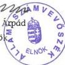

Állami Számvevőszék

# JELENTÉS

# a Műszaki és Természettudományi Egyesületek Szövetsége gazdálkodásának ellenőrzéséről

2000. július

0020

---

Az ellenőrzés végrehajtásáért felelős:

Halász Gejza

számvevő igazgató

Az ellenőrzést vezette:

dr. Szávai Tamás

osztályvezető főtanácsos

Az összefoglaló jelentést készítette:

Berzétey Attiláné

számvevő tanácsos

Az ellenőrzésben részt vettek:

Berzétey Attiláné

számvevő tanácsos

dr. Dotterweich Antal

számvevő tanácsos

A Szövetségnél a központi költségvetési támogatás felhasználását az Állami Számvevőszék ezúttal első ízben ellenőrizte.

www.asz.gov.hu

Jelentéseink az Országgyűlés számítógépes hálózatán is olvashatók.

---

V-1005-021/2000. TÉMASZÁM: 516

# TARTALOMJEGYZÉK

I. ÖSSZEGZÖ MEGÁLLAPITÁSOK, KÖVETKEZTÉSEK, JAVASLATOK 5
1.ÖSSZEGZÖ MEGÁLLAPITÁSOK 5
2. JAVASLATOK 6
II. RÉSZLETES MEGÁLLAPITÁSOK 7

1. A működés törvényessége 7

1.1. A működés feltételrendszere 7

1.1.1.Feladatrendszere 7
1.1.2.Szervezeti rendszere 8
1.1.3.A Szövetség gazdalkodása 10

1.1.3.1.A Szövetség gazdalkodásanak szabályozottsága 10
1.1.3.2.A bevetelek es a kiadasok alakulasa 12
1.1.3.3.A kozponti koltsegvetesi tamogatas felhasznalasanak, felosztasanak elvei es gyakorlata 15
1.1.3.4.Beszamolokeszitési kotelezettseg teljesitese 17

1.2. A könyvvezetési kötelezettség teljesítése 18

1.2.1.Konyvvezetes 18
1.2.2.Analitikus nyilvantartasok 20
1.2.3.Bizonylati rend,bizonylati fegyelem 21
1.2.4.A kulonfele allami befizetesi kotelezetsgek teljesitese 21

1.3. A belső ellenőrzés működése 22

2. A működés célszerűsége 23

2.1.A penzugyi forrasok felhasznalasanak celszerusege 23
2.2.Megvalosultprogramok 23
2.3.Tovabbi feladatok 25
2.4.A human eroforrassal valo gazdalkodas 26

1

---

•

•

•

•

•

•

---

# J e l e n t é s

## a Műszaki és Természettudományi Egyesületek Szövetsége gazdálkodásának ellenőrzéséről

**Az ellenőrzött szervezet neve:** Műszaki és Természettudományi Egyesületek Szövetsége

**Címe:** Budapest, 1055. Kossuth tér 6-8.

**Jogállása:** önálló jogi személy, kiemelten közhasznú társadalmi szervezet

**Bírósági nyilvántartási szám:** 13.Pk. 60431/1989/22.

Az Állami Számvevőszékről szóló **1989. évi XXXVIII. tv. 2. § (5) bek.**, valamint a közhasznú szervezetekről szóló **1997. évi CLVI. tv. 21. §**-a alapján az Állami Számvevőszék (továbbiakban: ÁSZ) ellenőrzi a központi költségvetésből juttatott támogatás felhasználását a társadalmi szervezeteknél. Az ÁSZ a 2000. évre elfogadott ellenőrzési tervének megfelelően ellenőrzést végzett a Műszaki és Természettudományi Egyesületek Szövetségénél (továbbiakban: Szövetség). A Szövetség a Magyar Köztársaság költségvetéséről rendelkező törvényekben foglaltak szerint 1998. évben 96.000 E Ft, 1999. évben 100.000 E Ft központi költségvetési támogatásban részesült. A támogatás felhasználását a Szövetségnél az ÁSZ ezúttal első ízben ellenőrizte.

A **Szövetség** társadalmi szakmai érdekképviseleti szervezet, a műszaki-, agrár-, természet- és gazdaságtudományi értelmiséget tömörítő - önálló jogi személyiséggel rendelkező - egyesületek, társaságok és más társadalmi szervezetek (a továbbiakban: tagegyesületek) önkéntes társuláson alapuló szövetsége. Az 1848. évtől működő Magyarhoni Földtani Társulat, majd az 1867-ben létrejött Magyar Mérnök Egylet hagyományaira támaszkodva 1948-ban alapította 14 szakmai egyesület. 1999. évre tagegyesületeinek száma 42-re nőtt (1. sz. melléklet).

---3

---

Az egyesületi tagok száma mintegy százezer, zömmel mérnökök, kutatók, természettudományi, gazdasági és agrárszakemberek. Tagegyesületeinek tevékenysége a technika, a természettudományok és a gazdaság egész területére kiterjed, egy részük évszázados, sőt régebbi hagyományokat őriz.

A Szövetséget az egyesülési jogról szóló **1989. évi II. törvény** alapján a Fővárosi Bíróság 1989. évben vette nyilvántartásba, majd 1998. évtől kiemelkedően közhasznú tevékenységet folytató társadalmi szervezet minősítést nyert. **Önálló jogi személyiségű tagszervezetei** ugyancsak közhasznú, illetőleg kiemelkedően közhasznú szervezetek, önállóan gazdálkodnak.

A Szövetség Országos Központból és 24 területi szervezetből áll. Tagságát alkotja 42 önállóan gazdálkodó, önálló jogi személyiséggel bíró egyesület, amelyek a beszámolási kötelezettségüknek önállóan tesznek eleget.

Tízezer főnyi **szakértői hálózata** révén **hozzájárul**, hogy a társadalom minél nagyobb intenzitással építhesse be a technika, a természettudományok és a gazdaság területén a tudományos-technikai haladás legújabb eredményeit. A megváltozott gazdasági körülmények között jelentős szellemi kapacitást képvisel a társadalom számára a robbanásszerű technológiai fejlődés eredményeinek hazai elterjesztése érdekében.

A Szövetség a tudományos-technikai haladás, a modernizáció fontos kérdéseiben képes állást foglalni, az egész reálértelmiség nevében tud fellépni sokezres tagságának felhalmozott tudására és tapasztalataira támaszkodva. A hivatalos és a nyilvános hazai és nemzetközi fórumokon a társadalomban betöltött szerepét kiemelten közhasznú jogi státusza is jelzi. **Közhasznú és kiemelkedően közhasznú tevékenysége** körében a társadalom elvárásainak különösen a közművelődési, iskolán kívüli szakmai **oktatási**, a nemzeti **információs** stratégia és az **energiahatékony** nemzetgazdasági, **környezetvédelmi** feladatok, valamint az euro-atlanti csatlakozás elősegítése érdekében végzett **nemzetközi** tevékenysége során képes magas színvonalon megfelelni.

**Az ellenőrzés célja:** hogy átfogó képet adjon a Szövetségnek adott központi költségvetési támogatás rendeltetésszerű és eredményes felhasználásáról, annak értékelése, hogy a pénzfelhasználás során miként érvényesítették a törvényességi követelményeket és a célszerűségi szempontokat.

**Az ellenőrzés módszere:** törvényességi és célszerűségi, szűrőpróba szerinti kiválasztás alapján.

**Az ellenőrzött időszak:** beszámolóval lezárt 1998-1999. évek.

**A helyszíni ellenőrzés:** 2000. március 20. - április 27-ig tartott.

4

---

I. ÖSSZEGZŐ MEGÁLLAPÍTÁSOK, KÖVETKEZTETÉSEK, JAVASLATOK

# I. ÖSSZEGZŐ MEGÁLLAPÍTÁSOK, KÖVETKEZTETÉSEK, JAVASLATOK

## 1. ÖSSZEGZŐ MEGÁLLAPÍTÁSOK

A Szövetség Alapszabályában lefektetett elvek szerinti **működése megfelel mind az 1989. évi II. tv. mind az 1997. évi CLVI. tv. előírásainak.**

**Alapszabályban** és egyéb szabályzataiban rögzítette működése, gazdálkodása részletes előírásait, meghatározta szervezeti rendjét. **Alapszabály szerinti tevékenységéhez rendelt szervezeti, gazdálkodási és irányítási rendszere rendkívül szerteágazó.** Gazdálkodási rendjét összesen 5 szabályzat részletezi, ezek közül a Kölcsönös Támogatási Alap szerinti tevékenység végzésére a Szövetség nem jogosult. Területi szervezetei, valamint a központi apparátus központi szolgáltató egységei önálló költséghelyen gazdálkodnak, egységként eredményelszámolást készítenek. Az egységként **elkülönített gazdálkodási nyilvántartásból** állapítják meg mind a szövetségi szintű, mind a központi és a területi szervezetenkénti alaptevékenység, a külső szervek részére végzett szolgáltatás pénzügyi eredményét, a szövetségi vagyon hasznosításából származó bevételeket és kiadásokat, illetőleg a tagegyesületek részére végzett tevékenység költségeit. Az önfenntartás követelményén alapuló költség- és eredmény-elszámolási rendszer, az önálló költséghelyen gazdálkodó szervezeti egységek gazdálkodásának összefogása, egymással szembeni elszámoltatása, a részekből az egész összeállítása kívülálló számára nem könnyen áttekinthető.

**Számviteli politikája** a számvitelről szóló 1991. évi XVIII. törvényben tételesen előírt gazdálkodásra jellemző szabályokat, előírásokat, módszereket érdemben nem tartalmazza. A számviteli politika keretében kötelezően előírt szabályzatokat elkészítették, ezek azonban elavultak, korszerűsítésre szorulnak. Az önálló költséghelyen gazdálkodó központi és a területi szervezetek **számítógépes könyvelési programjai részben eltérőek, a területi számítógépek nincsenek összekötve a központi egységgel**, ezért az adatáramlás áttételesen történik. A belső előírások naprakészségének hiánya a könyvvezetésben is tükröződik.

A Szövetség 1998. évben 1.242.670 E Ft, 1999. évben 1.466.876 E Ft bevételt ért el. Ehhez járult hozzá a **központi költségvetésből juttatott támogatás**, amely a Szövetség **összes bevételének 1998. évben 7,7%-a, 1999. évben 6,8%-a volt.** Feladatellátása ráfordítás-igényes; a két évben a ráfordítások 43,9%-át, illetőleg 38,7%-át a személyi jellegű, 17,5%, illetőleg 21,9%-át a nem anyagjellegű ráfordítások tették ki.

5

---

A szervezetek kötelesek a **számviteli törvényben előírt számviteli politikájukban** (számlarendjükben) **rögzíteni** - többek között - a **költségvetési támogatás felhasználása számviteli elszámolásának módját is**. Ennek hiányában a Szövetség számviteli nyilvántartásaiból a **költségvetési támogatás felhasználása nem követhető nyomon**, a felhasznált összegek beleolvadnak a költségszámlák összegeibe.

Egyebekben a **Szövetség gazdálkodása során eleget tett a vonatkozó jogszabályi előírásoknak**.

A szervezet gazdálkodási és irányítási rendszerében fennálló hiányosságokat a Szövetség függetlenített belső ellenőre, illetőleg Ellenőrzési Bizottsága a Szövetség gazdálkodásának rendszeres ellenőrzése során folyamatosan feltárta, és javaslatokat tett azok kiküszöbölésére.

E javaslatok mind a gazdálkodás, mind a szervezeti rend - a tagszervezetekkel és a területi szervezetekkel fennálló kapcsolatok - korszerűsítésére vonatkoznak. A tervezetben foglalt feladatok megoldására 1999. évben létrehozták az Alapszabály Bizottságot. A Szövetségi Tanács ülésein rendszeresen napirenden van a tagegyesületek, területi szervezetek és a központ viszonyának aktualizálása. **A korszerűsítés során megoldandó feladatokat az 1999-2002. évre szóló középtávú tervezetben összefoglalták.** A Szövetség gazdálkodásának megszilárdításához jelentősen hozzájárul a Tudomány és Technika Házak tulajdoni viszonyai folyamatban lévő rendezésének lezárulása is.

## 2. JAVASLATOK

Az Állami Számvevőszék javasolja a Szövetség elnökének, hogy a jelentésben foglaltak figyelembevételével - az alábbi intézkedéseket tegye meg:

1) Pontosítsa számviteli politikáját, ezen belül dolgozza ki a szervezet feladatrendszeréhez igazodó korszerű számlarendet és számviteli nyilvántartásokat. Dolgozzon ki egységes elveken alapuló, áttekinthetőbb költségelszámolási rendszert.
2) Alakítson ki olyan információs rendszert, amely szövetségi szinten lehetővé teszi az egyes szervezeti egységek számítógéppel feldolgozott adatainak azonos rendszerben történő összesítését.
3) Aktualizálja elavult belső szabályzatait, különös tekintettel a Kölcsönös Támogatási Alap konstrukcióra.

6

---

II. RÉSZLETES MEGÁLLAPÍTÁSOK

## II. RÉSZLETES MEGÁLLAPÍTÁSOK

### 1. A MŰKÖDÉS TÖRVÉNYESSÉGE

#### 1.1. A működés feltételrendszere

A Szövetség működésének jogi kereteit alapvetően az egyesülési jogról szóló 1989. évi II. törvény és a közhasznú szervezetekről szóló 1997. évi CLVI. törvény (továbbiakban: Kht.), illetőleg az Alapszabály határozza meg.

Az **Alapszabály** mindkét törvény előírásainak megfelelően tartalmazza a Szövetség szervezetének és működésének, valamint gazdálkodásának alapvető szabályait. A részletes előírásokat ehhez kapcsolódóan több szabályzatban rögzítették.

##### 1.1.1. Feladatrendszere

A Szövetség **Alapszabályában megfogalmazott célja**: a reálértelmiség szakmai tudományos értékeinek védelme és továbbfejlesztése, az autonóm tagegyesületek közös törekvéseinek szolgálata, közös érdekeik képviselete, a szakmai-tudományos fejlődés előmozdítása, a tudományos műveltség terjesztése és a tudományos eredmények gyakorlatban történő alkalmazásának segítése.

##### A fenti célok elérése érdekében végzett tevékenysége:

- Elősegíti a tagegyesületek szakmai és területi együttműködését, a közös célok megvalósítását, a tagegyesületek felhatalmazása alapján képviseli azok és tagjaik közös érdekeit, az egyesületi igényeknek megfelelően együttműködik más társadalmi, érdekképviseleti szervezetekkel, közös érdekeket szolgáló javaslatokat, szakvéleményeket fogalmaz meg, segíti a tagegyesületek által gondozott szakmai kultúrák, tudományok művelését és terjesztését, a kreativitást ösztönző kezdeményezéseket (pályázat, kitüntetés, alapítvány) tesz, nemzetközi kapcsolatokat épít ki és tart fenn a hasonló célú és jellegű külföldi szervezetekkel, elősegíti a tagegyesületek hazai és nemzetközi kapcsolatait, önsegélyezés alapján támogat rászoruló egyesületi tagokat.
- A Tudomány és Technika Házak (továbbiakban: TTH-k) országos hálózatának fenntartásával és működtetésével teret biztosít az egyesületek tagjai mellett minden érdeklődő számára az ismeretterjesztés, közművelődés, a reálértelmiség körében élt és élő alkotók, alkotások bemutatására; nem zárja ki, hogy a nyilvánosan meghirdetett feltételek szerint más is részesülhessen közhasznú szolgáltatásaiból; tevékenységét a nyilvánosság tájékoztatásával végzi; tevékenységének és gazdálkodásának legfontosabb adatait országos sajtó útján is nyilvánosságra hozza.

7

---

A fenti **közhasznú tevékenységét** alapvetően az alábbi körökben látja el:

- tudományos tevékenység, kutatás, műszaki fejlesztés,
- nevelés, oktatás, képességfejlesztés, ismeretterjesztés,
- kulturális tevékenység, kulturális örökség megóvása,
- természetvédelem, műemlékvédelem, környezetvédelem,
- szociális tevékenység,
- gyermek- és ifjúsági érdekképviselet,
- munkaerőpiacon hátrányos helyzetű rétegek képzésének, foglalkoztatásának elősegítése és a kapcsolódó szolgáltatások,
- széles körű nemzetközi kapcsolattartás, beleértve a határon túli magyarsággal kapcsolatos tevékenységet,
- az euro-atlanti integráció elősegítése,
- közhasznú szervezetek számára biztosított szolgáltatások.

A Szövetség közhasznú tevékenysége köréből **kiemelkedően közhasznú** feladatként látja el a közművelődési, iskolán kívüli szakmai oktatási, az euro-atlanti csatlakozás feltételeit elősegítő tevékenységét, a nemzeti információs stratégia és az energiahatékony, fenntartható fejlődést elősegítő nemzetgazdasági, környezetvédelmi feladatokat. Ezen saját, továbbá tagegyesületei tevékenységéhez és intézményeihez az Országgyűlés által elfogadott költségvetési törvény szerinti központi, illetve önkormányzati támogatásban részesül.

A Szövetség **Alapszabálya** úgy rendelkezik, hogy tagegyesületeinek sérelme nélkül, az önfinanszírozás elvének érvényesítése céljából, a közhasznú tevékenységének megvalósítása érdekében, azokat nem veszélyeztetve, **vállalkozó tevékenységet** is folytathat. A **gazdálkodási tevékenységére** vonatkozó szabályzatokban megfogalmazottak szerint alapelv a TTH-kban az egyesületi alaptevékenységek végzésének biztosítása, az ezen felüli szabad kapacitás kihasználására lehetséges egyéb, bevételszerző tevékenységet folytatni. A vizsgált időszakban a társasági és osztalékadóról szóló 1996. évi LXXXI. tv. hatálya alá tartozó vállalkozási tevékenységből származó bevételeket bérleti díj, szolgáltatások végzése, eszközértékesítés és kereskedelmi tevékenység végzése kapcsán értek el.

### 1.1.2. Szervezeti rendszere

A Szövetség **Országos Központból és 24 területi szervezetből áll**, tagja **42 önálló jogi személyiségű tagegyesület**. A tagegyesületek önállóan gazdálkodnak, többségük közhasznú vagy kiemelkedően közhasznú minősítésű szervezet. Székhelyük Budapest - 4 kivételével - a Kossuth téri, illetőleg a Fő utcai konferencia központok. Tevékenységük nagyobb részét a régiókban szervezik a TTH-ban. A Szövetség tevékenységének színhelyei két fővárosi Konferencia Központ és a megyékben 24 TTH.

#### A Szövetség testületi szervei:

- a Szövetségi Tanács,
- az Elnökség,
- az Ellenőrző Bizottság,
- a Gazdasági Bizottság,
- a Területi Szövetségi Szervezetek.

8

---

II. RÉSZLETES MEGÁLLAPÍTÁSOK

**A Szövetségi Tanács** a Szövetség legfelsőbb vezető testülete, amelynek szavazati jogú tagjai a tagszervezetek képviselői, valamint a területi szövetségi szervezetek 7 képviselője. Kizárólagos hatáskörébe tartozik az Alapszabály és a szövetségi program elfogadása és módosítása, a szövetségi éves tevékenység értékelése a közhasznúsági jelentés, az éves gazdálkodási terv és az auditált beszámoló elfogadása, továbbá a vezető tisztségviselők választása, felmentése, visszahívása és az új tagegyesületek felvétele, valamint tagsági viszony megszüntetése. Feladata továbbá a szabályzatok és a hivatali szervezet ügyrendjének elfogadása, a hazai és nemzetközi együttműködési megállapodások jóváhagyása stb. A Szövetségi Tanács évente legalább 4 alkalommal ülésezik. Az üléseken részt vesznek az Elnökség nem küldött tagjai; az Ellenőrző Bizottság elnöke és tagjai; a társult tagok képviselői, a főigazgató, az állandó bizottságok elnökei, valamint az elnök által meghívottak.

Az **Elnökség** a Szövetség operatív ügyintéző és képviseleti vezető szerve két szövetségi tanácsi ülés között, a Tanács állásfoglalásainak és határozatainak keretei között. Feladata a döntés-előkészítés, a döntés végrehajtásának biztosítása. Tagjai az elnök és 8 alelnök. Az Elnökség évente legalább 4 alkalommal ülésterv szerint tartja üléseit, amelyen tanácskozási joggal részt vesz az Ellenőrző Bizottság elnöke és a főigazgató is. Az Elnökség ülései nyilvánosak, az ülésekről írásbeli emlékeztető készül.

Az 5 tagú **Ellenőrző Bizottság** ellenőrzi a Szövetség gazdálkodását, jogszabály és alapszabályszerű működését. Elnökét és tagjait a Szövetségi Tanács választja 4 éves időtartamra. Feladatait ügyrendjében foglaltak szerint látja el, működéséért kizárólag a Szövetségi Tanácsnak felelős, amelynek rendszeresen beszámoló tevékenységéről. Tagjai részt vesznek a Szövetség Tanács ülésein, elnöke az Elnökség ülésén is. Előzetesen véleményezi az éves gazdálkodási tervet, a pénzügyi beszámolót és a közhasznúsági jelentést.

A Szövetségi Tanács által választott **Gazdasági Bizottság** feladata a gazdálkodási tevékenység végzésével összefüggő számviteli, szabályozási folyamatok elemzése, véleményezése, javaslatok kidolgozása, szabályozások és döntéselőkészítő anyagok előkészítése, az éves gazdálkodási terv, közhasznúsági jelentés és a mérleg véleményezése.

A **Területi szövetségi szervezetek** a tagegyesületek helyi képviselőiből alakított testületek. Feladataik az illetékességi területükön működő tagegyesületek együttműködésének szervezése, képviselete, a települési, megyei önkormányzatokkal való együttműködés, a TTH-k működtetési, hasznosítási elveinek meghatározása.

Az **Országos Központ** hivatali szervezetének részei:

- Központi Titkárság,
- Humánpolitikai és Képzési Osztály (Oktatási Központ),
- Pénzügyi és Számviteli Osztály,
- Központi Konferencia Központok,
- Házi nyomda.

9

---

Az Országos Központ hivatali szervezetének, illetőleg a 24 területi szervezetnek a **kinevezett** vezető tisztségviselője a főigazgató.

A Szövetség **választott vezető tisztségviselői**: az Elnökség és az Ellenőrző Bizottság tagjai. A Szövetséget az elnök, illetőleg a főigazgató képviseli.

A Szövetség keretein belül az Alapszabályban felsorolt állandó bizottságokon kívül **több, adhoc vagy állandó szakmai bizottság** is működik, így pl.: Aranyokleveles Mérnökök Köre Szociális Bizottsága, Minőségügyi, Környezetvédelmi, Oktatáspolitikai, Logisztikai, Energiahatékonyság Koordinációs Bizottságok, Díjbizottság, Tudomány- és Technikatörténeti Bizottság, Érdekvédelmi munkacsoport, Ifjúsági Kabinet, Vásárdíj Zsűri, Alapszabály Bizottság.

### 1.1.3. A Szövetség gazdálkodása

#### 1.1.3.1. A Szövetség gazdálkodásának szabályozottsága

A Szövetség tulajdona osztatlan. A konszenzussal elfogadott Alapszabály tartalmazza a tagegyesületekkel egyeztetetten elszámolt és a tagsági viszony megszűnése esetén is érvényes tulajdoni arányokat (2. sz. melléklet).

A Szövetség gazdálkodását több szabályzat részletezi:

- Gazdálkodási Szabályzat,
- Szövetségi Vagyonkezelés és Vállalkozás Szabályzata,
- Kölcsönös Támogatási Alap Működésének Rendje,
- Területi Pénzügyi Tartalék Szabályzata,
- Befektetési Szabályzat.

A Szövetség gazdálkodási tevékenységét két irányban gyakorolja: a tagegyesületek és a Szövetség területi szervezetei irányában.

#### A tagegyesületek a Szövetségnek

- egységesen megállapított alaptagdíjat fizetnek,
- megállapodás szerint, a teljes önköltség bázisán alapuló, ún. mozgó tagdíjat fizetnek a működésükhöz igénybe vett szövetségi segítő tevékenységért,
- bevételszerző tevékenységükkel összefüggően igénybe vett helyiség, illetőleg tevékenység díjtétele a teljes önköltségre vetítetten 10%-os haszonkulccsal megállapított,

#### A Szövetség a tagegyesületeknek

- az éves központi költségvetési támogatás Szövetségi Tanácsi döntéssel meghatározott hányadát felosztja,
- visszafizetési kötelezettség mellett konkrét célra kölcsönt nyújt.

10

---

II. RÉSZLETES MEGÁLLAPÍTÁSOK

A Szövetség **belső gazdálkodási rendje** a területi **szervezetek** tevékenységére és a szövetségi **központi** szolgáltató tevékenységre terjed ki.

A **területi szervezetek** nem jogi személyként, **önálló költséghelyen gazdálkodnak**, önálló bankszámlával rendelkeznek, amelyeken rendelkezési joga van a főigazgatónak is. A területi szervezetek működésének terei a TTH-k. Gazdálkodásuk során **érvényesített prioritások**: a TTH-k fenntartása, a tagegyesületek működésének kiszolgálása kétoldalú megállapodások alapján. Szabad kapacitásuk kitöltésére vállalkozói tevékenységet folytatnak. A területi szervezetek a tevékenységüket közvetlenül kiszolgáló központi apparátus tevékenységét (pénzügyi, számviteli, munkaügy, bér- és Tb. ügyintézés, belső ellenőrzés, műszaki vezető) önköltségi alapon, bevétel arányosan szétosztva megtérítik.

A **központi apparátus** központi szolgáltató egységei is külön önálló költséghelyen gazdálkodnak, szabad kapacitásukat a piaci elvet alkalmazva, harmadik félnek végzett szolgáltatásokkal hasznosíthatják. A Szövetség Alapszabályában foglaltak szerint a vállalkozási tevékenységek eredményét a cél szerinti tevékenységre kell fordítani, így hozzájárulnak a TTH-k működtetéséhez, az önköltséget meg nem haladó belső térítési díjakhoz, a vagyonhoz kapcsolódó fejlesztésekhez és beruházási igényekhez.

A **Gazdálkodási Szabályzat** előírása szerint **az önfenntartás elvén alapuló elkülönített gazdálkodási nyilvántartásból** egyértelműen megállapíthatónak kell lennie mind a szövetségi szintű, mind a központi és a területi szervezetenkénti alaptevékenységnek, a külső szervek részére végzett szolgáltatás pénzügyi eredményének, a szövetségi vagyon hasznosításából származó bevételek és kiadások összegeinek, illetőleg a Szövetség tagegyesületeinek végzett tevékenység költségeinek. Az egységenkénti eredmény-elszámolás alapján a Szövetségi Tanács dönt a gazdálkodás további feladatairól, pl. a veszteség kezeléséről, tartalék képzéséről, eszközfejlesztésről, személyi ösztönzésről.

A területi szervezetek kötelesek voltak 1998. évben a számított eredményük 30%-át, 1999-ben a 18%-át a **Területi Pénzügyi Tartalékba** helyezni. A **Területi Pénzügyi Tartalék** célja, hogy alapszerűen működve, az elfogadott gazdálkodási tervtől eltérően keletkező finanszírozási, likviditási nehézségek esetén a területi szervezetek részére kamatmentes pénzügyi segítséget nyújtson, visszafizetési kötelezettség mellett.

A Szövetség - az 1990. évet megelőző időszak adózott eredményéből képezett - ún. **Kölcsönös Támogatási Alapot** működtet. Az Alap célja, hogy „bankszerűen” működve, az ideiglenesen finanszírozási, likviditási gondokkal küzdő szervezeteinek (tagegyesületeknek és területi szervezeteknek) átmenetileg kölcsönt nyújtson, visszafizetési kötelezettség mellett, az Alap szabályzatában meghatározott kamatfeltételekkel. Ez a konstrukció az ÁSZ véleménye szerint a hitelintézetekről és a pénzügyi vállalkozásokról szóló 1996. évi CXII. tv. 3. § (1) bek. b) pontja, illetőleg a 2. sz. melléklet 10. pontja szerinti **pénzkölcsön nyújtás**, amely tevékenység végzésére a Szövetség **nem jogosult**. Az Alap

11

---

működtetését részletező szabályzat rendszeres, üzletszerű működtetésre vonatkozik, azonban a gyakorlatban a konstrukció nem működik üzletszerűen, mivel 1998. évben csak egy tagegyesület vett igénybe 300 E Ft kölcsönt 2 hónapos futamidőre 3 E Ft kamattal. 1999. évben egy tagegyesület kapott 300 E Ft, két területi szervezet pedig 1.500 E Ft, illetőleg 1.000 E Ft kölcsönt, amelyek után ez évben kamatbevétel nem volt, a felmerült költségek összege 61 E Ft.

Az Alap működtetése megszüntetésének igénye több szövetségi fórumon felmerült, amely - tekintettel a jogellenes működésre is - az ÁSZ szerint is időszerű.

A Szövetség 1999. évben elkészítette a Kht. 17. §-ában előírt **Befektetési Szabályzatot**, amelynek egyes pontjai pl. a gazdasági társaság alapításával, abban való részvétellel összefüggő rendelkezései - és a Gazdálkodási Szabályzat, valamint a Vagyonkezelés és Vállalkozás Szabályzata tartalma között **átfedések, ismétlések vannak**.

A Szövetség a központi és a területi szervezetek által elkészített **éves tervek alapján gazdálkodik** cél szerinti feladatai megvalósítása érdekében. Éves gazdálkodási tervekben a belső szabályzataikban foglaltakkal egybehangzóan az **önfenntartás** elvén alapuló **fő célkitűzések**: a működőképesség fenntartása; a vagyon megőrzése; a tevékenységek összességében a bevételek és ráfordítások egyensúlyának megteremtése; a szigorú költséggazdálkodás.

Az ÁSZ megállapítása szerint az önálló költséghelyen gazdálkodó szervezeti egységek gazdálkodásának összefogása, egymással szembeni elszámoltatása, a részekből az egész összeállítása úgy, hogy a könyvvezetésben, és végül a beszámolóban halmazódások ne forduljanak elő, a Pénzügyi és Számviteli Osztály részéről sok többletmunkával járó teljesítmény. A jelenleg **kivülálló számára nem könnyen áttekinthető elszámolási rendszer** az Ellenőrző Bizottság szerint is korszerűsítést igényel.

**A Szövetség Alapszabály szerinti tevékenységéhez rendelt szervezeti, gazdálkodási és irányítási rendszer** - összetételének megfelelően - **rendkívül szerteágazó, esetenként ismételéseket, átfedéseket tartalmaz**.

Célszerű lenne a gazdálkodásra vonatkozó szabályzatokat áttekinteni, és a számviteli törvényben előírtakat is figyelembe véve korszerűsíteni és lehetőség szerint egységesíteni.

### 1.1.3.2. A bevételek és a kiadások alakulása

A Szövetség összes bevétele 1998-ban 1.242.670 E Ft, 1999. évben 1.466.876 E Ft; összes kiadása 1.239.239 E Ft, illetőleg 1.471.475 E Ft volt. Működési kiadásainak fedezéséhez 1998. évben 96.000 E Ft; 1999. évben 100.000 E Ft központi költségvetési támogatást kapott, a feltételek előírása nélkül.

A kapott költségvetési támogatással szemben a Szövetség 1998. évben 304.541 E Ft, 1999. évben 335.142 E Ft befizetést (adók, járulékok, hozzájárulások) teljesített a központi költségvetésbe.

12

---

II. RÉSZLETES MEGÁLLAPÍTÁSOK

A Szövetség bevételeit - jogcímek szerint - célja szerinti (közhasznú) tevékenységből, vállalkozási tevékenységből és egyéb, pénzügyi és rendkívüli bevételekből érte el:

|  Bevételek megoszlása (%) | 1998. | 1999.  |
| --- | --- | --- |
|  Összes bevétel | 100,0 | 100,0  |
|  **ebből:** |  |   |
|  - cél szerinti alaptevékenység | 70,0 | 71,6  |
|  - vállalkozási tevékenység | 22,7 | 23,2  |
|  Egyéb bevétel | 7,3 | 5,2  |

A Szövetség **bevételeinek** évek és jogcímek szerinti részletezését a 3. sz. melléklet mutatja be.

**Szervezeti felépítés** szerinti megoszlásban a bevételek nagyobb hányadát a területi szervek érték el:

|   | 1998. E Ft | % | 1999. E Ft | % | 1999. évi az 1998.évi %-ában  |
| --- | --- | --- | --- | --- | --- |
|  Központ | 523.211 | 42,0 | 688.059 | 46,9 | 131,5  |
|  Területi szervezetek | 719.459 | 57,9 | 778.817 | 53,1 | 108,3  |
|  Ö s s z e s e n : | 1.242.670 | 100,0 | 1.466.876 | 100,0 | 118,0  |

**1999. évre** - noha összességében 18%-kal nőttek a bevételek - kedvezőtlen folyamatok érzékelhetők, elsősorban az egyébként is egyenlőtlen színvonalon gazdálkodó területi szervezeteknél. Az előző évhez képest minimális 4,1 %-os bevétel növekedés mellett e szervezetek többségénél nem volt teljesíthető a gazdálkodási szabályzataikban előírt önfenntartási feltétel. A Központ által elnyert pályázati összegek, valamint a költségvetési támogatás a területi szervezetek, illetőleg azok bázisai, a TTH-k működéséhez (beruházásaihoz) is hozzájárultak.

13

---

# A Szövetség kiadásainak megoszlása költségnemenként:

|   | 1998 | % | 1999 | % | 1999. az 1998. évi %-ában  |
| --- | --- | --- | --- | --- | --- |
|  **Kiadások összesen (E Ft)** | 1.239.239 | 100 | 1.471.475 | 100 | 118,6  |
|  ebből: tagegyesületek támogatása | 19.564 | 1,6 | 16.133 | 1,1 | 82,5  |
|  anyagjellegű ráfordítás | 341.153 | 27,5 | 382.856 | 26,1 | 112,2  |
|  nem anyagjellegű ráfordítás | 217.134 | 17,5 | 321.868 | 21,9 | 148,2  |
|  személyi jellegű ráfordítás | 543.829 | 43,9 | 567.938 | 38,7 | 104,4  |
|  értékcsökkenési leírás | 28.275 | 2,3 | 33.417 | 2,3 | 118,2  |
|  egyéb költség | 59.750 | 4,8 | 115.047 | 7,6 | 192,5  |
|  egyéb ráfordítás | 29.534 | 2,4 | 34.216 | 2,3 | 115,9  |

Az összes ráfordításon belül a **tagegyesületeknek véglegesen átadott támogatás** összege 1999. évben 6,5%-kal csökkent. Kimagaslóan, 92,5%-kal nőttek az egyéb költségek (közöttük az értékcsökkenési leírás), valamint a nem anyagjellegű szolgáltatások értéke. A Szövetség Alapszabályában megfogalmazott **feladatok ellátása ráfordítás-igényes, és e ráfordítások döntő hányada a személyi jellegű ráfordítások és a nem anyagjellegű ráfordítások között jelenik meg.** Ezek együttesen az 1998. évi ráfordítások 61,4%-át, az 1999. évi ráfordítások 60,6%-át tették ki. A személyi jellegű ráfordítások 5,2%-os csökkenése mellett 1999. évben a nem anyagjellegű ráfordítások aránya 4,4%-kal nőtt, mivel a korábban személyi jellegű ráfordításként kifizetett eseti megbízási díjak helyett számla alapján, vállalkozás ellenértékeként fizették ki a díjakat.

A személyi jellegű ráfordítások között az apparátusban foglalkoztatottak bérköltsége 1998. évben 203.227 E Ft (37,4%), 1999. évben 223.147 E Ft (39,3%) volt.

A Szövetség költségeinek jogcímek szerinti megoszlása:

|   | 1998. | % | 1999. | %  |
| --- | --- | --- | --- | --- |
|  **Összes költség (E Ft)** | 1.239.239 | 100,0 | 1.471.475 | 100,0  |
|  **ebből:** - vállalkozási tevékenység | 283.036 | 22,8 | 342.520 | 23,3  |
|  - cél szerinti tevékenység | 956.203 | 77,2 | 1.128.955 | 76,7  |
|  Kapott költségvetési támogatás | 96.000 |  | 100.000 |   |
|  Ktg.vetési támogatás a cél szerinti tevékenység költségei %-ában | 10% |  | 8,8% |   |

14

---

II. RÉSZLETES MEGÁLLAPÍTÁSOK

**Szervezeti felépítés** szerinti megoszlásban a költségek nagyobb hányadát a területi szervezetek viselték:

|   | 1998. E Ft | % | 1999. E Ft | % | 1999. évi az 1998. évi %-ában  |
| --- | --- | --- | --- | --- | --- |
|  Központ | 515.676 | 41,6 | 678.824 | 46,1 | 131,6  |
|  Területi szervek | 723.563 | 58,4 | 792.651 | 53,9 | 109,5  |
|  **Összesen:** | **1.239.239** | **100,0** | **1.471.475** | **100,0** | **118,7**  |

1999. évben az előző évihez képest a Szövetség összes bevétele 18%-kal, összes ráfordítása 18,7%-kal növekedett. A hivatalos inflációs ráta 1998. évben 14,3%, 1999. évben 10%-os volt. A közhasznú és kiemelt közhasznú feladatai eredményes elvégzéséhez való **központi költségvetési támogatás növekménye egyik vizsgált évben sem érte el a hivatalos infláció mértékét**, miközben pl. a felhasznált energia költsége 1999. évben az előző évihez képest 36,34%-kal, a bérleti díjak költsége 7,49%-kal nőtt (4. sz. melléklet).

A Szövetség - a tagegyesületekkel együtt - 1999. évben összesen mintegy 3,6 Mrd Ft bevételből gazdálkodott. Ennek a központi költségvetés 100.000 E Ft hozzájárulása csak a 2,9%-át biztosította.

### 1.1.3.3. A központi költségvetési támogatás felhasználásának, felosztásának elvei és gyakorlata

A működéshez biztosított **központi költségvetési támogatás a cél szerinti (közhasznú) ráfordításoknak 1998. évben a 10%-át, 1999. évben a 8,8%-át fedezte.**

A központi költségvetési támogatás éves összegén belül a felhasználás elveit, főbb tartalmi csoportjait, azok arányát az Egyesület Szövetségi Tanácsa által lefektetett alapelveknek megfelelően határozták meg.

15

---

A vizsgált években érvényes alapelveknek megfelelően tervezett összegek ( E Ft):

|   | 1998. | 1999.  |
| --- | --- | --- |
|  1./ 30% MTESZ irányító tevékenységek, bizottságok munkája, MTESZ vezető testületei, Szövetségi Tanács, Elnökség és munkabizottságai, kilenc állandó bizottság, RET működtetése, parlamenti kapcsolatok, sajtó és propaganda tevékenység: | 28.800 | 30.000  |
|  2./ 20% tagegyesületek közvetlen pénzügyi támogatása | 19.200 | 20.000  |
|  3./ 20% szakmai munkák fedezetére (MTESZ nemzetközi kötelezettségeiből következő költségek, tartalékkeret, tagsági szolgáltatás bővítése, az egyesületi Internet-pontok működési költségeihez való hozzájárulás | 19.200 | 20.000  |
|  4./ 30% veszteséges és likviditási gondokkal küzdő TTH-k üzemeltetésére, felújítási költségekre az éves gazdálkodás folyamatában az ügyvezetés döntése szerint: | 28.200 | 28.800  |
|  100% | 96.000 | 100.000  |

A tagegyesületek támogatására elfogadott elv szerint minden közhasznú jogállású tagegyesület egységesen 200 E Ft alaptámogatásra jogosult, a fennmaradó összeget pedig taglétszám arányosan kell felosztani.

A **költségvetési támogatás** alapelveknek megfelelő célirányos felhasználása a Szövetség számviteli nyilvántartásaiból nem ellenőrizhető, mivel **ezen összegek költséghelyen elkülönítve vagy elkülöníthető módon nem jelennek meg.** A felhasználás - bizonylati szintű - ellenőrzésének biztosítása alapvető feltétele a közpénzekkel való gazdálkodásnak, elszámolásnak.

Az éves gazdálkodásról a Szövetségi Tanács részére készült **szöveges beszámoló adatai szerint** (amelyet a testület elfogadott) az **alapelvek 1-3. pontjaiban** meghatározott feladatok ellátásával kapcsolatos ráfordítások a beszámolóban a „Központi Titkárság költségei” között jelennek meg. E költségek 1998. évben 166.131 E Ft-ot, 1999. évben 276.640 E Ft-ot tettek ki.

16

---

II. RÉSZLETES MEGÁLLAPÍTÁSOK

Ebből a tagegyesületeknek átadott (elszámolt) összegek:

|   | 1998. | 1999.  |
| --- | --- | --- |
|   | E Ft |   |
|  Átutalással 32 egyesületnek | 15.931.100 | -  |
|  Átutalással 25 egyesületnek | - | 10.765.180  |
|  „Lejárt határidejű tartozások kiegyenlítésével” | 3.633.300 | 5.367.720  |
|  **Ö s s z e s e n :** | **19.564.400** | **16.132.900**  |

A „**lejárt határidejű tartozások kiegyenlítésével**” történő beszámítás gyakorlata **nem felel meg a testület által elfogadott alapelveknek**, mivel az nem közvetlen pénzügyi támogatás.

Az alapelvek **4. pontja szerinti összegeket** a fedezethiányos TTH-k üzemeltetésére, felújítására fordították az elszámolás szerint, az Elnökség állásfoglalása alapján.

**Az éves költségvetési törvények a támogatás odaítélését nem kötötték konkrét feladatokhoz**, célokhoz, annak jogcíme működési célú felhasználás. Ezért a költségvetési támogatásnak elsősorban a szervezet működési kiadásainak fedezetül kell szolgálnia. Ezzel szemben 1998. évben 3 szervezet, 1999-ben 1 szervezet részére számoltak el felújítási célú támogatást. E vonatkozásban az Elnökség állásfoglalása ellentétes a költségvetési törvénnyel.

#### 1.1.3.4. Beszámolókészítési kötelezettség teljesítése

A Szövetség a vizsgált időszakban a **beszámolókészítési kötelezettségének** a számvitelről szóló, többször módosított 1991. évi XVIII. törvény (továbbiakban: Szt.), valamint a társadalmi szervezetek sajátosságait rögzítő 8/1996. (I.24.) és 219/1998. (XII.30.) Korm. rendelet előírásai alapján tett eleget **egyszerűsített éves beszámoló készítésével. Az egyszerűsített éves beszámoló és eredmény-kimutatás tartalmában és formájában megfelel a hatályos jogszabályi előírásoknak.**

Az éves beszámolót az Alapszabály rendelkezésének megfelelően a Szövetségi Tanács fogadta el. A döntéshozó testület elé kerülő beszámolót előzetesen **okleveles könyvvizsgáló auditálta.** A Kht. által előírt éves **közhasznúsági jelentést** az internet honlapján és egy országos napilapban is nyilvánosságra hozták. A kormányrendelet által előírt **közhasznú beszámoló** elfogadása ugyancsak a Szövetségi Tanács kizárólagos hatásköre. Az éves beszámolót és a közhasznúsági jelentést az Ellenőrző Bizottság előzetesen véleményezte, írásbeli állásfoglalása a Gazdasági Bizottság állásfoglalásával együtt a Szövetségi Tanács ülésének napirendjén szerepelt. Az 1998. évi gazdálkodásról szóló beszámolókat a Szövetségi Tanács 1999. április 23-i ülésén, az 1999. évi beszámolókat 2000. április 28-i ülésén fogadta el.

17

---

Az 1998. évről készült és határidőben elfogadott beszámolókat a következő sajtótermékekben hozták nyilvánosságra:

- Hivatalos Értesítő 1999/30. sz. 1999. július 28.
- Pénzügyi Közlöny 1999/9. sz. 1999. július 28.
- Napi Magyarország 1999. augusztus 5-i száma.

A közhasznú beszámoló több fejezetre oszlik:

- az I. fejezet az Alapszabály rendelkezései alapján, alapjában véve annak előírását megismételve felsorolja a közhasznú, kiemelkedően közhasznú feladatokat, tevékenységeket,
- a II. fejezet a tényleges végzett tevékenységekről ad szöveges tájékoztatást, ezeket pontokba szedve.

## 1.2. A könyvvezetési kötelezettség teljesítése

### 1.2.1. Könyvvezetés

A vizsgált időszakban a Szövetség rendelkezett - 1997. január 1-jétől hatályos - számviteli politikával. A számviteli politika kialakítása alapjául az Szt., a társadalmi szervezetek éves beszámolókészítésének és könyvvezetési kötelezettségének sajátosságairól szóló 8/1996. (I.24.) Korm. rendelet, továbbá a társadalmi szervezetek gazdálkodó tevékenységéről szóló, módosított 114/1992. (VII.23.) Korm. rendelet és a Magyar Köztársaság Polgári Törvénykönyvéről szóló, többször módosított 1959. évi IV. törvény vonatkozó rendelkezéseit használták fel.

Az általános rendelkezések szerint a beszámoló kettős könyvvezetéssel alátámasztott egyszerűsített éves beszámoló (5. és 6. sz. mellékletek), amely december 31-i fordulónappal készül, a mérlegkészítési időszak február 28., ezt követően kell az Elnökség, az Ellenőrző és a Gazdasági Bizottság előzetes véleményével a számszaki és szöveges beszámolót a Szövetségi Tanács tárgyévet követő április havi ülésére beterjeszteni.

Az Szt. 14. § (4) bekezdése szerint a számviteli politika keretében rögzíteni kell - többek között - azokat a gazdálkodásra jellemző szabályokat, előírásokat, módszereket, amelyekkel meghatározza többek között, hogy mit tekint a számviteli elszámolás szempontjából lényegesnek (15. § (14), 72. § (6) bekezdés), az ellenőrzés, az önellenőrzés során jelentősebb összegű hibának (18. § (3) bekezdés), adósonként együttesen kisösszegűnek (27. § (1) bekezdés), nem jelentősnek (31. § (3) bekezdés), fajlagosan kis értékűnek (39. § (5) bekezdés).

18

---

II. RÉSZLETES MEGÁLLAPÍTÁSOK

Az idézett rendelkezés ellenére a számviteli politika a tételesen megjelölt szabályozási témakörökben érdemi rendelkezést nem tartalmaz, az ellenőrzés, önellenőrzés során jelentősebb hiba kivételével. Ez esetben is csak a törvényi meghatározás megismétlésével rögzít általános, a szervezet sajátosságait nem tükröző definíciót, a meghatározó előírások, módszerek, szabályok hiányoznak a számviteli politikából. Az Szt. 15. § (3) bekezdésében megfogalmazott valódiság alapelve azt a követelményt támasztja, hogy „a könyvvitelben rögzített és a beszámolóban szereplő tételeknek... kívülállók által is megállapíthatóaknak kell lenniük.”

A számviteli politika keretében kötelező szabályzatokat elkészítették. A Pénzkezelési, továbbá a Leltárkészítési és Leltározási Szabályzat és az Értékelési Szabályzat rendelkezésre áll. A szabályzatok azonban - mint az 1999. március 31-i keltezésű könyvvizsgálói jelentés is megállapította - elavultak, korszerűsítésre szorulnak. Az 1992. január 1-jével készült számlarend az időközben bekövetkezett változások következtében ugyancsak korszerűsítésre szorul. Hasonló a helyzet a Leltározási és Pénzkezelési Szabályzatokkal is. Mind a jogszabályi hivatkozások, mind a fogalmi meghatározások elavultak, sem a hatályos jogszabályokkal, sem pedig a szabályzatok egymással nincsenek összhangban.

Az Szt. 14. § (4) bekezdésében meghatározott, példálózó jelleggel felsorolt szabályozási tárgyakon túl nem határozták meg a törvény egyéb paragrafusaiból következően írásbeli rögzítést igénylő témaköröket, így pl. a szokásos és rendkívüli tételek ismérveit. A rendkívüli minősítés kritériumaiként rögzítettek a szakirodalomban általánosan használt megfogalmazások, a helyi sajátosságokat nem rögzítő ismérvek.

A beszámoló alapját képező főkönyvi kivonat főkönyvi számlái elnevezése egyes esetekben nem a tényhelyzetet tükrözik (pl. a 915. sz. Tagdíjbevételek jogi személyektől elnevezésű főkönyvi számla valójában nem tagdíjat takar, hanem a tagszervezetek által igénybe vett szolgáltatások térítéseként befizetett összegeket). A belső szabályzatok nem kielégítő volta következtében szükség volt tételes kigyűjtésekre, egyes témakörök bizonylati mélységű ellenőrzésére a főkönyvi könyvelés valódiságáról történő bizonyságszerzés érdekében. E kigyűjtések adatai megegyeztek a főkönyvi kivonatok adataival.

A könyvvezetés választott módja kettős könyvvitel, számítógépes könyveléssel. Könyvvezetési helyek a központi Pénzügyi és Számviteli Osztály, a Humánpolitikai és Bér Osztály, továbbá a területi szervezetek. A könyvvezetési helyek számítógépes számviteli programjai részben eltérőek. A területi számítógépek nincsenek összekötve a központi egységgel. A központon belül a bérelszámolást a Humánpolitikai és Bér Osztály végzi, külön számítógépes programmal. E két terület (a számvitel és a bér és munkaügyi) között analitikus információ-áramlás történik.

19

---

**A területi szervezetek önálló könyvvezetéssel rendelkeznek.** Számítógépes programjukkal elkészítik saját főkönyvi kivonatukat és beszámolójukat. A központban azokat ellenőrzés és egyeztetés után dolgozzák fel a központi programmal.

Az adatszolgáltatást megelőzően a központ gazdasági vezetője által kiadott zárlati munkálatokkal kapcsolatos körlevél útmutatásai szerint elvégzik a zárlati munkálatokat. A számszaki és szöveges adatszolgáltatásokon túlmenően leltárakat és analitikus nyilvántartásokat is küldenek a Pénzügyi és Számviteli Osztály részére, így az egyes beszámolósorokhoz kapcsolódóan az analitikus nyilvántartások a központban rendelkezésre állnak, az alapbizonylatok őrzési és tárolási helye a területi szervezet.

Az a gyakorlat, hogy a **területi szervezetek és a központi számvitel által alkalmazott számítógépes számviteli program nem azonos**, továbbá, hogy nem gépi úton történik az adatáramlás, a belső ellenőr megítélése szerint is „lassú, körülményes és áttételei miatt magában hordja a tévesztés lehetőségét.”

**A könyvvezetés teljesítése** a belső előírások hiányosságai ellenére megfelelő. Az elavult szabályzatokat az évről-évre kiadott, részletes tervezési köriratok helyettesítik, amelyek tartalmazzák az időközben bekövetkezett jogszabályi változásokat, azok adott évre irányadó gyakorlati alkalmazásának módját.

### 1.2.2. Analitikus nyilvántartások

A Szövetség a főkönyvi számlákhoz kapcsolódóan analitikus nyilvántartásokat vezet:

A Pénzkezelési Szabályzat felsorolja a **szigorú számadás alá vont** nyomtatványokat. A szabályzatban előírt nyilvántartásokat megfelelően vezetik, azokból a szükséges adatok megállapíthatók.

**Az immateriális javak, tárgyi eszközök egyedi nyilvántartása** számítógéppel történik, a szabvány nyomtatvány adattartalmával megegyezően. Az értékcsökkenési leírást, indokolt esetben terven felüli leírást a számviteli politikában rögzítetteknek megfelelően elszámolják.

A **vevők és szállítók** számlákhoz megfelelő analitikus nyilvántartások kapcsolódnak, az éves beszámoló elkészítését megelőzően december 31-i fordulónappal minden vevővel egyeztetik a fennálló követelést. A vevők és szállítók számlákról a területi szervezetek által és a központban készített leltárak a Szövetség központjában rendezett módon megtalálhatók.

A Szövetség **bankszámláinak** év végi utolsó hitelesített bankkivonat másolatai a központban rendelkezésre állnak, a **pénztárak** december 31-i zárókészletéről készített készpénzleltárt a területi szervezetek eljuttatták a központ részére.

---20

---

II. RÉSZLETES MEGÁLLAPÍTÁSOK

A **részesedésekről, befektetett pénzügyi eszközökről** egyedi nyilvántartásokat vezetnek. A részesedések esetében a főkönyvi számla alábontásának megfelelően (többségi részesedésű, jelentős részesedésű, egyéb részesedésű befektetés) az egyedi nyilvántartások is tagolva vannak. Az egyes befektetések állománya ellenőrizhető, visszakereshető.

A Szövetség szabályozta a hivatali **gépkocsi** hivatali **használatát** és a magántulajdonú gépkocsi hivatali használatát. Hivatali gépkocsi magán használata nem engedélyezett, magántulajdonú gépkocsi hivatali használatát eseti kiküldetési rendelvénnyel bizonylatolják. A kifizetések, illetve térítések során a **60/1992. (VI.1.) Korm. rendelet előírásait alkalmazzák.**

A **külföldi kiküldetésekkel kapcsolatos** adminisztrációs **teendők több elavult belső szabályzatban szétszórtan találhatók meg**, az egyes szabályzatok egymás közti összhangja nincs biztosítva, hiányzik a hatályos rendelkezések, továbbá a ténylegesen követett gyakorlat írásban történő rögzítése. Az utazások dokumentáltak, az elszámolások pontosak, a kiutazások adóelszámolása az előírásoknak megfelelő.

### 1.2.3. Bizonylati rend, bizonylati fegyelem

A Pénzkezelési Szabályzat rögzíti a bizonylati elv és fegyelem meghatározását, a bizonylatok kiállításának alaki és tartalmi kellékeit, a szigorú számadás alá vont nyomtatványok körét, azok tárolását, nyilvántartását. Meghatározták az utalványozási és érvényesítési jogkörrel rendelkező személyeket.

Az ellenőrzés a Szövetség központja pénztárának 1998. és 1999. évi 04. és 11. havi pénztárbizonylatait és kapcsolódó alapbizonylatait vizsgálta (1998. évben összesen 675 db, 1999. évben 658 db pénztárbizonylat). A bizonylatok megfeleltek a rögzített alaki és tartalmi követelményeknek. A pénztárbizonylatokhoz megfelelő alapbizonylatok kapcsolódtak.

### 1.2.4. A különféle állami befizetési kötelezettségek teljesítése

A Szövetség a vizsgált években **vezetett olyan nyilvántartásokat**, amelyek alkalmasak a **személyi jövedelemadó, a társadalombiztosítás, nyugdíj és egészségbiztosítási járulék**, valamint a munkaadói és munkavállalói járulék alapjának, összegének megállapítására. A nyilvántartások alapján a befizetési kötelezettség megállapítása teljes körűen ellenőrizhető. Bevallási és befizetési kötelezettségének a vizsgált években a Szövetség eleget tett. A vizsgált időszakban a Fővárosi és Pest megyei Egészségbiztosítási Pénztár a Szövetségnél ellenőrzést végzett. A kiemelten közhasznú szervezetté alakuláshoz szükséges igazolásokat, amelyek szerint Tb. és adótartozása a Szövetségnek nincs, az illetékes hatóságok kiállították. Az Egészségbiztosítási Pénztár az 1996. december és 1999. november közötti időszakot ellenőrizte átfogó jelleggel, ezen belül kiemelten vizsgálták az ellátások témakörét. Szabálytalanságot, összegszerű eltérést nem állapítottak meg a jegyzőkönyv tanúsága szerint.

21

---

### 1.3. A belső ellenőrzés működése

Az Alapszabály rendelkezése szerint „Az 5 tagú **Ellenőrző Bizottság** a kiemelkedően közhasznú tevékenységet ellátó Szövetség felügyelő szerve, ellenőrzi a Szövetség gazdálkodását, jogszabály és alapszabályszerű működését.”

Az Ellenőrző Bizottság közvetlenül és kizárólag a Szövetségi Tanácsnak felelős, tevékenységéről e testületnek számol be rendszeresen, ügyrendjét maga fogadja el. Tevékenységének alapjául éves munkaterve szolgál. A munkaterv és a jegyzőkönyvek alapján megállapítható, hogy a vizsgált időszakban rendszeresen ülésezett, véleményező, javaslattevő és ellenőrző funkcióit gyakorolta. Véleményező funkciói közül kiemelkedik, hogy az éves beszámolót és a kiemelt közhasznúsági jelentést minden évben előzetesen véleményezte. Mindkét vizsgált évben több területi szervezet munkáját értékelte, véleményezte a gazdálkodási tervet és figyelemmel kísérte a gazdálkodási terv teljesítésének alakulását. Javaslatot tettek pl. belső szabályzatok korszerűsítésére (Vagyongazdálkodási Szabályzat, Kölcsönös Támogatási Alap Működésének Rendje, Területi Pénzügyi Tartalék Szabályzata).

A **Szövetség** függetlenített **belső ellenőrt foglalkoztat**, tevékenységét éves ellenőrzési terv alapján végzi. Általános gazdasági belső ellenőrzést végez a területi szervezetek mintegy 50%-ánál évente, továbbá célvizsgálatokat (pl. leltárellenőrzés, mérlegvizsgálat, költségvetés összeállításának ellenőrzése). Az ellenőrzésekről vizsgálati jelentések készülnek, az ellenőrzéseket megelőzően vizsgálati program készül. Az ellenőrzés lezárását követően az ellenőr intézkedési javaslatot tesz, ennek alapján intézkedési terv készül, ennek végrehajtását utóvizsgálat keretében ellenőrzi. A belső ellenőr éves tevékenységéről, a végzett vizsgálatok tapasztalatairól éves beszámolót is készít, amelyet megküld a Szövetség főigazgatójának és a számviteli beszámolót auditáló könyvvizsgálónak is.

**A folyamatokba épített és a vezetői ellenőrzés** rendszerét a belső szabályzatokban kialakították, kötelező egyeztetések, aláírási, utalványozási jog stb. révén valósulnak meg az ellenőrzési funkciók.

Az államháztartási **alrendszerektől kapott egyedi és céltámogatásokat nyilvántartják**, a támogatókkal kötött szerződések tartalmának megfelelően **megtörténtek az elszámolások**. Az egyes támogatásokhoz kapcsolódó analitikus nyilvántartásokból tételesen megállapítható a felmerült költségek összege, az egyes összegek felhasználása előírásszerű alapbizonylatokkal dokumentált. Az elszámolások a számszerű adatokon túlmenően szöveges jelentést is magukban foglalnak, ezek tájékoztatást adnak a megvalósult projektekről, rendezvényekről, fejlesztésekről, a különböző témák művelésének tartalmi kérdéseiről.

---22

---

II. RÉSZLETES MEGÁLLAPÍTÁSOK

# 2. A MŰKÖDÉS CÉLSZERŰSÉGE

# 2.1. A pénzügyi források felhasználásának célszerűsége

A vizsgált időszakban a Szövetség Alapszabály szerinti feladatai ellátásához rendelkezésére álló pénzeszközök összességében lehetővé tették a zökkenőmentes feladatellátást.

1998. évben 1.242.670 E Ft bevétel és 144.278 E Ft előző évről áthozott pénzeszköz, összesen: 1.386.948 E Ft, 1999. évben 1.466.876 E Ft bevétel és 128.899 E Ft előző évről áthozott pénzeszköz, összesen: 1.595.775 E Ft állt rendelkezésre.

A mérleg szerint elszámolt összes bevétel évek óta fedezetet nyújtott ráfordításaira, azonban az 1999-es évet 4.599 E Ft veszteséggel zárta.

A Szövetség - feladatellátásához rendelkezésre álló - forrásainak összetételében jelentős változás következett be. A költségvetési támogatásból és a cél szerinti tevékenységből származó bevétele csökkent, ugyanakkor növekedtek a pályázatokon elnyert, célhoz kötött támogatások. 1998. évben az összes bevétel 5,7%-a, 1999. évben 15,93%-a származott minisztériumoktól, főhatóságoktól pályázatokon elnyert támogatásból. A vállalkozási tevékenységből származó bevételek egy szinten maradtak.

A Szövetség vagyoni helyzete az éves mérlegek alapján az 1999. évi negatív eredmény ellenére kedvezően alakult. Növekedett az összes eszközérték, a rövidlejáratú értékpapírok és immateriális javak állománya. Növekedett a Szövetség vagyonának összes forrása. Ugyanakkor növekedett a forgóeszközök között a vevők felé fennálló követelések állománya, ezen belül a tagegyesületek tartozása.

# 2.2. Megvalósult programok

A Szövetség közhasznú és kiemelkedően közhasznú feladatai körében a vizsgált időszakban elkezdett, illetőleg megvalósított programok közül kiemelkedő jelentőségű a közművelődési információs és oktatási rendszer megszervezése és beindítása, az informatika, internetes szolgáltatás, amely a szövetségi tagokon kívül is mindenki számára elérhető, nyilvános.

- A Szövetség információs rendszerének kiépítése még 1995. évben kezdődött el, és ez ideig az ingyenes internet szolgáltatás valamennyi területi TTH-ban működik Info Pont elnevezéssel. A budapesti székházakban működő helyi hálózat a tagegyesületek számára nyújt 24 órás teljes körű és ingyenes internet szolgáltatást. A hálózaton belül a „Hálózat az ifjúságért” program keretében az ifjúsági szervezetek számára biztosítanak teljes körű internet szolgáltatást. A fenti programok (hálózat kiépítése, számítógépek megvásárlása) az Oktatási Minisztérium, az OMFB, a KHVM, valamint több alapítvány és gazdasági társaság (pl. MATÁV) hozzájárulásával valósultak meg.

23

---

- • **A Szövetség oktatási tevékenysége** körében beindult és működik az Oktatási Központ irányításával a korszerűen felszerelt Fő utcai ECDL stúdió, majd a váci és veszprémi stúdió is. E stúdiók révén az akkreditált vizsgaközpontokban 1999-ben 600 fő szerzett európai számítógépes (ECDL) jogosítványt. Az Oktatási Központ a Szövetség 21 kihelyezett képzési intézetében 8000 fő szakmai képzését biztosította különböző szinteken alap-, közép- és felsőfokú végzettségűek számára, továbbá az átképzések, továbbképzések terén. 1999-ben 35 szakmára vonatkozó jogosítvánnyal rendelkeznek: pl. számítógép-kezelő-használó, vámügyintéző, kazánfűtő, számjegyvezérlésű eszterga (NC, CNC) gépkezelő, mérlegképes könyvelő stb.
- • A Szövetség **internetes honlapján** angol nyelvű program biztosításával szórakozva tanulást tesznek lehetővé bárki számára. A honlapot fokozatosan bővítik, és jelenleg már szerepel rajta a Szövetség szervezetének bemutatása (tagegyesületek, TTH-k, partnerszervezetek), a Szövetség hírei, közleményei, a Tér és Trend újság, a rendezvénynaptár, különböző projektek (környezetvédelem, energiahatékonyság, technológia transzfer stb.) A Szövetség internetes híranyagait 1999-ben 84 ezren vették igénybe.
- • A székesfehérvári TTH-ban 1998-ban megvalósult számítógépes multimédiás oktató-fejlesztő központot - „**Multi Center**” néven - 1999-ben még további kettő, Egerben és Budapesten létesített központtal bővítették ki.
- • **Iparjogvédelmi** tanácsadó és oktatási szolgálatot működtetnek 10 megyei TTH-ban.
- • A fenti programokon kívül a megyei szervezetek a TTH-k útján a lakosság részére **civil információs szolgáltató tevékenységet** is ellátnak a helyi önkormányzatokkal, intézményekkel, vállalatokkal kötött megállapodások alapján. Ilyen programok pl.:
  - = fogyasztóvédelmi szolgálat, Energiahatékonysági és Innovációs Központ (Bács-Kiskun megye),
  - = Tolna megyei szervezet és a PRIMAGÁZ Rt. megállapodása gázszolgáltatás fejlesztését szolgáló feladatok végzésére,
  - = Veszprém megyei szervezet Regionális Hulladék Informatikai Rendszer működtetése, bemutatók, tanácsadás,
  - = koordinált kistérségfejlesztési programok Pécsett és Esztergomban,
  - = Győrben Regionális Nonprofit Szolgáltató Központ működtetése,
  - = valamint számos rendezvény, tanfolyam szervezése szinte valamennyi TTH-ban.
- • A programokon kívül mindkét vizsgált évben számos, feladattervben is előirányzott **hazai és nemzetközi szakmai, tudományos eseményen, konferencián** vettek részt a Szövetség és tagszervezetei, illetőleg rendeztek meg pl. 1998-99-ben a Szövetség megrendezte a XVIII-XIX. Országos Minőségügyi Konferenciát, 1998-ban Argentínban bemutatták „A magyar műszaki felsőoktatás története” c. spanyol nyelvű táblókiállítást, megrendezték a Szövetség fennállásának 50. évfordulóját „Örökség és Haladás” c. kiállítás-

24

---

II. RÉSZLETES MEGÁLLAPÍTÁSOK

sorozatokat, amelyet a Tudomány Világkonferenciája alkalmával készítettek, angol nyelven több nemzetközi fórumon is bemutatták.

Rendszeres időszaki kiadvány a **Tér és Trend**, amely részletes és aktuális információt nyújt a Szövetség életéről és tevékenységéről. További kiadványaik a teljesség igénye nélkül: Évfordulóink 2000, Magyar Tudóslexikon, Műszaki Szemle, Technológiai Transzfer Hírlevél, Tanulmányok a természettudományok, a technika és az orvoslás történetéből, Kitüntetettjeink Arcképcsarnoka, A MTESZ 50 éve.

- A Szövetség és tagegyesületei ellátják Magyarország képviseletét szakterületük **nemzetközi szervezeteiben**.

### 2.3. További feladatok

A Szövetségi Tanács üléseinek jegyzőkönyvei szerint **rendszeresen napirenden van a tagegyesületek, területi szervezetek és a központ viszonyának aktualizálása**, a szervezeti rendszer korszerűsítésének kérdése, erre széles körű igény van. Felvetődött, hogy a TTH-kat a kiemelten közhasznú jellegnek megfelelően kell működtetni. A jelenlegi szabályozás szerint viszont a TTH-knak önfenntartóknak kell lenniük. Szövetségi döntést igényel tehát a központi költségvetési támogatás igénylése és felhasználása, illetőleg pontosítást igényel, hogy a költségvetés a működéshez való hozzájáruláson kívül milyen állam által elismert, meghatározott feladatokat hajlandó finanszírozni.

**Megoldatlan a TTH-k felújításához hiányzó forrás megteremtése.** Az elmúlt 10 évben a tulajdoni helyzet tisztázatlansága miatt az épületek felújítása elmaradt, csak a legszükségesebb felújításokra költöttek. Folyamatban van és vélhetőleg hamarosan lezárul a TTH-k tulajdoni viszonyainak rendezése a társadalmi szervezetek által használt állami tulajdonú ingatlanok jogi helyzetének rendezéséről szóló 1997. évi CXLII. tv-ben előírtaknak megfelelően. A TTH-k tulajdonviszonyainak rendezése eredményeképpen 1999. évben a 24 TTH-ból 11 ház tulajdoni joga 100%-ban a Szövetségé lett; 8 TTH-ban résztulajdonnal rendelkezik, illetőleg rendezés alatt van, ingyenes használati joga van 2 ingatlan esetében és 3 TTH bérelt ingatlanban működik.

A Szövetség céljának megfelelő közhasznú tevékenységét tagegyesületei és területi szervezetei konstruktív együttműködésével képes megoldani. A Szövetség **vezető testületei** - így pl. az **Ellenőrző Bizottság** 4 év működését átfogó elemzésében - **megállapították**, hogy a kiemelkedően közhasznú jellegnek megfelelő feladatok végzésének színterei a TTH-k. E célkitűzés megvalósításához a Szövetség - mind társadalmi, mind apparátusi - **szervezeti felépítésének korszerűsítése szükséges**. E feladat gyakorlati megvalósítására 1999. évben létrehozták az Alapszabály Bizottságot.

**A Szövetség 2002. évig szóló, középtávú feladattervében** megjelölte tevékenységének legfontosabb irányait. Ezek:

- a technológia és innováció - az effektív technológiai transzfer megvalósítása,
- a globális mértékben kibontakozó információs kapcsolatok, kommunikáció megszervezésében való részvétel,

25

---

• állásfoglalás a reál-értelmiség kompetenciájába tartozó, a technológiákhoz kapcsolódó, országosan stratégiai jelentőségű kérdésekben, a szakmai és a társadalmi nyilvánosság fokozott bevonása mellett,
• kulcskérdés az ifjúsággal való kapcsolat (pl. felsőoktatás) intenzitásának növelése,
• a szakma egyéb szervezeteivel, a civil szervezetekkel, a minisztériumokkal való együttműködés bővítése.

E feladatok eredményes megoldásához - az ország gazdasági környezetébe illeszkedve - elengedhetetlen a szövetségi munkát megalapozó szilárd gazdálkodás és ésszerű szervezeti rendszer.

A gazdálkodás terén megoldásra váró kérdések:

• a hatékony működéshez szükséges forgóeszközök biztosítása,
• a területi szervek eredményes gazdálkodásának megvalósítása,
• a TTH-k tulajdoni viszonyainak rendezése után azok hasznosítása, használati jogának alapszabályszerű meghatározása,
• hozzájárulás a tagegyesületek finanszírozásához,
• tartós támogatási megállapodások kötése a közhasznú feladatok finanszírozása céljából.

A szervezet korszerűsítésének folytatása a tulajdoni viszonyok és érdekeltségek rendezésével párhuzamos. Egyensúlyt kell teremteni a tagegyesületek, területi szervezetek és központ, a társadalmi tisztségviselők és az apparátusban dolgozók között a hatékonyabb együttműködés érdekében.

Az ÁSZ egyetért azzal, hogy a Szövetség célszerű és hatékony működésének biztosítása érdekében a testületi szervek, így az Ellenőrző Bizottság által megfogalmazott javaslatok alapján tervbe vett intézkedésekkel megvalósítható a Szövetség alapfeladatai, szervezeti felépítése és működési feltételei összhangjának megteremtése, a szervezet eredményes működtetése a szigorodó gazdálkodási feltételek mellett.

## 2.4. A humán erőforrással való gazdálkodás

A Szövetség Alapszabály szerinti feladatait függetlenített apparátusában foglalkoztatottakkal és - főleg a Szövetség testületi szerveiben és bizottságaiban tevékenykedő - társadalmi munkások foglalkoztatásával oldja meg.

A Szövetség átlagos állományi létszáma az 1995. évben végrehajtott ésszerűsítések, létszámcsökkentések következtében 1995-1999. években az 1990. évinek mintegy a felére csökkent. 1999. évben a szervezet tevékenységében részt vevők átlagos állományi létszáma összesen: 251 fő, ebből fizikai: 88 fő. A létszámra felhasznált bértömeg 223.147 E Ft, ebből egyéb bérjellegű 5.858 E Ft. Az 1 főre jutó alapbér 72.139 Ft/hó, az előző évi 111,3%-a. Az 1 főre jutó kifizetett jutalom éves összege 2.482 Ft. A foglalkoztatottak mintegy 59%-a a területi szervezeteknél, 41%-a pedig a Központ apparátusában dolgozik.

26

---

II. RÉSZLETES MEGÁLLAPÍTÁSOK

A Szövetségnél a Kollektív Szerződésben elfogadott érdekeltségi rendszer működik. Az érdekeltség alapja az összes árbevétel és a ráfordítások különbségeként számított eredmény. Azon területi szervezetek, amelyek veszteségesen működnek, nem részesülhetnek béremelésben, természetbeni és szociális juttatásban.

A személyi jellegű költségek alakulása:

|   | Központ |   | Terület |   | Összesen E Ft-ban  |   |
| --- | --- | --- | --- | --- | --- | --- |
|   | 1998. | 1999. | 1998. | 1999. | 1998. | 1999.  |
|  Költségek összesen | 515.677 | 678.763 | 723.562 | 792.651 | 1.239.239 | 1.471.414  |
|  **ebből:** |  |  |  |  |  |   |
|  - személyi jellegű | 178.032 | 198.133 | 365.797 | 369.805 | 543.829 | 567.938  |
|  személyiből munkaviszonyban állók |  |  |  |  | 203.227 | 223.147  |

A kifizetett személyi jellegű ráfordításokból szövetségi szinten:

|   | 1998. | 1999.  |
| --- | --- | --- |
|  A munkaviszonyban álló részesedése | 37,4% | 39,3%  |
|  Tanulmányokra kifizetett díjak | 32,2% | 32,0%  |
|  A társadalmi aktívák jutalma | 4,2% | 3,2%  |

A bérköltségek összetétele a Szövetség cél szerinti feladatai összetételének megfelelően alakult, magában foglalja a tanfolyamok, rendezvények előadói díjait, a szakértői tevékenységekre kifizetett díjakat és az apparátus bérköltségét.

Budapest, 2000. július 17

Melléklet: 6 db

dr. Kovács Árpád  
elnök

27

---

1. 2017年1月1日

---

1. sz. melléklet a
V-1005-021/2000. sz. jelentéshez

# Az MTESZ tagegyesületei

1. Bolyai János Matematikai Társulat /BJMT/
2. Bör-, Cipó és Börfeldolgozóipari Tudományos Egyesület /BCBTE/
3. Energiagazdalkodasi Tudományos Egyesulet /ETE/
4. Eötvös Loránd Fizikai Társulat /ELFT/
5. Europai Minosegugyi Szervezet Magyar Nemzeti Bizottsag/EOQMNB/
6. Epitestudomanyi Egyesulet /ETE/
7. Faipari Tudományos Egyesület /FATE/
8. Gazdalkodási Tudományos Társaság /GTT/
9. Gépipari Tudományos Egyesület /GTE/
10. Hiradástechnikai Tudományos Egyesület /HTE/
11. Közlekedestudományi Egyesület /KTE/
12. Magyar Agrartudományi Egyesület /MAE/
13. Magyar Asztronautikai Társaság /MANT/
14. Magyar Biofizikai Társaság /MBFT/
15. Magyar Biokémiai Egyesület /MBKE/
16. Magyar Biologíai Társaság /MBT/
17. Magyar Biomassza Társaság /MBMT/
18. Magyar Elektrotechnikai Egyesulet /MEE/
19. Magyar Energetikai Társaság /MET/
20. Magyar Élemezésipari Tudományos Egyesület /MÉTE/
21. Magyar Epitóanyagipari Szövetség (MEASZ)
22. Magyar Földmérési, Térképeszeti és Táverzékelési Társaság/MFTTT/
23. Magyar Genetikusok Egyesülete /MAGE/
24. Magyar Geofizikusok Egyesülete /MGE/
25. Magyar Hidrológiai Társaság /MHT/
26. Magyar Iparjogvédelmi és Szerzői Jogi Egyesület /MIE/
27. Magyar Karszt-és Barlangkutató Társulat /MKBT/
28. Magyar Kémikusok Egyesülete /MKE/
29. Magyar Meteorologiai Társaság /MMT/
30. Magyarhoni Földtani Társulat /MFT/
31. Magyar PB-Gazipari Egyesulet
32. Magyar Tudományos-, Üzemi- és Szaklapok Üjságíroinak Egyesülete /MTÜSZÜE/
33. Méréstechnikai, Automatizálási és Informatikai Tudományos Egyesület /MATE/
34. Neumann János Számítógéptudományi Társaság /NJSZT/
35. Optikai, Akusztikai, Film- es Szinhaztechnikai Tudományos Egyesület /OPAKFI/
36. Orszagos Erdeszeti Egyesulet /OEE/
37. Orszagos Magyar Banyaszati es Kohaszati Egyesulet /OMBKE/
33. Papir-és Nyomdaipari Muszaki Egyesulet /PNYME/
39. Postasok Szakmai Egyesulete /PSzE/
40. Szervezési és Vezetési Tudományos Társaság /SZVT/
41. Szilikatipari Tudományos Egyesulet / ZTE/
42. Textilipari Muszaki es Tudományos Egyesulet /TMTE/

---

.

.

.

.

---

2. sz. melléklet a

V-1005-021/2000. sz. jelentéshez

Az osztatlan MTESZ vagyonra elfogadott számítási alap *

|  1. | BJMT | 1.5  |
| --- | --- | --- |
|  2. | BCBTE | 1.1  |
|  3. | ETE | 3.7  |
|  4. | ELFT | 1.8  |
|  5. | EOQ MNB | 0.0  |
|  6. | ETE | 4.9  |
|  7. | FATE | 1.2  |
|  8. | GTT | 0.0  |
|  9. | GTE | 11.8  |
|  10. | HTE | 3.1  |
|  11. | KTE | 6.8  |
|  12. | MAE | 10.6  |
|  13. | MANT | 0.1  |
|  14. | MBFT | 0.3  |
|  15. | MBKE | 0.5  |
|  16. | MBT | 1.0  |
|  17. | MBMT | 0.0  |
|  18. | MEE | 6.1  |
|  19. | MET | 0.0  |
|  20. | METE | 5.7  |
|  21. | MEASZ | 0.0  |
|  22. | MFTTT | 1.3  |
|  23. | MAGE | 0.0  |
|  24. | MGE | 1.4  |
|  25. | MHT | 2.9  |
|  26. | MIE | 1.3  |
|  27. | MKBT | 0.5  |
|  28. | MKE | 3.0  |
|  29. | MMT | 0.1  |
|  30. | MFT | 1.3  |
|  31. | Magyar PB Gázipari Egyesület | 0.0  |
|  32. | MTUSZUE | 0.0  |
|  33. | MATE | 1.7  |
|  34. | NJSZT | 2.6  |
|  35. | OPAKFI | 1.5  |
|  36. | OEE | 3.1  |
|  37. | OMBKE | 4.8  |
|  38. | PNYME | 1.9  |
|  39. | PSzE | 0.0  |
|  40. | SZVT | 7.8  |
|  41. | SZTE | 1.1  |
|  42. | TMTE | 3.5  |

Összesen: 100.0

*

1990 november 24-i határozat alapján

---

1

1

1

1

---

Műszaki és Természettudományi Egyesületek Szövetsége

3. sz. melléklet a

V-1005-021/2000. sz. jele

KIMUTATÁS A BEVÉTELEK MEGOSZLÁSÁRÓL

1998-1999.

ezer forintban

|  Sor szám | Megnevezés | 1998 |   | 1999  |   |
| --- | --- | --- | --- | --- | --- |
|   |   |  EFT | megoszlás | EFT | megoszlás  |
|  A | B | C | D | E | F  |
|  I. | **Cél szerinti alaptevékenység** |  |  |  |   |
|  1 | Központi költségvetési támogatás ( 961-ből ) | 96,000 | 7.7% | 100,000 | 6.8%  |
|  2 | Tagdíj (91) | 5,040 | 0.4% | 5,040 | 0.3%  |
|  3 | Tagszervezetek szolgáltatási tagdíj (91) | 132,758 | 10.7% | 128,076 | 8.7%  |
|  4 | Tanfolyamok ( 921 ) | 141,304 | 11.4% | 157,758 | 10.8%  |
|  5 | Rendezvények ( 922 ) | 133,636 | 10.8% | 121,991 | 8.3%  |
|  6 | Kiadványok ( 923 ) | 1,016 | 0.1% | 344 | 0.0%  |
|  7 | K+F megbízásos munkák ( 924 ) | 0 | 0.0% | 1,136 | 0.1%  |
|  8 | Egyéb megbízásos munkák ( 925 ) | 166,236 | 13.4% | 165,534 | 11.3%  |
|  9 | Egyéb szolgáltatások ( 926 ) | 110,202 | 8.9% | 119,456 | 8.1%  |
|  10 | Egyéb ismeretterjesztés, képességfejl.(927-928) | 13,239 | 1.1% | 16,855 | 1.1%  |
|  11 | Közhasznú tev.kapott támogatások ( 961 ) | 43,386 | 3.5% | 159,695 | 10.9%  |
|   | -központi költségvetési szervtől | 17,223 | 1.4% | 112,321 | 7.7%  |
|   | -elkülönített állami pénzalaptól | 4,070 | 0.3% | 802 | 0.1%  |
|   | -helyi önkormányzatoktól | 3,708 | 0.3% | 15,343 | 1.0%  |
|   | -gazdasági társaságoktól | 11,157 | 0.9% | 22,995 | 1.6%  |
|   | -nonprofit szervezetektől | 7,228 | 0.6% | 8,205 | 0.6%  |
|   | -magánszemélyektől | 0 | 0.0% | 29 | 0.0%  |
|  12 | Pályázati bevételek (962) | 26,908 | 2.2% | 73,930 | 5.0%  |
|   | -központi költségvetési szervtől | 26,213 | 2.1% | 41,371 | 2.8%  |
|   | -elkülönített állami pénzalaptól | 0 | 0.0% | 12,498 | 0.9%  |
|   | -helyi önkormányzatoktól | 0 | 0.0% | 200 | 0.0%  |
|   | -gazdasági társaságoktól | 495 | 0.0% | 4,056 | 0.3%  |
|   | -nonprofit szervezetektől | 200 | 0.0% | 2,070 | 0.1%  |
|   | -külföldi támogatás nemzetközi programból | 0 | 0.0% | 13,735 | 0.9%  |
|   | Alaptev.célja sz.közhasznú tevékenység bevétele: | 869,725 | 70.0% | 1,049,815 | 71.6%  |
|  II. | **Vállalkozási tevékenység** |  |  |  |   |
|  1 | Rendezvények (942) | 6,973 | 0.6% | 0 | 0.0%  |
|  2 | Egyéb megbízásos munka (945) | 41,564 | 3.3% | 74,651 | 5.1%  |
|  3 | Szolgáltatás ( 946 ) | 229,385 | 18.5% | 258,333 | 17.6%  |
|  4 | Belkereskedelmi tevékenység ( 95 ) | 3,480 | 0.3% | 2,694 | 0.2%  |
|   | Értékesített izamat,javak, tárgyi eszk.bevétele( 964 ) | 708 | 0.1% | 1,480 | 0.1%  |
|  6 | Egyéb, pénzügyi és rendkívüli (965-97-98-ból) | 145 | 0.0% | 3,139 | 0.2%  |
|   | Vállalkozási tevékenység összesen: | 382,257 | 22.7% | 340,397 | 23.2%  |
|  III. | **Egyéb, pénzügyi és rendkívüli bevételek** |  |  |  |   |
|  1 | Egyéb bevételek ( 965-ből) | 54,338 | 4.4% | 42,348 | 3.4%  |
|  2 | Pénzügyi műveletek bevételei ( 97 ) | 29,034 | 2.3% | 22,455 | 1.5%  |
|  3 | Rendkívüli bevételek (98 ) | 7,261 | 0.6% | 4,961 | 0.3%  |
|   | Egyéb, pénzügyi és rendkívüli bevételei összesen: | 90,431 | 7.3% | 74,764 | 5.2%  |
|   | **BEVÉTELEK KÖZÖSSZESSEN:** | **1,249,678** | **100%** | **1,443,076** | **100%**  |

B.4. part.2000.06.17

Kis. 1. P. 2. P.

---

1

2

3

4

---

4. sz. melléklet a
V-1005-021/2000. sz. jelentéshez

Költségvetési Támogatás: Egyesületek Szövetsége

A költségvetési támogatás az MTESZ gazdálkodásában 1994 - 1999. években

|  adatok ezer forintban  |   |   |   |   |   |   |   |   |   |   |   |   |   |   |
| --- | --- | --- | --- | --- | --- | --- | --- | --- | --- | --- | --- | --- | --- | --- |
|  Szervezet | Év | Év | Éves költségvetési támogatás | Támogatásból fedezett költséghányad | Szövetségi tagdíj éves összege | Költségvetési támogatás és tagdíj együttes összege | Támog.+ tagdíj által fedezett költséghányad | Néhány kiemelt mutató változása 1994 - 1999. években  |   |   |   |   |   |   |
|   |   |   |   |   |   |   |   |  Felhasznált energia költsége | Változás előző év százalékában | Fizetett bérleti díjak | Változás előző év százalékában | Hivatalos infláció | Költségv. támogatás | Változás előző év százalékában  |
|   |  |  | támogatás | % |  | tes összege | % |  |  |  |  |  |  |   |
|   |  |  |  |  |  |  |  | I | J | K | L | M | N | O  |
|  1 | 1996 | 301,125 | 60.000 | 8,63% | 3.900 | 63.900 | 9,25% | 19.986 | 100,00% | 8.933 | 100,00% | 100,00% | 60.000 | 100,00%  |
|  2 | 1996 | 731,020 | 82.000 | 7,64% | 4.000 | 66.000 | 8,45% | 21.214 | 106,14% | 9.178 | 102,74% | 128,20% | 62.000 | 103,33%  |
|  3 | 1996 | 993,194 | 72.000 | 7,21% | 5.100 | 77.100 | 7,72% | 29.435 | 138,75% | 10.788 | 117,54% | 123,60% | 72.000 | 116,13%  |
|  4 | 1997 | 1,171,999 | 85.000 | 7,25% | 5.040 | 90.040 | 7,68% | 40.186 | 136,52% | 13.489 | 125,04% | 118,30% | 85.000 | 118,06%  |
|  5 | 1998 | 1,239,239 | 96.000 | 7,75% | 5.040 | 101.040 | 8,15% | 41.841 | 104,12% | 15.263 | 113,15% | 114,30% | 96.000 | 112,94%  |
|  6 | 1998 | 1,390,000 | 100.000 | 7,19% | 5.040 | 105.040 | 7,56% | 57.046 | 136,34% | 16.406 | 107,49% | 110,00% | 100.000 | 104,17%  |
|  |   |   |   |   |   |   |   |   |   |   |   |   |   |   |
|   | 1996 | 100,00% | 100,00% |  |  |  |  | 100,00% |  | 100,00% |  | 100,00% | 100,00% |   |
|   | 1997 | 201,12% | 150,67% |  |  |  |  | 285,43% | 136,34% | 183,66% |  | 235,66% | 166,67% |   |

Az 1999. évi adatok előzetes adatoknak tekintendők!

Budapest, 2000. február 21.

---

“

”

“

”

---

3. sz. melléklet a

V-1005-021/2000. sz. jelentéshez

1832

HIVATALOS ÉRTESÍTŐ

1999/30. szám

AZ EGYSZERŰSÍTETT ÉVES BESZÁMOLÓ MÉRLEGE

(1998. év)

|  Sorszám |   | Eszközök | Előző év | Adatok E Ft-ban Tárgyév  |
| --- | --- | --- | --- | --- |
|  1. | A) | Befektetett eszközök (2-5. sorok) | 393 522 | 478 907  |
|  2. | I. | Immateriális javak | 5 643 | 5 609  |
|  3. | II. | Tárgyi eszközök | 378 806 | 425 628  |
|  4. | III. | Befektetett pénzügyi eszközök | 9 073 | 47 670  |
|  5. | IV. | Befektetett eszközök értékhelyesbítése |  |   |
|  6. | B) | Forgóeszközök (7-10. sorok) | 295 731 | 285 370  |
|  7. | I. | Készletek | 4 146 | 8 745  |
|  8. | II. | Követelések | 63 885 | 88 992  |
|  9. | III. | Értékpapírok | 83 422 | 58 734  |
|  10. | IV. | Pénzeszközök | 144 278 | 128 899  |
|  11. | C) | Aktív időbeli elhatárolások | 11 339 | 15 742  |
|  12. |  | Eszközök (aktívák) összesen (1.+6.+11. sor) | 700 592 | 780 019  |

|  Sorszám |   | Források | Előző év | Adatok E Ft-ban Tárgyév  |
| --- | --- | --- | --- | --- |
|  13. | D) | Saját tőke (14-16. sorok) | 548 652 | 552 083  |
|  14. | I. | Induló tőke | 565 699 | 565 699  |
|  15. | II. | Tőkeváltozás | -17 047 | -13 616  |
|  16. | III. | Értékelési tartalék |  |   |
|  17. | E) | Céltartalék |  |   |
|  18. | F) | Kötelezettségek (19-20. sorok) | 141 091 | 174 563  |
|  19. | I. | Hosszú lejáratú kötelezettségek | 5 002 | 0  |
|  20. | II. | Rövid lejáratú kötelezettségek | 136 089 | 174 563  |
|  21. | G) | Passzív időbeli elhatárolások | 10 849 | 53 373  |
|  22. |  | Források (passzívák) összesen (13.+17.+18.+21. sor) | 700 592 | 780 019  |

AZ EGYSZERŰSÍTETT ÉVES BESZÁMOLÓ EREDMÉNYKIMUTATÁSA

|  Sorszám |   | A tétel megnevezése | Vállalkozási tevékenység |   | Adatok E Ft-ban Tevékenységük célja szerinti  |   |
| --- | --- | --- | --- | --- | --- | --- |
|   |  |  | előző év | tárgyév | előző év | tárgyév  |
|  1. | A) | Összes (ár-) bevétel | 260 488 | 282 257 | 919 454 | 960 413  |
|  2. | B) | Összes költség (ráfordítás) | 260 838 | 283 036 | 911 161 | 956 203  |
|  3. | C) | Adózás előtti eredmény | -350 | -779 | 8 293 | 4 210  |
|  4. | I. | Adófizetési kötelezettség |  |  |  |   |
|  5. | D) | Adózott eredmény | -350 | -779 | 8 293 | 4 210  |
|  6. | I. | Átcsoportosítás |  |  |  |   |
|  7. | E) | Tőkeváltozás | -350 | -779 | 8 293 | 4 210  |

A szövetség a vonatkozó jogszabályi és számviteli előírásoknak megfelelően beszámolási kötelezettségének eleget tett. Mérlegében az eszközök és források összegét dokumentáltan valós összegben mutatta ki.

Budapest, 1999. március 31.

Tolnai Károly s. k.,
okleveles könyvvizsgáló
XI-4456/96/XL

---

1

1

1

1

---

Statisztikai számjel vagy adószám: 19816140-2-41

6. sz. melléklet a

V-1005-021/2000. sz. jelentéshez

TÁRSADALMI SZERVEZET MEGNEVEZÉSE: Műszaki és Természettudományi Egyesületek Szövetsége

TÁRSADALMI SZERVEZET CÍME: 1051. Budapest, Kossuth Lajos tér 6-8.

# EGYSZERŰSÍTETT ÉVES BESZÁMOLÓ MÉRLEGE

1999. ÉV

adatok ezer forintban

|  sor- szám a | A tétel megnevezése b | Előző év | Tárgyév | Eltérés d - c | INDEX % d / c  |
| --- | --- | --- | --- | --- | --- |
|   |   |  c | d | e | f  |
|  1 | A. Befektetett eszközök (2.-5. sorok) | 478.907 | 546.126 | 67.219 | 114,04%  |
|  2 | I. IMMATERIÁLIS JAVAK | 5.609 | 7.801 | 2.192 | 139,08%  |
|  3 | II. TÁRGYI ESZKÖZÖK | 425.628 | 523.995 | 98.367 | 123,11%  |
|  4 | III. BEFEKTETETT PÉNZÜGYI ESZKÖZÖK | 47.670 | 14.330 | -33.340 | 30,06%  |
|  5 | IV. BEFEKTETETT ESZKÖZÖK ÉRTÉKHELYESBITÉSE |  |  |  |   |
|  6 | B. Forgóeszközök (7.-10. sorok) | 285.370 | 339.092 | 53.722 | 118,83%  |
|  7 | I. KÉSZLETEK | 8.745 | 4.976 | -3.769 | 56,90%  |
|  8 | II. KÖVETELÉSEK | 88.992 | 106.427 | 17.435 | 119,59%  |
|   | ebből: Kölcsönös Támogatási Alap | 1.800 | 4.600 | 2.800 | 255,56%  |
|  9 | III. ÉRTÉKPAPIROK | 58.734 | 71.330 | 12.596 | 121,45%  |
|   | ebből: Kölcsönös Támogatási Alap | 34.617 | 30.136 | -4.481 | 87,06%  |
|  10 | IV. PÉNZESZKÖZÖK | 128.899 | 156.359 | 27.460 | 121,30%  |
|   | ebből: Kölcsönös Támogatási Alap | 21.278 | 22.959 | 1.681 | 107,90%  |
|  11 | C. Aktív időbeli elhatárolások | 15.742 | 19.142 | 3.400 | 121,60%  |
|  12 | ESZKÖZÖK (AKTIVÁK) ÖSSZESEN (1.+6.+11. sorok) | 780.019 | 904.360 | 124.341 | 115,94%  |
|   | ebből: Kölcsönös Támogatási Alap | 57.695 | 57.695 | 0 | 100,00%  |
|  13 | D. Saját tőke (14.-16. sorok) | 552.083 | 547.484 | -4.599 | 99,17%  |
|   | ebből: Kölcsönös Támogatási Alap | 57.695 | 57.695 | 0 | 100,00%  |
|  14 | I. INDULÓ TŐKE | 565.699 | 565.699 | 0 | 100,00%  |
|   | ebből: Kölcsönös Támogatási Alap | 21.941 | 21.941 | 0 | 100,00%  |
|  15 | II. TŐKEVÁLTOZÁS | -13.616 | -18.215 | -4.599 | 133,78%  |
|   | ebből: Kölcsönös Támogatási Alap | 35.754 | 35.754 | 0 | 100,00%  |
|  16 | III. ÉRTÉKELÉSI TARTALÉK |  |  |  |   |
|  17 | E. Céltartalék |  |  |  |   |
|  18 | F. Kötelezettségek (19.-20. sorok) | 174.563 | 189.050 | 23.487 | 113,45%  |
|  19 | I. HOSSZÚ LEJÁRATÚ KÖTELEZETTSÉGEK | 0 | 5.271 | 5.271 | 100%  |
|  20 | II. RÖVID LEJÁRATÚ KÖTELEZETTSÉGEK | 174.563 | 19.773 | 18.218 | 110,14%  |
|  21 | G. Pénzügyi időbeli elhatárolások | 53.073 | 150.176 | 105.453 | 297,50%  |
|  22 | H. HÍRNÖK (1.+6.+11.+12.+13.+14.+15.+16.+17.+18.+19.+20.+21.+22.+23.+24.+25.+26.+27.+28.+29.+30.+31.+32.+33.+34.+35.+36.+37.+38.+39.+40.+41.+42.+43.+44.+45.+46.+47.+48.+49.+50.+51.+52.+53.+54.+55.+56.+57.+58.+59.+60.+61.+62.+63.+64.+65.+66.+67.+68.+69.+70.+71.+72.+73.+74.+75.+76.+77.+78.+79.+80.+81.+82.+83.+84.+85.+86.+87.+88.+89.+90.+91.+92.+93.+94.+95.+96.+97.+98.+99.+100.+101.+102.+103.+104.+105.+106.+107.+108.+109.+110.+111.+112.+113.+114.+115.+116.+117.+118.+119.+120.+121.+122.+123.+124.+125.+126.+127.+128.+129.+130.+131.+132.+133.+134.+135.+136.+137.+138.+139.+140.+141.+142.+143.+144.+145.+146.+147.+148.+149.+150.+151.+152.+153.+154.+155.+156.+157.+158.+159.+160.+161.+162.+163.+164.+165.+166.+167.+168.+169.+170.+171.+172.+173.+174.+175.+176.+177.+178.+179.+180.+181.+182.+183.+184.+185.+186.+187.+188.+189.+190.+191.+192.+193.+194.+195.+196.+197.+198.+199.+200.+201.+202.+203.+204.+205.+206.+207.+208.+209.+210.+211.+212.+213.+214.+215.+216.+217.+218.+219.+220.+221.+222.+223.+224.+225.+226.+227.+228.+229.+230.+231.+232.+233.+234.+235.+236.+237.+238.+239.+240.+241.+242.+243.+244.+245.+246.+247.+248.+249.+250.+251.+252.+253.+254.+255.+256.+257.+258.+259.+260.+261.+262.+263.+264.+265.+266.+267.+268.+269.+270.+271.+272.+273.+274.+275.+276.+277.+278.+279.+280.+281.+282.+283.+284.+285.+286.+287.+288.+289.+290.+291.+292.+293.+294.+295.+296.+297.+298.+299.+300.+301.+302.+303.+304.+305.+306.+307.+308.+309.+310.+311.+312.+313.+314.+315.+316.+317.+318.+319.+320.+321.+322.+323.+324.+325.+326.+327.+328.+329.+330.+331.+332.+333.+334.+335.+336.+337.+338.+339.+340.+341.+342.+343.+344.+345.+346.+347.+348.+349.+350.+351.+352.+353.+354.+355.+356.+357.+358.+359.+360.+361.+362.+363.+364.+365.+366.+367.+368.+369.+370.+371.+372.+373.+374.+375.+376.+377.+378.+379.+380.+381.+382.+383.+384.+385.+386.+387.+388.+389.+390.+391.+392.+393.+394.+395.+396.+397.+398.+399.+400.+401.+402.+403.+404.+405.+406.+407.+408.+409.+410.+411.+412.+413.+414.+415.+416.+417.+418.+419.+420.+421.+422.+423.+424.+425.+426.+427.+428.+429.+430.+431.+432.+433.+434.+435.+436.+437.+438.+439.+440.+441.+442.+443.+444.+445.+446.+447.+448.+449.+450.+451.+452.+453.+454.+455.+456.+457.+458.+459.+460.+461.+462.+463.+464.+465.+466.+467.+468.+469.+470.+471.+472.+473.+474.+475.+476.+477.+478.+479.+480.+481.+482.+483.+484.+485.+486.+487.+488.+489.+490.+491.+492.+493.+494.+495.+496.+497.+498.+499.+500.+501.+502.+503.+504.+505.+506.+507.+508.+509.+510.+511.+512.+513.+514.+515.+516.+517.+518.+519.+520.+521.+522.+523.+524.+525.+526.+527.+528.+529.+530.+531.+532.+533.+534.+535.+536.+537.+538.+539.+540.+541.+542.+543.+544.+545.+546.+547.+548.+549.+550.+551.+552.+553.+554.+555.+556.+557.+558.+559.+560.+561.+562.+563.+564.+565.+566.+567.+568.+569.+570.+571.+572.+573.+574.+575.+576.+577.+578.+579.+580.+581.+582.+583.+584.+585.+586.+587.+588.+589.+590.+591.+592.+593.+594.+595.+596.+597.+598.+599.+600.+601.+602.+603.+604.+605.+606.+607.+608.+609.+610.+611.+612.+613.+614.+615.+616.+617.+618.+619.+620.+621.+622.+623.+624.+625.+626.+627.+628.+629.+630.+631.+632.+633.+634.+635.+636.+637.+638.+639.+640.+641.+642.+643.+644.+645.+646.+647.+648.+649.+650.+651.+652.+653.+654.+655.+656.+657.+658.+659.+660.+661.+662.+663.+664.+665.+666.+667.+668.+669.+670.+671.+672.+673.+674.+675.+676.+677.+678.+679.+680.+681.+682.+683.+684.+685.+686.+687.+688.+689.+690.+691.+692.+693.+694.+695.+696.+697.+698.+699.+700.+701.+702.+703.+704.+705.+706.+707.+708.+709.+710.+711.+712.+713.+714.+715.+716.+717.+718.+719.+720.+721.+722.+723.+724.+725.+726.+727.+728.+729.+730.+731.+732.+733.+734.+735.+736.+737.+738.+739.+740.+741.+742.+743.+744.+745.+746.+747.+748.+749.+750.+751.+752.+753.+754.+755.+756.+757.+758.+759.+760.+761.+762.+763.+764.+765.+766.+767.+768.+769.+770.+771.+772.+773.+774.+775.+776.+777.+778.+779.+780.+781.+782.+783.+784.+785.+786.+787.+788.+789.+790.+791.+792.+793.+794.+795.+796.+797.+798.+799.+800.+801.+802.+803.+804.+805.+806.+807.+808.+809.+810.+811.+812.+813.+814.+815.+816.+817.+818.+819.+820.+821.+822.+823.+824.+825.+826.+827.+828.+829.+830.+831.+832.+833.+834.+835.+836.+837.+838.+839.+840.+841.+842.+843.+844.+845.+846.+847.+848.+849.+850.+851.+852.+853.+854.+855.+856.+857.+858.+859.+860.+861.+862.+863.+864.+865.+866.+867.+868.+869.+870.+871.+872.+873.+874.+875.+876.+877.+878.+879.+880.+881.+882.+883.+884.+885.+886.+887.+888.+889.+890.+891.+892.+893.+894.+895.+896.+897.+898.+899.+900.+901.+902.+903.+904.+905.+906.+907.+908.+909.+910.+911.+912.+913.+914.+915.+916.+917.+918.+919.+920.+921.+922.+923.+924.+925.+926.+927.+928.+929.+930.+931.+932.+933.+934.+935.+936.+937.+938.+939.+940.+941.+942.+943.+944.+945.+946.+947.+948.+949.+950.+951.+952.+953.+954.+955.+956.+957.+958.+959.+960.+961.+962.+963.+964.+965.+966.+967.+968.+969.+970.+971.+972.+973.+974.+975.+976.+977.+978.+979.+980.+981.+982.+983.+984.+985.+986.+987.+988.+989.+990.+991.+992.+993.+994.+995.+996.+997.+998.+999.+1000. |  |  |  |   |

---

1

2

3

4

---

V

6. sz. melléklet a

V-1005-021/2000. sz. jelentéshez

V-1005-021/2000. sz. jelentéshez

# KETTŐS KÖNYVVITELT VEZETŐ TÁRSADALMI SZERVEZETEK, KÖZTESTÜLETEK KÖZHASZNÚ BESZÁMOLÓJÁNAK EREDMÉNYKIMUTATÁSA

1 9 9 9 ÉV

adatok E Ft-ban

|  Sor-szám | A tétel megnevezése | Előző év | Előző év(ek) helyesbítései | Tárgyév  |
| --- | --- | --- | --- | --- |
|  a | b | c | d | e  |
|  1. | A. Összes közhasznú tevékenység bevétele (2.-8. sorok) | 960.413 |  | 1.126.578  |
|  2. | 1. Közhasznú célra, működésre kapott támogatás | 139.386 |  | 244.256  |
|  3. | a. alapítótól | - |  | -  |
|  4. | b. államháztartás más alrendszerétől | 139.386 |  | 244.256  |
|  5. | 2. Pályázati úton elnyert támogatás | 26.908 |  | 88.390  |
|  6. | 3. Közhasznú tevékenységből származó bevétel | 591.014 |  | 599.081  |
|  7. | 4. Tagdíjból származó bevétel | 112.416 |  | 118.088  |
|  8. | 5. Egyéb bevételek | 90.689 |  | 76.763  |
|  9. | B. Vállalkozási tevékenység bevétele (10.-11. sorok) | 282.257 |  | 340.298  |
|  10. | 6. Nem cél szerinti (vállalkozási) bevétele | 282.257 |  | 340.298  |
|  11. | 7. Egyéb cél szerinti tevékenység bevétele | - |  | -  |
|  12. | C. Összes bevétel (1.+9. sor) | 1.242.670 |  | 1.466.876  |
|  13. | D. Közhasznú tevékenység költségei | 956.203 |  | 1.128.955  |
|  14. | E. Vállalkozási tevékenység költségei (15.-16. sorok) | 283.036 |  | 342.520  |
|  15. | 1. Nem cél szerinti (vállalkozási) tevékenység költségei | 283.036 |  | 342.520  |
|  16. | 2. Egyéb cél szerinti tevékenység költségei | - |  | -  |
|  17. | F. Összes tevékenység költségei (13.-14. sorok) | 1.239.239 |  | 1.471.475  |
|  18. | G. Adózás előtti eredmény | 3.431 |  | -4.599  |
|  19. | H. Adófizetési kötelezettség | - |  | -  |
|  20. | I. Tárgyévi eredmény (18.-19. sor) | 3.431 | - | -4.599  |

Tájékoztató adatok (E Ft-ban)

|  Megnevezés | Összeg | Megnevezés | Összeg  |
| --- | --- | --- | --- |
|  A. Személyi jellegű ráfordítások | 567.938 | B. Anyagjellegű ráfordítások | 382.856  |
|  bérköltség | 221.240 | C. Értékcsökkenési leírás | 33.417  |
|  megbízási díjak | 19.938 | D. Egyéb költségek, ráfordítások | 470.265  |
|  tiszteletdíjak | 18 | E. A szervezet által nyújtott támogatások | 16.999  |
|  személyi jellegű egyéb költségek | 247.678 | - ebből: pályázati úton melintett támogatások | -  |
|  személyi jellegű költségek köztesen | 84.064 |  |   |

V-1005-021/2000. sz. jelentéshez

V-1005-021/2000. sz. jelentéshez

V-1005-021/2000. sz. jelentéshez

2/

---

a

c

d

e