Állami Számvevőszék

V-1019-115/99-00

# JELENTÉS

az önkormányzati tulajdonban lévő
kórházak pénzügyi helyzetének,
gazdálkodásának vizsgálatáról

2000. július

0023

---

Az ellenőrzés végrehajtásáért felelős:

V. Önkormányzati és Területi Ellenőrzési Igazgatóság

Dr. Lóránt Zoltán

számvevő igazgató

Az ellenőrzést vezette és a jelentést összeállította:

Dr. Sallai Antal

vizsgálatvezető főtanácsos

A jelentés összeállításában közreműködtek:

Dankó Géza

számvevő tanácsos

Böröcz Imre

számvevő tanácsos

Kozák György

számvevő tanácsos

Laki Dóra

számvevő tanácsos

Az ellenőrzésben résztvevők névsorát az 1. sz. melléklet tartalmazza

A témakörrel foglalkozó ÁSZ vizsgálatok jegyzéke:

Jelentés a felnőtt háziorvosi ellátásra fordított pénzeszközök felhasználásának vizsgálatáról (V-1017-53/1994-95.)

Jelentés a fogászati ellátásra fordított pénzeszközök felhasználásának és a fogászati ellátás helyzetének vizsgálatáról (V-1013/3/1996.)

Jelentés a helyi önkormányzatok által fenntartott járóbeteg szakellátás helyzetének és a ráfordított pénzeszközök felhasználásának vizsgálatáról (V-1013-121/1997-98.)

Jelentés az önkormányzati egészségügyi intézmények gép-műszer ellátottságának, valamint egyes diagnosztikai részlegek teljesítményének vizsgálatáról (V-1016-78/1998-99.)

Jelentések a társadalombiztosítás pénzügyi alapjai költségvetése végrehajtásának ellenőrzéséről (1997.-98. évi)

Jelentéseink az Országgyűlés számítógépes hálózatán is olvashatók.

---

V- 1019-115/1999.TÉMASZÁM: 504

# TARTALOMJEGYZÉK

I. ÖSSZEGZŐ MEGÁLLAPÍTÁSOK, KÖVETKEZTETÉSEK 4

JAVASLATOK 10

II. RÉSZLETES MEGÁLLAPÍTÁSOK 12

1. Az egészségügyi ellátás rendszere, jellemzői 12

1.1. Az egészégügyi ellatás és a lakosság egészégi allapota nemzetközi összehasonlításban 12
1.2. Az egészégügyi ellatórendszer muködésenek jellemzöi 14
1.3.Akórházakmuködési feltetelei 17
1.4.A fejlesztések illeszkedése a szakmapolitikai celokhoz 19

2. Az egészségügyi ellátás irányítása és finanszírozása 23

2.1. Az egészégügyi szakellátás reformja 23
2.2. Az egészégügyi ellatórendszer kapacitás szabályozása 24
2.3.A finanszirozasi rendszer atalakitasa 27

2.4. Az önkormányzatok fenntartói tevékenysége 31

2.4.1. Az irányító, Ellenőrő feladatok ellatása 32
2.4.2. Az ellatas targyi felteteleinek megteremtese 33
2.4.3.A penzugyi, likviditasi gondok felszamolasara tett intezkedesek 35
2.4.4. Egyuttmukodes a kórházfenntartók kozott 38

3. A vizsgált kórházak gazdálkodása, pénzügyi helyzete 39

3.1.Akórházak gazdalkodásanak jellemzöi 39
3.2.Akórházak beveteleinek,kiadásainak alakulása 42
3.3.A finanszirozott teljesitmenyek alakulasa 44
3.4.Munkaero-ellatottsag es a dolgozoi keresetek alakulasa 46
3.5.Az intezmenyi keszletgazdalkodas fobb jellemzoi 52
3.6.Beszerzesek lebonyolitasa,a kozbeszerzesi törveny érvenyesulése 56
3.7.Az intezmenyek adossagallomanyanak merteke es keletkezesenek okai 58

1

---

2

---

V- 1019-115/1999.TÉMASZÁM: 504

# Jelentés

## az önkormányzati tulajdonban levő kórházak pénzügyi helyzetének, gazdálkodásának vizsgálatáról

Az Állami Számvevőszék (ÁSZ) az elmúlt években rendszeresen ellenőrizte a Társadalombiztosítás (TB) pénzügyi alapjai költségvetésének tervezését és ennek végrehajtását, valamint az egészségügyi ellátás társadalompolitikai jelentőségére tekintettel az ellátórendszer egyes területeit. A jelentésekben számos javaslat fogalmazódott meg az egészségügyi ellátás és a finanszírozás rendszerének korszerűsítése, hatékonyságának javítása érdekében.

Magyarországon 165 fekvőbeteg intézmény (kórház) működik, amelyből 116 önkormányzati tulajdonban van. A lakosság többségében az önkormányzatok által fenntartott egészségügyi intézmények szolgáltatásait veszi igénybe. Ezért az Állami Számvevőszék jelen vizsgálata során az 1989. évi XXXVIII. törvény alapján széles körű szakmai egyeztetést követően az egészségügyi ellátásban kiemelt szerepet betöltő önkormányzati tulajdonban, fenntartásban lévő kórházakban vizsgálta az adósságállomány kialakulásához vezető okokat, a pénzügyi helyzetükre, gazdálkodásukra ható főbb tényezőket.

Az ellenőrzés az intézményeken túl kiterjedt az Egészségügyi Minisztérium (EüM) ágazatirányító tevékenységére, az Országos Egészségbiztosítási Pénztár (OEP) finanszírozásban betöltött szerepének és az érintett önkormányzatoknál a tulajdonosi, fenntartói kötelezettségek teljesítésének vizsgálatára is.

Az ellenőrzés célja annak megállapítása volt, hogy

- az egészségügyi ellátás jelenlegi rendszere, a több csatornás finanszírozás milyen hatást gyakorol a kórházak feladatellátására;
- az ágazati minisztérium, a finanszírozó OEP és a fenntartó önkormányzatok milyen intézkedéseket tettek a kórházak likviditási helyzetének javítására, a jelentkező fizetési problémák enyhítésére;
- a kórházak működtetése, gazdálkodása hogyan alkalmazkodott a változó finanszírozási feltételekhez;
- a tartós fizetési nehézségekkel küzdő kórházaknál a tartozásállomány kialakulását milyen okok idézték elő, a kórházak milyen intézkedéseket tettek a gazdálkodás egyensúlyának megteremtésére.

**A helyszíni vizsgálatra 39 intézménynél** - 18 megyében és a fővárosban 17 megyei, 11 fővárosi, 7 városi és 4 gyermekkórházban - **került sor**, amelyek 37.712 kórházi ágyat (az összes ágyszám 44%-a) működtettek. A megyei kór-

3

---

I. ÖSSZEGZŐ MEGÁLLAPÍTÁSOK, KÖVETKEZTETÉSEK

házakban - Csongrád, Heves megye kivételével - teljes körűen, a fővárosi közgyűlés által fenntartott kórházak 85%-ánál került sor ellenőrzésre.

A vizsgált kórházak éves pénzforgalmi kiadása 1999. évben 129 milliárd Ft volt, az Egészségbiztosítási Alap (E. Alap) érintett kasszáiból 42%-ban részesedtek. **Összes adósságuk** 1997. január 1-én (a vizsgált időszak elején) 6 milliárd Ft volt, amely **5,3 milliárd Ft-tal 11,3 milliárd Ft-ra** (188%) **nőtt a 3 év alatt** (az éves költségvetési kiadások 8,8%-a). Átlagos adósságállományuk 291 millió Ft, amely mögött jelentős szóródás figyelhető meg: amíg 6 kórháznak 100 millió Ft alatti, addig 18 kórháznak 250 millió Ft feletti a tartozása, ez utóbbiak rendelkeznek az összes adósság 76%-ával. Az összes tartozás 46%-át, ezen belül a lejárt szállítói tartozás 67%-át a dunántúli régiók területén vizsgált kórházakban mutatták ki, a keleti országrészben ezzel szemben a vizsgált kórházak a tartozásállományból 18 %-ban, a lejárt szállítói követelésekből 7,4%-ban részesedtek.

Az elkövetkező években az Állami Számvevőszék az orvostudományi egyetemek klinikái és az országos intézetek gazdálkodásának, pénzügyi helyzetének ellenőrzésével folytatja a fekvőbeteg ellátás vizsgálatát.

## I. ÖSSZEGZŐ MEGÁLLAPÍTÁSOK, KÖVETKEZTETÉSEK

A magyar lakosság megbetegedési és halálozási mutatói, születéskor várható élettartama, valamint a korai halálozások aránya lényegesen kedvezőtlenebb, mint a legtöbb európai országban. **A lakosság körében előforduló megbetegedések részletes elemzését, az ellátási szükségletek felmérését, a beavatkozások hatékonyságának követését lehetővé tevő megbízható megbetegedési (morbiditási) adatbázis nincs**, erre épített szakmai stratégia hiányában az ellátó rendszer szükségleteknek megfelelő átalakítása sem lehet megalapozott.

Az egészségügyi ellátás rendszerében az elmúlt évtizedek során felhalmozódott feszültségeket az 1980-as évek második felétől kezdődő reformok ezidáig csak részben tudták feloldani. Az elért eredmények ellenére (az egészségügyi szolgáltatások biztosítási alapokra helyezése, a háziorvosi ellátás átalakítása, a szabad orvosválasztás, a teljesítményarányos finanszírozás bevezetése, a szektorsemlegesség) a lakosság egészségi állapotát jellemző mutatók, az egészségügyre fordított közkiadások mértéke, az ágazatban dolgozók kereseti viszonyai nem az előzetes elképzeléseknek megfelelően javultak.

A technikai fejlődés, az áremelkedésből fakadó költségrobbanás, a gazdaság általános helyzetével összefüggő stabilizációs intézkedések és az államháztartási reformból következő megszigorítások kedvezőtlen folyamatokat is elindítottak.

A gyógyító-megelőző ellátások finanszírozása 1996-99. évek között nominál értéken 114 milliárd Ft-tal nőtt és 1999. évben már 339 milliárd Ft-ot folyósított a Társadalombiztosítás (TB) az egészségügy működési kiadásaira. **Az egészségügyre fordított közkiadás, lakossági hozzájárulás** 1997. évben a

4

---

I. ÖSSZEGZŐ MEGÁLLAPÍTÁSOK, KÖVETKEZTETÉSEK

bruttó hazai termék (GDP) 6,4%-át jelentette, amely a legmagasabbnak számító **1994. évi 7,9%-hoz képest csökkent**. Az utóbbi két évben az infláció mértékével lépést tartott a TB támogatások növekedési üteme, de **a korábbi években elszenvedett reálérték vesztést figyelembe véve a kórházak pénzügyi helyzete összességében romlott**.

A vizsgált kórházak kiadásai 1997. évben 101 milliárd Ft, 1999. évben 129 milliárd Ft volt. Ebből a TB finanszírozás részaránya 87%-ot, **a tulajdonos önkormányzatok támogatása** azonban **csak 3,6%-ot képviselt**, a különbözetet a kórházak saját működési bevétele jelentette. **Ez az arány azt is mutatja, hogy a finanszírozási, fenntartási felelősség elválik az irányítási jogoktól. A kiadások növelésének irányába hatott többek között az orvostechnológia fejlődése, a teljesítmények növelésére ösztönző finanszírozás, továbbá az átfogó szakmapolitikai koncepció hiányára visszavezethető összehangolatlan, szükségletekhez nem igazodó fejlesztések is.**

**Az egészségügyi szolgáltatás igénybevétele biztosításalapú, de nem függ a befizetett járuléktól, mivel a jogosultság általános.** A biztosított oldaláról a minél magasabb színvonalú szolgáltatás iránt jelentkezik igény, az ellátó rendszer kapacitás- és minőségi problémákkal, állandó egyensúly hiánnyal küzd.

Az ellátó rendszer és a finanszírozás átalakítására számos tervezet készült. Az egészségügyi törvényben meghatározott, az Országgyűlés által elfogadott Nemzeti Egészségfejlesztési Program hiányában azonban **nincs átfogó nemzeti egészségpolitikai koncepció**, egészségfejlesztési terv.

Nincs a megbetegedési és halálozási változások elemzésére, a demográfiai folyamatok értékelésére, az egészségügyi szolgáltatások teljes körére, az ágazat teljesítményeinek orvosszakmai és gazdasági értékelésére, a humán erőforrások állapotára vonatkozó felmérés.

Nem került sor annak meghatározására, hogy az egészségügyi ellátó rendszer - figyelembe véve a várható demográfiai folyamatokat, a lakosság egészségi állapotának jellemzőit, a gyógyításban, orvos-technológiában várható változásokat - milyen szervezeti, finanszírozási, gazdálkodási feltételek között szolgálhatja a lakosság egészségi állapotának javítását.

**A jelenlegi egészségügyi ellátó rendszert területi és strukturális aránytalanságok jellemzik.** Kihasználatlan kapacitások mellett jelentős hiányok is mutatkoznak (pl. ápolási osztály, sürgősségi betegellátás terén). **Megfelelő ápoló-, gondozó- és szociális intézmények hiányában gyakori a szociális okokra visszavezethető kórházi elhelyezés. Többségében a keleti országrész kórházai a kevésbé eladósodottak, ahol az egy lakosra jutó ágykapacitás és orvosszám az országos átlagnál kisebb, és az intézményi teljesítmények és a szerződött kapacitások leginkább összhangban vannak.**

A kórházak és azok egyes részlegei igen eltérő feltételek között működnek, a kórházi infrastruktúra korszerűsítése jelentős forrásbevonást igényel. A helyze-

5

---

I. ÖSSZEGZŐ MEGÁLLAPÍTÁSOK, KÖVETKEZTETÉSEK

tet jól tükrözi, hogy a - többször módosított - **minimumfeltételeknek a kórházak építészeti, tárgyi és személyi feltételek vonatkozásában sem tudtak eleget tenni**, ezért az aktív fekvőbeteg osztályok 96%-a csak ideiglenes vagy határozott idejű működési engedéllyel rendelkezik. Az elmúlt tíz évben a nagy értékű diagnosztikai eszközök beszerzésére, korszerű eljárások bevezetésére sokszor erőn felül áldoztak a kórházak, ugyanakkor **a hagyományos orvostechnikai eszközök korszerűsége, a hotelszolgáltatások színvonala összességében nem felel meg a kor követelményeinek**.

A teljesítményarányos finanszírozás a minél bonyolultabb és minél több szolgáltatás elvégzésében, illetve jelentésében teszi érdekeltté az intézményeket. Ezt erősíti, hogy a kötelező egészségbiztosításról szóló törvény végrehajtásaként **a biztosítottakat megillető vizsgálatok és terápiás ellátások pontos szakmai tartalma nem került meghatározásra**. Orvosszakmai szempontból érdemben nem ellenőrzik az elszámolt teljesítmények indokoltságát, továbbá sem belső, sem külső auditok nem irányulnak a tevékenység eredményességének felmérésére. Szakmai protokollok bevezetésének és ellenőrzésben való alkalmazásának hiányában az ellátás minősége sem ítélhető meg.

A hatékonyság növelését szolgáló átalakítás egyik jelentős akadálya az intézmények megfelelő érdekeltségének hiánya. A pénzügyi eredmény nem ott jelentkezik, ahol az erőfeszítéseket teszik, a megtakarítások az intézményrendszer egészében kerülnek szétosztásra. Nincs megfelelő ösztönzés a betegek problémáinak az ellátó rendszer lehetőleg alacsony szintjén, optimális beavatkozás mellett történő megoldására.

**Az önkormányzatok egy része nem tud megfelelni a** - részben megörökölt, részben közreműködésükkel, a helyi érdekek alapján fejlesztett, sok esetben valós szükségletet meghaladó - **egészségügyi ellátó rendszer tulajdonlásából adódó kötelezettségeknek**. Az önkormányzatok egészségügyi intézményekkel kapcsolatos kötelezettségeikre (fejlesztés, felújítás) külön forrással nem rendelkeznek, pénzügyi lehetőségeik függvényében évenként döntenek a kórházi fejlesztések, felújítások támogatásáról, a cél- címzett támogatási igények, pályázatok benyújtásáról.

A működési és fejlesztési célra - néhány esetben fix kamat mellett - biztosított önkormányzati kölcsön indokolatlanul növelte a kórházak adósságállományát. A kórháztulajdonos önkormányzatok aránytalanul nagyobb terhet viselnek, amelyet a megyei önkormányzatoknál fokoz a progresszivitás elvéből következő magasabb színvonalú ellátási felelősség.

**Az önkormányzatok pénzügyi szabályozásában a térségi feladatok hatékony finanszírozása továbbra is megoldatlan és ez különösen a jelentős fejlesztési forrásokat igénylő fekvőbeteg ellátás területén okoz feszültséget**. Az önkormányzati támogatások elégtelensége ellenére felvállalt, kórházi forrásokból megvalósított fejlesztések is hozzájárultak az eladósodáshoz.

**A pénzügyi, likviditási zavarokat a kórházak és a tulajdonos önkormányzatok jelentős része nem a gazdaságosan, szakmailag ösz-**

6

---

I. ÖSSZEGZŐ MEGÁLLAPÍTÁSOK, KÖVETKEZTETÉSEK

**szehangoltan működő kórházi struktúra és kapacitás** (ágyszám, szakrendelési óra) **kialakításával, valamint az ellátás- szervezés, együttműködés javításával igyekezett kezelni**, hanem különböző központi források odaítélésétől várta a megoldást.

A kritikus gazdálkodási, pénzügyi helyzetbe került intézmények válságkezelése érdekében **tényleges konszolidáció az egészségügyben nem történt**. Az intézmények csak működési előlegben, vagy csekély kivételtől eltérően visszatérítendő támogatásban részesülhettek. A válságkezelésnek ez a módja csak a feszültségek tompítására, elodázására volt alkalmas, mivel a törlesztő részletek kifizetéséhez szükséges források előteremtése újabb likviditási gondokat generált.

Az ágazati minisztérium 1997. elejétől félévente megismételt felméréseken túlmenően az okok teljeskörű feltárását, illetve orvoslását nem oldotta meg. A Belügyminisztériummal közösen végzett eseti felmérések is legfeljebb a szállítói tartozásállomány változására, az elmaradt ügyeleti díjakra és a 13. havi illetmények miatti kötelezettségekre vonatkoztak, de **a tulajdonos, illetve a fenntartó önkormányzatok az adósságrendezési törvényen túlmenően nem kaptak sem szakmai, sem gazdasági támogatást a felmerülő problémák kezelésére**.

A kórházaknál kialakult pénzügyi egyensúly hiánya miatti válságmenedzselést a fenntartók többnyire a kirendelt önkormányzati biztosokra bízták. Két kórházfenntartó önkormányzat azonban - különböző okokra való hivatkozással - még az adósságrendezési eljárásra vonatkozó törvény szerint a 90 napon túli lejárt tartozás esetére előírt eljárást sem kezdeményezte.

A pénzügyi egyensúly szempontjából az intézményi teljesítményeknek és a szerződött kapacitásoknak az összhangja rendkívül fontos, mivel a bevételek alakulását döntően az elszámolt teljesítmények határozzák meg, a fenntartott kapacitások viszont a ráfordítások mértékét befolyásolják. Ennek ellenére a szerződött kapacitásokról és a finanszírozott teljesítményekről megbízható adatállománnyal az egészségügy szereplői közül (OEP, GYÓGYINFOK, intézmények) senki nem rendelkezik. A bevételek tervezését, a teljesítmények elemzését rendkívül megnehezíti a finanszírozási rendszer gyakori változtatása és annak kiszámíthatatlansága is.

A teljesítmények és a rendelkezésre álló kapacitások között a 39 vizsgált intézmény közül 19-nél nem volt megfelelő az összhang, a lejárt határidejű szállítói tartozásállománnyal rendelkező intézmények többnyire ebbe a körbe tartoznak.

A kórházi ellátásban az aktív fekvőbeteg szakellátás területén a hatékonyabb szakmai tevékenység következtében **a folyamatosan rövidülő ápolási idő hatására az ágykihasználtság évről évre csökkent, a felszabaduló ágyaktól az intézmények nem váltak meg**. A szakmai minimumfeltételek nem veszik figyelembe az ágykihasználtságot, ezáltal a kapacitások csökkentése helyett az intézményeket az ágyak változatlan fenntartására kényszerítik.

7

---

I. ÖSSZEGZŐ MEGÁLLAPÍTÁSOK, KÖVETKEZTETÉSEK

**A járóbeteg szakellátás kassza zártsága** (lebegő „pontforint” értéke) - **finanszírozási részesedésük fenntartása érdekében - az intézményeket a minél több teljesítmény elszámolására ösztönzi.** Ezzel párhuzamosan az egy teljesítménypont értéke a kiadások növekedésénél alacsonyabb mértékben nőtt.

A teljesítményarányos finanszírozás nem oldotta meg, hanem nyilvánvalóbbá tette az egészségügy gondjait, ezért az 1990-es évek közepén az egészségügyi irányításnak **a túlméretezett, struktúrájában korszerűtlennek ítélt egészségügyi ellátó rendszer átalakítása érdekében közvetlen beavatkozáshoz kellett folyamodni.** Az 1995. után leépített mintegy 20 ezer kórházi ágy azonban az ellátás költségeit lényegében nem csökkentette. Ennek oka, hogy ezek részben nem is léteztek, továbbá **megtakarítást eredményező kórházbezárásra, illetve telephely megszüntetésre alig került sor és nem javult az ágazat munkaerőhelyzete sem.**

A finanszírozási szabályok gyakori módosulása - teljesítményüktől függetlenül és kiszámíthatatlan módon - jelentős változásokat okozott az egyes kórházak, kórházcsoportok bevételi pozícióiban. **A fixdíj megszüntetésével 1999. évtől a normatív alapú teljesítményfinanszírozás teljessé vált, azonban nem fedezi a szolgáltatások tényleges költségeit.** Az egyes intézmények működtetésének személyi és tárgyi feltételei különböznek, nem megoldott a szakmák közötti költségarányok mértékének meghatározása, gondot jelent az amortizáció figyelmen kívül hagyása, a progresszív ellátás magasabb szintjein történő betegellátás többletköltségeinek elismerése.

**Nincs az egészségügyi ágazat sajátosságait megfelelően figyelembe vevő egységes számviteli és informatikai rendszer, amelynek hiánya lehetetlenné teszi az összehasonlító költségelemzést és nem nyújt kellő alapot a központi tervezéshez és finanszírozáshoz.** A költségek tételes összehasonlítása pedig lehetőséget adhatna a kórházak gazdálkodása közötti objektív különbségek kimutatására is.

Az önkormányzati kórházak hagyományos költségvetési formában működnek, de az általuk **elkölthető pénzügyi kereteket elsősorban a realizálható bevételek, és nem a jóváhagyott költségvetési előirányzatok határozzák meg.** A betegellátás érdekében fedezet hiányában is sor került pénzügyi kötelezettségvállalásra.

A kórházak **adósságállományának növekedése** (eladósodási folyamat) **az egészségügy rendszerében tapasztalható megoldatlan problémákkal, rossz ösztönzőkkel, hibás érdekeltséggel egyaránt összefüggésbe hozható.** Az eltérő működési feltételek, vezetési színvonal és tulajdonosi szerepvállalás miatt ezek nem mindenütt jelentek meg a felszínen pénzügyi, likviditási zavarok formájában. Ez utóbbiak kialakulásának okai az intézményi gazdálkodásban csak részben állapíthatók meg, az okok egy része rendszerbeli, amelyek közvetlenül vagy közvetve hatást gyakorolnak az intézmények gazdálkodására.

- Szakmai és fejlesztési koncepció hiányában **nem került sor a közpénzekből finanszírozott egészségügyi ellátások szakmai tartalmá-**

8

---

I. ÖSSZEGZŐ MEGÁLLAPÍTÁSOK, KÖVETKEZTETÉSEK

nak, valamint a szolgáltató rendszer kapacitásainak, területi elhelyezkedésének folyamatos szabályozására. A fejlesztésekben egységes szakmapolitikai háttér nélkül a meglevő kapacitások, struktúra fenntartása, esetenként szükségtelen bővítése kapott elsődlegességet, finanszírozásuk - működési többletek hiányában - a meglevő kapacitások terhére valósulhatott meg.

- Nem jött létre az egészségügyi ellátások kiadásai és a finanszírozásra rendelkezésre álló források közötti egyensúly, nem volt biztosított a források reálértékének a megőrzése, az ágazat bérhelyzetének javítása.
- A teljesítményarányos finanszírozás bevezetése nem járt együtt az ellátórendszer és az ösztönző rendszer korszerűsítésével.
- A finanszírozásban 1993. évben bevezetett reform értékű változások ellenére a korábbi bázisból adódó eltérések a kórházak pénzügyi helyzetében jelentős különbséget okoztak és tartottak fenn. Az alapdíj fokozatos egységesítése - új feszültségeket teremtve - csupán 1997. évet követően szüntette meg az induló helyzetből adódó igazságtalanságokat.
- A jogszabályok által előírt kötelezettségek egy része forrás hiányában nem került ellentételezésre (pl. 13. havi illetmény, ügyeleti díj).
- A hagyományos költségvetési formában működő kórházaknál az előirányzat nem jelent egyben elkölthető fedezetet is, a bevételek megalapozott tervezését a kiszámíthatatlanul változó finanszírozás is nehezítette.
- A finanszírozási változások tartós egyensúlyt biztosító intézkedések hiányában a külső eladósodás növekedéséhez vezettek.

A fekvőbeteg ellátás átalakítására irányuló, legalább középtávon elfogadott stratégia sem országos szinten, sem az egyes régiókban, megyékben nincs, ennek hiányában - a teljesítményarányos finanszírozáshoz szükséges és az ellenőrzéshez elengedhetetlen szakmai standardok és protokollok megalkotása nélkül, valamint az egészségügyre fordítható források inflációt el nem érő növekedése mellett -, jelenleg nincs esély a kórházak eladósodási folyamatának megállítására.

A helyszínen ellenőrzött tulajdonos (fenntartó) önkormányzatok és kórházak felé javaslatainkat megtettük, azokat az érintettek elfogadták. A vizsgálatot végzők többek között javasolták:

- A lakossági szükségletek és az egészségügyi szolgáltatások összhangjának, a kórházi adósságállomány alakulásának figyelemmel kísérését, az ellátásban érintett önkormányzatokkal való együttműködési formák kialakítását.
- A fenntartó által végzett ellenőrzések keretében nagyobb hangsúly helyezését a szakmai és gazdasági tevékenység kölcsönhatásának, a gazdálkodás eredményességének megítélésére.

9

---

JAVASLATOK

- A kórházak elhasználódott eszközeinek pótlásával, a hiányzó minimumfeltételekkel kapcsolatos kötelezettségek számbavételét, ezek pénzügyi forrásainak ütemezését.
- A pénzügyi egyensúly megőrzése, fenntartása érdekében a belső kapacitás optimalizálást, szakmai belső ellenőrzési rendszer kiépítését, az egyes osztályok működésének és költség struktúrájának felülvizsgálatát.
- Az adósságállomány alakulását is prognosztizáló likviditási tervek készítését, a kötelezettségvállalási, keretgazdálkodási szabályok szigorítását.
- Az egyes szolgáltatások vállalkozási formában történő működtetésével kapcsolatos döntések várható hatásainak költség- és szakmai hatékonyság szempontjából történő felülvizsgálatát, a privatizáció céljainak megfelelő ajánlati feltételek és szerződéses formák kidolgozását.

# JAVASLATOK

Az önkormányzati tulajdonban lévő kórházak pénzügyi helyzetének, gazdálkodásának helyszíni ellenőrzési tapasztalatai alapján - tekintettel arra, hogy az egészségügy az állami újraelosztás egyik legjelentősebb és az egész társadalmat érintő ágazata - javasoljuk:

# A) A Kormánynak

1. Kezdeményezze az egészségmegőrzés, megelőzés előtérbe állítása, az egészségügyi ellátó rendszer fejlesztése, valamint struktúrájának, hatékonyságának javítását célzó intézkedések kidolgozása érdekében az egészségügyről szóló 1997. évi CLIV. törvényben előírt Nemzeti Egészségfejlesztési Program mielőbbi elkészítését és Országgyűlés elé terjesztését.
2. Gondoskodjon a lakosság egészségi állapotát megbízhatóan bemutató megbetegedési adatoknak, valamint az egészségügyi ellátó rendszer mennyiségi és minőségi jellemzőinek felméréséről, a lakosság egészségügyi ellátási szükségletének monitorozását biztosító információs rendszer megszervezéséről, az intézményi kapacitások szabályozásáról és szerkezetének átalakításáról.
3. Kezdeményezze az egészségügy szereplői (minisztérium, finanszírozó, tulajdonosok) feladatainak és hatáskörének felülvizsgálatát, valamint az egészségügyi szolgáltatások vásárlásával kapcsolatos feladatok egyértelmű meghatározását, a finanszírozó számára előírt célkitűzések megvalósításának folyamatos nyomonkövetését.
4. Intézkedjen a közfinanszírozásból nyújtandó egészségügyi szolgáltatások szakmai tartalmának meghatározása, az ágazatban felhalmozódott adósság rendezésére vonatkozó elképzelések kidolgozása, az egészségügyre fordítható pénzügyi források reálértékének növelése és folyamatos megőrzése érdekében.
5. Tegyen intézkedéseket az ellátórendszer szükségtelen párhuzamosságainak kiküszöbölésére. Ennek érdekében a tulajdonviszonyok átfogó elemzése

10

---

JAVASLATOK

alapján gondoskodjon a feladatok pontos és normatív meghatározásáról, a jelenlegi - túlnyomórészt önkormányzati tulajdonon alapuló - ellátó rendszert figyelembe véve az állami fejlesztéspolitika struktúra átalakításában betöltött szerepének erősítéséről.

6. Mérje fel hatásaiban és kezdeményezze az amortizáció fedezetének a társadalombiztosítási támogatás összegébe történő beépítését, a cél- és címzett támogatások céljainak az egészségfejlesztési programban megfogalmazott szakmai fejlesztési stratégiával való összhangba hozását.
7. Vizsgálja meg, hogy milyen intézkedésekkel biztosítható az egészségügyben dolgozók 13. havi illetményének fedezete, bérhelyzetének, kereseti viszonyainak tartós javítása és érdekeltté tétele az ágazat szerkezetátalakítási feladatainak végrehajtásában.
8. Kezdeményezze a költségszemléletű számviteli és az egyéb szakmai információs rendszerek kialakítását, a nem költségvetési intézményként történő működési formákat és az intézmények átalakulását szabályozó törvény kidolgozását és elfogadtatását.

# B) Az egészségügyi miniszternek

1. Határozza meg a teljesítményarányos finanszírozás megfelelő működéséhez, szabályozó szerepének érvényesüléséhez és az intézményi teljesítmények ellenőrizhetőségéhez - a kötelező egészségbiztosítási ellátásról szóló 1997. évi LXXXIII. törvényben kapott felhatalmazás alapján - az egyes finanszírozott ellátásokra előírt vizsgálati és terápiás eljárások szakmai tartalmát.
2. Készítse elő a kórházi kapacitás és struktúra, az egészségügyben dolgozók létszáma és belső szakmai összetétele - a morbiditási adatokra és a szakmai standardokra alapozott - valós ellátási szükségletekhez igazodó átalakítását.
3. Határozza meg a lakosság kor és betegség szerinti összetételéből adódó változó szükségletekkel összhangban lévő ellátó rendszer szakmai minimumkövetelményeit.
4. Határozza meg az egyes ellátási szinteken elvégezhető vizsgálatok, beavatkozások körét, az egészségügyi ágazati akkreditáció rendszerét.
5. Alakítsa ki az egészségügyi reform végrehajtását célzó intézkedések megalapozását szolgáló egységes ágazati információs rendszert.
6. Kezdeményezze az egészségügy sajátosságait figyelembe vevő, a teljesítmények a költségek egybevetését elősegítő egységes ágazati számviteli rend kidolgozását.
7. Gondoskodjon az Országos Egészségbiztosítási Pénztár (OEP) és a GYÓGYINFOK felé az intézmények által szolgáltatandó adatok egységes szervezetbe és rendszerbe foglalásáról.
8. Tegyen intézkedéseket a szolgáltatott adatok megbízhatóságának és az egészségügyre fordított kiadásoknak kontrollálása érdekében a teljes körű finanszírozói ellenőrzés kiépítésére.

11

---

II. RÉSZLETES MEGÁLLAPÍTÁSOK

## II. RÉSZLETES MEGÁLLAPÍTÁSOK

### 1. AZ EGÉSZSÉGÜGYI ELLÁTÁS RENDSZERE, JELLEMZŐI

#### 1.1. Az egészségügyi ellátás és a lakosság egészségi állapota nemzetközi összehasonlításban

Az egészségügyi ellátórendszerrel szemben szakmai és gazdaságossági szempontból egyaránt alapvető követelmény, hogy a lakosság egészségi állapotából fakadó szükségleteknek megfelelően. **A magyar lakosság megbetegedési és halálozási mutatói nemzetközi összehasonlításban és bizonyos tekintetben a korábbi évekhez viszonyítva is kedvezőtlenek.**

Az ezer lakosra jutó halálozások száma 1998. évben 14,0-ra emelkedett, 50 ezer emberrel több halt meg, mint a legalacsonyabb halandóságú 60-as években. Ebben a népesség öregedése mellett néhány halálozási ok széles körű megjelenése is szerepet játszott.

Az OECD országokban a születéskor várható élettartam 1960-1990. között 8,7 évvel emelkedett, ezzel szemben Magyarországon mindössze 1,3 évvel, amely a nők élettartamának javulását tükrözte, ugyanakkor a férfiak várható élettartama 1,5 évvel csökkent.

A fejlett ipari országokhoz képest a vezető halandósági okok között nincs lényeges eltérés. A különbség abban van, hogy a halálozásoknak milyen hányada következik be korán, idő előtt illetve később, öreg korban.

**Az ország lakosságszáma évek óta csökken, amelynek okai az élve születések csökkenése mellett a korai halálozások számának emelkedésére vezethetőek vissza.**

Az 1000 lakosra számított élve születések száma 1998. évben 9,6, ezzel szemben a halálozásé 14, így természetes fogyás a jellemző. (A fejlett európai országokban a jóval alacsonyabb halálozási ráta miatt természetes szaporodás vagy minimális - 0,4-0,7 - fogyás jellemző).

A lakosság egészségi állapotát jellemző **megbetegedési** (morbiditási) **statisztikák hiányában** az ellátási szükségletek, illetve a beavatkozások hatékonyságának felmérését lehetővé tevő **megbízható morbiditási adatbázis jelenleg nincs**. A finanszírozás keretében elszámolt teljesítmények megbízható elemzések adatbázisaként nem használhatók, mert a finanszírozási ösztönzők hatására torzítottak. Pl. műtéti szövődmény nemzetközi gyakorlatban 2-3%, a teljesítmény jelentések szerint Magyarországon 70%-os.

**A halálozási** (mortalitási) **statisztikák alapján a főbb halál-okok** hosszabb idő távlatában változatlanok. A fertőző betegségek a védőoltásnak, a járványügyi intézkedéseknek, az antibiotikumok széleskörű használatának köszönhetően visszaszorultak, helyettük az életmóddal, az életvitellel, stresszhelyzettel szorosan összefüggő betegségek vezetik a haláloki statisztikát.

A halálozások döntő többségéért a keringési (50%), a daganatos (24%), az emésztőrendszeri (7%) és a légzőrendszeri (4%) betegségek tehetők felelőssé (KSH 1998.

12

---

II. RÉSZLETES MEGÁLLAPÍTÁSOK

évi statisztikai adatai), de évek óta tartósan magas (7% körüli) arányt képviselnek a balesetek, öngyilkosságok. A felsorolt halálokok a 60 éven felüli lakosság körében magasabb arányt képviselnek, azonban növekszik a 30-50 év közöttiek halálozási aránya. **A születéskor várható átlagos élettartam tekintetében a 32 iparilag fejlett ország rangsorában a 31. helyet foglalja el Magyarország** (7 évvel alacsonyabb mint az Európai Unió országaiban).

A lakosság rossz egészségügyi állapota és a teljesítmény növelését ösztönző finanszírozás az egészségügyi ellátórendszer fokozott igénybevételét eredményezi. Az 1 főre jutó orvos-beteg találkozások száma 1998. évben a járóbeteg ellátásban Európában 7,1, ezzel szemben nálunk 13,7 volt, míg az ezer lakosra jutó fekvőbeteg forgalom az európai 186,7-tel szemben hazánkban 251, tartósan magas.

A tudományos- technikai fejlődés következtében az egészségügyi szolgáltatások kínálata (ezen belül különösen a gyógyszer kínálat) erőteljesen növekszik, amelyet követ a kereslet bővülése is. Az orvosilag lehetséges és a gazdaságilag megengedhető ellátás közötti eltérés konfliktusa a fejlett országokban is egészségügyi reformokat sürgetett.

Nemzetközi összehasonlító vizsgálatok alapján az egészségügyre fordított kiadások és a lakosság egészségi állapota között jól követhető egyenes arányosság van a nemzeti össztermékben kifejezett gazdasági fejlettség bizonyos szintjéig.

A magyar egészségügyi ellátórendszert több ellentmondás jellemzi, **a TB finanszírozás bevezetése óta mélyülő finanszírozási feszültségekkel küzd, 1999. évig reálértékben csökkenő GDP mellett az egészségügyre fordítható kiadások aránya és reálértéke is csökkent.**

Az egészségügyi kiadások a GDP %-ában kifejezve Magyarországon alacsonyabbak mint a fejlett OECD országokban. A magyar egészségügyi kiadások 1997. évben a GDP 6,4%-át tették ki, amely a legmagasabbnak számító 1994. évi 7,9%-hoz képest is csökkent.

Az egészségbiztosítás legnagyobb kiadási tétele az alap- és szakellátás működésének TB támogatását biztosító **gyógyító-megelőző ellátások nominál értéke megötszöröződött** az 1990. évi forráscserét követően, **azonban ez reálértéken 30-35%-os értékvesztést jelent.**

Az E. Alapon belül a gyógyító- megelőző ellátások 72%-os részaránya az elmúlt években 65%-ra csökkent, a gyógyszer és gyógyászati segédeszköz támogatás 27,5%-ról 35%-ra nőtt. A rokkant és baleseti ellátások 23-22%-ot képviseltek a kiadásokból, a táppénz-kiadások (elsősorban a munkáltatók terheinek növelésével) aránya csökkent.

A gyógyító- megelőző ellátások TB finanszírozása 1996-99. évek között 114 milliárd Ft-tal növekedett (1. sz. táblázat), ez azonban érdemben nem csökkentette sem a kórházak pénzügyi gondjait, sem az egészségügyben dolgozók bérrelmaradását. **Az elmúlt két évben az infláció mértékével azonos volt a TB finanszírozás növekedési üteme, de a korábban elszenvedett reálérték vesztést figyelembe véve a kórházak pénzügyi helyzete ösz-**

13

---

II. RÉSZLETES MEGÁLLAPÍTÁSOK

**szességében nem javult**, az intézmények szakmai, területi és kapacitás struktúrájának gyökeres felülvizsgálata nem történt meg.

Az egyes betegségeket tekintve számos tapasztalat bizonyítja, hogy a kockázati tényezők (magas vérnyomás, dohányzás, életmód, környezeti ártalmak stb.) csökkentése nagyobb hatást vált ki a megbetegedés okozta halálozás mérséklésében, mint az egészségügyi ellátórendszer fejlesztése. Főként ezzel magyarázható, hogy **amíg orvosok és kórházi ágyak számát illetően az európai „élmezőnyben” található Magyarország, addig a lakosság egészségügyi állapota romlott, a születéskor várható átlagos élettartam alacsonyabb, mint a fejlett országokban.**

## 1.2. Az egészségügyi ellátórendszer működésének jellemzői

**Az egészségügyi ellátórendszer viszonylagos fejlettsége, a gazdasági teljesítmények csökkenése, a világpiaci árak megjelenése a gyógyításban tartós válságjelenségeket idézett elő, amely kiváltotta az ellátás átalakításának igényét.**

Az évtized elején megtörtént a Társadalombiztosítási alapú, teljesítményarányos (valójában tevékenységarányos) finanszírozásra való áttérés, célul tűzték ki az alapellátás funkcióinak erősítését. Mindehhez nem társult a szakmai követelmények kidolgozása, az ellátórendszer struktúrájának átalakítása, az indokolatlan szakmai és területi egyenetlenségek felszámolása.

Az egészségügyi ellátás kiadásai - a diagnosztikai vizsgálóeljárások, a gyógyító beavatkozások és eszközök, a betegápolás, a rehabilitáció fejlődése következtében - az inflációt meghaladó mértékű folyamatosan növekvő forrást igényeltek. Erre a kihívásra a **forrásbővítés mellett az ellátórendszer racionalizálása, a gazdaságosság növelése lehetett a válasz.** Hiába csökkent azonban a kimutatott kórházi ágyszám mintegy 20%-kal, nem csökkent a kórházak fekvőbeteg-forgalma, a területi egyenlőtlenségek továbbra is jellemzőek.

**A magyar egészségügy bemenő** (input) - pl. ágyak, orvosok száma - **és kimenő** (output) - pl. kórházi ápolási napok, vizsgálatok száma - **adatai a szükségletekhez képest és nemzetközi összehasonlításban is magasak, ezzel szemben az eredményesség** (outcome) - pl. várható átlagos élettartam, megbetegedési, halálozási adatok - **ezzel szemben kedvezőtlenül alakult.**

Az OECD 1999. évi tanulmánya szerint a magyar lakosság számára hozzáférhető ellátás minősége általában jó, az egészségi állapotmutatók mégis a legrosszabbak közé tartoznak Európában. Komoly gondok vannak az ellátórendszer intézményeivel, amely motiválta a korábbi reformtörekvéseket is. Ennek célja a hatékonyság, a minőség javítása valamint újabban az egészségügyi ellátással kapcsolatos közkiadások korlátozása.

Magyarországon az orvosok száma a Nyugat-európai átlagnak megfelelő, de szakmai és munkahelyek közötti megoszlása nem igazodik a változó szükségletekhez. (Magyarországon 1998. évben ezer lakosra 3,47 orvos jutott, Európá-

14

---

II. RÉSZLETES MEGÁLLAPÍTÁSOK

ban 3,46, Közép-Európa országaiban csak 2,49.) Alacsony ezzel szemben az ápoló személyzet létszáma. A kórházi ágyak száma hazánkban ezer lakosra 8,33, meghaladja az Európai Uniós országok átlagát, amely 6,87 ágy.

**A finanszírozásban érvényesülő ösztönzők az elszámolt teljesítmény növelésében teszik érdekeltté az egészségügyi intézményeket.** (Az egészségügy működését befolyásoló egyéb érdekek hatását a csatolt 1. sz. függelék mutatja be.) A finanszírozó az elvégzett beavatkozások indokoltságát, azok egészségi állapotra gyakorolt hatását sem vizsgálja. **Nincs pontosítva, hogy az egyes ellátási szinteken mit, milyen szakmai mélységben és milyen minőségi követelmények mellett kell biztosítani.**

A kötelező egészségbiztosítási ellátásról szóló 1997. évi LXXXIII. törvény szerint a biztosított a finanszírozott ellátások keretében az egészségügyi miniszter által meghatározandó vizsgálati és terápiás eljárási rend szerinti szolgáltatásokra jogosult. Miután ezek pontos szakmai tartalma nem került meghatározásra, a biztosított a kezelőorvos által gyógyító céllal rendelt, a szolgáltatónál rendelkezésre álló mindazon finanszírozott vizsgálati és terápiás eljárásra jogosult, amelyet az orvos az egészségi állapot helyreállításához szükségesnek ítél, függetlenül annak hatékonyságától, eredményességétől.

**A járóbeteg-szakellátásban** érvényesülő lebegő pont-forint érték a tevékenység magas szinten tartására (kódolási munka) kényszeríti az intézményeket, mert különben csökkenne finanszírozási részesedésük. A zárt járóbeteg-szakellátási kassza azonban a teljesítmények pontértékének devalválódásához vezetett.

A vizsgált kórházakban 1999. évben 1997. évhez képest 14,6%-kal nőtt a járóbeteg-ellátás pontértéke, miközben 1 pont forint értéke a két év alatti 28,8 %-os inflációhoz képest csupán 5,9%-kal nőtt.

**A fekvőbeteg-ellátásban** a bevétel a jelentett diagnózistól, a HBCS súlyszámban kifejezett tevékenységtől függ, az OEP ellenőrzései szerint a kórházak:

- = járóbetegként ellátható betegeket is felvettek kórházi osztályokra,
- = a fekvőbetegeken végzett diagnosztikai vizsgálatokat a járóbeteg-ellátásban is jelentették,
- = magasabb súlyszámot jelentő, ténylegesen el nem végzett beavatkozásokat és szövődményeket tüntettek fel, amely torzítja a morbiditási statisztikákat.

**Az akkreditálás hiánya, a mérhetőség megoldatlansága** (azaz annak megválaszolása, hogy a struktúra, a felszereltség, szakképzettség, gyógyítási folyamat és a teljesítmény a gazdaságosságot is figyelembe véve milyen mértékben felel meg a standardoknak, a minőségi előírásoknak) **számos probléma forrása** (pl. ez vezetett a defenzív orvosi magatartáshoz, amely ismételt vizsgálatokban, a beteg továbbutalásában, az ellátás magasabb szintre tolásában nyilvánul meg).

Magyarországon a 100 lakosra jutó kórházi betegforgalom 30%-kal, az 1 főre jutó járóbeteg-ellátás keretében megvalósuló orvos-beteg találkozások száma 83%-kal haladja meg az európai átlagot. A kórházi ápolási igények egy része a házi

15

---

II. RÉSZLETES MEGÁLLAPÍTÁSOK

betegápolás megoldatlanságából, szociális ellátórendszer kiépítetlenségéből fakad.

A halálozásban jelentős különbség van a lakosság különböző csoportjai és az ország egyes területei között. Az ezer lakosra jutó halálozás a Dél-alföldi régióban 15, a Közép-Dunántúli régióban 12,6 volt 1998. évben. Az ellátókapacitás (input) és a mortalitás között nincs szoros összefüggés.

Az egyes régiók betegforgalmát befolyásolja a közöttük meglevő betegáramlás, amely a járóbeteg-ellátásban kisebb mértékű, a fekvőbetegellátásban viszont 1-5%-os eltérést is okoz a más régiókból érkező, illetve a területen kívüli gyógykezelést választó betegek számának különbségéből adódóan.

A területi egyenetlenségeket a kapacitásokban és az ellátórendszer igénybevételében, az eredményességet jelző halálozási arányok alakulásában a következő táblázat összegzi:

1998. évi adatok 1000 lakosra számítva

|  Megnevezés | Közép-Magyarország | Közép-Dunántúl | Nyugat-Dunántúl | Dél-Dunántúl | Észak-Magyarország | Észak-Alföld | Dél-Alföld | Összesen  |
| --- | --- | --- | --- | --- | --- | --- | --- | --- |
|  Kórházi ágyszám | 9,95 | 7,38 | 8,52 | 7,96 | 7,65 | 7,4 | 7,62 | 8,3  |
|  Éves rendelési óra | 2.085 | 1.102 | 1.204 | 1.484 | 1.166 | 1.219 | 1.437 | 1.498  |
|  Dolgozó orvos | 4,95 | 2,51 | 3,11 | 3,53 | 2,42 | 2,81 | 3,14 | 3,48  |
|  Kórházi gépműszer millió Ft | 16 | 8,1 | 14,0 | 10,6 | 7,7 | 9,3 | 13,4 | 12,0  |
|  TB támogatás millió Ft-ban | 36,8 | 22,3 | 26,1 | 28,5 | 24,9 | 26,5 | 26,7 | 29,6  |
|  Gyógyszer forgalom millió Ft | 20,0 | 16,2 | 16,7 | 17,5 | 14,6 | 15,7 | 17,5 | 17,4  |
|  Ebből: TB gyógyszertámogatás millió Ft | 14,4 | 11,5 | 11,9 | 13,4 | 10,8 | 12,2 | 13,3 | 12,8  |
|  Kórházból elbocsátott beteg | 282 | 209 | 231 | 260 | 233 | 249 | 245 | 251  |
|  Gyógykezelési eset a járóbeteg szakellátásban | 17.477 | 11.430 | 8.999 | 14.277 | 11.548 | 10.377 | 14.285 | 13.740  |
|  Halálozások száma | 13,9 | 12,6 | 13,6 | 14,2 | 14,2 | 13,4 | 15,0 | 14,0  |

**Az egészségügyi ellátó rendszer igénybevétele a költségek és a hatékonyság szempontjából is eltérő**, így fontos lenne, hogy a rendszer egyes elemei alkalmazkodni tudjanak a változó igényekhez:

- **A megelőzést szolgáló célzott szűrések** nem kapnak megfelelő figyelmet, támogatást. Az egészségügy szolgáltatás iránti kereslet is átalakult, az emberek egy része nemcsak betegként kívánja igénybe venni az egészségügy szolgáltatásait, hanem elvárja, hogy megelőzéssel, szűréssel elkerülhető legyen az ellátás igénybe vétele. A magyar **alapellátás a dolgozó orvosok mindössze 19%-át foglalkoztatja**, szemben a fejlett európai országokkal, ahol ugyanez az arány a 30%-ot is eléri. A háziorvosi rendelők betegforgalma jelentős (éves szinten 61 millió). Egy rendelésen átlagosan megjelenő 40 beteg befejezett (definitív) ellátása nem biztosítható idő vagy felszereltség hiányában, nem beszélve a gondozás, szűrés feladatairól.
- **A betegségek több mint háromnegyed része Magyarországon krónikus.** Leginkább az idősebbek és a hátrányos helyzetűek szorulnak kórházi ellátásra, ezen belül is ápolásra. Ezeket a szükségleteket megfelelő ápoló,

16

---

II. RÉSZLETES MEGÁLLAPÍTÁSOK

gondozó, szociális intézmények hiányában sok esetben az aktív kórházi ellátást végző intézmények kénytelenek kielégíteni, gyakori a szociális okokra visszavezethető kórházi elhelyezés.

- **Betegpanaszok esetén az orvosszakmailag indokolt kivizsgálás, terápia révén a legnagyobb egészségnyereség elérése, az egészségi állapot javítása a cél.** Az orvostudomány fejlődésével a kórházi ágyak száma és a kórházban töltött idő világméretekben csökkenő tendenciájú. A kevesebb kórházi ágyon, a rövid ápolási idejű részlegeken, az egynapos ellátási egységekben a munka intenzívebb, viszont az ápolási idő jelentős rövidülése következtében költséghatékony.

Fejlett országokban a tervezhető műtétek 30-60%-át ambuláns (járó beteg) ellátás keretében végzik. Nálunk az 5-10%-ot sem éri el az egy napos sebészeti beavatkozások aránya az orvosok ellenérdekeltsége miatt.

### 1.3. A kórházak működési feltételei

Az egészségügyi intézmények működési feltételeit biztosító épületek, orvostechnikai eszközök helyzete, állapota az építés, beszerzés idejétől, körülményeitől, az elmúlt években a központi támogatásból megvalósuló rekonstrukció mértékétől függően igen különböznek. A magyar kórházszerkezetet, a kórházak minőségét az elmúlt évtizedek változó szakmapolitikai törekvései és a történelmileg kialakult adottságok egyaránt befolyásolták.

**A kórházak telepítése és építése** a különböző időszakokban **eltérő szakmai és minőségi követelmények alapján történt**. A kórházi épületek 35%-a a háború előtt, közel fele 1950-85. évek között épült, azonban a korszerű kórházépítési normáknak ez utóbbiak is csak jelentős rekonstrukciót követően felelnek meg. A kórházak többségében **a hotelfunkciók** (ápolási körülmények) **korszerűsítésére nem állt rendelkezésre forrás**. Az orvostechnika fejlődése elsősorban a műtőblokkok, diagnosztikai részlegek rekonstrukcióját sürgette, a kórtermek zsúfoltságának, komfortja hiányának megszüntetése, a betegkényelmi, ápolási eszközök pótlása, a kórházi infrastruktúra - költségcsökkentést is eredményező - korszerűsítése forrás hiányában általában halasztódott.

**A magyar kórházak épületállománya** az Országos Kórház és Orvostechnikai Intézet (ORKI) 1997. június 30-i felmérése szerint 72,8 milliárd Ft bruttó értéket képviselt (5 év alatt a kórházak épületeinek értéke 31,6 milliárd Ft-tal gyarapodott). A kimutatott érték **mélyen alulértékelt**, hiszen egy beépített légköbméterre jutó érték 4.570 Ft, amely az újraelőállítási költségeknek csupán a töredéke.

A vizsgált kórházak összesen 180 telephelyen 1628 épületben működtek, azaz egy kórházra átlagosan 4,6 telephely és 42 épület jut, amelyek életkora igen különböző. (Az épületek 43%-a 31 évesnél régebbi építésű, nem ritkán - főként a fővárosban - több mint 100 éves). **A telephelyi adottságok, a kórházon belüli nagy távolságok, a rossz funkcionális, logisztikai kapcsolatok jelentős többletköltséget okoznak.**

17

---

II. RÉSZLETES MEGÁLLAPÍTÁSOK

A miskolci megyei kórház belső úthálózatának hossza 5 km, a belső szállítási igény miatt évente több mint 750 ezer km a szállítási üzem gépjárműveinek futásteljesítménye, összes költsége 100 millió Ft. A különböző pavilonokban levő osztályok betegeinek vizsgálatra történő szállítása a kórházon belül évente meghaladja a 160 ezer km-t, ennek költsége több mint 20 millió Ft.

A kórházi telephelyek száma 425, azaz egy-egy intézmény több telephelyen működik. Ezek területén összesen 2.967 az alaprendeltetést szolgáló épület, amelyek műszaki összetételét az adatszolgáltató kórházaknál az alábbi adatok jellemezték:

|  Megnevezés | db | beépített 1000 lm^{3} | ágy-szám | átlag-életkor | megoszlás lm^{3} %-ában | megoszlás ágyszám alap- ján  |
| --- | --- | --- | --- | --- | --- | --- |
|  Szanálandó | 164 | 264 | 748 | 74 | 2 | 1  |
|  Rekonstrukción szoruló | 479 | 3.915 | 19.670 | 66 | 25 | 26  |
|  Felújítandó | 646 | 4.008 | 21.485 | 56 | 25 | 29  |
|  Karbantartandó | 1.678 | 7.744 | 32.723 | 48 | 48 | 44  |
|  Összesen | 2.967 | 15.931 | 74.626 | 55 | 100 | 100  |

**A kórházi infrastruktúra** (közművek, energiaellátás stb.) **korszerűsítése jelentős forrást igényelne**, ennek hiányában a kórházak sokszor előnytelen szerződéses konstrukcióban kénytelenek a működtetés terhére megvalósítani a racionalizáló beruházást.

A gyulai kórház a hő-ellátás rekonstrukcióját 145 millió Ft + ÁFA értékben szolgáltatási szerződés keretében 8 évi törlesztés mellett valósította meg, évi 32,4 millió Ft-ot törleszt a működési költségvetés terhére, így az összes fizetési kötelezettsége meghaladja a beruházás értékét, azonban évente - számítástól függően - 2-14 millió Ft megtakarítást mutatnak ki.

A győri kórház magas energia költségének csökkentését eredményezné (37 millió Ft megtakarítás) az egycsöves fűtési rendszer átalakítása, de az ehhez szükséges pénzeszköz nem áll rendelkezésre.

Az eszközök korcsoport szerinti megoszlása alapján 42,7%-a 1991-95 között, 36,9%-a 1996-ot követően került beszerzésre. Az elmúlt 10 évben 96 milliárd Ft, éves átlagban 9,6 milliárd Ft összegű eszköz került beszerzésre az egészségügyi ágazatban. Ez összefügg a nagy értékű diagnosztikai eszközök, képalkotó berendezések, laborautomaták széles körű elterjedésével (az ezzel kapcsolatos vizsgálatról 1999. évben külön jelentésben számolt be az ÁSZ), ugyanakkor a hagyományos röntgen, altatógépek és egyéb eszközök átlag életkora sok esetben meghaladja a 20 évet.

Az orvostechnikai eszközök 60,4%-a található az önkormányzati tulajdonban levő intézményeknél, miközben a kórházi ágyak 77%-át működtetik. Ezen belül a kórházi ágyak 32%-át működtető városi önkormányzatok fenntartásában levő kórházak az elmúlt 10 év műszerfejlesztéseiből arányukat meghaladó mértékben (34%) részesedtek, ami egyrészt jelzi a városi önkormányzatok fokozott törődését, lehetőségeit, másrészt a koordinált szakmai fejlesztési koncepció hiányában az indokolatlan párhuzamos kapacitások létrejöttét.

Az orvostechnikai eszközök értéke az ORKI adatai szerint 121 milliárd Ft-ot tesz ki, amely az ország egyes régiói között egyenlőtlenül oszlik meg.

18

---

II. RÉSZLETES MEGÁLLAPÍTÁSOK

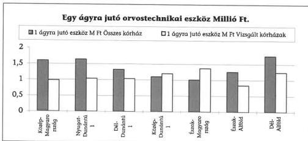

A vizsgált kórházak összetétele befolyásolja a minta értékeit, ezért van eltérés a régiónkénti és a vizsgált kórházak átlaga között.

**A kórházak a minimumfeltételeknek az építészeti, a tárgyi és a személyi feltételek vonatkozásában sem tudtak eleget tenni**, ezért többnyire csak ideiglenes működési engedéllyel rendelkeznek (pl. a minimumfeltételek teljesítéséhez a fővárosban 6,3 milliárd Ft, a kaposvári kórházban 2,7 milliárd Ft, a szekszárdi kórházban 1,3 milliárd Ft, a tatabányai kórházban 1,5 milliárd Ft igényt jeleztek). A minimumfeltételek többszöri módosítását követően sem került sor olyan adatbázis létrehozására, amely a hiányok objektív felmérését lehetővé tenné.

A minimumfeltétek között előírt létszám biztosítása is gondot jelent, főként az orvosi hiányszakmák ill. egyes esetekben az ápoló személyzet területén. A pénzügyi likviditási zavarok miatt az intézmények többsége létszám csökkentésre kényszerült, miközben a minimumfeltételekhez képest jelentős a hiányzó létszám (pl. Tatabányán 53 orvos és 157 ápoló hiányzik az előírt hoz képest). A tárgyi és személyi feltételek valós hiánya azonban csak a betegellátás szükségleteivel összhangban ítélhető meg reálisan.

Dunaújvárosban eredetileg 555 ágyas, 4 alapszakmás kórház fejlesztését követően 1999. évben már 834 ágyon 28 klinikai osztályon üzemelt a kórház, az aktív osztályokon az ágykihasználtság csupán 71,3%-os volt. Az aktív osztályokon 74 orvos (az orvos létszám 46%-a), 200 fő szakdolgozó, a krónikus osztályokon további 8 orvos és 40 nővér hiánya volt kimutatható a minimumfeltételekben előírtakhoz képest.

#### 1.4. A fejlesztések illeszkedése a szakmapolitikai célokhoz

Az egészségügy társadalombiztosítási finanszírozásának bevezetése megbontotta a finanszírozás egységét: a **többcsatornás finanszírozási rendszerben a működtetésre az E Alap költségvetése biztosít fedezetet, a fejlesztés és a felújítás viszont a tulajdonosok feladata.**

Az önkormányzatok az egészségügyi ellátás fejlesztésére normatív támogatásban nem, de egészségügyi feladataik ellátásához indokoltnak tartott és az Or-

19

---

II. RÉSZLETES MEGÁLLAPÍTÁSOK

szággyűlés által elfogadott fejlesztésekre az éves költségvetési törvényben meghatározott összegű címzett- és céltámogatásban részesülnek.

Címzett támogatásból az elmúlt évtizedben a megyei kórházak többségében került sor valamilyen mértékű rekonstrukcióra (pl. Veszprémben 7,6 milliárd Ft, Székesfehérváron 7 milliárd Ft, Szekszárdon 5 milliárd Ft, Tatabányán 2,5 milliárd Ft, Zalaegerszegen 2,1 milliárd Ft). A vizsgált években a 39 önkormányzati egészségügyi intézmény felújítással egybekötött fejlesztésére 30 milliárd Ft címzett támogatás szolgált, ebből 2000. évben is folytatódik a gyulai, nyíregyházi, salgótarjáni, miskolci, kaposvári megyei kórházak, a fővárosi Uzsoki utcai és Szent Imre kórház rekonstrukciója. 17 kórház folyamatban levő (17 milliárd Ft címzett támogatás) telephely, műtő, diagnosztikai tömb illetve egyes osztályok rekonstrukciója nagyobb részt befejeződik. Új induló beruházás 6 intézménynél 5,4 milliárd Ft címzett támogatással került jóváhagyásra 1999. évben.

Egyes kórházak rekonstrukciója megfelelő előkészítés hiányában nem a tervezett időben fejeződik be, valamint a várható többletköltségek fedezete gondot okoz.

A szekszárdi kórház 1994. évi indítással új műtő és diagnosztikai tömb építéséhez 2 milliárd Ft címzett támogatásban részesült, amelyet menetközben 4,7 milliárd Ft-ra módosítottak. Ezen túl az EüM központi támogatási keretéből orvostechnológiai berendezésekre 1998. évben 550 millió támogatást biztosított. A létesítményt az eredeti tervek szerint 1997. X. 1-én kellett volna üzembe helyezni. A beruházás orvostechnológia kialakítására 1 milliárd Ft kiadást tartalmaz, amelyet fővállalkozó által felkért szakértő 3,5 milliárd Ft-ra emelt. A különbséget az önkormányzat címzett támogatásból igényelte, azonban azt a Kormány nem támogatta.

A fővárosi Uzsoki utcai Kórház sebészeti pavilon építésének tervezett befejezési határideje az engedélyokirat módosításával összhangban 2000. december 31. helyett várhatóan 1 évet késik. A használatba vételt követően az alapterület, a kubatúra, a komfortosítás, a hotelszolgáltatás színvonalának növekedése miatt - 1994. évi árakon - 110 millió Ft működési költség növekedést prognosztizáltak.

**A fejlesztések nem mindig kapcsolódtak meglevő szakmapolitikai elképzelésekhez.** A döntések során a tulajdonosok lakossági igényekre hivatkozó érvelése volt az elsődleges szempont, nem kapott kellő hangsúlyt a működtetés többletforrásai meglétének vagy az indokolt ellátási szükségleteknek a vizsgálata.

A Komárom-Esztergom Megyei Önkormányzat Szent Borbála Kórháza (Tatabánya) jelentős címzett támogatással megvalósuló új pavilon építése mellett a másik megyei fenntartásban lévő - de Esztergom város tulajdonát képező - Vaszary Kolos Kórháznál (Esztergom) is címzett támogatásos rekonstrukcióra került sor (a város pályázata alapján). A párhuzamos fejlesztés nincs összhangban a megyei fekvőbeteg-kapacitási igényekkel, mindkét kórház teljesítményei elmaradnak az átlagos szinttől.

**Az építési beruházásokat előnyben részesítő fejlesztési programok következményeként a kórházi ágy-kapacitás növekedett, de ezzel együtt nem minden területen javult a kórházak műszerállományának korszerűsége, a hotelszolgáltatások színvonala.** A megvalósult kórházfejlesztésekben további problémát jelentett, hogy **elsősorban az aktív**

20

---

II. RÉSZLETES MEGÁLLAPÍTÁSOK

ellátás kapacitása bővült, miközben a szociális ellátórendszer kiépítetlensége miatt elsősorban krónikus, ápolási részlegekben van hiány.

Az információ-technológiában bekövetkezett gyorsütemű fejlődés pénzügyi feltételei általában nem voltak biztosítottak. A korszerű informatikai rendszerek kiépítésének hardver és szoftver igénye - kórház mérettől függően - több száz millió Ft beruházást indokolna, amelyre jelentősebb kórház-rekonstrukciók során sem volt forrás biztosítva.

A székesfehérvári kórházban 1995. év végén befejeződött a címzett támogatásból megvalósuló 7 milliárd Ft-ot meghaladó összegű rekonstrukció, de elmaradt az informatikai rendszer kiépítése.

A kórházi informatikai fejlesztés szükségességének indokai között az orvosi, finanszírozási, kórházvezetési módszerek változásai egyaránt megtalálhatóak. Az információigény növekedésével járt a finanszírozási rendszer reformja is. A kórházak adatszolgáltatási kötelezettségének számítógépes adathordozón történő teljesítését előíró jogszabályok feltételezik a megfelelő informatikai eszközök meglétét.

Az információ-technikai eszközök és programok beszerzése sok esetben egyedi felhasználói igényeken alapult, a kórházak egy része nem rendelkezett informatikai fejlesztési koncepcióval, tervvel sem.

Kedvező helyzetbe kerültek azok a kórházak, amelyek 91 millió USD-ral egyenértékű Világbanki kölcsönből és hazai költségvetési támogatásból 1996. évben kezdődő és 2000. évben záródó Kórházvezetést Támogató Informatikai Rendszerfejlesztés (KTI) program keretében sikerrel pályáztak.

A vizsgált kórházak közül e program keretében az információs rendszer fejlesztéshez a Szent János Kórház 162 millió Ft, a debreceni kórház 204 millió Ft, a nyíregyházi kórházcsoport 200 millió Ft, a szombathelyi kórházcsoport 281 millió Ft támogatásban részesült.

A program célja a szakmai és a gazdasági adatok összekapcsolásával, azok egyszeri bevitelével és gyors továbbításával integrált adatfeldolgozási rendszer és a kórházcsoportoknál közös adatbázis kialakítása volt. A program elhúzódó lebonyolítása, a szállítók késedelme, esetenként a készre jelentett rendszer használatbavételével kapcsolatos problémák miatt a jelentős költséggel megvalósuló fejlesztések 1999. évben még nem hasznosulhattak, a rendszerek működésének eredményessége a vizsgálat időpontjában nem volt ellenőrizhető.

A fővárosi Szent János Kórházban az eredetileg tervezett 1999. augusztusi befejezés helyett a program 2000. január 31-én került lezárásra. A nyíregyházi megyei kórházcsoport részére a szoftverek egy része a vizsgálat időpontjáig nem került leszállításra, így a tesztelést sem tudták elkezdeni. A debreceni kórházban a rendszer kiépítése 1999. június hónapban befejeződött - a gazdasági alrendszer moduljaival kapcsolatos alkalmassági aggályok, és a gazdasági vezetésben történt személyi változás következtében - a teljes körű használatba vétel azonban a vizsgálat időpontjáig nem történt meg.

21

---

II. RÉSZLETES MEGÁLLAPÍTÁSOK

A központi támogatásban nem részesült **kórházak többségénél önerőből kellett az informatikai rendszer kiépítését megoldani**, beruházási pénzeszközök hiányában különböző lízing, bérleti szerződések megkötésére kényszerültek.

A Heim Pál Kórház a számítástechnikai eszközök 50%-át és a szükséges programokat bérli, így az üzemeltetés 1998. évben 50 millió Ft-ba, 1999. évben 57 millió Ft-ba került. A tatabányai kórház havi 4 millió Ft-ot, az újpesti kórház havi 3 millió Ft-ot fizet ki rendszerüzemeltetésért. A dunaújvárosi kórházban tartós bérlet formájában kívánják az informatikai rendszert kialakítani, de a kiépítésben jelentős késedelem van.

### **A számítástechnikai fejlesztések miatt több intézmény hitel, illetve visszatérítendő támogatás felvételére kényszerült.**

A Péterfy S. u. Kórház a saját forrásból megvalósított 52 millió Ft-os fejlesztés mellett 1999. évben 200 millió Ft kölcsönt vett igénybe az egységes informatikai rendszer kialakítására a tulajdonos önkormányzattól. Különböző nagyságrendű összegekkel szintén visszatérítendő támogatásból történik a fejlesztés a fővárosi Uzsoki u., a Szent István, a csepeli és a miskolci megyei kórházban.

Az informatikai rendszer kialakítása, fejlesztése során a kórházak döntően saját szakembereikre illetve a tanácsadó, forgalmazó cégekre támaszkodhattak. Az egészségügyben alkalmazott számítógépes programok, rendszerek jelenleg minőségi ellenőrzés nélkül kerülnek forgalmazásra. **Az egymástól függetlenül működő, különböző adatstruktúrákat használó rendszerek közötti kapcsolat nem teremthető meg. A kórházak, bár erejükhöz képest sok pénzt áldoztak informatikai fejlesztésre, ma sem rendelkeznek integrált, jól működő informatikai rendszerekkel.** A legkülönbözőbb technikai megoldások születtek, számos program kerül alkalmazásra a kórházaknál. Nem szabványosított az információs végtermék. Központilag meghatározott egészségügyi rendszerszabványok, egységes adatstruktúrák, adatbázismodellek hiányában nincs megfelelő támpont sem a szabványosításhoz.

**A különféle egészségügyi fejlesztések működési többletköltségének előirányzata utoljára 1993-ban szerepelt a gyógyító- megelőző ellátások költségvetésében.** Ugyanakkor újabb igények, követelések generálódtak, új módszerek, eljárások kerültek bevezetésre és alkalmazásra úgy, hogy azok várható költségigénye nem került meghatározásra, illetve a szükséges többleteket nem biztosították a költségvetésben. A beruházások üzembe helyezése sem járt országos kasszanöveléssel, de az ezek révén megnövekedett orvosi teljesítmények súlyszám és pontszám növekedésként megjelentek az ellátórendszer teljesítményében.

**A fejlesztések, a gépek-berendezések pótlásának egy része intézményi finanszírozásból valósult meg,** részben saját bevételek, részben működési források terhére. **A működési források beruházási célra történő felhasználását 2000. évig tiltották a jogszabályok. A tiltás megszűnt, de többletforrás nem került a költségvetésbe, így az alapprobléma - hogy a beruházások a működés pénzügyi feltételeit szűkítik - érdemben nem változott. Az amortizáció hiánya, az önkormányzati**

22

---

II. RÉSZLETES MEGÁLLAPÍTÁSOK

**támogatás esetlegessége az intézmények tervszerű eszközpótlását, fejlesztését gátolja.** Ugyanakkor a meglévő eszközök kapacitás kihasználtsága (pl. laborautomaták) egyes kórházaknál nem megfelelő. (Az egészségügyi gép- műszer gazdálkodással kapcsolatos ÁSZ vizsgálat tapasztalatai ezt részletesen alátámasztják.)

## 2. AZ EGÉSZSÉGÜGYI ELLÁTÁS IRÁNYÍTÁSA ÉS FINANSZÍROZÁSA

### 2.1. Az egészségügyi szakellátás reformja

Az egészségügy egy évtizede elkezdődő reformfolyamatában **célként fogalmazódott meg egy, a lakosság egészségügyi szükségleteihez méreteiben, szerkezetében és területi elhelyezkedésében jobban igazodó, a forrásokat hatékonyan felhasználó és gazdaságosan működtethető ellátórendszer kialakítása**, amelynek kiadásai összhangban vannak a gazdaság mindenkori teljesítőképességével. A célok eléréséhez szükséges tennivalók az egyes részterületeken eltérő konkrétsággal fogalmazódtak meg.

A megvalósításban hangsúlyt kapott a fokozatosság elve, ez azonban többször a koncepció egyes elemeinek tisztázatlanságát takarta. Nem történt meg az egyes fokozatokhoz tartozó feltételrendszer meghatározása, az átmenetinek szánt intézkedések hatásának összevetése az eredeti célokkal, a változások ütemének a megtervezése.

A szakellátás reformja a **teljesítményarányos finanszírozás** 1993. július 1-i bevezetésével kezdődött. Szükségszerűvé vált és azonnali megoldást igényelt a finanszírozás olyan átalakítása, amely megteremti az E. Alap védelmét, biztonságát, ennek érdekében zárt kasszarendszer került létrehozásra, amelyben az elosztás az intézményi teljesítmények arányában történik.

A finanszírozás átalakításának meghirdetett célja a ráfordítások hatékonyságának növelése volt. **Azt várták, hogy a teljesítményektől függő bevétel a tényleges szükségletekhez való jobb alkalmazkodásra, a működés racionalizálására készteti az intézményeket, és így spontán módon megvalósul az egészségügyi ellátórendszer kívánatos átalakulása.**

**A teljesítmények mérésére kialakított arányszámok** (HBCS súlyszámok, WHO kódokra épülő pontszámok) **induláskor nem tükrözték** a valósághoz híven az **ellátások, esetek költségarányait**, azok eltérő bonyolultságát. Ezért jelentős szerepet kaptak a különféle “kiegyenlítési technikák” a teljesítmények alapján számított **bevételek kiegyenlítése** (saját alapdíjak, garantált minimumok, szakmai és intézményi szorzók) viszont **konzerválta a régi struktúrát**, az intézmények pénzügyi pozícióinak múltból gyökerező eltéréseit is. A finanszírozás átalakítási folyamata így az elosztási technika változását jelentette és nem haladt előre a normatívitás, a távlatilag a szolgáltatások vásárlására alkalmas árak kialakítása felé. A felosztható források reálértékét sem sikerült megőrizni, 1995-96. évben elkerülhetetlenné vált a finanszírozható kapacitás kialakítása érdekében a korábbinál direktebb beavatkozás.

23

---

II. RÉSZLETES MEGÁLLAPÍTÁSOK

**A lakosság egészségi állapotának romlása**, a reform korábbi szakaszában **elhalasztott döntések miatt az egészségügyben kialakult feszültségek**, ezek között az egészségügyi dolgozók bérhelyzete, a kórházak eladósodása a **szaktárcát a reform továbbgondolására késztette**. Az 1999-2000. évben elkészült tervezetek a döntés-előkészítéshez adnak széles körű áttekintést, a megoldás módjait illetően azonban nem tükröznek konszenzust.

**A reformmal kapcsolatos elképzelésekben nem kap megfelelő hangsúlyt az önkormányzatok tulajdonában levő egészségügyi intézményekkel kapcsolatos ágazati, szakmai irányítás kérdése.** Az egészségügyi ellátás kapacitásának tervezése, szabályozása, a szakmai céloknak megfelelő beruházás-politika az állam fokozott szerepvállalását, az önkormányzati és az állami feladatok tisztázását, szétválasztását indokolná és **nincs átfogó koncepció az egészségügyi intézmények eladósodásának felszámolására**.

Az egészségügyről szóló 1997. évi CLIV. törvény szerint az Országgyűlés által elfogadott és 4 évenként felülvizsgált Nemzeti Egészségfejlesztési Program (NEP) az egészségügyi tervezés alapja, az ebben foglaltakat a gazdaságpolitika, a terület- illetőleg településfejlesztés, valamennyi állami tervezés körébe tartozó döntés meghozatala illetőleg végrehajtása során érvényre kell juttatni. **A lakosság egészségi állapotának bemutatása mellett a megvalósítani kívánt egészségfejlesztési, egészségvédelmi célokat, az ehhez szükséges eszközöket, pénzügyi forrásokat is a programban kellene meghatározni.**

Az EüM 1999. évben elkészített tervezete szerint **az elmúlt évtizedben döntően az ellátórendszerben és annak finanszírozásában hajtottak végre változást. A lakosság rossz egészségi állapotában megmutatkozó eredménytelenség miatt szemléletváltásra van szükség az egészségügyi reform területén is.** A lakosság egészségben töltött életéveinek növelése érdekében a tervezet, az egészség-magatartást befolyásoló tényezők mellett felsorolja az egészségügyi ellátórendszer fejlesztésének, valamint struktúrájának, hatékonyságának javítását célzó intézkedéseket. A Kormány a helyszíni vizsgálat lezárásáig nem terjesztette be a NEP-re vonatkozó törvényjavaslatot.

## 2.2. Az egészségügyi ellátórendszer kapacitás szabályozása

Az egészségügyi ellátó rendszer meghatározó intézményei a kórházak, amelyek az egészségügyi szakdolgozók több mint 40%-át foglalkoztatják, s a gyógyító-megelőző ellátások TB támogatásának 82%-ával gazdálkodnak.

**A munkaerőnek, a forrásoknak kórházakban történő koncentrálódása hozzájárult az alapellátás, a megelőző orvoslás, az ápolási otthonok, a rehabilitáció fejlődésének elmaradásához.**

Az európai országokkal összehasonlítva Magyarországon viszonylag kevés a kórházak száma, viszont a kórházméret meghaladja a fejlett országokét.

24

---

II. RÉSZLETES MEGÁLLAPÍTÁSOK

Magyarországon 1 kórházra jutó ágyak száma 1999. évben 497, ezzel szemben a fejlett országokban pl. Egyesült Királyságban 187, Németországban 216, Franciaországban 137, Belgiumban 225. A kórházméreten belül jelentős a szóródás: az átlagos ágyszám a városi kórházakban 390, a fővárosi kórházaknál 797, a megyei kórházaknál 1169, az egyetemi klinikákon 1598.

Az egészségügyi ágazat munkaerő helyzete meghatározó a kapacitások összetételében is. Hazánkban szakorvosból 1000 lakosra 2,7 jut, az OECD országok átlaga 1,3. Ezzel összhangban az aktív ágyak száma 1000 főre 5,8 (az OECD országokban 4,4), ápolási otthonból azonban 1000 főre nálunk csak 1 ágy jut (az OECD országok 2,4 átlagához képest).

A TB Alapok éves költségvetéseiben a gyógyító- megelőző ellátások finanszírozására tervezett előirányzatok - különösen 1995-97. között - nem követték az inflációt és nem voltak alkalmasak az ágazat bérelmaradásának felszámolására. A források szűkössége a finanszírozási szabályok indokolt változtatását (egységes alapdíj, HBCS újra normázása) is akadályozta, növelve az ágazaton belüli feszültséget. Nyilvánvalóvá vált, hogy a egészségügy szereplői által is **túlméretezettnek, struktúrájában korszerűtlennek ítélt egészségügyi ellátórendszer átalakítására a teljesítményarányos finanszírozás önmagában nem lehet alkalmas. Elkerülhetetlenné vált a kapacitás-szabályozás érdekében a közvetlen beavatkozás.**

A népjóléti tárca és az OEP két-két képviselőjéből álló szakmai bizottság az 1995. évi LXXIII. törvény 10. §-ában kapott felhatalmazása alapján a szerződéskötéseket megelőzően felülvizsgálta az intézményi kapacitásokat. A 'négyes bizottság' tevékenysége eredményeként a szerződés szerinti ágyszám az 1995. októberi szerződéskötés során 10750-nel csökkent, amelynek (az ÁSZ az 1995. évi zárszámadás vizsgálat során állapította meg) mintegy háromnegyed része ténylegesen nem működött, így igazi kapacitás csökkentésre, amely az ellátás költségeit mérsékelte volna, nem került sor.

Az 'ágy' fogalma a finanszírozás átalakítása során elvesztette mind szakmai, mind pénzügyi tartalmát. Gyakorlatilag - a hozzá kötődő személyi, tárgyi, technikai feltételek meghatározatlansága miatt - sem a kiadások és (bizonyos határig) a bevételek szempontjából nem volt meghatározó jelentősége az ágyszám alakulásának.

A kapacitás csökkentés első fordulója egy **alkufolyamat volt, a döntésekhez hiányzott a regionális szintű szakmai háttér és az intézmények objektív szakmai minősítése.**

Az elérendő célállapot sem a szükségletek oldaláról (ellátási normatívák hiánya) sem a finanszírozás oldaláról nem volt pontosan meghatározható. Az esetleges megtakarítás a finanszírozás adott rendszerében nem a biztosítónál, hanem az intézményeknél keletkezhetett volna.

A kapacitás szabályozás második - az 1996. évi szerződéskötések során érvényesülő - fázisát megelőzően a népjóléti kormányzat az egészségügyi ellátási kötelezettségről és a területi finanszírozási normákról szóló 1996. évi LXIII. törvény előterjesztésével formailag megteremtette a szabályozás objektív törvényi feltételeit. Ezzel egyidőben a 19/1996. (VII.26.) NM rendeletben kerültek meg-

25

---

II. RÉSZLETES MEGÁLLAPÍTÁSOK

határozásra az egészségügyi szolgáltatást nyújtó intézmények szakmai minimumfeltételei.

A végrehajtást nehezítette a két jogszabály nem kellő összhangja. Pl. a szakmai minimumfeltételek egyes esetekben a működés alapkritériumaként bizonyos kapacitás nagyságot (osztályos ágyszám) is előírtak, a teljesítés határidejét viszont fél évvel későbbi időpontban határozták meg, mint a szerződés kötését. Így értelmezési problémák merültek fel a szerződés kötésnél az ágyszámot illetően, esetenként csak jogfenntartó nyilatkozat aláírására került sor, amely a szerződött ágyszám szinte állandó változását idézte elő.

A kapacitás csökkentéssel összefüggésben létrejött megyei egyeztető fórumokon (MEF) viták alapjául szolgált, hogy a törvény a megyékre összevontan adta meg a finanszírozható ágyszámot, de meghatározta a szakmánkénti országos megoszlást is. A két kritérium együttes betartása megyei szinten a már kialakult munkamegosztás, több megyére kiterjedő területi ellátási kötelezettség miatt is gondot okozott. **A törvény a kapacitás szabályozását megyei keretek között határozta meg, nem sikerült a kezdetben szorgalmazott regionális szemléletnek érvényt szerezni.**

A szerződéskötés során az országos ágyszám további, mintegy 9 ezer db-bal csökkent és gyakorlatilag megfelelt a törvény előírásainak és néhány kivételtől eltekintve a szakmai megoszlás tekintetében is sikerült elérni az ott előírt arányokat.

A szakmai megoszlási arányok a fekvőbeteg ágyaknál a törvényben meghatározott tartományban alakultak, azonban néhány szakmában alig haladja meg a meghatározott minimális értéket, pedig a megbetegedési adatok szerint ezek iránt jelentős az igény. Pl. ideggyógyászat (stroke), onkológiai- szakmákban, ugyanakkor a hagyományos belgyógyászati, sebészeti szakterületeken az előírt felső határon van az ágyak aránya.

**A végrehajtás során kórház bezárásra** - a Fővárosi Önkormányzat Balassa J. Kórház és szülőotthonok kivételével - **nem, csak néhány telephely vagy részleg megszüntetésére került sor.** Több intézmény egyesült, néhány új krónikus intézmény is befogadásra került a finanszírozó részéről.

**Az ágyszám leépítés teljesítmény csökkenéssel nem járt együtt. A TB Alapok 1997. évi költségvetés tervezése során az előterjesztők 9 milliárd Ft megtakarítással számoltak.** A fekvőbeteg-kassza ilyen nagyságrendű csökkentése nem volt tartható, ezért pótköltségvetésben korrekcióra került sor.

A régiónként jellemző kapacitás- és teljesítménykülönbségek a vizsgált időszak egészében érvényesült. A kórházi ágyszám és teljesítmények régiónkénti alakulását a csatolt 2. sz. táblázat, fajlagos értékeit és területi eloszlását a 3-4. sz. táblázatok, a vizsgált kórházak ágyszámát, betegszámát az 5-7. sz. táblázatok mutatják be.

26

---

II. RÉSZLETES MEGÁLLAPÍTÁSOK

### 2.3. A finanszírozási rendszer átalakítása

**A szakellátások teljesítményarányos finanszírozásában a teljesítményeket** az 1993. évi reformot követően a járóbeteg-szakellátásban az egyes beavatkozások **WHO pontszáma**, az aktív fekvőbeteg-ellátásban **a homogén betegségcsoportok** (HBCS) súlyszám értéke, a krónikus fekvőbeteg-szakellátásban a **súlyozott ápolási napok fejezték ki**.

Annak érdekében, hogy elkerüljék az intézmények pénzügyi helyzetének ellátást veszélyeztető drasztikus megváltoztatását, a teljesítményalapú finanszírozás bevezetésekor az **országosan egységes díjtételek** (normativitás) **helyett** a fekvőbeteg-szakellátásban az intézmények **saját**, egymástól eltérő **alap- ill. napi díjait vették figyelembe**. A nagy szóródást mutató alapdíjakban (17-60 ezer Ft között szóródott a kórházak alapdíja) a kórházak eltérő szakmas-truktúrája, elismerhető költségigényessége mellett tovább hatott a bázisfinanszírozásban elért pénzügyi pozíciók különbözősége és az ellenőrizetlenül elfogadott 1992. évi bázisteljesítmények hatása. Az alacsonyabb alapdíjú intézmények részéről kezdettől fogva igényként fogalmazódott meg az indokolatlan eltérések megszüntetése, a normativitás irányába történő elmozdulás.

Ennek egyik legfőbb akadálya volt, hogy **a reform bevezetését követően elmaradtak annak továbbfejlesztését megalapozó intézkedések**. Nem teremtődtek meg a folyamatos, egységes szemléletű költségfigyelés módszertani, szabályozási és pénzügyi feltételei, hiányoztak a szakmai és gazdálkodási normatívák, az előbbiekkel összefüggésben nem került sor (csak 1997-ben először) az 1992-ben vitatható megalapozottsággal kialakított HBCS- rendszer átfogó revíziójára.

Ezek hiányában az intézmények alapdíjainak egy lépcsőben történő egységesítése nagyon is kockázatos lépésnek tűnt, amit az OEP- nél végzett modellszámítások is alátámasztottak. Egy ilyen intézkedés az intézmények között a működőképességet veszélyeztető forrásátcsoportosítást eredményezett volna.

Végül is **átmeneti megoldásra került sor**. A normativitásra való törekvés érdekében az aktív és a krónikus fekvőbeteg szakellátásban **1996. január 1-től** bevezetésre került a **havi teljesítmények arányában változó egységes alap- illetve napidíj**. Ennek hatását a krónikus ellátásnál teljes körűen, míg az **aktív ellátásnál a szakmai és intézményi szorzók** beépítésével csak részlegesen engedték érvényesülni.

A szakmai szorzókat átmenetileg, az általános súlyszám korrekció elvégzéséig kívánták érvényben tartani, az intézményi szorzó a progresszív ellátás szintjeinek eltérő költségigényességét volt hivatott kifejezni. A modellezés folyamatos konzultáció mellett valósult meg a NM, az OEP, az érdekképviseleti szervek részvételével, az erősebb érdekérvényesítő képességgel bíró szakmai csoportok is igyekeztek befolyást gyakorolni az egyes szakterületek tevékenységének anyagi elismerését meghatározó szakmai szorzók arányainak kialakítására. Erre az objektív döntésekhez elengedhetetlen sarokpontok hiánya, tisztázatlansága adott lehetőséget.

A 103/1995. (VIII. 25.) Kormányrendeletben leírt finanszírozási modell szerint az intézmények bevételeinek - változatlan teljesítmények esetén - garantáltan a szintrehozott bázis 90-120 %-os sávjában kell elhelyezkednie. A sávokat ké-

27

---

II. RÉSZLETES MEGÁLLAPÍTÁSOK

sőbb az egészségügyi dolgozók bérfejlesztésének növekményével megemelték, így az intézmények egyre jelentősebb része került az alsó korlát alá, és a kassza egyre nagyobb hányadát kellett kiegyenlítésre fordítani, ami az alapdíjak csökkenéséhez vezetett. A bérfejlesztésre szánt összeg ennek következtében teljesen véletlenszerűen oszlott meg a kórházak között, sem bérarányos, sem teljesítményarányos felosztása nem valósult meg, ami feszültséghez vezetett az intézmények körében.

A menetközbeni korrekciók miatt a bevezetéstől számított egy **éven belül összesen 5 ízben változott a finanszírozást leíró matematikai összefüggés**. Miután a kasszában rendelkezésre álló összeg gyakorlatilag állandó volt, a finanszírozási képlet változtatásával korrigálni kívánt anomáliák helyett azonnal újak keletkeztek.

**A bevételek kiszámíthatatlan, a teljesítményektől elszakadó folytonos változása jelentősen hozzájárult az egészségügyi intézményrendszer gazdálkodási problémáinak kialakulásához, a likviditási helyzet tartós romlásához.**

Az 1996. évi sikertelen nivellációs 'kísérlet' ellenére, illetve a tapasztalatokat értékelve a Kormány a nivelláció lépcsőzetes bevezetése mellett döntött. Az **1997. március 1. és 1998. március 1 közötti időszakban olyan kiegyenlítő finanszírozás került bevezetésre, amely fokozatosan, a jelzett határidőre biztosította az aktív fekvőbeteg szakellátás országosan egységes díjazásának elérését.**

**Új finanszírozási ciklus indult 1997. március 1-jével, amelyet megelőzött a HBCS teljes revíziója.** Miután ez a kódolási szabályok változását is magában foglalta, az új 3.0 verzió hatását pontosan nem lehetett modellezni. **A HBCS revízió célja a költségarányosság javítása, ezen belül a költségigényesebb szakterületek finanszírozási igényeinek elismerése volt.**

**Az alapdíj egységesítése továbbra is a progresszív ellátás magasabb szintjei felől az alacsonyabb szintek irányába történő jövedelemáramlást váltott ki, a korábbival ellentétes folyamatot indított el.**

A modellezést, a hatások értékelését a NM és az OEP és az érdekképviseletek folyamatosan figyelemmel kísérték és több szakmai fórumon vitatták meg. Az előzetes adatok azt bizonyították, hogy a 3.0 verzió hatására a teljesített súlyszámok összege országosan csökken, ami az alapdíjak emelésére ad lehetőséget. Az eszközigényes intézeteknél azonban nem kompenzálja teljesen a nivellációból adódó bevételkiesést, ezért a progresszív ellátásban résztvevő intézmények többlet ráfordításainak elismerése érdekében az előirányzatok 2%-át elkülönítették a TB költségvetésében, amelynek elosztásáról külön döntöttek.

A tényleges finanszírozási adatok szerint az egységes alapdíj az év folyamán 42 %-kal nőtt. Ugyanezen időszakban csökkent az országos intézetek (77%-ra), a gyermekkórházak, (87,8%-ra), a szakkórházak (90,4%-ra) alapdíja. Az átlagnál kisebb mértékben nőtt az orvostudományi egyetemek (103,9 %-ra), a megyei kórházak (110,9%-ra) és a fővárosi 1. kategóriába sorolt kórházak (102,7 %-ra) alapdíja. A korábbi 'szegényebb' városi 1,2,3. illetve fővárosi 2. kategóriába so-

28

---

II. RÉSZLETES MEGÁLLAPÍTÁSOK

rolt kórházak illetve a szanatóriumok esetében kedvező változást jelentett a díj kiegyenlítés.

A finanszírozási adatokból megállapítható, hogy az **1997. évi módosításokkal sem sikerült megfelelően kezelni a személyi és tárgyi feltételek szempontjából igényesebb ellátások finanszírozási problémáit** (gond az is, hogy szakmai és költségnormatívák hiányában nem lehet egyértelműen meghatározni a ráfordítások indokolt és elfogadható mértékét). A nivelláció ismét hangsúlyosan vetette fel **az amortizáció rendezetlenségének kérdését**, arra is rámutatott azonban, hogy az esetlegesen erre szánt forrásokat nem célszerű egyszerű kasszaemeléssel eljuttatni az intézményekhez.

Az 1996. évre visszanyúló finanszírozási problémák miatt az érdekképviseletek ragaszkodtak a bérfejlesztésre szánt összegek fix díjként való kifizetéséhez. A fix díjak forrását a kasszán belül különítették el, így többletforrást nem eredményeztek, a teljesítmény díjalapot csökkentették. Ezen túlmenően - nagyságrendjüknél fogva - alkalmatlanok voltak a változó bevételek és a közalkalmazotti tv. (KJT) miatti fix kiadások ellentétének feloldására.

Az 1998. áprilisi teljesítmények elszámolása során bevezetésre került az **egységes alap- és napidíj**. Ezzel **megszűnt az automatizmus, amely korábban biztosította, hogy a teljesítmények növekedése nem idézi elő a zárt kassza összegének túllépését**. (A teljesítmények és az 1 teljesítményegységre jutó finanszírozási összeg eddig fordított arányban változtak)

A finanszírozás stabilitása érdekében **1998. évben** a havi teljesítményingadozásokból származó különbségek kezelésére **kiegyenlítő keretet** hoztak létre, amelynek összege 2,3 milliárd forint volt. Az országosan egységes alapdíj összegét az OEP határozta meg a szakminiszterrel történt előzetes egyeztetést követően, amely az 1998. június 2-i közzétételekor az aktív ellátásban 56250 Ft, a krónikus ellátásban 2150 Ft volt.

A kórházi finanszírozás szabályai 1999. évben alapvetően nem változtak, sor került azonban a **HBCS 4.0 verziójának bevezetésére**. Ennek következtében kb. 15%-kal csökkent a súlyszámokban mért országos összteljesítmény. Megtörtént a HBCS-k újranormázása, az átlagos esetsúlyosságot kifejező case-mix index értékét 1,05-re sikerült csökkenteni. Hosszabb előkészítés után a szaktárca meghatározta azokat a progresszív ellátás magas szintjéhez tartozó - kiemelt súlyszámmal (csillagos HBCS) elismert - betegségcsoportokat, amelyek ellátására és elszámolására csak egyes kijelölt, megfelelő feltételekkel rendelkező intézmények jogosultak.

Az országosan egységes alapdíjat 1999. februárra vonatkozó kifizetéseknél 68500 Ft-ra, majd 1999 augusztustól 75500 Ft-ra emelték. A krónikus fekvőbeteg szakellátás napidíja ugyanezen időpontokban 2700 illetve 2800 Ft-ra emelkedett.

A pénzügyi utalás rendje a 43/1999. (III.3.) Kormányrendelet előírásai alapján megváltozott. A kiutalás időpontja már nem az előző hó 22.-e, hanem a tárgyhó 1-je lett, amelyet aztán ismét módosítottak és a kincstári körbe tartozó intézményeknél 2000. januárjától a tárgyhó 22-ére módosult. **Az utólagos kiutalás miatt egy havi forgótőkét vontak ki a rendszerből**. Ennek

29

---

II. RÉSZLETES MEGÁLLAPÍTÁSOK

következményeként a szállítói fizetési határidők kitolódása valamint a szállítói adósságállomány (ezen belül lejárté is) növekedése várható.

**A gyógyító-megelőző ellátásokra biztosított költségvetési források nagyságrendje meghatározó az ellátó rendszer bevételeinek alakulása szempontjából, de a finanszírozási szabályok módosulása is jelentős változásokat okozott az intézmények, intézménycsoportok bevételi pozícióiban.**

Az egészségügyi intézmények kiszámítható, átlátható finanszírozása ellen hatott a szabályok gyakori, sokszor éven belüli módosítása is, amelyhez párosult a teljesítmények előre nem tervezhető ingadozása is. Tekintettel arra, hogy a változásokat többletforrás nélkül kellett megoldani, - tehát nem az elmaradók felzárkóztatására került sor - így a jobb helyzetben levő intézmények pénzügyi helyzete is lényegesen átrendeződött, amely a pénzügyi egyensúlyi helyzet megbomlásához, a likviditási zavarok megjelenéséhez vezetett.

**Nem ismertek a különböző ellátások tényleges költségei, azok egymáshoz viszonyított arányai.**

Nem került kidolgozásra az egészségügy költségeinek egységes szemléletű kimutatására alkalmas számviteli rendszer, nem alakult ki megfelelő költségmegfigyelés. Csupán az intézmények egy részétől gyűjtöttek adatokat az egyes betegségcsoportok költségeire, amelyek egy része csak becslésen alapult, de a nagy számok törvénye alapján az aktív fekvőbeteg szakellátás egyes eseményeinek egymáshoz viszonyított költségarányainak kifejezésére megfelelőnek ítélték, azonban ennek gyakorlati kontrolljára nem került sor.

**Jelentős gond mutatkozik a szakmák közötti költségarányok mértékének meghatározását illetően.** A gyermekkórházak sérelmezik, hogy ugyanazon esemény ellátásért a felnőtt beteg esetében magasabb a teljesítményegység értéke, mint a gyermekeknél. Az intenzív, a szubintenzív, a traumatológiai ellátás valamint a röntgendiagnosztika magas ráfordításai a teljesítményegységek értékeiben nem tükröződnek vissza.

**Nem megoldott a progresszív ellátás magasabb szintjén történő betegellátás többletköltségeinek elismerése.** A teljesítményegységek ehhez nem elég differenciáltak, így ezek kezelésére egy elkülönített keretet hoztak létre az aktív fekvőbeteg szakellátás kasszájából, amit a finanszírozó meghatározott elvek szerint oszt szét az érintett intézmények körében.

A fixdíj megszüntetésével 1999. évtől teljessé vált a normatív alapon nyugvó teljesítményarányos finanszírozás, azonban ez a források elégtelensége miatt és a teljeskörű költségmegfigyelés hiányában továbbra sem a szolgáltatások tényleges költségén alapul. A normatívitás elvének teljes körű érvényesítésével szemben is jogos észrevételek merülnek fel, mivel az egyes intézmények működtetésének személyi és tárgyi feltételei különböző objektív okok miatt még most is igen eltérőek.

30

---

II. RÉSZLETES MEGÁLLAPÍTÁSOK

Azonos kapacitáshoz és teljesítményhez kötődően különböző a kapacitásegységekre vetített légköbméter mértéke, eltérő az infrastrukturális rendszerük, sőt még az energia és a közműdíjak sem egyeznek meg. Ebből adódóan nagyságrendi különbségek vannak ezen költségek vonatkozásában. Az intézmények ezeket a feltételeket nem tudják megváltoztatni, így elméletileg egyes intézetek a tényleges költségeknél több, míg mások kevesebb bevételhez jutnak.

**A teljesítmény alapú finanszírozási rendszerben a kórházi teljesítmények folyamatos emelkedése vált rendszeressé**, amelynek okai nem kereshetőek kizárólag - az amúgy európai összehasonlításban igen rossz - a lakosság egészségi állapotának változásában. Ebben a **szabályozási, érdekeltségi problémák, a megfelelő ellenőrzési rendszer hiánya is szerepet játszott**. Ezek az egyes időszakokban eltérően érintették az adatok megbízhatóságát. A vizsgált években a finanszírozási szabályok módosítása csökkentette az adatmanipulációk lehetőségét, pl.

- a TAJ számhoz kötött elszámolás bevezetése lehetőséget adott az események összekapcsolására, a garanciális szabály érvényesítésére (ugyanakkor rámutatott, hogy az informatika fejlesztése nélkül a megnövekedett adatszolgáltatási igényeknek az intézmények egy része csak nehezen tud eleget tenni),
- az osztályos áthelyezett esetek új kórházi esetként történő dokumentálásának, kórházi eltávozást követően az ismételt felvétel lejelentésének megakadályozását célozta az un. garanciális szabály bevezetése (ugyanakkor a több szakmás megyei kórházak esetében nagyobb az esély arra, hogy a kórházi elbocsátást követően az alapbetegségtől függetlenül ismételten ellátásra szoruljon a beteg, de gyakori a szakmai érvek alapján indokolt visszavétel a gyermek kórházaknál is).

**Emellett nem jött létre a reformkoncepcióban kiemelt fontossággal bíró komplex ellenőrzési hálózat, nem tisztázódott az ellenőrzésben közreműködő szervezetek kompetenciája, hiányoznak a szakmai ellenőrzés lefolytatásához szükséges protokollok.**

A Népjóléti Minisztérium által 1997. évben indított ellenőrzési projekt keretében 34 kórháznál orvosszakmai felülvizsgálatra került sor, amely intézetenként változó nagyságrendű (2 esetében 20% feletti, 4 esetében 10% körüli, 12 esetében 5-10% körüli, 16 esetében 5% alatti) hibás tételt tárt fel. A nem elfogadható teljesítmények után kifizetett összeg becsült nagysága több mint 6,88 milliárd Ft volt.

A vizsgált kórházak közül 20-nál 1998. évben az ellenőrzések alapján 173 millió Ft visszavonására került sor, amely összeg intézményenként 38,4 millió Ft és 109 E Ft között szóródott.

## 2.4. Az önkormányzatok fenntartói tevékenysége

**A tulajdonost, illetve fenntartót terhelő** legfontosabb kötelezettségek az alapítással, az intézmény működését szabályozó dokumentumok jóváhagyásával, a személyi és tárgyi feltételek biztosításával, a működés folyamatos felügyeletével és ellenőrzésével, a vezetői struktúra alakításával, a vezetők feletti munkáltatói jogok gyakorlásával kapcsolatosak. **A széles körű kötelezettségek teljesítéséhez szükséges feltételrendszer azonban az önkormányzatoknál nem teremtődött meg. A fenntartók a kórházak gaz-**

31

---

II. RÉSZLETES MEGÁLLAPÍTÁSOK

**dálkodásának érdemi befolyásolásához szükséges információkkal, továbbá a tárgyi feltételek biztosításához megfelelő anyagi eszközökkel nem rendelkeznek.** Az információhiány főként a költségvetési előirányzatok, illetve a kórházakban folyó szakmai tevékenység meghatározása és a kettő összhangjának megteremtése terén volt tetten érhető, míg a fejlesztési források elégtelensége a gép-műszerállomány pótlása terén okozott gondot.

### 2.4.1. Az irányító, ellenőrző feladatok ellátása

A fenntartók az intézményeiknél folyó szakmai, gazdasági tevékenységet, a nyújtott szolgáltatások színvonalát leghatékonyabban a gazdálkodási keretek, költségvetési előirányzatok meghatározásával tudják befolyásolni. A kórházak esetében az önkormányzatoknál ez az eszköz nem áll rendelkezésre, mivel a költségvetési előirányzatok nagyságrendjét alapvetően a társadalombiztosítástól kapott összegek határolják be. **A tulajdonosnak viszont nincs ráhatása, de az esetek többségében rálátása sem a biztosítótól származó bevételek alakulására,** azok belső tartalmára. Legfeljebb az intézmények adnak tájékoztatást a finanszírozásban bekövetkezett változásokról, az OEP által elvont, illetve előlegként kiutalt összegekről. **Az elkölthető pénzek nagysága emellett alapvetően a ténylegesen realizált bevételektől és nem a költségvetési előirányzatoktól függ.** Ily módon a kórházak költségvetési előirányzatainak meghatározása, módosítása egy kötelezően előírt formális aktussá vált.

**Az önkormányzatok és hivatalaik az irányító, ellenőrző munkához többnyire nem rendelkeznek olyan szakembergárdával, amely képes lenne megítélni a kórházakban folyó szakmai tevékenység tényleges színvonalát, gazdasági kihatásait, mérlegelni a feladatellátás és a gazdálkodás kölcsönös összefüggéseit. Ilyen módon a tulajdonosi ellenőrzések sem nyújtottak kellő információt a törvények által biztosított jogosítványok gyakorlásához,** a kapacitások és feladatstruktúrák meghatározásához, a kialakult pénzügyi helyzet kiváltó okainak mélyreható elemzéséhez, a gondok végleges orvoslását jelentő intézkedések megtételéhez.

**Az önkormányzatok általában 2-3 évenként végeztek pénzügyi-gazdasági ellenőrzéseket a kórházaknál,** emellett különösen a pénzügyi gondokkal küzdő intézményeknél külön célvizsgálatokat is tartottak. Ezek keretében megfelelő mélységben és kellő alapossággal kérték számon a gazdálkodásra vonatkozó állami és önkormányzati előírásokat. A feltárt hiányosságok megszüntetésére a kórházak vezetőivel külön intézkedési terveket dolgoztattak ki. Az irányító tevékenységben azonban **e vizsgálatok csak kevésbé hasznosulhattak, mivel a gazdálkodás hatékonyságának, a szakmai és gazdasági tevékenység kölcsönhatásának minősítése rendre elmaradt.** Nem vizsgálták, hogy a kapacitások, az önkormányzatok által eldöntött fejlesztések, összevonások, telephely bezárások, vagy megszüntetések milyen hatással voltak a szakmai teljesítményekre, a lakossági igények kielégítésére, a kórházak pénzügyi helyzetére. Esetenként a pénzügyi-gazdasági ellenőrzés teljes hiányával, vagy a realizálási folyamat olymértékű elhúzódásával is találkoztunk, mely már a szabályszerűségi ellenőrzés hatékonyságát is veszélyeztette.

32

---

II. RÉSZLETES MEGÁLLAPÍTÁSOK

A vizsgált 24 önkormányzat közül 4 a fenntartásában működő kórházrendelőintézetnél pénzügyi-gazdasági ellenőrzést nem végzett (Győr-Moson-Sopron, Szabolcs-Szatmár-Bereg, Tolna megye és Gyöngyös város).

A fővárosi önkormányzat hivatalának revizori ügyosztálya által végzett ellenőrzésekről a jelentések rendszeresen késve készülnek el. A helyszíni ellenőrzés befejezését követően az elkészült vizsgálati jelentést a Károlyi Sándor Kórház vezetője 5-, a Szent Imre Kórház vezetője 6 hónappal később vehette át. Az utóbbi anyagot az Egészségügyi és Sportbizottság az átvételtől számított 3 hónap elteltével tárgyalta meg, s a hozott határozatot ezt követően küldte meg a kórház igazgatójának.

A kórházak pénzügyi gondjai általában ráirányították **az önkormányzatok** figyelmét a menedzsment tevékenységre. Gyakoribbá váltak a vezetők beszámoltatásai, a tevékenységük értékelése. A vezetési modell átalakításával, új pályázatok kiírásával, **az alkalmatlannak minősített vezetők leváltásával igyekeztek megteremteni a hatékonyabb intézményvezetés feltételeit.** A vezetői struktúrán leggyakrabban az egyszemélyi felelősség irányába változtattak, de volt példa a kollektívitás erősítésére is. Az intézményvezetéssel kapcsolatos hatáskörök összességében megfelelő gyakorlása ellenére előfordult, hogy a gazdálkodás szempontjából kulcsfontosságú vezetői munkakör betöltésére hatékony intézkedést nem tettek.

A Fővárosi Szent János Kórházban a kiéleződő pénzügyi-gazdasági problémák ellenére a gazdasági igazgatói munkakör két és fél évig betöltetlen volt. A tulajdonos csak szóban hívta fel a kinevezési jogkörrel rendelkező főigazgató figyelmét a munkakör betöltésének szükségességére.

### 2.4.2. Az ellátás tárgyi feltételeinek megteremtése

A kórházak pénzügyi helyzetét kedvezőtlenül befolyásoló **alapvető gonddá vált az elhasználódott eszközök pótlásához szükséges fejlesztési források hiánya.** Az egészségügyi ellátási kötelezettségről szóló törvény a tárgyi feltételek biztosítását, a tulajdonosok feladatává teszi. Az önkormányzati tulajdonban lévő kórházak nagy részét azonban azok a megyei önkormányzatok tartják fenn, amelyeknél felhalmozási célú pénzeszközök nem, vagy csak elenyésző mértékben képződnek. Miközben tehát **az önkormányzatokat törvény kötelezi a tárgyi feltételek megteremtésére, az ehhez szükséges forrásokat a költségvetési törvény nem biztosítja számukra.**

Az önkormányzatok **a kórházi betegellátás jelentős** – az amortizáció és a korszerű új eszközök megjelenése által indukált – **beruházási igényét kielégíteni nem tudják.** A kórházak e vonatkozásban döntően csak (cél-, címzett támogatások révén) az államra, illetve saját forrásaikra támaszkodhatnak. Több helyen előfordult, hogy a fenntartó önkormányzat a központi támogatáshoz szükséges saját forrásokat sem tudta biztosítani, s azt, vagy egy részét a kórházzal fizettette meg. Helyenként – saját erő hiányában – az önkormányzat a már megítélt céltámogatás lemondására kényszerült.

A Békés Megyei Önkormányzat fenntartásában működő gyulai kórházban 1999. évi kezdéssel, 350 millió Ft bekerülési költséggel fertőző és díszlokációs pavilon épül céljellegű decentralizált támogatással, melyhez 20 %-os saját forrás szükséges. Címzett támogatással és 10 %-os önrésszel – 1900 millió Ft-ból – új központi

33

---

II. RÉSZLETES MEGÁLLAPÍTÁSOK

orvosi ellátó tömb létesül. A két beruházáshoz szükséges 270 millió Ft összegű saját forrást az önkormányzat a kórház zárolt pénzmaradványából biztosítja.

A Budai Gyermekkórház új épületének 233 millió Ft-os beruházási költségéből az intézmény 55,6 millió Ft-ot vállalt magára, miközben az éves költségvetési előirányzata mindössze 428 millió Ft.

A debreceni megyei kórházban cél-, címzett támogatással megvalósuló beruházásokhoz a saját forrást a kórház és az önkormányzat 50-50 %-os arányban biztosította.

A Vas Megyei Önkormányzat Közgyűlése 1998. évben az egészségügyi gépműszer beszerzésre kapott céltámogatásból 35 millió Ft-ról azért mondott le, mert a szükséges saját erőt nem tudta biztosítani.

**A vizsgált önkormányzatok** vissza nem térítendő támogatás, a kórházi fejlesztéshez nyújtott önkormányzati önrész, illetve a saját pénzügyi bonyolításukban végzett beruházások révén **évente mintegy 6 milliárd Ft-tal támogatták kórházaikat, amely azok pénzforgalmi bevételeinek mindössze 3,6%-át tette ki.** A nagyságrend még abban az esetben is kevésnek bizonyulna, ha azok teljes egészében fejlesztési célokat szolgálnának. Ezek között azonban – a likviditási gondok miatt – növekvő arányú az általános célú, illetve működési feladatokra biztosított támogatás.

**Egyre terjed, hogy az önkormányzatok egy-egy kórházi fejlesztési feladat finanszírozásához visszatérítendő támogatásként biztosítják a forrást, de gyakori a működési célú ilyen átadás is. A pénzkölcsönzés e formája a működési források tekintetében szakmailag indokolható is, hisz a gyógyítás, betegellátás napi költségeinek finanszírozása nem önkormányzati feladat. A fejlesztési célú támogatások visszatérítési kötelezettségének előírása viszont indokolatlanul növeli a kórházak adósságállományát.**

A vizsgált kórházak az 1997. évben az önkormányzatoktól fejlesztési célra visszatérítési kötelezettséggel 56 millió Ft-ot kaptak. Az ilyen átadások összege 1999. évben 602 millió Ft-ra nőtt.

Összességében **a kórházak saját pénzügyi egyensúlyuk veszélyeztetése mellett sem jutottak megfelelő mennyiségben a gyógyításhoz szükséges orvosi gépekhez, műszerekhez.** A számvevőszék 1999. évben vizsgálta az önkormányzati intézmények – köztük a kórházak – gépműszerellátottságát. Az akkori megállapítás szerint az egyes kórházak műszerezettségének mértékében nagyfokú eltérések vannak. **A kórházak egy részében a műszerek átlagos használhatósági foka alacsony, s jelentős arányt képviselnek a teljesen ('0'-ig) leírt eszközök.** A vizsgálatot követő időszakban a helyzet érdemben nem változott, a kórházak növekvő összeget kénytelenek költeni az elhasználódott eszközök fenntartására, karbantartására, javítására.

A kecskeméti megyei kórházban a gépek, berendezések, felszerelések átlagos használhatósági foka 44 % és a '0'-ig leírt, de használatban lévő eszközök aránya meghaladja a 27%-ot. A debreceni megyei kórházban ugyanezek az adatok sorrendben 35 %, illetve több mint 25 %.

34

---

II. RÉSZLETES MEGÁLLAPÍTÁSOK

A fejlesztési források előteremtése szempontjából kedvező, hogy egyre több önkormányzat sikerrel pályázott a kórháza részére a különböző területi elosztású (céljellegű decentralizált, területi kiegyenlítési célú) forrásokra.

Ilyen támogatásban részesült – többek között – a nyíregyházi és a gyulai kórház.

### 2.4.3. A pénzügyi, likviditási gondok felszámolására tett intézkedések

Országosan azoknál a kórházaknál, ahol a lejárt szállítói tartozás 1996. szeptember 30-án meghaladta az E. Alapból származó 1995. évi tényleges bevétel 5%-át, az OEP egy előzetes szakértői vizsgálatot követően kamatmentes finanszírozási előleget nyújtott, összesen 38 kórháznak 3.994,7 millió Ft összegben. A konszolidációs előleggel kapcsolatos szerződés feltétele a kórházak stabilizációját szolgáló intézkedési terv elkészítése volt, amely az elképzelések szerint megfelelő garanciát jelentett volna arra, hogy a türelmi idő lejárta után (általában fél év) megkezdődő visszafizetés következtében (a TB támogatás 5%-áig) a betegellátás érdekei ne sérüljenek és újabb adósság ne keletkezhessen. Ennek érdekében az intézkedési terv végrehajtását és az intézmények aktuális pénzügyi helyzetét 1997. júliusától – a törlesztés befejezéséig – negyedévenként ellenőrizték.

**Az előleg nyújtása mindössze 6 intézménynél eredményezte a likviditási helyzet javulását**, a többi intézménynél az adósságállomány már 1997. és 1998. év során újra termelődött, és 12 intézménynél meghaladta az előlegnyújtás alapját képező adósság összegét.

A TB pénzügyi alapjai 1998. évi költségvetésében “működési költségelőlegkeret” és “önkormányzati kórházak csődjével összefüggő visszatérítendő támogatás” címén 1-1 milliárd Ft került jóváhagyásra, amelyet csak kevés esetben vettek igénybe (működési előleget csupán 3 intézmény 65 millió Ft, csődelőleget 6 önkormányzat 381 millió Ft összegben kapott, 1999. évben 4 intézmény részesült működési előlegben 189 millió Ft összegben, az önkormányzati kórházak csődjével kapcsolatos előlegkeret megszűnt).

Az egészségügyről szóló 1997. évi CLIV. törvény 142. §-a az állam feladatává teszi az egészségügyi ellátások működési fedezetének biztosítását, **a helyi önkormányzatok adósságrendezési eljárásáról szóló 1996. évi XXV. törvény módosításával az önkormányzati kórházak adósságainak rendezése – azok mértékétől és keletkezési okától függetlenül – az önkormányzatok feladatává vált.** Az intézkedés, kedvezőtlen fogadtatása ellenére jelentősen erősítette az önkormányzatok tulajdonosi szemléletét, azok az önkormányzatok is nagyobb figyelmet szenteltek az egészségügyi intézményeikre, ahol azok rentábilisan, alapvető pénzügyi gondok nélkül tevékenykedtek. Gyakoribbá vált a kórházi vezetők beszámoltatása és a pénzügyi helyzetet tükröző információk kérése.

A vizsgált önkormányzatok alapvetően helyesen szabályozták az intézményeiknél keletkező tartozások megfigyelésének rendjét, s **az önkormányzati biztosok kirendelésével, működésével összefüggő rendelkezéseket.** A vonatkozó helyi rendelet előírásainak **számonkérése, betartása** azonban

35

---

II. RÉSZLETES MEGÁLLAPÍTÁSOK

# **nem mindenütt volt következetes, az indokolt esetek több mint egyharmadánál a biztos kirendelésére nem került sor.**

Az ellenőrzött önkormányzatok 9 kórházba rendeltek ki önkormányzati biztost, 5 esetben pedig, bár az adósságállomány azt indokolta volna, a kirendelés elmaradt.

A székesfehérvári kórház 1998. év végi tartozása 275 millió Ft, s ebből a lejárt tartozás 115 millió Ft volt. Az ezt követő évben az összes tartozás rendre meghaladta a 400 millió Ft-ot, a lejárt szállítói számlák összege pedig 100 millió Ft-ot. Az utóbbi az 1999. évi III. negyedévétől kezdve 230-268 millió Ft között változott. Az önkormányzat részéről az intézmény likviditási helyzetének áttekintésére, az egyensúly helyreállítására intézkedés nem történt, önkormányzati biztost nem rendeltek ki.

**A kirendelt biztosok többsége a kórházakkal és fenntartóikkal együttműködve eredményesen oldotta meg feladatát** és a pénzügyi likviditási helyzetet stabilizálni tudta. Mindössze egy esetben (zalaegerszegi megyei kórház) fordult elő, hogy az önkormányzat olyan személyt bízott meg, aki a feladat ellátására alkalmatlannak bizonyult és a likviditási gondokat a külön megbízott szakértő szervezet javaslatai alapján kellett orvosolni.

A biztosok többsége szakértői szervezetet bízott meg a szakmai és gazdasági tevékenység átvilágításával, a szükséges intézkedési javaslatok kimunkálásával. Esetenként összeférhetetlenségre okot adó megbízások is történtek, melynek keretében a szakértői feladatokat az önkormányzati biztos saját cége látta el.

A Fővárosi Közgyűlés a Szent János Kórház adósságállományának felszámolására egy Kft-t bízott meg 1998. november 26-án, amellyel már korábban szerződéses jogviszonyban állt. Közgyűlési döntés alapján – meghosszabbították a cég megbízási szerződését, amelynek lejárata előtt – önkormányzati biztosként az átvilágító cég ügyvezetőjét jelölték ki. Ezt követően a kórház 1999. március 1-től újabb szerződést kötött a Kft-vel, amely a vizsgálatunk ideje alatt is ellátta e feladatot. (A kórház lejárt szállítói tartozása és önkormányzati hitele 1998. december 31-én 538 millió Ft volt, amely 1999. december 31-ig 369 millió Ft-ra mérséklődött.)

A szakértők, önkormányzati biztosok javaslatai **alapján a pénzügyi gondok orvoslására** a testületek külön intézkedési tervet fogadtak el, amelynek végrehajtásáról a beszámoltatás rendszeresen megtörtént. Alapvető gond azonban, hogy a **kiváltó okokat véglegesen megszüntető, tartós stabilitást eredményező intézkedések alig voltak, szinte kizárólag válságmenedzselés történt. Az OEP által folyósított konszolidációs hitelek, működési előlegek, az önkormányzatok által engedélyezett visszatérítendő támogatások csak a tartozás egyszeri rendezését tették lehetővé, a törlesztő részletek újabb feszültséget generáltak.** A bevételeket többnyire csak a kódolási tevékenység javításával sikerült növelni, a kiadások csökkentésére tett intézkedések pedig zömükben a megrendelések visszafogására irányultak, de érdemi megtakarításokat nem eredményeztek.

**A vizsgált önkormányzatok a pénzügyi gondokkal küzdő kórházaik számára 3 év alatt összesen 1.839 millió Ft működési célú támogatást biztosítottak, melyből 1.151 millió Ft-ot visszatérítési kötelezettséggel engedélyeztek.** A törlesztő részletek mellett **több fenntartó kamat-**

36

---

II. RÉSZLETES MEGÁLLAPÍTÁSOK

## **fizetési kötelezettséget is előírt, amely tovább drágította a segítségnyújtás e formáját.**

A Fővárosi Önkormányzat a csőd elkerülése érdekében 4 kórháza részére összesen 780 millió Ft működési kölcsönt nyújtott, melynek kamatait a folyósításkor hatályos jegybanki alapkamat mértékében határozta meg. A tőketartozás mellett így a kórházaknak összesen 287,2 millió Ft kamatot is meg kell fizetniük. Ezzel a fennálló problémát csak elodázni lehetett, a kórházak likviditási gondjai továbbra is fennmaradtak.

**A felgyülemllett adósságállomány, vagy egy részének hitelből történő kiegyenlítésével egyidejűleg nem születtek meg azok a hatékony racionalizáló intézkedések, melyek révén a további egyensúly megteremtése mellett a bevételi többletekből, vagy kiadási megtakarításokból a törlesztő részletek is előteremthetők lettek volna.** A már konszolidált kórházak egy része így ismét adósságcsapdába került.

A Szent István Kórház újbóli eladósodását döntően az okozta, hogy az 1996. évi részleges adósságkonszolidáció alkalmával az OEP visszatérítendő támogatást folyósított, s az a fennálló szállítói tartozások egy részére nyújtott fedezetet, nem kerültek rendezésre a milliós nagyságrendben felhalmozódott késedelmi kamatok. Hasonló okok vezettek a csepeli kórház újbóli eladósodásához is.

**A kötelezettségvállalások központosításával, illetve az osztályonkénti keretgazdálkodás bevezetésével kísérletek történtek a kiadások visszafogására, ezek azonban legfeljebb a gazdálkodási fegyelmet erősítették, tényleges megtakarításokat nem eredményezhettek,** mivel az indokolt kifizetéseket, ha külön vezetői engedélyhez kötötten is, de teljesíteni kellett.

A lejárt tartozásállomány csökkentése “leghatékonyabb” módjának a **szállítókkal** történő egyezkedések bizonyultak. A partnerkapcsolatban álló cégeket a kórházi csődeljárás, vagy a jelentős piac elvesztése érzékenyen érintette volna, ezért a **fizetési határidőkben** és a meg nem fizetés esetére kikötött késedelmi kamat nagyságrendjében **jelentős engedményekre kényszerültek.** Az érintett kórházak esetében **csaknem általánossá vált a 30, de nem ritka a 60 napos fizetési határidőkben történt megállapodás** sem. Ez a kórházak ellehetetlenülését megakadályozó, vagy késleltető intézkedés azonban a vállalkozások és a nemzetgazdaság számára egyaránt veszteségforrást jelent.

A tett intézkedések eredménytelenségét jelzi, hogy **vizsgálatunk 3 kórház esetében is megállapította az 1996. évi XXV. törvény szerinti adósságrendezési eljárás szükségességét. A polgármester illetve a közgyűlési elnök azonban** ezeket részben az önkormányzatok ellenérdekeltsége miatt, részben megfelelő információ hiányában **nem kezdeményezte.** Az önkormányzatok a helyi rendeletükben az önkormányzati biztos kijelöléséhez szükséges adatszolgáltatási igényt írták elő, ezek az információk azonban nem alkalmasak az adósságrendezési eljárási kötelezettség megállapításához.

A Komárom-Esztergom Megyei Önkormányzat fenntartásában működő tatabányai kórház lejárt szállítói tartozása 1997. január 1-jén 71 millió Ft, 1999. de-

37

---

II. RÉSZLETES MEGÁLLAPÍTÁSOK

cember 31-én 590 millió Ft volt, az esztergomi kórházé pedig 3 év alatt 3,7-szeresére emelkedett. Mindkét kórháznak folyamatosan volt olyan elismert tartozása, amelyet az esedékességet követő 90 napon belül nem egyenlítettek ki. A megyei közgyűlés elnöke ennek ellenére az adósságrendezési eljárás kezdeményezésére vonatkozó kötelezettségét elmulasztotta, önkormányzati biztos is csupán az esztergomi kórházba jelöltek ki.

A diósgyőri kórháznak 1998. december 31-én 21 millió Ft, 1999. december 31-én 100 millió Ft volt a 90 napon túli adósságállománya, az adósságrendezési eljárás kezdeményezése elmaradt.

### 2.4.4. Együttműködés a kórházfenntartók között

A felesleges, párhuzamos és gazdaságosan nem üzemeltethető kapacitások leépítését megkönnyítené, ha az intézményfenntartók között olyan érdemi együttműködés alakulna ki, amelyet a lakossági egészségügyi ellátás, leghatékonyabb módjának megválasztása motiválna. **Az eltérő tulajdonviszonyok, a helyi politikai, az intézményi és az érintett dolgozók egyéni érdekei azonban gyakran a racionalitás ellen hatnak. Csak elvétve tapasztaltuk ezért a fenntartók, vagy az intézmények szintjén megnyilvánuló együttműködési készség jeleit.** A kórházak egy része kihasználatlan kapacitásait a társintézmények részére végzett szolgáltatásokkal igyekezett lekötni, a lakosság érdekét is figyelembe vevő kapacitásátadásra a vizsgált körben csupán egy esetben került sor.

A Jász-Nagykun-Szolnok megyei- és a Csongrád megyei közgyűlés elnöke között létrejött megállapodás értelmében a szolnoki megyei kórház 14 ágy működtetési jogát átadta a Szentesi Területi Kórház számára azzal a feltétellel, hogy a Csongrád megyei közgyűlés kötelezettséget vállalt Kunszentmárton térsége mintegy 20 ezer fős lakosságának fekvőbeteg ellátására.

A helyi érdekeknek a megvalósítás lehetőségeit nem mérlegelő érvényesítésére példa a nagykőrösi kórházberuházás.

A városi kórház önállósága 1982-ben szűnt meg, ekkor egy 120 ágyas belgyógyászati osztályként beintegrálták a ceglédi kórházhoz. A létrejövő önkormányzati testület legfontosabb célkitűzésének a kórház “visszaszerzését” és rekonstrukciójának megkezdését tartotta. Ez a törekvés sikerrel járt, így 1991. január 1-től ismét önálló kórháza van a városnak. A tervbe vett rekonstrukció miatt azonban az önkormányzat számottevően eladósodott. A 9 éve folyamatban lévő és eddig 2,5 milliárd Ft-ba kerülő beruházáshoz az önkormányzat – ingatlanainak és értékpapírjainak elzálogosításával – 650 millió Ft hitelt vett fel, eredetileg 28 %-os kamatra. A tervezett beruházás teljes befejezéséhez azonban a pénzügyi fedezet még jelenleg sem biztosított.

A térségi, világbanki forrásokhoz történő hozzáférés reményében az egészségügyi régiókban létrehoztak egy-egy olyan szövetséget, amely továbbfejlesztve alapja lehetett volna a térségen belüli együttműködés kialakulásának, azonban a Kormány 1998. augusztusában törölte az egészségügyi szolgáltatások regionális fejlesztésének Világbanki programját.

Tolna, Somogy és Baranya megyék létrehozták a Dél-Dunántúli Regionális Egészségügyi Tanácsot. Feladatai között megfogalmazódott az egészségügyi ellátás

38

---

II. RÉSZLETES MEGÁLLAPÍTÁSOK

iránti szükségletek felmérése, a prioritások, fejlesztési irányok, közös ellátási standardok kialakítása, együttes pályázatok benyújtása.

Az Észak-Kelet Magyarországi régióhoz tartozó 3 megyei-, és három megyei jogú városi önkormányzat, 3 megyei kórház, valamint a Debreceni Orvostudományi Egyetem 6 millió Ft-os törzstőkével közhasznú társaságot hozott létre. Az együttműködést eredetileg a Népjóléti Minisztérium által kiírt pályázaton való részvétel lehetősége motiválta.

### 3. A VIZSGÁLT KÓRHÁZAK GAZDÁLKODÁSA, PÉNZÜGYI HELYZETE

#### 3.1. A kórházak gazdálkodásának jellemzői

**A kórházak költségvetési szervként működnek**, gazdálkodási tevékenységük rendjét az államháztartásról szóló, többször módosított, 1992. évi XXXVIII. tv. és az államháztartás működési rendjéről szóló 217/1998.(XII.30.) Korm. rendelet szigorú szabályai határozzák meg. A teljesítmény elvű finanszírozás és az egyre kiszélesedő privatizáció révén jelentkező **piaci hatások azonban olyan szemléletváltást igényelnének, amely nehezen egyeztethető össze a hagyományos, szigorú költségvetési gazdálkodás szabályaival.**

Míg a költségvetési szervek ugyanis előre megtervezett kiadási előirányzat és ahhoz igazodó, döntően fix összegű bevételből gazdálkodnak, **a kórházak bevétele a szakmai teljesítményektől függ, ezek határolják be a teljesíthető kiadások összegét is. A gazdálkodási cél tehát nem csupán az előre megtervezett költségvetési előirányzatok betartása, hanem a szakmai és gazdasági tevékenységnek a bevételek által behatárolt keretek között tartása.** A gazdasági döntéseket megelőzően a fedezet nélküli kötelezettségvállalások megakadályozásához az **előirányzatok figyelemmel kísérése helyett fontosabbá vált a likviditási helyzet, a pénzkészlet tényleges meglétének ismerete.** A privatizációs döntéseket megalapozó gazdaságossági számításokhoz pedig precízen ismerni kellene az adott feladat intézményen belüli ellátásának tényleges költségeit, azok összetevőit. Csak ezek ismeretében dönthető el, hogy van-e mód az intézményen belüli gazdaságosabbá tételre, avagy hatékonyabb megoldás a vállalkozásba adás.

A költségek pontos ismeretének hiánya miatt **az egyes résztvevényességek privatizációjával kapcsolatos döntéseket a gazdaságossági szempontok mellett számos más tényező motiválja.**

- A legfontosabb indíték a **tőkehiány.** A nagy értékű, jelentős beruházást igénylő elhasználódott diagnosztikai berendezések, műszerek pótlásához a fenntartók és az intézmények forrásai sem elegendőek. A kórházaknak viszont létérdekük, hogy a betegek kivizsgálása náluk történjen, hisz csak ez esetben bízhatnak abban, hogy gyógykezelésre is saját osztályukat veszik igénybe.
- A **közalkalmazotti létszám csökkentési igénye** főként a műszaki-gazdasági területek vállalkozásba adásánál meghatározó szempont. A köz-

39

---

II. RÉSZLETES MEGÁLLAPÍTÁSOK

vetlen betegellátástól távolabb eső funkciók esetében a foglalkoztatási, munkaszervezési gondoktól való mentesülés szándékai is fellelhetők.

- A dolgozók alacsony jövedelmi szintje az olyan típusú kényszervállalkozások megjelenését motiválja, amelyek célja a költségek leírhatóságának, és ezáltal a kedvezőbb adózási feltételek biztosítása (lásd ügyeletek „privatizálása”).
- Jelentős a külső ráhatás is különösen a járóbetegellátás egyes jól jövedelmező szakmáinak vállalkozásba adására. Ezek kiválása esetén pedig éppen a veszteséges tevékenységek kompenzálásának forrásait vesztik el az intézmények.

A kórházon belüli spontán módon megvalósuló funkcionális privatizáció, így számos olyan veszélyforrást hordoz, amely szükségessé tenné e tevékenység rendező elveinek meghatározását, szabályozott keretek közé terelését.

A kórházak számára a költségvetési szervek beszámolási és könyvvezetési kötelezettségéről szóló módosított 54/1996. (IV. 12.) Korm. rendelet által előírt módosított teljesítési (pénzforgalmi) szemléletű kettős könyvvitel vezetése kötelező. Ennek keretében a kórházak központi előírás alapján számos olyan információt állítanak elő, melyek legfeljebb a rájuk nem vonatkozó bázisfinanszírozás igényeit elégítenék ki, így azok – a saját gazdaságszervező munkájuk mellett – a központi tervezésben és a finanszírozásban sem hasznosulnak. A költségvetés szerkezeti rendjének megfelelő – a kórházak esetében indokolatlan részletezésű – kiadási tételek helyett a központi szervek számára is hasznosíthatóbbak lennének a gyógyítás költségeire, illetve az elvégzett vizsgálatok ráfordításaira vonatkozó adatok.

- A TB finanszírozás és azon belül az egyes kasszák előirányzatainak meghatározása ma a bázisalapú, illetve maradék elvű tervezés alapján úgy történik, hogy a közreműködők a gyógyítás tényleges költségeit nem, legfeljebb az adott célra előző években kifizetett összegeket ismerik. (A kórházak esetében a kiadás és a költség nem csak a készletváltozás, de a jelentős kifizetetlen tartozások miatt is eltér.)
- A rendelkezésre álló források kórházak közötti arányos elosztása, a finanszírozás alapjául szolgáló súlyszámok és pontszámok reális forintértékének meghatározása, a finanszírozás megfelelőségének minősítése szintén szükségessé tennék a költségek pontos ismeretét. (A pénzforgalmi szemléletű könyvvitelt alkalmazó kórházak szűk körében végzett reprezentatív felmérések nem pótolhatják ezt az igényt.)
- Az erőforrásokkal való hatékony gazdálkodás egyik alapkövetelménye lenne, hogy a kórházi döntéshozók az ellátandó feladatok egységeire bontva és minél részletesebben ismerjék meg a költségeket. Ezt az igényt leghatékonyabban a beteg szintű ráfordítások és bevételek számbavétele elégíthetné ki. Ezek ismeretében a költségek menet közben, azok felmerülését megelőzően befolyásolhatók lennének. Az osztályok ugyanis a gyógykezelés módjának meghatározása-

40

---

II. RÉSZLETES MEGÁLLAPÍTÁSOK

kor, a szakmai szempontok mérlegelése mellett, figyelembe vehetnék annak költségkihatásait. A betegek szintjére elszámolt ráfordítások és bevételek ismerete emellett hasznos információkat nyújthatna a stratégia alakításához is.

**A kórházakban a korszerű üzemgazdasági szemlélet sürgető általánossá válásának ma a legnagyobb gátja a pénzforgalmi szemléletű számvitel alapján előállított információk alkalmatlansága.**

A vizsgált önkormányzati kórházak többségénél érzékelték a költségek ismeretének szükségességét, ezért a legtöbb helyen **külön csoportot hoztak létre a tényleges felhasználások gyűjtésére, a költségek elemzésére. A gyakran párhuzamos feldolgozást jelentő munkavégzés eredményei, azonban – az utólagosság miatt – a vezetés napi (taktikai) döntéseiben nem hasznosulhattak**, többnyire csak az egyes részlegek szakmai gazdasági tevékenységének értékelését, a stratégia kialakítását segítették.

A vizsgált körben egyetlen kórházban alkalmaznak olyan számítógépes programot, amely üzemgazdasági (költség) adat előállítására is alkalmas. Ezzel szemben hét kórházban belső elszámolási rendszert (szervezeti egységenkénti bevételek, kiadás számbavétele) nem alakítottak ki. Többnyire manuális feldolgozással 3 kórházban havonta-, 6-nál negyedévente-, 3-nál félévente tudják kimutatni az egyes osztályok bevételeit és költségeit. Öt vizsgált kórházban pedig a költségelszámolás pontatlansága miatt volt alkalmatlan megfelelő következtetés levonására a feldolgozott adat.

**A költségszemléletű információgyűjtés** kezdetlegességét jelzi, hogy az ennek **szükségességét felismerő kórházak is döntően csak az adatok szervezeti egységenkénti, osztályonkénti csoportosítását végzik el. A vizsgált kórházak mintegy kétharmada felismerte** a vállalkozási szférában már bevált **kontrolling rendszer bevezetésének szükségességét**. A metodika ma még kialakulóban van, szinte mindenütt egyedi megoldások születtek, a kórházak más-más adatok megfigyelését, ellenőrzését tartották fontosnak. A működő rendszerek közel felét emellett 1999. évben vezették be, így általánosan hasznosítható tapasztalatokat nem szerezhettünk. Tény viszont, hogy **pénzügyileg stabil kórházak közül nagyobb arányban ismerték fel a szakmai és gazdasági tevékenység ily módon történő figyelemmel kísérésének, értékelésének szükségességét**. A kialakult helyzet reális értékeléséhez azonban figyelembe kell venni számos gátló körülményt is. Ilyen például, hogy a pénzforgalmi szemléletű könyvelés mellett **a kontrolling párhuzamos adatfeldolgozást igényel, de a kórházak többségénél hiányzik az ehhez szükséges informatikai háttér, a megfelelő ismeretekkel rendelkező szakember**.

A szükséges szemléletváltást nagyban segítené egy jól kidolgozott és a kontrollinggal összekapcsolt – a teljesítmények növelésére, illetve a költségekkel való takarékosságra ösztönző – **érdekeltségi rendszer**. Az utóbbinak azonban **egyes elemei is csak a vizsgált kórházak alig egyharmadánál volt fellelhető**. Ezek **többsége csupán a finanszírozási bevételek növelésére ösztönzött**, és nem kapcsolódott hozzá költségkontroll, illetve az erőforrásokkal való takarékosságra irányuló motiváció.

41

---

II. RÉSZLETES MEGÁLLAPÍTÁSOK

### 3.2. A kórházak bevételeinek, kiadásainak alakulása

**A vizsgált kórházakban 1999. évben az összes pénzforgalmi bevétel 31%-kal, az összes pénzforgalmi kiadás 27,4%-kal növekedett a bázisnak tekintett 1997. évhez képest.** Amíg a pénzforgalmi kiadások 1997. évben 0,8 milliárd Ft-tal, 1998. évben 0,5 milliárd Ft-tal haladták meg a bevételeket, addig 1999. évben a pénzforgalmi bevételek 2,6 milliárd Ft-tal voltak nagyobbak, mint a kiadások. A finanszírozásban bevezetett előleg, a fekvőbeteg kasszamaradvány december végi kiutalásának köszönhetően az év végi pénzkészlet az előző évihez képest 1,6 milliárd Ft-tal nőtt, valamint lelassult a szállítói tartozások növekedésének üteme.

**A bevételek intézményenként eltérő mértékben növekedtek és - a járó- és fekvőbeteg-ellátás teljesítményeinek szezonálitását követve - éven belül jelentősen ingadoztak. Ennek áthidalásához az intézmények egy része rendelkezett tartalékokkal, másik része elsősorban a szállítói számlák kiegyenlítésének halasztására, átütemezésére kényszerült.**

A kórházak költségvetés tervezési és gazdálkodási gyakorlatának alapproblémája, hogy a változó bevételek határozzák-e meg a rövid távon rugalmatlan kiadásokat, vagy fordítva: a szükséges kiadásokhoz tudják-e a bevételeket folyamatosan biztosítani. **Ezért a gazdálkodásban a bevételek megszerzése, a kiadások teljesítése mellett egyre fontosabb a szerepe a pénzellátásnak, a likviditás menedzselésnek.** A pénzellátás kiegyensúlyozatlanságára utal, hogy a vizsgált kórházak egy része szabad pénzeszközei átmeneti lekötéséből évente összesen 0,5 milliárd Ft kamatbevételt realizált, miközben néhány kórháznál a növekvő adósságteher, a lejárt tartozások összege 2-4 havi finanszírozási bevételnek felelnek meg.

A debreceni kórház 1999. évben 91 millió Ft kamatbevételt realizált, a tatabányai kórháznak 35 millió Ft késedelmi kamatfizetési kötelezettsége keletkezett. A fővárosi Szent István kórház likviditási gondjainak megoldására 17% fix kamat mellett kapott visszafizetési kötelezettséggel támogatást a fővárosi önkormányzattól. Az adósságrendezésre felvett 250 millió Ft tőke, és 117 millió Ft kamat, valamint fejlesztésre kapott 240 millió Ft törlesztése ismételten a szállítók felé való eladósodásához vezethet.

A vizsgált kórházak TB finanszírozásból 1997. évben 88,3 milliárd, 1998. évben 102,5 milliárd, 1999. évben 114,8 milliárd Ft támogatásban részesedtek, amelyből a fekvőbeteg-ellátásra utalt rész a meghatározó, ennek részaránya évente 1%-ponttal (78%-ról 80%-ra) növekedett 1997-99. között. Ugyanebben az időszakban a járóbeteg-szakellátás TB finanszírozásából elszámolt bevétel aránya 16%-ról, 15%-ra csökkent. A vizsgált intézmények TB finanszírozásának összetételét a 8. sz. táblázat szemlélteti.

A finanszírozási változások hatásai kiszámíthatatlanná tették a bevételek tervezését és jelentősen átrendezték az egyes intézmények pénzügyi pozícióit. Az aktív fekvőbeteg ellátásban a HBCS súlyszám, TB finanszírozás és alapdíj intézménycsoportonkénti változását az alábbi diagram szemlélteti:

42

---

II. RÉSZLETES MEGÁLLAPÍTÁSOK

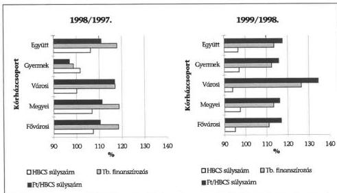

A TB finanszírozás összegének változása nem tükrözte a teljesítményeket. Az országosan egységes alapdíjra való áttérés következtében a gyermekkórházaknál a TB finanszírozás 1998. évben - a korábbi átlagostól magasabb intézményi alapdíj egységesítése miatt - 98,7%-ra csökkent, miközben az elszámolt súlyszám 101,7%-ra nőtt. A városi kórházaknál a TB finanszírozás 1999. évben 126,5%-ra növekedett (13%-ponttal volt magasabb, mint a vizsgált kórházaknál összesen), miközben teljesítményük az előző évihez képest 94%-ra csökkent.

Egy-egy intézmény pénzügyi helyzetét is jelentősen módosította az országosan egységes alapdíj (súlyszám Ft-érték) bevezetése:

A salgótarjáni megyei kórházban az alapdíj nivellálása 100 millió Ft többlet támogatást eredményezett. A regionális feladatokat is ellátó miskolci megyei kórházban az országosan egységes alapdíj bevezetése miatt (miután a korábbi intézményi díj magasabb volt) nem volt fedezet biztosítva az ágazati érdekegyeztetés keretében elfogadott 10,5%-os dologi, 16%-os bérautomatizmusra, az intézmény TB támogatása mindössze 6%-kal növekedett.

Az aktív fekvőbeteg-ellátás bevételeit meghatározó 1 súlyszámra jutó átlagos Ft-érték a vizsgált kórházaknál 1997-99. között 55.901 Ft-ról 72.983 Ft-ra (130,6%-ra) növekedett. Ezen belül az egyes intézmények átlagos díja igen eltérően alakult. Az alapdíj emelkedése 1999. évben 31 intézménynél átlag alatti, míg 8 intézménynél átlagot meghaladó volt. (Az intézményi alapdíjak alakulását a csatolt 9. sz. táblázat szemlélteti.)

Jelentősek az intézmények saját bevételei is, ezek évenkénti bővülésének üteme valamelyest meghaladja az átlagos mértéket. A kórházak törekednek feltárni minden olyan lehetőséget, amellyel bevételeiket gyarapíthatják.

A saját bevételeken belül (10. sz. táblázat) az alaptevékenységgel összefüggő készletértékesítések és szolgáltatások meghatározóak (43%). Ide tartoznak többek közt a vérellátó állomások és a vényforgalmat is lebonyolító intézményi gyógyszertárak készletértékesítései, valamint a szabad kapacitások lekötése érdekében végzett kisegítő tevékenységek és az intézmények egymás részére nyúj-

43

---

II. RÉSZLETES MEGÁLLAPÍTÁSOK

tott térítéses diagnosztikai vizsgálatai. A vállalkozási jellegű tevékenységek az intézményi saját bevételek mindössze 12%-át teszik ki. Jellemző egyébként, hogy az intézmények a korábban vállalkozási jellegű tevékenységeiket egyre inkább igyekeznek az alapító okiratukban az alaptevékenységhez kapcsolódó körbe átsoroltatni, elsősorban adminisztrációs egyszerűsítés érdekében.

**A kórházak pénzforgalmi kiadásainak belső összetételében a vizsgált időszakban csak kis mértékű módosulás volt tapasztalható** (11. sz. táblázat). Az 1997. évi kiadásoknak 49,9%-át képezte a bér- és bérjellegű kiadások aránya, amely 1999. évben 2,3%-ponttal csökkent, főként a foglalkoztatott létszám változása miatt. (1999. évben a TB költségvetésében számításba vett 13%-os bérautomatizmus helyett a kifizetett bértömeg csak 9,2%-kal nőtt a vizsgált kórházaknál.) A bérek járulékainak csökkenése szintén hatással volt a kiadások szerkezetére. (A vizsgált években a TB járulék, munkaadói járulék aránya 0,7%-ponttal csökkent.)

**A dologi kiadások részaránya 42,7%-ról 44,8%-ra növekedett** és növekedésének üteme 1998. évben 3,4%-ponttal, 1999. évben 0,7%-ponttal haladta meg az infláció mértékét. Ezen belül intézményenként jelentős szóródás figyelhető meg (a bér és dologi kiadások intézményenkénti növekedését a csatolt 12-13. sz. táblázat szemlélteti).

A pénzforgalmi kiadások a kiegyenlítetlen szállítói tartozások és készletváltozás miatt nem adnak megbízható információt a tényleges ráfordításokról, költségekről. A pénzforgalmi kiadásokban reálértékvesztést elszenvedett kórházaknál megfigyelhető volt a szállítói tartozás növekedése.

### 3.3. A finanszírozott teljesítmények alakulása

A társadalombiztosítási támogatás túlnyomó hányadát (a vizsgált intézményi körben 90%-át) az aktív és a krónikus fekvőbeteg, valamint járóbeteg szakellátás alkotja. Ezen ellátási formákban a bevételek alakulását az elszámolt teljesítmények határozzák meg, ezért a pénzügyi egyensúly szempontjából fontos a szerződött kapacitások és az elszámolt teljesítmények összhangjának biztosítása. A szerződött kapacitásokról és finanszírozott teljesítményekről megbízható, valós adatállománnyal az egészségügy szereplői közül (OEP, GYÓGYINFOK, intézmények) senki sem rendelkezik. A szolgáltatott adatok pontatlansága több tényező együttes hatására vezethető vissza:

- A teljesítményjelentések fogadása, feldolgozása, ellenőrzése és a szolgáltatókkal való egyeztetése nem a finanszírozó kezében összpontosul teljes körűen. A fekvőbeteg szakellátás teljesítményadataival kapcsolatos feladatokat a GYÓGYINFOK, a járóbeteg szakellátásban az OEP látja el.
- Az OEP- nél a finanszírozással kapcsolatos tevékenység személyi és technikai hátterét kezdetben és azt követően sem biztosították teljes körűen. A finanszírozást megalapozó informatikai feladatok ellátását néhány egyéni vállalkozó végzi, nem megoldott a tevékenységük összefogása és ellenőrzése sem.

44

---

II. RÉSZLETES MEGÁLLAPÍTÁSOK

- Az intézmények egy része nem vezet nyilvántartást az elszámolt teljesítmények havonkénti és szervezeti egységenkénti alakulásáról.

Az elszámolt teljesítmények vizsgálatunk keretében történő értékelésénél ezen felül problémát jelentettek **az elszámolás rendszerének különböző módosításai** és egyes részterületeinek nem megfelelő szabályozottsága. E tényezők **miatt az adatok egy része összehasonlíthatatlanná vált. Az adatok különféle terminológia szerinti megkülönböztetése is nehézséget okoz.** (Így például az aktív fekvőbeteg szakellátásnál az esetszám lehet rövid, normál, hosszú, összevont, finanszírozott, osztályos, áthelyezett, elbocsátott, kiírt stb.)

**A finanszírozás alapját képező mértékegységek,** (a járóbeteg szakellátásban az egyes beavatkozások WHO pontszám-, az aktív fekvőbeteg szakellátásban a HBCS-k súlyszám-, valamint a krónikus fekvőbeteg szakellátásban az osztályos szorzók) **értékeit átfogóan két alkalommal, részleteiben pedig többször is módosították a vizsgált időszakban.** Ennek következményeként **a teljesítmények abszolút értékei az egyes években nem, csak a relatív változásuk hasonlítható össze.** Az egyes ellátások kapacitás és teljesítményadatainak változását a csatolt 14. sz. táblázat mutatja be.

**Az aktív fekvőbeteg-szakellátásban** a hatékonyabb szakmai tevékenység következtében folyamatosan rövidülő ápolási idő **hatására az ágykihasználtság évről évre csökkent.** Ez egyben arra is utal, **hogy a felszabaduló ágyaktól az intézmények nem váltak meg.** Ebben szerepet játszott, hogy az egy-egy osztályon leépítendő néhány ágy igazi megtakarítást nem eredményezne. Telephely, vagy önálló épületrész megszüntetése jelentős belső átcsoportosítást, konfliktust és igen komoly többlet ráfordítást igényelne, amelyhez az intézmények nem rendelkeznek fedezettel.

Nem következetes a szakmai szabályozás sem, hiszen a minimumfeltételek előírják azt az ágyszámot, amely mellett az adott szakterület egyáltalán működhet, de nem veszi figyelembe az ágykihasználtságot. Ezáltal a kapacitások csökkentése helyett arra kényszerítenek, hogy kihasználatlan ágyaikat továbbra is fenntartsák. Több esetben célszerűbb megoldást jelentene a mátrix struktúra kialakítása, amelynek a szakmai feltételrendszere azonban nincs megfelelően kidolgozva.

**A gyermekkórházak szakmai szempontokkal indokolják az alacsony ágykihasználtságukat, amelyet az adatok nem támasztanak alá.** Ugyanakkor előfordult, hogy egy szakmában a szükséglethez képest kevés volt a kapacitás.

A Budai Gyermekkórház neurózis osztályára csak előjegyzés alapján tudják fogadni a betegeket, miközben az ágykihasználtság intézményi szinten 74%-os.

**A krónikus fekvőbeteg-szakellátásban az ágyak száma 4%-kal emelkedett,** a kórházak - felismerve azt a lehetőséget, hogy a normatív ápolási időt követően az aktív ágyról áthelyezett betegeket a krónikus ellátásban el lehet számolni - a bevételeik növelése érdekében fejlesztették a kapacitásokat. Bizonyos mértékig ennek is tulajdonítható ápolási idő csökkenése az aktív ellátásban.

45

---

II. RÉSZLETES MEGÁLLAPÍTÁSOK

Az ápolási és a krónikus egységek ágyszáma terhére folyamatosan emelkedett a magasabb 1,5-es szorzójú rehabilitációt szolgáló férőhelyeké. A kórházak igyekeztek krónikus ágyaikat rehabilitációs ággyá átminősíteni megfelelő feltételek hiányában is. Ezt bizonyítja, hogy összesen 204 rehabilitációs osztályra szerződtek, miközben a rehabilitációs szakvizsgával rendelkező szakorvosok száma csak 135.

A teljesítményeknek a bevételek szempontjából történő elemzése érdekében a kapacitás és a teljesítmény adatokból képzett mutatószámoknak és az adott intézménycsoport átlagos adataihoz viszonyított értékeit a 15. sz. táblázat tartalmazza. Az aktív és krónikus fekvőbeteg, valamint járóbeteg szakellátás teljesítményei és a kapacitások között a 39 vizsgált intézményből, 19-nél nem volt megfelelő az összhang. Megfigyelhető volt a teljesítmények és a kórházak pénzügyi helyzete közötti összefüggés. A pénzügyi nehézségekkel küzdő kórházak többségében a teljesítmények a kórházcsoport átlagánál alacsonyabbak.

A teljesítményarányos normatív finanszírozás a pénzügyi forrásokat az intézmények között átrendezte, de nem tölthette be a szerepét a kapacitás szabályozásában. A megjelenő pénzügyi likviditászavarokat a kórházak és a tulajdonos önkormányzatok jelentős része nem a kapacitás csökkentésével, a hatékonyság fokozásával, valamint az ellátás szervezés javításával igyekezett kezelni és elsősorban különböző központi források megszerzésétől várta a megoldást.

### 3.4. Munkaerő-ellátottság és a dolgozói keresetek alakulása

A kórházi működés - a betegellátás folyamatosságából és egyéb sajátosságaiból eredően - rendkívül élőmunka-igényes, a munkaerő-ellátottság a feladatellátást alapvetően meghatározó tényező. Pénzügyi-gazdálkodási szempontból a létszámhelyzet kiemelt jelentőségét elsősorban az adja, hogy

- a dolgozók személyi juttatásai és a kapcsolódó járulékok az intézményi kiadásoknak közel felét teszik ki,
- a kórházi kiadások visszafogásának egyik jellemző eszköze a létszámleépítés, a létszámstop, a bérkiáramlás valamilyen korlátozása.

Az 1999. év végi engedélyezett és betöltött álláshelyek száma, összetétele valamint egyes változás- és aránymutatók alakulása a következő volt:

|  Megnevezés | Létszám (fő) |   | Betöltöttség %-a | Létsz.vált. %-a 1997-ről 1999-re |   | Megoszlás %-a  |   |
| --- | --- | --- | --- | --- | --- | --- | --- |
|   |  Engedélyezett | Betöltött |   | Eng. | Betölt. | Eng. | Betölt.  |
|  Fekvőbeteg ell. | 31 350 | 28 853 | 92,0 | 98,6 | 97,8 | 52,2 | 52,2  |
|  Járóbeteg-ellátás | 8 855 | 8 095 | 91,4 | 96,4 | 94,7 | 14,7 | 14,7  |
|  Egyéb eü. ellátás | 7 923 | 7 200 | 90,9 | 91,8 | 88,1 | 13,2 | 13,0  |
|  Gazd., műsz. ell. | 11 923 | 11 087 | 93,0 | 88,8 | 93,4 | 19,9 | 20,1  |
|  **Összesen** | **60 051** | **55 235** | **92,0** | **95,3** | **95,1** | **100,0** | **100,0**  |
|  Ebből: orvos | 8 535 | 7 418 | 86,9 | 96,3 | 95,1 | 14,2 | 13,4  |
|  Ebből: eü. szakd. | 33 330 | 31 029 | 93,1 | 98,7 | 97,2 | 55,5 | 56,2  |

46

---

II. RÉSZLETES MEGÁLLAPÍTÁSOK

A vizsgált kórházaknál 1997. és 1999. évek között az engedélyezett és az év végén betöltött **létszám is közel 5%-kal csökkent**. Az egyes intézmények munkaerő helyzetét a környezet foglalkoztatási helyzete, szakember megtartó képessége is befolyásolja. A kisvárosi kórházakban az átlagostól magasabb az orvoshiány (ez sokszor egy-egy osztály működését is veszélyezteti), a nagyvárosi - elsősorban fővárosi - kórházakban a munkaerő elszívó hatás miatt a nővérhiány jellemző.

**A folyamatos létszámcsökkenés okai** - a csak szerényebb mértékben ható egyedi körülmények és a hiányszakmák (pl. aneszteziológiai és intenzív terápiás, radiológus, 3 műszakos ápoló) területén a kilépők pótlásának nehézségei mellett - **legfőképpen** a következők:

- **A fenntartó és az intézmény adminisztratív döntésén alapuló létszámcsökkentés**, amelyet nem mindig előz meg a reális létszámszükséglet felmérése.

A Szent István Kórháznál 238 álláshelyet (amelyből 194 volt betöltött) szüntettek meg. A salgótarjáni kórháznál 130 fős tervezett csökkentésből 1999. végéig 115,5 fős leépítés megvalósult. Önkormányzati döntés alapján a szombathelyi kórháznál 100 fős csökkentésre került sor.

Létszámgondokra, létszám-megtakarítási intézkedésekre vezethető vissza, hogy növekvő arányú a napi két műszak (kétszer 12 órás) szervezése az ágy melletti ápolók körében. **Míg nappali műszakban egy ápolóra 10-15 beteg jut, addig a délutáni-éjszakai műszakban előfordul, hogy 40 beteget lát el egy ápoló.**

- **Egyes intézményi egészségügyi feladatok megszűnése, átadása, illetve a struktúramódosulások miatti létszámcsökkenés.**

A Szent János Kórház a szakorvosi rendelőt és fogászatot adta át, a Budai Gyermekkórháznál is a fogászat szűnt meg. A vértranszfüziós állomások átadása pl. a zalaegerszegi kórháznál 46 álláshely, a Flór F. Kórháznál 55 álláshely megszűnésével járt.

- **Egyes tevékenységek vállalkozásba adása, egészségügyi ellátási feladatok vállalkozókkal történő megoldása, amely a vizsgálat tapasztalatai szerint az utóbbi évek intézményi létszám csökkenésének nagyobbik hányadát jelentette.**

A kórházüzemek, kiszolgáló tevékenységek (élelmezés, mosoda, kazánház, takarítás, portaszolgálat, stb.) szélesedő vállalkozásba adásában a szükséges fejlesztési tőke hiánya mellett a létszámátadásnak és ezáltal intézményi létszámcsökkenés elérésének, a közalkalmazotti foglalkoztatás terheitől való szabadulásnak a szándéka is alapvető szerepet játszott.

A Szent Margit Kórháznál 110 fős csökkenést jelentett a porta és őrző-védő szolgálat valamint takarítás vállalkozásba adása. A váci kórháznál a mosoda a takarítás és az élelmezés vállalkozásba adásával több mint 150 fős csökkenés valósult meg. A szekszárdi kórháznál a vállalkozásba adott takarítás 122 fős közalkalmazotti létszámcsökkenéssel járt.

47

---

II. RÉSZLETES MEGÁLLAPÍTÁSOK

A nyíregyházi kórháznál egyes kórházüzemek mellett a központi labort is vállalkozásba adták, amellyel az intézményi létszám 99 fővel csökkent. Hasonló megoldást alkalmaztak a belső mentőszolgálatra, itt a csökkenés 15 fős, vagy a röntgen és képalkotó tevékenységre, ahol 113 fő munkaviszonya szűnt meg. A Flór F. Kórházban a kazánház mellett a laboratórium és képalkotó diagnosztika is vállalkozásba került, amelyek 68 fős létszámot érintettek.

**Az ügyelet vállalkozásban történő ellátásával a közalkalmazotti formában történő foglalkoztatási korlátozásokat igyekeztek elkerülni.** A túlmunka, az ügyelet, valamint a készenlét ellátásának és díjazásának szabályszerűsége kérdésében 1998-ban ügyészségi vizsgálatok is folytak, az egyedi ügyészi intézkedések elmaradtak arra hivatkozással, hogy nem egyedi jelenségről van szó, az egységes jogértelmezés érdekében iránymutatás kiadásának kezdeményezése szükséges a Legfőbb Ügyészségnél.

A közalkalmazottak jogállásáról szóló módosított 1992. évi XXXIII. törvény 42. §-a szerint a munkáltató a vele közalkalmazotti jogviszonyban állóval munkaköri feladatai ellátására munkavégzésre irányuló további jogviszonyt nem létesíthet. A kórházak igyekeztek vállalkozásokkal és nem közvetlenül dolgozóikkal szerződni, így a törvényben tiltott jogviszony létesítést legalább formailag elkerülni.

A legfőbb ügyészség összefoglaló jelentésében olyan jogalkalmazási, jogértelmezési kérdések is felmerültek, amelyek csak jogszabály-módosítással oldhatóak meg, így a **legfőbb ügyész az egészségügyi minisztert is megkereste 1999. márciusában, hogy vizsgálja meg a kiemelt problémákat, jelezze álláspontját és a tett vagy tervezett intézkedéseit.** A miniszter 1999. május végén a legfőbb ügyészt - számos egyéb mellett - arról tájékoztatta, hogy az ügyeletnek, mint az egészségügyi ágazat sajátos jogintézményének az Mt. és a Kjt. egyes szabályaitól eltérő módon történő szabályozását a tárca kezdeményezte.

A vállalkozások igénybevétele a **bér- és járulékkiadás csökkenése nemegyszer a dologi kiadások magasabb mértékű emelkedését eredményezte.** Ez egyes területeken az ÁFA-hatásnak, a feladatot ellátó vállalkozó orvos nem közalkalmazotti, „piaci alapú” megfizetésének, vagy éppen a szándéknak megfelelően - a korábbi időszakot meghaladó mértékű és a szűk keresztmetszetet feloldó - nagyobb kapacitásnak, rendelkezésre állásnak a következménye.

A tatabányai kórházban a vállalkozó orvosok bevonásával lényegesen bővült az aneszteziológiai (és intenzív) kapacitás, rendelkezésre állás és ezzel a kórház egészét tekintve a szakmai munka és a bevételtermelés feltételei javultak, a szabályos működés egy alapvető feltétele teljesült. Ugyanakkor ahhoz, hogy a havi szinten 2-2,5 millió Ft-os többletkifizetés közgazdasági szempontból is megtérüljön, a remélt műtétszám emelkedést és ezzel a fokozódó bevételtermelést további munkaszervezési megoldásokkal, érdekeltségi szempontok bevonásával lenne célszerű ösztönözni.

A vizsgált kórházaknál szerzett tapasztalatok alapján megállapítható, hogy

- **a létszám az adott kapacitásokhoz, a növekvő teljesítményekhez és az ezekhez igazodó szakmai minimumfeltételekhez mérten szűk, ugyanakkor a szükségest meghaladó kapacitás és az indo-**

48

---

II. RÉSZLETES MEGÁLLAPÍTÁSOK

# **kolatlan teljesítmény a létszám oldaláról viszont potenciális veszteségforrás,**

- **a belső létszámarányok nem optimálisak** (pl: orvos és ápolóarány, három és egyműszakos ápolók aránya) és **kialakultak** olyan **szűk keresztmetszetek** (hiányszakmák és ágy melletti ápolás), amelyeken nem sikerült hatékony belső és külső (központi) intézkedésekkel, ösztönzőkkel eredményesen változtatni.

A valóságos létszámhiány nehezen számszerűsíthető, az engedélyezett intézményi létszámot a korábbi adat korrigálásával (elsősorban csökkentésével) - a fenntartói vagy intézményi kezdeményezésű adminisztratív intézkedések; struktúraátalakítások, feladatátadások és létszámcsökkentési döntéseknek megfelelő irányszámok alapján - alakították.

**A létszámszükséglet újraszámításához a gyakorlatban nem alakultak ki, illetve terjedtek el új, korszerű módszerek, a szakmai minimumfeltételek teljes körű betartása pedig a kapacitás- és tevékenységoptimalizálás nélkül szinte elérhetetlen követelményt, finanszírozhatatlan többletigényt jelent.**

A gyulai kórháznál a szakmai minimumfeltételek szerint kimunkálva 515 fő hiányzik, de az éves kb. 350 millió Ft-os személyi juttatás többlet (+ járulékok és kapcsolódó további költségek) fedezete nem lenne biztosítható.

A tatabányai kórháznál a minimumfeltételek szerinti felmérés 210 fős hiányt mutatott, de a jelentős tartozást felhalmozó kórháznál csak a személyi juttatásoknál ez éves szinten 175 millió Ft-os finanszírozhatatlan kiadási többletet jelentene.

**Ha a vizsgált körben** - az engedélyezett létszámhoz mért - **minden üres állás betöltése megtörtént volna, annak az éves elvi többletkiadási vonzata mintegy 5,3 milliárd Ft lenne** csak a személyi juttatásoknál és munkaadót terhelő járulékainál, aminek finanszírozási fedezete még többletteljesítményekkel együtt sem lett volna biztosítható.

A vizsgált körben az engedélyezett létszám 8%-a (4.816 álláshely) betöltetlen volt 1999. év végén. A vizsgált időszakot enyhén növekvő tendencia jellemezte, de ezen belül a fővárosi és gyermekkórházaknál átlagot meghaladó mértékű volt az üres állás.

**Az ellátás személyi feltételeinek biztosítását, szervezését nehezíti, hogy** - a vizsgált körben felmért adatok szerint - **minden ötödik dolgozó valamilyen ok miatt távol van munkahelyétől, továbbá az is, hogy a magas fluktuáció miatt jelentős az átmeneti létszámkiesés.**

A kórházak kigyűjtései szerint a szabadságok betegség és minden egyéb ok miatt a dolgozók több mint 20%-a - lényegében helyettesítés nélkül - kiesik a munkavégzésből. Ugyanakkor a szabadságok teljes körű kivétele sem mindenütt megoldott (pl. a Nyíró Gy. Kórházban 1999-ről 470 dolgozó 4.422 nap szabadságot vitt át a 2000. évre).

49

---

II. RÉSZLETES MEGÁLLAPÍTÁSOK

Általánosan jellemző - a fővárosi kórházaknál pedig kiemelten jelentkezik - a magas fluktuáció, a kilépők pótlása időben pedig szinte mindig elhúzódik. Pl.: a Bajcsy-Zs., a Csepeli, a Szent István, a Szent Imre, a Szent Margit, a Jahn F. Kórháznál évente a dolgozók negyede-ötöde kilépett az adott intézményből. A kis létszámú pécsi gyermekkórháznál is a 3 év alatt a kilépők létszáma elérte az átlagos létszám háromnegyedét, 1999-ben a ki- és belépők együttes száma a dolgozók 58%-ának felelt meg. A Flór F. Kórházban 1998-ban a dolgozók csaknem negyede kicserélődött egyetlen év alatt.

Az egészségügyi szakdolgozók álláshelyeinek betöltöttségi indexe kicsivel jobb a kórházak más munkaköri csoportjainál, az átlagosnál, mégis e területen belül találhatóak azok az ápolói munkakörök, amelyeknél az utóbbi időben a legsúlyosabbnak érzékelt létszámgondok mutatkoznak. A nővérek száma nem igazodott a megnövekedett teljesítményekhez, a tőlük elvárt feladatokhoz, a velük szemben támasztott fokozódó követelményekhez.

A szükségszerű következmény az lett, hogy az intézményi létszámmozgások zöme az ápolóknál mutatkozott, fokozódott a pályaelhagyás.

Többéves országos adatok azt mutatják, hogy az ápolók több mint fele 30 évesnél fiatalabb, az 50 évesnél idősebb ápolók aránya a 10%-ot sem éri el, ami jelzi, hogy a középkorúak körében rendkívül gyakori a pályaelhagyás.

A nővérhiány nem egyszerűsíthető le csupán a bérek kérdésére, de a dolgozók anyagi biztonsága és a megfelelő érdekeltség terén mutatkozó hiányosságok az ágazat egyik legsúlyosabb problémakörét jelentik.

Az utóbbi időben - a minőségbiztosítás követelményének erősödésével párhuzamosan - az ápolás fejlesztésének, korszerűsítésének igénye is megfogalmazódott. A modern ápolással kapcsolatos felfogásnak megfelelő - a beteg egyéni szükségleteire alapozott - gondozás feltételeit, az ápolási eszközök beszerzését, a képzettség növelésének anyagi támogatását, és nem utolsó sorban az ápolói bérek jelentős emelését a kórházak nem tudták biztosítani. Igyekeztek ugyan különféle megoldásokkal az ágy melletti ápolókat kiemelten kezelni, de az alapproblémákat nem tudták megoldani.

Az Újpesti Kórháznál az 1998. évi Kollektív Szerződés alapján az ágy melletti ápolók pótlékát további 25%-kal megemelték. A kecskeméti kórháznál 1999. februárjában egyszeri jutalmat adtak a 3 műszakos ápolóknak. A pécsi kórháznál a 3 műszakos ápolóknak 1999. júliusától 5.000 Ft/hó mértékű béremelést adtak. A dunaújvárosi kórházban az 1999. évi béremelésnél a legmagasabb mértéket a 3 műszakos ápolóknál alkalmazták.

A fedezet nélküli kötelezettségvállalások elkerülése érdekében a kórházakat a visszafogottság jellemezte a béremeléseknél, nemegyszer a fejlesztés csak a kötelező emelést (minimálbér, kategória előrelépés, új besorolási tábla) jelentette, nem érintette általánosan a dolgozók teljes körét.

Pl.: a gyöngyösi kórházban 1997. és 1998. években, a megyei fenntartású esztergomi kórházban a vizsgált időszakban, a Flór F. Kórházban 1999-ben csak a törvényi kötelezettségből fakadó emeléseket hajtották végre, soron kívüli, differenciált béremelés nem volt.

50

---

II. RÉSZLETES MEGÁLLAPÍTÁSOK

**A 13. havi illetmény kifizetésére fedezet hiányában a kórházak nagyobbik hányada** OEP előleget vett igénybe, ami - a finanszírozásból havonta levont törlesztésből adódóan - közvetett módon hozzájárult a kifizetetlen szállítói követelések növekedéséhez.

Az alapilletmények átlagos növekedése 1997. és 1998. évek között 17%-os, 1998. és 1999. évek között 12%-os volt, az emelkedés mértéke a rendszeres személyi juttatásoknál és a bruttó kereseteknél is egyaránt 17% illetve 13% körül alakult. Az **intézményi átlagértékek jelentős szóródását mutatja, hogy a legmagasabb és legalacsonyabb összehasonlításában közel 40%-os különbség van**, ami az eltérő struktúra és a korábbi állapot csak igen lassú változásával függ össze.

A jelentéshez csatolt 1. számú diagram a vizsgált kórházcsoportok átlagában mutatja be a keresetek változását, amelyből látható, hogy a fővárosi valamint a gyermekkórházaknál az átlagosnál magasabbak, míg a városi kórházaknál alacsonyabbak a bruttó keresetek.

A beszámolók személyi jellegű kifizetésekre és átlagos statisztikai létszámra vonatkozó adataiból a vizsgált kórházak dolgozóinak átlagos illetményét, keresetét a következő diagram szemlélteti.

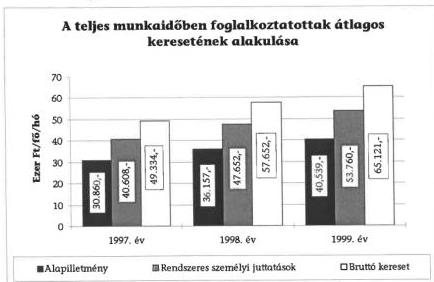

(Az alapadatok tartalmazták a visszamenőleges ügyeleti díj kifizetéseket is.)

**Az egészségügyi dolgozók keresete és annak előző évhez viszonyított növekedése elmaradt a magyar gazdasági ágak átlagos mértékétől.**
Az elmaradást fokozza, ha figyelembe vesszük, hogy

- az egészségügyi dolgozók keresetét visszamenőlegesen kifizetett ügyeleti díjak is növelték,
- egyes kórházüzemek szélesedő vállalkozásba adásával az alacsonyabb bérűek létszáma csökkent, így kilépésük önmagában az átlagos kereset növekedése irányába hatott,

51

---

II. RÉSZLETES MEGÁLLAPÍTÁSOK

- a bruttó kereset magában foglalja a több műszakban, jelentős túlmunkával elért keresményt is,
- a számvevőszéki mintában a legalacsonyabb átlagkeresetű városi kórházakból csak 7 szerepelt (így az átlagérték a 39 kórházat jelentő mintában magasabb az országosnál).

Az egészségügyi dolgozók bruttó átlagkeresetének a nemzetgazdasági átlaghoz viszonyított 1999. évi növekedése alapján az ágazatban alkalmazottak kereseti pozíciói tovább romlottak. Ez különösen hátrányosan érintette az alacsony átlagkeresetű szakdolgozókat, elsősorban az ápolókat. Az átlagkereseteket és azok növekedését a következő diagram szemlélteti:

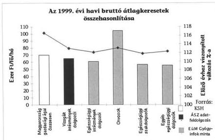

### 3.5. Az intézményi készletgazdálkodás főbb jellemzői

A vizsgált intézmények körében kimutatott felhasznált raktári készletek értéke az 1997. évihez képest 16,6%-kal nőtt és 1999-ben megközelítette a 27 milliárd Ft-ot, ami - csökkenő arányok mellett is - a kórházi összes kiadás több mint egyötödének, a dologi kiadások közel felének megfelelő nagyságrend.

A forgási nap (az átlagkészlet hány napi felhasználásnak felel meg) fokozatos - 9,2 %-os, illetve 5,7%-os - csökkenése az éves felhasználás rendre 10% alatt maradó növekedésének közvetlen következménye.

A vizsgált intézmények készletösszetételében, feladat-ellátási, gazdálkodási sajátosságaiban jelentős különbségek vannak, ezzel együtt 80%-uknál az átlagkészlet a vizsgált időszakban csökkent. Az adatok, mutatók alakulását - a kórházakat igen különböző mértékben érintve - elsősorban a következők befolyásolták:

- Minden készletféleséget érintett az árnövekedés, ami az ágazati árinformációk szerint 1997. évet követően mérséklődött ugyan, de 1998-ban és

52

---

II. RÉSZLETES MEGÁLLAPÍTÁSOK

1999-ben is jellemzően 10% feletti volt, lényegében csak az élelmiszerek árindexe maradt mindkét utóbbi évben kevéssel 104% alatt;

- A szűkülő pénzügyi lehetőségek alapvetően a keretgazdálkodás módszereinek elterjedésén keresztül egyrészt kényszerből, másrészt a nyilvántartások informatikai lehetőségeire is épülő tudatosabb gazdálkodással a készletbeszerzések és felhasználások visszafogása irányába hatottak;
- A szállítók kínálati piacán olyan szerződéses kapcsolatok kialakítására nyílt mód, amelyek a szállítási határidők és ezzel együtt a biztonsági készletek mértékének csökkentését tették lehetővé, sőt e téren a kórházaknak a jelenleg kihasználthoz képest többszörös lehetőségei vannak, amivel a forgótőke igény mérsékelhető;
- Legfőképpen egyes kórházüzemek (élelmezés, mosoda), a takarítás valamint diagnosztikai területek (labor, radiológia) szélesedő vállalkozásba adása azzal is járt, hogy a kórházak a vonatkozó feladatok ellátásához szükséges beszerzésektől vagy azok nagy részétől mentesültek, pontosabban azt a szolgáltatásokért fizetett díjakban fizették meg.

A raktári készletekkel kapcsolatos főbb változásokat, mutatókat egyes kiemelt készletféleségekre a jelentéshez csatolt 2. számú diagram, a készletek egészére a következő diagram mutatja be:

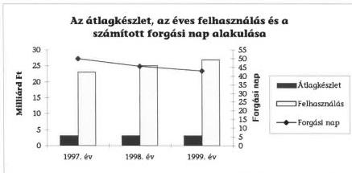

A gyógyszerfelhasználás, vagy tágabb értelmezésben a gyógyszertári forgalom a kórházi teljes készletfelhasználásnak több mint felét jelenti, a gyógyszer és vegyszerbeszerzés az intézményi kiadásoknak - a személyi juttatások és járulékait követő - második legjelentősebb tétele.

A vizsgált körben a gyógyszer, vegyszer kiadás 1999-ben 16,8 milliárd Ft volt (a kórházi beszerzések teljes áron történnek), ami a pénzforgalmi kiadások 13%-át, a dologi kiadásoknak pedig 30%-os részaránnyal a legnagyobb tételét jelentette.

Egy működő ágyra 449 E Ft és egy teljesített ápolási napra 1,6 E Ft gyógyszer, vegyszer kiadást fordítottak átlagosan a vizsgált kórházak 1999-ben. Az évenkénti és kórház-csoportonkénti mutatókat a 16. számú táblázat szemlélteti.

A vizsgált kórházak gyógyszertári készletadatainak változását a következő diagram mutatja be:

53

---

II. RÉSZLETES MEGÁLLAPÍTÁSOK

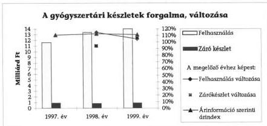

# A gyógyszergazdálkodás alapproblémái és a legfőbb, általánosítható tapasztalatok:

- Hiányos a szakmai terület szabályozottsága, a közgazdasági oldalon pedig a korszerű elemzési módszerek alkalmazása. Hiányoznak azok az alapvető szakmai protokollok, standardok, amelyekre alapozottan a terápiás - benne a gyógyszerterápiás - szabályok egyértelműen meghatározásra kerültek volna, és ezáltal a minőségbiztosítással ellenőrizhetők, az eredményesség szempontjából is összehasonlíthatók lennének.
- Az előzőek szükségszerű következménye, hogy a szakmai és pénzügyi oldal kellő összhangja nem biztosított. A gazdasági oldal elsősorban adminisztratív jellegű takarékossági intézkedéseket indított, míg az orvosok - a kellő szakmai megalapozottság hiányára és a beteg érdekeire hivatkozva - a meghatározott keretek túllépési lehetőségeit (pl. egyedi engedélyezésekkel) igyekeztek kihasználni, ahol a kórházvezetés nem volt megfelelő elemzések, információk birtokában illetve nem volt elég következetes.
- A gyógyszerterápiás bizottságok működése, a beszerezhető gyógyszerek körét korlátozó intézményi gyógyszerlisták, az antibiotikumokra vonatkozó speciális szabályok, a keretgazdálkodás alkalmazása, a gyógyszerrendelési határidők, főbb szabályok újragondolása, hatóanyag alapú helyettesíthetőségek megengedése, a legkedvezőbb beszerzési lehetőségek felkutatása - tehát a klasszikus szakmai, gazdálkodási megoldások - a gyógyszerkiadások viszonylagos kézbentartásához eddig elegendőek voltak.
- Az emberi felhasználásra kerülő gyógyszerekről szóló 1998. évi XXV. tv. 15.§ (2) bekezdése szerint a kórházban tartózkodás alatt a beteg kezelése során csak az intézeti gyógyszertár által bevételezett és onnan az osztályokra, részlegekre kiadott gyógyszer alkalmazható. A kórházak nem tartják célszerűnek az ellátott fekvőbetegek rendszeres - a kórházba kerülés indokától független - gyógyszerfogyasztását biztosítani a közgyógyellátáshoz hasonlóan ingyenesen, figyelmen kívül hagyva a szociális rászorultságot. A költségek csökkentésének kényszere miatt olyan megoldásokat is keresnek, amelyekkel a betegek gyógyszerellátását a legszükségesebbre és lehetőség szerint csak az alapbetegség kezelésére szűkítik.

54

---

II. RÉSZLETES MEGÁLLAPÍTÁSOK

- **A takarékossági intézkedések háttérében meghúzódik a kórházból kikerülő gyógyszerek és az indokolatlan polypragmasia mértékének (több gyógyszer párhuzamos használata) csökkentése is.**

Az Országos Orvosi Rehabilitációs Intézet 1994-ben, az Orvosi Hetilapban közzétett tapasztalatai is már igazolták, hogy - bár jelentős munkaráfordítással és főként kezdetben nem kis ellenállás mellett - a többször elvégzett reprezentatív alapú kivetítésen alapuló kontrollok mérni és fokozatosan csökkenteni voltak képesek a kikerülő gyógyszereket, az indokolatlan polypragmasiát.

Hasonló hatást, a gyógyszerkiadások mérséklődését remélik azon kórházak (pl. a tatabányai, veszprémi, szombathelyi megyei kórházak, vagy a váci kórház), amelyek az informatikai rendszerük fejlesztéséhez kapcsolódva betegenkénti gyógyszerelés és elszámolás bevezetését tervezik, de a megvalósítás rendszerint csúszik. Az Unit Dose (egyszeri adag), Daily Dose (napi adag) System bevezetése a gyógyszerbiztonság növekedése mellett a gyógyszergazdálkodás egészét gazdaságosabbá teheti, de hatékony működése jelentős követelményeket szab a személyi és tárgyi feltételek megteremtése terén.

Az egy elbocsátott betegre eső gyógyszerköltségek összehasonlításában torzító hatást jelent az eltérő szervezeti- és tevékenységstruktúra és a gyógyszerköltség kórházak és még adott kórházon belül évek között is eltérő tartalma.

Nem egységes elsősorban a gyári és magisztrális (gyógyszertárban elkészített) gyógyszereken túli szerek figyelembevétele, a kórháztól és évtől függően az infúzió figyelembevétele beszerzési áron, alapanyagáron, szűkített önköltségen, teljes költségen is előfordul.

A kórházaktól kapott - a betegek részére az osztályos ápolás során adott gyári és magisztrális gyógyszerekre leszűkített - költség- és betegforgalmi adatok alapján az 1999. évi átlagértékeket és a jelentősen szóródó intézményi mutatókat a következő diagram szemlélteti:

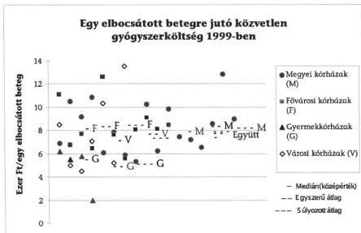

55

---

II. RÉSZLETES MEGÁLLAPÍTÁSOK

### 3.6. Beszerzések lebonyolítása, a közbeszerzési törvény érvényesülése

Az intézményi beszerzések lebonyolításának módja pénzügyi helyzetük, a piaci viszonyok, jogszabályi előírások, helyi előírások függvényében az alábbiak szerint csoportosíthatók:

- A monopol helyzetben lévő szolgáltatóktól, multinacionális cégektől történő vásárlások esetén a kórházak lényegében kénytelenek elfogadni azokat a feltételeket, amelyeket a szállítók (szolgáltatók) szabnak.
- A kínálati piacról a kötelező közbeszerzés körébe nem vont intézményi vásárlások, amelyek gyakorlatába fokozatosan beépül az ajánlatkérés és a pályáztatás.
- A szükséges pénzügyi fedezet hiányával küszködő kórházak esetében a kereskedelmi vagy a szolgáltatást nyújtó szállítók kiválasztásánál elsődleges szemponttá egyre inkább a még elfogadható minőség melletti legalacsonyabb ár és legkedvezőbb fizetési feltétel vált.
- A központosított (alapvetően az OEP bonyolítású) közbeszerzés (amelyekben a vizsgált kör közel háromnegyede vett részt) nagyságrendje nem túl jelentős. A megfelelő referenciával rendelkező szállítói kiválasztás, az erőforrás megtakarítás és az egyszerűsített adminisztráció terén jelentkező előnyök mellett a résztvevő intézmények több mint egyharmada jelzett minőségi vagy szállítási határidő problémát, illetve a vártnál kisebb, vagy elmaradt árelőnyt.

A központosított közbeszerzésekben 1999-ben legjelentősebb nagyságrendű összegekkel (30-63 millió Ft) résztvevők (pl. a gyulai, tatabányai, székesfehérvári kórház) éves dologi kiadásain belül e tételek nem meghatározóak, más kórházak pedig nem éltek e lehetőséggel.

A Budai Gyermekkórház, a Szent Imre Kórház, a szombathelyi, salgótarjáni kórház minőségi problémákat jelzett, az utóbbi három szállítási, határidős gondokat is. A nagykőrösi, a gyulai kórház szerint a minőség és az ár összhangja nem mindig biztosított, az esztergomi kórháznál a fizetési problémák miatt a szállítás maradt el. A győri kórház két esetben is igazolta, hogy kedvezőbb árat tudott elérni saját közbeszerzésével, mint amit az OEP-es központi eljárás biztosított.

- Közös (köz)beszerzési eljárásban való részvétel során a vizsgált kórházak több mint egyharmada - a vizsgált időszakban egy vagy több esetben - a központosított közbeszerzési eljárásnál is megmutatkozó előnyöket igyekezett más területeken is kihasználni. Így e megoldás elsődleges célja árelőnyt elérni a közös, nagy tételű beszerzések pályáztatásával, közbeszerzési gyakorlatnak megfelelő tendereztetéssel. A közös beszerzések jellemzően egy vállalkozás nevéhez és nagy számú intézmény sok termékcsoport szerinti igényeinek együttes kielégítéséhez kapcsolódtak, de előfordult intézmények kisebb csoportjának közös eljárása is.

A Madarász utcai Gyermekkórház, a debreceni kórház, az Országos Orvosi Rehabilitációs Intézet és M.R.E. Bethesda Gyermekkórház az 1997. évi röntgenfilm-

56

---

II. RÉSZLETES MEGÁLLAPÍTÁSOK

és kazetták, fóliák és vegyszerek beszerzésére közösen kért - nyílt eljárás keretében - ajánlatot.

A közös beszerzés lehetőségével egy esetben próbálkozott a Komárom-Esztergom Megyei Önkormányzat két kórháza, de árelőny elérésének hiányában a kísérletnek nem lett folytatása.

- **A közbeszerzési eljárások keretében** (a közbeszerzésről szóló többször módosított 1995. évi XL. tv. /Kbt./ szerint) történő - **a szállító helyi kiválasztásán alapuló - vásárlások**, amelyek a következők szerint valósultak meg:

- A fenntartó (tulajdonos) önkormányzat által saját hatáskörben bonyolított közbeszerzések, amelyek nem mindig igazodtak az intézményi prioritásokhoz, igényekhez.

A Fővárosi Önkormányzat olyan központosított közbeszerzést végzett intézményei számára, amelyben a bürokratikus elemek jelentős késedelmet okoztak és az intézmények által szakmai szempontok alapján összeállított rangsor sérelmet szenvedett, a kapott eszköz paraméterei meghaladták az intézmény igényeit.

A Madarász utcai Gyermekkórház és Rendelőintézet önkormányzati közbeszerzésekkel a vizsgált időszak alatt több mint 25 millió Ft értékű gépműszerhez jutott, ugyanakkor a kórház olyan berendezéseket kapott, amelyek az általa benyújtott igénylistában nem szerepeltek.

A Jahn Ferenc Kórházban a 17 éves angiográfiás készülék elromlása miatt lecserélt készülék specifikációja meghaladta a kórház szakmai igényeit.

- **Kórházi előkészítésű és fenntartói vagy intézményi döntésű egyedi közbeszerzések**, amelyek a vizsgált időszak elején még inkább a fenntartó önkormányzatok alapvető döntéseivel, majd később az intézményi jogosítványok (döntések) - helyi szabályzatokban is rögzített - szélesedésével történtek. **A vizsgált intézmények mintegy háromnegyede a vállalkozások megbízásával szervezett közbeszerzéseket, ugyanakkor 1999-ben már egyre több kórház inkább a saját apparátussal való bonyolítást választotta.**

A kórházi anyaggazdálkodási részlegek, bizottságok, munkacsoportok és esetenként közbeszerzési ügyintézők, tanácsadók mellett jellemző volt a külső szakértő cégek igénybevétele is.

A Bajcsy-Zs., a Szent János, a Szent Margit Kórház, a szekszárdi kórház is a külső szakértő cég igénybevételét követően 1999-ben már saját szervezésű közbeszerzést indított.

A vizsgált intézmények döntő hányadában a három év alatt előfordult(ak) olyan beszerzés(ek), amelyek során a közbeszerzés kötelező szabályait figyelmen kívül hagyták. A közbeszerzések nyomán kötött szerződések száma és összértéke a vizsgált 3 év alatt intézményenként jelentősen szóródott.

Míg a diósgyőri kórházban, vagy a pécsi gyermekkórházban a vizsgált időszakban egyetlen közbeszerzési eljárás sem folyt, az esztergomi Vaszary Kolos Kórházban pedig csak egyetlen, addig pl. a Szent István Kórház 28 eljárással 1,4 milliárd Ft, a székesfehérvári kórház évente mindig 100 feletti pályázatot elbírálva 1,8 milliárd Ft, a miskolci kórház 0,9 milliárd Ft értékben kötött közbeszerzéseket kö-

57

---

II. RÉSZLETES MEGÁLLAPÍTÁSOK

vetően szerződéseket. Ez utóbbi kórház a tenderfüzetek értékesítéséből évi 3,4 - 4,4 millió Ft bevételt realizált, az 1999. évi nyertes pályázatok száma 53 db volt.

A közbeszerzési eljárások elmulasztásának legjellemzőbb területei:

- A gyógyszereknél, vegyszereknél a közbeszerzési eljárás mellőzését az intézmények az adott gyógyszer egyedi gyártójával, az akciós lehetőségekkel és felkínált előnyökkel magyarázták.
- A karbantartási, felújítási feladatok ellátása továbbá a szolgáltatások körébe tartozó megrendelések az építészeti munkák helyének, területének széttagoltságából, illetve a szolgáltatás valamilyen teljesítménnyel arányos bizonytalan mértékű díjazásából adódó értékhatármegállapítások miatt tekintettek el a közbeszerzési eljárástól.

A Kbt. 2. §-a, illetve a közbeszerzési értékhatárok figyelembevételével elmaradt az eljárás pl. a Bajcsy-Zs. Kórháznál a fűtéskorszerűsítési munkáknál, a Péterfy utcai Kórháznál az anyagok részekre bontása révén a felújítási és beruházási tevékenységeknél. A szombathelyi kórháznál indokoltsága ellenére az onkoradiológia járulékos beruházásaira, építési felújításokra nem írtak ki pályázatot.

- A jelentős és hosszabb ideje lejárt adósságállománnyal rendelkező kórházak esetében a közbeszerzési eljárások megindítását az ennek lehetőségét lényegében kizáró megállapodások korlátozzák. A tartós likviditási gonddal küszködő kórházak olyan megállapodásokat kötöttek a hitelező szállítóikkal (ill. azok egy részével), amelyek szerint fizetési moratórium és késedelmi kamat elengedése vagy csökkentése fejében az intézmények meghatározott vásárlást és törlesztést is tartalmazó számlaki-egyenlítést vállaltak.

A közbeszerzések során a nyílt eljárások dominanciája a vizsgált időszak alatt erősödött, a több termékcsoportba tartozó beszerzések egy ajánlati felhívás szerinti közzététele, összevontabb eljárása szélesedett. A jogsértések nyomán indított jogorvoslatok előfordulnak ugyan, de számuk és a bírság összege a nagyságrendekhez mérten elenyésző.

### 3.7. Az intézmények adósságállományának mértéke és keletkezésének okai

A kórházi adósságállomány szűkebb értelmezésben az elismert szállítói és egyéb (pl. visszterhes tulajdonosi vagy OEP támogatás) tartozást tartalmazza, függetlenül attól, hogy az fizetési határidőn túli vagy azon belüli. Ez megfelel a számvitelben nyilvántartott kötelezettségek összegének.

A vizsgált kórházak 13. havi illetmény kifizetésére 1999. január hóban - korábbi évekhez hasonlóan - 1 milliárd Ft összegű előleget vettek fel, amelyet 5 havi részletben törlesztettek). A fizetési határidőn túli tartozások összegének növekedése, állandósulása kedvezőtlen hatásokkal jár a kórházak gazdálkodására (A tatabányai és az esztergomi kórháznál a fizetési késedelem miatti kamat 151,6 millió Ft.)

58

---

II. RÉSZLETES MEGÁLLAPÍTÁSOK

A kórházak adóssága tágabb értelemben több bizonytalan elemet is takar (ilyen pl. az elmaradt ügyeleti díjak, a közalkalmazotti törvényből, a szállítói tartozás átütemezéséből, beruházási források hiányában előnytelen szolgáltatási szerződésekből fakadó kötelezettségek).

A vizsgált kórházak számviteli értelemben vett kötelezettségei a szállítók, az OEP, a tulajdonos és egyéb szervezetek felé fennálló tartozásaikból állnak, amelyek évente átlagosan 22%-kal növekedtek 1997-99. között.

A kötelezettségek összetételét szemlélteti a következő táblázat:

adatok millió Ft-ban

|  Megnevezés | 1997.01.01. | 1997.12.31. | Növ. % | 1998.12.31. | Növ. % | 1999.12.31. | Növ. %  |
| --- | --- | --- | --- | --- | --- | --- | --- |
|  Összes szállítói tartozás | 3.760 | 5.139 | 136,7 | 6.807 | 132,4 | 7.457 | 109,5  |
|  Ebből- lejárt határidejű | 1.821 | 3.094 | 170,0 | 3.402 | 110,0 | 3.048 | 90,0  |
|  A lejártból 30 napon túli | 409 | 638 | 156 | 697 | 109,2 | 585 | 83,9  |
|  60 napon túli | 394 | 726 | 184,3 | 406 | 55,9 | 505 | 124,4  |
|  180 napon túli | 97 | 34 | 35,9 | 75 | 220,6 | 299 | 398,7  |
|  OEP felé fennálló tartozás | 2.215 | 1.471 | 66,4 | 976 | 66,3 | 1.496 | 153,3  |
|  Önkormányzat felé fennálló tartozás | 393 | 908 | 231 | 1.585 | 174,6 | 2.321 | 146,4  |
|  Egyéb tartozás | 91 | 24 | 26,4 | 120 | 500 | 81 | 67,5  |
|  Összes tartozás | 6.459 | 7.542 | 116,8 | 9.488 | 125,8 | 11.355 | 120,0  |

Az adósságállomány kórházszintenként (fővárosi, megyei, városi) és az ország egyes régióiban is jelentős szóródást mutat. A költségvetés %-ában az átlagos adósságállomány 8,6%, a megyei kórházaknál 7,4%, a fővárosi kórházaknál 9,9%, a városi kórházaknál 12,8% és legalacsonyabb a gyermekkórházaknál 4,3%. A lejárt szállítói tartozások költségvetéshez viszonyított átlagos mértéke a városi kórházaknál meghaladja a kritikus 5%-os mértéket.

Az adósságállomány, ezen belül a lejárt szállítói tartozás költségvetéshez viszonyított arányát szemlélteti 1999. évben az alábbi táblázat:

Adatok millió Ft-ban

|  Kórházszint | Átlagos költségvetési előir. | Átlagos adósság-állomány | Adósság a költségvetés %-ában | Lejárt szállítói tartozás | Lejárt tartozás a kgvtés %-ában  |
| --- | --- | --- | --- | --- | --- |
|  Fővárosi kórházak | 3.295 | 327 | 9,9 | 56 | 1,7  |
|  Megyei kórházak | 4.696 | 360 | 7,7 | 97 | 2,1  |
|  Városi kórházak | 1.622 | 208 | 12,8 | 111 | 6,8  |
|  Gyermek-kórházak | 1.088 | 47 | 4,3 |  |   |
|  Összesen | 3.379 | 291 | 8,6 | 78 | 2,3  |

A vizsgált intézmények közül 1997. évben 29-nek, 1999. évben 26-nak volt lejárt szállítói tartozása. (A szállítói tartozás, ezen belül a lejárt tartozások intézményenkénti összegét és a bevételekhez viszonyított arányát a 17-18. sz. táblázatok szemléltetik.)

59

---

II. RÉSZLETES MEGÁLLAPÍTÁSOK

A vizsgált időszak végén:

- 10 intézménynek 100 millió Ft feletti fizetési késedelme volt, ezek tették ki az összes lejárt tartozás 85%-át. A legsúlyosabb likviditási helyzetben levő 3 kórház - tatabányai, esztergomi, diósgyőri kórház - 1.034 millió Ft lejárt tartozása a tárgyévi bevételek 14-24%-a, azaz 2-3 havi bevételüket kellene a lejárt szállítói követelések kifizetésére fordítani, amelyhez nem rendelkeznek pénztartalékkal,
- 7 kórháznak a bevételek 4-7%-ának megfelelő lejárt tartozása van (Péterfy S. utcai, pécsi, győri, szombathelyi, székesfehérvári megyei, váci, ajkai, nagykőrösi városi kórház), amelyeknél a közel 1 havi nettó finanszírozásnak megfelelő fizetési késedelem könnyen okozhat csődközeli állapotot,
- 19 kórháznak (a vizsgált kórházak 50%-a) nincs vagy nem számottevő (1-5 millió Ft) a lejárt szállítói tartozása, bár kedvezőnek látszó likviditási helyzetüket rontja, hogy közülük 9-nek számottevő az OEP, a tulajdonos és a szállítók felé fennálló, de még le nem járt tartozása (pl. a fővárosi Szent István kórháznak 954 millió Ft, az Uzsoki u. kórháznak 323 millió Ft, a zalaegerszegi kórháznak 636 millió Ft, a dunaujvárosi kórháznak 294 millió Ft),
- 3 kórház adósságállománya és lejárt tartozása alapján nem tekinthető veszélyhelyzetben levőnek, amely elsősorban az önkormányzati biztos ténykedésének, az önkormányzat által biztosított támogatásnak, valamint a kórházvezetés által a gazdálkodás megszigorítására tett intézkedéseknek köszönhető (pl. szolnoki kórház).

Az adósságállomány és a lejárt szállítói tartozások régiónkénti átlaga és költségvetéshez viszonyított aránya is igen különböző, amelyet 1999. évben az alábbi grafikon szemléltet.

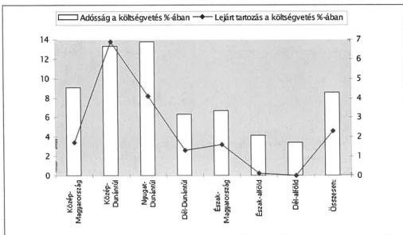

A kórházak adósságai a Közép- és Nyugat-Dunántúli régióban meghaladják a vizsgált kórházak átlagát (amely a vizsgálati minta összetéte-

60

---

II. RÉSZLETES MEGÁLLAPÍTÁSOK

léből adódóan magasabb mint a minisztériumi felmérésekből ismert, az összes kórház adatai alapján számított átlag).

**A legsúlyosabb helyzetben levő (100 millió Ft feletti lejárt tartozással rendelkező) kórházak lejárt adósága 1997-99. között 227,8%-kal nőtt.** Ugyanakkor 8 kórháznak (1997. évben összes lejárt tartozásuk 1461 millió Ft volt) a pénzügyi egyensúlya 1999. évre helyreállt, lejárt tartozásuk 60 millió Ft-ra csökkent (kecskeméti, szolnoki, zalaegerszegi, kaposvári, salgótarjáni, veszprémi, gyöngyösi, dunaújvárosi kórházak).

Több kórház önkormányzati kölcsönnel szüntette meg szállítói tartozását, de annak visszafizetése a további működést veszélyezteti, a szállítók felé fennálló eladósodás újra kezdődhet.

A fővárosi Szent István Kórház határidőn túli szállítói tartozása 1999. január 31-én 328,5 millió Ft volt. A fővárosi közgyűlés 250 millió Ft jegybanki kamattal növelt visszafizetendő kölcsönéből márciustól stabilizálódott a helyzet a szállítók felé, de év végén az önkormányzat és az OEP felé 827,5 millió Ft tartozása állt fenn a kórháznak. A 2000 májusától havi 34 millió Ft 2002-ben havi 44 millió Ft törlesztés mellett a kórház pénzügyi egyensúlya nem tartható fenn. Hasonló gondok tapasztalhatók a csepeli kórháznál, a dunaújvárosi Szent Pantaleon kórháznál és a zalaegerszegi megyei kórháznál is.

**A jelentős fizetési késedelem fokozatosan rontotta a rossz pénzügyi helyzetű kórházak pozícióit ('szegénység ára'),** így árelőnyök elérése helyett a szállítók (szolgáltatók) igyekeztek az árakban figyelembe venni a várható késedelmes fizetést is. **Nőtt a kiszolgáltatottság a szállítókkal szemben,** amely nem csupán az esetenkénti monopol helyzetükből fakad, hanem a velük szembeni tartozásállományból is.

A kórházak szállítókkal való kapcsolata még nem romlott meg annyira - a legkritikusabb likviditási helyzetben lévő intézményeknek sem -, hogy az a teljes pénzügyi összeomláshoz, vagy a betegellátás ellehetetlenüléséhez vezetett volna.

**A szállítók (szolgáltatók) által kezdeményezett bírósági eljárás összességében nem jellemző,** ugyanakkor egy-egy kórház vonatkozásában jelentősebb kárigényű és hatású perek előfordultak, amelyek utalnak az egészségügyi piac szereplőihez, a finanszírozáshoz kapcsolódó problémákra, érdekviszonyokra is.

A salgótarjáni kórháznak a legjelentősebb folyamatban lévő peres ügye a művese állomás 1995. évi bérbeadása miatt keletkezett, mert az addigi szállítói kapcsolatban lévő cég a szerződés felbontása miatt 75 millió Ft kárigény megtérítését követeli.

A székesfehérvári kórháznál a finanszírozáshoz szolgáltatott adatok ellenőrzésére 1996. májustól két havi, majd határozatlan idejű szerződést kötött. Az intézmény az első szerződés alapján az 1.000 Ft+ÁFA/súlyszám alapján számított 21,7 millió Ft szolgáltatási díjat kifizette, de az azt követő 29,5 millió Ft-os kötelezettségét nem. A másodfokú eljárást követően a kórházat 13,2 millió Ft késedelmi kamat és 1,3 millió Ft perköltség is terheli.

**A vizsgált kórházak közel egyharmadában kezdeményeztek bírósági eljárást az ügyeleti díjhátralék elismertetésére és megfizettetésére. A**

61

---

II. RÉSZLETES MEGÁLLAPÍTÁSOK

többi intézményben is történtek felmérések, egyeztetések és kötöttek egyezséget annak érdekében, hogy - lehetőleg peren kívüli megállapodással - a jogos és pénzügyileg fedezhető, el nem évült igények kielégítésére sor kerüljön.

# **A 2 milliárd Ft-ot is meghaladó (járulékokkal, kamatokkal) tartozás gyűlt össze, amelynek kétharmada került 1999. év végéig kifizetésre.**

Az EüM- BM 1999. októberi hátralékfelmérése alapján ugyan a vizsgált kórházak még közel 1,3 milliárd Ft-os ügyeleti tartozást mutattak ki. Ezt egyrészt mérsékelték az azóta történt kifizetések, másrészt az adatokat sokkal inkább a központi forrás reményében munkálták ki. Az ügyelet alatti túlmunka kellő nyilvántartásának hiányából, jogértelmezési problémákból eredően a MOK által kezdeményezett önbevalláson alapuló felmérések bizonytalansága miatt a pontos nagyságrend nem volt megállapítható.

A salgótarjáni kórház olyan követeléseket is számításba vett, amelyekhez dokumentált dolgozói igény nem kapcsolódott. A minisztériumok felméréseinek bizonytalanságát mutatja az is, hogy abban a vizsgált körből 16 intézménynél tartozás nem szerepelt, de a helyszíni vizsgálat során még fennálló kötelezettségeket igazoltak egyes kórházak (a tatabányai Megyei Kórház 28 millió Ft-ot, a zalaegerszegi Megyei Kórház 48 millió Ft-ot).

Részben bírósági döntés alapján - esetenként pénzügyi zavarokkal küzdő kórházaknál - az ügyeleti díj tartozás kifizetésre került, több kórház forráshiányára hivatkozva a rendezést halasztja, illetve a kifizetést központi támogatás megítéléséig függőben tartja.

A diósgyőri kórház és a Komárom-Esztergom Megyei Önkormányzat fenntartásában lévő mindkét kórház (Tatabánya, Esztergom), amelyeknek igen jelentős (közel 100, 60, ill. 140 millió Ft-os) 180 napon túli tartozása volt 1999. végén, 36,1 millió Ft-os és 72 millió Ft-os ill. 129,5 millió Ft-os kifizetést teljesített, ami természetesen forrást kötött le és így hozzájárult a kiegyenlítetlen szállítói kötelezettségek növekedéséhez.

A dunaujvárosi kórháznál, a Szent Imre Kórháznál az ügyeleti díjhátralék kifizetése elmaradt pénzügyi forrás hiányára hivatkozva, míg pl. az Újpesti Kórháznál, a kecskeméti, a szolnoki kórháznál központi forrás esetére függőben tartják további összegek, az utóbbiaknál elsősorban kamatok kifizetését.

**A vizsgált kórházak** közül 17 összesen 2.295 millió Ft konszolidációs hitelben részesült, miután likviditási helyzetük 1995. végén oly mértékben megrendült, hogy működésük került veszélybe. A gyógyszer szállítók néhány intézménynél megtagadták a gyógyszerek szállítását a tartozások kiegyenlítéséig. A tulajdonos (fenntartó) önkormányzatokat tételes jogi előírás nem kötelezte a kórházi adósságok rendezésére.

A finanszírozási előleg biztosítására a kórházak és a finanszírozó között létrejött megállapodás alapján került sor, amelyben rögzítették a folyósítás technikai részleteit (1996. évben a kiemelt szállítók követeléseit az OEP közvetlenül utalta), a visszafizetés feltételeit és egyéb kötelezettségeket. Ez a megoldás a kórházak számára kedvezőtlen volt, mert a szállítóknak a késedelmi kamattal növelt tartozás került átutalásra, anélkül, hogy megkísérelték volna tárgyalások útján annak csökkentését (pl. Esztergom).

62

---

II. RÉSZLETES MEGÁLLAPÍTÁSOK

A konszolidációs hitelhez kapcsolódó szakértői jelentések, az intézmények válságkezelő programja a működőképesség helyreállítását, az adósságnövekedés megállítását célozták, azonban a kórházak jelentős részénél nem hoztak kellő eredményt, az adósság rövid időn belül újra termelődött. 1997. év végére valamennyi érintett kórháznak volt ismételten lejárt szállítói tartozása. Emiatt működési előleg és csődelőleg címén 1998-1999. évben újabb 315 millió Ft előleget utalt az OEP.

A szombathelyi kórház 1996. évben nem részesült előlegben, adósságállománya azonban 1998. évben 417 millió Ft-ra, lejárt szállítói tartozása 250 millió Ft-ra nőtt, az elmaradt ügyeleti díjak kifizetésére 53 millió Ft működési előlegben részesült.

Szolnoki kórház 1996. évben 144,4 millió Ft konszolidációs hitelben részesült, de 1997. év végére a lejárt szállítói tartozás 259 millió Ft-ra nőtt. Önkormányzati biztost rendeltek ki, és az önkormányzat 160 millió Ft támogatást nyújtott a kórháznak.

A vizsgált kórházak közül OEP finanszírozási előlegben (konszolidációs hitel, csődelőleg, működési előleg címén) részesült kórházak fontosabb adatait a 19-20. sz. táblázat szemlélteti.

Az adósság kialakulásának okait a kórházak és a szakértői jelentések is több belső és külső körülményre vezették vissza. A kórházak többségénél az eladósodásnak 1993. évtől voltak jelei, ezek a vizsgált években is jellemezték a kórházak működését, de ezek felismerésében, hatásuk jelentkezésében mutatkoztak sajátosságok. Az adósság kialakulásának konkrét okai között jelölték meg az alábbiakat:

- A közalkalmazotti törvény által bevezetett 13. havi illetményfizetési kötelezettségre fedezetet nem kaptak az intézmények (ez a vizsgált intézményeknél az elmúlt 3 évben 7,5 milliárd kiadást jelentett).
- Több intézményt (pl. Esztergom, Salgótarján, Veszprém) az 1993. évi teljesítmény-finanszírozásra való áttérés a korábbi alacsony bázis miatt kedvezőtlenül érintett. Az intézmények alapdíja 14-60 E Ft között szóródott.
- Az infláció mértékével nem tartottak lépést a bevételek. Az egészségügyi intézmények dologi kiadásainak árindexe 1995. évben 31,4%, 1996. évben 25,1% volt, miközben a gyógyító, megelőző ellátásokra teljesített TB támogatás 1995. évben 12,7%-kal, 1996. évben 18,3%-kal növekedett. A kórházakat sújtották az adórendszerben bekövetkezett változások is, beszerzéseiknek 1992. évben 68%-át alkották a 0 ÁFA-kulcsú termékek, ezek aránya 1997. évben már csak 16,1%-ot tett ki. A vizsgált intézmények kiadásainak 5,5%-át, 7 milliárd Ft-ot tett ki a beszerzéseiket, beruházásaikat terhelő ÁFA 1999. évben.
- Az amortizáció a felújítások, pótlások forrásképzésének megoldatlansága, fejlesztési feladatok megvalósítása a működtetés terhére, (pl. Veszprémben a címzett támogatásból megvalósuló rekonstrukció befejezésének forrásigényét az önkormányzat nem tudta biztosítani, 70 millió Ft-ot a kórháznak a működés terhére kellett átvállalnia, Szombathelyen 366 millió

63

---

II. RÉSZLETES MEGÁLLAPÍTÁSOK

Ft-ot, az összes intézményi felhalmozás 62,7%-át TB finanszírozásból fedezték).

A 10 legnagyobb lejárt szállítói tartozással rendelkező kórház együttesen 1997. évben 846 millió, 1998. évben 350 millió, 1999. évben 894 millió Ft-tal többet költött fejlesztésre, mint felhalmozási célú bevétele volt.

- • **A működési körülmények miatti többletköltségek** nem térülnek meg a normatív finanszírozás keretében (több telephelyes, pavilonrendszerű, korszerűtlen infrastruktúrájú kórházak).
- • **A rekonstrukciók révén belépő**, használatba vett hotel- és diagnosztikai részlegek, a **korszerű orvostechnika működtetési többletei** (pl. Székesfehérváron 1995 őszén címzett támogatásból 7 milliárd Ft értékű rekonstrukció fejeződött be, amely a működési költségeket jelentősen megnövelte).
- • **A likviditás tervezés, a kiadások pénzügyi lehetőségekkel való folyamatos összehangolásának hiánya**, a kötelezettség vállalások nyilvántartásának megoldatlansága. (Pl. a gyöngyösi kórház átvilágítását végzők az eladósodás okait a tartós bevételi hiány és működési többletköltségek mellett a likviditás tervezés és figyelés teljes hiányával is összefüggésbe hozták).
- • **A tulajdonos önkormányzatok eltérő szerepvállalása az adósság válság következményeinek felszámolásában, a teendő intézkedések megfogalmazásában.** (Pl. a diósgyőri kórház tartós eladósodása miatt készített intézkedési tervek évek óta megfogalmazzák a Miskolc Megyei Jogú Város tulajdonában levő 2 kórház összevonását, azonban erre a helyszíni vizsgálat időpontjáig nem történt intézkedés.)
- • **A valós szükségleteket meghaladó kapacitások leépítésének hiánya, a meglevő kapacitások alacsony kihasználtsága** (pl. Székesfehérváron 1999. évben az aktív ágyak kihasználtsága 72%-os, a krónikus ágyaké 50%-os volt, az esztergomi kórház szerkezet-átalakítási üteme vontatott volt, amelyben a címzett támogatással megvalósuló rekonstrukció 1 éves csúszása mellett a kapacitások elkerülhetetlen leépítésének elodázása is szerepet játszott.)

**A finanszírozási előleg átmenetileg mérsékelte a pénzügyi nehézségeket, de nem volt elegendő a pénzügyi stabilizáció megteremtéséhez, és nem járt együtt az eladósodás okainak megszüntetésével, ezért az érintett intézmények adósságállománya túlnyomórészt növekedett.**

Budapest, 2000. július 31.

Dr. Kovács Árpád  
elnök{
  "label": "",
  "top_left": [
    0.7195196583553539,
    0.7896969696969697
  ],
  "bottom_right": [
    0.8695246862553959,
    0.8896969696969697
  ]
}

64

---

1.sz. melléklet

a V-1019-115/1999.sz. jelentéshez

# Az önkormányzati tulajdonban lévő kórházak pénzügyi helyzetének, gazdálkodásának vizsgálatában közreműködők

Baranya megye:

dr.Koronics Károlyné tanácsos

Maczekó Károly tanácsos

Bács-Kiskun megye:

Benkéné dr.Lavner Klára tanácsos

dr.Klapcsik László tanácsos

Domján Jenő tanácsos

Békés megye:

Laki Dóra számvevő

Borsod-Abaúj-Zemplén megye:

Dankó Géza tanácsos

dr.Takács András tanácsos

Fejér megye:

Czifra Erzsébet tanácsos

Ébner Vilmosné tanácsos

Győr-Moson-Sopron megye:

Varga József számvevő

Hajdú-Bihar megye

Kozák György tanácsos

Heves megye:

Nagy Sándorné tanácsos

dr.Tóth András tanácsos

Jász-Nagykun-Szolnok megye:

dr.Csapó Anna tanácsos

Buczkó András tanácsos

Komárom-Esztergom megye

Böröcz Imre tanácsos

György Árpád tanácsos

---

Nógrád megye:
Zeke József tanácsos

Somogy megye:
Huszti István tanácsos

Szabolcs-Szatmár-Bereg megye:
Hadházy Sándor tanácsos

Tolna megye:
Major Lászlóné tanácsos

Vas megye:
Horváth János tanácsos

Veszprém megye:
Koronczai Sánrosné számvevő
Szikszainé Király Mária tanácsos

Zala megye:
Dér Lívia számvevő

Főváros és Pest megye:
Bocsi Sándor tanácsos
Cséffai János számvevő
dr.Fónyad Erzsébet tanácsos
Gordos László főtanácsadó
Horváth Erika számvevő
dr.Kiss Károly számvevő
dr.Kőrös István számvevő
Marosi Gyöngyi tanácsos
Nagy Józsefné tanácsos
Salamon Károly számvevő
dr.Spilák Antal tanácsos
Szabó Tamás számvevő
dr.Telkes Imre számvevő
dr.Vasváriné dr.Rózsa Anikó tanácsos
Vojcsekné Szabó Ágnes számvevő

Külső szakértők:
Temesvári Zoltán
Takács József
Rozgonyi Zoltán
dr.Horváth Andrea

2

---

2. sz. melléklet

V-1019-115/1999.sz. jelentéshez

# A vizsgálatban érintett egészségügyi intézmények

|  Kórházak megnevezése | Megnevezés rövidítése  |
| --- | --- |
|  **Baranya megye** |   |
|  Baranya Megyei Kórház-Rendelőintézet Pécs | pécsi kórház  |
|  Baranya Megyei Kerpel-Frónius Ödön Gyermek-kórház Pécs | pécsi gyermekkórház  |
|  **Bács-Kiskun megye** |   |
|  Bács-Kiskun Megyei Önkormányzat Kórháza Kecskemét | kecskeméti kórház  |
|  **Békés megye** |   |
|  Békés Megyei Képviselő-testület Pándy Kálmán Kórház-Rendelőintézet Gyula | gyulai kórház  |
|  **Borsod-Abaúj-Zemplén megye** |   |
|  Borsod-Abaúj-Zemplén Megyei Kórház-Rendelőintézet, Miskolc | miskolci kórház  |
|  Megyei Jogú Város Önkormányzata Diósgyőri Kórház-Rendelőintézet, Miskolc | diósgyőri kórház  |
|  **Fejér megye** |   |
|  Fejér Megye Önkormányzat Szent György Kórház, Székesfehérvár | székesfehérvári kórház  |
|  Városi Önkormányzat Szent Pantaleon Kórház, Dunaújváros | dunaújvárosi kórház  |
|  **Győr-Moson-Sopron megye** |   |
|  Petz Aladár Megyei Kórház Orvostovábbképző Egyetem Oktató- Továbbképző Kórháza, Győr | győri kórház  |

---

|  **Hajdú-Bihar megye** |   |
| --- | --- |
|  Hajdú-Bihar Megyei Önkormányzat Kenézy Gyula Kórház-Rendelőintézet, Debrecen | debreceni kórház  |
|  **Heves megye** |   |
|  Városi Önkormányzat Bugát Pát Kórház, Gyöngyös | gyöngyösi kórház  |
|  **Jász-Nagykun-Szolnok megye** |   |
|  Jász-Nagykun-Szolnok Megyei Önkormányzat Hetényi Géza Kórház-Rendelőintézet, Szolnok | szolnoki kórház  |
|  **Komárom-Esztergom megye** |   |
|  Komárom-Esztergom Megyei Önkormányzat Szent Borbála Kórház-Rendelőintézete, Tatabánya | tatabányai kórház  |
|  Komárom-Esztergom Megyei Önkormányzat Vaszary Kolos Kórház-Rendelőintézete, Esztergom | esztergomi kórház  |
|  **Nógrád megye** |   |
|  Nógrád Megyei Önkormányzat Madzsar József Kórház-Rendelőintézete, Salgótarján | salgótarjáni kórház  |
|  **Somogy megye** |   |
|  Somogy Megyei Önkormányzat Kaposi Mór Kórháza, Kaposvár | kaposvári kórház  |
|  **Szabolcs-Szatmár-Bereg megye** |   |
|  Szabolcs-Szatmár-Bereg Megyei Önkormányzat Jósa András Kórház-Rendelőintézet, Nyíregyháza | nyíregyházi kórház  |
|  **Tolna megye** |   |
|  Tolna Megyei Önkormányzat Kórház-Rendelőintézete, Szekszárd | szekszárdi kórház  |
|  **Vas megye** |   |
|  Vas Megyei Önkormányzat Markusovszky Kórház, Szombathely | szombathelyi kórház  |

2

---

|  **Veszprém megye** |   |
| --- | --- |
|  Veszprém Megyei Önkormányzat Csolnoky Ferenc Kórház-Rendelőintézet, Veszprém | veszprém kórház  |
|  Városi Önkormányzat Magyar Imre Kórház-Rendelőintézet, Ajka | ajkai kórház  |
|  **Zala megye** |   |
|  Zala Megyei Önkormányzat Közgyűlés Kórház-Rendelőintézete, Zalaegerszeg | zalaegerszegi kórház  |
|  **Főváros, Pest megye** |   |
|  Fővárosi Szt. János Kórház-Rendelőintézet | Szt. János kórház  |
|  Fővárosi Szt. István Kórház és Intézményei | Szt. István kórház  |
|  Fővárosi Önkormányzat Uzsoki utcai Kórház | Uzsoki utcai kórház  |
|  Fővárosi Önkormányzat Csepeli Kórház-Rendelőintézet | Csepeli kórház  |
|  Szt. Imre Kórház | Szt. Imre kórház  |
|  Szt. Margit Kórház-Rendelőintézet | Szt. Margit kórház  |
|  Fővárosi Bajcsy-Zsilinszky Kórház-Rendelőintézet | Bajcsy-Zs. kórház  |
|  Fővárosi Önkormányzat Jahn Ferenc Dél-pesti Kórház | Jahn Ferenc kórház  |
|  Fővárosi Önkormányzat Péterfy Sándor utcai Kórház-Rendelőintézet | Péterfy Sándor utcai kórház  |
|  Fővárosi Önkormányzat Nyíró Gyula Kórház | Nyíró Gyula kórház  |
|  Fővárosi Önkormányzat Károlyi Sándor Kórház-Rendelőintézet | Károlyi Sándor kórház, vagy újpesti kórház  |
|  Fővárosi Önkormányzat Heim Pál Gyermekkórház | Heim Pál Gyermekkórház  |
|  Fővárosi Önkormányzat Budai Gyermekkórház-Rendelőintézet | Budai Gyermekkórház  |

3

---

|  Fővárosi Önkormányzat Madarász utcai Gyermekkórház-Rendelőintézet | Madarász utcai Gyermekkórház  |
| --- | --- |
|  Pest Megyei Önkormányzat Flór Ferenc Kórház-Rendelőintézet, Kistarca | Flór Ferenc kórház  |
|  Városi Önkormányzat Kórház-Rendelőintézet, Nagykőrös | nagykőrösi kórház  |
|  Városi Önkormányzat Jávorszky Ödön Városi Kórház-Szakambulancia, Vác | váci kórház  |

---4

---

3. sz. melléklet  
V-1019-115/1999.

## A jelentésben szereplő egyes fogalmak magyarázata

|  **Adósság konszolidáció:** | Az eladósodott kórházak tartozásának rendezése, a működés fenntarthatósága érdekében.  |
| --- | --- |
|  **Akkreditálás:** | Államilag létrehozott köztestület által végzett eljárás annak igazolására, hogy a szervezet kompetens specifikus feladatainak ellátására. Az akkreditálás non profit tevékenység, melyet a szakma elismert képviselői végeznek a szakma által kidolgozott standardok alapján. (v.ö. Tanúsítás)  |
|  **Aktív ellátás** | A finanszírozás módja szerint az aktív ellátás az egészségi állapot mielőbbi helyreállítása, aminek időtartama, illetve befejezése többnyire tervezhető és az esetek többségében rövid tartamú.  |
|  **Aktív kórházi ágy:** | Az aktív minősítésű osztályon, illetve osztályokon lévő ágy.  |
|  **Alapdíj:** | A teljesítmény elvű finanszírozás bevezetésekor intézményenként megállapított díj (Ft összeg), mely 1,0 HBCS pont teljesítéséért járt az adott intézménynek, s amely az 1992-es év betegforgalma, s annak bizonyos ismérvei alapján került megállapításra.  |
|  **Alapellátás:** | A jelenlegi magyar egészségügyben a háziorvosi, a házi gyermekorvosi, a fogászati, a védőnői, valamint az iskolaegészségügyi ellátások összefoglaló megnevezése.  |
|  **Allergén-specifikus immunglobulin:** | A beteg szervezetének túlérzékenysége miatti, reakciót kiváltó anyagok hatására - termelődő ellenanyag.  |
|  **Alsó határnap:** | Az NM által az adott betegségre, meghatározott alsó határnap, mint legrövidebb olyan gyógyítási idő, melyre teljes összegű finanszírozás jár.  |
|  **Aneszteziológia:** | Érzéstelenítéssel, érzéstelenítő szerekkel történő foglalkozás, azok alkalmazása.  |

---

|  **Antibiotikum:** | Gyógyszer, mely gátolja a baktériumok szaporodását, illetve elpusztítja azokat.  |
| --- | --- |
|  **Ágyforgó:** | Egy kórházi ágyon havonta átlagosan ellátott finanszírozási esetszám.  |
|  **Ápolási otthon:** | A krónikus fekvőbeteg ellátás speciális intézménye. Többségében alacsony ágyszámú, s kizárólag krónikus betegek ápolására szolgáló egészségügyi fekvőbeteg ellátó intézmény.  |
|  **Beavatkozás:** | Azon megelőző, diagnosztikus, terápiás rehabilitációs vagy más célú fizikai, kémiai, biológiai, vagy pszichikai eljárás, amely a beteg szervezetében változást idéz, vagy idézhet elő, továbbá a holttesten végzett vizsgálatokkal, valamint szövetek, szervek eltávolításával összefüggő eljárás, finanszírozási szempontból olyan elvégzett szolgáltatás, amely megfelelő kódok alapján elszámolási tétel a járóbeteg szakellátásban.  |
|  **Bruttó érték:** | Az eszköz beszerzési, előállítási költsége a számviteli előírásokban részletezett valamennyi ráfordítást figyelembe véve.  |
|  **Case-mix index (eset összetételi index):** | A HBCS súlyszámok súlyozott (éves) átlaga. Átlagos szakmai igényességű ellátások esetén értéke 1,0%. Az ennél magasabb szám azt jelenti, hogy az intézmény az átlagosnál magasabb színvonalú, vagy nagyobb bonyolultságú eseteket kezel.  |
|  **Kontrolling** | A management igényei alapján, ugyanakkor annak kielégítésére szolgáló, üzemgazdasági szemléletű tervezési, ellenőrzési, információ ellátási, koordináló vezetési rendszer, mely a tulajdonosi funkciók gyakorlásának eszköze, a tulajdonos érdekeinek - alapvetően a nyereség optimalizálásának - érdekében.  |
|  **CT** | Computer tomográfia: kiválasztott szelet síkja mentén több irányból mért röntgensugár gyengítésével a jellemző értékekből számítógép segítségével nyert képalkotás.  |
|  **Defenzív orvosi magatartás:** | Védekező beállítottságú, a felelősség áthárítására törekvő magatartásforma. (Legfőbb jellemzője indokolatlan diagnosztikus vizsgálatok kérése és magasabb ellátási szint bevonása)  |
|  **Definitív ellátás:** | Befejezett orvosi ellátás, mely megoldja az adott prob-  |

---2

---

lémát.

|  **Diagnosztikai vizsgálat:** | A betegségek felismerését, megállapítását, az egészségi állapot megismerését célzó vizsgálat.  |
| --- | --- |
|  **Diagnózis:** | Kórismeret.  |
|  **Diszlokációs pavilon:** | Olyan betegellátó célokat szolgáló épület, mely kialakítása folytán - egy adott intézményen belül - alkalmas bármely profilú osztály befogadására, annak hosszabb időszakot igénybe vevő felújítása, rekonstrukciója esetén.  |
|  **Felső határnap:** | NM rendeletben meghatározott határnap, mely feletti hosszú ellátási esetekre térítés a krónikus ellátásnak megfelelő mértékben, ápolási nap arányosan jár.  |
|  **Funkcionális privatizáció:** | Az egészségügy tevékenység folytatásához szükséges eszközök - általában minimális vagy igen méltányos mértékű - bérlési rendszerén alapuló, vállalkozási jellegű (piaci elemeket tartalmazó) egészségügyi ellátás.  |
|  **Gép-műszer kataszter:** | Az egészségügyi intézményekben alkalmazott kórház és orvostechnikai termékek (műszer, gép, eszköz, berendezés, gyógyászati segédeszköz) nyilvántartása.  |
|  **GYÓGYINFOK:** | Az Egészségügyi Minisztérium háttérintézménye, mely a fekvőbeteg ellátás kórházak által jelentett teljesítményeinek ellenőrzését, összesítését, kódkarbantartási munkálatokat, továbbá információgyűjtő tevékenységet végez a finanszírozás megalapozása érdekében. (Az intézmény székhelye Szekszárd)  |
|  **Használhatósági fok:** | A tárgyi eszközök nettó értékének aránya a bruttó érték %-ában.  |
|  **HBCS:** | Homogén betegségcsoportok azonos teljesítmény értékű betegségek orvosi szempontból is elfogadható csoportja, a fekvőbeteg ellátás finanszírozásában használt betegosztályozási rendszer.  |
|  **Hotelfunkciók:** | A fekvőbeteg ellátást kiszolgáló háttértevékenységek, mint pl.: élelmezés, mosoda, takarítás, energia ellátás, karbantartás, telefonszolgálat, stb.  |
|  **Igény (eü. ellátás)** | A biztosítottak részéről az egészségügyi ellátó  |

---3

---

rendszerrel szemben támasztott elvárás. Az igény tágabb fogalom, mint az egészségügy ellátási szükséglet. Másrészt nem minden ellátási szükséglet jelenik meg igényként (pl. ha a beteg nincs tudatában betegségének) A szükségleteket meghaladó igények esetén a kötelező biztosítások ill. a nemzeti egészségügyi rendszerek költségmegosztással, sőt a támogatás elutasításával valósítják meg a véges közpénzek hatékony és igazságos felhasználását. (v.ö. Szükséglet)

**Izotóp diagnosztika:** Radioaktív izotópok felhasználásával végzett vizsgálat.

**Járóbeteg szakellátás óraszáma:** A járóbeteg szakellátás kapacitás mutatója. Az OEP heti szakorvosi és nem szakorvosi órákban határozza meg az általa befogadott kapacitást, melynek tevékenységét a jelentett WHO pontszámok alapján finanszírozza.

**Kardiológia:** A szív működésével és betegségeivel foglalkozó orvostan.

**Kassza:** Az egészségbiztosítás költségvetésében a gyógyító-megelőző ellátások finanszírozására szolgáló előirányzati keret, mely egy-egy szolgáltatás fajtához kapcsolódik. (Pl. járóbeteg szakellátás, aktív fekvőbeteg ellátás, stb.)

**Kasszarendszer (zárt):** A kasszák egymás között nem átjárhatók, azaz automatikusan az így elkülönített pénzeszközök semmiféle matematikai modell szerint áramlást nem végeznek.

**Képalkotó berendezések:** Olyan diagnosztikai berendezések, melyek valamilyen - alkalmazott - elvre épülő képi formátumban jelenítik meg a vizsgált testtáját, szervet, mely kép alapján az orvostudomány jelenlegi szintjén, megfelelő diagnózis állítható fel, illetve más eljárások alapján feltételezett diagnózis helyessége támasztható alá, vagy zárható ki.

**Képi diagnosztika:** A betegség felismerését, megállapítását szolgáló azon tevékenység, mely képalkotó eljáráson ala-

---4

---

pul. (CT, MRI, stb.)

**Konszolidációs hitel:** Az OEP által - több évre szóló megállapodás alapján - nyújtott hitel, a pénzhiány miatt ellehetetlenült kórházak működőképességének fenntartása céljából.

**Kórházi ellátási eset:** Egy betegnek a kórházba történt felvételétől az elbocsátásig terjedő folyamatos kezelése. A folyamatos kezelés adaptációs szabadság miatt 3 napot meghaladó megszakítása a kórházi kezelés befejezését jelenti, ismételt kezelése ugyanezen betegnek a kórházi ápolási esetek szempontjából új esetnek minősül (a beteg új törzsszámot kap, új adatlapot kell kitölteni).

**Krónikus fekvőbeteg ellátás:** Az a fekvőbeteg ellátó intézetben végzett tevékenység, amelynek időtartama, befejezése általában nem tervezhető, hosszabb időszakot ölel fel. Az ellátásban az ápolás a meghatározó és az ellátás célja alapvetően a beteg állapotának stabilizálására irányul.

**Labordiagnosztika:** Laboratóriumi módszerekkel végzett elemző, analizáló tevékenység.

**Lézerterápia:** Lézersugár kibocsátó berendezés alkalmazásával végzett eljárás, amely a fénysugár nagy intenzitású energiájára és biológiai hatására építve a mikrosebészetben és a rosszindulatú daganatok kezelésében terjedt el elsősorban.

**Likviditás menedzselés:** Az intézmény folyamatos fizetőképességének fenntartását biztosító irányító, szervező tevékenység.

**Minimumfeltételek:** Azon követelmények összessége, amelyek az egészségügyi szolgáltatás teljesítése során a betegek, az ellátást nyújtó személyzet és a környezet biztonsága szempontjából elengedhetetlenek. (A részletes követelményeket az 19/1996.(VII.26.)NM rendelet tartalmazza.)

**Minőségbiztosítás:** Követelmények meghatározása, ezek teljesítésének ellenőrzése, értékelése, szükség szerint a tevékenység korrekciója és folyamatos minőségfejlesztés.

5

---

|  **Molekuláris biológiai vizsgálat:** | A sejtekből kinyert genetikai anyag (DNS, RNS) diagnosztikai célú elemzése.  |
| --- | --- |
|  **Morbiditás:** | A megbetegedések arányszáma az összlakosság számához viszonyítva. Kifejezi, hogy egy bizonyos területen, egy bizonyos időszak alatt 100 ezer lakosból, hányan betegedtek meg adott betegségben.  |
|  **Mortalitás:** | Valamely betegségen bekövetkezett halálozások aránya, az összlakosság számához viszonyítva és 100 ezer lakosra vetítve.  |
|  **MRI** | Magnetorezonanciás képalkotás: mágneses tér által előidézett, együttmozgáson alapuló képalkotó eljárás.  |
|  **Műtőblokk:** | A kórházi épületstruktúra jelenleg preferált azon megoldása, melyben a műtők nem az egyes osztályon belül, hanem koncentráltan egy blokkban helyezkednek el.  |
|  **Nettó érték:** | A bruttó érték (beszerzési, előállítási költség) és az értékcsökkenés különbözete.  |
|  **Normál eset:** | **ápolási ápolási** A betegnek az alsó- felső határnap közötti tényleges ápolási ideje. (Az alsó és felső határnap közötti ápolásra a kórház megkapja a teljes díjat.)  |
|  **OECD:** | Organisation for Economic Cooperation and Development, az 1960-ban megszűnt OEEC utódszervezete, mely a fejlett tőkés országok többségét tömöríti. A rövidítés magyar megfelelője: Gazdasági, Együttműködési és Fejlesztési Szervezet. Székhelye Párizs.  |
|  **Onkológia:** | Az orvostudománynak a daganatokkal foglalkozó ága.  |
|  **Ortopédia:** | A mozgásszervek betegségeivel, ezek gyógyításával, megelőzésével foglalkozó orvostudományi ág.  |
|  **Osztályos eset:** | **ellátási** A beteg osztályos felvételétől az osztályról történő elbocsátásáig terjedő időtartamban végzett folyamatos kezelése. Egy kórházi ellátási eset egy vagy több osztályos ellátási esetből tevődhet össze.  |

---6

---

|  **Patológia:** | Az orvostudomány egyik diagnosztikai ága, mely a betegségek okaival és a betegségek okozta (szerkezeti) elváltozásokkal foglalkozik.  |
| --- | --- |
|  **Prevenció:** | A betegség kialakulását megelőző (elhárító) orvosi eljárás, vagy életmód változtatás.  |
|  **Progresszív betegellátás:** | Fokozatos (értsd: az egészségügyi ellátás különböző - egymásra épülő - szintjein) a beteg legeredményesebb kezelését biztosító intézményben történő ellátás.  |
|  **Protokoll:** | Meghatározott kezelés vagy beavatkozás elvégzéséhez szükséges események és tevékenységek rendszerezett listája, amely az egészségügyi ellátás megkívánt vagy minimális standardjának való megfelelést szolgálja.  |
|  **Radiológia:** | A sugárzás gyógyítási és diagnosztikai célokra történő felhasználásának tudománya. (Egészségügyi intézményeknél e szakterületet ellátó osztály megnevezése.)  |
|  **Reagens lízing:** | A mai magyar egészségügyi gyakorlatban használatos szleng kifejezés, mely arra utal, hogy az intézmények a gyártó cégtől használatra megkapnak laborautomata berendezéseket, s kötelezettséget vállalnak arra, hogy a szükséges reagenseket - egy bizonyos ideig - kizárólag a gyártótól szerzik be. (A gépek általában annyira reagens specifikusak, hogy az intézmény eleve kényszerpályán mozog.) A gép ára néhány év alatt a reagens árában térül meg a gyártónak.  |
|  **Reagens:** | Olyan vegyi anyag, amely más anyaggal keverve jellemző vegyi hatást mutat, és ezzel az utóbbi anyag felismerésére alkalmas.  |
|  **Rehabilitációs osztály:** | Olyan - a krónikus fekvőbeteg ellátáson belüli - osztály, melyben történő ápolás célja az elvesztett fizikai képességek minél szélesebb körű visszaállítása.  |
|  **Sugárterápia:** | Radioaktív besugárzás alkalmazása a gyógyítás-  |

---7

---

|   | ban.  |
| --- | --- |
|  **Súlyszám:** | A különböző HBCS-kben az átlagos esetköltséghez viszonyított költségigényesség mértékét fejezi ki.  |
|  **Szakmai protokoll:** | Szakmai irányelv. (v.ö. Protokoll)  |
|  **Szolgáltatás auditálás:** | Az egészségügyi szolgáltatás - szakmai ellenőrzésén alapuló - kiértékelése, mely lehet belső vagy külső audit.  |
|  **Szükséglet:** **(egészségügyi ellátási)** | A gyógyító- megelőző ellátások azon köre, melyek az adott egyén számára egészség-nyereséggel járnak. Optimális esetben az ellátási szükséglet és a biztosítási alapcsomag egybeesik. (v.ö.: Igény)  |
|  **Szűrés:** | Bizonyos betegségek, lehetőleg kezdeti stádiumban történő felismerését lehetővé tevő vizsgálati eljárás.  |
|  **TAJ szám:** | Társadalombiztosítási azonosító jel (szám), mely az állampolgár ingyenes egészségügyi ellátása igénybevételének alapfeltétele.  |
|  **Tanusítás:** | Tanusító cég igazolja, hogy a termék folyamat vagy szolgáltatás megfelel a kiválasztott specifikus követelményeknek. (pl. ISO). A tanusítás általában profit-orientált tevékenység (v.ö. Akkreditálás)  |
|  **Traumatológia:** | A sebészetnek a sérülésekkel foglalkozó ága.  |
|  **UH:** | A hallható hangnál nagyobb frekvenciájú, mechanikus rezgéseket érzékelni képes és azt kiértékelhető képi jellé alakító diagnosztikus készülék.  |
|  **Valid adatállomány:** | Hiteles, minőségellenőrzött.  |
|  **WHO pontérték:** | World Health Organisation. Az Egészségügyi Világszervezet irányelvei alapján kidolgozott pont-rendszer a szakorvosi járóbeteg ellátás teljesítményeinek mérésére.  |

---8

---

1. sz. függelék  
V-1019-115/1999.sz. jelentéshez

# Az egészségügy működését meghatározó érdekviszonyok

**A magyar egészségügyi ellátórendszer kórházközpontú**, a különböző reformok ellenére nem csökkent a kórházi ellátás, gyógyítás (hospitalizáció) részaránya. Az egészségügyi kiadások növelése irányában hatnak a kórházak nemzetközi összehasonlításban is magas ágyszáma és orvos létszáma, a teljesítmények növelésére ösztönző finanszírozás, a szakmapolitika hiányára, ellentmondásosságára visszavezethető összehangolatlan, szükségletekhez nem igazodó fejlesztések egyaránt. **A különböző érdekcsoportokat** (orvos-szakma, beszállítók, helyi politika, betegek) **semmi sem motiválja abban, hogy a betegek problémái az ellátórendszer lehetőleg alacsony szintjén, optimális mértékű beavatkozással oldódjanak meg.**

A jelenlegi, teljesítményfinanszírozás által meghatározott ösztönző rendszerben a “sikeres” kórházi gazdálkodás szinte egyetlen hatásos eszköze a bevételek növelése a teljesítmények fokozásával, a tevékenység jelentési rendszer kínálta lehetőségek maximális kihasználásával. Így az “eredményesen” gazdálkodó intézmények – nyitott kassza esetén – az E. Alap növekvő hiányát okozzák, zárt kassza esetén a többi intézménytől vonják el a forrást.

A hatékonyság növelését szolgáló struktúra-átalakítás egyik jelentős akadálya a megfelelő érdekeltség hiánya: a pénzügyi eredmény nem ott jelentkezik, hol az erőfeszítéseket teszik, az intézmények által hatékonyság növelésével elérhető megtakarítások valójában az ellátórendszer egészében kerülnek szétosztásra.

## 1. A beszállítóipar érdekvényesítése

**A teljesítményalapú-finanszírozás szabályozatlan és nem tervezett ellátó hálózatra épülve, a szükségleteket meghaladó ellátás iránti igényeket generál**, amely jó terepet kínál a beszállítóipar (gyógyszer, műszer, diagnosztikai és egyéb szakmai anyagok) érdekvényesítésére.

**A gyógyszer támogatások aránya** – amely a kórházi gyógyszerfelhasználást nem érinti – az E. Alap kiadásai között 22%-ról 30%-ra **növekedett**, miközben jelentősen nőtt a nem támogatott gyógyszerek aránya és a lakosság által fizetett térítési díj (ez utóbbi az összes gyógyszer fogyasztás 27%-át jelenti).

**A kórházakban erőteljes növekedés volt tapasztalható a gyógyszer kiadásokban.** (A vizsgált kórházakban a gyógyszer, vegyszer kiadások 1997-99. között 4,3 milliárd Ft-tal, 34,4%-kal nőttek.)

---

Az orvosok gyógyszer rendelési szokásait a gyógyszeripar külföldi kongresszusi utak, vizsgálatok támogatása, műszer beszerzések révén motiválja, a rendelt gyógyszerek indokoltságát szakmai szempontból általában nem vizsgálják.

Az 1992-99. közötti időszakban a magyar gyógyszer import az EU tagállamokból megháromszorozódott. A gyógyszertámogatásra fordított összegek egyre nagyobb részét az import gyógyszerek támogatása képezte, miközben a hazai készítmények támogatása reálértékben csökkent.

Az import készítmények átlagára egy 1999. évi statisztikai felmérés szerint a 3 legnagyobb forgalmú Európai Uniós gyártó esetében 1.284 Ft/csomagolási egység volt, míg a 3 legnagyobb magyarországi gyártó átlagára csomagolási egységenként 343 Ft-ot tett ki. (A lakossági gyógyszertámogatás függvénye a gyógyszer fogyasztásnak és az ár alakulásának.)

A műszert gyártó és forgalmazó cégek a tevékenység fokozására irányuló kényszert használják ki. Reagens vagy fogyóeszköz lízing keretében helyeznek ki műszereket, amellyel kapcsolatos fő érv, hogy azokkal olyan vizsgálatok végezhetők, amelyek jó "pont-termelők".

Az ÁSZ 1999. évi, a kórházi gép- műszer gazdálkodást érintő vizsgálata rámutatott arra, hogy a reagens-lízing a kórházak számára több esetben előnytelen a magas anyag költségek miatt, de beruházási forrás hiányában a működtetés terhére több évre osztják meg a hiányzó beruházási forrást. Ugyanakkor a működtetett eszközök kihasználtsága sem megfelelő.

A "pontcsináló" műszereken végzett vizsgálatok jellemzője, hogy azok orvosilag gyakran indokolatlanok és nincs vagy csekély hatásuk van az egészségi állapotra.

Ezt támasztja alá az Országos Laborintézet (OLI) 1999. évi szakfelügyeleti jelentéséből vett példa az allergológiai automatára vonatkozóan, amellyel egy beteg vérmintájából egyszerre 36 allergén-specifikus immunglobulin E maghatározás (500 német pont allergénenként) végezhető. Egyetlen járóbeteg-szakrendelő egy ilyen készülékkel évente több mint 25 millió Ft TB támogatásra tehet szert. A szénanáthás emberek egészségi állapotát e költséges vizsgálat helyett inkább prevencióval lehetne javítani (pl. parlagfű irtásával).

Az utóbbi évek növekvő üzleti lehetősége a molekuláris biológiai vizsgálatok végzése. 1999. évben egy labordiagnosztikát végző vállalkozás 3 megye összes laborvizsgálatának megfelelő molekuláris diagnosztikai teljesítményt jelentett kb. 1 milliárd Ft értékben. A szakfelügyelet szerint a vizsgálatok javarészt indokolatlanok és preventív értékük megkérdőjelezhető. A hibás ösztönzők miatt Magyarországon több molekuláris vizsgálat történik mint

2

---

sok fejlett országban, ezen vizsgálatok jelentős részének nincs hatása az egészségügyi állapotra.

## 2. Az orvosok egyéni érdekei

Az egészségügyben **hagyományosan jelen van a hálapénz és az ehhez társuló torzulások**. A hálapénz mértékére, összegére vonatkozóan csupán szakértői becslések ismertek. A személyi jövedelemadó bevallásban, a teljes adózói körben feltüntetett hálapénz összegére az Adó és Pénzügyi Ellenőrzési Hivatal (APEH) csupán az 1996. évi bevallásokból történő kigyűjtés alapján tudott volna más egyéb jövedelmekkel (pl. borravaló) együtt összevontan információt szolgáltatni.

A Magyar Orvosi Kamara (MOK) orvosetikai szabályzata szerint a hálapénz egyik oka az orvosok megalázóan alacsony fizetése, mögötte az egészségügyi rendszer működésének zavara áll.

Az 1999. évi májusi felmérés szerint a bruttó keresetek alapján az orvosok bére a nemzetgazdasági átlagkereset 128,8%-át, de ezen belül az egyetemi diplomások keresetének (vezetők nélkül) csupán 63%-át tette ki.

A hálapénz megoszlása nem egyenletes, nagy része a műtétes szakmák magasabb beosztású orvosai és a háziorvosok körében koncentrálódik. Az orvosok hálapénz formájában testet öltő egyéni érdekei gyakran ellentétesek az intézményi érdekekkel. **A hálapénz két módon is torzítja az ellátórendszer működését:**

- A viszonylagos kínálati bőség ellenére mesterséges hiány (szűk keresztmetszet) kialakítására, fenntartására ösztönöz; bár a kapacitások (orvos, műszer, rendelési idő) összességében rendelkezésre állnak, az orvos érdeke a várakozó betegek nagy száma és nem csökkentése (pl. előjegyzési rendszer bevezetésével),
- a sok és drága vizsgálat, a legújabb gyógyszerek alkalmazása a defenzív medicina mellett a beteg háláérzetét is fokozza. A "soron kívüli", hosszabb ideig tartó ellátás, a gyakoribb orvosbeteg találkozások alkalmat adnak a hála kifejezésére.

**A jelenlegi alig szabályozott, "orvosi szabadságra" épülő rendszer a hálapénz jelenségnek kedvez, ezzel függ össze** a fejlett országokban széles körben alkalmazott **szakmai protokollok**, az akreditáció (amely magában foglalja a belső és külső minőségbiztosítást és a protokollok alapján nyújtott szolgáltatás rendszeres auditálását) **hiánya is**.

3

---

### 3. A betegek érdekei

**Az egészségügyi szolgáltatás igénybe vétele formailag biztosítási alapú, de az lényegében független a befizetett járulék mértékétől,** a jogosultság csaknem általános. A biztosított oldaláról a minél magasabb színvonalú szolgáltatásra van igény, amellyel szemben a szolgáltató oldalán a kínálat viszonylag rugalmatlan. **Ezért az ellátórendszer kapacitás és minőségi problémákkal, állandó egyensúlyhiánnyal küzd.** A működés zavarai nem egyformán érintenek mindenkit. A félig piacosodott egészségügyben a megkülönböztetett bánásmód elérhető az ellenértékének törvényes megfizetése nélkül is.

Miután az egészségügyre fordítható források végesek, ezért elkerülhetetlen az orvosilag indokolt **egészségügyi ellátási szükséglet és a kétséges egészségnyereséget, egészségi állapotjavulást eredményező igények közötti különbségtétel.** Ez sokoldalú feladat: többek között az egyén felelősségét erősítő gazdasági ösztönzők, koncentrált egészségmegőrzési programok széles körű alkalmazását feltételezi. Ez összhangban van a társadalombiztosítási alapú egészségügyi ellátás alapelveivel:

- **a szolidaritás elve** alapján az ellátáshoz mindenki jövedelme arányában járul hozzá (a csökkenő számú járulék fizető befizetéseiből kell gondoskodni a jövedelemmel nem rendelkezők - járulékot nem fizetők - egészségügyi ellátásáról is).
- **esélyegyenlőség elve** alapján az azonos egészségügyi szükséglettel rendelkezőknek egyenlő esélyt kell biztosítani az ugyanolyan minőségű és eredményességű ellátáshoz való hozzáféréshez.

A felsorolt alapelvek nem zárják ki (önkéntes biztosítások, magán egészségügyi ellátás keretében jelenleg is lehetőség van rá) plusz szolgáltatások vásárlását. A jogos, szükségletnek megfelelő, orvosilag indokolt ellátások az esélyegyenlőség alapján mindenkit egyformán megilletnek, de ha nem legális csatornákon keresztül valaki a szükségleténél többet kap, az a többi polgárral szemben méltánytalan, mert az ő esélyegyenlőségüket rontja.

### 4. Helyi politikai érdekek

Az önkormányzatok létrejöttével a közigazgatási rendszer nagy fokú decentralizációja keretében a korábbi megyei koordinációs funkciók megszűntek, az egészségügyi intézmények több mint 80%-a a helyi önkormányzatok tulajdonába került, **az ellátórendszert érintő döntések helyi szinten születnek.** A helyi önkormányzatoknak alapvető érdeke, hogy támogassák intézményeiket az állami támogatáshoz való hozzájutásban, a szolgáltatás elért szintjének megtartásában.

4

---

A különböző források segítségével (elsősorban központi költségvetési támogatásból) megvalósuló **fejlesztéseket sem kistérségi, sem megyei, sem regionális szinten nem illesztik az egészségügyi ellátási szükségletekhez és nem koordinálják.** Ezért az amortizáció megoldatlansága, az általánosan érvényesülő forráshiány ellenére sok a részlegesen kihasznált intézmény, műszer (ezt jól illusztrálja a már említett ÁSZ vizsgálat a laborautomaták kihasználtsága területén, de a vizsgált kórházak ágykihasználtságának alakulása is).

**Az önkormányzatok egy jelentős része nem tud megfelelni** - a részben megörökölt, a részben közreműködésükkel, a helyi érdekek alapján fejlesztett, sok esetben a valós szükségleteket meghaladó- **egészségügyi ellátórendszer tulajdonlásából adódó kötelezettségekkel.** Ez a kórházak pénzügyi stabilitásának megrendüléséhez is vezetett. Több kórház csak számottevő eladósodás révén volt képes a fejlesztési forrásokat a működtetés terhére kiegészíteni és a kiadásokat nem fedező bevételekből működtetni a túlméretezett kapacitásokat. Az így létrejött deficitekért a felelősség egy része a helyi önkormányzatokat terheli, akik tulajdonosként (fenntartóként) nem voltak képesek a kórház felett hatásos felügyeletet gyakorolni.

### **Az egészségügyi érdekszférák kölcsönhatása**

A magyar egészségügy működését meghatározó öt fő tényező (a jelentésben elemzett teljesítményfinanszírozásból fakadó érdekek, valamint a függelékben tárgyalt négy érdekrendszer) egymás hatását erősítve egyirányba hat. Ezen tényezők, melyeket jelenleg az Egészségügyi Minisztérium és az OEP érdemben nem tud befolyásolni, az ellátási tevékenység bővítését és fokozását, és **nem** az egészségügyi állapot javítását (egészségnyereség elérését) kényszerítik az orvosok és az intézmények prioritási listájának élére. Részben ez magyarázza, hogy a magyar egészségügy kedvezőtlen eredményességi mutatói miért állnak ellentétben az ellátó rendszert leíró statisztikai mutatókkal.

---5

---

1. sz. diagram

# A teljes munkaidőben foglalkoztatottak átlagos keresetének alakulása vizsgált kórházcsoportonként

■ Alapilletmény ■ Rendszeres személyi juttatások □ Bruttó kereset

Vizsgált megyei kórházak

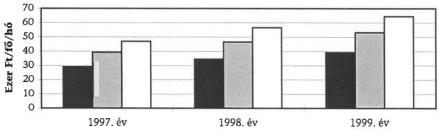

Vizsgált fővárosi kórházak

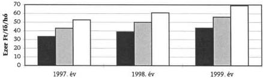

Vizsgált városi kórházak

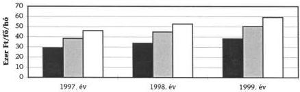

Vizsgált gyermekkórházak

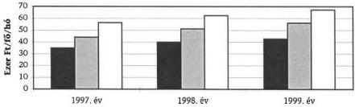

(Az alapadatok tartalmazták a visszamenőleges ügyeleti díj kifizetéseket.)

---

v

---

2. sz. diagram

# Egyes kiemelt raktári készletféleségeknél az átlagkészlet, az éves felhasználás és a számított forgási nap alakulása

# Gyógyszer

(Összes készletfelhasználáson belüli arány: 47%)

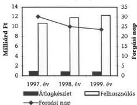

# Élelmiszer

(Összes készletfelhasználáson belüli arány csökkenő, 1999-ben 8%)

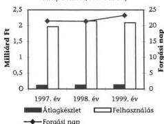

# Laboranyag

(Összes készletfelhasználáson belüli arány: 4-5% közötti)

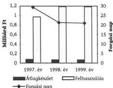

# Röntgenfilm

(Összes készletfelhasználáson belüli arány: 3%)

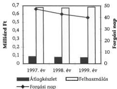

# Szakmai jellegű egyéb anyag

(Igen eltérő tartalom mellett az összes készletfelhasználáson belüli arány: 23%)

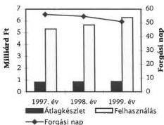

# Tisztítószer

(Összes készletfelhasználáson belüli arány: 2%)

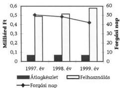

---

1. 2017年1月1日

1

---

1. sz. táblázat

A gyógyító-megelőző ellátásokra teljesített kifizetések
(országos összesen)

|  Kifizetés jogcímei | Teljesítés M Ft-ban |   |   |   | Eltérés M Ft-ban |   |   | Viszonyszámok %-ban  |   |   |
| --- | --- | --- | --- | --- | --- | --- | --- | --- | --- | --- |
|   |  1996 | 1997 | 1998 | 1999 | 97-96 | 98-97 | 99-98 | 97/96 | 98/97 | 99/98  |
|  HSZ | 22 634 | 25 946 | 29 399 | 31 538 | 3 312 | 3 453 | 2 139 | 115 | 113 | 107  |
|  Ügyeleti szolgálat | 2 560 | 2 966 | 3 403 | 3 818 | 406 | 437 | 415 | 116 | 115 | 112  |
|  Ifjúságvédelem | 5 058 | 5 849 | 6 722 | 7 817 | 791 | 873 | 1 095 | 116 | 115 | 116  |
|  Fogászati ellátás | 5 555 | 7 308 | 8 368 | 9 680 | 1 753 | 1 060 | 1 312 | 132 | 115 | 116  |
|  Gondozás | 4 290 | 5 263 | 6 010 | 7 271 | 973 | 747 | 1 261 | 123 | 114 | 121  |
|  Egyéb ellátás | 574 | 633 | 645 | 0 | 59 | 12 | -645 | 110 | 102 | 0  |
|  Házi szakápolás | 25 | 490 | 989 | 1 120 | 465 | 499 | 131 | 1 960 | 202 | 113  |
|  Járóbeteg szakellátás | 30 632 | 36 497 | 41 969 | 47 339 | 5 865 | 5 472 | 5 370 | 119 | 115 | 113  |
|  CT, MRI | 4 664 | 5 412 | 6 216 | 6 485 | 748 | 804 | 269 | 116 | 115 | 104  |
|  Művese kezelés | 5 440 | 6 774 | 7 482 | 8 736 | 1 334 | 708 | 1 254 | 125 | 110 | 117  |
|  Aktív fekvőbeteg szakellátás | 115 966 | 136 092 | 159 555 | 182 804 | 20 126 | 23 463 | 23 249 | 117 | 117 | 115  |
|  Krónikus fekvőbeteg szakellátás | 13 770 | 16 232 | 18 672 | 21 202 | 2 462 | 2 440 | 2 530 | 118 | 115 | 114  |
|  Vérellátás | 1 092 | 1 586 | 0 | 0 | 494 | -1 586 | 0 | 145 | 0 | 0  |
|  Betegszállítás és halott szállítás | 6 954 | 8 548 | 2 878 | 3 481 | 1 594 | -5 670 | 603 | 123 | 34 | 121  |
|  Speciális finanszírozású feladatok | 4 386 | 5 727 | 5 800 | 7 065 | 1 341 | 73 | 1 265 | 131 | 101 | 122  |
|  **Kassza előirányzatok** | **223 600** | **265 323** | **298 108** | **338 356** | **41 723** | **32 785** | **40 248** | **119** | **112** | **114**  |
|  Célelőirányzatok | 1 232 | 458 | 485 | 616 | -774 | 27 | 131 | 37 | 106 | 127  |
|  **Gyógyító-Megelőző Ellátások ö.** | **224 832** | **265 781** | **298 593** | **338 972** | **40 949** | **32 812** | **40 379** | **118** | **112** | **114**  |

---

Page 1 of 1

---

2. sz. táblázat

Az ágyak, ápolási napok és teljesítmény díjak alakulása (országos összesen)

|  RÉGIÓ-KÓD | RÉGIÓNÉV | Ágyak száma |   |   | Ápolási napok száma |   |   | Teljesítménydíj  |   |   |
| --- | --- | --- | --- | --- | --- | --- | --- | --- | --- | --- |
|   |   |  aktív | krónikus | összesen | aktív | krónikus | összesen | aktív | krónikus | összesen  |
|  **1997. év**  |   |   |   |   |   |   |   |   |   |   |
|  99 | ÖSSZESEN | 67 166 | 17 341 | 84 507 | 19 532 008 | 5 394 558 | 24 926 566 | 132 413,7 | 15 925,4 | 148 339,1  |
|  04 | BUDAPEST-PEST | 22 192 | 6 105 | 28 297 | 6 421 565 | 2 017 850 | 8 439 415 | 47 375,7 | 6 400,8 | 53 776,5  |
|  03 | BARANYA-SOMOGY-TOLNA | 6 424 | 1 380 | 7 804 | 1 890 202 | 431 385 | 2 321 587 | 13 416,3 | 1 205,1 | 14 621,4  |
|  07 | CSONGRAD-BÉKÉS-BÁCS | 8 688 | 1 552 | 10 240 | 2 585 627 | 457 314 | 3 042 941 | 17 001,6 | 1 233,5 | 18 235,1  |
|  05 | BORSOD-HEVES-NÓGRAD | 8 245 | 1 834 | 10 079 | 2 458 703 | 544 084 | 3 002 787 | 14 670,8 | 1 521,0 | 16 191,8  |
|  02 | KOMÁROM-FEJÉR-VESZPRÉM | 5 781 | 2 466 | 8 247 | 1 685 493 | 767 345 | 2 452 838 | 10 146,6 | 2 121,0 | 12 267,6  |
|  01 | GYŐR-VAS-ZALA | 6 151 | 2 330 | 8 481 | 1 694 729 | 732 648 | 2 427 377 | 11 329,2 | 2 259,9 | 13 589,1  |
|  06 | HAJDÚ-SZABOLCS-JÁSZ | 9 685 | 1 674 | 11 359 | 2 795 689 | 443 933 | 3 239 622 | 18 473,5 | 1 184,1 | 19 657,6  |
|  **1998. év**  |   |   |   |   |   |   |   |   |   |   |
|  99 | ÖSSZESEN | 67 481 | 18 313 | 85 794 | 18 945 952 | 5 435 602 | 24 381 554 | 155 746,7 | 18 163,5 | 173 910,2  |
|  04 | BUDAPEST-PEST | 22 698 | 6 826 | 29 524 | 6 231 892 | 2 023 751 | 8 255 643 | 50 489,4 | 6 906,9 | 57 396,3  |
|  03 | BARANYA-SOMOGY-TOLNA | 6 482 | 1 453 | 7 935 | 1 808 772 | 449 439 | 2 258 210 | 16 292,2 | 1 416,6 | 17 708,8  |
|  07 | CSONGRAD-BÉKÉS-BÁCS | 8 697 | 1 599 | 10 296 | 2 513 546 | 482 696 | 2 996 242 | 20 870,2 | 1 611,5 | 22 481,7  |
|  05 | BORSOD-HEVES-NÓGRAD | 8 148 | 1 874 | 10 022 | 2 375 834 | 552 473 | 2 928 307 | 17 566,2 | 1 788,9 | 19 355,1  |
|  02 | KOMÁROM-FEJÉR-VESZPRÉM | 5 752 | 2 416 | 8 168 | 1 637 056 | 748 352 | 2 385 407 | 12 820,7 | 2 456,4 | 15 277,1  |
|  01 | GYŐR-VAS-ZALA | 6 069 | 2 411 | 8 480 | 1 626 829 | 740 785 | 2 367 614 | 13 761,9 | 2 598,6 | 16 360,5  |
|  06 | HAJDÚ-SZABOLCS-JÁSZ | 9 635 | 1 734 | 11 369 | 2 752 023 | 438 108 | 3 190 131 | 23 945,9 | 1 387,5 | 25 333,4  |
|  **1999. év**  |   |   |   |   |   |   |   |   |   |   |
|  99 | ÖSSZESEN | 65 990 | 19 007 | 84 997 | 18 190 416 | 5 638 591 | 23 829 006 | 173 451,5 | 20 532,4 | 193 983,9  |
|  04 | BUDAPEST-PEST | 21 386 | 7 068 | 28 454 | 5 925 548 | 2 087 875 | 8 013 423 | 55 846,3 | 7 854,5 | 63 700,8  |
|  03 | BARANYA-SOMOGY-TOLNA | 6 362 | 1 488 | 7 850 | 1 737 269 | 463 092 | 2 200 361 | 18 038,3 | 1 572,6 | 19 610,9  |
|  07 | CSONGRAD-BÉKÉS-BÁCS | 8 556 | 1 629 | 10 185 | 2 422 386 | 513 209 | 2 935 595 | 23 521,9 | 1 861,9 | 25 383,8  |
|  05 | BORSOD-HEVES-NÓGRAD | 7 983 | 1 934 | 9 917 | 2 248 487 | 584 791 | 2 833 277 | 19 186,8 | 2 037,7 | 21 224,5  |
|  02 | KOMÁROM-FEJÉR-VESZPRÉM | 5 841 | 2 562 | 8 403 | 1 609 173 | 772 655 | 2 381 828 | 14 387,7 | 2 727,5 | 17 115,2  |
|  01 | GYŐR-VAS-ZALA | 6 201 | 2 588 | 8 789 | 1 557 101 | 755 655 | 2 312 756 | 15 222,6 | 2 859,8 | 18 082,4  |
|  06 | HAJDÚ-SZABOLCS-JÁSZ | 9 661 | 1 738 | 11 399 | 2 690 453 | 461 315 | 3 151 768 | 27 247,6 | 1 618,4 | 28 866,0  |

---

3. sz. táblázat

# Ezer lakosra jutó ágy, ápolási nap, teljesítmény díj (országos összesen)

|  RÉGIÓ-KÓD | RÉGIÓNÉV | Népesség | Ágy/ezer lakos |   |   | Ápolási nap/ezer lakos |   |   | Teljesítmény díj/ezer lakos  |   |   |
| --- | --- | --- | --- | --- | --- | --- | --- | --- | --- | --- | --- |
|   |   |   |  aktív | krónikus | összesen | aktív | krónikus | összesen | aktív | krónikus | összesen  |
|  **1997. év**  |   |   |   |   |   |   |   |   |   |   |   |
|  99 | ÖSSZESEN | 10 091,789 | 6,656 | 1,718 | 8,374 | 1 935,436 | 534,549 | 2 469,985 | 13 121 | 1 578 | 14 699  |
|  04 | BUDAPEST-PEST | 2 856,954 | 7,768 | 2,137 | 9,905 | 2 247,696 | 706,294 | 2 953,990 | 16 583 | 2 240 | 18 823  |
|  03 | BARANYA-SOMOGY-TOLNA | 980,185 | 6,554 | 1,408 | 7,962 | 1 928,414 | 440,106 | 2 368,519 | 13 688 | 1 229 | 14 917  |
|  07 | CSONGRÁD-BÉKÉS-BÁCS | 1 349,711 | 6,437 | 1,150 | 7,587 | 1 915,689 | 338,824 | 2 254,513 | 12 596 | 914 | 13 510  |
|  05 | BORSOD-HEVES-NÓGRÁD | 1 276,256 | 6,460 | 1,437 | 7,897 | 1 926,497 | 426,313 | 2 352,809 | 11 495 | 1 192 | 12 687  |
|  02 | KOMÁROM-FEJÉR-VESZPRÉM | 1 111,190 | 5,203 | 2,219 | 7,422 | 1 516,836 | 690,561 | 2 207,397 | 9 131 | 1 909 | 11 040  |
|  01 | GYŐR-VAS-ZALA | 987,605 | 6,228 | 2,359 | 8,587 | 1 715,999 | 741,843 | 2 457,842 | 11 471 | 2 288 | 13 760  |
|  06 | HAJDÚ-SZABOLCS-JÁSZ | 1 529,888 | 6,331 | 1,094 | 7,425 | 1 827,381 | 290,173 | 2 117,555 | 12 075 | 774 | 12 849  |
|  **1998. év**  |   |   |   |   |   |   |   |   |   |   |   |
|  99 | ÖSSZESEN | 10 091,789 | 6,687 | 1,815 | 8,501 | 1 877,363 | 538,616 | 2 415,979 | 15 433 | 1 800 | 17 233  |
|  04 | BUDAPEST-PEST | 2 856,954 | 7,945 | 2,389 | 10,334 | 2 181,306 | 708,360 | 2 889,666 | 17 672 | 2 418 | 20 090  |
|  03 | BARANYA-SOMOGY-TOLNA | 980,185 | 6,613 | 1,482 | 8,095 | 1 845,337 | 458,524 | 2 303,861 | 16 622 | 1 445 | 18 067  |
|  07 | CSONGRÁD-BÉKÉS-BÁCS | 1 349,711 | 6,444 | 1,185 | 7,628 | 1 862,284 | 357,629 | 2 219,914 | 15 463 | 1 194 | 16 657  |
|  05 | BORSOD-HEVES-NÓGRÁD | 1 276,256 | 6,384 | 1,468 | 7,853 | 1 861,566 | 432,886 | 2 294,451 | 13 764 | 1 402 | 15 166  |
|  02 | KOMÁROM-FEJÉR-VESZPRÉM | 1 111,190 | 5,176 | 2,174 | 7,351 | 1 473,245 | 673,469 | 2 146,714 | 11 538 | 2 211 | 13 748  |
|  01 | GYŐR-VAS-ZALA | 987,605 | 6,145 | 2,441 | 8,586 | 1 647,247 | 750,082 | 2 397,329 | 13 935 | 2 631 | 16 566  |
|  06 | HAJDÚ-SZABOLCS-JÁSZ | 1 529,888 | 6,298 | 1,133 | 7,431 | 1 798,840 | 286,366 | 2 085,205 | 15 652 | 907 | 16 559  |
|  **1999. év**  |   |   |   |   |   |   |   |   |   |   |   |
|  99 | ÖSSZESEN | 10 091,789 | 6,539 | 1,883 | 8,422 | 1 802,497 | 558,731 | 2 361,227 | 17 187 | 2 035 | 19 222  |
|  04 | BUDAPEST-PEST | 2 856,954 | 7,486 | 2,474 | 9,960 | 2 074,079 | 730,805 | 2 804,883 | 19 547 | 2 749 | 22 297  |
|  03 | BARANYA-SOMOGY-TOLNA | 980,185 | 6,491 | 1,518 | 8,009 | 1 772,388 | 472,454 | 2 244,842 | 18 403 | 1 604 | 20 007  |
|  07 | CSONGRÁD-BÉKÉS-BÁCS | 1 349,711 | 6,339 | 1,207 | 7,546 | 1 794,744 | 380,236 | 2 174,980 | 17 427 | 1 379 | 18 807  |
|  05 | BORSOD-HEVES-NÓGRÁD | 1 276,256 | 6,255 | 1,515 | 7,770 | 1 761,783 | 458,208 | 2 219,991 | 15 034 | 1 597 | 16 630  |
|  02 | KOMÁROM-FEJÉR-VESZPRÉM | 1 111,190 | 5,257 | 2,306 | 7,562 | 1 448,153 | 695,340 | 2 143,493 | 12 948 | 2 455 | 15 403  |
|  01 | GYŐR-VAS-ZALA | 987,605 | 6,279 | 2,620 | 8,899 | 1 576,643 | 765,139 | 2 341,782 | 15 414 | 2 896 | 18 309  |
|  06 | HAJDÚ-SZABOLCS-JÁSZ | 1 529,888 | 6,315 | 1,136 | 7,451 | 1 758,595 | 301,535 | 2 060,130 | 17 810 | 1 058 | 18 868  |

---

4. sz. táblázat

Egy ágyra jutó finanszírozott eset, ápolási nap és teljesítmény díj (országos összesen)

|  RÉGIÓ-KÓD | RÉGIÓNÉV | Finanszírozott eset/ágy |   |   | Ápolási nap/ágy |   |   | Teljesítmény díj/ágy  |   |   |
| --- | --- | --- | --- | --- | --- | --- | --- | --- | --- | --- |
|   |   |  aktív | krónikus | összesen | aktív | krónikus | összesen | aktív | krónikus | összesen  |
|  1997. év  |   |   |   |   |   |   |   |   |   |   |
|  99 | ÖSSZESEN | 32,75 | 9,35 | 27,90 | 290,80 | 311,10 | 295,00 | 1971,40 | 918,40 | 1755,30  |
|  04 | BUDAPEST-PEST | 31,50 | 7,80 | 26,40 | 289,40 | 330,50 | 298,20 | 2134,80 | 1048,50 | 1900,40  |
|  03 | BARANYA-SOMOGY-TOLNA | 35,29 | 9,56 | 30,70 | 294,20 | 312,60 | 297,50 | 2088,50 | 873,30 | 1873,60  |
|  07 | CSONGRÁD-BÉKÉS-BÁCS | 33,38 | 9,38 | 29,70 | 297,60 | 294,70 | 297,20 | 1956,90 | 794,80 | 1780,80  |
|  05 | BORSOD-HEVES-NÓGRÁD | 32,53 | 10,77 | 28,60 | 298,20 | 296,70 | 297,90 | 1779,40 | 829,30 | 1606,50  |
|  02 | KOMÁROM-FEJÉR-VESZPRÉM | 33,77 | 11,10 | 27,00 | 291,60 | 311,20 | 297,40 | 1755,20 | 860,10 | 1487,50  |
|  01 | GYŐR-VAS-ZALA | 30,25 | 10,91 | 24,90 | 275,50 | 314,40 | 286,20 | 1841,80 | 969,90 | 1602,30  |
|  06 | HAJDÚ-SZABOLCS-JÁSZ | 34,52 | 8,53 | 30,70 | 288,70 | 265,20 | 285,20 | 1907,40 | 707,30 | 1730,60  |
|  1998. év  |   |   |   |   |   |   |   |   |   |   |
|  99 | ÖSSZESEN | 32,78 | 7,69 | 27,40 | 280,80 | 296,80 | 284,20 | 2308,00 | 991,80 | 2027,10  |
|  04 | BUDAPEST-PEST | 31,04 | 6,13 | 25,30 | 274,60 | 296,50 | 279,60 | 2224,40 | 1011,80 | 1944,10  |
|  03 | BARANYA-SOMOGY-TOLNA | 34,86 | 7,54 | 29,90 | 279,00 | 309,30 | 284,60 | 2513,50 | 974,90 | 2231,70  |
|  07 | CSONGRÁD-BÉKÉS-BÁCS | 33,84 | 8,78 | 29,90 | 289,00 | 301,90 | 291,00 | 2399,70 | 1007,80 | 2183,50  |
|  05 | BORSOD-HEVES-NÓGRÁD | 32,58 | 8,79 | 28,10 | 291,60 | 294,80 | 292,20 | 2155,90 | 954,60 | 1931,30  |
|  02 | KOMÁROM-FEJÉR-VESZPRÉM | 33,67 | 9,71 | 26,60 | 284,60 | 309,70 | 292,00 | 2228,90 | 1016,70 | 1870,40  |
|  01 | GYŐR-VAS-ZALA | 31,25 | 9,50 | 25,10 | 268,10 | 307,30 | 279,20 | 2267,60 | 1077,80 | 1929,30  |
|  06 | HAJDÚ-SZABOLCS-JÁSZ | 35,15 | 6,42 | 30,80 | 285,60 | 252,70 | 280,60 | 2485,30 | 800,20 | 2228,30  |
|  1999. év  |   |   |   |   |   |   |   |   |   |   |
|  99 | ÖSSZESEN | 33,82 | 9,55 | 28,40 | 275,70 | 296,70 | 280,40 | 2628,50 | 1080,30 | 2282,20  |
|  04 | BUDAPEST-PEST | 33,14 | 7,80 | 26,80 | 277,10 | 295,40 | 281,60 | 2611,30 | 1111,30 | 2238,70  |
|  03 | BARANYA-SOMOGY-TOLNA | 35,85 | 9,31 | 30,80 | 273,10 | 311,20 | 280,30 | 2835,30 | 1056,90 | 2498,20  |
|  07 | CSONGRÁD-BÉKÉS-BÁCS | 34,70 | 11,38 | 31,00 | 283,10 | 315,00 | 288,20 | 2749,20 | 1143,00 | 2492,30  |
|  05 | BORSOD-HEVES-NÓGRÁD | 33,17 | 10,88 | 28,80 | 281,70 | 302,40 | 285,70 | 2403,50 | 1053,60 | 2140,20  |
|  02 | KOMÁROM-FEJÉR-VESZPRÉM | 33,95 | 11,50 | 27,10 | 275,50 | 301,60 | 283,40 | 2463,20 | 1064,60 | 2036,80  |
|  01 | GYŐR-VAS-ZALA | 30,89 | 11,10 | 25,10 | 251,10 | 292,00 | 263,10 | 2454,90 | 1105,00 | 2057,40  |
|  06 | HAJDÚ-SZABOLCS-JÁSZ | 35,52 | 8,51 | 31,40 | 278,50 | 265,40 | 276,50 | 2820,40 | 931,20 | 2532,30  |

---

5. sz. táblázat

A vizsgált kórházak ágyszáma és betegforgalma 1997. évben

|  Régió | Ágytípus | Osztályok száma | Szervezett ágyak száma | Működő ágyak száma | Elbocsátott betegek száma (fő) | Teljesített ápolási napok száma (nap) | Átlagos ápolási idő (nap) | Teljesíthető ápolási napok száma (nap) | Átlagos ágy-kihasználás %-a  |
| --- | --- | --- | --- | --- | --- | --- | --- | --- | --- |
|  Közép-Magyarország | Aktív össz. | 211 | 9 693 | 9 611 | 350 386 | 2 766 891 | 7,90 | 3 507 486 | 78,89  |
|   |  krónikus | 48 | 2 947 | 2 845 | 22 167 | 958 976 | 43,26 | 1 073 071 | 89,37  |
|   |  összesen | 259 | 12 640 | 12 456 | 372 553 | 3 725 867 | 10,00 | 4 580 557 | 81,34  |
|  Ny-Dunántúl | Aktív össz. | 96 | 3 898 | 3 868 | 124 757 | 1 064 939 | 8,54 | 1 411 820 | 75,43  |
|   |  krónikus | 14 | 725 | 694 | 5 020 | 225 026 | 44,83 | 253 051 | 88,93  |
|   |  összesen | 110 | 4 623 | 4 562 | 129 777 | 1 289 965 | 9,94 | 1 664 871 | 77,48  |
|  Közép-Dunántúl | Aktív össz. | 100 | 4 559 | 4 515 | 162 464 | 1 274 674 | 7,85 | 1 648 164 | 77,34  |
|   |  krónikus | 24 | 1 077 | 1 077 | 15 831 | 319 767 | 20,20 | 393 105 | 81,34  |
|   |  összesen | 124 | 5 636 | 5 592 | 178 295 | 1 594 441 | 8,94 | 2 041 269 | 78,11  |
|  Dél-Dunántúl | Aktív össz. | 66 | 2 503 | 2 476 | 87 175 | 717 980 | 8,24 | 903 905 | 79,43  |
|   |  krónikus | 10 | 465 | 453 | 3 692 | 143 784 | 38,94 | 165 356 | 86,95  |
|   |  összesen | 76 | 2 968 | 2 929 | 90 867 | 861 764 | 9,48 | 1 069 261 | 80,59  |
|  Észak-Magyarország | Aktív össz. | 59 | 2 934 | 2 892 | 103 663 | 865 269 | 8,35 | 1 055 580 | 81,97  |
|   |  krónikus | 6 | 274 | 257 | 3 034 | 79 634 | 26,25 | 93 799 | 84,90  |
|   |  összesen | 65 | 3 208 | 3 149 | 106 697 | 944 903 | 8,86 | 1 149 379 | 82,21  |
|  Észak-Alföld | Aktív össz. | 103 | 4 482 | 4 452 | 163 414 | 1 270 125 | 7,77 | 1 625 150 | 78,15  |
|   |  krónikus | 19 | 722 | 704 | 7 692 | 190 373 | 24,75 | 256 960 | 74,09  |
|   |  összesen | 122 | 5 204 | 5 156 | 171 106 | 1 460 498 | 8,54 | 1 882 110 | 77,60  |

1. oldal

---

|  Régió | Ágytípus | Osztályok száma | Szervezett ágyak száma | Működő ágyak száma | Elbocsátott betegek száma (fő) | Teljesített ápolási napok száma (nap) | Átlagos ápolási idő (nap) | Teljesíthető ápolási napok száma (nap) | Átlagos ágy-kihasználás %-a  |
| --- | --- | --- | --- | --- | --- | --- | --- | --- | --- |
|  Dél-Alföld | Aktív össz. | 59 | 2 203 | 2 171 | 79 106 | 632 177 | 7,99 | 792 435 | 79,78  |
|   |  krónikus | 17 | 689 | 603 | 5 413 | 197 099 | 36,41 | 220 195 | 89,51  |
|   |  összesen | 76 | 2 892 | 2 774 | 84 519 | 829 276 | 9,81 | 1 012 630 | 81,89  |
|  Összesen | Aktív össz. | 694 | 30 272 | 29 985 | 1 070 965 | 8 592 055 | 8,02 | 10 944 540 | 78,51  |
|   |  krónikus | 138 | 6 899 | 6 633 | 62 849 | 2 114 659 | 33,65 | 2 455 537 | 86,12  |
|   |  összesen | 832 | 37 171 | 36 618 | 1 133 814 | 10 706 714 | 9,44 | 13 400 077 | 79,90  |

2. oldal

---

6. sz. táblázat

A vizsgált kórházak ágyszáma és betegforgalma 1998. évben

|  Régió | Ágytípus | Osztályok száma | Szervezett ágyak száma | Működő ágyak száma | Elbocsátott betegek száma (fő) | Teljesített ápolási napok száma (nap) | Átlagos ápolási idő (nap) | Teljesíthető ápolási napok száma (nap) | Átlagos ágy-kihasználás %-a  |
| --- | --- | --- | --- | --- | --- | --- | --- | --- | --- |
|  Közép-Magyarország | Aktív össz. | 216 | 10 006 | 9 992 | 364 346 | 2 769 613 | 7,60 | 3 646 460 | 75,95  |
|   |  krónikus | 54 | 3 351 | 3 288 | 25 101 | 1 107 561 | 44,12 | 1 225 838 | 90,35  |
|   |  összesen | 270 | 13 357 | 13 280 | 389 447 | 3 877 174 | 9,96 | 4 872 298 | 79,58  |
|  Ny-Dunántúl | Aktív össz. | 99 | 3 816 | 3 801 | 126 034 | 1 034 083 | 8,20 | 1 387 365 | 74,54  |
|   |  krónikus | 16 | 701 | 701 | 6 098 | 218 089 | 35,76 | 255 865 | 85,24  |
|   |  összesen | 115 | 4 517 | 4 502 | 132 132 | 1 252 172 | 9,48 | 1 643 230 | 76,20  |
|  Közép-Dunántúl | Aktív össz. | 104 | 4 545 | 4 483 | 161 755 | 1 222 260 | 7,56 | 1 636 645 | 74,68  |
|   |  krónikus | 24 | 1 081 | 1 081 | 18 049 | 315 790 | 17,50 | 394 565 | 80,03  |
|   |  összesen | 128 | 5 626 | 5 564 | 179 804 | 1 538 050 | 8,55 | 2 031 210 | 75,72  |
|  Dél-Dunántúl | Aktív össz. | 68 | 2 472 | 2 423 | 89 391 | 680 012 | 7,61 | 884 970 | 76,84  |
|   |  krónikus | 11 | 498 | 497 | 4 555 | 155 943 | 34,24 | 181 500 | 85,92  |
|   |  összesen | 79 | 2 970 | 2 920 | 93 946 | 835 955 | 8,90 | 1 066 470 | 78,39  |
|  Észak-Magyarország | Aktív össz. | 59 | 2 934 | 2 875 | 104 811 | 844 136 | 8,05 | 1 049 451 | 80,44  |
|   |  krónikus | 6 | 274 | 259 | 3 223 | 85 817 | 26,63 | 94 380 | 90,93  |
|   |  összesen | 65 | 3 208 | 3 134 | 108 034 | 929 953 | 8,61 | 1 143 831 | 81,30  |
|  Észak-Alföld | Aktív össz. | 102 | 4 482 | 4 406 | 166 467 | 1 243 252 | 7,47 | 1 608 667 | 77,28  |
|   |  krónikus | 19 | 722 | 658 | 7 791 | 196 335 | 25,20 | 240 008 | 81,80  |
|   |  összesen | 121 | 5 204 | 5 064 | 174 258 | 1 439 587 | 8,26 | 1 848 675 | 77,87  |

1. oldal

---

|  Régió | Ágytípus | Osztályok száma | Szervezett ágyak száma | Működő ágyak száma | Elbocsátott betegek száma (fő) | Teljesített ápolási napok száma (nap) | Átlagos ápolási idő (nap) | Teljesíthető ápolási napok száma (nap) | Átlagos ágy-kihasználás %-a  |
| --- | --- | --- | --- | --- | --- | --- | --- | --- | --- |
|  Dél-Alföld | Aktív össz. | 60 | 2 218 | 2 218 | 81 671 | 617 266 | 7,56 | 809 570 | 76,25  |
|   |  krónikus | 20 | 666 | 666 | 6 857 | 226 908 | 33,09 | 243 090 | 93,34  |
|   |  összesen | 80 | 2 884 | 2 884 | 88 528 | 844 174 | 9,54 | 1 052 660 | 80,19  |
|  Összesen | Aktív össz. | 708 | 30 473 | 30 198 | 1 094 475 | 8 410 622 | 7,68 | 11 023 128 | 76,30  |
|   |  krónikus | 150 | 7 293 | 7 150 | 71 674 | 2 306 443 | 32,18 | 2 635 246 | 87,52  |
|   |  összesen | 858 | 37 766 | 37 348 | 1 166 149 | 10 717 065 | 9,19 | 13 658 374 | 78,47  |

2. oldal

---

7. sz. táblázat

A vizsgált kórházak ágyszáma és betegforgalma 1999. évben

|  Régió | Ágytípus | Osztályok száma | Szervezett ágyak száma | Működő ágyak száma | Elbocsátott betegek száma (fő) | Teljesített ápolási napok száma (nap) | Átlagos ápolási idő (nap) | Teljesíthető ápolási napok száma (nap) | Átlagos ágy-kihasználás %-a  |
| --- | --- | --- | --- | --- | --- | --- | --- | --- | --- |
|  Közép-Magyarország | Aktív össz. | 206 | 9 678 | 9 732 | 365 066 | 2 622 781 | 7,18 | 3 551 407 | 73,85  |
|   |  krónikus | 56 | 3 428 | 3 370 | 27 701 | 1 145 720 | 41,36 | 1 260 688 | 90,88  |
|   |  összesen | 262 | 13 106 | 13 102 | 392 767 | 3 768 501 | 9,59 | 4 812 095 | 78,31  |
|  Ny-Dunántúl | Aktív össz. | 97 | 3 833 | 3 818 | 127 807 | 966 951 | 7,57 | 1 393 729 | 69,38  |
|   |  krónikus | 21 | 852 | 849 | 9 898 | 269 752 | 27,25 | 309 557 | 87,14  |
|   |  összesen | 118 | 4 685 | 4 667 | 137 705 | 1 236 703 | 8,98 | 1 703 286 | 72,61  |
|  Közép-Dunántúl | Aktív össz. | 112 | 4 578 | 4 556 | 170 904 | 1 241 516 | 7,26 | 1 662 930 | 74,66  |
|   |  krónikus | 29 | 1 133 | 1 113 | 15 504 | 274 335 | 17,69 | 406 245 | 67,53  |
|   |  összesen | 141 | 5 711 | 5 669 | 186 408 | 1 515 851 | 8,13 | 2 069 175 | 73,26  |
|  Dél-Dunántúl | Aktív össz. | 68 | 2 464 | 2 383 | 89 335 | 639 160 | 7,15 | 869 331 | 73,52  |
|   |  krónikus | 11 | 498 | 495 | 4 906 | 159 998 | 32,61 | 180 530 | 88,63  |
|   |  összesen | 79 | 2 962 | 2 878 | 94 241 | 799 158 | 8,48 | 1 049 861 | 76,12  |
|  Észak-Magyarország | Aktív össz. | 58 | 2 938 | 2 842 | 105 694 | 812 743 | 7,69 | 1 037 991 | 78,30  |
|   |  krónikus | 6 | 269 | 259 | 3 445 | 88 674 | 25,74 | 94 425 | 93,91  |
|   |  összesen | 64 | 3 207 | 3 101 | 109 139 | 901 417 | 8,26 | 1 132 416 | 79,60  |
|  Észak-Alföld | Aktív össz. | 97 | 4 400 | 4 370 | 164 887 | 1 195 341 | 7,25 | 1 595 070 | 74,94  |
|   |  krónikus | 17 | 781 | 775 | 8 831 | 211 000 | 23,89 | 282 986 | 74,56  |
|   |  összesen | 114 | 5 181 | 5 145 | 173 718 | 1 406 341 | 8,10 | 1 878 056 | 74,88  |

1. oldal

---

|  Régió | Ágytípus | Osztályok száma | Szervezett ágyak száma | Működő ágyak száma | Elbocsátott betegek száma (fő) | Teljesített ápolási napok száma (nap) | Átlagos ápolási idő (nap) | Teljesíthető ápolási napok száma (nap) | Átlagos ágy-kihasználás %-a  |
| --- | --- | --- | --- | --- | --- | --- | --- | --- | --- |
|  Dél-Alföld | Aktiv össz. | 54 | 2 222 | 2 222 | 82 892 | 610 431 | 7,36 | 811 030 | 75,27  |
|   |  krónikus | 17 | 638 | 638 | 7 366 | 223 755 | 30,38 | 232 870 | 96,09  |
|   |  összesen | 71 | 2 860 | 2 860 | 90 258 | 834 186 | 9,24 | 1 043 900 | 79,91  |
|  Összesen | Aktiv össz. | 692 | 30 113 | 29 923 | 1 106 585 | 8 088 923 | 7,31 | 10 921 488 | 74,06  |
|   |  krónikus | 157 | 7 599 | 7 499 | 77 651 | 2 373 234 | 30,56 | 2 767 301 | 85,76  |
|   |  összesen | 849 | 37 712 | 37 422 | 1 184 236 | 10 462 157 | 8,83 | 13 688 789 | 76,43  |

2. oldal

---

8. sz. táblázat

TB finanszírozás adatai főbb kasszák szerint a vizsgált kórházakban

|  Megnevezés | 1997. év | 1998. év | 1999. év | Viszonyszám %-ban  |   |
| --- | --- | --- | --- | --- | --- |
|   |   |   |   |  98/97 | 99/98  |
|  Aktív fekvőbeteg-ellátás HBCS súlyszám | 1 075 337 | 1 142 705 | 1 104 299 | 106,26 | 96,64  |
|  TB támogatás E Ft (Aktív) | 60 112 117 | 70 934 401 | 80 594 927 | 118,00 | 113,62  |
|  Átlagos díj Ft/HBCS (alapdíj és telj. díj együtt) | 55 901 | 62 076 | 72 983 | 111,05 | 117,57  |
|  Krónikus ápolási nap | 2 075 527 | 2 247 434 | 2 234 794 | 108,28 | 99,44  |
|  Súlyozott nap | 2 592 312 | 2 977 742 | 2 996 497 | 114,87 | 100,63  |
|  TB támogatás E Ft (Krónikus) | 6 212 689 | 7 324 005 | 8 459 725 | 117,89 | 115,51  |
|  Egy súlyozott napra jutó támogatás (Ft/nap) | 2 397 | 2 460 | 2 823 | 102,63 | 114,78  |
|  Esetfinanszírozás E Ft | 2 146 777 | 2 212 120 | 2 516 688 | 103,04 | 113,77  |
|  Fekvőbeteg ellátás összesen E Ft | 68 471 582 | 80 470 525 | 91 571 341 | 117,52 | 113,79  |
|  Járóbeteg szakellátás németpont (Ezer pontban) | 18 400 131 | 21 254 435 | 21 093 124 | 115,51 | 99,24  |
|  Járóbeteg szakell. TB támogatás E Ft | 14 408 803 | 16 519 658 | 17 486 335 | 114,65 | 105,85  |
|  Egy pont átlagos forintértéke (Ft/pont) | 0,78 | 0,78 | 0,83 | 99,25 | 106,66  |
|  Gondozók TB finanszírozása összesen E Ft | 2 494 318 | 3 333 959 | 3 170 493 | 133,66 | 95,10  |
|  Alapellátás együttes finanszírozása E Ft | 497 111 | 485 066 | 533 380 | 97,58 | 109,96  |
|  Egyéb (E Ft) | 1 697 744 | 1 742 019 | 2 103 300 | 102,61 | 120,74  |
|  TB finanszírozás összesen E Ft | 87 569 557 | 102 551 227 | 114 864 848 | 117,11 | 112,01  |

---

      ١
      ٢
      ٣
      ٤
      ٥
      ٦
      ٧
      ٨
      ٩
      ١٠
      ١١
      ١٢
      ١٣
      ١٤
      ١٥
      ١٦
      ١٧
      ١٨
      ١٩
      ٢٠
      ٢١
      ٢٢
      ٢٣
      ٢٤
      ٢٥
      ٢٦
      ٢٧
      ٢٨
      ٢٩
      ٣٠
      ٣١
      ٣٢
      ٣٣
      ٣٤
      ٣٥
      ٣٦
      ٣٧
      ٣٨
      ٣٩
      ٤٠
      ٤١
      ٤٢
      ٤٣
      ٤٤
      ٤٥
      ٤٦
      ٤٧
      ٤٨
      ٤٩
      ٥٠
      ٥١
      ٥٢
      ٥٣
      ٥٤
      ٥٥
      ٥٦
      ٥٧
      ٥٨
      ٥٩
      ٦٠
      ٦١
      ٦٢
      ٦٣
      ٦٤
      ٦٥
      ٦٦
      ٦٧
      ٦٨
      ٦٩
      ٧٠
      ٧١
      ٧٢
      ٧٣
      ٧٤
      ٧٥
      ٧٦
      ٧٧
      ٧٨
      ٧٩
      ٨٠
      ٨١
      ٨٢
      ٨٣
      ٨٤
      ٨٥
      ٨٦
      ٨٧
      ٨٨
      ٨٩
      ٩٠
      ٩١
      ٩٢
      ٩٣
      ٩٤
      ٩٥
      ٩٦
      ٩٧
      ٩٨
      ٩٩
      ١٠٠

---

9. sz. táblázat

# Aktív fekvőbeteg ellátás egy HBCS-re jutó TB támogatása a vizsgált kórházakban

|  Név | Átlagos díj Ft/HBCS |   |   | Viszonyszám %-ban  |   |
| --- | --- | --- | --- | --- | --- |
|   |  1997. év | 1998.év | 1999. év | 1998/97. | 1999/98.  |
|  Bajcsy-Zsilinszki Kórház | 57 800 | 62 648 | 72 919 | 108,39 | 116,40  |
|  Budai Gyermekkórház Rendelőintézet | 72 753 | 67 933 | 74 592 | 93,37 | 109,80  |
|  Csepeli Kórház-Rendelőintézet | 52 945 | 61 787 | 72 102 | 116,70 | 116,69  |
|  Fővárosi Önkormányzat Péterfy Sándor Utcai Kórház Rendelőintézet | 57 787 | 59 860 | 72 814 | 103,59 | 121,64  |
|  Fővárosi Önkormányzat Szent Imre Kórháza | 53 079 | 63 233 | 72 694 | 119,13 | 114,96  |
|  Fővárosi Önkormányzat Uzsoki Utcai Kórház Rendelőintézet | 62 223 | 66 975 | 76 878 | 107,64 | 114,79  |
|  Fővárosi Szent István Kórház-Rendelőintézet | 62 139 | 64 371 | 71 955 | 103,59 | 111,78  |
|  Heim Pál Gyermekkórház | 65 745 | 70 111 | 83 533 | 106,64 | 119,14  |
|  Jahn Ferenc Dél-Pesti Kórház | 52 566 | 60 306 | 71 579 | 114,72 | 118,69  |
|  Madarász Utcai Gyermekkórház | 78 512 | 70 092 | 76 984 | 89,28 | 109,83  |
|  Nyíró Gyula Kh-Rendelőintézet | 49 050 | 59 505 | 75 203 | 121,31 | 126,38  |
|  Szent János Kórház | 56 170 | 59 415 | 71 400 | 105,78 | 120,17  |
|  Szent Margit Kórház | 51 637 | 61 223 | 71 823 | 118,56 | 117,31  |
|  Újpesti Kórház-Rendelőintézet | 52 450 | 61 678 | 67 813 | 117,59 | 109,95  |
|  Baranya Megyei Gyermekkórház és Csecsemőotthon | 83 068 | 69 683 | 84 768 | 83,89 | 121,65  |
|  Baranya Megyei Kórház | 55 612 | 63 712 | 71 585 | 114,57 | 112,36  |
|  Kecskemét Bács-Kiskun Megyei Önkormányzat Kórháza | 55 578 | 62 609 | 72 236 | 112,65 | 115,38  |
|  Békés Megye Képviselőtestülete Pándy Kálmán Kórháza | 53 328 | 61 729 | 71 374 | 115,75 | 115,62  |
|  Borsod-Abaúj-Zemplén Megyei Kórház | 61 890 | 65 585 | 75 479 | 105,97 | 115,09  |
|  Miskolc Diósgyőri Kórház | 52 967 | 62 786 | 73 238 | 118,54 | 116,65  |
|  Fejér Megyei Szent György Kórház | 55 402 | 61 989 | 72 235 | 111,89 | 116,53  |
|  Szent Pantaleon Kórház Dunaújváros | 50 058 | 56 797 | 86 607 | 113,46 | 152,49  |
|  Petz Aladár Megyei Kórház Győr | 60 104 | 64 313 | 72 679 | 107,00 | 113,01  |
|  HBM. Önk. Kenézy Gyula Kórház-Rendelőintézet A Dote Oktató Kórháza | 55 281 | 61 561 | 71 771 | 111,36 | 116,59  |
|  Bugát Pál Kórház | 50 631 | 61 924 | 72 189 | 122,30 | 116,58  |

1. oldal

---

|  Név | Átlagos díj Ft/HBCS |   |   | Viszonyszám %-ban  |   |
| --- | --- | --- | --- | --- | --- |
|   |  1997. év | 1998.év | 1999. év | 1998/97. | 1999/98.  |
|  Komárom Esztergom Megyei Önkormányzat Szent Borbála Kórháza | 55 301 | 62 381 | 71 703 | 112,80 | 114,94  |
|  Komárom-Esztergom Megyei Önk Vaszary Kolos Kórháza Esztergom | 48 824 | 61 768 | 72 241 | 126,51 | 116,96  |
|  Nógrád Megye Önkormányzatának Madzsar József Kórház-Rendelőintézete | 52 987 | 61 028 | 71 905 | 115,18 | 117,82  |
|  Nagykőrös Városi Kórház Rendelőintézet | 52 596 | 61 486 | 72 364 | 116,90 | 117,69  |
|  Pest Megyei Flór Ferenc Kórház | 52 733 | 61 224 | 70 101 | 116,10 | 114,50  |
|  Vác Jávorszky Ödön Városi Kórház | 37 248 | 41 739 | 72 988 | 112,06 | 174,87  |
|  Kaposvár Kaposi Mór Megyei Kórház | 58 300 | 62 536 | 71 859 | 107,27 | 114,91  |
|  Sz-Sz-B. Megyei Jósa András Kórház-Rendelőintézet Nyíregyháza | 55 778 | 62 108 | 71 096 | 111,35 | 114,47  |
|  JNSZM.Önk.Hetényi Géza Kórház Rendelőintézet Szolnok | 54 540 | 61 617 | 71 156 | 112,98 | 115,48  |
|  Tolna Megyei Önkormányzat Kórháza Szekszárd | 54 462 | 62 165 | 71 263 | 114,14 | 114,64  |
|  Vas Megyei Markusovszky Kórház Orvostudományi Egyetemi Oktató Kórház | 59 180 | 64 344 | 75 528 | 108,73 | 117,38  |
|  Ajka Város Önkormányzata Magyar Imre Kórház | 56 658 | 60 326 | 100 696 | 106,47 | 166,92  |
|  Veszprém Megye Önkormányzata Csolnoky Ferenc Kórház-Rendelőintézet | 54 432 | 62 126 | 72 223 | 114,14 | 116,25  |
|  Zala Megyei Kórház | 54 319 | 61 844 | 71 836 | 113,85 | 116,16  |
|  Gyermekkórházak összesen | 71 913 | 69 770 | 80 814 | 97,02 | 115,83  |
|  Fővárosi kórházak összesen | 56 064 | 61 922 | 72 387 | 110,45 | 116,90  |
|  Városi kórházak összesen | 48 317 | 56 505 | 76 083 | 116,95 | 134,65  |
|  Megyei kórházak összesen | 56 145 | 62 485 | 72 589 | 111,29 | 116,17  |
|  Vizsgált kórházak összesen | 55 901 | 62 076 | 72 983 | 111,05 | 117,57  |

2. oldal

---

10. sz. táblázat

# Saját bevételek részletezése

Vizsgált gyermekkórházak összesen

|  Megnevezés | Bevétel Ezer Ft-ban |   |   | Viszonyszám %-ban  |   |
| --- | --- | --- | --- | --- | --- |
|   |  1997. év | 1998. év | 1999. év | 1998 / 1997 | 1999 / 1998  |
|  Intézményi ellátás díja | 3 492 | 6 157 | 10 406 | 176,32 | 169,01  |
|  Alkalmazottak térítése | 17 065 | 18 574 | 17 200 | 108,84 | 92,60  |
|  Alaptev. összefüggő készletértékesítés díja | 328 731 | 328 823 | 407 894 | 100,03 | 124,05  |
|  Alaptev. összefüggő szolgáltatás díjbevétele | 141 248 | 154 766 | 175 195 | 109,57 | 113,20  |
|  Alaptev. összes bevétele | 490 536 | 508 320 | 610 991 | 103,63 | 120,20  |
|  Bérleti díj | 36 419 | 58 213 | 60 508 | 159,84 | 103,94  |
|  Kiszámlázott termékek, szolgáltatások ÁFÁ - ja | 37 254 | 42 145 | 40 265 | 113,13 | 95,54  |
|  Egyéb intézményi bevétel | 48 493 | 48 014 | 34 627 | 99,01 | 72,12  |
|  Vállalkozási bevételek | 0 | 0 | 0 |  |   |
|  Kamat bevételek | 37 150 | 15 925 | 16 281 | 42,87 | 102,24  |
|  Pénzforgalmi saját bev. összesen | 649 852 | 672 617 | 762 672 | 103,50 | 113,39  |

Vizsgált fővárosi kórházak összesen

|  Megnevezés | Bevétel Ezer Ft-ban |   |   | Viszonyszám %-ban  |   |
| --- | --- | --- | --- | --- | --- |
|   |  1997. év | 1998. év | 1999. év | 1998 / 1997 | 1999 / 1998  |
|  Intézményi ellátás díja | 77 210 | 125 399 | 118 316 | 162,41 | 94,35  |
|  Alkalmazottak térítése | 92 952 | 95 368 | 102 896 | 102,60 | 107,89  |
|  Alaptev. összefüggő készletértékesítés díja | 456 897 | 509 935 | 682 970 | 111,61 | 133,93  |
|  Alaptev. összefüggő szolgáltatás díjbevétele | 411 222 | 527 525 | 632 146 | 128,28 | 119,83  |
|  Alaptev. összes bevétele | 1 058 961 | 1 302 123 | 1 537 057 | 122,96 | 118,04  |
|  Bérleti díj | 180 269 | 256 581 | 270 167 | 142,33 | 105,30  |
|  Kiszámlázott termékek, szolgáltatások ÁFÁ - ja | 130 362 | 192 014 | 165 444 | 147,29 | 86,16  |
|  Egyéb intézményi bevétel | 170 012 | 215 311 | 344 843 | 126,64 | 160,16  |
|  Vállalkozási bevételek | 330 834 | 309 623 | 0 | 93,59 | 0,00  |
|  Kamat bevételek | 103 403 | 75 923 | 103 389 | 73,42 | 136,18  |
|  Pénzforgalmi saját bev. összesen | 1 973 841 | 2 351 575 | 2 420 900 | 119,14 | 102,95  |

1. oldal

---

Vizsgált városi kórházak összesen

|  Megnevezés | Bevétel Ezer Ft-ban |   |   | Viszonyszám %-ban  |   |
| --- | --- | --- | --- | --- | --- |
|   |  1997. év | 1998. év | 1999. év | 1998 / 1997 | 1999 / 1998  |
|  Intézményi ellátás díja | 27 653 | 43 432 | 50 156 | 157,06 | 115,48  |
|  Alkalmazottak térítése | 36 001 | 37 500 | 38 620 | 104,16 | 102,99  |
|  Alaptev. összefüggő készletértékesítés díja | 158 135 | 222 111 | 257 191 | 140,46 | 115,79  |
|  Alaptev. összefüggő szolgáltatás díjbevétele | 31 162 | 52 620 | 65 980 | 168,86 | 125,39  |
|  Alaptev. összes bevétele | 255 873 | 358 135 | 449 171 | 139,97 | 125,42  |
|  Bérleti díj | 21 084 | 33 827 | 40 295 | 160,44 | 119,12  |
|  Kiszámlázott termékek, szolgáltatások ÁFÁ - ja | 23 820 | 25 064 | 28 187 | 105,22 | 112,46  |
|  Egyéb intézményi bevétel | 49 854 | 50 337 | 67 100 | 100,97 | 133,30  |
|  Vállalkozási bevételek | 64 386 | 75 834 | 98 545 | 117,78 | 129,95  |
|  Kamat bevételek | 24 831 | 26 654 | 30 688 | 107,34 | 115,13  |
|  Pénzforgalmi saját bev. összesen | 439 848 | 569 851 | 713 986 | 129,56 | 125,29  |

Vizsgált megyei kórházak összesen

|  Megnevezés | Bevétel Ezer Ft-ban |   |   | Viszonyszám %-ban  |   |
| --- | --- | --- | --- | --- | --- |
|   |  1997. év | 1998. év | 1999. év | 1998 / 1997 | 1999 / 1998  |
|  Intézményi ellátás díja | 275 432 | 418 429 | 500 114 | 151,92 | 119,52  |
|  Alkalmazottak térítése | 263 979 | 304 237 | 343 783 | 115,25 | 113,00  |
|  Alaptev. összefüggő készletértékesítés díja | 499 044 | 531 938 | 909 950 | 106,59 | 171,06  |
|  Alaptev. összefüggő szolgáltatás díjbevétele | 577 714 | 830 492 | 781 044 | 143,75 | 94,05  |
|  Alaptev. összes bevétele | 1 778 877 | 2 130 104 | 2 539 221 | 119,74 | 119,21  |
|  Bérleti díj | 204 594 | 315 419 | 327 930 | 154,17 | 103,97  |
|  Kiszámlázott termékek, szolgáltatások ÁFÁ - ja | 204 873 | 232 750 | 245 541 | 113,61 | 105,50  |
|  Egyéb intézményi bevétel | 440 241 | 459 099 | 588 261 | 104,28 | 128,13  |
|  Vállalkozási bevételek | 647 967 | 797 172 | 910 709 | 123,03 | 114,24  |
|  Kamat bevételek | 334 028 | 352 893 | 418 234 | 105,65 | 118,52  |
|  Pénzforgalmi saját bev. összesen | 3 610 580 | 4 287 437 | 5 029 896 | 118,75 | 117,32  |

2. oldal

---

Vizsgált kórházak összesen

|  Megnevezés | Bevétel Ezer Ft-ban |   |   | Viszonyszám %-ban  |   |
| --- | --- | --- | --- | --- | --- |
|   |  1997. év | 1998. év | 1999. év | 1998 / 1997 | 1999 / 1998  |
|  Intézményi ellátás díja | 383 787 | 593 417 | 678 992 | 154,62 | 114,42  |
|  Alkalmazottak térítése | 409 997 | 455 679 | 502 499 | 111,14 | 110,27  |
|  Alaptev. összefüggő készletértékesítés díja | 1 442 807 | 1 592 807 | 2 258 005 | 110,40 | 141,76  |
|  Alaptev. összefüggő szolgáltatás díjbevétele | 1 161 346 | 1 565 403 | 1 654 365 | 134,79 | 105,68  |
|  Alaptev. összes bevétele | 3 584 247 | 4 298 682 | 5 136 440 | 119,93 | 119,49  |
|  Bérleti díj | 442 366 | 664 040 | 698 900 | 150,11 | 105,25  |
|  Kiszámlázott termékek, szolgáltatások ÁFÁ - ja | 396 309 | 491 973 | 479 437 | 124,14 | 97,45  |
|  Egyéb intézményi bevétel | 708 600 | 772 761 | 1 034 831 | 109,05 | 133,91  |
|  Vállalkozási bevételek | 1 043 187 | 1 182 629 | 1 009 254 | 113,37 | 85,34  |
|  Kamat bevételek | 499 412 | 471 395 | 568 592 | 94,39 | 120,62  |
|  Pénzforgalmi saját bev. összesen | 6 674 121 | 7 881 480 | 8 927 454 | 118,09 | 113,27  |

3. oldal

---

$$\therefore m = \frac{3}{11}$$

---

11. sz. táblázat

Vizsgált kórházak pénzforgalmi kiadásai és bevételei

|  Megnevezés | 1997. év |   | 1998. év |   | 1999. év |   | Viszonyszám %-ban  |   |
| --- | --- | --- | --- | --- | --- | --- | --- | --- |
|   |  Ezer Ft | Mego. %-a | Ezer Ft | Mego. %- | Ezer Ft | Mego. %-a | 1998 / 97 | 1999 / 98  |
|  Személyi juttatások összesen | 34 797 754 | 34,35 | 39 876 093 | 33,70 | 43 547 041 | 33,75 | 114,59 | 109,21  |
|  TB járulék | 14 344 637 | 14,16 | 16 308 103 | 13,78 | 16 554 253 | 12,83 | 113,69 | 101,51  |
|  Munkaadói járulék | 1 383 009 | 1,37 | 1 553 687 | 1,31 | 1 278 812 | 0,99 | 112,34 | 82,31  |
|  Dologi kiadások | 43 228 736 | 42,67 | 51 754 588 | 43,73 | 57 794 543 | 44,79 | 119,72 | 111,67  |
|  Ebből : élelmiszer beszerzés | 2 077 195 | 2,05 | 2 164 043 | 1,83 | 2 225 042 | 1,72 | 104,18 | 102,82  |
|  vásárolt élelmezés | 920 366 | 0,91 | 1 178 050 | 1,00 | 1 390 032 | 1,08 | 128,00 | 117,99  |
|  gyógyszer, vegyszer beszerzés | 12 511 230 | 12,35 | 14 878 828 | 12,57 | 16 788 554 | 13,01 | 118,92 | 112,84  |
|  gázenergia szolg. díja | 1 488 698 | 1,47 | 1 855 135 | 1,57 | 1 869 212 | 1,45 | 124,61 | 100,76  |
|  villamosenergia szolg. díja | 1 176 339 | 1,16 | 1 443 486 | 1,22 | 1 611 922 | 1,25 | 122,71 | 111,67  |
|  távhő, melegvíz szolg. díja | 854 558 | 0,84 | 881 205 | 0,74 | 816 955 | 0,63 | 103,12 | 92,71  |
|  víz és csatorna díjak | 988 145 | 0,98 | 1 079 202 | 0,91 | 1 253 179 | 0,97 | 109,21 | 116,12  |
|  előzetesen felszámított ÁFA | 4 459 869 | 4,40 | 5 082 190 | 4,29 | 5 550 557 | 4,30 | 113,95 | 109,22  |
|  fizetendő ÁFA | 311 163 | 0,31 | 383 955 | 0,32 | 373 216 | 0,29 | 123,39 | 97,20  |
|  Támogatások, egyéb folyó kiad. | 968 092 | 0,96 | 917 640 | 0,78 | 2 576 718 | 2,00 | 94,79 | 280,80  |
|  Felhalmozási kiadások | 6 591 006 | 6,51 | 7 841 220 | 6,63 | 6 964 435 | 5,40 | 118,97 | 88,82  |
|  Összes pénzforgalmi kiadás | 101 313 883 | 100,00 | 118 338 171 | 100,00 | 129 039 302 | 100,00 | 116,80 | 109,04  |
|  Működési bevétel | 6 674 121 | 6,64 | 7 881 480 | 6,69 | 8 927 454 | 6,78 | 118,09 | 113,27  |
|  Működési pénzeszk. átv. TB - től | 88 271 844 | 87,83 | 102 489 667 | 86,97 | 114 850 064 | 87,23 | 116,11 | 112,06  |
|  Működési pénzeszk. átv. egyéb | 726 655 | 0,72 | 1 175 976 | 1,00 | 1 932 983 | 1,47 | 161,83 | 164,37  |
|  Felhalm. célú átv. és bevét. | 1 096 404 | 1,09 | 1 669 718 | 1,42 | 942 340 | 0,72 | 152,29 | 56,44  |
|  Összes saját bevétel | 96 861 765 | 96,37 | 113 602 432 | 96,40 | 126 914 341 | 96,40 | 117,28 | 111,72  |
|  Önkormányzati támogatás | 3 644 177 | 3,63 | 4 241 293 | 3,60 | 4 745 738 | 3,60 | 116,39 | 111,89  |
|  Összes pénzforgalmi bevétel | 100 505 942 | 100,00 | 117 843 725 | 100,00 | 131 660 079 | 100,00 | 117,25 | 111,72  |
|  Bevételek és kiadások egyenlege | -807 941 |  | -494 446 |  | 2 620 777 |  | 61,20 | -530,04  |

---

|   | 1 | 2 | 3 | 4 | 5 | 6 | 7 | 8 | 9 | 10  |
| --- | --- | --- | --- | --- | --- | --- | --- | --- | --- | --- |

---

12. sz. táblázat

Kimutatás az intézményi kiadásokról

|  Név | Személyi juttatások |   |   | Dologi kiadások  |   |   |
| --- | --- | --- | --- | --- | --- | --- |
|   |  1997 | 1998 | 1999 | 1997 | 1998 | 1999  |
|  Bajcsy-Zsilinszki Kórház | 714 481 | 786 675 | 866 472 | 944 186 | 1 078 227 | 1 317 803  |
|  Budai Gyermekkórház Rendelőintézet | 196 076 | 216 903 | 223 863 | 124 654 | 130 826 | 145 113  |
|  Csepeli Kórház-Rendelőintézet | 390 259 | 436 618 | 483 146 | 499 688 | 415 278 | 549 590  |
|  Fővárosi Önkormányzat Péterfy Sándor Utcai Kórház Rendelőintézet | 1 129 304 | 1 688 298 | 1 801 437 | 1 475 368 | 2 239 423 | 2 221 100  |
|  Fővárosi Önkormányzat Szent Imre Kórháza | 886 515 | 1 015 198 | 1 056 495 | 999 980 | 1 125 715 | 1 291 847  |
|  Fővárosi Önkormányzat Uzsoki Utcai Kórház Rendelőintézet | 856 232 | 975 882 | 982 172 | 1 234 028 | 1 404 092 | 1 537 401  |
|  Fővárosi Szent István Kórház-Rendelőintézet | 1 134 803 | 1 254 076 | 1 319 238 | 1 624 669 | 1 618 484 | 1 822 576  |
|  Heim Pál Gyermekkórház | 771 958 | 783 437 | 837 362 | 940 682 | 1 042 776 | 1 200 919  |
|  Jahn Ferenc Dél-Pesti Kórház | 1 076 105 | 1 181 244 | 1 290 418 | 1 288 730 | 1 225 508 | 1 452 466  |
|  Madarász Utcai Gyermekkórház | 245 804 | 302 154 | 287 095 | 286 276 | 234 486 | 303 504  |
|  Nyíró Gyula Kh-Rendelőintézet | 676 668 | 755 664 | 785 057 | 600 212 | 705 512 | 814 977  |
|  Szent János Kórház | 1 241 260 | 1 437 137 | 1 354 284 | 1 752 565 | 2 072 259 | 2 133 789  |
|  Szent Margit Kórház | 693 235 | 772 957 | 891 472 | 854 952 | 1 076 846 | 1 249 455  |
|  Újpesti Kórház-Rendelőintézet | 719 622 | 844 212 | 955 609 | 761 975 | 943 213 | 972 566  |
|  Baranya Megyei Gyermekkórház és Csecsemőotthon | 168 990 | 178 988 | 185 032 | 153 401 | 137 516 | 154 588  |
|  Baranya Megyei Kórház | 625 489 | 687 690 | 734 457 | 1 030 307 | 1 165 231 | 1 307 443  |
|  Kecskemét Bács-Kiskun Megyei Önkormányzat Kórháza | 1 293 779 | 1 537 156 | 1 778 251 | 1 359 334 | 1 872 505 | 2 280 840  |
|  Békés Megye Képviselőtestülete Pándy Kálmán Kórháza | 1 083 729 | 1 377 675 | 1 566 958 | 1 447 853 | 1 728 320 | 2 089 371  |
|  Borsod-Abaúj-Zemplén Megyei Kórház | 1 825 734 | 2 162 181 | 2 300 800 | 2 770 387 | 3 087 813 | 3 280 207  |
|  Miskolc Diósgyőri Kórház | 425 035 | 495 638 | 529 312 | 510 255 | 482 634 | 503 386  |
|  Fejér Megyei Szent György Kórház | 1 672 020 | 1 740 978 | 2 012 626 | 1 834 593 | 2 181 455 | 2 420 417  |
|  Szent Pantaleon Kórház Dunaújváros | 648 693 | 749 077 | 830 927 | 590 129 | 951 312 | 1 056 823  |
|  Petz Aladár Megyei Kórház Győr | 1 632 327 | 2 015 647 | 2 273 813 | 2 506 248 | 2 735 677 | 2 731 206  |

1. oldal

---

|  Név | Személyi juttatások |   |   | Dologi kiadások  |   |   |
| --- | --- | --- | --- | --- | --- | --- |
|   |  1997 | 1998 | 1999 | 1997 | 1998 | 1999  |
|  HBM. Önk. Kenézy Gyula Kórház-Rendelőintézet A Dote Oktató Kórháza | 1 678 182 | 1 979 565 | 2 437 448 | 1 755 182 | 2 171 759 | 2 450 303  |
|  Bugát Pál Kórház | 515 684 | 555 503 | 618 423 | 385 791 | 601 129 | 741 497  |
|  Komárom Esztergom Megyei Önkormányzat Szent Borbála Kórháza | 963 730 | 1 091 589 | 1 219 407 | 1 130 034 | 1 382 769 | 1 429 033  |
|  Komárom-Esztergom Megyei Önk Vaszary Kolos Kórháza Esztergom | 515 685 | 607 633 | 615 079 | 556 592 | 578 925 | 667 302  |
|  Nógrád Megye Önkormányzatának Madzsar József Kórház-Rendelőintézete | 676 799 | 744 650 | 830 993 | 704 069 | 946 606 | 1 015 322  |
|  Nagykőrös Városi Kórház Rendelőintézet | 152 116 | 178 167 | 196 955 | 110 679 | 133 637 | 126 975  |
|  Pest Megyei Flór Ferenc Kórház | 545 719 | 670 295 | 647 867 | 729 960 | 948 116 | 1 361 355  |
|  Vác Jávorszky Ödön Városi Kórház | 588 396 | 644 236 | 692 616 | 812 160 | 969 237 | 1 139 277  |
|  Kaposvár Kaposi Mór Megyei Kórház | 1 091 039 | 1 164 642 | 1 280 392 | 1 205 774 | 1 726 932 | 1 747 977  |
|  Sz-Sz-B. Megyei Jósa András Kórház-Rendelőintézet Nyíregyháza | 1 972 759 | 1 889 678 | 2 148 878 | 2 719 173 | 3 840 343 | 4 243 333  |
|  JNSZM.Önk.Hetényi Géza Kórház Rendelőintézet Szolnok | 1 291 106 | 1 527 560 | 1 655 310 | 1 446 433 | 1 754 445 | 1 702 426  |
|  Tolna Megyei Önkormányzat Kórháza Szekszárd | 962 066 | 1 129 568 | 1 226 372 | 1 064 356 | 1 149 623 | 1 364 277  |
|  Vas Megyei Markusovszky Kórház Orvostudományi Egyetemi Oktató Kórház | 1 321 499 | 1 550 472 | 1 619 827 | 1 574 116 | 1 752 630 | 2 015 559  |
|  Ajka Város Önkormányzata Magyar Imre Kórház | 498 846 | 522 049 | 578 028 | 438 707 | 468 035 | 641 825  |
|  Veszprém Megye Önkormányzata Csolnoky Ferenc Kórház-Rendelőintézet | 853 903 | 956 156 | 1 079 591 | 1 150 850 | 1 526 857 | 1 777 174  |
|  Zala Megyei Kórház | 1 062 107 | 1 268 845 | 1 353 559 | 1 854 388 | 2 148 437 | 2 533 521  |
|  Gyermekkórházak összesen | 1 382 828 | 1 481 482 | 1 533 352 | 1 505 013 | 1 545 604 | 1 804 124  |
|  Fővárosi kórházak összesen | 9 518 484 | 11 147 961 | 11 785 800 | 12 036 353 | 13 904 557 | 15 363 570  |
|  Városi kórházak összesen | 3 344 455 | 3 752 303 | 4 061 340 | 3 404 313 | 4 184 909 | 4 877 085  |
|  Megyei kórházak összesen | 20 551 987 | 23 494 347 | 26 166 549 | 26 283 057 | 32 119 518 | 35 749 764  |
|  Vizsgált kórházak összesen | 34 797 754 | 39 876 093 | 43 547 041 | 43 228 736 | 51 754 588 | 57 794 543  |

2. oldal

---

13. sz. táblázat

Kimutatás az intézményi kiadások növekedési üteméről

|  Kórház neve | Kiadás az előző év %-ában  |   |   |   |   |   |
| --- | --- | --- | --- | --- | --- | --- |
|   |  Bér |   | Dologi |   | Összesen  |   |
|   | 1998/1997 | 1999/1998 | 1998/1997 | 1999/1998 | 1998/1997 | 1999/1998  |
|  Bajcsy-Zsilinszki Kórház | 110,10 | 110,14 | 114,20 | 122,22 | 112,43 | 117,13  |
|  Budai Gyermekkórház Rendelőintézet | 110,62 | 103,21 | 104,95 | 110,92 | 108,42 | 106,11  |
|  Csepeli Kórház-Rendelőintézet | 111,80 | 110,66 | 83,11 | 132,34 | 95,72 | 121,23  |
|  Fővárosi Önkormányzat Péterfy Sándor Utcai Kórház Rendelőintézet | 149,50 | 106,70 | 151,79 | 99,18 | 150,80 | 102,41  |
|  Fővárosi Önkormányzat Szent Imre Kórháza | 114,52 | 104,07 | 112,57 | 114,76 | 113,49 | 109,69  |
|  Fővárosi Önkormányzat Uzsoki Utcai Kórház Rendelőintézet | 113,97 | 100,64 | 113,78 | 109,49 | 113,86 | 105,87  |
|  Fővárosi Szent István Kórház-Rendelőintézet | 110,51 | 105,20 | 99,62 | 112,61 | 104,10 | 109,37  |
|  Heim Pál Gyermekkórház | 101,49 | 106,88 | 110,85 | 115,17 | 106,63 | 111,61  |
|  Jahn Ferenc Dél-Pesti Kórház | 109,77 | 109,24 | 95,09 | 118,52 | 101,77 | 113,97  |
|  Madarász Utcai Gyermekkórház | 122,92 | 95,02 | 81,91 | 129,43 | 100,86 | 110,05  |
|  Nyíró Gyula Kh-Rendelőintézet | 111,67 | 103,89 | 117,54 | 115,52 | 114,43 | 109,50  |
|  Szent János Kórház | 115,78 | 94,23 | 118,24 | 102,97 | 117,22 | 99,39  |
|  Szent Margit Kórház | 111,50 | 115,33 | 125,95 | 116,03 | 119,48 | 115,74  |
|  Újpesti Kórház-Rendelőintézet | 117,31 | 113,20 | 123,79 | 103,11 | 120,64 | 107,87  |
|  Baranya Megyei Gyermekkórház és Csecsemőotthon | 105,92 | 103,38 | 89,64 | 112,41 | 98,17 | 107,30  |
|  Baranya Megyei Kórház | 109,94 | 106,80 | 113,10 | 112,20 | 111,91 | 110,20  |
|  Kecskemét Bács-Kiskun Megyei Önkormányzat Kórháza | 118,81 | 115,68 | 137,75 | 121,81 | 128,52 | 119,05  |
|  Békés Megye Képviselőtestülete Pándy Kálmán Kórháza | 127,12 | 113,74 | 119,37 | 120,89 | 122,69 | 117,72  |
|  Borsod-Abaúj-Zemplén Megyei Kórház | 118,43 | 106,41 | 111,46 | 106,23 | 114,23 | 106,31  |
|  Miskolc Diósgyőri Kórház | 116,61 | 106,79 | 94,59 | 104,30 | 104,60 | 105,56  |
|  Fejér Megyei Szent György Kórház | 104,12 | 115,60 | 118,91 | 110,95 | 111,86 | 113,02  |
|  Szent Pantaleon Kórház Dunaújváros | 115,47 | 110,93 | 161,20 | 111,09 | 137,26 | 111,02  |
|  Petz Aladár Megyei Kórház Győr | 123,48 | 112,81 | 109,15 | 99,84 | 114,81 | 105,34  |

1. oldal

---

|  Kórház neve | Kiadás az előző év %-ában  |   |   |   |   |   |
| --- | --- | --- | --- | --- | --- | --- |
|   |  Bér |   | Dologi |   | Összesen  |   |
|   | 1998/1997 | 1999/1998 | 1998/1997 | 1999/1998 | 1998/1997 | 1999/1998  |
|  HBM. Önk. Kenézy Gyula Kórház-Rendelőintézet A Dote Oktató Kórház | 117,96 | 123,13 | 123,73 | 112,83 | 120,91 | 117,74  |
|  Bugát Pál Kórház | 107,72 | 111,33 | 155,82 | 123,35 | 128,30 | 117,58  |
|  Komárom Esztergom Megyei Önkormányzat Szent Borbála Kórháza | 113,27 | 111,71 | 122,37 | 103,35 | 118,18 | 107,04  |
|  Komárom-Esztergom Megyei Önk Vaszary Kolos Kórháza Esztergom | 117,83 | 101,23 | 104,01 | 115,27 | 110,66 | 108,08  |
|  Nógrád Megye Önkormányzatának Madzsar József Kórház-Rendelőinté | 110,03 | 111,60 | 134,45 | 107,26 | 122,48 | 109,17  |
|  Nagykőrös Városi Kórház Rendelőintézet | 117,13 | 110,55 | 120,74 | 95,01 | 118,65 | 103,89  |
|  Pest Megyei Flór Ferenc Kórház | 122,83 | 96,65 | 129,89 | 143,59 | 126,87 | 124,15  |
|  Vác Jávorszky Ödön Városi Kórház | 109,49 | 107,51 | 119,34 | 117,54 | 115,20 | 113,54  |
|  Kaposvár Kaposi Mór Megyei Kórház | 106,75 | 109,94 | 143,22 | 101,22 | 125,90 | 104,73  |
|  Sz-Sz-B. Megyei Jósa András Kórház-Rendelőintézet Nyíregyháza | 95,79 | 113,72 | 141,23 | 110,49 | 122,12 | 111,56  |
|  JNSZM.Önk.Hetényi Géza Kórház Rendelőintézet Szolnok | 118,31 | 108,36 | 121,29 | 97,04 | 119,89 | 102,31  |
|  Tolna Megyei Önkormányzat Kórháza Szekszárd | 117,41 | 108,57 | 108,01 | 118,67 | 112,47 | 113,67  |
|  Vas Megyei Markusovszky Kórház Orvostudományi Egyetemi Oktató Kó | 117,33 | 104,47 | 111,34 | 115,00 | 114,07 | 110,06  |
|  Ajka Város Önkormányzata Magyar Imre Kórház | 104,65 | 110,72 | 106,69 | 137,13 | 105,60 | 123,21  |
|  Veszprém Megye Önkormányzata Csolnoky Ferenc Kórház-Rendelőinté | 111,97 | 112,91 | 132,67 | 116,39 | 123,86 | 115,05  |
|  Zala Megyei Kórház | 119,46 | 106,68 | 115,86 | 117,92 | 117,17 | 113,75  |
|  Gyermekkórházak összesen | 107,13 | 103,50 | 102,70 | 116,73 | 104,82 | 110,25  |
|  Fővárosi kórházak összesen | 117,12 | 105,72 | 115,52 | 110,49 | 116,23 | 108,37  |
|  Városi kórházak összesen | 112,19 | 108,24 | 122,93 | 116,54 | 117,61 | 112,61  |
|  Megyei kórházak összesen | 114,32 | 111,37 | 122,21 | 111,30 | 118,74 | 111,33  |
|  Vizsgált kórházak összesen | 114,59 | 109,21 | 119,72 | 111,67 | 117,44 | 110,60  |

2. oldal

---

14. sz. táblázat

# A kapacitás és teljesítmény adatok változásai

Aktív fekvőbeteg-szakellátás

|  Intézménycsoport | Ágyszám % |   | Esetszám % |   | Súlyszám % |   | Ápolási nap %  |   |
| --- | --- | --- | --- | --- | --- | --- | --- | --- |
|   |  98/97 | 99/98 | 98/97 | 99/98 | 98/97 | 99/98 | 98/97 | 99/98  |
|  Országos adat | 100 | 99 | 99 | 100 | 104 | 99 | 96 | 95  |
|  Önk. tul. kh. össz. | 100 | 99 | 99 | 100 | 103 | 98 | 97 | 96  |
|  Vizsgált önk. kh. | 101 | 99 | 100 | 101 | 105 | 98 | 97 | 96  |
|  Gyermek kh | 100 | 100 | 105 | 101 | 108 | 101 | 103 | 98  |
|  Fővárosi kh | 104 | 99 | 100 | 99 | 105 | 97 | 96 | 94  |
|  Megyei kh | 100 | 99 | 101 | 101 | 107 | 98 | 98 | 96  |
|  Városi kh | 100 | 101 | 96 | 102 | 98 | 102 | 94 | 98  |

Krónikus fekvőbeteg-szakellátás

|  Intézménycsoport | Ágyszám % |   | Esetszám % |   | Súlyszám % |   | Súlyozott ápolási nap %  |   |
| --- | --- | --- | --- | --- | --- | --- | --- | --- |
|   |  98/97 | 99/98 | 98/97 | 99/98 | 98/97 | 99/98 | 98/97 | 99/98  |
|  Országos adat | 106 | 104 | 109 | 103 | 101 | 101 | 109 | 104  |
|  Önk. tul. kh. össz. | 105 | 104 | 131 | 105 | 105 | 102 | 114 | 103  |
|  Vizsgált önk. kh. | 105 | 104 | 111 | 109 | 106 | 101 | 114 | 102  |
|  Gyermek kh | 161 | 103 | 200 | 75 | 152 | 79 | 109 | 95  |
|  Fővárosi kh | 111 | 106 | 110 | 105 | 108 | 104 | 116 | 105  |
|  Megyei kh | 101 | 103 | 111 | 110 | 103 | 100 | 113 | 100  |
|  Városi kh | 100 | 104 | 115 | 115 | 108 | 98 | 113 | 98  |

1. oldal

---

Járóbeteg-szakellátás

|  Intézménycsoport | Óraszám % |   | Esetszám % |   | Beavatkozás-szám % |   | Pontszám %  |   |
| --- | --- | --- | --- | --- | --- | --- | --- | --- |
|   |  98/97 | 99/98 | 98/97 | 99/98 | 98/97 | 99/98 | 98/97 | 99/98  |
|  Országos adat | 95 | 105 | 75 | 88 | 105 | 103 | 113 | 104  |
|  Önk. tul. kh. össz. | 99 | 103 | 76 | 85 | 107 | 102 | 118 | 101  |
|  Vizsgált önk. kh. | 100 | 103 | 94 | 83 | 106 | 101 | 116 | 100  |
|  Gyermek kh | 98 | 98 | 96 | 102 | 103 | 98 | 111 | 104  |
|  Fővárosi kh | 99 | 103 | 88 | 77 | 97 | 101 | 110 | 100  |
|  Megyei kh | 101 | 102 | 100 | 86 | 111 | 101 | 119 | 99  |
|  Városi kh | 95 | 107 | 86 | 79 | 109 | 103 | 119 | 104  |

2. oldal

---

15. sz. táblázat

# Az egyes ellátások teljesítmény mutatóinak alakulása

Aktív fekvőbeteg-szakellátás

|  Intézménycsoport | Súlyszám/ágy |   |   | Case-mix |   |   | Ágyforgó  |   |   |
| --- | --- | --- | --- | --- | --- | --- | --- | --- | --- |
|   |  1997 | 1998 | 1999 | 1997 | 1998 | 1999 | 1997 | 1998 | 1999  |
|  Országos adat | 2,97 | 3,10 | 3,10 | 1,069 | 1,130 | 1,111 | 2,78 | 2,74 | 2,79  |
|  Önk. tul. kh. össz. | 2,91 | 3,00 | 2,96 | 1,021 | 1,061 | 1,036 | 2,85 | 2,82 | 2,85  |
|  Vizsgált önk. kh. | 2,96 | 3,10 | 3,07 | 1,039 | 1,091 | 1,067 | 2,85 | 2,84 | 2,88  |
|  Gyermek kh | 2,39 | 2,58 | 2,60 | 0,690 | 0,708 | 0,708 | 3,47 | 3,64 | 3,67  |
|  Fővárosi kh | 2,98 | 3,01 | 2,96 | 1,002 | 1,053 | 1,036 | 2,97 | 2,86 | 2,86  |
|  Megyei kh | 2,99 | 3,21 | 3,17 | 1,084 | 1,145 | 1,113 | 2,76 | 2,80 | 2,85  |
|  Városi kh | 2,87 | 2,83 | 2,83 | 0,980 | 0,997 | 0,991 | 2,93 | 2,83 | 2,86  |

|  Intézménycsoport | Súlyszám/áp.nap |   |   | Ágykihasználtság % |   |   | Átlagos ápolási idő  |   |   |
| --- | --- | --- | --- | --- | --- | --- | --- | --- | --- |
|   |  1997 | 1998 | 1999 | 1997 | 1998 | 1999 | 1997 | 1998 | 1999  |
|  Országos adat | 0,1200 | 0,1299 | 0,1346 | 81,5 | 78,4 | 75,9 | 8,9 | 8,7 | 8,3  |
|  Önk. tul. kh. össz. | 0,1185 | 0,1267 | 0,1296 | 80,7 | 77,8 | 75,0 | 8,6 | 8,4 | 8,0  |
|  Vizsgált önk. kh. | 0,1192 | 0,1293 | 0,1324 | 81,7 | 78,9 | 76,2 | 8,7 | 8,4 | 8,1  |
|  Gyermek kh | 0,1305 | 0,1368 | 0,1410 | 60,2 | 61,9 | 60,6 | 5,3 | 5,2 | 5,0  |
|  Fővárosi kh | 0,1132 | 0,1233 | 0,1275 | 86,6 | 80,4 | 76,3 | 8,9 | 8,5 | 8,1  |
|  Megyei kh | 0,1223 | 0,1334 | 0,1358 | 80,5 | 79,0 | 76,9 | 8,9 | 8,6 | 8,2  |
|  Városi kh | 0,1129 | 0,1175 | 0,1218 | 83,7 | 79,1 | 76,5 | 8,7 | 8,5 | 8,1  |

1. oldal

---

Járóbeteg-szakellátás

|  Intézménycsoport | Pont/óra |   |   | Eset/óra |   |   | Pont/eset  |   |   |
| --- | --- | --- | --- | --- | --- | --- | --- | --- | --- |
|   |  1997 | 1998 | 1999 | 1997 | 1998 | 1999 | 1997 | 1998 | 1999  |
|  Országos adat | 3579 | 4258 | 4200 | 6,93 | 5,44 | 4,54 | 517 | 782 | 925  |
|  Önk. tul. kh. össz. | 3822 | 4539 | 4459 | 7,40 | 5,69 | 4,68 | 517 | 798 | 952  |
|  Vizsgált önk. kh. | 3685 | 4293 | 4163 | 5,66 | 5,34 | 4,29 | 651 | 804 | 971  |
|  Gyermek kh | 2019 | 2284 | 2420 | 1,93 | 1,87 | 1,95 | 1049 | 1219 | 1241  |
|  Fővárosi kh | 3339 | 3687 | 3571 | 6,04 | 5,37 | 4,01 | 553 | 686 | 891  |
|  Megyei kh | 4217 | 4969 | 4787 | 5,66 | 5,59 | 4,68 | 744 | 890 | 1022  |
|  Városi kh | 3254 | 4078 | 3963 | 6,88 | 6,23 | 4,62 | 473 | 655 | 858  |

|  Intézménycsoport | Pont/eset |   |   | Beavatkozás/eset |   |   | Pont/beavatkozás  |   |   |
| --- | --- | --- | --- | --- | --- | --- | --- | --- | --- |
|   |  1997 | 1998 | 1999 | 1997 | 1998 | 1999 | 1997 | 1998 | 1999  |
|  Országos adat | 517 | 782 | 925 | 3,51 | 4,92 | 5,77 | 147 | 159 | 160  |
|  Önk. tul. kh. össz. | 517 | 798 | 952 | 3,30 | 4,62 | 5,57 | 157 | 173 | 171  |
|  Vizsgált önk. kh. | 651 | 804 | 971 | 4,16 | 4,72 | 5,77 | 156 | 170 | 168  |
|  Gyermek kh | 1049 | 1219 | 1241 | 6,01 | 6,43 | 6,18 | 175 | 190 | 201  |
|  Fővárosi kh | 553 | 686 | 891 | 3,39 | 3,72 | 4,89 | 163 | 185 | 182  |
|  Megyei kh | 744 | 890 | 1022 | 4,91 | 5,46 | 6,41 | 151 | 163 | 159  |
|  Városi kh | 473 | 655 | 858 | 2,94 | 3,71 | 4,83 | 161 | 177 | 178  |

2. oldal

---

Krónikus fekvőbeteg-ellátás

|  Intézménycsoport | Ágyforgó |   |   | Ápolási idő |   |   | Ágykihasználtság %  |   |   |
| --- | --- | --- | --- | --- | --- | --- | --- | --- | --- |
|   |  1997 | 1998 | 1999 | 1997 | 1998 | 1999 | 1997 | 1998 | 1999  |
|  Országos adat | 0,78 | 0,80 | 0,80 | 34,0 | 31,4 | 31,1 | 87 | 83 | 81  |
|  Önk. tul. kh. össz. | 0,67 | 0,84 | 0,85 | 38,6 | 30,9 | 29,8 | 85 | 85 | 83  |
|  Vizsgált önk. kh. | 0,75 | 0,80 | 0,83 | 34,4 | 32,6 | 30,4 | 85 | 86 | 83  |
|  Gyermek kh | 0,11 | 0,14 | 0,10 | 202,5 | 154,3 | 161,7 | 74 | 70 | 53  |
|  Fővárosi kh | 0,75 | 0,75 | 0,74 | 37,3 | 36,8 | 36,4 | 92 | 90 | 88  |
|  Megyei kh | 0,77 | 0,85 | 0,91 | 31,8 | 29,5 | 26,7 | 81 | 82 | 80  |
|  Városi kh | 0,64 | 0,76 | 0,85 | 36,8 | 33,1 | 28,2 | 77 | 83 | 79  |

3. oldal

---

16. sz. táblázat

Egy működő ágyra és egy teljesített ápolási napra jutó gyógyszer, vegyszer kiadás alakulása a vizsgált kórházakban

|  Mutató | Kórháztípus | 1997. év | 1998. év | 1999. év | Viszonyszám %-ban  |   |
| --- | --- | --- | --- | --- | --- | --- |
|   |   |   |   |   |  98/97. | 99/98.  |
|  Egy működő ágyra jutó gyógyszer, vegyszer beszerzés (Ezer Ft/működő ágy) | - Fővárosi kórházak | 364,39 | 379,52 | 447,30 | 104,15 | 117,86  |
|   |  - Megyei kórházak | 340,38 | 413,29 | 455,68 | 121,42 | 110,26  |
|   |  - Városi kórházak | 266,73 | 350,64 | 380,46 | 131,46 | 108,50  |
|   |  - Gyermekkórházak | 425,55 | 446,72 | 565,27 | 104,97 | 126,54  |
|   |  Összesen | 341,67 | 398,38 | 448,63 | 116,60 | 112,61  |
|  Egy teljesített ápolási napra jutó gyógyszer, vegyszer beszerzés (Ezer Ft/ápolási nap) | - Fővárosi kórházak | 1,17 | 1,26 | 1,51 | 107,69 | 119,84  |
|   |  - Megyei kórházak | 1,18 | 1,46 | 1,67 | 123,73 | 114,38  |
|   |  - Városi kórházak | 0,92 | 1,25 | 1,33 | 135,87 | 106,40  |
|   |  - Gyermekkórházak | 2,07 | 2,06 | 2,56 | 99,52 | 124,27  |
|   |  Összesen | 1,17 | 1,39 | 1,60 | 118,80 | 115,11  |

---

|  Név | Szállítói tartozás az éves bev. %-ában |   |   | Lejárt tartozás az éves bev. %-ában  |   |   |
| --- | --- | --- | --- | --- | --- | --- |
|   |  1997 | 1998 | 1999 | 1997 | 1998 | 1999  |
|  HBM, Önk. Kenézy Gy, Kórház Debrecen | 0,85 | 0,84 | 1,51 | 0,00 | 0,00 | 0,00  |
|  Bugát Pál Kórház Gyöngyös | 10,44 | 2,45 | 2,61 | 10,61 | 0,11 | 0,00  |
|  Komárom M, Önk, Szt Borbála Kórháza | 12,16 | 13,09 | 21,31 | 11,31 | 11,42 | 18,20  |
|  Komárom M, Önk Vaszary K, Kórház Esztergom | 17,46 | 24,19 | 26,54 | 15,05 | 22,23 | 23,95  |
|  Nógrád M, Önk, Madzsar J, Kórház Salgótarján | 8,36 | 3,54 | 5,59 | 6,46 | 0,04 | 0,00  |
|  Nagykörös Városi Kórház Rendelőintézet | 3,09 | 5,36 | 5,38 | 1,27 | 3,29 | 3,73  |
|  Pest Megyei Flór Ferenc Kórház | 7,67 | 8,33 | 5,39 | 4,73 | 6,56 | 1,99  |
|  Vác Jávorszky Ödön Városi Kórház | 1,58 | 5,32 | 6,39 | 0,00 | 4,20 | 5,09  |
|  Kaposvár Kaposi Mór Megyei Kórház | 8,82 | 3,87 | 3,08 | 6,19 | 0,00 | 0,00  |
|  Sz-Sz-B, M, Jósa A, Kórház Nyíregyháza | 2,81 | 4,70 | 4,31 | 0,00 | 0,00 | 0,00  |
|  JNSZM, Önk, Hetényi G, Kórház Szolnok | 9,75 | 2,30 | 3,62 | 7,65 | 0,02 | 0,44  |
|  Tolna M, Önk, Kórháza Szekszárd | 2,20 | 2,00 | 3,28 | 0,00 | 0,00 | 0,00  |
|  Vas M, Markusovszky Kórház | 4,20 | 7,34 | 12,00 | 2,87 | 6,00 | 7,35  |
|  Ajka Város Önk, Magyar I, Kórház | 3,47 | 9,67 | 6,04 | 0,47 | 7,32 | 3,68  |
|  Veszprém M, Önk, Csolnoky F, Kórház | 5,43 | 2,56 | 2,20 | 4,12 | 1,34 | 1,02  |
|  Zala Megyei Kórház | 9,75 | 5,41 | 4,30 | 8,53 | 2,19 | 0,00  |
|  Gyermekkórházak összesen | 2,95 | 3,01 | 2,33 | 0,41 | 0,76 | 0,02  |
|  Fővárosi kórházak összesen | 4,73 | 7,53 | 4,68 | 2,59 | 4,09 | 1,67  |
|  Városi kórházak összesen | 8,43 | 8,21 | 9,15 | 6,86 | 6,28 | 6,79  |
|  Megyei kórházak összesen | 4,95 | 4,81 | 5,79 | 2,93 | 2,00 | 2,09  |
|  Vizsgált kórházak összesen | 5,11 | 5,78 | 5,66 | 3,08 | 2,89 | 2,31  |

2. oldal

---

17. sz. táblázat

Szállítói kötelezettségek és lejárt szállítói tartozások a vizsgált kórházakban

Ezer Ft-ban

|  Név | Szállítói kötelezettségek |   |   |   | Lejárt szállítói kötelezettségek  |   |   |   |
| --- | --- | --- | --- | --- | --- | --- | --- | --- |
|   |  1996 | 1997 | 1998 | 1999 | 1996 | 1997 | 1998 | 1999  |
|  Bajcsy-Zsilinszki Kórház | 79 242 | 67 955 | 124 792 | 175 807 | 0 | 10 930 | 48 322 | 51 431  |
|  Budai Gyermekkórház Rendelőintézet | 0 | 0 | 0 | 2 929 | 0 | 0 | 0 | 1 065  |
|  Csepeli Kórház-Rendelőintézet | 159 030 | 82 718 | 172 412 | 42 188 | 0 | 68 431 | 115 490 | 13 085  |
|  Fővárosi Önk, Péterfy S, U.Kórház | 233 168 | 343 322 | 429 885 | 443 238 | 0 | 153 241 | 273 973 | 239 998  |
|  Fővárosi Önk, Szent Imre Kórháza | 149 762 | 188 116 | 188 561 | 146 713 | 129 274 | 162 953 | 148 523 | 70 572  |
|  Fővárosi Önk, Uzsoki Utcai Kórház | 36 960 | 30 476 | 126 056 | 120 881 | 0 | 0 | 0 | 0  |
|  Fővárosi Szent István Kórház-Rendelőintézet | 243 520 | 96 449 | 376 463 | 122 886 | 233 245 | 37 136 | 272 363 | 366  |
|  Heim Pál Gyermekkórház | 4 605 | 69 210 | 48 687 | 64 033 | 0 | 0 | 0 | 0  |
|  Jahn Ferenc Dél-Pesti Kórház | 188 073 | 80 607 | 253 116 | 164 914 | 159 625 | 32 498 | 196 893 | 84 504  |
|  Madarász Utcai Gyermekkórház | 10 466 | 30 984 | 52 150 | 11 708 | 1 350 | 15 203 | 29 741 | 0  |
|  Nyíró Gyula Kh-Rendelőintézet | 68 | 34 456 | 57 661 | 56 698 | 68 | 1 149 | 1 113 | 4 864  |
|  Szent János Kórház | 262 915 | 237 206 | 528 563 | 222 069 | 0 | 171 252 | 226 929 | 114 283  |
|  Szent Margit Kórház | 59 220 | 95 117 | 97 773 | 130 659 | 66 717 | 58 105 | 28 532 | 32 096  |
|  Újpesti Kórház-Rendelőintézet | 23 308 | 44 742 | 64 131 | 81 402 | 0 | 14 782 | 0 | 0  |
|  Baranya M, Gyermekkórház Pécs | 5 050 | 9 150 | 16 625 | 21 426 | 0 | 0 | 0 | 0  |
|  Baranya Megyei Kórház | 94 402 | 152 489 | 248 022 | 212 495 | 0 | 118 325 | 172 527 | 130 330  |
|  Kecskemét Bács-Kiskun M, Önk, Kórháza | 106 278 | 230 187 | 287 884 | 268 842 | 60 590 | 153 770 | 128 449 | 840  |
|  Békés M, Pándy Kálmán Kórháza Gyula | 78 893 | 49 153 | 127 823 | 127 855 | 0 | 0 | 37 709 | 5 119  |
|  Borsod-Abaúj-Zemplén Megyei Kórház | 98 114 | 183 983 | 266 642 | 345 172 | 0 | 2 948 | 34 365 | 0  |
|  Miskolc Diósgyőri Kórház | 54 425 | 44 706 | 132 320 | 219 443 | 0 | 32 865 | 105 455 | 200 828  |
|  Fejér Megyei Szent György Kórház | 134 382 | 134 754 | 275 226 | 392 793 | 0 | 38 010 | 115 244 | 133 405  |
|  Szent Pantaleon Kórház Dunaújváros | 234 733 | 235 859 | 44 738 | 95 890 | 209 529 | 215 423 | 2 449 | 4 035  |
|  Petz Aladár Megyei Kórház Győr | 90 979 | 152 482 | 280 414 | 580 488 | 23 165 | 28 180 | 59 692 | 318 770  |

1. oldal

---

|  Név | Szállítói kötelezettségek |   |   |   | Lejárt szállítói kötelezettségek  |   |   |   |
| --- | --- | --- | --- | --- | --- | --- | --- | --- |
|   |  1996 | 1997 | 1998 | 1999 | 1996 | 1997 | 1998 | 1999  |
|  HBM, Önk. Kenézy Gy, Kórház Debrecen | 28 430 | 38 190 | 52 121 | 105 311 | 0 | 0 | 0 | 0  |
|  Bugát Pál Kórház Gyöngyös | 31 234 | 121 555 | 34 947 | 47 449 | 0 | 123 593 | 1 608 | 0  |
|  Komárom M, Önk. Szt Borbála Kórháza | 111 923 | 311 269 | 428 426 | 726 208 | 95 493 | 289 482 | 373 796 | 620 348  |
|  Komárom M, Önk Vaszary K, Kórház Esztergom | 126 602 | 237 781 | 351 190 | 434 875 | 106 645 | 204 962 | 322 779 | 392 480  |
|  Nógrád M, Önk. Madzsar J, Kórház Salgótarján | 28 145 | 144 313 | 71 742 | 124 463 | 12 957 | 111 414 | 817 | 0  |
|  Nagykőrös Városi Kórház Rendelőintézet | 10 659 | 10 101 | 20 959 | 23 675 | 5 338 | 4 157 | 12 855 | 16 443  |
|  Pest Megyei Flór Ferenc Kórház | 102 670 | 121 150 | 165 612 | 125 797 | 82 121 | 74 747 | 130 406 | 46 357  |
|  Vác Jávorszky Ödön Városi Kórház | 24 360 | 28 260 | 107 031 | 139 747 | 0 | 0 | 84 483 | 111 242  |
|  Kaposvár Kaposi Mór Megyei Kórház | 229 838 | 276 265 | 136 302 | 118 995 | 160 744 | 193 761 | 0 | 0  |
|  Sz-Sz-B, M, Jósa A, Kórház Nyíregyháza | 91 592 | 177 833 | 324 195 | 361 075 | 0 | 0 | 0 | 0  |
|  JNSZM, Önk. Hetényi G, Kórház Szolnok | 218 537 | 330 428 | 94 148 | 162 549 | 143 625 | 259 064 | 626 | 19 668  |
|  Tolna M, Önk. Kórháza Szekszárd | 69 013 | 67 822 | 82 667 | 110 019 | 0 | 0 | 0 | 0  |
|  Vas M, Markusovszky Kórház | 92 056 | 157 678 | 305 611 | 563 436 | 92 056 | 107 914 | 249 681 | 345 122  |
|  Ajka Város Önk, Magyar I, Kórház | 8 145 | 42 243 | 121 384 | 89 713 | 2 192 | 5 737 | 91 915 | 54 597  |
|  Veszprém M, Önk. Csolnoky F, Kórház | 79 920 | 137 933 | 77 332 | 77 137 | 54 660 | 104 533 | 40 462 | 35 799  |
|  Zala Megyei Kórház | 158 937 | 342 275 | 234 247 | 196 425 | 181 255 | 299 530 | 94 704 | 0  |
|  Gyermekkórházak összesen | 20 121 | 109 344 | 117 462 | 100 096 | 1 350 | 15 203 | 29 741 | 1 065  |
|  Fővárosi kórházak összesen | 1 435 266 | 1 301 164 | 2 419 413 | 1 707 455 | 588 929 | 710 477 | 1 312 138 | 611 199  |
|  Városi kórházak összesen | 490 158 | 720 505 | 812 569 | 1 050 792 | 323 704 | 586 737 | 621 544 | 779 625  |
|  Megyei kórházak összesen | 1 814 109 | 3 008 204 | 3 458 414 | 4 599 060 | 906 666 | 1 781 678 | 1 438 478 | 1 655 758  |
|  Vizsgált kórházak összesen | 3 759 654 | 5 139 217 | 6 807 858 | 7 457 403 | 1 820 649 | 3 094 095 | 3 401 901 | 3 047 647  |

2. oldal

---

18. sz. táblázat

Szállítói kötelezettségek és lejárt szállítói tartozások a vizsgált kórházakban

|  Név | Szállítói tartozás az éves bev. %-ában |   |   | Lejárt tartozás az éves bev. %-ában  |   |   |
| --- | --- | --- | --- | --- | --- | --- |
|   |  1997 | 1998 | 1999 | 1997 | 1998 | 1999  |
|  Bajcsy-Zsilinszki Kórház | 3,04 | 5,20 | 6,22 | 0,49 | 2,01 | 1,82  |
|  Budai Gyermekkórház Rendelőintézet | 0,00 | 0,00 | 0,57 | 0,00 | 0,00 | 0,21  |
|  Csepeli Kórház-Rendelőintézet | 8,28 | 14,34 | 2,73 | 6,85 | 9,61 | 0,85  |
|  Fővárosi Önk, Péterfy S, U.Kórház | 9,91 | 8,84 | 8,36 | 4,42 | 5,63 | 4,52  |
|  Fővárosi Önk, Szent Imre Kórháza | 7,85 | 7,03 | 4,94 | 6,80 | 5,54 | 2,37  |
|  Fővárosi Önk,Uzsoki Utcai Kórház | 1,11 | 4,12 | 3,79 | 0,00 | 0,00 | 0,00  |
|  Fővárosi Szent István Kórház-Rendelőintézet | 3,01 | 10,50 | 2,52 | 1,16 | 7,60 | 0,01  |
|  Heim Pál Gyermekkórház | 3,18 | 2,14 | 2,51 | 0,00 | 0,00 | 0,00  |
|  Jahn Ferenc Dél-Pesti Kórház | 2,74 | 7,91 | 4,75 | 1,11 | 6,15 | 2,43  |
|  Madarász Utcai Gyermekkórház | 4,55 | 7,72 | 1,49 | 2,23 | 4,40 | 0,00  |
|  Nyíró Gyula Kh-Rendelőintézet | 2,04 | 3,01 | 2,37 | 0,07 | 0,06 | 0,20  |
|  Szent János Kórház | 6,41 | 12,14 | 4,95 | 4,63 | 5,21 | 2,55  |
|  Szent Margit Kórház | 4,48 | 3,86 | 4,51 | 2,73 | 1,13 | 1,11  |
|  Újpesti Kórház-Rendelőintézet | 2,25 | 2,76 | 3,21 | 0,74 | 0,00 | 0,00  |
|  Baranya M, Gyermekkórház Pécs | 2,29 | 3,95 | 4,81 | 0,00 | 0,00 | 0,00  |
|  Baranya Megyei Kórház | 7,67 | 10,52 | 8,73 | 5,95 | 7,32 | 5,36  |
|  Kecskemét Bács-Kiskun M, Önk, Kórháza | 6,86 | 6,40 | 5,06 | 4,58 | 2,86 | 0,02  |
|  Békés M, Pándy Kálmán Kórháza Gyula | 1,41 | 2,99 | 2,55 | 0,00 | 0,88 | 0,10  |
|  Borsod-Abaúj-Zemplén Megyei Kórház | 2,94 | 4,21 | 4,85 | 0,05 | 0,54 | 0,00  |
|  Miskolc Diósgyőri Kórház | 3,79 | 10,39 | 15,37 | 2,79 | 8,28 | 14,06  |
|  Fejér Megyei Szent György Kórház | 3,22 | 5,59 | 7,11 | 0,91 | 2,34 | 2,41  |
|  Szent Pantaleon Kórház Dunaújváros | 15,65 | 2,15 | 3,85 | 14,29 | 0,12 | 0,16  |
|  Petz Aladár Megyei Kórház Győr | 2,83 | 4,76 | 9,37 | 0,52 | 1,01 | 5,15  |

1. oldal

---

19. sz. táblázat

# Konszolidációs előlegben részesült, vizsgált kórházak ágyszáma, betegforgalma

|  Régió | Ágytípus | Ágyszám |   |   | Fin. eset |   |   | Átl. áp. idő |   |   | Ágykih. %  |   |   |
| --- | --- | --- | --- | --- | --- | --- | --- | --- | --- | --- | --- | --- | --- |
|   |   |  1997. | 1998. | 1999. | 1997. | 1998. | 1999. | 1997. | 1998. | 1999. | 1997. | 1998. | 1999.  |
|  Fővárosi int. | Aktív össz. | 3 272 | 3 585 | 3 466 | 122 486 | 136 461 | 133 357 | 8,16 | 7,62 | 7,30 | 83,79 | 79,00 | 76,18  |
|   |  krónikus | 990 | 1 394 | 1 375 | 5 818 | 8 191 | 8 870 | 55,15 | 54,78 | 52,78 | 90,48 | 90,90 | 93,97  |
|   |  összesen | 4 262 | 4 979 | 4 841 | 128 304 | 144 652 | 142 227 | 10,29 | 10,29 | 10,13 | 85,32 | 82,25 | 81,17  |
|  Közép-Dunántúl | Aktív össz. | 4 559 | 4 545 | 4 578 | 162 464 | 161 755 | 170 904 | 7,85 | 7,56 | 7,26 | 76,64 | 74,68 | 74,66  |
|   |  krónikus | 1 077 | 1 081 | 1 133 | 18 970 | 18 049 | 15 504 | 21,50 | 17,50 | 17,69 | 103,75 | 80,03 | 67,53  |
|   |  összesen | 5 636 | 5 626 | 5 711 | 181 434 | 179 804 | 186 408 | 9,27 | 8,55 | 8,13 | 81,82 | 75,72 | 73,26  |
|  Ny-Dunántúl | Aktív össz. | 2 255 | 2 240 | 2 279 | 72 477 | 74 523 | 77 067 | 8,55 | 8,23 | 7,38 | 76,32 | 75,50 | 68,62  |
|   |  krónikus | 387 | 402 | 531 | 3 837 | 4 073 | 7 168 | 30,46 | 28,73 | 22,35 | 82,74 | 79,76 | 83,15  |
|   |  összesen | 2 642 | 2 642 | 2 810 | 76 314 | 78 596 | 84 235 | 9,65 | 9,29 | 8,65 | 77,27 | 76,15 | 71,37  |
|  Észak-Magyaró. | Aktív össz. | 1 403 | 1 403 | 1 408 | 52 521 | 53 029 | 54 319 | 7,49 | 7,22 | 6,90 | 78,07 | 76,34 | 76,28  |
|   |  krónikus | 156 | 156 | 151 | 1 644 | 1 722 | 1 867 | 25,47 | 26,74 | 26,06 | 82,53 | 89,73 | 94,73  |
|   |  összesen | 1 559 | 1 559 | 1 559 | 54 165 | 54 751 | 56 186 | 8,04 | 7,84 | 7,54 | 78,48 | 77,59 | 78,03  |
|  Észak-Alföld | Aktív össz. | 1 259 | 1 259 | 1 226 | 42 331 | 43 498 | 42 388 | 8,45 | 7,46 | 7,42 | 79,72 | 73,94 | 71,76  |
|   |  krónikus | 261 | 261 | 190 | 2 973 | 3 210 | 2 620 | 23,57 | 20,03 | 22,07 | 79,01 | 75,63 | 83,63  |
|   |  összesen | 1 520 | 1 520 | 1 416 | 45 304 | 46 708 | 45 008 | 9,44 | 8,32 | 8,27 | 79,60 | 74,22 | 73,38  |
|  Dél-Alföld | Aktív össz. | 1 152 | 1 148 | 1 152 | 41 381 | 43 457 | 44 174 | 8,14 | 7,43 | 7,26 | 82,43 | 77,08 | 76,23  |
|   |  krónikus | 231 | 228 | 200 | 1 795 | 2 332 | 2 351 | 36,23 | 30,79 | 28,15 | 90,28 | 86,28 | 90,65  |
|   |  összesen | 1 383 | 1 376 | 1 352 | 43 176 | 45 789 | 46 525 | 9,31 | 8,62 | 8,31 | 83,61 | 78,60 | 78,36  |
|  Összesen | Aktív össz. | 13 900 | 14 180 | 14 109 | 493 660 | 512 723 | 522 209 | 8,07 | 7,62 | 7,26 | 79,41 | 76,22 | 74,10  |
|   |  krónikus | 3 102 | 3 522 | 3 580 | 35 037 | 37 577 | 38 380 | 29,18 | 28,31 | 28,02 | 84,59 | 84,79 | 83,32  |
|   |  összesen | 17 002 | 17 702 | 17 689 | 528 697 | 550 300 | 560 589 | 9,47 | 9,03 | 8,68 | 80,42 | 77,90 | 75,96  |

---

20. sz. táblázat

Az 1996. évben konszolidációs előlegben részesült, vizsgált kórházak adatai

Millió Ft-ban

|  Kórház | Ágyszám | OEP előleg |   |   | Önk. előleg Műk.célra | Összes adósság |   |   | Lejárt szállítói tartozás |   |   | Lejárt tartozás a bev. %-ában  |   |   |
| --- | --- | --- | --- | --- | --- | --- | --- | --- | --- | --- | --- | --- | --- | --- |
|   |   |  Konszol. | Csődel. | Fin.el. |   | 1997 | 1998 | 1999 | 1997 | 1998 | 1999 | 1997 | 1998 | 1999  |
|  Bajcsy Zs.u.kh. | 881 | 61,5 |  |  |  | 129 | 84 | 176 | 11 | 48 | 34 | 0,49 | 2,01 | 1,82  |
|  Csepeli kh. | 324 | 114,0 |  |  | 97,7 | 177 | 236 | 391 | 68 | 115 | 13 | 6,85 | 9,61 | 0,85  |
|  Szent István kh. | 1256 | 384,3 |  |  | 380,9 | 657 | 751 | 891 | 37 | 224 |  | 1,16 | 7,60 | 0,01  |
|  Péterfy S. kh. | 1556 | 180,0 |  |  | 200,0 | 343 | 430 | 443 |  |  | 322 | 4,42 | 5,63 | 4,52  |
|  Szent Imre kh. | 824 | 69,3 |  |  |  | 204 | 209 | 151 | 163 | 145 | 71 | 6,80 | 5,54 | 2,37  |
|  Fővárosi kh.össz. | 4841 | 809,1 |  |  | 678,6 | 1510 | 1710 | 2052 | 279 | 532 | 440 | 2,30 | 3,60 | 2,51  |
|  Tatabányai kh. | 1072 | 180,7 | 100,0 |  |  | 470 | 577 | 798 | 263 | 357 | 590 | 11,31 | 11,42 | 18,20  |
|  Esztergomi kh. | 652 | 165,4 |  |  |  | 448 | 508 | 483 | 147 | 258 | 317 | 15,05 | 22,23 | 23,95  |
|  Székesfehérvéri kh. | 1888 | 257,6 |  |  |  | 414 | 382 | 396 | 38 | 115 | 133 | 0,91 | 2,34 | 2,41  |
|  Dunaújvárosi kh. | 834 | 184,7 | 57,8 | 31,4 | 187,5 | 396 | 348 | 294 | 215 | 2 | 4 | 14,29 | 0,12 | 0,16  |
|  Veszprémi kh. | 774 | 91,4 |  |  | 40,2 | 187 | 118 | 258 | 104 | 40 | 36 | 4,12 | 1,34 | 1,02  |
|  Ajkai kh. | 491 | 44,4 |  |  |  | 67 | 98 | 155 | 6 | 92 | 55 | 0,47 | 7,32 | 3,68  |
|  Közép Dunántúl ö. | 5711 | 924,2 | 157,8 | 31,4 | 227,7 | 1982 | 2031 | 2384 | 773 | 864 | 1135 | 5,78 | 5,38 | 6,29  |
|  Zalaegerszegi kh. | 1269 | 119,6 | 80,0 |  | 72,0 | 861 | 784 | 636 | 300 | 95 |  | 8,53 | 2,19 | 0,00  |
|  Szombathelyi kh. | 1541 |  |  | 53,0 | 310,0 | 238 | 417 | 731 | 108 | 250 | 345 | 2,87 | 6,00 | 7,35  |
|  Ny-Dunántúl össz. | 2810 | 119,6 | 80,0 | 53,0 | 382,0 | 1099 | 1201 | 1367 | 408 | 345 | 345 | 5,75 | 4,06 | 3,61  |
|  Kecskeméti kh. | 1352 | 97,0 |  |  | 36,0 | 306 | 303 | 270 | 154 | 128 | 1 | 4,58 | 2,86 | 0,02  |
|  Dél-alföld össz. | 1352 | 97,0 |  |  | 36,0 | 306 | 303 | 270 | 154 | 128 | 1 | 4,58 | 2,86 | 0,02  |
|  Szolnoki kh. | 1416 | 144,4 |  |  | 160,0 | 426 | 109 | 375 | 259 | 1 |  | 7,65 | 0,02 | 0,44  |
|  Észak-alföld össz. | 1416 | 144,4 |  |  | 160,0 | 426 | 109 | 375 | 259 | 1 |  | 7,65 | 0,02 | 0,44  |
|  Diósgyőri kh. | 328 | 51,5 |  |  | 36,4 | 69 | 166 | 242 | 33 | 105 | 201 | 2,79 | 8,28 | 14,06  |
|  Gyöngyösi kh. | 556 | 62,0 | 45,9 |  | 45,0 | 177 | 93 | 77 | 124 | 2 |  | 10,61 | 0,11 | 0,00  |
|  Salgótarjáni kh. | 675 | 87,2 |  |  | 10,0 | 240 | 147 | 161 | 111 | 1 |  | 6,46 | 0,04 | 0,00  |
|  É-Magyarország Össz. | 1559 | 200,7 | 45,9 |  | 91,4 | 486 | 406 | 480 | 268 | 108 | 201 | 6,58 | 2,28 | 3,67  |
|  Összesen | 17689 | 2295,0 | 283,7 | 84,4 | 1575,7 | 5809 | 5760 | 6928 | 2141 | 1978 | 2122 | 4,91 | 3,76 | 3,51  |