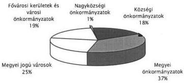
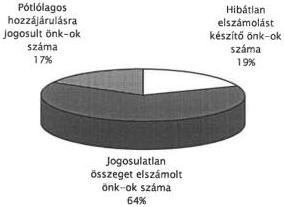
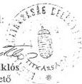
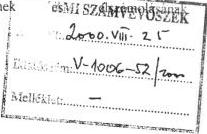
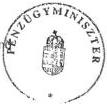
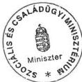
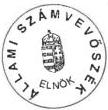

Állami Számvevőszék

# JELENTÉS

a helyi önkormányzatok 1999. évi
normatív állami hozzájárulás
igénybevételének és elszámolásának
ellenőrzéséről

2000. szeptember

0026

---

# Az ellenőrzés végrehajtásáért felelős:
V. Önkormányzati és Területi Ellenőrzési Igazgatóság

Dr. Lóránt Zoltán
igazgató

Az ellenőrzést vezette és a jelentést összeállította:

Csecserits Imréné
vizsgálatvezető főtanácsos

Ambrus Lajos
számvevő tanácsos

Benczik Lászlóné
számvevő tanácsos

dr. Csapó Anna
számvevő tanácsos

Németh Gábor
számvevő tanácsos

Az ellenőrzésben részt vevők névsorát az 1. számú melléklet tartalmazza.

# A témakörrel foglalkozó ÁSZ vizsgálatok jegyzéke:

Jelentés a normatív támogatási rendszer bevezetésének kezdeti tapasztalatairól (V-26/1990.)

Jelentés az önkormányzatoknak (tanácsoknak) 1990. évre nyújtott normatív állami támogatások elszámolásának ellenőrzéséről (V-70/1991.)

Jelentés az önkormányzatok 1991. évi normatív állami hozzájárulásának, igénybevételének és elszámolásának ellenőrzési tapasztalatairól (V-1007/1992.)

Jelentés az önkormányzatok 1992. évi normatív hozzájárulás igénybevételének és elszámolásának ellenőrzési tapasztalatairól (V-1005/1993.)

Jelentés az önkormányzatok 1993. évi normatív állami hozzájárulás igénybevételének és elszámolásának ellenőrzéséről (V-1006/1994.)

Jelentés a helyi önkormányzatok részére biztosított 1994. évi normatív állami hozzájárulás igénybevételének és elszámolásának ellenőrzéséről (V-1001/1995.)

Jelentés az önkormányzatok részére biztosított 1995. évi normatív állami hozzájárulás igénybevételének és elszámolásának ellenőrzéséről (V-1010/1996.)

Jelentés az önkormányzatok 1996. évi normatív állami hozzájárulás igénybevételének és elszámolásának ellenőrzési tapasztalatairól (V-1004/1997.)

Jelentés a helyi önkormányzatok 1997. évi normatív állami hozzájárulás igénybevételének és elszámolásának ellenőrzési tapasztalatairól (V-1012/1998.) (A Parlament számítógépes hálózatán a vizsgálat fájl neve 9828J000.doc)

Jelentés a helyi önkormányzatok 1998. évi normatív állami hozzájárulás, valamint az ezekhez kapcsolt kiegészítő támogatások igénybevételének és elszámolásának ellenőrzéséről (V-1007/1999.) (A Parlament számítógépes hálózatán a vizsgálat fájl neve 9929J000.doc)

Jelentéseink az INTERNETEN 1999. június 1-től a WWW.ASZ.gov.hu címen olvashatók.

Jelentéseink az Országgyűlés számítógépes hálózatán is olvashatók.

---

V-1006-56/2000. TÉMASZÁM: 519

# TARTALOMJEGYZÉK

JELENTÉS A HELYI ÖNKORMÁNYZATOK 1999. ÉVI NORMATÍV ÁLLAMI HOZZÁJÁRULÁS IGÉNYBEVÉTELÉNEK ÉS ELSZÁMOLÁSÁNAK ELLENŐRZÉSÉRŐL ...3

I. ÖSSZEGZŐ MEGÁLLAPÍTÁSOK, KÖVETKEZTETÉSEK, JAVASLATOK...4

II. RÉSZLETES MEGÁLLAPÍTÁSOK...9

1. A normatív állami hozzájárulások 1999. évi feltételrendszere ...9

2. A normatív állami hozzájárulás igénybejelentésének, évközi módosításának, év végi elszámolásának belső ellenőrzése...14

3. A normatív állami hozzájárulások tervezése és elszámolása a helyi önkormányzatoknál...16

3.1. Általános tapasztalatok ...16

3.2. Jogcímenkénti tapasztalatok ...17

3.2.1. Üdülőhelyi feladatok ...18

3.2.2. Körzeti igazgatási feladatok ...18

3.2.3. A helyi önkormányzatok szociális és gyermekjóléti feladataihoz kapcsolódó normatív állami hozzájárulások ...18

3.2.4. Gyermekvédelmi szakellátás ...19

3.2.5. Bentlakásos és átmeneti elhelyezést nyújtó intézményi ellátás ...20

3.2.6. Nappali szociális intézményi ellátás...21

3.2.7. Hajléktalanok átmeneti intézményei ...22

3.2.8. Pszichiátriai és szenvedélybetegek, valamint fogyatékos gyermekek bentlakásos intézményi ellátása ...22

3.2.9. Bölcsődei ellátás...22

3.2.10. Óvodai nevelés...22

3.2.11. Iskolai oktatás 1-13. évfolyamokon ...23

3.2.12. Iskolai szakképzés ...24

3.2.13. Különleges gondozás keretében nyújtott ellátás ...24

3.2.14. Alapfokú művészetoktatás ...25

3.2.15. Kollégiumi, externátusi nevelés, ellátás ...25

3.2.16. Egyéb közoktatási hozzájárulások ...25

Mellékletek: 1-től 10-ig

1

---

|   | 1 | 2 | 3 | 4 | 5 | 6 | 7 | 8 | 9 | 10  |
| --- | --- | --- | --- | --- | --- | --- | --- | --- | --- | --- |

---

# JELENTÉS

## a helyi önkormányzatok 1999. évi normatív állami hozzájárulás igénybevételének és elszámolásának ellenőrzéséről

Az Állami Számvevőszék az 1989. évi XXXVIII. számú törvény, valamint az államháztartásról szóló 1992. évi XXXVIII. számú törvény előírásai alapján, az 1999. évi zárszámadási törvényjavaslathoz kapcsolódóan ellenőrizte a Magyar Köztársaság 1999. évi költségvetéséről szóló 1998. évi XC. törvényben a helyi önkormányzatok részére felhasználási kötöttség nélkül biztosított normatív állami hozzájárulások igénybevételének és elszámolásának törvényességét, szabályszerűségét.

**A vizsgálat célja annak megállapítása volt, hogy**

- érvényesült-e a normatív állami hozzájárulások feltételrendszerének jogcímenkénti szabályozása és a kapcsolódó szakmai előírások közötti összhang;
- az önkormányzatok ellenőrizték-e a mutatószámok meghatározásához szükséges nyilvántartások meglétét, adatainak helytállóságát;
- a jogszabályi előírásoknak megfelelően történt-e a normatív állami hozzájárulások igénybejelentése (felmérése), évközi változtatása és elszámolása.

Teljes körű, minden feladatmutatóhoz kötött normatív állami hozzájárulási jogcímre kiterjedő tételes helyszíni ellenőrzést – kockázatelemzésre épített, véletlenszerű mintaválasztással – az önkormányzatok 7,3%-ánál, 232 önkormányzatnál és ezen önkormányzatokhoz tartozó összesen 725 szociális, gyermekvédelmi, nevelési és oktatási feladatot ellátó szervezeti egységnél végeztünk. A vizsgált önkormányzatokról megyénként és településtípusonként csoportosítva a 2. és 3. számú melléklet nyújt tájékoztatást. Nem terjedt ki a vizsgálat a Magyar Köztársaság 1999. évi költségvetéséről szóló 1998. évi XC. törvény 8. számú mellékletében szereplő normatív, kötött felhasználású támogatásokra, tekintettel arra, hogy ez évben ennek ellenőrzése beépült a könyvvizsgálók kötelező feladatai közé.

Vizsgáltuk a Pénzügyminisztérium, a Belügyminisztérium, az Oktatási Minisztérium, valamint a Szociális és Családügyi Minisztérium szerepét, intézkedéseit a normatív állami hozzájárulás igénylésének, elszámolásának feltételrendszere kialakításában, működtetésében.

A helyszíni vizsgálatokat az önkormányzati hivataloknál és intézményeiknél az 1998. és 1999. évi dokumentumok alapján végeztük. A vizsgálatot végzőknek részletes ellenőrzési útmutató állt rendelkezésre, amelyet az elszámolást megelőzően az önkormányzatok is megismerhettek.

3

---

I. ÖSSZEGZŐ MEGÁLLAPÍTÁSOK, KÖVETKEZTETÉSEK, JAVASLATOK---

**Az ellenőrzésbe bevont önkormányzatok összesen 15 885 millió Ft normatív állami hozzájárulásban részesültek.** (Részletezését a 2/a és a 3. számú melléklet tartalmazza.) **Ez az összeg a helyi önkormányzatok részére a központi költségvetésben ilyen címen tervezett eredeti előirányzat 5,5%-a.**

Az ellenőrzött önkormányzatok kiválasztásánál szempont volt az egyes településtípusok arányos megjelenítése mellett a községekre való összpontosítás. Igazodtunk az 1991. év óta követett gyakorlatunkhoz, hogy évente más-más településtípusokra koncentrálódik a vizsgálat, biztosítva ezzel, hogy minden önkormányzat ellenőrzése azonos eséllyel, bizonyos időközönként megtörténjen. Így kijelöltünk olyan községi önkormányzatokat is, amelyeknél valamilyen ok miatt (pl. más településből kivált, vagy nagyon alacsony a lakosság száma) még nem volt számvevőszéki ellenőrzés.

# I. ÖSSZEGZŐ MEGÁLLAPÍTÁSOK, KÖVETKEZTETÉSEK, JAVASLATOK

A helyi önkormányzatok forrás-finanszírozási rendszerében 1990. év óta meghatározó jelentőségű, de minden évben kismértékben változó tartalmú elem a normatív állami hozzájárulás, amely az 1999. évi költségvetésről szóló törvényben előirányzott támogatások és hozzájárulások 65,5%-át képviselte, azaz a 440,5 milliárd Ft eredeti előirányzatból 288,4 milliárd Ft volt a normatív állami hozzájárulás.

Az elmúlt években a normatív állami hozzájárulásként meghatározott összeg nominálértéken évről-évre egyre szerényebb mértékben emelkedett, 1998-ról 1999. évre 6,4%-kal. Ez az összeg a helyi önkormányzatok összes bevételének évente csökkenő részarányát képviseli. **Az inflációt figyelembe véve megállapítható, hogy a normatív állami hozzájárulásként meghatározott összeg reálértéke 1999. évben is csökkent.**

A normatív állami hozzájárulás jogcímeinek szabályozása – néhány kivételtől eltekintve – a korábbinál pontosabb. A most végzett vizsgálatok a költségvetési törvényben foglalt feltételek és a kapcsolódó ágazati/szakmai előírások közötti összhang hiányosságait a következő esetekben tárták fel:

A szociális és gyermekjóléti szolgáltatások jogcímei közül a családsegítő és/vagy gyermekjóléti szolgálatokhoz, a falugondnoki szolgáltatáshoz és a hajléktalanok nappali intézményéhez kapcsolódó mutatószám meghatározásának, valamint a működési engedélyezési eljárásban az illetékesség megállapításának szabályozásánál tapasztaltunk hiányosságokat.

A közoktatási célú jogcímek közül a különleges gondozás keretében nyújtott gyógypedagógiai ellátásnál a fogyatékosságot megállapító szakvélemények időszakonkénti felülvizsgálatának szabályozása nem bizonyult egyértelműnek. Ellentmondás volt továbbá a különleges gondozás keretében végzett korai fejlesztés, gondozás és fejlesztő felkészítéshez biztosított normatív állami hozzájárulás jogcímeknél a gondozásban részt vevők számának, mint feladatmutató-

---4

---

I. ÖSSZEGZŐ MEGÁLLAPÍTÁSOK, KÖVETKEZTETÉSEK, JAVASLATOK

nak a meghatározását előíró jogszabályok között. Az alapfokú művészetoktatási intézményekben a tanuló létszám, mint mutatószám meghatározása a közoktatási törvényben foglaltaknak megfelelően a gyakorlatban nem oldható meg. (Az önkormányzati elszámolás leadási határidejére nem áll rendelkezésre az előírt tényadat, tekintettel arra, hogy a költségvetési évet érintő második tanévnek ekkor még nincs vége).

A normatív állami hozzájárulások jogcímeit és összegét a központi költségvetési törvény az előző évi 25-tel szemben 20 előirányzatban, illetve azok további megbontásával a korábbi 46 helyett, összesen 42 fajlagos összeggel határozta meg. A helyi önkormányzatok az 1999. évi igénybejelentés és a költségvetési beszámolók elkészítése során ennél sokkal részletesebb elszámolást készítettek. Az államháztartásról szóló törvényben kapott felhatalmazás alapján a Belügyminisztérium, a Pénzügyminisztérium, valamint az érintett ágazati minisztériumok által közösen kialakított igény-bejelentési adatlapot és a kapcsolódó kódjegyzéket alkalmazva állították össze normatív állami hozzájárulás igénylésüket és elszámolásukat 138 mutatószám-csoportban (1998. évben 170 mutatószám-csoport volt). A költségvetési törvényben meghatározottat 3,3-szorosan meghaladó részletes (jogcímbontásos) tervezés és elszámoltatás elsősorban közoktatási szakmai információk megszerzését biztosította, sok esetben párhuzamosan a statisztikai jelentésekkel.

A normatív állami hozzájárulások igénybejelentésének és elszámolásának módosítását és a feldolgozási kódszámok csökkentését az Állami Számvevőszék 1997. év óta javasolja, tekintettel arra, hogy az nagymértékben megnehezíti az igénylési-elszámolási rendszer áttekinthetőségét. Az elmúlt évekhez hasonlóan úgy az önkormányzatoknak, mint az ellenőrzés számára szükségtelen terhet jelentett a nagy tételszámú, bonyolult feldolgozási kódszám-rendszer kezelése. A túl-részletezettség következtében az ellenőrzés során gyakran előfordult, hogy a kódszám helytelen megállapítása, vagy téves számítógépes rögzítése miatt az önkormányzat által elszámolt teljes összeg az egyik kódszámnál jogtalanná vált, míg más kódszámon ugyanezt az összeget az önkormányzat részére még járó hozzájárulásként kellett szerepeltetni.

A szociális ellátást érintően a működési engedélyek, alapító okiratok hiánya, illetve hiányosságai okoztak gondokat. Az alapító okiratokban az ellátandó feladat meghatározása nincs összhangban a normatív állami hozzájárulás kapcsolódó jogcímeinél leírt követelményekkel. A működési engedélyek kiadásánál, az illetékességi szabályok alkalmazásánál szabálytalanságokat tapasztaltunk.

A közoktatási feladatokhoz kapcsolódó jogcímeket érintően a legtöbb hiányosságot a közoktatási törvény alapján szervezett középfokú oktatás és szakképzés, a különleges gondozás keretében végzett korai fejlesztés-gondozás és fejlesztő felkészítés, a szervezett közoktatási intézményi étkeztetés és az általános iskolai napközis ellátás, valamint az óvodai nevelés jogcímeknél észleltünk. Ezen jogcímeknél a feladatmutató meghatározása bonyolultnak bizonyult az önkormányzatok számára, ezt igazolja, hogy a legnagyobb összegű eltéréseket is ezeknél állapította meg a vizsgálat.

5

---

I. ÖSSZEGZŐ MEGÁLLAPÍTÁSOK, KÖVETKEZTETÉSEK, JAVASLATOK---

A közoktatási célú normatív állami hozzájárulás együttes keretösszegének központi tervezéséhez a közoktatásról szóló törvény kötelező jellegű előírást tartalmaz, amely feltételeknek az 1999. évi eredeti előirányzat megfelelt.

A normatív állami hozzájárulás tervezése, összegének évközi változtatása, elszámolása az 1997. évet érintő vizsgálat alapján megfogalmazott javaslataink ellenére nem egyszerűsödött kellő mértékben. A közoktatási statisztikai jelentések adattartalma jelenleg sem alkalmas teljes körűen a normatív állami hozzájárulások mutatószámainak megállapítására, annak ellenére, hogy a költségvetési törvény 3. számú mellékletében foglalt kiegészítő szabályok ezt követelményként tartalmazták.

**Az előző években végzett számvevőszéki ellenőrzések során tett felelősségi felvetéseink ellenére a vizsgált önkormányzati hivataloknak csak 26%-a ellenőrizte a helyszínen az intézmények által közölt adatok valódiságát.** A végrehajtott ellenőrzések szakmai színvonala **nem volt megfelelő**, nem terjedtek ki a szakmai jogszabályokban foglalt előírások betartására és az önkormányzati szintű összesítés, elszámolás ellenőrzése is elmaradt. Pontatlan volt a belső ellenőrzés, az intézményvezetők az ilyen megállapításokra nem reagáltak. Mindezek miatt az önkormányzatok saját ellenőrzése kifogásolható.

A normatív állami hozzájárulás központi tervezéséhez szolgáltatott adatokat az intézmények az önkormányzati hivatalok részére a jogszabályi előírások részleges figyelembevételével adták meg. A hiányosságot elsősorban az okozta, hogy az önkormányzati hivatalok az intézményeik részére nem adtak útmutatást a szakmai jogszabályokban megfogalmazott követelményekkel összhangban lévő adatszolgáltatás elkészítéséhez. Az éves elszámoláshoz bekért adatokra is ugyanez vonatkozik. Az önkormányzati hivatalok nem fordítottak kellő figyelmet arra, hogy az elszámolásba a megfelelő (nyilvántartási, statisztikai) alapadatokra épülő mutatószámok kerüljenek.

A normatív állami hozzájárulás igénybevételének és elszámolásának ellenőrzését az évenkénti zárszámadáshoz kapcsolódóan egy évre visszamenőleg végeztük. Célszerűségi szempont miatt nem terjedtek ki a vizsgálatok több évre, tekintettel arra, hogy a zárszámadással már lezárt évekre visszanyúló elvonási és pótlólagos hozzájárulási javaslatok realizálási lehetőségét a jogszabályok nem tartalmazzák.

A kódszámonkénti eltérések önkormányzati szintű egyenlegeként 151 önkormányzatnál 107,7 millió Ft központi költségvetés részére történő visszafizetési kötelezettséget, 38 önkormányzatot érintően pedig 13,4 millió Ft központi költségvetésből pótlólagosan kiutalandó hozzájárulást tártunk fel. Az ellenőrzés 43 önkormányzatnál az elszámolásban eltérést nem állapított meg.

A helyszíni vizsgálatok során 11 önkormányzatnál állapítottuk meg egy-egy jogcím esetében, hogy nem teljes körűen teljesítették a normatív állami hozzájárulás jogszerű igénybevételének feltételeit. Az érintett jogcímhez tartozó feladatot ellátó intézményüknek 1999. évben nem volt működési engedélye, illetve nem rendelkeztek az önkormányzatok társulási megállapodásának törvényességét igazoló közigazgatási hivatali nyilatkozattal. A költségvetési tör-

---6

---

I. ÖSSZEGZŐ MEGÁLLAPÍTÁSOK, KÖVETKEZTETÉSEK, JAVASLATOK

vényben előírt feltételek teljesítése érdekében – felhívásunkra – az önkormányzatok kezdeményezték az érintett intézmények működési engedélyének kiadását és ezáltal azok 2000. évre ideiglenes, vagy végleges működési engedélyt kaptak. A hiányzó közigazgatási hivatali nyilatkozatok beszerzése is megtörtént. Az önkormányzatok a helyszíni vizsgálatról készített jelentésre tett észrevételekben elismerték a feltárt szabálytalanságokat, de a hozzájárulás alapját képező feladat ellátására és a mulasztás pótlásának kezdeményezése hivatkozva kérték a megállapítások módosítását. Ezek figyelembevételével az országgyűlés döntésétől függően a jogosulatlanul igénybe vett normatív állami hozzájárulás összege 28,1 millió Ft-tal csökkenthető és a pótlólagos állami hozzájárulás 0,8 millió Ft-tal növelhető. (Ezeket az összegeket a pénzügyminiszter részére megfogalmazott – 1. b) számú – javaslat tartalmazza.) A javaslat elfogadása esetén 148 önkormányzatnál a visszafizetési kötelezettség 79,6 millió Ft-ra és a 40 önkormányzatot érintő központi költségvetésből pótlólagosan kiutalandó hozzájárulás 14,2 millió Ft-ra változik. (Ennek megfelelő összegeket a pénzügyminiszter részére megfogalmazott – 1. a) számú – javaslat tartalmazza.)

A vizsgálati megállapítások alapján összesen 8 önkormányzatnál vetettük fel a jegyző/körjegyző és/vagy a gazdálkodási előadó felelősségét az ellenőrzési kötelezettség visszatérő elmulasztása, valamint jogosulatlan állami hozzájárulás igénylése és elszámolása miatt.

Az ellenőrzés részletes megállapításainak hasznosítása mellett az Állami Számvevőszék javasolja, hogy

a pénzügyminiszter

1. kezdeményezze, hogy az Országgyűlés az 1999. évi zárszámadási törvény elfogadása során
a) hagyja jóvá a jelentés 8. számú mellékletében részletezettek szerint az önkormányzatok által a központi költségvetésbe visszafizetendő 79 576 508 Ft-os, illetve az önkormányzatoknak a költségvetésből pótlólag kiutalandó 14 190 737 Ft-os összeget;
b) fontolja meg a jelentés 8/a számú mellékletében részletezettek szerint az önkormányzatok által nem teljesen szabályos elszámolás során igénybe vett 28. 888.216 Ft visszafizetésének elengedését, valamint 771 000 Ft pótlólagos kiutalásának jóváhagyását tekintettel arra, hogy ezen önkormányzatok a hiányzó nyilatkozatok, engedélyek beszerzéséről gondoskodtak és erről tájékoztatást adtak;
2. biztosítsa, hogy a jelenlegi bonyolult azonosító-számrendszer (kódszámok) egyszerűsítésével csak a normatív állami hozzájárulási előirányzatok költségvetési törvényben előírt részletezésű tervezésére és elszámolására terjedjen ki a szabályozás,
3. kezdeményezze, hogy a jövőben az Állami Számvevőszék több évre visszamenő hatályú vizsgálata során feltárásra kerülő normatív állami hozzájárulási visszafizetési kötelezettség és pótlólagosan kiutalandó járandóság realizálási módját jogszabály szabályozza.

7

---

I. ÖSSZEGZŐ MEGÁLLAPÍTÁSOK, KÖVETKEZTETÉSEK, JAVASLATOK

# **az oktatási miniszter**

1. kezdeményezze a 2001. évi költségvetési törvényjavaslat előkészítésekor az alapfokú művészetoktatás jogcímnél a feladatmutató egyértelmű megállapításához szükséges jogszabály módosítását;
2. pontosítsa a különleges gondozás keretében ellátottakról készített szakértői felülvizsgálatok rendjét;
3. hozza összhangba a szakmai statisztikai adatszolgáltatásokat a közoktatási célú normatív állami hozzájárulási jogcímekben meghatározott feltételekkel, ennek során szüntesse meg az indokolatlan párhuzamosságokat,

# **a szociális és családügyi miniszter**

1. pontosítsa az ellenőrizhetőség érdekében a nappali szociális intézményi ellátás jogcímnél a hajléktalanok nappali melegedőjét igénybe vevők mutatószámának meghatározási módszerét;
2. kezdeményezze a 281/1997. (XII.29.) Korm. rendelet módosítását annak érdekében, hogy a működési engedély kiadására vonatkozó illetékességi előírások összhangban legyenek az 1957. évi IV. törvényben foglaltakkal.

# **A helyszíni vizsgálati jelentésekben az önkormányzatok részére a következő javaslatokat fogalmaztuk meg:**

1. Fizessék vissza az elszámolásukban kimutatott jogtalanul igényelt összeget (vizsgált önkormányzatoknál együttesen 120 480 ezer Ft-ot), valamint az Országgyűlés döntése alapján az állami számvevőszéki ellenőrzés által végzett vizsgálat során feltárt, összesen 107 694 ezer Ft jogtalanul elszámolt normatív állami hozzájárulás összegét.
2. Pótolják, illetve vizsgálják felül a normatív állami hozzájárulásra jogosító feladatellátást végző intézményeik alapító okiratait és gondoskodjanak azok jogszabályi előírásokkal összhangban lévő módosításáról (Áht. 88. §, valamint a 217/1998. (XII.30.) Korm. rendelet 10. §).
3. Kérjék meg pótlólag a hiányzó működési engedélyeket és alakítsák ki az előírásszerű működéshez, illetve feladatellátáshoz szükséges személyi és tárgyi feltételeket.
4. Az intézményektől bekért adatok tartalmáról és helyességéről dokumentált ellenőrzés keretében győződjenek meg a költségvetésben és a beszámolóban felhasznált adatok pontosságának biztosítása érdekében, egyúttal szerezzenek érvényt a helyi önkormányzatokról szóló 1990. évi LXV. törvény 92. § (2) bekezdésben meghatározott előírásoknak.
5. A feladatellátás valamennyi területén helyezzenek kiemelt hangsúlyt a vezetői és a munkafolyamatba épített ellenőrzés rendszeres működtetésére, annak érdekében, hogy nyilvántartásaik és elszámolásaik pontosak, adataik egyértelműek, elszámolásaik pedig szabályszerűek legyenek és maradéktalanul feleljenek meg a vonatkozó tör-

8

---

II. RÉSZLETES MEGÁLLAPÍTÁSOK

vényi előírásoknak, mivel az attól való legkisebb eltérés is a teljes normatív állami hozzájárulás elvonását eredményezheti az adott jogcímnél.

6. A normatív állami hozzájárulás igénylésénél, évközi módosításánál és elszámolásánál vegyék figyelembe az éves költségvetési törvény mellett az ágazati jogszabályok előírásait és saját ellenőrzéseik megállapításait.
7. Intézkedjenek a napközis ellátás, valamint a szervezett intézményi étkeztetés törvényi előírás szerinti számbavételéről, dokumentálásáról és elszámolásáról.

A vizsgálati jelentéseinkben szereplő megállapításainkat az önkormányzatok – három kivételével – elfogadták és már a vizsgálat ideje alatt intézkedtek a javaslatok végrehajtásáról, illetve 15 önkormányzat adott tájékoztatást arról, hogy „Intézkedési terv”-et készített a felelősök és határidők megjelölésével.

## II. RÉSZLETES MEGÁLLAPÍTÁSOK

### 1. A NORMATÍV ÁLLAMI HOZZÁJÁRULÁSOK 1999. ÉVI FELTÉTELRENDSZERE

A Magyar Köztársaság 1999. évi költségvetéséről szóló 1998. évi XC. törvény (továbbiakban: költségvetési törvény) 288,4 milliárd Ft eredeti előirányzatot tartalmaz helyi önkormányzati normatív állami hozzájárulásként. (a normatív állami hozzájárulások évenkénti költségvetési törvényben megállapított eredeti előirányzatainak 1991-1999. évekbeli összegét az 5. számú melléklet tartalmazza.)

Az 1999. évi költségvetési törvényjavaslat kialakítása során a helyi önkormányzatok részére tervezett normatív állami hozzájárulások jogcímeinek, jogcímenkénti keretösszegeinek és a normativitást biztosító fajlagos értékeinek kialakítása a korábbi évekhez hasonló elvek és módszerek szerint történt.

A jóváhagyott költségvetésben a normatív állami hozzájárulások költségvetési előirányzat-száma – összevonások és költségvetési alcímek közötti átcsoportosítások következtében – az előző évi 25-ről 20-ra csökkent. Az előirányzatok közel felének (9) további tartalmi részletezése, alábontása miatt kialakított különböző fajlagos hozzájárulási értékek (jogcímek) száma az előző évi 48-ról 42-re csökkent. Ebből 30 feladatmutatóhoz kötött, 8 lakónépességhez kapcsolt, 4 pedig minden érintett önkormányzat számára egységesen járó (fix összegű) hozzájárulás volt.

A jogcímenkénti keretösszegek kialakítását a közoktatásról szóló 1993. évi LXXIX. törvény (továbbiakban: közoktatási törvény) 118. § (4) bekezdésében előírt garanciális kötelezettség biztosítása befolyásolta elsősorban. Ennek figye-

9

---

II. RÉSZLETES MEGÁLLAPÍTÁSOK

lembevételével a költségvetési törvényjavaslatban a közoktatással összefüggő jogcímek keretösszege együttesen több volt, mint a közoktatási törvény által előírt minimum-összeg, azaz az 1997. évi – a törvényi előírásoknak megfelelően korrigált – közoktatásra fordított helyi önkormányzati kiadások 80%-át elérte, illetve meghaladta az 1998. évi eredeti központi költségvetés ilyen célú előirányzatát.

Az elfogadott 1999. évi költségvetési törvényben normatív állami hozzájárulásként közoktatási feladatokra 211 649,9 millió Ft szerepelt, amely az 1998. évi költségvetési törvényben jóváhagyott 180 057 millió Ft-nál 17,5%-kal magasabb.

A szociális és gyermekjóléti célokra az 1999. évi költségvetés 51 249,5 millió Ft normatív állami hozzájárulást – az 1998. évi 56 348,7 millió Ft-nál 9%-kal kevesebbet – tartalmazott.

A normativitást biztosító fajlagos értékek az előző évhez viszonyítva differenciáltan, eltérő arányban emelkedtek.

A szociális és gyermekjóléti szolgáltatásokhoz kapcsolódó jogcímeknél a fajlagos hozzájárulási összegek 3,4% és 32,9% közötti mértékben emelkedtek. A nagyobb mértékű növekedés a nappali szociális intézményi ellátás, valamint a hajléktalanok átmeneti intézménye jogcímeinek fajlagos értékeinél történt.

A közoktatási célú normatív állami hozzájárulások részletezett jogcímei az 1998. évi 28-ról 23-ra csökkentek, valamint több jogcímmel a feltételrendszer is módosult. Az előző évihez hasonló tartalmú, feltételű jogcímeknél a fajlagos hozzájárulási értékek – jelentős, 3,9-100,0% közötti szóródás mellett – emelkedtek. A 9-13. évfolyamon tanulók, valamint a gyógypedagógiai nevelésben, oktatásban részt vevők utáni fajlagos normatív állami hozzájárulási értékek mintegy 50%-kal emelkedtek.

A jogcímek tartalmi változtatásai, a hozzájárulások feltételeinek módosulásai több korábbi Állami Számvevőszék-i javaslat realizálását is jelentik:

- megszűntek az állami gondoskodásban részesülők miatti létszámkorrekciók a közoktatási célú jogcímeknél;
- a nappali szociális intézményi ellátás és a bölcsődei ellátás jogcímeknél az ellátottak létszámának meghatározásához az összesített éves gondozási napok számát a gyakoribb és életszerűbb 5 napos nyitva tartáshoz igazodva a korábbi 313, illetve 365 helyett egységesen 261-gyel kell osztani. (A bölcsődei ellátás jogcímmel ezért csökkent a normatív állami hozzájárulás fajlagos értéke az előző évhez viszonyítva);
- az általános iskolai napközis foglalkozási jogcímen belül megszűnt a cigánytanulók kiscsoportos foglalkoztatásához kapcsolódó normatív állami hozzájárulás kiemelt, kétszeres fajlagos értéke;
- a nem nemzetiségi tanulók két tanítási nyelvű általános és középiskolai képzéséhez kapcsolódó normatív állami hozzájárulás megszűnt, ugyanakkor a normatív, kötött felhasználású támogatások közé a kisebbségi nyelvoktatáshoz kapcsolódóan beépült;

10

---

II. RÉSZLETES MEGÁLLAPÍTÁSOK

- az óvodában, iskolában, kollégiumban szervezett intézményi étkeztetés és az általános iskolai napközis foglalkozás jogcímeknél a feladatmutatók számítási módja egyértelművé vált, kifejezésre jutott a naptári évre történő – napi igénybevételen alapuló – átlagszámítási követelmény.

A normatív állami hozzájárulás igénybevételi és elszámolhatósági feltételeinek meghatározása – néhány kivételtől eltekintve – a korábbinál pontosabb. A most végzett vizsgálatok a költségvetési törvényben foglalt feltételek és a kapcsolódó ágazati/szakmai előírások közötti megfelelő összhang hiányosságait az alábbiak tekintetében tárták fel:

- a családsegítő és/vagy gyermekjóléti szolgálatokhoz, valamint a falugondnoki szolgáltatáshoz kapcsolódó jogcímeknél a költségvetési törvény a töredékévi működtetés esetén az időarányos jogosultságot írta elő. Az év végi elszámolás központilag kialakított informatikai rendszere ugyanakkor erre az arányosításra nem adott megoldási lehetőséget. Ezt a hiányosságot a vizsgált önkormányzatoknál az ellenőrzés során korrigáltuk, így a nem teljes évi feladatellátás miatt három önkormányzatnál a falugondnoki szolgáltatás jogcímű normatív állami hozzájárulás jogtalan igénybevételét, illetve elszámolását állapítottuk meg;

- a nappali szociális intézményi ellátás keretében a hajléktalanok nappali intézményeiben ellátottak számának meghatározása továbbra sem egyértelmű, mivel az előírt taglétszám itt nem értelmezhető;

- a nappali szociális intézményi ellátás jogcímen a költségvetési törvény 3. számú mellékletének 8. pontja szerint azok az önkormányzatok vehettek igénybe hozzájárulást, amelyek a szociális igazgatásról és szociális ellátásokról szóló 1993. III. törvényben szabályozott módon működnek, valamint a 161/1996. (XI.7.) Korm. rendelet szerinti működési engedéllyel rendelkeznek. E rendelet 4. § (1) bekezdése alapján a nappali szociális intézmény esetén a működési engedély kiadásáról az intézmény székhelye, telephelye szerint illetékes települési önkormányzat jegyzője dönt. E szabályozástól eltérően az államigazgatási eljárás általános szabályairól szóló 1957. évi IV. törvény 19. § (6) bekezdése értelmében a közigazgatási szerv saját ügyében nem járhat el, így a telephely szerint illetékes települési önkormányzat jegyzőjének a megyei közigazgatási hivataltól kellett volna kérnie az engedélyezési eljárás lefolytatására illetékes jegyző kijelölését. A kétféle szabályozás miatt a vizsgálat során a működési engedélyt kiadó illetékességét figyelmen kívül hagytuk, csupán az engedély meglétét ellenőriztük. Az 1957. évi IV. törvénnyel összhangban nem lévő szabályozást tartalmazó 161/1996. (XI.7.) Korm. rendeletet a 188/1999. (XII.19.) Korm. rendelet hatályon kívül helyezte, így az engedélyezést 2000. évtől már megváltozott eljárási szabályok szerint kell lefolytatni. A gyermekjóléti és gyermekvédelmi személyes gondoskodást nyújtó intézmények működésének engedélyezéséről szóló hatályos 281/1997. (XII.29.) Korm. rendelet 4. § (1) bekezdése sincs összhangban az 1957. évi IV. törvénnyel;

- a közoktatási feladatot is ellátó bentlakásos intézmények, valamint gyermekvédelmi szakellátás esetén a teljes ellátáshoz biztosított normatív hozzájáruláson túlmenően a kollégiumi és a közoktatási kiegészítő jellegű hozzájárulási jogcímeken is igényelhető, illetve elszámolható volt a hozzájárulás. Így pl. az étkezés, napközis foglalkozás feladatokhoz ugyanazon létszámra

11

---

II. RÉSZLETES MEGÁLLAPÍTÁSOK

vonatkozóan kétszeresen, két jogcímen is biztosított normatív állami hozzájárulást a költségvetési törvény. A kétszeres igénylést és elszámolást az ellenőrzés során nem kifogásoltuk;

- a különleges gondozás keretében nyújtott gyógypedagógiai ellátáshoz a költségvetési törvény szerint csak az illetékes szakértői és rehabilitációs bizottság szakvéleménye alapján gyógypedagógiai nevelésben, oktatásban részt vevő gyermek, tanuló után vehető igénybe a normatív állami hozzájárulás. A szakértői és rehabilitációs bizottságok részére a 14/1994. (VI.24.) MKM rendelet 1999. évben hatályos szövege meghatározott időszakonként felülvizsgálati kötelezettséget írt elő. Nem egyértelmű azonban, hogy a felülvizsgálati kötelezettséget a jogszabály hatálybalépését követően kiadott első vizsgálatot követően szükséges teljesíteni, vagy a már korábban megvizsgáltakra is vonatkozik. A nem egyértelmű szabályozás miatt a korábban kiadott, több év óta felülvizsgálatlan szakvéleményeket is elfogadtuk az ellenőrzés során;
- a különleges gondozás keretében végzett korai fejlesztés, gondozás és fejlesztő felkészítéshez biztosított normatív állami hozzájárulási jogcímeknél a részt vevők, gondozásban részesülők számának, mint feladatmutatónak a meghatározása ellentmondásos. A költségvetési törvény 3. számú mellékletében foglalt kiegészítő szabályok 1. f) és g) pontja szerint a normatív állami hozzájárulás elszámolása a költségvetési éven belüli tanéváltás időpontjához, augusztus 31-hez igazodóan, az ellátott, oktatott létszám 8/12-ed részének és 4/12-ed részének önkormányzati szinten figyelembe vett éves átlaga alapján történik, valamint a nevelési-oktatási feladatoknak megfelelő közoktatási statisztikai adatokra és az azt, vagy a hozzájárulást megalapozó előírt tanügyi okmányokra épül. A kapcsolódó közoktatási statisztikai jelentés azonban a fentieknek megfelelő létszámadatot nem tartalmaz és a normatív állami hozzájárulás elszámolásakor még nem áll rendelkezésre mindkét érintett tanévre vonatkozóan. Ezért az egyéni fejlesztő naplókat tekintettük alapdokumentumnak;
- az alapfokú művészetoktatási intézményekben tanuló létszám mint mutatószám meghatározása – a korábbi években már jelzettek ellenére – nem egyértelmű. A költségvetési törvény 3. számú mellékletében szereplő kiegészítő szabályok 1. f) és g) pontjában foglaltaktól eltérő számítási módot ír elő a közoktatásról szóló 1993. évi LXXIX. törvény 1. számú mellékletének 1. c) pontja. A szabályozási összhang hiánya mellett gondot jelentett, hogy a közoktatásról szóló törvény 1. számú mellékletének 1. c) pontjában előírt követelmény sem az önkormányzati elszámolás határidejéig, sem a vizsgálatunk idejében nem teljesíthető. Nem áll rendelkezésre az 1999. évet, mint költségvetési évet érintő két tanév közül az 1999/2000-es tanítási év egészére vonatkozó tényadat, amelyekre a tanítási évre vonatkozó átlagos heti foglalkozási szám meghatározása miatt lenne szükség. A vizsgálat során az éves átlagos tényadatok helyett elfogadtuk a tanügyi nyilvántartás szerinti heti óraszámot.

**A normatív állami hozzájárulás költségvetési törvényben meghatározott feltételrendszere az összességében egyszerűsítésre való törekvés ellenére évről-évre összetettebb, bonyolultabb.** A költségvetési törvényben foglaltakon kívül a **kapcsolódó ágazati jogszabályok széles kö-**

12

---

II. RÉSZLETES MEGÁLLAPÍTÁSOK

**rű ismeretére is szükség van** a megalapozott igénylés és elszámolás elkészítéséhez.

Az egyes jogcímeknél meghatározott feladat elvégzése, ellátása a feladatmutatók alakulásához kötött jogcímeknél nem biztosít automatikus jogosultságot az igénylésre, elszámolhatóságra. A költségvetési törvény szerint több, általában 4-5 további feltétel együttes megléte, biztosítása esetén lehet csak jogszerűen igényelni, elszámolni a normatív állami hozzájárulást. A közoktatási célú normatív állami hozzájárulási jogcímeknél a nevelési, oktatási feladat elvégzésén túlmenően általános követelmény, hogy az adott költségvetési évben a nevelést, oktatást a közoktatási törvényben előírtak szerint szervezzék. Az e törvényben meghatározottaktól eltérően – jogszerűen – szervezett nevelés, oktatás esetén a normatív állami hozzájárulás igénylésére, elszámolására nem jogosult az önkormányzat. Általános feltétel továbbá az előírt okmányok, bizonylatok megléte, előírás szerinti kitöltése, vezetése, az igényjogosultságot megalapozó tevékenységnek az alapító okiratban történő szerepeltetése. Ezek hibás, vagy hiányos kitöltése, illetve hiánya esetén nem jogosult az önkormányzat az adott jogcímen normatív állami hozzájárulásra.

A szociális és gyermekjóléti szolgáltatásoknál a feladatellátáson túlmenően általános követelmény, hogy a tárgyévben a szolgáltatás módja megfeleljen az ágazati törvényben előírt követelményeknek, a szolgáltatást biztosító szervezet rendelkezzen – a viszonylag gyakran változó, de konkrétan megjelölt jogszabályban foglalt előírásoknak megfelelő – működési engedéllyel, alapító okirattal. Ennek hiányában szintén nem jogosult az önkormányzat a normatív állami hozzájárulásra.

A költségvetési törvényben **előírt feltételek mindegyikének teljesítése, megléte szükséges** a jogszerű igényléshez, elszámoláshoz. A feltételek részleges teljesítése esetén nincs lehetőség az adott jogcím szerinti normatív állami hozzájárulás részbeni elszámolhatóságára sem.

A normatív állami hozzájárulás rendkívül összetett rendszerét **tovább bonyolítja** 1996. év óta az igénybejelentésnél, évközi módosításnál és az elszámolásnál a költségvetési törvényben foglaltaktól eltérő rendszerű aggregátumok, mutatószám-csoportok kialakításának a kötelezettsége.

Az államháztartásról szóló 1992. évi XXXVIII. törvény (továbbiakban: Áht) 124. § (2) bekezdésében kapott felhatalmazás alapján a Belügyminisztérium, a Pénzügyminisztérium, valamint az érintett ágazati minisztériumok által kialakított **összesen 138 aggregátum**, azaz mutatószám-csoport szerinti igény-bejelentési adatlapot és elszámolást kellett az önkormányzatoknak elkészíteniük. A költségvetési törvényben meghatározottat jóval (3,3-szorosan) meghaladó részletezettségű igényfelmérés és elszámolás elsősorban (90 kódszám) közoktatási szakmai információk megszerzését biztosította, sok esetben párhuzamosan a statisztikai jelentésekkel. Szakmai információk megszerzése érdekében azonos fajlagos összegű hozzájárulás részletezését kérték, esetenként 8-10 különböző csoport kialakításával. (Pl. szervezett intézményi étkeztetés jogcímen 16 000 Ft/fő hozzájárulásra jogosult az önkormányzat a költségvetési törvény szerint az óvodai nevelésben és a 1-13. évfolyamon történő oktatásban részt vevők, étkező gyermekek, tanulók után. Az igénybejelentésben és az el-

13

---

II. RÉSZLETES MEGÁLLAPÍTÁSOK

számolás során is ezt a jogcímet meg kellett bontani a nevelési, oktatási, képzési formák szerint is, összesen 8 különböző csoportra.) A vizsgált normatív állami hozzájárulások jogcímeit, fajlagos összegeit és feldolgozási kódjait a 7. számú melléklet ismertetni.

**A normatív állami hozzájárulások igénybejelentésének és elszámolási rendjének módosítását és a részletezés csökkentetését az Állami Számvevőszék 1997. év óta folyamatosan javasolja.** A normatív állami hozzájáruláshoz a helyi önkormányzatokról szóló 1990. évi LXV. törvény 84. § (2) bekezdés alapján felhasználási kötöttség nem kapcsolódik, a bonyolult adatszolgáltatási rendszer indokolatlanul nagymértékben megnehezíti az igény-bejelentési és elszámolási rendszer alkalmazhatóságát, áttekinthetőségét. Az elmúlt évekhez hasonlóan **úgy az önkormányzatok, mint az ellenőrzés számára szükségtelen terhet jelent ez a feladat.** A túlrészletezettség következtében gyakran előfordult, hogy helytelen csoportosítás, vagy a 7 számjegyű azonosító (teljes terjedelmében 12 számjegyű) téves számítógépes rögzítése miatt az önkormányzat által elszámolt teljes összeg a megadott azonosító számon jogtalanná vált, míg másik azonosító számon ugyanezt az összeget az önkormányzat részére még járó hozzájárulásként kellett szerepeltetni. Az összegzésnél az egymást kiegyenlítő plusz-mínusz különbözetek az eltérések felnagyításához vezettek. (Lásd 4. számú melléklet)

Az önkormányzati igény-felméréshez a Pénzügyminisztérium, a Belügyminisztérium és az ágazati minisztériumok közreműködésével egységesített két létszámfelmérő adatlapot adott ki:

A nem közoktatási célú normatív állami hozzájárulási jogcímeken történő igényfelmérő adatlapokhoz kitöltési segédlet nem készült, míg a közoktatási célú hozzájárulási igények felméréséhez kitöltési útmutatót is közreadtak. Az adatfelmérés beadási határnapja előtt 3 nappal a Belügyminisztérium és a Pénzügyminisztérium újabb kiegészítő magyarázatot, helyi értelmezést befolyásoló állásfoglalást adott ki, amely a közoktatási létszámadatok meghatározásánál nem bizonyult elég egyértelműnek, közérthetőnek.

Az önkormányzati igénybejelentéshez az előzetes létszám-felméréstől eltérő szerkezetű adatrendszert kellett alkalmazni, amelyet később az évközi módosítások, kiegészítő és pótfelmérések során, valamint az elszámoláshoz is felhasználtak.

## 2. A NORMATÍV ÁLLAMI HOZZÁJÁRULÁS IGÉNYBEJELENTÉSÉNEK, ÉVKÖZI MÓDOSÍTÁSÁNAK, ÉV VÉGI ELSZÁMOLÁSÁNAK BELSŐ ELLENŐRZÉSE

A normatív állami hozzájárulás igénybejelentéséhez, elszámolásához szükséges adatok és azok valódiságát igazoló okmányok, nyilvántartások az önkormányzatok szociális, gyermekjóléti és közoktatási intézményeinél ellenőrizhetők. Az előző években végzett számvevőszéki ellenőrzések során tett figyelemfelhívás ellenére csupán **az önkormányzati hivatalok 25,8%-a ellenőrizte** a helyszínen az intézmények által közölt adatok valódiságát, megalapozottságát.

14

---

II. RÉSZLETES MEGÁLLAPÍTÁSOK

Az önkormányzati hivatalok a normatív állami hozzájárulással kapcsolatos helyi önkormányzati igények felmérésére biztosított igen rövid határidők miatt **nem ellenőrizték a tervezéshez adott intézményi információt** számszaki, tartalmi és szakmai szempontból.

A vizsgált önkormányzatok 8%-ánál találkoztunk olyan **külső ellenőrzési megbízással** (felkéréssel), amelyben az intézményeknél az adatszolgáltatások és az azt megalapozó dokumentumok ellenőrzését kérték és ennek alapján a normatív állami hozzájárulás igénybejelentését és elszámolását az önkormányzati hivatalok előzetesen (vagy utólagosan) értékeltették. Ezen ellenőrzésekhez vizsgálati program és megbízó levél is készült. A vizsgálati jegyzőkönyvekben az adatszolgáltatást pótló adatfelvételt és az intézményi statisztikai jelentésben foglaltakhoz viszonyított eltéréseket is rögzítették.

Az önkormányzati hivatalok által ellenőrzött intézmények 42%-ánál az elszámoláshoz szolgáltatott adatokhoz viszonyítva 52,5 millió Ft az önkormányzatot pótlólagosan megillető, míg 59,3 millió Ft jogtalanul elszámolt hozzájárulást állapítottak meg az ellenőrzést végzők.

Az önkormányzatok **74,2%-ánál kifogásoltuk**, hogy az önkormányzati hivatalok intézményeiknél az adatszolgáltatás, az igénybejelentés és elszámolás tartalmára kiterjedő – helyszíni – **dokumentált ellenőrzést nem végeztek**, az intézmények által szolgáltatott adatokat nem vizsgálták felül. A vizsgálati jelentésekben javaslatként fogalmaztuk meg a belső ellenőrzés biztosítását, hatékony működtetését.

Vizsgálatunk során a jogcímek 84%-ánál eltérést tapasztaltunk. A nagy számú eltérés arra utal, hogy az önkormányzatok adatszolgáltatása nem volt pontos, a költségvetési törvény 3. számú melléklet vonatkozó pontjait az önkormányzati hivatalok munkatársai felszínesen ismerték, a költségvetési beszámoló 31. űrlapját saját értelmezés alapján tévesen töltötték ki.

A kisközségi települések önkormányzati hivatalaiban a belső ellenőrzési rendszer vezetői és munkafolyamatba épített elemei a normatív állami hozzájárulás igénylésénél és elszámolásánál nem működtek megfelelően. A függetlenített belső ellenőr a legtöbb helyen hiányzott.

Az önkormányzati ellenőrzések nem foglalkoztak a személyes felelősség felvetésével. A jogszabályi előírásoktól eltérő elszámolás, valamint az ellenőrzések elmaradása miatt 8 helyszíni vizsgálati jelentésben vetettük fel a jegyző (4 esetben), a körjegyző (2 esetben), valamint a gazdálkodási előadó (3 esetben) felelősségét.

15

---

II. RÉSZLETES MEGÁLLAPÍTÁSOK

### 3. A NORMATÍV ÁLLAMI HOZZÁJÁRULÁSOK TERVEZÉSE ÉS ELSZÁMOLÁSA A HELYI ÖNKORMÁNYZATOKNÁL

#### 3.1. Általános tapasztalatok

**A normatív állami hozzájárulások mutatószámainak és összegeinek tervezése, elszámolása a korábbi években megfogalmazott javaslataink ellenére nem egyszerűsödött.**

Az önkormányzatok országos szintű elszámolása a bonyolult szabályozás, az intézményi adatszolgáltatás hibái, valamint az önkormányzati szakterületek közreműködésének hiánya következményeként – a jogosulatlanul elszámolt és a pótlólagos jogosultság egyenlegeként – 1,2%-os többlet-igénybevételhez vezetett.

A vizsgált önkormányzatoknál a tervezett (igénybe vett) normatív állami hozzájárulás összege 0,41%-kal haladta meg az Állami Számvevőszék által felülvizsgált és jogosnak minősített összegeket. (Lásd 6. számú melléklet) **Ez az arány a korábbi években tapasztalt eltérésekhez és az előző évihez viszonyítva csökkenést jelent, de így is rámutat a helyi ellenőrzés hiányosságaira.**

Az önkormányzatok év közben összesen 759,1 millió Ft normatív állami hozzájárulásról mondtak le különböző okok miatt (tervezési hibák, előírt jogszabályi feltételek hiánya, tervezett intézmény-létesítés elmaradása és intézmény önkormányzati körön kívülre történő átadása miatt). A lemondások a konkrét feladatmutatóhoz kötött normatív állami hozzájárulási jogcímek közel teljes körét érintették (két jogcímet nem érintettek). A legnagyobb összegben az iskolai szakképzés jogcímnél (191,9 millió Ft), az egyéb közoktatási hozzájárulási jogcímnél (127,4 millió Ft), valamint a nappali szociális intézményi ellátás jogcímnél (102,5 millió Ft) mondtak le. Intézményátadás miatt csak közoktatási célú normatív állami hozzájárulási jogcímek esetében mondtak le a helyi önkormányzatok, összesen 100,5 millió Ft-ról.

Önkormányzati körön kívülről bentlakásos és átmeneti elhelyezést nyújtó intézmény, valamint iskola átvétele miatt, továbbá pótfelmérés alapján összesen 325,4 millió Ft-ot kaptak pótlólag az önkormányzatok.

A pótlólagos igények és a lemondások egyenlegeként év közben összesen 433,7 millió Ft-tal csökkent az önkormányzatok által igénybe vett összeg. **Az önkormányzatok év végi elszámolása során az egyes önkormányzati elszámolási egyenlegek alapján a költségvetésbe való visszafizetési pozíció volt a jellemző és a számvevőszéki ellenőrzés megállapításai alapján is az önkormányzati szintű eltéréseken belül a visszafizetési kötelezettség túlsúlya dominált.** Saját elszámolásában 1201 önkormányzat (37,9%) összesen 3 602,7 millió Ft visszafizetendő összeget, 1006 önkormányzat (31,8%) összesen 1 488 millió Ft pótlólag kiutalandó összeget mutatott ki. Nem tartalmazott eltérést 961 önkormányzat (30,3%) éves elszámolása.

Az önkormányzati szintű összesítés az elszámolás részletező soraiban meglévő, ennél háromszor-négyszer nagyobb eltérések egyenlegeként alakult ki.

16

---

II. RÉSZLETES MEGÁLLAPÍTÁSOK

Az önkormányzati elszámolás részletező sorainak a költségvetési törvény szerinti jogcímekre történő összevonása után megállapítható, hogy 5%-ot meghaladó mértékű eltérés 9 jogcímnél volt, amely a tervezési hiányosságokra mutat rá.

Az önkormányzati hivatalok az előírt határidőn belül elkészítették a normatív állami hozzájárulásokkal kapcsolatos elszámolásaikat és azokat az éves költségvetési beszámoló keretében benyújtották a TÁKISZ-okhoz, illetve a FÁKISZ-hoz. (Az önkormányzati saját elszámolások alapján megállapított eltérések összesített adatait az 5. számú melléklet tartalmazza.)

# 3.2. Jogcímenkénti tapasztalatok

A vizsgált önkormányzati elszámolásokban szereplő kódszámonkénti adatokhoz viszonyítva 210,6 millió Ft jogtalanul elszámolt, valamint az önkormányzatokat pótlólagosan megillető 145,2 millió Ft hozzájárulást állapítottunk meg. Ezen túlmenően 11 önkormányzatnál összesen 28,1 millió Ft nem teljesen szabályos elszámolást tártunk fel. Ezen önkormányzatok a feladat folyamatos ellátása mellett a hiányzó engedélyek, nyilatkozatok pótlására a vizsgálatok ideje alatt intézkedtek és ezek eredményét bemutatták.

A jogcímekre történő összevonás során az egyes kódszámokhoz kapcsolódóan feltárt ± eltérések egymást részben ellentételezték, így 172,8 millió Ft a jogtalanul elszámolt, valamint 107,3 millió Ft az önkormányzatokat pótlólagosan megillető hozzájárulás. (A jogcímenkénti eltéréseket a 9. számú melléklet részletezi.) Ez az eltérés az önkormányzati szintre történő összevonás során tovább mérséklődik. (Lásd 8/b számú melléklet, a 8/b, 9/a és 10. számú mellékletek a pénzügyminiszter részére megfogalmazott 1. számú javaslat szerinti adatokat tartalmazzák.)

A vizsgált 232 önkormányzatnál összesen 476 nevelési-oktatási feladatokat ellátó intézmény létszám-nyilvántartásának, statisztikai jelentésének ellenőrzését végeztük el, és foglalkoztunk az intézmények által alkalmazott nevelési-oktatási programok engedélyezettségének vizsgálatával. Kiterjedt az ellenőrzés az intézményi alapító okiratok meglétére, tartalmára, az intézmények törzskönyvi bejegyzésére, szervezeti és működési szabályzatára is.

Az intézményi nyilvántartás ellenőrzése során az intézmény által megállapított és önkormányzati szinten összesített tényadatokat összehasonlítottuk az önkormányzati összevont elszámolással is. A közoktatási feladatok hozzájárulási jogcímeinél összesen 149,0 millió Ft többlet-hozzájárulás elszámolását és 96,4 millió Ft pótlólagos járandóságot állapítottunk meg.

A vizsgálati megállapítások alapján a jogcímenkénti eltérésekről, önkormányzatonként a javasolt elvonásokról és a pótlólagos hozzájárulások összegéről a csatolt mellékletek tájékoztatást nyújtanak, (lásd 9-10. számú mellékletek) ezért az eltérések okainak részletezésénél az érintett önkormányzatok ismételt felsorolásától eltekintettünk.

17

---

II. RÉSZLETES MEGÁLLAPÍTÁSOK

### 3.2.1. Üdülőhelyi feladatok

Az üdülővendégek tartózkodási ideje alapján beszedett idegenforgalmi adó minden forintjához a normatív állami hozzájárulási rendszer 1990. év óta minden évben 2 Ft hozzájárulást biztosít az önkormányzatoknak. Ez a normatív állami hozzájárulási rendszer egyetlen, évek óta változatlan eleme.

Ezen a jogcímen 1999. évben 4 148,2 millió Ft volt a költségvetés eredeti előirányzata. Az ellenőrzött önkormányzatok közül 11 számolt el ezen a jogcímen hozzájárulást és a vizsgálat 7-nél tapasztalt nem megfelelő elszámolást.

A vizsgált körből 4-nél 1 721 ezer Ft visszafizetési kötelezettséget, 3-nál 259,2 ezer Ft járandóságot állapított meg az ellenőrzés, így összesen 1 462 ezer Ft az önkormányzatok által visszafizetendő összeg.

Az eltérést egy önkormányzatnál az okozta, hogy helytelenül nem az üdülővendégek tartózkodási ideje után beszedett idegenforgalmi adót, hanem a tárgyévben a költségvetési számlára átutalt összeget vették figyelembe az elszámolásnál, két önkormányzatnál az üdülőépület utáni idegenforgalmi adót és a késedelmi pótlék összegét is beszámították a hozzájárulás alapjába, kettőnél a jogos járandóságot nem számolták el, kettőnél pedig az elszámolást a tervadat alapján végezték el.

### 3.2.2. Körzeti igazgatási feladatok

Az önkormányzatoknak biztosított alap-hozzájárulás összege minden önkormányzat számára egységesen 4 659 ezer Ft volt.

**Ezen túlmenően a körzeti igazgatási feladatok jogcímen belül:**

- **233 Ft/fő normatív állami hozzájárulást a kijelölt önkormányzatok az elsőfokú gyámügyi és építésügyi körzeti igazgatási feladatok ellátása esetén kaptak.** Ezen jogcímnél nem állapított meg eltérést az ellenőrzés.
- **81 Ft/fő kiegészítő hozzájárulást,** a kormányrendeletben kijelölt települési önkormányzatok az 1998. január 1-jei lakosságszám után vehették igénybe. A vizsgált önkormányzatok közül 32 számolt el ezen a jogcímen normatív állami hozzájárulást, amelyet az ellenőrzés jogszerűnek minősített.

### 3.2.3. A helyi önkormányzatok szociális és gyermekjóléti feladataihoz kapcsolódó normatív állami hozzájárulások

a) **A szociális és gyermekjóléti feladatokhoz 965 Ft/fő alap-hozzájárulás** a helyi önkormányzatoknak a szociális igazgatásról és a szociális ellátásokról szóló 1993. évi III. törvényben (továbbiakban: szociális törvény), valamint a gyermekek védelméről és a gyámügyi igazgatásról szóló 1997. évi XXXI. törvényben (továbbiakban: gyermekvédelmi törvény) meghatározott szociális és gyermekjóléti alapellátási kötelezettségei körébe tartozó szolgáltatások és intézmények, így: szociális étkeztetés, házi segítségnyújtás, családsegítés,

18

---

II. RÉSZLETES MEGÁLLAPÍTÁSOK

gyermekjóléti szolgáltatás, családi napközis ellátás, házi gyermekfelügyelet működési költségeihez kapcsolódik.

Az **alap-hozzájárulás** – függetlenül attól, hogy biztosította-e az önkormányzat ezen szolgáltatásokat – **alanyi jogon járt** minden települési önkormányzatnak az 1998. január 1-jei lakosságszám alapján. Ezt az összeget az elszámolások helyesen tartalmazták.

**b) Családsegítő és/vagy gyermekjóléti szolgálat** működéséhez – az alap-hozzájárulás mellett – a **kiegészítő hozzájárulást** a helyi önkormányzatok a költségvetési törvény 3. számú mellékletének 5. b) pontjában előírt feltételek fennállása esetén vehették igénybe. A támogatáshoz az önkormányzatok hivatkozott két jogcímen juthattak azonos **164-164 Ft/fő** fajlagos összeggel.

A vizsgált önkormányzatok 23,3%-a (54) családsegítő, míg 36,2%-a (84) gyermekjóléti szolgálat működtetését biztosította, illetve vette igénybe és számolta el ez alapján a hozzájárulást.

Ezen önkormányzatok közül társulás keretében működtette a családsegítő szolgálatot az önkormányzatok több mint fele 53,7%-a (29), a gyermekjóléti szolgálatot pedig 58,3%-a (49).

Az önkormányzatok közül négy figyelmen kívül hagyta a szociális törvény és végrehajtási rendeletei azon előírásait, mely szerint a családsegítő és gyermekjóléti szolgálatok ellátása működési engedélyhez kötött.

A társulási megállapodás törvényességét a közigazgatási hivatal vezetője nyilatkozatával három esetben nem tudta igazolni, két önkormányzati hivatal esetében pedig a felületes elszámolási tevékenységből (tervadat tényként való szerepeltetése és a költségvetési beszámoló 31-es űrlapján üresen hagyták a vonatkozó sort) adódott az eltérés.

**c) Kiegészítő hozzájárulás falugondnoki szolgáltatás működtetéséhez**

Az alap-hozzájárulás mellett azon kistelepülések, amelyek a költségvetési törvény szerinti feltételeknek megfelelő **falugondnoki szolgáltatást** működtettek, **egységesen 980 000 Ft** kiegészítő hozzájárulást kaphattak.

A vizsgált önkormányzatok közül 41-nél vettek igénybe és számoltak el ezen a jogcímen hozzájárulást. A vizsgálat során mindössze 3 önkormányzatnál tapasztaltunk összesen 327 ezer Ft jogtalan igénybevételt. Az eltérést az okozta, hogy ezen önkormányzatok a szolgáltatást nem teljes évben működtették és ezért a kiegészítő hozzájárulásra csak időarányosan voltak jogosultak.

### 3.2.4. Gyermekvédelmi szakellátás

A hozzájárulás megyei/fővárosi önkormányzat által, a gyermekvédelmi törvény alapján biztosított, működési engedéllyel rendelkező gyermekvédelmi szakellátásokhoz (otthont nyújtó ellátás, területi gyermekvédelmi szakszolgáltatás, utógondozói ellátás) kapcsolódik.

19

---

II. RÉSZLETES MEGÁLLAPÍTÁSOK

A gyermekvédelmi gondoskodásban részesülő gyermekek ellátását szolgáló három ellenőrzött intézmény rendelkezett az önkormányzat által jóváhagyott alapító okirattal és működési engedéllyel, a gondozásba való vételhez szükséges gyámhivatali beutaló határozattal, illetve az előírt nyilvántartásokat vezették.

Az ellenőrzés során eltérést okozott, hogy az átmeneti otthonba ideiglenesen beutaltak gondozási napjait a bentlakásos és átmeneti elhelyezést nyújtó intézményi ellátásnál szerepeltették, valamint nem a ténylegesen teljesített gondozási nap figyelembevételével készítették el az elszámolást. A gyermekvédelmi szakellátás jogcímnél két önkormányzatnál állapítottunk meg jogtalan igénybevételt és többletjogosultságot, ezek összege +2 700 és -2 700 ezer Ft volt.

### 3.2.5. Bentlakásos és átmeneti elhelyezést nyújtó intézményi ellátás

A hozzájárulást az ápolást, gondozást nyújtó otthonokban és egyéb rehabilitációs intézményekben, valamint a gyermekek, a családok, az időskorúak, a pszichiátriai és szenvedélybetegek és a fogyatékosok átmeneti elhelyezését biztosító intézményekben, valamint a gyermekek átmeneti gondozását biztosító helyettes szülőnél ellátottak után – a költségvetési törvényben előírt feltételek megléte esetén – igényelheti az önkormányzat.

Az önkormányzatok a normatív állami hozzájáruláshoz két jogcímen juthattak; a gondozási napok alapján 323 200 Ft/ellátott figyelembevételével számított összeghez, valamint a megyei és fővárosi önkormányzatok a módszertani feladatok ellátása jogcímen egységesen 6 millió Ft támogatáshoz, amennyiben ezen feladatok

- a vizsgált intézmények alapító okiratában szerepeltek,
- a működési engedélyt az előírt határidőre megkapták,
- a törvények által előírt személyi adatnyilvántartást biztosították.

A vizsgált önkormányzatok közül 13 működtetett ilyen intézményt, ezek közül kettőnél az elszámolt normatív állami hozzájárulás jogcímnél 2 585,6 ezer Ft jogtalan igénybevételt, másik kettőnél pedig 969,6 ezer Ft többletjogosultságot állapítottunk meg.

**Ezen a jogcímen elszámolt hozzájárulásnál az eltérést az okozta, hogy:**

- bentlakásos intézményi ellátást számoltak el gyermekvédelmi szakellátás esetén,
- egy gyermekotthonban az ellátott – megfelelő alapító okirat és beutaló határozat alapján erre jogosult – gyermekek gondozási napjait az önkormányzat az elszámolás során nem vette figyelembe,
- helytelen gondozási nap megállapítás (kerekítés) történt.

20

---

II. RÉSZLETES MEGÁLLAPÍTÁSOK

### 3.2.6. Nappali szociális intézményi ellátás

A hozzájárulás az időskorúak, a fogyatékosok, pszichiátriai és szenvedélybetegek és hajléktalanok nappali intézményeiben ellátottak után illeti meg az önkormányzatokat.

A helyi önkormányzatok részére a központi költségvetés ezen a jogcímen 1999. évben normatív állami hozzájárulás címén 3 326,2 millió Ft eredeti előirányzatot tartalmazott.

A vizsgált önkormányzatok 27,6%-a (64 db) számolt el e jogcímen normatív állami hozzájárulást. A nappali szociális intézeti ellátás jogcímhez kapcsolódóan jellemzően időskorúak részére tartottak fenn intézményeket. Ezek közül 29 települési önkormányzat a polgármesteri hivatalon belül, szakfeladaton biztosította ezt a szolgáltatást.

**Az ellenőrzés az ezen jogcímen normatív állami hozzájárulást elszámoló önkormányzatok több mint felénél (35) állapított meg eltérést az önkormányzati elszámolásokban.**

A helyszíni vizsgálatok e jogcím ellenőrzése során a következő hiba okokat tárták fel:

- a szociális ellátásról és igazgatásról szóló önkormányzati rendelet három önkormányzatnál nem felelt meg maradéktalanul a jogszabályi előírásoknak, mivel nem tértek ki az ellátás igénybevételének feltételeire;
- az intézmények alapító okirata az ellátandó feladatok között nevesíti az idősek nappali ellátását, három önkormányzat képviselő-testülete azonban ezt csak általánosságban határozta meg. Másik három önkormányzatnál előfordult, hogy a ténylegesen ellátott feladatokat az alapító okiratban sem rögzítették;
- a személyes gondoskodást nyújtó szociális intézmények működésének engedélyezéséről szóló, többször módosított 161/1996. (XI.7.) Korm. rendelet szerinti működési engedély hiányzott több önkormányzatnál;
- a szociális törvény 18. és 20. §-ai szerinti feladatellátást bizonyító nyilvántartásokat 3 önkormányzati intézménynél nem, hétnél szabálytalanul vezették;
- az elmúlt évekhez hasonlóan típushibaként jelentkezett 20 önkormányzat elszámolásában a naponkénti összesített taglétszám helytelen megállapítása. A napi taglétszám helyett a naponta étkezőket, vagy a naponta megjelenteket vették figyelembe, a napi taglétszámot nem korrigálták megfelelően a 30 napon túl távollevőkkel, illetve a 30 napi távollét után visszatérőkkel. További eltéréseket okozott a költségvetési törvényben előírt osztószám (261) helyett a tényleges nyitvatartási napokkal vagy élelmezési napokkal történő osztás, vagy pedig a naptári év átlagos taglétszámának egyszerű számtani átlaggal való meghatározása.

21

---

II. RÉSZLETES MEGÁLLAPÍTÁSOK---

### 3.2.7. Hajléktalanok átmeneti intézményei

A vizsgált önkormányzatok közül egy működtetett ilyen feladatot ellátó intézményt és ennél az okozott eltérést az önkormányzati elszámoláshoz viszonyítva, hogy a jelenlévőket vették figyelembe a gondozási napokon rendelkezésre álló férőhelyek helyett. A vizsgálat során megállapított helyes mutatószám alapján 799 ezer Ft összegű többletjogosultságot állapítottunk meg.

### 3.2.8. Pszichiátriai és szenvedélybetegek, valamint fogyatékos gyermekek bentlakásos intézményi ellátása

A vizsgált önkormányzatok közül öt működtetett ilyen feladatot ellátó intézményt. Az ellenőrzés az önkormányzati elszámolásokban ennél a jogcímnél eltérést nem állapított meg.

### 3.2.9. Bölcsődei ellátás

E jogcímen hozzájárulás 1997. évtől kezdődően illeti meg az önkormányzatokat az általuk fenntartott (napos és/vagy hetes) bölcsődében ellátott, bent lévő gyermekek után.

A bölcsődei ellátást a vizsgált önkormányzatok 2,2%-a (5) biztosította, négy költségvetési intézményi formában, egy pedig a polgármesteri hivatal keretében, szakfeladaton. **A vizsgálat három önkormányzatnál állapított meg, hogy az elszámolás nem volt teljesen szabályos az alábbiak miatt:**

- egy intézmény működési engedéllyel nem rendelkezett, egy elszámolásnál a gyermekek felügyeletére, további egynél pedig a 3. életévet betöltött bölcsődei ellátottakra vonatkozó gondozási napokat is figyelembe vették.

### 3.2.10. Óvodai nevelés

A vizsgált önkormányzatokból 204 (87,9%) működtetett óvodát, ebből 55 (23,7%) önkormányzat a polgármesteri hivatal keretében szakfeladaton biztosította 1828 fő óvodai ellátását. **A vizsgálat során összesen 207 óvoda létszám-nyilvántartásának ellenőrzését végeztük el. Ez alapján 87 önkormányzatnál eltérést tártunk fel**, ezen belül 67 önkormányzatnál 19 400 ezer Ft jogtalan elszámolást és 20 önkormányzatnál 2 320 ezer Ft pótlólagos járandóságot állapítottunk meg.

A visszafizetendő állami hozzájárulást a három éves korhatár alatt felvett gyermekek, valamint a felvételre előjegyzett, de ténylegesen óvodába nem járó gyermekek helytelen figyelembevétele; a gyermek az előző nevelési év utolsó napjáig a hetedik életévét betöltötte; a heti 30 óra alatti foglalkozásúak heti 30 óra feletti igénylőként számításba vétele; a tervadat változatlan elszámolása; a statisztikai mérési időpontok létszámából számított átlagnál a 8/12 és 4/12 arány felcserélése vagy az 1999-es naptári év átlaglétszámának figyelembevétele és egyéb számítási hiba okozta. Az ellátást heti 30 óra alatt igénylők esetében a létszámot kettővel nem osztották el annak ellenére, hogy a kapcsolódó kódszámnál a teljes összegű fajlagos érték szerepelt.

---22

---

II. RÉSZLETES MEGÁLLAPÍTÁSOK

Az óvodai felvételi és mulasztási naplókból nem minden esetben volt megállapítható az óvodai ellátást heti 30 óra alatt igénylők száma. A heti 30 óra feletti – alatti ellátást igénylők elkülönítése a vizsgálati tapasztalatok szerint nehezen oldható meg egyértelműen. Ezt a problémát rendezte a közoktatási törvény 2000. január 1-jétől hatályos módosítása, melynek kapcsán a normatív hozzájárulás meghatározásakor az óvodába felvett gyermeket egy gyermekként kell figyelembe venni az ellátás időtartalmától függetlenül.

Az alapnormatíva vizsgálata során a községeknél volt tapasztalható 3 éven aluli gyermekek felvétele és utánuk az állami hozzájárulás igénylése és elszámolása. Az önkormányzatok számára nem volt egyértelmű, hogy a statisztikai jelentésekben a 3 éves és annál fiatalabbak létszámát összevontan kell szerepeltetni, ugyanakkor a normatív állami hozzájárulásnál a 3 éven aluliak nem vehetők figyelembe.

Az önkormányzatokat pótlólagosan megillető állami hozzájárulás megállapítása számítási, kerekítési hibából adódott 16 önkormányzatnál és 1-3 fő eltérést jelentett, 4 önkormányzatnál a téves számítási módszer (1999. év átlaglétszáma, 1999. X.15-i adat) 1-4 fős eltérést okozott. Az óvodákban felvételi és mulasztási naplókat nem az előírások szerint vezették és ez az ellenőrzést megnehezítette.

### 3.2.11. Iskolai oktatás 1-13. évfolyamokon

A hozzájárulást a helyi önkormányzat az általa fenntartott iskolában – iskolatípustól függetlenül – az általános műveltséget megalapozó pedagógiai szakasz időtartama alatt oktatott tanulók után vehette igénybe. Ehhez a költségvetési törvény 3. számú mellékletében meghatározott két jogcímet, illetve az ezen belül kialakított 35 mutatószám-csoportban igényelhettek és számolhattak el normatív állami hozzájárulást az önkormányzatok.

Az ellenőrzött önkormányzatok 67,2%-a (156) működtetett iskolát, ebből 43 polgármesteri hivatal szakfeladataként átlag 69 fő, összesen 2967 fő tanulóval.

Az iskolai oktatás jogcímen összesen 65 251 ezer Ft jogosulatlanul elszámolt összeget, valamint 8 355 ezer Ft-ot, mint az önkormányzatokat pótlólagosan megillető összeget tártunk fel, összesen 51 önkormányzatnál. A vizsgálat során az 51 önkormányzat 62%-ánál (32) mindössze 1-2 fős elszámolási eltérést tapasztaltunk, amit 24 önkormányzatnál számítási hiba okozott, de előfordult a statisztikai jelentés elkészítése előtt eltávozó, vagy a statisztikai jelentés elkészítése után érkező tanulók pontatlan figyelembevétele is. Az ellenőrzés során az eltérések mintegy 2/3-ánál utólag nem lehetett egyértelműen megállapítani, hogy számítási hiba, vagy az előbbiek szerinti téves figyelembevétel okozta az 1-2 fős eltérést. Ennél jelentősebb, 10-nél nagyobb eltérést összesen 7 önkormányzatnál állapítottunk meg.

Egy önkormányzatnál a különleges gondozás keretében nyújtott ellátásban részesülő 14 tanuló után tévesen az iskolai oktatás jogcímen számoltak el hozzájárulást. A vizsgálat során ezért az iskolai oktatás jogcímnél jogtalannak, míg a különleges gondozás keretében nyújtott ellátás jogcímnél pótlólagosan járóként (jogszerűként) vettük figyelembe ezt a tanulólétszámot.

23

---

II. RÉSZLETES MEGÁLLAPÍTÁSOK

Egy önkormányzatnál az esti munkarend szerint tanuló felnőttek számát – a közoktatási törvény 1. számú melléletének 1.d) pontjában foglaltakat figyelmen kívül hagyva – nem kettővel osztva határozták meg. Két önkormányzatnál a hiányos nyilvántartás miatt az eltérés okát utólag nem lehetett megállapítani.

A 9-13. évfolyamon tanulókra vonatkozóan három önkormányzatnál (két megyei és egy fővárosi kerületi) tártunk fel 25 fő feletti eltérést, amelyet 2 önkormányzatnál 60-70 fő esetében az oktatási forma téves megállapítása okozott, egy önkormányzatnál pedig az idézett elő eltérést, hogy a nem tanköteles korúak felvételük ellenére meg sem kezdték az adott iskolában a tanulást és ezt figyelmen kívül hagyva a statisztikai mérési időpontban mint tanulókat vették őket figyelembe.

### 3.2.12. Iskolai szakképzés

A szakmunkásképző iskolában, szakiskolában, vagy szakközépiskolában tanulók után vehetett igénybe, illetve számolhatott el ezen a jogcímen normatív állami hozzájárulást az önkormányzat. Ehhez a költségvetési törvény 3. számú mellékletében négy jogcím, illetve az ezen belül kialakított 22 mutatószámcsoport biztosított igény-bejelentési és elszámolási lehetőséget.

Az ellenőrzött önkormányzatok 3,0%-a (7) működtetett szakképzést biztosító iskolát, ebből hatnál állapítottunk meg eltérést. Kettőnél egy-egy fős eltérést állapítottunk meg, a további négy önkormányzatnál az oktatási forma téves besorolása, valamint a jogszabályi előírástól eltérő, egyedi engedély nélküli rendszerű oktatás biztosítása okozott eltérést. Ezen önkormányzatok és intézményeik számára nem volt egyértelmű, ezért gyakran félreértésekre adott okot az oktatási törvény és az 1993. évtől fokozatosan helyébe lépő közoktatási törvény alapján történő szakképzés szétválasztása. Egy önkormányzatnál az 1998/99-es tanévre is figyelembe vették a szakmával már rendelkezők után a másodszakma megszerzése érdekében tanuló létszámot annak ellenére, hogy ez csak az 1999/2000-es tanévtől jogszerű.

### 3.2.13. Különleges gondozás keretében nyújtott ellátás

A hozzájárulást az illetékes szakértői és rehabilitációs bizottság szakvéleménye alapján otthoni vagy intézeti ellátás keretében a gyermekek, tanulók részére biztosított, meghatározott tartalmú nevelés, oktatás, foglalkozás, felkészítés esetén, illetve nem közoktatási intézményben korai fejlesztésben és gondozásban részesülő gyermek után vehette igénybe a feladatot ellátó helyi önkormányzat a jogcímen belül kialakított hármas alábontásban. A fogyatékosok ápoló, gondozó otthonában, a bölcsődében ellátott után is járt a hozzájárulás abban az esetben, ha az intézmény az ellátott részére habilitációs, rehabilitációs célú foglalkozást is nyújtott.

A vizsgált önkormányzatok közül 44 biztosított ilyen nevelést, gondozást. Ezek közül kilencnél egy-három fős eltérést – 50-50%-ban jogosulatlan igénybevételt és pótlólagos jogosultságot – állapítottunk meg, mivel vagy nem rendelkeztek az illetékes szakértői bizottság szakvéleményével, vagy rendelkeztek, de mégsem számolták el utánuk a normatív állami hozzájárulást. További négy ön-

24

---

II. RÉSZLETES MEGÁLLAPÍTÁSOK

kormányzatnál 7-19 fő közötti (átlag 11 fős) eltérést állapítottunk meg hasonló okok miatt azonban ezek közül háromnál csupán a több intézménynél megállapított egy-két fős eltérés összegeződéséről volt szó. Egy községi önkormányzat pedig tévesen a különleges gondozás keretében végzett gyógypedagógiai nevelés oktatás hozzájárulása helyett a súlyos beilleszkedési, magatartási zavarral küzdő gyermekek után járó hozzájárulást és az ehhez kapcsolódó iskolai oktatás 1-8. évfolyamon jogcímű hozzájárulást vette igénybe.

### 3.2.14. Alapfokú művészetoktatás

A helyi önkormányzat az általa fenntartott alapfokú művészetoktatási intézményben oktatott tanulók után – több tanszakos képzésben történő párhuzamos részvétel esetén is csak tanulónként egyszer vehette igénybe a hozzájárulást.

A költségvetési törvény az oktatásban részt vevők számának meghatározására életkortól és foglalkozási időtartamtól függő érdemleges szabályozást nem tartalmazott, míg a közoktatási törvény 1996. szeptember 1-jétől hatályos szabályozása a tanítási év első napjáig huszonkettedik életévüket betöltő tanulókat és a hat év alatti életkorúakat kizárta az igényjogosultak köréből.

A vizsgált önkormányzatok közül 9 biztosított ilyen oktatást, illetve számolt el ezen a jogcímen normatív állami hozzájárulást, ezek közül ötnél jogtalan igénybevételt, kettőnél pótlólagos jogosultságot állapítottunk meg. Az eltérést három önkormányzatnál a jogszabályban megengedett kor alatti és feletti életkorúak jogtalan figyelembevétele, valamint egy önkormányzatnál az előképzősök számának megengedettnél magasabb számban történő elszámolása, illetve a több tanszakos tanulók halmozott számításba vétele okozott. Ugyanennél az önkormányzatnál tévedésből felcserélték a statisztikai létszám két mérési időpontjához kapcsolódó (8/12 és 4/12) súlyszámokat is.

### 3.2.15. Kollégiumi, externátusi nevelés, ellátás

Kollégiumi nevelést, ellátást a vizsgált önkormányzatok közül öt biztosított, melyből egynél tapasztaltunk egyenlegében egy fős eltérést. A helytelen létszám-megállapítást az október 15-ei statisztikai jelentés készítése előtt eltávozott tanulók és az október 15-ei statisztikai jelentés készítése után érkezett tanulók téves figyelembevétele okozta.

A kollégiumi ellátás alapdokumentumát a 11/1994. (VI. 8.) MKM rendelet 4. számú mellékletében kötelezően alkalmazandóként előírt kollégiumi törzskönyvet az intézmények pontatlanul és hiányosan vezették, mely hiányosságot a vizsgálat ideje alatt részben pótolták.

### 3.2.16. Egyéb közoktatási hozzájárulások

Ezen gyűjtő jogcím keretében a helyi önkormányzatok meghatározott feltételek teljesülése esetén az alap-hozzájáruláson felül kiegészítő jelleggel 10 jogcímen, ezen belül 36 kódszámon az oktatáshoz döntően csak közvetetten vagy egyáltalán nem kapcsolódó feladat, feltétel alapján vehettek igénybe és számolhattak el normatív állami hozzájárulásokat.

25

---

II. RÉSZLETES MEGÁLLAPÍTÁSOK

A jogosulatlanul elszámolt összeg 55%-át, a pótlólagos járandóság 70%-át a szervezett intézményi étkeztetésben részt vevők számának helytelen megállapítása okozta.

- **Szervezett közoktatási intézményi étkeztetést különböző módon, de a vizsgált önkormányzatok mindegyike biztosított. Az önkormányzatok 53%-ánál (122) az ezen a jogcímen elszámolt összeg pontatlannak minősült a vizsgálatok során.**

Az óvodai, iskolai étkezések mutatószámainál tapasztalt eltérések következtében összesen 104 önkormányzatnál 18 176,0 ezer Ft jogtalan elszámolást és 18 önkormányzatnál 10 928,0 ezer Ft pótlólagos hozzájárulást állapítottunk meg.

**A helyszíni vizsgálatok e jogcím ellenőrzése során a következő hiba-okokat tárták fel:**

- az egyes évek oktatási statisztikai jelentésében feltüntetett étkeztetésben részt vevők létszámának 8/12, illetve 4/12 részével számoltak az étkezést naponta igénybe vevők éves átlagos száma helyett,
- az átlaglétszám meghatározásakor az előírt osztószámtól eltérve, a tényleges étkeztetési napokkal számoltak,
- az élelmezési nyilvántartásban a csak tízórait igénylők és a felnőtt dolgozók létszámát is szerepeltették, nem vették figyelembe, hogy azon gyermek, tanuló után számolható el a normatív állami hozzájárulás, aki részére legalább a déli főétkezés biztosított,
- a gyermekvédelmi szakellátásban illetve a fogyatékosok bentlakásos intézményi ellátásában részesülőkre e jogszerű hozzájárulást nem számolták el,
- a naponta étkezők számát nem gyűjtötték, illetve rosszak voltak az összegzések,
- az étkezők számát oktatási formák szerint nem utólagos kigyűjtéssel, hanem becsléssel állapították meg vagy kétszeresen vették figyelembe az elszámolásban.
- **A 3000 főnél kisebb lakosságszámú önálló településen óvodába, általános iskolába járó gyermekek, tanulók ellátása alapján elszámolt normatív állami hozzájárulás mutatószáma megegyezik az óvodai nevelés, az iskolai oktatás 1-8. évfolyamokon és a gyógypedagógiai ellátás jogcímeknél megállapított létszámmal.**

Ezt a hozzájárulást az óvodai ellátottak után 194 önkormányzat, az általános iskolai tanulók után 144 önkormányzat számolta el. **Összesen 91 önkormányzatnál állapítottunk meg eltérést. Jogosultság miatti pótlólagos járandóságot 21 önkormányzatnál (858,0 ezer Ft), hozzájárulás elvonást 70 önkormányzatnál (5 852,0 ezer Ft) javasoltunk.**

**Az eltérések oka** az alap-hozzájárulás mutatószámának megváltozása, a magántanulók, a heti 30 óra alatti óvodai ellátást igénylőknél a létszámosztás elmaradása volt.

26

---

II. RÉSZLETES MEGÁLLAPÍTÁSOK

- Intézményfenntartó társulás óvodájába, általános iskolájába járó gyermekek, tanulók ellátása jogcímen 17 önkormányzat számolt el hozzájárulást. Egy önkormányzat nem rendelkezett az igényjogosultság előírt feltételeivel (a társulási megállapodást nem küldték meg a közigazgatási hivatal vezetőjének, nem tudták igazolni a megállapodás törvényességét). Két községi önkormányzat tévesen a nem társult önkormányzat területéről bejáró óvodai ellátott után is elszámolta ezen a jogcímen a hozzájárulást.
- Általános iskolai napközis ellátást a vizsgált önkormányzatok 53%-a (124) biztosította intézményeinél. Összesen 78 önkormányzatnál az elszámolt összeghez viszonyítva eltérést, 56 településnél (414 fő esetében) jogtalan elszámolást és 22 településnél (422 fő után) pótlólagos járandóságot állapítottunk meg.

A napközis ellátásban ténylegesen részesülőkről az általános iskolák többségénél a vizsgálat során kellett a kigyűjtést és összesítést elvégezni, mivel az elszámoláshoz készített adatfeldolgozást és összesítést nem tudták az önkormányzatok bemutatni.

Az eltérések okai a következők voltak:

- helytelenül az érintett tanévek statisztikai mérési időponti létszámadatának 8/12 és 4/12 részét, vagy a napközis naplóban 1999. október 1-jén napközisek létszámát szerepeltették az elszámolásban,
- az átlaglétszámot az 1999. évre hatályos osztószámok helyett a tényleges nyitvatartási napokkal számolták, vagy az élelmezési nyilvántartásból számították, illetve a beíratott tanulók létszámából határozták meg,
- az átlagosan 4,5 óra napközis foglalkozás időtartamát nem biztosították, a tanulószobai (napi 2 óra) foglalkozást is napközis ellátásként vették figyelembe.
- Az óvodába, általános iskolába bejáró gyermekek, tanulók ellátásának kiegészítő hozzájárulása jogcímnél eltéréseket okozott, hogy a település-központtól viszonylag nagy távolságra lévő település-részekről bejáró gyermekek, tanulók után is 17 önkormányzatnál ezt a hozzájárulást elszámolták; a más településekről naponta bejárók után 22 önkormányzatnál nem számolták el e hozzájárulást.
- A súlyos beilleszkedési, tanulási, magatartási zavarral küzdő gyermekek, tanulók ellátása jogcímnél eltéréseket okozott 12 önkormányzatnál a nevelési tanácsadó (pedagógiai szakszolgálat) szakvéleményének hiánya; a maximum 15 fős óvodai és iskolai tanórai foglalkozás biztosításának elmaradása; egy önkormányzatnál pedig a fogyatékos tanulókra ezen hozzájárulás elszámolása.

Budapest, 2000. szeptember „ 5 „.

Dr. Kovács Árpád
elnök

27

---

V-1006/2000. sz.vizsgálati jelentés

# Mellékletek felsorolása:

1. számú Helyszín vizsgálatot vegzők neve
2. számú Tájékoztató a vizsgalt önkormányzatok településtipusonkénti megoszlásáról
2/a számú Tájékoztató a vizsgalt önkormányzatok részére az 1/1999. (I.29.) PM-BM e. rendeletben megállapított normativ állami hozzájárulás összegéról (Településtipusonként)
3. számú Tájékoztató a vizsgalt önkormányzatok részére az 1/1999. (I.29.) PM-BM e. rendeletben megállapított normativ állami hozzájárulás összegéról (Önkormányzatonként és megyénként összesíte)
4. számú Tájékoztató a helyi önkormányzatok 1999. évi normativ állami hozzá-járulás elszámolásanak elteréseiröl
5. számú Tájékoztató a helyi önkormányzatok részére 1991-1999. évben a PM-BM együttes rendeletben megállapított normativ állami hozzájárulás elszámolásáról (országos összesités)
6. számú Tájékoztató az Állami Számvevőszék által a normativ állami hozzá-járulás vizsgálata során 1991-1999. évekre vonatkozoan feltart elterésekröl
7. számú A feladatmutatókhoz, mutatószámokhoz kötött 1999. évi normativ állami hozzájárulások jogcímei és feldolgozási kódjai
8. számú Tájékoztató a vizsgalt helyi önkormányzatoknál az ÁSZ Ellenőrzés során 1999. évre vonatkozoan feltart elterésekrol (Önkormányzatonként és megyénként összesíte)
8/a.számú Tájékoztató a penzügyminiszter részére megfogalmazott a 1.b) javaslatban szereplö önkormányzatok adatairól
8/b.számú Tájékoztató a vizsgalt helyi önkormányzatok 1999. évi normativ állami hozzájárulás elszámolásanak elteréseiröl
9. számú Tájékoztató a vizsgalt helyi önkormányzatoknál az ÁSZ Ellenőrzés során 1999. évre vonatkozoan feltart elterésekrol (Jogcímenként összesen)
9/a számú Tájékoztató a vizsgalt helyi önkormányzatoknál az ÁSZ Ellenőrzés során 1999. évre vonatkozoan feltart elterésekrol (Költségvetési elöirányzat-csoportonként)
10. számú Tájékoztató a vizsgalt helyi önkormányzatoknál az ÁSZ Ellenőrzés során 1999. évre vonatkozoan feltart elterésekrol normativ állami hozzájárulási jogcimenként (Önkormányzatonként és megyénként összesíte)

---

V-1006/2000. sz. vizsgálati jelentés

1. számú melléklete

# Helyszíni vizsgálatot végzők neve:

|  Megye | Vizsgálatot végző neve  |
| --- | --- |
|  Baranya | Alexovics Ágota számvevő dr. Koronics Károlyné számvevő tanácsos Maczekó Károly számvevő tanácsos  |
|  Bács-Kiskun | dr. Csikai Zsolt számvevő tanácsos Domján Jenő számvevő tanácsos  |
|  Békés | Hirka Mihály számvevő tanácsos  |
|  Borsod-Abaúj-Zemplén | Kerezsi Pál számvevő dr. Szikszai Bertalan számvevő tanácsos  |
|  Csongrád | dr. Klapcsik László számvevő tanácsos  |
|  Fejér | Czifra Erzsébet számvevő tanácsos  |
|  Győr-Moson-Sopron | Dr. Lacó Bálintné számvevő tanácsos Varga József számvevő  |
|  Hajdú-Bihar | Pálfi András számvevő Fórián Erika számvevő  |
|  Heves | Maróti Sándor számvevő tanácsos  |
|  Jász-Nagykun-Szolnok | dr. Csapó Anna számvevő tanácsos  |
|  Komárom-Esztergom | Ambrus Lajos számvevő tanácsos  |
|  Nógrád | Bocsi Sándor számvevő tanácsos, tanácsadó Zeke József számvevő tanácsos  |
|  Somogy | Dr. Hegedűs György számvevő tanácsos Tormáné Ivánfi Irén számvevő tanácsos  |
|  Szabolcs-Szatmár-Bereg | Kenéz Sándor számvevő tanácsos Hadházy Sándor számvevő  |
|  Tolna | Kopaczné Horváth Zsuzsanna számvevő Major Lászlóné számvevő tanácsos  |

1. oldal

---

|  Megye | Vizsgálatot végző neve  |
| --- | --- |
|  Vas | dr. Gyuk József számvevő tanácsos, főtanácsadó Horváth János számvevő tanácsos  |
|  Veszprém | Komlósiné Bogár Éva számvevő tanácsos Koronczai Sándorné számvevő tanácsos  |
|  Zala | Angyalosi Dániel számvevő tanácsos Csuti Lajos számvevő tanácsos Tóthné Salamon Ildikó számvevő  |
|  Pest és Főváros | Benczik Lászlóné számvevő tanácsos Gordos László számvevő tanácsos, főtanácsadó dr. Körös István számvevő Németh Gábor számvevő tanácsos  |

2. oldal

---

A V-1006/2000. sz. vizsgálati jelentés

2. számú melléklete

# Tájékoztató

# a vizsgált önkormányzatok településtípusonkénti megoszlásáról

|  Sor-szám | Megye/főváros megnevezése | Megyei (főváros) | Megyei jogú városi | Városi és kerületi | Nagy-községi | Községi | Összesen | Vizsgált önkormányzatok intézményeinek száma  |
| --- | --- | --- | --- | --- | --- | --- | --- | --- |
|   |   |  önkormányzat  |   |   |   |   |   |   |
|  1 | Budapest főváros |  |  | 1 |  |  | 1 | 39  |
|  2 | Baranya | 1 |  |  |  | 6 | 7 | 25  |
|  3 | Bács-Kiskun |  |  |  |  | 20 | 20 | 29  |
|  4 | Békés |  |  |  |  | 12 | 12 | 28  |
|  5 | Borsod-Abaúj-Zemplén |  |  |  |  | 21 | 21 | 31  |
|  6 | Csongrád |  |  |  |  | 6 | 6 | 14  |
|  7 | Fejér |  |  |  |  | 11 | 11 | 21  |
|  8 | Győr-Moson-Sopron |  |  | 1 |  | 19 | 20 | 36  |
|  9 | Hajdú-Bihar |  |  |  |  | 6 | 6 | 9  |
|  10 | Heves |  |  |  |  | 11 | 11 | 25  |
|  11 | Komárom-Esztergom |  |  |  |  | 6 | 6 | 16  |
|  12 | Nógrád |  |  |  |  | 20 | 20 | 33  |
|  13 | Pest |  |  |  | 1 | 13 | 14 | 24  |
|  14 | Somogy | 1 |  |  |  | 5 | 6 | 38  |
|  15 | Szabolcs-Szatmár-Bereg |  | 1 |  |  | 1 | 2 | 62  |
|  16 | Jász-Nagykun-Szolnok |  |  |  |  | 8 | 8 | 21  |
|  17 | Tolna |  |  |  |  | 15 | 15 | 24  |
|  18 | Vas |  |  |  |  | 20 | 20 | 30  |
|  19 | Veszprém | 1 |  |  |  | 1 | 2 | 29  |
|  20 | Zala |  |  | 1 |  | 23 | 24 | 55  |
|   | Összesen: | 3 | 1 | 3 | 1 | 224 | 232 | 589  |

---

V-1006/2000. sz.vizsgálati jelentés

2/a számú melléklete

# Tájékoztató

# a vizsgált önkormányzatok részére az 1/1999. (I.29.) PM-BM e. rendeletben megállapított

# normatív állami hozzájárulás összegéről

# (Településtípusonként)

Adatok: Ft-ban

|  Vizsgált önkormányzatok száma | Megnevezés | Normatív állami hozzájárulás összege (Ft)  |
| --- | --- | --- |
|  3 | Megyei önkormányzatok | 5 868 683 285  |
|  1 | Megyei jogú városok | 3 920 683 947  |
|  3 | Fővárosi kerületek és városi önkormányzatok | 3 080 930 433  |
|  1 | Nagyközségi önkormányzatok | 90 101 331  |
|  224 | Községi önkormányzatok | 2 924 542 132  |
|  232 | Összesen: | 15 884 941 128  |

# Normatív állami hozzájárulás településtípusonkénti megoszlása

---

V-1006/2000. sz. vizsgálati jelentés

3. számú melléklete

# Tájékoztató

# a vizsgált önkormányzatok részére az 1/1999. (I.29.) PM-BM e. rendeletben megállapított normatív állami hozzájárulás összegéről

(Önkormányzatonként és megyénként összesítve)

Adatok: Ft-ban

|  Sor-szám | BM | KSH | Önkormányzat megnevezése | Normatív állami hozzájárulás |   | Összesen  |
| --- | --- | --- | --- | --- | --- | --- |
|   |   |   |   |  Népességszám | Feladatmutató  |   |
|  kódszám |   |   |  | alapján |   |   |
|  **Budapest Főváros** |   |   |  |  |  |   |
|  1 | 3 | 0113189 | XXI. kerület | 199 648 815 | 1 226 496 620 | 1 426 145 435  |
|   |  |  | Budapest összesen | 199 648 815 | 1 226 496 620 | 1 426 145 435  |
|  **Baranya megye** |   |   |  | - | - | -  |
|  1 | 1 | 0200000 | Megyei Önkormányzat | 210 842 888 | 1 341 122 780 | 1 551 965 668  |
|  2 | 5 | 0222275 | Bakóca | 1 044 108 | 1 781 450 | 2 825 558  |
|  3 | 5 | 0209636 | Görcsönydoboka | 1 218 126 | 2 076 600 | 3 294 726  |
|  4 | 5 | 0212849 | Kisjakabfalva | 509 444 | 1 310 700 | 1 820 144  |
|  5 | 5 | 0221704 | Old | 840 302 | 942 640 | 1 782 942  |
|  6 | 5 | 0222424 | Tormás | 933 768 | 3 449 750 | 4 383 518  |
|  7 | 5 | 0205209 | Villánykövesd | 928 096 | 771 000 | 1 699 096  |
|   |  |  | Baranya megye összesen | 216 316 732 | 1 351 454 920 | 1 567 771 652  |
|  **Bács-Kiskun megye** |   |   |  | - | - | -  |
|  1 | 5 | 0330155 | Bácsszőlős | 1 965 106 | 3 072 750 | 5 037 856  |
|  2 | 5 | 0308697 | Bácsszentgyörgy | 489 262 | 519 150 | 1 008 412  |
|  3 | 5 | 0315699 | Csikéria | 3 018 226 | 9 718 890 | 12 737 116  |
|  4 | 5 | 0311606 | Dunaszentbenedek | 2 218 134 | 14 963 220 | 17 181 354  |
|  5 | 5 | 0333589 | Érsekhalma | 1 577 486 | 10 783 200 | 12 360 686  |
|  6 | 5 | 0333598 | Felsőlajos | 2 088 688 | 14 133 110 | 16 221 798  |
|  7 | 5 | 0314058 | Fülöpszállás | 5 724 146 | 41 106 210 | 46 830 356  |
|  8 | 5 | 0303577 | Géderlak | 2 496 772 | 24 716 480 | 27 213 252  |
|  9 | 5 | 0327845 | Homokmégy | 4 881 625 | 24 490 990 | 29 372 615  |
|  10 | 5 | 0308095 | Imrehegy | 2 937 048 | 10 510 370 | 13 447 418  |
|  11 | 5 | 0330605 | Kaskantyú | 2 479 220 | 13 832 100 | 16 311 320  |
|  12 | 5 | 0318166 | Kéleshalom | 1 270 326 | 6 460 320 | 7 730 646  |
|  13 | 5 | 0313806 | Kömpöc | 1 913 168 | 11 228 680 | 13 141 848  |
|  14 | 5 | 0307728 | Kunbaracs | 2 495 150 | 9 011 410 | 11 506 560  |
|  15 | 5 | 0329027 | Kunfehértó | 6 012 448 | 46 244 420 | 52 256 868  |
|  16 | 5 | 0331893 | Kunszállás | 3 874 604 | 27 518 700 | 31 393 304  |
|  17 | 5 | 0327809 | Mátételke | 1 421 712 | 5 428 810 | 6 850 522  |
|  18 | 5 | 0308679 | Öregcsertő | 2 199 925 | 13 449 600 | 15 649 525  |
|  19 | 5 | 0333604 | Újtelek | 2 180 118 | 4 079 390 | 6 259 508  |
|  20 | 5 | 0315158 | Zsana | 2 011 898 | 12 100 000 | 14 111 898  |
|   |  |  | Bács-Kiskun megye összesen | 53 255 062 | 303 367 800 | 356 622 862  |
|  **Békés megye** |   |   |  | - | - | -  |
|  1 | 5 | 0434078 | Csabaszabadi | 958 778 | 3 624 070 | 4 582 848  |
|  2 | 5 | 0425502 | Csárdaszállás | 1 248 386 | 7 168 630 | 8 417 016  |
|  3 | 5 | 0422132 | Dombiratos | 1 840 766 | 10 230 770 | 12 071 536  |
|  4 | 5 | 0433297 | Hunya | 1 886 840 | 9 717 210 | 11 604 050  |
|  5 | 5 | 0412618 | Kertészsziget | 1 149 656 | 10 709 880 | 11 859 536  |
|  6 | 5 | 0410764 | Körösnagyharsány | 1 706 932 | 10 903 530 | 12 610 462  |

1. oldal

---

|  Sor-szám | BM | KSH | Önkormányzat megnevezése | Normatív állami hozzájárulás |   | Összesen  |
| --- | --- | --- | --- | --- | --- | --- |
|   |   |   |   |  Népességszám | Feladatmutató  |   |
|   |   |   |   |  alapján  |   |   |
|   |  | kódszám |  |  |  |   |
|  7 | 5 | 0430164 | Körösújfalu | 1 660 750 | 12 994 750 | 14 655 500  |
|  8 | 5 | 0411536 | Magyardombegyház | 745 960 | 1 182 300 | 1 928 260  |
|  9 | 5 | 0411989 | Murony | 3 752 736 | 21 412 250 | 25 164 986  |
|  10 | 5 | 0405397 | Pusztaföldvár | 4 666 638 | 29 730 050 | 34 396 688  |
|  11 | 5 | 0419594 | Pusztaottlaka | 1 086 030 | 5 896 170 | 6 982 200  |
|  12 | 5 | 0425168 | Sarkadkeresztúr | 4 350 702 | 31 953 640 | 36 304 342  |
|   |  |  | Békés megye összesen | 25 054 174 | 155 523 250 | 180 577 424  |
|  **Borsod-Abaúj-Zemplén megye**  |   |   |   |   |   |   |
|  1 | 5 | 0510357 | Abod | 1 699 632 | 2 927 580 | 4 627 212  |
|  2 | 5 | 0522521 | Balajt | 2 039 702 | 2 670 750 | 4 710 452  |
|  3 | 5 | 0534111 | Csincse | 1 572 025 | 3 962 220 | 5 534 245  |
|  4 | 5 | 0502741 | Fáj | 1 611 611 | 2 793 090 | 4 404 701  |
|  5 | 5 | 0522123 | Fulókércs | 1 785 198 | 4 182 410 | 5 967 608  |
|  6 | 5 | 0512159 | Hejőszalonta | 1 597 232 | 3 067 580 | 4 664 812  |
|  7 | 5 | 0519576 | Krasznokvajda | 2 171 342 | 30 001 660 | 32 173 002  |
|  8 | 5 | 0511819 | Kurityán | 4 463 940 | 30 387 260 | 34 851 200  |
|  9 | 5 | 0526231 | Ládbesenyő | 1 677 692 | - | 1 677 692  |
|  10 | 5 | 0514915 | Mályinka | 1 535 058 | 7 058 460 | 8 593 518  |
|  11 | 5 | 0534069 | Ormosbánya | 4 736 316 | 34 766 120 | 39 502 436  |
|  12 | 5 | 0534120 | Rudolftelep | 1 845 154 | 15 131 730 | 16 976 884  |
|  13 | 5 | 0527331 | Sajóecseg | 2 398 042 | 12 335 970 | 14 734 012  |
|  14 | 5 | 0503081 | Sajóhidvég | 2 294 924 | 23 203 360 | 25 498 284  |
|  15 | 5 | 0523782 | Sajópüspöki | 1 325 196 | 8 613 900 | 9 939 096  |
|  16 | 5 | 0516753 | Szalonna | 3 417 534 | 37 143 390 | 40 560 924  |
|  17 | 5 | 0514784 | Tardona | 3 084 406 | 22 594 220 | 25 678 626  |
|  18 | 5 | 0502291 | Tiszabábolna | 1 263 744 | 6 844 330 | 8 108 074  |
|  19 | 5 | 0503717 | Tiszadorogma | 1 173 790 | 7 529 480 | 8 703 270  |
|  20 | 5 | 0530377 | Tiszatarján | 3 426 174 | 29 713 930 | 33 140 104  |
|  21 | 5 | 0518351 | Uppony | 1 987 046 | 3 264 720 | 5 251 766  |
|   |  |  | Borsod-Abaúj-Zemplén megye összesen | 47 105 758 | 288 192 160 | 335 297 918  |
|  **Csongrád megye**  |   |   |   |   |   |   |
|  1 | 5 | 0629106 | Baks | 5 206 362 | 38 788 700 | 43 995 062  |
|  2 | 5 | 0608192 | Bordány | 7 689 578 | 57 897 750 | 65 587 328  |
|  3 | 5 | 0618999 | Ferencszállás | 1 472 174 | 4 233 870 | 5 706 044  |
|  4 | 5 | 0613666 | Királyhegyes | 1 820 376 | 14 181 620 | 16 001 996  |
|  5 | 5 | 0631079 | Öttömös | 2 820 766 | 16 083 960 | 18 904 726  |
|  6 | 5 | 0605546 | Zákányszék | 6 559 956 | 50 492 560 | 57 052 516  |
|   |  |  | Csongrád megye összesen | 25 569 212 | 181 678 460 | 207 247 672  |
|  **Fejér megye**  |   |   |   |   |   |   |
|  1 | 5 | 0725283 | Alsószentiván | 1 546 770 | 9 967 720 | 11 514 490  |
|  2 | 5 | 0706734 | Csősz | 2 365 132 | 20 234 950 | 22 600 082  |
|  3 | 5 | 0706114 | Füle | 2 025 062 | 13 367 110 | 15 392 172  |
|  4 | 5 | 0715972 | Jenő | 2 645 964 | 21 331 410 | 23 977 374  |
|  5 | 5 | 0725715 | Moha | 846 884 | 2 940 750 | 3 787 634  |
|  6 | 5 | 0723588 | Nagyveleg | 1 500 696 | 6 482 490 | 7 983 186  |
|  7 | 5 | 0731802 | Sárkeresztes | 3 172 524 | 15 099 580 | 18 272 104  |
|  8 | 5 | 0719549 | Szár | 3 784 650 | 28 784 490 | 32 569 140  |
|  9 | 5 | 0702459 | Vajta | 2 183 030 | 16 343 470 | 18 526 500  |
|  10 | 5 | 0713897 | Vértesboglár | 2 255 432 | 18 172 140 | 20 427 572  |
|  11 | 5 | 0734263 | Zichyújfalu | 2 353 284 | 23 462 180 | 25 815 464  |
|   |  |  | Fejér megye összesen | 24 679 428 | 176 186 290 | 200 865 718  |
|  **Győr-Moson-Sopron megye**  |   |   |   |   |   |   |
|  1 | 5 | 0832249 | Árpás | 671 364 | 1 166 300 | 1 837 664  |
|  2 | 5 | 0810560 | Bezi | 1 236 425 | 4 992 860 | 6 229 285  |

2. oldal

---

|  Sor-szám | BM | KSH | Önkormányzat megnevezése | Normatív állami hozzájárulás |   | Összesen  |
| --- | --- | --- | --- | --- | --- | --- |
|   |   |   |   |  Népességszám | Feladatmutató  |   |
|   |   |   |   |  alapján  |   |   |
|  kódszám  |   |   |   |   |   |   |
|  3 | 5 | 0806220 | Bodonhely | 1 765 452 | 1 270 130 | 3 035 582  |
|  4 | 5 | 0832595 | Dénesfa | 1 164 852 | 3 521 070 | 4 685 922  |
|  5 | 5 | 0806956 | Fehértó | 1 423 841 | 6 317 820 | 7 741 661  |
|  6 | 3 | 0809885 | Fertőd | 14 981 983 | 67 663 780 | 82 645 763  |
|  7 | 5 | 0810658 | Fertőhomok | 1 090 418 | 1 669 450 | 2 759 868  |
|  8 | 5 | 0819309 | Győrsövényház | 2 233 374 | 14 527 120 | 16 760 494  |
|  9 | 5 | 0823843 | Győró | 906 122 | 2 124 940 | 3 031 062  |
|  10 | 5 | 0806770 | Markotabödöge | 1 440 062 | 4 165 050 | 5 605 112  |
|  11 | 5 | 0827359 | Mecsér | 1 480 950 | 8 563 260 | 10 044 210  |
|  12 | 5 | 0802556 | Mórichida | 2 003 122 | 24 227 750 | 26 230 872  |
|  13 | 5 | 0823481 | Pásztori | 947 808 | 1 541 790 | 2 489 598  |
|  14 | 5 | 0803753 | Rábcakapi | 441 350 | 1 268 970 | 1 710 320  |
|  15 | 5 | 0814438 | Répceszemere | 778 050 | 9 064 070 | 9 842 120  |
|  16 | 5 | 0807746 | Répcevis | 908 316 | 4 785 200 | 5 693 516  |
|  17 | 5 | 0811068 | Röjtökmuzsaj | 1 121 575 | 5 926 370 | 7 047 945  |
|  18 | 5 | 0802617 | Sopronnémeti | 640 648 | 2 723 260 | 3 363 908  |
|  19 | 5 | 0833914 | Tarjánpuszta | 873 600 | 3 056 070 | 3 929 670  |
|  20 | 5 | 0820792 | Und | 873 212 | 3 996 550 | 4 869 762  |
|  Győr-Moson-Sopron megye összesen |   |   |   | 36 982 524 | 172 571 810 | 209 554 334  |
|  **Hajdú-Bihar megye** |   |   |   | - | - | -  |
|  1 | 5 | 0933446 | Bedő | 765 706 | 8 133 790 | 8 899 496  |
|  2 | 5 | 0931130 | Körösszakál | 2 145 325 | 17 955 180 | 20 100 505  |
|  3 | 5 | 0903683 | Magyarhomorog | 2 688 452 | 18 471 000 | 21 159 452  |
|  4 | 5 | 0918847 | Mezősas | 1 667 440 | 13 652 290 | 15 319 730  |
|  5 | 5 | 0925876 | Told | 1 785 198 | 2 468 430 | 4 253 628  |
|  6 | 5 | 0923393 | Újíráz | 1 606 008 | 17 993 550 | 19 599 558  |
|  Hajdú-Bihar megye összesen |   |   |   | 10 658 129 | 78 674 240 | 89 332 369  |
|  **Heves megye** |   |   |   | - | - | -  |
|  1 | 5 | 1007241 | Apc | 6 614 190 | 34 304 070 | 40 918 260  |
|  2 | 5 | 1026019 | Egerbocs | 1 558 638 | 4 469 380 | 6 028 018  |
|  3 | 5 | 1016610 | Egercsehi | 3 547 698 | 36 399 010 | 39 946 708  |
|  4 | 5 | 1012432 | Fedémes | 950 002 | 1 068 300 | 2 018 302  |
|  5 | 5 | 1025089 | Mezőszemere | 2 950 930 | 25 159 360 | 28 110 290  |
|  6 | 5 | 1024943 | Nagykökényes | 1 428 294 | 6 807 310 | 8 235 604  |
|  7 | 5 | 1022196 | Poroszló | 7 220 454 | 64 934 020 | 72 154 474  |
|  8 | 5 | 1013231 | Szentdomonkos | 1 373 444 | 2 674 920 | 4 048 364  |
|  9 | 5 | 1013523 | Szűcs | 1 013 628 | 2 896 250 | 3 909 878  |
|  10 | 5 | 1013240 | Tarnalelesz | 4 271 718 | 72 702 270 | 76 973 988  |
|  11 | 5 | 1027623 | Újlőrincfalva | 686 722 | 1 156 500 | 1 843 222  |
|  Heves megye összesen |   |   |   | 31 615 718 | 252 571 390 | 284 187 108  |
|  **Komárom-Esztergom megye** |   |   |   | - | - | -  |
|  1 | 5 | 1118926 | Csolnok | 8 132 742 | 53 540 200 | 61 672 942  |
|  2 | 5 | 1129638 | Epöl | 1 516 194 | 9 399 570 | 10 915 764  |
|  3 | 5 | 1122637 | Máriahalom | 1 570 716 | 14 149 070 | 15 719 786  |
|  4 | 5 | 1117251 | Várgesztes | 1 235 592 | 13 524 200 | 14 759 792  |
|  5 | 5 | 1132586 | Vérteskethely | 1 621 646 | 5 755 170 | 7 376 816  |
|  6 | 5 | 1115282 | Vértessomló | 3 091 338 | 23 420 540 | 26 511 878  |
|  Komárom-Esztergom megye összesen |   |   |   | 17 168 228 | 119 788 750 | 136 956 978  |
|  **Nógrád megye** |   |   |   | - | - | -  |
|  1 | 5 | 1216425 | Alsópetény | 1 682 910 | 9 774 110 | 11 457 020  |
|  2 | 5 | 1207621 | Alsótold | 1 589 932 | 13 009 090 | 14 599 022  |
|  3 | 5 | 1209034 | Berkenye | 1 285 684 | 6 396 330 | 7 682 014  |
|  4 | 5 | 1221935 | Cserháthaláp | 998 725 | 1 677 620 | 2 676 345  |
|  5 | 5 | 1205050 | Csitár | 2 092 358 | 3 188 340 | 5 280 698  |

3. oldal

---

|  Sor-szám | BM | KSH | Önkormányzat megnevezése | Normatív állami hozzájárulás |   | Összesen  |
| --- | --- | --- | --- | --- | --- | --- |
|   |   |   |   |  Népességszám | Feladatmutató  |   |
|   |   |   |   |  alapján  |   |   |
|  6 | 5 | 1204251 | Ecseg | 2 806 126 | 25 617 590 | 28 423 716  |
|  7 | 5 | 1233242 | Hollókő | 1 897 092 | 3 076 760 | 4 973 852  |
|  8 | 5 | 1226833 | Iliny | 1 460 486 | 1 790 020 | 3 250 506  |
|  9 | 5 | 1229319 | Ipolyvece | 1 957 048 | 8 941 750 | 10 898 798  |
|  10 | 5 | 1231413 | Keszeg | 2 313 850 | 3 862 220 | 6 176 070  |
|  11 | 5 | 1227243 | Kisbágyon | 1 059 702 | 1 717 450 | 2 777 152  |
|  12 | 5 | 1202778 | Ludányhalászi | 3 565 250 | 18 664 970 | 22 230 220  |
|  13 | 5 | 1213222 | Mihálygerge | 1 647 694 | 2 712 420 | 4 360 114  |
|  14 | 5 | 1227340 | Nógrádszakál | 1 480 950 | 10 973 860 | 12 454 810  |
|  15 | 5 | 1219318 | Ősagárd | 1 835 400 | 1 357 960 | 3 193 360  |
|  16 | 5 | 1210199 | Szarvasgede | 967 554 | 1 437 960 | 2 405 514  |
|  17 | 5 | 1233011 | Szécsényfelfalu | 2 151 596 | 5 129 980 | 7 281 576  |
|  18 | 5 | 1207959 | Szilaspogony | 2 023 803 | 3 307 760 | 5 331 563  |
|  19 | 5 | 1228194 | Szuha | 1 665 246 | 4 190 220 | 5 855 466  |
|  20 | 5 | 1230915 | Vanyarc | 3 146 196 | 30 933 640 | 34 079 836  |
|  Nógrád megye összesen |   |   |   | 37 627 602 | 157 760 050 | 195 387 652  |
|  **Pest megye** |   |   |   | - | - | -  |
|  1 | 5 | 1328097 | Ipolydamásd | 964 422 | 1 797 450 | 2 761 872  |
|  2 | 5 | 1327827 | Káva | 1 417 324 | 3 003 580 | 4 420 904  |
|  3 | 5 | 1305227 | Kisnémedi | 1 480 950 | 4 945 530 | 6 426 480  |
|  4 | 5 | 1329850 | Kisoroszi | 1 469 980 | 5 679 350 | 7 149 330  |
|  5 | 5 | 1324679 | Kóspallag | 1 711 908 | 10 551 700 | 12 263 608  |
|  6 | 5 | 1304570 | Márianosztra | 2 079 756 | 15 277 070 | 17 356 826  |
|  7 | 5 | 1314775 | Nagybörzsöny | 1 879 150 | 13 152 500 | 15 031 650  |
|  8 | 5 | 1304181 | Perőcsény | 941 850 | 2 791 880 | 3 733 730  |
|  9 | 5 | 1334148 | Pilisjászfalu | 2 013 375 | 14 680 240 | 16 693 615  |
|  10 | 5 | 1308457 | Pilisszentlászló | 1 954 854 | 9 341 230 | 11 296 084  |
|  11 | 5 | 1304905 | Pócsmegyer | 2 049 775 | 3 514 900 | 5 564 675  |
|  12 | 4 | 1314146 | Tápiószele | 13 924 251 | 76 177 080 | 90 101 331  |
|  13 | 5 | 1305917 | Vácduka | 2 093 904 | 18 031 000 | 20 124 904  |
|  14 | 5 | 1330331 | Vácegres | 1 941 444 | 3 922 050 | 5 863 494  |
|  Pest megye összesen |   |   |   | 35 922 943 | 182 865 560 | 218 788 503  |
|  **Somogy megye** |   |   |   | - | - | -  |
|  1 | 1 | 1400000 | Megyei Önkormányzat | 184 172 279 | 2 256 437 990 | 2 440 610 269  |
|  2 | 5 | 1425681 | Cserénfa | 614 320 | 1 542 000 | 2 156 320  |
|  3 | 5 | 1406585 | Gálosfa | 724 020 | 9 409 990 | 10 134 010  |
|  4 | 5 | 1406211 | Hollád | 743 766 | 2 912 260 | 3 656 026  |
|  5 | 5 | 1428811 | Kaposgyarmat | 307 160 | 1 542 000 | 1 849 160  |
|  6 | 5 | 1409274 | Varászló | 1 399 054 | 2 626 930 | 4 025 984  |
|  Somogy megye összesen |   |   |   | 187 960 599 | 2 274 471 170 | 2 462 431 769  |
|  **Szabolcs-Szatmár-Bereg megye** |   |   |   | - | - | -  |
|  1 | 2 | 1517206 | Nyíregyháza m.j.v. | 345 677 897 | 3 575 006 050 | 3 920 683 947  |
|  2 | 5 | 1527100 | Vasmegyer | 3 492 848 | 32 212 150 | 35 704 998  |
|  Szabolcs-Sz-Bereg megye összesen |   |   |   | 349 170 745 | 3 607 218 200 | 3 956 388 945  |
|  **Jász-Nagykun-Szolnok megye** |   |   |   | - | - | -  |
|  1 | 5 | 1624086 | Jászivány | 1 044 344 | 3 018 750 | 4 063 094  |
|  2 | 5 | 1619813 | Kétpó | 1 882 452 | 16 121 200 | 18 003 652  |
|  3 | 5 | 1605254 | Kuncsorba | 1 803 468 | 15 031 470 | 16 834 938  |
|  4 | 5 | 1626286 | Mezőhék | 980 718 | 3 726 570 | 4 707 288  |
|  5 | 5 | 1606318 | Nagyrév | 2 811 375 | 13 306 010 | 16 117 385  |
|  6 | 5 | 1630304 | Tiszagyenda | 2 663 516 | 17 107 030 | 19 770 546  |
|  7 | 5 | 1620446 | Tiszainoka | 1 026 025 | 5 746 240 | 6 772 265  |
|  8 | 5 | 1630386 | Tiszakürt | 3 619 525 | 36 615 650 | 40 235 175  |
|  Jász-Nagykun-Szolnok megye összesen |   |   |   | 15 831 423 | 110 672 920 | 126 504 343  |

4. oldal

---

|  Sor-szám | BM | KSH | Önkormányzat megnevezése | Normatív állami hozzájárulás |   | Összesen  |
| --- | --- | --- | --- | --- | --- | --- |
|   |   |   |   |  Népességszám | Feladatmutató  |   |
|  kódszám |   |   |  | alapján |   |   |
|  **Tolna megye** |   |   |  | - | - | -  |
|  1 | 5 | 1711563 | Alsónyék | 1 825 408 | 4 976 900 | 6 802 308  |
|  2 | 5 | 1728909 | Bátaapáti | 1 061 100 | 6 677 150 | 7 738 250  |
|  3 | 5 | 1711688 | Diósberény | 985 106 | 1 461 450 | 2 446 556  |
|  4 | 5 | 1726727 | Grábóc | 568 278 | 920 810 | 1 489 088  |
|  5 | 5 | 1725539 | Győre | 1 687 186 | 12 189 640 | 13 876 826  |
|  6 | 5 | 1727711 | Izmény | 1 339 344 | 7 598 930 | 8 938 274  |
|  7 | 5 | 1717710 | Kisdorog | 2 162 286 | 16 383 870 | 18 546 156  |
|  8 | 5 | 1727766 | Kisszékely | 1 965 106 | 1 030 470 | 2 995 576  |
|  9 | 5 | 1721184 | Koppányszántó | 1 033 374 | 1 629 620 | 2 662 994  |
|  10 | 5 | 1733349 | Möcsény | 950 274 | 1 389 960 | 2 340 234  |
|  11 | 5 | 1706017 | Magyarkeszi | 3 159 360 | 25 064 170 | 28 223 530  |
|  12 | 5 | 1713620 | Mucsfa | 1 112 976 | 2 859 920 | 3 972 896  |
|  13 | 5 | 1707029 | Mucsi | 1 276 908 | 7 467 960 | 8 744 868  |
|  14 | 5 | 1702796 | Nak | 1 775 488 | 4 782 200 | 6 557 688  |
|  15 | 5 | 1714304 | Závod | 888 966 | 1 062 470 | 1 951 436  |
|  Tolna megye összesen |   |   |  | 21 791 160 | 95 495 520 | 117 286 680  |
|  **Vas megye** |   |   |  | - | - | -  |
|  1 | 5 | 1808873 | Apátistvánfalva | 1 954 136 | 8 694 290 | 10 648 426  |
|  2 | 5 | 1823816 | Csempeszkopács | 1 669 325 | 3 682 730 | 5 352 055  |
|  3 | 5 | 1802927 | Duka | 759 850 | 2 341 610 | 3 101 460  |
|  4 | 5 | 1828796 | Egervölgy | 1 107 158 | 15 639 460 | 16 746 618  |
|  5 | 5 | 1810232 | Egyházashetye | 1 009 240 | 15 312 920 | 16 322 160  |
|  6 | 5 | 1825946 | Egyházasrádóc | 3 051 854 | 35 591 840 | 38 643 694  |
|  7 | 5 | 1813587 | Felsőcsatár | 1 089 725 | 25 206 530 | 26 296 255  |
|  8 | 5 | 1809724 | Győrvár | 1 810 796 | 19 390 870 | 21 201 666  |
|  9 | 5 | 1818032 | Hegyhátszentjakab | 755 300 | 6 285 240 | 7 040 540  |
|  10 | 5 | 1804640 | Kám | 1 215 604 | 7 288 330 | 8 503 934  |
|  11 | 5 | 1803294 | Molnaszecsőd | 939 032 | 4 068 070 | 5 007 102  |
|  12 | 5 | 1807162 | Pácsony | 892 788 | 1 949 280 | 2 842 068  |
|  13 | 5 | 1811572 | Petőmihályfa | 683 462 | 2 943 930 | 3 627 392  |
|  14 | 5 | 1826736 | Rábagyarmat | 1 963 630 | 11 757 170 | 13 720 800  |
|  15 | 5 | 1823861 | Rátót | 638 454 | 7 094 980 | 7 733 434  |
|  16 | 5 | 1826806 | Rönök | 2 019 956 | 3 505 570 | 5 525 526  |
|  17 | 5 | 1820932 | Szakonyfalu | 860 048 | 3 843 220 | 4 703 268  |
|  18 | 5 | 1802884 | Vasalja | 1 758 870 | 1 534 960 | 3 293 830  |
|  19 | 5 | 1815334 | Vasegerszeg | 944 125 | 6 578 010 | 7 522 135  |
|  20 | 5 | 1820349 | Vashosszúfalu | 1 057 508 | 2 005 110 | 3 062 618  |
|  Vas megye összesen |   |   |  | 26 180 861 | 184 714 120 | 210 894 981  |
|  **Veszprém megye** |   |   |  | - | - | -  |
|  1 | 1 | 1900000 | Megyei Önkormányzat | 198 642 878 | 1 677 464 470 | 1 876 107 348  |
|  2 | 5 | 1934254 | Pétfürdő | 11 645 752 | 60 767 520 | 72 413 272  |
|  Veszprém megye összesen |   |   |  | 210 288 630 | 1 738 231 990 | 1 948 520 620  |
|  **Zala megye** |   |   |  | - | - | -  |
|  1 | 5 | 2027447 | Barlahida | 383 950 | 771 000 | 1 154 950  |
|  2 | 5 | 2012830 | Bezeréd | 1 572 670 | 1 233 600 | 2 806 270  |
|  3 | 5 | 2019929 | Bókaháza | 929 052 | 1 477 790 | 2 406 842  |
|  4 | 5 | 2007986 | Bucsuta | 1 671 028 | 1 619 100 | 3 290 128  |
|  5 | 5 | 2020039 | Gétye | 380 822 | 2 081 700 | 2 462 522  |
|  6 | 5 | 2021379 | Kisbucsa | 1 031 180 | 747 810 | 1 778 990  |
|  7 | 5 | 2025025 | Liszó | 2 157 774 | 1 405 960 | 3 563 734  |
|  8 | 3 | 2030933 | Nagykanizsa m.j.v. | 163 061 655 | 1 409 077 580 | 1 572 139 235  |
|  9 | 5 | 2022178 | Nagykutas | 1 192 906 | 5 769 530 | 6 962 436  |
|  10 | 5 | 2007658 | Nemeshetés | 1 717 184 | 1 423 960 | 3 141 144  |

5. oldal

---

|  Sor- szám | BM | KSH kódszám | Önkormányzat megnevezése | Normatív állami hozzájárulás |   | Összesen  |
| --- | --- | --- | --- | --- | --- | --- |
|   |   |   |   |  Népességszám | Feladatmutató  |   |
|   |   |   |   |  alapján  |   |   |
|  11 | 5 | 2032665 | Nemesnép | 380 822 | 100 000 | 480 822  |
|  12 | 5 | 2025609 | Nemessándorháza | 794 228 | 848 100 | 1 642 328  |
|  13 | 5 | 2025478 | Oltárc | 1 850 090 | 1 696 200 | 3 546 290  |
|  14 | 5 | 2025052 | Orosztony | 1 303 874 | 7 766 480 | 9 070 354  |
|  15 | 5 | 2016850 | Pórszombat | 1 966 102 | 2 269 440 | 4 235 542  |
|  16 | 5 | 2008615 | Szentliszló | 912 964 | 1 233 600 | 2 146 564  |
|  17 | 5 | 2004969 | Tormafölde | 2 156 918 | 4 241 230 | 6 398 148  |
|  18 | 5 | 2014322 | Vaspör | 2 145 164 | 3 050 430 | 5 195 594  |
|  19 | 5 | 2002529 | Várfölde | 615 368 | 1 696 200 | 2 311 568  |
|  20 | 5 | 2023834 | Zalaháshágy | 1 200 472 | 5 023 370 | 6 223 842  |
|  21 | 5 | 2012496 | Zalaistvánd | 1 986 866 | 2 275 270 | 4 262 136  |
|  22 | 5 | 2033136 | Zalaszentgyörgy | 1 021 410 | 3 571 080 | 4 592 490  |
|  23 | 5 | 2018096 | Zalaszentjakab | 881 892 | 1 493 790 | 2 375 682  |
|  24 | 5 | 2013301 | Zalaszentlőrinc | 736 424 | 1 254 130 | 1 990 554  |
|   |  |  | Zala megye összesen | 192 050 815 | 1 462 127 350 | 1 654 178 165  |
|  **232** |  |  | **Országos összesen** | **1 764 878 558** | **14 120 062 570** | **15 884 941 128**  |

6. oldal

---

V-1006/2000.sz. vizsgálati jelentés

4. számú melléklete

# Tájékoztató

# a helyi önkormányzatok 1999. évi normatív állami hozzájárulás elszámolásának eltéréseiről

A helyi önkormányzatok elszámolásában kimutatott eltérés *

(országos szintű összesítés)

Adatok: Ft-ban

|  Megnevezés |   | Önkormányzatok által jogtalanul elszámolt | Önkormányzatokat pótlólagosan megillető | Egyenleg  |
| --- | --- | --- | --- | --- |
|  1 |   | 2 | 3 | 4 (3-2)  |
|  1. | Kódszámonkénti eltérések | 8 799 063 725 | 6 684 374 436 | - 2 114 689 289  |
|  2. | Jogcímenkénti eltérések (Kódszámonkénti eltérések jogcímenkénti összevonása után) | 7 492 891 829 | 5 378 202 540 | - 2 114 689 289  |
|  3. | Önkormányzati szintű eltérések (Jogcímenkénti eltérések önkormányzati szintű össze- vonása után) | 3 602 724 837 | 1 488 035 548 | - 2 114 689 289  |

* Forrás: APEH-SZTADI

---

V-1007/1999. sz.vizsgálati jelentés

5.számú melléklete

# Tájékoztató

a helyi önkormányzatok részére 1991-1999. évben
a PM-BM együttes rendeletekben megállapított
normatív állami hozzájárulás elszámolásáról *
(országos összesítés)

Adatok: millió Ft-ban

|  Év | Normatív állami hozzájárulás |   |   |   | Egyenleg a normatív állami hozzájárulás %-ában  |
| --- | --- | --- | --- | --- | --- |
|   |  PM-BM e.rendeletekben megállapított összege | Önkormányzati elszámolás szerint  |   |   |   |
|   |   |  önkormányzatok által jogtalanul elszámolt | önkormányzatokat pótlólagosan megillető | különbözet  |   |
|  1 | 2 | 3 | 4 | 5 (4-3) | 6 (5/2*100)  |
|  1991. | 148 527 | 1 860,40 | 360,90 | - 1 499,50 | 1,01  |
|  1992. | 170 314 | 1 489,80 | 629,20 | - 860,60 | 0,51  |
|  1993. | 207 782 | 1 206,30 | 831,30 | - 375,00 | 0,18  |
|  1994. | 210 828 | 1 283,80 | 665,30 | - 618,50 | 0,29  |
|  1995. | 204 821 | 1 442,60 | 501,20 | - 941,40 | 0,46  |
|  1996. | 232 183 | 1 775,30 | 1 257,20 | - 518,10 | 0,22  |
|  1997. | 259 127 | 3 392,30 | 1 234,80 | - 2 157,50 | 0,83  |
|  1998. | 277 518 | 4 075,10 | 1 026,50 | - 3 048,60 | 1,10  |
|  1999.** | 288 368 | 3 602,72 | 1 488,03 | - 2 114,69 | 0,73  |

Megjegyzés:

* 1999.év kivételével az Országgyűlés által jóváhagyott önkormányzati elszámolási adatok

** az adatok nem tartalmazzák az adott évi költségvetési törvény 8. számú melléklet
szerinti normatív, kötött felhasználású támogatásokra vonatkozó összegeket.

---

V-1007/1999. sz.vizsgálati jelentés

6.számú melléklete

# Tájékoztató

az Állami Számvevőszék által
a normatív állami hozzájárulás vizsgálata során
1991-1999. évekre vonatkozóan feltárt eltérésekről

Adatok: millió Ft-ban

|  Év | Normatív állami hozzájárulás |   |   |   |   |   | Egyenleg a normatív állami hozzájárulás %-ában  |
| --- | --- | --- | --- | --- | --- | --- | --- |
|   |  PM-BM e.rendeletben megállapított összege |   |   | Állami Számvevőszék vizsgálata szerint  |   |   |   |
|   |  országos adat | vizsgált kör adata | vizsgált hozzájárulás aránya % | önk-ok által jogtalanul elszámolt | önk-okat pótlólagosan megillető | különbözet  |   |
|  1 | 2 | 3 | 4 (3/2*100) | 5 | 6 | 7 (6-5) | 8 (7/3*100)  |
|  1991. | 148 527 | 48 924 | 32,94 | 177,12 | 27,84 | - 149,28 | 0,31  |
|  1992. | 170 314 | 50 705 | 29,77 | 136,20 | 16,92 | - 119,28 | 0,24  |
|  1993. | 207 782 | 77 895 | 37,49 | 256,93 | 42,45 | - 214,48 | 0,28  |
|  1994. | 210 828 | 160 150 | 75,96 | 240,09 | 106,58 | - 133,51 | 0,08  |
|  1995. | 204 821 | 66 783 | 32,61 | 134,57 | 54,66 | - 79,91 | 0,12  |
|  1996. | 232 183 | 20 670 | 8,90 | 66,29 | 19,97 | - 46,32 | 0,22  |
|  1997. | 259 127 | 36 445 | 14,06 | 267,19 | 37,78 | - 229,41 | 0,63  |
|  1998. | 277 518 | 42 996 | 15,49 | 376,47 | 14,02 | - 362,45 | 0,84  |
|  1999.* | 288 368 | 15 885 | 5,51 | 79,60** | 14,20** | - 65,40 | 0,41  |

# Megjegyzés:

* az adatok nem tartalmazzák az adott évi költségvetési törvény 8. számú melléklet szerinti normatív, kötött felhasználású támogatásokra vonatkozó összegeket.

** a pénzügyminiszter részére megfogalmazott 1. b) javaslat elfogadása esetén

---

V-1006/2000. sz. vizsgálati jelentés

7.számú melléklete

A feladatmutatkókhoz, mutatószámokhoz kötött 1999. évi normatív állami hozzájárulások jogcímei és feldolgozási kódjai *

|  Feldolgozási kód | Költségvetési tv. 3. sz. mell. szerinti jogcím |   | Osztószám |   | 1999.évre jóváhagyott támogatás  |
| --- | --- | --- | --- | --- | --- |
|   |  száma | megnevezése | hónap | nap  |   |
|   |   |   |  2 | 3 | Ft/mutató  |
|   |  |  |  |  | 5  |
|  11 23 01 01 01 | 1. | **Üdülőhelyi feladatok**  |   |   |   |
|  11 23 01 01 01 01 |  | A beszedett idegenforgalmi adó alapján |   |   | 2  |
|  11 23 01 02 01 | 2. | **Települési igazgatási, kommunális és sportfeladatok**  |   |   |   |
|  11 23 01 02 01 01 |  | A lakosság 1998. jan. 1-jei száma alapján közp. számítás |   |   | 594  |
|  11 23 01 03 01 | 3. | **Körzeti igazgatási feladatok**  |   |   |   |
|  11 23 01 03 01 01 | 3.a | A kijelölt körzetek száma alapján közp. számítás |   |   | 4 650 000  |
|  11 23 01 03 01 02 | 3.b | A kijelölt körzetekhez tartozó lakosság 1998. jan. 1-jei száma alapján közp. számítás |   |   | 233, vagy 152  |
|  11 23 01 03 01 03 | 3.c | Az építésügyi hat. feladatot ellátó önkorm. lakosságának 1998. jan. 1-jei száma alapján közp. számítás |   |   | 81  |
|  11 23 01 04 01 | 4. | **Megyei/fővárosi igazgatási és sportfeladatok**  |   |   |   |
|  11 23 01 04 01 01 |  | Megyei/fővárosi lakosság 1998. jan. 1-jei száma alapján közp. számítás |   |   | 169  |
|  11 23 01 05 01 | 5. | **Szociális és gyermekjóléti alapszolgáltatási feladatok**  |   |   |   |
|  11 23 01 05 01 01 | 5.a | Alap-hozzájárulás A lakosság 1998. jan. 1-jei száma alapján közp. számítás |   |   | 965  |
|  11 23 01 05 01 02 | 5.b | Családsegítő szolgálat | működési hó |  | 164  |
|  11 23 01 05 01 03 | 5.b | Gyermekjóléti szolgálat | működési hó |  | 164  |
|  11 23 01 05 01 04 | 5.c | Falugondnoki szolgálat | működési hó |  | 980 000  |
|  11 23 01 06 01 | 6. | **Gyermekvédelmi szakellátás**  |   |   |   |
|  11 23 01 06 01 01 | 6.A | 0-18 évesek gondozási napjai |  | 365 | 450 000  |
|  11 23 01 06 01 02 | 6.B | Utógond. nem sorkatonák gondozási napjai |  | 365 | 450 000  |
|  11 23 01 06 01 03 | 6.B | Sorkatonák nem katonai gondozási napjai |  | 365 | 450 000  |
|  11 23 01 06 01 04 | 6.B | Sorkatonák katonai napjai |  | 365 | 90 000  |
|  11 23 01 07 01 | 7. | **Bentlakásos és átmeneti elhelyezést nyújtó intézményi ellátás**  |   |   |   |
|  11 23 01 07 01 01 | 7.a | Gondozási napok alapján |  | 365 | 323 200  |
|  11 23 01 07 01 02 | 7.b | Módszertani feladatok ellátására |  |  | 6 000 000  |
|  11 23 01 08 01 | 8. | **Nappali szociális intézményi ellátás**  |   |   |   |
|  11 23 01 08 01 01 |  | Gondozási napok alapján |  | 261 | 77 100  |
|  11 23 01 09 01 | 9. | **Hajléktalanok átmeneti intézményei**  |   |   |   |
|  11 23 01 09 01 01 |  | Férőhelyek alapján |  | 365 | 159 800  |
|  11 23 01 10 01 | 10. | **Pszichiátriai és szenvedélybetegek, valamint fogyatékosok bentlakásos intézményi ellátása**  |   |   |   |
|  11 23 01 10 01 01 |  | Gondozási napok alapján |  | 365 | 432 500  |
|  11 23 01 11 01 | 11. | **Bölcsődei ellátás**  |   |   |   |
|  11 23 01 11 01 01 |  | Gondozási napok alapján |  | 261 | 128 000  |
|  11 23 01 12 01 | 12. | **Óvodai nevelés**  |   |   |   |
|  11 23 01 12 01 01 |  | Hétl 30, vagy több órában |  |  | 80 000  |
|  11 23 01 12 01 02 |  | Hétl 30-nál kevesebb órában |  | 2 | 80 000  |
|  11 23 01 13 01 | 13. | **Iskolai oktatás**  |   |   |   |
|   | 13.a | Iskolai oktatás az 1-8. évfolyamokon  |   |   |   |
|  11 23 01 13 01 01 |  | Nappali tanuló és nappali munkarend szerinti felnőtt | ált. iskola |  | 83 000  |
|  11 23 01 13 01 02 |  |  | gimnázium |  | 83 000  |
|  11 23 01 13 01 03 |  | Magántanuló (nappali) | ált. iskola | 5 | 83 000  |
|  11 23 01 13 01 04 |  |  | gimnázium | 5 | 83 000  |

1. oldal

---

|  Feldolgozási kód | Költségvetési tv. 3. sz. mell. szerinti jogcím |   |   | Osztószám |   | 1999.évre jóváhagyott támogatás  |
| --- | --- | --- | --- | --- | --- | --- |
|   |  száma | megnevezése | hónap | nap | Ft/mutató  |   |
|   |   |   |   |  2 | 3 | 5  |
|  11 23 01 13 01 05 |  | Vendégtanuló | ált. iskola |  | 3 | 83 000  |
|  11 23 01 13 01 06 |  | (nappali) | gimnázium |  | 3 | 83 000  |
|  11 23 01 13 01 07 |  | Esti munkarend | ált. iskola |  | 2 | 83 000  |
|  11 23 01 13 01 08 |  | szerinti felnőtt | gimnázium |  | 2 | 83 000  |
|  11 23 01 13 01 09 |  | Levelező, vagy táv- | ált. iskola |  | 5 | 83 000  |
|  11 23 01 13 01 10 |  | oktatásban felnőtt | gimnázium |  | 5 | 83 000  |
|  **13.b Iskolai oktatás az 9-13. évfolyamokon**  |   |   |   |   |   |   |
|  11 23 01 13 01 11 |  | Nappali tanuló és nappali munkarend szerinti felnőtt | ált. iskola |  |  | 108 000  |
|  11 23 01 13 01 12 |  |   | szakiskola |  |  | 108 000  |
|  11 23 01 13 01 13 |  |   | szakmunkásképző |  |  | 108 000  |
|  11 23 01 13 01 14 |  |   | gimnázium |  |  | 108 000  |
|  11 23 01 13 01 15 |  | szakközépiskola |   |   |   | 108 000  |
|  11 23 01 13 01 16 |  | Magántanuló (nappali) | ált. iskola |  | 5 | 108 000  |
|  11 23 01 13 01 17 |  |   | szakiskola |  | 5 | 108 000  |
|  11 23 01 13 01 18 |  |   | szakmunkásképző |  | 5 | 108 000  |
|  11 23 01 13 01 19 |  |   | gimnázium |  | 5 | 108 000  |
|  11 23 01 13 01 20 |  |   | szakközépiskola |  | 5 | 108 000  |
|  11 23 01 13 01 21 |  | Vendégtanuló (nappali) | ált. iskola |  | 3 | 108 000  |
|  11 23 01 13 01 22 |  |   | szakiskola |  | 3 | 108 000  |
|  11 23 01 13 01 23 |  |   | szakmunkásképző |  | 3 | 108 000  |
|  11 23 01 13 01 24 |  |   | gimnázium |  | 3 | 108 000  |
|  11 23 01 13 01 25 |  |   | szakközépiskola |  | 3 | 108 000  |
|  11 23 01 13 01 26 |  | Esti munkarend szerinti felnőtt | ált. iskola |  | 2 | 108 000  |
|  11 23 01 13 01 27 |  |   | szakiskola |  | 2 | 108 000  |
|  11 23 01 13 01 28 |  |   | szakmunkásképző |  | 2 | 108 000  |
|  11 23 01 13 01 29 |  |   | gimnázium |  | 2 | 108 000  |
|  11 23 01 13 01 30 |  |   | szakközépiskola |  | 2 | 108 000  |
|  11 23 01 13 01 31 |  | Levelező, vagy távoktatásban felnőtt | ált. iskola |  | 5 | 108 000  |
|  11 23 01 13 01 32 |  |   | szakiskola |  | 5 | 108 000  |
|  11 23 01 13 01 33 |  |   | szakmunkásképző |  | 5 | 108 000  |
|  11 23 01 13 01 34 |  |   | gimnázium |  | 5 | 108 000  |
|  11 23 01 13 01 35 |  |   | szakközépiskola |  | 5 | 108 000  |
|  11 23 01 14 01 | **14.** | **Iskolai szakképzés**  |   |   |   |   |
|  11 23 01 14 01 01 | **14.a** | Elm. okt. az okt. tv. szerint | szakmunkásképző |  |  | 80 000  |
|  11 23 01 14 01 02 | **14.b** | Szakmai - elméleti oktatás a közokt. törvény szerint | nappali | szakiskola |  | 90 000  |
|  11 23 01 14 01 03 |  |   | esti |   | 2 | 90 000  |
|  11 23 01 14 01 04 |  |   | levelező |   | 5 | 90 000  |
|  11 23 01 14 01 05 |  |   | nappali |   |  | 90 000  |
|  11 23 01 14 01 06 |  |   | esti |   | 2 | 90 000  |
|  11 23 01 14 01 07 |  |  | levelező |  | 5 | 90 000  |
|  11 23 01 14 01 08 | **14.c** | szerint | nappali | szakközépiskola |  | 105 000  |
|  11 23 01 14 01 09 |  |   | esti |   | 2 | 105 000  |
|  11 23 01 14 01 10 |  |   | levelező |   | 5 | 105 000  |
|  11 23 01 14 01 11 | **14.d** | Szakmai | nappali | szakiskola |  | 50 000  |
|  11 23 01 14 01 12 |  |   | esti |   | 2 | 50 000  |
|  11 23 01 14 01 13 |  |   | levelező |   | 5 | 50 000  |
|  11 23 01 14 01 14 |  |   | nappali |   |  | 50 000  |
|  11 23 01 14 01 15 |  |   | esti |   | 2 | 50 000  |

2. oldal

---

| Feldolgozási kód | Költségvetési tv. 3. sz. mell. szerinti jogcím | Osztószám | 1999.évre jóváhagyott támogatás |
| --- | --- | --- | --- |
| száma | megnevezése | hónap | nap |
| 2 | 3 | Ft/mutató 5 |
| 11 23 01 14 01 16 |  | gyakorlati képzés | levelező |  | 5 | 50 000 |
| 11 23 01 14 01 17 | nappali |  |  | 50 000 |
| 11 23 01 14 01 18 | esti | szakközépiskola | 2 | 50 000 |
| 11 23 01 14 01 19 | levelező |  | 5 | 50 000 |
| 11 23 01 14 01 20 | nappali |  |  | 50 000 |
| 11 23 01 14 01 21 | esti | különl. gond. | 2 | 50 000 |
| 11 23 01 14 01 22 | levelező |  | 5 | 50 000 |
| 11 23 01 15 01 | 15. | **Különleges gondozás keretében nyújtott ellátás** |
| 11 23 01 15 01 01 | 15.a | Gyógyped. nevelésben | óvodás heti 30,v. több órában |  |  | 194 000 |
| 11 23 01 15 01 02 | óvodás heti 30-nál kev. órában |  | 2 | 194 000 |
| 11 23 01 15 01 03 | Gyógyped. nevelésben- oktatásban résztvevő 1-8. évf. | napp.és napp.mrend.sz.felnőtt |  |  | 194 000 |
| 11 23 01 15 01 04 | magántanuló (nappali) |  | 5 | 194 000 |
| 11 23 01 15 01 05 | vendégtanuló (nappali) |  | 3 | 194 000 |
| 11 23 01 15 01 06 | esti munkarend szerinti felnőtt |  | 2 | 194 000 |
| 11 23 01 15 01 07 | lev. vagy távoktatásban felnőtt |  | 5 | 194 000 |
| 11 23 01 15 01 08 | Gyógyped. nevelésben- oktatásban résztvevő 9-13. évf. | napp.és napp.mrend.sz.felnőtt |  |  | 194 000 |
| 11 23 01 15 01 09 | magántanuló (nappali) |  | 5 | 194 000 |
| 11 23 01 15 01 10 | vendégtanuló (nappali) |  | 3 | 194 000 |
| 11 23 01 15 01 11 | esti munkarend szerinti felnőtt |  | 2 | 194 000 |
| 11 23 01 15 01 12 | lev. vagy távoktatásban felnőtt |  | 5 | 194 000 |
| 11 23 01 15 01 13 | 15.b | Korai fejlesztésben, gondozásban részesülő | 105 000 |
| 11 23 01 15 01 14 | 15.c | Fejlesztő felkészítésben részesülő | 145 000 |
| 11 23 01 16 01 | 16. | **Alapfokú művészetoktatás** |
| 11 23 01 16 01 01 | 16.a | Zene-, képző-, iparműv.ág | heti 4, vagy több órában |  |  | 49 000 |
| 11 23 01 16 01 02 | heti 4-nél kevesebb órában |  | 2 | 49 000 |
| 11 23 01 16 01 03 | 16.b | Táno-, szín-, bátműv.ág | heti 4, vagy több órában |  |  | 40 000 |
| 11 23 01 16 01 04 | heti 4-nél kevesebb órában |  | 2 | 40 000 |
| 11 23 01 17 01 | 17. | **Kollégiumi, externátusi nevelés, ellátás** |
| 11 23 01 17 01 01 |  | Ingyenesen ellátott | nem gyógyped. |  |  | 152 000 |
| 11 23 01 17 01 02 | Fizető | gyermek, tanuló |  | 2 | 152 000 |
| 11 23 01 18 01 | 18. | **Hozzájárulás egyéb közoktatási feladatokhoz** |
| 11 23 01 18 01 01 | 18.a | Műv.okt.-nál párhuzamos oktatás keretében | szakiskola |  |  | 60 000 |
| 11 23 01 18 01 02 | szakközépiskola |  |  | 60 000 |
| 11 23 01 18 01 03 | 18.b | Felzárkoztató oktatás | szakiskola |  |  | 21 200 |
| 11 23 01 18 01 04 | 18.c | Súlyos belieszkedési, tanulási, magatartási zavarral küzdő gyermek, tanuló | óvoda |  |  | 12 000 |
| 11 23 01 18 01 05 | áll. iskola |  |  | 12 000 |
| 11 23 01 18 01 06 | szakiskola |  |  | 12 000 |
| 11 23 01 18 01 07 | szakmunkásképző |  |  | 12 000 |
| 11 23 01 18 01 08 | 18.d | Bejáró gyermekek, tanulók ellátásának támogatása | óvoda |  |  | 12 500 |
| 11 23 01 18 01 09 | áll. iskola |  |  | 12 500 |
| 11 23 01 18 01 10 | különl. gond. |  |  | 12 500 |
| 11 23 01 18 01 11 | 18.e | Int.fenntartó társulás óvodájába, ált. iskolájába járók | óvoda |  |  | 16 000 |
| 11 23 01 18 01 12 | ált. iskola |  |  | 16 000 |
| 11 23 01 18 01 13 | különl. gond. |  |  | 16 000 |
| 11 23 01 18 01 14 | 18.f | 3000-nél kevesebb lakos- ú településen óvodába, ált. iskolába járók | óvoda |  |  | 22 000 |
| 11 23 01 18 01 15 | ált. iskola |  |  | 22 000 |
| 11 23 01 18 01 16 | különl. gond. |  |  | 22 000 |
| 11 23 01 18 01 17 | 18.g | 3000-3500 lakosú | óvoda |  |  | 11 000 |

3. oldal

---

|  Feldolgozási kód | Költségvetési tv. 3. sz. mell. szerinti jogcím |   |   | Osztószám |   | 1999.évre jóváhagyott támogatás  |
| --- | --- | --- | --- | --- | --- | --- |
|   |  száma | megnevezése | hónap | nap | Ft/mutató  |   |
|   |   |   |   |  2 | 3 | 5  |
|  11 23 01 18 01 18 | 18.h | településen óvodába, ált. iskolába járók | ált. iskola |  | 11 000  |   |
|  11 23 01 18 01 19 |   |   |   | különl. gond. |  | 11 000  |
|  11 23 01 18 01 20 |   | Szervezett intézményi étkez- tetésben részt- vevő | nem gyógyped. oktatásban- nevelésben részesülő | óvoda |  | 16 000  |
|  11 23 01 18 01 21 |   |   |   | ált. iskola |  | 16 000  |
|  11 23 01 18 01 22 |   |   |   | szakiskola |  | 16 000  |
|  11 23 01 18 01 23 |   |   |   | szakmunkásképző |  | 16 000  |
|  11 23 01 18 01 24 |   |   |   | gimnázium |  | 16 000  |
|  11 23 01 18 01 25 |   |   |   | szakközépiskola |  | 16 000  |
|  11 23 01 18 01 26 |   |   |   | kollégium |  | 16 000  |
|  11 23 01 18 01 27 |   | gyp.okt-nev. | különl. gond. |  | 16 000  |   |
|  11 23 01 18 01 28 | 18.i | Napközis foglalkozáson résztvevő | ált. iskola |  | 5 500  |   |
|  11 23 01 18 01 29 |   |   |   | különl. gond. |  | 5 500  |
|  11 23 01 18 01 30 | 18.j | Könyvtári feladatok ellátása és/vagy taneszközbeszerzés és/vagy informatikai oktatás | óvoda |  | 1 830  |   |
|  11 23 01 18 01 31 |   |   |   | ált. iskola |  | 1 830  |
|  11 23 01 18 01 32 |   |   |   | szakiskola |  | 1 830  |
|  11 23 01 18 01 33 |   |   |   | szakmunkásképző |  | 1 830  |
|  11 23 01 18 01 34 |   |   |   | gimnázium |  | 1 830  |
|  11 23 01 18 01 35 |   |   |   | szakközépiskola |  | 1 830  |
|  11 23 01 18 01 36 |   |   |   | különl. gond. |  | 1 830  |
|  11 23 01 19 01 | 19. | **Helyi közművelődési és közgyűjteményi feladatok ellátása**  |   |   |   |   |
|  11 23 01 19 01 01 |   | A lakosság 1998. jan. 1-jei száma alapján közp. számítás |   |   |   | 635  |
|  11 23 01 20 01 | 20. | **Megyei/fővárosi közművelődési és közgyűjteményi feladatok ellátása**  |   |   |   |   |
|  11 23 01 20 01 01 |   | Egységesen közp. számítás |   |   |   | 53 000 000  |
|  11 23 01 20 01 02 |   | Megyei/fővárosi lakosság 1998. jan. 1-jei száma alapján közp. számítás |   |   |   | 210  |

Megyjegyzés:

* Forrás: PM

4. oldal

---

V-1006/2000. sz. vizsgálati jelentés  
8. számú melléklete

## Tájékoztató

### a vizsgált helyi önkormányzatoknál az ÁSZ ellenőrzés során 1999. évre vonatkozóan feltárt eltérésekről (Önkormányzatonként és megyénként összesítve)

Adatok: Ft-ban

|  Sor-szám | BM kód | KSH kód | Önkormányzat megnevezése | Normatív állami hozzájárulás |   | Egyenleg  |   |
| --- | --- | --- | --- | --- | --- | --- | --- |
|   |   |   |   |  Önkormányzatok által jogtalanul elszámolt | Önkormányzatokat pótlólagosan megillető | Önkormányzat által visszafizetendő (-) | Önkormányzat részére járó (+)  |
|  **Budapest Főváros**  |   |   |   |   |   |   |   |
|  1 | 3 | 0113189 | XXI. kerület | 70 400 180 | 61 473 900 | 8 926 280 | -  |
|   |  |  | Budapest összesen | 70 400 180 | 61 473 900 | 8 926 280 | -  |
|  **Baranya megye**  |   |   |   |   |   |   |   |
|  1 | 1 | 0200000 | Megyei önkormányzat | 22 685 680 | 22 349 470 | 336 210 | -  |
|  2 | 5 | 0209636 | Görcsönydoboka | 64 000 | - | 64 000 | -  |
|  3 | 5 | 0222424 | Tormás | 292 330 | - | 292 330 | -  |
|   |  |  | Baranya megye összesen | 23 042 010 | 22 349 470 | 692 540 | -  |
|  **Bács-Kiskun megye**  |   |   |   |   |   |   |   |
|  1 | 5 | 0330155 | Bácsszőlős | 108 500 | 12 500 | 96 000 | -  |
|  2 | 5 | 0308697 | Bácsszentgyörgy | 183 830 | 80 000 | 103 830 | -  |
|  3 | 5 | 0315699 | Csikéria | 256 000 | 131 830 | 124 170 | -  |
|  4 | 5 | 0311606 | Dunaszentbenedek | 230 640 | - | 230 640 | -  |
|  5 | 5 | 0333589 | Érsekhalma | 86 000 | 16 000 | 70 000 | -  |
|  6 | 5 | 0333598 | Felsőlajos | 422 960 | 260 000 | 162 960 | -  |
|  7 | 5 | 0314058 | Fülöpszállás | 3 598 486 | 1 280 000 | 2 318 486 | -  |
|  8 | 5 | 0303577 | Géderlak | 1 574 250 | - | 1 574 250 | -  |
|  9 | 5 | 0327845 | Homokmégy | 207 660 | - | 207 660 | -  |
|  10 | 5 | 0308095 | Imrehegy | 693 150 | 172 500 | 520 650 | -  |
|  11 | 5 | 0330605 | Kaskantyú | 837 130 | 88 000 | 749 130 | -  |
|  12 | 5 | 0318166 | Kéleshalom | 1 195 480 | 560 000 | 635 480 | -  |
|  13 | 5 | 0313806 | Kömpöc | 24 000 | - | 24 000 | -  |
|  14 | 5 | 0307728 | Kunbaracs | 240 000 | 171 000 | 69 000 | -  |
|  15 | 5 | 0329027 | Kunfehértó | 3 403 212 | 187 500 | 3 215 712 | -  |
|  16 | 5 | 0331893 | Kunszállás | 207 660 | 106 830 | 100 830 | -  |
|  17 | 5 | 0327809 | Mátételke | 262 130 | - | 262 130 | -  |
|  18 | 5 | 0308679 | Öregcsertő | 756 990 | - | 756 990 | -  |
|  19 | 5 | 0333604 | Újtelek | 50 000 | 16 000 | 34 000 | -  |
|  20 | 5 | 0315158 | Zsana | 207 660 | - | 207 660 | -  |
|   |  |  | Bács-Kiskun megye összesen | 14 545 738 | 3 082 160 | 11 463 578 | -  |
|  **Békés megye**  |   |   |   |   |   |   |   |
|  1 | 5 | 0434078 | Csabaszabadi | 96 500 | - | 96 500 | -  |
|  2 | 5 | 0425502 | Csárdaszállás | 618 490 | 48 500 | 569 990 | -  |
|  3 | 5 | 0422132 | Dombiratos | 218 830 | 349 330 | - | 130 500  |
|  4 | 5 | 0433297 | Hunya | 379 160 | 240 000 | 139 160 | -  |
|  5 | 5 | 0412618 | Kertészsziget | 261 830 | 132 330 | 129 500 | -  |
|  6 | 5 | 0410764 | Körösnagyharsány | 142 330 | - | 142 330 | -  |
|  7 | 5 | 0430164 | **Körösújfalu** |  |  |  |   |
|   |  |  | **1. változat** | - | - | - | -  |
|   |  |  | **2. változat** | **1 464 900** | - | **1 464 900** | -  |
|  8 | 5 | 0411536 | Magyardombegyház | 103 830 | - | 103 830 | -  |
|  9 | 5 | 0411989 | Murony | 1 541 640 | 539 700 | 1 001 940 | -  |
|  10 | 5 | 0405397 | Pusztaföldvár | 1 807 640 | - | 1 807 640 | -  |

1. oldal

---

|  Sor-szám | BM kód | KSH kód | Önkormányzat megnevezése | Normatív állami hozzájárulás |   | Egyenleg  |   |
| --- | --- | --- | --- | --- | --- | --- | --- |
|   |   |   |   |  Önkormányzatok által jogtalanul elszámolt | Önkormányzatokat pótlólagosan megillető | Önkormányzat által vissza-fizetendő (-) | Önkormányzat részére járó (+)  |
|  11 | 5 | 0419594 | Pusztaottlaka | 117 500 | - | 117 500 | -  |
|  12 | 5 | 0425168 | Sarkadkeresztúr | 103 830 | 5 500 | 98 330 | -  |
|   |  | Békés megye összesen: |   |  |  |  |   |
|   |  |  | 1. változat | 5 391 580 | 1 315 360 | 4 206 720 | 130 500  |
|   |  |  | 2. változat | 6 856 480 | 1 315 360 | 5 671 620 | 130 500  |
|  **Borsod-Abaúj-Zemplén megye**  |   |   |   |   |   |   |   |
|  1 | 5 | 0510357 | Abod | 170 830 | - | 170 830 | -  |
|  2 | 5 | 0534111 | Csincse | - | 432 000 | - | 432 000  |
|  3 | 5 | 0502741 | Fáj | 336 000 | 106 830 | 229 170 | -  |
|  4 | 5 | 0522123 | Fulókércs | 93 100 | - | 93 100 | -  |
|  5 | 5 | 0512159 | Hejőszalonta | 128 000 | - | 128 000 | -  |
|  6 | 5 | 0519576 | Krasznokvajda | 630 160 | 277 030 | 353 130 | -  |
|  7 | 5 | 0511819 | Kurityán | 151 830 | - | 151 830 | -  |
|  8 | 5 | 0514915 | Mályinka | 386 660 | - | 386 660 | -  |
|  9 | 5 | 0534069 | Ormosbánya | 2 122 050 | - | 2 122 050 | -  |
|  10 | 5 | 0534120 | Rudolftelep | 231 830 | 345 348 | - | 113 518  |
|  11 | 5 | 0527331 | Sajóecseg | 359 490 | 12 500 | 346 990 | -  |
|  12 | 5 | 0503081 | Sajóhidvég | 1 337 150 | 712 490 | 624 660 | -  |
|  13 | 5 | 0523782 | Sajópüspöki | 327 300 | - | 327 300 | -  |
|  14 | 5 | 0516753 | Szalonna | 650 213 | 226 660 | 423 553 | -  |
|  15 | 5 | 0514784 | Tardona | 308 400 | - | 308 400 | -  |
|  16 | 5 | 0502291 | Tiszabábolna | - | 128 000 | - | 128 000  |
|  17 | 5 | 0503717 | Tiszadorogma | 103 830 | - | 103 830 | -  |
|  18 | 5 | 0530377 | Tiszatarján | 238 292 | - | 238 292 | -  |
|   |  | Borsod-A-Z. megye összesen |   | 7 575 135 | 2 240 858 | 6 007 795 | 673 518  |
|  **Csongrád megye**  |   |   |   |   |   |   |   |
|  1 | 5 | 0629106 | **Baks** |  |  |  |   |
|   |  |  | 1. változat | 1 253 160 | 75 660 | 1 177 500 | -  |
|   |  |  | 2. változat | 3 257 760 | 75 660 | 3 182 100 | -  |
|  2 | 5 | 0608192 | Bordány | 49 000 | - | 49 000 | -  |
|  3 | 5 | 0618999 | Ferencszállás | - | 48 000 | - | 48 000  |
|  4 | 5 | 0613666 | Királyhegyes | 44 000 | - | 44 000 | -  |
|  5 | 5 | 0631079 | Öttömös | - | 112 000 | - | 112 000  |
|  6 | 5 | 0605546 | Zákányszék | 94 500 | 147 000 | - | 52 500  |
|   |  | Csongrád megye összesen: |   |  |  |  |   |
|   |  |  | 1. változat | 1 440 660 | 382 660 | 1 270 500 | 212 500  |
|   |  |  | 2. változat | 3 445 260 | 382 660 | 3 275 100 | 212 500  |
|  **Fejér megye**  |   |   |   |   |   |   |   |
|  1 | 5 | 0725283 | Alsószentiván | 278 000 | - | 278 000 | -  |
|  2 | 5 | 0706734 | Csősz | 747 810 | - | 747 810 | -  |
|  3 | 5 | 0706114 | **Füle** |  |  |  |   |
|   |  |  | 1. változat | 207 660 | - | 207 660 | -  |
|   |  |  | 2. változat | 510 404 | - | 510 404 | -  |
|  4 | 5 | 0715972 | **Jenő** |  |  |  |   |
|   |  |  | 1. változat | 239 830 | 103 830 | 136 000 | -  |
|   |  |  | 2. változat | 635 398 | 103 830 | 531 568 | -  |
|  5 | 5 | 0723588 | Nagyveleg | 176 000 | - | 176 000 | -  |
|  6 | 5 | 0731802 | Sárkeresztes | 96 000 | 12 500 | 83 500 | -  |
|  7 | 5 | 0719549 | Szár | 311 490 | - | 311 490 | -  |
|  8 | 5 | 0702459 | Vajta | 518 830 | 79 800 | 439 030 | -  |
|  9 | 5 | 0713897 | Vértesboglár | 297 490 | 183 330 | 114 160 | -  |
|  10 | 5 | 0734263 | Zichyújfalu | 589 150 | 247 500 | 341 650 | -  |
|   |  | Fejér megye összesen: |   |  |  |  |   |
|   |  |  | 1. változat | 3 462 260 | 626 960 | 2 835 300 | -  |
|   |  |  | 2. változat | 4 160 572 | 626 960 | 3 533 612 | -  |

2. oldal

---

|  Sor-szám | BM kód | KSH kód | Önkormányzat megnevezése | Normatív állami hozzájárulás |   | Egyenleg  |   |
| --- | --- | --- | --- | --- | --- | --- | --- |
|   |   |   |   |  Önkormányzatok által jogtalanul elszámolt | Önkormányzatokat pótlólagosan megillető | Önkormányzat által vissza-fizetendő (-) | Önkormányzat részére járó (+)  |
|  **Győr-Moson-Sopron megye**  |   |   |   |   |   |   |   |
|  1 | 5 | 0810560 | Bezi | 69 500 | 103 830 | - | 34 330  |
|  2 | 5 | 0806220 | Bodonhely | - | 16 000 | - | 16 000  |
|  3 | 5 | 0806956 | Fehértó | - | 21 500 | - | 21 500  |
|  4 | 3 | 0809885 | Fertőd | 1 136 820 | 385 500 | 751 320 | -  |
|  5 | 5 | 0810658 | Fertőhomok | 159 660 | 80 000 | 79 660 | -  |
|  6 | 5 | 0819309 | Győrsövényház | 11 000 | - | 11 000 | -  |
|  7 | 5 | 0823843 | Győró | 16 000 | - | 16 000 | -  |
|  8 | 5 | 0806770 | Markotabödöge | 5 500 | - | 5 500 | -  |
|  9 | 5 | 0827359 | Mecsér | 229 830 | - | 229 830 | -  |
|  10 | 5 | 0802556 | Mórichida | 60 500 | 38 500 | 22 000 | -  |
|  11 | 5 | 0823481 | Pásztori | 135 830 | - | 135 830 | -  |
|  12 | 5 | 0814438 | Répceszemere | 394 690 | 5 500 | 389 190 | -  |
|  13 | 5 | 0807746 | Répcevis | 16 000 | - | 16 000 | -  |
|  14 | 5 | 0811068 | Röjtökmuzsaj | 312 160 | 311 300 | 860 | -  |
|  15 | 5 | 0802617 | Sopronnémeti | 69 500 | - | 69 500 | -  |
|  16 | 5 | 0820792 | Und | - | 403 090 | - | 403 090  |
|  Győr-M-S. megye összesen |   |   |   | 2 616 990 | 1 365 220 | 1 726 690 | 474 920  |
|  **Hajdú-Bihar megye**  |   |   |   |   |   |   |   |
|  1 | 5 | 0933446 | Bedő | 103 830 | 12 500 | 91 330 | -  |
|  2 | 5 | 0931130 | Körösszakál | 106 830 | 64 000 | 42 830 | -  |
|  3 | 5 | 0903683 | Magyarhomorog | 601 808 | - | 601 808 | -  |
|  4 | 5 | 0923393 | Újíráz | - | 106 830 | - | 106 830  |
|  Hajdú-Bihar megye összesen |   |   |   | 812 488 | 183 330 | 735 968 | 106 830  |
|  **Heves megye**  |   |   |   |   |   |   |   |
|  1 | 5 | 1007241 | Apc | - | 534 150 | - | 534 150  |
|  2 | 5 | 1026019 | Egerbocs | - | 44 000 | - | 44 000  |
|  3 | 5 | 1016610 | Egercsehi | 816 000 | 103 830 | 712 170 | -  |
|  4 | 5 | 1024943 | Nagykökényes | 298 830 | 103 830 | 195 000 | -  |
|  5 | 5 | 1022196 | Poroszló | 1 994 120 | 3 541 780 | - | 1 547 660  |
|  6 | 5 | 1013523 | Szűcs | 71 830 | 24 000 | 47 830 | -  |
|  7 | 5 | 1013240 | Tarnalelesz | 288 000 | 297 830 | - | 9 830  |
|  Heves megye összesen |   |   |   | 3 468 780 | 4 649 420 | 955 000 | 2 135 640  |
|  **Komárom-Esztergom megye**  |   |   |   |   |   |   |   |
|  1 | 5 | 1118926 | **Csolnok** |  |  |  |   |
|   |  |  | **1. változat** | **2 980 980** | **206 830** | **2 774 150** | **-**  |
|   |  |  | **2. változat** | **3 546 616** | **206 830** | **3 339 786** | **-**  |
|  2 | 5 | 1129638 | **Epöl** |  |  |  |   |
|   |  |  | **1. változat** | **471 490** | **245 330** | **226 160** | **-**  |
|   |  |  | **2. változat** | **576 942** | **245 330** | **331 612** | **-**  |
|  3 | 5 | 1122637 | **Máriahalom** |  |  |  |   |
|   |  |  | **1. változat** | **783 320** | **320 000** | **463 320** | **-**  |
|   |  |  | **2. változat** | **888 936** | **320 000** | **568 936** | **-**  |
|  4 | 5 | 1117251 | Várgesztes | 1 878 538 | - | 1 878 538 | -  |
|  5 | 5 | 1132586 | Vérteskethely | 299 660 | 32 500 | 267 160 | -  |
|  6 | 5 | 1115282 | Vértessomló | 218 150 | 12 500 | 205 650 | -  |
|  Komárom-E. megye összesen: |   |   |   |  |  |  |   |
|   |  |  | **1. változat** | **6 632 138** | **817 160** | **5 814 978** | **-**  |
|   |  |  | **2. változat** | **7 408 842** | **817 160** | **6 591 682** | **-**  |
|  **Nógrád megye**  |   |   |   |   |   |   |   |
|  1 | 5 | 1216425 | Alsópetény | 950 660 | 99 830 | 850 830 | -  |
|  2 | 5 | 1209034 | Berkenye | 96 000 | 21 500 | 74 500 | -  |
|  3 | 5 | 1205050 | Csitár | - | 77 100 | - | 77 100  |
|  4 | 5 | 1204251 | Ecseg | 98 500 | 269 330 | - | 170 830  |
|  5 | 5 | 1233242 | Hollókő | 64 500 | - | 64 500 | -  |

3. oldal

---

|  Sor-szám | BM kód | KSH kód | Önkormányzat megnevezése | Normatív állami hozzájárulás |   | Egyenleg  |   |
| --- | --- | --- | --- | --- | --- | --- | --- |
|   |   |   |   |  Önkormányzatok által jogtalanul elszámolt | Önkormányzatokat pótlólagosan megillető | Önkormányzat által visszafizetendő (-) | Önkormányzat részére járó (+)  |
|  6 | 5 | 1229319 | Ipolyvece | 5 500 | - | 5 500 | -  |
|  7 | 5 | 1231413 | Keszeg | 112 000 | 925 200 | - | 813 200  |
|  8 | 5 | 1227243 | Kisbágyon | 16 000 | - | 16 000 | -  |
|  9 | 5 | 1202778 | Ludányhalászi | 64 000 | 106 830 | - | 42 830  |
|  10 | 5 | 1213222 | Mihálygerge | 103 830 | - | 103 830 | -  |
|  11 | 5 | 1227340 | Nógrádszakál | 106 830 | - | 106 830 | -  |
|  12 | 5 | 1210199 | Szarvasgede | 129 667 | - | 129 667 | -  |
|  13 | 5 | 1233011 | Szécsényfelfalu | 97 667 | 202 200 | - | 104 533  |
|  14 | 5 | 1228194 | Szuha | 151 830 | 189 870 | - | 38 040  |
|  15 | 5 | 1230915 | Vanyarc | 774 000 | 240 000 | 534 000 | -  |
|  Nógrád megye összesen |   |   |   | 2 770 984 | 2 131 860 | 1 885 657 | 1 246 533  |
|  **Pest megye**  |   |   |   |   |   |   |   |
|  1 | 5 | 1328097 | Ipolydamásd | 48 000 | - | 48 000 | -  |
|  2 | 5 | 1327827 | Káva | 16 000 | - | 16 000 | -  |
|  3 | 5 | 1305227 | Kisnémedi | 103 830 | 5 500 | 98 330 | -  |
|  4 | 5 | 1329850 | Kisoroszi | 53 680 | - | 53 680 | -  |
|  5 | 5 | 1324679 | Kóspallag | 416 000 | 99 000 | 317 000 | -  |
|  6 | 5 | 1314775 | Nagybörzsöny | 266 830 | 153 830 | 113 000 | -  |
|  7 | 5 | 1304181 | Perőcsény | - | 222 096 | - | 222 096  |
|  8 | 5 | 1334148 | Pilisjászfalu | 3 323 750 | - | 3 323 750 | -  |
|  9 | 5 | 1308457 | Pilisszentlászló | 64 000 | - | 64 000 | -  |
|  10 | 5 | 1304905 | Pócsmegyer | 96 000 | - | 96 000 | -  |
|  11 | 4 | 1314146 | Tápiószele | 4 476 766 | 2 381 276 | 2 095 490 | -  |
|  12 | 5 | 1305917 | Vácduka | 799 980 | 32 000 | 767 980 | -  |
|  13 | 5 | 1330331 | Vácegres | - | 183 830 | - | 183 830  |
|  Pest megye összesen |   |   |   | 9 664 836 | 3 077 532 | 6 993 230 | 405 926  |
|  **Somogy megye**  |   |   |   |   |   |   |   |
|  1 | 1 | 1400000 | Megyei önkormányzat | 4 192 000 | 10 564 700 | - | 6 372 700  |
|  2 | 5 | 1406585 | Gátosfa | 298 408 | - | 298 408 | -  |
|  Somogy megye összesen |   |   |   | 4 521 732 | 10 596 024 | 298 408 | 6 372 700  |
|  **Szabolcs-Szatmár-Bereg megye**  |   |   |   |   |   |   |   |
|  1 | 2 | 1517206 | Nyíregyháza m.j.v. | 18 271 270 | 16 006 300 | 2 264 970 | -  |
|  2 | 5 | 1527100 | Vasmegyer | 28 000 | 420 150 | - | 392 150  |
|  Szabolcs-Sz-B. megye összesen |   |   |   | 18 299 270 | 16 426 450 | 2 264 970 | 392 150  |
|  **Jász-Nagykun Szolnok megye**  |   |   |   |   |   |   |   |
|  1 | 5 | 1624086 | Jászivány | 64 000 | 12 500 | 51 500 | -  |
|  2 | 5 | 1619813 | Kétpó | 218 830 | 64 000 | 154 830 | -  |
|  3 | 5 | 1605254 | Kuncsorba | 743 650 | 415 230 | 328 420 | -  |
|  4 | 5 | 1626286 | Mezőhék | 248 330 | - | 248 330 | -  |
|  5 | 5 | 1606318 | Nagyrév | 212 830 | 231 300 | - | 18 470  |
|  6 | 5 | 1630304 | Tiszagyenda | 1 093 310 | 925 200 | 168 110 | -  |
|  7 | 5 | 1620446 | Tiszainoka | 183 830 | 231 300 | - | 47 470  |
|  8 | 5 | 1630386 | **Tiszakürt** |  |  |  |   |
|   |  |  | **1. változat** | **1 165 390** | **30 500** | **1 134 890** | **-**  |
|   |  |  | **2. változat** | **4 205 390** | **30 500** | **4 174 890** | **-**  |
|  Jász-N-Sz. megye összesen: |   |   |   |  |  |  |   |
|   |  |  | **1. változat** | 3 930 170 | 1 910 030 | 2 086 080 | 65 940  |
|   |  |  | **2. változat** | 6 970 170 | 1 910 030 | 5 126 080 | 65 940  |
|  **Tolna megye**  |   |   |   |   |   |   |   |
|  1 | 5 | 1711563 | Alsónyék | 16 000 | - | 16 000 | -  |
|  2 | 5 | 1728909 | Bátaapáti | 112 000 | 224 000 | - | 112 000  |
|  3 | 5 | 1711688 | Diósberény | 207 660 | 240 000 | - | 32 340  |
|  4 | 5 | 1726727 | Grábóc | - | 16 000 | - | 16 000  |
|  5 | 5 | 1725539 | Györe | 209 500 | 103 830 | 105 670 | -  |
|  6 | 5 | 1727711 | Izmény | 32 000 | - | 32 000 | -  |

4. oldal

---

|  Sor-szám | BM kód | KSH kód | Önkormányzat megnevezése | Normatív állami hozzájárulás |   | Egyenleg  |   |
| --- | --- | --- | --- | --- | --- | --- | --- |
|   |   |   |   |  Önkormányzatok által jogtalanul elszámolt | Önkormányzatokat pótlólagosan megillető | Önkormányzat által vissza-fizetendő (-) | Önkormányzat részére járó (+)  |
|  7 | 5 | 1727766 | Kisszékely | 73 636 | - | 73 636 | -  |
|  8 | 5 | 1733349 | Mócsény | 80 000 | 103 830 | - | 23 830  |
|  9 | 5 | 1706017 | Magyarkeszi | 121 000 | 539 700 | - | 418 700  |
|  10 | 5 | 1707029 | Mucsi | 229 500 | 266 830 | - | 37 330  |
|  11 | 5 | 1702796 | Nak | - | 80 000 | - | 80 000  |
|  Tolna megye összesen |   |   |   | 1 081 296 | 1 574 190 | 227 306 | 720 200  |
|  **Vas megye**  |   |   |   |   |   |   |   |
|  1 | 5 | 1808873 | Apátistvánfalva | 161 000 | 25 000 | 136 000 | -  |
|  2 | 5 | 1823816 | Csempeszkopács | 119 330 | - | 119 330 | -  |
|  3 | 5 | 1828796 | Egervölgy | 60 500 | 34 500 | 26 000 | -  |
|  4 | 5 | 1810232 | Egyházashetye | 544 000 | 942 640 | - | 398 640  |
|  5 | 5 | 1825946 | Egyházasrádóc | - | 70 910 | - | 70 910  |
|  6 | 5 | 1813587 | Felsőcsatár | 222 160 | 122 830 | 99 330 | -  |
|  7 | 5 | 1818032 | Hegyhátszentjakab | 925 200 | 445 444 | 479 756 | -  |
|  8 | 5 | 1804640 | Kám | 48 000 | - | 48 000 | -  |
|  9 | 5 | 1807162 | Pácsony | 112 000 | - | 112 000 | -  |
|  10 | 5 | 1826736 | Rábagyarmat | 5 500 | - | 5 500 | -  |
|  11 | 5 | 1823861 | Rátót | 5 500 | - | 5 500 | -  |
|  12 | 5 | 1826806 | Rönök | 279 830 | - | 279 830 | -  |
|  13 | 5 | 1820932 | Szakonyfalu | 32 000 | - | 32 000 | -  |
|  14 | 5 | 1802884 | Vasalja | 11 000 | 23 830 | - | 12 830  |
|  15 | 5 | 1820349 | Vashosszúfalu | 80 000 | - | 80 000 | -  |
|  Vas megye összesen |   |   |   | 2 606 020 | 1 665 154 | 1 423 246 | 482 380  |
|  **Veszprém megye**  |   |   |   |   |   |   |   |
|  1 | 1 | 1900000 | Megyei önkormányzat | 17 639 820 | 7 248 000 | 10 391 820 | -  |
|  2 | 5 | 1934254 | Pétfürdő | 593 830 | 411 300 | 182 530 | -  |
|  Veszprém megye összesen |   |   |   | 18 233 650 | 7 659 300 | 10 574 350 | -  |
|  **Zala megye**  |   |   |   |   |   |   |   |
|  1 | 5 | 2012830 | Bezeréd | 771 000 | - | 771 000 | -  |
|  2 | 5 | 2019929 | Bókaháza | 103 830 | - | 103 830 | -  |
|  3 | 5 | 2007986 | Bucsuta | 2 019 578 | - | 2 019 578 | -  |
|  4 | 5 | 2020039 | Gétye | 77 100 | - | 77 100 | -  |
|  5 | 5 | 2025025 | Liszó | 51 058 | - | 51 058 | -  |
|  6 | 3 | 2030933 | **Nagykanizsa m.j.v.** |  |  |  |   |
|   |  |  | **1. változat** | **3 358 130** | **905 750** | **2 452 380** | **-**  |
|   |  |  | **2. változat** | **20 638 130** | **905 750** | **19 732 380** | **-**  |
|  7 | 5 | 2025609 | Nemessándorháza | 848 100 | - | 848 100 | -  |
|  8 | 5 | 2025478 | **Oltárc** |  |  |  |   |
|   |  |  | **1. változat** | **-** | **539 700** | **-** | **539 700**  |
|   |  |  | **2. változat** | **1 542 000** | **-** | **1 542 000** | **-**  |
|  9 | 5 | 2025052 | Orosztony | 72 526 | - | 72 526 | -  |
|  10 | 5 | 2016850 | Pórszombat | 103 830 | - | 103 830 | -  |
|  11 | 5 | 2008615 | Szentliszló | 1 310 700 | - | 1 310 700 | -  |
|  12 | 5 | 2004969 | Tormafölde | 212 330 | - | 212 330 | -  |
|  13 | 5 | 2002529 | **Várfölde** |  |  |  |   |
|   |  |  | **1. változat** | **-** | **231 300** | **-** | **231 300**  |
|   |  |  | **2. változat** | **1 310 700** | **-** | **1 310 700** | **-**  |
|  14 | 5 | 2023834 | Zalaháshágy | 788 820 | - | 788 820 | -  |
|  15 | 5 | 2012496 | Zalaistvánd | 192 830 | - | 192 830 | -  |
|  16 | 5 | 2033136 | Zalaszentgyörgy | 64 000 | - | 64 000 | -  |
|  17 | 5 | 2018096 | Zalaszentjakab | 103 830 | - | 103 830 | -  |
|  18 | 5 | 2013301 | Zalaszentlőrinc | 16 000 | - | 16 000 | -  |
|  Zala megye összesen |   |   |   |  |  |  |   |
|   |  |  | **1. változat** | **10 093 662** | **1 676 750** | **9 187 912** | **771 000**  |
|   |  |  | **2. változat** | **30 226 362** | **905 750** | **29 320 612** | **-**  |

5. oldal

---

|  Sor-szám | BM kód | KSH kód | Önkormányzat megnevezése | Normatív állami hozzájárulás |   | Egyenleg  |   |
| --- | --- | --- | --- | --- | --- | --- | --- |
|   |   |   |   |  Önkormányzatok által jogtalanul elszámolt | Önkormányzatokat pótlólagosan megillető | Önkormányzat által vissza-fizetendő (-) | Önkormányzat részére járó (+)  |
|   | Országos összesen:  |   |   |   |   |   |   |
|   |   |   |  1. változat | 210 589 559 | 145 203 788 | 79 576 508 | 14 190 737  |
|   |   |   |  2. változat | 238 706 775 | 144 432 788 | 107 693 724 | 13 419 737  |

# **Megjegyzés:**

Az 1. változat a pénzügyminiszter részére megfogalmazott 1. a) számú javaslatban szereplő adatok részletezése

A 2. változat a pénzügyminiszter részére megfogalmazott 1. b) számú javaslat figyelembe vétele nélküli adatok részletezése

6. oldal

---

V-1006/2000 sz. vizsgálati jelentés  
8/a. számú melléklete

# **Tájékoztató**  
**a pénzügyminiszter részére megfogalmazott**  
**a 1. b) javaslatban szereplő önkormányzatok adatairól**

|  Önkormányzat megnevezése |   | Jogcím neve | A javaslat elfogadása esetén az önk.által elszámolható összeg | A javaslat elutasítása esetén az önk.által visszafizetendő összeg  |
| --- | --- | --- | --- | --- |
|  **Békés megye** | Körösújfalu | Nappali szociális intézményi ellátás | 1 464 900 | 1 464 900  |
|  **Csongrád megye** | Baks | Nappali szociális intézményi ellátás | 2 004 600 | 2 004 600  |
|  **Fejér megye** | Füle | Szociális és gyermekjóléti alapszolgáltatási feladatok | 302 744 | 302 744  |
|   | Jenő | Szociális és gyermekjóléti alapszolgáltatási feladatok | 395 568 | 395 568  |
|  **Komárom-Esztergom megye** | Csolnok | Szociális és gyermekjóléti alapszolgáltatási feladatok | 565 636 | 565 636  |
|   | Epöl | Szociális és gyermekjóléti alapszolgáltatási feladatok | 105 452 | 105 452  |
|   | Máriahalom | Szociális és gyermekjóléti alapszolgáltatási feladatok | 105 616 | 105 616  |
|  **Jász-Nagykun-Szolnok megye** | Tiszakürt | Hozzájárulás egyéb közoktatási feladatokhoz | 3 040 000 | 3 040 000  |
|  **Zala megye** | Nagykanizsa | Bölcsődei ellátás | 17 280 000 | 17 280 000  |
|   | Oltárc | Nappali szociális intézményi ellátás | 2 081 700 | 1 542 000  |
|   | Várfölde | Nappali szociális intézményi ellátás | 1 542 000 | 1 310 700  |
|  **Összesen:** |   |   | **28 888 216** | **28 117 216**  |

---

V-1006/2000. sz. vizsgálati jelentés

8/b. számú melléklete

# Tájékoztató

# a vizsgált helyi önkormányzatok 1999. évi normatív állami hozzájárulás elszámolásának eltéréseiről *

Adatok: Ft-ban

|  Megnevezés |   | Önkormányzatok által jogtalanul elszámolt | Önkormányzatokat pótlólagosan megillető | Egyenleg  |
| --- | --- | --- | --- | --- |
|  1 |   | 2 | 3 | 4 (3-2)  |
|  1. | Kódszámonkénti eltérések | 210 589 559 | 145 203 788 | - 65 385 771  |
|  2. | Jogcímenkénti eltérések (Kódszámonkénti eltérések jogcímenkénti összevonása után) | 172 696 889 | 107 311 118 | - 65 385 771  |
|  3. | Önkormányzati szintű eltérések (Jogcímenkénti eltérések önkormányzati szintű össze- vonása után) | 79 576 508 | 14 190 737 | - 65 385 771  |

|  Hibátlan elszámolást készítő önk-ok száma | Jogosulatlan összeget elszámolt önk-ok száma | Pótlólagos hozzájárulásra jogosult önk-ok száma | Összesen  |
| --- | --- | --- | --- |
|  44 | 148 | 40 | 232  |

Megjegyzés: * a pénzügyminiszter részére megfogalmazott 1. b) javaslat elfogadása esetén

---

V-1006/2000. sz. vizsgálati jelentés

9. számú melléklete

# Tájékoztató

# a vizsgált helyi önkormányzatoknál

# az ÁSZ ellenőrzés során 1999. évre vonatkozóan feltárt eltérésekről *

# (Jogcímenként összesen)

Adatok: Ft-ban

|  Normatíva jogcím |   | Önkormányzatok által jogosulatlanul elszámolt | Önkormányzatokat pótlólagosan megillető | Egyenleg  |
| --- | --- | --- | --- | --- |
|  Üdülőhelyi feladatok | 1. | 1 721 216 | 259 184 | 1 462 032  |
|  Körzeti igazgatási feladatok | 3/b | - | - |   |
|   |  3/c | - | - |   |
|  Szociális és gyermekjóléti alapszolgáltatási feladatok | 5/b | 1 993 966 | 343 744 | 1 650 222  |
|   |  5/c | 326 667 | - | 326 667  |
|  Gyermekvédelmi szakellátás | 6/a | 2 700 000 | 2 700 000 |   |
|   |  6/b | - | - |   |
|  Bentlakásos és átmeneti elhelyezést nyújtó intézményi ellátás | 7/a | 2 585 600 | 969 600 | 1 616 000  |
|   |  7/b | - | - |   |
|  Nappali szociális intézményi ellátás | 8. | 12 181 800 | 5 859 600 | 6 322 200  |
|  Hajléktalanok átmeneti intézményei | 9. | - | 799 000 | 799 000  |
|  Pszichiátriai és szenvedélybetegek, valamint fogyatékosok bentlakásos intézményi ellátása | 10. | - | - |   |
|  Bölcsődei ellátás | 11. | 2 176 000 | - | 2 176 000  |
|  Óvodai nevelés | 12. | 19 400 000 | 2 320 000 | 17 080 000  |
|  Iskolai oktatás | 13/a | 9 379 000 | 5 727 000 | 3 652 000  |
|   |  13/b | 58 860 000 | 5 616 000 | 53 244 000  |
|  Iskolai szakképzés | 14/a | - | 800 000 | 800 000  |
|   |  14/b | 2 790 000 | 9 360 000 | 6 570 000  |
|   |  14/c | 5 460 000 | 40 005 000 | 34 545 000  |
|   |  14/d | 9 000 000 | 10 150 000 | 1 150 000  |
|  Különleges gondozás keretében nyújtott ellátás | 15/a | 8 730 000 | 4 268 000 | 4 462 000  |
|   |  15/b | 630 000 | 1 890 000 | 1 260 000  |
|   |  15/c | 290 000 | - | 290 000  |
|  Alapfokú művészetoktatás | 16A | 3 479 000 | 196 000 | 3 283 000  |
|   |  16/b | 960 000 | 440 000 | 520 000  |
|  Kollégiumi, externátusi nevelés, ellátás | 17. | 152 000 | - | 152 000  |
|  Hozzájárulás egyéb közoktatási feladatokhoz | 18/a | - | - |   |
|   |  18/b | - | - |   |
|   |  18/c | 684 000 | 36 000 | 648 000  |
|   |  18/d | 1 187 500 | 875 000 | 312 500  |
|   |  18/e | 768 000 | 288 000 | 480 000  |
|   |  18/f | 5 852 000 | 858 000 | 4 994 000  |
|   |  18/g | 99 000 | 22 000 | 77 000  |
|   |  18/h | 18 176 000 | 10 928 000 | 7 248 000  |
|   |  18/i | 2 277 000 | 2 321 000 | 44 000  |
|   |  18/j | 838 140 | 279 990 | 558 150  |
|  **Mindösszesen:** |   | **172 696 889** | **107 311 118** | **65 385 771**  |

Megjegyzés: * a pénzügyminiszter részére megfogalmazott 1. b) javaslat elfogadása esetén

---

V-1006/2000. sz. vizsgálati jelentés

9/a számú melléklete

# Tájékoztató

a vizsgált helyi önkormányzatoknál

az ÁSZ ellenőrzés során 1999. évre vonatkozóan feltárt eltérésekről *

(Költségvetési előirányzat-csoportonként)

Adatok: Ft-ban

|  Normatíva jogcím |   | Önkormányzatok által jogosulatlanul elszámolt | Önkormányzatokat pótlólagosan megillető | Egyenleg  |
| --- | --- | --- | --- | --- |
|  Üdülőhelyi feladatok | 1. | - 1 721 216 | 259 184 | - 1 462 032  |
|  Körzeti igazgatási feladatok | 3. | - | - | -  |
|  Szociális és gyermekjóléti alapszolgáltatási feladatok | 5. | - 2 320 633 | 343 744 | - 1 976 889  |
|  Gyermekvédelmi szakellátás | 6. | - 2 700 000 | 2 700 000 | -  |
|  Bentlakásos és átmeneti elhelyezést nyújtó intézményi ellátás | 7. | - 2 585 600 | 969 600 | - 1 616 000  |
|  Nappali szociális intézményi ellátás | 8. | - 12 181 800 | 5 859 600 | - 6 322 200  |
|  Hajléktalanok átmeneti intézményei | 9. | - | 799 000 | 799 000  |
|  Pszichiátriai és szenvedélybetegek, valamint fogyatékosok bentlakásos intézményi ellátása | 10. | - | - | -  |
|  Bölcsődei ellátás | 11. | - 2 176 000 | - | - 2 176 000  |
|  Óvodai nevelés | 12. | - 19 400 000 | 2 320 000 | - 17 080 000  |
|  Iskolai oktatás | 13. | - 65 251 000 | 8 355 000 | - 56 896 000  |
|  Iskolai szakképzés | 14. | - 15 640 000 | 58 705 000 | 43 065 000  |
|  Különleges gondozás keretében nyújtott ellátás | 15. | - 8 947 000 | 5 455 000 | - 3 492 000  |
|  Alapfokú művészetoktatás | 16. | - 3 959 000 | 156 000 | - 3 803 000  |
|  Kollégiumi, externátusi nevelés, ellátás | 17. | - 152 000 | - | - 152 000  |
|  Hozzájárulás egyéb közoktatási feladatokhoz | 18. | - 26 254 770 | 11 981 120 | - 14 273 650  |
|  **Mindösszesen:** |  | **- 163 289 019** | **97 903 248** | **- 65 385 771**  |

Megjegyzés: * a pénzügyminiszter részére megfogalmazott 1. b) javaslat elfogadása esetén

---

V-1006/2000. számú vizsgálati jelentés

10. számú melléklete

# Tájékoztató

# a vizsgált helyi önkormányzatoknál az ÁSZ ellenőrzés során
1999. évre vonatkozóan feltárt eltérésekről
normatív állami hozzájárulási jogcímenként *

(önkormányzatonként és megyénként összesítve)

Adatok: forintban

Megjegyzés: A kódszám szerinti eltérések jogcímekre történt összevonása során
a (+, -) összegek részben ellentételezték egymást, ezért az ezen tájékoztatóban szereplő (+, -) eltérésekre vonatkozó adatok alacsonyabbak, mint a 8. számú mellékletben kimutatottak. Az eltérések egyenlege minden mellékletben azonos.

* a pénzügyminiszter részére megfogalmazott 1. b) javaslat elfogadása esetén

---

.

.

.

.

.

.

.

.

.

.

.

.

.

.

.

.

.

.

.

.

.

.

.

.

.

.

.

.

.

.

.

.

.

.

.

.

.

.

.

.

.

.

.

.

.

.

.

.

.

.

.

.

.

.

.

.

.

.

.

.

.

.

.

.

.

.

.

.

.

.

.

.

.

.

.

.

.

.

.

.

.

.

.

.

.

.

.

.

.

.

.

.

.

.

.

.

.

.

.

.

.

.

.

.

.

.

---

|  KSH szám | Megyei önkormányzat | Üdülőhelyi feladatok | Körzeti igazgatási feladatok |   | Szociális és gyermekjóléti alapszolgáltatási feladatok |   | Gyermekvédelmi szakellátás |   | Bentlakásos és átmeneti elhelyezést nyújtó intézményi ellátás |   | Nappali szociális intézményi ellátás | Hajléktalanok átmeneti intézményei  |
| --- | --- | --- | --- | --- | --- | --- | --- | --- | --- | --- | --- | --- |
|   |  | 1. | 3/b | 3/c | 5/b | 5/c | 6/a | 6/b | 7/a | 7/b | 8. | 9.  |
|  **Budapest Főváros**  |   |   |   |   |   |   |   |   |   |   |   |   |
|  0113189 | XXI. kerület |  |  |  |  |  |  |  |  |  | - 693 900 |   |
|   | Eltérés iránya (-) | - | - | - | - | - | - | - | - | - | - 693 900 | -  |
|   | Eltérés iránya (+) | - | - | - | - | - | - | - | - | - | - | -  |
|   | **Budapest összesen** |  |  |  |  |  |  |  |  |  | - 693 900 |   |
|  **Baranya megye**  |   |   |   |   |   |   |   |   |   |   |   |   |
|  0200000 | Megyei önkormányzat |  |  |  |  |  |  |  |  |  |  |   |
|  0222275 | Bakóca |  |  |  |  |  |  |  |  |  |  |   |
|  0209636 | Görcsönydoboka |  |  |  |  |  |  |  |  |  |  |   |
|  0212849 | Kisjakabfalva |  |  |  |  |  |  |  |  |  |  |   |
|  0221704 | Old |  |  |  |  |  |  |  |  |  |  |   |
|  0222424 | Tormás |  |  |  |  |  |  |  |  |  |  |   |
|  0205209 | Villánykövesd |  |  |  |  |  |  |  |  |  |  |   |
|   | Eltérés iránya (-) | - | - | - | - | - | - | - | - | - | - | -  |
|   | Eltérés iránya (+) | - | - | - | - | - | - | - | - | - | - | -  |
|   | **Baranya megye összesen** |  |  |  |  |  |  |  |  |  |  |   |
|  **Bács-Kiskun megye**  |   |   |   |   |   |   |   |   |   |   |   |   |
|  0330155 | Bácsszőlős |  |  |  |  |  |  |  |  |  |  |   |
|  0308697 | Bácsszentgyörgy |  |  |  |  |  |  |  |  |  |  |   |
|  0315699 | Csikéria |  |  |  |  |  |  |  |  |  |  |   |
|  0311606 | Dunaszentbenedek |  |  |  |  |  |  |  |  |  |  |   |
|  0333589 | Érsekhalma |  |  |  |  |  |  |  |  |  |  |   |
|  0333598 | Felsőlajos |  |  |  |  |  |  |  |  |  |  |   |
|  0314058 | Fülöpszállás |  |  |  | - 427 876 |  |  |  |  |  |  |   |
|  0303577 | Géderlak |  |  |  |  |  |  |  |  |  |  |   |
|  0327845 | Homokmégy |  |  |  |  |  |  |  |  |  |  |   |
|  0308095 | Imrehegy |  |  |  |  |  |  |  |  |  |  |   |
|  0330605 | Kaskantyú |  |  |  |  |  |  |  |  |  |  |   |
|  0318166 | Kéleshalom |  |  |  |  |  |  |  |  |  |  |   |
|  0313806 | Kömpöc |  |  |  |  |  |  |  |  |  |  |   |
|  0307728 | Kunbaracs |  |  |  |  |  |  |  |  |  |  |   |
|  0329027 | Kunfehértó |  |  |  | - 781 952 |  |  |  |  |  | - 1 002 300 |   |
|  0331893 | Kunszállás |  |  |  |  |  |  |  |  |  |  |   |
|  0327809 | Mátételke |  |  |  |  |  |  |  |  |  |  |   |
|  0308679 | Öregcsertő |  |  |  |  |  |  |  |  |  |  |   |
|  0333604 | Ujtelek |  |  |  |  |  |  |  |  |  |  |   |
|  0315158 | Zsana |  |  |  |  |  |  |  |  |  |  |   |
|   | Eltérés iránya (-) | - | - | - | - 1 209 828 | - | - | - | - | - | - 1 002 300 | -  |
|   | Eltérés iránya (+) | - | - | - | - | - | - | - | - | - | - | -  |
|   | **Bács-K. megye összesen** |  |  |  | - 1 209 828 |  |  |  |  |  | - 1 002 300 |   |

1. oldal

---

|  KSH szám | Megyei/önkormányzat | Psichiatriai és szenvedélybet. val fogy bent-lakásos int. ellátása | Bölcsődei ellátás | Óvodai ellátás | Iskolai oktatás |   | Iskolai szakképzés  |   |   |   |
| --- | --- | --- | --- | --- | --- | --- | --- | --- | --- | --- |
|   |  | 10. | 11. | 12. | 13/a | 13/b | 14/a | 14/b | 14/c | 14/d  |
|  **Budapest Főváros**  |   |   |   |   |   |   |   |   |   |   |
|  0113189 | XXI. kerület |  | - 1 664 000 | - 4 400 000 | 2 988 000 | - 55 296 000 |  | 9 360 000 | 40 005 000 | 650 000  |
|   | Eltérés iránya (-) |  | - 1 664 000 | - 4 400 000 | - | - 55 296 000 |  | - | - | -  |
|   | Eltérés iránya (+) |  | - | - | 2 988 000 | - |  | 9 360 000 | 40 005 000 | 650 000  |
|   | **Budapest összesen** |  | - 1 664 000 | - 4 400 000 | 2 988 000 | - 55 296 000 |  | 9 360 000 | 40 005 000 | 650 000  |
|  **Baranya megye**  |   |   |   |   |   |   |   |   |   |   |
|  0200000 | Megyei önkormányzat |  |  |  |  | 5 400 000 |  | - | - 4 830 000 | - 7 650 000  |
|  0222275 | Bakóca |  |  |  |  |  |  |  |  |   |
|  0209636 | Görcsönydoboka |  |  |  |  |  |  |  |  |   |
|  0212849 | Kisjakabfalva |  |  |  |  |  |  |  |  |   |
|  0221704 | Old |  |  |  |  |  |  |  |  |   |
|  0222424 | Tormás |  |  | - 80 000 |  |  |  |  |  |   |
|  0205209 | Villánykövesd |  |  |  |  |  |  |  |  |   |
|   | Eltérés iránya (-) |  | - | - 80 000 | - | - |  | - | - 4 830 000 | - 7 650 000  |
|   | Eltérés iránya (+) |  | - | - | - | 5 400 000 |  | - | - | -  |
|   | **Baranya megye összesen** |  |  | - 80 000 |  | 5 400 000 |  | - | - 4 830 000 | - 7 650 000  |
|  **Bács-Kiskun megye**  |   |   |   |   |   |   |   |   |   |   |
|  0330155 | Bácsszőlős |  |  |  |  |  |  |  |  |   |
|  0308697 | Bácsszentgyörgy |  |  | - 80 000 |  |  |  |  |  |   |
|  0315699 | Csikéria |  |  |  | 83 000 |  |  |  |  |   |
|  0311606 | Dunaszentbenedek |  |  | - 40 000 |  |  |  |  |  |   |
|  0333589 | Érsekhalma |  |  |  |  |  |  |  |  |   |
|  0333598 | Felsőlajos |  |  | - 80 000 | 166 000 |  |  |  |  |   |
|  0314058 | Fülöpszállás |  |  | - 1 360 000 |  |  |  |  |  |   |
|  0303577 | Géderlak |  |  | - 320 000 |  |  |  |  |  |   |
|  0327845 | Homokmégy |  |  | - 160 000 |  |  |  |  |  |   |
|  0308095 | Imrehegy |  |  | - 320 000 | - 83 000 |  |  |  |  |   |
|  0330605 | Kaskantyú |  |  | - 160 000 | - 415 000 |  |  |  |  |   |
|  0318166 | Kéleshalom |  |  | - 480 000 |  |  |  |  |  |   |
|  0313806 | Kömpöc |  |  |  |  |  |  |  |  |   |
|  0307728 | Kunbaracs |  |  | 80 000 |  |  |  |  |  |   |
|  0329027 | Kunfehértó |  |  | - 240 000 | - 581 000 |  |  |  |  |   |
|  0331893 | Kunszállás |  |  | - 160 000 | 83 000 |  |  |  |  |   |
|  0327809 | Mátételke |  |  |  |  |  |  |  |  |   |
|  0308679 | Öregcsertő |  |  | - 320 000 |  |  |  |  |  |   |
|  0333604 | Újtelek |  |  |  |  |  |  |  |  |   |
|  0315158 | Zsana |  |  | - 160 000 |  |  |  |  |  |   |
|   | Eltérés iránya (-) |  | - | - 3 880 000 | - 1 079 000 |  |  |  |  |   |
|   | Eltérés iránya (+) |  | - | - 80 000 | - 332 000 |  |  |  |  |   |
|   | **Bács-K. megye összesen** |  |  | - 3 800 000 | - 747 000 |  |  |  |  |   |

2. oldal

---

| KSH szám | Megyei önkormányzat | Különleges gondozás keretében nyújtott ellátás | Alapfokú művészetoktatás | Kollégiumi, externálási nevelés, ellátás | Hozzájárulás egyéb közoktatási feladatokhoz |
| --- | --- | --- | --- | --- | --- |
| 15/a | 15/b | 15/c | 16/a | 16/b | 17. | 18/a | 18/b | 18/c | 18/d |
| **Budapest Főváros** |  |  |  |  |  |  |  |  |  |  |
| 0113189 | XXI. kerület | -3 686 000 | 105 000 |  | - 1 372 000 | 440 000 |  |  |  | - 240 000 | 275 000 |
|  | Eltérés iránya (-) | -3 686 000 | - | - | - 1 372 000 | - | - | - | - | - 240 000 | - |
|  | Eltérés iránya (+) | - | 105 000 | - | - | 440 000 | - | - | - | - | 275 000 |
|  | **Budapest összesen** | -3 686 000 | 105 000 |  | - 1 372 000 | 440 000 |  |  |  | - 240 000 | 275 000 |
| **Baranya megye** |  |  |  |  |  |  |  |  |  |  |
| 0200000 | Megyei önkormányzat | - 388 000 | 1 575 000 |  |  |  |  |  |  |  | 75 000 |
| 0222275 | Bakóca |  |  |  |  |  |  |  |  |  |  |
| 0209636 | Görcsönydoboka |  |  |  |  |  |  |  |  |  |  |
| 0212849 | Kisjakabfalva |  |  |  |  |  |  |  |  |  |  |
| 0221704 | Old |  |  |  |  |  |  |  |  |  |  |
| 0222424 | Tormás |  |  |  |  |  |  |  |  |  | - 12 500 |
| 0205209 | Villánykövesd |  |  |  |  |  |  |  |  |  |  |
|  | Eltérés iránya (-) | - 388 000 | - | - | - | - | - | - | - | - | - 12 500 |
|  | Eltérés iránya (+) | - | 1 575 000 | - | - | - | - | - | - | - | 75 000 |
|  | **Baranya megye összesen** | - 388 000 | 1 575 000 |  |  |  |  |  |  |  | 62 500 |
| **Bács-Kiskun megye** |  |  |  |  |  |  |  |  |  |  |
| 0330155 | Bácsszőlős |  |  |  |  |  |  |  |  |  | - |
| 0308697 | Bácsszentgyörgy |  |  |  |  |  |  |  |  |  |  |
| 0315699 | Csikéria |  |  |  |  |  |  |  |  |  | 25 000 |
| 0311606 | Dunaszentbenedek |  |  |  |  |  |  |  |  |  |  |
| 0333589 | Érsekhalma |  |  |  |  |  |  |  |  |  |  |
| 0333598 | Felsőlajos |  |  |  |  |  |  |  |  |  | 50 000 |
| 0314058 | Fülöpszállás |  |  |  |  |  |  |  |  | - 24 000 | - 25 000 |
| 0303577 | Géderlak |  |  |  |  |  |  |  |  |  |  |
| 0327845 | Hornokmégy |  |  |  |  |  |  |  |  |  |  |
| 0308095 | Imrehegy |  |  |  |  |  |  |  |  |  | 12 500 |
| 0330605 | Kaskantyú |  |  |  |  |  |  |  |  |  | 12 500 |
| 0318166 | Kéleshalom |  |  |  |  |  |  |  |  |  | - 12 500 |
| 0313806 | Kömpöc |  |  |  |  |  |  |  |  | - 24 000 |  |
| 0307728 | Kunbaracs |  |  |  |  |  |  |  |  |  |  |
| 0329027 | Kunfehértó |  |  |  |  |  |  |  |  |  |  |
| 0331893 | Kunszállás |  |  |  |  |  |  |  |  |  |  |
| 0327809 | Mátételke |  |  |  |  |  |  |  |  |  |  |
| 0308679 | Öregcsertő |  |  |  |  |  |  |  |  |  | - 12 500 |
| 0333604 | Újtelek |  |  |  |  |  |  |  |  |  | - 12 500 |
| 0315158 | Zsana |  |  |  |  |  |  |  |  |  |  |
|  | Eltérés iránya (-) | - | - | - | - | - | - | - | - | - 48 000 | - 62 500 |
|  | Eltérés iránya (+) | - | - | - | - | - | - | - | - | - | 100 000 |
|  | **Bács-K. megye összesen** |  |  |  |  |  |  |  |  | - 48 000 | 37 500 |

3. oldal

---

|  KSH szám | Megyei önkormányzat | Hozzájárulás egyéb közoktatási feladatokhoz |   |   |   |   |   | Összesen  |
| --- | --- | --- | --- | --- | --- | --- | --- | --- |
|   |   |  18/e | 18/f | 18/g | 18/h | 18/i | 18/j  |   |
|  **Budapest Főváros**  |   |   |   |   |   |   |   |   |
|  0113189 | XXI. kerület |  |  |  | 4 256 000 | 412 500 | 65 880 | 8 926 280  |
|   | Eltérés iránya (-) | - | - | - | - | - | 65 880 | 67 417 780  |
|   | Eltérés iránya (+) | - | - | - | 4 256 000 | 412 500 | - | 58 491 500  |
|   | **Budapest összesen** |  |  |  | 4 256 000 | 412 500 | 65 880 | 8 926 280  |
|  **Baranya megye**  |   |   |   |   |   |   |   |   |
|  0200000 | Megyei önkormányzat |  |  |  | 5 568 000 | 110 000 | 23 790 | 336 210  |
|  0222275 | Bakóca |  |  |  |  |  |  |   |
|  0209636 | Görcsönydoboka |  |  |  | 64 000 |  |  | 64 000  |
|  0212849 | Kisjakabfalva |  |  |  |  |  |  |   |
|  0221704 | Old |  |  |  |  |  |  |   |
|  0222424 | Tormás | 112 000 | 22 000 |  | 64 000 |  | 1 830 | 292 330  |
|  0205209 | Villánykövesd |  |  |  |  |  |  |   |
|   | Eltérés iránya (-) | 112 000 | 22 000 |  | 128 000 | 110 000 | 1 830 | 13 334 330  |
|   | Eltérés iránya (+) |  |  |  | 5 568 000 |  | 23 790 | 12 641 790  |
|   | **Baranya megye összesen** | 112 000 | 22 000 |  | 5 440 000 | 110 000 | 21 960 | 692 540  |
|  **Bács-Kiskun megye**  |   |   |   |   |   |   |   |   |
|  0330155 | Bácsszőlős |  |  |  | 96 000 |  |  | 96 000  |
|  0308697 | Bácsszentgyörgy |  | 22 000 |  |  |  | 1 830 | 103 830  |
|  0315699 | Csikéria |  | 22 000 |  | 256 000 |  | 1 830 | 124 170  |
|  0311606 | Dunaszentbenedek |  | 176 000 |  |  |  | 14 640 | 230 640  |
|  0333589 | Érsekhalma |  |  |  | 48 000 | 22 000 |  | 70 000  |
|  0333598 | Felsőlajos |  | 22 000 |  | 288 000 | 11 000 | 21 960 | 162 960  |
|  0314058 | Fülőpszállás |  | 374 000 |  | 16 000 | 60 500 | 31 110 | 2 318 486  |
|  0303577 | Géderlak | 400 000 | 550 000 |  | 176 000 | 82 500 | 45 750 | 1 574 250  |
|  0327845 | Homokmégy |  | 44 000 |  |  |  | 3 660 | 207 660  |
|  0308095 | Imrehegy |  | 110 000 |  |  | 11 000 | 9 150 | 520 650  |
|  0330605 | Kaskantyú |  | 242 000 |  | 48 000 | 27 500 | 20 130 | 749 130  |
|  0318166 | Kéleshalom |  | 132 000 |  |  |  | 10 980 | 635 480  |
|  0313806 | Kömpöc |  |  |  |  |  |  | 24 000  |
|  0307728 | Kunbaracs |  |  |  | 160 000 | 11 000 |  | 69 000  |
|  0329027 | Kunfehértó |  | 264 000 |  | 352 000 | 27 500 | 21 960 | 3 215 712  |
|  0331893 | Kunszállás |  | 22 000 |  |  |  | 1 830 | 100 830  |
|  0327809 | Mátételke |  | 242 000 |  |  |  | 20 130 | 262 130  |
|  0308679 | Öregcserő |  | 66 000 |  | 320 000 | 33 000 | 5 490 | 756 990  |
|  0333604 | Újtelek |  |  |  | 16 000 | 5 500 |  | 34 000  |
|  0315158 | Zsana |  | 44 000 |  |  |  | 3 660 | 207 660  |
|   | Eltérés iránya (-) | 400 000 | 2 288 000 |  | 1 728 000 | 225 500 | 212 280 | 12 135 408  |
|   | Eltérés iránya (+) |  | 44 000 |  | 48 000 | 66 000 | 1 830 | 671 830  |
|   | **Bács-K. megye összesen** | 400 000 | 2 244 000 |  | 1 680 000 | 159 500 | 210 450 | 11 463 578  |

4. oldal

---

|  KSH szám | Megyei önkormányzat | Üdülőhelyi feladatok | Körzeti igazgatási feladatok |   | Szociális és gyermekjóléti alapszolgáltatási feladatok |   | Gyermekvédelmi szakellátás |   | Bentlakásos és átmeneti elhelyezést nyújtó intézményi ellátás |   | Nappali szociális intézményi ellátás | Hajléktalanok átmeneti intézményei  |
| --- | --- | --- | --- | --- | --- | --- | --- | --- | --- | --- | --- | --- |
|   |  | 1. | 3/b | 3/c | 5/b | 5/c | 6/a | 6/b | 7/a | 7/b | 8. | 9.  |
|  Békés megye |   |  |  |  |  |  |  |  |  |  |  |   |
|  0434078 | Csabaszabadi |  |  |  |  |  |  |  |  |  |  |   |
|  0425502 | Csárdaszállás |  |  |  |  |  |  |  |  |  |  |   |
|  0422132 | Dombiratos |  |  |  |  |  |  |  |  |  |  |   |
|  0433297 | Hunya |  |  |  |  |  |  |  |  |  |  |   |
|  0412618 | Kertészsziget |  |  |  |  |  |  |  |  |  |  |   |
|  0410764 | Körösnagyharsány |  |  |  |  |  |  |  |  |  |  |   |
|  0430164 | Körösújfalu |  |  |  |  |  |  |  |  |  |  |   |
|  0411536 | Magyar dombegyház |  |  |  |  |  |  |  |  |  |  |   |
|  0411989 | Murony |  |  |  |  |  |  |  |  |  | 539 700 |   |
|  0405397 | Pusztaföldvár |  |  |  |  |  |  |  |  |  |  |   |
|  0419594 | Pusztaottlaka |  |  |  |  |  |  |  |  |  |  |   |
|  0425168 | Sarkadkeresztúr |  |  |  |  |  |  |  |  |  |  |   |
|   | Eltérés iránya (-) | - | - | - | - | - | - | - | - | - | - | -  |
|   | Eltérés iránya (+) | - | - | - | - | - | - | - | - | - | 539 700 | -  |
|   | Békés megye összesen |  |  |  |  |  |  |  |  |  | 539 700 |   |
|  Borsod-Abaúj-Zemplén megye |   |  |  |  |  |  |  |  |  |  |  |   |
|  0510357 | Abod |  |  |  |  |  |  |  |  |  |  |   |
|  0522521 | Balajt |  |  |  |  |  |  |  |  |  |  |   |
|  0534111 | Csincse |  |  |  |  |  |  |  |  |  |  |   |
|  0502741 | Fáj |  |  |  |  |  |  |  |  |  |  |   |
|  0522123 | Fulókércs |  |  |  |  |  |  |  |  |  | - 77 100 |   |
|  0512159 | Hejőszalonta |  |  |  |  |  |  |  |  |  |  |   |
|  0519576 | Krasznokvajda |  |  |  |  |  |  |  |  |  | 154 200 |   |
|  0511819 | Kurityán |  |  |  |  |  |  |  |  |  |  |   |
|  0526231 | Ládbesenyő |  |  |  |  |  |  |  |  |  |  |   |
|  0514915 | Mályinka |  |  |  |  |  |  |  |  |  |  |   |
|  0534069 | Ormosbánya |  |  |  |  |  |  |  |  |  | - 1 464 900 |   |
|  0534120 | Rudolftelep |  |  |  | 275 848 |  |  |  |  |  |  |   |
|  0527331 | Sajóecseg |  |  |  |  |  |  |  |  |  |  |   |
|  0503081 | Sajóhidvég |  |  |  |  |  |  |  |  |  |  |   |
|  0523782 | Sajópüspöki |  |  |  |  |  |  |  |  |  | - 231 300 |   |
|  0516753 | Szalonna | - 45 880 |  |  |  | - 163 333 |  |  |  |  |  |   |
|  0514784 | Tardona |  |  |  |  |  |  |  |  |  | - 308 400 |   |
|  0502291 | Tiszabábolna |  |  |  |  |  |  |  |  |  |  |   |
|  0503717 | Tiszadorogma |  |  |  |  |  |  |  |  |  |  |   |
|  0530377 | Tiszatarján |  |  |  | - 238 292 |  |  |  |  |  |  |   |
|  0518351 | Uppony |  |  |  |  |  |  |  |  |  |  |   |
|   | Eltérés iránya (-) | - 45 880 | - | - | - 238 292 | - 163 333 | - | - | - | - | - 2 081 700 | -  |
|   | Eltérés iránya (+) | - | - | - | 275 848 | - | - | - | - | - | 154 200 | -  |
|   | Borsod-A-Z. megye össz. | - 45 880 |  |  | 37 556 | - 163 333 |  |  |  |  | - 1 927 500 |   |

5. oldal

---

|  KSH szám | Megye/önkormányzat | Pszichiátriai és szenvedélybet. val. fogy. bent-lakásos int. ellátása | Bölcsődei ellátás | Óvodai ellátás | Iskolai oktatás |   | Iskolai szakképzés  |   |   |   |
| --- | --- | --- | --- | --- | --- | --- | --- | --- | --- | --- |
|   |  | 10. | 11. | 12. | 13/a | 13/b | 14/a | 14/b | 14/c | 14/d  |
|  **Békés megye** |   |  |  |  |  |  |  |  |  |   |
|  0434078 | Csabaszabadi |  |  |  |  |  |  |  |  |   |
|  0425502 | Csárdaszállás |  |  | - 320 000 | - 83 000 |  |  |  |  |   |
|  0422132 | Dombiratos |  |  | 240 000 | - 83 000 |  |  |  |  |   |
|  0433297 | Hunya |  |  | 80 000 | - 166 000 |  |  |  |  |   |
|  0412618 | Kertészsziget |  |  | 80 000 | - 83 000 |  |  |  |  |   |
|  0410764 | Körösnagyharsány |  |  | - 80 000 |  |  |  |  |  |   |
|  0430164 | Körösújfalu |  |  |  |  |  |  |  |  |   |
|  0411536 | Magyardombegyház |  |  | - 80 000 |  |  |  |  |  |   |
|  0411989 | Murony |  |  | - 880 000 |  |  |  |  |  |   |
|  0405397 | Pusztaföldvár |  |  | - 640 000 |  |  |  |  |  |   |
|  0419594 | Pusztaottlaka |  |  |  |  |  |  |  |  |   |
|  0425168 | Sarkadkeresztúr |  |  | - 80 000 |  |  |  |  |  |   |
|   | Eltérés iránya (-) | - | - | - 2 080 000 | - 415 000 | - | - | - | - | -  |
|   | Eltérés iránya (+) | - | - | - 400 000 | - | - | - | - | - | -  |
|   | **Békés megye összesen** |  |  | - 1 680 000 | - 415 000 |  |  |  |  |   |
|  **Borsod-Abaúj-Zemplén megye** |   |  |  |  |  |  |  |  |  |   |
|  0510357 | Abod |  |  |  | - 83 000 |  |  |  |  |   |
|  0522521 | Balajt |  |  |  |  |  |  |  |  |   |
|  0534111 | Csincse |  |  |  |  |  |  |  |  |   |
|  0502741 | Fáj |  |  |  | 83 000 |  |  |  |  |   |
|  0522123 | Fulókércs |  |  |  |  |  |  |  |  |   |
|  0512159 | Hejőszalonta |  |  |  |  |  |  |  |  |   |
|  0519576 | Krasznokvajda |  |  | - 160 000 | 83 000 |  |  |  |  |   |
|  0511819 | Kuntyán |  |  | - 80 000 |  |  |  |  |  |   |
|  0526231 | Ládbesenyő |  |  |  |  |  |  |  |  |   |
|  0514915 | Mályinka |  |  | - 80 000 | - 83 000 |  |  |  |  |   |
|  0534069 | Ormosbánya |  |  |  |  | - 648 000 |  |  |  |   |
|  0534120 | Rudolftelep |  |  | - 80 000 |  |  |  |  |  |   |
|  0527331 | Sajóecseg |  |  | - 240 000 |  |  |  |  |  |   |
|  0503081 | Sajóhidvég |  |  | - 80 000 | - 332 000 |  |  |  |  |   |
|  0523782 | Sajópüspöki |  |  |  |  |  |  |  |  |   |
|  0516753 | Szalonna |  |  | 80 000 | 83 000 |  |  |  |  |   |
|  0514784 | Tardona |  |  |  |  |  |  |  |  |   |
|  0502291 | Tiszabábolna |  |  |  |  |  |  |  |  |   |
|  0503717 | Tiszadorogma |  |  | - 80 000 |  |  |  |  |  |   |
|  0530377 | Tiszatarján |  |  |  |  |  |  |  |  |   |
|  0518351 | Uppony |  |  |  |  |  |  |  |  |   |
|   | Eltérés iránya (-) | - | - | - 800 000 | - 498 000 | - 648 000 | - | - | - | -  |
|   | Eltérés iránya (+) | - | - | - 80 000 | - 249 000 | - | - | - | - | -  |
|   | **Borsod-A-Z megye össz.** |  |  | - 720 000 | - 249 000 | - 648 000 |  |  |  |   |

6. oldal

---

| KSH szám | Megye/önkormányzat | Különleges gondozás keretében nyújtott ellátás | Alapfokú művészetoktatás | Kollégiumi, externátási nevelés, ellátás | Hozzájárulás egyéb közoktatási feladatokhoz |
| --- | --- | --- | --- | --- | --- |
| 15/a | 15/b | 15/c | 16/a | 16/b | 17 | 18/a | 18/b | 18/c | 18/d |
| **Békés megye** |  |  |  |  |  |  |  |  |  |  |
| 0434078 | Csabaszabadi |  |  |  |  |  |  |  |  |  |  |
| 0425502 | Csárdaszállás |  |  |  |  |  |  |  |  |  |  |
| 0422132 | Dombiratos |  |  |  |  |  |  |  |  |  |  |
| 0433297 | Hunya |  |  |  |  |  |  |  |  |  |  |
| 0412618 | Kertészsziget |  |  |  |  |  |  |  |  |  | 12 500 |
| 0410764 | Körösnagyharsány |  |  |  |  |  |  |  |  |  |  |
| 0430164 | Körösújfalu |  |  |  |  |  |  |  |  |  |  |
| 0411536 | Magyardombegyház |  |  |  |  |  |  |  |  |  |  |
| 0411989 | Murony |  |  |  |  |  |  |  |  |  |  |
| 0405397 | Pusztaföldvár |  |  |  |  |  |  |  |  |  |  |
| 0419594 | Pusztaottlaka |  |  |  |  |  |  |  |  |  |  |
| 0425168 | Sarkadkeresztúr |  |  |  |  |  |  |  |  |  |  |
|  | Eltérés iránya (-) | - | - | - | - | - | - | - | - | - | - |
|  | Eltérés iránya (+) | - | - | - | - | - | - | - | - | - | 12 500 |
|  | **Békés megye összesen** |  |  |  |  |  |  |  |  |  | 12 500 |
| **Borsod-Abaúj-Zemplén megye** |  |  |  |  |  |  |  |  |  |  |
| 0510357 | Abod |  |  |  |  |  |  |  |  |  |  |
| 0522521 | Balajt |  |  |  |  |  |  |  |  |  |  |
| 0534111 | Csincse |  |  |  |  |  |  |  |  |  |  |
| 0502741 | Fáj |  |  |  |  |  |  |  |  |  |  |
| 0522123 | Fulókércs |  |  |  |  |  |  |  |  |  |  |
| 0512159 | Hejőszalonta |  |  |  |  |  |  |  |  |  |  |
| 0519576 | Krasznokvajda |  |  |  |  |  |  |  |  |  |  |
| 0511819 | Kurityán |  |  |  |  |  |  |  |  |  |  |
| 0526231 | Ládbesenyő |  |  |  |  |  |  |  |  |  |  |
| 0514915 | Mályinka |  |  |  |  |  |  |  |  |  |  |
| 0534069 | Ormosbánya |  |  |  |  |  |  |  |  |  |  |
| 0534120 | Rudolftelep |  |  |  |  |  |  |  |  |  |  |
| 0527331 | Sajóecseg |  |  |  |  |  |  |  |  |  | 12 500 |
| 0503081 | Sajóhidvég | 582 000 |  |  |  |  |  |  |  | - 36 000 |  |
| 0523782 | Sajópüspöki |  |  |  |  |  |  |  |  |  |  |
| 0516753 | Szalonna |  |  |  |  |  |  |  |  |  | - 25 000 |
| 0514784 | Tardona |  |  |  |  |  |  |  |  |  |  |
| 0502291 | Tiszabábolna |  |  |  |  |  |  |  |  |  |  |
| 0503717 | Tiszadorogma |  |  |  |  |  |  |  |  |  |  |
| 0530377 | Tiszatarján |  |  |  |  |  |  |  |  |  |  |
| 0518351 | Uppony |  |  |  |  |  |  |  |  |  |  |
|  | Eltérés iránya (-) | - | - | - | - | - | - | - | - | - 36 000 | - 25 000 |
|  | Eltérés iránya (+) | 582 000 | - | - | - | - | - | - | - | - | 12 500 |
|  | **Borsod-A-Z. megye össz.** | 582 000 |  |  |  |  |  |  |  | - 36 000 | - 12 500 |

7. oldal

---

|  KSH szám | Megye/önkormányzat | Hozzájárulás egyéb közoktatási feladatokhoz |   |   |   |   |   | Összesen  |
| --- | --- | --- | --- | --- | --- | --- | --- | --- |
|   |   |  18/e | 18/f | 18/g | 18/h | 18/i | 18/j  |   |
|  **Békés megye**  |   |   |   |   |   |   |   |   |
|  0434078 | Csabaszabadi |  |  |  | - 80 000 | - 16 500 |  | - 96 500  |
|  0425502 | Csárdaszállás |  | - 66 000 |  | - 112 000 | - 16 500 | - 5 490 | - 569 990  |
|  0422132 | Dombiratos |  | - |  | - 32 000 | - 5 500 | - | - 130 500  |
|  0433297 | Hunya |  | - 44 000 |  | - | - 5 500 | - 3 660 | - 139 160  |
|  0412618 | Kertészsziget |  | - |  | - 128 000 | - 11 000 | - | - 129 500  |
|  0410764 | Körösnagyharsány |  | - 22 000 |  | - | - 38 500 | - 1 830 | - 142 330  |
|  0430164 | Körösújfalu |  |  |  |  |  |  |   |
|  0411536 | Magyardombegyház |  | - 22 000 |  | - | - | - 1 830 | - 103 830  |
|  0411989 | Murony |  | - 176 000 |  | - 416 000 | - 55 000 | - 14 640 | - 1 001 940  |
|  0405397 | Pusztaföldvár |  | - 176 000 |  | - 768 000 | - 209 000 | - 14 640 | - 1 807 640  |
|  0419594 | Pusztaottlaka |  |  |  | - 112 000 | - 5 500 | - | - 117 500  |
|  0425168 | Sarkadkeresztúr |  | - 22 000 |  | - | - 5 500 | - 1 830 | - 98 330  |
|   | Eltérés iránya (-) |  | - 528 000 |  | - 1 648 000 | - 341 000 | - 43 920 | - 5 055 920  |
|   | Eltérés iránya (+) |  | - |  | - | - 27 500 | - | - 979 700  |
|   | **Békés megye összesen** |  | - 528 000 |  | - 1 648 000 | - 313 500 | - 43 920 | - 4 076 220  |
|  **Borsod-Abaúj-Zemplén megye**  |   |   |   |   |   |   |   |   |
|  0510357 | Abod |  | - 22 000 |  | - 64 000 | - | - 1 830 | - 170 830  |
|  0522521 | Balajt |  |  |  |  |  |  |   |
|  0534111 | Csincse |  |  |  | - 432 000 |  |  | - 432 000  |
|  0502741 | Fáj |  | - 22 000 |  | - 336 000 |  | - 1 830 | - 229 170  |
|  0522123 | Fulókércs |  |  |  | - 16 000 |  |  | - 93 100  |
|  0512159 | Hejőszalonta |  |  |  | - 128 000 |  |  | - 128 000  |
|  0519576 | Krasznokvajda | - 16 000 | - 22 000 |  | - 352 000 | - 38 500 | - 1 830 | - 353 130  |
|  0511819 | Kurityán |  | - 22 000 |  | - 48 000 |  | - 1 830 | - 151 830  |
|  0526231 | Ládbesenyő |  |  |  |  |  |  |   |
|  0514915 | Mályinka |  | - 44 000 |  | - 176 000 |  | - 3 660 | - 386 660  |
|  0534069 | Ormosbánya |  |  |  |  |  | - 9 150 | - 2 122 050  |
|  0534120 | Rudolftelep |  | - 22 000 |  | - 64 000 | - 5 500 | - 1 830 | - 113 518  |
|  0527331 | Sajóecseg |  | - 66 000 |  | - 48 000 |  | - 5 490 | - 346 990  |
|  0503081 | Sajóhidvég |  | - 44 000 |  | - 656 000 | - 55 000 | - 3 660 | - 624 660  |
|  0523782 | Sajópüspöki |  |  |  | - 96 000 |  |  | - 327 300  |
|  0516753 | Szalonna |  | - 44 000 |  | - 400 000 |  | - 3 660 | - 423 553  |
|  0514784 | Tardona |  |  |  |  |  |  | - 308 400  |
|  0502291 | Tiszabábolna |  |  |  | - 128 000 |  |  | - 128 000  |
|  0503717 | Tiszadorogma |  | - 22 000 |  |  |  | - 1 830 | - 103 830  |
|  0530377 | Tiszatarján |  |  |  |  |  |  | - 238 292  |
|  0518351 | Uppony |  |  |  |  |  |  |   |
|   | Eltérés iránya (-) | - 16 000 | - 264 000 |  | - 2 384 000 | - 93 500 | - 31 110 | - 7 324 815  |
|   | Eltérés iránya (+) |  | - 66 000 |  | - 560 000 | - 5 500 | - 5 490 | - 1 990 538  |
|   | **Borsod-A-Z. megye össz.** | - 16 000 | - 198 000 |  | - 1 824 000 | - 88 000 | - 25 620 | - 5 334 277  |

8. oldal

---

|  KSH szám | Megyei önkormányzat | Üdülőhelyi feladatok | Körzeti igazgatási feladatok |   | Szociális és gyermekjóléti alapszolgáltatási feladatok |   | Gyermekvédelmi szakellátás |   | Bentlakásos és átmeneti elhelyezést nyújtó intézményi ellátás |   | Nappali szociális intézményi ellátás | Hajléktalanok átmeneti intézményei  |
| --- | --- | --- | --- | --- | --- | --- | --- | --- | --- | --- | --- | --- |
|   |  | 1. | 3/b | 3/c | 5/b | 5/c | 6/a | 6/b | 7/a | 7/b | 8. | 9.  |
|  **Csongrád megye**  |   |   |   |   |   |   |   |   |   |   |   |   |
|  0629106 | Baks |  |  |  |  |  |  |  |  |  |  |   |
|  0608192 | Bordány |  |  |  |  |  |  |  |  |  |  |   |
|  0618999 | Ferencszállás |  |  |  |  |  |  |  |  |  |  |   |
|  0613666 | Királyhegyes |  |  |  |  |  |  |  |  |  |  |   |
|  0631079 | Öttömös |  |  |  |  |  |  |  |  |  |  |   |
|  0605546 | Zákányszék |  |  |  |  |  |  |  |  |  |  |   |
|   | Eltérés iránya (-) | - | - | - | - | - | - | - | - | - | - | -  |
|   | Eltérés iránya (+) | - | - | - | - | - | - | - | - | - | - | -  |
|  **Csongrád megye összesen**  |   |   |   |   |   |   |   |   |   |   |   |   |
|  **Fejér megye**  |   |   |   |   |   |   |   |   |   |   |   |   |
|  0725283 | Alsószentiván |  |  |  |  |  |  |  |  |  |  |   |
|  0706734 | Csősz |  |  |  |  |  |  |  |  |  |  |   |
|  0706114 | Füle |  |  |  |  |  |  |  |  |  |  |   |
|  0715972 | Jenő |  |  |  |  |  |  |  |  |  |  |   |
|  0725715 | Moha |  |  |  |  |  |  |  |  |  |  |   |
|  0723588 | Nagyveleg |  |  |  |  |  |  |  |  |  |  |   |
|  0731802 | Sárkeresztes |  |  |  |  |  |  |  |  |  |  |   |
|  0719549 | Szár |  |  |  |  |  |  |  |  |  |  |   |
|  0702459 | Vajta | 2 700 |  |  |  |  |  |  |  |  | 77 100 |   |
|  0713897 | Vértesboglár |  |  |  |  |  |  |  |  |  |  |   |
|  0734263 | Zichyújfalu |  |  |  |  |  |  |  |  |  |  |   |
|   | Eltérés iránya (-) | - | - | - | - | - | - | - | - | - | - | -  |
|   | Eltérés iránya (+) | 2 700 | - | - | - | - | - | - | - | - | 77 100 | -  |
|  **Fejér megye összesen**  |   |   |   |   |   |   |   |   |   |   |   |   |
|  **Győr-Moson-Sopron megye**  |   |   |   |   |   |   |   |   |   |   |   |   |
|  0832249 | Árpás | 2 700 |  |  |  |  |  |  |  |  |  |   |
|  0810560 | Bezl |  |  |  |  |  |  |  |  |  |  |   |
|  0806220 | Bodonhely |  |  |  |  |  |  |  |  |  |  |   |
|  0832595 | Dénesfa |  |  |  |  |  |  |  |  |  |  |   |
|  0806956 | Fehértó |  |  |  |  |  |  |  |  |  |  |   |
|  0809885 | Fertőd |  |  |  |  |  |  |  |  |  | 385 500 |   |
|  0810658 | Fertőhomok |  |  |  |  |  |  |  |  |  |  |   |
|  0819309 | Győrsövényház |  |  |  |  |  |  |  |  |  |  |   |
|  0823843 | Győrő |  |  |  |  |  |  |  |  |  |  |   |
|  0806770 | Markotabödöge |  |  |  |  |  |  |  |  |  |  |   |
|  0827359 | Mecsér |  |  |  |  |  |  |  |  |  |  |   |
|  0802556 | Mórichida |  |  |  |  |  |  |  |  |  |  |   |
|  0823481 | Pásztori |  |  |  |  |  |  |  |  |  |  |   |
|  0803753 | Rábcakapi |  |  |  |  |  |  |  |  |  |  |   |
|  0814438 | Répceszemere |  |  |  |  |  |  |  | - | 323 200 |  |   |

9. oldal

---

|  KSH szám | Megye/önkormányzat | Pszichiátriai és szenvedélybet. val.fogy.beni- lakásos int. ellátása | Bölcsődei ellátás | Óvodai ellátás | Iskolai oktatás |   | Iskolai szakképzés  |   |   |   |
| --- | --- | --- | --- | --- | --- | --- | --- | --- | --- | --- |
|   |  | 10. | 11. | 12. | 13/a | 13/b | 14/a | 14/b | 14/c | 14/d  |
|  Csongrád megye |   |  |  |  |  |  |  |  |  |   |
|  0629106 | Baks |  |  |  | - 581 000 |  |  |  |  |   |
|  0608192 | Bordány |  |  |  |  |  |  |  |  |   |
|  0618999 | Ferencszállás |  |  |  |  |  |  |  |  |   |
|  0613666 | Királyhegyes |  |  |  |  |  |  |  |  |   |
|  0631079 | Öttömös |  |  |  |  |  |  |  |  |   |
|  0605546 | Zákányszék |  |  |  |  |  |  |  |  |   |
|   | Eltérés iránya (-) | - | - | - | - 581 000 | - | - | - | - | -  |
|   | Eltérés iránya (+) | - | - | - | - | - | - | - | - | -  |
|   | Csongrád megye összesen |  |  |  | - 581 000 |  |  |  |  |   |
|  Fejér megye |   |  |  |  |  |  |  |  |  |   |
|  0725283 | Alsószentiván |  |  |  |  |  |  |  |  |   |
|  0706734 | Csősz |  |  |  | - 581 000 |  |  |  |  |   |
|  0706114 | Füle |  |  | - 160 000 |  |  |  |  |  |   |
|  0715972 | Jenő |  |  | 80 000 |  |  |  |  |  |   |
|  0725715 | Moha |  |  |  |  |  |  |  |  |   |
|  0723588 | Nagyveleg |  |  |  |  |  |  |  |  |   |
|  0731802 | Sárkeresztes |  |  | - 80 000 |  |  |  |  |  |   |
|  0719549 | Szár |  |  | - 240 000 |  |  |  |  |  |   |
|  0702459 | Vajta |  |  | - 80 000 |  |  |  |  |  |   |
|  0713897 | Vertesboglár |  |  | - 80 000 | 83 000 |  |  |  |  |   |
|  0734263 | Zichyújfalu |  |  | - 240 000 | - 166 000 |  |  |  |  |   |
|   | Eltérés iránya (-) | - | - | - 880 000 | - 747 000 | - | - | - | - | -  |
|   | Eltérés iránya (+) | - | - | 80 000 | 83 000 | - | - | - | - | -  |
|   | Fejér megye összesen |  |  | - 800 000 | - 664 000 |  |  |  |  |   |
|  Győr-Moson-Sopron megye |   |  |  |  |  |  |  |  |  |   |
|  0832249 | Árpás |  |  |  |  |  |  |  |  |   |
|  0810560 | Bezi |  |  | 80 000 |  |  |  |  |  |   |
|  0806220 | Bodonhely |  |  |  |  |  |  |  |  |   |
|  0832595 | Dénesfa |  |  |  |  |  |  |  |  |   |
|  0806956 | Fehértó |  |  |  |  |  |  |  |  |   |
|  0809885 | Fertőd |  |  |  | - 332 000 |  |  |  |  |   |
|  0810658 | Fertőhomok |  |  | - |  |  |  |  |  |   |
|  0819309 | Győrsövényház |  |  |  |  |  |  |  |  |   |
|  0823843 | Győró |  |  |  |  |  |  |  |  |   |
|  0806770 | Markótabödöge |  |  |  |  |  |  |  |  |   |
|  0827359 | Mecsér |  |  | - 80 000 |  |  |  |  |  |   |
|  0802556 | Mórichida |  |  |  |  |  |  |  |  |   |
|  0823481 | Pásztori |  |  | - 80 000 |  |  |  |  |  |   |
|  0803753 | Rábcakapi |  |  |  |  |  |  |  |  |   |
|  0814438 | Répcszemere |  |  |  |  |  |  |  |  |   |

10. oldal

---

| KSH szám | Megye/önkormányzat | Különleges gondozás keretében nyújtott ellátás | Alapfokú művészetoktatás | Kollégiumi, externálási nevelés, ellátás | Hozzájárulás egyéb közoktatási feladatokhoz |
| --- | --- | --- | --- | --- | --- |
| 15/a | 15/b | 15/c | 16/a | 16/b | 17 | 18/a | 18/b | 18/c | 18/d |
| **Csongrád megye** |  |  |  |  |  |  |  |  |  |  |
| 0629106 | Baks | - 388 000 |  |  |  |  |  |  |  | 12 000 |  |
| 0608192 | Bordány |  |  |  | - 49 000 |  |  |  |  |  |  |
| 0618999 | Ferencszállás |  |  |  |  |  |  |  |  |  |  |
| 0613666 | Királyhegyes |  |  |  |  |  |  |  |  | - 12 000 |  |
| 0631079 | Öttömös |  |  |  |  |  |  |  |  |  |  |
| 0605546 | Zákányszék |  |  |  | 98 000 | - 40 000 |  |  |  |  |  |
|  | Eltérés iránya (-) | - 388 000 | - | - | - 49 000 | - 40 000 | - | - | - | - 12 000 | - |
|  | Eltérés iránya (+) | - | - | - | 98 000 | - | - | - | - | 12 000 | - |
|  | **Csongrád megye összesen** | - 388 000 |  |  | 49 000 | - 40 000 |  |  |  |  |  |
| **Fejér megye** |  |  |  |  |  |  |  |  |  |  |
| 0725283 | Alsószentiván |  |  |  |  |  |  |  |  |  |  |
| 0706734 | Csősz |  |  |  |  |  |  |  |  |  |  |
| 0706114 | Füle |  |  |  |  |  |  |  |  |  |  |
| 0715972 | Jenő | - 194 000 |  |  |  |  |  |  |  |  |  |
| 0725715 | Moha |  |  |  |  |  |  |  |  |  |  |
| 0723588 | Nagyveleg |  |  |  |  |  |  |  |  |  |  |
| 0731802 | Sárkeresztes |  |  |  |  |  |  |  |  |  | 12 500 |
| 0719549 | Szár |  |  |  |  |  |  |  |  |  |  |
| 0702459 | Vajta |  |  |  |  |  |  |  |  | - 36 000 |  |
| 0713897 | Vértesboglár |  |  |  |  |  |  |  |  |  | 12 500 |
| 0734263 | Zichyújfalu |  |  |  |  |  |  |  |  |  |  |
|  | Eltérés iránya (-) | - 194 000 | - | - | - | - | - | - | - | - 36 000 | - |
|  | Eltérés iránya (+) | - | - | - | - | - | - | - | - | - | 25 000 |
|  | **Fejér megye összesen** | - 194 000 |  |  |  |  |  |  |  | - 36 000 | 25 000 |
| **Győr-Moson-Sopron megye** |  |  |  |  |  |  |  |  |  |  |
| 0832249 | Árpás |  |  |  |  |  |  |  |  |  |  |
| 0810560 | Bezi |  |  |  |  |  |  |  |  |  |  |
| 0806220 | Bodonhely |  |  |  |  |  |  |  |  |  |  |
| 0832595 | Dénesfa |  |  |  |  |  |  |  |  |  |  |
| 0806956 | Fehértó |  |  |  |  |  |  |  |  |  |  |
| 0809885 | Fertőd |  |  |  | - 686 000 |  |  |  |  |  | - 12 500 |
| 0810658 | Fertőhomok |  |  |  |  |  |  |  |  |  |  |
| 0819309 | Győrsövényház |  |  |  |  |  |  |  |  |  |  |
| 0823843 | Győrö |  |  |  |  |  |  |  |  |  |  |
| 0806770 | Markotabödöge |  |  |  |  |  |  |  |  |  |  |
| 0827359 | Mecsér |  |  |  |  |  |  |  |  |  |  |
| 0802556 | Mórichida |  |  |  |  |  |  |  |  |  | - 12 500 |
| 0823481 | Pásztori |  |  |  |  |  |  |  |  |  |  |
| 0803753 | Rábcakapi |  |  |  |  |  |  |  |  |  |  |
| 0814438 | Répceszemere |  |  |  |  |  |  |  |  |  |  |

11. oldal

---

|  KSH szám | Megye/önkormányzat | Hozzájárulás egyéb közoktatási feladatokhoz |   |   |   |   |   | Összesen  |
| --- | --- | --- | --- | --- | --- | --- | --- | --- |
|   |   |  18/e | 18/f | 18/g | 18/h | 18/i | 18/j  |   |
|  **Csongrád megye**  |   |   |   |   |   |   |   |   |
|  0629106 | Baks | - | - | - | 160 000 | 60 500 | - | 1 177 500  |
|  0608192 | Bordány | - | - | - | - | - | - | 49 000  |
|  0618999 | Ferencszállás | - | - | - | 48 000 | - | - | 48 000  |
|  0613666 | Királyhegyes | - | - | - | 32 000 | - | - | 44 000  |
|  0631079 | Öttömös | - | - | - | 112 000 | - | - | 112 000  |
|  0605546 | Zákányszék | - | - | - | - | 5 500 | - | 52 500  |
|   | Eltérés iránya (-) | - | - | - | 192 000 | 66 000 | - | 1 328 000  |
|   | Eltérés iránya (+) | - | - | - | 160 000 | - | - | 270 000  |
|   | **Csongrád megye összesen** | - | - | - | 32 000 | 66 000 | - | 1 058 000  |
|  **Fejér megye**  |   |   |   |   |   |   |   |   |
|  0725283 | Alsószentiván | - | - | - | 256 000 | 22 000 | - | 278 000  |
|  0706734 | Csősz | - | 154 000 | - | - | - | 12 810 | 747 810  |
|  0706114 | Füle | - | 44 000 | - | - | - | 3 660 | 207 660  |
|  0715972 | Jenő | - | - | - | - | 22 000 | - | 136 000  |
|  0725715 | Moha | - | - | - | - | - | - | -  |
|  0723588 | Nagyveleg | - | - | - | 176 000 | - | - | 176 000  |
|  0731802 | Sárkeresztes | - | - | - | 16 000 | - | - | 83 500  |
|  0719549 | Szár | - | 66 000 | - | - | - | 5 490 | 311 490  |
|  0702459 | Vajta | - | 22 000 | - | 368 000 | 11 000 | 1 830 | 439 030  |
|  0713897 | Vértesboglár | - | 44 000 | - | 16 000 | 66 000 | 3 660 | 114 160  |
|  0734263 | Zichyújfalu | - | 110 000 | - | 64 000 | 247 500 | 9 150 | 341 650  |
|   | Eltérés iránya (-) | - | 440 000 | - | 896 000 | 121 000 | 36 600 | 3 350 600  |
|   | Eltérés iránya (+) | - | - | - | - | 247 500 | - | 515 300  |
|   | **Fejér megye összesen** | - | 440 000 | - | 896 000 | 126 500 | 36 600 | 2 835 300  |
|  **Győr-Moson-Sopron megye**  |   |   |   |   |   |   |   |   |
|  0832249 | Árpás | - | - | - | - | - | - | -  |
|  0810560 | Bezi | - | 22 000 | - | 64 000 | 5 500 | 1 830 | 34 330  |
|  0806220 | Bodonhely | - | - | - | 16 000 | - | - | 16 000  |
|  0832595 | Dénesfa | - | - | - | - | - | - | -  |
|  0806956 | Fehértó | - | - | - | 16 000 | 5 500 | - | 21 500  |
|  0809885 | Fertőd | - | - | 44 000 | - | 55 000 | 7 320 | 751 320  |
|  0810658 | Fertőhomok | - | 44 000 | - | 32 000 | - | 3 660 | 79 660  |
|  0819309 | Győrsövényház | - | - | - | - | 11 000 | - | 11 000  |
|  0823843 | Győró | - | - | - | 16 000 | - | - | 16 000  |
|  0806770 | Markotabödöge | - | - | - | - | 5 500 | - | 5 500  |
|  0827359 | Mecsér | - | 22 000 | - | 16 000 | 110 000 | 1 830 | 229 830  |
|  0802556 | Mórichida | - | - | - | 48 000 | 38 500 | - | 22 000  |
|  0823481 | Pásztori | - | 22 000 | - | 32 000 | - | 1 830 | 135 830  |
|  0803753 | Rábcakapi | - | - | - | - | - | - | -  |
|  0814438 | Répceszemere | - | 66 000 | - | - | 5 500 | 5 490 | 389 190  |

12. oldal

---

|  KSH szám | Megyei önkormányzat | Üdülőhelyi feladatok | Körzeti igazgatási feladatok |   | Szociális és gyermekjóléti alapszolgáltatási feladatok |   | Gyermekvédelmi szakellátás |   | Bentlakásos és átmeneti elhelyezést nyújtó intézményi ellátás |   | Nappali szociális intézményi ellátás | Hajléktalanok átmeneti intézményei  |
| --- | --- | --- | --- | --- | --- | --- | --- | --- | --- | --- | --- | --- |
|   |  | 1. | 3/b | 3/c | 5/b | 5/c | 6/a | 6/b | 7/a | 7/b | 8. | 9.  |
|  0807746 | Répcevis |  |  |  |  |  |  |  |  |  |  |   |
|  0811068 | Röjtökmuzsaj |  |  |  |  |  |  |  |  |  | 231 300 |   |
|  0802617 | Sopronnémeti |  |  |  |  |  |  |  |  |  |  |   |
|  0833914 | Tarjánpuszta |  |  |  |  |  |  |  |  |  |  |   |
|  0820792 | Und |  |  |  |  |  |  |  |  |  | 77 100 |   |
|   | Eltérés iránya (-) | - | - | - | - | - | - | - | - 323 200 | - | - | -  |
|   | Eltérés iránya (+) | - | - | - | - | - | - | - | - | - | 693 900 | -  |
|   | Győr-M-S. megye összesen |  |  |  |  |  |  |  | - 323 200 |  | 693 900 |   |
|  **Hajdú-Bihar megye**  |   |   |   |   |   |   |   |   |   |   |   |   |
|  0933446 | Bedő |  |  |  |  |  |  |  |  |  |  |   |
|  0931130 | Körösszakát |  |  |  |  |  |  |  |  |  |  |   |
|  0903683 | Magyarhomorog |  |  |  | - 349 648 |  |  |  |  |  |  |   |
|  0918847 | Mezősas |  |  |  |  |  |  |  |  |  |  |   |
|  0925876 | Told |  |  |  |  |  |  |  |  |  |  |   |
|  0923393 | Újíráz |  |  |  |  |  |  |  |  |  |  |   |
|   | Eltérés iránya (-) | - | - | - | - 349 648 | - | - | - | - | - | - | -  |
|   | Eltérés iránya (+) | - | - | - | - | - | - | - | - | - | - | -  |
|   | Hajdú-Bihar megye összesen |  |  |  | - 349 648 |  |  |  |  |  |  |   |
|  **Heves megye**  |   |   |   |   |   |   |   |   |   |   |   |   |
|  1007241 | Apc |  |  |  |  |  |  |  |  |  |  |   |
|  1026019 | Egerbocs |  |  |  |  |  |  |  |  |  |  |   |
|  1016610 | Egercsehi |  |  |  |  |  |  |  |  |  |  |   |
|  1012432 | Fedémes |  |  |  |  |  |  |  |  |  |  |   |
|  1025089 | Mezőszemere |  |  |  |  |  |  |  |  |  |  |   |
|  1024943 | Nagykökényes |  |  |  |  |  |  |  |  |  |  |   |
|  1022196 | Poroszló |  |  |  |  |  |  |  |  |  |  |   |
|  1013231 | Szentdomonkos |  |  |  |  |  |  |  |  |  |  |   |
|  1013523 | Szücs |  |  |  |  |  |  |  |  |  |  |   |
|  1013240 | Tamalelesz |  |  |  |  |  |  |  |  |  |  |   |
|  1027623 | Újförincfalva |  |  |  |  |  |  |  |  |  |  |   |
|   | Eltérés iránya (-) | - | - | - | - | - | - | - | - | - | - | -  |
|   | Eltérés iránya (+) | - | - | - | - | - | - | - | - | - | - | -  |
|   | Heves megye összesen |  |  |  |  |  |  |  |  |  |  |   |
|  **Komárom-Esztergom megye**  |   |   |   |   |   |   |   |   |   |   |   |   |
|  1118926 | Csolnok |  |  |  |  |  |  |  |  |  |  |   |
|  1129638 | Epöl |  |  |  |  |  |  |  |  |  |  |   |
|  1122637 | Máriahalom |  |  |  |  |  |  |  |  |  |  |   |
|  1117251 | Várgésztes | - 1 616 408 |  |  |  |  |  |  |  |  |  |   |
|  1132586 | Vérteskethely |  |  |  |  |  |  |  |  |  |  |   |

13. oldal

---

|  KSH szám | Megyei önkormányzat | Pszichiátriai és szenvedélybet. val. fogy. bent-lakásos int. ellátása | Bölcsődei ellátás | Óvodai ellátás | Iskolai oktatás |   | Iskolai szakképzés  |   |   |   |
| --- | --- | --- | --- | --- | --- | --- | --- | --- | --- | --- |
|   |  | 10. | 11. | 12. | 13/a | 13/b | 14/a | 14/b | 14/c | 14/d  |
|  0807746 | Répcevis |  |  |  |  |  |  |  |  |   |
|  0811068 | Röjtökmuzsaj |  |  | - 80 000 | - 83 000 |  |  |  |  |   |
|  0802617 | Sopronnémeti |  |  |  |  |  |  |  |  |   |
|  0833914 | Tarjánpuszta |  |  |  |  |  |  |  |  |   |
|  0820792 | Und |  |  |  | 249 000 |  |  |  |  |   |
|   | Eltérés iránya (-) | - | - | - 240 000 | - 415 000 | - | - | - | - | -  |
|   | Eltérés iránya (+) | - | - | 80 000 | 249 000 | - | - | - | - | -  |
|   | Győr-M-S. megye összesen |  |  | - 160 000 | - 166 000 |  |  |  |  |   |
|  Hajdú-Bihar megye |   |  |  |  |  |  |  |  |  |   |
|  0933446 | Bedő |  |  | - 80 000 |  |  |  |  |  |   |
|  0931130 | Körösszakál |  |  |  | - 83 000 |  |  |  |  |   |
|  0903683 | Magyarhomorog |  |  |  | - 166 000 |  |  |  |  |   |
|  0918847 | Mezősas |  |  |  |  |  |  |  |  |   |
|  0925876 | Told |  |  |  |  |  |  |  |  |   |
|  0923393 | Újíráz |  |  |  | 83 000 |  |  |  |  |   |
|   | Eltérés iránya (-) | - | - | - 80 000 | - 249 000 | - | - | - | - | -  |
|   | Eltérés iránya (+) | - | - | - | 83 000 | - | - | - | - | -  |
|   | Hajdú-Bihar megye összesen |  |  | - 80 000 | - 166 000 |  |  |  |  |   |
|  Heves megye |   |  |  |  |  |  |  |  |  |   |
|  1007241 | Apc |  |  |  | 415 000 |  |  |  |  |   |
|  1026019 | Egerbocs |  |  |  |  |  |  |  |  |   |
|  1016610 | Egercsehi |  |  | - 560 000 |  |  |  |  |  |   |
|  1012432 | Fedémes |  |  |  |  |  |  |  |  |   |
|  1025089 | Mezőszemere |  |  |  |  |  |  |  |  |   |
|  1024943 | Nagykökényes |  |  | 80 000 | - 83 000 |  |  |  |  |   |
|  1022196 | Poroszló |  |  | 80 000 | - 1 162 000 |  |  |  |  |   |
|  1013231 | Szentdomonkos |  |  |  |  |  |  |  |  |   |
|  1013523 | Szücs |  |  |  |  |  |  |  |  |   |
|  1013240 | Tamalelez |  |  |  |  |  |  |  |  |   |
|  1027623 | Újlőrincfalva |  |  |  |  |  |  |  |  |   |
|   | Eltérés iránya (-) | - | - | - 560 000 | - 1 245 000 | - | - | - | - | -  |
|   | Eltérés iránya (+) | - | - | 160 000 | 415 000 | - | - | - | - | -  |
|   | Heves megye összesen |  |  | - 400 000 | - 830 000 |  |  |  |  |   |
|  Komárom-Esztergom megye |   |  |  |  |  |  |  |  |  |   |
|  1118926 | Csolnok |  |  | - 400 000 | - 83 000 |  |  |  |  |   |
|  1129638 | Epöl |  |  | - 240 000 |  |  |  |  |  |   |
|  1122637 | Máriahalom |  |  | - 320 000 |  |  |  |  |  |   |
|  1117251 | Várgesztes |  |  |  |  |  |  |  |  |   |
|  1132586 | Vérteskethely |  |  | - 160 000 |  |  |  |  |  |   |

14. oldal

---

| KSH szám | Megyei önkormányzat | Különleges gondozás keretében nyújtott ellátás | Alapfokú művészetoktatás | Kollégiumi, externálási nevelés, ellátás | Hozzájárulás egyéb közoktatási feladatokhoz |
| --- | --- | --- | --- | --- | --- |
| 15/a | 15/b | 15/c | 16/a | 16/b | 17. | 18/a | 18/b | 18/c | 18/d |
| 0807746 | Répcevis |  |  |  |  |  |  |  |  |  |  |
| 0811068 | Röjtökmuzsaj |  |  |  |  |  |  |  |  |  |  |
| 0802617 | Sopronnémeti |  |  |  |  |  |  |  |  |  |  |
| 0833914 | Tarjánpuszta |  |  |  |  |  |  |  |  |  |  |
| 0820792 | Und |  |  |  |  |  |  |  |  |  |  |
|  | Eltérés iránya (-) | - | - | - | - 686 000 | - | - | - | - | - | - 25 000 |
|  | Eltérés iránya (+) | - | - | - | - | - | - | - | - | - | - |
|  | Győr-M-S. megye összesen |  |  |  | - 686 000 |  |  |  |  |  | - 25 000 |
| Hajdú-Bihar megye |  |  |  |  |  |  |  |  |  |  |
| 0933446 | Bedő |  |  |  |  |  |  |  |  |  | 12 500 |
| 0931130 | Körösszakál |  |  |  |  |  |  |  |  |  |  |
| 0903683 | Magyarhomorog |  |  |  |  |  |  |  |  |  |  |
| 0918847 | Mezősas |  |  |  |  |  |  |  |  |  |  |
| 0925876 | Told |  |  |  |  |  |  |  |  |  |  |
| 0923393 | Újíráz |  |  |  |  |  |  |  |  |  |  |
|  | Eltérés iránya (-) | - | - | - | - | - | - | - | - | - | - |
|  | Eltérés iránya (+) | - | - | - | - | - | - | - | - | - | 12 500 |
|  | Hajdú-Bihar megye összesen |  |  |  |  |  |  |  |  |  | 12 500 |
| Heves megye |  |  |  |  |  |  |  |  |  |  |
| 1007241 | Apc |  |  |  |  |  |  |  |  |  |  |
| 1026019 | Egerbocs |  |  |  |  |  |  |  |  |  |  |
| 1016610 | Egercsehi |  |  |  |  |  |  |  |  |  |  |
| 1012432 | Fedémes |  |  |  |  |  |  |  |  |  |  |
| 1025089 | Mezőszemere |  |  |  |  |  |  |  |  |  |  |
| 1024943 | Nagykökényes |  |  |  |  |  |  |  |  |  |  |
| 1022196 | Poroszló | 2 716 000 |  |  |  |  |  |  |  | - 144 000 |  |
| 1013231 | Szentdomonkos |  |  |  |  |  |  |  |  |  |  |
| 1013523 | Szücs |  |  |  |  |  |  |  |  | 24 000 |  |
| 1013240 | Tarmalelesz | 194 000 |  |  |  |  |  |  |  |  |  |
| 1027623 | Újtőrincfalva |  |  |  |  |  |  |  |  |  |  |
|  | Eltérés iránya (-) | - | - | - | - | - | - | - | - | - 144 000 | - |
|  | Eltérés iránya (+) | 2 910 000 | - | - | - | - | - | - | - | 24 000 | - |
|  | Heves megye összesen | 2 910 000 |  |  |  |  |  |  |  | - 120 000 |  |
| Komárom-Esztergom megye |  |  |  |  |  |  |  |  |  |  |
| 1118926 | Ceolnok | 194 000 |  |  | - 784 000 | - 920 000 |  |  |  |  |  |
| 1129638 | Epöl | 194 000 |  |  |  |  |  |  |  |  |  |
| 1122637 | Máriahalom |  |  |  |  |  |  |  |  |  |  |
| 1117251 | Várgésztes |  |  |  |  |  |  |  |  |  |  |
| 1132586 | Vérteskethely |  |  |  |  |  |  |  |  | - 60 000 |  |

15. oldal

---

|  KSH szám | Megye/önkormányzat | Hozzájárulás egyéb közoktatási feladatokhoz |   |   |   |   |   | Összesen  |
| --- | --- | --- | --- | --- | --- | --- | --- | --- |
|   |   |  18/e | 18/f | 18/g | 18/h | 18/i | 18/j  |   |
|  0807746 | Réjcevis |  |  |  | 16 000 |  |  | 16 000  |
|  0811068 | Röjtökmuzsaj |  | 44 000 |  | 16 000 | 5 500 | 3 660 | 860  |
|  0802617 | Sopronnémeti |  |  |  | 64 000 | 5 500 |  | 69 500  |
|  0833914 | Tarjánpuszta |  |  |  |  |  |  |   |
|  0820792 | Und |  | 66 000 |  |  | 5 500 | 5 490 | 403 090  |
|   | Eltérés iránya (-) |  | 198 000 | 44 000 | 304 000 | 198 000 | 23 790 | 2 456 990  |
|   | Eltérés iránya (+) |  | 88 000 |  | 32 000 | 55 000 | 7 320 | 1 205 220  |
|   | Győr-M-S. megye összesen |  | 110 000 | 44 000 | 272 000 | 143 000 | 16 470 | 1 251 770  |
|  **Hajdú-Bihar megye** |   |  |  |  |  |  |  |   |
|  0933446 | Bedő |  | 22 000 |  |  |  | 1 830 | 91 330  |
|  0931130 | Körösszakál |  | 22 000 |  | 64 000 |  | 1 830 | 42 830  |
|  0903683 | Magyarhomorog |  | 44 000 |  |  | 38 500 | 3 660 | 601 808  |
|  0918847 | Mezősas |  |  |  |  |  |  |   |
|  0925876 | Told |  |  |  |  |  |  |   |
|  0923393 | Újíráz |  | 22 000 |  |  |  | 1 830 | 106 830  |
|   | Eltérés iránya (-) |  | 88 000 |  |  | 38 500 | 7 320 | 812 468  |
|   | Eltérés iránya (+) |  | 22 000 |  | 64 000 |  | 1 830 | 183 330  |
|   | **Hajdú-Bihar megye összesen** |  | 66 000 |  | 64 000 | 38 500 | 5 490 | 629 138  |
|  **Heves megye** |   |  |  |  |  |  |  |   |
|  1007241 | Apc |  | 110 000 |  |  |  | 9 150 | 534 150  |
|  1026019 | Egerbocs |  | 44 000 |  |  |  |  | 44 000  |
|  1016610 | Egercsehi |  | 22 000 |  | 176 000 |  | 1 830 | 712 170  |
|  1012432 | Fedémes |  |  |  |  |  |  |   |
|  1025089 | Mezőszemere |  |  |  |  |  |  |   |
|  1024943 | Nagykökényes |  |  |  | 192 000 |  |  | 195 000  |
|  1022196 | Poroszló | 32 000 |  | 22 000 |  |  | 3 660 | 1 547 660  |
|  1013231 | Szentdomonkos |  |  |  |  |  |  |   |
|  1013523 | Szücs |  | 22 000 |  | 48 000 |  | 1 830 | 47 830  |
|  1013240 | Tamalelesz | 16 000 | 22 000 |  | 224 000 |  | 1 830 | 9 830  |
|  1027623 | Újlőrincfalva |  |  |  |  |  |  |   |
|   | Eltérés iránya (-) |  | 22 000 |  | 640 000 |  | 1 830 | 2 512 830  |
|   | Eltérés iránya (+) | 48 000 | 198 000 | 22 000 |  |  | 16 470 | 3 793 470  |
|   | **Heves megye összesen** | 48 000 | 176 000 | 22 000 | 640 000 |  | 14 640 | 1 180 640  |
|  **Komárom-Esztergom megye** |   |  |  |  |  |  |  |   |
|  1118926 | Csolnok |  |  | 55 000 | 640 000 | 77 000 | 9 150 | 2 774 150  |
|  1129638 | Epöl |  | 44 000 |  | 160 000 | 27 500 | 3 660 | 226 160  |
|  1122637 | Máriahalom |  | 88 000 |  | 48 000 |  | 7 320 | 463 320  |
|  1117251 | Várgesztes |  | 242 000 |  |  |  | 20 130 | 1 878 538  |
|  1132586 | Vérteskethely |  | 44 000 |  | 16 000 | 16 500 | 3 660 | 267 160  |

16. oldal

---

|  KSH szám | Megyei önkormányzat | Üdülőhelyi feladatok | Körzeti igazgatási feladatok |   | Szociális és gyermekjóléti alapszolgáltatási feladatok |   | Gyermekvédelmi szakellátás |   | Bentlakásos és átmeneti elhelyezést nyújtó intézményi ellátás |   | Nappali szociális intézményi ellátás | Hajléktalanok átmeneti intézményei  |
| --- | --- | --- | --- | --- | --- | --- | --- | --- | --- | --- | --- | --- |
|   |  | 1. | 3/b | 3/c | 5/b | 5/c | 6/a | 6/b | 7/a | 7/b | 8. | 9.  |
|  1115282 | Vértessomló |  |  |  |  |  |  |  |  |  |  |   |
|   | Eltérés iránya (-) | - 1 616 408 | - | - | - | - | - | - | - | - | - | -  |
|   | Eltérés iránya (+) | - | - | - | - | - | - | - | - | - | - | -  |
|   | Komárom-E.megye össz. | - 1 616 408 |  |  |  |  |  |  |  |  |  |   |
|  Nógrád megye |   |  |  |  |  |  |  |  |  |  |  |   |
|  1216425 | Alsópetény |  |  |  |  |  |  |  |  |  | - 771 000 |   |
|  1207621 | Alsótold |  |  |  |  |  |  |  |  |  |  |   |
|  1209034 | Berkenye |  |  |  |  |  |  |  |  |  |  |   |
|  1221935 | Cserháthaláp |  |  |  |  |  |  |  |  |  |  |   |
|  1205050 | Csitár |  |  |  |  |  |  |  |  |  | 77 100 |   |
|  1204251 | Ecseg |  |  |  |  |  |  |  |  |  |  |   |
|  1233242 | Hollókő |  |  |  |  |  |  |  |  |  |  |   |
|  1226833 | Iliny |  |  |  |  |  |  |  |  |  |  |   |
|  1229319 | Ipolyvece |  |  |  |  |  |  |  |  |  |  |   |
|  1231413 | Keszeg |  |  |  |  |  |  |  |  |  | 925 200 |   |
|  1227243 | Kisbágyon |  |  |  |  |  |  |  |  |  |  |   |
|  1202778 | Ludányhalászi |  |  |  |  |  |  |  |  |  |  |   |
|  1213222 | Mihálygerge |  |  |  |  |  |  |  |  |  |  |   |
|  1227340 | Nógrádszakál |  |  |  |  |  |  |  |  |  |  |   |
|  1219318 | Ősagárd |  |  |  |  |  |  |  |  |  |  |   |
|  1210199 | Szarvasgede |  |  |  |  | - 81 667 |  |  |  |  |  |   |
|  1233011 | Szécsényfelfalu |  |  |  |  | - 81 667 |  |  |  |  | 154 200 |   |
|  1207959 | Szilaspogony |  |  |  |  |  |  |  |  |  |  |   |
|  1228194 | Szuha | 35 040 |  |  |  |  |  |  |  |  |  |   |
|  1230915 | Vanyarc |  |  |  |  |  |  |  |  |  |  |   |
|   | Eltérés iránya (-) | - | - | - | - | - 163 334 | - | - | - | - | - 771 000 | -  |
|   | Eltérés iránya (+) | 35 040 | - | - | - | - | - | - | - | - | 1 156 500 | -  |
|   | Nógrád megye összesen | 35 040 |  |  |  | - 163 334 |  |  |  |  | 385 500 |   |
|  Pest megye |   |  |  |  |  |  |  |  |  |  |  |   |
|  1328097 | Ipolydamásd |  |  |  |  |  |  |  |  |  |  |   |
|  1327827 | Káva |  |  |  |  |  |  |  |  |  |  |   |
|  1305227 | Kisnémedi |  |  |  |  |  |  |  |  |  |  |   |
|  1329850 | Kisoroszi | - 180 |  |  |  |  |  |  |  |  |  |   |
|  1324679 | Kóspallag |  |  |  |  |  |  |  |  |  |  |   |
|  1304570 | Márianosztra |  |  |  |  |  |  |  |  |  |  |   |
|  1314775 | Nagybörzsöny |  |  |  |  |  |  |  |  |  |  |   |
|  1304181 | Perőcsény |  |  |  | 67 896 |  |  |  |  |  | 154 200 |   |
|  1334148 | Pilisjászfalu |  |  |  |  |  |  |  |  |  |  |   |
|  1308457 | Pilisszentlászló |  |  |  |  |  |  |  |  |  |  |   |
|  1304905 | Pöcsmegyer |  |  |  |  |  |  |  |  |  |  |   |
|  1314146 | Tápiószele |  |  |  | - |  |  |  |  |  |  |   |

17. oldal

---

|  KSH szám | Megyei önkormányzat | Psichiatriai és szenvedélybet. val fogy bent-lakásos int. ellátása | Bölcsődei ellátás | Óvodai ellátás | Iskolai oktatás |   | Iskolai szakképzés  |   |   |   |
| --- | --- | --- | --- | --- | --- | --- | --- | --- | --- | --- |
|   |  | 10. | 11. | 12. | 13/a | 13/b | 14/a | 14/b | 14/c | 14/d  |
|  1115282 | Vértessomló |  |  |  | - 83 000 |  |  |  |  |   |
|   | Eltérés iránya (-) | - | - | - 1 120 000 | - 166 000 | - | - | - | - | -  |
|   | Eltérés iránya (+) | - | - | - | - | - | - | - | - | -  |
|   | Komárom-E.megye össz. |  |  | - 1 120 000 | - 166 000 |  |  |  |  |   |
|  Nógrád megye |   |  |  |  |  |  |  |  |  |   |
|  1216425 | Alsópetény |  |  |  |  |  |  |  |  |   |
|  1207621 | Alsótold |  |  |  |  |  |  |  |  |   |
|  1209034 | Berkenye |  |  |  |  |  |  |  |  |   |
|  1221935 | Cserháthaláp |  |  |  |  |  |  |  |  |   |
|  1205050 | Csitár |  |  |  |  |  |  |  |  |   |
|  1204251 | Ecseg |  |  | 80 000 |  |  |  |  |  |   |
|  1233242 | Hollókő |  |  |  |  |  |  |  |  |   |
|  1226833 | Iliny |  |  |  |  |  |  |  |  |   |
|  1229319 | Ipolyvece |  |  |  |  |  |  |  |  |   |
|  1231413 | Keszeg |  |  |  |  |  |  |  |  |   |
|  1227243 | Kisbágyon |  |  |  |  |  |  |  |  |   |
|  1202778 | Ludányhalászi |  |  |  | 83 000 |  |  |  |  |   |
|  1213222 | Mihálygerge |  |  | - 80 000 |  |  |  |  |  |   |
|  1227340 | Nógrádszakál |  |  |  | - 83 000 |  |  |  |  |   |
|  1219318 | Ősagárd |  |  |  |  |  |  |  |  |   |
|  1210199 | Szarvasgede |  |  |  |  |  |  |  |  |   |
|  1233011 | Szécsényfelfalu |  |  |  |  |  |  |  |  |   |
|  1207959 | Szilaspogony |  |  |  |  |  |  |  |  |   |
|  1228194 | Szuha |  |  | - 80 000 | 83 000 |  |  |  |  |   |
|  1230915 | Vanyarc |  |  | - 320 000 |  |  |  |  |  |   |
|   | Eltérés iránya (-) | - | - | - 480 000 | - 83 000 | - | - | - | - | -  |
|   | Eltérés iránya (+) | - | - | 80 000 | 166 000 | - | - | - | - | -  |
|   | Nógrád megye összesen |  |  | - 400 000 | 83 000 |  |  |  |  |   |
|  Pest megye |   |  |  |  |  |  |  |  |  |   |
|  1328097 | Ipolydamásd |  |  |  |  |  |  |  |  |   |
|  1327827 | Káva |  |  |  |  |  |  |  |  |   |
|  1305227 | Kisnémedi |  |  | - 80 000 |  |  |  |  |  |   |
|  1329850 | Kisoroszi |  |  |  |  |  |  |  |  |   |
|  1324679 | Kóspallag |  |  |  |  |  |  |  |  |   |
|  1304570 | Márianosztra |  |  |  |  |  |  |  |  |   |
|  1314775 | Nagybörzsöny |  |  | 80 000 | - 83 000 |  |  |  |  |   |
|  1304181 | Perőcsény |  |  |  |  |  |  |  |  |   |
|  1334148 | Pilisjászfalu |  |  | - 560 000 | - 1 494 000 |  |  |  |  |   |
|  1308457 | Pilisszentlászló |  |  |  |  |  |  |  |  |   |
|  1304905 | Pócsmegyer |  |  |  |  |  |  |  |  |   |
|  1314146 | Tápiószele |  |  | - 160 000 | - 1 826 000 |  |  |  |  |   |

18. oldal

---

| KSH szám | Megye/önkormányzat | Különleges gondozás keretében nyújtott ellátás | Alapfokú művészetoktatás | Kollégiumi, external nevelés, ellátás | Hozzájárulás egyéb közoktatási feladatokhoz |
| --- | --- | --- | --- | --- | --- |
| 15/a | 15/b | 15/c | 16/a | 16/b | 17. | 18/a | 18/b | 18/c | 18/d |
| 1115282 | Vértessomló | - | - | - | - | - | - | - | - | - | 12 500 |
|  | Eltérés iránya (-) | - | - | - | - 784 000 | - 920 000 | - | - | - | - 60 000 | - |
|  | Eltérés iránya (+) | 388 000 | - | - | - | - | - | - | - | - | 12 500 |
|  | Komárom-E.megye össz. | 388 000 | - | - | - 784 000 | - 920 000 | - | - | - | - 60 000 | 12 500 |
| Nógrád megye |  |  |  |  |  |  |  |  |  |  |
| 1216425 | Alsópetény |  |  |  | 98 000 |  |  |  |  |  |  |
| 1207621 | Alsótold |  |  |  |  |  |  |  |  |  |  |
| 1209034 | Berkenye |  |  |  |  |  |  |  |  |  |  |
| 1221935 | Cserháthaláp |  |  |  |  |  |  |  |  |  |  |
| 1205050 | Csitár |  |  |  |  |  |  |  |  |  |  |
| 1204251 | Ecseg |  |  |  |  |  |  |  |  |  | 25 000 |
| 1233242 | Hollókő |  |  |  |  |  |  |  |  |  |  |
| 1226833 | Iliny |  |  |  |  |  |  |  |  |  |  |
| 1229319 | Ipolyvece |  |  |  |  |  |  |  |  |  |  |
| 1231413 | Keszeg |  |  |  |  |  |  |  |  |  |  |
| 1227243 | Kisbágyon |  |  |  |  |  |  |  |  |  |  |
| 1202778 | Ludányhalászi |  |  |  |  |  |  |  |  |  |  |
| 1213222 | Mihálygerge |  |  |  |  |  |  |  |  |  |  |
| 1227340 | Nógrádszakál |  |  |  |  |  |  |  |  |  |  |
| 1219318 | Ősagárd |  |  |  |  |  |  |  |  |  |  |
| 1210199 | Szarvasgede |  |  |  |  |  |  |  |  |  |  |
| 1233011 | Szécsényfelfalu |  |  |  |  |  |  |  |  |  |  |
| 1207959 | Szilaspogony |  |  |  |  |  |  |  |  |  |  |
| 1228194 | Szuha |  |  |  |  |  |  |  |  |  |  |
| 1230915 | Vanyarc |  |  |  |  |  |  |  |  |  |  |
|  | Eltérés iránya (-) | - | - | - | - | - | - | - | - | - | - |
|  | Eltérés iránya (+) | - | - | - | 98 000 | - | - | - | - | - | 25 000 |
|  | Nógrád megye összesen |  |  |  | 98 000 |  |  |  |  |  | 25 000 |
| Pest megye |  |  |  |  |  |  |  |  |  |  |
| 1328097 | Ipolydamásd |  |  |  |  |  |  |  |  |  |  |
| 1327827 | Káva |  |  |  |  |  |  |  |  |  |  |
| 1305227 | Kisnémedi |  |  |  |  |  |  |  |  |  |  |
| 1329850 | Kisoroszi |  |  |  |  |  |  |  |  |  |  |
| 1324679 | Kóspallag |  |  |  |  |  |  |  |  |  |  |
| 1304570 | Márianosztra |  |  |  |  |  |  |  |  |  |  |
| 1314775 | Nagybörzsöny |  |  |  |  |  |  |  |  |  | 50 000 |
| 1304181 | Peröcsény |  |  |  |  |  |  |  |  |  |  |
| 1334148 | Pilisjászfalu |  |  |  |  |  |  |  |  |  | - 150 000 |
| 1308457 | Pilisszentlászló |  |  |  |  |  |  |  |  |  |  |
| 1304905 | Pócsmegyer |  |  |  |  |  |  |  |  |  |  |
| 1314146 | Tápiószele | 388 000 |  |  |  |  |  |  |  |  | 75 000 |

19. oldal

---

|  KSH szám | Megye/önkormányzat | Hozzájárulás egyéb közoktatási feladatokhoz |   |   |   |   |   | Összesen  |
| --- | --- | --- | --- | --- | --- | --- | --- | --- |
|   |   |  18/e | 18/f | 18/g | 18/h | 18/i | 18/j  |   |
|  1115282 | Vértessomló | - 16 000 | - 110 000 | - | - | - | - 9 150 | - 205 650  |
|   | Eltérés iránya (-) | - 16 000 | - 528 000 | - 55 000 | - 864 000 | - 77 000 | - 53 070 | - 6 259 478  |
|   | Eltérés iránya (+) | - | - | - | - | 44 000 | - | 444 500  |
|   | Komárom-E.megye össz. | - 16 000 | - 528 000 | - 55 000 | - 864 000 | - 33 000 | - 53 070 | - 5 814 978  |
|  **Nógrád megye**  |   |   |   |   |   |   |   |   |
|  1216425 | Alsópetény |  |  |  | - 176 000 |  | - 1 830 | - 850 830  |
|  1207621 | Alsótold |  |  |  |  |  |  |   |
|  1209034 | Berkenye |  |  |  | - 80 000 | 5 500 |  | - 74 500  |
|  1221935 | Cserháthaláp |  |  |  |  |  |  |   |
|  1205050 | Csitár |  |  |  |  |  |  | 77 100  |
|  1204251 | Ecseg | 16 000 | 22 000 |  | 48 000 | - 22 000 | 1 830 | 170 830  |
|  1233242 | Hollókő |  |  |  | - 48 000 | - 16 500 |  | - 64 500  |
|  1226833 | Iliny |  |  |  |  |  |  |   |
|  1229319 | Ipolyvece |  |  |  |  | - 5 500 |  | - 5 500  |
|  1231413 | Keszeg |  |  |  | - 112 000 |  |  | 813 200  |
|  1227243 | Kisbágyon |  |  |  | - 16 000 |  |  | - 16 000  |
|  1202778 | Ludányhalászi |  | 22 000 |  | - 64 000 |  | 1 830 | 42 830  |
|  1213222 | Mihálygerge |  | - 22 000 |  |  |  | - 1 830 | - 103 830  |
|  1227340 | Nógrádszakál |  | - 22 000 |  |  |  | - 1 830 | - 106 830  |
|  1219318 | Ősagárd |  |  |  |  |  |  |   |
|  1210199 | Szarvasgede |  |  |  | - 48 000 |  |  | - 129 667  |
|  1233011 | Szécsénytelfalu |  |  |  | 32 000 |  |  | 104 533  |
|  1207959 | Szilaspogony |  |  |  |  |  |  |   |
|  1228194 | Szuha |  | - |  | - |  | - | 38 040  |
|  1230915 | Vanyarc |  |  |  | - 192 000 | - 22 000 |  | - 534 000  |
|   | Eltérés iránya (-) |  | - 44 000 |  | - 736 000 | - 66 000 | - 5 490 | - 2 348 824  |
|   | Eltérés iránya (+) | 16 000 | 44 000 |  | - 80 000 | 5 500 | 3 660 | 1 709 700  |
|   | **Nógrád megye összesen** | 16 000 | - |  | - 656 000 | - 60 500 | - 1 830 | - 639 124  |
|  **Pest megye**  |   |   |   |   |   |   |   |   |
|  1328097 | Ipolydamásd |  |  |  | - 48 000 |  |  | - 48 000  |
|  1327827 | Káva |  |  |  | - 16 000 |  |  | - 16 000  |
|  1305227 | Kisnémedi |  | - 22 000 |  |  | 5 500 | - 1 830 | - 98 330  |
|  1329850 | Kisoroszi |  |  |  | - 48 000 | - 5 500 |  | - 53 680  |
|  1324679 | Kóspallag |  |  |  | - 416 000 | 99 000 |  | - 317 000  |
|  1304570 | Márianosztra |  |  |  |  |  |  |   |
|  1314775 | Nagybörzsöny |  | - |  | - 160 000 |  | - | - 113 000  |
|  1304181 | Perőcsény |  |  |  |  |  |  | 222 096  |
|  1334148 | Pilisjászfalu |  | - 550 000 |  | - 480 000 | - 44 000 | - 45 750 | - 3 323 750  |
|  1308457 | Pilisszentlászló |  |  |  | - 64 000 |  |  | - 64 000  |
|  1304905 | Pócsmegyer |  |  |  | - 96 000 |  |  | - 96 000  |
|  1314146 | Tápiószele |  |  |  | - 512 000 | - 55 000 | - 5 490 | - 2 095 490  |

20. oldal

---

|  KSH szám | Megyei/önkormányzat | Üdülőhelyi feladatok | Körzeti igazgatási feladatok |   | Szociális és gyermekjóléti alapszolgáltatási feladatok |   | Gyermekvédelmi szakellátás |   | Bentlakásos és átmeneti elhelyezést nyújtó intézményi ellátás |   | Nappali szociális intézményi ellátás | Hajléktalanok átmeneti intézményei  |
| --- | --- | --- | --- | --- | --- | --- | --- | --- | --- | --- | --- | --- |
|   |  | 1. | 3/b | 3/c | 5/b | 5/c | 6/a | 6/b | 7/a | 7/b | 8. | 9.  |
|  1305917 | Vácduka |  |  |  |  |  |  |  |  |  |  |   |
|  1330331 | Vácegres |  |  |  |  |  |  |  |  |  |  |   |
|   | Eltérés iránya (-) | - 180 | - | - | - | - | - | - | - | - | - | -  |
|   | Eltérés iránya (+) | - | - | - | 67 896 | - | - | - | - | - | 154 200 | -  |
|   | Pest megye összesen | - 180 |  |  | 67 896 |  |  |  |  |  | 154 200 |   |
|  **Somogy megye**  |   |   |   |   |   |   |   |   |   |   |   |   |
|  1400000 | Megyei önkormányzat |  |  |  |  |  | - 2 700 000 |  | 646 400 |  |  |   |
|  1425681 | Cserénfa |  |  |  |  |  |  |  |  |  |  |   |
|  1406585 | Gálosfa | - 58 748 |  |  |  |  |  |  |  |  |  |   |
|  1406211 | Hollád |  |  |  |  |  |  |  |  |  |  |   |
|  1428811 | Kaposgyarmat |  |  |  |  |  |  |  |  |  |  |   |
|  1409274 | Varászló |  |  |  |  |  |  |  |  |  |  |   |
|   | Eltérés iránya (-) | - 58 748 | - | - | - | - | - 2 700 000 | - | - | - | - | -  |
|   | Eltérés iránya (+) | - | - | - | - | - | - | - | 646 400 | - | - | -  |
|   | Somogy megye össz. | - 58 748 |  |  | - |  | - 2 700 000 |  | 646 400 |  |  |   |
|  **Szabolcs-Szatmár-Bereg megye**  |   |   |   |   |   |   |   |   |   |   |   |   |
|  1517206 | Nyíregyháza m.j.v. |  |  |  |  |  |  |  |  |  |  | 799 000  |
|  1527100 | Vasmegyer |  |  |  |  |  |  |  |  |  |  |   |
|   | Eltérés iránya (-) | - | - | - | - | - | - | - | - | - | - | -  |
|   | Eltérés iránya (+) | - | - | - | - | - | - | - | - | - | - | 799 000  |
|   | Szabolcs-Sz-B. megye összesen |  |  |  |  |  |  |  |  |  |  | 799 000  |
|  **Jász-Nagykun-Szolnok megye**  |   |   |   |   |   |   |   |   |   |   |   |   |
|  1624086 | Jászivány |  |  |  |  |  |  |  |  |  |  |   |
|  1619813 | Kétpó |  |  |  |  |  |  |  |  |  |  |   |
|  1605254 | Kuncsorba |  |  |  |  |  |  |  |  |  | 308 400 |   |
|  1626286 | Mezőhék |  |  |  |  |  |  |  |  |  |  |   |
|  1606318 | Nagyrév |  |  |  |  |  |  |  |  |  | 231 300 |   |
|  1630304 | Tiszagyenda |  |  |  |  |  |  |  |  |  | 925 200 |   |
|  1620446 | Tiszainoka |  |  |  |  |  |  |  |  |  | 231 300 |   |
|  1630386 | Tiszakürt |  |  |  |  |  |  |  |  |  | - 693 900 |   |
|   | Eltérés iránya (-) | - | - | - | - | - | - | - | - | - | - 693 900 | -  |
|   | Eltérés iránya (+) | - | - | - | - | - | - | - | - | - | 1 696 200 | -  |
|   | Jász-N-Sz. megye összesen |  |  |  |  |  |  |  |  |  | 1 002 300 |   |
|  **Tolna megye**  |   |   |   |   |   |   |   |   |   |   |   |   |
|  1711563 | Alsónyék |  |  |  |  |  |  |  |  |  |  |   |
|  1728909 | Bátapáti |  |  |  |  |  |  |  |  |  |  |   |
|  1711688 | Diósberény |  |  |  |  |  |  |  |  |  |  |   |
|  1726727 | Grábóc |  |  |  |  |  |  |  |  |  |  |   |
|  1725539 | Győre |  |  |  |  |  |  |  |  |  |  |   |
|  1727711 | Izmény |  |  |  |  |  |  |  |  |  |  |   |
|  1717710 | Kisdorog |  |  |  |  |  |  |  |  |  |  |   |

21. oldal

---

|  KSH szám | Megyei/önkormányzat | Pszichiátriai és szenvedélybet, val fogy bent- lakásos int. ellátása | Bölcsődei ellátás | Óvodai ellátás | Iskolai oktatás |   | Iskolai szakképzés  |   |   |   |
| --- | --- | --- | --- | --- | --- | --- | --- | --- | --- | --- |
|   |   |   |   |   |  13/a | 13/b | 14/a | 14/b | 14/c | 14/d  |
|  1305917 | Vácduka | 10. | 11. | - 320 000 | - 166 000 |  |  |  |  |   |
|  1330331 | Vácegres |  |  | 80 000 |  |  |  |  |  |   |
|   | Eltérés iránya (-) | - | - | - 1 120 000 | - 3 569 000 | - | - | - | - | -  |
|   | Eltérés iránya (+) | - | - | 160 000 | - | - | - | - | - | -  |
|   | Pest megye összesen |  |  | - 960 000 | - 3 569 000 |  |  |  |  |   |
|  Somogy megye |   |  |  |  |  |  |  |  |  |   |
|  1400000 | Megyei önkormányzat |  |  |  |  |  |  | - 810 000 |  | 9 450 000  |
|  1425681 | Cserénfa |  |  |  |  |  |  |  |  |   |
|  1406585 | Gálosfa |  |  | - 160 000 |  |  |  |  |  |   |
|  1406211 | Hollád |  |  |  |  |  |  |  |  |   |
|  1428811 | Kaposgyarmat |  |  |  |  |  |  |  |  |   |
|  1409274 | Varászló |  |  |  |  |  |  |  |  |   |
|   | Eltérés iránya (-) | - | - | - 160 000 | - | - | - | - 810 000 | - | -  |
|   | Eltérés iránya (+) | - | - | - | - | - | - | - | - | 9 450 000  |
|   | Somogy megye össz. |  |  | - 160 000 |  |  |  | - 810 000 |  | 9 450 000  |
|  Szabolcs-Szatmár-Bereg megye |   |  |  |  |  |  |  |  |  |   |
|  1517206 | Nyíregyháza m.j.v. |  |  | - 1 360 000 | 332 000 | 216 000 |  |  | - 105 000 |   |
|  1527100 | Vasmegyer |  |  | 240 000 | 83 000 |  |  |  |  |   |
|   | Eltérés iránya (-) | - | - | - 1 360 000 | - | - | - | - | - 105 000 | -  |
|   | Eltérés iránya (+) | - | - | 240 000 | 415 000 | 216 000 | - | - | - | -  |
|   | Szabolcs-Sz-B. megye összesen |  |  | - 1 120 000 | 415 000 | 216 000 |  |  | - 105 000 |   |
|  Jász-Nagykun-Szolnok megye |   |  |  |  |  |  |  |  |  |   |
|  1624086 | Jászivány |  |  |  |  |  |  |  |  |   |
|  1619813 | Kétpó |  |  |  | - 83 000 |  |  |  |  |   |
|  1605254 | Kuncsorba |  |  | - 400 000 | 83 000 |  |  |  |  |   |
|  1626286 | Mezőhék |  |  | - 80 000 |  |  |  |  |  |   |
|  1606318 | Nagyrév |  |  | - 80 000 |  |  |  |  |  |   |
|  1630304 | Tiszagyenda |  |  | - 320 000 | - 249 000 |  |  |  |  |   |
|  1620446 | Tiszainoka |  |  | - 80 000 |  |  |  |  |  |   |
|  1630386 | Tiszakürt |  |  | - 240 000 |  |  |  |  |  |   |
|   | Eltérés iránya (-) | - | - | - 1 200 000 | - 332 000 | - | - | - | - | -  |
|   | Eltérés iránya (+) | - | - | - | 83 000 | - | - | - | - | -  |
|   | Jász-N-Sz. megye összesen |  |  | - 1 200 000 | - 249 000 |  |  |  |  |   |
|  Tolna megye |   |  |  |  |  |  |  |  |  |   |
|  1711563 | Alsónyék |  |  |  |  |  |  |  |  |   |
|  1728909 | Bátapáti |  |  | 80 000 |  |  |  |  |  |   |
|  1711688 | Diósberény |  |  | 80 000 |  |  |  |  |  |   |
|  1726727 | Grábóc |  |  |  |  |  |  |  |  |   |
|  1725539 | Győre |  |  | 80 000 |  |  |  |  |  |   |
|  1727711 | Izmény |  |  |  |  |  |  |  |  |   |
|  1717710 | Kisdorog |  |  |  |  |  |  |  |  |   |

22. oldal

---

| KSH szám | Megyei önkormányzat | Különleges gondozás keretében nyújtott ellátás | Alapfokú művészetoktatás | Kollégiumi, externálási nevelés, ellátás | Hozzájárulás egyéb közoktatási feladatokhoz |
| --- | --- | --- | --- | --- | --- |
| 15/a | 15/b | 15/c | 16/a | 16/b | 17. | 18/a | 18/b | 18/c | 18/d |
| 1305917 | Vácduka |  |  |  |  |  |  |  |  |  |  |
| 1330331 | Vácegres |  |  |  |  |  |  |  |  |  |  |
|  | Eltérés iránya (-) | - | - | - | - | - | - | - | - | - | - 150 000 |
|  | Eltérés iránya (+) | 388 000 | - | - | - | - | - | - | - | - | 125 000 |
|  | Pest megye összesen | 388 000 |  |  |  |  |  |  |  |  | - 25 000 |
| Somogy megye |  |  |  |  |  |  |  |  |  |  |
| 1400000 | Megyei önkormányzat |  |  |  |  |  |  |  |  | - 72 000 |  |
| 1425681 | Cserénfa |  |  |  |  |  |  |  |  |  |  |
| 1406585 | Gálosfa |  |  |  |  |  |  |  |  |  |  |
| 1406211 | Hollád |  |  |  |  |  |  |  |  |  |  |
| 1428811 | Kaposgyarmat |  |  |  |  |  |  |  |  |  |  |
| 1409274 | Varászló |  |  |  |  |  |  |  |  |  |  |
|  | Eltérés iránya (-) | - | - | - | - | - | - | - | - | - 72 000 | - |
|  | Eltérés iránya (+) | - | - | - | - | - | - | - | - | - | - |
|  | Somogy megye össz. |  |  |  |  |  |  |  |  | - 72 000 |  |
| Szabolcs-Szatmár-Bereg megye |  |  |  |  |  |  |  |  |  |  |
| 1517206 | Nyíregyháza m.j.v. | - 582 000 |  |  | - 588 000 |  |  |  |  | - 24 000 | 25 000 |
| 1527100 | Vasmegyer |  |  |  |  |  |  |  |  | - 12 000 |  |
|  | Eltérés iránya (-) | - 582 000 | - | - | - 588 000 | - | - | - | - | - 36 000 | - |
|  | Eltérés iránya (+) | - | - | - | - | - | - | - | - | - | 25 000 |
|  | Szabolcs-Sz-B. megye össze | - 582 000 |  |  | - 588 000 |  |  |  |  | - 36 000 | 25 000 |
| Jász-Nagykun-Szolnok megye |  |  |  |  |  |  |  |  |  |  |
| 1624086 | Jászivány |  |  |  |  |  |  |  |  |  | 12 500 |
| 1619813 | Kétpó |  |  |  |  |  |  |  |  |  |  |
| 1605254 | Kuncsorba |  |  |  |  |  |  |  |  |  |  |
| 1626286 | Mezőhék |  |  |  |  |  |  |  |  |  |  |
| 1606318 | Nagyrév |  |  |  |  |  |  |  |  |  | - 12 500 |
| 1630304 | Tiszagyenda |  |  |  |  |  |  |  |  |  |  |
| 1620446 | Tiszainoka |  |  |  |  |  |  |  |  |  |  |
| 1630386 | Tiszakürt |  |  |  |  |  |  |  |  |  | 25 000 |
|  | Eltérés iránya (-) | - | - | - | - | - | - | - | - | - | - 12 500 |
|  | Eltérés iránya (+) | - | - | - | - | - | - | - | - | - | 37 500 |
|  | Jász-N-Sz. megye összesen |  |  |  |  |  |  |  |  |  | 25 000 |
| Tolna megye |  |  |  |  |  |  |  |  |  |  |
| 1711563 | Alsónyék |  |  |  |  |  |  |  |  |  |  |
| 1728909 | Bátaapáti |  |  |  |  |  |  |  |  |  |  |
| 1711688 | Diósberény |  |  |  |  |  |  |  |  |  |  |
| 1726727 | Grábóc |  |  |  |  |  |  |  |  |  |  |
| 1725539 | Győre |  |  |  |  |  |  |  |  |  |  |
| 1727711 | Izmény |  |  |  |  |  |  |  |  |  |  |
| 1717710 | Kisdorog |  |  |  |  |  |  |  |  |  |  |

23. oldal

---

|  KSH szám | Megye/önkormányzat | Hozzájárulás egyéb közoktatási feladatokhoz |   |   |   |   |   | Összesen  |
| --- | --- | --- | --- | --- | --- | --- | --- | --- |
|   |   |  18/e | 18/f | 18/g | 18/h | 18/i | 18/j  |   |
|  1305917 | Vácduka | - | 132 000 | - | 128 000 | 11 000 | 10 980 | 767 980  |
|  1330331 | Vácegres | - | 22 000 | - | 80 000 | - | 1 830 | 183 830  |
|   | Eltérés iránya (-) | - | 704 000 | - | 1 968 000 | 115 500 | 64 050 | 7 690 730  |
|   | Eltérés iránya (+) | - | 22 000 | - | 80 000 | 104 500 | 1 830 | 1 103 426  |
|   | Pest megye összesen | - | 682 000 | - | 1 888 000 | 11 000 | 62 220 | 6 587 304  |
|  **Somogy megye**  |   |   |   |   |   |   |   |   |
|  1400000 | Megyei önkormányzat |  |  |  | 160 000 |  | 18 300 | 6 372 700  |
|  1425681 | Cserénfa |  |  |  |  |  |  |   |
|  1406585 | Gálosfa | 32 000 | 44 000 |  |  |  | 3 660 | 298 408  |
|  1406211 | Hollád |  |  |  |  |  |  |   |
|  1428811 | Kaposgyarmat |  |  |  |  |  |  |   |
|  1409274 | Varászló |  |  |  |  |  |  |   |
|   | Eltérés iránya (-) | 32 000 | 44 000 | - | 160 000 | - | 3 660 | 4 040 408  |
|   | Eltérés iránya (+) | - | - | - | - | - | 18 300 | 10 114 700  |
|   | Somogy megye össz. | 32 000 | 44 000 | - | 160 000 | - | 14 640 | 6 074 292  |
|  **Szabolcs-Szatmár-Bereg megye**  |   |   |   |   |   |   |   |   |
|  1517206 | Nyíregyháza m.j.v. |  |  |  | 2 384 000 | 1 331 000 | 75 030 | 2 264 970  |
|  1527100 | Vasmegyer |  | 88 000 |  | 16 000 |  | 9 150 | 392 150  |
|   | Eltérés iránya (-) | - | - | - | 2 400 000 | - | - | 5 071 000  |
|   | Eltérés iránya (+) | - | 88 000 | - | - | 1 331 000 | 84 180 | 3 198 180  |
|   | Szabolcs-Sz-B. megye össze |  | 88 000 |  | 2 400 000 | 1 331 000 | 84 180 | 1 872 820  |
|  **Jász-Nagykun-Szolnok megye**  |   |   |   |   |   |   |   |   |
|  1624086 | Jászivány |  |  |  | 64 000 |  | - | 51 500  |
|  1619813 | Kétpó | - | 22 000 |  | 48 000 |  | 1 830 | 154 830  |
|  1605254 | Kuncsorba | - | 88 000 |  | 208 000 | 16 500 | 7 320 | 328 420  |
|  1626286 | Mezőhék | - | 22 000 |  | 128 000 | 16 500 | 1 830 | 248 330  |
|  1606318 | Nagyrév | - | 22 000 |  | 80 000 | 16 500 | 1 830 | 18 470  |
|  1630304 | Tiszagyenda | - | 154 000 |  | 352 000 | 5 500 | 12 810 | 168 110  |
|  1620446 | Tiszainoka | - | 22 000 |  | 80 000 | - | 1 830 | 47 470  |
|  1630386 | Tiszakürt | - | 66 000 |  | 160 000 | 5 500 | 5 490 | 1 134 890  |
|   | Eltérés iránya (-) | - | 396 000 | - | 1 120 000 | 55 000 | 32 940 | 3 842 340  |
|   | Eltérés iránya (+) | - | - | - | - | 5 500 | - | 1 822 200  |
|   | Jász-N-Sz. megye összesen | - | 396 000 | - | 1 120 000 | 49 500 | 32 940 | 2 020 140  |
|  **Tolna megye**  |   |   |   |   |   |   |   |   |
|  1711563 | Alsónyék |  |  |  | 16 000 |  | - | 16 000  |
|  1728909 | Bátaapáti |  |  |  | 32 000 |  | - | 112 000  |
|  1711688 | Diósberény | - | 44 000 |  |  |  | 3 660 | 32 340  |
|  1726727 | Grábóc |  |  |  | 16 000 |  | - | 16 000  |
|  1725539 | Győre |  | 22 000 |  | 160 000 | 49 500 | 1 830 | 105 670  |
|  1727711 | Izmény |  |  |  | 32 000 |  | - | 32 000  |
|  1717710 | Kisdorog |  |  |  |  |  |  |   |

24. oldal

---

| KSH szám | Megye/önkormányzat | Üdülőhelyi feladatok | Körzeti igazgatási feladatok | Szociális és gyermekjóléti alapszolgáltatási feladatok | Gyermekvédelmi szakellátás | Bentlakásos és átmeneti elhelyezést nyújtó intézményi ellátás | Nappali szociális intézményi ellátás | Hajléktalanok átmeneti intézményei |
| --- | --- | --- | --- | --- | --- | --- | --- | --- |
| 3/b | 3/c | 5/b | 5/c | 6/a | 6/b | 7/a | 7/b | 8. | 9. |
| 1727766 | Kisszékely |  |  |  | - 73 636 |  |  |  |  |  |  |  |
| 1721184 | Koppányszántó |  |  |  |  |  |  |  |  |  |  |  |
| 1733349 | Mócsény |  |  |  |  |  |  |  |  |  |  |  |
| 1706017 | Magyarkeszi |  |  |  |  |  |  |  |  |  | 539 700 |  |
| 1713620 | Mucsfa |  |  |  |  |  |  |  |  |  |  |  |
| 1707029 | Mucsi |  |  |  |  |  |  |  |  |  |  |  |
| 1702796 | Nak |  |  |  |  |  |  |  |  |  |  |  |
| 1714304 | Závod |  |  |  |  |  |  |  |  |  |  |  |
|  | Eltérés iránya (-) |  |  |  | - 73 636 |  |  |  |  |  |  |  |
|  | Eltérés iránya (+) |  |  |  |  |  |  |  |  |  | 539 700 |  |
|  | Tolna megye összesen |  |  |  | - 73 636 |  |  |  |  |  | 539 700 |  |
| **Vas megye** |
| 1808873 | Apátistvánfalva |  |  |  |  |  |  |  |  |  |  |  |
| 1823816 | Csempeszkopács |  |  |  |  |  |  |  |  |  |  |  |
| 1802927 | Duka |  |  |  |  |  |  |  |  |  |  |  |
| 1828796 | Egervölgy |  |  |  |  |  |  |  |  |  |  |  |
| 1810232 | Egyházashetye |  |  |  |  |  |  |  |  |  |  |  |
| 1825946 | Egyházasrádóc |  |  |  |  |  |  |  |  |  |  |  |
| 1813587 | Felsőcsatár |  |  |  |  |  |  |  |  |  |  |  |
| 1809724 | Győrvár |  |  |  |  |  |  |  |  |  |  |  |
| 1818032 | Hegyhálszentjakab | 221 444 |  |  |  |  |  |  |  |  | - 925 200 |  |
| 1804640 | Kám |  |  |  |  |  |  |  |  |  |  |  |
| 1803294 | Molnaszecsőd |  |  |  |  |  |  |  |  |  |  |  |
| 1807162 | Pácsony |  |  |  |  |  |  |  |  |  |  |  |
| 1811572 | Petőmihályfa |  |  |  |  |  |  |  |  |  |  |  |
| 1826736 | Rábagyarmat |  |  |  |  |  |  |  |  |  |  |  |
| 1823861 | Rátót |  |  |  |  |  |  |  |  |  |  |  |
| 1826806 | Rönök |  |  |  |  |  |  |  |  |  |  |  |
| 1820932 | Szakonyfalu |  |  |  |  |  |  |  |  |  |  |  |
| 1802884 | Vasalja |  |  |  |  |  |  |  |  |  |  |  |
| 1815334 | Vasegerszeg |  |  |  |  |  |  |  |  |  |  |  |
| 1820349 | Vashosszúfalu |  |  |  |  |  |  |  |  |  |  |  |
|  | Eltérés iránya (-) |  |  |  |  |  |  |  |  |  | - 925 200 |  |
|  | Eltérés iránya (+) | 221 444 |  |  |  |  |  |  |  |  |  |  |
|  | Vas megye összesen | 221 444 |  |  |  |  |  |  |  |  | - 925 200 |  |
| **Veszprém megye** |
| 1900000 | Megyei önkormányzat |  |  |  |  |  | 2 700 000 |  | - 2 262 400 |  |  |  |
| 1934254 | Pétfürdő |  |  |  |  |  |  |  | 323 200 |  | 77 100 |  |
|  | Eltérés iránya (-) |  |  |  |  |  |  |  | - 2 262 400 |  |  |  |
|  | Eltérés iránya (+) |  |  |  |  |  | 2 700 000 |  | 323 200 |  | 77 100 |  |
|  | Veszprém megye összesen |  |  |  |  |  | 2 700 000 |  | - 1 939 200 |  | 77 100 |  |

25. oldal

---

|  KSH szám | Megyei önkormányzat | Pszichiátriai és szenvedélybet. val. fogy. bent-lakásos int. ellátása | Bölcsődei ellátás | Óvodai ellátás | Iskolai oktatás |   | Iskolai szakképzés  |   |   |   |
| --- | --- | --- | --- | --- | --- | --- | --- | --- | --- | --- |
|   |  | 10. | 11. | 12. | 13/a | 13/b | 14/a | 14/b | 14/c | 14/d  |
|  1727766 | Kisszékely |  |  |  |  |  |  |  |  |   |
|  1721184 | Koppányszántó |  |  |  |  |  |  |  |  |   |
|  1733349 | Mócsény |  |  | 80 000 |  |  |  |  |  |   |
|  1706017 | Magyarkeszi |  |  |  |  |  |  |  |  |   |
|  1713620 | Mucsfa |  |  |  |  |  |  |  |  |   |
|  1707029 | Mucsi |  |  | - | 83 000 |  |  |  |  |   |
|  1702796 | Nak |  |  | 80 000 |  |  |  |  |  |   |
|  1714304 | Závod |  |  |  |  |  |  |  |  |   |
|   | Eltérés iránya (-) | - | - | - | - | - | - | - | - | -  |
|   | Eltérés iránya (+) | - | - | 400 000 | 83 000 | - | - | - | - | -  |
|   | Tolna megye összesen |  |  | 400 000 | 83 000 |  |  |  |  |   |
|  Vas megye |   |  |  |  |  |  |  |  |  |   |
|  1808873 | Apátistvánfalva |  |  |  |  |  |  |  |  |   |
|  1823816 | Csempeszkopács |  |  |  |  |  |  |  |  |   |
|  1802927 | Duka |  |  |  |  |  |  |  |  |   |
|  1828796 | Egervölgy |  |  |  |  |  |  |  |  |   |
|  1810232 | Egyházashetye |  |  | 320 000 | 332 000 |  |  |  |  |   |
|  1825946 | Egyházasrádóc |  |  |  |  |  |  |  |  |   |
|  1813587 | Felsőcsatár |  |  | - 80 000 | 83 000 |  |  |  |  |   |
|  1809724 | Győrvár |  |  |  |  |  |  |  |  |   |
|  1818032 | Hegyhátszentjakab |  |  |  |  |  |  |  |  |   |
|  1804640 | Kám |  |  |  |  |  |  |  |  |   |
|  1803294 | Molnaszecsőd |  |  |  |  |  |  |  |  |   |
|  1807162 | Pácsony |  |  |  |  |  |  |  |  |   |
|  1811572 | Petőmihályfa |  |  |  |  |  |  |  |  |   |
|  1826736 | Rábagyarmat |  |  |  |  |  |  |  |  |   |
|  1823861 | Rátót |  |  |  |  |  |  |  |  |   |
|  1826806 | Rönök |  |  | - 80 000 |  |  |  |  |  |   |
|  1820932 | Szakonyfalu |  |  |  |  |  |  |  |  |   |
|  1802884 | Vasalja |  |  |  |  |  |  |  |  |   |
|  1815334 | Vasegerszeg |  |  |  |  |  |  |  |  |   |
|  1820349 | Vashosszúfalu |  |  |  |  |  |  |  |  |   |
|   | Eltérés iránya (-) | - | - | - 160 000 | - | - | - | - | - | -  |
|   | Eltérés iránya (+) | - | - | 320 000 | 415 000 | - | - | - | - | -  |
|   | Vas megye összesen |  |  | 160 000 | 415 000 |  |  |  |  |   |
|  Veszprém megye |   |  |  |  |  |  |  |  |  |   |
|  1900000 | Megyei önkormányzat |  |  |  |  | - 2 916 000 | 800 000 | - 1 980 000 | - 525 000 | - 1 350 000  |
|  1934254 | Petfürdő |  | - 512 000 | - 80 000 |  |  |  |  |  |   |
|   | Eltérés iránya (-) | - | - 512 000 | - 80 000 | - | - 2 916 000 | - | - 1 980 000 | - 525 000 | - 1 350 000  |
|   | Eltérés iránya (+) | - | - | - | - | - | 800 000 | - | - | -  |
|   | Veszprém megye összesen |  | - 512 000 | - 80 000 |  | - 2 916 000 | 800 000 | - 1 980 000 | - 525 000 | - 1 350 000  |

26. oldal

---

| KSH szám | Megyei önkormányzat | Különleges gondozás keretében nyújtott ellátás | Alapfokú művészetoktatás | Kollégiumi, externálási nevelés, ellátás | Hozzájárulás egyéb közoktatási feladatokhoz |
| --- | --- | --- | --- | --- | --- |
| 15/a | 15/b | 15/c | 16/a | 16/b | 17. | 18/a | 18/b | 18/c | 18/d |
| 1727766 | Kisszékely |  |  |  |  |  |  |  |  |  |  |
| 1721184 | Koppányszántó |  |  |  |  |  |  |  |  |  |  |
| 1733349 | Mócsény |  |  |  |  |  |  |  |  |  |  |
| 1706017 | Magyarkeszi |  |  |  |  |  |  |  |  |  |  |
| 1713620 | Mucsfa |  |  |  |  |  |  |  |  |  |  |
| 1707029 | Mucsi |  |  |  |  |  |  |  |  |  |  |
| 1702796 | Nak |  |  |  |  |  |  |  |  |  |  |
| 1714304 | Závod |  |  |  |  |  |  |  |  |  |  |
|  | Eltérés iránya (-) | - | - | - | - | - | - | - | - | - | - |
|  | Eltérés iránya (+) | - | - | - | - | - | - | - | - | - | - |
|  | Tolna megye összesen |  |  |  |  |  |  |  |  |  |  |
| Vas megye |  |  |  |  |  |  |  |  |  |  |
| 1808873 | Apátistvánfalva |  |  |  |  |  |  |  |  |  | 25 000 |
| 1823816 | Csempeszkopács |  |  |  |  |  |  |  |  |  |  |
| 1802927 | Duka |  |  |  |  |  |  |  |  |  |  |
| 1828796 | Egervölgy |  |  |  |  |  |  |  |  |  | 12 500 |
| 1810232 | Egyházashetye |  |  |  |  |  |  |  |  |  | 100 000 |
| 1825946 | Egyházasrádóc |  |  |  |  |  |  |  |  |  |  |
| 1813587 | Felsőcsatár |  |  |  |  |  |  |  |  |  | - 25 000 |
| 1809724 | Győrvár |  |  |  |  |  |  |  |  |  |  |
| 1818032 | Hegyhátszentjakab |  |  |  |  |  |  |  |  |  |  |
| 1804640 | Kám |  |  |  |  |  |  |  |  |  |  |
| 1803294 | Molnaszecsőd |  |  |  |  |  |  |  |  |  |  |
| 1807162 | Pácsony |  |  |  |  |  |  |  |  |  |  |
| 1811572 | Petőmihályfa |  |  |  |  |  |  |  |  |  |  |
| 1826736 | Rábagyarmat |  |  |  |  |  |  |  |  |  |  |
| 1823861 | Rátót |  |  |  |  |  |  |  |  |  |  |
| 1826806 | Rönök |  |  |  |  |  |  |  |  |  |  |
| 1820932 | Szakonyfalu |  |  |  |  |  |  |  |  |  |  |
| 1802884 | Vasalja |  |  |  |  |  |  |  |  |  |  |
| 1815334 | Vasegerszeg |  |  |  |  |  |  |  |  |  |  |
| 1820349 | Vashosszúfalu |  |  |  |  |  |  |  |  |  |  |
|  | Eltérés iránya (-) | - | - | - | - | - | - | - | - | - | - 25 000 |
|  | Eltérés iránya (+) | - | - | - | - | - | - | - | - | - | 137 500 |
|  | Vas megye összesen |  |  |  |  |  |  |  |  |  | 112 500 |
| Veszprém megye |  |  |  |  |  |  |  |  |  |  |
| 1900000 | Megyei önkormányzat | -2 134 000 | - 630 000 | - 290 000 |  |  | - 152 000 |  |  |  | - 800 000 |
| 1934254 | Pétfürdő |  |  |  |  |  |  |  |  |  |  |
|  | Eltérés iránya (-) | -2 134 000 | - 630 000 | - 290 000 | - | - | - 152 000 | - | - | - | - 800 000 |
|  | Eltérés iránya (+) | - | - | - | - | - | - | - | - | - | - |
|  | Veszprém megye összesen | -2 134 000 | - 630 000 | - 290 000 |  |  | - 152 000 |  |  |  | - 800 000 |

27. oldal

---

|  KSH szám | Megye/önkormányzat | Hozzájárulás egyéb közoktatási feladatokhoz |   |   |   |   |   | Összesen  |
| --- | --- | --- | --- | --- | --- | --- | --- | --- |
|   |   |  18/e | 18/f | 18/g | 18/h | 18/i | 18/j  |   |
|  1727766 | Kisszékely |  |  |  |  |  |  | 73 636  |
|  1721184 | Koppányszántó |  |  |  |  |  |  |   |
|  1733349 | Mócsény | - 80 000 | 22 000 |  |  |  | 1 830 | 23 830  |
|  1706017 | Magyarkeszi |  |  |  |  | - 121 000 |  | 418 700  |
|  1713620 | Mucsfa |  |  |  |  |  |  |   |
|  1707029 | Mucsi |  | 22 000 |  | - 64 000 | - 5 500 | 1 830 | 37 330  |
|  1702796 | Nak |  |  |  |  |  |  | 80 000  |
|  1714304 | Závod |  |  |  |  |  |  |   |
|   | Eltérés iránya (-) | - 80 000 | - 44 000 | - | - 272 000 | - 176 000 | - 3 660 | - 649 296  |
|   | Eltérés iránya (+) |  | 66 000 | - | 48 000 |  | 5 490 | 1 142 190  |
|   | Tolna megye összesen | - 80 000 | 22 000 |  | - 224 000 | - 176 000 | 1 830 | 492 894  |
|  Vas megye |   |  |  |  |  |  |  |   |
|  1808873 | Apátistvánfalva | - 16 000 |  |  | - 112 000 | - 33 000 |  | - 136 000  |
|  1823816 | Csempeszkopács |  |  |  | - 112 000 | - 5 500 | - 1 830 | - 119 330  |
|  1802927 | Duka |  |  |  |  |  |  |   |
|  1828796 | Egervölgy |  | 22 000 |  |  | - 60 500 |  | - 26 000  |
|  1810232 | Egyházashetye |  | 176 000 |  | - 544 000 |  | 14 640 | 398 640  |
|  1825946 | Egyházasrádóc |  |  |  | 16 000 | 5 500 | 49 410 | 70 910  |
|  1813587 | Felsőcsatár | 16 000 | - 22 000 |  | - 64 000 | - 5 500 | - 1 830 | - 99 330  |
|  1809724 | Győrvár |  |  |  |  |  |  |   |
|  1818032 | Hegyhátszentjakab | 208 000 |  |  | 16 000 |  |  | - 479 756  |
|  1804640 | Kám |  |  |  | - 48 000 |  |  | - 48 000  |
|  1803294 | Molnaszecsőd |  |  |  |  |  |  |   |
|  1807162 | Pácsony |  |  |  | - 112 000 |  |  | - 112 000  |
|  1811572 | Petőmihályfa |  |  |  |  |  |  |   |
|  1826736 | Rábagyarmat |  |  |  |  | - 5 500 |  | - 5 500  |
|  1823861 | Rátót |  |  |  |  | - 5 500 |  | - 5 500  |
|  1826806 | Rönök |  | - 22 000 |  | - 176 000 |  | - 1 830 | - 279 830  |
|  1820932 | Szakonyfalu |  |  |  | - 32 000 |  |  | - 32 000  |
|  1802884 | Vasalja |  | 22 000 |  |  | - 11 000 | 1 830 | 12 830  |
|  1815334 | Vasegerszeg |  |  |  |  |  |  |   |
|  1820349 | Vashosszúfalu |  |  |  | - 80 000 |  |  | - 80 000  |
|   | Eltérés iránya (-) | - 16 000 | - 44 000 | - | - 1 280 000 | - 126 500 | - 5 490 | - 2 582 190  |
|   | Eltérés iránya (+) | 224 000 | 220 000 | - | 32 000 | 5 500 | 65 880 | - 1 641 324  |
|   | Vas megye összesen | 208 000 | 176 000 |  | - 1 248 000 | - 121 000 | 60 390 | - 940 866  |
|  Veszprém megye |   |  |  |  |  |  |  |   |
|  1900000 | Megyei önkormányzat |  |  |  | - 224 000 | - 401 500 | - 226 920 | - 10 391 820  |
|  1934254 | Pétfürdő |  |  |  |  | - 11 000 | - 1 830 | - 182 530  |
|   | Eltérés iránya (-) |  |  |  | - 224 000 | - 401 500 | - 228 750 | - 14 485 650  |
|   | Eltérés iránya (+) |  |  |  |  | - 11 000 |  | - 3 911 300  |
|   | Veszprém megye összesen |  |  |  | - 224 000 | - 390 500 | - 228 750 | - 10 574 350  |

28. oldal

---

|  KSH szám | Megye/önkormányzat | Üdülőhelyi feladatok | Körzeti igazgatási feladatok |   | Szociális és gyermekjóléti alapszolgáltatási feladatok |   | Gyermekvédelmi szakellátás |   | Bentlakásza és átmeneti elhelyezést nyújtó intézményi ellátás |   | Nappali szociális intézményi ellátás | Hajléktalanok átmeneti intézményei  |
| --- | --- | --- | --- | --- | --- | --- | --- | --- | --- | --- | --- | --- |
|   |  | 1. | 3/b | 3/c | 5/b | 5/c | 6/a | 6/b | 7/a | 7/b | 8. | 9.  |
|  Zala megye |   |  |  |  |  |  |  |  |  |  |  |   |
|  2027447 | Barlahida |  |  |  |  |  |  |  |  |  |  |   |
|  2012830 | Bezeréd |  |  |  |  |  |  |  |  |  | - 771 000 |   |
|  2019929 | Bókaháza |  |  |  |  |  |  |  |  |  |  |   |
|  2007986 | Bucsuta |  |  |  | - 14 978 |  |  |  |  |  | - 2 004 600 |   |
|  2020039 | Gétye |  |  |  |  |  |  |  |  |  | - 77 100 |   |
|  2021379 | Kisbucsa |  |  |  |  |  |  |  |  |  |  |   |
|  2025025 | Liszó |  |  |  | - 51 058 |  |  |  |  |  |  |   |
|  2030933 | Nagykanizsa m.j.v. |  |  |  |  |  |  |  |  |  | - 1 002 300 |   |
|  2022178 | Nagykutas |  |  |  |  |  |  |  |  |  |  |   |
|  2007658 | Nemeshetés |  |  |  |  |  |  |  |  |  |  |   |
|  2032665 | Nemesnép |  |  |  |  |  |  |  |  |  |  |   |
|  2025609 | Nemessándorháza |  |  |  |  |  |  |  |  |  | - 848 100 |   |
|  2025478 | Oltárc |  |  |  |  |  |  |  |  |  | 539 700 |   |
|  2025052 | Orosztony |  |  |  | - 56 526 |  |  |  |  |  |  |   |
|  2016850 | Pörszombat |  |  |  |  |  |  |  |  |  |  |   |
|  2008615 | Szentliszló |  |  |  |  |  |  |  |  |  | - 1 310 700 |   |
|  2004969 | Tormafölde |  |  |  |  |  |  |  |  |  |  |   |
|  2014322 | Vaspör |  |  |  |  |  |  |  |  |  |  |   |
|  2002529 | Várfölde |  |  |  |  |  |  |  |  |  | 231 300 |   |
|  2023834 | Zalaháshágy |  |  |  |  |  |  |  |  |  |  |   |
|  2012496 | Zalaistvánd |  |  |  |  |  |  |  |  |  |  |   |
|  2033136 | Zalaszentgyörgy |  |  |  |  |  |  |  |  |  |  |   |
|  2018096 | Zalaszentjakab |  |  |  |  |  |  |  |  |  |  |   |
|  2013301 | Zalaszentlőrinc |  |  |  |  |  |  |  |  |  |  |   |
|   | Eltérés iránya (-) | - | - | - | - 122 562 | - | - | - | - | - | - 6 013 800 | -  |
|   | Eltérés iránya (+) | - | - | - | - | - | - | - | - | - | 771 000 | -  |
|   | Zala megye összesen |  |  |  | - 122 562 |  |  |  |  |  | - 5 242 800 |   |

|  Eltérés iránya (-) | - 1 721 216 | - | - | - 1 993 966 | - 326 667 | - 2 700 000 | - | - 2 585 600 | - | - 12 181 800 | -  |
| --- | --- | --- | --- | --- | --- | --- | --- | --- | --- | --- | --- |
|  Eltérés iránya (+) | 259 184 | - | - | 343 744 | - | 2 700 000 | - | 969 600 | - | 5 859 600 | 799 000  |
|  Országos összesen | - 1 462 032 |  |  | - 1 650 222 | - 326 667 |  |  | - 1 616 000 |  | - 6 322 200 | 799 000  |

29. oldal

---

|  KSH szám | Megye/önkormányzat | Pszichiátriai és szenvedélybet. val. fogy. bent-lakásos int. ellátása | Bölcsődei ellátás | Óvodai ellátás | Iskolai oktatás |   | Iskolai szakképzés  |   |   |   |
| --- | --- | --- | --- | --- | --- | --- | --- | --- | --- | --- |
|   |  | 10. | 11. | 12. | 13/a | 13/b | 14/a | 14/b | 14/c | 14/d  |
|  Zala megye |   |  |  |  |  |  |  |  |  |   |
|  2027447 | Barlahida |  |  |  |  |  |  |  |  |   |
|  2012830 | Bezeréd |  |  |  |  |  |  |  |  |   |
|  2019929 | Bókaháza |  |  | - 80 000 |  |  |  |  |  |   |
|  2007986 | Bucsuta |  |  |  |  |  |  |  |  |   |
|  2020039 | Gétye |  |  |  |  |  |  |  |  |   |
|  2021379 | Kisbucsa |  |  |  |  |  |  |  |  |   |
|  2025025 | Liszó |  |  |  |  |  |  |  |  |   |
|  2030933 | Nagykanizsa m.j.v. |  |  | 240 000 | 166 000 |  |  |  |  | 50 000  |
|  2022178 | Nagykutas |  |  |  |  |  |  |  |  |   |
|  2007658 | Nemeshetés |  |  |  |  |  |  |  |  |   |
|  2032665 | Nemesnép |  |  |  |  |  |  |  |  |   |
|  2025609 | Nemessándorháza |  |  |  |  |  |  |  |  |   |
|  2025478 | Oltárc |  |  |  |  |  |  |  |  |   |
|  2025052 | Orosztony |  |  |  |  |  |  |  |  |   |
|  2016850 | Pórszombat |  |  | - 80 000 |  |  |  |  |  |   |
|  2008615 | Szentliszló |  |  |  |  |  |  |  |  |   |
|  2004969 | Tormafölde |  |  | - 80 000 |  |  |  |  |  |   |
|  2014322 | Vaspör |  |  |  |  |  |  |  |  |   |
|  2002529 | Várfölde |  |  |  |  |  |  |  |  |   |
|  2023834 | Zalaháshágy |  |  | - 320 000 |  |  |  |  |  |   |
|  2012496 | Zalaistvánd |  |  | - 80 000 |  |  |  |  |  |   |
|  2033136 | Zalaszentgyörgy |  |  |  |  |  |  |  |  |   |
|  2018096 | Zalaszentjakab |  |  | - 80 000 |  |  |  |  |  |   |
|  2013301 | Zalaszentlőrinc |  |  |  |  |  |  |  |  |   |
|   | Eltérés iránya (-) | - | - | - 720 000 | - | - | - | - | - | -  |
|   | Eltérés iránya (+) | - | - | 240 000 | 166 000 | - | - | - | - | 50 000  |
|   | Zala megye összesen |  |  | - 480 000 | 166 000 |  |  |  |  | 50 000  |

|  Eltérés iránya (-) | - | - 2 176 000 | - 19 400 000 | - 9 379 000 | - 58 860 000 | - | - 2 790 000 | - 5 460 000 | - 9 000 000  |
| --- | --- | --- | --- | --- | --- | --- | --- | --- | --- |
|  Eltérés iránya (+) | - | - | 2 320 000 | 5 727 000 | 5 616 000 | 800 000 | 9 360 000 | 40 005 000 | 10 150 000  |
|  Országos összesen | - | 2 176 000 | - 17 080 000 | - 3 652 000 | - 53 244 000 | 800 000 | 6 570 000 | 34 545 000 | 1 150 000  |

30. oldal

---

| KSH szám | Megyei önkormányzat | Különleges gondozás keretében nyújtott ellátás | Alapfokú művészetoktatás | Kollégiumi, externátási nevelés, ellátás | Hozzájárulás egyéb közoktatási feladatokhoz |
| --- | --- | --- | --- | --- | --- |
| 15/a | 15/b | 15/c | 16/a | 16/b | 17. | 18/a | 18/b | 18/c | 18/d |
| Zala megye |  |  |  |  |  |  |  |  |  |  |
| 2027447 | Barlahida |  |  |  |  |  |  |  |  |  |  |
| 2012830 | Bezeréd |  |  |  |  |  |  |  |  |  |  |
| 2019929 | Bókaháza |  |  |  |  |  |  |  |  |  |  |
| 2007986 | Bucsuta |  |  |  |  |  |  |  |  |  |  |
| 2020039 | Gétye |  |  |  |  |  |  |  |  |  |  |
| 2021379 | Kisbucsa |  |  |  |  |  |  |  |  |  |  |
| 2025025 | Liszó |  |  |  |  |  |  |  |  |  |  |
| 2030933 | Nagykanizsa m.j.v. | - 1 358 000 | 210 000 |  |  |  |  |  |  |  |  |
| 2022178 | Nagykutas |  |  |  |  |  |  |  |  |  |  |
| 2007658 | Nemeshetés |  |  |  |  |  |  |  |  |  |  |
| 2032665 | Nemesnép |  |  |  |  |  |  |  |  |  |  |
| 2025609 | Nemessándorháza |  |  |  |  |  |  |  |  |  |  |
| 2025478 | Oltárc |  |  |  |  |  |  |  |  |  |  |
| 2025052 | Orosztony |  |  |  |  |  |  |  |  |  |  |
| 2016850 | Pörszombat |  |  |  |  |  |  |  |  |  |  |
| 2008615 | Szentliszló |  |  |  |  |  |  |  |  |  |  |
| 2004969 | Tormafölde |  |  |  |  |  |  |  |  |  | - 12 500 |
| 2014322 | Vaspör |  |  |  |  |  |  |  |  |  |  |
| 2002529 | Várfölde |  |  |  |  |  |  |  |  |  |  |
| 2023834 | Zalaháshágy |  |  |  |  |  |  |  |  |  | - 37 500 |
| 2012496 | Zalaistvánd |  |  |  |  |  |  |  |  |  | - 25 000 |
| 2033136 | Zalaszentgyörgy |  |  |  |  |  |  |  |  |  |  |
| 2018096 | Zalaszentjakab |  |  |  |  |  |  |  |  |  |  |
| 2013301 | Zalaszentlőrinc |  |  |  |  |  |  |  |  |  |  |
|  | Eltérés iránya (-) | - 1 358 000 | - | - | - | - | - | - | - | - | - 75 000 |
|  | Eltérés iránya (+) | - | 210 000 | - | - | - | - | - | - | - | - |
|  | Zala megye összesen | - 1 358 000 | 210 000 |  |  |  |  |  |  |  | - 75 000 |

|  Eltérés iránya (-) | - 8 730 000 | - 630 000 | - 290 000 | - 3 479 000 | - 960 000 | - 152 000 | - | - | - 684 000 | - 1 187 500  |
| --- | --- | --- | --- | --- | --- | --- | --- | --- | --- | --- |
|  Eltérés iránya (+) | 4 268 000 | 1 890 000 | - | 196 000 | 440 000 | - | - | - | 36 000 | 875 000  |
|  Országos összesen | - 4 462 000 | 1 260 000 | - 290 000 | - 3 283 000 | - 520 000 | - 152 000 |  |  | - 648 000 | - 312 500  |

31. oldal

---

|  KSH szám | Megye/önkormányzat | Hozzájárulás egyéb közoktatási feladatokhoz |   |   |   |   |   | Összesen  |
| --- | --- | --- | --- | --- | --- | --- | --- | --- |
|   |   |  18/e | 18/f | 18/g | 18/h | 18/i | 18/j  |   |
|  **Zala megye**  |   |   |   |   |   |   |   |   |
|  2027447 | Barlahida |  |  |  |  |  |  |   |
|  2012830 | Bezeréd |  |  |  |  |  |  | 771 000  |
|  2019929 | Bókaháza |  | - 22 000 |  |  |  | - 1 830 | 103 830  |
|  2007986 | Bucsuta |  |  |  |  |  |  | 2 019 578  |
|  2020039 | Gétye |  |  |  |  |  |  | 77 100  |
|  2021379 | Kisbucsa |  |  |  |  |  |  |   |
|  2025025 | Liszó |  |  |  |  |  |  | 51 058  |
|  2030933 | Nagykanizsa m.j.v. |  |  |  | - 736 000 | - 66 000 | 43 920 | 2 452 380  |
|  2022178 | Nagykutas |  |  |  |  |  |  |   |
|  2007688 | Nemeshetés |  |  |  |  |  |  |   |
|  2032665 | Nemesnép |  |  |  |  |  |  |   |
|  2025609 | Nemessándorháza |  |  |  |  |  |  | 848 100  |
|  2025478 | Oltárc |  |  |  |  |  |  | 539 700  |
|  2025052 | Orosztony | - 16 000 |  |  |  |  |  | 72 526  |
|  2016850 | Pórszombat |  | - 22 000 |  |  |  | - 1 830 | 103 830  |
|  2008615 | Szentliszló |  |  |  |  |  |  | 1 310 700  |
|  2004969 | Tormafölde | - 16 000 | - 22 000 |  | - 80 000 |  | - 1 830 | 212 330  |
|  2014322 | Vaspör |  |  |  |  |  |  |   |
|  2002529 | Várfölde |  |  |  |  |  |  | 231 300  |
|  2023834 | Zalaháshágy | - 48 000 | - 88 000 |  | - 288 000 |  | - 7 320 | 788 820  |
|  2012496 | Zalaistvánd |  | - 22 000 |  | - 64 000 |  | - 1 830 | 192 830  |
|  2033136 | Zalaszentgyörgy | - 16 000 |  |  | - 48 000 |  |  | 64 000  |
|  2018096 | Zalaszentjakab |  | - 22 000 |  |  |  | - 1 830 | 103 830  |
|  2013301 | Zalaszentlőrinc |  |  |  | - 16 000 |  |  | 16 000  |
|   | Eltérés iránya (-) | - 96 000 | - 198 000 |  | - 1 232 000 | - 66 000 | - 16 470 | 9 897 832  |
|   | Eltérés iránya (+) |  |  |  |  |  | 43 920 | 1 480 920  |
|   | Zala megye összesen | - 96 000 | - 198 000 |  | - 1 232 000 | - 66 000 | 27 450 | 8 416 912  |

|  Eltérés iránya (-) | - 768 000 | - 5 852 000 | - 99 000 | - 18 176 000 | - 2 277 000 | - 838 140 | - 172 696 889  |
| --- | --- | --- | --- | --- | --- | --- | --- |
|  Eltérés iránya (+) | 288 000 | 858 000 | 22 000 | 10 928 000 | 2 321 000 | 279 990 | 107 311 118  |
|  Országos összesen | - 480 000 | - 4 994 000 | - 77 000 | - 7 248 000 | 44 000 | - 558 150 | - 65 385 771  |

32. oldal

---

A BELÜGYMINISZTER
TITKÁRSÁGA

1-a-2/43/00.

Dr. Kovács Árpád Úr
Állami Számvevőszék Elnöke

Budapest

Tisztelt Elnök Úr!

ÁLLAMI SZÁMVEVŐSZÉK
Érkezett: 2000. VII. 12.
Iktatószám: V-1606-53/2000
Melléklet: -

Kérem, engedje meg, hogy Belügyminiszter úr megbízásából az alábbiakról tájékoztassam.

Belügyminiszter úr a helyi önkormányzatok 1999. évi normatív állami hozzájárulás igénybevételének és elszámolásának ellenőrzéséről szóló jelentést tanulmányozta és munkatársaival tanulmányoztatta. Az anyaggal kapcsolatos észrevételeinket a korábbiakban már megtettük, ezért jelen helyzetben újabb észrevételekkel nem élünk.

Budapest, 2000. augusztus 22.

Tisztelettel:

Dr. Tátrai Miklós
titkárságvezető

---

MAGYAR KÖZTÁRSASÁG

PÉNZÜGYMINISZTER

Ikt.sz.: 13983/1/2000.

Dr. Kovács Árpád
elnök úr részére

Állami Számvevőszék

Budapest

Tisztelt Elnök Úr!

ATM-7190/2000.

695/84/02

I. Z. Fővár. 2.4.

V#20. Sándor

Költ 8123

Tárgy: Jelentés a helyi önkormányzatok
1999. évi normatív állami hozzájárulás
igénybevételének és
ellenőrzéséről

A helyi önkormányzatok 1999. évi normatív állami hozzájárulás igénybevételének és
elszámolásának ellenőrzéséről szóló jelentést köszönettel vettem.

A jelentésben leírt, szabályozási és gyakorlati kérdések megoldását jelentős mértékben segítik
az Állami Számvevőszék munkatársainak alapos, részletekbe menő és tárgyilagos
megállapításai. A jelentés alapján vitatandó kérdés nem merül fel. Ez munkatársaink jó
együttműködését is jelenti, amely mellett a fő kérdésekben azonos álláspontokat sikerült
kialakítani.

A pénzügyminiszter számára megfogalmazott konkrét javaslatokkal kapcsolatban jelzem,
hogy az önkormányzati visszafizetésekre vonatkozó számvevőszéki javaslatoknak
Országgyűlés általi jóváhagyását – a korábbi években kialakult gyakorlatnak megfelelően –
kezdeményezzük az 1999. évi zárszámadási törvényjavaslat parlamenti vitája során. Továbbá
a tervezet által a közoktatási normatívákat megalapozó létszámfelmérés helyett javasolt
mutatószám felmérés előnyeit és hátrányait mérlegeljük a 2001-2002. évi költségvetési
törvényjavaslat kidolgozásánál.

Ez utóbbival kapcsolatban szükségesnek tartom megjegyezni, hogy alapvetően nem a
kódszámrendszert látom a mai, vitathatatlanul bonyolult felmérési rendszer hibájának, hanem
az ilyen struktúrát kikényszerítő - rendkívül differenciált támogatási jogcímrendszer iránti -
ágazati igényeket. Ezeket viszont a felsőszintű döntések alapján kötelességünk kezelni.

Kérem tájékoztatásom szíves elfogadását.

Budapest, 2000. augusztus 19.

Üdvözlettel:

Dr. Járai Zsigmond

Cím: 1051 Budapest, József nádor tér 2-4.; Tel.: 318 6191; Fax: 318-0738

---

SZOCIÁLIS ÉS CSALÁDÜGYI MINISZTERŰ
MINISZTER

ÁLLAMI SZÁMVEVŐSZÉK
Kérkezett: 2000. IX. 1.
Kiválószám: V-1006-54/2000
Melléklet: —

Ikt. sz.: M - 4802/2000

Dr. Kovács Árpád
elnök úr részére
Állami Számvevőszék

Budapest 4.
Pf. 54.
1365

Tisztelt Elnök Úr!

Köszönettel vettem kézhez 2000. augusztus 3-án kelt levelét és a helyi önkormányzatok 1999. évi normatív állami hozzájárulás igénybevételének és elszámolásának ellenőrzéséről szóló jelentését. Köszönjük észrevételeit és javaslatai, különösen a tárcánkat érintő megjegyzéseit. Döntéseink során természetesen figyelembe vesszük a jelentésben foglaltakat.
További munkájához sok sikert kívánok.

Budapest, 2000. augusztus 21.

Üdvözlettel:

Harrach Péter

1051 Budapest, Roosevelt tér 7-8. Tel.: 332-7184, Telefax: 332-8128
E-mail: peter.harrach@mum.x400gw.itb.hu - Internet: http://www.meh.hu/szcsm

---

A1H-7295/2000.

725/2000.

A MAGYAR KÖZTÁRSASÁG OKTATÁSI MINISZTERE

Kovács Árpád úr
elnök

Állami Számvevőszék

Budapest

ÁLLAMI SZÁMVEVŐSZÉK

2000. VII. 31.

V-1006-55/2000

Ikt.szám: XIX/98/2000.

S. László 2 y.

V.30.

S. László

V.30.

V.30.

8/30

Tisztelt Elnök Úr!

A helyi önkormányzatok 1999. évi normatív állami hozzájárulás igénybevételének és elszámolásának ellenőrzéséről az Oktatási Minisztériumban tárgyú jelentését köszönettel megkaptam.

A számvevőszéki vizsgálat azokat a körülményeket tárta fel, melyek hatással bírnak a normatív állami hozzájárulások feltételrendszerének jogcímenkénti szabályozása, valamint a kapcsolódó szakmai előírások közötti összhang kívánatosabb megteremtéséhez.

A jelentés helyesen rámutatott a támogatási rendszer működésének problémáira, a döntés előkészítése és végrehajtása mechanizmusában fellelhető hiányosságokra.

Ez úton is jelezni szeretném azt, hogy indokoltnak tartanám figyelembe venni a törvényhozás jogalkotói szuverenitását, mely esetenként – így jelen esetben is – eltér a szakmai előterjesztő – a Kormány – akaratától. Több esetben jogszabályban érvényesül az önálló képviselői indítvány is.

Tisztelt Elnök Úr!

Az összegző megállapításokkal, következtetésekkel kapcsolatban az alábbi konkrét észrevételeket teszem:

- 4. oldal 4. bekezdéshez: Az önkormányzati finanszírozásról általánosságban elmondottak kapcsán megjegyezni szeretném, hogy az abban leírtak a közoktatásra konkrétan nem jellemzőek, hiszen a normatív állami hozzájárulások összege reálértékben is nőtt.
- 5. oldal utolsó bekezdéséhez: A 2001-2002. évi költségvetési törvény tervezete 3. sz. melléklete közoktatást érintő normatív hozzájárulásai támogatási jogcímeit csökkentettük. Tervezés, elszámolás előírásait egyszerűsítettük.

---

2

Az oktatási miniszter számára megfogalmazott javaslatokkal összefüggésben az alábbiakról tájékoztatom:

- ad 1.: Az alapfokú művészetoktatás jogcímnél a feladatmutató végrehajtásának pontosítását a 2001. évi költségvetési törvényjavaslat előkészítésekor kezdeményeztem.
- ad 2.: A különleges gondozás keretében ellátottak szakértői vizsgálatát is szabályozó 14/1994. (VI. 24.) MKM sz. rendelet előírásainak pontosítását kezdeményezem.
- ad 3.: Az oktatási statisztikai jelentések adattartalmának, a hatályos jogszabályi előírásoknak, valamint a közoktatási célú normatív állami hozzájárulási jogcímekben meghatározott feltételeknek összhangját szándékaink szerint az új statisztikai és nyilvántartó rendszerek biztosítják 2001. évtől.

Kérem, hogy a jelentés véglegesítésénél észrevételeinket figyelembe venni szíveskedjenek.

Budapest, 2000. augusztus „28„

---

Állami Számvevőszék

Elnök

V-1006-55/2000.

Pokorni Zoltán úr,
oktatási miniszter

Oktatási Minisztérium

Budapest

# Tisztelt Miniszter Úr!

A helyi önkormányzatok 1999. évi normatív állami hozzájárulás igénybevételének és
elszámolásának vizsgálatáról készített jelentésre tett észrevételét köszönettel megkap-
tam.

A jelentésben szereplő javaslataink elfogadását és megvalósításuk kezdeményezését
örömmel vettem tudomásul.

Az összegző megállapításokhoz kapcsolódó észrevételei a jelentés tartalmát nem cáfol-
ják, ahhoz kiegészítő információkat tartalmaznak, amelyeket köszönettel vettem.

Budapest, 2000. szeptember " 1. "

Tisztelettel:

Dr. Kovács Árpád