Állami Számvevőszék

# JELENTÉS 496

az államháztartás külföldi adóssága és a
központi költségvetés külföldi
követelésállománya kezelésének
ellenőrzéséről

027

2000. augusztus

0027

---

# Az ellenőrzés végrehajtásáért felelős:

**Bihary Zsigmond**
számvevő igazgató

# Az ellenőrzést vezette:

**Horváth Sándor**
osztályvezető főtanácsos

# Az ellenőrzésben részt vettek:

**Pongrácz Éva**
számvevő

**Dr. Sipos Dóra**
számvevő tanácsos

**Szilágyi Gyöngyi**
számvevő

**Szilágyi Zsuzsanna**
számvevő tanácsos

**Uram Ferenc**
számvevő

# Az államadósságot érintő korábbi ellenőrzéseink címei

Jelentés az 1989. december 31-i dollár elszámolás és bruttó tartozással kapcsolatos helyzetfeltáró vizsgálatról (1991)

Jelentés az állami költségvetés adósság ellenőrzéséről (1992)

Jelentés az állami forgóalap pénzszükségletét (a központi költségvetés hiányát) finanszírozó értékpapír kibocsátás ellenőrzéséről (1996)

Vélemény az adósságcsere végrehajtásáról (1997)

Jelentés a nemzetközi elszámolások fejezet pénzügyi-gazdasági ellenőrzéséről (1997)

Jelentés az államadósság ellenőrzéséről (1997)

Az éves zárszámadások és a költségvetési előirányzatok megalapozottságának ellenőrzései (1996-1999.)

A jelentés az internet www.asz.gov.hu alatt olvasható

Jelentéseink az Országgyűlés számítógépes hálózatán is olvashatók.

---

# RÖVIDÍTÉSEK JEGYZÉKE

|  OGY | Magyar Országgyűlés  |
| --- | --- |
|  BM | Belügyminisztérium  |
|  BKV | Budapesti Közlekedési Vállalat  |
|  BME | Budapesti Műszaki Egyetem  |
|  GM | Gazdasági Minisztérium  |
|  KHVM | Közlekedési-, Hírközlési- és Vízügyi Minisztérium  |
|  KÜM | Külügyminisztérium  |
|  PM | Pénzügyminisztérium  |
|  ÁKK | Magyar Államkincstár Államadósság Kezelő Központ  |
|  ÁPF | Állami Pénztárfelügyelet  |
|  ÁFI | Állami Fejlesztési Intézet Rt.  |
|  ÁSZ | Állami Számvevőszék  |
|  ÁPV Rt. | Állami Privatizációs és Vagyonkezelő Rt.  |
|  ÁV Rt. | Állami Vagyonkezelő Rt.  |
|  ÁVÜ | Állami Vagyonügynökség  |
|  EU | Európai Unió  |
|  EIB | European Investment Bank (Európai Beruházási Bank)  |
|  EBRD | Európai Újjáépítési és Fejlesztési Bank  |
|  EXIMBANK Rt. | Magyar Export - Import Bank Rt.  |
|  IBRD | Nemzetközi Újjáépítési és Fejlesztési Bank  |
|  IMF | International Monetary Found (Nemzetközi Valutaalap)  |
|  KEI | Kormányzati Ellenőrzési Iroda  |
|  KSH | Központi Statisztikai Hivatal  |
|  MVM Rt. | Magyar Villamossági Művek Tröszt, később Rt.  |
|  ÖVG | Österreichische Verbundgesellschaft, (Osztrák Energiatermelői Szövetség Rt.)  |
|  GFS | Government Financial Statistics (kormányzati pénzügyi statisztika)  |
|  KINCSTÁR | Magyar Állam Kincstár  |
|  MÁV | Magyar Államvasutak Rt.  |
|  MBFB | Magyar Beruházási és Fejlesztési Bank Rt.  |
|  MNB | Magyar Nemzeti Bank  |
|  CA Bank | Creditanstalt Bankverein  |
|  MEHIB Rt. | Magyar Exporthitel Biztosító Rt.  |
|  OM | Oktatási Minisztérium  |

---

|  OEP | Országos Egészségbiztosítási Pénztár  |
| --- | --- |
|  ONYF | Országos Nyugdíjbiztosítási Főigazgatóság  |
|  OECD | Gazdasági Együttműködési és Fejlesztési Szervezet  |
|  OECF | Tengerentúli Gazdasági Együttműködési Alap  |
|  PK | Pénzintézeti Központ  |
|  PMU | Világbanki Programiroda  |
|  VB | Világbank  |
|  repo | repurchase agreement  |
|  passzív repo | (reserve repo) rögzített feltételek szerinti vissza- adási kötelezettséggel vásárolt állampapír  |

|  Áht. | az államháztartásról szóló - többször módosított - 1992. évi XXXVIII. törvény  |
| --- | --- |
|  Ktv. | a köztisztviselők jogállásáról szóló - többször mó- dosított - 1992. évi XXIII. törvény  |
|  Szt. | a számvitelről szóló - többször módosított - 1991. évi XVIII. törvény  |
|  ÁSZ tv. | az Állami Számvevőszékről szóló - többször mó- dosított - 1989. évi XXXVIII. törvény  |
|  Ötv. | a helyi önkormányzatokról szóló - többször mó- dosított 1990. évi LXV. törvény  |
|  Kvtv. | a Magyar Köztársaság mindenkori éves költségve- téséről szóló törvény  |

---

# KIFEJEZÉSEK ÉRTELMEZÉSE

1. annuitás: hosszabb lejáratu kölcsönnek, adott számú éven keresztül, rendszeresen fizetendő törlesztési részlete
2. allampapir: a magyar vagy külföldi allam, vagy az adott ország jegybankja altal kibocsátott, hitelviszonyt megtestesitő ertékpapir (az 1999. évet megelőző időszakban hazai viszonylatban az MNB)
3. allamkötvény: 1 évnel hosszabb futamidejú allampapír
4. benchmark: mércé, viszonyítási alap/pont/értek
5. kamatbenchmark: a kamatok ertekelesenel a mas kamatokkal valo osszehasonlitas alapjaul szolgalo kamat
6. denominació: az allamháztartási alrendszerek adósságának forint és deviza alapján történő megosztása
7. diverzifikacio: egy (adossag es/vagy befektetesi) portfolio osszetete-lenek tudatos megosztasa vagy bovitese a portfolio teljes kockazatanak csokkentese erdekuben
8. LIBOR: elso osztalyu londoni bankok egymasnak jegyzett kinalati oldali kamatlabai kulonbozofutamidokre (London Interbank Offered Rate)
9. EURIBOR: az europai bankkozi penzpiacon iranyadó kamatlab, amelyhez a devizakötvény kamatfelárát viszonyitják
10.értekpapir kibocsatas: a kibocsato hitelviszonyt megtestesito ertekpapirjainak az elodleges piacon torten o eladasara iranyul eljaras
11. spread: hozamfelár, kockázati prémium
12. hozamfelár: a kibocsátó által fizetett hozam és az irányadó allampapir hozam vagy bankközi kamatlab (pl.: LIBOR) közötti különbség bazispontban kifejezve, mertékét alapvetően a kibocsátó kockázati hitelbesorolása határozza meg

---

**13. relatív forrásköltség:** az adott tranzakcióra vonatkozó aktuális hozamfelár határozza meg

**14. abszolút forrásköltség:** egyrészt a hozamfelár és a főszervezőnek fizetett jutalék, másrészt a referenciaként szolgáló állampapírpiacon az árazáskor fennálló hozamszint határozza meg

**15. kibocsátó:** az személy, aki az értékpapírban megtestesített kötelezettség teljesítését a maga nevében vállalja

**16. rezidens:** Magyarország rezidensei közé tartoznak :

- azok a természetes személyek, akik egy évnél hosszabb ideig Magyarországon tartózkodnak, kivéve a Magyarországon működő külföldi diplomáciai testületek magyar alkalmazottait és családtagjaikat,
- a jogi személyiséggel bíró, illetve azzal nem rendelkező, Magyarországon bejegyzett társas és egyéni vállalkozások, társadalmi testületek, nonprofit intézmények és kormányzati szervek. Magyar rezidensnek minősülnek a Magyarországon bejegyzett vámszabadterületi és bármilyen deviza-külföldi jogosítvánnyal rendelkező vállalkozások

**17. nem rezidens:** a 16. pontban felsoroltak közé nem tartozók

**18. swap ügyletek:** a fennálló devizapozíció árfolyam- és kamatkockázatának mérséklése érdekében végzett fedezeti ügyletek

**19. szindikált hitel:** olyan hitelforma, ahol egy vagy több bank főszervezése mellett - széles körben meghirdetett feltételekkel - hitelnyújtói csoport alakul, amelynek tagjai a meghirdetett hitelösszeget egymás között felosztva, ugyanazon dokumentáció felhasználásával nyújtják

A szindikált hitel alapvetően egyszerű, a legnagyobb rugalmasságra képes hitelfajta. Az adós és a szindikátus bankjai az ügylet során több információhoz jutnak egymásról (zártkörűség miatt is), mint más ügyletek során. Szindikált hitel esetén a pénz a teljes igénybevételi periódus során több részletben lehívható, az előtörlesztési lehetőség eleve adott, nincs rendelkezésre tartási jutalék. A szindikált hitelmegállapodás rugalmas, a felek egyetértése esetén mindig módosíthatók a feltételek, valamint a lejárati struktúra.

**20. adósság konszolidációja:** a konszolidálás alapjául vett szervezeti sokaságon belüli adósság-elemek számviteli értelemben vett kiszűrése

---

V-16-114/1999-2000.

# TARTALOMJEGYZÉK

I. ÖSSZEGZŐ MEGÁLLAPÍTÁSOK, KÖVETKEZTETÉSEK, JAVASLATOK...4

II. RÉSZLETES MEGÁLLAPÍTÁSOK...13

1.A KULFOLDI ALLAMADOSSAG. 13
2.A KOZPONTI KOLTSEGVETES KULFOLDI ADOSSAGA. 14

2.1.A kozponti koltsegvetes kulfodi adossaganak szambavetele 14
2.2.A kozponti koltsegvetes kulfodi adossaganak kezelse 15

2.2.1. A kozponti koltsegvetes kulfodi adossagkezelsenek szabalszerusege es feltetelrendszere 15
2.2.2.A kozponti koltsegvetes kulfodi adossagkezelsenek celszerusege es eredmenyessege 23

2.2.2.1.Kormany altal felvett hitelek 23
2.2.2.2. Nemzetkozi penzugyi szervezetektol, penzintezetektol felvett hitelek 23
2.2.2.3.Kulfodi kotvenykibocsatasok 26
2.2.2.4.Szindikalthitelfelvetel 31
2.2.2.5.Bos-Nagymaros miatti hitelallomany 32
2.2.2.6.Nemrezidensekforintkotvenyvasarlasai 35

3. AZ ÁLLAMHÁZTARTÁS TÖBBI ALRENDSZERÉNEK KÜLFÖLDI ADÓSSÁGA...36

3.1.Az elkulonitett allami penzalapok kulfodi adossaga 36
3.2.A tarsadalombitzositas penzugyi alapjainak kulfodi adossaga 38
3.3.A helyi onkormanyzatok kulfodi adossaga 43

4. A BRUTTÓ ÉS NETTÓ KÜLFÖLDI ÁLLAMADÓSSÁG KONSZOLIDÁLÁSÁNAK MÓDSZERTANA...45

5. A KÖZPONTI KÖLTSÉGVETÉS KÜLFÖLDI KÖVETELÉSEI...47

5.1.Kovetelsek nyilvantartasa 47
5.2.A kulfodi kovetelsek kezelse 48
5.2.1.Az Oroszorszaggal szemben fennallo kovetelés kezelése 51

6. A KORÁBBI ÉVEK ELLENŐRZÉSEI MEGÁLLAPÍTÁSAINAK HASZNOSULÁSA...52

Mellékletek

Függelékek

---

•

•

•

•

•

•

---

I. ÖSSZEGZŐ MEGÁLLAPÍTÁSOK, KÖVETKEZTETÉSEK, JAVASLATOK

# **ÁLLAMI SZÁMVEVŐSZÉK**

V-16-114/1999-2000.

Témaszám: 496.

# Jelentés

## az államháztartás külföldi adóssága\* és a központi költségvetés külföldi követelésállománya kezelésének ellenőrzéséről

Az államháztartásról szóló 1992. évi XXXVIII. törvény szabályozza az államadósság tartalmát, továbbá a kezelésével és nyilvántartásával kapcsolatos jogokat és kötelezettségeket. E szerint az államadósság körébe az államháztartás alrendszereinek (a központi kormányzatnak, az elkülönített állami pénzalapoknak, a helyi önkormányzatoknak, valamint a társadalombiztosítás pénzügyi alapjainak) hitelviszonyon alapuló fizetési kötelezettségei tartoznak (Áht. 110. §); a pénzügyminiszter feladata a központi költségvetés hiányának finanszírozása, adósságterheinek nyilvántartása és törlesztése (Áht. 48. § (c)); az alrendszerek önállóan felelősek adósságuk elkülönített nyilvántartásáért, kezeléséért, teljesítéséért és az Országgyűlés részére történő bemutatásáért (Áht. 111-113. §). (Jelentésünkben - az Áht. 112. §-ában foglaltaknak megfelelően - az államháztartás adósságának tárgyalása során az államadósság fogalmát használjuk.)

Az államadósság alapját képező hitelviszonyok lehetnek belföldi és külföldi hitelviszonyok. Ennek megfelelően belföldi- és külföldi államadósságról beszélhetünk. Belföldi államadósságnak az államháztartás alrendszereinek belföldi hitelviszonyon alapuló, belföldi pénztulajdonosok felé fennálló fizetési kötelezettsége minősül. Külföldi államadósságon a külföldről felvett devizahiteleket, valamint a külföldiek birtokában lévő forint- és deviza kötvények állományát értjük.

\* Az államháztartás külföldi adóssága alatt a külföldi hitelviszonyon alapuló államadósságot értjük, ami a denomináció alapján forint- és devizaadósság lehet.

1

---

I. ÖSSZEGZŐ MEGÁLLAPÍTÁSOK, KÖVETKEZTETÉSEK, JAVASLATOK

Legutóbb 1997-ben ellenőriztük az állam adósságát, valamint követeléseit. Ennek keretében foglalkoztunk a nullás adósság cseréjével. A Magyar Köztársaság 1997. évi költségvetéséről szóló 1996. évi CXXIV. törvény 5. §-ában az Országgyűlés felhatalmazta a pénzügyminisztert, hogy az MNB által a központi költségvetésnek nyújtott kamatmentes forinthitel adósságát és a nullás adósság lecserélésére - előző években - kibocsátott piaci kamatozású államkötvényei egy részét MNB devizahitelekre cserélje. Az MNB 1996. december 31-i nettó devizapozíciójával egyező összegű adósságcsere végrehajtásáról az ÁSZ-nak véleményt adott. Az ÁSZ megállapította, hogy a Magyar Állam és az MNB közötti megállapodások - az alap-megállapodás és négy módosítása - együttesen összhangban voltak az 1996. évi CXXIV. törvény 5. § (1), (2) és (3) bekezdésében foglalt előírásokkal.

Az 1997. évi ellenőrzés óta jelentősen módosult az államadósság szerkezete, kezelése, cél- és feltételrendszere, elszámolása. Fontos változás, hogy 1999. január 1-jétől a Magyar Köztársaság nevében eljáró Államadósság Kezelő Központ (ÁKK) közvetlenül von be külföldi forrásokat a nemzetközi pénzpiacról (a feladatot korábban - saját nevében - a Magyar Nemzeti Bank (MNB) látta el).

Jelenlegi ellenőrzésünk az államháztartás külföldi államadósságára és a központi költségvetés külföldi követelésállományára irányult. A belföldi államadósság kezelésének ellenőrzését 2000. III. negyedévében kezdjük meg. Ellenőrzésünk alapját az 1989. évi XXXVIII. tv. 2. § (1) bekezdése, illetve 3. §-a - figyelemmel az Áht. 120. § (e) pontjában foglaltakra - képezték.

**A jelenlegi ellenőrzés célja az volt, hogy értékelje:**

- az államháztartás külföldi adósságállományának, valamint az állam külföldi hitelviszonyából eredő követelésállományának nagyságát, összetételét, az állományváltozás okait, összetevőit, figyelemmel a változások törvényességére, dokumentális alátámasztottságára, és mindezek alapján a külföldi államadósság 1999. december 31-i záró állományának a megbízhatóságát;
- a külföldi államadósság kezelését, annak szervezeti, személyi és technikai feltételeit, törvényességi, célszerűségi és eredményességi szempontból;
- a bruttó és nettó külföldi államadósság konszolidálásának módszerét, figyelembe véve annak EU konformitását;
- utóellenőrzés jelleggel a korábbi ellenőrzések megállapításainak, javaslatainak hasznosulását.

Az ellenőrzés az 1997-1999 éveket fogta át, azonban esetenként érintette a helyszíni ellenőrzés lezárásáig (2000. február eleje) bekövetkezett változásokat.

Az ellenőrzés a kiválasztott dokumentumokra irányult, támaszkodott az államadósság, a nemzetközi elszámolások fejezet, valamint az éves költségvetések zárszámadása e témakört érintő korábbi ellenőrzéseinek megállapításaira.

2

---

I. ÖSSZEGZŐ MEGÁLLAPÍTÁSOK, KÖVETKEZTETÉSEK, JAVASLATOK

A külföldi államadósság kezelésének eredményességét a Kincstárral közösen kialakított teljesítménymutatók (13. sz. melléklet) segítségével, az állam külföldi adóssága 1999. december 31-i záróállományának megbízhatóságát pedig a 14. sz. melléklet audit jellegű* kérdései alapján kívántuk értékelni. Törekvésünk azonban - a jelentésben leírtak miatt - nem járt sikerrel.

A helyszíni ellenőrzés a Pénzügyminisztériumot (PM), az MNB-t, a Magyar Államkincstárt (azon belül az ÁKK-t), az Egészségügyi Minisztériumot, a Gazdasági Minisztériumot (GM), a Közlekedési-, Hírközlési- és Vízügyi Minisztériumot (KHVM), az Oktatási Minisztériumot (OM), a Magyar Energia Hivatalt (MEH), a társadalombiztosítás pénzügyi alapjait, továbbá egy önkormányzatot és egy önkormányzat intézményét, a Légiforgalmi és Repülőtéri Igazgatóságot (LRI), a Magyar Államvasutak Rt-t (MÁV), valamint az Útalapot érintette. Adatokat kértünk továbbá mintegy 150 önkormányzattól, illetve azok intézményeitől (11. sz. melléklet).

* Az audit jellegű kérdések ellenőrzésénél arra kerestünk választ, hogy a vizsgált szervezet könyveiben hogyan tartották be a külföldi hitelfelvételhez kapcsolódó számviteli előírásokat, hogyan érvényesültek a számviteli alapelvek. Ellenőriztük a külföldi hitelek nyilvántartását (állományát, forgalmát), a hitelfelvétel szabályszerűségét, a felhasználás szerződés szerinti teljesülését, teljes körűségét és az eltérés okait.

3

---

I. ÖSSZEGZŐ MEGÁLLAPÍTÁSOK, KÖVETKEZTETÉSEK, JAVASLATOK

# I. ÖSSZEGZŐ MEGÁLLAPÍTÁSOK, KÖVETKEZTETÉSEK, JAVASLATOK

Az államháztartási alrendszerek külföldi és belföldi hitelviszonyon alapuló fizetési kötelezettségeinek nagysága, alakulása meghatározó jelentőségű mind az államháztartás egyensúlyi pozíciója, mind a nemzetgazdaság fejlődése és ezen keresztül az Európai Unióhoz (EU) való csatlakozási szándék megvalósulása szempontjából. **Az államháztartás információs rendje** azonban - az ellenőrzött szervezetek nyilvántartásában jelentkező eltérések, valamint a denomináció és az önkormányzatokkal kapcsolatos nyilvántartások problémája miatt - **az ellenőrzött időszakban nem tette lehetővé az államadósság, ezen belül a külföldi államadósság államháztartási szintű megbízható számbavételét.** A pénzügyminiszter, illetve a Kincstár elnöke a központi költségvetést terhelő államadósság kezeléséért és nyilvántartásáért felel, míg a további három alrendszer esetében ezen felelősség az egyes alrendszerekre, illetve azok elemeire hárul, ez különösen az önkormányzatok esetében nehezítette a megbízható összesítést, számbavételt.

Az MNB éves jelentéseinek - az év végi devizaárfolyamon számított - adatai szerint a nemzetgazdaság bruttó külső adósságállománya az 1997-1999. évek közötti időszakban 40,8%-kal, 4.416,4 Mrd Ft-ról 6.220 Mrd Ft-ra nőtt. A nemzetgazdaság bruttó külső adósságának - az MNB és a kormányzat külföldi adósságán kívül - részét képezi még a magánszektor folyamatosan növekvő adóssága is. Az MNB és a kormányzat külső adóssága 1997-ben a bruttó külföldi adósság 62%-át jelentette, míg ez az arány az 1999. év végére 55% alá csökkent. Ugyanezen időszak alatt az MNB és a kormányzat külföldi adóssága 25%-kal, a magánszektoré 66,5%-kal emelkedett. A bruttó külső adóssággal szemben a nettó külföldi adósság a három év alatt 8,3%-kal csökkent az MNB nettó külső adósságának mérséklődése következtében.

Az államháztartás (a központi költségvetés és valamennyi alrendszer) - ÁSZ által számított\*\* - összes külföldi adóssága az ellenőrzött időszakban 406,4 Mrd Ft-ról 1.415,6 Mrd Ft-ra, több mint háromszorosára emelkedett. A külföldi adósság jelentős részét - 1997-ben 96, 1999-ben 98%-át - a központi költségvetés adóssága jelentette. Az államháztartás külföldi adósságának GDP-hez viszonyított aránya az 1997. évi 4,8%-ról 1999-re 12,4%-ra nőtt.

\*\* Az államháztartás információs rendszere közvetlenül nem mutatja ki az államháztartás összes külföldi adósságát. Az államadósságról többféle adatszolgáltatás készül a különböző nemzetközi szervezetek részére. Az IMF által kért egyik adósságmutató használja a belföldi- és külföldi államadósság fogalmát, míg más kimutatások a denomináció (forint - deviza) alapján képeznek adósság csoportokat. A nemzetközi pénzügyi szervezetek elsősorban a bruttó államadósságra vonatkozóan kérnek adatszolgáltatást. Számításunk szerint az államháztartás külföldi adóssága a központi költségvetés (ezen belül az állami pénzalapok) és az önkormányzatok külföldi adósságállományának, valamint a külföldieknél lévő forintkötvények állományának együttes összege.

4

---

I. ÖSSZEGZŐ MEGÁLLAPÍTÁSOK, KÖVETKEZTETÉSEK, JAVASLATOK

Az államháztartás bruttó adósságállománya az 1997. és 1999. évek között 27,5%-kal - 5.440,3 Mrd Ft-ról 6.935,4 Mrd Ft-ra - emelkedett. Az államadósság szintje - a bruttó államadósságnak a bruttó hazai termékhez (GDP) viszonyított aránya - ugyanezen időszakban 63,7%-ról 60,7%-ra csökkent.

Adósságai mellett az állam egyrészt - a korábbi években különböző országoknak nyújtott hitelek következtében - jelentős összegű külföldi követelésállománnyal, másrészt nemzetközi pénzintézeti hitelfelvételei egy részéhez (a továbbkölcsönzésekhez) kapcsolódóan belföldi forintköveteléssel rendelkezik.

A külföldi követelések állománya 1997. december 31-én 63,4 Mrd Ft volt, ami 1999. végére 10,3%-kal - 56,8 Mrd Ft-ra - csökkent. Az állomány 27,2%-át az Oroszországgal szembeni kintlevőségek tették ki. Az orosz adósságot USD-ben tartják nyilván, de képzett (RUD) árfolyamon számítják át Ft-ra, emiatt a külföldi követelések év végi állományi adatai eltérnek egymástól.

**Az államadósság állományi adatai** a Kincstár által összeállított Nemzetgazdasági elszámolások beszámolójában, illetve a Nemzetgazdasági elszámolások könyvviteli mérlegében szerepelnek. Az 1999. év végi adatok és azok számszaki alátámasztásának helyessége a helyszíni ellenőrzés lezárásának idején (2000. február 11.) még nem volt ellenőrizhető. Az 1998. év végi állományi adatok ellenőrzése és az 1999-ben megvalósult folyamatok értékelése alapján **a külföldi államadóssággal kapcsolatban** annak mind belső összetételét, mind globális összegszerűségét illetően olyan észrevételeket fogalmaztunk meg, amelyek értelmében **államháztartási szinten** a kimutatott állomány nem **minősíthető minden szempontból megbízhatónak**. Ennek következtében az - ellenőrzés kezdetekor megfogalmazott - pénzügyi megbízhatóságot szolgáló, ilyen jellegű kérdéseknek a vizsgált szervezetek nem tudtak maradéktalanul eleget tenni, mivel az állományt érintő nyilvántartási pontatlanságok az ellenőrzött időszakban továbbra is fennálltak.

**Az egységes államháztartási fejezetrend bevezetésével (1999-től) megszűnt a belföldi- és külföldi adósság előirányzatainak külön fejezetbe sorolása, az államadóssággal (forint és deviza) kapcsolatos jogcímek azonos fejezetbe kerültek.** A korábban kialakult és alkalmazott címrend azonban nem felelt meg az új szerkezetnek. Tapasztalatok hiányában nem volt megfelelő az 1999. évi devizaadóssághoz kapcsolódó kiadások és bevételek címrendjének kialakítása (pl. nem volt tervezhető - az egységes europiac létrejöttével összefüggésben - a kialakult piaci szokvány, az alkalmazandó kamat- és jutalékstruktúra). Mindez kedvezőtlenül hatott a bevételek és kiadások tényleges helyzetnek megfelelő elszámolására. Emellett előfordultak munkahibák is, például az ÁKK által korábban megadott címet hiányosan rögzítették, ezáltal a jutalékok egy részét nem a megfelelő címen számolták el, nem képeztek előirányzatot a kötvénykibocsátásokhoz, illetve a szindikált hitelfelvételhez kapcsolódó protokoll költségekre, azokat a helyszíni ellenőrzés befejezéséig az MNB finanszírozta.

**A vizsgált időszakban javult a központi költségvetés adósságkezelésének feltételrendszere.** A Kincstáron belül elkülönült szervezetként az ÁKK kezeli az államadósságot. Módosult az adósságkezelés stratégiai- és elvi kérdéseinek döntési rendje: megalakult a - PM, Kincstár, ÁKK és az MNB vezetőiből

5

---

I. ÖSSZEGZŐ MEGÁLLAPÍTÁSOK, KÖVETKEZTETÉSEK, JAVASLATOK

álló - Kincstári Tanács (KT). A PM közigazgatási államtitkára, majd 1999. szeptemberétől a pénzügyminiszter elnökletével működő KT feladatkörébe a központi költségvetés finanszírozásának stratégiai és taktikai kérdései, ezen belül például a forrásbevonás lehetőségének mérlegelése, az állam külföldi adóssága rövid- és hosszú távú kezelése irányelveinek meghatározása tartoznak. A KT nem ülésezett a Szabályzatban meghatározott két havonkénti gyakorisággal és a helyszíni ellenőrzés befejezéséig **nem foglalt állást az ÁKK által kidolgozott államadósság kezelési stratégiáról**, de az 1999. évi devizafinanszírozás ez alapján történt. Az adósságkezeléssel kapcsolatos változtatásokkal az államadósság finanszírozásának piaci alapokra helyezése volt a cél.

**A központi költségvetés finanszírozása** a vizsgált időszakban megfelelt a törvényi előírásoknak, ami a hatályos jogszabályi előírások érvényesülésén túlmenően a piaci folyamatok szabályozó szerepének is köszönhető.

Nem dolgoztak ki a Kincstárnál, illetve az ÁKK-nál olyan teljesítménykövetelmény mutatószámokat, amelyek lehetővé tették volna az ellenőrzés számára, hogy a teljesítmény-ellenőrzés módszerével értékelje a külföldi államadósság kezelésének eredményességét, célszerűségét. Az ellenőrzés által kimunkált és az ÁKK-val egyeztetett mutatószámok viszont - döntően objektív okokra visszavezethetően - nem voltak alkalmazhatók a teljesítmény megítéléséhez. Az üzleti szférához közelebb álló ÁKK tevékenysége eredményességének, teljesítményének mérését ugyanis - az eredményszemléletű kimutatásokkal bővített - pénzforgalmi számvitel tudná megbízhatóan biztosítani. Ezért indokoltnak tartjuk a pénzügyi kormányzatnak az államadósság kezelés szervezeti kereteinek megváltoztatására irányuló törekvéseit. (A pénzügyminiszter tájékoztatása szerint „Az ÁKK által használt benchmarkok lehetővé teszik a Pénzügyminisztérium és a Kormány számára, hogy ellenőrizzék, hogy számon kérjék és mérjék az adósságkezelés eredményességét.”)

**A külföldi kötvénykibocsátások és a szindikált hitelfelvétel** szerződési háttere, valamint dokumentációja rendezett volt, de a szerződések az ÁKK-nál nem állnak rendelkezésre magyar nyelven.

Az 1999. évi kötvénykibocsátásokból az 1997-ben átvállalt devizaadósság egyes elemei kerültek részleges vagy teljes előtörlesztésre. Az előtörlesztéseket az MNB és az ÁKK között - az 1999-ben kötvény-kibocsátásonként - létrejött megállapodások alapján hajtották végre, a kifizetések és elszámolások megfeleltek a megállapodásokban foglaltaknak. Az előtörlesztés 1999-ben 7,2 Mrd Ft költségvetési többletkiadással járt, ami azonban 2000-ben költség megtakarításként jelentkezik.

A devizaadóssághoz kapcsolódó kezelési-, gazdálkodási feladatok eredményes végrehajtása érdekében az Áht. 1998. január 1-jétől devizaszámla nyitási- és használati lehetőséget biztosított az állam számára, amire a helyszíni ellenőrzés befejezéséig nem került sor.

A kötvénykibocsátásokról és hitelfelvételről vezetett nyilvántartások - elsősorban az ÁKK-nál - naprakészek és megbízható információkat (állományi adatok, tőketörlesztés, kamatfizetés, lejárati idő stb.) adnak. A nyilvántartások vezetésénél a rendelkezésre álló technikai feltételeket megfelelően alkalmazták.

6

---

I. ÖSSZEGZŐ MEGÁLLAPÍTÁSOK, KÖVETKEZTETÉSEK, JAVASLATOK

A különböző források költségét összehasonlítva az állapítható meg, hogy a szindikált hitel felvételének összes költsége 10 bázisponttal alacsonyabb volt, mint a kötvénykibocsátások esetében; a három euro-kötvény kibocsátása során a forrásköltségek kedvezően alakultak. A külföldi forrásbevonáskor és az azt követő előtörlesztések során mintegy 132 M USD (30 Mrd Ft feletti) kamatmegtakarítás mutatkozott az előtörlesztett hitelelemekhez képest.

**Az ÁKK folyamatosan figyelemmel kíséri a nem rezidensek birtokában lévő forint állampapír-állomány alakulását.** Az ellenőrzött időszakra vonatkozó összesített állományi adatok rendelkezésre állnak. (Az ellenőrzött időszakban közel 6-szorosára nőtt a külföldieknél lévő forint kötvényállomány, 1999. év végén 439 Mrd Ft volt.)

**A nemzetközi szervezetektől, pénzintézetektől felvett** (financiális és fejlesztési) **hitelek** között az utóbbiak dominálnak. **Az állami hitelfelvételek előkészítése** - korábbi ellenőrzési tapasztalatainkhoz hasonlóan - **még mindig nem kielégítő.** Erre utal, hogy **az ellenőrzött programok között alig található olyan, amelynek a megvalósítása a szakmai tartalom, a kivitelezési idő és/vagy a ráfordítások nagysága, ütemezése tekintetében megegyezett a hitelfelvétel (hitelkihelyezés) szerződött feltételeivel.** A Kormány - az ellenőrzött időszakban - nem írta elő az érintett fejezetek részére szakmai, pénzügyi és/vagy gazdaságossági, célszerűségi, hatékonysági értékelés, elemzés készítését az állami hitelfelvétellel és továbbkölcsönzéssel megvalósított fejlesztésekről. Erre a külföldi államadósságért felelős PM sem tett lépéseket.

Programonként a nemzetközi pénzügyi szervezetektől, pénzintézetektől felvett hitelekkel kapcsolatban felmerült állami kiadások (árfolyamveszteség, hitelt felhasználó helyetti tőke-, rendelkezésre tartási jutalék-, kamat-visszafizetések) és megtérülések az éves költségvetési- és zárszámadási törvényekben teljes körűen nem kerültek bemutatásra.

**A Bős-Nagymarosi Vízlépcsőrendszer** beruházásának részbeni finanszírozására szolgáló, osztrák hitelből eredő, a hitelszerződés szerint a Magyar Vilamos Művek Rt. (MVM Rt.). áramszállításaival törlesztendő adósságot, kormányhitelként a költségvetés 1995. december 31-i hatállyal átvállalta. Az adósságtörlesztés várhatóan 2002-ben befejeződik. Az áramszállítás 1996. január 1-jétől a magánjogi szerződésben foglalt feltételek szerint történik. Az ÁKK - beruházásra vonatkozó - forintnyilvántartásának adatai eltérnek a zárszámadás adataitól, mivel a devizaárfolyam alakulása nincs közvetlen hatással a költségvetési elszámolásra.

Az ellenőrzött időszakban **a külföldi államadósság** kezelésének (finanszírozásának) **költségei csökkentek**, ami az ország makrogazdasági mutatóinak kedvező alakulásával és az ebből adódó javuló adósminősítéssel, valamint az euro-piac létrejöttével függ össze. Az adósságportfólió átalakításából származó költségmegtakarítás csak hosszabb távon lesz kimutatható a költségvetésben.

**A Kormány az ellenőrzött időszakban közvetlenül nem nyújtott hitelt más Kormánynak, de a központi költségvetésnek** továbbra is ke-

7

---

I. ÖSSZEGZŐ MEGÁLLAPÍTÁSOK, KÖVETKEZTETÉSEK, JAVASLATOK

**letkeznek külföldi követelései** a Magyar Export-Import Bank (Eximbank) Rt. és a Magyar Exporthitel Biztosító (MEHIB) Rt. garanciabeváltása (kezességvállalás) és kárfizetése következtében átszállt külföldi követelésekből.

A központi költségvetés külföldi követeléseinek körét a hatályos jogszabályok nem határozták meg átfogóan. A külföldi követelésállomány valós összege nem jelent meg teljes körűen az éves zárszámadási törvényjavaslatokban, mivel a garanciabeváltásból keletkezett külföldi követeléseket az állományi adatok nem tartalmazták.

A garanciabeváltás összegét a Kincstár az egyéb követelések között mutatja ki, ezen belül a külföldi követeléseket nem különíti el, valamint a követelések leltározási rendjét nem szabályozta.

A követelések behajtása 1998. végén a PM-től a GM-hez, majd 1999. közepén egy Tárcaközi Bizottsághoz került, amely az ÁPV Rt. útján látja el feladatait. A feladatok átadás-átvételéről csak több hónapos késéssel készült jegyzőkönyv, a tárcaközi bizottság ügyrendjét, munkájának dokumentumait pedig az érintettek (GM, ÁPV Rt.) többszöri megkeresésünkre sem bocsátották rendelkezésünkre. A feladatok átcsoportosítását csak késéssel (1999., illetve 2000. január 1-jével) követte az Áht. vonatkozó előírásainak módosítása.

Az ellenőrzött időszakban a nemzetközi gyakorlatban elfogadott szankciókat próbáltak érvényesíteni a nemfizető adós országokkal szemben. A követelések minősítésének metodikáját az arra illetékes szervek nem dolgozták ki. Előfordult, hogy nem lejárt - kétesnek minősített - követelésből adtak engedményt. Az adott engedmény mérték-meghatározásának szakmai megalapozottságát illetően az ellenőrzés részéről egyes esetekben kétségek merültek fel. Nem volt teljes mértékben tisztázható, hogy az engedményadásnál mennyiben vették figyelembe az adott ország adósságának piaci árfolyamát (bár ez nem minden esetben megvalósítható, mivel az adott ország gazdasági helyzete következtében nincs minden esetben másodlagos piaci árfolyamjegyzés).

**A központi költségvetés bruttó külföldi adóssága** 1997-ben 389,3 Mrd volt, ami 1999. év végére - a jelentős összegű (527,5 Mrd Ft értékű) külföldön történt deviza kötvénykibocsátások és a nem-rezidensek forint kötvényvásárlásainak következtében - a **három és félszeresére** (1389,4 Mrd Ft-ra) **nőtt**. **A központi költségvetés** - külföldi követelésekkel csökkentett - **nettó külföldi adóssága** 1997-ben 325,9 Mrd Ft volt, ami 1999. végére 1332,6 Mrd Ft-ra, **négyszeresére nőtt**.

Az - elkülönített állami pénzalapok közül egyedül külföldi hitellel rendelkező - **Útalap** külföldi adósságát a központi költségvetés 1999. január 1-jével átvállalta. Az Útalap éves beszámolójában a forintban kimutatott kötelezettség állománya az 1997-1999. években nem egyezett meg az MNB és az ÁKK kimutatásában szereplő - devizáról forintra átszámított - állami követelésállománnyal. Megjegyezzük, hogy az egyezőségi kötelezettséget jogszabály, illetve szerződés ugyan nem írja elő, de a megbízható költségvetési gazdálkodás szempontjából nem lehet eltekinteni az adatok egyezőségének követelményétől. A központi költségvetés külföldi adósságállományán belül az Útalap külföldi adósságának 1999. év végi állománya 44,7 Mrd Ft volt.

8

---

I. ÖSSZEGZŐ MEGÁLLAPÍTÁSOK, KÖVETKEZTETÉSEK, JAVASLATOK

A társadalombiztosítás pénzügyi alapjainak külföldi államadósságot növelő tartozása az állami világbanki hitelfelvétel pénzügyi forrásának továbbkölcsönzéséből adódott. A késve induló, tartalmában és összegében, a kedvezményezettek körében, a megvalósítás végső határidejében módosuló Nyugdíjigazgatási és Egészségbiztosítási Világbanki Program helyszíni ellenőrzésünk befejezésekor (2000. február 11.) már lezárult (a program zárásának eredeti határideje 1998. június 30. volt, az 1997. július 23-i módosítás alapján a határidő 1999. december 31-re változott). A társadalombiztosítási informatikai rendszerének ellenőrzéséről 1999-ben készült jelentésünk megállapította, hogy a VB hitel felhasználása nem érte el az eredeti célokat. Nem alakult ki egységes technológiai bázis és informatikai, stratégiai tervezésre alapozott, korszerű társadalombiztosítási nyilvántartási rendszer. A társadalombiztosítás pénzügyi alapjainak összes külföldi adóssága 1999. végén 6,6 Mrd Ft volt.

A helyi önkormányzatokról szóló törvény szerint a helyi önkormányzat hitelt vehet fel és kötvényt bocsáthat ki. Az önkormányzatok az EU-csatlakozás feltételeinek megteremtéséhez viszonylag széles körű, kedvezményes hitelkínálatból választhattak. Legszélesebb körben a Fővárosi Önkormányzat vett fel hitelt, bocsátott ki kötvényt. Külföldi forrásbevonási műveleteit jogszerűen hajtotta végre, az adósság kezelése során megjelentek a gazdálkodás eredményességi jegyei is (az utólag drágának minősített hitelét előtörlesztette).

Az államháztartás információs rendje azonban az ellenőrzött időszakban még nem tette lehetővé - erre az 1999. évi beszámolók feldolgozását követően nyílik lehetőség - a helyi önkormányzatok külföldi adósságának megállapítását, így az MNB-től kértünk erre vonatkozóan adatokat. Ezek szerint az államháztartás önkormányzati alrendszerének összes külföldi adóssága 1999. végén - az MNB adatai alapján - 26,2 Mrd Ft volt.

Az államháztartás egyes alrendszerei adósságának konszolidálását törvény nem szabályozza és hivatalosan egyeztetett, egységesen értelmezett, alkalmazható konszolidálási módszer sincs. A PM és az ÁKK a bruttó államadósságot mutatja ki. A két szervezet által - a külföldi adósságra - számított mutatók az Áht-ban meghatározott államadósság fogalmának figyelembe vételével készültek. Az államadósságra irányuló előző ellenőrzésünket követően 1997-től az MNB szakértői kidolgoztak egy kibővített, MNB-vel konszolidált (bruttó-nettó) államadósság-mutatót.

Az utóellenőrzés keretében áttekintettük korábbi javaslataink hasznosulását. Az államadósságot és ezen belül a külföldi államadósságot érintő korábbi ellenőrzéseinkben - megállapításaink alapján - több javaslatot, ajánlást fogalmaztunk meg a feltárt hiányosságok megszüntetésére. Ezek egy része - az államháztartás reformfolyamatához is kapcsolódva (pl.: a nemzetközi szervezetektől, pénzintézetektől felvett hiteleknél az állam és az MNB közötti szerződések felülvizsgálata, a külföldre nyújtott (fennálló) hitelek állományáról analitikus nyilvántartás vezetése) megvalósult, más részük (pl.: egységes információs rendszer kialakítása, az Oroszországgal szemben fennálló követelések időbeli elszámolása) azonban továbbra is hiányosságként jelentkezik.

9

---

I. ÖSSZEGZŐ MEGÁLLAPÍTÁSOK, KÖVETKEZTETÉSEK, JAVASLATOK

A jelentés megállapításainak hasznosításra ajánlása mellett javasoljuk

a Kormánynak

1. Követelje meg a nagyobb összegű, tartós állami elkötelezettséget jelentő döntések meghozatala előtt a hitelfelvételek pontos, szakszerű előkészítését, a célszerűségi szempontok egyértelmű megfogalmazását, alátámasztását, az alternatívák kidolgozását, illetve az intézkedések rövid- és hosszabb távú hatását reális számításokkal megalapozottan bemutató előterjesztéseket.
2. Intézkedjen a nemzetközi szervezetektől, pénzintézetektől felvett állami hitelek hasznosulásának célszerűségi és eredményességi szemléletű áttekintése érdekében, a szerzett tapasztalatokat hasznosítsa az újabb, állami elkötelezettséget jelentő hitelfelvételeknél, garanciavállalásoknál.
3. Intézkedjen, hogy a garanciabeváltás és kártérítés során keletkezett külföldi követelések állománya a parlamenti prezentációban bemutatásra kerüljön.
4. Dolgoztassa ki az ÁPV Rt-vel a külföldi követelések behajtásának metodikai rendszerét, ebben határozza meg, hogy milyen számításokkal kell alátámasztani az esetleges engedményadást, valamint a pályáztatás (a kiírt pályázat feltételeinek meghatározása, az elbírálás folyamata stb., szakértői vélemény megkérése) rendszerét.
5. Vizsgálja felül a központi költségvetésre átszállt külföldi követelések (kezességvállalás, viszontgarancia) érvényesítésének jogi szabályozását (a tulajdon részjogosítványait illetően).
6. Szabályozza, hogy az engedményadás szakértői véleményen alapuljon és javaslatot is tartalmazzon az engedmény mértékét illetően, továbbá rögzítse az ettől való eltérés mértékének lehetőségét.
7. Szabályozza a kormánykövetelések év végi leltározásának módját.
8. Követelje meg az államadósság kezelés eredményességének, célszerűségének, hatékonyságának méréséhez szükséges paraméterek kidolgozását.
9. Intézkedjen az állami követelések teljes körű számbavételéről és azoknak a Nemzetgazdasági elszámolások könyvviteli mérlegében való szerepeltetéséről.

10

---

I. ÖSSZEGZŐ MEGÁLLAPÍTÁSOK, KÖVETKEZTETÉSEK, JAVASLATOK

# a pénzügyminiszternek

1. Vizsgáltassa meg az Áht. államadóssággal kapcsolatos előírásainak és az azok végrehajtására kiadott jogszabályoknak az összhangját és a szabályozások teljes körűségét, és kezdeményezze azok módosítását:

- az allamadóssag-kezelés feltételrendszerének jogszabályi rendezettsége;
- az allamadóssag-kezelésben erintett szervezetek szervezeti kereteinek, feladat- és hataskörének pontos körülhatárolása;
- az orszag devizatartalekanak valtozasat szolgalo kozponti koltsegvetesi forrasbevonassal keletkez o allamadossag elszamolasa jogszeruve tetele erdekuben.

2. Intézkedjen, hogy az 1990. után a nemzetközi penzügyi szervezetektól, penzintézetektól felvett hitelekkel kapcsolatosan felmerült allami kiadások (árfolyamveszteség, hitelt felhasznaló helyetti toke-, rendelkezesre tartasi jutalek-, kamat-visszafizetesek) és megterülesek teljes körüen bemutatasra kerüljenek.
3. Vizsgalja felul az aktiv allamadossag-kezelés (deviza) indokoltsaga miatt, a PM - MNB kozotti megallapodast, hogy ezaltal lehetoseg legyen a devizarol szoló - tobbször modositott - 1995. evi XCV. törveny 87/A. § (1) bekezdésben meghatarozott devizaszámla nyitására és hasznalatára.
4. Teremtse meg a fejezeti cimrenden belul - az uy szerkezettel konzisztens modon - a koltsegek megfelelo cimeken torten o elszamolasanak felteteleit.
5. Képezzen elöirányzatot a külföldi kötvénykibocsátások és hitelfelvetelek protokoll költségeire.
6. Folytassa az AKK - europai gyakorlathoz igazodó - szervezeti és muködési rendjének - már megkezdett - átalakítását, teremtse meg annak jogszabályi kereteit.
7. Vizsgalja meg az MNB devizatartalek celu forrasbevonasara vonatkozo onallo javaslattételi lehetoseget, es ennek megfeleloen modositsa a hatalyos KT Szabalyzatot, valamint intezkedjen a Szabalyzatban elort, a KT ülesek gyakorisagara vonatkozo elorras betartasarol.
8. Intézkedjen az allamadóssag finanszirozási strategiájának KT ülesen történő megtárgyalásáról, valamint annak jováhagyásáról.
9. Hozza szinkronba a hosszú lejáratu külföldi hitelekkel kapcsolatos különboző adatszolgáltatási kõtelezettsegeket (a kõltsegvetés alapján gazdalkodó szervek beszámolás és konyvvezetési kõtelezettsegéról szólo 54/1996. (IV. 12.) Korm. rendelet által elóirt „A kõltsegvetési szervek számlakerete", to

11

---

I. ÖSSZEGZŐ MEGÁLLAPÍTÁSOK, KÖVETKEZTETÉSEK, JAVASLATOK

vábbá annak 1. számú mellékletében „A könyvviteli mérleg előírt tagolása”, valamint az államháztartás működési rendjéről szóló 217/1998. (XII. 30.) Korm. rendelet - és 217/1999. (XII. 27.) sz. módosítása).

10. Vizsgálja meg annak lehetőségét, hogy a 217/1998. (XII. 30.) Korm. rendeletben önálló Adatközlő lapon előírásra kerüljön a költségvetési szervek beszámoltatása a rövid- és hosszúlejáratú (forint és deviza) hitelek szerződés szerinti feltételeiről, kiegészítve az árfolyamváltozások (nyereség-veszteség) összegeivel.

11. Terjessze ki a kötvénykibocsátásra is az állam által vállalt kezesség előkészítésének és a kezesség beváltásának eljárási rendjéről szóló 151/1996. (X. 1.) Korm. rendelet alapján az adatszolgáltatások benyújtásáról kiadott PM közleményt (Pk. 1998. 11.).

# a közlekedési- és vízügyi miniszternek és a pénzügyminiszternek

1. Vizsgáltassák ki, miből adódott az Útalap auditált beszámolójában szereplő adósságállomány és az ÁKK kimutatásában szereplő összeg közötti eltérés.

12

---

II. RÉSZLETES MEGÁLLAPÍTÁSOK

## II. RÉSZLETES MEGÁLLAPÍTÁSOK

### 1. A KÜLFÖLDI ÁLLAMADÓSSÁG

Az államadósságon belül, a központi költségvetés külföld felé fennálló közvetlen devizaadóssága mindenkori állományának nagyságára, növekvő és csökkenő változására - a korábban vállalt kötelezettségeken túl - a Kormány gazdaságpolitikai stratégiájának, pénzügypolitikájának cél- és eszközrendszere, az állami szerepvállalás módja, mértéke, valamint az államháztartási alrendszerek költségvetési kiadásainak finanszírozhatósága van alapvető hatással.

A Kormány gazdaságpolitikai stratégiájának kidolgozása és előterjesztése keretében a gazdasági miniszter feladatkörébe tartozik a gazdaságstratégiai cél-, eszköz- és intézményrendszer, a reálgazdaság fejlesztésére vonatkozó feladatok kidolgozása, a külgazdaság-politika kialakítása (156/1998. (IX. 30.) Korm. rendelet). A Kormány pénzügypolitikájára (költségvetési-, jövedelmi-, ár-, árfolyam- és devizapolitikájára) vonatkozó javaslatokat a pénzügyminiszter készíti elő és dolgozza ki (50/1990. (IX. 15.) Korm. rendelet 1. § (2) bekezdés). Összehangolja a pénzügypolitikát a monetáris politikával, továbbá a gazdasági miniszterrel együtt gondoskodik az elfogadott pénzügypolitika végrehajtása során a kormányzati intézkedések összhangjának megvalósításáról. Az MNB a rendelkezésére álló monetáris politikai (pénz- és hitelpolitikai) eszközökkel támogatja a Kormány gazdaságpolitikai programjának megvalósulását (a Magyar Nemzeti Bankról szóló - többször módosított - 1991. évi LX. törvény 3. §).

Az államháztartás bruttó adóssága (az MNB által az ÁKK adatszolgáltatása alapján összeállított adatok szerint) az 1997-1999. közötti időszakban 5440,3 Mrd Ft-ról 6935,4 Mrd Ft-ra nőtt (127,5 %). Az államháztartás adósságának jelentős részét a vizsgált időszakban (98,7 %, 98,5 % és 98,9 %) a központi költségvetés adóssága jelentette.

Az államháztartás bruttó adósságának GDP-hez viszonyított aránya (a GDP értéke 1997-ben 8541 Mrd Ft, 1999-ben 11420 Mrd Ft) a jelzett években 63,7 %-ról 60,7 %-ra csökkent, de az 1997. évi változatlan áron számított államháztartási adósság 5,5 %-kal növekedett. A GDP-hez viszonyított arány mérséklődése a gazdaság - három év alatt bekövetkezett 33,7 %-os - teljesítmény növekedésének köszönhető.

Az államháztartás összes (leértékelési vagy az MNB deviza adóssága nélkül) belföldi tartozása a vizsgált időszakban 37,4 %-kal növekedett, ami tartalmazza az elkülönített állami pénzalapok és az önkormányzatok (devizaadóssággal együtt), valamint a TB alapok belföldi adósságát és a külföldiek kezén lévő forintkötvények állományát is.

Az ellenőrzött időszakban az államháztartás információs rendje nem tette lehetővé a külföldi államadósság - államháztartási szintű - megbízható számbavételét. Az ellenőrzés előkészítésekor összeállított audit jellegű kérdéseknek (14. sz. melléklet) a vizsgált szervezetek nem tudtak maradéktalanul eleget tenni, egy-

13

---

II. RÉSZLETES MEGÁLLAPÍTÁSOK

részt az ellenőrzött időszakban is fennálló, az állományi adatok megbízhatóságát érintő pontatlanságok, másrészt az ellenőrzés - 1999. évi beszámoló készítésének határidejénél (május 31.) - korábbi lezárása miatt.

Az ellenőrzés során rendelkezésünkre bocsátott adatok alapján, az ÁSZ számításai szerint az államháztartás külföldi adóssága (amely tartalmazza a központi költségvetés, ezen belül az állami pénzalapok külföldi adósságállományát és a külföldieknél lévő forintkötvények állományát) az 1997. évi 406,4 Mrd Ft-ról 1999-re (több mint háromszorosára) 1.415,6 Mrd Ft-ra nőtt. (Az önkormányzatok külföldi adósságához az adatokat az MNB statisztikája biztosította.) A külföldi államadósság GDP-hez viszonyított aránya 1997-ben 4,8 % volt, ami 1999-re 12,4 %-ra emelkedett.

## 2. A KÖZPONTI KÖLTSÉGVETÉS KÜLFÖLDI ADÓSSÁGA

### 2.1. A központi költségvetés külföldi adósságának számbavétele

**A külföldi államadósság köre jogszabályban nem került meghatározásra.** Külföldi adósságon a külföldről felvett és átvállalt devizahiteleket, valamint a külföldiek birtokában lévő forint- és devizakötvények állományát értjük.

A Magyar Köztársaság 1996. évi költségvetéséről szóló 1995. évi CXXI. tv. 4. § (6) bekezdése alapján az államközi szerződés megszüntetése miatt nem folytatódó Bős-Nagymarosi Vízlépcsőrendszer beruházás részbeni finanszírozására folyósított hitelből eredő - a MVM Rt-től az ÖVG felé történő áramszállítással törlesztendő - adósságot kormányhitelként átvállalta.

A központi költségvetés adóssága az állam általi, közvetlen (korábban az MNB által közvetített) és a nemzetközi pénzintézetektől történt hitelfelvételekből, kötvénykibocsátásokból halmozódott fel.

**Az ellenőrzött időszakban a központi költségvetés devizaadósság állománya** - belföldi és külföldi - az 1997. évi 2219,1 Mrd Ft-ról 1999-re 2535 Mrd Ft-ra **nőtt** (114,2 %). Az összes adósságon belül a devizaadósság **aránya** 41,3 %-ról 36,8 %-ra **csökkent**. A központi költségvetés összes adósságának GDP-hez viszonyított aránya az 1997. évi 62,9 %-ról 1999-re 59,9 %-ra csökkent, ezen belül a devizaadósság GDP-hez mért aránya 26 %-ról 22,1 %-ra mérséklődött (a részletes adatokat az 1. sz. melléklet tartalmazza).

**A központi költségvetés külföldi adóssága** 1997-ben 389,3 Mrd volt, ami 1999. év végére - a jelentős összegű (527,5 Mrd Ft értékű) külföldön történt deviza kötvénykibocsátások és a nem-rezidensek forint kötvényvásárlásainak következtében - a **három és félszeresére** (1389,4 Mrd Ft-ra) **nőtt**.

A jogszabályi definíció hiányában a forintban kibocsátott külföldiek kezében lévő kötvény követelések eltérően kerülnek kimutatásra az MNB-nél, illetve az ÁKK-nál és a PM-nél. Az ÁKK és a PM a központi költségvetés bruttó tartozásán belül a külföldiek (forintban denominált) kötvény követeléseit forint adósságként mutatja ki, ezáltal a bruttó külföldi adósság a nem rezidensek fennálló kötvény követe-

14

---

II. RÉSZLETES MEGÁLLAPÍTÁSOK

léseit nem tartalmazza, mivel a denomináció (forint-deviza) és nem a tulajdonos-rezidensi besorolás alapján képez csoportokat.

A központi költségvetés külföldi adósságának GDP-hez viszonyított aránya 4,6%-ról 12,2%-ra növekedett. A külföldi adósság 71%-át 1997-ben a devizahitelek adták. 1999-ben arányuk - a devizakötvények jelentős aránynövekedése következtében - 26%-ra csökkent.

A közvetlen devizahitel állománya 255,9 Mrd Ft-ról 375,3 Mrd Ft-ra nőtt (146,7 %), ezen belül a bős-nagymarosi hitelállomány 59,4 Mrd Ft-ról 38,9 Mrd Ft-ra csökkent (65,5 %).

## 2.2. A központi költségvetés külföldi adósságának kezelése

### 2.2.1. A központi költségvetés külföldi adósságkezelésének szabályszerűsége és feltételrendszere

Az Áht. 48. §-ának pénzügyminiszteri felhatalmazását az adott évi költségvetési törvények megerősítik, azonban nem rendelkeznek annak az Áht. 8/A. § (1) bekezdése és a 28. § (2) bekezdése szerinti módjáról. A pénzügyminiszter feladatát a Kincstár útján látja el. Az Áht. összhangban áll a Ptk. 28. § (1) bekezdésében foglalt rendelkezésével, amely a pénzügyminisztert feljogosítja arra, hogy a Magyar Államot polgári jogviszonyokban képviselje.

A finanszírozás piaci alapokra helyeződésével az adósságkezelés mozgástere kibővült, megnőtt a piaci folyamatok szabályozó szerepe, szükségessé téve ezáltal a feltételekhez való jogszabályi alkalmazkodást, illetve a kedvező piaci folyamatok adta lehetőségek kihasználását. A korábbi vizsgálat során tapasztaltakhoz képest - a szabályozás és a hiányfinanszírozásról való rendelkezés változásának hatására - a költségvetés finanszírozásának törvényessége javult, az ellenőrzött időszakban a finanszírozás törvényesnek minősíthető.

A pénzügyminiszter döntésének megfelelően a finanszírozási és adósságkezelési tevékenységet a Kincstáron belül elkülönült szervezet, az ÁKK végzi. 1997. január 2-án az ÁKK megkezdte a központi költségvetés devizaadósságának kezelését és 1999. január 1-jétől a KT döntésére alapozva külföldi forrásbevonási műveleteket is végez, de a külföldi pénzpiacon a saját nevében az MNB jár el.

Az Áht. által a pénzügyminiszter hatáskörébe utalt államadósság kezelési-, gazdálkodási feladatok megvalósításához a 3/1998. sz. PM utasítással kiadott pénzügyminisztériumi Szervezeti és Működési Szabályzat alapvetően irányító, összefogó, koordináló, esetenként egyéb felelősségi kört rendel a PM egyes főosztályaihoz. A feladatok ellátásának többségére vonatkozóan azonban jogszabályban előírt az adósság kezeléssel, gazdálkodással kapcsolatosan a Kincstár illetékessége.

A központi költségvetést terhelő államadósság kezelés, gazdálkodás, nyilvántartás-vezetés pénzügyminiszteri feladatellátása a Kincstáron belül alapvetően az ÁKK-ban valósul meg. A részjogkörrel rendelkező, részben önállóan működő költségvetési szerv a Magyar Államkincstár elnökének fel-

15

---

II. RÉSZLETES MEGÁLLAPÍTÁSOK

ügyelete alá tartozik. Az ÁKK - pénzügyminiszter által jóváhagyott - Szervezeti és Működési Szabályzata 1997. január 1-jétől érvényes.

Az ÁKK az államadósság kezelés során az államadósság nyilvántartási, könyvelési, költségvetés tervezési, finanszírozás tervezési, kibocsátás szervezési és hitelfelvételi, másodlagos piacszervezési, elemzési, tájékoztatási stb. feladatcsoportokat lát el. Az ÁKK-ban - az alapító okiratának módosítása óta - Devizapiaci főosztály, azon belül Devizapiaci műveletek osztály, valamint Nemzetközi hitelműveleti osztály működik.

Az Áht. 18/B. § (2) bekezdésében, valamint a 113/A. §-ában meghatározott államadósság kezelési, gazdálkodási, valamint a pénzügyi, tervezési, könyvvezetési és beszámolási kötelezettséggel kapcsolatos feladatok Kincstáron belüli - az ÁKK és más szervezeti egységek közötti - megosztására, a felelősségvállalás elhatárolására, a törvényességi és szakmai felügyelet-gyakorlás, ellenőrzés módjára vonatkozóan 1999. október 14-én megállapodást írt alá a Kincstár elnöke és az ÁKK általános igazgatóhelyettese.

Az államadóssághoz kapcsolódó pénzügyi elszámolási feladatokon túl, a Magyar Államkincstár szerződéses kötelezettsége csupán dokumentális, valójában a törvényességi ellenőrzésre terjedt ki. Az állam tulajdonosi joggyakorlása kapcsán a hitelfelhasználás (a fejlesztés megvalósítás) célszerűségi, eredményességi ellenőrzése a munkafolyamatba - az érintett fejezetek hibájából, valamint a PM kellő ösztönzésének hiányából adódóan - szabályozási és végrehajtási szinten sem épült be.

**A pénzügyminiszternek címzett - az adósságkezelési stratégia kidolgozására vonatkozó - korábbi ÁSZ javaslat** (a költségvetés finanszírozási feladatait meghaladóan határozza meg az adósságkezelés cél- és eszközrendszerét, a szükséges intézkedések körét és azok végrehajtásának időbeli ütemezését), **csak részben teljesült.**

A Kincstár - feladatkörébe tartozóan - elkészíti és naprakészen tartja a központi költségvetés napi szintre bontott, éves és középtávú finanszírozási tervét, kidolgozza az államadósság finanszírozási stratégiáját, gondoskodik a Kincstári Egységes Számla (KESZ) napi likviditásáról.

**Az ÁKK kidolgozta az államadósság kezelés stratégiáját, azonban a Kincstár SZMSZ-ének 1. sz. függeléke szerint a döntésre jogosult KT arról nem foglalt állást.**

Az 1999. évi devizafinanszírozás az ÁKK döntése alapján a stratégia negyedik változata alapján történt, amelyet az ellenőrzés befejezéséig a KT nem fogadott el. Bár a KT a stratégiát nem hagyta jóvá, az 1999. évre vonatkozó forrásbevonás az általa elfogadott - két alkalommal módosításra került - devizafinanszírozási tervek alapján folyt.

Az államháztartás pénzügyi reformjának eredményeként **javult az államadósság kezelés feltételrendszere.** Megváltozott az adósságkezelés stratégiai és elvi kérdéseivel kapcsolatos döntési rend, a döntések meghozatalának felelőssége a - PM, Kincstár, ÁKK és az MNB vezetőiből álló - Kincstári Tanácshoz került (Magyar Államkincstár SZMSZ 1. sz. függelék, Szabályzat). A PM közigazgatási államtitkára, 1999. szeptemberétől a pénzügyminiszter elnökletével működtetett fórum feladatkörébe a központi költségvetés finanszírozásá-

16

---

II. RÉSZLETES MEGÁLLAPÍTÁSOK

nak stratégiai- és taktikai kérdései, a forrásbevonás lehetőségei, az állam külföldi rövid- és hosszú távú adósságkezelésének irányelvei stb. kérdéskörök tartoznak.

A KT 1999. nyaráig kéthetente tartotta üléseit, ami a Szabályzat szeptember 9-i módosításával kéthavonkénti gyakoriságra változott és ezzel egyidejűleg a résztvevők száma is lecsökkent. Kidolgozásra került - a Szabályzat mellékleteként - az adósság kezeléssel kapcsolatos operatív eljárási rend, amit az ellenőrzött időszakban betartottak.

Szakértői egyeztetés során a KT Szabályzatának módosítását az ÁKK és az MNB szakértői eltérően értékelték. **A KT 1999. július 26-án tartotta - a módosított Szabályzat hatályba lépése előtt - utolsó ülését. A módosítás óta 1999. október 15-én és 2000. januárjában került sor KT ülésre. A módosított Szabályzatban foglaltak egy részét** (miszerint a finanszírozási, illetve devizafinanszírozási tervet a KT megtárgyalja) **betartotta, de az ülések nem a Szabályzatban meghatározott kéthavonkénti gyakorisággal történtek.**

**A KT az 1999. szeptemberi szabályzat módosításával az államadósság kezelésének stratégiai kérdéseivel foglalkozó felsőszintű döntéshozatali fórummá vált. Az 1999. október 20-i újabb szabályzat módosítás óta felsőszintű konzultatív fórumként működik.** Az MNB szakértői hiányolják azt a fórumot, ahol a forrásbevonással kapcsolatban az ÁKK és az MNB eltérő helyzetértékelése esetén, a vélemények ütköztetésére és megfelelő, együttesen elfogadott döntésre sor kerülhet. **Korábban az MNB önállóan javaslatot tehetett tartalék célú forrásbevonásra, amire az új rendszerben a leírt szabályok nem adnak lehetőséget.**

A KT - az ÁKK véleménye szerint - az éves devizafinanszírozási terv összeállításánál figyelembe veszi az MNB előre jelezhető devizatartalék célú forrásbevonási igényeit is. Ez a devizafinanszírozási terv a KT szabályzata alapján „kéthavonta, illetve amennyiben szükséges, ennél gyakrabban felülvizsgálatra kerül”. Ez a gyakoriság biztosítja azt, hogy rendkívüli esetben az MNB a finanszírozási terv módosításán keresztül kezdeményezzen forrásbevonási műveleteket a KT előtt. Mivel a törvény szerint az államot a pénzügyminiszter képviseli, ő nem kötelezhető az MNB által benyújtott javaslat automatikus jóváhagyására, amint ez a korábbi KT szabályzatokban szerepelt.

1999. utolsó negyedévében és az ellenőrzés lezárásáig nem volt biztosított az ülések két havonkénti gyakorisága, ezáltal a devizafinanszírozási terv - MNB forrásbevonási javaslata miatti - felülvizsgálata sem.

**Az ellenőrzött időszakban kialakult az ÁKK feladatokhoz igazodó belső szervezeti tagozódása, a funkciók lefedettek.** Az adósságkezelés két területéért - deviza- és forintadósság - a kapcsolódó feladatok ellátásáért külön vezetők felelősek, a szervezet 6 főosztályra tagolódik. Az egyes feladatok részleteiben is tisztázottá váltak (a munkaköri leírások és azok módosításai rendelkezésre állnak). Az alkalmazottak jellemzően felsőfokú végzettségűek, a szakmai képzettségük megfelel a munkáltatói elvárásoknak. A speciális szakmai ismereteket (pl. kötvénykibocsátás) igénylő munkaköröket az MNB-től korábban áthelyezett, illetve szak- és továbbképzett munkatársak töltik be.

17

---

II. RÉSZLETES MEGÁLLAPÍTÁSOK

**A nemzetközi szervezetektől, pénzintézetektől, külföldi bankoktól felvett devizahitelek több mint a felét a közlekedési -, hírközlési - és vízügyi ágazatokban hasznosították.** A projektekhez kapcsolódó állami forrásfelhasználást felügyelő KHVM fejezet ágazati feladatainak és a személyi erőforrások összhangjának áttekintése során megállapítottuk, hogy a pénzügyi finanszírozási- és a szakmai feladatok 2000. január 1-jétől történő elkülönítésével mindkét terület kiemeltebb hangsúlyt kaphat, azonban a többségében részmunkaidős feladatellátás (egy - egy munkatárs több feladatot lát el, akár mindkét területre vonatkozóan) feltehetően a jövőben sem biztosítja kapacitás oldalról a programokkal való „együttélés”, valós felügyelet gyakorlás lehetőségét.

Az állami feladat-meghatározással, az államadósság kezelésével, gazdálkodásával kapcsolatos célszerűségi és eredményességi elvárás rögzítésével párhuzamosan a fejezet által követendő eljárás esetei és annak módja is konkretizálásra szorul.

**Az egységes államháztartási fejezetrend 1999-től történt bevezetése keretében az államadóssággal (forint és deviza) kapcsolatos jogcímek azonos fejezetbe kerültek összevonásra.** A GFS rendszernek megfelelő tőketörlesztési kiadásokat - 1995-től - a vonal alatti fejezetben különítették el. Megszűnt a belföldi- és külföldi adósság előirányzatainak külön fejezetbe sorolása. Ezáltal 1999-ben az állam belföldi és külföldi kötelezettségeihez és követeléseihez kapcsolódó kamat- és egyéb költségeket az Államadósság költségvetési elszámolásai XLI. fejezetben mutatták ki. A központi költségvetés 1999. évi külföldi hitelfelvételeit, valamint külföldi- és belföldi tőketörlesztéseit - a kincstárjegyek kivételével - a vonal alatti XLIV. számú, a Költségvetés hitelfelvételei és adósságának törlesztése fejezetben számolták el.

Az 1999. évi véglegegzett fejezeti címrend egyéb költségein belül **az ÁKK által korábban megadott cím hiányosan került rögzítésre**, ezáltal a jutalékok egy részét nem a megfelelő címen számolták el.

Az ÁKK a tervezéskor az Államadósság költségvetési elszámolásai fejezetben az „1999-től felvett devizaadósság kamata” soron tervezett be többletkiadást jutalék és egyéb költség címen. A devizakötvények és a szindikált hitel jutaléka, valamint az egyéb költségek ezzel szemben a forint kifizetéseken belül a jutalék cím alatt kerültek elszámolásra. A devizahitelek rendelkezésre tartási- és egyéb jutalék kifizetései cím helyett csak rendelkezésre tartási jutalék kifizetés cím került rögzítésre.

A Kincstár könyvvezetése pénzforgalmi szemléletű, az államadósság alakulásának bemutatásához szükséges információkat analitikus- és kiegészítő nyilvántartások adják. Az ÁKK Számviteli Politikája - a hosszúlejáratú deviza hitelekkel összefüggő analitikával szembeni tartalmi elvárás - kitér a kötelezettségek devizában és forintban történő vezetésének, valamint az átszámítási árfolyam és az árfolyam-különbözet rögzítésének szükségességére. A devizahitel felvétel, a devizabetét elhelyezés, valamint a hitelátvállalások számvitelének és nyilvántartásának munkafolyamát az ÁKK szabályozta.

A devizahitel felvétel, a devizabetét elhelyezés, valamint a hitelátvállalások számvitelének és nyilvántartásának munkafolyamat szabályozása kitér a konkrét projekt finanszírozásra szolgáló hitelek, valamint a szabadon felhasználható, gazdaságpolitikai vállalásokhoz kapcsolódó hitelek felvételének (zárolt betétként

18

---

II. RÉSZLETES MEGÁLLAPÍTÁSOK

történő elhelyezésének) általános menetére, a feladatok végrehajtásában részt vevő szervezeti egységek tennivalóira, a főkönyvi feladatok, analitikus nyilvántartások vezetésével kapcsolatos feladatokra. Előzőhöz hasonlóan szöveges és folyamatábrás módon rögzítették a devizahitelek adósságszolgálatának munkafolyamatát is.

A nemzetközi pénzügyi szervezetektől, pénzintézetektől fejlesztési céllal felvett hitelek előirányzat-tervezési és elszámolási rendje 1998. I.1-jétől a költségvetési törvényben megváltozott. Korábban a Nemzetközi elszámolások fejezetben tervezett pénzmozgások közül csak a bevételek elszámolása maradt a fejezetben, a kiadási előirányzatokat pedig a hitelt felhasználó, kedvezményezett fejezetek költségvetési előirányzataiban, támogatási előirányzatként tervezték meg évenként, a kapcsolódó „tiszta” hazai forrással együtt. Ezáltal az érintett fejezetek számára megszűnt a hitelfelvétel addicionális forrás jellege.

**A központi kezelésű előirányzatok** (nemzetgazdasági, államadóssági elszámolások) eszközeinek és forrásainak az **éves beszámoló Mérlegében való szerepeltetése teljes körűségéről** - beleértve az ÁKK elszámolásait is - a **Magyar Államkincstár köteles gondoskodni** (217/1998. (XII. 30.) Korm. rendelet az államháztartás működési rendjéről 12. melléklet).

Ennek biztosítása érdekében a feladatkörébe tartozó pénzforgalmi és pénzforgalom nélkül teljesülő gazdasági műveleteket (benne a nemzetgazdasági elszámolásokat is) a kettős könyvvitel zárt rendszerében, idősoros és számlasoros elszámolásban kell feljegyeznie (257/1997. (XII. 21.) Korm. rendelet a Kincstár könyvvezetési és beszámolási kötelezettségéről 12. §).

A központi költségvetés külföldi pénztulajdonosokkal szembeni kötelezettségei a Kincstár által összeállított Nemzetgazdasági elszámolások könyvviteli mérlege egy-egy sorának, a kiegészítő mellékletben bemutatott részösszegeként szerepelnek. A kincstári éves beszámoló mérlegeit december 31-i fordulónappal, a költségvetési évet követő év május 31-ig kell elkészíteni (257/1997. (XII. 21.) Korm rendelet 4. §). Ezáltal az 1999. év végi adatok és azok számszaki alátámasztásának helyessége - a helyszíni ellenőrzés lezárásának idején - nem volt ellenőrizhető.

A külföldi államadósság teljesítmény-ellenőrzéséhez - az ÁKK-val egyeztetve - kialakított mutatószámok (13. sz. melléklet) a vizsgálat során szerzett tapasztalatok alapján nem bizonyultak megfelelőnek a teljesítmény méréséhez. Az ÁKK tevékenységét tekintve az üzleti szférához áll közelebb, ebből adódóan a **teljesítmény mérését egy eredményszemléletű kimutatásokkal bővített pénzforgalmi beszámolás**, számvitel **tudná biztosítani**, melynek igénye az adósságkezelési stratégiában is megfogalmazódott.

A vizsgált időszakban az ÁKK még nem rendelkezett a teljesítmény ellenőrzését lehetővé tevő, az évek közötti összehasonlítást biztosító eredményszemléletű mutatószámokkal. A közösen kimunkált mutatók alakulását egyrészt a piaci viszonyok, másrészt az ehhez alkalmazkodó szabályozás befolyásolták, az adósságkezelés hatékonysága ily módon ezen adatokból nem ítélhető meg. Az éves költségvetési előirányzatokhoz való viszonyítás, valamint a megújított, illetve előtörlesztett adósságelemek kamatterheinek, egyéb költségeinek és futamidejének korábbinál kedvezőbb alakulása stb. inkább a célszerűségi, ered-

19

---

II. RÉSZLETES MEGÁLLAPÍTÁSOK

ményességi követelményeknek való megfelelés értékelését tudja biztosítani, de nem alkalmas a teljesítmény objektív mérésére.

A devizaadóssághoz kapcsolódó kezelési, gazdálkodási feladatok eredményes végrehajtása érdekében az Áht. 18/C. § (3) bekezdése által az állam számára 1998. január 1-jétől biztosított **devizaszámla nyitására és használatára az ellenőrzés befejezéséig nem került sor**. Helyette az állam devizában fennálló kötelezettségeinek és követeléseinek, hitellehívásainak időbeli eltéréséből adódó árfolyamkockázat (veszteség) kezelésére, csökkentésére a PM és az MNB 1998. VI. 11-én - klasszikus piacgazdasági viszonyokba nem illeszthető - megállapodást kötött (a keresztárfolyamok határidős árfolyam-jegyzéséről, valamint az adósságkezelési devizamozgásoknak az MNB napi fixing árfolyamán történő elszámolásáról).

Az európai gyakorlattal összhangot teremtve, az ÁKK-t alkalmassá kell tenni valamennyi adósságkezelés ügynök nélkül történő ellátására, melynek részeként sor kerülhet az Áht-ban, valamint a devizáról szóló 1995. évi XCV. törvényben meghatározott feltételű devizaszámla nyitására is. Mindehhez az ÁKK államigazgatáson belül elfoglalt helyét kell jogszabályban rendezni, melynek végrehajtására már az ellenőrzés ideje alatt történtek intézkedések, készültek javaslatok. Az ÁKK konkrét szervezeti- és működési rendjének végleges kialakítása és ennek jogi szabályozása az ellenőrzés lezárása után várható.

Az államadósság kezelés körében az Áht. 113/A. § (2) bekezdés e) pontja felhatalmazást ad továbbá az árfolyam és kamatkockázat csökkentése érdekében határidős és fedezeti ügyletek megkötésére, amit az ÁKK egyedi írásos felkérése alapján az MNB végez.

Az MNB három egymástól függetlenül bekért külföldi ajánlatot elbírálva - amiket tájékoztatásul megküld az ÁKK-nak - a saját nevében köt üzletet.

**A külföldi kötvénykibocsátások és a szindikált hitelfelvétel szerződési háttere rendezett volt**, a magyar jogszabályok mellett a kibocsátásban, hitelezésben érintett országok (Anglia, USA) jogszabályai is irányadók voltak. A szerződésekben foglaltak felülvizsgálatát az MNB jogi szakértői elvégezték. A szerződések az ÁKK-nál magyar nyelven nem állnak rendelkezésre, azok főbb paramétereit rövid magyar nyelvű tájékoztatókban rögzítették. **A szerződések dokumentációja rendelkezésre állt**, a kötelezettségeket az MNB-ÁKK között létrejött (1997. évi) megállapodás, illetve az azt módosító (1999. évi) megbízási szerződés alapján teljesítették.

1999. január 1-jei hatállyal módosításra kerültek az MNB-ről szóló - már többször módosított - 1991. évi LX. tv. 24. §-ának rendelkezései is, mely szerint az állam devizában történő hitelfelvételeit és külföldi értékpapír-kibocsátásait az Áht-ban meghatározott szervezet végzi. Az említett jogszabályi keretek változása szükségessé tette a PM és az MNB között 1997. január 29-én kötött megállapodás 1999. január 1-jével hatályos módosítását. A pénzügyminiszter által képviselt Magyar Állam, valamint az MNB között ezáltal módosított megbízási szerződés jött létre. Az MNB e szerződés értelmében fizető ügynöki feladatokat lát el az ÁKK egyedi felkérése alapján, segítséget nyújt az adósság portfólió kezelésében, valamint közreműködik az állam külföldi hitelfelvételeiben.

20

---

II. RÉSZLETES MEGÁLLAPÍTÁSOK

**A központi költségvetés** közvetlenül felvett, vagy átvállalt hiteltartozásaihoz, kötvénykibocsátásaihoz kapcsolódó szerződésekben, nyilvános ajánlatokban vállalt **adósságszolgálati kötelezettségét maradéktalanul teljesítette**, sőt az aktív adósságkezelés keretében 1998-1999-ben előtörlesztéseket valósított meg.

A törlesztéseket és előtörlesztéseket az MNB és az ÁKK között - az 1999-ben kötvény-kibocsátásonként - létrejött megállapodások alapján hajtották végre, **a kifizetések és elszámolások a megállapodásokban foglaltak alapján történtek**.

**A nyilvántartások vezetésénél a rendelkezésre álló technikai feltételeket megfelelően alkalmazták.** Az államháztartás korszerűsítése projekt keretén belül eszköz- és szoftverbeszerzések történtek annak érdekében, hogy az államadósság állomány és -kezelés Excel alapú nyilvántartási rendje professzionális adósságkezelési rendszerré válhasson.

Az ÁKK pozícióvezető- és kockázatkezelő rendszert vásárolt, amely az adósságkezelési stratégiában rögzítetteknek megfelelően képes integráltan kezelni az állam forint- és deviza adósságát, átfogja a teljes treasury tevékenységet (ügyletkötés, kockázatkezelés, pénzügyi teljesítés). Jóváhagyási szakaszban van a devizaadóssághoz kapcsolódó üzleti eseményeket és egyéb feladatokat meghatározó ügyviteli utasítás összeállított tervezete. Az utasítás-tervezet kitér a vezetői információs rendszer külső és belső jelentési rendszerére, módjára, azok gyakoriságára, a folyamat egyeztetési és ellenőrzési pontjaira is.

**A kötvénykibocsátásokról és hitelfelvételről vezetett nyilvántartások** - elsősorban az ÁKK-nál - naprakészen és megbízhatóan **biztosítják a szükséges információkat** (állományi adatok, tőketörlesztés, kamatfizetés, lejárati idő stb.). Az MNB és a PM ún. tükörnyilvántartás vezet, melyben az ÁKK által biztosított adatszolgáltatásra támaszkodik.

**Az állam külföldi kötelezettségét jelentő** tárgyévi forgalmi és állományi **elszámolások helyességét**, számszaki **azonosságát segítette a programfinanszírozás rendjének bevezetése** (1998. január). Ezáltal a költségvetési törvény támogatási előirányzata terhére elszámolt fejlesztési kifizetésekkel egyidejűleg kezdeményezték a szerződésekkel (a nemzetközi pénzintézetekkel kötött kölcsönegyezményekkel) összhangban lévő lehívásokat a Világbank, vagy más pénzintézet felé. Egy-egy projekthez tartozóan - jellemzően - több száz szerződést kötöttek, a részteljesítések következtében ennél is több az elszámolt kiadások tételszáma. A fejlesztéssel összefüggő szerződések befogadása, illetve a hitellehívások teljesítése a hitelező bank hatáskörébe tartozik, melynek elszámolásával az állam adóssága növekszik, helyességének biztosítása érdekében a programok megvalósítóit évenkénti auditálási kötelezettség terheli. Előzőek, valamint a helyszíni ellenőrzés időkorlátai miatt **a kifizetések tartalmi elszámolásának helyességét az ÁSZ nem ellenőrizte**.

A Világbank hitelnyújtási gyakorlatának megújítása keretében, a hitelkeretek le nem hívott részét - a kölcsönfelvevő kérésére - a VB 1997. júliusában vegyes pénzneműről egyetlen pénznemben (DEM) meghatározott kölcsönné alakította. A módosítás az 1993-ban aláírt kölcsönegyezmények hitelfelvételeit érintette.

21

---

II. RÉSZLETES MEGÁLLAPÍTÁSOK

**Az ÁKK folyamatosan figyelemmel kíséri a nem rezidensek birtokában lévő forint állampapír-állomány alakulását.** A KELER napi adatszolgáltatást nyújt az államkötvény-állomány összetételéről (kamatozás típusa, lejárat ideje, hátralévő futamidő, állományváltozás). Az ellenőrzött időszakra vonatkozó **összesített állományi adatok rendelkezésre állnak**, kötvénytípusonkénti nyilvántartás az ÁKK-nál csak 1998-tól készül. Más rezidensenkénti adatszolgáltatás az ÁKK-nál nincs, a bevételek-kiadások tervezése, elszámolása a denomináció alapján történik, csak az összes forint államkötvényekre vonatkozóan.

**A Bős-Nagymarosi Vízlépcsőrendszer adósságállományáról és annak változásáról az ÁKK 1997. I. 1-jétől megfelelő nyilvántartást vezet.** Az ÁKK forintnyilvántartásában egyrészt a devizaárfolyam, másrészt a villamos energia árának alakulása következtében a törlesztés összege kisebb, mint az ATS-ben történt állomány csökkenés, amely az 1999. évben árfolyamnyereséget jelentett a központi költségvetés számára.

Az állam által átvállalt Bős-Nagymarosi Vízlépcső rekonstrukciójához kapcsolódó államadósságot csökkentő, illetve az MVM Rt-nek - a központi költségvetés által - megtérített villamos energia ára a 3017/1990. (I. 21.) MT számú határozat alapján került meghatározásra. A megtérített villamos energia ára nem az osztrákok által fizetett ár forint ellenértéke, hanem a mindenkori érvényes tarifaszabályzat szerinti alaphálózati villamos energia díjtételeiből (alapárból) és a magyar-osztrák határig történő szállítás (az alapár 10%-a) költségéből tevődik össze. A MVM Rt. az osztrák vételezést, mint alaphálózati fogyasztót kezeli. A PM és az MVM Rt. között létrejött Megállapodás szerint az ár „számítási metodikáját és az aktuális árkalkulációt a Magyar Energia Hivatal (MEH) hagyja jóvá”.

A MEH tájékoztatása szerint egyetértésük ellenére került be a megállapodásba az a szövegezés, hogy az ár „számítási metodikáját és az aktuális árkalkulációt a MEH hagyja jóvá.” A MEH tevékenységét meghatározó jogszabályi keretek alapján jóváhagyást nem, csak véleményt kérhetett volna a MEH-től a PM, a villamos energia mindenkori hatályos díjtételei alapján végzett számítások ellenőrzése formájában.

A 9/1999. (III. 19.) GM rendelet 1999. július 1-jétől megváltoztatta a villamos energia tarifaszerkezetét. Az új tarifaszerkezet nem tartalmazza a PM-MVM Rt. megállapodásában foglalt, az elszámolás alapját képező „alaphálózati” díjszabást. Az új díjszabás elszámolásának jogi feltételeit a PM - MVM Rt. 1996. március 13-án létrejött megállapodásának módosítása teremtheti majd meg, amire a helyszíni ellenőrzés lezárásáig nem került sor.

A GM (Energetikai Főosztály) tájékoztatása szerint a PM-MVM Rt. között - helyszíni ellenőrzésünket követően - létrejött a megállapodás az osztrák villamos energia elszámolásáról, a tarifarendelet „T-1” díjszabása alapján.

22

---

II. RÉSZLETES MEGÁLLAPÍTÁSOK

# 2.2.2. A központi költségvetés külföldi adósságkezelésének célszerűsége és eredményessége

# 2.2.2.1. Kormány által felvett hitelek

A korábban - kormányközi megállapodásokon alapuló - külkereskedelemmel kapcsolatos hitelkonstrukció az ellenőrzött időszak kezdetét megelőzően teljesen megszűnt. Így 1999. december 31-én már kizárólag a központi költségvetés MNB-nél elhelyezett devizabetéteinek - a devizatartalék egy részének - fedezetét biztosító tartozásállomány van a központi költségvetésnél.

A „Vállalati és pénzügyi szektor szerkezetkiigazítási” néven futó, ún. EFSAL hitel teljes összegét devizabetétként helyezte el az MNB-nél a pénzügyminiszter (a helyszíni ellenőrzés részletesebb megállapításai az 1. sz. függelékben szerepelnek).

Ugyancsak devizabetétként helyezték el az MNB-nél az ÁFI által 200 M USD névértékben kibocsátott ECO kötvények értékesítéséből befolyt összeget. A kötvénykibocsátás forintfedezete az állami feladatellátás jellegéből adódóan központi költségvetési kötelezettség, amit a Nemzetgazdasági elszámolások könyvviteli mérlegében kellett volna szerepeltetni.

Az ÁFI megszűnésekor az ECO kötvényekkel kapcsolatos kötelezettségeket a Kincstár vette át. A Kincstár azonban - jogi megfontolásból, a kisbefektetői szerződések újrakötésének elkerülése érdekében - saját gazdálkodó szervezetének mérlegében szerepelteti a kötvény beváltásával esedékessé váló kötelezettséget. A kötvény kibocsátása nem intézményi gazdálkodási, hanem központi devizatartalék-képzési célokat szolgált, ezért azzal kapcsolatos kötelezettséget jelent.

A kötvények tőketörlesztése 2000. évben esedékes, melyhez az 1999. évi CXXV. (költségvetési) törvény, az állami tartozás Nemzetgazdasági elszámolások könyvviteli mérlegében történő kimutatása elmulasztásának ellenére a XLI. sz. és a XLIV. sz. az államadósság költségvetési elszámolásaira, illetve törlesztéseire vonatkozó fejezeteiben tartalmaz kiadási és bevételei előirányzatot.

# 2.2.2.2. Nemzetközi pénzügyi szervezetektől, pénzintézetektől felvett hitelek

A hitelek többségét (mintegy 4/5-ét) a Világbanktól vette fel az állam, de tartozása áll fenn az EBRD, EIB, illetve a hitelező ország kormánya által garantáltan a KfW felé is. A tartozás állománya 1999. december 31-én mintegy 222,5 Mrd Ft volt.

A nemzetközi pénzintézetektől történt hitelfelvételek jellegüknél fogva - alapvetően - két csoportba sorolhatók (financiális- és fejlesztési hitelek). Számukat és mértéküket tekintve az utóbbiak dominálnak. Az ellenőrzött években szabadon felhasználható, gazdaságpolitikai vállalásokhoz kapcsolódó hitelfelvétele az államnak két alkalommal volt (vállalati- és pénzügyi szektor szerkezetkiigazítási, ún. EFSAL kölcsönnel /HU 4141/, államháztartási reform projekt /HU 4275/ ún. PSAL kölcsönnel).

A klasszikus fejlesztési hitelfelvételektől jellegében ugyancsak eltér a Középső- és Felső-Tisza vidékén 1998. október-novemberében bekövetkezett árvízkárok helyreállítása céljára, az Európa Tanács Társadalomfejlesztési Alapja által (10 éves futam-, 5 éves türelmi idővel) 1999. júliusában nyújtott 40 M euro hitelke-

23

---

II. RÉSZLETES MEGÁLLAPÍTÁSOK

ret, amely jövőbeni fejlesztési kötelezettség nélkül lehetővé teszi a mintegy 2 Mrd Ft összköltséget kitevő, sürgősségi kárelhárító intézkedések utólagos (retroaktív) finanszírozását. (A programokhoz kapcsolódó részletes ellenőrzési megállapításokat az 1. sz. függelék tartalmazza.)

A PM-ben - az utóbbi éveket kivéve (1998, 1999) - a nemzetközi pénzügyi szervezetektől, pénzintézetektől történő hitelfelvétel rövid- és hosszabb távon érvényesülő gazdaságpolitikai és gazdaságossági szempontjait összehasonlító kormány-előterjesztést készítettek. Ezekben az anyagokban az előterjesztő főleg a megvalósuló fejlesztések pénzügyi forrásbiztosításának pozitív hatásait érzékeltette és annak nehézségeire kevésbé tért ki. Rávilágított továbbá a - hitelműveletekhez kapcsolódó - döntésekben megjelenő célszerűségi- és eredményességi szempontokra, valamint a gazdálkodási alapon történő bankválasztást célzó törekvésre. Az MNB-ben is éves gyakorisággal készültek - az Igazgató Tanács részére - hasonló jellegű és végkövetkeztetésű elemzések. Szükséges megjegyezni, hogy a tényleges hitelfelvételek alakulását (cél, bank, összeg, PHARE támogatási lehetőség) erősen befolyásolja a bankok, pénzintézetek hitelezési hajlandósága.

A nemzetközi fejlesztési intézmények által nyújtott kölcsönök 15-20 éves lejáratúak, 3-5 év türelmi időt követő félévenkénti tőketörlesztéssel. A kamatkiadást tekintve, a rendelkezésre tartási jutalék, a kezelési költségek és a bank által felszámított, saját forrásköltsége alapján - az adós számára - legkedvezőbb feltételt az EIB kölcsönfelvétel jelenti, míg a legköltségesebb az EBRD pénzügyi forrásának az igénybevétele, amit a PHARE segély igénybevétele részben kompenzálhat (2. sz. melléklet).

**Nem alakult ki a kormányzati munka olyan mechanizmusa, amely előírta volna az állami hitelfelvétellel és továbbkölcsönzéssel** - az állami garanciavállalás melletti hitelfelvétellel - **megvalósított fejlesztések** (azonosságokra és különbözőségére kiterjedő) **átfogó tapasztalatainak számbavételét, szakmai-, pénzügyi- és/vagy gazdaságossági-, célszerűségi-, hatékonysági értékelését, elemzését. Ennek megvalósítására a PM sem tette meg a szükséges és elvárható intézkedéseket.** A mintegy 15 év alatt megvalósított fejlesztések előkészítettségére, a fejlesztési koncepció utólagos változtatására, a megvalósítási határidők ismétlődő elmulasztására, a fejlesztések tartalmi és pénzügyi eltéréseire kiterjedő, átfogó értékelésének szükségessége valós igényként nem fogalmazódott meg.

**Az állami hitelfelvételek előkészítése** - korábbi ellenőrzési megállapításunkhoz hasonlóan - még mindig **számos programnál elmaradt a nagyobb fokú eredményességet biztosító célszerűségi követelményektől.** A hitelfelvétel előkészítésének hiányosságára utal az a körülmény, hogy az ellenőrzött programok között alig található olyan, amelynek a megvalósítása szakmai tartalom, kivitelezési idő és/vagy a ráfordítások nagysága, ütemezése tekintetében megegyezett a hitelfelvétel (hitelkihelyezés) szerződött feltételeivel (2-3. sz. mellékletek).

Különösen a **fejlesztési koncepcióváltás, az eltérő szakmai tartalmú megvalósítás esetén vethető fel a hitelfelvétel előkészítésének hiányos megalapozottsága.** A hitelfelvételeket megelőző, eredeti tartalmi célkitűzésekhez viszonyítva végrehajtott változtatások, módosítások műszaki indo-

24

---

II. RÉSZLETES MEGÁLLAPÍTÁSOK

költségének célszerűségi, eredményességi minősítésére, a több ágazatot érintő, speciális szakismeretek hiányában a helyszíni ellenőrzés nem terjedt ki. A kellő átgondoltság és körültekintő felmérés, a fejlesztés melletti elkötelezettség hiányát közvetíti a ráfordítási költségek (hitel, sajátrész) nagyságának érdemi eltérése, vagy időbeli eltéréssel való rendelkezésre állása is.

**A fejlesztés tervezett koncepciója, műszaki tartalma** - a korábbi indítású programok közül - több projektnél **változott**. Az **újabb indítású, fejlesztési programok felénél volt megállapítható a nem megfelelő előkészítettség**. A szakmai tartalmat érintő utólagos változtatásokat (az Egészségügyi és nyugdíjbiztosítási program, az Egészségügyi szolgáltatások fejlesztése, az Adórendszer korszerűsítése, az Államháztartási reform projekt) valósítottak meg. A Légiforgalmi szolgáltatások fejlesztési program - az LRI által - mintegy 24-30 hónapra becsült konkrét előkészítési munkálatai csak a kölcsönegyezmény aláírását követően kezdődtek el. A megvalósítás közben a fejlesztés műszaki tartalma „pontosításra” került (Budapest-Hegyeshalom vasútvonal korszerűsítés).

**A fejlesztés megvalósításának tervezett határideje** egy, vagy akár több alkalommal - a kezdeti időszakban és az utóbbi években indult programoknál - is **módosult** (az Erőmű rekonstrukció, a Közúti program II, az Egészségügyi és nyugdíjbiztosítási program, az Adórendszer korszerűsítése, az LRI, az Utak I, az Utak II stb.). Az 1997-1999. években indult fejlesztések rész-, vagy véghatáridejének eltolódása is több programnál megállapítható. Az Ifjúsági szakképzés fejlesztés, a Felsőoktatás korszerűsítése program, a Légiforgalmi szolgáltatások fejlesztése projekt eszközeinek részleges beszerzése és üzembe helyezése is három évet késett. Az időbeli ütemezés lényeges eltérése volt megállapítható a Budapest-Hegyeshalom vasútvonal korszerűsítése projektnél.

**A ráfordítás költsége** több alkalommal is **változott** a gyakoriságát és mértékét tekintve, legszembetűnőbb az Egészségügyi és nyugdíjbiztosítási és az Egészségügyi szolgáltatások fejlesztése programoknál bekövetkezett módosulás.

Az állami hitelt ténylegesen hasznosítókkal - egy-egy kivételtől eltekintve (Ipari szerkezet kiigazítási, Emberi erőforrás fejlesztése programok) - az állam nevében, tartalmában támogatással, hitel-kihelyezési- vagy valós kölcsönszerződést kötöttek. A nemzetközi pénzügyi szervezetek és pénzintézetek, valamint a Magyar Állam 1983 és 1999 közötti években kötött kölcsönegyezménye és a hitel kihelyezésről szóló szerződések időbeli ütemezése - a Hungarocamiont kivéve (1985) - teljesen azonos. A pénzügyi kondíciók, illetve az elszámolások szempontjából az érdemi kapcsolat mértéke a jogi dokumentumok között eltérő. A hitelezés időpontjához igazodóan azonban az esetek bizonyos hasonlóságot mutatnak. Előfordult, hogy az adós, bár nem a központi költségvetés része, támogatásának elszámolása nettósított módon valósult meg.

Programonként a nemzetközi pénzügyi szervezetektől, pénzintézetektől felvett hitelekkel kapcsolatban felmerült állami kiadások (árfolyamveszteség, hitelt felhasználó helyetti tőke-, rendelkezésre tartási jutalék-, kamat-visszafizetések) és megtérülések az éves költségvetési- és zárszámadási törvényekben teljes körűen nem kerültek bemutatásra. Az egyes projektek költségelemenkénti gyűjtésének informatikai háttere és ebből következően a szükséges adattartalom nem állt rendelkezésre.

A helyszíni ellenőrzés által érintett programok döntő részénél a hitelfelhasználásból eredő kamat- és tőke-visszafizetési kötelezettséget az éves költségvetési

25

---

II. RÉSZLETES MEGÁLLAPÍTÁSOK

törvények az érintett fejezetek (BM, EM, PM, OM) támogatásaként tartalmazzák. Az utólagos szerződésmódosítások és hitelátvállalások következtében az adósság és kapcsolódó költségeinek visszafizetési kötelezettsége az LRI-t, a Társadalombiztosítási Alapokat, a Várpalota és Térsége fejlesztését szolgáló OECF hitelek az érintett önkormányzatokat terhelik.

Pozitívan értékelendő, hogy a **Légiirányítási és szolgáltatás fejlesztése** projekt részleges megvalósítással, eszközeinek üzembe helyezésével is hozza azokat az előre prognosztizált eredményeket, amelyek az állam tőketörlesztésének és kamat fizetésének - maradéktalan - fedezetül szolgálhatnak.

### 2.2.2.3. Külföldi kötvénykibocsátások

Az 1999-ben külföldön kibocsátott devizakötvények (1999. december 31-i árfolyamon számított) állománya 546,3 Mrd Ft volt. Az állampapírokban megtestesülő devizaadósság 89 %-át a tárgyévi kibocsátású új devizakötvények jelentették.

A külföldi kötvénykibocsátások időpontját és feltételeit - a stratégiában megfogalmazott alapelvek alapján összeállított - éves devizafinanszírozási tervek határozták meg. Kvantitatív célként a finanszírozási terv teljesítése, a devizaportfólió hátralévő futamidejének növelése, valamint a kedvező forrásköltség elérése került előtérbe, míg a kvalitatív célok az állam nemzetközi tőkepiacokra való bevezetése, a befektetői kör szélesítése, valamint a magyar szuverén hozamgörbe kialakítása voltak.

A finanszírozási szükséglet nagy részét az év első felében kívánták teljesíteni. Az 1999. évre a KT által jóváhagyott devizafinanszírozási terv az államadósság lejáratainak, valamint az MNB tartalékcélú hitelfelvételi igényének figyelembevételével készült. **A finanszírozási tervet** - a KT által elfogadva - **két alkalommal módosították**. Az 1999-ben lejáró adósság 1,8 Mrd USD volt. A kibocsátás során a gyorsan változó piaci körülmények, valamint az év végén az MNB részéről felmerült plusz forrásbevonási igény miatt némileg **módosult a kibocsátások időpontja is**.

Az ÁKK 1999-ben négy ízben bocsátott ki külföldön devizakötvényt és egy alkalommal élt a szindikált hitelfelvétel lehetőségével. Az első kötvénykibocsátásra február 16-án került sor, ekkor összesen 500 M euro névértékű 124,6 Mrd Ft-nak megfelelő kötvény került a piacra. A második kötvénycsomag április 19-i értéknappal 500 M USD névértékben (117,5 Mrd Ft) került kibocsátásra, melynek további 250 M USD névértékű, 58,7 Mrd Ft-nak megfelelő megemelésére került sor május 21-én. A júniusi kibocsátás során 500 M euro névértékű (124,6 Mrd Ft) kötvénykibocsátás történt. November folyamán újabb 400 M összegű eurokötvény került kibocsátásra 102,1 Mrd Ft értékben, melyet az MNB-vel szemben fennálló devizahitel előtörlesztésre és közvetlen külföldi devizahitel törlesztésre használták fel. Összesen 527,5 Mrd Ft értékű kötvény került kibocsátásra az 1999-es év folyamán.

A három **euro-kötvény esetében alacsony** Euribor **kamatfelárat sikerült elérni** (51-54 bázispont). A Globál kötvénynél Euribor+64 bázispont alapú volt a forrásköltség, de itt az amerikai piac elérése volt az elsődleges cél és a költség összhangban volt az ÁKK előzetes várakozásával. **A relatív forrásköltség a kötvénykibocsátásoknál kedvezően alakult**.

26

---

II. RÉSZLETES MEGÁLLAPÍTÁSOK

Az abszolút forrásköltség terén az ÁKK kedvező kibocsátói hozamot ért el. **Jelentős**, mintegy 132 M USD (30 Mrd Ft feletti) **kamat-megtakarítás mutatkozott az előtörlesztett hitelelemekhez képest**.

**A nemzetközi tőkepiacon nem okozott törést a kibocsátó személyében** - 1999. január 1-jétől - **bekövetkezett változás**. 1998. végén az ÁKK kezdeményezte az MNB amerikai tőkepiaci bejegyzésének átvételét. Ezáltal 1999. március 16-tól adott volt a lehetőség az USA-ban történő kötvénykibocsátásra. A magyar értékpapírokba befektetők körét illetően az ÁKK az MNB befektetői bázisára épített. Az euro-piac adósságkezelési és stratégiai szempontból egyaránt jelentőséggel bír, a kötvénykibocsátás 67%-a történt euro-ban.

**A befektetői kör megtartásának, illetve esetleges kiszélesítésének célja** az ÁKK értékelése szerint is **csak részben teljesült**.

A dél-európai, amerikai és távol-keleti befektetők részaránya elmaradt a megnyugtató diverzifikációt jelentő szinttől (a részletes megoszlást a 4. sz. melléklet tartalmazza).

A külföldi hitelfelvételből és kötvénykibocsátásokból 1999-ben - az árfolyamváltozásból adódó átértékelést figyelembe véve - 627,1 Mrd Ft értékű, 1997-ben átvállalt devizaadósság került részleges vagy teljes előtörlesztésre, ami az előirányzottnál 53,3 %-kal volt magasabb. A 2000-ben lejáró adósságból három adósságelem került előtörlesztésre.

Egy 600 M DEM összegűt az 500 M értékű euro-kötvény kibocsátásból és a szindikált hitelfelvételből, egy 50 Mrd JPY összegűt a 400 M értékű euro-kötvényből, valamint egy 1 Mrd DEM értékűt a szindikált hitel felvételből teljesen, illetve részlegesen előtörlesztettek.

A kötvénykibocsátásból (a novemberi 400 M értékű euro-kötvény) teljes egészében előtörlesztésre került az OECF hitel 10,7 Mrd Ft értékben.

A KT 1998. december 28-i ülésén az MNB tájékoztatást adott arról, hogy a korábbi KT ülésen az ÁKK által felvetett javaslat elfogadására (az OECF hitel kamatfeltételeinek újra tárgyalására) a japán fél nem mutatott készséget. Ezt követően az ÁKK kezdeményezte a kedvezőtlen kamatozású hitel - kedvezőbb kamatfeltételű forrásbevonással történő - előtörlesztésének előkészítését.

A központi költségvetést 1999-ben - az adósságot terhelő kamatkiadásokon felül - 11,6 Mrd Ft értékű jutalék és egyéb költség terhelte (4,3 Mrd Ft-tal magasabb az „egyéb költségek” címen tervezett előirányzatnál). A többlet kiadás egy része a devizában fennálló adósság után fizetendő jutalék 4,2 Mrd Ft-os növekedéséből adódott.

A devizajutalékoknál jelentkező túllépést több tényező okozta. 1999-től került bevezetésre az egységes államháztartási fejezetrend, melynek keretében az államadóssággal kapcsolatos fejezetek is egyszerűsítésre és összevonásra kerültek. Megszűnt a belföldi és külföldi adósság külön fejezetbe történő besorolása, egy adósságtörlesztési és egy folyó kiadásokat tartalmazó fejezet került kialakításra. Az átalakítás során megkezdődött a devizaadóssághoz kapcsolódó kiadások és bevételek fejezeti rendjének kialakítása is, mivel jelentősen átalakult az adósság szerkezete és az adósságkezelés köre. A korábban kialakított- és alkalmazott címrend az új szerkezetnek nem felelt meg. A kamat- és jutalékkiadásokat tartalmazó feje-

27

---

II. RÉSZLETES MEGÁLLAPÍTÁSOK

zet címrendjének véglegesítése az 1999. évi tapasztalatok alapján 2000-ben valósul meg.

Nemcsak ez a változás okozott problémákat a jutalékkiadások tervezésekor, hanem két másik, előre nem látható hatású változás is: az 1999. évben nemcsak az állam deviza kibocsátásai, hanem a legfontosabb nemzetközi (az európai) tőkepiac tekintetében is komoly változást okozott az egységes euro-piac létrejötte, ami miatt előre nem volt tervezhető a kialakult piaci szokvány. További jelentős eltérést jelentett, hogy az eredetileg tervezetthez képest - az előfinanszírozás következtében - több kibocsátás valósult meg.

Az ÁKK a tervezéskor - a devizaadóssághoz kapcsolódóan - ennek megfelelően az államadósság költségvetési elszámolásai fejezetben az „1999-től felvett devizaadósság kamata” előirányzat soron tervezett be többletkiadást jutalék és egyéb költség címen. A devizajutalékokat és egyéb költségeket ezzel szemben a „forint kifizetések” alcímen számolták el.

**A kötvénykibocsátások költségeiből az elszámolások során csak a kamatkiadások voltak elkülönítetten kimutathatók, az egyéb költségek a címrend nem megfelelő kialakítása miatt összesített formában forintjutalékként kerültek elszámolásra.**

Az előtörlesztett hitelelemek kamat és jutalék terhe 26,1 Mrd forint volt. Az OECF felé közel 500 M Ft térítés kifizetését teljesítették, 13,8 %-kal haladva meg az előirányzottat. Az 1999-ben felvett devizaadósság kamatterhe 9,2 Mrd Ft volt (ami 4,5%-kal elmaradt az előirányzattól), jutalékként a szindikált hitellel együtt 2,3 Mrd Ft került kifizetésre. **Az előtörlesztés 1999-ben a költségvetés részére 7,2 Mrd Ft többletkiadással járt, ugyanakkor ez a 2000. évre költség megtakarításként jelentkezik.**

**Nem megoldott a kötvénykibocsátások, illetve szindikált hitelfelvétel protokoll költségeinek** (a nemzetközi gyakorlat alapján az aláírás és az azt követő vacsora, valamint a befektetők részére szervezett prezentációk ún. roadshow-k) **finanszírozása.**

A kötvénykibocsátások és a szindikált hitelfelvétel során az ilyen jellegű költségeket az MNB, mint az állam ügynöke felvállalta és - eltérő megállapodás hiányában - az ellenőrzés lezárásáig továbbra is finanszírozta. A jövőben az ilyen jellegű költségek megtérítését az MNB nem kívánja vállalni, amit észrevételében is jelzett.

Az ÁKK 1999. április 26-án a pénzügyminiszter részére „Javaslat az ÁKK szervezeti átalakítására és fejlesztésére” címmel készített feljegyzésének 4. oldalán szakértői becslések alapján, éves szinten 5 M Ft-ban határozta meg a protokoll költségek összegét.

**A kötvénykibocsátásoknál az MNB és az ÁKK együttműködése megfelelő volt, az eljárási rendet mindkét fél betartotta.**

A kötvénykibocsátások során az ÁKK és az MNB (az állam ügynökeként) az 1997. januárban aláírt megbízási szerződés, a pénzügyminiszter és az MNB elnöke közötti megbeszéléseken kialakított eljárásrend, valamint az 1999. január 1-jével megváltozott törvényi környezethez igazodó (1999. január 21-én aláírt) módosított megbízási szerződés alapján járt el.

28

---

II. RÉSZLETES MEGÁLLAPÍTÁSOK

Az MNB és az ÁKK képviselői részt vettek a kötvénykibocsátásokat előkészítő tárgyalásokon, a partnerek írásos ajánlatai mindkét félhez eljutottak. A KT által elfogadott devizafinanszírozási terv és a piaci információk alapján kialakult végleges javaslat került a KT elé, melyet minden egyes kibocsátásnál, illetve a kötvények megemelésénél a KT hagyott jóvá. A beérkezett ajánlatokat az ÁKK és az MNB szakértői - a KT kérésére - külön értékelték és közös javaslatot terjesztettek a KT elé. A jogi dokumentációt az MNB Jogi főosztálya készítette el.

A KT részére készült Ügyrend rögzítette az ÁKK és az MNB feladatait a kötelező ajánlatok bekérésére vonatkozóan, melynek melléklete tartalmazta a főszervező bankok kiválasztása során alkalmazandó értékelés szempontjait, valamint egy objektivitásra törekvő pontrendszert. A beérkezett ajánlatok kiértékelése mindkét szakértő részéről a mandátum kiadásról szóló eljárási rend mellékletében meghatározott kritériumok alapján történt. (Az üzlet sikeressége elsősorban a kompetitív árazáson, valamint a főszervező bankok megfelelő kiválasztásán múlik.)

**A mandátum kiadás kritériumainak meghatározásánál** (1999. január 7-én a KT részére készült előterjesztés) **a szempontok szakértői szinten és megfelelő körültekintéssel kerültek kiválasztásra.** Szakértői vélemények alapján egy olyan szempontrendszer kialakítására került sor, amelyben 1-10-ig történő pontozással értékelték (külön az MNB és külön az ÁKK szakértői) a felsorolt szempontoknak való megfelelést. Az egyes követelményekhez különböző súlyarányokat rendeltek.

Az árazás során dől el, hogy a legalacsonyabb, „agresszívnak” számító ár a legkedvezőbb-e és ez nem veszélyezteti-e a tranzakció sikerességét.

A főszervezők kiválasztásánál tíz szempontot határoztak meg, amelyen belül a döntő súlyt az üzlet árazása jelentette. Ezen kívül a szempontok között - különböző súllyal - szerepeltek még az ár piackonformitása, a tranzakció javasolt struktúrája és technikai lebonyolítása, széles körű befektetői kapcsolatok, a papírok terítési kapacitása, másodpiaci támogatás, referenciák, piacvezető szerep az adott devizában lebonyolított műveletekben, gyakorlat a Magyar Államhoz hasonló besorolású adósok piacra vitelében, nemzetközi elismertség, megfelelő kutatóelemző kapacitás.

Az egyes szempontokhoz pontértékeket rendeltek, a KT döntésének megalapozásához az ÁKK és az MNB szöveges magyarázatot, eltérő eredmény esetén írásos indoklást tartalmazó kiegészítést csatolt.

A KT (1999. szeptember 9-én aláírt) megváltozott szabályzatával összhangban a szakértők módosították a külföldi forrásbevonás során kapott kötelező ajánlatok értékelési rendszerét. A módosítások három területet érintettek. Megváltozott a döntéshozó személye (a KT helyett a pénzügyminiszter), az ár és az egyéb kritériumok rendszere. Az összetartozó értékelési szempontok összevonásra kerültek, így az árral együtt hat szempontot alakítottak ki.

**Az elérhető költségmegtakarítás nem függött össze a kötvény kibocsátás ÁKK-hoz kerülésével**, mivel a nemzetközi piac értékítéletét nem a kibocsátó személye befolyásolta. Az ÁKK - mivel 1999. január 1-je óta az MNB nem bocsát ki külföldön devizakötvényeket - továbbra is, mint a Magyar Állam szuverén kibocsátója jelenik meg a piacon. A kötvénykibocsátás költségeinek alakulását elsősorban az ország makrogazdasági mutatóinak kedvező alakulá-

29

---

II. RÉSZLETES MEGÁLLAPÍTÁSOK

sa és az ebből adódó javuló adósminősítés, valamint az euro-piac létrejötte befolyásolta.

Az euro-piac létrejöttével a bankok üzleti magatartása agresszívebbé vált, az üzlet megszerzése érdekében hajlandók átvállalni a költségek egy részét a kibocsátótól. Az euro-piacon történő kibocsátás során sok esetben a tőzsdei bevezetési díj és a költségtérítés átvállalásra kerül, valamint a szervezési jutalékoknál is csökkenés mutatkozik. A kibocsátó adósminősítésének javulásával a kockázatok csökkennek, melynek hatása a kamatfeltételek és jutalékok alakulásában is jelentkezik. A költségek csökkenése, mint piaci trend érvényesült. Az MNB Nemzetközi Tőkepiaci főosztálya által készített grafikonok - a Magyarországhoz hasonló adósbesorolású országok papírjainak hozamfeláraiával összevetve - szemléletesen mutatják az euro- és USD kötvények hozamfelárainál jelentkező mérséklődést. (a grafikonokat az 5. és 6. számú melléklet tartalmazza.)

### **A költségvetésben - az adósságportfólió átalakításából származó - költségmegtakarítás hosszabb távon válik kimutathatóvá.**

Az 1999 év első hét hónapjában történt 1,8 Mrd USD összegű kibocsátás fedezte az 1999-ben lejáró adósságot. A további kibocsátás a 2000. évben lejáró adósságelemek előtörlesztésére szolgált.

**A célszerűségi és eredményességi követelmények teljesültek**, a portfólió lejárati szerkezete az egyenletesebb lejárat irányába mozdult el (elkerülve a lejárati csúcsokat), az ügyletek a lejárt és megújítandó adósságénál kedvezőbb kamat (a részletes adatokat a 7. sz. melléklet tartalmazza) és költségfeltételekkel kerültek megkötésre. Teljesült a devizaportfólió hátralévő futamidejének növelése. Az 1999-ben megvalósult kötvénykibocsátások és hitelfelvételek eredményeként a hátralévő futamidő az év eleji 4 év körüli szintről 4,8 évre emelkedett.

A kibocsátott kötvények futamideje 5, 6, 7 és 10 év, a szindikált hitelé 5 év. A devizaportfólió hátralévő futamidejének növelése a megújítási kockázatok csökkentése érdekében fontos tényező, mivel a forintpiacon a futamidő növelése csak hosszabb távon és fokozatosan érhető el.

**A kötvénykibocsátásból és hitelfelvételből befolyó összeg a célnak megfelelően az MNB-vel szembeni adósság** (egy esetben egy külföldi hitelintézettől felvett hitel) **törlesztésére**, illetve **előtörlesztésére szolgált**.

### **Az 1924 - ben kibocsátott angol és amerikai kötvények**

A külföld felé fennálló adósság részét képezik az 1924-ben kibocsátott angol és amerikai kötvények. A magyar-angol és magyar-amerikai kötvények visszavásárlási megállapodásával kapcsolatban a PM 1997-ben intézkedési tervet készített, amelyben foglaltak részben végrehajtásra kerültek. A megállapodás felülvizsgálata a kijelölt határidőre nem történt meg. 1997-ben az **amerikai kötvény** törlesztésére előirányzott összeg nem került felhasználásra. A visszavásárlás és kamatfizetés az amerikai banknál elhelyezett összegből történt, elszámolást a PM nem kapott.

A pénzügyminiszter megbízása alapján az ÁKK 1998. áprilisától vette át az ún. népszövetségi kötvények dollárban és fontban denominált kötvényeinek adós-

30

---

II. RÉSZLETES MEGÁLLAPÍTÁSOK

ság-szolgálatát a Pénzintézeti Központtól (PK). Ezután került sor a nyilvántartások egyeztetésére és a problémás esetek rendezésére. 1998-ban az amerikai kötvénytörlesztésre és kamatfizetésre előirányzatot nem terveztek. A 30,1 M Ft kifizetést az adott évi költségvetési törvény nem hagyta jóvá.

Az ÁKK megbízást adott a PK-nak, hogy a külföldi banknál lévő 46 E USD maradványt utalja vissza az MNB-nél vezetett különleges bevételek elnevezésű számlára. A külföldi fizető ügynök bank hibája miatt (korábban nem jó kötvényazonosítási listát tett közzé) az ÁKK újabb 147 E USD összegről szóló fizetési megbízást adott az MNB-nek és ezáltal az elszámolás a külföldi bankkal megtörtént. Az utólagos elszámolás alapján nem állapítható meg, hogy a külföldi fizető ügynök által korábban elkövetett hiba a költségvetés számára milyen következményekkel járt.

Az **angol kötvény**-megállapodás alapján az 1997-ben kifizetett összeg (45,5 M Ft) a külföldi bank elszámolása alapján történt, 10 M Ft-tal meghaladva az előirányzatot. 1998-ban az előirányzott 60 M Ft 357%-on túlteljesült.

Az 1999. évi 366,6 M Ft összegű törlesztések - a kedvező kötvényvisszavásárlások miatt - jelentős mértékben (1015,5%) haladták meg a 36,1 M Ft előirányzatot. A két kötvény esetében összevont előirányzatot képeztek.

Az angol kötvény visszavásárlására - hasonlóan az 1998. évi zárszámadási jelentésben írtakhoz - nem képeztek előirányzatot és a két kötvény jutalék kifizetésére sem. Az ÁKK 1998-ban és 1999-ben is vásárolt vissza kötvényeket a költségvetés számára kedvezően, mivel a piaci árfolyam alacsonyabb volt, mint a megállapodásban meghatározott.

A Kormány 1968-ban - a külföldi kötvénytulajdonosok képviselőivel - kötött megállapodása szerint a névérték meghatározott %-án vagy az aktuális piaci áron vásárolja vissza a kötvényeket. E szerződésben foglalt jogaival élt a Kormány, amikor megbízást adott a visszavásárlásra. Az ÁKK észrevételében jelezte, hogy „az adósnak joga van a piacon is visszavásárolni a kötvényeket, ezáltal több piaci kötvényvásárlásra is sor kerülhet. Jellegüknél fogva előre nem tervezhetők ezek a visszavásárlások, ezáltal előirányzat nem képezhető rájuk.”

Az 1999-ben a két kötvényre kifizetett kamat összege 19,3 M Ft volt, az előirányzat (22,1 M Ft) 87,3 %-on teljesült. Jutalékként 4,8 M Ft került kifizetésre. Az 1999. év végén az amerikai kötvény állománya 153,2 M, az angol kötvényé 175 M Ft volt.

#### 2.2.2.4. Szindikált hitelfelvétel

1999. szeptemberében került sor az ÁKK általi közvetlen, adósságkezelési célú devizahitel felvételére (szindikált hitel formájában) 400 M euro, azaz 102,2 Mrd Ft értékben.

A KT júliusi határozata értelmében a bankok 5 éves futamidejű 300 M euro értékű szindikált hitel felvételére adtak ajánlatot, de a jelentős túljegyzés következtében a szervezők javasolták a hitel összegének 400 M eurora emelését, melyet a KT elnöke jóváhagyott.

31

---

II. RÉSZLETES MEGÁLLAPÍTÁSOK

A hitelt - a célnak megfelelően - az MNB-vel szemben fennálló devizahitel törlesztésre, valamint előtörlesztésre fordították. A szindikált hitel biztosította forrásból egy 600 M és egy 1 Mrd DEM összegű adósságelem került teljes, illetve részleges előtörlesztésre. A felhalmozott kamat és jutalék összege a két törlesztett hitel esetében 6,8 Mrd forintot tett ki.

**A szindikált hitel** felvétele a döntés-előkészítéskor a többi forrásbevonási lehetőségnél **kedvezőbbnek bizonyult**.

A KT 1999. júliusi ülésére készült háttéranyagban az előterjesztők a kedvező kamatfelárat, a viszonylag hosszú (kb. 8 hét) lebonyolítási időt, valamint az addigi kibocsátásoktól eltérő befektetői kör megcélzását jelölték meg.

A hitelt a változó kamatozású ún. FRN-kötvény (mindkettő euro alapú) Euribor feletti hozamfelárával (0,375 %, illetve 0,5 %) összehasonlítva a szindikált hitel feltételei a kedvezőbbek. **Az összes költség** Euribor+46,5 bázisponton alakult az ajánlat adásakor, ami **10 bázisponttal alacsonyabb a kötvényekénél**. A korábbiaktól eltérő befektetői kör és a kedvező hozamszint új referenciaszintet jelenthet a magyar privát szféra esetleges későbbi devizahitel felvételeinél.

**A szindikált hitel felhasználása során érvényesültek a stratégiában megfogalmazott célszerűségi és eredményességi követelmények**, az adósságot a korábbinál kedvezőbb kamatfeltételű, hosszabb futamidejű forrással sikerült megújítani (7. sz. Melléklet). Kamatfizetés 1999-ben nem történt (esedékesség 2000. III. 27.). A szindikált hitelállomány 1999. december 31-i árfolyamon számított összege 102 Mrd Ft volt.

### 2.2.2.5. Bős-Nagymaros miatti hitelállomány

A Bős-Nagymarosi Vízlépcsőrendszer beruházásának részbeni finanszírozására szolgáló, osztrák hitelből eredő adósságot, kormányhitelként a költségvetés 1995. december 31-i hatállyal átvállalta. Az adósságtörlesztés várhatóan 2002-ben befejeződik.

A MK 1996. évi költségvetéséről szóló 1995. évi CXXI. tv. 4. § (6) bekezdésében foglaltak alapján az Országgyűlés hozzájárult, hogy a Kormány a 26/1991. (IV. 23.) OGY határozata alapján az államközi szerződés megszüntetése miatt a beruházás nem folytatható. A Bős-Nagymarosi Vízlépcsőrendszer beruházás részbeni finanszírozására az osztrák CA Bank által az ÖVG részére folyósított hitelből eredő szerződés szerint az MVM áramszállításaival törlesztendő adósságot - az összeg rögzítése nélkül - kormányhitelként 1995. december 31-i hatállyal átvállalta.

Az ÁKK nyilvántartása alapján a Bős-Nagymarosi Vízlépcsőrendszer miatti osztrák hiteltartozás 1997. december 31-én 3,7 Mrd ATS volt. Az előző évi tartozáshoz viszonyítva a törlesztés aránya 24,8% volt. Az 1998. december 31-i tartozás 2,9 Mrd ATS, az előző évi tartozáshoz viszonyítva 24,8%-os volt az adósságcsökkenés. 1999. december 31-én az adósság 2,1 Mrd ATS volt, az előző évi tartozásállománynál 28,1%-kal kevesebb.

**A hiteltörlesztés és kamatfizetés kiadási tételeire a devizaárfolyam alakulása nincs közvetlen hatással**, mert az elszámolás a MVM Rt-vel Ft-ban történik. A fedezeti követelés változása mögött nincs tényleges pénzmozgás. Ezért az **ÁKK forintban vezetett adósságállománya eltér az oszt-**

32

---

II. RÉSZLETES MEGÁLLAPÍTÁSOK

**rák bank ATS-ben történt elszámolásának MNB hivatalos árfolyamon számított összegétől.** A hazai árképzésben azonban az energiaáremelés mértéke folyamatosan figyelembevételre került.

Az eltérés az osztrák fél részére történő áramszállítás számlázott ára (az ehhez kapcsolódó árfolyamváltozásokkal) és az MVM Rt. részéről a kiszállított villamos energia térítés (forintban) különbözőségéből, eltérő konstrukciójából adódik.

Közvetlenül nem mutatható ki kapcsolat az államadósság ATS állománycsökkenése és a forintban kifizetett összes költség (tőke és kamat-törlesztés) között, de a közérthetőség érdekében célszerű a következő adatok ismerete.

Az ÁKK nyilvántartásában kimutatott (osztrák fél által elszámolt) tényleges adósság-csökkenés 1997. évben 708,6 M ATS (vagy 6,8 Mrd Ft) volt, ugyanakkor a zárszámadásban tőke- és kamat törlesztésként együttesen 9,4 Mrd Ft került elszámolásra. Az 1998. évi tényleges adósság-csökkenés 759 M ATS-t (vagy 5,2 Mrd Ft-ot) tett ki, míg a zárszámadásban tőke- és kamattörlesztésként együttesen 10,9 Mrd Ft költségelszámolására került sor. Az 1999. évi tényleges adósság-csökkenés 821,4 M ATS-t (15,3 Mrd Ft-ot) jelentett, s a költségvetés tényleges kiadása (tőke- és kamattörlesztés) 11,8 Mrd Ft volt.

Az ATS-ben számított adósságállomány csökkenése kisebb mértékű, mint a ténylegesen adósságtörlesztésként kiszállított villamos energia értéke. Ennek oka a CA által - a hitel annuitásos számítási módszeréből adódóan - felszámított és tőkésített kamat összege, amely 1998-ban 173,9 M ATS volt.

A PM tájékoztatása szerint az 1998-ban törlesztésként kiszállított villamos energia értéke 932,1 M ATS (16,3 Mrd Ft) volt, míg az MVM Rt-nek - a hazai villamos energia áron - megtérített ellenérték csak 10,9 Mrd Ft-ot tett ki. **A költségvetés** tehát az előbbiekben bemutatott elszámolási rendszer alapján mintegy **5,3 Mrd Ft-ot takarított meg.**

Az ÁKK tájékoztatása szerint az 1997-98. éves tendenciákat hátrányosan befolyásolta - az ATS-ben történő adósság-csökkenés forint értékének elszámolásában - a deviza árfolyamok változása és a hazai áram árának növekedése. Az 1999. évben a kamatlábak csökkenése és a változatlan deviza árfolyam kedvezően befolyásolta a forint állományváltozás alakulását az ATS-hez viszonyítva.

Az ÁKK tájékoztatása szerint az ÁKK forintnyilvántartásának állományi adatai - melyek az osztrák bank ATS-ben történt elszámolásaiból számított forint értékek - nem összehasonlíthatóak a zárszámadásban szereplő adatokkal, ugyanis a zárszámadási adatok az esetleges árfolyamveszteségekkel (1997, 1998), illetve árfolyamnyereséggel (1999) korrigált adatokat tartalmazzák, ezen adatokból az állományváltozás közvetlenül nem vezethető le.

Az éves költségvetésben tervezett törlesztési összeg és a ténylegesen teljesített törlesztés összevetésével megállapítható, hogy az osztrák hiteltörlesztés térítésre 1997. évben előirányzott 7,3 Mrd Ft 91,1%-on (6,7 Mrd Ft-tal) teljesült. Az 1998. éves 8,8 Mrd Ft-os előirányzattal szemben a tényleges teljesítés 8,6 Mrd Ft (98,4%) volt. Az 1999. éves (9,1 Mrd Ft-os) előirányzat 103,8%-os, 9,4 Mrd Ft-os teljesítése a tervezettől eltérő villamos energia áremelkedés következménye volt.

33

---

II. RÉSZLETES MEGÁLLAPÍTÁSOK

A PM - az előzetes egyeztetéseket követően - 1996. szeptember 18-án adta meg az MNB-nek a teljes törlesztési időszakra (2002-ig) vonatkozó számítások összefoglaló eredményeit.

### **Az áramszállítás 1996. január 1-jétől a magánjogi szerződésben foglalt feltételek szerint történik.**

A villamos energia világpiaci helyzetének módosulása miatt az igények és az árak csökkentek, ezért a szerződés feltételei az ÖVG számára előnytelenné váltak. Az ÖVG peren kívüli szerződésmódosítási kezdeményezése nem járt sikerrel. Ezt követően választott bírósághoz fordult egyrészt a villamos energia árának a piaci árra történő csökkentése, másrészt a szerződéssel nem érintett Bécs-déli egyenáramú betét MVM Rt. általi átvétele miatt.

A PM álláspontja szerint a jelenleg érvényes feltételek mellett az áramszállítással való adósságtörlesztés számunkra kedvező. A tárgyalás előkészítése során - melyben a PM is részt vett - ragaszkodtak a jelenlegi feltételek fenntartásához, amíg az államadósság visszafizetésre nem kerül.

A választott bíróság 1999. február 19-én jogerős és végrehajtható ítéletet hozott, melynek lényegét az MVM Rt. úgy foglalta össze, hogy a hosszú távú áramszállítási szerződés - az ítélet erejénél fogva - megszűnik annak az évnek a végén, amikor az államadósság kifizetése teljes mértékben megtörténik. Ennek várható időpontja 2002. év vagy a kamatok változásától függően 2003. A választott bíróság eljárásával kapcsolatos költségeket a felek fele-fele arányban viselik. Az ezt meghaladó költséget mindkét fél maga viseli. Az ÖVG minden más keresetét a választott bíróság elutasította.

„A Bős-Nagymaros Vízlépcsőrendszer kapcsán keletkezett **államadósság törlesztésével** összefüggő - ÖVG felé történő - villamos energia szállítások elszámolása” tárgyában az MVM Rt. és a PM által 1996. március 13-án aláírt megállapodás az érvényben lévő áramszállítási szerződésre épült.

A PM az államadósság minél gyorsabb visszafizetése érdekében intézkedett, hogy a villamos energia szállítás (1996. január 1-jétől kezdődően évi 1200 kWh és az esetleges többlet) teljes egészében az adósság törlesztésére fordítódjon.

A megállapodás alapján az MVM Rt. a villamos energia szállításaiból eredő ÖVG tartozások érvényesítését a PM-re engedményezi. Az engedményezés vételárát (ATS-ben) - melyet ÁFA nem terhel - az MVM Rt. által kibocsátott számlák alapján havonta három alkalommal számolják el.

**A magyar érdekeket szolgálja, hogy a megállapodásban is rögzítették a havi (évi) kiszállítandó villamos energia mennyiségét**, valamint azt, hogy az osztrák fél átmenetileg se szüneteltethesse a szállítást, és egyoldalúan ne hosszabbíthassa meg a tranzakció időtartamát, beleértve a magyar költségvetésre háruló növekvő fizetési kötelezettségét is.

Magyarország a kamatterhek miatt a szállítás gyors teljesítésében érdekelt, aminek csak a magyar villamos energia rendszer teljesítőképessége (vagy a szomszédos országoktól való vételezés lehetősége), valamint az osztrák fél fogadókészsége szab határt.

Az MVM Rt. a többféle forrásból beszerzett villamos energiát „kevert egységáron” értékesíti. Az erőművekkel megkötött hosszú távú áramszállítási szerző-

34

---

II. RÉSZLETES MEGÁLLAPÍTÁSOK

dések révén kielégíthetőek az igények. A költségek árban való elismeréséről a MEH készít javaslatot a gazdasági miniszter részére. A hatósági árat a gazdasági miniszter határozza meg a pénzügyminiszterrel egyetértésben. A PM elsősorban az inflációs hatások alapján foglal állást az áremelésekről.

Az éves költségvetésekben - a költségvetés hitelfelvételei és adósságának törlesztése fejezeten belül - a tervezett törlesztési előirányzat bizonytalansági tényezője a villamos energia hatósági árának mindenkori alakulása.

A tényleges tőketörlesztés évek közötti változásának dinamikáját tekintve az 1998. évi teljesítés 29,6%-kal több volt az 1997. éves teljesítésnél. Az 1999. évi tőketörlesztés pedig 9%-kal haladta meg az előző évi teljesítés értékét. A kiszállított villamos energia ellenérték kamat- és tőketörlesztésként az osztrák féllel történő elszámolás alapján kerül szétbontásra.

Az államadósság költségvetési elszámolásai fejezeten belül elszámolt kamatfizetés 1997. éves kiadási előirányzata 2,9 Mrd Ft volt, a tényleges kifizetés 2,7 Mrd Ft (92,2%). Az 1998. évi előirányzat 2,3 Mrd Ft, a tényleges teljesítés 2,3 Mrd Ft (100,2%). 1999. évben a 2,3 Mrd Ft-os előirányzat 103,8%-kal (2,4 Mrd Ft) teljesült.

A 2000-2002. éves időszak alatt - az adósság törlesztés befejezéséig - a várható fizetési kötelezettség 32,3 Mrd Ft, melyből 25,7 Mrd Ft a tőke- és 6,6 Mrd Ft a kamattörlesztés.

### 2.2.2.6. Nem rezidensek forintkötvény vásárlásai

A külföldiek 1994. közepétől vásárolhatnak 1 évnél hosszabb futamidejű forintban kibocsátott papírokat, államkötvényeket. A deviza külföldiek állampapír vásárlásait és eladásait illetően az 1995. évi XCV. devizáról szóló törvény vonatkozó szabályai voltak az irányadók.

Az ellenőrzött időszakban **közel 6-szorosára nőtt a külföldieknél lévő forint állampapír-állomány** (a részletes adatokat a 8. sz. melléklet tartalmazza) - rezidensenkénti adatokkal az elsődleges forgalmazók rendelkeznek - 1999 végén 439 Mrd Ft volt. Az összes forintkötvény állományon belül a nem rezidensek birtokában lévő forint államkötvények aránya 7,4%-ról 24,5%-ra, a teljes forint adósságállományon belül 2,4 %-ról 10,1%-ra emelkedett (a részletes adatokat a 9. sz. melléklet tartalmazza).

**Az ÁKK nem határoz meg optimális arányt a külföldiek forint államkötvényeken belüli részesedését illetően**, jogszabályi előírás sem rendelkezik erről, de piaci finanszírozás esetén ez nem is indokolt. Viszonyítási alap hiányában **nem értékelhető** az ellenőrzött időszak alatt **kialakult arány célszerűsége és eredményessége**. Az arány növekedése az ország közeledő EU és EMU csatlakozását tekintve célszerűnek ítélhető, bár gazdasági bizonytalanság, megrendült befektetői bizalom esetén **ez a befektetői kör a többinél nagyobb kockázatot jelent**.

Az 1998-as évet példaként tekintve a külföldi befektetők kötvényállománya - a külső körülmények hatására (orosz, japán pénzügyi válság) - jelentős mértékben és gyorsan változott. Augusztusig fokozatosan növekedve 407 Mrd Ft-ot ért

35

---

II. RÉSZLETES MEGÁLLAPÍTÁSOK

el, ezt követően a válság következtében másfél hónap alatt 144 Mrd Ft-ra csökkent az állomány, majd ismét megindult a növekedés. Az ÁKK részjelentésre tett észrevételében jelezte, hogy „a külföldiek tulajdonában lévő forint államkötvények részesedését nem kívánja ösztönözni. A külföldiek kereslete kizárólag piaci viszonyok alapján változik, az ÁKK-nak nincs módja és eszköze arra, hogy a külföldi keresletet közvetlenül befolyásolja.”

**Az ÁKK a stratégiában megfogalmazott biztonságos finanszírozás érdekében általános alapelveket alkalmaz, külön a nem rezidensek birtokában lévő államkötvényekre vonatkozóan nem dolgozott ki a kritikus állományváltozás esetére intézkedési tervet, erre nincs is törvényi kötelezettsége.**

A nemzetközi gyakorlatban alkalmazott alapelvek következetes érvényesítése, a külföldiek forintkötvény állományának napi szintű figyelemmel kísérése, valamint a KESZ biztonsági tartalékkénti értelmezése és kezelése együttesen képes megteremteni a biztonságos piaci finanszírozás hátterét.

### 3. AZ ÁLLAMHÁZTARTÁS TÖBBI ALRENDSZERÉNEK KÜLFÖLDI ADÓSSÁGA

Az Áht. 48. §-a csak a központi költségvetés adóssága vonatkozásában ír elő a pénzügyminiszter számára kötelezettséget, amiből adódóan az államháztartás többi alrendszerének idegen forrásbevonásaira vonatkozó adatok, ha azok nem hozhatók közvetlen összefüggésbe az állam - továbbkölcsönzött - külföldi tartozásával, akkor a PM-ben, illetve a Kincstárban nem, vagy csak korlátozottan álltak rendelkezésre. A társadalombiztosítás pénzügyi alapjai külföldi adósságának adatai - mivel azok kizárólag az állam hitelfelvételének továbbkölcsönzésből adódtak - ismertek, az elkülönített állami pénzalapoknak ugyancsak ismert az állami hitelfelvételhez, illetve garanciavállaláshoz kapcsolódó „külföldi” adósságállománya. A helyi önkormányzatok adósságának és adósságterheinek nyilvántartását jogszabály nem határozta meg a pénzügyminiszter, vagy a belügyminiszter feladataként, így az azokra vonatkozó adatok nem álltak rendelkezésre az állami közigazgatás adatbázisából.

#### 3.1. Az elkülönített állami pénzalapok külföldi adóssága

**Az ellenőrzött időszak kezdetén hat elkülönített állami pénzalap működött. Az 1999. évi költségvetésről szóló 1998. évi XC. törvény az állami pénzalapok számát kettőre (Munkaerőpiaci Alap és Központi Nukleáris Pénzügyi Alap) csökkentette. A törvény 66. § (1) bekezdése egyben rendelkezett arról, hogy az 1999. január 1-jei hatállyal megszűnt elkülönített állami pénzalapok jogutódja a felügyeletükért felelős miniszter. A megszüntetett pénzalapok a felügyeletet ellátó tárca költségvetésébe integrálódtak, kiemelt célelőirányzatként működnek.**

Az alrendszeren belül külföldi hitelviszonyon alapuló fizetési kötelezettsége csak az Útalapnak volt, mivel a törvényi szabályozás a pénzalap nagy részére nem tette lehetővé a külföldi forrás bevonását. A végrehajtott szerkezeti változás technikai jellegű, a külföldi adósság állományát nem érintette.

36

---

II. RÉSZLETES MEGÁLLAPÍTÁSOK

Az Útalap az állami tulajdonban lévő közúthálózat fejlesztését-, fenntartását- és üzemeltetését szolgáló elkülönített állami pénzalap volt 1998. XII. 31-ig. A KHVM az 1999. évi költségvetési törvény alapján az Útalapot megszüntette és 12/1999. (III.11.) sz. rendeletével létrehozta az Útfenntartási célelőirányzatot (UFCE), amely fedezetet nyújt az éves közúthálózati fejlesztések és fenntartások elvégzésére.

A tervezési, kötelezettségvállalási, bevétel-előírási, szerződésírási, utalványozási, ellenőrzési, államháztartási információszolgáltatási és beruházási feladatok ellátására a tárca megalapította az Útgazdálkodási és Koordinációs Igazgatóságot (UKIG).

Az állam külföldi hitelfelvételére és az **Útalapnak** történő továbbkölcsönzésére a közlekedési tárca országos közúthálózati távlati fejlesztési programjában meghatározott fejlesztési struktúra alapján került sor. A tárca kidolgozott egy 110,9 M ECU költségvetéssel gazdálkodó projektet (Utak I.), amely 45 %-át (50 M ECU) hitelfelvétellel, a második projekt (Utak II.) 151 M ECU költségvetési értékű, amely 47,7 %-át (72 M ECU) hitelfelvétellel tervezték finanszírozni.

Mindkét projekthez a kölcsönt (122 M ECU) az Európai Beruházási Bank (EIB) nyújtotta. A finanszírozási szerződés részletekbe menően szabályozza a projekt megvalósítását, hogy az igénybevett hitel a szerződésben foglalt célokra kerüljön felhasználásra.

**Az Utak I. (EIB) és az Utak II. (EIB) program keretében tervezett beruházások megvalósultak és a hitel teljes összege felhasználásra került.** A hitelek törlesztése a szerződésekben foglaltaknak megfelelően megkezdődött.

A finanszírozási szerződés előírta, hogy a projekt megvalósulásáról a projekt befejezéséig évente be kell számolni. A beszámolót könyvvizsgálóval kell ellenjegyeztetni. Az Útalap kiadásainak és bevételeinek auditját a nemzetközi könyvvizsgálói szabványnak megfelelően kell elvégezni.

Az 1998. évi XC. törvény rendelkezett arról, hogy az **Útalap** 1998. XII. 31-én fennálló adósságát az államadósság terhére a központi költségvetés átvállalja. **Az átvállalt 48,1 Mrd Ft hitelállomány 56 %-a külföldi pénzintézettől felvett hitelből származott** az auditált beszámoló szerint. Az ellenőrzött időszakban új hitel-megállapodás alapján hitelfelvétel nem történt.

Az Útalap éves beszámolóját könyvvizsgáló ellenjegyezte, a vizsgált években és hitelesítési záradékkal látta el azt. **Az Útalap** éves beszámolójában a kimutatott **kötelezettség állománya** a vizsgált időszakban - az Útalap hiteleinél (EIB és Világbank) az ÁKK, az MNB és a Hitelnyújtók által nyilvántartott állományok egyezősége mellett - **nem egyezett meg az MNB és az ÁKK kimutatásában szereplő hitelállománnyal.** Az eltérések egy részét az egyeztetések során a PM feltárta.

Az 1997. december 31-i záró állományból az EBRD hitel az Útalapnál 100 M Ft-tal kevesebb, mint a Nemzetközi Programok Önálló Osztályának nyilvántartása szerinti összeg. A különbség abból adódik, hogy kamatfizetés helyett ez az összeg is tőketörlesztésként került a PM-hez átutalásra. Ez a tény akkor derült ki, amikor már auditálás után az Útalap és a PM egyeztetett. A PM-ben helyére tették az összeget, de az Útalap könyvelésében nem. (A további jelentős eltéréseket a 10. sz. melléklet mutatja be.)

37

---

II. RÉSZLETES MEGÁLLAPÍTÁSOK

A projekt megvalósulásáról az építési ütemnek megfelelően jelentések készültek, amelyek részletesen kitértek a fő útszakasz területszerzésére, tervezési munkáira, a pénzügyi teljesítésre és a költségek alakulására. Az esetleges módosítások és a többletköltségek okát részletesen indokolják.

### 3.2. A társadalombiztosítás pénzügyi alapjainak külföldi adóssága

A társadalombiztosítás pénzügyi alapjainak külföldi államadósságot növelő tartozása az állami világbanki hitelfelvétel pénzügyi forrásának továbbkölcsönzéséből adódott. **A Nyugdíjigazgatási és Egészségbiztosítási Világbanki Program (NYEP) finanszírozási forrását** 1993. április 27-én a **Magyar Köztársaság Kormánya és a Világbank** képviseletében aláírt (3596 HU számú) kölcsönegyezmény **teremtette meg**.

**A Világbank** 1993. és 1998. között **132 M USD kölcsön nyújtását vállalta**, 70 M USD-vel egyenértékű hazai hozzájárulás mellett.

A társadalombiztosítás pénzügyi alapjainak 1999. december 31-i külföldi tartozása az ÁKK tanúsítványa szerint 12,9 M USD és 25,4 M DEM, azaz 6,6 Mrd. Ft volt. Az 1999. december 31-én rendelkezésre álló 5 M DEM kölcsönkeretből további lehívásokra abban az esetben volt lehetőség, ha a lehívási kérelmek a Világbankhoz 2000. április 30-i munkanap végéig beérkeztek és a záródátum előtt felmerült kiadásokra vonatkoztak.

Az összes tényleges kifizetés 31%-a az OEP tanácsadói szerződések, 36%-a az OEP szállítási szerződések, míg 17%-a az ONYF szállítási szerződések és 16%-a az ONYF tanácsadói szerződések teljesítésére szolgált. A társadalombiztosítási szervezeteknél az összes kifizetés 47%-a a tanácsadói szerződések és 53%-a a szállítási szerződések teljesítését biztosította.

A Világbanki Programiroda (PMU) tájékoztatása szerint a világbanki lehívás (30,4 M DEM) után 2000. április 30-án 7,05 DEM maradt felhasználatlanul.

**A program a társadalombiztosítás irányítási és szervezeti változásai, valamint a szükséges koordináció hiánya miatt késve indult.** A hitel felhasználás 1996-ig az eredeti céllal többnyire összhangban, de annál lassabb ütemben valósult meg.

**A Világbank** 1997. július 1-jén a **kölcsönt** - a kölcsönfelvevő kérésére - **két részre osztotta**. A kölcsön le nem hívott (17,2 M USD feletti) részét vegyes pénznemről egy DEM pénznemben meghatározott kölcsönné alakították át, ami 1997. július 23-án 195,6 M DEM összegre változott. A hitelek átkonvertálása a Magyar Kormány és a Világbank megállapodása alapján történt.

**Az egyes programrészek megvalósulása, az újabb és újabb célkitűzések és az államháztartási reformmal kapcsolatos változó szabályozási környezet** együttesen **az eredeti kölcsönösszeg** több részletben végrehajtott **165 M DEM összegű csökkenéséhez és a záró dátum** másfél évvel, 1999. december 31-ig történő **meghosszabbításához vezetett**.

38

---

II. RÉSZLETES MEGÁLLAPÍTÁSOK

A 3596-A jelű le nem hívott kölcsönrészből 45 M USD összeget töröltek. Módosult a hitelkeret összege, összetétele és a kölcsönnel finanszírozott fejlesztés megvalósításának záró napja is. Két új intézmény került a hitel kedvezményezetteinek körébe. A KSH az ún. KATOR program megvalósítására 8 M USD, és az Állami Pénztárfelügyelet (ÁPF) 2 M USD részesedtek volna a hitelből.

A KSH nem készítette el a VB által igényelt megvalósítási tervet sem, ezért a program megvalósítása során megváltozott elgondolások szerinti új kedvezményezettek 1998-ban nem tudtak hozzájutni a számukra jóváhagyott világbanki forráshoz. Az elvégzett fejlesztéseket egyéb költségvetési forrásból finanszírozták. A lehívott, de fel nem használt hitelkeret, évi 5 M Ft rendelkezésre tartási jutalék szükségtelen kifizetését idézte elő. A hitel felhasználását egyébként hátrányosan befolyásolta, hogy a világbanki program adminisztratív koordinálását végző programiroda nem nyújthatott szolgáltatást a hitelkeret új kedvezményezettei részére.

A MNB a 2123/1999. (V. 28.) Korm. határozat alapján a VB-nél további 47,5 M USD kölcsönkeret, illetve a 2228/1999. (IX. 03.) Korm. határozat alapján további 1,0 Mrd HUF-nak megfelelő 7,6 M DEM kölcsönösszeg csökkentését kezdeményezte (végrehajtására 1999. június 2-án, november 17-én került sor).

Az ÁSZ 1998. elején kezdte meg a TB alapok informatikai rendszereinek - a pénzügyi felhasználásokra is kiterjedő - átfogó vizsgálatát, ami az informatikai fejlesztések és a kölcsönfelhasználások kiadási tételeinek ellenőrzésére is kiterjedt. A számvevőszéki jelentés megállapítása szerint a VB hitel felhasználása nem érte el az eredeti célokat, nem alakult ki egységes technológiai bázisra és informatikai stratégiai tervezésre alapozott korszerű társadalombiztosítási nyilvántartási rendszer.

Az előzőekben idézett jelentés szerint a kölcsönegyezmény tartalmi módosítása (1997) sem eredményezett pozitív fordulatot a világbanki kölcsön felhasználásának hatékonyságában, a program fő céljainak megvalósításában. A program megvalósítását a hatékonysági problémák mellett, a kormányzati társadalombiztosítási stratégia súlypontjainak és szabályozási környezetének a megváltozása is megkérdőjelezte. A Világbanki program átstrukturálása az 1997-ben aláírt Egyezséglevélen alapult, azonban ezt a Világbank nem tekintette a Kölcsönegyezmény módosításának.

A jelentős változások figyelembevételével az a kormányzati szándék fogalmazódott meg, hogy az egyezséglevél 1999. december 31-i hitelfelvételi lejáratához igazodóan a VB-i program olyan kifuttatása szükséges, amely a kiépülő új rendszerben is megfelelően adaptálható és az eddigi fejlesztések hatékonyságát érdemben befolyásolni tudja.

A VB Program költségvetési-pénzügyi feltételei 1998. január 1-jétől megváltoztak. Az állam által felvett kölcsön előirányzata beépült a központi költségvetésbe és a társadalombiztosítás pénzügyi alapjának költségvetésébe. A támogatási előirányzatként megtervezett fejlesztési kiadások terhére elszámolt kifizetésekkel egyidejűleg kell kezdeményezni a hitellehívásokat a VB felé.

A társadalombiztosítás irányítási jogkörében 1999. I. 1-jétől - az 1998. július 23-án, a társadalombiztosítás pénzügyi alapjainak, a társadalombiztosítás szerveinek állami felügyeletéről szóló 1998. évi XXXIX. tv. következtében - lényeges változás következett be. A társadalombiztosítás az önkor-

39

---

II. RÉSZLETES MEGÁLLAPÍTÁSOK

mányzati igazgatás alól **államigazgatási irányítás alá került**. A hitelfelhasználás, visszafizetés szabályai is megváltoztak.

Az Egészségbiztosítási Alap kezelését az Országos Egészségbiztosítási Pénztár (OEP), a Nyugdíjbiztosítási Alap kezelését az Országos Nyugdíjbiztosítási Főigazgatóság (ONYF) - a Kormány irányítása alatt álló központi államigazgatási szervként - végezte. Az Alapokhoz tartozó vagyon és a biztosítási önkormányzatok vagyona állami tulajdon lett.

További változást jelentett 1999. január 1-jétől a társadalombiztosítási járulékbeszedéssel kapcsolatos hatósági szakigazgatási tevékenységnek az APEH feladatkörébe történő átadása. Az Egészségbiztosítási ágazat a feladatokkal együtt átadta az APEH-nek a világbanki forrásból beszerzett számítástechnikai eszközök jelentős hányadát.

Az Alapok jogállását illető változás következtében kialakult helyzet tisztázása érdekében a PMU szakértőt kért fel.

A társadalombiztosítás pénzügyi alapjainak, a társadalombiztosítás szerveinek állami felügyeletéről szóló 1998. évi XXXIX. sz. törvény 10. § (3) bekezdés szerint a megszűnő szervezetek jogutódja a Magyar Állam. Ennek ellenére a PM álláspontja szerint a Származékos Kölcsönmegállapodásból eredő kötelezettségek az Alapok kezelőjét - az ONYF-t, illetve az OEP-t terhelik, amit az egységes szerkezetbe foglalt „Megállapodás” is rögzít.

**A társadalombiztosítás informatikai programjának 1998. évi támogatásaként 2,8 M Ft-ot** hagytak jóvá a Népjóléti Minisztérium költségvetésében.

A két ágazat előirányzata - a megvalósítás eltérő forrásigényére tekintet nélkül - megegyezett. A felhasználható éves hitel összegét a bevételi oldalon külön tervezték meg, míg a hazai hozzájárulást, a hitel törlesztésre és az informatikai fejlesztésekre szánt pénzügyi forrásokat összevontan.

**Az előirányzat** (1997. évi CLIII. törvény) **nem volt összhangban az Egyezséglevélben elfogadott projektterv szerinti felhasználással**, de a rendelkezésre álló források nem biztosították a program finanszírozásának szükségleteit sem. A költségvetésben a programfinanszírozásba vont projekt előirányzata egynegyede volt az 1998-ban felhasználásra tervezett hitelösszegnek és hiányosan tervezték a hazai hozzájárulást is. Az előirányzat nem biztosított fedezetet az 1998-ban esedékes törlesztéshez sem. A mintegy 1,8 Mrd Ft-os forráshiány megszüntetése érdekében a törvény, a Kormány egyetértésével lehetőséget biztosított az előirányzatok - többlet vagyonértékesítéssel történő - túllépésére.

A forráshiány megszüntetése érdekében a tv. lehetőséget biztosított arra, hogy a hitel előirányzatok az alapok által tervezett vagyonértékesítést meghaladó többlet vagyonértékesítés mértékéig túlléphetők, illetve az alapok között - a Kormány egyetértésével - átcsoportosíthatók legyenek. (Az OGY utólag a TB pénzügyi alapjának 1999. évi költségvetéséről szóló 1998. évi XCI. tv-ben az 1997. évi CLIII. tv. 17. §-át módosította.) A költségvetés szempontjából erősen szigorodó feltételek hátterében a társadalombiztosítási hiánypozíció romlásának elkerülése állt.

40

---

II. RÉSZLETES MEGÁLLAPÍTÁSOK

**Az Egészségbiztosítási Önkormányzat közgyűlése a vagyonértékesítés megvalósítása érdekében** az 1998/110. számú határozatában **döntést hozott**, azonban a TB irányításának megváltozása, **az önkormányzatok megszüntetése miatt a többlet vagyonértékesítés nem valósult meg**, bevétel nem képződött. Az egészségbiztosítási ágazatnál tehát a törvényesen rendelkezésre álló előirányzatot meghaladó mértékű kötelezettségvállalás áthúzódott az előző évről, aminek következtében **a hazai hozzájárulásból adósság halmazódott fel**.

Az OEP 1998. évi konszolidált költségvetési beszámolójáról készült könyvvizsgálói jelentés megállapítása szerint 1998. évben a megfelelő pénzügyi forrás hiánya miatt elmaradt az 1997. II. félévre és az 1998. I. és II. félévre vonatkozó kamat és rendelkezésre tartási jutalék megfizetése. Ennek együttes értéke 280,7 M Ft az Egészségbiztosítási Alap esetében, amelyet a rövid lejáratú kötelezettségek között mutattak ki az EB Alap költségvetési beszámolójában.

Az Egészségbiztosítási Alapnál 1998-ban - pénzügyi forrás hiányában - elmaradt a 85 M Ft ÁFA, illetve 6,25 % hazai hozzájárulás megfizetése is.

A Nyugdíjbiztosítási Alap 1998. évi költségvetési előirányzata 1390 M Ft volt, amit a világbanki hitelfelhasználás céljaira lehetett fordítani. Ezen kívül a hazai hozzájárulás finanszírozására 350 M Ft-ot biztosított a költségvetés, melynek előirányzatából 269 M Ft maradvány keletkezett.

**A Magyar Állam a Világbank felé fennálló adósságszolgálati kötelezettségének** (tőketörlesztés, kamatfizetés) **folyamatosan eleget tett**. Az MNB-én keresztül történt kifizetéseket azonban az Alapok 1998. helyett csak 1999-ben térítették meg.

A 3596 S jelű hitelrész törlesztése az 1998. évben kezdődött, visszafizetésre 888,0 E USD, illetve 1544,3 E USD (1999) került.

Az Egészségbiztosítási Alap 1997. II. félévében 72,6 M Ft, 1998. évben 239 M Ft, a Nyugdíjbiztosítási Alap 1997. II. félévben 37,6 M Ft, 1998. évben 71,0 M Ft kamat és rendelkezésre tartási jutalékot, az Egészségbiztosítási Alap 1998. december 15-én esedékes 150 M Ft tőketörlesztést nem fizetett meg. Az Alapokat terhelő tőke- és kamattörlesztést - utólag ugyan - mindkét ágazat 2123/1999. számú Korm. határozat alapján 1999-ben teljesítette.

Az állam világbanki hitelfelvételéhez és kihelyezéséhez kapcsolódó belföldi tőke visszatérülése 1998. évben 43,9 M Ft, 1999. évben 529,7 M Ft volt. A belföldre továbbkölcsönzött hitelek kamat-visszatérítése 1998-ban elmaradt, 1999. évben 727,7 M Ft volt.

**A programfinanszírozásra való áttérés nem volt összhangban az érvényes hitelezési dokumentumokkal**, a hitel felhasználásának feltételekhez kötése ellentétes volt a NYEP alapvető egyezményeivel és az 1997. július 31-én aláírt Egyezséglevél és a Világbank 1998. január 13-i jóváhagyó levelének tartalmával.

A Magyar Köztársaság 1999. évi költségvetéséről szóló 1998. évi XC. tv-ben a PM fejezet előirányzatai - a társadalombiztosítás informatikai programjának támogatására - 4 Mrd Ft kiadási és támogatási előirányzatot tartalmaztak,

41

---

II. RÉSZLETES MEGÁLLAPÍTÁSOK

melyet a társadalombiztosítás pénzügyi alapjának 1999. évi költségvetéséről szóló 1998. évi XCI. törvény az Alapok között egyenlő arányban osztott meg. A költségvetési előirányzat megalapozottságát befolyásolta, hogy a megvalósítandó programrészek hitelígénye USD-ben került meghatározásra, így ezek forintban átszámított összege az árfolyamváltozástól függően módosult az év során.

Az Egészségbiztosítási ágazat rendelkezésére álló összeg - hasonlóan az 1998. évhez - az Egyezséglevél szerinti projekterv megvalósítását nem tette lehetővé, ezért a projektet alkotó feladatokat fontossági, illetve sürgősségi szempontok alapján rangsorolták. A Nyugdíjbiztosítási ágazat 1999-ben felhasználható előirányzata alacsonyabb volt, mint a - nyilvántartás-kezelési rendszer kialakítására - megkötött szerződésben az ágazat pénzügyi kötelezettség vállalása.

A NYEP keretében 1998. október 27-én az ONY Főigazgatósága - két éves előkészítés után - szerződést írt alá egy több cégből álló konzorciummal. A korszerű nyugdíj-nyilvántartási rendszer kialakítása céljából aláírt 17,1 M USD (+ ÁFA) értékű szerződés informatikai infrastruktúra, rendszerintegráció és fejlesztés, valamint adatrögzítés/adatfeldolgozás és egyéb szolgáltatás nyújtására terjedt ki, amit 3 alkalommal (árában, műszaki tartalmában és befejezési határidejében) módosítottak.

A szerződésben vállalt kötelezettség világbanki hitelből történő finanszírozása - a teljesítés megközelítően 1,5-2 éves időigénye miatt - csak a NYEP Egyezséglevélben rögzített zárónap módosításával lehetséges. Erre a helyszíni ellenőrzés lezárásáig - az előkészítő munkálatok ellenére - nem került sor. A NYEP zárónapjáról a 2123/1999. (V. 28.) számú Korm. határozat döntött, amely 3. pontjában arról is rendelkezett, hogy a nyugdíjbiztosítási ágazat folyamatban lévő projektjének 2000. évtől jelentkező forrásigényét a Nyugdíjbiztosítási Alap költségvetésében - hazai forrásból - biztosítani kell.

A projekt teljes körű adminisztratív koordinációjáért az OEP szervezetében felállított PMU volt a felelős.

A Kincstár 1998. január 1-jétől - az Alapok központi költségvetési támogatás előirányzat teljesítésének elszámolására - programfinanszírozási számlákat vezet.

Az 1993-ban még kedvező világbanki hitelfeltételek ma már nem előnyösek, figyelembe véve a bürokratikus ügymenetet, valamint a tanácsadói szerződéseket (14,9 M USD) és ezen belül az adminisztratív célokat szolgáló felhasználás magas összegét. A teljes hitel költsége átlagosan a piacon elérhető kamatmérték felett van, ezért a Kormány álláspontja szerint a világbanki hitelt célszerűbb olcsóbb hazai forrással kiváltani.

42

---

II. RÉSZLETES MEGÁLLAPÍTÁSOK

A program sikertelensége részben a társadalombiztosítás strukturális problémáira, részben kormányzati döntésekre, részben a szakigazgatási szervezetek funkcionális, működési hiányosságaira vezethető vissza.

### 3.3. A helyi önkormányzatok külföldi adóssága

A helyi önkormányzatokról szóló 1990. évi LXV. törvény 88. §-a szerint: A helyi önkormányzat hitelt vehet fel és kötvényt bocsáthat ki; ennek fedezetéül az önkormányzati törzsvagyon és - a likvid hitel kivételével - a normatív állami hozzájárulás, az állami támogatás, a személyi jövedelemadó, valamint az államháztartáson belülről működési célra átvett bevételei nem használhatók fel, dönt a célhoz nem kötött forrásai betétként történő elhelyezéséről, az állami hozzájárulás kivételével; dönt egyéb banki szolgáltatások igénybevételéről.

**Az önkormányzatok részére külföldi bankok és szervezetek által nyújtott hitelekre vonatkozó adatok** az 1997-1999. évek között a devizáról szóló, többször módosított 1995. évi XCV. törvényben és annak végrehajtására kiadott - többször módosított - 161/1995. (XII. 26.) Korm. rendeletben előírtak teljesítése alapján **az MNB-nél álltak rendelkezésre.**

A devizatörvény és annak végrehajtási rendelete alapján a devizában folyósított hitelt a folyósító bank köteles jelenteni az MNB-nek, a törvény és végrehajtási rendelete előírásainak teljesítését az MNB Ellenőrzési szervezete által ellenőrzi. Az államháztartási alrendszereken belül az önkormányzatok részére folyósított hitelek állománya az „Államháztartás pénzügyi követeléseinek és tartozásainak változása” az MNB által évenként készített táblázatban tartalmaz összesített adatot.

**Az államháztartás információs rendje** az ellenőrzött időszakban **nem tette lehetővé a helyi önkormányzatok külföldi adósságának megállapítását**, így csak az MNB-től tudtunk erre vonatkozóan adatokat kérni.

Az MNB adatai szerint az önkormányzatok részére külföldiek által folyósított hitelek december 31-én meglévő állománya - M Ft-ban - a következő volt.

|  Önkormányzat neve |   | 1996. év | 1997. év | 1998. év | 1999. év  |
| --- | --- | --- | --- | --- | --- |
|  1. | Körjegyzőség Szakony | 10,4 | 13,2 | - | -  |
|  2. | Fővárosi Önkormányzat* |  |  |  |   |
|   | - USD hitel | 4.470,4 | 6.084,7 | - | -  |
|   | - DEM hitel | 2.504,4 | 4.100,6 | - | -  |
|  3. | Sopron Megyei Önkormányzat | 4.054,1 | 3.719,0 | 3.563,6 | -  |
|   | ÖSSZESEN | 11.039,3 | 13.917,5 | 3.563,6 | -  |

\* EBRD-től (Európai Újjáépítési és Fejlesztési Bank) felvett hitel

43

---

II. RÉSZLETES MEGÁLLAPÍTÁSOK

**Az MNB adatai alapján** - helyszíni ellenőrzésünkkel is egyezően - a Soproni Megyei Önkormányzat a Soproni Erzsébet kórház beruházására felvett osztrák hitelt, belföldi kereskedelmi banki hitelre konvertálva 1999. június 30-án visszafizette. A Fővárosi Önkormányzat az EBRD-től felvett hitelt - ugyancsak lejárat előtt - 1998. június 22-én előtörlesztette. **Az ellenőrzött önkormányzatok 1999. év végi devizaadóssága** az MNB nyilvántartásában - mivel újabb külföldi hitel felvételéről nem érkezett jelentés - **nulla**.

A táblázatban nem szerepel a Fővárosi Önkormányzat 1998. VII. 20-án kibocsátott 150 M DEM értékű euro-kötvény állománya (18.463 M Ft), továbbá a Világbanktól a Városi Közlekedési Program megvalósítására 1995. október 2-án kelt Kölcsönszerződés alapján felvett beruházási hitel, amelynek adósa a BKV, a hitel felvevője a Fővárosi Önkormányzat.

**A táblázatban feltüntetett önkormányzatok külföldi hitelállománya 1997. évben** - részben az árfolyam-emelkedés, részben az újabb hitellehívás miatt - 26%-kal **nőtt, 1998. évben** - részben a visszafizetés, részben az előtörlesztés következtében - 74,4%-kal **csökkent**.

Az 1997-1998. években az önkormányzatok költségvetési beszámolóból nem volt megállapítható, hogy a hosszú lejáratú kötelezettségek tartalmaztak-e külföldi hiteleket.

Információink szerint 1996-ban 1217, 1997-ben 1108 és 1998-ban 1090 önkormányzat jelezte mérlegében, hogy hosszúlejáratú kötelezettséggel rendelkezik. Az adatokból azonban nem volt megállapítható, hogy azokban mekkora összegű a külföldi-, illetve belföldi hosszúlejáratú adósság összege. Ezért a mérlegadatok alapján évenként minden megyéből kiválasztottuk a 10 legnagyobb összegű, mérlegében hosszú lejáratú kötelezettséget kimutató önkormányzatot, természetesen volt olyan megye, ahol ez a szám 10 alatt volt. A mintegy 150 önkormányzatnak kísérőlevéllel tanúsítványokat küldtünk (kimutatás a helyi önkormányzatok külföldi hiteleinek alakulásáról és kimutatás a helyi önkormányzatok külföldi hiteleiről hitelenként, illetve kölcsönönként) információt kérve arról, hogy a költségvetési beszámolóikban kimutatott hosszú lejáratú kötelezettség külföldi hitelt tartalmaz-e, s ha igen, kértük a táblázatok kitöltését. (Az adatszolgáltató önkormányzatok és intézményeik listáját a 11. sz. melléklet tartalmazza.)

Az MNB-től rendelkezésünkre bocsátott adatok megegyeztek a külföldi hitelt felvett önkormányzatok adatszolgáltatásaival, azonban azon felül több önkormányzat számolt be PHARE segély igénybevételéről (Érd, Komárom, Zalaegerszeg, Nyergesújfalu, Esztergom, Kisbér), japán kormányhitelről (Várpalota, Balatonalmádi), EIB hitelről (Szolnok) és energiatakarékossági hitelprogramhoz való csatlakozásról (Harkány). Ezeken kívül a többi önkormányzat válasza nemleges volt a külföldi hitelfelvételre vonatkozóan.

**Az önkormányzatok** az EU-csatlakozás feltételeinek megteremtéséhez **viszonylag széles körű, kedvezményes hitelkínálatból választhattak**, a feltételek megléte esetén pályázattal teljesítve a pályázati feltételek követelményeit. **1999. előtt az államháztartás pénzügyi információs rendszerében nem állt rendelkezésre olyan adatbázis, amely megbízható és teljes körű adatokat biztosított volna az önkormányzatok külföldi hiteleiről.** Ennek lehetősége először az 1999. évi költségvetési beszámolók feldolgozása során áll majd rendelkezésre, megteremtve az alapot az elkövetkező

44

---

II. RÉSZLETES MEGÁLLAPÍTÁSOK

években a külföldi és belföldi hitelekhez kapcsolódó információk feldolgozásá-hoz, összehasonlításához, elemzéséhez.

A 217/1998. (XII. 30.) Korm. rendelet szerint az önkormányzatok működési és fejlesztési célú bevételeinek és kiadásainak alakulását az 1999-2001. évek között bemutató mérlegben, a Költségvetési jelentésben, a Mérleg-jelentésben, továbbá az EU-csatlakozással, annak előkészítésével és a különféle nemzetközi segélyekkel kapcsolatos forrásokról és azok felhasználásáról részletes adatokat kell szolgál-tatni. E mellékletek kitöltése 1999. évtől biztosítja az önkormányzati alrendszer nemzetközi hitelfelvételeinek (kötvénykibocsátásainak) és hiteltörlesztéseinek (kötvény-visszafizetéseinek) adatait, s így pontos képet lehet kapni a devizahite-lekről, az EU-csatlakozással kapcsolatos forrásokról, az előirányzatok céljáról, valamint azok éves felhasználásáról.

A külföldi hitellel rendelkező önkormányzatok közül a Fővárosi Önkor-mányzat az első EBRD hitel felvételekor önálló, néhány főből álló szerve-zeti egységet hozott létre a hitel előkészítésére, kezelésére, a hitelhez kap-csolódó döntési és adminisztrációs feladatok lebonyolítására. A szakmai gyakorlat bővülése alkalmassá tette az itt dolgozókat az újabb hi-telfelvételekhez kapcsolódó feladatok ellátására, újabb felsőfokú vég-zettségű szakemberekkel bővítve az önálló Programvégrehajtó Egységként to-vább működő irodát.

Az ellenőrzés időszakában 4 főfoglalkozású és 3 részfoglalkozású munkatárs vé-gezte a külföldi hitelekkel kapcsolatos feladatokat. A titkárnő kivételével vala-mennyi munkatárs felsőfokú végzettséggel és legalább egy - a vezető több - nyelvvizsgával rendelkezik.

Az önkormányzatok által felvett külföldi hitelekből - az ellenőrzött időszakban - a legnagyobb mértékű részesedése valamennyi évben a Fővárosi Önkor-mányzatnak volt, emellett jelentős arányt képviselt a Sopron Megyei Önkor-mányzat osztrák hitele, ezért a helyszíni ellenőrzés e két önkormányzatra kon-centrálódott. Várpalota és térsége a magyar kormány által a japán kormány-tól felvett környezetvédelmi program végrehajtására folyósított hitel felhaszná-lásáról szolgáltatott információt. Ennek folyósításáról, feltételeiről, pénzügyi összesített adatairól adatbekérésen alapuló információk alapján végeztük az ellenőrzést.

Az egyes önkormányzatok külföldi hiteleinek alakulásáról a helyszíni ellenőr-zés részletes megállapításait és az adatokat a 2. sz. függelék, valamint annak mellékletei tartalmazzák.

# 4. A BRUTTÓ ÉS NETTÓ KÜLFÖLDI ÁLLAMADÓSSÁG KONSZOLI-DÁLÁSÁNAK MÓDSZERTANA

Magyarország IMF tagsága óta a nemzetközi pénzügyi intézmények és hazai partnereik a korábbinál nagyobb figyelmet fordítanak a költségvetési hiány alakulására, az adósság finanszírozási módjára és ezen belül a nemzetközi normák (SNA, GSF rendszer) alkalmazására. Az SNA és az ESA rendszer a kon-szolidálást a kormányzati szektorra és nem az államháztartásra vonatkoztatja, a kormányzati kötelezettségeket tartja szem előtt. Nemzetközi szinten az ál-lamháztartás adósságának jegybankkal történő konszolidálása

45

---

II. RÉSZLETES MEGÁLLAPÍTÁSOK

**többnyire fel sem merült.** Az egyes országok jegybankjai közvetlenül nem ve(he)ttek részt az államháztartás finanszírozásában, a jegybankok elsődlegesen a devizatartalék finanszírozásához szereznek forrást, nem a Kormány hitelezéséhez, ahogy ez ma már Magyarországon is történik. (Az MNB az Áht. szerint sem képezi az államháztartás részét, alrendszerét).

Hivatalos - konszolidálásra vonatkozó - számítások először az 1993. évi novemberi parlamenti kormány-előterjesztéshez csatolt „Tájékoztató az Országgyűlés részére az államadósság kezeléséről” anyagban szerepeltek, az ellenőrzött időszakban az MNB éves jelentései tartalmaztak - a jegybank adósságával - konszolidált államadósságra vonatkozó adatokat.

Az 1993. évi anyagban az MNB és az államháztartás mérlege került összevonásra, kiszűrve az egymás közötti hitelkapcsolatokat. Az MNB teljes forrásállományát és az államháztartás teljes adósságát összeadták, majd kivonták belőle az MNB által a költségvetésnek nyújtott hiteleket, illetve a költségvetés jegybanknál elhelyezett forint - és deviza betéteit.

Az ellenőrzött időszakban az adósság finanszírozása piaci alapokra helyeződött és 1997. január 1-jével az MNB és a költségvetés között lezajlott adósságcsere eredményeként az MNB külföldi devizaadósságából 1.749,6 Mrd Ft a költségvetéshez került. A legutolsó adatok szerint 1999. végén a nemzetgazdaság külföldi devizaadósságának 15%-a a költségvetés adóssága.

**A konszolidáció jelentősége csökkent;** szakértői egyeztetések során az az álláspont alakult ki, hogy **a külföldi adósság menedzselése szempontjából a nettó (követelésekkel csökkentett) államadósság alapján nyert mutatóknak nincs jelentőségük.** A PM és az ÁKK a bruttó államadósságot mutatja ki (amelyben az MNB adóssága nem szerepel), miután a nemzetközi összehasonlítások az államháztartás adósságára, deficitjére koncentrálnak.

**A PM által számított külföldi adósságra vonatkozó mutatók az Áht-ban meghatározott államadósság fogalmának figyelembe vételével készültek és a nemzetközi elvárásoknak megfelelően a bruttó külföldi államadósságot mutatják.** (A konszolidált bruttó és nettó külföldi államadósság alakulását a 12. sz. melléklet tartalmazza.) (A nemzetközi szabványos adósságmutatók egyike sem kéri az államra vonatkozó nettó adósság adatait. Nemzetközi megítélésben az ország teljes nemzetgazdaságának nettó külföldi adóssága lehet fontos mutató.)

**Az államadósságra vonatkozó előző ellenőrzést követően 1997-től az MNB szakértői kidolgoztak egy kibővített, MNB-vel konszolidált (bruttó-nettó) államadósság-mutatót,** amely a megszokott konszolidált államadósság-mutatóktól eltérően tartalmazza az MNB-nél lévő piaci kamatú, rövidlejáratú forrásokat és követeléseket. (A számítások a bruttó számbavétel alapján készülnek, a tartozások és követelések tekintetében egyaránt.) Az így kapott adósságráták eltérnek a hivatalosan ismertektől. A külföldi adósságra vonatkozóan - az MNB külföldi adósságából a nem rezidensek forintkötvényeit és az önkormányzatok külföldi adósságát levonva - az adatok megegyeznek az ÁKK és a PM által közölt adatokkal.

46

---

II. RÉSZLETES MEGÁLLAPÍTÁSOK

**Az MNB szakértői által kidolgozott, kibővített konszolidált bruttó államadósság mutatói az MNB-nél lévő kamatozó belföldi forint és devizaforrásokkal nagyobbak, mint a hivatalosan publikált adatok.**

A nettó adósság meghatározásához a követeléseknél sem csak az MNB devizatartalékai kerülnek kimutatásra, hanem a bank refinanszírozási hiteleit is elszámolják. Nem vették figyelembe a költségvetés olyan kétes követeléseit, amelyek nem piaci áron szerepelnek (hitel-, adós- és bankkonszolidáció során keletkezett követelések).

Az előzőekben említetteken kívül az MNB által számított kibővített konszolidált bruttó államadósság tartalmazza az MNB által felvett külföldi hiteleket, a költségvetés által közvetlenül felvett külföldi hiteleket, a forintban denominált állampapír-kibocsátások MNB-n kívülre értékesített részét, az államháztartás alrendszereinek (önkormányzatok) belföldi és külföldi hitelfelvételeit is.

A kapott kibővített konszolidált államadósság-mutatón belül a külföldi adósságra vonatkozó adatok - az MNB külföldi adóssága miatt is - eltérnek a más szervezetek (PM, ÁKK) által kimutatott adatoktól. Jelentkezik továbbá a denominációból adódó probléma, miszerint a PM és az ÁKK a külföldiek forintkötvény állományát a forint államadósság részeként mutatja ki.

## 5. A KÖZPONTI KÖLTSÉGVETÉS KÜLFÖLDI KÖVETELÉSEI

### 5.1. Követelések nyilvántartása

Az éves zárszámadások keretében bemutatott külföldi követelésállomány a Kormány 1990. évet megelőző hitelnyújtásaiból keletkezett. A Kormány az ellenőrzött időszakban közvetlenül nem nyújtott hitelt más kormánynak, de a központi költségvetésnek továbbra is keletkeznek külföldi követelései az 1994. évi XLII. tv. alapján az Eximbank Rt. és a MEHIB Rt. garanciabeváltása (kezességvállalás) és kárfizetése következtében.

A Kormány a központi költségvetés terhére - az éves költségvetési törvényben előirányzott összegig - a kibocsátott költségvetési hátterű exportgaranciák beváltását engedélyezi (a törvényben meghatározott feltételek teljesülése esetén) az Eximbank Rt-nek. A bank garanciabeváltásából 1999. évben a központi költségvetésnek 762 M Ft külföldi követelése keletkezett. Megjegyezzük, hogy a pénzügyminiszter garanciavállalásra vonatkozó 50/1998 sz. alapítói határozatával - a gazdasági miniszter javaslatára - olyan országba irányuló kivitelt segített, amellyel szemben a legnagyobb követelésállománnyal rendelkezik a központi költségvetés.

Az 1999. évi garanciabeváltás összegét a Kincstár az egyéb követelések között mutatja ki és ezen belül a külföldi követeléseket nem különíti el.

1999. végén az MNB által kezelt külföldi követelések állománya 56,8 Mrd Ft-ot tett ki, melynek 27,2 %-át az Oroszországgal szembeni kintlevőségek jelentették. (Az MNB által „RUD” - orosz dollár - devizanemben nyilvántartott orosz adósságállomány átszámítása az állandó 29,89 Ft/RUD árfolyamon történt.) Az MNB ezen adatszolgáltatását alapul véve az ellenőrzött időszakban a külföldi kintlevőségek állománya az 1997. december 31-i 63,4 Mrd Ft-os állo-

47

---

II. RÉSZLETES MEGÁLLAPÍTÁSOK

mányhoz képest 10,3 %-kal csökkent. A lejárt külföldi követelések év végi állománya 1997-1999. között 3,2 %-kal nőtt.

Figyelemre méltó, hogy az említett „RUD” devizanemben való nyilvántartás miatt az Oroszországgal szemben fennálló követelések Ft értéke 1999. végén 15,4 Mrd Ft volt, ami 115,1 Mrd Ft-tal kevesebb, mint az MNB hivatalos USD/Ft árfolyamán számított összege. Ezáltal az 1999. év végi összes külföldi követelések USD/Ft árfolyamon számított állományának értéke 171,9 Mrd Ft volt.

A két ország kölcsönös adósságrendezéséről az 1994-ben Oroszországgal kötött megállapodás (1. cikk, 1. bekezdés) az adósság összegét USD-ben határozta meg. Ettől az időponttól kezdve az adósság USD-ben állt fenn. A 257/1997. (XII. 21.) Korm. rendelet 15. § (5) bekezdése szerint a devizában fennálló követelések forint értékét az MNB által közzétett, az év utolsó napján érvényes, hivatalos deviza árfolyamon kell értékelni.

Ugyanakkor az Oroszországgal szemben fennálló követelések forintértékét az MNB az általa deklarált „RUD” devizanemben (állandó árfolyama 29,89 Ft/RUD) tartja nyilván. Ebből következően az Államkincstár mérlegében szereplő 15,4 Mrd Ft-os összeg 115,1 Mrd Ft-tal kevesebb, mint az MNB 1999. XII. 31-i hivatalos USD/Ft árfolyamán számított összeg (130,5 Mrd). A Magyar Államkincstár megküldte - az átszámítás alapját képező - az 1999. XII. 29-i keltű hivatalos MNB devizaárfolyamokat, ez azonban nem egyezik az MNB által nyilvánosan közzétett hivatalos devizaárfolyamokkal. Ez utóbbiak között ugyanis a RUD devizanem nem szerepel.

Az orosz állammal szembeni követelések forint értékének előzőek szerinti meghatározása azt a látszatot kelti, mintha a forintban nyilvántartott követelések nyereséggel (ázsióval) térülnének meg.

Az Oroszországgal szemben fennálló követelések forint értékének meghatározását az államadósságról készült jelentésben már kifogásolta az ÁSZ., de az MNB nem változtatott az átszámítási gyakorlatán - amely egy korábbi tárcaközi egyeztetés alapján került kialakításra - így a követeléseket lényegesen alacsonyabb összegben mutatja ki, mint az valójában, a diszázsióval csökkentett értéken számolva megtérül.

A külföldi követelésekkel kapcsolatos feladatok és hatáskörök változtatása bizonytalan jogi helyzetet eredményezett. Részben ezzel is magyarázható, hogy a lebontást célzó különböző új konstrukciók kidolgozása lelassult.

A vizsgált időszakban jogi problémaként merült fel, hogy az MNB számára nem volt egyértelműen meghatározható a külföldi követelésből (kormány- és céghitel) befolyt összeg központi költségvetést megillető hányadának nagysága.

## 5.2. A külföldi követelések kezelése

Az Áht. rendelkezik arról, hogy ki(k) jogosult(ak) gazdálkodni a központi költségvetés külföldi követeléseivel. Fontos szempont, hogy a lejárt, vagy kétessé vált követeléseket az arra jogosult engedménnyel, vagy más konstrukció keretében értékesítheti. A vizsgált időszakban a követelések kezeléséért - az MNB közreműködésével - először a pénzügyminiszter, majd 1998. közepétől a gazdasági miniszter volt felelős, de az Áht. ennek megfelelő módosítása csak 1999.

48

---

II. RÉSZLETES MEGÁLLAPÍTÁSOK

január 1-jén lépett hatályba. Az Áht. 108/A. § (7) bekezdése pedig az MNB feladatává teszi a külföldi követelések nyilvántartását.

**A követelések behajtásával kapcsolatos szervezeti változások indokolása írásban nem történt meg**, nem állapítható meg, hogy a szervezeti változások mennyiben szolgálják a követelések hatékonyabb behajtását.

A külföldi követelésekre vonatkozó jogszabályi, szervezeti változás nem volt összhangban a napi gyakorlattal, mivel a szervezeti változás végrehajtása időben később, majd a törvényi rendelkezést megelőzve történt.

A pénzügyminiszter és a gazdasági miniszter között a külföldi követelések átadásátvételéről készült jegyzőkönyv (1999. október 24.) aláírásának időpontjában a külföldi követelésekkel kapcsolatos feladatokat az időközben létrehozott Tárcaközi Bizottság az ÁPV Rt. útján gyakorolta.

A GM államtitkára által írásban adott tájékoztató szerint 'az ÁPV Rt. kijelölt vezetője gyakorlatilag átvette a külföldi követelésekkel való gazdálkodás operatív irányítását'. A kialakult gyakorlatot törvényesítő Áht. módosítás csak 2000. január 1-jén lépett hatályba.

**A jogi kodifikáció hiánya hatásköri kérdést vetett fel** a MEHIB Rt. és az Eximbank Rt. vonatkozásában, hogy milyen feltételek mellett mobilizálhatják az államra átszállt követeléseket. A MEHIB Rt. nyilvántartásában lévő kárkintlevőség kárfizetéskori árfolyamon számított értéke 10 Mrd Ft, ezen összeg behajtásáról kell rendelkezni.

A külföldi követelés behajtása során a MEHIB Rt-nek a jövőben az Áht. 108/A. §-ában foglaltak figyelembevételével kell eljárnia. A MEHIB Rt-hez hasonlóan az Eximbank Rt-nél lévő külföldi követelések behajtásának jogi szabályozása, hogy a bank a követelések érvényesítése során, milyen feltételek mellett adhat engedményt, még mindig nem rendeződött.

A Tárcaközi Bizottság feladatköre először az orosz államadósságon kívüli, külföldi állami követelésekkel kapcsolatos helyzet feltárása, a szükséges információk beszerzése és a külföldi adósságok lebontására irányuló döntési javaslatok megtétele volt, majd később (1999. X. 15.) az Oroszországgal szemben fennálló követelések is a bizottsághoz tartoztak.

A GM-ben nem álltak rendelkezésre azok a dokumentumok, amelyekből megismerhető a bizottság működése, ügyrendje és munkája. A gazdasági miniszter nem kérte számon, hogy a bizottság miként tett eleget feladatának.

A Tárcaközi Bizottság elnöke az ÁSZ megkeresésére azt a választ adta, hogy a kérdésben a gazdasági miniszter az illetékes.

A külföldi követelések kezeléséért felelősök **nem dolgozták ki a követelések minősítésének metodikáját**. Továbbra sem szabályozták a követelések mobilizálásának feltételrendszerét (szakértői vélemény az engedmény mértékének meghatározásához, ajánlatkérés, országelemzés, másodpiaci információk stb.). Ugyancsak visszatérő hiányosság, hogy - az MNB többszöri kezdeményezése ellenére - nem rögzítették írásban (együttműködési megállapodás) az MNB Áht-ban foglalt kötelezettsége teljesítésének módját.

49

---

II. RÉSZLETES MEGÁLLAPÍTÁSOK

Az MNB a lejárt követeléseket kétes követelésként mutatta ki, a nem lejárt követelések között pedig nem szerepeltetett kétes követelést.

Minderre is visszavezethető, hogy az ellenőrzött időszakban évente átlagosan a jóváírt USD követelések alig több, mint 63%-a (12 M USD engedménnyel 33 M USD bevétel) folyt be a költségvetésbe. A követelések érvényesítéséből származó veszteség (diszázsió mértéke) országonként eltérő mértékű volt (pl. 1998-ban -11,7 M USD veszteség a 11% és 66% (1,3 Mrd Ft) között adott engedményből keletkezett), a számítások alapján az évek viszonylatában tendencia nem állapítható meg. A vizsgált időszakban - az MNB tájékoztatása szerint szakértői vélemények készültek - ellenőrzésünknek azonban az engedményadás mértékének számításokkal és szakértői véleménnyel való meghatározásáról nem minden esetben sikerült meggyőződnie.

A követelés piaci értékének meghatározásakor alapul kell venni a Nemzetközi Hitelminősítő Intézetek által publikált ország-besorolások és a forfetírozással foglalkozó pénzintézetek adott időpontra vonatkozó vételi ajánlatait. Ezen információknak az ellenőrzés számára is rendelkezésre kell állniuk, hogy a dokumentumok alapján megítélhető legyen az engedménnyel kapcsolatos döntések megalapozottsága.

Az engedményadás számításánál eltérően került figyelembevételre a kamat. Van olyan ország, ahol a kamat tőkésítésre kerül és ennek alapján a kamattal megnövelt tőkeérték is az engedmény részét képezi. Előfordul, hogy a kamatot elengedik és csupán a tőkéből adnak engedményt. A kamat mértéke megközelíti a tőke értékét. A kamat elengedését is veszteségnek kell tekinteni, mivel a szerződés szerinti teljesítés esetén a kamat is a költségvetés bevételét képezi.

A külföldi követelések az MNB kimutatása szerint 3 adós ország kivételével (Vietnam, Oroszország, Törökország) lejártak. A lejárt követelések átütemezésére nem kötöttek új megállapodást (illetve más megoldásról az ellenőrzött időszakban nem szereztünk tudomást) az adós országokkal.

Az orosz államadósságot nem lejárt követelésként tartják nyilván, mert az adósság átütemezésére kormányközi megállapodás született.

Egy másik ország esetében fordult elő, hogy a nem lejárt követelés polgári célú levásárlása előtt szakértői véleményt kért a GM az MNB-től. Az MNB meghatározta az adott országgal szemben fennálló követelés jelenértékét. A szakértői véleményben figyelembe vették a követelés várható befolyásának időbeli ütemezését és az adós hitelkockázatát. A jelenérték számításnál alkalmazott diszkontráta az amerikai államkötvények irányadó hozamától 500 bázisponttal magasabb összegben került megállapításra. A pályázati felhívásra beérkezett ajánlatok egyike sem felelt meg a szakértői vélemény alapján elvárható megtérülési követelménynek, a GM 1999-ben a beérkezett ajánlatok egyikét sem fogadta be.

Egy volt szocialista ország adósságának rendezésére 1995-ben kötött kormányközi egyezmény alapján 1998-ban 641 E USD, 1999-ben 915 E USD összeggel csökkent a kedvezményezett ország adósságállománya. A speciális konstrukció keretében jóváírt összeg kevesebb ugyan, mint a követelés után felszámított éves kamat összege, és a költségvetésnek az ügyletből közvetlenül bevétele nem származott, de a konstrukciónak exportösztönző hatása lehet. (A kormányközi egyezmény szerint, ha az adós ország meghatározott összeg felett magyar árukat importál, akkor tartozását csökkentik a ténylegesen megfizetett vételár meghatározott százalékával. A konstrukció az akkor hatályos Áht. előírásainak nem felelt

50

---

II. RÉSZLETES MEGÁLLAPÍTÁSOK

meg. Megjegyezzük, hogy az Áht. 2000. január 1-jétől hatályos 108/A. §-a már nem zárja ki az alkalmazott megoldást.)

**A nemfizető adós országokkal szemben a nemzetközi gyakorlatban elfogadott szankciókat próbáltak érvényesíteni a vizsgált időszakban, ugyanakkor előfordult, hogy adós országba történt kivitelt is támogatta a pénzügyminiszter.**

### 5.2.1. Az Oroszországgal szemben fennálló követelés kezelése

Az Oroszországgal kötött kormányközi megállapodás alapján Oroszország a tartozásából 1.120 M USD haditechnikai szállításokkal ellentételezett, a fennmaradó összeg fejében magyar cégek részére biztosít behozatali lehetőséget az Oroszországgal szemben fennálló követelések csökkentése érdekében.

A haditechnikai eszközök szállításával történt törlesztés elszámolásáról a módosított 1994. évi XIII. törvény rendelkezik. Az Oroszországgal szemben fennálló követelésekből jóváírt haditechnikai szállításokból származó **bevétel elszámolása** az érintett fejezeteknél **a kormányhatározatok alapján történt.**

A központi költségvetés zárszámadásának ellenőrzéséről készült jelentésben minden évben **kifogásoltuk, hogy a haditechnikai szállítások és azok pénzügyi rendezése nem ugyanabban az évben történt.** Ez a gyakorlat nem tesz eleget az 1994. évi XIII. tv. 1. § (5) bekezdése előírásainak.

A vizsgált időszakban (1997. 23,2 Mrd Ft, 1998. 15,9 Mrd Ft, 1999. 5,8 Mrd Ft) összesen 44,9 Mrd Ft összegben az Oroszországi Föderáció szállított haditechnikai termékeket.

**A külföldi követelések ellenértékeként importált haditechnikai eszközöknél a megtérülés 100%-os.** A központi költségvetésnek az adósság törlesztéséből pénzbevétele nem származott, de a szükséges technikai eszközökhöz hozzájutott. Gazdasági szempontból a legkedvezőbb a megtérülés, feltéve, ha a követelés ellenértékeként beszállított technikai eszközökre szükség van és az általuk képviselt műszaki színvonal a jóváírt adósság összegével arányban áll.

**Az Oroszországgal szemben fennálló követelések polgári célú értékesítése először zárt körű pályáztatással történt, amit az államadósság ellenőrzéséről készült jelentésünkben kifogásoltunk.** A benyújtott pályázatok alapján az Államkincstár kötött szerződéseket a pályázókkal. A megállapodásban foglaltak nem minden esetben valósultak meg, mert Oroszország nem finanszírozta a magyar importőrök magyarországi szállítóit.

A vizsgált időszakban az Oroszországgal szemben fennálló követelések helyzetéről a miniszterelnök jelentést készíttetett. A jelentés alapján a Miniszterelnöki Hivatal elfogadta a gazdasági miniszter bizottság felállítására vonatkozó javaslatát.

A GM nyilvános pályázatot tett közzé a magyarországi bejegyzésű cégek számára a még fennálló Oroszországgal szembeni követelések engedményezéssel

51

---

II. RÉSZLETES MEGÁLLAPÍTÁSOK

történő megvásárlására. A megadott határidőre 8 pályázat érkezett be, ebből kettő pályázat felelt meg, de a pályázatban az ajánlott diszázsió mértéke alacsonyabb volt a már megkötött szerződésekben jóváhagyott diszázsió mértékénél. A pályázatot a GM - „A formailag egyébként érvényes pályázatok sem feleltek meg a gazdaságpolitikai és költségvetési elvárásoknak, ezért úgy döntöttünk, hogy nem hirdetünk eredményt.” - nem fogadta el.

Az Oroszországgal szemben fennálló követelések polgári célú értékesítéséből 1996-tól 1999-ig 32,3 Mrd Ft bevétele származott a központi költségvetésnek. A követelés levásárlásából származó bevételek eloszlása a vizsgált időszakban egyenlőtlen volt. A bevételek 31%-a (10 Mrd Ft) 1997-ben, 42%-a (13,4 Mrd Ft) 1998-ban, 11%-a (3,5 Mrd Ft) 1999-ben folyt be a központi költségvetés számlájára.

A diszázsió mértéke a vizsgált években nem változott, mert a **levásárlások** - a zártkörű pályázat alapján elnyert - **a szerződésben rögzített diszázsió szerint történtek**. A levásárlások üteme nem a szerződésben foglaltaknak megfelelően teljesült.

Az adható engedmény maximumát titkos minősítésű kormányhatározatban rögzítették. Az adósság polgári célú értékesítését először zárt körű pályázat keretében kívánták megoldani. A benyújtott pályázatok alapján az Államkincstár kötött szerződéseket a pályázókkal. A megkötött megállapodásban foglaltak nem valósultak meg, mert Oroszország nem finanszírozta a magyar importőrök oroszországi szállítóit. Ezért újabb pályázatot írt ki a GM, de az elbírálásnál a titkos kormányhatározatban meghatározott megtérülést a továbbiakban is figyelembe vették.

Az államadósság ellenőrzéséről készült 1997. évi jelentésben kifogásoltuk, hogy a polgári célú értékesítést zárt körű pályázatással oldották meg. Az Oroszországgal szemben fennálló követelések polgári célú értékesítése 1999. évben már nyílt pályázattal történt, ahol a pályázók jobb megtérülésre is adtak be ajánlatot.

Az Oroszországgal szembeni követelések polgári célú értékesítésénél (USD-ben számítva) a diszázsió mértéke magasabb volt az ellenőrzött időszakban, mint a dollárkövetelésekből adott engedmény éves átlaga.

Az Oroszországgal kötött megállapodás szerint a szerződés alapján kiszámított kamattal évente megnövelik az adósságállományt, ami a kialakult gyakorlatnak megfelelően a magyar cégek importalapját növeli.

## 6. A KORÁBBI ÉVEK ELLENŐRZÉSEI MEGÁLLAPÍTÁSAINAK HASZNOSULÁSA

Az államadósság és ezen belül a külföldi államadósságot érintő korábbi ellenőrzéseinkben - megállapításaink alapján - több javaslatot tettünk a feltárt hiányosságok megszüntetésére. Ezek egy része - az államháztartás reformfolyamatához kapcsolódva is - megvalósult, más részük azonban továbbra is hiányosságként jelentkezik.

Korábbi ellenőrzésünk megállapításai alapján a pénzügyminiszternek javasoltuk, hogy dolgoztassa ki az **adósságkezelési stratégiát**, a költségvetés finanszírozási feladatait meghaladóan határozza meg az adósságkezelés cél- és

52

---

II. RÉSZLETES MEGÁLLAPÍTÁSOK

eszközrendszerét, a szükséges intézkedések körét és azok végrehajtásának időbeli ütemezését, csak részben teljesült. Az ÁKK ugyanis kidolgozta az államadósság kezelés stratégiáját, azonban az SZMSZ 1. sz. függeléke szerint a döntésre jogosult Kincstári Tanács arról állást nem foglalt.

A tervezetben az ÁKK egységes adósságkezelési elvek megvalósítására tett javaslatot, köztük a nemzetközi szervezetektől pénzintézetektől felvett fejlesztési hitelekre is. Aktív adósságkezelés megvalósítását célozta a nemzetközi szervezetektől, pénzintézetektől korábban felvett hitelek költségeinek vissza-visszatérő elemzése, az alakulásuktól függően előtörlesztésre vonatkozó kezdeményezések megfogalmazása (1998, 1999).

Az Állami Számvevőszék több jelentésében a **hiánytalan** állami **követelés-érvényesítés**, illetve a további **adatvesztés elkerülése** érdekében az adósoktól, illetve a kihelyezett hiteleket kezelő bankoktól való adatkérések szükségességére hívta fel a PM érintett munkatársainak figyelmét. Az állam követelésállományának és folyamatos változásának programonként és adósonként teljes körű adatpótlása helyett (a helyettes államtitkár úr 1997. márciusi levelében leírtak szerint a következő 1-3 év tőke- és kamattörlesztés várható adatát kérve) mindössze az 1997. évi központi költségvetés összeállításának feltételét teremtették meg. Teljesebb adatfelmérést csak a Kincstár felállítását követően végeztek 1998-ban.

**A nemzetközi szervezetek, pénzintézetektől felvett hitelek esetében az állam és az MNB közötti szerződések felülvizsgálata a banki megbízási díjak csökkentése céljából megvalósult.** A megbízási szerződések egységes elv szerinti átdolgozásával, a banki megbízási díjak számításának módját (alapját) és mértékét 1999. I. 2-i hatállyal módosították aminek a költségvetési kiadásokra gyakorolt kedvező hatása 2-300 M Ft. Az egyik kereskedelmi bank megbízási díjának az adós kötelezettségeivel nettósított elszámolásának gyakorlatát megszüntették.

Az **egységes információs rendszer kialakítására** az ellenőrzött években **rendszerszemléletű intézkedések történtek**, a finanszírozási lehetőségek függvényében azonban **a teljes körűség biztosítása érdekében, további teendők vannak hátra.**

A Pénzügyminisztérium olyan adatgyűjtést, kimutatást, amely a folyamatban lévő fejlesztéseknél a teljesség igényével - programonként és összesen - a kezdetektől számba vette volna a különböző jogcímenként felmerült állami kiadásokat és megtérüléseket (árfolyamveszteség, hitelt felhasználók helyett visszafizetett tőketörlesztés, kamat, banki jutalék stb.), nem mutatott be. Nem helyettesíti ezt a Magyar Államkincstár követelés nyilvántartása, hiszen az a megvalósítási folyamatban lévő programok esetében is csak 1997-től áll rendelkezésre.

Az állam nevében a Hungarocamionnal **újabb visszaforgatási szerződést nem kötöttek.** A Hungarocamionnal - az ellenőrzött éveket megelőzően - kötött visszaforgatási szerződésekben vállalt tőke- és kamatfizetési kötelezettségek teljesítési határidejét 1997-ben (második alkalommal, az első 1994-ben volt) egy-egy éves időtartammal átütemezték.

**Fizetési átütemezést valósítottak meg a Közlekedés II. projektnél is.** A PM - akkor még - Állami költségvetési főosztály vezetője által aláírt szerző-

53

---

II. RÉSZLETES MEGÁLLAPÍTÁSOK

désmódosítással az állam és a kedvezményezett pénzügyi teljesítésének kötelezettsége időben eltért. Ez azt jelenti, hogy az utolsó két tőketörlesztési részletet - a hitelező bank felé - az államnak korábban kellett megfizetnie, mint ahogyan azt az adóstól megkövetelték.

**A zárszámadási törvényben prezentált követelésállomány kezelése** - az új kormányzati struktúra kialakítása következtében - a vizsgált időszakban (konkrétan 1998-ban és 1999-ben) **folyamatos átszervezés alatt állt**. Ehhez kapcsolódik, hogy az előző vizsgálatok javaslatai részben - az átszervezés folytán - okafogyottá váltak, mert az adott javaslatok, az eredeti szervezeti felállásra vonatkoztak. A javaslatok másik része független volt a szervezeti változástól, de ennek ellenére nem valósult meg.

A kormányhitel követelések egységes elvek és adattartalom szerinti nyilvántartása és a beszámolási rendszer újra szabályozása nem történt meg.

A Magyar Köztársaság nemzetközi követeléseinek leépítésével kapcsolatos részletes szabályozás nem készült el. Az elfogadható diszázsoló mértékének meghatározása, jelenérték számításnál az irányadó kamatlábak kiválasztásának módja, országkockázat számításnál az irányadó minősítő intézetek megnevezése, stb.

A követelések megtérüléséből befolyt összeg esetében a számviteli törvény által meghatározott bruttó elszámolás elvének érvényesülése az MNB-Kincstár elszámolásában nem történt meg.

A követelésállomány minősítésének módját, a lejárt és a kétessé vált követelések minősítésének szempontjait nem határozták meg. A költségvetés végrehajtásának ellenőrzése során ez több alkalommal hiányosságként merült fel.

Az éves költségvetés végrehajtásának ellenőrzéséről készült jelentésekben, rendszeresen kifogásoltuk, hogy az orosz haditechnikai szállításokból származó bevétel elszámolása a központi költségvetés javára csak a szállítást követő évben történt, de Oroszország adósságát a szállításoknak megfelelő ütemben csökkentették. A pénzügyi elszámolás - a bevétel következő évben való elszámolása - gyakorlata nem felel meg a többször módosított 1994. évi XIII. tv. 2. § (2) bekezdésében foglaltaknak, mivel a tárgyévi szállításoknak megfelelően kell a pénzügyi elszámolásokat teljesítettnek tekinteni.

Az MNB és a Vnyesekonombank közti - a kamatszámításra vonatkozó - megállapodás, az Oroszországgal szemben fennálló egyeztetett követelésállomány - számított kamatok figyelembe vételével való - meghatározása sem történt meg.

A külföldi követelésekkel való gazdálkodásból eredő veszteségek elszámolásának törvényi feltételeit (vagyonmérleg) még nem dolgozták ki. Az Áht. 108/A. §. rendelkezik arról, hogy az állami vagyon terhére kell elszámolni a külföldi követelésekkel való gazdálkodásból származó veszteséget.

Ugyanakkor a külföldre nyújtott hitelek nyilvántartását kedvezően befolyásolja a Kincstár 25/1999. (IX. 22.) számviteli rendelkezése, amely szerint 1999. augusztus 1-jétől - az MNB-vel párhuzamosan és egyeztetve - analitikus nyilvántartást vezetnek a külföldre nyújtott (fennálló) hitelek állományáról. Megjegyezzük azonban, hogy a külföldi követelések leltározási rendjét (az adós országokkal szembeni követelések egyeztetésének módját) a számviteli törvényben foglaltak ellenére nem szabályozták.

54

---

II. RÉSZLETES MEGÁLLAPÍTÁSOK

**A PM a XXX. Nemzetközi elszámolások technikai fejezet ellenőrzése kapcsán tett javaslatok figyelembevételével 1997-ben feladattervet dolgozott ki**, a tennivalókat 17 pontban foglalva össze. Az Intézkedési terv alapján az előző Kormány az Oroszországgal szembeni követelések leépítésére létrehozott Tárcaközi Bizottságot megszüntette, mivel úgy ítélte meg, hogy a felelősség és a hatáskör a Bizottság megszüntetésével egyértelművé válik.

A Kormány az orosz viszonylatú követelések és a nemzetközi feladatok koordinálására (1090/1994. (IX. 29.) Korm. határozattal létrehozott Tárcaközi Bizottságot megszüntette és ezzel a tárcák közti döntési és felelősségi körök meghatározása egyértelművé vált az Áht. alapján. 1999-től ismételten Tárcaközi Bizottság foglalkozik a követelések érvényesítésével.

**Az ÁSZ ajánlásokat fogalmazott meg** a Kormány és a pénzügyminiszter részére **az államadóssággal rendelkező alrendszerek** - közöttük az önkormányzatok - **nyilvántartási, számviteli elszámolási rendjének szabályozására**, módosítására, a beszámolási kötelezettség **összehangolására**. Ez az államháztartás működési rendjéről szóló 217/1998. (XII. 30.) Korm. rendelet hatályba lépésével **részben teljesült**. Az önkormányzatok külföldi pénzintézetektől, szervezetektől felvett hiteleiről először 1999. évben áll rendelkezésre az államháztartás pénzügyi információs rendszerében adat, mivel a 217/1998. (XII. 30.) Korm. rendelet mellékletét képező adatlapokon részletes információt kell szolgáltatni a külföldi finanszírozás kiadásairól (hiteltörlesztéseiről) és bevételeiről (hitelfelvételeiről).

Budapest, 2000. augusztus 28.

Melléklet: 1-14. sz. mellékletek (25 lap)

1. sz. függelék (9 lap)

2. sz. függelék (13 lap), 1-11. sz. melléklet (11 lap)

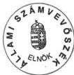

dr. Kovács Árpád  
elnök

55

---

(1) 2017年，公司与上海浦东发展银行股份有限公司签订了《关于使用部分闲置募集资金进行现金管理的协议》。

[Non-Text]

[Non-Text]

[Non-Text]

[Non-Text]

[Non-Text]

•

[Non-Text]

[Non-Text]

•

[Non-Text]

•

[Non-Text]

[Non-Text]

[Non-Text]

[Non-Text]

[Non-Text]

[Non-Text]

[Non-Text]

[Non-Text]

[Non-Text]

[Non-Text]

[Non-Text]

[Non-Text]

•

[Non-Text]

•

[Non-Text]

[Non-Text]

[Non-Text]

[Non-Text]

[Non-Text]

[Non-Text]

[Non-Text]

[Non-Text]

[Non-Text]

[Non-Text]

[Non-Text]

[Non-Text]

[Non-Text]

[Non-Text]

•

[Non-Text]

•

[Non-Text]

[Non-Text]

[Non-Text]

[Non-Text]

[Non-Text]

[Non-Text]

---

# MELLÉKLETEK

Az államháztartás külföldi adóssága és a központi költségvetés külföldi követelésállománya kezelésének ellenőrzéséről szóló jelentéshez

2000. augusztus

---

•
•
•
•
•
•

---

# MELLÉKLETEK

Sorszám

MEGNEVEZÉS

1. sz. A központi költségvetés devizaadóságának 1997-1999. évek között alakulása
2. sz. Tanúsítvány a Magyar Állam által felvett külföldi hitelek főbb jellemzőiről
Tanúsítvány a Magyar Állam által felvett külföldi hitelek főbb jellemzőiről (folytatás)
3. sz. Tanúsítvány a Magyar Állam által felvett külföldi hitelek szerződésmódosításairól
4. sz. Magyar Köztársaság által kibocsátott kötvények befektetőinek földrajzi megoszlása (1999);
Magyar Köztársaság által kibocsátott kötvények befektetőinek intézményi megoszlása (1999)
5. sz. EUR kötvények hozamfelárai
6. sz. USD kötvények hozamfelárai
7. sz. Az 1999. év folyamán kibocsátott kötvények és szindikált hitel valamint az előtörlesztett hitelelemek kamatainak alakulása
8. sz. Külföldi tulajdonú forint állampapír állomány viszonya a forint államkötvény állományhoz
9. sz. Külföldi tulajdonú forint állampapír állomány viszonya a teljes forint hitelállományhoz
10. sz. Az állam által külföldről felvett Útalapnak továbbkölcsönzött hitelek alakulása
11. sz. Jegyzék az 1996-1999. évek között hitelekkel rendelkező és adatokat szolgáltató helyi önkormányzatokról
12. sz. A konszolidált bruttó és nettó külföldi államadósság alakulása 1997-1999. között
13. sz. Teljesítménymutatók a külföldi államadósság teljesítményellenőrzéséhez
14. sz. Audit jellegű kérdések a külföldi államadósság kezelésének ellenőrzéséhez

---

•
•
•
•
•

---

1. sz. melléklet

a V-16-114/1999-2000. sz. jelentéshez

# A központi költségvetés devizaadósságának 1997-1999. évek közötti alakulása

|  Állomány, milliárd forint | 1997.12.31 | 1998.12.31 | 1999.12.31  |
| --- | --- | --- | --- |
|  Átvállalt kötvények (2001/B nélkül) | 1 886,71 | 2 118,18 | 1 554,96  |
|  - ebből: MNBhitel | 1 800,24 | 2 111,69 | 1 720,98  |
|  Swap | 86,47 | 6,49 | -166,01  |
|  Új kötvény | 0,00 | 0,00 | 546,28  |
|  Kötvény összesen | 1 886,71 | 2 118,18 | 2 101,24  |
|  2001/B | 17,04 | 19,60 | 19,55  |
|  Átvállalt + újkötvény+2001/B | 1 903,75 | 2 137,78 | 2 120,79  |
|  közvetlen devizahitel | 255,94 | 239,88 | 375,31  |
|  - ebből: ÁFI | 40,70 | 43,81 | 50,50  |
|  Bős nagymaros | 59,40 | 54,21 | 38,86  |
|  DEVIZA össz.: | 2 219,09 | 2 431,87 | 2 534,96  |
|  ÖSSZ adósság: | 5 370,70 | 6 165,80 | 6 884,90  |
|  GDP | 8 541 | 10 087 | 11 498  |

|  A devizaadósság GDP-hez mért aránya  |   |   |   |
| --- | --- | --- | --- |
|   | 1997.12.31 | 1998.12.31 | 1999.12.31  |
|  Átvállalt kötvények (2001/B nélkül) | 22,09% | 21,00% | 13,52%  |
|  - ebből: MNBhitel | 21,08% | 20,93% | 14,97%  |
|  Swap | 1,01% | 0,06% | -1,44%  |
|  Új kötvény | 0,00% | 0,00% | 4,75%  |
|  Kötvény összesen | 22,09% | 21,00% | 18,27%  |
|  2001/B | 0,20% | 0,19% | 0,17%  |
|  Átvállalt + újkötvény+2001/B | 22,29% | 21,19% | 18,44%  |
|  közvetlen devizahitel | 3,00% | 2,38% | 3,26%  |
|  - ebből: ÁFI | 0,48% | 0,43% | 0,44%  |
|  Bős nagymaros | 0,70% | 0,54% | 0,34%  |
|  DEVIZA össz.: | 25,98% | 24,11% | 22,05%  |
|  ÖSSZ adósság: | 62,88% | 61,13% | 59,88%  |

|  A devizaadósság összes adóssághoz mért aránya  |   |   |   |
| --- | --- | --- | --- |
|   | 1997.12.31 | 1998.12.31 | 1999.12.31  |
|  Átvállalt kötvények (2001/B nélkül) | 35,13% | 34,35% | 22,59%  |
|  - ebből: MNBhitel | 33,52% | 34,25% | 25,00%  |
|  Swap | 1,61% | 0,11% | -2,41%  |
|  Új kötvény | 0,00% | 0,00% | 7,93%  |
|  Kötvény összesen | 35,13% | 34,35% | 30,52%  |
|  2001/B | 0,32% | 0,32% | 0,28%  |
|  Átvállalt + újkötvény+2001/B | 35,45% | 34,67% | 30,80%  |
|  közvetlen devizahitel | 4,77% | 3,89% | 5,45%  |
|  - ebből: ÁFI | 0,76% | 0,71% | 0,73%  |
|  Bős nagymaros | 1,11% | 0,88% | 0,56%  |
|  DEVIZA össz.: | 41,32% | 39,44% | 36,82%  |
|  ÖSSZ adósság: | 100,00% | 100,00% | 100,00%  |

Forrás: Államadósság Kezelő Központ

2000.04.11

---

•
•
•
•
•

---

2. sz. melléklet

a V-16-114/1999-2000. sz. jelentéshez

TANÚSÍTVÁNY

A Magyar Állam által felvett külföldi hitelek főbb jellemzőiről

|  Kölcsönszám | Megnevezés | Kölcsönszerz.kelte | Összege (szerz.) | Futamideje | Türelmi idő | Törlesztés kezdete | Törlesztés vége  |
| --- | --- | --- | --- | --- | --- | --- | --- |
|  VB 2317 | I. Energiaracionalizálási pr. | 1983.07.06 | USD 109,000,000 | 15 év | 3 év | 1987.03.01 | Előtörlesztve 1998.03.20. (eredeti 1998.09.01.)  |
|  VB 2557 | I. Közlekedési pr. | 1985.06.04 | USD 75,000,000 | 15 év | 4 év | 1989.02.01 | Előtörlesztve 1998.03.20. (eredeti 2000.08.01)  |
|  VB 2697 | Erőmű-rekonstrukciós pr. | 1986.06.17 | USD 64,000,000 | 15 év | 4 év | 1990.02.15 | Előtörlesztve 1998.03.20. (eredeti 2001.08.15.)  |
|  VB 2847 | Távközlési pr. | 1987.07.15 | USD 70,000,000 | 15 év | 4 év | 1991.02.01 | Előtörlesztve 1998.03.20. (eredeti 2002.08.01.)  |
|  VB 2965 | Ipari ágazati szerkezetkig. pr. Az MNB-nél devizabetélként lett elhelyezve | 1988.07.01 | USD 200,000,000 | 15 év | 2 év | 1994.03.15 | Előtörlesztve 1998.06.22. (eredeti 2003.09.15.)  |
|  VB 3032 | II. Közlekedési pr. | 1989.07.10 | USD 95,000,000 | 15 év | 5 év | 1994.12.15 | Előtörlesztve 1998.03.20. (eredeti 2004.06.15.)  |
|  VB 3313S | Emberi erőforrások | 1991.04.29 | USD 150,000,000 | 15 év | 5 év | 1997.06.15 | Előtörlesztve 1998.03.20. (eredeti 2006.12.15.)  |
|  VB 3549S | Közúti program II. | 1993.03.26 | USD 72,243,007.21 | 15 év | 5 év | 1998.04.01 | 2007.10.01  |
|  VB 3549A |  | 1997.07.23 | DEM 30,249,035.43 | 9 év | 3 év | 2001.04.15 | 2007.10.01  |
|  VB 3596S | Egészségügyi és nyugdíjbiztosítási program | 1993.04.27 | USD 17,199,480.61 | 15 év | 5 év | 1998.12.15 | 2008.06.15  |
|  VB 3596A |  | 1997.07.23 | DEM 195,562,684.78 | 9 év | 3 év | 2001.06.15 | 2008.06.15  |
|  VB 3596Amód1 |  | 1997.11.10 | DEM 118,905,184.78 | 9 év | 3 év | 2001.06.15 | 2008.06.15  |
|  VB 3596Amód2 |  | 1999.06.02 | DEM 38,005,184.78 | 9 év | 3 év | 2001.06.15 | 2008.06.15  |
|  VB 3596Amód3 |  | 1999.11.01 | DEM 30,363,184.78 | 9 év | 3 év | 2001.06.15 | 2008.06.15  |
|  VB 3597S | Egészségügyi szolgál- tatások fejlesztése | 1993.04.27 | USD 21,974,340.58 | 15 év | 5 év | 1998.12.15 | 2008.06.15  |
|  VB 3597A |  | 1997.07.23 | DEM 117,585,210.82 | 6 év | 3 év | 2001.06.15 | 2006.12.15  |
|  VB 3597Amód |  | 1999.03.31 | DEM 32,258,194.83 | 6 év | 3 év | 2001.06.15 | 2006.12.15  |

Budapest, 2000.02.02

aláírás

---

a V-16-114/1999-2000. sz. jelentéshe

# TANÚSÍTVÁNY

A Magyar Állam által felvett külföldi hitelek főbb jellemzőiről

|  (folytatás)  |   |   |   |   |   |   |   |
| --- | --- | --- | --- | --- | --- | --- | --- |
|  VB 3635S | Adórendszer | 1993.07.16 | USD 14,643,321.60 | 15 év | 5 év | 1998.12.15 | 2008.06.15  |
|  VB 3635A | korszerűsítése | 1997.07.23 | DEM 24,456,601.65 | 9 év | 3 év | 2001.06.15 | 2008.06.15  |
|  VB 4113 | Államháztartás reformja | 1996.12.13 | USD 7,750,000 | 9 év | 3 év | 2000.12.15 | 2010.06.15  |
|  VB 4141 | Vállalati szektor / A hitel az MNB-nél devizabetétként lett elhelyezve | 1997.04.28 | USD 225,000,000 | 12 év | 3 év | 2001.09.15 | 2010.09.15  |
|  VB 4230 | Ifjúsági szakképzés | 1997.10.29 | DEM 62,900,000 | 9 év | 3 év | 2002.11.15 | 2011.05.15  |
|  VB 4275 | Államháztartás reformja | 1998.04.16 | USD 150,000,000 | 12 év | 3 év | 2002.01.15 | 2010.07.15  |
|  VB 4287 | Felsőoktatás korszerűsítése | 1998.03.04 | DEM 263,600,000 | 6 év | 3 év | 2002.11.15 | 2010.11.15  |
|  EIB | Utak I. | 1992.06.18 | ECU 50,000,000.00 | 20 év | 5 év | 1997.12.15 | 2012.06.15  |
|  EIB | Utak II | 1993.12.22 | ECU 72,000,000.00 | 20 év | 6 év | 1999.06.20 | 2013.12.20  |
|  EIB | Légiközlekedés (LRI) | 1992.12.17 1998.03.03 | ECU 12,256,560.00 ECU 7,743,440.00 | 13 év 13 év | 5 év 7 év | 1998.06.10 2000.06.10 | 2005.12.10 2005.12.10  |
|  EIB | Vasút I. | 1998.02.23 | EUR 60,000,000.00 | 19 év | 5 év | 2003.01.15 | 2017.01.15  |
|  EBRD | M 0 körgyűrű | 1992.09.15 | ECU 21,000,000.00 | 15 év | 3 év | 1995.09.15 | 2007.03.15  |
|  KfW | Bp.-Hegyeshalom | 1993.06.28 | DEM 280,000,000 | 15 év | 7 év | 2000.01.10 | 2008.07.17  |
|  KfW | Szlovén-magyar vasútvonal | 1998.06.11 | DEM 120,000,000 | 17 év | 4 év | 2002.12.30 | 2015.06.30  |
|  OECF | Várpalota rehabilitációs pr. | 1994.11.25 | JPY 4,914,000,000 | 25 év | 7 év | 2001.11.20 | Előtörlesztve 1999.11.22. (eredeti 2019.11.20.)  |
|  2004/1 | szindikált hitel | 1999.09.10 | EUR 400,000,000 | 5 év | 5 év | 2004.09.10 | 2004.09.10  |
|  EU Társ.Fejl.Alap | Árvízvédelem hitel | 1999.07.13 | EUR 40,000,000 | 10 év | 5 év | 2005.09.14 | Várható: 2010.08.15  |
|  AFI | Kötvény | 1990.08.31 | USD 200,000,000 | 10 év | 10 év | 2000.08.31 | 2000.08.31  |

Budapest, 2000.02.02

2

---

3. sz. melléklet
V-16-114/1999-2000. sz. jelentéshez

aláírás

# TANÚSÍTVÁNY

# A Magyar Állam által felvett külföldi hitelek szerződésmódosításairól

|  Kölcsönszerződés száma, kelte | Módosítás időpontja | Módosítás tartalma | Módosított összeg  |
| --- | --- | --- | --- |
|  VB 3549 Közúti program II. 1993.03.26 | 1997.07.23 1997.06.24 1998.06.30 | Új hitelkonstrukció/ Devizanem váltás Lehívási határidő Lehívási határidő | DEM 30,249,035.43  |
|  VB 3596 Egészségügyi és nyugdíjhitelesítési program 1993.04.27 | 1997.07.23 1997.11.10 1998.01.13 1999.06.02 1999.11.01 | Új hitelkonstrukció/ Devizanem váltás Hitelkeret Lehívási határidő Hitelkeret Hitelkeret | DEM 195,562,684.78 DEM 118,905,184.78 DEM 38,005,184.78 DEM 30,363,184.78  |
|  VB 3597 Egészségügyi szolgál- tatások fejlesztése 1993.04.27 | 1997.07.23 1999.03.31 | Új hitelkonstrukció/ Devizanem váltás Hitelkeret | DEM 117,585,210.82 DEM 32,258,194.83  |
|  VB 3635 Adóremszer korszerűsítése 1993.07.16 | 1996.12.23 1997.07.23 1998.12.30 | Lehívási határidő Új hitelkonstrukció/ Devizanem váltás Lehívási határidő | DEM 24,456,601.65  |
|  VB 4230 Ifjúsági szakképzés 1997.10.29 | 1998.03.25 | Speciális számla pénznem váltása |   |
|  VB 4287 Felsőoktatás korszerűsítése 1998.03.04 | 1999.09.30 | Lehívási határidő |   |
|  EIB Utak I. 1992.06.18 | 1995.10.16 | Lehívási határidő |   |
|  EIB Utak II. 1993.12.22 | 1994.05.05 | Lehívási határidő |   |
|  EIB LRI 1992.12.17 | 1994.07.14 1998.03.03 | Program technikai leírása /Lehívási határidő Törlesztés ütemének módosítása Lehívási határidő |   |

Budapest, 2000.02.02

---

Magyar Államkincstár
Államadósság Kezelő Központ

4. sz. melléklet
a V-16-114/1999-2000. sz. jelentéshez

Magyar Köztársaság által kibocsátott kötvények
befektetőinek földrajzi megoszlása (1999)

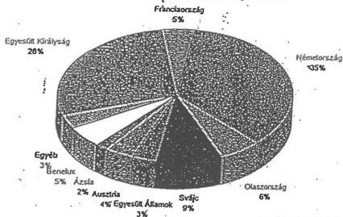

Forrás: vezető szervezők

Magyar Köztársaság által kibocsátott kötvények
befektetőinek intézményi megoszlása (1999)

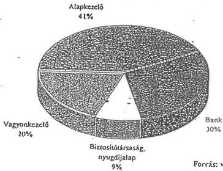

Forrás: vezető szervezők

Készítette: Nádi Attila

1999.12.09

DistrTotal

---

5. sz. melléklet

a V-16-114/1999-2000. sz. jelentéshez

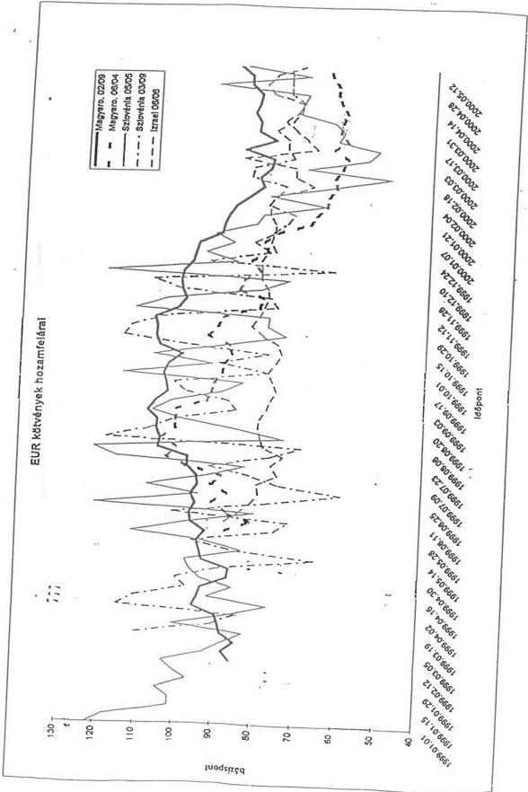

Magyar Nemzeti Bank
Nemzetközi tőkeplaci főosztály

---

6. sz. melléklet

a V-16-114/1999-2000. sz. jelentéshez

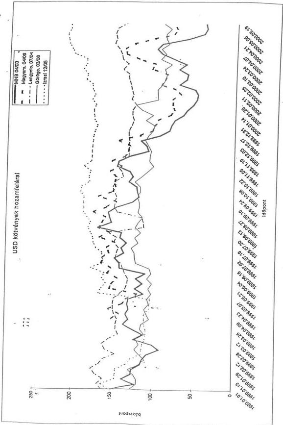

Magyar Nemzeti Bank
Nemzetközi tőkeplaci főosztály

---

Magyar Államkincstár
Államadósság Kezelő Központ

7. sz. melléklet
V-16-114/1999-2000. sz. jelentéshez

Az 1999. év folyamán kibocsátott kötvények és szindikált hitel valamint az
előtörlesztett hitelelemek kamatainak alakulása

|   | Swap előtt |   |   | Swap után  |   |
| --- | --- | --- | --- | --- | --- |
|   |  Devizanem | Összeg | Névleges kamat | Devizanem | Névleges kamat  |
|  Új kötvény Előtörlesztés | EUR | 500 000 000 | 4.375% | EUR | 4.375%  |
|   |  JPY | 24 071 236 652 | 5.70% | DEM | 8.27%  |
|   |  DEM | 600 000 000 | 10.25% | DEM | 10.25%  |
|  Új kötvény Előtörlesztés | USD | 750 000 000 | 6.50% | EUR | 4.455%  |
|   |  ATS | 600 000 000 | 10.375% | ATS | 10.375%  |
|   |  JPY | 50 000 000 000 | 6.45% | DEM | 9.4825%  |
|   |   |  |  | USD | 8.138%  |
|   |  NLG | 150 000 000 | 8.75% | NLG | 8.75%  |
|   |  USD | 69 650 000 | 6.59% | USD | 6.59%  |
|   |  JPY | 13 324 726 924 | 6.00% | DEM | 8.64%  |
|  Új kötvény Előtörlesztés | EUR | 500 000 000 | 4.25% | EUR | 4.25%  |
|   |  CHF | 150 000 000 | 8.25% | USD | 12.43%  |
|   |  CHF | 200 000 000 | 6.75% | USD | 11.00%  |
|   |  FRF | 1 000 000 000 | 8.00% | FRF | 8.00%  |
|   |  JPY | 11 675 273 076 | 6.00% | DEM | 8.64%  |
|   |  DEM | 67 558 568 | 10.00% | DEM | 10.00%  |
|  Új hitel Előtörlesztés | EUR | 400 000 000 | 3.495% | EUR | 3.495%  |
|   |  DEM | 532 441 432 | 10.00% | DEM | 10.00%  |
|   |  DEM | 249 890 568 | 9.25% | DEM | 9.25%  |
|  Új kötvény Előtörlesztés | EUR | 400 000 000 | 3.992% | EUR | 3.992%  |
|   |  JPY | 4 613 831 188 | 5.00% | JPY | 5.00%  |
|   |  JPY | 39 532 555 071 | 6.45% | USD | 9.112%  |

---

8. sz. melléklet

a V-16-114/1999-2000. sz. jelentéshez

Külföldi tulajdonú forint állampapír állomány viszonya
a forint államkötvény állományhoz

|   | 1996.12.31 | 1997.12.31 | 1998.12.31 | 1999.12.29  |
| --- | --- | --- | --- | --- |
|  Külföldi forint állampapír állomány (Mrd Ft) | 67,00 | 74,00 | 279,68 | 438,99  |
|  Forint államkötvény állomány (Mrd Ft) | 708,49 | 998,73 | 1 386,46 | 1 791,18  |
|  Külföldi forint állampapír állomány aránya (%) | 9,46 | 7,41 | 20,17 | 24,51  |

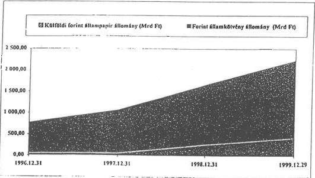

---

9. sz. melléklet

a V-16-114/1999-2000. sz. jelentéshez

# Külföldi tulajdonú forint állampapír állomány
viszonya a teljes forint hitelállományhoz

|   | 1996.12.31 | 1997.12.31 | 1998.12.31 | 1999.12.29  |
| --- | --- | --- | --- | --- |
|  Külföldi forint állampapír állomány (Mrd Ft) | 67,00 | 74,00 | 279,68 | 438,99  |
|  Teljes forint hitelállomány (Mrd Ft) | 4 630,40 | 3 151,67 | 3 733,92 | 4 351,45  |
|  Külföldi forint állampapír állomány aránya (%) | 1,45 | 2,35 | 7,49 | 10,09  |

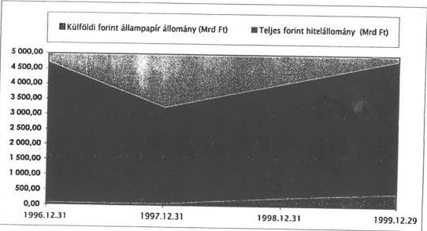

---

10. sz. melléklet

a V-16-114/1999-2000. sz. jelentéshez

# Az állam által külföldről felvett Útalapnak

# továbbkölcsönzött hitelek alakulása

|  Program meg-nevezése | Hitel-keret | Szerződés kötés éve | 1997. december 31. |   |   | 1998. december 31.  |   |   |
| --- | --- | --- | --- | --- | --- | --- | --- | --- |
|   |  |  | A d ő s s á g á l l o m á n y  |   |   |   |   |   |
|   |  |  | Mrd Ft* | Mrd Ft** | Eltérés | Mrd Ft* | Mrd Ft** | Eltérés  |
|  EIB Utak I. | 50 M ECU | 1992. | 11,9 | 6,5 | 5,4 | 11,9 | 5,6 | 6,3  |
|  EIB Utak II. | 72 M ECU | 1992. | 5,6 | 4,5 | 1,1 | 14,0 | 12,4 | 1,6  |
|  IBRD Közutak | 90 M USD | 1993. | 14,1 -BM | 6,4 | 7,7 | 17 -BM | 7,9 | 9,1  |
|  EBRD | 21 M ECU | 1995. | 3,7 | 1,4 | 2,3 | 3,8 | 1,0 | 2,8  |
|  Összesen: | - | - | 35,3 | 18,8 | 16,5 | 46,7 | 26,9 | 19,8  |

*ÁKK kimutatása szerint az IBRD vonatkozásában tartalmazza a BM hitelfelhasználását is.
**Könyvvizsgálói jelentés alapján

---

11. sz. melléklet

a V-16-114/1999-2000. sz. jelentéshez

# JEGYZÉK

# az 1996-1999. évek között hitelekkel rendelkező és adatokat szolgáltató helyi önkormányzatokról

Budapest Főváros Főpolgármesteri Hivatal

# Baranya megye

- Pécs Megyei Jogú Város Önkormányzata
- Komló Városi Önkormányzat Képviselő-Testülete
- Szigetvár Városi Önkormányzat Képviselő-Testülete
- Harkány Nagyközségi Önkormányzat Képviselő-Testülete
- Boly Városi Önkormányzat Képviselő-Testülete
- Nemeske Községi Önkormányzat Képviselő-Testülete
- Hosszúhetény Községi Önkormányzat Képviselő-Testülete
- Szászvár Nagyközségi Önkormányzat Képviselő-Testülete
- Szentlászló Községi Önkormányzat Képviselő-Testülete
- Királyegyháza Községi Önkormányzat Képviselő-Testülete
- Geresdlak Községi Önkormányzat Képviselő-Testülete
- Keszű Községi Önkormányzat Képviselő-Testülete
- Sásd Város Képviselő-Testülete
- Orfű Községi Önkormányzat Képviselő-Testülete
- Hidas Községi Önkormányzat Képviselő-Testülete
- Mecseknádasd Községi Önkormányzat Képviselő-Testülete

# Bács - Kiskun megye

- Kecskemét Megyei Jogú Város Polgármesteri Hivatala
- Kecskemét Bács-Kiskun Megyei Önkormányzati Hivatal
- Baja Városi Önkormányzati Hivatal
- Kiskunhalas Polgármesteri Hivatal
- Kalocsa Városi Önkormányzat Polgármesteri Hivatala
- Harta Polgármesteri Hivatal
- Kiskunfélegyháza Város Önkormányzata

---

Hajós Nagyközség Képviselő-Testülete  
Kiskunmajsa Városi Önkormányzat  
Kiskőrös Város Polgármesteri Hivatala  
Kecskemét Lánchíd utcai Általános Iskola  
Dávod Polgármesteri Hivatal  
Dunafalva Községi Önkormányzat Képviselő-Testülete  
Kecskemét Megyei Jogú Város Szociális Foglalkoztató

## **Békés megye**

Békés Megye Képviselő-Testülete Önkormányzati Hivatala  
Békéscsaba Megyei Jogú Város Önkormányzata  
Gyula Városi Önkormányzat  
Orosháza Városi Önkormányzat  
Csorvás Nagyközségi Önkormányzat  
Szarvas Városi Önkormányzat  
Újkigyós Nagyközségi Önkormányzat  
Szabadkigyós Község Önkormányzata  
Kunágota Községi Önkormányzat  
Békészentandrás Nagyközségi Önkormányzat  
Dévaványa Nagyközségi Önkormányzat  
Békés Városi Önkormányzat  
Gyomaendrőd Városi Önkormányzat  
Mezőhegyes Városi Önkormányzat  
Elek Városi Önkormányzat  
Vésztő Nagyközség Önkormányzat  
Doboz Nagyközség Önkormányzat

## **Borsod - Abaúj - Zemplén megye**

B-A-Z Megyei Önkormányzat Hivatala  
Miskolc Megyei Jogú Város Önkormányzat Képviselő-Testülete  
Szerencs Városi Polgármesteri Hivatal  
Hernádnémeti Községi Önkormányzat Képviselő-Testülete  
Bócs Községi Önkormányzat Polgármesteri Hivatal  
Tiszaújváros Városi Önkormányzat Polgármesteri Hivatala  
Sátoraljaújhely Városi Polgármesteri Hivatal  
Szikszó Városi Polgármesteri Hivatal  
Sárospatak Városi Polgármesteri Hivatal  
Tardona Községi Önkormányzat Képviselő-Testülete  
Sály Község Polgármesteri Hivatal  
Kazincbarcika Városi Önkormányzat Polgármesteri Hivatal  
Tokaj Város Polgármesteri Hivatal  
Alsószolca Nagyközség Polgármesteri Hivatal

---2

---

Ózd Városi Polgármesteri Hivatal  
Kesznyéten Községi Polgármesteri Hivatal  
Dédestapolcsány Községi Önkormányzat Képviselő-Testülete  
Szendrő Városi Polgármesteri Hivatal  
Cserépváralja Községi Önkormányzat Képviselő-Testülete  
Emőd Nagyközségi Polgármesteri Hivatal  
Miskolc Diósgyőri Kórház

## Csongrád megye

Csongrád Megyei Önkormányzat Hivatala  
Szeged Megyei Jogú Városi Önkormányzat Polgármesteri Hivatal  
Hódmezővásárhely Megyei Jogú Városi Önkormányzat Polgármesteri Hivatal  
Makó Városi Önkormányzat Polgármesteri Hivatal  
Domaszék Községi Önkormányzat Polgármesteri Hivatal  
Kistelek Városi Önkormányzat Polgármesteri Hivatal  
Szentes Városi Önkormányzat Polgármesteri Hivatal  
Mórahalom Városi Önkormányzat Polgármesteri Hivatal  
Maroslele Községi Önkormányzat Polgármesteri Hivatala  
Röszke Község Önkormányzat Polgármesteri Hivatala  
Mindszent Város Polgármesteri Hivatal  
Doc Községi Önkormányzat  
Bordány Községi Önkormányzat Polgármesteri Hivatal  
Csanytelek Községi Önkormányzat Polgármesteri Hivatal

## Fejér megye

Fejér Megyei Önkormányzat Hivatala  
Székesfehérvár Megyei Jogú Város Önkormányzat Közgyűlése  
Dunaújváros Megyei Jogú Városi Önkormányzat Közgyűlése  
Bakonycsernye Községi Önkormányzat Képviselő-Testülete  
Szabadbattyán Nagyközségi Önkormányzat Képviselő-Testülete  
Adony Nagyközségi Önkormányzat Képviselő-Testülete  
Kalóz Községi Önkormányzat Képviselő-Testülete  
Sárosd Nagyközségi Önkormányzat Képviselő-Testülete  
Tác Községi Önkormányzat Képviselő-Testülete  
Mór Városi Önkormányzat Képviselő-Testülete  
Vértesacsa Községi Önkormányzat Képviselő-Testülete  
Seregélyes Nagyközségi Önkormányzat Képviselő-Testülete  
Bicske Városi Önkormányzat Képviselő-Testülete  
Sárbogárd Városi Önkormányzat Képviselő-Testülete  
Pusztaszabolcs Nagyközségi Önkormányzat Képviselő-Testülete  
Bodajk Nagyközségi Önkormányzat Képviselő-Testülete

---3

---

# Győr - Moson - Sopron megye

Győr-Moson-Sopron Megye Önkormányzati Hivatala  
Győr Megyei Jogú Város Polgármesteri Hivatal  
Sopron Megyei Jogú Város Polgármesteri Hivatala  
Soproni Erzsébet Kórház  
Levél Községi Önkormányzat Polgármesteri Hivatala  
Tét Nagyközségi Önkormányzat Polgármesteri Hivatala  
Halász Községi Polgármesteri Hivatal  
Pannonhalma Nagyközség Önkormányzata  
Ravazd Községi Önkormányzat Polgármesteri Hivatala  
Lébény Nagyközségi Önkormányzat Polgármesteri Hivatala  
Mosonszentmiklós Községi Önkormányzat Polgármesteri Hivatala  
Öttevény Községi Önkormányzat Polgármesteri Hivatala  
Mihályi Községi Önkormányzat Polgármesteri Hivatala  
Töltéstava Községi Önkormányzat Polgármesteri Hivatala  
Mosonmagyaróvár Város Polgármesteri Hivatala  
Fertőszentmiklós Községi Önkormányzat Polgármesteri Hivatala  
Agyagosszergény Községi Önkormányzat Polgármesteri Hivatala  
Beled Nagyközségi Önkormányzat Polgármesteri Hivatala  
Tét Nagyközségi Önkormányzat Polgármesteri Hivatala

# Hajdú - Bihar megye

Hajdú Bihar Megyei Önkormányzat Hivatala  
Debrecen Megyei Jogú Város Önkormányzat Képviselő-Testülete  
Hajdúböszörmény Város Polgármesteri Hivatal  
Balmazújváros Város Önkormányzatának Polgármesteri Hivatala  
Létavértes Város Polgármesteri Hivatala  
Tiszacsege Nagyközség Önkormányzat Polgármesteri Hivatala  
Vámospércs Nagyközség Polgármesteri Hivatala  
Hajdú-Bihar Megyei Önkormányzat Informatikai Központ Debrecen  
Berettyóújfalu Város Polgármesteri Hivatal  
Nádudvar Gazdasági Műszaki Ellátó Szolg. Szervezete  
Nyíradony Város Polgármesteri Hivatal  
Püspökladány Városi Polgármesteri Hivatal  
Egyek Nagyközség. Képviselő-Testülete  
Földes Nagyközség Polgármesteri Hivatal  
Görbeháza Község Önkormányzata  
Nagyhegyes Községi Polgármesteri Hivatal  
Komádi Nagyközség Önkormányzat Polgármesteri Hivatala

---4

---

## Heves megye

- Heves Megyei Önkormányzat Elnöki Hivatala
- Poroszló Községi Önkormányzat Képviselő-Testülete
- Eger Megyei Jogú Városi Önkormányzat
- Hatvan Városi Önkormányzat Képviselő-Testülete
- Nagyréde Községi Önkormányzat
- Parád Nagyközségi Önkormányzat Képviselő-Testülete
- Gyöngyöspata Községi Önkormányzat
- Heves Városi Önkormányzat
- Gyöngyössolymos Községi Önkormányzat Képviselő-Testülete
- Bugát Pál Kórház
- Gyöngyösoroszi Községi Önkormányzat
- Abasár Községi Önkormányzat Képviselő-Testülete
- Markáz Községi Önkormányzat Képviselő-Testülete
- Verpelét Nagyközségi Önkormányzat Képviselő-Testülete
- Gyöngyös Városi Önkormányzat Képviselő-Testülete
- Kisköre Nagyközségi Önkormányzat
- Kerecsend Községi Önkormányzat Képviselő-Testülete

## Komárom - Esztergom megye

- Komárom Esztergom Megyei Önkormányzati Hivatal Tatabánya
- Tatabánya Megyei Jogú Város Polgármesteri Hivatal
- Oroszlány Város Polgármesteri Hivatala
- Esztergom Város Képviselő-Testülete
- Komárom Város Polgármesteri Hivatal
- Kisbér Városi Önkormányzat Testület
- Lábatlan Nagyközség Képviselő-Testülete
- Dömös Községi Önkormányzat Képviselő-Testülete
- Tardos Önkormányzat Képviselő-Testülete
- Komárom-Esztergom Megyei Szent Borbála Kórház
- Tata Város Polgármesteri Hivatala
- Szomod Község Képviselő-Testülete
- Süttő Község Önkormányzat Képviselő-Testülete
- Környe Községi Polgármesteri Hivatal
- Bábolna Nagyközségi Önkormányzat Képviselő-Testülete
- Nyergesújfalu Városi Polgármesteri Hivatal

5

---

# Nógrád megye

Nógrád Megyei Közgyűlés Hivatala  
Salgótarján Megyei Jogú Városi Önkormányzat Képviselő-Testülete  
Szécsény Városi Önkormányzat Képviselő-Testülete  
Sóshartyán Községi Önkormányzat Képviselő-Testülete  
Kishartyán Községi Önkormányzat Képviselő-Testülete  
Balassagyarmat Városi Önkormányzat Képviselő-Testülete  
Pásztó Városi Önkormányzat Képviselő-Testülete  
Mátraszele Községi Önkormányzat Képviselő-Testülete  
Karancslapujtó Községi Önkormányzat Képviselő-Testülete  
Nagylóc Községi Önkormányzat Képviselő-Testülete  
Etes Községi Önkormányzat Képviselő-Testülete  
Bátonyterenye Városi Önkormányzat Képviselő-Testülete  
Karancskeszi Községi Önkormányzat Képviselő-Testülete  
Buják Községi Önkormányzat Képviselő-Testülete

# Pest megye

Pest Megye Önkormányzatának Hivatala  
Nagykőrös Város Önkormányzat Polgármesteri Hivatal  
Szigetszentmiklós Város Polgármesteri Hivatal  
Dunavarsány Nagyközség Polgármesteri Hivatala  
Veresegyház Nagyközség Önkormányzat Polgármesteri Hivatala  
Kiskunlacháza Nagyközség Önkormányzat Polgármesteri Hivatal  
Abony Városi Önkormányzat Polgármesteri Hivatal  
Gödöllő Városi Polgármesteri Hivatal  
Ócsa Nagyközség Polgármesteri Hivatala  
Tura Nagyközségi Polgármesteri Hivatal  
Pilis Nagyközség Polgármesteri Hivatala  
Tápiószentmárton Nagyközségi Polgármesteri Hivatal  
Érd Városi Polgármesteri Hivatal  
Páty Községi Önkormányzat Polgármesteri Hivatal

# Somogy megye

Somogy Megyei Önkormányzat Képviselő-Testülete  
Kaposvár Megyei Jogú Város Közgyűlése  
Somogyszentpál Községi Önkormányzat Képviselő-Testülete  
Böhönye Községi Önkormányzat Képviselő-Testülete  
Balatonkeresztúr Községi Önkormányzat Képviselő-Testülete  
Fonyód Városi Önkormányzat Képviselő-Testülete  
Balatonmária-Fürdő Községi Önkormányzat Képviselő-Testülete  
Csurgó Városi Önkormányzat Polgármesteri Hivatal

---6

---

Somogyudvarhely Községi Önkormányzat Képviselő-Testülete
Kadarkút Nagyközségi Önkormányzat Képviselő-Testülete
Karád Községi Önkormányzat Képviselő-Testülete
Marcali Városi Önkormányzat Képviselő-Testülete
Tab Városi Önkormányzat Képviselő-Testülete
Tengőd Községi Önkormányzat Képviselő-Testület
Igal Nagyközségi Önkormányzat Képviselő-Testülete
Nágocs Községi Önkormányzat Képviselő-Testülete

# Szabolcs - Szatmár - Bereg megye

Szabolcs-Szatmár-Bereg Megyei Önkormányzat Hivatal Nyíregyháza
Nyíregyháza M. Város Önkormányzat Képviselő-Testület Polgármesteri Hivatala
Tiszakorod Község Önkormányzat Képviselő-Testület Polgármesteri Hivatal
Nyírmihálydi Község Önkormányzat Képviselő-Testülete Polgármesteri Hivatala
Kisvarsány Község Önkormányzat Képviselő-Testület Polgármesteri Hivatala
Mátészalka Város Önkormányzat Képviselő-Testület Polgármesteri Hivatala
Vaja Nagyközség Önkormányzat Képviselő-Testület Polgármesteri Hivatala
Ibrány Város Önkormányzat Képviselő-Testület Polgármesteri Hivatala
Kisvárda Város Önkormányzat Képviselő-Testület Polgármesteri Hivatala
Baktalórántháza Város Önkormányzat Képviselő-Testület Polgármesteri Hivatala
Opályi Község Önkormányzat Képviselő-Testület Polgármesteri Hivatala
Dombrád Nagyközség Önkormányzat Képviselő-Testület Polgármesteri Hivatala
Nagykálló Város Önkormányzat Képviselő-Testület Polgármesteri Hivatala
Kocsord Község Önkormányzat Képviselő-Testület Polgármesteri Hivatala
Tiszavasvári Város Önkormányzat Képviselő-Testület Polgármesteri Hivatala
Mérk Nagyközség Önkormányzat Képviselő-Testület Polgármesteri Hivatala

# Jász - Nagykun - Szolnok megye

Jász-Nagykun-Szolnok Megyei Önkormányzati Hivatal
Szolnok Megye Jogú Város Polgármesteri Hivatala
Tószeg Község Önkormányzat Képviselő-Testülete
Karcag Városi Önkormányzat Képviselő-Testülete
Mezőtúr Városi Önkormányzat Képviselő-Testülete
Fegyvernek Nagyközség Önkormányzat Képviselő-Testülete
Kötelek Község Önkormányzat Képviselő-Testülete
Nagykoru Község Önkormányzat Képviselő-Testülete
Tiszasüly Község Önkormányzat Képviselő-Testülete
Jászárokszállás Város Önkormányzat Képviselő-Testülete
Martfű Városi Önkormányzat Képviselő-Testülete

7

---

Túrkeve Városi Önkormányzat Képviselő-Testülete  
Abádszalók Nagyközség Önkormányzat Képviselő-Testülete  
Besenyszög Község Önkormányzat Képviselő-Testülete  
Kunhegyes Városi Önkormányzat Képviselő-Testülete  
Tiszafüred Városi Önkormányzat Képviselő-Testülete  
Jász-Nagykun-Szolnok Megyei Hetényi Géza Kórház és Rendelő Intézet Szolnok I.

## Tolna megye

Tolna Megyei Önkormányzat Közgyűlése Szekszárd  
Dombóvár Városi Polgármesteri Hivatal  
Fadd Nagyközségi Önkormányzat Képviselő-Testülete  
Tolna Városi Önkormányzat Képviselő-Testülete  
Tamási Városi Önkormányzat Képviselő-Testülete  
Bátaszék Város Önkormányzata  
Szekszárd Megyei Jogú Város Önkormányzata  
Madocsa Községi Önkormányzat Madocsa  
Kajdacs Községi Polgármesteri Hivatal Kajdacs  
Kölesd Községi Önkormányzat Képviselő-Testülete  
Bonyhád Városi Önkormányzat Képviselő-Testülete  
Kocsola Községi Polgármesteri Hivatal  
Nagymányok Nagyközségi Önkormányzat Képviselő-Testülete  
Dunaszentgyörgy Községi Polgármesteri Hivatal  
Paks Városi Önkormányzat

## Vas megye

Szombathely Megyei Jogú Város Polgármesteri Hivatal  
Ják Községi Önkormányzat  
Celldömölk Város Polgármesteri Hivatala  
Kőszeg Városi Önkormányzat  
Csepreg Város Önkormányzata  
Balogunyom Községi Önkormányzat  
Sorokpolány Községi Önkormányzat  
Nárai Községi Önkormányzat  
Felsőcsatár Községi Önkormányzat  
Vas Megyei Markusovszky Kórház  
Söpte Községi Önkormányzat  
Tanakajd Községi Önkormányzat  
Vép Nagyközségi Önkormányzat  
Vát Községi Önkormányzat  
Szentgotthárd Városi Önkormányzat  
Sárvár Városi Önkormányzat  
Halogy Községi Önkormányzat

---8

---

Kemenesmagasi Községi Önkormányzat
Torony Községi Önkormányzat

## **Veszprém megye**

- Veszprém Megyei Önkormányzati Hivatal
- Veszprém Megyei Jogú Város Önkormányzata
- Várpalota Város Önkormányzata
- Öskü Község Önkormányzata
- Balatonalmádi Város Önkormányzata
- Berhida Nagyközség Önkormányzata
- Ősi Község Önkormányzata
- Tés Község Önkormányzata
- Ajka Város Önkormányzata
- Pétfürdő Község Önkormányzata
- Szentkirályszabadja Község Önkormányzata
- Zirc Város Önkormányzata
- Tapolca Város Önkormányzata
- Dudar Község Önkormányzata
- Balatonfüred Város Önkormányzata
- Pápa Város Önkormányzata

## **Zala megye**

- Zala Megyei Önkormányzati Közgyűlés Hivatala
- Zala Megyei Kórház
- Nagykanizsa Megyei Jogú Város Polgármesteri Hivatala
- Zalaegerszeg Megyei Jogú Város Polgármesteri Hivatala
- Lenti Város Polgármester Hivatala
- Letenye Város Polgármesteri Hivatala
- Újudvar Községi Önkormányzat Képviselő-Testülete
- Becsehely Község Önkormányzat Képviselő-Testülete
- Kehidakustány Község Önkormányzati Testülete
- Tótszerdahely Község Önkormányzati és Horvát Kisebbségi Képviselő-Testülete
- Gutorfölde Önkormányzat Képviselő-Testülete
- Tótszentmárton Községi Önkormányzat Képviselő-Testülete
- Bázakerettye Községi Közös Önkormányzat Képviselő-Testülete
- Keszthely Városi Kórház
- Rédics Községi Önkormányzat
- Hévíz Város Polgármesteri Hivatala

9

---

“

”

“

”

“

”

”

---

12. sz. melléklet

a V-16-114/1999-2000. sz. jelentéshez

A konszolidált bruttó és nettó külföldi államadósság alakulása 1997-1999. között

|  Megnevezés | 1997 | 1998 | 1999 | 1997 | 1998 | 1999  |
| --- | --- | --- | --- | --- | --- | --- |
|   |  Milliárd Ft-ban |   |   | GDP %-ában ***  |   |   |
|  MNB külföldi adósságával bővített konszolidált bruttó külföldi adósság * | 3.251,6 | 3.679,5 | 4.504,5 | 38,1 | 36,5 | 39,4  |
|  MNB-nél levő bruttó külföldi adósság * | 2.845,2 | 3.078,0 | 3.108,5 | 33,3 | 30,5 | 27,2  |
|  MNB külföldi adósságával bővített konszolidált nettó külföldi adósság * | 2.094,0 | 2.450,5 | 3.811,3 | 24,5 | 24,3 | 33,4  |
|  Konszolidált bruttó külföldi államadósság ** | 350,3 | 335,0 | - | 4,1 | 3,3 | -  |
|  Központi kormányzat külföldi államadóssága*** | 315,3 | 294,1 | 950,5 | 3,7 | 2,9 | 8,3  |

* Az MNB éves jelentéseihez készült MNB külföldi adósságával bővített adatok alapján (az államháztartás alrendszereinek /központi költségvetés, állami pénzalapok, TB alapok) valamint a helyi önkormányzatok külföldi adósságát és a nem rezidensek forintkötvényeit tartalmazza

** A Government Finance Statistics Yearbook (IMF 1998.) kiadványhoz készült PM adatok alapján (központi költségvetés, állami pénzalapok, TB alapok adósságát tartalmazza). Az önkormányzatok külföldi adóssága az adatban nem szerepel. A nem rezidensek forintkötvényeit a külföldi államadósság nem tartalmazza.

*** ÁKK adatai alapján (nem konszolidált) Az önkormányzatok külföldi adóssága az adatban nem szerepel. A nem rezidensek forintkötvényeit a külföldi államadósság nem tartalmazza.

*** A GDP értéke 1997-ben 8541 Milliárd Ft, 1998-ban 10088 Milliárd Ft, 1999-ben 11420 Milliárd Ft.

---

•
•
•
•
•

---

**13. sz. melléklet**  
a V-16-114/1999-2000. sz. jelentéshez

## **Teljesítménymutatók a külföldi államadósság teljesítmény-ellenőrzéséhez**

- A külföldi államadósság év végi (december 31.) állománya miként változott (összességében és alrendszerenként), hitelfajtánként részletezve (eredeti devizában, forintban)

**Módszer:** az év végi külföldi adósságállományok összevetése

**Teljesítménykritérium:** az állományváltozások viszonyszámának alakulása

**Információforrás:** Kincstár, ÁKK, alrendszerek

- Az éves hitelfelhasználás összegének alakulása az előirányzathoz képest (forintban)

**Módszer:** az éves felhasználás összegének összevetése az előirányzott összeggel

**Teljesítménykritérium:** a felhasználás eltérése az előirányzott összeghez képest

**Információforrás:** Kincstár, ÁKK, alrendszerek

- A törlesztés összegének tervszerűsége (forintban)

**Módszer:** az éves költségvetésben tervezett törlesztési összeg és a ténylegesen teljesített törlesztés összevetése

**Teljesítménykritérium:** a teljesítés eltérése a tervezettől, az évek közötti változás dinamikája

**Információforrás:** Kincstár, ÁKK, alrendszerek

---

- Az adósságszolgálat alakulása (eredeti devizában és december 31-i árfolyamon forintban)

**Módszer:** a törlesztések és a hitelfelvételek összevetése

**Teljesítménykritérium:** a törlesztések és a hitelfelvételek aránya

**Információforrás:** Kincstár, ÁKK, alrendszerek

- A devizában fennálló adósság költségei (kamat, rendelkezésretartási jutalék stb.) alakulásának tervszerűsége (költségenként részletezve, forintban)

**Módszer:** az éves költségvetésben a devizában fennálló adósság költségeként tervezett összeg és a tényleges teljesítés összevetése

**Teljesítménykritérium:** a teljesítés eltérése a tervezettől, az évek közötti változás

**Információforrás:** Kincstár, ÁKK, alrendszerek

- A devizában fennálló adósság átlagkamatának alakulása (swap előtt és swap után)

**Módszer:** az év végi súlyozott átlaggal számolt átlagkamatláb összevetése (devizánként)

**Teljesítménykritérium:** az átlagkamatláb alakulása

**Információforrás:** Kincstár, ÁKK

- A devizaadósság (hitelnyújtók szerint - belföldi és külföldi - részletezve) összes államadóssághoz viszonyított aránya (forint alapon)

**Módszer:** a devizaadósság és az összes államadósság összevetése

**Teljesítménykritérium:** a devizaadósság és az összes államadósság arányának alakulása

**Információforrás:** Kincstár, ÁKK

---

- A nem rezidensek birtokában lévő forintkötvények év végi állományának alakulása az összes forint hitelállományhoz viszonyítva

**Módszer:** a forintkötvényállomány és az összes forint hitelállomány összevetése

**Teljesítménykritérium:** a nem rezidensek birtokában lévő forintkötvények arányváltozásának dinamikája

**Információforrás:** Kincstár, ÁKK

- A lejárt követelések változásának alakulása

**Módszer:** a lejárt és az összes követelések év végi állományának összevetése

**Teljesítménykritérium:** a lejárt és az összes követelések aránya

**Információforrás:** zárszámadási kötetek, PM

- A kétes követelések változásának alakulása

**Módszer:** a kétes és az összes követelés év végi állományának összevetése

**Teljesítménykritérium:** a kétes és az összes követelések aránya

**Információforrás:** zárszámadási kötetek, PM

- A diszázsidóval értékesített követelések alakulása

**Módszer:** a diszázsidóval értékesített és az összes követelések év végi állományának összevetése

**Teljesítménykritérium:** a diszázsidóval értékesített és összes követelések aránya

**Információforrás:** PM

---

•
•
•
•
•
•

---

**14. sz. melléklet**
a V-16-114/1999-2000. sz. jelentéshez

# **Audit jellegű kérdések**
**a külföldi államadósság kezelésének ellenőrzéséhez**

1. **A Számviteli politikában szabályozták-e a külföldi hitelfelvétel elszámolását, a külföldi hitelekről vezetendő analitikus nyilvántartásokat, a főkönyvi és analitikus nyilvántartások egyeztetésének módját.**
2. **A külföldi adósság állományát szabályszerűen tartalmazza-e az alrendszeren belüli szervezet mérlege.**
3. **A hosszú lejáratú külföldi kötelezettség**
   - mérlegben lévő összege minden felvett külföldi hitelt tartalmaz-e;
   - az analitikus nyilvántartások vezetése szabályszerű-e;
   - a főkönyvi kivonat adatai helyesen tartalmazzák-e a mérlegben kimutatott kötelezettségek között a külföldi kötelezettségek állományát.
   - a külföldi hiteltartozást a pénzintézet(ek) december 31-ei számlakivonata alapján értékelték-e a mérlegben, mutattak-e ki eltérést és az milyen okokra vezethető vissza;
   - a hosszú lejáratú külföldi kötelezettségek nem tartalmaznak-e a tárgyévet követő évet érintő hiteltörlesztési összeget.
4. **A rövid lejáratú külföldi kötelezettség** (csak az önkormányzatoknál)
   - a rövid lejáratú kötelezettségek tartalmaznak-e minden, ide tartozó külföldi kötelezettséget;
   - a működési célú külföldi hiteleket a pénzintézettel egyeztetve mutatták-e ki a mérlegben, az eltérés milyen okokra vezethető vissza;
   - az egyéb rövid lejáratú kötelezettségek mérlegsor egyenlege tartalmazza-e az éven túli külföldi hitelekből a tárgyévet követő évet terhelő fizetési kötelezettséget.
5. **A költségvetési beszámoló kiegészítő melléklete** részletesen tartalmazza-e a rövid- és hosszú lejáratú külföldi hitelek felhasználását.

---

•
•
•
•
•
•

---

Állami Számvevőszék

# FÜGGELÉK

az államháztartás külföldi adóssága és a központi költségvetés külföldi követelésállománya kezelésének ellenőrzéséhez

2000. augusztus

---

1

，

•

1

•

，

---

1. sz. függelék  
V-16-114/1999-2000.

# A nemzetközi szervezetektől, pénzintézetektől felvett hitelek, projektek helyszíni ellenőrzési megállapításai

A központi költségvetés külföld felé fennálló közvetlen devizaadósságának 1999. XII. 31-i állományából mintegy 414 Mrd Ft-ot tesznek ki a nemzetközi szervezetektől, pénzintézetektől felvett hitelek. Az állami hitelfelvétellel keletkezett pénzügyi forrás többségében eszközfejlesztési, beruházási cél megvalósítását szolgálta, de előfordult, hogy a központi költségvetés adósságának előtörlesztésére, illetve az ország devizatartalékának növelésére használták fel.

A nemzetközi gazdasági és pénzügyi szervezetekben való részvétel alapelveinek kidolgozása és a megvalósulás ellenőrzése, a nemzetközi szerződéskötési eljárás irányítása a külügyminiszter feladat- és hatáskörébe tartozik (152/1994. (XI. 17.) Korm. rendelet). A Magyar Nemzeti Bank elnökével is együttműködve a pénzügyminiszter dolgozza ki azonban a külföldi hitelfelvételi politikát, a kormányhitelnyújtás és az exporthitel-biztosítás irányelveit; és készíti elő a feladatkörébe tartozó nemzetközi szerződéseket is, ideértve azokat a pénzügyi vonatkozású nemzetközi szerződéseket, amelyek közvetlen költségvetési kötelezettségvállalással járnak. Gondoskodik továbbá ezek végrehajtásáról (többször módosított 50/1990. (IX. 15.) Korm. rendelet).

A nemzetközi pénzintézetektől történt hitelfelvétel - az időintervallum figyelembevételével - alapvetően három csoportba sorolható (a kezdeti, az 1993. év körüli, illetve az 1997. őszét követő állami elkötelezettségek szerint). Közülük a tematikus projektválasztás (MÁV) következménye, hogy megemlítésre kerül két közlekedéshez kapcsolódó, szinte a kezdeti időszakban felvett hitellel megvalósuló fejlesztés.

## 1. VILÁGBANKI HITELEK

A **Közlekedés I. fejlesztési** program (HU 2557) az 1985-1990. (1991) évek közötti közúti és vasúti hálózatfejlesztés magyarországi megvalósítását célozta. A Világbankkal aláírt Kölcsönegyezmény 75 M USD hitel nyújtásáról, illetve igénybevételéről szólt, melyből a MÁV - a kölcsönszerződés módosításával - 22,6 M USD-t kapott. A MÁV által megvalósítandó Budapest-Ferencváros Keleti rendező-pályaudvar korszerűsítésére és rekonstrukciójára vonatkozó döntést nem kellően megalapozott, szakmai felmérés előzte meg. A vasúti forgalom piaci igényével szembeni visszaesés ellenére, alapvető szűkkapacitású keresztmetszetek maradtak, a budapesti beépítettség mértéke az induló vágánycsoport megépítésének fizikai korlátját jelentette. A Budapest-Ferencváros Pályaudvar környékének beépítettségi szintje a tervkészítés idejéhez viszonyítva érdemben

1

---

nem változott, az alépítmény-bővítés feltételei valószínűsíthetően korábban sem álltak fenn.

A **Közlekedés II. fejlesztési** program (HU 3032) keretében az 1989-1994. évek közötti közúti, vasúti, Budapest városi- és nemzetközi szállítmányozás fejlesztés 95 M USD hitelfelvételéből a MÁV, kölcsönszerződés módosítással 26,1 M USD-t kapott. A MÁV Szállítmányirányítási Információs Rendszer (SZIR), a Vágányfenntartó-, építő-berendezések és a használt sínek számára sínfelújító üzem létesítésére (építése és felszerelése) tervezett beruházás megvalósítása alapjaiban tért el az eredetileg kitűzött céloktól. A SZIR a tervezett kivitelezési összegnek közel a duplájába került, ami az összes ráfordítás mintegy háromnegyedét jelentette. A tervezett sínfelújító üzem létesítése helyett, egy hegesztősor üzembeállításával részleges megvalósítás történt, a sínfelújító technológia kialakítása teljesen elmaradt. A hitelbírálathoz viszonyítva mintegy kétharmadára csökkentették a pályafenntartó gépek beszerzéseit.

Az 1993. évi hitelfelvételek közül az **Nyugdíjigazgatási és egészségbiztosítási program** (HU 3596) megvalósításával kapcsolatosan felmerült problémák körét, jellegét a korábbi számvevőszéki ellenőrzések részletesen rögzítik. Az időben bekövetkezett gazdasági- és pénzügyi események tartalmának törvényességi-, célszerűségi- és eredményességi szempontú ellenőrzésének tapasztalatait a jelentés tartalmazza. A rendelkezésre álló dokumentumokból megállapítható, hogy a fejlesztési irányok- és mértékek kijelölése hosszabbátávú stratégiai elgondolások hiányában történt, sőt a beruházás megvalósítási szakaszát is éveken át tartó bizonytalanság jellemezte. A kölcsönegyzmény többszöri módosítása érintette a fejlesztés tartalmi- és időbeli célkitűzését ugyanúgy, mint a ráfordítás tervezett összegét.

Az **Egészségügyi szolgáltatások és menedzsment projekt** (HU 3597) esetében a tartalmi eltérés mértéke és jellege miatt kérdőjelezhető meg a program-előkészítés megalapozottsága. A világbanki hitelből, összesen mintegy 40 M USD ráfordítás-csökkenéssel átrendezett egészségjavító, magasabb minőségű és hatékonyabb intézményi ellátás fejlesztendő funkciók, a törlésre került alkomponensek esetenként nem fontossági szempontokat takartak, míg az újonnan beépülő részelemek szintén a mintegy másfél éves döntés-előkészítés minőségi hiányosságaira utalnak. Legnagyobb módosulások a népegészségügy területén következtek be, de új fejlesztési stratégia kidolgozása vált szükségessé a kórházi informatikafejlesztésnél a kivitelezésre szánt időtartam alatt.

Tartalmában módosult az elsődlegesen orvostechnikai eszközök beszerzését célzó intézményi ellátásfejlesztésre irányuló komponens is. A felülvizsgálatokat követően is megvalósításra szükségesnek tartott alprogramok kivitelezési pénzügyi ráfordításainál ugyancsak előfordultak az eredetileg tervezetthez viszonyított - szinte kizárólagosan csökkenő - eltérések, amiben a költségvetési megszorításoknak is szerepe volt. Az eredetileg tervezett 41 M USD költségvetési forrásnak alig több, mint a fele (21 M USD) volt biztosított.

Az Egészségügyi Minisztérium észrevétele szerint a Világbank felülvizsgálati látogatását követően (1999. december 13-21.) az alábbi módon határozta meg a projekt általános állapotát.

2

---

„A megvalósítás előrehaladása és a projekt fejlesztési célkitűzései (PDO). A legutóbbi felülvizsgálati látogatás során megállapodás született arról, hogy a projekt utolsó fázisában már nem kezdődik el semmilyen új tevékenység, és különös figyelem fordul a már folyó tevékenységek sikeres befejezésére és az értékelésre. Általánosságban úgy tűnik, hogy ezeket a célkitűzéseket kielégítő módon sikerült teljesíteni az 1999. júniusa és decembere közötti időszakban és a projekt második struktúra-átalakítása után. Ezen oknál fogva a projekt megvalósítása továbbra is kielégítő a megvalósítási időszak kezdetén (1993 és 1996 között) elszenvedett számos késedelem ellenére. A megközelítőleg 50 millió dollár törlése markáns negatív hatást fog gyakorolni az eredeti projekt fejlesztési célkitűzésekre (project development objectives - PDO-k), különös tekintettel a kihatások nagyságrendje és a fenntarthatóság biztosíthatósága tekintetében. Mivel azonban a projekt fejlesztési célkitűzések viszonylag széles körűen kerültek megfogalmazásra (egyik projekt struktúra-átalakítás során sem kellett ezeket megváltoztatni), és mivel a projekt teljesítési indikátorokat újraigazították ezen változások tükrözésére, a PDO-k megvalósulása továbbra is kielégítő, még ezen körülmények között is.”

Az **Adóigazgatás korszerűsítése** (HU 3635) világbanki hitel igénybevételével megvalósított fejlesztés befejezésének határideje 2 évet késett. A Pénzügyminisztérium fejezet működésének pénzügyi-gazdasági ellenőrzéséről 1999. októberében készült 9935. számú Állami Számvevőszéki Jelentés 2.2.3. pontjában rögzített megállapítás szerint : „Az adóigazgatás korszerűsítési programot sem szakmai, sem anyagi-műszaki összetétel, sem pénzügyi források tekintetében nem alapozták meg kellően, indulása óta többször átdolgozták. ...A fejezet 1994-1998. között - felügyeleti szervként - a programot sem szakmai, sem pénzügyi vonatkozásban nem ellenőrizte.”

A fent említett Jelentés a törvényi előírástól eltérő munkaszervezési intézkedést tárt fel az Adóigazgatás korszerűsítése világbanki program megvalósítására létrehozott, az APEH Adóigazgatási Korszerűsítési Projekt Titkárság felügyeleti rendjének kijelölésénél. Azzal, hogy a Projekt Titkárság munkájának szakmai irányítását az APEH-SZTADI igazgatója látta el, aki egyben a fejlesztési munka kivitelezésével megbízott Kft. ügyvezető igazgatója is volt, az APEH a köztisztviselői törvény 21. és 21/A. §-ait figyelmen kívül hagyó többes összeférhetetlenséget valósított meg, amit csak 1998. december 15-én szüntetett meg.

A jelentés rögzítette továbbá, hogy: „Az 1994-1996. évek között a világbanki hitelből az APEH működési kiadásait is finanszírozták. A működési kiadásokra fordított rész szerepelt az APEH éves költségvetésének végrehajtásáról készült számszaki beszámolóban, a beruházásokra fordított rész azonban nem. Az APEH fenti időszakra vonatkozó beszámolói az aktiválás indokolatlan elmaradása miatt nem tükrözték a valóságot, a mérlegek nem valósak. Az okmányok helyszíni ellenőrzése során több esetben tártunk fel szabálytalan, illetve célszerűtlen kifizetést.”

Az **államháztartás reformja** projekt (VB 4113) az államháztartás pénzügyi irányítási rendszerének, intézményi szerkezetének és költségvetési folyamatának fejlesztését célozta. A 7,75 M USD állami hitelfelvétel idején (1996. XII.) megvalósítani tervezett program a költségvetés tervezés, az adósságkezelés, a kincstári működésfejlesztés, valamint az Államháztartási Információs Rendszerek Hálózata főrészekből állt. A projekt kiadási szerkezetét (kategóriáját) 1998. áprilisában módosították, mely szerint az eszközbeszerzés hitelkerete közel 50 %-kal nőtt.

3

---

Az államháztartási reform munkaállomásainak összevont főbb eszközigényét 400 db PC-vel, 20 db laptop-pal, 137 db printerrel, valamint különböző típusú és mennyiségű szoftvercsomag vásárlással tervezték kielégíteni. Arra vonatkozóan dokumentumot, hogy a fenti eszközöket miként kívánták a tervezett négy alprogram között megosztani, az ellenőrzés részére nem mutattak be. Az 1996. december 13-án aláírt hitelfelvétel, illetve az azzal párosuló PHARE segélykérét időarányos teljesítéséről készített 1997. február/augusztus 28-i helyzetértékelések a program által megvalósítani tervezett korszerűsítési célok közül már csak a kincstári működés, az államadósság kezelés, valamint a költségvetés tervezési feladat informatikai támogatásáról szólnak.

A 2000. év problematikájának megoldására 111 alaplapcsere helyett - költséghatékonysági és célszerűségi szempontra hivatkozva - 120 db komplett gépcserét hajtottak végre használt OLIVETTI gépbeszerzéssel. A „használt (de újszerű), kifutó, de 2000. kompatibilis.” gépek beszerzésének indokoltságát költséghatékonyságra és célszerűségre hivatkozó feljegyzés adatokat, döntési alternatívát nem tartalmazott. A vállalkozó 1999. április 26-i ajánlata egyébként alaplapcsere igényesnek minősített gépekből történő háttértároló (másodlagos tárként) és hálózati kártya átszereléssel készült. Megjegyezendő, hogy ugyanezen vállalkozó másik, de azonos napon keltezett ajánlata szerint „A 4 éves hálózati kártya és FDU egység rendszeres karbantartás mellett is gyakrabban hibáznak, illetve hamarabb mennek tönkre, mint az új alkatrészek”. A Szerződés 6. Minőség megnevezésű pontja szerint a szállított berendezések „eredetiek, minőségük megfelel a nemzetközi szabványoknak, kifogástalan és eredeti új állapotban kerülnek átadásra”, mint ahogyan azt a Kincstár Elnöke jelezte a jelentés tervezetre adott észrevételében.

A 99 E USD (+ 5 % VÁM, + ÁFA) összértékű vásárlásnál közbeszerzési eljárást - a Kincstár elnökének hozzájárulásával - nem tartottak. A használt eszközöket a világbanki hitel terhére beszerzett új PC-k tendernyertese szállította.

A projekt teljesítésére vonatkozóan szinte kizárólag pénzügyi értékelések állnak rendelkezésre. A helyszíni ellenőrzésnek teljes körű, tételes ellenőrzés hiányában nem volt módja meggyőződni a mennyiségi alakulásokról. A számlákon szereplő tételek egy részét a PM, másik részét a Kincstár vette át, aminek jelzése, a több példányban használt fénymásolatok miatt, egyértelműen nem követhető. A pénzügyi dokumentumok egy részének áttekintése során megállapítást nyert, hogy a teljesítésekről készült számlák, illetve az aktiválás bizonylatai kívánni valót hagytak maguk után.

Az Y2K kompatibilis munkaállomások szállításáról 1999. 10. 01-én kiállított 99-00/00420. számú számla, az általános forgalmi adóról szóló, többször módosított 1992. évi LXXIV. törvény 13. § (1) bekezdés 16. pontjának előírása ellenére mennyiségi adatot nem tartalmaz. A szállított tételek azonosítása csak a melléklet alapján lehetséges. Az aktiváláskor több tételnél egyetlen soron rögzítették a különböző eszközcsoportba (főkönyvi számlára) tartozó hardver és szoftver megnevezésű eszközöket, elvonatkoztatva a számviteli törvény eszköz-besorolási kötöttségétől. Tulajdonvédelmi, leltárkiértékelési problémát vethet fel a későbbiekben a leegyszerűsített állományba vétel. Üzembe helyezésre került továbbá 800.000 Ft értékben jogi szolgáltatási díj, vagy 3.385.000 Ft, illetve külön tételként 4.771.000 Ft bekerülési áru szoftver tanácsadási díj. Az utóbbihoz mellékelt listán „Számítástech. melléklet” megjelöléssel Megvalósíthatósági tanulmány, Projekt alapító dokumentum, Logikai rendszerterv és Fizikai rendszerterv dokumentumok szerepeltek. Az eszközök egyértelmű megnevezésének, azonosításának

4

---

hiánya miatt nem zárható ki a párhuzamosság, a többszöri, de hiányos számba-vétel lehetősége sem.

**A vállalati és pénzügyi szektor szerkezetkiigazítási**, un. EFSAL kölcsönnel (HU 4141) két részletű lehívással felvett 225 M USD-t az MNB-nél helyezték el zárolt deviza-betétként. A hitel-igénybevételi „projekt” a fejlesztéspolitikai szándéklevélhez, úgy mint a gazdaság általános teljesítményére, a vállalatirányítás, illetve a bankok tulajdonosi irányításának javítására vonatkozó gazdaságpolitikai intézkedés sorozatokhoz kapcsolódott. A PM-MNB-Magyar Államkincstár között 1997. októberében aláírt szerződés szerint az Állam a programban meghatározott feladatainak pénzszükségletét más pénzügyi forrásból elégti ki, ezért a világbanki hitel teljes összegét az MNB-nél devizabetétként helyezte el, növelve ezzel az ország devizatartalékának feltöltését.

A hitelfelvétel valójában - a fejlesztési cél helyett - az ország devizatartalékának növelését célozta. Az intézkedés sérti az Áht. 14. § (2) bekezdésének előírását, (a központi költségvetés adóssága kizárólag a központi költségvetés hiányának finanszírozási szükséglete miatt változhat, kivéve a KESZ előző év december 31-éhez képest bekövetkező állományváltozásából adódó adósságnövekedést és a központi költségvetés devizaadóssága árfolyamváltozásából eredő, forintban kifejezett változását).

A hitel felhasználását illetően az államadósság kezelője (Magyar Államkincstár Államadósság Kezelő Központ) több alkalommal - a szóba jöhető lehetőségek közül - az aktívabb adósságkezelési stratégia megvalósításaként, a külföldi államadósság előtörlesztésére tett javaslatot.

Az **államháztartási reform** projekt (HU 4275, PSAL) alapvetően a nyugdíjreformhoz kapcsolódott. A Világbank a megtett intézkedések elismerésével, - a gazdaságpolitikai szándéklevélben vállalt további kötelezettségek nélkül - 150 M USD kölcsönt nyújtott, amit az ÁKK javaslatára, a Kincstári Tanács határozatának megfelelően a külföldi államadósság - a rendszeresen jelentkező, magas kamatterhek csökkentését célozva - előtörlesztésére használtak. A lejárat előtti tőketörlesztéssel elkerülték az egydevizás hitellé alakítás költségét is.

Az Emberi erőforrások fejlesztése világbanki program folytatásaként 1997. októberében indított, „A” és „B” komponensből álló **Ifjúsági szakképzés korszerűsítése program** (VB 4230) megvalósítási ideje az eredetileg tervezettnél várhatóan hosszabb lesz, a kölcsönegyezmény zárónapjának egy évvel történő hosszabbítása - az Oktatási Minisztérium tájékoztatása szerint, helyszíni ellenőrzésünket követően - megtörtént. A határidő módosításának objektív oka a 62,9 M DEM hitel, illetve a hozzá kapcsolódó sajátterő (hazai forrás) késleltetett ütemű és csökkentett mértékű előirányzatának parlamenti jóváhagyása. A munkahelyteremtés és szakközépiskolai képzési orientációjú projektmegvalósítás időigényességének növekedésében szerepe lehet a kormányváltással kapcsolatos feladatátszervezésnek (a Munkaügyi Minisztérium megszűnésével az Oktatási Minisztériumhoz került) és egyéb körülményeknek is, azonban a programdokumentációk részletes áttekintésére és a körülmények feltárására - az időkorlát miatt - a helyszíni ellenőrzés nem terjedt ki.

5

---

## 2. EURÓPAI BERUHÁZÁSI BANKI (EIB) HITELEK

Az **Légiforgalmi irányítás fejlesztése (ATS)** projekt (F 1.6410) 1993-1996. évek közötti kivitelezéssel, 20 M ECU állami hitelfelvétellel (1-1 Mrd Ft összegű központi költségvetési és az LRI saját forrás felhasználásával) tervezett megvalósítás éveket késett, hiszen 1999. decemberében csak részleges üzembe helyezésre került sor. A fejlesztési program konkrét előkészítési munkálatai ténylegesen az EIB és a Magyar Állam közötti kölcsönegyezmény aláírását követően kezdődtek meg. A program két legfontosabb eleme a légiforgalmi irányító épület, illetve a MATIAS rendszer telepítése. Ezek közül az elsőnek - a tervezett határidőhöz közeli elkészülte után - csökkentett mértékű fenntartása (téli fűtés, őrzés) évekig tartó felesleges működési kiadást jelentett. A projekt része a közelkörzeti (ALENIA) radar terminál és a radar adatkiértékelő (RASS-S) rendszer is.

A rendszer valamennyi alprogramjához tartozó berendezésének a szállítása késett, amelyek egyenként is meghiúsították volna a program eredeti véghatáridejének teljesíthetőségét. A fejlesztés egyes részeit több vonatkozású tartalmi-, ár- és teljesítési határidő módosulással részlegesen üzembe állították. A fejlesztés részeredménye mintegy 20 %-os kapacitásbővülést eredményezett. A szállító késedelmes teljesítéséből az LRI-nek 1,1 Mrd Ft kötbérbevétele származott. A helyszíni ellenőrzés lezárása idején hatályos szerződések szerint a rendszer végső befejezése csak 2002. közepén várható. A projekt megvalósítására 1993-ban a PM-KHVM-LRI által kötött alapszerződés 1997. novemberi módosításában (1.1. pont) a KHVM vállalta a kölcsön rendeltetés szerinti felhasználásának ellenőrzési kötelezettségét. A KHVM Ellenőrzési osztály vezetőjének feljegyzése szerint helyszíni ellenőrzést egyetlen fejezethez tartozó programnál sem tartottak. A nemzetközi pénzintézeti hitelfelvételek tárgykörében illetékes Fejlesztési Főosztályon az LRI projektjével kapcsolatos dokumentumok hiányosan álltak rendelkezésre.

A Magyar Állam által 1998. februárjában felvett és a MÁV-nak támogatásként továbbadott 60 M ECU összegű EIB hitellel a **Vasút I.** projekt (F 1.7250) keretében a Felsőszolca-Hidasnémeti és a Budapest-Újszász-Szolnok vasútvonal, alépítmény, vágány, jelző- és biztosító-berendezés rehabilitációját tervezik megvalósítani. Az eredeti tengelyterhelés, illetve az engedélyezett vonalabszögek visszaállítására irányuló célkitűzéssel megvalósítani tervezett munka célja továbbá, hogy a pályarehabilitációt követő 5 éven belül, az érintett útszakaszokon ne keljen a karbantartáson kívül más munkát végezni. A Kölcsönegyezmény 2001. október 31-i véghatáridővel rögzítette a fejlesztéssel elérni tervezett végeredményt (egyéb intézkedési követelményeket). A tervezési, tendereztetési feladatokon túl, a részleges, vagy teljes vonalzár melletti kivitelezési munkák 1999. augusztusában megkezdődtek. A 11 M EUR banki lehívásból 1999. XII. 31-ig elköltött forrás adatainak egyeztetését a helyszíni ellenőrzés lezárását követően fejezték be.

## 3. EURÓPAI ÚJJÁÉPÍTÉSI ÉS FEJLESZTÉSI BANKI (EBRD) HITEL

A **Budapesti Intermodális Logisztikai Központ (BILK)** projekt (817 ON) előkészítésének első tervezési dokumentumai 1994. elejétől állnak rendelkezésre, amelyekben 1992-1993-ig történő kezdeti intézkedési visszautalások is vol-

6

---

tak. A MÁV Tervező Intézet Kft. által a Dél-Pest térségében megvalósításra tervezett kombiterminál és logisztikai központ létesítése alapvetően a Budapest-Dunapart teherpályaudvar felszámolásával, forgalmának átirányításával, a romló technikai felszereltség, gépi berendezési állapot, a nehézkes közúti megközelíthetőség miatt a Budapest-Józsefvárosi pályaudvar teherforgalmi funkcióinak kitelepítésével számolt. A Soroksár térségbe kijelölt helyszínű létesítmény pénzügyi fedezetének megteremtését alapvetően magántőke bevonásával, PHARE támogatás és állami garancia nélküli EBRD hitelfelvételi lehetőség igénybevételével tervezték.

A beruházás megtérülésének vizsgálatai (EBRD, BME, MÁV, KHVM, PM) néhány ponton ugyan eltértek egymástól, azonban végkövetkeztetésként a Kormánydöntés alapjául szolgáló előterjesztésben is rögzítették, hogy az adósságszolgálat nélküli megtérülés is várhatóan csak 2008/2009. évben éri el a nullszaldós állapotot. Figyelembe véve a 2010-ig terjedő végső megvalósítási időt, valamint a piacnyeréssel, szolgáltatási volumennövekedéssel elérhető prognosztizált árbevételt, illetve a várható egyszeri és folyó-ráfordítási becslések bizonytalanságát (azok a MÁV szinte minden fejlesztésénél a valóságosnál optimálisabbra sikerültek), a nem létező állami forrásmobilizálás (hitelfelvétel melletti gyors döntés) kockázatkezelése nem minősíthető kellően körültekintőnek.

A logisztikai központok létrehozására vonatkozó kötelezettségének a Magyar közlekedéspolitika (az Országgyűlés 68/1996. (VII. 9.) határozata), illetve a végrehajtására kidolgozott (elfogadott) Intézkedési program első megvalósítandó feladataként való rögzítés indokoltsága erősen kérdéses. A piacszerzési cél szem előtt tartása esetén sem lehet elvonatkoztatni a magyarországi köz- és vasúthálózat minőségi paramétereitől.

A vasúti pálya több, mint 1000 kilométere nem alkalmas a teljes tengelyterhelésre, kevés a kétvágányú pálya, a vasúti hidak elöregedtek, a távközlő rendszerek elavultak, az átviteli kapacitásnak mindössze néhány %-a digitális, a biztosító berendezéseknek kevesebb, mint fele elfogadható, ahol egyre növekvő mértékű a sebességkorlátozás. A döntően „anyagmentes” karbantartási, felújítási munkákat követően érintőlegesen szól az Intézkedési program a MÁV profiljába tartozó al- és felépítmény korszerűsítéséről. A belső gazdálkodási és finanszírozási gondok mellett, a vasúti infrastruktúra állapota korlátoz(hat)ja az EU csatlakozási folyamatot.

A stratégiai irányt és az azokból levezetett célok meghatározását még átfogóan értelmező közlekedéspolitika egységesnek nem tűnő, eseti (rész)fejlesztéseket, a kiemelések között feltételhez nem kötött módon az állam közvetlen és/vagy közvetett támogatási kötelezettségét írja elő. Az Országgyűlési tudomásulvételben elvitathatatlan felelőssége van az előterjesztőnek.

Átfogó al- és felépítményi fejlesztési program nélkül a logisztikai központok megvalósítási kötelezettsége ugyanúgy, mint a kombinált áruszállítási módok állami eszközökkel való elősegítését célzó állami hitelfelvétel 10 Mrd Ft-os összege a magyar vasút tíz éves fejlesztési programjában 2010-ig jelzett, kizárólag a nemzetközi törzshálózat sebességkorlátozásának megszüntetésére, a fővonalakon a további sebességkorlátozások növekedésének megállítására és minimális mellékvonali felépítménycseréhez szükséges fejlesztések forrásigényének mintegy 1,5 %-át

7

---

teszi ki, de olyan nem „önjáró” feladatmegvalósításra vonatkozik, mellyel mintegy 10 évre biztosan tovább növekszik az állam elkötelezettségének mértéke.

#### 4. KFW HITELEK

Nem nemzetközi pénzintézeti, hanem közvetlen banki hitelfelvételnek minősül, de fejlesztési célt szolgál a Creditanstalt für Wiederaufbau, Frankfurt am Main (KfW)-től felvett, a Budapest- Hegyeshalom vasútvonal fejlesztése, valamint a Szlovén-magyar vasútvonal létesítése projektek finanszírozását biztosító külföldi forrás. A KfW hitelek lehívásában, illetve adósságszolgálatában 1998-tól nem az MNB a Magyar Állam fizető-ügynök megbízottja, a felmerülő feladatokat az ÁKK látja el.

A Nürnberg-Bécs-Budapest-Belgrád-Athén-(Ankara) vasúti tengely részeként a **Budapest- Hegyeshalom vasútvonal fejlesztése** projekt (F 2214) 1993. évi 280 M DEM - a német kormány által garantált - állami hitelfelvétele, a Bécs-Budapest közötti, mintegy 252 km villamosított kétpályás vasútszakasz (állandó és ideiglenes sebességkorlátozásokkal terhelt) elméleti menetidejének mintegy 25%-os csökkenését célozta. A pályarekonstrukció a nemzetközi forgalomban való részvételre alkalmas vasúti járművek (Z1 és Z2 típusú) szállításával összekapcsolt hitelcsomagot alkot, melyek közül az utóbbihoz állami garanciavállalású MÁV hitelfelvétel tartozott. A hitellel 1997-ig megvalósított fejlesztés a forrásfelhasználás döntő részét képező pályaépítési munkák mellett, a közmű, a biztosító berendezések, a távközlési technika fejlesztésére is kiterjedt. Az állami hitelfelvétellel kapcsolatosan a MÁV-ot visszafizetési kötelezettség nem terheli, részére állami támogatásként biztosított a többletforrás. A 280 M DEM a kölcsönegyezmény aláírásakor 15,2 Mrd Ft-nak, a hitellehívások ellenértéke 24,4 Mrd Ft-nak felelt meg, míg a devizaárfolyam további növekedéséből adódóan 1999. december 31-én 36,5 Mrd Ft-tal szerepel a kötelezettségek állományában.

A beruházás műszaki tartalmának „pontosítása” - Budaörs állomás jobb vágányában a páratlan állomásfejnél az ivkorrekció elmaradása, Herceghalom állomáson nem történt meg a kettős vágánykapcsolat feloldása, terven felüli felüljárók építése - (Tatabánya, Almásfüzitő, Győrszentiván-Győr), vágányépítés elmaradás, nyomvonali eltérés, Hegyeshalom állomások kereskedelmi telep kialakítása stb. mellett, a hitelkeret évenkénti felhasználása, a Beruházási Alapokmány ötszöri módosításával számottevően eltért az eredetileg tervezett egyenletes ütemtől.

A projekt lezárását követő Tárcaközi ülésre 1998. júliusában készített előterjesztés szerint, az eltéréssel teljesült cél további javításának korlátját jelenti az át nem épített vonalszakaszok szűkös karbantartási forráslehetősége mellett, hogy a 160 km/h-ra emelt sebességet megfelelő mozdony hiányában nem lehet kihasználni. A projekt megvalósításának folyamatát a Kormányzati Ellenőrzési Iroda 1998-ban ellenőrizte, - a megbízási anomáliák mellett (felszámolás alatt lévő részvénytársaság megbízása) - a beruházás dokumentáltságát alaposnak és jól szervezettnek minősítette (A kormányzati beruházások helyzetéről 1992. áprilisában készített 3-22/12/1998. sz. Vizsgálati Jelentés, KEI).

8

---

A **Szlovén-magyar vasútvonal létesítése** projekt (F 3065 jelű, Puconci, Hódos és Zalalövő közötti vasútvonal az 5. sz. krétai folyosó részeként) 120 M DEM összegű, 1998. júniusi állami hitelfelvétel (KfW) 19 km magyarországi, vegyes forgalmú vasúti pályaszakasz létesítésére szól. Ehhez 10 M ECU PHARE hozzájárulás kapcsolódik. A kölcsön forint ellenértékét az állam a KHVM-nek támogatásként adja. A mintegy 21,6 Mrd Ft-nyi beruházási összértékből közel a fele kötelezettségvállalással terhelt, míg a tényleges kifizetések összege - a tervezett ütemtől lényegesen elmaradva - a teljes hitelállomány egynegyede-egyharmada között volt. A folyamatban lévő beruházás tervezett befejezési határideje 2001. június.

## 5. GAZDASÁGI EGYÜTTMŰKÖDÉSI ÉS FEJLESZTÉSI SZERVEZET HITELE

A **Várpalota és környéke környezetvédelmi helyreállítási** program kommunális alprogramjának végrehajtására a Magyar Köztársaság Kormánya és a OECF között 4.914 M JPY összegű kölcsönegyezmény jött létre 1994. november 25-én. A 25 éves futamidejű, 5 %-kal kamatozó hitel forintellenértékének a fejlesztéssel érintett önkormányzatokhoz történő kihelyezése jelentős állami szerepvállalás mellett valósult meg. Az önkormányzatok a tőke egy részét fizetik vissza, míg annak fennmaradó része és a mindenkor esedékes kamata, valamint az árfolyamváltozás hatása az államot terheli. A fejlesztési hitel tőke-visszafizetésénél Berhida nagyközség, valamint Öskü község 50 %-os, Tés község pedig 60 %-os kedvezményben részesült.

## 6. EURÓPA TANÁCS TÁRSADALOMFEJLESZTÉSI ALAP HITELE

A **Középső- és Felső-Tisza vidékén** 1998. október-novemberében **bekövetkezett árvízkárok helyreállítása** céljára, az Európa Tanács Társadalomfejlesztési Alaptól 1999. júliusi 40 M euro hitelfelvétellel kapcsolatos feladatok „végrehajtására” a PM, a KHVM és a Kincstár, többszöri egyeztetés ellenére - a helyszíni ellenőrzés befejezéséig - nem állapodott meg. A projekthez (1319/1999.) kapcsolódó megállapodás tervezet a KHVM-től döntően adminisztratív feladatellátást vár el, végrehajtási, ellenőrzési, állami érdekvényesítési kötelezettséget egyetlen szerződő fél részére sem nevesít. Változatlan aláírása esetén - a V. 2. pont miatt - nem teljesül a Számvitelről szóló, többször módosított 1991. évi XVIII. törvény 87. §-ának az iratmegőrzésre vonatkozó előírása.

A számviteli bizonylatnak - az adó megállapításához való jog elévüléséig olvasható formában, a könyvelési feljegyzések hivatkozása alapján visszakereshető módon történő - megőrzési előírásával szemben a tervezet az utolsó hitellehívást követően mindössze két évig tartó bizonylat-megőrzési kötelezettséget tartalmaz. A hitel 2002. december 31-i zárónapjára figyelemmel, legfeljebb az 1999-ben keletkezett iratok esetében valósulna meg a bizonylatmegőrzés hosszára vonatkozó törvényi előírás.

A PM észrevétele szerint a projektre vonatkozó, szervezetek közötti feladatmegosztást nem az előkészített szerződéstervezettel kívánják biztosítani.

Budapest, 2000. augusztus

9

---

•
•
•
•
•
•
•
•
•
•
•
•
•
•
•
•
•
•
•

---

2. sz. függelék  
V-16-114/1999-2000.

# A külföldi államadósság alakulása a fővárosi, a soproni és a várpalotai önkormányzatoknál

A helyi önkormányzatok külföldi adósságának ellenőrzött időszakban való alakulásáról az államháztartás információs rendje még nem rendelkezett megbízható adatokkal. A mérlegadatok alapján hosszú lejáratú kötelezettségekkel (hitelekkel) rendelkező, mintegy 150 önkormányzat részére megküldött tanúsítvány és az MNB adatszolgáltatása alapján a külföldi hitelfelvételből legnagyobb részesedéssel rendelkező önkormányzatok (Budapest Főváros Önkormányzata, Sopron megyei jogú város Önkormányzata, Várpalota) közül helyszínen a fővárosi és a soproni önkormányzatot, illetve önkormányzati intézményt ellenőriztük. A Várpalota és térsége környezetvédelmi program megvalósítására felvett hitel feltételeiről, folyósításáról, pénzügyi összesített adatairól adatbekéréssel végeztük az ellenőrzést.

## 1. A FŐVÁROSI ÖNKORMÁNYZAT KÜLFÖLDI HITELEI

Az önkormányzatok által felvett külföldi hitelekből - az ellenőrzött időszakban - a legnagyobb mértékű részesedése valamennyi évben a Fővárosi Önkormányzatnak volt. (A Budapest Főváros Önkormányzata külföldi hiteleinek 1996-1999. évek közötti alakulását a függelék 1. sz. melléklete tartalmazza.)

Az Ötv-ben foglalt hitelfelvételi és kötvény-kibocsátási jogosultság érvényesítéséhez nélkülözhetetlen finanszírozási prognózis kidolgozása, amelyben a működési, felhalmozási és tőke jellegű bevételekkel szembeállítják a várható kiadásokat, s ezek alapulvételével tervezik meg a működési feladatok mellett végrehajtható fejlesztéseket, beruházásokat. **A Fővárosi Önkormányzat** egy francia szakértő cég közreműködésével 1996. év óta **hét évre szóló finanszírozási prognózist dolgozott ki**, amelyet minden évben aktualizálnak.

A kiegyensúlyozott költségvetési gazdálkodás érdekében kidolgozott stratégiában az aktív hitelfelvételi politika és a pénzügyi tartalékok feltárása egy időben, egymás mellett van jelen.

Az aktív hitelpolitika mellett a pénzügyi tartalékok fenntartása súlyponti követelmény, amelynek mértékét a prognosztizált éves adósságszolgálati kötelezettségek (tőketörlesztés és kamatfizetés) és a tervezett folyó működési többletbevételek együttes figyelembe vételével határozzák meg.

A vizsgált időszakot érintő külföldi hitelek szerződései, azok módosításai és a legfontosabb levelezések magyar és angol nyelven rendelkezésre álltak.

**A Fővárosi Önkormányzat az ellenőrzött éveket megelőző évekről áthúzódó külföldi hitelei egyes kiemelt fővárosi beruházásokhoz kapcso-**

1

---

**lódtak.** Az 1071/1994. (VIII. 3.) Korm. határozat végrehajtásáról, az egyes kiemelt fővárosi beruházások állami pénzeszközök felhasználásával való megvalósítását biztosító megállapodás megkötéséről szóló 2067/1995. (III. 6.) Korm. határozat jóváhagyta, hogy az 1995 - 1996. években kormánygaranciával devizában és forintban felvett 8.450,6 M Ft hitel adósságszolgálati kötelezettségeinek fedezete a Magyar Köztársaság 1996. évi költségvetéséről szóló 1995. évi CXXXI. törvényben - XVII. fejezet 13/3/8 - kiemelt előirányzatként kerüljön megtervezésre.

Az EXPO várható megrendezésére tekintettel jelentős számú infrastrukturális beruházás (Hungária krt. - Könyves Kálmán krt. korszerűsítése, 6-os főút, 5-ös városi főforgalmi út, Dél-budai tehermentesítő út beruházások, Fővárosi Csatornázási Művek Kőbányai - Hungária körüli gyűjtőcsatorna, Csepel-sziget vízkezelőmű beruházása, a 2-es villamos korszerűsítése) indult el, ezekhez külföldi bankoktól forint és devizahiteleket vehetett fel kormánygaranciával a Fővárosi Önkormányzat.

A hitelek igénybevétele és az érintett beruházások finanszírozása a Magyar Államkincstár közreműködésével történt. A központi költségvetésben 1996-ban e hitelek esedékes kamatainak kifizetésére rendelkezésre álló 1.441 M Ft-ból 1.243 M Ft-ot fizetett ki az Államkincstár. A hitelek további kamatainak és tőke törlesztésének teljesítésére a Pénzügyminisztérium tartozás-átvállalási szerződést kötött a Fővárosi Önkormányzattal. Ennek értelmében az 1997. évben esedékes 1.131 M Ft kamat és 2.562 M Ft tőke törlesztésének teljesítését vállalta. A központi költségvetés végül a teljes tartozást előtörlesztéssel 1997-ben kiegyenlítette.

**A Fővárosi Önkormányzat** részére az **EBRD** az 1993. augusztus 26-án aláírt Kölcsöngyezmény alapján - melyre a garanciát a Magyar Állam nevében a PM vállalta 1%-os garanciadíj ellenében (a fizetési kötelezettség maradéktalan teljesítése okán azonban ettől eltekintett) - az EBRD (a megállapodásban foglalt feltételek és kikötések mellett) 38,2 M USD és 58,4 M DEM összegű kölcsönt nyújtott. (A Budapest Főváros Önkormányzata EBRD hiteleinek 1996-1999. évek közötti alakulását a függelék 4-5. sz. mellékletei tartalmazzák.)

A kölcsön céljai voltak: a tömegközlekedési rendszer fejlesztése, autóbuszok beszerzése és buszmotorok felújítása, a budapesti földalatti vasútrendszer Millenniumi vonalának részleges felújítása, a parkolásellenőrzési rendszer bevezetéséhez a belváros területén a megfelelő berendezések beszerzése, a BKV hatékonyságának növeléséhez Költségfedezeti Akcióterv végrehajtása.

Az EBRD-vel kötött Kölcsönmegállapodást az MNB a devizagazdálkodásról szóló 1974. évi I. tv. 5. §-a alapján jóváhagyta.

A hitelkeretből történt felhasználás összege 1994-1998. között 7.232,6 M Ft volt.

Az EBRD-vel megkötött Kölcsönmegállapodás alapján - amelynek előkészítését, lebonyolítását az új szervezeti egységként létrejött Programiroda végezte -, az előkészítésre, a végrehajtásra, lebonyolításra, a beszámolási kötelezettség teljesítésére és a kölcsönszerződésből fakadó egyéb feladatok teljesítésére munkaprogramot dolgoztak ki, meghatározva abban a részletes feladatokat, azok határidejét, a Fővárosi Önkormányzat egyes feladatokért felelős szervezeti egységeit.

Az EBRD által meghatározott követelmények teljesítését jelentő feladatokat teljes körűen fogta össze a Fővárosi Önkormányzat Programirodája, amelynek szakemberei a folyamatos kapcsolattartás és adatszolgáltatás mellett ellenőrizték a hitel szerződés szerinti felhasználását az EBRD-től függetlenül

2

---

is. Részletes kimutatásokat, összesítéseket készítettek a hitel felhasználásáról, az adósságszolgálatról, a bankköltségekről (EBRD és egy kereskedelmi bank), és elvégezték a kölcsönszerződés teljesítéséhez kapcsolódó egyéb feladatokat.

Az EBRD kölcsön-megállapodásban rögzített kamatfeltételek - az 1 % kamatfelár - az aláírás időpontjában igen kedvezőnek bizonyultak. Az 1998. év május hónapig eltelt időszakban az ország - és a főváros - jelentős növekedést értek el, javult az ország adósminősítése és a Főváros pénzügyi mutatói kedvezően alakultak. A pozitív irányú fejlődés alapján kezdeményezte a Főváros az EBRD-nél az 1 % kamatfelár eltörlését, amit az EBRD nem fogadott el.

Az 1998. évben kibocsátott euro-kötvény kamatfeltételei is jóval kedvezőbbek voltak az EBRD hitelnél, s folyamatban volt egy újabb infrastrukturális hitelcsomag előkészítése az EIB-nél (az EU Beruházási Bankja), szintén kedvezőbb kamatfeltételekkel.

Az előtörlesztés előkészítését, a szükséges dokumentáció és a pénzügyi forrás biztosítását követően 1998. június 22-i határnappal a tőke, kamatok és díjak előtörlesztése 32,6 M USD és 34,1 M DEM átutalásával megtörtént.

Az előtörlesztés előkészítése során a Programvégrehajtó egység szakemberei tételesen egyeztették a deviza-adatokat, amelyhez felhasználták az EBRD pénzügyi ellenőrző szerve által kiállított összesítőket (az eltérés 0,02 USD volt).

**A Világbanki hitel I. (Budapesti Városi Közlekedési Program) megvalósítására** a Világbank mint kölcsönnyújtó (tényleges kölcsönnyújtó az IBRD), a Fővárosi Önkormányzattal, mint kölcsönfelvevővel kölcsönmegállapodást, valamint a BKV-val beruházási megállapodást kötött 1995. október 2-án, hogy egy 38 M USD-nek megfelelő összegben - különböző valutákban - nyújtott kölcsön révén közreműködjön a Budapesti Városi Közlekedési Program finanszírozásában. A kölcsön-megállapodással összefüggésben - és vele egy napon - a Világbank a Magyar Köztársasággal garanciaegyezményt kötött, a Magyar Köztársaság Kormánya elfogadta a Kölcsön-megállapodás kikötéseit és feltételeit. (A Budapest Főváros Önkormányzata világbanki hiteleinek 1996-1999. évek közötti (Városi Közlekedési Program) alakulását a függelék 2-3. sz. mellékletei tartalmazzák.

A devizahitel felvételére az MNB a Devizahatósági engedélyt megadta.

A devizahatósági engedély feltételei voltak: a kölcsön összege 38 M USD, célja a fővárosi tömegközlekedés fejlesztése, lejárata 2010. április 1., rendelkezésre tartási jutalék 0,25%, tőketörlesztés 2000. október 1-jétől félévenként, kamattörlesztés a tőketörlesztéssel egy időben. A kamat mértéke az IBRD Minősített Kölcsönfelvételek megelőző negyedévi költsége +1/2% (az engedély megadásának időpontjában 6,82%). A hitelt bonyolító bankot pályázattal fogadta el a Fővárosi Önkormányzat és a Világbank.

A Budapesti Városi Közlekedési Program célja Budapest tömegközlekedésének modernizációja és a BKV kereskedelmi irányultságának növelése volt. A program A és B részekből állt.

A megállapodás szerint a jóváhagyott program végrehajtását jelentő beszerzések, szolgáltatások lebonyolítóit, végrehajtóit minden esetben nemzetközi pályáztatás útján kell megbízni, a bírálat folyamatáról (pályázati felhívás, értékelési szempontok, kiválasztás módja és az elfogadott szállító) részletesen be kell számolni.

3

---

A Világbank az elfogadott programnak megfelelő, végrehajtást jelentő, igazolt, ellenőrzött és megfelelő aláírással ellátott építési szolgáltatások számla szerinti nettó értékének 53,8%-át, az árubeszerzések és technikai segítségnyújtások számla szerinti nettó értékének pedig 100 %-át finanszírozta a hitelből. A fennmaradó hányad, továbbá az adók, ÁFA, közterhek, vám, illeték, a Program végrehajtásához közvetlenül és elengedhetetlenül szükséges járulékos költségek fedezetét a BKV-nak kellett vállalnia, aki a Világbanki hitel felhasználója volt.

A Világbank szakmai- és pénzügyi teljesítést ellenőrző szakemberei egy-egy projekt befejezését követően személyesen győződnek meg a BKV által jelentett befejezésről, illetve a részprogramban jóváhagyott feladatok teljesítéséről.

A részfeladatok végrehajtására nyílt nemzetközi tendert írtak ki, amit Szakmai és Értékelő Bizottság értékelt a Közbeszerzésekről szóló 1995. évi XL. törvény és annak 1999. évi módosítása figyelembevételével. A Szakmai Bizottság javaslata alapján az Értékelő Bizottság döntött a nemzetközi tenderfelhívásban meghirdetett feltételeknek megfelelő partner kiválasztásáról az értékelési szempontok alapján, amely a Világbank jóváhagyásával lép hatályba.

Az 1999. december 31-ig igénybe vett hitelösszeg 28,5 M USD volt. A kölcsön lehívási határideje 2000. június 30., ami a végrehajtás jelenlegi teljesítése alapján várhatóan 2-3 hónappal meghosszabbodik, aminek elfogadására a helyszíni ellenőrzés lezárásakor is folytak tárgyalások a Világbank szakértőivel.

**A Fővárosi Önkormányzat külföldi kötvénykibocsátása** érdekében a kötvénykibocsátás évében az 1998. évi költségvetéséről szóló 9/1998. (III. 16.) Fővárosi Közgyűlési rendeletben rögzítette a hitelfelvétel (kötvénykibocsátás) kereteit.

Ebben a közép- és hosszú lejáratú hitel felvételére, kötvény kibocsátására vonatkozó jogot saját hatáskörében megtartotta, ugyanakkor felhatalmazta a főpolgármestert, hogy a fennálló adósságállomány részét képező hiteleket (kötvényeket) - ha a pénzügyi helyzet ezt indokolttá teszi és az önkormányzat likviditási helyzete megengedi - lejárat előtti visszafizetéssel kedvezőbb kamatozású hitelekkel (kötvényekkel) váltsa ki, illetve a kamatterhek mérséklése érdekében az adósságállomány egy részét előtörlessze.

A Fővárosi Önkormányzat Közgyűlési rendeletben határozta el 150 M DEM összegű 5 éves lejáratú, fix kamatozású, nyílt euro-kötvény kibocsátását. A tényleges kibocsátására vonatkozó javaslatot a főpolgármester kedvező piaci feltételek esetén a Pénzügyi Bizottság egyetértésével terjesztette elő.

A kötvénykibocsátás a Fővárosi Önkormányzat finanszírozásának stratégiai célkitűzéseiben meghatározott irányvonal és feladatok végrehajtása által teljesült.

A finanszírozás 1996-ig két alapvető forrásra: belföldi forint alapú bankhitelre és a nemzetközi pénzügyi intézetektől (EBRD, Világbank) felvett devizahitelekre épült. Egyre inkább tapasztalható volt, hogy nagy összegű hitelfelvétel esetén csak egyre növekvő kamatfelárral - azaz romló alkupozícióval - biztosítható nagyobb forrás. A nagy összegű beruházások finanszírozása a kivitelezési időszak koncentráltsága miatt nem volt biztosítható kizárólag működési többletbevételekből.

A nemzetközi kötvénypiacon a Fővárosi Önkormányzat első megjelenését még 1996-ban tervezték a kedvező feltételek miatt.

4

---

A főváros, mint adós megítélése - a relatíve kis hitelállomány és a nagy befektetési portfolió miatt - kedvező volt; kedvező volt a privatizációs folyamatok nemzetközi megítélése is; az EU-hoz való csatlakozási elkötelezettség miatt nőtt a bizalom az ország iránt. Az MNB devizatartalékainak viszonylag magas szintje következtében nem volt várható a közeljövőben jelentős volumenű nemzetközi kötvénykibocsátás.

A nemzetközi tőkepiacon az európai fővárosok tradicionális startja az eurokötvény piac, amellyel a tartós jelenléthez jó referencia alapozható meg.

A Főváros hitelezési kockázata a külföldi befektetők szempontjából közel azonos megítélés alá esik a magyar államéval, ezért a szuverén kockázat megítélésének változása hatással van a Fővárosra is. Szakértői vélemények szerint a magyar államkötvények árfolyama a német tőkepiacon maradt a legstabilabb, amelyben erőteljes szerepet tulajdonítanak a személyes tapasztalatoknak is. Ezek figyelembe vételével a Főváros a kötvénykibocsátást olyan tőkepiacra koncentrálta, ahol nagyarányú a lakossági befektetői kör, amely személyes tapasztalatból is ismeri az országkockázatot és Budapestet.

Az első kibocsátásnál javasolt összeg - a befektetési bankok véleménye szerint - 100-300 M DEM. A nyilvános kötvénykibocsátás maximális futamideje az eurokötvény piacon 10 év, az első kibocsátásnál azonban javasolt ettől rövidebb - 5 és/vagy 7 év - futamidőt választani.

A lakossági befektetői kört megcélzó nyílt kibocsátásnál fix kamatozás mellett döntöttek, mivel változó kamatozású kötvényeket elsősorban intézményi befektetők vásárolnak.

A Fővárosi Önkormányzat 1996. őszén kétfordulós pályázatot hirdetett meg a német euro-kötvény piacon és Magyarországon egyaránt aktív befektetési bankok között, hogy kiválassza a kibocsátás vezető szervezőjét. A tervezett kötvénykibocsátás iránt nagy volt az érdeklődés és előnyös ajánlatok is érkeztek, amelyek értékelésre kerültek. Mindezek ellenére a kibocsátás halasztása mellett döntött a Főváros, mivel 1997. január 1-jei hatállyal a külföldi szervezetek társasági adójának szabályozása úgy változott, hogy a kibocsátást a Főváros számára megdrágította, az ügyviteli-adminisztratív feladatok teljesítését pedig lehetetlenné tette.

A kibocsátás szervezésére ajánlatot tevő bankokat felkérte a Fővárosi Önkormányzat, hogy tegyenek javaslatot - a nemzetközi gyakorlatban elfogadott megoldások alapján - a felmerült probléma megoldására. Ezzel egyidejűleg állásfoglalást kértek a PM-től a jogszabály előírásainak teljesíthetőségére.

Törvénymódosítás oldotta meg a kibocsátással kapcsolatban felmerült adózási problémákat, s a gyakorlati megvalósítás helyességét a PM szakértői írásban is megerősítették.

Az előkészítés során egyeztették a kötvénykibocsátást és megkérték a szükséges engedélyeket a PM-től, MNB-től, az Értékpapír Felügyelettől, összeállították azon bankok listáját, akiktől indikatív ajánlatot kérnek és elküldték a felkérést 23 banknak. Az indikatív ajánlat alapján összeállították a short list-et és ajánlatot kértek a short list-en szereplő 5 banktól, amelyek bekerültek a II. fordulóba (minősítés); az Értékelő Bizottság lefolytatta a tárgyalásokat a legkedvezőbb

5

---

ajánlatot tevő bankkal, végül előterjesztést készítettek a kötvénykibocsátás megszervezésére vonatkozó bank mandátumára.

A végrehajtandó feladatok eljárási mechanizmusa időrendi ütemezéssel, a felelős személyek és szervezeti egységek konkrét meghatározása mellett került kidolgozásra.

Az Értékelő Bizottság javaslata alapján a Fővárosi Közgyűlés döntött a 150 M DEM összegű, 5 éves lejáratú, fix kamatozású euro-kötvény kibocsátásáról azzal a feltétellel, hogy a kibocsátás éves forgalmazói hozama nem haladhatja meg a hasonló futamidejű német államkötvények kibocsátáskori éves hozama (mint referenciahozam) + 0,57%-át. Egy német bank kapott vezető-szervezői mandátumot a kötvénykibocsátásra és a közgyűlés felhatalmazta a főpolgármestert a kötelező ajánlat és az elfogadott dokumentáció alapján a mandátum kiadására, valamint a kötvénykibocsátáshoz kapcsolódó szerződések, tájékoztatók és egyéb dokumentumok jóváhagyására és aláírására a kibocsátás jóváhagyott ütemterve szerint.

A Fővárosi Önkormányzat a kötvénykibocsátás folyamatában betartotta a devizáról szóló, többször módosított 1995. évi XCV. törvény és az annak végrehajtására kiadott, többször módosított 161/1995. (XII. 26.) Korm. rendelet előírásait (3. § (2); 77. §; 17/B. § (2) bek.).

Frankfurtban, 1998. júliusában euro-kötvény kibocsátásra került sor kereskedelmi banki szervezésben, amelynek forgalmazói ára 99,35%, kibocsátási árfolyama 101,55% volt, kamata 4,75%, ami az azonos futamidejű német államkötvény hozamához képest 57 bázispontnyi felárat jelentett. Az érvényes LIBOR-hoz viszonyítva a kötvény hozama 35 bázispontnyi prémiumot jelentett.

Összehasonlításul: az MNB 1998. februárjában kibocsátott, 5 éves futamidejű változó kamatozású kötvényének felára a LIBOR-hoz képest 31-33 bázispontnyi volt, a piac az önkormányzati kötvény kockázatát tehát az országhoz hasonlóan ítélte meg. A kötvény 20%-át intézményi befektetők, 80%-át lakossági befektetők jegyezték le, főként német és osztrák pénzpiacon.

A kötvény folyósításának értéknapja 1998. július 23. volt, kamatfizetés évente utólag, minden év július 23-án, a folyósított összeg - a kibocsátáshoz kapcsolódó, devizában közvetlenül külföldön fizetett díjak és költségek levonása után - 148,4 M DEM. Lejárat: 2003-ban, tőketörlesztés egy összegben, lejáratkor.

Az 1998. június 18-án létrejött likviditási hitelszerződés alapján - az euro-kötvény kibocsátásból befolyó bevétel megelőlegezéseként - a korábbi években az EBRD-től felvett hitel előtörlesztésére fordítottak 37 M DEM és 8,8 M USD-nek megfelelő összeget a költségvetési számlát vezető kereskedelmi bank közreműködésével.

A Fővárosi Közgyűlés az évente kiadott költségvetési rendeletében dönt az Ötv. alapján a célhoz nem kötött forrásainak (az állami támogatás kivételével) betétként való elhelyezéséről és az egyéb banki szolgáltatások igénybevételéről. Az Áht. előírásainak megfelelően pedig évente rögzíti az értékpapír-vásárlás szabályait. (A Budapest Főváros Önkormányzata EURO kötvény kibocsátásának adatait a függelék 6-7. sz. mellékletei tartalmazzák.)

**Az 1999. évben induló, illetve előkészítés alatt álló újabb külföldi hitelek közül** az 1999. szeptember 22-én aláírt kölcsönszerződés alapján - 1999. év

6

---

végén indult - a Világbank II. hitelcsomag a szennyvízkezelési fejlesztések finanszírozására, valamint az EIB-től (Európai Beruházási Bank) Budapest további környezetvédelmi és infrastrukturális beruházásaira szolgáló hitel szerződésének hatálybalépése 2000. II. félévben várható, miután a kormánygarancia kibocsátása realizálódott.

A világbanki II. hitelcsomag felvételét a Fővárosi Közgyűlés 585/1997. (IV. 24.) Határozatában hagyta jóvá, hitelfelvevőként (adósként) a Fővárosi Önkormányzatot megjelölve. A Fővárosi Önkormányzatnak az észak- és dél-pesti szennyvíztisztító telepekre vonatkozó szerződés aláírása előtt a szennyvíztisztító telepek előkészítésére 1998. év előtt fordított összegeket nem volt lehetősége bevonni a világbanki finanszírozási körbe. (A Budapest Főváros Önkormányzata világbanki hiteleinek (Fővárosi Szennyvíz Projekt) alakulását a függelék 8. sz. melléklete tartalmazza.)

A Világbank és a Fővárosi Önkormányzat szakembereinek tárgyalását követően a Világbank visszamenőlegesen - 1998. január 1-től - vállalta finanszírozni a hitelből minden, a projekthez tartozó kifizetett számla nettó értékének 50 %-át, ami a Világbank gyakorlatához képest pozitív döntés volt. A Világbank döntése a korábban elindított beruházás magas fokú szervezettségével és ütemes megvalósításával indokolható.

A hitelfelhasználás tervezett ütemezése 2003-ig tart, a kamat mértéke LIBOR + 0,5 % marge, rendelkezésre tartási jutalék 0,25 %, lejárat 2014.

A célként meghatározott feladat megvalósítása az 1094/1999. (VIII. 26.) Korm. határozatban nyert végső döntést. A kormányhatározat szerint a Kormány tudomásul veszi a Fővárosi Önkormányzat és a Világbank között az észak- és dél-pesti szennyvízkezelési fejlesztések finanszírozására kötendő Kölcsönmegállapodások és Kiegészítő Levelek szövegét, továbbá a fejlesztési program hiteltárgyalása során 1999. április 16-án felvett Jegyzőkönyvben foglaltakat. A Magyar Köztársaság nevében garanciát vállal a Világbank által Budapest Önkormányzata részére nyújtandó 27,6 M euro összegű kölcsönnek és járulékainak visszafizetésére.

A Kormány - a Magyar Köztársaság 1999. évi költségvetéséről szóló 1998. évi XC. törvény 43. §-ának (1) - (2) bekezdéseiben foglaltak, valamint az állam által vállalt kezesség előkészítésének és a kezesség beváltásának eljárási rendjéről szóló 151/1996. (X. 1.) rendelet 3. § (1) és (3) bekezdéseiben foglaltak alapján - felhatalmazta a pénzügyminisztert, hogy a garancia-egyezményeknek megfelelő garanciavállalás feltételeit az Önkormányzattal Megállapodásban állapítsa meg és a kölcsönösszeg 0,1 %-ának megfelelő, a Megállapodás aláírását követő 5 napig fizetendő garanciavállalási díjat kössön ki. A világbanki garanciaegyezmények aláírására a Megállapodások megkötését követően került sor.

A Világbanki II. programcsomag lebonyolítását végző bank - pályáztatás útján - az ABN-AMRO Bank.

A Fővárosi Önkormányzat és a Kormány között létrejött származékos garanciavállalási szerződés díja a hitel teljes összegének 0,1 %-a, a könyvvizsgálatot - megbízással, a Világbank egyetértésével - egy nemzetközileg elismert könyvvizsgáló cég végzi.

7

---

A hitelcsomaghoz PHARE támogatás is kapcsolódik, melyre vonatkozóan a PHARE programot felügyelő tárca nélküli miniszter az EU képviselőivel aláírta a 16 Millió ECU összegű támogatásról szóló megállapodást, így PHARE forrás felhasználása is biztosított a projekt megvalósításához.

A beruházási engedélyokirat szerint a Délpesti szennyvíztisztító telep bővítésének teljes bekerülési összege 7.916,1 M Ft, amelyből a visszaigényelhető ÁFA 1.570,1 M Ft, az Észak-budapesti szennyvíztisztító telep bővítésének teljes bekerülési összege 6.463,2 M Ft, amelyből a visszaigényelhető ÁFA 419,1 M Ft.

A beruházó a Fővárosi Önkormányzat, a lebonyolító a Fővárosi Csatornázási Művek Rt., amelynek a kölcsönhöz kapcsolódóan el kellett készítenie a Társaság 2005-ig szóló eredmény, mérleg és cash flow tervét és az abban foglaltakat részletes számításokkal kellett alátámasztania. A hitelkérelem befogadása a társaságnál is szükségessé tette a pénzügyi-számviteli rendszer módosítását a Világbank előírásainak megfelelően.

Környezetvédelmi és infrastrukturális beruházások megvalósítása érdekében Budapest Főváros Önkormányzata - 1997. szeptember 22-én a Magyar kormány és az EIB között létrejött keret-megállapodás alapján - tárgyalásokat kezdeményezett az EIB szakembereivel néhány fővárosi infrastrukturális és környezetvédelmi projekt megvalósításának támogatásáról. A tárgyalások lezárásaként 1998. október 15-én finanszírozási szerződést kötöttek. (A Budapest Főváros Önkormányzata EIB hitelének (Környezetvédelmi és Infrastrukturális Projekt) alakulását a függelék 9. sz. melléklete tartalmazza.)

A szerződés a pusztazámori szilárdhulladék-lerakó létesítése, a Fővárosi Hulladék-hasznosító Mű füstgáztisztító berendezésének megépítése, a Hungária krt. - Könyves Kálmán krt. fejlesztése II/b. és III. szakasz, a budai tehermentesítő út III. szakasza (Andor u.) a Dél-budai, Budai szennyvíz főgyűjtő-csatornák és a Pók utcai szennyvízátemelő telep kiépítése, a villamosjármű-fejlesztés, a budapesti parkok rekonstrukciós programja, az Orczy kert rekonstrukciós program, és a fővárosi fürdők szűrőforgató programja a főbb hitelcélok megvalósítására vonatkozik.

Az infrastrukturális fejlesztések tárgyalásai azonban az állami kezességvállalás elbírálása miatt elhúzódtak és a kezességvállalás feltétele volt a hitelszerződésnek.

A folyamatban lévő előkészítő tárgyalások során a szaktárcák is támogatták - a fejezeti költségvetésben központi forrást is biztosítva - a környezetvédelmi és infrastrukturális fejlesztések célkitűzéseit.

A tárgyalások szerint a beruházásokra tervezett EIB hitel 110 M euro, a megvalósítás határideje 2004, futamidő 15 év, türelmi idő 4 év, rendelkezésre tartási jutalék nincs, a kamat mértéke lényegében megegyezik a LIBOR-ral.

A beruházások ütemezése (tőkefelvétel, törlesztés, kamatok, megvalósítás ütemezése) már elkészült, a kormányhatározat előkészítése az állami kezességvállalás véglegzése céljából - várhatóan 0,1-0,5 % kezességvállalási díj ellenében - folyamatban van.

A hitel a jóváhagyott projektek ÁFA nélküli beruházási értékének 50%-át finanszírozza, a másik 50%-ra a Fővárosi Önkormányzat által elfogadott négyéves fej-

8

---

lesztési tervben képeztek előirányzatot. Az adósságszolgálat teljesítése a Fővárosi Önkormányzat hosszú távú pénzügyi terveiben szerepel.

A hitel felhasználásának ellenőrzését végző könyvvizsgáló megbízásáról pályázat útján később döntenek.

A projekthez tartozó áru (termék) és szolgáltatások beszerzése, megrendelése csak nyílt nemzetközi tender útján bonyolítható, a hitelt nyújtó bank jóváhagyásával. A bank részére a pályáztatás és kiválasztás folyamatáról beszámolót kell készíteni.

**A könyvvizsgálói jelentés** szerint a Fővárosi Önkormányzat 1997. évi költségvetési beszámolójának a pénzügyi helyzetről, hitelfelvételekről és az adósságszolgálatról készült adatai megfeleltek a bizonylatokban és más tanúsítványokban szereplő adatoknak, azokat hűen és pontosan tükrözték. Az 1997. évi hitelfelvétel összege megfelelt az Ötv. 88. § (2) bekezdésében leírtaknak, vagyis annak, hogy az önkormányzat éves kötelezettségvállalásának felső határa a korrigált saját bevétel. Közel 5 Mrd Ft volt a hitelek tőketörlesztésére fordított összeg - a tervezett 2 Mrd Ft-tal szemben -, így a hitelállomány csökkentésén túl az 1998. évi adósságszolgálatot is csökkenteni lehetett. A kötvénykibocsátás elhalasztása miatt az eredetileg tervezettnél 20 Mrd Ft-tal kevesebb hitelt vett fel az 1997. évben az Önkormányzat, így a hitelek állománya bevételi oldalon 1% alá csökkent.

Az 1998. évi könyvvizsgálói jelentés szerint a pénzeszközök év végi állományi adatai a bankszámlák és a pénztárak egyenlegével bizonyítottan megegyeztek, a világbanki hitelszámlán év végén lévő lehívott, fel nem használt rész értékelését a számlavezető pénzintézet által közölt árfolyamon, a számviteli törvényben meghatározott értékelési szabályoknak megfelelően végezték el.

Az Önkormányzat 1998. évi hitelfelvétele megfelelt az Ötv. 88. § (2) bekezdésében szabályozott mértéknek.

A könyvvizsgáló a Fővárosi Önkormányzat 1998. évi pénzügyi helyzetét hitelfelvételeit és adósságszolgálatát a jóváhagyott költségvetésnek, illetve a módosított előirányzatoknak megfelelően értékelte. A pénzügyi folyamatok megvalósulása, illetve azok lebonyolítása a jogszabályokkal és önkormányzati rendeletekben foglaltaknak megfelelően, szabályosan történt.

## 2. SOPRON MEGYEI JOGÚ VÁROS ÖNKORMÁNYZATÁNAK OSZTRÁK HITELE

A Soproni Önkormányzat Erzsébet kórházában - a 3132/1991. (III. 28.) Korm. határozat alapján - lehetővé vált, hogy osztrák tervek alapján, osztrák fővállalkozó közreműködésével (a hazai viszonyok között kivételesen magas színvonalú) kórház épüljön.

A kormányhatározat - amely egyben kormánygarancia vállalást is jelentett - Magyarországon először új típusú, a hazai szakmai előírásokat jelentősen meghaladó kórház-rekonstrukció beindítását tette lehetővé, amely a meglévő régi épületek felújítását és részbeni bővítését célzó rekonstrukció folytatását rögzítette.

9

---

A határozat nem jelölte meg sem összegben, sem arányaiban a rekonstrukcióra szánt összeget, annak felső határt nem szabott és határidőt sem tűzött ki.

A PM 1993. december 30.-án garancianyilatkozatot adott ki, amely a vállalkozási szerződést 380 M ATS-ben határozta meg. A hitel 20 %-ának törlesztésére Sopron megyei jogú város Önkormányzata vállalt garanciát, 80 %-ának törlesztésére és a hitellel nem fedezett részre a fedezetet a központi költségvetés vállalta.

A hitelszerződés aláírását követően a kivitelezési munkák 1992. augusztusában elkezdődtek és 1994. november hóban fejeződtek be. A hitel lebonyolítására a kórház számlavezetője egy magyar kereskedelmi bank és a kórház között együttműködési megállapodás jött létre a rekonstrukció banki pénzügyi feladatainak ellátására, ennek díja a beruházás pénzügyi előirányzatának 1 %-a volt.

Az 1992-ben 7 Ft/ATS árfolyamon előirányzott 8,1 Mrd Ft projekt költsége 1997. végére 18,6 Mrd Ft-ra növekedett - részben az árfolyam csökkenések, részben az infláció által okozott többletköltségek miatt - s a hitel ütemezése szerint a végső bekerülés mintegy 25,4 Mrd Ft lett volna. (A Sopron megyei jogú város Önkormányzata (Erzsébet kórház) hitelének alakulását a függelék 10-11. sz. mellékletei tartalmazzák.)

A rekonstrukció központi költségvetés általi támogatásának fő indoka az EXPO megrendezésének szándéka volt, azonban ennek elmaradását követően sem a PM, sem a Népjóléti Minisztérium nem kezdeményezte a 3132/1991. Korm. határozat módosítását.

Az 1991 - 1998. években az ún. III-IV. rekonstrukciós fázis elvégzésére 14,1 Mrd Ft állt rendelkezésre, amelynek nagy részét hazai (központi költségvetés és önkormányzat) forrásból biztosították, illetve 3,4 Mrd Ft osztrák hitelből származott. A tényleges felhasználás megegyezik az e célra biztosított forrásállománnyal.

Amennyiben a módosított Kölcsönszerződésben foglalt feltételek és határidők teljesültek volna, 2003-ig még további 6,8 Mrd Ft forrás kellett volna a kötelezettségek teljesítéséhez, amely adósságszolgálatból 5,6 Mrd Ft a Népjóléti (Egészségügyi) Minisztériumot, 1,2 Mrd Ft pedig az Önkormányzatot terhelte volna.

A népjóléti miniszter levélben kérte fel a KEI elnökét **a soproni kórház-rekonstrukció folyamatának** és költségfelhasználásának soron kívüli **vizsgálatára** és annak alapján ajánlások, javaslatok megfogalmazására.

A KEI 1998. évi helyszíni ellenőrzéséről készült jelentés javasolta a PM részére, hogy a Népjóléti Minisztérium bevonásával soron kívül vizsgálja felül a rekonstrukció tovább folytatásának finanszírozási lehetőségét és tegyen javaslatot annak függvényében a 3132/1991. (III. 28.) Korm. határozat módosítására vagy hatályon kívül helyezésére.

A magyar kereskedelmi bank már 1998. májusában ajánlatot tett a PM közigazgatási államtitkárának a fennálló hitelállomány eredeti garanciák fenntartása melletti tőketartozás kiváltására, de arra hivatalos választ nem kapott. Megismételt levelére a PM azt válaszolta, hogy arra a KEI vizsgálat befejezése után tér vissza.

10

---

A javaslatok szerint a rekonstrukció leállítása, illetve késleltetése a szakmai munka felfüggesztése, vagy osztálybezárások a betegellátás nagymértékű romlását eredményeznék.

A rekonstrukció-befejezésének lehetőségei között szerepelt egy szűkített program szerinti befejezés, vagy a teljes rekonstrukciós program 2003. évi befejezéssel. Az önkormányzat a kórházi rekonstrukció továbbvitelét és a III. - IV. ütem megvalósulását szorgalmazta annak érdekében, hogy a magyar egészségügy az EU-csatlakozást követően európai színvonalú, a térség ellátását biztosító kórházzal rendelkezzen.

Az osztrák hitel előtörlesztésére és kiváltására a kórház és az önkormányzat bevonásával - a KEI javaslataiban foglaltak szerint - az 1999. évi költségvetésről szóló XC. törvény 34. §-ában nyújtott kormány-felhatalmazás alapján döntés-előkészítő anyag készült. Ez egyrészt a további finanszírozásra javasolta a fennálló 153,5 M ATS hitel kiváltását a kórház számláját vezető kereskedelmi bank közreműködésével való előtörlesztéssel. A rekonstrukció teljes befejezéséhez az Egészségügyi Minisztérium részéről folyósítandó támogatás határidejének és összegének rögzítését látta szükségesnek.

Az 1064/1999. (V. 31.) sz. Korm. határozat szerint az eredeti hiteladós Soproni Erzsébet kórház helyett, az Áht. 100. §. (1) a) pontja alapján a Sopron Megyei Jogú város Önkormányzata lett a magyar kereskedelmi bankkal kötött Hitelszerződés adása. Az 1998. évi XC. tv. 34. §-a felhatalmazta a kormányt, hogy a soproni kórház rekonstrukciójára felvett hitel 1999. évi még fennálló 153,5 M ATS állományára - a hitelezőváltással összefüggésben - kezességet vállaljon. A Magyar Köztársaság kormánya az 1064/1999. (V.31.) Korm. határozat értelmében teljes mértékben készfizető kezességet vállalt a hitel fennálló tőkeösszege és járuléka, de legfeljebb 3,16 Mrd Ft tőkeösszeg és 0,26 Mrd Ft kamatösszeg erejéig.

A törvény és a kormányhatározat, továbbá az eredeti Hitelszerződés 5.02. pontja szerinti feltételek megléte mellett a Soproni Erzsébet kórház előtörleszthette a teljes fennálló hitelösszeget.

Az előtörlesztéssel kapcsolatban indokolt megemlíteni az ÁKK szerepét. Az ÁKK többször szóban és írásban is próbálta gyorsítani a folyamatot. A hitel újratárgyalását, a bankok kiválasztását, a pályázat kiírását és lebonyolítását, valamint a dokumentáció előkészítését az ÁKK végezte elsősorban azért, mert bár garanciális hitelről van szó, a hitel adósságszolgálata 80 %-ban a központi költségvetést terheli.

Ezzel a kedvező hitelszerződéssel - és kedvező kamatfeltételekkel - az 1999 - 2003. időszakra eredetileg számított 6,8 Mrd Ft adósságszolgálat 3,2 Mrd Ft-ra volt csökkenthető a számítások szerint.

Jelentősen - több, mint 50 %-kal - lehetett így csökkenteni a központi költségvetés (80 %) és az önkormányzat (20 %) adósságterheit. A KEI javaslataiban foglaltak végrehajtása várhatóan 3,6 Mrd Ft megtakarítást eredményez, ami kedvezőnek értékelhető mind a központi költségvetés, mind az önkormányzat pénzügyi forrásainak célszerű felhasználása szempontjából.

A IV. sz. épület rekonstrukciója programfinanszírozással valósul meg, az Egészségügyi Minisztérium fejezet „Egyéb központi beruházás” program keretében. A

11

---

részprogram engedélyezési okirat 1999. 10. 27-én kelt, a végső határidő 2003., az e feladatra jóváhagyott előirányzat 3,7 Mrd Ft.

# 3. VÁRPALOTA ÉS RÉGIÓJA REHABILITÁCIÓS PROGRAM KOMMUNÁLIS ALPROGRAM MEGVALÓSÍTÁSA JAPÁN KÖLCSÖNNEL

A Várpalota és térsége környezetvédelmi rehabilitációs program kommunális alprogramjában szereplő fejlesztések megvalósítását a 2044/1994. (V. 11.) Korm. határozat szükségesnek és megvalósításra érdemesnek tartotta.

A projekt célja volt Várpalota és térsége levegő- és vízszennyezettségi szintjének csökkentése és a gázellátás, csatornázás és vízellátási rendszer fejlesztése során biztonságos ivóvíz szolgáltatása a lakosság részére. Magába foglalta a szennyvíztisztítási-, gázellátási- és vízellátási rendszerek létrehozását, továbbá tanácsadói szolgáltatást is.

Az alprogram költségének 40 %-át finanszírozó magyar forrást - vissza nem térítendő támogatásként - pályázattal kívánta biztosítani (1.050 M Ft), míg a projekt megvalósításához felajánlott japán kölcsönt legfeljebb 4.914 M jen összegben (1993. májusban érvényes jegybanki deviza-eladási árfolyamon 3.389 M Ft-nak felelt meg) az alprogram megvalósításához kívánta felvenni.

A kormányhatározat tudomásul vette, hogy a kölcsön kezelési költségeit a végső kölcsönfelvevő önkormányzatok fizetik, ugyanakkor átvállalta tőlük a kölcsön kamatainak és árfolyamváltozásból adódó többletterheinek visszafizetését. A kormányhatározat szerint az önkormányzatok - Várpalota, Berhida, Őskü, Ősi, Tés és Balatonalmádi - a kölcsönt az igénybevételkor érvényes napi árfolyamon kapták, az önkormányzatokat a törlesztési időszak (2001-2019) alatt a kölcsön 88,1 %-ának visszafizetése terheli, a hiány finanszírozására évenként költségvetési forrást kell biztosítani. A kölcsönszerződés előkészítője az MNB volt, aláírásra jogosultja a pénzügyminiszter.

A Japán Kormány 1994. februárban adta át a két kormány közötti Jegyzékváltás tervezetét, ezt követően a kölcsöngyezményt a Japán Kormányt képviselő Japán Tengerentúli Gazdasági Együttműködési Alap (OECF) és a Magyar Köztársaság kormánya 1994. november 25-én írta alá. Az önkormányzatokkal a kölcsönszerződést - az MNB-vel a megbízási szerződést - 1995. március 31-én kötötte meg a magyar kormány.

A kölcsön - és a törlesztések - továbbítását a Magyar Államkincstár végezte, a program végrehajtására az önkormányzatok Kht-t szerveztek (VREIPO). A kölcsön kamata fix 5 % volt, 7 év türelmi idővel, s 25 éves visszafizetési kötelezettséggel folyósították.

A kormányhatározat szerint a projekt fő felelőse a környezetvédelmi és területfejlesztési miniszter volt, azonban a megvalósításra biztosított központi forrást a költségvetés az 1998-1999. években a BM fejezet előirányzatai között biztosította.

Az önkormányzatok és az állam közötti teher új megosztására a 2044/1994. (V. 11.) Korm. határozatot a 2198/1995. (VII. 13.) Korm. határozat módosította.

12

---

A projekt pénzügyi összesítése 1999. június hóban készült el, eszerint a hitelfelhasználás összege 4.613,8 M jen (7.130,9 M Ft) amelyből a konzultánsi díj és a kezelési költség együtt 726,6 E jen (970 E Ft) volt. A kifizetések és hitelfelhasználások összege önkormányzatonként, azon belül alprogramonként elkészült.

A projekt megvalósítására felvett japán hitel 1999. XI. 19-én előtörlesztéssel, teljes összegében visszafizetésre került a magyar kormány részéről. A visszafizetés időpontjában még járó 272,3 E Ft összegű kamat rendezése XI. 22-én történt meg. A felhasznált kölcsönök nyilvántartása egy magyar kereskedelmi banknál áll rendelkezésre, amely szervezet gondoskodik majd esedékességgel a tőketörlesztések behajtásáról is (a japán jen árfolyama 1999. XI. 19-re 1,41-ről 2,3227 Ft-ra változott). Az előtörlesztéssel az árfolyam változások miatti többletköltség nem terheli az önkormányzatok költségvetését és a központi költségvetést.

A fejlesztések eredménye Várpalota és térsége önkormányzatai területén 158 km gázvezeték, 12 nyomásfokozó állomás, 158 km csatorna gyűjtőhálózata, 20 szivattyútelep, 6 szennyvíztisztító telep, 33 km vízvezeték-hálózat, a Várpalotai fűtőmű 35 MW teljesítménnyel.

Budapest, 2000. augusztus

---13

---

•
•
•
•
•
•

---

1. sz. melléklet

a V-16-114/1999-2000. sz. jelentéshez

# TANÚSÍTVÁNY

adatok ezer Ft/deviza

# a Budapest Főváros Önkormányzata külföldi hiteleinek alakulásáról 1996-1999. évek között

Hitelek összesített állománya

|   | MEGNEVEZÉS |   | 1996. év | 1997. év | 1998. év | 1999. év  |
| --- | --- | --- | --- | --- | --- | --- |
|  1. | A felvett hitelek állománya a tárgyév végén (Ft) |   | 18 558 535 | 13 576 123 | 23 407 498 | 26 803 417  |
|  a. | A felvett hitelek állománya a tárgyév végén | USD | 35 801 | 43 319 | 18 802 | 28 485  |
|   |   |  DEM | 36 193 | 32 856 | 150 000 | 150 000  |
|  b. | Ebből: a külföldről felvett hitel állománya (Ft) |   | 9 577 531 | 12 576 123 | 23 407 498 | 26 803 417  |
|  c. | A külföldről felvett hitel állománya (devizában) | USD | 35 801 | 43 319 | 18 802 | 28 485  |
|   |   |  DEM | 11 655 | 32 856 | 150 000 | 150 000  |
|  d. | Felhasznált hitelek állománya évente (Ft) |   | 2 256 892 | 1 658 802 | 19 979 389 | 2 345 882  |
|  e. | Felhasznált hitelek állománya évente (devizában) | USD | 7 729 | 10 423 | 7 001 | 9 640  |
|   |   |  DEM | 11 655 | 132 | 150 011 |   |
|  2. | A külföldről felvett hitelek specifikációja |   |  |  |  |   |
|  a. | Kötvény (Ft) |   |  |  | 18 463 015 |   |
|  b. | Pénzügyi hitel (Ft) |   | 2 256 892 | 1 658 802 | 1 516 374 | 2 345 882  |
|  3. | A hitelfelvétel célja |   |  |  |  |   |
|  a. | Beruházási célú |   |  |  |  |   |
|  b. | Fejlesztési célú |   |  |  |  |   |
|  c. | Egyéb |   |  |  |  |   |
|  4. | A fizetett kamat összege (Ft) |   | 626 821 | 968 189 | 996 300 | 1 216 055  |
|   | A fizetett kamat összege (devizában) | USD | 2 639 | 3 068 | 2 101 | 1 259  |
|   |   |  DEM | 2 137 | 3 515 | 1 021 | 7 125  |
|  5. | A fizetett rendelkezésretartási jutalék (Ft) |   | 12 205 | 15 723 | 3 899 |   |
|   | A fizetett rendelkezésretartási jutalék (devizában) | USD | 78 | 75 | 13 |   |
|   |   |  DEM |  | 19 | 10 |   |
|  6. | A fizetett bankköltség (Ft) |   |  | 24 979 | 888 986 |   |
|   | A fizetett bankköltség (devizában) | USD |  | 78 | 1 791 |   |
|   |   |  DEM |  |  | 4 154 |   |
|  7. | Tőketörlesztés (Ft) |   |  | 940 648 | 10 365 420 |   |
|   | Tőketörlesztés (devizában) | USD |  | 2 978 | 29 676 |   |
|   |   |  DEM |  | 3 338 | 32 856 |   |

Budapest, 2000. január.

Aláírás

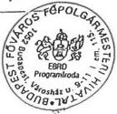

---

2. sz. melléklet

a V-16-114/1999-2000. sz. jelentéshez

# TANÚSÍTVÁNY

adatok ezer Ft/deviza

# a Budapest Főváros Önkormányzata világbanki hiteleinek alakulásáról 1996-1999. évek között

Világbank, Városi Közlekedési Program

|   | MEGNEVEZÉS | 1996. év | 1997. év | 1998. év | 1999. év  |
| --- | --- | --- | --- | --- | --- |
|  1. | A felvett hitelek állománya a tárgyév végén (Ft) | 944 596 | 3 144 974 | 4 093 498 | 7 214 91  |
|  a. | A felvett hitelek állománya a tárgyév végén (USD) | 5 831 | 15 477 | 18 802 | 28 48  |
|  b. | Ebből: a külföldről felvett hitel állománya (Ft) | 944 596 | 3 144 974 | 4 093 498 | 7 214 91  |
|  c. | A külföldről felvett hitel állománya (USD) | 5 831 | 15 477 | 18 802 | 28 48  |
|  d. | Felhasznált hitelek évente (Ft) | 862 492 | 1 503 005 | 1 109 782 | 2 345 882  |
|  e. | Felhasznált hitelek évente (USD) | 5 831 | 9 645 | 5 095 | 9 640  |
|  2. | A külföldről felvett hitelek specifikációja |  |  |  |   |
|  a. | Kötvény (Ft) |  |  |  |   |
|  b. | Pénzügyi hitel (Ft) | 862 492 | 1 503 005 | 1 109 782 | 2 345 882  |
|  3. | A hitelfelvétel célja |  |  |  |   |
|  a. | Beruházási célú |  |  |  |   |
|  b. | Fejlesztési célú |  |  |  |   |
|  c. | Egyéb |  |  |  |   |
|  4. | A fizetett kamat összege (Ft) | 3 336 | 98 089 | 200 729 | 302 135  |
|   | A fizetett kamat összege (USD) | 21 | 516 | 933 | 1 259  |
|  5. | A fizetett rendelkezésretartási jutalék (Ft) | 12 205 | 2 002 |  |   |
|   | A fizetett rendelkezésretartási jutalék (USD) | 78 | 14 |  |   |
|  6. | A fizetett bankköltség (Ft) |  |  |  |   |
|   | A fizetett bankköltség (USD) |  |  |  |   |
|  7. | Tőketörlesztés (Ft) |  |  |  |   |
|   | Tőketörlesztés (USD) |  |  |  |   |

Budapest, 2000. január.

Aláírás

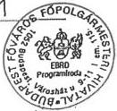

---

3. sz. melléklet

a V-16-114/1999-2000. sz. jelentéshez

# TANÚSÍTVÁNY

# a Budapest Főváros Önkormányzata világbanki hiteleinek alakulásáról 1996-1999. évek között

Világbank, Városi Közlekedési Program

|  MEGNEVEZÉS |   |
| --- | --- |
|  A kölcsön száma, neve, kelte | 3903-HU, Budapesti Városi Közlekedési Program, 1995 október 2.  |
|  A kölcsön összege (Ft., deviza) | USD 38.000.000,-  |
|  A kölcsön futamideje | 15 év  |
|  A kölcsöntörlesztés kezdete | 2000. október 01.  |
|  A kölcsöntörlesztés vége | 2010. április 01.  |
|  A kölcsön felhasználói | Budapesti Közlekedési Vállalat Rt. és Budapest Főváros Önkormányzata  |
|  A kölcsönszerződést kötő felek | Nemzetközi Újjáépítési és fejlesztési Bank (Világbank) Budapest Főváros Önkormányzata és Budapesti Közlekedési Vállalat Rt.  |
|  A hitelfelvétel ideje (hatályba lépés) | 1996. július 12.  |

Kelt: 2000. év 1. jan. hó 25. nap

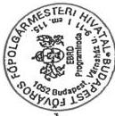

Aláírás

---

4. sz. melléklet

a V-16-114/1999-2000. sz. jelentéshez

# TANÚSÍTVÁNY

adatok ezer Ft/deviza

# a Budapest Főváros Önkormányzata EBRD hiteleinek alakulásáról 1996-1999. évek között

EBRD, Tömegközlekedés-rehabilitációs program

|   | MEGNEVEZÉS |   | 1996. év | 1997. év | 1998. év | 1999. év  |
| --- | --- | --- | --- | --- | --- | --- |
|  1. | A felvett hitelek állománya a tárgyév végén (Ft) |   | 8 632 936 | 9 431 148 |  |   |
|  a. | A felvett hitelek állománya a tárgyév végén | USD | 29 970 | 27 842 |  |   |
|   |   |  DEM | 36 193 | 32 856 |  |   |
|  b. | Ebből: a külföldről felvett hitel állománya (Ft) |   | 8 632 936 | 9 431 148 |  |   |
|  c. | A külföldről felvett hitel állománya (devizában) | USD | 29 970 | 27 842 |  |   |
|   |   |  DEM | 36 025 | 32 856 |  |   |
|  d. | Felhasznált hitelek állománya évente (Ft) |   | 1 394 400 | 155 797 | 406 592 |   |
|  e. | Felhasznált hitelek állománya évente (devizában) | USD | 1 899 | 779 | 1 906 |   |
|   |   |  DEM | 11 655 | 132 | 11 |   |
|  2. | A külföldről felvett hitelek specifikációja |   |  |  |  |   |
|  a. | Kötvény (Ft) |   |  |  |  |   |
|  b. | Pénzügyi hitel (Ft) |   | 1 394 400 | 155 797 | 406 592 |   |
|  3. | A hitelfelvétel célja |   |  |  |  |   |
|  a. | Beruházási célú |   |  |  |  |   |
|  b. | Fejlesztési célú |   |  |  |  |   |
|  c. | Egyéb |   |  |  |  |   |
|  4. | A fizetett kamat összege (Ft) |   | 623 485 | 870 100 | 795 571 |   |
|   | A fizetett kamat összege (devizában) | USD | 2 617 | 2 551 | 1 167 |   |
|   |   |  DEM | 2 137 | 3 515 | 1 021 |   |
|  5. | A fizetett rendelkezésretartási jutalék (Ft) |   |  | 13 721 | 3 899 |   |
|   | A fizetett rendelkezésretartási jutalék (devizában) | USD |  | 61 | 13 |   |
|   |   |  DEM |  | 19 | 10 |   |
|  6. | A fizetett bankköltség (Ft) |   |  | 24 979 | 416 657 |   |
|   | A fizetett bankköltség (devizában) | USD |  | 78 | 1 791 |   |
|   |   |  DEM |  | 100 | 254 |   |
|  7. | Tőketörlesztés (Ft) |   |  | 940 648 | 10 365 420 |   |
|   | Tőketörlesztés (devizában) | USD |  | 2 978 | 29 676 |   |
|   |   |  DEM |  | 3 338 | 32 856 |   |

Budapest, 2000. január.

Aláírás

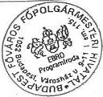

---

5. sz. melléklet

a V-16-114/1999-2000. sz. jelentéshez

# TANÚSÍTVÁNY

a Budapest Főváros Önkormányzata EBRD hiteleinek alakulásáról 1996-1999. évek között

EBRD, Tömegközlekedés-rehabilitációs program

|  MEGNEVEZÉS |   |
| --- | --- |
|  A kölcsön száma, neve, kelte | 105, Budapesti Tömegközlekedés-rehabilitációs Program, 1993. augusztus 26.  |
|  A kölcsön összege (Ft., deviza) | USD 38.204.462,- és DM 58.415.855,-  |
|  A kölcsön futamideje | 15 év  |
|  A kölcsöntörlesztés kezdete | 1997. június 20.  |
|  A kölcsöntörlesztés vége | 2008 december 20. szerződés szerint 1998. június 22-én teljes összegű előtörlesztés történt  |
|  A kölcsön felhasználói | Budapest Főváros Önkormányzata  |
|  A kölcsönszerződést kötő felek | Európai Ujjáépítési és Fejlesztési Bank Budapest Főváros Önkormányzata  |
|  A hitelfelvétel ideje (hatályba lépés) | 1993. december 01.  |

Kelt: 2000. év. jan. hó. 25. nap

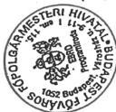

Aláírás

---

6. sz. melléklet

a V-16-114/1999-2000. sz. jelentéshez

# TANÚSÍTVÁNY

adatok ezer Ft/deviza

# a Budapest Főváros Önkormányzata EURO kötvény kibocsátásának alakulásáról 1996-1999. évek között

EURO kötvény kibocsátás

|   | MEGNEVEZÉS | 1996. év | 1997. év | 1998. év | 1999. év  |
| --- | --- | --- | --- | --- | --- |
|  1. | A felvett hitelek állománya a tárgyév végén (Ft) |  |  | 19 314 000 | 19 588 500  |
|  a. | A felvett hitelek állománya a tárgyév végén (DEM) |  |  | 150 000 | 150 000  |
|  b. | Ebből: a külföldről felvett hitel állománya (Ft) |  |  | 19 314 000 | 19 588 500  |
|  c. | A külföldről felvett hitel állománya (DEM) |  |  | 150 000 | 150 000  |
|  d. | Felhasznált hitelek évente (Ft) |  |  | 18 463 015 |   |
|  e. | Felhasznált hitelek évente (DEM) |  |  | 150 000 |   |
|  2. | A külföldről felvett hitelek specifikációja |  |  |  |   |
|  a. | Kötvény (Ft) |  |  | 18 463 015 |   |
|  b. | Pénzügyi hitel (Ft) |  |  |  |   |
|  3. | A hitelfelvétel célja |  |  |  |   |
|  a. | Beruházási célú |  |  |  |   |
|  b. | Fejlesztési célú |  |  |  |   |
|  c. | Egyéb |  |  |  |   |
|  4. | A fizetett kamat összege (Ft) |  |  |  | 913 920  |
|   | A fizetett kamat összege (DEM) |  |  |  | 7 125  |
|  5. | A fizetett rendelkezésretartási jutalék (Ft) |  |  |  |   |
|   | A fizetett rendelkezésretartási jutalék (DEM) |  |  |  |   |
|  6. | A fizetett bankköltség (Ft) |  |  | 472 329 |   |
|   | A fizetett bankköltség (DEM) |  |  | 3 900 |   |
|  7. | Tőketörlesztés (Ft) |  |  |  |   |
|   | Tőketörlesztés (DEM) |  |  |  |   |

Budapest, 2000. január.

Aláírás

---

7. sz. melléklet
a V-16-114/1999-2000. sz. jelentéshez

# • TANÚSÍTVÁNY

a Budapest Főváros Önkormányzata EURO kötvény kibocsátásának alakulásáról 1996-1999. évek között

EURO Kötvény kibocsátás

|  MEGNEVEZÉS |   |
| --- | --- |
|  A kölcsön száma, neve, kelte | 07-212/98, EURO kötvény kibocsátás, 1998. Július 20.  |
|  A kölcsön összege (Ft., deviza) | DEM 150.000.000, HUF 18.463.015.252,  |
|  A kölcsön futamideje | 5 év, 1998-2003.  |
|  A kölcsöntörlesztés/kezdete | 2003. Július 23. (egy összegben)  |
|  A kölcsöntörlesztés vége | -  |
|  A kölcsön felhasználói | Budapest Főváros Önkormányzata  |
|  A kölcsönszerződést kötő felek | Deutsche Genossenschaftsbank (DG Bank) Budapest Főváros Önkormányzata  |
|  A hitelfelvétel ideje (hatályba lép) | 1998. Július 23.  |

Kelt: Budapest, ... év 2000. ... hó ... január 20. ... nap

---

8. sz. melléklet
a V-16-114/1999-2000. sz. jelentéshez

# TANÚSÍTVÁNY

a Budapest Főváros Önkormányzata világbanki hiteleinek alakulásáról 1996-1999. évek között

Világbank, fővárosi szennyvíz projekt

|  MEGNEVEZÉS |   |
| --- | --- |
|  A kölcsön száma, neve, kelte | 4512-HU, Fővárosi Szennyvíz Project, 1999. szeptember 22.  |
|  A kölcsön összege (Ft., deviza) | EUR 27.600.000,-  |
|  A kölcsön futamideje | 15 év  |
|  A kölcsöntörlesztés kezdete | 2005. április 15.  |
|  A kölcsöntörlesztés vége | 2014. október 15.  |
|  A kölcsön felhasználói | Budapest Főváros Önkormányzata  |
|  A kölcsönszerződést kötő felek | Nemzetközi Újjáépítési és fejlesztési Bank (Világbank) Budapest Főváros Önkormányzata  |
|  A hitelfelvétel ideje (hatályoa lép) | 1999 december 22.  |

Kelt: 2 000 t. év. 14. év hó 20. nap

Aláírás

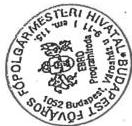

---

9. sz. melléklet
a V-16-114/1999-2000. sz. jelentéshez

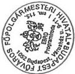

# TANÚSÍTVÁNY

a Budapest Főváros Önkormányzata EIB hiteleinek alakulásáról
1996-1999. évek között

EIB, Környezetvédelmi és Infrastruktúrális Projekt

|  MEGNEVEZÉS |   |
| --- | --- |
|  A kölcsön száma, neve, kelte | 0.2151, Környezetvédelmi és Infrastruktúrális projekt, 1998. október 15.  |
|  A kölcsön összege (Ft., deviza) | EUR 110.000.000,-  |
|  A kölcsön futamideje | 15 év  |
|  A kölcsöntörlesztés kezdete | 2004. március 15.  |
|  A kölcsöntörlesztés vége | 2013. március 15.  |
|  A kölcsön felhasználói | Budapest Főváros Önkormányzata  |
|  A kölcsönszerződést kötő felek | Európai Beruházási Bank (EIB) Budapest Főváros Önkormányzata  |
|  A hitelfelvétel ideje (hatályba lépés | a hitel még nincs hatályban  |

Kelt: Bp. esít. év 2.000 hó 24. 25 nap

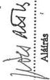

---

10. sz. melléklet

a V-16-114/1999-2000. sz. jelentéshez

# TANÚSÍTVÁNY

a helyi önkormányzatok külföldi hiteleinek alakulásáról
Sopron megyei jogú város Önkormányzata (Erzsébet kórház)

|  MEGNEVEZÉS | 1996. év | 1997. év | 1998. év | 1999. év VI. 30  |
| --- | --- | --- | --- | --- |
|  1. A felvett hitelek állománya (Ft) | 3.976.463.526 | 3.811.318.224 | 3.556.233.230 | 2.785.921.146  |
|  a. Felvett hitelek állománya (devizában) ATS | 268.660.000 | 230.280.000 | 191.900.000 | 153.520.000  |
|  b. Ebből: a külföldről felvett hitel állománya (Ft) | 3.976.463.526 | 3.811.318.224 | 3.556.233.230 | 2.785.921.146  |
|  c. külföldről felvett hitel állománya (deviza) ATS | 268.660.000 | 230.280.000 | 191.900.000 | 153.520.000  |
|  2. A külföldről felvett hitelek specifikációja |  |  |  |   |
|  a. Kötvény (Ft) |  |  |  |   |
|  b. Pénzügyi hitel (Ft) | 3.976.463.526 | 3.811.318.224 | 3.556.233.230 | 2.785.921.146  |
|  3. A hitelfelvétel célja |  |  |  |   |
|  a. Beruházási célú (Ft) | 3.976.463.526 | 3.811.318.224 | 3.556.233.230 | 2.785.921.146  |
|  b. Fejlesztési célú |  |  |  |   |
|  c. Egyéb |  |  |  |   |
|  4. A fizetett kamat összege (Ft) | 480.486.613 | 463.455.536 | 426.102.978 | 216.857.927  |
|  A fizetett kamat összege (deviza) | 28.733.565 | 30.068.487 | 24.343.638 | 11.793.320  |
|  5. A fizetett rendelkezésretartási jutalék (Ft) |  |  |  |   |
|  A fizetett rendelkezésretartási jutalék (deviza) |  |  |  |   |
|  6. A fizetett bankköltség (Ft) |  |  |  |   |
|  A bankköltség (deviza) |  |  |  |   |

---

11. sz. melléklet

a V-16-114/1999-2000. sz. jelentéshez

TANÚSÍTVÁNY

a helyi önkormányzatok külföldi hiteleiről hitelenként, illetve kölcsönönként az

1996 - 1999. évek között

Sopron Megyei jogú város Önkormányzata (Erzsébet kórház)

|  MEGNEVEZÉS |   |
| --- | --- |
|  A kölcsön száma, neve | 9.208.306 Bank Ausztria Beruházási hitel  |
|  A kölcsön összege (Ft., deviza) | 3.401.137.000 Ft 326.230.000 ATS  |
|  A kölcsön futamideje | 1992.06.09-től 1999.06.30-ig  |
|  A kölcsöntörlesztés kezdete | 1995.06.30.  |
|  A kölcsöntörlesztés vége | 1999.06.30  |
|  A kölcsön felhasználói | SMJV. Erzsébet Kórház  |
|  A kölcsönszerződést kötő felek | SMJV. Erzsébet Kórház Bank Ausztria  |
|  A kölcsönszerződés kelte, száma | EV 61.551/1992  |
|  A hitelfelvétel ideje, összege | 1992.12.16. - 1995.03.28. 326.230.000 ATS  |

---

1

“

1

1

1

1

1