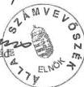
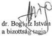
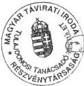

Állami Számvevőszék

# JELENTÉS

a Magyar Távirati Iroda Rt. 1999. évi
gazdálkodásának ellenőrzéséről

2000. szeptember

0029

---

Az ellenőrzés végrehajtásáért felelős a
IV. Vagyonellenőrzési Igazgatóság:

Halász Gejza
számvevő igazgató

Az ellenőrzést vezette:

Dr. Podonyi László
osztályvezető főtanácsos

Az ellenőrzésben részt vettek
és a jelentést készítették:

Dr. Németh Klára
számvevő tanácsos

Dr. Kemenczei Rezső
számvevő

Dr. Majoros Sándor
számvevő

Az ÁSZ által a témában eddig készített jelentések listája:

A nemzeti hírügynökségről szóló törvény alapján 1997. évtől az ÁSZ évente
készít jelentést az MTI Rt. tevékenységének pénzügyi-gazdasági
ellenőrzéséről.

Jelentéseink az Országgyűlés számítógépes hálózatán is olvashatók.

---

V-10-32/2000. TÉMASZÁM: 524

# TARTALOMJEGYZÉK

BEVEZETÉS

I. ÖSSZEGZŐ MEGÁLLAPÍTÁSOK, KÖVETKEZTETÉSEK, JAVASLATOK

1.Osszegz'megallapitasok,kovetkeztetesek 4
2.Ajanlasok,javaslatok 8

II. RÉSZLETES MEGÁLLAPÍTÁSOK

1. Az elo z o evi ellenorzs javaslatainak, valamint az atvilagitas egyes ajanlasainak vegrehajtasa 10
2. Az MTI Rt. mukodesenek szabalyozottsaga 10

2.1.A Felugyelo Bizottsag mukodese, kapcsolata az Orszaggyulessel es az MTI Rt. menedzmentjével 11
2.2.A belso ellenorzs helyzete 16

3. Az 1999. évi üzleti terv realizálása

3.1. Bevetelek 17
3.2.Koltségek és rafordítások 18

3.2.1. Ber- es letszamgazdalkodas 18
3.2.2. Anyag- es egyeb koltsegekkel, rafordtásokkal valo gazdalkodás 20

4. A penzügyi egyensúly megteremtése és fenntartása érdekében tett intezkedesek hatása a Társaság penzügyi helyzetére 21
5.Az arkepzes rendszere 23
6.A celtartalek képzese 25
7. A befektetett eszközallomány hozzájárulása az eredményes gazdalkodáshoz 26
8. A beruházások tervezése, megvalósítása, az eszközgazdalkodás és szabályozása 28
9.Az informatikai beruhazaszok 32
10. Ingatlanfejlesztés, ingatlangazdalkodás 32

---

The Ground Truth image displays a single, solid horizontal line. According to Rule 2 (UNDERSCORE & LINE RULES), this is a stylistic or background line, not a placeholder underscore. Therefore, the OCR result must ignore it and output nothing or only meaningful text. The provided OCR content is "____", which consists of four underscores. This is an incorrect interpretation of the line as a placeholder, violating the rule that stylistic lines must be ignored. The OCR has hallucinated underscores where none should exist based on the GT's visual context. Hence, the OCR result is inconsistent with the Ground Truth.

[Non-Text]

[Non-Text]

[Non-Text]

[Non-Text]

[Non-Text]

[Non-Text]

[Non-Text]

•

[Non-Text]

•

[Non-Text]

[Non-Text]

•

[Non-Text]

[Non-Text]

•

[Non-Text]

[Non-Text]

[Non-Text]

[Non-Text]

[Non-Text]

•

•

[Non-Text]

[Non-Text]

[Non-Text]

[Non-Text]

[Non-Text]

•

[Non-Text]

[Non-Text]

[Non-Text]

[Non-Text]

[Non-Text]

•

[Non-Text]

[Non-Text]

[Non-Text]

•

[Non-Text]

•

•

[Non-Text]

[Non-Text]

[Non-Text]

[Non-Text]

[Non-Text]

1

1

---

# Jelentés

## a Magyar Távirati Iroda Rt. 1999. évi gazdálkodásának ellenőrzéséről

### BEVEZETÉS

A nemzeti hírügynökségről szóló 1996. évi CXXVII. törvény (továbbiakban: Nht.) 9. §-a és a Magyar Távirati Iroda Rt. (továbbiakban: MTI Rt., Társaság) Alapító Okirata 5.7. pontja szerint a részvénytársaság elnöke évente beszámol az Országgyűlésnek a részvénytársaság tevékenységéről, amelynek keretében sor kerül a mérleg és eredmény-kimutatás jóváhagyására, valamint a nyereség felosztására. Az elnök beszámolóját a részvénytársaság Felügyelő Bizottságának véleményével együtt kell az Országgyűlés (OGY) elé terjeszteni. A beszámolóhoz mellékelni kell az Állami Számvevőszék elnökének jelentését a részvénytársaság tevékenységéről.

Az Nht. 9. § és 29. §-a szerinti ellenőrzés célja az volt, hogy megállapításaival megalapozza az ÁSZ elnökének a részvénytársaság tevékenységéről szóló jelentését és eleget tegyen az MTI Rt. gazdálkodására vonatkozó ellenőrzési feladatnak.

Az ellenőrzés során értékeltük az MTI Rt. 1999. évi gazdálkodási tervének megalapozottságát, a terv végrehajtásának törvényességét, célszerűségét és eredményességét.

Ennek keretében ellenőriztük, hogy :

- az MTI Rt. az Alapító Okiratában és a vonatkozó törvényekben, egyéb jogszabályokban foglaltaknak megfelelően törvényesen, célszerűen és eredményesen gazdálkodott-e vagyonával és a központi költségvetésből a részvénytársaság közszolgálati feladatai ellátásához - ideértve a Tulajdonosi Tanácsadó Testület (továbbiakban: TTT) Titkársága működésével kapcsolatos feladatokat is - nyújtott céltámogatással; (Az MTI Rt. az Nht.-ban előírt feladatok elvégzéséhez 1207 millió Ft működési támogatást kapott.)
- az MTI Rt. ellenőrzési rendszere - ezen belül a TTT és a Felügyelő Bizottság (FB) -, működése eredményes volt-e;
- biztosított-e az összhang a közszolgálati feladatok, valamint az MTI Rt. működésének személyi és tárgyi feltételei között.

3

---

I. ÖSSZEGZŐ MEGÁLLAPÍTÁSOK, KÖVETKEZTETÉSEK, JAVASLATOK---

# I. ÖSSZEGZŐ MEGÁLLAPÍTÁSOK, KÖVETKEZTETÉSEK, JAVASLATOK

## 1. ÖSSZEGZŐ MEGÁLLAPÍTÁSOK, KÖVETKEZTETÉSEK

Az MTI Rt. gazdálkodását az ÁSZ évente ellenőrzi a nemzeti hírügynökségi törvény rendelkezése alapján. Ennek értelmében az ÁSZ jelenlegi vizsgálata az MTI Rt. 1999. évi gazdálkodására terjedt ki, valamint a gazdálkodásával összefüggő jogalkalmazási problémákat ölelte fel. Az **MTI Rt.-nek jogértelmezési nehézségei származtak abból, hogy társasági működését a hírügynökségi törvény rendelkezései alapján alakította ki, de nem a gazdasági társaságokról szóló törvénnyel összhangban.**

A Társaság nem vette figyelembe, hogy a sajátos tevékenységére tekintettel a hírügynökségi törvényben előírt módon alkalmazott szervezeti formakényszer (részleges közgyűlési jogokat gyakorló felügyelő bizottság, egyszemélyi igazgatósági szerepkörben eljáró elnök, Tulajdonosi Tanácsadó Testület sajátos közszolgálati jogosítványai) ellenére is a részvénytársaságokra általánosan irányadó szabályok szerint kell működnie.

Az Országgyűlés mint alapító tulajdonosi joggyakorlata stratégiai jellegű, nem fogható fel a korábbi szemléletből származó államigazgatási felügyelet mintájára, mert ebben az esetben sérülne a hírügynökségi törvényben előírt, de az Alkotmányban megalapozott egyenlő távolságtartás elve (befolyásmentesség), mely nem csak a pártokra, a Kormányra, a társadalmi szervezetekre vonatkozó kommunikációs jogvédelem, hanem a Parlamentre is irányadó kötelezettség.

A jogértelmezés zavarait tükrözték a Társaság statútum szabályzatai az SZMSZ és a Felügyelő Bizottság ügyrendje, valamint a belső ellenőrzés helyzete és szabályozása a társaság szervezeti működési rendjében. Az Rt.-nél nincs rögzítve a szervezeti felépítésen belül az egyes szervezeti egységek felelősségi rendszere. Az FB ügyrendjéből hiányoznak a részleges stratégiai irányítási jogkörökhöz tartozó feladatok és az ahhoz kapcsolódó ellenőrzési funkciók. Az FB részleges stratégiai szerepe, valamint az Rt. elnökével együtt, a fokozott polgári jogi felelőssége a szervezeti felépítésen belül nem szabályozott. Az ellenőrzés egyetértett a vizsgált időszakban megbízás alapján készített átvilágító tanulmányok ajánlásaival, melyek szintén szorgalmazták a részvénytársasági működésnek inkább megfelelő személytelenebb és intézményesítettebb belső működési rend kialakítását, illetve ennek fokozatos kiépítését.

A részvénytársaság elnöke utasításban intézkedési tervet adott ki az MTI Rt. 1998. évi tevékenységét vizsgáló ÁSZ-jelentésben foglalt ajánlások végrehajtására, amelynek ellenőrzését az FB a belső ellenőrzési munkatervben elrendelte. A belső ellenőr a végrehajtást ellenőrizte és erről beszámolt, amit az FB a belső ellenőr észrevételeivel együtt elfogadott.

---4

---

I. ÖSSZEGZŐ MEGÁLLAPÍTÁSOK, KÖVETKEZTETÉSEK, JAVASLATOK

Az Rt. a korábbi ÁSZ ellenőrzés megállapításait és ajánlásait figyelembe vette. Az MTI Rt. elkészítette, kiegészítette szabályzatait, kialakította belső ellenőrzését, javította a tervezési és tényszámainak összehasonlíthatóságát, intézkedett az ingatlanok bérbeadásáról, kialakította a vezetői információs igények jobb kielégítésére a controlling rendszert és külön nyilvántartja az 500 ezer Ft-ot meghaladó szerződéseket.

A beruházásoknál nem teremtette meg az üzleti terv és a beszámoló közötti egyezőséget. A külsős- és belsős megbízási (vállalkozási) jogviszony keretében történt foglalkoztatásokat felülvizsgálta, de nem módosította. Nem döntött az MTI Rt. Fotó Kft. jövőjéről.

A TTT intézkedési tervet készített költségeinek csökkentéséről, felülvizsgálta ügyrendjét és az ajánlásoknak megfelelően egyszerűsítette, megszüntette a szövői funkciót.

**Az MTI Rt.-nél az alapítás óta a második teljes gazdálkodási év telt el.** A könyvvizsgáló hitelesítette az MTI Rt. 1999. évi éves beszámolóját. A hitelesítő záradék szerint az éves beszámoló a Társaság vagyoni, pénzügyi és jövedelmi helyzetéről megbízható és valós képet ad.

A Magyar Távirati Iroda Rt. gazdálkodása az eszközök beszerzésénél, a vállalkozási szerződésekre kifizetett költségeknél, a bartermegállapodásoknál, a befektetéseknél, a médiaszerződéseknél és a követelések kezelésénél nem hatékony. Az eszközök beszerzésénél csak a feladat ellátását veszik figyelembe, de nem végeznek elemzést annak megtérüléséről. A vállalkozási szerződéseknél nem határozzák meg pontosan az elvégzendő feladatot, annak ellenőrizhetőségét. A bartermegállapodások lehetőséget teremtenek az MTI Rt. által nyújtott szolgáltatások halasztott (több éves) kifizetésére. A befektetések nem biztosítanak hozamot az MTI Rt. számára. A médiaszerződéseknél nem tudják minden partnernél elismertetni költségeiket. Szerkezetében kedvezőtlen a forgóeszközök összetétele.

A Társaság 1999-ben 1 701,9 millió Ft saját bevétel és 1 277 millió Ft költségvetési támogatás mellett 105 millió Ft mérleg szerinti eredményt ért el. 1999. évre a tervezetthez képest teljesült a működésből származó árbevétel, amely 16%-kal magasabb az 1998. évi árbevételnél. A társaság üzleti eredménye 1999. évben 28,3 millió Ft, ami negyede a megelőző üzleti eredménynek, és alatta marad az 50,1 millió Ft tervnek. A költségvetési támogatásban - a többi médiától eltérően - nincs elkülönítve az Rt. és a TTT működési költsége.

**Szerkezetében kedvezőtlenül változott az előző évhez képest a forgóeszközök összetétele.** Az 586,1 millió Ft forgóeszközérték 105,6 millió Ft-tal alacsonyabb az előző évinél. Ezen belül 74,6 millió Ft-tal növekedett a követelések állománya, viszont az értékpapírok és pénzeszközök forgóeszközökön belüli részaránya 75,2%-ról 58,1%-ra változott.

A létszámleépítés támogatása és a minőségi munkaerőcserék végrehajtása érdekében a 2409/1997. (XII. 17.) számú Kormányhatározat alapján a Társaság 195 millió Ft céltámogatásban részesült, amiből 1999 évben 70,2 millió Ft-ot használtak fel. **A Társaság vezetése nem készített létszámleépítési ter-**

5

---

I. ÖSSZEGZŐ MEGÁLLAPÍTÁSOK, KÖVETKEZTETÉSEK, JAVASLATOK

**vet és nem dolgozott ki felhasználásra irányuló koncepciót. A Kormányhatározat nem határozta meg a költségvetési támogatás felhasználásának módját. A 'személyi és humán' jellegű ráfordítások esetében a tervezettet meghaladó mértékű többletjövedelemkiáramlás és kettős foglalkoztatottság volt. Az egy fő foglalkoztatottra jutó ráfordítás növekedése 1999-ben 200 ezer Ft-tal haladta meg az egy fő foglalkoztatottra jutó üzleti bevétel növekedését. A humán célú kifizetések összege 189 millió Ft volt, amelyek 95%-kal haladták meg az előző évi hasonló célú kifizetéseket. Az 1998. decemberi és az 1999. decemberi bérek alapján 1999-ben az alapbérek növekedése 24,9% volt. A céltámogatást felhasználták a létszámleépítés finanszírozására, de a vállalkozói szerződésekkel megvalósított kettős foglalkoztatás miatt összességében nem csökkentek a személyi jellegű kiadások.**

Az MTI Rt.-nél a pótlékok, túlórák és hétvégi ügyeletek címén kifizetett összegek szabályozásánál nincs meghatározva a műszak időtartama, és megoldatlan a műszak alatt ténylegesen ledolgozott idő ellenőrzése.

Az MTI Rt. az anyagjellegű ráfordítások terén bevezetett szigorító intézkedések, a távközlési szolgáltatások tervezettől alacsonyabb szintű díjemelésének hatására a tervhez képest költség-megtakarítást ért el.

Az MTI Rt. jelenleg is rendelkezik olyan média szolgáltatási szerződésekkel, amelyeket 1997-ben az akkori direktívák szerint kötött meg. Az alkalmazott előfizetési díjakat az éves előfizetői tárgyalásokon kialakított egyedi megállapodások eredményeként határozták meg. A tárgyalások eredményét behatárolják a korábbi évekből örökölt szerződésekben az MTI Rt elődje által vállalt kötelezettségek. A médiaszerződéseknél emiatt nem érvényesülhet az azonos szolgáltatás, azonos értéken elv, ezért a szerződések között párhuzamot vonni nehéz vagy nem lehetséges. A szerződésekben ugyanazon szolgáltatás megnevezése nem azonos, ezért annak tartalma sem egyeztethető. Írásban nem szabályozott az eseti vagy rendszeres megbízási szerződéssel készített cikkek díjazása.

A bartermegállapodások lehetőséget biztosítanak a Társaság által nyújtott szolgáltatások ellenértékének halasztott kifizetésére. A kedvezőtlen tapasztalat nem támasztja alá a bartermegállapodások szükségességét.

A külső ügyvédek részére kifizetett megbízási díj a megelőző évhez képest 85%-kal nőtt. **A vállalkozói szerződések jogi és tartalmi szempontból hiányosak.** Az elvégzendő feladatokat pontatlanul határozták meg, mennyiségüket nem rögzítették, megoldatlan a teljesítések számonkérhetősége.

A 2074/1998. (III. 31.) Kormányhatározat által az 1998. évi országgyűlési és helyi önkormányzati választásokra biztosított támogatás felhasználása során a Kormányzati Ellenőrzési Hivatal (továbbiakban: KEHI) 32,9 millió Ft „jogtalan felhasználás”-t állapított meg. A megállapított összeget a Társaság a KEHI javaslatára elkülönítette, letéti számlán helyezte el. Az összeg felhasználásáról a vizsgálat lezárásáig nem rendelkeztek.

Az MTI Rt. öt társaságban rendelkezik többségi, illetve kisebbségi részesedéssel. Az MTI ECO Kft. kivételével az egyes társaságok gazdálkodása független az

6

---

I. ÖSSZEGZŐ MEGÁLLAPÍTÁSOK, KÖVETKEZTETÉSEK, JAVASLATOK

anyacég gazdálkodásától. **A befektetések hozamot nem biztosítanak az MTI Rt. számára.** Árbevétel kiesést okoz az MTI Rt.-nek, hogy az MTI Fotó Kft. az általa használt ingatlanért bérleti díjat nem fizet.

Az 1999. évi üzleti terv 400,0 millió Ft értékű beruházást tartalmaz, melyből 200,0 millió Ft volt az 1998. évi eredményre alapozott, a további 200,0 millió Ft pedig az 1999. évi eredménytől függő. Így a 390,2 millió Ft - 96,7% - teljesítés megfelelő. Az 1999. évi tervben kiemelt feladatként jelölték meg a gazdaságosság szempontjainak és a költség-haszonelemzésnek az általánossá tételét, de ez a beruházások területén még nem valósult meg. A fejlesztési költségek elszámolása megfelel a számviteli előírásoknak. A tárgyi eszközök nettó értéke az 1999. évi összesítés szerint 2,6%-os növekedést mutat.

**Az 1999. évi üzleti terv és az 1999. évi beszámoló részletes adatai a beruházásoknál nem hasonlíthatók össze.** Az MTI Rt. 1999. évi beszámolója hasonlóan az 1998. évihez csak teljesítéseket sorol fel, figyelmen kívül hagyva az 1999. évi terv felépítését, az abban közölt részletezéseket és összegzéseket. A terv és a teljesítés számszerűsített eltéréseit a szöveges beszámoló nem indokolja.

**Az eszközgazdálkodásra vonatkozó utasításokat betartották.** Az elveszett, elhagyott tárgyak esetében nem rendelkeznek megfelelő szabályozással, ezért a selejtezési szabályzat kiegészítése szükséges.

Az MTI Rt. elnöke a 14/1998. sz. utasításban szabályozta a közbeszerzési eljárások rendjét, az utasítás összhangban volt a törvényi előírásokkal. (Ez az utasítás hatályát vesztette a 8/2000. sz. Elnöki utasítás kiadásával egyidőben, 2000. június 1-jével.) Nyolc témakörben volt 1999. évben közbeszerzés, amelyek közül két esetben a Közbeszerzési Döntőbizottság a sürgősségi indokoltságra való tekintettel az 1999. évi beszerzéseket elfogadta, míg ugyanezen pályázat 2000. évre áthúzódó részét elutasította. Ezért a 8/2000. sz. Elnöki utasítást a közbeszerzések rendjéről indokolt módosítani a sürgősségi esetekre vonatkozóan a Kbt. valamennyi előírásának betartása érdekében.

**Az informatikai beruházások 1999. évi megvalósítását felhasználói, műszaki oldalról tervezések, felmérések alapozták meg, a megtérülés azonban nem kimunkált.**

Az MTI Rt. - a saját alapítású gazdasági társaságok kivételével felülvizsgálta a bérleti szerződéseket. A bérleti szerződéseket piaci alapú bérleti díjkonstrukciók szerint alakították át, illetve megállapodás hiányában az MTI Rt. hat cégnek felmondott. Az MTI Rt. átszervezte saját részlegeit az új szükségletnek megfelelően, így további területek váltak kiadhatóvá. Az 1999. évi bevétel az előző év bevételeit 25,5 millió Ft-tal haladta meg.

Az ingatlangazdálkodási tevékenységgel szorosan összefüggnek az MTI Rt. tulajdonában lévő ingatlanokon végzett felújítási és állagmegóvási munkálatok. A ráfordítások az MTI Rt. működésének két teljes évében (1998., 1999.) a számviteli törvényben előírt 2% ingatlanamortizációból képzett összeget nem

7

---

I. ÖSSZEGZŐ MEGÁLLAPÍTÁSOK, KÖVETKEZTETÉSEK, JAVASLATOK

érik el. Az MTI Rt.-nek nincs egyedi felmérése az ingatlanokról, azok állagjavításáról, fejújítási szükségletéről.

## 2. AJÁNLÁSOK, JAVASLATOK

Az Állami Számvevőszék az ellenőrzés tapasztalatai alapján javasolja, hogy

### a Kormány

1. Fontolja meg a TTT működési költségeinek elhatárolását a költségvetésben az MTI Rt. támogatásától, hasonlóan a többi médiaszervezethez.
2. Intézkedjen a KEHI által „jogtalan felhasználásnak” minősített és elkülönített számlán elhelyezett 32,9 millió Ft rendezéséről - az 1998. évi helyi és önkormányzati választásokkal összefüggő költségvetési támogatás - törvényjavaslattal vagy a visszafizetés elrendelésével.

### a Tulajdonosi Tanácsadó Testület elnöke

- Az alapfeladat ellátásán felül tevékenységével segítse elő az MTI Rt. tevékenységének folyamatos illeszkedését a részvénytársaság gazdálkodási és működési rendjébe, amíg a részvénytársaság egységes szervezeti működése véglegessé nem válik.

### az FB képviselője az Rt. elnökével együtt

1. különítse el ügyrendjében:
- a részleges stratégiai irányítási jogkörbe tartozó feladatokat,
- az egyes stratégiai ellenőrző, valamint
- operatív, hagyományos ellenőrző funkcióit,
- ehhez igazítsa a belső ellenőrzés feladat- és hatáskörét.
2. Szabályozza a Felügyelő Bizottság tagjaira vonatkozóan az összeférhetetlenség kritériumait.
3. Dolgozza ki a FB tagok és az Rt. elnök felelősségét a fokozott polgári jogi felelősségi mérce alapján.
4. Határozza meg a társaság érdekében végzett menedzsment tevékenység MTI Rt.-re alkalmazható egységes követelményrendszerét.

### az Rt. elnöke

1. Növelje az átvilágító tanulmányok ajánlása alapján a részvénytársasági személytelen tulajdonformához illő intézményesítettség mértékét az MTI Rt. szervezeti működési rendjében.
2. Teremtse meg a szerződések tartalmának pontosítása során a vállalkozói díjak és a feladat-meghatározások összhangját.

8

---

I. ÖSSZEGZŐ MEGÁLLAPÍTÁSOK, KÖVETKEZTETÉSEK, JAVASLATOK

3, Fontolja meg indokoltság hiányában a bartermegállapodások megszüntetésének lehetőségét.
4, Vizsgáltassa át a médiával kötött szolgáltatási szerződések tartalmát. Dolgoztassa ki az egységes árképzési elveket.
5, Vizsgáltassa felül a kettős foglalkoztatást, a pótlékok és túlórák címén kifizetett összegek mértékét és a kifizetések rendszerét. Határozza meg a hétvégi műszakok időtartamát.
6, Értékelje a saját alapítású Kft.-k fenntartásának szükségességét.
7, Dolgozza ki a beruházásoknál, fejlesztéseknél, épület-felújításoknál a gazdaságosság feltételrendszerét, a számítás módját.
8, Intézkedjen az éves üzleti terv és az éves beszámoló beruházási adatai közötti egyezőség biztosításáról, az üzleti terv számai (esetleges) változásainak nyomonkövethetőségéről, a legalább negyedéves - forrásoldalról így biztosított - ütemezésről és a források megbontásáról saját forrás és támogatás összegekre.
9, Intézkedjen a közbeszerzés eljárási rendjéről szóló 8/2000. sz. Elnöki utasítás kiegészítéséről a közbeszerzések sürgősségi eseteire vonatkozóan, kiemelten az informatikai fejlesztésekre.
10, Intézkedjen a leltározási és selejtezési szabályzat kiegészítéséről az elveszett, valamint ellopott tárgyakra vonatkozó eljárási rend módosításával.
11, Gondoskodjon az ingatlanok állapotfelmérésen alapuló felújításairól, állagjavításairól ingatlanonkénti részletezettséggel.

9

---

II. RÉSZLETES MEGÁLLAPÍTÁSOK

## II. RÉSZLETES MEGÁLLAPÍTÁSOK

### 1. AZ ELŐZŐ ÉVI ELLENŐRZÉS JAVASLATAINAK, VALAMINT AZ ÁTVILÁGÍTÁS EGYES AJÁNLÁSAINAK VÉGREHAJTÁSA

A részvénytársaság tevékenységének 1998. évi ellenőrzése még az állam közhatalmi szerepében vett állami vállalatirányítás és költségvetési szervből társasággá való átalakulás szemléletében ment végbe, nem az állam vállalkozói szerepében vett gazdasági társasági működési feltételek figyelembevételével.

A részvénytársaság elnöke utasításban intézkedési tervet adott ki - határidő tűzésével - az ÁSZ-jelentésben foglalt ajánlások végrehajtására, amelynek ellenőrzését az FB a belső ellenőrzési munkatervben elrendelte 29/1999. (X. 12.) sz. határozatával. A belső ellenőr a végrehajtást ellenőrizte és erről beszámolt, amit az FB a belső ellenőr észrevételeivel együtt elfogadott.

A Magyar Távirati Iroda Rt. az 1998. évre vonatkozó ÁSZ vizsgálatnak megfelelően

⇒ Elkészítette az SZMSZ hatálybalépésének megfelelően az ügyrendeket és munkaköri leírásokat.
⇒ Kidolgozta az ütemtervet az új KSZ kimunkálására és elfogadására.
⇒ Javította az üzleti terv és beszámoló közötti egyezőséget.
⇒ Felülvizsgálta a külsős- és belsős megbízási jogviszony keretében történt foglalkoztatásokat.
⇒ Elkészítette a gazdálkodás egyes részterületeire irányuló szabályzatokat (önköltségszámítási, tudósítók járandósági szabályzata).
⇒ Kialakította a controlling rendszert a vezetői információs igények jobb kielégítésére.
⇒ Elkészítette a központi nyilvántartást az Nht. 27. § (2) bekezdésében foglalt előírásnak megfelelően az 500 E Ft értékhatárt meghaladó szerződésekről.

Az MTI Rt. az ÁSZ ajánlásai közül

⇒ Nem teremtette meg a beruházásoknál az üzleti terv és a beszámoló közötti egyezőséget.
⇒ Nem módosította a külsős- és belsős megbízási (vállalkozási) jogviszony keretében történt foglalkoztatásokat.
⇒ Nem döntött az MTI Fotó KFT jövőjéről.

A Tulajdonosi Tanácsadó Testület

⇒ Kezdeményezte a tagokat megillető juttatások tekintetében az alapdíj és a költségtérítési átalány - méltányos keretek közötti - meghatározását az Rt. működési költségeinek kíméletes figyelembe vételével. 1999-ben csökkent a TTT működésére kifizetett összeg.
⇒ Felülvizsgálta és módosította ügyrendjét a hatékonyabb működés és a gyorsabb döntések érdekében. Egyszerűsítette túlszabályozott ügyrendjét, megszüntette a szóvivői posztot.

10

---

II. RÉSZLETES MEGÁLLAPÍTÁSOK

A vizsgált időszakban több átvilágító tanulmány készült az MTI Rt. szervezetének és működésének korszerűsítésére.

Főbb céljaik az alábbiakban foglalhatók össze:

- a részvénytársaság szervezeti rendjét javasolták személytelenebbé tenni, intézményesítettségét növelni;
- közszolgálati és üzleti funkcióit határozottabban kívánták szétválasztani;
- javasolták átalakítani a finanszírozás rendjét;
- a szervezeti és egyéni felelősséget a vállalatirányítás korszerű módszereivel igyekeztek felismerhetővé, átláthatóvá és kezelhetővé tenni.

Az MTI Rt. fokozatosan vezeti be ajánlásaikat, ami az egységes szervezeti működés véglegessé válásával hozhat eredményeket.

## 2. AZ MTI RT. MŰKÖDÉSÉNEK SZABÁLYOZOTTSÁGA

### 2.1. A Felügyelő Bizottság működése, kapcsolata az Országgyűléssel és az MTI Rt. menedzsmentjével

Az MTI Rt. korábban, az Nht. hatályba lépéséig, központi költségvetési szervként látta el feladatát, és az Állami Számvevőszék e minőségében ellenőrizte.

Az Nht. hatálybalépésével - összhangban az Alkotmánnyal és az Alkotmánybíróság 61/1995. (X. 6.) AB határozatával - az MTI részvénytársasággá alakult át.

A társaság irányítási rendjét és felépítését az Nht. határozza meg a gazdasági társaságokról szóló 1988. évi VI. tv.-re hivatkozással, míg a társaság Alapító Okiratát a 70/1997. (VII. 15.) OGY határozatban hirdették ki.

A gazdasági társaságról szóló 1997. évi CXLIV. tv., mely 1998. június 16-án lépett hatályba, 2. §. (1) bek.-ben kimondja, hogy gazdasági társaság csak e törvényben szabályozott formában alapítható, továbbá 298. § (2.) bekezdésében elrendeli, hogy ahol a jogszabály a gazdasági társaságokról szóló 1988. évi VI. tv.-t említi, ott azon az 1997. évi CXLIV. tv. rendelkezéseit kell érteni.

Az MTI Rt. szervezetére és működésére - az Nht.-ban foglalt kivételekkel - a gazdasági társaságokról szóló törvény szabályait kell alkalmazni. A két törvény együttes értelmezése biztosíthatja az MTI Rt. működésének jogszerűségét és törvényességét.

Az átalakulással egyidejűleg bevezetett társaságirányítási szervezeti forma, továbbá a csak 1998-ban életbe lépett új Gt. rendelkezéseinek későbbi tudatosulása miatt nem tisztázódtak az alábbi kapcsolatok és funkciók:

- az Országgyűlés tulajdonosi szerepe és kapcsolata az MTI Rt.-vel; (az Országgyűlés ezideig nem választott FB elnököt és nem fogadta el a társaság mérlegét)

11

---

II. RÉSZLETES MEGÁLLAPÍTÁSOK

- az FB egyes stratégiai irányító feladatai, kapcsolata az Országgyűléssel;
- az FB részleges stratégiai irányító szerepe és hagyományos ellenőrző funkciója a társaságon belül;
- az FB kapcsolata az említett funkciókon belül a társaság egyszemélyes ügyvezető elnökével, valamint a TTT-vel.

Az Nht. és a Gt. általános és részletes indoklásából kitűnően a törvényalkotó céljai a következők voltak:

- Az Alkotmánybíróság döntésével összhangban egyetlen párt, társadalmi szervezet és maga az alapító Országgyűlés, továbbá a Kormány sem juthat meghatározó befolyáshoz az MTI Rt. tevékenységét illetően.
- Az Országgyűlés ezért közvetlenül sem stratégiai, sem operatív irányítást nem gyakorol a részvénytársaság felett, hanem az elnök éves beszámolójával együtt az eredmény és mérlegkimutatást országgyűlési határozattal fogadja el a Felügyelő Bizottság közreműködésével.
- A rendes gazdálkodás körébe tartozó operatív irányítást az Országgyűlés - az állam nevében - az egyszemélyes ügyvezető elnök útján gyakorolja.
- A stratégiai irányítás egyes operatív eszközei mint közgyűlési jogok a Felügyelő Bizottsághoz vannak telepítve az elnöki túlsúly ellensúlyozására az EU-gyakorlatnak megfelelően. (Nht. 12-16. § és indoklása)
- A TTT - melyet paritásos alapon választanak meg - részleges operatív, a társaság elnökét érintő döntési jogkörökkel van felruházva, ezáltal az elnök tevékenységét értékeli, de nem irányíthatja. (Nht. 17-23. § és indoklása)
- Az Országgyűlés csak a részvénytársaság státusával összefüggő tulajdonosi jogokat gyakorolja. Ezek: létesítés, átalakítás, egyesülés, szétválás, megszűnés kötelező közszolgálati feladatok ellátásának meghatározása, döntés a részvénytársaságban való tulajdonszerzés megengedéséről (konszernjogi, részvényjogi értelemben). Ez a joggyakorlás nem azonos a rendes gazdálkodás operatív tulajdonosi feladataival, és így az MTI Rt. nem tekinthető az Országgyűlés felügyelete alatt álló vállalatnak a régi értelemben vett államigazgatási felügyelet alatt álló vállalat mintájára. (Lásd Nht. 3-4. § és indoklása)

Az ismertetett célok belső társasági értelmezése és ennek az egész társaságot érintő kihatása különösen a Felügyelő Bizottság szerepének megítélésében szembeszökő, ha az MTI Rt. belső társasági jogviszonyait tekintjük át.

Az Nht. hatályba lépése óta eltelt rövid időszak miatt nem tudatosult, hogy az Nht. 3. § (2) bekezdése egyértelműen rendelkezik arról, hogy az MTI Rt.-re az Nht.-ben foglalt eltérésekkel a gazdasági társaságokról szóló törvény rendelkezéseit kell alkalmazni. (A törvény szövege még a korábban hatályos Gt.-t nevezi meg, ellenben az új Gt. 298. § (2) bek. kimondja, hogy ahol a jogszabály az 1988. évi VI. tv-t. említi, ott azon az új Gt. rendelkezéseit kell érteni.)

Az új Gt. 31. §- 38 §-ig terjedő szakaszaiban bevezeti a stratégiai irányítást is gyakorló felügyelő bizottság intézményét. A korábbi Gt.-ben szabályozott FB kizárólag ellenőrzési funkciókat láthatott el.

12

---

II. RÉSZLETES MEGÁLLAPÍTÁSOK

Az új stratégiai irányító funkciójú FB-re az alapító okirat átruházhatja meghatározott szerződések előzetes jóváhagyását.

Ennek felel meg az Nht. 16. §-nak rendelkezése az FB hatáskörébe utalt nagyobb értékű stratégiai jelentőségű szerződések, jogügyletek előzetes jóváhagyásáról. Egyebekben az FB operatív döntéseket nem hozhat, ez az elnök feladata. Az irányító funkciójú FB ugyanakkor fenntartja korábbi ellenőrzési funkcióit, és az új Gt. 32. § (2) bek.-e értelmében az ügyvezetést bármely területen ellenőrizheti, amelyhez a belső ellenőrzés intézményét is igénybe veheti.

Az ismertetett céloknak és követelményeknek az FB ügyrendjében és a Társaság SZMSZ-ében, valamint az alapító és részvényesi jogokat gyakorló Országgyűléssel kapcsolatos jogviszonyokat megjelenítő OGY-határozatokban kell tükröződnie. Ebből következik, hogy nincs akadálya annak - az új Gt. értelmében -, hogy akadályoztatás esetén a működőképesség biztosítása érdekében az FB elnökhelyettest saját tagjai sorából válasszon. Erre ad lehetőséget az új Gt. 34. § (1) bek.-nek rendelkezése.

Az FB ügyrendjében, valamint az MTI Rt. SZMSZ-ében megmutatkozik az előzőekben ismertetett szerep eltérő értelmezése. Erre utalnak az FB ügyrendjének, továbbá az SZMSZ megfogalmazásai.

FB ügyrendjéből:

I/1. "A részvénytársaság felügyelő bizottsága a részvénytársaság alapítója érdekeinek, a társasággal és a tagság ügyvezetésével szemben történő védelme érdekében a törvény által kötelezően létrehozott szerve."

(Az FB képviselője szerint ez sajtóhiba és az általa elérhető példányokon a hiba javítása már megtörtént.)

I/9. "A felügyelő bizottságot, mind a részvénytársasággal - ill. annak vezetőjével - mind az alapítóval szemben az elnök képviseli."

II/2.3. h. és 3.3. c.

"E pontok szerint az FB elnök és az FB elnökhelyettes feladatai mindazok, amiket a Gt. az Nht., és a 70/1997. (VII. 15.) OGY. hat. illetőleg ezek felhatalmazása alapján kiadott jogszabályok továbbá az alapító okirat rábíz.

II/3.4. a-f,

Az FB tagjai tudomásul veszik: hogy...(a felsorolás az összeférhetetlenséget szabályozza.)

SZMSZ-ből:

II/1.1 és II/2.1. „Szervezetére és működésére nézve az Nht.- és az Alapító Okirat, valamint az FB ügyrendjében foglaltak kizárólagosan irányadók".

Ugyanez a megfogalmazás a Tulajdonosi Tanácsadó Testület esetében is.

I/3.2. Egyéb feladatok

3.2.2. "A társaság gazdálkodik a "rábízott vagyonnal"

13

---

II. RÉSZLETES MEGÁLLAPÍTÁSOK

3.2.3. "Feladata eredményes ellátása, valamint vagyona működtetése érdekében vállalkozási tevékenységet végezhet, jogosult cégek alapítására illetőleg cégekben társtulajdonosi részesedést szerezni."

III/1.2. Az elnök felelősségéről

- egyszemélyi felelős vezető
- felelős a nyilvánosságra hozott információk tartalmáért
- felelős a jogszerű gazdálkodásért
- felelősséget megosztja stb.

IV/1.1. A titkárság vezető feladata és hatásköre

Felügyeli címszó alatt részt vesz...

Az idézett megfogalmazások nem felelnek meg a hatályos jogszabályoknak.

Nevezetesen:

1. Az FB Ügyrendjébe foglalt megfogalmazás nem veszi tekintetbe, hogy a részvénytársaság jogi személy, és mint ilyen, saját cégneve alatt jogképes, jogokat szerezhet és kötelezettségeket vállalhat, így különösen tulajdont szerezhet, szerződést köthet, pert indíthat és perelhető. (Új Gt. 2. § (3) bek.)

Az Országgyűlés mint alapító és részvényes az állam nevében az MTI Rt. egészének tulajdonosa. (Nht. 4. §)

Ez azt jelenti, hogy a parlament mint tulajdonos - absztrakt értelemben - nem kerülhet szembe a társasággal mint tulajdonossal, ellenben szemben találhatja magát a társaság ügyvezetésével.

Ezzel összhangban áll a Gt. 29. §-a, hogy a vezető tisztségviselők a gazdasági társaság ügyvezetését az ilyen tisztséget betöltő személyektől elvárható fokozott gondossággal, a gazdasági társaság érdekeinek elsődlegessége alapján kötelesek ellátni, és ez alól - egyszemélyes társaság lévén - csak az Országgyűlés mentesítheti őket.

Az Országgyűlés társasági tulajdonosi érdeke egybeesik a saját társasága elsődleges érdekeivel, amit az ügyvezetés köteles megvalósítani. Az FB pedig köteles a társaság tulajdonosának és a tulajdonos társasága elsődleges érdekeinek megfelelően ellenőrizni, egyes stratégiai döntésekben pedig részt vállalni.

Az FB ügyrendjéből idézett I/1. pont alatti megfogalmazást az FB megbízott tagja szerint már javították. A vizsgálat nem vehette figyelembe ezt a kifogást, mert a vizsgálat alatt átadott hivatalos munkapéldány irányadó számára nem a különböző javított munkapéldányok másolatai.

Az idézett pontokban az FB elnökének és elnökhelyettesének feladatairól szólva felsorolta a jogszabályokat a tisztségviselőkre nézve, de önmagára, mint testületre nem vonatkoztatta, holott ettől nem tekinthet el, részleteznie kell külön a testület és külön a tisztségviselők feladatait és felelősségét.

14

---

II. RÉSZLETES MEGÁLLAPÍTÁSOK

Az összeférhetetlenségi szabályokra csak hivatkozik, de nem részletezi ügy-rendjében olymódon, hogy annak betartása áttekinthetően ellenőrizhető le-gyen.

2. Az SZMSZ-ben elhelyezett FB-szabályozás az idézett jogszabályokat kizáróla-gosan irányadónak tekinti, holott az FB létrehozása részvénytársaság eseté-ben a hivatkozott törvényhelyek nélkül is kötelező, az új Gt. 31. §-a értelmé-ben, valamint 200 főt meghaladó éves dolgozói átlaglétszám felett.

Az SZMSZ-ben részletezett közszolgálati feladatok után egyéb feladatként iktatták be a vagyongazdálkodást, ellentétben a Gt. 2. §-ban foglaltakkal.

A részvénytársaságnak nincs rábízott vagyona, amivel gazdálkodik, hanem mint korábban kifejtettük - saját vagyona van. Nem azért mert feladatai vannak, hanem mert jogi személy. Az MTI Rt. ezen felül egyszemélyes rész-vénytársaság, amely más társaságokban szerezhet részesedést, de nem lehet gazdasági társaság egyedüli tagja, vagy alapítója (Gt. 4. § (4) bek.) A más társaságban szerzett korlátozott részesedése szintén saját vagyonelem.

(A közszolgálati feladatok külön meghatározására az Alkotmányban és az Nht.-ban megállapított kommunikációs jogok érvényesítése és védelme ér-dekében volt szükség, az ehhez rendelt költséges informatikai rendszerekkel és költségvetési támogatással, a felügyeletükre alkalmazható társasági for-makényszerrel.)

3. Az SZMSZ ügyvezetését szabályozó szakaszokkal ellentétben az MTI Rt. elnö-ke nem egyszemélyi felelős vezető, hanem a társaság egyszemélyes ügy-vezetője. Felelősségének mértéke az elvárható fokozott gondosság a polgári jog szabályai szerint. Felelőssége nem osztható meg az alelnökökkel és más vezető tisztségviselőkkel, mert akikkel megosztható volna, azoknak is ez a felelősségi mértéke (Gt. 29. §), mely alól a vezető tisztségviselőket csak az Or-szággyűlés mentesítheti.

Az Elnök nemcsak a jogszerű, hanem az okszerű gazdálkodásért is felelős, és nemcsak a tulajdonos, hanem a hitelezők irányában is.

Az Elnöki Titkárság az elnök munkáját közvetlenül segítő szervezet az SZMSZ szerint. Ezzel ellentétben a Titkárság vezetője olyan hatáskörökkel is feljogosított, amely elsősorban elnöki feladat.

A Titkárság „felügyeleti” joga kiterjed a Társaság humán-erőforrás gazdál-kodási tevékenységére, ennek keretében részt vesz a társasági stratégia ala-kításában, továbbá a javadalmazási és ösztönzési rendszer kialakításában.

Ez a szabályozás összeférhetetlen és párhuzamos elemeket egyaránt tartal-maz. Amit ugyanis a titkárságvezető felügyel, abban nem vehet részt, amiben pedig részt vesz, azt ő maga nem felügyelheti. Ugyanakkor felelősségéről - szemben az elnöki, alelnöki funkciók szabályozásával - nincs szó az SZMSZ-ben. Az elnöki titkárság felépí-tését és működését ugyanakkor az FB nem ellenőrizte, illetve kifogásolta,

15

---

II. RÉSZLETES MEGÁLLAPÍTÁSOK---

holott feladata volna, beleértve aláírási jogosultság terjedelmének és tartalmának felülvizsgálatát is.

## 2.2. A belső ellenőrzés helyzete

A korábbi ÁSZ-vizsgálat óta a belső ellenőrzés szervezeti rendje kialakult, egy független belső ellenőrt foglalkoztatnak. A belső ellenőrzés szabályzatát az FB elfogadta. A függetlenített belső ellenőr az 1999. évi tevékenységéről beszámolt, elkészült a 2000. évi munkaterve is.

A kiadott belső ellenőrzési szabályzat hagyományos vállalati felfogásban készült. Szabályozásában nem határolódik el megfelelően a Társaság szervezeti rendszerében működésében betöltött szerepe, valamint az ügyvezetés vezetői szintjei szerinti igénybevétele.

A feladat- és hatáskörére irányuló jogszabályi hivatkozás nem elégséges, függetlenségének jogi biztosítékai és tartalma, megfelelő eljárási renddel alátámasztva nem jelenik meg kielégítő módon a szabályzatban. Az új Gt.-ben nem szabályozott a jogállása.

A belső ellenőr ellenőrizte az MTI Rt. belső szabályzatainak elkészültét, - mintegy - a megbízott ügyvédi irodák feladatát átvállalva. A belső ellenőr vizsgálati célként rögzítette, hogy ellenőrizze az MTI Rt. hogyan tett eleget a gazdálkodást és a hírügynökségi tevékenységet szabályozó törvényekben és egyéb jogszabályokban előírt szabályzatok elkészítésének. A belső ellenőr az MTI Rt. Felügyelő Bizottsága elnökének megbízására folytatta le a vizsgálatot, az Rt.-nél kiadott és érvényben lévő - a gazdálkodással és a hírügynökségi tevékenységgel kapcsolatos - belső szabályzatok és utasítások törvényi megfelelésére vonatkozóan.

Az MTI Rt.-nél „a belső szabályozás céljából kiadott szabályzatok és utasítások törvényi megfeleléséről” készített jelentés megállapította, hogy az Rt. lényegében eleget tett a gazdálkodást és a hírügynökségi tevékenységet szabályozó törvényekben és egyéb jogszabályokban előírt szabályzatok elkészítésének. Ezen a területen tapasztalt átmeneti hiányosságok megszüntetésére a belső ellenőr 6 pontos javaslatban hívta fel a figyelmet. Vizsgálata elsősorban formai volt, mert erre a feladatra csak jogi szakember vállalkozhat az illetékes terület felelősével együtt. Csak a szabályzat elkészültének ellenőrzéséhez a belső ellenőr bevonására nincs szükség.

Az egyes szervezeti egységek és tevékenységi területek szabályozásához, a társaság jogi ügyeinek ellátásához igénybe vehetők ügyvédi irodák munkatársai, de díjazásuk felülvizsgálatára ugyancsak nem elég a Titkárságon belüli ún. jogi és igazgatási referens alkalmazása, mivel a szerződések megkötéséhez, teljesítésük ellenőrzéséhez a megbízott ügyvédi irodával szemben jogtanácsos alkalmazása indokolt. A jogtanácsos feladat és hatáskörét szintén be kell építeni a belső szabályzatokba, beleértve a belső ellenőrrel való kapcsolattartás rendjét is.

---16

---

II. RÉSZLETES MEGÁLLAPÍTÁSOK

# 3. Az 1999. ÉVI ÜZLETI TERV REALIZÁLÁSA

Az 1998. év gazdálkodásából adódó pénzügyileg realizált eredmény kedvező alapot biztosított a Társaság 1999. évi gazdálkodásához. A képződött eredményt a Társaság az eredménytartalék növelésére fordította.

A Társaság alapvető célja 1999-ben a gazdálkodás stabilizálása, valamint az előző év eredményének felhasználásával a hírszolgáltatás műszaki és szellemi infrastruktúrájának a megújítása.

A könyvvizsgáló hitelesítette az MTI Rt. 1999. évi éves beszámolóját. A hitelesítő záradék szerint az éves beszámoló a Társaság vagyoni, pénzügyi és jövedelmi helyzetéről megbízható és valós képet ad.

# 3.1. Bevételek

1999. évre a tervezetthez képest teljesült a működésből származó árbevétel - 1 701,9 millió Ft - amely 16%-kal magasabb az 1998. évi árbevételnél.

Az árbevételen belül a belföldi értékesítés részesedése 180,7 millió Ft-tal magasabb, az előző évinél, ezen belül a híranyag-gazdálkodás bevételei 17%-kal, a műszaki szolgáltatás bevételei 30%-kal emelkedtek. Az export értékesítés nettó árbevétele 12,5%-kal emelkedett, de reálértéken nem került ellensúlyozásra az infláció és a forint leértékelés hatása.

Az egyéb bevételek között nyilvántartott költségvetési támogatás mértéke 1 212 millió Ft, ami 9%-kal magasabb az előző évi támogatás mértékénél. Ebből 5 millió forint az Ungarn című könyv kiadásához biztosított termék támogatás. A költségvetési támogatásban nincs elkülönítve az Rt., a TTT és az FB működési költsége

A létszámleépítés támogatása és a minőségi munkaerőcserék végrehajtása érdekében a 2409/1997. (XII. 17.) sz. Kormányhatározat alapján a Társaság 195 millió Ft céltámogatásban részesült, amiből 1997. évben 4,9 millió Ft, 1998. évben 119,8 millió Ft és 1999. évben 70,2 millió Ft lett felhasználva. A kifizetések 1997-ben 26 főt, 1998-ban 75 főt, 1999-ben 29 főt érintettek. A belső ellenőri jelentés alapján a létszámleépítésre és a 195 millió Ft felhasználására a Társaság vezetése nem készített létszámleépítési tervet és nem dolgozott ki a felhasználásra vonatkozó koncepciót.

A támogatás felhasználását a Társaság belső ellenőre vizsgálta. A jegyzőkönyvbe foglalt vizsgálati jelentés 8,1 millió Ft többletfelhasználást állapított meg a vizsgált időszakban, amelyet a jelentés elfogadását követően az Rt. vezetése korrigált. Az ellenőrzést nehezítette, hogy a Kormányhatározat nem határozta meg konkrétan a költségvetési támogatás felhasználásának módját.

A Társaság 1999. évi bruttó árbevétele 2 908,9 millió Ft, 270,7 millió Ft-tal magasabb, mint a megelőző év árbevétele.

Ennek ellenére a Társaság 1999. évben elért üzleti eredménye 28,3 millió Ft, mintegy negyede a megelőző év üzleti eredményének.

17

---

II. RÉSZLETES MEGÁLLAPÍTÁSOK

A Társaság 1999. évi üzleti eredménye 28,3 millió Ft, ami elmarad a tervben előre jelzett 50,1 millió Ft és az előző évi 104,3 millió Ft eredménytől. Az elmaradás okaként említhető, hogy a tervhez képest alacsonyabb értéken realizálódott a költségvetési támogatás, valamint több új termék bevezetése a 2000. évre csúszott át ill. elmaradt pl: gazdasági hírcsomag.

### 3.2. Költségek és ráfordítások

A költségek és ráfordítások értéke 2 880,6 millió Ft 16 %-kal magasabb az előző év költségszintjétől, de az 1999. évi tervnek megfelelő szinten alakult.

#### 3.2.1. Bér- és létszámgazdálkodás

A személyi jellegű ráfordítások nettó értéke 1 109,8 millió Ft a tervezettől 40 millió Ft-tal kevesebb és 13%-kal haladta meg az 1998. év hasonló jellegű kifizetéseket.

A létszám és béradatok előző évhez viszonyított változása a december havi adatok alapján.

|   | 1998 |   |   | 1999  |   |   |
| --- | --- | --- | --- | --- | --- | --- |
|   |  létszám | alapbér E Ft/hó | átlagbér Ft/hó | létszám | Alapbér E Ft/hó | átlagbér Ft/hó  |
|  Újságíró | 182 | 25 204 | 138 487 | 187 | 32 102 | 171 666  |
|  Nem újságíró | 248 | 21 194 | 85 461 | 238 | 26 595 | 111 745  |
|  Vezetőség | 6 | 3 535 | 589 167 | 4 | 2 690 | 672 500  |
|  Összesen | 436 | 49 933 | 114 527 | 429 | 61 387 | 143 093  |

Az MTI Rt. szerint a Társaság dolgozóinak bérszínvonala az elmúlt két év bérfejlesztésének köszönhetően megközelíti az írott és az elektronikus sajtó piacán jellemző bérek színvonalát. Az átlagkereset növelése a részvénytársaság érdeke is, mert a médiapiac új szereplői - elsősorban a televíziós társaságok - általában versenyképes fizetéseket és kedvező szakmai előremenetelt biztosítanak a jól felkészült, kvalifikált munkaerő számára.

A személyi jellegű ráfordításokon belül 8%-kal kevesebb volt a rendszeres jövedelem, bér a tervhez képest, és nem egészen 10%-kal volt magasabb az előző év kifizetéseinél. A rendszeres jövedelmek között kifizetett megbízási díj 11%-kal haladta meg a tervszámot, és 31%-kal az előző évi kifizetéseket. Mértéke 69,6 millió Ft, a rendszeres bérjövedelem 13%-a.

A pótlékok, a túlóra és a hétvégi ügyeletekre kifizetett bér mértéke, meghaladja a 70 millió Ft-ot. Ez a rendszeres bér 13%-a.

A hétvégi műszakpótlék összege 22 000 Ft/nap, ami kiugróan meghaladja a rendszeres bér átlagának egy napra kifizetett 5 077 Ft összegét. A Kollektív szerződés 1999. december havi módosítása már több tarifa használatát teszi

18

---

II. RÉSZLETES MEGÁLLAPÍTÁSOK

lehetővé. A jelenlegi szabályozás hiányossága, hogy nincs meghatározva a műszak időtartama (hány órától hány óráig tart egy műszak), és nem megoldott a műszak alatt ténylegesen ledolgozott idő ellenőrzése.

A rendszeres bér 10%-os növekedési ütemét meghaladó mértékben, összesen 23,5%-kal növekedett a 13. havi fizetésként juttatott jövedelem, ugyanakkor a mozgóbér mindössze 46%-a az előző évi kifizetéseknek.

Kiemelkedett az eseti megbízási díjként és költségtérítésként kifizetett összegek értéke. Míg a rendszeres bér növekedése 10%-os értéket ért el 1999-ben, addig az eseti megbízásokra 23%-kal többet, összesen 47,8 millió Ft-ot fizettek ki, és a költségtérítés 84,9 millió Ft-os értéke 35,5%-kal haladja meg az előző évi kifizetéseket.

A külföldi tudósítók megbízási díjainak elszámolása terén tapasztalt növekedés az adó- és járulékalap 20% mértékű növekedésének és a vizsgált időszakra vonatkozó forintárfolyam alakulásának a következménye.

A Társaság testületei számára kifizetett díj és költségtérítés 33%-kal volt magasabb az előző évinél, viszont 1998. decemberében a TTT létszáma elméletileg hét, gyakorlatilag hat fővel bővült egy személy lemondása miatt, így a testület jelenleg 15 tagú. Az egy főre jutó kifizetések összege csökkent 1998. évhez képest.

A társadalombiztosítási költségek - 319,3 millió Ft - a vizsgált évben mindössze 7 millió Ft-tal növekedtek.

449,3 millió Ft-ról 617,7 millió Ft-ra - 37,5%-kal - emelkedett **az egyéb költségek** címén kifizetett összeg 1999-ben. Ezen belül a humánerőforrás-kifizetések összege 91,8 millió Ft-tal növekedett a tavalyi évhez képest, ami meghaladva a tervben előre jelzett értéket. A humán célú kifizetések a Társaságnál végrehajtott „keresetszerkezet-változás hatására” emelkedtek meg. Az egyéb költségeken belül növekedtek a hír- és képügynökségeknek fizetett díjak (20,4 millió Ft-tal), az ügyvédi szolgáltatások díjai (7,6 millió Ft-tal) és a külső vállalkozóknak fizetett díjak (50,5 millió Ft-tal).

A humán kifizetéseken belül 67,3 millió Ft-tal (189%) növekedett a rendszeres vállalkozói díj, és 20,7 millió Ft-tal (271%) az eseti cikkírásra kifizetett összegek értéke.

A vállalkozói szerződések jogi és tartalmi szempontból egyaránt átvizsgálásra szorulnak. A szerződésekben a feladatmeghatározás pontatlan („cikkírási szolgáltatást nyújt a megrendelő által megszabott szakmai követelményeknek eleget téve”; „Az e pont szerinti feladatok nem tartoznak Vállalkozó a Megrendelővel esetlegesen létesítendő vagy fennálló munkaviszonya munkafeladatai körébe.”; „a szolgáltatás ellátásának a helye Megrendelő székhelye”; „Megrendelő vállalja, hogy a vállalkozói szolgáltatások székhelyén történő teljesítéshez szükséges tárgyi feltételeket /iroda-, számítógép- és telefonhasználat, információs anyagok, stb./ helyben biztosítja.”)

19

---

II. RÉSZLETES MEGÁLLAPÍTÁSOK

# Az MTI Rt. személyi és humán jellegű kifizetései

|   |   | E Ft  |   |
| --- | --- | --- | --- |
|  A | Személyi jellegű ráfordítások | 1998. | 1999.  |
|   | - rendszeres bér | 523 734 | 575 007  |
|   | - rendszeres megbízási díj | 53 015 | 69 636  |
|   | - pótlékok, túlóra, hétvégi díj | 66 447 | 73 495  |
|   | - 13. havi bér | 45 091 | 55 658  |
|   | - mozgóbér | 60 165 | 27 798  |
|   | - eseti megbízási díj | 38 735 | 47 766  |
|   | - egyéb kifizetések | 192 622 | 260 477  |
|   | **Összesen:** | **979 809** | **1 109 807**  |
|   | - Tb. | 299 880 | 290 446  |
|   | - Eü-hozzájárulás | 12 156 | 20 163  |
|   | - EHO 11 % |  | 8 669  |
|   | **Összesen** | **312 036** | **319 278**  |
|  B | Humán kifizetések |  |   |
|   | - rendszeres váll. díj | 75 687 | 143 032  |
|   | - eseti cikkírás, egyéb | 12 091 | 32 820  |
|   | - fotóriport-vásárlás | 9 043 | 12 765  |
|   | **Összesen:** | **96 821** | **188 617**  |
|   | **Mindösszesen:** | **1 388 666** | **1 617 702**  |

A mérleg és a főkönyvi számlák „személyi és humán” jellegű kifizetéseket tartalmazó sorainak az összesítése során megállapítható, hogy 1999. évben a személyi jellegű ráfordítások mellett humán célú kifizetésként – megduplázva az előző évi hasonló célú kifizetéseket - 189 millió Ft jövedelemkiáramlás történt.

A vállalkozási szerződésekben a vállalkozási díjon felül biztosított teljes körű infrastruktúra költségnövekedést okoz a Társaságnak, amit az egy főre jutó üzleti ráfordítás is jellemez. Az egy fő foglalkoztatottra jutó üzleti ráfordítás növekedése 1999. évben 200 ezer Ft-tal haladta meg az egy fő foglalkoztatottra jutó üzleti bevételnövekedést. A vállalkozási szerződések díjtételeinek tükrözni kell az Rt. által biztosított teljes infrastruktúra költségének díjcsökkentő hatását.

### 3.2.2. Anyag- és egyéb költségekkel, ráfordításokkal való gazdálkodás

Az anyagjellegű szolgáltatások 385,8 millió Ft-os értéke - közel 50 millió Ft-tal - elmarad a tervezett szinttől, amely a távközlési szolgáltatások díjtételeinek a tervezettől alacsonyabb szintű emelése és a felhasználás terén elért megszorító intézkedések eredménye. Egyedül a bővülő internet-szolgáltatási díjtételek

20

---

II. RÉSZLETES MEGÁLLAPÍTÁSOK

emelkedtek 188%-kal a tervhez képest, viszont az anyagjellegű szolgáltatások értékén belüli részaránya nem éri el a 2%-ot.

A reklám- és propagandaköltség, valamint a hirdetési díj, együttes 5 millió Ft-os értéke elsősorban marketingcélú kifizetéseket tartalmaz.

Az 1999. évi tervet is meghaladó értékben emelkedett az ügyvédi szolgáltatás 16,6 millió Ft értéke (185%) és a külső vállalkozók 91,2 millió Ft díja. Az áttekintett szerződések alapján legalább egy jogász munkatárs főállásban történő foglalkoztatása, csökkentené az ügyvédi szolgáltatásra kifizetett magas összeg, és mindenképp szolgálná a hasonló tartalmú szerződések egységesítését. Különösen a megbízási és a vállalkozási szerződések esetében találkoztunk jogi hiányosságokkal.

A külső vállalkozók között elszámolt tanácsadási, szakértői díjak és a különféle egyéb szolgáltatások 91,2 millió Ft értéke 224%-a az előző évinek.

A **ráfordítások** 99,2 millió Ft értéke 25,9 millió Ft-tal magasabb az előző évben ráfordítások között elszámolt értéknél, elsősorban az egyéb ráfordítások között elszámolt személygépkocsik és szolgálati lakások értékesítésének a számviteli rendezése következtében felmerült többletköltségek miatt.

#### 4. A PÉNZÜGYI EGYENSÚLY MEGTEREMTÉSE ÉS FENNTARTÁSA ÉRDEKÉBEN TETT INTÉZKEDÉSEK HATÁSA A TÁRSASÁG PÉNZÜGYI HELYZETÉRE

Szerkezetében kedvezőtlenül változott az előző évhez képest a **forgóeszközök** összetétele. Az 586,1 millió Ft forgóeszközérték 105,7 millió Ft-tal alacsonyabb az előző évinél. Ezen belül 74,6 millió Ft-tal növekedett a követelések állománya, viszont az értékpapírok és pénzeszközök állománya 179,5 millió Ft-tal, forgóeszközökön belüli részaránya 75,2%-ról 58,1%-ra csökkent. A likvid pénzeszközöket év végén kötelezettségek terhelték (január havi adó és tb. 120 millió Ft, szállítói követelések 80 millió Ft, OEP-tartozás 53 millió Ft stb.). Bár a Társaságnak likviditási gondjai továbbra sincsenek, a forgóeszközök változásának kedvezőtlen tendenciája a következő években fizetési nehézségekhez vezethet.

|  FORGÓESZKÖZÖK MEGOSZLÁSA  |   |   |   |   |   |   |
| --- | --- | --- | --- | --- | --- | --- |
|   | 1998. dec. 31. |   | 1999. dec. 31. |   | változás | 1999/1998  |
|   |  E Ft | % | E Ft | % | E Ft | %  |
|  Készletek | 14 091 | 2,04 | 13 310 | 2,27 | -781 | 94,46  |
|  Követelések | 157 604 | 22,78 | 232 209 | 39,62 | 74 605 | 147,34  |
|  Értékpapírok | 485 777 | 70,22 | 205 777 | 35,11 | -280 000 | 42,36  |
|  Pénzeszközök | 34 287 | 4,96 | 134 802 | 23,0 | 100 515 | 393,16  |
|  **Forg.eszk. össz.** | **691 759** | **100,00** | **586 098** | **100,0** | **-105 661** | **84,73**  |

21

---

II. RÉSZLETES MEGÁLLAPÍTÁSOK

A likviditási helyzet javítását szolgálná a vevő- és szállítóállomány arányának helyes kialakítása is. 58 millió forinttal 190 millió Ft-ra növekedett a - Társaság év közben felhalmozódott - vevőkkel szembeni követeléseinek a nagysága. Ezzel szemben a szállítói tartozások mindössze 80 millió forintos értéke az előző évi szinten maradt. A vevőkkel szembeni követelések nagyságának visszaszorítása mindenképp szükséges a következő év gazdálkodása során. Kedvező tendenciaként jelentkezik, hogy vevőkövetelések közül 2000. április 10-ig 123,9 millió Ft-ot rendeztek.

A 2074/1998. (III. 31.) Korm. határozat 90 millió forint támogatást biztosított az MTI Rt. részére az 1998. évi országgyűlési és helyi önkormányzati választásokkal összefüggő többletkiadások ellentételezésre. A KEHI a felhasználás utólagos ellenőrzésekor 32,9 millió forint „jogtalan felhasználást” állapított meg, továbbá „a mulasztásban megnyilvánuló alkotmánysértés megszüntetése végett” a nemzeti hírügynökségről szóló 1996. évi CXXVII. tv 2. § (1) bekezdése h. pontjában hivatkozott törvény megalkotása végett javasolta a Kormánynak egy önálló törvényjavaslat benyújtását az Országgyűlés részére. A törvény megalkotásáig a minősített összeg elkülönített számlán történő elhelyezését javasolta a KEHI, amelyet a Társaság teljesített.

Már az 1999. évi tervben látható volt, hogy a Társaság jövedelmezősége csökkenő tendenciát mutat. A csökkenést kiváltó okok között említhető, hogy a hagyományos médiapiaci terület árbevétele már nem növelhető tovább. Jelenleg ez a terület biztosítja az árbevétel több mint 70%-át a részvénytársaság számára, de a médiapiac telítetté válása következtében új partnerek megjelenése már nem várható. Megjelentek viszont az elektronikus hírtovábbítás területén új konkurensek, amelyek erős műszaki beruházási háttérrel rendelkeznek. Új konkurens a Magyar Rádió is, amely a közszolgálati csatornán átvett híreket a Krónika Hírszolgálat elnevezésű internetes hírügynökség útján kereskedelmi céllal értékesíti.

A korábban kötött szerződések paramétereinek változtatása a két fél egyezségén alapulhat. Ezek a partnerek az MTI Rt. szolgáltatásait döntően a korábban kiépített műholdas rendszeren keresztül kapják. Az utóbbi időszak információs forradalma, az internet terjedése viszont korszerűbb és gyakran olcsóbb megoldási lehetőséget biztosítanak, mint a műholdas rendszer, ezért a nem közszolgálati feladatokat ellátó előfizetők részéről egyre erősödő igényként jelentkezik a Társaság részére további beruházást jelentő átállás. Az átállás – amely az olcsóság mellett lehetővé tenné az interaktív hírszolgáltatást – késleltetése az előfizetések és az előfizetők számának a csökkenését eredményezi.

A Társaság megkezdte az internet-szolgáltatások bevezetését 1999. májusában. Korszerű szerkesztési elvek alkalmazásával megújult az MTI internetes honlapja, amelyen a legjobb 50 hír internetes megjelentetése a hírszolgáltatók között tartósan az elsők között szerepel a statisztikákban. A továbbiakban a szolgáltatások bővítése az internetes és mobilkommunikációs területen kiemelt feladat. A papíralapú kiadványok egy részének nyomtatott formáját már megszüntették, egy részét e-mailen keresztül terjesztik.

Az elmúlt évben az MTI Rt. által elvégeztetett piackutatás segített felderíteni azokat a területeket, ahol új jövedelmező szolgáltatások bevezetésével lehet a

22

---

II. RÉSZLETES MEGÁLLAPÍTÁSOK

tevékenységi kört bővíteni (pl. bulvárlapok részére társasági hírek szolgáltatása, környezetvédelem). Az MTI Rt. szerint a legnagyobb lehetőség a gazdasági hírszolgáltatás minőségének javításában, speciális hírcsoportok kialakításában rejlik. Az EuroAtlanti Hírlevél terjesztését előfizetés-gyűjtési akcióval segítették elő.

Elsősorban jogi szabályozás hiánya miatt megoldatlan a hírlopások megelőzése és szankcionálása. Sem a szerzői jogvédelem, sem a hírügynökségi törvény nem szabályozza a hírfelhasználás módját. A jelenlegi vezetőség kidolgozta az új monitoringrendszert, amely a szervezeten belül az MTI Rt. által kiadott hírek megjelenését és az előfizetői felhasználásokat is ellenőrzi.

A Társaság 1998. évben helyezte üzembe a SCALA könyvelő programot. A programhoz kapcsolódó szoftvercsomag igényekhez mért kialakítása még nem fejeződött be.

Az MTI Rt. 1999. 06. 01. időponttal hozta létre a controlling szervezeti egységet és a controlling-monitoring rendszert. A controlling tevékenység input oldala a vezetői számvitelből nyerhető adatbázis, így a controlling a főkönyvi adatok következetes leválogatásával készíti havi beszámolóját.

## 5. AZ ÁRKÉPZÉS RENDSZERE

A nemzeti hírügynökségről szóló 1996. évi CXXVII. tv. a TTT hatáskörébe utalja a részvénytársaság díjszabásának jóváhagyását. Mivel az MTI Rt. jelenleg is rendelkezik olyan szerződésekkel, amelyeket 1997-ben az akkori direktívák szerint kötöttek meg, ezért bázisévet, vagy elfogadott, a gyakorlatban is alkalmazott árképzési elveket nem lehet figyelembe venni. Az árképzés során ezért a már megkötött szerződésekben rögzített díjakat viszonyszámnak tekintették. Az MTI Rt. jelenlegi vezetése jelezte a partnerek felé a hírügynökségi és műszaki szolgáltatások árképzési gyakorlatának változtatási szándékát, viszont az érvényben lévő szerződések esetében egy újszerű, koncepcionálisabb díjstruktúrát csak fokozatosan lehet bevezetni. (Az egyik kereskedelmi televíziónak írt levélben találtunk utalást arra, hogy az 1997. szeptember 30-án kelt szerződés módosítása esetén a III/7. pont - „Szolgáltató előzetesen is kötelezettséget vállal, hogy a Megrendelővel szemben nem érvényesít nagyobb mértékű áremelést, mint a tárgyévet megelőző infláció 70%-a” - megszüntetését kéri az MTI Rt., amely kérésnek a partner nem tett eleget.)

A TTT minden évben felülvizsgálja az adott évre vonatkozó szolgáltatási díjtételeinek kialakítását.

A jelenlegi árképzés rendszerének kialakításakor még nem kapott különös hangsúlyt az egyes média-előfizetők számának nagyságrendje. Ennek megfelelően a Napi Magyarország és a Magyar Nemzet összevonásakor egy MTI előfizető – a Napi Magyarország – megszűnt, de az összevonással a Magyar Nemzet előfizetői számának növekedése nem jelenti a megszűnt újság előfizetői díjának kompenzálási lehetőségét. Ez – a TV3 televízió megszűnésével együtt – árbevételkiesést jelent az idei évben az MTI Rt. részére. A Társaság vezetősége a példányszámmal vagy média-előfizetők számával előfizetői díj kialakítását kezdeményezte a megyei napilapok esetében, de ez nem járt eredménnyel. A

23

---

II. RÉSZLETES MEGÁLLAPÍTÁSOK---

példányszámfüggő díjstruktúra bevezetésének akadálya az eladott példányszámok pontos meghatározásának a hiánya, mivel nem minden lap rendelkezik pontos kimutatással arra vonatkozóan, hogy mennyi a ténylegesen eladott példányszám, vagy üzleti titokként kezelik azt.

A jelenlegi díjstruktúra továbbfejlesztésének egyik útja a média résztvevőinek piaci potenciáját, reklámbevételeinek alakulását, az eladott példányszámok alakulását, a nézettség trendjeit, mutatóit figyelembe vevő szolgáltatási és hírjogdíj kialakítása. A 2000. év árképzési irányelveinek kidolgozása során már a különböző szolgáltatásokra vonatkozóan rögzítették az egységárakat, ezek az egységárak viszont nem kerültek következetesen alkalmazásra az egyes szerződések megkötésekor.

Nem tartjuk helyesnek az árkalkuláció alapjaként a korábbi évek áralakítási gyakorlata miatt az eddigi díjtételekből kiindulni. A racionális gazdálkodás elvei szerint az egyes díjtételek kialakítása az éves controlling és az önköltségszámítás alapján kell, hogy megvalósuljon. Természetesen ameddig a közszolgálati feladatok ellátásának konkretizálására nem kerül sor, addig csak a konkrétan meghatározható feladatok - pl.: műszaki szolgáltatás, adatbanki hozzáférés, stb. - díjtételei kialakításánál lehetséges ezt az elvet követni.

A Társaság 1999-ben 110 előfizetővel rendelkezett. Az előfizetési díjakból 29% a közszolgálati Tv és rádió, 20% az 5 országos napilap és 17% a 4 kereskedelmi televízió részesedése.

A megvizsgált tíz legnagyobb előfizetői szerződés esetében alapvető eltérések adódnak az egységes tartalmi megfogalmazás és az egységes díjtételek alkalmazásának a hiányából.

Lényeges szempont, hogy az alkalmazott előfizetési díjak jelenleg is az éves előfizetői tárgyalásokon kialakított egyedi megállapodások eredményeként határozták meg. A tárgyalások eredményét behatárolják a korábbi évekből örökölt szerződésekben az MTI Rt. elődje által vállalt kötelezettségek. A médiaszerződéseknél ezért nem érvényesülhet az „azonos szolgáltatás azonos értéken”-elv, ezért a szerződések között párhuzamot vonni nehéz vagy nem lehetséges.

A szerződésekben ugyanazon szolgáltatás megnevezése nem azonos, ezért annak tartalma sem egyeztethető (pl: infografika betekintési díj. – infografika-átalány vagy grafikai szolgáltatás; gépidő-átalány – éppen aktuális SAB hivatalos műszaki árlista; műszaki díj. - műszaki eszközök bérleti és karbantartási díjai).

Nem egységesek az egyes szolgáltatások díjtételei, aminek a bemutatására szolgál a következő, a szerződésekkel azonos tartalmú táblázat:

---24

---

II. RÉSZLETES MEGÁLLAPÍTÁSOK

|   | A | B | C***  |
| --- | --- | --- | --- |
|  SAB-rendszertár | 75 E Ft/hó | 30 E Ft+ÁFA |   |
|  SAB-általány | 50 E Ft/hó | 20 E Ft+ÁFA |   |
|  SAB-műszaki díjak | 90.500 Ft/hó | 17 E Ft/hó+ÁFA |   |
|  Login idő | 80 Ft/perc | 80 Ft/perc |   |
|  CPU idő | 15 Ft/mp | 20 Ft/mp |   |
|  Sajtófotó szolgáltatási és jogdíj | 130 E Ft/hó | 180 E Ft/hó+ÁFA |   |
|  Infografika | 50.000 Ft/hó* | 22 E Ft/hó+ÁFA** |   |

* átalánydíj havi 16 db grafika felhasználásig

** korlátozás nélkül

*** a C társaság 1999. január 27-i szerződésében nem került részletezésre az egyes szolgáltatások tartalma, az üzleti titok miatt a konkrét előfizető nevét nem írjuk ki

A szerződések külön felsorolással tartalmazzák a szolgáltató által biztosított hír-, fotó-, vagy műszaki berendezések ellenértékét. A C szerződésének I. sz. melléklete ellenérték nélküli felsorolást tartalmaz, nem biztosítva ezáltal a tartalmi és értékbeli összehasonlítás lehetőségét.

Írásban nem szabályozott az eseti vagy rendszeres megbízási szerződéssel készített cikkek díjazása. Szubjektív elbírálás alapján határozzák meg a hírek, cikkek, információk ellenértékét.

## 6. A CÉLTARTALÉK KÉPZÉSE

Az MTI Rt. 1999. december 31-i céltartalék-állománya 18,1 millió Ft. Ebből 7,1 millió Ft a lejárt vevőkövetelések után képzett céltartalék és 10,9 millió Ft a 2003/H Magyar Államkötvény lejáratkori értékesítésénél jelentkező, a vételár és a névérték közötti különbözet összege. A különbözet az értékpapírok vásárláskori összegében benne foglaltatott és kifizetett ún. vásárolt kamat, amely a vásárlás után az MTI Rt.-nek átutalt kamatban is benne foglaltatik.

A 361 napot meghaladó kétes kinnlevőség értéke 10,3 millió Ft, amely követelés az egyik közszolgálati médium fizetési elmaradásából származó követelés. Megjegyzendő, hogy ez a tartozás évközben meghaladta a 110 millió Ft-ot, amelyet a management egyeztető tárgyalásainak az eredményeként év végére lecsökkentett. A külföldi követelések értéke 371 ezer Ft, nem tartalmaz előző évről áthúzódó tételt. A lejárt vevőkövetelések alapján képzett céltartalék mértékét a társasági adótörvényben foglaltak szerint vevők fizetőképességének minősítésével határozzák meg.

A könyvvizsgáló nem kifogásolta, hogy nem képeztek céltartalékot a barterelszámolás rendszerébe bevont vevőköveteléseknél, valamint az egyik

25

---

II. RÉSZLETES MEGÁLLAPÍTÁSOK

televíziónál még ki nem egyenlített 36,2 millió Ft esetében, mivel ezekre érvényes fizetési megállapodása van az MTI Rt.-nek.

Az MTI Rt. az általa nyújtott szolgáltatások ellenértéke helyett bartermegállapodások keretében reklámlehetőséget fogad el. Az elmúlt időszak tapasztalata alapján az MTI Rt. korlátozottan tud élni a reklámlehetőségekkel, mivel a bartermegállapodások alapján nyilvántartott összegek között éven túli lejáratú követelések is szerepelnek. A bartermegállapodások lehetőséget biztosítanak a Társaság által nyújtott szolgáltatások ellenértékének halasztott kifizetésére. A bartermegállapodásokkal kapcsolatos kedvezőtlen tapasztalat nem támasztja alá ezek szükségességét.

## 7. A BEFEKTETETT ESZKÖZÁLLOMÁNY HOZZÁJÁRULÁSA AZ EREDMÉNYES GAZDÁLKODÁSHOZ

A részvénytársaság 1999. végén összesen 5 korlátolt felelősségű társaságban rendelkezett érdekeltséggel, amelyek közül három társaság esetében (MTI ECO Kft., MTI Fotó Kft., MTI Kiadói Kft.) részesedése 100%, így azok kötelezettségeiért teljes körű felelősséggel tartozik.

E Ft

|  Az MTI Rt. többségi részesedésű társaságai  |   |   |   |   |   |   |
| --- | --- | --- | --- | --- | --- | --- |
|   | Saját tőke | Jegyzett tőke | Névérték I (alapításkor) | Névérték II (vagyonértékelés után) | MTI Rt. részesedés | Adózott eredmény  |
|  MTI ECO Kft. | 32 367 | 25 000 | 25 000 | 18 000 | 100 % | 883  |
|  MTI Fotó Kft. | 38 569 | 58 440 | 58 442 | 12 800 | 100 % | 4 113  |
|  MTI Kiadó Kft. | 21 060 | 6 000 | 6 000 | 6 000 | 100 % | 6 815  |

|  TÁRSULT VÁLLALKOZÁSOK  |   |   |   |   |   |   |
| --- | --- | --- | --- | --- | --- | --- |
|  Fotolux Extra Kft. |  | 1 500 | 600 | 600 | 40 % |   |
|  MTI Informatika Kft. | 5 200 | 5 100 | 760 | 300 | 14,9 % |   |

A részvénytársasággá alakulás során került sor az egyes befektetések vagyonértékelésére. A korábban felhalmozott veszteségek elszámolásából eredő saját tőke csökkenése miatt az MTI ECO Kft. és az MTI Fotó Kft. jegyzett tőkéjét leértékelték a saját tőke szintjére.

Az **MTI ECO Kft.** üzleti információs szolgáltatásokkal foglalkozik. Termékei közé tartozik az ECONEWS üzleti információs szolgáltatás, amely interneten és bulletin formájában kerül az előfizetőkhöz. Tevékenységük része az ECOINFO, amely pénz- és tőkepiaci, valamint deviza- és valutaárfolyamokat közöl, on-

26

---

II. RÉSZLETES MEGÁLLAPÍTÁSOK

line tőzsdei szolgáltatást nyújt, és igény szerint pénzügyi jellegű kiadványokat jelentet meg.

Növekvő árbevétel mellett a kft. mérleg szerinti eredménye lecsökkent az előző évhez képest. A kft. tőkearányos jövedelmezősége 3,5%, árbevételarányos jövedelmezősége az 1%-ot sem éri el.

A Társaság piaci pozícióit erős és gyorsan bővülő konkurenciaharc jellemzi. Tevékenysége és növekvő reklámbevételei révén gazdálkodása korábbinál jelentősebb és koncentráltabb fejlesztéseket igényel, amelynek forrásait a részvénytársaság nem képes biztosítani.

Az MTI Fotó Kft. fotólabor szolgáltatást biztosít a bel- és külföldi megrendelők részére. Kiegészítő szolgáltatásként kasírozást, keretezést, fóliázást stb. végez. Saját tőke állománya 38,6 millió Ft, 19,9 millió Ft-tal alacsonyabb a jegyzett tőkénél. 1999. évben árbevétele 10%-kal csökkent az előző évhez képest, mérlegszerinti eredménye 6,8 millió Ft 34%-a az előző évinek. Tőkearányos jövedelmezősége 11%, árbevételarányos jövedelmezősége 4%. A kft. a korábbi évekből származó hosszú lejáratú fizetési kötelezettségeit teljesítette, viszont rövid lejáratú kötelezettségeinek meglévő magas szintje (34 millió forint) és visszaeső árbevétele következtében likviditási helyzete tovább romlott. A kft. tárgyi eszközei döntően műszaki berendezésekből és gépekből tevődik össze. Tevékenységét idegen tulajdonú, az MTI Rt. tulajdonában álló ingatlanban folytatja. Árbevételkiesést okoz az MTI Rt.-nek, hogy az MTI Fotó Kft. az általa használt ingatlanért bérleti díjat nem fizet. Az elmaradt bérleti díj konkrét összegének mértékét csak becsülni lehet, meghaladja a 10 millió Ft-ot, ami egyértelműen rontja az MTI Rt. eredményét.

Az MTI Kiadói Kft. 19 kiadónak és szerkesztőségnek végez megbízásos alapon műsorszerkesztést, tördelést. Saját kiadványa a TELEHOLD Műholdas Műsorújság, amelynek példányszáma a lappaci folyamatok következtében kismértékben csökkent. Az értékesítési árbevétel növekedése stagnált, nem követte még az infláció mértékét sem. Mérleg szerinti eredménye ugyan 28%-kal növekedett az előző évhez képest, viszont az eredmény alacsony értéke miatt az árbevételarányos jövedelmezőség mindössze 1,6%.

Az Rt. és a kft.-k összes 1999. évi vevő-szállítói kapcsolata nem éri el a 12 millió Ft-ot, ezért a tevékenységük között függőség nem áll fenn. A jogszabályi kötelezettségeken túl gazdasági szempontok is indokolják az MTI Fotó Kft. és MTI Kiadói Kft. átvizsgálását. Az MTI ECO Kft. esetében törzstőke emeléssel tőkeerős szakmai befektető tulajdonszerzése javasolható.

A két társult vállalkozásban lévő kisebbségi részesedés megtartása nem indokolt, mivel gazdasági kapcsolódás az Rt. és a kft.-k között nincs, és az Rt.-nek gazdasági előnye nem származik ezen befektetésekből. Nehezíti az értékesítést, hogy a saját alapítású társaságok nevében szerepel az „MTI” megjelölés és a névhasználat kérdésében ez idáig nem sikerült megállapodni. Az MTI Rt. joggal ragaszkodik a névhasználat ellentételezéséhez vagy elhagyásához.

27

---

II. RÉSZLETES MEGÁLLAPÍTÁSOK

## 8. A BERUHÁZÁSOK TERVEZÉSE, MEGVALÓSÍTÁSA, AZ ESZKÖZ-GAZDÁLKODÁS ÉS SZABÁLYOZÁSA

Az 1999. évi terv a beruházások, fejlesztések vonatkozásában is tartalmaz prioritásokat, melyek az alábbiak:

- a már megkezdett ügyvitel-korszerűsítés továbbfejlesztése,
- az új, egységes, korszerű szerkesztőségi rendszer kiépítése és üzembe helyezése,
- gazdaságosság szempontjainak a figyelembe vétele és a költséghaszonelemzés általánossá tétele.

Az első kettő teljesült, de a beruházások megkezdése előtt gazdaságossági szempontoknak hangsúlyozottabban kellene érvényesülni.

Szükségesnek tartjuk a beruházások, fejlesztések és épületkarbantartások vonatkozásában a gazdaságosság szempontjainak érvényesítését.

Az 1999. évi üzleti terv beruházásait és a teljesítéseket jellemzően az alábbiak mutatják:

|  Megnevezés | Terv | Tény | Tény/terv  |
| --- | --- | --- | --- |
|   |  M Ft | M Ft | %  |
|  Informatikai beruházások | 320 | 284 | 88,7  |
|  Üzemeltetési beruházások | 60,0 | 38,1 | 63,5  |
|  Szállítással kapcsolatos beruházások | 20,0 | 61,3 | 306,5  |
|  Vagyoni értékű jog | 0 | 3,5 | -  |
|  Összesen (aktivált beruházások) | 400,0 | 386,9 | 96,7  |
|  Befejezetlen beruházások | 0 | 3,3 | -  |
|  Beruházások mindösszesen: | 400,0 | 390,2 | -  |

Az 1999. évi üzleti terv 400,0 millió Ft értékű beruházást tartalmaz, melyből 200,0 millió Ft volt az 1998. évi eredményre alapozott, a további 200,0 millió Ft pedig az 1999. évi eredménytől függő. Így a 390,2 millió Ft - 96,7% - teljesítés megfelelő.

A tárgyi eszközök megoszlását nettó értékben az alábbi táblázat részletezi:

|  Megnevezés | 1998.12.31. |   | 1999.12.31. |   | Változás | Index  |
| --- | --- | --- | --- | --- | --- | --- |
|   |  M Ft | % | M Ft | % | M Ft | 1999/1998.  |
|  Ingatlanok | 2 437,2 | 88,5 | 2 401,5 | 85,0 | -35,6 | 98,5  |
|  Műszaki ber. gépek, jármű. | 280,5 | 10,2 | 391,2 | 13,8 | 110,7 | 139,4  |
|  Egyéb ber. gépek, jármű. | 26,8 | 1,0 | 30,3 | 1,1 | 3,5 | 113,0  |
|  Beruházások | 9,4 | 0,3 | 3,3 | 0,1 | -6,1 | 34,7  |
|  Összesen: | 2 753,9 | 100,0 | 2 826,3 | 100,0 | 72,4 | 102,6  |

28

---

II. RÉSZLETES MEGÁLLAPÍTÁSOK

A tárgyi eszközök nettó értéke az 1999. évi összesítés szerint 2,6 %-os növekedést mutat, ezen belül:

- az ingatlanok nettó értéke 1,5 %-kal - 35,6 millió Ft értékben - csökkent, amely a lakások évközi értékesítéséből és az elszámolt értékcsökkenésből adódik.
- A műszaki berendezések, gépjárművek nettó értéke 39,5 %-kal növekedett. Ez az informatikai beruházásokból - 284,0 millió Ft - és a szállításokhoz kapcsolódó beruházásokból - 61,3 millió Ft - adódik.
- Az egyéb berendezések, gépjárművek értéke 13,0 %-kal növekedett az üzemeltetési beruházások eredményeként.
- Jelentős csökkenést csak a beruházások-eszközcsoport mutat 65,3 % értékben az 1999. évi viszonylagosan alacsony - 20,7 millió Ft - ráfordítás alapján.

Az MTI Rt. eszközgazdálkodásának mutatói tükrözik az eszközfejlesztés eredményeként előállt növekedést. A fejlesztési költségek elszámolása megfelel a számviteli előírásoknak.

Az eszközgazdálkodásra hatályos belső szabályzatok közül az - "Eszközök és források értékesítési szabályzatá"-t (4/97. sz. Ügyviteli Utasítás) és az „Eszközök és források leltárkészítési és leltározási szabályzatá"-t (5/97. sz. Ügyviteli Utasítás) az MTI Rt. betartotta, "A tárgyi eszközök és készletek selejtezési szabályzatá"-t (3/99. sz. Utasítás) viszont az elveszett, ellopott tárgyakra vonatkozóan nem hajtotta végre következetesen.

Az utasítás 1/c. pontjába foglalt felelősségre vonásra nem tettek javaslatokat.

- 7/1999. sz. selejtezési jegyzőkönyv
  2. sz. mellékletében 7 db mobil telefonból 6 db-ot elvesztettek, 1 db-ot pedig nem adtak vissza, de egyetlen esetben sem intézkedtek felelősségre vonásról és a gondatlan károkozás miatti kártérítésről.
  Ugyanebben a jegyzőkönyvben az
  1. sz. melléklet ellentmond a 2. sz. mellékletnek, mert ebben már mind a 7 db mobil telefon "elhagyták" jelzésű.
- 5/1999. sz. selejtezési jegyzőkönyv

A lopás miatt selejtezett eszközök leltára (3. sz. melléklet) a leltározók által nincs hitelesítve, így nem kétséget kizáró a lopás előtti állapotfeltárás.

Az MTI Rt. nem járt el megfelelően, amikor olyan eszközöket selejtezett, melyek már nem voltak selejtezéskor a tulajdonában. Nem lehet egybevonni a használhatatlanság, avultság miatt bekövetkező selejtezést, a gondatlanságból bekövetkező elvesztés, betöréses lopás, szándékos eltulajdonítás eseteivel. A feltárt hiányosságok a selejtezést végzők felelősségét is felvetik, mert nyilvánvaló esetekben nem tettek javaslatot a gondatlanságból eredő kár megtérítésére, pedig azt az érvényben lévő Selejtezési Utasítás előírja.

Fentiekből következően szükséges az eltűnt tárgyakra vonatkozó szabályozás kidolgozása.

29

---

II. RÉSZLETES MEGÁLLAPÍTÁSOK

Az ÁSZ-vizsgálat a vonatkozó törvényi és belső utasítások szerint terjedt ki az MTI Rt. 1999. évi közbeszerzéseire.

Az MTI Rt. elnöke a 14/1998. sz. utasításában szabályozta a közbeszerzési eljárások rendjét. Az utasítás összhangban volt a törvényi előírásokkal.

Az 1999. évben 8 témakörben volt közbeszerzés. Két közbeszerzés - a személygépkocsi-beszerzések és az MS-szoftverek licencei - központi közbeszerzés keretében valósult meg, a Miniszterelnökség Közbeszerzési és Gazdasági Igazgatósága révén. Két közbeszerzési eljárás esetében - 'személyi számítógép-konfiguráció és monitor' valamint az '50 db hordozható személyi számítógép-konfiguráció' - a Közbeszerzési Döntőbizottság csak az 1999. évi beszerzésekre vonatkozóan hagyta jóvá. Ugyanezen két tárgykörben a pályázatok 2000. évi beszerzésekre vonatkozó részére a Döntőbizottság semmisnek nyilvánította. A további négy közbeszerzési pályázat megfelelő volt.

A közbeszerzések éves összegzését - ahogyan azt az 1995. évi XL. tv. 1999. évi módosítása tartalmazza - megküldték a Közbeszerzési Tanács részére.

Az ÁSZ-nak az MTI Rt. elnöke az 1999. évi közbeszerzésekről témajegyzéket adott át, egyben nyilatkozott annak teljességéről.

Az MTI Rt.-ben végrehajtott szervezeti változások és az 1995. évi XL. tv. 1999. IX. 1-től hatályos módosításainak következtében kiadták a 8/2000. sz. Elnöki Utasítást a közbeszerzési eljárás rendjéről. Ez 2000. június 1-vel hatályos. (Egyúttal a 14/1998. sz. Elnöki Utasítást a közbeszerzések eljárásrendjéről hatályát veszti.) Szükséges azonban az utasítást a sürgősségi esetekre kiegészíteni, hogy a Kbt. valamennyi előírásának betarthatósága biztosított legyen.

A **beruházás** és eszközgazdálkodás beszámolóiban a részletezések **más felépítésűek**, mint a terv ugyanide vonatkozó megbontásai, így az adatok nem hasonlíthatók össze. A teljesítések csak az összegzésekből állapíthatók meg.

Az 1999. évi üzleti terv „Beruházási terv”-fejezetében a 9. oldalon háromszintű megbontást alkalmaztak, melyből 200 M Ft előirányzat részletezett, további 200 M Ft azonban nem.

Ugyanezen tervfejezetnél a 13. oldalon 13 tételben részletezett összesítő van. Ebben a teljes igény 430 M Ft, a forrásoldalról teljesíthető pedig 320 M Ft. A tervoldalról tehát itt nincs felosztva a 9. oldalon szereplő összesen 400 M Ft előirányzat. Így nem egyértelmű, hogy 400 M Ft, vagy csak 320 M Ft beruházást tervezett 1999. évre az MTI Rt.

Az 1999. évi beszámoló 13. oldalán a „Fejlesztések”-fejezet kezdő mondata 'mintegy 220 M Ft' ráfordításról tájékoztat az informatikai eszközpark fejlesztésénél. Ez sem az éves terv, sem az éves beszámolóban később részletezett adatokkal nem egyeztethető.

A beszámoló 14. és 15. oldalán lévő teljesítési értékelés - 19 tétel - nem azonosítható a terv 13. oldalán lévő összesítés 13 tételével.

A beszámoló kiegészítő mellékletének 11. oldalán a főbb beruházási feladatcsoport-összegzés 12 tétel, ebből 5 tétel azonosítható a terv 13. oldalán lévő feladatokkal, a többi viszont nem.

30

---

II. RÉSZLETES MEGÁLLAPÍTÁSOK

*Az Informatikai Igazgatóság által megvalósított beruházások - szintén a 11. oldalon - közölt 283 969 E Ft végösszege nem egyeztethető sem a tervezettel (annak 13. oldalán lévő adatokkal) sem a beszámoló kiegészítő mellékletének 10. oldalán felsorolt 5 tételű teljesítésértékekkel.*

Az MTI Rt. 1999. évi beszámolója - hasonlóan az 1998. évihez - csak teljesítéseket sorol fel, figyelmen kívül hagyva a tervtől való eltéréseket, a változásokat nem indokolja.

Az ÁSZ már az MTI Rt. 1998. évi gazdálkodásáról készített jelentésének 3. pontjában javasolja az MTI Rt. elnökének, hogy biztosítsa az üzleti terv és a beszámoló megfelelő adatai közötti egyeztethetőséget az 5. pontban pedig az éves fejlesztési terv részletes ütemezését és a forrásszükséglet tervezett struktúrájának kidolgozását kéri. Az MTI Rt. ezen elvárásokat az 1999. évi beszámoló elkészítésénél nem teljesítette.

Az 1999. évi beruházási, fejlesztési terv csak felhasználói és műszaki oldalról indokolt, de nem készült hozzá gazdaságossági számítás.

Az MTI Rt. speciális helyzetében sem kerülhető el a beruházásokra a gazdaságosság feltételrendszerének kidolgozása, és a piaci viszonyokhoz illeszkedő stratégia és tervezés kialakítása.

Az MTI Rt. 'megfontolt gazdálkodás'-a nem lehet azonos a meghatározott feltételrendszerbe nem illeszkedő, gazdasági oldalról nem alátámasztott nagy összegű beruházások egyszerűen csak szükségességgel indokolt megvalósításával.

Az 1999. évi fejlesztési terv a megvalósítás ütemezéseit, a forrásszükséglet struktúráját nem tartalmazza. Ezt pénzügyi-gazdasági szempontok erre az évre még érthetővé teszik, de a 2000. évi gazdálkodási és üzleti terv sem ütemezett. Az ütemezés kiemelkedően a pénzügyi fedezet biztosítása miatt lenne igen fontos legalább negyedéves részletezettséggel. A forrásszükségletnek pedig megbontottnak kellene lenni saját forrás és támogatás összegekre az MTI Rt. által elérni kívánt költségvetési támogatás strukturális átalakítása, de az áttekinthetőség miatt is.

Célszerű lenne a költségvetési támogatás céltámogatássá történő alakítása. Az egyes tevékenységekre vonatkozó részletes utókalkuláció lehetővé tenné a céltámogatás bevezetésével együtt az MTI Rt. piaci tevékenységének és a közszolgálati funkciónak a külön választását a fejlesztések és beruházások esetében.

Az 1999. évi üzleti terv a beruházások, fejlesztések tekintetében jó alap volt az MTI Rt. hároméves távlati tervéhez. A 2000. évi gazdálkodási és üzleti terve már ebbe a távlati tervbe illeszkedik. Az éves teljesítéseket, eredményeket azonban javasoljuk a meglévő hároméves terv aktualizálására felhasználni, és azt minden évben további 1 évvel bővíteni.

31

---

II. RÉSZLETES MEGÁLLAPÍTÁSOK

## 9. AZ INFORMATIKAI BERUHÁZÁSOK

Az 1999. évi informatikai beruházásokat felhasználói és műszaki szempontok szerint megalapozták.

Az elkészített tervek:

- • műszaki beruházási igények és fejlesztési tervek az ezredfordulóig,
- • az MTI Rt. középtávú műszaki- technológiai fejlesztési terve,
- • középtávú műszaki- technológiai fejlesztési koncepció 1999-2001.,
- • MTI Rt. infrastruktúra-fejlesztés,
- • MTI Rt. infrastruktúra-rendszerterv,
- • MTI Rt. hároméves üzleti terve,
- • MTI Rt. középtávú informatikai fejlesztési terve 2000-2002.,
- • MTI Rt. 1999. évi informatikai beruházási és fejlesztési terve.

Fenti elemzések, értékelések, tervek egymásra épülnek, és az MTI Rt. 1999. évi üzleti tervének megalapozására szolgálnak.

Kiemelést érdemel az 1999. éves beszámoló alapján, hogy a feszített pénzügyi ütemezés mellett az év III. és IV. n. évében sikerült megvalósítani és üzembe is helyezni az informatikai beruházásokat. (A kis részben befejezetlen beruházásokat 2000. év I. n. évben aktiválták.)

Az Informatikai Igazgatóság kimutatást készített 2000. év márciusában az 1999. évi fejlesztést követően kialakult új műszaki szolgáltatásokról. A kimutatás szerint a bevételek dinamikusan nőttek (26-27%) az elmúlt évekhez viszonyítva, miközben a járulékos műszaki költségek növekedése (7-8%) nem érte el az éves infláció mértékét. A kimutatás azonban nem pótolja a befektetésekre vonatkozó, - különösen a gyors értékcsökkenésű informatikai rendszerek - megvalósítás előtt készítendő gazdaságossági és megtérülésre vonatkozó számításokat. Meg kell határozni azt is, hogy a megvalósított technikai- technológiai beruházások az évek során milyen további szintetartó és pótló fejlesztéseket igényelnek.

## 10. INGATLANFEJLESZTÉS, INGATLANGAZDÁLKODÁS

Az ÁSZ-nak az MTI Rt. gazdálkodásáról szóló 1998. évi jelentése szerint probléma volt a KVI-től az MTI Rt. tulajdonába adandó ingatlanok telekkönyvi bejegyeztetése a földhivataloknál. Ezen bejegyeztetések az 1999. évben a földhivataloknál megtörténtek.

Az ÁSZ ez évben vizsgálta az 'Irányelvek az MTI Rt. tulajdonában lévő ingatlanok hasznosításával kapcsolatban' tárgyú, 1999. áprilisában elkészült előterjesztés teljesítését. Az MTI Rt. átvizsgálta a bérleti szerződéseket (ez nem vonatkozik az MTI Rt. által alapított gazdasági társaságokra). Az új piaci alapú bérleti díjkonstrukciók szerint módosították a bérleti szerződéseiket, illetve lehetséges megállapodás hiányában az MTI Rt. hat cégnek felmondott.

Az MTI Rt. átszervezte saját részlegeit az új szükségleteknek megfelelően. Így a Naphegy tér 1. megürült kb. 800 m²-es hasznos területe vált kiadhatóvá.

32

---

II. RÉSZLETES MEGÁLLAPÍTÁSOK

Az irányelvek 6. pontja határozati javaslatokat tartalmaz. Az egyes pontokban megfogalmazott feladatok egy része teljesíthető volt, más részük teljesítése időben erősen eltolódott. Koncepcióváltozás miatt nem történt meg a Naphegy tér 8. K épület, a Lisznyai u. 28. és a Fém u. 8. szám alatti ingatlanok eredeti javaslat szerinti hasznosítása.

A jelenlegi helyzetben nyilvánvaló, hogy az MTI Rt. több ingatlannal rendelkezik, mint amennyi a működéséhez feltétlenül szükséges. Az ingatlangazdálkodás paraméterei a következő alternatívákkal javíthatók:

- kihasználatlan ingatlanok értékesítése,
- a saját használatában lévő és a bérbeadásra alkalmas hasznos területek arányának javítása (pl. korszerű eszközök használatával),
- bérbeadásnál a bevételnövelés, költségcsökkentés arányainak javítása.

Fentiekhez az 1998. évben elkészült ingatlanfejlesztési irányelvek folyamatos továbbfejlesztése, az új távlati tervben (2000-2002-ig) kijelölt célok ilyen irányú éves lebontása, a kijelölendő ütemezések, határidők szigorú betartása szükséges.

Az MTI Rt.-nek a tulajdonában lévő ingatlanokra az 1997. év utolsó 5,5 hónapjában (csonka működési év) 51,7 millió Ft, 1998. évben 38,1 millió Ft, míg 1999. évben 39,4 millió Ft ráfordítása volt. A ráfordítások az MTI Rt. működésének két teljes évében (1998., 1999.) a számviteli törvényben előírt 2,0% ingatlan-amortizációból képzett összeget sem érik el. Az ingatlanhasznosításból származó bevételek ezzel szemben az MTI Rt. bevételeinek ugyanezen időszakban mintegy 8%-át adták.

A 2000. évi tervezett felújítási, állagmegóvási munkák mintegy 100 millió Ft ráfordítást irányoznak elő, ebből azonban a Naphegy tér 1. szám alatti ingatlan tervezett felújítása 75,0 millió Ft-ba kerül. Valamennyi ingatlan karbantartását, felújítását a ráfordítási igények pontos meghatározása miatt állagfelmérésnek kell megelőznie. A felmérés eredményeire támaszkodva kell kialakítani a következő évek üzleti terveinek vonatkozó részeit. Így az MTI Rt. ingatlangazdálkodási tevékenységét hosszabb távra lehet előkészíteni, megalapozni. Fentiekkel az éves üzleti tervekben az ingatlangazdálkodás teljes körűen előkészített - gazdaságossági számításokkal igazolt - megfelelő bevétel-, ráfordítás-optimumokkal alakítható ki.

Budapest, 2000. szeptember " 13 "

33

---

1

•

•

•

•

---

# Mellékletek

## A Magyar Távirati Iroda Rt. 1999. évi gazdálkodásának ellenőrzése című jelentéshez

1. sz. ábra Az MTI Rt. külső szervezeti kapcsolódásai

1. sz. Tanúsítvány Árbevétel és eredmény értékelése 1999.

Költség és ráfordítás terv értékelése 1999.

2. sz. Tanúsítvány Konszolidációs egyeztetés

---

•

•

•

•

---

MTI Rt. külső szervezeti kapcsolódásai

1. ábra

Jelmagyarázat:

ráhatás (jelzés)

visszahatás (-jelzés)

nem egyértelmű hatás (jelzés)

# Állami Számvevőszék

jelentést tesz az Ogy-nek a Rt éves tevékenységéről

# Köztársasági elnök

kinevezi és felmenti a MTI Rt elnökét

a miniszterelnök javaslatára

ill. megállapítja a tisztség megszűnését

vagy abból felfüggeszti az elnököt

# Miniszterelnök

• a TTT javaslatot tesz a miniszterelnöknek az Rt elnök vonatkozásában

a TTT javaslatára kinevezési vagy felmentési ill. megszűnést megállapítási v. felfüggesztési javaslatot tesz a köztársasági elnök felé a Rt elnöke vonatkozásában (kinevezés első ízben Ogy bizottsági meghallgatást és 4/5-ös egyetértést követően)

az Ogy megválasztja a TTT tagjait, felét ellenzéki, felét kormánypárti képviselőcsoportok jelölésére

# Országgyűlés

alapító és részvényesi jogok gyakorlója

• a TTT előkészíti az Alapító Okirat módosítását

az Ogy jóváhagyja az Rt elnöki beszámoló keretében az Rt mérleg- és eredménykimutatását, bemutatja a következő évi gazdálkodási tervet

a FEB véleményezi az Rt elnökének országgyűlési beszámolóját

az Ogy választja a FEB elnökét (ellenzéki képviselőcsoport jelölésére) és egy tagját (kormánypárti jelölésre)

# Tulajdonosi Tanácsadó Testület

# Felügyelő Bizottság

a TTT jóváhagyja a megállapítja a

választja meg a FEB egy tagját, dolgozói tag választási szabályzatát FEB tagok díjazását

Rt elnok palyazati szem-pontjai, palyazat kiirasa
javaslat az elnoki kinevezésre, felmentésre
elnoki dijazas megallapitasa
elnoki palyazatban foglalt celkituzesek megvalositasanak folyamatos ellenorzese es evenkenti ertekelse
- az Rt dijszabásanak jováhagyása
- az Rt SZMSZ věleményezése, Titkárságra vonatkoź résében egyetérési jog
-osszeferhetetlenseg megallapitasa

az Rt elnök a TTT elé terjeszti a jóváhagyást (véleményt) igénylő ügyeket (díjszabás, SZMSZ)

Rt elnök a FEB elé terjeszti a FEB által eldöntendő szerződéses ügyeket

az Rt elnök beszámol évente az Országgyűlésnek az Rt tevékenységéről javaslatot tesz támogatásra,

• a TTT által választott FEB tag tájékoztatja a TTT-t

a FEB tanacskozasi joggel részt vehet a TTT ülesein
a FEB ellenorzi az ügyvezetest
a FEB felügyeli az Rt. belso ellenörzését
dont egyes - az ügyvezetés kórebe tartozó - kerdesekben, melyeket egyben ellenoriz is

# MTI Rt elnök

ellatja az Rt ügyvezetését, igazgatoság hiányaban annak hataskórt gyakorolja,
- onalloan kinevezi az alelnokot
- megalkotja a Rt SZMSZ-ét

az Rt. elnök kezdeményezi az egyetértési jogot az ORTT-nél

a TTT bízza meg és állapítja meg díjazását

# ORTT

# Könyvvizsgáló

• egyetértési joga van az archiválás szabályai és feltételei, a hasznosítás módja külön szabályozásához

- az ORTT panaszbizottsagi hataskorben eljar, "musorfigyeló-és elemzó" szolgálatot muködtet
vizsgalati szempontok javaslasa az ORTTnek a monitoringhoz (Rt hataskorl)

- minded alapito ele terjesztett jelentest koteles megvizsgalni, enelkul nem lehet eloterjeszteni
Gt szerinti jogositvanyok, egyidejü tajekoztatasi kotelezettség szükség eseten a FEB, TTT és Alapitó (Ogy) felé, intezkedés hiányaban cegbirósag felé ertesités.

Cégbíróság

Forrás MTI Rt.

---

1

•

•

•

•

•

---

Magyar Távirati Iroda Rt.

Árbevétel és eredményterv értékelése 1999.

1.sz. Tanúsítvány

|   | 1998. tény* | 1999. terv | 1999. év tény | Index (%) |   | Várható 2000. év | Index (%) 2000/1999 terv/tény  |
| --- | --- | --- | --- | --- | --- | --- | --- |
|   |   |   |   |  1999 tény/terv | 1999/98 tény/tény  |   |   |
|   | 1 | 2 | 3 | 4(3/2) | 5(3/1) | 6 | 7(6/3)  |
|  Belföldi értékesítés árbevétele | 1 183 999 | 1 353 333 | 1 369 519 | 101,20 | 115,67 | 1 429 900 | 104,41  |
|  Export értékesítés árbevétele | 70 402 | 76 000 | 79 288 | 104,33 | 112,62 | 94 000 | 118,56  |
|  Egyéb szolgáltatás | 197 747 | 242 265 | 221 673 | 91,50 | 112,10 | 252 900 | 114,09  |
|  Egyéb bevételek: | 9 550 | 23 160 | 31 418 | 135,66 | 328,98 | 16 000 | 50,93  |
|  **I. Árbevétel összesen:** | **1 461 698** | **1 694 758** | **1 701 898** | **100,42** | **116,43** | **1 792 800** | **105,34**  |
|  Költségvetési támogatás* |  |  |  |  |  |  |   |
|  - intézményi támogatás | 1 119 360 | 1 218 902 | 1 207 000 | 99,02 | 107,83 | 1 322 200 | 109,54  |
|  - létszámleépítésre céltámogatás |  |  | (70.247) |  |  |  |   |
|  **Összesen:** | **1 119 360** | **1 218 902** | **1 207 000** | **99,02** | **107,83** | **1 322 200** | **109,54**  |
|  **II. Bevételek összesen:** | **2 581 058** | **2 913 660** | **2 908 898** | **99,84** | **112,70** | **3 115 000** | **107,09**  |
|  **V. Költségek és ráfordítások összesen*:** | **2 476 778** | **2 863 608** | **2 880 591** | **100,59** | **116,30** | **3 134 272** | **108,81**  |
|  **A Üzleti eredmény* ( II. - V. ) :** | **104 280** | **50 052** | **28 307** | **56,56** | **27,15** | **-19 272 -** | **68,08**  |
|  Pénzügyi műveletek bevétele | 131 874 |  | 96 929 |  | 73,50 | 24 200 | 24,97  |
|  Pénzügyi műveletek kiadása | 3 613 |  | 14 852 |  | 411,07 | 3 600 | 24,24  |
|  **B Pénzügyi műveletek eredménye** | **128 261** |  | **82 077** |  | **63,99** | **20 600** | **25,10**  |
|  **C Szokásos vállalkozási eredmény** | **232 541** |  | **110 384** |  | **47,47** | **1 328** | **1,20**  |
|  **D Rendkívüli eredmény** | **11 268** |  | **-5 338** |  | **- 47,37** |  | **-**  |
|  **E. Mérleg szerinti eredmény** | **243 809** |  | **105 046** |  | **43,09** | **1 328** | **1,26**  |

1

---

1.sz. Tanúsítvány

Költség- és ráfordítás terv értékelése 1999.

Magyar Távirati Iroda Rt.

|   | 1998.évi korrigált | 1999.évi terv | 1999. év tény | Index % 1999 tény/terv | Index % 1999/98 tény/tény | Várható 2000. év | Index % 2000terv/99tény  |
| --- | --- | --- | --- | --- | --- | --- | --- |
|   | 1 | 2 | 3 | 4 (3/2) | 5(3/1) | 6 | 7(6/3)  |
|  Anyagköltség összesen: | 119 065 | 137 000 | 126 617 | 92,42 | 106,34 | 137 000 | 108,20  |
|  Anyagjellegű szolgáltatások összesen: | 365 049 | 434 600 | 385 822 | 88,78 | 105,69 | 394 500 | 102,25  |
|  Alvállalkozói teljesítmények értéke | 1 160 | 4 200 | 3 854 | 91,76 | 332,24 | 7 300 | 189,41  |
|  III/1 Anyagjellegű ráfordítások | 480 244 | 575 800 | 516 293 | 89,67 | 107,51 | 538 800 | 104,36  |
|  III/2 Személyi jellegű ráfordítások össz. | 979 809 | 1 149 624 | 1 109 807 | 96,54 | 113,27 | 1 240 997 | 111,82  |
|  III/3 Társadalombiztosítási kötelezettség | 312 036 | 329 652 | 319 278 | 96,85 | 102,32 | 367 270 | 115,03  |
|  III/4 Értékcsökkenés (összesen) | 165 429 | 206 101 | 218 376 | 105,96 | 132,01 | 259 000 | 118,60  |
|  III/5 Egyéb költség összesen | 440 528 | 522 386 | 617 666 | 118,24 | 140,21 | 621 538 | 100,63  |
|  III. Költségek összesen: | 2 378 046 | 2 783 563 | 2 781 420 | 99,92 | 116,96 | 3 051 505 | 109,71  |
|  IV. Ráfordítások | 73 278 | 80 045 | 99 171 | 123,89 | 135,34 | 82 767 | 83,46  |
|  V. Költségek és ráfordítások összesen | 2 476 778 | 2 863 608 | 2 880 591 | 100,59 | 116,30 | 3 134 272 | 108,81  |

Felelős vezető:

Magyar Távirati Iroda Rt.
1016 Budapest, Naphegy tér 8.
Levélcím: Budapest, Pf. 3. 1426
K&H Rt. 10402142-21418581-00000000
Adószám: 12283226-2-41 04.

Vas Éva

gazdasági alelnök

2

Készítette: Echter István

Budapest, 2000. június 26.

---

2. sz. Tanúsítvány

Konszolidációs egyeztetés

1999.dec.31.

Magyar Távirati Iroda Rt.

és leányvállalatai

|   | MTI Rt. |   | MTI Eco Kft. |   | MTI Fotó Kft. |   | MTI Kiadói Kft. |   | Összesen  |   |
| --- | --- | --- | --- | --- | --- | --- | --- | --- | --- | --- |
|   |  Vevő | Szállító | Vevő | Szállító | Vevő | Szállító | Vevő | Szállító | vevő | szállító  |
|  MTI Rt. | xxx | xxxx | 0 | 1 577 498 | 0 | 7 394 079 | 1 260 000 | 773 021 | 1 260 000 | 9 744 598  |
|  MTI Eco Kft. | 1 577 488 | 0 | xxx | xxx | xxx | xxx | xxx | xxx | 1 577 488 | 0  |
|  MTI Fotó Kft. | 7 394 079 | 0 | xxx | xxx | xxx | xxx | xxx | xxx | 7 394 079 | 0  |
|  MTI Kiadói Kft. | 773 021 | 625 000 | xxx | xxx | xxx | xxx | xxx | xxx | 773 021 | 625 000  |

Összesen: 11 004 588 10 369 598
Eltérés: 634 990

Eltérés oka:
MTI Kiadói Kft.-nél a bank 2000. januárban írta jóvá az Rt. 1999.dec.29-i kifizetését. 635.000,-
MTI Eco Kft. 10 Ft-tal többet fizetett, mint amennyit az Rt. nyilvántartott.

|   | MTI Rt. |   | MTI Eco Kft. |   | MTI Fotó Kft. |   | MTI Kiadói Kft. |   | Összesen  |   |
| --- | --- | --- | --- | --- | --- | --- | --- | --- | --- | --- |
|   |  Árbevétel | Költség | Árbevétel | Költség | Árbevétel | Költség | Árbevétel | Költség | Árbevétel | Költség  |
|  MTI Rt. | xxx | xxxx | 19 975 015 | 21 948 862 | 15 999 259 | 11 066 228 | 5 750 000 | 7 329 310 | 41 724 274 | 40 344 400  |
|  MTI Eco Kft. | 22 142 721 | 19 975 015 | xxx | xxx | xxx | xxx | xxx | xxx | 22 142 721 | 19 975 015  |
|  MTI Fotó Kft. | 11 066 228 | 15 999 259 | xxx | xxx | xxx | xxx | xxx | 224 560 | 11 066 228 | 16 223 819  |
|  MTI Kiadói Kft. | 7 329 310 | 5 750 000 | xxx | xxx | 224 560 | xxx | xxx | xxx | 7 553 870 | 5 750 000  |

Összesen: 82 487 093 82 293 234
Eltérés: 193 859

Felelős vezető:

Magyar Távirati Iroda Rt.
1016 Budapest, Naphegy tér 8.
Levélcím: Budapest, Pf. 3. 1426
K&H Rt. 10402142-21418581-00000000
Adószám: 12283226-2-41 04.

Készítette: Echter István

Budapest, 2000. június 26.

1

---

1

•

•

•

•

---

**A jelentésre tett észrevételek  
és az arra adott válaszok**

---

•

•

•

•

•

---

2000.08.20.

V-010-037/2000.

ATM-7240/00.
094/59/2000. 7/5/2000

L. Kalács G.
08.25.

cm

08.28.

10026
8/25

Lakini

**Dr. Kovács Árpád**
**Elnök Úr részére**

Állami Számvevőszék

Budapest

Apáczai Csere János u. 10.
1052

Lakini dr. János (1052.10.)
V.11.20. (1)

09.30
R

**Tisztelt Elnök Úr!**

Köszönettel vettem az Állami Számvevőszék jelentését Társaságunk 1999. évi gazdálkodásának ellenőrzéséről. A további pontosítás érdekében néhány megjegyzést kívánok tenni az Önök által megküldött V-10-34/2000 sz. jelentéssel kapcsolatban.

**5.oldal.5.bekezdés:**

Megítélésünk szerint a követelések kezelése hatékonynak minősíthető amit bizonyít, hogy az 1999. évi követelések a vizsgálat időtartamának befejezéséig, gyakorlatilag behajtásra kerültek. Társaságunk az 1998-ról áthozott peres követelések kivételével, nem rendelkezik egy éven túli követeléssel. Az a megállapítás, miszerint a befektetések nem biztosítanak hozamot az MTI Rt számára, nem helytálló amit a pénzügyi műveletek eredménye is mutat, a betétek, értékpapírok utáni hozam eléri a 82 MFt-ot, az MTI Rt. 1999. évi eredményének 78,1%-át.

Társaságunk alapításakor, céltámogatást kapott az előző évek működéséből adódó felhalmozott TB adósságok törlesztésére.

A kapott céltámogatást értékpapír vásárlásával hasznosítottuk. Természetes tehát, hogy értékpapírjaink összege, és hozama évről évre csökken. Tartozásunkat a TB felé, írásban megkötött megállapodás alapján, határidőben törlesztjük.

Magyar Távirati Iroda Rt.

1016 Budapest, Naphegy tér 8. Telefon: 356 3363 Telefax: 317 7577 Internet: http://www.mti.hu

---

5.oldal 6.bekezdés

Társaságunk alapításakor a működési támogatásban nem jelent meg a TTT költségeinek fedezete.
Üzleti eredményünket az alábbiak szerint módosította a TTT költségeinek alakulása:

1998.évi TTT költségek: 30 697 eFt
1999.évi TTT költségek: 55 134 eFt

Költségnövekedés: +24 437 eFt

Álláspontunk megerősítését tükrözi az Önök észrevétele, amely a TTT költségeinek fedezetére kiegészítő céltámogatást javasol.

5.oldal 8.bekezdés

A személyi és humán jellegű ráfordítások értékelésénél megjegyezzük, hogy 1998/1999-ben keresetszerkezet változtatást hajtottunk végre, emiatt a humán jellegű ráfordítások csak a bérköltséggel együtt értékelhetőek.

Tisztelt Elnök Úr, az eddigi gyakorlatnak megfelelően intézkedési tervet készítek az Állami Számvevőszék jelentésének ajánlásaival kapcsolatban, melyet a későbbiekben tájékoztatásul az Ön részére megküldök.
Kérem, lehetőség szerint a levelemben foglaltakat vegye figyelembe az Országgyűlés elé benyújtandó anyag elfogadása során.

Tisztelettel:

DATUM Budapest, 2000. augusztus 24.

PH

Magyar Távirati Iroda Rt.

1016 Budapest, Néphegy tér 8. Telefon: 356 3383 Telefax: 317 7577 Internet: http://www.mti.hu

---

# Állami Számvevőszék

Elnök

V-10-42/2000.

**Dorogi Sándor úr** elnök

Magyar Távirati Iroda Rt.

**Budapest**

**Tisztelt Elnök Úr!**

Szíves tájékoztatásul mellékelten megküldjük a Magyar Távirati Iroda Rt. 1999. évi gazdálkodásának ellenőrzéséről készített ÁSZ-jelentést. Megköszönve a jelentésre tett észrevételeket - amelyek egyes részeit a korábbi egyeztetések alapján a jelentésben figyelembe is vettünk - változatlanul fenntartjuk a Részvénytársaságot érintő megállapításainkat.

Az MTI Rt. az általa nyújtott szolgáltatások ellenértéke helyett bartermegállapodások keretében reklámlehetőséget fogad el. Az elmúlt időszak tapasztalata alapján az MTI Rt. korlátozottan tud élni a reklámlehetőségekkel, mivel a bartermegállapodások alapján nyilvántartott összegek között éven túli lejáratú követelések is szerepelnek. A bartermegállapodások lehetőséget biztosítanak a Társaság által nyújtott szolgáltatások ellenértékének halasztott kifizetésére. A bartermegállapodásokkal kapcsolatos kedvezőtlen tapasztalat nem támasztja alá ezek szükségességét. A követelések kezelésében - mint azt a jelentésben is megállapítottuk - valóban volt előrelépés, a leírtak azonban nem azt bizonyítják, hogy a Társaság a követeléseket hatékonyan kezeli.

Az MTI Rt. öt társaságban rendelkezik többségi, illetve kisebbségi részesedéssel. Az MTI ECO Kft. kivételével az egyes társaságok gazdálkodása független az anyacég gazdálkodásától. A befektetések hozamot nem biztosítanak az MTI Rt. számára. Árbevétel kiesést okoz az MTI Rt.-nek, hogy az MTI Fotó Kft. az általa használt ingatlanért bérleti díjat nem fizet.

A személyi és humán jellegű ráfordításoknál Önök által jelzett keresetszerkezet változtatás ellenére a vállalkozási szerződésekkel megvalósított kettős foglalkoztatás miatt összességében nem csökkentek a személyi jellegű kiadások.

*Budapest, 2000. szeptember '15'*

Tisztelettel

dr. Kovács Árpád

---

(1) 2017年，公司与上海浦东发展银行股份有限公司签订了《关于使用部分闲置募集资金进行现金管理的协议》。

[Non-Text]

[Non-Text]

[Non-Text]

[Non-Text]

[Non-Text]

•

[Non-Text]

•

[Non-Text]

[Non-Text]

•

[Non-Text]

•

[Non-Text]

[Non-Text]

[Non-Text]

•

•

[Non-Text]

[Non-Text]

•

•

[Non-Text]

[Non-Text]

[Non-Text]

[Non-Text]

[Non-Text]

[Non-Text]

[Non-Text]

[Non-Text]

[Non-Text]

[Non-Text]

[Non-Text]

[Non-Text]

[Non-Text]

[Non-Text]

[Non-Text]

[Non-Text]

•

[Non-Text]

[Non-Text]

•

[Non-Text]

[Non-Text]

•

[Non-Text]

[Non-Text]

[Non-Text]

[Non-Text]

---

ÁLLAMI SZÁMVEVŐSZÉK
Kieszett: 2000. 08. 30.
Illusztráció: V-010-36/2000.
Melléklet: 1

ATM-7299/2000
4.27/eku/200

T.

Dr. Kovács Árpád

Elnök Úr részére

Állami számvevőszék

Hiv.szám: V-10-34/2000.

Tárgy.: „Az MTI Rt. Szervezeti és Működési rendje a jogi szabályozás tükrében” vizsgálati jelentésre vonatkozó észrevételek.

Budapest, V. ker.,

Apáczai Csere János u. 10.

1051.

Mindenekelőtt faxon: 318-8827

Igen Tisztelt Elnök Úr!

L. Hales G.

V.10.30.

Lánc

közé 1/30

Lánc: dr. Fekete

V.10.30. 18

2000. augusztus 23-án köszönettel megkaptam a Magyar Távirati Iroda Rt. 1999. évi gazdálkodásának ellenőrzéséről készített, 2000. augusztus 14-én kelt jelentését.

Ismételten köszönetemet fejezem ki azért is, hogy a július 3-i észrevételem egy sor lényeges pontját a jelentés készítésénél figyelembe vették, és ennek megfelelően az eredeti jelentés-tervezet tévedéseinek nagy részét korrigálták.

A legnagyobb sajnálattal kellett ugyanakkor megállapítsam, hogy a jelentésnek az MTI Rt. Felügyelő Bizottságára vonatkozó 2.1./ néhány megállapítása továbbra is téves, bizonyos okfejtései pedig céltalanok és indokolatlanok.

Ennek megfelelően változatlanul fenntartom a 2000. július 3-án kelt — és ide ismételten mellékelt — észrevételeimet.

A T. Számvevőszék szíves munkáját megköszönve, maradok

Budapest, 2000. augusztus 28.

tisztelettel:
/: dr. Boglutz István :/
az MTI-Rt. FB tagja

---

•

---

T.
Dr. Podonyi László
Osztályvezető Főtanácsos Úrnak!
Állami Számvevőszék!

Hiv.szám: V-10-13/2000.
Tárgy.: „Az MTI Rt. Szervezeti-Működési rendje
a jogi szabályozás tükrében” vizsgálati
jelentésre vonatkozó észrevételek.

Budapest

Igen Tisztelt Főtanácsos Úr!

Köszönettel megkaptam az ÁSZ Vagyonellenőrzési Igazgatóságának az MTI Rt. Szervezeti-Működési
rendjére vonatkozó vizsgálati jelentés-tervezetét. Az MTI Rt. Felügyelő Bizottságának képviseletében
sajnálatomat kell kifejeznem azért, hogy a vizsgálat során nem biztosították részünkre annak
lehetőségét, hogy az eljáró számvevővel személyesen találkozzunk, illetőleg, hogy a vizsgált témákra
vonatkozó véleményünket kifejtsük.

A személyes megbeszélés számos félreértést, és a jelentés-tervezet sajnálatosan téves megállapításait
megelőzhette volna.

Örömmel vettem azonban mai telefonértesítését, mely szerint mégis módunk lesz személyesen is
indokolni a jelentésnek a Felügyelő Bizottságot érintő és általunk vitatott megállapításaival
kapcsolatos alábbi

észrevételeinket:

1./ Az összegző megállapításokhoz, és az abból levont következtetésekhez:

1./ Egyetértünk azzal a megállapítással, miszerint „nem járatódtak be a kapcsolatok és
funkciók az Országgyűlés tulajdonosi szerepe és kapcsolata az MTI-vel, és az FB
kapcsolata az Országgyűléssel.”

A kapcsolatok rendezetlensége a társaság működésében valóban bizonyos nehézségeket
okoz, és ezt a problémát számos alkalommal felvetettük a tulajdonos képviselői felé.

A tisztán strukturális problémát tovább bonyolítják az MTI-vel kapcsolatos politikai
viszonyok. Általában a médiával kapcsolatos ellentétes politikai nézetek és attitűdök. A
politikai viszonyok bonyolultsága — a médiával kapcsolatos ügyek általános
átpolitizálódása — eredményezi azt a helyzetet, hogy a média szervezeti és jogi ügyeit
nem lehet a politikai összefüggésekből kiragadott módon sem értelmezni, sem elemezni,
sem pedig megoldani.

2./ Nem értünk egyet azzal a megállapítással, hogy az FB az alapítótól stratégiai irányító
szerepet kapott volna. Az FB-nek véleményünk szerint nincs ilyen feladata. Ez a vélt
alapítói akarat sem az Nht., sem pedig az alapító okirat rendelkezéseiből, sem az alapító
tulajdonos bármely egyéb megnyilvánulásából nem következtethető ki.

— 1 —

---

Az Nht. megalkotásakor — 1996-ban — az új Gt-nek a Felügyelő Bizottság hagyományos funkciója kibővítési lehetősége még természetszerűleg ismeretlen is volt a jogalkotó — egyúttal cégalapító tulajdonos — előtt. Az Nht. megalkotásakor hatályban lévő törvény a Felügyelő Bizottságnak csak a „hagyományos” feladatkörét ismerte, amely szerint irányító szerepe nincs.

3./ Abból a körülményből, hogy az Nht. 16.§-a szűk körben a Felügyelő Bizottság hatáskörébe utalt bizonyos operatívnak is tekinthető döntési jogosultságokat, egyáltalán nem következik az, hogy a jogalkotó a Felügyelő Bizottságnak irányító szerepet szánt volna.

Ezek a hatáskörök — a tervezett éves forgalom 10%-ánál magasabb értékű szerződésekre előzetes tárgyalási felhatalmazás megadása; hitelfelvétel; illetve 300M Ft-ot meghaladó forintnál, vagy a tervezett éves forgalom 3%-ánál nagyobb értékű szerződések előzetes jóváhagyása; illetőleg az ingatlan és nagyobb értékű vagyoni jog elidegenítésének engedélyezése — legalább annyira a hagyományos felügyelő-ellenőrző funkcióhoz kötődő eszközök, mint amennyire ez a rendes gazdálkodás körét meghaladó mértékű ügyekben történő döntési hatáskör kétségtelenül irányítási jogosítványokat is tartalmaz.

Ezen operatív hatásköröknek az FB-hez történő telepítését az akkori jogszabályi környezettől idegennek tekintette az MTI vezetése, és ezért terjesztett elő törvénymódosítási javaslatra vonatkozó kérelmet.

4./ Nem speciális és különösen nem irányító szerepet megalapozó jogosítványa az MTI Rt. Felügyelő Bizottságának, hogy a tulajdonos az éves beszámolót a Felügyelő Bizottság közreműködésével fogadja el. A Számviteli Törvény rendelkezése szerint ugyanis mindazon társaság közgyűlése, amely társaságnál felügyelő bizottság működik a beszámolóról és az adózott eredmény felhasználásáról csak a felügyelő bizottság írásbeli jelentésének birtokában határozhat.

Ez évek óta hatályos cogens szabály — amelyet a Gt. is változtatás nélkül átvett — a felügyelő bizottságnak az ellenőrző-felügyelő funkciója ellátásához szükséges egyik legfontosabb eszköze.

5./ Az MTI Rt. tulajdonosa — a jelentés-tervezet feltételezésével szemben — nem csupán az ún. státusz-jogok gyakorlását tartotta fenn a maga számára, hanem a cég gazdálkodásának legfontosabb, sarkalatos kérdéseiben, nevezetesen a mérleg-beszámoló elfogadására és az adózott eredmény felhasználására vonatkozó döntés jogát.

Ebben sem különbözik tehát az MTI a kizárólag a Társasági Törvény alapján létrejött egyéb társaságoktól, amelyeknél természetesen szintén nem a közgyűlés gyakorolja a rendes gazdálkodás operatív feladatait.

6./ A Tulajdonosi Tanácsadó Testület a részvénytársaság javaslattevő, véleményező és tanácsadó testülete. Döntési jogosultsága igen csekély, a rendes gazdálkodás kérdéseiben lényegében ügydöntő hatásköre nincs, s így téves az a megállapítás, miszerint a TTT igazgatósági döntési jogkörökkel volna felruházva.

Ezzel szemben a jogalkotó — s egyúttal cégalapító — szándéka a TTT létrehozásával elsősorban — és eléggé nyilvánvalóan — az MTI Rt. pártatlan, befolyástól mentes, és az egyenlő távolságtartás elve érvényesülésének biztosítására irányult.

II./ Az Rt. működésének szabályozottságához:

1./ A jelentés téves feltételezésével szemben az MTI Rt-ben messzemenően tudatosult, hogy a cégre a Gt. rendelkezéseit kell alkalmazni az Nht.-ben foglalt eltérésekkel.

— 2 —

---

2./ Természetes az is, hogy ahol az Nht. az 1988. évi VI. Tv-t említi, azon ma már az új Gt. rendelkezéseit kell érteni, amely valóban kibővítette a Felügyelő Bizottság lehetséges hatáskörét azzal, hogy részére az alapító okirat, vagy a társasági szerződés hatásköröket ruházhat át, amely átruházott hatáskörében tett eljárásáról a cég legfőbb szervének legközelebbi ülésén beszámolni tartozik és az átruházott jogkörben történt felügyelő bizottsági döntéssel szemben a menedzsment meghatározott tisztségviselői a közgyűléshez fordulhatnak.

3./ Az új Gt. ezen kétségtelenül hatáskört bővítő szabályai tehát egyáltalán nem azonosak a jóval korábban megalkotott Nht. által a Felügyelő Bizottság részére biztosított döntési jogosítványokkal, vagyis ezen új szabály alapján utólag sem lehet megalapozottan arra a következtetésre jutni, hogy az alapító a Felügyelő Bizottság számára irányító szerepet szánt volna. Arra pedig különösen nem lehet következtetni, hogy az új Gt. ezen rendelkezései az Nht. konkrét szabályaival szemben alkalmazhatók volnának.
Álláspontunk szerint a helyes felfogás csak az lehet, hogy az Nht. és a Gt. — akár az új, akár a régi — a különös és az általános viszonyában vannak, vagyis az általános szabály (a Gt.) csak ott alkalmazható, ahol különös szabály (az Nht. szabálya) nem áll rendelkezésünkre. (Lex speciali derogat legi generali!)

4./ A Felügyelő Bizottság tehát igenis kötve van az Nht. vonatkozó rendelkezéseihez mindazokban az esetekben, ahol létezik speciális törvényi rendelkezés, és csak azokban az ügyekben fordulhat eligazításért a Gt-hez (esetünkben az új Gt-hez), amelyekben nem ad miheztartást az Nht. konkrét, speciális szabálya.

Ehhez képest tehát álláspontunk szerint — és legnagyobb sajnálatunkra — törvényes akadálya van annak is, hogy az FB — a Gt. általános szabályai alapján — saját tagjai sorából elnököt válasszon, hiszen létezik speciális szabály, nevezetesen az Nht. 13.§-a, amely fenntartotta az alapító jogát a Felügyelő Bizottság elnökének és egy tagjának a megválasztására.

5./ Az FB ügyrendjének 1./ pontjában sajnálatos sajtóhiba szerepel. Természetesen egyetértünk azzal, hogy a T. számvevőszéki vizsgálat ezt kifogásolta.

Megjegyzem, hogy ezen nyilvánvaló elírás az FB ügyrendjének más példányaiban nem szerepel, de az én birtokomban lévő példány a Számvevő Tanácsos által vizsgálttal sajnos azonos szövegű.

6./ Természetesen szó sincs arról, hogy az FB a „társasággal” szemben történő tulajdonosi védelem érdekében létrehozott testület lenne. A „társasággal” szó tévesen került a szövegbe, és a tévedést természetesen nagyon sajnáljuk. Valamennyi ügyrendi példány haladéktalan javítása érdekében intézkedtünk.

7./ Indokolatlannak találjuk azonban, hogy ezen sajtóhiba sajnálatos tényéből az eljáró Számvevő Tanácsos olyan messzemenő következtetéseket vont le, amelyeket nyilván nem tett volna, ha az ügyben Bizottságunkat, vagy bármely tagját személyesen megkérdezt volna.

Sajnálatosnak tartjuk, hogy az Igen Tisztelt Számvevő Tanácsos Asszony az eléggé triviális tény kapcsán — nevezetesen, hogy egy cég tulajdonosának érdeke mindig egybeesik a cég érdekével — szükségtelennek tűnő okfejtésével az MTI-nél általa tévesen feltételezettek szerint fellelhető hibás felfogást kívánta bizonyítani.

8./ Az FB ügyrend 5./ pontjának megfogalmazása — mint már fentebb hivatkoztam rá — a Számviteli Törvény kifejezett rendelkezését tartalmazza, és nem az FB „téves” felfogását fejezi ki.

— 3 —

---

Mind a Számviteli Törvény, mind pedig a Gt. kifejezett rendelkezése az, hogy a társaság mérlegéről, vagyonkimutatásáról — illetőleg a Felügyelő Bizottság által rendkívül fontosnak minősített egyéb kérdésekről — az FB véleményének hiányában a Közgyűlés döntést nem hozhat.

9./ Az FB elnökének és elnök-helyettesének feladatairól szóló FB ügyrendi rendelkezések nyilvánvalóan azért nem vonatkoznak önmagára a testületre, mint olyanra, mert az ügyrend ezen fejezete nem a testületről, hanem elnökéről és elnök-helyetteséről szól.

10./ Az összeférhetetlenségi szabályok valamennyi jogterületről számbavehető forráshelyeinek felsorolása nem lehet célja egy testület ügyrendjének, azonban egyetértünk azzal, hogy az összeférhetetlenség létrejötte esetén követendő eljárás rendjét célszerű kialakítani, és ezzel az FB ügyrendjét kiegészíteni.

Kétségtelenül igaz az is, hogy nincs hatályban valamennyi jogterületre érvényes egységes összeférhetetlenségi jogszabály, de ez sem indokolhatja, hogy az ügyrend megkísérelje a lehetséges összeférhetetlenségi okok taxatív felsorolását.

Tisztelt Főtanácsos Úr!

Tisztelettel kérjük fenti álláspontunk és indokaink szíves figyelembevételét, és ezek alapján a jelentés-tervezet szíves megváltoztatását, illetőleg kiegészítését.

Végezetül tisztelettel megjegyezzük, hogy — mint ahogyan észrevételünk I.1./ pontjában már utaltunk rá — magunk is úgy látjuk, hogy az MTI vezetési struktúrájának kialakítása elnagyolt. Napi nehézséget jelent mind a stratégiai irányító, mind pedig az operatív irányítást gyakorló, az egyéb társaságoknál meglévő szervek hiánya, illetőleg a tulajdonosi jogok gyakorlójának — a jogosítványok megosztása — problematikája.

A Felügyelő Bizottság stratégiai irányító szerepére vonatkozó elképzelés Bizottságunk tagjaiban is felmerült, azt a cég vezetése is messzemenően támogatná, de amennyiben a tulajdonos valóban kinyilvánítaná azon szándékát, hogy helyesnek tartja az FB irányítói jogkörrel történő felruházását, úgy a feladat pontos meghatározása esetén testületünk, szakapparátussal történő megerősítéssel tudná ellátni.

Budapest, 2000. július 3.

Tisztelettel:

MTI Rt. Felügyelő Bizottsága
képviseletében:

— 4 —

---

# Állami Számvevőszék

Elnök

V-10-41/2000.

**Dr. Boglutz István úr**

FB tagja, képviselő

Magyar Távirati Iroda Rt.

Felügyelő Bizottság

**Budapest**

**Tisztelt Képviselő Úr!**

Az MTI Rt. gazdálkodását az ÁSZ évente ellenőrzi a nemzeti hírügynökségi törvény rendelkezése alapján. Ennek értelmében az ÁSZ jelenlegi vizsgálata az MTI Rt. 1999. évi gazdálkodására terjedt ki, valamint a gazdálkodásával összefüggő jogalkalmazási problémákat ölelte fel. A Magyar Távirati Iroda Rt. 1999. évi gazdálkodásának ellenőrzéséről készített ÁSZ jelentést szíves tájékoztatásul megküldjük. Megköszönve a jelentésre tett észrevételeket - amelyek egyes részeit a korábbi egyeztetések alapján a jelentésben figyelembe is vettünk - változatlanul fenntartjuk az FB hatáskörét érintő megállapításainkat.

Az MTI Rt.-nek jogértelmezési nehézségei származtak abból, hogy társasági működését a hírügynökségi törvény rendelkezései alapján alakította ki, de nem a gazdasági társaságokról szóló törvénnyel összhangban.

A jogértelmezés zavarait tükrözték a Társaság statútum szabályzatai az SZMSZ és a Felügyelő Bizottság ügyrendje, valamint a belső ellenőrzés helyzete és szabályozása a társaság szervezeti működési rendjében. Az Rt.-nél nincs rögzítve a szervezeti felépítésen belül az egyes szervezeti egységek felelősségi rendszere. Az FB ügyrendjéből hiányoznak a részleges stratégiai irányítási jogkörökhöz tartozó feladatok és az ahhoz kapcsolódó ellenőrzési funkciók. Az FB részleges stratégiai szerepe, valamint az Rt. elnökével együtt, a fokozott polgári jogi felelőssége a szervezeti felépítésen belül nem szabályozott.

Budapest, 2000. szeptember "13"

Tisztelettel:

dr. Kovács Árpád{
  "label": "",
  "top_left": [
    0.6799,
    0.7498
  ],
  "bottom_right": [
    0.8195,
    0.8997
  ]
}

---

(1) 2017年，公司与上海浦东发展银行股份有限公司签订了《关于使用部分闲置募集资金进行现金管理的协议》。

[Non-Text]

[Non-Text]

[Non-Text]

[Non-Text]

[Non-Text]

[Non-Text]

[Non-Text]

1. 2017年1月1日至2018年1月1日（含）的公司股票交易均价为4.56元/股，与前一交易日收盘价相比，涨幅为-0.97%。

[Non-Text]

[Non-Text]

[Non-Text]

[Non-Text]

1. 2017年1月1日至2018年1月1日（含）的公司股票交易均价为4.56元/股，与前一交易日收盘价相比，涨幅为-0.97%。

1. 2017年1月1日至2018年1月1日（含）的公司股票交易均价为4.56元/股，与前一交易日收盘价相比，涨幅为-0.97%。

[Non-Text]

1. 2017年1月1日至2018年1月1日（含）的公司股票交易均价为4.56元/股，与前一交易日收盘价相比，涨幅为-0.97%。

[Non-Text]

[Non-Text]

[Non-Text]

[Non-Text]

[Non-Text]

[Non-Text]

[Non-Text]

[Non-Text]

[Non-Text]

[Non-Text]

1. 2017年1月1日至2018年1月1日（含）的公司股票交易均价为4.56元/股，与前一交易日收盘价相比，涨幅为-0.97%。

[Non-Text]

[Non-Text]

1. 2017年1月1日至2018年1月1日（含）的公司股票交易均价为4.56元/股，与前一交易日收盘价相比，涨幅为-0.97%。

[Non-Text]

[Non-Text]

1. 2017年1月1日至2018年1月1日（含）的公司股票交易均价为4.56元/股，与前一交易日收盘价相比，涨幅为-0.97%。

[Non-Text]

[Non-Text]

1. 2017年1月1日至2018年1月1日（含）的公司股票交易均价为4.56元/股，与前一交易日收盘价相比，涨幅为-0.97%。

[Non-Text]

[Non-Text]

1. 2017年1月1日至2018年1月1日（含）的公司股票交易均价为4.56元/股，与前一交易日收盘价相比，涨幅为-0.97%。

1. 2017年1月1日至2018年1月1日（含）的公司股票交易均价为4.56元/股，与前一交易日收盘价相比，涨幅为-0.97%。

[Non-Text]

1. 2017年1月1日至2018年1月1日（含）的公司股票交易均价为4.56元/股，与前一交易日收盘价相比，涨幅为-0.97%。

1. 2017年1月1日至2018年1月1日（含）的公司股票交易均价为4.56元/股，与前一交易日收盘价相比，涨幅为-0.97%。

[Non-Text]

[Non-Text]

1. 2017年1月1日至2018年1月1日（含）的公司股票交易均价为4.56元/股，与前一交易日收盘价相比，涨幅为-0.97%。

[Non-Text]

1. 2017年1月1日至2018年1月1日（含）的公司股票交易均价为4.56元/股，与前一交易日收盘价相比，涨幅为-0.97%。

1. 2017年1月1日至2018年1月1日（含）的公司股票交易均价为4.56元/股，与前一交易日收盘价相比，涨幅为-0.97%。

---

ATM - 7204/2000

693/86/00

MAGYAR TÁVIRATI IRODA RT. • TULAJDONOSI TANÁCSADÓ TESTÜLET ELNÖKE

T/145/2000

Dr. Kovács Árpád úrnak

az Állami Számvevőszék elnöke

L. Halász G. p.

Budapest

Apáczai Csere J. u. 10.

1051

|  ÁLLAMI SZÁMVEVŐSZÉK  |
| --- |
|  Érkezett: 1000.08. 23  |
|  Iktatószám: V-010-035/2000  |
|  Melléklet: ☑  |

Lásd

kert 8/23

Regja: dr. Podomyi Lásd

VIII.24. 09

Tisztelt Elnök Úr!

Köszönettel megkaptuk az Állami Számvevőszék jelentését a Magyar Távirati Iroda Rt. 1999. évi gazdálkodásának ellenőrzéséről.

Tájékoztatom Elnök urat, hogy a Magyar Távirati Iroda Rt. Tulajdonosi Tanácsadó Testülete – soron következő ülésén – 2000. szeptember 21-én alakítja ki a jelentéssel kapcsolatos véleményét, melyet eljuttat az Országgyűlésnek.

Budapest, 2000. augusztus 22.

Tisztelettel:

Oltványi Ottó

a TTT elnöke

Magyar Távirati Iroda Rt. Tulajdonosi Tanácsadó Testület

1016 Budapest, Naphegy tér 8. • Telefon: 355-5451, 375-6722/10-50 • Tel/fax: 266-7238

Mobiltel.: (06-30)9662-170

Internet: http://www.mti.hu, E-mail: ttt-titk@mti.hu

---

(1) 2017年，公司与上海浦东发展银行股份有限公司签订了《关于使用部分闲置募集资金进行现金管理的协议》。

[Non-Text]

[Non-Text]

[Non-Text]

[Non-Text]

[Non-Text]

[Non-Text]

[Non-Text]

1. 2017年1月1日至2018年1月1日（含）的公司股票交易均价为4.56元/股，与前一交易日收盘价相比，涨幅为-0.97%。

[Non-Text]

[Non-Text]

1. 2017年1月1日至2018年1月1日（含）的公司股票交易均价为4.56元/股，与前一交易日收盘价相比，涨幅为-0.97%。

[Non-Text]

1. 2017年1月1日至2018年1月1日（含）的公司股票交易均价为4.56元/股，与前一交易日收盘价相比，涨幅为-0.97%。

[Non-Text]

[Non-Text]

[Non-Text]

[Non-Text]

[Non-Text]

[Non-Text]

[Non-Text]

[Non-Text]

[Non-Text]

[Non-Text]

[Non-Text]

[Non-Text]

[Non-Text]

[Non-Text]

[Non-Text]

[Non-Text]

[Non-Text]

[Non-Text]

[Non-Text]

[Non-Text]

[Non-Text]

[Non-Text]

[Non-Text]

[Non-Text]

[Non-Text]

1. 2017年1月1日至2018年1月1日（含）的公司股票交易均价为4.56元/股，与前一交易日收盘价相比，涨幅为-0.97%。

[Non-Text]

[Non-Text]

1. 2017年1月1日至2018年1月1日（含）的公司股票交易均价为4.56元/股，与前一交易日收盘价相比，涨幅为-0.97%。

[Non-Text]

1. 2017年1月1日至2018年1月1日（含）的公司股票交易均价为4.56元/股，与前一交易日收盘价相比，涨幅为-0.97%。

[Non-Text]

[Non-Text]

[Non-Text]

[Non-Text]

[Non-Text]