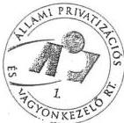
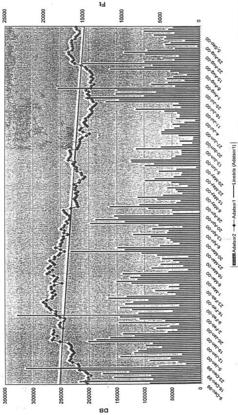

Állami Számvevőszék

# JELENTÉS

az Állami Privatizációs és Vagyonkezelő
Részvénytársaság tevékenységének, a
hozzárendelt vagyon alakulásának,
privatizációjának és működtetésének
ellenőrzéséről

J 3132

2000. szeptember

0031

---

# ---**Az ellenőrzés végrehajtásáért felelős:  
IV. Vagyonellenőrzési Igazgatóság**

**Halász Gejza** számvevő igazgató

# **Az ellenőrzést vezette:**

**Harsányi Sándor** számvevő igazgatóhelyettes

# **Az ellenőrzésben részt vettek:**

**Dr. Borisz József** számvevő tanácsos

**Hajagos Józsefné** számvevő tanácsos

**Kopányi Lászlóné** számvevő

**Lőrinc Alajos** főtanácsadó

**Makkai Mária** osztályvezető főtanácsos

**Németh Béláné** tanácsadó

**Dr. Ocskovszky Jánosné** tanácsadó

**Dr. Szöllősi Géza** számvevő tanácsos

**Szűcs Ivánné** számvevő

**Tornai József** számvevő tanácsos

**Verő Tünde** számvevő

Jelentéseink az INTERNET-en a www.asz.gov.hu címen olvashatók.

---Jelentéseink az Országgyűlés számítógépes hálózatán is olvashatók.

---

TÉMASZÁM: 521.

V-8-29/2000.

# TARTALOMJEGYZÉK

# BEVEZETÉS

# I. ÖSSZEGZŐ MEGÁLLAPÍTÁSOK, KÖVETKEZTETÉSEK, JAVASLATOK

# II. RÉSZLETES MEGÁLLAPÍTÁSOK

1. A hozzárendelt vagyonnal kapcsolatos bevételek és kiadások alakulása a követelésállomány helyzete

1.1.A nyilvantartas szabalyozottsaga
1.2.A bevetelek alakulasa
1.3. Az APV Rt. költségvetési befizétési kõtelezettsegei és a privatizációval, vagyonkezeléssel összefüggő rafordítások

1.3.1. Az APV Rt. költségvetési befizétési kõtelezettsegei
1.3.2.A privatizaciós törvény alapán teljesített kiadások

1.3.2.1. Az ÁPV Rt. működése a bevételek és kiadások alakulása

1.4. Az APV Rt. egyeb raforditasai a koltségvetési törveny elóirásai alapjan
1.5.A kovetelésallomány megoszlása, az allományváltozást befolyásoló tenyezők

2. Az értékesítési tevékenység alakulása

2.1.A privatizaciós tranzakciok kivalasztása
2.1.1.MATAV részények értékesitése
2.1.2.MOL részények értékesitése
2.1.3.Az Ikarus Jarmugyarto Rt.ertekesitese
2.1.4.A Buda-GAST Rt.ertekesitese
2.1.5.A Del-Magyarorszagi Gabonafeldolgoz Rt.ertekesitese
2.1.6. Az APV Rt. es az RWE kozotti megallapodásból fakadó kötelezettsegek rendezese

3. A hozzárendelt vagyon állományának alakulása, vagyon átadási-átvételi kötelezettségek teljesítése

3.1.A hozárendelt vagyon nyilvántartásanak szabályozottsága
3.2.A hozárendelt vagyon allománya

3.2.1.Az 1998.evet erinto megallapitasok
3.2.2.Az 1999.evet erinto megallapitasok

3.3.Termofld
3.4.Az 1998.evi XC.torvenyben eloirt vagyon atvetei - atadasi kotelezetsgek teljesitese

4. Az ÁPV Rt. vagyonkezelési tevékenységének szervezése, szabályozottsága

4.1. Szakmai ügyvezető igazgatoságok vagyonkezési tevekenysége
4.2. Tartós allami tulajdon vagyonkezelse

4.2.1.Volan tarsasagcsoport
4.2.2.Agrargazdasagi portfolio
4.2.3.Erdogazdasagi portfolio
4.2.4.Hitelintézeti portfolio

4.3.Kisebbségi portfolio kezelése
4.4. Vagyonkezési tapasztalatok

4.4.1.Az APV Rt. osztalekpolitikaja
4.4.2. Erdekeltsegi rendszer
4.4.3. Egyedi penzügyi támogatást megvalósító vagyonkezési beavatkozások előkésztése és megvalósítása

3

5

10

10

10

10

11

12

13

14

17

18

20

22

22

26

28

31

33

35

36

36

37

37

39

46

46

47

49

50

50

50

51

52

54

54

55

55

1

---

4.4.4. Vagyonkezelési tevékenységek ellenőrzése 55
4.4.5. Vagyonkezelési tevékenységek irányítása 56
4.5. A vagyonkezeléssel kapcsolatos ráfordítások 57
4.5.1. A válsághelyzetek kezelésének költségei 57
4.5.2. Reorganizációs ráfordítások alakulása 58
4.5.3. Vagyonkezelési ráfordítások alakulása 60
5. A társadalombiztosítási alapok vagyonának értékesítése és átmeneti vagyonkezelése 61
5.1. A társadalombiztosításhoz tartozó vagyon és kezelése 61
5.2. Megbízási szerződés alapján végzett értékesítés 63
5.2.1. A Richter részesedés értékesítése 63
5.2.2. Az OTP részesedés értékesítése 65
6. A privatizációs tartalékból teljesítendő kötelezettségek alakulása 67
6.1. A kötelezettségállomány és a privatizációs tartalék alakulása 67
6.2. A kötelezettségek változása, annak fontosabb okai 69
6.3. Garanciális és szavatosságból eredő kötelezettségek 70
6.4. Önkormányzati és PEH kötelezettségek 71
6.4.1. Belterületi föld utáni önkormányzati járandóságok 71
6.4.2. Alapítói jogon esedékes önkormányzati járandóságok 75
6.4.3. Privatizációs ellenérték hányad (PEH) 76
6.5. Gázközművagyon utáni kötelezettségek 77
7. Ellenőrzési tevékenység 78
8. Az intézkedési terv végrehajtása 80
Mellékletek

**Korábbi vizsgálataink címei:**

Jelentés az Állami Vagyonügynökség 1991. évi tevékenységéről

Jelentés az Állami Vagyonkezelő Rt. tevékenységének ellenőrzéséről

Jelentés az Állami Vagyonügynökség 1992. évi tevékenységének ellenőrzéséről

Jelentés az Állami Vagyonügynökség 1993. évi tevékenységének ellenőrzéséről

Jelentés az Állami Vagyonkezelő Rt. 1993. évi tevékenységének ellenőrzéséről

Jelentés az Állami Vagyonügynökség költségvetési cím pénzügyi-gazdasági ellenőrzéséről

Jelentés az Állami Vagyonkezelő Rt. által a Budapest Bank Rt.-nek juttatott tőketartalék-átadás ellenőrzéséről

Jelentés az Állami Vagyonügynökség és az Állami Vagyonkezelő Rt. 1994. évi tevékenységének, valamint a jogutód szervezet megalakulási költségeinek az Állami Privatizációs és Vagyonkezelő Rt.-nél végzett ellenőrzésről

Jelentés az Állami Privatizációs és Vagyonkezelő Rt. 1995. évi tevékenységéről

Jelentés az ÁPV Rt. 1996. évi tevékenységének ellenőrzéséről

Jelentés az Állami Privatizációs és Vagyonkezelő Rt. hozzárendelt vagyonnal kapcsolatos 1997. évi tevékenységének ellenőrzéséről

Jelentés az ÁPV Rt. 1998. évi működésének és a központi költségvetés végrehajtásához kapcsolódó tevékenységének ellenőrzéséről

2

---

# JELENTÉS

## az Állami Privatizációs és Vagyonkezelő Részvénytársaság tevékenységének, a hozzárendelt vagyon alakulásának, privatizációjának és működtetésének ellenőrzéséről

### BEVEZETÉS

Az állam tulajdonában lévő vállalkozói vagyon értékesítéséről szóló 1995. évi XXXIX. törvény szerint az Állami Privatizációs és Vagyonkezelő Rt. (továbbiakban ÁPV Rt.) tevékenységének ellenőrzése az Állami Számvevőszék feladata. A törvény előírja, hogy az Állami Számvevőszék köteles jelentését - a Kormány beszámolójával együtt - a zárszámadással egyidőben, minden év augusztus 31-ig benyújtani az Országgyűlésnek.

A számviteli törvény szerint az ÁPV Rt. a jóváhagyásra jogosult testület által elfogadott, könyvvizsgálói záradékot is tartalmazó beszámolóját - amelynek része a hozzárendelt vagyonról szóló beszámoló és a könyvvizsgáló erre vonatkozó véleménye - a tárgyévet követő augusztus 31-ig köteles letétbe helyezni. E törvényi szabályozásból következően **a helyszíni vizsgálat időpontjában sem a beszámoló, sem a könyvvizsgáló véleménye nem állt rendelkezésre.** A könyvvizsgálat az Állami Számvevőszék helyszíni vizsgálata után kezdődött meg. A jelentés pénzügyi-számviteli adatai többségükben a tendenciák bemutatására alkalmasak.

Az ellenőrzés rendelkezésére álló, az ÁPV Rt. 1999. évi tevékenységéről szóló jelentést - amelyet az ÁPV Rt. az Állami Számvevőszék részére 2000 áprilisában állított össze - a könyvvizsgáló véleményezte. Véleményalkotásakor nem könyvvizsgálati mélységű ellenőrzést végzett, hanem csak az ÁPV Rt.-vel kötött külön megállapodásban rögzítettek szerint járt el. Így például a vagyonelemeknél az analitika és a főkönyv egyezőségét vizsgálta.

Az ÁPV Rt. 1999. évi tevékenységéről, a hozzárendelt vagyon változásáról szóló végleges beszámolóját - a könyvvizsgálói jelentéssel együtt - várhatóan szeptember hó végén terjesztik a Részvényesi Jogok Gyakorlója elé jóváhagyásra.

A jelentés azon fejezeteit, amelyek adattartalma az Állami Számvevőszék jelentésének lezárását követően - az ÁPV Rt. végleges beszámolójának ismeretében - jelentős mértékben módosult, és amelyekről a 2.sz. függelékben tájékoztatást adunk *-gal jelöltük meg.

---3

---

BEVEZETÉS---

**Az ellenőrzés célja:** annak megállapítása volt, hogy az ÁPV Rt. tevékenysége megfelelt-e a jogszabályokban és a belső szabályzatokban előírtaknak;

eleget tett-e a privatizációból és vagyonkezelésből eredő kötelezettségeinek;

hogyan érvényesítette az állam tulajdonosi érdekeit az egyes privatizációs tranzakciók lebonyolításakor;

milyen bevételei és kiadásai keletkeztek a hozzárendelt vagyonhoz kapcsolódóan, mennyi volt a követelések állománya, ezek rendezése érdekében milyen erőfeszítést tett;

betartotta-e a költségvetési törvény által meghatározott főbb kiadási előirányzatokat.

Az ellenőrzés az ÁPV Rt. hozzárendelt vagyonnal kapcsolatos tevékenységének vizsgálatára helyezte a hangsúlyt, mivel 1999-ben a számvevőszéki vizsgálat a saját vagyonnal való gazdálkodást részletesen elemezte.

Az ellenőrzött időszak 1999. év volt, az értékesítés, a vagyonkezelés és a hozzárendelt vagyon témakörökben 1998-1999. évek.

---4

---

# I. ÖSSZEGZŐ MEGÁLLAPÍTÁSOK, KÖVETKEZTETÉSEK, JAVASLATOK

Az ÁPV Rt. tevékenységének, működésének jogszabályi keretei rendezettek, belső szabályzatokkal lefedettek. A társaság hozzárendelt vagyonnal kapcsolatos tevékenysége a törvényi szabályozással összhangban volt és megfelelt a belső szabályzatokban előírtaknak is.

Évek óta visszatérő gond, hogy az ÁPV. Rt. beszámoló készítési, valamint az Állami Számvevőszék ugyanarról az időszakról szóló jelentési kötelezettségének határideje egybeesik.

Ennek következtében az Állami Számvevőszék helyszíni ellenőrzésének lezárásakor nem áll, állhat rendelkezésre végleges beszámoló. Ez azt jelenti, hogy az Állami Számvevőszék jelentéseiben szereplő adatok nem minden esetben egyeznek meg a Kormány által az Országgyűlésnek benyújtott beszámoló adataival.

Az ÁPV Rt. 1999-ben a hozzárendelt vagyonhoz kapcsolódóan 132,5 milliárd Ft bevételt ért el. Az értékesítés bevétele 113,3 milliárd Ft volt, melyből mintegy 16 milliárd Ft az előző évi tranzakciók áthúzódó értéke. A bevételek 57 %-át a Matáv Rt. kisebbségi részvénycsomagjának értékesítése eredményezte.

A mindenkori költségvetési törvény az ÁPV Rt. számára jogcímenként meghatározza a kiadási előirányzatokat, ez 1999-re összesen 136,35 milliárd Ft volt. Az ÁPV Rt. tényleges kiadása 132,4 milliárd Ft lett, melyre a realizált bevétel fedezetet nyújtott. A módosított költségvetési törvény az állami vagyon utáni részesedésként és az adóskonszolidációs követelések ellenértékeként 30 milliárd Ft befizetés teljesítését írta elő. Ezen a jogcímen az ÁPV Rt.-hez csak 12 milliárd Ft érkezett be, de a különbözet teljesítésére a törvény az ÁPV Rt-t a privatizációs bevételek terhére kötelezte.

A tömeges privatizáció lezárulását követően az értékesítésből származó bevételekkel szemben az osztalékbevételek súlya növekedni fog. Ezért a jövőben a korábbi gyakorlat - az osztalékbevételek és az értékesítésből származó bevételek együttes kezelése - nem folytatható.

A költségvetési törvény többi, jogcímenkénti befizetési előírásainak is eleget tett a társaság. Az ÁPV Rt. kiadásai között szerepel a saját vagyona működtetésére felhasznált összeg is. Erre a célra a költségvetésben 4 milliárd Ft előirányzat szerepelt, ezzel szemben a tényleges felhasználás 3,7 milliárd Ft volt.

Az ÁPV Rt. bruttó követelésállománya az 1998. évi záró állományhoz képest 22 %-kal, a nettó állomány pedig 8 %-kal csökkent. A csökkenés oka, hogy a korábbi évek privatizációjának részletfizetéséből származó követelés megszűnt

5

---

I. ÖSSZEGZŐ MEGÁLLAPÍTÁSOK, KÖVETKEZTETÉSEK, JAVASLATOK

és 1999-ben részletfizetési kedvezményt csak néhány esetben és kis összegben alkalmaztak.

Magyarországon a tömeges privatizáció 1997. év végére gyakorlatilag lezárult. Ez tükröződik az ÁPV Rt. 1998-1999. évi értékesítési adataiban is. Az 1998. évi 78 tranzakció szerződés értéke 80.224 millió Ft (részvénycserékkel együtt), 1999-ben pedig a 31 tranzakció szerződéses értéke 96.438 millió Ft volt. Ezzel függ össze az is, hogy **mindkét évben nőtt a kisebbségi részesedések értékesítésének aránya, 1998-ban darabszámban, 1999-ben pedig volumenét tekintve is.**

Ezekben az években egy-egy nagy bevételt eredményező kisebbségi részvénycsomagot érintő tranzakció határozta meg az értékesítés alakulását. (1998-ban a MOL, 1999-ben a Matáv). E két tranzakciót és a vizsgálatba bevont többi értékesítési ügyletet is az jellemezte, hogy a korábbi évek privatizációs döntései megszabták, illetve befolyásolták azok magánosítási folyamatát. 1998-ban és 1999-ben is a bevételek több mint 70 %-a az első félévre koncentrálódott.

Új vonása a privatizációnak, hogy 1999-ben az ÁPV Rt. felszámolás alatt álló céget értékesített. Ennek lebonyolításával kapcsolatos kedvezőtlen tapasztalat - a vevő társaságnak résztulajdonosa a felszámoló - a felszámolás alatt álló cégek értékesítése eljárási rendjének hiányára is visszavezethető. (1999. év végén az ÁPV Rt.-nél 283 felszámolás alatt álló gazdálkodó szervezet volt.)

A MOL, a Matáv, valamint a megbízás alapján végzett OTP részvények értékesítésénél a végleges eladási ár kialakításáról az ÁPV Rt. nem rendelkezik dokumentummal. A MOL privatizációjakor a Nemzetközi Intézményi Adásvételi Megállapodásban a díjak és kiadások elszámolására az ÁPV Rt. a magyar számviteli törvény bruttó elszámolásra vonatkozó alapelvével ellentétes, nettó elszámolásban állapodott meg, így nem ellenőrizte a ténylegesen felmerült költségeket.

Az ÁPV Rt. hozzárendelt vagyona 1998. év végén 730,2 milliárd Ft, 1999. december 31-én 747,7* milliárd Ft volt, amelyből az 518 db gazdálkodó szervezet értéke 714,6 milliárd Ft, az elvont, vásárolt, átvett eszközök értéke 25,5 milliárd Ft, a különbözet a termőföld, a pénzkészlet, az államkötvény, a követelések és a kötelezettségek egyenlege. A törvényi módosítás alapján a tartósan állami tulajdonban maradó társaságok száma 93 db-ra változott, értékük 306,2 milliárd Ft. A hozzárendelt vagyon része az állami tulajdonban maradó termőföld, melynek mértékére pontos adattal nem rendelkezik az ÁPV Rt. A még privatizálható gazdálkodó szervezetek száma 493 db, értéke 433,8 milliárd Ft.

Az ÁPV Rt. hozzárendelt vagyonának új nyilvántartási és beszámoló rendszere figyelembe vette az Állami Számvevőszék korábbi, nyilvántartással kapcsolatos kritikai észrevételeit. Így például már mind a felszámolás alatt álló és mind a negatív saját tőkéjű cégek esetében nulla, a végelszámolás alatt álló gazdálkodó szervezeteknél pedig 50 %-os értékű a regisztrált vagyon. A vagyon változás kimutatása is kedvezően módosult, elkülönítetten megállapítható a tranzakciókból és a társaságok saját tőkéjének alakulásából eredő vagyon módosulás. Ennek ellenére **a privatizálható gazdálkodó szervezetek esetében sem számát, sem értékét tekintve az adatok még mindig nem a reá-**

6

---

lis helyzetet tükrözik. A szervezetek számában szerepelnek a felszámolás, illetve végelszámolás alatt álló vállalatok és társaságok is. Az értékben számbavették a saját vagyon között is kimutatott, a még cégbíróságon nyilvántartásba nem vett társaságokat, illetve tőkeemeléseket, a peres eljárások alatt álló, valamint a fizikálisan nem birtokolt társaságokat is. A privatizálható vagyonérték jelentős része abból származik, hogy a tartósan állami tulajdonban maradó társaságokban az ÁPV Rt. még nagyobb tulajdoni hányaddal rendelkezik, mint a törvényi minimum (agrár, szállítás, távközlés). Egyes ágazatokban már csak egy-egy társaság privatizációja a meghatározó (energia-MVM Rt., kereskedelem-Hungaropharma Rt., feldolgozóipar-DUNAFERR Rt.). 1998-99-ben a privatizációs tevékenységben és vagyon kezelésben ezért a kisebbségi tulajdon egyre nagyobb szerepet kapott és a jövőben is ez a tendencia várható.

Az ÁPV Rt. az elmúlt, mintegy ötéves működése során nem rendelkezett a vagyonkezelési tevékenységek módszertani megalapozására és átfogó fejlesztésére irányuló, hosszabb távon következetesen képviselhető szervezési koncepcióval, intézkedési elképzelésekkel. Az ÁPV Rt. vezetése 1999. szeptemberétől több olyan szervezési és szabályozási intézkedést tett, amelyek hosszabb távon egy megalapozottabb vagyonkezelési tevékenység kialakításának irányába mutatnak, és rövid távon is előrelépést eredményeznek. Ennek része volt a új Szervezeti és Működési Szabályzat jóváhagyatása és a vagyonkezelést közvetlenül érintő utasítások kiadása, a vagyonkezelési integrált informatikai kontrolling rendszer bevezetése, a középtávú stratégiai tervezés beindítása. A vagyonkezelési tevékenységek javítására beindított szervezési kezdeményezés mellett hiányosság, hogy az ÁPV Rt. nem gondoskodott a többségi részesedéssel működő társaságoknál megfelelő vagyonvédelmi előírások kialakításáról.

A folyamatba tett intézkedések célja új alapokra helyezni az ÁPV Rt. sokat bírált vagyonkezelési tevékenységét. Az új vagyonkezelési kontrolling informatikai rendszer adatszolgáltatásaival, a jelenlegi statikus gyakorlat megváltoztatásával preventív vagyonkezelői beavatkozásokat tesz lehetővé. Ez utóbbi keretében például az ÁPV Rt. a volán társaságoknál vagyonkezelési intézkedéseivel elsősorban a járműpark megújítását, EU normáknak megfelelő átalakítását segítette.

A tartós állami tulajdonú agrárgazdasági portfolióban jelentős reorganizációs tőkejuttatásokkal különböző fejlesztéseket és beruházásokat támogatott az ÁPV Rt. Emellett a válságkezelési keretből egyedi felmérések alapján természeti kárelhárításhoz biztosítottak forrást. A tőkejuttatások azonban nem érték el céljukat, mivel a mezőgazdasági társaságok vesztesége tovább növekedett.

A hitelintézeti portfolió esetében az ÁPV Rt. vagyonkezelő tevékenysége végrehajtó típusú tevékenységként jellemezhető, mivel a pénzintézetek jelentős vagyonkezelési beavatkozásai, tőkerendezési és portfolió tisztítási műveletei kormányhatározatokon alapulnak, az operatív jellegű tulajdonosi irányítást az ÁPV Rt. a PM-el, szakmai együttműködésben gyakorolja.

Az ÁPV Rt. a költségvetési törvényben meghatározott reorganizációra, vagyonkezelésre és válsághelyzetek kezelésére előirányzott költségeit, valamint a döntési hatásköri szabályait betartotta. A megítélt és ténylegesen folyósított támo-

7

---

I. ÖSSZEGZŐ MEGÁLLAPÍTÁSOK, KÖVETKEZTETÉSEK, JAVASLATOK---

gatások az éves költségkereteknek 77-96 %-át merítették ki. Egyedi pénzügyi támogatások esetében az ÁPV Rt. olyan kérelmek alapján döntött, amelyek nem tartalmaztak költségtervet, megtérülési elemzést, a megvalósítás részletes ütemtervét, stb., és a támogatások felhasználását nem ellenőrizte. A költségvetési törvény szerint az ÁPV Rt.-nek a támogatások megítélésénél figyelembe kell vennie, hogy intézkedése nem ütközhet az EU versenyjogi szabályozásába és a pénzügyminiszter állásfoglalását kell kérnie. A reorganizációs, főként tőkejuttatás formájában nyújtott beruházási támogatások esetében az ÁPV Rt. a PM állásfoglalását nem kezdeményezte.

A kötelezettségállomány rendkívül sokrétű, sok jogcímen fennálló, többnyire becsült, az értékelési elvek és mértékek módosulása következtében pedig szinte folyamatosan változó adatállomány. Egyes kötelezettségeket a kockázatuk, a bekövetkezésük valószínűsége alapján becsléssel állapítanak meg (pl. privatizációs szerződésekből eredő szavatosságok, önkormányzatokat megillető járandóságok egy része).

A kötelezettségek állományának egy jelentős hányada, és annak változásai, a bizonytalan jogi helyzetre, különböző jogértelmezésekre vezethető vissza, esetenként konkrét bírósági ítéleteket tükröznek. A Legfelsőbb Bíróság által, az 1992. évi az időlegesen állami tulajdonban lévő vagyon értékesítéséről, hasznosításáról és védelméről szóló (jelenleg már hatályban nem lévő) LIV. törvény önkormányzati járandóság számítására vonatkozóan kiadott jogegységi határozat tételes, teljes körű felülvizsgálatot és a régi teljesítések újbóli átszámítását vonta maga után. A késedelmi kamat évi 20 %-os mértékére szintén jogegységi határozat adott egyértelmű eligazítást.

Egyik legjelentősebb kötelezettség az önkormányzati gázközmű vagyon miatti állami kötelezettség, amely az 1998. évi Alkotmánybírósági határozattal függ össze. A kötelezettség fedezetére a Kormány 50 milliárd Ft forrást biztosított államkötvények formájában.

1998-ban 24,0 milliárd Ft, 1999-ben 8,3 milliárd Ft kötelezettséget teljesítettek. Az egyes években kimutatott állományok és a tényleges kifizetések között nagyságrendi különbségek vannak, azaz a jórészt megbecsült kötelezettségállomány korántsem jelent hasonló nagyságú direkt pénzügyi terhet az ÁPV Rt. számára.

A késedelmi kamatok aránya a teljes állományon belül jelentős, az érintett kötelezettségekre vetítve több mint 40 %. A korábbi években különböző okok miatt nem teljesített jogszerű tartozások értéke ma már nem túl magas, azonban a „rárakódó” kamat ennek értékét jelentősen megnöveli.

A tulajdonosi ellenőrzés 1999-ben, eltérően az előző évtől már folyamatos volt. Az ellenőrzés hatékonyságát gátolta, hogy az ÁPV Rt. igazgatósága nem tárgyalta meg az elkészült vizsgálati jelentéseket, így a megfogalmazott javaslatok alapján intézkedési terv sem készülhetett.

A vezetési ellenőrzést támogató szervezeti egység munkája az átszervezés, a feladatok átcsoportosítása miatt még nem volt zökkenőmentes. A létszámbővülés, illetve a tevékenység szervezeti helyének végleges rendezését követően az év második felében az ellenőrzési tevékenység kiegyensúlyozottabbá vált.

---8

---

# Az ellenőrzés során tett megállapítások hasznosítása mellett javasoljuk

# a Kormánynak

1. Kezdemenyezze a szamviteli és a privatizációs törveny modositása során a határidők olyan valtoztatását, amelyek biztosítják, hogy az Állami Számvevőszék jelentése és az APV Rt. beszámolója azonos adatbázisra épüljön.
2. Intézkedjen arról, hogy a költségvetési törvenyben az állami vagyon utáni részesedéseket (osztalekbeveteleket), illetve azok elvonásat elkülöníteten és a realisan elvarható mertékben tervezzék meg és teljesítsék.

# a privatizációért felelős miniszternek

Kísérje figyelemmel az Állami Számvevőszék megállapításainak, javaslatainak végrehajtását az ÁPV Rt.-nél.

# az ÁPV Rt. ügyvezetésének

1. Pontositsak a tenylegesen privatizalhato gazdalkod szervezetek nyilvantartasat ertekben es darabszamban is. Kilonitssek el a peres eljarassal erintettek es az egyeb okbol nem ertekesithetok koret.
2. Szabályozzák a fejlesztési tipusu penzügyi támogatásokkal kapcsolatos dontéselókészítő anyagok információs tartalmát és a fejlesztésekhez nyújtott források felhasználásanak Ellenőrzését.
3. Gondoskodjanak a - privatizaciós törveny 67. § (4) bekezdésé szerint - a töbsegi részesedésel muködó társaságoknál a megfelelo vagyonvédelmi elóirások kialakításáról, alkalmazásáról.
4. Aktualizálják a hozzárendelt vagyon körébe tartozó társaságoknak az APV Rt. szervezeti egységei kozötti elosztásáról szólo 19/1997. sz. vezérigazgatóiutasítást.

9

---

II. RÉSZLETES MEGÁLLAPÍTÁSOK

## II. RÉSZLETES MEGÁLLAPÍTÁSOK

### 1. A HOZZÁRENDELT VAGYONNAL KAPCSOLATOS BEVÉTELEK ÉS KIADÁSOK ALAKULÁSA A KÖVETELÉSÁLLOMÁNY HELYZETE

#### 1.1. A nyilvántartás szabályozottsága

Az állam tulajdonában levő vállalkozói vagyon értékesítéséről szóló 1995. évi XXXIX. törvény alapján az ÁPV Rt. elkülönített nyilvántartást vezet a hozzárendelt vagyonról, melynek könyvvezetési szabályairól a Részvényesi Jogok Gyakorlójának (továbbiakban RJGY) 4/1999. (IX. 30.) sz. határozata rendelkezik. A hozzárendelt vagyon bevételei és kiadásainál az ÁPV Rt. az egyszeres, pénzforgalmi szemléletű könyvvezetést alkalmazza, és ez három elkülönített (bankszámlán és a számvitelben is) területre vonatkozik. Nevezetesen: a bevételek és kiadások, a privatizációs tartalék és a környezetvédelmi fedezet felhasználása.

Az ÁPV Rt. hozzárendelt vagyonra vonatkozó számviteli politikája, számlarendje összhangban van az RJGY határozattal.

#### 1.2. A bevételek alakulása

A hozzárendelt vagyonnal kapcsolatos **1999. évi bevétel összesen 132,5 milliárd Ft volt**, amely **15,2 milliárd Ft-tal** haladta meg az üzleti tervben előirányzottat.

Érték: millió Ft

|  1999. évi bevételek  |   |   |   |
| --- | --- | --- | --- |
|  Megnevezés | Előirányzat | Tény | Eltérés  |
|  értékesítés és a vagyonhasznosítás bevétele | 102.320 | 115.572 | + 13.252  |
|  osztalék bevétel | 4.700 | 5.975 | + 1.275  |
|  egyéb bevétel* | 5.300 | 5.710 | + 410  |
|  gázkötvények kamata | 5.000 | 5.250 | + 250  |
|  Összesen**: | 117.320 | 132.507 | + 15.187  |

* Az egyéb bevétel előirányzata az ÁPV Rt. üzleti tervében 1.000 millió Ft, a tételes előirányzatok felülvizsgálata és a számlarendnek való megfelelés alapján azonban az előirányzat 5.300 millió Ft-ra módosul. Ezzel együtt az értékesítés és vagyonhasznosítás bevételi előirányzata 102.320 millió Ft-ra változik.

** Az ÁPV Rt. beszámolójában 121.320 millió Ft-ot mutat ki, de az RJGY határozata 117.320 millió Ft bevételi előirányzatot ír elő, a Hungexpo tervezett értékesítésének elmaradása miatt.

10

---

A többletbevétel 87 %-a értékesítésből és vagyonhasznosításból keletkezett, valamint az osztalékbevételek is 1,3 milliárd Ft-os többletet eredményeztek. A privatizációs és a vagyonhasznosítás bevétel - 115,6 milliárd Ft - 94 %-a, - 109,2 milliárd Ft, - a nyilvános és tőkepiaci értékesítésből származott. A többletbevétel az előirányzatnál kedvezőbb árfolyam eléréséből realizálódott.

Kárpótlási jegy ellenében mindössze 867 millió Ft bevételt számoltak el, az előirányzat 4.500 millió Ft volt. Az előirányzathoz képest alacsony értékesítést befolyásolta, hogy a kárpótlási jegyek piacáról nem rendelkeztek pontos ismeretekkel, ezért az ÁPV Rt. a BÉB Rt. bevonásával megkezdte a kárpótlási jegyekkel történő eddigi értékesítések, valamint a piacon még meglévő kárpótlási jegyek értékének felmérését.

Az 1999. évi bevétel 61 %-a - 69,5 milliárd Ft- devizabevétel volt. A privatizációs bevételekből az 1998. évben részletfizetési konstrukciókban lebonyolított értékesítésekből 1999. évben 14,8 milliárd Ft folyt be.

A kapott osztalék az előirányzott 4,7 milliárd Ft-tal szemben közel 6 milliárd Ft bevételt eredményezett, annak ellenére, hogy 2,0 milliárd Ft-os osztalékot nem fizettek be a társaságok (Szerencsejáték Rt., és a CD Hungary Rt., amelyek mint követelések szerepelnek a hozzárendelt vagyonban.) A 2000. évre áthúzódó befizetést a cégek részére az ÁPV Rt. elnök-vezérigazgatója engedélyezte.

Az egyéb bevételek a terv szerint alakultak, ebben a legnagyobb tétel a Ganz Mozdony és Vagongyár Rt. felszámolásából származó 3,8 milliárd Ft volt.

1.3.

# Az ÁPV Rt. költségvetési befizetési kötelezettségei és a privatizációval, vagyonkezeléssel összefüggő ráfordítások

Az 1999. évi költségvetésről szóló - az 1998. évi XC. -, majd az azt módosító 1999. évi CV. sz. törvény szöveges része és a 11. sz. melléklete rendelkezik arról, hogy az ÁPV Rt. hozzárendelt vagyonának értékesítéséből származó bevételeit milyen célokra használhatja fel. (Továbbiakban: módosított költségvetési törvény).

Az ÁPV Rt. a módosított költségvetési törvényben meghatározott költségvetési befizetési kötelezettségek teljesítése után rendelkezésre álló bevételeiből fedezi a privatizációval és vagyonkezeléssel összefüggő ráfordításokat és a külön jogszabályokban előírt kiadási kötelezettségeit.

11

---

II. RÉSZLETES MEGÁLLAPÍTÁSOK

A módosított költségvetési törvény teljesítése a következőképpen alakult:

Érték: millió Ft

|  Ráfordítások megnevezésre | Módosított előirányzat | Tény | Eltérés  |
| --- | --- | --- | --- |
|  Költségvetési befizetési kötelezettség | 43.250 | 44.176 | + 926  |
|  Az 1995. évi privatizációs törvény alapján | 36.600 | 31.895 | - 4.706  |
|  A módosított költségvetési törvény alapján | 11.000 | 10.321 | - 679  |
|  Egyéb kötelezettségek alapján | 42.500 | 42.340 | - 160  |
|  Válsághelyzet megszüntetésére | 3.000 | 2.768 | - 231  |
|  Privatizációs tartalék feltöltésére | - | - | -  |
|  **Összesen:** | **136.350** | **131.500** | **- 4.850**  |

Az összes kiadás a 867 millió Ft kárpótlási jegy bevonással 132.367 millió Ft volt és ezt fedezte a 132.507 millió Ft-os bevétel. Teljesült a módosított költségvetési törvényben előírt 5.000 millió Ft-os záró pénzkészlet is.

### 1.3.1. Az ÁPV Rt. költségvetési befizetési kötelezettségei

A módosított 1999. évi költségvetési törvény **43.250 millió Ft-ban határozta meg** a költségvetési befizetési kötelezettséget. A tényleges teljesítés 44.176 millió Ft lett, ez **926 millió Ft-tal** haladta meg az előirányzatot, melyet a törvény 6. § (1) bekezdése szerint **a központi költségvetésnek, az államot megillető privatizációs bevételek számlájára átutaltak.**

A módosított költségvetési törvény 6. § (2) bekezdése az állami vagyon utáni részesedéseként és az adóskonszolidációs követelések ellenértékeként 30.000 millió Ft befizetés teljesítését írta elő. Az ÁPV Rt. e kötelezettségének eleget tett, annak ellenére, hogy a társaságoktól e címen csak mintegy 12 milliárd Ft folyt be. (Ebből az állami vagyon utáni részesedés, az osztalék bevétel ténylegesen 5.975 millió Ft volt, és az adóskonszolidációs követelés címére 6.017 millió Ft folyt be). A különbözetet - 18 milliárd Ft-ot - a privatizációs bevétel terhére teljesítette az ÁPV Rt.

**Az 1999. évi privatizációs - 8.000 millió Ft - és többlet bevétel - 926 millió Ft - címén összesen 8,9 milliárd Ft mellett 18 milliárd Ft-ot is elvont a központi költségvetés**, amelyet az osztalék és adóskonszolidációs bevétel számláján tart nyilván. A módosított költségvetési törvény lehetőséget adott arra, hogy amennyiben az osztalékbevételek és az adósságkonszolidációs követelések értékesítéséből származó bevételek együttesen nem érik el a 30.000 millió Ft-ot, azt az ÁPV Rt. a hozzárendelt vagyonból befolyó más bevételei terhére kiegészítheti.

Az ÁPV Rt. könyvvizsgálója az ÁSZ részére az ÁPV Rt. hozzárendelt vagyonának alakulásáról - készített beszámolóhoz adott ténymegállapításaiban is felvetette, hogy „1999. december 31-re vonatkozóan az ÁPV Rt. nem mutat ki adóskonszolidáció miatti kötelezettséget, mivel álláspontja szerint a módosí-

12

---

tott költségvetési törvényben előírt 30.000 millió Ft befizetésével teljesítette kötelezettségét. A PM a vizsgálat lezárásáig nem igazolta vissza levélben az 1999. december 31-én fennálló követelését'.

Az ÁPV Rt. 1998. december hónapban 50.000 millió Ft címletértéken kamatozó államkötvényt kapott a gázközművel kapcsolatos önkormányzati járandóság fedezetére (a 36/1998. (IX. 16.) AB határozata alapján). Ennek kamatbevételeit 5.250 millió Ft-ot a központi költségvetés belföldi államadósság számlájára 1999. augusztus 18-án befizette.

### 1.3.2. A privatizációs törvény alapján teljesített kiadások

A módosított költségvetési törvény e címen 1999. évre összesen 36.600 millió Ft kifizetést engedélyezett, a tényleges kiadás 31.895 millió Ft lett. A megtakarítás 4.705 millió Ft, amely az értékesítés előkészítésénél a vagyonkezelésnél és E-hitel törlesztés fel nem használt részénél és a kárpótlási jegyek életjáradékra váltásánál jelentkezett a következő táblázat szerint:

**A privatizációs törvény alapján teljesített ráfordítások 1999. évben**

|  Megnevezés | Érték: millió Ft-ban  |   |   |
| --- | --- | --- | --- |
|   |  Előirányzat | Tény | Eltérés  |
|  1. Értékesítés előkészítés költsége | 10.000 | 8.017 | - 1.983  |
|  2. Vagyonkezelés ráfordítás | 3.000 | 2.456 | - 544  |
|  3. Privatizációval, vagyonkezeléssel összefüggő reorganizációs kifizetések | 15.000 | 14.978 | - 22  |
|  4. Az ÁPV Rt. működési költsége | 4.000 | 4.000 | -  |
|  5. A kárpótlási jegyek életjáradékká váltásával kapcsolatos kifizetések | 3.000 | 2.444 | - 556  |
|  6. Alacsony kamatozású államadósság törlesztése E-hitelből | 1.500 | - | - 1.500  |
|  7. A volt szovjet ingatlanok értékesítése kapcsán az önkormányzatokat megillető bevételi hányad | 100 | - | - 100  |
|  **Összesen:** | **36.600** | **31.895** | **- 4.705**  |

**E-hitel igénybevételével** nem valósult meg magánosítás az elmúlt évben és így költségvetési befizetési kötelezettséget sem vont maga után.

**A volt szovjet ingatlanok** kapcsán az önkormányzatokat megillető rovaton sem történt értékesítés.

13

---

II. RÉSZLETES MEGÁLLAPÍTÁSOK---

## Az értékesítés előkészítésének költségei, az ezzel kapcsolatban felmerülő kiadások, díjak, költségek

E címen összesen 8.017 millió Ft volt a kifizetés, ebből a vagyonértékelés díja 3.953 millió Ft, a privatizációt előkészítő egyéb kiadások pedig 4.064 millió Ft-ot tettek ki.

### Az értékesítés előkészítésének költségeiből **2.107 millió Ft-ot fordítottak befektetésekre.**

A GD Óbudai Hajógyár Rt. tulajdonában levő HSZVK Kft. 21,91 %-os üzletrészét (a 468/1998. (XII. 3.) sz. IG határozat alapján) 867 millió Ft-ért vásárolták meg.

A Dél-Magyarországi Gabonakereskedelmi és Malomipari Rt. megalapítására 300 millió Ft-ot fordítottak, a Malév részvények visszavásárlására 239 millió Ft-ot utaltak át, a Richter Gedeon Rt. részvényekért pedig 684 millió Ft-os vételárrészt fizettek ki e számlacsoportból. A költségvetési törvény 11. számú melléklete II. 3. d pontja alapján 22.000 millió Ft-ot irányzott elő a Richter Gedeon Rt. részvénysomagjának kivásárlására. A részvények árfolyama a törvényben meghatározott módon számolva 22.684 millió Ft lett, ezért a különbözetet az értékesítés előkészítésének költségeire (a 680/1999. (XII. 9.) Igazgatósági határozat szerint) könyvelte az ÁPV Rt., de kezdeményezni fogja az 1999. évről szóló zárszámadási törvény keretében a módosítást, és ezt követően átteszi a megfelelő előirányzat terhére.

További 17 millió Ft a Hungarocamion, valamint az Autóbusz Invest részvényvásárlása miatt merült fel.

**A tulajdonos által adott kölcsön összege, 3.469 millió Ft volt, ebből meghatározó a Forrás Vagyonkezelési és Befektetési Rt.-nek nyújtott kölcsön 1.500 millió Ft és a Földhitel és Jelzálogbank Rt. részére pedig 1.500 millió Ft alárendelt kölcsöntőke.**

A két kölcsön összegét a vagyonkimutatás követelés sora, a követelések analitikája tartalmazza.

**Az értékesítési jutalékként 1.367 millió Ft-ot számoltak el, ebből a Matáv Rt. részvény értékesítéséért elszámolt jutalék 995 millió Ft volt.**

Az értékesítés előkészítésének kiadásai közül 17 %-os hányadot véletlenszerűen ellenőrizve (kiadási tételenként differenciáltan 40-10 % között) hiányosságok, szabálytalanságok nem tapasztalhatók.

### 1.3.2.1. Az ÁPV Rt. működése, a bevételek és kiadások alakulása

A mindenkori költségvetési törvény, az ÁPV Rt.-nek a saját vagyona működtetéséhez a privatizációs bevételekből felhasználható keretet meghatározza, amely 1999. évre 4.000 millió Ft volt.

Az ÁPV Rt. saját tőkéje 1999-ben 877 millió Ft-tal nőtt a mérleg szerinti eredménye alapján. Ez az eredmény a 4.533 millió Ft bevétel - a költségvetés által

---14

---

rendelkezésre bocsátott 4 milliárd Ft, az eszközbérbeadás és a TB vagyon értékesítésével (amelyre az 59/1999. (IV. 21.) kormányrendelet hatalmazta fel az ÁPV Rt.-t) kapcsolatos díjbevétel 471,6 millió Ft, valamint a 61,4 millió Ft egyéb bevétel - és a saját vagyonhoz kapcsolódó költségek és ráfordítások 3.656,0 millió Ft-os értékének különbsége.

Az ÁPV Rt.-nek az RJGY 3/1999. (VI. 25.) sz. határozata alapján a saját vagyonhoz kapcsolódó bevételekre és kiadásokra jóváhagyott üzleti terve és a tényszámok a következőképpen alakultak:

Érték: millió Ft

|  Megnevezés | 1999. évi üzleti terv | 1999. évi tény | Teljesítés %-a  |
| --- | --- | --- | --- |
|  személyi jellegű költségek és ráfordítások | 2.464,0 | 2.241,7* | 90,9  |
|  *egyéb működési költségek és ráfordítások | 1.532,0 | 1.414,3* | 92,3  |
|  ráfordítások összesen | 3.996,0 | 3.656,0 | 91,5  |
|  tartalék | 192,0 | - | -  |
|  bevétel | 4.188,0 | 4.532,8 | 108,2  |

*Az ÁPV Rt. beszámolójában e táblázat adatai nem az eredmény-kimutatást tükrözik, így nem egyezik azzal.

A költségvetés által a saját vagyon működtetésére rendelkezésre bocsátott keret az 1998. évi 3,3 milliárd Ft-ot 21 %-kal meghaladóan 4 milliárd Ft-ra emelkedett. A keretnövekedés megteremtette a színvonalas munkavégzés feltételeit a létszám és eszközgazdálkodás területén egyaránt.

A TB vagyon kezelésével összefüggő jutalék, valamint az ingatlanbérbeadással bővült bevétel 345 millió Ft-tal növelte a bevételeket a tervhez viszonyítva.

Az ÁPV Rt. 1999. évi személyi és működési költségei is az előirányzaton belül maradtak. A személyi jellegű kiadásoknál 222 millió Ft megtakarítást értek el, mivel a tervezett 300 fős létszám helyett a tényleges állományi létszám 267 fő lett.

A működési kiadásoknál a tervhez mért megtakarítás 117,7 millió Ft, továbbá a tartalék keret fel nem használása - 192 millió Ft - növelte a kimutatott eredményt. (1. sz. melléklet)

Az üzleti terv 1999. évre az átlagos állományi létszámot az évek óta csökkenő tendencia 1997. év 342 fő, az 1998. év 240 fő, és a hozzárendelt vagyon jelentős csökkenése ellenére 300 főben (index: 125 %) határozta meg. A 300 fős **előirányzat kialakítását nem előzte meg a szervezet feladataihoz kapcsolódó létszámigény felmérés, feladatelemzés.**

A Felügyelő Bizottság az 1999. évi üzleti terv véleményezésénél is nehezményezte, hogy a létszám 300 főre való emelésével a döntés a társaság előtt álló feladatoknak megfelelő szervezet kialakítását megelőzően, annak konkrét ismerete nélkül történt.

15

---

II. RÉSZLETES MEGÁLLAPÍTÁSOK

A személyi jellegű ráfordításoknál az előirányzathoz mért kevesebb felhasználás a létszám alakulásával függött össze, mivel az átlagkereset és a személyi jellegű kifizetések tervezetthez viszonyítva a létszám alakulás arányában csökkentek.

A Miniszterelnök és a Részvényesi Jogok Gyakorlójának utasításában az állami tulajdonosi részesedéssel működő társaságok 1999. évi átlagkereset növekedésének előirányzata 13,3 % volt. Az ÁPV Rt.-nél az átlagkeresetek 12,7 %-kal nőttek és így 1999-re 380.059 Ft/fő/hó szintre emelkedtek.

Az átlagkereset 12,7 %-os bővülése mellett a természetbeni juttatások is növekedtek 1 főre, 1 hónapra elérték az 55.000 Ft-ot.

A 11/1999. Elnök-vezérigazgatói utasítás rendelkezik a **választható béren kívüli** juttatások rendszeréről, amelynek lényege, hogy a költségvetési kötelezettségtől - TB, adó - függően a dolgozók választhatnak a juttatás elemeiből (albérleti, üdülési, beiskolázási, képzési, sportolási, művelődési, fogkassza, lakáspénztári hozzájárulások között) **200.000 Ft/fő/év értékben**. 1999-ben e címen 42,7 millió Ft volt a kiadás.

Kiemelkedő mértékben, 66,2 %-kal, 11,5 millió Ft-ról 19,1 millió Ft-ra nőttek a **reprezentációs költségek**. A növekedést az ún. tartalékkeret 1999. évi bevezetése idézte elő, - 7,3 millió Ft értékben - amelyet előirányzataikba is beterveztek, 8 millió Ft-tal.

**A működési költségek és ráfordítások előirányzata 1.532,2 millió Ft mellett** ténylegesen felhasználtak 1.414,2 millió Ft-ot, a felhasználás így 118 millió Ft-tal kevesebb volt. Ez nem költségtakarékosság eredménye, hanem a nagyvonalú tervezés következménye.

Az anyagjellegű ráfordításokon belül a nyomtatvány, irodaszer, belföldi utazás, fuvar, fenntartási és javítási költségeinek 1998-hoz képest kialakított tervszámai a feladatok bővülésével nem indokolhatók. Ezek miatt mintegy 90 millió Ft-os fel nem használt kerete maradt az ÁPV Rt.-nek. Az egyéb költségek között nem számoltak a PRI-MAN Kft. által számlázott megbízási díjjal, amelynek értéke 275,2 millió Ft volt. A belföldi és külföldi reklám, szakértői és ügyvédi díjak esetében 102 millió Ft megtakarítása keletkezett az ÁPV Rt.-nek.

1999-ben az ÁPV Rt. beruházásai közül közbeszerzési eljárás keretében valósította meg a székház beléptető rendszerét. A kivitelezőt nyílt egyfordulós pályázat keretében választotta ki 12 ajánlattevő közül. A nyertes a Defend Security Kft. lett, az elvégzett beruházás értéke 49,7 millió Ft.

Az ÁPV Rt. közbeszerzési eljárással választotta ki az irodaház komplexum és a parkoló folyamatos rendészeti és biztonsági őrzés-védelmi szolgáltatást nyújtó társaságot is.

Az ÁPV Rt. Könyvszakértő Igazgatósága a hozzárendelt vagyonba tartozó cégek pénzügyi, gazdasági, adó és jogi átvilágítására nyílt, illetve meghívásos, közbeszerzési eljárást indított 1999-ben. Mindkét pályázat beadási határideje és az eredményhirdetés is 2000-re húzódott át.

16

---

Az irodaszerek, a személygépkocsi, a GSM szolgáltatás, a PC-k, a sokszorosító gépek, az irodabútorok beszerzése érdekében az ÁPV Rt. csatlakozott a Miniszterelnökség központosított beszerzéseihez.

# 1.4. Az ÁPV Rt. egyéb ráfordításai a költségvetési törvény előírásai alapján

Az ÁPV Rt külön jogszabályi kötelezettségeit a módosított 1998. évi XC. törvény 11. sz. melléklete tételesen írja elő, ennek alapján a ráfordítások előirányzata, 11.000 millió forint volt. Tényleges ráfordításként 10.321 millió forintot számoltak el.

A földművelési és vidékfejlesztési miniszter, a pénzügyminiszter valamint az ÁPV Rt. felügyeletét ellátó miniszter a területfejlesztési programok tárgyában keret-megállapodást írt alá. Az ÁPV Rt.-re vonatkozó 3. pontban rögzítették, hogy milyen összegben és ütemezésben teljesíti a privatizációs bevételekből az ilyen célú ráfordításokat.

Az aláírt keret-megállapodás dátuma: " 1999." A kísérőlevél 1999. augusztus 13-án kelt. Az első két részlet utalásának dátuma 1999. aug. 16. (400 illetve 1.700 millió forint). A harmadik és negyedik részletet a megállapodással összhangban 1999. augusztus 30. és szeptember 30-án utalták át (2.000-2.000 millió Ft). A november 30-ig esedékes utolsó részlet (900 millió forint) átutalásának 1999. december 17-én tett eleget a privatizációs szervezet.

Az eredetileg 7.000 millió forintos területfejlesztési programra meghatározott összeget a módosított költségvetési törvény két részre bontja. A területfejlesztési programra 5.177,7 millió forintot rendel, a piacra jutás támogatásaként pedig 1.822,3 millió forintot jelölt meg.

A nem az ÁPV Rt. portfoliójába tartozó volt szovjet ingatlanok környezetvédelmi kárelhárítása jogcímen az előirányzat 1.000 millió forint mellett, a tényleges teljesítés 321 millió Ft volt, az engedélyeztetési eljárások elhúzódása miatt.

A gazdálkodók által okozott környezeti károk elhárításának támogatására két részletben 750-750 millió forintot utaltak át 1999. június 1-én és október 1-jén, a tervezettnek megfelelően.

Az agrár ágazatot érintő kamattámogatások a törvényben meghatározottak szerint 1500 millió forintos összegben teljesültek.

A költségvetési törvényben nevesített kiadások közül a Ráfordítások egyéb kötelezettségek alapján rovat módosított előirányzat 42.500 millió forintja 42.340 millió forint teljesítéssel a kereten belül maradt.

Az ÁPV Rt. a törvénnyel összhangban maradéktalanul teljesítette az átutalást:

- egyeb szerzódéses kõtelezettseg címen 1999. februar 8-an, a DAM Rt. részère 1.500 millio Ft-ban,
- egyeb celu eszkozvasarlasok cimen HM ingatlanokra 9.860 millio forintban, az MTV szekhazra 6.000 millio forintban, mindkettot 1999. december 27-én,

17

---

II. RÉSZLETES MEGÁLLAPÍTÁSOK

- a Richter Rt. TB alapok tulajdonában lévő részvénycsomagjának kivásárlására 22.000 millió forintban 1999. december 27-én.

Az ÁPV Rt. és a jogelődök portfóliójába tartozó cégek esetén az állam tulajdonosi felelősségével kapcsolatos környezetvédelmi feladatok finanszírozására 3.000 millió forintos keretet állapított meg a költségvetés, amiből 2.980 millió forint felhasználás teljesült. (Volán vállalatok, Nitrokémia Rt., Ikarus Rt., stb.).

**Az állam gazdaságpolitikai tevékenységét támogató intézkedések veszteségeire**, válsághelyzet megszüntetésére az előirányzott 3.000 millió forint kereten belül, 2.768 millió forintos tényleges felhasználás történt. Itt számolták el - a szerződések alapján - a szerb háború miatt a MALÉV Rt-t, a MAHART Rt-t és a Dunafer Rt-t ért veszteségeket.

### 1.5. A követelésállomány megoszlása, az állományváltozást befolyásoló tényezők\*

Az ÁPV Rt. a követelésállományát - ami számlázott és nem számlázott tételekből áll - **bruttó és nettó (céltartalékkal csökkentett) értéken** tartja nyilván.

A **követelésállomány összes bruttó értéke** 1999. év végén 58.631 millió forint, nettó értéken pedig 31.085 millió forint volt. (A követelésállomány megoszlását 2. sz. melléklet tartalmazza).

A **számlázott követelések** között tartják nyilván az **értékesítések, részletfizetések** követeléseit, a **lízing díjakat és földhaszonbérleti** díjakat. Ezen belül a legnagyobb súlyarányú - 86,8% - az **értékesítések, részletfizetések** állománya, mely bruttó értéken 8.165 millió Ft, nettó értéken pedig 4.216 millió Ft volt. Az év elejei állományhoz viszonyítva nettó értéken 15.544 millió forintos csökkenést mutat. Ennek oka egyrésről, hogy a MOL Rt., MATÁV Rt., és OTP Rt. részvények részletfizetése befejeződött az elmúlt évben, a törlesztőrészletek beérkeztek, másrésről újabb részletfizetési lehetőség nem volt.

Jelentős tétel az értékesítések, részletfizetések tételein belül a privatizált Közértekkel szembeni követelésállomány. Ezek a követelések az 1995-ben lezajlott privatizációkból származtak. Az eltelt időszakban a vevők nagy része nem fizetett, a tulajdonosokat nem tudják utolérni, így az átértékeléskor 0 értéken vették figyelembe. Az Agroderek Rt. 139 millió forintos évek óta húzódó kötelezettsége szintén állománynövelő. Tekintettel arra, hogy az ügyletből bevétel nem várható, az ÁPV Rt. 2000. április 1-jével visszavette a részvényeket, a követelést pedig 0 értéken tartja nyilván.

Az előző időszakhoz viszonyítva a **lízing díjak** követelésállománya is csökkent, 295 millió Ft-tal, aminek az oka, hogy két nagyobb társaság élt a törvények adta lehetőségével (Hajdúsági Börgyártó Rt. és a FOKI Textilkészítő Rt.) és egyösszegű teljesítéssel kifizette a lízingdíjat.

1999-es év során a **földhaszonbérleti díjak** követelésállománya 202 millió forinttal emelkedett, ami egyik oldalról a mostoha időjárási viszonyok okozta

18

---

károk miatti késedelmes díjfizetés következménye. Másik oldalról pedig az ezáltal hátralékban levő partnerek nemfizetésének következménye.

A nem számlázott követelések állományát a következők alkotják:

- vegelszamolas, felszamolas, peres kovetelés,
osztalek,
- egyeb (HM ingatlanok, fóváros egyes kerületei, 1992. évi LIV tv., ÁFA) kōvetelések.

Az elmúlt év során a végelszámolásból, felszámolásból eredő követelések állománya bruttó értéken 13.052 millió forintról 14.275 millió forintra növekedett, nettó értéken viszont 291 millió forintról 219 millió forintra csökkent, a megnövekedett céltartalékképzés miatt.

Az elmúlt évben a felszámolásból eredő követelésállományt egy jelentősebb tétel - 3,8 milliárd forint - csökkentette. Ezt az összeget a Ganz Mozdony és Vagongyár Rt. felszámolója, a Reorg Rt., utalta az ÁPV Rt. javára.

1999-ben az állomány növekedésének legjelentősebb tételei:

- a Ganz Danubius Hajo es Darugyar v.a. szembeni 113,7 millio forint, a folyamatban levo per befejezesere,
a HUNGALUMINA f.a. 570 millio forint, engedmenyezesi szerzodes alapjan (APV Rt. es a Hungalu Rt. v.a. kozott 1999. juniusban kottt szerzodes).
- kezességvallalásból eredöen a Mátra Éelmiszer és Vegyiaru Kereskedelmi Rt. f.a. 809 millio forintos tartozása.
- az 1999-es évben a felszámolási eljárás követelésallományaban jelenik meg a BERVA Finomszerelény Rt. 296 millio Ft-os tartozása. (A követelés összege a Berva és az MBFB között 1993.-ban kötött kölcsönszerzódBól ered, ahol az APV Rt. jogelódje az ÁVÜ, keszfitető kezességet vallait).

Több, mint 2 milliárd forintos emelkedés tapasztalható az osztalék követelésállományában. Ennek oka egyrészről, hogy a Szerencsejáték Rt. 1,4 milliárd forintos osztalék befizetési kötelezettségét - az ÁPV Rt hozzájárulásával - csak 2000 januárjában teljesítette. Másrészről a CD Hungary Rt. 689 millió forint osztalékának egy részét 600 millió forintot szintén 2000 januárjában fizette be az ÁPV Rt.-hez, a további 89 millió forintos hátralékot a vizsgálat időpontjáig sem utalták át.

Az egyéb nem számlázott követelések állományát az elmúlt évben több tétel is növelte:

- a vagyonkezelés során keletkező követelések között szerepel a Földhitel- és jelzálogbank Rt. részére, alárendelt kölcsöntokeként nyújtott, 1.500 millio forint, valamint a Forrás Rt.-nek adott 1.500 millio forint kölcsön,
12.860 millio forint volt a HM ingatlanok ellenerteke. Ez az osszeg a 9.860 millio forintos ingatlanvasarlasbol -1999. evi koltsegvetesi tverny decemberi modositasanak alapjan - es a 3.000 millio forintos - 1996. evi

19

---

II. RÉSZLETES MEGÁLLAPÍTÁSOK

harckocsivásárlás finanszírozásából tevődik össze. A kifizetés megtörtént, de az ingatlanok birtokba adása folyamatban van, nem zárult le, ezért az összeget követelésként tartja nyilván az ÁPV Rt. Az ingatlancsomag több száz különböző funkciójú ingatlant tartalmaz (laktanya, óvoda, reptér stb.). Az ügyletek ÁFA vonzatát az előzetes egyeztetése után rendezik az APEH-hel,

- 2.116 millió forint az 1992. évi LIV. törvény alapján az önkormányzatoktól a belterületi földek után fizetett járandóság túlfizetése miatti összeg. A Legfelsőbb Bíróság 3/1999. PJE határozata szerint a járandóság alapja a társaság átalakuláskori saját tőkéje, nem pedig a privatizációs bevétel.

Az ÁPV Rt. teljes követelésállományát a Pénzügyi és Számviteli Igazgatóság tartja nyilván. A **működő társaságok** vonatkozásában rendelkeznek egy éves ütemtervvel a kintlevőségek figyelemmel kísérésére. Ezen társaságok részére évente kétszer egyenlegközlő levelet küldenek ki. Azok a társaságok, melyeknek hátralékos kötelezettségük van **fizetési felszólítást kapnak. Eredménytelen felszólítás esetén az ügyet átadják a Jogi Igazgatóságnak.**

**A nem teljesült vállalások esetében folyamatosan érvényesítik a szankciókat.**

#### A követelésállomány alakulása (bruttó értéken)

|  Megnevezés | Érték: millió Ft  |   |   |
| --- | --- | --- | --- |
|   |  1997. dec. 31 | 1998. dec. 31 | 1999. dec. 31.  |
|  Összes követelés | 85.390 | 77.740 | 58.631  |
|  - számlás követelés | 52.787 | 28.020 | 9.402  |
|  - nem számlás köv. | 32.603 | 49.720 | 49.229  |
|  Összes lejárt követ. | 23.532 | 25.752 | 31.414  |
|  - számlás követelés | 8.359 | 11.022 | 2.204  |
|  - nem számlás követ. | 15.173 | 14.730 | 29.210 *  |

\* 12.860 millió Ft HM ingatlan

A lejárt számlás követelésekből közel egy milliárd forint, a már felszámolás alatt álló társaságok tartozásából származik, az elmúlt években viszonylag állandó összeget képviselt. Évente közel ötszáz millió forint a II. félévi földhaszonbérleti díj, aminek pénzügyi teljesítése a következő év januárjában realizálódik.

A szerződések visszamenőleges feldolgozását, a lejárt vevői kötelezettségek ellenőrzését a vizsgálat időszakáig közel 75 %-ban elvégezték.

## 2. AZ ÉRTÉKESÍTÉSI TEVÉKENYSÉG ALAKULÁSA

**Az ÁPV Rt. 1998-ban 102.558 millió Ft privatizációs bevételt realizált.** Bevételei döntő hányadát (76,5 %) a részvény és üzletrész értékesítés tette ki.

A 72 tranzakcióból 36 társaság 43.695 millió Ft névértékű részvényeinek szerződéses értéke 76.355 millió Ft volt, amely 174,74 %-os árfolyamértéknek felelt meg. A 18 db Kft. eladott üzletrészeinek névértéke 2.127 millió Ft, szerződéses értéke közel 100 %-os árfolyamon 2.126 millió Ft volt. A privatizációs bevétel

20

---

1,7 %-át képviselte a részvénycserékkel realizált érték (1.743 millió Ft), 2,9 %-át (2.956 millió Ft) az eszközértékesítés, további 18,9 % (19.378 millió Ft) pedig az előző évi értékesítések részletfizetése. Az 1998-ban lebonyolított 72 tranzakcióból 63 az első félévben történt, és mindössze 9 értékesítési ügylet lebonyolítása zajlott a második félévben, 2.095 millió Ft árbevétel mellett. Az 5 legmagasabb szerződéses értéket képviselő privatizációs tranzakció a részvény és üzletrész értékesítés bevételének 93 %-át tette ki (MOL Rt. 64.283, MOL Rt. 4.825, Árpád Ingatlanhasznosító Kft. 1.391, ÉMÁSZ Rt. 1.384, Budapesti Erőmű Rt. 1.083, összesen 72.966 millió Ft). A fennmaradó 5.515 millió Ft 67 tranzakciót takar, átlagosan 82 millió Ft értékkel.

A MOL Rt. 11 %-os tulajdoni hányadának értékesítése önmagában a teljes privatizációs bevétel 73 %-át, az 1998-ban értékesített részvény és üzletrész ellenértékének (78.481 millió Ft) pedig 88 %-át tette ki. Mind a bevétel nagyságában, mind az átlagos árfolyam alakulásában a MOL részvények értékesítésének volt meghatározó szerepe, mivel az értékesítés árfolyama a jegyzett tőkéhez képest 626 %, a saját vagyonhoz képest pedig 197% volt. Az év legnagyobb bevételét eredményező tranzakciót pályázaton kívüli, illetve kedvezményes értékesítési technikával bonyolították le. (Az 1998. és 1999. évi tranzakciók értékesítési technikánkénti megoszlását a 3. sz. melléklet tartalmazza.)

A részvény és üzletrész értékesítések szerződéses értékének (részvénycserék nélküli) átlagos árfolyama a névértékhez képest 171,3 %, a saját vagyonhoz viszonyítva pedig 126,2 % volt.

Az 1998. évi privatizációs bevételnek mintegy 95 %-a készpénz – ebből 57 % forint, 38 % deviza – volt, és mintegy 4 %-a kárpótlási jegy, illetve 1 %-a E-hitel igénybevételével történt.

**1999-ben az ÁPV Rt. privatizációs bevétele 113.290 millió Ft volt**, amelyből 69.529 millió Ft értékű a devizabevétel. Az összes bevételből mintegy 16 milliárd Ft az előző évi értékesítésből áthúzódó tétel. Az 1997. évi OTP és az 1998. évi MOL Rt. részvényeit a korábban részletfizetési kedvezménnyel jegyzők nem vették át teljes egészében, így a részletfizetésből származó bevétel egy része 1999-ben realizálódott. Ez 14.795 millió Ft-ot jelentett. További, mintegy 1 milliárd Ft az eszközértékesítés és 96.438 millió Ft a részvény és üzletrész értékesítések árbevétele. Ez utóbbi szerződéses érték 18 részvénytársaság és 8 Kft. üzletrész eladását takarja. A részvényértékesítés 20.182 millió Ft névértékű részvény 96.158 millió Ft szerződéses értéken történő értékesítését foglalja magában. Ebből a legnagyobb volument, 75.215 millió Ft-ot a Matáv Rt. 5,74 % kisebbségi részvényhányadának tőkepiaci értékesítése jelentette, amely a névértékhez képest 1267 %-on realizálódott.

A Matáv részvények utáni, legmagasabb árbevételt eredményező további 4 tranzakció – az ÉDÁSZ Rt. 6.340, Budapest Elmű Rt. 4.331, Borsodchem Rt. 3.318, DÉDÁSZ Rt. 3.016 – összesen 17.005 millió Ft. Az 5 legnagyobb bevételt eredményező ügylet **mindösszesen 92.219 millió Ft bevételt jelentett, amely** a teljes privatizációs bevétel 81,4 és a részvény és üzletrész értékesítés bevételének 95,7 %-a. 1999-ben mindössze két részvénycserét hajtottak végre, 115 millió Ft szerződéses értéken.

21

---

II. RÉSZLETES MEGÁLLAPÍTÁSOK

# **A fennmaradó 4.104 millió Ft szerződéses érték 24 tranzakcióból tevődik össze, egyenként átlagosan 171 millió értéket képviselve.**

A részvény és üzletrész értékesítések átlagos árfolyama mind a névértékhez (20.817 millió Ft), mind a saját vagyonhoz (33.702 millió Ft) viszonyítva magas, 465, illetve 287 % volt. Ez a magas árfolyam alapvetően a Matáv részvények kiugró árfolyama miatt alakult így.

**Az ÁPV Rt. 1998-ra a tömeges privatizációt gyakorlatilag megvalósította. Ezért egyre nagyobb szerepet kap privatizációs tevékenységén belül a kisebbségi portfólió értékesítése.** Az 1995. évi XXXIX. – privatizációs – törvény a kisebbségi részesedés alatt a 0-25 % közötti tulajdoni arányt érti, amely a társaságok irányítására érdemi befolyást nem biztosít. Az ÁPV Rt. kisebbségi részesedései döntően a privatizációs folyamat során keletkeztek. Ezen részesedések fokozott ütemű értékesítése 1997-től tapasztalható a privatizációs társaságnál. Az ÁPV Rt. tevékenységében mindkét évben jelentős arányú volt a tranzakciókon belül darabszámát, majd 1999-ben pedig volumenét tekintve is a kisebbségi részesedések értékesítése. (Az értékesítések tulajdoni hányadok szerinti megoszlását a 4. sz. melléklet tartalmazza.)

**1998-ban a 72 tranzakcióból 51 kisebbségi volt, névértéken 11 milliárd Ft-ot, szerződéses értéken 46 %-os árfolyamon 5 milliárd Ft-ot képviselt.**

**1999-ben a 29 tranzakcióból 18 volt kisebbségi tulajdoni hányad értékesítés, viszont szerződéses értékét tekintve ez volt a meghatározó, mivel a részvény és üzletrész értékesítés szerződéses értékének 99,2 %-át tette ki. Ennek magyarázata, hogy a legnagyobb jelentőségű értékesítés a Matáv Rt. 5,74 %-os, kisebbségi részvényhányadának tőkepiaci értékesítése volt.**

A kárpótlási jegy ellenébeni értékesítés mindkét évben alig több mint 20 %-a lett a tervezettnek, melynek oka a BÉB Rt.-vel történő egyeztetés, a piacon lévő kárpótlási jegyek elszámolásának és felmérésének elhúzódása, a kárpótlási jegyek felhasználására kidolgozott ÁPV Rt. koncepció átdolgozása.

## 2.1. A privatizációs tranzakciók kiválasztása

Az egyedi vizsgálatra kiválasztott tranzakciók mind 1998-ban, mind 1999-ben a részvény és üzletrész értékesítés, valamint részvénycsere szerződéses értékének jelentős hányadát átfogják. Az 1998. évi értékesítési ügyletek közül **vizsgálatba bevont tranzakciók szerződéses értéke 70.661 millió Ft, az 1999-es érték pedig 75.463 millió Ft. Ez az adott évi összes szerződéses érték 88,1, illetve 78,2 %-át teszi ki. (A Fertődi MG Rt., a Metalcontrol Kft. és az Árpád Kft. értékesítésének ellenőrzéséről szóló megállapításokat az 1.sz. függelék tartalmazza).**

### 2.1.1. MATÁV részvények értékesítése

Az ÁPV Rt. tulajdoni hányada, 1998. júniusában a Matáv Rt.-ben 5,74 % volt. Ez a kisebbségi részesedés 59.606.375 darab, egyenként 100 Ft névértékű részvényben testesült meg.

22

---

Az - 1995. évi XXXIX. – (privatizációs törvény) 36. §-a szerint a kisebbségi részesedést nem kötelező a társaság többi tagja, vagy a társaság számára megvételre felkínálni, ezért az ÁPV Rt igazgatósága a Matáv részesedés tőkepiac intézményrendszerén keresztül értékesítéséről döntött.

Az ÁPV Rt. igazgatósága 18/1999.(I. 21) határozatában döntött a Matáv részvények értékesítésére kiírandó zártkörű pályázatról. Ebben meghatározta a pályázati feltételeket és a szóba jöhető 11 befektetési bankot.

A jóváhagyott pályázati kiírás szerint a pályázat célja az elérhető legmagasabb árbevétel realizálása az értékesítés költségeinek minimalizálása mellett, a lehető legrövidebb időn belül, de mindenképp az első félévben. A kiírás az értékesítési technikát nem határozta meg, azt a pályázók ajánlatai alapján tervezték kialakítani. Ugyanakkor a kiírás azt is rögzítette, hogy az „ÁPV Rt. elsősorban az egy csomagban történő, a gyorsított ajánlati könyves és a meghirdetett másodlagos piaci ajánlat bemutatását várja a pályázótól.”

A pályázat megjelenése és az ajánlat beadásának határideje között rendelkezésre álló idő az igazgatóság kétharmados többségének szavazatával 13 munkanap volt. (a Versenyeztetési szabályzat II fejezet 2. cím 11.2. pontja szerint a pályázatok benyújtására megszabható időtartamnak a kiírás megjelenésétől legalább 30 napnak kell lennie, melyet az ÁPV Rt. igazgatósága 2/3-os többségű szavazással kivételes esetben csökkenthet.)

A pályázatra 10 befektetési bank tett ajánlatot, melyből 6 felelt meg formailag és tartalmilag is a pályázati feltételeknek.

Az ÁPV Rt. igazgatósága az Értékelő Bizottság javaslata alapján 63/1999.(03. 04.) határozatával a pályázati eljárást eredményesnek nyilvánította. Döntött az értékesítés technikájáról, és azt **összetett, belföldi nyilvános forgalombahozatallal kombinált, meghirdetett másodlagos piaci értékesítésben** határozta meg. Azt is előírta, hogy az értékesítés egy nemzetközi és belföldi intézmények számára és egy belföldi magánbefektetőknek szóló nyilvános forgalombahozatalból álljon.

Az igazgatóság **a pályázat nyertesének a Credit Suisse First Boston (Budapest) Rt.-t fogadta el.** A nyertes pályázó lebonyolítási díja a bruttó szerződéses ár 1,15 %-a volt, amely lényegesen alacsonyabb az 1997. évi értékesítés 2,75 %-os díjtételéhez képest.

Az ÁPV Rt. 245/1999.(05.20.) határozatában a belföldi forgalombahozatalnál alkalmazandó **maximum árat 1480 Ft**-ban jelölte meg. Felhatalmazta az ÁPV Rt. elnök-vezérigazgatóját arra, hogy a három főből álló árazási bizottság javaslata alapján a végső értékesítési árat meghatározza. Tudomásul vette továbbá, hogy az intézményi értékesítésre felajánlott részvények darabszáma 91.180 darab részvénnyel 54.515.196 darabra módosuljon. Az értékesítendő mennyiség csökkentésére a XII. kerületi önkormányzat részére, a belterületi föld után járó kötelezettség teljesítése érdekében volt szükség.

Az ÁPV Rt., a Matáv Rt., a CSFB Rt. és a lebonyolításban résztvevő alvállalkozók részvényjegyzési garanciavállalási megállapodásokat írtak alá. Az 1999. május 21-i szerződés szerint a nemzetközi szervező CSFB Rt. és a többi jegyzési

23

---

II. RÉSZLETES MEGÁLLAPÍTÁSOK

garanciavállaló kötelezte magát arra, hogy a tranzakció teljesítésének időpontjában megvásárolnak az ÁPV Rt.-től 5.000.000 darab részvényt abból a célból, hogy azokat továbbértékesítsék. 1999. június 2-án ugyanilyen tartalmú részvényjegyzési garanciavállalási megállapodást kötöttek az intézményi befektetők részére értékesítendő 54.515.196 darab részvénnyel összefüggésben is. Ez megfelelt az ÁPV Rt. igazgatósága által elfogadott, módosított értékesítési struktúrának.

A tranzakció eredményeképp intézmények részére 56.360.481 darab (ebből külföldi 50.360.481, belföldi 6.000.000 db), belföldi magánszemélyek részére pedig 3.154.715 darab részvényt értékesítettek.

A hazai korábbi részvény-kibocsátási tapasztalatokra támaszkodva az ÁPV Rt. abból a feltételezésből indult ki, hogy mindenképp részvény-túljegyzéssel lehet számolni. Ennek érdekében - a hazai magánszemélyek fokozott érdeklődését biztosnak véve - gondoskodtak arról, hogy túljegyzés esetén a nyilvános forgalombahozatal során jelentkező belföldi kereslet kielégíthető legyen, a szükséges tartalék részvények mennyisége az intézményi forgalombahozatal keretében értékesítendő részvények számát csökkenti.

Intézményi túljegyzés esetére olyan döntés született, hogy az intézményi forgalmazók a Matáv Rt. egy másik részvényesétől kaphatnak vételi opciót. Azt a lehetőséget, hogy ezt a túljegyzési igényt a belföldi magánbefektetők részére elkülönített részvények átcsoportosításával biztosítanák, a dokumentumok nem tartalmazzák.

A külföldi intézményi túljegyzés teljesítését az előzőekben jelzett opció igénybevétele nélkül mégis az tette lehetővé, hogy a belföldi magánbefektetők a felkínált részvénymennyiségnek csak 63,09 %-át jegyezték le.

A Matáv részvények értékesítésének szerződés szerinti árbevétele 75,226 millió Ft volt, melyből 1999-ben 75,214 millió Ft befolyt és 12 millió Ft átutalása 2000. január 13-án teljesült. A tranzakcióval kapcsolatban felmerült forgalmazói, tanácsadói díjak és költségek közel 1,5 milliárd Ft-ot tettek ki. Így az értékesítés nettó árbevétele mintegy 73,7 milliárd Ft volt.

Az 5,74 %-nyi ÁPV Rt. tulajdoni hányadot képviselő Matáv részvények értékesítésével kapcsolatban feltárt problémák:

- Az értékesítési technikák már a pályázati kiírásban irányítottak voltak. Az igazgatóság a részvényértékesítés technikájáról úgy döntött, hogy azt a pályázatra beérkező befektetési banki ajánlatokban tett javaslatok figyelembevételével fogja kialakítani. Ezzel szemben a pályázati kiírásban a választható technikák körét leszűkítve három lehetséges módot jelöltek meg preferáltként. Ebből értelemszerűen következett hogy, a pályázók más technikára nem is tettek javaslatot.
- A Versenyeztetési szabályzattól eltérő, kivételes eljárási mód nem volt kellően indokolt. A részvények értékesítésekor az ÁPV Rt. célja az volt, hogy a lehető legrövidebb időn belül az elérhető legmagasabb árbevétel a legkevesebb költség mellett realizálódjon. Ezt a célt szolgálta a pályázat

24

---

kiírása és az ajánlatok beérkezési időpontja közötti időtartam lerövidítése is a minimális 30 napról 13 napra. Az ajánlatok alapján választott értékesítési technika időigénye volt a leghosszabb a javasoltak közül, bár ez hozta a legmagasabb árbevételt. Az ÁPV Rt. az árbevétel beérkezését – 1999. június 30. előtt – az első félévre tervezte, amely a leghosszabb időigényű technika alkalmazásával is megvalósulhatott volna, még akkor is, ha a pályázatok elkészítésére rendelkezésre álló időtartamot nem rövidítik le.

- Nincs olyan dokumentum, amelyből a részvények végső árának kialakítása, annak körülményei, az árazási bizottság javaslata és az elnök-vezérigazgató döntése megállapítható lenne.
- Az ÁPV Rt. dokumentumaiban, döntéseiben nem volt teljes körűen rendezett a részvénytátszóportosítás lehetősége. Nem született döntés arról, hogy a belföldi nyilvános forgalombahozatalnál aluljegyzés esetében a fennmaradó részvények az intézményi, elsősorban külföldi befektetők részére átszóportosíthatók.
- Az 1999. június 2-i árazás és az 1999. június 10-i pénzügyi teljesítés közötti időben bekövetkezett árfolyamváltozás miatt a forintértéken számított elérhető bevétel 538.806.786 Ft-tal kevesebb lett.
- Hiányosságként állapítható meg, hogy az ÁPV Rt. nem tett kísérletet arra, hogy az árfolyamveszteséget kiküszöbölje, vagy minimalizálja. Nem volt olyan pénzügyi tanácsadója, amely az árfolyamveszteség kiszűrése érdekében fedezeti ügylet lebonyolítására tett volna javaslatot. Egy ilyen pénzügyi tranzakcióval ugyanis – annak költsége ellenére – a tetemes (közel 540 millió Ft) árfolyamveszteség kiküszöbölhető lett volna. Ez annál is inkább kifogásolható, mivel az ÁPV Rt. folyamatosan kapcsolatban állt olyan elismert tekintélyű társaságokkal, amelyek az ilyen pénzügyi tranzakciókhoz szükséges szakismerettel és gyakorlattal rendelkeznek (pl. CAIB Értékpapír Rt. és más értékpapír forgalmazó társaságok).
- A belföldi nyilvános forgalombahozatalra elkülönített 5.000.000 darab részvény értékesítése és pénzügyi teljesítése nem felelt meg az 1999. május 21-én kötött Magyar Részvényjegyzési Megállapodásban foglaltaknak. A Megállapodás 4. pontja értelmében „Ha ...a Magyar Jegyzési Garanciavállalók nem kapnak Ígérvényt valamennyi Garanciavállalással jegyzett Részvény vonatkozásában, akkor minden egyes Magyar Jegyzési Garanciavállaló a jelen Megállapodás E Mellékletében a neve mellett feltüntetett számú Garanciavállalással Jegyzett Részvényt... a Magyar Teljesítési napon a Forgalombahozatali Áron megvásárolja az ÁPV Rt.-től.” Ez azt jelenti, hogy a Garanciavállalóktól az 5 millió darab x 1273 Ft = 6.365.000.000 Ft-nak kellett volna az ÁPV Rt.-hez beérkeznie, ezzel szemben a belföldi magánszemélyek által lejegyzett 3.154.715 darab részvény ellenértékeként 4.015.952.195 Ft folyt be. Az 1.845.285 darab részvényt a dokumentumok szerint nemzetközi intézményi befektetőknek értékesítették 5,30 USD/ részvény áron, de ezt az értékesítési lehetőséget a szerződés nem tartalmazza. A nem szerződés szerinti értékesítés miatt az ÁPV Rt. 19.742.704 Ft-tal kevesebb árbevételt realizált.
- A tranzakció előkészítése és lebonyolítása során a dokumentumok tanúsága szerint az előterjesztések véleményezésére, megalapozott, érdemi

25

---

II. RÉSZLETES MEGÁLLAPÍTÁSOK

**észrevételek megtételére a társ igazgatóságok számára rendszeresen irreális határidőket szabtak.** A pályázatok elbírálásához készített előterjesztést a pályázatok ismeretének hiányában kellett az érintett igazgatóságoknak észrevételezniük, az Értékelő Bizottság jegyzőkönyvét nem kapták meg. Az igazgatóság tagjai az Értékelő Bizottság jegyzőkönyveit csak az ülésen vehették át, amely szintén nem biztosítja a megalapozott vélemény, így a legmegfelelőbb döntés kialakítását.

### 2.1.2. MOL részvények értékesítése

A MOL Rt. privatizációjának első szakasza, 29,7 %-os részvényhányad értékesítésével 1995-ben történt meg. Ezzel az ÁPV Rt. tulajdoni részesedése 58,6 % lett.

Az 1072/1995.(08.04.) kormányhatározat értelmében a MOL Rt. részvényeinek 25% + 1 szavazatot biztosító hányada tartós állami tulajdonban marad. E kormányhatározat rendelkezett arról is, hogy a tartós állami tulajdon feletti részvénymennyiséget tőkepiaci tranzakciók sorozatának megvalósításával kell értékesíteni a részvények többszöri kombinált forgalombahozatalával. Ez összetett részvényértékesítés, amely azt jelenti, hogy a privatizáció mind az értékesítés, az alkalmazott eljárás, mind a vételár fizetési módja tekintetében kombinált módon valósul meg.

Az ÁPV Rt. 795/1996.(08.21.) igazgatósági határozata úgy döntött, hogy a MOL 33,4 %-át megtestesítő részvénycsomagot két szakaszban értékesíti. „A szakaszok hozzávetőleg egy évvel követik egymást. A részvények összetett értékesítése mindkét alkalommal a nemzetközi pénzügyi befektetők számára lebonyolított zártkörű elhelyezésből, illetve a belföldi pénzügyi és magánbefektetők számára lebonyolított nyilvános kibocsátásból áll majd.”

A részvényértékesítéshez kapcsolódó pénzügyi tanácsadóként és vezető forgalmazóként az 1995. évi privatizációban résztvevő társaságokat jelölte ki, bármely további értékesítéshez. Rögzítette egyben a díjazás (forgalmazói, értékesítési, stb.) struktúráját és mértékét is (3,5 %).

Ez az igazgatósági állásfoglalás a MOL Rt. részvényeinek további privatizációját teljes mértékben meghatározta. Ennek alapján a későbbi értékesítések alkalmával fel sem merült a tranzakcióban résztvevő tanácsadók, koordinátorok munkájának értékelése, az alkalmazott értékesítési módok felülvizsgálata, esetleges változtatása.

1997. májusában a részvények 19 %-át az ÁPV Rt. értékesítette, így 1998-ra 36,4 %-ra mérséklődött a MOL Rt. állami részesedése.

A MOL részvények 1998. évi értékesítését a 854/1997.(11.18.) igazgatósági határozat rendelte el. Ebben a döntésében az igazgatóság

- meghatározta az eladható részvények számát, (10.492 millió Ft névértékű, 10,66 %)
- hozzájárult, hogy a belföldi magánbefektetők a vételárat részletfizetéses konstrukcióban egyenlítsék ki,

26

---

- meghatározta a maximális belföldi kibocsátási ár kialakításának, valamint a nemzetközi és belföldi intézményi befektetőknek értékesítendő részvények ármegállapításának folyamatát,
- kijelölte azt a bizottságot, melynek feladata volt a maximális belföldi és a végleges kibocsátási ár meghatározása,
- döntött az átcsoportosítás lehetőségéről,
- kijelölte azon személyek körét, akik számára a különböző, a tranzakcióhoz kapcsolódó megállapodások, szerződések aláírásának jogát megadta,
- elfogadta a tanácsadókat és a díjazás mértékét (3,20 %), valamint a költségtérítés összegét.

A MOL III. részvénykibocsátásának ütemezését, a 955/1997.(12.17.) igazgatósági határozatban, 1998. február-márciusban jelölte meg, és a 66/1998.(02.18.) határozat pedig kijelölte az árazás jóváhagyására a vezérigazgató mellé az igazgatóság két tagját. Ezt követően márciusban módosították az értékesítendő részvények darabszámát, a korábbi 10,66 %-ról 11,23 %-ra.

Az értékesítés érdekében Nemzetközi Intézményi Adásvételi Garancia Vállalási és Magyar Kisbefektetői Részvényjegyzési Garancia Vállalási Megállapodást kötöttek, melyek alapján a 11.046.887 darab MOL részvényt értékesítették. A nemzetközi és belföldi intézményi befektetők részére 30 USD, illetve 6330 Ft-ban határozták meg a vételárat, a belföldi nyilvános kibocsátás és a dolgozói részvény vásárlásánál az ár 6100 Ft volt.

A Nemzetközi Intézményi Adásvételi Megállapodásban a díjak és kiadások elszámolására vonatkozó fejezetben (6. pont) az ÁPV Rt. - a magyar számviteli törvény előírásaival ellentétben - nettó elszámolásban állapodott meg a forgalmazókkal. Az ÁPV Rt. nem kellő gondossággal járt el a teljesítési feltételek elfogadásakor, mert e törvénysértő megállapodással lemondott arról a jogáról, hogy a ténylegesen felmerült költségeket ellenőrizze, és csak azokat teljesítse.

### A tranzakció érdemi ellenőrzését és értékelését nehezítette, hogy

- az előterjesztésben nincs kielégítő magyarázat, illetve nincs érvekkel alátámasztott indoklás, hogy miközben a MOL részvények ára az 1995. évi 1100 Ft-ról 6300 Ft fölé emelkedett, az akkori 3,5 %-os lebonyolítói díj miért csak 3,2 %-ra módosult annak ellenére, hogy a közreműködő társaságok nem változtak, (1995-ben az egy részvényre jutó díj 39,6 Ft, 1998-ban pedig 202,56 Ft volt)
- sem a maximum ár, sem a végső forgalombahozatali ár kialakításáról semminemű dokumentum nem készült,
- nincs kimutatás a részvényjegyzésekről, az átcsoportosítások indoklásáról és az allokációról sem,
- nincs a teljes tranzakciót részleteiben bemutató és a pénzügyi elszámolást is tartalmazó összeállítás,

27

---

II. RÉSZLETES MEGÁLLAPÍTÁSOK

• az értékesítés lebonyolítását, lezárását bemutató, kötelezően elkészítendő emlékeztető nincs,
• a tranzakció lebonyolítását irányító és végrehajtó ÁPV Rt. alkalmazottak illetve abban közreműködő munkatársaik már nem állnak a társasággal munkaviszonyban, így szóbeli interjú segítségével sem lehet a szükséges információ birtokába jutni.

### 2.1.3. Az Ikarus Járműgyártó Rt. értékesítése

Az Ikarus Rt.-t a következő tulajdonosok alapították 1991. augusztus 30-án:

|   | Tulajdon hányad % | Alaptőke (millió Ft)  |
| --- | --- | --- |
|  Ikarus Karosszéria és Járműgyár | 60,9 | 7.000  |
|  Atex Külkereskedelmi Rt. (Moszkva) | 30,4 | 3.500  |
|  Ceic Holding Rt. (Toronto) | 1,3 | 149  |
|  Magyar Hitelbank | 4,3 | 500  |
|  Mogürt Gépjármű Külkereskedelmi Rt. | 3,1 | 351  |

Az Rt. induló saját vagyona 11.500 millió Ft volt.

Az Rt. megalapításának előzménye volt, hogy az Ikarus és a Csepel Autógyár 1990-ben elrendelt szanálása keretében a további működés feltételeit befektető partner bevonásával kívánták megteremteni. Az Atex szovjet konzorciumot a CEIC Ltd. tanácsadó cég kutatta fel és javasolta.

A befektető kiválasztásának koncepcionális alapja a biztos értékesítési piac volt, ugyanis a Szovjetunió Minisztertanácsa rendeletet adott ki „nem kevesebb 6.000 db Ikarus autóbusz évi beszerzésére 1991-95. évekre”.

Az alapításkori terv 8.000 db autóbusz éves gyártását tartalmazta, mely mennyiség háromnegyedére vonatkozó tulajdonosi ígéret még a fizetőképesség vizsgálatát is háttérbe szorította.

1991. július 1-jén a Szanáló Szervezet az ATEX és a CEIC Szindikátusi Szerződést kötött az Ikarus Rt. megalapítására és működtetésére. Ez a szerződés az igazgatóság lényegi döntéseit háromnegyedes többséghez köti, ami - figyelembevéve az ATEX 30 %-át meghaladó részesedését - azt jelenti, hogy az ATEX szavazatával szemben nincs - illetve nem volt - érvényes döntés.

Az 1997. november 24-én kelt az Ikarus privatizációjával kapcsolatos jogi vélemény úgy fogalmaz, hogy a „privatizáció alapproblémáját” a szindikátusi szerződés képezi. Az alapítás körülményeit egyébként (Szindikátusi Szerződés, Alapítási Okirat) az Állami Számvevőszék akkori vizsgálata is kifogásolta.

Az Rt. megalakulását követő években drasztikus válságot élt át, 1996. év végére szinte teljes vagyonát elvesztette. A termelés ekkor egész évben 836 db volt. Az Rt. piacai összeomlottak, jelentős volt a külső finanszírozási igény, a

28

---

termelés és értékesítés radikális visszaeséséhez a meglévő kapacitást, az állandó költségeket nem tudták hozzáigazítani.

Az Ikarus Rt. válságának enyhítése érdekében a kormány, illetve ÁPV Rt. szinten megtett lépések (pl. hitelek konvertálása, kötvénykibocsátás, adóskönszolidáció, PHARE tanulmány, állami garanciavállalás, vezetőcsere, szakértői elemzések, javaslatok) nem hoztak eredményt, és az ATEX Rt.-vel való egyeztetések, a tulajdoni arány megváltoztatására irányuló törekvések is rendre meghiúsultak.

Első ízben 1996. évben írtak ki az Ikarus 80 %-os részvénycsomagjára (ÁPV Rt. és ATEX részvények együtt) nyílt pályázatot, azonban az eredménytelenül zárult.

A második nyílt privatizációs eljárásnál az Ikarus helyzetének értékelése alapján az Ikarus reorganizációjáról és privatizációjáról hozott (2182/1997. (VII. 3.) kormányhatározat döntött. A pályázati kiírás az 53,9 % állami részvénycsomagra (a részvénycsomag 10 %-a kedvezményes, dolgozói részvényvásárlási célt szolgál) és az adósságállományra vonatkozott, a pályázatok beadási határidejének 1997. október 29-ét jelölték meg.

A kormányhatározatban megjelent adósságállomány:

Reorg Rt. által kezelt kötvény (2 milliárd) és kamatai 3.934 millió Ft (1997. április 30-án)

MHB Rt. hitel és kamatai (1997. április 30-án) 3.954 millió Ft

TB járulék tartozás 746 millió Ft

A pályázat során 8 db pályázati dokumentációt vásároltak meg, és 4 db ajánlat érkezett be. Az Értékelő Bizottság jelentése alapján az ÁPV Rt. igazgatósága 847/1997. (XI. 11.) sz. határozatával a pályázatot eredménytelennek nyilvánította. Két pályázó nem fizette be a bánatpénzt, két pályázó pedig eltért a kiírt ajánlati feltételektől. (A négy pályázó az MT-LIZ Lízing Kft., a Befektetésszövetség Konzorcium, a DRB HICOM Malaysia, a (Bankár Kft.) Hungarian Capital Fund Ltd. Jersey)

A Kormány 2002/1998. (I. 2.) határozatával jogkörénél fogva, a sikertelen pályázatra figyelemmel jóváhagyta, hogy az ÁPV Rt. tárgyalások során határozza meg az Ikarus Rt. állami tulajdonban lévő részvényeinek értékesítési feltételeit, és válassza ki a vevőt.

A tárgyalások első tapasztalatai közé tartozott, hogy az adósságállomány piaci értéken történő értékesítésének van realitása.

Az ÁPV Rt. a tárgyalási irányelveket körültekintő egyeztetésekkel alakította ki és - mint ahogy azt az ÁPV Rt. Belső Ellenőrzési Igazgatóságának 2000. április 26-án kelt anyaga rögzíti - „a tárgyalásos privatizáció éles piaci verseny keretében folyt”. A tárgyalásokat négy befektetővel kezdték meg, az MT-LIZ Lízing Kft.-vel (az Ikarus menedzsmentet képviseli), az Eurohand Kft.-vel, a Bankár Kft.-vel, a Volvo Bus Co-val.

29

---

II. RÉSZLETES MEGÁLLAPÍTÁSOK

A tárgyalások során az ATEX elnöke írásban rögzítette álláspontját „az ATEX, mint az Ikarus főtulajdonosainak egyike, kifejezi azt a kívánságát, hogy az állami részvényeket Széles Gábor konzorciuma szerezze meg.”

Ez a kívánság, ami kizárólagos egyetértést jelentett, továbbá a menedzsment belső ismeretekből és dolgozói támogatásból származó előnyei és a megfelelő tárgyalási megállapodások a MT-LIZ Lízing Kft. vevőjelöltségéhez vezettek.

Az adás-vételi szerződést 1998. március 11-én írták alá, az állami részvénycsomag vételára 10 millió Ft.

A privatizáció második fordulója 1998. június 19-én lezárult a munkavállalói részvények 1.856 E Ft-ért történő eladásával.

# Az adósságok közül

- a 2 milliárd Ft értékű PM kötvények (1998. március 31-ei) 3,1 milliárd Ft kamatából 1 milliárd Ft megfizetését vállalták, ebből 600 E Ft-ot 7 éves fizetési időszak alatt rendeznek,
- az ABN Amro Bank Rt. 4,69 milliárd(1998. március 31.) követelését 1,2 milliárd Ft megfizetésén túlmenően újabb, - PM készfizető kezességgel támogatott - hitelfelvétel útján rendezik.

A szerződésben többek között kikötötték a létszámmegtartást, az átlagkereset fejlesztését, a munkakörülmények javítását, a szociális ellátás szintjének emelését, az Ikarus márkanév legalább 10 éves fenntartását.

A privatizáció eredményes befejezését a Kormány 1032/1998. (III. 27.) sz. határozatával tudomásul vette.

A privatizációt követően, 1998. második félévében az orosz pénzügyi válság hatására az Ikarus Rt. ismét súlyos értékesítési, pénzügyi helyzetbe került. Kötelezettségei nőttek, év végén 2,7 milliárd Ft veszteséget mutatott ki, jelentős létszámleépítéseket hajtott végre.

Az ÁPV Rt. a privatizációs szerződésben vállalt kötelezettségek teljesítését 1999. évben ellenőrizte és figyelemmel kísérte.

Az Ikarus Rt. vezetése helyzetére tekintettel kezdeményezte a privatizációs szerződés módosítását, az abban foglalt kikötésekre vonatkozóan, és kérte a létszámmegtartási előírás megsértéséből keletkezett 5,5 milliárd Ft fizetési kötelezettség elengedését.

# A privatizációs szerződést 2000. február 29-én módosították.

A szerződés módosítás lényeges pontja, hogy ha a kikötött új kötelezettségeket 5 évig betartják, akkor az ÁPV Rt. már nem jogosult érvényesíteni az 5,5 milliárd Ft, az 1999. évi létszámcsökkentés miatti követelését.

30

---

Az ÁPV Rt. Belső Ellenőrzési Igazgatósága által készített a Felügyelő Bizottság 2000. május 24-ei ülésén elfogadott tájékoztató úgy fogalmaz, hogy „ebben a helyzetben az Igazgatóság helyesen döntött. Nem engedte el ugyan a fennálló követeléseket, de megadta a lehetőséget az Ikarus Rt. új tulajdonosai számára, hogy - egy komoly szakmai befektető bevonásával, főleg tőkéjével és új piaci lehetőségeivel - bizonyítani tudják a szerződéskötés előkészítése során felvázolt újabb kibontakozási tervek realitását”.

# 2.1.4. A Buda-GAST Rt. értékesítése

A Buda-Gast Vendéglátó és Idegenforgalmi Részvénytársaság (továbbiakban: Buda-Gast Rt.) 196.166 E Ft értékű részvénycsomagját, - ami a jegyzett tőke 99,72 %-a -, az ÁPV Rt. 1998. október 26-án, a jegyzett tőkéhez mérve 76,72 %-os árfolyamon 150.500 E Ft-ért értékesítette.

Az Rt. alaptőkéje 196.717 E Ft, 99,72 %-ban az ÁPV Rt. tulajdona, 0,28 %-ban magánszemélyeké. A Buda-Gast Rt. üzlethálózata 85 vendéglátó egységből állt, ebből 19 volt a tulajdonjog, a többi bérleti jog.

Az Rt. állami tulajdonrészének értékesítésére első ízben 1993 decemberében írtak ki nyilvános pályázatot, amit az ÁVÜ IT E-7/18/ÁVÜ/94. sz. határozatával visszavont. A határozat tartalmazza, hogy „az üzletek önállóan kerüljenek értékesítésre”, azaz a decentralizált privatizáció mellett döntöttek.

Az ÁPV Rt. Ügyvezetői Értekezlete 1995 júliusában jóváhagyta az ingatlanok értékesítésének ütemezését.

Az állami részvénycsomag értékesítésére az ÁPV Rt. nyilvános, egyfordulós pályázatot írt ki, 1997. október 31-i határidővel.

A privatizációs pályázatot, - melyre két ajánlatot nyújtottak be, a SEB-COM Kft. és az Aphrodite Kft. - az ÁPV Rt. igazgatósága 91/1998. (III. 4.) sz. határozatával érvénytelennek nyilvánította, mivel a pályáztatás ideje alatt a társaság üzleti értékét befolyásoló bejelentés érkezett az ÁPV Rt.-hez a Lugas Étteremmel, illetve a Hársfa Vendéglővel kapcsolatban, és a bejelentés a pályázó társaságok tisztségviselőit személyesen érintette.

A második pályázati felhívás 1998. június 3-án jelent meg, július 8-ai határidővel. A Buda-Gast Rt. ekkor 14 üzlettel és 5 egyéb helyiséggel rendelkezett. A pályázattal egyidőben vagyonértékelés készült, melyet a Gordius Consulting 1998. július 10-én adott le, és amelyben a 196 millió Ft névértékű részvény árfolyamértékét 54 %-os árfolyammal 106 millió Ft-ban állapította meg. Ezt a vagyonértékelést az ÁPV Rt. Könyvszakértő Igazgatóság álláspontját figyelembevéve 1998. augusztus 7-én 124,5 millió Ft-ra, 63,46 %-os árfolyamra korrigálták.

A pályázatra egyetlen ajánlat érkezett a SEB-COM Kft. részéről 102 millió Ft összegben. A pályázat értékelését végző Bíráló Bizottság a kiírt feltételeknek való megfelelés alapján a pályázat eredményessé nyilvánítását javasolta.

31

---

II. RÉSZLETES MEGÁLLAPÍTÁSOK---

Az ÁPV Rt. **igazgatósága** (364/1998. (X. 1.) sz. határozat) azonban a részvénycsomag névértékéhez és üzleti értékéhez képest alacsonyabb **ajánlati árat nem fogadta el**, és a részvénycsomag közvetlen tárgyalás útján, minimum 150 millió Ft készpénzáron történő értékesítése mellett döntött.

A **versenyen kívüli értékesítés** során a minimálárat 3 befektető fogadta el, végül a közjegyző jelenlétében tartott összevont ártárgyaláson két befektető - a SEB-COM Kft. és az Aphrodite Kft. vett részt.

Az ártárgyalást a SEB-COM Kft. formálisnak tűnő előnnyel nyerte, ugyanis a 150 millió Ft-os vételár ajánlatot mindkét társaság, a **150,5 millió Ft-os** ajánlatot csak a SEB-COM Kft. fogadta el.

Ezzel, illetve az **1998. október 26-án** aláírt **adás-vételi szerződéssel zárult** a Buda-Gast Rt. állami tulajdonban lévő részvényeknek értékesítése.

A társaságot megillető, dolgozói részvény kibocsátására fordítandó 20 %-os PEH (Privatizációs Ellenérték Hányad) összeggel kapcsolatos megállapodást 1998. december 23-án írták alá, és a törvényben előírt, a privatizációs eljárás legfontosabb körülményeit tartalmazó emlékeztetőt az ÁPV Rt. igazgatósága 1999. január 28-i ülésén hagyta jóvá.

Az ÁPV Rt. megbízása alapján az Europrojekt Rt. 1998 júniusában kelt jelentésében összefoglalta a **decentralizált privatizáció felülvizsgálatát**.

A jelentés szerint **66 üzlet eladásából** 1993-98. években a Buda-Gast Rt.-nél **585.407 E Ft bevétel** keletkezett. Az ÁPV Rt. a privatizációs bevételt osztalék formájában vonta ki a társaságtól.

1995-98. években a Buda-Gast Rt. **267.367 E Ft osztalékot fizetett az ÁPV Rt.-nek**.

A bevételek és az osztalék számadatainak összevetéséből a jelentés megállapította, hogy „a privatizációs bevételek adózott jövedelemként realizálódtak, ami számottevő részben közrejátszott abban, hogy az ÁPV Rt.-nek történő befizetések még a felét sem érték el a tényleges privatizációs bevételnek.”

Tartalmazza még a jelentés azt is, hogy az üzletek eladásából származó bevételek 1994-ben 3,3 millió Ft-tal, 1995-ben 13 millió Ft-tal, 1997-ben 127,9 millió Ft-tal voltak alacsonyabbak a vagyonértékelések során kialakított eladási irányárnál. 1997-ben a Buda-Gast Rt. hat üzletének tulajdonjogát (Vasmacska, Margitkert, Római Halászkert, Kistölgyfa, Sípos, Náncsi néni) a vagyonértékelés szerinti irányár 62 %-áért értékesítette.

A Buda-GAST Rt. 1989-től 1998-ig tartó decentralizált privatizációjából osztalék elvonással 267,4, a társaság eladásából 150,5, összesen 417,9 millió Ft bevétele keletkezett az ÁPV Rt.-nek. Az önkormányzatot megillető 161,8 millió Ft összeget a Buda-Gast Rt. teljesítette.

---32

---

# 2.1.5. A Dél-Magyarországi Gabonafeldolgozó Rt. értékesítése

A Dél-Magyarországi Gabonafeldolgozó Rt. 1994. február 1-jén alakult meg a Csongrád megyei Gabonaforgalmi és Malomipari Vállalat részvénytársasággá alakításával.

A társaság jegyzett tőkéje a megalakuláskor 250 millió Ft, saját tőkéjé 418,9 millió Ft, az állami tulajdon aránya 100 % volt.

Az Rt. 1996. április 15-től áll felszámolás alatt. A felszámolás alatt a felszámoló az Rt. vagyonának mintegy 95 %-át értékesítette. A felszámolói döntések bírósági megtámadása miatt a felszámolási eljárás elhúzódott.

(A vagyonelemek megvásárlásába az ÁPV Rt. is bekapcsolódott, 1998-ban 350 millió Ft-ért megvette az Izabella malmot és egyes kapcsolódó ingatlanokat. Ezekből 1999-ben 800 millió Ft jegyzett tőkével Dél-Magyarországi Gabonakereskedelmi és Malomipari Rt. néven társaságot alapított.)

1999. május 27-én az ÁPV Rt.-hez a Credit Invest Rt. részéről vételi ajánlat érkezett a Dél-Magyarországi Gabonafeldolgozó Rt.-vel szembeni 264.580 E Ft „b” kategóriás követelések, valamint a 250 millió Ft névértékű részvénycsomag megvásárlására 62 millió Ft-ért. (Ez az ajánlat nem tért ki az ÁPV Rt. „f” kategóriás 120 millió Ft-os követelésére).

Az Rt.-vel szemben fennálló teljes követelésállomány 894 millió Ft az 1999. április 14-ei állapot szerint. Ennek 43 %-a az ÁPV Rt. követelése, és 23,2 %-a a 3 M Invest Kft. követelése.

A 3 M Invest Kft., - mint ahogy azt a Credit Invest Rt. privatizációs ajánlata tartalmazza - jogelődje a Credit Invest Rt.-nek.

A vételi ajánlat hatására az ÁPV Rt. ügyvezetése nyílt pályázat kiírásáról döntött, és a 250 millió Ft névértékű részvény és a 384,58 millió Ft értékű teljes követésállomány minimál árát 70 millió Ft-ban határozta meg.

Az 1999. júniusában elkészült vagyonértékelés szerint az ÁPV Rt. a felszámolás befejezésekor 54 millió Ft bevételre számíthat, a részvények értéke mindössze 400 E Ft, a cégnév értéke 15-20 millió Ft-ra tehető. A vagyonértékelés tartalmazza, hogy a felszámoló - Maros Holding Kft. Hódmezővásárhely Lázár u. 10. - a teljes vagyoni állapotot tükröző időközi mérleget nem tudott bemutatni.

A vagyonértékelésre rendelkezésre álló idő rövidségét jelzi, hogy a megbízási szerződés dátuma és a vagyonértékelés „szigorú határideje” (idézet a szerződésből) azonos, 1999. június 28.

A minimálár kialakításánál abból indultak ki, hogy az biztosítsa az önkormányzati kötelezettséget és az elvárható bevételt.

33

---

II. RÉSZLETES MEGÁLLAPÍTÁSOK

Az **önkormányzatok** részére a részvények eladása esetén az ÁPV Rt. **kötelezettsége 43,5 millió Ft-ot** tett ki. Ez a kötelezettség összegszerűen sem a Pályázati kiírásban, sem a Részletes tájékoztatóban nem szerepel.

A pályázati kiírást 3 cég vásárolta meg, és 2 cég nyújtotta be vételi ajánlatát, az AB FAKTOR Rt. és a Credit Invest Rt.

Az AB FAKTOR vételárajánlata 71 millió Ft, a **Credit Invest ajánlata 72,5 millió Ft**, - ebből 3,5 millió Ft a részvénycsomagra, 69 millió Ft a kötelezettségekre - továbbá az önkormányzati kötelezettség átvállalása **42 millió Ft** értékben. A Credit Invest Rt. ajánlati ára a pályázati minimálárat 63,6 %-kal haladta meg.

A pályázatok beérkezésének határideje 1999. augusztus 16-a volt, az Értékelő Bizottság augusztus 18-án **döntött a Credit Invest** Pénzügyi és Követeléskezelő Rt. **ajánlatának elfogadása mellett**. A döntés indoka az volt, hogy „a pályázó a megajánlott vételáron felül átvállalja a részvények értékesítését követően az ÁPV Rt. önkormányzatok felé fennálló 42 millió Ft összegű kötelezettségét”. A kötelezettség összegét az adás-vételi szerződésben pontosították.

Az ÁPV Rt. **Ügyvezetése jóváhagyta** a részvénycsomag és a követelésállomány **értékesítését**. Az **adás-vételi** és az engedményezési szerződést **1999. szeptember 13-án megkötötték**.

Az adás-vételi szerződés tartalmazza a következőket:

„Vevő vállalja, hogy az ÁPV Rt.-nél fellelt dokumentumok alapján az Eladó helyett a Szeged Megyei jogú Városi Önkormányzatának 26.552.077 Ft, Hódmezővásárhely Önkormányzatának 7.063.204 Ft., Bükkszérc Önkormányzatának 484.818 Ft., Budapest, XXI., Önkormányzatának 1.777.679 Ft., Székkutas Önkormányzatának 1.079.534 Ft és Szentes Önkormányzatának 6.606.503 Ft, az 1992 LIV. törvény alapján belterületi föld után járó részesedést (összesen 43.563.815 Ft értékben), a jogosultaknak megfizeti és ennek megtörténtéről szóló okirat hiteles másolatát, és a jogosultaknak a tartozás átvállaláshoz való hozzájáruló nyilatkozatát az Eladónak átadja, legkésőbb 1999. október 31-ig.”

**A Credit Invest Rt. a Szeged Megyei jogú Város Önkormányzatával és Bükkszérc Község Önkormányzatával a döntést, illetve a szerződés aláírását megelőzően 1999. augusztus 12-én és szeptember 1-jén megállapodott. Ebben az önkormányzatok az őket megillető részesedést teljes egészében a Credit Invest Rt.-re ruházták át. A részesedések értéke 27 millió Ft volt.**

A pályázathoz benyújtott dokumentumok közül a Credit Invest Rt. cégkivonata tartalmazza a részvényesek adatait, mely szerint a **Credit Invest Rt. részvényese** a Maros Holding Kft. (Hódmezővásárhely, Lázár u. 10.), vagyis a **Dél-Magyarországi Gabonafeldolgozó Rt. felszámolója**.

A pályázaton nyertes cég más ajánlattevővel szemben az információkhoz való hozzáférése miatt kedvezőbb helyzetben volt, mivel a vevő a felszámoló érdekeltségi körébe tartozott. Az ezzel összefüggő kérdések ellenőrzésére az INTOSAI

34

---

a privatizáció ellenőrzésével foglalkozó munkacsoportja külön felhívja a figyelmet.

A privatizációs ügyletről nem készült emlékeztető.

Az ÁPV Rt. privatizációs gyakorlatában nem jellemző a felszámolás alatt álló cégek értékesítése.

A Dél-Magyarországi Gabonafeldolgozó Rt. f.a. részvényeinek és az ÁPV Rt. társasággal szemben fennálló követeléseinek értékesítése kapcsán megállapítható, hogy az eljárás során

- nem volt kello idó a valós vagyonértek megallapítására, a vevő személyenek körültekintő vizsgálatára,
- a minimálár megállapítása nem volt kelloen megalapozott.

# 2.1.6. Az ÁPV Rt. és az RWE közötti megállapodásból fakadó kötelezettségek rendezése

A villamosenergia ipar 1995. évi privatizációja során az ÁPV Rt. – többek között – értékesítette a Mátrai Erőművet. A vevő az RWE/ Energie AG és az Energie- Versorgung Schwaben AG által alkotott (továbbiakban RWE/EVS). konzorcium volt. Az adás-vételi szerződés - 1995. december 8-i – aláírását megelőző napon az ÁPV Rt. a konzorciummal külön Megállapodást kötött, amelyben bizonyos feltételek teljesülése esetén a konzorcium a szerződésben rögzített vételáron felül további 26 millió dollár kifizetését vállalta. A konzorcium vállalt kötelezettségét teljesítette, 1995. december 15-én az összeget átutalta.

Az ÁPV Rt. a megállapodásban valójában a Bükkábrányi erőmű megépítési jogát értékesítette a konzorcium számára és az ehhez kapcsolódó egyéb jogok és kötelezettségek teljesítését vállalta.

Az ország energiapolitikai koncepcióját a Kormány időközben megváltoztatta, ezáltal a konzorcium a Megállapodásból fakadó jogait nem tudta érvényesíteni, így a kifizetett ellenértéket annak kamataival együtt visszakövetelte.

A kialakult helyzet kivizsgálása és a konzorcium kárigényének békés rendezése érdekében több bizottság alakult, (A parlament Gazdasági Bizottsága tényfeltáró albizottságot hozott létre, a Gazdasági Minisztérium Tárcaközi Bizottságot) és a miniszterelnök felkérte az Állami Számvevőszéket is, hogy vizsgálatával nyújtson segítséget a kormányzati álláspont kialakításához.

A számvevőszéki elemzés megállapította, hogy

- a Megállapodást az ÁPV Rt. a Magyar Kormány képviselőjeként, annak nevében írta alá, annak ellenére, hogy nem rendelkezett ilyen jogosultsággal;

35

---

II. RÉSZLETES MEGÁLLAPÍTÁSOK

- a Megállapodásban az ÁPV Rt. olyan kötelezettségek teljesítését vállalta, illetve garantálta, amelyek egyrészt nem tartoztak hatáskörébe, másrészt pedig a hatályos magyar jogszabályokkal sem álltak összhangban;
- a megállapodás aláírásakor a felek nem jogkövető módon jártak el;
- a megállapodás megfogalmazásának módjával mindkét fél arra törekedett, hogy a konkrét szándékok ne legyenek egyértelműen kinyilvánítva;
- mindkét fél megállapodást követő lépéseiben voltak olyan elemek, amelyek miatt „jóhiszeműségük” vitatható, mivel 1995-1998. között sorozatosan olyan lépéseket tettek, amelyekkel megkerülték a hatályos jogszabályokat.

Az 1999 októberében készült számvevőszéki elemzés a kialakult helyzet mindkét fél számára megnyugtató rendezése érdekében a megkezdett tárgyalások folytatását és kompromisszumos megoldással történő lezárását javasolta.

A Számvevőszék javaslata és a különböző jogi szakvéleményekben foglaltak figyelembe vételével a Tárcaközi Bizottság összeállította a megállapodás tervezetet, melynek lényege, hogy a szerződő felek helyreállítják a szerződés-kötéskori eredeti állapotot és elszámolnak egymással.

Az eredeti állapot helyreállítása érdekében az ÁPV Rt. igazgatóságának 654/1999.(12.09.) döntése értelmében 1999. december 28-án az érintett felek aláírták az új Megállapodást, mely szerint az ÁPV Rt. kötelezettséget vállalt a 26 millió dollár és 4,2 millió dollár kamatának visszafizetésére és ezzel a felek egymással szembeni mindennemű követelése megszűnik.

Az ÁPV Rt. e Megállapodásból eredő fizetési kötelezettségét 2000. január 27-én teljesítette, a teljesítés forintértéke 7.672,4 millió Ft volt.

# 3. A HOZZÁRENDELT VAGYON ÁLLOMÁNYÁNAK ALAKULÁSA, VAGYON ÁTADÁSI-ÁTVÉTELI KÖTELEZETTSÉGEK TELJESÍTÉSE

# 3.1. A hozzárendelt vagyon nyilvántartásának szabályozottsága

Az állami tulajdonban lévő vállalkozói vagyon értékesítéséről szóló többször módosított 1995. évi XXXIX. törvény 5. §-a szabályozza az ÁPV Rt.-hez rendelt vagyon körét. A hozzárendelt vagyont, az értékesítésre valamint kezelésre átvett vagyont illetve ezen vagyonelemekkel összefüggő bevételeket és kiadásokat el kell különíteni a saját vagyonnal való gazdálkodástól. Az ÁPV Rt. éves beszámoló készítési és könyvvezetési kötelezettségeinek sajátosságairól szóló 87/1996.(VI. 19.) kormányrendelet rögzíti, hogy a számviteli törvény nem terjed ki a hozzárendelt vagyon állományának, annak változásaihoz kapcsolódó gazdasági események nyilvántartására. Annak nyilvántartására kialakított rendszert a privatizációért felelős miniszter, mint a részvényesi jogok gyakorlója hagyja jóvá. Ezen jogkörével élve a részvényesi jogok gyakorlója 4/1999. (IX. 30.) sz. ha-

36

---

tározatával új nyilvántartási és beszámolási rendszert vezetett be és hatályon kívül helyezte a nyilvántartást korábban szabályzó 2/1996. (II. 1.) RJGY határozatot. A határozat hatálybalépésének időpontja, visszamenőleges 1999. január 1., de egyes előírásokat már az ÁPV Rt. 1998. évi éves beszámolójának összeállításánál is alkalmazni kellett. Ezek:

- a hozzárendelt vagyon valtozását új módon kell bemutatni, a cégeknél értékben és db-ban a tárgyidőszak összes valtozását, elkülönítve a tranzakciókból származó vagyon növekedést és csökkenést, valamint a mérlegek alapján a saját tőke valtozásából eredő vagyonváltozást. A tranzakciós változás a bazis év saját tőke értéke korrigálva a jegyzett tőkében bekövetkezett tárgyidőszaki változással;
- a végelszámolás alatt álló cégeknél a vagyonérték az utolsó negyedév controlling mérlegében kimutatott saját tőke érték 50 %-a, súlyozva az ÁPV Rt. tulajdoni hányadával;
- a vagyonérték nulla a felszámolás alatt álló és a negatív saját tőkével rendelkező cégeknél;
- a termőföld értékelését nemcsak természetes mértékegységben, hanem forintban - becsült forgalmi értéken - is be kell mutatni.

A hozzárendelt vagyon értéke az 1997. évi és az 1998. évi záró mérlegek alapján nem hasonlítható össze, a gazdálkodó szervezetek, a termőföld eltérő számbavétele, valamint az új tételként belépő gázközmű önkormányzati garancia alapja miatt. A gazdálkodó szervezetek eltérő értékelése miatt a privatizálható vagyon változása is csak db számban mérhető, értékében megközelítően 100 milliárd Ft csökkenés származott az új nyilvántartási rendszer bevezetésével.

### 3.2. A hozzárendelt vagyon állománya

#### 3.2.1. Az 1998. évet érintő megállapítások

Az 1998. évi záró állomány a működő gazdálkodó szervezeteknél

Az ÁPV Rt. beszámolója szerint a hozzárendelt vagyon az 1998. évi zárómérleg alapján 730,2 milliárd Ft, amelyből a 686 db gazdálkodó szervezet nyilvántartási értéke 656.479 millió, az elvont, vásárolt, átvett vagyonelemeké 20.249 millió Ft, a különbözet a termőföld, a pénzkészlet, az államkötvény, a követelések és kötelezettségek egyenlege. A tartósan állami tulajdonban maradó társaságok száma 89, értéke 335.439 millió Ft. 1998. december 31-én a privatizálható cégek száma 665, az érték 341.289 millió Ft.

A beszámoló a hozzárendelt vagyoni körben a privatizálható vagyon bemutatásánál torz képet mutat, mert darabszámban minden vállalatot és társaságot számba vesz (a felszámolás és végelszámolás alatt állókat is), az értékben, a realitásnak megfelelően, csak a működő cégeket 100 %-os saját tőke értéken és a végelszámolás alatt állókat 50 %-on. Ezzel a bemutatással nagy cégszámhoz kis érték tartozik.

37

---

II. RÉSZLETES MEGÁLLAPÍTÁSOK

A beszámoló szerint a tartós állami tulajdonban maradó társaságok száma 89, ami nem egyezik meg az 1998. december 31-én hatályos törvényi előírással. A privatizációs törvény melléklete értelmében 118 társaság esetében rendeli a tulajdonosi jogok gyakorlását az ÁPV Rt.-hez, de egyúttal azt is rögzíti, hogy az energia ipari társaságoknál - ahol a tartós tulajdon mértéke 1 db szavazatelsőbbségi részvény - a tulajdonosi jogokat a gazdasági (korábban az ipari és kereskedelmi) miniszter gyakorolja. A MATÁV Rt. esetében e jog gyakorlása a közlekedési, hírközlési és vízügyi minisztert illeti meg. Ezen törvényi rendelkezés figyelembe vételével az ÁPV Rt. hatáskörébe 97 társaság tartozik. Az eltérés több okra vezethető vissza, nevezetesen:

- a volán társaságok átalakulását, megszüntetését 1998-ban végrehajtották, amit a törvényi szabályozás csak utólag legalizált 1999. január 1-jei és december 23-i hatállyal;
- nem vették számba az 1998. évi zárómérleggel rendelkező, működő, negatív saját vagyonnal rendelkező 2 társaságot, csak a pozitív vagyonúakat, melyek száma - a volán társaságok átalakulása után - 89. A törvény a társaságok közül 6-nál szavazatelsőbbségi részvényről rendelkezik;
- elmaradt az OTP Bank Rt. szavazatelsőbbségi részvény számbavétele.

Az energiaipari portfólió szavazatelsőbbségi részvényekre vonatkozó törvényi szabályozása 1997. augusztus 1-től hatályos, amelynek végrehajtása elhúzódott, a nyilvántartásból 13 társaságnál 1998-ban, 2-nél 1999-ben vezették ki az aranyrészvényt.

A tartós állami tulajdon nyilvántartási és a törvényi előírás alapján számbavehető értéke nem egyezik meg.

A Kiskunsági Erdészeti és Faipari Rt. tőkeemeléséről az 535/1998. (XII. 29.) sz. Igazgatósági határozat döntött, és 1999. január 5. határidőt írt elő az erre vonatkozó alapító határozat elkészítésére. Az alapítói határozat az egyik kelléke a cégbírósági bejegyzési kérelem beadásának. A tőkeemelést a Cégbíróság 1999-ben jegyezte be, a nyilvántartás már a tőkeemeléssel mutatta ki a társaság értékét.

Az ÁPV Rt. beszámolója a tartós állami tulajdonban maradó társaságoknál 50,3 milliárd Ft nagyságú vagyonnövekményről számol be, melyből 30,4 milliárd a társaságok működéséből származott, a fennmaradó rész pedig a tranzakciókból. Ez utóbbit módosítja a nyilvántartásban helytelenül számításba vett tőkeemelés. (pl. Kiskunsági Erdészeti Rt.) A tranzakciós növekedés alapvetően az agrár társaságoknál reorganizáció keretében végrehajtott tőkeemelésből származott.

A privatizálható gazdálkodó szervezetek száma és értéke a valóságban a bemutatottól eltér.

A saját vagyonban a befektetett pénzügyi eszközök között számba vett 100 %-ban ÁPV Rt. tulajdonú Hungalu Service Kft-t (4 millió Ft névértékben) és a PRIV-DAT Kft-t (90 millió Ft névértékben) a privatizálható cégek között mint hozzárendelt vagyont is kimutatták 22,4 illetve 73,8 millió Ft saját tőke értéken.

38

---

Az MM Speciális Rt. 1998. január 1-én 170 millió Ft jegyzett tőkével (apport és készpénz bevonásával) létre jött társaságot a Cégbíróság nem jegyezte be mivel az apportált ingatlan rendezetlen a Földhivatal nyilvántartásában. A Cégbíróság hiánypótlásra szólította fel a társaságot, majd a bejegyzést 1999. október 31-ig felfüggesztette. A társaság tőkeszerkezetét az igazgatóság csak 149/1999. (IV. 29.) sz. határozatával módosította, ami után a Cégbíróság a bejegyzést elvégezte. A társaság, mint hozzárendelt vagyon szerepel a nyilvántartásban.

Az AUTOBUSZ-INVESZT Kft. alapításáról 1998 decemberében döntöttek, alapítói okirat kelte 1998. december 23., a társaságot a Cégbíróság 1999. február 15-én jegyezte be. A társaság, mint hozzárendelt vagyon szerepel a nyilvántartásban.

A 218 db működő gazdálkodó szervezet nyilvántartási értéke 1998. december 31-én 653.605 millió Ft, melyből a vállalatok száma 2, értéke 129 millió Ft, a gazdasági társaságok száma 216 db, értéke 653.476 millió Ft. Tekintettel a tartósan állami tulajdonban maradó társaságok vagyon értékére (335.439 millió Ft) a privatizálható működő gazdálkodó szervezetek nyilvántartási értéke 318.166 millió Ft. Ezzel 1998. év végére a privatizálható vagyon értéke már nem éri el a tartósan állami tulajdonban maradók értékét, az arányuk a gazdálkodó szervezetek 48,7 %-a.

A működő vállalatok között tartják nyilván az Intraszmas Magyar-Bolgár Közös Vállalatot és a Kolor Kisvállalatot. Kétséges, hogy e cégek mennyiben privatizálhatók.

Az Intraszmast a Cégbíróság 1990-ben vette nyilvántartásba, mint közös vállalatot. A két tag a budapesti és a szófiai részleg. A Kormány háromezres határozatával döntött az alapításról szóló kormányközi egyezmény megszüntetéséről, az erre vonatkozó okiratot a két kormány még 1992-ben aláírta. A kormányhatározat azt is rögzítette, hogy a budapesti részleg a Magyar Köztársaság tulajdona, de nem intézkedett az új jogi helyzetnek megfelelő létesítésről, az alapítói jogokat gyakorló szerv által elkészítendő létesítő határozatról. Ezzel az Intraszmas ex-lex állapota állt elő, nem közös vállalat, mert csak egy tagja van, nem állami vállalat, mert nincs erről szóló határozat. A Cégbíróság a jelenlegi állapot alapján saját hatáskörében bármikor véglegesen törölheti a cégnyilvántartásból a közös vállalatot. Az ÁVÜ/ÁPV Rt. többször megkísérelte rendezni az ügyet, amely részben az Intraszmas ügyvezetése miatt nem járt sikerrel. Az ÜVE 67/1999. (II. 09.) sz. határozatában döntött a társaság megszüntetéséről, végelszámolás útján.

A Kolor Kisvállalat esetében is a végelszámolással való megszüntetést tervezik.

### 3.2.2. Az 1999. évet érintő megállapítások*

A helyszíni vizsgálat során az ellenőrzésnek átadott vagyonmérleg csak a nyitó értékeket és a tárgyévi tranzakciókkal korrigált 1998. évi záró mérleg adatokat tartalmazza. Ennek következtében a vagyon értékek tájékoztató jellegűek. Az ÁPV Rt. beszámolójában a működésből származó adatok fognak szerepelni, amelyek kisebb - nagyobb mértékben el fogják téríteni az ellenőrzésnek átadott vagyonmérleget pozitív vagy negatív irányba.

39

---

II. RÉSZLETES MEGÁLLAPÍTÁSOK

## A működő szervezetek 1999. évi záró állománya a tranzakciók alapján

A hozzárendelt vagyon értéke 1999. december 31-én a tárgyévi tranzakciók alapján 747,7 milliárd Ft. Ezen belül az 518 db gazdálkodó szervezet értéke 714.575 millió Ft, az elvont, vásárolt átvett eszközök értéke 25.513 millió Ft. Figyelembe véve a 93 db tartósan állami tulajdonban maradó társaság értékét - 306.239 millió Ft-ot - **a privatizálható vagyon értéke 433.849 millió Ft.** A privatizálható szervezetek száma 493, tekintettel a 25 db 100 %-ban állami tulajdonban maradó társaságra (a privatizálható szervezetek vagyonának változását az 5. sz. melléklet tartalmazza).

**A felszámolás és végelszámolás alatt álló szervezetek száma számottevően csökkent az év folyamán, az év végén a számuk 310, azaz 50 %-kal több, mint a működőké.**

**A nyilvántartásban nem a valós vagyonértéket mutatják ki.** Továbbra is mindkét - **a saját és a rendelt vagyon** - beszámolónak része a **Hungalu Service Kft és a PRIV-DAT Kft.** Az ellenőrzés hatására a végleges beszámolóban az ÁPV Rt. korrigálja nyilvántartását.

Az 1999. évi záró érték 208 db **működő gazdálkodó** szervezetet mutat ki 713.853 millió Ft értékkel, azaz 1998-hoz képest **a cégek száma 10 db-bal csökkent, értékük 60,25 milliárd Ft-tal nőtt.** Ezen belül a működő vállalatok száma 2-ről 3-ra értékük 129 millió Ft-ról 130 millióra emelkedett. A gazdasági társaságok száma 216-ról 205-ra csökkent, értékük 9,2 %-kal, 653.476 millió Ft-ról 713.723 millióra növekedett. A gazdálkodó szervezetek értékének növekedésével és a tartósan állami tulajdonban maradó társaságok értékének csökkenésével **a privatizálható szervezetek értéke 89.448 millió Ft-tal, 407.614 millióra emelkedett.** A 28,11 %-os emelkedésben az év közben végrehajtott tranzakciókon túl szerepe volt a privatizációs törvény módosításának, nevezetesen a pénzintézeti portfólió bővítésének, a Richter Rt. részesedésének megvásárlásának és elszámolási módjának is, továbbá a Postabank Rt.-ben 1998 decemberében megvalósult tőkeemelés elszámolásának a Cégbíróság 1999. évi bejegyzését követően. **1999. évi tranzakciós záró érték alapján a gazdálkodó szervezetek 51,7 %-a privatizálható.**

A privatizálható **működő vállalatok száma és értéke** utólag rögzített korrekció következtében 1999-ben **növekedett.** Az **új vállalat** szintén egy kisvállalat, amelynek **megszüntetését végelszámolással tervezik.**

A privatizálható és tartós állami tulajdonban maradó társaságok megoszlását a nemzetgazdasági ágazatnak megfelelően saját tőkére vetítve 6. sz. melléklet tartalmazza.

**Az agrárágazatban** a társaságok száma 52-ről 50-re csökkent. **Nem változott a privatizációs törvény értelmében a többségi állami tulajdon mértéke és száma** (továbbra is 45 társaság) és az 1 aranyrészvény, de a privatizálható társaságok száma 6-ról 4-re csökkent. Ez utóbbiakban az ÁPV Rt. rész

40

---

kisebbségi tulajdon. A privatizálható vagyon alapvetően abból származik, hogy az ÁPV Rt. kezelésében nagyobb tulajdoni hányad van, mint a törvényi minimum. A privatizálható vagyon értéke közel 500 millió Ft-tal növekedett az 1999. évben végrehajtott reorganizációs tőkeemelések következtében.

A halászatban és a bányászatban tranzakcióból származó változás nem volt.

A feldolgozóipar portfoliójában a társaságok száma összességében 6-tal csökkent értékesítés és felszámolás következtében. 8 esetében csak arany részvényt birtokolnak, melyből 4 a tartós állami tulajdon. A privatizációs törvény 1999-ben módosította az ágazathoz tartozó tartósan állami tulajdonban maradó társaságok számát és mértékét. Legjelentősebb változás, hogy MOL Rt.-ben a korábbi 25 % + 1 szavazat helyett az állami tulajdon mértéke 1 db szavazatelsőbbségi részvény. A törvényi változtatással számottevően, mintegy 90 milliárd Ft-tal megnövekedett a privatizálható vagyon értéke. A privatizálható vagyon összességében 121,59 milliárd Ft-tal nőtt, melyben az előzőeken túl a társadalombiztosítás tulajdonában lévő Richter Rt. részvényeinek megvásárlása játszott szerepet, valamint az, hogy a hadiipar a továbbiakban nem része a tartós állami tulajdonnak. A 41 privatizálható társasági részesedés közül 23 a kisebbségi tulajdon. A privatizálható társaságok közül 2-nek a saját tőkéje negatív. A mintegy 175 milliárd Ft értékű privatizálható vagyonból 8 társaság a meghatározó, a vagyon értéke 170 milliárd Ft. A legnagyobbak közül a DUNAFERR Rt. és a Richter Rt. privatizációjára vonatkozó különböző kötöttségek 1999-ben nem változtak.

Az ÁPV Rt. energia portfoliójában a társaságok száma 5-re csökkent, értékesítették a maradvány vagyont. Továbbra is az MVM Rt. a meghatározó a privatizálható vagyon értékében, annak 94 %-át jelenti. Az MVM Rt. privatizálható értéke azonban mintegy 25 milliárd Ft-tal módosult a társaság jegyzett tőkéjének csökkentése miatt.

A kereskedelem ágazatban a társaságok száma 13-ra csökkent, amelyből 3-nál az ÁPV Rt. rész többségi tulajdon. A privatizálható vagyonban továbbra is a Hungaropharma a meghatározó (95,69 %). A vendéglátási ágazatban a csökkenés oka, hogy a meghatározó vagyonelemet - a Pannónia Szálloda Rt.-t értékesítették.

A szállítási ágazat portfolió összetétele nem változott, továbbra is 31 társaságot tartanak nyilván, amelyből kisebbségi részesedéssel 4 társaságban rendelkezik az ÁPV Rt. A MATÁV Rt.-ben az értékesítéssel a tulajdoni hányad 0,01 %-ra lecsökkent. Továbbra is jelentős az ágazatban a privatizálható vagyon értéke, megközelíti a 39 milliárd Ft-ot. A volán társaságnál csak annyi a változás, hogy a nyilvántartás adatait korrigálták az 1998. évi beszámoló készítése után átadott konszolidált mérlegek saját tőke értékével. Így a még privatizálható vagyon értéke 13,18 milliárd Ft. További számottevő privatizálható vagyon elemek közül a MALÉV Rt.-ben 96,84 %-ra és az Antenna Hungaria Rt.-ben 87,45 %-ra nőtt a tulajdoni hányad

41

---

II. RÉSZLETES MEGÁLLAPÍTÁSOK

**visszavásárlás, illetve tőkeemelés következtében.** A tranzakciók a privatizálható vagyont 8,1 milliárd Ft-tal növelték meg.

**A pénzügyi tevékenységet és kiegészítő szolgáltatást végző társaságok** száma 15, ebből a bankok száma 9. A társaságok **számának és vagyon értékének növekedése** abból származott, hogy **a privatizációs törvény kibővítette** az állami tulajdonban lévő pénzintézetekkel a hozzárendelt vagyon körét. Az ÁPV Rt. 7 bankban kisebbségi részesedéssel, 2-ben 100 %-os tulajdonnal rendelkezik. Az utóbbiakban a tartós állami tulajdon mértéke szintén 100 %. Az egyéb pénzügyi tevékenységet folytatók köre 3 társasággal bővült, amelyből kettőben a tartós állami tulajdon mértéke 100 %, egyben 50 % + 1 szavazat. **A privatizálható vagyon értékét növelték az 1999-ben átvett pénzintézetek, a Postabank Rt.-t tőkeemelése, valamint a visszavásárlások** (K&H Bank, OTP Bank). Az ÁPV Rt. részesedése a kiegészítő tevékenységet folytató társaságoknál nem változott.

Az ingatlan és kiegészítő tevékenységet folytató társaságok összetételében, számában változás nem volt. **A vagyon értékének csökkenése a Váltó - 4 Libra Rt.-nél a korábbi évet érintő korrekcióból származott, amely meghaladta a 4 milliárd Ft-ot.**

**Az egyéb közösségi szolgáltatási ágazat a 100 %-ban tartósan állami tulajdonban maradó Szerencsejáték Rt.-vel növekedett a privatizációs törvény módosítása miatt.** A privatizálható vagyon értéke változatlan.

**A privatizálható működő szervezetek között kimutatnak olyan cégeket, amelyek sorsa vagy értéke bizonytalan.**

Az AGRO-M Rt. maradvány vagyonként szállt az ÁPV Rt.-re illetve jogelődjére, azonban a részvények fizikálisan nincsenek a birtokukban.

A Selpol Kft végelszámolás maradvány vagyona, melyhez 1997-ben jutott az ÁPV Rt. A társaság nem lelhető fel, nincs legális ügyvezetője, vagyona.

Valamennyi peres ügy, melynek kimenetele bizonytalan. A tényleges vagyon a pertől függően számottevően változhat.

A nyilvántartás szerint a Vasért-Pestlőrinc Kft-ben az ÁPV Rt. rész 99,8 %, saját tőke érték 15,9 millió Ft. Az ÁPV Rt.-t bírósági határozattal zárták ki a Kft-ből. Ezzel a privatizálható vagyon értéke 15,9 millió Ft-tal csökkent.

**Működő szervezetek vagyonváltozása az 1999. évi tranzakciók alapján**

**A működő társaságok** száma 216 db-ról 205 db-ra változott a növelő és csökkentő tranzakciók, valamint a korábbi évekre vonatkozó korrekciók együttes hatásaként. Ugyanakkor a privatizációs törvény változtatása a tartós állami tulajdonban lévő társaságok számát 93-ra módosította.

42

---

**Az 1998. évi mérleggel rendelkező pozitív saját vagyonú társaságoknál** az előbbieken kívül a vagyon értéket növelő tranzakció a tőkeemelés és a részesedések visszavásárlása, amely saját vagyonra vetítve 5.358 millió Ft illetve 20.269 millió Ft. Az utóbbihoz több esetben vagyont csökkentő tranzakció - tőkecsökkentés - is társult, a saját részvények bevonása miatt. Tőkecsökkentést 50.368 millió Ft értékben hajtottak végre. A tőkeemeléseket 300 millió Ft kivételével a tartósan állami tulajdonban maradó társaságoknál hajtották végre, az agrár -, a pénz- és hitelintézeti ágazatban, valamint az Antenna Hungaria Rt.-nél.

Értékesítéssel 32.416 millió Ft-tal és 9 társasággal csökkent a hozzárendelt vagyon. Végelszámolás miatt 6,9 millió Ft-tal csökkent a vagyon. A nyilvántartás tanúsága szerint annál a társaságnál kezdeményezték a végelszámolást, amelyet 1998-ban üzleti céllal alapítottak.

**Vagyon értéket növelő tényező a konszolidálási különbözet elszámolása.** A különbözet elszámolása 15 társaságnál vált szükségessé, amelyből 10-nél az ÁPV Rt. rész többségi tulajdonlást jelent. Az ok, amiért különbözetet kell elszámolni:

- az 1998. évről szóló beszámolóban egyes társaságoknál adatok hiányában a nyilvántartás nem a konszolidált beszámoló alapján meghatározott saját tőkét vette számba,
- a társaságok egy részét nem a konszolidációra kötelezettek között tartották nyilván. Ebbe a körbe tartoztak az áramszolgáltatók és némely volán társaság.

A konszolidációs különbözet elszámolása 7.842 millió Ft-tal növelte a saját tőke értékét és 701 millió Ft-tal csökkentette. Az előbbinél meghatározó a DUNAFERR Rt. (6.163 millió Ft), az Antenna Hungaria Rt. (1.534 millió Ft), az ÉDÁSZ Rt. (85 millió Ft) és a Kunság Volán Rt. (38 millió Ft), az utóbbinál a CD Hungary Rt. (- 672 millió Ft), a TITÁSZ Rt. valamint a Nitrokémia Vegyipari Rt. (13 - 13 millió Ft).

**A nyilvántartásban bemutatott tartós állami tulajdonú társaságok száma és összetétele 1999. december 31-én megfelel a hatályos törvényi szabályozásnak.** A tartós állami tulajdonban maradó társaságok száma 1999. december 31-én 93. Értékük 29 milliárd Ft-tal csökkent a pénzintézetek és a Szerencsejáték Rt. átvételének, a végrehajtott tőkeemelések, a MOL Rt. esetében a részesedés mértékének csökkentése, a tőkecsökkentések valamint a körből kikerült társaságok együttes hatásaként.

**Az 1998. évi mérleggel rendelkező negatív saját tőkéjű társaságok száma 12-ről 8-ra csökkent, mert egy társaságot értékesítettek, háromnál felszámolást kezdeményeztek, mindhárom többségi ÁPV Rt. tulajdon. Az 1999. december 31-én még működő társaságok közül 5 társaságban az ÁPV Rt.-nek többségi tulajdona van, 3 esetben 100 %. A portfólió a feldolgozó és az egyéb-közösségi nemzetgazdasági ágazatot érinti.** Itt szerepeltetik a Postabank Rt.-t is, amelyet át kellett volna sorolni tekintettel az 1999. január

43

---

II. RÉSZLETES MEGÁLLAPÍTÁSOK

29-én a Cégbíróságon bejegyzett tőkeemelésre. Az 1999. évi nyers mérleg saját tőke értéke is az átsorolást igazolja.

**Az 1998. évi zárómérleggel nem rendelkező, de pozitív saját tőkéjű társaságok** száma és értéke átsorolás, értékesítés és vagyonátadás miatt összességében 13.062 millió Ft-tal illetve 7 társasággal csökkent. További 16 millió Ft-tal csökkent a vagyon, mivel bírósági végzéssel kizárták az ÁPV Rt.-t az egyik társaságból. Korábbi éveket érintő korrekció miatt a társaságok száma 3-mal, a saját tőke érték 124 millió Ft-tal nőtt. E vagyoni körben 1999. december 31-én 10 társaság maradt 273 millió Ft értékkel.

A két mérleggel rendelkező kategóriában összességében 190 működő társaság maradt 712.646 millió Ft értékben, 3 társaságnál felszámolást kezdeményeztek.

**A mérleggel nem rendelkező kategóriában** a tranzakciók együttes hatásaként a társaságok száma eggyel, a saját tőke 792 millió Ft-tal nőtt, melyben meghatározó egy 800 millió Ft jegyzett tőkéjű társaság alapítása. Itt szerepel az 1998. évi igazgatósági határozat alapján alapított, akkor mint előtársaság, AUTOBUSZ-INVEST Kft, amelyet 1999-ben a mérleggel rendelkező működő társaságok közé át kell sorolni, hasonlóképpen a vásárolt és 100 %-ban ÁPV Rt. tulajdonban lévő Dél-Magyarországi Gabonakereskedelmi és Szolgáltató Rt.-t, amennyiben cégbírósági bejegyzése 1999-ben megtörtént. Ebben a kategóriában 2 kisebbségi tulajdonú társaságot érint a felszámolás, az összes csökkenés 9 millió Ft. Összességében 1999. december 31-én 5 társaságot tartanak nyilván 804 millió Ft értékkel.

### **Végelszámolás, felszámolás alatt lévő gazdálkodó szervezetek**

A gazdálkodó szervezetek közül 1999. december 31-én 54,6 %, 283 cég felszámolás és 5,2 %, 27 cég végelszámolás alatt állt. Mind a folyamatban lévő felszámolási, mind a végelszámolási eljárás számát tekintve csökkent, a működő szervezethez viszonyított arányuk a felszámolásnál 7,4 %-kal, a végelszámolásnál 0,9 %-kal.

**A felszámolás alatt álló állami vállalatok száma** 280-ról 177-re változott. **Korrekció miatt** összesen **12 szervezettel nőtt** a felszámolás alatt állók száma, melyből 3 cégnél a privatizáció elutasítása miatt. Összesen **34 szervezet felszámolása fejeződött be tárgyévben és a korrekciós tételek alapján 81 a korábbi években.** A végelszámolás alatt álló vállalatok száma 23-ról 15-re csökkent. **Tárgyévben 7 cégnél fejeződött be** az eljárás, A korábbi évekre vonatkozó korrekció miatt a végelszámolás alatt állók száma 1-gyel csökkent. **A figyelembe vett saját tőke értéke** a kontrolling, illetve a záró mérlegek alapján **234 millió Ft.**

A felszámolás alatt álló társaságok az 1999. évi tranzakciók következtében 146 db-ról 106 db-ra csökkent. **A felszámolás alatti társaságok száma 7 db-bal nőtt** (5 társaságnál indult felszámolási eljárás, 1 - 1 esetében a végelszámolás felszámolásban folytatódott, illetve a korábbi évekre vonatkozó korrekció utólagos rögzítése) és **47 db-bal csökkent.** Egy társaságot értékesítettek, 13-nál lezárult a felszámolás és 33 esetben kellett korrekciót végrehajtani. **A társaságok megközelítően fele-fele arányban rendelkeznek pozitív**

44

---

**illetve negatív saját tőkével. Az ÁPV Rt. rész 85 társaságban többségi tulajdon, amelyből 40 cégnél 100 % a tulajdoni hányad. A tárgyévben indult eljárások közül 3 társaságban az ÁPV Rt. rész meghatározó többségi tulajdon. A felszámolás alatt álló társaságok közel fele a feldolgozó -, 28 %-a a kereskedelmi -, 15 %-a az agrár és 12 %-a az építőipar ágazathoz tartozik.**

**A végelszámolás alatt álló társaságok száma 12-re csökkent. A csökkenés az eljárás indításának, lezárásának valamint az utólagos korrekcióknak együttes hatása. Összesen 1 működő társaságnál kezdeményeztek végelszámolást, 6 társaságnál befejeződött az eljárás, az utólagos korrekcióval a csökkenés 1 a végelszámolás elutasítása miatt, továbbá felszámolásban folytatódott az eljárás egy társaságnál. A 12 társaság vagyonértéke a kontrolling mérlegek alapján 488 millió Ft.**

### **Elvont, vásárolt, átvett vagyonelemek**

A hozzárendelt vagyon részét képezi az elvont, átvett, vásárolt, valamint a végelszámolás maradványaként kimutatott eszközök értéke. A nyilvántartás e **vagyoni kört követelések, ingatlanok, immateriális javak és egyéb eszközök** kategóriában mutatja ki.

**Az eszközvagyon értéke 26 %-kal, 25.513 millió Ft-ra növekedett 1999. december 31-re, a tárgyévi növekedés és felhasználás, valamint a korábbi évekre vonatkozó korrekciók együttes hatásaként. A vagyonelemek növekedésében meghatározó az MTV Rt.-től 6 milliárd Ft-ért vásárolt ingatlan, a Mártonhegyi úti ingatlan 4128/30133 eszmei tulajdoni hányadának megvásárlása a XII. ker. Önkormányzattól. Az előbbi vásárlásáról törvény rendelkezett, az utóbbiról a 476/1999. (VI. 29.) sz. ÜVÉ határozat. A döntés megalapozottsága vitatható.**

A Mártonhegyi út 18. alatti ingatlan 20000/30133 tulajdoni hányadát 1998-ban- 480 millió Ft értéken - cserélték a hozzárendelt vagyonhoz tartozó Váltó-4 Libra Rt.-vel. Az ingatlanért átengedték az Athenaum Nyomdától 344 millió Ft névértéken átvett ingatlant, melyet a szerződés értelmében 480 millió Ft-ra felértékeltek. Az ingatlan osztatlan közös tulajdon a Belügyminisztériummal és a XII. ker.-i Önkormányzattal. A tulajdoni lapon - a helyszíni vizsgálat befejezéséig - még a Váltó-4 Libra Rt. sincs tulajdonosként bejegyezve.

A kiemelt fekvésű ingatlant BM alkalmazottak lakják. A bérleti szerződés tartalma ismeretlen. Kérdés, hogy a lakóknak van-e elővásárlási joguk. A vételkor nem volt információ arról, hogy mi a BM szándéka, hajlandó-e értékesíteni tulajdonát.

Az ingatlanok értékét 300 millió Ft-tal növelte a 20 db mezőhegyesi műemlék ingatlan. Az ingatlanok záróértéke 24.686 millió Ft, az összes eszközérték 96,76 %-a.

Az eszközvagyon tárgyévi felhasználása 1.750 millió Ft, amelyből a főbb tételek az értékesítés 445,5 millió, az eszköz átadás 227,8 millió, az apportálás 172 millió, a tőkeemelés 67,1 millió, valamint a követelések kivezetése 551 millió Ft névértéken.

45

---

II. RÉSZLETES MEGÁLLAPÍTÁSOK

**A korábbi évekre vonatkozó utólagos korrekció** mind a 15 növelő, mind a 15 csökkentő tétel **értékében töredéke az előző évinek**, az előbbi 316 millió, az utóbbi 568 millió Ft. Az átadott **analitikában szerepelnek kézzel javított tételek**, amelyeknél **hiányzik a javítás megfelelő dokumentálása és igazolása. A beszámoló nem teljes körű.**

Az elvont eszközök között 1998-ban mint záró tétel szerepel a 387, az 1039 és a 1040 azonosító számú eszköz, az 1999. éviben már nem. Az eszközök sem az 1999. évi felhasználások között, sem a korrekciók között nem szerepelnek.

**Az eszközök nyomon követését csak egy korrekciós lista közbeiktatásával biztosítja a nyilvántartási rendszer**, mivel ugyanannak az eszköznek a tranzakciók módosításától függően más és más az azonosító száma.

Az átvett - és a társaságtól vásárolt eszközök záró állománya 15,75 milliárd Ft-ra, illetve 2,19 milliárd Ft-ra valamint a kötvények állománya 0,49 milliárd Ft-ra csökkent. Az egyéb vásárolt - és a leválasztott eszközök záró értéke 6,1 milliárd Ft-ra illetve 0,21 milliárd Ft-ra növekedett.

### 3.3. Termőföld

Az ÁPV Rt.-hez tartozó földvagyont mind a 1998. évi beszámolójában, mind a 1999. évi előzetes jelentésében 68.760 millió Ft értékben határozta meg 9.000 Ft/aranykorona átlagérték alapján.

A meghatározás alapjául számításba vett földterület: 417.936 hektár, amelyből 28.570 hektárt a kincstári körbe utal a szórvány erdőkre vonatkozó törvényi szabályozás. Az átadást akadályozza a szórvány erdő szabatos megfogalmazásának, minősítésnek hiánya, illetve, hogy a különböző művelési ágakat azonos helyrajzi számon tartják nyilván.

Az adatok részben korábbi felmérésen, részben a tartósan állami tulajdonban maradó agrártársaságoktól 1999-ben bekért adatszolgáltatáson alapulnak.

Az állami ingatlanokkal, a földnyilvántartással részletesebben az Állami Számvevőszék másik, folyamatban lévő témavizsgálata foglalkozik.

### 3.4. Az 1998. évi XC. törvényben előírt vagyon átvételi - átadási kötelezettségek teljesítése

A Magyar Köztársaság 1998. évi költségvetésének zárszámadásáról szóló **1999. évi CV. törvény módosította az ÁPV Rt. 1999. évi költségvetését**, többek között egyéb célú eszközvásárlások tekintetében. Ennek keretében **az ÁPV Rt. a Kormány előzetes jóváhagyásával 6000 millió Ft-ot fordíthat az MTV Rt. ingatlanainak megvásárlására, részletfizetés mellett.**

Az intézkedést az MTV Rt. felhalmozódott kötelezettségei, ezen belül az 5 milliárd Ft nagyságú köztartozása indokolta. Az APEH felé fennálló tartozás miatt 2,7 milliárd Ft végrehajtási jogot jegyzett be a Földhivatal az MTV Rt. székházára. A vételhez szükséges forrás biztosításáról szóló törvény módosítás és az adásvétel előkészítése párhuzamosan folyt.

46

---

A Kormány 2362/1999. (XII. 23.) számú határozatával jóváhagyta az MTV Rt. V. kerület Szabadság tér 17. szám alatti ingatlanának megvásárlását nettó 6.000 millió Ft-ért. Az ingatlant a szerződés aláírásától számított 30 napon belül adja az eladó elvileg birtokba. A valóságban az ingatlant az eladó 2001. december 31-ig bérleti díj megfizetése mellett használja. A bérleti szerződés megkötése, az ingatlan birtokbaadása 2000. évben teljesült, az ÁPV Rt. az 1999. évet érintő vagyonváltozásban, mint növekményt már kimutatta.

4.

# AZ ÁPV RT. VAGYONKEZELÉSI TEVÉKENYSÉGÉNEK SZERVEZÉSE, SZABÁLYOZOTTSÁGA

Az ÁSZ által az előző években végzett ellenőrzések megállapították, hogy az ÁPV Rt. elmúlt időszaki - mintegy öt éves - működése során nem rendelkezett a vagyonkezelési tevékenységek módszertani megalapozására, átfogó fejlesztésére irányuló és hosszabb távon következetesen képviselhető szervezésfejlesztési koncepcióval, intézkedési tervvel. Ennek hiányában az ÁPV Rt. működése és az állami tulajdonosi jogok gyakorlása alapvetően az ÁV Rt.-től átvett centralizált döntési, döntéselőkészítési mechanizmusára, valamint vagyonnyilvántartási és controlling tevékenysége a jogelőd ÁVÜ-nél alkalmazott privatizációs információs rendszerre (PIR) épült fel. A vagyonkezelési tevékenységek alapjainak javítására irányuló intézkedések hiányában az eseti szervezési beavatkozások ezen a helyzeten nem változtattak.

Az ÁPV Rt. Felügyelő Bizottsága kezdeményezésére a Belső Ellenőrzés két alkalommal, 1996-ban és 1999-ben is vizsgálta a szervezet vagyonkezelési tevékenységét. Az utóbbi 1999. decemberében jóváhagyott vizsgálati jelentés az 1998. június és 1999. augusztus közötti működés tapasztalatait tárta fel.

A vizsgálat - többek között - megállapította, hogy az ÁPV Rt.-nek nincs átfogó, illetve az egyes társaságokra lebontott vagyonkezelési koncepciója. Nem szabályozták a többségi és a 100 %-os állami tulajdonú társaságokkal kapcsolatban követendő vagyonkezelői gyakorlatot, stb.

Az FB vizsgálati jelentés zömében negatív jellegű megállapításai az ellenőrzés előző év augusztusi lezárásának időpontjában helytállóak voltak. Az ÁPV Rt. vezetése 1999. szeptemberétől azonban több olyan szervezési és szabályozási intézkedést tett, amely hosszabb távon egy megalapozottabb vagyonkezelési tevékenység kialakításának irányába mutatnak, és rövid távon - főleg a 2000. évi feladatok meghatározásánál - előrelépést eredményeznek. Ezek figyelembevételével az ÁPV Rt. vagyonkezelési tevékenysége, ennek szervezettsége jelenleg differenciáltabban értékelhető.

# A közelmúltban kezdeményezett szervezési intézkedések

Az ÁPV Rt. vezetése az előzőekre tekintettel összeállította a Szervezeti Működési Szabályzat tervezetét, melyet a Kormány 1125/1999. (XII. 13.) határozatával hagyott jóvá.

47

---

II. RÉSZLETES MEGÁLLAPÍTÁSOK

A vagyonkezelési tevékenységeket illetően az új szervezeti- működési szabályozási rendszer létrehozta a vagyonkezelési vezérigazgatóhelyettesi funkciót, mely vezetőhöz sorolta be a tartós állami tulajdonban lévő társaságok működését irányító szakmai vagyonkezelő (ügyvezető) igazgatóságokat. A szervezeti keretek mellett fontosabb tartalmi változás, hogy az új szabályozás részletes vagyonkezelési feladatokat rögzít a vagyonkezelő és tranzakciós ügyvezető igazgatóságokra.

Az új SZMSZ-nek megfelelően az ÁPV Rt. elnök-vezérigazgatója számos utasítást adott ki, melyek 2000. évtől hatályosak, így hatásuk ezt követően mérhető és értékelhető.

A vagyonkezelési tevékenységek információs bázisának javítása érdekében döntöttek a PIR-től független kontrolling rendszer bevezetéséről, mely korszerű program és eszközök alkalmazásával megfelelően támogatja a tranzakciós felelősök szakmai tevékenységét, valamint rövidebb átfutási idővel biztosítja a vezetői döntéselőkészítést és tájékoztatást. Az új kontrolling rendszer bevezetését a 384/1999. (VII. 15.) sz. igazgatósági határozat rendelte el. A Software terméket közbeszerzési eljárással választották ki.

A kontrolling rendszer az ÁPV Rt. hatáskörébe tartozó, 10 %-nál nagyobb állami tulajdonrésszel rendelkező, működő társaságok és vállalatok, valamint végelszámolás alatt lévő cégek rendszeres éves, negyedéves, valamint a tartós állami tulajdonú, illetve többségi tulajdonrészű társaságok havi - korszerű információ hordozókon szolgáltatott - gyorsjelentéseit dolgozza fel.

Az új kontrolling adatbázis rendszer széleskörű bevezetéséig a PIR adatbázis és monitoring lehívások párhuzamosan működnek.

Az új kontrolling rendszer első szolgáltatása a nyersmérleg adatok felhasználásával összeállított, az ÁPV Rt. portfóliójába tartozó társaságok 1999. évi gazdálkodásának várható eredményeit ismertető tájékoztató. A szolgáltatott információk és összehasonlító elemzések már jól hasznosíthatóak az éves közgyűlésekre történő felkészülés során. A jelenlegi kontrolling adatok alapján olyan homogén adatbázis, mely a vagyonkezeléssel, illetve a társaságok gazdálkodásával összefüggő vagyonnövekedést mutatja - még nem képezhető.

Az ÁPV Rt. Közgazdasági Igazgatósága „Stratégia 2000.” címmel elindított egy átfogó ismeret bővítő sorozatot, melynek célja az ÁPV Rt. által elvárt stratégiai tervezés metodikájának bemutatásán túl, a cégvezető-menedzserek tájékoztatása az ágazatok szabályozását érintő jövőbeli kormányzati elképzelésekről, makrogazdasági folyamatokról, az ÁPV Rt. tulajdonosi elvárásairól.

A stratégiai tervezést négy ágazatra felosztva (agrár, erdő, volán, egyéb portfólió) egyenként 2 napos kurzusok megtartásával indították 1999. november 29. és 2000. március 14. közötti időszakban és összesen 96 céget érintett. A 2001. évi üzleti tervek már a beindított és három éves időszakot felölelő stratégiai tervek alapján készülnek.

**Az új ügyrendi szabályozás** (SZMSZ és munkaszervezet, valamint működést szabályozó vezérigazgatói utasítások), **a kontrolling információs rendszer, valamint a beindított stratégiai tervezés várhatóan új alapokra helyezi az ÁPV Rt. sokat bírált vagyonkezelési tevékenységét. Ehhez biztosítani szükséges a szervezési célok hosszabb távú és követ-**

48

---

kezetes vezetői képviseletét, valamint a megvalósítás folyamatos szervezés-szakmai koordinációját.

### 4.1. Szakmai ügyvezető igazgatóságok vagyonkezelési tevékenysége

Jelenleg a vagyonkezelési feladatok ellátásában egy átmeneti állapot érzékelhető, mivel az 1999-es gazdálkodási év lezárásánál, a 2000. év indításánál már jelentkeznek az új szabályozásokban rögzített elvárások.

Az átmeneti állapot ellenőrzése az ÁPV Rt. tevékenységének korábban feltárt gyenge pontjára irányított egységes kérdésjegyzék alapján lefolytatott interjúk alapján történt. Az igazgatókkal és vezető menedzserekkel lefolytatott interjúk a tartós állami tulajdonú társaságokat kezelő Hitelintézeti-, Agrárgazdasági-, Közlekedési Igazgatóságokra, a legtöbb kisebbségi portfóliót kezelő Ipari és Kereskedelmi Igazgatóságra terjedtek ki. A mintavételben szereplő tartós tulajdonú portfólió 207 milliárd Ft-ot, a kisebbségi portfólióval együtt 214 milliárd Ft vagyonértéket képvisel. (A minta a tartós tulajdonosi kör 36,1 %-át, a teljes vagyoni állomány 30 %-át reprezentálja).

**A felmérésbe bevont szakmai ügyvezető igazgatóságok rendelkeztek a felügyeletük alá tartozó társaságokról érvényes hatásköri listával. Ezek a jegyzékek azonban informális úton alakultak ki, mivel az új SZMSZ 37. § (7. bek.), valamint 41. §-ban előírt vezérigazgatói utasítást a vezérigazgatóhelyettesekhez rendelt társaságok felosztása tárgyában eddig nem adták ki. A társaságok felosztására jelenleg is érvényben van a 19/1997. sz. vezérigazgatói utasítás, mely több pontjában elavult, átfogó módosítása és aktualizálása szükséges.**

Gyakori, hogy egyes társaságokat - egy-két éven belül - a törvény vagy belső intézkedés más-más tulajdonos hatáskörébe utal (pl. pénzintézetek).

A tartós állami tulajdonú vagyon megalapozott kezelése azonban jellemzően egy hosszú távú tevékenység, melynek ellátását a vagyonkezelő szervezetben, illetve személyében történő gyakori változások nem segítik. Nincs rendezve, hogy a társaságok eseti átirányítása során milyen döntéselőkészítési-, döntési eljárást kell lefolytatni.

A vizsgált volán, agrár és erdőgazdasági portfóliónál változatlan tulajdonosi pozíció mellett a tartós állami tulajdonú társaságok vagyona 8,3 milliárd Ft-tal, 6,9 %-kal növekedett. A saját vagyon növekedés főként a társaságok kedvező gazdálkodásával áll összefüggésben, azonban az éves reorganizációs intézkedések során eszközölt (és Cégbíróság által az év során már bejegyzett) tőkeemelések is jelentkeznek. (7. sz. melléklet)

---49

---

II. RÉSZLETES MEGÁLLAPÍTÁSOK

## 4.2. Tartós állami tulajdon vagyonkezelése

### 4.2.1. Volán társaságcsoport

Az ÁPV Rt. 24 volán társaságban rendelkezik tartós állami részesedéssel, melynek mértékét a privatizációs törvény 50 + 1 százalékban rögzíti.

A volán társaságok gazdálkodását alapvetően meghatározza, hogy jelenleg közellátási feladatokat is ellátnak, melyhez az állami támogatás nélkülözhetetlen. A központi és önkormányzati árkiegészítések biztosítása nélkül ezen társaságok működése nem, illetve jelentős áremelésekkel tartható csak fenn.

A volán társaságok az elmúlt időszakban eredményesen gazdálkodtak, pénzügyi helyzetük viszonylagosan kiegyensúlyozott. Az adózás utáni eredményük nagysága az árbevételhez és saját tőkéhez viszonyítva azonban minimális. A társaságok fenntartási és beruházási célú forrásai alapján kevés az az összeg, ami a járműpark megújítására rendelkezésre áll. Az eszközpótlás (autóbusz beszerzés) kívánatos éves 10 %-os aránya helyett évek óta saját erőből járműpark kb. 2 %-át tudják csak lecserélni.

A Közlekedési Ügyvezető Igazgatóság fejlesztési jellegű reorganizációs vagyonkezelési intézkedéseivel elsősorban a járműpark megújítását támogatta 2,5 milliárd Ft tulajdonosi hozzájárulással. Továbbá a magas üzemeltetési költségű és környezetszennyező Rába-MAN motorok EU normáknak megfelelő átalakítását, illetve cseréjét és a járművek egyedi menetteljesítményeinek ellenőrzésére szolgáló műszerek (tachográf) beszerzését támogatta. Az utóbbi felújítások és fejlesztések támogatására közel 1,2 milliárd Ft-ot fordítottak.

Az ÁPV Rt. 1998-ban az autóbusz rekonstrukciós program megvalósítására létrehozta az AUTÓBUSZ-INVESZT Kft.-t. A társaság közbeszerzési eljárással választotta ki a szállító cégeket.

A vagyonkezelési és költségracionalizáló intézkedések hatására a társaságok költségszerkezetében jelentős súlyt képviselő üzemanyagárak közel 20 %-os emelkedése mellett a társaságok anyagjellegű ráfordításai és egyéb költségei csak 14 %-kal növekedtek.

### 4.2.2. Agrárgazdasági portfólió

Az ÁPV Rt. 27 agrártársaságban rendelkezik tartós állami részesedéssel. A tartós állami részesedés mértékét a privatizációs törvény a társaságok többségénél 75 %-ban határozza meg (23 társaság), 100 %-os mérték 1 cég (Tokaj Kereskedőház Rt.), 3 cég esetében 50 % + 1 szavazat.

Az agrár portfólió társaságai esetében a reorganizációs keret terhére mintegy 19 társaság esetében tőkeemelés formájában 1.780 millió Ft értékben különböző fejlesztéseket támogatott, továbbá a természeti károk elhárítására 11 társaság részére a válságkezelési keretből közel 850 millió Ft-ot utalt ki az ÁPV Rt..

Az állami tulajdonú agrár társaságok bevételei 1999-ben jelentősen lecsökkentek, az üzemi szintű eredmények visszaestek.

50

---

Az agrárportfolióba tartozó társaságok magas eladósodottsági szintje, az alacsony forgótőke szint miatt fizetett jelentős kamatköltségek következtében pénzügyi tevékenységük folyamatosan veszteséges. Korábban a pénzügyi veszteségeket a társaságok üzemi szintű termelési eredményei ellentételezték. Ez a tendencia 1999-ben megváltozott és az üzemi szintű eredménytömeg közel 4 milliárd Ft csökkenése miatt a cégcsoport - 710 millió Ft adózás előtti negatív eredményt ért el.

Az agrárportfolióba tartozó cégek jövedelmezőségére jellemző, hogy sok esetben az üzemi szintű jövedelmezőség megfelelő, azonban a magas eladósodottsági szint miatt a kamatok a jövedelmet felemésztik.

Az elmúlt időszakban a tulajdonos beruházási tőkejuttatásai nem érték el azt a minimális szintet, aminek eredményeként keletkezett jövedelem a társaságok pénzügyi kötelezettségeit és veszteségét csökkentette volna.

**A mezőgazdasági társaságok gazdálkodásában bekövetkezett veszteségek növekedése a tulajdonosi tőkejuttatások eredményességét kérdésessé teszik, és felvetik a vagyonkezelési beavatkozások alapvető módosításának szükségét.**

### 4.2.3. Erdőgazdasági portfólió

Az ország 1,7 millió hektár erdőterületéből az ÁPV Rt. tartós portfóliójába tartozó 19 erdőgazdasági társaság mintegy 970 ezer hektár állami erdőt (57 %) és egyéb földterületet kezel a Kincstári Vagyonkezelő Igazgatósággal 1996-ban kötött ideiglenes vagyonkezelői szerződés alapján. A kezelt erdőterületek több mint egyharmada esik természetvédelmi korlátozás alá (nemzeti park, tájvédelmi körzet, egyéb védett terület formájában). A társaságok fő tevékenysége a fakitermelés.

A tulajdonos vagyonkezelési tevékenysége részint tőkejuttatások formájában a termékek feldolgozottsági szintjét növelő beruházások finanszírozására, az infrastruktúrát ért természeti csapások elhárítására, valamint a társaságok által felvett hitelek kamatterheinek átvállalására irányult.

Az erdőgazdasági portfólióba tartozó társaságok közül 17 részesült - különböző fejlesztésekre tőkeemelés formájában - közel 900 millió Ft támogatásban. A természeti károk elhárítására 6 társaság esetében 550 millió Ft támogatást folyósított az ÁPV Rt..

A cégcsoport tagjai az 1999. évben pozitív üzleti eredménnyel működtek, pénzügyi tevékenységük is pozitív egyenleget eredményezett. **A társaságok 1999. évi gazdálkodása, pénzügyi helyzete kiegyensúlyozott.**

Az Állami Számvevőszék 1999-ben a Gyulaj, valamint Ipoly erdőgazdaságoknál lefolytatott vizsgálata megállapította, hogy a társaságok a fejlesztési célú tőkejuttatásokat, hitelek reorganizációs kamattámogatását nem a szükséges mértékben és ütemezésben igénylik, és az időszakos szabad pénzkészleteiket különböző tartós befektetésekbe forgatják (diszkont kincstárjegy, optima befektetési jegy). A minisztériumok (PM, FKM, KVM) döntései és a közbeszerzési eljá-

---51

---

II. RÉSZLETES MEGÁLLAPÍTÁSOK

rások előidézhetnek időbeli elhúzódásokat, azonban az indokolatlan késedelmekkel szemben fel kell lépni. Ez felveti a vagyonkezelőnek a támogatások felhasználására irányuló ellenőrzési tevékenységének szigorítását.

#### 4.2.4. Hitelintézeti portfólió

Az ÁPV Rt. hatáskörébe tartozó pénzintézeti portfólió összetétele az elmúlt időszakban gyakran változott. 1999-ben 9 bankban gyakorolta a tulajdonosi jogokat. Ebből az állam 2 pénzintézetnél 100 %-os tulajdonnal rendelkezik (Eximbank, MFB.), a többi társaságnál kisebbségi részesedése van. A pénzintézeteknél a jelentős vagyonkezelési beavatkozások, tőkerendezési és portfólió tisztítási műveletek kormányhatározatokon alapulnak, így **vagyonkezelési tevékenysége végrehajtó típusú tevékenységként jellemezhető.**

Az ÁPV Rt. a rendelkezésre álló adatok alapján nyolc bankra végzett összehasonlító elemzést, melynek alapján megállapítható, hogy az ágazati szintű mérlegfőösszeg nem változott, a kamatkülönbözetek összege 25,8 %-kal bővült ugyan, de a nagy kereskedelmi bankok (Budapest Bank, KHB) esetében a kamatkülönbözet kisebb mértékben csökkent.

A 8 hitelintézet közül 5 bank adózás előtti eredménye pozitív, összesen 8,8 milliárd Ft.

Az adózás előtti eredménye 3 banknak már közel 13 milliárd Ft veszteség, a cégcsoport összesített eredménye 4 milliárd Ft veszteség.

A veszteséget két kereskedelmi bank céltartalék állományának jelentős feltöltési kötelezettsége eredményezte.

A portfólió egyéb, nem hitelintézeti egységei között 2-ben van 100 %-os állami tulajdon (MEHIB, Szerencsejáték Rt.), többségi részesedése van a Hitelgarancia Rt.-nél.

#### 4.3. Kisebbségi portfólió kezelése

A gazdasági társaságokról szóló 1997. évi CXLIV. törvény (továbbiakban: GT) szabályozza a kisebbségi jogok gyakorlását. A törvény értelmében a kisebbségi jogok gyakorlásának küszöbe - a minősített kisebbség - a szavazatok 10 %-ot megtestesítő részvények birtoklása.

Az ÁPV Rt. hozzárendelt vagyonában kisebbségi portfólió keletkezésének főbb okai:

- az 1995. évi XXXIX. törvény által előírt tartós állami tulajdoni hányad, ennek speciális esete az 1 db szavazatelsőbbséget biztosító részvény (arany részvény),
- sikeres privatizáció után dolgozói részesedések valamint önkormányzatok belterületi járandóságára visszatartott hányad, valamint ezek teljesítése után megmaradt részvénycsomag,
- maradvány vagyon a végelszámolásból,
- átvétel.

52

---

**Az ÁPV Rt. hozzárendelt vagyonában jelentős számban található kisebbségi részesedés.** A kisebbségi részesedést a 8. sz. melléklet részletezi.

**Szavazatelsőbbséget biztosító részvénnyel 12 társaságban rendelkeznek**, amelyen az agrár -, az energia - és a feldolgozó ipar osztozik. A privatizációs törvény melléklete szerint az ÁPV Rt. 4 tartósan állami tulajdonban maradó társaságnál gyakorolja az aranyrészvényhez kapcsolódó tulajdonosi jogokat.

A privatizációs törvény 7. §-a szabályozza a tartósan állami tulajdonban maradó társaságoknál a szavazatelsőbbségi részvényhez társuló jogokat, mint a közgyűlés határozatképessége, az alaptőke felemelése, leszállítása, az egyesülés, szétválás, átalakulás, a megszűnés, a márka jogok, az igazgatósági és felügyelő bizottságok megválasztása, visszahívása. Az alapszabály ezen felül is megállapíthat jogokat.

A legtöbb kisebbségi részesedést az Ipari és Kereskedelmi Igazgatóság és a Hitelintézeti Igazgatóság kezelte, nevezetesen 43 illetve 7 társaságot. Az agrár ágazatban a kisebbségi részesedések kötelezettségekkel terheltek.

**Az ÁPV Rt. alapvető célja a kisebbségi részesedések értékesítése** a törvényi kötelezettségek teljesítése mellett.

A privatizációs törvény 36. §-a a **25 % + 1 szavazatot el nem érő részesedések értékesítését** úgy szabályozza, hogy a részesedés vagyonarányosan vételre felajánlható a társaság többi tagjának vagy magának a társaságnak. Amennyiben eredménytelen az eljárás, nyilvános árverés útján kell értékesíteni.

A **felajánlásra** vonatkozó törvényi rendelkezés több esetben csak elvi lehetőség, ha több száz a tulajdonosok száma a módszer nem alkalmazható, gyakorlatban kivitelezhetetlen. Az értékesítés másik törvényes útja a **nyilvános árverés**, ha a privatizációs szerződés másként nem rendelkezik, illetve a Kft esetében a többi tulajdonos nem él a GT-ben biztosított elővásárlási jogával. Az árverés költségesebb és időigényesebb eljárás, mint a felajánlás, ezért az értékesítés előkészítését összevontan kezelik, de önálló társaságonként.

A kisebbségi részesedések értékesítése érdekében az Ipari Ügyvezetőség felmérte a portfóliójába tartozókat és javaslatot készített a törvényi szabályozások és egyéb kötöttségek figyelembe vételével. A felmérés szerint a társaságok közül 11 db szabadon értékesíthető, elővásárlási jog figyelembe vételével 7 db, folyamatban van 7 társaság értékesítése, továbbá 11 esetében nem javasolt az azonnali értékesítés részben a folyamatban lévő perek miatt, egy társaság részvényei nincsenek az ÁPV Rt. birtokában, egy társaság nem lehető fel, nincs legális ügyvezetője, vagyona. További kötöttség, hogy 3 társaságnál a tagok hozzájárulása szükséges az értékesítéshez. Az ÁPV Rt. Ügyvezetői Értekezletének 861/1999. (XI. 9.) sz. határozata döntött a kisebbségi részesedések értékesítéséről, melyből 1999-ben 3 lezárult a többi megvalósítása 2000-ben várható.

53

---

II. RÉSZLETES MEGÁLLAPÍTÁSOK

## 4.4. Vagyonkezelési tapasztalatok

### 4.4.1. Az ÁPV Rt. osztalékpolitikája

**Az ÁPV Rt. egyedi értékelések alapján, a társaságok gazdasági évét elfogadó éves rendes közgyűlésre kiadott mandátumban szabályozza az osztalék fizetését vagy visszahagyását.**

Jelentős osztalék bevételt realizált az 1998. és 1999. év után olyan társaságoktól, melyek nem tartósan állami tulajdonban maradók és amelyekben az állam csak kisebbségi tulajdonnal rendelkezik (Richter Rt., Budapest Bank Rt.).

A homogén nemzetgazdasági ágazatoknál, ahol az állam többségi tulajdonnal rendelkezik az ÁPV Rt. az osztalék kérdésében többféle gyakorlatot folytat.

Az agrár ágazatban az igazgatóság az 1997. évi eredmény terhére osztalék elvonást nem írt elő. Az 1998. évi eredmény terhére megközelítőleg 10 %-os osztalék fizetésről döntöttek a mandátum kiadására vonatkozó igazgatósági határozatokban. Abban az esetben, ha a korábbi évek gazdálkodásából negatív eredménytartalékot halmoztak fel, valamint fejlesztéseket kezdtek el, a mérleg szerinti eredmény eredménytartalékba helyezéséről döntöttek.

Az erdőgazdaság társaságainál osztalék elvonás az 1998. év eredménye után nem volt. A nyereség visszahagyásának indoka a társaságok forgótőke hiányának pótlása, eszközbeszerzések, beruházások és felújítások, továbbá jövedelemtermelő beruházások, közcélok a jóléti erdőkben, nemzeti parkokban, tájvédelmi területeken. Az alapítói határozatok csak részben határoznak meg konkrét fejlesztési feladatokat, más esetekben csak általános célokat jelölnek meg, a Nagykunsági Erdészeti Rt. esetében semmilyen célt nem rögzít. A fejlesztési célok megvalósításához visszahagyott nyereség és egyéb források felhasználását nem ellenőrzik rendszeresen. A céltól való eltéréseket nem rögzítik, az ÁPV Rt. ilyen irányú eltérések engedélyezésére vonatkozó dokumentumokat nem tudott az ellenőrzésnek átadni. Az ellenőrzésnek átadott dokumentumok tanúsága szerint 1999. év után sem terveznek osztalék fizetést a társaságoknál, bár az 1999. évi gazdálkodásról szóló jelentés a társaságok likviditási helyzetét kedvezőnek minősíti.

A volán társaságoknál sem von el a vagyonkezelő osztalékot, azzal a céllal, hogy forrást biztosítson a fejlesztésekre, busz beszerzésekre. Erről a gazdálkodási évet lezáró eredmény-elfogadó közgyűléseken döntenek, az igazgatóság mandátum kiadási határozatában rögzítettek szerint. A célnak megfelelő felhasználás ellenőrzése ebben az ágazatban sincs szabályozva.

A hitel és pénzintézeti ágazatban az osztalékról legtöbb esetben egyedi döntéseket hoznak, a tulajdoni hányad függvényében mértékét meghatározzák (többségi tulajdon), egyeztetik a többi tulajdonossal (befolyással bíró kisebbségi tulajdon), vagy tudomásul veszik (kisebbségi tulajdon).

1998. és 1999-ben osztalék bevétel csak a Budapest Bank Rt.-től, a Szerencsejáték Rt.-től és az OTP Rt.-től származott. A portfólió többi társaságánál a mérleg szerinti eredmény vagy negatív volt, vagy az üzleti terv alapján eredménytartalékba helyezték a nyereséget.

54

---

#### 4.4.2. Érdekeltségi rendszer

Az ÁPV Rt. minden évben határozatban szabályozza a kizárólagos, illetve többségi állami tulajdonba tartozó gazdálkodó szervezetek vezetőinek és tisztségviselőinek éves javadalmazási rendszerét.

Az alapilletmény a gazdálkodó szervezet bérezési kategóriába sorolásától függ. 1999-ben a bérfejlesztés felső határa 13,3 % volt, mely megillette a tiszteletdíjban részesülő IG és FB tagokat is. Az első számú vezető prémiuma legfeljebb az alapbér 60 %-a lehetett.

Szűrőpróba szerű ellenőrzés azt támasztja alá, hogy például a volán társaságoknál szigorúan betartották a 13,3 %-os béremelési határt, továbbá az elsőszámú vezetők általános prémiuma 24-36 % között mozgott, a 60 %-os prémium ritka kivételként jelentkezett.

A mező- és erdőgazdasági Rt.-knél általában 48 %-os prémiumot állapítottak meg, de itt is minden társaságnál a prémium összegét a társaságok 1999. évi éves beszámolója alapján határozták meg.

#### 4.4.3. Egyedi pénzügyi támogatást megvalósító vagyonkezelési beavatkozások előkészítése és megvalósítása

Az 1999. évi reorganizációs és válsághelyzetek kezelésével kapcsolatos pénzügyi tranzakciók döntő többsége tőkejuttatás a beruházások finanszírozására, természeti károk elhárításának támogatására, kamatmentes hitelezésre, kereskedelmi banki hitelek kamattámogatására irányultak.

Az ÁPV Rt. fejlesztés-finanszírozási döntésére irányuló kezdeményezések a fejlesztési intézkedés bemutatásán túl nem tartalmazzák a piaci realizálás elemzését, részletes költségtervet, a fejlesztési ráfordítások megtérülésének elemzését, a saját erő, valamint bevonandó egyéb források dokumentált bemutatását, a finanszírozás időbeli lefolyását, valamint a megvalósítás részletes ütemtervét, stb.

**A pénzügyi támogatásokkal kapcsolatos döntések** - különösen a fejlesztési típusú finanszírozási döntések - **előkészítéséhez az ÁPV Rt. nem határozta meg azt, hogy a kérelmeknek mit kell kötelezően tartalmazniuk.**

A megítélt támogatásokat az ÁPV Rt. egy összegben folyósítja, ugyanakkor nagyobb volumenű beruházásoknál a pénzfelhasználás időben elhúzódik. Részletes finanszírozási ütemtervek alapján a döntésnél tervezhetővé válna a folyósítás.

#### 4.4.4. Vagyonkezelési tevékenységek ellenőrzése

Az ÁPV Rt. vagyonkezelési tevékenységén belül a társaságok átfogó ellenőrzési tevékenysége hiányos. Az ellenőrzés javítására több esetben intézkedtek, azonban a részintézkedések egységes rendszerbe foglalása hézagos.

55

---

II. RÉSZLETES MEGÁLLAPÍTÁSOK

A társaságok felügyelő bizottságai időszakosan beszámolnak tevékenységükről. Jelenleg rendezetlen, hogy a beszámolók feldolgozásával milyen kötelezettségei vannak a tranzakciós területeknek.

Általában szabályozatlan, hogy a tranzakciós területek vagyonkezelési tevékenységeik ellátása során milyen kapcsolatot működtessenek a hatáskörükbe tartozó társaságok menedzsmentjével, irányító és ellenőrző testületeivel. A kapcsolattartás egyik formája egy-egy szakmai cégcsoport első számú vezetőivel rendszeres időszakonként tartott munkaértekezlet (agrár-, erdő-, közlekedési portfólió).

Hiányosság, hogy nem adták ki a privatizációs törvényben előírt (67. § (4.) bek.) vagyonvédelmi előírásokat.

#### 4.4.5. Vagyonkezelési tevékenységek irányítása

A korábbi időszakban a döntési fórumokon a privatizációval, valamint a vagyonkezeléssel kapcsolatos kérdések közel azonos arányban jelentkeztek, a privatizálható vagyon lecsökkenése miatt jelenleg a vagyonkezeléssel összefüggő előterjesztések - mintegy kétharmados arányban - túlsúlyban vannak.

A vagyonkezelési típusú döntések közül egyik alapvető, évente visszatérő intézkedés az egyes társaságok éves beszámolóit, illetve konszolidált beszámolóit elfogadó **közgyűlési mandátumok kiadása**. A kapcsolódó feladatok **másfél hónapos időszakra koncentrálódnak**, mely időszak alatt az ÁPV Rt. testületei és **az előkészítést ellátó szakmai apparátusa időbeli döntési kényszerben működnek**.

Az ügyvezető igazgatók nem rendelkeznek tranzakciós döntési jogosítvánnyal, így a hatáskörükbe rendelt társaságokkal kapcsolatos vagyonkezelési intézkedéseket előterjesztés alapján elsősorban az igazgatóság, kisebb részben pedig az ügyvezetés rendeli el.

A vizsgálatba bevont ügyvezető igazgatóságok többsége rendelkezik olyan csoportos vagyonkezelési irányelvekkel is, melyeket az igazgatóság jóváhagyott (pl. erdőgazdasági, agrárgazdasági, közlekedési és kisebbségi portfóliók), de az egyes átfogó koncepciók aktualizálása szükséges (pl. erdő és agrárgazdaság).

1999. második felében **a vezetés megkezdte** a vagyonkezelési feladatokra koncentráló **szabályzatok korszerűsítését, az integrált** vagyon- nyilvántartási és kezelési **kontrolling** informatikai **rendszer kialakítását**, valamint kezdeményezték középtávú **stratégiai tervek készítését**. Ez utóbbi alapján reálisan elvárható, hogy a 2001. év indításához a tartós állami vagyoni körbe tartozó cégek, valamint kiemelt társaságok mindegyike rendelkezni fog középtávú stratégiai tervvel megalapozott vagyonkezelési koncepcióval és éves üzleti tervvel.

56

---

## 4.5. A vagyonkezeléssel kapcsolatos ráfordítások

### 4.5.1. A válsághelyzetek kezelésének költségei

Az 1999. évi költségvetéséről szóló 1998. évi XC. törvény 11. sz. mellékletében részletezi a privatizációs bevételekből teljesítendő kifizetéseket, illetve ráfordításokat. Ezen belül az állam gazdaságpolitikai tevékenységét támogató intézkedések veszteségeire, a válsághelyzetek megszüntetésére 3.000 millió Ft-ot irányzott elő. Az 500 millió Ft feletti válságkezelési célú döntéshez a Kormány egyedi jóváhagyása szükséges. A törvény előírja az Európai Megállapodás 62. cikkelyében foglalt versenyjogi és egyéb szabályok betartását. Amennyiben a döntés érinti e szabályokat, az ÁPV Rt.-nek döntését megelőzően ki kell kérnie a pénzügyminiszter véleményét, illetve a hatáskörébe tartozó döntésekről tájékoztatnia kell.

Az ÁPV Rt. 1999. évi üzleti terve részletes felhasználási előirányzatokat nem tartalmazott. A 2306/1998. (XII. 30.) kormányhatározat 450 millió Ft felhasználásáról rendelkezett az integráción kívüli szénbánya társaságok likviditási hiányának áthidalása címén. A támogatás formája kamatmentes hitelnyújtás egy éves időtartamra. A kormányhatározatban határidőként 1999. január 15-ét jelölték meg, a teljesítés február 1 és március 12-e közötti időszakra esett. A hitel forrása a kormányhatározatban rögzített tartalékalap helyett a válsághelyzetek megszüntetésére előirányzott 3.000 millió Ft. A kölcsönszerződés a hitel törlesztési idejének 1999. október 31. november 30, december 31. és 2000. január 31-t jelölte meg. A dokumentumok tanúsága szerint az ÁPV Rt. saját hatáskörében döntött a támogatás határidejének átütemezéséről, a több lépcsős kifizetésről, valamint a hitel forrásáról.

A bányatársaságok a szerződésben rögzített törlesztési határidőket betartották, kivétel a Putnok Bánya Kft., amely az 1999. december 31-én esedékes részlet egyötödét fizette csak meg.

**Az ÁPV Rt. 1999-ben természeti csapások, valamint háborús (jugoszláv) események következtében vissza nem térítendő támogatás formájában összesen 2.319 millió Ft felhasználásáról döntött.**

Az ÁPV Rt. igazgatósága saját hatáskörében odaítélt támogatások tárgyában négy határozatot hozott. A legnagyobb csomagban 1.300 millió Ft támogatásról rendelkezett 10 agrár- és 6 erdőgazdaság számára. Ezen tartós állami tulajdonban lévő társaságok a rendkívüli időjárás miatti károk enyhítéséhez részesültek támogatásban, tekintettel a biztosításokból megtéríthető összegek alacsony szintjére, valamint a nem biztosítható bel- és árvízkárokra.

Az agrár társaságoknál a kárenyhítés mértékének meghatározásához felmérték a hó és fagykár, az ár és belvízkár, valamint a viharkár miatti hozamérték kiesést, a művelési többletköltséget és a vagyoni kárt (épület- építmény, út, eszköz), valamint a várható biztosítói kártérítést. A kárfelmérés alapján az a 10 agrártársaság részesült támogatásban, amelyeknél a kár mértéke meghaladta az átlagos üzemi eredmény 30 %-át.

57

---

II. RÉSZLETES MEGÁLLAPÍTÁSOK

Az erdőgazdaságoknál hasonló felmérést készítettek a kár mértékének megállapítására. A felmérés szerint a legnagyobb kár az infrastruktúrában következett be. Az erdőgazdaságok támogatására az ÁPV Rt. összesen 550 millió Ft-ot engedélyezett felhasználni és további tőkeemelésről is döntött a helyreállító beruházások finanszírozására, reorganizációs forrásból.

Az ÁPV Rt. igazgatósága további 2 agrártársaságnak biztosított támogatást a rendkívüli időjárási helyzetből származó károk enyhítésére összesen 104 millió Ft értékben. Az igazgatóság a törvényi szabályozással ellentétben, nem írta elő a pénzügyminiszter véleményének kikérését. A dokumentumok sem tartalmazták a pénzügyminiszter véleményét, csak az előterjesztés rögzíti szükségességét. Az 1999. évi saját tőke változásból, illetve az előterjesztéshez csatolt Közgazdasági Ügyvezető Igazgatóság véleményéből megállapítható, hogy a társaságok nem voltak válsághelyzetben, mindkettő eredményesen gazdálkodott 1999-ben, a megítélt támogatás eredmény növelő hatást fejtett ki a bemutatott károk enyhítésével.

Az ÁPV Rt. igazgatósága a jugoszláviai háborús károk enyhítésére 900 millió Ft értékű támogatást nyújtott 3 társaságnak. A társaságoknál egyedi elbírálás alapján döntöttek a támogatás mértékéről, a MALÉV Rt.-nél bevétel kiesés és költségtöbblet, a DUNAFERR Rt.-nél eredmény kiesés és költségtöbblet, míg a MAHART Rt.-nél csak a veszteségek alapján, a költségtöbbletet nem munkálták ki.

A támogatások hatása az 1999. évre a nyers mérlegek tükrében: a MAHART Rt. esetében veszteség csökkentő, tekintettel a 432 millió Ft adózás előtti eredményre, a MALÉV Rt.-nél az elért 5.407 millió Ft adózás előtti eredményre vetítve nem számottevő, a DUNAFERR Rt.-nél a saját tőke növekmény mintegy 100 millió Ft-tal (31 %-kal) haladta meg a támogatás mértékét. A MALÉV Rt. a kiugró eredményt pénzügyi befektetésének értékesítéséből érte el, az üzemi eredmény 2,9 milliárd Ft veszteség.

**Az ÁPV Rt. ez utóbbi támogatások kifizetését szabályosan, a pénzügyminiszteri vélemény megérkezése után, december hónapban teljesítette.**

#### 4.5.2. Reorganizációs ráfordítások alakulása

Az 1999. évi költségvetésről szóló 1998. évi XC. törvény 11. sz. mellékletében szabályozottak alapján az ÁPV Rt. 15 milliárd Ft-ot fordíthatott reorganizációs támogatásokra.

A korábbi év költségvetéséhez hasonlítva a törvény ugyan változatlan 15 milliárdos összegben rögzíti a reorganizációs költségkeretet, azonban új költségelőirányzatok beiktatásával, (mint az agrár reorganizációs program kamatterheinek átvállalására előirányzott 1,5 milliárd Ft-os, a DAM-al kapcsolatos szerződéses kötelezettség teljesítésére előirányzott 1,5 milliárd Ft-os, valamint a válsághelyzetek megszüntetésére előirányzott 3 milliárd Ft-os költségkeret) enyhítette a korábbi időszak reorganizációs költségeivel folytatott gazdálkodás feszültségeit. Jelentősen kibővült az ÁPV Rt. igazgatóságának döntési hatásköre, mivel korábban egyedi ügyekben 200 millió Ft értékhatárig hozhatott reorga-

58

---

nizációs döntéseket, 1999-ben az értékhatár 500 millió Ft-ra módosult, valamint megszűnt az éves szintre meghatározott 1.000 millió Ft-os korlát is.

Az 1999. évi Számviteli politika és számlarend a reorganizációs ráfordításokat definiálta, a reorganizációs költségbesorolások ennek megfeleltek.

Az ÁPV Rt. összesen 13,3 milliárd reorganizációs kiadást irányzott elő, és költségtervébe 1,7 milliárd Ft tartalékot állított be. Éves szinten a tényleges reorganizációs ráfordításokhoz tartalékot is felhasználták. Az egyes szakmai csoportok reorganizációs támogatása közel az előirányzatok szerint alakult (pl. erdőgazdasági, energetikai, pénzintézeti portfóliók), jelentősebb eltérést főként az új társaságok tőkejuttatása, az infrastruktúra (volán), az agrár portfólió többlet támogatásai eredményezték. (Terven felül a Tartozik-Követel Kft. a Ganz Villany Lövőház utcai ingatlanának felvásárlására és társaság alapítására 425 millió Ft tőkeemelésben részesült.)

További szerkezeti eltérést eredményezett a 24 volán társaságnak közlekedésbiztonsági műszerek és berendezések, valamint EU normákat kielégítő tachográfok beszerzésének támogatására összevontan juttatott 1.180 millió Ft tulajdonosi reorganizációs támogatás. A tulajdonosi támogatás folyósítását a 720/1999/sz. (XII. 16.) sz. igazgatósági határozat rendelte el, egyben meghatározta a támogatás társaságok közötti felosztási elvét, valamint a beruházási igényfelmérés és pályáztatás összevont bonyolításának feloldását.

#### **Összességében az ÁPV Rt.-nek a reorganizációs költségekkel kapcsolatos tervezési-gazdálkodási tevékenysége megfelelőnek értékelhető.**

Az ÁPV Rt. összesen 14.978 millió Ft reorganizációs támogatást folyósított a - főként tartós - tulajdonosi körbe tartozó társaságoknak. A folyósításra vonatkozó egyedi döntéseket, összesen 5.937 millió Ft értékben, az ÁPV Rt. igazgatósága saját hatáskörében hozta, 3 jelentős volumenű döntés elrendelése (MVM Rt., Antenna Hungária, Autóbusz Invest) összesen 8.600 millió Ft értékben Kormány hatáskörben történt. Kamattámogatás címén pedig 441 millió Ft-ot utaltak ki.

A költségvetési törvény szerint az ÁPV Rt.-nek egyedi döntéseinél figyelembe kell vennie, hogy intézkedése nem ütközik az EU versenyjogi szabályozásába, határ eseteknél a pénzügyminiszter állásfoglalását kell kérnie.

A reorganizációs, főként tőkejuttatás formájában nyújtott beruházási támogatásoknál az ÁPV Rt. a versenyjogi szabályozásokat nem vette figyelembe.

#### **Az ÁPV Rt. a költségvetési törvény reorganizációs költségelőirányzatát, valamint a döntési hatáskört betartotta.**

Az ÁPV Rt. 1999-ben összesen 47 reorganizációs tranzakciót bonyolított, amelyben a 24 volán társaságot érintő beavatkozások összevontan szerepelnek. A tranzakciókat megfelelően dokumentálták és hajtották végre.

Az agrár, valamint erdőgazdasági portfólióba tartozó társaságok azonos vagyonkezelési koncepciók alapján részesedtek a reorganizációs támogatásokban, miközben alapvetően eltérő a tőkeellátottságuk, és gazdálkodási eredmé-

59

---

II. RÉSZLETES MEGÁLLAPÍTÁSOK---

nyeik. Az agrárgazdasági cégcsoport az átalakulástól kezdődően folyamatosan tőkehiánnyal működik, termelését hitelekből kényszerül finanszírozni. Az 1999. évben a termelési és értékesítési körülmények romlása miatt a cégcsoport negatív eredményt ért el. Az erdőgazdasági portfólióra ezzel szemben a tartósan megfelelő tőkehelyzet jellemző, a társaságok eredményeiben jelentős súlyt képvisel a pénzügyi műveletek pozitív egyenlege.

### 4.5.3. Vagyonkezelési ráfordítások alakulása

A Magyar Köztársaság 1999. évi költségvetésről szóló 1998. évi XC. törvény 11. számú melléklete szerint az ÁPV Rt. 1999. évben 3 milliárd forintot fizethet ki a vagyonkezeléssel összefüggő ráfordításokra.

**Az ÁPV Rt. 1999-ben 2 milliárd 456 millió forintot fordított a vagyonkezeléssel összefüggő kiadásokra, az éves keret 81,8 %-át használta fel.**

Az ÁPV Rt. az általa vagyonkezeléssel megbízott személyek vagy szervezetek részére fizetendő díjra illetve a vagyonkezeléssel összefüggésben felmerülő költségekre használhatja a vagyonkezeléssel összefüggő ráfordítási keretet.

A vagyonkezeléssel kapcsolatos kiadások magukba foglalják a vagyonértékesítés szakértői, tanácsadói, ügyvédi, vagyonkezelési díjait, továbbá a tulajdonosi kölcsönöket és egyéb vagyonkezeléssel összefüggő ráfordításokat. E címen felmerült kiadásai közül tulajdonosi kölcsönként 955 millió Ft-ot, vagyonkezelési díjként 353 millió Ft-ot, befektetésekre közel 400 millió Ft-ot, eszközkivásárlásra 400 millió Ft-ot fordított. A különbözetet a vagyonkezeléshez kapcsolódó több féle szakértői tevékenység igénybevétele miatt felmerült költség teszi ki.

Az Állami Számvevőszék az ÁPV Rt. 1998. évi működésének vizsgálata során kifogásolta azt az elszámolási gyakorlatot, amely szerint a vagyonkezelők részére fizetett díjat illetve a vagyon működtetésével, üzemeltetésével kapcsolatos kiadásokat, jogcím szerinti részletezettség nélkül, egy összegben a vagyon működtetésével kapcsolatos jogcímen mutatja ki az ÁPV Rt.

Az ÁPV Rt. rendezte e kérdést, ugyanis az 1999-es illetve a 2000-es évekre vonatkozó Számlarend szerint a Vagyonkezelési díjak között kell egységesen kimutatni a vagyonkezelők részére kifizetett díjakat, továbbá a vagyon működtetésével, üzemeltetésével kapcsolatos költségeket is.

Az ÁPV Rt. a tulajdonosi kölcsönök zömét rövid lejáratra adta társaságainak, s követelésként tartja nyilván.

Formai, alaki hiányosság, hogy a vizsgált 20 esetből 4-nél a Teljesítés Igazolásról hiányzott az ellenjegyző és / vagy az utalványozó aláírásának dátuma, ötnél az utalványozó nevének aláírása helyett csak szignóját használta, személye kilétének, így aláírási jogosultságának megállapítása nehézségeket okozott, kettőnél a szerződésről hiányzott az egyik tanú aláírása.

A négy vagyonkezelő szervezettel kötött vagyonkezelői szerződés mintegy 100 db ingatlanra vonatkozott.

---60

---

A szerződések tartalmazzák azon feladatok elvégzését, melyekről az ÁPV Rt.-nek 'jó gazda' módjára gondoskodnia kell.

A vagyonkezelői szerződéseket rendszeresen karbantartják, tartalmukat a tényleges helyzethez igazítják (a megbízási díjak időszakonként módosulnak, az ingatlanok számának változásait a szerződésmódosításokban átvezetik, az előnytelenné vált szerződéseket megszüntetik).

A szerződésekben megfogalmazott megbízotti kötelezettségek teljesülését helyszíni bejárások útján, írat és számlaegyeztetések, továbbá személyes megbeszélések útján ellenőrzik, a szerződésekkel kapcsolatos panaszügyekben írásban intézkednek, a vagyonkezelők által javasolt állagmegóvási stb. munkák elvégeztetését írásban bírálják el.

## 5. A TÁRSADALOMBIZTOSÍTÁSI ALAPOK VAGYONÁNAK ÉRTÉKESÍTÉSE ÉS ÁTMENETI VAGYONKEZELÉSE

### 5.1. A társadalombiztosításhoz tartozó vagyon és kezelése

A Magyar Állam és az ÁPV Rt. között 1999. március 16-án az 59/1999. (IV. 21.) kormányrendelettel hatályba léptetett értékesítési és átmeneti vagyonkezelési szerződés jött létre. A szerződés célja, hogy a Nyugdíjbiztosítási és az Egészségbiztosítási Alapokhoz tartozó vagyont - a működést közvetlenül szolgáló és a járuléktartozás fejében átvettek kivételével - értékesítsék, illetve ennek érdekében a vagyont átmenetileg kezeljék. A szerződés 2000. december 31-ig érvényes és a hatálya alá tartozó vagyonelemek között ingatlanok, részvények, üzletrészek és egyék értékpapírok szerepelnek.

Az átvett vagyon névértéke a Nyugdíjbiztosítási Alaptól 12,6 milliárd Ft, az Egészségbiztosítási Alaptól pedig 16,5 milliárd Ft volt.

A szerződés értelmében az ÁPV Rt. folyamatos analitikus nyilvántartást vezet az átadott vagyonról.

**A nyilvántartás nyitó tételei nem egyeznek meg a szerződés mellékletében rögzített vagyonelemekkel**, illetve értékbeli különbségek vannak a TB pontatlan adatszolgáltatásából eredően.

Nem szerepel a nyilvántartásban a Nyugdíj I. befektetési jegy, az államkötvények.

Eltérő a névértéke az Autoker Holding Rt.-nek, a Club Aliga Rt.-nek, a Hotel Carbona Rt.-nek. A Medicor csoporthoz tartozó cégeknél, a DIGÉP csoportnál, a K & H Bank Rt.-nél, a Rico Rt.-nél a tulajdoni hányadban van eltérés. Az ingatlanok közül az Abádi utcai lakásoknál a házszámok térnek el.

Az 1999. decemberi záró értékeket tartalmazó nyilvántartás mind tétel számban, mind értékben megegyezik a nyitó értékkel, a tranzakciókat nem vezették át.

A tranzakciós lista nem tartalmazza teljes körűen az 1999. évi értékesítéseket.

61

---

II. RÉSZLETES MEGÁLLAPÍTÁSOK

Az OTP részesedéseknél a szerződés értéke és az 1999. december 9-i előterjesztés bevételei között eltérés van. A Nyugdíj I. befektetési jegy beváltása nincs a tranzakciós listán.

Az 1999. december 31-i záróérték az értékesítésen kívül több tételben változott.

A DIGÉP csoportnál az alapokat felügyelő államtitkár döntése értelmében a tulajdonosi jogokat (1999. május 20.) a KVI gyakorolja. Az 1999. novemberi döntése értelmében az értékesítés is a KVI feladata. Az átadás a KVI-nek nem jelenik meg a nyilvántartásban, szerződésmódosítás hiányában.

Az ÁPV Rt.-nek átadott portfólió csökkent a Wesselényi utcai székház vonatkozásában is, az erre vonatkozó megállapodást a szerződő felek 1999. június 14-én írták alá. A nyilvántartás ezt a mozgást sem követi. Eltérés van az Alapkezelő Rt. végelszámolásának kezdetében, a nyilvántartás szerint 1999. november 11., az előterjesztésben 2000. január 1. A szerződés értelmében a vagyon értékesítéséig az átmeneti vagyonkezelés is az ÁPV Rt. feladata.

A Club Aliga ingatlanok és a Club Aliga Rt. értékesítését az alapokat felügyelő pénzügyminisztériumi politikai államtitkár 1999. október 1-jei FI-6-20/1999. sz. levelében felfüggesztette.

A pénzügyi befektetéseknél a vagyonkezelési tevékenység:

- részvétel az éves rendes, a társaság gazdálkodását lezáró mérleg elfogadása céljából összehívott közgyűlésen,
- részvétel a rendkívüli közgyűlésen,
- pénzügyi tevékenység az osztalék beszedése, döntés tőkeleszállításról,
- felhatalmazás alapján az alapítói jog gyakorlása.

Mindezek megegyeznek a szerződésben rögzítettekkel.

Az ingatlanoknál a vagyonkezelési feladatokat a hozzárendelt vagyon portfólióban szereplő Belvárosi Irodaház Kft. végezte, illetve végzi díjazás fejében.

Az átadott ingatlanok közül az értékesítést az irodaházakra, székházakra készítették elő, illetve többségében sikeresen le is zárták. Ugyan ez nem mondható el a lakó ingatlanokról részben a szerződés pontatlansága, részben a Földhivatali nyilvántartás rendezetlensége miatt.

A szerződés mellékletében szerepel 3 db öröklakás az Abádi u. 16. sz. alatt, nyilvántartási érték nélkül. A rendelkezésre bocsátott dokumentumok már az Abádi u. 10. és 14. sz. alatti lakásokra vonatkoznak. Az eltérés okára a több mint 1 év alatt megnyugtatóan dokumentált válasz nem született. Az ÁPV Rt. nem rendelkezik megfelelő tulajdoni lappal, az OEP együttműködése a helyzet tisztázására sem zökkenőmentes.

A József utca 3. és József krt. 46. szám alatti lakóházak tulajdonjoga az átadáskor rendezetlen. A társasház alapításához már 1998-ban készült alapító okirat, azonban a bejegyzésről az ÁPV Rt. hivatalos dokumentummal nem

62

---

rendelkezik. **Az értékesítésre nincs elfogadott koncepció.** Ennek oka az ÁPV Rt.-n belüli eltérő nézetek, illetve a tulajdonos akarata.

A vagyonkezelési szerződés a tulajdonos írásbeli utasítását tartja meghatározónak. Tovább bonyolítja a helyzetet a privatizációs törvény 1. § (9) bekezdése, mely 1999. december 23-tól hatályos. E szerint az ÁPV Rt.-nek a kincstári vagyonra vonatkozó szabályokat kell alkalmaznia a vagyon értékesítésére a saját szabályzatával ellentétben.

## 5.2. Megbízási szerződés alapján végzett értékesítés

Az Értékesítési és átmeneti vagyonkezelési szerződés alapján 1999-ben 16 esetben kezdődött el tranzakció, melyből 8 be is fejeződött még abban az évben, ugyancsak 8-nak a befejezése áthúzódott 2000. évre. Az 1999-ben befejezett 8 tranzakcióból 6 értékesítés, 2 pedig tőkeleszállítás volt. Az 1999. évi értékesítések közül egy esetben ingatlant, 5 esetben részvényt adtak el. Az értékesítések névértéke 7.111 millió Ft, a TB Alapoknál ezek nyilvántartási értéke 6.433 millió Ft, a szerződéses érték (bevétel) pedig 60.010 millió Ft volt. Az értékesítéseknél az OTP és a Richter részvények kivételével az árfolyam névérték alatti volt.

Az 1999-es értékesítés a szerződés hatálya alá tartozó vagyonnak 18 %-át képviselte, a vagyonelemek döntő hányada pedig a vagyonkezelés körébe tartozott.

Az 1999. évi TB Alpok vagyonát érintő tranzakciók közül a Richter és az OTP részesedések értékesítése szerepelt az ellenőrzésre kiválasztott mintában.

### 5.2.1. A Richter részesedés értékesítése

A Nyugdíjbiztosítási Alap 1997-ben kapott Richter részvényeket, a TB Alapok részére biztosított ingyenes vagyonátadás részeként.

Az ÁPV Rt.-nek 1999-ben értékesítésre átadott részvények névértéke 1.763.748.000 Ft volt. Ez a részvénycsomag 'lock-up'-al (értékesítési tilalommal) érintett, mivel a Richter Rt. 1997. májusi privatizációjakor az ÁPV Rt. és a Nyugdíjbiztosítási Önkormányzat is szerződéses kötelezettséget vállalt a társaság (Richter Gedeon Rt.) és a „zártkörű forgalmazók” tekintetében. Ennek lényege, hogy 2000. december 31-ig az ÁPV Rt. és a Nyugdíjbiztosítási Önkormányzat nem adják el Richter részvényeiket ha együttes részesedésük 25 % + 1 szavazati arány alá csökken. 1999. március 31-én az ÁPV Rt. tulajdoni hányada 15,7 %, a Nyugdíjbiztosítási Önkormányzat tulajdoni részesedése pedig 9,5 % volt. Együttesen 25,2 %-os tulajdonrésszel rendelkeztek, amely arány úgy tekinthető, hogy a részvények nem voltak értékesíthetők.

Az ÁPV Rt. igazgatósága több alkalommal foglalkozott az értékesítési tilalommal érintett Richter részvénycsomag kezelésének lehetséges technikáival. Ez két okra vezethető vissza:

- Egyrészt a társadalombiztosítás pénzügyi alapjainak 1999. évi költségvetéséről szóló 1998. évi XCI törvény 9. § (1) és (2) bekezdésében előírtak teljesítése, azaz a TB részére 53,7 milliárd Ft bevétel biztosítása.

63

---

II. RÉSZLETES MEGÁLLAPÍTÁSOK---

- Másrészt az Értékesítési és átmeneti vagyonkezelési szerződés 1.2. pontjában előírtak, mely szerint amennyiben a vagyonelemek értékesítése az ÁPV Rt.-nek fel nem róható okból 1999. október 30-ig időarányosan számítva nem teljesül, akkor a különbözetet az ÁPV Rt.-nek a hozzárendelt vagyon bevételei terhére meg kell térítenie.

Minderre tekintettel az ÁPV Rt. arra törekedett, hogy az értékesítést lehetőleg 1999-ben lebonyolítsa, és a 'lock-up' szerződés módosítását elkerülje.

Ennek érdekében ÁPV Rt.-nél kidolgozták az értékesítés különféle módoszatait és ezeket egyeztették a korábbi (1997-es) forgalmazókkal és a Richter Gedeon Rt.-vel is. Az egyeztetés eredményeként egyértelművé vált, hogy a 'lock-up' szerződés módosításához a forgalmazók nem járulnak hozzá. Ennek oka az volt, hogy a Richter részvények árfolyama 1999. augusztusában mintegy 10 %-kal alatta volt az 1997-es jegyzési árfolyamnak, így az értékesítési tilalom érvényben tartása a befektetők, illetve az érdekeiket képviselő forgalmazók részéről azért volt szükségszerű, mert éppen azt a célt szolgálta a szerződés, hogy a befektetőket megvédje a részvények felhígulásától.

A forgalmazókkal a Richter Gedeon Rt. is egyetértett.

Az ÁPV Rt. igazgatósága 492/1999.(09.09.) határozatában úgy döntött, hogy egyetlen felvázolt értékesítési módoszatot sem támogat, hanem a jogszabályi és költségvetési kérdésekben további egyeztetésekre kérte fel az ügyvezetést. A jogi szakvélemények az ÁPV Rt. által történő kivásárlást támogatták, de ehhez a költségvetési törvény módosítása volt szükséges.

Az Országgyűlés 1999. november 30-án elfogadta a Magyar Köztársaság 1999. évi költségvetéséről szóló 1998. évi XC. törvény módosítását, melyben az ÁPV Rt. felhatalmazást kapott a TB Alapok tulajdonában lévő Richter részvénycsomag kivásárlására. A törvény a vásárlási árat a vásárlást megelőző egy hónap átlagos tőzsdei árfolyamában határozta meg. A kiadási előirányzat e címen 22 milliárd forint volt.

Az ÁPV Rt. igazgatósága 680/1999.(12.09.) határozatában jóváhagyta a Richter Gedeon Rt. 9,5 %-os tulajdoni hányadának megvásárlását 22.683.657 ezer Ft értéken. Az ár a törvény által előírt módon számítva 12.861,05 Ft/ részvény volt.

A Nyugdíjbiztosítási Alap részére az ÁPV Rt. az ellenértéket átutalta, a megvásárolt részvényeket pedig privatizációs tartalékba helyezte. A részvénycsomagra az értékesítési tilalom változatlanul, 2000. december 31-ig fennáll.

Az ÁPV Rt. által készített előterjesztések egyetlen esetben sem térnek ki arra, hogy a társaság miért az értékesítési tilalommal korlátozott Richter részvények eladását erőltette, és a Magyar Állam képviselője miért támogatta ezt a megoldást. Az „Értékesítési és átmeneti vagyonkezelési szerződés” szerint, amennyiben a TB számára előírt 53,7 milliárd Ft bevétel időarányos részének megfelelő összeget (40,3 milliárd Ft-ot) az ÁPV Rt. a vagyonelemek értékesítésével nem tudja biztosítani, úgy az ÁPV Rt.-nek a különbözetet a hozzárendelt vagyon bevételéből kellett volna megtéríteni. 1999. október végéig mintegy 40 milliárd Ft bevételt már realizált az ÁPV Rt.

---64

---

Az Alapok vagyonának 1999. évi értékesítéséből a Richter kivételével 42 milliárd Ft bevétel keletkezett. Így a tervezett 53,7 milliárd Ft eléréséhez az ÁPV Rt.-nek mindössze 11,7 milliárd Ft-ot kellett volna teljesítenie a TB Alapoknak a hozzárendelt vagyonból származó bevétele terhére.

A választott megoldással az ÁPV Rt. 11 milliárd Ft-tal magasabb összeggel terhelte meg bevételeit, annak kockázatát vállalva, hogy az értékesítési tilalom lejárta után a Richter részvények eladásából ezen kiadás megtérülése bizonytalan.

A tranzakció lebonyolításának hiányossága, hogy legkésőbb a novemberi költségvetési törvény módosítási javaslata előterjesztésekor nem készített az ÁPV Rt. egy olyan összehasonlító elemzést, amelyben bemutatták volna azt, hogy a hozzárendelt vagyon bevételét az egyes megoldási lehetőségek milyen módon terhelték volna meg. Ennek alapján tudott volna az ÁPV Rt. megalapozott döntést hozni arról, hogy a Richter részvények megvásárlása, vagy a hiányzó TB bevétel biztosítása lett volna a kedvezőbb megoldás. A részvények megvásárlásával 22,7 milliárd Ft kiadása keletkezett, a TB bevételének biztosítása esetén pedig 11,7 milliárd Ft kiadás terhelte volna az ÁPV Rt. bevételeit.

# 5.2.2. Az OTP részesedés értékesítése

A két társadalombiztosítási önkormányzat 1995 júliusában az OTP akkori alaptőkéjének 10–10 %-át kapta meg ingyenes vagyonátadás részeként.

Az ÁPV Rt. és a Magyar Állam között 1999 márciusában kötött értékesítési és átmeneti vagyonkezelési szerződés szerint az ÁPV Rt. vállalta ezen részvények értékesítését is. Az Egészségbiztosítási Alap 2.234.519 db., a Nyugdíjbiztosítási Alap 1.712.04 db., egyenként 1000 Ft névértékű részvénnyel rendelkezett.

Az ÁPV Rt. igazgatósága 179/1999.(05.13.) határozatával a globális koordinátor személyének kiválasztására elrendelte egy zártkörű, egyfordulós pályázat kiírását. A kiírásban az ÁPV Rt. két lehetséges értékesítési technikát jelölt meg, a másodlagos piaci értékesítés módozatán belül.

A zártkörű pályázatra 6 befektetési bankot hívtak meg. A pályázat beadására kitűzött idő-intervallumot a Versenyeztetési Szabályzat kivételes eljárását alkalmazva 30 napnál rövidebb időtartamban szabták meg (15 nap). A versenyeztetés célja a legmagasabb árbevétel elérése és a költségek minimalizálása volt. A pályázati kiírás feltételeihez a Magyar Állam képviselője hozzájárult.

A pályázatra 5 befektetési banktól érkezett ajánlat. Az igazgatóság 349/1999.(07.01.) határozatával a pályázatot érvényesnek és eredményesnek nyilvánította. A pályázat nyertesének a J.Henry Schroder & Co. Limited bankot hirdette ki. Az értékesítés technikájaként a meghirdetett másodlagos piaci értékesítést jelölte meg. A határozat döntött arról is, hogy a vásárlást nemzetközi és belföldi intézmények számára teszik lehetővé, a belföldi magánbefektetők részére történő értékesítésről pedig az igazgatóság a végleges értékesítési struktúra ismeretében fog dönteni.

65

---

II. RÉSZLETES MEGÁLLAPÍTÁSOK

A nyertes pályázó Európa legnagyobb független befektetési bankja, és az OTP korábbi elsődleges és másodlagos forgalomba hozatalának is ez a bank volt a globális koordinátora. A bank vállalta, hogy a tranzakció jogi alvállalkozóit pályáztatás útján választja ki.

Az ÁPV Rt. a tranzakcióhoz a saját jogi tanácsadóját nem pályáztatással választotta ki, hanem három jogi irodától kért be ajánlatot. A pályázaton kívüli jogi tanácsadó kiválasztásáról nem volt igazgatósági határozat.

Az ÁPV Rt. igazgatóságának 396/1999.(07.21.) határozata jóváhagyta a koordinátor által kiválasztott jogi alvállalkozókat és elfogadta a jogi igazgatóság által javasolt ÁPV Rt.-vel együttműködő, tranzakcióhoz kapcsolódó jogi tanácsadót is. Az előterjesztés nem indokolta meg azt, hogy miért az egyik legdrágább, költségmaximumot nem vállaló, és a rezsi óradíj 10 %-ának megfelelő átalányt is igénylő ügyvédi irodát javasolták az ÁPV Rt. jogi tanácsadójának.

A 469/1999.(08.26.) igazgatósági határozat jóváhagyta:

- az értékesítő és a nem értékesítő alvállalkozók végleges listáját,
- az értékesítők díját, az összes várható költség maximumát, melyben nem szerepelt az ÁPV Rt. jogi tanácsadójának költsége,
- a kibocsátás struktúráját, (intézmények maximuma 3.886.562 db., a hazai magán befektetők minimuma 60.000 db.), meghatározta az intézményi értékesítésből hazai magánbefektetőknek értékesíthető és a túl allokálási opcióhoz átcsoportosítható részvények számát.

A Magyar Állam képviselője a kibocsátási szerkezettel egyetértett, támogatta a kibocsátást belföldi magánbefektetők részére is azzal, hogy ez esetben halasztott fizetéshez nem járul hozzá. Az ÁPV Rt. igazgatósága szeptember és október hónapokban, több ízben foglalkozott az OTP részvények értékesítésével.

1999. október 14-én meghatározta:

- a belföldön alkalmazandó maximum árat, 10.600 Ft-ban,
- a végső ár kialakításának módját is. E szerint a végső árat USD-ben fogják rögzíteni, melyet az árazás napján (1999.10.25.) közölt, az intézményi forgalomba hozatal zárónapján érvényes 5 kereskedelmi bank által jegyzett forward középárfolyamok átlagárán számítanak át forintra.
- jóváhagyta a Magyar Részvényjegyzési Garanciavállalási Megállapodást és az Intézményi Adásvételi Megállapodást is.

A tranzakció keretében a felajánlott részvénymennyiséget értékesítették, az intézményi befektetők 3.401.906 db-ot, a belföldi magánszemélyek 150.000 db-ot és az intézményi opció keretében 394.656 db-ot vásároltak 9.900 Ft/db forgalombahozatali áron.

Az értékesítés eredményeként elért bruttó árbevétel 39.047 millió Ft, a forgalmazói jutalék 587 millió Ft, a felmerült költségek összege 407 millió Ft az ÁPV

66

---

Rt.-t megillető jutalék 195 millió Ft volt. A Nyugdíjbiztosítási és az Egészségbiztosítási Alapok tranzakcióból származó nettó bevétele 37.857 millió Ft volt

Az OTP részvények értékesítési tranzakciójával kapcsolatban az eredetileg kitűzött cél ( maximális árbevétel minimális költség mellett) csak részben teljesülhetett.

- Az OTP részvények árának alakulásában meghatározó szerepe volt az idő tényezőnek. Bár a pályázatok benyújtásának határidejét a kivételes mód alkalmazásával lecsökkentették, az ÁPV Rt. a saját hatáskörében elérhető időmegtakarítással nem élt, mivel a pályázatokat a beadásukra előírt határidőt követő, maximálisan rendelkezésre álló 30 nap múlva értékelte. Szakmailag nem lett volna semmi akadálya annak, hogy ezt az időtartamot legalább a felére lecsökkentsék és ezzel az összes további lépést is időben előbbre hozzák. Az időtényezőnek az árfolyam alakulásában lett volna szerepe.

- A költségek minimalizálását nem segítette, hogy az ÁPV Rt. a saját jogi tanácsadójával szemben nem érvényesítette a költségmaximálást.

Az ÁPV Rt. a végső ár kialakításáról és az allokáció részleteiről dokumentációval nem rendelkezik.

# 6. A PRIVATIZÁCIÓS TARTALÉKBÓL TELJESÍTENDŐ KÖTELEZETTSÉGEK ALAKULÁSA

# 6.1. A kötelezettségállomány és a privatizációs tartalék alakulása*

Az ÁPV Rt. kötelezettségeinek záróállománya 1998-ban 153,9 milliárd Ft, 1999-ben 189,0 milliárd Ft volt. (Az 1998. és 1999. évi kötelezettségállományt a 9. sz. melléklet tartalmazza).

Az ÁPV Rt. kötelezettségeinek közel 90 %-a, a privatizációs tartalékhoz, mint pénzügyi forráshoz kapcsolódik. Ezen fő rendezési elv szerint az értékadatok a következők.

Érték: millió Ft-ban

|  Megnevezés | 1998. I. 1. |   | 1998. XII. 31. |   | 1999. XII. 31.  |   |
| --- | --- | --- | --- | --- | --- | --- |
|   |  állomány  |   |   |   |   |   |
|   |  érték | % | érték | % | érték | %  |
|  privatizációs tartalékhoz kapcsolódó kötelezettségek | 85.106 | 89,0 | 143.920 | 93,5 | 164.413 | 87,0  |
|  egyéb kötelezettségek | 22.632 | 21,0 | 10.022 | 6,5 | 24.617 | 13,0  |
|  együtt | 107.738 | 100,0 | 153.942 | 100,0 | 189.030 | 100,0  |

(érték kamatokkal együtt, normatív és függő kötelezettségek összevontan)

67

---

II. RÉSZLETES MEGÁLLAPÍTÁSOK

A kötelezettségek **1998. évi nyitóállománya** közel 13,3 milliárd Ft költségvetési befizetési tartozást foglal magában. Az **1998. évi** év végi nem privatizációs tartalékkal összefüggő állomány az adóskonszolidáció miatt fennálló (4.262 millió Ft), a TB önkormányzat felé nyilvántartott kötelezettségeket, (4.600 millió Ft), valamint az „egyéb” (pl. bánatpénz, szállítók) kötelezettségeket és a Dunaferr vagyonkezelési díj - 815 millió Ft - tételeket tartalmazza. Az **1999. december 31-i** összeg legnagyobb tételei: Malév Rt. vételár hátralék (20.380 millió Ft), TB kötelezettség (3.115 millió Ft). Az utóbbival kapcsolatban az ÁPV Rt. a Kereskedelmi és Hitelbank Rt. részvénycsomag átadásával összefüggésben a kötelezettséget meghatározó kormányhatározat hatályon kívül helyezését kezdeményezte. A döntés az ÁPV Rt. beszámoló készítéséig - 2000 áprilisa - még nem született meg, ezért az óvatosság elvéből kiindulva szerepeltetik a kötelezettségek között ezt a tételt. A Malév Rt. vételárhátralékot negyedéves részletekben, 2000. január 17. és 2001. október 15. között fogja rendezni az ÁPV Rt.

Az ÁPV Rt. jövőbeni kötelezettségein belül a legnagyobb a települési **önkormányzatok** csoportja, amely az 1999. december 31-i záróállományon belül csaknem 50 %-os részarányt képvisel, ami közel 95 milliárd Ft. Ebből az összegből a gázközmű vagyonnal kapcsolatos kötelezettség 50 milliárd Ft. A másik jogosult kör a **privatizált társaságoké**, amelyek a PEH (privatizációs ellenérték hányad) révén érdekeltek, 11 milliárd Ft körüli értékkel. A privatizációs szerződésekből levezetett, számított **garanciális és szavatossági** kötelezettségek állománya szintén jelentős, 20,8 milliárd Ft-ot tesz ki. Kiemelendő még az MNB felé fennálló, ún. **reverzális levelek jogcímén** kimutatott 14,4 milliárd Ft-os érték.

Ez a Magyar Hitelbank Rt. privatizációja előtt kötött 1996. december 12-i tartozásátvállalási szerződésre vezethető vissza és korábbi magyar exportügyletekhez kapcsolódik. Az eredeti megbízók, a külkereskedelmi vállalatok, azok jogutódaitól, vagy felszámolóktól be nem szedhető garanciális fizetési kötelezettségek teljesítése hárul esetenként az ÁPV Rt.-re. Az állomány növekedésének oka, hogy 1998-99. között az értékelési mérték, „a beszámítási súly” 50 %-ról 100 %-ra megváltozott könyvvizsgálói észrevétel alapján. (Tényleges **kifizetések**: 1998-ban 13 millió Ft, 1999-ben 49,2 millió Ft volt).

**A tartalék terhére elszámolt kiadások** a kötelezettségeket tekintve egyik évben sem jelentettek számottevő változást, csökkenést az állományban. A kiadások döntő része 1998-ban válságkezelést szolgált (beleértve az MFB Rt. 37,7 milliárd Ft tőkerendezését is), hiszen ez összesen 52,7 milliárd Ft-ot jelentett, azaz a teljes évi tartalék-felhasználás kétharmadát. Az 1999. évi összesen 9,5 milliárd Ft teljesítésen belül is, arányában nagy súllyal szerepelt válságkezelési jellegű kifizetés, közel 1,3 milliárd Ft értékben.

68

---

A különböző **kötelezettségek csökkentésére jogcímenként** a következő összegeket fordították (millió Ft):

|   | 1998. | 1999.  |
| --- | --- | --- |
|  garanciális kifizetések | 151 | 174  |
|  önkormányzatok járandósága | 10.331 | 4.477  |
|  priv. ellenérték hányad (PEH) | 12.768 | 1.451  |
|  készfizető kezesség, átváll.tart. | 110 | 300  |
|  elvont ingatlanok utáni kezes- ség | 686 | 327  |
|  reverzális levelek | 13 | 49  |
|  vill.ip. dolgozók járandósága | - | 1.495  |
|  Összesen: | 24.059 | 8.273  |

(Az ÁPV Rt. éves beszámolóból vett adatok)

**A tényleges kifizetések a kötelezettségállományhoz képest kis hányadot jelentettek.**

## 6.2. A kötelezettségek változása, annak fontosabb okai

A kötelezettségek állományának értéke és összetétele is jelentősen módosult 1998. január 1. és 1999. december 31. között. Az összevont adatok alapján **81,3 milliárd Ft-os növekedés** tapasztalható, amiben meghatározó a **gázközmű vagyonnal kapcsolatos** állami kötelezettség belépése, összefüggésben az Alkotmánybíróság döntésével. Ez a tényező egyedül 50 milliárd Ft normatív jellegű kötelezettség növekedést okozott. Az önkormányzatok ezirányú igényeinek felmérését az ÁPV Rt. elvégeztette, a részletes elszámolási szabályokat kormányrendelet fogja majd meghatározni.

További, szerkezeti változást eredményező tényezők voltak az említett Mátrai Erőmű Rt. felé kimutatott garanciális (privatizációs szerződésből eredő) 7,6 milliárd Ft kifizetési előírás, valamint a Malév részvények megvétele következtében fennálló vételár hátralék. Csak ez a két tétel 28 milliárd Ft körüli kötelezettségemelkedést okozott.

Az **önkormányzatok** felé az átalakulások, valamint a későbbi privatizációk után meghatározott és a **belterületi föld értéke** szerinti vagyonjuttatás 1999. év végére még mindig komoly jövőbeni fizetési kötelezettségként jelenik meg. Az 1998. január 1-jei állomány csaknem 30 milliárd Ft-tal nőtt. A növekedés Legfelsőbb Bírósági jogegységi határozatra (1992. évi LIV. tv. kötelezettségei) és precedens bírósági ítéletre (1989. évi XIII. tv. szerinti átalakulásoknál a tőzsdei cégek részvényeinek árfolyam értéken alapuló számbavétele) vezethető vissza. Ez utóbbi egyedül (az osztalékkötelezettségek és azok kamatával együtt) 21,4 milliárd Ft összegű, nagy valószínűséggel fizetési kötelezettségként is felmerülő tartozást jelent az ÁPV Rt. számára. (lásd 10. sz. melléklet).

A két év alatt bekövetkezett kötelezettségnövekménynek **jelentős részét teszik ki a késedelmi kamatok**. A késedelmi kamat összege 1998. január 1-jén még 11,9 milliárd Ft volt. Ebben az időpontban a teljes kötelezettségálló-

69

---

II. RÉSZLETES MEGÁLLAPÍTÁSOK

mányból 12 %-ot tett ki, az alapértékre vetítve pedig 13,7 %-ot. 1999. december 31-én 22,7 milliárd Ft volt a késedelmi kamatok összege. Egyes kötelezettségtételeknél a **kamat meghaladja magát az alapértéket is** (pl. elvont vagyon utáni kezességekre számított kamat, PEH a függő tételek között), de meghatározó a LIV. törvény szerinti tartozások esetében is. A késedelmes teljesítésnek igen jelentős kiadási vonzata van, ami egyre nagyobb összeggel terheli a privatizációs bevételeket, illetve csökkenti a felhasználható privatizációs tartalékot. A belterületi föld alapján és az alapítói jogon esedékes önkormányzati igények tételes, teljes körű felmérése 1999 második felétől folyik, vagyis ezen felülvizsgálat önmagában ráfordítás növelő tényező.

Az ÁPV Rt. nyilvántartási rendszere, az adatállomány megbízhatósága a vizsgált kötelezettségek körében az utóbbi 2 évben fejlődésen ment át, erőteljes törekvés tapasztalható a pontosság, megbízhatóság javítása irányában. A kötelezettségeket két fő csoportra bontva a teljesítéseknek is egy bizonyos rangsort adnak.

A hozzárendelt vagyonhoz tartozó kötelezettségeket jellegüket tekintve két csoportba osztották. A „**normatív**” kategória a törvényi előírás, vagy szerződés, megállapodás alapján elismert, egyértelműen teljesítendő kötelezettségeké. A „**függő kötelezettségek**”, többnyire jövőbeni, bizonytalan események, vagy különféle jogértelmezési lehetőségek miatti kockázatokat tartalmaznak, és „nem minden esetben alapulnak teljes körű tételes analitikán”.

A „**késedelmi**” kamatnak, mint a kötelezettségállomány részének a számítását egyértelművé tette a Legfelsőbb Bíróság 2/1998. Polgári jogegységi határozata, amely 1998. április 22-én kelt. A határozat szerint „a helyi önkormányzatokat megillető vagyoni részesedés pénzben történő késedelmes kiadása esetén fizetendő **késedelmi kamat mértéke évi 20 %**”. Ezzel a döntéssel a bírósági joggyakorlat egységessé vált, az ÁPV Rt. számára pedig egyértelmű kötelezettség számítási mód alkalmazására nyílt lehetőség.

### 6.3. Garanciális és szavatosságból eredő kötelezettségek

A privatizációval és vagyonkezeléssel összefüggő kötelezettségek **1998. január 1-jei** nyitóállománya összesen **közel 37 milliárd Ft, 1999. december 31-én** pedig **20,8 milliárd Ft** volt. Az állomány csökkenést meghatározta, hogy a privatizációs szerződésekben vállalt „környezetvédelmi” jellegű garanciák 14 milliárd Ft körüli összeggel csökkentek 1999. december 31-re, mely a privatizációs szerződésekben rögzített kötelezettségek elévülésének következménye.

Az ÁPV Rt. gyakorlata az értékelés terén az utóbbi két évben változott úgy, hogy az **egyedi értékelést szélesebb körben, differenciáltabban alkalmazzák** mind a „**kereskedelmi**”, mind a bekövetkezés szempontjából leginkább valószínűsíthető „**környezetvédelmi garanciák**” esetében, valamint a **vagyonkezeléshez** kapcsolódó garanciáknál. **Egységes** viszont továbbra is a „**jogszavatosság**” címén kimutatott állomány számítási módja, jelenleg is a szerződés 0,5 %-os értékét veszik figyelembe.

70

---

**A tényleges kifizetések** nagysága messze elmarad az állományi adatoktól. A jótállással, szavatossággal, kezességvállalással kapcsolatos kiadások: 1998-ban 151 millió Ft-ot, 1999-ben pedig 173,6 millió Ft-ot tettek ki.

Az **1999. évi kifizetésekből** 79,7 millió Ft-ot bírósági végzés alapján teljesítettek. A fennmaradó 93,9 millió Ft összegen belül a Hungarocamion Rt. privatizációs szerződéséből eredő „kereskedelmi” kategóriájú teljesítés 88,2 millió Ft volt, csaknem 94 %. (A kifizetés szabályszerű volt, a cég korábbi, határozatokkal igazolt VPOP tartozásainak kiegyenlítését fedezte). Továbbra is fennáll az, hogy a kötelezettség összege a reálisan **várható helytállások pénzügyi igényét többszörösen** meghaladja.

## 6.4. Önkormányzati és PEH kötelezettségek

### 6.4.1. Belterületi föld utáni önkormányzati járandóságok

#### 1989. évi XIII. tv. szerinti kötelezettségek

Az **1989. XIII. tv. szerint átalakult** vállalatok vagyonából az önkormányzatok felé mind a normatív, mind a függő kötelezettség kategóriában 1999. év végén még mindig számottevő tartozásokat tart nyilván az ÁPV Rt.. **1999. végére** a névértéken és az átalakulástól számított kamatokkal, valamint néhány nagyobb cég esetében árfolyam értéken való teljesítéssel, összesen közel **100 milliárd Ft értékű vagyont** (részesedések és készpénz) **adtak át**.

A vagyoni részesedések **alapértéken (kamat nélkül)** számított 1999. december 31-i záróállománya **1.976 millió Ft-ra** csökkent le (**normatív** kategóriában nyilvántartott kötelezettségek), a **függő tételek** között pedig **21.437 millió Ft értékű összes kötelezettség szerepel**.

**Ez utóbbi** összeg ténylegesen nem „alapértéken” fennálló kötelezettségeket jelent, hanem a tőzsdei cégek árfolyam értékeire, illetve a korábban nem fizetett osztalékokra vonatkozó várható önkormányzati igények becsült, számított értékét fejezi ki.

A bekövetkezési valószínűséget ebben a kategóriában 90 %-ban határozták meg, mivel az önkormányzatok a tőzsdei cégek utáni vagyoni részesedések értékének számítását az évek során vitatták, több esetben pert is indítottak. A vagyonkezelő álláspontja - a tőzsdei árfolyamok számbavételénél tapasztalt bizonytalanságok kiküszöbölése miatt - az volt, hogy a névértéket és az átalakulás időpontjától számított évi 20 %-os késedelmi kamatot kell a járandóságoknál alapulvenni. Ezt rögzítette az 1125/1996. sz. kormányhatározat is, mint rendezési elvet.

A bíróság 1998-ban az Egis részvények tőzsdei árfolyamának alkalmazására a **promt árfolyam** használatát írta elő. Az ÁPV Rt. az értékelésnél még az átlagárfolyamot tartotta valószínűsíthetőnek, 1999-ben a kötelezettségek számbavételénél azonban a prompt árfolyamot, mint újabb számítási módot alkalmazta. **A bírósági gyakorlat** ezen a téren a folyamatban lévő perek tanúsá-

71

---

II. RÉSZLETES MEGÁLLAPÍTÁSOK

ga szerint bizonytalan, ezért maga a Legfelsőbb Bíróság kezdeményezett jogegységi eljárást. A jogegységi tanács a határozatra irányuló kezdeményezést nem találta alaposnak. Mindezért az ÁPV Rt. ezen ügyekben 90 %-os bekövetkezési valószínűséggel számolt.

A normatív kötelezettségek közel 2 milliárd Ft-os értéke 34 társaság, összesen 79 tételét foglalja magában.

A főváros igényeként kimutatott társasági részesedések 922,1 millió Ft-ot tesznek ki és a teljes, közel 2 milliárd Ft-nyi állomány 45,5 %-át jelentik. (OTP, Richter Rt., Hungexpo Rt. részvények, névértéken).

Az ÁPV Rt. 1997-ben olyan határozatot hozott, hogy az 1125/1996. sz. kormányhatározat végrehajtása érdekében, a peres eljárást elkerülendő, a Főváros vonatkozó jogi érvelését elfogadják és az igényét teljesítik. Az igazgatóság úgy döntött, hogy az 1990. szeptember 18. és 1991. szeptember 1. közötti átalakulások esetében is megilleti a fővárost a belterületi föld értéke alapján esedékes vagyonból az 50 %-os részesedés. (A másik 50 % a kerületeké). Az igazgatósági határozat azóta is érvényben van, a végrehajtását azonban 1997. év végén felfüggesztették. A Fővárosi Önkormányzat igénye ezzel a döntéssel van összefüggésben. A Fővárosi Önkormányzat ugyanis a főváros és a kerületek közötti megosztási arányt vitatja, ezért a kerületeknek még ki nem adott részvények értékét az ÁPV Rt. a főváros felé fennálló kötelezettségként tartja nyilván. Ez az OTP, a Richter és a Hungexpo Rt. részvényeit érinti. A felfüggesztés több mint két éve tart, az ügy jogi úton való eldöntésére az ÁPV Rt. pert nem indított, de alperesként számos perben érintett.

A Legfelsőbb Bíróság 1999. január 25-én jogerős ítélettel elutasította a Fővárosi Önkormányzatnak az ÁPV Rt.-vel szembeni késedelmi kamatra vonatkozó keresetét (52,8 millió Ft). Az indoklásban a bíróság kimondta, hogy azért nem jogos a késedelmi kamatkövetelés, mert a Fővárosi Önkormányzat nem jogosult a belterületi föld értéke utáni 50 %-os részesedésre. A Fővárosi Önkormányzat felülvizsgálati eljárást kezdeményezett és a Legfelsőbb Bíróság a jogi indoklás mellőzése mellett a másodfokú bíróság ítéletét fenntartotta. A jogvitát, azaz azt, hogy a fővárost megilleti-e az 50 %-os érték, a felülvizsgálati eljárás nem tisztázta.

A kérdés jelentősége elsősorban abban van, hogy az ÁPV Rt. jelenleg az önkormányzati járandóságok fővárost és a kerületeket megillető kifizetéseit visszatartja azokban az egyébként felülvizsgált egyértelmű esetekben is, amikor az 1992. évi LIV. tv., illetve az alapítói jog alapján fizetési kötelezettsége, az 1989. XIII. tv. szerint pedig 1997. évre viszonyuló követelése van egyes önkormányzatoktól, a főváros felé ugyanakkor kötelezettséget(!) mutat ki. Több milliárd Ft kötelezettség, illetve követelés sorsa függ ettől, mint beszámítási lehetőségtől. A probléma megoldását egy jogerős bírósági ítélet jelentené.

A kötelezettségállomány másik nagyobb hányada (aránya 40 % körül van) a felszámolás alatt lévő cégek önkormányzatoknak az évek során még ki nem adott részvényeit, üzletrészeit jelenti. A tönkrement cégek, gyakorlatilag évek óta értéktelen részesedéseinek megfelelő kötelezettség kimutatása indokolt, hiszen az önkormányzatok követeléseinek érvényesítése miatt nem lehet tudni, milyen terhek hárulnak majd az ÁPV Rt.-re. A felszámolás alatti cégek részvényeinek kiadása azokban az esetekben nem történt meg, melyek-

72

---

nél a részvények nem voltak kinyomtatva és a felszámoló nem járult hozzá a kinyomtatáshoz.

Az előzőekben ismertetett megállapítások, a vitatott jogi helyzet is közrejátszott abban, hogy az 1996-97. évi jelentős teljesítések mellett az elmúlt két esztendőben **viszonylag kis összegű önkormányzati járandóság** kiadására került csak sor.

**Az ÁPV Rt. pénzügyi kiadásként** 1998-ban 2.734.602.971 Ft-ot, 1999-ben 633.377.480 Ft-ot, együtt 3.367.980.451 Ft-ot számolt el.

**1998-ban** a Fővárosi Önkormányzat részére az Egis részvények ellenértékeként két időpontban összesen 2.428,9 millió Ft-ot fizettek ki. Ez a teljes kifizetésnek 89 %-át tette ki, a többi önkormányzat (33) felé értékben mindössze 300 millió Ft-ot teljesítettek ki. Az Egis részvények ellenértékének kifizetése a Legfelsőbb Bíróság másodfokú, 1998. március 6-ai jogerős végzésén alapult. Az ÁPV Rt. fellebbezését az ellene indított végrehajtási ügyben a Bíróság elutasította. A bírósági értelmezés szerint egyenértéken „... általában azt az összeget kell érteni, amennyiért a végrehajtást kérő a részére kiadni rendelt ingóságot megszerezheti, illetőleg - értékpapír esetében - amennyiért az értékesíthető”. Ennek a bírósági döntésnek a későbbiekben teljesítendő kötelezettségek kifizetésénél lesz jelentősége.

**1999-ben** a Fővárosi Önkormányzatnak, szintén Egis Rt. utáni járandóság címén a törvény alapján esedékes járandóságok kamatai elnevezésű számláról 2.035 millió Ft-ot fizettek ki. Erre végrehajtási eljárás keretében került sor, amit azonban az ÁPR Rt. jogalap nélkülinek tekintett és a megtörtént végrehajtás ellen jogorvoslatot kezdeményezett.

### **Az 1992. évi LIV. törvény alapján fennálló kötelezettségek**

**Az 1999. december 31-én fennálló kötelezettségek** értéke a normatív csoportban 8.053 millió Ft alapjárandóság, 5.449 millió Ft kamat címén, **összesen 13.502 millió Ft**. Ez a tartozás, több mint kétszerese az 1998. január 1-jei nyitóértéknek.

Az egyes években a pénzügyi teljesítés a következő volt:

|  1998-ban | 1.932,8 millió Ft  |
| --- | --- |
|  1999-ben | 525,0 millió Ft (alapösszegek)  |

A kifizetések üteme láthatóan megtorpant (a kötelezettségállomány ugyanakkor megnőtt), ami a jogi helyzet megváltozásával függ össze.

Az ÁPV Rt. az 1992. LIV. tv. szerint átalakult társaságok esetében, részben az 1999. évet is beleértve, évek óta az adott társaság eladásából befolyt privatizációs bevételt határozta meg az önkormányzati járandóságok kiszámításának alapjául.

Kezdettől fogva értelmezési kérdésként vetődött fel a saját tőke figyelembevétele a számításnál. A törvény 42. §-a értelmében: a belterületi föld fekvése sze-

73

---

II. RÉSZLETES MEGÁLLAPÍTÁSOK

rinti önkormányzat az átalakuló vállalat vagyonmérlegében szereplő belterületi föld után, a föld értékének a vállalati vagyonmérleg főösszegéhez viszonyított arányában részesedik a saját tőkéből. A pénzbeni teljesítés az értékesítéshez kapcsolódik, az értékesítésből befolyt összeg arányában és ütemében kell a járandóságot kifizetni.

Az önkormányzatok egy része másként értelmezte a törvényt, többen bírósághoz is fordultak, a jogvita lezárását elvileg biztosító ítéletek között azonban ellentétes tartalmúak is voltak. Az ÁPV Rt. a jogbizonytalanság megszüntetése céljából - a 418/1998. (X. 29.) sz. igazgatósági határozatában döntött úgy, hogy a Legfelsőbb Bírósághoz fordul és jogegységi eljárást kezdeményez. A levelet 1999 januárjában küldték el. A jogegységi határozatig átmeneti rendelkezéseket léptetett hatályba az igazgatóság (a legfontosabb eleme, hogy négyféle számítási módot alkalmaztak és a kapott összeg legkisebbikét fogadták el, a késedelmi kamatot éves 20 %-os mértékkel számolták).

A Legfelsőbb Bíróság jogegységi határozata 1999. június 30-án jelent meg. A Jogegységi Tanács jogszabályértelmezési álláspontjának főbb elemei:

- az átalakulási vagyonmérleg-tervezetet kell felhasználni,
- az arányszám a belterületi földérték és a vagyonmérleg-tervezet főösszegének hányadosa,
- a vetítési alap a vállalat vagyonmérleg-tervezet szerinti saját tőkéje.
- a járandóság a vételár beérkezés ütemében és a privatizáció arányában esedékes, de nem csupán az adott cég konkrét eladási bevétele, hanem az ÁPV Rt. teljes privatizációs bevétele szolgál az ellenérték forrásául,
- az önkormányzati igény a Ptk. 198. § (3) bekezdése értelmében kötelmi igény, amely a Ptk. 324. § (1) bekezdése szerinti elévülés figyelembevételével teljesítendő.

Az ÁPV Rt. igazgatósága „önként, visszamenőleges teljes körű tételes felülvizsgálatot„ rendelt el. A számítást a jogegységi határozatban leírtak szerint egy képlettel végzik el és beszámítják a korábbi teljesítéseket. Ezt követően külön eljárási rendet adtak ki.

A felülvizsgálat jelenleg is folyik. 1999. december 31-éig az állomány értékének 29 %-át tudták átvizsgálni. (A tételek számát tekintve az arány ennél kisebb, 18 % körüli). Ezideig a társaságok 75 %-ára terjedt ki a felülvizsgálat.

A feladat végrehajtásának megfelelő ütemű elvégzése indokolt, mivel a késedelemhez jelentős kamatnövekedés kapcsolódik. 1999 végén a számított késedelmi kamat már meghaladta az 5 milliárd Ft-ot, a tényleges kifizetések 2000. (egész) évre várható elhúzódása további költségeket jelent.

Az eljárási rend egyik rendelkezése, hogy az önkormányzati szinten összesített társasági járandóságok, esetleg követelések (amennyiben a régi „képlet” alapján túlfizetésre került sor) rendezését az önkormányzatok egy részénél, - döntően a főváros kerületi önkormányzatainál -, jelenleg függőben tartják. Az 1989. XIII. tv. és az 1992. évi LIV. tv. végrehajtásával összefüggő kötelezettségek elszámolása, rendezése, tehát ezen a ponton kapcsolódik

74

---

**egymáshoz** A több milliárd Ft-os kötelezettségállomány, illetve követelés (1999 végén 2.707 millió Ft volt a vitatott időszak miatt nyilvántartva a kerületektől) végleges rendezése a korábban ismertetett jogvita eldöntésének függvénye.

A törvény szerinti **kötelezettségek felülvizsgálatában** érintett társasági részesedések közül a **tételes, dokumentális ellenőrzés a következőkre terjedt ki:**

|  Társaság | Önkormányzat | 1999. XII. 31-i kötelezettség (alapérték millió Ft)  |
| --- | --- | --- |
|  Erdért Rt. | Főv. V. ker. | 63,0  |
|   |  XVIII. ker. | 101,5  |
|  Hungalit Rt. | Főv. Önk. | 142,5  |
|  Primant Rt. | Főv. XIII. ker. | 29,0  |
|  Épfu Real Kft. | Főv. XXIII. ker. | 80,6  |
|   |  Főv. Önk. |   |
|  Összesen: |  | 475,6  |

Az átalakulási időszak megfelelő dokumentumai megvoltak, az alapadatok megállapíthatóak, azokat helyesen alkalmazták a kötelezettséghez szükséges képletnél, a kötelezettség tőke és kamat részösszegei az eljárási rendnek megfelelő algoritmus szerintiek voltak.

Az 1992. évi LIV. törvényhez kapcsolódó önkormányzati járandóságok teljesítése terén is jogviták, eltérő értelmezések határozták meg az önkormányzat és az ÁPV Rt. közötti viszonyt. A kötelezettségek jogszerű teljesítését végül az 1999. évi Legfelsőbb Bizottság jogegységi határozata biztosította. A szükségessé vált tételes felülvizsgálat következtében az 1999. december 31-i kötelezettségállomány egy kisebb, ellenőrzött, pontos alapértékeket mutató részből és egy becsült állományból áll, tehát az új elszámolási mód szerint a kötelezettségállomány nem tekinthető pontos adatnak. Az eljárás során az 1989. évi XIII. törvényben szereplő szabály, a fővárosi önkormányzatok közötti 50-50 % megosztási arány értelmezése körüli bizonytalanság, jelenleg gátolja a kerületi önkormányzatok egyébként az 1992. LIV. tv. alapján esedékes jogos igényeinek teljesítését.

### 6.4.2. Alapítói jogon esedékes önkormányzati járandóságok

Ezen a jogcímen 1999. december 31-én nyilvántartott kötelezettségek (érték millió Ft-ban):

|  Megnevezés | normatív | függő | együtt  |
| --- | --- | --- | --- |
|  alapérték | 2.067 | 377 | 2.444  |
|  kamat | 176 | 2.863 | 3.039  |
|  Összesen: | 2.243 | 3.240 | 5.483  |

75

---

II. RÉSZLETES MEGÁLLAPÍTÁSOK

1998. január 1-jén összesen 7.702 millió Ft normatív jellegűnek minősített kötelezettséget tartott nyilván az ÁPV Rt., amiből **4.460 millió Ft volt az alaptartozás** összege.

A **pénzügyi kiadások** között 1998-ban 2.589,1, 1999-ben 90,1 millió Ft-ot számoltak el.

Ezen kötelezettségek teljesítésénél is a jogbizonytalanság, valamint a belterületi föld utáni önkormányzati részesedések kiadása körüli problémák játszottak közre. Ezeket 1999-ben igyekeztek tisztázni, illetve a kötelezettség megállapítást pontosítani. A kötelezettség pontosítását több tényező indokolta, amik közül kiemelendő: az 1989. évi XIII. törvény szerint átalakult társaságok esetében ÁPV Rt. korábban nagyrészt nem vette figyelembe a privatizációs ellenérték hányadot, mint privatizációs költséget. A belterületi föld utáni járandóságok korábbi számítási módját és a kötelezettségek, teljesítések értékét az Legfelsőbb Bíróság jogegységi határozata miatt korrigálnia kell az ÁPV Rt.-nek, így az ebből eredő felülvizsgálat végrehajtása kihat az alapítói részesedésekre is, azok végleges értékére. Az ÁPV Rt. a nem teljesen tisztázott és pontos kötelezettségek miatt ezen a területen is tételes felülvizsgálatot rendelt el.

A tételes felülvizsgálatot csak az 1992. évi LIV. törvény szerinti általános korrekció keretében végzik. **A késedelmi kamat - még nem véglegesített alapösszegek után - ugyanakkor igen jelentős és egyre növekszik.** A függő kötelezettségek között kb. 2,9 milliárd Ft késedelmi kamat azért szerepel, mert az ÁPV Rt. azon álláspontját, miszerint a kamatot az önkormányzat igénybejelentésétől, nem pedig az értékesítési vételár beérkezésétől számítják, bírósági ítéletek még nem támasztják alá. Ezért, az óvatosság elvéből kiindulva, a késedelmi kamatot indokolt az értékesítéstől számítani.

### 6.4.3. Privatizációs ellenérték hányad (PEH)

Az ÁPV Rt. nyilvántartásában **1999. december 31-én** mind a normatív, mind a függő kategóriában szerepelnek ezen a jogcímen kötelezettségek, számottevő összeget azonban az utóbbi csoportban mutatnak ki (érték millió Ft-ban):

|   | alapérték | kamat | összesen  |
| --- | --- | --- | --- |
|  normatív | 332 | 201 | 533  |
|  függő | 4.049 | 6.702 | 10.751  |
|  együtt | 4.381 | 6.903 | 11.284  |

**1998. január 1-jén** a teljes PEH kötelezettségeket még a normatív csoportban szerepeltették. Értéke összesen 14,6 milliárd Ft volt.

A kötelezettségeket 1998-ban a függő kategóriába átsorolták.

A PEH **kifizetések** a korábbinál némileg lassúbb ütemben folytatódtak **1998-ban**, 12.711,7 millió Ft volt a kiadás.

76

---

Az **1998. évi** kifizetések előző évihez viszonyított mérséklődése a törvényi háttér, a vonatkozó joggyakorlat figyelembevételével hozott döntéssel van szoros összefüggésben. Az igazgatóság elrendelte a joglemondásokkal érintett társaságok ügyeinek újbóli felülvizsgálatát, amely a Legfelsőbb Bíróság 1997 novemberi döntésével összefüggésben született. Az ÁPV Rt.-nek felül kellett vizsgálnia álláspontját, miszerint addig a törvényben meghatározott kizáró okokon kívül (pl. elévülés, MRP a vásárló, felszámolás, végelszámolás) egyértelműen elutasította azon társaságok PEH igényét, amelyek korábban lemondó nyilatkozatokat tettek, vagy az értékesítési szerződésekben a vevő vállalta a társaság lemondatását az igényről. További döntés született, amely a társaságok részéről történt **joglemondások esetében** követendő ÁPV Rt. gyakorlat **felülvizsgálatára** és az ügyek csoportosítására vonatkozott. Ez, a felülvizsgálatot, rendezési elveket meghatározó döntés indokolt volt, egyúttal jelzi az ezen a téren is tapasztalt jogbizonytalanságot. Az 1998. március 4-i 84/1998. Ig. határozat véglegesítette a helyzetfelmérést és a teljesítés ezután indulhatott meg.

**1999-ben** az ÁPV Rt. által **normatív** kategóriába sorolt kötelezettségek állománya 332 millió Ft-ra csökkent le, az ÁPV Rt. az általa jogosnak vélt kötelezettségeket gyakorlatilag teljesítette. A **pénzügyi** teljesítések értéke **1.446,8 millió Ft** volt **1999-ben**.

A **december 31-én** nyilvántartott **függő** kötelezettségállomány összege alapértéken ugyanakkor még mindig **4.049 millió Ft** volt.

|  Elévülés miatti kötelezettség: | 4.387,2 millió Ft | 90 %-a | 3.948,6 millió Ft,  |
| --- | --- | --- | --- |
|  felszámolás, végelszámolás miatt: | 396,9 millió Ft | 25 %-a | 99,2 millió Ft.  |

A kötelezettségállomány két csoportra osztható. A **felszámolás, végelszámolás** alatti társaságok ügyében az ÁPV Rt. csak egyedi **bírósági ítéletek alapján** teljesít kifizetést, ezért a jövőbeni kockázatokra 25 %-os valószínűséget alkalmaznak.

A tényleges 1999. évi PEH kifizetések összege elévülés jogcímén csak 289,9 millió Ft volt. Mind az elévülések, mind a végelszámolás, felszámolás-csoportban, a tételes analitikus nyilvántartásba a privatizációs tranzakciók megtörténte alapján kerültek be a tételek, és kivétel nélkül régi, az elévülés megszakítása következtében „újra” nyilvántartásba vett potenciális PEH járandóságok.

## 6.5. Gázközművagyon utáni kötelezettségek

A nyílt közbeszerzési pályázattal kiválasztott Pricewaterhouse Coopers - Interauditor Konzorcium az ÁPV Rt.-vel kötött szerződés értelmében 2000. január 31-re készítette el az Alkotmánybíróság 36/1998. (IX. 16.) A B. sz. határozata és az 1158/1998. (XII. 17.), valamint az 1096/1999. (VIII. 26.) kormányhatározatok alapján az önkormányzati gázközmű vagyon felmérését és értékelését.

Az Alkotmánybíróság döntése következtében a jogi helyzet rendezésére a Kormány 1998. végén 50 milliárd Ft értékű kamatozó állam kötvényt bocsátott ki,

77

---

II. RÉSZLETES MEGÁLLAPÍTÁSOK---

amit az ÁPV Rt. a privatizációs tartalékba helyezett, a kötelezettségállomány egyidejű megemelése mellett. Az önkormányzati igények pontos értékét törvény fogja meghatározni, amelyhez a szakértő cég által elvégzett felmérés szolgál majd alapul. A törvény az ÁSZ ellenőrzés időszakában még nem jelent meg.

## 7. ELLENŐRZÉSI TEVÉKENYSÉG

Az ÁPV Rt.-nél önálló szervezetként ellenőrzési tevékenységet a Felügyelő Bizottság a Belső Ellenőrzési Ügyvezető Igazgatóságon keresztül (BEÜI), 1999. június 30-ig a Tranzakciós Ellenőrzési és Szerződésmenedzsment Ügyvezető Igazgatóság, ezt követően a Kontrolling Igazgatóság végeztek.

Az ÁPV Rt. átfogó belső ellenőrzési feladatait a Felügyelő Bizottság (FB) szakmai irányítása alatt működő Belső Ellenőrzési Ügyvezető Igazgatóság látta el. Feladatait az FB által jóváhagyott féléves ellenőrzési munkaterv alapján végezte, amely teljes mértékben azonos az FB munkatervével.

A vizsgálatokat úgy szervezték, hogy az FB tagja egyben a vizsgálat vezetője volt, a vizsgálatot végzők pedig a BEÜI munkatársai.

Az FB munkája annyiban tér el a BEÜI feladataitól, hogy az FB képviselője részt vesz az ÁPV Rt. igazgatósági üléseken, ahol véleményt nyilváníthat az előterjesztésekkel kapcsolatban, de a döntéshozatalban nem vesz részt. Így a BEÜI tevékenységével kapcsolatos megállapítások egyben az FB működésére is helytállóak.

A BEÜI folyamatosan végezte az ÁPV Rt. működését meghatározó törvényekben (GT, privatizációs törvény, költségvetési törvény, stb.) előírt, ÁPV Rt. igazgatósága által elfogadott beszámolók és jelentések véleményezését, az igazgatóság és ügyvezetés tevékenységének figyelemmel kísérését, a Részvényesi Jogok Gyakorlója határozatainak végrehajtását, a társaság bevételei és kiadásai alakulásának ellenőrzését.

A folyamatos feladatok végzéséről a BEÜI havonta tájékoztatót készített meghatározott témákról (pl. PEH igények teljesítéséről, a bankprivatizáció lezárásáról, a helyi önkormányzatoknak járó vagyonjuttatás teljesítéséről, stb.) és tervezték az ÁPV Rt. igazgatóságának beszámoltatását is. Az igazgatóság a beszámolókat nem készítette el 1999-ben, ezért az FB a rendelkezésre álló dokumentumok alapján (ÜVÉ, IG előterjesztések és határozatok) a BEÜI munkatársainak közreműködésével „állapot felmérés” jellegű tájékoztatókat készíttetett és tárgyalt meg.

Munkatervében szerepelt továbbá a nemzetgazdaság működőképessége szempontjából jelentős társaságok privatizációs koncepciójának folyamatos figyelemmel kísérése és a Kormány által jóváhagyott koncepció végrehajtásának ellenőrzése.

---78

---

Ebbe a körbe a 62/1996. (VII. 9.) sz. országgyűlési határozat alapján 14 társaságot, a 2091/1996. (IV. 11.) kormányhatározat alapján 11 társaságot soroltak be.

1999-ben a kiemelt társaságok vizsgálati csoportból önálló feladatként ellenőrizték a Tiszai Vegyi Kombinát Rt. privatizációját, valamint a Hungalu Rt.-hez tartozó 10 társaság decentralizált privatizációját.

A BEÜI 1999-ben összesen 26 témában végzett vizsgálatot. Ezek közül 6 a privatizáció végrehajtásának, 3 vagyonkezelésnek az ellenőrzésére terjedt ki.

A továbbiak az egyes társaságok gazdálkodását, végelszámolás, felszámolás körülményeit, vagyonátadást, iratkezelést, szervezetfejlesztést érintették.

1999-ben a Felügyelő Bizottság által elfogadott vizsgálati jelentésekről nem készült előterjesztés, azokat az ÁPV Rt. igazgatósága nem tárgyalta meg, így a **megállapítások, javaslatok hasznosítására nem készült intézkedési terv**. A Felügyelő Bizottság csak ritkán kapott visszajelzést a vizsgálati jelentések hasznosulásáról, a megtett intézkedésekről.

Az FB a vizsgálataiban megfogalmazott észrevételeire, javaslataira az ÁPV Rt. igazgatósága, valamint elnök-vezérigazgatója részéről csak néhány esetben kapott visszajelzést, tájékoztatást.

Az ÁPV Rt. elnök-vezérigazgatója 1999. december 31-ig 7 esetben tájékoztatta írásban az FB elnökét az általa megkapott vizsgálati jelentéssel kapcsolatosan.

Az ÁPV Rt. Felügyelő Bizottsága 1999. év végén értékelte a vizsgálati jelentésekben megfogalmazott észrevételek hasznosulását.

A Felügyelő Bizottság az ÁPV Rt. igazgatóságának írt levelében rögzítette, hogy „igényli és egyben elvárja, hogy az FB által elfogadott és az ÁPV Rt. Igazgatóságának, illetve elnök-vezérigazgatójának megküldött vizsgálati jelentések minden esetben a soron következő igazgatósági ülésen kerüljenek megtárgyalásra és a meghozott döntésekről a Felügyelő Bizottság kapjon írásban tájékoztatást”.

Ezt követően 2000. januárjában, az FB által megfogalmazott kritikákat munkaértekezleten az elnök-vezérigazgató és az FB tagjai megbeszélték.

További feladatot jelent a BEÜI-nek az FB-hez beérkezett panaszok, bejelentések vizsgálata. A bejelentések elsősorban a privatizáció és annak különböző szakaszai, illetve a privatizáció után kialakult helyzet kivizsgálását kérték. Az FB minden bejelentést kivizsgáltatott és arról tájékoztatta a bejelentőt.

A BEÜI vizsgálatait a hatályos belső ellenőrzési szabályzat alapján végezte.

Az ÁPV Rt. elnök-vezérigazgatóhoz rendelt ellenőrzési szervezete a Tranzakciós Ellenőrzési és Szerződésmenedzsment Ügyvezető Igazgatóság (TESZÜI), amely 1999. második félévében megszűnt és feladatainak egy részét a Kontrolling Igazgatóság vette át. A TESZÜI megszűnéséig a szerződések menedzselését, a határozatok végrehajtásának ellenőrzését végezte. A Konrolling Igazgatóság

79

---

II. RÉSZLETES MEGÁLLAPÍTÁSOK

Ellenőrzési Szakterülete 1999-ben 21 vizsgálatot fejezett be, melyek közül 4-et az ÁPV Rt. igazgatósága, 17-et pedig az elnök-vezérigazgató rendelt el.

A vizsgálatok az ÁPV Rt. portfóliójába tartozó társaságok gazdálkodására, a tanácsadók, szakértők tevékenységének értékelésére és az ÁPV Rt. belső működésére terjedtek ki.

A Kontrolling igazgatóság munkáját növelte, hogy a kedvezményes dolgozói részvényvásárlással kapcsolatos - 14 társaságot érintő - vizsgálatokat a TESZÜI csak tervezet formájában készítette el, továbbfolytatásukat javasolták, ezért felelős vezető aláírásának hiánya miatt az igazgatóságnak a vizsgálatot újra le kellett folytatnia.

Az elkészült vizsgálati jelentéseket az elnök-vezérigazgatónak átadják, azok elfogadása után, illetve igazgatósági előterjesztés alapján intézkedési terv készül. A későbbiekben ez utóbbi végrehajtását is ellenőrzi az igazgatóság.

## 8. AZ INTÉZKEDÉSI TERV VÉGREHAJTÁSA

Az ÁPV Rt. igazgatósága a számvevőszéki jelentések alapján minden évben intézkedési tervet fogad el, melyben a megállapításokra alapozott, az ÁSZ által ajánlott feladatok, vizsgálatok, végrehajtását elrendeli. Ebben megnevezi a felelős vezetőt és megjelöli a végrehajtás határidejét is.

Az ÁPV Rt. **1997. évi** tevékenységének ellenőrzéséről szóló számvevőszéki jelentés alapján az ÁPV Rt. igazgatósága 516/1998.(12.17.) határozatával 10 feladat végrehajtását rendelte el, melyből 7 az igazgatóság, 3 az ügyvezetés számára szabott feladatokat. Az intézkedési terv tartalmazott olyan feladatot is, amelyet az 1996-ban végzett vizsgálat alapján rendelt el az igazgatóság és az előző évi intézkedési terv szerint nem teljesült.

Az ÁPV Rt. **1997. évi** tevékenységének vizsgálatakor is kiterjedt a számvevőszéki ellenőrzés az intézkedési tervben foglaltak végrehajtásának számonkérésére. A számvevőszéki jelentés az alábbiakat állapította meg: „Az ÁPV Rt. ... az **ajánlások alapján kidolgozott intézkedési tervben megfogalmazott feladatokat az általa meghatározott határidőre nem teljesítette, és nem mindegyiket hajtotta végre** teljes körűen.” Az értékesítést érintő ajánlásokhoz kapcsolódó feladatok közül **egy volt lezártnak tekinthető, a többi csak tervezet formájában volt kész 1998 augusztusában**, annak ellenére, hogy elkészítési határidejük többnyire az év első hónapjaira esett. Megállapította továbbá a jelentés, hogy: „Az intézkedési terv ÁSZ jelentést követő, szinte azonnali megszületése, a rövidre szabott határidők a gyors megoldás felé mutattak, azonban a végrehajtás módja és időbeli elhúzódása, valamint számon nem kérése arra utal, hogy mindez látszatintézkedés volt.”

### Az intézkedési terv alapján végzett vizsgálatok eredményei:

- A vagyonértékelés elmaradása a Pénzintézeti Központ Bank Rt.-vel lebonyolított üzletrész - részvénycsere tárgyában készült előterjesztést, mely szerint **az előterjesztő és az illetékes ügyvezető igazgató munkajogi felelőssége megállapítható** az igazgatóság elfogadta. A 74/1999.(03.11.)

80

---

igazgatósági határozat megállapította, hogy mivel az érintettek munkaviszonya az ÁPV Rt.-vel megszűnt, velük szemben munkajogi felelősségre vonás nem alkalmazható, továbbá, hogy mivel a vizsgálat lezárásáig anyagi kár, illetve veszteség nem mutatható ki, intézkedésre nincs szükség.

- A Pénzintézeti Központ Bank Rt. részvényeinek kedvezményes dolgozói értékesítésével kapcsolatos vizsgálatról készült előterjesztést a 106/1999.(04. 01.) határozat fogadta el és megállapította, hogy „az ÁPV Rt.-t az Igazgatósági határozatnak nem megfelelően előkészített bizományosi szerződésből adódóan kár érte. Megnevezte azon munkavállalókat és a vezető beosztású dolgozót, akik tevékenysége a kár okozásában közrehatott. „...Az Igazgatóság tekintettel arra, hogy szándékos károkozás ténye nem mutatható ki és törvénysértésre nem került sor, nem kezdeményez semmiféle felelősségre vonási eljárást”
- A Hungarocamion Rt.-t érvénytelen pályázatot benyújtó ajánlattevőnek értékesítette az ÁPV Rt, ennek okát kellett a vizsgálatnak feltárnia. A vizsgálati jelentésben, így az előterjesztésében az ÁSZ megállapítását cáfolni nem tudták, hanem annak indokoltságára tért ki az anyag, hogy miért volt fontos és időszerű a társaság értékesítése, valamint bemutatta azt is, hogy az új tulajdonos a szerződésben vállalt kötelezettségeinek eleget tett. A 49/1999.(02. 18.) határozatban az igazgatóság felkérte az elnök-vezérigazgatót, hogy dolgoztasson ki „javaslatot arra vonatkozóan, hogy a pályázatok esetében milyen kritériumokkal rendelkező pénzintézetek garanciavállalásait, ill. hitelígérvényeit fogadja el az ÁPV Rt., ill. hogy a dokumentumoknak - tartalmi követelményeiken felül – milyen, a nemzetközi gyakorlatban is elfogadott formai követelményeknek kell eleget tenniük, és azok hogyan ellenőrizendők.” A határozat egyben előírta a vevői kötelezettségvállalások teljesítésének folyamatos ellenőrzését is.
- A kedvezményes dolgozói részvényvásárlással kapcsolatban az ÁPV Rt. igazgatósága 53/1999.(02. 25.) határozatával úgy döntött, hogy 14 társaság esetében ellenőrizni kell a kedvezményes dolgozói részvényvásárlást, „abból a szempontból, hogy a személyenként igénybevett kedvezmény mértéke a törvényi előírásnak megfelelően történt-e és az ÁPV Rt.-t megillető vételárat helyesen állapították-e meg.” E vizsgálat határideje 1999. június 30. volt, de erre az időpontra csak tervezet formájában készült el a jelentés. Ezt követően az ÁPV Rt.-nél bekövetkezett szervezeti és személyi változások miatt a jelentés végleges formában nem készült el, azt a készítéséért korábban felelős vezető nem írta alá. Az ÁPV Rt. Kontrolling Igazgatósága szerint " Mivel az előterjesztés készítői nem vállalták az előterjesztés aláírását, illetve e vizsgálat tovább folytatását kérték, ezért szükségesnek tartottuk a vizsgálat főbb szempontjainak ismételt áttekintését...". A Kontrolling Igazgatóság által végzett újbóli vizsgálat eredményeként 2000. június 2-ára elkészült a Richter Gedeon Rt. munkavállalóinak részvényszerzéséről szóló ellenőrzési jelentés. A jelentést az ÁPV Rt. igazgatósága még nem fogadta el. Folyamatban van továbbá az OTP és a MOL Rt. ugyanezen témájú vizsgálata is.

A számvevőszéki jelentés ajánlásai, illetve az annak következtében elvégzett vizsgálatok alapján, továbbá az egyes konkrét negatív vizsgálati tapasztalatok miatt az ÁPV Rt. igazgatósága szükségesnek tartotta az egységes gyakorlat kialakítását a kedvezményes munkavállalói tulajdon szerzéssel kapcsolatban.

81

---

II. RÉSZLETES MEGÁLLAPÍTÁSOK

968/1997.(12.17.) határozatában előírta, hogy a kedvezményes dolgozói értékesítést szabályozó szerződésekben milyen további lényeges kikötéseket kell alkalmazni.

A kötelezettségekkel kapcsolatos feladatot az ÁPV Rt. végrehajtotta, azt a Felügyelő Bizottság ellenőrizte, értékelését a vizsgálati tapasztalatok alátámasztják.

Az ÁPV Rt. igazgatósága az Állami Számvevőszék 1998. évről szóló megállapításaira Intézkedési Tervet a 644/1999. (XII. 2.) sz. határozatával fogadta el.

Az ÁPV Rt. az 1997. évi a gazdasági társaságokról szóló CXLIV. tv. 7. §-a szerinti kötelezettségét nem teljesítette, melynek értelmében a szovjet csapatkivonás során felszabadult ingatlanok hasznosítása esetén a ráfordításokkal csökkentett készpénzbevétel 50 %-ban az illetékes önkormányzatot, 50 %-ban az állami költségvetést illeti. Ezt a pénzügyi hiányosságot pótolta - 841.196 Ft-ot - az 1999. november 25-én kelt teljesítési nappal a költségvetés javára átutalta.

A számvitelben érvényesítették a költségek helyes jogcím szerinti elszámolását 1999. augusztus 31-ig. Az előző vizsgálat konkrét megállapításait is ezzel a dátummal korrigálták.

Az ÁPV Rt. Felügyelő Bizottsága az Állami Számvevőszék megállapításaira hozott vezetői intézkedések és azok végrehajtásának vizsgálatáról szóló megállapításait 2000. január 19-ei jelentésében rögzítette.

A Felügyelő Bizottság megállapította, hogy az ÁSZ ajánlásai:

**„A következők szerint megvalósult:**

- Az ÁSZ ajánlása teljesült a 1125/1999. (XII. 31.) sz. Korm. határozattal, az ÁPV Rt. Szervezeti és Működési Szabályzatának jóváhagyásáról.
- Az ÁPV Rt. a Magyar Államkincstár számlájára a volt szovjet katonai laktanyák értékesítése jogcímén 1999. december 16-án 841.196,- Ft-ot átutalt.
- Az ÁPV Rt. ig. érvényesítette a PRIV-DAT Kft.-vel kötött szerződésben az adatvédelmi követelményeket, a PRI-MAN Kft.-vel kötött megállapodás módosítása ügyintézés alatt áll.

**Csak részben valósult meg:**

- A Budapest XI. ker. Fehérvári út 70. sz. alatti épület, beruházási-felújítási költségeinek tételes ellenőrzése- és a vizsgálat eredményétől függő felelősségre vonás tekintetében a Felügyelő Bizottság véleménye szerint **nem tekinthető megnyugtatónak az ügy lezárása.**

Ellentmondásos ugyanis, hogy az ÁSZ részletes jelentésében szereplő visszásságokkal kapcsolatos vizsgálatot éppen a felvetésekben érintett ÁPV Rt. Igazgató-

82

---

ság (Biztonsági és Üzemeltetési Igazgatóság) folytatta le oly módon, hogy rendellenességet nem tapasztalt”.

„Az ÁPV Rt. Felügyelő Bizottsága javasolta az ÁPV Rt. elnökvezérigazgatójának, hogy az ÁSZ javaslata szerinti vizsgálatot a Budapest XI., Fehérvári út 70. sz. alatti épület beruházási - felújítási költségeinek tételes ellenőrzése - és a vizsgálat eredményétől függő felelősségre vonás tekintetében független ellenőrzési szervezet által végeztesse el”.

A megbízási szerződéseket és a feladat ellátásához szükséges folyamatos munkaviszonyt tartalmazó szerződéseket felváltották munkaszerződésekkel, melynek eredményeként a megbízási díj az 1998. évi 35.181 E Ft-ról 25.998 E Ft-ra (index: 73,9 %) csökkent, a megbízási szerződések darabszáma is mérséklődött az előző évi 112-ről 23-ra).

Budapest, 2000. szeptember „ 14 „.

83

---

.

.

.

.

.

.

---

# Mellékletek

az Állami Privatizációs és Vagyonkezelő Részvénytársaság tevékenységének, a hozzárendelt vagyon alakulásának, privatizációjának és működtetésének ellenőrzéséről

---

，

，

，

，

，

，

---

1...sz. melléklet

Az ÁPV Rt. működéséhez kapcsolódó bevételek és kiadások alakulása

Érték: millió Ft

|  Megnevezés | 1998. év | 1999. év terv | 1999. év tény | Tény/terv % | Tény/bázis %  |
| --- | --- | --- | --- | --- | --- |
|  Bevétel összesen | 3 435 | 4 188 | 4 533 | 108,2 | 132,0  |
|  ebből: |  |  |  |  |   |
|  működési bevétel | 3 300 | 4 000 | 4 000 | 100,0 | 121,2  |
|  egyéb bevétel | 135 | 188 | 532 | 283,0 | 394,1  |
|  Kiadás, ráfordítás összesen: | 3 325 | 3 996 | 3 656 | 91,5 | 109,9  |
|  ebből: személyi jellegű | 2 224 | 2 464 | 2 242 | 91,0 | 100,8  |
|  bérköltség | 1 409 | 1 552 | 1 418 | 91,4 | 100,7  |
|  személyi jellegű | 129 | 189 | 149 | 78,7 | 115,1  |
|  természetbeni juttatás | 92 | 156 | 157 | 100,4 | 170,3  |
|  TB | 594 | 567 | 518 | 91,4 | 87,3  |
|  ebből értékcsökkenés | 186 | 206 | 235 | 113,8 | 126,2  |
|  ebből anyagjellegű ráfordítás | 506 | 787 | 546 | 69,3 | 107,8  |
|  ebből egyéb költségek | 296 | 421 | 541 | 128,3 | 182,4  |
|  ebből egyéb ráfordítás | 59 | 68 | 64 | 94,9 | 108,9  |
|  ebből pénzügyi és rendkívüli ráfordítás | 54 | 50 | 28 | 56,9 | 52,6  |
|  tartalék keret | - | 192 | - | - | -  |

---

2. sz. melléklet

Követelések megoszlása

|  Követelés típusa | 1997. |   | 1998. |   | 1999.  |   |
| --- | --- | --- | --- | --- | --- | --- |
|   |  bruttó | nettó | bruttó | nettó | bruttó | nettó  |
|  Értékes., részletfiz. előpriv. ... | 51 406 | 49 128 | 23 696 | 19 760 | 8 165 | 4 216  |
|  Lízingdíjak | 813 | 721 | 592 | 535 | 298 | 240  |
|  Földhaszonbérleti díjak | 568 | 432 | 732 | 614 | 940 | 822  |
|  Végelszám. felszám. | 10 446 | 978 | 13 052 | 291 | 14 275 | 219  |
|  Egyéb (peres köv. kezesség stb.) | 19 119 | 7 747 | 33 527 | 9 264 | 14 619 | 5 252  |
|  Osztalék | 310 | 310 | 347 | 347 | 2 428 | 2 428  |
|  Bp. főváros egyes kerületeitől | 2 680 | 2 680 | 2 708 | 2 708 | 2 708 | 2 708  |
|  Saját vagyonnal szembeni | 48 | 48 | 21 | 21 | 14 | 14  |
|  ÁFA köv. (APEH-el szemben) | - | - | 65 | 65 | 210 | 210  |
|  Köv. 1992. évi LIV. tv. alapján | - | - | - | - | 2 116 | 2 116  |
|  HM ingatlanok miatt | - | - | - | - | 12 860 | 12 860  |
|  Összesen: | 85 390 | 62 044 | 74 740 | 33 605 | 58 632 | 31 085  |

---

3. sz. melléklet

# **Tranzakciók megoszlása értékesítési technikák szerint**

Összeg ezer Ft-ban

|   | 1998. |   | 1999.  |   |
| --- | --- | --- | --- | --- |
|   |  db | Szerződéses érték | db | Szerződéses érték  |
|  Tőkepiacon | - | - | 4 | 78 953 000  |
|  Pályázattal | 9 | 2 735 634 | 8 | 1 372 200  |
|  Pályázaton kívül | 29 | 67 530 616 | 9 | 7 820 740  |
|  Közvetlen | 1 | 3 942 | 3 | 8 161 470  |
|  Kedvezményes techn. | 33 | 8 210 485 | 5 | 15 990  |
|  Összesen | 72 | 78 480 677 | 29 | 96 323 400  |

---

4. sz. melléklet

Az értékesítés megoszlása tulajdoni hányad szerint

összeg: millió Ft-ban

|  ÁPV Rt. tulajdoni hányad % | db | Névérték | Megoszlás | Szerződéses érték | Megoszlás | Szerződéses érték/ névérték  |
| --- | --- | --- | --- | --- | --- | --- |
|  1999. |  |  |  |  |  |   |
|  0-25 | 18 | 18 977 | 91,20 | 95 587 | 99,2 | 503,7  |
|  25-50 | 4 | 137 | 0,6 | 213 | 0,2 | 155,2  |
|  50-99 | 4 | 788 | 3,8 | 300 | 0,3 | 38,1  |
|  100 | 3 | 776 | 3,7 | 223 | 0,2 | 28,8  |
|  Összesen | 29 | 20 678 | 99,3 | 96 323 | 99,9 | 465,8  |
|  Részvénycsere |  |  |  |  |  |   |
|  25-50 | 1 | 60 | 0,3 | 40 | 0,0 | 66,7  |
|  50-99 | 1 | 79 | 0,4 | 75 | 0,1 | 94,9  |
|  Összesen | 2 | 139 |  | 115 | 0,1 | 82,7  |
|  Mindösszesen | 31 | 20 817 | 100 | 96 438 | 100 | 463,3  |
|  1998. |  |  |  |  |  |   |
|  0-25 | 51 | 10 988 | 22,5 | 5 057 | 6,3 | 46,0  |
|  25-50 | 7 | 13 697 | 28,0 | 70 244 | 87,6 | 512,8  |
|  50-99 | 8 | 18 685 | 38,2 | 634 | 0,7 | 0,8  |
|  100 | 6 | 2 453 | 5,0 | 2 546 | 3,2 | 103,8  |
|  Összesen | 72 | 45 823 | 93,7 | 78 481 | 97,8 | 171,3  |
|  Részvénycsere |  |  |  |  |  |   |
|  0-25 | 1 | 58 | 0,1 | 650 | 0,8 | 1120,7  |
|  25-50 | 1 | 408 | 0,8 | 255 | 0,3 | 62,5  |
|  50-99 | 1 | 862 | 1,8 | 169 | 0,2 | 19,6  |
|  100 | 3 | 1 757 | 3,6 | 669 | 0,9 | 38,1  |
|  Összesen | 6 | 3085 | 6,3 | 1 743 | 2,1 | 56,5  |
|  Mindösszesen | 78 | 48 908 | 100,0 | 80 224 | 100 | 164,0  |

---

5. sz. melléklet

Privatizálható szervezetek vagyonának változása

(1999. január 1 - 1999. december 31.)

L:\ATUM\B\APV99\HSV_99II
2000.03.31 8:39

|   |  |  | Nyitó adatok |   | Záró adatok |   | Tárgyidőszaki vagyonváltozás  |   |   |   |   |   |   |
| --- | --- | --- | --- | --- | --- | --- | --- | --- | --- | --- | --- | --- | --- |
|   |   |   |  1998. évi záró mérlegek alapján |   | 1999. évi tranzakciók alapján |   | Tranzakciók alapján |   |   |   | Mérlegek alapján | Összesen  |   |
|   |  |  | 1999. január 1. |   | 1999. december 31. |   | Növekedés |   | Csökkenés |   |  |  |   |
|   |  |  | db | MFt | db | MFt | db | MFt | db | MFt | MFt | db | MFt  |
|  1. | Állami vállalatok vagyoni köre (1.1.+1.2.+1.3.) |  | 305 | 879 | 195 | 364 | 14 | 209 | 124 | 724 | 0 | -110 | -515  |
|   | (könyv szerinti saját tőke értéken) |  | 2 | 129 | 3 | 130 | 1 | 1 | 0 | 0 | 0 | 1 | 1  |
|   | 1.1. Működő vállalatok |  | 23 | 750 | 15 | 234 | 1 | 208 | 9 | 724 | 0 | -8 | -516  |
|   | 1.2. Végelszámolás alatt álló állami vállalatok |  | 280 | 0 | 177 | 0 | 12 | 0 | 115 | 0 | 0 | -103 | 0  |
|   | 1.3. Felszámolás alatt álló állami vállalatok |  |  |  |  |  |  |  |  |  |  |  |   |
|  2. | Gazdasági társaságok vagyoni köre (2.1.+2.2.+2.3.) |  | 381 | 655 600 | 323 | 714 211 | 41 | 165 524 | 99 | 106 913 | 0 | -58 | 58 611  |
|   | (saját tőkéből az állami tulajdoni hány ad szerinti részesedés értékén) |  | 216 | 653 476 | 205 | 713 723 | 18 | 165 014 | 29 | 104 767 | 0 | -11 | 60 247  |
|   | 2.1. Működő társaságok |  | 2 | 23 084 | 1 | 29 172 | 0 | 6 163 | 1 | 75 | 0 | -1 | 6 088  |
|   | 2.1. ebből vagyonkezelésbe átadott (fiélte típus) |  | 214 | 630 392 | 204 | 684 551 | 18 | 138 851 | 28 | 104 692 | 0 | -10 | 34 159  |
|   | 2.1. Működő társaságok nettó értéke (vagyonkezelésbe adottak nélkül) |  | 19 | 2 124 | 12 | 488 | 7 | 510 | 14 | 2 146 | 0 | -7 | -1 636  |
|   | 2.2. Végelszámolás alatt álló társaságok |  | 146 | 0 | 106 | 0 | 16 | 0 | 56 | 0 | 0 | -40 | 0  |
|   | 2.3. Felszámolás alatt álló társaságok |  |  |  |  |  |  |  |  |  |  |  |   |
|  3. | Elvont/vásárolt/évett vagyonelemek (3.1.+3.2.+3.3.+3.4.) |  |  | 20 249 |  | 25 513 |  | 7 582 |  | 2 318 | 0 |  | 5 264  |
|   | (könyv szerinti, illetve beszerzési értéken) |  |  | 16 |  | 10 |  | 0 |  | 6 | 0 |  | -6  |
|   | 3.1. Immateriális javak |  |  | 19 424 |  | 24 686 |  | 6 720 |  | 1 458 | 0 |  | 5 262  |
|   | 3.2. Ingatlanok |  |  | 674 |  | 689 |  | 861 |  | 846 | 0 |  | 15  |
|   | 3.3. Követelés |  |  | 135 |  | 128 |  | 1 |  | 8 | 0 |  | -7  |
|   | 3.4. Egyéb eszközök |  |  | 68 760 |  | 68 760 |  | 0 |  | 0 | 0 |  | 0  |
|  4. | Termőföld |  |  |  |  |  |  |  |  |  |  |  |   |
|  5. | Pénzkészlet |  |  | 55 029 |  | 46 813 |  | 0 |  | 8 216 | 0 |  | -8 216  |
|   | (elszámolási számla egyenleg) |  |  |  |  |  |  |  |  |  |  |  |   |
|  6. | Gazdátumű önkormányzati garancia alap |  |  | 50 000 |  | 50 000 |  | 0 |  | 0 | 0 |  | 0  |
|   | (államkötvény) |  |  |  |  |  |  |  |  |  |  |  |   |
|  7. | Követelések állománya (+) |  |  | 33 605 |  | 31 085 |  | 0 |  | 2 520 | 0 |  | -2 520  |
|   | Nettó |  |  | 153 942 |  | 189 030 |  | 35 088 |  | 0 | 0 |  | 35 088  |
|  8. | Kötelezettségek állománya (-) |  |  | 80 047 |  | 109 941 |  | 29 894 |  | 0 | 0 |  | 29 894  |
|   | 8.1. Normatív |  |  | 73 895 |  | 79 089 |  | 5 194 |  | 0 | 0 |  | 5 194  |
|   | 8.2. Függy |  |  |  |  |  |  |  |  |  |  |  |   |
|  9. | Hozzárendelt vagyon összesen (1.+2.+3.+4.+5.+6.+7.-8.) |  | 686 | 730 180 | 518 | 747 716 | 55 | 138 227 | 223 | 120 691 | 0 | -168 | 17 536  |
|   | (vagyonelemek, pénzkészlet és államkötvény összesen) |  |  |  |  |  |  |  |  |  |  |  |   |
|   | ebből |  |  |  |  |  |  |  |  |  |  |  |   |
|   | 9.1. Tartós állami tulajdonban marad |  | 89 | 335 439 | 93 | 306 239 | 4 | 0 | 0 | 29 200 | 0 | 4 | -29 200  |
|   | Ebből 100% tartós tulajdon |  | 21 |  | 25 |  | 4 |  | 0 |  | 0 |  | 0  |
|   | 9.2. Termőföld (4.) |  |  | 68 760 |  | 68 760 |  | 0 |  | 8 216 | 0 |  | -8 216  |
|   | 9.3. Pénzkészlet (5.) |  |  | 55 029 |  | 46 813 |  | 0 |  | 0 | 0 |  | 0  |
|   | 9.4. Államkötvény (6.) |  |  | 50 000 |  | 50 000 |  | 0 |  | 2 520 | 0 |  | -2 520  |
|   | 9.5. Követelés (7.) |  |  | 33 605 |  | 31 085 |  | 0 |  | 0 | 0 |  | -35 088  |
|   | 9.6. Kötelezettség (8.) |  |  | -153 942 |  | -189 030 |  | -35 088 |  | 0 | 0 |  | -172  |
|   |  |  | 665 | 341 289 | 493 | 433 849 | 51 | 173 315 | 223 | 80 755 | 0 | -172 | 92 560  |

---

6. sz. melléklet

# Az 1998-999. évi privatizálható és tartós állami tulajdonban maradó társaságok megoszlása a nemzetgazdasági ágazatnak megfelelően saját tőkére vetítve

1998.

millió Ft

|  Nemzetgazdasági ág | Teljes | ÁPV Rt. rész | Tartós állami tulajdon | Privatizálható  |
| --- | --- | --- | --- | --- |
|  Agrárgazdaság | 106.427,1 | 95.525,8 | 77.759,3 | 17.766,5  |
|  Halászat | 922,5 | 849,4 | 691,9 | 157,5  |
|  Bányászat | 10.302,7 | 10.302,7 | 0,0 | 10.302,7  |
|  Feldolgozóipar | 674.726,4 | 150.580,0 | 96.782,6 | 53.795,4  |
|  Villamosenerg. gáz-, hő és víze. | 487.217,0 | 270.384,3 | 128.337,2 | 142.047,1  |
|  Építőipar | 2.765,5 | 48,2 | 0,0 | 48,2  |
|  Kereskedelem | 47.612,8 | 12.630,4 | 89,5 | 12.540,9  |
|  Szálláshely, vendéglátás, szolg. | 14.276,8 | 1.020,8 | 0,0 | 1.020,8  |
|  Szállítás, raktározás, távközlés | 373.191,8 | 77.258,0 | 31.810,2 | 45.447,8  |
|  Pénzügyi tevékenység | 124.943,9 | 8.452,2 | 0,0 | 8.452,2  |
|  Ingatlan, gazd. tev. segítő szolg. | 31.347,2 | 25.692,8 | 0,0 | 25.692,8  |
|  Egyéb közösségi társadalmi | 931,5 | 730,9 | 0,0 | 730,9  |
|  Összesen | 1.874.665,2 | 653.475,5 | 335.470,7 | 318.004,8  |

Megjegyzés: az adatok az ÁPV Rt. adatszolgáltatásából származnak, amelyek azonban nem egyeznek meg az 1998. évi beszámoló adataival.

1999.

millió Ft

|  Nemzetgazdasági ág | Teljes | ÁPV Rt. rész | Tartós állami tulajdon | Privatizálható  |
| --- | --- | --- | --- | --- |
|  Agrárgazdaság | 107794,8 | 97362,0 | 79098,8 | 18263,2  |
|  Halászat | 922,5 | 849,4 | 691,9 | 157,5  |
|  Bányászat | 10302,7 | 10302,7 | 0,0 | 10302,7  |
|  Feldolgozóipar | 724441,3 | 177943,5 | 2561,4 | 175382,1  |
|  Villamosenerg. gáz-, hő és víze. | 319511,1 | 208053,1 | 103377,9 | 104675,2  |
|  Építőipar | 2796,0 | 51,8 | 0,0 | 51,8  |
|  Kereskedelem | 45925,1 | 12130,8 | 91,7 | 12039,1  |
|  Szálláshely, vendéglátás, szolg. | 1922,0 | 183,6 | 0,0 | 183,6  |
|  Szállítás, raktározás, távközlés | 375919,4 | 72132,6 | 33171,6 | 38961,0  |
|  Pénzügyi tevékenység | 305572,9 | 104191,4 | 78738,6 | 25452,8  |
|  Ingatlan, gazd. tev. segítő szolg. | 27182,5 | 21305,5 | 0,0 | 21305,5  |
|  Egyéb közösségi társadalmi | 9340,5 | 9140,0 | 8409,0 | 730,9  |
|  Összesen | 1931430,8 | 713646,3 | 306140,9 | 407505,4  |

---

# Az ÁPV. Rt. portfóliójához tartozó társaságok gazdálkodása

7. sz. melléklet

|  Megnevezés | Agrártársaságok | Erdőgazdaságok | Volán társaságok | Összehasonlító homogén társaságok  |
| --- | --- | --- | --- | --- |
|  Társaságok száma (db) | 27 | 19 | 24 | 147 (205)  |
|  Saját tőke ÁPV Rt. része |  |  |  |   |
|  - 1998. év (millió Ft.) | 61461 | 30136 | 28507 | 589576  |
|  - 1999. év (millió Ft.) | 64258 | 33472 | 30662 | 646667  |
|  - változása 99/98 (%) | 104,55 | 111,07 | 107,56 | 109,68  |
|  Nettó árbevétel |  |  |  |   |
|  - 1998. év (millió Ft.) | 101796 | 35220 | 82318 | 1738036  |
|  - 1999. év (millió Ft.) | 97980 | 40889 | 93854 | 1948719  |
|  - változása 99/98 (millió Ft.) | -3816 | 5669 | 11536 | 210683  |
|  Adózás előtti eredmény |  |  |  |   |
|  - 1998. év (millió Ft.) | 2584,1 | 1366,6 | 1899,8 | 120329,5  |
|  - 1999. év (millió Ft.) | -710,3 | 1895,7 | 2541,6 | 126511,8  |
|  - eredmény változása 99/98 | -3294,4 | 529,1 | 641,8 | 6182,3  |
|  - ÁPV Rt. tul. hányadra jutó eredmény 1999. év | -652 | 1895,7 | 2286,7 | 46852,5  |
|  Üzemi eredmény |  |  |  |   |
|  - 1998. év (millió Ft.) | 5953 | 1011 | 1076 | 115499  |
|  - 1999. év (millió Ft.) | 1863 | 1510 | 1233 | 115475  |
|  - üzemi eredmény változás 1998-1999. | -4090 | 499 | 157 | -24  |
|  Saját tőke üzemi szintű hozama |  |  |  |   |
|  - 1998. év (%) | 9 | 3,36 | 3,41 | 9,71  |
|  - 1999. év (%) | 2,72 | 4,51 | 3,66 | 8,83  |

Megjegyzés: Az összehasonlító adatokban az ÁPV Rt. 205 társaság és 3 szálloda közül csak 147 társaság adata szerepel, mivel a 10 % alatti tulajdoni hányaggal működő társaságok kontrulling jelentésre nem kötelezettek, a 9 pénzintézet mai cégszerkezeete pedig jelentősen eltérő.

---

The Ground Truth image displays a single, solid horizontal line. According to Rule 2 (UNDERSCORE & LINE RULES), this is a stylistic or background line, not a placeholder underscore. Therefore, the OCR result must ignore it and output nothing or only meaningful text. The provided OCR content is "____", which consists of four underscores. This is an incorrect interpretation of the line as a placeholder, violating the rule that stylistic lines must be ignored. The OCR has hallucinated underscores where none should exist based on the GT's visual context. Hence, the OCR result is inconsistent with the Ground Truth.

---

8. sz. melléklet

GAZDTARS.XLS

Az ÁPV Rt. rendelt vagyonának kisebbségi részesedései

| Megnevezés | 1998. nyitó | 1998. náró | 1999. évi előzetes | Megjegyzés |
| --- | --- | --- | --- | --- |
| Teljes MFt | ÁPV Rt. tulajdon % | MFt | Teljes MFt | ÁPV Rt. tulajdon % | MFt | Tartós állami tulajdon % | MFt | Teljes MFt | ÁPV Rt. tulajdon % | MFt | Tartós állami tulajdon % | MFt |
| **Arany részvények** |
| Balatonboglári Borgazdasági Rt.^{1} |  |  |  | 3863,1 | 0,00 |  |  |  | 3863,1 | 0,00 |  |
| Zsolnay Porcelánygyár Rt.^{2} | 1120,2 | 0,00 | 0,0 | 827,6 | 0,00 |  | 0,00 |  | 827,6 | 0,00 | 0,0 |
| GANZ ANSALDO VIII. Rt.^{1} | 2532,2 | 0,00 | 0,0 | -6257,5 | 0,00 |  | 0,00 |  | 243,3 | 0,00 | 0,0 |
| PICK Szegedi Szalámgyár Rt.^{2} | 19566,4 | 0,00 | 0,0 | 22341,4 | 0,00 | 0,0 | 0,00 |  | 22341,4 | 0,00 | 0,0 |
| Győri Szeszpar Rt.^{6} | 1071,4 | 0,00 | 0,0 | 1071,4 | 0,00 |  |  |  | 1071,4 | 0,00 |  |
| Elektroimpex Rt.^{7} | 11,3 |  |  | 11,3 | 0,00 | 0,0 |  |  | 11,3 | 0,00 | 0,0 |
| Soproni Sörgyár Rt.^{3} | 2577,3 |  |  | 2577,3 | 0,00 | 0,0 |  |  |  |  |  |
| HERZ Szalámgyár Rt.^{2} | 1982,8 | 0,00 | 0,0 | 2431,2 | 0,00 | 0,0 |  | 0,0 | 2431,2 | 0,00 | 0,0 |
| Kalocsakönyéki Agrárp. Rt.^{2} | 1106,0 | 0,00 | 0,0 | 1277,8 | 0,00 | 0,0 |  | 0,0 | 1277,8 | 0,00 | 0,0 |
| Metallgömbös Rt.^{3} | 4083,5 | 15,00 | 612,5 | 4336,9 | 0,00 | 0,0 |  | 0,0 | 4336,9 | 0,00 | 0,0 |
| BRAU HUNGARIA Sörgyárak Rt.^{6} |  |  |  | 2577,3 | 0,00 | 0,0 |  |  | 2577,3 | 0,00 | 0,0 |
| Zsolnay Porcelán Manufaktúra Rt.^{1} |  |  |  | 0,0 | 0,00 | 0,0 |  |  | 0,0 | 0,00 | 0,0 |
| **Kisebbségi részesedések (10 % alatti)** |
| HUNGAROCAMION Rt. | 5641,2 | 91,76 | 5176,4 | 7767,9 | 0,01 | 0,8 |  |  | 7767,9 | 0,01 | 0,8 |
| ERGONETT Rt. | -28,8 |  |  | -50,0 | 0,01 | 0,0 |  |  | 0,0 | 0,00 | 0,0 |
| TVK Rt. | 43194,8 |  |  | 70722,4 | 0,01 | 7,1 |  |  | 70722,4 | 0,01 | 7,1 |
| Jászberényi Aprítógépgyár Rt. | 1106,7 |  |  | 1572,2 | 0,01 | 0,2 |  |  | 1572,2 | 0,01 | 0,2 |
| Középületépítő Rt. | 1778,6 |  |  | 2045,4 | 0,02 | 0,4 |  |  | 2048,1 | 0,02 | 0,4 |
| OTP Rt. | 62541,9 | 0,04 | 25,0 | 86138,5 | 0,04 | 34,5 |  |  | 86138,5 | 0,18 | 140,9 |
| Graboplast Rt. | 22796,9 |  | 0,0 | 18058,6 | 0,07 | 12,6 |  |  | 18058,6 | 0,07 | 12,6 |
| DISPOMEDICOR Rt. | 983,0 | 0,08 | 0,8 | 1036,0 | 0,08 | 0,8 |  |  | 1036,0 | 0,08 | 0,8 |
| AGRO-M Rt. | 627,0 |  |  | 627,0 | 0,37 | 2,3 |  |  | 627,0 | 0,37 | 2,3 |
| DAM Rt. | 4498,9 | 78,70 | 3540,6 | 7341,6 | 0,44 | 32,3 |  |  | 8599,4 | 0,38 | 38,5 |
| LIBRI Kft | 102,6 | 1,00 | 1,0 | 49,1 | 0,73 | 0,4 |  |  | 49,1 | 0,73 | 0,4 |
| Hungaroton Rt.^{6} | 193,4 | 0,79 | 1,5 | 202,2 | 0,79 | 1,6 |  |  | 202,2 | 0,79 | 1,6 |
| Agrikon Kabin és Agr. tech. Kft | 412,5 | 1,19 | 4,9 | 609,5 | 1,19 | 7,3 |  |  | 609,5 | 1,19 | 7,3 |
| Agrikon Siló és Agr. tech. Kft | 169,0 | 1,19 | 2,0 | 203,2 | 1,19 | 2,4 |  |  | 203,2 | 1,19 | 2,4 |
| DKG-EAST Olaj és Gázip. Rt. | 3347,8 |  |  | 3261,4 | 1,23 | 40,1 |  |  | 0,0 | 0,00 | 0,0 |
| Ibusz Rt. | 5904,5 |  |  | 2596,8 | 1,60 | 41,5 |  |  | 2596,8 | 1,60 | 41,5 |
| ÉMÁSZ Rt.^{4} | 25827,8 | 8,20 | 2117,9 | 27399,8 | 1,68 | 460,3 | 0,00 | 0,0 | 0,0 | 0,00 | 0,0 |
| Investor Holding Rt. | 25405,6 |  | 0,0 | 27860,6 | 1,71 | 476,4 |  |  | 27318,8 | 0,24 | 65,6 |
| Bácska Agrár-Ip. Rt. | 4,7 |  |  | 4,7 | 1,97 | 0,1 |  |  | 4,7 | 1,97 | 0,1 |
| HÖDGT Kft | 413,1 | 2,35 | 9,7 | 612,9 | 2,35 | 14,4 |  |  | 612,9 | 2,35 | 14,4 |
| Civis Hotels Rt. | 1755,8 | 2,90 | 50,9 | 1762,6 | 2,39 | 42,1 |  |  | 1762,6 | 2,39 | 42,1 |

Megjegyzés: 1. az állami tulajdon 10 eFt névértékű részvény

2. a tartós állami tulajdon 1 db szavazatelsőbbéget biztosító részvény

3. az állami tulajdon 100 eFt névértékű részvény

4. a tartós állami tulajdon 10 eFt névértékű részvény

5. az állami tulajdon 4 eFt névértékű részvény

6. az állami tulajdon 1 eFt névértékű részvény

2000.07.0712:28

1

---

kisebbségi

GAZDTARS.XLS

| Megnevezés | 1998. nyitó | 1998. záró | 1999. évi előzetes | Megjegyzés |
| --- | --- | --- | --- | --- |
| Teljes MFt | ÁPV Rt. tulajdon % | Teljes MFt | ÁPV Rt. tulajdon % | Teljes MFt | Tartós állami tulajdon % | Tartós állami tulajdon MFt | Teljes MFt | ÁPV Rt. tulajdon % | Teljes MFt | Tartós állami tulajdon % | Tartós állami tulajdon MFt |
| Budapesti Dohányfermentáló Rt. |  | 0,00 | 0,0 | 1346,9 | 2,42 | 32,6 |  | 1346,9 | 2,42 | 32,6 |  | tőkecsók. |
| Postabank Rt. | -2427,3 |  |  | -111845,1 | 3,02 | -3377,7 |  | 40154,9 | 13,04 | 4116,7 |  | +tőkeemel. |
| Konzumbank Rt. |  |  |  | 5054,0 |  |  |  | 5054,0 | 3,03 | 221,3 |  |  |
| Pénzintézeti Központ Bank Rt. | 11353,1 |  |  | 11740,7 | 3,39 | 398,0 |  | 0,0 | 0,00 | 0,0 |  | értékesítés |
| FORTE Rt. | 1451,3 | 3,85 | 55,9 | 1074,8 | 3,85 | 41,4 |  | 1074,8 | 3,85 | 41,4 |  |  |
| JELSZOL Jászági Elektr. Kft | 20,9 | 4,10 | 0,9 | 21,3 | 4,10 | 0,9 |  | 21,3 | 4,10 | 0,9 |  |  |
| Budapesti Elektromos Művek Rt. | 69273,0 | 4,16 | 2881,8 | 69326,4 | 4,16 | 2884,0 |  | 69326,4 | 0,10 | 69,3 |  | értékesítés |
| Viláért Rt. | 1384,1 | 9,27 | 128,3 | 1160,7 | 4,50 | 52,2 |  | 1160,7 | 4,50 | 52,2 |  |  |
| La Prima Kft | 8,7 | 5,00 | 0,4 | 9,1 | 5,00 | 0,5 |  | 9,1 | 5,00 | 0,5 |  |  |
| Borsodchem Rt. | 31008,5 | 5,40 | 1674,5 | 39136,3 | 5,29 | 2070,3 |  | 39136,3 | 1,09 | 426,6 |  | érték. |
| Compleo Ip. és Ker. Rt. | 239,4 | 5,64 | 13,5 | 147,8 | 5,64 | 8,3 |  | 147,8 | 5,64 | 8,3 |  |  |
| MATÁV Rt.² | 260352,6 | 5,87 | 15282,7 | 288524,6 | 5,75 | 16590,2 | 0,0 | 288524,6 | 0,01 | 28,9 |  | értékesítés |
| ÉME Észak-Hajdúsági Mg. Kft | 15,2 |  |  | 15,2 | 5,76 | 0,9 |  | 0,0 | 0,00 | 0,0 |  | felszámol. |
| TITÁSZ Rt.⁴ | 31050,6 | 6,52 | 2024,5 | 32612,1 | 6,52 | 2126,3 | 0,00 | 0,0 | 0,00 | 0,0 |  | értékesítés |
| KOMPLEX Újpest Gépelemgy.Rt. | 262,2 | 6,72 | 17,6 | 155,4 | 6,72 | 10,4 |  | 155,4 | 6,60 | 10,3 |  | értékesítés |
| Balaton Főszórt Rt. | 1365,0 | 0,06 | 0,8 | 1094,2 | 6,78 | 74,2 |  | 1094,2 | 6,78 | 74,2 |  |  |
| ÉDÁSZ Rt. | 53670,4 | 7,19 | 3858,9 | 56300,6 | 7,20 | 4053,6 | 0,00 | 0,0 | 0,00 | 0,0 |  | értékesítés |
| Zalaegerszegi Agrár és Ip. Kft | 704,4 | 7,47 | 52,6 | 305,3 | 7,47 | 22,8 |  | 305,3 | 7,47 | 22,8 |  |  |
| Pamónia Szálloda Rt. | 11397,0 | 12,34 | 1406,4 | 12416,9 | 7,56 | 938,7 |  | 0,0 | 0,00 | 0,0 |  | értékesítés |
| BIBLIOFIL Kft | 191,7 | 18,47 | 35,4 | 281,5 | 7,81 | 22,0 |  | 281,5 | 7,81 | 22,0 |  |  |
| OPÁL Kereskedelmi Rt. | 392,8 | 9,04 | 35,5 | 310,4 | 9,04 | 28,1 |  | 288,8 | 9,60 | 27,7 |  | tőkecsók. |
| Pécsi Mg. Rt. |  |  |  | 29,3 | 9,73 | 2,9 |  | 29,3 | 9,73 | 2,9 |  |  |
| KOMPLEX Nagystádi Gépip.V.Rt | 195,9 | 10,00 | 19,6 | 196,9 | 9,97 | 19,6 |  | 0,0 | 0,00 | 0,0 |  | lízing |
| **Kisebbségi részesedések (10 % feletti)** |
| Budapesti Ingatlanhaszn. Rt. | 3589,5 | 25,81 | 926,4 | 3663,1 | 10,00 | 366,3 |  | 3663,1 | 10,00 | 366,3 |  |  |
| Globus Nyomda Rt. | 672,1 | 10,00 | 67,2 | 733,3 | 10,00 | 73,3 |  | 485,3 | 14,69 | 71,3 |  | tőkecsók. |
| Győri Fuvarozó Gépjárműjav. Kft | 951,0 | 10,00 | 95,1 | 968,0 | 10,00 | 96,8 |  | 968,0 | 10,00 | 96,8 |  |  |
| STATIQUM Kiadó és Nyom. Kft | 185,7 |  |  | 185,7 | 10,00 | 18,6 |  | 185,7 | 10,00 | 18,6 |  |  |
| DÉDÁSZ Rt. | 29919,0 | 10,75 | 3216,3 | 30061,4 | 10,75 | 3231,6 |  | 0,0 | 0,00 | 0,0 | 0,00 | 0,0 értékesítés |
| Zugló-Invest Ker.Kft | 48,0 | 15,00 | 7,2 | 59,2 | 12,79 | 7,6 |  | -7,9 | 12,79 | -1,0 |  |  |
| Pécsi Építő és Tatározó Rt. | 84,9 |  |  | 112,6 | 12,96 | 14,6 |  | 112,6 | 12,96 | 14,6 |  |  |
| Hajdúsági Sütődék Rt. | 935,2 | 13,68 | 127,9 | 935,2 | 13,68 | 127,9 |  | 935,2 | 13,68 | 127,9 |  |  |
| PIKOPACK Ip. Ker. Szolg. Rt. | 1079,4 | 13,83 | 149,3 | 1218,8 | 13,83 | 168,6 |  | 1218,8 | 13,83 | 168,6 |  |  |
| CSIKY Partners Értékpapír Kft | 50,5 |  |  | 50,5 | 14,85 | 7,5 |  | 0,0 | 0,00 | 0,0 |  | felszámol. |
| Tiszamenti Vegyiművek Rt. | 2096,4 | 15,00 | 314,5 | 5333,4 | 15,00 | 800,0 |  | 5333,4 | 15,00 | 800,0 |  |  |
| V.H.I. Villamos Hajt. és Járm. Kft | 45,2 | 15,20 | 6,9 | 64,9 | 15,00 | 9,7 |  | 64,9 | 15,00 | 9,7 |  |  |
| Richter G. Vegyészeti Gyár Rt. | 72448,7 | 15,67 | 11352,7 | 85072,6 | 15,69 | 13347,9 |  | 85072,6 | 25,15 | 21395,8 |  | visszavás. |
| K&H Bank Rt. | 35308,6 | 0,00 | 0,0 | 32401,5 | 17,15 | 5556,9 |  | 31772,4 | 29,67 | 9501,2 |  | visszavás+tőkecsók |
| Rézkakas Ker. Vendégl. Kft | 5,9 | 19,36 | 1,1 | 9,5 | 19,36 | 1,8 |  | 9,5 | 19,36 | 1,8 |  |  |

Megjegyzés: 2. a tartós állami tulajdon 1 db szavazatelsőbbséget biztosító részvény

4. a tartós állami tulajdon 10 eFt névértékű részvény

2000.07.1313:06

2

---

kisebbségi

GAZDTARS.XLS

|  Megnevezés | 1998. nyitó |   |   | 1998. záró |   |   |   |   | 1999. évi előzetes |   |   |   |   | Megjegyzés  |
| --- | --- | --- | --- | --- | --- | --- | --- | --- | --- | --- | --- | --- | --- | --- |
|   |  Teljes MFt | ÁPV Rt. tulajdon % | Teljes MFt | ÁPV Rt. tulajdon % | Teljes MFt | ÁPV Rt. tulajdon % | Tartós állami tulajdon MFt | Tartós állami tulajdon % | Teljes MFt | ÁPV Rt. tulajdon % | Teljes MFt | Tartós állami tulajdon % | Tartós állami tulajdon MFt  |   |
|  Budapest Bank Rt. |  | 0,00 | 0,0 | 27654,4 |  |  |  |  | 27654,4 | 22,99 | 6357,7 |  |  |   |
|  Konsumex Ker. Rt. | 756,3 | 23,35 | 176,6 | 488,5 | 23,35 | 114,1 |  |  | 488,5 | 23,35 | 114,1 |  |  |   |
|  Semperit Kaucsuk Kft | 36,3 | 0,00 | 0,0 | 69,0 | 24,00 | 16,6 |  |  | 69,0 | 24,00 | 16,6 |  |  |   |
|  Jelentős befolyás (25 % feletti) |  |  |  |  |  |  |  |  |  |  |  |  |  |   |
|  Herendi Porcelánmanufaktúra Rt. | 3214,5 | 25,00 | 803,6 | 4099,3 | 25,00 | 1024,8 | 25,00 | 1024,8 | 4099,3 | 25,00 | 1024,8 | 25,00 | 1024,8 |   |
|  MOL Rt. | 311948,5 | 36,23 | 113018,9 | 367958,5 | 25,01 | 92026,4 | 25,00 | 91989,6 | 367958,5 | 25,00 | 91989,6 |  |  | értékesítés  |
|  ICN Magyarország Rt. | 8283,6 | 25,60 | 2120,6 | 7177,7 | 25,60 | 1837,5 | 25,00 | 1794,4 | 7177,7 | 25,60 | 1837,5 |  |  |   |
|  Vértesi Erőmű Rt.* | 20256,5 | 29,96 | 6068,8 | 20766,6 | 29,96 | 6221,7 | 0,00 |  | 20766,6 | 29,96 | 6221,7 | 0,00 |  |   |
|  D&M Ip. és Ker Kft. |  |  | 0,0 | 7,3 | 30,00 | 2,2 |  |  | 7,3 | 30,00 | 2,2 |  |  |   |
|  SELPOL Ker. Ip. és Szolg. Kft | 1,0 |  |  | 1,0 | 30,00 | 0,3 |  |  | 1,0 | 30,00 | 0,3 |  |  |   |
|  Baranya Tégla Kft | 174,7 | 58,06 | 101,4 | 161,6 | 30,34 | 49,0 |  |  | 0,0 | 0,00 | 0,0 |  |  | érték.  |
|  Hotel Via Közkereseti Társaság | 61,5 | 33,32 | 20,5 | 61,5 | 33,32 | 20,5 |  |  | 0,0 | 0,00 | 0,0 |  |  | értékesítés  |
|  Földhitel és Jelzálogbank Rt. |  |  |  |  | 0,00 | 0,0 |  |  | 3220,9 | 38,71 | 1246,8 |  |  | átvétel  |
|  Hajógyári Sziget Vagyonk. Kft | 3633,3 | 43,68 | 1587,0 | 3497,0 | 43,70 | 1528,2 |  |  | 3497,0 | 65,61 | 2294,4 |  |  | visszavás.  |
|  Nemzeti Méses Kft | 120,5 |  |  | 113,2 | 44,44 | 50,3 |  | 0,0 | 0,0 | 0,00 | 0,0 |  |  | értékesítés  |
|  METALLTECH Kft | 1,7 | 46,67 | 0,8 | -5,2 | 46,67 | -2,4 |  |  | -5,2 | 46,67 | -2,4 |  |  |   |
|  Antenna - BHG Kft | 299,8 | 47,93 | 143,7 | 303,8 | 47,93 | 145,6 |  |  |  |  |  |  |  | érték.  |
|  Összesen |  |  |  |  |  | 154041,6 |  |  |  |  | 149212,4 |  |  |   |

Megjegyzés: 4. a tartós állami tulajdon 10 eFt névértékű részvény

3

2000.07.1313:06

---

|   | 1 | 2 | 3 | 4 | 5 | 6 | 7 | 8 | 9 | 10  |
| --- | --- | --- | --- | --- | --- | --- | --- | --- | --- | --- |

---

ÁPV Rt. kötelezettségek
(1998-1999. december 31.)

9. sz. melléklet

|  Normatív kötelezettségek | 1998.01.01. nyitó |   | Növekedés |   | Csökkenés |   | 1999.01.01-i nyitó |   | Növekedés |   | Csökkenés |   | 1999.12.31-i záró  |   |   |
| --- | --- | --- | --- | --- | --- | --- | --- | --- | --- | --- | --- | --- | --- | --- | --- |
|   |  alap+ kamat | alap | korrekció | tárgyévi növekedés | korrekció | tárgyévi csökkenés | alap+ kamat | alap | korrekció | tárgyévi növekedés | korrekció | tárgyévi csökkenés | alap | kamat | alap+ kamat  |
|  Gázbiztonságvonal kapcsolatos kötelezettség | 0 | 0 | 0 | 50 000 | 0 | 0 | 50 000 | 50 000 |  |  |  |  | 50 000 |  | 50 000  |
|  PEH | 14 600 | 8 888 | 745 | 79 | 752 | 8 426 | 732 | 534 | 166 |  | 29 | 339 | 332 | 201 | 533  |
|  Önkormányzati járandóságok | 16 495 | 11 824 | 1 140 | 1 216 | 703 | 8 212 | 9 193 | 5 265 | 576 | 7 768 | 413 | 1 100 | 12 096 | 6 532 | 18 628  |
|  ebből Belterületi föld utáni járandóság | 8 793 | 7 564 | 773 | 1 119 | 346 | 3 596 | 4 834 | 3 114 | 575 | 7 748 | 396 | 1 012 | 10 029 | 6 356 | 16 385  |
|  ebből 1989. évi XIII. tv. szerint átalakult táronz. | 6 512 | 5 404 | 342 | 526 | 149 | 3 667 | 3 837 | 2 456 | 99 | 22 | 1 | 600 | 1 976 | 907 | 2 883  |
|  1992.évi LIV. szerint átalakult táronz. | 2 481 | 1 960 | 431 | 593 | 397 | 1 929 | 997 | 638 | 476 | 7 726 | 385 | 412 | 8 033 | 5 449 | 15 502  |
|  ebből Alapítói jog alapján járó járandóság | 7 702 | 4 460 | 367 | 97 | 157 | 2 616 | 6 359 | 2 151 | 1 | 20 | 17 | 88 | 2 067 | 176 | 2 243  |
|  Adóakonszolidáció miatt fennálló kötelezettség | 4 767 | 4 767 | 1 162 | 0 | 740 | 927 | 4 262 | 4 262 | 2 736 | 1 165 |  | 8 163 | 0 | 0 | 0  |
|  TE részére fennálló kötelezettség | 4 600 | 4 600 | 0 | 0 | 0 | 0 | 4 600 | 4 600 |  |  |  | 1 485 | 3 115 | 0 | 3 115  |
|  Villamosipari dolgozók járandósága | 8 600 | 8 600 | 0 | 0 | 0 | 0 | 8 600 | 8 600 |  |  |  | 1 495 | 7 105 | 0 | 7 105  |
|  Költségvetési befizetési kötelezettség | 11 800 | 11 800 | 0 | 0 | 0 | 11 800 | 0 | 0 |  |  |  |  | 0 | 0 | 0  |
|  Költségvetési befizetési kötelezettség | 1 465 | 1 465 | 336 | 2 315 | 277 | 1 179 |  |  |  |  |  |  |  |  |   |
|  Egyéb kötelezettség | 1 465 | 1 465 | 336 | 0 | 277 | 1 179 | 2 660 | 2 660 | 0 | 28 418 | 0 | 1 568 | 29 510 | 1 050 | 30 560  |
|  ebből kötelezettségei területét vagy szavakodott Kft. v.1/4. köt. korrekció* | 0 | 0 | 0 | 1 500 | 0 | 0 | 345 | 345 |  |  |  | 68 | 277 | 0 | 277  |
|  Ezéd tőkejelentése | 0 | 0 | 0 | 815 | 0 | 0 | 1 500 | 1 500 |  |  |  | 1 500 | 0 | 0 | 0  |
|  Dunaferr vagyonkezelés díj |  |  |  |  |  |  | 815 | 815 |  | 50 |  |  | 845 | 0 | 845  |
|  Adórai Erőmű Rt. garanciális kifizetés |  |  |  |  |  |  | 0 | 0 |  | 6 566 |  |  | 6 566 | 1 050 | 7 616  |
|  MALÉV Rt. vételár hátralék |  |  |  |  |  |  | 0 | 0 | 0 | 20 380 | 0 | 0 | 20 380 | 0 | 20 380  |
|  Rócai Önkormányzati felé belterületi föld utáni kötel. |  |  |  |  |  |  | 0 | 0 |  | 1 442 |  |  | 1 442 | 0 | 1 442  |
|  Normatív kötelezettségek összesen: | 62 327 | 51 944 | 3 363 | 53 610 | 2 472 | 30 544 | 80 047 | 75 921 | 3 478 | 37 351 | 442 | 14 160 | 102 158 | 7 783 | 109 941  |
|  Függő kötelezettségek |  |  |  |  |  |  |  |  |  |  |  |  |  |  |   |
|  Garancia és szavatosság | 36 979 | 36 979 | 1 531 | 2 316 | 164 | 22 807 | 17 855 | 17 855 | 2 410 | 2 164 | 0 | 1 593 | 20 836 | 0 | 20 836  |
|  ebből jogszavatosság** | 5 662 | 5 662 | 0 | 246 | 0 | 0 | 5 908 | 5 908 | 5 | 483 |  | 584 | 5 812 |  | 5 812  |
|  kereskedelmi szavatosság | 4 260 | 4 260 | 127 | 584 | 107 | 135 | 4 729 | 4 729 | 227 | 714 |  | 244 | 5 426 |  | 5 426  |
|  korupertérdelmi garancia | 21 685 | 21 685 | 1 080 | 360 | 0 | 18 097 | 5 028 | 5 028 | 2 171 | 967 |  | 421 | 7 745 |  | 7 745  |
|  vagyonkezeléshez kapcsolódó garancia | 5 372 | 5 372 | 324 | 1 126 | 57 | 4 575 | 2 190 | 2 190 | 7 |  |  | 344 | 1 853 |  | 1 853  |
|  Elvont vagyon utáni kezesség | 3 500 | 2 000 | 0 | 2 929 | 0 | 0 | 9 858 | 4 929 |  |  | 1 883 |  | 3 046 | 4 739 | 7 785  |
|  PEH | 0 | 0 | 0 | 1 274 | 0 | 0 | 10 695 | 1 274 | 2 852 | 34 | 5 | 106 | 4 049 | 6 702 | 10 751  |
|  Önkormányzati járandóságok | 0 | 0 | 0 | 25 276 | 0 | 0 | 30 289 | 25 276 | 0 | 4 264 | 0 | 7 726 | 21 814 | 3 477 | 25 291  |
|  ebből Belterületi föld utáni járandóság | 0 | 0 | 0 | 24 899 | 0 | 0 | 29 535 | 24 899 | 0 | 4 264 | 0 | 7 726 | 21 437 | 614 | 22 051  |
|  ebből 1989. évi XIII. tv. szerint átalakult táronzágok | 0 | 0 | 0 | 17 173 | 0 | 0 | 17 664 | 17 173 |  | 4 264 |  |  | 21 437 | 614 | 22 051  |
|  1992.évi LIV. szerint átalakult táronzágok | 0 | 0 | 0 | 7 726 | 0 | 0 | 11 871 | 7 726 |  |  |  | 7 726 | 0 | 0 | 0  |
|  ebből Alapítói jog alapján járó járandóság | 0 | 0 | 0 | 377 | 0 | 0 | 754 | 377 |  |  |  |  | 377 | 2 863 | 3 240  |
|  Reverzális levelek utáni kötelezettség | 4 932 | 4 932 | 0 | 334 | 0 | 75 | 5 199 | 5 199 | 7 754 | 1 962 |  | 489 | 14 426 | 0 | 14 426  |
|  Függő kötelezettségek összesen: | 45 411 | 43 911 | 1 531 | 33 129 | 164 | 22 882 | 73 895 | 54 533 | 13 016 | 8 424 | 1 888 | 9 914 | 64 171 | 14 918 | 79 089  |
|  Mindösszesen: | 107 738 | 95 855 | 4 914 | 85 739 | 2 636 | 63 426 | 153 942 | 130 454 | 16 494 | 45 775 | 2 330 | 24 064 | 166 329 | 22 701 | 189 030  |

* a tárgyévi csökkenés a növekedés és csökkenés egyenlégű tartalmazza
** a vállamás a növekedés és csökkenés egyenlégű tartalmazza

L:\AVUM\PAPV99\K09899ii

2000.05.05 10:55

---

40. sz. melléklet

A kötelezettségek 1998-1999. közötti alakulása

Érték millió Ft-ban

|  Megnevezés | 1998. január 1-jei nyitóállomány |   |   | 1999. december 31-i záróállomány |   |   | Változás (összesen)  |   |
| --- | --- | --- | --- | --- | --- | --- | --- | --- |
|   |  alap | kamat | együtt | alap | kamat | együtt | érték | %  |
|  Gáz közművagyonnal kapcs. kötelezettség | - | - | - | 50 000 | - | 50 000 | + 50.000 | -  |
|  PEH | 8 888 | 5 712 | 14 600 | 4 381 | 6 903 | 11 284 | - 3.316 | -  |
|  1989. XIII. tv. szerinti belter. föld utáni önk. jár. | 5 404 | 908 | 6 312 | 23 413 | 1 521 | 24 934 | + 18.622 |   |
|  1992. LIV. tv. szerinti belter. föld utáni önk. jár. | 1 960 | 521 | 2 481 | 8 053 | 5 449 | 13 502 | + 11.021 |   |
|  Alapítói jog alapján járó kötelezettség | 4 460 | 3 242 | 7 702 | 2 444 | 3 039 | 5 483 | - 2.219 |   |
|  Adóskonszolidáció miatti kötelezettség | 4 767 | - | 4 767 | - | - | - | + 4.767 |   |
|  TB részére fennálló kötelezettség | 4 600 | - | 4 600 | 3 115 | - | 3 115 | - 1.485 |   |
|  Villamosipari dolg. járandósága | 8 600 | - | 8 600 | 7 105 | - | 7 105 | - 1.495 |   |
|  Költségvetési befizetési kötelezettség | 11 800 | - | 11 800 | - | - | - | - 11.800 |   |
|  Egyéb kötelezettség | 1 465 | - | 1 465 | 29 510 | 1 050 | 30 560 | + 29.095 |   |
|  Garancia és szavatosság | 36 979 | - | 36 979 | 20 836 | - | 20 836 | - 16.143 |   |
|  Reverzális levelek utáni kötelezettség | 4 932 | - | 4 932 | 14 426 | - | 14 426 | + 9.494 |   |
|  Elvont vagyon utáni kezesség | 2 000 | 1 500 | 3 500 | 3 046 | 4 739 | 7 785 | + 4.285 |   |
|  Összesen: | 95 855 | 11 883 | 107 738 | 166 329 | 22 701 | 189 030 | + 81.292 |   |

---

# Függelék

az Állami Privatizációs és Vagyonkezelő Részvénytársaság tevékenységének, a hozzárendelt vagyon alakulásának, privatizációjának és működtetésének ellenőrzéséről

---

1

1

1

1

1

1

---

1. SZ. FÜGGELÉK

## A Fertődi MG Rt. értékesítése

A Fertődi MG Rt. átalakulással 1993. június 30-án jött létre.

Az Rt. tevékenységi körének meghatározó része a szántóföldi növénytermesztésen alapuló mezőgazdasági termelés.

A Fertődi MG Rt.-t a vonatkozó törvény alapján 1995. II. félévében az egyszerűsített privatizáció II. ütemébe sorolták be.

A Környezetvédelmi és Területfejlesztési Minisztérium a hivatkozott törvények és kormányrendeletek alapján javasolta, hogy a privatizációt ne indítsák meg addig amíg a társaság vagyonába tartozó Fertődi Eszterházy Kastély együttest, amely az állam tulajdonában tartandó, nem forgalomképes és a műemléki védettségű ingatlanokat a társaság vagyonából ki nem vezetik.

Az ÁPV Rt. Igazgatóság 1996. február 7-i 87/1996. (II. 7.) sz. határozata alapján a Fertődi MG Rt. az egyszerűsített privatizációs eljárásból kivonásra került, és az Agrárgazdasági Igazgatóság portfóliójába került vissza. Az Igazgatóság irányításával a Fertődi MG Rt. 1996. elején megkezdte a Kincstári Vagyoni Igazgatóság (KVI) felé a műemléki vagyon átadásával kapcsolatos munkák előkészítését.

Az ÁPV Rt.-a KVI-nek könyvszerinti értéken 138.584 E Ft vagyont adott át. A privatizáció során az ÁPV Rt. a műemléki vagyon értékével csökkentett saját tőkéjű társaság részvényeit értékesítette.

Az ÁPV Rt. Ügyvezetése nyilvános kétfordulós pályázatot hirdetett 1999. január 21-én a társaság állami tulajdonban lévő részvényeinek megvásárlására, a feltételeket a 764/1998. (XII. 18.) sz. határozat fogalmazta meg a következők szerint: pályázni a 90 %-ot képviselő és 169.398 E Ft névértékű, névre szóló, azonos tagsági jogokat megtestesítő részvénycsomag egészére lehetett az ajánlati ár megjelölésével. A jegyzett tőke 10 %-át kitevő 18.822 E Ft névértékű részvénypakettet a tv. szerint az ÁPV Rt. a pályázat lezárását követően vételre ajánlott fel a társaság dolgozóinak, akik az elfogadott ajánlatban szereplő árfolyamérték 50 %-ig dolgozói kedvezményt vehettek igénybe és ezen ajánlat közlésétől számított 60 napon belül élhettek a vételi lehetőséggel.

A társasági részesedés minimum ára 170.000.000 Ft. A vételárat az ajánlattevőnek az adásvételi szerződés hatálybalépésétől számított legfeljebb 60 napon belül egyösszegben készpénzben, illetve átutalással kellett kiegyenlíteni.

A pályázatok beadásának határideje 1999. március 10-én 12-14 óra között volt.

**A közjegyzői okirat szerint** a Kisalföldi Mezőgazdasági és Szolgáltató Rt. nyújtott be ajánlatot, amelyet a Bontó Bizottság kizárólag formai és érvényességi szempontok szerint vizsgálta, és azt megfelelőnek és elbírálásra alkalmasnak találta.

---

Az ÁPV Rt. 1999. április 13-i Ügyvezetői Értekezletén a 'Fertődi MG. Rt. 90 % 169.398 E Ft névértékű állami tulajdonú részvénycsomagjának értékesítésére kiírt nyilvános pályázat eredményének megállapítására a 188/1999. (IV. 13.) sz. határozatot hozta. A nyilvános kétfordulós pályázat eredményes volt. A győztes pályázó : a Kisalföldi MG. Rt. A vételár 170.000.000 Ft, kifizetése a szerződés hatálybalépését követő 60 napon belül készpénzben történt, ezt követően a 90 % 169.400.000 Ft névértékű részvény csomag a vevő részére átadásra került. A Fertődi Mg Rt. Részvény adás-vételi szerződése (SZT/21812. sz.) 1999. július 1-jén került aláírásra.

Az ÁPV Rt. Agrárgazdasági Ügyvezető Igazgatósága a Fertődi Mg Rt. dolgozóit 1999. július 20-án levélben nyilatkozattételre hívta fel, élni kívánnak-e a munkavállalói kedvezmény igénybevételére elkülönített 10 %-os részvénycsomag kivásárlási lehetőségével. A Fertődi Mg Rt. 12 dolgozója az ÁPV Rt. által felajánlott 10 % 18.822.000 Ft névértékű részvénycsomagból 5,1 %-ot 9.600.000 Ft-ot a munkavállalói kedvezmény igénybevételével vette meg, a 90 %-os részvénycsomag kivásárlására vonatkozó feltételek szerint. A vételár 9.600.000 Ft-ból a dolgozói kedvezmény 4.800.000 Ft volt, kifizettek 4.800.000 Ft-ot. A részvény adás-vételi szerződés (SZT/21903. sz.) 1999. július 28-án került aláírásra. A 9.600.000 Ft értékű részvénycsomagot a kifizetés után a vevő részére átadták.

A pályázati kiírásnak megfelelően a többségi tulajdonos a munkavállalók által le nem jegyzett 4,9 %-os 9.220.000 Ft névértékű részvénycsomagra adás-vételi szerződést kötött. A részvény kivásárlására vonatkozó feltételek szerint a vételár 9.220.000 Ft, kifizettek 9.220.000 Ft-ot. A részvény adás-vételi szerződés (SZT/21904. sz.) 1999. július 28-án került aláírásra. A 9.220.000 Ft értékű részvénycsomagot a kifizetés után a vevő részére átadták.

Az ÁPV Rt. 2000. január 25-i Ügyvezetői Értekezletén a Fertődi Mg. Rt. 188.220 E Ft (100 %) névértékű részvénycsomag privatizációs értékesítésének lezárásáról a 41/2000. (I. 25.) sz. határozatot hozta.

## A METALCONROL KFT. értékesítése

A társaság 1995. december 21-én került az ÁPV Rt. 100 %-os tulajdonába a diósgyőri LKM vagyontárgyainak kivásárlásával. Az ÁPV Rt. 1996. december 2-án reorganizációs forrásból 200.000 E Ft mértékű tőkeemelést hajtott végre. Ennek keretében rendezte a társaság APEH és OEP felé fennálló köztartozásait. Ezzel a törzstőke a - jelenlegi - 396.500 E Ft-ra emelkedett.

A 115 főt foglalkoztató Metalcontrol Kft. tevékenysége alapvetően a DAM Rt.-hez kapcsolódó kohászati anyagvizsgálat.

A Metalcontrol Kft. 100 %-os állami tulajdonú üzletrészének értékesítése érdekében az 1995. évi XXXIX. tv. hatályba lépése óta az ÁPV Rt. több pályázatot tett közzé. Először az egyszerűsített privatizáció harmadik ütemében került meghirdetésre 1997. március 28-án 200.000.000 Ft-os limitáron. Az üzletrészre készpénzes ajánlatot lehetett benyújtani, a megadott határidőn belül azonban érvényes ajánlat nem érkezett.

2

---

A társaság levélben jelezte igényét az egyszerűsített privatizáció elindítását követően vezetői és munkavállalói kivásárlásra. Az ÁPV Rt. Igazgatósága a 125/1996. (II. 21.) sz. határozatában foglalta össze a versenyeztetés nélküli vezetői és munkavállalói kivásárlásra vonatkozó feltételeket.

Az ÁPV Rt. 902/1997. (XII. 3.) sz. IG. határozattal az egyszerűsített privatizációs eljárást felfüggesztette és a Metalcontrol Kft.-t kisorolta annak hatálya alól és újabb pályázatot írt ki az állami tulajdoni részesedés értékesítésére.

E pályázat eredményeként az Akta Trezor Kft. (Vevő) 1998. március 5-én szerződést kötött (SZT/20091) a Metalcontrol Kft. törzstőkéjének 100 %-ot megtestesítő 396.500.000 Ft névértékű üzletrész értékesítésére a következők szerint: '... Az üzletrész vételára 160.000.000 Ft. A teljes vételárnak a szerződés hatálybalépését követő 60 napon belüli megfizetése esetén az Eladó a Vevőt a teljes vételár 10 %-ának azaz 16.000.000 Ft-nak megfelelő kedvezményben részesíti. Erre tekintettel a Vevő 144.000.000 Ft-ot köteles az Eladónak megfizetni'. A Vevő 1998. május 21-i levelében fizetési nehézségeire hivatkozva az adás-vételi szerződést 1998. június 30-ra módosították. Az Akta Trezor Kft. azonban a meghosszabbított fizetési határidőig sem tudott fizetni, ezért az ÁPV Rt. elállt a szerződéstől.

Az ÁPV Rt. ügyvezetése 621/1998. (X. 27.) határozata alapján döntött új pályázat kiírásáról, 1998. november 13-i határidővel.. Ezt követően az ügyvezetés a pályázati kiírást visszavonta, mivel az nem felelt meg a Versenyeztetési Szabályzatnak. 1998. november 13-án jelentették meg újra a pályázati kiírást változatlan feltételekkel.

A társaság székhelye: 3540. Miskolc, Vasgyári út 43.

- saját tőkéje: 143.060.000 Ft

A nyilvános egyfordulós pályázaton pályázni lehetett a törzstőke 90 %-át megtestesítő 356.850.000 Ft névértékű, a társaság taggyűlésén 90 % szavazati jogot biztosító törzstőkére.

Kedvezményes dolgozói tulajdonlás biztosítására elkülönítésre került a jegyzett tőke 10 %-a, 39.650.000 Ft névértékű üzletrész.

Az ÁPV Rt. Ügyvezetése minimál árat határozott meg, amelynek mértéke 50.000.000 Ft volt. A vételár (minimálár) fizetésének módja: 100 % készpénz.

A pályázatok beadásának határideje 1998. december 14-én volt.

Az ÁPV Rt. a pályázat meghirdetése után a Metalcontrol Kft. üzletrészének értékelésére megbízást adott az Ernst and Young Kft.-nek. Az ÁPV Rt. Ügyvezetése a 13/1999. (I. 12.) sz. határozatával a kiírt pályázat elbírálásának határidejét 30 nappal meghosszabbította. (A hosszabbításra azért volt szükség, mert nem állt rendelkezésre a társaságról aktuális üzletértékelés, így a pályázati értékelés végső határideje 1999. február 14-re módosult.)

3

---

Az Ernst and Young Kft. 1999. január 26-án az ÁPV Rt.-nek átadta a társaság aktuális vagyonértékelését, amelyben 100 %-os üzletrészének **valós piaci értéke** 1999. január 1-jén az értékbecslés napján:

- a társaság jelen formában történő tovább működtetése mellett, **DCF számítási módszer** (jövedelemtermelő képesség) **alkalmazásával 50,3 M Ft**, amely 396.500.000 Ft-os jegyzett tőkét figyelembe véve 12,7 %-os árfolyamot jelent,
- a társaság tulajdonában lévő eszközök értékesítését, működésének megszűnését feltételezve, **a nettó eszközérték módszerének alkalmazásával 80,6 M Ft**, amely 396.500.000 Ft jegyzett tőkét figyelembe véve 20,3 %-os árfolyamot jelent.

A kiírt határidőre két ajánlat érkezett.

A pályázatokat Értékelő Bizottság a **LAURUS Rt.** (Miskolc) pályázó **ajánlatát minősítette megfelelőnek, érvényesnek**. Megállapította, hogy az érvényes ajánlat tartalmazza az előírt nyilatkozatokat, a 25.000.000 Ft bánatpénz befizetéséről szóló igazolást és a vételár fennmaradó részére banki hitelígérvényt is csatoltak.

**Laurus Rt.** által megajánlott vételár 50.100.000 Ft.

A fizetés készpénzben történik, az adás-vételi szerződés aláírásakor.

Az árfolyam a minimál árhoz viszonyítva 100,2 %

a névértékhez viszonyítva 14,05 %

Az ÁPV Rt. és a Laurus Rt. üzletrész adás-vételi szerződést kötött (SZT/21139) sz. 1999. február 15-én 356.850.000 Ft névértékű 90 %-os tulajdoni hányadot képviselő üzletrészre. a 68/1999. ( II. 9.) sz. Ügyvezetői határozata alapján. (Az Eladó a társaságban meglévő, a törzstőke 100 %-át kitevő 396.500.000 Ft névértékű, üzletrészét megosztotta a törzstőke 90 %-át kitevő 356.850.000 Ft névértékű - és a törzstőke 10 %-át kitevő 39.650.000 Ft névértékű üzletrészre. Az elkülönített üzletrészt az ÁPV Rt. "A szerződés hatályba lépésétől számított 30 napon belül, egyben vagy megosztva, a többször módosított 1995. évi XXXIX. tv. 55-57. §-nak megfelelően kedvezményes vételre felajánlotta a társaság dolgozóinak, akik a vételi lehetőséggel a vételi ajánlat közlésétől számított 60 napon belül élhettek".)

Az ÁPV Rt. 1999. február 15-i adás-vételi szerződését (SZT/21139) sz. 1999. júliusában (SZT/21139 K) sz. kiegészítették, mivel a szerződés 2.1. pontjában az üzletrész névértéke, valamint a szerződés kelte helytelenül került rögzítésre. Ezután az üzletrész adás-vételi szerződés kiegészítésén az aláírás kelte 1998. szeptember 28., ismételten téves.

A dolgozói üzletrész értékesítésére az ÁPV Rt. 1999. június 24-én Bizományosi szerződést (SZT/21700) sz. kötött a társaság menedzsmentjével, a dolgozói tulajdonszerzésre elkülönített 10 %-os tulajdoni hányadot megtestesítő 39.650.000 Ft névértékű üzletrészre a társaság dolgozói részére történő értékesí-

4

---

tés céljából. A dolgozók 5.590.000 Ft a meghatározott vételár 50 %-nak erejéig kedvezményt vehettek igénybe. A társaság összes dolgozója élt a kedvezményes vásárlás lehetőségével és a felkínált üzletrészt teljes mértékben értékesítette az ÁPV Rt.

# A Laurus Rt.-t, mint vevőt terhelő kötelezettségek

1. Vevó a társaságot az SZT/21139 sz. adás-vételi szerzódés keltétól (1999. februar 15.) 5 évig a szerzódés aláirásakor bejegyzett tevekenységi koreben muködteti.
2. Amennyiben 3 éven belül megszünteti a társaság muködését - függetlenül annak indokától - úgy a Vevő kõteles az APV Rt.-nek a szerődésköteskor nyilvántartott jegyzett toke 10 %-át, azaz 39.650.000 Ft-ot megfizetni.
3. A Vevó és a Társaság együttes kõtelezettsege, hogy az adás-vételi szerzódés megkõtesekor fennálo munkajogi allományi letszámot a tulajdonba lépés-tól számított 3 éven belül legfeljebb 20%-kal csökkenti.
4. Vevó a tulajdonba lépését kovetó 3 éven belül nem modosithatja egyoldaluan a Társaság Kollektiv szerzódését oly mádon, hogy a modositások a munkavállalókat hátrányosan érintik.

# Az Árpád Kft. értékesítése

Az Árpád Kft az 1997. július 9-i PK Bank Rt és ÁPV Rt. közötti csereszerződés keretében került az ÁPV Rt. tulajdonába.

A társaság tevékenysége az ingatlan bérbeadása, kezelése, az ehhez kapcsolódó szolgáltatások biztosítására irányul, vagyonát döntően az apportként rendelkezésre álló irodaház képezi. A Kft. 100 % állami tulajdonban van,

alaptőkéje: 1.023.700.000 Ft

saját tőkéje: 1.031.086.310 Ft

Az irodaház jó megközelíthetősége, megfelelő állapota, szolgáltatásainak minősége eredményezte, hogy 1997. évben közel maximális kihasználtsággal működött.

Az Árpád Kft. adózás előtti eredménye 1997. évben 161 M Ft.

Az Árpád Kft. vagyon értékelését az IID Budapest Pénzügyi Tanácsadó és Vagyonértékelő Kft. készítette el 1997. december 18-i fordulónappal (e tanácsadó már 1996. októberében is értékelte a társaságot.) Az ingatlan alapú értékelés: 1.100.000.000 Ft, az üzleti alapú értékelés: 1.112.000.000 Ft.

A vagyonértékelést a KPMG Hungária Kft. (1998. január 12-i szakvéleményében) 1.294.000.000 Ft-tal fogadta el, ebben az értékben beszámította az egyéb eszközök nettó értékét is. (1997. év után járó osztalék).

5

---

Az ÁPV Rt. a 173/1998. (IV. 15.) sz. IG határozata alapján az Árpád Kft. 100 %-os üzletrészére nyilvános, egyfordulós privatizációs pályázatot írt ki, amelynek beadási határideje 1998. június 3-a volt.

A pályázati anyagot 6 társaság, illetve személy vásárolta meg.

Pályázatot kizárólag az üzletrész egészére lehetett benyújtani, melynek irányára: 1.250.000.000 Ft volt. A beérkezett 4 pályázatból egy érvénytelen volt.

A pályázatok elbírálása kizárólag a megajánlott vételár nagysága alapján történt, így a pályázat nyertese a legmagasabb vételárat ajánló pályázó lett.

Az Értékelő Bizottság a Váci út 110 Kft.-vel javasolta a szerződéskötést, annak meghiúsulása esetén pedig az European City Estates Ingatlanforgalmazó és Szolgáltató Kft.-vel.

Az ÁPV. Rt. Igazgatósága megtárgyalta az Árpád Kft 100 %-os üzletrészére kiírt privatizációs pályázat elbírálásáról elkészített előterjesztést és a 302/1998. (VIII. 27.) sz. határozatával elfogadta az Értékelő Bizottság javaslatát.

A TriGránit Rt. 1998. szeptember 4-i levelében az Árpád Kft. 100 % üzletrésze értékesítésére kiírt pályázatára beadott ajánlatának érvénytelenné nyilvánításának felülvizsgálatát, valamint a Váci út 110 Kft. pályázati anyagába betekintési lehetőséget kért az ÁPV Rt. Igazgatóságától. A pályázaton második helyre értékelt Europen City Estates Ingatlan forgalmazó és Szolgáltató Kft. is szóban kérte a Tranzakciós Igazgatóságot, hogy a győztes pályázati anyagot megtekinthesse.

Az ÁPV Rt. válaszlevelében nem engedélyezte a pályázati anyagba történő betekintést, mivel a Váci út 110 Kft. üzleti titokra való hivatkozással a kérés teljesítését leghatározottabban ellenezte.

Az ÁPV Rt. ismételten megvizsgálta a TriGránit pályázatának érvénytelenségi okait és válaszlevelében (a Részletes Pályázati Kiírás III. 4. pontjára hivatkozva, amely egyértelműen rögzíti' érvénytelen az az ajánlat, amely nem felel meg a pályázati kiírás II. 7., illetve II. 10. pontjában foglaltaknak') tájékoztatta, hogy nincs mérlegelési lehetősége, a fenti két hiányosság külön-külön is érvénytelenségi okot jelent.

Az ÁPV Rt. a 302/1998. (VIII.27.) sz. határozata értelmében a Váci út 110 Kft.-vel a Részletes Pályázati Kiírásnak megfelelően üzletrész adásvételi szerződést kötött 1998. október '...' napján (ÁPV Rt. levelezései alapján 1998. október 2-án írták alá a szerződést) az Árpád Kft. 100 %-os tulajdoni hányadát megtestesítő 1.023.700.00.-Ft névérték üzletrészre 1.391.000.000.- vételárért.

Az ÁPV Rt. 1998. december 1-jei Ügyvezető Értekezletén az Árpád Kft. 100 %-os üzletrész értékesítésének lezárásáról a 700/1998. (XII.1.) sz. határozatot hozta.

6

---

2. SZ. FÜGGELÉK

# Az ÁSZ jelentésben és az ÁPV Rt. könyvvizsgálója által hitelesített beszámolóban szereplő adatok közötti lényeges eltérések

Hozzárendelt vagyon értéke összesen:

ÁSZ jelentésben

747,7 milliárd Ft

Auditált beszámolóban

753,7 milliárd Ft

Eltérés

6,0 milliárd Ft

Az eltérés a hozzárendelt vagyon egyes összetevőinek alábbi változásaiból tevődik össze:

Gazdálkodó szervezetek vagyona

ÁSZ jelentésben

714,6 milliárd Ft

Auditált beszámolóban

771,5 milliárd Ft

Eltérés

+ 56,9 milliárd Ft

Követelések

ÁSZ jelentésben

31,1 milliárd Ft

Auditált beszámolóban

27,6 milliárd Ft

Eltérés

- 3,5 milliárd Ft

Kötelezettségek

ÁSZ jelentésben

189,0 milliárd Ft

Auditált beszámolóban

236,2 milliárd Ft

Eltérés

- 47,2 milliárd Ft

Elvont, vásárolt vagyonelemek

ÁSZ jelentésben

25,5 milliárd Ft

Auditált beszámolóban

25,3 milliárd Ft

Eltérés

- 0,2 milliárd Ft

Eltérés mindösszesen

+ 6,0 milliárd Ft

A gazdálkodó szervezetek vagyonának adatai az auditáláskor már rendelkezésre álltak, az ÁSZ jelentés készítésekor azok nem voltak ismertek.

A követelések és kötelezettségek közötti eltéréseket az ÁPV Rt. auditált beszámolója tartalmazza. Ezek az eltérések az ÁSZ jelentés készítésekor nem álltak fenn, így azokat az ellenőrzés nem vizsgálhatta.

---

3

4

5

6

7

8

---

ATM-7605/00

760/Elh/00

ÁLLAMI PRIVATIZÁCIÓS ÉS VAGYONKEZELŐ RT.

HUNGARIAN PRIVATIZATION AND STATE HOLDING COMPANY

Kovács Árpád
elnök

Állami Számvevőszék

H-1051 Budapest

Apáczai Csere János u. 10.

ELNÖK VÁZARLAPÁGGATÓ | CHATAGÁN AND CEO

ÁLLAMI SZÁMVEVŐSZÉK

2000. SZEPT. 13.

Érkezett: V-8-031/2000.

Melléklet:

Tel: 237-4203

Fax: 237-4202

Isz: HO1877/2000

Üi: Modla Ferenc

Budapest, 2000.szeptember12.

Lizon: Holla Mária János!

IX. 14.

Tárgy: Észrevételek az ÁPV Rt. tevékenységének, a hozzárendelt vagyon alakulásának, privatizációjának és működtetésének ellenőrzéséről (V-8-27/2000.)

Tisztelt Elnök Úr!

Az Állami Számvevőszék átadta „az ÁPV Rt. tevékenységének, a hozzárendelt vagyon alakulásának, privatizációjának és működtetésének ellenőrzése” tárgyában készített összefoglaló jelentést, záró véleményezésre.

Az Állami Számvevőszéknek az ÁPV Rt. tevékenységére tett megállapításai szakszerűek, körültekintőek. Megfogalmazásukban tükröződik az állami vagyon kezelésével kapcsolatban megkívánt igényesség. Az ÁPV Rt. számára a jelentés sok hasznos szempontot tartalmazott.

Néhány témára azonban továbbra is szükségesnek tartjuk ÁPV Rt. jelentésben megfogalmazottól eltérő álláspontjának fenntartását.

I. Összegző megállapítások, következtetések, javaslatok

Észrevételeink az ÁSZ javaslataihoz.

Az Ügyvezetés részére tett javaslatok:

1. pont

Az ÁSZ ezen észrevételét elfogadjuk, megjegyezzük azonban, hogy az ÁPV Rt. 1999. évre már korrigálta mind db-számban, mind értékben a nyilvántartását.

H-1133 BUDAPEST, POZSONYI ÚT 56. | TEL.: (36 1) 350-4428, FAX: (36 1) 350-4451

H-1399 BUDAPEST, PF. 708 | INTERNET: WWW.APVRT.HU

---

- 2 -

Visszatérő szakmai vita, hogy a hozzárendelt vagyonban szereplő gazdálkodó szervezetek nyilvántartási értéke mennyiben tekinthető valós piaci értéknek. A tőzsdére bevezetett társaságoknál, pl. a Richter Rt. esetén az elmúlt egy évben olyan mértékű árfolyam-ingadozást lehetett tapasztalni, hogy az időszak legalacsonyabb árfolyamának a kétszerese volt a legmagasabb érték. Megjegyezzük, hogy a nyilvántartási érték az elmúlt egy év legalacsonyabb tőzsdei árfolyam értéke alatti. A MOL esetén hasonló, bár időben más lefolyású értékelés adható.

A privatizációs bevételek 10 éves halmozott adatai a nyilvántartási érték körüli árfolyamot mutatnak. Természetesen egyes társaságoknál az értékesítési árfolyamban jelentős eltérések mutatkoznak.

A saját tőke alapú nyilvántartás mellett szól az is, hogy a társaságok döntő többségében könyvvizsgáló által auditált beszámolót készítenek és a működő társasági vagyon 77%-ban az auditor a „Big5” nemzetközi könyvvizsgáló társaságok végezték.

# 3. pont.

Valamennyi tartós többség tulajdonú társaságnál a biztonsági-vagyonvédelmi helyzet felmérése megtörtént és ennek folyamatos koordinációját, illetve felügyeletét a Biztonsági és Adminisztratív Ügyvezető Igazgatóság végzi.

Az ÁPV Rt. Igazgatóságának 500/1999 (09.16.) sz. határozata (döntés az ÁPV Rt. munkaszervezetésnek felépítéséről és az egyes Igazgatóságok feladatköreiről) szerint a Biztonsági és Üzemeltetési Igazgatóság feladata, hogy „összehangolja és felügyeli a tartós állami tulajdonú társaságok gazdálkodásbiztonsági, őrzési, védelmi, titok-, adat- és tűzvédelmi, valamint katasztrófa-elhárítási feladatait, részt vesz az erre vonatkozó belső szabályozások kidolgozásában, szakmai véleményezésében, a vonatkozó pályázatok szempontjainak kialakításában, a bíráló bizottság munkájában”.

# II. Részletes megállapításokhoz tett javaslatok

# 2.1.1 pont

A MATÁV Rt. részvényeinek értékesítése kapcsán kifogásolta az Állami Számvevőszék, hogy a VSZ II. fejezet 2. cím 11.2. pontja szerint megkívánt 30 nap lerövidítése nem volt kellően indokolt, hiszen végül is a választott értékesítési technika időigénye volt a leghosszabb. Hozzátette ugyanakkor azt is, hogy az alkalmazott értékesítése technika hozta a legmagasabb árbevételt. Az ÁPV Rt. továbbra is fenntartja korábban adott véleményét, az alábbiak szerint.

- Az ertekesitesi technikakra a palyazati kiirast megeloo tanacsadoi prezentaciok soran az APV Rt. elozetesen megfelelo szinvonalu es preferenciat is tartalmazó javaslatokat kapott. Ezert celszerutlen lett volna, ha az APV Rt. nem celjainak legmegfelelobb technikakra koncentrál.
A kiveteles eljarasi mod indokolt volt, mivel a palyazok tutasa es ismerete - melyrol az elozetes prezentaciok soran az APV Rt. meggyozodott - szuksegtelenné tette az ajanlatok elkeszitsesere a 30 napos hatarid

---

- 3 -

igénybevételét. Egyébként a jelentés nem kifogásolja a benyújtott ajánlatok minőségét.

- Ilyen dokumentum elkésztését a 245/1999. (V.20.) sz. igazgatosági határozat 2. pontja nem irt elő. Egyébként a vegso forgalombahozatali ár az intézményi jegyzési garanciavallási szerzódésbe beírasra került, melyet az árazás napján\
minden érdekelt fél, igy az APV Rt. is aláirt.
- A korabbi kibocsatások sikeres tapasztalatai alapján a lakossági kereslet hiányára a gezető szervező vélhetően nem gondolt, emiatt ezen lehetőseg az APV Rt. dontéseiben sem jelenhetét meg.
- A Ft-USD árfolyam-mozgásat nem lehet elore megjósolni, s a bevétel vonatkozasaban kimutathato elméleti veszteség a költség oldalon elméleti megtakaritással jár. Az APV Rt. szamára jogilag is aggályosnak tekinthető az esetleges fedezeti ügylet megkötese ilyen nagyságrendú tranzakció esetében.
- Az elotjerjesztések véleményezésere vonatkozó határidökkel kapcsolatban ismereteink szerint a határozati javaslatokat érdemben befolyásoló kifogás nem érkezett.

Megítélésünk szerint az ÁPV Rt. a MATÁV Rt. részvények értékesítésénél is a legoptimálisabb eredmény elérését tűzte ki célul, és ennek szolgálatába állította azokat a jogi eszközöket is, amelyek a számára biztosítottak voltak. Ugyanakkor az sem hagyható figyelmen kívül, hogy minden, az optimális cél elérését segítő szempont maradéktalan érvényesítése sem mindig valósítható meg, különösen egy olyan összetett feladatnál, mint a MATÁV Rt. részvények kül- és belföldi értékesítése, amelyet egyébként - úgy véljük - sikerrel oldott meg az ÁPV Rt.

# 2.1.2. pont

A MOL tranzakció lebonyolítási díjának mértéke kétségtelenül ma már alacsonyabb is lehetne, de a tranzakció méretére is tekintettel megfelelt az akkori Európában szokásos értékeknek.

# 4.4.4. pont

Átgondolásra javasoljuk a Jelentés Vagyonkezelési tevékenységek ellenőrzése cím alatt leírtakat.

Az ÁPV Rt.-nél többirányú ellenőrzési tevékenység folyik. Az FB munkáját a Belső Ellenőrzés, az Elnök-vezérigazgató munkáját a Kontrolling Igazgatóság Ellenőrzési szakterülete segíti. A vagyonkezelési tevékenység fontos területe a Könyvszakértő Igazgatóság tulajdonosi ellenőrzési programja, illetve a Biztonsági és Üzemeltetési Igazgatóság biztonsági és vagyonvédelmi ellenőrzései. Ez utóbbi 2 terület tevékenységét az ÁSZ jelentés nem emeli ki.

Úgy ítéljük meg, hogy az 1999. év második felében megkezdett tevékenység a hiányosságokat igyekszik pótolni, amely a vagyonkezelési tevékenységet erősíti. Az ellenőrzéseket előzetes tervek alapján programszerűen hajtjuk végre.

---

- 4 -

# 4.5.1. pont

Az Igazgatóság a 657/1999. (XII.9.) számú határozatával az „azonos elbánás elve” alapján mindössze korrigálta egy korábbi döntését. A nevezett két cég ugyanis a tevékenység specialitásából fakadóan, a többi társaságra jellemzőnél jóval később tudta pontosan meghatározni – és megfelelő dokumentumokkal alátámasztani – a rendkívüli időjárási körülményekből fakadó károkat. Így ezekben az esetekben csak az év végén volt mód a kártérítési igények elbírálására.

# 4.5.2. pont

Fenntartjuk a korábban megküldött Arthur Andersen Könyvvizsgáló Kft. észrevételeit. (melléklet)

# 5.1. pont

A negyedik bekezdés többek között a Medicor csoporthoz tartozó cégeknél, a DIGÉP csoportnál és a Rico Rt.-nél a tulajdoni hányadban mutatkozó eltérést állapít meg a nyilvántartás nyitó tételei és a szerződés mellékletében szereplő értékek között.

Ennek oka, hogy a szerződés mellékletében szereplő – TB által adott – értékek az érintett cégek vonatkozásában nem az aktuális állapotot tükrözték. Az ÁPV Rt. nyilvántartásában szereplő adatok felelnek meg az átvett részesedések tényleges tulajdoni hányadának. (A tulajdoni hányadokra vonatkozó pontosításokat a TB is elismerte.)

Javasoljuk a megállapítást úgy pontosítani, hogy a szerződés mellékletében pontatlanul szerepeltek a tulajdoni hányadra vonatkozó adatok

Továbbá a TB vagyon nyilvántartásával és a szerződéstől eltérő adatokkal kapcsolatban meg kívánjuk jegyezni, hogy pld az Abádi utcai lakásokkal kapcsolatban többször kértük az adatok pontosítását a Megbízótól. A 2000. március 31-én aláírt Szerződésmódosítás már pontosított adatot tartalmaz. Kijavításra került továbbá a Hotel Carbona részvény-névértékre vonatkozó adat is.

Téves az ugyanezen pontban tett megállapítás, mely szerint a Belvárosi Irodaház Kft. az ingatlanok értékesítési feladatokat is ellát. Az értékesítésben csak mint vagyonkezelő működik közre oly módon, hogy a vevőknek az ingatlanokat a helyszínen bemutatja.

# 5.2.1. pont

A számvevők kifogásolják, miért vásárolta meg az ÁPV Rt. a Nyugdíjbiztosítási Önkormányzattól az értékesítési tilalommal érintett Richter részvénycsomagot. Véleményük szerint az ÁPV Rt. 42 Md Ft bevételt realizált a Richter – pakett értékesítése nélkül a TB-től átvett vagyonból, az ÁPV Rt.-nek a TB felé összesen 53,7 Md Ft fizetési kötelezettsége volt, ehelyett (42 Md Ft+22,7 Md Ft) = 64,7 Md Ft-ot fizetett ki, bevételeit a szükségesnél 11 Md Ft-tal nagyobb összeggel terhelte meg.

A számvevői jelentés nem elemzi a tranzakció másik lábát, mely szerint a vagyonkezelő szervezet a 22,7 Md Ft ellenében 1 763 748 darab részvényhez jutott, amelyeknek tőzsdei értéke 2000. július 28. napján érvényes záróáron számítva 24,6 Md Ft.

---

- 5 -

A számvevői jelentés szigorúan az éven belüli kiadás – bevétel elemzésre koncentrál, ami teljességgel indokolt egy költségvetési szerv esetében, viszont az ÁPV Rt. egy speciális gazdálkodó szervezet. A Richter részvények mai piaci helyzete alapján komoly esély van arra, hogy a tranzakció annak teljes időtartamát tekintve nyereséget hozzon a vagyonkezelő részére. Az ÁSZ jelentés Richter részvények megvételére vonatkozó megállapításait ezért nem tartjuk maradéktalanul elfogadhatónak.

Az ÁSZ által felvetett megfontolások a döntés előkészítés fázisában voltak mérlegelhetők (amit szerepeltet is). A költségvetési törvény módosítása az ÁPV Rt. számára kötelezettségként írja elő, az ÁPV Rt.-nek mérlegelési lehetősége nem volt ezzel kapcsolatban.

Megjegyezzük még, hogy a Richter részvények árfolyama azóta nem volt olyan alacsony. (tehát ez az ÁPV Rt. hozzárendelt vagyonára nem volt káros hatással) Az ÁPV Rt. vagyonának alakulására kedvező volt. A mellékelt diagramm jól mutatja, hogy a részvények ára a vásárlási árfolyamot már rég meghaladta.

# 5.2.2. pont

A Kbt. 9. § (2) bek. a) pontja alapján a jogi szolgáltatás igénybevétele nem tartozik álláspontunk szerint a Kbt. hatálya alá, mint ahogy a Priv. tv., illetőleg az ÁPV Rt. Versenyeztetési Szabályzata alapján sem kell a jogi szolgáltató kiválasztásánál versenyeztetni. A jogi tanácsadó kiválasztásánál az ÁPV Rt. az 5/1998 sz. vezérigazgatói utasítás szerint járt el, amelynek megfelelően három jogi irodától kért be ajánlatot. Álláspontunk szerint végülis ez az eljárás is pályáztatásnak tekinthető.

- Az OTP részvények árfolyam alakulásában a kiértékelés 30 napos időtartamára vonatkozó kifogást nem tartjuk helytállónak, mivel

- az OTP Bank Rt. fêleves auditjának elkésztíse volt a tranzakció lebonyolitásanak szúk keresztmetszete,
- az APV Rt. a Magyar Állammal kötöttt ertekesités megbizás alapján hajtotta végre a tranzakciót, melyben az 1999. oktober 30-i hatarnappal lépett be az APV Rt. elöfinanszírozásí kényszere,
- az ertekesités kapcsan az APV Rt.-nek a Magyar Állammal egyeztétési kõtelezettsege volt, mely a 30 napos kiertékelési határidő megartását indokolta.

- Ilyen dokumentum elkészítését az 548/1999. (X.14.) sz. igazgatósági határozat 3. pontja nem írt elő. Egyébként a végső forgalomba hozatali ár az intézményi jegyzési garancia vállalási szerződésbe beírásra került, melyet az árazás napján minden érdekelt fél, így az ÁPV Rt. is aláírt.

# 6.4.1. pont

Tájékoztatásképpen közöljük, hogy a Fővárosi Bíróság Gazdasági Kollégiuma a 2.Gf.76.000/1999/5. sz. jogerős ítéletével elutasította az OTP Rt. létrejötte kapcsán Kalocsa Város Önkormányzatának belterületi földértékkel összefüggésben az OTP Rt. részvények árfolyamértékének a figyelembe vételével történő teljesítés követelését.

Az 1990. szeptember 18-a és 1991. szeptember 1. közötti időszakban átalakult vállalatok kapcsán a Fővárosi Önkormányzat és a kerületi önkormányzatoknak

---

- 6 -

közötti megosztás nyomán kialakult jogvitában az ÁPV Rt. részéről elutasítani javasolt az ÁSZ azon felvetése, mely szerint felmerülhetne az ÁPV Rt. azon döntésének a megváltoztatása, mely kimondta, hogy a szóban forgó időszakban átalakult vállalatok esetében a Fővárosi Önkormányzat nem jogosult a társasági részesedések 50%-ára. Álláspontunk szerint az ÁPV Rt.-nek ragaszkodni kell ahhoz, hogy ezt a jogvitát végérvényesen bírói fórum döntse el.(Véleményünk szerint annak ellenére, hogy e témában az ÁPV Rt. számára kedvező jogerős ítélet született, várható, hogy felülvizsgálati eljárásra is sor kerül a Fővárosi Önkormányzat kezdeményezésére, így a jogvita ezen a szinten fog végleg eldőlni.)

(74.oldal)

„a járandóság a privatizáció ütemében és arányában esedékes...”

Pontosítás: A járandóság a vételár beérkezés ütemében és a privatizáció arányában esedékes.

A lap közepén szereplő felsorolásban az idézett mondat már javításra került, de a lap tetején lévő első bekezdésben is át kell vezetni.

6.4.2. pont

(76. oldal)

„Tételes felülvizsgálatot csak a LIV tv. szerinti általános korrekció keretében végzik.”
Pontosítás: Tételes felülvizsgálatot elsőként a LIV. törvény szerinti általános korrekció keretében, majd a későbbiekben a rendezett ill. a még nem rendezett járandóságok körében hajtunk végre.

8.pont

A Budapest, XI., Fehérvári út 70. számú épület beruházással kapcsolatos – az 1999. évi ÁSZ jelentésben előírt – feladatokat végrehajtottuk.

Az FB a független ellenőrzési szervezet által történő újbóli vizsgálatot javasolt 1999. évben az elnök-vezérigazgatónak, mellyel az ÁSZ egyetértett. A vizsgálatot tavaly a Biztonsági és Üzemeltetési Igazgatóság elvégezte, ez a jelentésben rögzítésre került.

Üdvözlettel:

Gansperger Gyula

Mellékletek: Richter részvények árfolyama
Arthur Andersen Audit Kft. korábbi észrevételei

---

A RICHTER BET ZAROARFOLYAMA, ZAROARFOLYAM LINEARIS TRENDJE ES FORGALMA 1999 VEGE OTA

---

3

4

5

6

7

8

---

ARTHUR ANDERSEN

Nádasy Zoltán

Gazdasági vezérigazgató-helyettes

Állami Privatizációs és Vagyonkezelő Rt.

1133 Budapest

Pozsonyi út 56.

Arthur Andersen Audit Kft.

River Estates

H-1134 Budapest, Váci út 35.

Postacím: 1384 Budapest, Pf. 785

Tel 36 1 451 7100

Fax 36 1 451 7199

2000. július 27.

Tisztelt Vezérigazgató-helyettes Úr!

Kérésükre válaszolva jelen levelünkben összefoglaljuk az Állami Számvevőszék által „az Állami Privatizációs és Vagyonkezelő Rt. tevékenységének, a hozzárendelt vagyon alakulásának, privatizációjának és működésének ellenőrzése” tárgyában készített, Önök által 2000. július 25-én hozzánk eljuttatott összefoglaló vizsgálati jelentés tervezettel („Összefoglaló vizsgálati jelentés”) kapcsolatos észrevételeinket.

1. Az Összefoglaló vizsgálati jelentés ÖSSZEGZŐ MEGÁLLAPÍTÁSOK, KÖVETKEZTETÉSEK, JAVASLATOK részéhez

Az Összefoglaló vizsgálati jelentés Összegző megállapítások, következtetések, javaslatok részének 12. bekezdése a következőket írja: „Az ÁPV Rt. hozzárendelt vagyonának 1999. január 1-jén bevezetett új nyilvántartási és beszámoló rendszere ... Így például már mind a felszámolás alatt álló és mind a negatív saját tőkéjű cégek esetében nulla, a végelszámolás alatt álló gazdálkodó szervezeteknél pedig 50%-os értékű a regisztrált vagyon.” Az idézett részben javasoljuk az 1999-es dátumot 2000-re változtatni. Ennek indoka, hogy a hozzárendelt vagyon új nyilvántartási és beszámolási rendszérének nyitó adatokkal való feltöltése, illetve a tranzakciók részleges könyvelése 1999-ben megkezdődött, azonban a 1999. december 31-es beszámolóban szereplő adatok még a korábban használat Zephir és Likvid, illetve PIR rendszerekből származnak. Az új nyilvántartási rendszer “éles” bevezetése 2000. január 1-jétől folyamatosan valósul meg.

A felszámolás alatt álló, negatív saját tőkéjű, illetve végelszámolás alatt álló társaságokra alkalmazott, az Összefoglaló vizsgálati jelentésben leírt értékelési elveket az ÁPV Rt. már az 1998-as beszámolójában alkalmazta.

---

2

# 2. Az Összefoglaló vizsgálati jelentés 3.2.2., illetve 4.2.4. pontjához

Az Összefoglaló vizsgálati jelentésben szereplő, a „PM-mel közös szakmai együttműködésben gyakorolt operatív jellegű tulajdonosi irányítás”-ra vonatkozó megállapításokat pontosítanánk azzal, hogy nincs közös szakmai együttműködésben gyakorolt operatív jellegű tulajdonosi irányítás, helyette az ÁPV Rt. 9/1999-es RJGY határozatával korlátozás nélkül lemondott a Hitelgarancia Rt., a Magyar Fejlesztési Bank Rt, a Föld Hitel és Jelzálogbank Rt. és a Postabank Rt. kapcsán a tulajdonosi jogok gyakorlásáról és képviseleti meghatalmazással 1999. december 21-i hatállyal a tulajdonosi jogokat gyakorlását átruházta a Pénzügyminisztériumra.

# 3. Az Összefoglaló vizsgálati jelentés 3.4 pontjához

- Az Összefoglaló vizsgálati jelentés szerint az MTV ingatlannak az „...adásvételi szerződés értelmében ugyan a nettó vételáraként 6 milliárd Ft-ot jelöltek meg, de az ÁPV Rt. további 300 millió Ft megfizetését vállalta, melyet a 2000. januárjában benyújtandó ÁFA-bevallásában visszaigényelhető összegből egyenlít ki az APEH felé, tekintettel az adóhatóság követelésére az eladóval szemben.” Véleményünk szerint a szerződés 2. pontja, illetve az ez alapján kiállított számla alapján a 6 milliárd Ft-os nettó vételár (melyből nettó 2.4 milliárd forintot az APEH számlájára az ingatlanra bejegyzett végrehajtási jog törlése céljából, nettó 3.6 milliárd forintot az MTV-nek kellett pénzügyileg teljesíteni) általános forgalmi adójának, 1.275 millió Ft-nak a rendezése került az idézett részben leírt módon elszámolásra az APEH-val. A szerződés 1. pontjában szereplő 2.7 milliárd forintot kitevő APEH végrehajtási jog a 2.4 milliárd forint átutalásával az ingatlan tulajdoni lapjáról törlésre került, a fennmaradó 300 millió forintot az MTV az APEH-val nem az ÁPV bevonásával rendezte.

- Az Összefoglaló vizsgálati jelentés ugyanezen pontjában megjegyzi, hogy a megvásárolt Richter részvények esetében „a vagyon számbavételét a hozzárendelt vagyon változás kimutatásban nem a hatályos 4/1999. (IX. 30) RJGY határozat alapján végezték.” Azonban nem utal az Összefoglaló vizsgálati jelentés az eltérő kimutatás okára. A megvásárolt részvények beszerzési áron történő szerepeltetése ugyanis a vagyonban az RJGY által ugyan még jóvá nem hagyott, de az ÁPV Rt. Igazgatósága által már elfogadott új RJGY tervezet és számviteli politika tervezet szerint történt, amely a részvényvásárlások beszerzési értéken történő kimutatását az 1999-es beszámolóra visszamenőleges hatállyal kívánja bevezetni. Ezzel a szabályozással kívánja megteremteni az ÁPV Rt. az összhangot a tartalékba helyezett részvények és a vagyonban kimutatott részvények értéke között.

---

3

4. Az Összefoglaló vizsgálati jelentés 4.5.1. pontja: A válsághelyzetek kezelésének költségei

Válsághelyzetek megszüntetését szolgáló kiadás jogcímen került elszámolásra a 2306/1998. Kormányhatározat alapján a Putnok Bánya Kft., Feketevölgy Bánya Kft. és a Lencsehegyi Szénbánya Kft. részére nyújtott, összesen 450 millió forint összegű kölcsön. Az ÁPV Rt. elszámolási módja eltér ugyan a Kormányhatározatban foglaltaktól, amely szerint a kölcsönt a tartalékalap terhére kellett volna nyújtani, azonban a Költségvetési törvény alapján a tartalék ilyen jogcímre 1999-ben nem fordítható, így véleményünk szerint, mivel a Kormányhatározatot ily módon nem lehetett végrehajtani, az elszámolás megfelelő volt.

5. Az Összefoglaló vizsgálati jelentés 4.5.2. pontja: Reorganizációs ráfordítások alakulása

Az Összefoglaló vizsgálati jelentés alapján „az 1999. évi Számviteli politika és számlarend a reorganizációs ráfordításokat definiálta, a reorganizációs költségbesorolások ennek megfeleltek.” A Számviteli politikán túl a 4/1998. Vezérigazgatói utasítás is definiálja a reorganizációs és válságkezelési kiadások tartalmát, véleményünk szerint azonban a két kategória elkülönítése nem egyértelmű. Annak ellenére, hogy a belső szabályozás nem egyértelmű, az ÁPV Rt. vezetése a gyakorlatban törekszik arra, hogy a kifizetések a megfelelő jogcímen kerüljenek elszámolásra, azonban nehezen meghatározható, hogy a reorganizációs és válságkezelési jogcímen kifizetett összegek jogcím szerinti besorolása megfelelően történt-e. Példaként említjük a Magyar Lóversenyfogadást Szervező Kft-nek 1999. folyamán nyújtott 470 millió forintos támogatás reorganizációs kiadások közé történő besorolását. A komoly pénzügyi nehézségekkel küszködő Kft-nek nyújtott támogatás véleményünk szerint inkább a válságkezelési kiadásokat kellett volna terhelte.

Az Állami Számvevőszék által készített Vizsgálati jelentés tervezet többi részével egyetértünk.

Amennyiben a fentiek alapján bármilyen további kérdése merül fel, vagy akár az érintett felek személyes megbeszélésen kívánják a véleményeket egyeztetni, úgy bármikor szívesen állunk rendelkezésükre.

Szívélyes üdvözlettel:

az Arthur Andersen Kft. nevében

Szilágyi Judit

---

---