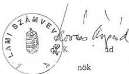

Állami Számvevőszék

# VÉLEMÉNY

### a Magyar Köztársaság 2001. és 2002. évi költségvetési törvényjavaslatáról

Összefoglaló, javaslatok, a dokumentum törvényességi és számszaki ellenőrzése

T/3122/1.

1. sz. füzet

2000. szeptember

0034

---

Az ellenőrzés végrehajtásáért felelős:

VI. Elemző, Minőségbiztosítási és Informatikai Igazgatóság

Bakonyi Sándorné

számvevő igazgató

Az ellenőrzést vezette:

Horváthné Menyhárt Erika

számvevő főtanácsos

Az ellenőrzésben részt vettek:

Bojtos Rózsa

tanácsadó

Göller Géza

számvevő tanácsos

dr. Somorjai Zsoltné

számvevő

Weltherné Szolnoki Dóra

számvevő

Szabó Balázs

számvevő

Bálint Józsefné

címzetes főmunkatárs

Jelentéseink az INTERNETEN a www.asz.gov.hu címen olvashatók.

Jelentéseink az Országgyűlés számítógépes hálózatán is olvashatók.

---

# TARTALOMJEGYZÉK

|  BEVEZETÉS | 5  |
| --- | --- |
|  ÖSSZEFOGLALÓ | 7  |
|  A KÖLTSÉGVETÉSI DOKUMENTUM TÖRVÉNYESSÉGI ÉS SZÁMSZAKI ELLENŐRZÉSE | 15  |
|  1. AZ ÁHL. ELŐÍRÁSAINAK ÉRVÉNYESÜLÉSE A TÖRVÉNYJAVASLATBAN ÉS MELLÉKLETEIBEN | 15  |
|  2. A TÖRVÉNYJAVASLAT NORMASZÖVEGE | 16  |
|  3. A TÖRVÉNYJAVASLAT MELLÉKLETEIHEZ KAPCSOLÓDÓ ÉSZREVÉTELEK | 22  |
|  4. AZ ÁLLAMHÁZTARTÁS ALRENDSZEREINEK MŰKÖDÉSI FELTÉTELEI | 25  |
|  4.1. A központi költségvetés | 25  |
|  4.2. A társadalombiztosítási alapok költségvetése | 29  |
|  4.3. Az elkülönített állami pénzalapok | 33  |
|  5. AZ ÁHL. MÓDOSÍTÁSÁRA VONATKOZÓ ÉSZREVÉTELEK | 34  |
|  JAVASLATOK | 36  |

---

.

.

.

.

.

.

---

# **Rövidítések jegyzéke:**

|  APEH | Adó- és Pénzügyi Ellenőrzési Hivatal  |
| --- | --- |
|  AT | 1992. évi LXXXIV. törvény a társadalombiztosítás pénzügyi alapjairól és azok 1993. évi költségvetéséről  |
|  ÁFA | általános forgalmi adó  |
|  Áht. | 1992. évi XXXVIII. törvény az államháztartásról  |
|  ÁKK Rt. | Államadósság Kezelő Központ Részvénytársaság  |
|  ÁPV Rt. | Állami Privatizációs és Vagyonkezelő Részvénytársaság  |
|  ÁSZ | Állami Számvevőszék  |
|  BM | Belügyminisztérium  |
|  Cct. | 1992. évi XXXIX. törvény a helyi önkormányzatok címzett és céltámogatási rendszeréről  |
|  E. Alap | Egészségbiztosítási Alap  |
|  EU | Európai Unió  |
|  EüM | Egészségügyi Minisztérium  |
|  EXIMBANK | Magyar Export-Import Bank Rt.  |
|  ÉKMA | Észak-kelet Magyarország Autópálya Fejlesztő és Üzemeltető Rt.  |
|  FVM | Földművelésügyi és Vidékfejlesztési Minisztérium  |
|  GM | Gazdasági Minisztérium  |
|  GYED | gyermekgondozási díj  |
|  GYES | gyermekgondozási segély  |
|  GYET | gyermeknevelési támogatás  |

---

|  HM | Honvédelmi Minisztérium  |
| --- | --- |
|  IM | Igazságügyi Minisztérium  |
|  ISPA | Instrument for Structural Policies for Preaccession (EU előcsatlakozási alap)  |
|  KESZ | Kincstári Egységes Számla  |
|  KüM | Külügyminisztérium  |
|  KVI | Kincstári Vagyoni Igazgatóság  |
|  MEHIB | Magyar Exporthitel Biztosító Részvénytársaság  |
|  MR Rt. | Magyar Rádió Részvénytársaság  |
|  MTV Rt. | Magyar Televízió Részvénytársaság  |
|  NKÖM | Nemzeti Kulturális Örökség Minisztérium  |
|  Ny. Alap | Nyugdíjbiztosítási Alap  |
|  OM | Oktatási Minisztérium  |
|  PHARE | Poland and Hungary: Action for the Restructuring of the Economy (EU segélyprogram)  |
|  PM | Pénzügyminisztérium  |
|  SAPARD | Special Accession Programme for Agriculture and Rural Development (EU előcsatlakozási program a mezőgazdaság és a vidék fejlesztésére)  |
|  SzCsM | Szociális és Családügyi Minisztérium  |
|  SZJA | személyi jövedelemadó  |
|  TB | társadalombiztosítás  |
|  Tbj. | 1997. évi LXXX. törvény a társadalombiztosítás ellátásaira és a magánnyugdíjra jogosultakról, valamint e szolgáltatások fedezetéről  |
|  VPOP | Vám- és Pénzügyőrség Országos Parancsnoksága  |

---

---A-124-4/2000.

# BEVEZETÉS

Az államháztartásról szóló törvény (Áht.) 52. § (1) bekezdése szerint a Kormány szeptember 30-ig nyújtja be az Országgyűlésnek a következő évre vonatkozó költségvetési törvényjavaslatot. Az Állami Számvevőszék (ÁSZ) az Alkotmány és a számvevőszéki törvény alapján véleményezi az állami költségvetési javaslat megalapozottságát, a bevételi előirányzatok teljesíthetőségét.

**A Magyar Köztársaság 2001. és 2002. évi költségvetéséről szóló törvényjavaslat megalapozottságáról, illetve a törvényjavaslat dokumentumának törvényességi és számszaki megfelelőségéről alkotott számvevőszéki vélemény nem érinti az állami újraelosztás arányait, a tervezett gazdaságpolitikai és politikai döntéseket, mivel erre nem terjed ki felhatalmazása.**

Az ÁSZ a költségvetési törvényjavaslatot az Országgyűlés elé történő benyújtást követően (szeptember 18-án) kapta meg. A zárszámadási dokumentum ellenőrzésére előírt 60 napos törvényi határidővel szemben a költségvetési vélemény elkészítésére nincs jogszabályban meghatározott határidő. A korábbi évekénél is rövidebb idő állt rendelkezésre a számvevőszéki vélemény kialakítására.

A részletező táblázatokat és ezek szöveges indokolásait tartalmazó fejezeti köteteket – az ÁSZ által többször kifogásolt Áht-szabályozás szerint – a törvényjavaslat előterjesztését követően október 15-ig kell az Országgyűlésnek benyújtani. **Az elmúlt évhez hasonlóan a részletes indokolásokat tartalmazó fejezeti kötetek a vélemény elkészítéséig még előzetes munkaanyagként sem álltak rendelkezésre.**

Annak érdekében, hogy a költségvetési törvényjavaslat és a számvevőszéki vélemény együttes országgyűlési tárgyalására vonatkozó Áht-rendelkezés érvényesüljön, illetve a törvényalkotás folyamata, az országgyűlési bizottságok munkája megkezdődhessen, véleményünket az Országgyűlés törvényalkotási menetrendjéhez igazodva október 4-én nyújtjuk be.

---5

---

A számvevőszéki vélemény három részből áll:

- Az 1. sz. füzet tartalmazza véleményünk összefoglalását és a javaslatokat. E füzetben értékeltük a törvényjavaslatnak az államháztartásról szóló törvénnyel és egyéb kapcsolódó törvényekkel való összhangját. Ellenőriztük a számszaki egyezőségeket, amennyiben ez lehetséges volt a rendelkezésre álló dokumentumok alapján.
- A 2. sz. füzetben értékeltük a bevételi és kiadási előirányzatok megalapozottságát, részleteztük a helyszíni ellenőrzési tapasztalatokat, melyeket a Pénzügyminisztériumban, a fejezeteknél, az elkülönített állami pénzalapoknál és a társadalombiztosítás pénzügyi alapjainál a költségvetési tervezés augusztustól folytatott vizsgálata során szereztünk.
- A 3. sz. füzetben a helyi önkormányzatokat megillető állami hozzájárulások, támogatások és átengedett bevételek tervezésének megalapozottságáról szerzett tapasztalatokról adunk véleményt.

Véleményünk kialakításakor azzal kellett szembesülni, hogy a benyújtott költségvetési törvényjavaslat – a zárszámadási törvényjavaslat elfogadásával – a későbbiekben hatályosuló jogszabályra épül (több éves költségvetés, társadalombiztosítás pénzügyi alapjainak integrálása). Olyan sajátos törvényalkotási folyamatnak vagyunk részesei, melyben jelen vélemény kialakítása során a hatályos Áht. mellett szükségszerűen figyelembe kellett venni az 1999. évi zárszámadási törvényjavaslatban tervezett Áht. módosításokat is.

Az 1999. évi zárszámadási törvényjavaslathoz hasonlóan a 2001. és 2002. évi költségvetési törvényjavaslat is számos módosítást tartalmaz az Áht-ra vonatkozóan. Az államháztartásról szóló törvény általános rendelkezéseket tartalmaz, a részletező jogszabályok alapja. A jogbiztonság és kiszámíthatóság miatt a módosítás módjára, idejére, következményeire nagy figyelmet kell fordítani. Ez az alapelv figyelemfelhívásunk ellenére eddig sem érvényesült, az Áht-t a hatályba lépése óta eltelt nyolc év során 23 alkalommal módosították és jelenleg további két módosítás van folyamatban.

A jogszabály-módosítások, melyek bár a gazdaságpolitika jogi háttérének megteremtésére irányulnak, egyben a kiszámíthatóságot csökkentik. Ebből adódóan a gazdálkodási jogszabályok ilyen mértékű változtatását és a módosítások jelenlegi gyakorlatát az ÁSZ a hosszú távú stabilitás érdekeit figyelembe véve kockázatosnak tartja.

Ismételten felhívjuk a figyelmet, hogy az államháztartásról szóló törvény olyan a számvitel, az ellenőrzés körét érintő szabályokat is tartalmaz, amelyeket önálló, egységes törvénybe lenne célszerű foglalni.

6

---

# ÖSSZEFOGLALÓ

## Az állami költségvetés

### A 2001. évi költségvetési előirányzatok

A Kormány az 1999-ben elfogadott középtávú gazdaságstratégiai koncepcióját követve, a 2001. év gazdaságpolitikájának fő céljaként a versenyképesség javítását, a gyors- és kiegyensúlyozott gazdasági növekedés fenntartását és az Európai Unióba való integráció folyamatának folytatását határozta meg. Elérésükhöz a költségvetési politika makrogazdasági követelményeként az államháztartás centralizációs- és újraelosztó szerepének csökkenését, a hiány és adósságráta mérséklését fogalmazta meg.

**A költségvetés** 2001. évi makrogazdasági feltételrendszerét, tervezett pozícióját, megalapozó elemzések és makroszámítások **elkészítésének feltételrendszere, módszertana** – a számítástechnikai háttér javulása mellett – **számottevően nem változott**. A makrogazdasági prognózisok elkészítéséhez a Pénzügyminisztérium alapvetően a KSH adatait, illetve kialakult módszertanát használta, de támaszkodott a Miniszterelnöki Hivatal havi monitoring rendszerére és mindarra az információs háttérre, ami a számítógépes hálózaton, illetve a kialakult munkakapcsolatok révén elérhető volt.

**A törvényjavaslat nem tartalmaz arra vonatkozó utalást, hogy** amennyiben a makrogazdasági pálya, a külső- és belső pénzpiaci folyamatok, a nemzetgazdaság főbb bevételi és kiadási előirányzatait jelentő tételek, a folyamatban lévő állami feladat felülvizsgálat, a közigazgatási- és pénzügyi információs rendszer korszerűsítése következtében indokolttá váló **2002. évi előirányzatok aktualizálási módját milyen formában, döntési mechanizmus érvényesítése mellett kívánja a Kormány megvalósítani**.

A nemzetgazdasági elszámolások előirányzatai közül a költségvetés fő bevételei jogcímein, a technikai fejezetek, az állami kezességvállalás és érvényesítés előirányzatairól számszerűsített adatok megalapozottságát ellenőriztük.

**A költségvetés fő bevételi előirányzatainak megalapozottsága összességében** – a 2000. évi tervezéshez képest – **javult**. Ebben közrejátszott az is, hogy több munkaanyag, háttéranyag készült és – a tapasztalati adatokat mérlegelve – a reálisnak tekinthető előirányzatot választották (pl. vállalkozások társasági adója, bányajáradék, vám- és import befizetések, egyéb befizetések, általános forgalmi adó).

7

---

**Egyes bevételi előirányzatok teljesülése** azonban **teljesítési kockázatot tartalmaz**, részben a tervező munka hiányosságai (játékadó), részben a külső tényezők hatása (pénzintézeti társasági adó) következtében. Az időközben bekövetkezett változások miatt (a kőolaj termékek jövedéki adója emelésének elmaradása) a törvényjavaslat ezzel összefüggő egyes előirányzatainak módosítása szükséges.

**A technikai fejezetek (XLI. és XLIV.) 2001. évi költségvetési előirányzatainak teljesülése** mind a kiadási, mind a bevételi oldalon – a helyszíni ellenőrzés tapasztalatai szerint – **jelentős teljesítési kockázatot tartalmaz**. Ez a teljesítési kockázat részben a technikai fejezetek előirányzatai meghatározásánál alkalmazott kedvező makrogazdasági mutatókra vezethető vissza. A teljesítési kockázatot növeli, hogy a tervezés időszakában olyan bevételekre és kiadásokra is terveztek előirányzatot, amelyre még érvényes megállapodással nem rendelkeztek.

A PM nyilvántartása a kormányhatározatokkal vállalt egyedi kezességgel biztosított hitelek állományának és esedékességének kimutatására terjed ki. A nyilvántartás szerint a 2000. július végi adósságállomány 2001-ben esedékes összegének többségét (68%-át) minősítették várhatóan érvényesítésre kerülőnek. A PM fejezet tervezett kiadásai között az agrárium hitelfelvételeihez vállalt állami kezesség beváltásaként várható kötelezettségekre előirányzatot nem biztosítottak. A 2001. évre kezességbeváltási előirányzat kialakításának a Kormány által javasolt módja – parlamenti jóváhagyása esetén – megszüntetné az évek alatt kialakított állami kezességi rendszer egységességét.

A kezesség- és viszontgarancia érvényesítésből származó állami követelés 2001. évi bevételi előirányzata az adatot szolgáltatók felmérésére alapozott. Nagyságukat tekintve a 2001. évre kalkulált bevételek az együttesen előirányzott kiadásnak (PM és FVM fejezetben előirányzott) 10%-át teszik ki. A bevétel nagyobb részét a POSTABANK Rt. tulajdonosaitól várják.

A fejezetek felügyeletét ellátó szervek többsége a PM tervezési körirat megküldésével együtt körlevelekben tájékoztatta a központi költségvetési szerveket a tervezés feltételrendszeréről. Ugyanakkor az intézményi költségvetés tartalmára vonatkozóan meghatározott követelmények jellemzően az általános irányelvek szintjén maradtak. A tervezési szempontok között kiemelt szerepe volt az intézmény- és feladat-felülvizsgálatnak. Az államháztartási reformmal összefüggő, az 1999. évi felmérés alapján a Kormány által elrendelt **intézménykorszerűsítések végrehajtási folyamata lassú, a tervezett változások** (párhuzamos feladatellátás megszüntetése, intézmények államháztartási körből való kiszervezése stb.) **várhatóan érdemi megtakarítást nem eredményeznek**. Tapasztaltuk azt is, hogy a fejezet intézményrendszeréhez tartozó, de önmagát saját bevételeiből fenntartó szervezet költségvetési körből való kiszervezését – a 2000. évi költségvetés véleményezésénél megfogalmazott javasltunk ellenére – 2001-ben sem tervezték.

8

---

A fejezetek kiadási előirányzatai – személyi juttatások, dologi kiadások, felhalmozási kiadások, fejezeti kezelésű előirányzatok – többnyire elmaradnak az igényektől, a tervezés kezdeti időszakában több fejezetnél nagyságrendi eltérés volt az igények és a pénzügyi lehetőségek között.

**Létszámcsökkentéssel, üres álláshely zárolásával** – az illetményszínvonal saját forrásból való emelése érdekében – **a fejezetek általában számoltak**, de előfordult néhány esetben az is, hogy nem éltek ezzel a lehetőséggel. A megvalósított létszámcsökkentések mellett – kizárólag a kormányzati feladatok átcsoportosításából, illetve a megnövekedett feladatok ellátásával összefüggésben – több fejezetnél létszámfejlesztésre került sor. Előfordult helytelen bázislétszám és ebből következően rossz fejezeti létszámirányszám, valamint személyi juttatás megállapítása is, melyek részletei a 2. számú füzetben, annak függelékében találhatók meg.

Az általános érvénnyel megfogalmazott létszámcsökkentési törekvés ellen hat a különböző jogszabályokban és az állami irányítás egyéb eszközeiben meghatározott többletfeladatok létszámigénye, illetve az előírt létszámfejlesztések végrehajtása. **A költségvetési törvényjavaslat a feladatbővülések létszám- és személyi juttatás vonzatát nem, vagy nem elégséges mértékben tartalmazza**, egyes fejezeteknél nincs, vagy csak részben van fedezet a személyi juttatás saját forrásból finanszírozandó hányadának kigazdálkodására.

**A fejezetek többségénél a dologi kiadások előirányzata** – az évek óta elmaradt és a 2001. évben sem biztosított automatizmus hiánya, a saját bevételek növelésének korlátai miatt, továbbá az intézményi feladat felülvizsgálatok elégtelenségére is visszavezethetően – **feszített**.

A fejezeteket felügyelő szervek **a kormányzati beruházások és az intézményi felhalmozási kiadások tervezésekor jellemzően figyelembe vették a takarékossági és rangsorolási szempontokat, a javasolt előirányzatok azonban nem minden esetben voltak kidolgozottak, számításokkal alátámasztottak**. A szűkös anyagi lehetőségek következtében néhány esetben a beruházások lassítása, a felújítások elmaradása, illetve a beszerzések halasztása prognosztizálható.

A fejezetek és intézményeik a saját bevételi előirányzataikat a köriratban szereplő elvárásoknak megfelelően tervezték. A tervezési köriratban előírt követelmények érvényesítése mellett egyes esetekben indokolatlanul alacsony bevételi előirányzatokat is feltártunk (már meglévő szerződés alapján biztos bevétel előirányzatban szerepeltetésének elmaradása, a bevételi előirányzat alultervezettsége stb.). A helyszíni ellenőrzés tapasztalatai szerint **teljesítési kockázatot jelent, hogy a bevételeket determináló jogszabálymódosítások jóváhagyása ellenőrzésünk idején volt folyamatban**.

9

---

**Az elkülönített állami pénzalapok bevételi és kiadási tervszámai a rendelkezésre álló információk figyelembe vételével háttérszámításokkal alátámasztottak, részletesen kidolgozottak és a kitűzött célokkal összhangban vannak.**

A társadalombiztosítás pénzügyi alapjai 2001. évi költségvetési javaslatának összeállítása a makrogazdasági paraméterek és egyéb tervezési iránymutatások figyelembevételével történt. Azonosak voltak a tervezés egyéb körülményei is a központi költségvetésével.

**A tervezési munka problémáját a makroprognózisok megalapozottságának bizonytalansága, az egészségügyi rendszer reformértékű átalakításának hiánya, a társadalombiztosítás pénzügyi alapjai által ellátott állami feladatok finanszírozására a köriratban kiadott költségvetési irányszámok alacsony volta, a vonatkozó kormányzati döntések** (makrogazdasági pálya, tárgyévi nyugdíjemelés stb.) **késlekedése jelentette**, s hogy a költségvetési törvényjavaslat és az előirányzatok megalapozását szolgáló jogszabály-módosítások parlamenti jóváhagyása alapvetően párhuzamosan történik.

Az Országos Nyugdíjbiztosítási Főigazgatóság a 2001. és 2002. évi költségvetés-tervezési számításait három változatban készítette el. Eltérést a 2000. év várható teljesüléseinek számbavétele okozta. Az Országos Egészségbiztosítási Pénztár javaslatában szereplő bevételi és kiadási előirányzatok alapvetően a körirat előírásaihoz igazodtak. Az OEP több alkalommal is jelezte azoknak a problémáknak a körét, amelyek a 2000. év teljesülésének és a következő évek várható teljesíthetőségének bizonytalanságát adják.

A törvényjavaslat a társadalombiztosítási alapok 2001. évi bevételi főösszegét 1.916,1 Mrd Ft-ban, kiadási főösszegét 1.926,2 Mrd Ft-ban határozza meg. A tervezett hiány 10,1 Mrd Ft. A bevételek 2000. évi tervhez viszonyítva 11,6%-kal a várható teljesítéshez képest 9,5%-kal emelkednek. A kiadásoknál a növekedés mértéke 9,5% illetve 7,3%. A bevételek növekedése a törvényjavaslat szerint mindkét alapnál meghaladja a kiadásnövekedés mértékét, így következik be a hiány jelentős csökkenése. (A terv szerint a Ny. Alap költségvetése nullszaldós, az E. Alap hiánya 10,1 Mrd Ft, ami kevesebb, mint egynegyede a 2000. évre tervezett hiánynak). A hiány csökkentésében jelentős szerepe van a központi költségvetési pénzeszköz átadásnak, amely 2001-ben a két alapra együttesen 114,5 Mrd Ft, 275%-a a 2000. évi várható teljesítésnek. **A központi költségvetési pénzeszköz átadás növekvő mértéke jelzi, hogy a társadalombiztosítási alapok bevételeinek és kiadásainak eltérése nagyobb, mint amit a költségvetésben megjelenő hiány mutat.**

**A társadalombiztosítási alapok 2001. évi költségvetésében megtervezett egyensúlyi pozíciók betarthatósága** bevételi oldalról – adott járulékkulcs mellett – a bruttó átlagkeresetek alakulása, a járulékfizetési kötelezettség 2000. február 1-jétől alaponkénti teljesítésének tapasztalati hiányai stb.; kiadási oldalról az ez év novemberében megvalósuló kiegészítő nyugdíjemelés, a gyógyszer- és gyógyászati segédeszköz támogatás csökkentésére bevezetett, illetve bevezetni tervezett intézkedések stb. hatása **jelentős teljesítési koc-**

10

---

**kázatot tartalmaz.** A társadalombiztosítási alapok működési költségvetésén belül az OEP által tervezett bevétel jelentősen elmarad a reálisan tervezhető összegtől és a 2000. évre számított összegnek is csak töredéke.

### ***A 2002. évi költségvetési előirányzatok, a 2003. évi irányszámok***

Az államháztartás alrendszereinek 2001. évi költségvetési előirányzatkialakításával párhuzamosan készült **2002. évi költségvetés makrogazdasági feltételrendszerét ugyanazok a paraméterek alkották, melyek a 2001. évi tervkészítés alapját képezték.** Azonosak voltak a tervezési munka szakaszaihoz kapcsolódó Kormány döntési és PM irányítói feladatellátással teremtett körülmények is.

A nemzetgazdasági elszámolások előirányzatai közül – 2002. évre is – a költségvetés fő bevételei jogcímein, a technikai fejezetek és az állami kezességvállalás és érvényesítés előirányzatairól számszerűsített adatok megalapozottságát ellenőriztük.

A költségvetés fő bevételi előirányzatainak megalapozottsága összességében javult. Ebben közrejátszott az is, hogy a 2001. évhez hasonlóan **a 2002. évre is több munkaanyag, háttéranyag készült** és – a tapasztalati adatokat mérlegelve – a reálisnak tekinthető előirányzatot választották. **Egyes bevételi előirányzatok teljesülése** azonban – a helyszíni ellenőrzés tapasztalatai szerint – **jelentős teljesítési kockázatot tartalmaz.** A 2002. évi költségvetési törvényjavaslatban szereplő bevételi előirányzatok közül **a jövedéki adó előirányzata** – az adók mértéke emelésének bizonytalan időre való elhalasztása következtében – **módosításra szorul.**

A technikai fejezetek költségvetése mindkét évben azonos szerkezetben, azonos elvek alapján készült, így a 2001. év költségvetésével kapcsolatos megállapítások a 2002. év költségvetésére is igazak. Így a technikai fejezetek 2002. évi költségvetési előirányzatai jelentős teljesítési kockázatot tartalmaznak. **A 2001. év költségvetésével kapcsolatban bizonytalanságot okozó feltételek 2002-ben fokozottabban jelentkeznek,** mivel olyan megállapodások alapján számszerűsítettek bevételi és kiadási előirányzatokat, amelyek 2001. évi teljesítéséről nem rendelkeznek megbízható, az előirányzat reális alapját képező információval.

A 2002. évi költségvetési törvényjavaslat a központi költségvetést terhelő, egyedi Kormány döntéssel, illetve jogszabállyal történő kezességvállalás mértékét a 2001. évvel egyezően, a kiadási főösszeg 2,2%-ában javasolja elfogadni. Ezen belül a 2001. évhez hasonlóan nem korlátozza a készfizetői kezesség arányát. A kezesség- és viszontgarancia érvényesítésből származó állami követelés 2001. évi bevételi előirányzata az adatot szolgáltatók felmérésére alapozott. Nagyságukat tekintve a 2002. évre számított bevételek közel megegyeznek a 2001. évi előirányzattal.

11

---

A költségvetési fejezetek a **2002. évi előirányzatokat** – a 2001. évi költségvetés tervezésénél meghatározott paraméterek érvényesítésével – **az előző évinél kevésbé részletesen dolgozták ki**. A tervezési köriratban meghatározott feltételeket jellemzően betartották, a kialakított előirányzatokat azonban **részletes számításokkal több esetben nem támasztották alá**. Ebben az a tény is közrejátszott, hogy a 2002. évi költségvetés megalapozása a fejezeti és intézményi munkában, valamint a PM tervezést szervező munkájában is kisebb súlyt kapott. Ez abban is visszatükröződött, hogy egyes előirányzatok meghatározásánál nem terveztek változást a két év előirányzatai között.

**Az elkülönített állami pénzalapok bevételi és kiadási tervszámai** – a 2001. évhez hasonlóan – **háttérszámításokkal alátámasztottak**, a kitűzött célokkal összhangban vannak. A 2003. évi irányszámok kidolgozásánál is hasonló gondossággal jártak el.

**A társadalombiztosítási alapoknál a 2002. évi tervezési munka alapvető problémáját** – mind a bevételi, mind a kiadási előirányzatoknál – **a makroprognózisok teljesülési kockázata mellett, az előirányzatok kialakításának bázis szemlélete**, a társadalombiztosítás pénzügyi alapjai által ellátott állami feladatok finanszírozására a köriratban kiadott költségvetési támogatási irányszámok teljesítési kockázata, a vonatkozó kormányzati döntések (makrogazdasági pálya, tárgyévi nyugdíjemelés, minimálbér, adótörvény módosítás, járulékok százalékos mértéke stb.) késlekedése és az ezzel összefüggő „bázis” adatok bizonytalansága **jelentette**.

A tervezésnél a kiindulást a 2001. évi előirányzatok jelentették, a számítások során a Kormánydöntés alapján korrigált makro-mutatókat, illetve a költségvetési szféra bér- és létszám előírásait vették figyelembe.

A törvényjavaslat a társadalombiztosítási alapok 2002. évi bevételi főösszegét 2055,8 Mrd Ft-ban, kiadását 2073,0 Mrd Ft-ban, hiányát 17,2 Mrd Ft-ban határozta meg. Ez a 2001. évi tervhez viszonyítva a bevételeknél 7,3 %-os, a kiadásoknál 7,6 %-os növekedést jelent.

A Kormány a társadalombiztosítási alapok kiadásait befolyásoló makroparaméterek 2001-hez viszonyított csökkenésére számít. A költségvetés tervezet hiánya 7,1 Mrd Ft-tal több a 2001. évinél annak ellenére, hogy a központi költségvetési támogatások és pénzeszköz átadás összege 2002-ben a 2001. évhez viszonyítva jelentősen emelkedik, 249,6 Mrd Ft-ról 326,2 Mrd Ft-ra, ez 306 %-os bővülés. Ennek több mint fele a bevétellel nem fedezett kiadások miatti pénzeszköz átadás, ami 114,5 Mrd Ft-ról 174,6 Mrd Ft-ra növekszik. Ebből az E. Alapnál 62,0 Mrd Ft-ot, az Ny. Alapnál 112,6 Mrd Ft-ot terveztek. **A 2002. évi terv alapvetően a 2001. évi folyamatok változatlanságát tükrözi. A kiadási determinációk nem változnak így a járulékmérték további csökkenése az Alapok pénzügyi egyensúlyának alakulását kedvezőtlenül befolyásolja.**

12

---

Az Alapok bevételeinek meghatározó részét továbbra is a járulék- és hozzájárulás bevételek jelentik, bár arányuk a járulékmérték újabb 3%-os csökkenése miatt visszaesett. (A 2001. évi 86,6%-ról 83,7%-ra, a prognózis szerint.) 2002-ben a járulék mérték csökkenés 1 százalékpont erejéig az E. Alapot is érinti.

Az Alapok járulék- és hozzájárulás bevételeinek aránya 2003-ban – a prognózisok szerint – ismét emelkedik, a költségvetési támogatás összege mérséklődik.

A PM által készített előrejelzés 2003-ra a bevételek 5,9%-os, a kiadások 5,8%-os növekedését tartalmazza. A hiány 2002-höz viszonyítva kis mértékben csökken, 16,5 Mrd Ft lesz. (A hiány mindkét évben az E. Alapnál jelentkezik, az Ny. Alap nullszaldós.)

A tervezett egyensúlyi pozíciók betarthatóságának teljesítési kockázatai 2002-ben és 2003-ban egyaránt a 2001. évhez hasonlóak.

## A helyi önkormányzatok

A Magyar Köztársaság 2001. és 2002. évi költségvetéséről szóló törvényjavaslat és mellékletei **kellő részletezettséggel, a két évre elkülönítetten tartalmazzák az önkormányzatokat megillető források nagyságát, azok felosztásának, igénylésének, folyósításának és elszámolásának rendjét, a költségvetés megalapozásához és végrehajtásához szükséges új rendelkezéseket.**

A Kormány ezek mellett a javaslat részeként nyújtotta be azokat a kapcsolódó törvénymódosítási indítványokat is, amelyek az önkormányzatok költségvetési kondícióit lényegesen befolyásolják és a tervezésre vonatkozó főbb szabályokat rögzítik. Az utóbbiak és a költségvetési törvényjavaslat közötti **összhangot a jelenleginél is következetesebben lehetett volna biztosítani, ha az Országgyűlés a tervező munka megkezdése előtt dönt a különböző szakmai, ágazati törvényi előírások változtatásáról.**

A törvényjavaslat szerint a helyi önkormányzatok és a helyi kisebbségi önkormányzatok költségvetési kondícióit alapvetően meghatározó állami támogatások, hozzájárulások és átengedett személyi jövedelemadó együttes összege a 2000. évi költségvetési előirányzathoz képest 2001-re 98 Mrd Ft-tal, 2002-re további 87 Mrd Ft-tal nő. A többletek döntően a bér- és szociálpolitikai intézkedésekhez, a szakmai törvényekkel elrendelt többletfeladatokhoz, illetve a Munkaerőpiaci Alapból történő forrásátrendezéshez kapcsolódnak. Eredményeként érzékelhetően nőhet az önkormányzatok által foglalkoztatottak jövedelme, a szociálisan rászorulóak juttatásai.

**A többletek azonban – a lakossági ellátás színvonalát alapvetően befolyásoló előirányzatok tekintetében – a reálérték szinten tartását biztosító dologi automatizmust továbbra sem tartalmaznak.**

A keresetek növeléséhez szükséges pénzügyi fedezet egy része, a korábbi évek gyakorlatával megegyezően, csak létszámleépítéssel (mindkét évben 2%) a közoktatás területén emellett érdemi megtakarításokat eredményező kötelező

13

---

óraszámemeléssel teremthető meg. A törvényjavaslat a hatályos törvények, jogerős bírósági döntések végrehajtásához szükséges többletköltségekre sem tartalmazza teljes körűen a pénzügyi fedezetet.

Mindemellett a 2000. év elején kialakult árvízi katasztrófahelyzet pénzügyi fedezetének biztosításához a Kormány által zárolt 7,3 Mrd Ft-tal a következő két év javasolt előirányzatai is csökkentek. **Az önkormányzati feladatok és a rendelkezésre álló források közötti évek óta tartó feszültség oldódása így a következő két évben sem várható.**

Az önkormányzatok felhalmozási és tőke jellegű bevételeinél a törvényjavaslat – a gázközmű privatizációja miatt még várható összegek időarányos számbavétele mellett is – folyamatos csökkenéssel számol. Így a fejlesztési célú állami támogatások 2001. évi tervezett növelése ellenére az önkormányzati körben reálértéken a beruházások csökkenése várható.

Az önkormányzatokat 2002-ben megillető források tervezésénél külön gondot okozott, hogy a nagyságrendre vonatkozó – 2000-ben még hatályos, de a költségvetési törvény keretében felfüggeszteni, illetve megszüntetni tervezett – törvényi garanciák a tárgyévet megelőző második év tényleges adataihoz kapcsolódnak. A közoktatási és kulturális feladatokat finanszírozó források összegére vonatkozó javaslathoz az önkormányzatok által e címeken a 2000-ben ténylegesen teljesített kifizetéseket kellene ismerni, a személyi jövedelemadóból való részesedés pedig a 2000. évre vonatkozó adóbevallások összesített adatai alapján határozható meg. Mindezek csak a következő év közepén válnak ismertté. **A tényadatok hiányából fakadó bizonytalanság áthidalására viszont nem sikerült olyan javaslatokat kidolgozni, amelyek átmentenék az önkormányzatokat megillető finanszírozási garanciákat.**

Az önkormányzatok saját bevételeire vonatkozó előrejelzések a korábbiaknál reálisabbak, a jelenlegi ismeretek alapján teljesíthetőeknek minősíthetők.

Mindezek tükrében az önkormányzatoktól a kötelező és önként vállalt feladatok ellátása és költségvetésük egyensúlyban tartása a következő két évben is jelentős erőfeszítéseket igényel.

A törvényjavaslat összeállításánál az ÁSZ korábbi javaslatai többségükben hasznosultak. Az ettől eltérő megállapításokat a részletes vélemény tartalmazza.

**Az önkormányzati feladatok és hatáskörök Kormány által elrendelt felülvizsgálata eddig nem történt meg. Erre tekintettel az önkormányzatok pénzügyi szabályozó rendszere, korábbi javaslataink ellenére, nem változik.** A kisebb pontosítások, korrekciók a normatív hozzájárulások rendszerében a normativitás erősítését, a feladatarányosabb finanszírozást, a személyi jövedelemadó elosztásánál az önkormányzati jövedelmek még erőteljesebb nivellálását-, a beruházások finanszírozási rendszerében az alanyi jogon járó céltámogatások szűkítését szolgálják. Ezek azonban érdemben nem csökkentik a rendszer egésze megreformálásának szükségességét.

---14

---

# A KÖLTSÉGVETÉSI DOKUMENTUM TÖRVÉNYESSÉGI ÉS SZÁMSZAKI ELLENŐRZÉSE

## 1. AZ Áht. ELŐÍRÁSAINAK ÉRVÉNYESÜLÉSE A TÖRVÉNYJAVASLATBAN ÉS MELLÉKLETEIBEN

Az **Áht. 114. § (1) bekezdése** előírja, hogy az államháztartás információs rendszerét – a nemzetgazdasági pénzügyi információrendszer részeként – úgy kell kialakítani, hogy segítse az államháztartási pénzügyi folyamatok megtervezését, a költségvetési előirányzatok kialakítását, és a teljesülés elemzésére, értékelésére, ellenőrzésére alkalmas legyen. **A költségvetési törvényjavaslat dokumentumának tartalma, szerkezete, összeállításának metodikája nem meghatározott. Évről-évre a mérlegekkel kapcsolatos bemutatási kötelezettség teljesítése nem teljes körű.**

Az **Áht. 24. §**-a szerint be kell mutatni a költségvetésben a költségvetési létszámkeretet, a választott tisztségviselőket és a foglalkoztatottakat külön-külön. Az utóbbi években ennek részleges vagy teljes hiányát sorozatosan megállapította az ÁSZ. A törvényjavaslat az általános indokolás mellékleteként a központi beruházások, a központi költségvetési szervek működési előirányzatai táblázatában (480. oldal) bemutatja ugyan a költségvetési létszámkeretet, annak előírás szerinti megbontását azonban nem tartalmazza.

A törvényjavaslat 4. §-ában az Országgyűlés felhatalmazza a pénzügyminisztert a központi költségvetés hiányának finanszírozására és adósságának kezelésére. A törvényjavaslat részletes indokolása szerint a konkrét adósságkezelési műveletekről – ezen felhatalmazás alapján – a költségvetési év lezárása után számol be a pénzügyminiszter. Az **Áht. 8/A. § (1), és a 28. § (2)** bekezdés jelenleg is hatályos rendelkezései alapján ugyanakkor a költségvetési törvényben jóvá kell hagyni a tervezett hiány finanszírozási módját. Az előterjesztésből az erre vonatkozó rendelkezés az előző évekhez hasonlóan jelenleg is hiányzik.

Az **Áht. 36. § b) és c)** pontja szerint a Kormány a költségvetési törvényjavaslat benyújtásakor tájékoztatást ad a többéves elkötelezettséggel járó kiadási tételek későbbi évekre vonatkozó hatásairól, teljes körűen bemutatja a költségvetési évet követő 2 év várható előirányzatait, amelyeket a költségvetési év folyamatai és áthúzódó hatásai, a tervezett feladat-ellátási és szervezeti változások, valamint a gazdasági előrejelzések szerint állapítottak meg. E kötelezettségnek a Kormány a törvényjavaslatban csak részben tett eleget oly módon, hogy az államháztartás, valamint a központi költségvetés általános indokolás mellékleteként előterjesztett funkcionális szerkezetű és közgazdasági osztályozású mérlegeiben a kiadási és bevételi előirányzatok 2003-ig előrevetítve szerepelnek.

15

---

Az **Áht. 115. §-a** szerint az államháztartás mérlegeinek a költségvetés előterjesztésekor a vonatkozó év és az előző év várható, valamint az azt megelőző év tényadatait kell tartalmaznia. Az általános indokolás funkcionális és közgazdasági osztályozású mérlegei megfelelnek ennek a követelménynek és ezzel több lehetőség adódik a tervezett előirányzatok összevetésére. A törvényjavaslat számozott mellékleteire ugyanez a megállapítás nem mondható el, mivel az Országgyűlés jóváhagyását igénylő bevételi, kiadási előirányzatokat tartalmazó, 2001. és 2002. évi mérlegekben (2/A és 2/B sz. mellékletek) – az ÁSZ korábbi észrevételei ellenére – változatlanul csak a tárgyévekre vonatkozó előirányzatok szerepelnek.

Az **Áht. 116. §-ában** tételesen előírt, az Országgyűlés részére bemutatandó mérlegek és kimutatások többségét az előterjesztés tartalmazza. A hiányzó mérlegek, illetve kimutatások száma az előző évhez képest kevesebb. A kisebbségi önkormányzatok mérlegei, a többéves kihatással járó döntések számszerűsítése évenkénti bontásban és összesítve, valamint a közvetett támogatásokat (pl. adóelengedéseket, adókedvezményeket) tartalmazó kimutatások nem szerepel a törvényjavaslatban.

Az **Áht. 117. §-a** arról rendelkezik, hogy az elkülönített állami pénzalapokra vonatkozó, több éves kihatással járó döntések számszerűsítését, és a közvetett támogatásokat bemutató mérlegeket indokolással együtt kell az Országgyűlés részére bemutatni. A törvényjavaslat a kimutatásokat nem tartalmazza.

**A törvényjavaslatban ismétlődnek az Áht. érvényesülésével kapcsolatban évek óta fennálló, az ÁSZ által észrevételezett hiányosságok. Célszerűnek látjuk ezeket az előírásokat felülvizsgálni és – amennyiben a költségvetési döntést érdemben nem befolyásolják, az információs rendszer adottságai vagy egyéb körülmények miatt nem teljesíthetőek – az ésszerű és teljesíthető törvényi rendelkezés érdekében módosítani.**

## 2.

## 2. A TÖRVÉNYJAVASLAT NORMASZÖVEGE

### *A törvényjavaslat ÁPV Rt-vel kapcsolatos rendelkezései*

A törvényjavaslat az ÁPV Rt. költségvetési befizetési és más jogcímeken teljesítendő hozzájárulási kötelezettségeit az állam vagyonával és a felhalmozásokkal kapcsolatos rendelkezései között írja elő. A privatizációs szervezet hozzárendelt vagyonából származó bevételeit terhelő kiadásait, ráfordításait a **törvényjavaslat 6. §-a** tartalmazza, valamint a 11. számú melléklete részletezi.

Az ÁSZ az 1999. évi zárszámadási jelentésében a privatizációs bevételek elszámolása kapcsán jelezte, hogy egyes költségvetési feladatokat (területfejlesztés, környezetvédelem, mezőgazdaság) finanszírozó privatizációs bevételek nem jelentek meg maradéktalanul a központi költségvetésben.

16

---

A számvevőszéki megállapítás következtében a 2001. és 2002. évi költségvetés vonatkozó része szerkezetileg átalakult, az ÁPV Rt. központi költségvetés felé teljesített kötelezettsége növekedett. Ezáltal olyan privatizációs források is megjelennek a központi költségvetésben, amelyek korábban nem.

**Átláthatóbbá váltak az ÁPV Rt. kiadási előirányzatai** azzal, hogy az 11. számú melléklet a kiadásokat a hozzárendelt vagyont csökkentő és a hozzárendelt vagyon változását nem eredményező kiadásokra bontja.

A privatizálható állami vagyon ÁPV Rt. által prognosztizált nyilvántartási értéke 2000 végén várhatóan 300-350 Mrd Ft lesz. Az ÁPV Rt. 2001. és 2002. évi bevételi terve is összességében a nyilvántartási érték realizálását prognosztizálta, azonban:

- az értékesítés várható alakulásánál a bevétel 40%-át tőkepiaci értékesítésből számították, amely a tőzsdei ingadozásokat figyelembe véve – akár jelentősen is – változhat;
- a privatizációs bevétel további 40%-a stratégiai társaságok értékesítését irányozza elő, amelyek kormányzati döntést igényelnek és a döntés meghozatala jelentősen befolyásolja az értékesítés időpontját.

**A költségvetési törvényjavaslat 11. sz. mellékletében a 180,5 Mrd Ft-os 2001-es és 95,5,5 Mrd Ft-os 2002-es kiadási előirányzat a bevételi oldalról csak akkor biztosítható, ha a tőkepiaci értékesítések az előirányzat szerint teljesülnek, valamint a kormányzati döntések a stratégiai cégekre vonatkozóan időben megtörténnek.**

A törvényjavaslat 11. sz. mellékletének II./5. előirányzata a privatizációs tartalék állományát a privatizációs bevételek terhére 30 Mrd Ft-ban határozza meg. Az ÁPV Rt. tervezéskor nem számolt a tartalék feltöltésével, így ennek fedezeteként a privatizálható állami vagyon csak nagy kockázattal vehető figyelembe. Emellett a privatizációs tartalék kiadási előirányzata nem megalapozott. A privatizációs szervezet a tartalék 2001. évi előirányzatánál nem vette figyelembe a Reorg Apport Rt. kötvénykibocsátásából eredő fizetési kötelezettségeinek 25 Mrd Ft-os összegét, amelyet a költségvetési **törvényjavaslat 6. §-a (6) bekezdésében** a privatizációs tartalék felhasználási jogcímeihez sorol.

A **törvényjavaslat 6. § (12) bekezdésében** a privatizációs tartalék állományának összegszerű meghatározása mellett indokolt szerepeltetni, hogy az állományi előírás milyen időpontra, időszakra vonatkozik. Az időpont meghatározása **a 6. § (5) és (6) bekezdésében** is indokolt, mivel ennek hiányában nem dönthető el, hogy a rendelkezés két költségvetési évre együtt vagy külön-külön értendő.

### *A központi költségvetés tartalék előirányzatai*

Az **Áht. 25. §-a** szerint a központi költségvetésben **általános tartalékot** kell képezni az előre nem tervezhető kiadásokra, illetve az elmaradó bevételek pótlására. A tartalék nagyságát az **Áht. 26. § (1) bekezdése** a kiadási főösszeg százalékában (0,5-2 % között) határozza meg.

17

---

## Az általános tartalék előirányzatainak alakulása

millió forint

|   | 1998 | 1999 | 2000 | 2001 | 2002  |
| --- | --- | --- | --- | --- | --- |
|  Általános tartalék | 14.200 | 19.000 | 20.000 | 31.000 | 35.000  |
|  Kiadási főösszeg %-ában | 0,50 | 0,54 | 0,53 | 0,72 | 0,77  |

Forrás: az éves költségvetési törvények és a törvényjavaslat

Az általános indokolás 393. oldalán 2002-re – a törvényjavaslat 1. sz. és 2/A. sz. mellékleteitől eltérően – 35,5 Mrd Ft szerepel általános tartalékként.

Az **Áht. 38. § (2) bekezdése** szerint a **céltartalék** olyan, a központi költségvetésben meghatározott előirányzat, amely évközi központi (kormányzati) intézkedés fedezetéül szolgál, s amelynek célját és rendeltetését egyidejűleg meghatározták, azonban az előirányzat fejezet, cím, alcím szerinti felhasználásának megoszlása a költségvetési törvényjavaslat előkészítésekor még nem ismert.

A X. Miniszterelnökség fejezet 12. cím, 2. alcím *Céltartalékok* 1. jogcím-csoporton képzett *Különféle személyi kifizetésekre* 2001-re 20.719 M Ft-ot, 2002-re 28.419 M Ft-ot irányzott elő a javaslat a központi költségvetési szervek, valamint az MTV Rt., illetve az MR Rt. létszámleépítésével kapcsolatos egyszeri személyi kifizetésekre, továbbá a köztisztviselők és a rendvédelmi szervek hivatásos állományú tagjai illetményhelyzetének javítására. Ugyanezen cím 2. *Nemzeti földalap támogatása* jogcím-csoporton a 2001. és 2002. évre 5.000 M Ft a Nemzeti Földalap működésének támogatása.

A **törvényjavaslat 47. § (1) bekezdés n) pontja** a központi költségvetés előirányzat-módosítási kötelezettség nélkül teljesülő kiadásai közé sorolja a személyi kifizetésekre szolgáló tartalékkeretet.

### Kormányzati rendkívüli kiadások

Az előző évhez hasonlóan e törvényjavaslatban is kormányzati rendkívüli kiadásként szerepel a 'Pénzbeli kárpótlás', valamint a 'Volt egyházi ingatlanok tulajdoni helyzetének rendezése'.

Új előirányzatként jelenik meg a 'Magyar Fejlesztési Bank tőkejuttatása autópálya-építés céljára'.

18

---

## A kormányzati rendkívüli kiadások alakulása

millió forint

|  Jogcím | 1999. évi zársz. | 2000. évi terv | 2001. évi terv | 2002. évi terv  |
| --- | --- | --- | --- | --- |
|  Pénzbeli kárpótlás | 7.794 | 6.600 | 6.900 | 7.000  |
|  Pénzbeli kárpótlás folyósítási költségei | 180 | 100 | 105 | 110  |
|  Az 1947-es Párizsi Békeszerződésből eredő kárpótlás | 1.892 | 2.400 | 2.340 | 2.500  |
|  Volt egyházi ingatlanok tulajdoni helyzetének rendezése | 4.905 | 6.000 | 6.270 | 6.270  |
|  **Összesen:** | **14.771** | **15.100** | **15.615** | **15.880**  |
|  *Eximbank Rt és MEHIB Rt. tőkeemelése* | 1.250 | - | - | -  |
|  *Észak-kelet Magyarország Autópálya Fejlesztő és Üzemeltető Rt. támogatása az M3-as autópálya építésének gyorsítására* | 3.709 | - | - | -  |
|  *ÉKMA Rt. támogatása az 1998. évi díjbevétel kiesés kompenzálására* | 1.000 | - | - | -  |
|  *Magyar Fejlesztési Bank tőkejuttatása autópálya-építés céljára* | - | - | 35.200 | 36.000  |
|  **Mindösszesen:** | **20.730** | **15.100** | **50.815** | **51.880**  |

Forrás: az 1999. zárszámadási törvényjavaslat, a 2001. és 2002. évi költségvetési törvényjavaslat

### Az állam vagyonával kapcsolatos rendelkezések

A **törvényjavaslat 6. § (3) bekezdése** a Honvédelmi Minisztérium kezelésében lévő felesleges vagyontárgyak ÁPV Rt. hozzárendelt vagyonába történő átadásáról rendelkezik. A bekezdés utolsó mondata szerint a 2001. és 2002. években megvalósuló átadással kapcsolatos költségeket (ide nem értve az ÁFÁ-t) 500 M Ft összeghatárig az ÁPV Rt. viseli. **A rendelkezésből hiányzik annak megjelölése, hogy ezen összeghatár felett kit terhelnek a költségek, tekintettel arra, hogy a 2000. évi költségvetési törvény teljes egészében az ÁPV Rt-t kötelezte a költségek fedezésére.**

A **törvényjavaslat 8. § (4) bekezdése** 50%-os mértékben kiterjeszti a központi költségvetési szervek használatában, illetve kezelésében lévő, feladataik ellátásához feleslegessé váló gépek, felszerelések, járművek, készletek saját hatáskörű értékesítési jogát. A törvényjavaslat elfogadása esetén a központi költségvetési szerveknek az eddigi 10 M Ft-os értékhatár helyett csak 15 M Ft egyedi könyv szerinti bruttó érték felett kell a kincstári vagyon értékesítésére vonatkozó szabályok szerint eljárni. **A törvényjavaslat e módosítást, az intézményi gazdálkodási hatáskör növelésének szükségességét nem indokolja.**

19

---

A törvényjavaslat 9. § (1) bekezdése rögzíti, hogy a KVI vagyonkezelésében lévő kincstári vagyon értékesítéséből származó bevétel a központi költségvetés központosított bevételét képezi. A (2) bekezdés rendelkezése szerint a bevételekből 1.800 M Ft-ot a KVI törvényben meghatározott állami feladatai ellátására fordíthat. A 2000. évi költségvetési törvény ettől kisebb kiadási összegkorláton (1.200 M Ft) belül a KVI vezérigazgatójának gazdálkodási hatáskörét érintően értékhatárokat – 50 M Ft-ig ügyletenként, de éves szinten legfeljebb 500 M Ft – határozott meg. A törvényjavaslat a vezérigazgató döntési hatásköre kiterjesztésének szükségességére vonatkozóan indokolást nem tartalmaz.

### A központi költségvetés előirányzat-módosítás nélkül teljesülő kiadásai és bevételei

Az Áht. 12. § (4) bekezdése szerint az éves költségvetés jóváhagyásakor meghatározott egyes kiadási előirányzatok előirányzat-módosítás nélkül is túlléphetők. Ezek csak olyan előirányzatok lehetnek, amelyek esetében törvényben, kormányrendeletben megállapított támogatásra, ellátásra vonatkozó jogosultság eredményezhet előirányzatot meghaladó kiadást.

A törvényjavaslat 47. §-a rendelkezik az előirányzat-módosítási kötelezettség nélkül teljesíthető kiadásokról és bevételekről. A felsorolt előirányzatok közül a Vám- és Pénzügyőrség személyi juttatás előirányzatának emelése nem felel meg az Áht. meghatározásának, mivel nem törvényben, kormányrendeletben már megállapított jogosultságon alapul.

### Az automatikus előirányzatok arányának változása

milliárd forint

|  Év | Kiadási főösszeg | Automatikus előirányzatok összege | %  |
| --- | --- | --- | --- |
|  1998. | 2.845,8 | 1.535,2 | 53,95  |
|  1999. | 3.510,6 | 1.638,6 | 47,68  |
|  2000. | 3.788,7 | 1.738,0 | 45,87  |
|  2001. | 4.303,4 | 1.798,1 | 41,78  |
|  2002. | 4.550,0 | 1.899,7 | 41,75  |

Forrás: az éves költségvetési törvények

Az automatikus előirányzatok aránya indokolta az Áht. 124. § (4) bekezdésének – 1999 elejétől hatályba lépett – g) ponttal való kiegészítését, miszerint a pénzügyminiszternek szabályozni kell az ezekben az előirányzatokban bekövetkező eltérések rendjét. E szabályozási feladatának a pénzügyminiszter eleget tett.

20

---

### ***A VPOP és az APEH személyi juttatás előirányzatának túllépési lehetősége***

A **törvényjavaslat 47. § (1) bekezdés t) pontja** szerint a vám- és importbefizetések előirányzatának 100%-os és a fogyasztási és jövedéki adó előirányzatának 102%-os együttes teljesítése esetén a Vám- és Pénzügyőrség személyi juttatás kiemelt előirányzata legfeljebb 2.905 M Ft-tal, a 47. § (2) bekezdés rendelkezése alapján az általános forgalmi-adó előirányzatának 103%-os és a személyi jövedelemadó előirányzatának 102%-os együttes teljesülése esetén az Adó- és Pénzügyi Ellenőrzési Hivatal személyi juttatás kiemelt előirányzata legfeljebb 7.040 M Ft-tal túlléphető. A bekezdés utolsó mondata szerint: amennyiben a felsorolt bevételek itt előírt teljesítése a tárgyév november 25-ig eléri a 89%-os mértéket, az előirányzatokat 100%-os mértékben a Vám- és Pénzügyőrség, illetve az APEH rendelkezésére kell bocsátani.

A megszabott feltételek teljesítése a Vám- és Pénzügyőrségnél 24,6%-os, az Adó- és Pénzügyi Ellenőrzési Hivatalnál 28,4%-os mértékű növekedést jelenthet a személyi kiadások tervezett előirányzataihoz képest. Az előterjesztés alapján a megemelt előirányzatok rendelkezésre bocsátásához az előirányzatok 89%-os novemberi teljesítése szükséges és egyben elégséges is. **A költségvetés bevételeinek teljesítése érdekében csak az előirányzatok éves túlteljesítésének értékelésén alapuló jutalmazási rendszer ismerhető el.**

### ***Elmaradott térségek felzárkóztatására elkülönített keret***

A **törvényjavaslat 61. § (3) bekezdése** az elkülönített keretekre kötendő megállapodások végső határidejét február 28-ban határozza meg. Ez az időpont nincs kellően összehangolva a Cct-ben megjelölt céltámogatási igénybejelentések április 1-jei határidejével. A javaslat szerinti dátumok figyelembevételével összesen egy hónap (március) állna rendelkezésre ahhoz, hogy a megkötött megállapodások alapján a területfejlesztési tanácsok a pályázati felhívásokat kiadják, az igényeket összegyűjték, döntsenek az odaítélésről és kiadják a céltámogatási pályázat benyújtásához szükséges igérvényeket.

### ***A cél- és címzett támogatásokról szóló törvény módosítása***

A **törvényjavaslat 81. §-a** a cél-, címzett támogatási törvény kiegészítéseként javasolt új 10. § (7) bekezdés a kivitelezőtől származó bevételeknek csak a cél-, címzett támogatásra eső hányada visszafizetési kötelezettségét írja elő. A jelenleg érvényben lévő szabályok viszont nem rendelkeznek az egyéb állami támogatásokra eső hányad visszafizetéséről. Ez utóbbit egy keretjellegű jogszabályba, így a **törvényjavaslat 80. §-ával** módosításra tervezett Áht-ba lenne célszerű beépíteni.

21

---

### *A törvényjavaslat egyes felhatalmazásai*

A **törvényjavaslat 101. §-ában** a Kormány és egyes tagjai különféle felhatalmazásokat kapnak szabályozási feladatok ellátására. Hiányossága a normaszövegnek, hogy a feladatellátásokhoz határidőt nem rendel. Ez a korábbi gyakorlatnak megfelel, de a határidők előírásának hiánya a feladatok végrehajtásának értékelését, ellenőrizhetőségét korlátozza.

Például nem teljesültek a következő felhatalmazásokra vonatkozó törvényi előírások:

- az államháztartás vonatkozásában a vagyonnyilvántartás részletes szabályozása;
- az államháztartás osztályozási rendjének és az Áht. 116. §-ában említett mérlegek összeállításának részletes szabályozása.

A **2000. évi költségvetési törvény 86. § (1) bekezdés a) pontja** is előírta a **törvényjavaslat 101. § (1) bekezdésének a) pontjában** leírtakat. Ennek alapján a Kormány felhatalmazást kap a agrár- és vidékfejlesztési támogatások részletes jogcímeinek, támogatások folyósításának, felhasználásának, ellenőrzésének, az eltérő felhasználás szankcionálásának szabályai rendeletben történő kidolgozására. A rendelkezés – határidő nélküli – változatlan formában történő ismételt előírása felesleges.

### *A költségvetési törvényjavaslat szerkezeti felépítése*

A törvényjavaslat szerkezeti felépítésével, áttekinthetőségével kapcsolatban a következő észrevételek tehetők:

A **törvényjavaslat 105. §-a** a társadalombiztosítási alapok járuléktartozás fejében átvett vagyonáról rendelkezik. A paragrafus tartalmilag a törvényjavaslat harmadik, a társadalombiztosítási alapok költségvetését meghatározó fejezetébe tartozik.

A **törvényjavaslat 113. § (1) bekezdése** az MTV Rt. köztartozása visszafizetésének elengedésére (7,2 Mrd Ft), a paragrafus (2) bekezdése egyes gazdasági társaságok – haditechnikai kutatással összefüggő – támogatása visszafizetésének elengedésére (359 M Ft) tesz javaslatot. A két rendelkezés hatásában hasonló, államadósságot növelő rendelkezés. Ennek megfelelően a központi költségvetéssel kapcsolatos előírásokat bemutató első fejezethez tartozik.

### **3. A TÖRVÉNYJAVASLAT MELLÉKLETEIHEZ KAPCSOLÓDÓ ÉSZREVÉTELEK**

A törvényjavaslat számozott mellékletei hivatottak megjeleníteni a legfontosabb döntési információkat, a jóváhagyandó előirányzatokat. Eddig még nem szabályozta a Kormány a költségvetéskor bemutatandó **mérlegek, kimutatások részletes adattartalmát** és azt, hogy a költségvetési előterjesztésnek

22

---

milyen adatokat és azokat milyen formában kell tartalmaznia. A törvényjavaslat 1. számú mellékletében csak a költségvetési évre tervezett (jóváhagyandó) előirányzatok szerepelnek. Az előirányzatok megítéléséhez, a döntés megalapozottságához – az **Áht. 115. §-ának** megfelelően – az előző év várható és az azt megelőző év tényadatait is be kellene mutatni. Ezen idősorokat a fejezeti indokolásokat bemutató kötetek általában tartalmazzák, azonban e dokumentumokat nem együtt, hanem kéthetes időeltolódással terjeszti be a Kormány az Országgyűlésnek. A véleményalkotás során ezek az ÁSZ számára sem álltak rendelkezésre.

### ***A törvényjavaslat 1. számú és 2/A. számú mellékleteinek egyezősége***

A törvényjavaslat 1. sz. melléklete tartalmazza a központi költségvetési szervek kiadásait és saját bevételeit, a saját bevétellel nem fedezett kiadások fedezetét biztosító költségvetési támogatást, valamint a központi költségvetési kiadásokat és bevételeket. **A 2/A. számú melléklet (a központi költségvetés mérlege) adatai számszakilag megegyeznek az 1. sz. melléklet adataival.**

A központi költségvetési szervek támogatással és saját bevétellel fedezett kiadásait, valamint a központi költségvetés központi előirányzatait külön táblázatok részletezik (481., 534-553., 556. és 564. oldalak). **E táblák összesített adatai megegyeznek a mérlegben szereplő adatokkal.**

**A törvényjavaslat 17. § (1) bekezdése** alapján a fejezeti kezelésű támogatási célelőirányzatok bevételeinek egy része (adó-, adójellegű bevételek, szakmai és szabálysértési bírságok és korábbi kölcsönök visszatérülése) a központi költségvetés bevételévé vált. Ez a központi költségvetés mérlegében külön soron 'egyéb központosított bevételek' elnevezéssel jelenik meg. A rendeltetés céljának megfelelő befizetések, segélyek, adományok, eljárási díjak stb. továbbra is a fejezeti kezelésű előirányzatok bevételei maradtak. E mérlegsor összetevőit **a vélemény 1. számú melléklete** mutatja be.

### ***A törvényjavaslat 3. számú melléklete***

A törvényjavaslat 3. számú melléklet 21/B. és 21/C. pontja a korai fejlesztés, gondozás és a fejlesztő felkészítéshez kapcsolódó normatívát a résztvevő gyermekek számához igazodóan határozza meg. Az Állami Számvevőszék véleményezései és vizsgálatai során évek óta jelzi, hogy a hozzájárulások igénybevételének alapjául szolgáló létszám az oktatási statisztikákból és az intézmények által vezetett tanügyi nyilvántartásokból nem állapítható meg. Javaslataink ellenére az Oktatási Minisztérium eddig még nem intézkedett a statisztikák és a szükséges nyilvántartások megfelelő kialakításáról. A melléklet kiegészítő szabályainak 2. r) pontja ezért a tényleges feladatellátás helyett a tervezett adatok alapján történő igénybevételt teszi lehetővé, ami indokolatlan igénylést eredményezhet.

23

---

Célszerűtlen a 3. számú melléklet 21/C. pontjában meghatározottak utolsó mondata. Az ugyanis a hozzájárulás alapjául szolgáló mutatószámokból kizárja az oktatási év kezdetén, vagy azt követően nyilvántartásba vett azon gyermekeket is, akiknek a következő naptári évben – akár 6 hónapon túl is – folytatódik a gondozása.

### A törvényjavaslat 6. számú melléklete

A normativitás és a források objektív elosztásának elvét sérti a 6. számú melléklet 3. pontjában szereplő működésképtelen önkormányzatok egyéb támogatása előirányzat odaítélésének tervezett szabályozása. A javaslat ugyanis a kritériumok, illetve a felosztás metodikájának meghatározása nélkül egy személyre bízza a támogatás engedélyezését, növelve ezzel a szubjektivitás veszélyét.

### A törvényjavaslat 8. számú melléklet I/2. és I/3. pontja

A pedagógus szakkönyvvásárlásra és a tanulók tankönyvvásárlására biztosított előirányzatok feladathoz kötött, szabályszerű felhasználását a külön jogszabályok (oktatási törvény, kormány- és miniszteri rendeletek) megfelelően kikényszerítik. Indokolatlan ezért a jelentős többletadminisztrációt okozó felhasználási kötöttség fenntartása, az előirányzatok 8. számú mellékletben történő szerepeltetése.

### Az előirányzatok bemutatása

Az államháztartás pénzügyi rendszerének továbbfejlesztési irányairól és a kincstári rendszer új szervezeti rendjének kialakításáról szóló 2064/2000. (II. 29.) Korm. határozat megjelölte a 2001-2003. évek költségvetési tervezése során érvényesítendő feladatokat. A határozat a közpénzek elosztása, felhasználása reális, végrehajtható költségvetésben megjelenő tervezésének, átlátható és hatékony felhasználásának követelményét fogalmazza meg. A költségvetési intézmények feladat-felülvizsgálata keretében szükséges azon követelmények és feltételek (feladatmutatók, mennyiségi és minőségi teljesítménymutatók, létszám- és költségnormák) kialakítása és leírása, amelyek érvényesítésével kell a feladatot költséghatékonyan megoldani.

A tervezés megalapozottságát, a költséghatékonyság javítását szolgálja az Áht-ben rögzített felhatalmazás, mely szerint a pénzügyminiszter a fejezet felügyeletét ellátó szervekkel együttesen feladat- és teljesítménymutatókat, költségnormákat dolgoz ki, s azokat együttes rendeletben szabályozza. A PM 2000. május hónapban kiadott tájékoztatója (tervezési körirat) szerint a PM az intézmény-felülvizsgálat során az intézmények és tárcák által közölt adatok alapján általános jelleggel alkalmazható mutatókat dolgozott ki és összehasonlítást végzett homogén intézménycsoporton belül. **A 2001. és 2002. évi költségvetési előterjesztésben még nem jelennek meg a mennyiségi és minőségi teljesítménymutatók, amelyek a funkcionális szerkezetű kimutatásokhoz rendelten a költségvetési előirányzatok megítélését érdemben segítenék.**

24

---

## **Az Európai Unióhoz történő csatlakozás költségeinek tervezése**

A 2001-2003. évekre kialakított költségvetési politika kiemelten veszi számításba az EU csatlakozást, illetve annak előkészítését. Az EU-ból származó forrásoknak (előcsatlakozási PHARE, ISPA, SAPARD stb. programokból), valamint felhasználásuknak is meg kell jelenniük az államháztartás bevételeiben és kiadásában.

A 2000. évi költségvetésre vonatkozó ÁSZ vélemény hiányolta, hogy a prezentációból nem állapíthatók meg egyértelműen az EU csatlakozást szolgáló költségvetési előirányzatok és javasolta az EU csatlakozáshoz kapcsolódó előirányzatokat és azok források szerinti összetételét (segély, hitel, költségvetési támogatás) a törvényjavaslatban összefoglaló táblázatban elkülönítetten bemutatni. Az előterjesztő ennek a kiegészítő kötetben eleget tett.

**A 2001. és 2002. évi költségvetési előterjesztés a feladat kiemelt jellegének megfelelően az általános indokolás mellékleteként összefoglaló kimutatást tartalmaz az EU csatlakozással kapcsolatos költségvetési előirányzatokról** segély programonként (PHARE, SAPARD és ISPA források) és azon belül fejezetenkénti részletezésben. Külön táblázatban szerepelnek az EU Közösségi Vívmányainak Átvételét Szolgáló Nemzeti Program kiadási, bevételi és támogatási előirányzatai.

## **4. AZ ÁLLAMHÁZTARTÁS ALRENDSZEREINEK MŰKÖDÉSI FELTÉTELEI**

### **4.1. A központi költségvetés**

#### **4.1.1. A központi költségvetés hiánya**

A **törvényjavaslat 1. § (1) bekezdés c) pontja** a 2001. évi hiányt 478,4 Mrd Ft-ban, a (2) bekezdés c) pontja a 2002. évi hiányt 493,9 Mrd Ft-ban állapítja meg. Az Országgyűlés az éves költségvetési hiányok finanszírozására a 4. § (1) bekezdésében ad felhatalmazást a pénzügyminiszternek. Az **Áht. a 8/A. § (1) és a 28. § (2) bekezdéseiben** előírja, hogy a költségvetés megállapításakor, elfogadásakor jóvá kell hagyni a költségvetési hiány finanszírozásának módját. A törvényjavaslat nem teljesíti e törvényi rendelkezést. A részletes indokolás a finanszírozás módjának elhagyását az állampapír-piac folyamatosan változó helyzetének és lehetőségeinek a finanszírozási műveletekre való hatásával indokolja.

Az Áht. 116. § 2. pontja szerint a költségvetési hiány finanszírozásának különféle bontású kimutatásait zárszámadáskor kell az Országgyűlés részére tájékoztatásul bemutatni.

---25

---

#### 4.1.2. A központi költségvetés adóssága

Az **Áht. 116. § 4. pontja** előírja, hogy az Országgyűlés részére a központi költségvetés tárgyalásakor tájékoztatásul be kell mutatni az államadósságot és az állam által nyújtott hitelek állományát. Ebben ki kell mutatni az államadósságot és a hitelállományt lejárat és eszközök szerinti bontásban. A törvényjavaslat táblázatos formában bemutatja (591-592. oldal) a központi költségvetés bruttó államadósságát eszközök és lejárat szerint. Az állam által nyújtott hitelek állománya, azok előírt bontása nem szerepel a törvényjavaslat indokoló mellékleteiben.

A költségvetés adósságával kapcsolatos bevételeket és kiadásokat a XLI. fejezet mutatja be. Az általános indokolás vonatkozó részei (357. és 390. oldal) **összhangban állnak** a fejezetben megjelenő előirányzatokkal. A törvényjavaslat XLIV. a költségvetés adósságának törlesztése és fejlesztési célú hitelfelvételei fejezete előirányzatai **összhangban állnak** az általános indokolás megfelelő (395. oldal) szövegrészeivel.

A 2001. évtől a XLIV. fejezet megnevezése összhangba kerül az általa bemutatott előirányzatokkal. A korábbi „A költségvetés hitelfelvételei és adósságának törlesztése” megnevezésben szereplő „hitelfelvételek” helyére „fejlesztési célú hitelfelvétel” került. Így a korábbi évekre tett számvevőszéki megállapítás – miszerint a fejezet nem tartalmazza teljes körűen a költségvetés hitelfelvételeit – a jelen előterjesztésre nem érvényes. A fejlesztési célú hitelfelvételeket a fejezet az általános indokolás 590. oldali táblázatával összhangban mutatja be.

#### 4.1.3. Az állami kezességvállalások

A törvényjavaslat külön fejezetbe rendezi az állami kezességvállalással, kezesi helytállással és viszontgaranciával kapcsolatos törvényi előírásokat. Az újonnan elvállalásra kerülő egyedi kezességek keretösszegét a **törvényjavaslat 36. §-a** 2001-re és 2002-re egyaránt 2,2%-ban határozza meg (ezek összegszerűen 94,7 Mrd Ft és 100,1 Mrd Ft). Az elmúlt néhány évben emelkedő tendencia figyelhető meg az egyedi kezességek keretösszegénél (1999-ben 1% 35 Mrd Ft, 2000-ben 1,5% 57 Mrd Ft volt a keretösszeg). A 2000. évi költségvetési törvény az egyedi kezességek esetében a százalékos korláton túl meghatározta a készfizető kezességek arányát a keretösszeg kitöltésekor, ezzel mintegy számszerűsítve az **Áht. 33. § (3) bekezdésének** készfizető kezességre vonatkozó előírását. Ilyen **korlátozás a készfizető kezességekre 2001-2002-ben nincs**. A törvényjavaslat az egyedi kezességek szabályozása terén az előírások könnyítése irányában mozdult el.

A törvényjavaslat az egyedi kezességeken túl más egyéb – már hagyományosnak mondható – célokra is tartalmaz rendelkezéseket. Ezek az energiahordozók biztonsági készletezéséhez, egyes beruházási, fejlesztési és újjáépítési bankok által nyújtott hitelekhez, az Eximbank Rt., a Mehib Rt., a Hitelgarancia Rt. és az Agrárvállalkozási Hitelgarancia Alapítvány tevékenységéhez, az agrárkezességekhez, valamint a felsőoktatási hallgatói hitelekhez kapcsolódnak.

26

---

A 2000. évi előirányzatokhoz és állományi keretekhez viszonyítva két változás kiemelendő. A **törvényjavaslat 37. § c) pontja** 15 Mrd Ft-ban állapítja meg a költségvetés terhére a hitelintézetek által nyújtott agrárhitelekre vállalt kezességet. Ez jelentős csökkenés, mivel 2000-ben ez a keretösszeg 65 Mrd Ft. A hivatkozott c) pont szövege nem határozza meg egyértelműen, hogy a 15 Mrd Ft keretösszeg a 2001-es, a 2002-es avagy a két költségvetési évre együttesen vonatkozik. A **törvényjavaslat 40. § (2) bekezdése** a Hitelgarancia Rt. által vállalt készfizető kezesség állományát 2001-ben 150 Mrd Ft-ban, 2002-ben 180 Mrd Ft-ban javasolja meghatározni. Ez több mint kétszeres összeget jelent a 2000-ben előírt 65 Mrd Ft állományhoz képest.

A **törvényjavaslat 44. §-ában** több – FVM rendeletekkel hosszabbított – agrárhitel kezesi érvényesítéséből adódó, állammal szembeni kötelezettséget javasol elengedni. **Az Országgyűlés munkáját segítette volna a döntéshozatalban, ha a normaszöveg tartalmazza, illetve a részletes indokolás tájékoztatásul bemutatja az elengedett hitelek állományi összegét és összetételét.**

Az **Áht. 42. §-a** értelmében a Kormány a költségvetési törvényben meghatározott célokra, illetve mértékben történő kezességvállalásról nyilvános határozatban dönt, és e jövőbeni kezességvállalásai alapján várhatóan esedékessé váló fizetési kötelezettségeit összesítve, az esedékessé válás valószínűsége szerint is bemutatva köteles a költségvetési törvényjavaslat indokolásában tájékoztatásul előterjeszteni. A törvényjavaslat általános indokolása összefoglalót ad (394. oldal) a tervezett állami helytállás – XXII. PM fejezet 18. címén bemutatott – összegeiről, a számítások eredményeiről. Az egyedi kezességek beváltásának előirányzata 2001-re 30 Mrd Ft, 2002-re 50 M Ft. **E nagymértékű változást a törvényjavaslat indokolása nem magyarázza.** Változást jelent az agrárkezességgel kapcsolatos beváltások XII. FVM fejezetben történő előirányzása. A törvényjavaslat 45. §-a szerint az agrárkezességek érvényesítésének forrása a XII. FVM fejezet 10. cím 4.1.1. és 11. cím 3. jogcímein található. Ezzel új, a kezesi helytállást megosztottan (PM és FVM fejezeteknél) tervező rendszer lépett a korábbi tervezési gyakorlat helyébe. A törvényjavaslat részletes indokolása szerint ez az agrárgazdaság költségvetési kapcsolatainak komplexebb kezelését valósítja meg.

#### 4.1.4. Beruházások

A 217/1998. (XII. 30.) Korm. rendelet egységes keretek közt rendelkezik az államháztartás működési rendjéről, hatályon kívül helyezve a korábbi (a beruházásokról szóló) 157/1995. (XII. 26.) Korm. rendeletet.

Az **Áht. 23. § (1) bekezdése** értelmében a fejezeti kezelésű előirányzatok között összevontan 'Beruházás' alcímen kell a beruházásra fordítható összegeket megtervezni. A (2) bekezdés kimondja, hogy a szakmai programokkal összhangban álló központi beruházások hároméves programját évente ki kell dolgozni, és a költségvetési törvényjavaslattal egyidejűleg – annak részeként – kell előterjeszteni.

27

---

A költségvetési törvényjavaslat keretösszegével egyező és az egyéb pénzügyi forrásokat is részletező beruházási programban az 1.000 M Ft összköltség feletti beruházásokat tételesen, az összeghatár alatti projekteket összevontan kell bemutatni. **A törvényjavaslat előterjesztése nem tesz eleget az erre vonatkozó előírásnak, nem jelenik meg a beruházások hároméves bemutatása.**

**Az előterjesztésből hiányzik a beruházásokkal összefüggésben az Áht 115. §-ában előírt vonatkozó év és az előző év várható, valamint az azt megelőző év tényadata.** A törvényjavaslat nem tartalmazza az **Áht. 116. § 9. pontjában** megfogalmazottak szerint a többéves kihatással járó döntések számszerűsítését évenkénti bontásban, valamint összesítve.

A központi beruházások kiadási előirányzatai tartalmazzák a támogatások és saját források tervszámait. A törvényjavaslat szerint 2001-ben központi beruházásokra tervezett előirányzat 122 Mrd Ft, 2002-ben 127 Mrd Ft, ami a kiadási főösszeg 2,8%-át jelenti mindkét évben. A központi beruházásokra fordítható összegek meghaladják a 2000. évi költségvetési előirányzatokat 2001-ben 4,3 %-kal, 2002-ben 8,6 %-kal.

Az évek közötti összehasonlítást, az értékelő és elemző munkát nehezíti, hogy a központi beruházásokat évente eltérő szerkezetű tájékoztató tábla mutatja be.

### 4.1.5. Társadalmi önszerveződések

A **törvényjavaslat 33. §-ában** az Országgyűlés a szociális, közoktatási és külön törvényben megfogalmazott felsőoktatási közfeladatokat ellátó nem állami intézmények fenntartói részére normatív állami hozzájárulást biztosít. A támogatás, állami hozzájárulás az illetékes közigazgatási hivataltól igénylés útján kapható.

A **törvényjavaslat 35. § (5) bekezdése** alapján a nem állami intézmények fenntartói és más közhasznú, kiemelkedően közhasznú szervezetek az általános tartalék, fejezetek ágazati, szakmai célú pénzeszközei, helyi önkormányzatok és elkülönített állami pénzalapok költségvetései terhére is részesülhetnek támogatásban. **A társadalmi önszerveződések támogatását szolgáló előirányzatok az Országgyűlés fejezeten kívül 2001-2002-ben nyolc tárca előirányzataiból tevődnek össze** (BM, IM, GM, KM, SzCsM, OM, EüM, NKÖM).

A pártok működését és gazdálkodását törvény szabályozza, működésükhöz a központi költségvetés támogatást biztosít. A **törvényjavaslat 35. § (1) bekezdése** rendelkezik a pártok támogatásáról, figyelembe véve, hogy a 2002. év választási év. Az Országgyűlés fejezetben 2001-re és 2002-re 2.549 M Ft előirányzat szerepel.

28

---

A törvényjavaslat 35. § (2) bekezdése alapján a 2002. évi fel nem használt előirányzat új elosztására a Kormány kap felhatalmazást. A törvényjavaslat 46. § (1) bekezdése a) pontja az Országgyűlés kizárólagos hatáskörébe utalja a pártok támogatásának év közbeni megváltoztatását. A törvényjavaslat két hivatkozott szakasza között ellentmondás áll fenn.

## 4.2. A társadalombiztosítási alapok költségvetése

A társadalombiztosítási alapoknak a Magyar Köztársaság 2001. és 2002. évi költségvetéséről szóló törvényjavaslat részeként való szerepeltetése hozzájárul az államháztartás költségvetésének egységesebb és áttekinthetőbb előterjesztéséhez. Az Országgyűlés által az előterjesztés véleményezésekor még el nem fogadott, a Magyar Köztársaság 1999. évi költségvetésének végrehajtásáról szóló törvényjavaslat 22. §-ában szereplő Áht. módosítások tervezik megteremteni a társadalombiztosítás pénzügyi alapjainak két évre szóló költségvetési tervezésének és a központi költségvetéssel egy törvényjavaslatban való szerepeltetésének alapját.

A törvényjavaslat részletes indokolása (421-424. oldal) a korábbi évekhez képest áttekinthetőbb, abból kimaradtak az ÁSZ által korábban kifogásolt, a normaszöveghez képest többletinformációt nem nyújtó ismétlések. Számszaki eltérések a normaszöveg és annak általános és részletes indokolása között nem tapasztalhatók.

A törvényjavaslat ugyanakkor nem tartalmazza a társadalombiztosítás pénzügyi alapjai előirányzatainak indokolását és a kapcsolódó törvények (Áht. és AT.) által előírt tájékoztató kimutatásokat. A korábbi előterjesztési gyakorlatban a társadalombiztosítás pénzügyi alapjai költségvetési javaslatában szerepeltek azon indokoló és tájékoztató információk, melyek jelenleg csak későbbi időpontban kerülnek benyújtásra (Áht. 52. § (1) bekezdés) a fejezeti indokolásokban. Az ÁSZ-nak e kötetek nem álltak rendelkezésére véleménye kialakításakor.

A törvényjavaslat – a fejezeti indokolások hiányában – nem tartalmaz egyes, a PM tervezési köriratában előírt adatokat.

Ezek az információk: a gyógyító-megelőző ellátások bérköltségei és járulékai, a működési költségvetés létszám- és személyi juttatások előirányzata, a kincstári szervezethez történő hatáskör áttelepítéssel összefüggő intézményi előirányzatok és létszám szerkezeti változások, a bázis létszám és előirányzat kialakításának részletes levezetése.

A társadalombiztosítási alrendszer tervezett hiánya 2001-ben 10 Mrd Ft, 2002-ben 17,2 Mrd Ft, mely jelentősen alatta marad a korábbi években tervezett és ténylegesen kialakult hiánynak. A jelenlegi biztosítási és ellátórendszer keretei között, figyelembe véve a lakosság demográfiai, járulékfizetési jellemzőit a deficit jelentős mérséklése csak a korábbi éveknél fokozottabb központi költségvetési támogatások mellett érhető el. Ezen támogatások nélkül az alapok hiánya jelentősen meghaladná a tervezettet. A központi költségvetésben tervezett pénzeszköz átadás nélküli egyenleget a vélemény 2. sz. melléklete mutatja be.

29

---

#### 4.2.1. A vonatkozó törvényi előírások teljesülése a törvényjavaslatban

A törvényjavaslat – az **Áht. 86. §-ának** megfelelően – bemutatja az E. Alap és az Ny. Alap feladatainak ellátásához tervezett kiadásokat és bevételeket, valamint az alapok hiányát. Az **Áht. 86. § (8) bekezdése** szerint a Nyugdíjbiztosítási Alap költségvetéséről szóló törvényjavaslat benyújtásakor az Országgyűlésnek tájékoztatásul be kell mutatni a **Nyugdíjbiztosítási Alap bevételeire és kiadásaira vonatkozóan öt évre, a demográfiai folyamatokra és azok hatásaira vonatkozóan ötven évre szóló előrejelzést. A törvényjavaslat azonban nem tartalmaz ilyen előrejelzéseket.**

Az **Áht. 86/B. § (4) bekezdése** szerint a társadalombiztosítás pénzügyi alapjainak költségvetésében címként jelennek meg a működési bevételek és kiadások, ezen belül alcímet alkotnak a központi hivatali szervek, az igazgatási szervek és a központi hivatali szervek által kezelt előirányzatok. Az Ny. Alap esetében a központi hivatali szervek és az igazgatási szervek ettől eltérően közösen alkotnak egy alcímet. Ennek oka az általános indokolás szerint (401. oldal) a területi igazgatási szervek önálló gazdálkodási jogkörének 2001. január 1-jétől való megszűnése. (A címrendet az AT. is szabályozza, az Áht-nak megfelelően.)

Az **Áht. 86/B. § (5) bekezdése** alapján a társadalombiztosítási költségvetési szervek működési költségvetése tekintetében a 24. § (1) bekezdése az irányadó. Ez utóbbi szerint a társadalombiztosítás pénzügyi alapjai esetében is be kell mutatni a költségvetésben a költségvetési létszámkeretet (a választott tisztségviselőket és a foglalkoztatottakat külön-külön). A törvényjavaslat I. számú kötete ezt nem tartalmazza.

Az **Áht. 115. §-a** alapján az államháztartás mérlegeinek – az Áht-ban meghatározott kivétellel – a költségvetés előterjesztésekor a vonatkozó év és az előző év várható, valamint az azt megelőző év tényadatait kell tartalmaznia. Ezeket az előírásokat az előterjesztés 20. és 21. sz. melléklete nem teljesíti, nem tartalmazza a 2000. évi várható és az 1999. évi tényadatokat. A tájékoztatásul bemutatott (638-643. oldal) funkcionális osztályozás szerinti és a társadalombiztosítási alapok konszolidált funkcionális kiadásai című mérlegek tartalmazzák az 1999. évi tény- (illetve előzetes) adatokat, de a 2000. év várható adatai helyett a – többi fejezet adatainak bemutatásához hasonlóan – költségvetési előirányzatok szerepelnek.

Az **AT. 11. § (1) bekezdése** szerint a társadalombiztosítás pénzügyi alapjainak költségvetéséről és annak végrehajtásáról alkotott törvénynek tartalmaznia kell az alapok költségvetési mérlegét a működési költségvetésével együtt (a bevételek és kiadások részletes bemutatásával), a bevételi többletet és annak felhasználását, illetve a kiadási többletet és annak fedezetét. A törvényjavaslat a működési költségvetés bevételeit – a központi költségvetés prezentációjához alkalmazkodva – a korábbi évek gyakorlatához képest egy összegben, részletezés nélkül szerepelteti (5. cím, 1. alcím, 1. előirányzat-csoport).

30

---

## 4.2.2. A törvényjavaslat normaszövege

### *Előirányzat-módosítási kötelezettség nélkül teljesülő kiadások és bevételek*

Az **Áht. 12. § (4) bekezdése** szerint az éves költségvetés jóváhagyásakor meghatározott egyes kiadási előirányzatok előirányzat-módosítás nélkül is túlléphetők. Ezek csak olyan előirányzatok lehetnek, amelyek esetében törvényben, kormányrendeletben megállapított támogatásra, ellátásra vonatkozó jogosultság eredményezhet előirányzatot meghaladó kiadást.

A **törvényjavaslat 67. § c) pontjában** felsorolt vagyongazdálkodási kiadások nem tartoznak ebbe a körbe. A Postabank garanciális kötelezettségeinek teljesítésére a tervezett vagyongazdálkodási kiadások nem nyújtanak fedezetet, ezért ezeket járulékbevételekből kell majd fedezni (amennyiben a tervezett vagyongazdálkodási bevételek nem teljesülnek túl a garanciából eredő kötelezettség mértékéig). A garanciális kötelezettségek járulékbevételekből való finanszírozását az ÁSZ az alapok felügyeletének megváltoztatása óta kifogásolja.

A GYES, GYED és GYET alanyi jogon járó juttatások – így előirányzat-módosítás nélkül is túlléphető előirányzatok – melyek után a nyugdíjjárulékot a központi költségvetés más fejezetei adják át az Ny. Alap számára. Ennek alapján az Ny. Alap 1. cím, 6. alcím, 3. jogcímcsoport, GYES-ben, GYED-ben és GYET-ben részesülők utáni központi költségvetési térítés, előirányzat-módosítás nélkül is túlléphető előirányzatként való kezelése lenne indokolt.

### *Különleges jogosítványok a törvényjavaslatban*

A **törvényjavaslat 68. § (4) bekezdése** felhatalmazza a pénzügyminisztert, hogy az alapok működési költségvetésében szereplő, a 67. § e) pontja szerint előirányzat módosítási kötelezettség nélkül túlteljesíthető illetménygazdálkodás előirányzatáról az Ny. Alap esetében az 5. cím Központi hivatali szerv és igazgatási szervei alcím személyi juttatások és munkaadókat terhelő járulékok kiemelt előirányzatára, az E. Alap esetében az 5. cím 1. Központi hivatali szerv és intézményei valamint a 2. Igazgatási szervek alcímek személyi juttatások és munkaadókat terhelő járulékok kiemelt előirányzatára átcsoportosítson. Ezzel a törvényjavaslat pénzügyminiszteri szinten lehetőséget ad az alapok működési költségvetésében szereplő személyi juttatások megemelésére.

Az Áht. 86/B. §-a (6) bekezdése szerint a társadalombiztosítás pénzügyi alapjai költségvetése esetében is alkalmazni kell az Áht. 24. §-át. Eszerint a működési költségvetés kiemelt előirányzatai között a fejezet felügyeletét ellátó szerv vezetője átcsoportosítást engedélyezhet költségvetési szervei számára. Az átcsoportosítás azonban a személyi juttatások előirányzatának növelésére nem irányulhat.

Így az illetménygazdálkodás előirányzata személyi juttatások és munkaadókat terhelő járulékok kiemelt előirányzatára való átcsoportosítását tartalmazó fenti rendelkezés ellentétes az **Áht. 24. § (2) bekezdése a) pontjában** foglaltakkal is.

31

---

### ***Irányított betegellátás modellkísérlete***

A **törvényjavaslat 73. §-a** az irányított betegellátás modellkísérletével foglalkozik és a résztvevő kockázatközösség nagyságát 500 ezer főben határozza meg. Az (1) bekezdés szerint az egy szervező által ellátott lakosság számának meg kell haladnia a 40 ezer főt, és ezt a határt 2001. december 31-ig kell elérni. A törvényjavaslat nem rendelkezik arra az esetre, ha a lakosság száma ezt a határt nem éri el.

A **73. § (4) és (5) bekezdései** értelmében a szervezőt fejenként 500 Ft betegség-megelőzésre és 500 Ft szervezésre fordítható támogatás illeti meg. Az összegek rendeltetésének pontosítása a korábbiakhoz képest kedvezően értékelhető, és hozzájárul ahhoz, hogy a lakosonkénti 1000 Ft-os támogatás felét ténylegesen közvetlenül egészségügyi megelőzésre fordítsák.

### ***A járulékbevételek beszedésének ösztönzése***

A **törvényjavaslat 77. §-a** tartalmazza az APEH-hez áthelyezett, a járulékbevételek beszedésével kapcsolatos személyi állomány 2001. és 2002. évi személyi juttatásainak fedezetére fordítható pénzösszegeket. A törvényjavaslatban, illetve a pénzügyminiszter által meghatározott feltételek teljesülése esetén alaponként 1 Mrd Ft-ot meghaladó pénzeszközátadás történik.

**A juttatások – korábban az ÁSZ által kifogásolt – feltételrendszere lényegét tekintve nem változott. Így a feltételek teljesülése továbbra sem feltétlenül a behajtási tevékenység javulásából következik.** Ismételten megállapítható, hogy a 77. § (2) bekezdésben megfogalmazott feltétel elvileg szükségtelenné is teheti az (1) bekezdés szerinti feltételt.

### ***Törvénymódosítások***

A **törvényjavaslat 82. § (1) bekezdése** törli az AT. 2. § (1) bekezdése c) pontjában szereplő 'a társadalombiztosítás pénzügyi alapjainak költségvetéséről, illetve a költségvetés végrehajtásáról szóló törvény keretében önálló költségvetést képeznek' szövegrészt. A törölt normaszöveg az Alapok egymástól elkülönült bemutatását határozta meg egy külön törvény (társadalombiztosítási költségvetési ill. zárszámadási törvény) keretei között. Jelenleg az alapok költségvetési javaslata a Magyar Köztársaság költségvetéséről szóló törvényjavaslatban két önálló fejezetként szerepel, tehát ezek (egymáshoz képest) továbbra is önálló költségvetést képeznek, amit az új normaszövegben – a javasolt változat mellett – célszerű kifejezésre juttatni.

A **törvényjavaslat 82. § (7) bekezdése** a következőképpen módosítja az **AT. 11. § (1) bekezdése** első mondatát: 'A társadalombiztosítás pénzügyi alapjainak költségvetéséről és annak végrehajtásáról szóló törvénynek tartalmaznia kell: ...'. A javasolt Áht. módosítások értelmében ilyen törvény nem lesz a jövőben, az alapok költségvetését és zárszámadását a Magyar Köztársaság költségvetéséről és költségvetése végrehajtásáról szóló törvények fogják tartalmazni ezért az **AT. 11. § (1) bekezdése** erre vonatkozóan kell, hogy előírja a feltételeket.

32

---

### 4.2.3. A törvényjavaslat mellékletei

A törvényjavaslat 20. és 21. sz. mellékletei a korábbi évek költségvetési törvényeiben szereplő, az Alapok bevételeit és kiadásait tartalmazó mellékletekhez képest egyszerűsödtek, egyes bevételi és kiadási alcímek további részletezése nem szerepel. A törvényjavaslat I. kötete nem tartalmazza a munkáltatói nyugdíj- és egészségbiztosítási járulék előirányzat-csoportonkénti bontását. A mindkét alap költségvetésében szereplő rokkantsági és baleseti rokkantsági nyugdíj esetében (Ny. Alap 2. cím, 1. alcím, 2. jogcím csoport; E. Alap 2. cím, 1. alcím, 2. jogcím csoport) nincs feltüntetve az ellátási kategória (rokkantsági csoport). Az Alapok működési bevételeit a törvényjavaslat I. kötete nem a korábbi évek gyakorlata szerint részletezi. A hiányolt információk a PM tájékoztatása szerint – az ÁSZ rendelkezésére nem álló – fejezeti kötetekben szerepelnek.

### 4.2.4. A társadalombiztosítási alapok és a központi költségvetés kapcsolata

A fegyveres testületek kedvezményes nyugellátásainak kiadásaihoz való hozzájárulás mindkét alap bevételei között szerepel, mint különböző fejezetek által átadandó pénzösszeg.

A HM költségvetésében (XIII. fejezet, 8. cím, 2. alcím, 32. jogcímcsoport) szereplő 2001-ben 10.001 M Ft-ból 9.367 M Ft az Ny Alapnál (LXXI. fejezet, 1. cím, 3. alcím, 9. jogcímcsoport 1. jogcím), 215 M Ft az E. Alapnál jelenik meg (LXXII. fejezet, 1. cím, 3. alcím, 9. jogcímcsoport 1. jogcím). Így a központi költségvetési fejezetnél kiadásként és az alapoknál bevételként megjelenő összegek eltérése 419 M Ft. Ugyanezen adatok eltérése 2002-re 550 M Ft.

Az alapok bevételei között szereplő további, fegyveres testületek kedvezményes nyugellátásainak kiadásaihoz BM, IM, PM, és Miniszterelnökség fejezetekből való hozzájárulások az előbbi fejezetekben nem szerepelnek kiadásként a megfelelő, F06.b funkciócsoportokon.

Az Ny. Alap bevételei között szereplő Sorkatonai szolgálatot teljesítők utáni nyugdíjbiztosítási és nyugdíjjárulék (LXXI. fejezet, 1. cím, 3. alcím, 8. jogcímcsoport), valamint az E. Alap bevételei között szereplő Sorkatonai szolgálatot teljesítők utáni egészségbiztosítási járulék (LXXII. fejezet, 1. cím, 3. alcím, 8. jogcímcsoport), kiadásként nem szerepel a központi költségvetés fejezeteiben a megfelelő F06.c funkciócsoporton.

### 4.3. Az elkülönített állami pénzalapok

Az elkülönített állami pénzalapok előirányzatainak bemutatása megfelel az **Áht. 117. §-ában** megfogalmazott követelményeknek.

A törvényjavaslat 10. számú melléklete és az általános indokolás tíz különféle táblázatában jeleníti meg a két pénzalapra vonatkozó adatokat.

Ezek: funkcionális mérleg (618. oldal), konszolidált funkcionális kiadás (620. oldal), közgazdasági osztályozás szerinti mérleg (624. oldal), közgazdasági osztályozás szerinti konszolidált kiadás (626. oldal), előirányzatok összevont funkció-

33

---

nális osztályozás szerint (628. oldal), előirányzatok fejezet/cím/alcím osztályozás szerint (630. oldal), bevétel és kiadások felhasználása jogcímenként, alaponként (634, 635. oldalak).

A Munkaerőpiaci Alap tervezésekor a Pénzügyminisztérium által közzétett tervezési köriratban foglaltak érvényesültek. Az alap tervezett hiánya 2001-ben 10,7 Mrd Ft 2002-ben 8,0 Mrd Ft.

A Központi Nukleáris Pénzügyi Alap tervezett többlete 2001-ben 7,7 Mrd Ft, 2002-ben 5,6 Mrd Ft, mely saját bevételein kívül tartalmazza a költségvetés támogatását a hosszú távú feladatok pénzügyi fedezetének értékállósága érdekében. A **törvényjavaslat 47. §-a** szerint az alap támogatása külön szabályozott módosítás nélkül is eltérhet az előirányzattól.

## 5. AZ ÁHT. MÓDOSÍTÁSÁRA VONATKOZÓ ÉSZREVÉTELEK

Az 1999. évi zárszámadási törvénytervezetben javasolt módosításokat követően az előterjesztő az Áht-t a költségvetési törvényjavaslattal több helyen ismételten módosítani tervezi. **Az Áht. módosítása** – a törvény fontossága, a változtatások gyakorisága és mértéke miatt is – **annak önálló parlamenti napirendként történő tárgyalását indokolná.**

Az Áht. 1992-es megalkotásával az volt a cél, hogy az államháztartás vitelének fő szabályait külön törvény tartalmazza és e szabályozások ne függjenek a Kormány aktuális gazdaságpolitikai elképzeléseitől.

Az Áht. módosításának 1992. évi hatálybalépése óta folytatott gyakorlata szerint a módosításokat – sokszor koncepcionális kérdésekben is – nem önálló törvényben terjesztik elő. Ez **az időbeli állandóságot, a megbízhatóságot és a szabályozás hitelességét rontja.** (Az Áht-t eddig módosító törvényeket a **vélemény 3. számú melléklete** tartalmazza.)

A gazdasági változásoknak azonban a törvényben való megjelenítése szükséges. Az évek során végrehajtott változtatások a törvény koncepcionális áttekintését, annak megújítását teszik szükségessé. Ezzel párhuzamosan nélkülözhetetlen az államháztartás reformjának továbbvitele, a nagy ellátórendszerek korszerűsítése és a költségvetési intézményrendszer túlzott decentralizáltságának felülvizsgálata. Ezek hiányában egyrészt nem ítélhető meg az egyes területekre irányított források indokoltsága, felhasználásuk hatékonysága, másrészt a közpénzek elaprózása az ellenőrzés szempontjából is nehezen áttekinthető helyzetet teremt.

**A törvényjavaslat 80. § tartalmazza az Áht. tervezett módosításait. Ennek alapján:**

Az **Áht. 13/A. § (1) bekezdésének** módosítása az alrendszerek részére juttatott adományok, segélyek felhasználási kötöttségét a jövőben csak az EU források felhasználási kötöttségére korlátozza. Célszerű lenne, ha a jelenleg hatályos szabályozásnak megfelelően továbbra is az összes államháztartáson kívülről érkező valamennyi forrás esetében érvényesülne a felhasználási kötöttség.

34

---

A paragrafus (2) bekezdésének változtatása előrelépést jelent az államháztartás alrendszereiből finanszírozott szervezetek, illetve magánszemélyek ellenőrzése terén. A finanszírozó korábbi számadást előíró és ellenőrző jogosultsága a módosítással kötelezettséggé változik.

**A törvényjavaslat 80. § (3), (6) és (7) bekezdéseinek** ÁKK Rt-vel összefüggő rendelkezéseihez a következő – pontosító jellegű – észrevételek tehetők: Az ÁKK Rt. első említése a tervezet szerint az Áht. 18/A. §-ban történik, így e paragrafusban indokolt rövidítésének bevezetése (pl. továbbiakban: ÁKK Rt.). Ez, a törvényjavaslat szerint csak az új 18/F. §-ban, a cégforma megjelölése nélkül valósul meg, ami nem mellőzhető a rövidített megnevezés esetében (pl. MTV Rt., ÁPV Rt. stb.). A tervezett 18/F. § (1) bekezdése szerint az ÁKK Rt. egyszemélyes részvénytársaság, részvényei forgalomképtelenek. Ez esetben egyetlen részvény is megtestesítheti a tulajdonviszonyt. A 18/F. § (4) bekezdésében az alapítói jogok (költségvetési szervek) helyett pontosabb megfogalmazást jelentene a tulajdonosi jogok (gazdasági társaságok) megjelölés. A tervezett 18/G. § (2) bekezdése rendelkezik az ÁKK Rt. bevételeiről. A bekezdés a) pontjának előírása kétszeresen határozza meg a bevétel egyik elemét, az államadósság kezelésének díját. A díj megjelölését egyrészt az éves költségvetési törvénybe utalja, másrészt magában a hivatkozott Áht-pontban is meghatározza.

**A kiegészítések nem rendelkeznek arról, hogy mely szervezet jogosult ellenőrzést gyakorolni a megalakuló ÁKK Rt. tevékenysége felett.**

A korábbi – más szervezeteknél szerzett – tapasztalatok (pl. ÁPV Rt., MTI Rt.) jelzik, hogy jelentős hatásköri, feladat-értelmezési és így végső soron ellenőrzéslefedettségi problémákat okoz, ha ezek a jogosultságok nincsenek egyértelműen rögzítve.

Az **Áht. új 122/A. §-sal** egészül ki, mely az EU programok végrehajtásáért felelős fejezet és a kedvezményezett közötti szerződés ellenőrzéssel kapcsolatos kötelező kikötéseiről szól. Minthogy az Állami Számvevőszék felkérés esetén szintén részt vesz az előcsatlakozási programok által folyósított összegek ellenőrzésében a normaszövegben szereplő ellenőrző szervezetek sorából nem mellőzhető.

35

---

# JAVASLATOK

Az Állami Számvevőszék a dokumentum törvényességi és számszaki ellenőrzése (1. sz. füzet), valamint a fejezeteknél és a helyi önkormányzatoknál végzett helyszíni ellenőrzései (2. és 3. sz. füzet) alapján teszi meg javaslatait.

## I. A TÖRVÉNYJAVASLAT NORMASZÖVEGÉNEK MÓDOSÍTÁSÁRA ÉS A DOKUMENTUM KIEGÉSZÍTÉSÉRE

A törvényjavaslat normaszövegének módosítása és a dokumentum kiegészítése – mivel a törvényjavaslat már benyújtásra került – csak országgyűlési bizottsági, illetve képviselői módosító indítvánnyal történhet meg.

Ajánljuk, hogy a Kormány a **módosító indítványok benyújtásának előkészítésével és kezdeményezésével** a 2001. és 2002. évi költségvetési törvényben:

1. 1. Határozza meg a 6. § (3) bekezdésének kiegészítésével, hogy 500 M Ft összeghatár felett kit terhelnek a vagyon átadásának költségei.
2. 2. Egészítse ki a 6. § (12) bekezdését a privatizációs tartalék állományára vonatkozó időpont megjelölésével.
3. 3. Határozza meg a 61. § (3) bekezdésében szereplő megállapodások megkötésének határidejét január 31-ben.
4. 4. Pontosítsa az Áht. módosítását a vonatkozó számvevőszéki észrevételek alapján.
5. 5. Írja elő az Áht. módosítása keretében a Cct. 10. § (7) bekezdésben foglaltak szerinti visszafizetési kötelezettséget az egyéb állami támogatásokra is.
6. 6. Szerepeltessen arra vonatkozó előírást, hogy a 2001. évi makrogazdasági folyamatokra ható külső- és belső körülmények, tényezők változása esetén a 2002. évi költségvetés aktualizálása szabályozott rendben legyen végrehajtható.
7. 7. Módosítsa a kőolaj termékek jövedéki adója 2001. évi emelése elmaradásának kihatásait érintő előirányzatokat.
8. 8. Ne szerepeltesse a 3. számú melléklet 21/B. pontjában meghatározott szabályok utolsó mondatát, viszont ehhez kapcsolódóan rögzítse a kiegészítő szabályok 2. r) pontjában az elszámolás rendjét a tényleges mutatók alapján.

---36

---

9. Ne szerepeltesse 6. számú melléklet 3. pontja jogcímét, egyidejűleg emelje meg az összeggel a 6. számú melléklet 1. pontjának előirányzatát.
10. Helyezze át a 8. számú melléklet I/2. és I/3. pontjában szereplő előirányzatokat a 3. számú mellékletbe.
11. Jelenjen meg a BM Központi Igazgatás alcím 2001. évi költségvetési javaslatában – átvett pénzeszközként – a Hungária Biztosító Rt. szerződés szerint biztosított 200 M Ft-os összege.

## II. A KÖLTSÉGVETÉS VÉGREHAJTÁSI FELTÉTELEINEK, VALAMINT A TERVEZŐMUNKA MEGALAPOZOTTSÁGÁNAK JAVÍTÁSÁRA

A Magyar Köztársaság 2001. és 2002. évi költségvetése előirányzatai megalapozottabbá tétele, végrehajtási feltételeinek, valamint a mindenkori tervező munka megalapozottságának javítása érdekében – a vélemény 1. sz. összefoglaló füzetében, 2. sz. füzetében (és annak függelékében), valamint a 3. sz. füzetében részletezett megállapítások alapján – javasoljuk a Kormánynak, hogy:

12. Kezdeményezze az Áht. 41. §-ának módosítását, hogy az éves költségvetési törvények végrehajtásánál, a kül- és belgazdasági folyamatok kedvező és kedvezőtlen elmozdulásának hatására, a kiadási- és bevételi előirányzatok alul- és túlteljesítése esetén szabályozott eljárási rend érvényesüljön.
13. Tegyen eleget az Áht. 124. §-ában kapott felhatalmazás alapján az Áht. 116. §-ában említett mérlegek tartalmának részletes kidolgozására vonatkozó szabályozási kötelezettségének.
14. Terjessze az Országgyűlés elé az államszámviteli törvény tervezetét a költségvetési gazdálkodásra vonatkozó hosszútávon érvényesülő alapvető szabályok megteremtése érdekében.
15. Fejezze be az önkormányzati feladatok és hatáskörök felülvizsgálatát, hogy az önkormányzati pénzügyi szabályozó rendszer reformja a 2003. évi költségvetés tervező munkáiban érvényesülhessen.
16. Dolgozza ki az Oktatási Minisztérium a normatív hozzájárulásokhoz kapcsolódó mutatószámok dokumentálásához szükséges statisztikai jelentéseket és tanügyi nyilvántartásokat, hogy már a 2001. évi hozzájárulások igénybevételének jogszerűsége dokumentálható, ellenőrizhető legyen.
17. Kezdeményezze az elmaradt – a feladatok várható változásával összefüggő – címrend-változások kidolgozását és azok költségvetésben való szerepeltetését.

37

---

18. Intézkedjen, hogy a hivatásos katonák speciális nyugdíjrendszerének és a sorállomány társadalombiztosítási kiadásaihoz való hozzájárulás mértékének megállapítási metodikájában az érdekeltek megállapodjanak.

a pénzügyminiszternek

19. Vizsgálja felül az ÁSZ által évek óta észrevételezett, a költségvetési törvényjavaslat tartalmára vonatkozó – Áht-ban szereplő – előírások teljesíthetőségét, szükség esetén kezdeményezze az Áht. módosítását.

20. Kezdeményezze az Egészségbiztosítási Alap működési költségvetésének megalapozottá tétele érdekében:
– a működési bevételek előirányzatának felülvizsgálatát, a több éves tapasztalat alapján annak emelését,
– az üres álláshelyek felülvizsgálatát és zárolását,
– az EU-val kapcsolatos feladatok pontos rögzítését és az ahhoz rendelt, kizárólagos felhasználású előirányzat tervezését, a felhasználás számonkérését.

21. Kezdeményezze, illetve intézkedjen a társadalombiztosítási alapok előirányzatainak megalapozása érdekében arról, hogy
– a bevételeket alapvetően meghatározó jogszabályváltozások (járulék pontok nagysága, járulék alap kiterjesztése stb.) ne a költségvetéssel azonos időpontban kerüljenek elfogadásra, hanem előzzék meg a költségvetés tervezését;
– a járulék-bevételek meghatározásánál ne számoljanak a behajtási bevételekkel, mivel azok összege nem a társadalombiztosítási alapok költségvetésének része.

22. Gondoskodjon a Munkaerőpiaci Alap előirányzatai megalapozottabbá tétele érdekében arról, hogy az APEH az adójellegű bevételek adott év várható, illetve bevallott adatait az alapot kezelő szervezet részére időben és kellő részletezettséggel biztosítsa.

23. Dolgoztassa ki az államháztartás pénzügyi rendszerének továbbfejlesztéséhez, a kincstári rendszer új szervezeti rendjéhez igazodó új címrendet és az azokhoz tartozó előirányzatokat.

24. Dolgoztasson ki az APEH és a VPOP számára az adó- és járulék behajtási tevékenységet ösztönző érdekeltségi rendszert, amely nem egyes költségvetési előirányzatok teljesítéséhez, hanem a tényleges behajtási tevékenység javulásához köti a jutalmazást.

25. Intézkedjen a tervezési munka könnyítése, rövidítése érdekében a kísérleti, tervezést segítő adatbázis hiányosságainak felszámolására.

38

---

### a közlekedési és vízügyi miniszternek

26. Vizsgáltassa meg az előző évben javasoltaknak megfelelően a KVM a fejezethez tartozó Légiforgalmi és Repülőtéri Igazgatóság vállalkozói körbe történő átsorolásának lehetőségét.

### a fejezeteket felügyelő szervek vezetőinek

27. Intézkedjenek az intézményi szolgáltatások, ellátások díjtételeinek a valós kiadásokhoz igazítására, a térítésmentes szolgáltatások és ellátások körének szűkítésére, valamint a hatósági engedélyezési, felügyeleti, ellenőrzési feladatok díjtételeinek növelésére, a fizetésre kötelezettek körének szélesítésére, valamint a vonatkozó jogszabályok kidolgozásának felgyorsítására.

Budapest, 2000. szeptember 29.

Sándor István

alelnök

alelnök

39

---

1

1

1

1

1

---

1. sz. melléklet

# Egyéb központosított bevételek összetevői

millió forint

|  Fejezet/cím | Jogcím | 2001. év | 2002. év  |
| --- | --- | --- | --- |
|  X.14. | Távközlés-fejlesztési és frekvenciagazdálkodási támogatások visszatérülése | 260,0 | 200,0  |
|  XXI.12. | Erdészeti bevételek | 3 200,0 | 3 200,0  |
|   | Termőföld minőségvédelmével, hasznosításával kapcsolatos bevételek | 1 800,0 | 1 800,0  |
|   | Állattenyésztési és tenyésztésszervezési bevételek | 1 100,0 | 1 100,0  |
|   | Halgazdálkodási bevételek | 250,0 | 250,0  |
|   | Vadgazdálkodási bevételek | 650,0 | 650,0  |
|   | Területfejlesztési kölcsönök visszatérülése | 300,0 | 300,0  |
|  XV.28. | Gazdaságfejlesztési támogatások visszatérülése | 4 100,0 | 4 200,0  |
|   | Turisztikai hozzájárulás | 4 475,0 | 4 650,0  |
|  XVI.9. | Környezetvédelmi támogatások visszatérülése | 2 645,0 | 2 135,0  |
|   | Bírságok | 1 270,0 | 1 300,0  |
|   | Termékdíjak | 16 936,0 | 18 323,0  |
|  XVII.15. | Gépjárműadó (belföldi, külföldi) és túlsúlydíj | 13 400,0 | 13 900,0  |
|   | Vízügyi támogatások visszatérülése | 150,0 | 150,0  |
|   | Vízkészletjárulék | 5 750,0 | 5 950,0  |
|  XX.12. | Műszaki fejlesztési hozzájárulások visszatérülése | 1 550,0 | 1 550,0  |
|  XXIII.14. | Kulturális járulék | 5 500,0 | 6 000,0  |
|   | **Összesen:** | **63 336,0** | **65 658,0**  |

Forrás: A Magyar Köztársaság 2001. és 2002. évi költségvetéséről szóló törvényjavaslat

---

2. melléklet

A társadalombiztosítás pénzügyi alapjainak bevételei, kiadásai, és egyenlege 1999. és 2002. között

|  Bevételek (millió forintban)  |   |   |   |   |
| --- | --- | --- | --- | --- |
|   | 1999. évi teljesítés | 2000. évi előirányzat | 2001. évi előirányzat | 2002. évi előirányzat  |
|  Ny. Alap | 916 706 | 992 408 | 1 087 945 | 1 167 392  |
|  E. Alap | 653 509 | 724 741 | 828 176 | 888 416  |
|  Tb. Alapok összesen | 1 570 215 | 1 717 149 | 1 916 121 | 2 055 808  |
|  Kiadások (millió forintban)  |   |   |   |   |
|   | 1999. évi teljesítés | 2000. évi előirányzat | 2001. évi előirányzat | 2002. évi előirányzat  |
|  Ny. Alap | 915 580 | 992 408 | 1 087 945 | 1 167 392  |
|  E. Alap | 701 202 | 767 052 | 838 238 | 905 623  |
|  Tb. Alapok összesen | 1 616 782 | 1 759 460 | 1 926 183 | 2 073 015  |
|  Egyenleg (millió forintban)  |   |   |   |   |
|   | 1999. évi teljesítés | 2000. évi előirányzat | 2001. évi előirányzat | 2002. évi előirányzat  |
|  Ny. Alap | 1 126 | 0 | 0 | 0  |
|  E. Alap | - 47 693 | - 42 311 | - 10 062 | - 17 207  |
|  Tb. Alapok összesen | - 46 567 | - 42 311 | - 10 062 | - 17 207  |
|  A központi költségvetésben tervezett pénzeszköz átadás nélküli egyenleg (millió forintban)  |   |   |   |   |
|   | 1999. évi teljesítés | 2000. évi előirányzat | 2001. évi előirányzat | 2002. évi előirányzat  |
|  Ny. Alap | - 7 914 | 0 | - 67 306 | - 112 602  |
|  E. Alap | - 74 393 | - 69 011 | - 57 295 | - 79 212  |
|  Tb. Alapok összesen | - 82 307 | - 69 011 | - 124 601 | -191 814  |

Forrás: A társadalombiztosítás pénzügyi alapjai 1999. évi költségvetéséről szóló 1998. évi XCI. törvény végrehajtásáról szóló törvényjavaslat, a társadalombiztosítás pénzügyi alapjai 2000. évi költségvetéséről szóló 1999. évi CIX. törvény, a Magyar Köztársaság 2001. és 2002. évi költségvetéséről szóló törvényjavaslat

---

3. sz. melléklet

### Az Áht-t 1992. óta az alábbi jogszabályok módosították

**1992. évi LXXXIII. törvény** egyes elkülönített állami pénzalapokról

**1993. évi XXIV. törvény** az Országos Betétbiztosítási Alap létrehozásáról és működésének részletes szabályairól

**1994. évi XXI. törvény** az államháztartásról szóló 1992. évi XXXVIII. törvény módosításáról

**1994. évi XXIX. törvény** az államháztartásról szóló 1992. évi XXXVIII. törvény módosításáról

**1994. évi CIV. törvény** a Magyar Köztársaság 1995. évi költségvetéséről

**1995. évi XL. törvény** a közbeszerzésekről

**1995. évi XLVIII. törvény** a gazdasági stabilizációt szolgáló egyes törvénymódosításokról

**1995. évi CV. törvény** az államháztartásról szóló 1992. évi XXXVIII. törvény és az ahhoz kapcsolódó egyes törvényi rendelkezések módosításáról

**1996. évi LXXVIII. törvény** a Magyar Köztársaság 1996. évi költségvetéséről szóló 1995. évi CXXI. törvény módosításáról

**1996. évi CXII. törvény** a hitelintézetekről és a pénzügyi vállalkozásokról

**1996. évi CXXI. törvény** az államháztartásról szóló 1992. évi XXXVIII. törvény és az ahhoz kapcsolódó egyes törvényi rendelkezések módosításáról

**1997. évi LXXX. törvény** a társadalombiztosítás ellátásaira és a magánnyugdíjra jogosultakról, valamint e szolgáltatások fedezetéről, egységesszerkezetben a végrehajtására kiadott 195/1997. (XI. 5.) Korm. rendelettel

**1997. évi CXLVI. törvény** a Magyar Köztársaság 1998. évi költségvetéséről

**1998. évi XXXIX. törvény** a társadalombiztosítás pénzügyi alapjainak és a társadalombiztosítás szerveinek állami felügyeletéről

**1998. évi XL. törvény** a kincstári vagyonért való miniszteri felelősség rendjének megváltoztatásához szükséges törvénymódosításokról

**1998. évi XLI. törvény** az államháztartásról szóló 1992. évi XXXVIII. törvény módosításáról

**1998. évi LXXXVI. törvény** a miniszterek feladat- és hatáskörének változásával, valamint az Ifjúsági és Sportminisztérium létrehozásával összefüggésben szükséges törvénymódosításokról

**1998. évi XC. törvény** a Magyar Köztársaság 1999. évi költségvetéséről

**1999. évi LIX. törvény** a helyi önkormányzatok 1999. évi új címzett támogatásáról, a helyi önkormányzatok címzett és céltámogatási rendszeréről szóló 1992. évi LXXXIX. törvény kiegészítéséről, valamint az államháztartásról szóló 1992. évi XXXVIII. törvény módosításáról

**1999. évi LX. törvény** a közbeszerzésekről szóló 1995. évi XL. törvény módosításáról

---

**1999. évi XCIX. törvény** az adókra, járulékokra és egyéb költségvetési befizetésekre vonatkozó egyes törvények módosításáról

**1999. évi CXXV. törvény** a Magyar Köztársaság 2000. évi költségvetéséről

**2000. évi XC. törvény** a külügyminiszter feladat- és hatáskörének a külgazdasági feladatokkal történő kiegészítésével összefüggésben szükséges törvénymódosításokról

---2

---

1. 2017年1月1日

---

1

---

Állami Számvevőszék

Együtt kezelendő a T/3122/1-gyel

# VÉLEMÉNY

# a Magyar Köztársaság 2001. és 2002. évi költségvetési törvényjavaslatáról

A helyi önkormányzatok bevételeinek megalapozottsága

3. sz. füzet

2000. szeptember

0034

---

Az ellenőrzés végrehajtásáért felelős:
V. Önkormányzati és Területi Ellenőrzési Igazgatóság

Dr. Lóránt Zoltán
számvevő igazgató

Az ellenőrzést vezette:

Turnheimné Lakos Zsuzsa
régióvezető főtanácsos

Az ellenőrzésben részt vettek:

Ambrus Lajos
számvevő tanácsos

Fercsik Gyula
számvevő tanácsos

Kalmár Ferencné
számvevő tanácsos

Kozák György
számvevő tanácsos

Jelentéseink az INTERNETEN 1999. június 1-től www.asz.gov.hu címen olvashatók.

Jelentéseink az Országgyűlés számítógépes hálózatán is olvashatók.

---

V-1013-8/2000. TSZ. 540.

# TARTALOMJEGYZÉK

MEGÁLLAPÍTÁSOK 4

1. A tervezés feltételrendszere, törvenyessége 4
2. A forrasszabalyozas modosulasainak fobb jellemzoi 6
3. Onkormányzati bevetelek tervezese 8

3.1. Normatív állami támogatások és hozzájárulások 8

3.1.1. Normativ allami hozzajárulas es normativ részesedesü atenge-dett szemelyi jovelemadó 8
3.1.2. Normativ, kottt felhasznalasu tamogatasok 12

3.2.Cimzett es celtamogatasok 15
3.3.Egyeb tamogatasok 19

3.3.1.Kozpontositott eliranyzatok 19
3.3.2. A muködésképtelenné valt helyi önkormányzatok kiegészítő támogatása 21
3.3.3.Helyi onkormanyzatok szinhazi tamogatasa 21
3.3.4.Teruleti kiegyenlítészolgáfo fejlesztési celu támogatás 21
3.3.5.Celjellegu decentralizalt tamogatas 22

3.4. Atengedett bevetelek 22
3.5.Sajatforrasok 23

4. A hátrányos helyzetű megyék felzárkóztatását elősegítő támogatás 24

1

---

“

”

“

”

“

”

---

# VÉLEMÉNY

# a helyi önkormányzati alrendszert megillető 2001. és 2002. évi állami támogatások és átengedett bevételek tervezésének megalapozottságáról

Az 1989. évi XXXVIII. törvény 2.§. (1) bekezdése, illetve 17.§ (1) bekezdése az Állami Számvevőszék feladatkörébe utalja az állami költségvetési törvényjavaslat, ezen belül az önkormányzati állami támogatások megalapozottságának az ellenőrzését és véleményezését. Az államháztartásról szóló 1992. évi XXXVIII. törvény 29. §-a pedig meghatározza, hogy a költségvetési törvényjavaslatot az Országgyűlés az Állami Számvevőszék véleményével együtt tárgyalja meg. A törvényi felhatalmazások alapján, a számvevőszéki vélemény megalapozása érdekében került sor a Kormány által benyújtott költségvetési törvényjavaslat – az önkormányzatok költségvetési kapcsolatait meghatározó – rendelkezései célszerűségének, törvényességének az ellenőrzésére.

A vizsgálat célja annak megállapítása volt, hogy

- a költségvetési törvényjavaslatban az önkormányzati forrásszabályozás és támogatási rendszer tervezett változtatásai megalapozottak-e és megfelelően segítik-e a költségvetési irányelvekben megfogalmazott célok érvényre jutását;
- megalapozott számításokon alapulnak-e a helyi önkormányzatok támogatásainak kimunkálásához számba vett helyi bevételek;
- a Kormány megfelelő időben, kellő információkat nyújtott-e a helyi önkormányzatok költségvetés-előkészítő, tervező munkáihoz;
- a vizsgálat időpontjában rendelkezésre álló adatok alapján biztosítottnak látszik-e az önkormányzati gazdálkodás következő két évi egyensúlya;
- a tervező munkában az Állami Számvevőszék korábbi javaslatait hasznosították-e.

A vizsgálat a kormányzati szerveknek a költségvetési törvényjavaslat benyújtásáig végzett tervező tevékenységére terjedt ki. A helyszíni vizsgálatokat a Pénzügyminisztériumnál, a Belügyminisztériumnál, az Oktatási Minisztériumnál és a Szociális és Családügyi Minisztériumnál végeztük.

Az önkormányzatok finanszírozását érintő ÁSZ véleményt ez a füzet, az összefoglaló megállapításokat, javaslatokat pedig az 1. sz. füzet tartalmazza.

3

---

MEGÁLLAPÍTÁSOK

# MEGÁLLAPÍTÁSOK

## 1. A TERVEZÉS FELTÉTELRENDSZERE, TÖRVÉNYESSÉGE

**A Kormány a költségvetés tervezésére, benyújtására az államháztartásról szóló 1992. évi XXXVIII. törvényben meghatározott határidőt betartotta.** A tervező munka, közöttük az önkormányzatokat megillető források, illetve azok igénybevételére vonatkozó szabályok kimunkálása az Országgyűlés által 1999. évben (a 68/1999. (VI. 25.) OGY határozattal) elfogadott 3 éves költségvetési irányelvekben rögzített főbb mutatószámok alapján kezdődött. Az ország gazdasági helyzetének változásával indokolt, és a végleges tervszámok kialakításánál figyelembe vett új kiinduló feltételeket a törvényjavaslattal együtt terjesztették be az Országgyűlés elé.

A javaslat önkormányzatokat érintő rendelkezéseinek kimunkálásában a szakminisztériumok folyamatosan együttműködtek a Pénzügyminisztériummal, jelezték a szakmapolitikai elképzelések változásával összefüggő javaslataikat, s a területüket érintő előirányzatok kialakításában aktívan részt vettek.

A Kormány első alkalommal dolgozott ki és nyújtott be kétszer egy évre vonatkozó költségvetési törvényjavaslatot. Ennek keretében **az önkormányzatokat a 2002. évben megillető források tervezésénél külön gondot okozott, hogy a nagyságrendre vonatkozó, jelenleg meglévő törvényi garanciák a tárgyévet megelőző második év tényleges adataihoz kapcsolódnak.** Ezek azonban csak a következő év közepén válnak ismertté.

**A közoktatásról szóló**, jelenleg hatályos 1993. évi LXXIX. törvény szerint az önkormányzatok részére biztosított normatív hozzájárulások együttes összege nem lehet kevesebb, mint a tárgyévet megelőző második évben a helyi önkormányzatok által a közoktatásra fordított teljes kiadások korrigált összegének 90%-a. Az így kimunkált összeg további 7%-át különböző kiegészítő hozzájárulások formájában kellene biztosítani.

**A kulturális javak védelméről és a muzeális intézményekről, a nyilvános könyvtári ellátásról és a közművelődésről szóló 1997. évi CXL. törvény** szerint az önkormányzatokat a közművelődéssel, a könyvtári ellátással, a kulturális javak védelmével, a múzeumi és a levéltári tevékenységgel kapcsolatos feladataikhoz a – tárgyévet megelőző második év tényleges felhasználása alapján kimunkált – 60%-os mértékű normatív hozzájárulás illeti meg. Ennek további 5%-át érdekeltségnövelő támogatásként kell a központi költségvetésben megtervezni.

A költségvetési törvénnyel meghatározandó, az önkormányzatokat a 2002. évben **személyi jövedelemadóból** megillető 40%-os részesedés összegének kimunkálásához a 2000. évi bevallások összesített adatait kellene ismerni.

Az SZJA-nak a jövedelemkülönbségek mérséklésére fordított összege felosztásának alapjául szolgáló – a törvényjavaslat 4. számú melléklet 1.4. pontjában szereplő – értékhatárok meghatározásához a 2000. évi iparűzési adóbevallások ismeretére lenne szükség.

4

---

MEGÁLLAPÍTÁSOK

**A tényadatok hiányából fakadó bizonytalanságok áthidalására nem sikerült olyan tervezési metodikát kialakítani, amely lehetővé tenné az önkormányzatokat megillető finanszírozási garanciák átmentését, fenntartását.** Helyette ezek eltörlésére, illetve felfüggesztésére tesz javaslatot a Kormány.

A törvényjavaslat 86. §-a a közoktatási normatívák kimunkálására vonatkozó rendelkezések 2001. és 2002. évre vonatkozó felfüggesztését, 102. §-a a kiegészítő hozzájárulásokkal kapcsolatos garancia megszüntetését kezdeményezi.

A javaslat 98. §-a a közművelődési és közgyűjteményi normatív hozzájárulások kimunkálási szabályainak törlését indítványozza.

A 22. §-ban a 2002. évre javasolt SZJA részesedés a várható dinamikával – és a 40%-os mértékkel – prognosztizált összeg.

A 22. § (8) bekezdésben a jövedelemkülönbség mérséklésére javasolt összeg felosztásához szükséges értékhatár (4. sz. melléklet 1.4. pont) meghatározásához az iparűzési adóerő-növekmény szintén becsült adatokon alapul.

**A Kormány** a finanszírozási garanciák javasolt felfüggesztése, illetve megszüntetése miatt **a közoktatási, közművelődési és közgyűjteményi normatívák együttes összegének kimunkálásánál már a 2001. évre vonatkozóan is szükségletszámításra tért át.** Az így javasolt összeg a közoktatás területén tér el jelentősen a garanciaszabályok alapján kimunkáltól.

A törvényjavaslat benyújtásakor még hatályos közoktatási törvény szerint az önkormányzatokat a 2001. évre a központi költségvetésből – a közoktatási feladatok ellátáshoz – együttesen 328,4 milliárd Ft illetné meg, a javasolt összeg 310,6 milliárd Ft.

A közművelődési és közgyűjteményi normatív hozzájárulás és az érdekeltségnövelő támogatások együttes összege a törvény szerint 13 028 millió Ft, a javasolt 12 878 millió Ft.

A központi költségvetésből az önkormányzatokat 2001. és 2002. évben együttesen megillető források kimunkálása a 2000. évi bázisadatokra épülő – a többletfeladatok igényét figyelembe vevő – szükségletszámításon alapult. A bázisként figyelembe vett összeg az árvízi katasztrófahelyzet pénzügyi fedezetének biztosításához – **a Kormány által a 2000. év elején – zárolt 7,3 milliárd Ft-tal** kevesebb. Erre tekintettel az egy alkalomra zárolt összeggel **az önkormányzatok 2001. és 2002. évi forrásai is mérséklődnek.**

**A számításoknál figyelembe vett többletek a hatályos törvények, illetve jogerős bírósági döntések végrehajtásához szükséges pénzügyi fedezeteket nem tartalmazzák teljes körűen.**

Az Országgyűlés ezévben fogadta el a polgármesteri tisztség ellátásának egyes kérdéseiről és az önkormányzati képviselők tiszteletdíjáról szóló 1994. évi LXIV. törvényt módosító 2000. évi XLIV. törvényt, melynek végrehajtása a számítások szerint 2001. évben az önkormányzatok számára 2,7 milliárd Ft többletkiadást okoz.

5

---

MEGÁLLAPÍTÁSOK

A növényvédelemről szóló 2000. évi XXXV. törvény végrehajtása 2001. évben 3850 millió, 2002. évben további 350 millió Ft-ot igényelne. Ilyen célú előirányzatot a költségvetési törvényjavaslat nem tartalmaz.

A Legfelsőbb Bíróság döntött a tűzoltók délutáni és éjszakai pótlékának és a munkaszüneti napokra járó távolléti díjuk jogosságáról. A tetemes összegű felhalmozódott tartozás mellett az ezt követő folyamatos kifizetéshez szükséges forrásokat sem tartalmazza az önkormányzati hivatásos tűzoltóságok támogatási előirányzata (8. számú melléklet III. fejezet).

### **Nem sikerült teljes körűen megteremteni az összhangot az előirányzatok és a törvényjavaslattal együtt beterjesztett szakmai törvénymódosítási igények között sem.**

A közoktatási célú önkormányzati előirányzatokban a pedagógusok 2001. szeptember 1-i 20%-os béremeléséhez szükséges összeget 6%-os kötelező óraszám emelés figyelembevételével munkálták ki. A közoktatásról szóló 1993. évi LXXIX. törvénynek a költségvetési törvényjavaslat 86. §-ában szereplő módosítása tartalmazza is a kötelező óraszám emelést. A módosító javaslat alapján belépő 124.§ (25) bekezdése viszont a 2001/2002. tanévre az óraszámemelést szünetelteti, a későbbi évekre pedig a kötelező óraszámba beépítendő további feladatokat határoz meg. A Kt. 1. számú melléklet Harmadik rész II/6. pontjának módosító javaslata pedig a korábbiakhoz képest jelentősen kiterjeszti a kötelező óraszámokba tartozó feladatok körét. Emiatt az óraszámemelés csak látszólagos és létszám-, illetve túlóra megtakarítást nem eredményez. Az önkormányzatoknak a pedagógus béremelésre így várhatóan a 2001. évre mintegy 4 milliárd Ft, a 2002. évre pedig 10 milliárd Ft-ot meghaladó összeggel többet kell fordítaniuk, mint amennyit a normatív hozzájárulások megemelt összege tartalmaz.

A közoktatási törvény hatályos és változtatásra sem javasolt rendelkezése szerint az önkormányzatok részére támogatást kell biztosítani a pedagógiai szakmai szolgáltatásokhoz. Ilyen előirányzatot a támogatások és hozzájárulások nem tartalmaznak.

## **2. A FORRÁSSZABÁLYOZÁS MÓDOSULÁSAINAK FŐBB JELLEMZŐI**

A 2000. évi költségvetési törvényjavaslat véleményezése keretében már jeleztük, hogy az önkormányzatok pénzügyi szabályozásában 10 év alatt bekövetkezett változások és a hatásmechanizmusában tapasztalható kedvezőtlen tendenciák miatt indokolt a komplex módon történő felülvizsgálat és a szükséges korrekciók elvégzése. A Kormány 2000. március 29-én az érintett miniszterek feladatává tette a forrásszabályozás továbbfejlesztésére vonatkozó javaslatok kimunkálását, s határidejét az éves költségvetési törvényjavaslat elkészítéséhez igazodóan rögzítette. Az önkormányzati feladat- és hatáskörök ehhez szükséges felülvizsgálata azonban ezideig nem történt meg. **A költségvetési törvényjavaslat ezért lényegében változatlan rendszer keretében juttatja el az önkormányzatok számára a feladataik ellátásához szükségesnek vélt összegeket.** A 2002. évre is történő tervezés miatt – részben kényszerűségből fakadó változtatások következtében – **a forrás** oldalról történő **szabályozás klasszikus elemei** (finanszírozási garanciák, SZJA részesedés aránya) is kiiktatódnak a rendszerből. **Ezek helyét a tervező munkában és a jóváhagyás rendjében megvalósuló alkumechanizmus váltja fel.** A

6

---

MEGÁLLAPÍTÁSOK

szabályozás egyes elemeinek kisebb korrekciói viszont többségükben kedvező hatásúak.

A különböző támogatási formák összehangolásával, már az előző évben komplexebbé váló társulást ösztönző elemek továbbfejlesztésével **folytatódik az önkormányzatok közös feladatellátásának szorgalmazása**. Az ideihez képest a 2001. évre 50%-kal nő a körjegyzőségek ösztönző hozzájárulása, s tovább finomították a társulásban résztvevő önhibáján kívül hátrányos helyzetű önkormányzatok forráshiányának kimunkálási szabályait. **A normatív hozzájárulások és támogatások rendszerében tervezett kisebb korrekciók** a normativitás erősítését és a feladatarányosabb finanszírozást célozzák. **Eredményeként** valamelyest nő a jogcímek- és belső megoszlásuk száma, de ezáltal a **források még erőteljesebben kötődnek az önkormányzatok által ellátott feladatokhoz**. Az előző évi javaslataink ellenére **nem tervezi viszont a Kormány az indokolatlan többletadminisztrációt eredményező felhasználási kötöttség oldását azoknál az előirányzatoknál, ahol a célnak megfelelő felhasználás e nélkül is biztosított** (5. számú melléklet 7. pont, 8. számú melléklet 2. és 3. pont).

Az alacsony jövedelmű településekkel való szolidaritás jegyében **változatlanul nagy súlyt helyez a javaslat a területi kiegyenlítésre**. Az ÖNHIKI-s támogatási rendszer változatlan fenntartása mellett a következő két évben is az adóerőképesség arányában történik az SZJA jelentős részének felosztása.

A beruházási célú források szabályozásán belül **lényeges változás a cél-, címzett támogatások igénybevételének szigorítására, az alanyi jogon járó céltámogatások körének szűkítésére** irányuló javaslat (81. §). **Változik a gazdaságilag elmaradott megyék felzárkóztatására szolgáló forrásképzés módja**. Azt a következő két évre nem az érintett minisztériumok fejezeti kezelésében lévő előirányzatok, hanem az idei összeg arányában (10-10%-kal növelten) határozza meg a javaslat (61. §).

Az önkormányzatokat a **központi költségvetésből** megillető **forrásokon belül tovább nő a személyi jövedelemadó súlya**. Az utóbbi lényegesen nagyobb arányban (a 2000. évben 38,6% 2002-ben 40,4%) finanszírozza a normatív hozzájárulásokat, emellett 2001. évtől kezdődően már a normatív kötött felhasználású támogatások egy részének a forrása is az átengedett személyi jövedelemadó.

**A helyi önkormányzatok és a helyi kisebbségi önkormányzatok részére javasolt állami támogatások, hozzájárulások és az átengedett személyi jövedelemadó együttes összege 2001. évben 98 milliárd Ft-tal haladja meg az előző évi eredeti költségvetési előirányzatot, s a 2002. évben további 87 milliárd Ft-tal nő**. A két év növekményéből jelentős összeget képvisel (17,3, illetve 21,5 milliárd Ft) a Munkaerőpiaci Alapból átvett forrás, melyet az önkormányzatok a jövőben közvetlenül a központi költségvetésből igényelhetnek. **A tényleges többletek döntően a minimálbér felemeléséhez, a közalkalmazotti átlagkeresetek tervezett növeléséhez és a szociálpolitikai intézkedésekhez kapcsolódnak**.

7

---

MEGÁLLAPÍTÁSOK

**A minimálbér felemeléséhez a 8,75, illetve 7,75%-os növekményen felüli összegek** egy országos szintű szükségletszámítás alapján **beépültek a normatív hozzájárulásokba. Az átlagkeresetek növeléséhez szükséges forrásokat** viszont – a korábbi évek gyakorlatának megfelelően – **létszámleépítések** (mindkét évben 2%) **figyelembevételével állapították meg.** A létszámleépítés az önkormányzatok számára sem kötelező. Ahol viszont ennek a lehetősége nem adott – a közalkalmazotti törvénnyel kikényszerített béremelés miatt – más feladatoktól kell elvonni a forrást.

**A fentieken kívül a javaslat – a közművelődési, közgyűjteményi dolgozók, valamint a pedagógusok kivételével – tartalmazza a közalkalmazottaknál tervezett rendkívüli béremeléshez szükséges fedezetet is.** A kulturális ágazathoz tartozók bérének megemeléséhez szükséges forrást évközben kívánják lebontani. A pedagógus béremelés fedezetével kapcsolatos véleményünket az 1. pontban fejtettük ki.

Több év gyakorlatát követve, a jelentős értékvesztés ellenére, a **beterjesztett javaslat nem tartalmaz dologi automatizmust. A tervezett fejlesztési támogatások a korábbinál kevesebb céltámogatással megvalósuló beruházás indítását teszik lehetővé.** További gond, hogy párhuzamosan az önkormányzatok saját fejlesztési célú forrásai is csökkennek.

Mindezek, továbbá az 1. pontban kifejtettek alapján **az önkormányzati feladatok és a rendelkezésre álló források közötti évek óta tartó feszültség oldódása a következő két évben sem várható.**

### 3. ÖNKORMÁNYZATI BEVÉTELEK TERVEZÉSE

#### 3.1. Normatív állami támogatások és hozzájárulások

##### 3.1.1. Normatív állami hozzájárulás és normatív részesedésű átengedett személyi jövedelemadó

A helyi önkormányzatokat felhasználási kötöttség nélkül, feladatellátással és népességszámmal arányosan megillető normatív költségvetési hozzájárulások jogcímeit, fajlagos és előirányzati összegeit, az igénybevétel és az elszámolás feltételeit, szabályait a törvényjavaslat 3. számú melléklete tartalmazza.

A normatív költségvetési hozzájárulások tervezett előirányzata 2001. évre 477 139,0 millió Ft, 2002. évre 541 473,3 millió Ft. A hozzájárulások előirányzatainak ágazatonként, illetve jogcímenkénti részletezését és annak változását a csatolt 3. számú melléklet mutatja be.

Az előterjesztés az önkormányzati feladatok ellátásához az előző évhez viszonyítva 2001. évben 11,4%-kal, 2002. évben 13,5%-kal magasabb összegű normatív hozzájárulásokat irányoz elő. A viszonylag magas növekedési indexek ellenére sincs lehetőség a következő két évben a dologi kiadások központi költségvetési hozzájárulásból történő emelésére. A növekmény nagy része az általános kereset-, illetve kiemelt alapbérfejlesztésekhez, valamint a minimálbér emelkedéséhez kapcsolódik.

8

---

MEGÁLLAPÍTÁSOK

**A szociális ágazati** feladatokra 2001. évre 125 729,5 millió Ft-ot, 2002. évre 141 768,1 millió Ft-ot irányoztak elő. A normatívák előirányzatainak 2001. évi 11,1%-os, 2002. évi 12,8%-os emelkedése az általános keresetfejlesztésen felül a minimálbéremeléssel és a felsőfokú végzettségűek 2001. szeptember 1-től tervezett 20%-os alapbérfejlesztésével, valamint a bentlakásos szociális intézmények már megvalósított létszámfejlesztésével függ össze. (A középfokú végzettségű szakdolgozók – a 8,75%-ot is beleértve – összesen 20%-os alapbérfejlesztésben részesülhetnek.)

Az önkormányzati szociális intézmények 1998. és 1999. években megvalósított létszámfejlesztésének fedezete az első évben 100%-ban fejezeti kezelésű volt, ezt követően 3 év alatt lépcsőzetesen épül be a szociális intézmények normatívájába. Ehhez kapcsolódóan az intézményi normatívákba 2001. évre 1015,5 millió Ft, 2002. évre 963,5 millió Ft épült be.

A gyermekvédelmi és szociális területet érintő normatív hozzájárulási jogcímek körének, valamint az igénybevételi és elszámolási szabályoknak a változása a gyermekvédelmi és a szociális törvény, valamint a kapcsolódó kormány és miniszteri rendeletek már végrehajtott, vagy tervezett módosításaival függ össze. Ez alapján az ágazati normatívák jogcímköre, illetve azok alábontása bővül.

A szociális és gyermekjóléti célokat szolgáló **hozzájárulási jogcímeknél a következő változásokat tartalmazza a törvényjavaslat:**

- **A pénzbeli és természetbeni szociális és gyermekjóléti ellátások** mutatószámának kialakításában 2001. évtől az ellátottak arányának növekedése miatt a **rendszeres szociális segélyben részesülők átlaglétszámát is figyelembe vették** 15%-os súllyal, míg a munkanélküli jövedelempótló támogatásban részesülők súlyszáma – e támogatásban részesülők csökkenő aránya miatt – 30-ról 15%-ra csökken. A szociális és gyermekjóléti alapszolgáltatási feladatok alap-hozzájárulásából e hozzájárulásba kerül át a bölcsőde, családi, napközi által a gyermek (illetve tanuló) étkeztetésért fizetendő térítési díjból normatívan nyújtott kedvezmény.
- Helyeselhető **egyszerűsítést és korszerűsítést** jelent, hogy a lakáshoz jutás és a lakásfenntartás feladatai jogcímnél az eddigi nyolc helyett csak négy tényező vesz részt a mutatószám kialakításában. (2001-től már nem kerül figyelembevételre a 11 és több lakásos lakóépületek, az 1960. előtt épült lakások, közcsatornával, illetve a távfűtéssel ellátott lakások aránya.)
- **Új fix összegű jogcímként** jelenik meg a szociális és gyermekjóléti alapszolgáltatási feladatokon belül **a gondozási központ működtetése**. Az ehhez kapcsolódó normatívával kívánja a szakma a kis településeken az – alulfinanszírozás miatt az elmúlt években visszafejlődött – idősek területi ellátását megerősíteni. E cél megvalósításához 2001. évben 200 millió Ft, 2002. évben 12 millió Ft **többlet forrás áll rendelkezésre**. A gondozási központ intézményét a szociális törvény 1999. X. 1-i hatállyal teremtette meg, amely magában foglalja a házi segítségnyújtást, az étkeztetést és az idősek klubjának szolgáltatását.

9

---

MEGÁLLAPÍTÁSOK

- A gyermekvédelmi szakellátáson belül a hozzájárulások az eddiginél **jobban igazodnak a feladatellátásokhoz**, illetve az eltérő költségigényekhez, összességében többletforrásigényük nincs. A gyermekvédelmi törvény módosításához igazodóan **elkülönül egymástól az (általános) otthont nyújtó, a speciális gyermekotthoni, valamint az utógondozói ellátás**. Az otthont nyújtó ellátáson belül az elhelyezési helyek köre kibővült a lakóotthonnal. A területi gyermekvédelmi szakszolgálat működtetéséhez kapcsolódó hozzájárulás 2001-től kiterjed mindazon gyermekekre és fiatal felnőttekre is, akiket a szakszolgálat lát el, de az otthont nyújtó vagy utógondozói ellátást nem a szakszolgálatot fenntartó önkormányzat biztosítja számukra, hanem a központi költségvetési szervek, egyházi jogi személyek, nem állami/önkormányzati szervek által fenntartott intézményben vannak elhelyezve.
- A bentlakásos és átmeneti elhelyezést nyújtó intézményi ellátás jogcímnél 2001-től belép az önálló **helyettes szülői ellátás**, amely bővíti az átmeneti gondozás lehetőségeit.
- A **falugondnoki szolgáltatás** jogcím szabályozása igazodott a szociális törvény már végrehajtott módosításaihoz. A **hozzájárulásra való jogosultság szigorodik**, az eddigi 2000 fő alatti települések helyett a 660 fő alatti települések és a legalább 100 fő külterületi lakossal rendelkező települések jogosultak a hozzájárulásra.
- A **lakóotthon** a bentlakásos és átmeneti elhelyezést nyújtó intézményi ellátás jogcímű normatívából átkerül a pszichiátriai és szenvedélybetegek valamint fogyatékosok bentlakásos intézményi ellátása normatívába, mivel a szociális törvény 1999. X. 1-től hatályos módosítása a lakóotthont ezen szakosított ellátások között nevesíti.
- A hajléktalanok átmeneti intézményei jogcímű hozzájárulás 2001-től igényelhető és elszámolható lesz a **hajléktalanok kórházi ellátás előtti és utáni gondozását szolgáló férőhelyek fenntartása után is**. A hajléktalan szállások túlsúfoltsága esetén az egyéb átmeneti elhelyezések (pl. albérlet, ágybérlet, kiléptető lakásmegoldások) után is **jogszerűvé válik** a hozzájárulás-igénylés és az elszámolás.
- A **szociális intézményi módszertani feladatok ellátása önálló hozzájárulási jogcímmé vált**. Változást jelent, hogy nemcsak a bentlakásos intézményi módszertani feladatok ellátására jár fix összegű hozzájárulás, hanem a családsegítő szolgálat módszertani feladatainak ellátására is. A két fix összegű hozzájárulás feladat- és költségarányosan került kialakításra. A bentlakásos intézményi módszertani feladatok ellátása jogcímen nemcsak a megyei, fővárosi önkormányzat jogosult a hozzájárulásra, hanem bármely helyi önkormányzat, ha intézményét a szociális és családügyi miniszter módszertani feladatok ellátására kijelölte.

Többszöri számvevőszéki felvetés ellenére továbbra sem megoldott a nappali szociális intézményi ellátáson belül a hajléktalan nappali melegedők létszám mérése, illetve a mutatószámuk egyértelmű meghatározása.

10

---

MEGÁLLAPÍTÁSOK

A tervezési körirat előírta, hogy a szaktárca a 2001-2002. évi költségvetés tervezése során végezze el a családsegítő és gyermekjóléti szolgálatok működésének átvilágítását, és ennek alapján az indokolt profiltisztítást végezze el, a párhuzamos gondoskodást iktassa ki a szabályozásból. E feladat az Állami Számvevőszék vizsgálati megállapításaihoz kapcsolódott, de végrehajtása még nem történt meg. A tárca a jövő évben a gyermekvédelmi törvény hatálya alá tervezi áttenni a családsegítő szolgálatot.

**Az oktatási ágazatot érintő normatív költségvetési hozzájárulások** 2001. évi átlagon felüli növekedése a közoktatási törvény korábbi módosításaival elrendelt többletfeladatokkal, illetve a pedagógusok béremelésével függ össze. Az ágazati feladatokra a törvényjavaslat 2001. évre 295 970 millió Ft-ot, 2002. évre 335 624 millió Ft-ot irányoz elő. Ez az előző évhez 12,1%-os, illetve 13,4%-os növekedést jelent.

Az oktatási ágazatban 2001. évben az alapfokú nevelés-oktatás, a középfokú oktatás, az iskolai szakképzés, a gyógypedagógiai ellátás, előirányzatai növekednek átlagot meghaladó mértékben. A 2002. évben a középfokú oktatáson kívül a gyógypedagógiai ellátás, a korai fejlesztés gondozás, a fejlesztő felkészítés, a fejlesztő és felzárkóztató oktatás, a napközis és hátrányos helyzetű tanulók, valamint a nem magyar nyelvű és cigány kisebbségi oktatás előirányzatait javasolja az oktatási tárca kiemelt mértékben növelni.

Az oktatási feladatokat finanszírozó normatív hozzájárulások jogcímei esetében **a következő értelmezési és feldolgozási problémákra hívjuk fel a figyelmet:**

- A költségvetési törvénytervezet 3. számú melléklet 21/B. és 21/C. pontja **a korai fejlesztés, gondozás és a fejlesztő felkészítéshez** kapcsolódó normatívát a résztvevő gyermekek számához igazodóan határozza meg. Korábbi véleményezéseink és vizsgálataink során évek óta jelezzük, hogy a hozzájárulások igénybevételének alapjául szolgáló létszám az oktatási statisztikákból és az intézmények által vezetett tanügyi nyilvántartásokból nem állapítható meg. Javaslataink ellenére az Oktatási Minisztérium mindezideig nem intézkedett a statisztikák és a szükséges nyilvántartások megfelelő kialakításáról. A melléklet kiegészítő szabályainak 2. r) pontja ezért a tényleges feladatellátás helyett a tervezett adatok alapján történő igénybevételt teszi lehetővé, ami indokolatlan igénylést eredményezhet.

Célszerűtlen a 3. számú melléklet 21/B. pontjában meghatározottak utolsó mondata. Az ugyanis a hozzájárulás alapjául szolgáló mutatószámokból kizárja az oktatási év kezdetén, vagy azt követően nyilvántartásba vett azon gyermekeket is, akiknek a következő naptári évben – akár 6 hónapon túl is – folytatódik a gondozása.

- Az **alapfokú művészetoktatásnál** a létszámok egyértelmű meghatározása érdekében indokolt lenne hivatkozni a nevelési-oktatási intézmények működéséről szóló 11/1994. (VI. 8.) MKM rendelet 9. § (4) bekezdésére, amely meghatározza, hogy az egész főként való figyelembevételhez tanítási hetenként mennyi a négy foglalkozás időtartamának minimuma.

11

---

MEGÁLLAPÍTÁSOK

A normatív hozzájárulás szempontjából gondot okoz ennél a jogcímnél a nevelési év átlagának értelmezése. A két figyelembe veendő tanév statisztikai mérési időponti létszámának egész, vagy fél főként való számításbavétele nem függhet a tanítási év átlagában megtartott foglalkozástól, mivel elszámoláskor a figyelembe veendő második tanév átlaga még nem ismert.

Az önkormányzatok közművelődési és **közgyűjteményi feladatainak** ellátására 2001. évben 12 277,5 millió, 2002. évben 13 314,0 millió Ft-ot tartalmaz az előterjesztés, amely mindkét évben 8,4%-os növekedést jelent az előző évhez képest. A 2001. szeptember 1-gyel javasolt bérfejlesztéshez szükséges pénzügyi fedezet évközben kerül lebontásra. Az előirányzatból népességarányosan 2/3 rész a települési 1/3 rész a megyei/fővárosi önkormányzatok részesedése.

**Az igazgatási, sport, kommunális és egyéb feladatokra** előirányzott összegek átlagosan 2001. évben 8,5%-kal, 2002. évben 17,6%-kal növekednek. Átlagot meghaladó mértékben növekszik mindkét évben az üdülőhelyi feladatok, 2001-ben pedig a körjegyzőségekhez kapcsolódó hozzájárulási jogcím előirányzata. A **2002. évben** a körzeti igazgatási feladatok jogcímnél a **rendkívül kiemelkedő előirányzatnövekedést** (megduplázódást) az **okmányirodák működési kiadásaihoz kapcsolódó** munkaállomásonként 2638 ezer Ft-os fajlagos összeggel beépülő 4067 millió Ft-os **előirányzat okozza**.

### 3.1.2. Normatív, kötött felhasználású támogatások

A kötött felhasználású normatív támogatások jogcímenkénti előirányzatait a törvényjavaslat 8. számú melléklete tartalmazza, **a javasolt változásokat a véleményünk 4. számú mellékletében mutatjuk be**. A kötött felhasználású támogatások tervezett előirányzata 2001. évre 95 414,5 millió Ft, 2002. évre pedig 103 472,3 millió Ft, ami az előző évhez képest 2001-ben 32,8%-os, 2002. évben 8,5%-os növekedést, ezen belül a szociális támogatásoknál 53,5, illetve 10,7%-os növekedést jelent. **A nagymértékű emelkedés oka főként a segélyezési feladatok módosulása és ehhez kapcsolódóan a Munkaerőpiaci Alap és a költségvetés közötti forrásátrendezés**. Az önkormányzati tűzoltóságok támogatása 7,2, illetve 7,6%-kal növekszik. Az **oktatási ágazatban** a változás nem számottevő. A lakossági települési folyékony hulladékok ártalmatlanításának támogatása a szennyvízelvezetés és tisztítás bővüléséhez igazodóan jelentősen csökken.

A támogatások jogcímenkénti szabályozásában csupán minimális a változás. **Az oktatási jellegű kiegészítő támogatások jogcímenkénti előirányzatai az átlagosnál kisebb mértékben emelkednek**, illetve változatlan, vagy csökkenő előirányzatokkal szerepelnek.

- **A támogatások jogcímköre 2001-től kibővül az Arany János Tehetséggondozó Program támogatásával.** Erre 2001. évben 400,0 millió Ft-ot, 2002. évben 700 millió Ft-ot irányoz elő a javaslat, amely a programban részt vevő tanulók létszáma alapján igényelhető és annak végrehajtására használható fel az Oktatási Minisztériummal kötött megállapodás alapján.

12

---

MEGÁLLAPÍTÁSOK

A pedagogusok szakkonyvvasarlasitamogatasanak fajlagos oszsege fuggetlenedik a dinamikusan novekv minimalbertol. A mindenkori minimalber \(50\%\) -a helyett az atlagos kondiciok szerint novekszik ez a juttatas, de 2001. evben meg az eddigi szabalyozas ervenyesul.
A kozalapitvanyok tamogatasara szolgalo eliranyzat mindket evben nevtertekben is csokken 6,4 illetve \(11,6\%\) -kal. A kozalapitvanyok tamogatasi osszegenek \(20\%\) -at konyvtari fejlesztresre szanjak, az eszkozok, felszerelsek beszerzesere a korabbi \(60\%\) helyett a teljes osszeg \(50\%\) -a hasnalhato fel. Annak ellene, hogy a kozoktatasi tverny alapjan szakmai szolgaltatasokra is kellene tamogatastBiztositani, megszunik a pedagogiai szakmai szolgaltatasok korabbi \(10\%\) -os aranyu tamogatasa. Az eliranyzaton belul nagyobb mertekben csokken az eszkoz es berendezes beszerzes eliranyzata, igy - a tervezett inflaciot figyembe veve - a hatalyos agazati miniszteri rendeletekben meghatarozott minimalis eszkoz es berendezes az elirt 2003. szeptemberi hataridogigCsak reszben leszBiztosithato.

A kötött felhasználású közoktatási támogatási jogcímek szabályozásával kapcsolatos véleményünk a következőkben foglalhatók össze:

A 1/4/b. eloiranyzat a pedagogiai szakszolgatalok megszervezésenek támogatásat nevesiti a muködés helyett, ezert pontosías szükséges. A támogatást a fóvárosi, megyei fejlesztési terv alapján a feladatellátasban kozremuködönkormányzatok részère - a feladatellátasban kozremuködön nem allami, nem önkormányzati intézményfenntartók által fenntartott intézményekben ellatott gyermekek, tanulók letszámát is figyembe veve - kell szétosztani, s azt a mar muködő szakszolgatalok használják fel feladattervúk vegrehajtsához.
A tanulok tankonyvtamogatasan, valamint a pedagogusok szakkonyvvasarlasanak tamogatasan nem indokolt a jelentos tobbletadminisztracioval jarofelhasznalasi kottseg fenntartasa, mivel e tamogatasok jogszabalyi garanciä onmagukban isBiztositjak a cel szerinti felhasznalast.
A hatalyos kozoktatasi törvény továbbra is fennmaradó rendelkezései ellenere sem terveztek a pedagogiai szakmai szolgaltatások támogatását.

A szociális ágazatot érintő kötött felhasználású előirányzatok – elsősorban a Munkaerőpiaci Alap és a központi költségvetés közötti szerkezetváltás miatt – az átlagos mértéket meghaladóan növekednek 2001. és 2002. években egyaránt. (lásd 4. sz. mellékletet)

• A közcélú foglalkoztatás támogatása a korábbinál fokozottabb hangsúlyt kap. A támogatás előirányzata az előző évinek 2001. évben 2,8-szeresét, 2002. évben 1,4-szeresét teszi ki. A jelentős növekedés – a munkanélküli jövedelempótló támogatás megszűntét követően – a közcélú munkát végző rendszeres szociális segélyezettek számának ugrásszerű növekedésével, a minimálbér-emeléssel, valamint azzal függ össze, hogy 2001-től a

13

---

MEGÁLLAPÍTÁSOK

közcélú munkát végzők után már csak e forrásból juthat támogatáshoz az önkormányzat. 2000-ben ugyan az egyes jövedelempótló támogatások kiegészítésének előirányzatából is igényelhettek a közcélú foglalkoztattak után támogatást az önkormányzatok, ám e kettős támogatási forrás mellé még saját forrást is biztosítaniuk kellett. **A 2001. évre megállapított fajlagos támogatási összeg kétszerese az előző évinek, „egycsatornás” és az önkormányzati saját forrásigény egy részét is kiváltja. A fajlagos támogatás 2002. évi növekedése ugyanakkor nem éri el a minimálbér további növekedésének ütemét.**

A településeket megillető támogatás alsó határa az előző évhez képest 2001. évben több mint ötszörösére, 2002. évben közel 20%-kal nő. A támogatás összegének településenkénti – a pénzbeni ellátásokra biztosított normatív hozzájárulás függvényében megállapított – felső határa is kiemelkedő mértékben emelkedik.

A Munkaerőpiaci Alapból (MPA) a közcélú munkavégzés kiadásainak fedezetét az önkormányzatok a központi költségvetésen keresztül kapják meg: 2001-ben 10 488,2 millió Ft-ot, 2002. évben 14 565 millió Ft-ot.

- A szabályozásnak megfelelően 2001. májusától gyakorlatilag megszűnik a munkanélküli jövedelempótló támogatás. Ezzel párhuzamosan az aktívkorú munkanélküliek számára **az önkormányzatok által kifizetendő rendszeres szociális segélyek előirányzata jelentősen megnő.** Az MPA a központi költségvetésen keresztül biztosít ehhez fedezet átadásával forrást. A munkanélküliek ellátásához szükséges források összességében 2001. évben 13,3%-os, 2002. évben 5,9%-os növekedést igényelnek. Ebből **az eredetileg is központi költségvetésből biztosított rész**, valamint a Munkaerőpiaci Alapból a munkanélküliek jövedelempótló támogatása címen közvetlenül finanszírozott rész **csökkenő tendenciájú.**

A munkanélküliek ellátásában a Munkaerőpiaci Alap és a központi költségvetési források szerkezetváltási folyamata miatt, a szociális ágazat kötött felhasználású támogatásának alakulása önállóan nem értékelhető, mivel a normatív hozzájárulások között szereplő szociális normatívát is érinti a szerkezeti átrendeződés. A lakossági szociális juttatások támogatási előirányzatait alapvetően két tényező, a nyugdíjminimum, illetve létszámstruktúra változás határozza meg. Ennek megfelelően az előző évhez viszonyítva – az MPA-ból fizetendő munkanélküli jövedelempótló támogatás, a szociális normatíva, a jövedelempótló támogatások, közcélú munka támogatás, valamint a lakáshoz jutás és lakásfenntartás hozzájárulási előirányzatait együttesen figyelembe véve – 2001. évben 8,7%-os, 2002. évben 7,1%-os az átlagos növekedés.

A helyi önkormányzati **hivatásos tűzoltóságok** támogatási előirányzata 2001-ben 17 169 millió Ft, 2002-ben 18 475 millió Ft. Ez 7,2, illetve 7,6%-os növekedést jelent. A támogatáson belül minden jogcímen emelik a normatívát, azonban a tervezett előirányzat nem tartalmazza a délutáni és éjszakai pótlékot és a munkaszüneti napokra járó távolléti díjat, amely a BM kimutatása szerint 2001-re 2395,2, 2002-re további 2095,5 millió Ft igényt jelent. Nem tervezik a többéves ki nem fizetett de bírósági ítélet alapján jogosan járó túlóra-pótlékot sem.

14

---

MEGÁLLAPÍTÁSOK

A csatornahálózatok bővülésére alapozva reálisan csökkenő mértékű a lakossági települési folyékony hulladék ártalmatlanításának támogatási előirányzata. A 2000. évi 233,3 milliós előirányzattal szemben 2001-re 200 millió, 2002-re 150 millió forintot terveznek, a fajlagos összeg változatlanul hagyása mellett.

### 3.2. Címzett és céltámogatások

A törvényjavaslatban a 2001. évre 62,3 milliárd Ft-ot, a 2002. évre 63,3 milliárd Ft-ot terveznek címzett és céltámogatásra fordítani, szemben a 2000. évi 52,3 milliárd Ft előirányzattal. Az előző évhez viszonyítva ez a jövő évre nominálisan 19,1%-os, illetve 2002-ben 1,6%-os emelkedésnek, reálértékben pedig 12,4%-os növekedésnek, a 2002. évben viszont 3,2%-os csökkenésnek felel meg.

A jövő évre javasolt megemelt előirányzatból – a tárgyévvel megegyezően – 2,0 milliárd Ft címzett támogatással és – a 2000. évi 8,1 milliárd Ft-nál lényegesen kevesebb – mindössze 1,3 milliárd Ft céltámogatással lehet új beruházásokat megkezdeni. Ennek alapvető oka, hogy a korábbi évek kötelezettségvállalása, s főként a szennyvízelvezetés és –tisztítás területén a tárgyévben elfogadott új céltámogatások 2001. évre tervezett magas támogatási szükséglete (32,2 milliárd Ft) nagy mértékben lekötötte a javasolt előirányzatot.

Várható, hogy 2001-ben a növekvő előirányzat ellenére sem lehet kielégíteni az új céltámogatási igényeket. Félő, hogy emiatt – az EU elvárásai ellenére – megtörhet a közműolló zárásának üteme.

A forrásokat 2001-ben is bővítheti az év közbeni lemondásokból felszabadítható előirányzat.

A döntéselőkészítés szerint az önkormányzatok 2001. évre benyújtott címzett beruházási igénye megnövekedett. A 318 db koncepció beruházási összköltség igénye 293 milliárd Ft volt. A Kormány a VII. 31-i határidőre nem foglalt állást a címzett támogatásra javasolt és nem javasolt beruházásokról. A 2000. IX. 04-i kormányelőterjesztésben javasolt 23,3 milliárd összköltség igényű 30 db címzett beruházás támogatás szükséglete 2001-re 2,0 milliárd Ft, 2002-2003-ra 10,4-8,1 milliárd Ft. A beruházások döntő többsége alapvetően a szűkös központi források miatt nem támogatható.

A 2001. évre javasolt támogatási előirányzatot nagyobb részt a 2000-ben jóváhagyott – ezen belül a szennyvízelvezetést és –tisztítást érintő – új induló céltámogatások terhelték meg, főként a következők miatt: az önkormányzatok 2000-re az összes támogatási igény mindössze 10,8%-át állították be azért, hogy – a közbeszerzés időigényére figyelemmel túlzott első évi beruházási költségelőirányzattal – ne kössenek le feleslegesen felhasználhatatlan erőforrásokat; minél több beruházást lehessen – az Ötv-ben rögzített alanyi jogon – elindítani, a beruházások második évére, 2001-re ütemezték a támogatási igények jelentős részét, 54,7%-át.

A Kormány a törvényjavaslat keretében több helyen érdemben módosítani és szigorítani kívánja a helyi önkormányzatok címzett és céltámogatási rendszeréről szóló, többször módosított 1992. évi LXXXIX. törvényt (a továbbiakban

15

---

MEGÁLLAPÍTÁSOK

Cct.). A módosítási javaslatban az Állami Számvevőszék által jelzett szabályozási hézagok, illetve fogyatékosságok megszüntetése is megtalálható. A változtatások egy részét első ízben a 2001-2002. évi új címzett és céltámogatási igénybejelentések benyújtásánál léptetik hatályba. A törvényjavaslat a **2002-2004. évekre új támogatható célokat és ehhez feltételeket is meghatároz.** (Pl. **Címzett támogatásoknál:** regionális hulladékégető létesítése. **Céltámogatásoknál:** szennyvízközmű beruházás, amikor a szennyvíztisztító telepet és szennyvízcsatorna hálózatot együttesen kell megvalósítani; pincék, pincerendszerek és természetes partfalak veszély-elhárítási munkálatai, melyet 2002-től törölnek a központosított támogatások közül.)

**A szabályozás módosító javaslatai összességében célszerűek.** Azok – többek között – elősegítik a közpénzek hatékonyabb, gazdaságosabb felhasználását, az Európai Unióhoz történő csatlakozásból adódó további egyes elvárások rendszertörvénybe illesztését, továbbá a beruházások pénzügyi és szakmai megalapozását, a központi támogatások felhasználásánál a törvényesség erősítését, a szennyvízelvezetési és tisztítási rendszerek kihasználtságának javítását, a későbbi beruházási ütemévek támogatási terheinek korlátozását, egyenletesebb elosztását.

A támogatási előirányzat magas leterhelésének későbbi elkerülése érdekében, illetve a programfinanszírozásra figyelemmel a **Kormány** – a céltámogatásokra való alanyi jogosultság „megtartása” mellett – a 2002. évtől a **támogatási rendszert (feltételeket) lényegesen megváltoztatja.** A törvényjavaslat szerint ennek lényege: az önkormányzatok **céltámogatást csak az 1 milliárd Ft beruházási összköltséget meg nem haladó beruházásokra igényelhetnek; illetve a szennyvízelvezetést és -tisztítást, valamint a térségi szilárdhulladék kezelő rendszer létesítését szolgáló 1 milliárd Ft feletti összköltségű beruházásokra címzett támogatási igényt nyújthatnak be.** A címzett támogatások nem alanyi jogon járnak, azokról az OGY dönt. A céltámogatásoknál és az előbb említett két szakterület címzett támogatásánál a támogatás mértékét maximálják.

**A 2001. évi új céltámogatási igénybejelentésektől kezdődően a központi költségvetés egyenletesebb terhelése érdekében közvetlenül meghatározzák az igényelhető összes támogatás első két évre tervezhető részarányait.**

**A 2002. évtől a szabályok a meglévő és megépítendő szennyvízközmű rendszer eddigieknél jobb kihasználására, illetve gazdaságosabb megvalósítására kényszerítenek.**

A céltámogatási igénybejelentéseknél a valós **saját erő előteremtését** szolgálja, hogy – egyéb állami támogatás esetén, illetve EU támogatás (megállapodás) függvényében – a beruházás összköltségének **legalább 15%-át** az önkormányzatoknak, illetve a lakosságnak kell biztosítania. A „**hátrányos**” **térségekben és településeken** a saját erő mértéke **10%**.

**Közös beruházás** esetén az 1000 fő alatti települések megemelt támogatási preferenciája 20%-ról 10%-ra csökken.

**A törvényjavaslat szerinti szabályozás helyenként felülvizsgálatra, pontosításra szorul.** Az erre irányuló észrevételeink alapvetően az egyértelműbb törvényalkotást, a végrehajtás ellenőrizhetőségét célozzák.

16

---

MEGÁLLAPÍTÁSOK

- A Cct. 1/A. §-a(4) bekezdésének a, pontja a céljellegű decentralizált támogatásoknál törvényi szinten lehetővé tenné, hogy ..."felhalmozási támogatás a címzett és céltámogatással folyamatban lévő beruházásokra is nyújtható" legyen, elősegítve ezzel a már megkezdett, de forráshiányos beruházások „kezelését." Nincs azonban meghatározva e támogatás kiszámításának alapja: a pályázat benyújtásakor még hátralévő beruházási összköltség, vagy – nem célszerű módon, a fedezet nélküli beruházáshoz nagy összegű utólagos forrásmegteremtés céljából – a beruházás teljes összköltség előirányzata.
- A Cct. 6. §-ában a ..."más állami támogatásban" megjelölt fogalom nincs összhangban a Cct. 10. § (3.) a) bekezdésében és 23. § c) pontjában használt megnevezéssel. A „más” szó helyett az „egyéb” kifejezés a megfelelő.
- A Cct. 10. § (7) bekezdésében a gondolatjelek között nem nevesítik, de kivételként sem említik az önkormányzati közút területének nem közlekedési célú igénybevételéért 1999-től fizetendő igénybevételi díjat, amelynek alkalmazását a közúti közlekedésről szóló módosított 1988. évi I. törvény 37. § (1) bekezdése írja elő. (Végrehajtását szolgálja a módosított 19/1994. (V. 31.) KHVM rendelet) E mondat második részében megfogalmazott ..."úgy az arra jutó központi támogatást vissza kell fizetni a központi költségvetésbe." mondatrész helyett indokolt a következő alkalmazása, mivel központi támogatást kiadásra és nem bevételre vesznek igénybe: „úgy az e bevétellel összefüggésben felmerülő beruházási költségre (ráfordításra) jutó arányos központi támogatást vissza kell fizetni a központi költségvetésbe." Ezzel összhangban helyes, ha az egyéb állami támogatásokat is vissza kell fizetni az alapokat kezelő szervek részére.
- A Cct. 14. § (2) bekezdésében nem egyértelmű, hogy a visszafizetendő céltámogatásnak „a hiányzó bekötésekre eső részét” milyen műszaki tartalom, illetve költség alapján kell kiszámítani, abba a bekötővezetékek kiépítésén túl beleértendők-e a tisztítónyílások (ellenőrzőaknák) létesítési költségei.
- A Cct. 2. sz. mellékletének I. 4. pontjában az Igénybevétel feltételeinél „a tervezett szennyvízcsatorna hálózat...” tartalma nem egyértelmű, abba vélhetően a bekötővezetékek nem tartozhatnak bele. Ugyanakkor a Cct. alkalmazásában e törvény 23. § o) pontja szerint a csatornahálózat a szennyvíz törzshálózat és szennyvíz bekötővezeték együttesen.
- Szintén a Cct. 2. sz. melléklet IV.1.2. pontjában (Pincék, pincerendszerek; természetes partfalak) megfontolandó, hogy a céltámogatási igénybejelentések értékelését az érintett tárcák képviselőiből is álló „szakértői bizottság” végezze.

A címzett és céltámogatások körének 2001. évi és 2002-2004. évi kialakításakor a helyi önkormányzatok feladatait, a kiemelt társadalmi célokat figyelembe vették.

A 2000. évtől az igények kielégítésének rendjét, rangsorát a Cct. 8. § (3) bekezdése, valamint a helyi önkormányzatok szennyvízelvezetés és tisztítás

17

---

MEGÁLLAPÍTÁSOK

céltámogatásának igénykielégítési sorrendjéről szóló 224/1999. (XII. 30.) Korm. rendelet jelenleg **változtatás nélkül szabályozza**.

A **2002. évtől az igénykielégítési rendet** a Cct. módosító javaslata, a 8. § (3) bekezdése tartalmazza. Az egyes céloknál a további sorrendet a törvény melléklete – részben szigorítással – **meghatározza**.

A szennyvíztisztítás megvalósítását, finanszírozási rendszerét segíti elő a 2168/2000. (VII. 11.) **Korm. határozat**, amely **intézkedik a települési szennyvíztisztításról szóló 91/271/EGK irányelv hazai jogrendbe illesztésének gyorsításával összefüggő ez évi feladatokról és feltételekről**. E határozat végrehajtásának lényegében le nem járt határideje következtében a kapcsolódó jogalkotási munkáról és a kidolgozandó Települési szennyvizek ártalommentes elhelyezésének Nemzeti Programjáról kellő információk még nem állhattak rendelkezésünkre.

A címzett támogatások rangsorának rendező elveit az ágazati minisztériumok által megjelentetett, az igénybejelentéshez előírt szakmai program (beruházási koncepció) követelményei tartalmazzák.

**A céltámogatások** pénzügyi megalapozottsága **2001-től igényelné az egyéb állami támogatásoknak** a gyors **odaítélését mielőbbi jogszabály módosításokkal** (pl. 217/1998. (XII. 30.) Korm. rendelet 78-93. §-aiban, 32/1998. (II. 25.) Korm. rendeletben stb.) **és pályázati felhívásokban** olymódon **szabályozni, összehangolni**, hogy ezek feltételei jobban harmonizáljanak egymással és a céltámogatások feltételrendszerével. Ennek során a Cct. 8. § (4) és 10. § (3) bekezdései alapján **követelmény, hogy** – az előző évektől eltérően – **az egyéb állami támogatásokat az adott év IV. 1-jéig benyújtandó céltámogatási igénybejelentések előtt már odaítéljék ígérvény formájában**, hiszen ezen dokumentumokat csatolni kell az új igénybejelentésekhez. Erre a figyelmet már felhívtuk a 2000. évi költségvetési törvényjavaslat véleményezése során is.

A törvényjavaslat 61. § (3) bekezdésében említett – a gazdaságilag elmaradott megyék felzárkóztatását szolgáló – elkülönített keretekre kötendő megállapodás II. 28-i határideje kevés időt hagy a céltámogatási igénybejelentésekhez IV. 1-ig csatolandó – e külön keretekből pályázatok útján származó – egyéb állami támogatási ígérvények kiadásához.

Emellett fontos, hogy **az egyéb állami támogatások keretei a pályázatokat kiírók, a döntéshozók számára mielőbb rendelkezésre álljanak**.

A **helyi önkormányzatoknak** döntően a 2000. évben elindított **céltámogatásos beruházásokhoz jelentős összegű saját forrást kell biztosítaniuk a 2001. évre**. Ezt növeli a 2001. évi beruházások ez irányú igénye. A saját források egy részét kiváltani képes Területi kiegyenlítést szolgáló fejlesztési célú támogatás és céljellegű decentralizált támogatás 2001-2002. évi javasolt előirányzatai ugyanakkor nem emelkednek, azok a 2000. évi korrigált bázisnak felelnek meg.

18

---

MEGÁLLAPÍTÁSOK

Hosszabb távon megfontolandó a céltámogatott beruházások többcsatornás támogatási rendszerének egyszerűsítése, elősegítve ezáltal egy működőképesebb forráskoordinációt.

### 3.3. Egyéb támogatások

A támogatásokon (állami támogatások és SZJA) belül 4,3-4,0%-os arányt képviselő egyéb támogatások tervezett előirányzata összességében 10,6%-os növekedést mutat 2001-re, és 2002-re további 2,8%-os emelést terveznek. A **központosított támogatások** jogcímeinek száma egy egyszeri támogatás elhagyása és két új cél megjelenése miatt az előző évi 14-ről, 15-re emelkedik. A javasolt előirányzat 2001. évre 16,7%-kal nő, míg 2002-re 3,2%-kal csökken. Ezen belül az évente ismétlődő feladatok támogatása azonban 2001-re csökken (-1,1%), 2002-re emelkedik (4,6%). A **működésképtelen önkormányzatok kiegészítő támogatásának** előirányzat-növekedése 4%, illetve 7,5%, a **színházi támogatásé** 6,7%, illetve 9,4%.

#### 3.3.1. Központosított előirányzatok

A feladatok közül a lakossági közműfejlesztés, a pincerendszerek és természetes partfalak veszély-elhárítási munkái, a kompok, révek fenntartása, felújítása, valamint a könyvvizsgálatra kötelezett önkormányzatok 2001. évi támogatása nem emelkedik a 2000. évihez képest, és 2002-re csak az elsőnél terveznek emelést, a második pedig átkerül a céltámogatási körbe.

Az előző évben meglévő többi feladat közül 2001-ben a lakáscélú adósságkezelési támogatás és a létszámcsökkentéssel kapcsolatos kiadásokhoz való hozzájárulás összege csökken, egyébként a támogatások kis eltérésekkel emelkednek.

Kedvező változás, hogy egyes támogatások igénybevételének feltételeinél a szükséges szövegpontosításokat elvégezték.

A pincerendszerek és természetes partfalak veszély-elhárítási munkáival kapcsolatban meghatározzák, hogy mi tekinthető partfalnak.

A lakossági víz- és csatornaszolgáltatás támogatására tervezett előirányzat növekedése 2001-re 9,8, 2002-re pedig 8,9%. A támogatás megállapításának a számításánál megszorításokat tesznek, így az elismert ráfordításon belüli amortizáció, illetve a használati díj nem haladhatja meg az eszközök pótlásának, felújításának céljaira felhasználandó mértéket.

A kompok, révek fenntartásának, felújításának támogatásával kapcsolatos tájékoztató megjelenését határidőhöz köti a törvény.

A 2001-ben utoljára igénybe vehető lakáscélú adósságkezelési támogatásnál a kifizetett teljes összeg visszaigényelhető, a korábbi 55%-ban meghatározottal szemben.

A kisebbségi önkormányzatok működésének támogatásában változás, hogy a támogatás folyósítása négy egyenlő részletben történik a korábbi kettő helyett, valamint változott a megszűnést követő támogatás elvonásának időpontja is. Ennél a feladatnál 2001-ben 5,2% az emelkedés. 2002-ben – számolva azzal,

19

---

MEGÁLLAPÍTÁSOK

hogy a támogatásból 23 millió Ft a választásoknál újonnan megalakuló kisebbségi önkormányzatok működését szolgálja – az emelkedés magasabb, 6,5%.

A helyi önkormányzatok hivatásos zenekari és énekkari támogatásánál a támogatottak köre változik. Míg korábban önkormányzati fenntartásban, illetve Kht. formában működő zenekarok kaphattak támogatást, 2001-től minden olyan hivatásos zenekar (énekkar) támogatásban részesülhet, amelynek működtetésére hosszú távú szerződést kötött az önkormányzat.

Új célként jelenik meg az önkormányzati kincstárak és a települési szilárd hulladék közszolgáltatás fejlesztésének támogatása.

Az önkormányzati gazdálkodás hatékonyságának javítását célozza meg a kincstárak bevezetésének támogatása, mely feladatra 500 millió Ft az előirányzat mindkét évi költségvetésben.

A hulladékgazdálkodásról szóló 2000. évi XLIII. törvény a települési önkormányzatok számára kötelezően ellátandó feladatként írja elő a hulladékkezelési közszolgáltatást. Az önkormányzatok a feladatot részben eddig is ellátták. A települési szilárd hulladék közszolgáltatás fejlesztésének támogatására tervezett 2000 millió Ft előirányzat a törvényből adódó többletfeladatok közül csak a fejlesztést támogatja.

Nem szerepel előirányzat a növényvédelemről szóló 2000. évi XXXV. törvény által megfogalmazott önkormányzati többletfeladatok, valamint a regionális műszaki mentőbázisok támogatására.

Az Állami Számvevőszék a 2000. évi költségvetési tervezet véleményezésekor javaslatot tett arra, hogy a helyi **kisebbségi önkormányzatok támogatása**, mivel **normatíván kezelhető**, kerüljön át a 3. vagy 8. számú mellékletbe, valamint, hogy a nemzetiségi óvodák és iskolák fenntartásához kapcsolódó kiegészítő támogatást az „ÖNHIKIS” támogatással együtt hagyja jóvá a törvény, – illetve ezen előirányzatok felosztása során a kettőről egy eljárás keretében döntsenek – mivel az egyszerűbb és objektívebb elosztás így lenne biztosítható. Mivel javaslatunk egyik esetben sem hasznosult, ezekre ismét felhívjuk a figyelmet:

Az önkormányzatok forrásszabályozásának rendszerében a központosított előirányzatok a normatív finanszírozásba be nem vonható, egyedi feladatok támogatását szolgálják. A helyi kisebbségi önkormányzatok működésének általános támogatása meghatározott célhoz, de nem konkrét feladathoz kötődik. A helyi kisebbségi önkormányzatok a támogatást működésükhöz, meghatározott összegben, negyedévenkénti folyósítással kapják. A finanszírozás kezelhető lenne abban az esetben is, ha az előirányzat a kötött felhasználású normatív támogatások között jelenne meg.

Azok az óvodák és iskolák, amelyek nemzetiségi, etnikai nevelési, oktatási feladatokat látnak el és fenntartásukat bevételi forrásaik hiánya miatt nem tudják biztosítani, kiegészítő támogatásban részesülhetnek. A forráshiány felmérése, számítása, dokumentálása, csak az „ÖNHIKIS” támogatási igény számításához hasonlóan biztosítható. Ezért célszerű lenne ezt a támogatást a 6. sz. melléklet első pontjában szereplő összeggel együtt kezelni.

20

---

MEGÁLLAPÍTÁSOK

### 3.3.2. A működésképtelenné vált helyi önkormányzatok kiegészítő támogatása

A támogatás összes előirányzata 2001-ben 12,0 milliárd Ft, 2002-ben 12,9 milliárd Ft, amely 4, illetve 7,5%-os növekedést jelent az előző évhez képest.

Az önhibájukon kívül hátrányos helyzetben lévő helyi önkormányzatok számára tervezett összeg 10,5 milliárd Ft, illetve 11,4 milliárd Ft.

Az előző évihez képest a támogatási rendszer csak néhány ponton változik. A 70%-os intézménykihasználtság a korábbi 1100 fős határ helyett csak a 3000 fő feletti lakosságszámú települések esetében feltétel. Kimarad a feltételek közül az alacsony kihasználtságú intézmények társulás útján történő közös fenntartásának kezdeményezési lehetősége. Tovább szűkül a kimutatható forráshiány azzal, hogy a tervezett fajlagos kiadások a tárgyévi 20% helyett a következő években csak 10%-kal haladhatják meg az országos átlagot. A közös feladatellátások ösztönzőinek hatásfokát javítja, hogy a kiegészítő támogatás összegét csökkentő tételeknél nem kell számításba venni a bejáró, illetve társulás oktatási intézményébe járó gyerekek utáni kiegészítő normatívát.

A tartósan fizetésképtelen helyzetbe került helyi önkormányzatok támogatási rendszere nem változott. Ezen a címen mindkét év költségvetési előirányzata 300 millió Ft.

Egyéb támogatásra – a tárgyévhez hasonlóan – azok az önkormányzatok pályázhatnak, amelyek működőképessége az előző két támogatással nem biztosítható. E címen 2001-ben és 2002-ben 1200 millió Ft kerül megtervezésre. A törvényjavaslat ez évben sem határozza meg az objektív elosztást biztosító igénybevételi kritériumokat, így e forrást célszerűbb lenne együtt kezelni az önhibájukon kívül hátrányos helyzetben lévő önkormányzatok támogatásával.

### 3.3.3. Helyi önkormányzatok színházi támogatása

A helyi önkormányzatok színházi támogatása 6,7, illetve 9,4%-kal emelkedik, így 2001-re 6000,6 millió Ft, 2002-re 6563,7 millió Ft van betervezve. Ezen belül az épületműködtetési hozzájárulás nagyobb mértékben, 10 és 14,3%-kal nő a művészeti tevékenység kiadásaihoz való hozzájárulás terhére, amely mindkét évben azonos a 2000. évivel.

A támogatás elosztásának módja nem változik az előző évekhez képest. Változás, hogy a pályázati támogatásnál az alternatív tánc- és mozgásszínházi műhelyek önálló támogatott feladatként jelennek meg.

### 3.3.4. Területi kiegyenlítést szolgáló fejlesztési célú támogatás

A javasolt előirányzat a 2000. évi korrigált 10,6 milliárd Ft-hoz képest változatlan összegű, reálértéke csökkenő a 2001-2002. évekre. A támogatási cél nem változik. Az előirányzat megyék közötti elosztását később megjelenő kormányrendelet állapítja meg. A támogatás részletes felhasználása a többször módosított kormányrendeletben szabályozott, ennek esetleges pontosítása még nem ismert.

21

---

MEGÁLLAPÍTÁSOK

### 3.3.5. Céljellegű decentralizált támogatás

A felhalmozási és „vis maior” célokra szolgáló **javasolt összeg** 6,5 milliárd Ft, amely szintén **megegyezik a 2000. évi előirányzattal**. Az összegből 6,3 milliárd Ft a címzett és céltámogatásról szóló törvény előírásai szerint normatív alapon oszlik meg a megyék és a főváros között. Az előirányzat felhasználása a javaslat alapján – a címzett és céltámogatások fejezetben jelzett észrevétel mellett is – szabályozottabbá válik és egyszerűsödik a döntési rendszer. A keretek részletes felhasználásáról a megyei területfejlesztési tanácsok, illetve a Fővárosi Közgyűlés döntenek. A fennmaradó 243,9 millió Ft a „vis maior” esetekre fenntartott központi tartalék, melynek igénybevételét a törvényjavaslat az előző évinek megfelelően szabályozza.

### 3.4. Átengedett bevételek

Az átengedett bevételek legjelentősebb eleme a **személyi jövedelemadó**, melynek az önkormányzatokat megillető összege 2001-re 41 686 millió Ft-tal (17,2%), 2002-re 47 000 millió Ft-tal (16,5%) emelkedik. A dinamikus növekedés hatására az önkormányzati bevételeken belüli aránya 17,0, illetve 18,7%-ra emelkedik.

A személyi jövedelemadó helyben maradó része mindkét évben 5%-ban, a 2000. évi költségvetéssel megegyező mértékben került meghatározásra. A fennmaradó 35% egy része a normatív hozzájárulásokkal és a kötött felhasználású normatív támogatásokkal együtt kerül elosztásra, a többi pedig a települési önkormányzatok jövedelem differenciálódása mérséklésére szolgál. Az utóbbi arányaiban csökkenést mutat. Az abszolút összegében növekvő előirányzat, továbbá a tervezett erőteljesebb differenciálás azonban a korábbiaknál nagyobb mértékű átrendezést tesz lehetővé.

Az SzJA felosztásához a beterjesztett költségvetési törvényjavaslat 4. számú mellékletében a tervezet azzal számolt, hogy országos átlagban az önkormányzatok iparűzési adóerőképessége 2001. évben 15%-kal, a 2002. évben további 8%-kal nő. Ehhez igazodóan – ilyen mértékekkel növelten – határozták meg a jövedelemkülönbségek mérséklésénél figyelembe veendő értékhatárokat. Az utóbbiak településkategóriánként eltérő mértékű módosítása az előző évinél nagyobb átrendezést tett lehetővé az egyes önkormányzatok között.

A javaslat elfogadása esetén az előző évi 4,9 milliárd Ft-tal szemben 2001. évben 8,9 milliárd Ft-tal, 2002. évben 12,3 milliárd Ft-tal egészülhet ki az az összeg, amelyet a jövedelmük növelésére az egyes települések SZJA kiegészítésként megkapnak.

A 4. számú melléklet 1.4/d. pontjában nevesített településtípusnál 2001. évre az átlagos 15%-kal szemben 7,2%-kal, 2002. évre pedig a 8%-kal szemben 3%-kal nő az értékhatár. Ez azt eredményezi, hogy a fővárosi önkormányzattól a 2000. évi 874 millió Ft-tal szemben 2001. évben 3,7 milliárd, 2002. évben 6,7 milliárd Ft kerül átcsoportosításra más települések önkormányzatához.

22

---

MEGÁLLAPÍTÁSOK

Az adóerőképesség kiszámításának módját megfelelően pontosították, az „ügyeskedés” lehetőségét kizárták.

A **gépjárműadónál** tervezett 1300 millió Ft-os (8%), illetve 500 millió Ft-os (3,7%) emeléssel növelt bevételi előirányzat teljesítése akkor lehetséges, ha az önkormányzatok saját hatáskörben emelik adóalapjukat. A beszedés módja, a megosztás aránya nem változik.

### 3.5. Saját források

A központi költségvetési forrásokból a dologi kiadások emelésére nincs lehetőség, ezért külön jelentősége van az önkormányzati saját bevételek növelésének. Ismerve az önkormányzatok lehetőségeit, ez az emelés csak meglehetősen szűk határok között lehetséges. A törvényjavaslat csak azokon a területeken és oly mértékben számol a bevételi előirányzatok növelésével, ahol ennek még realitása van.

A 2001-2002. évi költségvetési törvényjavaslat megalapozásához készített önkormányzati mérlegben a Kormány a saját bevételek 16,4, illetve 5,3%-os emelkedését prognosztizálja.

Az **intézményi bevételek** tekintetében az előző évi tervezettel szemben 6,0%-os az emelkedés, amely a tervezett infláció figyelembevételével elvárható és reális. A 2002-re tervezett 2,0%-kal megemelt bevételi előirányzat szintén teljesíthető.

Az **illetékbevételek** magasabb előirányzata az ingatlanforgalom és az árak emelkedése miatt reális (2001-re a tervhez képest 21,0, a várhatóhoz képest 10,9% az emelés, 2002-re a terv már kisebb mértékű emelkedéssel számol).

A **helyi adóknak** a 2000. évi költségvetési törvény tervszámához viszonyított 30,9%-os, illetve 2002-re a 8,3%-os emelkedését a jelentős részt kitevő iparűzési adó várható bevételére alapozzák. Az önkormányzatok a 2000. évre a prognosztizáltnál magasabb mértékű iparűzési adót terveztek, így az ő adatkhoz képest a következő évi növekedés csak 11,4%-os. Az utóbbi növekedés a várt gazdasági fellendülés és az önkormányzatok által növelhető adómérték alapján megvalósulhat. A helyi adóbevételek szabályozásának módosításával nem számol a tervezet.

Az **osztalékok, koncessziós díjak** tekintetében a 2000. évre várható bevételt (amely 50%-a a tervezettnek) tervezik a 2001. és 2002. évi költségvetésben, nem számolva emelkedéssel.

A **felhalmozási és tőkejellegű bevételekből** évről-évre alacsonyabb összeg tervezhető annak ellenére, hogy az államháztartáson kívüli és belüli felhalmozási bevételek előirányzatában szerepel az önkormányzatokat a gázközmű privatizációja miatt még megillető összeg is. A csökkenés a tárgyi eszköz és a részvényértékesítésnél egyaránt megmutatkozik, ami a még értékesíthető önkormányzati vagyon csökkenésével függ össze.

23

---

MEGÁLLAPÍTÁSOK---

Az önkormányzati bevételek több mint egyhatodát kitevő **államháztartáson belüli** átutalásokból az Egészségbiztosítási Alaptól átvett pénzeszköz előirányzata 2001-ben 9,1%-kal, 2002-ben 4,1%-kal emelkedik.

#### 4. A HÁTRÁNYOS HELYZETŰ MEGYÉK FELZÁRKÓZTATÁSÁT ELŐ-SEGÍTŐ TÁMOGATÁS

Az 1997-1999. évi költségvetési törvények alapján lehetőség nyílt a Borsod-Abaúj-Zemplén Megyei Integrált Szerkezetátalakítási és Válságkezelési Programjának, valamint Nógrád és Szabolcs-Szatmár-Bereg megye középtávú területfejlesztési programjának három éven keresztül történő többlet támogatására.

E három megyében az 1 főre jutó bruttó hazai termék (GDP) növekedése az 1998/1996. közötti időszakban is elmaradt az országos átlagtól. (Sorrendben: 144,4%, 146,0%, 141,8%, illetve az országos 147,5%) Hasonló helyzet alakult ki Békés (133,7%) és Somogy megyében (135,6%) is. E megyékben 1998-ban az egy főre jutó GDP ezer Ft-ban a legalacsonyabb, sorrendben: Nógrád 565, Szabolcs-Szatmár-Bereg 567, Somogy 686, Borsod-Abaúj-Zemplén 690, Békés 691; országos 997 (KSH adatok alapján).

Az Országgyűlés a 2000. évi költségvetési törvény 58. §-a szerint úgy döntött, hogy ezen gazdaságilag legkedvezőtlenebb helyzetben lévő öt megye fejlesztésére és kiemelten elmaradott kistérségeinek felzárkóztatás érdekében a megjelölt előirányzatok összesen 20%-ának megfelelő mértékű támogatási keretösszeget különít el.

**A törvényjavaslat 61. §-a a 2001-2002. évekre is – az ott megjelölt hét fejezet költségvetéséből – biztosítani kívánja-e támogatást. A javaslat összességében és megyénként a 2000. évi költségvetési törvényben biztosított mértékű és feltételű külön támogatást évenként 10-10%-kal növeli, tehát folytatódhat e gazdaságilag legkedvezőtlenebb helyzetben lévő megyék felzárkóztatása.**

Budapest, 2000. szeptember '...'

---24

---

1. sz. melléklet

a V-1013/2000. sz. Véleményhez

# KIMUTATÁS

# a központi költségvetési szervek és az önkormányzatok támogatási előirányzatairól

(adatok millió Ft-ban)

|  Megnevezés | 1994. | 1995. | 1996. | 1997. | 1998. | 1999. | 2000. várható | 2001. | 2002. | 2002/1994  |
| --- | --- | --- | --- | --- | --- | --- | --- | --- | --- | --- |
|  Kp.kv.szervek tám. | 320097,3 | 386658,5 | 457101,0 | 507849,6 | 654601,4 | 815202,8 | 946603,8 | 1108010,1 | 1178495,8 | 368,2  |
|  Önk.tám.+SZJA | 361503,0 | 394328,9 | 431550,5 | 497462,8 | 589045,9 | 640351,0 | 680644,4 | 785852,8 | 873060,6 | 241,5  |
|  Ebből: |  |  |  |  |  |  |  |  |  |   |
|  - támogatás | 293644,4 | 307258,9 | 330276,5 | 361810,8 | 409955,9 | 440486,7 | 438330,4 | 501852,8 | 542060,6 | 184,6  |
|  - SZJA | 67859,0 | 87070,0 | 101274,0 | 135652,0 | 179090,0 | 199864,3 | 242314,0 | 284000,0 | 331000,0 | 487,8  |
|  Előirányzat az előző év százalékában  |   |   |   |   |   |   |   |   |   |   |
|  Kp.kv.szervek tám. | 100,0 | 120,8 | 118,2 | 120,8 | 128,9 | 124,5 | 116,1 | 117,1 | 106,3 |   |
|  Önk.tám.+SZJA | 100,0 | 109,1 | 109,4 | 115,3 | 118,4 | 108,7 | 106,3 | 115,4 | 111,1 |   |
|  Ebből: |  |  |  |  |  |  |  |  |  |   |
|  - támogatás | 100,0 | 104,6 | 107,5 | 109,5 | 113,3 | 107,4 | 99,5 | 114,5 | 108,0 |   |
|  - SZJA | 100,0 | 128,3 | 116,3 | 133,9 | 132,0 | 111,6 | 121,2 | 117,2 | 116,5 |   |
|  Reálérték az előző évhez viszonyítva  |   |   |   |   |   |   |   |   |   |   |
|  Kp.kv.szervek tám. |  | 94,2 | 95,6 | 93,9 | 112,8 | 113,2 | 105,7 | 110,0 | 101,0 |   |
|  Önk.tám.+SZJA |  | 85,1 | 88,5 | 97,4 | 103,6 | 98,8 | 96,7 | 108,5 | 105,5 |   |
|  Ebből: |  |  |  |  |  |  |  |  |  |   |
|  - támogatás |  | 81,6 | 87,0 | 92,6 | 99,1 | 97,7 | 90,6 | 107,6 | 102,6 |   |
|  - SZJA |  | 100,1 | 94,1 | 113,2 | 115,5 | 101,5 | 110,3 | 110,2 | 110,7 |   |
|  Reálérték az 1994. évhez viszonyítva  |   |   |   |   |   |   |   |   |   |   |
|  Kp.kv.szervek tám. |  | 94,2 | 90,1 | 84,6 | 95,4 | 108,0 | 115,1 | 127,1 | 128,7 |   |
|  Önk.tám.+SZJA |  | 85,1 | 75,3 | 73,4 | 76,0 | 75,2 | 73,3 | 79,8 | 84,5 |   |
|  Ebből: |  |  |  |  |  |  |  |  |  |   |
|  - támogatás |  | 81,6 | 71,0 | 65,7 | 65,2 | 63,6 | 58,1 | 62,8 | 64,6 |   |
|  - SZJA |  | 100,1 | 94,2 | 106,6 | 123,2 | 125,0 | 139,0 | 153,7 | 170,6 |   |

Megjegyzés:

Az adatok forrása a központi költségvetésről szóló törvények és a 2001-2002. évi javaslat

A reálérték kimunkálásához 1995-től, 2002-ig figyelembe vett infláció az évek sorrendjében: 28,2%; 23,6%; 18,3%; 14,3%; 10,0%; 9,0%; 6,0%; 5,0%.

A központi költségvetési szervek támogatása nem tartalmazza a különböző célprogramok és beruházásokhoz előirányzott támogatásokat.

---

# KIMUTATÁS

# az átengedett személyi jövedelemadó és önkormányzati támogatások rendelkezési jogosultság szerinti megoszlásáról

2. sz. melléklet

a V-1013/2000 Véleményhez

(adatok millió Ft-ban)

|  Forrás megnevezése | Feladatokkal nem terhelt előirányzat |   |   |   | Felhaszn. kötöttség nélküli hozzájárulás |   |   |   | Felhaszn. kötöttséggel engedett hozzájárulás és támogatás |   |   |   | Összesen  |   |   |   |
| --- | --- | --- | --- | --- | --- | --- | --- | --- | --- | --- | --- | --- | --- | --- | --- | --- |
|   |  1997. | 2000. | 2001. | 2002. | 1997. | 2000. | 2001. | 2002. | 1997. | 2000. | 2001. | 2002. | 1997. | 2000. | 2001. | 2002.  |
|  SZJA |  |  |  |  |  |  |  |  |  |  |  |  |  |  |  |   |
|  helyben maradó | 78 535 | 29 948 | 35 500 | 41 375 |  |  |  |  |  |  |  |  | 78 535 | 29 948 | 35 500 | 41 375  |
|  kiegészítés | 21 677 | 44 139 | 50 272 | 55 369 |  |  |  |  |  |  |  |  | 21 677 | 44 139 | 50 272 | 55 369  |
|  norm. feladatokra |  |  |  |  | 35 440 | 165 497 | 185 059 | 219 781 |  |  | 13 169 | 14 475 | 35 440 | 165 497 | 198 228 | 234 256  |
|  Norm. hj. |  |  |  |  | 255 893 | 275 335 | 305 780 | 337 193 |  |  |  |  | 255 893 | 275 335 | 305 780 | 337 193  |
|  színházi tám. |  |  |  |  |  |  |  |  | 4 338 | 5 625 | 6 001 | 6 564 | 4 338 | 5 625 | 6 001 | 6 564  |
|  önhiki |  |  |  |  |  |  |  |  | 6 000 | 11 533 | 12 000 | 12 900 | 6 000 | 11 533 | 12 000 | 12 900  |
|  kp. előirányzat |  |  |  |  |  |  |  |  | 36 565 | 13 811 | 16 110 | 15 590 | 36 565 | 13 811 | 16 110 | 15 590  |
|  Tűzoltóságok tám. |  |  |  |  |  |  |  |  | 8 768 | 16 013 | 4 000 | 4 000 | 8 768 | 16 013 | 4 000 | 4 000  |
|  Közoktatási kieg. |  |  |  |  |  |  |  |  | 3 247 | 12 655 | 14 643 | 14 648 | 3 247 | 12 655 | 14 643 | 14 648  |
|  Egyes jöv.pótló tám.kie. |  |  |  |  |  |  |  |  |  | 35 693 | 53 214 | 56 033 |  | 35 693 | 53 214 | 56 033  |
|  L.t.folyékony hull. árt.t. |  |  |  |  |  |  |  |  |  | 350 | 200 | 150 |  | 350 | 200 | 150  |
|  Közcélú munkavégzés |  |  |  |  |  |  |  |  |  |  | 10 488 | 14 566 |  |  |  |   |
|  Címzett- és céltám. |  |  |  |  |  |  |  |  | 39 000 | 52 300 | 62 300 | 63 300 | 39 000 | 52 300 | 62 300 | 63 300  |
|  Területi kiegy. |  |  |  |  |  |  |  |  | 8 000 | 10 900 | 10 573 | 10 573 | 8 000 | 10 900 | 10 573 | 10 573  |
|  Cél jell. dec. tám. |  |  |  |  |  |  |  |  |  | 6 870 | 6 544 | 6 544 |  | 6 870 | 6 544 | 6 544  |
|  Összesen | 100 212 | 74 087 | 85 772 | 96 744 | 291 333 | 440 832 | 490 839 | 556 974 | 105 918 | 165 750 | 209 242 | 219 343 | 497 463 | 680 669 | 785 853 | 873 061  |
|  Megoszlás | 20,1 | 10,9 | 10,9 | 11,1 | 58,6 | 64,8 | 62,5 | 63,8 | 21,3 | 24,3 | 26,6 | 25,1 | 100,0 | 100,0 | 100,0 | 100,0  |

---

3. sz. melléklet

a V-1013/2000. sz. Véleményhez

# A normatív hozzájárulások ágazati megoszlása és dinamikája

adatok millió Ft-ban

|  Sor-szám | Megnevezés | Országgyűlési előirányzat, millió Ft |   |   | 2001. évi változás előző évhez |   | 2002. évi változás előző évhez  |   |
| --- | --- | --- | --- | --- | --- | --- | --- | --- |
|   |   |  2000. évi | 2001. évi | 2002. évi | Összeg | % | Összeg | %  |
|  1 | Községek ált. feladatai | 8 421,7 | 8 500,0 | 8 500,0 | 78,3 | 100,93 | 0,0 | 100,00  |
|  2 | Települési ig. komm. és sport | 12 818,4 | 14 361,7 | 15 989,1 | 1 543,3 | 112,04 | 1 627,4 | 111,33  |
|  3 | Körjegyzőség | 2 096,4 | 2 300,0 | 2 500,0 | 203,6 | 109,71 | 200,0 | 108,70  |
|  4 | Lakott külter. kapcs. felad. | 884,4 | 1 000,0 | 1 100,0 | 115,6 | 113,07 | 100,0 | 110,00  |
|  5 | Körzeti ig. felad. | 3 736,5 | 4 000,0 | 8 367,8 | 263,5 | 107,05 | 4 367,8 | 209,20  |
|  6 | Megyei ig. és sport felad. | 1 844,5 | 2 000,0 | 2 150,0 | 155,5 | 108,43 | 150,0 | 107,50  |
|  7 | Üdülőhelyi felad. | 4 853,6 | 5 500,0 | 6 300,0 | 646,4 | 113,32 | 800,0 | 114,55  |
|  8 | Társ.gazd.szemp. | 5 120,2 | 5 500,0 | 5 860,0 | 379,8 | 107,42 | 360,0 | 106,55  |
|  **Ig. sport. komm. össz. (1-8)** |   | **39 775,7** | **43 161,7** | **50 766,9** | **3 386,0** | **108,51** | **7 605,2** | **117,62**  |
|  9 | Pénzbeni szoc. ellátás | 41 398,2 | 44 551,6 | 51 277,5 | 3 153,4 | 107,62 | 6 725,9 | 115,10  |
|  10 | Lakáshozjutás és fennt. | 16 500,0 | 17 221,0 | 18 236,9 | 721,0 | 104,37 | 1 015,9 | 105,90  |
|  11 | Szoc. és gyerm. jóléti | 13 893,4 | 15 479,1 | 16 538,5 | 1 585,7 | 111,41 | 1 059,4 | 106,84  |
|  12 | Gyermekvéd. szakellátás | 11 380,2 | 12 902,4 | 14 707,5 | 1 522,2 | 113,38 | 1 805,1 | 113,99  |
|  13 | Benntlak.és átm.intézm.ell. | 12 218,9 | 14 496,0 | 17 192,5 | 2 277,1 | 118,64 | 2 696,5 | 118,60  |
|  14 | Nappali szoc. int.ell. | 3 812,4 | 4 562,3 | 5 240,2 | 749,9 | 119,67 | 677,9 | 114,86  |
|  15 | Hajléktalanok átm.int.ell. | 697,6 | 900,0 | 1 034,0 | 202,4 | 129,01 | 134,0 | 114,89  |
|  16 | Pszichiátriai és fogy.int.ell. | 10 610,7 | 12 305,0 | 13 827,2 | 1 694,3 | 115,97 | 1 522,2 | 112,37  |
|  17 | Bölcsőde | 2 567,6 | 3 128,9 | 3 513,5 | 561,3 | 121,86 | 384,6 | 112,29  |
|  18 | Szoc. int. módsz. fa. | 124,0 | 183,2 | 200,3 | 59,2 | 147,74 | 17,1 | 109,33  |
|  **Szoc. norm. össz. (9-18)** |   | **113 203,0** | **125 729,5** | **141 768,1** | **12 526,5** | **111,07** | **16 038,6** | **112,76**  |
|  19 | Óvoda nevelés | 34 626,0 | 39 076,3 | 43 265,0 | 4 450,3 | 112,85 | 4 188,7 | 110,72  |
|  20 | Isk. okt. és szakképzés | 154 866,2 | 176 229,0 | 200 744,9 | 21 362,8 | 113,79 | 24 515,9 | 113,91  |
|  21 | Különleges gondozás | 11 742,6 | 13 644,0 | 17 510,9 | 1 901,4 | 116,19 | 3 866,9 | 128,34  |
|  22 | Alapfokú műv. okt. | 6 575,7 | 7 104,8 | 7 626,0 | 529,1 | 108,05 | 521,2 | 107,34  |
|  23 | Koll. ellátás | 14 995,8 | 16 738,2 | 18 740,8 | 1 742,4 | 111,62 | 2 002,6 | 111,96  |
|  24 | Kieg.hj.egyéb közokt.fa.-hoz | 41 298,3 | 43 178,0 | 47 736,7 | 1 879,7 | 104,55 | 4 558,7 | 110,56  |
|  **Közokt. hj. össz. (19-24)** |   | **264 104,6** | **295 970,3** | **335 624,3** | **31 865,7** | **112,07** | **39 654,0** | **113,40**  |
|  25 | Helyi közművelődési hj. | 7 575,0 | 8 185,0 | 8 876,0 | 610,0 | 108,05 | 691,0 | 108,44  |
|  26 | Megyei közművelődési hj. | 3 743,9 | 4 092,5 | 4 438,0 | 348,6 | 109,31 | 345,5 | 108,44  |
|  **Közműv. össz. (25-26)** |   | **11 318,9** | **12 277,5** | **13 314,0** | **958,6** | **108,47** | **1 036,5** | **108,44**  |
|  **MINDÖSSZESEN** |   | **428 402,2** | **477 139,0** | **541 473,3** | **48 736,8** | **111,38** | **64 334,3** | **113,48**  |

---

4. sz. melléklet

a V-1013/2000. sz. Véleményhez

# Normatív kötött támogatások ágazati megoszlása és dinamikája

adatok millió Ft-ban

|  Sor-szám | Megnevezés | Országgyűlési előirányzat, millió Ft |   |   | 2001. évi változás előző évhez |   | 2002. évi változás előző évhez  |   |
| --- | --- | --- | --- | --- | --- | --- | --- | --- |
|   |   |  2000. évi | 2001. évi | 2002. évi | Összeg | % | Összeg | %  |
|  1 | Ped. szakvizsga és továbbk. | 2 432,3 | 2 403,2 | 2 476,9 | -29,1 | 98,80 | 73,7 | 103,07  |
|  2 | Ped. szakkönyv vásárlása | 1 777,5 | 1 915,1 | 2 025,8 | 137,6 | 107,74 | 110,7 | 105,78  |
|  3 | Tanuló tankönyv vásárlása | 3 144,9 | 3 271,8 | 3 282,7 | 126,9 | 104,04 | 10,9 | 100,33  |
|  4 | körz. t.-i fa.: közalap. tám.. | 4 550,0 | 4 260,0 | 3 764,7 | -290,0 | 93,63 | -495,3 | 88,37  |
|   | ped. szakszolg. | 750,0 | 750,0 | 750,0 | 0,0 | 100,00 | 0,0 | 100,00  |
|  5 | Arany J. tehetséggond. pr. | 0,0 | 400,0 | 700,0 | 400,0 |  | 300,0 | 175,00  |
|  6 | Diáksport | 1 676,5 | 1 642,7 | 1 648,2 | -33,8 | 97,98 | 5,5 | 100,33  |
|  I. | **Oktatás összesen** | **14 331,2** | **14 642,8** | **14 648,3** | **311,6** | **102,17** | **5,5** | **100,04**  |
|  1 | Jöv. pótló tám. | 37 519,8 | 52 914,5 | 55 633,4 | 15 394,7 | 141,03 | 2 718,9 | 105,14  |
|  2 | Közcélú fogl. | 3 773,0 | 10 488,2 | 14 565,6 | 6 715,2 | 277,98 | 4 077,4 | 138,88  |
|  II. | **Szoc. ágazat össz.*** | **41 292,8** | **63 402,7** | **70 199,0** | **22 109,9** | **153,54** | **6 796,3** | **110,72**  |
|  III. | Önk. Hivatásos tűzoltóságok | 16 013,0 | 17 169,0 | 18 475,0 | 1 156,0 | 107,22 | 1 306,0 | 107,61  |
|  IV. | Lak. foly. telep. hull. | 233,3 | 200,0 | 150,0 | -33,3 | 85,73 | -50,0 | 75,00  |
|   | **MINDÖSSZESEN*** | **71 870,3** | **95 414,5** | **103 472,3** | **23 544,2** | **132,76** | **8 057,8** | **108,45**  |

A jövedelempótló támogatások alakulása csak a Munkaerőpiaci Alapból (MPA) közvetlenül finanszírozott munkanélküli jövedelempótló támogatásokkal (MNJP) együtt értékelhető reálisan.

Az MPA-ból közvetlenül 2000. évben 21 793,5 millió Ft, 2001. évben 6.298,5 millió Ft 2002. évben 1.034,4 millió Ft MNJP kifizetés előirányzata.

A munkanélküliek ellátásával kapcsolatban az MPA és a központi költségvetés között végbemenő forrás szerkezeti változás hatását is tartalmazzák a táblázat szociális ágazatra, valamint a kötött felhasználású támogatások egészére vonatkozó adatai.

---

1. 2017年1月1日，公司与上海浦东发展银行股份有限公司签订了《关于使用部分闲置募集资金进行现金管理的协议》。

---

1

1

1

1

1

1

1

1

1

---

Állami Számvevőszék

Együtt kezelendő a T/3122/1-gyel

# VÉLEMÉNY

## a Magyar Köztársaság 2001. és 2002. évi költségvetési törvényjavaslatáról

A helyszíni ellenőrzés tapasztalatai költségvetési fejezetenként

2. sz. füzet függeléke

2000. szeptember

0034

---

•

•

•

•

•

•

---

# RÖVIDÍTÉSEK JEGYZÉKE

|  OGY | Országgyűlés  |
| --- | --- |
|  ALB | Alkotmánybíróság  |
|  ÁSZ | Állami Számvevőszék  |
|  OBH | Országgyűlési Biztosok Hivatala  |
|  BÍR | Bíróságok  |
|  MKÜ | Magyar Köztársaság Ügyészsége  |
|  KE | Köztársasági Elnökség  |
|  ME | Miniszterelnökség  |
|  BM | Belügyminisztérium  |
|  FVM | Földművelésügyi és Vidékfejlesztési Minisztérium  |
|  HM | Honvédelmi Minisztérium  |
|  IM | Igazságügyi Minisztérium  |
|  GM | Gazdasági Minisztérium  |
|  KÖM | Környezetvédelmi Minisztérium  |
|  KöVIM | Közlekedési és Vízügyi Minisztérium  |
|  KÜM | Külügyminisztérium  |
|  SZCSM | Szociális és Családügyi Minisztérium  |
|  OM | Oktatási Minisztérium  |
|  EÜM | Egészségügyi Minisztérium  |
|  PM | Pénzügyminisztérium  |
|  KSH | Központi Statisztikai Hivatal  |
|  ONYF | Országos Nyugdíjbiztosítási Főigazgatóság  |
|  OEP | Országos Egészségbiztosítási Pénztár  |

---

|  MTA | Magyar Tudományos Akadémia  |
| --- | --- |
|  TH | Történeti Hivatal  |
|  MPA | Munkaerőpiaci Alap  |
|  NPA | Központi Nukleáris Pénzügyi Alap  |
|  E. Alap | Egészségbiztosítási Alap  |
|  NY. Alap | Nyugdíjbiztosítási Alap  |
|  A. T. | a társadalombiztosítás pénzügyi alapjairól szóló 1992. évi LXXXIV. törvény  |
|  Áht. | Az államháztartásról szóló - módosított - 1992. évi XXXVIII. törvény  |
|  ART | az adózás rendjéről szóló - módosított - 1990. évi XCI. törvény  |
|  Kvtv. | A Magyar Köztársaság 1998., évi költségvetéséről szóló - módosított - 1997. évi CXLVI. törvény  |
|  Ktv. | A köztisztviselők jogállásáról szóló - módosított - 1992. évi XXIII. törvény  |
|  Kjt. | A közalkalmazottak jogállásáról szóló - módosított - 1992. évi XXXIII. törvény  |
|  Szt. | A számvitelről szóló - módosított - 1991. évi XVIII. törvény  |
|  ÁSZ tv. | Az Állami Számvevőszékről szóló - módosított - 1989. évi XXXVIII. törvény  |
|  Jöt. | A jövedéki adóról szóló - többször módosított - 1997. CIII. tv.  |
|  Bszi | A bíróságok szervezetéről és igazgatásáról szóló 1997. évi LXVI. törvény  |
|  Tbj. | a társadalombiztosítás ellátásaira és a magánnyugdíjra jogosultakról, valamint e szolgáltatások fedezetéről szóló - többször módosított - 1997. évi LXXX. törvény  |
|  Tny. | a társadalombiztosítási nyugellátásairól szóló - többször módosított - 1997. évi LXXXI. törvény  |

---2

---

|  Flt. | a foglalkoztatás elősegítéséről és a munkanélküliek ellátásáról szóló - többször módosított - 1991. évi IV. törvény  |
| --- | --- |
|  PNSZ | Miniszterelnökség fejezeten belül a tárca nélküli miniszter által felügyelet Polgári Nemzetbiztonsági Szolgálatok  |
|  APEH | Adó- és Pénzügyi Ellenőrzési Hivatal  |
|  VP | Vám- és Pénzügyőrség  |
|  GFS | Government Financial Statistics (kormányzati pénzügyi statisztika)  |
|  EXIMBANK | Magyar Export-Import Bank Rt.  |
|  EU | Európai Unió  |
|  KESZ | Kincstári Egységes Számla  |
|  ÁKK | Magyar Államkincstár Államadósság Kezelő Központ  |
|  KTK | Kincstári Tranzakciós Kód  |
|  AIK | Agrárintervenciós Központ  |
|  OTIVA | Országos Takarékszövetkezeti Intézményvédelmi Alap  |
|  OIT | Országos Igazságszolgálati Tanács  |
|  MAT | Munkaerőpiaci Alap Irányító Testülete  |
|  GYED | Gyermekgondozási díj  |
|  GYES | Gyermekgondozási segély  |

---3

---

，

，

，

，

，

，

---

# TARTALOMJEGYZÉK

I. ORSZAGGYULÉS 3
III. ALKOTMÁNYBÍRÓSÁG 7
IV. ORSZAGGYULESI BIZTOSOK HIVATALA 11
V. ALLAMI SZAMVEVOSZEK 13
VI. BIROSAGOK 15
VIII. MAGYAR KÖZTÁRSASAG ÜGYÉSZSEGE 20
X. MINISZTERELNÖKSEG 23
POLGÁRI NEMZETBIZTONSAGI SZOLGÁLATOK 26
XI. BELUGYMINISZTÉRIUM 31
XII. FÖLDMÜVELÉSÜGYI ES VIDÉKFEJLESZTÉSI MINISZTÉRIUM 37
XIII. HONVEDELMI MINISZTÉRIUM 40
XIV. IGAZSAGUGYI MINISZTÉRIUM 47
XV. GAZDASAGI MINISZTÉRIUM 50
XVI. KÖRNYEZETVEDELMI MINISZTÉRIUM 56
XVII. KÖZLEKEDÉSI ES VIZÜGYI MINISZTÉRIUM 60
XVIII. KULUGYMINISZTÉRIUM 67
XIX. SZOCIALIS ES CSALADUGYI MINISZTÉRIUM 74
XX. OKTATASI MINISZTÉRIUM 82
XXI. EGESZSEGUGYI MINISZTÉRIUM 88
XXII. PENZUGYMINISZTÉRIUM 92

1

---

|  XXXI. KÖZPONTI STATISZTIKAI HIVATAL | 99  |
| --- | --- |
|  XXXIII. MAGYAR TUDOMÁNYOS AKADÉMIA | 103  |
|  XXXIV. TÖRTÉNETI HIVATAL | 109  |
|  LXIII. MUNKAERŐPIACI ALAP | 111  |
|  LXVI. KÖZPONTI NUKLEÁRIS PÉNZÜGYI ALAP | 115  |
|  LXXI. NYUGDÍJBIZTOSÍTÁSI ALAP | 120  |
|  LXXII. EGÉSZSÉGBIZTOSÍTÁSI ALAP | 131  |

2

---

I. ORSZÁGGYŰLÉS

# I. ORSZÁGGYŰLÉS

A fejezet - az Áht. 49. §-ában, valamint a végrehajtására kiadott 217/1998. (XII. 30.) Korm. rendelet 27.§ (4) bekezdésében leírtak szerint - a **tervezés** előkészítési szakaszában feladatainak ellátása érdekében előzetesen megtervezte a 2001-2002. évi előirányzatait, amelyeket a 46/1994.(IX. 30.) Országgyűlési határozat 135.§ (2) bekezdése alapján a Házbizottság megvitatott. A tervjavaslatot a Házbizottság olyannak ítélte, amely alapján a testületek munkájához szükséges feltételeket biztonsággal lehet garantálni.

Az előirányzatok tartalmi és számszaki levezetése, az időközben hozott kormánydöntések valamint a PM-mel folytatott tárgyalások alapján a 2000. év júniusában kiadott Tervezési köriratban foglaltakhoz képest módosult.

Az Országgyűlés fejezet költségvetési javaslata **2001. évi** működési kiadásainak előirányzata 9.262,2 M Ft, bevételi előirányzata 380,0 M Ft, így a támogatás tervezett összege - összhangban a PM-mel történt egyeztetések eredményével - 2001. évben 8.882,2 M Ft.

A Házbizottság által elfogadott költségvetési javaslat és a PM tervezési köriratában közölt előirányzatok a következők szerint módosultak: a köztisztviselői illetmény alapja 28.150 Ft-ról 2001-ben 30.600 Ft-ra emelkedett, ebből következően - csak a fejezetet érintő módon - változott a képviselők alapdíja is 140.750 Ft-ról 2001-re 153.000 Ft-ra, ezek alapján változtak az 1990. évi LVI. törvényben meghatározott pótlékok és költségátalányok mértékei is.

Ágazati célfeladatokat a fejezet költségvetése 2001. évre nem tartalmazott.

Az országgyűlési képviselők tiszteletdíjáról, költségtérítéséről és kedvezményéről szóló többször módosított 1990. évi LVI. törvény részletesen szabályozza a képviselők és hivatali személyzetük részére adható juttatások mértékét és körét (a képviselők tiszteletdíja az alapdíj és a pótlékok tekintetében egyaránt tételesen rögzített, a bizottsági elnökök, az alelnökök, az állandó bizottsági tagok pótléja, a képviselők költségtérítési átalányának mértéke, stb.). A fejezet a 2001.-2002. évi tervező munka során a törvényben foglalt előírásokat figyelembe vette, a rendelkezésünkre bocsátott számítási anyag részletesen tartalmazta a költségvetésbe beállítható előirányzatokat. Ebből következően a fejezetnél a képviselőcsoportok esetében a tervezésnél alkalmazandó normák, normatívák már korábban is, törvényi szinten meghatározottak voltak.

A rendszer hatékony működését igazolja az, hogy a PM 8925/2000/3 sz. átirata alapján elkészített felmérés szerint az általános létszám és ellátottsági mutatók átlagos szintjét - egy mutató kivételével - a fejezet mutatói eddig sem érték el.

A Hivatalnál így már korábban kidolgozták azt a finanszírozási és támogatási modellt, amely az eredményes és gazdaságos működést és elszámolást biztosítja.

3

---

I. ORSZÁGGYŰLÉS

Párhuzamos egységek megszüntetése címén a fejezet a tervezési köriratban megfogalmazott hatékonysági intézkedést már 1997. évben végrehajtotta, ekkor intézkedtek az Országgyűlési Könyvtárnak a Hivatal szervezetébe történő integrálásáról. További szervezeti egységek összevonását, feladatok közös ellátását nem tervezték. Az államháztartás köréből más gazdálkodási formába (gazdasági társaságok, közhasznú társaságok, alapítványok) történő kiszervezésre sem került sor.

Az előirányzatok kialakításánál feladat változással nem számoltak, a bevételek között az intézmény bevételeiben kiemelkedő szerepet játszó díjak (igazgatási szolgáltatási díjak, felügyeleti díjak stb.) nem szerepeltek. Ebből következően a fejezeti bevételi előirányzatok kialakításánál differenciált követelményeket megállapítani nem lehet.

A költségvetési létszámkeret kiszámításánál a kormányhatározatokban és a tervezési köriratban előírtakat maradéktalanul betartották. A leépítési döntéseket differenciáltan érvényesítették annak ellenére, hogy a fejezet egy intézményből áll. Fejezet szinten a 2001. évi engedélyezett létszám 1186 fő.

A rendszeres és a nem rendszeres személyi juttatásokat az előírásokkal összhangban határozták meg, a képviselő testület illetve a Hivatal előirányzatait tartalmazó számítások a tervezési köriratban foglaltaknak megfeleltek, a 2000. évhez képest történt változásokat az előirányzatok tartalmazták.

A létszám struktúráját áttekintették, módosítani azonban nem kívánják. A fejezet engedélyezett létszámának mértéke alapvetően jogszabályi előíráson alapul (képviselők és adminisztrációs munkakörök 386 + 177 fő), a Hivatal esetében pedig a kötelezően megvalósítandó létszámcsökkentés motiválja a létszámstruktúra átalakítását.

A foglalkoztatással kapcsolatos munkaadói járulékokat (társadalom-biztosítási járulék, Munkaadói járulék, Egészségügyi hozzájárulás) a tervezési köriratban meghatározott mértékben számszerűsítették.

A fejezet 2001. évi dologi kiadásainak előirányzata 1939,0 M Ft. A dologi kiadások növekményét alapvetően a saját bevételek növekményéből tervezték finanszírozni. „Az egyes fontos tisztségeket betöltő személyek ellenőrzésére létrehozott Bizottság Titkársága” létszám növekedéséhez kapcsolódó dologi kiadások többlet forrás igényét a PM támogatással - szintrehozás címén 23,8 M Ft -tal fedezte.

A dologi kiadások tervezésének megalapozottságát a Hivatalban az ésszerű takarékosság követelményének szem előtt tartásával kialakított keretgazdálkodási rendszer segíti elő.

A 2001. évben jelentkező millenniumi célú támogatási többletigény - 33,9 M Ft - elismerését a Kormány nem támogatta.

A dologi előirányzatok meghatározó tételei a frakciók működési kerete (313 illetve 351 M Ft) valamint a telekommunikációs kiadások (360 M Ft illetve 375 M Ft). További 100 M Ft-os nagyságrendet meghaladó előirányzatok a külföldi kiküldetés és a karbantartási kisjavítási munkák előirányzatai. A dologi elői-

4

---

I. ORSZÁGGYŰLÉS

rányzatok részletezettsége megfelelő mélységű volt, az előirányzatok kialakítása nem bázis szemléleten alapult.

A központi költségvetés más alrendszerébe, illetve államháztartáson kívülre pénzeszközátadást nem terveztek.

A személyi juttatásokhoz kapcsolódó járulékokat a Tervezési körirat szerinti mértékben vették számításba. A tervezett előirányzatok megalapozottak voltak.

A beruházási és felújítási előirányzatok pénzigényét reálisan vették számításba, a várható kiadások összegét mindkét évben részletes felmérés alapján állapították meg. A folyamatban lévő felújításokra 2001 évre 1,2 Mrd Ft-ot terveztek, a beruházási előirányzat összege 387,7 M Ft. A tervezett kiadások jelentős része az Országház déli kőtornyának a felújításához kapcsolódik (2001-ben 1 Mrd Ft).

Az Országgyűlés fejezet költségvetési javaslatának **2002. évi** működési kiadás előirányzata 11.227,1 M Ft, bevételi előirányzata 410,0 M Ft, így a támogatás tervezett összege a 2002. évben 10.817,1 M Ft.

A Házbizottság által elfogadott költségvetési javaslat és a PM tervezési köriratában közölt előirányzatok a következők szerint módosultak: a köztisztviselői illetmény alapja 2002. évben 32.570 Ft-ra emelkedett, ebből következően változott a képviselők alapdíja is, 2002-re 162.580 Ft-ra nőtt, ezek alapján változtak az 1990. évi LVI. törvényben meghatározott pótlékok és költségátalányok mértékei is.

Ágazati célfeladatokat a fejezet költségvetése nem tartalmazott, viszont a 2002. évben esedékes képviselő-testület váltás kiadásával számoltak, az előirányzatot fejezeti kezelésű előirányzat címén tervezték meg.

A 2002. évre tervezett 1.850,0 M Ft összegű fejezeti kezelésű előirányzat a képviselő-testület váltásához kapcsolódott.

Az előirányzat részleteiben tartalmazta a mandátumot nem szerzett képviselők (250 főre számolva) járandóságát (az előirányzatok megállapításánál figyelembe vették az illetményalap 2001-re vonatkozó 8,75%-os, illetve 2002-re vonatkozó 7,75 %-os növekedését). Figyelembe vették továbbá az új képviselők belépésével kapcsolatos 1 havi „átfedés” várható kiadásait. Hasonló módon számításba vették a frakció alkalmazottak illetve a Hivatal dolgozói végkielégítésével kapcsolatos kiadásokat is.

A személyi juttatásokhoz kapcsolódó járulékokat a Tervezési körirat szerinti mértékben vették számításba.

A ciklus váltás egyéb költségeit is részletesen számításba vették (pl.: frakció irodák felújítása, számítógépes munkaállomások cseréje, fénymásoló gépek cseréje, képviselőcsoportok alapellátása, stb.).

A tervezett előirányzatok megalapozottak voltak.

5

---

I. ORSZÁGGYŰLÉS

A költségvetési létszámkeret kiszámításánál a kormányhatározatokban és a tervezési köriratban előírtakat maradéktalanul betartották. Fejezet szinten a 2002. évi engedélyezett létszám 1174 fő.

A rendszeres és a nem rendszeres személyi juttatásokat az előírásokkal összhangban határozták meg, a képviselő testület illetve a Hivatal előirányzatait tartalmazó számítások a tervezési köriratban foglaltaknak megfeleltek, a 2000. évhez képest történt változásokat az előirányzatok tartalmazták.

A foglalkoztatással kapcsolatos munkaadói járulékokat (társadalom-biztosítási járulék, Munkaadói járulék, Egészségügyi hozzájárulás) a tervezési köriratban meghatározott mértékben számszerűsítették.

A fejezet 2002. évi dologi kiadásainak előirányzata: 2014,5 M Ft. A dologi kiadások növekményét alapvetően a saját bevételek növekményéből tervezték finanszírozni. A dologi kiadások tervezésének megalapozottságát a Hivatalban a korábbi években kidolgozott és működtetett keretgazdálkodási rendszer garantálja.

A dologi előirányzatok meghatározó tételei a frakciók működési kerete 351 M Ft valamint a telekommunikációs kiadások 375 M Ft. További 100 M Ft-os nagyságrendet meghaladó előirányzatok a külföldi kiküldetés és a karbantartási kisjavítási munkák előirányzatai.

A dologi előirányzatok részletezettsége megfelelő mélységű volt, az előirányzatok kialakítása nem bázis személeten alapult.

A központi költségvetés más alrendszerébe, illetve államháztartáson kívülre pénzeszközátadást nem terveztek.

A fejezet beruházási előirányzatának összege csökkenő tendenciát mutat: a 2002. évre tervezett kiadások összege 337 M Ft.

A folyamatban lévő felújításokra 2002-re 1,0 Mrd Ft-ot terveztek, amelynek jelentős része az Országház déli kőtornyának a felújításához kapcsolódik (2002-ben 594 M Ft).

A fejezet a **2003. évi** előirányzatokat a 2002. évre tervek bázisán, az előírások figyelembe vételével állapította meg.

6

---

III. ALKOTMÁNYBÍRÓSÁG

### III. ALKOTMÁNYBÍRÓSÁG

Az Alkotmánybíróság fejezet a 2001-2002. évi költségvetési javaslat előirányzatainak kidolgozásánál - valamint a 2003. év számszerűsítésénél - a PM által kiadott tervezési köriratban foglaltakat érvényesítette.

A PM által telepített informatikai segédeszköz a „Fejezeti indoklás” című táblázat elkészítésében jelentett segítséget. A szerkezeti változásokat tartalmazó kimutatás szintén a PM által kiadott floppy lemez igénybevételével készült el.

Ugyanakkor nehezítette a **tervezési munkát**, hogy az előírt határidőre beküldött tervjavaslat - a PM által utólag (szeptember 2-án megküldött értesítésben) meghatározott szempontok alapján (személyi juttatás mértéke, ebből következően a munkaadói járulékok módosulása, a téli-nyári juttatás visszavonása) - átdolgozásra szorult.

Az Alkotmánybíróság **2001. évi** bevételi előirányzata - a PM által diktált tervszámon alapulva - 15,8 M Ft, amely nem reális, tekintettel arra, hogy a fejezetnek csupán a gépjárművek cseréjéből és az esetleges balesetekből származó kártérítésekből teljesülhet a bevétele. A 2001. évben pedig mindössze két gépjármű cseréje esedékes, amelynek a várható bevétele kb. 6 M Ft. A kártérítés értelemszerűen nem tervezhető. A bázis évként tekintett 2000. évben a tervezett és a várható bevétel is 5,5 M Ft.

A bevételi előirányzatnál, a teljesülés érdekében az általánosan elvárható követelmények (személyi ösztönzés, a működési bevételek növelése, vállalkozási bevétel) az Alkotmánybíróság fejezetnél nem alkalmazhatók. A köriratban szereplő, bevétel növelő ráhatás nem érvényesülhet. Átvett pénzeszközökkel szintén nem rendelkeznek.

A költségvetési forrás alapvetően az állami támogatás, amely 2001. évben 795,0 M Ft összegű.

A működési költségvetés kiinduló pontja a PM által megállapított - bázis szemléleten alapuló - előző (2000.) évi eredeti előirányzatból levezetett, szerkezeti változással - szintrehozás nem volt - korrigált alapelőirányzat volt.

Az előirányzati többletek (személyi juttatás, járulékok) figyelembe vételével a fejezet kiadási előirányzata 2001. évben a központi beruházással együtt 930,8 M Ft. Ebből a működési előirányzat 810,8 M Ft. Ez a tervjavaslat az előző évi várható teljesítés értékét 0,7 %-kal haladja meg.

A költségvetési javaslat elkészítésénél a tervezési köriratban közzétett elvárásoknak - a köztisztviselői illetményalap, a tb. járulék, a munkaadói járulék, az egészségügyi hozzájárulás, a személyi juttatás növekedésének, a létszám csökkentésének mértéke - maradéktalanul eleget tettek.

7

---

III. ALKOTMÁNYBÍRÓSÁG

A 2001. évi személyi juttatás összesen 400,6 M Ft-ot képvisel, amely az előző évi eredeti előirányzatot 6,5 %-kal, a várható teljesítést 6,1 %-kal haladja meg. Ezen belül a rendszeres személyi juttatás 354,5 M Ft, a nem rendszeres személyi juttatás 40,1 M Ft igényt jelent.

A létszámleépítést számszerűsítették, amely 2001. évben 2 főt tesz ki. Pénzügyi kihatással nem kell számolni, mivel az előírt alkalmazási idő lejárta miatt az Alkotmánybíróság volt elnöke és titkárnője az érintett.

A dologi kiadásokat 2001. évben 221,7 M Ft-ban rögzítették. A 2000. év 215,4 M Ft összegű előirányzata és ugyanilyen mértékű várható teljesítése alapján a javasolt előirányzat 3 %-os növekedést (6,3 M Ft) tartalmaz. Fedezte a „diktált” bevételi előirányzat (15,8 M Ft). A dologi kiadásokat az 1999. évi tényleges és a 2000. évi várható teljesítés alapján, reálisan alakították ki.

Az intézményi beruházás és felújítás előirányzatának meghatározásához előzetes számításokkal felmérték a pénzügyi szükségletet.

A 2001. évi intézményi beruházási igényt 38 M Ft-ban jelölték meg, amely meghatározott szobákban tervezett bútor és burkolat cseréket, egyéb kisebb igényeket kielégítő beszerzéseket (páncélszekrény stb), valamint az elnöki lakáshoz tartozó kapu és kerítés cseréjét tartalmazza. A 10 M Ft értékű felújítási tervjavaslat az elnöki lakás nyílászáróinak cseréjét, valamint ugyanott a garázs felújítási munkáit foglalja magában.

A központi beruházás fedezetére 2001. évben 120 M Ft az engedélyezett előirányzati javaslat, amelynél figyelembe vették a szakmai feladatok ellátásának és az intézményi működés feltételeinek szükségleteit, összhangban a 217/1998. (XII. 30.) Kormányrendelet 27. § (4) bekezdésében foglaltakkal.

Az Alkotmánybíróság fejezetnél a gépjármű (30 M Ft), bútor, berendezés (10 M Ft), informatikai eszközök (25 M Ft) beszerzése, valamint az 55 M Ft építési jellegű kifizetés (kazán, lift felújítás) alkotja a beruházás tételeit. A követelményeknek megfelelően a 2001. évi központi beruházás igényét számításokkal, árajánlatokkal alátámasztották. A beszerzési érték - a bruttó elszámolás elvét érvényesítve - a teljes bekerülési összeget, az áfával növelt értéket foglal magában.

Az Alkotmánybíróság a dolgozóknak lakásépítésre, lakásvásárlásra nyújtott kölcsönök fedezetére a 2001. évi tervjavaslatban előirányzatot nem szerepeltetett, mivel az ezzel kapcsolatos igények még nem ismertek.

A fejezet **2002. évi** bevételi költségvetési javaslata - szintén a PM által meghatározott értéken alapulva - 16,4 M Ft felhalmozási és tőke jellegű bevételt tartalmaz. Figyelemmel a személygépkocsik cseréjének esedékességére, reálisabbnak minősíthető az előző évinél.

A költségvetési támogatás címén összesen 812,2 M Ft-ot tartalmaz a tervjavaslat.

Az előző évi eredeti előirányzatból levezetett - szerkezeti változás és szintrehozás sem volt - alapelőirányzat az előirányzati többletek (személyi jut-

8

---

III. ALKOTMÁNYBÍRÓSÁG

tatás, bevételi többlet) figyelembe vételével 2002. évben összesen - a központi beruházással együtt - 948,6 M Ft előirányzati javaslatot eredményezett. A működési előirányzat ebből 828,6 M Ft-ot képvisel, amely az előző évi tervjavaslatot 2,1 %-kal haladja meg.

A 2002. évi tervezett személyi juttatás volumene 423,0 M Ft, amely az előző évi eredeti előirányzatot 5,6 %-kal haladja meg. Ezen belül a rendszeres személyi juttatás 377,2 M Ft-ot, a nem rendszeres 41,8 M Ft-ot, a külső személyi juttatás 4 M Ft-ot tesz ki.

A létszámleépítés teljesítése érdekében 2002. évre két fő létszámcsökkentést tervezett az Alkotmánybíróság, mivel két fő nyugdíjazása várható, így az pénzügyi kihatással ( pl.: végkielégítés) nem jár.

A dologi kiadás 222,2 M Ft-ot tesz ki a 2002. évi tervjavaslatban, amely minimális, 0,2 %-os növekedést tartalmaz az előző évi előirányzathoz (221,7 M Ft) viszonyítva, amelynek fedezete a tervezett többletbevétel (600 E Ft).

Az intézményi beruházás és felújítás jogcímen a fejezet az előző évivel azonos, 38 M Ft, illetve 10 M Ft előirányzatot alakított ki a működéshez szükséges eszközbeszerzések és feladatellátások érdekében.

A központi beruházás értéke 120 M Ft, amellyel teljes mértékben a személygépkocsi beszerzést tervezik finanszírozni, tekintettel a nagyobb mértékű gépjárműcsere szükségességére ( az 1999. évben beszerzett autók - 8 db - elérik a hároméves használatot és az ezzel együtt járó futásteljesítményt).

Az Alkotmánybíróság 2003. évi tervjavaslatának kialakításához a körirat minimális iránymutatást tartalmaz. Ezeket követve és az előző két év tervezésében engedélyezett - %-os elmozdulásokból - arányokból logikailag következő növekményekkel számoltak.

Ennek megfelelően a 2003. évi bevételi tervszámot 15,8 M Ft-ban határozták meg.

Az alapvető bevételi forrás az állami támogatás, amelynek az irányszáma a 2003. évre 834,8 M Ft. A fejezet kiadási előirányzata - a központi beruházással együtt - összesen 970,6 M Ft. Ebből a működési előirányzat 850,6 M Ft-ot képvisel.

A 2003. évi tervjavaslat szerint a személyi juttatás összesen 445,6 M Ft, amelyből a rendszeres 405,6 M Ft, a nem rendszeres 36,0 M Ft, a külső személyi juttatás 4,0 M Ft-ot jelent. Létszámcsökkentéssel erre az évre nem számoltak.

A dologi kiadások 2003. évi tervjavaslata 223,0 M Ft-ot tartalmaz, amely minimális, 0,3 %-os növekményt foglal magában.

Az intézményi beruházás és felújítás az előző évekkel azonos, 38,0 M Ft értékű beszerzési és 10,0 M Ft értékű felújítási igényt tartalmaz.

9

---

III. ALKOTMÁNYBÍRÓSÁG

A központi beruházási javaslat összesen 120 M Ft, amely a személygépkocsi (30,0 M Ft), az informatika (45,0 M Ft), a gép, bútor, berendezés (20,0 M Ft), és az építési jellegű beruházási igényeket (25,0 M Ft) fedezi.

10

---

IV. ORSZÁGGYŰLÉSI BIZTOSOK HIVATALA

# IV. ORSZÁGGYŰLÉSI BIZTOSOK HIVATALA

Az Országgyűlési Biztosok Hivatalát (OBH) az állampolgári jogok biztosáról szóló 1993. évi LIX. törvény alapján 1995. július 1-én hozta létre az Országgyűlés. Az Országgyűlési Biztosok Hivatala fejezet az Országgyűlés által 1995. június 30-án megválasztott (84/19995. OGY határozat), önálló hatáskörrel rendelkező négy országgyűlési biztos és hivatalaik tevékenységét foglalja magába.

A fejezetnél vállalkozási tevékenységet, vagy egyéb kiegészítő tevékenységet nem végeznek.

Az OBH fejezet és intézménye tervezésének tartalmi és számszaki levezetése megfelel a tervezési előírásoknak.

Az Országgyűlési Biztosok Hivatala költségvetési javaslatának kidolgozása során a 2001-2002. évekre vonatkozó előirányzatokat a PM tervezési köriratában megfogalmazottaknak megfelelően alakították ki, a tervezett előirányzatok összhangban vannak a Kormány által meghatározott prioritásokkal.

A költségvetési előirányzatok kialakítása során elsődleges szempont volt a szakmai feladatok pénzszükségletének biztosítása.

A központi források előirányzatát saját bevételek előírt arányú növelésével nem tervezik, ugyanis a Hivatal törvényben meghatározott feladatai nem teszik lehetővé saját bevétel elérését.

A fejezet 2001. évi támogatási és kiadási előirányzata 599,3 M Ft, amely a működéshez szükséges támogatást tartalmazza. A támogatási előirányzat a 2000. évi eredeti előirányzatot, 572,7 M Ft-ot 4,6%-kal haladja meg.

Szerkezeti változásként a 2000-ben kialakult árvízi katasztrófa helyzet pénzügyi fedezetének biztosítására - a 2076/2000. (IV. 11.) Korm. határozat alapján - a fejezet tervezett költségvetése 2,1%-kal, 12 M Ft-tal csökkentésre kerül.

A tervezett létszám 2001-ben 128 fő (ebből 4 választott tisztségviselő), azonos a 2000. évi várható teljesítés létszámadatával.

A személyi juttatások előirányzatának tervezését a tervezési köriratban meghatározottak szerint végezték el. A személyi juttatások tervezett előirányzata 2001-ben 348,3 M Ft, a munkaadókat terhelő járulékok tervezett előirányzata 123,1 M Ft.

A dologi kiadások növekménye - a saját bevételek lehetőségének hiánya miatt - a fejezeti támogatási keretszámban biztosított 6,2 M Ft-tal (6,1%-kal), 108,6 M Ft-ra növekszik.

A tervezett felhalmozási kiadásokra 19,3 M Ft-ot állítottak be.

11

---

IV. ORSZÁGGYŰLÉSI BIZTOSOK HIVATALA

Az országgyűlési biztosok megbízatása 2001-ben lejár. Az újraválasztással kapcsolatos költségek előirányzatait a fejezet költségvetése nem tartalmazza.

A Kormány 3071/1998. (X. 30.) határozatával rendelkezett a Hivatal elhelyezéséről, az épület kialakítása - a tájékoztatás szerint - építészeti tervezési fázisban van.

A beruházási költségek előirányzatait a fejezet 2001-2002. évi tervezett előirányzatai nem tartalmazzák.

A OBH-nál nincs fejezeti kezelésű előirányzat, ezzel kapcsolatosan nincs szükség tervezésre.

A dolgozók lakástámogatására eredeti előirányzatot nem terveztek, az indokolt igények teljesítését alapvetően a korábbi kölcsönök törlesztéséből befolyt összegből biztosították, illetve indokolt esetben előirányzat átcsoportosítással oldották meg.

A **2002.** évi tervezett támogatási és kiadási előirányzat 623,1 M Ft.

A tervezett létszám 128 fő, azonos a 2001. évi létszámmal.

A személyi juttatások tervezett előirányzata 374,4 M Ft, a növekedés a bázisévhez 7,5%. A munkaadókat terhelő járulék 120,8 M Ft.

A költségvetési létszámkeret megállapításánál a kormányhatározatokban és a tervezési köriratban a vizsgált évekre meghatározott 2-2%-os létszámcsökkentéssel nem számoltak. Fejezeti vélemény szerint a létszámcsökkentés miatt a Hivatal nem lesz képes a törvényben előírt feladatok ellátására.

A dologi kiadások azonosak a 2001. évi összeggel, növekedést nem terveztek.

A dologi kiadások változatlanul hagyása miatt - a számvevőszéki vizsgálatok során a korábbi években megállapított takarékos gazdálkodás ismeretében - bizonytalanná válhat a törvényben előírt feladatok végrehajtása.

A személyi juttatások tervezett előirányzata 383,1 M Ft, a munkaadókat terhelő járulék 97,9 M Ft.

A dologi kiadások megegyeznek a 2002. évivel.

A fejezetnél a **2003. évi** tervszámokat a 2002. évi tervezett előirányzatok bázisára alapozottan állították be, a tervezett növekedés minimális, 0,26%.

12

---

V. ÁLLAMI SZÁMVEVŐSZÉK

## V. ÁLLAMI SZÁMVEVŐSZÉK

A teljes körű tájékoztatás érdekében bemutatjuk a V. Állami Számvevőszék fejezet költségvetési tervszámait. Megjegyezzük, hogy az Állami Számvevőszék költségvetésének teljesítését független könyvvizsgáló ellenőrzi.

A fejezet költségvetési javaslatának 2001. évi kiadási előirányzata 3.246,8 M Ft, bevételi előirányzata 97,5 M Ft, 2002. évi kiadási előirányzata 3.702,3 M Ft, bevételi előirányzata 194,5 M Ft. A támogatás tervezett összege - a PM-mel történt egyeztetések eredményének megfelelően - 2001. évben 3.149,3 M Ft, 2002. évben 3.507,8 M Ft.

A 2001. évi kiadási előirányzat 471,8 M Ft-tal haladja meg a 2000. évi eredeti előirányzatot.

A változás összetevői:

- 86,4 M Ft a tervezett keresetnövekedés,
- 10,9 M Ft csökkenést jelen a személyi juttatások emelkedésének járulékvonzata és a járulékkulcs változásával kapcsolatos csökkenés együttes hatása,
- 600,0 M Ft biztosít fedezetet a "Financial Audit" hazai viszonyokra adaptált modelljének megvalósítására, az INTOSAI XVIII. kongresszusa és a Kormányzó Tanács ülése megrendezésének előkészítő munkáira, az önkormányzatok számvevőszéki ellenőrzésének továbbfejlesztésével kapcsolatos többletfeladatok ellátására, a jóképességű, felkészült szakemberek alkalmazásához, megtartásához szükséges feltételek megteremtésére,
- 53,1 M Ft csökkentést jelenet az árvízi katasztrófahelyzet pénzügyi fedezete biztosítása miatti elvonás,
- 5,3 M Ft a saját bevételek emelésével összefüggő kiadás,
- 0,8 M Ft a központi beruházások előirányzati többlete,
- 156,7 M Ft a PHARE támogatás csökkenése.

A 2002. évi kiadási előirányzat 455,5 M Ft-tal haladja meg a 2001 évi előirányzatot.

A változás összetevői:

- 124,0 M Ft az egy főre jutó 7,75 %-os keresetnövekedés hatása,
- 100,0 M Ft az önkormányzati ellenőrzési tevékenység 30 fő létszámfejlesztése,
- 24,8 M Ft növekedést eredményez a személyi juttatások emelkedésének járulékvonzata és a járulékkulcs változásával kapcsolatos csökkenés együttes hatása,

13

---

V. ÁLLAMI SZÁMVEVŐSZÉK

- 92,4 M Ft nyújt fedezetet az INTOSAI kongresszus megrendezésével kapcsolatos további feladatokra, a létszámfejlesztéssel összefüggő dologi kiadásnövekedésekre, felújítási, beruházási feladatok megvalósítására,
- 6,0 M Ft a saját bevételekkel összefüggő dologi és felújítási kiadás,
- 0,8 M Ft a központi beruházás előirányzatának csökkenése,
- 91,0 M Ft a PHARE támogatással tervezett feladatok növekedése,
- 18,1 M Ft a PHARE támogatáshoz kapcsolódó társfinanszírozás többlete.

A tervezett létszám 2001. évben 505 fő, 2002. évben 535 fő, mely a feladatnövekedéseknek megfelelően 2001. évben 47 fő, 2002-ben 30 fő létszámnövekedést tartalmaz.

14

---

VI. BÍRÓSÁGOK

# VI. BÍRÓSÁGOK

A Bíróságok fejezet a 2001-2002. évi **tervezés** során készített költségvetési javaslata lényegesen eltér a Kormány által meghatározott irányszámoktól. A Kormány a bíróságok részére 2001. évre 30.763,6 M Ft, 2002. évre pedig 31.761,6 M Ft támogatást irányoz elő. Ezzel szemben az Országos Igazságszolgáltatási Tanács (OIT) költségvetési javaslata 2001. évre 54.344,5 M Ft, 2002. évre 53.051,5 M Ft. A 2002. évre tervezett költségvetés az alacsonyabb beruházási igény miatt marad el a 2001. évitől.

A Kormány és az OIT javaslata közötti különbözet az illetményalap-emelés eltérő mértékéből, valamint a jogszabályi determinációkkal összefüggő fejlesztési igényekből, többletfeladatokból adódik.

A Kormány 2001-2002. évre tervezett 8,75%-os, valamint 7,75%-os illetményalap-emelésével szemben az OIT 2001. évre 12,5%-os, 2002. évre pedig 9,2%-os emelést tart indokoltnak.

Az illetményalap emelésen kívül a Kormány 2001. évre 700 M Ft-os (ebből 510,4 M Ft a 2000. január 1-től bevezetett 10%-os helyi bírói pótlék fedezete), 2002. évre 231,5 M Ft-os (az Országos Ítéltábla 2003. jan. 1-jei felállításának előkészítésével összefüggő) támogatástöbbletet tervez.

A fejezet által elkészített költségvetési javaslat tartalmi és számszaki levezetései - a fenti eltéréseken kívül - megfelelnek a tervezési előírásoknak.

A fejezet a funkcióba-sorolás előírásait és módszertanát helyesen alkalmazta.

Az OIT javaslatában szereplő előirányzatok az 1999. évi tény és a 2000. évi várható teljesítésekkel összhangban állnak és biztosítják a 2001. és 2002. évben várható feladatok ellátását. A fejezet a bíróságok ítélkezési tevékenységének és gazdálkodásának minden területére kiterjedően, körültekintően mérte fel a személyi, tárgyi és pénzügyi szükségleteket.

A Kormány javaslata szerinti előirányzatok a várható többletfeladatokra teljes körűen nem biztosítanak fedezetet. Nem tartalmazzák továbbá a 2000. évre jóváhagyott, valamint a 2001., a 2002. évre a Kormány által tervezett illetményalap emelések teljes fedezetét. Ezek 2000. évben 986,8 M Ft-os, 2001. évben 1.184,9 M Ft-os, míg 2002. évben 1.756,8 M Ft-os személyi juttatás és járulékainak megfelelő hiányt jelentenek.

Az illetményalap-emelés hiányzó fedezete „kigazdálkodásának” módjaként a létszámleépítés a bíróságoknál nem merülhet fel. Ezért a Kormány által javasolt előirányzatok jóváhagyása a bíróságok likviditását veszélyeztetheti.

A fejezet a tervezés során a PM által - a vezetők és a beosztottak létszámának viszonyára, a létszámon belül a gazdasági szervezet létszámának arányára, az egy főre jutó távbeszélő költségekre, továbbá az egy személygépkocsira jutó létszámra - ajánlott mutatókat a fejezeti sajátosságoknál fogva nem hasznosítot-

15

---

VI. BÍRÓSÁGOK

ta. A fejezet az intézményi költségvetések készítése során már az eddigiekben is alkalmazott különböző korrekciós és arányosítási módszereket az eltérő működési feltételek kiegyenlítésére.

A bírói függetlenség miatt közvetlenül nem befolyásolható bevételeket az előző években érvényesülő tendenciák figyelembevételével tervezték. Az intézmények saját bevételi tervei alapján fejezet szinten kidolgozott előirányzatokat - az Országgyűlés jóváhagyását követően - bontják le intézményekre. Az intézményi bevételeket összességében az előírásoknak megfelelően, inflációt követő mértékben tervezték. Az intézmények a hatósági és az eljárási bevételek kivételével valamennyi bevételi fajtánál növekedést terveztek. A bevételi előirányzatok teljesülése érdekében csak a behajtás fokozásánál érvényesülhet személyi ösztönzés. Vállalkozásból eredő bevételek a fejezetnél nincsenek.

A **fejezetek** költségvetési **tervezésének** évek óta változatlan gyakorlata szerint felülről lefelé irányulóan a PM meghatározza az egyes fejezetek támogatási előirányzatait (működési és központi beruházási előirányzat szerinti bontásban) és csak a bevételeknél enged bizonyos tervezési szabadságot. A felügyeleti szerv a tervezésnek ebben a fázisában nem ad ki az intézményei részére külön tervezési útmutatót.

A Bíróságok fejezet részére meghatározott előirányzat bázis szemléletű tervezésen alapul. A bázis szemlélet továbbélése objektív tényezőkkel is összefügg (a fejezet működési költségvetésének 87%-át alkotják a személyi juttatások és az ehhez kapcsolódó járulékok, a dologi kiadások aránya mindössze 11,6%-os). A fejezet a tervezési metodika megváltoztatásához szűk mozgástérrel rendelkezik.

A PM az intézmény felülvizsgálat során a rendelkezésére álló adatok alapján általános jelleggel alkalmazható mutatókat dolgozott ki. Az általános mutatók normákká alakítása - a bíróságok speciális helyzetét tekintve - hosszabb időt vesz igénybe. A PM által kidolgozott általános mutatók a bíróságok tevékenységére nem jellemzőek. A fejezet már korábban is végzett elemzéseket az intézmények költségvetésének feladatarányos meghatározására. A fejezeti sajátosságoknál fogva, külső tapasztalatok hiányában azonban feladatmutatókat, normát, normatívát nem alakítottak ki. A bíróságok más államhatalmi és államigazgatási szervezetektől eltérően, az 1997. évi LXVI. törvénynek megfelelően működnek.

A személyi juttatások tervezésénél - hasonlóan az előző évhez - problémát jelent, hogy az illetményalap kötelezően előírt 8,75%-os emeléséhez biztosított 6,575%-os forrás 151 M Ft-os saját bevételi többletforrást igényel.

A pénzügyi helyzetet nehezíti, hogy a rendszeres személyi juttatásokon kívül a nem rendszeres és a külső személyi juttatások között is vannak törvényben meghatározott, kötelezően előírt, ugyancsak 8,75%-kal emelkedő juttatások.

A kiemelt előirányzatok közül a PM a dologi kiadásokra nem biztosított fejlesztési forrást. A Bíróságok fejezet a 2001. évre tervezett 13,7%-os, inflációt meghaladó mértékű, 501,7 M Ft bevételi többletet tervezi dologi kiadásokra fordítani. A többletfeladatok, az ár-, illetve a díjemelések szükségessé teszik a működési kiadások támogatási forrásokkal való kiegészítését is, 2001. évben 400 M Ft-tal, 2002. évben további 150 M Ft-tal.

16

---

VI. BÍRÓSÁGOK

A fejezet a tervezési munka során figyelembe vette az 1997. évi LXVI. törvényben (Bszi), az 1999. évi CX. törvényben, valamint a 102/1999. (XII. 18.) OGY határozatban előírt feladatok végrehajtásához szükséges tárgyi és pénzügyi feltételeket.

A bíróságoknál az intézményrendszer felülvizsgálata nem indokolt módosítást. A bíróságok szervezeti felépítését és feladatait a Bszi részletesen szabályozza. Az intézményrendszer az Országos Ítéltábla 2003. január 1-jei felállításával válik teljessé.

A fejezet kedvezően értékeli az államháztartás pénzügyi rendszerének továbbfejlesztési irányairól és a kincstári rendszer új szervezeti rendjének kialakításáról szóló 2064/2000. (III. 29.) Korm. határozat célját, a tervezésben, a végrehajtásban és az ellenőrzésben a fejezetek döntési szerepének növekedését, az intézményeknél a szakmai végrehajtás előtérbe kerülését és a költségvetési törvény végrehajtásán alapuló „gazdálkodás” fejezeti szintre való koncentrálódását. Ennek megvalósításához azonban szükségesnek tartják a költségvetési tervezés jelenlegi rendszerének megváltozását.

Az OIT megalakulása óta következetesen szorgalmazza a bíróságokra háruló többletfeladatok, hatáskör-bővülések megvalósításához szükséges költségvetési forrásokat, meglehetősen szerény eredményességgel. A folyamatosan bővülő feladatokkal és hatáskörökkel nem tartanak lépést a megfelelő személyi és tárgyi feltételeket biztosítani hivatott költségvetési források.

A **2001. évre** a PM által ajánlott 30.763,6 M Ft-os támogatás a tervezés alapjául szolgáló 29.105,5 M Ft bázis előirányzathoz képest - amely a 2000. évi eredeti előirányzat 2,1%-os zárolással (624,3 M Ft) csökkentett összege - mindössze 1.658,1 M Ft-os növekedést jelent.

Az OIT május 10-ei ülésén elfogadott fejlesztési igényekhez szükséges támogatás 2001. évre 27.476,8 M Ft, melyhez a PM a központi beruházással együtt 3.726,9 M Ft támogatást tervez biztosítani. Az OIT által igényelt többletforrás 23.749,9 M Ft.

A fejezet 2001. évi bevételi terve 4.822,6 M Ft - az inflációt messze meghaladóan - 10,8%-kal, 470,8 M Ft-tal magasabb a 2000. évi eredeti előirányzatnál és 263,5 M Ft-tal a PM által javasolt tervszámnál.

A **2002. évre** ajánlott 31.761,6 M Ft támogatás a TB járulék további 3%-os csökkenésével, 241,8 M Ft-tal, valamint a beruházási keret 1,2 M Ft-tal korrigált bázis-előirányzatához képest mindössze 1.241 M Ft-os fejlesztést tartalmaz.

A fejezet 2002. évi fejlesztési igénye 15.844,8 M Ft, ehhez a PM által ajánlott központi beruházást is tartalmazó 3.068 M Ft-os forráshoz képest a támogatási többletigény 12.776,8 M Ft.

A 2002. évi 4.368,8 M Ft-os bevételi előirányzatnál jelentkező csökkenés oka, hogy elfogadott és érvényes projekt hiányában a fejezet nem tervezett PHARE bevételt. Az ebből eredő kiesés 470,9 M Ft. Ezt leszámítva a bevételi terv közel azonos szinten mozog a 2001. évivel, mindössze 17,1 M Ft-tal haladja meg azt.

17

---

VI. BÍRÓSÁGOK

A PM **2003. évre** nem dolgozott ki irányszámokat és az OIT irányszámaival kapcsolatban sem foglalt állást.

Az OIT 2003. évre 61.730,2 M Ft-os kiadást, 4.660,8 M Ft-os bevételt és 57.069,4 M Ft-os támogatást irányzott elő. Ezek az irányszámok tartalmaznak illetményemelést (8%), a többletfeladatokkal összefüggésben 550 fős létszámfejlesztést (ebből 315 fő az Országos Ítéltábla feladataira). A beruházási igény mintegy 9 Mrd Ft, ennek fele az új létszám elhelyezését szolgálná.

Az 1099/1996. (X. 1.) Korm. határozat elsősorban a beruházások és felújítások terén írt elő megvalósításra váró feladatokat a fejezet részére. A kormányhatározatban foglalt feladatok megvalósításához 2001. évben 3.205 M Ft, 2002. évben 5.193,7 M Ft támogatás szükséges.

A szabálysértési törvény 2000. márc. 1-jével belépő többletfeladataira már az előző évben is igényelt a fejezet 220 fős létszámfejlesztést. Ezt az igényt, tekintettel a tervezettnél jóval nagyobb munkateherre, 2001. évre is fenntartják, 1.297,1 M Ft támogatás-igénnyel.

Az 1999. évi CX. törvény 163. § (2) bekezdés szerint az Országos Ítéltábla felállítása előkészítésének határideje 2002. szept. 1. Az Ítéltábla 2003. jan. 1-jei működésének megkezdéséhez 35 fős létszámfejlesztés indokolt 2002. szept. 1-jétől. Ennek támogatás igénye 473,4 M Ft, amely tartalmazza az Ítéltábla teljes induló létszámának első felszerelését is.

A 102/1999. (XII. 18.) OGY határozat 2/A. pontja alapján az Országos Ítéltábla elhelyezésének biztosításához az OIT megtette a szükséges intézkedéseket. E szerint az építkezés megkezdéséhez 2001. évben 1.500 M Ft, 2002. évben további 2.025 M Ft támogatás szükséges.

Az Országos Ítéltábla székhelyének és illetékességi területének megállapításáról, valamint az igazságszolgáltatás működését érintő egyes törvények módosításáról szóló 1999. évi CX. törvény több olyan feladatot is meghatároz, amely a jelenlegi létszámmal nem oldható meg. A törvény szerint titkár és bírósági ügyintéző, informatikus, valamint tisztviselői állás rendszeresítése szükséges. A fejezet számításai szerint mindez két év alatt több mint 1.000 fős létszámfejlesztést igényel.

A bázis létszámkeretet nem lépték túl, a május 1-jét követően megüresedő intézményi álláshelyek betöltését - a folyamatban lévő bírói pályázatással összefüggésben - engedélyezték.

A fejezet 2001. és 2002. évi PM által meghatározott működési költségvetési előirányzata az illetményalap emeléshez szükséges személyi juttatás részbeni fedezetén kívül 2001. évben 700 M Ft-os, 2002. évben 231,5 M Ft-os fejlesztést tartalmaz. Ez utóbbi előirányzat szolgálná az Országos Ítéltábla 2003. jan. 1-jei felállításának előkészítését. Az OIT által készített költségvetés a dologi kiadásokra a létszámfejlesztéssel összefüggésben és az infláció kihatásának a tervezhető bevétellel nem ellensúlyozható részére tartalmaz támogatási többletet.

Céltámogatás a fejezetnél nincs. A programfinanszírozás körébe tartozó központi beruházásokat a fejezeti kezelésű előirányzatok között tervezik meg.

18

---

VI. BÍRÓSÁGOK

A fejezet a tervezési irányelvekben foglaltaknak eleget téve, átvizsgálta és a minimálisra csökkentette a fejezeti kezelésben tervezett előirányzatokat. Az elmúlt évhez hasonlóan a fejezeti kezelésű előirányzatok között terveztek meg kártérítés címen 2001. és 2002. évre 10 M Ft-os kiadást és támogatást dologi kiadásként. A bíróságokat az 1959. évi IV. törvény (Ptk.) 349. § (1) bekezdése értelmében terhelő kártérítést a tárgyévi tényadatok alapján, a 2000. évi zárolást is figyelembe véve alakították ki. A fejezeti kezelésű előirányzatok között szerepel a programfinanszírozás körébe tartozó központi beruházások támogatása, 2001. évben 17.137,8 M Ft, 2002. évben 11.773,7 M Ft összegben. A PM által 2001. és 2002. évre egyaránt 2,1 Mrd Ft-ra tervezett központi beruházási keretből a PHARE támogatáshoz szükséges saját erő (700-800 M Ft) és a Pest Megyei Bíróság megkezdett rekonstrukciójához szükséges 1-2 Mrd Ft finanszírozása után 2001-2002. években alig, illetve egyáltalán nem lesz lehetőség más fontos épület beruházások, technikai fejlesztések elvégzésére. Az Országos Ítéltábla elhelyezésével kapcsolatos beruházás a PM által közölt beruházási keretből nem finanszírozható. A fejezeti kezelésű előirányzatok között tervezték meg 2002. évre az Országos Ítéltábla működésének előkészítését biztosító 35 fős létszámfejlesztést és a teljes létszámra vonatkozó első felszerelést.

A központi beruházások kiadásából 2001. évben 840 M Ft, 2002. évben 880 M Ft a PHARE támogatásból a bíróságok informatikai rendszerének fejlesztéséhez igényelt összeg.

A PHARE 2001. évi Nemzeti Programjának prioritásairól és tárgyalási irányelveiről szóló 1063/2000. (VII.11.) Korm. határozat 1/B. pontja alapján a fenti témával kapcsolatos támogatási projektjavaslat kidolgozása 2000. szept. 30-áig történik. A költségvetésben szereplő irányszámok így tájékoztató jellegűek, csak a projekt elbírálását követően véglegesíthetők.

A PM-mel és a Külügyminisztérium Integrációs Államtitkárságával folytatott tárgyalások során a PHARE támogatások önrészére 2000. évre 600 M Ft bázisba beépülő, 2001. évre további 100 M Ft beruházási támogatás biztosításáról született megállapodás 1999. májusában. A beígért többlettámogatást sem a 2000. évi, sem a 2001. évi költségvetés központi beruházási kerete nem tartalmazza. A PHARE segélyhez szükséges saját erőt így más feladatok halasztásával tudja csak a fejezet biztosítani. Előbbi kényszerpályával összefüggésben érvényesült az a követelmény, miszerint az EU csatlakozással összefüggő kiadások többlet forrásigényt nem jelenthetnek.

19

---

VIII. MAGYAR KÖZTÁRSASÁG ÜGYÉSZSÉGE

## VIII. MAGYAR KÖZTÁRSASÁG ÜGYÉSZSÉGE

A MKÜ fejezet 2001. és 2002. évekre vonatkozó költségvetési előirányzatait a tervezési köriratban foglaltaknak, illetve az azt követően kiadott jogszabályoknak és egyéb szabályozásoknak megfelelően készítette el.

A **tervezésre** vonatkozó elvárások közül a létszámkeret kialakítására vonatkozóan az üres állások zárolásának illetve a 2%-os létszámcsökkentési követelménynek nem tettek eleget. Ezt részben indokolja, hogy a fejezet a tervidőszakban jogszabályi változásokkal, illetve épületbővülésekkel összefüggésben a feladatai bővülésével számolt, s ennek megfelelően a többlet-előirányzatok terhére létszámbővítést tervezett.

Az egy főre jutó keresetek növelésének mértékét az elvárások szerint számszerűsítették, s az e célra rendelkezésre bocsátottak által nem fedezett összegeket a fejlesztési többletekből tervezik finanszírozni.

A fejezet saját bevételi előirányzatait szintén a kiadott irányszámok szerint tervezték, mivel a tevékenység korlátozott bevételi lehetőségeiben változás nem várható. A jelentős bevételi növekmény elsősorban a tervidőszakban induló PHARE beruházások Áfa elszámolásával kapcsolatos.

A kiadási előirányzatok a Kormány döntése alapján biztosított többleteknek köszönhetően mind a működés, mind a központi beruházás tekintetében biztosítják a feladatellátás szükségleteit.

A fejezetnél az ellenőrzés időszakában folyó felülvizsgálat eredményeképpen szervezeti átalakítás várható, amelynek a tervezési időszakra vonatkozó jelenleg ismert hatásait figyelembe vették.

A **2001. évi előirányzatok** kialakítását alapvetően a jelenleg működő intézményi rendszernek, a már ismert és várható környezeti változásoknak - feladat-, épület-, és létszámbővülések -, valamint a tervezési irányelvekben megfogalmazott elvárásoknak megfelelően végezték el. Az így kialakított 15.120,0 M Ft összegű előirányzat az előző évi eredeti előirányzathoz viszonyítva jelentős növekedést (24%) tartalmaz. A megközelítőleg 3 M Ft többletből finanszírozható a tervezett személyi juttatás emelés és járuléka, a jogszabályi alapon fizetendő helyi ügyészi pótlék, az épületbővülésből származó működési költségtöbbletek, a jogszabályi változások miatti többletfeladatok kiadásai, a szervezeti változások miatti költségemelkedések, PHARE saját forrásigénye, valamint a felújítási és központi beruházásból megvalósuló épületrekonstrukciók kiadásai.

A fejezeti saját bevételeket az elvárásoknak megfelelően 5% körüli növekedéssel tervezték, továbbá bevételként jelentkezett az induló PHARE beruházás Áfa visszaigénylése, és a munkavállalóknak folyósított kölcsönök tervezett többlete és a kölcsönök visszatérülése is.

A létszámkeretet a bázis 3211 fővel szemben 3446,5 főben tervezték. A létszámra az előírások szerint számítottan 8.660,2 M Ft személyi juttatási és 2.939,3 M

20

---

VIII. MAGYAR KÖZTÁRSASÁG ÜGYÉSZSÉGE

Ft járulék kiadást terveztek. Ez az előirányzat magasabb, mint az e célra biztosított, de csak ez az összeg teszi lehetővé a 8,75%-os egy főre jutó keresetnövekedés finanszírozását.

A dologi kiadások számszerűsítésénél a fejlesztési többletek terhére megoldották az épület-, és létszámbővüléssel kapcsolatos dologi kiadási többletek, valamint a várható inflációs hatások ellensúlyozását.

Az ágazati célfeladatok között csak a központi beruházási előirányzatok szerepeltek. Az e célra elkülönített többletek lehetőséget biztosítottak a folyamatban lévő beruházások befejezésén, a szükséges számítás-, és irodatechnikai beszerzéseken kívül néhány tovább már nem halasztható épületrekonstrukció megkezdésére is. Itt szerepelt a megvalósítani tervezett PHARE beruházás saját forrásigénye is.

Az ellenőrzött intézmény tervezése a központi elképzelések alapján 2.427,3 M Ft kiadással és 23,7 M Ft saját bevétellel számolt. A tervezett támogatás összege 2.403,6 M Ft. A kiadási előirányzat teljes egészében a működési kiadásokat tartalmazza.

A Legfőbb Ügyészség gazdálkodó szervezetének létszámterve 356 fő, amely a tervévre több mint 15%-os létszámfejlesztést jelent, amelyet elsősorban a fejezeti többletfeladatok ellátása indokol. A személyi juttatás és járulék előirányzatuk 1.532,0 M Ft, amely a költségvetés több mint 60%-át teszi ki.

A dologi kiadások növekménye is jelentős (117%), ami elsősorban a többletlétszám miatti kiadás növekedésből adódik, s csak kisebb részben (10%) a tervezett automatizmus hatása.

A fejezet **2002. évi** 16.053,3 M Ft összegű költségvetésének belső megoszlása változást mutat az előző évihez képest, amely abból adódik, hogy a 2001. évi egyszeri működési többletek fedezetét átcsoportosították a központi beruházások közé. Ennek eredményeképpen a tervévi működési előirányzat a bázishoz viszonyítva csökkenést mutat, ezzel szemben a központi beruházások előirányzata majdnem a kétszeresére emelkedik. Egyéb paramétereiben a tervezési elvárásoknak megfelelően irányozták elő a fejezeti adatokat.

A személyi juttatásokban és járulékaikban csak az előirányzott 7,75%-os keresetnövekedés miatti emelkedés, illetve az előző évben megvalósított létszámfejlesztés áthúzódó hatása okoz többletet.

A dologi kiadások és a központi beruházások előirányzata közötti átcsoportosítás eredményeképpen újabb rekonstrukciók megindítása válik lehetővé, illetve a beruházási előirányzatok növekedése lehetőséget biztosít az ellátási helyzet kis mértékű javítására, valamint az indokolt gépjárműcserék megvalósítására is.

A felújítások és az intézményi beruházások területén nem mutatkozik jelentős változás.

Az igazgatás intézményi kiadásaiban 2002. évre jelentős változást nem terveztek, a számításokban a tervezési körirat szerinti előírásokat vették figyelembe.

21

---

VIII. MAGYAR KÖZTÁRSASÁG ÜGYÉSZSÉGE---

A **2003. évre** - a PM igénye szerint - csak a személyi juttatásokra és járulékaikra készítettek számításokat, illetve a központi beruházások vonatkozásában jelentették meg a tervezett kiadásokat, a többi tétel esetén a bázis előirányzatokkal számoltak. A személyi juttatások előirányzatának kialakításakor a tervezési köriratban foglalt tervévre vonatkozó 6,3%-os fejlesztéssel, a járulékoknál pedig az előírt mértékekkel terveztek.

A központi beruházások tervezése során a számítástechnikai és irodatechnikai beszerzések, a gépjárműcserék folytatása mellett új beruházások indításával is számoltak, összességében több mint 2,5 Mrd Ft értékben.

Az előzőek alapján 2003. évre 17,0 Mrd Ft kiadást és 175,5 M Ft saját bevételt irányoztak elő.

---22

---

X. MINISZTERELNÖKSÉG

# X. MINISZTERELNÖKSÉG

A Miniszterelnökség fejezetnél a tervezési munka során a költségvetési javaslatot a köriratban meghatározott követelményrendszert érvényesítve, az abban meghatározott tervezési szempontok figyelembevétele mellett alakították ki.

A Miniszterelnökség fejezetnél a **2001. évi költségvetés tervezésének** munkálatait még a tervezési körirat kiadása előtt megkezdték, majd a körirat ismeretében a fejezet értesítette az intézményeket és a szervezeti egységeket az előzetes támogatási előirányzatokról és kérte a táblázatok körirat szerinti kitöltését. A költségvetési előirányzatok kialakításánál figyelembe vették a szakmai feladatok ellátásának pénzszükségletét, ugyanakkor az intézményi igények és a szervezeti egységek igényeinek figyelembevétele és felülvizsgálata alapján összeállított fejezeti javasolt előirányzatok jelentős mértékben meghaladták a PM által - a körirat mellékletében - meghatározott fejezeti fő irányszámokat. A fejezet többlettámogatási igénye 31.333,0 M Ft volt.

A fejezet és a PM között folytatott egyeztetések eredményeként a fejezet Kormány által jóváhagyott támogatási előirányzata összesen 52.372,3 M Ft-ra emelkedett, ebből a működési előirányzat támogatása 50.972,3 M Ft, a központi beruházások támogatási előirányzata 1.400,0 Ft. A fejezet javasolt kiadási előirányzata 67.353,0 M Ft, javasolt bevételi előirányzata 14.980,7 M Ft. A támogatási előirányzat 4.934,9 M Ft fejlesztési többletet tartalmaz.

Az intézmények feladat-felülvizsgálata során az intézményi kör, az ellátott feladatok szűkítésével nem számoltak, a fejezeti intézmény struktúrára kiható szervezetkorszerűsítést nem terveztek. Az ellátandó heterogén feladatok miatt az intézményi struktúra alapvetően nem változtatható.

A 2000. évi LXXXIX. törvény értelmében a Miniszterelnöki Hivatalt vezető miniszter feladatköre a hírközlési feladatokkal bővült (frekvenciagazdálkodás, távközlés, postaügy, informatika). A hírközlési célelőirányzat bevétele 2001. évben a központosítani kívánt előirányzatok közé tartozik, ennek összege 30.000,0 M Ft.

A feladat-növekedéshez kapcsolódóan a fejezet címrendje megváltozott, illetve kibővült a Hírközlési Intézmények címmel, valamint a fejezeti kezelésű előirányzatoknál az Informatikai, távközlés-fejlesztési és frekvencia-gazdálkodási feladatok alcímmel.

A KÖVIM-től átvett feladatokat az 1050/2000. (VI. 23.) Korm. határozat értelmében informatikai kormánybiztos látja el a fejezetnél meglévő korábbi kormányzati informatikai célokhoz kapcsolódó feladatokkal együtt.

A feladatátvétel következtében a fejezet kiadási előirányzata 40.927,8 M Ft-tal, a bevételi előirányzata 10.927,8 M Ft-tal, támogatási előirányzata 30.000,0 M Ft-tal emelkedett. Ezen túlmenően 514,5 M Ft az informatikai kormánybiztos működési kiadásaira az általános tartalékból biztosított támogatási előirányzat a MEH-nél és az MKGI-nél. Az átvett hírközlési intézmények feladatellátá-

23

---

X. MINISZTERELNÖKSÉG

sához támogatást nem igényelnek, bevételeikből fedezik működési és felhalmozási kiadásukat.

A fejezet az intézményi és a szervezeti egységek kiadási és támogatási igényeit felülvizsgálta, a Kormány által jóváhagyott - az igényektől jelentősen elmaradó - keretszámok ismeretében prioritásokat határozott meg. Az intézményi kiemelt előirányzatok levezetése megfelel a tervezési előírásoknak. Az előirányzatok az 1999. évi tény, a 2000. évi várható teljesítési adatok, valamint a tervezett intézkedések figyelembevételével várhatóan teljesíthetők. Ugyanakkor egyes feladatok elmaradása várható, mert a jóváhagyott keretszámok figyelembevételével kialakított fejezeti költségvetés nem biztosít rá fedezetet.

A személyi juttatások javasolt előirányzata 6.027,3 M Ft. A szerkezeti változásokkal és szintrehozásokkal kialakított alapelőirányzat 5.546,1 M Ft, a javasolt előirányzat többlet 481,0 M Ft.

Az előirányzat többletből 206,5 M Ft a személyi juttatás 8,75%-os növekedése, melynek forrása 195,0 M Ft költségvetési támogatás és 11,5 M Ft saját bevétel. Támogatással fedezet többlet igény a MEH-nél új feladatokra (államtitkárságok, ukrán megbízott stb.) 51,1 M Ft, valamint az EU képzési ösztöndíjasok foglalkoztatásának célelőirányzatánál 133,4 M Ft, a Balatonnal kapcsolatos feladatok támogatásánál 90,0 M Ft.

A dologi kiadások 2001. évi előirányzata 40.754,1 M Ft, 11,3%-kal magasabb az alapelőirányzatnál. A 4.138,3 M Ft előirányzat többlet forrása 364,3 M Ft többletbevétel, valamint 3.774,3 M Ft költségvetési támogatás. Az előirányzat többletből 3.372,0 M Ft a fejezeti kezelésű előirányzatok fejlesztési igénye, 766,3 M Ft az intézményi igény.

Az intézményi dologi kiadások 766,3 M Ft összegű - megnövekedett feladatok miatt - számított előirányzat többletéből 102,0 M Ft-tal a MEH Igazgatásnál, 300 M Ft-ot a MEKÜF-nél, 10,0 M Ft-ot a Kincstári Vagyonigazgatóság intézményi költségvetésénél, 354,3 M Ft-ot a KVI kezelt vagyonnal kapcsolatos költségvetésénél vettek számításba.

Az intézményi beruházási és felújítási kiadások javasolt összege 5.901,9 M Ft, ami 552,0 M Ft-tal haladja meg az alapelőirányzatot.

Az előirányzat többlet forrása 102,0 M Ft költségvetési támogatás és 450,0 M Ft többletbevétel.

A fejezet 2001. évi saját bevételi előirányzata 14.980,7 M Ft, amely 825,5 M Ft intézményi előirányzat többletet tartalmaz.

A tárcánál a 2000. évi várható teljesítést figyelembe véve 329,6 M Ft bevétel növekedéssel számoltak; az intézményi bevételek 803,1 M Ft-os növekedése és a fejezeti bevételek 473,5 M Ft-os csökkenése mellett.

A fejezeti kezelésű előirányzatok kiadási előirányzata 42.521,9 M Ft (az összes kiadás 63,1%-a), az előirányzat fedezete 41.322,9 M Ft költségvetési támogatás (az összes támogatási előirányzat 78,9%-a) és 1.199,0 M Ft bevétel.

24

---

X. MINISZTERELNÖKSÉG

A fejezeti kezelésű előirányzatok között szerepel új alcímként az Informatikai távközlés-fejlesztési és frekvencia-gazdálkodási feladatok 2001. évi kiadási előirányzata 31.199,0 M Ft-tal, 2002-ben az előirányzat 48.063,0 M Ft-ra emelkedik.

A fejezeti kezelésű célelőirányzatok körét felülvizsgálták, a javasolt előirányzatokat kiemelt előirányzatonként is kidolgozták. A felülvizsgálat alapján a fejezet célelőirányzatai közül a Szamos és Tisza folyók cianid szennyeződéséből adódó kormányzati feladatok koordinálása célelőirányzatnál történt átcsoportosítás, mivel év közben a fejezet intézményeinél (MEH, MKGI) kerül felhasználásra.

A 203,1 M Ft-os előirányzatból a személyi juttatások és a munkaadókat terhelő járulékok 119,8 M Ft előirányzata a 2001. évi költségvetési javaslatban az intézményekhez került átcsoportosításra, 118,1 M Ft a MEH-hez és 1,7 M Ft az MKGI-hez. A dologi kiadások és az egyéb működési célú kiadások továbbra is a célelőirányzat között szerepel, mivel a tervezés időszakában még nem ismert, hogy a két intézmény között milyen arányban történik a felhasználás.

A fejezeti kezelésű célelőirányzatoknál a szerkezeti változásként figyelembe vett tételeken és a szintrehozásokon kívül 4.153,7 M Ft fejlesztési többlettel számoltak, amely teljes mértékben költségvetési támogatással fedezett.

Az Országkép építés és kommunikációs feladatok előirányzat 3.000,0 M Ft, az Európai Közigazgatási Képzési Ösztöndíj alapján közszolgálati jogviszonyt létesítők kiadásai előirányzat 177,4 M Ft, a központi informatikai rendszerek üzemeltetése és egyéb kapcsolódó feladatok támogatása 226,3 M Ft, valamint a Balatonnal kapcsolatos feladatok támogatása 750,0 M Ft fejlesztési többletet tartalmaz.

Ezen túlmenően a fejezeti kezelésű célelőirányzatokat az alapelőirányzat szintjén tervezték. A fejezeti kezelésű előirányzatok tervezésénél áthúzódó kötelezettségekkel, illetve bevételekkel nem számoltak, az előirányzatok megalapozottsága változó színvonalú. A programfinanszírozásba tartozó előirányzatokra az előírásnak megfelelő programjavaslatot elkészítették.

**A 2002. évi** 70.019,7 M Ft támogatási előirányzat a kereset növekedés 7,75%-os változása miatti támogatás arányos 147,4 M Ft előirányzat többletét, a távközlési és frekvenciagazdálkodási feladatok fejezeti kezelésű előirányzat 17.000,0 M Ft többletelőirányzatát, valamint az új célelőirányzat a Természet- és Társadalombarát Fejlődésért közalapítvány 500,0 M Ft támogatási előirányzatát tartalmazza.

A kiadások 2002. évi 85.773,3 M Ft előirányzatánál a személyi juttatások növekedéséből adódó többleteken túl, 17.500,0 Ft fejlesztési többlettel számoltak.

A 15.753,6 M Ft-os bevételi előirányzat 5%-kal haladja meg a 2001. évi előirányzatot.

**A 2003. évi** javasolt előirányzatok a személyi juttatások növekedése és a munkaadókat terhelő járulékok módosítása miatti változásokat tartalmazzák.

25

---

POLGÁRI NEMZETBIZTONSÁGI SZOLGÁLATOK

# POLGÁRI NEMZETBIZTONSÁGI SZOLGÁLATOK

A Polgári Nemzetbiztonsági Szolgálatok cím tekintetében jogszabályok alapján a polgári nemzetbiztonsági szolgálatokat irányító tárca nélküli miniszter (TNM) fejezetirányítási jogosultsággal rendelkezik. A cím alcímként három országos hatáskörű szervezetet - a Nemzetbiztonsági Hivatalt, az Információs Hivatalt és a Nemzetbiztonsági Szakszolgálatot - foglal magában, melyek a Kormány irányítása alatt álló, önálló gazdálkodást folytató költségvetési szervek.

A PM által javasolt 2001. évi 20.179,4 M Ft támogatási előirányzat levezetése megfelelt a tervezési előírásoknak, azonban nem volt összhangban a Kormány által meghatározott prioritásokkal, ezért a TNM a feladatokat figyelembe véve 24.786,9 M Ft támogatási igényt jelentett a Kormánynak. A Pénzügyminiszter 2000. szeptember 2-án kelt levelében arról tájékoztatta a TNM-et, hogy a többletigény figyelembevételével a cím 2001. évi módosított támogatási előirányzata 23.000 M Ft, mely mintegy 1.800,0 M Ft-tal magasabb a tervezési köriratban jelzettnél. A 456,0 M Ft előírt saját bevétel figyelembevételével a cím 2001. évi kiadási előirányzata (23.456,8 M Ft) fedezetet nyújt a Kormány által meghatározott feladatok végrehajtására.

A 2002. évi előirányzatok levezetése ugyancsak a tervezési előírások figyelembevételével történt, a cím 2002. évi módosított támogatási előirányzata 24.291,8 M Ft.

A polgári nemzetbiztonsági szolgálatok költségvetési javaslatainak indoklása a 19/1997. (II. 13.) Korm. rendelet előírásainak figyelembevételével készült. E szerint a költségvetési javaslatokban - az ÁSZ jelentésben is - csak a nyílt, kiemelt előirányzatok szerepelnek. Az ágazati célfeladatokat, fejezeti kezelésű előirányzatokat az előírásokkal összhangban, megalapozottan határozták meg, a beruházások 2002-ben növekednek meg jelentős mértékben.

Az intézményekre vonatkozó teljesítménymutatók, normatívák alkalmazása alól a tárca nélküli miniszter a hivatalok eltérő tevékenységi köre miatt a pénzügyminisztertől felmentést kért. A helyszíni ellenőrzés befejezéséig a pénzügyminisztérium még nem válaszolt.

A bevételek konszolidálási eljárásának kidolgozására nem tettek előkészületeket azzal az indokkal, hogy a PM által meghatározott bevételi előirányzatok évek óta túlfeszítettek. Pl. 1999-ben bevételi elmaradás miatt csökkenteni kellett a kiadási előirányzatot.

A tervezésnél a fejezet nem számolt az intézményi kör szűkítésével és címrend változtatással, mert a Polgári Nemzetbiztonsági Szolgálatok szervezeti és intézmény struktúrája 2/3-os törvényben rögzített.

A bevételi előirányzatok kialakításával az egyes intézmények részére differenciált követelményeket nem határoztak meg. A PM által diktált bevétel egységes, az eddigi bevételi arányokat követő szétterítésére került sor.

26

---

POLGÁRI NEMZETBIZTONSÁGI SZOLGÁLATOK

A költségvetési létszámkeret kiszámításánál a kormányhatározatokban és a tervezési köriratban előírtakat a szolgálatok sajátosságait figyelembe véve betartották. Az előírt 2%-os létszámcsökkentés végrehajtására sor került, annak hivatalonkénti és létszám-kategóriánkénti bontása kidolgozás alatt van. A kidolgozás elhúzódása a tervezést nem befolyásolja, mivel a 19/1997. (II. 13.) Korm. rendelet alapján csak az összevont létszámadatokat lehet nem minősített okmányokban közölni. A létszámcsökkentést az intézmények létszámarányosan hajtják végre, egyéb optimalizációs eljárást nem folytattak.

A dologi kiadások tervezésénél azt a követelményt, mely szerint a dologi kiadások növekménye a fejezeti támogatási keretszámban rögzített és a saját bevételből finanszírozható, nem tartották be. Az intézmények működőképességének megőrzése érdekében a dologi kiadások előirányzatait nagyobb mértékben emelték.

A központi beruházások előirányzatain belül a központi beruházások 3 éves programját nem a szakmai programokkal, hanem a PM által megadott előirányzatokkal összhangban készítették el. A folyamatban lévő beruházások és felújítások megvalósulásának időtartama a biztosított erőforrások szűkössége miatt jelentősen megnő, emiatt többletköltséggel jár. Új beruházás indítását fedezet hiányában nem tervezik.

**A 2001. évi előirányzat** kialakítását alapvetően a jelenleg működő intézményi rendszernek, valamint a tervezési irányelvekben megfogalmazott elvárásoknak megfelelően végezték el.

A fejezet kiadási előirányzata 23.456,8 M Ft, a PM által előírt saját bevétele 456,0 M Ft, költségvetési támogatása 23.000 M Ft. A fejezethez tartozó három intézmény tervezett költségvetése a következőképpen alakul.

### **Nemzetbiztonsági Hivatal**

A Hivatal 2001. évi kiadási előirányzata 5.216,5 M Ft, ebből a saját bevétel 83,7 M Ft, a költségvetési támogatás 5.132,8 M Ft. A saját bevétel nem az intézmény által tervezett, hanem a fejezet által előírt összeg.

Bevételnövelés szempontjából a térítésmentes szolgáltatások és ellátások körének szűkítése nem lehetséges, mert a legjelentősebb szolgáltatást, a nemzetbiztonsági ellenőrzést a szervezet törvény alapján térítésmentesen végzi.

A személyi juttatásokat a fejezet által meghatározott irányszámok alapján képezték, melynek előirányzata 2.892,6 M Ft. A Hivatal a tervezési körirat előírásait figyelembe véve létszámcsökkentést nem tervezett, de a fejezet által elfogadott 2%-os létszámcsökkentéssel módosította előirányzatait.

A dologi kiadások előirányzata 895,9 M Ft. az ésszerű gazdálkodás követelményeit az előirányzatok kialakításánál figyelembe vették.

A Hivatal intézményi beruházásainak értéke 109,2 M Ft, a felújításokra tervezett összeg 105,6 M Ft. A költségelőirányzatok tervezésénél a vonatkozó rendelkezéseket, szabályokat betartották. Valamennyi beruházás és felújítás az alapfeladatok ellátását szolgálja.

27

---

POLGÁRI NEMZETBIZTONSÁGI SZOLGÁLATOK

## Információs Hivatal

A Hivatal éves kiadási előirányzata 4.905,9 M Ft az előírt saját bevétel 126,0 M Ft, a költségvetési támogatás 4.779,9 M Ft. A saját bevétel nem megalapozott számításon alapul, hanem a fejezet által előírt összeg.

A személyi juttatások összege 1.684,7 M Ft. A Hivatal a tervezési körirat előírásait figyelembe véve létszámcsökkentést nem tervezett, de a fejezet által elfogadott 2%-os létszámcsökkentéssel módosította előirányzatait, melyet az üres álláshelyek terhére valósít meg.

A dologi kiadások 2001. évi előirányzata 2.407,4 M Ft. A feladatok és a biztosított pénzeszközök összhangja érvényesül. Az alaptevékenységgel kapcsolatos speciális kiadások emelkednek.

A Hivatal intézményi beruházásainak értéke 35,4 M Ft, a felújításokra tervezett összeg 78,0. A beruházások és felújítások költségelőirányzatainak tervezésénél és a megvalósításuk előkészítésénél a vonatkozó rendelkezések és szabályok betartásra kerültek.

## Nemzetbiztonsági Szakszolgálat

A Szakszolgálat 2001. évi kiadási előirányzata 11.956,4 M Ft, a saját bevétel 247,1 M Ft, a költségvetési támogatás 11.709,3 M Ft.

A Szakszolgálat kiadási előirányzata tartalmazza a területén elhelyezkedő TNM Hivatala előirányzatait is, melynek felhasználását és ellenőrzését miniszteri utasítás szabályozza.

A Hivatal saját bevételként a fejezet által előírt 247,1 M Ft-ot tervezett. A bevételi előirányzat teljesítése érdekében tehető intézkedések köre korlátozott. Térítésmentes szolgáltatásaik körét a nemzetbiztonsági szolgálatokról szóló törvény határozza meg.

A személyi juttatásokat a fejezet által meghatározott irányszámok alapján tervezték, melyek előirányzata 4.189,4 M Ft. A szervezet a fejezet által elfogadott 2%-os létszámcsökkentést figyelembe vette.

A dologi kiadások 2001. évi előirányzata 1.677,3 M Ft. A kiadási előirányzatokat terhelő kötelezettségvállalásról és a bevételi előirányzatok teljesítését jelző folyamatokról nyilvántartást vezetnek.

A Szakszolgálat intézményi beruházásainak értéke 2001-ben 4.141,5 M Ft, a felújításokra tervezett összeg 229,0 M Ft.

A beruházások és felújítások költségelőirányzatainak tervezésénél és megvalósításának előkészítésénél a vonatkozó rendelkezések és szabályok betartásra kerültek.

**2002. évben** a fejezet kiadási előirányzata 24.766,8 M Ft a PM által előírt saját bevétele 475,0 M Ft, a költségvetési támogatás 24.291,8 M Ft. A fejezethez tartozó három intézmény tervezett költségvetése a következőképpen alakul.

28

---

POLGÁRI NEMZETBIZTONSÁGI SZOLGÁLATOK

## Nemzetbiztonsági Hivatal

A Hivatal 2002. évi kiadási előirányzata 5.832,0 M Ft. A fejezet által előírt saját bevétel 87,0 M Ft, a költségvetési támogatás 5.745,0 M Ft.

A személyi juttatásokat a fejezet által meghatározott irányszámok alapján képezték, melynek előirányzata 3.054,4 M Ft. A Hivatal a tervezési körirat előírásait figyelembe véve létszámcsökkentést nem tervezett, de a fejezet által elfogadott 2%-os létszámcsökkentéssel módosította előirányzatait.

A dologi kiadások előirányzata 957,8 M Ft. Az ésszerű gazdálkodás követelményeit a 2002. évi előirányzatok kialakításánál is figyelembe vették.

A Hivatal intézményi beruházásainak értéke 520,2 M Ft a felújításokra tervezett összeg 105,6 M Ft, a 2001. évi előirányzattal egyező összeg. A költségelőirányzatok tervezésénél a vonatkozó rendelkezéseket szabályokat betartották. A 2001. évhez hasonlóan valamennyi beruházás, felújítás az alapfeladatok ellátását szolgálja.

## Információs Hivatal

A Hivatal éves kiadási előirányzata 5.655,0 M Ft, az előírt saját bevétel 131,0 M Ft, költségvetési támogatás 5.524,0 M Ft. A saját bevétel a 2001. évhez hasonlóan nem megalapozott számításokon alapuló összeg, hanem a fejezet által előírt.

A személyi juttatások összege 1.779,0 M Ft. A Hivatal a fejezet által elfogadott 2%-os létszámcsökkentéssel módosította előirányzatait, melyet az üres álláshelyek terhére valósít meg.

A dologi kiadások 2002. évi előirányzata 2.681,8 M Ft. Az alaptevékenységgel kapcsolatos speciális kiadások emelkednek, a feladatok és a biztosított pénzeszközök összhangja megvalósul.

Az intézményi beruházások értéke 428,3 M Ft, a felújítások tervezett összege a 2001. évivel megegyezik (78,0 M Ft). A beruházások és felújítások költségelőirányzatainak tervezésénél és a megvalósításuk előkészítésénél a vonatkozó rendelkezések és szabályok betartásra kerültek.

## Nemzetbiztonsági Szakszolgálat

A Szakszolgálat 2002. évi kiadási előirányzata 11.515,8 M Ft, a saját bevétel 257,0 M Ft, a költségvetési támogatás 11.258,8 M Ft.

A Szakszolgálat kiadási előirányzata a 2001. évhez hasonlóan tartalmazza a területén elhelyezkedő TNM Hivatala kiadási előirányzatait is, melynek felhasználását és ellenőrzését miniszteri utasítás szabályozza.

A saját bevételként a fejezet által előírt 257,0 M Ft számításokkal nem megalapozott.

29

---

POLGÁRI NEMZETBIZTONSÁGI SZOLGÁLATOK

A személyi juttatásokat a fejezet által meghatározott irányszámok alapján tervezték, melynek előirányzata 4.422,8 M Ft. A szervezet a fejezet által elfogadott 2%-os létszámcsökkentést figyelembe vette.

A dologi kiadások 2002. évi előirányzata 1.788,3 M Ft.

A kiadási előirányzatokat terhelő kötelezettségvállalásról és a bevételi előirányzatok teljesítését jelző folyamatokról nyilvántartás vezetnek.

A Szakszolgálat intézményi beruházásainak értéke 2002-ben 3.509,3 M Ft, a felújításra tervezett összeg 104,0 M Ft.

2003. évben a PM javaslatait figyelembe véve a fejezet kiadási előirányzata 29.452,5 M Ft, a költségvetési támogatása 28.968,5 M Ft. A PM által javasolt saját bevétel előirányzata 484,0 M Ft.

### **Nemzetbiztonsági Hivatal**

A Hivatal 2003. évi kiadási előirányzata 7.400,9 M Ft, a saját bevétele 87,0 M Ft, a költségvetési támogatása 7.313,9 M Ft.

A személyi juttatások tervezett előirányzata 3.374,8 M Ft, a dologi kiadások előirányzata 1.007,5 M Ft.

Az intézményi beruházások értéke 144,1 M Ft, a felújításokra tervezett összeg 116,0 M Ft.

### **Információs Hivatal**

A Hivatal 2003. évi kiadási előirányzata 6.438,7 M Ft tervezett saját bevétele 131,0 M Ft, költségvetési támogatása 6.307,7 M Ft.

A személyi juttatások tervezett előirányzata 1.969,2 M Ft, a dologi kiadások előirányzata 2.779,1 M Ft.

Az intézményi beruházások értéke 137,6 M Ft, a felújításokra tervezett összeg 80,7 M Ft.

### **Nemzetbiztonsági Szakszolgálat**

A Szakszolgálat 2003. évi kiadási előirányzata 15.612,9 M Ft, tervezett saját bevétele 266,0 M Ft, költségvetési támogatásra 15.346,9 M Ft.

A személyi juttatások tervezett előirányzata 4.920,9 M Ft, a dologi kiadások előirányzata 2.220,7 M Ft.

Az intézményi beruházások értéke 4.852,8 M Ft, a felújításokra tervezett összeg 107,6 M Ft.

30

---

XI. BELÜGYMINISZTÉRIUM

# XI. BELÜGYMINISZTÉRIUM

A **fejezeti tervezési munka** kezdetének idejére megtörtént a minisztérium és az irányítása alá tartozó szervezetek, intézmények feladatainak felülvizsgálata, de a tárca 2001. és 2002. évekre szóló költségvetési javaslataiban a feladat- és intézmény- felülvizsgálati elképzelések számszerűsített tételei a Szervezett Bűnözés Elleni Koordinációs Központon kívül nem jelentek meg.

A PM által májusban megadott fejezeti keretszámok tartalmi levezetésének központi egyeztetésére már második éve nem került sor, amely a tervezéssel foglalkozó szakemberek véleménye szerint a tervezési munkát rendkívül megnehezítette. A pénzügyi egyeztetések, pontosítások telefonon történtek, a PM által elfogadott változtatásokról írásos dokumentumok a helyszíni ellenőrzés befejezéséig nem készültek. A több fordulós feladategyeztetés eredményeként a tárca által július 26-án benyújtott, mintegy 88.000 M Ft többletigényből 10.508 M Ft-ot fogadtak el.

Az előirányzatok levezetését tartalmazó fejezeti és intézményi táblák a tervezési előírások szerint készültek el és összhangban vannak a Kormány által megfogalmazott prioritásokkal.

A fejezet a szeptember 4-i változathoz többletforrásigényt nem nyújtott be, a szöveges indoklásban azonban mintegy 35.000 M Ft-os forráshiányt jelzett a „nem állami humánszolgáltatások normatív támogatása” megnevezésű ágazati célfeladatra vonatkozóan.

Az államháztartás pénzügyi rendszerének továbbfejlesztési irányairól és a kincstári rendszer új szervezeti rendjének kialakításáról szóló 2064/2000. (III. 29.) Korm. határozatban előírt feladatmutatók kialakítása a fejezet részéről megtörtént. A végrehajtás tapasztalatai szerint a PM által előírt fajlagos mutató számítás nem nyújt megfelelő képet azon BM szervek igényeiről, ahol az ellátottak létszáma határozza meg a működési kiadások nagyságát. A BM javaslata szerint a fejezet által kidolgozott ún. „optimális” létszámadatokból kiindulva elkerülhetők a kisebb szervezetek normától való eltérésének problémái. A 2001. és 2002. évi tervjavaslatok kidolgozásához a körirat a mutatók használatát nem írta elő.

Az előzetes költségvetés összeállításához a felügyeleti szerv által az intézményeknek megküldött útmutató nem tartalmazott a fejezeti sajátosságokat figyelembevevő tervezési előírásokat, prioritásokat sem fogalmazott meg. A részletes intézményi költségvetések összeállításához a minisztérium megadta azokat az intézményi keretszámokat, amelyektől nem lehetett eltérni.

Minden intézménynek 2%-os létszámleépítéssel kellett számolnia mind a 2001. mind a 2002. évi tervezés során; a személyi juttatások emelésének számszerűsítésénél a felügyeleti szerv által rögzített támogatási arányt kellett figyelembe venni; a bevételi előírás összegét a felügyeleti szerv minden intézménynek külön megadta, mivel a fejezet által indokolatlannak vélt (PM által közölt) bevételi többletelőírást is szétosztotta az intézmények között.

31

---

XI. BELÜGYMINISZTÉRIUM

A 2001. és 2002. évi tervjavaslat összeállítása során nem számoltak az intézményi kör, az ellátott feladatok szűkítésével, bár erre vonatkozó elképzelés mind a június 6-i, mind a július 26-i szöveges fejezeti indoklásban megfogalmazódott.

A 2064/2000. (III. 29.) Korm. határozat határidős feladatait a fejezet néhány pont kivételével (2.2., 2.3.5. és 2.4.) végrehajtotta. A végrehajtott feladatoknak a költségvetési előirányzatok megalapozottságára gyakorolt hatása a tervezés helyszíni ellenőrzése lezárásának fázisában nem volt érzékelhető.

A fejezet a költségvetési előirányzatok meghatározásánál nem tudta minden esetben figyelembe venni a szakmai feladatok ellátásának és az intézményi működés feltételeinek szükségleteit, mert erre a PM által megadott keretszámok nem teremtettek lehetőséget. A tárca a feladatok és a rendelkezésre álló források közötti különbséget közel 88.000 M Ft összegben számszerűsítette.

A PM által telepített - a tervezőmunkát segítő - informatikai segédeszközt (az ACCESS adatbázist) a fejezetnél nem alkalmazták, mert az intézmények a programot nem ismerték. A PM hozzájárulásával a tervezési adatok regisztrálása, feldolgozása és összesítése minden intézménynél és a minisztériumban is az EXCEL program segítségével történt. A megküldött táblázatokat a PM áttette az ACCESS programra, majd az adatokat újra leegyeztette a fejezettel.

A tervezési köriratban foglaltak alapján (hasonlóan az előző évhez) az Európai Unióhoz történő csatlakozással összefüggő feladatokra nevesített központi költségvetési támogatást nem biztosítottak. Az EU-s feladatok kiadásait az intézmények keretszámaiból kell finanszírozni. A Nemzeti Program (ANP) a fejezet részére a „bel- és igazságügyi együttműködés” programra 28.870,4 M Ft forrásszükségletet tartalmaz. A körirat alapján egyéb feladat finanszírozására csak az ANP által előírt feladatok forrásának biztosítása után van lehetőség. A fejezet intézményeinél tervezett felhalmozási kiadás összege 27.331,4 M Ft. Ez alapján egyéb, nem az ANP-be tartozó feladat finanszírozására a fejezetnél nincs lehetőség. Problémát okoz, hogy az előirányzatok az intézmények működési költségvetésében külön nem nevesítettek, így nem követhető az ANP által rögzített keretszám.

A PHARE segélyből és költségvetési támogatásból finanszírozott beruházásokat és intézményfejlesztési projekteket feladatorientáltan tervezték meg. A brüsszeli jóváhagyást követően az egyes feladatok tervezési, tenderezési, megvalósítási periódusainak a Pénzügyi Memorandumban meghatározott ütemezése szerint a feladatokat 2000-2002. között éves bontásban forrásonként (PHARE segély és társfinanszírozás) tervezték meg. A tervezés során az államháztartás működési rendjéről szóló 217/1998. (XII. 30.) Korm. rendelet 27/A. § (2) bekezdése alapján a Központi Pénzügyi és Szerződéskötő Egységgel együttműködve a körirat vonatkozó előírásait figyelembe véve jártak el az ÁFA és a különböző forrású előirányzatok tervezése során. A III/2. mellékletet az előírásnak megfelelően töltötték ki.

A tervezési körirat előírásai értelmében a fejezet 2001. évi bevételi irányszáma 36.109,5 M Ft, amely a 2000. évi eredeti előirányzathoz képest 27%-os, az 1999. évi teljesítéshez képest 4,7%-os növekedésnek felel meg. A fejezet - bár a

32

---

XI. BELÜGYMINISZTÉRIUM

bevételi többlet előírás egy részét indokolatlannak tartotta - a PM által megadott összegre tett javaslatot.

A PM által a 2001. évre előírt bevételi többletelőírás egy részét a fejezet azért kifogásolta, mert a PM figyelmen kívül hagyta, hogy a 2000. évre hatályos jogszabályok alapján a korszerű okmánycsaládba sorolt okmányokért az állampolgárok már nem díjat, hanem illetéket fizetnek (amely nem a BM fejezet bevételét képezi), de az sem került figyelembe vételre, hogy két nagy bevételtermelő intézmény (BM OKF és Noszvaj) kikerült a fejezet címrendjéből.

A tárca nem tervezte a jelenleg hatályos igazgatási-, szolgáltatási- és felügyeleti díjak változtatását az elkövetkező három évben. A bérleti díjak tekintetében sem készítettek újabb számításokat a ráfordításarányos díjtételek meghatározására.

A felügyeleti szerv az intézmények részére differenciált követelményeket határozott meg a saját bevételi előirányzatok kialakításánál.

Az államháztartáson belülről származó költségtérítések összegeit a gyakorlati tapasztalatok alapján állította be a költségvetési javaslatba.

A BM Központi Igazgatás alcím az intézményi saját bevételek tervezése során a felügyeleti szerv által meghatározott összeget vette figyelembe, függetlenül az előirányzat teljesülésének realitásától. A felügyeleti szerv által megadott keretszám 42,1 M Ft, amely a 2000. évi eredeti előirányzathoz képest 22%-kal, az 1999. évi teljesítéshez képest 30%-kal magasabb.

Az intézménynek kizárólag bérleti díjból származik saját bevétele, melynek emelését a következő évekre nem tervezték.

Átvett pénzeszközökre nem javasoltak előirányzatot, pedig írásos kötelezettségvállalás alapján a Hungária Biztosító Rt. 200 M Ft-tal kívánja a Robotzsaru programot támogatni 2001. évben.

A tárcánál a költségvetési létszámkeret kialakításakor nem tudták maradéktalanul betartani a körirat előírásait, mert a folyamatban lévő felvételeket nem lehetett figyelmen kívül hagyni a május 1-jei munkajogi létszám meghatározásánál.

A korrigált bázis keretszám 58.906 fő, melyből előírásszerűen 2%-os csökkentést vettek figyelembe 2001. évben. Az egyeztetések eredményeként a 2000. szeptember 1-ig jóváhagyott többletforrás terhére 2.714 fő hivatásos állományú létszám felvételére tettek javaslatot, így a fejezet irányszáma 2001. évre 60.465 fő, amely még mindig takar feszültségeket (a Rendőrség, a Határőrség és a Közigazgatási Hivatalok címeknél).

A létszámzárlat 2000. július 1-jétől hatályos, személyi hatálya nem terjed ki az egész állományra. A felügyeleti szerv az intézmények felé egységesen 2%-os létszámleépítési tervet érvényesített.

A személyi juttatások és a munkaadót terhelő járulékok javasolt előirányzatát a tervezési körirat előírásainak figyelembevételével határozták meg. Előirányzati többletet csak a PM által jóváhagyott keretszámhoz és fejlesztési viszony-

33

---

XI. BELÜGYMINISZTÉRIUM

számhoz igazodva terveztek. 2001. évre 87.574,3 M Ft személyi juttatási előirányzatot és 31.897 M Ft munkaadói járulék előirányzatot javasoltak.

A BM Központi Igazgatás alcím jóváhagyott bázis létszáma 2000. évre 595 fő, a 2001. évi irányszám 583 fő. A minisztériumban a köztisztviselői helyekre berendelt hivatásos állomány 61 fővel meghaladja az állománytáblában engedélyezett létszámot, ami több problémát okozott a bázis létszám meghatározása során, és okozhat a jövőben.

A javasolt személyi juttatási előirányzat 1.998,6 M Ft, amely 18%-kal magasabb az előző évi eredeti előirányzatnál. Az eltérést az előírt bérfejlesztésen kívül a 2000. évben végrehajtott szervezeti változások okozzák. Az előirányzat levezetésénél a „miniszteri keret” miatt egyedi eljárást alkalmaztak.

A fejezetnél a dologi kiadások tervezése során betartották a tervezési körirat előírásait. A felügyeleti szerv az intézményi, dologi kiadások tervezéséhez nem alakított ki differenciált előírásokat, rangsorolási szempontokat sem határozott meg. A 2001. évre javasolt előirányzat 49.360,9 M Ft, ami 28%-kal (az előírt bevételi többlettel) magasabb a 2000. évi eredeti előirányzatnál.

A BM Központi Igazgatás alcímnél is az előírások szerint vezették le az előirányzatokat. A 2001. évre javasolt 801,5 M Ft 2%-kal alacsonyabb az előző évi eredeti előirányzatnál, melynek szerkezeti változás az oka. A tervezett bevételi növekmény 87%-át vették figyelembe a dologi kiadások forrásául. Az intézmény által számszerűsített mintegy 32 M Ft forráshiányból a helyszíni ellenőrzés indokolatlanak tartja az üzemanyagra vonatkozó 19 M Ft-ot.

Az BM Központi Igazgatás alcím 100 M Ft átadott pénzeszközt tervezett 2001. évre a felügyeleti szerv döntése értelmében a 2337/1999. (XII. 22.) Korm. határozat 5. pontjában előírt feladatokra. A forrás BM fejezetnél történő tervezése nem célszerű (egyrészt több fejezet is érintett a feladatban, másrészt a forrásigény sem pontosan számszerűsíthető).

A fejezeti kezelésű előirányzatok 2001. évi költségvetési tervjavaslata három célfeladat kivételével bázis szintű, vagy csökkenő mértékű támogatási keretszámot tartalmaz. Az előirányzatok tervezése megfelel a körirat előírásainak. Néhány új célelőirányzat tervezésének indoklása hiányos (Társadalmi Segítők támogatása, vagyonvédelmi bírság).

Az Európai Unióhoz történő csatlakozással összefüggő feladatokra nevesített költségvetési támogatást nem biztosítottak, a kiadásokat az intézmények keretszámaiból kell finanszírozni. Az előirányzatok az intézmények működési költségvetésében nem nevesítettek.

A helyszínen ellenőrzött ágazati célelőirányzatok tervezése a körirat előírásainak megfelelő volt.

A fejezet, a központi beruházások három éves programját 2000-2002. közötti évekre dolgozta ki, 2003-ra még nem aktualizálta. A központi beruházási előirányzatokat a tervezési körirat előírásainak megfelelően tervezték meg, (az egyéb központi beruházások 2001. évi keretszáma 4.879 M Ft, a lakástámogatásé 840 M Ft, a lakásépítésé 400 M Ft bázis szinten van). A rend- és közbizton-

34

---

XI. BELÜGYMINISZTÉRIUM

sági feladatokra a prioritásoknak megfelelően a központi beruházási keret 90%-át tervezik fordítani.

A BM Központi Igazgatás alcím felújítási,- és beruházási előirányzatai (253,2 M Ft, illetve 303,3 M Ft) 21%-kal alacsonyabbak a 2000. évi eredeti előirányzatnál, mivel az árvíz miatti elvonás ezekről a jogcímekről történt. A forráshiány 2001. évre 365 M Ft. Részletes számításokkal alátámasztott igények alapján a Mérleg utcai épületszárny felújítására és az elavult számítástechnikai eszközpark cseréjére nincs forrás.

**A fejezet a 2002. évi költségvetési javaslat** kidolgozása során nem tervezett szerkezeti változást és szintrehozást, csak a PM által megadott és az egyeztetések során kialakodott fejlesztési többleteket vette figyelembe.

A bevételek 2002. évre javasolt előirányzata 37.553,9 M Ft, a PM által megadott irányszámmal egyező. A BM Központi Igazgatás alcím javasolt előirányzata 43 M Ft, a fejezet által megadott kötelező keretszám.

A 2002. évi fejezeti létszám meghatározásánál figyelembe vették a 2%-os csökkentési előírást, emellett a szept. 1-jei Kormányülésen jóváhagyott - 2002. évre szóló - többlettámogatás terhére 1.000 fő hivatásos határőr felvételét javasolják. A 2002. évre megadott fejezeti irányszám ennek megfelelően 60.259 fő. A BM Központi Igazgatás alcímnél a 2%-os csökkentés figyelembevételével számított irányszám 571 fő.

A fejezet 2002. évre 94.153,1 M Ft személyi juttatási előirányzatot javasol, amely a körirat szerinti bérfejlesztésnek felel meg. A BM Központi Igazgatás alcím javasolt előirányzata 2.110,4 M Ft. A fejezet a munkaadót terhelő járulékok előirányzatára tett javaslata 31.554,3 M Ft, az alcím ugyanezen előirányzata 664 M Ft (a körirat előírásai szerint számított).

A dologi kiadások 2002. évi tervezésénél az előírt bevételi többlet és a szeptember 1-jéig jóváhagyott fejlesztés összegét vették figyelembe. A helyszíni ellenőrzés lezárását követően a fejezet azt a tájékoztatást adta, hogy a PM a 2002. évi költségvetési tervezésnél elfogadta azt a javaslatot, hogy a „nemzetközi követelményeknek megfelelő okmánycsalád bevezetése” című ágazati célfeladat normatív módon kerüljön finanszírozásra az önkormányzatoknál. A javasolt előirányzat, ennek megfelelően 49.369,6 M Ft, 9 M Ft-tal magasabb az előző évinél; az alcímnél 801,5 M Ft, az előző évvel azonos.

A fejezeti kezelésű előirányzatoknál a kiadási terv 3%-kal, a bevételi terv 6%-kal, a támogatási terv 2%-kal magasabb az előző évinél.

A központi beruházási előirányzatok az előző évre javasolt összegekkel azonosak, mind a fejezet, mind az alcím esetében.

A fejezet **2003. évre** nem tervezett változást sem az intézményrendszerben, sem a feladatokban, így a fejezeti táblában csak azok az összegek jelentek meg előirányzati többletként, illetve csökkentésként, amelyeket a tervezési körirat fejlesztésként a személyi juttatások és a munkaadókat terhelő járulékok előirányzataira meghatározott.

35

---

XI. BELÜGYMINISZTÉRIUM

A fejezeti szintű tervezett bevétel az előző évhez képest annyival csökkent, amennyivel a fejezeti kezelésű előirányzatoknál a PHARE segélyek (bevételi forrás) csökkenése várható.

A BM Központi Igazgatás alcímnél a tervezett bevétel azonos az előző évvel.

A körirat előírásai értelmében a fejezet és az alcím létszáma az előző évvel megegyező.

A személyi juttatások és munkaadókat terhelő járulékok előirányzata a fejezetnél 100.725,3 M Ft, illetve 33.659,9 M Ft; az alcímnél a személyi juttatások előirányzata 2.258,1 M Ft, a munkaadót terhelő járulékok előirányzata 710,3 M Ft (csak a kötelező fejlesztéseket és csökkentéseket tartalmazza).

A dologi kiadások és a központi beruházási előirányzatok az előírásoknak megfelelően szinten tartottak mind a fejezet, mind az alcím vonatkozásában.

A fejezeti kezelésű előirányzatok többsége bázis szinten van, vagy a csökkenő PHARE segély és társfinanszírozási összeg miatt, alacsonyabb az előző évinél.

36

---

XII. FÖLDMŰVELÉSÜGYI ÉS VIDÉKFEJLESZTÉSI MINISZTÉRIUM

# XII. FÖLDMŰVELÉSÜGYI ÉS VIDÉKFEJLESZTÉSI MINISZTÉRIUM

A Földművelési és Vidékfejlesztési Minisztériumban a **tervezési munka** segítése és egységes végrehajtásának biztosítása érdekében az illetékes tervező szervek, intézmények részére szakmai segédanyagokat, tájékoztatót, körlevelet stb. bocsátottak ki. A tervezési munka során folyamatos kapcsolatot tartottak a PM illetékes szerveivel, és a tervszámokat, igényeket a szakmai követelményeknek, az érvényes jogszabályoknak és törvényi rendelkezéseknek, valamint a nemzetgazdasági prioritásoknak megfelelően alakították ki.

Az ágazati szakfeladatok, az agrárpolitikai támogatások valamint az intézményi működési előirányzatok tervezésénél figyelembe vették a Kormány által meghatározott prioritásokat. A levezetések számszakilag és szakmailag korrektek.

Az FVM fejezetnél nem a tervezési körirat általános irányelvei érvényesültek, hanem az ágazat szerepének helyreállítási tendenciái a gazdasági szerkezetben. Az ország, illetőleg a költségvetés teherbíró képessége szabott határt az ágazat szükséges, de nem elégséges fejlesztési igényeinek.

Az 1052/1999. (V. 21.) Korm. határozattal összhangban ütemterv és intézkedési javaslat készült az intézményrendszer felülvizsgálatára és átalakítására, melynek végrehajtott és folyamatban lévő intézkedéseit, illetőleg ezek költségvetésre gyakorolt hatásait beépítették a költségvetési javaslatba. Az intézményrendszer felülvizsgálata a hatékonyság növelését és a költségfelhasználás racionalizálást nem csak az intézményrendszer szűkítésével, hanem meghatározott körökben intézményfejlesztéssel is szolgálja. (Pl. Állami Erdőrendezési Szolgálat néven új országos hatáskörű költségvetési intézményt hoztak létre 11 telephellyel, melybe összevonták a 11 db, korábban költségvetési szervként működő Állami Erdőfelügyelőséget és a zömmel azonos székhelyen működő Erdőrendezési Szolgálat Erdőtervezési Irodáit. Ugyanígy egy intézménnyé vonták össze az Országos Mezőgazdasági Minősítő Intézetet, mely számos telephellyel működik.)

Az FVM nem tervezte az intézményi tevékenységek államháztartási körből más gazdálkodási körbe történő kiszervezését.

A szervezeti átcsoportosítások és összevonások lehetőséget adtak a kiadási előirányzatok, így a dologi kiadások hatékonyabb átcsoportosítására is, de az alapvetően szűkös forrásokat nem tudták megváltoztatni. A felmerülő problémák kezelésére kiadott takarékossági és rangsorolási programok és rendelkezések sok esetben célt tévesztenek, mert a feladat ellátásának színvonalát rontják, esetleg a végrehajtást veszélyeztetik.

A tervezés során a finanszírozandó feladatokat áttekintették, a több évre szóló feladatoknál és programoknál számba vették a bevételek várható alakulását, a korábbi kifizetések áthúzódó hatásait. A fejezeti kezelésű előirányzatok kö-

37

---

XII. FÖLDMŰVELÉSÜGYI ÉS VIDÉKFEJLESZTÉSI MINISZTÉRIUM

réből kikerültek azok, melyek az államháztartáson belüli körben hasznosulnak.

Az intézményi tervezésnél megállapítható, hogy a tervezési munka során betartották a vonatkozó jogszabályi előírásokat, megvalósították a differenciálás elvét.

A saját bevétel emelési kényszer következtében az előirányzatok teljesíthetőségében ágazati és intézményi szinten sok esetben jelentős teljesítési kockázatot tartalmaz a bevételek kötelező 5 %-os növelése.

A 2000. évi költségvetés időarányos teljesítése alapján megállapítható, hogy vannak a fejezetnél olyan intézmények, amelyek a tárgyév hetedik hónapjában még nem szedték be tervezett saját működési bevételeiknek 15-30 %-át sem. Ez kiemelten jellemző a kutatóintézetekre és egyes oktatási intézményekre. Az intézményi átlag csak 48,3 %. Irreális az az előirányzat, ami további emelést számszerűsít a nem teljesíthető előirányzatra, miközben a bevétel alapját képező díjtétel ágazatpolitikai, vagy politikai szempontok miatt nem emelhető, és a kiadási költségvetés visszakorrigálása a feladat végrehajtását veszélyezteti.

Az ágazati saját bevételek tervezése a központi tervezési előírások, a feladatváltozások, az ágazati célelőirányzaton belüli változások, az intézményi számított többletbevételek figyelembevételével történt.

Az intézményi díjbevételek változtatásainak jogszabályi előkészítésével a tervezés jelen szakaszában nem foglalkoztak. A bevett gyakorlat szerint a költségvetés elfogadása után, az év végén készítik elő a díjtételek változtatásról intézkedő jogszabálytervezeteket.

Az egyes intézményeknél eltérő követelményeket állítottak fel a saját bevétel növelés kötelező mértékére, és az 5 %-os kötelező bevételnövekményt az intézmények átlagában hozták létre. A differenciálás szempontja az illető intézmény bevétel termelő képessége, illetőleg a bevételi előirányzat évek alatt kialakult feszítettsége volt.

A tervezési munka során a PM által kiadott normatívák alapján kiszámolták az FVM intézményrendszerénél elérhető megtakarításokat, melyeket beépítettek a költségvetésbe. A normatívák alapján számított megtakarítások összege 97 M Ft, mely elenyésző a többletfeladatok támogatási igénye mellett.

A fejezeti kezelésű előirányzatok és az ágazati célfeladatok tervezésénél a jogszabályok alapján jártak el. Megjegyzendő, hogy bizonyos esetekben a törvények teljes betartása nem lehetséges. Hatályos jogszabályok írják elő pl. a 1109/1999. (X. 22.) Kormány határozat vagy a 30/2000. (III. 10.) Kormány rendelet és mások az agrárium különféle támogatási feladatainak forrását és előirányzatainak nagyságát, más nemzetgazdasági mutatószámokhoz viszonyított kötelező arányát, melyet az ágazat rendszeresen betervez, azonban rendszeresen kevesebb támogatást kap a jogszabályokban előírtaknál, ami egy bizonyos fajta „adósság-felhalmozódáshoz” vezet és jelentősen rontja a mezőgazdaság EU csatlakozás utáni lehetőségeit.

Az FVM a jogszabályi háttér megteremtésében, illetőleg a vonatkozó módosítási javaslatok kidolgozásában és benyújtásában a helyszíni ellenőrzés befeje-

38

---

XII. FÖLDMŰVELÉSÜGYI ÉS VIDÉKFEJLESZTÉSI MINISZTÉRIUM

zésekor elmaradásban volt. A miniszter 27.381/7/2000. sz. levelében szeptember 4-én három ponton tett javaslatot a költségvetési törvénytervezet normaszövegének változtatására.

A **2001. évre** az FVM fejezet 309.776,7 M Ft kiadási előirányzatot, 53.885,9 M Ft saját bevételt, illetve 157.914,1 M Ft költségvetési támogatást tervezett. A kiadási főösszeg a 2000. évi eredeti előirányzathoz viszonyítva 21,1 %-kal emelkedik.

A fejezeti költségvetési létszámkeret kialakítása az intézményi létszámkeretek megállapítása alapján történt. Az intézmények a 2000. május 1-jei munkajogi létszámból kiindulva a tervezési köriratban meghatározott módon számították ki a bázis létszámkereteket. A 2001. évi fejezeti létszámkeret 694 fővel haladja meg a 2000. évi bázis keretszámot, a létszámnövekedést a feladatbővülésből következő intézmény fejlesztés indokolja.

Az intézményeknél a differenciált létszámkeretek megállapítása során 527 álláshelyet zároltak, a leépítési döntések végrehajtását megkezdték.

Az FVM fejezet központi beruházási keretszáma 2001. évre 1,8 Mrd Ft, ami hat fejezeti kezelésű előirányzat között oszlik meg. A keretszám azonos a 2000. évivel, ugyanakkor az intézmények beruházási igénye a tervezett összeg több mint kétszerese.

A **2002. évre** az FVM fejezet 318.972,8 M Ft kiadási előirányzatot, 58.168,9 M Ft saját bevételt, illetve 160.630,2 M Ft költségvetési támogatást tervezett. A kiadási főösszeg a 2000. évi eredeti előirányzathoz viszonyítva 24,7%-kal emelkedik.

Az FVM fejezet központi beruházási keretszáma 2002. évre 1,8 Mrd Ft, ami hat fejezeti kezelésű előirányzat között oszlik meg. A keretszám azonos a 2000. évivel, ugyanakkor az intézmények beruházási igénye a tervezett összeg több mint kétszerese.

Nem terveztek változást a vállalkozások folyó támogatásánál.

A fejezet feladatait változatlan létszámmal tervezik megvalósítani.

A **2003. évi** előirányzatokban számszerűsített elképzelésekre a 2002-re vonatkozó megállapítások fokozottan érvényesek, a tovább táguló időhorizont miatt a várható realitásokat még kevésbé közelítik meg.

39

---

XIII. HONVÉDELMI MINISZTÉRIUM

# XIII. HONVÉDELMI MINISZTÉRIUM

A 2001-2002. évi költségvetési tervezéssel összefüggésben a fejezetek irányításáért felelős vezetőkhöz intézett miniszterelnöki levél, a tervezési körirat, a Magyar Honvédség hosszú távú átalakításának irányairól szóló 61/2000. (VI. 21.), valamint a fegyveres erők részletes bontású létszámáról szóló 62/2000. (VI. 21.) OGY határozatok figyelembe vételével a honvédelmi miniszter június 28-án a 32/2000. (MK. 12.) HM számú utasításával meghatározta a HM fejezet 2001-2003. évi költségvetési terve összeállításához szükséges adatszolgáltatás rendjét. A honvédelmi miniszter a 2183/1999. (VI. 23.) és a 2322/1999. (XII. 7.) Korm. határozatok, valamint a 61/2000. (VI. 21.) OGY határozat végrehajtása érdekében a 40/2000. (MK. 14.) HM utasítással rendelkezett a Magyar Honvédség hosszú távú - 2000-2010. közötti időszakra vonatkozó - átalakítása megtervezése és végrehajtása, valamint a középtávon, 2006-ig elvégzendők feladatairól. Jóváhagyás alatt áll a HM, MH és a HM szervek átalakításának részletes végrehajtási terve a 2000. augusztus 1. - 2003. december 31-ig terjedő időszakra, ami a PM által megadott költségvetési irányszámok mellett alapján képezi a HM fejezet 2001-2003. évi költségvetési javaslatainak.

A költségvetési tervezés főfelelőse (HM KPSZM) az adatszolgáltatások összesítése, a belső egyeztetések után még fennálló eltéréseket miniszteri döntésre terjesztette fel. A honvédelmi miniszter döntött a fejezet költségvetései főbb összegeiről, illetve az egyes kiemelt jelentőségű feladatok pénzügyi kereteiről.

A HM fejezet a kiadásokat levezető összesítő táblákat, a részletes cím, alcím, előirányzat bontású tervjavaslatait, törvényi normaszöveg javaslatát az előírt határidőkig a PM-nek benyújtotta. Egyidejűleg tájékoztatta a PM-et, hogy a stratégiai felülvizsgálat folyamatosan meghozandó döntései következtében a fejezet költségvetési főösszegei nem, de belső tartalmuk jelentősen megváltozhat, mivel a felülvizsgálati folyamat miatt szervezetekre pontosított adatok még nincsenek, ezért a kiadási előirányzatok megállapításánál a DPQ-ra (NATO Védelmi Tervezési Kérdőív) adott válaszok jelentették a tervezés kiinduló alapját.

A fejezet költségvetési előirányzatai tartalmi és számszaki levezetései - a stratégiai felülvizsgálat folyamata következtében - általában megfelelnek a tervezési előírásoknak, összhangban vannak a Kormány által meghatározott prioritásokkal.

A fejezet 2001-2003. évi költségvetési javaslataihoz bevételi javaslatot nem készített, a központi költségvetést megillető várható központosított bevételeiről csak adatszolgáltatást teljesített a PM részére (12/2000. (II. 8.) Korm. rendelet 5. §). A tárca jóváhagyott kiadási előirányzatait teljes egészében költségvetési támogatásból fedezheti, így végre nem érdekelt a saját bevételei növelésében, a gazdálkodása tervszerűbbé, kiszámíthatóbbá válhat.

A fejezet a személyi juttatások előirányzatai tervezésénél a rendszeres és a nem rendszeres személyi juttatásokat az előírásokkal összhangban határozta meg, betartotta az Áht. 24. § és a 217/1998. (XII. 30.) Korm. rendelet 58. §-a rendelkezése-

40

---

XIII. HONVÉDELMI MINISZTÉRIUM

it, figyelembe vette a tervezési körirat előírta illetményalap, minimálbér, járulék változását.

A tárca a fejezeti kezelésű előirányzatok tervezésekor maradvánnyal, áthúzódással alig számolt. Betartotta a 2064/2000. (III. 29.) Korm. határozat 2.4. pontját, s a központi beruházásokon (az új beruházások költségeit az előírások szerint ÁFA-val együtt tervezték) kívül csak az államháztartáson kívülre kerülő pénzeszközöket tervezte ezen a címen. Az előirányzatokhoz kapcsolódó rendelkezési jogosultságot az Áht. 24. § és 49. § figyelembe vételével az 5/2000. (II. 29.) HM rendelet és a 32/2000. HM utasítás szabályozza.

A HM fejezet - bár a költségvetési tervezés rendje lehetővé teszi - az előre nem tervezhető feladatok finanszírozására fejezeti (miniszteri és parancsnoki) tartalékot a 2001-2003. évekre külön soron nem tervezett. Ezt belsőleg, a dologi, illetve az intézményi beruházási kiadások előirányzatából különíti el.

A fejezet a 2001. és a 2002. évi fejezeti kiadási főösszeg változatlanul hagyása mellett - a PM által megadott évi 4.400,0 M Ft-os központi beruházási előirányzatok helyett - a haderő-átalakítás és az új díszlokáció igényre tekintettel 7.500,0 M Ft, illetve 8.000,0 M Ft központi beruházási előirányzatot tervezett és 2003. évre 8.500,0 M Ft kiadással számolt ezen a címen. A HM KPSZH szóbeli tájékoztatása szerint a kiadási főösszeget nem érintő változtatást a PM Költségvetési és Pénzügypolitikai Főcsoportfőnöke szóban tudomásul vette.

A májusban prognosztizált GDP-nél nagyobb mérvű GDP növekedés figyelembevételével a Kormány szeptember 1-jei döntése szerint, a számított többletforrásokból a pénzügyminiszter szeptember 2-i levelével a HM fejezet korábban megadott 2001-2002. évi költségvetési irányszámait megemelte. Az új irányszámok alapján a fejezet az előírt szeptember 4-i határidőre az új költségvetési tervjavaslatait a PM-nek átadta.

A HM fejezet a költségvetési javaslatai teljesíthetősége érdekében a költségvetési törvény normaszövegéhez megtette javaslatait.

A normaszöveghez - többek között - a stratégiai felülvizsgálattal, illetve a haderő-átalakítással összefüggésben a 2001-2002. évekre javasolták, hogy a honvédelmi miniszter a pénzügyminiszter előzetes egyetértésével a HM fejezet címeinek, alcímeinek előirányzatait és létszámkereteit, a címen belül a kiemelt előirányzatokat egymás között is átcsoportosíthassa.

A fejezet 2000. évtől a mindenkori zárszámadási törvény keretében javasolta a prognosztizált és a tényleges GDP mérték különbözetével a HM tárca költségvetési főösszegét módosítani.

A fejezet a tervezett és tényleges GDP alapján számított különbözetet azért várja el a költségvetéstől, mert a Magyar Köztársaság a NATO csatlakozás során a tényleges GDP-ből történő költségvetési támogatási hányadot vállalta fel, továbbá a DPQ-ban a tényleges GDP-hez viszonyítva kell elszámolnia a HM-nek (számításaik szerint az 1998. évi tényleges GDP adatok alapján 8.797,6 M Ft, az 1999. évi tényleges GDP adatok alapján 1.220,0 M Ft költségvetési többlettámogatás illetné meg a tárcát).

**2001. évre** a HM fejezet a PM-től először 227.720,0 M Ft (ebből központi beruházás 4.400,0 M Ft) költségvetési kiadási irányszámot kapott, ami megfelelt a

41

---

XIII. HONVÉDELMI MINISZTÉRIUM

májusban prognosztizált GDP 1,61%-ának. Szeptember 2-ával a PM a 2001. évi kiadási főösszeget - 8.300,0 M Ft-tal növelten - 236.020,0 M Ft-ban határozta meg. A kiadási főösszeg a 2000. évi várható teljesítésnél 23,1%-kal magasabb és megfelel a tervezett GDP 1,61%-ának.

A fejezettől a központi költségvetést megillető várható központosított bevételek, a számviteli nyilvántartás alapján, a fejezeti előirányzat-maradványt nem számítva, a 2000. évben a várható teljesítés 58,9%-a (mintegy 6,6 Mrd Ft), ami 2001. évre a számított fejezeti bevétel (kb. 6,6 Mrd Ft) 65,2%-ára, mintegy 4,3 Mrd Ft-ra csökken a készített számítások szerint.

Az Országgyűlés a fegyveres erők részletes bontású létszámáról szóló 124/1997. (XII. 18.) OGY számú határozatát a 62/2000. (VI. 21.) OGY számú határozatával módosította. A HM fejezet korábbi 61500 fős költségvetési létszámát 45000 főben állapította meg (Magyar Honvédség 37500 fő, HM és hivatalai, háttérintézmények 7500 fő), amely létszámra a tárcának 2001. december 31-re kell beállnia.

A fejezet a 2001. évi költségvetési létszámot 47168 fővel tervezte (ebből hivatásos tiszt, tiszthelyettes 19387 fő, szerződéses katona 6348 fő, közalkalmazott 7039 fő, köztisztviselő 221 fő). A létszámcsökkenésben a Kht-k létrehozása (üdültetés, kultúra, egészségügy) jelentős szerepet játszik a közalkalmazottaknál. A sorozott állomány létszáma a 2000. évi 16918 főről 11802 főre csökken 2001. évre a tervek szerint.

2001-2003. években a Magyar Honvédség 23 helyőrséget, ezen belül 76 objektumot felszámol, megszüntet. A kulturális intézményeket három, az üdülőket és csapatpihenőket egy közhasznú társaságba szervezi a fejezet 2001. január 1-jére. Ez időre létrehozza a HM Gazdasági Tervező Hivatalt (HM GTH) és a HM Ingatlankezelési Hivatalt (HM IKM).

2001. év első féléve végén a MH Katonai Ügyészségek szervezetét várhatóan átveszi a tárcától a MK Ügyészsége fejezet. 2001. június 30-tól a MH Egészségügyi Intézetek feladatainak döntő többségét közhasznú társaság keretében kívánja a fejezet elvégeztetni. A fejezet költségvetése csak 2001. első félévéig tartalmazza a MH Egészségügyi Intézetek, de az év végéig a MH Katonai Ügyészség kiadási előirányzatait (a tárgyalások a két fejezet között még folynak, az átadás időpontja még bizonytalan). Az egészségügyi feladatok zömének kikerülése a fejezet struktúrájából, a honvédelemre fordítható lehetőségeket a tárca költségvetésében 2002. évtől több mint 4 Mrd Ft-tal megnövelheti.

Az említett intézkedések a tárca működőképességét, szervezettségét javítják, költségvetését mentesítik a nem honvédelmi feladatok finanszírozásától, de az intézkedések létszámcsökkentésen túli, tényleges számszerűsített eredményét kimutatni és minősíteni csak legalább két lezárt év adatai után lehet.

A tervezett létszámcsökkentés megvalósulását növelheti az önkéntes pályaelhagyások száma. A szerződéses katonák létszámának jelentős arányú növelését személyi járandóságuk viszonylag alacsony szintje, valamint a pálya iránti hajlandóság elmúlt évekbeli tapasztalatai kétségessé teszik.

A fejezet 2001. évre személyi juttatások (72.282,3 M Ft) és járulékaik (22.852,7 M Ft) címén összesen 95.135,0 M Ft-ot tervezett, ami összes kiadásai 40,3 %-át jelenti (a 2000. évi eredeti előirányzat aránya 43%). A létszámcsökkentés egy-

42

---

XIII. HONVÉDELMI MINISZTÉRIUM

szeri többletkiadásaira 10.237,0 M Ft-ot terveztek. Ez tartalmazza 2289 fő ún. továbbfoglalkoztatása költségeit (már 2000. évben leépítésre kerültek volna, de ez átszúszik 2001. év első felére), valamint a továbbfoglalkoztatottakkal együtt összesen 4189 fő felmentési, végkielégítési illetményét, járulékát. A személyi juttatások és járulékaik 2001. évi növekménye - a nemzetközi feladatokkal összefüggő növekvő devizakiadás, a létszámcsökkentés egyszeri többletkiadásai miatt - a PM által előirányzott 8,75%-os növekedést jelentősen meghaladja (2000. évhez viszonyítva 15,5% növekedést terveztek).

A HM fejezet 2001. évi dologi kiadási előirányzata a napi működés mérsékelt szintű fenntartása és a személyi állomány élet- és munkakörülményeinek javítása mellett alapvetően a nemzetközi kötelezettségek minél teljesebb kielégítését és a fejezeti szervezet országgyűlési és kormányhatározatokban megfogalmazott átalakítását kívánja biztosítani. A 2001. évi dologi kiadási előirányzat 77.161,5 M Ft, ami a 2000. évi fejezeti költségvetés eredeti dologi kiadási előirányzatához (63.609,4 M Ft) képest 21,3% növekedést jelent. A dologi kiadási előirányzat a fejezet összes kiadásainak 32,7%-a.

A haderő-átalakításból adódó központosítások - az ingatlan felújítások központi kezelése, az elhelyezési szolgáltatások és a Kft-k szolgáltatásainak fejezeti szinten történő megvásárlása stb. - hatására, a korábbi évekhez képest a fejezet 1. címe dologi kiadási előirányzata jelentősen megemelkedik a 2001. évben (a 2000. évi eredeti előirányzathoz - 6.391,8 M Ft - viszonyítva közel 3,5-szörösére - 22.247,8 M Ft-ra - nő).

A DPQ-ban vállalt feladatok és azok végrehajtási rendje alapján 2001. évre a fejezet 23,4 Mrd Ft fejlesztési kiadást tervezett. Az előirányzat a 2000. évi 7,8 Mrd Ft-os előirányzat háromszorosa, ami - bár a MH 2001. évi logisztikai keretét már számos korábban ide tartozó kiadás nem terheli, mégis - erősen meghatározza MH 2001. évi lehetőségeit és az átstrukturálódás közben feszes gazdálkodást kíván meg.

A 2001. évre készített működési számvetéseknél a fejezet az élelmezési normák 10%-os emelésével és a közüzemi díjak 10%-os növekedésével számolt. A hajtóanyagok ára 2000. évi áremelkedése alapján az üzemanyag szolgálat a tervezéskor további jelentős áremelkedést prognosztizált (2001. évre 21,7%-ot), ami az 1999. évi fogyasztás előírt 95%-os felhasználását számítva, a szükséges hajtóanyag beszerzést 2001. évben 62%-ban teszi lehetővé. A tárca mind a hivatásos, mind a sorállomány ruházati normája emelését tervezte a 2001. évre, de a ruházati anyagok beszerzésének fedezete a logisztikusok tervében csak részben szerepel.

A 2001. évben a haditechnikai ágazatok területén az alkalmazási, kiképzési, működési feladatok technikai feltételei romolhatnak, több területen (fegyverzet, harcanyag, mérésügy, vegyvédelem, páncélos és gépjárműtechnika) zavarokat okozhatnak a fenntartáshoz szükséges javítóanyagok és eszközök beszerzéseinek, a járművek műszaki ellenőrzéseinek stb. elmaradásai.

A fejezet részben 1. címe (400 M Ft), részben 2. címe (800 M Ft) dologi kiadási előirányzataiban összesen 1,2 Mrd Ft olyan kiadást tervezett - szóbeli tájékoztatás szerint miniszterelnöki elrendelésre - ami a NATO külügyminiszterek 2001.

43

---

XIII. HONVÉDELMI MINISZTÉRIUM

évi, Magyarországon megrendezésre kerülő találkozója lebonyolításának (a találkozót a KÜM szervezi, rendezi) fedezetül szolgál.

A tárca tervezett éves költségvetéséből a fejezeti kezelésű előirányzatok a 2001. évben mintegy 9%-ot - 20.463,1 M Ft-ot - képviselnek. A központi beruházásokra (MH KHK állagmegóvása-őrzésvédelme 250 M Ft, lakástámogatás 1.000 M Ft, lakásépítés 2.750 M Ft, katonai védelmi beruházások 3.500 M Ft) összesen 7.500 M Ft-ot terveztek, amelyet a korábbi évekhez hasonlóan programfinanszírozás keretében kíván a fejezet felhasználni. A fejezeti kezelésű előirányzatok között tervezte meg a fejezet a társadalmi szervek támogatását (22,1 M Ft, amiből az érdekképviseletek mellett 5 M Ft-tal a Hadtudományi Társaság működését is segíteni kívánják), a NATO katonai költségvetéséhez (1.196,8 Mrd Ft), a NATO Biztonsági Beruházási Programjához (NSIP) 1.740 M Ft, a Nyugat-európai Fegyverzeti Csoport (WEAG) működéséhez történő hozzájárulást (3,2 M Ft), - utóbbit a 2143/2000. (VI. 30.) Korm. határozat 5. pontja írta elő - valamint a hivatásos katonák speciális nyugdíjrendszerének és a sorállomány társadalombiztosításának kiadásaihoz történő hozzájárulást (10.001 M Ft).

A PM 9.297 M Ft-ban, a HM fejezet 7.913 M Ft-ban határozta meg a speciális nyugdíjrendszerhez történő hozzájárulás összegét (az eltérés 1.384 M Ft). A HM fejezet a saját számítását állította be költségvetési javaslatába. A sorkatonák társadalombiztosítási kiadása összegében nincs eltérés a HM és a PM számai között (2.088 M Ft).

A **2002. évre** a HM fejezet a PM-től először 249.843,8 M Ft (ebből központi beruházás 4.400,0 M Ft) költségvetési kiadási irányszámot kapott, ami megfelelt a májusban prognosztizált 2002. évi GDP 1,61%-ának. Szeptember 2-ával a PM a 2002. évi kiadási főösszeget - a 11.536,3 M Ft-tal megemelten - 261.380,1 M Ft-ban határozta meg. A kiadási főösszeg a 2000. évi várható teljesítésnél 36,3%-kal, a 2001. évi kiadási irányszámnál 10,7%-kal magasabb és megfelel a tervezett GDP 1,61%-ának.

A központi költségvetést megillető várható központosított bevétel a készített számítások szerint a prognosztizált fejezeti bevétel (kb. 3,2 Mrd Ft) 59,4%-a, mintegy 1,9 Mrd Ft.

A fejezet 2002. évi tervezett költségvetési létszáma 45088 fő (ebből hivatásos tiszt, tiszthelyettes 19228 fő, szerződéses katona 6850 fő, közalkalmazott 5338 fő, köztisztviselő 221 fő). A sorozott állomány létszáma 11080 főre csökken.

A fejezet indoklása szerint az OGY engedélyezte költségvetési létszámot azért haladja meg 88 fővel a tervezett létszám, mert a bizonytalan átadás miatt a MH Katonai Ügyészség 196 fős állományával az egész 2002. évre számoltak, illetve tervezték az OGY határozat 2. pontja engedélyezte 220 fő tartalékos állomány egy részét is kiképzésre.

A tervezett létszámarányok csekély mértékben eltérnek az OGY határozat előírásától. Tényleges megvalósulásuk a tervezett létszámcsökkentés mellett függ az önkéntes pályaelhagyók számától is. A szerződéses katonák létszámának 2001. évhez képest további növelését személyi járandóságuk viszonylag alacsony szintje, valamint a pálya iránti hajlandóság elmúlt évekbeli tapasztalatai kétségessé teszik.

44

---

XIII. HONVÉDELMI MINISZTÉRIUM

A fejezet tervezte 2002. évi személyi juttatások (70.034,1 M Ft) és járulékaik (20.305,3 M Ft) összesen 90.339,4 M Ft-ot jelentenek, ami a fejezet összes kiadásai 34,6%-át teszik ki. A személyi juttatások arányának a fejezet összes kiadásain belüli csökkenése megfelel a 2322/1999. (XII. 7.) Korm. határozat 5. pontja elvárásainak.

A HM fejezet 2002. évre kialakított dologi kiadási előirányzatai a napi működés 2001. évhez viszonyított enyhén javuló fenntartását, a személyi állomány élet és munkakörülményei javítását, a nemzetközi kötelezettségek kielégítését, a fejezeti szervezet átalakítását kívánják biztosítani. A 2002. évi dologi kiadási előirányzat 86.555,9 M Ft, ami a 2000. évi fejezeti költségvetés eredeti dologi kiadási előirányzatához képest 36,1 %-os, a 2001. évi tervezett dologi kiadási előirányzathoz képest 12,2%-os növekedését mutat. A tervezett dologi kiadások a fejezet összes kiadásainak 33,1%-át teszik ki.

A haderőfejlesztési célok megvalósítására a fejezet 2002. évben 26,9 Mrd Ft-ot kíván fordítani. 2002. évben is a központosítások következtében (ingatlan felújítás, szolgáltatások vásárlása) a fejezet 1. címe dologi kiadási előirányzata a 2000. évi előirányzat 3,5-szerese - 22.294,6 M Ft. A tervezők a hajtóanyagok áremelkedését 17,4%-ban prognosztizálták, ami az 1999. évi fogyasztás előírt 95%-os felhasználását számítva, a szükséges hajtóanyag beszerzést mintegy 70%-ban teszi lehetővé. Ugyanakkor a számvetések és a tervezett pénzügyi keretek azt mutatják, hogy a dologi igényeket 2002. évvel tervezi a fejezet a szükségletekhez jobban igazodóan biztosítani.

A fejezet tervezett éves költségvetéséből a fejezeti kezelésű előirányzatok a 2002. évben 8%-ot (21.437,0 M Ft) képviselnek. A programfinanszírozás keretében felhasználni tervezett központi beruházásokra 8.000 M Ft-ot állított be költségvetési javaslatába a fejezet a haderőátalakítás és az új díszlokáció igényre figyelemmel. Megtervezték a NATO katonai költségvetéséhez (1.296,6 M Ft), a NATO NSIP-hoz (1.340 M Ft), a WEAG-hoz (3,4 M Ft), valamint a hivatásos katonák speciális nyugdíjrendszerének és a sorállomány társadalombiztosításának kiadásaihoz (10.774 M Ft) való hozzájárulásokat mint fejezeti kezelésű előirányzatokat.

A PM 9.846 M Ft-ban, a HM 8.473 M Ft-ban határozta meg a speciális nyugdíjrendszerhez történő hozzájárulás összegét (az eltérés 1.373 M Ft). A HM fejezet a saját számítását állította be költségvetési javaslatába. A sorkatonák társadalombiztosítási kiadása összegében nincs eltérés a HM és a PM számai között (2.301 M Ft).

Célszerű lenne, ha a hivatásos katonák speciális nyugdíjrendszerének és a sorállomány társadalombiztosítási kiadásaihoz történő hozzájárulás mértékének megállapítási metodikájában az érdekeltek megállapodnának, vagy kormánydöntést kezdeményeznének.

A **2003. évre** a HM fejezet a tervezési körirat, a DPQ, valamint az OGY és kormányhatározatok alapján először 275.520,0 M Ft (ebből központi beruházás 8.500,0 M Ft) kiadási előirányzatot prognosztizált, amelyet később, a szeptember 2-án ismert összes körülményre tekintettel 290.950,0 M Ft-ra növelt. A kiadási főösszeg a 2000. évi várható teljesítésnél 51,7%-kal, a 2002. évi kiadási

45

---

XIII. HONVÉDELMI MINISZTÉRIUM

irányszámnál 11,3%-kal magasabb és megfelel a jelenleg előre látott GDP 1,61%-ának.

A központi költségvetést megillető várható központosított bevétel a fejezet számításai szerint a prognosztizált fejezeti bevétel (kb. 3,3 Mrd Ft) 60,6%-a, mintegy 2,0 Mrd Ft.

A fejezet 2003. évi tervezett költségvetési létszáma 45088 fő (ebből hivatásos tiszt, tiszthelyettes 19408 fő, szerződéses katona 7116 fő, közalkalmazott 5217 fő, köztisztviselő 221 fő, a sorozott állomány 10755 fő).

A fejezet a tervezett átadás bizonytalansága miatt még 2003. évben is számol a MH Katonai Ügyészség állományával és továbbra is tervezi az engedélyezett tartalékos állomány egy részének kiképzését. Ezért tervezett létszáma az OGY határozat 2. pontában engedélyezett 220 fő tartalékos állomány egy részének kiképzésre való betervezésével meghaladja az OGY határozat táblázatban engedélyezte költségvetési létszámot. A szerződéses katonák létszámának további tervezett növelése (2002. évhez 366 fővel, több mint 5%-kal) az eddigi tapasztalatok szerint kétséges.

A 2003. évre tervezett személyi juttatások és járulékaik (75.300,1 M Ft, illetve 21.933,6 M Ft) összesen 97.233,6 M Ft-ot tesznek ki, ami a fejezet összes kiadásainak 33,4%-a. A személyi juttatások arányának a fejezet összes kiadásain belüli csökkenése megfelel a 2322/1999. (XII. 7.) Korm. határozat 5. pontja elvárásainak.

A 2003. évre tervezett fejezeti dologi kiadási előirányzat 97.780,8 M Ft, ami az 1999. évi tényleges teljesítéshez viszonyítva 118,9%-os, a 2000. évi eredeti dologi kiadási előirányzathoz képest 53,7%-os, a 2002. évi tervezett dologi kiadásokhoz képest mintegy 13%-os növekedést jelent. A tervezett dologi kiadások a fejezet összes kiadásainak 33,6%-át teszik ki, amivel a napi működés tovább javuló biztosítását, az élet és munkakörülmények további javítását, a nemzetközi kötelezettségek teljesítését, a fejezeti szervezetek átalakításának befejezését szándékozik a fejezet megvalósítani.

A 2003. évi tervezett fejezeti költségvetésből a fejezeti kezelésű előirányzatok 8%-ot - 23.629,0 M Ft-ot - képviselnek. Ebből a központi beruházások 8.500 M Ft-ot, a NATO és WEAG hozzájárulások 3.950 M Ft-ot, a hivatásos katonák speciális nyugdíjrendszerének és a sorállomány társadalombiztosítási kiadásaihoz történő hozzájárulás előirányzata 11.155 M Ft-ot tesz ki (az előirányzathoz a PM számítást nem készített, a fejezet a speciális nyugdíjrendszerhez való előző évi előirányzatát 5%-os inflációs rátával növelte, a sorállományi hozzájárulásnál a tervezett 50 E Ft-os minimálbérrel számolt).

A HM fejezet 2001-2003. évekre vonatkozó költségvetési javaslataiban az OGY és kormányhatározatok, a tervezési körirat, valamint a DPQ-ban vállaltak figyelembe vételre kerültek. A haderőátalakítás folyamata miatt a költségvetési főösszegük nem, de belső megoszlásuk - a jelenleg számítottaktól - várhatóan eltérő lesz a 2001-2003. években.

46

---

XIV. IGAZSÁGÜGYI MINISZTÉRIUM

# XIV. IGAZSÁGÜGYI MINISZTÉRIUM

A fejezeti **tervezőmunkát** a sokoldalú, minden szervezeti egységre kiterjedő adatgyűjtéssel és feldolgozással párosuló előkészítő munka jellemezte a 2001. és a 2002. évek vonatkozásában, a 2003. évre csak a kötelezően előírt legszükségesebb mutatókat dolgozták ki.

A tárca minden címével szemben az elvárások növekednek, a jogszabályok és a társadalmi környezet változásai feladatbővülést eredményeznek. Ezzel összefüggésben végezték el feladataik rangsorolását és határozták meg költségvetési szükségleteiket. Az előirányzatokat kétszer határozták meg az időközbeni Kormány döntések hatására, mindkét esetben szabályszerűen követték az előírásokat.

A javasolt előirányzatok többségükben a kötelezően megadott irányszámokhoz és nem a realitásokhoz igazodnak, nem tükrözik minden vonatkozásban a Kormány, illetve a fejezet által megfogalmazott prioritásokat.

A feladatok és a pénzügyi feltételek összhangja a fejlesztési feladatok tekintetében nem áll fenn maradéktalanul, a 2000-ben már mutatkozó hiányok továbbgördülnek a tervezési ciklus végéig és halmozódnak.

A tervezési előírások érvényesítése érdekében az első változat készítéséhez a fejezet felügyeleti szerve **körlevelet adott ki** a költségvetési címek részére, valamint folyamatosan egyeztetett és ellenőrizte a kormányhatározatokban és a tervezési köriratban megfogalmazott követelmények teljesülését. A második - végleges változat - esetében az időhiány miatt egyeztetésekre csak korlátozottan volt mód.

A tervezés során fejezeti intézménystruktúrát érintő szervezeti átalakítást nem tartottak célszerűnek.

A 2064/2000. (III. 29.) Korm. határozat előírásait több lényeges vonatkozásban megvalósították, a normák és a finanszírozási modellek kidolgozása folyamatban van.

A fejezet **2001. évi** költségvetési tervének tartalmi és számszaki levezetése megfelel a tervezési előírásoknak.

A tárca a fejlesztési többletek híján a kormányzati prioritások közül a közigazgatás és közszolgáltatások minőségének javítását csak korlátozottan lesz képes érvényesíteni, ami a büntetés-végrehajtás és a szakértői intézetek tevékenységi területén fog mutatkozni.

A fejezet 2001. évre 7.422,7 M Ft támogatási többletigényt jelentett be, amelyből 2.170,0 M Ft-ot elismertek. Ez az összeg kizárólag működési többletköltségek fedezetére szolgál. Az elmaradt fejlesztések a következő éveket terhelik. Az IM 2001. évi támogatási keretszáma 30.824,5M Ft, a 2000. évi eredeti előirányzathoz (28.618,6 M Ft) képest 7,7 %-os növekedést tartalmaz.

47

---

XIV. IGAZSÁGÜGYI MINISZTÉRIUM

A tervezett jogszabályi rendelkezések és fejezeti tervezett intézkedések, az 1999. évi tény és a 2000. évi várható teljesülés tükrében az előirányzatok teljesíthetőek.

Az ágazati célfeladatokat, fejezeti kezelésű előirányzatokat szakmailag megfelelően, az előírásokkal összhangban határozták meg, annak egyes jogcímeken előirányzott összege azonban a szükségletek alatt marad. A 2001. évi javasolt előirányzat 5.372,5 M Ft, az előző évi eredeti előirányzat 99,4 %-a.

A fejezetnél munkálatok kezdődtek a 2064/2000. (III. 29.) Korm. határozat szerinti feladat- és teljesítménymutatók, normák, normatívák meghatározására, azonban a sajátosságok miatt ez az adott idő alatt megoldhatatlan volt, így ezek alkalmazására a 2001-2002. évi tervezéskor még nem került sor. A PM által kidolgozott általános, illetve speciális mutatókat a tervezés során nem tudták hasznosítani, mivel azok egyrészt hibásak, másrészt hiányosak voltak, egyeztetésre nem kaptak lehetőséget.

Az IM fejezet saját bevételi előirányzata 2001-re 2.274,1 M Ft, ami a 2000. évi eredeti előirányzatnál 15,1 %-kal, a 2000. évi várható teljesítésnél 3,5 %-kal magasabb. Az előirányzat – a tendenciák és a jogszabályi módosítások hatásait figyelembe véve – reálisnak tekinthető.

A fejezeti létszámkeretet 2001-re 7785 főben határozták meg, a tervezési köriratban előírtakat maradéktalanul betartották. A 2 %-os csökkentést végrehajtották, de a többletfeladatok ellátásához 185 fővel emelték a létszámot.

A személyi juttatások előirányzati többlete 1.275,7 M Ft, ez a bázishoz viszonyítva 11,1 %-os emelkedésnek felel meg, előirányzata 11.108,8 M Ft. Az előírtnál magasabb emelés oka a büntetés-végrehajtás korábban elmaradt bérfejlesztésének a rendezése. Az eltérést a PM-mel egyeztették.

A Kormányzati Ellenőrzési Hivatal 1999. évi megállapításai szerint a büntetés-végrehajtás hivatásos állományának személyi juttatása 350 E Ft-tal alacsonyabb az egyéb fegyveres testületek átlagánál.

Május 1-jét követően nem minden intézménynél zárolták a megüresedő álláshelyeket, ezzel azonban nem lépték túl a bázis létszámkeretet. A 2 %-os létszámleépítést az üres vagy 2000-ben még megüresedő álláshelyek megszüntetésével, illetve a részmunkaidős foglalkoztatottak számának csökkentésével oldják meg.

A fejezetnél betartották azt a követelményt, hogy a dologi kiadások növekménye a fejezeti támogatási keretszámban rögzített előirányzatból és a saját bevételek növekményéből finanszírozható.

A 2001. évre javasolt dologi kiadások előirányzata 9.576,9 M Ft, amely a 2000. évinél 10,0 %-kal magasabb. Az előirányzat növekmény tartalma a többletfeladatokhoz és a fogvatartottak élelmezési normájának emeléséhez kapcsolódik.

48

---

XIV. IGAZSÁGÜGYI MINISZTÉRIUM

A fejezeti kezelésű előirányzatok tervezésénél betartották az Áht. 24. § (4) bekezdésében és a 49. §-ában foglaltakat, a tervezési körirat előírásait érvényesítették.

A szakmai programokkal összhangban álló központi beruházások 3 éves programját - évenkénti bontásban - kidolgozták. 2001-re 3.051,7 M Ft a központi beruházások előirányzata, melynek forrása teljes mértékben költségvetési támogatás. Új beruházásként csak olyan beszerzéseket illetve munkálatokat terveztek, amelyek az elkövetkező év(ek) működőképességének fenntartása érdekében már nem halaszthatók tovább. Ezek a központi beruházások részét képezik. Az előirányzatokban a bruttó elszámolás elvét érvényesítve szerepeltették a beruházásokat.

A **2002. évi előirányzatok** levezetése a módosított előírásoknak felel meg. A 2002. évi támogatás 32.406,8 M Ft, a többlet támogatási igény 6.100,3 M Ft, amely a 2001-ben elhalasztott fejlesztéseket tartalmazza.

2002-re 3,0 %-os bevételnövekmény jelenik meg az előirányzott 2.342,7 M Ft-os tervben.

A tervezett kiadások összege 34.749,5 M Ft, amelyből 31.697,8 M Ft a működési és 3.051,7 M Ft a központi beruházási előirányzat, a főösszeg az előző évinek 105,0 %-a.

Az IM 2002-re sem tervez fejezeti intézményi struktúrát érintő átszervezést, a büntetés-végrehajtáson belül azonban a feladatellátás lehetőség szerinti racionalizálását, a fogvatartotti létszámhoz kapcsolódó normatívák esetleges bevezetését mérlegeli.

A fejezeti létszámot 2002-re 156 fővel csökkentették, így a javasolt előirányzat 7629 fő, a személyi juttatások alapelőirányzata megegyezik a 2001. évre javasolttal, többletként 821,4 M Ft terveződött hozzá, amely fejezeti szinten 7,54 %-os átlagkereset növekedést tesz lehetővé.

A 2002-re javasolt dologi előirányzat 10.099,2 M Ft, amely az előző évinél 5,45 %-kal, a 2000. évi eredeti előirányzatnál 17,0 %-kal magasabb. 2002-re 3.051,7 M Ft a központi beruházások előirányzata.

A tárca **2003. évi** előirányzatainak szakmai és költségvetési kidolgozására nem tettek erőfeszítéseket, mivel a 2001. évi konkrét tervszámokban meglévő bizonytalanság miatt a 2002. év tervszámait nem tartották megfelelő tervezési alapnak.

A 2003. év előirányzatai mechanikusan követik az előző éveket és az előírásokat, lényeges és megbízható információs tartalmuk nincs.

49

---

XV. GAZDASÁGI MINISZTÉRIUM

# XV. GAZDASÁGI MINISZTÉRIUM

A fejezet **tervező munkáját** a 2064/2000. (III. 29.) Korm. határozat 2. pontjában foglaltak, valamint a PM által kiadott tervezési körirat és a PM által közölt keretszámok alapján kezdte meg. A fejezet költségvetési támogatási előirányzatának kialakítása, a részletek pontosítása a fejezeten belüli szakmai egyeztetések során alakult ki.

A fejezet által kimunkált előirányzatok - az előző évhez hasonlóan - összességükben meghaladták a PM által meghatározott irányszámokat. Az intézményi keretszámok kialakítását - a PM körirat (és módosításai) előírásainak figyelembe vételével - a fejezetnél végezték. A fejezet sajátosságaihoz igazodó - az általános és kötelezően érvényesítendő tervezési követelményeken túli - tervezési módszertant, előírásokat, útmutatót nem adtak ki az intézmények részére.

A PM által telepített informatikai segédeszköz (ACCESS adatbázis) és egy informatikai tanácsadó szervezettel kötött megállapodás alapján végzett tanácsadó tevékenység segítette a fejezet tervező munkáját. A GM Költségvetési Főosztály fejezeti feladatokkal foglalkozó osztályán - a megnövekedett feladatokhoz igazodóan - a létszám bővítését és az informatikai fejlesztés további folytatását indokolt megvizsgálni és a szükséges fejlesztéseket megvalósítani.

A gazdasági miniszter felelősségébe tartozó feladatok a kormányzati struktúra átalakításával, a fejezetek közötti munkamegosztás módosításával kapcsolatosan jelentősen változtak.

A GM fejezet 36,5 Mrd Ft-os 2000. évi bázis-előirányzata a 2000. évi Ktvt. eredeti előirányzatához képest a támogatási célprogramok feladatbővülése mellett, az alábbi **feladat változások** hatását tartalmazza.

Az **Oktatási Minisztériumhoz (OM) történt feladat átcsoportosítások** keretében az Országos Műszaki Fejlesztési Bizottság (OMFB) Hivatala a kormányzati struktúra átalakításával összefüggő intézkedésekről szóló 2376/1999. (XII. 27.) Korm. határozat alapján 2000. január 1-jei hatállyal megszűnt, jogutódja az OM lett. Az OMFB munkatársai a jogutód intézmény alkalmazásában dolgoznak tovább. A 2376/1999. (XII. 27.) Korm. határozat végrehajtása érdekében a GM megállapodást írt alá az OM-al.

A gazdasági, valamint az oktatási miniszter között a 2000. év februárjában aláírt megállapodás alapján között a GM fejezettől az OM fejezethez 2.819,5 M Ft kiadási, 975,0 M Ft bevételi és 1.844,5 M Ft támogatási előirányzat került átcsoportosításra. A szakágazati oktatási feladatok átadása miatt 1. cím 1. a GM Igazgatás alcímről az OM-ba áthelyezésre került létszám 9 fő (8 fő ténylegesen betöltött és 1 fő betöltetlen álláshely volt). Az előirányzatok megoszlásának számítása a 2000. január 1-jei hatályú áthelyezés figyelembe vételével történt. Az 1. cím 1. GM Igazgatás alcímről 30,6 M Ft költségvetési támogatás (amely 16,1 M Ft személyi juttatás, 6,0 M Ft munkaadókat terhelő járulék, 8,5 M Ft dologi kiadás (2001. évre áthúzódó hatás 22,6 M Ft) fedezete került átcsoportosításra. Az 1. cím 2. GM Gazdasági Igazgatóság alcímről a szakképzéssel összefüggő közigazgatási feladatokat ellátó létszámhoz kötődő működési kiadások éves előirányzatai (4,5 M Ft kiadási, 3,1 M Ft bevételi és 1,4 M Ft költségvetési támogatás) kerültek átadásra. A 18. OMFB Hivatala címről a 2000. évi költségvetési törvény szerint jó-

50

---

XV. GAZDASÁGI MINISZTÉRIUM

váhagyott 1.690,4 M Ft kiadási, 261,8 M Ft bevételi és 1.428,6 M Ft költségvetési támogatás előirányzat, valamint a 162 fős létszám került átcsoportosításra. A 23. OMIKK cím a 2000. évi költségvetési törvényben jóváhagyott 1.071,4 M Ft kiadási, 710,1 M Ft bevételi és 361,3 M Ft költségvetési támogatási éves előirányzataival és 217 fős tervezett létszámmal került átadásra. A 25. cím 1. alcím, végrehajtó szervek beruházásai jogcímen tervezett előirányzatból az OMIKK műemlék jellegű központi épületének rekonstrukciójára 90 M Ft éves beruházási előirányzat átadásra került. Az OMFB Hivatala által kezelt fejezeti kezelésű előirányzatok a költségvetési törvényben jóváhagyott éves előirányzatok kerültek átcsoportosításra: a Műszaki Fejlesztési alapprogram 7.910,0 M Ft kiadási, 1.610,0 M Ft bevételi és 6.300 M Ft költségvetési előirányzata, valamint az EU-FP 5 Keretprogram 3.280 M Ft kiadási, 1.518,0 M Ft bevételi és 1.762,0 M Ft költségvetési támogatási előirányzata.

A Külügyminisztériumhoz (KÜM) történt feladat átcsoportosítások során a külgazdaság-politika és a külgazdasági tevékenység irányításával összefüggő feladatátcsoportosításhoz szükséges pénzügyi előirányzatok rendezéséről szóló 2057/2000. (III. 24.) Korm. határozat alapján a KÜM-höz kerültek átcsoportosításra a külgazdaság-politika és a külgazdasági tevékenység irányítási feladatai, valamint a Magyar Köztársaságnak a WTO és az OECD mellé rendelt állandó képviseletei.

A kormányhatározat alapján 2000. március 31-én a GM Igazgatás alcímről 697 M Ft működési és 3,4 M Ft intézményi beruházási kiadási előirányzatot és a módosítás 2001. évre áthúzódó hatásának fedezetére, 214,8 M Ft-ot csoportosítottak át a KÜM-nek. A GM Gazdasági Igazgatóságtól 80 M Ft működési és 26,2 M Ft intézményi beruházási kiadási előirányzat került átadásra a KÜM fejezethez. A módosítás 2001. évre áthúzódó hatása 10 M Ft. Egyidejűleg a Kormány tudomásul vette, hogy a GM kezelésében lévő 10 külföldi ingatlan vagyonkezelői joga - a kincstári vagyonra vonatkozó szabályoknak megfelelően - átadásra kerül a KÜM részére. A Magyar Befektetési és Kereskedelemfejlesztési Közhasznú Társaság (ITDH) és Kereskedelmi Szolgálati Irodák, valamint a Moszkvai Kereskedelmi Képviselet feletti irányításról és felügyeletéről, továbbá az ezek működéséhez szükséges költségvetési előirányzatok átcsoportosításáról külön határozatban kell rendelkezni.

A helyszíni ellenőrzés befejezéséig a tervezett átszervezések még nem valósultak meg. A Kormány 2000. szeptember 1-jei döntése alapján a KÜM-höz a GM Gazdaságfejlesztési Célelőirányzatból 1.500 M Ft előirányzat átcsoportosításra kerül, a Kereskedelem-fejlesztési célelőirányzat címen.

A Központi Közigazgatás integrált üdülési rendszerének létrehozásával összefüggő fejezetek közötti előirányzat-átcsoportosításokról szóló 2166/2000. (VII. 11.) Korm. határozat alapján GM Gazdasági Igazgatóság 10 üdülőt adott át a Miniszterelnökség Központi Üdülési és Oktatási Főigazgatóságának.

A Szociális és Családügyi Minisztériumtól (SZCSM) átvett feladatok az egyes miniszterek feladat- és hatáskörének változásáról szóló 2000. évi LXXXIX. törvény a foglalkoztatási és munkaügyi szakterületeket érintő döntéseket hozott. A foglalkoztatás elősegítéséről és munkanélküliek ellátásáról szóló 1991. évi IV. törvényt módosították, a kormányzati munkamegosztás megváltozása miatt. Az SZCSM-től feladatokat csoportosították át a GM és az OM fejezetekhez. A Munkaerőpiaci Alap feletti rendelkezési jog és a jogi szabályozási feladatok a gazdasági miniszter hatáskörébe kerültek. A törvény 18. §-a alapján a szociális és családügyi minisztertől a gazdasági miniszterhez átkerülő feladatok és hatáskörök tekintetében a GM az SZCSM általános jogutódja. A feladatok átcsoportosí-

51

---

XV. GAZDASÁGI MINISZTÉRIUM

tásával egyidejűleg rendelkeztek az MK 2000. évi költségvetéséről szóló CXXV. törvényben megállapított előirányzatok átcsoportosításáról. A 2000. évi LXXXIX. törvényben meghatározott állami feladatok átadására, valamint az 1051/2000. (VI. 28.) Korm. határozat 2/B. pontjában foglaltak végrehajtására - többszöri szakértői szintű egyeztetést követően - az SZCSM és a GM (államtitkár szintű) megállapodást írt alá.

A megállapodásban rögzítették a szakmai, felügyeleti, irányítási, intézményfelügyeleti és finanszírozási szempontból egyaránt átadásra kerülő szervezetek és a kapcsolódó költségvetési előirányzatokat érintő átadás-átvétel körét, a működéshez szükséges személyi és tárgyi feltételeket. A megállapodás és a kormányzati munkamegosztás megváltozásával összefüggő egyes feladatok ellátásáról szóló 1051/2000. (VI. 28.) Korm. határozatban foglalt egyes feladatok végrehajtásáról szóló 2179/2000. (VIII. 9.) Korm. határozat alapján a Kormány elrendelte a Munkaügyi Központok és az Országos Munkaügyi Kutató és Módszertani Központ címek, valamint a Munkaerőpiaci szervezet fejlesztési program és a Munkaerőpiaci szervezet működési tartalék fejezeti kezelésű előirányzatok 2000. évi eredeti költségvetési előirányzataikkal megegyező az SZCSM és a GM fejezetek közötti előirányzat átadását és az ehhez kapcsolódó előirányzat módosítást. Az OMKMK (11. cím) a 2000. évi Kvtv-ben jóváhagyott 593,0 M Ft kiadási, 544,6 M Ft bevételi (ebből 522,6 M Ft átvett pénzeszköz) és 48,4 M Ft költségvetési támogatási előirányzattal és 123 fő átlagos állományi létszám kerettel került átvételre. A megyei Munkaügyi Központok (20 cím) a 2000. évi Kvtv-ben jóváhagyott 10.542,6 M Ft kiadási előirányzatát a 10.542,6 M Ft bevételi előirányzat (a Munkaerőpiaci Alaptól tervezett pénzeszköz átvétel) biztosítja. A 20 önállóan gazdálkodó szervezet létszámkerete 4184 fő átlagos állományi létszám. Az SZCSM Igazgatás címről, az átadásra kerülő szakmai feladatok ellátásához átadott előirányzatokhoz kapcsolódó kiadási- és bevételi előirányzatok tételes kimutatása alapján 2000. év vonatkozásában időarányosan (július 1 - fordulónap figyelembevételével), a módosítás 2001. évre áthúzódó hatásának meghatározásával került átcsoportosításra a GM Központi Igazgatás és GM Gazdasági Igazgatóság címekre. A 75 fő létszámhoz (ebből 7 üres álláshely volt) kapcsolódó költségvetési kiadási előirányzat a GM Központi Igazgatás alcímre 144,5 M Ft fedezetére 119,3 M Ft (a módosítás 2001. évre áthúzódó hatása 119,3 M Ft) bevételi előirányzat és 25,2 M Ft (2001. évi áthúzódó hatása 100,7 M Ft) támogatási előirányzat került átadásra. A GM Gazdasági Igazgatóság 27,2 M Ft (2001. évre áthúzódó hatása 27,2 M Ft) működési kiadási előirányzat fedezete a Munkaerőpiaci Alaptól átvett pénzeszköz.

A polgári szolgálattal kapcsolatos feladatok ellátása (kiadási- és támogatási előirányzat 300 M Ft) 2001. január 1-jétől a GM-hez kerül átadásra. A Munkaerőpiaci szervezet fejlesztési program (850,0 M Ft kiadási- és bevételi előirányzat) és a Munkaerőpiaci szervezet működési tartaléka (200 M Ft kiadási és bevételi előirányzat) a Kvtv-ben meghatározott éves előirányzatok 2000. július 1-jei állapot szerinti aktuális előirányzatai a kötelezettségvállalások és a teljesítési adatok alapján kerülnek átadásra.

Az EU Integrációra való felkészülés programfinanszírozásba vont előirányzatból 2000. évben a külön megállapodásban rögzített részprogramok (10 db) 127,4 M Ft előirányzatát a 217/1998. (XII. 30.) Korm. rendelet 46. § (2) bekezdésében meghatározottak alapján adja át az SZCSM. A 2001. évre az EU integrációra való felkészülés előirányzatából 81,0 M Ft kerül átvételre, a 2002. évi előirányzat szintén 81 M Ft.

A **Miniszterelnöki Hivataltól** a Védelem- és Biztonságpolitikai hatáskörök módosításával összefüggő egyes intézkedésekről szóló 2296/1999. (XI. 19.) Korm.

52

---

XV. GAZDASÁGI MINISZTÉRIUM

határozat - és a közigazgatási államtitkári szintű megállapodás - alapján átvételre kerültek a gazdaság-mozgósítási feladatok.

A gazdasági kamarai feladatok átvételével összefüggő költségvetési előirányzat módosításáról szóló 2162/2000. (VII. 11.) Korm. határozat alapján a GM Engedélyezési és Közigazgatási Hivatala részére csoportosítottak át forrásokat a költségvetés általános tartaléka (ME fejezet) terhére (100 M Ft).

**Az egyéb átszervezések** között a GM **Gazdasági Igazgatóságnál** - az 1999. évben elvégzett intézmény felülvizsgálat céljaival és eredményeivel összhangban, arra alapozva - számoltak az ellátandó feladatok szűkítésével. 2000. szeptember 1-jétől a GM Gazdasági Igazgatóság részeként működő két óvodát és egy bölcsődét jogutód nélkül megszüntettek. Az átszervezés következtében a GM Gazdasági Igazgatóság közalkalmazotti létszáma 39 fővel csökken. Az óvodák és a bölcsődék 2000. szeptember 1-jétől alapítványi formában működnek tovább.

A GM fejezet 2001-2002. évi költségvetési előirányzatainak tartalmi - és számszaki levezetései általában összhangban vannak a Kormány által meghatározott prioritásokkal.

A GM fejezet **2001. évi** költségvetési támogatási előirányzata a 2000. évi bázishoz viszonyítva 33,6 Mrd Ft-tal (92%-kal) növekszik. A fejezet támogatási előirányzatán belül meghatározó jelentőségű a Széchenyi tervben foglalt fejlesztések megvalósítását szolgáló támogatási célprogramok 31,4 Mrd Ft-os (146,6%-os), az állami támogatású bérlakás program 2 Mrd Ft-os, valamint a bevételek egy részének központosítása miatti további 8,6 Mrd Ft-os emelkedése.

A fejezet intézményeire vonatkozóan a PM által kidolgozott általános jellegű, illetve speciális mutatókat (létszám- és költségmutatókat) elkészítették, de a tervezés során nem tudták hasznosítani.

A GM fejezet 2001. évi javaslata szerint a kiadási előirányzat 110542,7 M Ft, a bevételi előirányzat 40.436,5 M Ft (ebből központosított bevétel 8575,0 M Ft), míg a költségvetési támogatás 78.681,2 M Ft. A fejezet 2001. évi kiadási előirányzatát kiegészíti a Központi Nukleáris Pénzügyi Alap 1957,6 M Ft-os központi előirányzata.

A fejezet feladatainak ellátásához 6767 fő létszámkeret (álláshely) került meghatározásra. A GM fejezet 2001. évi költségvetése 78,7 Mrd Ft-os támogatásából a legjelentősebb volumenben (65,4 Mrd Ft, 83,1%) a támogatási célprogramok részesülnek.

A fejezeti kezelésű támogatási célprogramok 2001. évi összes kiadási előirányzata 70,1 Mrd Ft, melynek fedezetét 4,8 Mrd Ft bevételi (8,6 Mrd Ft központosított bevétel) és 65,4 Mrd Ft támogatási előirányzat biztosítja. A támogatási előirányzat 29,3%-a (19,2 Mrd Ft) a Gazdaságfejlesztési Célelőirányzat, 18,7%-a (12,2 Mrd Ft) a Kis- és Középvállalkozói Célelőirányzat, 38,2 %-a (25,0 Mrd Ft) a Turisztikai Célelőirányzat, valamint 7,6 %-a (5,0 Mrd Ft) a Regionális Gazdaságépítési Célelőirányzat között oszlik meg. Az Állami Támogatású Bérlakás Program 2001. évi kiadási és támogatási előirányzata 4,0 Mrd Ft, (az előző évhez képest a költségvetési támogatás növekmény 2,0 Mrd Ft).

53

---

XV. GAZDASÁGI MINISZTÉRIUM

A központi beruházás előirányzatának változatlansága mellett a GM fejezet költségvetési intézményeinek, valamint az egyéb fejezeti kezelésű előirányzatoknak a támogatása 0,2 Mrd Ft-tal emelkedett, amely a költségvetési törvény szerint tervezett keresetnövekedés támogatás arányos kiadására szolgál.

A tárcának a nemzetközi segéllyel megvalósuló programjait társfinanszírozási, a nemzeti programban szereplő feladatok többletének ellátását belső átcsoportosítással kell biztosítania. A GM fejezet 2001. évi létszám irányszáma 6767 fő, ebből 6716 fő teljes munkaidőben foglalkoztatott, 51 fő részmunkaidőben foglalkoztatott dolgozó.

A tervezett összes létszám 89,9%-a (6081 fő) köztisztviselő, 664 fő közalkalmazott és 22 fő a Munkatörvénykönyv hatálya alá tartozó munkavállalóként került meghatározásra. A GM fejezet 2001. évi személyi juttatások előirányzata összesen 12.211,8 M Ft, melyből 9.857,1 M Ft rendszeres személyi juttatás. A nem rendszeres személyi juttatások előirányzata 2.170,3 M Ft, a külső személyi juttatásokra 184,4 M Ft-ot terveznek.

A kiadási előirányzatokat a fejezet intézményei alapvetően a fejezet által meghatározott költségvetési támogatás és személyi juttatás előirányzatok figyelembevételével tervezték. A fejezeti keretszámok nem tartalmazzák a köztisztviselői törvény tervezett módosításából várható, a minimálbér emelésből és a köztisztviselői életpálya bevezetéséből adódó személyi juttatások kiadásainak hatását. Az infláció hatásának kompenzálására a dologi kiadások előirányzatnál évek óta, így 2001-2002. évekre sem biztosít támogatási többleteket a törvényjavaslat. A kiadási többletek fedezetét az intézményeknek saját hatáskörben kell „kigazdálkodniuk”, illetve az egyébként is szűkös fejlesztési célú előirányzatok csökkentésével tudják csak működésük alapvető feltételeit biztosítani. A kiadási előirányzatok meghatározásánál kedvezőbb helyzetben voltak a teljes egészében saját bevételből gazdálkodó szervezetek. Ezeknél a kiadási előirányzat tervezési köriratban megjelölt mértéket meghaladó növekedése forrása a saját bevételi előirányzatok növelése.

**A GM fejezet 2002. évi javaslata** alapján a kiadási előirányzat 122.885,3 M Ft, a bevételi előirányzat 41.178,6 M Ft (amely 8.850,0 M Ft központosított bevételi előirányzatot is magában foglal), míg a költségvetési támogatás 90.556,7 M Ft. A 2002. évi javaslat alapján a fejezet kiadási előirányzatát a Központi Nukleáris Pénzügyi Alap 2.549,5 M Ft-os központi előirányzata egészíti ki.

A fejezet feladatainak ellátásához 6649 fő átlag létszámmal számol. A GM fejezet 2002. évi költségvetési támogatási előirányzata 90,6 Mrd Ft, amely 54,1 Mrd Ft-tal (148,1%-kal) magasabb a 2000. évi bázis előirányzatnál. Ezen belül a fejezeti kezelésű támogatási célprogramok támogatási előirányzat növekedése 53,0 Mrd Ft (226,0%), 11,0 Mrd Ft-tal magasabb a 2001. évi előirányzatoknál. Ebből az Állami Támogatású Bérlakás Program 2002. évi támogatási előirányzata 5,0 Mrd Ft, amely a 2000. évi előirányzathoz viszonyítva 3,0 Mrd Ft-os, a 2001. évi támogatáshoz viszonyítva 1,0 Mrd Ft-os növekedést tartalmaz.

A működési támogatás 2002. évi 0,8 Mrd Ft-os növekedése, a közszférában 2%-os létszámcsökkentéssel tervezett 7,75%-os kereset növekedés támogatás arányos, valamint a kutatásfejlesztés többletét tartalmazza.

54

---

XV. GAZDASÁGI MINISZTÉRIUM

A GM fejezet 2002. éves létszámkerete 6649 fő, ebből 6604 fő teljes munkaidőben foglalkoztatott, 45 fő pedig részmunkaidős dolgozóként került tervezésre. A tervezett összes létszámból 5974 fő köztisztviselő, 655 fő közalkalmazott és 22 fő a Munkatörvénykönyv hatálya alá tartozó munkavállalóként lett számításba véve. A 2002. évi személyi juttatás előirányzat 12.849,9 M Ft, ebből 10.446,1 M Ft a rendszeres személyi juttatások előirányzata.

A 2001-2002. évre tervezhető kormányzati beruházások előirányzata 3.723 M Ft, ebből a Mecseki Uránércbánya bezárására 2001. évben 3.600 M Ft, 2002. évre 2.850 M Ft költségvetési igény jelentkezett. A Kormány 2085/1997. (IV. 3.) határozatában döntött a gazdaságtalan mecseki uránbányászat 1997. évben történő befejezéséről, valamint a bányabezárási, tájrendezési és környezetvédelmi munkák 2002-ig történő elvégzéséig. A vonatkozó beruházási programot a 2385/1997. (XI. 26.) sz. Korm. határozat hagyta jóvá. A beruházás 1999. évi tényleges, valamint 2000. várható teljesítését vizsgálva megállapították, hogy a ténylegesen rendelkezésre álló források számottevő csökkenése és technológiai indokok miatt a műszaki munkálatok nem fejeződhetnek be az eredeti határidőre, csak 2004. december 31-ére. Az aktualizált beruházási program alapján előkészítés alatt áll a 2385/1997. (XI. 27.) Korm. határozat módosítása.

A GM fejezet **2003. évi** javaslata alapján a kiadási előirányzat 12.8659,1 M Ft, a bevételi előirányzat 41.811,2 M Ft, míg a költségvetési támogatás előirányzata 86.847,9 M Ft. A fejezet feladatainak ellátásához 6651 fő átlaglétszámmal számolt. A GM fejezet a 2003. évi előirányzatok meghatározásánál a tervezési köriratban foglaltak szerint járt el.

55

---

XVI. KÖRNYEZETVÉDELMI MINISZTÉRIUM

# XVI. KÖRNYEZETVÉDELMI MINISZTÉRIUM

A fejezet tervezői a tervezési időszakra vonatkozó **költségvetési terveiket** a tervezési köriratban megfogalmazott módszertani eljárások és makrogazdasági mutatók, valamint a 2001-2002. évi irányszámok alapján készítették el.

A tervező munka alapjául szolgáló 2064/2000. (III. 29.) Korm. határozat létszámgazdálkodásra vonatkozó 2.2 pontja kidolgozásának elhúzódása, a 2%-os létszámcsökkentési előírásnak, ez a 2133/2000. (VI. 22.) Korm. határozat Európai Unió Közösségi Vívmányai átvételének Nemzeti Programja közötti ellentmondása miatt, a tervezés során - miniszteri döntés alapján - a vonatkozó időszakra állandósult létszámmal számoltak és az előírt köztisztviselői illetménynövekményt belső átcsoportosítással, valamint a saját bevételek elvártnak megfelelő növelésével biztosították.

A fejezet **2001. évi** bevételeit a kiadott irányszámoknak megfelelő mértékben növekvőnek tervezték, de ennek teljes körű megalapozottságához hiányzik a 2064/2000. (III. 29.) Korm. hat. 2.1. pontja szerinti javaslat a bevételek differenciált kezelésére.

A bevételek tervezhetőségének bizonytalanságát növeli, hogy a tervezés ideje hatályos jogszabály alapján a Környezetvédelmi alap célfeladatok fejezeti kezelésű előirányzathoz befolyó bevételek (környezeti és természetvédelmi bírság; gumiabroncsok-, csomagolóeszközök-, hűtőberendezések és hűtőközegek-, egyéb kenőolajtermékek-, akkumulátorok környezetvédelmi termékdíjai; a visszatérítendő támogatások, a megtérített kármentesítési és kárelhárítási költségek és kártérítések) egy későbbi, még meg nem határozott időpontban támogatással alakulnak át, de az ehhez szükséges jogszabályi változások csak javaslat formájában léteznek.

A 2001. január 1-je után belépő díjak és bírságok (hulladékgazdálkodás) számításához az 1999. évi és a 2000. első félévi hasonló bevételek tényszámai nem tekinthetők elégséges számítási alapnak.

A munkának a tervezési köriratban meghatározott ütemezését jelentősen módosította, hogy a fejezet szeptember első napjaiban a korábban kiadottól kismértékben eltérő új irányszámokat kapott, amit igen rövid idő alatt kellett az okmányokon átvezetni.

A fejezet a 2001. évi költségvetési előirányzatait a tervezési köriratban és a hozzá kapcsolódó irányszámok alapján a 2000. évben is működő intézményrendszerre (9 nemzeti park igazgatóság; 12 környezetvédelmi felügyelőség; az Országos Meteorológiai Szolgálat, a Környezetvédelmi Fejlesztési Intézet, a Környezetgazdálkodási Intézet és a Környezetvédelmi Minisztérium Igazgatása) dolgozta ki és 53.244,9 M Ft kiadási főösszeggel számol, ami a 2000. évi 58.889,0 M Ft-os eredeti előirányzathoz képest jelentős csökkenést mutat. Ezt egyes nemzetközi segélyprogramokból származó bevételeknek a fejezeti körből való kikerülése indokolja. A fejezet saját bevételeit 20.891,0 M Ft-ra prognosztizálja, ami mintegy 12%-os növekedést mutat a 2000. évhez képest. A bevételek a környezet és természetvédelmi bírságokból (1.270,0 M Ft) a környezetvédelmi

56

---

XVI. KÖRNYEZETVÉDELMI MINISZTÉRIUM

termékdíjakból (16.936,0 M Ft) a gazdálkodók által okozott, állami felelősségbe tartozó elhárítási költségek térítéséből (1.500,0 M Ft) és egyéb bevételekből (40,0 M Ft) tevődnek össze. A költségvetési támogatás 9.770,3 M Ft.

A fejezet bevételeinek számítása feltételezi, hogy a jelenleg jogszabály alapján a Környezetvédelmi alap célfeladatok (Kac) befolyó bevételek a tervezett átalakítás során teljes körűen költségvetési támogatássá alakulnak. A vizsgálat időszakában erre vonatkozóan csak jogszabály-módosítási javaslat létezik.

A fejezet tervezett létszáma 2001. évben 2790 fő, amihez 4.466,0 M Ft-os személyi juttatás és 1.614,5 M Ft-os munkaadói járulék kapcsolódik. Az előirányzat biztosítja a tervezési köriratban a köztisztviselők számára megállapított 8,75%-os illetménynövekedést és a természetvédelmi őrök részére az egészségkockázati pótlék 35%-át.

Fejezeti szinten 2001. évben a dologi kiadások 5.071,0 M Ft-ot tesznek ki. Tekintettel arra, hogy a költségvetési támogatás a vizsgált évben nem nő, a dologi kiadásnak a 2000. évihez (3.967,5 M Ft) mutatkozó növekménye az intézmények bevételi többletéből és a kiemelt előirányzatok közötti átcsoportosításból biztosított.

A fejezeti kezelésű előirányzatok az Alföld program; a Rajka-Budapest közötti Duna szakasz megfigyelő rendszere; a nemzetközi tagdíjak; a Drávai monitoring rendszer kialakítása és működtetése; a Gödöllői Királyi Kastély Kht. természetvédelmi célú támogatása; az Esterházy Kastély Kht. természetvédelmi célú támogatása; a Hortobágyi Természetvédelmi és Génmegőrző Kht. támogatása; a közhiteles természetvédelmi nyilvántartás kialakítása; a természetvédelmi kezelési tervek készítése; az Országos Környezetvédelmi Tanács működtetése; az OECD tagság, EU csatlakozás és egyéb nemzetközi kötelezettségek többletfeladatai és egyes ágazati célfeladatok a Természetvédelmi célokat szolgáló fejlesztési programok támogatása és a védett természeti értékek megóvása, megszüntetése és intézményi költségvetési támogatássá alakítása (a fejezet szintjén ez 2001-ben 1.140 M Ft átcsoportosítást jelent) segít a költségvetés átláthatóbbá tételében, de a 2064/2000. (III. 29.) Korm. hat. 2.3.2. pontjának (az egyes intézmények, hálózatok speciális szakmai céljainak, feladatkörének; a feladatok ellátása módjának terjedelmének követelményrendszerének és a hatásköröket, felelősségi köröket tükröző, a szakmai feladatellátás területeivel összhangban lévő gazdaságosan működtethető szervezeti struktúrák szabályozása) kidolgozatlansága miatt a szakmai feladat végrehajtásra gyakorolt kihatása ma még nem belátható.

A fejezeti kezelésű előirányzatok és az egyes ágazati célfeladatok előirányzatainak felülvizsgálata után 2001-ben a tárcánál a célelőirányzatokra 1.675,8 M Ft-ot, a nemzetközi segélyprogramok előirányzataira 7.242,8 M Ft-ot terveztek, ami mindkét esetben jelentős csökkenés a 2000-ben előirányzathoz (3.216,1 M Ft, illetve 14.070,5 M Ft) képest. Fejezeti kezelésű előirányzatként marad meg az Energia Központ Kht támogatása (24,0 M Ft), a Szigetközi térség kárainak mérséklése program (240,0 M Ft), valamint a Balaton intézkedési terv és nagy tavaink védelme program (155,0 M Ft). A védett természeti területek védettségi szintjének helyreállítására tervezhető 800 M Ft szükségessé teszi az 1995. évi XCIII. tv. 4.§ - 5.§ módosítását, azaz a védendő földterületek kisajátítási határidejének 2006. december 31-re változtatását.

57

---

XVI. KÖRNYEZETVÉDELMI MINISZTÉRIUM

A központi beruházási előirányzatoknál a fejezet 2001-ben az előző évivel megegyező 1.615,0 M Ft-os előirányzattal számol. Ez a törvényhozó és végrehajtó szervek beruházásaira (800 M Ft), a meteorológiai szolgáltatás beruházásaira (215,0 M Ft) nyújt fedezetet, míg a környezetvédelmi és a természetvédelmi beruházásokra 340,0 M Ft-ot, illetve 260,0 M Ft-ot juttat. A tervezett előirányzatok csak részben fedezik az EU csatlakozás Nemzeti Programjának végrehajtásához szükséges műszer, eszköz stb. beszerzéseket, a végrehajtás során az igényeket szigorúan rangsorolják.

A fejezet vizsgált intézménye a **KÖM igazgatás** 2001. évre 16,2 M Ft bevétellel és 3.176,2 M Ft-os kiadással számol. A 3.160,0 M Ft támogatásból 3.047,5 M Ft a működési költségvetés és 112,5 M Ft az intézményi beruházások támogatása.

Az intézmény létszáma 386 fő, ami 2 fővel több a 2000. évinél. Ez a többlet az Országos Környezetvédelmi Tanács Titkárságának és feladatának az intézménybe történő beolvasztásából adódik. A személyi juttatásra 953,2 M Ft-ot terveznek, míg az ehhez tartozó, a munkaadókat terhelő járulék 334,0 M Ft.

A külső foglalkoztatottak részére fizetett juttatás a 2000. évi 37,9 M Ft-hoz képest 2001-ben 40,0 M Ft-ra nő, ami a korábbi fejezeti kezelésű programoknak intézményi feladatokká alakulásával indokolható (pl. az Országos Környezetvédelmi Tanács tagjainak tiszteletdíja itt jelenik meg).

Az intézmény dologi kiadásait a 2000. évivel azonos szinten (1.328,4 M Ft) tervezi, ami a kommunikációs szolgáltatások és az energia- és gépjármű üzemeltetési költségek tekintetében alultervezettnek tekinthető.

A KÖM igazgatás intézmény a minisztériumi székház rekonstrukciójának befejezése után 2001-ben nagyberuházást nem tervez. A 114,5 M Ft-os kiadási előirányzat számítástechnikai eszközbeszerzésre nyújt fedezetet.

A **fejezet 2002. évi** költségvetési terve az előző évhez képest szerkezetében és tendenciáiban nem mutat változást. Ennek megfelelően nincs módosulás az intézményrendszerben, a fejezeti létszámban és a költségvetési támogatásban. A tervezési köriratban elvárt módon nőnek a tervezett bevételek és csökkennek a nemzetközi segélyprogramok előirányzatai. A tárca kiadási főösszege 50.003,1 M Ft, saját bevétele 27.384,9 M Ft és a költségvetési támogatása 22.618,2 M Ft. A személyi juttatás 4.838,6 M Ft, amihez 1.601,8 M Ft-os munkaadói járulék tartozik. Ez fedezetet nyújt a köztisztviselői illetmény 7,75%-os növekedése, és a természetvédelmi őrök egészségkockázati pótléka 2001-évihez képest további 65%-kal 100%-ra történő kiegészítésére.

Fejezeti szinten a dologi kiadások összege 5.250,9 M Ft-ot tesz ki. A fejezeti kezelésű előirányzatok és ágazati célfeladatok körében nem terveznek változást, így az 1.669,8 M Ft-os előirányzat gyakorlatilag megegyezik az előző évivel. A központi beruházásokra a kapott irányszám alapján visszatervezett 1.615,0 M Ft-os változatlan előirányzat a gyakorlatban szűkülő lehetőségeket biztosít, ami elsősorban az ANP minőségi végrehajtásában mutatkozhat hátrányosan.

A KÖM igazgatás intézmény 2002-ben 3.361,1 M Ft-os kiadási főösszeggel, 16,6 M Ft saját bevétellel és 3.344,5 M Ft-os támogatással számol.

58

---

XVI. KÖRNYEZETVÉDELMI MINISZTÉRIUM

Az előző évihez képest a központilag előírt növekményen túl nincs változás a személyi juttatásokban (1.027,1 M Ft, és 329,0 M Ft munkaadói járulék), változatlanok a dologi kiadások és az intézményi beruházásra szánt előirányzatok (1.843,5 M Ft, illetve 114,5 M Ft).

A **2003. évi irányszámok** számításakor a fejezetnél változatlan létszámból, szinten maradó költségvetési támogatásból kiindulva, a tervezés körirat 3. sz. mellékletében megadott makrogazdasági mutatók figyelembevételével alakították ki a tárca sarokszámait.

Ennek megfelelően a 2002. évi előirányzathoz képest a kiadási főösszeg szerény mértékben 51.650,9 M Ft-ra nő. A változatlan költségvetési támogatás mellett, a kiadásnál nagyobb ütemben 28.804,4 M Ft-ra nőnek a fejezet bevételei. Mind a kiadási, mind a bevételi oldal növekedésénél gyorsabb növekedést prognosztizálnak a központi beruházások tekintetében, ahol 1.800,0 M Ft-os előirányzattal számolnak.

A 2003. évi irányszámok közül csak a legfontosabb sarokszámokat alakították ki, így a háttéranyagok kidolgozottsága nem éri el a 2001-2002. évekre vonatkozóak mélységét.

59

---

XVII. KÖZLEKEDÉSI ÉS VÍZÜGYI MINISZTÉRIUM

# XVII. KÖZLEKEDÉSI ÉS VÍZÜGYI MINISZTÉRIUM

A fejezet a tervezés során, a vonatkozó törvényi előírásokban, rendeletekben, határozatokban, valamint a PM által kiadott tervezési köriratban foglaltak szellemében készítette el a 2001. és a 2002. évre szóló költségvetését, alakította ki a 2003. évre vonatkozó irányszámokat. Az előirányzatokat az előírt metodikával dolgozták ki. Az adatlapokat a szűrőpróbaszerű ellenőrzés tapasztalatai szerint általában szabályszerűen töltötték ki, bár a beruházások részletezését tartalmazó IV. számú melléklet, valamint a szöveges elemzés, értékelés csak a helyszíni ellenőrzés lezárása után készült el.

A beruházások tervezésénél a forrásokat nem sikerült beruházási egységenként összeállítani és a költségvetésben megjeleníteni. Pl. a vasúti beruházások (2001-re 23.400 M Ft, 2002-re 26.588 M Ft) előirányzatai csak a költségvetési forrást tartalmazzák, a hozzájuk kapcsolódó segélyek a költségvetés más helyén ágazati célelőirányzatként szerepelnek (2001-re 11.336 M Ft, 2002-re 8.502 M Ft). Hasonló megoldást alkalmaztak más infrastrukturális fejlesztéseknél is.

A tervezést a Költségvetési Főosztály irányította, részt vettek benne a funkcionális és a szakmai főosztályok is.

A fejezet az intézményeknek a költségvetési tervezéssel összefüggő tennivalóit külön levélben határozta meg. Az intézményektől beérkezett adatokat a Főosztály a létszáma által behatárolt lehetőségek között ellenőrizte. Az előirányzatok a PM-mel folytatott egyeztetések alapján alakultak ki.

A fejezet által készített eredeti javaslat a szükségletek oldaláról messzemenően megalapozott volt, de végül a lehetőségek korlátait érvényesítő pénzügyminisztériumi álláspont érvényesült a következő két év költségvetési előirányzataiban.

A fejezet elnevezése - a megvalósult kormányzati feladatátcsoportosítás következtében - 2000-ben megváltozott, új neve Közlekedési és Vízügyi Minisztérium (KÖVIM) lett. A névváltozást a hírközlési feladatok és az ezeket ellátó intézmények, valamint a hírközlési célelőirányzat más fejezethez történt átsorolása indokolta. A változások utáni szervezeti rendszer 50 - 47 önálló és 3 részben önálló - intézményből tevődik össze.

A fejezet költségvetési terve **2001. évre** 220.565,4 M Ft kiadási, 88.152,8 M Ft saját bevételi és 132.412,6 M Ft támogatási előirányzatot tartalmaz.

A kiadások 1,2%-kal, a támogatások 11,6%-kal alacsonyabbak, míg a saját bevételek 20%-kal magasabbak az előző évinél.

A kiadások 31%-át az intézmények kiadásai teszik ki, a növekmény 11.052,8 M Ft. Ennek 66%-át a saját bevételéből gazdálkodó Légiforgalmi és Repülőtéri Igazgatóság (LRI), 27%-át pedig a szintén támogatások nélkül működő közlekedési felügyeletek adják.

60

---

XVII. KÖZLEKEDÉSI ÉS VÍZÜGYI MINISZTÉRIUM

Növekednek továbbá a vízügyi intézmények kiadásai (1.528,0 M Ft-tal) is, míg a MÁV egészségügyi alapellátó intézmények kiadásai 1.064,9 M Ft-tal mérséklődnek a racionalizálást célzó átszervezés következtében.

Az intézményi kiadásokon belül a személyi juttatások kb. 30%-os részarányt képviselnek, 11,6%-kal, 2.093,0 M Ft-tal emelkednek, a létszám 3,5%-os (488 fő) csökkenése mellett.

A személyi juttatások alakulásában is a már említett - saját bevételből gazdálkodó - intézmények, a közlekedési felügyeletek és az LRI, valamint vízügyi intézmények adatai a meghatározók. Az LRI-nél 19,1%-kal, a közlekedési felügyeleteknél 15,4%-kal, a vízügyieknél 11,5%-kal kívánják növelni a személyi juttatásokat.

A létszámot a feladatok növekedése miatt az LRI 2,4%-kal, 69 fővel, a közlekedési felügyeletek 2,5%-kal, 54 fővel kívánják növelni, míg a vízügyi intézmények 1,9%-os, 94 fős létszámcsökkentést terveznek.

A legjelentősebb létszámcsökkentés a MÁV egészségügyi alapellátó intézményeknél következik be, ahol a létszám közel 25%-kal, 429 fővel csökken, így a személyi juttatások előirányzata közel 300 M Ft-tal mérséklődik.

A dologi kiadások az intézményi összkiadásoknak 41-42%-át teszik ki, amelyek 3.933,7 M Ft-tal, 16,2%-kal emelkednek a terv szerint. A növekménynek 71%-át a már többször említett intézmények (KF-ek, LRI) adják.

Az intézmények saját bevételei (60.746,1 M Ft) 20,6%-kal, 10.360,1 M Ft-tal emelkednek. A növekmény 71%-át a repülőtéri bevételek adják, míg 28%-át a közlekedés felügyeletek különböző hatósági díjakból származó bevételei teszik ki. A díjpolitika alapelve, hogy a díjak évente az inflációval arányosan emelkedjenek. Ezt a mértéket a 2001-re előirányzott összeg jóval meghaladja. Az infláció mértékét meghaladó bevételt a többletfeladatokkal indokolják.

Csökkenő bevételt a KÖVIM igazgatás (-15 M Ft) és a MÁV egészségügyi alapellátó intézmények (-1.064,9) terveznek.

Az intézményi kiadásoknak 88,0%-át a saját bevételek fedezik és csak 12%-át finanszírozzák költségvetési támogatásokból, amelynek összege az előző évi 7.523,8 M Ft-ról 8.216,5 M Ft-ra, 9,2%-kal emelkedik.

A támogatások 75%-át a vízügyi intézmények, és közel 20%-át a KÖVIM igazgatás veszi igénybe, további 5%-a Légügyi Igazgatóság, a MÁV egészségügyi szolgáltatók, a Közlekedési Múzeum és a Magyar Űrkutatási Iroda működését szolgálja. Támogatás nélkül működnek; a közlekedési felügyeletek, az LRI, az Útgazdálkodási Koordinációs Igazgatóság és a MÁV egészségügyi alapellátó intézmények.

Beruházásokra a 2001-es évre 49.050 M Ft-ot irányoztak elő, ami 4%-kal 1.887,5 M Ft-tal több az előző évinél.

61

---

XVII. KÖZLEKEDÉSI ÉS VÍZÜGYI MINISZTÉRIUM

Az előirányzat a fejezet összkiadásainak 22%-át teszik, melyből:

|  – a vasúti beruházások | 23.400 M Ft-tal,  |
| --- | --- |
|  – a közúti beruházások | 1.573 M Ft-tal,  |
|  – a vízügyi beruházások | 17.220 M Ft-tal,  |
|  – a postai beruházások | 350 M Ft-tal,  |
|  – a Volán autóbuszrekonstrukció | 3.127 M Ft-tal,  |
|  – a kombinált fuvarozás és kikötő fejl. | 2.080 M Ft-tal és  |
|  – az egyéb beruházások | 1.300 M Ft-tal  |

részesednek.

A vasúti beruházások 4,9%-kal, a vízügyi fejlesztések 5,5%-kal, a kombinált fuvarozás fejlesztésére szánt összeg 10,6%-kal, a volánbusz-rekonstrukció előirányzata 18,9%-kal növekszik, míg a közúti fejlesztésekre előirányzott összeg csökken.

A beruházásokra előirányzott összegek felhasználása - tekintettel a létesítmények műszaki állapotára - várhatóan nem hoz érdemi javulást, főleg a vasúti és a közúti létesítmények állapotában, legfeljebb a műszaki színvonal hanyatlását mérsékelheti.

Különösen alacsony az útépítésre szánt összeg. Az Útfenntartási és Fejlesztési célelőirányzaton belül sem növelték az új utak és hidak építésére szánt összegeket.

A vasúti beruházások, a vasúthálózat fejlesztésére (17.000 M Ft) a szlovén vasúti átmenet kiépítésére (5.800 M Ft) és a vasút egészségügyi beruházásaira (600 M Ft) tervezett összegekből tevődnek össze.

Az előirányzatokat alátámasztó dokumentumok a vonatkozó adatokat túlságosan összevontan tartalmazzák. Egy soron szerepelnek pl. a Budapest Ferencváros-Budapest Kelenföld vonal, a Budapest Ferencváros-Soroksár vonal, a Nagytétény-Diósd-Érd vonal, a Záhonyi szélesnyomtávú vonal, valamint a Szedres-Szekszárd vonal előirányzatai. A teljes beruházási költség 22.757 M Ft, amelyből a 2001. évi előirányzat 3.789,5 M Ft.

Ezekből az adatokból nem állapítható meg, hogy a felsorolt vonalak rekonstrukciójának egyedileg mennyi a teljes beruházási költsége és a 2001. évi előirányzata.

Hasonló a Felsőszolca-Hidasnémeti, a Rákos-Szolnok, és a Cegléd-Kiskunfélegyháza vonalak villamosvezeték-rekonstrukció előirányzata, amely szintén egy összegben jelenik meg a dokumentációban (beruházási költség 16.174 M Ft, a 2001. évi előirányzat 5.310 M Ft). Az egyes projektek költségei és előirányzatai itt sem állapíthatók meg.

A beruházási előirányzatok második legnagyobb tételét 17.220 M Ft-tal a vízügyi beruházások jelentik, amelyből 10.100 M Ft-ot a vízkárelhárításra, 7.120 M Ft-ot pedig vízgazdálkodási célokra terveznek.

62

---

XVII. KÖZLEKEDÉSI ÉS VÍZÜGYI MINISZTÉRIUM

Az ágazati célelőirányzatok a költségvetés összkiadásainak 14%-át teszik ki. Az előző évi 9.270,1 M Ft-ról 30.022,7 M Ft-ra, több mint háromszorosára növekedtek, ami arra vezethető vissza, hogy itt tervezték meg a külföldi forrásokból tervezett beruházásokat 26.301 M Ft értékben. Az előző évi költségvetés hasonló címen 6.048 M Ft-ot (MÁV modernizációs program 4.171 M Ft, és technikai segélyprogram a MÁV modernizációhoz 1.877 M Ft) tartalmazott.

Projektenként az előirányzatok a következők:

|  – az Esztergomi M-V híd újjáépítése (HV 9908-01) | 1.345,0 M Ft  |
| --- | --- |
|  – a Budapest Ferencváros- Soroksár vasútvonal rehab. (HV 9908-02) | 3.497,0 M Ft  |
|  – az Észak-Budapesti szennyvíztisztítómű (HV 9811) | 3.874,0 M Ft  |
|  – a vízügyi szektor ISPA segély | 2.869,0 M Ft  |
|  – a közúti szektor ISPA segély | 3.380,0 M Ft  |
|  – a vasúti szektor ISPA segély | 11.336,0 M Ft  |
|  **Összesen** | **26.301,0 M Ft**  |

Ezek az előirányzatok realizálás esetén jelentősen hozzájárulhatnak az egyébként rendkívül feszült infrastruktúra-beruházási piac feszültségeinek enyhítéséhez.

A költségvetésben az ezekhez tartozó hazai források külön soron nem jelennek meg. A kapott tájékoztatás szerint a beruházások előirányzatai ezen tételek hazai forrásait - a vasúti és a közúti ISPA segélyek kivételével - is tartalmazzák. Ezek összege azonban a beruházásoknál említettek miatt - rendkívül összevont előirányzatok - többnyire nem állapíthatók meg.

Az Útfenntartási és Fejlesztési célelőirányzat tervezett kiadása 2001. évre 66.450 M Ft, a fejezeti összkiadásoknak 30%-át adja, az előző évihez mérten döntően útfenntartási és kisebb részben új út- és hídépítési célokat szolgál.

Az előirányzat 8,8%-os csökkenése, valamint a közúti beruházások rendkívül alacsony szintje (1.573 M Ft) miatt az utak állapotának javulására nem lehet számítani.

A célelőirányzat elődje az Útalap korábban az üzemanyagok árába beépített hozzájárulásból és egyes adókból (gépjárműadó) képezte forrásait. A hozzájárulást az üzemanyag-fogyasztás alapján kapta az Útalap. A célelőirányzattá történt átalakítással megszüntették a naturális mutatókra épített forrásképzést, az útfenntartás költségeinek forrása lényegében költségvetési alku tárgya lett. Emellett a gépjárműadó és a súlyadó is a költségvetésen keresztül kerül a felhasználóhoz.

A vízügyi célelőirányzat 2001. évi kiadási előirányzata 5.900 M Ft, 3,5%-kal haladja meg az előző évit. Az előirányzatot a vízgazdálkodás közcélú feladatainak megoldására fordítják (vízilétesítmények fejlesztése, vízbázisok védelme, stb.). Kiadásait korábban a vízkészletjárulékból fedezte, 2001-től költségvetési kiutalás útján kapja a támogatást.

63

---

XVII. KÖZLEKEDÉSI ÉS VÍZÜGYI MINISZTÉRIUM

Gyorsforgalmi utak építésére a 2000. évi költségvetésben 27.200 M Ft-ot irányoztak elő. Eddig ebből felhasználás nem történt és várhatóan nem is fogják itt felhasználni. A kapott információ szerint az összeg a Nemzeti Autópálya Rt-hez kerül, ami azt jelenti, hogy a fejezet szerepe az autópályák építésének finanszírozásában megszűnik. Erre utal az is, hogy a 2001. évi költségvetési tervben ilyen célra előirányzat nem található.

A fejezet támogatási igénye eredetileg 226.861,8 M Ft volt. Ezzel szemben az elkészült költségvetési terv 149.782,4 M Ft támogatást tartalmaz. Az eltérés, a kielégítetlen igény 77.079,4 M Ft, ami valós szükségleteket takar, és döntően a beruházásokat és az útfenntartási és fejlesztési célelőirányzatokat érinti hátrányosan.

**A 2002. évi költségvetési terv** kiadási előirányzata 235.883,5 M Ft, saját bevételi előirányzata 89.584,4 M Ft, támogatási előirányzata 146.299,1 M Ft. A kiadások 6,9%-kal, a saját bevételek 1,6%-kal, a támogatások 10,5%-kal magasabbak az előző évinél.

A kiadások 32%-át (76.441,8 Ft) az intézményi kiadások teszik ki, amelyek 10,8%-kal emelkednek. A növekmény 7.479,1 M Ft, amelyből az LRI 5.079,0 M Ft-tal, a közlekedési felügyeletek 1.352,0 M Ft-tal, a vízügyi intézmények 714,9 M Ft-tal részesednek. Átlagot meghaladó növekedést, a volumenét tekintve is jelentős, támogatásban nem részesülő LRI (14,7%) tervez.

A személyi juttatások 21.754,4 M Ft-os előirányzata 8,2%-kal, 1.657,5 M Ft-tal több az előző évinél. A növekedés az intézmények többségénél az átlaghoz közeli, ennél jelentősen magasabb növekedés csak a MÁV egészségügyi alapellátás intézményeinél (15,9%), és a Légügyi Igazgatóságnál (LÜI 12,1%) terveznek.

A fejezet a létszám 28 fővel, 0,2%-kal növekszik (LRI 14 fő, közlekedés felügyelet 14 fő).

A tervezett dologi kiadások az intézményi kiadásoknak 41%-át (31.187,5 M Ft) teszik ki, az előző évihez mérten 10,4%-kal emelkednek és 2.937,5 M Ft többlet kiadást okoznak, főleg a közlekedési felügyeleteknél (570,0 M Ft) és az LRI-nél (1997,1 M Ft).

Az intézményi saját bevételek tervezett előirányzata (67.722,4 M Ft) 11,5%-kal növekszik, főleg az LRI bevételeinek átlagost meghaladó mértékű 17,3%-os növekedése miatt.

A fejezet intézményei kiadásaiknak 88%-át saját bevételből, 12%-át költségvetési támogatásból fedezik 2002-ben is. A támogatás tervezett összege 8.719,4 M Ft, 6,1%-kal több a 2001. évi előirányzatnál.

A támogatások 75%-át a vízügyi intézmények és közel 20%-át KÖVIM igazgatás veszi igénybe.

Az LRI különböző mutatóira több utalás történt. Az intézményi bevételeknek 59%-át, a dologi kiadásoknak 56%-át, a személyi juttatásoknak 35%-át, az intézményi felhalmozási kiadásoknak 90%-át adja, az összlétszámnak 22%-át

64

---

XVII. KÖZLEKEDÉSI ÉS VÍZÜGYI MINISZTÉRIUM

foglalkoztatja. Az intézmény tevékenysége nem illik bele a költségvetési gazdálkodás kereteibe. Korábban már többször javasolta az ÁSZ, hogy számára a versenyszférában kellene megfelelő gazdálkodási formát választani.

Beruházásokra 53.550 M Ft-ot irányoztak elő a 2002. évre, ami az előző évihez mérten 9,2%-os növekedést és 4.500 M Ft többletforrást jelent.

Az előirányzaton belül ez évben is a vasúti beruházásokra fordítják a legnagyobb összeget, 26.588 M Ft-ot, ami 3.188 M Ft-tal több a 2001-re tervezettnél.

Ennek főbb tételei: a Ferencváros-Kelenföld vonal, a Ferencváros-Soroksár vonal, a Nagytétény-Diósd-Érd vonal, a Záhonyi széles nyomtávú vonal, és a Szedres-Szekszárd vonal átépítése, amelyekre egy összegben tervezve 7.670 M Ft-ot irányoztak elő a 2002. évre.

A mellékvonalak rekonstrukciójára 1.400 M Ft-ot, a magasépítmények korszerűsítésére 1.200 M Ft-ot, a biztosító berendezésekre 2.400 M Ft-ot, a távközlési berendezésekre 1.100 M Ft-ot, az erősáramú berendezésekre 1.300 M Ft-ot, a Budapest-Szob vonal rehabilitálására 3.200 M Ft-ot, a folyami nagyhidakra 2.488 M Ft-ot, a Felsőszolca-Hidasnémeti, a Rákos-Szolnok, és a Cegléd-Kiskunfélegyháza vonalak villamosvezetékeinek korszerűsítésére összesen 2.660 M Ft-ot (egyösszegben) terveznek.

A vízügyi berendezések beruházási előirányzata 19.220 M Ft, ami 11,6%-kal 2.000 M Ft-tal haladja meg a 2001. évi tervezettet. Az előirányzatból 10.100 M Ft jut a vízkárelhárításra és 9.120 M Ft a vízgazdálkodásra.

Az előirányzat főbb tételei; a kiemelt városok szennyvízkezelésére 3.500 M Ft-ot, a Felső-Tisza vidéki árvízvédelmi rendszerekre 3.000 M Ft-ot, a Balaton melléki regionális vízközmű-hálózatra 1.250 M Ft-ot, vízbázis-védelemre 2.100 M Ft-ot, az elsőrendű árvízvédelmi művekre 1.400 M Ft-ot, a síkvidéki vízrendezésre 1.300 M Ft-ot, a nagyműtárgyak rekonstrukciójára 850 M Ft-ot terveznek.

Közutak építésére mindössze 885 M Ft szerepel a 2002. évi költségvetési tervben, ami az előző évinek mindössze 59%-a. Az előirányzatot főleg városokat (Hajdúszoboszló, Zalaegerszeg, Székesfehérvár) elkerülő utak építésére kívánják felhasználni.

Az ágazati célelőirányzatok tervezett kiadásai 24.636,7 M Ft-ot tesznek ki, ami 18%-kal, 5.386 M Ft-tal kevesebb az előző évi tervezettnél.

Az előirányzaton belül 20.756 Ft-ot tesznek ki a külföldi segélyek. Ezeket a Ferencváros-Soroksár vasútvonal rekonstrukciójára 538 M Ft, és (az ISPA segélyeket) a vízügyi szektorban 8.856 M Ft-ot, a közúti szektorban 2.860 M Ft és vasúti szektorban 8.502 M Ft-ot szándékoznak felhasználni.

A segélyeket bevételként is megtervezték, de a kiadások között a felhasználható hazai források itt sem szerepelnek a tervben. A kapott információ szerint az előzőekben ismertetett beruházások közül a közúti és a vasúti beruházások kivételével az előirányzatok tartalmazzák a segélyekhez szükséges hazai forrásokat is. Ez azonban a tervezési dokumentációból teljes körűen nem állapítható meg.

65

---

XVII. KÖZLEKEDÉSI ÉS VÍZÜGYI MINISZTÉRIUM

A költségvetési tervben szereplő segélyek jelentős előrelépést eredményezhetnek az infrastruktúra fejlesztése terén, ami a tényleges szükségleteket és a tervezett fejlesztéseket egybevetve ez évben sem került a prioritások kategóriájába.

Az útfenntartási és fejlesztési célelőirányzat kiadásai 2002-ben 74.950 M Ft-ot tesznek ki, ami az előző évihez viszonyítva 12,8%-os növekedést foglal magába. Ennek legnagyobb részét üzemeltetésre, karbantartásra fordítják, a kifejezetten új utak, hidak építésére a kiadásoknak csak kb. 10%-a jut.

Az utak állapota a karbantartási és a fejlesztési előirányzat erőteljes növelését indokolná. Ezzel szemben az előirányzat a 2000. évi eredeti előirányzatot sem éri el.

A vízügyi célelőirányzat 5.900 M Ft-ról 2002-re 6.100 M Ft-ra emelkedik, ami megközelítően a feladatok előző évi szinten történő végrehajtását teszi lehetővé.

**A 2003. évi tervszámok** (irányszámok) alapján az állapítható meg, hogy a szükségletek 3 éves időhorizontban is viszonylag jól tervezhetők, de a lehetőségek felmérése a gazdasági folyamatok sokszor előre nem látható irányváltozásai miatt ilyen távon megbízhatóan nem végezhetők el. A fejezet 2003. évi adatai a 2002. évitől a beruházások nagyságrendjében térnek el nagymértékben, ahol 2003-ra az előző évit megkétszerező értéket terveztek.

66

---

XVIII. KÜLÜGYMINISZTÉRIUM

# XVIII. KÜLÜGYMINISZTÉRIUM

A Magyar Köztársaság külpolitikájának további prioritásait a kiegyensúlyozott szomszédságpolitika, a határon túli magyarság érdekvédelme és a NATO-val történő szoros együttműködés jelenti a **tervezés** szerint. A Külügyminisztérium (KüM) feladata a szokásos külképviseleti és diplomáciai tevékenységeken túl a kitűzött célok elérésének elősegítése. A 2001 - 2002. tervidőszak célkitűzései között továbbra is döntő jelentőséggel bír az EU csatlakozás érdekében kifejtendő diplomáciai tevékenység, folytatódik az EU közösségi vívmányainak átvétele és a tagságra történő felkészülés koordinálása a Külügyminisztériumban.

A megszokottnál is nehezebb volt a tervező munka a fejezetnél, mivel a megnyúlt tervidőszak, a kezdeti, nagyon alacsony keretszámok, az egyeztető tárgyalások érveinek alátámasztása, a későre maradt kormányzati döntés, valamint a tervezés új elemei (mutatók bevezetése) próbára tették az operatív munkát végzőket és a közreműködő vezetőket egyaránt. A szeptember 01-i kormánydöntés előtt kritikusnak látszott a KüM működőképességének megőrzése, hiszen a PM nemhogy többlet forrásról nem volt hajlandó tárgyalni, hanem még további csökkentésben gondolkozott. A tervezés teljes folyamatának ellenőrzésére nem volt mód, mert a helyszíni ellenőrzést be kellett fejezni a végleges tervjavaslat elkészülte előtt.

A 2001-2003. évek költségvetésének tervezése két fő szempont figyelembevételével készült. Az egyik vonalon a fejezet kiadásainak saját igény szerinti számbavétele, a másikon a központilag előírt keretszámok határai közötti tervezés folyt. Mind a két feltételrendszerben több változat készült, a pillanatnyi alkupozíciónak és hangsúlyoknak megfelelően.

A miniszterelnök úr 2000. május 12-én, a külügyminiszter úrhoz írt levelében megadta azokat a keretszámokat, melyekkel a KüM számolhat a 2001. és a 2002. évek gazdálkodási tervének elkészítésekor. A PM informatikai részlegétől 2000. augusztus 2-án kapott e-mail értesítés szerint készítendő egy tervezet a miniszterelnök által megadott kiadási főösszegnél 132,7 M Ft-tal alacsonyabb változatban is. További részletekről - érdeklődésre - telefonon kapott tájékoztatást a KüM. Kifogásolható a PM eljárása, melynek során módosított feltételekkel egy újabb változat kidolgozását középvezetői szinten rendelik el, de a hivatalos (írásbeli) értesítést elmulasztják. (Az e-mail ma még nem tekinthető hivatalos dokumentumnak.)

A tervező munka során készült dokumentumok megfeleltek a tervezési körirat II/1. és II/2. sz. táblázataiban bemutatott formáknak.

A beruházás nélküli fejezeti kezelésű előirányzatokat felülvizsgálták, a tervezés során nem számoltak olyan rendeltetésű előirányzattal, amely év közben a tárca saját intézményeihez kerül átcsoportosításra. Kivételek azok az előirányzatok, amelyek felhasználásáról jogszabály rendelkezik és valamely címhez kötődik felhasználásuk, pl. nemzetközi tagdíjak, turista kölcsönök.

67

---

XVIII. KÜLÜGYMINISZTÉRIUM

A PM által kidolgozott általános létszám- és ellátottsági mutatókat a KüM Igazgatása és a Határon Túli Magyarok Hivatala (HTMH) címekre (intézményekre) dolgozták ki. A fejezet állásfoglalása szerint a feladat- és teljesítmény mutatók, a normák és normatívák kidolgozási igénye elvben elfogadható, de a KüM címei (intézményei) annyira eltérő feladatot látnak el, hogy ezek összemérése - ezen elvek alapján - irreális eredményekre vezet (pl. nem várható el a gyakran alacsony létszámú külképviseleteknél a vezető/beosztott arány javítása, vagy az egy személygépkocsira jutó alkalmazottak létszámának növelése). A fejezet sajátosságait figyelembe vevő teljesítmény mérési módszerek kutatásához nincs a fejezetnek kellő szabad, szakmai kapacitása, ezek kidolgozásában a PM-től időt és alaposabb útmutatást várnak.

Az intézményi tervezőmunka döntő többségét központilag végzik a fejezetnél, kivételt csak a Jóléti intézmények és a HTMH címek jelentenek. Ezek éves költségvetése viszont kis részt képvisel a fejezet költségvetésében. Ezért a fejezet nem adott ki az általános és kötelezően érvényesítendő tervezési követelményeken túli útmutatót. Az önállóan tervező intézmények bázis szemléletű, a központi feltételeknek megfelelő terveket készítettek, megkapva a tervezési körirat másolatát, esetenként személyesen, vagy telefonon konzultálva dolgoztak. Az intézmények kéréseit a saját igények szerint készült tervek kimunkálásában vette figyelembe a fejezet.

Az 1999. évi intézményi felülvizsgálat eredménye szerint nincs lehetőség a fejezet intézményrendszerének szűkítésére, az intézmények összevonására. A minisztérium tevékenységei között jelenleg nincs olyan terület, mely más gazdálkodási formába jogszerűen, vagy gazdaságosan kiszervezhető lenne.

Az államháztartás pénzügyi rendszerének továbbfejlesztési irányairól és a kincstári rendszer új szervezeti rendjének kialakításáról szóló 2064/2000. (III. 29.) Korm. határozat 2.1. pontjában foglaltaknak megfelelően felülvizsgálták az intézményeik un. saját bevételi rendszerét és arra a megállapításra jutottak, hogy ezek számottevő emelésére nincs mód. A hivatkozott jogszabály 2.2. pontjában megfogalmazott létszámkérdésre a fejezet javasolja, hogy vegyék figyelembe a külképviseletekre kiküldendő munkatársak betanítási idején fellépő, az engedélyezett keretet meghaladó létszámszükséget. Az előírtat meghaladó létszám csökkentésre a jelenlegi feladatellátási igény mellett nem látnak lehetőséget. Mindezek ellenére találtak lehetőséget a pozitív irányú elmozdulásokra a tervezés során.

A KüM 2001. és 2002. évi költségvetésekhez kapcsolódó jogszabály-módosítási javaslat tervezetét nem hagyta jóvá a fejezet felügyeletét ellátó miniszter, így a tervezési köriratban előírt határidőig az nem jutott el a PM-hez. (A határidő 2000. július 20. volt.).

A tervidőszakra vonatkozó címrendváltozással nem számoltak, mindössze a Magyarország 2000. rendezvény 2001-re tervezhető 46,4 M Ft összegű célelőirányzatát a HTMH költségvetésébe építették be.

A tervezési körirat szerinti költségvetési létszámkeret tervezésének kiinduló pontja a bázis létszámkeret meghatározása. Ennek eredménye a fejezetnél elkészült tervjavaslat változatokban különböző annak ellenére, hogy tényszámok figyelembevételével kellett meghatározni. A Személyügyi Főosztály kalku-

68

---

XVIII. KÜLÜGYMINISZTÉRIUM

lációja szerint a 2000. május 01-i bázislétszám 1.903 fő, a megadott keretszámokkal készült tervben 1.890 fő és az igények figyelembevételével készült javaslatban 1.945 fő. Ennek alapján megállapítható, hogy a létszám tervezése nem a Személyügyi Főosztály által megadott, helyes bázislétszám figyelembevételével folyt. (A tárca tájékoztatása szerint a helyszíni ellenőrzésének befejezését követően rendezték a problémát.)

A fejezet felügyeletét ellátó szervezet vezetője - az Áht 49. §-ában foglaltaknak megfelelően - közreműködött a fejezeti kezelésű előirányzatok célkitűzéseinek és kereteinek felülvizsgálatában, meghatározta a tervezési szempontokat. Nem élt a zárolási-, illetve törlési jogával. Felülvizsgálták az előirányzatok körét, a tervezés során nem számoltak olyan fejezeti kezelésű előirányzattal, amely valamely saját intézmény finanszírozásában részt venne.

Az előirányzatok felhasználásának, átcsoportosításának és elszámolásának szabályozásában nem történt előrelépés az 1999. évi zárszámadás ellenőrzése során tett megállapítások vonatkozásában, mely szerint „A szabályzat tartalma nem felel meg teljes mértékben az Áht. 49. §-ában leírtaknak, mert nem rendelkezik a fejezeti kezelésű előirányzatok előirányzat-módosítási rendjéről, a kötelezettségvállalással nem terhelt előirányzat-maradványok következő évi felhasználási céljáról és rendeltetéséről, a felszámítandó kezelési költségekről, az előlegek folyósításának és elszámolásának-, valamint a behajthatatlan követelésekről való lemondásoknak rendjéről.”

A Külföldi Tájékoztatás és Idegennyelvű Lapkiadás, valamint az Illyés Közalapítvány Támogatása c. fejezeti kezelésű előirányzatok összegeit nem a megtörtént igényfelmérés alapján határozták meg, hanem a szükség diktálta „maradék elv” döntött, a diktált keretszámokkal készült tervváltozatban. (A PM nem reagált a forrástöbblet igénybejelentésre.)

Fejezeti kezelésű támogatási célprogramok tervezésében a fejezett nem érintett.

A tervidőszakban új beruházás indítását nem tervezi a fejezet. Az évek óta folyamatban lévő Nagy Imre téri épület-rekonstrukció folytatásával számoltak. Az eredeti beruházási tervtől való lemaradás pótlásának reménye 2003-ra tolódott. A mostanáig már késésben lévő program eredménye teljes egészen a központi támogatás folyósításának és mértékének függvénye.

A beruházás kiadásait szabályosan, a bruttó elszámolás elvét és az előírásokat követve, teljes - Áfa-val együttes - értéken tervezték.

**A 2001. év költségvetési tervezetének** ellenőrzése elsősorban a miniszterelnöki levélben megadott keretszámokhoz igazodó költségvetési tervezetre irányult, de figyelemmel volt az egyéb igényekre is. A megadott keretszámok szerint 2001-ben 34.225,7 M Ft kiadási főösszeggel, 29.091,1 M Ft támogatással és 5.134,6 M Ft bevétellel számolhat a KÜM. A 2001. év kiadási előirányzata 4,2%-kal növekedhet az előző évi értékekhez képest.

A keretszámok ismeretében elkészítették a pontosan ezekhez igazodó költségvetési tervet a minisztériumban, de ezzel egyidőben jelezték „Amennyiben az így elkészített tervezet kerül jóváhagyásra, a 2001 - 2002. évi költségvetési törvény részeként, úgy a Külügyminisztérium 2001-től nem tudja ellátni a jogszabá-

69

---

XVIII. KÜLÜGYMINISZTÉRIUM

lyokban rögzített feladatait.” (2000. július 26-án kelt, G-P/1-24/2000. ügyiratszámú levél) A szakmai feladatok finanszírozásán túl (mely feladatok megváltoztathatók) a pénzügyi korlátok nem tartalmaztak tartalékot, az intézmények fenntartási kiadásokra fordítható forrásai alig voltak növelhetők. A Ft leértékelés, az energiahordozók folyamatos áremelkedése, az üzemeltetési kiadások - általában a tervezett inflációt meghaladó - összege miatt is kritikusnak minősült a tervezet.

Az egyeztető tárgyalásokat lezáró, 2000. szeptember 1-jei kormányülés után a KÜM 34.123,4 M Ft támogatással számolhat 2001-ben. Az eredeti keretösszeghez képest ez 5.032,3 M Ft többlet támogatást jelent.

A törvényjavaslat szerint a minisztérium támogatása 35.323,4 M Ft. A 6.767,5 M Ft-os bevételi előirányzattal 42.090,9 M Ft-os kiadási főösszeg irányozható elő. A törvényjavaslatban megadott keretszámok kedvezőbb helyzetet teremtettek a kiindulási feltételekhez képest.

A 2001. év költségvetésének tervezése során a tervezési körirat előírása szerint általános követelmény, hogy a 2000. évi várható bevételek 5%-al megnövelt összegét kell tervezni 2001. esztendőre, de a bevételszerzési lehetőségek korlátozott volta miatt a KÜM részére előírt keretszám a változatlanhoz közeli értékű, 99%-os volt.

A kormányülést követően született tervváltozatban és a törvényjavaslatban is 6.767,5 M Ft bevétellel számoltak 2001-ben. A korábbi keretszámot ez az összeg 1.632,9 M Ft-tal haladja meg, mely előirányzat 30,1%-al magasabb, mint a 2000. évi várható bevétel. A két bevételtervezet közötti jelentős eltérés számszerű, tényekkel alátámasztott indoklása nem készült el a helyszíni ellenőrzés befejezéséig.

A személyi juttatások tervezése során a tervváltozatok egyike sem készült a tervezési körirat előírása szerint. A keretszámok figyelembe vételével készült tervezet 5,35 %-os növekményét pontatlanul 729,0 M Ft összegben határozták meg, a helyes 709,4 M Ft-tal szemben. Számoltak továbbá egy nem létező bevételi többlet növekménnyel is 57,1 M Ft összegben. (A keretszámok között megadott bevételi kötelezettségen felül nem terveztek többletbevételt ebben a tervváltozatban.) Az igények szerinti javaslatokban további előirányzat növelő összegek szerepelnek.

A kormányülést követően személyi juttatásra 15.589,1 M Ft-tot irányoztak elő fejezeti szinten 2001-re, mely összeg 17,6%-kal magasabb, mint a 2000. évi alap-előirányzat. Ennek az évnek a részletes- és a további időszakok kimunkálása folyamatban volt az ellenőrzés befejezésekor.

A törvényjavaslat keretszámaihoz igazodó, kiemelt kiadási előirányzatokra bontásról a véleményezés lezárásakor még nem volt információ.

A fejezeti szintű dologi kiadások, 2000. évi eredeti előirányzat 9.830,6 M Ft-os összegét összevetve a diktált keretszámokkal készült tervben 2001-re javasolt előirányzat 10.375,3 M Ft-jával, 5,5 %-os a növekmény. Ez azonban a 2001. évi alap-előirányzathoz viszonyítva csak 0,7 %. A tényleges előirányzat-növekmény 44,8 M Ft. Ebből kell kigazdálkodni a dologi kiadásokat arányai-

70

---

XVIII. KÜLÜGYMINISZTÉRIUM

ban jobban sújtó inflációs hatásokat, ebből kell fedezetet teremteni a jelenleg nem prognosztizálható, de minden valószínűség szerint jelentős energia áremelés okozta többlet kiadásokra és ebből kell majd kiegészíteni a Ft leértékelése miatt növekvő külképviseleti kiadásokat is. Mértéktartó becslés szerint is, nem növekvő üzemeltetési körülményekkel számolva, ez az összeg nem lenne elegendő.

A kormányülést követően dologi kiadásra - a legújabb tervezet szerint - 13.370,9 M Ft jut 2001-ben. Így már lényegesen kedvezőbb a dologi kiadások helyzete ebben a tervváltozatban, hiszen az előirányzat többletek összege 3.068,9 M Ft, amely 29,8 %-os többletet jelent.

A **KüM Igazgatásnál**, a fejezethez hasonlóan készült tervezet a keretszámokhoz igazodóan is és a saját igény szerint is 2001-re. A két változat között a támogatás növekmény nagyságában van különbség, mely érték 2001. év vonatkozásában 7,8%-kal magasabb az igény szerinti változatban. A keretszámokhoz igazodó tervjavaslat kiadási főösszege 4.047,4 M Ft. A helyszíni ellenőrzés befejezéséig nem készült sem a kormányülést követő feltételekhez, sem a törvényjavaslat keretszámaihoz igazodó intézményi tervezet.

A 2001. év költségvetésének tervezése a Költségvetési és Pénzügyi Osztály nyilatkozata szerint „A fejezet, az Igazgatás címnél a bevételek növelésére nem látott lehetőséget”, ennek ellenére az elvárt 5%-ot meghaladó, 30%-os bevétel növekedéssel számoltak. Ezt a várakozásukat a szerkezeti változások között kimutatott, a külgazdaság-politika és a külgazdasági tevékenység irányításával összefüggő feladatátcsoportosításhoz szükséges pénzügyi előirányzatok rendezéséről szóló 2057/2000.(III. 24.) Kormány határozatban foglaltakra alapozták. A tervjavaslatok mindegyike 53,7 M Ft bevétellel kalkulált.

A Személyügyi Főosztály által megadott 2000. évi bázis létszámból indultak ki a tervidőszak létszámkereteinek meghatározásaihoz. Túlteljesítve a tervezési körirat évenkénti 2%-os létszámcsökkentési előírását, 2001-re 3,2 %-os létszámcsökkentést terveztek. Nem használták ki a korlátokon belüli lehetőségeket a létszámigény enyhítésére.

A személyi juttatások 5,35 %-os növekménye 105,28 M Ft-tot jelent, az Igazgatás csak 103,9 M Ft növekménnyel számolt a 2001. esztendőre, alatta maradva a köriratban megfogalmazott felső határnak.

A tervjavaslatban folyamatosan csökken évről - évre a munkaadókat terhelő járulékok aránya a személyi juttatások összegéhez képest. Míg a 2000. évi előirányzatoknál 38,9%-os volt a járulékok nagysága, 2001-re lecsökkent 37,7 %-ra.

A dologi kiadások 2001. évi alap-előirányzata 801,5 M Ft. Mindössze 20 M Ft-os előirányzat többlettel 821,5 M Ft-nyi a 2001. évi javasolt előirányzat, amely 2,5 %-os növekedést jelent. A minisztériumot üzemeltető intézménynek ennyi többletforrás a dologi kiadásainak fedezetére biztosan nem lesz elegendő változatlan telephelyszámmal, azonos szintű gépészeti-, üzemeltetési- és egyéb szolgáltatással számolva, figyelembe véve a nemzetgazdasági szintre tervezett, átlagos inflációs rátát és a jóval dinamikusabban növekvő energia árakat.

71

---

XVIII. KÜLÜGYMINISZTÉRIUM

A pénzeszköz átadás nem jelentős ennél az intézménynél, növekmény nélkül a 2000. évi eredeti előirányzatot állították be 2001-re is, 11,5 M Ft összegben.

Az ellátottak pénzbeli juttatásaira nem terveztek előirányzatot.

A felhalmozási kiadások közül a felújítás előirányzata is minden évben megegyezik a 2000. évi eredeti előirányzattal. Az intézményi beruházások előirányzata a Nagy Imre téri tervekhez kapcsolódik és ennek folytatását feltételezve alakul a fejezet keretszámaihoz igazodva.

A kölcsönök előirányzata a lakáskölcsönök forrását jelenti a fejezetnél. Forrásbővítéssel nem számoltak a tervidőszakban, csupán a tervezett törlesztések újra kihelyezésével évenként 8 M Ft összegben.

**A 2002. évi költségvetési tervben** a fejezet kiadási főösszege 35.047,1 M Ft-ra, a támogatása 29.707,1 M Ft-ra és a bevétele 5.340,0 M Ft-ra növekszik a keretszámok alapján. Ez a kiadási növekmény 2,4 %-os az előző évi értékhez viszonyítva.

A kormányülés után a KüM 34.670,4 M Ft támogatással számolhat 2002-ben. Az eredeti keretösszeghez képest ez 4.963,3 M Ft többlet támogatást jelent 2002-ben.

Konkrét bevétel növekedési mértéket nem ír elő 2002-re a tervezési körirat, így a reálisnak tartott 4%-os növekménnyel számolt a fejezet, 2001-hez viszonyítva. A saját elképzelések szerint ez a növekmény nagy szórást mutat, 1%-tól egészen 28%-ig.

A kormányülést követően, 2002-re, 6.770,5 M Ft bevételt terveztek. A törvényjavaslat is 6.770,5 M Ft bevételt ír elő 2002-re.

Az évenkénti 2%-os létszámcsökkentési kötelezettség figyelembevételével kalkulálta a 2002. évi létszámot a fejezet, azonban a nem megfelelően megállapított bázislétszám miatt a 2001. évre megállapítottak a 2002. évre is igazak.

A 2002. évi személyi juttatás 15.054,0 M Ft-nyi tervezett előirányzata - a megadott keretszámokkal készült tervjavaslatban - nem felel meg a tervezési köriratban megadott max. 4,62%-os növekményi előírásnak, annál magasabb. Ennek oka a 2001-re számított, javasolt előirányzat nem előírásszerű meghatározása és a 2002. évre is számításba vett - de nem létező - többletbevételből származtatott növekmény. A százalékszámítási hiba csak kisebb pontatlanságot okoz.

A kormányülést követő, újabb támogatási összeg javaslatra épülő tervváltozat még magasabb összegű, 16.072,5 M Ft-os személyi juttatással számol, de ez csak 3,1 %-os növekménye az azonos feltételekkel számolt előző évi összegnek.

A dologi kiadások tervezett előirányzata a betartandó keretszámok adta lehetőségen belül, a 2002. évre tervezett előirányzat növekmény 47 M Ft-jával a javasolt előirányzat 10.422,3 M Ft. Ez az összeg 1,16%-kal magasabb, mint a 2000. évi alap előirányzat. Jelentősen csökkenő külképviselet szám nélkül, a telephelyek radikális csökkentése nélkül, a mostanihoz hasonló szervezeti felál-

72

---

XVIII. KÜLÜGYMINISZTÉRIUM

lásban dolgozó minisztérium esetén nem lenne elegendő működtetésre ez az összeg. Az indokok azonosak, mint az előző év tervjavaslatában.

A kormányülést követően készült tervben 13.819,9 M Ft jut a 2002. év dologi kiadásaira. Ez az előző évi megemelt előirányzat tervezethez viszonyítva csak szerény, 3,4 %-os emelést jelent. Amennyiben indokolt a 2001. évi jelentős emelés minden fillére, akkor azt alapulvéve ennyi növelés kevésnek tűnik, hiszen a tervezett infláció önmagában is több, 4%-os erre az időszakra.

A 2002. évi fejezeti kezelésű előirányzatok javasolt előirányzataiban lényeges eltérés nincs a 2001. évi adatokhoz képest. A keretszámokból adódóan fejlesztésükre nem jut forrás.

A **KüM Igazgatásnál** csak a keretszámokhoz igazodó tervet készítettek 2002-re. Ez a tervezet nem teljes körű, mert elsősorban a személyi juttatások, a munkaadókat terhelő járulékok a dologi kiadások és az intézményi beruházások előirányzatait tervezték, a pénzeszköz átadásokat, felújításokat és kölcsönöket azonos összeggel szerepeltették az egész tervidőszakban.

A helyszíni ellenőrzés befejezéséig nem készült sem a kormányülést követő feltételekhez, sem a törvényjavaslat keretszámaihoz igazodó intézményi tervezet.

**A 2003. évi költségvetési kitekintés** jelentős forrás-növekedést prognosztizál. A várható EU csatlakozást követően 139 fős létszám-növekedést terveztek, a megnövekvő feladatokra számítva. Általában beterveztek minden olyan fejlesztést, melyekre a szigorú keretszámok miatt nem volt lehetőség sem 2001-ben, sem 2002-ben.

73

---

XIX. SZOCIÁLIS ÉS CSALÁDÜGYI MINISZTÉRIUM

# XIX. SZOCIÁLIS ÉS CSALÁDÜGYI MINISZTÉRIUM

Az SzCsM fejezet 2001-2002. évi **költségvetési előirányzatainak** tartalmi és számszaki levezetései megfelelnek a tervezési előírásoknak, a Kormány által meghatározott prioritásokat figyelembe vették.

A fejezet a 2001-2002. évekre vonatkozó tervjavaslatát a 2064/2000. (III. 29.) Korm. határozat 2. pontjában foglaltak és a PM által kiadott tervezési körirat alapján kezdte meg, a fejezet feladatainak támogatás igényét szakmai számításokkal támasztotta alá.

A költségvetési törvényjavaslatban szereplő funkcionális besorolású kimutatások összeállítása során helyesen alkalmazták a funkcióba sorolás előírásait.

A helyszíni ellenőrzés lezárásáig a fejezet tervezési munkatáblái elkészültek, de a fejezet és a PM közötti egyeztetés még nem fejeződött be.

A helyszíni ellenőrzés lezártakor a fejezet támogatási előirányzata még változott. A támogatási előirányzat PM általi megváltoztatásáról a fejezet írásbeli dokumentációval nem rendelkezett, a tervszámokon az átvezetést telefoni értesítés alapján végezték el.

Az SzCsM fejezet a PM által kidolgozott normatíváknak való megfeleltetést kidolgozta, de a tervezési munkafolyamatban nem hasznosította. Nem valósult meg az intézményi specialitásokat figyelembe vevő normák kidolgozása.

A fejezet két intézményére (OMMF és LIGI) speciális feladatellátásuk miatt a PM sem adott normajavaslatot.

Az SzCsM által kimunkált előirányzatok a PM kimutatása szerint 2001-re 9.058,1 M Ft-tal, 2002-re 3.794,6 M Ft-tal haladták meg a köriratban meghatározott fejezeti támogatási keretszámot.

A fejezeti keretszám 2001-re 369.870,2 M Ft, 2002-re 396.934,9 M Ft. A fejezet többletigényébe a PM helytelenül beleszámította a szociális intézmények létszámnormatívájához kapcsolódó bérkifizetések többletforrásának azon részét is (1.015 M Ft), mely beépül az önkormányzati normatívába.

A tervezési körirat nem tartalmazta, hogy a szociális ágazatban a bentlakásos intézmények továbbra is létszámmegtartók, ezért a 2%-os létszámcsökkentés ezekre nem vonatkozhat. Az SzCsM adatai alapján az ágazati dolgozók 50%-a bentlakásos intézményben alkalmazott.

A tervezési körirat tartalmazott olyan előirányzatot is, melynek az SzCsM költségvetésébe való telepítését a fejezet vitatta, s érveik nyomán végül nem került át.

A humán szolgáltatások normatív támogatása 1998. január 1-től a BM fejezethez tartozott, mivel a támogatás szétosztását a közigazgatási hivatalok végzik, melyek ágazati irányítását a BM látja el. A források szétosztása pusztán pénzügytechnikai feladat, így semmilyen szociális szakmapolitikai, ágazati feladatot nem

74

---

XIX.SZOCIÁLIS ÉS CSALÁDÜGYI MINISZTÉRIUM

jelent. A humán szolgáltatások normatív támogatási összege egyébként alultervezett, a forrásigény (5.000 M Ft) messze meghaladja a 2001. évre tervezett 2.782,7 M Ft előirányzatot.

A költségvetési tárgyalások során a fejezet jogosan javasolta felülvizsgálni a Magyar Szervátültetettek Országos Sport, Kulturális és Érdekvédelmi Szövetsége SzCsM-ből való támogatását és a sport szakmai feladatokat ellátó Ifjúsági és Sportminisztériumhoz való áthelyezését, mely nem valósult meg.

Közoktatási célú támogatás a közvetlen fenntartású intézmények pedagógus munkakörben dolgozó alkalmazottai részére, a Közoktatási Törvényben előírt feladatok végrehajtására, az érintett gyermekvédelmi intézmények intézményi költségvetésében megtervezett 40,3 M Ft szolgál.

Két új fejezeti kezelésű előirányzat-csoportot alakított ki a fejezet törvényi kötelezettségeikből fakadó feladatai ellátására. A 2002. költségvetési évre a nagykorúvá vált volt állami gondozottak lakáshoz jutásának támogatására 100 M Ft-ot, a szociális szakdolgozók továbbképzésére pedig 2001-ben 50M Ft-ot, 2002-ben 70 M Ft-ot irányoztak elő.

Továbbá új előirányzat csoportként indították az esélyegyenlőségi programot 10 M Ft előirányzattal, valamint az egyszeri szociális segély előirányzatot 2001-re 410 M Ft, 2002-re 435 M Ft, a Johannita Segélyszervezet támogatását 10 M Ft, valamint a Nemzetközi Pikler Emmi Közalapítvány támogatását 2001. és 2002. években egyaránt 8 M Ft összegben.

Az esélyegyenlőségi program előirányzat az ENSZ 44. ülésszakának javaslataival összhangban induló a nők és férfiak esélyegyenlőségének gyakorlati megvalósítását szolgáló programok támogatása. A feladat nem új, ellátása eddig az SzCsM Igazgatásán belül történt.

Az egyszeri szociális segély előirányzat terhére a miniszter saját hatáskörben egyszeri segélyt állapíthat meg azon alacsony jövedelmű, rászorult családok, személyek részére, akik megélhetése veszélybe kerül és más forrásból támogatásra nem jogosultak. Az előirányzatot a PM a társadalombiztosítási szervek közreműködésével folyósított ellátások közül tette át fejezeti kezelésű előirányzatba. Az előirányzat kialakítására a fejezetnek ráhatása nem volt.

A Johannita Segélyszervezet támogatása előirányzat ugyancsak a PM által a fejezet részére utólagosan biztosított forrás által vált lehetővé.

Az SzCsM Pénzügyi főosztálya a tervezési körirat előírásain túl, az intézményi sajátosságokat figyelembe vevő tervezési metodikát nem dolgozott ki, a körirat előírásait kérte betartani.

A tervezési munka során az egyes mutatószámok módosulása (makromutatók, béremelés mértéke), a tervezett feladatváltozás a 2001-2002. éves költségvetés tartalmi változásait eredményezte, valamint a fejezet főösszegét is többször módosította. A PM által telepített ACCESS adatbázis ugyan segítette a fejezeti tervező munkát, de a módosítások átvezetése a rövid határidők miatt nagy leterheltséget okozott a tervezési munkában résztvevő fejezeti dolgozóknak.

75

---

XIX. SZOCIÁLIS ÉS CSALÁDÜGYI MINISZTÉRIUM

A kormányzati struktúra átalakításával összefüggő, fejezetek közötti intézmény és feladat-átalakításokkal kapcsolatos előirányzat átcsoportosításokat a tervjavaslat elkészülte előtt rendezték az érintett fejezetek.

A kormányzati munkamegosztás megváltozásával összefüggő egyes feladatok ellátásáról szóló 1051/2000. (VI. 28.) Korm. határozat alapján a foglalkoztatáspolitikai feladatok, a munkaerőpiaci szervezet, a Munkaerőpiaci Alap, az alapkezelő szervezet felügyeletét 2000. július 1-től a gazdasági miniszter látja el.

A 2179/2000. (VIII. 9.) Korm. határozattal elrendelt egyes igazgatási feladatok, a Munkaügyi központok, az Országos Munkaügyi Kutató és Módszertani Központ címek, valamint a munkaerőpiaci szervezet fejlesztési program és a Munkaerőpiaci szervezet működési tartaléka fejezeti kezelésű előirányzatoknak a 2000. évi eredeti költségvetési előirányzataikkal megegyező átadása megtörtént az SzCsM és a GM fejezetek között. Ugyancsak megtörtént az európai csatlakozással összefüggő előirányzatok átadása is. A Polgári Szolgálattal kapcsolatos feladatokat a pénzügyi tranzakciók megvalósítását 2000. december 31-ig az SzCsM végzi a két minisztérium közötti megállapodás alapján.

Az SzCsM és OM közötti, a képzéssel szakképzéssel kapcsolatos feladat- és intézményi előirányzat-átcsoportosítást is végrehajtották.

A központi közigazgatás integrált üdülési rendszerének létrehozásával összefüggő 2166/2000. (VII.11.) Korm. határozat alapján az SzCsM Igazgatás egy üdülőt adott át a Miniszterelnökség Központi Üdülési és Oktatási Főigazgatóságának, 3,7 M Ft-os előirányzattal.

Az intézmény-felülvizsgálat keretében az 1999. évi CXXII. törvényben meghatározottak alapján 2000. május 1-től három intézmény jogutódjaként létrehozták a Nemzeti Család- és Szociálpolitikai Intézetet. Az intézet alaptevékenysége a tudományos kutatás, módszertani fejlesztés és szolgáltatás, képzés, valamint statisztikai és információs szolgáltatás. Így a fejezetnek 2001-től 17 intézménye van az SZCSM Igazgatáson kívül.

Az SzCsM fejezet **2001. évre** szóló költségvetési törvényjavaslata 33.208,0 M Ft kiadási, 3.061,1 M Ft bevételi előirányzatot és 30.146,9 M Ft támogatást irányoz elő, a központi előirányzat (16. cím) 133.777,3 M Ft.

A fejezet 2001. évi költségvetési támogatási előirányzata a 2000. évi eredeti előirányzathoz képest 3%-kal (870,8 M Ft), az alap-előirányzathoz viszont 10,3%-kal (2816,7 M Ft) növekszik.

A fejezet támogatási előirányzatának kialakításában szerkezeti változásként jelentkezett a 1051/2000. (VI. 28.) Korm. határozat értelmében az SzCsM-től a GM-hez, illetve az OM-hez került feladatok és intézmények támogatási előirányzatának átadása.

A GM-nek átadott intézményei, EU programok, fejezeti kezelésű előirányzatok és a Munkaerőpiaci Alap alapkezelő szervezete támogatási előirányzatai 555,3 M Ft-tal, az OM-nek átadott intézményei és igazgatási feladatok támogatási előirányzatai 750,0 M Ft-tal csökkentették az SzCsM fejezet támogatási előirányzatát a 2000. évhez viszonyítva.

76

---

XIX.SZOCIÁLIS ÉS CSALÁDÜGYI MINISZTÉRIUM

A fejezet fejlesztési többlete 2.816,7 M Ft, ebből 11,5% az intézményi, illetve a K+F feladatok részaránya. A fejezeti kezelésű előirányzatok tervezett fejlesztési többlete 2.493,4 M Ft, melynek közel fele (43,6%-a) a családpolitikai (700 M Ft) és a fogyatékosügyi (527,5 M Ft) programok támogatás növekménye.

A családpolitikai programok előirányzata a Nemzeti Családpolitikai Programhoz, illetve a Gyermekek védelméről és a gyámügyi igazgatásról szóló 1997. évi törvény végrehajtásához kapcsolódik. A fogyatékosügyi programok támogatása a fogyatékos személyek jogairól és esélyegyenlőségük biztosításáról szóló 1998. évi XXVI. törvényből, a 100/1999. (XII.10.) OGY határozattal elfogadott Országos Fogyatékosügyi Programból adódó és annak középtávú intézkedési tervéről szóló 2062/2000. (III. 24.) Korm. határozat szerinti, a szociális ágazatot érintő szűkített feladatok végrehajtásához szükséges központi támogatás biztosítása.

A működési támogatás 323,3 M Ft-os növekménye a személyi juttatások és járulékok 2%-os létszámcsökkentéssel tervezett 6,575%-os növekményét, az új feladatként jelentkező Karitatív tanács működtetését, a K+F feladatok támogatását tartalmazza.

A központi források előirányzatát, a saját bevételek előírt arányú növelésével csökkentették, a 2000. évi időarányos teljesítés alapul vételével, a feladatok más fejezethez történő átadásával módosították az előirányzatot.

A fejezet 2001. évre tervezett saját bevételi előirányzata 13.767,8 M Ft-tal alacsonyabb a 2000. évi eredeti előirányzatnál (16.345,9 M Ft). A bevételi előirányzatot 13.767,5 M Ft-tal csökkentette az OM-nek és GM-nek átadott intézményi és fejezeti kezelésű előirányzat, valamint az üdülő átadása. Az előirányzat növekedés 483 M Ft.

Az előirányzat növekedéséből az intézmények működési bevételi többlete 154,7 M Ft, a személyi juttatás bevétel arányos növekedése 8,5 M Ft, a Munkaerőpiaci Alapból az OMMF működési kiadás hozzájárulásának növekedése 14,5 M Ft, az EU és PHARE programokra tervezett bevételi növekedés 305,3 M Ft.

A fejezet intézményeinek működési bevétele (1.633,7 M Ft) térítési díjakból (szociális intézmények), munkaügyi ellenőrzésből, hatósági bírság bevételekből (OMMF) tevődik össze. A szociális intézmények bevételi előirányzatainak kialakításában intézménytípustól függően a családi pótlék, illetve a nyugdíjemelés mértéke a meghatározó.

A fejezet intézményei közül a speciális feladatokat ellátó Lánchíd Irodaház Gazdasági Igazgatósága (LIGI) tisztán saját bevételből gazdálkodó szervezet, költségvetési támogatásban nem részesül.

A LIGI a 2000. évtől került át az SzCsM fejezetbe. Feladatait az 1/1990. MüM-PM együttes utasítás, illetve az Alapító Okirat (1998. február 1-jével módosított) határozza meg. Az Igazgatóság az alaptevékenysége fedezetére az alapító szervektől működési célra havi részletezéssel pénzeszközt vesz át. Az irodaházban elhelyezett bérlők részére végzett alaptevékenység ellenértékét a LIGI továbbszámlázza.

A LIGI Alapító Okiratának módosítására az intézmény SzCsM-hez való átadásával egyidejűleg nem került sor. A bérlőkkel a szerződések megkötése a tervezés időszakában még folyamatban volt.

77

---

XIX. SZOCIÁLIS ÉS CSALÁDÜGYI MINISZTÉRIUM

Az intézmény bevételi előirányzatának tervezett összege 2001-re 579,3 M Ft. A LIGI bevételeinek tervezésében bizonytalansági tényező, hogy az Irodaházban elhelyezett költségvetési szervek nem mindegyike fizeti meg időben az üzemeltetés ráeső költségeit, mely átmeneti működési zavarokat okozhat.

A LIGI 2000. évi I. félévi kimutatása szerint az adósok a GM, OMMF, PSzÁF, Bankszövetség.

A LIGI költségvetésében a költségvetési szervektől származó bevételek önköltség számításon alapulnak, az egyéb bérlők piaci bérleti díjat fizetnek az igénybevett terület arányában.

A fejezeti kezelésű előirányzatok bevételei ( 1.427,4 M Ft ) a fejezet bevételei között 2001-ben 46,6%-os részarányt képviselnek.

A 2001. évre a kiadások a 2000. évi eredeti előirányzathoz viszonyítva 15.713,7,0 M Ft-tal alacsonyabb szinten kerültek megtervezésre, amely a fejezettől elvont feladatok 2,1 %-os báziskorrekciója (614,8 M Ft) valamint a szerkezeti változások hatásaként 33.208 M Ft lett.

A létszám és a személyi juttatások tervezése a tervezési körirat szerint történt. A fejezeti keretszámok nem tartalmazzák a köztisztviselői törvény várható változásait, a minimálbér emelésből és a köztisztviselői életpálya bevezetéséből adódó személyi juttatás kiadás növekedését.

A fejezet a tervezési útmutató szerint elkészítette a minimálbér emelésből és a köztisztviselői életpályából adódó többletek kimutatását. E szerint 2001-re a minimálbér emelés támogatás növekménye 54.212 E Ft 564 közalkalmazottat és 20 köztisztviselőt érintően, 2002-re pedig 87.277 E Ft 946 főt érintően. A 14. havi illetmény fél havi összege 939 főre számítva 59.015 E Ft, a nyelvpótlék emelése 107 főre 11.211 E Ft, a ruházati költségtérítés 8,15%-os kiegészítése 2.138 E Ft lenne.

Az SzCsM fejezet 2001. évi létszám-előirányzata 2898 fő, ebből 71% közalkalmazott.

A fejezet összességében 2001-re több mint 2%-os létszámleépítést (2,8%) tervezett be, mely intézménycsoportonként eltérő arányú.

A gyermek- és ifjúságvédelmi intézmények létszámleépítése 5,1%-os, az állami szociális intézmények létszámleépítése 1%-os. A szociális intézményekre az elmúlt évek létszámbővítéssel kapcsolatos intézkedései létszámmegtartási kötelezettséget írnak elő. Az SzCsM Igazgatás a 2001. évre nem tervezett létszámleépítést, mivel a Karitatív Tanács működtetésével kapcsolatos feladatainak ellátására tervezi a leépítendő létszámot átcsoportosítani. (A Karitatív Tanács felállítása a 2000. évi XIII. törvény alapján a szociális és családügyi miniszter feladata, a Tanács feladatait a 65/2000. (V. 9.) Korm. rendelet fogalmazza meg.)

A fejezet tervezett 2001. évi személyi juttatás előirányzata 3.574,8 M Ft, járulékai 1.324,7 M Ft.

Nem szerepel az intézményi előirányzatokban a fejezet szociális intézményeinek bérpolitikai fejlesztése. Ezt a tervezés egy későbbi szakaszában fejezeti kezelésű előirányzatként tervezték meg a 2001. évre 141,0 M Ft-tal, 2002-re 275 M Ft-tal.

78

---

XIX.SZOCIÁLIS ÉS CSALÁDÜGYI MINISZTÉRIUM

A fejezet a szociális intézmények bérfejlesztési javaslatát a tervezési során kimunkálta, de ennek fedezetét a fejezeti keretszám akkor még nem tartalmazta.

A 2001. évi előirányzat a felsőfokú végzettségűek szakmai szorzójának 1,26-ra történő emelését 2001 szeptemberétől, a középfokú végzettségűek szorzószám emelését ( 1.20 ) 2001. január 1-től tartalmazza. A 2002. évi előirányzat szintrehozásként a felsőfokú végzettségűek szorzószám emelkedését már egész évre tartalmazza.

A kiadásokon belül a dologi kiadások (2689,7 M Ft) aránya 2001-ben 8,1 %. A dologi kiadások előirányzat többletét a fejezet támogatási és a tervezett bevételi többlete alapján határozták meg.

A többletkiadásból 2001-ben 154,4 M Ft a PHARE programok bevételi többlete, 104,6 M Ft a feladatváltozás miatt intézményeknek átadott fejezeti kezelésű előirányzat átcsoportosítás dologi kiadásokra tervezett hatása.

A fejezeti kezelésű előirányzatok tervezésénél betartották a vonatkozó törvényi előírásokat, áttekintették a korábbi kifizetések áthúzódó hatásait, a bevételek várható alakulását.

Felülvizsgálták az előirányzatok körét, a megszűnő és új előirányzatok címrendi változásait átvezették. A fejezeti kezelésű előirányzatokból azon előirányzatokat, melyek saját intézményi felhasználásúak az intézményekhez átcsoportosították.

Az egyes fejezeti kezelésű előirányzatokból az Állami Szociális Intézetek címhez átcsoportosított feladathoz kapcsolódó előirányzat 163,2 M Ft, a Gyermek és Ifjúságvédelem Intézetei címhez a gyermekvédelmi programokra 144,7 M Ft, a közoktatási feladatok ellátására 40,3 M Ft, került átcsoportosításra. A Nemzeti család- és Szociálpolitikai Intézethez átcsoportosított feladatok előirányzata 30,1 M Ft. A felújítási célú előirányzat átadás 22 M Ft.

Az SzCsM Igazgatáshoz 10 M Ft került átcsoportosításra az Ágazati szakmai szervezetek és képviseletek támogatása előirányzatból a Szociális Tanács működtetésére, mely az előirányzatban eddig is benne volt, de nem támogatási jellegű kiadásként. A Nőképviseleti Titkárság feladatait pályázati rendszerben kívánja ellátni. A Titkárság részére a feladatellátáshoz biztosított keret a 2000. évben még az Igazgatás előirányzatába tartozik, s ez nem teszi lehetővé, hogy támogatásként civil szervezeteknek juttassa. A Titkárság feladatai ellátására tervezett előirányzat 2001-re 10 M Ft. Az átcsoportosítás úgynevezett null-szaldós átcsoportosítás.

A fejezet 2002. évi költségvetési javaslata alapján a kiadási előirányzat 34.083,8 M Ft, a bevételi előirányzat 2.118,4 M Ft, a támogatási előirányzat 31.965,4 M Ft, a központi előirányzat 143.635,5 M Ft.

A fejezet 2002. évi költségvetési támogatási előirányzata 31.965,4 M Ft, mely 6%-os növekedést jelent a 2001. évi tervezett támogatáshoz képest. A fejezeti kezelésű előirányzatok tervezett növekedése a 2002. évi fejlesztési többlet 92,5%-át jelenti.

79

---

XIX. SZOCIÁLIS ÉS CSALÁDÜGYI MINISZTÉRIUM

Az intézményi fejlesztési többlet (197,1 M Ft) 2002-re a személyi juttatások támogatásarányos növekményét és a K+F feladat 2,0 M Ft-os támogatásnövekményét tartalmazza.

A fejezeti kezelésű előirányzatok fejlesztési többlete 2.432,2 M Ft. A 2001. évi alapelőirányzathoz képest szerkezeti változásként 944,8 M Ft-tal csökkent az EU programok GM-nek történő átadásával (99,0 M Ft) és a szociális intézmények létszámnormatívájának megszűnésével (845,8 M Ft), szintrehozásként +134,0 M Ft a bérpolitikai intézkedések vonzata.

A fejezet 2002. évre tervezett bevétele 942,7 M Ft-tal csökken a 2001. évi tervezetthez képest, melyből a megszűnő PHARE programok miatti tervezett csökkenés 999,0 M Ft, és 56,3 M Ft a tervezett bevétel-növekedés.

Az intézményi működési bevételi többlet 51,3 M Ft, a személyi juttatás bevétel arányos növekedése 8,9 M Ft, az MPA-ból a működési kiadás hozzájárulás növekedés ( OMMF ) 13,3 M Ft, az EU program bevétel növekedése 5,0 M Ft, az intézményi saját bevétel növekedése 29,1 M Ft. A fejezeti kezelésű előirányzatok bevétele 2002-ben 433,4 M Ft, az összes bevételen belül 20,5%.

A 2002. évi létszám-előirányzat 2.931 fő, melyből 80 fő létszámbővítést az EU integrációra való felkészülés (OMMF fejlesztés) fejezeti kezelésű előirányzat keretében terveztek meg. Az intézményi körben megtervezett létszám 2.851 fő.

A tervezés anomáliáját mutatja, hogy az OMMF fejlesztése nem az intézmény keretszámaiban mutatkozik meg, így az intézmény 2002-re betervezte a 2%-os létszámleépítést (12 fő), ugyanakkor 80 fős bővítésre kap lehetőséget. E szerint a létszám-bővítés valójában 68 fő lesz.

A 2002. évi személyi juttatás előirányzat (4.021,1M Ft) 12,5 %-kal magasabb a 2001. évre tervezettnél, a munkaadókat terhelő járulékok (1.367,5 M Ft) előirányzata 3,2 %-kal haladja meg a 2001. évre tervezettet.

A 2002. évi dologi kiadás előirányzatot a 2001. évihez viszonyítva 198,4 M Ft-tal csökkent szinten tervezték meg, a kiadásokon belüli aránya 7,3 %.

A 2002. évben a dologi kiadások előirányzat többlete 161,3 M Ft, melyből az EU integrációra való felkészülés 73,0 M Ft többletkiadást jelent. Ez az OMMF fejlesztés dologi kiadás emelkedés vonzata. A tervezett dologi kiadás csökkentés 359,7 M Ft.

A fejezeti kezelésű előirányzatokhoz kapcsolódó bevétel a 2002. évben 433,4 M Ft, az előző évihez képest 994 M Ft-tal alacsonyabb. A fejezeti kezelésű előirányzatok tervezett növekedésén belül leghangsúlyosabb az EU programok hozzájárulása és a szociális intézmények rekonstrukciója előirányzatok növekedése (EU programok 617,0 M Ft, Szociális intézmények rekonstrukciója 823,1 M Ft). A 2002. évre újra tervezik az állami gondoskodásból kikerült fiatalok lakástámogatását. (Ez az előirányzat csoport a 2000. évben előirányzatot nem tartalmazott, az 1999. évi teljesítés 0,6 M Ft volt a támogatási feltételek szigorúsága miatt.)

80

---

XIX.SZOCIÁLIS ÉS CSALÁDÜGYI MINISZTÉRIUM---

A **2003.** évi előirányzatok kialakítását a fejezet a tervezési munka megkezdésekor a tervezési körirat szerint elvégezte. A fejezet 2003. évre tervezett kiadási előirányzata 188.748,7 M Ft, működési előirányzata 34.065,9 M Ft, támogatási előirányzata 32.220,8 M Ft, a tervezett központi előirányzat 154.682,8 M Ft.

---81

---

XX. OKTATÁSI MINISZTÉRIUM

# XX. OKTATÁSI MINISZTÉRIUM

A **tervezési munka során** a fejezet által összeállított költségvetés részben megfelelt a tervezési előírásoknak, részben attól eltérően került meghatározásra. Az intézmények a tervezési köriratnak megfelelően alakították ki a 2001-2003. évekre vonatkozó létszámaikat, a fejezet – a PM előzetes szóbeli egyeztetésével és egyetértésével – eltért a körirattól.

A Kormány a központi költségvetés-politikai prioritások kiemelt finanszírozásai között határozta meg az emberi erőforrás fejlesztését, a kutatás-fejlesztési (K+F) tevékenység hatékonyságának előmozdítását, ezért 2001. évre 17,5 Mrd Ft, 2002. évre 19,5 Mrd Ft többlettámogatást épített be a fejezet költségvetésébe. A K+F finanszírozásában érdekelt tárcák közötti egyeztetett felosztási feladatának a tárca eleget tett.

A fejezet a 8925/2000/3.sz. tervezési körlevél alapján elvégezte a normatívák meghatározását és egybevetését az abban szereplő mutatókkal. Az idő rövidsége miatt a normatívákat a PM által már korábban bekért és megküldött, az 1999. évi intézményi adatok alapján határozták meg. A tárca gazdasági helyettes államtitkára az egyetemek és főiskolák tekintetében haladékot kért és bizonyos módosításokat javasolt.

A körirat szerinti normákhoz képest a tárca eltéréseket mutatott ki. Az eltérést okozó intézményeknél a létszámtöbbletet röviden indokolták, s jelezték, hogy 2001. évre ebből adódó intézményi megtakarítást nem terveznek. A körlevél szerinti normáktól való eltérés alkalmazására külön írásbeli engedélyt nem kértek.

Az OM körlevelet adott ki az intézményei számára, abban azonban nem szerepeltette a létszám feltöltésének felügyeleti engedélyeztetését.

Az intézményeknek szóló körlevélben a fejezet a PM köriratban leírtakon túl a bevételek emelésére vonatkozóan adott ki útmutatást, amely szerint az 1999. évi tényleges bevételhez képest 2001-re legalább 12 %-os, 2002-re pedig további 4 %-os bevétel emelkedést kell tervezni. Kérték továbbá annak bemutatását, hogy milyen kiemelt előirányzaton kívánják felhasználni a bevételi többleteket.

Az államháztartás köréből más gazdálkodási formába történő kiszervezésre a 2000. év során – a helyszíni ellenőrzés befejezéséig – nem került sor. Minisztériumi döntés született a Professzorok Háza költségvetési szerv keretein belül működő Országos Felsőoktatási és Felvételi Iroda közhasznú társasággá történő átalakítására, az átszervezés hatásával azonban sem a létszámnál, sem az intézmény költségvetésénél a tervanyagban nem számoltak.

A fejezet körlevelében kérték az intézményektől az előirányzatok teljesíthetőségével összefüggő jogszabály-módosító indítványok megküldését, amelyre az intézményi körből javaslat nem érkezett. Fejezeti szinten az előirányzatok meg-

82

---

XX. OKTATÁSI MINISZTÉRIUM

alapozása és teljesíthetősége érdekében a törvényjavaslat normaszövegének módosítási javaslata elkészült, amelyet megküldtek a PM-nek.

A bevételeket a tervezés kezdeti fázisában az egyes intézmények vonatkozásában differenciáltan határozták meg.

A fejezet a PM egyetértésével számított bázis keretlétszáma – egyben a 2001-2002. évek tervezésének alapja - 54120 fő, amely tartalmazza az évközi feladatváltozások során a Szociális és Családügyi Minisztériumtól OM-hez került Regionális Átképző Központok + 491 fős, a Gazdasági Minisztériumtól átcsoportosított +10 fős és az orvosi egyetemek által finanszírozott ún. rezidensek (diplomás orvosok szakosító továbbképzése) 854 fős létszámát. A további számítások – feladatváltozás létszámváltozásai és a 2 %-os létszámleépítés – a köriratnak megfelelően történtek.

A személyi juttatások számítását a köriratnak megfelelően összesítették, majd korrigálták az időközben 2001. évre jóváhagyott 8,75 %-os, 2002. évre a 7,75 %-os szintnek megfelelő növekménnyel és azok járulékaival. A PM a köriratban a fejezeti szintű személyi juttatások növekményét meghatározta, de a kormánydöntést követő átlagkereset emelkedés jóváhagyásakor azonban elmulasztotta a személyi juttatások növekményének fejezeti szintű korrekcióját.

Nem szerepel a minimálbér növelésének hatása a fejezet költségvetési számaiban. A körirat szerinti béremelés mértékeinek ismeretében a Költségvetési Főosztály összesítette az intézményi igényeket. A jóváhagyott további béremeléseket követően a minimálbér-emelésből fakadó többletforrás igények nagy valószínűséggel csökkentek, de az idő rövidsége miatt ennek átszámítása nem történhetett meg, így annak fejezeti szintű új összege sem ismeretes.

A dologi kiadásokat csak a saját bevételekből lehet növelni mindhárom évben. A dologi kiadások tervezése ennek megfelelően történt mind a 2001, mind a 2002. évekre. Csökkent a dologi kiadások tervezett összege 2002. évre az OM Igazgatásnál.

A fejezet a költségvetési egyeztetések során fejezeti kezelésű előirányzatait is többször módosította. Annak ellenére, hogy számos intézménynél tervezhető jogcímet megszüntettek, számuk még így is elég magas.

A minisztérium az állami felsőoktatás hallgatói létszámának képzési többletére a 2001-2003. évekre nem tervezett fejezeti kezelésű előirányzatot, mert a tervezési körirat szerint az intézményeknél kell megtervezni azokat a juttatásokat, amelyek a saját intézményeket érintik és nem pályázati úton történik az elosztásuk. A hallgatói létszám növekedésével kapcsolatos képzési és fenntartási többletigényét a tárca benyújtotta, de ezek az összegek a sarokszámokon felül jelentkező többletigények között kerültek megfogalmazásra. Normatíva emelést nem terveztek, a fejezeti számítások és vélemények szerint a 2001. évre biztosított személyi juttatás növekménye – miután a bér jelentős hányada a képzési normatívának - fogja várhatóan fedezni a hallgatói létszám emelkedéséből adódó képzési többletet.

A benyújtott törvényjavaslatot követő kormánydöntés után a beruházási támogatások összege, jogcímei is többször módosultak.

83

---

XX. OKTATÁSI MINISZTÉRIUM

Az OM Igazgatása a tervezési munka során a fejezet által bekért adatszolgáltatásoknak tett eleget, de a végleges „sarokszám” jóváhagyására a helyszíni ellenőrzés befejezéséig még nem került sor.

**2001. évben** a prioritások között meghatározott K+F finanszírozásában érdekelt tárcákkal történt folyamatos egyeztetések után a fejezetnél 12,1 Mrd Ft többlet marad, s további 11 fejezethez illetve azok intézményeihez 5,4 Mrd Ft kerül.

A tervezési körirat mellékletében a tárca 2001. évre eredetileg meghatározott 182,0 Mrd Ft-os támogatási előirányzata – a normatív humán szolgáltatások Belügyminisztériumhoz, a kutatás-fejlesztés támogatási többleteiből más tárcákhoz történő tervezése, a Regionális Átképző Központok SzCsM-től és a Gazdasági Minisztériumtól átvett feladatok együttes hatására – 163,1 Mrd Ft-ra módosult. Az augusztus 15-i kormány-döntés alapján 166,7 Mrd Ft-ra, majd 168,2 Mrd Ft-ra emelkedett a tárca támogatási költségvetése.

A fejezetek közötti feladatátcsoportosítások és a tárca belső költségvetési átrendeződései több lépcsőben érintették az OM 2001. évi címrendi változását is.

Új, a 10. címen szerepel a „Regionális átképző központok” költségvetése, így a „Fejezeti kezelésű előirányzatok” a 11. címre kerültek. Számos átrendeződés, új és megszűnő jogcímek változtatták meg a 11. cím fejezeti kezelésű előirányzatát.

Nem alakult ki egységes elvekre épülő címrend, mert az alapítványok összevont támogatása a fejezeti kezelésű előirányzatok egy jogcímcsoport előirányzatán, ugyanakkor a Hajnal Csillag Alapítvány támogatása külön soron, a 20. alcímen jelenik meg.

A tényleges bevételek 2000. I. féléves teljesítési adataihoz tartozó 98,9 Mrd Ft aktuális saját bevételi előirányzathoz képest 2001. évre 116,2 Mrd Ft, azaz 17,5 %-os emelkedést terveztek.

A feladatváltozások és létszámcsökkenés hatásaként a 2001. évre az OM 54208 fő létszám mellett 87,3 Mrd Ft személyi juttatást tervezett.

A dologi kiadások összege 86,4 Mrd Ft, amelynek 90,2 %-a az intézményhálózatban jelentkezik. Ezen belül a főiskolák és egyetemek kiadásainak aránya a teljes összeg 82 %-át teszik ki.

A 2001. évre a fejezeti előirányzatok címen belül 14 alcímen, összesen 69 jogcímen és jogcímcsoporton 60,8 Mrd Ft-os támogatási igényt nyújtottak be.

Az „Egyházi felsőoktatási intézmények hitéleti képzés” normatív finanszírozási előirányzata 2001. évre szabályszerűen került megállapításra, amelynek 2001. évi előirányzata a számítások figyelembe vételével 1.190,7 M Ft.

A „Hallgatói létszám képzési többlete (egyházi világi képzés)” előirányzatát a két időszak létszámának és átlagnormájának súlyozott átlagával, az előírásoknak megfelelően alakították ki. Ennek 2001. évre számított összege 2.480 M Ft, amely a módosítások során 2.322,9 M Ft-ra mérséklődött.

84

---

XX. OKTATÁSI MINISZTÉRIUM

A 'Hallgatói létszám képzési többlete (alapítványi felsőoktatás)' normatív előirányzata a tényleges számítások szerinti 1.698 M Ft-tal szemben 1.633 M Ft-tal szerepel a törvényjavaslatban.

A 2001. évre 11,2 Mrd Ft központi beruházást tervezhettek, amelyet 11,6 Mrd Ft-ra emeltek. Emellett két újabb beruházási előirányzattal kiegészült a törvényjavaslat.

A törvényhozó szervek beruházásai között az OM Gazdálkodási Főosztály informatikai és telefonközpont fejlesztésére, gépbeszerzésekre, valamint az Országos Műszaki Információs Központ és Könyvtár rekonstrukciójára 2001. évre 200 M Ft-ot irányoztak elő.

A lágymányosi beruházásra a korábbi, és az elmúlt 3 évben is egyre csökkenő fedezetet biztosítottak (1998-ban 7,8 Mrd; 1999.-ben 6,8 Mrd; és 2000-ben 5,3 Mrd Ft-ot).

A 2001-2002. évekre eredetileg 4,5-4,5 Mrd Ft-ot szántak, az újrafelosztás alkalmával azonban ez a tétel 2001. évre 5,0 Mrd Ft-ra, az ELTE Déli tömbjének várható befejezéséhez szükséges összegre módosult.

A világbanki hitelből megvalósuló felsőoktatási program keretében 2001-re 2,9 Mrd Ft-ot, majd 2002. évre 10 Mrd Ft-ot terveztek, amely a világbanki ütemezéstől elmarad. A 2200/1999. (VIII. 16.) Korm. határozatban elfogadott ütemezés szerint 2001 évre 10.754 M Ft hitelfelhasználást írtak elő, amely a 2001-2003. évekre vonatkozó tervezési körirat szerinti devizaárfolyam szorzóval számítva ennél is több, 12,3 Mrd Ft. Ez a nagyságrend önmagában az eddig elfogadott keretszám szerinti beruházási keretet teljes egészében kimerítené, de a tényleges felhasználási adatok rendkívül alacsony szintjének ismeretében is irreális lenne. Az 1998-2000 évek 6,9 Mrd Ft-os előirányzatából 2000. június 30-ig mindössze 48,7 M Ft tényleges felhasználás történt.

A jelenlegi lemaradt helyzetet, a meglévő maradványt figyelembe véve 2001. évre várható a tényleges építési munkálatok megkezdése, ezért az addig rendelkezésre álló összeg elegendő fedezetet fog nyújtani. Megfelelő ütemezés hiányában a projekt befejezéséhez feltehetőleg újabb határidő-módosítás válhat szükségessé.

Az egyéb beruházásként 2001. évre 2,9 Mrd Ft-ot terveztek, amelyet 2,6 Mrd Ft-ra mérsékeltek. Külön jogcímen jelent meg azonban az egyházi felsőoktatás beruházásainak és felújításainak (350 M Ft) és a Sapienthia Szerzetesi és Hittudományi Főiskola nevesített támogatása (600 M Ft).

Új beruházásként indul a Szegedi Tudományegyetem fűtés-rekonstrukciója, a Nyugat-Magyarországi Egyetem Soproni Gyermekkórház megvásárlása és átalakítása, a Pécsi Tudományegyetem Jogi Kar épület rekonstrukciója, a Magyar Táncművészeti Főiskola oktatási épületének cseréje és bővítése, az Eszterházy Károly Főiskola tornatermének kialakítása, a GANDHI Közalapítvány iskolaépületének megépítése, 4 felsőoktatási intézménynek pedig telek (ingatlan) vásárlásra kíván az OM támogatást nyújtani, ugyanis telekvásárlás a világbanki kölcsönből nem finanszírozható. Beruházási tartalékra 100 M Ft-ot különítettek el.

85

---

XX. OKTATÁSI MINISZTÉRIUM

A fejezet “Felújítások központi támogatására” 2.655 M Ft támogatást biztosított 2000-ben és a 10/12 alcímen ugyanennyit tervezett a 2001. évre.

Az **OM Igazgatás** saját bevételeit első változatban 130 M Ft-ban határozta meg, amely később 230 M Ft-ra módosult, amely a várható teljesítési adatok és a bekért tervadatok alapján reálisabb képet mutat. Az igazgatás átvett pénzeszközt nem tervezett és a fejezet sem korrigálta ezt. A minisztériumi elképzelések szerint a jövő évtől az OM. Igazgatás által, pótlólagosan átadott pénzeszközök mellett ellátandó feladatokat leépítik, így kifejezetten az igazgatási feladatokat fogja ellátni.

Az OM Igazgatás által összeállított adatszolgáltatások és a fejezet módosításai szerint a 2001. évi támogatási előirányzata 3.511,4 M Ft.

Feladatainak ellátására - szintén kedvezőbb bázis számításával előirányzott - létszáma a 2001. évben 613 fő, amelyhez 1.669,9 M Ft tervezett személyi juttatás kapcsolódik.

A dologi kiadásokra a 2000. évi eredeti 551,6 M Ft előirányzattal szemben - a bázis korrekciók (feladatváltozás) figyelembe vételével 790,7 M Ft-ot terveztek 2001. évre, ehhez képest irreális a 2002. évre tervezett 747,7 M Ft-ra történő - mintegy 5,4 %-os - csökkenés.

A **2002. évben** 11 Mrd Ft - prioritásként meghatározott - kutatás-fejlesztési többlettámogatás elosztását az OM, 8,5 Mrd Ft-ét 9 fejezet végzi.

A belső átcsoportosítások során a fejezeti költségvetési támogatás eredetileg 203 Mrd Ft-os összege a bevételi előirányzatok 3,9 %-os emelkedése mellett a feladatátcsoportosítások és korrekciók következtében 184,2 Mrd Ft-ra csökkent.

A 2002. évre 54123 fő létszámot terveztek, amelyhez összesen 92,3 Mrd Ft személyi juttatás kapcsolódik.

A bevételi többletekből 2002. évre további 6,9 %-kal, 92,4 Mrd Ft-ra emelték a dologi kiadásokat, amelyeken belül az arányok az előző évhez képest változatlanok.

A 2002. évre tervezett fejezeti kezelésű pénzeszközök összesen 67 jogcímen és jogcímcsoporton jelentek meg, összesen 72 Mrd Ft értékben.

Az “Egyházi felsőoktatási intézmények hitéleti képzés” normatív finanszírozásánál 2002. évre az infláció és a létszámbővülés együttes hatásaként 1.346,2 M Ft-tal és összesen 13 %-os forrásbővüléssel számoltak.

A “Hallgatói létszám képzési többlete (egyházi világi képzés)” előirányzatát 2002. és 2003. évre közel 8 %-os növekményt terveztek, így 2.506,1 M Ft-ban állapították meg az előirányzatot.

A “Hallgatói létszám képzési többlete (alapítványi felsőoktatás)” normatív előirányzatának 2002. évi előirányzata 1.736,3 M Ft, amely 6,3 %-kal magasabb a 2001. évre tervezett összegnél.

86

---

XX. OKTATÁSI MINISZTÉRIUM

A központi beruházások támogatását a 2001. évi 11,6 Mrd Ft-os szinthez képest 2002. évre 13,99 Mrd Ft-ra emelték.

2002 évben 4 új beruházás indul, amely a Semmelweis Egyetem felvonó, a Miskolci Egyetem kollégiumi és az ELTE fűtés rekonstrukciójára, valamint a Széchenyi István Főiskola könyvtárfejlesztését jelenti.

A törvényhozó szervek beruházásai között a minisztérium 2002. évi beruházásaira 200 M Ft jutott.

A 2002. és 2003. évekre a lágymányosi beruházásra '0' Ft központi beruházási forrást terveztek. Ennek oka, hogy előtárgyalások folytak a PM-mel arról, hogy esetlegesen világbanki hitelből lenne folytatható a beruházás.

Felújításokra 2002-re 500 M Ft támogatás-bővülés mellett 3.155 M Ft-ot javasol a tárca, amely valamelyest enyhíti, de nem szünteti meg a állagmegóvás problémáját.

Az **OM igazgatása** költségvetése 3.618,2 M Ft támogatási igényt tartalmaz. Tervezett létszáma 603 fő. A tervezett személyi juttatások 6,8 %-kal haladják meg az előző évit és 1.783,4 M Ft-ot tesznek ki. A személyi juttatások 113,5 M Ft-os növekményét nem fedezi a támogatások növekménye, arra csak a bevételi többlet vagy további létszám-megtakarítások nyújthatnak fedezetet.

A **2003. évi kitekintés** szerint a várható költségvetési támogatás összege 189,8 Mrd Ft, amely a 2001. évit 12,8 %-kal, a 2002. éves előirányzatot mindössze 3 %-kal haladja meg. A feladatok változatlansága mellett még a prognosztizált infláció mértékét sem éri el a növekedés.

A 2003. évi létszám előirányzata, a 2002. évi létszám további 2 %-os leépítéssel csökkentve 53042 fő lett.

A 2003. évre fejezeti kezelésű előirányzatként 71,8 Mrd Ft-ot 67 jogcímen és jogcímcsoporton tervezett a fejezet.

Az ellenőrzés alá vont 3 fejezeti kezelésű előirányzatnál a 2002. évivel azonos összeget terveztek, amely - a jelenlegi számítási módszer ismeretében - várhatóan alacsony.

Erre az évre a 2002. évinek megfelelő összeget - 13,99 Mrd Ft - központi beruházási támogatást irányoztak elő, holott az előzetesen összeállított 'vonal alatti' tételek ennél jóval magasabbak voltak.

87

---

XXI. EGÉSZSÉGÜGYI MINISZTÉRIUM

# XXI. EGÉSZSÉGÜGYI MINISZTÉRIUM

A **tervezés** első szakaszában - a 2000. május 12-én kelt miniszterelnöki levélben foglaltak alapján - a fejezet 2001-re prognosztizált előirányzata 55,8 Mrd Ft, 2002-re 56,7 Mrd Ft volt. Mindkét évben központi beruházásra 5,7 Mrd Ft állt rendelkezésre fenti előirányzaton belül.

A tervezés során világossá vált, hogy fenti keretszámokon belül a feladatok nem oldhatók meg.

Sor került egy újabb variáció kidolgozására, melyben 20 Mrd Ft-tal magasabb összeggel számoltak.

A tervezés második szakaszában a fejezet rendelkezésére álló támogatási keretszámot a PM megemelte.

Mindkét év vonatkozásában a fejezet keresetnövekedéshez kapcsolódó, valamint egyéb többlettámogatást is kapott a Kormány döntése alapján.

A létszámcsökkentés 2000. május 1-jei bázisának meghatározásakor eltértek a tervezési köriratban foglaltaktól, a bázislétszámba az üres álláshelyeket is beszámították. A létszámcsökkentést nem hajtották végre az OMSZ-nél, valamint az OTH-nál.

A tervezés második szakaszában a fejezet felügyeletét ellátó szervezet dolgozta át az intézmények tervszámai alapján összeállított fejezeti előirányzatokat. Ennek során az intézményi saját bevételek tervezését a személyi juttatások növekedése által meghatározott összegekhez igazították, melyet az idő rövidségére tekintettel címenkénti bontásban végeztek el. Intézményekre történő leosztásra a költségvetési törvény jóváhagyása után kerül majd sor.

Az Egészségügyi Minisztérium költségvetésében kölcsönöket nem terveztek.

A fejezet felügyeletét ellátó szervezet köriratot adott ki az intézmények részére a tervezés összeállításához. A körlevélben a módszertani útmutatáson túl prioritásokat nem határoztak meg.

A Gyógyító megelőző ellátás intézményei használják fel a Társadalombiztosítási Alapból működési célra átvett pénzeszközök közel 90%-át (a 2000. évi eredeti előirányzat adata).

A Társadalombiztosítási Alapból az Országos Egészségbiztosítási Pénztáron keresztül jut el az EüM-be a TB támogatás. A költségvetés tervezése során az EüM a szakmai programok alapján felépíti és számszerűsíti az igényeket, melyeket a PM felé továbbít a miniszter. Az OEP külön tervez, valamint a PM is. A tervezés végső fázisában egyeztetésre kerül sor, ahol a szakmailag legkevésbé megalapozott, PM által meghatározott keretekhez visszacsökkentik az EüM szakfőosztályainak igényeit. Az EüM a jogszabályalkotásban is segíti az OEP-et, ami érinti a finanszírozást is.

88

---

XXI. EGÉSZSÉGÜGYI MINISZTÉRIUM

A fejezetnek a **2001. évre** nem volt lehetősége a tervezési köriratban előírt 2%-os létszámcsökkentés realizálására. A létszámtervezés előírt módszere hátrányos helyzetbe hozza az egészségügyi intézményeket, ami fejezeti szinten 2.777 álláshelyet jelent (10%).

A 2001. évi létszámelőirányzat a 2000. május 1-jei bázisnál (24.763 fő) 8,3%-kal magasabb.

A költségvetés tervezésének második változatban történt kidolgozása után az egészségügyi dolgozók bérének - a 851 humánegészségügyi alágazathoz tartozó intézmények esetében - 20%-os éves szintű növeléséről döntött a Kormány 2001-re vonatkozóan, amiről csak szóbeli tájékoztatást kapott a fejezet. Bérkihatása 4,6 Mrd Ft, aminek forrásaként az intézményi bevételeket kellett megemelni 3,7 M Ft-tal.

A fejezet a dologi kiadások növekményére a költségvetésből többlettámogatást nem igényelt. A szerkezeti változásokhoz és többletfeladatokhoz kapcsolódó igényt az előirányzatok átcsoportosításából és a saját bevételek növekményének többletéből kívánják fedezni.

A fejezeti kezelésű előirányzatok felhasználását a költségvetési törvényben meghatározott célokkal azonosan tervezték. A tervezés első szakaszában a fejezet felügyeletét ellátó szervezet összeállította az igényeket a szakfőosztályoktól bekért adatok alapján. A számszaki összesítés 20,3 Mrd Ft volt, ennek ismeretében készült el az EüM tervkonceptiója 2000. júliusában. Ezt a PM nem hagyta jóvá, a 2000. 09. 02-i leiratában azonban Kormánydöntés sor alatt 2001-re 4,8 M Ft többletet engedélyezett.

Több feladat vonatkozásában a jogszabályi rendelkezések előírásainak változását, illetve a teljesítésre megadott határidők módosítását kérte a tárca a PM-től.

Szervezeti korszerűsítésre a GI-nél került sor. Az OEP-tól átadták a Balatonaligai Oktatási Központ vagyonkezelő jogát az EüM-hoz. Az EüM üdülőjét a továbbiakban a Miniszterelnöki Hivatal üzemelteti. Az Országos Vérellátó Szolgálat 2001-től önálló címként jelenik meg.

A 2001-re javasolt intézményi bevétel összege 48,9 Mrd Ft (15,7%-kal magasabb a 2000-re várhatóhoz viszonyítva), 60%-a éves szinten a Gyógyító megelőző ellátás országos szakintézetei címnél jelentkezik.

Az Országos Tisztiorvosi Hivatalhoz került át szerkezeti változással 158,6 M Ft olyan feladatok ellátásához, melyek eddig a fejezeti kezelésű előirányzatok között kerültek betervezésre, de az OTH-nál teljesültek.

A központi beruházások 2001-re vonatkozó programját kidolgozták, mely a szakmai programokkal összhangban van. A PM-től érkezett leirat - 2000. 09.02. - a tervezett I. variáció 5.746,0 M Ft-os keretének megemelését tette lehetővé 7,0 Mrd Ft-ra, ami lehetőséget biztosít új beruházások megkezdéséhez is, ami nem felel meg a tervezési köriratban előírt követelményeknek. A beruház-

89

---

XXI. EGÉSZSÉGÜGYI MINISZTÉRIUM

zások bekerülési költségét a bruttó elszámolás elvének megfelelően irányozták elő.

**Intézményi** bevételi előirányzatát az EÜM GI a tervezési köriratban előírtak alapján tervezte meg. 2000. évi várható teljesítését 122 M Ft-ban határozta meg, ami 88%-kal haladja meg az eredeti előirányzatot. Oka, hogy a 66/1999. (XII. 25.) EüM rendelet 7. §. (3) bekezdése 2000. január 1-től a szakvizsga díjakat 21,3 E Ft-ra emelte meg. A 2001-re javasolt saját bevétel összege 130,0 M Ft. A fejezet nem határozott meg keretet a GI-nek a saját bevétel növelésére.

A létszámcsökkentés 2000. május 1-jei bázisának számításakor eltértek a tervezési köriratban foglaltaktól, mert a 14 betöltetlen álláshelyet is figyelembe vették a 2%-os csökkentésnél (GI-nél).

A keresetnövekedés változásánál a PM körlevélben engedélyezett 8,75, illetve 7,75%-os indexekkel számoltak. Kiszámították a minimálbér 40 E Ft-ra emelésének hatását (52 E Ft).

A közigazgatás továbbfejlesztésére 150 M Ft-ot irányoztak elő felsővezetői hatáskörben, ebből a személyi juttatás növekmény vonzata 112,8 M Ft.

Az EüM GI-nél a feladatok végrehajtása és a pénzügyi források közötti összhang biztosított 2001-ben, tekintettel az előirányzat 23,7%-os növekedésére.

A GI felhalmozási előirányzata 2000-ben 50,8 M Ft volt, ami 2001-re 1,5 M Ft-tal 52,3 M Ft-ra emelkedett.

A fejezetnél **2002. évre** az előírt létszámcsökkentést nem tervezték be a 2002-re előirányzott létszám 26.934 fő, 0,4%-kal több a bázisnál.

2002-re javasolt intézményi bevétel összege 51,0 Mrd Ft, ami 4,4%-kal haladja meg a 2001-re előirányzott saját bevételt. Indexe nem éri el az előírt 5%-os mértéket. Az intézményi saját bevételek 60%-a éves szinten a Gyógyító megelőző ellátás országos szakintézetei címnél jelentkezik.

A humánegészségügyi alágazathoz tartozó intézmények 20%-os éves szintű béremelési többlete 2002-ben 3,2 Mrd Ft saját bevételi többletet igényelt.

A Gazdasági Igazgatóságnál 2002-re csak a bérautomatizmussal számoltak.

A fejezet a dologi kiadások növekményére a költségvetésből többlettámogatást nem igényelt, szerkezeti változásokkal és többletfeladatokkal nem számolt.

A fejezeti kezelésű előirányzatok felhasználását a köriratban meghatározott célokkal azonosan tervezték. A PM, 2000. 09. 02-i leiratában, Kormánydöntés alapján 2002-re 1 Mrd Ft többletet engedélyezett.

Bevételi összeg tervezése csak a Beruházások előirányzatainál, az OSEI-nél jelentkezett 500,0 M Ft összegben, ami a saját fejlesztések fedezetül szolgál.

A központi beruházások 2002. évre vonatkozó programját kidolgozták, mely a szakmai programokkal összhangban van. A PM-től érkezett leirat lehetőséget

90

---

XXI. EGÉSZSÉGÜGYI MINISZTÉRIUM---

adott a keret megemelésére 7,0 Mrd Ft összegig. A beruházások bekerülési költségét a bruttó elszámolás elvének megfelelően irányozták elő.

Intézményi bevételi előirányzatának teljesülése érdekében a GI intézkedéseket nem tett, így az index 102,3%, elmarad a tervezési köriratban foglaltaktól. A fejezet nem határozott meg keretet a saját bevétel növelésére.

Az EüM GI felhalmozási előirányzata 52,3 M Ft.

A központi beruházások **2003-ra** vonatkozó programját kidolgozták.

---91

---

XXII. PÉNZÜGYMINISZTÉRIUM

# XXII. PÉNZÜGYMINISZTÉRIUM

A fejezet felügyeleti szerve a tervező munka irányításaként a tervezési körirat megküldésével együtt körlevelekben tájékoztatta az intézményeket a tervezés feltételrendszeréről, valamint egyéb adatszolgáltatást is előírt (pl. szervezeti felépítés, létszámhelyzet, illetve -struktúra). A tervezési köriratban előírt követelményeken túli tervezési módszertant, útmutatót nem adott ki. Kidolgozta ugyanakkor valamennyi intézménynek a körirat követelményeinek megfelelő 2001-2002. évi un. minimál előirányzatait, valamint az intézményektől bekért adatok alapján az intézmények ellátottságának összehasonlítására mutatószámokat képzett, amelyeket kiértékelt. A 2001-2002. évi költségvetési előirányzatokban azonban sem a PM által kidolgozott általános-, sem a felügyeleti szerv által kimunkált speciális mutatók alapján levonható következtetések nem tükröződnek.

A fejezeti kezelésű előirányzatokat a felügyeleti szerv felülvizsgálta, a feladatokat rangsorolta és érvényesítette a tervezési köriratnak azon előírását, amely szerint a tervezésnél alapelv, hogy meg kell szüntetni azon fejezeti kezelésű előirányzatokat, amelyeket eddig év közben a tárca saját intézményeihez csoportosítottak át, kivéve a segélyből finanszírozott előirányzatokat.

Az államháztartás pénzügyi rendszerének továbbfejlesztési irányairól és a kincstári rendszer új szervezeti rendjének kialakításáról szóló 2064/2000. (III. 29.) Korm. határozatban, valamint a tervezési köriratban is megfogalmazott, a korábbi évek tervezési feltételrendszerében nem szereplő előírások végrehajtását a tervező munka során a felügyeleti szerv csak részben tudta teljesíteni. A kormányhatározat 2.1., 2.2. és 2.3.5. pontjában foglaltaknak nem tett eleget, azaz nem tett javaslatot a bevételek differenciált kezelésére, a létszámkeret belső struktúrájára és a létszámkeret módosítási szabályrendszerére, valamint az egyes intézmény típusokra olyan finanszírozási, támogatási, gazdálkodási és elszámolási modellre, amely külön kezeli az intézmény-fenntartási és szakmai feladatokat, az általános és céltámogatások előirányzatait, a rendszeres és programokhoz kapcsolódó feladatok finanszírozását. Mindhárom feladat esetében a felügyeleti szervi feladatokat ellátó főosztály a feladat teljesítése érdekében a PM szakmai főosztályaitól iránymutatást nem kapott, emellett az ellenőrzés megítélése szerint e feladatok időigénye meghaladja a kormányhatározatban biztosítottat. Teljesítménymutatók kidolgozása két intézménynél (APEH, VP) vonatkozóan volt folyamatban a helyszíni ellenőrzés lezárásakor.

Az előirányzatok levezetésénél a szerkezeti változásokat és a szintrehozásokat helyesen vették számba az alapelőirányzat meghatározásánál. Az előirányzati többletet jogcímenként, ellenőrizhető módon mutatták ki. Az intézmények által kidolgozott terveket a felügyeleti szerv több alkalommal felülvizsgálta, a szükséges egyeztetéseket a PM szakmai főosztályával lefolytatta.

A fejezet 2001. évi költségvetési javaslatában a 2064/2000. (III. 29.) Korm. határozat szerinti, új kincstári szervezeti struktúrából azok a változások sem jelennek meg, amelyek végrehajtása az elképzelések szerint 2001. évben megtör-

92

---

XXII. PÉNZÜGYMINISZTÉRIUM

ténik, (pl. az ÁKK Rt. és az Államháztartási Hivatal /ÁHH/ alapítása) mivel a szervezeti változásokra 2001. évben év közben kerül sor. A fejezet címrendjében változatlanul a Magyar Államkincstár és a TÁKISZ cím szerepel. A kincstári szervezetre, feladat- és hatáskör változásra vonatkozó feladatokra lebontott koncepció és megvalósítási ütemterv nem készült, azt csak egy-egy részfeladatra vonatkozóan dolgozták ki (pl. az APEH-SZTADI szervezeti egységének fejezeten belüli átcsoportosításához). Egyes döntések a tervezés lezárásáig nem születtek meg, valamint a kormányhatározat meghozatala és a tervezésre rendelkezésre álló idő ilyen horderejű változtatások kidolgozására nem bizonyult elegendőnek.

A kincstári rendszer továbbfejlesztésére a 2001. évi költségvetési javaslat a fejezeti tartalékon belül, elkülönítve 2.932,5 M Ft „Céltartalék az államháztartás pénzügyi rendszerének továbbfejlesztésére” előirányzatot tartalmaz. A 2001. évi előirányzat feladatokra való megbontása csak részben állt az ellenőrzés rendelkezésére, ezért teljes körűen nem volt megállapítható, hogy az előirányzat, illetve annak megbontása megalapozott-e. (A 2001. évre vonatkozó megbontás a felügyeleti szerv szóbeli tájékoztatása szerint nem tekinthető véglegesnek.)

Az ÁHH alapítására a jelenlegi elképzelések szerint 2001-ben év közben kerül sor. (Az Áht. teljes körű módosítását 2001. I. félévében tervezik végrehajtani.) A 2001. évi költségvetési törvényjavaslatban az ÁHH alapítása úgy tükröződik, hogy a 100 fős ÁHH központ kialakításához a „céltartalékban” 840,4 M Ft-ot számszerűsítettek, valamint további 1.182,5 M Ft-ot a kincstári rendszer továbbfejlesztésére, amelynek konkrét céljaira és számszerűsítésére dokumentum, valamint számítási anyag nem állt az ellenőrzés rendelkezésére.

A 2064/2000. (III. 29.) Korm. határozat 5. pontja felhatalmazta a pénzügyminisztert, hogy 2001. január 1-től az állam egyszemélyi tulajdonában, a pénzügyminiszter tulajdonosi képviseletével a Magyar Államkincstáron belül működő Államadósság Kezelő Központból részvénytársaságot (ÁKK Rt.) hozzon létre, valamint hozza létre a Magyar Állampénztár Rt-t és országos hatáskörű költségvetési szervként az Államháztartási Hivatalt. (A két utóbbi szervezet felállítására a kormányhatározat határidőt nem állapított meg.) Az ÁKK Rt-t a kormányhatározatban előírtaktól eltérően 2001. március 1-jével alapítják meg, ennek jogszabályi alapját az Áht. módosításának tervezete megteremti. A fejezet költségvetési javaslata az alapításhoz szükséges forrást elkülönítetten nem tartalmazza, azt a Magyar Államkincstár cím 2001. évi javasolt előirányzatából tervezik a feladatra átcsoportosítani. Ennek oka, hogy a társaság működéséhez szükséges jegyzett tőkére, annak belső megoszlására (apport, pénzbeli betét) vonatkozó, illetve a társaság alapításához szükséges egyéb döntések a tervezés lezárásáig nem születtek meg.

A 2064/2000. (III. 29.) Korm. határozat 2.7. pontja szerint a kincstári szervezethez történő hatáskör-telepítést kell megvalósítani a központi költségvetésből finanszírozott, de a társadalombiztosítás igazgatási szervei által folyósított ellátások vonatkozásában. A kormányhatározatban meghatározott feladatot 2001. január 1-jétől az ÁHH megalapításáig a TÁKISZ-ok látják el, ezt követően az ÁHH területi szervei (családtámogatási ellátások, fogyatékossági támogatás folyósításával kapcsolatos feladatok). A feladatra szerkezeti változásként 1.883,0 M Ft támogatásból fedezett kiadási előirányzatot tartalmaz a 2001. évi

93

---

XXII. PÉNZÜGYMINISZTÉRIUM

költségvetési javaslat.

A kormányhatározat 5.2. pontja szerint 2001. január 1-jétől meg kell kezdeni a TÁKISZ-ok bázisán a központi költségvetési intézmények munkavállalóinak központosított bérszámfejtését, a közterhek és a nettó bérek, valamint a társadalombiztosítási ellátások kifizetésének utalási rendszerét. A helyszíni ellenőrzés lezárásakor ismert elképzelés szerint 2001-ben megkezdődik, 2002. január 1-jétől teljes körűvé válik a központosított bérszámfejtés. A TÁKISZ cím 2001. évi költségvetési javaslata nem tartalmazza az ellátandó többletfeladat forrását, a fejezeti tartalékon belül előirányzott „céltartalék” megbontásából sem állapítható meg a fedezet megléte, illetve összege. Az ÁHH központi szervezeti egységének a feladathoz kapcsolódó 2001. évi forrásszükségletét számítással alátámasztották, az említett „céltartalék” 50,1 M Ft forrást tartalmaz e célra.

A TÁKISZ-ok, majd az új területi szervek további új feladata az önkormányzatok körében végzendő pénzügyi ellenőrzés feltételrendszerének kialakítása, amelyre a 2001. évi költségvetési javaslatban a „céltartalék” előirányzat 35,8 M Ft-ot tartalmaz. A kormányhatározat 3. pontja szerinti kincstárnoki rendszerre vonatkozóan, amely a kincstár ellenőrző funkcióját erősíti majd, a helyszíni ellenőrzés lezárásáig nem állt rendelkezésre olyan koncepció és működési mechanizmus leírásos, amely alapján 2001. január 1-től a rendszer bevezethető lenne. A „céltartalék” előirányzata tartalmazza a várhatóan 2001. évben év közben történő beindításra számított 271,0 M Ft-ot.

A 2064/2000. (III. 29.) Korm. határozat alapján, az APEH-SZTADI költségvetési feldolgozással kapcsolatos szervezeti egysége az APEH-től a Pénzügyminisztérium szervezetébe épül be 2000. év X-XII. hónapjaira, a 2001. évtől az ÁHH központjában felállítandó központi információs szervezeti egységbe, illetve a Hivatal megalapításáig a Magyar Államkincstáron belül felállítandó információs központba. A tervezés lezárásáig nem született döntés arra vonatkozóan, hogy a központi információs egységet milyen szervezeti formában (pl. hivatal) és milyen gazdálkodási jogkörökkel (részben önálló, részjogkörű) állítják fel. A 2001. évi költségvetésben az APEH és a Kincstár előirányzatai a feladat-átcsoportosítás pénzügyi kihatásait - kivéve az információs központ létrehozására szintén a „céltartalékban” számszerűsített 552,8 M Ft-ot - nem tartalmazzák. Ennek oka, hogy a két intézmény (PM-APEH) között az átszervezésre kerülő szervezeti egység működési- és felhalmozási kiadásait biztosító 2000. év október 1-jei állapotnak megfelelő költségvetési előirányzatokat (eredeti és módosított) és teljesítési adatokat csoportosítják át (fejezeten belüli átcsoportosítás), amit a szeptember hónapban lezárt tervezéskor még nem lehetett a szerkezeti változások között figyelembe venni.

A Kormány a fejezet **2001. évi** kiadási előirányzatát 133.794,4 M Ft-ban, támogatási előirányzatát 117.799,4 M Ft-ban, saját bevételi előirányzatát 15.995,0 M Ft-ban hagyta jóvá, ami az eredetileg megállapított kiadási irányszámnál 3,8 %-kal, a támogatási irányszámnál 9,6 %-kal magasabb, illetve a saját bevételek esetében 22,6 %-kal alacsonyabb. A központi beruházások támogatási előirányzata ugyanakkor a fejezeti irányszámnál 17,2 %-kal magasabb, a támogatási célprogramé változatlan.

94

---

XXII. PÉNZÜGYMINISZTÉRIUM

A felügyeleti szerv 2001. évre a fejezet négy intézményére (TÁKISZ-ok, APEH, VP, Magyar Államkincstár) nyújtott be összesen 8.533,5 M Ft működési költségvetési támogatási többlet igényt, amelyeket ellenőrizhető módon munkált ki, az érintett intézmények pedig szöveges indokolással támasztottak alá.

A TÁKISZ-ok 880,0 M Ft támogatási többletigénye - korábban az ÁSZ által is kifogásolt - az önkormányzatok bérszámfejtése után kapott, jogszabályt sértő térítést kívánta megszüntetni (a TÁKISZ-okra vonatkozó kormányrendelet alapján e tevékenységet térítésmentesen kell ellátni). A bevétel támogatással való kiváltása csak a 2002. évi költségvetési javaslatban szerepel, így a jogszabályi előírással ellentétes eljárás (bevételszerzés) egy évig még fennáll.

A VP az ANP-ben meghatározott működési kiadási, illetve támogatási előirányzatot igénylő feladataira mintegy 3,4 Mrd Ft, az adójegyek előállítási költségeire 300,0 M Ft, a bor jövedéki termékkörbe sorolásával összefüggésben a zárjegyek előállítási költségeire 400,0 M Ft támogatási többlet igényt terjesztett fel, amelyből az ANP feladatokra mindössze 875,9 M Ft többlettámogatást kapott, a másik két jogcímre a többlettámogatás biztosított.

A fejezet 2001. évre javasolt létszámkerete 26775 fő, ami 948 fővel magasabb a 2000. évi engedélyezett létszámnál. Az előírt 2%-os mértékű létszámcsökkentést két intézmény kivételével (APEH, Magyar Államkincstár) végrehajtották, de a 2000. évi szerkezeti változások miatt a fejezeti összesen létszámkeretben ez nem tükröződik vissza. A tervezésnél létszámnormákat nem határoztak meg, az egyes feladatokhoz tartozó létszámigény és a kapcsolódó kiadások vizsgálata, illetve felmérése nem történt meg.

A tervezési körirat alapján a személyi juttatás előirányzatának emeléséhez a fedezet támogatás-arányosan biztosítható. Az előírás a fejezet nem kizárólag saját bevételből gazdálkodó hét intézménye közül 2001-ben egy intézmény (Magyar Államkincstár) esetében érvényesült, a PSZÁF a teljes növekményt saját bevétele terhére tervezte meg.

A PM igazgatása címmel a személyi juttatás előirányzata mintegy három havi jutalomra is fedezetet nyújt, amelynek forrása a 2001. évi bázisban lévő fejezeti tartalék.

A fejezet 2001. évi dologi kiadási előirányzatának megállapításánál az intézmények közül támogatást nem vont be az előirányzat emelésébe a PM igazgatása cím, a PSZÁF és a TÁKISZ cím. A VP jóváhagyott többletfeladataira és a fejezeti kezelésű előirányzatok közül helyesen az intézményhez átcsoportosított adójegyek előállítási költségeire tervezett támogatásból származó növekményt.

A 2001. évi költségvetési javaslatba a fejezet összesen 15.995,0 M Ft saját bevételi előirányzatot állított be, ami a 2000. évi várható teljesítésnél 15,2 %-kal alacsonyabb. A növekedés elmaradását részben a VP költségvetési javaslata indokolja, alapvetően a fejezeti kezelésű előirányzatok közé átcsoportosított, a 2000. évihez képest azonban jelentősen alacsonyabb összegben tervezhető PHARE segélyek miatt. Emellett a 2000. évi költségvetésben a fejezeti kezelésű előirányzatok között jóváhagyott, szintén PHARE segélyből finanszírozott, de befejeződő feladatok is csökkentő hatással vannak a fejezet tervezhető bevételére.

95

---

XXII. PÉNZÜGYMINISZTÉRIUM

Az intézmények közül az 5 %-ot elérő, illetve meghaladó mértékű bevétel növekedést csak a PSZÁF és az APEH tervezett, a többi intézménynél az alacsonyabb mértékű tervezés indokolással alátámasztott. A saját bevételt növelő jogszabály-módosításra a PM igazgatása cím és a VP tett javaslatot. A PM igazgatása címnél a kieső bevételek azonban meghaladják a jogszabály-módosításból származó, várható növekményt.

A PM igazgatása cím 2001. évi saját bevételi előirányzata 342,8 M Ft, ami a 2000. évi várható teljesítésnél 4 %-kal alacsonyabb. A saját bevétel csökkenésének okait és számszerűsített hatásait bemutatták.

A fejezetnek az előírások szerint a fejezeti kezelésű előirányzatok között megtervezett 2001. évi központi beruházási kiadási és támogatási irányszáma 6.821,0 M Ft volt, a beterjesztett igény 15.959,3 M Ft, a Kormány által jóváhagyott támogatási keretszám alapján a felügyeleti szerv által véglegesített támogatási előirányzat 7.995,6 M Ft.

Az intézmények közül a legjelentősebb összegű igényt a VP ANP-ben meghatározott, határátkelőhelyekhez kapcsolódó és a 2087/2000. (V. 4.) Korm. határozatban meghatározott beruházásai jelentették, amelyeket az intézmény ellenőrizhető módon munkált ki és szöveges indokolással alátámasztott. A 2001. évi költségvetési javaslat nem tartalmaz fedezetet a VP ANP-ben meghatározott beruházásai közül a záhonyi, a gyulai, az ártándi, a barcsi, a tompai, a beregsurányi határátkelőhelyekhez kapcsolódó beruházásokra, a kormányhatározatban meghatározott 9 beruházás közül három (Kiszombor, Nyírábrány és Vállaj) beruházás kapta meg az igényelt összegű támogatást.

Új feladatra 2001-re nem terveztek előirányzatot, 2000-ben befejeződik a világbanki segélyből finanszírozott „Közbeszerzés fejlesztése” és a PHARE segélyből finanszírozott „Közösségi programokhoz nyújtott végfelhasználói támogatás” program. A MEH-től 2000-ben átcsoportosították az „Országmozgósítás gazdasági felkészülés központi kiadásai” előirányzatot.

Az előirányzatokat az előírásoknak megfelelően megbontották kiemelt előirányzatokra.

A fejezeti kezelésű előirányzatokat nem választották szét abból a szempontból, hogy azok a programfinanszírozás körébe tartoznak vagy sem. A felügyeleti szervtől a költségvetést összeállító PM szakmai főosztály a megbontást nem igényelte.

A költségvetési alapokmány készítési kötelezettséget és annak tartalmát a 2064/2000. (III. 29.) Korm. határozat 2.3.2. pontja értelmében újra kellett szabályozni 2000. május 31-i határidővel. A körirat szerint a költségvetési alapokmánnyal kapcsolatos jogszabály-módosítási javaslatot a felügyeleti szerv 2000. június hónapban kapja meg, ez azonban nem történt meg.

A **2002. évi** költségvetési javaslatban változatlanul a TÁKISZ- és a Magyar Államkincstár cím jelenik meg. Emellett a fejezeti tartalékon belül elkülönítve „Céltartalék az államháztartás pénzügyi rendszerének továbbfejlesztésére”, fejezeti kezelésű előirányzat 3.017,0 M Ft-ot tartalmaz a kincstári rendszer továbbfejlesztésére. Az előirányzatot feladatokra azonban nem bontották meg,

96

---

XXII. PÉNZÜGYMINISZTÉRIUM

ezért nem állapítható meg annak megalapozottsága.

A 2002. évi költségvetési javaslat előirányzatai alapján nem állapítható meg az Állampénztár Rt. alapításának forrás szükséglete sem. (A fejezeti kezelésű előirányzatok között ugyanis elkülönítetten az alapításhoz és a működéshez átadandó előirányzat nem jelenik meg.) Ennek oka, hogy az ÁHH és a Kincstárból alakuló Rt. közti feladatmegosztás részleteire kiterjedő döntés a tervezés lezárásáig nem született meg.

A 2002. évben a családtámogatási ellátások, fogyatékossági támogatás folyósításával kapcsolatos feladatok ellátására a TÁKISZ cím 1.945,0 M Ft többlettámogatásban részesül, ugyanakkor a cím kiadási és támogatási előirányzata - 2001. évhez hasonlóan - nem tartalmazza a központi költségvetési szervek munkavállalói központosított bérszámfejtésének ellátásához szükséges forrást.

A 2002. évi költségvetési javaslatban a fejezet létszámkerete 26513 fő, ami a 2001. évi létszámkerethez képest 1 %-os csökkentést jelent.

Az APEH kivételével, ahol a 2002. évi létszám a 2001. évi javasolt létszámkerethez képest nem változott, valamennyi intézmény számszerűsítette a 2 %-os létszámcsökkentést. 100 fős létszámnövelést terveztek az államháztartás pénzügyi rendszerének fejlesztésére.

A 2002. évi személyi juttatás előirányzatát a Kormány által jóváhagyott mértékkel növelték, a felügyelt intézmények közül azonban egy intézmény sem alkalmazta a támogatás-arányos számítást, az APEH minimális saját forrást is bevont a növekmény fedezetébe. (A kizárólag saját bevételből gazdálkodó intézmények - PSZÁF és SZF - értelemszerűen saját bevételből tervezték meg a személyi juttatás növeléséhez szükséges előirányzatot.)

A 2002. évi dologi kiadási előirányzatként - a fejezeti kezelésű előirányzatokban tervezett dologi kiadási előirányzatot figyelmen kívül hagyva - 2.604,8 M Ft előirányzati többletet terveztek az intézmények, ebből 461,8 M Ft-ot saját bevételi többletből.

A Kormány által jóváhagyott támogatási irányszámot az ANP feladatok támogatásával a fejezet nem lépte túl, így a költségvetési támogatás forrásként való bevonása egyik évre vonatkozóan sem mond ellent a körirat előírásainak.

A fejezet 2002. évi saját bevételi előirányzata 14.338,4 M Ft, ami a 2001. évi javasolt előirányzatnál 10,4 %-kal alacsonyabb. A 2002. évre prognosztizált inflációt meghaladó mértékű bevételnövelést csak a PSZÁF (5 %), a 4 %-os infláció mértékével megegyező emelkedést a PM igazgatása, az APEH, a VP és a Magyar Államkincstár számszerűsített.

A PM igazgatása cím az előirányzatot számításokkal alátámasztotta, mivel azonban még a 2001. évi bevételeket befolyásoló változások (pl. szerződés módosítások, esetleges felmondások, jogszabály-módosítás hatása, az egy évre is csak nehezen tervezhető feltételes adó-megállapításból származó bevétel stb.) sem voltak ismertek a tervezés időszakában, a bevételek alakulása összességében bizonytalan.

97

---

XXII. PÉNZÜGYMINISZTÉRIUM---

A saját bevételi előirányzatok kialakításánál a felügyeleti szerv differenciált követelményeket nem határozott meg az intézmények részére.

A 2002. évi eredetileg megállapított központi beruházási támogatási irányszámot (6820,9 M Ft) a Kormány által, a fejezetnek jóváhagyott összes támogatási keretszámból kiindulva, a felügyeleti szerv 7.045,0 M Ft-ban határozta meg. A fejezet igénye - alapvetően a VP ANP-ben és a 2087/2000. (V. 4.) Korm. határozatban meghatározott beruházásaira - összesen mintegy 8,3 Mrd Ft volt.

A fejezet véglegegzett költségvetési javaslata szerint 2002-ben a VP folytathatja a Letenye, Nyírábrány, Vállaj, Kiszombor, Gyula, Ártánd, Záhony határátkelőhelyekhez és a röszkei határátkelőhely és autópályához kapcsolódó beruházásokat. A barcsi, a tompai, a beregsurányi beruházásokhoz 2003-ig nincs előirányzat tervezve.

A **2003. évi** irányszámot az egyes címek a tervezési köriratban meghatározott feltételek figyelembe vételével tervezték meg.

---98

---

XXXI. KÖZPONTI STATISZTIKAI HIVATAL

# XXXI. KÖZPONTI STATISZTIKAI HIVATAL

A fejezet részére megküldött Tervezési körirat - amely az államháztartás egyes alrendszerei 2001-2003. évi **költségvetési tervezőmunkájának**, a költségvetési javaslat kidolgozásának és a költségvetési törvényjavaslat összeállításának feladatairól szól - 2001. évre 12.324,1 M Ft, 2002. évre 12.679 M Ft kiadási előirányzatot rögzített.

A fejezet tételesen kimunkált többlet-forrásigénye a javasolt előirányzatokon felül 9 Mrd Ft, mely törvény által determinált feladattal, a 2001. évi népszámlálással függ össze.

A 2001. évi népszámlálásról, valamint a statisztikáról szóló 1993. évi XLVI. tv. módosításáról szóló (1999. december 16-án kihirdetett) 1999. évi CVIII- törvény 16. §. (2) bekezdése értelmében „A népszámlálás költségeinek fedezésére biztosítandó összeget az éves költségvetési törvényben kell megállapítani.” A Kormány a 2001. évi népszámlálás végrehajtásáról 2323/1999. (XII. 7.) Korm. határozatában rendelkezett.

Az előirányzatok levezetését tartalmazó fejezeti tábla előirányzatainak tartalmi és számszaki kimunkálása megfelel a tervezési előírásoknak és a szakmai realitásoknak. Az államháztartás működési rendjéről szóló 217/1998. (XII. 30.) Korm. rendelet 26-27. §-aiban foglaltak alapján a szakmai feladatok ellátásának pénzszükségletét figyelembe vették.

A fejezet felügyeleti szerve az általános és kötelezően érvényesítendő tervezési követelményeken túl tervezési módszertant, útmutatót nem adott ki. Az intézményektől 2000. május 30-án adatokat kértek be a minimálbér várható emeléséből és a köztisztviselői törvény tervezett módosításából adódó többletekről.

Az államháztartás pénzügyi rendszerének továbbfejlesztési irányairól és a kincstári rendszer új szervezeti rendjének kialakításáról szóló 2064/2000. (III. 29.) Korm. határozat 2. pontjában előírt feladatsor egyes elemeit már a 2001. évi költségvetési év során érvényesíteni akarja a fejezet.

A gazdasági és informatikai elnökhelyettes előterjesztése alapján az Elnöki Értekezlet (2000. február 14-én) határozatot hozott a szigorú létszám és bérgazdálkodásról, felülvizsgálták és szigorították a megbízási és tiszteletdíjak kifizetéseit.

Az intézmények működésének, támogatásának felülvizsgálata keretében, a megadott normatívák alapján elkészítették az intézmények létszámellátottságára, valamint a dologi- és felhalmozási kiadásokra vonatkozó számításokat. A kimunkált mutatók a PM által megküldött adatoktól, illetve az előírtaktól minimális mértékben térnek el. A 2001. és 2002. évi tervjavaslatok kidolgozása során - a tervezés jelenlegi fázisában - a feladat, illetve a teljesítménymutatókat nem hasznosították. A mutatóktól való eltérés engedélyezését kérték a PM-től. A tervezési körirat a kidolgozott mutatók használatát nem írja elő.

99

---

XXXI. KÖZPONTI STATISZTIKAI HIVATAL

A tervezés során a feladat és intézmény rendszer szűkítésével, illetve átszervezésével nem számoltak az EU csatlakozással és a 2001. évi népszámlálással kapcsolatos plusz feladatok miatt.

A költségvetési címrend változtatására nem tettek javaslatot.

A PM által telepített informatikai segédeszköz, az ACCESS adatbázis segíti a fejezet tervező munkáját. Az egyeztetésekre fordított idő jelentősen csökkenthető lenne, amennyiben a fejezeti indokoláshoz szükséges háttér (munka) táblázatok sorai teljes körűen (címre, alcímre) megegyeznének az intézményi költségvetés megfelelő űrlapjainak soraival, így a fejezet - a PM igénybevétele nélkül - minden adatot rögzíteni tudna.

A KSH fejezet **2001. évi** működési kiadásainak előirányzata - a Kormány szeptember 1-jei döntése alapján - a költségvetési törvényjavaslat szerint 21.978,1 M Ft, bevételi előirányzata 1.718 M Ft, így a költségvetési támogatás tervezett összege - a PM-mel történt egyeztetés eredményeként - 20.260,1 M Ft. A feladat ellátáshoz engedélyezett létszámkeret 2151 fő.

A fejezet a bevételeit a PM által megadott irányszámok alapján tervezte meg. A Központi Igazgatás és az intézmények a fejezet által meghatározott keret összegét érvényesítették a tervszámok kialakításánál. A tervezési köriratban foglaltaknak megfelelően a fejezet - az 1999. évi teljesítés és a 2000. I. félévi arányok, illetve az év végi várható teljesítési adatok figyelembevételével is - megtervezte a bevételi előirányzatokat. A PM-mel történt egyeztetéskor nem fogadták el az így kimunkált - támogatással fedezett - 363 M Ft bevétel csökkentési igényüket.

A 2001. évi 1.718 M Ft bevételi irány szám 40 %-kal magasabb az 1999. évi teljesítés összegénél és 150 %-kal haladja meg az I. félévi - egyszeri bevétellel csökkentett - tényleges adatok alapján számított éves bevételi teljesítés összegét. A 2001-2002. évi bevételi előirányzat tartalmazza az Agrárstatisztikai PHARE HU 9909-03 segélyből fedezett kiadásainak saját bevételi előirányzatát.

A bevételi előirányzat teljesülése érdekében a Hivatalban évek óta működik a bevételszerző tevékenység anyagi ösztönzésének rendszere, ezt tervezik továbbfejleszteni, valamint a marketing stratégiájukat az elvárásokhoz igazítani. Térítésmentes szolgáltatásokat csak a statisztikáról szóló törvényben, illetve az SZMSZ-ben meghatározott szervek részére nyújtanak. A bevételszerző tevékenységgel kapcsolatos díjtételek - kalkuláció alapján - fedezik az általános költségeket is. A költségtérítések aránya az összes bevételhez képest alacsony, 3,7 %-os.

A KSH igazgatási szolgáltatási díjbevétele elhanyagolható (1999-ben 14 E Ft, 2000. I. félévben 5 E Ft bevétel realizálódott). A statisztikai szakértői igazolások díjainak emelését nem tervezik.

A létszám és személyi juttatások költségvetési előirányzatainak és irányszámainak tervezésénél betartották az Áht. 24 §-a és a 217/1998. (XII. 30.) Korm. rendelet 58. §. rendelkezéseit, valamint a tervezési köriratban foglaltakat. A minimálbér várható emeléséből és köztisztviselői törvény tervezett módosításá-

100

---

XXXI. KÖZPONTI STATISZTIKAI HIVATAL

ból adódó többletekre vonatkozó számításaik a segédletben meghatározott szempontok figyelembevételével készültek el.

A személyi juttatások 2001. évre javasolt előirányzata 10.231,8 M Ft (91 %-kal magasabb a 2000. évi eredeti előirányzatnál). A jelentős - 4.373,8 M Ft - előirányzat növekedés a 2001. évi népszámlálás egyszeri jellegű összeírási feladatainak végrehajtásából, valamint a kapcsolódó többlet létszámigényből adódik.

A 2001. évi 40.000 Ft minimál-bérkiegészítésére 39 fő részére összesen 3 M Ft többlet igény jelentkezik a fejezetnél. Köztisztviselők vonatkozásában 2001. évben 28 főt, közalkalmazottaknál 11 főt érint a minimálbéremelés, melynek előirányzat-növekményét a fejezet irányszámai nem tartalmazzák.

A rendszeres személyi juttatások előirányzatát - a Kormány döntésének megfelelően - 2001. évre 8,75 %-kal, a teljes személyi juttatás előirányzatát 6,575 %-kal növelték. Ez 350,7 M Ft előirányzat növekményt jelent a fejezetnél.

A fejezet részére 2000 évre engedélyezett létszám 2040 fő volt, a munkajogi létszámra való korrigálás mínusz 14 főt jelentett, így a 2000. május 1-jei munkajogi létszám 2026 fő volt. Ez a bázis létszámkeret képezte az alapját a 2001. évi tervszámnak, melyből az elrendelt évi 2 %-os létszámcsökkentés 40 főt jelentett (20 fő a megyei igazgatóságokat, 20 fő a Központi Igazgatást és két intézményt érintett).

Fejlesztési többletként az EU csatlakozási feladatokra 80 fő, a népszámlálási feladatok végrehajtásához 85 fő pluszt igény jelentkezett. A 2001. évi népszámlálás optikai adatbevitelének feladatellátásához 60 fő hét hónapi meghatározott idejű foglalkoztatásához (átszámított létszám: 35 fő) a PM hozzájárult.

A foglalkoztatással kapcsolatos munkaadói járulékokat a Tervezési köriratban meghatározott mértékben számszerűsítették, 2001. évre 3.571,1 M Ft összegben tervezték.

A dologi kiadásokat a keretszámban rögzített előirányzatból és a saját bevételi növekményből finanszírozták. A 2001. évi előirányzat 5.849,1 M Ft, 67 %-kal magasabb a 2000. évi eredeti előirányzatnál. A dologi előirányzat növekedés összegéből a népszámlálással kapcsolatban 2.209,1 M Ft-tal számoltak. A Központi Igazgatás 2001. évi javasolt dologi kiadási előirányzata 1.451,3 M Ft, ami 6 %-kal haladja meg a 2000. évi eredeti előirányzatot.

A beruházási előirányzat tervezésénél, a megvalósítás előkészítésénél az államháztartás működési rendjéről szóló 217/1998. (XII. 30) Korm. rendelet 72. §. előírása szerint jártak el. Új építési beruházás indítását nem tervezték, az infrastruktúra fejlesztését szolgáló további korszerű eszközök beszerzését tervezték 2001-ben. A beruházási tervet az érintett szakfőosztályokkal egyeztetve készítették el.

A fejezeti kezelésű előirányzatok közül az EU csatlakozás „Statisztika” nemzeti program célfeladat 2001. évi előirányzata 3.970 M Ft., mely megegyezik az Európai Unió Közösségi Vívmányainak átvételéről szóló Nemzeti Program felül-

101

---

XXXI. KÖZPONTI STATISZTIKAI HIVATAL

vizsgálatáról szóló 2184/1999. Korm. határozat mellékletében rögzített összeggel, de 801,8 M Ft-tal kevesebb, mint az ANP 2000. évi felülvizsgált adatai.

A 2001. évi népszámlálás végrehajtásáról szóló 2.323/1999. (XII. 7.) Korm. határozat alapján a 2001. évre fejlesztési többletként tervezett 9 Mrd Ft célelőirányzat 46 %-a az önkormányzatok, 15 %-a a KSH megyei igazgatóságai és 39 %-a a KSH központnál jelentkező feladatok végrehajtására nyújt fedezetet.

A népszámlálási tv. és a 2001. évi népszámlálással kapcsolatos feladatokról szóló 76/2000. (V. 31.) Korm. rendelet értelmében a népszámlálás előkészítéséről és az adatfelvétel végrehajtásáról a települési (fővárosi, kerületi) önkormányzat jegyzője, körjegyzője gondoskodik a KSH szakmai irányításával. A települési jegyző népszámlálási feladatainak normatíváit és díjtételeit a kormányrendelet melléklete tartalmazza - amelyek a 2001 évre vonatkozóan - a 2323/1999. (XII. 7.) Korm. határozat 1. pontjának figyelembevételével kerültek megállapításra.

A fejezet és intézményei jogszabályokban meghatározott feladatai végrehajtása takarékos gazdálkodással biztosítható.

A 2002. évi kiadási előirányzat összege 12.026 M Ft, bevételi előirányzat 1.496 M Ft, a támogatás tervezett összege 10.530 M Ft.

A személyi juttatások 2002. évre javasolt előirányzata 5.840,1 M Ft, amely 43 %-kal alacsonyabb a 2001. évi előirányzathoz viszonyítva. A 2002. évi bázis előirányzat kialakításakor szerkezeti változás címén 4.373,8 M Ft-tal csökkentették az előirányzatot, mely a 2001. évi népszámlálás egyszeri jellegű összeírási feladataira, valamint a kapcsolódó többlet létszámigényre biztosított fedezetet. A számított és engedélyezett létszám 2002 évben - a további 2 %-os létszámcsökkentéssel számolva - 2100 fő.

A 2002. évi 50.000 Ft minimál-bérkiegészítésére 92 fő részére 8,1 M Ft többlet igény jelentkezett a fejezetnél.

A munkaadókat terhelő társadalombiztosítási járulék - 2002. évi 3 %-os - csökkentése miatt mutatkozó különbözet fedezetet nyújt a dologi kiadásoknál felmerülő többletkiadásokra. Dologi kiadásokra javasolt előirányzat összege 3.039,3 M Ft, ami közel azonos a 2000. évi bázis előirányzattal.

A 2003. évi kiadási előirányzat összege 13.424,1 M Ft, a bevételi előirányzat 1.092 M Ft, a támogatás tervezett összege 12.332,1 M Ft. Az engedélyezett létszámkeret megegyezik a 2002. évivel, 2100 fő.

102

---

XXXIII. MAGYAR TUDOMÁNYOS AKADÉMIA

# XXXIII. MAGYAR TUDOMÁNYOS AKADÉMIA

**A tervezési feladatokat** az Akadémia fejezet határidőre maradéktalanul végrehajtotta. Az Akadémia fejezet költségvetési javaslatának kialakításánál az egyes előirányzatok tartalmi és számszaki levezetésénél betartották a tervezési előírásokban foglaltakat. A Kormány által meghatározott fejlesztési prioritások az Akadémia fejezetet közvetlenül nem érintették.

Az ágazati célfeladatokat és a többi fejezeti kezelésű előirányzatot az Akadémia Közgyűlése döntéseinek, illetve a tervezési köriratban foglaltaknak megfelelően tervezték meg. Az egyes részlelőirányzatok kialakításánál figyelembe vették a várható szakmai feladatok igényét és az előző évi teljesítési adatokat.

Az Akadémia fejezet a tervezési köriratban foglaltak végrehajtásához a felügyelete alá tartozó köztestületi költségvetési szervek részére részletes körlevelet adott ki.

Az Akadémia fejezetnél 1999. december 31-ig befejeződött egy 3 éves konszolidációs folyamat, melynek során a kutatóintézetek rendelkezésre álló kapacitásai és feladatstruktúrája került szigorú szakmai szempontok szerint átvilágításra.

Ennek során 1998. év végére a létszámot közel 1000 fővel kellett ezen a területen csökkenteni, új kutatóközpontok alakultak, megszűntek kutatóintézetek és az egyetemek részére is átadásra kerül két intézet.

Ez a folyamat a kutatási területen nagyon jelentős változásokat okozott, így a kutatási feladatok jellegéből, sajátosságából adódóan évente a felülvizsgálatot nem lehet megismételni.

Az Akadémia 2001-2002. évi költségvetési javaslatában a kincstári rendszer új szervezeti rendjének kialakításáról szóló 2064/2000. (III. 29.) Korm. határozatában foglaltak pénzügyi kihatása még nem számszerűsíthető.

Az Akadémia 2001-2002. évekre nem tervezett feladat és intézményrendszer változást, így jogszabályi háttér kialakítási kötelezettsége sem keletkezett.

Az Akadémia fejezet a költségvetési javaslat összeállítása során betartotta a 217/1998. (XII. 30.) Korm. rendelet 27. § (4) bekezdésben foglaltakat. pl. a kutatást kiegészítő tevékenységet végző szervezeteknél a fejezet által elrendelt többletfeladatokhoz a megfelelő mértékű többletforrásokat bázis szinten biztosították, a felújítási igények volumenének indokolt növekedéséhez a központilag kezelt felújítási előirányzatokat jelentősen növelték.

Az Akadémia területén 1992. évtől kezdődően kialakításra került egy ún. alapellátás számítási modell mely a kutatóintézeti tevékenység finanszírozási osztályozását tartalmazza. Ez a modell alapját képezhetné a 2064/2000. (III. 29.) Korm. határozatban előírt normatíva kidolgozási kötelezettségnek. Sajnálatos módon 1994. év óta ezt a modellt nem lehet jogszabályban hivatalosan

103

---

XXXIII. MAGYAR TUDOMÁNYOS AKADÉMIA

elismertetni, így nem képezheti a kutatási tevékenységhez szükséges források meghatározását, a PM illetve a Kormány által is elfogadott számítás alapját.

A PM által telepített ACCESS adatbázis jelentősen elősegítette az egyeztetések, a javítások elvégzését.

A saját bevételek tervezésénél a fejezet betartotta a tervezési köriratban foglaltakat. A saját bevételek tervezésénél a korábbi tervezési gyakorlattal szakítottak és 2001-2002. évben jelentősen lecsökkent a fejezeti kezelésű előirányzatok között megtervezett bevétel. A fejezeti kezelésű előirányzatok között a várható kiemelt kiadási előirányzatokkal együtt a 2000. évi közel 4 Mrd Ft bevétel helyett 818,5 M Ft-ot kellett megtervezniük. Az akadémiai intézmények bevételei nem az általános költségvetési gyakorlat szerint alakulnak, hanem döntően pályázati úton lehet a többletforrásokhoz hozzájutni.

A fejezetnél jogszabály alapján díjak nem kerültek megtervezésre.

Az Akadémia fejezetnél áthúzódó kötelezettségek kizárólag az OTKA programoknál, a Bolyai ösztöndíjnál és a fiatal kutatói pályázatoknál jelentkezik, ezek áthúzódó hatását a tervezés során számszerűsítették.

A saját bevételek tervezése elsődlegesen az intézményi adatokon alapult. Az intézményi tervezés során a már ismert pályázatok, szerződések összegeit valamint az előző évi teljesítések adatait vették figyelembe. A fejezeti indokolás táblázatban az államháztartáson belülről és kívülről származó pénzeszköz átvételek részletesen, intézményi adatok alapján kerültek megtervezésre.

Az Akadémia fejezet a költségvetési létszámkeret kiszámításánál maradéktalanul betartotta a Tervezési köriratban foglaltakat. A fejezet minden intézmény részére egységes levezetési táblát adott ki a létszámkeretek meghatározásához, illetve ennek alapján ellenőrizték a tervezési köriratban foglaltak betartását.

A fejezet a 2%-os létszámcsökkentésen belül egyes területeken differenciált megoldást alkalmazott. A konszolidáció miatt már újabb szervezeti intézkedésekre nem volt szükség. A fejezet végrehajtotta a létszámcsökkentést, függetlenül az 1998. évi jelentős leépítésektől.

A 2000. május 1-jét követő megüresedő álláshelyek betöltésével kapcsolatban a fejezetért felelős vezető (Főtitkár) döntése alapján körlevelet adtak ki a követendő eljárási rendre. A helyszíni ellenőrzés időtartama alatt ennek gyakorlati megvalósítása megkezdődött.

Központilag a kutatási tevékenység jellege, sajátosságai miatt nem alakítottak ki a díjazások formáira, mértékére a szabályokat, hanem az intézményi önállóság messzemenő figyelembevételével, a tervezési köriratban foglaltakra a már említett körlevélben felhívták az intézmények vezetőinek a figyelmét.

A fejezetnél takarékossági szempontok kialakítására különösebben nem volt szükség, mivel az évek óta hiányzó árellentételezést “kigazdálkodással” csak a legkövetkezetesebb takarékossággal lehet megoldani.

104

---

XXXIII. MAGYAR TUDOMÁNYOS AKADÉMIA

A jelentkező többletigények megalapozottak voltak, azok teljesítését a tervezési köriratban foglaltaknak megfelelően végrehajtották. A többletigények a központi költségvetését nem terhelik.

A fejezeti kezelésű előirányzatokhoz a tervezés jelenlegi szakaszában szabályozás kidolgozása nem szükséges. Az egyes fejezeti kezelésű előirányzatok egyes jogcímei döntően nem az intézményi keretek növelését szolgálják, hanem országos K+F célok megvalósítását.

Pl. OTKA Programokból mindössze 30-40% kerül akadémiai intézetekhez, a határon túli magyar tudósok kutatási támogatása szintén országos tudománypolitikai célokat szolgál, ehhez kapcsolódik a Bolyai J. Kutatási Ösztöndíjkeret is.

A kutatói utánpótlás biztosítását jelenti a fiatal kutatói támogatás is.

Az Akadémia fejezet a pályázati úton elosztásra kerülő fejezeti kezelésű előirányzatokat nem tudta megszüntetni, mivel a tervezés időpontjában még nem dönthető el, hogy év elején melyik intézmény nyeri el a megbízást.

Célelőirányzatoknál (OTKA) az Akadémia fejezetnél nem keletkeznek bevételek, így ezek központosítása sem értelmezhető.

Az intézményi ellenőrzés az MTA Titkárság igazgatási szervezete (továbbiakban: Igazgatás) tervezésének vizsgálatára terjedt ki.

A Titkárság bevételi előirányzatait a tervezési körirat és az Akadémia fejezettől kapott iránymutatás szerint alakították ki.

A Titkárság nem rendelkezik jelentős összegű rendszeres működési bevétellel, hanem esetenként működési célú pénzeszköz-átvétellel meghatározott konkrét feladatokra.

A Titkárság előirányzatainak és a kapcsolódó kötelezettségvállalásoknak a nyilvántartása megfelel az Áht. 103. § (2) bekezdésében foglaltaknak.

A 2001. évi költségvetési törvénnyel egyidejűleg - a javaslat szerint - módosításra kerül a közalkalmazottak jogállásáról szóló törvény is a kutatók és felsőoktatásban foglalkoztatott oktatók egységes besorolási rendszere érdekében. A tervezett törvényi módosítás 2000. szeptember 11-én vált ismertté az Akadémia vezetése számára, amely a közalkalmazottak jogállásáról szóló törvényben konkrét összegben határozza meg az egyetemi tanári illetmény garantált mértékét, valamint az egyes besorolási csoportok illetményének egymáshoz viszonyított %-os arányát. Ennek megfelelően az egyetemi tanári, valamint a kutatóprofesszori és a tudományos tanácsadói garantált illetmény 2001. évben havi 230 E Ft, 2002. évben 245 E Ft lenne. A további besorolási kategóriák ehhez mérten lefelé - 70, 50 és 40%-os arányban kerülnek rögzítésre.

Az új illetményrendszer a kutatók esetében nagyon nagy előrelépés, gondot jelent azonban, hogy a változások anyagi kihatása jelenleg felmérés alatt van.

A **2001. évi** tervezés egyik új vonása volt, hogy a K+F fejlesztési keret az Oktatási Minisztérium költségvetésében került elsődlegesen megtervezésre. A keret

105

---

XXXIII. MAGYAR TUDOMÁNYOS AKADÉMIA

szétosztása az OM döntése alapján történt, az Akadémia Közgyűlése által meghatározott prioritásokat nem lehetett érvényesíteni. A szétosztás differenciáltan %-os mértékben történt. A kutatóhelyeknél 21,8%-os, illetve 30,2%-os, a nem kutatóhelyeknél 37,7%-os, illetve 31,4%-os mértékben.

Ezen túlmenően az OTKA Programokra 2001. évre 2000 M Ft többlettámogatással lehetett számolni. A 2001. évi keretet - a szakmai egyeztetések alapján - további 300 M Ft-tal növelték.

A tervezésnek ez az új típusú munkafolyamata rendkívüli módon nehezítette a közgyűlési irányelvek érvényesítését.

Az Akadémia fejezet éves költségvetési javaslatának kialakítása az 1994. évi XL. törvény alapján az Akadémia Közgyűlésének a hatáskörébe tartozik. Az Akadémia 2000. májusi Közgyűlése elfogadta a 2001. évi költségvetés irányelveit ezen belül a fejlesztési célokat, ezek prioritását.

Az Akadémia 2001. évi támogatás fejlesztési igénye 8.700 M Ft volt. Ezzel szemben az Országgyűléshez benyújtásra kerülő költségvetési javaslatban a többlettámogatás 4.708 M Ft. A 2001. évi támogatás összege 23.381,9 M Ft.

Az Akadémia 2001. évi kiadási előirányzata - a központi beruházásokkal együtt - 32.911,4 M Ft (ebből az OTKA Programok és az OTKA Iroda 5.283,4 M Ft), melyet 71%-ban költségvetési támogatás finanszíroz. A 2001. évi javasolt kiadási előirányzat az előző évi eredeti előirányzathoz képest 19,1%-os, a módosított bázis előirányzathoz képest 23,4%-os növekedést jelent. A költségvetési támogatás a módosított bázis előirányzathoz viszonyítva 5.100,2 M Ft-tal, 27,9%-kal növekedett.

Az Akadémia saját bevételi előirányzata 2001. évben 9.529,5 M Ft, melyből 8.571 M Ft az intézményeknél, 958,5 M Ft a fejezeti kezelésű előirányzatok között került megtervezésre, a kapcsolódó kiemelt kiadási előirányzatokkal együtt, mivel jelenleg a bevételi előirányzatot teljesítő intézmény nem ismert.

Komoly problémát okozott, hogy az egészségügyi hozzájárulás növekedés és a tb. járulék csökkenés miatti keretszámok kialakításával nem lehetett figyelembe venni, hogy az akadémikusi és doktori tiszteletdíjaknál nem létszám alapján, hanem %-os formában történik a fizetési kötelezettség meghatározása.

Az előzőekben felsorolt jogcímeken biztosított többletek illetve az elvonás támogatási előirányzatát a saját bevételek arányában kellett megtervezni.

A PM által kialakított keretszámok alapján fejezet összesen szintű %-kal számoltak, amely az egyes intézményekre lebontva a %-ok kerekítései miatt jelentős eltérést okozott.

Az eltérések 2001. évben 87 M Ft, 2002. évben 89 M Ft támogatási veszteséget jelentettek az Akadémia számára, melyet egyéb források átcsoportosításával kellett a fejezet keretszámain belül megoldani, ezt sem a PM, sem a Kormány nem ismerte el.

106

---

XXXIII. MAGYAR TUDOMÁNYOS AKADÉMIA

Az Akadémia fejezetnél az egyes költségvetési címek illetve fejezeti kezelésű előirányzatok funkcióba sorolása az előírásoknak megfelelően, még az új előirányzatok esetében is megtörtént.

A jelenleg hatályos, az akadémikusi illetve doktori tiszteletdíjakra vonatkozó kormányrendeletek azonban nem hajthatóak végre. A jelenlegi szabályozás szerint a tiszteletdíjak alapja minden esetben a mindenkori minimálbér. Az Akadémia költségvetésében 2001. évre a tiszteletdíjak esetében 32.000 Ft-os számítási alapra van meg a fedezet a szükséges 40.000 Ft helyett.

A kormányrendeletek módosítására – a jelenlegi jogszabály alkotási rendben – az Akadémia fejezet nem tehet előterjesztést.

Az Akadémia fejezetnél a dologi kiadások előirányzatát kizárólag a saját bevételek növekményéből illetve a K+F fejlesztési keret terhére növelték. Fejezeti szinten a dologi kiadások növekménye 2001. évben a 2000. évi eredeti előirányzathoz viszonyítva 1.848,1 M Ft-tal növekedett, melyből 1.557,7 M Ft 3.364,4 M Ft saját bevételi növekményhez kapcsolódott.

A fejezet dologi kiadási előirányzata 2001. évben 7.560,1 M Ft.

A fejezeti kezelésű előirányzatok tervezésénél az Akadémia Közgyűlése által meghatározott szakmai szempontok szerint jártak el.

Az MTA Titkárság 2001. évi saját bevételi előirányzata 75,0 M Ft, mely összeg 12-szer magasabb, mint a 2000. évi eredeti előirányzat és megegyezik az 1999. évi teljesítéssel. A 2002. évi saját bevételi előirányzat 81,7 M Ft, mely összeg a tervezési köriratban meghatározott átlag-növekedési % szerint került megtervezésre.

A létszám és a személyi juttatások költségvetési előirányzatainak és irányszámainak tervezésénél, a 2%-os létszámcsökkentési keret figyelembe vételével betartották az Áht. 24. §-a és a 217/1998. (XII. 30.) Korm. rendelet 58. §-ának rendelkezéseit, valamint a tervezési köriratban foglaltakat.

A létszámváltozás levezetésében a fejezet egységes adatszolgáltatását a Titkárság teljesítette. A költségvetési létszámkerettől eltérés nem történt, így nem kellett PM engedély sem. A Titkárság a jelenlegi foglalkoztatási formákon nem kíván változtatni, mivel a feladatellátás a jelenlegi keretek között oldható meg a leghatékonyabban.

A foglalkoztatással kapcsolatos munkaadói járulékokat a tervezési köriratban foglaltaknak megfelelően tervezték meg.

A Titkárság dologi kiadási előirányzata 2001. évben 151,9 M Ft, mely összeg 54,8%-kal magasabb, mint a 2000. évi eredeti előirányzat.

A 2001. évi dologi kiadásoknál jelentkező jelentős növekedés a ténylegesen szükséges szakmai feladatokkal van összefüggésben. A 2001. évre rendelkezésre álló dologi előirányzat a zavartalan működési feltételét jelenti.

107

---

XXXIII. MAGYAR TUDOMÁNYOS AKADÉMIA

A Titkárság szakmai feladatellátása, mind a már meglévő, mind az új feladatok esetében a 2001-2002. évek keretszámai alapján biztosított.

A **2002. évi** tervezési feladat az Akadémia Közgyűlésének időpontjában még nem volt ismert, így a költségvetési előirányzatokról a Közgyűlés nem határozhatott. Az Akadémia részére 2002. évre a Kormány által meghatározott fejlesztési többlet – az illetményfejlesztés kivételével – nem került intézményekhez illetve kiemelt központi feladatokra lebontásra, hanem a fejezeti kezelésű előirányzatok között egy összegben kell a törvényi kötelezettség miatt kimutatni.

A 2002. évi javasolt kiadási előirányzat a 2001. évi előirányzathoz képest 20,7%-kal, a módosított bázis előirányzathoz képest 19,3%-os növekedést jelent. A költségvetési támogatás a módosított bázis előirányzathoz képest 6.205,5 M Ft-tal, 26,5%-kal növekedett.

A 2002. évi kiadási előirányzat - a központi beruházásokkal együtt - 39.714,9 M Ft (ebből az OTKA Programok és az OTKA Iroda 6.988,1 M Ft), melynek forrása 74,5%-ban költségvetési támogatás.

A 2002. évi saját bevételi előirányzat 10.127,5 M Ft, melyből az intézményeknél 9.169,0 M Ft, és ebben az évben is a fejezeti kezelésű előirányzatok között 958,5 M Ft került megtervezésre. A saját bevételi előirányzatok növekedésének mértéke az előző évhez viszonyítva 2001. évben 6,3%, 2002. évben szintén az előző évhez viszonyítva 6,3%. A 2002. évi támogatás 29.587,4 M Ft.

A fejezet dologi kiadási előirányzata 2002. évben 9.230,9 M Ft.

A Titkárság dologi kiadási előirányzata 2002. évben 153,0 M Ft, mely összeg 0,7%-kal magasabb, mint a 2001. évi előirányzat.

A **2003. évi** tervezési feladatokat az Akadémia fejezet a tervezési körirattal összhangban végezte el.

108

---

XXXIV. TÖRTÉNETI HIVATAL

# XXXIV. TÖRTÉNETI HIVATAL

A vonatkozó kormányhatározatokat tükröző 2001-2002. évi tervezési körirat továbbra is érvényesítette a korábbi évek gyakorlatát jellemző bázis szemléletű tervezést és meghatározta a tervezhető előirányzati kereteket.

A PM által 2000. májusában kiadott tervezési körirat szerint a fejezetet képező központi költségvetési szerveknek is a 2001-2003. évekre költségvetési előirányzatot kellett tervezni, az 1999. évi teljesítés, a 2000. évi előirányzat és 2000. év várható teljesítés adatai prezentációinak figyelembe vétele mellett.

A Történeti Hivatal vezetőjének címzett, 2000. május 12-vel kelt miniszterelnöki levél melléklete előírta a Történeti Hivatal 2001-2002. évekre tervezhető irányszámait.

A Tervezés köriratban az éves költségvetési előirányzatok levezetéséhez előírt II/1. sz. táblázatokat a fejezet elkészítette. A 2001. és a 2002. évi költségvetési előirányzat tervezett adata megegyezett a miniszterelnöki levél mellékletében meghatározott összegekkel (2001. évre kiadás 429,0 M Ft bevétel 2,1 M Ft a 2002. évre kiadás 435,5 M Ft bevétel 2,2 M Ft volt a javasolt előirányzat, a javasolt támogatás pedig 426,9 M Ft illetve 433,3 M Ft).

Az előirányzat levezetését a fejezet a tervezési köriratban előírtak szerint végezte.

A fejezet a 2001. évi költségvetési előirányzatai tervezésének levezetésénél a 2000. évi eredeti előirányzatból (kiadás 415,3 M Ft bevétel 0,7 M Ft támogatás 414,6 M Ft) indult ki, amelyet szerkezeti változás címen az árvízi katasztrófahelyzet pénzügyi fedezetének biztosításáról szóló 2076/2000. (IV. 11.) Korm. határozat alapján, a részére előírt 8,7 M Ft-tal csökkentett. Ennek következtében a bázis kiadási előirányzata, egyúttal a 2001. évi alap-előirányzata is - az előző évivel azonos 0,7 M Ft bevételre tekintettel - 406,6 M Ft.

Az irányszámok 2001. évben a kiadási előirányzatra 429,0 M Ft bevételre 2,1 M Ft támogatásra 426,9 M Ft-ot határoztak meg. Ezek az összegek megegyeznek a fejezet összes előirányzatainak, valamint az összes működési kiadásának értékeivel, mert az ide sorolt „Központi beruházás” és „Támogatási célprogram”, valamint „Központi előirányzat” tételeire egyaránt nem határozott meg előirányzatot. (A megjelölt előirányzat 103,3%, 300,0%, illetve 103,0 %-a a 2000. évi eredeti előirányzatnak és 103,2%, 175,0%, illetve 103,0 %-a a 2000. évi várható teljesítésnek.)

Az engedélyezett előirányzati változtatások (8,75 % személyi juttatás, ennek járulékváltozási hatása, dologi változtatás, bevételi többlet, lakás célú támogatás, a 2 % létszámcsökkentés és az engedélyezett létszámnövekedés) együttes hatása a kiadási előirányzatot 22,4 M Ft-tal a bevételi előirányzatot 1,4 M Ft-tal növelte. A fejezet 2001. évre javasolt előirányzata kiadásra 429,0 M Ft saját bevételre 2,1M Ft költségvetési támogatásra 426,9 M Ft.

109

---

XXXIV. TÖRTÉNETI HIVATAL

Feladatának áttekintése alapján - a tervezési köriratban szorgalmazottak ellenére - a fejezetnél a 2001. évre a ráfordítások csökkentése helyett létszám- és bér többletigény jelentkezett. A Történeti Hivatal - költségvetési előirányzatának levezetését követően - 10 fős létszámfejlesztési és ehhez 19,8 M Ft kiadási előirányzati igényt támasztott. A kiadott irányszámot meghaladó többlet létszám és többlet támogatás igényét a fejezet az előírt előirányzatokat levezető és egyéb tervezési táblázatok határidőben történő megküldésével egyidejűleg, a tervezési köriratban előírtaknak megfelelően nyújtotta be a PM-nek.

A fejezet a **2002. évi** költségvetési előirányzatai tervezésének levezetésénél a 2001. évi javasolt előirányzatokból indult ki (kiadás 429,0 M Ft bevétel 2,1 M Ft támogatás 426,9 M Ft). Költségvetési előirányzatai érintő szerkezeti változásokkal, szintrehozással nem számolt a fejezet, ezért a 2002. évi bázis előirányzata és alap előirányzata is megegyezik a 2001. évi javasolt előirányzatával.

Az engedélyezett előirányzat változtatások (a 7,75 % személyi juttatás, járulékának hatása, a beruházás csökkentésének) együttes hatása a kiadási előirányzatot 6,5 M Ft a bevételi előirányzatot 0,1 M Ft-tal növelte. A fejezet 2002. évre javasolt előirányzata kiadásra 435,5 M Ft, saját bevételre 2,2 M Ft költségvetési támogatásra 433,3 M Ft. A 2002. évi előirányzat 1,5%-kal, 4,8%-kal, illetve 1,5 %-kal haladta meg a 2001. évi azonos adatokat.

A fejezet elkészítette a **2003. évi** költségvetési előirányzati javaslatát. A javasolt kiadási előirányzata 442,2 M Ft, saját bevétele 2,3 M Ft, költségvetési támogatása 439,9 M Ft. A felújítás előző (2002.) évre javasolt 69,2 M Ft összege 39,2 M Ft-tal, 30,0 M Ft-ra csökkent, mivel a nagyobb épület-felújítási (helyiség kialakítási) munkálatok befejezéshez közelednek.

110

---

LXIII. MUNKAERŐPIACI ALAP

# LXIII. MUNKAERŐPIACI ALAP

A költségvetési tervezés időszakában az alapot kezelő szervezeti egység struktúrájában jelentős szerkezeti változás került végrehajtásra. A Szociális és Családügyi Minisztériumból a feladat, illetve a feladatokhoz szükséges létszám előirányzat, vagyon átcsoportosításra került a GM fejezethez. Az SZCSM és a GM az 1051/2000 (VI. 28.) Korm. határozat alapján megállapodtak, hogy a megyei Munkaügyi központok (XIX. fejezet 10. cím) és az Országos Munkaügyi Kutató és Módszertani Központ, (XIX. fejezet 9. cím) 2000. július 01-i fordulónappal szakmai, felügyeleti, és finanszírozási szempontból átadásra kerülnek a GM fejezet 20. illetve 11. címeire. A tervezés időszakában az átadás-átvétel folyamatos volt, a tervezéshez szükséges adatok, előzmények, célszerű eljárások írásbeli, és szóbeli kapcsolatfelvétellel átadásra kerültek.

Az Alap előirányzatainak tervezése részben központosítottan, de a munkaerőpiaci szervezetektől bekért kontrollszámok alapján, részben aggregáló módon, a Munkaügyi Központok bevonásával történt. Az Alap a költségvetési javaslatát a meghatározott időben és szerkezetben benyújtotta a PM-nek.

A tervezés során a fő hangsúlyt az egyes ellátási formák létszámadatainak, illetve az átlagos ellátási időtartamnak megbízható, pontos előrebecslésére helyezték. Az előirányzatok háttérszámításokkal alátámasztottak voltak.

Az Alap adójellegű bevételeihez az APEH nem szolgáltat adatot az adott évi várható, illetve az adott évre bevallott járulékbevételekről. Az adatok hiánya miatt az Alap kezelője nem tudja kontrollálni, hogy a megállapított és az Alap részére ténylegesen átutalt járulékok összege azonos mértékű-e. A vélhetően kieső bevételek negatívan befolyásolhatják az Alap GFS egyenlegét, illetve a kiadások teljesíthetőségét. Ezért intézkedni indokolt az APEH felé, hogy a tárgyévre vonatkozó bevallások összegéről, illetve a teljesített és az Alap részére átutalt járulékbevételekről adónemenként szolgáltasson adatot.

Az alaprészek, kiemelt előirányzatok tervévek közötti tendenciája olyan kormányzati szándékot (mint pl. a „Segély helyett munkát” elv érvényesítése; elviselhető, méltányos adó (járulék) kulcsok alkalmazása) tükröz vissza, amely elsősorban nem a források körének megreformálását, hanem a már kialakítottak felhasználási módjának átalakítását helyezi fő szemponttá.

A **2001. évi** várható járulékbevételek a PM által megadott makromutatók alapján kerültek kiszámításra. A javasolt előirányzatok kialakításánál figyelembe vették a kötelezettségek és a bevételek áthúzódó hatását, és ezekkel módosítottan állították be javasolt tervszámaikat.

Ennek megfelelően munkaadói járulékra 104.850,7 M Ft-ot; munkavállalói járulékra 48.058,4 M Ft-ot; egyéb bevételekre, az előző évi tapasztalati adatok alapján 900,0 M Ft-ot; rehabilitációs hozzájárulásra, a PM által megadott tervszámok alapján 2.100,0 M Ft-ot; visszterhes támogatások törlesztésére, a követelésállomány adatainak felhasználásával 150,0 M Ft-ot; szakképzési hozzájá-

111

---

LXIII. MUNKAERŐPIACI ALAP

rulásra a hozzájárulásra kötelezettek által kifizetésre kerülő várható bértömeg figyelembevételével 11.500,0 M Ft-ot; szakképzési kamatmentes kölcsönök visszafizetésére, a követelésállomány adatainak felhasználásával 50,0 M Ft-ot; bérgarancia támogatás törlesztésére 600,0 M Ft-ot terveztek.

A tervévek között az Alapon belül elsősorban az aktív foglalkoztatási eszközök élveznek prioritást. Összességében a 2000. évi eredeti előirányzathoz képest 40%-os növekmény oka a munkanélküliség kezelésében beállt szemléletváltozás következménye. A „Segély helyett munkát” elv a passzív kiadások helyett inkább az aktív foglalkoztatási eszközökre összpontosít. Ezt a tendenciát tükrözi a Jövedelempótló támogatás alaprésznek a 2000. évi eredeti előirányzathoz képest 2001. évre történő mintegy 70 %-os csökkenése. Ennek megfelelően Foglalkozási és képzési támogatásokra 2001. évre 43.281,5 M Ft-ot, míg Jövedelempótló támogatásra a kifutási idő alatt Jövedelempótló támogatásban részesülők évi várható átlagos létszámának a figyelembevételével 6.317,7 M Ft-ot terveztek.

Az Alap egyes előirányzatai más szervezeteknél kerülnek felhasználásra. Így pénzeszközátadás történik a GM célelőirányzatának 3374,0 M Ft; a Működési alaprészből a munkaerőpiaci szervezetek intézményhálózatának működtetésére 13.405,7 M Ft; a Munkanélküli ellátórendszer átalakítás kiemelt előirányzatból 1.270,0 M Ft; az Országos Munkabiztonsági és Munkaügyi Főfelügyelőségnek működési célra 359,2 M Ft; a Társadalombiztosítási Alapnak 2.000,0 M Ft; a Megváltozott munkaképességűek támogatására 18.000,0 M Ft; a Munkanélküli járadékból kikerülő aktív korúak rendszeres szociális segélyezése 17.279,3 M Ft; a Közcélú munkavégzés kiadásaira 10.488,2 M Ft.

A Szakképzési alaprésznél 11.550,0 M Ft-ot; a Szolidaritási alaprésznél 48.158,0 M Ft-ot; a Bérgarancia alaprészre 1.200,0 M Ft-ot; míg a Munkahelyteremtés- és megtartás támogatása alcímen 2.250,0 M Ft-ot terveztek.

Az Alap **2002. évi előirányzatainak** tervezése a 2001. évi előirányzatok meghatározásához hasonlóan, részben központosítottan, de a munkaerőpiaci szervezetektől bekért kontrollszámok alapján, részben aggregáló módon, a Munkaügyi Központok bevonásával történt. A tervezés során a fő hangsúlyt az egyes ellátási formák létszámadatainak, illetve az átlagos ellátási időtartamnak megbízható, pontos előrebecslésére helyezték. Az előirányzatok háttérszámításokkal alátámasztottak voltak.

A 2002. évi várható járulékbevétele a PM által megadott makromutatók alapján került kiszámításra. A javasolt előirányzatok kialakításánál figyelembe vették a kötelezettségek és a bevételek áthúzódó hatását, és ezekkel módosítottan állították be javasolt tervszámaikat.

Ennek megfelelően munkaadói járulékra 115.964,8 M Ft-ot; munkavállalói járulékra 53.152,6 M Ft-ot; egyéb bevételekre, az előző évi tapasztalati adatok alapján 900,0 M Ft-ot; rehabilitációs hozzájárulásra, a PM által megadott tervszámok alapján 2.200,0 M Ft-ot; visszterhes támogatások törlesztésére, a követelésállomány adatainak felhasználásával 150,0 M Ft-ot; szakképzési hozzájárulásra a hozzájárulásra kötelezettek által kifizetésre kerülő várható bértömeg figyelembevételével 12.000,0 M Ft-ot; szakképzési kamatmentes kölcsönök visszafizetésére a követelésállomány adatainak felhasználásával 50,0 M Ft-ot;

112

---

LXIII. MUNKAERŐPIACI ALAP

bérgarancia támogatás törlesztésére 900,0 M Ft-ot terveztek.

Az Alap adójellegű bevételeihez az APEH a 2002. évben sem szolgáltat adatot. Az adatok hiánya miatt az Alap kezelője nem tudja kontrollálni, hogy a megállapított és az Alap részére ténylegesen átutalt járulékok összege azonos mértékű-e. A vélhetően kieső bevételek negatívan befolyásolhatják az Alap GFS egyenlegét, illetve a kiadások teljesíthetőségét. Ezért intézkedni indokolt az APEH felé, hogy a tárgyévre vonatkozó bevallások összegéről, illetve a teljesített és az Alap részére átutalt járulékbevételekről adónemenként szolgáltasson adatot.

A tervévek között az Alapon belül - 2001-hez hasonlóan - elsősorban az aktív foglalkoztatási eszközök élveznek prioritást. Ennek megfelelően Foglalkozási és képzési támogatásokra 2002. évre 50.353,1 M Ft-ot, míg Jövedelempótló támogatásra a kifutási idő alatt jövedelempótló támogatásban részesülők évi várható átlagos létszámának a figyelembevételével 1.043,3 M Ft-ot terveztek.

Az Alap egyes előirányzatai más szervezeteknél kerülnek felhasználásra. Így a Szakképzési alaprészből (12.050,0 M Ft), pénzeszközátadás történik a GM cél-előirányzatának 3.603,3 M Ft; a Működési alaprészből a munkaerőpiaci szervezetek intézményhálózatának működtetésére 13.887,1 M Ft; a Munkanélküli ellátórendszer átalakítás kiemelt előirányzatból 1.314,5 M Ft; az Országos Munkabiztonsági és Munkaügyi Főfelügyelőségnek működési célra 372,5 M Ft; a Társadalombiztosítási Alapnak 1.000,0 M Ft; a Megváltozott munkaképességűek támogatására 19.000,0 M Ft; a Munkanélküli járadékból kikerülő aktív korúak rendszeres szociális segélyezése 21.546,0 M Ft; a Közcélú munkavégzés kiadásaira 14.565,6 M Ft.

Szolidaritási alaprésznél 50.662,4 M Ft-ot; a Bérgarancia alaprésznél 1.600,0 M Ft-ot; a Munkahelyteremtés- és megtartás támogatása alcímen 2.350,0 M Ft-ot terveztek.

Az Alap **2003. évi előirányzatainak** tervezése a 2001. és a 2002. évi előirányzatok meghatározásához hasonlóan, részben központosítottan, de a munkaerőpiaci szervezetektől bekért kontrollszámok alapján, részben aggregáló módon, a Munkaügyi Központok bevonásával történt. A tervezés során a fő hangsúlyt az egyes ellátási formák létszámadatainak, illetve az átlagos ellátási időtartamnak megbízható, pontos előrebecslésére helyezték. Az előirányzatok háttérszámításokkal alátámasztottak voltak.

A 2003. évi várható járulékbevételek a PM által megadott makromutatók alapján kerültek kiszámításra. A javasolt előirányzatok kialakításánál figyelembe vették a kötelezettségek és a bevételek áthúzódó hatását, és ezekkel módosítottan állították be javasolt tervszámaikat.

Ennek megfelelően munkaadói járulékra 127.793,2 M Ft-ot; munkavállalói járulékra 58.574,2 M Ft-ot; egyéb bevételekre, az előző évi tapasztalati adatok alapján 900,0 M Ft-ot; rehabilitációs hozzájárulásra, a Pénzügyminisztérium által megadott tervszámok alapján 2.300,0 M Ft-ot; visszterhes támogatások törlesztésére, a követelésállomány adatainak felhasználásával 150,0 M Ft-ot; szakképzési hozzájárulásra a hozzájárulásra kötelezettek által kifizetésre kerülő

113

---

LXIII. MUNKAERŐPIACI ALAP

várható bértömeg figyelembevételével 13.500,0 M Ft-ot; szakképzési kamatmentes kölcsönök visszafizetésére a követelésállomány adatainak felhasználásával 50,0 M Ft-ot; bérgarancia támogatás törlesztésére 900,0 M Ft-ot terveztek.

Az Alap adójellegű bevételeihez az APEH a 2003. évi irányszámokhoz sem szolgáltatott adatot. Az adatok hiánya miatt az Alap kezelője nem tudja kontrollálni, hogy a megállapított és az Alap részére ténylegesen átutalt járulékok összege azonos mértékű-e. A vélhetően kieső bevételek negatívan befolyásolhatják az Alap GFS egyenlegét, illetve a kiadások teljesíthetőségét.

A tervévek között az Alapon belül elsősorban - 2001-hez és 2002-höz hasonlóan az aktív foglalkoztatási eszközök élveznek prioritást. Ennek megfelelően Foglalkozási és képzési támogatásokra 2003. évre 53.406,4 M Ft-ot terveztek, míg jövedelempótló támogatásra a kifutási idő alatt jövedelempótló támogatásban részesülők évi várható átlagos létszámának a figyelembevételével 2003. évre 181,5 M Ft-ot terveztek.

Az Alap egyes előirányzatai más szervezeteknél kerülnek felhasználásra. Így pénzeszközátadás történik a GM 3.930,9 M Ft; a Működési alaprészből a munkaerőpiaci szervezetek intézményhálózatának működtetésére 14.161,6 M Ft; a Munkanélküli ellátórendszer átalakítás kiemelt előirányzatból 1.360,5 M Ft; az Országos Munkabiztonsági és Munkaügyi Főfelügyelőségnek működési célra 385,0 M Ft; a Társadalombiztosítási Alapnak 1.000,0 M Ft; a Megváltozott munkaképességűek támogatására 20.000,0 M Ft; a Munkanélküli járadékból kikerülő aktív korúak rendszeres szociális segélyezése 22.105,1 M Ft; a Közcélú munkavégzés kiadásaira 15.300,0 M Ft.

A Szakképzési alaprésznél 13.550,0 M Ft-ot; a Szolidaritási alaprésznél 54.725,2 M Ft-ot; a Bérgarancia alaprésznél 1.700,0 M Ft-ot; a Munkahelyteremtés- és megtartás támogatása alcímen 2.450,0 M Ft-ot terveztek.

114

---

LXVI. KÖZPONTI NUKLEÁRIS PÉNZÜGYI ALAP

# LXVI. KÖZPONTI NUKLEÁRIS PÉNZÜGYI ALAP

A Központi Nukleáris Pénzügyi Alap (Alap) 1998. január 1-jétől működik. Az atomenergiáról szóló 1996. évi CXVI. törvény (a továbbiakban: At.) 62. §-ának megfelelően az Alap a radioaktív hulladékok végleges-, a kiégett üzemanyag átmeneti és végleges elhelyezésére szolgáló tárolók létesítését és üzemeltetését, illetve a nukleáris létesítmények leszerelésének finanszírozását szolgálja. Ezen összefüggő feladatokat, a Radioaktív hulladékokat Kezelő Közhasznú Társaság (közhasznú társaság) végzi. A Kormány felhatalmazta az Országos Atomenergia Hivatal (OAH) főigazgatóját - a 2414/1997.(XII. 17.) Kormányhatározatban - a közhasznú társaság megalapítására. A közhasznú társaságnak a 240/1197.(XII. 18.) Kormányrendelet 2. §-nak (1) bekezdése alapján a tervezési feladatok körében elrendelték az Alapba történő befizetési kötelezettségek meghatározásához szükséges számítások és költségbecslések elvégzését és az Alapból finanszírozandó tevékenységek és a bevételi források éves-, közép- és hosszú távú terveinek elkészítését és azok évenkénti felülvizsgálatát.

A közép- és hosszú távú tervek és a költségbecslés rendszeres felülvizsgálatát az indokolja, hogy a távoli jövőben esedékes kiadásokra reális fedezetet biztosítson az Alap. Így valósul meg az az alapelv, hogy az atomenergiát felhasználó generáció fizesse meg a felhasználásából fakadó, jövőben esedékes tevékenységek költségeit, és ne hagyjon indokolatlan terheket a következő generációkra.

A közhasznú társaság által készített javaslatokat, tervezeteket az Országos Atomenergia Bizottság e célra létrehozott szakbizottsága (a továbbiakban: Szakbizottság) értékeli és alakít ki előzetes állásfoglalást az OAH felügyeletét ellátó miniszter döntéséhez. A terveket megalapozó számításokat körültekintő tervezési munka jellemezte.

A Szakbizottság 2000. január 18-i ülésén elfogadta „A Központi Nukleáris Pénzügyi Alapból finanszírozandó tevékenységek hosszú távú terveinek és a vonatkozó költségbecslés kialakításának szabályai”(a továbbiakban: Tervezési és Költségbecslési Szabályok) című dokumentumot.

A szabályzat összefoglalja az Alapból finanszírozandó feladatok végrehajtására vonatkozó hosszú távú terv tartalmi- és formai követelményeit, bemutatja a költségbecslés (számítás) módszerét, valamint röviden ismerteti az évente megismétlődő felülvizsgálat módját és a nukleáris létesítmények adatszolgáltatásának tartalmát.

A nukleáris létesítmények esetében a befizetés mértékét úgy kell megállapítani, hogy az teljes mértékben fedezze a létesítmény teljes üzemideje alatt és a leszereléskor keletkező radioaktív hulladékok végleges elhelyezésével, valamint a kiégett fűtőelemek átmeneti és végleges elhelyezésével, továbbá a nukleáris létesítmény leszerelésével felmerülő valamennyi költséget.

A Szakbizottság 2000. május 26-i ülésén megtárgyalta a közhasznú társaság közép- és hosszú távú tervét (ennek alapja a Tervezési és Költségbecslési Szabályok) az Alapból finanszírozandó tevékenységekre és elfogadását javasolta az

115

---

LXVI. KÖZPONTI NUKLEÁRIS PÉNZÜGYI ALAP

Alappal rendelkező miniszternek. A közhasznú társaság első közép- és hosszú távú terve szervesen illeszkedik az 1997. és 1999. között készített költségbecslésekhez, amelyet korábban a Paksi Atomerőmű Rt készített.

A közép- és hosszú távú terv tartalmazza a törvényi hátteret és vázolja az At-ben megfogalmazott feladatokat, összefoglalja a radioaktív hulladékok meglévő mennyiségére és keletkezési ütemére vonatkozó információkat.

A célkitűzések között szerepel a kis- és közepes aktivitású radioaktív hulladékok, a nagy aktivitású és hosszú élettartamú radioaktív hulladékok végleges elhelyezése és a kiégett üzemanyag kezelése, a kiégett üzemanyag átmeneti tárolása, valamint a nukleáris létesítmények lebontása.

A közép- és hosszú távú terv nem tárgyalja a költségvetési intézmények által üzemeltetett nukleáris létesítményekben képződő kiégett nukleáris üzemanyagának kezelésével és a létesítmények leszerelésével kapcsolatos kérdéseket, mivel ezen létesítmények vonatkozásában a forrást a központi költségvetés biztosítja a költség felmerülésének évében.

**Az Alap 2001. évi** javasolt bevételi előirányzata 16.841 M Ft. Ez a javaslat 61,2%-kal magasabb, mint a 2000. évi várható összes bevétel. A prognózis három részből áll. A tervezett összeg 88,3%-át (14.877,1 M Ft.) a Paksi Atomerőmű Rt. (PA Rt.) befizetései képezik. A közép és hosszú távú terv alapján meghatározott előirányzatot növeli a tőkejáradék összege. A PA Rt. tőkejáradékot fizet az atomerőmű létesítéséhez biztosított állami alapjuttatás után. Az első blokk esetében 2000-ben lejár a tőkejáradék fizetési kötelezettsége. A tőkejáradék fizetésére fordított összeget 2001-től, annak csökkenésével azonos mértékben, egyre növekvő forrásként figyelembe vették, mint az Alapba történő befizetést.

Az Alap az egyéb engedélyesektől összesen 6,5 M Ft tervezett bevétellel számol.

Az 1976 óta üzemelő püspökszilágyi Radioaktív Hulladék Feldolgozó és Tárolóba (a továbbiakban: RHFT) a radioaktív hulladékok eseti elhelyezésekor az engedélyesek az érvényes díjtételek szerint megállapított díjat fizetnek. Az engedélyesek befizetései a tervezett beszállítások mértékétől függően alakulhatnak.

A javasolt összes bevétel harmadik összetevője a költségvetési támogatás (kamat). Ez az összeg várhatóan 72,9%-kal lesz magasabb, mint 2000-ben. Az Alap értékállóságának biztosítása érdekében az At. 64. §. (2) bekezdése felhatalmazza a Kormányt, hogy a költségvetési törvény tervezése során a központi költségvetés terhére az Alap előző évi átlagos állományára vetített, a jegybanki alapkamat előző évi átlagával számított összeget irányozzon elő, amelyet évente, január 31-ig kell az Alap rendelkezésére bocsátani. A PM-mel egyeztetett várható jegybanki alapkamat mértéke és az Alap várható átlagos pénzügyi állománya alapján számított költségvetési támogatás (kamat) javasolt összege 2001-re 1.957,6 M Ft. A tervezett összeg a prognosztizált összes bevétel 11,6%-a.

Az 1999. évi tény (101,6%-os teljesítés) és a 2000. évi várható teljesítési adatok (103,6%) tükrében, a javasolt bevételi előirányzatok teljesíthetőek.

116

---

LXVI. KÖZPONTI NUKLEÁRIS PÉNZÜGYI ALAP

Az Alap 2001. évi összes kiadási előirányzata 9.111,6 M Ft, ami az éves tervezett bevétel 54,1%-a. A felhalmozási kiadás előirányzata a javaslat szerint 7.315,1 M Ft, ami az összes tervezett kiadás 80,3%-a.

A felhalmozási kiadások teljesítését - egyes előirányzatoknál - számos kockázati tényező befolyásolja. A terv előirányzatainak megvalósításához bizonyos előzetes feltételek (végleges üzemeltetési engedély, a Parlament előzetes elvi hozzájárulása stb.) megléte szükséges. Többek között ezek a bizonytalansági tényezők is befolyásolták az elmúlt időszakok tényleges felhalmozási kiadásainak teljesítését. 1999-ben a módosított felhalmozási előirányzatok 49,6%-a, 2000. év első félévében pedig csak 12,9%-a valósult meg. Ha a felhalmozási kiadások előirányzata nem teljesül, az Alap várható átlagos pénzügyi állománya a tervezettnél nagyobb lesz és ennek következtében a költségvetési támogatás összege is magasabb lehet (a központi költségvetés terhe növekedhet).

A prognózis a kis és közepes aktivitású radioaktív hulladékok, a nagy aktivitású radioaktív hulladékok elhelyezése, a kiégett fűtőelemek átmeneti tárolójának bővítése, valamint a PA Rt. leszerelési tervének felülvizsgálata bontásban készült. A felhalmozási kiadások 92,3%-át két beruházás képviseli.

A kis és közepes aktivitású hulladéktároló részletes telephely jellemzésére, ipari kutatására, valamint a püspökszilágyi Radioaktív Hulladék Feldolgozó- és Tároló (továbbiakban RHFT) üzemi épületének átalakítására az előirányzott összeg 3.362,7 M Ft, ami az összes felhalmozás 45,9%-a. A nagy aktivitású radioaktív hulladékok elhelyezésére és a kiégett nukleáris üzemanyag kezelésére a tervezett ráfordítás 508,4 M Ft. A kiégett fűtőelemek átmeneti tárolójának bővítésére szánt előirányzat 3.394 M Ft, ami az összes felhalmozás 46,4%-a. A Paksi Atomerőmű leszerelési tervének felülvizsgálatára előirányzott érték 50 M Ft.

A működési kiadás előirányzata a javaslat szerint 1.796,5 M Ft, ami az összes javasolt kiadás 19,7%-a. Az államháztartáson kívülre kerülő pénzeszköz a javaslat szerint 1.176,6 M Ft. A tervezett összeg az összes működési költség 65,5%-át teszi ki és két előirányzatból tevődik össze. A prognózis szerint 596,9 M Ft-ot a püspökszilágyi RHFT és a közhasznú társaság működésére, valamint 579,7 M Ft-ot a kiégett fűtőelemek átmeneti tárolójának működésére fognak felhasználni.

A működési költség 34,5%-át az államháztartáson belülre adott pénzeszköz előirányzata képezi. Az Alap működésére 44,4 M Ft-ot, (2,5%) önkormányzati támogatásra pedig 575,5 M Ft-ot terveztek.

Az atomtörvény 10. § (4) bekezdése szerint „Az atomerőmű, valamint a radioaktív hulladéktároló engedélyese a létesítmény környezetében lévő települések lakosságának rendszeres tájékoztatása érdekében elősegíti társadalmi ellenőrzési és információs társulás létrehozását, annak tevékenységéhez támogatást adhat”.

**Az Alap 2002. évi** javasolt bevételi 19.755,3 M Ft, mely a 2001-re prognosztizált értéknél 17,3%-kal magasabb. A növekedésben alapvető szerepet játszik a PA Rt. befizetése (15,6%-os növekedés) és a költségvetési támogatás összege (30,2%-os növekedés). A javasolt bevételek 71,8 %-a a folyó feladatok finanszírozására, a fennmaradó rész (28,2%) pedig a jövőbeni munkákhoz szükséges tartalék képzésére fog szolgálni.

117

---

LXVI. KÖZPONTI NUKLEÁRIS PÉNZÜGYI ALAP

A PA Rt tervezett előirányzatának növekedését döntően meghatározta a tőkejáradék 70,9%-os növekedése, de ez az összeg az önköltséget nem fogja növelni. A költségvetési támogatás (kamat) javasolt előirányzata 2.549,5 M Ft. A prognosztizált összeg emelkedését arra alapozzák, hogy az Alap előző évi átlagos állományának növekedési üteme magasabb, mint a jegybanki alapkamat mértékének csökkenése.

Az Alap 2002. évi összes kiadási előirányzata 14.188,4 M Ft, ami az éves tervezett bevétel 71,8%-a. A felhalmozási kiadás előirányzata a javaslat szerint 12.074,6 M Ft, ami az összes tervezett kiadás 85,1%-a.

A prognózis - a közép és hosszú távú terv az alapja - a kis- és közepes aktivitású radioaktív hulladékok, a nagy aktivitású radioaktív hulladékok elhelyezése, a kiégett fűtőelemek átmeneti tárolójának bővítése bontásban készült. A 2001. évi prognózishoz hasonlóan - de még nagyobb részarányban- a beruházások 95,5 %-át két előirányzat képviseli.

A kis- és közepes aktivitású hulladéktároló engedélyezésének előkészítésére, valamint a püspökszilágyi RHFT folyamatos korszerűsítésére az előirányzott összeg 6.677 M Ft, ami az összes felhalmozás 55,3%-a. A nagy aktivitású radioaktív hulladékok elhelyezésére és a kiégett nukleáris üzemanyag kezelésére a tervezett ráfordítás 538,9 M Ft. A kiégett fűtőelemek átmeneti tárolójának bővítésére szánt előirányzat 4.858,7 M Ft, ami az összes felhalmozás 40,3 %-a.

A működési kiadás előirányzata a javaslat szerint 2.113,8 M Ft, ami az összes kiadás 14,9%-a. Az államháztartáson kívülre kerülő pénzeszköz a javaslat szerint 1.289,5 M Ft. A tervezett összeg az összes működési költség 61%-át teszi ki és két előirányzatból tevődik össze A prognózis szerint 632,9 M Ft-ot a püspökszilágyi RHFT és a közhasznú társaság működésére, valamint 656,6 M Ft-ot a kiégett fűtőelemek átmeneti tárolójának működésére használnak fel.

A működési költség 39%-át az államháztartáson belülre adott pénzeszköz előirányzata képezi. Az Alap működésére 48,6 M Ft-ot, önkormányzati támogatásra pedig 775,7 M Ft-ot terveztek.

Az Alap 2003. évi javasolt bevételi irányszáma 20939,4 M Ft, amely 6%-kal haladja meg a 2002. évi prognózist. Az előző évek tendenciájával ellentétben, amikor a folyó finanszírozásra szánt összeg a nagyobb részarányt képviselte az összes bevételen belül, a 2003. évi irányszámnak fordított a megoszlása. A folyó feladatok finanszírozására javasolt irányszám részaránya csak 36,4%. A jövőbeni munkákhoz szükséges tartalék képzésére a tervezett irányszám pedig 63,6%. A bevételek közül változatlanul a legnagyobb részarányt a PA Rt. befizetése képviseli 86,6%-kal. A költségvetési támogatás növekedő részaránya eléri a 13,3%-ot.

A PA Rt. befizetésének előirányzatát 5,5%-kal növelik a 2002. évi tervhez viszonyítva. A befizetendő tőkejáradék összege 28,4%-kal növekszik. A költségvetési támogatás (kamat) irányszáma a javaslat szerint 2.789,4 M Ft, ami 9,4%-kal magasabb mint a 2002. évi prognózis.

Az Alap 2003. évi összes kiadási irányszáma 7.612 M Ft, ami az éves tervezett bevétel 36,4,1%-a. A felhalmozási kiadás irányszáma a javaslat szerint 5.884 M Ft, ami az összes tervezett kiadás 77,3%-a.

118

---

LXVI. KÖZPONTI NUKLEÁRIS PÉNZÜGYI ALAP

A prognózis - a közép és hosszú távú terv az alapja - a kis- és közepes aktivitású radioaktív hulladékok, a nagy aktivitású radioaktív hulladékok elhelyezése, a kiégett fűtőelemek átmeneti tárolójának bővítése bontásban készült. Az előző évi prognózisoktól eltérően a beruházások 89%-át egyetlen előirányzat képviseli.

A kis- és közepes aktivitású hulladéktároló felszíni létesítményeinek építésére és szerelésére, valamint a püspökszilágyi RHFT kapacitásbővítésére az előirányzott összeg 5.241,4 M Ft, ami az összes felhalmozás 89%-a. A nagy aktivitású radioaktív hulladékok elhelyezésére és a kiégett nukleáris üzemanyag kezelésére a tervezett ráfordítás 563,2 M Ft. A kiégett fűtőelemek átmeneti tárolójának szánt előirányzat 79,4 M Ft.

A működési kiadás irányszáma a javaslat szerint 1.728 M Ft, ami az összes kiadás 22,7%-a. Az államháztartáson kívülre kerülő pénzeszköz a javaslat szerint 1.353,3 M Ft. A tervezett összeg az összes működési költség 78,3%-át teszi ki és két előirányzatból tevődik össze. A prognózis szerint 663,9 M Ft-ot a püspökszilágyi RHFT és a közhasznú társaság működésére, valamint 689,4 M Ft-ot a kiégett fűtőelemek átmeneti tárolójának működésére fognak felhasználni.

A működési költség 21,7%-át az államháztartáson belülre adott pénzeszköz előirányzata képezi. Az Alap működésére 51 M Ft-ot, önkormányzati támogatásra pedig 323,7 M Ft-ot terveztek.

119

---

LXXI. NYUGDÍJBIZTOSÍTÁSI ALAP

# LXXI. NYUGDÍJBIZTOSÍTÁSI ALAP

## A Nyugdíjbiztosítási Alap bevételei

### A Nyugdíjbiztosítási Alap előirányzott bevételi és kiadási főösszege 2001-ben megegyezik, egyenlege 0.

A Nyugdíjbiztosítási Alap előirányzott bevételi főösszege 2001. évre 1.087,9 Mrd Ft, amelynek döntő részét, azaz 84,5%-át a járulékbevételek és hozzájárulások teszik ki. Ennek összetevői : a munkáltatói, az egyéni nyugdíjjárulékok, az egyéb hozzájárulások és a késedelmi pótlékok.

A 2001. évi előirányzat számításának alapja a 2000. évi várható érték volt. A tervezésben részt vevők a várható értékből a makroparaméterek felhasználásával és a tervezett jogszabályi változások figyelembe vételével határozták meg a 2001. évi előirányzatot. A tervezésben részt vevők nem csak a várható értéket, hanem az előirányzatot is eltérő módon számolták, és eltérő értéket hoztak ki.

A 2001. évi munkáltatói járulékot a PM a nyugdíjágazatnál 13,3 Mrd Ft-tal magasabban határozta meg. Ennek több oka volt, így például a behajtási bevétel eltérő kezelése, illetve az egészségügyi dolgozók többletbéremelése járulékvonzatának figyelembe vétele. Az egyéni járulékok esetében alig van eltérés, így a **járulékbevételek és a hozzájárulások összege a törvényjavaslatban 13,7 Mrd Ft-tal magasabb, mint az ágazat által tervezett érték.**

A járulékok közül néhány kisebb volument képviselő járulékot kell még megemlíteni, ilyen a **munkanélküliek után fizetett járulék.** A Munkaerőpiaci Alap a munkanélküliek a járadékban részesülők számát 2001-ben 100 ezerre prognosztizálja (a tervezési körirat szerint 350 ezer munkanélküli lesz 2001-ben). Ez 2000. évhez viszonyítva 18,4 %-os csökkenést jelent. Az átlagos havi bruttó járadék 7,6 %-kal fog növekedni, így csökken a munkanélküliek után fizetett járulék volumene.

A központi költségvetés fizeti meg az 1997. évi LXXX. törvény 26. § (5) bekezdése alapján a **sorkatonai szolgálat után fizetett járulékokat**, de a költségvetés szerkezete szerint nem a központi költségvetési támogatások között jelenik meg. A tervezési köriratban foglaltaktól eltérő értéket állítottak be, ugyanis a 2001. évben már nemcsak a munkáltatói járulékot, hanem az egyéni járulékot is megtérítik a sorkatonák után. Újra számolták a **fegyveres testületek nyugdíjkedvezményének megtérítését**, amely a köriratban foglaltakhoz viszonyítva kisebb mértékben emelkedett.

**A 2001. évre csaknem kétszeresére növekedett a központi költségvetési támogatások összege** (84,7 Mrd Ft-ról 164,7 Mrd Ft-ra). A növekedést különösen a „bevétellel nem fedezett kiadás” megjelenése okozta, ugyanis az 1992. évi XXXVIII. törvény 86. § (10) bekezdése szerint a nyugdíjkiadásokat akkor is meg kell téríteni, ha azt a járulékbevételek nem fedezik. Az előző évekhez

120

---

LXXI. NYUGDÍJBIZTOSÍTÁSI ALAP

viszonyítva a járulék-mértékek csökkentése következtében a bevételek nem fedezték a nyugdíjkiadásokat. Ez az összeg az NY. Alap kezelője szerint 2001-ben 77-78 Mrd Ft, a törvényjavaslat alapján 67 Mrd Ft.

A költségvetési támogatások közül a legnagyobb bizonytalanság a magánnyugdíjpénztárakba átlépők miatti forrásátadás meghatározásánál tapasztalható. Az átlépők létszáma évközben is változik, nem csak a belépők miatt, hanem a visszalépők következtében is. A tervezésnél a létszám mellett súlyozott átlagkereset után állapítják meg a tagdíjak összegét, amelyet a tényleges befizetések nem minden esetben követnek. A tervezés pontosságát a PSZÁF megbízhatóbb adatszolgáltatása jelentősen elősegítené.

A GYES-ben, a GYED-ben és a GYET-ben részesülők utáni nyugdíjbiztosítási járulékot (amelyet a központi költségvetés térít meg), a tervezési köriratban foglalt értékeknél kissé magasabban állapították meg.

### Az NY. Alap 2001. évi költségvetésének kiadási előirányzatai

Az NY. Alap 2001. évi kiadásait alapvetően a makrogazdasági mutatók alakulása határozza meg. A 2001-re a bruttó keresettömeg tervezett növekedési mértéke 13,4%, a nettó átlagkereseté 8,6%, az infláció mértéke 6,0%. A nyugdíjbiztosítási járulék mértéke 22%-ról 19%-ra csökken.

Az NY. Alap 2001. évi „nullszaldós” tervezett egyenlegét kiadási oldalról befolyásolják, az előirányzott kiadási összeg teljesülését bizonytalanná teszik, az egyes években novemberben végrehajtásra kerülő kiegészítő nyugdíjemelések, amelyekkel a költségvetés nem számolhat, mivel azt az adott évi tény és várható infláció, valamint nettó átlagkereset ismeretében kell megállapítani a törvényi előírások szerint.

A Magyar Köztársaság 2000-2002. évi költségvetési irányelveiről szóló 2085/1999. (IV. 26.) Korm. határozat nem jelölte meg prioritásként a nyugdíjrendszer továbbfejlesztésének bevezetését. A nyugdíjrendszer felülvizsgálatát a 2102/1999. (V. 5.) Korm. határozat írta elő, az elkészült előterjesztést a Kormány 2000. januárban tárgyalta, de határozatot nem hozott. Az Ny. Alap 2001-2002. évi költségvetésével egyidejűleg az SZCSM, a PM a nyugdíj megállapítási szabályok reform értékű változására törvény módosításra tett javaslatot - a nyugdíjreform felülvizsgálatát végző munkabizottságokban támogatott javaslatok alapján - amelynek megkezdését a Kormány elhalasztotta. A 2001-2002. évi költségvetés és a 2003. évi irányszámok nem tartalmaznak fedezetet a nyugdíjreformra.

A nyugdíjrendszer felülvizsgálatát előíró 2102/1999. (V. 5.) Korm. határozat végrehajtásaként, a nyugdíjreform megkezdésének jelentőségére, kihatására tekintettel célszerű lenne, ha a költségvetés megalapozásához a költségvetést megelőzően megszületnének azok a törvényi módosítások, amelyek szükségszerűek a költségvetés megalapozásához.

121

---

LXXI. NYUGDÍJBIZTOSÍTÁSI ALAP

Az Alap 2001. évi pénzügyi pozícióját meghatározza, hogy amíg a nyugellátási kiadások 9,6%-kal, addig a járulékbevételek és hozzájárulások mindössze 0,6% ponttal emelkednek.

Az NY. Alap bevétellel nem fedezett kiadási összege 2001-ben 67.306 M Ft. Az Alap hiányát, a jelentős költségvetési támogatást a nyugdíjbiztosítási járulék 2001-re tervezett 3% pontos csökkentése okozza, amely 110 Mrd Ft bevétel kiesést jelent, miközben a nyugdíjkiadások 2001-ben 83 Mrd Ft-tal növekednek. (Az NY. Alap egyenlege 2000-re várhatóan 20 Mrd Ft szuficit lenne a második nyugdíj emelés nélkül.)

Az előző évekhez képest jelentős kiadási többletet a költségvetés a törvényi előírások szerint az év utolsó napján téríti meg az Alapnak, ezért egész évben havonta és naponta növekvő mértékben szükséges a KESZ-ről a hitel igénybevétele.

Az átmeneti hiány fedezetére a Kincstár kamatmentes hitelt nyújt az Alapnak. Az Alap növekvő kiadási többletén túl növeli a finanszírozási igényt, a nyugdíjkifizető szervek (Magyar Posta Rt.) részéről kezdeményezett szerződésmódosítás. A nyugdíjak átutalását egy nappal korábban kérik, mivel az MNB megszünteti készpénzforgalom esetén a kamatmentes hitelnyújtást. A tervezett finanszírozási változást az ONYF jelezte a Kincstárnak, kérve szakmai álláspontját. Az ezzel kapcsolatos tárgyalások folyamatban vannak.

A főösszegen belül **nyugellátási kiadás** 1.064.568,0 M Ft, amely megfelel a jóváhagyott fogyasztói ár és a nettó átlagkereset növekedésből levezetett 7,3%-os átlagos nyugdíjemelésnek. A nyugdíj kiadás összege 2001-ben 9,8%-kal emelkedik a 2000. évi előirányzathoz képest.

A nyugellátási kiadásból az öregségi nyugdíjak 2001. évi előirányzott kiadása 735.800,4 M Ft, az ellátási kiadás 69%-át teszi ki. A hozzátartozói nyugdíj előirányzata 152.766,0 M Ft az ellátási kiadásnak mintegy 14%-a. A rokkant nyugdíjak (korhatár feletti és alatti) tervezett összege 175.901,6 M Ft. A méltányossági alapon megállapításra kerülő nyugellátás tervezett összege 100 M Ft.

A törvényi előírások szerint a nyugdíjak 2001-től először emelkednek a tervezett fogyasztói árnövekedés és nettó átlagkereset növekedés 50%-os számtani átlagának megfelelő mértékben.

A 2001. évi költségvetés bázisában - 2000-ben - a várható nyugdíjkiadásokban 1,5%-os kiegészítő nyugdíj emelést vettek figyelembe, a Kormány által 2000-re prognosztizált - kormányülésen elfogadott - makroparaméterek alapján. Amennyiben a 2000. szeptemberi-októberi folyamatok ismeretében a 1,5%-os tervezett nyugdíj emelésen túlmenően novemberben nagyobb mértékű kiegészítő intézkedést kell végrehajtani, az esetben az NY. Alap 2001-re előirányzott kiadási összege magasabb lesz, mivel azt a bázis adatok nem tartalmazzák. A költségvetés kiadási oldalának bizonytalanságát jelzi, hogy 1%-os nyugdíjemelés mintegy 10 Mrd Ft-ot tesz ki.

Az ONYF a 2001. évi költségvetés készítésekor 2000-ben a kiegészítő nyugdíjemelést 2,6%-ban prognosztizálta, mivel az év közepén kialakult tendenciákat - az infláció és a nettó átlagkereset alakulást - tartósnak minősítette a gazda-

122

---

LXXI. NYUGDÍJBIZTOSÍTÁSI ALAP

sági folyamatok elemzése alapján, a tervezési körirat és a PM számításával szemben.

A KSH adata szerint 2000. év január és július hónapok között havonta az infláció mértéke meghaladta a 9%-ot, az I-VI, I-VII, és I-VIII. hónapokban pedig a 9,5%-ot. A gazdasági növekedés hatására a nettó átlagkereset dinamikája ugyancsak minden hónapban 11% fölötti.

A költségvetési tervezet 2001-re 1064,6 Mrd Ft nyugdíj kiadást irányoz elő, amely némileg alacsonyabb az ONYF által tervezett kiadásnál, figyelembe véve, hogy az ONYF a tervezési körirat szerinti nyugdíjemeléssel, valamint magasabb bázis kiadással számolt, mint a PM.

A nyugdíjkiadások tervezésénél belső szerkezeti eltérés van a nyugdíjasok létszám adataiban a PM és az ONYF nyilvántartása között. A szerkezeti eltérés költségvetési kihatása nem számszerűsíthető, az adatok elemzése alapján nem számottevő, azonban javasoljuk a tervezésnél a tényleges létszámadatok aktualizálását és ennek figyelembe vételét.

A társadalombiztosítási nyugellátásról szóló 1997. évi LXXXI. törvény módosításával 2001-től mód van a jogosulatlanul felvett nyugdíjak végrehajtás útján történő behajtására.

**A méltányossági alapon megállapításra kerülő** nyugellátás előirányzata 100 M Ft (a korábbi években 380 M Ft volt az előirányzat). A szociális juttatások ellátó rendszerének átalakítását a tervezés prioritásként határozta meg. A nyugdíjhoz kapcsolódó méltányossági szociális juttatások rendszere 2001-től megváltozik, a méltányossági alapon történő nyugellátás megállapítása a szociális és családügyi miniszter hatáskörébe tartozik, a kiadás tervezése az ONYF költségvetésében jelenik meg. Az egyszeri szociális segélyre előirányzatot az Alap költségvetése már nem tartalmaz.

A törvény javaslat **2001-re 15 M Ft vagyongazdálkodási bevételt** irányoz elő. Az ONYF prognosztizálása szerint 2001-re 65 M Ft vagyonbevétel várható a járuléktartozás fejében már átvett vagyon értékesítéséből.

A tervezet 2001-re a járuléktartozás fejében átvett vagyonnal kapcsolatosan 10 M Ft **vagyongazdálkodási kiadást** irányoz elő. Az ONYF 2001-ben 20 M Ft vagyongazdálkodási kiadást tervezett a járuléktartozás fejében már átvett vagyon értékesítésével kapcsolatos kiadásokra.

**A Postabank garanciális kötelezettsége** címén a törvény tervezet 2001-ben - és az azt követő két évben egyaránt - 1.350 M Ft kiadást irányoz elő, amelynek indokoltságát a korábbi jelentésekben is vitattuk. Az Önkormányzat megszűnésével a Postabank részvény állami tulajdonba került, ezért is kifogásoltuk, hogy az Alap a járulékbevételből fizesse a költségvetésnek a garancia összeget, amit egyébként a költségvetés az év végén visszatérít az állami garancia keretében.

**A postaköltség és egyéb kiadásra** 2001-ben a PM 2.820 M Ft-ot, az ONYF 4.526 M Ft-ot irányoz elő. A PM 2001-ben ezen kiadást a 2000. évi 3.739 M Ft előirányzat alatt tervezi. A 2000. évi időarányos teljesítés 39,2% volt. A terv

123

---

LXXI. NYUGDÍJBIZTOSÍTÁSI ALAP

nem vette figyelembe a második nyugdíjemelés miatti postaköltség kiadást, továbbá nem számolt azzal, hogy a Nyufig-nak 2001-től a foglalkoztatottakat értesíteni kell a munkáltatók adatközléséről, melynek postaköltsége évente mintegy 600 M Ft. Az előirányzat egyébként túlléphető.

Az egyházi személyek után fizetett nyugdíjjárulékot és nyugdíjbiztosítási járulékot a törvényjavaslatban a 3. alcím 2. jogcímen a megállapodás alapján fizetők járulékában irányozták elő, amit célszerű az előző évekhez hasonlóan külön jogcím soron tervezni. A Tbj 26. § (3) bekezdése 2000. január 1-től nem írja elő a fizetés rendjére vonatkozó megállapodás megkötését.

A költségvetés készítéséhez a PM az alkalmazandó címrenddel együtt megküldte az ONYF-nek a korábban egyeztetett funkcionális besorolást. A bevételek és kiadások funkcionális besorolását a PM-mel az 1999. évi zárszámadáskor egyeztették és a sajátosságok figyelembe vételével határozták meg.

A költségvetési tervezési munka során az ONYF elkészítette az NY. Alap kiadási költségvetését három változatban, az „A” változatot a PM által küldött leirat és kiadási előirányzata szerint, a „B” változatot 2000. évre a makroparaméterek saját prognosztizálása alapján, illetve a 2001. évit a tervezési körirat szerint állította össze. Az Alapkezelő a nyugdíj kiadásokat körültekintően tervezte meg. A tervezési változatokat határidőre 2000. július 21-én megküldte a PM-nek.

A PM 2000. szeptember 2-án levélben értesítette az ONYF-et a Kormány szeptember 1-én tartott ülésén hozott döntéséről, a bevételi, a kiadási főösszegről, a nyugellátások, és a működési kiadások sarokszámairól. Az ONYF határidőre elkészítette az ennek megfelelő visszatervezést a kiemelt előirányzatokra.

Az ONYF háttérelemzésként kidolgozta a nyugdíjemelés értékvesztésének visszapótlására az emelési változatát. Ezt a nyugdíjreform keretében a tárcaközi munkabizottságokban lenne célszerű felülvizsgálni, figyelemmel a nyugdíjpolitikai koncepcióra.

# A Nyugdíjbiztosítási Alap működési előirányzatai

Az ONYF 2001. évi működési bevételi előirányzatainak összege 1.044 M Ft. Az államháztartáson belüli és kívüli működési költségtérítés 2001. évi előirányzata megalapozottnak tekinthető. Együttes összegük mintegy 15%-kal csökken. Az egyéb működési bevétel előirányzatának teljesítése bizonytalan, a jelenlegi ismeretek alapján nem megalapozott.

Az államháztartáson belüli költségtérítés 860 M Ft-os előirányzata várhatóan 5%-kal túlteljesül. Az előirányzat 2%-kal nő. Ezen belül - az egyes költségtérítések jellegéből adódóan - a jövedelempótló és kiegészítő szociális támogatások összege nő, a pénzbeli kárpótlás és a párizsi békeszerződés alapján folyósított életjáradék előirányzata csökken.

Az államháztartáson kívüli költségtérítés (vagyoni kárpótlás, hadigondozotti ellátás) 2000. évi 102 M Ft-os előirányzatával szemben a teljesítés - a vagyoni kárpótlás túlteljesülése következtében - közel 15%-kal több lesz.

124

---

LXXI. NYUGDÍJBIZTOSÍTÁSI ALAP

**Az egyéb működési bevétel** a 2000. évi 55 M Ft-os előirányzatnál várhatóan 25 M Ft-tal, 37%-kal több lesz a teljesítés, amely elsősorban a nem tervezett bevételek (például az ÁFA bevétel, az alkalmazottak költségtérítése, selejtezés) hatását tükrözi. A várható bevétel több mint fele bérleti díjból származik.

A 2001. évi előirányzat 2,5 százalékkal haladja meg a várható teljesítést, de az egyébként bizonytalan ÁFA bevétel nélkül számított teljesítéshez viszonyítva elérhető a köriratban előírt 5%-os növekedés.

A 2001. évi egyéb működési bevételek nagyobb hányada (53 %-a) az ingatlanok tervezett értékesítéséből származhat. A bevételek ezen részének realizálása még bizonytalan.

**A kiadási előirányzatokat** számításokkal alátámasztották. A 2000. évi 16.818 M Ft-os kiadási előirányzattal szemben a várható teljesítés mintegy 2.900 M Ft-tal, 17,5%-kal több lesz.

A túlteljesítés főleg az előző évről áthúzódó világbanki, informatikai fejlesztések pénzügyi hatásával, a felhasznált előirányzat-maradvánnyal, többletbevétellel magyarázható.

**A 2001. évre javasolt kiadási előirányzat 19.197 M Ft**, amely a 2000. évi előirányzatnál 2.379 M Ft-tal, 15,5%-kal több.

A teljes munkaidőben foglalkoztatottakra jutó számított átlagos működési kiadás a 2001. évben 4,4 M Ft.

**A létszámtervet** az előírásoknak megfelelően készítették el. A számítások alapján a **2001. évben tervezhető létszám 4352, amelyből 20 fő az EU csatlakozással kapcsolatos többletigény. A létszám tartalmazza az APEH-tól átveendő 80 főt.** A létszámcsökkentés pénzügyi hatásával számoltak. Az ágazat és a PM feltételezése szerint az előírt létszám csökkentés harmadánál kell végkielégítést fizetni.

A 2000. május 1-jei rögzített állapothoz képest hónapról-hónapra csökkent a munkajogi létszám, elsősorban a Fővárosi és Pest megyei Igazgatóságon, valamint a Nyugdíjfolyósítási Igazgatóságon. Az illetékes főosztály megítélése szerint már a 2000. év végére megközelíthetik a 2001. évre tervezhető létszámot.

**A személyi juttatások kiadási előirányzatait** az előírásokkal összhangban készítették el. A **személyi juttatások** javasolt **előirányzata 7.475 M Ft**, amelynél a fejlesztési többletet, a létszámfejlesztést, az informatikai beruházás személyi kiadásait, a köztisztviselői törvény módosítását, a minimálbér emelését, a végkielégítés várható hatását vették figyelembe. Az előirányzat tartalmazza a 80 fős létszámátvétel költségvonzatát is.

**A teljes munkaidőben foglalkoztatottakra vetített havi átlagos személyi juttatás** 143 E Ft, amely az előző évi előirányzathoz képest 2%-os növekedésnek felel meg. Ezen belül **rendszeres személyi juttatás** havi átlaga 102 E Ft. A növekedés üteme 20%-os.

125

---

LXXI. NYUGDIJBIZTOSÍTÁSI ALAP

A nyugdíjágazat átfogó szervezet-korszerűsítésének előkészítése keretében - többek között - felülvizsgálják a külső személyek juttatásait, a kapcsolódó elszámolási eljárásokat. A költségvetési előirányzatok kimunkálásánál azonban még nem volt ismert ezeknek a vizsgálatoknak az eredménye.

A **dologi kiadások** teljesítését nyilvántartják. A vizsgált költségvetési előirányzatokban a tervezhető fejlesztéseket érintően szerepel többlet támogatási igény. Az előirányzatok kialakításánál figyelembe vették a saját bevételnél tervezett előirányzatot.

A köriratban megfogalmazott elvek hangsúlyozásán túlmenően nem készítettek igazgatósági szintű tervezési előírásokat, egyedi szempontokat a költségek rangsorolására. A **gazdálkodás (2001. január 1-től) tervezett átalakítása** miatt ez nem is volt indokolt.

**Az alap-előirányzat 4.372 M Ft. A javasolt előirányzat 4.783 M Ft.** A többlet a világbanki és informatikai fejlesztések-, a létszámbővítés dologi hányada és a világbanki kamat törlesztésének az összege.

A **felhalmozási kiadásokat** számításokkal alátámasztották. Az előirányzatok jelentős része az informatikai fejlesztésekhez kapcsolódik. Az alkalmazott költségkalkulációt az Állami Számvevőszék nem kifogásolta a társadalombiztosítás informatikai rendszereinek ellenőrzése során. A beruházásokat, felújításokat igazgatóságonként és feladatokra bontva tervezték. **Az adott évben 3.775 M Ft beruházási, 216 M Ft felújítási kiadást terveztek.**

**A világbanki kötelezettség 1.910 M Ft.** Az egyéb informatikai fejlesztésekre rendelkezésre álló összegből a PIR bevezetését, az állampolgári tájékoztatást, a törvényi változások informatikai követését, a biztonságvédelem javítását, a Fiumei úti székház rekonstrukciójához kapcsolódó informatikai beruházásokat kívánják finanszírozni.

A 770 M Ft intézményi beruházási előirányzatból 500 M Ft a rekonstrukció megkezdését szolgálja. Az előirányzat többi részét ingatlanok megvásárlására, kisebb beruházások elvégzésére fordítják.

A 216 M Ft felújítási kiadás érinti az igazgatóságok többségét. Jelentősebb (30-60 M Ft közötti) felújítási költséggel számolnak a fővárosi, a békéscsabai, nagykanizsai, székesfehérvári igazgatóságoknál, valamint a NYUFIG székháznál.

Az **Egyéb működési célokra** tervezett 15 M Ft-os előirányzatból a társadalmi szervezetek, egyesületek, kutatások támogatását, a korengedményes nyugdíjazással kapcsolatos kifizetéseket oldják meg.

**Az Európai Unióhoz való csatlakozással összefüggő** előirányzat 150 M Ft, amelyből a személyi és dologi kiadásokat fedezik. A csatlakozással várhatóan megnőnek a nemzetközi nyugdíj-megállapítással kapcsolatos feladatok. Az e feladatokra való felkészülés már megkezdődött a 2000. évben.

**A világbanki kölcsön terhe** várhatóan **270 M Ft lesz a 2001. évben.**

126

---

LXXI. NYUGDÍJBIZTOSÍTÁSI ALAP

A lakásépítési alapba 25 M Ft-os összeget terveztek, amely összhangban van az előző évek gyakorlatával.

## Az NY. Alap 2002. évi költségvetésének kiadási előirányzatai

**Az Alap 2002. évi pénzügyi pozícióját meghatározza, hogy amíg a nyugellátási kiadások 7,4%-kal, addig a járulékbevételek és hozzájárulások összege mindössze 2,7% ponttal emelkedik.**

A nyugdíj kiadáson belül az előirányzott nyugdíj emelés mértéke 6,7%. Az NY. Alap kiadási többlete 2002-ben 112.602 M Ft, amit a költségvetés előirányzati szinten évvégén megtérít az Alapnak. A kedvezőtlen pénzügyi helyzetet a járulékbevételek és a kiadások ellentétes irányú mozgása idézi elő. A nyugdíjbiztosítási járulék tovább csökken 2% ponttal, ami mintegy 74 Mrd Ft bevétel kiesést jelent, míg a tervezett nyugdíj kiadások 78 Mrd Ft-tal nőnek.

Az Alap pénzügyi pozícióját kiadási oldalról befolyásolja az előző évekhez hasonlóan a nyugdíj emelést meghatározó makroparaméterek tervezettől eltérő alakulása, amely nehezen prognosztizálható.

**Az Alap tervezett bevételi és kiadási főösszege 1.167.392 M Ft, egyenlege 0.** A nyugellátási kiadások 1.142.632,0 M Ft-ot tesznek ki, az előirányzott növekedés összesen 7,4%, a nyugdíjemelés mértéke - a makroparaméterekből adódóan - 6,7%.

Az öregségi nyugdíjkiadások előirányzata a nyugellátási kiadásból 2002-ben 790.202,4 M Ft, a hozzátartozói ellátásé 164.059 M Ft, a rokkant nyugdíjé 188.270,6 M Ft. A méltányossági alapon megállapításra kerülő nyugellátás előirányzata 100 M Ft.

A tervezett bruttó keresettömeg növekedési mértéke 10,6%, a nettó átlagkereseté 8,4%, az infláció mértéke 5,0%. A nyugdíjbiztosítási járulék mértéke 19%-ról 17%-ra csökken.

Az NY. Alap előirányzott kiadási összege vélelmezhetően magasabb lesz, amennyiben a 2000. évi költségvetésbe, mint bázisba beállított 1,5%-nál magasabb nyugdíjemelésre kerül sor, mivel azt a 2000. évi bázis adatok nem tartalmazzák. Befolyásolják továbbá az Alap 2002. évi előirányzott kiadási összegét a nem tervezhető gazdasági folyamatok hatására a 2001. és a 2002. évi kiegészítő nyugdíjemelések, vagyis, ha a tervezett nyugdíjemelésnél magasabb emelést tesznek szükségessé a makroparaméterek. A költségvetés kiadási oldalának bizonytalanságát jelzi, hogy 1%-os nyugdíjemelés mintegy 10 Mrd Ft-ot tesz ki.

A makroparaméterek alakulásán túl alapvetően meghatározza a létszám változás és a létszámcserélődés. Az ONYF elemzése szerint jelentős hatással van a nyugellátási kiadásokra, hogy az ezredforduló időszakában a demográfiai háttér kedvező hatású, ugyanis viszonylag alacsony lesz a nyugdíjba vonuló korosztályok létszáma. Összességében az ellátottak létszámának változása a kiadást tervezési évenként mintegy 1 Mrd Ft-tal csökkenti, míg a létszámcseré-

127

---

LXXI. NYUGDÍJBIZTOSÍTÁSI ALAP

lődés évről évre fokozatosan növekvő többletkiadást jelent, amely mintegy 13-14 Mrd Ft 2003-ra, az ONYF becslése alapján.

A törvényjavaslat **vagyongazdálkodási bevételt** nem irányoz elő 2002-re. Az ONYF prognosztizálása alapján 55 M Ft vagyonbevétel várható a járuléktartozás fejében már átvett vagyon értékesítéséből.

A tervezet 2002-re **vagyongazdálkodási kiadást** nem irányoz elő. Az ONYF 2002-ben 17 M Ft vagyongazdálkodási kiadást tervezett a járuléktartozás fejében már átvett vagyon értékesítésével kapcsolatos kiadásokra.

A törvény tervezetben a **Postabank garanciális kötelezettsége** 1.350 M Ft, amelyre az ONYF - 10%-os jegybanki kamattal - 1.300 M Ft-ot tervezett. A garancia kötelezettség járulékból való fizetési kötelezettségét a korábbi jelentésekben vitattuk.

A **postaköltség és egyéb kiadásra** az előirányzat 3.591,0 M Ft, az ONYF 4.683 M Ft-ot irányoz elő. A terv nem vette figyelembe a második nyugdíjemelés miatti postaköltség kiadást, továbbá nem számolt azzal, hogy a Nyufig-nak 2001-től a foglalkoztatottakat értesíteni kell a munkáltatók adatközléséről, melynek postaköltsége évente mintegy 600 M Ft.

**Az NY. Alap bevételi és kiadási irányszáma 2003-ra 1.239.323 M Ft, 0 egyenleggel.** A makroirányszámok alapján az NY. Alap bevételi irányszámát 43.737 M Ft-tal haladja meg a kiadás. A jelenlegi szabályozás szerint a költségvetés ezt megtéríti az Alapnak.

A tervezett bruttó keresettömeg növekedési mértéke 10,2%, a nettó átlagkereseté 7,0%, az infláció mértéke 4,0%. A nyugdíjbiztosítási járulék mértéke az előző évvel azonosan 17%.

A nyugdíj kiadás irányszáma a költségvetési tervezetben 2003-ban 1.214.258 M Ft, az ONYF tervezése szerint 1.198. 210 M Ft, mivel 2001-ben, 2002-ben és 2003-ban is a körirat szerinti emeléssel számolt, amely alacsonyabb a kormányüléseken elfogadott emelési mértéknél. A számított nyugdíj kiadás 6,3%, amely 5,5%-os nyugdíj emelést tartalmaz.

A törvény tervezetben a **Postabank garanciális kötelezettsége** 2003-ban 1.350 M Ft, amelyre az ONYF - 10%-os jegybanki kamattal - 922 M Ft-ot tervezett. A garancia kötelezettség járulékból való fizetési kötelezettségét a korábbi jelentésekben vitattuk.

A postaköltség és egyéb kiadási irányszáma 3.735 M Ft, szemben az ONYF 4.826 M Ft tervezésével.

A nyugdíjkiadás irányszámát alapvetően az egyes költségvetési években tervezett makroparaméterektől eltérő infláció és nettó átlagkereset alakulás befolyásolja.

A nyugdíjas létszám évről évre csökkenő tendenciájú, a saját jogú nyugdíjasok száma lényegében stagnál. Az alapellátásként folyósított hozzátartozói nyugdíjasok száma várhatóan csökken, míg a kiegészítő ellátásra jogosultaké

128

---

LXXI. NYUGDÍJBIZTOSÍTÁSI ALAP

(özvegyek) feltehetően nő. Ugyanakkor a nyugdíjba vonulók nyugdíja magasabb mint az állományból kikerülőké. A kedvező nyugdíjmegállapítási feltételek miatt a létszámcserélődés kiadás növelő hatása a tervezési szakaszban tovább emelkedik.

Az államháztartásról szóló 1992. évi XXXVIII. törvény 86. § (8) bekezdése szerint az NY. Alap költségvetéséről szóló törvényjavaslat benyújtásakor az Országgyűlésnek be kell mutatni az NY. Alap bevételeire és kiadásaira vonatkozóan 5 évre, a demográfiai folyamatokra és azok hatására vonatkozóan 50 évre szóló előrejelzést. A vizsgálat során a PM-nél ilyen anyagok még nem álltak rendelkezésre, szóbeli információk szerint a demográfiai előrejelzés készítése folyamatban van.

## A Nyugdíjbiztosítási Alap működési előirányzatai

A bevételi előirányzatok 2002. évre tervezett összege 1.138 M Ft.

A költségtérítési előirányzatok megalapozottnak tekinthetők és a 2003. évre vonatkozó javaslat is reális. Az államháztartáson belüli költségtérítés várhatóan 3 %-kal nő. Az ezen belüli változások a 2001. évhez hasonlóan alakulnak. Az államháztartáson kívüli költségtérítés mintegy 20 %-kal csökken. Az ellátások sajátossága miatt a 2003. évben is csökkenés várható.

A 2002-2003. évek közötti egyéb működési bevételek nagyobb hányada (2002-ben 70%, 2003-ban 74%) szintén az ingatlanok - jelenleg még bizonytalan - értékesítéséből származhat.

A kiadási előirányzatokat számításokkal alátámasztották. A 19.819 M Ft kiadási előirányzat 622 M Ft-tal, 3,2%-kal haladja meg 2001. évi előirányzatot.

A teljes munkaidőben foglalkoztatottakra jutó számított átlagos működési kiadás 4,6 M Ft.

A személyi juttatások tervezésén belül az előírásoknak megfelelően készítették el a létszámtervet. A tervezhető létszám 4272 fő amelyből 5 fő az EU csatlakozással kapcsolatos többlet igény. A létszámcsökkentés pénzügyi hatásával számoltak.

A személyi juttatások kiadási előirányzata 8.632 M Ft. Az alap előirányzatot az engedélyezett létszám- illetve bérfejlesztési többlettel, a világbanki projekt befejezéséhez, az állampolgári tájékoztatáshoz, a ktv. módosításához kapcsolódó kiadási előirányzatokkal növelték.

A teljes munkaidőben foglalkoztatottakra vetített havi átlagos személyi juttatás 168 E Ft, amely az előző évi előirányzathoz képest 17,5%-os növekedésnek felel meg. Ezen belül a rendszeres személyi juttatás havi átlaga 122 E Ft. A növekedés üteme 19,6 %. Az eltérő növekedési ütem a létszám- és bér összetétel változásának hatását tükrözi.

A dologi kiadások 2001. évi költségvetési előirányzatainál leírt minősítés a 2002. évnél is jellemzőnek tekinthető. A kiadási alapelőirányzat 4.413 M Ft, a

129

---

LXXI. NYUGDIJBÍZTOSÍTÁSI ALAP

javasolt előirányzat 5.125 M Ft. A többlet a világbanki projekthez, az informatikai fejlesztések, a létszámbővítés dologi kiadásaihoz kötődik.

A **felhalmozási kiadások** előirányzatai 2001. évi tervezésénél leírt megállapítások a 2002. évre is vonatkoznak. A beruházási előirányzat 2.391 M Ft, a felújítási előirányzat 405 M Ft. A világbanki projekt befejezésének beruházási hányada 156 M Ft. A 300 M Ft-os informatikai előirányzatot főleg rendszerfejlesztésre, eszközök beszerzésére, hálózatbővítésre kívánják fordítani.

Az intézményi **beruházási** előirányzatból egyes igazgatóságok korszerűsítését, a kazánoknak, egyéb berendezéseknek, elektromos hálózatok cseréjét, a már elkezdett beruházások finanszírozását oldják meg. A külön soron tervezett Fiumei úti székház rekonstrukció kiadási előirányzata 1.500 M Ft.

A **felújítási** keretből 245 M Ft a NYUFIG székház felújítását szolgálja. Kisebb összegű felújításokat szinte minden igazgatóságnál terveznek.

Az **egyéb kiadások között** - részben eltérő összegekkel - **ugyanazok az előirányzatok szerepelnek mint a 2001. évben**. Az előző évinél kisebb kiadást terveznek az EU-hoz való csatlakozással összefüggő költségeknél amely 50 M Ft. A világbanki kölcsön terhe várhatóan 300 M Ft lesz.

130

---

LXXII. EGÉSZSÉGBIZTOSÍTÁSI ALAP

# LXXII. EGÉSZSÉGBIZTOSÍTÁSI ALAP

## A tervezés keretfeltételei

Az Áht. értelmében a következő év költségvetési tervezésének irányelveiről április 15-ig a pénzügyminiszter készít előterjesztést a Kormány számára. A társadalombiztosítási alapoknál az irányelvek kidolgozásában - a pénzügyminiszter irányítása mellett, az egészségügyi- és a szociális és családügyi miniszter közreműködésével - az alapok kezelői is részt vesznek. Az E. Alap kezelője e kötelezettségének határidőre eleget tett.

Az Áht. írja elő továbbá azt is, hogy a tervezés keretfeltételeit jelentő makroparamétereket, a költségvetési terv készítése során érvényesítendő prioritásokat a Kormány a tárgyév május 15-ig elfogadja, és jóváhagyásra az Országgyűlés elé terjeszti, amely június 15-ig dönt az államháztartás hiányának mértékéről és a kiadások arányairól.

Az Országgyűlés, a Kormány gazdaságpolitikai elképzeléseivel összhangban a 68/1999.(VI. 25.) OGY számú határozatával fogadta el a 2000-től 2002-ig terjedő időszak **makrogazdasági mutatóit**. A 2001-2002. évi tervezéshez kiadott **tervezési körirat** az OGY határozatban megadott sávon belül konkretizálta az egyes évekre érvényes paramétereket, amelyek a 2000. év első félévi gazdálkodásának értékelése alapján, **korrekcióra szorultak**.

A tervezési körirat a már ismertetett makroparamétereken kívül **a gyógyító-megelőző ellátás** előirányzatának tervezéséhez számszerűen előírta a figyelembe vehető növekményeket. A bérköltségek tervezésénél a központi költségvetési szervekre vonatkozó feltételrendszer érvényes (ez 2001-re a bruttó keresettömeg 7,35 %-os növekedését jelenti, melyből 2 %-ot létszámcsökkentéssel kell biztosítani). Ezen felül számítandó a minimálbér 40 000 Ft-ra történő emelésének hatása. A dologi kiadások növekedésére forrás nem tervezhető. Fejlesztési forrásról nem tesz említést a körirat.

A Kormány szándéka szerint a minimálbér 2001-ben 40 E Ft-ra, 2002-ben 50 E Ft-ra emelkedik. A MT szerint a minimálbér mindenkori összegéről a Munkaügyi Tanácsban kell egyezségre jutni, ezek a tárgyalások még nem kezdődtek el.

A 2001. évre meghatározott költségvetési mozgástér nem adott lehetőséget az egészségügy olyan sürgető problémáinak megoldására, mint az amortizáció, vagy a privatizáció kiterjesztése a szakellátásra.

A többi természetbeni ellátásra vonatkozóan a lehetséges emelés mértékére számszerű előírást nem határozott meg a tervezési körirat.

A tervezési körirat szerint az egyes előirányzatok tervezésénél a 'várható' értékeket kell alapul venni, figyelemmel a 2000. évi folyamatok, intézkedések, szabályozási és egyéb változások hatására. E hatásokat a PM esetenként az alapkezelőtől eltérően számszerűsíti.

131

---

LXXII. EGÉSZSÉGBIZTOSÍTÁSI ALAP

**Az OEP és a PM prognózisa a 2000. évi kiadási előirányzatok teljesüléséről érdemben nem tér el egymástól** (az eltérés kevesebb mint fél százalék) és az előirányzatok meghatározó részénél az első félévi tényadatok alátámasztják az előrejelzést.

Az E. Alap költségvetésének a tervezési körirat szerinti sarokszámait a pénzügyminiszter 2000. júliusi levele tartalmazta. Ebben tételesen meghatározta a 2000. évi várható értékeket, a 2001. és 2002. évi költségvetés bevételi és kiadási főösszegét és azok egyenlegét. Azt is rögzítette, hogy a kiadási előirányzatokból mennyi a kötött előirányzatokra (gyakorlatilag a természetbeni ellátásokra) tervezhető összeg.

**A tervezés folyamatában a tervezési körirat előírásainak jelentős része megváltozott.** A pénzbeli ellátásokat befolyásoló makroparamétereken kívül változás, hogy a Kormány döntése alapján 2001-re 8,75 % bérnövekmény tervezhető, fenntartva továbbra is, hogy ebből 2 %-ot létszámcsökkentésből kell biztosítani. Nem változott a dologi kiadásokra fordítható összeg növelésének tilalma és az sem, hogy a gyógyító-megelőző ellátásoknál fejlesztés jogcímen sem tervezhető növekmény.

Az Áht. előírja az EüM és az OEP közreműködését az E. Alap költségvetésének tervezésében, de a költségvetési determinációk alig engedtek teret a szakmai szempontok érvényesülésének. Korábban is hiányoltuk, hogy a természetbeni ellátások esetében nincs intézményes fóruma a szakmai elképzelések és a pénzügyi lehetőségek előzetes egyeztetésének. Az egészségügyi ágazatban a szaktárca által indokoltnak tartott intézkedések, megvalósítandó fejlesztések pénzügyi vonzata messze meghaladja a költségvetés egyensúlyi követelményei által meghatározott lehetőségeket. Így az EüM közreműködése a tervezésben egyfajta igénybejelentésre korlátozódik, melyet sem visszajelzés, sem a szakmai prioritások átrendezése, újragondolása nem követ, legfeljebb informális egyeztetésekre, az esetleges többletforrásokért való 'lobbizás'-ra kerül sor. Ennek sikere esetleges. A tárca érdekérvényesítő képességét megítélésünk szerint egy kiérlelt, koherens reformkoncepció erősíthetné.

A gyógyszertámogatási előirányzat rendszeres túllépése - más tényezők mellett - összefügg az orvos- és gyógyszerész szakmai szempontok figyelmenkívül hagyásával is. A gyógyító-megelőző ellátásnál viszont a költségvetés feszültségei intézményi szintre tevődnek át, miután a finanszírozás rendszere biztosítja az előirányzat betartását.

A tervezésben alapvetően továbbra is a **bázisszemlélet** érvényesül, **a kiadási struktúra** a megismert tervváltozatok szerint **2001-re gyakorlatilag nem változik.**

## Az E. Alap egyensúlyi helyzetének alakulása

**Az E. Alap bevételi előirányzata** a költségvetési törvényjavaslat szerint 2001-ben **828,1 Mrd Ft**, amely 14,3 %-kal magasabb a 2000. évi eredeti előirányzatnál és 11,4 %-kal a várható értéknél. A **kiadási főösszeg 838,2 Mrd Ft**, ez a 2000. évi tervhez képest 9,3 %-os, a várható teljesítéshez viszonyítva 6,1 %-os növekedést jelent. **A tervezett hiány 10,1 Mrd Ft.** Mind a bevételi,

132

---

LXXII. EGÉSZSÉGBIZTOSÍTÁSI ALAP

mind a kiadási főösszeg jelentősen eltér a PM által korábban közölt sarokszámoktól (a bevételeknél 27,1 Mrd Ft, a kiadásoknál 28,2 Mrd Ft a növekmény, így a tervezett hiány csak 1,1 Mrd Ft-tal haladja meg sarokszámok szerinti 9 Mrd Ft-ot).

**Az E. Alap 2001-re tervezett hiánya kevesebb, mint egynegyede a 2000. évi költségvetés szerinti hiánynak, amelynek túllépése várható.** Miután a bizonytalansági tényezők alapvetően nem változtak, kétséges a 2001. évre tervezett összeg tarthatósága is.

Az E. Alap tervezett egyensúlyi pozíciójának betartása kiadási oldalról bizonytalan. Az egyensúlyi pozíció betartását alapvetően befolyásolják:

- a gyógyszer kiadások csökkentésére hozott intézkedések hatása az évközi bevezetés miatt nehezen becsülhető,
- a 2000. évi makroparaméterek alakulása 2001-ben a táppénz és terhességigyemekágyi segély előirányzat elégtelenségét idézheti elő,
- a 2001. évi fogyasztói árindex és a nettó keresetek tervezettől eltérő alakulása (növekedése) esetén a tervezettnél magasabb nyugdíjemelés válhat szükségessé, ami a korhatár alatti rokkantsági ellátásokat is érintené.

A kiadásnövekedés részbeni ellentételezésére a központi költségvetési támogatás előirányzatát a tervezési körirat szerinti összeghez viszonyítva 20,5 Mrd Ft-tal megemelték. A bevételi főösszegen belül 47,2 Mrd Ft az E. Alap központi költségvetés pénzeszköz átadása (5,7 %). **A kiadások és bevételek eltérése tehát nagyobb, mint amit a tervezett hiány jelez**, az államháztartás szintjén végül is mindegy, hogy ezt a különbözetet hiányként vagy költségvetési hozzájárulásként kell finanszírozni. (A központi költségvetési támogatás további tételei címzettek, pl.: GYED megtérítése, terhesség-megszakítással kapcsolatos térítés stb.).

Az államháztartás terheinek növekedése is mutatja, hogy bár a járulékmérték csökkenése 2001-ben az E. Alapot nem érinti (így a költségvetési támogatás növekedése végeredményben az Alap bevételi pozíciójának javulását jelenti), **a kiadási oldalt meghatározó területek reformja nélkül a bevételek és a kiadások összhangja nem valósítható meg.**

A Kormány költségvetési irányelvei között megfogalmazódik, hogy a makrogazdasági célok megvalósítása, az egyensúly-javítás érdekében **meg kell alapozni a kiadási oldal "reformértékű átrendezését"**, ennek részeként "az államháztartási reform keretein belül **az egészségügyi rendszer átalakítása a legfontosabb feladat**". A Kormányhatározat azon előírása, hogy "ki kell dolgozni az erre vonatkozó **reformkoncepciót** és annak költségkihatását fel kell mérni", eddig **nem valósult meg.**

Az egészségügyi kapacitások csökkentésére tett intézkedések ezideig nem hoztak látványos eredményt a finanszírozási igény mérséklődésében (az eddigi ágyszámcsökkentéseket nem követte teljesítménycsökkenés). Nincs információnk arról, hogy az egészségügyi reformkoncepció elfogadása a közeljövőben napirenden lenne, így a 2001-től 2002-ig terjedő időszakban az E. Alap meghatározó kiadási előirányzatát képező **gyógyító-megelőző ellátás esetében nem teljesül az**

133

---

LXXII. EGÉSZSÉGBIZTOSÍTÁSI ALAP

**az általános elvárás, hogy a feladatellátás racionalizálásával a kiadások összhangba kerüljenek a rendelkezésre álló költségvetési mozgástérrel.**

Az E. Alap likviditásának biztosítására a Kincstár a központi költségvetés terhére, annak forrásaiból - a költségvetési törvényben meghatározott mértékben, célra és feltétellel - megelőlegezési, likviditási hitelt nyújthat. (Áht. 18. §. (2) bekezdés).

## Az E. Alap bevételei

Az E. Alap 2001. évi bevételi előirányzata 828,1 Mrd Ft., amelynek megoszlása: 89,3 % járulék és hozzájárulás, 10,1 % központi költségvetési támogatás és egyéb bevétel 0,6 %. A tervezés alapja a 2000. évi várható bevétel volt.

**Az E. Alap esetében a PM magasabb 'bázis' mellett 3,2 Mrd Ft-tal kevesebb munkáltatói járulékot állapított meg 2001. évre mint az ágazat.** A PM tájékoztatása szerint számoltak az egészségügyi dolgozók többlet béremelésének járulék vonzatával is. Így a két alap munkáltatói járulékbevétele - a Ny. Alap januári 3 %-os többlet bevételének levonása után - arányaiban megegyezik a jogszabályban rögzített 19:11 aránnyal.

Az egyéni járulékokat az ágazat és a PM közel azonos mértékűre tervezte. Ebben az esetben **a tervezésnél jelentős bizonytalanságot okoz a 3 %-os egészségbiztosítási járuléknál a felső korlát eltörlése**, ahol a járulék alap a különböző kivételek miatt nem egyezik meg a munkáltatói járulékok alapjával. Az egyéni járulékoknál az OEP és a PM egyaránt 13 Mrd Ft többletbevételt prognosztizált.

Az egészségügyi hozzájárulás bevétele az ágazat megítélése alapján kis mértékben több lesz, mint a törvénytervezet előirányzata. Összesen **az E. Alap járulékbevételét és hozzájárulását a PM 2,6 Mrd Ft-tal alacsonyabbra irányozta elő 2001-re, mint az ágazat.**

A központi költségvetési támogatás 2000-ben 1,7 Mrd Ft-tal haladja meg a tervezettet, az egészségügyi dolgozók egyszeri bérkiegészítésére az E. Alapnak átadott 14,9 Mrd Ft-os összeget a GYED-nél mutatkozó megtakarítás csökkenti.

2001-ben a központi támogatások volumene a 2000. évi várhatóhoz viszonyítva 21,9%-kal emelkedett. **A központi költségvetési támogatásokat részben a tervezési köriratnak megfelelően vették figyelembe**, kivéve a központi költségvetésből a pénzeszköz átadást és a GYED folyósítás kiadásainak megtérítését. A pénzeszköz átadást a 2001. évben a gyógyító-megelőző ellátások és a gyógyszerkiadások támogatására, Kormánydöntés alapján 20,5 Mrd Ft-tal megemelték. A GYED kiadásai megtérítésének 2001. évi előirányzatát a körirattól eltérően alacsonyabb értéken állapították meg, mert a 2000. év első félévi tény adata alapján a GYED-et igénylők száma lényegesen elmaradt a tervezettől.

134

---

LXXII. EGÉSZSÉGBIZTOSÍTÁSI ALAP

## Az Egészségbiztosítási Alap kiadási előirányzatainak megalapozottsága

Az E. Alap 2001. évi kiadásainak tervezésénél a kiindulást - a gyógyító-megelőző ellátások kivételével - a 2000. évi várható teljesítés jelentette. **Az E. Alap 2000. évi kiadásai a tervezett 767,1 Mrd Ft-nál várhatóan magasabb összegben teljesülnek. A várható teljesítés az OEP szerint 793,4 Mrd Ft a PM szerint ennél 3,3 Mrd Ft-tal kevesebb, 790,1 Mrd Ft lesz** (a legnagyobb eltérés a pénzbeli ellátásoknál jelentkezik). A várható teljesítés a PM számai szerint 23,0 Mrd Ft-tal haladja meg a tervezettet.

A rendelkezésre álló 1. félévi teljesítési adatok szerint a kiadások összességükben időarányosak (49,91 %). A második félévben azonban rendkívüli kiadási tételként jelentkezik az egészségügyi dolgozók egyszeri bérfejlesztésére kifizetett 15 Mrd Ft és az éves szinten 12 Mrd Ft-ra becsült gyógyszer-támogatási növekmény 2. félévre eső része (a szükségessé váló előirányzat módosításokra ismereteink szerint az 1999. évi zárszámadási törvényben kerül sor). A táppénzkiadások második féléves összege a betegszabadság miatt általában meghaladja az első félévi kiadást. Az OEP és a PM által számított várható érték közötti eltérés olyan kicsi, hogy lényegében mindkét becslés elfogadható a tervezés alapjaként. (A későbbiekben a PM prognózisával számoltunk, de a jelentősebb eltéréseknél utalunk a különbségekre)

**A bevételek a PM előrejelzése szerint várhatóan 18,8 Mrd Ft-tal haladják meg a tervezettet, vagyis 724,7 Mrd Ft helyett 743,5 Mrd Ft-ra teljesülnek.**

**Az E. Alap 2000. évi hiánya a várható teljesítés alapján a tervezett 42,3 Mrd Ft-ot meghaladó lesz.**

Az OEP a tervezéskor 73,8 Mrdra számított elsődlegesen a pénzbeli ellátások túlteljesítése miatt, továbbá, mert az egészségügyi dolgozók egyszeri bérfejlesztése miatti 15 Mrd Ft-os kiadás növekedés ellentételezését a bevételi oldalon nem vették figyelembe. A várható hiány mértékét később 58,0 Mrd Ft-ra korrigálták. A PM mindössze 4,3 Mrd Ft-os növekménnyel számol, 46,6 Mrd Ft-os hiányt prognosztizál.

Miután a bizonytalansági tényezők alapvetően nem változtak, kétséges a 2001. évi hiány tarthatósága is.

A törvényjavaslat az **előirányzatokat elfogadható részletezettséggel** (címek, alcímek, jogcímcsoportok, stb.) tartalmazza, a tájékoztatás és az ellenőrzés követelményeinek lényegében megfelelve.

A 2. cím 2. alcím 3. jogcímcsoport módosításával kapcsolatos OEP javaslatot a PM elfogadta, ezáltal a nemzetközi egyezményekből eredő és a külföldön történő sürgősségi ellátások a betegséggel kapcsolatos segélyek jogcímcsoportból átkerültek a természetbeni ellátások közé, önálló jogcímcsoportként: 2. cím 3. alcím 7. jogcímcsoport.

A költségvetési törvényjavaslatban szereplő **funkcionális besorolást** az OEP a PM előírásainak megfelelően készítette el. A pénzügyminisztérium mágnes lemezeken küldte meg az E. Alapra vonatkozó, funkcionális besorolási kódokat

135

---

LXXII. EGÉSZSÉGBIZTOSÍTÁSI ALAP

is tartalmazó táblázatokat. A természetbeni ellátásoknál az egyes kódok részletesebb alábontására volt szükség. Ez a PM-mel egyeztetve megtörtént.

## Az E. Alap költségvetésének legfontosabb kiadási előirányzatai

### Nyugellátások (2. cím 1. alcím)

A jelzett címen **2001-re 137,8 Mrd Ft-ot irányoztak elő.** A növekedés egyrészt a nyugdíjak emelésére, másrészt az ellátottak számának minimális mértékben történő emelkedésére vezethető vissza. A nyugellátások kiadásain belül a korhatár alatti III. csoportos rokkantsági és baleseti rokkantsági nyugdíj (2. cím 1. alcím 2. jogcímcsoport) 2001. évi előirányzata 133,3 Mrd Ft.

Az OEP tervezete a jelenleginél kevesebb volt: a 2001. évi terv 136.994 M Ft. A kisebb tervszám annak tulajdonítható, hogy az akkor ismert makroparaméterek szintén kisebbek voltak. A várható kiadások növekedését létszámnövekedéssel, illetve cserélődéssel indokolták. Mértékét 2001-ben 1,2%-ban, 2002-ben 1-1,1%-ban határozták meg. A tervezett összegek meghatározásakor figyelembe vették a 2000. év utolsó negyedévére prognosztizálható 2,5 %-os nyugdíjemelést is. A nyugdíjak emelkedésének hatásaként a tervezés első évére 6,5 %-os növekménnyel számoltak.

Az OEP a jogosultak számának növekedési mértékét 2001-re 1,4 %-ra kalkulálja. Az Országos Orvosszakértői Intézet ( OOSZI) által rendelkezésre álló kimutatás azt bizonyítja, hogy a korhatár alatti rokkant-létszám és a munkanélküliek száma között pozitív korreláció fedezhető fel, azaz, a munkahelyek bővülése csökkenti a rokkantsági ellátást igénylők számát. Hasonló hatása van az ellenőrzések szigorításának is.

A PM viszont a nyugdíjkorhatár emelésének hatásaként 2001-ben a korhatár alatti ellátásban részesülők számának emelkedése miatt 2%-os létszámbővüléssel számol.

### Az egészségbiztosítás pénzbeli ellátásai (2. cím 2. alcím)

#### Terhességi-gyermekágyi segély (2. cím 2. alcím 1. jogcímcsoport)

**A 2000. évi várható kiadás 8.783 M Ft. A benyújtott tervezet szerint a 2001. évi előirányzat 8.954 M Ft.** A terv nem számol sem az élveszületések számának, sem az igénybevevők számának növekedésével: **a rendelkezésre álló statisztikai adatok magasabb előirányzat betervezését indokolnák** (már 2001-ben 10 Mrd Ft-ot meghaladó keretre lenne szükség).

E jogcímen az OEP tervezete 2001-re 10.678 M Ft-ot tartalmazott. (Az OEP nyilvántartásai szerint a 2000. évi várható kiadás meghaladja a 9,6 Mrd Ft-ot, ezért magasabb a tervszám.) Az éves növekmény mértékét mindkét esetben az élveszületések számának 2 %-os, valamint az igénybe vevők 2 %-os várható emelkedésével támasztották alá. Az előirányzat tervezett mértékű emelésének meghatározásakor - 2000. évről 2001-re 10,5 % - figyelembe vették az ellátás alapjául szolgáló átlagkeresetek 8,7%-os növekményének mértékét.

136

---

LXXII. EGÉSZSÉGBIZTOSÍTÁSI ALAP

A terhességi-gyermekágyi segély mértékét megítélésünk szerint **az OEP első tervezetében határozták meg reálisan.**

**Táppénz** (2. cím 2. alcím 2. jogcímcsoport)

A költségvetési **terv 2001-re 56.394 M Ft-ot irányoz elő.** A 2000. évi várható kiadás 53.732 M Ft. A benyújtott tervezet lényegesen - 3,6 Mrd Ft-tal - kevesebb az OEP által készített első változatnál.

**A kiadás három jogcímet tartalmaz:** betegséggel kapcsolatos táppénz, baleseti táppénz, gyermekápolási táppénz. A legjelentősebb arányszámot **a betegséggel kapcsolatos táppénzkiadás** képviseli, az összes kiadás 89,0 %-át teszi ki. A 2001. évi előirányzat 50.191 M Ft.

**A gyermekápolási táppénz** 2001-re előirányzott 2.312 M Ft-os összege alacsonyabb a tárgyévi 2.203 M Ft-os várható teljesítésnél. **A baleseti táppénz** előirányzata 60 M Ft-tal kisebb az ez évi várható kiadásnál (2000. évi várható: 3.922 M Ft, 2001 évi terv 3.891 M Ft).

Az OEP táppénzre 2001-ben 59.990 M Ft-ot tervezett. A tervszámok kialakításánál figyelembe vették, hogy a 2000. évi várható kiadása 3,3 Mrd Ft-tal haladja meg az eredetileg megállapított összeget, valamint hogy az átlagkeresetek az előrejelzések szerint 8,7 %-kal nőnek. A **baleseti táppénz** összege 4.379 M Ft. A **gyermekápolási táppénzt** előirányzatát érintő kiadásokat, összhangban a születések számának várható emelkedésével, 2.700 M Ft-ra tervezték. Az OEP tervezetében a táppénzesek arányszámát a 2000. év várható mértékével összhangban, 3,1 %-kal prognosztizálták.

Nehézséget okozott az OEP számára a köriratban előírt, tervezett táppénz kiadással kapcsolatos kiegészítő adatszolgáltatás. A táppénzes esetek számának összesített és napi átlagos létszámának folyamatos nyomon követése, nagyságrendjének **2003. évig történő prognosztizálása a tervezési köriratban előírt módon megítélésünk szerint nem valósítható meg.**

**A betegséggel kapcsolatos segélyek** (2. cím 2. alcím 3. jogcímcsoport)

A 2000. évi várható kiadás 1.105 M Ft, a 2001 évi terv 850 M Ft. Az előirányzat csökkenése címrend módosítási javaslatból adódik.

Indokolt volt a segélyek **költségvetési címrendjének módosítása**, miszerint a - korábban a segélyek közé besorolt - **nemzetközi egyezményekből** eredő kiadások, valamint a külföldi sürgősségi gyógykezelések kiadásai átkerültek a természetbeni ellátások közé. Ezek a kiadások nem sorolhatók a segélyek csoportjába.

**Külföldi gyógykezelések** (2. cím 2. alcím 3. jogcímcsoport 1. jogcím)

A 2000 évi várható kiadás 480 M Ft, **a 2001. évi terv 478 M Ft.** A 200/1996 (XII. 23.) Korm. rend alapján a kezelésekkel kapcsolatos útiköltségeket is ebből a keretből téríti az OEP.

137

---

LXXII. EGÉSZSÉGBIZTOSÍTÁSI ALAP

Nem hagyható figyelmen kívül, hogy a külföldi betegellátó intézmények térítési díjai folyamatosan emelkednek, emiatt a 2000. évivel azonos összegű előirányzat a jövőben valószínűleg kevesebb beteg ellátását fogja lehetővé tenni.

**Méltányossági támogatások (Egyszeri szociális segély)** (2. cím 2. alcím 3. jogcímcsoport 4. jogcím)

**A méltányossági támogatások** (a 2001. évi címrend szerint a jogcím új megnevezése „egyszeri szociális” segély) **2001. évi előirányzata 372 M Ft.** A 2000. évi várható kiadás 365 M Ft. A jövő évi terv érdemi kiadásnövelést nem tesz lehetővé.

**GYED folyósítás kiadásai** (2. cím 2. alcím 6. jogcímcsoport)

**A GYED kiadásait a központi költségvetés megtéríti az E. Alapnak. A tervezési körirat** a „központi költségvetési hozzájárulások” tételek között **2001-re 35,3 Mrd Ft-ot határozott meg** a GYED kiadásainak megtérítésére, így értelemszerűen ennyi lehetett volna a kiadási előirányzat is. Miután a 2000. évi várható teljesítés jelentősen elmarad a tervezettől (63%), 2001-re is alacsonyabb előirányzatot terveztek. A bevételi előirányzat összegével megegyezően 32,2 Mrd Ft a kiadási előirányzat.

A 2000 I. féléves tényadatok alapján (24,1% a teljesítés) véleményünk szerint a 2000. évi várható érték alacsonyabb lesz, az **igénybevétel bővülésének mértéke 1 évvel a bevezetés után nehezen becsülhető.**

**Az egészségbiztosítás természetbeni ellátásai** (2. cím 3. alcím)

**Gyógyító-megelőző ellátás** (2. cím 3. alcím 1. jogcímcsoport)

A gyógyító megelőző ellátás előirányzata 2000-ben várhatóan 373,7 Mrd Ft-ra teljesül (PM adat), ami 14,9 Mrd Ft-tal haladja meg a tervezettet. A növekmény az egészségügyi dolgozók egyszeri jövedelem kiegészítésére fordított összeg.

**A 2001. évi tervezés alapja nem a várható teljesítés, hanem a 2000. évi eredeti előirányzat.** A 14,9 Mrd Ft-os egyszeri jövedelem-kiegészítés nem képez bázist.

A gyógyító-megelőző ellátás előirányzatának levezetése a költségvetési dokumentáció részét képezi. Az előirányzat **alulról építkező levezetése** csak az OEP **eredeti költségvetési tervezetéhez készült**, a tervezés különböző fázisaiban az OEP az aktuális összeg „visszabontását” végezte, különböző szempontok szerint. A végső költségvetési előirányzathoz igazodó „levezetés” még nem ismert.

**Az OEP eredeti költségvetése és a PM korábbi számítása egyaránt tartalmazott szintrehozás miatti növekményt.** Az 1996 évi LXIII. törvényben meghatározott normatívákon felül befogadott kapacitások 2000. évi finanszírozása gyakorlatilag a többi ellátás terhére történt, e fejlesztések **2001.**

138

---

LXXII. EGÉSZSÉGBIZTOSÍTÁSI ALAP

**évi szintrehozása**, illetve a gondozóintézetek finanszírozásának változása **2,7 Mrd Ft többletkiadást indokol.**

A tervezési körirat szerint az előirányzat növelése két jogcímen történhetett: a költségvetési szférára érvényes bérautomatizmussal, és a minimálbér 40 000 Ft-ra történő emelésének hatásával lehet számolni. A bérautomatizmus a tervezési körirat szerint - a 2 %-os létszámcsökkentést figyelembe véve - 7,35 %, de a bérnövekmény tervezésénél számolni kellett a társadalombiztosítási járulék 3 %-pontos csökkenésével is.

Az OEP számításaiban külön kezelte a költségvetési rend szerint gazdálkodó és a vállalkozói formában működő egészségügyi szolgáltatók bérnövekményét azon az alapon, hogy a 2 %-os létszámcsökkentés csak a közszférára vonatkozik. (Az előirányzatot az 1999. évi tényszám alapján osztották meg). Az eljárás vitatható, hiszen a bérnövekmény a teljesítmény díjalapot növeli, és a finanszírozás szektorsemleges.

**Az E. Alap kezelője** a gyógyító-megelőző ellátás tervezésénél 'reálérték-növekedéssel' számolt, és **további jogcímeken is állított be növekményeket.**

2001-re az Egészségügyi Minisztérium javaslatára az egészségügyi szakdolgozók ('ápolónők') vonatkozásában külön tételként 20 %-os illetményfejlesztést tervezett, 15,4 Mrd Ft-os kiadási igénnyel. Az egészségügyi intézmények körében kialakult adósságválság enyhítésére, figyelemmel az egészségügyben érvényesülő, az átlagot meghaladó árindex-növekedésre, 2001-ben 5 %-os dologi automatizmust vettek figyelembe, 7,2 Mrd Ft összegben. Az EüM szakmapolitikai prioritásai alapján megtervezett fejlesztésekre 2001-ben 37,4 Mrd Ft-ot állítottak be. A fenti tételekből származó növekmény 2001-ben 60,1 Mrd Ft.

A fenti növekményekkel együtt **az OEP 2001-re 446,7 Mrd Ft-os (123,6%) előirányzatot tervezett. A PM ezzel szemben - többszöri kormányzati szintű egyeztetés után - 399,3 Mrd Ft-ban határozta meg a gyógyító-megelőző ellátás előirányzatát.**

**A 2001. évi előirányzat 11,3%-kal haladja meg a 2000. évi eredeti előirányzatot és 6,8%-kal a 2000. évi várható értéket. A növekmény összegszerűen a 2000. évi tervhez viszonyítva 40,5 Mrd Ft, a várható teljesítéshez képest 25,6 Mrd Ft.**

**A minimálbér 40 000 Ft-ra történő emelésének kihatását az OEP a PM és az EüM között előzetesen lefolytatott egyeztetés során kialakult értékkel, 12,8 Mrd Ft-tal vették figyelembe.** A tervezés során ez a későbbiekben 16,6 Mrd Ft-ra módosult. A minimálbér emelés vonzatának számítása több tekintetben is bizonytalanságot hordoz.

A minimálbér változtatásának mértékére még nincs megállapodás, a minimálbértől való elmaradás mértékére nincs pontos felmérés.

A PM az Országos Munkaügyi és Módszertani Központ statisztikai adataival számolt, tekintettel arra, hogy az ágazati felmérésekben a létszámadatok pontatlanok voltak.

139

---

LXXII. EGÉSZSÉGBIZTOSÍTÁSI ALAP

Nincs döntés arról hogy minimálbérként az alapbéren kívül milyen rendszeres pótlékok veendők figyelembe ( illetve a számításba vett pótlékot alapbéresíteni kell).

Nem ismeretes, hogy a minimálbér kiegészítést az egészségügyi intézmények a tényleges létszám és bérhelyzetük alapján kapják-e, vagy az erre szánt összeg is beépül a finanszírozási keretösszegbe, és az intézmények teljesítményeik alapján részesülnek belőle.

Véleményünk szerint a minimálbér adott szintre történő emelése olyan kötelezettség, melyhez a forrásokat címzetten, valós létszám és béradatok alapján kell az intézményeknek megkapniuk.(Az egészségügyi ágazatban a statisztikai adatok, felmérések szerint a 40 000 Ft alapbér alatt foglalkoztatottak aránya több, mint 40 %). Az előbb részletezett bizonytalanságok ellenére úgy ítélhető meg, hogy a tervezett (módosított) összeg elegendő lesz a minimálbér kiegészítésére.

**A gyógyító-megelőző ellátás 2001. évi előirányzata** - a dologi kiadások 2000. évi szintjének változatlanságát feltételezve - **fedezetet nyújt** a társadalombiztosítási finanszírozásban részesülő szolgáltatók körében a deklarált **20%-os bér (kereset) növekedésre a 2000. évi eredeti előirányzathoz viszonyítva**. Az egyszeri kereset-kiegészítés összegével megemelkedett 2000. évi várható teljesítéshez képest azonban ennél kisebb a lehetséges növekedés mértéke.

Az intézmények között jelentős eltéréseket okozhat a minimálbér kiegészítésre fordítandó összeg nagysága a teljesítmények és ezáltal a bevételek különbözősége, továbbá az eladósodottság mértéke, hiszen ez kényszerhelyzetet jelent a többletforrások felhasználását illetően.

**A gyógyító-megelőző ellátások előirányzata évek óta nem tartalmaz forrást fejlesztések** (új befogadott kapacitások) **működési többleteire**, illetve **a finanszírozás anomáliáinak kiigazításához**, ösztönző hatása megteremtéséhez szükséges **többletekre**. E nélkül nem valósíthatók meg azok az intézkedések, melyek az érdekeltség megteremtésével kívánnak hatni az egészségügyi struktúra átalakítására. (pl. járó és a fekvőbetegellátás finanszírozás összhangba hozása, ehhez a járóbeteg-pontérték emelése). Az egészségügy átalakításához szükséges többletforrásokra a költségvetésben fedezetet kell biztosítani.

**Gyógyfürdő-szolgáltatás** (2. cím 3. alcím 2. jogcímcsoport )

A gyógyfürdőellátások 2000. évi eredeti előirányzata 2,4 Mrd Ft, a **várható** kiadás 2,7 Mrd Ft.

A PM által készített **2001. évi terv** gyakorlatilag sem esetszám növekedéssel, sem a kezelések egységárának emelésével nem számol: összege 2,76 Mrd Ft. Miután a kassza nyitott, a tényleges kifizetések összegével túlléphető (Az OEP első tervezete szerint 2001-re 3,2 Mrd Ft-ra lenne szükség).

140

---

LXXII. EGÉSZSÉGBIZTOSÍTÁSI ALAP

# **Gyógyszertámogatás** (2. cím 3. alcím 4. jogcímcsoport)

**A gyógyszertámogatás 2001. évi tervezett előirányzata 147 Mrd Ft, amely megegyezik a 2000 december 31-ig várható támogatás összegével** (figyelmen kívül hagyva a PM tervezési köriratában deklarált 6,3%-os fogyasztói árindexet).

Gyakorlatilag **1999 óta most először fordult elő, hogy a benyújtott tervezet szerinti járóbeteg gyógyszerkassza előirányzata nem kevesebb az előző évinél.** A gyógyszerkassza **2000. évi eredeti előirányzata 135 Mrd Ft volt, 6 Mrd Ft-tal kevesebb az 1999. évi módosított előirányzatnál, és 4,5 Mrd Ft-tal kevesebb az 1999. évi tényleges teljesítésnél.** Az 1999. évi zárszámadási törvénytervezet szerint a 2000-re javasolt módosított előirányzat 147 Mrd Ft.

**A jövő évi terv meghatározása** kiadáscsökkentő és kiadásnövelő intézkedések alapján történt, demográfiai, morbiditási adatokból eredő hatások figyelembevételével. (Kiadás csökkentő intézkedések: ellenőrzés hatékonyságának növelése, fix összegű támogatás kiterjesztése, pályáztatás bevezetése a különkeretes gyógyszerek esetében.)

**A csökkenő infláció figyelembevételével számított** előirányzat a jelenlegi kormányzati szándéknak megfelel. Mivel a tervezés során figyelembe vett megtakarítást célzó intézkedések egy része év végéig fog majd hatályba lépni, **ezek jövőbeni hatása nem minősíthető.**

A tervezési köriratban előírt adatszolgáltatási kötelezettségének az OEP Gyógyszerügyi Főosztálya eleget tett: az öt leggyakoribb gyógyszer készítményre kiutalt TB támogatást ATC kódok szerinti bontásban kimutatta. Az adatokat azonban nem használta a PM a tervezés során, mivel azok legfeljebb későbbi statisztikák készítéséhez, tendenciák meghatározásához szolgálhatnak.

Az év első hat hónapjában **73,2 Mrd Ft volt a gyógyszerekre kiutalt** társadalombiztosítási támogatás összege, amely a tárgyévi előirányzat 54,3 %-a. Ezt az összeget azonban úgy sikerült az OEP-nek elérnie, hogy 1999 decemberben 612 M Ft értékben előre vásároltak különkeretes gyógyszereket a járóbeteg gyógyszerkasszában képződött megtakarítás terhére. Ha figyelembe vesszük, hogy ez utóbbi készítményeket is 2000-ben használták fel, akkor az eredeti előirányzathoz képest az első 6 havi kifizetés 54,7%-os volt.

**A gyógyszerkiadások mérséklését célozzák a 2150/2000 (VI. 30.) Korm. határozatban meghatározott feladatok, amelyek közül legfontosabbak a gyógyszerár tárgyalások.**

**Az ártárgyalások első szakasza lezárult:** 83 Mrd Ft gyógyszerforgalmat érintettek, amely közel 1400 készítményt jelent. Ebből 288 készítmény árát csökkentették, 145 árát pedig növelték a gyártók. Az átlagos áremelések 9% körül mozogtak. A fix támogatás alapját képező készítményeknél 30 esetben történt csökkentés. Mindösszesen 202 új készítményt fogadtak be a támogatotti körbe.

141

---

LXXII. EGÉSZSÉGBIZTOSÍTÁSI ALAP

A Biztosító által kialakodott gyógyszerárakat a most felálló **Társadalombiztosítási Ár- és Támogatási Bizottság (TÁTB) módosíthatja majd.** A bizottság tagjait az egészségügyi, a pénzügyi, a gazdasági, a szociális és családügyi tárca, valamint az OEP delegálja.

**Kormányhatározat írja elő**, hogy amelyik gyógyszer alapára 20 százalékkal meghaladja a hasonló hatóanyagú **referencia-termék** árát, azt az OEP nem támogathatja. A bizottság fogja javasolni, hogy ennek ellenére a Kormány mely termék támogatásához járuljon hozzá.

Pl.: ha a bizottság arról dönt, hogy a Voltaren drazsé lekerül a támogatotti listáról, akkor 500 Ft-ot fizet majd érte a beteg (ha nem felel meg neki a támogatott és terápiásan ugyanolyan hatásúnak minősített Diclofenac B, amelynek ára 100 Ft).

Előzetes becslések szerint, ha a hazai gyógyszerfogyasztás szerkezete nem változik meg (vagyis a betegek és az orvosok egyaránt ragaszkodni fognak az eddig legismertebb gyógyszernevekhez, akkor **a lakosság akár 4,5 Mrd Ft-tal többet fizethet majd a gyógyszerekért éves szinten.**

**Az OEP által készített tájékoztató szerint a tárgyalások eredményeként - a három hónap** múlva bekövetkező árváltozást figyelembe véve - a várható TB támogatás kiáramlás 6,1 Mrd Ft-tal lesz kevesebb a normatív körben (a jelenleg érvényes árakon számítva).

**A 2150/2000. (VI. 30.) Korm. határozat szerint 2000. november 30-ig kell kidolgozni a 2001. év áprilisában bevezetendő új támogatási rendszer elveit, olymódon, hogy az megfeleljen a 89/105/EGK elveknek. Az új szabályok alapján** a támogatási rendszer a támogatás alapjául elfogadott ár meghatározott százaléka szerint differenciált, de konkrét megjelenési formájában fix összegű; társadalombiztosítási támogatásban csak az a gyógyszer részesülhet, amelynek termelői ára nem magasabb az európai OECD tagországok katalógusaiban kihirdetett legalacsonyabb termelői árnál.

**A hivatkozott kormányhatározat 5. pontja előírja, hogy módosítani kell a gyógyszer-kiskereskedelmi árrést** (a hatályos NM rendelet módosítása jelenleg folyamatban van, a szakminisztérium gyógyszerügyi főosztályán folynak az egyeztetések). Ebben az évben kerül majd kihirdetésre a TB támogatott gyógyszerek reklámozásáról szóló rendelet (jelenleg tárcakörözésen van).

**Gyógyászati segédeszköz-támogatás** (2. cím 3. alcím 5. jogcímcsoport)

**A gyógyászati segédeszközök 2000. évi előirányzata 23,95 Mrd Ft.** Az év első felében kiáramlott társadalombiztosítási támogatás összege 11,2 Mrd Ft. A féléves főkönyvi adatok szerint a **2000. évi várható kiadás nem fogja meghaladni az előirányzott összeget.**

**A 2001. évi terv 25,1 Mrd Ft-os előirányzatot tartalmaz.** Az előirányzatot **új termékek befogadásával**, egyes eszközfajták térítési díjának évek óta elmaradt emelésével indokolták. Kiadáscsökkentő intézkedésként az ellenőrzések hatékonyságának további növelését, az ellenőrzések fokozását tervezik.

142

---

LXXII. EGÉSZSÉGBIZTOSÍTÁSI ALAP

Az OEP 2001-re először 29,2 Mrd Ft-ot, a 2000. évi előirányzatnál 21,9%-kal többet tervezett, de javaslatát nem fogadták el.

# **A külföldön igénybevett sürgősségi gyógykezelések és a nemzetközi egyezményekből eredő kiadások** (2. cím 3. alcím 7. jogcímcsoport 1-2. jogcímek)

A magyar állampolgárok által külföldön igénybevett sürgősségi ellátások megtérítésének szabályait az 1997. évi LXXXIII. tv. 27.§ (1)-(3) bekezdései, valamint a 217/1997.(XII. 1.) Korm. rendelet határozza meg. A hivatkozott rendeletek szerint az OEP az igénybevétel idején érvényes belföldi költségeket megtéríti.

**A 2000. évi várható kiadás 73 M Ft. 2001-re 128 M Ft, 2002-re pedig 133 M Ft a tervezett kiadási előirányzat.** Mivel az egészségügyben világszerte jelentkező árrobbanás e költségek ugrásszerű növekedését vonja maga után, az előirányzat összege becslés alapján került meghatározásra, nagysága nem minősíthető.

**A nemzetközi egyezményekből eredő kiadásokat** (2. jogcím) **2001-ben 500 M Ft-ban határozták meg.** E kiadási tételnél az OEP és a PM által tervezett összegek megegyeznek egymással. A 2000. évi várható kiadás 187 M Ft.

2000. év májusától hatályos a német-magyar egyezmény. Az év második felében várható a magyar-osztrák, ezt követően a magyar-horvát egyezmény hatálybalépése.

Az egyezményekből eredő jövő évi várható kiadások - az előző éves gyakorlati tapasztalatok hiányában - nehezen számszerűsíthetők.

# **A vagyongazdálkodás kiadásai** (3. cím 1. alcím 1-3. jogcímcsoportok)

A 2001. és 2002. évi költségvetésben az ÁSZ többször megfogalmazott álláspontjával ellentétes módon változatlanul a társadalombiztosítási alapok költségvetésében szerepel **a Postabank viszontgarancia miatti kötelezettség, amelynek a vagyonbevételek oldaláról már nincs fedezete.** (A törvénytervezet 75. §-a értelmében a vagyongazdálkodás bevételei a vagyongazdálkodási kiadásokra - **a Postabank garanciális kötelezettsége kivételével** - nyújtanak fedezetet.)

**Az E. Alap** vonatkozásában a postabanki garanciális kötelezettség **2001-re 532 M Ft kiadást jelent** a kamatokkal együtt.

A járuléktartozás fejében átvett vagyon kezelésével kapcsolatos kiadásokra a költségvetés 2001-re 11 M Ft-ot, az egyéb vagyonkezelési kiadásokra (áthúzódó tételek) 20 M Ft-ot tartalmaz. (A vagyongazdálkodás tervezett bevételei 132, illetve 50 M Ft-ot tesznek ki.)

# **Az E. Alap működési előirányzatai**

**Az OEP 2001. évi saját bevétellel** fedezett kiadása mindössze 300 M Ft, ami jóval alatta van a tapasztalatok szerinti reális összegnek. (2000-re a várható

143

---

LXXII. EGÉSZSÉGBIZTOSÍTÁSI ALAP

működési bevétel 2.688,6 M Ft). Ez a bevételi tervszám nem számol az APEH térítésével, a felhalmozási és a megtérülési bevételekkel (6,3%).

**Az OEP 2001. évi működési kiadásainak főösszegét 17.617 M Ft-ban** határozták meg, ebből 15.216,5 M Ft a központi hivatali szerv, 1.696,2 M Ft az igazgatási szervek támogatással fedezett előirányzata. Az EU csatlakozás tb. nemzeti programjára 96,3 M Ft-ot biztosítanak (PHARE pályázat önrésze), az illetménygazdálkodás elkülönített előirányzata 308 M Ft.

A **személyi juttatások** összevont előirányzata 7.653 M Ft, ami tartalmazza a bérfejlesztést és a minimálbér emelésének hatását. 2001-re létszámfejlesztést nem tesz lehetővé a költségvetés. A 4.990 fős foglalkoztatotti létszám (2000), 4.287 főre csökken, a 2%-os létszámcsökkentés (100 fő) és a 603 fős létszám átadás - a családtámogatási feladatok Kincstárhoz történő telepítése - miatt.

A **dologi kiadásra** szánt előirányzat 4.926 M Ft, ez 3,4%-kal több a 2000. évi eredeti előirányzatnál, illetve 30%-kal a 2001. évi alap előirányzatnál, amely annak következménye, hogy a tervezés az előző évek gyakorlatától eltérő szerkezeti rendben történt. (A fejezeti kezelésű előirányzatok a felhasználási alcímen kerültek megtervezésre.) Itt kerül beépítésre 250 M Ft az FPEP elhelyezésével kapcsolatos kiadásokra. Az 5% többlet tervezhetőség 50 M Ft-ot jelent a dologi előirányzatban. (A dologi kiadások közüzemi tételeit az OEP tapasztalati adatok alapján tervezte.)

A **világbanki hitel törlesztésére** és kamataira 810 M Ft került beállításra. Az informatikai fejlesztési kiadásokat 1.320 M Ft-ban határozták meg, a beruházási, felújítási kiadásokat 836,3 M Ft-ban. Az Uniós csatlakozásra 96,3 M Ft a költségvetési javaslat, ami az elnyert PHARE pályázathoz szükséges önrész.

A PM által diktált működési kiadások 28%-kal maradnak el az OEP által 2000. VI. 26-án benyújtott irányszámoktól. Ez abszolút értékben 7.129 M Ft. A jelentős eltérés oka részben, hogy az OEP új feladatként a balesetbiztosítás mint önálló biztosítási ág beindításával, illetve nagy volumenű informatikai fejlesztéssel számolt. A hiányzó törvényi háttér miatt a PM a feladatra sem 2001-re, sem 2002-re nem tervezett forrást. Ugyanakkor a feladat előkészítésére miniszteri biztosít nevezett ki a pénzügyminiszter.

További eltérés, hogy a fogyatékossági felülvizsgálathoz a PM 2001-re nem biztosított előirányzatot, mivel a jelenlegi tervek szerint a feladat ellátása nem a MEP-ek feladata lesz.

A reális tervezést nehezítette, hogy a **működés** tervezéséhez a PM sarokszámokat nem adott meg.

Az OEP által benyújtot költségvetés tervezésénél a köriratban megadott szempontok érvényesültek. Kivéve azt, hogy az üres állások zárolására tett ajánlást figyelmen kívül hagyták.

144

---

LXXII. EGÉSZSÉGBIZTOSÍTÁSI ALAP

## Az E. Alap 2002. évi előirányzatainak alakulása

**A Kormány 2002.-re a társadalombiztosítási Alapok kiadásait meghatározó makromutatók kismértékű csökkenésére számít.** (A 2000. évi folyamatok alakulása miatt korrigált paraméterek így is meghaladják a tervezési köriratban eredetileg közölt értékeket)

A gyógyító-megelőző ellátások előirányzatának tervezésénél további 2 %-os létszámcsökkentés mellett 7,75 %-os bérnövekedés vehető figyelembe. Emellett az előirányzat fedezetet nyújt a minimálbér 50 E Ft-ra történő emeléséhez szükséges bérkiegészítésre. A dologi előirányzatok növelésére 2002-ben sincs lehetőség. Fejlesztések tervezhetőségéről a körirat nem szól, ilyen jogcímen az előirányzat bővítést nem tartalmaz. Az amortizáció problémájának megoldása továbbra sem szerepel a tervezetben.

A többi előirányzat esetében kiindulást a 2001. évi terv jelenti, ami egyes esetekben - a 2001-re prognosztizálható túllépés miatt - a tervezési hibák halmozódásához vezethet.

**A 2002. évi költségvetési tervezetben az E. Alap bevételi főösszege 888,4 Mrd Ft (107,3 %), a kiadási főösszeg 905,6 Mrd Ft (108 %). A tervezett hiány 17,2 Mrd Ft, ami 7,1 Mrd Ft-tal meghaladja az 2001-re tervezett hiány mértékét.**

A költségvetés tervezete 2002-re a járulékmérték további 3 %-pontos csökkentésével számol, ebből 1 %-pont az E. Alapot érinti. Ennek hatásaként a bevételek növekedése elmarad a kiadásokétól annak ellenére, hogy **a központi költségvetési támogatás összege további 14,8 Mrd Ft-tal nő, 62,0 Mrd Ft lesz.**

A 2002. évi költségvetés tervezett egyensúlyi helyzetének betarthatóságával kapcsolatos véleményalkotást nehezíti a makrofolyamatok várható alakulásával kapcsolatos bizonytalanság, ebből adódóan a 2001. évi előirányzatok várható teljesítéséből következő „bázishatás” kiszámíthatatlansága, továbbá, hogy nem ismertek a Kormány konkrét elképzelései az egészségügy és a társadalombiztosítás eddig elodázott reformjának továbbviteléről, illetve annak költségvetési hatásairól.

Amennyiben a kiadási determinációk nem változnak, a járulékmérték csökkentés indokoltsága megkérdőjelezhető, illetve megállapítható, hogy az államháztartás terheit növeli visszapótlásuk.

## Az Egészségbiztosítási Alap bevételei

**A járulék-mérték csökkentésének hatására lelassul a járulékbevételek növekedésének üteme.** A munkáltatói járulékok a bérek tervezett növekedésénél lényegesen kisebb mértékben növekednek, de az egyéni egészségbiztosítási járulékok már tükrözik a bérek várható változását.

145

---

LXXII. EGÉSZSÉGBIZTOSÍTÁSI ALAP

**Erőteljesen növekszik** viszont a **központi költségvetési támogatás mértéke**, ezen belül az előző évhez viszonyítva több mint 30%-kal nő az E. Alapnak történő pénzeszköz átadás is.

A központi támogatások volumenének jelentős növekedése mutatja, hogy a járulékbevételek nem elegendőek az ágazatok növekvő kiadásainak fedezésére.

## Az Egészségbiztosítási Alap kiadásai

A 2002. évre meghatározott 905,6 Mrd Ft-os kiadási előirányzaton belül a kiadások szerkezete alig változott. A legfontosabb kiadási jogcímek tervezésével kapcsolatos megállapításainkat a következőkben részletezzük:

### Nyugellátások (2. cím 1. alcím)

A költségvetésben 2002-re a 2001. évi előirányzatnál 7,8 %-kal magasabb összeget, 148,5 Mrd Ft-ot terveztek, ebből a korhatár alatti III. csoportos rokkantsági és baleseti rokkantsági nyugdíj (2 cím 1 alcím 2 jogcímcsoport) előirányzata 143,7 Mrd Ft.

Az OEP 2002. évi tervében 146,7 Mrd Ft szerepelt. A nyugdíjemelések hatásaként 2001-hez viszonyítva 5,9%-os, a jogosultak számának növekedése miatt pedig még további 1,2%-os emelkedést vettek figyelembe.

### Pénzbeli ellátások (2. cím 2. alcím)

A **tervezett terhességi-gyermekágyi segély** (2. cím 2. alcím 1. jogcímcsoport) **2002. évi előirányzata 10,7 Mrd Ft**. Az előirányzat 1,2 Mrd Ft-tal kevesebb az OEP változatában javasolt összegnél: az OEP a 2002. évi előirányzatot 11,9 Mrd Ft-ra tervezte, amely 2001.-hez viszonyítva 11,2 %-os növekedést jelent. Az előirányzatot az ellátás alapjául szolgáló átlagkeresetek 9,0 %-os növekményének figyelembevételével határoztak meg.

A **táppénzkiadások** (2. cím 2. alcím 2. jogcímcsoport) 2002. évi előirányzata 61,7 Mrd Ft. A költségvetési tervezet változatában az OEP 66,4 Mrd Ft-ot irányzott elő. A **baleseti táppénz** összegét 4.845 M Ft-ban határozták meg A növekménye **2001-ről 2002-re 10,6%**. A **gyermekápolási táppénzt** előirányzatát érintő kiadásokat - összhangban a születések számának várható emelkedésével - a jogcímcsoport növekedési ütemétől magasabb mértékkel - 2001-ről 2002-re - 15,6 %-kal nagyobb összegben határozták meg.

**Az egyéni járulék-küszöb eltörlése (különösen 2002-től)** a táppénzkiadások növekedéséhez fog vezetni. A tervezés során ezzel egyáltalán nem számoltak. Ismereteink szerint a táppénzre vonatkozó jogszabályok módosításával, ezek szigorításával kívánják ezt ellensúlyozni. (Ez a jogszabály-módosítás nem része a költségvetési törvényhez kapcsolódó „csomagnak”.)

A **betegséggel kapcsolatos segélyek** (2. cím 2. alcím 3. jogcímcsoport) 2002. évi tervezett előirányzata 884 M Ft. A 2001. évi 850 M Ft-os tervhez képest 4%-os növekedéssel kalkuláltak. Az előirányzat - mivel számos, előre nem

146

---

LXXII. EGÉSZSÉGBIZTOSÍTÁSI ALAP

látható tényező befolyásolhatja - megalapozottság szempontjából nem minősíthető.

**A külföldi gyógykezelések** (2. cím 2. alcím 3. jogcímcsoport 1. jogcím) 2002-re betervezett 497 M Ft összege 2001-hez képest az előzőekkel azonos mértékű - 4%-os - növekményt tartalmaz. Az előirányzat előreláthatólag nem ad majd lehetőséget az egészségügyben várható áremelésekből valamint a Ft leértékelésből adódó többletköltségek kompenzálására. Előreláthatólag csökkenni fog az előirányzatból részesülő külföldön gyógykezelt betegek száma.

**A méltányossági támogatásokra** a 2001. évi előirányzathoz képest 2002-ben 4%-kal, összesen 15 M Ft-tal többet, 387 M Ft-ot terveznek. Ha figyelembe vesszük, hogy a 2001. évi előirányzat megegyezik a 2000. évi előirányzattal (372 M Ft), megállapítható...

Miután a tervezés alapját képező 2000. évi várható teljesítés 63% (jóval kevesebb a tervezettnél), **2002-re** 41,2 Mrd Ft a GYED folyósítás tervezett kiadási (2. cím 2. alcím 6. jogcímcsoport) előirányzata. Ennek összege megegyezik a megtervezett bevétellel. A 2001. évi tervhez képest (32,2 M Ft) 2,8%-os növekménynyel számoltak.

### Természetbeni ellátások (2. cím 3. alcím)

Az E. Alap kezelője a **gyógyító-megelőző ellátások** (2. cím 3. alcím 1. jogcímcsoport) kiadásaira 2002-re 512,0 Mrd Ft-os (114,6%) előirányzatot tervezett. A PM ezzel szemben - a többszöri kormányzati szintű egyeztetés után 429,7 Mrd Ft-ban határozta meg a gyógyító-megelőző ellátás előirányzatát. A növekedés mértéke 2001-hez képest 7,6%, azaz 30,4 Mrd Ft. Az előirányzat megtervezésekor 4%-os dologi automatizmust vettek figyelembe 7,1 Mrd Ft összegben. Az EüM szakmapolitikai prioritásai alapján tervezett fejlesztési előirányzat **2002-ben** 28,8 Mrd Ft.

**2002-re a gyógyfürdő-szolgáltatások** (2. cím 3. alcím 2. jogcímcsoport) **előirányzott összege 3,2 Mrd Ft**. Az OEP első tervezete szerint -a 2001. évi előirányzathoz képest 5%-os növekedéssel számolva - 3,36 Mrd Ft-ra lenne szükség.

**A 2001. évi tervhez** képest 2002-re 4%-os növekedést, **azaz 153 Mrd Ft-ot**, 2003-ra pedig 159 Mrd Ft-ot prognosztizálnak **gyógyszer-támogatási** (2. cím 3. alcím 4. jogcímcsoport) előirányzatként (ez további 4%-os növekedést jelent).

A jövőben folytatódni fognak a megtakarítási intézkedések, ezek előirányzatra gyakorolt hatása várhatóan a 2001. évi zárszámadási vizsgálat során értékelhetőbb lesz. A kiáramlott társadalombiztosítási támogatás csökkentése céljából ezidáig elfogadott rendeletekkel, kormányhatározatokkal kapcsolatos hatástanulmányok a helyszíni vizsgálat befejezésének idejére még nem készültek el. Figyelembevéve azonban a daganatos megbetegedések számának növekvő tendenciáját és a lakosság elöregedését, az előirányzat nagyobb mértékű növelése tűnik indokoltnak.

147

---

I.XXII. EGÉSZSÉGBIZTOSÍTÁSI ALAP

A 2002. évi költségvetés a gyógyászati segédeszközök támogatására (2. cím 3. alcím 5. jogcímcsoport) 26,7 Mrd Ft-os előirányzatot tartalmaz. A 2001. évi 25,1 Mrd Ft-hoz képest 1,6 Mrd Ft növekménnyel számoltak (6,4%).

A külföldön igénybevett sürgősségi gyógykezelések és a nemzetközi egyezményekből eredő kiadások(2. cím 3. alcím 7. jogcímcsoport) 2002. évi előirányzata 133 M Ft, amely a 2001. évi alapján került megtervezésre és ahhoz hasonló módon előzetes becsléseken alapul. A hatálybalépő nemzetközi egyezményekből várható többletkiadásokra vonatkozóan nem készülhettek hatástanulmányok, mivel nem állnak rendelkezésre megfelelő statisztikai adatok.

# A vagyongazdálkodás (3. cím 1. alcím)

A vagyongazdálkodás 2002. évi tervezett kiadási előirányzata a postabanki garanciális kötelezettség teljesítésére 530 M Ft, a járuléktartozás fejében átvett vagyon kezelésével kapcsolatos kiadásokra 37 M Ft. Ennek fedezetére összesen 73 M Ft vagyongazdálkodási bevételt terveztek.

# Az E. Alap működési előirányzatai

Az OEP 2002. évi működési kiadásainak főösszege 18.407 M Ft, ebből 15.777 M Ft a központi hivatali szervnél, illetve 1.682 M Ft az igazgatási szerveknél, 270 M Ft az EU kiadásokra, illetve 328 M Ft az illetmény gazdálkodás elkülönített előirányzatára került tervezésre. A saját bevétellel fedezett kiadás 350 M Ft.

A személyi juttatások előirányzata 8.466 M Ft, ez 6 %-os bérfejlesztést és a minimálbér további emelését tartalmazza. A bérelőirányzat (18.466 M Ft/7.653 M Ft) 10,1 %-kal haladja meg a 2001. évit. A létszám 2 %-os csökkenése 87 főt érint, az EU-s feladatok (270 M Ft) létszámszükséglete 50 fő, így a 4.287 fős induló létszám 4250 főre változik.

Az EU-val kapcsolatos feladatok megfogalmazása és a felvenni kívánt létszám feladatainak meghatározása nem történt meg. A 2000. évi 125 M Ft-os, a feladatra rendelt előirányzatból számvitelileg igazolt felhasználás az ellenőrzés időpontjáig nem volt.

A dologi előirányzat 5.155 M Ft, ez 4,6%-kal haladja meg a 2001. évit.

A világbanki hitel törlesztésére és annak kamataira 800 M Ft-ot, informatikai fejlesztési kiadásokra 1.526 M Ft-ot, intézményi beruházás, felújítás céljaira 554 M Ft-ot tartalmaz a költségvetés.

A 2002. évről is elmondható, hogy a működési bevételek reális tervezésének követelménye nem érvényesül. A PM által tervezett működési kiadás 23%-kal marad alatta az OEP által tervezett működési kiadásnak. Így csak az elemi költségvetés készítésekor dőlhet el, hogy mely feladatok valósulnak meg az OEP által korábban tervezettekből (informatikai fejlesztés, beruházás, felújítás).

Budapest, 2000. szeptember

148

---

1

1

1

1

1

1

1

1

1

1

1

1

1

1

1

1

1

1

1

1

1

1

1

1

1

1

1

1

1

1

1

1

1

1

1

1

1

1

1

1

1

1

1

1

1

1

1

1

1

1

1

1

1

1

1

1

1

1

1

1

1

1

1

1

1

1

1

1

1

1

1

1

1

1

1

1

1

1

1

1

1

1

1

1

1

1

1

1

1

1

1

1

1

1

1

1

1

1

1

1

1

1

1

1

1

1

1

1

1

1

1

1

1

1

1

1

1

1

1

1

1

1

1

1

1

1

1

1

1

1

1

1

1

1

1

1

1

1

1

1

1

1

1

1

1

1

1

1

1

1

1

1

1

1

1

1

1

1

1

1

1

1

1

1

1

1

1

1

1

1

1

1

1

1

1

1

1

1

1

1

1

1

1

1

1

1

1

1

1

1

1

1

1

1

1

1

1

1

1

1

1

1

1

1

1

1

1

1

1

1

1

1

1

1

1

1

1

1

1

1

1

1

1

1

1

1

1

1

1

1

1

1

1

1

1

1

1

1

1

1

1

1

1

1

1

1

1

1

1

1

1

1

1

1

1

1

1

1

1

1

1

1

1

1

1

1

1

1

1

1

1

1

1

1

1

1

1

1

1

1

1

1

1

1

1

1

1

1

1

1

1

1

1

1

1

1

1

1

1

1

1

1

1

1

1

1

1

1

1

1

1

1

1

1

1

1

1

1

1

1

1

1

1

1

1

1

1

1

1

1

1

1

1

1

1

1

1

1

1

1

1

1

1

1

1

1

1

1

1

1

1

1

1

1

1

1

1

1

1

1

1

1

1

1

1

1

1

1

1

1

1

1

1

1

1

1

1

1

1

1

1

1

1

1

1

1

1

1

1

1

1

1

1

1

1[{"box_2d": [

---

1. 2. 3. 4. 5. 6. 7. 8. 9. 10. 11. 12. 13. 14. 15. 16. 17. 18. 19. 20. 21. 22. 23. 24. 25. 26. 27. 28. 29. 30. 31. 32. 33. 34. 35. 36. 37. 38. 39. 40. 41. 42. 43. 44. 45. 46. 47. 48. 49. 50. 51. 52. 53. 54. 55. 56. 57. 58. 59. 60. 61. 62. 63. 64. 65. 66. 67. 68. 69. 70. 71. 72. 73. 74. 75. 76. 77. 78. 79. 80. 81. 82. 83. 84. 85. 86. 87. 88. 89. 90. 91. 92. 93. 94. 95. 96. 97. 98. 99. 100.

---

Állami Számvevőszék

Együtt kezelendő a T/3122/1-gyel

# VÉLEMÉNY

A - 12.1 - 11

# a Magyar Köztársaság 2001. és 2002. évi költségvetési törvényjavaslatáról

V - 17 / 2000.

T 87 : 535

A helyszíni ellenőrzés tapasztalatai

2. sz. füzet

2000. szeptember

0034

---

Az ellenőrzés végrehajtásáért felelős:

**Bihary Zsigmond**
számvevő igazgató

Az ellenőrzést vezette:

**Horváth Sándor**
osztályvezető főtanácsos

Az ellenőrzésben részt vettek:

**Belovai Sándorné**
számvevő tanácsos

**Karsai Lászlóné**
számvevő tanácsos

**Csóry Györgyné**
számvevő tanácsos

**dr. Király László**
számvevő

**Deák Tamásné**
számvevő tanácsos

**Laskai Ede**
számvevő

**Éva Katalin**
számvevő tanácsos

**Maklári Ferencné**
számvevő tanácsos

**Farkas László**
számvevő

**Molnár Imre**
számvevő

**Fogarasi Miklós**
számvevő tanácsos, tanácsadó

**Norczen Győzőné**
számvevő tanácsos

**Gömöri József**
számvevő tanácsos

**Patai Tamás**
számvevő tanácsos

**Hámoriné Maróti Györgyi**
számvevő tanácsos

**dr. Pataki Magdolna**
számvevő

**Hegedűsné Erdélyi Piroska**
számvevő tanácsos

**Pásztor Katalin**
számvevő tanácsos

Jelentéseink az Országgyűlés számítógépes hálózatán is olvashatók

---

**Szendrődi Józsefné**
számvevő tanácsos

**Dr. Sipos Dóra**
számvevő tanácsos

**Számely Kornél**
számvevő tanácsos

**Szélpál Ferenc**
számvevő

**Szíjártó Károly**
számvevő tanácsos

**Szilágyi Zsuzsanna**
számvevő tanácsos

**Szőllősiné Hrabóczki Etelka**
számvevő tanácsos, tanácsadó

**Uram Ferenc**
számvevő

**Séra Andrásné**
számvevő

**Molnár Istvánné**
számvevő tanácsos

**Zachár Péterné**
számvevő

**Balla Józsefné**
számvevő tanácsos

**dr. Kurucz István**
számvevő tanácsos

**dr. Balázs András**
külső munkatárs

**Horváth Erika**
számvevő

**Varga Szabolcs**
számvevő tanácsos

A Vélemény az internet www.asz.gov.hu címen olvasható

---

1

---

# RÖVIDÍTÉSEK JEGYZÉKE

|  OGY | Országgyűlés  |
| --- | --- |
|  ALB | Alkotmánybíróság  |
|  ÁSZ | Állami Számvevőszék  |
|  OBH | Országgyűlési Biztosok Hivatala  |
|  BÍR | Bíróságok  |
|  MKÜ | Magyar Köztársaság Ügyészsége  |
|  KE | Köztársasági Elnökség  |
|  ME | Miniszterelnökség  |
|  BM | Belügyminisztérium  |
|  FVM | Földművelésügyi és Vidékfejlesztési Minisztérium  |
|  HM | Honvédelmi Minisztérium  |
|  IM | Igazságügyi Minisztérium  |
|  GM | Gazdasági Minisztérium  |
|  KÖM | Környezetvédelmi Minisztérium  |
|  KöViM | Közlekedési és Vízügyi Minisztérium  |
|  KÜM | Külügyminisztérium  |
|  SZCSM | Szociális és Családügyi Minisztérium  |
|  OM | Oktatási Minisztérium  |
|  EÜM | Egészségügyi Minisztérium  |
|  PM | Pénzügyminisztérium  |
|  KSH | Központi Statisztikai Hivatal  |
|  ONYF | Országos Nyugdíjbiztosítási Főigazgatóság  |
|  OEP | Országos Egészségbiztosítási Pénztár  |

---

|  MTA | Magyar Tudományos Akadémia  |
| --- | --- |
|  TH | Történeti Hivatal  |
|  MPA | Munkaerőpiaci Alap  |
|  NPA | Központi Nukleáris Pénzügyi Alap  |
|  E. Alap | Egészségbiztosítási Alap  |
|  NY. Alap | Nyugdíjbiztosítási Alap  |
|  A. T. | a társadalombiztosítás pénzügyi alapjairól szóló 1992. évi LXXXIV. törvény  |
|  Áht. | Az államháztartásról szóló - módosított - 1992. évi XXXVIII. törvény  |
|  ART | az adózás rendjéről szóló - módosított - 1990. évi XCI. törvény  |
|  Kvtv. | A Magyar Köztársaság 1998., évi költségvetéséről szóló - módosított - 1997. évi CXLVI. törvény  |
|  Ktv. | A köztisztviselők jogállásáról szóló - módosított - 1992. évi XXIII. törvény  |
|  Kjt. | A közalkalmazottak jogállásáról szóló - módosított - 1992. évi XXXIII. törvény  |
|  Szt. | A számvitelről szóló - módosított - 1991. évi XVIII. törvény  |
|  ÁSZ tv. | Az Állami Számvevőszékről szóló - módosított - 1989. évi XXXVIII. törvény  |
|  Jöt. | A jövedéki adóról szóló - többször módosított - 1997. CIII. tv.  |
|  Bszi | A bíróságok szervezetéről és igazgatásáról szóló 1997. évi LXVI. törvény  |
|  Tbj. | a társadalombiztosítás ellátásaira és a magánnyugdíjra jogosultakról, valamint e szolgáltatások fedezetéről szóló - többször módosított - 1997. évi LXXX. törvény  |
|  Tny. | a társadalombiztosítási nyugellátásairól szóló - többször módosított - 1997. évi LXXXI. törvény  |

---2

---

|  Flt. | a foglalkoztatás elősegítéséről és a munkanélküliek ellátásáról szóló - többször módosított - 1991. évi IV. törvény  |
| --- | --- |
|  PNSZ | Miniszterelnökség fejezeten belül a tárca nélküli miniszter által felügyelet Polgári Nemzetbiztonsági Szolgálatok  |
|  APEH | Adó- és Pénzügyi Ellenőrzési Hivatal  |
|  VP | Vám- és Pénzügyőrség  |
|  GFS | Government Financial Statistics (kormányzati pénzügyi statisztika)  |
|  EXIMBANK | Magyar Export-Import Bank Rt.  |
|  EU | Európai Unió  |
|  KESZ | Kincstári Egységes Számla  |
|  ÁKK | Magyar Államkincstár Államadósság Kezelő Központ  |
|  KTK | Kincstári Tranzakciós Kód  |
|  AIK | Agrárintervenciós Központ  |
|  OTIVA | Országos Takarékszövetkezeti Intézményvédelmi Alap  |
|  OIT | Országos Igazságszolgálati Tanács  |
|  MAT | Munkaerőpiaci Alap Irányító Testülete  |
|  GYED | Gyermekgondozási díj  |
|  GYES | Gyermekgondozási segély  |

---3

---

“

”

“

“

“

“

---

# TARTALOMJEGYZÉK

|  **MEGÁLLAPÍTÁSOK** | **5**  |
| --- | --- |
|  1. A 2001. évi költségvetés előirányzatai | 5  |
|  1.1. A költségvetés makroszintű számításai | 5  |
|  1.2. A nemzetgazdasági elszámolások | 10  |
|  1.2.1. Gazdálkodó szervezetek befizetései | 11  |
|  1.2.1.1. Társasági adó (pénzintézetek nélkül) | 11  |
|  1.2.1.2. Bányajáradék | 12  |
|  1.2.1.3. Vám- és importbefizetések | 12  |
|  1.2.1.4. Játékadó | 13  |
|  1.2.1.5. Egyéb befizetések | 14  |
|  1.2.2. Fogyasztáshoz kapcsolt adók | 15  |
|  1.2.2.1. Általános forgalmi adó | 15  |
|  1.2.2.2. Fogyasztási és jövedéki adó | 16  |
|  1.2.3. Lakosság befizetései | 17  |
|  1.2.3.1. Személyi jövedelemadó | 17  |
|  1.2.3.2. Lakossági illetékek | 18  |
|  1.2.3.3. Lakossági vámbefizetések | 19  |
|  1.2.3.4. Egyéb lakossági adók | 19  |
|  1.2.4. Pénzintézeti társasági adó | 19  |
|  1.2.5. MNB befizetései | 20  |
|  1.2.6. Az adósságszolgálati előirányzatok | 21  |
|  1.2.6.1. A központi költségvetés kamatelszámolásai, tőke visszatérülései- és követelés-kezelés költségei | 21  |
|  1.2.6.2. A költségvetés adósságának törlesztése és fejlesztési célú hitelfelvételei fejezet | 25  |
|  1.2.7. Az állami kezességvállalás és érvényesítés | 26  |
|  1.3. A fejezetek költségvetési előirányzatai | 28  |
|  1.3.1. A fejezeti tervezés irányítása, összehangolása | 28  |
|  1.3.2. Az intézmény- és feladat felülvizsgálat eredményei | 30  |
|  1.3.3. Kiadási előirányzatok | 31  |
|  1.3.3.1. Létszám és személyi juttatások | 32  |
|  1.3.3.2. Dologi előirányzatok | 33  |
|  1.3.3.3. Fejezeti kezelésű előirányzatok | 33  |
|  1.3.3.4. Felhalmozási kiadások | 34  |
|  1.3.4. Bevételi előirányzatok | 34  |
|  1.4. Az elkülönített állami pénzalapok | 35  |
|  1.5. A társadalombiztosítás pénzügyi alapjai 2001. évi költségvetése előirányzatai | 38  |
|  1.5.1. A 2001. évi tervezést meghatározó tényezők | 38  |
|  1.5.1.1. A makrogazdasági mutatók alakulása | 38  |
|  1.5.1.2. A jogszabályi környezet változása | 39  |
|  1.5.1.3. A 2000. évi költségvetés várható teljesítése | 40  |
|  1.5.2. A társadalombiztosítási alapok 2001. évi költségvetésének megalapozottsága | 41  |

1

---

1.5.2.1. A társadalombiztosítás bevételeinek 2001. évi előirányzatai 42
1.5.2.2. A Nyugdíjbiztosítási Alap ellátási kiadásainak 2001. évi előirányzatai 43
1.5.2.3. Az Egészségbiztosítási Alap ellátási kiadásainak 2001. évi előirányzatai 45
1.5.2.4. A társadalombiztosítási alapok működési költségvetésének 2001. évi előirányzatai 47
2. A 2002. évi költségvetés előirányzatai, a 2003. évi irányszámok 49
2.1. A költségvetés makroszintű számításai 49
2.2. A nemzetgazdasági elszámolások 49
2.2.1. Gazdálkodó szervezetek befizetései 49
2.2.1.1. Társasági adó (pénzintézetek nélkül) 49
2.2.1.2. Bányajáradék 50
2.2.1.3. Vám- és importbefizetések 50
2.2.1.4. Játékadó 50
2.2.1.5. Egyéb befizetések 51
2.2.2. Fogyasztáshoz kapcsolt adók 51
2.2.2.1. Általános forgalmi adó 51
2.2.2.2. Fogyasztási és jövedéki adó 52
2.2.3. Lakosság befizetései 52
2.2.3.1. Személyi jövedelemadó 52
2.2.3.2. Lakossági illetékek 53
2.2.3.3. Lakossági vámbefizetések 53
2.2.3.4. Egyéb lakossági adók 53
2.2.4. Pénzintézeti társasági adó 54
2.2.5. MNB befizetései 54
2.2.6. Az adósságszolgálati előirányzatok 55
2.2.6.1. A központi költségvetés kamatelszámolásai, tőke visszatérülései- és követelés-kezelés költségei 55
2.2.6.2. A költségvetés adósságának törlesztése és fejlesztési célú hitelfelvételei 59
2.2.7. Az állami kezességvállalás és érvényesítés 61
2.3. A fejezetek költségvetési előirányzatai 61
2.3.1. A fejezeti tervezés irányítása, összehangolása 61
2.3.2. Az intézmény- és feladat felülvizsgálat eredményei 62
2.3.3. Kiadási előirányzatok 63
2.3.3.1. Létszám és személyi juttatások 63
2.3.3.2. Dologi előirányzatok 64
2.3.3.3. Fejezeti kezelésű előirányzatok 65
2.3.3.4. Felhalmozási kiadások 65
2.3.3.5. Bevételi előirányzatok 66
2.4. Az elkülönített állami pénzalapok 66
2.5. A társadalombiztosítási Alapok 2002. évi költségvetése előirányzatai, a 2003. évi irányszámok 69
2.5.1. A Társadalombiztosítási Alapok egyensúlyi helyzete 69
2.5.2. Az Társadalombiztosítási Alapok 2002. évi bevételi előirányzatai 70
2.5.3. Az NY. Alap kiadásainak 2002. évi előirányzata 70
2.5.4. Az E. Alap kiadásainak 2002. évi előirányzatai 71
2.5.5. A társadalombiztosítási alapok működési költségvetésének 2002. évi előirányzatai, a 2003. évi irányszámok 72

2

---

# VÉLEMÉNY

## A MAGYAR KÖZTÁRSASÁG 2001. és 2002. ÉVI KÖLTSÉGVETÉSE TERVEZETÉRŐL

A véleményt megalapozó - a Magyar Köztársaság Alkotmányában (32/C. § (1) bekezdés), az Állami Számvevőszékről szóló (többször módosított) 1989. évi XXXVIII. törvényben (ÁSZ tv. 2. § (1) bekezdés,) valamint az államháztartásról szóló (többször módosított) 1992. évi XXXVIII. törvényben (Áht. 121. §) kapott felhatalmazás alapján lefolytatott - helyszíni ellenőrzés célja annak megállapítása volt, hogy

- a 2001. és a 2002. évi költségvetésről szóló törvényjavaslat bevételi és kiadási előirányzatainak megalapozottságát (a bevételi előirányzatok teljesíthetőségét, a kiadási előirányzatok indokoltságát) kielégítően biztosítják-e a tervezésnél alkalmazott módszerek, az állami feladatrendszer és a szabályozók javasolt módosításai;
- miként teljesültek az előirányzatok kialakítására kiadott tervezési köriratban és a fejezetenként összeállított tervezési tájékoztatóban foglaltak;
- a költségvetési javaslat összeállítása megfelel-e az államháztartásról szóló - többször módosított - 1992. évi XXXVIII. törvény, valamint a végrehajtására kiadott kormányrendeletek előírásainak.

A helyszíni ellenőrzés a Pénzügyminisztérium központi tervező és koordináló tevékenységére, és a pénzügyminiszter hatáskörébe tartozó, a nemzetgazdasági elszámolások részét képező fő bevételi jogcímekre a központi költségvetés bevételei és kiadásai szempontjából meghatározó szerepet játszó fejezetekre, elkülönített állami pénzalapokra irányult. A helyszínen ellenőriztük az Országgyűlés, az Alkotmánybíróság, az Országgyűlési Biztosok Hivatala, a Bíróságok, a Magyar Köztársaság Ügyészsége, a Miniszterelnökség, a Belügyminisztérium, a

3

---

Földművelésügyi és Vidékfejlesztési Minisztérium, a Honvédelmi Minisztérium, az Igazságügyi Minisztérium, a Gazdasági Minisztérium, a Környezetvédelmi Minisztérium, a Közlekedési és Vízügyi Minisztérium, a Külügyminisztérium, a Szociális és Családügyi Minisztérium, az Oktatási Minisztérium, az Egészségügyi Minisztérium, a Pénzügyminisztérium, a Központi Statisztikai Hivatal, a Magyar Tudományos Akadémia, a Történeti Hivatal fejezeteket. Ellenőrzésünk

kiterjedt - a szintén a nemzetgazdasági elszámolások körébe tartozó - az Államadósság Költségvetési Elszámolásai és A Költségvetés Hitelfelvételei és Adósságának Törlesztése technikai fejezetekre, valamint az Elkülönített Állami Pénzalapok Államháztartási Alrendszer fejezeteire, az elkülönített állami pénzalapokra, és A Társadalombiztosítás Pénzügyi Alapjai Államháztartási Alrendszer fejezeteire, az Egészségbiztosítási Alapra és a Nyugdíjbiztosítási Alapra.

Ellenőrzésünk a fejezeti tervezést összefogó szervező munkára, egyes - mintavétellel kiválasztott - intézményi fejezeti kezelésű előirányzatok tervezésének folyamatára, a kialakított előirányzatok megalapozottságára irányult.

Az egyes fejezetek tervezőmunkájáról, előirányzataik megalapozottságáról kialakított véleményünket a függelék tartalmazza. A megállapításokat alátámasztó példák részletesen - a betűkiemeléssel hivatkozott fejezeteknél - ebből ismerhetők meg.

A Magyar Körtársaság 2001. és 2002. évi költségvetésének benyújtása és helyszíni ellenőrzésünk lezárásának időpontjában még nem álltak rendelkezésre a részletes adatokat tartalmazó fejezeti indokolások. Szakértői egyeztetések keretében igyekeztünk a helyszíni ellenőrzés befejezése után bekövetkezett számszaki változásokat a Véleményen és a függeléken átvezetni, de ennek ellenére nem zárható ki esetleges adateltérés.

---4

---

MEGÁLLAPÍTÁSOK

# MEGÁLLAPÍTÁSOK

## 1. A 2001. ÉVI KÖLTSÉGVETÉS ELŐIRÁNYZATAI

### 1.1. A költségvetés makroszintű számításai

A 2001. évi költségvetés makrogazdasági feltételrendszerét, tervezett pozícióját, megalapozó elemzések és makroszámítások elkészítésének technikai feltételrendszere, módszertana - a számítógépes informatikai javulása mellett - számottevően nem változott. A korábbi hosszabbátávú viszonylagos stabilitással szemben ugyanakkor, jelentősen felgyorsultak a makrogazdasági paraméterekre ható kül- és belgazdasági folyamatváltozások.

A Pénzügyminisztérium a 2000. évi költségvetési törvény hatálybalépésekor - a pótlólagos információk felhasználásával - elkészítette a makrogazdasági pálya háttérszámításait, amiben az 1999. év várható adatait, illetve a közben változott folyamatokat vette figyelembe. Egyes számított mutatók már a 2000. évet és/vagy a 2001-2002. évi prognózisokat illetően elmozdultak (folyó fizetési mérleg egyenlege, közvetlen tőkebefektetések, bruttó-, nettó adósság állomány, adósságszolgálati kiadások, megtakarítási ráta stb.).

A költségvetés készítését az államháztartás önkormányzatok nélküli alrendszereiben a 68/1999. (VI. 25.) OGY határozatra, illetve a Kormány tervezési köriratában közzétett - óvatos becsléssel aktualizált - gazdaságpolitikai elképzelésekre alapozva kezdték meg, és készítette el valamennyi fejezet a tervezési számításait, a költségvetési törvény normaszöveg javaslatait, valamint az előirányzatok teljesíthetősége érdekében indokolt jogszabály módosítási javaslataikat. Az OGY határozat (1999.) és a körirat előzetes makrogazdasági paraméterei (2000.) közül, a legnagyobb százalékos változás a fogyasztói árindexnél következett be. A egy-egy paraméter néhány tizedes változása több 10 Mrd Ft-os abszolút érték eltéréssel jár. Prognosztizálásuk kockázatát a folyamatokat befolyásoló tényezők együttes hatásának számítási nehézsége adja.

A 2000. évi költségvetés - a 2000. évre vonatkozóan - 4,5 %-os GDP volumennövekedési mértékkel, a 2001. és 2002. évi költségvetés készítés tervezési körirata 4-5 %-kal számolt, amit június végén 4,5-5 %-ra korrigált a Kormány. Ugyanilyen irányú és évenként mintegy fél-fél százalékos módosulás tapasztalható a 2001. és a 2002. év vonatkozásában is.

A Kormány a költségvetési előirányzatok kialakítására irányuló fejezeti munkálatok befejezését (a tervezési adatszolgáltatás határidejét) követően módosította a 2000-es évre vonatkozó gazdasági előrejelzéseit. Miután 8-9 %-ra módosította az idei inflációs várakozását, megváltoztatta a következő évek költségvetési számításaihoz használandó prognózisát is. A GDP várható volumen növekedésében erőteljesebb, a folyó fizetési mérleg hiányában lassúbb ütemű,

5

---

MEGÁLLAPÍTÁSOK

de kedvezőbb irányú elmozdulást vetített előre prognózisában a Kormány. A változás számosságát és mértékét tekintve a központi költségvetés kiadási és bevételi főösszegének, illetve a hiány tervszámának kialakulására kedvezőtlenül hatott a kormánydöntések meghozatalának késlekedése. A 2000. és 2001. és a 2002. évekre vonatkozó előrejelzés a GDP %-ában kifejezett államháztartási hiány részaránya, illetve az összege - a korábbi számításoknál - alacsonyabb, majd magasabb összegű teljesíthetőségét tervezte lehetővé tenni a Kormány.

A törvényjavaslat kialakításánál figyelembe vett makrogazdasági paramétereket augusztus végéig, az államháztartás kiadásainak lehetséges arányai, hiánya a törvényjavaslat parlamenti benyújtásáig - még szeptemberben is - változott, aminek következtében az Áht. 50. § (1)-(3) bekezdésében rögzített eljárási szabályoktól eltérően nem a Parlament döntött.

A Kormány az 1999-ben elfogadott középtávú gazdaságstratégiai koncepcióját követve, a 2001. 2002. évi költségvetési törvényjavaslat szerint a gazdaságpolitikájának fő céljaként a versenyképesség javítását, a gyors és kiegyensúlyozott gazdasági növekedés fenntartását és az Európai Unióba való integráció folytatását határozta meg. Elérésükhöz a költségvetési politika makrogazdasági követelményeként az államháztartás centralizációs és újraelosztó szerepének csökkenését, a hiány és adósságráta mérséklését fogalmazta meg.

Annak érdekében, hogy az **állami jövedelem koncentráció** mértéke a prognózisnak megfelelően alakulhasson, az állami feladat-meghatározás, illetve a szervezetkorszerűsítésre vonatkozó korábbi kezdeményezései mellett az államháztartás pénzügyi rendszerének továbbfejlesztési irányairól és a kincstári rendszer új szervezeti rendjének kialakításáról szóló 2064/2000. (III. 29.) határozatában döntött a Kormány. Az államháztartás konszolidált bruttó bevételének a GDP-hez viszonyított %-os aránya folyamatosan csökkenő, a 2000. évhez viszonyított jövedelemcentralizáció 4,7 %-os csökkenését prognosztizálták 2003 végére.

A költségvetési törvényjavaslatban rögzített államháztartási **hiány** GDP-hez viszonyított aránya 2001-ben 3,4 %-os, ami a prognózis szerint várhatóan 0,2 %-kal csökken 2002-re.

Az **EU csatlakozás** előirányzati címek szerinti - a PHARE segély, az ISPA program, a jogharmonizációs és intézményfejlesztési feladatok - költségvetési adatait a törvényjavaslat általános indokolásának számozatlan mellékleteiben összefoglalták. Hiányoznak a törvényjavaslatból viszont az FVM fejezet fennhatóságába tartozó SAPARD programban résztvevő fejezetek társfinanszírozási előirányzatai.

A makrogazdasági prognózisok elkészítéséhez a Pénzügyminisztérium alapvetően a KSH múltbeli adatait, illetve kialakult módszertanát használta, de támaszkodott a Miniszterelnöki Hivatal által működtetett havi monitoring rendszerre (100/2000. (VI. 23.) Korm. rendelet 1. § h) pont) és mindarra az információs háttérre, ami a számítógépes hálózaton, illetve a kialakult munkakapcsolatok révén elérhető volt. Kötelezettségvállalási nyilvántartása szerint, a gazdasági előrejelzéseket végző kutatóintézetek egyikével sem áll a PM - az éves költségvetés készítéshez kapcsolódó - szerződéses viszonyban.

A PM és a kutatóintézetek által összeállított gazdasági előrejelzések számos ponton, kisebb-nagyobb mértékben eltérnek egymástól. A makrogazdasági

6

---

MEGÁLLAPÍTÁSOK

pálya megítélésére vonatkozó MNB álláspontot nem volt módja a helyszíni ellenőrzésnek megismerni.

# A 2000. költségvetési évre összeállított GDP és inflációs prognózisok\*

|  Megnevezés | PM | MNB | Ecostat | Gazdaság-kutató Rt. | Kopint-Datorg Rt. | Pénzügy-kutató Rt.  |
| --- | --- | --- | --- | --- | --- | --- |
|  Gazd. növek. | 5% | 5% | 4,5–5 % | 5% | 5,50% | 5–5,5 %  |
|  Fogyasztói árindex | 6–7 % | 6–7 % | 7,5–8 % | 8,70% | 8,50% | 8,5–9 %  |

\* 2000. VII. 7-én közzétett

A foglalkoztatásra, a munkanélküliség mértékére, a bérek, jövedelmek növekedésének megítélésében a prognózisok közelebb vannak egymáshoz.

A **központi költségvetés** 2001. évi kiadási és bevételi tervét, valamint a tervezett egyensúlyi pozíciók realitását megalapozó 2000. évi I-VIII. hónapokban elszámolt kiadások, bevételek az időarányos előirányzatok alatt, illetve a bevételeknél fölött teljesültek, a központi költségvetés privatizációs bevétel nélküli hiánya az éves előirányzatnak mindössze 42 %-ában realizálódott. A kiadási és bevételi főösszegek teljesülési arányára, az egyes bevételi előirányzatok fizetési szezonalitására (társasági adó), a külső és belső körülmények prognosztizált hatására, amennyiben az év hátralévő részében fegyelmezett költségvetési gazdálkodás érvényesül, úgy a 2000. év tervet megalapozó bázisa lehetne a következő évek előirányzatainak. Az előirányzat-kialakítás megalapozottságát nagyban segítette volna, ha a 2001. évi tervezésnél tárgyévi előirányzatoknál, a várható teljesüléseket nagyobb mértékben vették volna figyelembe.

Az előző évi költségvetés összeállítása idején kialakított (2000-2001. évek) irányszámok, illetve a jelenlegi tervezésnél kidolgozott tervszámokat összehasonlítva megállapítást nyert, hogy esetenként már a 2000. év tényszámai és a további évekre vonatkozó prognózisok is kisebb-nagyobb eltérést mutatnak.

Az előző évi költségvetés összeállítása idején kialakított (2000-2001. évek) irányszámok, illetve a jelenlegi tervezésnél kidolgozott tervszámokat összehasonlítva megállapítást nyert, hogy esetenként már a 2000. év tényszámai és a további évekre vonatkozó prognózisok is kisebb-nagyobb eltérést mutatnak.

7

---

MEGÁLLAPÍTÁSOK

adatok: M Ft-ban

|  Megnevezés | Év | Irányszám az | Előirányzat a | Eltérés  |   |
| --- | --- | --- | --- | --- | --- |
|   |   |  1999. évi tervezésnél | 2000. évi tervezésnél * | M Ft | Index %  |
|  GDP | 2001 | 13 715 000,0 | 14 660 000,0 | 945 000,0 | 6,9  |
|   |  2002 | 14 930 000,0 | 16 235 000,0 | 1 305 000,0 | 8,7  |
|  bevétel | 2001 | 3 576 913,7 | 3 824 957,5 | 248 043,8 | 6,9  |
|   |  2002 | 3 752 264,4 | 4 056 144,8 | 303 880,4 | 8,1  |
|  kiadás | 2001 | 3 941 211,3 | 4 303 398,3 | 362 187,0 | 9,2  |
|   |  2002 | 4 118 184,1 | 4 550 032,2 | 431 848,1 | 10,5  |
|  hiány | 2001 | 364 297,6 | 478 440,8 | 114 143,2 | 31,3  |
|   |  2002 | 365 919,7 | 493 887,4 | 127 967,7 | 35,0  |
|  Adatok a tervezés évének GDP %-ában  |   |   |   |   |   |
|  bevétel | 2001 | 26,1 | 26,1 | 0,0 | 0,0  |
|   |  2002 | 25,1 | 25,0 | 0,1 | 0,6  |
|  kiadás | 2001 | 28,7 | 29,4 | 0,6 | 2,2  |
|   |  2002 | 27,6 | 28,0 | 0,4 | 1,6  |
|  hiány | 2001 | 2,7 | 3,3 | 0,6 | 22,9  |
|   |  2002 | 2,5 | 3,0 | 0,6 | 24,1  |

\* csak a bevételnél és kiadásnál előirányzat

A GDP, valamint a központi költségvetés 2000. évi tervezésnél kialakított bevételi főösszegei mintegy 7 %-kal magasabb, mint ahogyan azt egy évvel korábban prognosztizálták. A kiadási főösszeg eltérése 9,2 %-os, míg a privatizációs bevételek nélküli hiány becslésének több mint 30 %-os pontatlansága abszolút értékben mindkét évben meghaladja a 100 Mrd Ft. Az 2000-ben kialakított 2001. és 2002. évi előirányzatok a költségvetési politikai módosulása mellett, a bázisváltozás hatását is tartalmazzák (az 1999-ben kialakított irányszámok az 1999-ben követett költségvetési politika mellett születtek).

Arányait tekintve a bevételeket a szinte mindkét évben azonos szinten tervezték, azonban a GDP arányos kiadások számottevő növekménye miatt a központi költségvetés hiányát - az összegszerűség mellett arányaiban is mintegy negyedével tervezték magasabban.

A költségvetési törvényjavaslat normaszövegének és előirányzatainak kialakítása során nem sikerült maradéktalanul megvalósítani az államháztartás alrendszereinek tervezésének és döntési folyamatának kiadás-, illetve feladatorientálttá tételét (2064/2000. (III. 29.) Korm. határozat 1.2. pont). A javasolt kiadások funkcionális osztályozás szerinti bemutatása ugyan segíti a funkciók szerinti arányok alakítását, azonban azzal, hogy a tervezési munkálatok kez-

8

---

MEGÁLLAPÍTÁSOK

detét megelőzően a Pénzügyminisztérium a fejezetek részére kiadási, bevételi és támogatási sarokszámokat adott, még a látszatát is elkerülte annak, hogy a fejezetek által összeállításra kerülő terv feladatalapú legyen.

A törvényjavaslat az államháztartás egyetlen alrendszerére vonatkozóan sem tartalmaz arra vonatkozó utalást, hogy amennyiben a makrogazdasági pálya, a külső és belső pénzügyi folyamatok, a nemzetgazdaság főbb bevételi és kiadási előirányzatait jelentő tételek, a folyamatban lévő állami feladat felülvizsgált, a közigazgatási- és pénzügyi információs rendszer korszerűsítés kapcsán esetlegesen indokolttá váló 2002. évi előirányzat aktualizálásának módját milyen formában, döntési mechanizmus érvényesítése mellett kívánják végrehajtani.

A törvényjavaslat hiányzó rendelkezésekkel való kiegészítésének indokoltságát fokozza, hogy az államháztartásról szóló 1992. évi XXXVIII. törvény nem tartalmaz intézkedési módot és kötelezettséget, a kiadási és bevételi előirányzatok, továbbá a költségvetési hiány mértékének kedvező irányú eltérésének esetére.

A **társadalombiztosítási alapok** költségvetésének részletes tervezetét az alapokat kezelő Országos Nyugdíjbiztosítási Főigazgatóság és az Országos Egészségbiztosítási Pénztár a költségvetési irányelvek szerint, az egészségügyi miniszter, valamint a szociális és családügyi miniszter közreműködésével állítja össze és küldi meg a pénzügyminiszternek.

Az Országos Nyugdíjbiztosítási Főigazgatóság (ONYF) a 2001. és 2002. évi költségvetés-tervezési számításait három változatban készítette el. Alapvető eltérést a 2000. év várható teljesüléseinek számbavétel okozta. Az Országos Egészségbiztosítási Pénztár (OEP) javaslatában szereplő bevételi és kiadási előirányzatok alapvetően a körirat előírásaihoz igazodtak, azonban több alkalommal is jelezte azoknak a problémáknak a körét, amelyek a 2000. és a következő évek várható teljesüléseinek, illetve teljesíthetőségének bizonytalanságát adják, illetve tervezési számításokkal nem támasztható alá.

A társadalombiztosítás pénzügyi alapjainak 2001. évi költségvetési javaslatának összeállítása az előbbiekben leírt makrogazdasági paraméterek és egyéb tervezési iránymutatások figyelembevételével történt. Azonosak voltak a tervezés egyéb körülményei is.

A tervezési munkát nehezítették a bizonytalan külső körülmények, az egészségügyi rendszer reformértékű átalakításának hiánya, a társadalombiztosítás pénzügyi alapjai által ellátott állami feladatok finanszírozására a köriratban kiadott költségvetési irányszámok alacsony volta, a vonatkozó kormányzati döntések (makrogazdasági paraméterek, tárgyévi nyugdíjemelés stb.) késlekedése továbbá, hogy a költségvetési törvényjavaslat és az előirányzatok „megalapozását” szolgáló jogszabály-módosítások parlamenti jóváhagyása alapvetően párhuzamosan történik.

Három változatban elkészített tervezési változat közötti eltérést alapvetően a 2000. év még hátralévő nyugdíjemelés mértékében tért el egymástól. Az 1997. évi LXXXI. törvény 62 § előírására alapozva a nominál átlagkereset és a fogyasztói árindex 70:30 %-os részarányú figyelembevételével 2,6 %-os második nyugdíjemelés indokoltságát vette figyelembe az ONYF.

9

---

MEGÁLLAPÍTÁSOK

A tervezési körirat szerint mind a nettó átlagkeresetek, mind a fogyasztói árak emelkedési mértéke lényegesen alacsonyabb, mint ahogyan azt időközben a KSH közzétette. A körirat 8,7 %-os átlagkereseti indexével szemben 11,5 %, míg az árindex tekintetében 6,3 % helyett 9,0 %-os növekményt vett figyelembe az ONYF a 2000. évi második nyugdíjemelésre vonatkozó előirányzatot megalapozó számításaiban.

Amennyiben a Nyugdíjbiztosítási Alap tervezett éves bevétele kisebb a teljesítendő kifizetések összegénél (nyugdíj), a kötelezettségek teljesítésének hiányzó fedezetét az állam a központi költségvetésben tervezett előirányzatként köteles azt biztosítani (Áht. 86. § (10) bekezdés). Míg az 1999. és a 2000. költségvetési évben a Nyugdíjbiztosítási Alap állami támogatására előirányzatot nem képeztek, addig ez a tervezést megalapozó részletes számítások szerint 2001-2003. években elkerülhetetlen volt. A Pénzügyminisztérium fejezet 26. Garancia és hozzájárulás a társadalombiztosítási ellátásokhoz címén 2001-ben 67.306 M Ft-tal tervezi támogatni a Nyugdíjbiztosítási Alapot. Folyamatosan növekvő állami szerepvállalás szükséges ugyanakkor a magánnyugdíjpénztárba átlépők miatti járadékkiesés pótlására is.

A 2000. I-VIII. hónapra vonatkozó kincstári adatszolgáltatás szerint a munkaadói járulék fizetők kötelezettségeiket valamelyest nagyobb arányban teljesítik a nyugdíj, mint az egészségbiztosítás részére. A fizetési készség folyamatosságának bizonytalansága, a bevételi előirányzatok teljesíthetőségének kockázatát jelenthetik.

## 1.2. A nemzetgazdasági elszámolások

A nemzetgazdasági elszámolások közé azok az elszámolások, illetve technikai fejezetek tartoznak, amelyeket az Áht. a pénzügyminiszter feladatairól szóló előírásaiban, illetve az éves költségvetési törvényekben a központi költségvetés végrehajtása során a pénzügyminiszter rendelkezése alatt állnak. A központi költségvetés 11 fejezetében van a bevételi források és kiadási jogcímek jellegének megfelelően elkülönített központi kezelésű bevételi és/vagy kiadási előirányzat megtervezve. Ezek az előirányzatok az egyes fejezeteknél ún. „vonal alatt” szerepelnek, bár mind az előirányzat, mind a teljesítés - kiemelt előirányzatonként - az érintett fejezeteknél kerülnek feltüntetésre.

A 89 nemzetgazdasági számlán lebonyolított pénzforgalom a központi költségvetés kiadási főösszegének 2001-ben 53,5 %-át, 2002-ben 59,6 %-át, bevételi főösszegének mindkét évben közel 89 %-át teszi ki. Az állami feladatellátás, az ahhoz kapcsolódó jogszabályalkotás, valamint a pénzügyi finanszírozás fejezetekre bontva sem képez szerves egységet. Esetenként az egymást követő években is változó az előirányzatok fejezetek közötti és fejezeten belüli helye, fejezeti kezelésű tételek közé, vagy vonal alá sorolása. A közigazgatási rendszer, illetve a pénzügyi információs rendszer korszerűsítése kapcsán - a nagyobb áttekinthetőség biztosítása érdekében is - célszerű lenne a központosított nemzetgazdasági elszámolások kiadási és bevételi előirányzatait önálló fejezetbe csoportosítani.

A Fogyatékossági támogatást 1999-ben a Szociális és Családügyi Minisztérium fejezeti kezelésű előirányzataként, 2000-ben a Pénzügyminisztérium vonal alatti központosított tételeként jelenítették meg a költségvetési törvényjavaslatban. Az OEP és a NYUFIG által lebonyolított, a költségvetésből finanszírozott ellátások egy

10

---

MEGÁLLAPÍTÁSOK

részét, pl.: családtámogatási előirányzatokat 2000-ig az SZCSM fejezet, 2001-től a PM fejezet vonal alatti tételeiként tervezték.

Állami tőkeemelés (juttatás) előirányzatát 1999-ben az EXIMBANK és MEHiB vonatkozásában a Miniszterelnökség fejezet tartalmazta, míg a Magyar Fejlesztési Bank Rt. 2001-re tervezett tőkeemelése a Pénzügyminisztérium fejezetben szerepel.

Vállalkozások folyó támogatása, központi kezelésű kiadási címen előirányzattal az FVM és PM fejezet is rendelkezik. A Pénzügyminisztérium fejezetben a banki jellegű támogatáson túl, egyedi termelési és egyéb vállalati támogatásokra is képeztek előirányzatot, amelyekkel akár analóg is lehet az agrárgazdasági, vagy a piacra jutás állami támogatásának előirányzata.

A nemzetgazdasági elszámolások előirányzatai közül a költségvetés fő bevételei jogcímein, a technikai fejezetek és az állami kezességvállalás és érvényesítés előirányzatairól számszerűsített adatok megalapozottságát ellenőriztük.

## 1.2.1. Gazdálkodó szervezetek befizetései

### 1.2.1.1. Társasági adó (pénzintézetek nélkül)

A gazdálkodó szervezetek társasági adója **2001. évi előirányzatának kialakítását óvatos - több háttéranyagra, számításokra - épülő becslés jellemzi. Az eddigieknél részletesebb, szisztematikusabb tervező munkát - a két éves költségvetés mellett - a számviteli törvény és a társasági adótörvény több helyen történő módosítása, indokolja.**

A társasági adó 2001. évi előirányzata 298 Mrd Ft, ami 7,6%-kal magasabb a 2000. évi előirányzatnál és 2,2%-kal a 2000. évi várható teljesítésnél. A 2001. évi előirányzatot annak figyelembe vételével emelték 21 Mrd Ft-tal - a 2000. évi előirányzathoz képest -, hogy a számviteli és a társasági adótörvények változásának hatására 45,7 Mrd Ft bevételkiesés várható (a PM számításai szerint).

A magasabb tervszámot alátámasztó 2000. I-VIII. havi tényszámokat, az ezt követő adóelőleg befizetéseket és a december 20-i feltöltési kötelezettséget magába foglaló 2000. évi várható teljesítés valószínűsíthetően eléri a törvényjavaslatba beállított 291,5 Mrd Ft-ot.

A várható teljesítési adatokat viszont befolyásolhatja, hogy ez évben is Mrd Ft-os nagyságrendű a téves adónemre történő utalás. (A pénzintézeti tevékenységet folytatók egy része a Gazdálkodó szervezetek társasági adója elnevezésű számlára utalja befizetéseit.) Az ÁSZ a 2000. évi költségvetésről szóló véleményében felhívta a figyelmet a problémára, és annak megoldására. A pénzügyi rendezésre utaló intézkedés a helyszíni ellenőrzésünk lezárásának időpontjáig nem történt.

Az előrejelzések alapján a vállalkozások nyeresége növekedésének mértéke a 2001. évben is meghaladja a GDP emelkedését. A társasági adó alapja viszont az adózás előtti nyereséghez képest alacsony.

Az adózás előtti nyereség 16,0%-kal, a társasági adó alapja pedig mindössze 2,8%-kal haladja meg a 2000. évi előirányzat hasonló mutatóját. A két növekedés közötti eltérés mutatja, hogy az adóalap korrekciók változása révén

11

---

MEGÁLLAPÍTÁSOK---

(amortizáció, értékvesztés, kutatásfejlesztés) a számítások szerint a vállalkozások adókötelezettsége csökken.

A fizetendő adó összegének becslése a 2000. május 31-ig benyújtott 1999. évi bevallások adatain alapul, ezért a feldolgozási szint a képzett előirányzatok realitására kihatással lehet.

A beérkezett bevallások (303804 db) 96,2%-a került feldolgozásra (az előző évben 95%).

A 2000. május 31. után várható bevallásokhoz viszonyított feldolgozási szint 84,2% volt, szintén magasabb, mint az 1998. évi bevallások hasonló időszakában (1999. május 31.) feldolgozott bevallások aránya (81,0%).

A tervezés mechanikusan a 2001. évre 7 Mrd Ft önadózáson kívüli bevétellel számol. Ez az összeg az előző évhez képest mindössze 0,5 Mrd Ft adóbeszedési eredmény javulásból származó többletbevételt jelent 2001. évre.

### 1.2.1.2. Bányajáradék

**A bányajáradék 2001. évi bevételi előirányzata** a törvényjavaslat szerint **14,5 Mrd Ft**. Az előirányzat 24,1%-kal alacsonyabb a 2000. évre tervezettnél, a 2000. évi várható teljesítést azonban 3,6%-kal meghaladja.

A 2000. évi előirányzattól való elmaradás elsősorban a bányajáradék több mint 50%-át kitevő programba vett földgáz-import követő árképzésre történő átállás elhalasztásával kapcsolatos. (Az import árra történő átállás esetén 2000. évtől a járadékkulcs 12%-ról 18%-ra módosul.)

A törvényjavaslat indoklása szerint a bányajáradék 88,4%-át adó szénhidrogének termelésének kismértékű csökkenése várható.

Kőolaj esetén csökkenés várható, ezért a 2000. évre átlagosan barrelenként 27 USD, 2001 évre pedig 25 USD árral számoltak. A földgáznál mindössze a infláció mértékével egyező áremelést vettek számításba.

A külfejtéssel termelt nem fémes ásványi nyersanyagoknál, valamint az egyéb szilárd ásványi nyersanyagok és geotermikus energiánál inflációt követő áremelést terveztek. A termelés volumene nem változik.

**A 2001. évi előirányzat az árprognózisok függvényében megalapozottnak tekinthető. A bevételek alakulására így befolyással lehet a kitermelés tervezettől eltérő nagyságrendje, valamint az ármódosulás.**

### 1.2.1.3. Vám- és importbefizetések

**A vám- és importbefizetések 2001. évi bevételi előirányzata 96 Mrd Ft**, a 2000. évi 118 Mrd Ft-os előirányzatnál 18,6%-kal alacsonyabb, a 2000. évi 125 Mrd Ft összegű várható bevételnél pedig 23,2%-kal kevesebb.

A 2000. évi várható bevétel realitását a VPOP 2000. I-VIII. havi tényadatain és IX-XII. havi prognosztizált adatain alapuló előrejelzése is alátámasztja.

---12

---

MEGÁLLAPÍTÁSOK

**A vám- és importbefizetések alakulását továbbra is alapvetően a nemzetközi megállapodások által rögzített vámcsökkentések határozzák meg.** A vámtételek és a vámjogszabályok tekintetében figyelembe kellett venni az EU (Európai Unió) szabályrendszerhez való közelítést, az EU elvárásokat.

Az ipari termékek kb. 95%-ára a vámok csökkentését vállalták. A mezőgazdasági termékek forgalmának több mint felére már 2000. második felében megvalósulnak a 0%-os vámok az EU megállapodás keretében. 2001-re az ipari átlagvám 31,7%-os csökkentését (1,23%-ról 0,84%-ra), az agrárvám 39,6%-os csökkentését (12,51%-ról 7,56%-ra) tervezik a 2000. évi várható adathoz képest.

A vámjogszabály EU feltételeihez való közelítést a vámtörvény 1995. évi megalkotásával érdemben megkezdték. A 2000. évi törvénymódosítással pedig a gazdasági vámeljárások és a kötelező információs rendszerek kialakításával történt jelentős lépés a jogharmonizáció útján.

**A prognóziskészítés során a végleges importérték dinamikus növekedésével számoltak,** figyelemmel a tervezett makrogazdasági paraméterekre.

A végleges importérték 2000. évi 4718 Mrd Ft-os tervezett, illetve 5331 Mrd Ft várható adatával szemben a 2001. évi tervezett érték 6250 Mrd Ft, az előző évi tervezettet 32,5%-kal, a várható adatot pedig 17,2%-kal haladja meg.

A vámkezelési díj és a statisztikai illeték 2000. január 1-től megszűnt, ezért ezen a két jogcímen 2001-re és azt követően már nem terveztek bevételt.

Az 5 éves elévülési határidő miatt e két bevételi nemnél, valamint a már korábban megszűnt vámpótléknál is számolni lehet helyesbítő tételek megjelenésével, ezek nagyságrendje vélhetően nem befolyásolja a tervezés pontosságát.

Az összes tervezett bevételen belül **vámbiztosíték bevételként** a 2000. évi várható 32 Mrd Ft-tal szemben **2001-re 25 Mrd Ft-ot terveztek.**

Nem zárható ki, hogy a korábbi évek nagy összegű elszámolatlan vámbiztosíték tételére vonatkozó felülvizsgálatok és az ennek következtében szükséges utólagos rendezések áthúzódnak 2001. évre, és ezért a ténylege értéket kissé elmozdíthatják a tervezettől.

Az előirányzat teljesülése ezúttal is alapvetően a makrogazdasági folyamatok, paraméterek, valamint az átlagos vámszint terv szerinti alakulásának a függvénye. Ezenkívül kisebb eltérés nem zárható ki adó- és vámbeszedési eredményjavulásból származó bevétel jelentkezése esetén, valamint a vámbiztosíték tervezettől eltérő alakulása miatt, ezek az eltérések azonban kiegyenlítődés irányába is hathatnak.

#### 1.2.1.4. Játékadó

A játékadó **bevétel 2001. évi előirányzata** a javaslat szerint **33,3 Mrd Ft**, ami a 2000. éves előirányzatot 21,1%-kal, a várható teljesülést 4,1%-kal haladja meg.

13

---

MEGÁLLAPÍTÁSOK

A pénznyerő automaták adják 2000. évben a játékadó 63%-át. A 2000. évi várható teljesítés előirányzathoz viszonyított alakulásában a költségvetési törvényjavaslat szerint szerepet játszott, hogy a szerencsejáték szervezésről szóló 1991. évi XXXIV. törvény pénznyerő automatákra vonatkozó tervezett módosítása elhúzódik, így a törvény hatályba lépését megelőzően a szerencsejáték szervezetek számottevően növelték a pénznyerő automaták számát - a tiltó rendelkezésektől tartva.

### **A várható teljesítést (32 Mrd Ft) azonban nem támasztják alá a 2000. I-VIII. havi pénzforgalmi adatok.**

Folyó év augusztus 31-ig 17,4 Mrd Ft játékadóból származó bevétel folyt be, ami a várható teljesítés 54,4%-a, de elmarad a 2000. évi előirányzat (27,5 Mrd Ft) időarányos teljesítésétől is (63,3%). Az év utolsó négy hónapjában - a tapasztalatok szerint - nem várható olyan mértékű bevétel növekedés, amely kompenzálná a várható teljesítéstől való eltérést.

A várható teljesítéstől való elmaradás - a játékadó bevétel domináns részét kitevő pénznyerő automatáknál - a nehezen tervezhető üzemeltetői magatartással kapcsolatos. A 2000. I. negyedévi gépszám adatok még megegyeztek a tervezettel. A II. negyedévben viszont a gépszám számottevően csökkent, ami motiválta a várható bevételtől való elmaradást.

### **A játékadó tervezése során az egyes szerencsejáték típusoknál a bevétel növekedés mértékét körültekintően állapították meg.**

A pénznyerő gépeknél és a játékautomatáknál 2001. évre 3%-ot, a sorsolásos játékoknál 10%-ot, a bukmékeri fogadásoknál 20% bevétel emelkedést terveztek. A totó fogadásnál és a játékkaszinóknál kis mértékben csökkenő bevétellel számoltak.

### **A 2000. éves várható adatokra épülő 2001. évi játékadó tervezett bevételének realizálása - az ellenőrzési tapasztalatok alapján - teljesítési kockázatot tartalmaz.**

#### **1.2.1.5. Egyéb befizetések**

**Az egyéb befizetések jogcímen** (1997. év után) ismét - helyesen - **csak a szankció jellegű bevételeket tervezték.** Az ÁSZ - a zárszámadásról szóló jelentésében - javasolta, hogy a központi költségvetés mérlegében a bírság jellegű bevételeket az egyéb oda nem tartozó más bevételektől a jobb áttekinthetőség érdekében indokolt lenne önálló jogcímen szerepeltetni.

A költségvetési törvényjavaslat **egyéb befizetések bevételi előirányzata a 2001. évre vonatkozóan 20 Mrd Ft.** Az összeg megegyezik a 2000. évi korrigált (a piacra jutási támogatás megtérülése nélküli) bevétellel és összhangban van azzal a rendező elvvel, mely szerint az ellenőrzési kapacitások adókötelezettség teljesítésére irányuló feladatai realizálásánál a hangsúly az adónemi bevételek növelésére és nem a bírságok nagyrendjére irányuljon.

### **A 2001. évi előirányzat megalapozottnak tekinthető.**

14

---

MEGÁLLAPÍTÁSOK

## 1.2.2. Fogyasztáshoz kapcsolt adók

### 1.2.2.1. Általános forgalmi adó

**Az általános forgalmi adó 2001. évi előirányzata 1180 Mrd Ft**, amely az 1019,5 Mrd Ft összegű 2000. évi előirányzatot 15,7%-kal haladja meg, az 1082 Mrd Ft összegű 2000. évi várható bevételtől minimális mértékben marad el, lényegében azzal megegyezik.

A 2000. évi előirányzatot 6,1%-kal meghaladó, várható bevételt - melyet az időarányosnál magasabb tényadatok alátámasztanak - a gazdasági növekedés vártnál gyorsabb élénkülésével valamint az adóbeszedési szabályok szigorításával indokolja a tervezést végző szakterület.

**A előirányzat feszítettnek tekinthető, mivel a prognosztizált növekedés meghaladja a makrogazdasági paraméterek tervezett növekedési ütemét.** A prognózist annak feltételezésével készítették, hogy az általános forgalmi adókulcsok és besorolások néhány módosítástól eltekintve érdemben nem változnak. A tervezett változások az EU csatlakozás miatt szükségessé váló jogharmonizációs lépésekhez kapcsolódnak.

A bevételi előirányzat kialakítása - azonosan a korábbi évekkel - a vásárolt fogyasztás, a lakossági beruházások, valamint az egyéb vásárlás bontásban készült, melyek képzett számok.

Az előirányzat közel 84%-át kitevő vásárolt fogyasztás esetében a 2000. évi előirányzathoz képest 17,0%-os, a 2000. évi várható adathoz képest 10,0%-os növekedést terveztek.

A vásárolt fogyasztásnál a vonatkozó makrogazdasági paraméterek (fogyasztói árindex, vásárolt fogyasztás) tervezett növekedését kissé meghaladó növekedést prognosztizáltak, ezenkívül figyelembe vették az EU csatlakozásból adódó jogharmonizáció következtében egyes adókulcsok és besorolások módosulásának (több kedvezményes kulcs alá tartozó termék és szolgáltatás, normálkulcs alá sorolása) hatását is.

Az előirányzat 4%-át el nem érő lakossági beruházásoknál a 2000. évi előirányzathoz képest 32,4%-os, a 2000. évi várható adathoz képest 12,5%-os növekedést terveztek.

A lakossági beruházások folyamatos élénkülésével számolnak, - melyet a 2000. év eddigi tényadatai is alátámasztanak -, összhangban a lakásépítést célzó kormányzati intézkedésekkel.

Az előirányzat 13,2%-át kitevő egyéb vásárlásból származó bevételt a 2000. évi tervhez 5,8%-kal, a 2000. évi várható adathoz képest 3,3%-kal tervezik növelni.

A bevételek emelkedésénél az intézményi dologi kiadások és beruházások változásának súlyozott számtani átlagával számoltak. A három fogyasztási csoport közül jellegénél fogva az egyéb vásárlás tervezett növekedési üteme hagyományosan a legalacsonyabb.

15

---

MEGÁLLAPÍTÁSOK

**Az előirányzat ugyan külön számszerűsítve nem tartalmaz az adó- és vámhatósági beszedési tevékenység javulásából származó többletbevételt, a tervezést végző szakterület tájékoztatása szerint a bevételi terv mindhárom kategóriát érintően, mintegy 5-6 Mrd Ft adóbeszedési eredményjavulásból származó összeget magában foglal.**

**A tervezett pénzforgalmi áthúzódások összege a 2000. évi várható összeget (mínusz 8 Mrd Ft) abszolút értékben meghaladja: mínusz 10 Mrd Ft, mely tapasztalati adtok alapján becsült szám, az előző időszakánál magasabb összeg a növekvő bevételi tervvel van összefüggésben.**

A prognóziskészítés során az APEH-VPOP közötti követelés visszatartás címén az előző évhez képest többletbevételt nem terveztek.

A 2001. évi előirányzat teljesülése - az ellenőrzési tapasztalatok alapján - bizonyos fokú teljesítési kockázatot tartalmaz, a vásárolt fogyasztás feszített tervezése miatt.

### 1.2.2.2. Fogyasztási és jövedéki adó

**A jövedéki és fogyasztási adó 2001. évi együttes előirányzata 546,5 Mrd Ft, a 2000. évi 496,7 Mrd Ft-os előirányzatnál 10,0%-kal, a 2000. évi 503 Mrd Ft összegű várható bevételnél 8,6%-kal magasabb.**

Az előirányzat - azonosan az előző évivel - élvezeti cikkek, kőolaj-feldolgozási termékek, valamint személygépkocsi és egyéb termékek bontásban készült.

Külön előirányzat a két adónemre még ebben tervezési periódusban sem készült, arra való tekintettel, hogy a bor évközben, 2000. augusztus 1-jétől vált jövedéki termékké, és ezért nincs megfelelő bázisév.

Az előirányzat 29,0%-át kitevő élvezeti cikkek (pörkölt kávé, szeszesital, dohányáru) tervezett bevételét a 2000. évi tervhez képest 13,2%-kal, a 2000. évi várhatóhoz képest 10,1%-kal tervezik növelni.

A tervezett inflációt meghaladó növekedést a volumenváltozáson kívül arra alapozzák, hogy néhány termék tételes adókulcsa - a jogharmonizációs kötelezettség miatt - ennél magasabb lesz.

A prognózis szerint a tételes adók (a cigaretta és egyes szeszipari termékek kivételével) a tervezett inflációval azonos mértékben, 6,0%-kal nőnek. Ugyanakkor a cigaretta tételes adója 15%-kal emelkedik. Egyes szeszipari termékek adótétele átlagosan 10,0%-kal nő.

Az égetett szeszesitaloknál és a cigarettánál 2, illetve 1%-os forgalomcsökkenést számoltak.

**Az előirányzat 67,3%-át kitevő kőolaj-feldolgozási termékek után az adóbevételt a 2000. évi várhatóhoz képest 8,5%-kal tervezik növelni.** A 2000. évi előirányzatnál alacsonyabb várható bevételi adat alapján a tervezett növekedés feszítettnek tekinthető. A személygépkocsik és egyéb termékek

16

---

MEGÁLLAPÍTÁSOK

utáni bevételt, amelynek részesedése az összes előirányzatból 5,5%, 6,4%-os növekedését számszerűsítették.

Az üzemanyagoknál a világpiaci kőolajárak várható mérséklődése miatt, míg a személygépkocsiknál a gazdaság élénkülésével összefüggésben 2-3%-os forgalomnövekedéssel számoltak. Ugyanakkor a magas üzemanyag árak miatt nem zárható ki a volumennövekedés megtorpanása, ami az előirányzat teljesítését is kedvezőtlenül befolyásolhatja.

**A törvényjavaslatban szereplő adóbevétel növekedés** - a Kormány és a fuvarozók szervezetének szeptember közepén történt megállapodása alapján - **2001-ben elmarad**. A jövedéki adó emelésére mindaddig nem kerül sor, amíg a kőolaj hordónkénti világpiaci ára a 25 USD alá nem csökken. **Ennek következtében a számszerűsített bevétel-növelési elképzelések változnak.**

A rendelkezésre álló információk - az előzetes prognosztizáció - szerint az üzemanyagok jövedéki adója mértéke emelésének 2001. évi elmaradása mintegy 20 Mrd Ft bevételkiesést jelent a központi költségvetés részére.

**Pénzforgalmi áthúzódásként** a 2000. évi mínusz 8,4 Mrd Ft előirányzattal, illetve a várható adattal szemben **mínusz 10 Mrd Ft-ot terveztek**. A tervszám tapasztalati adatokon alapul, összege elfogadható.

Az előirányzat teljesítése - az ellenőrzési tapasztalatok alapján - kisebb teljesítési kockázatot tartalmaz. **A jövedéki és fogyasztási adó 2001. évi előirányzatának kialakításánál nem számoltak adóbeszedési eredményjavulásból származó bevétellel**, az ezen a jogcímen realizálódó bevétel az előirányzat teljesítését pozitív irányba elmozdíthatja. Az égetett szeszes italok és a cigaretta 1-2%-os forgalomcsökkenése óvatos prognózisra utal. Az alacsony részarány miatt a fogyasztás növekedése esetén sem várható érzékelhető változás a bevételekben. A kőolaj-feldolgozási termékek adóbevételének feszített terve pedig az előirányzattól való elmaradást okozhatja.

### 1.2.3. Lakosság befizetései

#### 1.2.3.1. Személyi jövedelemadó

A személyi jövedelemadó törvényjavaslat szerinti **legnagyobb hatású változása a családi kedvezményrendszer továbbfejlesztése**, ezáltal a gyermekeket nevelő családok által érvényesíthető adókedvezmények ugrásszerű emelkedése.

**Az államháztartási szintű SZJA bevétel 2001. évi előirányzata 1030 Mrd Ft**, melyből a központi költségvetés 746 Mrd Ft-tal a helyi önkormányzatok 284 Mrd Ft-tal részesednek. A központi költségvetés tervezett bevétele a 2000. évi előirányzatot 18,3%-kal, a várható teljesítést 10,5%-kal haladja meg.

A progresszíven adózó jövedelmek tervezett összege 12,1%-kal haladja meg a 2000. évi várható értéket. A növekedés kis mértékben meghaladja a bérek és keresetek emelkedésének mértékét (a fogyasztói árszínvonalra 6%-os növekedést

17

---

MEGÁLLAPÍTÁSOK

terveztek.) A jövedelemkiáramlás az utóbbi években meghaladta a prognosztizáltat, ebből következően az SZJA is túlteljesítésre került.

A tervezés alapjául szolgáló törvényjavaslat szerint az adósávok szélesednek, mely 31 Mrd Ft bevételkiesést jelent a költségvetésnek.

A számított adót csökkentő adókedvezmények és adómérséklések tervezett összege 335 Mrd Ft, melyből a gyermekes családok által érvényesíthető kedvezmény 82,2 Mrd Ft-ra becsülhető.

### **A külön adózó jövedelmek adóját a 2001. évre vonatkozóan is - tapasztalati adatokat felhasználva - becsléssel állapították meg.**

Az elkülönülten adózó jövedelmek után 141,4 Mrd Ft adóbevételt terveztek 30,3 Mrd Ft-tal többet, mint a 2000. évi előirányzat (a 2000. évi várható teljesítés azonos az előirányzattal).

A növekedés jelentős része jogszabályváltozásból származik.

A reprezentációs juttatások utáni kifizetések 44%-os adója után 13 Mrd Ft, a tőkeszámlára elhelyezett befektetések árfolyamnyeresége 20 %-os adója után 4 Mrd Ft többletbevétel származhat a PM számításai szerint.

Az önadózáson kívüli SZJA bevétel tervezett összege a 2001. évre a 2000. évi előirányzattal egyezően 14 Mrd Ft. Így adóbeszedési eredményjavulásból származó többletbevételt nem terveztek.

**Az utóbbi évek (1998, 1999, 2000.) teljesítési (várható teljesítési) és előirányzati adatainak összevetése alapján a 2001. évben is az előirányzat túlteljesítése várható. A túllépés mértékét növelheti a gyermekek utáni családi kedvezmények számítottnál kisebb mértékű igénybevétele.**

#### **1.2.3.2. Lakossági illetékek**

A költségvetési törvényi szabályozás értelmében a megyei illetékhivatalok, valamint a fővárosi illetékhivatal által beszedett illeték - az ingatlan-nyilvántartási eljárási illeték kivételével - 50%-a a központi költségvetést, 50%-a pedig az önkormányzatokat illeti meg. Az ingatlan-nyilvántartási eljárási illetékbevétel 90%-a a központi költségvetést, 10%-a pedig az önkormányzatokat illeti meg.

**Az illetékbevételek 2001. évi előirányzata 95,7 Mrd Ft, melyből a központi költségvetést megillető bevétel 66,2 Mrd Ft. Ez utóbbi érték a 2000. évi 56,7 Mrd Ft összegű előirányzatnál - és az ezzel azonos 2000. évi várható bevételnél - 9,5 Mrd Ft-tal, 16,8%-kal magasabb.**

A tervezett növekedésben jelentős szerepet játszik a korszerű okmánycsalád bevezetése, illetve széles körű elterjedése kapcsán remélt bevétel, ezenkívül figyelembe vették az illetéktörvény előterjesztett változtatásainak kihatását, a tervezett inflációt, valamint volumennövekedést.

**Az előirányzatot illeték fajtánkénti számítással támasztották alá.**

18

---

MEGÁLLAPÍTÁSOK

Az összes előirányzott bevétel 49,8%-át kitevő %-os kulcsú vagyonszerzési illetékek 13,6%-os növekedését tervezték.

A tervezett növekedés tartalmazza a várható törvénymódosítás számszerűsített kihatásait, így pl. a 30 M Ft-ot meg nem haladó forgalmi értékű új lakás - arra jogosult vállalkozótól való - vásárlásának illeték mentességét, az önálló orvosi tevékenység működtetési jogának megszerzéséhez kapcsolódó illeték bevezetésének kihatását.

A vagyonszerzési illetéknél az ingatlanok, különösen a lakások árának emelkedése és a megélénkülő ingatlanforgalom következtében az átlagos árszínvonal növekedést meghaladó illetékbevétel növekedéssel számoltak.

A tételes vagyonszerzési illetékek körében a gépjármű átírási illetéknél, melynek az összes tervezett bevételből 11,8%-os a részesedése, a 2,7%-os tervezett növekedést volumennövekedésből származtatják.

Az ingatlan-nyilvántartási eljárási illetéket, mely az összes bevétel 1,8%-át jelenti, 6,2%-kal tervezik növelni. Ez a prognózis a tervezett infláció mértékét meghaladja, kisebb volumennövekedést is feltételeznek.

A bélyegben fizetendő eljárási illetékek az összes illetékbevételnek a 36,6%-át jelentik. Tervezett növekedésük a 2000. évi várható adathoz viszonyítva a legmagasabb: 23,2%-os.

Az eljárási illetékekből származó bevétel növekedésének fő okául a korszerű okmánycsalád széles körű elterjedését jelölték meg, ezenkívül szerepe van még a növekedésben a perérték növekedésnek és egyes okmányok (pl.: jogosítvány) illetéke emelésének.

**A lakossági illetékek 2001. évi előirányzata a %-os kulcsú, valamint a tételes vagyonszerzési illetékek vonatkozásának megalapozottnak mondhatók. A bélyegben fizetendő eljárási illetékek tervezett bevétele azonban feszítettnek tűnik, teljesülése attól függ, hogy mennyire terjed el a korszerű okmánycsalád.**

### 1.2.3.3. Lakossági vámbefizetések

A lakossági vámbefizetések 2001. évi előirányzata az előzetes információk szerint - egyezően az előző évi előirányzattal - 2 Mrd Ft, realizálása ezúttal is a személygépkocsi import alakulásának a függvénye.

### 1.2.3.4. Egyéb lakossági adók

A bérfőzési szeszadó 2001. évi előirányzata az előzetes információk szerint 3 Mrd Ft, az előző évinél 3,4%-kal magasabb.

### 1.2.4. Pénzintézeti társasági adó

**A pénzintézeti tevékenységet folytatók társasági adójának előirányzatát az utóbbi három évben számottevő mértékben túltervezték. Ezt a tényt igazolják az 1998, 1999. évi teljesítési adatok, amelyek**

19

---

MEGÁLLAPÍTÁSOK---

**meg sem közelítették az előirányzatot.** A 2000. évi I-VIII. havi pénzforgalmi adatok (7,4 Mrd Ft) sem valószínűsítik a várható bevétel (22 Mrd Ft) teljesülését.

**A pénzintézeti társasági adó 2001. évi tervezett bevétele 19,6 Mrd Ft,** ami 11%-kal kevesebb mint a 2000. évi előirányzat, míg a várható bevételhez viszonyított növekedés 10,7%.

A tervezett bevételt az adózás előtti nyereség 8,7%-os növekedéséből vezették. A társasági adó alapjának emelkedése 7,6%-os.

Az adótörvény változása összességében 1 Mrd Ft-tal csökkenti a költségvetés bevételét.

**A tapasztalati adatok, valamint a bizonytalan jövedelmezőségi mutatók alapján valószínűsíthető, hogy a 2001. évi tervezett bevétel nem teljesül.**

### 1.2.5. MNB befizetései

A Jegybank törvény 2000. évtől hatályos osztalékfizetési rendre vonatkozó változásai megteremtették az alapját a képzett előirányzat hibahatárának szűkítésére. Az MNB törvény 2002. évre tervezett módosításai már az EU konformmá tétel irányába terelték a Jegybank és a központi költségvetés közötti pénzügyi elszámolás rendszerét.

A költségvetési törvényjavaslat általános indokolása szerint 2002. évtől szétválnak a folyó és a finanszírozási tételek. A folyó tételek, az ún. nettó jövedelem, a Jegybank által kapott és a Jegybank által fizetett kamatok különbözete (valamint az egyéb folyó jövedelem, csökkentve a működési költséggel és az intervenciós tevékenység során elért tőkenyereséggel) képezi a befizetendő osztalék összegét a 2000. évtől bevezetett késleltetés módszerével.

**Az MNB befizetési előirányzata 2001. évben 23,5 Mrd Ft,** amely 16,9%-kal magasabb, mint a 2000. évre tervezett.

A késleltetés módszerével a Jegybank az 1998. és az 1999. évi eredmények átlaga alapján 27,7 Mrd Ft osztalékot fizet. A kiegyenlítési tartalék után (az 1999. évi negatív egyenleg és az eredménytartalék különbözete szerint) 4,2 Mrd Ft térítés illeti a Jegybankot.

**Az előirányzat kialakításánál körültekintően,** a rendelkezésre álló információk és prognózisok mérlegelésével **jártak el.**

Az előirányzat megalapozottsága a számviteli és költségvetési elszámolások tervezett változásaira vonatkozó törvényi és rendeleti szabályok elfogadásának függvénye.

---20

---

MEGÁLLAPÍTÁSOK

## 1.2.6. Az adósságszolgálati előirányzatok

### 1.2.6.1. A központi költségvetés kamatelszámolásai, tőke visszatérülései- és követelés-kezelés költségei

Májusban elkészült tervezési köriratban foglalt 2001-2003. évekre vonatkozó gazdasági előrejelzéseit a Kormány a módosította. A tervezési időszakban tapasztalt gazdasági folyamatok figyelembevételével a módosított makrogazdasági mutatószámoknak megfelelően (infláció várható mértéke, GDP növekedési üteme) a technikai fejezet bevételi és kiadási előirányzatainak átszámítás megtörtént.

Az előirányzatok kialakításakor ismert gazdasági körülményekhez képest, további jelentős változások történtek, amelyek kihatással lehetnek a 2001 és 2002 évek prognosztizált előirányzataira.

Az EURO (261,72 Ft) árfolyama gyengülő, az USD (299,59 Ft) árfolyama erősödő tendenciát mutat, miközben a kőolaj ára (bent hordója 34,28 USD körül alakult) emelkedik. Az MNB hivatalos devizaárfolyama az ÁKK által 2001 évre prognosztizált devizaárfolyam (szeptember 8-án) 96,26%. (EURO) illetve 102,1% (USD). A tervezés időszakában a USD devizaárfolyama meghaladta a 2001. évi prognózist. A két kiemelt devizanem árfolyamának alakulása meghatározó jelentőséggel bír (a fejezet szempontjából elsősorban az EURO, makrogazdasági számításoknál az USD) az előirányzatok várható teljesülésére. Megjegyezendő, hogy a kőolaj árának alakulása korrelációban van az inflációval, így a jelentős áremelés (a tervezett 5-7%, illetve a 4-6%-os) fogyasztói árindexe nagyobb ütemű növekedését generálja. A szakértői vélemények csak abban térnek el, hogy az infláció 1%-os emelkedését, milyen olaj ár váltja ki.

A törvényjavaslat 2001. évre a központi költségvetés hiányát 478.440,8 M Ft-ban a Társadalombiztosítási alapok hiányát 10.062 M Ft-ban, az Elkülönített állami pénzalapok hiányát 2.994,9 M Ft-ban állapította meg. Az államháztartás GFS egyenlege privatizációs bevételek nélkül 498,5 Mrd Ft. Az ÁKK által meghatározott finanszírozási igény nem csak összegében, de összetételében is eltér a törvényjavaslatban meghatározott összegtől.

Az ÁKK a központi költségvetés 443.610,0 M Ft-os, a Társadalombiztosítási alapok 50.000 M Ft-os és az Elkülönített állami pénzalapok 4.000 M Ft-os hiányával számolt. Az ÁKK finanszírozási tervében a nettó finanszírozási igényt 497.610 M Ft-ban, a költségvetési törvényjavaslatban megállapított összegnél 6.114 M Ft-tal magasabb összegben állapította meg. A KESZ-t érintő nettó állampapír-piaci kibocsátás nagyságát a tervezett hiány 118%-ában (579,01 Mrd Ft) prognosztizálták, amiből a 18 százalékpont célja az MNB felé szerződések szerint esedékes mintegy 80 Mrd Ft-nyi törlesztés finanszírozása, amit a hatályos törvények szerint az MNB közvetlenül nem vehet meg az államtól.

A fejezet elnevezése a tervezési köriratban megadottól eltér, az új elnevezés a fejezet tartalmát pontosabban határozza meg, mint az ezt megelőző elnevezés. A fejezet kiadási és bevételi előirányzatait tartalmazó táblázat is áttekinthetőbbé vált, azáltal, hogy a megnevezett előirányzatok kiadásai és bevételei egymásmellet ugyanazon sorban szerepelnek.

21

---

MEGÁLLAPÍTÁSOK---

Jó példa erre az MNB költségvetés devizabetét után fizetett kamatelszámolása. Az MNB a költségvetés devizabetétei után ugyanolyan összegű kamatot fizet a költségvetésnek, mint a költségvetés fizet a hitelnyújtónak. A kamat átfutó tételként jelenik meg a költségvetésben, mert a kamat kiadás és bevétel azonos, a költségvetés pozíciójára nincs hatással. Így könnyen áttekinthető, hogy az 1. cím Devizabetétek kamatelszámolásai 8. jogcímre

A költségvetés devizabetét célú hitelek kamatelszámolásaira 2001-ben 4020,1 M Ft kamatbevételt és 4020,1 M Ft kamat kiadást azonos összegben terveztek meg.

### **Kiadási előirányzatok megalapozottsága**

A fejezet előirányzott kiadása 2001-ben 740.315,7 M Ft, bevétele Ft 102.923,3 M Ft. A fejezet egyenlege 637.392,4 M forinttal tervezi növeli a költségvetés hiányát.

Az előirányzatok kialakításánál a PM által prognosztizált körülményeket a jelentésben foglalt eltérésekkel vették figyelembe.

### **A devizában fennálló adósság és követelések kamatelszámolásai**

A devizában fennálló adósság és követelések kamatelszámolásai címen 2001. évre összesen 173.728,7 M Ft kiadást irányoztak elő.

A kiadási előirányzatok alcímenként tartalmazzák a hatályos megállapodások alapján (KfW hitel, Bős-Nagymaros Vízlépcsőrendszer osztrák hitel kamatai stb.), illetve a tervezett megállapodások szerinti hitelfelvétel kamatait (ET fejlesztési Bank).

A kiadási előirányzatok részét képezi a 2001 évben az ET Fejlesztési Banktól szociális célra tervezett több tárcát érintő (81.393 M Ft) hitelfelvétel után prognosztizált 330 M Ft kamat is.

Az EURO-ban tervezett hitelfelvétel kamatát (6%), mind a három évben azonos 275,51 Ft/EUR árfolyamon váltották forintra.

Az 1997-ben átvállalt devizaadósság kamatelszámolására 2001. évben 80.899 M Ft kiadást irányoztak elő.

### **A forintban fennálló adósság és követelések kamatelszámolásai**

Az előirányzott kiadások 74,58 % (552.166,2 M Ft) a forintban fennálló adósság és követelések kamatelszámolásai címen tervezték meg 2001. évben.

Az előirányzott kamatkiadások több mint 50%-át az állampapírok után fizetett kamat teszi ki. A tervezett állampapír kibocsátások kamatait a költségvetési törvényjavaslatban prognosztizált makrogazdasági pálya (5-7%) arányában került mind a két évben megállapításra.

A zéró-kupon hozamok várható jövőbeni alakulását az ÁKK 2000. év augusztusi előrejelzés szerint alakította ki. A gazdasági folyamatokban lényeges változások

---22

---

MEGÁLLAPÍTÁSOK

történtek szeptemberben, mely hatására az pénzromlás mértéke 2000. évben várhatóan 9,5% körül alakul, aminek következménye, hogy a állampapírok hozamát is ehhez kell igazítani.

### **Az adósság és követelés-kezelés egyéb kiadásai**

Az adósság és követelés-kezelés egyéb kiadásai címre 14.428 M Ft-ot irányoztak elő, amely összeg a fejezet kiadásainak 1,95%-ának felel meg 2001-ben.

Az adósság és követelés-kezelés egyéb költségei jelentősen meghaladják a 2000. évre várható (10.111,3 M Ft) költségeket. A költség növekedés az új kibocsátású lakossági kötvények és Kincstári Takarékjegyek jutalékának növekedése magyarázza. A tervezési időszakra vonatkozó jutalék számítás alapját képező megállapodások hiányoznak, a prognózist a még hatályos megállapodások alapján vették számításba mind két évben.

Az adósságkezelés költségeinek megállapítását törvény szabályozza. A törvényjavaslat az Áht-t 18/F, és G §-sal egészíti ki, amely az ÁKK Rt bevételét képező díj meghatározásának módjáról rendelkezik. E szerint a 2001. évre számított díj 816,4 M Ft, ez képezi az alcím kiadási előirányzatát.

Az ÁKK Rt. bevételét képező díj a bruttó adósságállomány 0,12 ezreléke. A rendelkezésre álló dokumentumokból nem állapítható meg az ÁKK Rt érdekeltsége a hatékony költséggazdálkodásban.

### **Bevételi előirányzatok megalapozottsága**

A fejezet bevételi előirányzatainak összegét 2001. évre 102.923,3 M Ft-ban határozták meg.

A rendelkezésre bocsátott dokumentumok alapján az előirányzott bevétel teljesülése bizonytalan.

### **Tőkekövetelések visszatérülése**

A prognosztizált bevételi előirányzat 50%-át (51.585,8 M Ft) a 4. cím tőkekövetelések visszatérüléséből tervezték. A kormányhitelek visszatérülésére előirányzott 44.016 M Ft alapjául szolgáló dokumentum az ÁPV Rt. adatszolgáltatása a 2001-2003. évi költségvetés tervezéséhez. Az adatszolgáltatás ki tért arra, hogy a külföldi követelésekkel kapcsolatos lebontási ügyletek, illetve az aláírásra váró államközi és banki egyezmények még kidolgozás alatt állnak. Konkrét megállapodások hiányában a kormányhitelek visszatérüléséből előirányzott bevételek teljesülésének kockázata nagy.

A tervezés során az óvatosság elve egyes országok vonatkozásában úgy érvényesült, hogy olyan adós ország törlesztésével nem számoltak, ahol az adós gazdasági helyzete alapján nem várható törlesztés. Ugyanakkor az óvatosság elve megkérdőjelezhető, a 2000. december 31-én lejáró kormányközi megállapodás alapján 2001. évre tervezett 40.016 M Ft bevételi előirányzat. A hely-

23

---

MEGÁLLAPÍTÁSOK

színi ellenőrzés befejezéséig megállapodás újra tárgyalásáról tájékoztatást az ellenőrzés nem kapott.

A cím részletezettsége nem megfelelő, mert nem homogén bevételeket tartalmaz. A kormányhitelek után kapott kamatbevételre nem képeztek külön előirányzatot. A követelés behajtása érdekében felmerülő kiadásokra nem képeztek előirányzatot a XLI. fejezetben. A traszparencia (átláthatóság) biztosítása ebben az esetben nem valósul meg, mert a követelések behajtása érdekében felmerült költségek elszámolása az ÁPV Rt.-nél államháztartási körön kívül történik. A jelenlegi szabályozás szerint az ÁPV Rt. működési költségei között nem kell külön kimutatni a követelés behajtása érdekében felmerült költségeket.

A külföldi követelésekkel való gazdálkodás rendjét a 4/2000.(III. 24.) RJGY szabályozza, amely szerint 'A külföldi követelésekkel való gazdálkodás feladatainak ellátása során felmerült pénzügyi kiadásokat az ÁPV Rt. működési költségeinek terhére kell elszámolni.'

A garanciabeváltással az államra átszállt külföldi követelések megtérüléséből a bevételt a Pénzügyminisztérium fejezetben kezesség vállalás visszatérülése címen tervezték. A címen tervezett bevételi előirányzat nem homogén, mert a külföldi és belföldi követelések megtérüléseit egyaránt tartalmazza.

A külföldi követelésekkel való gazdálkodás rendjét a 4/2000.(III. 24.) RJGY szabályozza. A szabályzat 18. pontja szerint a külföldi követeléseken az EXIMBANK és a MEHIB központi költségvetést megillető, cégekkel szembeni követeléseit is érteni kell.

A külföldi követelések részét képezi az EXIMBANK és a MEHIB központi költségvetésre átszállt követelése is. Ezért az ezen ügyletekből származó bevételeket az átláthatóság biztosítása érdekében célszerű a XLI. fejezetben e címen belül, de külön jogcímen megtervezni.

A volt dollár elszámolású országok korábban nyújtott kormányhitelek visszatérüléséből 2001. évben előirányzott 4.000 M Ft bevételt két ország cég hiteleinek megtérüléséből tervezik. A bevételi előirányzat magába foglalja az adós által fizetett kamatot is, amit az átláthatóság biztosítása érdekében külön célszerű megtervezni.

### **Belföld felé fennálló deviza és forintkövetelések visszatérülése**

Az alcím nemzetközi pénzügyi intézményektől az állam által felvett és visszterhesen továbbkölcsönzött hitelek belföldi adósainak törlesztését, valamint az állami kölcsön tőke visszatérülését és az állami alapjuttatás járadékából származó bevételt tartalmazza.

Az alcím bevételi előirányzata 2001. évre. 7.569,8 M Ft.

A fejezet bevételének közel 1%-a a belföld felé fennálló deviza és forintkövetelésekből származik. A bevételként előirányzott összeg az óvatosság elve figyelembevételével került megtervezésre (a felszámolás, illetve végelszámolásba vont cégektől bevételt nem terveztek).

24

---

MEGÁLLAPÍTÁSOK

Az előirányzott bevétel megalapozottságát dokumentáló számítások rendelkezésre álltak. A hitelek tőke visszatérülése a korábban kötött megállapodás és a vonatkozó (2044/1994.(V. 11.), 2198/1995.(VII. 13.)) Korm. határozatok alapján került megtervezésre.

A tőketörlesztésre és a kamatra külön (Állami kölcsön kamatelszámolása jogcím) terveztek bevételi előirányzatot. Az előirányzat meghatározása a hatályos szerződések alapján történt.

A fejezet előirányzott bevételének 24,3%-át (25110,3 M Ft) az MNB kincstári egységes számla után fizetett kamatbevételéből tervezték 2001-ben. Az előirányzott bevétel a mindenkori KESZ állományának függvénye, amit az előirányzott bevételek és kiadások teljesülése és üteme alakít ki. A bevételi előirányzat meghatározásához a szükséges számításokat elvégezték. A kamat meghatározásához 10%-os kamatlábbal számoltak. A tervezett kamatmértéke meghaladja az állampapírok 2001 évre tervezett kamatmértékét.

Az államkötvények felhalmozott kamatelszámolása alcímre 2001. évre 19.569,8 M Ft, bevételt irányoztak elő.

Az előirányzott kamatbevétel nem realizált, mert csak a tervezett kötvénykibocsátások után fizetendő kamat összegét csökkenti. Az azonos kibocsátási dátumú kötvényeket több (3-4) egymást követő aukción tervezik értékesíteni. Kamatbevételként tervezik meg az értékesítéséig felhalmozott kamat összegét. Amennyiben a kötvényeket az aukción a tervezettől lassabb ütemben sikerül csak értékesíteni, akkor a kamatbevételek nőnek.

Az előirányzat megalapozottságát a kibocsátási ütemterv dokumentálja mind két évre.

A bankkonszolidáció keretében a bankoknak nyújtott alárendelt kölcsöntökekötvény után 1.665,7 M F kamatbevételt terveztek 2001. évre.

A bevételi előirányzat meghatározásához részletes számításokat végeztek, amely alapján megállapítható, hogy a bevétel várhatóan a tervnek megfelelően teljesül.

### 1.2.6.2. A költségvetés adósságának törlesztése és fejlesztési célú hitelfelvételei fejezet

Az úgynevezett vonal alatti fejezetben továbbra is csak a fejlesztési célú hitelek jelennek meg bevételként, és a finanszírozási célú állampapír kibocsátások bevétele nem. Kiadásként a tőketörlesztések a kincstárjegyek kivételével kimutatásra kerülnek a fejezetben. Az ÁSZ évek óta kifogásolja a fejezet jelenlegi formáját, hogy a finanszírozási jellegű hitelfelvétel (állampapírok értékesítése) a fejezetben bevételi előirányzatot nem képeznek, csak az állampapírok visszavásárlására (törlesztés) képeznek kiadási előirányzatot.

25

---

MEGÁLLAPÍTÁSOK

A költségvetési kötetben lehet információt találni a finanszírozású hitelfelvételről (állampapír kibocsátásról) a finanszírozandó hiány összegét törvény rögzíti ezért érthetetlen, hogy miért nem jelenhet meg a bevételek között a fejezetben a finanszírozási célú hitelfelvétel is. Az állampapírok elsődleges forgalmazóinak szintén rendelkezésre állnak a lejárattal kapcsolatos információk

A XLI fejezettel való összefüggés nyilvánvaló (a kamat, törlesztés, hitelfelvétel), hiszen egyazon hitelviszony keretében megvalósuló gazdasági eseménynek, mind a két fejezetben meg kell jelennie. Jelenleg a hitelfelvétel nem zárt rendszerként működik, csak az állományi adatok változásából lehet következtetni az adott év hitelfelvételére. A törvényjavaslat általános indokolásának nem számozott melléklete a nemzetközi elszámolások és államadósság adatai című melléklet, amely tartalmazza a központi költségvetés bruttó adósságállományának változását (2000.- 2003. évig) és szerkezetét. Külön mellékletben bemutatásra kerül a fejlesztési célú hitelfelvétel is.

Adósság törlesztésére 2001. évben 909.516,4 M Ft, kiadást irányoztak elő, az előirányzat számításánál hitelek előtörlesztésével nem számoltak. Fejlesztési célú hitelfelvételre 106.745,8 M Ft bevételi előirányzatot terveztek.

### **Bevételi előirányzatok megalapozottsága**

A bevételi előirányzat meghatározása a fejlesztési programban résztvevő tárcák igényei alapján történt. A projekt finanszírozó devizahitelek kiadásként való elszámolása a projektet megvalósító költségvetési fejezeteknél történik.

A fejlesztési célú hitelfelvétel összegét a 2000. év várható hitelfelvétel 541,92%-ban tervezték 2001. évben.

A tervezett hitelfelvétel 81,3 %-ra 2001. évben még nem volt hitelszerződés a hitelt nyújtó bankkal, ezért nem ismertek, hogy a bank mire és milyen feltételek mellett hajlandó a kívánt fejlesztésre hitelt nyújtani.

A hitelt szociális célra tervezik fordítani, amely fejlesztésben több tárca venne részt. A tárcáknál a hitel felhasználására nem terveztek előirányzatot, de a várható kamat összegét megtervezték a technikai fejezetben kamatkiadásként.

A tervezet hitelfelvétel kvázi finanszírozási hitelnek tekinthető, mert nem épült be a tárcák költségvetésébe és a fejlesztési projekt sincs kidolgozva. Ez végső soron a törvényjavaslat mellékletében megjelölt céltól eltérő felhasználást jelent.

A tárcák igényei szerint hitelfelvételt terveztek az Oktatási Minisztérium fejezetnél Szakképzési program (2001. év 1.368 M Ft, 2002. év 1368 M Ft) és Felsőoktatás fejlesztési programra (2001. év 2.700,4 M Ft év, 2002. év 2007,4 M Ft)

### **1.2.7. Az állami kezességvállalás és érvényesítés**

A 2001. évi költségvetési törvényjavaslat normaszövege (36. §) a központi költségvetést terhelő, egyedi Kormány döntéssel, illetve jogszabállyal történő **kezességvállalás** mértékét a kiadási főösszeg 2,2 %-ában javasolja parlamenti jóváhagyásra. A javaslat - a 2001. év költségvetéséhez hasonlóan - korlátlan lehetőséget biztosít az egyszerű és készfizetői kezesség vállalhatóság arányát illetően.

26

---

MEGÁLLAPÍTÁSOK

A Magyar Köztársaság 2000. évi központi költségvetéséről hatályos 1999. évi CXXV. törvény 34. § (1) bekezdése a kiadási főösszeg 1,5 %-os mértékét tartalmazza, amit utólag a Kormány (1999. zárszámadási törvényjavaslat normaszövegének 24. § (4) bekezdés) 2,5 %-ra javasol megemelni. A kiadási főösszeg 1 %-a 38,8 Mrd Ft-nak megfelelő összeg feletti rendelkezési (döntési) jogkör kormányhatáskörbe utalását jelenti.

Az egyedi kezességvállalási felhatalmazáson túli lehetőség bővülését jelenti az egyéb célmegjelölésekre vonatkozó rendelkezések. Így a külföldi hitelfelvételekhez (MFB Rt.), az EXIMBANK Rt. forrásszerzéshez vállalt elkötelezettségekből származó év végi kezességi állományok emelésére tartalmaz rendelkezést a törvényjavaslat. Több mint duplájára javasolja megemelni a tervezet a Hitelgarancia Rt. készfizetői kezesség vállalásainak 2001. december 31-i maximális záró állományát.

A közvetlen és viszontgarancia állománynál is jelentős bővítésére vonatkozó javaslat összhangban van a Kormány középtávú export- és beruházásösztönző gazdaságpolitikai célkitűzésével.

További módosulást jelent, hogy a törvényjavaslat nem tartalmaz rendelkezést a készfizetői kezességvállalás korlátozására, bár a hitelszerződésben vállalt kötelezettség teljesítésének elmulasztásakor, az eredeti adóstól történő behajtás kezdeményezése nélkül válik a teljes banki követelés állami teherré. Az egyszerű és készfizetői kezességi arányok kialakításának kockázatelemzésénél fokozott figyelmet követel az éves lejáratok magas beváltási aránya (közel 70 %).

A Pénzügyminisztérium nyilvántartása a kormányhatározatokkal vállalt egyedi kezességgel biztosított hitelek állományának és esedékességének kimutatására terjed ki. Eszerint a 2000. július végi adósságállomány 340.190,4 M Ft, aminek a 2001-ben esedékes (78.926,0 M Ft) összegszerűség többségét (68 %-át) minősítették várhatóan érvényesítésre kerülőnek. A Pénzügyminisztérium fejezet tervezett kiadási között az agrárium hitelfelvételeihez vállalt állami kezesség beváltásaként várható kötelezettségekre előirányzatot nem biztosítanak. A hiányzó előirányzatok a törvényjavaslat normaszövegének 45. §-a szerint a XII. FVM fejezet 10. és 11. címén - tartalmi elkülönítés nélkül - a mezőgazdasági alaptevékenységek beruházásainak, illetve az agrártermelés költségeit csökkentő támogatások között szerepel.

A 2001. évre kezességbeváltási előirányzat kialakításának a Kormány által javasolt módja - parlamenti jóváhagyása esetén - megszüntetné az évek alatt kialakított állami kezességi rendszer egységességét.

A PM szakmai főosztálya kezdeményezte az agrárszféra 70 %-os kezességgel biztosított hitelek kezesség érvényesítéséből származó, prolongált állami követelés visszafizetési kötelezettségének az elengedését. Az összes kedvezményezett hitelállomány (260 Mrd Ft) közül, az éven belüli lejáratú tételek mintegy hatodának (10 Mrd Ft-ot) a visszafizetési esedékességét - FVM rendeletekre alapozva - a lejáratkor egy-két alkalommal meghosszabbították. Az adósságszolgálati kötelezettség teljesítésének végleges ellehetetlenülése miatt, a központi költségvetés 2001. évi kiadási többletét és a későbbi évek bevételi elmaradását 1-7 Mrd Ft-ban számszerűsítették.

27

---

MEGÁLLAPÍTÁSOK

A kezesség- és viszontgarancia érvényesítésből származó állami követelés 2001 évi bevételi előirányzata az adatot szolgáltatók felmérésére alapozott. Nagyságukat tekintve a 2001. évre kalkulált bevételek együttesen előirányzott kiadásnak (PM és FVM fejezetben előirányzott) 10 %-át teszik ki. Abból az évenkénti 600 M Ft-ra vonatkozó APEH prognózis teljesülése, különösen az agrár- (és élelmiszergazdasági) szférában, valamint a hitelfelvevő mezőgazdasági kistermelők és egyéni vállalkozók esetében, a felszámolási eljárás alá kerülésük, illetve a végrehajtható vagyonuk korlátozottsága miatt bizonytalan. A bevétel nagyobb részét a POSTABANK Rt. tulajdonosaitól várják.

### 1.3. A fejezetek költségvetési előirányzatai

#### 1.3.1. A fejezeti tervezés irányítása, összehangolása

A Kormány, az Országgyűlés által 1999. évben (a Magyar Köztársaság 2000-2002. évi költségvetési irányelveiről szóló 68/1999. (VI. 25.) OGY határozat) elfogadott, 3 éves költségvetési irányelvekben rögzített főbb mutatószámok figyelembe vétele mellett, az államháztartás pénzügyi rendszerének továbbfejlesztési irányairól és a kincstári rendszer kialakításáról szóló 2064/2000. (III. 29.) Korm. határozatban olyan feladatokat szabott meg, amelyeket az éves költségvetési törvényjavaslatokban már érvényesíteni kellett.

A kormányhatározat alapján a PM által 2000. májusában kiadott tervezési körirat a fejezetek részére követelményként fogalmazta meg a feladatok prioritásának megfelelő rangsorolását, a kapacitásokkal, forrásokkal való szigorúbb, az ésszerű és takarékos gazdálkodás megvalósulását eredményező tervező munkát, előirányzatok kialakítását. Ennek elérését létszámcsökkentési-, szervezeti és szervezési intézkedésekkel, jogi- és intézményi szabályozási eszközökkel, az ellátott (állami) feladatok felülvizsgálatával, illetve annak előirányzatokban való érvényesítésével kívánták elérni.

A kormányhatározat alapján a tervezési körirat tartalmazta a törvényjavaslat kidolgozásához szükséges szempontokat, amelyek meghatározták a fejezeti létszám megállapításának módját, a személyi-, dologi-, fejezeti kezelésű- és beruházási előirányzatok kialakításának feltételeit, a feladatok ellátásához szükséges előirányzatok biztosításának, illetve - szükség esetén - jogszabályok, határozatok módosítása kezdeményezésének kötelezettségét.

A tervezés alapját egyébként a 2000. év elején kialakult árvízi katasztrófahelyzet pénzügyi fedezetének biztosításáról intézkedő 2076/2000. (IV. 11) Korm. határozat 3. pontja alapján a fejezetek 2,1 %-kal, összesen 38.318,4 M Ft-tal csökkentett előirányzata képezte.

A fejezetek többsége a tervezési körirat megküldésével együtt körlevelekben tájékoztatta a központi költségvetési szerveket a tervezés feltételrendszeréről és meghatározták a költségvetés tartalmára vonatkozó követelményeket. Ezek azonban több esetben csak az általános irányelvek szintjén maradtak. Ugyanakkor az **IM, KöViM, KSH, GM, IM, BIR, OM, MTA, MPA** fejezeteknél kedvező tapasztalatokat szereztünk: a felügyeleti szerv az intézmények igényeit részben vagy teljesen felmérte, amely megfelelő alapul szolgált a költségvetési előirányzatok megalapozottabb kidolgozásához.

38

---

MEGÁLLAPÍTÁSOK

Tapasztaltuk azt is, hogy a körlevél és a tervezési körirat megküldésével egyidejűleg a fejezet prioritásokat határozott meg (**ME**), de előfordult az is, hogy a fejezet az intézmények részére a tervezési sarokszámokat (**BM**) rögzítette.

A központi költségvetési szervek a felügyeleti szerv által támasztott, a fejezet sajátosságait tükröző tervezési irányelvekben előírt követelményeknek változó színvonalon tettek eleget.

A tervezési munkaprogram ütemezésének megfelelően a fejezetek július 20-ig küldték meg a PM-nek a 2001. évi költségvetési javaslataikat a kiadott táblák kitöltésével.

A fejezeti irányszámok - amelyek a májusban kiadott tervezési körirat mellékletét képezték - jelentősen elmaradtak a fejezetek által összeállított igényektől (**BIR, ME, BM, IM, HM, FVM, KüM**).

A Kormány felhatalmazta a pénzügyminisztert a fejezetek által - a kiadott keretszámok szerint - kidolgozott költségvetési javaslatok felülvizsgálatára és a Kormány tájékoztatására, amennyiben a javaslat nem tartalmazza az ismert feladatok, kötelezettségek költségvetési fedezetét.

A költségvetés teherbíró képességének és a költségvetési irányelvek prioritásának figyelembevételével a közigazgatási szakértői egyeztetések különböző szinten, általában a problémák súlyához igazodóan folytak. A Kormány a tervezési időszakban több alkalommal foglalkozott a vitás ügyekkel, az eredménytelen tárcaegyeztetések miatt kialakult helyzet rendezésével.

A tervezési munkafolyamatban a tárcaegyeztetések során - gazdasági növekedés prognosztizált javulása, a képződő többletforrások terhére - a fejezetek a PM által megadott sarokszámaihoz viszonyítva többlettámogatásban részesültek, ezáltal az intézmények működőképességében keletkezett feszültségpontok különböző mértékben enyhültek (**ME, IM, HM, KÜM, FVM**).

A tervezési körirat - az előirányzatok évközi átcsoportosításának elkerülése érdekében - a fejezetek közötti intézmény- és feladatátrendezésekkel összefüggő előirányzat átcsoportosításokat a költségvetési javaslat összeállításának határidejéig kívánta rendezni. Ennek a követelménynek a fejezetek döntően eleget tettek (**ME, GM, SZCSM, GM**). Ugyanakkor tapasztaltuk azt is, hogy a már ismert feladatváltozásokkal kapcsolatos címrendi módosításokat és a feladatellátáshoz szükséges előirányzatok meghatározását elmulasztották (**PM**). Egy esetben előfordult, hogy a fejezet a működésétől idegennek érzett előirányzat más fejezetben való szerepeltetésére tett javaslatot, amely nem teljesült (**SZCSM**).

A költségvetési tárgyalások során a fejezet javasolta felülvizsgálni a Magyar Szervátültetettek Országos Sport, Kulturális és Érdekvédelmi Szövetsége SzCSM-ből való támogatását és a sportszakmai feladatokat ellátó Ifjúsági és Sportminisztériumhoz való áthelyezését, mely nem valósult meg.

A PM, a tervezési munka segítésére informatikai segédeszközt telepített, illetve adatbázis floppykat biztosított a fejezetek részére.

29

---

MEGÁLLAPÍTÁSOK

A PM - kísérleti jelleggel, - néhány fejezethez telepített informatikai segédeszköz (ACCESS adatbázis), az alkalmazók tapasztalata szerint, segítette a tervezési munkálatokat, megkönnyítette az adatok regisztrálását, lerövidítette az egyeztetés idejét, az alkalmazás során kezelhetősége javult. A rendszer azonban még nem tud a költségvetési prezentáció szerinti összesítéseket készíteni a kívánt (egy vagy kétéves) időszakra.

### 1.3.2. Az intézmény- és feladat felülvizsgálat eredményei

A 2001. évi költségvetési javaslat a korábbi évekhez hasonlóan, de nagyobb hangsúllyal írta elő a fejezeteknek a költségvetési intézmények feladatainak, a felügyeletük alá tartozó intézményrendszer felülvizsgálatát, illetve az 1999-ben elkezdett felülvizsgálat eredményeinek a költségvetési törvényjavaslatban való érvényesítését.

Ennek keretében általános elvárásként fogalmazódott meg, hogy az intézmények feladatait, működését szabályozó törvények és más jogszabályok, határozatok, alapító okiratok, szervezeti és működési szabályzatok felülvizsgálatával, a központi költségvetési intézményrendszer szűkítése keretében az országos hálózatban működő intézmények koncentrációjával, a költségvetési szervek, szervezeti egységeik összevonásával, feladatok közös ellátásával, illetve az intézmények más gazdálkodási formában való működtetésével segítsék elő az államháztartási reformkövetelmények megvalósítását, megteremtve ezzel a feladatok és rendelkezésre álló források összhangját.

A fejezetek egy része - sajátosságaiból adódóan nem tudott eleget tenni a tervezési köriratban megfogalmazott általános érvényű követelményeknek (**AB, OBH, TH, MPA, KNA**). Egyes fejezeteknél az elvárás teljesítése azért nem valósulhatott meg, mert az intézményrendszer évek óta szorgalmazott szűkítésének már a korábbi években eleget tettek (**OGY, MTA**).

Az **MTA** fejezetnél 1999. december 31-ig befejeződött egy 3 éves konszolidációs folyamat, melynek során a kutatóintézetek rendelkezésre álló kapacitásai és feladatstruktúrája került szigorú szakmai szempontok szerint átvilágításra.

Ennek során 1998. év végére a létszámot közel 1000 fővel kellett ezen a területen csökkenteni, új kutatóközpontok alakultak, megszűntek kutatóintézetek és az egyetemek részére is átadásra kerül két intézet.

Ez a folyamat a kutatási területen nagyon jelentős változásokat okozott, így a kutatási feladatok jellegéből, sajátosságából adódóan évente a felülvizsgálatot nem lehet megismételni.

A tervezési köriratban megfogalmazott követelményeknek megfelelően elkezdődött, illetve folytatódik az intézményrendszer átalakítása (**HM, FVM, GM, EüM**), elsősorban a feladatok közhasznú társaság keretében való ellátásával.

A megvalósult, illetve a tervezett intézkedések költségvetési kihatásai nem voltak számszerűsíthetők, annak reális eredményeit csak két-három lezárt gazdálkodási év alapján lehet megítélni.

30

---

MEGÁLLAPÍTÁSOK

A 2001. évi költségvetés tervezési folyamatában az ellenőrzött fejezetek többsége, az előző évek tervezési gyakorlatához hasonlóan, az állami feladatok változtatására jogszabály-módosító javaslatokat nem terjesztett elő, illetve azok - helyszíni ellenőrzésünk lezárásának idején - még csak tervezeti szinten voltak.

A fejezetek többségénél az intézményrendszerrel szemben támasztott szigorú költségcsökkentési és hatékonyságnövelési követelmények számszerűsítése a fejezetek tervezésénél nem volt fellelhető. A költségvetési támogatások központi költségvetési szervek közötti felosztását jellemzően nem differenciáltan, nem a feladatok rangsorolásához igazodva végezték, hanem a korábbi évek gyakorlatához hasonlóan a támogatások arányos visszaosztásával.

A hatékonyabb feladatellátás érdekében a PM a fejezetek részére, illetve intézményekre, homogén intézménycsoportokra vonatkozóan feladat- és teljesítménymutatókat, alkalmazandó normákat, normatívákat, általános létszám-, illetve költségmutatókat határozott meg.

Ellenőrzési tapasztalataink szerint a tervezési munka során a differenciálatlan, a fejezeti sajátosságokhoz nem igazodó mutatókat nem, illetve csak részlegesen tudták a fejezetek alkalmazni (**BIR, BM, IM, GM, KúM, PM**), bár alkalmazásuk kötelező jelleggel nem került előírásra. Tapasztaltuk azt is, hogy a PM által kialakított feladatmutatók a fejezeti elképzelésektől csak minimálisan tértek el (**KSH**), illetve az ezekkel számított előirányzatok csak minimális megtakarítást jelentettek a költségvetés részére (**FVM**).

A tapasztalatok figyelembe vételével megkezdődött a munka a PM és a fejezetek között a megfelelő mutatószámok kidolgozására.

Az **OGY** fejezetnél speciális helyzet volt a normák területén. Az országgyűlési képviselők tiszteletdíjáról, költségtérítéséről és kedvezményéről szóló - többször módosított - 1990. évi LVI. törvény részletesen szabályozza a képviselők és hivatali személyzetük részére adható juttatások mértékét és körét. Így a fejezetnél - a képviselőcsoportok esetében - a tervezésnél alkalmazandó normák, normatívák már korábban is, törvényi szinten meghatározottak voltak. A PM 8925/2000./3. sz. levele alapján elkészített felmérés szerint az általános létszám- és ellátottsági mutatók átlagos szintjét - egy mutató kivételével - a fejezet mutatói eddig nem érték el.

### 1.3.3. Kiadási előirányzatok

A központi költségvetés kiadásából a legnagyobb tétel a fejezetek 2001. évre javasolt kiadásai, illetve ezek támogatása volt. A központi költségvetés - elkülönített állami pénzalapok és a társadalombiztosítási alapok nélküli - bruttó kiadási előirányzata 13,6%-kal nő (4.303,4 Mrd Ft-ra) az előző évi előirányzathoz (3.788,3 Mrd Ft) viszonyítva a törvényjavaslat szerint.

Az elkülönített állami pénzalapok bruttó kiadásai 8,5%-kal 188,0 Mrd Ft-ra az E. Alap bruttó kiadásai 9,3%-kal 838,2 Mrd Ft-ra az NY. Alap bruttó kiadásai 9,6%-kal 1.087,9 Mrd Ft-ra növekednek a törvényjavaslat előirányzatai alapján.

A Magyar Köztársaság a NATO csatlakozás előkészítése során - az 1997. év IV. negyedévében - vállalta, hogy a csatlakozást követő néhány évben az éves GDP előre meghatározott hányadát - 2000. évben 1,51%-át, 2001-ben 1,61%-át - biz-

31

---

MEGÁLLAPÍTÁSOK

tosítja költségvetési támogatásként a Honvédelmi Minisztérium fejezet kiadási előirányzataira.

A tervezési köriratban megfogalmazott prioritásokat élvező területeken (**FVM, GM, OM, SZCSM**), többletforrás biztosítására is sor került. A rendelkezésre álló fejlesztési források azonban több területen változatlanul csak továbbra is a szintentartás megvalósítására elegendők.

A költségvetési gazdálkodás prioritást nem élvező területein - néhány fejezet kivételével - az infláció és a többletfeladatok számított hatásával emelkedtek az előirányzatok.

Előfordult, hogy a fejezet választott tisztségviselőinek újraválasztásához szükséges kiadási előirányzatok sem kerültek megtervezésre (**OBH**).

### 1.3.3.1. Létszám és személyi juttatások

A tervezési körirat a létszám- és személyi juttatások meghatározásánál szigorú követelményeket írt elő, mivel a központi költségvetési szerveknél a 2001. évtől kezdődően az Országgyűlés, illetve a Kormány által kerül jóváhagyásra a költségvetési létszámkeret (álláshely).

A tervezési körirat részletesen meghatározta a 2000. május 1-jei költségvetési létszámkeret kiszámításának módját. Rendelkezett a május 1-jét követően megüresedő álláshelyek felügyeleti szerv általi zárolásáról, valamint a foglalkoztatás a díjazások formáinak, mértékeinek rugalmasabb tételéről, a megbízási és tiszteletdíjak stb. felülvizsgálatáról.

A fejezetek döntő többsége a létszám zárolását, illetve a differenciált leépítést megvalósította (**OGY, AB, MTA**).

Létszámcsökkentéssel, üres álláshely zárolásával néhány fejezet (**OBH, BIR, MKÜ, KÖM**) nem számolt. Ezek egy részénél erre azért nem került sor, mivel a létszámcsökkentés megvalósítása esetén a fejezetek nem lennének képesek a törvényben előírt feladatok végrehajtására. Differenciálatlan, egységes leépítés mellett (**BM**) differenciált (**SZCSM, MTA**), illetve az előírtnál nagyobb mértékű létszámleépítést is tapasztaltunk (**SZCSM**). Ugyanakkor előfordult, hogy a létszámleépítésre csak részlegesen került sor (**PM**).

A létszámcsökkentési törekvés ellen hat a jogszabályokban, valamint a kormányhatározatokban meghatározott többletfeladatok létszámigénye, illetve az előírt létszámfejlesztések végrehajtása (**MKÜ, IM, GM, EüM, FVM, PM, KÜM, SZCSM-OMMF, KSH, TH**).

Tapasztaltuk azt is, hogy a fejezet - a tervezési köriratban előírttól eltérően - rosszul határozta meg a létszámirányszám bázisát, illetve a személyi juttatásokat (**KÜM, PM**).

A tervezési körirat a 2001. évre a személyi juttatás volumenének 5,35%-kal való támogatással fedezett emelésére, valamint az egy főre jutó személyi juttatás 7,5%-os növelésére adott lehetőséget, amely 2%-os létszámcsökkentés mellett realizálható.

32

---

MEGÁLLAPÍTÁSOK

A törvényjavaslat 8,75%-os, illetve 7,75%-os átlagkereset növekedéssel számol.

Esetenként - jogszabályi előírásnak megfelelően - a személyi juttatás előirányzatának forrását a költségvetési támogatás és a saját bevétel mellett elkülönített állami pénzalaptól és TB Alaptól átvett pénzeszköz is kiegészíti (GM-MPA, EüM-E.Alap).

# 1.3.3.2. Dologi előirányzatok

A dologi kiadási előirányzatok növelésére - a korábbi évek gyakorlatának megfelelően - a tervezési körirat továbbra sem tartalmazott automatizmust. A dologi kiadások előirányzata a fejezeti támogatási keretszámban rögzített előirányzatból és a saját bevételek növekményéből, az ésszerű takarékosság követelményének érvényesítése mellett volt növelhető. Az előirányzat növelését szolgálhatta a központi költségvetési intézményrendszer szűkítéséből származó megtakarítás is.

A fejezetek többségének dologi kiadási előirányzata - az inflációs hatást ellentételező automatizmus hiánya, a saját bevételek növelésének korlátai, továbbá az intézményi feladat felülvizsgálatok elégtelenségére is visszavezethetően feszített. Ez tovább növekedhet az energiaköltség tartósan magas szinten való maradásával.

A többletfeladatokra a Kormány általában jóváhagyott támogatással fedezett előirányzati többletet. Ennek ellenére a fejezeteknél a feladatellátás és a pénzügyi források közötti összhang sok esetben nem biztosított. A különböző szintű jogszabályokban előírt feladatokra, valamint az újonnan belépő beruházások üzemeltetésére ugyanis a jóváhagyott többletek, valamint az intézményi saját források együttesen sem biztosítanak elégséges fedezetet (BIR, BM, GM, KüM, SZCSM, OM, EüM, PM, MTA).

Egyes intézményeknél az előirányzat többletre - a támogatás és a saját bevétel mellett - elkülönített állami pénzalap, illetve TB Alap is biztosít forrást (GM-MPA, SZCSM-OMMF-MPA, EüM-E. Alap).

Tapasztalatunk szerint az intézmények ellátottságában meglévő aránytalanságok felszámolása, illetve csökkentése terén - a differenciálódás követelményének esetenkénti alkalmazása ellenére - érzékelhető mértékű előrelépés a tervezés során nem történt.

# 1.3.3.3. Fejezeti kezelésű előirányzatok

A fejezeti kezelésű előirányzatokat a fejezetek felügyeleti szervei - a tervezési köriratban foglaltaknak megfelelően - felülvizsgálták, a javasolt előirányzatokat kiemelt előirányzatonként megtervezték.

Tapasztalataink szerint - a tervezési köriratban megfogalmazott követelményekkel összhangban - a fejezetek csak azokat az előirányzatokat tervezték (a kormányzati beruházás nélkül) fejezeti kezelésű előirányzatként, amelyek az államháztartáson kívül kerülnek végső felhasználásra.

33

---

MEGÁLLAPÍTÁSOK

A fejezeti kezelésű előirányzatok tervezése a fejezetek többségénél számításokkal megfelelően alátámasztott volt.

Általános tapasztalat volt, hogy a 2064/2000. (III. 29.) Korm. határozatnak megfelelően a fejezeti kezelésű előirányzatok újraszabályozása nem valósult meg.

### 1.3.3.4. Felhalmozási kiadások

A kormányzati beruházások és az intézményi felhalmozási kiadások tervezése eltérő színvonalú volt a fejezeteknél. Az igényeket jellemzően takarékossági és rangsorolási szempontokat figyelembe véve, a jogszabályi előírások betartásával, műszaki és gazdasági számításokkal megalapozottan mutatták ki.

A fejezetek a felhalmozási kiadások előirányzatait általában részletesen kidolgozták, de találkoztunk nem kellő részletezettségű előirányzatokkal is (**KöViM**). Az átlagos színvonalat meghaladó mértékű tervezést is tapasztaltunk (**OGY, AB**), illetve a három éves beruházási programot is részletesen kidolgozták (**IM**).

A fejezetek többségénél a Kormány által jóváhagyott támogatási keretszám lebontása után meghatározott felhalmozási előirányzatok elmaradnak az igényektől. Egyes fejezeteknél (**BIR, MKÜ, OM, EüM**) a javasolt beruházási támogatási keret a determinációkra sem biztosít kellő fedezetet. Számos fejezetnél (**BIR, ME, BM, OM, EüM, PM, GM**) a beruházások lassítása, a felújítások elmaradása, illetve a beszerzések halasztása várható. Néhány területen (**MKÜ, BM**), a beruházási és felújítási keretek a szintentartást sem biztosítják, tovább folytatódik az intézmények szakmai eszközeinek, épületeinek erkölcsi és fizikai avulása.

### 1.3.4. Bevételi előirányzatok

A fejezetek és intézményeik a 2001. évi saját bevételi előirányzataikat döntően a tervezési köriratban szereplő elvárásoknak megfelelően - a 2000. évi várható tényleges teljesítés figyelembevételével, azt legalább 5%-kal meghaladó mértékben - tervezték. A lehetőségek függvényében törekedtek arra, hogy az elvártnál magasabb saját bevételi növekmény tervezésével mind nagyobb hányadban fedezzék a felmerülő kiadásokat. Ennek megfelelően jelentősen szóródik a fejezetek és az intézmények bevételeinek előző évhez viszonyított növekedési üteme.

A fejezetek egy része - a tervezési körirat előírásaival összhangban - az intézményi szolgáltatások, ellátások díjtételeinek a valós kiadásokhoz igazodása, a térítésmentes szolgáltatások és ellátások körének szűkítése, valamint a hatósági engedélyezési, felügyeleti, ellenőrzési feladatok díjtételeinek növekedésével, a fizetésre kötelezettek körének szélesítésével számolt (**MKÜ, BIR, EüM, FVM, PM**).

A bevételi előirányzatok infláció mértékét meghaladó bevétel növekedés mellett (**BIR**) alacsonyabb bevétel tervezését (**PM**), illetve az intézményeknél differenciált emelést is tapasztaltunk (**BM, FVM**).

34

---

MEGÁLLAPÍTÁSOK

A bevételi előirányzatok tervezésénél bizonytalansági tényezőt jelent, hogy a szükséges jogszabályi módosítások kidolgozása, jóváhagyása helyszíni ellenőrzésünk idején folyamatban volt (FVM, PM, EüM, SZCSM).

Speciális problémát jelentett az SZCSM fejezetnél, hogy a fejezet intézménye, a Lánchíd Irodaházat üzemeltető szervezet - az Irodaházban elhelyezett szervezetek késedelmes, illetve nem fizetése miatt - likviditási nehézségekkel küzd.

A bevételek alultervezésében nem voltak érdekeltek a fejezetek és intézményeik, mivel - a tervezési köriratban foglaltak szerint - a 2000. évi szabályozási konstrukció a 2001. évben is fennmarad (az előirányzatot meghaladó bevételi többlet 50%-a nem használható fel, az a központi költségvetést illeti meg). Ennek következtében az 5%-os bevétel-növekedést - intézmények közötti differenciálás nélkül, átlagosan - ott is tervezték, ahol teljesülésének valószínűsége csekély (FVM).

# 1.4. Az elkülönített állami pénzalapok

A költségvetési törvényjavaslat két elkülönített pénzalap működtetésével számol.

Elkülönített állami pénzalap a Munkaerőpiaci Alap és a Központi Nukleáris Pénzügyi Alap, amelyek törvényi szabályozás alapján működnek.

A Munkaerőpiaci Alap a foglalkoztatás elősegítéséről és a munkanélküliek ellátásáról szóló 1991. évi IV. törvény (a továbbiakban: Flt.) által meghatározottan elkülönített alaprészekből áll. Az Alap egyes alaprészeinek a tervezése az adott alaprészért felelős miniszter hatáskörébe tartozik.

A Központi Nukleáris Pénzügyi Alap 1998. január 1-jétől működik. Az atomenergiáról szóló 1996. évi CXVI. törvény (a továbbiakban: At.) 62. §-ának megfelelően az Alap a radioaktív hulladékok végleges, valamint a kiégett üzemanyag átmeneti és végleges elhelyezésére szolgáló tárolók létesítését és üzemeltetését, illetve a nukleáris létesítmények leszerelésének finanszírozását szolgálja. Ezen összefüggő feladatokat, a Radioaktív hulladékokat Kezelő Közhasznú Társaság (továbbiakban: közhasznú társaság) végzi. A Kormány felhatalmazta az Országos Atomenergia Hivatal (továbbiakban: OAH) főigazgatóját - a 2414/1997.(XII. 17.) Kormányhatározatban - a közhasznú társaság megalapítására. A közhasznú társaságnak a 240/1197.(XII. 18.)Kormányrendelet 2. §-nak (1)bekezdése alapján a tervezési feladatok körében elrendelték az Alapba történő befizetési kötelezettségek meghatározásához szükséges számítások és költségbecslések elvégzését és az Alapból finanszírozandó tevékenységek és a bevételi források éves, közép- és hosszú távú terveinek előkészítését és azok évenkénti felülvizsgálatát.

A költségvetési tervezés időszakában a Munkaerőpiaci Alapot kezelő szervezeti egység struktúrájában, jelentős szerkezeti változás került végrehajtásra. A Szociális és Családügyi Minisztériumból a feladat, illetve a feladatokhoz szükséges létszám-, előirányzat-, vagyon átcsoportosításra került a GM fejezethez. Az SZCSM és a GM az 1051/2000 (VI. 28.) Korm. határozat alapján megállapodtak, hogy a megyei Munkaügyi központok (XIX. fejezet 10. cím) és az Országos Munkaügyi Kutató és Módszertani Központ, (XIX. fejezet 9. cím) 2000. július 1-jei fordulónappal szakmai, felügyeleti, és finanszírozási szempontból átadásra kerülnek a GM fejezet 20. illetve 11. címeire. A tervezés időszakában az átadás-

35

---

MEGÁLLAPÍTÁSOK

átvétel folyamatos volt, a tervezéshez szükséges adatok, előzmények, célszerű eljárások írásbeli, és szóbeli kapcsolatfelvétellel átadásra kerültek.

Az MPA előirányzatainak tervezése részben központosítottan, de a munkaerőpiaci szervezetektől bekért kontrollszámok alapján, részben aggregáló módon, a Munkaügyi Központok bevonásával történt. Az Alap a költségvetési javaslatát a meghatározott időben és szerkezetben benyújtotta a PM-nek.

A tervezés során a fő hangsúlyt az egyes ellátási formák létszámadatainak, illetve az átlagos ellátási időtartamnak megbízható, pontos előrebecslésére helyezték. Az előirányzatok háttérszámításokkal alátámasztottak voltak.

A tervévek között a Munkaerőpiaci Alapon belül elsősorban az aktív foglalkoztatási eszközök élveznek prioritást. Összességében a 2000. évi eredeti előirányzathoz képest 40%-os növekmény oka a munkanélküliség kezelésében beállt szemléletváltozás következménye. A „Segély helyett munkát” elv a passzív kiadások helyett inkább az aktív foglalkoztatási eszközökre összpontosít. Ezt a tendenciát tükrözi a Jövedelempótló támogatás alaprésznek a 2000. évi eredeti előirányzathoz képest 2001. évre mintegy 70 %-os csökkenése. Ennek megfelelően Foglalkozási és képzési támogatásokra 2002. évre 50.353,1 M Ft-ot, míg Jövedelempótló támogatásra a kifutási idő alatt jövedelempótló támogatásban részesülők évi várható átlagos létszámának a figyelembevételével 2002. évre 1.043,3 M Ft-ot terveztek.

A **2001. évi** várható járulékbevételek a PM által megadott makromutatók alapján kerültek kiszámításra. A javasolt előirányzatok kialakításánál figyelembe vették a kötelezettségek és a bevételek áthúzódó hatását, és ezekkel módosítottan állították be javasolt tervszámaikat.

Ennek megfelelően munkaadói járulékra 104.850,7 M Ft-ot; munkavállalói járulékra 48.058,4 M Ft-ot; egyéb bevételekre, az előző évi tapasztalati adatok alapján 900,0 M Ft-ot; rehabilitációs hozzájárulásra, a Pénzügyminisztérium által megadott tervszámok alapján 2.100,0 M Ft-ot; visszterhes támogatások törlesztésére, a követelésállomány adatainak felhasználásával 150,0 M Ft-ot; szakképzési hozzájárulásra a hozzájárulásra kötelezettek által kifizetésre kerülő várható bértömeg figyelembevételével 11.500,0 M Ft-ot; szakképzési kamatmentes kölcsönök visszafizetésére, a követelésállomány adatainak felhasználásával 50,0 M Ft-ot; bérgarancia támogatás törlesztésére 600,0 M Ft-ot terveztek.

Az MPA adójellegű bevételeinek tervezéséhez az APEH nem szolgáltat adatot az adott év várható, illetve az adott évre bevallott járulékbevételekről. Az adatok hiánya miatt az Alap kezelője nem tudja kontrollálni, hogy a megállapított és az Alap részére ténylegesen átutalt járulékok összege azonos mértékű-e. A vélhetően kieső bevételek negatívan befolyásolhatják az Alap GFS egyenlegét, illetve a kiadások teljesíthetőségét. Ezért intézkedni indokolt az APEH felé, hogy a tárgyévekre vonatkozó bevallások összegéről, illetve a teljesített és az Alap részére átutalt járulékbevételekről adónemenként szolgáltasson adatot.

A tervévek között a Munkaerőpiaci Alapon belül elsősorban az aktív foglalkoztatási eszközök élveznek prioritást. Összességében a 2000. évi eredeti előirányzathoz képest 40%-os növekmény oka a munkanélküliség kezelésében beállt

36

---

MEGÁLLAPÍTÁSOK

szemléletváltozás következménye. A „Segély helyett munkát” elv a passzív kiadások helyett inkább az aktív foglalkoztatási eszközökre összpontosít. Ezt a tendenciát tükrözi a jövedelempótló támogatás alaprésznek a 2000. évi eredeti előirányzathoz képest 2001. évre mintegy 70 %-os csökkenése. Ennek megfelelően Foglalkozási és képzési támogatásokra 2001. évre 43.281,5 M Ft-ot terveztek, míg jövedelempótló támogatásra a kifutási idő alatt jövedelempótló támogatásban részesülők évi várható átlagos létszámának a figyelembevételével 2001. évre 6.317,7 M Ft-ot terveztek.

Az MPA egyes előirányzatai más szervezetnél kerülnek felhasználásra. Így pénzeszközátadás történik a Gazdasági Minisztérium célelőirányzatának 3374,0 M Ft; a Működési alaprészből a munkaerőpiaci szervezetek intézményhálózatának működtetésére 13.405,7 M Ft; a Munkanélküli ellátórendszer átalakítás kiemelt előirányzatból 1.270,0 M Ft; az Országos Munkabiztonsági és Munkaügyi Főfelügyelőségnek működési célra 359,2 M Ft; a Társadalombiztosítási Alapnak 2.000,0 M Ft; a Megváltozott munkaképességűek támogatására 18.000,0 M Ft; a Munkanélküli járadékból kikerülő aktív korúak rendszeres szociális segélyezése 17.279,3 M Ft; a Közcélú munkavégzés kiadásaira 10.488,2 M Ft.

A Szakképzési alaprésznél 11.550,0 M Ft-ot; a Szolidaritási alaprésznél 48.158,0 M Ft-ot; a Bérgarancia alaprésznél 1.200,0 M Ft-ot, míg a Munkahelyteremtés- és megtartás támogatása alcímen 2.250,0 M Ft-ot terveztek.

A Központi Nukleáris Pénzügyi Alap 2001. évi javasolt bevételi előirányzata 16841, M Ft. Ez az javaslat 61,2%-kal magasabb mint a 2000. évi várható összes bevétel. A prognózis három részből áll. A tervezett összeg 88,3%-át (14877,1 M Ft.) a Paksi Atomerőmű Rt. (PA Rt.) befizetései képezik. A közép- és hosszú távú terv alapján meghatározott előirányzatot növeli a tőkejáradék összege. A PA Rt. tőkejáradékot fizet az atomerőmű létesítéséhez biztosított állami alapjuttatás után. Az első blokk esetében 2000-ben lejár a tőkejáradék fizetési kötelezettsége. A tőkejáradék fizetésére fordított összeget 2001-től, annak csökkenésével azonos mértékben, egyre növekvő forrásként figyelembe vették, mint az Alapba történő befizetést.

Az MPA az egyéb engedélyesektől összesen 6,5 M Ft. tervezett bevétellel számol.

A javasolt összes bevétel harmadik összetevője a költségvetési támogatás (kamat). Ez az összeg 72,9%-kal lesz magasabb, mint 2000-ben. Az Alap értékállóságának biztosítása érdekében az At 64. §.(2) bekezdése felhatalmazza a Kormányt, hogy a költségvetési törvény tervezése során a központi költségvetés terhére az Alap előző évi átlagos állományára vetített, a jegybanki alapkamat előző évi átlagával számított összeget irányozzon elő, amelyet évente, január 31-ig kell az Alap rendelkezésére bocsátani. A Pénzügyminisztériummal egyeztetett várható jegybanki alapkamat mértéke és az Alap várható átlagos állománya alapján számított költségvetési támogatás (kamat) javasolt összege 2001-re 1957,6 M Ft. A tervezett összeg a prognosztizált összes bevétel 11,6%-a.

Az 1999. évi tény (101,6%-os teljesítés) és a 2000. évi várható teljesítési adatok (103,6%) tükrében, a javasolt bevételi előirányzatok teljesíthetőek.

37

---

MEGÁLLAPÍTÁSOK

A Központi Nukleáris Pénzügyi Alap 2001. évi összes kiadási előirányzata 9111,6 M Ft, ami az éves tervezett bevétel 54,1%-a. A felhalmozási kiadás előirányzata a javaslat szerint 7315,1 M Ft, ami az összes tervezett kiadás 80,3%-a.

A felhalmozási kiadások teljesítését - egyes előirányzatoknál - számos kockázati tényező befolyásolja. A terv előirányzatainak megvalósításához bizonyos előzetes feltételek (végleges üzemeltetési engedély, a Parlament előzetes elvi hozzájárulása stb.) megléte szükséges. Többek között ezek a bizonytalansági tényezők is befolyásolták az elmúlt időszakok tényleges felhalmozási kiadásainak teljesítését. 1999-ben a felhalmozási kiadások 49,6%-a, 2000 első félévében pedig csak 12,9%-a valósult meg. Ha a felhalmozási kiadások előirányzata nem valósul meg az Alap várható átlagos állománya a tervezettnél nagyobb lesz és ennek következtében a költségvetési támogatás összege is magasabb lehet (a központi költségvetés terhe növekedhet).

A prognózis a kis és közepes aktivitású radioaktív hulladékok elhelyezése, a nagy aktivitású radioaktív hulladékok elhelyezése, a kiégett fűtőelemek átmeneti tárolójának bővítése, valamint a PA Rt. leszerelési tervének felülvizsgálata bontásban készült. A felhalmozási kiadások 92,3%-át két beruházás képviseli

A működési kiadás előirányzata a javaslat szerint 1796,5 M Ft, ami az összes javasolt kiadás 19,7%-a. Az államháztartáson kívülre kerülő pénzeszköz a javaslat szerint 1176,6 M Ft. A tervezett összeg az összes működési költség 65,5%-át teszi ki és két előirányzatból tevődik össze. A prognózis szerint 596,9 M Ft-ot a püspökszilágyi RHFT és a közhasznú társaság működésére, valamint 579,7 M Ft-ot a kiégett fűtőelemek átmeneti tárolójának működésére fognak felhasználni.

A működési költség 34,5%-át az államháztartáson belülre adott pénzeszköz előirányzata képezi. Az Alap működésére 44,4 M Ft-ot önkormányzati támogatásra pedig 575,5 M Ft-ot terveztek.

## 1.5. A társadalombiztosítás pénzügyi alapjai 2001. évi költségvetése előirányzatai

### 1.5.1. A 2001. évi tervezést meghatározó tényezők

#### 1.5.1.1. A makrogazdasági mutatók alakulása

A Magyar Köztársaság 2000-2002 évi költségvetési tervezésének irányelveit és a legfőbb prioritásokat a Kormány 1999.-ben határozta meg, ezeket a 2085/1999 (IV. 26.) Korm. határozat tartalmazza. Az irányelvek kiemelten nem foglalkoznak a társadalombiztosítás egyik ágával sem. Nem kapott prioritást az egészségügy helyzetének javítása sem. (Az E. Alap kiadásainak meghatározó hányadát a gyógyító-megelőző ellátások finanszírozása adja).

A költségvetési irányelvekben megfogalmazott célokhoz kapcsolódó makrogazdasági mutatókat az Országgyűlés a 68/1999(VI. 25.) OGY határozattal fogadta el. A tervezés keretfeltételeit meghatározó tervezési körirat lényegében e határozatokra épült, a makrogazdasági mutatók aktualizálására nem került sor. A 2000. év 1. félév eredményeinek, makrogazdasági folyamatainak érté-

38

---

MEGÁLLAPÍTÁSOK

kelése alapján a tervezéshez kiadott paraméterek korrekcióra szorultak, a társadalombiztosítás bevételeit és kiadásait meghatározó paraméterek 2000. évi várható mértéke 1,3-3,1 % ponttal magasabb lesz a tervezettnél. A Kormány a következő évekre azonban a makrofolyamatokat alakító hatások mérséklődésével, ennek következtében a társadalombiztosítás bevételeit és kiadásait meghatározó mutatók kisebb eltéréseivel számol. A makroparaméterek viszonylag kisebb elmozdulása is - mivel az elmozdulások inkább a kiadási oldal növekedését eredményezhetik - bizonytalanságot jelent az alapok tervezett egyensúlyi helyzetének tarthatóságát illetően, különösen - miután a költségvetések alapvetően bázisszemléletűek - a tervezési időszak második évében.

A tervezési körirat az E. Alap kiadásain belül a gyógyító-megelőző ellátások előirányzatának tervezéséhez számszerűen is előírta a figyelembe vehető növekményeket ( bérkiadások 7,35 %-os növelése 2 %-os létszámcsökkentés mellett, a minimálbér 40 E forintra történő emelésének pénzügyi kihatása, dologi kiadásnövekedés tervezésének tilalma). A tervezési köriratban meghatározott mozgástér nem ad lehetőséget az egészségügy olyan sürgető problémáinak megoldására, mint az amortizáció, vagy a szakellátás privatizációja, továbbá azokra az évek óta halasztott fejlesztésekre sem biztosít forrást, melyek a rendszer racionálisabb működését segíthetnék.

# 1.5.1.2. A jogszabályi környezet változása

Az Alapok költségvetését meghatározó jogszabályi változások a bevételi oldalt érintik elsődlegesen. A Kormány 2001.-re a társadalombiztosítási járulékmérték (munkáltatói járulék) 3 %-os csökkentését tervezi (30%-ról 27 %-ra), a csökkentés ebben az évben csak az NY. Alap bevételeit érintené. A költségvetési tervezet egyik bizonytalansági tényezője, hogy a járulékmérték változását a költségvetési törvényjavaslattal együtt tárgyalja az Országgyűlés. A számítások szerint a 3% pontos járulék mérték csökkenés a NY. Alapnál 110 Mrd Ft bevételcsökkenést eredményez.

Az egyéni járulék mértéke (11%) nem változik, azonban a biztosítotti egészségbiztosítási járulék (3%-pont) fizetés felső korlátjának eltörlését javasolja az adójogszabályok között előterjesztett törvénymódosítási javaslat. Az intézkedés az E. Alap bevételeit növelné, a későbbiekben azonban kiadásnövelő hatása is jelentkezne, miután növekedne a táppénz és a terhességi- gyermekágyi segély fizetés alapja is.

Az E. Alap bevételi pozícióinak javulását eredményezi a tételes egészségügyi hozzájárulás összegének havi 3900 forintról 4200 forintra történő emelése is.

A Nyugdíjbiztosítási Alapot érinti - a járulékmérték csökkenésen kívül - hogy 2001.-re sem változik a magánpénztárba átlépők társadalombiztosítási befizetésének mértéke (2%).

A társadalombiztosítási kiadásokat közvetlenül befolyásoló jogszabályi változások a költségvetési törvénytervezethez nem kapcsolódnak. Áttekintve a társadalombiztosítási alapok költségvetésének kiadási oldalát, megállapítható, hogy azokban nem jelenik meg az Irányelvekben megfogalmazott elvárás, "a kiadási oldal reformértékű átrendezése". A kiadási szer-

39

---

MEGÁLLAPÍTÁSOK

kezet alig változik. **A tervezés során nem számoltak az egészségügyi rendszer átalakításával, melyet a Kormány az államháztartási reform legfontosabb feladataként határozott meg 1999.-ben.** (Ismereteink szerint nincs a Kormány előtt olyan reformkoncepció, melynek elfogadása a közeljövőben napirenden lenne, így ennek költségkihatása sem jelenhet meg a következő év költségvetésében).

A nyugdíjrendszer felülvizsgálatát a 2102/1999(V. 5.) Korm. határozat írta elő, az elkészült előterjesztést a Kormány 2000. januárban tárgyalta, de határozatot nem hozott. A SzCsM és a PM a nyugdíj-megállapítás szabályainak reformértékű megváltoztatására tett javaslatot a 2001. évi tervezés időszakában. A javaslatokat a nyugdíjreform felülvizsgálatát végző munkabizottságok is támogatták. A nyugdíjrendszer átalakításának megkezdését a Kormány későbbre halasztotta, a nyugdíjreformra ebből következően a NY. Alap 2001. évi költségvetése nem tartalmaz fedezetet.

### 1.5.1.3. A 2000. évi költségvetés várható teljesítése

A társadalombiztosítási alapok költségvetése alapvetően bázisszemléletű, így a tervezés megalapozottsága szempontjából nagy jelentősége van a tárgyévi várható teljesítés megbízható előrejelzésének.

A költségvetési törvénytervezet megalapozását szolgáló számításaiban a PM a társadalombiztosítási alapok 2000.- évi bevételi és kiadási előirányzatainál egyaránt 1,9 %-os túllépéssel számolt. **A prognózis szerint az alapok bevételei a tervezett 1717,2 Mrd Ft helyett 1749,8 Mrd forintra, a kiadások a 2000. évi tervben szereplő 1759,5 Mrd Ft helyett 1793,5 Mrd forintra emelkednek.**

A társadalombiztosítási alapok bevételei 2000.-ben összesen 32,6 Mrd forinttal haladják meg a tervezettet, ebből az E. Alapnál 18,7 Mrd forint, a NY. Alapnál 13,9 Mrd Ft a növekmény.

**A járulékbevételek** várható összegének meghatározásánál a kiindulási alapot a Kincstár által szolgáltatott I-VI. havi adatok jelentették. Figyelembe vették ezen kívül az év folyamán még bekövetkező változások hatását is. A PM az Alapok 2000. évi várható járulék és hozzájárulás bevételét 1574,3 Mrd forinttal vette figyelembe, ez 5,4 Mrd forinttal több az tb. alapok által számítottnál (a PM által számítottnál az E. Alap 7,2 Mrd forinttal több, a NY. Alap 1,8 Mrd forinttal kevesebb járulék és hozzájárulás bevételre számít).

**A központi költségvetési hozzájárulás** összege az évközi változások miatt (egészségügyi dolgozók egyszeri jövedelem-kiegészítésének ellentételezése, GYED tervezettnél kisebb összegű igénybevétele miatti csökkentett összegű megtérítés) a PM szerint 154,4 Mrd Ft lesz, ebből 68,5 Mrd Ft az E. Alapnál, 84,7 Mrd Ft a NY. Alapnál realizálódik. (A NY. Alap ennél 3,3 Mrd forinttal kevesebbre számított a tervezés időszakában, az E. Alap kezelője a terv készítésekor még nem vette figyelembe az egészségügyi dolgozók egyszeri jövedelem-kiegészítésének központi költségvetésből való megtérítését.)

40

---

MEGÁLLAPÍTÁSOK

A PM számításai szerint a 2000. évi költségvetés kiadási előirányzatainál a várható teljesítés összességében 34 Mrd forinttal lesz több a tervezettnél Ebből az E. Alapnál 23 Mrd forint, az NY. Alapnál 11 Mrd Ft növekmény várható. Az E. Alap kezelője 3,3 Mrd forinttal magasabb összegben valószínűsíti a 2000. évi várható teljesítést. Az eltérés a pénzbeli ellátásoknál jelentkezik. Összességében a várható teljesítés megítélése kiadási oldalról reális, azt a tervezés időszakában rendelkezésre álló I. féléves adatok alátámasztják. (A PM és az OEP prognózisának eltérése kevesebb, mint fél %.)

Az alapok hiánya a PM tervezetében csak 1,4 Mrd forinttal haladja meg a tervezett 42,3 Mrd Ft-ot abból adódóan, hogy az E. Alap várható 4,3 Mrd forintos túllépését az NY. Alapnál keletkező 2,9 Mrd forintos szufficit ellensúlyozná.

Az E. Alap kezelője a 2000. évi folyamatok alapján a tervezett 42,3 Mrd forintos hiánnyal szemben - figyelembe véve a gyógyszertámogatás előirányzatának túllépésével és az egészségügyi dolgozók egyszeri jövedelem kiegészítésével kapcsolatos módosítások hatását is (az 1999. évi CIX. tv. módosítására várhatóan az 1999. évi zárszámadási törvényben kerül sor) 58,1 Mrd forintos hiányt valószínűsít. (Ez a tervezetthez képest 15,8 Mrd Ft-os egyenlegromlást jelent.

A NY. Alap a 2,9 Mrd Ft-os szufficit számításánál 1,5 %-os "második" nyugdíjemelést vett figyelembe. Időközben a Kormány ennél magasabb mértékről döntött, ami befolyásolja az alapok egyensúlyi pozícióit.

Kifogásolható, hogy a tb. alapok 2000. évi költségvetéséről szóló 1999. évi CIX. törvény PM által előkészített módosítása a bevételek vonatkozásában nem egyezik a PM által prognosztizált várható teljesítéssel.

### 1.5.2. A társadalombiztosítási alapok 2001. évi költségvetésének megalapozottsága

A T/3122 törvényjavaslat a társadalombiztosítási alapok 2001. évi bevételi főösszegét 1916,1 Mrd forintban, kiadási főösszegét 1926, 2 Mrd forintban határozza meg. A tervezett hiány 10,1 Mrd forint. A bevételek 2000. évi tervhez viszonyítva 11,6 %-kal a várható teljesítéshez képest 9,5 %-kal emelkednek. A kiadásoknál a növekedés mértéke 9,5 %. illetve 7,3 %. A bevételek növekedése a törvényjavaslat szerint mindkét alapnál meghaladja a kiadásnövekedés mértékét, így következik be a hiány jelentős csökkenése. (A terv szerint a NY. Alap költségvetése 0-szaldós, az E. Alap hiánya 10,1 Mrd forint, ami kevesebb, mint egynegyede a 2000. évre tervezett hiánynak). A hiány csökkentésében jelentős szerepe van a központi költségvetési pénzeszköz átadásnak, mely 2001.-ben a két alapra együttesen 114,5 Mrd forint, ami 275 %-a a 2000. évi várható teljesítésnek. (2000-ben ilyen jogcímen csak az E. Alap részesült támogatásban, ennek összege 41,6 Mrd Ft volt. A központi költségvetési támogatás további tételei címzettek, céljuk egyes, a központi költségvetés feladatkörébe tartozó ellátások kiadásainak megtérítése vagy azokhoz való hozzájárulás.)

41

---

MEGÁLLAPÍTÁSOK

# **A központi költségvetési pénzeszköz átadás növekvő mértéke jelzi, hogy a tb. alapok bevételeinek és kiadásainak eltérése nagyobb, mint amit a költségvetésben megjelenő hiány mutat.**

A tb alapok 2001. évi költségvetésében megtervezett egyensúlyi pozíciók betarthatóságának legfőbb kockázatait az alábbiakban látjuk:

Bevételi oldalról - adott járulékkulcs mellett - döntően a bruttó átlagkeresetek alakulása határozza meg a járulékbevételek nagyságát. Ebben a mutatóban a gazdaságban végbemenő különböző folyamatok hatásai összegeződnek, így fennáll annak a lehetősége, hogy ez a paraméter nem pontosan és teljes körűen képezi le ezeket a változásokat, ami a járulékbevételek alakulásában is megmutatkozhat (mint már utaltunk rá 2001-re még a járulékmérték nagyságáról sincs döntés).

2000. február 1-től a járulék fizetési kötelezettséget alaponként külön befizetéssel kell teljesíteni. Tapasztalatok hiányában még nem állapítható meg, hogy a járulékfizetési készség a két alap vonatkozásában változik-e.

Az NY. Alap esetében a tervezett kiadási előirányzat teljesülését bizonytalanná teszi a novemberben végrehajtandó kiegészítő nyugdíjemelés. Miután ennek összege a fogyasztói árindex és a nettó keresetek mutatójának adott évi tényleges (várható) mértékétől függ, a tervezés során ezzel nem számolhatnak (1 % nyugdíjemelés kihatása az NY. Alap számára kb. 10 Mrd Ft kiadásnövekedést jelent, ami az év végén a költségvetési pénzeszköz átadás hasonló nagyságrendű emelését vonja maga után,

Az E. Alap kiadási előirányzatainak betarthatóságát bizonytalanná teszi, hogy a gyógyszer-támogatás csökkentésére 2000. II. félévében bevezetett, illetve még bevezetendő intézkedések 2001. évi hatása nehezen becsülhető. A 2000. évi makroparaméterek alakulása 2001-ben a táppénz előirányzat elégtelenségét idézheti elő. Itt az OEP javaslatnál alacsonyabbra tervezett 'várható' teljesítés is hozzájárulhat az előirányzat túllépéséhez. A nyugdíjkiadásokat meghatározó makroparaméterek további növekedése miatt a tervezettnél magasabb nyugdíjemelés válhat szükségessé ami természetesen az E. Alap kiadását képező korhatár alatti rokkant és baleseti nyugdíjakat és hozzátartozói ellátásokat is érinti.

### 1.5.2.1. A társadalombiztosítás bevételeinek 2001. évi előirányzatai

**A társadalombiztosítás bevételeinek előirányzata 2001-ben 1916,1 Mrd Ft.** A bevételek jelentős részét (1999. évben 87,5%-át, a 2000. évi várható teljesítésnél 89,8%-át és a 2001. évi előirányzatnál 86,6%-át) a járulékbevételek és hozzájárulások teszik ki. A fennmaradó hányad meghatározó része központi költségvetési támogatás (1999-ben a bevételek 7%-a, a 2000. évi várhatónál 8,9%-a, és a 2001. évi előirányzat 13%-a) volt. Az egyéb bevételek - köztük a vagyongazdálkodás bevételei - a 2001. évi előirányzatban már csak 0,4 %-os részarányt képviselnek.

**A járulékbevételek és hozzájárulások** tervezése során a bérek és létszámváltozás hatásánál az ágazatok a tervezési köriratban megadott makrogazda-

42

---

MEGÁLLAPÍTÁSOK

sági paraméterekkel számoltak. Az eltérő bázisértékek és a megváltozott makrogazdasági mutatók következtében az ágazatok által készített 2002. évi terv előirányzatai eltérnek a törvényjavaslatétól.

A 2001. évnél a munkáltatói járulékokat a PM 10,1 Mrd forinttal magasabb összegben határozza meg, mint az ágazatok. A törvényjavaslat nyugdíjágazatnál 13,3 Mrd Ft-tal magasabban, az egészségbiztosításnál 3,2 Mrd Ft-tal alacsonyabban.

Az egyéni járulékok esetében alig van eltérés, így a járulékbevételek és hozzájárulások összege a törvényjavaslatban összesen 11,1 Mrd Ft-tal magasabb, mint az ágazatok által tervezett érték.

**A tételes egészségügyi hozzájárulás** összege a havonta fizetendő összeg 300 Ft-os emelése és az alkalmazásban állók létszámnövekedésének együttes hatására 2001-re 9,6%-kal nő. **A százalékos egészségügyi hozzájárulás** összege számottevően nem változik.

Néhány kisebb volument képviselő járulékfajta közül megemlíthető **a munkanélküliek után fizetett járulék**, melynek összege 2000-hez viszonyítva csökken. A Munkaerőpiaci Alap a járadékban részesülők számát 2001-ben 100 ezerre prognosztizálja a jogszabályi változások hatására. Ez 2000. évhez viszonyítva 18,4%-os csökkenést jelent. Az átlagos havi bruttó járadék 7,6%-kal fog emelkedni, így összességében csökken a munkanélküliek után fizetett járulék volumene.

A központi költségvetés fizeti meg (az érintett fejezeteken keresztül) az 1997. évi LXXX. törvény 26. § (5) bekezdése alapján a **sorkatonai szolgálat után fizetett járulékokat** is. Ezt a tervezési köriratban foglaltaktól eltérő értékben állították be a makroparaméterek változásának következményeként.

**A munkáltatói táppénz hozzájárulást** a makroparaméterek változásának hatására 2001-re 14%-kal magasabb összegben tervezték a 2000. évi várhatónál.

**A központi költségvetési támogatás és pénzeszköz-átadás** összege 2001. évben a tb alapok bevételeiben már 13 %-ot képvisel. (összegszerűen ez 249,6 Mrd Ft, ami a 2000. évi várható teljesítés 160 %-a) A növekedés különösen a nyugdíj-ágazatnál jelentős, mert az 1992. évi XXXVIII. tv. 86. § (10) bekezdése szerint a nyugdíjkiadásokat akkor is meg kell téríteni, ha a járulékbevételek nem fedezik.

### 1.5.2.2. A Nyugdíjbiztosítási Alap ellátási kiadásainak 2001. évi előirányzatai

**A Nyugdíjbiztosítási Alap kiadási előirányzata 1087,9 Mrd Ft, amely megegyezik a bevételi előirányzat összegével.**

Az Alap pénzügyi pozícióját meghatározza, hogy amíg nyugellátási kiadás várhatóan 9,6 százalékkal nő, addig a járulékbevételek és hozzájárulások összege csak 0,9%-kal emelkedik.

43

---

MEGÁLLAPÍTÁSOK

Az NY. Alap bevétellel nem fedezett kiadási összege 67,3 Mrd Ft. Az Alap hiányát elsősorban a nyugdíjbiztosítási járulék 3 %-pontos csökkentése okozza. A nullszaldós egyenleg csak költségvetési támogatással biztosítható. A törvényi előírások szerint a költségvetés az év utolsó napján téríti meg az alapnál jelentkező többletkiadásokat, ezért egész évben havonta és naponta növekvő mértékben igénybe kell venni a KESZ hitelt.

A kiadási előirányzat teljesülését befolyásolhatja ha szükségessé válik a kiegészítő nyugdíjemelés. A kiadási főösszegen belül a **nyugellátási kiadás** 1.064,6 Mrd Ft, amely megfelel a fogyasztói ár és a nettó átlagkereset tervezett növekedéséből levezetett 7,3 %-os nyugdíjemelésnek.

**A méltányossági alapon megállapított nyugellátás** 100 M Ft. A nyugdíjhoz kapcsolódó méltányossági szociális juttatások rendszere 2001. évtől megváltozik. A méltányossági alapon történő nyugellátás megállapítása a szociális és családügyi miniszter hatáskörébe tartozik. A kiadás az ONYF költségvetésében jelenik meg.

Az ONYF 65 M Ft vagyongazdálkodási bevétellel számol (amely a járuléktartozás fejében átvett vagyon értékesítéséből realizálódhat), ezért a kapcsolódó költségek miatt a törvénytervezet 10 M Ft-os kiadási előirányzata várhatóan túlteljesül.

**A Postabankkal kapcsolatos garanciális kötelezettség** 1350 M Ft, amely lényegében az Alap hiányát növeli. Az ÁSZ korábbi években is kifogásolta azt a gyakorlatot, hogy a kötelezettséget az Alap járulékbevételéből finanszírozzák, amit egyébként a költségvetés visszatérít az év végén.

**A postaköltség és egyéb kiadások** 2820 M Ft-os előirányzata év közben túlléphető. A tervezés során nem vették figyelembe a várható második nyugdíjemelés postaköltség kiadásait, valamint a foglalkoztatottak kötelező értesítésével kapcsolatos kiadást. Az utóbbi esetben évenként, mintegy 600 M Ft-os költséggel kell számolni. Az ONYF összesen 4.526 M Ft-ot irányzott elő az említett jogcímen.

A törvény-tervezett 77. § (1) bekezdése szerint ezen előirányzat terhére kell elszámolni az NY. Alap bevételeinek 101 %-os teljesülése esetén az APEH-ot ösztönzés címen megillető 1.297,2 M Ft-ot is.

**Az egyházi személyek után fizetett nyugdíjjárulékot és nyugdíjbiztosítási járulékot** - az előző évektől eltérően - nem külön jogcím soron tervezték, hanem a megállapodás alapján fizetők járulékai között. A Tbj 26. § (3) bekezdése 2000. január 1-től nem írja elő fizetés rendjére vonatkozó-megállapodás megkötését, ezért nem célszerű az összevont soron tervezni az előirányzatot.

44

---

MEGÁLLAPÍTÁSOK

### 1.5.2.3. Az Egészségbiztosítási Alap ellátási kiadásainak 2001. évi előirányzatai

A T/3122 törvényjavaslat 66. § (1) bekezdése az E. Alap 2001. évi kiadási főösszegét 838,2 Mrd Ft-ban határozta meg. Ez a 2000. éves tervhez viszonyítva 9,3 %-os, a várható teljesítéshez 6,1 %-os növekedést jelent.

A kiadások szerkezete gyakorlatilag változatlan, megfigyelhető a természetbeni ellátások arányának kis mértékű csökkenése. Ennek oka, hogy a nyugellátások és a pénzbeni ellátások összegét meghatározó törvényi előírások, továbbá az előirányzatok nyitottsága erős determinációt jelentenek a következő évre a bázis-alapú költségvetésben.

A költségvetési mozgástér szűkössége így a természetbeni ellátásoknál jelentkezik, amit a néhány éve 'bezárt' gyógyszer kassza visszatérő, jelentős összegű túllépése is bizonyít. A gyógyító-megelőző ellátások esetében a költségvetés feszültségei az intézményi gazdálkodás szintjén jelennek meg ami a kórházak fokozódó eladósodásában nyilvánul meg.

Az E. Alap legfontosabb kiadási előirányzatai:

**Nyugellátások címen** 2001-re 137,8 Mrd Ft-ot tartalmaz a költségvetés, ez a tervhez 8,8, a várható teljesítéshez 8,5 %-os növekedést jelent. Ebből a korhatár alatti III. csop. rokkant és baleseti nyugdíj előirányzata 133,3 Mrd Ft. Az előirányzat meghatározásánál 7,3 %-os nyugdíjemeléssel számoltak. A létszámnövekedést és csere hatást 1,2 %-kal vették figyelembe. Az előirányzat betartását a többi nyugdíjkiadáshoz hasonlóan a fogyasztói árindex és a nettó átlagkeresetek indexének tervezettől eltérő alakulása befolyásolhatja, továbbá a 2000. évre korábban jelzett összegnél magasabb teljesítés.

**A pénzbeni ellátásokra** 2001-ben 102,9 Mrd Ft-ot tartalmaz a költségvetés. (Ez 4,4%-kal több, mint a 2000. évi terv, és 12,7%-kal haladja meg a 2000. évi várható értéket) A pénzbeni ellátások 54,8%-át a **táppénzkiadások** adják, ezekre 2001-ben 56,4 Mrd Ft-os előirányzatot tervetek. Ebből 50,2 Mrd Ft a betegségi, 2,3 Mrd Ft a gyermekápolási, és 3,9 Mrd Ft a baleseti táppénz. Az OEP 60,0 Mrd Ft-os táppénzkiadást tervezett 2001-re, miután a 2000. évi várható teljesítést is magasabb összegben prognosztizálta. A táppénzkiadás 2000. I. félévben 52,3%-ra teljesült, és az elmúlt évek tapasztalatai azt mutatják, hogy a II. félévi teljesítés meghaladja az I. félévit, mivel a betegszabadságok igénybevétele túlnyomórészt az I. félévben történik. A táppénz előirányzat esetében az OEP tervezete a megalapozottabb.

**A terhességi és gyermekágyi segélyre** a költségvetés 8,9 Mrd Ft-ot tartalmaz. Ez alig több a 2000. évi várható teljesítésnél. A terv nem számol sem a születések, sem az igénybevevők számának növekedésével. A rendelkezésre álló statisztikai adatok magasabb előirányzat tervezését indokolnák. (Az E. Alap kezelője 2001-re 10,7 Mrd Ft-ot tervezett).

**A GYED kiadásaira** 2000-ben tervezett előirányzat féléves szinten csak 24,1 %-ra teljesült. Az év végére a PM 63 %-os várható teljesítést valószínűsít. Így a tervezési köriratban előírt (megtérítési) összegnél alacsonyabbra, 32,2 Mrd Ft-ra tervezték a 2001. évi kiadást. (A GYED kifizetéseit a központi költségvetés meg-

45

---

MEGÁLLAPÍTÁSOK

téríti az E. Alap számára) Tapasztalatok hiányában az igénybevétel bővülés még nehezen becsülhető,

**a természetbeni ellátások** az E. Alap kiadásainak 68,8 %-át teszik ki. Ez az arány 1999-ben 71,8 %, a 2000. évi várható teljesítés alapján 69,6 %. A természetbeni ellátások legnagyobb tétele **a gyógyító-megelőző ellátások előirányzata** 2000-ben 373,7 Mrd Ft-ra teljesül, ami 14,9 Mrd Ft-tal, az egészségügyi dolgozók egyszeri bérkiegészítésének összegével haladja meg a tervezettet. Ez a növekmény a 2001. évi tervezésnél nem képez bázist. A 2001. évi előirányzat 399,3 Mrd Ft, ami a 2000. évi tervhez képest 11,3 %-os, a várható teljesítéshez 9,3 %-os növekedést, így **reálérték javulást** jelent az ágazat számára.

A kormányzati szintű egyeztetések után kialakult előirányzat - változatlan dologi kiadást feltételezve - megfelelő fedezetet tartalmaz a 2000. évi eredeti előirányzathoz viszonyítva, a meghirdetett 20 %-os egészségügyi bérnövekedésre. Ebben benne van a minimálbér 40 E Ft-ra történő emelésének hatása is, mely az ágazatban foglalkoztatottak közel 40 %-át érinti.

Az intézményi bérfejlesztés lehetőségei között jelentős eltérést okozhat a minimálbér kiegészítésére fordítandó összeg nagysága (ezt véleményünk szerint címzetten, valós bér és munkaügyi adatok alapján kell az intézményeknek megkapniuk), a teljesítmények és ezáltal a bevételek különbözősége, továbbá az eladósodottság mértéke ami kényszerhelyzetet jelent a többletforrások felhasználását illetően. Ellentétes hatású az az intézkedés, amely a közalkalmazotti körben az 1,05-ös szorzót 1,2-re emeli.

A gyógyító-megelőző ellátások előirányzata évek óta nem tartalmaz forrást a befogadott fejlesztések működési többleteire, illetve a finanszírozás aránytalanságainak kiegészítésére, ösztönző hatásának megteremtésére. Az OEP 2001-re - az EüM-mel egyetértésben - 37 Mrd Ft-os fejlesztési előirányzatot tervezett. Ennek érvényesítésére a költségvetés egyensúlyi követelményei nem adtak lehetőséget

**A gyógyfürdő ellátások előirányzatánál** a költségvetés 2000-re gyakorlatilag nem tartalmaz növekményt. A kassza nyitott, a tényleges kifizetések mértékében túlléphető.

**A gyógyszertámogatás** évek óta az E. Alap költségvetésének neuralgikus pontja. Ez az előirányzat zárttá nyilvánítása óta sem változott. A 2000. évi 135 M Ft-os előirányzatot a várható kiadások alapján - az 1999. évi CIX. törvény módosításával - 147 Mrd Ft-tal javasolja emelni a Kormány. A költségvetés 2001-re - az új támogatási rendszer bevezetésének, az ellenőrzés hatékonysága javulásának, az ösztönző rendszerek kialakításainak várható kedvező hatásaira figyelemmel - változatlanul 147 Mrd Ft-os előirányzatot tartalmaz. Jelenleg nem ítélhető meg, hogy a várt kedvező hatások mennyiben kompenzálhatják az összes kiadásnövelő tényezőt.

A gyógyszerkiadások visszafogására a 2150/2000. (VI. 30.) Korm. határozat tartalmaz intézkedéseket. Ezek többek közt az ártárgyalások új rendjére, az ármódosításra jogosult bizottság (TÁTB) felállítására és működésére vonatkozna. A Korm. határozat szerint 2000. november 30-ig kell kidolgozni a 2001.

46

---

MEGÁLLAPÍTÁSOK

áprilisában bevezetendő új támogatási rendszer elveit oly módon, hogy az megfeleljen a 89/105. EGK alapelveknek. Az új szabályok alapján csak az a gyógyszer részesülhet tb. támogatásban, amelynek ára nem haladja meg az OECD országokban érvényesített legalacsonyabb árat. Az intézkedések 2001. évi hatása még nem számszerűsíthető.

A költségvetési törvény 71. §-a értelmében a gyógyító-megelőző ellátás a gyógyszertámogatás és a gyógyászati segédeszköz előirányzatok tartalmaznak olyan ösztönzésre fordítható keretösszegeket is, melyek a takarékosabb támogatás-felhasználást segítik. A tervezett ösztönzési rendszernek sem tartalma, sem pénzügyi keretei nem ismertek, ezekkel kapcsolatos rendelet alkotásra az egészségügyi és pénzügyminiszter jogosult.

**A gyógyászati segédeszközök** 2001. évi előirányzata 25,1 Mrd Ft, ami 4,8 %-kal haladja meg a 2000. évi várható teljesítést. Az előirányzat növekedését új termékek befogadása, egyes eszközfajták térítési díjának évek óta elmaradt emelése indokolja. Kiadáscsökkentő lehet az ellenőrzések hatékonyságának további növelése.

**A nemzetközi egyezményekből eredő** kiadások új helyre, a természetbeni ellátások közé kerültek a költségvetés címrendjében. Ezek keretét 2001-re 500 M Ft-ban határozták meg. A 2000. évhez viszonyított jelentős növekedést a már hatályos és a közeljövőben megkötendő egyezmények indokolják. Ugyancsak itt kerül elszámolásra a külföldi sürgősségi gyógykezelésekre fordított kiadás is, amelynek előirányzata 128 M Ft, a 2000. évi 73 M Ft-tal szemben.

**A Postabanki garanciális kötelezettség** az ÁSZ többször megfogalmazott álláspontjával szemben továbbra is a Társadalombiztosítási Alapok költségvetésében szerepel, melynek a vagyonbevételek oldaláról már nincs fedezete. Az E. Alap vonatkozásában a garanciális kötelezettség 2001-re 532 M Ft kiadást jelent a kamatokkal együtt.

A PM álláspontja szerint a szóban forgó kötelezettség az alapok vagyonával kapcsolatosan keletkezett, és mindkét alap jelentős költségvetési támogatásban részesül, ami tulajdonképpen a garanciális kötelezettségek teljesítését is szolgálja.

Postaköltség és egyéb kiadások jogcímen a költségvetés 2001-re 1.022 M Ft-ot tartalmaz, ez kevesebb a 2000. évi várható teljesítésnél. A (túlléphető) előirányzatból kellene teljesíteni a 77. § szerinti pénzeszköz átadást (1.043,6 M Ft-ot) az APEH felé, aminek a fedezetét az előirányzat nem tartalmazza.

#### 1.5.2.4. A társadalombiztosítási alapok működési költségvetésének 2001. évi előirányzatai

A 2001. évi működési **bevételi előirányzat** együttes összege az ONYF-nél 1044 M Ft. Az államháztartáson belül és kívüli működési költségtérítés előirányzata megalapozottnak tekinthető. Az egyéb működési bevétel előirányzatának teljesítése bizonytalan, amely a jelenlegi ismeretek alapján nem megalapozott. Az OEP által tervezett bevétel 300 M Ft, amely jelentősen elmarad a

47

---

MEGÁLLAPÍTÁSOK---

reálisan tervezhető összegtől (a 2000. évre számított működési bevétel megközelíti a 2,7 Mrd Ft-ot).

**A kiadási előirányzat** az ONYF-nél 19197 M Ft, melyet számításokkal alátámasztottak. A kiadások 94,6 %-a (18.153 M Ft) támogatás. A javasolt előirányzat 15,5 %-kal haladja meg a 2000. évi tervet.

Az OEP működési kiadásai főösszege 17.617 M Ft, amelyből a támogatás összege 17,317 M Ft.

**A létszámtervet** az előírásoknak megfelelően készítették el. Az ONYF-nél tervezhető létszám 4352 fő, amelyből 20 fő az EU csatlakozással kapcsolatos többletigény. A létszám előirányzat tartalmazza az APEH-től (a feladat átcsoportosítás miatt) átveendő 80 főt.

Az OEP-nél 4287 főre csökken az engedélyezett létszám. Az előírt 2%-os létszámcsökkenés mellett további 603 fővel is csökkentették a 2001. évre tervezett létszámot, tekintettel arra, hogy a családtámogatási feladatokat a Kincstárhoz telepítették. A létszámcsökkentés pénzügyi hatásával mindkét ágazatnál számoltak.

**A személyi juttatások** kiadási előirányzatait az előírásokkal összhangban készítették el. Az ONYF-et érintő előirányzat 7.475 M Ft. Az OEP előirányzata 7653 M Ft. Az ágazati tervezéseknél figyelembe vették a bérfejlesztési lehetőséget, az elkülönített előirányzatokra fordított keretet és a minimálbér emelésének hatását is.

**A dologi kiadások** teljesítését nyilvántartják. Az előirányzatok kialakításánál figyelembe vették a saját bevételek tervezett összegét is. Az ONYF előirányzata 4.783 M Ft. A vizsgált költségvetési előirányzatokban a tervezhető fejlesztéseket érintően szerepel többlet támogatási igény.

Az OEP 4.926 M Ft kiadási előirányzattal számolt. A dologi költségek között található a Fővárosi és Pest Megyei Egészségbiztosítási Pénztár elhelyezésével kapcsolatos 250 M Ft-os előirányzat.

Az ONYF-nél a **felhalmozási kiadások** előirányzatainak (3.991 M Ft) jelentős hányada, mintegy 75%-a érinti az informatikai fejlesztéseket. A közel 1 Mrd Ft összegű intézményi beruházási és felújítási kiadásokat igazgatóságonként és feladatokra bontva tervezték. Az említett előirányzat felét a Fiumei úti székház rekonstrukciójának megkezdéséhez lehet felhasználni. Az OEP 1.694,8 M Ft felhalmozási kiadást tervezett melyből 210 M Ft az intézményi felújítási, és 821 M Ft az informatikai fejlesztés előirányzata, 626 M Ft pedig beruházási célokat szolgál.

**Az egyéb kiadásokon** belül az EU csatlakozással összefüggő személyi és dologi kiadásokra az ONYF 150 M Ft-ot javasolt. Az OEP előirányzata 96,3 M Ft, amelyet dologi kiadásokra és intézményi beruházásra kívánnak fordítani.

**A világbanki kölcsön** visszafizetésére az ONYF 270 M Ft-ot, az OEP 530 M Ft-ot tervezett.

---48

---

MEGÁLLAPÍTÁSOK

## 2. A 2002. ÉVI KÖLTSÉGVETÉS ELŐIRÁNYZATAI, A 2003. ÉVI IRÁNYSZÁMOK

### 2.1. A költségvetés makroszintű számításai

Az államháztartás alrendszereinek (központi költségvetésnek, társadalombiztosítás pénzügyi alapjainak) 2001. évi költségvetési előirányzat-kialakításával párhuzamosan készült, a 2002. évi költségvetésének makrogazdasági feltételrendszerét ugyanazok a paraméterek alkották, melyek a 2001. év tervkészítés alapját képezték, és azonosak voltak a tervezési munka szakaszaihoz kapcsolódó Kormány döntési és PM irányítói feladatellátással teremtett körülmények is.

A Kormány a 2001-2003. évi gazdaságpolitikájának fő célját a középtávú gazdaságstratégiai koncepciójából vezette le. A költségvetési politika kedvezményezett területeként (prioritásaként) a családpolitikát, a Nemzeti fejlesztési Program meghatározó területei (Széchenyi-terv alapján), az agrár- és vidékfejlesztést a tudásalapú társadalom emberi forrásainak fejlesztési céljait, az EU integrációval kapcsolatos feladatok és pénzügyi hatások, valamint életszínvonal emelést jelölte meg a törvényjavaslat általános indokolása.

A Magyar Köztársaság 2002 évi költségvetési előirányzatainak kialakítása során - a 2001-hez hasonlóan - nem sikerült maradéktalanul megvalósítani az államháztartás alrendszerek tervezésének és döntési folyamatának kiadás-, illetve feladatorientálttá tételét.

### 2.2. A nemzetgazdasági elszámolások

#### 2.2.1. Gazdálkodó szervezetek befizetései

##### 2.2.1.1. Társasági adó (pénzintézetek nélkül)

**A gazdálkodó szervezetek társasági adója 2002. évi előirányzatának kialakítását** (a 2001. évi előirányzathoz hasonlóan) **óvatos** - több háttéranyagra, számításokra épülő - **becslés jellemzi**. Az eddigieknél részletesebb, szisztematikusabb tervező munkát - a két éves költségvetés mellett - a számviteli törvény és a társasági adótörvény több helyen történő módosítása, indokolja.

**A 2002. évi előirányzat képzésénél is a rendelkezésre álló információk és prognózisok figyelembe vételével gondosan és körültekintően jártak el. Mindamellett 2001. évi tervszámokra alapozott 2002. évi előirányzat (325,5 Mrd Ft) teljesítése a 2001. évi bevételek alakulásának függvénye.**

A tervezés azzal számolt, hogy a 2001. évre elfogadásra kerülő jogszabályok a 2002. évre nem változnak, továbbá az adózás előtti nyereség emelkedésének és a társasági adó alapjának növekedésének mértéke megegyezik. Az adókedvezmények és mentességek számított adóhoz viszonyított aránya emelkedik.

49

---

MEGÁLLAPÍTÁSOK

**A tervezés mechanikusan a 2002. évre is 7 Mrd Ft önadózáson kívüli bevétellel számolt.** Ez az összeg a 2000. évi előirányzathoz viszonyítva mindössze 0,5 Mrd Ft adóbeszedési eredmény javulásból származó többletbevételt jelent a 2002. évre.

### 2.2.1.2. Bányajáradék

A bányajáradék 2002. évi bevételi előirányzata elsősorban a kőolaj világpiaci árának további csökkenése miatt (24 USD összegben prognosztizálták) kis mértékben mérséklődik, a számítások szerint 14,4 Mrd Ft-ban tervezhető.

A 2000. évi előirányzattól való elmaradás elsősorban a bányajáradék több mint 50%-át kitevő programba vett földgáz-import követő árképzésre történő átállás elhalasztásával kapcsolatos. (Az import árra történő átállás esetén 2000. évtől a járadékkulcs 12%-ról 18%-ra módosul.)

**A 2002. évi előirányzat - az árprognózisok függvényében - megalapozottnak tekinthető. A bevételek alakulására így befolyással lehet a kitermelés tervezettől eltérő nagyságrendje, valamint az ármódosulás.**

### 2.2.1.3. Vám- és importbefizetések

**A vám- és importbefizetések 2002. évi bevételi előirányzata 97 Mrd Ft, a 2001. évi 96 Mrd Ft-os tervet mindössze 1%-kal haladja meg.**

Az előző évivel közel azonos előirányzat a végleges importérték 17,1%-os tervezett növekedésén, továbbá az ipari vámkulcs 3,6%-os és az agrárvámkulcs 4,2%-os tervezett csökkentésén alapul.

Az óvatos prognosztizáció fő oka, hogy a paraméterek, feltételek egy része (nem szabad kereskedelmi országokból származó termékek WTO (World Trade Organization = Világkereskedelmi Szervezet) szerinti vámcsökkentési feltételei, az agrártermékek szabad kereskedelmi partnerek felé, elsősorban az EU részére nyújtandó kedvezményeinek bővülése) ma még nem ismert.

**A vám- és importbefizetések alakulását továbbra is alapvetően a nemzetközi megállapodások által rögzített vámcsökkentések határozzák meg.** A vámtételek és a vámjogszabályok tekintetében figyelembe kellett venni az EU (Európai Unió) szabályrendszerhez való közelítést, az EU elvárásokat.

A 2002. évi előirányzat összeállítása a jelenleg rendelkezésre álló adatok, prognózisok alapján körültekintő módon történt, azonban teljesülését majd a 2001. évi várható adatok ismeretében lehet megítélni.

### 2.2.1.4. Játékadó

**A játékadó bevétel 2002. évi előirányzata a javaslat szerint 34,8 Mrd Ft, ami a 2001. évi előirányzatot 4,5%-kal haladja meg.**

50

---

MEGÁLLAPÍTÁSOK

A játékadó tervezése során az egyes szerencsejáték típusoknál a bevétel növekedés mértékét körültekintően állapították meg.

A pénznyerő gépeknél és a játékautomatáknál a 2002. évre 3%-ot, a sorsolásos játékoknál 10%-ot, a bukmékei fogadásoknál 20% bevétel emelkedést terveztek. A totó fogadásnál és a játékkaszinóknál kis mértékben csökkenő bevétellel számoltak.

**A 2000. éves várható adatokra épülő 2002. évi játékadó tervezett bevételének realizálása - az ellenőrzési tapasztalatok alapján - teljesítési kockázatot tartalmaz.**

### 2.2.1.5. Egyéb befizetések

**Az egyéb befizetések jogcímen csak a szankció jellegű bevételeket tervezték.** Az ÁSZ, a zárszámadásról szóló jelentésében, javasolta, hogy a központi költségvetés mérlegében a bírság jellegű bevételeket az egyéb oda nem tartozó más bevételektől a jobb áttekinthetőség érdekében indokolt lenne önálló jogcímen szerepeltetni. A 2001. évet követően ez a 2003. évben is megvalósult.

A költségvetési törvényjavaslat egyéb befizetések **bevételi előirányzata a 2002. évre vonatkozóan 20 Mrd Ft.** Ezen összeg megegyezik a 2000. évi korrigált (a piacra jutási támogatás megtérülése nélküli) bevétellel a 2001. évi előirányzattal és összhangban van azzal a rendező elvvel, mely szerint az ellenőrzési kapacitások adókötelezettség teljesítésére irányuló feladatai realizálásánál a hangsúly az adónemi bevételek növelésére és nem a bírságok nagyrendjére irányuljon.

A 2002. évi előirányzat megalapozottnak tekinthető.

### 2.2.2. Fogyasztáshoz kapcsolt adók

#### 2.2.2.1. Általános forgalmi adó

Az általános forgalmi adó **2002. évi előirányzata 1265 Mrd Ft**, mely a 2001. évi előirányzathoz képest 7,2%-os növekedést feltételez. A prognózis az általános forgalmi adótörvény további változásával nem számol.

Az előirányzat 84,8%-át kitevő vásárolt fogyasztás vonatkozásában óvatos volt a tervezés, a 7,9%-os tervezett növekedés az azonos nevű makrogazdasági paraméter valamint a fogyasztói árindex tervezett értéke alatt marad.

Az előirányzat mindössze 4%-át jelentő lakossági beruházásoknál 11,1%-os növekedést terveztek, feltételezne a lakásépítés élénkülésének további, bár mérsékeltebb ütemű folytatását.

Az előirányzat 12,5%-át kitevő egyéb vásárlásnál tovább mérséklődő, mindössze 1,9%-os növekedést feltételeztek.

51

---

MEGÁLLAPÍTÁSOK

**A pénzforgalmi áthúzódások egyenlegeként 2002-re mínusz 11 Mrd Ft-ot terveztek**, a 2001. évi mínusz 10 Mrd Ft-tal szemben. Az összeget az előirányzat tervezett növekedése alátámasztja.

**A 2002. évi előirányzat összetevői közül a vásárolt fogyasztásnál a visszafogott tervezés miatt nem zárható ki bizonyos fokú túlteljesítés.**

Az általános forgalmi adó 2003. évi irányszáma 1360 Mrd Ft, az előző évi előirányzatnál 7,5%-kal magasabb.

### 2.2.2.2. Fogyasztási és jövedéki adó

A jövedéki és fogyasztási adó **2002. évi együttes előirányzata 580,5 Mrd Ft**, ez előző évi előirányzatot 1,1%-kal haladja meg.

Az előirányzat azon alapul, hogy a tételes adók emelése (cigaretta és egyes szeszipari termékeket leszámítva) a várható inflációnál alacsonyabb mértékben 4%-kal kerül valorizálásra.

Néhány terméknél (cigaretta, egyes szeszipari termékek) az átlagos valorizációt meghaladóan tervezik növelni a kulcsokat, összhangban jogharmonizációs törekvésekkel.

Ezenkívül a cigarettánál és az égetett szeszes italoknál 1%-os volumencsökkenéssel, az üzemanyagoknál és a személygépkocsiknál pedig - a gazdasági növekedésből fakadó életszínvonal javulásból adódóan - 2-3%-os forgalom növekedéssel számoltak.

A Kormány és fuvarozók 2000. szeptember közepén történt megállapodása alapján, az üzemanyagok jövedéki adója 2001. évi emelésének elmaradása 2002-ben mintegy 10 Mrd Ft bevételkiesést jelent. A Kormány ugyanis ígéretet tett arra, hogy a jövedéki adó emelésére addig nem tesz javaslatot, amíg a kőolaj hordónkénti világpiaci ára a 25 USD alá nem csökken.

Az előirányzat - a rendelkezésre álló adatok és prognosztizáció figyelembe vételével - megalapozottnak tekinthető, de teljesülése a 2001. évi várható adatok ismeretében lesz megállapítható.

### 2.2.3. Lakosság befizetései

#### 2.2.3.1. Személyi jövedelemadó

**A személyi jövedelemadó törvényjavaslat szerinti legnagyobb hatású változása a családi kedvezményrendszer továbbfejlesztése**, ezáltal a gyermekeket nevelő családok által érvényesíthető adókedvezmények ugrásszerű emelkedése.

Az államháztartás szerinti előirányzat 2002. évre vonatkozóan 1136 Mrd Ft, melyből a központi költségvetés bevétele 805 Mrd Ft, a helyi önkormányzatoké 331 Mrd Ft. A központi költségvetés tervezett bevétele 2001. évhez viszonyítva kevesebb (7,1%) a bérek és a keresetek növekedésénél (10,6%).

52

---

MEGÁLLAPÍTÁSOK

Az előzetes elképzelések szerint 2002-ben a jogszabályok nem változnak, mindössze az adósávok bővülnek a 2001. évi előirányzathoz viszonyítva. Az átlagos adóteher sem változik (20,7%).

Az önadózáson kívüli SZJA bevétel tervezett összege a 2002. évre is a 2000. évi előirányzattal egyezően 14 Mrd Ft. Így adóbeszedési eredményjavulásból származó többletbevételt nem terveztek.

**Az utóbbi évek** (1998, 1999, 2000.) **teljesítési** (várható teljesítési) és előirányzati **adatainak** összevetése **alapján a 2002. évben is az előirányzat túlteljesítése várható**. A túllépés mértékét növelheti a gyermekek utáni családi kedvezmények számítottnál kisebb mértékű igénybevétele.

### 2.2.3.2. Lakossági illetékek

A költségvetési törvényi szabályozás értelmében a megyei illetékhivatalok, valamint a fővárosi illetékhivatal által beszedett illeték - az ingatlan-nyilvántartási eljárási illeték kivételével - 50%-a a központi költségvetést, 50%-a pedig az önkormányzatokat illeti meg. Az ingatlan-nyilvántartási eljárási illetékbevétel 90%-a a központi költségvetést, 10%-a pedig az önkormányzatokat illeti meg.

A lakossági illetékekből származó bevétel **2002. évi előirányzata összesen 99,7 Mrd Ft**, melyből **a központi költségvetést megillető bevétel 68,7 Mrd Ft**. Ez utóbbi érték a 2001. évi előirányzatnál 3,8%-kal magasabb. Az előirányzat-növekedés tervezett mértéke alacsonyabb a fogyasztói árindex tervezett mértékénél.

A prognóziskészítés során a %-os vagyonszerzési illetékek 7,8%-os növekedésével, továbbá a tételes vagyonszerzési illetékek körében a gépjármű-átírási illeték 2,7%-os növekedésével számoltak. A többi (tételes vagyonszerzési illetékek, eljárási illetékek) illeték változatlanságát feltételezték.

A 2002. évi előirányzat összeállítása a jelenleg rendelkezésre álló adatok, prognózisok alapján körültekintő módon történt, azonban teljesülését a 2001. évi várható adatok ismeretében lehet megítélni.

A lakossági illetékek **2003. évi irányszáma 104,8 Mrd Ft**, ebből a központi költségvetést illető rész 71,8 Mrd Ft, mely az előző évi előirányzatnál 4,5%-kal magasabb.

### 2.2.3.3. Lakossági vámbefizetések

A lakossági vámbefizetések 2002. évi előirányzata az előző évi előirányzattal egyezően 2 Mrd Ft.

### 2.2.3.4. Egyéb lakossági adók

A bérfőzési szeszadó 2002. évi előirányzata 3,2 Mrd Ft, az előző évinél 6,7%-kal több.

53

---

MEGÁLLAPÍTÁSOK

## 2.2.4. Pénzintézeti társasági adó

A pénzintézeti tevékenységet folytatók társasági adójának előirányzatát az utóbbi három évben számottevő mértékben túltervezték.

Ezt a tényt igazolják az 1998, 1999. évi teljesítési adatok, amelyek meg sem közelítették az előirányzatot. A 2000. évi I-VIII. havi pénzforgalmi adatok (7,4 Mrd Ft) sem valószínűsítik a várható bevétel (22 Mrd Ft) teljesülését.

A 2002. évre tervezett bevétel - a pénzügyi ágazatra nem jellemző - jövedelmezőségi szint növekedését prognosztizálja.

Feltételezve a 2001. évi tervezett bevétel teljesülését, a **2002. évre 24,3 Mrd Ft bevételt terveztek** 24%-kal többet, mint a 2001. évben, tekintettel arra, hogy a 2001. évre hatályba lépő adótörvény nem változik.

A tapasztalati adatok, valamint a bizonytalan jövedelmezőségi mutatók alapján **valószínűsíthető, hogy a 2002. évi tervezett bevétel nem teljesül.**

## 2.2.5. MNB befizetései

A Jegybank törvény 2000. évtől hatályos osztalékfizetési rendre vonatkozó változásai megteremtették az alapját a képzett előirányzat hibahatárának szűkítésére. Az MNB törvény 2002. évre tervezett módosításai már az EU konformmá tétel irányába terelték a Jegybank és a központi költségvetés közötti pénzügyi elszámolás rendszerét.

A költségvetési törvényjavaslat általános indokolása szerint 2002. évtől szétválnak a folyó és a finanszírozási tételek. A folyó tételek, az ún. nettó jövedelem, a Jegybank által kapott és a Jegybank által fizetett kamatok különbözete (valamint az egyéb folyó jövedelem, csökkentve a működési költséggel és az intervenciós tevékenység során elért tőkenyereséggel) képezi a befizetendő osztalék összegét a 2000. évtől bevezetett késleltetés módszerével.

Az új elszámolási rend szerint történik 2002. évben az MNB eredményének számítása. Osztalékként még a régi elszámolási szabály alapján az 1999. és a 2000. évi eredmények átlaga kerül befizetésre, amennyiben azt az eredménytartalék biztosítja. **A 2002. évi előirányzat** a költségvetési törvényjavaslat szerint **23,8 Mrd Ft.**

A Jegybank törvény szerint amennyiben a tárgyévi eredmény és az eredménytartalék összevontan a fizetendő osztalékra nem nyújt fedezetet a központi költségvetés az eredménytartalék terhére elszámolt veszteséget az MNB javára a tárgyévet követő évben megtéríti. Az indokolás szerint az MNB-nek 2000. évben nem lesz vesztesége, így a költségvetésnek nem kell megtérítenie a kieső összeget. A kiegyenlítési tartalék nettó egyenlegének megtérítése - a változó szabályok alapján - állampapírok átadásával történik, amely az államadósságot növeli, a költségvetés folyó kiadásaira nem lesz hatással.

**Az előirányzat kialakításánál körültekintően, a rendelkezésre álló információk és prognózisok mérlegelésével jártak el.**

54

---

MEGÁLLAPÍTÁSOK

Az előirányzat megalapozottsága a számviteli és költségvetési elszámolások tervezett változásaira vonatkozó törvényi és rendeleti szabályok elfogadásának függvénye.

Az MNB alelnökének szeptember 28-án kelt levele szerint a 2002. évi eredménybefizetés várható összegét 20,4 Mrd Ft-ban prognosztizálták.

## 2.2.6. Az adósságszolgálati előirányzatok

### 2.2.6.1. A központi költségvetés kamatelszámolásai, tőke visszatérülései- és követelés-kezelés költségei

Májusban elkészült tervezési köriratban foglalt 2001-2003. évekre vonatkozó gazdasági előrejelzéseit a Kormány módosította. A tervezési időszakban tapasztalt gazdasági folyamatok figyelembevételével a módosított makrogazdasági mutatószámoknak megfelelően (infláció várható mértéke, GDP növekedési üteme) a technikai fejezet bevételi és kiadási előirányzatainak átszámítás megtörtént.

Az előirányzatok kialakításakor ismert gazdasági körülményekhez képest, további jelentős változások történtek, amelyek kihatással lehetnek a 2001 és 2002 évek prognosztizált előirányzataira.

Az EURO ( 261,72 Ft) árfolyama gyengülő, az USD (299,59 Ft) árfolyama erősödő tendenciát mutat, miközben a kőolaj ára ( bent hordója 34,28 USD körül alakult) emelkedik. Az MNB hivatalos devizaárfolyama az ÁKK által 2001 évre prognosztizált devizaárfolyam (szeptember 8-án) 96,26%. (EURO) illetve 102,1% (USD). A tervezés időszakában a USD devizaárfolyama meghaladta a 2001. évi prognózist. A két kiemelt devizanem árfolyamának alakulása meghatározó jelentőséggel bír az előirányzatok várható teljesülésére. Megjegyezendő, hogy a kőolaj árának alakulása korrelációban van az inflációval, így a jelentős áremelés (a tervezett 5-7%, illetve a 4-6%-os) fogyasztói árindexe nagyobb ütemű növekedését generálja. A szakértői vélemények abban térnek el, hogy az infláció 1%-os emelkedését, milyen olaj ár váltja ki.

A törvényjavaslat 2002. évre a központi költségvetés hiányát 493.887,4 M Ft-ban, a Társadalombiztosítási alapok hiányát 17.207 M Ft-ban, az Elkülönített állami pénzalapokalapok 2.463,5 M Ft hiányát határozta meg. Az ÁKK által meghatározott finanszírozási igény 2001. évhez hasonlóan nem csak összegében de összetételében is eltér a törvényjavaslatban foglaltaktól. A központi költségvetés finanszírozási igényének számításánál az ÁKK a Központi költségvetés 478.160,0 M Ft, a társadalombiztosítási alapok 50.000 M Ft és az Elkülönített állami pénzalapok 5.000 M Ft hiányával számolt. Az ÁKK a nettó finanszírozási igényt 523.160 M Ft-ban a költségvetési törvényjavaslatban megállapított összegnél 9.602 M Ft-tal magasabb összegben állapította meg. A KESZ-t érintő nettó állampapír piaci kibocsátását a tervezett hiány 118 %-ában (606,23 Mrd Ft) prognosztizálták.

A Magyar Államkincstár elnökének szeptember 28-án kelt levele szerint az összes finanszírozási igény 1-2%-nyi eltérése a törvényjavaslatban eltérőtől nem jelenti az előirányzatok alultervezését. A finanszírozási igény összetétele közömbös, annak nagysága számít, amit finanszírozni kell.

55

---

MEGÁLLAPÍTÁSOK---

A fejezet elnevezése a tervezési köriratban megadottól eltér, az új elnevezés a fejezet tartalmát pontosabban határozza meg, mint az ezt megelőző elnevezés. A fejezet kiadási és bevételi előirányzatait tartalmazó táblázat is áttekinthetőbbé vált, azáltal, hogy a megnevezett előirányzatok kiadásai és bevételei egymásmellet ugyanazon sorban szerepelnek.

### **Kiadási előirányzatok megalapozottsága**

A fejezet előirányzott kiadása 2002.-be 729.903,0 M Ft, bevétele Ft 70.440,2 M Ft. A fejezet egyenlege 659.4621,1 M forinttal tervezi növeli a költségvetés hiányát.

Az előirányzatok kialakításánál a PM által prognosztizált körülményeket a jelentésben foglalt eltérésekkel figyelembe vették.

### **A devizában fennálló adósság és követelések kamatelszámolásai**

A devizában fennálló adósság és követelések kamatelszámolásai címen 2002. évre 161.000,5 M Ft kiadást irányoztak elő.

A kiadási előirányzatok alcímenként tartalmazzák a hatályos megállapodások alapján (KfW hitel, Bős-Nagymaros Vízlépcsőrendszer osztrák hitel kamatai stb.), illetve a tervezett megállapodások szerinti hitelfelvétel kamatait (ET fejlesztési Bank).

A kiadási előirányzatok részét képezi a 2002 évben az ET Fejlesztési Banktól szociális célra tervezett több tárcát érintő (82.652,4 M Ft) hitelfelvétel után prognosztizált 331 M Ft kamata is.

Az 1997-ben átvállalt devizaadósság kamatelszámolására 2002. évben 104.905 M Ft kiadást irányoztak elő. Az előirányzat meghatározása a vonatkozó jogszabályok figyelembe vételével történt.

### **A forintban fennálló adósság és követelések kamatelszámolásai**

Az előirányzott kiadások 75,88 % (552.441,3 M Ft) 2002. évben a forintban fennálló adósság és követelések kamatelszámolásai címre tervezték.

Mindkét évben, de különösen 2002-ben az előirányzott kamatkiadások teljesülésének kockázata nagy. A tervezett állampapír kibocsátások portfóliója (lejárat és összetétel) összhangban van az adósságkezelési stratégiában foglaltakkal. A hosszabb futamidejű állampapírok kibocsátásával 2000. évtől 2002. évre a piaci állomány átlagos hátralévő futamidejét 1,72 évről 1,8 évre növelik. A hosszabb lejáratú értékpapírok hozamát 2001. év 70, 2002. évre 50 bázisponttal alacsonyabban tervezték meg. A tervezet pénzügyi műveletek állampapír-kibocsátás, visszavásárlás, az adósságkezelési stratégiával összhangban állnak. A Kincstári Tanács az elkészített finanszírozási tervet az ellenőrzés befejezéséig nem tárgyalta meg.

A megcélzott lejárat portfólió kialakítását, illetve annak bizonytalanságát a 2000. évi tapasztalatok igazolják, hogy a hosszabb lejáratú értékpapírok forgal-

---56

---

MEGÁLLAPÍTÁSOK

mát nem sikerült a kívánt mértékben növelni. A 2000. Évi tapasztalatok alapján megállapítható, hogy az 5 éves változó és a 10 éves fix kamatozású kötvény iránt alacsony a kereslet. A lakosság részére értékesített kincstári takarékjegyek értékesítése visszaesett, ami az alacsony kamattal és a megtakarítások csökkenésével párosul.

### **Az adósság és követelés-kezelés egyéb kiadásai**

Az adósság és követelés-kezelés költsége 2002. évre 16.461,3 M Ft-ra emelkedik, ugyanakkor a fejezet összes kiadása a csökken, így a kiadások 2,25%-ra emelkedik az adósság kezeléssel kapcsolatos kiadás. Az emelkedést elsősorban a Ft elszámolások jutalékának növekedése okozza.

Az adósság kezelés költségei jelentősen meghaladják a 2000. évre várható (10.111,3 M Ft) költségeket. A költség növekedést az új kibocsátású lakossági kötvények és Kincstári Takarékjegyek értékesítésének, és ebből következően a jutalék összegének növekedése magyarázza. A tervezési időszakra vonatkozó jutalék számítás alapját képező megállapodások hiányoznak, a prognózist a még hatályos megállapodások alapján alakították ki mindkét évben.

Az adósságkezelési díj tervezett összege 878,7 M Ft, ami egyben az alcím kiadási előirányzata.

A kiadási előirányzat meghatározásához részletes számítási anyag készült.

Megjegyzendő, hogy az ÁKK a bruttó adósságállomány növelésében érdekelt, mivel annak a 0,12 ezreléke képezi bevételét. A rendelkezésre álló dokumentumokból nem állapítható meg, az ÁKK Rt érdekeltsége a hatékonyabb költséggazdálkodásban.

### **Bevételi előirányzatok megalapozottsága**

A fejezet bevételi előirányzatainak összegét 2002. évre 70.440,8 M Ft-ban határozták meg.

A rendelkezésre bocsátott dokumentumok alapján az előirányzott bevétel teljesülése bizonytalan.

### **Tőkekövetelések visszatérülése**

A prognosztizált bevételi előirányzat 27%-át (19.032 M Ft) a 4. Cím tőkekövetelések visszatérüléséből tervezték. A kormányhitelek visszatérülésére előirányzott 44.016 M Ft alapjául szolgáló dokumentum az ÁPV Rt. adatszolgáltatása a 2001-2003. évi költségvetés tervezéséhez. Az adatszolgáltatás ki tért arra, hogy a külföldi követelésekkel kapcsolatos lebontási ügyletek, illetve az aláírásra váró államközi és banki egyezmények még kidolgozás alatt állnak. Konkrét megállapodások hiányában a kormányhitelek visszatérüléséből előirányzott bevételek teljesülésének kockázata nagy.

A tervezés során az óvatosság elve egyes országok vonatkozásában 2002. évben úgy érvényesült, hogy olyan adós ország törlesztésével nem számoltak, ahol az adós gazdasági helyzete alapján nem várható törlesztés. Ugyanakkor az óvatosság elve megkérdőjelezhető, a 2000. december 31-én lejáró kor-

57

---

MEGÁLLAPÍTÁSOK

mányközi megállapodás alapján 2002. évre tervezett 19.032 M Ft bevételi előirányzat. A 2000. év várható teljesítési adatai alapján a 2002. évre előirányzott bevétel nem értékelhető, mert nincs reális kiinduló pont a bevételi előirányzat meghatározásához.

A cím részletezettsége nem megfelelő, mert nem homogén bevételeket tartalmaz. A kormányhitelek után kapott kamatbevételre nem képeztek külön előirányzatot. A követelés behajtása érdekében felmerülő kiadásokra nem képeztek előirányzatot a XLI. fejezetben. A traszparencia (átláthatóság) biztosítása ebben az esetben nem valósul meg, mert a követelések behajtása érdekében felmerült költségek elszámolása az ÁPV Rt.-nél államháztartási körön kívül történik. A jelenlegi szabályozás szerint az ÁPV Rt. működési költségei között nem kell külön kimutatni a követelés behajtása érdekében felmerült költségeket.

A külföldi követelésekkel való gazdálkodás rendjét az RJGY 4/2000.(III. 24.) szabályzata szerint 'A külföldi követelésekkel való gazdálkodás feladatainak ellátása során felmerült pénzügyi kiadásokat az ÁPV Rt. működési költségeinek terhére kell elszámolni.'

A garanciabeváltással az államra átszállt külföldi követelések megtérüléséből a bevételt a Pénzügyminisztérium fejezetben kezesség vállalás visszatérülése címen tervezték. A címen tervezett bevételi előirányzat nem homogén, mert a külföldi és belföldi követelések megtérüléseit egyaránt tartalmazza.

A külföldi követelésekkel való gazdálkodás rendjét a 4/2000.(III. 24.) RJGY szabályozza. A szabályzat 18. pontja szerint a külföldi követeléseken az EXIMBANK és a MEHIB központi költségvetést megillető, cégekkel szembeni követeléseit is érteni kell.

A külföldi követelések részét képezi az EXIMBANK és a MEHIB központi költségvetésre átszállt követelése is. Ezért az ezen ügyletekből származó bevételeket az átláthatóság biztosítása érdekében célszerű e (a XLI. fejezetben) címen belül, külön jogcímen megtervezni.

### **Belföld felé fennálló deviza és forintkövetelések visszatérülése**

Az alcím nemzetközi pénzügyi intézményektől az állam által felvett és visszterhesen továbbkölcsönzött hitelek belföldi adósainak törlesztését, valamint az állami kölcsön tőke visszatérülését és az állami alapjuttatás járadékából származó bevételt tartalmazza.

Az alcím bevételi előirányzata 2002. évre. 6.102,5 M Ft.

A fejezet bevételének közel 1%-a a belföld felé fennálló deviza és Ft követelésekből származik. A bevételként előirányzott összeg az óvatosság elve figyelembevételével került megtervezésre (a felszámolás, illetve végelszámolásba vont cégektől bevételt nem terveztek).

Az előirányzott bevétel megalapozottságát dokumentáló számítások rendelkezésre álltak. A hitelek tőke visszatérülése a korábban kötött megállapodás és a

58

---

MEGÁLLAPÍTÁSOK

vonatkozó (2044/1994.(V. 11.), 2198/1995.(VII. 13.)) Korm. határozatok alapján tervezték meg.

A tőketörlesztésre és a kamatra külön (Állami kölcsön kamatelszámolása jogcím) terveztek bevételi előirányzatot.

A KESZ állománya után 2002. évben 19.362,7 M Ft bevételt irányoztak elő, amely bevétel teljesülésének kockázata - a hosszabb időhorizont miatt - A kamat meghatározásához 9,2%-os kamatlábbal számoltak. A tervezett kamatmértéke meghaladja az állampapírok 2002 évre tervezett kamatmértékét.

Az államkötvények felhalmozott kamatelszámolása alcímre 2002. évre 18.936.1 M Ft, bevételt irányoztak elő.

Az előirányzott kamatbevétel nem realizált, mert csak a tervezett kötvénykibocsátások után fizetendő kamat összegét csökkenti. Az azonos kibocsátási dátumú kötvényeket több (3-4) egymást követő aukción tervezik értékesíteni. Kamatbevételként tervezik meg az értékesítéséig felhalmozott kamat összegét. Amennyiben a kötvényeket az aukción a tervezettől lassabb ütemben sikerül csak értékesíteni, akkor a kamatbevételek nőnek.

Az előirányzat megalapozottságát a kibocsátási ütemterv dokumentálja.

A bankkonszolidáció keretében a bankoknak nyújtott alárendelt kölcsöntökekötvény után 1.455.6 M F kamatbevételt terveztek 2002. évre.

A bevételi előirányzat meghatározásához részletes számításokat végeztek, amely alapján megállapítható, hogy a bevétel várhatóan a tervnek megfelelően teljesül.

# 2.2.6.2. A költségvetés adósságának törlesztése és fejlesztési célú hitelfelvételei

Az úgynevezett vonal alatti fejezetben továbbra is csak a fejlesztési célú hitelek jelennek meg bevételként, és a finanszírozási célú állampapír kibocsátások bevétele nem. Kiadásként a tőketörlesztések a kincstárjegyek kivételével kimutatásra kerülnek a fejezetben. Az ÁSZ évek óta kifogásolja a fejezet jelenlegi formáját, hogy a finanszírozási jellegű hitelfelvétel (állampapírok értékesítése) a fejezetben bevételi előirányzatot nem képeznek, csak az állampapírok visszavásárlására (törlesztés) képeznek kiadási előirányzatot.

A költségvetési kötetben lehet információt találni a finanszírozású hitelfelvételről (állampapír kibocsátásról) a finanszírozandó hiány összegét törvény rögzíti ezért érthetetlen, hogy miért nem jelenhet meg a bevételek között a fejezetben a finanszírozási célú hitelfelvétel is. Az állampapírok elsődleges forgalmazóinak szintén rendelkezésre állnak a lejárattal kapcsolatos információk. Megítélésünk szerint olyan többlet információt nem jelentene a befektetők számára a likviditási hitelfelvételek fejezetben való szerepeltetése, amely rontaná a költségvetés pozícióját az állampapírok aukcióján.

A XLI fejezettel való összefüggés nyilvánvaló (a kamat, törlesztés, hitelfelvétel), hiszen egyazon hitelviszony keretében megvalósuló gazdasági eseménynek, mind

59

---

MEGÁLLAPÍTÁSOK

a két fejezetben meg kell jelennie. Jelenleg a hitelfelvétel nem zárt rendszerként működik, csak az állományi adatok változásából lehet következtetni az adott év hitelfelvételére. A törvényjavaslat általános indokolásának nem számozott melléklete a nemzetközi elszámolások és államadósság adatai című melléklet, amely tartalmazza a központi költségvetés bruttó adósságállományának változását (2000.- 2003. évig) és szerkezetét. Külön mellékletben bemutatásra kerül a fejlesztési célú hitelfelvétel is.

A PM továbbra sem tartja indokoltnak a nem projekteket finanszírozó forrásbevonás és a rövidlejáratú állampapír törlesztés előirányzatként történő megjelenítését.

Adósság törlesztésére 2001. évben 909.516,4 M Ft, kiadást irányoztak elő, az előirányzat számításánál hitelek előtörlesztésével nem számoltak. Fejlesztési célú hitelfelvételre 106.745,8 M Ft bevételi előirányzatot terveztek.

Adósság törlesztésére 2002. évben 1.011.653,6 M Ft, kiadást irányoztak elő, az előirányzat számításánál hitelek előtörlesztésével nem számoltak. Fejlesztési célú hitelfelvételre 96.758,4 M Ft bevételi előirányzatot terveztek.

### **Bevételi előirányzatok megalapozottsága**

A bevételi előirányzat meghatározása a fejlesztési programban résztvevő tárcák igényei alapján történt. A projekt finanszírozó devizahitelek kiadásként való elszámolása a projektet megvalósító költségvetési fejezeteknél történik.

A fejlesztési célú hitelfelvétel összegét a 2000. év várható hitelfelvétel 579,47%-ban tervezték 2002. évben.

A kiadási előirányzatok megalapozottságát biztosítja, hogy az előirányzatok nagy részét a hatályos megállapodások alapján tervezték meg. Az előirányzatok teljesülését nagyban befolyásolja az árfolyamok alakulása, valamint az állampapírok kibocsátása. Amennyiben az állampapírok kibocsátása nem a tervnek megfelelően alakul, akkor a törlesztések is eltérnek az előirányzattól. A törlesztéseket a tervezett hitelfelvételeknek megfelelően alakították. A számszerű egyezőségek nem jelentik, hogy az előirányzatok teljesülésének kockázata alacsony, mert a kockázatot itt is az optimista makrogazdasági trend jelenti.

A tervezett hitelfelvétel 81,3%-ra még nem volt hitelszerződés a hitelt nyújtó bankkal, ezért nem ismertek, hogy a bank mire és milyen feltételek mellett hajlandó a kívánt fejlesztésre hitelt nyújtani.

A hitelt szociális célra tervezik fordítani, amely fejlesztésben több tárca venne részt. A tárcáknál a hitel felhasználására nem terveztek előirányzatot, de a várható kamat összegét megtervezték a technikai fejezetben kamatkiadásként.

A tervezett hitelfelvétel kvázi finanszírozási hitelnek tekinthető, mert nem épült be a tárcák költségvetésébe és a fejlesztési projekt sincs kidolgozva.

A tárca igényei szerinti hitelfelvételt terveztek az Oktatási Minisztérium fejezetnél (Szakképzési program 1.368 M Ft és Felsőoktatás fejlesztési programra 2.007,4 M Ft).

60

---

MEGÁLLAPÍTÁSOK

## 2.2.7. Az állami kezességvállalás és érvényesítés

A 2002. évi költségvetési törvényjavaslat normaszövege (36. §) a központi költségvetést terhelő, egyedi Kormány döntéssel, illetve jogszabállyal történő kezességvállalás mértékét a 2001. évvel egyezően, a kiadási főösszeg 2,2 %-ában javasolja elfogadni. A javaslat - a 2001. évhez hasonlóan - korlát nélküli lehetőséget biztosít az egyszerű és készfizetői kezesség vállalhatóság arányát illetően.

A helyszíni ellenőrzés rendelkezésére álló munkaanyagok szerint a kezesség és viszontgarancia érvényesítésére (kiadási előirányzatra) a Pénzügyminisztérium fejezet 18. címén 2002-re 19.475,0 M Ft előirányzat jóváhagyására tesz a Kormány javaslatot.

A kezesség- és viszontgarancia érvényesítésből származó állami követelés 2001 évi bevételi előirányzata az adatot szolgáltatók felmérésére alapozott. Nagyságukat tekintve a 2002. évre kalkulált bevételek közel megegyeznek a 2001. évi előirányzattal.

## 2.3. A fejezetek költségvetési előirányzatai

### 2.3.1. A fejezeti tervezés irányítása, összehangolása

A 2064/2000. (III. 29.) Korm. határozattal összhangban a PM által 2000. év májusában kiadott tervezési körirata fejezetek részére 2002-ben is követelményként fogalmazta meg a feladatok prioritásának megfelelő rangsorolását, a kapacitásokkal, forrásokkal való szigorúbb, az ésszerű és takarékos gazdálkodás megvalósulását eredményező tervező munkát, előirányzatok kialakítását. Ennek elérését létszámcsökkentési-, szervezeti és szervezési intézkedésekkel, jogi- és intézményi szabályozási eszközökkel, az ellátott (állami) feladatok felülvizsgálatával, illetve annak előirányzatokban való érvényesítésével kívánták elérni.

A kormányhatározat alapján a tervezési körirat tartalmazta a törvényjavaslat kidolgozásához szükséges szempontokat, amelyek meghatározták a fejezeti létszám megállapításának módját, a személyi-, dologi-, fejezeti kezelésű- és beruházási előirányzatok kialakításának feltételeit, a feladatok ellátásához szükséges előirányzatok biztosításának, illetve - szükség esetén - jogszabályok, határozatok módosítása kezdeményezésének kötelezettségét.

A fejezetek többsége a tervezési körirat megküldésével együtt körlevelekben tájékoztatta a központi költségvetési szerveket a tervezés 2001. évhez hasonló 2002. évi feltételrendszeréről és meghatározták a költségvetés tartalmára vonatkozó követelményeket. Ezek azonban több esetben csak az általános irányelvek szintjén maradtak.

A tervezési munkaprogram ütemezésének megfelelően a fejezetek július 20-ig küldték meg a PM-nek a 2002. évi költségvetési javaslataikat a kiadott táblák kitöltésével.

A fejezeti irányszámok - amelyek a májusban kiadott tervezési körirat mellékletét képezték - jelentősen elmaradtak a fejezetek által összeállított igényektől.

61

---

MEGÁLLAPÍTÁSOK

A költségvetés teherbíró képességének és a költségvetési irányelvek prioritásának figyelembevételével a közigazgatási szakértői egyeztetések különböző szinten, általában a problémák súlyához igazodóan folytak. A Kormány a tervezési időszakban több alkalommal foglalkozott a vitás ügyekkel, az eredménytelen tárcaegyeztetések miatt kialakult helyzet rendezésével.

A tervezési munkafolyamatban a tárcaegyeztetések során - gazdasági növekedés prognosztizált javulása, a képződő többletforrások terhére - a fejezetek a PM által megadott sarokszámaihoz viszonyítva 2002-re is többlettámogatásban részesültek, ezáltal az intézmények működőképességében keletkezett feszültségpontok különböző mértékben enyhültek (**HM, KÜM, FVM**).

A tervezési körirat - az előirányzatok évközi átcsoportosításának elkerülése érdekében - a fejezetek közötti intézmény- és feladatátrendezésekkel összefüggő előirányzat átcsoportosításokat a költségvetési javaslat összeállításának határidejéig kívánta rendezni. Ennek a követelménynek a fejezetek döntően eleget tettek (**ME, GM, SZCSM, GM**). Ugyanakkor tapasztaltuk azt is, hogy a már ismert feladatváltozásokkal kapcsolatos címrendi módosításokat és a feladatellátáshoz szükséges előirányzatok meghatározását elmulasztották (**PM**). Egy esetben előfordult, hogy a fejezet a működésétől idegennek érzett előirányzat más fejezetben való szerepeltetésére tett javaslatot, amely nem teljesült (**SZCSM**).

A PM, a tervezési munka segítésére informatikai segédeszközt telepített, illetve adatbázis floppykat biztosított a fejezetek részére, amelyet - a 2001. évi tervezési munka tárgyalásánál feltüntetett hiányosságokkal együtt - a 2002. évi előirányzatok kialakításánál is használtak.

### 2.3.2. Az intézmény- és feladat felülvizsgálat eredményei

A 2001. évi költségvetési törvényjavaslat a korábbi évekhez hasonlóan, de nagyobb hangsúllyal írta elő a fejezeteknek a költségvetési intézmények feladatainak, a felügyeletük alá tartozó intézményrendszer felülvizsgálatát, illetve az 1999-ben elkezdett felülvizsgálat eredményeinek a költségvetési törvényjavaslatban való érvényesítését 2002-re is.

A fejezetek egy része - sajátosságaiból adódóan nem tudott eleget tenni a tervezési köriratban megfogalmazott általános érvényű követelményeknek (**AB, OBH, TH, MPA, KNA**). Egyes fejezeteknél az elvárás teljesítése azért nem valósulhatott meg, mert az intézményrendszer évek óta szorgalmazott szűkítésének már a korábbi években eleget tettek (**OGY, MTA**).

A tervezési köriratban megfogalmazott követelményeknek megfelelően elkezdődött, illetve folytatódik az intézményrendszer átalakítása (**HM, FVM, GM, EüM**), elsősorban a feladatok közhasznú társaság keretében való ellátásával.

A megvalósult, illetve a tervezett intézkedések költségvetési kihatásai nem voltak számszerűsíthetők, annak reális eredményeit csak két-három lezárt gazdálkodási év alapján lehet megítélni.

62

---

MEGÁLLAPÍTÁSOK

A fejezetek többségénél az intézményrendszerrel szemben támasztott szigorú költségcsökkentési és hatékonyságnövelési követelmények számszerűsítése a fejezetek tervezésénél nem volt fellelhető. A költségvetési támogatások központi költségvetési szervek közötti felosztását jellemzően nem differenciáltan, nem a feladatok rangsorolásához igazodva végezték, hanem a korábbi évek gyakorlatához hasonlóan a támogatások arányos visszaosztásával.

A hatékonyabb feladatellátás érdekében a PM a fejezetek részére, illetve intézményekre, homogén intézménycsopotokra vonatkozóan feladat- és teljesítménymutatókat, alkalmazandó normákat, normatívákat, általános létszám-, illetve költségmutatókat határozott meg. Ellenőrzési tapasztalataink szerint a tervezési munka során a differenciálatlan, a fejezeti sajátosságokhoz nem igazodó mutatókat a 2002. évi előirányzatok kialakítása során sem tudták a fejezetek alkalmazni. A tapasztalatok figyelembe vételével megkezdődött a munka a PM és a fejezetek között a megfelelő mutatószámok kidolgozására.

### 2.3.3. Kiadási előirányzatok

A központi költségvetés kiadásaiból a legnagyobb tétel a 2001. évi kiadásokhoz és támogatásokhoz hasonlóan, a fejezetek 2002. évre javasolt kiadásai, illetve ezek támogatása volt. A központi költségvetés - elkülönített állami pénzalapok és a társadalombiztosítási alapok nélküli - bruttó kiadási előirányzata 9,7%-kal nő (4.550,0 Mrd Ft-ra) az előző évi előirányzathoz viszonyítva a törvényjavaslat szerint. A 2003. évre - a 2002. évhez viszonyítva - 3,7%-os növekedést irányoztak elő.

Az elkülönített állami pénzalapok bruttó kiadásai 10,4%-kal 207,5 Mrd Ft-ra az E. Alap bruttó kiadásai 8,0%-kal 905,6 Mrd Ft-ra az NY. Alap bruttó kiadásai 7,3%-kal 1.167,4 Mrd Ft-ra növekednek a törvényjavaslat szerint.

A Magyar Köztársaság a NATO csatlakozás előkészítése során - az 1997. év IV. negyedévében - vállalta, hogy a csatlakozást követő néhány évben az éves GDP előre meghatározott hányadát - 2000. évben 1,51%-át, 2001-ben 1,61%-át, 2002-ben 1,61%-át - biztosítja költségvetési támogatásként a Honvédelmi Minisztérium fejezet kiadási előirányzataira.

A tervezési köriratban megfogalmazott prioritásokat élvező területeken (**FVM, GM, OM, SZCSM**), többletforrás biztosítására is sor került. A rendelkezésre álló fejlesztési források azonban több területen változatlanul csak (pl. KöViM) továbbra is a hanyatlás ütemének mérséklésére elegendők.

A költségvetési gazdálkodás prioritást nem élvező területein - néhány fejezet kivételével - az infláció és a többletfeladatok számított hatásával emelkedtek az előirányzatok.

#### 2.3.3.1. Létszám és személyi juttatások

A fejezetek döntő többsége a létszám zárolását, illetve a differenciált leépítést megvalósította (**OGY, AB, MTA**).

Létszámcsökkentéssel, üres álláshely zárolásával néhány fejezet (**OBH, BIR, MKÜ, KÖM**) nem számolt. Ezek egy részénél erre azért nem került sor, mivel a

63

---

MEGÁLLAPÍTÁSOK

létszámcsökkentés megvalósítása esetén a fejezetek nem lennének képesek a törvényben előírt feladatok végrehajtására. Differenciálatlan, egységes leépítés mellett (**BM**) differenciált (**SZCSM, MTA**) létszámleépítést is tapasztaltunk. Ugyanakkor előfordult, hogy a létszámleépítésre csak részlegesen került sor (**PM**).

A létszámcsökkentési törekvés ellen hat a jogszabályokban, valamint a kormányhatározatokban meghatározott többletfeladatok létszámigénye, illetve az előírt létszámfejlesztések végrehajtása (**IM, FVM, MKÜ, GM, EüM, FVM, PM, KÜM, TH**).

Tapasztaltuk azt is, hogy a fejezet - a tervezési köriratban előírttól eltérően - rosszul határozta meg a létszámirányszám bázisát, illetve a személyi juttatásokat (**KÜM, PM**).

A tervezési körirat a 2002. évre a személyi juttatás volumenének 4,62%-kal való támogatással fedezett emelésére, valamint az egy főre jutó személyi juttatás 6,75%-os növelésére adott lehetőséget, amely 2%-os létszámcsökkentés mellett realizálható.

Esetenként - jogszabályi előírásnak megfelelően - a személyi juttatás előirányzatának forrását a költségvetési támogatás és a saját bevétel mellett az elkülönített állami pénzalaptól és a TB Alaptól átvett pénzeszköz is kiegészíti (**EüM-E. Alap**).

### 2.3.3.2. Dologi előirányzatok

A dologi kiadási előirányzatok növelésére - a korábbi évek gyakorlatának megfelelően - a tervezési körirat a 2001. évhez hasonlóan 2002-re sem tartalmazott automatizmust. A dologi kiadások előirányzata a fejezeti támogatási keretszámban rögzített előirányzatból és a saját bevételek növekményéből, az ésszerű takarékosság követelményének érvényesítése mellett volt növelhető. Az előirányzat növelését szolgálhatta a központi költségvetési intézményrendszer szűkítéséből származó megtakarítás is.

A fejezetek többségének dologi kiadási előirányzata - az inflációs hatást ellentételező automatizmus hiánya, a saját bevételek növelésének korlátai, továbbá az intézményi feladat felülvizsgálatok elégtelenségére is visszavezethetően feszített. Ez tovább növekedhet az energiaköltség tartósan magas szinten való maradásával.

A többletfeladatokra a Kormány általában jóváhagyott támogatással fedezett előirányzati többletet. Ennek ellenére a fejezeteknél a feladatellátás és a pénzügyi források közötti összhang sok esetben nem biztosított. A különböző szintű jogszabályokban előírt feladatokra, valamint az újonnan belépő beruházások üzemeltetésére ugyanis a jóváhagyott többletek, valamint az intézményi saját források együttesen sem biztosítanak elégséges fedezetet (**BIR, BM, GM, KüM, SZCSM, OM, EüM, PM, MTA**).

64

---

MEGÁLLAPÍTÁSOK

Egyes intézményeknél az előirányzat többletre - a támogatás és a saját bevétel mellett - elkülönített állami pénzalap, illetve TB Alap is biztosít forrást (**GM-MPA, SZCSM-OMMF-MPA, EüM-E. Alap**).

Tapasztalatunk szerint az intézmények ellátottságában meglévő aránytalanságok felszámolása, illetve csökkentése terén érzékelhető mértékű előrelépés a tervezés során nem történt.

### 2.3.3.3. Fejezeti kezelésű előirányzatok

A fejezeti kezelésű előirányzatokat a fejezetek felügyeleti szervei - a tervezési köriratban foglaltaknak megfelelően - felülvizsgálták, a javasolt előirányzatokat kiemelt előirányzatonként megtervezték.

Tapasztalataink szerint - a tervezési köriratban megfogalmazott követelményekkel összhangban - a fejezetek csak azokat az előirányzatokat tervezték (a kormányzati beruházás nélkül) fejezeti kezelésű előirányzatként, amelyek az államháztartáson kívül kerülnek végső felhasználásra.

A fejezeti kezelésű előirányzatok tervezése a fejezetek többségénél számításokkal megfelelően alátámasztott volt.

Az **OGY** fejezetnél, a 2002. évre tervezett képviselő-testület váltáshoz kapcsolódóan, 1850,0 M Ft összegű fejezeti előirányzatot terveztek.

Az előirányzat részleteiben tartalmazta a mandátumot nem szerzett képviselők - 250 főre számolva - járandóságát (az előirányzatok megállapításánál figyelembe vették az illetményalap 2001-re vonatkozó 8,75%-os, illetve 2002-re vonatkozó 7,75 %-os növekedését). Figyelembe vették továbbá az új képviselők belépésével kapcsolatos 1 havi „átfedés” várható kiadásait. Hasonló módon számításba vették a frakció alkalmazottak illetve Hivatali dolgozók végkielégítésével kapcsolatos kiadásokat is.

Általános tapasztalat volt, hogy a 2064/2000. (III. 29.) Korm. határozatnak megfelelően a fejezeti kezelésű előirányzatok újraszabályozása nem valósult meg.

### 2.3.3.4. Felhalmozási kiadások

A kormányzati beruházások és az intézményi felhalmozási kiadások tervezése a 2001. évhez hasonlóan 2002-ben is eltérő színvonalú volt a fejezeteknél. Az igényeket jellemzően takarékossági és rangsorolási szempontokat figyelembe véve, a jogszabályi előírások betartásával, műszaki és gazdasági számításokkal megalapozottan mutatták ki.

A fejezetek a felhalmozási kiadások előirányzatait általában részletesen kidolgozták, de találkoztunk nem kellő részletezettségű előirányzatokkal is (**KöViM**). Az átlagos színvonalat meghaladó mértékű tervezést is tapasztaltunk (**OGY**), illetve a három éves beruházási programot is részletesen kidolgozták (**IM**).

65

---

MEGÁLLAPÍTÁSOK

### 2.3.3.5. Bevételi előirányzatok

A fejezetek és intézményeik a 2002. évi saját bevételi előirányzataikat döntően a tervezési köriratban szereplő elvárásoknak megfelelően - a 2001. évi tervezett teljesítés figyelembevételével, azt legalább 5%-kal meghaladó mértékben - tervezték. A lehetőségek függvényében törekedtek arra, hogy az elvártnál magasabb saját bevételi növekmény tervezésével mind nagyobb hányadban fedezzék a felmerülő kiadásokat. Ennek megfelelően jelentősen szóródik a fejezetek és az intézmények bevételeinek előző évhez viszonyított növekedési üteme.

A fejezetek egy része - a tervezési körirat előírásaival összhangban - az intézményi szolgáltatások, ellátások díjtételeinek a valós kiadásokhoz igazodása, a térítésmentes szolgáltatások és ellátások körének szűkítése, valamint a hatósági engedélyezési, felügyeleti, ellenőrzési feladatok díjtételeinek növekedésével, a fizetésre kötelezettek körének szélesítésével számolt (**MKÜ, BIR, EüM, FVM, PM**).

A bevételi előirányzatok tervezésénél bizonytalansági tényezőt jelent, hogy a szükséges jogszabályi módosítások kidolgozása, jóváhagyása helyszíni ellenőrzésünk idején folyamatban volt (**FVM, PM, EüM, SZCSM**).

A bevételek alultervezésében nem voltak érdekeltek a fejezetek és intézményeik, mivel - a tervezési köriratban foglaltak szerint - a 2000. évi szabályozási konstrukció a 2001. évben is fennmarad (az előirányzatot meghaladó bevételi többlet 50%-a nem használható fel, az a központi költségvetést illeti meg). Ennek következtében az 5%-os bevétel-növekedést - intézmények közötti differenciálás nélkül, átlagosan - ott is tervezték, ahol teljesülésének valószínűsége csekély (**FVM**).

## 2.4. Az elkülönített állami pénzalapok

A 2002. évi költségvetési törvényjavaslat, valamint a 2003. évi költségvetési irányszám továbbra is két elkülönített pénzalap működtetésével számol.

Elkülönített állami pénzalap a Munkaerőpiaci Alap és a Központi Nukleáris Pénzügyi Alap, amelyek törvényi szabályozás alapján működnek.

A **Munkaerőpiaci Alap 2002. évi előirányzatainak tervezése** a 2001. évi előirányzatok meghatározásához hasonlóan, részben központosítottan, de a munkaerőpiaci szervezetektől bekért kontrollszámok alapján, részben aggregáló módon, a Munkaügyi Központok bevonásával történt. A tervezés során a fő hangsúlyt az egyes ellátási formák létszámadatainak, illetve az átlagos ellátási időtartamnak megbízható, pontos előrebecslésére helyezték. Az előirányzatok háttérszámításokkal alátámasztottak voltak.

A 2002. évi várható járulékbevételek a PM által megadott makromutatók alapján kerültek kiszámításra. A javasolt előirányzatok kialakításánál figyelembe vették a kötelezettségek és a bevételek áthúzódó hatását, és ezekkel módosítottan állították be javasolt tervszámaikat.

Ennek megfelelően munkaadói járulékra 115.964,8 M Ft-ot, munkavállalói járulékra 53.152,6 M Ft-ot, egyéb bevételekre - az előző évi tapasztalati adatok

66

---

MEGÁLLAPÍTÁSOK

alapján - 900,0 M Ft-ot rehabilitációs hozzájárulásra, a Pénzügyminisztérium által megadott tervszámok alapján 2.200,0 M Ft-ot, visszterhes támogatások törlesztésére, a követelésállomány adatainak felhasználásával 150,0 M Ft-ot, szakképzési hozzájárulásra a hozzájárulásra kötelezettek által kifizetésre kerülő várható bértömeg figyelembevételével 12.000,0 M Ft-ot, szakképzési kamatmentes kölcsönök visszafizetésére, a követelésállomány adatainak felhasználásával 50,0 M Ft-ot, bérgarancia támogatás törlesztésére 900,0 M Ft-ot terveztek.

Az Alap egyes előirányzatai más szervezetnél kerülnek felhasználásra. Így pénzeszközátadás történik a Gazdasági Minisztérium célelőirányzatának 3.603,3 M Ft; a Működési alaprészből a munkaerőpiaci szervezetek intézményhálózatának működtetésére 13.887,1 M Ft; az Országos Munkabiztonsági és Munkaügyi Főfelügyelőségnek működési célra 372,5 M Ft; a Társadalombiztosítási Alapnak 1.000,0 M Ft; a megváltozott munkaképességűek támogatására 19.000,0 M Ft a munkanélküli ellátórendszer átalakításához kötődő igazgatási feladatok előirányzata 1.314,5 M Ft; a munkanélküli járadékból kikerülő aktív korúak rendszeres szociális segélyezése 21.546,0 M Ft; a közcélú munkavégzés kiadásaira 14.565,6 M Ft.

A Szakképzési alaprész vonatkozásában 12.050,0 M Ft-ot; a Szolidaritási alaprész vonatkozásában 50.662,4 M Ft-ot; a Bérgarancia alaprész vonatkozásában 1.600,0 M Ft-ot; a Munkahelyteremtés- és megtartás támogatása alcím vonatkozásában 2.350,0 M Ft-ot terveztek.

**A Központi Nukleáris Pénzügyi Alap 2002. évi** javasolt bevételi előirányzata 19755,3 M Ft, mely a 2001-re prognosztizált értéknél 17,3%-kal magasabb. A növekedésben alapvető szerepet játszik a Pa Rt. befizetése (15,6%-os növekedés) és a költségvetési támogatás összege (30,2%-os növekedés). A javasolt bevételek 71,8 %-a a folyó feladatok finanszírozására, a fennmaradó rész (28,2%) pedig a jövőbeni munkákhoz szükséges tartalék képzésére fog szolgálni.

A Központi Nukleáris Pénzügyi Alap 2002. évi összes kiadási előirányzata 14188,4 M Ft, ami az éves tervezett bevétel 71,8,1%-a. A felhalmozási kiadás előirányzata a javaslat szerint 12074,6 M Ft, ami az összes tervezett kiadás 85,1%-a.

A közép és hosszú távú terven alapuló prognózis - a kis - és közepes aktivitású radioaktív hulladékok elhelyezése, a nagy aktivitású radioaktív hulladékok elhelyezése, a kiégett fűtőelemek átmeneti tárolójának bővítése bontásban készült. A 2001. évi prognózishoz hasonlóan - de még nagyobb részarányban- a beruházások 95,5 %-át két előirányzat képviseli.

A működési kiadás előirányzata a javaslat szerint 2113,8 M Ft, ami az összes kiadás 14,9%-a. Az államháztartáson kívülre kerülő pénzeszköz a javaslat szerint 1289,5 M Ft. A tervezett összeg az összes működési költség 61%-át teszi ki és két előirányzatból tevődik össze. A prognózis szerint 632,9 M Ft-ot a püspökszilágyi RHFT és a közhasznú társaság működésére, valamint 656,6 M Ft-ot a kiégett fűtőelemek átmeneti tárolójának működésére fognak felhasználni.

67

---

MEGÁLLAPÍTÁSOK

A működési költség 39%-át az államháztartáson belülre adott pénzeszköz előirányzata képezi. Az Alap működésére 48,6 M Ft-ot, önkormányzati támogatásra pedig 775,7 M Ft-ot terveztek.

**A Munkaerőpiaci Alap 2003. évi előirányzatainak tervezése** a 2001. és a 2002. évi előirányzatok meghatározásához hasonlóan, részben központosítottan, de a munkaerőpiaci szervezetektől bekért kontrollszámok alapján, részben aggregáló módon, a Munkaügyi Központok bevonásával történt. A tervezés során a fő hangsúlyt az egyes ellátási formák létszámadatainak, illetve az átlagos ellátási időtartamnak megbízható, pontos előrebecslésére helyezték. Az előirányzatok háttérszámításokkal alátámasztottak voltak.

A 2003. évi várható járulékbevételek a PM által megadott makromutatók alapján kerültek kiszámításra. A javasolt előirányzatok kialakításánál figyelembe vették a kötelezettségek és a bevételek áthúzódó hatását, és ezekkel módosítottan állították be javasolt tervszámaikat.

Ennek megfelelően munkaadói járulékra 127.793,2 M Ft-ot; munkavállalói járulékra 58.574,2 M Ft-ot; egyéb bevételekre, az előző évi tapasztalati adatok alapján 900,0 M Ft-ot; rehabilitációs hozzájárulásra, a Pénzügyminisztérium által megadott tervszámok alapján 2.300,0 M Ft-ot; visszterhes támogatások törlesztésére, a követelésállomány adatainak felhasználásával 150,0 M Ft-ot; szakképzési hozzájárulásra a hozzájárulásra kötelezettek által kifizetésre kerülő várható bértömeg figyelembevételével 13.500,0 M Ft-ot; szakképzési kamatmentes kölcsönök visszafizetésére a követelésállomány adatainak felhasználásával 50,0 M Ft-ot; bérgarancia támogatás törlesztésére 900,0 M Ft-ot terveztek 2003-ra.

Foglalkozási és képzési támogatásokra 53.406,4 M Ft-ot, míg Jövedelempótló támogatásra - a kifutási idő alatt jövedelempótló támogatásban részesülők évi várható átlagos létszámának a figyelembevételével - 181,5 M Ft-ot terveztek.

Az MPA egyes előirányzatai más szervezetnél kerülnek felhasználásra. Így pénzeszközátadás történik a Gazdasági Minisztérium 3.930,9 M Ft; a Működési alaprészből a munkaerőpiaci szervezetek intézményhálózatának működtetésére 14.161,6 M Ft; az Országos Munkabiztonsági és Munkaügyi Főfelügyelőségnek működési célra 385,0 M Ft; a Társadalombiztosítási Alapnak 1.000,0 M Ft; a megváltozott munkaképességűek támogatására 20.000,0 M Ft; a munkanélküli ellátórendszer átalakításához kötődő igazgatási feladatok előirányzatból 1.360,5 M Ft; a munkanélküli járadékból kikerülő aktív korúak rendszeres szociális segélyezése 22.105,1 M Ft; a közcélú munkavégzés kiadásaira 15.300,0 M Ft.

A Szakképzési alaprésznél 13.550,0 M Ft-ot; a Szolidaritási alaprésznél 54.725,2 M Ft-ot; a Bérgarancia alaprésznél 1.700,0 M Ft-ot; a munkahelyteremtés- és megtartás támogatása alcímen 2.450,0 M Ft-ot terveztek.

**A Központi Nukleáris Pénzügyi Alap** 2003. évi javasolt bevételi irányszáma 20.939,4 M Ft, mely 6%-kal haladja meg a 2002. évi prognózist. Az előző évek tendenciájával ellentétben, amikor a folyó finanszírozásra szánt összeg a nagyobb részarányt képviselt az összes bevételen belül a 2003. évi irányszámnak fordított a megoszlása. A folyó feladatok finanszírozására javasolt irány-

68

---

MEGÁLLAPÍTÁSOK

szám részaránya csak 36,4%. A jövőbeni munkákhoz szükséges tartalék képzésére a tervezett irányszám pedig 63,6%. A bevételek közül változatlanul a legnagyobb részarányt a PA Rt. befizetése képviseli 86,6%-kal. A költségvetési támogatás növekedő részaránya eléri a 13,3%-ot.

A Központi Nukleáris Pénzügyi Alap 2003. évi összes kiadási irányszáma 7612 M Ft, ami az éves tervezett bevétel 36,4,1%-a. A felhalmozási kiadás irányszáma a javaslat szerint 5.884 M Ft, ami az összes tervezett kiadás 77,3%-a.

A prognózis - a közép és hosszú távú terv az alapja- a kis - és közepes aktivitású radioaktív hulladékok elhelyezése, a nagy aktivitású radioaktív hulladékok elhelyezése, a kiégett fűtőelemek átmeneti tárolójának bővítése bontásban készült. Az előző évi prognózisoktól eltérően beruházások 89 %-át egyetlen előirányzat képviseli.

A működési kiadás irányszáma a javaslat szerint 1.728 M Ft, ami az összes kiadás 22,7%-a. Az államháztartáson kívülre kerülő pénzeszköz a javaslat szerint 1353,3 M Ft. A tervezett összeg az összes működési költség 78,3%-át teszi ki és két előirányzatból tevődik össze. A prognózis szerint 663,9 M Ft-ot a püspökszilágyi RHFT és a közhasznú társaság működésére, valamint 689,4 M Ft-ot a kiégett fűtőelemek átmeneti tárolójának működésére fognak felhasználni.

A működési költség 21,7%-át az államháztartáson belülre adott pénzeszköz előirányzata képezi. Az Alap működésére 51 M Ft-ot, önkormányzati támogatásra pedig 323,7 M Ft-ot terveztek.

## 2.5. A társadalombiztosítási Alapok 2002. évi költségvetése előirányzatai, a 2003. évi irányszámok

### 2.5.1. A Társadalombiztosítási Alapok egyensúlyi helyzete

A T/3112 törvényjavaslat a T. Alapok 2002. évi bevételi főösszegét 2055,8 Mrd Ft-ban, kiadását 2073,0 Mrd Ft-ban, hiányát 17,2 Mrd Ft-ban határozta meg. Ez a 2001. évi tervhez viszonyítva a bevételeknél 7,3 %-os, a kiadásoknál 7,6 %-os növekedést jelent.

A tervezésnél a kiindulást a 2001. évi előirányzatok jelentették, a számítások során a Kormánydöntés alapján korrigált makromutatókat, illetve a költségvetési szféra bér- és létszám előírásait vették figyelembe.

A Kormány a Tb. Alapok kiadásait befolyásoló makroparaméterek növekedési ütemének csökkenésére számít 2000-2001. évhez viszonyítottan. A költségvetés tervezett hiánya 7,1 Mrd Ft-tal több a 2001. évinél annak ellenére, hogy a költségvetési pénzeszköz átadás tovább növekszik 114,5 Mrd Ft-ról 174,6 Mrd Ft-ra. Ebből az E. Alapnál 62,0 Mrd Ft-ot, az NY. Alapnál 112,6 Mrd Ft-ot terveztek. A 2000. évi terv alapvetően a 2001. évi folyamatok változatlanságát tükrözi. A kiadási determinációk nem változnak így a járulék mérték további csökkenése az Alapok pénzügyi egyensúlyának alakulását kedvezőtlenül befolyásolja, az **Alapok szempontjából** indokolatlan.

69

---

MEGÁLLAPÍTÁSOK

2003.-ra a bevételek 5,9 %-os, a kiadások 5,8 %-os növekedését tartalmazza a PM által készített előrejelzés. A hiány 2002-höz viszonyítva kis mértékben csökken, 16,5 Mrd Ft lesz. (A hiány mindkét évben az E. Alapnál jelentkezik, az NY. Alap „0” szaldós.) A tervezett egyensúlyi pozíciók betarthatóságának kockázatai mindkét évben gyakorlatilag a 2001. évhez hasonlóak.

### 2.5.2. Az Társadalombiztosítási Alapok 2002. évi bevételi előirányzatai

A bevételek meghatározó részét továbbra is a járulék- és hozzájárulás bevételek jelentik, bár arányuk a járulékmérték újabb 3%-os csökkenése miatt visszaesett. (a 2001. évi 86,6%-ról 83,7%-ra) 2003-ban ez az arány ismét emelkedik a prognózis szerint. 2002-ben a járulék mérték csökkenés 1 % pont erejéig az E. Alapot is érinti.

A központi költségvetési támogatások és pénzeszköz átadás összege 2002-ben a 2001. évhez viszonyítva jelentősen emelkedik, 249,6 Mrd Ft-ról 326,2 Mrd Ft-ra, ez 31%-os bővülés. Ennek több mint fele a bevétellel nem fedezett kiadások miatti pénzeszköz átadás. 2003-ra a költségvetési támogatás összege az előrejelzés szerint mérséklődik.

### 2.5.3. Az NY. Alap kiadásainak 2002. évi előirányzata

**A Nyugdíjbiztosítási Alap** kiadási előirányzata 1.167,4 Mrd Ft, amely azonos a bevételi előirányzattal. Ezen belül a nyugellátási kiadások összege 1.142,6 Mrd Ft, ahol a növekedés 7,4%. A nyugdíjemelés mértéke, a makroparaméterekből adódóan 6,7%.

A kiadás vélelmezhetően magasabb lesz az előirányzatnál, tekintettel a várható kiegészítő nyugdíjemelések hatására. A kiadási oldal bizonytalanságát jelzi, hogy 1%-os nyugdíjemelésnek mintegy 10 Mrd Ft a kihatása.

Az Alap pénzügyi pozícióját meghatározza, hogy a tervezett 7,4 %-os nyugellátási kiadással szemben a járulékbevételek és hozzájárulások előirányzata mindössze 2,7 %-kal nő.

A törvényjavaslat nem számol **vagyongazdálkodási kiadással**. Az ONYF által prognosztizált vagyonbevétel tervezett értékesítése miatt közel 20 M Ft többlet kiadás várható.

**A postaköltség és egyéb kiadások** 3.591 M Ft-os előirányzata nem reális. A törvényjavaslat itt sem vette figyelembe a második nyugdíjemeléssel, a foglalkoztatottak értesítésével kapcsolatos kiadásokat, amely együttesen meghaladhatja az 1 Mrd Ft-ot. Az ONYF összesen 4.683 M Ft-ot tervezett ezen a jogcímen.

**A 2003. évi irányszámokat tekintve** a tervezett összes kiadás 1239,3 Mrd Ft, amely 71,9 Mrd forinttal, 6,2 %-kal több mint a 2002. évi előirányzat.

Az Alap várható kiadásait módosíthatja, hogy a postaköltség és az egyéb előirányzatok az indokoltnál kisebb összeggel szerepelnek.

70

---

MEGÁLLAPÍTÁSOK

A nyugdíjkiadás ténylegesen 2003. évben is az infláció és nettó átlagkereset együttes hatásának megfelelően alakul.

A Postabankkal kapcsolatos kötelezettség betervezése ebben az évben sem indokolt.

### 2.5.4. Az E. Alap kiadásainak 2002. évi előirányzatai

A 2002. évre meghatározott 905,6 Mrd Ft-os előirányzaton belül a kiadások szerkezete alig változott. A legfontosabb kiadási jogcímek tervezésével kapcsolatos megállapításainkat a következőkben részletezzük.

A nyugellátások kiadásaira a 2002. évi költségvetésben a 2001. évi előirányzatnál 7,8 %-kal magasabb összeget, 148,5 Mrd Ft-ot terveztek. Ebből a korhatár alatti III. csoportos rokkantsági és baleseti nyugdíj előirányzata 143,7 Mrd Ft.

Az egészségbiztosítás pénzbeli ellátásai közül a **terhességi és gyermekágyi segély** 2002. évi előirányzata 10,7 Mrd Ft, amelyet az ellátás alapjául szolgáló átlagkeresetek 9 %-os növekményének figyelembevételével határoztak meg.

**A táppénzkiadások** 2002. évi előirányzata 61,7 Mrd Ft, a növekmény 2001-hez viszonyítva 9,4%. Az egyéni egészségbiztosítási járulékküszöb eltörlése várhatóan 2002-től a táppénzkiadások és a terhesség-gyermekágyi segély növekedéséhez fog vezetni. Ma még nem ítélhető meg, hogy a tervezés során ezzel számoltak-e. Ismereteink szerint a táppénzre vonatkozó jogszabályok módosításával, szigorításával kívánják a kiadásnövekedést ellensúlyozni (ez a jogszabály-módosítás nem része a költségvetési törvényhez kapcsolódó törvénycsomagnak).

**A GYED folyósítás** kiadásaira 2002-ben 41,2 Mrd Ft-ot terveztek. Az előirányzat összege megegyezik a bevételi oldalon jelentkező költségvetési támogatás összegével.

Az egészségbiztosítás természetbeni ellátásai közül a **gyógyító-megelőző ellátásokra** 2002-ben 429,7 Mrd Ft-ot tartalmaz a költségvetés (az E. Alap kezelője ennél jelentősen magasabb összegű, 512,0 Mrd Ft-os kiadási előirányzatot tervezett). A törvényjavaslatban szereplő összeg többszöri kormányzati szintű egyeztetés után alakult ki. A növekedés mértéke 2001-hez képest 7,6%. Az előirányzat tartalmazza a minimálbérek 50 E Ft-ra történő emelésének kihatását, továbbá fedezetet az egészségügyi dolgozók bérének 7,75%-os emelésére, melyből 2%-ot létszámcsökkentéssel kell biztosítani a költségvetési szerveknek. 2003-ra a költségvetés szerint a kiadás növekedés üteme tovább mérséklődik, 2002-höz viszonyítva csak 2,7%. Miután nem ismertek a Kormány szándékai az egészségügyi reform megkezdésének idejéről, ütemezéséről, a csökkenés érdemben nem minősíthető.

**A gyógyfürdő szolgáltatás** 2002-re előirányzott összege 3,2 Mrd Ft.

**A gyógyszer-támogatás** kiadásaira 2002-ben 153 Mrd Ft-ot tartalmaz a terv, ez 4%-os növekedést jelent 2001-hez képest. A 2003. évi előrejelzés 159 Mrd Ft.

71

---

MEGÁLLAPÍTÁSOK

Tovább folytatódnak a megtakarítási intézkedések, azonban ezeknek az előirányzatra gyakorolt hatása a 2001. év lezárása után pontosabban lesz értékelhető.

**Gyógyászati segédeszköz támogatás:** A 2002. évi terv 26,7 Mrd Ft-os előirányzatot tartalmaz. A kiadáscsökkentő és növelő hatások eredménye 2002-re még nehezen becsülhető.

**A vagyongazdálkodás kiadásaiból** 530 M Ft a Postabanki garanciális kötelezettség teljesítése, 37 M Ft a járuléktartozás fejében átvett vagyon kezelésével kapcsolatos kiadás (ennek fedezetére összesen 73 M Ft vagyongazdálkodási bevételt terveztek).

### 2.5.5. A társadalombiztosítási alapok működési költségvetésének 2002. évi előirányzatai, a 2003. évi irányszámok

Az ONYF 2002. évi **bevételi előirányzata** 1138 M Ft. Ezen belül a költségtérítési előirányzat megalapozottnak minősíthető. Reális a 2003. évre vonatkozó javaslat is. Bizonytalan a 2002-2003. évekre tervezett egyéb működési bevételek teljesítése. Az OEP 360 M Ft működési bevétellel számolt, amely alultervezettnek tekinthető.

**A kiadási előirányzat** 19.819 M Ft az ONYF-nél és 18.407 M Ft az OEP-nél, amely 3,2, illetve 4,5 %-os növekedést jelent a 2001. évi előirányzathoz képest.

**A 2003. évi kiadási** előirányzat 19.980 M Ft, illetve 19.487 M Ft a két ágazatnál, amely a PM prognózisára épült.

Az előírásoknak megfelelően összeállított **létszámtervek** tanúsága szerint az ONYF-nél 4272, az OEP-nél 4250 fővel számolnak, amelyben 5, illetve 50 fő az EU csatlakozással összefüggő, előzetesen jóváhagyott többletigény.

Az ONYF **személyi juttatásainak** előirányzata 8.632 M Ft, amely kiegészül az APEH-től átvett létszám költségelőirányzatával. Az OEP személyi juttatásai előirányzata 8.466 M Ft. A tervezés az előírásoknak megfelelően történt.

**A dologi kiadásokra** 5.125 M Ft-ot tervezett az ONYF. Az OEP előirányzata 5.155 M Ft. A tervkészítésnél figyelembe vették az előírásokat.

**A felhalmozási kiadások** előirányzataival kapcsolatos 2001. évi megállapítások a 2002. évre vonatkozóan is érvényesek. Az ONYF beruházási előirányzata 2391 M Ft. A felújításokra 405 M Ft-ot terveztek. A világbanki projekt beruházási hányada 156 M Ft. A külön soron tervezett Fiumei úti rekonstrukció előirányzata 1500 M Ft. Az OEP-nél az intézményi beruházás előirányzata 1.239 M Ft, a tervezett felújítások összege 166 M Ft. Ebben az informatikai fejlesztés 851 M Ft-tal szerepel.

Az **egyéb kiadások** között - részben eltérő összegekkel - a 2001. évben is felsorolt előirányzatokat tervezték a két fejezetnél.

Budapest, 2000. szeptember

72

---

1

---

1