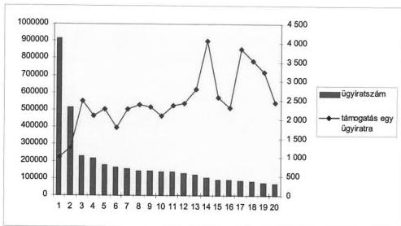
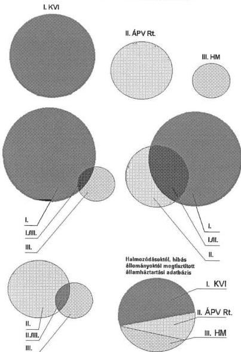
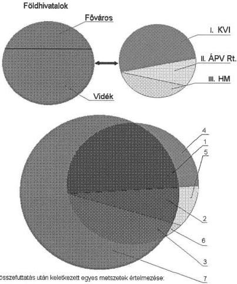
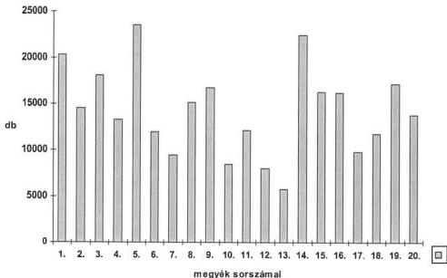
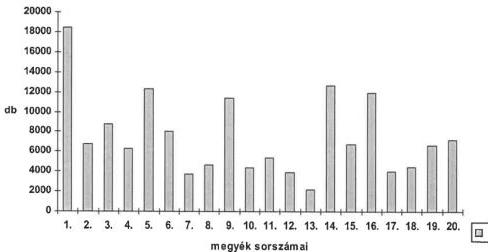
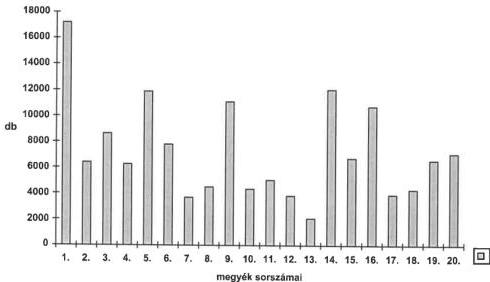
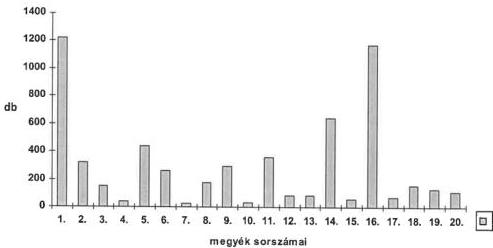
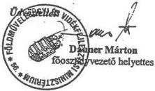

Állami Számvevőszék

TG 1579

# JELENTÉS

az állami tulajdonú földterület-
ingatlanok nyilvántartásának
ellenőrzéséről

2000. szeptember

0035

---

**Az ellenőrzés végrehajtásáért felelős:**

**Halász Gejza**

számvevő igazgató

**Az ellenőrzést vezette:**

**Karsainé Dömsödi Éva**

osztályvezető főtanácsos

**Az ellenőrzést végezték:**

**Fekete Gábor**

számvevő

**Hajkó Andrea**

fogalmazó

**dr. Kanta Tamás**

jogi szakértő

**Kökény László**

számvevő

**Szarka Péterné**

számvevő tanácsos

**Szatmári Dezső**

pénzügyi szakértő

**Tukacs Éva**

számvevő

**Villányi Antal**

számvevő

**Dér Lívia**

számvevő

**Huszti István**

számvevő tanácsos

**Kántor Ilona**

számvevő tanácsos

**Koronczai Sándorné**

számvevő

**dr. Koronics Károlyné**

számvevő tanácsos

**Péntek László**

számvevő tanácsos

**Zeke József**

számvevő tanácsos

**A témához kapcsolódó korábbi ÁSZ vizsgálatok:**

**1997:**

Jelentés a Kincstári Vagyoni Igazgatóság vagyonkezelő és hasznosító tevékenységének vizsgálatáról

**1999:**

Jelentés a kizárólagos állami tulajdon nyilvántartása helyzetéről

**2000:**

Jelentés a települési önkormányzatok tulajdonában lévő közutak, hidak, alagutak fejlesztésének, fenntartásának és üzemeltetésének vizsgálatáról

Jelentés a helyi önkormányzatok vagyonszerkezetének, vagyonhasznosítási és nyilvántartási tevékenységének vizsgálatáról

Jelentéseink az Internet www.asz.gov.hu oldalain is olvashatók.

Jelentéseink az Országgyűlés számítógépes hálózatán is olvashatók.

---

V-1-126/2000.

# TARTALOMJEGYZÉK

I. ÖSSZEGZŐ MEGÁLLAPÍTÁSOK, KÖVETKEZTETÉSEK, JAVASLATOK 6

II. RÉSZLETES MEGÁLLAPÍTÁSOK 16

1. Az állami ingatlanokról vezetett nyilvántartások adattartalmának jellemzői 16

1.1. Az egyes szervezetek altal nyilvantartott adatok 16
1.2. Az allami tulajdonu ingatlanok azonosithatosaga 18
1.3. A KVI, az APV Rt. és a HM nyilvántartásainak összehasonlítása a foldhivatali közhiteles ingatlan-nyilvántartással 21
1.4. A foldhivatali nyilvantartasban szerepló, de a KVI, az APV Rt., a HM nyilvantartasaiban nem szerepló allami tulajdonú ingatlanok elemzese csoportképsz ismervek alapján 23
1.5. A foldhivatali nyilvantartasban nem, de a KVI, az APV Rt., a HM nyilvantartasaiban szerepló allami ingatlanok elemzese csoportképz ismervek alapján 27
1.6.A nyilvantartasok mindegyikében szerepló ingatlanok jellemzöi 30
1.7.A nyilvantartott adatok valodisaga 31

2. Az állami ingatlanok nyilvántartásának felhasználása 32

2.1. Az allam ingatlan-vagyonarol nyilvantartast vezeto szervezetek rendszeres adatszolgaltatasai 32
2.2. Az allam ingatlan vagyonarol gezetett nyilvantartasok felhasznaloi 33
2.3.A felhasznaloi igenyek figylembe vetele 34
2.4. Az igenyek es a rendszerszolgaltatasok osszhangja 36

3. Az állami tulajdonú ingatlanok nyilvántartásának finanszírozása 41

3.1.A penzugyi tervezes jellemzoi 41
3.2. Az allami tulajdonu ingatlanok nyilvantartasanak kifejlesztésere forditott penzügyi forrasok 44
3.3. Az allami tulajdonu ingatlanok nyilvantartasi rendszereinek mukodtesere forditott penzugyi forrasok 50
3.4.A penzugyi forrasok elosztasa az egyes szervezeteken belul 53
3.5.A penzugyi forrasok felhasznalasanak eredmenyessege 53

3.5.1. A fóvárosi és a megyei hivatalok számítógépes rendszereinek összehasonlítása 55
3.5.2. A fóvárosban és a körzeti hivatalokban üzemelő számítógépes rendszerek 56
3.5.3. A Fóvárosi Kerületek Földhivatala számítógépes rendszerének üzemeltétese 57

3.6. Az egyes szervezetek saját bevételei 59

1

---

3.7. A pénzeszközök felhasználásának ellenőrzése 60
4. Az állami tulajdonú ingatlanok nyilvántartásának szabályozása 61
4.1. Az állami tulajdonú ingatlanok tulajdonjogának védelme 61
4.2. Az állami tulajdonú ingatlanok nyilvántartásának szabályozása 62
4.3. A tulajdonosi érdekeket (célokat) kielégítő nyilvántartás a jogi szabályozás tükrében 63
4.4. A nyilvántartásra kötelezettek belső szabályozásai 64
4.5. Az állami tulajdonú ingatlanok nyilvántartását végző szervezetek kapcsolati rendje 66
4.6. Az állami tulajdonú ingatlanok nyilvántartása ellenőrzési rendszerének szabályozása 67
4.7. A végrehajtás és a jogi szabályozás összhangja 69

2

---

# Jelentés

## az állami tulajdonú földterületek nyilvántartásának ellenőrzéséről

### BEVEZETÉS

A Magyar Köztársaság Alkotmányában rögzítettek szerint az egyes tulajdonformák - így a köztulajdon és a magántulajdon - egyenrangúak. Az állam tulajdonosi jogait szervezetein keresztül érvényesíti, így az állami tulajdonú ingatlanokról - azok részeként a földterületekről - a tulajdon jellegétől függően több szervezet vezet nyilvántartást.

Az állami földterületeket - az ország valamennyi ingatlanával együtt - elsősorban és alapvetően a körzeti földhivatalok által vezetett egységes ingatlan-nyilvántartási rendszerben regisztrálják.

Az állam kincstári vagyonába tartozó ingatlanokat a tulajdonosi jogok gyakorlására kijelölt szervezetként a Kincstári Vagyoni Igazgatóság (továbbiakban: KVI) tartja nyilván. Az állam vállalkozói vagyona tekintetében a tulajdonosi jogokat az Állami Privatizációs és Vagyonkezelő Rt. (továbbiakban: ÁPV Rt.) gyakorolja, a honvédelmet szolgáló ingatlanokról a Honvédelmi Minisztérium (továbbiakban: HM) vezet analitikus nyilvántartást. Ezeken túlmenően a Magyar Állam tulajdonába bejegyzett ingatlanok vagyonkezelési feladatainak ellátása szoros összefüggésben van a Földművelésügyi és Vidékfejlesztési Minisztérium (továbbiakban: FVM), a Belügyminisztérium (továbbiakban: BM) illetve más költségvetési szervek tevékenységével is (pl. társadalombiztosítási alapok vagyona), de vannak a vagyonkezelő státuszától függő sajátos vagyonkezelők is (ilyen pl. a Magyar Tudományos Akadémia, vagy a Nemzetbiztonsági Szolgálatok).

E vizsgálatban az állam kincstári és vállalkozói vagyonát képező földterületek pontos számbavételére helyeztük a fő hangsúlyt, mivel **2001. június 10-től**, tíz éves időtartamú használat esetén, a hatályos jogszabályok alapján **megnyílik a lehetőség az állami ingatlanok elbirtoklására**. Az állami vagyonvesztés megakadályozása - az állami tulajdon teljes körére nézve - pontos és megbízható nyilvántartások kialakításával és felhasználásával lehetséges, emiatt az állami tulajdonban bejegyzett ingatlanok nyilvántartásának helyzetét elemeztük - kiemelve az elbirtoklással leginkább veszélyeztetett ingatlanok körét.

**Az ellenőrzés célja:** annak megállapítása volt, hogy van-e az államnak - mint tulajdonosnak - az érdekét kielégítő nyilvántartása ingatlanairól. Vizsgál-

---3

---

I. ÖSSZEGZŐ MEGÁLLAPÍTÁSOK, KÖVETKEZTETÉSEK, JAVASLATOK

tuk, hogy a meglévő nyilvántartások biztosítják-e az állam tulajdonosi érdekeinek érvényesítését; nevezetesen a tulajdon megőrzését és rendeltetésszerű használatát.

A vizsgálat kiterjedt mind a földhivatali, mind a tulajdonosi jogokat gyakorló szervezetek nyilvántartásaira, az azok kialakításakor és felhasználásakor figyelembe vett szempontokra és a pénzügyi ráfordítások ellenőrzésére.

Az ellenőrzés jogalapját az Állami Számvevőszékről szóló 1989. évi XXXVIII. törvény 2. § (6) bekezdése, valamint az államháztartásról szóló 1992. évi XXXVIII. törvény (továbbiakban: Áht.) 104. § (3) bekezdése és a 121. § (1) bekezdése határozza meg.

A vizsgált szervezetek: a KVI, az ÁPV Rt., a HM, az FVM - mint a földhivatali feladatrendszer alakítója és tevékenységük finanszírozását fejezeti szinten biztosító szervezet, továbbá a Földmérési és Távérzékelési Intézet (továbbiakban: FÖMI), valamint a megyei és ezen belül a kiválasztott körzeti földhivatalok voltak.

A vizsgálatot a teljesítményellenőrzés módszerével végeztük, az eredményesség megítélésére helyeztük a fő hangsúlyt. A nyilvántartási tevékenység hatékonyságának és gazdaságosságának megítélésével csak részlegesen és olyan mértékben foglalkoztunk, amilyen mértékben a kigyűjthető adatok ezt lehetővé tették.

A kérdéselemzés módszerével, az ellenőrzési programban feltett kérdéseket lépésről-lépésre megválaszolva közelítettük a vizsgálat céljaként kitűzött fő kérdés megválaszolását. Alkalmazott egyéb módszereink a megállapítások további megalapozását szolgálták, így:

- adatbázisok számítástechnikai úton történő összehasonlítása,
- személyes interjúk,
- tanúsítványok bekérése,
- dokumentumok ellenőrzése,
- adatok, dokumentumok elemzése, statisztikai feldolgozása.

A nyilvántartások adattartalmának ellenőrzése során tételesen összefuttattuk a teljes, országos földhivatali nyilvántartásban állami tulajdonként nyilvántartott adatokat a tulajdonosi jogot gyakorló szervezetek tételes adataival. Az összehasonlítás alapja az egy adott ingatlant azonosító helyrajzi szám (továbbiakban: hrsz.) és a településnév. Az adatfeldolgozást, az összehasonlító-, lekérdező programokat az ÁSZ technikai eszközeinek felhasználásával az ÁSZ munkatársai készítették el, összességében fél év alatt. Az alkalmazott módszer és technikák részletes leírása az 1. sz. mellékletben található meg.

Az adat-összehasonlításhoz a KVI, az ÁPV Rt., a HM a saját nyilvántartásában szereplő adatállományokat, a FÖMI pedig a körzeti földhivatalok nyilvántartá-

4

---

I. ÖSSZEGZŐ MEGÁLLAPÍTÁSOK, KÖVETKEZTETÉSEK, JAVASLATOK

sában, állami tulajdonként **2000. március 31-én nyilvántartott szemle állapotú** adatállományt bocsátotta rendelkezésünkre. A megállapítások, a számadatok ennek megfelelőek.

Az adatállományokat az érintettek cd lemezen két példányban - egyiket letétbe helyeztük - teljességi nyilatkozattal adták át. Csak a Magyarország területén fekvő, állami tulajdonként nyilvántartott ingatlanokat vizsgáltuk. Az ingatlanok értékére vonatkozó vizsgálatot nem végeztünk.

Vizsgáltuk a nyilvántartások adattartalmának helyességét és az egyes nyilvántartások közötti halmazódásokat. (A halmazódás jelentése: egy hrsz. egy nyilvántartáson belül többször fordul elő, vagy a KVI, az ÁPV Rt. és a HM szervezetei közül több is nyilvántartja az adott ingatlant.)

Az ingatlan-nyilvántartási rendszer 1994-2000. I. negyedév időszakra vonatkozó kiadásairól a 19 megyei földhivatal és a Fővárosi Kerületek Földhivatala tanúsítványok kitöltésével számolt be. Ezek adattartalmát mintavételesen ellenőriztük, illetve tételesen összevetettük az 1996-1997-1998. évek zárszámadási adataival. Külön vizsgáltuk a Fővárosi Kerületek Földhivatala ingatlan-nyilvántartási rendszerének pénzügyi vonatkozásait, annak sajátosságai miatt.

A jelenleg alkalmazott elszámolási rendszerben az állami ingatlanok nyilvántartása finanszírozásának és működésének elkülönített vizsgálata nem volt lehetséges, mivel a pénzügyi kimutatások ezeket külön nem kezelik. A pénzügyi adatok bekérésénél és elemzésénél a földhivatalok esetében azzal az egyszerűsítéssel éltünk, hogy mindhárom tevékenységük - nevezetesen: az ingatlan nyilvántartás (ez a legnagyobb hányad), a földmérés, a földvédelem és földminősítés - összességében az ingatlan-nyilvántartást szolgálja, ezért a földhivatali finanszírozás adatait nem bontottuk meg külön ingatlan-nyilvántartásra és a másik két területre, illetve általános működésre. A földhivatalok esetében a vizsgálat részét képezte a Nemzeti Kataszteri Program Kht. (továbbiakban: NKP Kht.) ellenőrzése, mivel mind a finanszírozás, mind a működés oldaláról sok szállal kötődik a földhivatali ingatlan-nyilvántartáshoz.

Az ÁPV Rt. és a KVI esetében az ingatlanok nyilvántartásának finanszírozása az összes tevékenységen belül egy kisebb - bár önmagában jelentős - területet képviselt.

A jelentésben „állami tulajdonú földterület-ingatlanok nyilvántartása” kifejezést az állami tulajdonú ingatlanok nyilvántartása megfogalmazással helyettesítettük a könnyebb érthetőség érdekében.

5

---

I. ÖSSZEGZŐ MEGÁLLAPÍTÁSOK, KÖVETKEZTETÉSEK, JAVASLATOK---

# I. ÖSSZEGZŐ MEGÁLLAPÍTÁSOK, KÖVETKEZTETÉSEK, JAVASLATOK

A tulajdoni reform következtében a tulajdonosi szerkezet jelentős változáson ment át az utóbbi években, az ezt megalapozó jogszabályokon alapuló feladatok végrehajtása megtörtént. Az állami tulajdon magánkézbe adása, az állam kincstári vagyonának meghatározása, a kárpótlás végrehajtása, az egyes állami tulajdonban lévő vagyontárgyak önkormányzati tulajdonba adása, a részarány-tulajdon rendezése alapján új tulajdonosi szerkezet alakult ki.

Ebben a gazdasági-társadalmi átrendeződési folyamatban a tulajdonviszonyok változásainak követése a közhiteles földhivatali ingatlan-nyilvántartás alapján lehetséges. Az állam tulajdonosi jogait gyakorló szervezetek az állami tulajdon megőrzése, rendeltetésszerű használata érdekében vezetnek nyilvántartásokat az állami tulajdonról. A különböző nyilvántartások teljes körűsége, naprakész információi teszik lehetővé az állam, mint tulajdonos számára tulajdonosi érdekeinek maradéktalan érvényesítését. Az állami tulajdon elemeit tartalmazó nyilvántartások tehát akkor tekinthetők kielégítőnek, eredményesnek, ha a fenti kritériumoknak megfelelnek. Ez azt jelenti, hogy a földhivatali ingatlan-nyilvántartás és az állam tulajdonosi joggyakorló szervezeteinél vezetett nyilvántartások adattartalmának meg kell egyeznie az egy adott ingatlan egyértelmű azonosítására alkalmas adatok vonatkozásában. Ebből következik, hogy az állami tulajdonról vezetett nyilvántartások olyan mértékben tekinthetők eredményesnek, amilyen mértékben a különböző nyilvántartások egyezősége fennáll.

**A nyilvántartásra kötelezettek számára előírt jogszabályi keretek lényegében rendezettek, az egyes szervezetek rendelkeznek a jogszabályi előírásoknak megfelelő szabályzatokkal.** Ezek meghatározzák az ingatlanok nyilvántartásával kapcsolatos hatásköröket és feladatokat, eljárási rendet. **A szabályozási előírások maradéktalan és következetes végrehajtása alapján lehetséges a valóságot tükröző adattartalmú nyilvántartási rendszerek működtetése.**

A nyilvántartásokban szereplő adatokat összevetve azonban **az állami tulajdon nyilvántartása nem teszi lehetővé az állam tulajdonosi érdekeinek maradéktalan érvényesítését, nem biztosítja a vagyon teljes körű megőrzését és a vagyonkezeléssel összefüggő feladatok ellátását.** A megszűnt, átalakult gazdálkodó szervezeteknél és költségvetési szerveknél a helyrajzi szám szerint **állami tulajdonba bejegyzett földterületek közel fele esetében a tulajdonosi jogok gyakorlása nem biztosított.** A jelenleg alkalmazott nyilvántartási rendszerek a változásokat csak részben, vagy egyáltalán nem követték.

**A földhivatalok jogszabály alapján közhiteles, a 2000. március 31-i szemleállapotot tükröző nyilvántartásaiban 285.685 db ingatlan szerepelt a Magyar Állam tulajdonában. Ebből 150.097 db (53 %) nem található meg a tulajdonosi jogok gyakorlására kijelölt szervezetek**

---6

---

I. ÖSSZEGZŐ MEGÁLLAPÍTÁSOK, KÖVETKEZTETÉSEK, JAVASLATOK

**nyilvántartásaiban, amelynek következménye, hogy ezen ingatlanok esetében az állam tulajdonosi jogainak rendeltetésszerű gyakorlása nem biztosított.**

Az adatok megyei eloszlása változó, **kiemelkedő az aránytalanság Budapesten**, ahol 18.444 db ingatlan csak a földhivataloknál szerepel, a vagyonkezelők egyikének nyilvántartásában sem található meg. Ez a Fővárosi Kerületek Földhivatala által nyilvántartott összes állami tulajdonú ingatlan 91 %-a.

A tulajdoni lapokon bejegyzett jogok és tények sok esetben nem követték a gazdasági élet változásait. A Magyar Állam tulajdonába bejegyzett és csak a földhivatali nyilvántartásban szereplő ingatlanok közül **5.864 db sem vagyonkezelővel, sem használóval nem rendelkezik, továbbá 304 db ingatlan esetében vagyonkezelőként is „Magyar Állam” bejegyzés szerepel.** Leginkább ezen ingatlancsoportok esetében **reális a veszély az elbirtoklás bekövetkezésére** és így az állami vagyonvesztésre, mivel az állam tulajdonosi jogainak gyakorlása nem megoldott. Az ingatlanokról vezetett nyilvántartások adattartalma a valós helyzettől olymértékben eltér, hogy az állami vagyonvesztés lehetősége az elbirtoklástól függetlenül is fennáll, különösen azokban az esetekben, ahol a bejegyzett vagyonkezelő státusza (létező, megszűnt stb.) tisztázatlan.

**Az állam tulajdonosi jogait gyakorló szervezetek közötti kapcsolatot** jogszabály nem rendezi. Ennek egyik következménye, hogy **a nyilvántartásra kötelezett szervezetek között átfogó, rendszerezett adategyeztetés, céltudatos kapcsolatfelvétel a legutóbbi időkig nem történt.** A KVI 1999-től kezdeményezett eseti intézkedéseket - hasonlóan az ÁPV Rt. is - a nyilvántartások összhangjának kezdeti megteremtésére, de ezek kevés konkrét eredményt hoztak. Az e szervezetek által vezetett nyilvántartások adattartalma - ellentétben az Inytv. előírásaival - nem egyezik meg a földhivatali nyilvántartások adattartalmával, a tulajdoni lapon rögzíthető adatok, bejegyezhető jogok és feljegyezhető tények tekintetében. Ez áthidalható az állami tulajdonú ingatlanok egységes, a földhivatali rendszeren nyugvó nyilvántartási rendszerének kialakításával.

Az érdemi kapcsolat hiánya hátrányosan befolyásolta az állam tulajdonosi jogainak érvényesítését, mivel az egyes szervezetek csak részben és nem teljes pontossággal ismerték a vagyonkezelésükbe tartozó állami vagyonrész volumenét, összetételét. **Ez akadályozta az állami tulajdonosi jogok gyakorlására kijelölt szervezeteken keresztül az állam tulajdonosi jogainak érvényesítését**, ugyanis **a jogszabályok rendezése révén 1996-tól** - a kincstári vagyonra illetve az állam vállalkozói vagyonára vonatkozó törvényi szabályozás egységesítésével - **teljes körűen adott volt a lehetőség, a földhivatali nyilvántartásokból kiinduló, egyeztetett, összehangolt vagyonkezelői nyilvántartások kialakítására.** Ez jelenthet alapot az állam tulajdonosi jogainak megalapozott és hatékony érvényesítésére.

Mindkét tulajdonosi jogokat gyakorló szervezet 1999-től fokozott figyelmet fordított az állami tulajdonú ingatlanok elbirtoklásának megakadályozására, tárgyalásokat és egyeztetéseket folytattak az FVM-mel és a FÖMI-vel. A KVI a BM-en keresztül az önkormányzatok segítségét is esetenként igénybe vette. A

7

---

I. ÖSSZEGZŐ MEGÁLLAPÍTÁSOK, KÖVETKEZTETÉSEK, JAVASLATOK---

KVI az általa kezdeményezett jogszabály-módosításokat követően 2000-ben konkrétan megkezdte a munkát az államtól történő elbirtoklás megakadályozása és a vagyonkataszter teljességének és helyességének biztosítása érdekében.

A **KVI** ingatlanokról vezetett nyilvántartása széles körű egyeztetési folyamat után, jogszabályban meghatározott követelmények alapján jött létre, a rendszer működése centralizált. A nyilvántartásban 126.887 db kincstári vagyonba tartozó ingatlan szerepelt a halmazódások és a hibásan nyilvántartott hrsz.-ok kiszűrése után. Az adatállományban az összehasonlításra alkalmas adatok 12 %-át kitevő, 15.551 db olyan ingatlan van, ami a közhiteles földhivatali nyilvántartásban nem szerepel a Magyar Állam tulajdonaként bejegyezve. Ugyanakkor a földhivatali nyilvántartásban 16.788 db (13 %) olyan - KVI-nél nem szereplő - ingatlan található, amelyről egyértelműen bizonyítható, hogy a KVI vagyonkezelésébe kellene tartoznia.

Az **ÁPV Rt.** saját szempontjainak megfelelően hozta létre két elkülönült szervezeti egységénél működő nyilvántartási rendszerét. Nyilvántartásában 33.571 db vállalkozói vagyonba tartozó ingatlan szerepelt, a halmazódások és a hibásan nyilvántartott hrsz.-ok kiszűrése után. Az adatállományban az összehasonlításra alkalmas adatok 42 %-át kitevő mennyiségben, 13.938 db olyan ingatlan van, ami a közhiteles földhivatali nyilvántartásban nem szerepel a Magyar Állam tulajdonaként bejegyezve. Ugyanakkor a földhivatali nyilvántartásban 22.209 db olyan - ÁPV Rt.-nél nem szereplő - ingatlan található, amelyről egyértelműen bizonyítható, hogy az ÁPV Rt. vagyonkezelésébe kellene tartoznia, ami 66 %-kal haladja meg az ÁPV Rt. által nyilvántartott ingatlanok mennyiségét.

A **HM** nyilvántartásában 6.073 db ingatlan szerepelt a nyilvántartási hibák kiszűrése után. Az adatállományban az összehasonlításra alkalmas adatok 21 %-át kitevő 1.295 db olyan ingatlan található, amely a közhiteles földhivatali nyilvántartásban nem szerepel a Magyar Állam tulajdonaként bejegyezve. Ugyanakkor a földhivatali nyilvántartásban 3.285 db olyan - HM-nél nem szereplő - ingatlan bejegyzett, amelyről egyértelműen bizonyítható, hogy honvédelmi célokat szolgál, a honvédség vagyonkezelésében van. Ez 54 %-kal több, mint a HM nyilvántartásában szereplő ingatlanok volumene. (A HM esetében az analitikus nyilvántartásokat, illetve a költségeket tételesen nem vizsgáltuk.)

Az **önkormányzati tulajdonnal** összefüggésben, a közhiteles földhivatali nyilvántartásban a Magyar Állam tulajdonába bejegyzett ingatlanok adatállományában 32.097 db olyan ingatlan található, amelyek vagyonkezelőjeként önkormányzat vagy tanács VB. bejegyzés szerepel. Ezek tulajdonjogi helyzete rendezetlen, mivel az önkormányzati tulajdon létrejöttével az önkormányzatoknak tulajdonosként kellene szerepelniük, vagy ha az önkormányzat lemondott a vagyonról, akkor a KVI vagyonkezelésébe kellene tartozniuk. Az önkormányzati vagyon nyilvántartási problémáira az ÁSZ korábbi, az önkormányzatok tevékenységéről szóló jelentéseiben számos esetben felhívta a figyelmet.

A **KVI és ÁPV Rt. nyilvántartásaiban** nem szereplő, de bejegyzett kezelővel, vagyonkezelővel rendelkező ingatlanok mennyisége 144.233 db, amelyek egy részének tulajdoni bejegyzései rendezetlenek. Ilyenek pl.: a bejegyzések szerint még mindig tanácsi kezelésű ingatlanok, a vagyonátadó bizottságok ál-

---8

---

I. ÖSSZEGZŐ MEGÁLLAPÍTÁSOK, KÖVETKEZTETÉSEK, JAVASLATOK

tal az önkormányzatoknak átadott tanácsi alapítású, de már átalakult vállalkozások ingatlanai, a tartós földhasználatú ingatlanok, az ÁPV Rt., az Állami Vagyonügynökség, a költségvetési szervek, az állami gazdaságok vagy más, már megszűnt vagy átalakult gazdálkodók tulajdonaként bejegyzett ingatlanok. Ezek bejegyzett kezelője jogutóddal vagy jogutód nélkül megszűnt, vagyonkezelőként a Magyar Állam vagy magánszemély vagy helyi önkormányzat van bejegyezve. Ezen állomány 15 %-a a szervezetek hibásan nyilvántartott hrsz. adataiból ered.

**A nyilvántartási tevékenység hatékonyságának** átfogó megítélése az egyes szervezetek vonatkozásában korlátozottan lehetséges. A KVI és az ÁPV Rt. esetében az állami tulajdonú ingatlanok nyilvántartásának erőforrásai a szervezetek más tevékenységére felhasznált erőforrásoktól nem, vagy csekély mértékben különíthetők el.

**A földhivatali** nyilvántartás lényegében az Ingatlan-nyilvántartásról szóló 1997. évi CXLI. törvényben (továbbiakban: Inytv.) és a végrehajtására kiadott 109/1999. (XII. 29.) FVM rendeletben (továbbiakban: Vhr.) előírtaknak megfelelően rendszerezetten, áttekinthetően rögzíti az egyes ingatlanok adatait és a bejegyezhető jogokat és tényeket. Azonban a körzeti földhivatalok szakmai irányítása nem egységes. Az egyes földhivatalok eljárási gyakorlata eltérő az ingatlanhoz rendelt jogok és tények bejegyzésében. A bejegyzések alapja a kérelem és a hozzá tartozó okiratok benyújtása, emiatt a konkrét jogszabályban előírt változások átvezetését nem végzik el automatikusan azokban az esetekben sem, amikor lehetséges a jogszabály erejénél fogva az ingatlan egyértelmű és kizárólagos azonosítása (műemlékké, védetté, természetvédelmi területté nyilvánítás, teljes körű jogutódlással történő átalakulás, költségvetési szerv névváltozás, településnév változás stb.). A kérelem benyújtásának elmaradása ily módon nyilvántartási hibák forrása.

A földhivatali ingatlan-nyilvántartás átállítása gépi adatfeldolgozásra több fázisban valósult meg, többféle informatikai rendszerrel támogatott - a területenként eltérő nyilvántartási sajátosságok figyelembevételével -, fejlesztésük jelenleg is folyamatban van. A vidéken és a fővárosban használt informatikai rendszerek szolgáltatási követelményei előírtak és megegyeznek, ezért a jelenleg tapasztalt átfedések kiegészítő fejlesztésekkel megszüntethetők. **Hosszabb távon a különböző informatikai rendszerek fenntartása nem indokolt, mert ez megkérdőjelezi a nyilvántartási rendszerekre felhasznált erőforrások gazdaságosságát és hatékonyságát.**

**Az ingatlan-nyilvántartási ügyirathátralék** tekintetében a főváros helyzete sajátos. Itt koncentrálódik az összes ügyirat 24 %-a, itt csapódott le a lakásprivatizáció hatásának jelentős része. Megnehezítette az ügyhátralék ütemes feldolgozását a fővárosban meglévő, a megyei szervezetektől eltérő szervezeti felépítés, valamint az országostól eltérő, a fővárosban alkalmazott nyilvántartási rendszer. A fővárosi ügyirathátralék vidéki feldolgozása eredményes volt, mert az ügyhátralék száma 1999-ben az 1998. évi 36 %-ára csökkent, bár volumenében még mindig a fővárosban a legnagyobb (20 %).

A Fővárosi Kerületek Földhivatalánál az ügyhátralék kezelését, valamint az ingatlan-nyilvántartás működtetését nem saját informatikai osztályuk, hanem

9

---

I. ÖSSZEGZŐ MEGÁLLAPÍTÁSOK, KÖVETKEZTETÉSEK, JAVASLATOK

külső cég végezte, amelyet a Földhivatal korábbi informatikai vezetője hozott létre. **Ellentétes a köztisztviselők jogállásáról szóló** 1992. évi XXIII. törvénnyel (továbbiakban: Ktv.) a szervezet vezető informatikai tisztségviselőjének vezetésével megalakult Kft. alkalmazása az informatikai rendszer működtetésére. **A pályáztatás sem felelt meg a közbeszerzési eljárásban** a pályázók számára előírt referenciával szemben támasztott feltételnek. A Kft. alkalmazásának időszakában az informatikai rendszer üzemeltetési és szolgáltatási kiadásai több mint tízszeresére növekedtek a korábbiakhoz viszonyítva, miközben a rendszer üzemeltetési jellemzői nem változtak, a feldolgozott ügyiratok mennyisége számottevően nem nőtt. Üzemeltetési problémák egyik forrása volt, hogy az informatikai rendszerek részletes dokumentálását nem követelték meg kellő körültekintéssel, így másik üzemeltető a rendszer átvételét nem volt képes gördülékenyen megoldani.

A földhivatalok számára törvény írja elő a kötelező adatszolgáltatást, amely az illetékekről szóló 1990. évi XCIII. törvényben (továbbiakban: Illetéktörvény) és az illetéktörvény módosításáról, valamint a hiteles tulajdoni lap másolat igazgatási szolgáltatási díjáról szóló 1996. évi LXXXV. törvényben (továbbiakban: Itmtv.) meghatározott szervezetekre és az igényelt szolgáltatásokra nézve díjköteles vagy díjmentes. A díjmentes szolgáltatás az illetéktörvény alapján az igénybevevőtől függ, és többlet terhet ró a földhivatalokra. Az adatszolgáltatásokat a szabályoknak megfelelően teljesítették, az állami ingatlanokról kapott információkkal az adatkérők elégedettek voltak, a határidők betartása az utóbbi években javuló tendenciát mutatott. Az adatszolgáltatás formája - papíralapú, vagy mágneses adathordozón - illetve ezzel összefüggésben **az adatszolgáltatás díjköteles, vagy díjmentes volta esetenként megnehezítette az adatkérők számára az adatok használatát.** A költségvetési szervek esetében a díjköteles adatszolgáltatás finanszírozásához szükséges források nem minden esetben álltak rendelkezésre. Ez a tulajdonosi jogokat gyakorló szervezeteknél, saját nyilvántartásuk rendezése, ellenőrzés céljából nagy mennyiségű tulajdoni lap igénylésekor jelentett problémát.

A nyilvántartási rendszerek összefuttatását nehezítette az egyes rendszerekben ugyanazon adat kódolására alkalmazott eltérő kódrendszer (pl.: településnévkód, vagyonkezelő azonosító), illetve az eltérő adatbázis szervezési, adatbázis kezelési megoldások.

**Összesítve az állami tulajdonú ingatlanok vizsgált nyilvántartásainak kialakítására, valamennyi vizsgált szervezet hazai forrásból 2.910 millió Ft-ot, míg külföldi forrásokból** - amely csak az FVM-nél és a földhivataloknál fordult elő - **7,2 millió EURO-t** fordítottak. **A rendszerek működtetési kiadásai átlagosan 6.581 millió Ft/év költséget eredményeztek. A fejlesztésre és a működésre fordított pénzösszegek felhasználását átgondolt pénzügyi tervezés nem előzte meg.** Az állami tulajdonú ingatlanok nyilvántartásra felhasznált, **közvetlenül kimutatható befektetett eszközök gazdaságos és hatékony felhasználása korlátozottan valósult meg**, tekintettel a vagyonkezelést végző szervezeteknél nyilvántartott adatállományok ismertetett pontatlanságaira illetve hiányosságaira, a nem kellően összehangolt informatikai fejlesztésekre.

10

---

I. ÖSSZEZGŐ MEGÁLLAPÍTÁSOK, KÖVETKEZTETÉSEK, JAVASLATOK

A **KVI** vagyonkataszterének kialakítására hazai forrásból, 2000. I. negyedév végéig folyó áron 95 millió Ft-ot használt fel, a rendszerfejlesztésre 1997-ben kiírt pályázat alapján, a szerződésben rögzített 191 millió Ft-ot kitevő keretösszegből. A rendszer működtetési költségeihez az 1999. évi adatot alapul véve ugyancsak folyó áron számítva 56 millió Ft/év ráfordítást igényeltek. Külföldi forrásokat nem vettek igénybe. A KVI-nek az ingatlanok nyilvántartásához kapcsolódó saját bevétele nem volt. A nyilvántartásból adatokat az esetleg igénylő szervezetek számára térítésmentesen adtak át, az adatszolgáltatást gördülékenyen végezték.

Az **ÁPV Rt.** saját nyilvántartási rendszerének kiépítésére 1994-1999. között hazai forrásból, folyó áron 56 millió Ft-ot fordított, amely a fejlesztés és az egyszeri adatbevitel költségeit tartalmazza. A rendszer működtetési kiadásai átlagban 4,2 millió Ft/év összeget tesznek ki. Az ÁPV Rt.-nek az ingatlanok nyilvántartásához kapcsolódó saját bevétele nem volt. A nyilvántartásból esetleg adatokat igénylő szervezetek számára térítésmentesen, gördülékenyen végezték az adatszolgáltatást.

A **földhivatalok** az ingatlan-nyilvántartáshoz szükséges számítástechnikai eszközökhöz három módon jutottak: saját költségvetésből felhalmozási kiadásként, térítés nélkül átvett eszközként, vagy a NKP Kht. térítés nélkül vagy térítés ellenében használatra átadott gépekkel és szoftverekkel.

Az FVM és a földhivatalok együttesen a nyilvántartások kialakítására az 1994-2000. I. negyedév időszakban, folyó áron összesítve, hazai forrásból 1.549 millió Ft-ot, míg külföldi forrásból 7,2 millió EURO-t használtak fel, amely összegek a nyilvántartással közvetlenül összefüggésbe hozható ráfordításokat tartalmazzák. A NKP Kht-tól a földhivataloknak térítés nélkül vagy térítés ellenében használatra átadott gépek és szoftverek beruházási ráfordításai nem szerepelnek a hatályos számviteli előírások alapján a beszámolókban. Ebből következik, hogy **a beszámolókban jelzett és ismertetett adatok nem adnak teljes körű és valós képet az FVM és a földhivatalok informatikai fejlesztési ráfordításairól**, mivel a tárgyi eszközök a vagyon részeként megjelennek, de a kiadások között nem. A támogatási rendszerek ezen hatása kiküszöbölhető lenne egy üzemgazdasági szemléletű elszámolási rendszer alkalmazása esetén. Az NKP Kht. hazai forrásból a fentieken kívül további 1.210 millió Ft-ot használt fel a vizsgált időszakban a földhivatali nyilvántartási rendszer kialakítására.

Az **FVM és a földhivatalok** a nyilvántartások **működési kiadásaira 6.521 millió Ft/év** összeget használtak fel, az 1994-1999. évi összesített adatok éves átlagában, folyó áron. Ez az adat a személyi juttatások, a munkaadókat terhelő járulékok és a dologi kiadások előirányzatainak teljesítését tartalmazza. Az FVM és a földhivatalok bemutatott ráfordításai nem tartalmazzák a FÖMI adatait. Az állami tulajdon nyilvántartására felhasznált összegek arányos számításokkal sem különíthetők el a FÖMI beszámolóiból.

A földhivatali ügyiratokra vetített fajlagos költségek emelkedtek az elmúlt három évben, de az emelkedés mértéke összességében a kumulált infláció alatt maradt, így a hatékonyság javulásaként értékelhető a fajlagos költségek változása.

11

---

I. ÖSSZEGZŐ MEGÁLLAPÍTÁSOK, KÖVETKEZTETÉSEK, JAVASLATOK

Az állam tulajdonosi jogait gyakorló szervezetek nyilvántartásainak rendezése a KVI és az ÁPV Rt. szoros együttműködésével, a felügyeletüket ellátó Miniszterelnöki Hivatal koordinálásával végezhető el úgy, hogy a folyamatba bevonják a BM, a HM és az FVM illetékes munkatársait. Összefogásukkal tisztázhatók a feltárt nyilvántartási hiányosságok, rendezhető az egyes vagyonelemek hovatartozása, kérelmezhető a bejegyzések valóságnak megfelelő korrekciója. A feladat végrehajtása sürgető, mert 2001. június 10-től az elbirtoklás lehetősége fennáll - az állami tulajdonra nézve is -, ugyanakkor az állami tulajdonú ingatlanok elbirtoklásának - az állam vagyonvesztésének - megakadályozása, az állam kincstári és vállalkozói vagyonának pontos számbavétele és folyamatos megbízható nyilvántartása közérdek.

## JAVASLATOK

A jelentés részletes megállapításainak hasznosítása mellett javasoljuk:

### A Miniszterelnöki Hivatalt vezető miniszternek

1. Irányítsa és ellenőrizze az állami tulajdonosi jogokat gyakorlók azon tevékenységét, amely során teljes mértékben feltárják az elbirtoklással veszélyeztetett ingatlanok állományát és nyilvántartási kötelezettség szerinti hovatartozásukat. A feltárás eredménye alapján ellenőrizze, hogy a tulajdonosi jogokat gyakorló szervezetek intézkedtek-e a tulajdoni és vagyonkezelői jogok valósághű bejegyeztetéséről.
2. Készítse el és terjessze a Kormány elé az állami vagyonkezelési koncepciót.
3. Vizsgálja felül az egységes állami vagyontörvény szükségességét.

### Az Informatikai kormánybiztosnak

1. Kísérje fokozott figyelemmel a földhivatali rendszeren nyugvó állami tulajdonú ingatlanok egységes nyilvántartási rendszerének kialakítását.
2. Ellenőrizze az ingatlanokról vezetett nyilvántartásokban alkalmazandó egységes kódrendszer kialakítását és gondoskodjon ennek következetes alkalmazásáról.
3. Kezdeményezze az egységes településnév-kódtábla használatának jogszabályi szintű előírását és annak az ingatlanokról vezetett nyilvántartásokban történő alkalmazását.

### A KVI vezérigazgatójának

1. Tegye meg a szükséges intézkedéseket a tulajdonosi joggyakorlási körébe tartozó, a Magyar Állam tulajdonában lévő, ingatlanok elbirtoklásának megakadályozására.
2. Tételesen ellenőrizze nyilvántartott adatbázisának adattartalmát és egyeztesse nyilvántartásának adatait a földhivatalokkal, valamint a vagyonkezelőkkel, hogy a KVI tulajdonosi joggyakorlási körébe tartozó ingatlanok nyilvántartása teljes körű és való-

12

---

I. ÖSSZEGZŐ MEGÁLLAPÍTÁSOK, KÖVETKEZTETÉSEK, JAVASLATOK

sághű legyen. A vagyonkezelőkkel történő egyeztetés után - ahol szükséges -, módosítsa a vagyonkezelési szerződéseket. Fordítson kiemelt figyelmet azon ingatlanokra, amelyekre az ingatlan-nyilvántartásban jelzálogjog vagy végrehajtási jog van bejegyezve.

3. Rendezze a vagyonátadással kapcsolatos feladatait, az ÁPV Rt.-vel együttműködve.
4. Tételesen állapítsák meg az ÁPV Rt.-vel közösen a tartós földhasználatba adott ingatlanokat és a feltárt helyzetnek megfelelően tegyék meg az intézkedéseket a tulajdonjog rendezésére.
5. Harmonizálja nyilvántartásait az Inytv-nyel és Vhr. előírásaival. A vagyonkezelői jog bejegyzésétől függetlenül intézkedjen a KVI, mint az „állam tulajdonosi jogait gyakorló szervezet” tulajdoni lapra történő bejegyeztetésére.
6. Tegyen eleget az Áht. 109/F. § (3) bekezdésében foglaltaknak, amelyek szerint kérelmet kell benyújtania a KVI vagyonkezelői jogának bejegyzésére minden olyan állami tulajdonú ingatlanra vonatkozóan, amelyre nincs kezelő, vagyonkezelő bejegyezve.
7. Ellenőrizze az Áht. 109/G. § (2) bekezdésében foglalt kötelezettsége alapján, hogy a vagyonkezelők bejegyeztették-e vagyonkezelői jogukat a tulajdoni lapokra.
8. Intézkedjen annak érdekében, hogy a vagyonkezelőktől csak szakmailag és számítástechnikailag helyes adatok kerüljenek a vagyonkataszterbe, indokolt esetben a számítástechnikai programokba további ellenőrző pontokat, illetve továbblépési letiltásokat építésen be.

# Az ÁPV Rt elnök-vezérigazgatójának

1. Tegye meg a szükséges intézkedéseket a tulajdonosi joggyakorlási körébe tartozó, a Magyar Állam tulajdonában lévő, ingatlanok elbirtoklásának megakadályozására.
2. Tételesen ellenőrizze az állami tulajdonú ingatlanok nyilvántartási adatbázisának adattartalmát, szűrje ki a halmozódásokat és egyeztesse nyilvántartásának adatait a földhivatalokkal annak érdekében, hogy az ÁPV Rt. tulajdonosi felügyeleti jogkörébe tartozó ingatlanok nyilvántartása teljes körű és valósághű legyen. Fordítson kiemelt figyelmet azon ingatlanokra, amelyekre az ingatlan-nyilvántartásban jelzálogjog vagy végrehajtási jog van bejegyezve.
3. Rendezze a vagyonátadással kapcsolatos feladatait, a KVI-vel együttműködve.
4. Tárja fel a KVI-vel közösen, tételesen a tartós földhasználatba adott ingatlanok állományát, a valós helyzetnek megfelelően tegyék meg az intézkedéseket a tulajdonjog rendezésére.
5. Harmonizálja nyilvántartásait az Inytv-nyel és a Vhr. előírásaival. A vagyonkezelői jog bejegyzésétől függetlenül intézkedjen az ÁPV Rt. mint az „állam tulajdonosi jogait gyakorló szervezet” tulajdoni lapra történő bejegyeztetésére.

13

---

I. ÖSSZEGZŐ MEGÁLLAPÍTÁSOK, KÖVETKEZTETÉSEK, JAVASLATOK

6. Tételesen tisztázza a „jogilag rendezetlen”-ként nyilvántartott föld és ingatlanállomány tulajdon- és vagyonkezelői jogát, gondoskodjon a megfelelő földhivatali bejegyeztetésről.

# A földművelésügyi és vidékfejlesztési miniszternek

1. Gondoskodjon a földhivatalok egységes szakmai irányításáról, a főbb tevékenységcsoportok elkülönített ellenőrzése érdekében. Az ingatlan-nyilvántartási eljárás tartalmi és formai egysége érdekében bejegyzési mintatárat bocsásson a körzeti földhivatalok rendelkezésére.
2. Teremtse meg a földhivatalok szakmai és pénzügyi felügyeleti szerveként az egységes eljárásrend alkalmazásához szükséges, megfelelő szakirányú végzettséggel rendelkező munkaerő alkalmazásának és megtartásának feltételeit.
3. Tárja fel a Fővárosi Kerületek Földhivatala ügyirathátralék-képződésének (újraképződésének) részletes okait, és intézkedjen azok felszámolására.
4. Vizsgálja meg, hogy hosszú távon is indokolt-e két számítástechnikai ingatlan-nyilvántartási rendszer fenntartása, működtetése, miként valósítható meg az egyes alrendszerek harmonizációja, a rendszer-szolgáltatások teljes körűvé tétele.
5. Írja elő és ellenőrizze az informatikai rendszerek fejlesztésekor a folyamatos és szakszerű működtetést, a módosítást és a továbbfejlesztést is lehetővé tevő részletezettségű rendszerdokumentáció készíttetését.
6. Vizsgálja meg a földhivatali rendszerüzemeltetést végző Kft.-vel kapcsolatos közbeszerzési eljárás körülményeit és a tegyen intézkedést a szükséges felelősségre vonásokra.
7. Gondoskodjon a Vhr. tulajdoni lap minta mellékletének kiadásáról.

# A pénzügyminiszternek

1. Vizsgálja felül a földhivatali díjmentes/díjköteles adatkérés, adatszolgáltatás jelenlegi szabályozásait - együttműködve a földművelésügyi és vidékfejlesztési miniszterrel -, különös tekintettel az államháztartás szerveire. Dolgozza ki az illetéktörvény szükséges módosításával az adatszolgáltatás feladatfinanszírozás orientált elszámolási rendszerét.
2. Tekintse át, illetve pontosítsa azon tevékenységek tételes meghatározását (pl. hatósági munka), amelyekhez az ingatlan-nyilvántartási adatszolgáltatás díjmentesen kérhető.
3. Vizsgálja felül díjmentes ingatlan-nyilvántartási adatszolgáltatás esetén elszámoló ár (díjtétel) bevezetésének lehetőségét a földhivatalok ráfordításainak és kiadásainak jobb tervezhetősége érdekében.
4. Vizsgálja meg a díjmentes adatszolgáltatásra jogosultak részére mágneses adathordozón - a felhasználók számára számítógépes adatrögzítésre alkalmas módon - teljesített adatszolgáltatás lehetőségét.

14

---

I. ÖSSZEGZŐ MEGÁLLAPÍTÁSOK, KÖVETKEZTETÉSEK, JAVASLATOK

### **A honvédelmi miniszternek**

Irányítsa és ellenőrizze a felügyeleti hatáskörébe tartozó, az elbirtoklással veszélyeztetett ingatlanok állományának lehető legteljesebb feltárását és nyilvántartási kötelezettség szerinti hovatartozásának rendezését. A feltárás eredménye alapján rendezzék a tulajdoni és vagyonkezelői jogok bejegyzését, a teljes honvédelmi célú ingatlanállomány nyilvántartásának földhivatali nyilvántartással való egyezősége és teljessé tétele érdekében.

### **A belügyminiszternek**

1. Irányítsa és ellenőrizze a felügyeleti hatáskörébe tartozó, elbirtoklással veszélyeztetett ingatlanok állományának lehető legteljesebb feltárását és nyilvántartási kötelezettség szerinti hovatartozásának rendezését. A feltárás eredménye alapján rendezzék a tulajdoni és vagyonkezelői jogok bejegyzését.
2. Az önkormányzatok érintettsége miatt koordináló szerepet vállalva vegyen részt az állami és önkormányzati ingatlanvagyon tulajdoni kérdéseinek rendezésében, az átfogó és tételes egyeztetési folyamatban az állam tulajdonosi jogot gyakorló szervezetek és az önkormányzatok ingatlanairól vezetett nyilvántartásnak a teljes körűvé és valósághűvé tételében.

### **Az igazságügyminiszternek**

Intézkedjen az állami vagyonnal való gazdálkodás egységes jogi normatívák szerinti rendezése érdekében - a Ptk. módosítása során - a vagyonkezeléssel kapcsolatos fogalmak meghatározásáról.

15

---

II. RÉSZLETES MEGÁLLAPÍTÁSOK

# II. RÉSZLETES MEGÁLLAPÍTÁSOK

# 1. AZ ÁLLAMI INGATLANOKRÓL VEZETETT NYILVÁNTARTÁSOK ADATTARTALMÁNAK JELLEMZŐI

# 1.1. Az egyes szervezetek által nyilvántartott adatok

A nyilvántartások alapján, szervezetenként eltérő mértékben - más-más okokra visszavezethetően - részlegesen határozhatók meg az egyes állami ingatlanok jellemző adatai, így a föld területe, nagysága, darabszáma, minősége, valamint az ezeket érintő bejegyzett jogok és feljegyzett tények.

A földhivatali nyilvántartás alapján meghatározható az állami tulajdonba bejegyzett föld területe, nagysága, darabszáma, minősége, valamint az ezeket érintő jogok és tények.

A földhivatalok a nyilvántartási tevékenységüket a hatályos Inytv. és a Vhr. előírásai szerint folytatják, a jogszabályi előírásoknak megfelelő adatok, jogok és tények bejegyzésével. (2000. január 1. előtt a több ízben módosított 1972. évi 31. tvr. (továbbiakban: tvr.) és a 27/1972. (XII.31.) MÉM rendelet alapján történt az ingatlan-nyilvántartás vezetése.) Egyenként a földterületek és ingatlanok területnagysága minősége és az ezeket érintő jogok és tények a földhivatali nyilvántartásokból közvetlenül megállapíthatóak. A földhivataloknál alkalmazott számítógépes nyilvántartási programok (BIIR, KDIR, TAKAROS) lehetővé tesznek - külön programok írásával - olyan lekérdezéseket, amelyekkel meghatározott szempontok szerinti összesítések készíthetők. Így meghatározható a Magyar Állam tulajdonába bejegyzett ingatlanok darabszáma, ami 285.685 db volt 2000. március 31-én.

A KVI az Áht. és a végrehajtására kiadott 183/1996. (XII.11.) Korm. rendelet alapján alakította ki a kincstári vagyon nyilvántartási rendszerét. A KVI jelenlegi nyilvántartásából történő egyedi adatlekérések, és összesítések eredményei az állam kincstári vagyonát képező földterületek és ingatlanok volumenére, területére és az ezeket befolyásoló jogokra és tényekre vonatkozóan nem tartalmaznak teljes körű és a valós helyzetnek megfelelő információt.

16

---

II. RÉSZLETES MEGÁLLAPÍTÁSOK

### A KVI összehasonlításban résztvevő adatállománya

1. sz. táblázat mennyiség/db

|  megnevezés | kataszter | KVI saját | együtt  |
| --- | --- | --- | --- |
|  építmények | 21.363 | 1.804 | 23.167  |
|  épületek | 13.790 | 2.785 | 16.575  |
|  földek* | 119.064 | 6.318 | 125.382  |
|  lakások | 1.076 | 49 | 1.125  |
|  együtt | 155.293 | 10.956 | 166.249  |

\* 13.051 db földterületre vonatkozóan a művelési ágak szerinti megoszlást a KVI külön fájlban 49.135 rekordban adta át, ez utóbbiak azonban művelési áganként többszörösen ismétlődve tartalmazzák a 13.051 db földterületet.

Az átadott adatszerkezet mutatja, hogy a KVI a saját vagyonkezelésébe tartozó ingatlan-állományt 2000. március 31-ig nem illesztette be a KVI tulajdonosi joggyakorlása körébe tartozó kincstári vagyonkataszterbe. Ezáltal a vagyonkataszter nem teljes. Az ingatlanok két adatállományban szerepelnek, az egyik a KVI-nek, mint az állam tulajdonosi jogait gyakorló szervezetnek a vagyonkezelésébe tartozó, a másik a saját vagyonkezelésébe tartozó ingatlanokat tartalmazza. Ezek a nyilvántartások informatikai úton egyesíthetők.

A KVI a pénzügyminiszter által 1997. november 11-én jóváhagyott és a Magyar Közlönyben 1997. november 19-én közzétett - jelenleg is hatályban lévő - a „Kincstári Vagyon Nyilvántartási Szabályzata” szerint kéri be a vagyonkezelőktől az adatokat, amelyek a kincstári vagyonnyilvántartás alapadatai. A Szabályzat mellékletét képzik az adatlapok és a részletes kitöltési segédlet, valamint a kódjegyzék. A kódjegyzék az Inytv. és a Vhr. előírásaihoz képest szűkítetten, esetenként összevontan tartalmazza a földterületek művelési ágait és a bejegyzett jogokat, míg a feljegyezhető tényeket egyáltalán nem tartalmazza. Egyéb adatokban megegyezik a földhivatali ingatlan-nyilvántartás adattartalmával, kiegészítve a KVI vagyongazdálkodását támogató adatokkal. Ebből következően egyedileg meghatározható lenne az állam kincstári vagyont képező földterületeinek és ingatlanainak volumene, területe és az ezeket befolyásoló jogok, a leírt korlátokkal. Összesítéseket az adatlapok szerkezetéből eredő halmozódások és nyilvántartási hibák kiküszöbölése után - az építmény összevont adatlapon nem azonosítható módon szereplő ingatlanok nélkül - lehetne készíteni.

A KVI megyei hálózati egységei veszik át és továbbítják a központi adatbázishoz a vagyonkezelők floppy-lemezen átadott változásjelentéseit, de azokat szakmailag nem ellenőrzik, nem vetik össze a vagyonkezelési szerződés mellékletét képező vagyonlisták adattartalmával. A vagyonlisták eredeti adattartal-

17

---

II. RÉSZLETES MEGÁLLAPÍTÁSOK

ma nem minden esetben egyezik meg a kataszter tartalmával. Ennek ellenőrzését nem, vagy nem teljes körűen végezték el.

A HM és a Nemzetbiztonsági Hivatal, a Nemzetbiztonsági Szakszolgálat, az Információs Hivatal (együtt: NBSZ), valamint a Magyar Tudományos Akadémia vagyonkezelésében lévő ingatlanokat a KVI vagyonkataszteri nyilvántartása tételesen nem tartalmazza, így az ezekre vonatkozó adatok csak közvetlenül a vagyonkezelőktől szerezhetők be.

Az ÁPV Rt. az állam vállalkozói vagyonába tartozó földterületi nyilvántartása az Inytv. és a Vhr. előírásaihoz képest hiányos, nem tartalmazza az ingatlanok fekvését és a teherként bejegyezhető jogokat, valamint tényeket. Részletesen tartalmazza viszont a művelési ágakat területi megosztásban. Az ÁPV Rt. által átadott adatállomány 39.757 db művelési ágban nyilvántartott földterületet és 127 db művelés alól kivett ingatlant tartalmazott, két különálló adatbázisban. Ez utóbbi adatbázis 71 db jogilag rendezetlen ingatlant tartalmazott. A nyilvántartás szerkezete igazodik az SZMSZ szerinti feladatmegosztáshoz. A két nyilvántartás szerkezete nem egységes. Az Rt. egyéb nyilvántartásaival - így a szerződéstár, számviteli, pénzügyi stb. - közvetlenül nem kapcsolható össze, kapcsolati kódokat nem tartalmaz - kivéve a korábban használt privatizációs információs rendszer kapcsolati kódját.

A nem mezőgazdasági hasznosítású ingatlanokat az ÁPV Rt. Agrárgazdasági Vagyonkezelő Igazgatósága átadta az Ingatlanhasznosító Igazgatóságnak. Ez történt azokban az esetekben is, ha azok állami gazdasági használatban álltak, vagy ha az érintett földrészlet ugyan termőföldként volt bejegyezve, de valódi értékét nem a mezőgazdasági termelési potenciálja, hanem elhelyezkedése, fekvése, vagy más jellegű hasznosítási lehetősége adta (pl. Budapest környéki területek). Az átadás tételes lista alapján történt meg, az ingatlanok tulajdoni helyzetét nem érintette, az ÁPV Rt.-n belüli munkamegosztást szolgálta.

A HM átadott adatbázisát biztonsági korlátok miatt csak volumenében vizsgáltuk, tételes információkkal nem tértünk ki a nyilvántartott földterületek minőségére, valamint a bejegyzett jogok és tények vizsgálatára. Az átadott adatok alapján a HM nyilvántartásában a földterületek helyrajzi szám és településnév szerint azonosíthatók. A HM a honvédelmi érdekek figyelembe vételével - megállapodás alapján - csak a település nevet és a hrsz.-ot tartalmazó adatbázisát adta át, amely 6.092 db ingatlant tartalmazott. A nyilvántartott földterületek minőségére, valamint az ezeket érintő bejegyzett jogokra és tényekre vonatkozó vizsgálatokat csak a földhivatali nyilvántartások alapján tudtunk végezni. A Magyar Tudományos Akadémia és a NBSZ vagyonkezelésében lévő ingatlanok száma kevés - mennyiségük csak hibahatáron belül torzítja a vizsgálat megállapításait -, amelyet szótöredékre történt lekérdezéssel a földhivatali nyilvántartás alapján állapítottuk meg. Így az NBSZ-nél 39 db, a Magyar Tudományos Akadémiánál 147 db ingatlan volt.

# 1.2. Az állami tulajdonú ingatlanok azonosíthatósága

A vizsgált szervezetek átadott adatbázisai ugyanazt a földterületet azonosítják. A nyilvántartási hibákból és a nyilvántartások adattartalmának ellenőrzési hiányosságaiból eredően a nyilvántartott ingatlanok egy része nem

18

---

II. RÉSZLETES MEGÁLLAPÍTÁSOK

**azonosítható**, így nem hasonlítható össze a közhiteles földhivatali ingatlan-nyilvántartással. **Halmazódásokat** tapasztaltunk a KVI és az ÁPV Rt. átadott adatbázisában, míg a HM - kézzel kigyűjtött - adatbázisában nem. Az adatbázisok páronként végzett összehasonlítása a HM-ÁPV Rt. esetében nem eredményezett halmazódásokat, a KVI-HM összehasonlításban 16 db, míg a KVI-ÁPV Rt. összehasonlításban 230 db ilyen ingatlan volt. A halmazódások kialakulásában a nyilvántartási hiányosságokon túlmenően szerepet játszott **a körzeti földhivatalok eltérő eljárási gyakorlata** is. A vizsgált szervezetek megkezdték az okok megállapítását, a tételes feltárás folyamatban van.

**Az ingatlan egyértelmű azonosításához** két adat együttes ismeretére van szükség. Az egyik a településnév, ahol az ingatlan fekszik, a másik az azon belüli elhelyezkedést jelző szám, a hrsz. A vizsgált szervezetek mindegyikének nyilvántartásában ezekkel azonosítják a földterületeket ill. az ingatlanokat.

Az összehasonlítást nehezítették az ékezetes betűket tartalmazó településnevek, a helyesírási hibák, az elgépelések, valamint az olyan településnév megadása, ami nem szerepel a földhivatalokról szóló 62/1999. (VII. 21.) FVM rendelet mellékletében. A fő problémát a hrsz. felépítésére vonatkozó szabályok figyelmen kívül hagyása jelenti. Az ÁPV Rt. esetében gyakori, hogy egy művelési ág megjelölés helyett, nyilvántartási hibából épület „keletkezik”. A kis betűk helyesen a művelési ágat jelölik, míg a nagy betűk helyesen az ingatlanon lévő építmény megadására szolgálnak. A művelési ág kis betűjele nem része a hrsz.-nak - a helyesen felépített rendszerben -, de lényeges és meghatározó adattartalom a nyilvántartás szempontjából. A hibás hrsz.-ok kijavítása csak abban az esetben oldható meg, ha azok egyszerű, formai hibát tartalmaznak (pl. a „/” jel hiányzik a szám és a betű között). A hrsz. helyén szereplő szöveges beírás vagy a hiányzó hrsz. esetében ugyanúgy, mint a hibás szerkezet vagy elírt számok esetében a tételes ellenőrzés, egyeztetés szükséges az azonosításhoz. Az átadott adatállományok egy része nem azonosítható, így nem vethető össze a földhivatali adatokkal, az alábbi táblázatban bemutatott megoszlásban:

### Az átadott adatbázisokban talált azonosító-hibás ingatlanok

2. sz. táblázat

|   | KVI | ÁPV Rt. | HM  |
| --- | --- | --- | --- |
|  **Átadott állomány (db)** | **166.136** | **39.884** | **6.092**  |
|  **Hibás településnév (db)** | **121** | **5** | **70**  |
|  Előfordulás (eset)** | 440 | 33 | 517  |
|  ebből: nincs FVM rendeletben (db) | 27 | 5 | 34  |
|  Előfordulás (eset)** | 278 | 33 | 286  |
|  **Hibás hrsz. (db)*** | **19.789** | **3.302** | **19**  |
|  Hibás hrsz. az átadott állomány %-ban | 11,9 | 8,3 | 0,3  |

\* A halmazódott adatok kiszűrése - egyszeri figyelembe vétele - utáni adatok.

\*\* Hibás településnév miatt érintett ingatlanok száma.

19

---

II. RÉSZLETES MEGÁLLAPÍTÁSOK

Az átadott adatbázisokat - a hibás adatok kiszűrését követően - az 1. számú mellékletben leírt módszerrel páronként és összességében a földhivatali nyilvántartás adataival is összehasonlítottuk. A mellékletben ismertetett adatbázis összehasonlító módszer alapján az érintett szervezetek folytathatják az ÁSZ által megkezdett munkát.

A táblázatban közölt ingatlanok adatait az országos adatbázisok tételes összefutatásakor nem szerepeltettük a földhivatali nyilvántartással való összehasonlításban.

**Az adatbázisokon belüli halmozódások** kiszűrésekor egy adatbázison belül ugyanaz a településnév-hrsz. adatcsoport többszöri előfordulását vizsgáltuk. **A KVI** adatbázisán belüli halmozódás vizsgálat során 50.354 db halmozódást találtunk, amelyből 56 db a településnév hiányából adódott. A hrsz. hiányzott 40.056 esetben és 27 esetben a hrsz. helyén nulla (0) szerepelt, amelyek egyáltalán nem azonosíthatók - lényegében olyanok, mintha a nyilvántartásban nem is szerepelnének. A vizsgálat során ezeket nem vettük figyelembe. A KVI esetében az adatbázison belüli halmozódások egy része indokolt, egyértelműen következik a Kincstári Vagyon Nyilvántartási Szabályzatból, a kincstári vagyonkataszteri nyilvántartásban nem okoznak problémát. Azonban az adatbázisok ÁSZ munkatársai által elvégzett összehasonlításakor az egyértelműen azonosítható ingatlanokat egyszer szerepeltettük. **Az ÁPV Rt.** adatbázisán belüli halmozódás vizsgálatakor 5.325 db halmozódást találtunk a földadatbázisban, az ingatlan adatbázisban halmozódás nem volt. Az ÁPV Rt. adatbázisában lévő halmozódás e nyilvántartási rendszer felépítése alapján nem megengedhető, így hibának minősül. Egyik oka, hogy a korábbi adatokat meghagyva bővítették az adatállományt. A másik ok, hogy egy ingatlanon belül az eltérő művelési ágakat egyenként szerepeltetik a nyilvántartásban. (Esetenként ahány művelési ág annyiszor rögzítették az adatokat.)

**A vagyonkezelői nyilvántartások páros összehasonlításakor** tapasztalt halmozódás keletkezésének leggyakoribb okai:

- a vizsgált szervezetek közötti ingatlan átadással egyidejűleg nem rendezték a megváltozott helyzetet a nyilvántartásokban (az átvevő az átvételt átvezette a nyilvántartásain, de az átadó nem törölte a sajátjából az érintett ingatlan adatait, így a halmozódás nyilvántartási hiba miatt következett be),
- ugyanazon ingatlan esetében a Magyar Állam több tulajdoni hányaddal rendelkezik, amelyek több szervezet vagyonkezelésében vannak de, ebben az esetben a halmozódás indokolt, pl.: egy irodaházban van KVI és ÁPV Rt. kezelésű állami tulajdoni hányadú ingatlan is.

**A KVI és az ÁPV Rt. között az ingatlan átadás** még nem fejeződött be. Folyamatos tárgyalások történnek az átadandó-átveendő vagyonelemek és a konkrét átadási megoldások tekintetében. Közösen keresik az „elbirtoklás” megakadályozásának és a nyilvántartások pontossá tételének - földhivatali nyilvántartással történő egyeztetési folyamatok lebonyolításának - lehetséges megoldásait is.

**A KVI-HM közötti ingatlan átadás** folyamatosan történik. A HM részéről átadott ingatlanok elkülönített nyilvántartása megoldott, a halmozódások

20

---

II. RÉSZLETES MEGÁLLAPÍTÁSOK

csak nyilvántartási hibából eredhetnek, mivel a KVI a HM ingatlanok esetében a mérlegadatokat tartja nyilván.

**A HM-ÁPV Rt. közötti ingatlan átadási** folyamat még zajlik. Kiegészítő információk beszerzése mindkét fél részéről még folyamatban van. Az e körben érintett termőföld és erdő ingatlanvagyon nem kerülhet ki a kincstári körből, így az átadás-átvételi folyamatban a KVI is érintett.

Az ingatlan átadások rendezésének feltétele, hogy az átadással egyidejűleg, 30 napon belül kérjék az illetékes körzeti földhivataltól a változás bejegyzését.

**A körzeti földhivatalok szakmai irányítása** nem egységes. A helyszíni ellenőrzés rávilágított a megyék eltérő eljárási gyakorlatára. Az eltérő eljárási gyakorlat abban nyilvánul meg, hogy, ha jogszabály rendelkezik településnév-hrsz. megadásával egy ingatlanról (vagyonkezelő változás, védetté vagy műemlékké nyilvánítás stb.), akkor azt kérelemre, vagy jogszabály erejénél fogva jegyzik be. Ha jogszabály nem határoz meg konkrétan településnevet és hrsz.-ot, hanem általánosan nevezi meg a tulajdonosváltozással érintett ingatlan típusokat, akkor a bejegyzést csak kérelemre teljesítik (a helyi önkormányzatokról szóló 1990. évi LXV. törvény - továbbiakban: Ötv.- hatályba lépése, a jogutód törvényben meghatározásra kerül, költségvetési szerv nevének változását törvény írja elő).

### 1.3. A KVI, az ÁPV Rt. és a HM nyilvántartásainak összehasonlítása a földhivatali közhiteles ingatlan-nyilvántartással

A hibás és a halmazódó állományok kiszűrése után a településnév és a helyrajzi szám alapján **az egyes adatbázisok összehasonlítása elvégezhető. Az összehasonlítás eredményeként feltártunk olyan ingatlanokat, amelyek csak a földhivatali közhiteles ingatlan nyilvántartásban szerepelnek, a tulajdonosi jogok gyakorlására kijelölt szervezetek számára nem ismertek.** Ugyanakkor ennek fordítottja is előfordult, vannak olyan ingatlanok, amelyek a földhivatali nyilvántartásban nem beazonosíthatóan szerepelnek, a vagyonkezelői nyilvántartásokban viszont megtalálhatók.

Az átadott adatbázisokból képeztünk egy olyan adatállományt, amely már az összehasonlításra alkalmas településneveket és helyrajzi számokat tartalmazta. Ezt képzett adatbázisnak nevezzük, szerkezetét a 3. számú táblázat szemlélteti.

A táblázatban szereplő vagyonkezelői adatokat tételesen összehasonlítottuk a földhivataloknál állami tulajdonban nyilvántartott 285.685 db ingatlan adataival. Az eredmény: 150.097 db olyan ingatlan van, amelynek adatai a földhivatali közhiteles ingatlan nyilvántartásban szerepelnek, a vagyonkezelői nyilvántartásokból hiányoznak, vagy téves településnév illetve hibás hrsz miatt nem azonosíthatók a KVI, az ÁPV Rt. és a HM nyilvántartásában. Ez a mennyiség magába foglalja a Nemzetbiztonsági Hivatal, a Nemzetbiztonsági Szakszolgálat és az Információs Hivatal vagyonkezelésébe bejegyzett ingatlanokat, a KVI nyilvántartásában 5 millió Ft értékhatárt el nem érő, összevontan nyilvántartott építmény ingatlanokat, valamint a Magyar Tudományos Akadémia vagyonnyilvántartásában lévő ingatlanokat.

21

---

II. RÉSZLETES MEGÁLLAPÍTÁSOK

# Összehasonlításra alkalmas adatállományok

3. sz. táblázat

|   | KVI | ÁPV Rt. | HM | összesen  |
| --- | --- | --- | --- | --- |
|  Átadott állomány (db) | 166.136 | 39.884 | 6.092 | 212.112  |
|  Halmozódó, hibás állomány (db) | -39.249 | -6.313 | -19 | -45.581  |
|  Képzett adatbázis (db) | 126.887 | 33.571 | 6.073 | 166.531  |

A képzett adatbázisban megtalálhatók viszont olyan ingatlanok, amelyek a földhivatali nyilvántartásban nem szerepelnek.

# Az összehasonlításra alkalmas adatállomány megoszlása

4. sz. táblázat

|   | KVI |   | ÁPV Rt. |   | HM  |   |
| --- | --- | --- | --- | --- | --- | --- |
|   |  db | % | db | % | db | %  |
|  Csak a szervezet saját adatbázisában van* | 15.551 | 12 | 13.938 | 42 | 1.295 | 21  |
|  Közös adatbázis** | 111.336 | 88 | 19.633 | 58 | 4.778 | 79  |
|  Összesen*** | 126.887 | 100 | 33.571 | 100 | 6.073 | 100  |

* Nincs a FÖMI összesített földhivatali állományában csak az érintett szervezet állományában.

** Mind a FÖMI, mind pedig az érintett szervezet állományában megtalálható.

*** Összefuttatott, halmozódások, hibák kiszűrése után előállított, kezelhető adatstruktúra - vagyis „Jó” településnév + „jó” hrsz. állomány.

Elkülönült ingatlan állományként jelenik meg a csak földhivatali, csak KVI, csak ÁPV Rt., csak HM nyilvántartásaiban szereplő állomány. A részhalmazok keletkezésének legjellemzőbb okai:

# Csak földhivatali nyilvántartásban szereplő ingatlanok esetében

A földhivatali állomány (285.685 db) és a képzett adatbázis (166.531 db) összehasonlítása után a csak földhivatali állományban lévő 150.097 db keletkezésének okai az alábbiakban foglalhatók össze:

- tartós földhasználó ill. földhasználók esetén a tulajdonjogi rendezetlenség,
- a vagyonkezelői jogot a jogutód vagyonkezelő javára nem vezették át,
- jogutód nélkül megszűnt gazdálkodók kezelésében volt ingatlanok tulajdonjogi, ill. vagyonkezelői jogának rendezetlensége,

22

---

II. RÉSZLETES MEGÁLLAPÍTÁSOK

- • volt „tanácsi” kezelésű ingatlanok tulajdonjogi rendezetlensége, mivel az önkormányzat nem kérte a tulajdonjog bejegyzését,
- • megszűnt költségvetési szervek kezelésében volt ingatlanok tulajdonjogi ill. vagyonkezelői jogi rendezetlensége,
- • átalakult gazdálkodók vagyonkezelői jogának rendezetlensége,
- • megszűnt állami gazdaságok kezelésében volt ingatlanok tulajdonjogi ill. vagyonkezelői jogi rendezetlensége,
- • megosztott tulajdonjog esetén a Magyar Állam tulajdoni hányadára kezelő, vagyonkezelő nincs bejegyezve,
- • a működő gazdálkodó kezelésében levő ingatlan nem jelenik meg a tulajdonosi joggyakorlók nyilvántartásaiban (ÁPV Rt., HM, KVI saját kezelésű ingatlanainak egy része),
- • a tulajdoni lapra történő bejegyzés elhúzódó átvezetéséből adódó rendezetlenség (a mintában 1987. évi bejegyzési kérelem is szerepelt),
- • a vagyonátadó bizottságok működésének hiányosságai következtében a bejegyzések elmaradása (tulajdonjogi, vagyonkezelői rendezetlenség), a vagyonátadó bizottság nem intézkedett a földhivatalok felé a bejegyzés érdekében,
- • azok az ingatlanok, amelyekről az önkormányzatok lemondtak (nem kerültek be a KVI, az ÁPV Rt. nyilvántartásába),
- • vagyonkezelő által a KVI-val kötött vagyonkezelési szerződésből kimaradt az ingatlan,
- • felszámolás alatti gazdálkodónál az ÁPV Rt. nem kezdeményezte a vagyonkezelésbe vételt.

A csak ÁPV Rt., csak KVI és csak HM halmazok keletkezésének okait az 1.5. pontban elemezzük, azok további figyelmet érdemlő, egyéb sajátosságai miatt.

### 1.4. A földhivatali nyilvántartásban szereplő, de a KVI, az ÁPV Rt., a HM nyilvántartásaiban nem szereplő állami tulajdonú ingatlanok elemzése csoportképző ismérvek alapján

Az állami földterületekre bejegyezhető jogok és feljegyezhető tények alapján az ingatlanok helyzete elemezhető.

Az adatbázisok összehasonlításakor keletkezett 150.097 db ingatlan további elemzésénél a kezelői, vagyonkezelői és a tartós földhasználati joggal való terheléseket vizsgáltuk.

**Bejegyzett vagyonkezelő hiányát** 5.864 db (4 %) ingatlanról állapítottuk meg. Ezeknek sem vagyonkezelője, sem pedig használója nincs. 144.233 db (96 %) ingatlannak van egy vagy több kezelője, vagyonkezelője, vagy tartós

23

---

II. RÉSZLETES MEGÁLLAPÍTÁSOK

használója, amelyek kezelése 12.213 db vagyonkezelő között oszlik meg (a szintaktikai hibák kijavítása nélkül).

A földhivatali ingatlan-nyilvántartásból nem állapítható meg, hogy a bejegyzett kezelő működő, jogutóddal, vagy anélkül megszűnt-e, de ez az ingatlan-nyilvántartásnak nem is feladata. A bejegyzett vagyonkezelők státuszának bizonytalansága miatt korlátozott mind a vagyonkezelői, mind az állami tulajdonosi jogérvényesítés. A valós vagyonkezelők megállapítására a KSH, az APEH SZTADI, a Magyar Államkincstár és az érintett szervezetek költségvetési szervezetekre, vagyonkezelőkre, gazdálkodókra vonatkozó adatbázisainak felhasználásával és a változást tartalmazó okirat földhivatalba történő benyújtásával kerülhet sor.

Mindezek alapján az elbirtoklás kockázata az alábbi sorrendben lefelé haladva nő az állami tulajdonú ingatlanok esetén:

- létező, csak a KVI, az ÁPV Rt. nyilvántartásából hiányzó vagyonkezelő,
- ezzel azonos mértékű a hibás adatbevitelből származó - hibás településnév és/vagy rossz hrsz. állományú ingatlanoké,
- jogutóddal megszűnt költségvetési szerv,
- jogutóddal megszűnt (egyéb) gazdálkodó szervezet,
- vagyonkezelője végelszámolás alatt van,
- vagyonkezelője felszámolás alatt van,
- vagyonkezelője jogutód nélkül megszűnt,
- ha vagyonkezelőként a Magyar Állam van bejegyezve. (Ennek veszélyeztetettsége a vagyonkezelő-használó nélküli állománnyal azonos.)

A földhivatali nyilvántartás szerint a jelenleg állami tulajdonú földterületek száma az elbirtoklás bekövetkezése nélkül is várhatóan csökken azokban az esetekben, ahol:

- a vagyonkezelő jogutóddal szűnt meg, a jogutód cég használja az ingatlant, de önkormányzati tulajdonú jogutód esetében a vagyonátadó bizottság, egyéb jogutód esetében a használó gazdálkodó nem intézkedett a tulajdonjog átjegyeztetéséről, annak ellenére sem, hogy az átalakulási apportlistának része volt az ingatlan,
- a földhivatali nyilvántartásban „Tanács VB” kezelői joggal ellátott és az önkormányzat által használt azon ingatlanoknál, amelyek az önkormányzatok törzsvagyonát képezik, ill. amelyeket a vagyonátadó bizottságok átadtak és azok átvételét nem utasították vissza.

**A kezelővel, vagyonkezelővel rendelkező** ingatlan állományt az elemzés megkönnyítése érdekében nyolc fő csoportra osztottuk.

24

---

II. RÉSZLETES MEGÁLLAPÍTÁSOK

### A 8 csoportba került ingatlanok darabszáma és megoszlása

5. sz. táblázat

|  Megnevezés | Ingatlanok db száma | Megoszlás %  |
| --- | --- | --- |
|  gazdálkodók | 28.398 | 21  |
|  egyéb gazdálkodók | 45.211 | 34  |
|  egyéb szervezetek | 172 | 0  |
|  honvédség | 3.285 | 2  |
|  költségvetési szervek | 13.539 | 10  |
|  magánszemélyek | 719 | 0  |
|  önkormányzatok | 32.079 | 24  |
|  vegyes állomány | 11.714 | 9  |
|  Összesen | 135.112 | 100  |

A táblázat részletesebb lebontását a 2. melléklet tartalmazza.

A közhiteles ingatlan-nyilvántartás szerint **honvédségi** vagyon kezelésben lévő ingatlanállomány 3.285 db (54 %) ingatlannal több, mint amennyit a HM nyilvántartása tartalmaz.

**Az ÁPV Rt.** által átadott - összehasonlításra alkalmas - adatállomány (33.571 db ingatlan) 66%-ával több, a közhiteles ingatlan-nyilvántartás szerint az ÁPV Rt., az ÁVÜ és az állami gazdaságok vagyonkezelői jogával bejegyzett ingatlanok száma (22.209 db ingatlan). Ehhez járul még a gazdálkodók, egyéb gazdálkodók állományának túlnyomó többsége, valamint a vegyes állományból is néhány.

A földhivatali közhiteles ingatlan-nyilvántartás szerint **a KVI** nyilvántartásának 13 %-kal (16.788 db-bal) több ingatlant kellene tartalmaznia, figyelembe véve, hogy az általunk költségvetési szervként leválogatott szerv, a KVI és KVSZ által kezelt ingatlanállományt vettük csak figyelembe.

**Az önkormányzatok** esetében a táblázat 32.079 db ingatlant tartalmaz, de valójában az érintettségük ennél nagyobb, mivel a gazdálkodók és egyéb gazdálkodók csoportban is találhatók részben vagy egészben önkormányzati tulajdonú vállalkozások.

Az állami földterületekre bejegyezhető jogok és tények adattartalma korlátozott lehetőséget ad a Magyar Állam tulajdonosi jogainak érvényesítésére. Részben állapítható meg a bejegyzett vagyonkezelő státusza (létező, megszűnt stb.). A tartós földhasználati jog bejegyzések kezelése az egyes földhivataloknál eltérő, nincs összhangban a hatályos jogszabályokkal, illetve azoknak ellentmondó bejegyzések is történtek.

25

---

II. RÉSZLETES MEGÁLLAPÍTÁSOK---

A tartós földhasználati jog kezelése a földhivataloknál rendkívül ellentmondásos, ami jogszabályi anomáliákra vezethető vissza. A Ptk. 150-154. §-ai 1987. szeptember 1-től hatálytalanná váltak, azaz a tartós földhasználat intézményét megszüntették. Ugyanakkor a földről szóló 1987. évi I. törvény (továbbiakban: Földtv.) végrehajtására kiadott 27/1987. (VII. 30.) MT rendelet (továbbiakban: MT rendelet) továbbra is érvényben maradt - ez a tartós földhasználat fogalmát továbbra is alkalmazza -, míg a megalkotására felhatalmazó a Földtv. 1994. július 27-től szintén hatálytalan. Így az MT rendelet Földtv-re történő visszahivatkozásai is értelmüket vesztették, hasonlóan a tulajdoni lapokon található 2000. évi tartós földhasználati jog átruházásáról szóló bejegyzésekhez. Tartós földhasználati jogot létesíthettek a Magyar Állam nevében a tanácsok, illetve az állami gazdaságok vagy a termelő szövetkezetek. Ha építés céljára a használó (pl. magánszemély) tartós földhasználatra kijelölt telket kapott, akkor meghatározott időtartam után a lakhatási engedély bemutatásával tulajdonjogot szerezhetett az állami földterületre. A tulajdonviszonyok rendezését azonban a földhivatali szabályok kérelemhez kötik. A tartós földhasználók meghatározott része nem rendezte a földhivatali nyilvántartásokat. Csak tételes ellenőrzéssel tisztázható a tartós földhasználókkal kötött szerződések teljesítése és ennek megfelelően a bejegyzések korrekciója elvégezhető.

Az elemzés során kódszámokra való lekérdezéssel állapítottuk meg, hogy elhatárolhatók-e a tartós földhasználók, egyéb használati joggal bírók (pl.: úthasználati jog, földhasználati jog, használati jog) és így 19.333 db ilyen bejegyzést találtunk.

A tartós földhasználati joggal érintett ingatlanokról feltételezhető, hogy azokat a földhivatali ingatlan-nyilvántartásba bejegyzett tartós földhasználó(k) használja(ák) is. Ezeknek az ingatlanoknak kezelőjük, vagyonkezelőjük nincs.

A vizsgálatot a zálogjogi és a végrehajtási jogi bejegyzésekre terjesztettük ki, mivel a joghelyzet beállta és a jogosult részéről történő érvényesítés esetén ez az állam vagyonvesztéséhez vezethet. Állami tulajdonban lévő, de a KVI, az ÁPV Rt., a HM nyilvántartásaiban nem szereplő ingatlanra 1.100 esetben jegyeztettek be jelzálogjogot és 118 esetben végrehajtási jogot.

Az Inytv 16. § és 17. §-ában taxatíve felsorolt bejegyezhető jogokat és feljegyezhető tényeket a KVI és az ÁPV Rt. nyilvántartása nem, vagy csak igen szűkítetten tartalmazza. (A leggyakrabban előfordulókat a 3. sz. mellékletben szerepeltetjük.) Ugyanakkor a vagyonnal történő felelős gazdálkodás megköveteli, hogy minden egyes ingatlan esetében ezek pontosan ismertek legyenek.

A bejegyzések területi eloszlása szerint Magyarország területén állami tulajdonban lévő ingatlan állomány 53 %-a nem szerepel a KVI, az ÁPV Rt. és a HM nyilvántartásaiban - vagy azokból nem azonosítható -, de a közhiteles földhivatali nyilvántartás része. Ez Budapest területére vonatkoztatva 91 %-os mértékű. A megyei eloszlás változó, az átlag feletti megyék: Csongrád, Hajdú-Bihar, Pest, Szabolcs.

Az állami tulajdonú földterületek nyilvántartott adataira a megyei eloszlást a 4. sz. melléklet tartalmazza.

---26

---

II. RÉSZLETES MEGÁLLAPÍTÁSOK

### 1.5. A földhivatali nyilvántartásban nem, de a KVI, az ÁPV Rt., a HM nyilvántartásaiban szereplő állami ingatlanok elemzése csoportképző ismérvek alapján

Az állam tulajdonosi jogait gyakorló, vagyonkezelő szervezeteknél nyilvántartott földterületek adatai jelentős mértékben hiányosak, hibás adatokat szerepeltetnek, a meglévő adatállomány helytállóságát kis hányadában, részlegesen ellenőrizték az adatbevitelkor. A nyilvántartások csak részben követték a tulajdonosi szerkezetben, ingatlan jellemzőkben bekövetkezett változásokat. Így az **egyes nyilvántartások elemzése korlátozottan** lehetséges. A nyilvántartások rendezése érdekében a közelmúltban kezdeményezett intézkedések folyamatban vannak, érdemi javulás ezek hatásaként még kevésbé mutatkozik meg a nyilvántartásokban.

A KVI, az ÁPV Rt., a HM adatbázisait - a halmazódások és a hibás adatok kiválogatása után - összehasonlítottuk tételesen a közhiteles földhivatali adatokkal, amelynek eredménye az összetétel %-os arányában a 6. táblázatban látható.

#### A vagyonkezelői adatbázisok összehasonlítása a földhivatallal

6. sz. táblázat

|   | „Csak” a szervezet saját adatbázisában van* |   | FÖMI és KVI, ÁPV Rt., HM adatbázis közös része** |   | Képzett adatbázis***  |   |
| --- | --- | --- | --- | --- | --- | --- |
|   |  db | % | db | % | db | %  |
|  KVI | 15.551 | 51 | 111.336 | 82 | 126.887 | 76  |
|  ÁPV Rt | 13.938 | 45 | 19.633 | 14 | 33.571 | 20  |
|  HM | 1.295 | 4 | 4.778 | 4 | 6.073 | 4  |
|  Összesen | 30.784 | 100 | 135.747 | 100 | 166.531 | 100  |

* Azon ingatlanok halmazai, amik csak a KVI, csak az ÁPV Rt., csak a HM adatbázisában szerepelnek, a földhivatali nyilvántartásban nem találhatók

**Azon ingatlanok halmazai, amik a FÖMI-KVI, FÖMI-ÁPV Rt., FÖMI-HM közös adatbázisokat képezik

***A vizsgált szervezetek által átadott hibás településneveket és hrsz.-okat és halmazódásokat nem tartalmazó, „tisztázott” adatállomány

#### A földhivatali közhiteles ingatlan-nyilvántartásból való hiány legjellemzőbb okai:

- Az egyes szervezetek saját nyilvántartásában szerepeltetett településnév, illetve hrsz. hibás.

27

---

II. RÉSZLETES MEGÁLLAPÍTÁSOK

A településneveknél jellemzően előforduló hibák: nem létező települések nyilvántartása, helyesírási, elgépelési hibák, ékezetes karakterek megjelenítése.

A helyrajzi számoknál: a művelési ágat jelző kisbetű és az épületet jelző nagybétű keveredése, a külterületi és a belterületi földek hibás adatbevitele a leginkább jellemző.

- Az egyes szervezetek nyilvántartásai nem követték a földhivatali ingatlan-nyilvántartásban bekövetkezett változásokat.

A földhivatalok az illetékességi körükbe tartozó földterületeknél a földrendezés, térképkészítés, vagy az adott földterület kérelemre történő megosztása folytán új helyrajzi számokat keletkeztethetnek, ami nem minden esetben jutott az érintettek tudomására. Megszüntettek helyrajzi számokat a földrészlet megosztása során, vagy több földrészletet összevontak. Települések névváltozása, egyesülése, szétválása a földterületek azonosíthatóságát nehezítette. A földhivataloknak az ilyen irányú változásokat is követni kell. Változhat a belterületi, külterületi földek besorolása. Mindezek miatt előfordult, hogy a KVI, HM, ÁPV Rt. nyilvántartásában megszűnt hrsz. megosztás előtti állapot, vagy nem létező hrsz. szerepe lt.

- Az egyes szervezetek saját nyilvántartásukban a tulajdonos-változást nem vezették át.

A KVI, ÁPV Rt. a tulajdonjogot átruházta, de nyilvántartásaiban még a Magyar Állam tulajdonaként szerepeltek a szóban forgó ingatlanok. Ennek egyik oka a tulajdoni lapra történő bejegyzés elhúzódása, másik oka a saját adatállományok hiányos karbantartása.

- Tulajdonjogilag rendezetlen ingatlant a Magyar Állam tulajdonaként szerepeltették.

A földhivatalok felügyeleti intézkedései, bírósági eljárások stb. miatt előfordultak olyan földterületek, amelyek tulajdon illetve vagyonkezelői joga rendezetlen volt.

- Olyan földterületek is megjelennek a KVI, az ÁPV Rt. nyilvántartásában, amelyek magántulajdonban vannak, és a tulajdoni lapok bejegyzése szerint korábban sem voltak állami tulajdonban.

- Jogutóddal, illetve jogutód nélkül megszűnt gazdálkodók, költségvetési szervek kezelésében lévő ingatlanok tulajdonjogi, ill. vagyonkezelői jogának rendezetlensége.

A KVI a kincstári vagyon védelme érdekében 1999-ben megtette a kezdeti lépéseket. Körlevélben hívta fel a költségvetési szervek figyelmét a tapasztalt hiányosságokra, kérte a kincstári vagyonnal kapcsolatos nyilvántartási, adatszolgáltatási, gazdálkodási hiányosságok felszámolását. Felhívta a vagyonkezelők figyelmét a kincstári vagyonnal kapcsolatos jogszabályok betartására.

A kincstári vagyon nyilvántartásának továbbfejlesztésére intézkedési tervet dolgoztak ki, ami az állami ingatlan vagyon teljes felmérésére, a vagyonkezelők számbavételére irányult, végrehajtása folyamatban van. A KVI és a földhivatali nyilvántartás eltéréseinek megszüntetésére intézkedések történtek, Vezérigazgatói Utasítás készült, Módszertani Útmutatót dolgoztak ki. Az 1999. évben megtett lépésekről a KVI tájékoztatót készített a kincstári vagyonért felelős mi-

28

---

II. RÉSZLETES MEGÁLLAPÍTÁSOK

niszter részére. A kincstári vagyonkataszter teljessé tétele érdekében a miniszter további szempontokat határozott meg. Az így kiegészített intézkedési terv következetes és maradéktalan végrehajtása reális esélyt adhat a nyilvántartások rendezésére illetve az elbirtoklás megakadályozására.

A KVI tulajdonosi ellenőrzési tevékenysége munkaterven alapul. Az 1999. évi tulajdonosi ellenőrzéseit eszerint végezte. A megyei kirendeltségekhez tartozó ingatlanok helyszíni és földhivatali egyeztetése megkezdődött. Itt a tulajdonosi ellenőrzéssel érintett vagyonkezelő költségvetési szerv esetében bekérték a tulajdoni lapokat, amelyek alapján a földhivatali nyilvántartások és a KVI vagyonkataszter adatainak összevetése megtörténik. A KVI minden olyan ingatlan tulajdoni lapjával rendelkezik, amely a saját vagyonkezelésében van, illetve amely vagyonkezelőknél már helyszíni tulajdonosi ellenőrzést végzett. 2000-ben olyan egyedi tulajdonosi ellenőrzéseket is folytatnak, amelyek során egyes vagyonkezelők kincstári vagyonnal történő gazdálkodását az Áht. 1996-ban történt módosításától kezdődően vizsgálják.

A KVI egyes megyei hálózati egységei folyamatos egyeztetéseket végeztek a megyei földhivatalokkal. 2000. áprilistól az általunk szűrőpróba szerint kiválasztott hálózati egységek mindegyike megkérte a földhivataloktól a Magyar Állam tulajdonában lévő ingatlanok különböző szempontok alapján történő kigyűjtését. Ezek részben floppy-lemezen, részben nyomtatott formában folyamatosan érkeznek be a KVI központjába. A vizsgált megyei egységeknek nem állt rendelkezésükre ezek feldolgozásához az összehasonlítás alapjául szolgáló vagyonkataszteri adatbázis.

A KVI az általa kezdeményezett jogszabály módosításokat követően - és az elbirtoklási határidő sürgető volta miatt -, 2000-ben a következő konkrét lépéseket tette az államtól történő elbirtoklás megakadályozása, és a vagyonkataszter teljességének és helyességének biztosítása érdekében:

- 2000 februárjában a fővárosi ingatlanok államtól történő elbirtoklásának megakadályozása érdekében külső szakértő szervezettel megbízási szerződést kötött, a munka jelenleg is folyik. Két kerület feldolgozása befejeződött.
- A KVI vezetése 2000 februárjában döntést hozott az állami ingatlan vagyon országos szintű számítógépes lekérdezésére, és ennek megvalósítása érdekében tárgyalásokat folytatott a FÖMI-vel és az FVM-mel. A felmerült problémák miatt a KVI vezetése márciusban úgy intézkedett, hogy a kirendeltségek rendeljék meg a tulajdoni lap másolatokat, és a kezelhetőség érdekében azokat papír formában kérjék.
- A május óta a földhivataloktól folyamatosan érkező tulajdoni lap másolatok több tízezres nagyságrendben tartalmazzák a magyar állam tulajdonában lévő, kezelő, vagy használó nélküli illetve ezekkel rendelkező ingatlanok tulajdoni lap másolatait, amely tulajdoni lapok feldolgozását a KVI munkatársai megkezdték.

Az ÁPV Rt. 1997-ben kezdte meg a volt állami gazdaságok földterületeire vonatkozó vagyonkezelői jog rendezését az illetékes földhivataloknál. E munkát hátráltatja, hogy a II. kárpótlási földalap árverései még nem fejeződtek be, a

29

---

II. RÉSZLETES MEGÁLLAPÍTÁSOK---

kárpótlásra kijelölt földrészletek esetében a vagyonkezelői jogot a földhivatalok nem vezetik át mindaddig, amíg az adott földterületre vonatkozó tulajdonjogi rendezés meg nem történik.

A teljes adatállomány földhivatali nyilvántartással történő összevetésére az ÁPV Rt. kezdeményezésében nem került sor, tekintve, hogy a bejegyzések jelenleg is folynak. Egyedi esetekben rendszeresen kér az ÁPV Rt. információt a földhivataloktól bérleti szerződések módosítása, művelési ág változtatás, esetleg más hatóság által történő megkeresés okán. Eltérések esetén az ÁPV Rt. a törvényes állapot visszaállításáról gondoskodott.

Azokról a földrészletekről, ahol az ÁPV Rt vagyonkezelői jogának bejegyzése megtörtént, illetve megtörténik a földhivatal határozatot és/vagy tulajdoni lap másolatot küld meg. A kialakult gyakorlat szerint nagy számú földrészlet átvezetése esetén határozatot, néhány földrészlet átvezetése esetén tulajdoni lapot küldenek. E két dokumentum bármelyike alkalmas az ÁPV Rt. vagyonkezelői jogának igazolására. Minden ügylet, amely a termőföld vagyonkezelésével kapcsolatos, csak tulajdoni lapon alapul.

A helyszíni vizsgálat feltárt olyan ingatlant, ahol a művelés alól kivont terület nem önálló földrészletként szerepelt a nyilvántartásban, hanem egy helyrajzi szám alrészleteként. Ez esetben vagy földhivatal figyelemfelhívására, vagy saját szándéka szerint kezdeményezte az ÁPV Rt. a kivett alrészlet önálló helyrajzi számmá alakítását.

Az ÁPV Rt. hozzárendelt vagyonában lévő, nem termőföld jellegű ingatlanjairól 1999. december 31-i fordulónappal leltár készült, amelyet az ingatlan-nyilvántartással összevetették, és az eltéréseket megszüntették. Az ÁPV Rt. saját vagyonában a szervezet működésével kapcsolatos irodaházak vannak, amelyek nyilvántartása a számvitelről szóló 1991. évi XVIII. törvény rendelkezéseinek (továbbiakban: Számvtv.) megfelelően történik.

### 1.6. A nyilvántartások mindegyikében szereplő ingatlanok jellemzői

Az állam tulajdonosi jogait gyakorló szervezeteknél és a földhivatalok nyilvántartásaiban **egyaránt megtalálható 135.747 db ingatlan** összehasonlító elemzése **korlátozottan** lehetséges. A településnév és a helyrajzi szám mindegyik nyilvántartásban megegyezően szerepel, de egyéb adatoknál eltérések tapasztalhatók, amelyek okait csak egyedi, **tételes vizsgálattal lehet feltárni**.

**Az ÁPV Rt.** saját nyilvántartásaiban a termőföldekre vonatkozóan eltérések mutatkoznak. Az ÁPV Rt. beszámolójában 417.936 ha termőföld terület szerepel, a Pénzügyi és Számviteli Igazgatóság nyilvántartásában pedig 401.706 ha. Az eltérést az okozta, hogy az ÁPV Rt. egyes szervezeti egységei más-más adat-tartalommal rögzítették az adatváltozásokat:

- az állami gazdaságok egy részénél a föld-vagyon is a felszámolás tárgya volt, de a lezárás után visszamaradt földterületeket nem rögzítették a nyilvántartásokban,

---30

---

II. RÉSZLETES MEGÁLLAPÍTÁSOK

- a felszámolók vitatták az ÁVÜ földelvonó határozatainak jogszerűségét és jogorvoslathoz folyamodtak, ami lezáratlan, folyamatban lévő ügyeket eredményezett,
- a kárpótlásból visszamaradt állami tulajdonú földek, amelyeket az ÁPV Rt. vagyonkezel és nem tartozik a kincstári vagyoni körbe.

A KVI földterületre vonatkozó adatai egyes esetekben eltértek a földhivatali nyilvántartástól. Ennek oka az érintett területek térképészeti vagy tényleges újrafelméréséből adódott, amiről a vagyonkezelőknek nem volt tudomásuk. A nyilvántartásban szerepelt olyan ingatlan, ahol a KVI adatbázisában több vagyonkezelő volt feltüntetve, míg a földhivatali nyilvántartás csak egyet tartalmazott. Ennek oka, hogy vagyonkezelői jog átadás történt és a korábban vagyonkezelői joggal rendelkező szerv vagyonkezelői jogát a KVI nem törölte nyilvántartásaiból.

A KVI-vel vagyonkezelési szerződést kötött vagyonkezelő szervezetek által nyilvántartott adatokat egyeztettük a KVI-nál és a földhivatalnál nyilvántartott adatokkal a szűrőpróbaszerűen kiválasztott 7 megyében. A tapasztalt adateltérések főbb okai:

- a vagyonkezelő szervezet nyilvántart és kezel olyan ingatlant, amit a vagyonkezelési szerződés nem tartalmaz,
- a vagyonkezelő szervezet olyan nyilvántartást vezet, ami nem tartalmazza a hrsz.-ot, így nem lehetséges a földhivatali nyilvántartással történő egyeztetés,
- az ingatlant az önkormányzatnak átadták a vagyonátadó bizottságok működése alatt és sem az önkormányzat, sem az átadó nem gondoskodott a tulajdoni viszonyok nyilvántartott adatainak rendezéséről,
- ismert az érintett ingatlan, de a nyilvántartásban nem szerepel, és nem is kezdeményezték az adatok kiegészítését,
- a vagyonkezelő névváltozása vagy művelési ág változása esetén az érintett vagyonkezelő nem minden esetben kezdeményezi az illetékes földhivatalnál a bejegyzés módosítását.

### 1.7. A nyilvántartott adatok valódisága

A nyilvántartások teljes körű, országos adatainak tételes összefuttatásával előállított adatok, a képzett adatcsoportok megfelelnek a valóságnak. Helyszíni tapasztalataink és a mintavételesen áttekintett tulajdoni lapok bejegyzései alátámasztották a számítógépes adatfeldolgozás eredményeinek helyességét.

A számítógépes adatcsoportok további vizsgálatát szisztematikus mintavételezéssel végeztük el, valóságtartalmát igazoltuk.

Helyszíni ellenőrzést végeztünk a szisztematikus mintákból véletlenszerűen kiválasztott tulajdoni lapok alapján a tulajdoni lapok valóságtartalmának megállapítására.

31

---

II. RÉSZLETES MEGÁLLAPÍTÁSOK

A KVI, az ÁPV Rt. a HM nyilvántartásaiból hiányzó állományból véletlenszerűen kiválasztott ingatlanoknál vizsgáltuk a földhivatali nyilvántartás és a valóság közötti kapcsolatot. A helyszínen megvizsgált ingatlanok mindegyike rendelkezett bejegyzett vagyonkezelővel.

A helyszínen megvizsgált esetekben az érintetteknek nem volt tudomásuk az általuk használt ingatlan nyilvántartásának rendezetlen voltáról.

A helyszíni vizsgálat feltárt olyan ingatlanokat, ahol bekövetkezhet az elbirtoklás:

- az állami tulajdonú ingatlant körülvevő ingatlan tulajdonosa sajátjaként használta az állami tulajdonú földet is, az állami tulajdonú földterület nem volt a helyszínen elkülöníthető;
- a bejegyzett vagyonkezelőnek nem is volt tudomása vagyonkezelői kötelezettségeiről, jogairól, tudomása szerint az adott ingatlant évekkel ezelőtt magánszemélynek értékesítette - lakás lévén, azt magánszemély saját tulajdonként használja jelenleg is.

## 2. AZ ÁLLAMI INGATLANOK NYILVÁNTARTÁSÁNAK FELHASZNÁLÁSA

### 2.1. Az állam ingatlan-vagyonáról nyilvántartást vezető szervezetek rendszeres adatszolgáltatásai

Az állami ingatlanokról nyilvántartást vezető szervezetek adatszolgáltatási kötelezettsége részleges. A változások követése, az információáramlás folyamata a vagyonkezelő szervezet megszűnése vagy átalakulása miatt megszakad. A szabályozás folyamata hiányos.

A földhivatalok számára jogszabályok csak egy esetben írnak elő rendszeres, kötelező adatszolgáltatást. A KSH részére gyűjtenek adatokat a termőföldek művelési ágankénti megoszlásáról, ezt felhasználva állítja össze a KSH éves jelentését.

Kötelező, eseti adatszolgáltatás keretében értesítik az érintetteket a földhivatali határozatokról, így az állami tulajdonú földterületekről nyilvántartott adatok változásairól a bejegyzett kezelőt-vagyonkezelőt értesítik. Az állam tulajdonosi jogait gyakorló szervezetek a vagyonkezelők bejelentése alapján közvetve értesülnek a földhivatalnál bejegyzett változásokról. Ez alól a KVI és az ÁPV Rt. saját vagyonkezelésébe tartozó ingatlanok képeznek kivételt, mivel ez esetben a szervezetek, mint vagyonkezelők közvetlenül kapnak értesítést.

Bejegyzett, de már megszűnt szervezetek esetében, az információk áramlásának - megfelelően szabályozott - folyamata megszakad. Az illetékes körzeti földhivatal az érintett szervezet bejegyzett címére küldi ki a határozatot, amelyet - visszaérkezése után, - az Inytv-ben foglaltaknak megfelelően közszemlére tesz, ezzel téve eleget a törvényben előírt értesítési kötelezettségének.

32

---

II. RÉSZLETES MEGÁLLAPÍTÁSOK

A Magyar Állam tulajdonát képező, vagyonkezelő nélküli ingatlanokat érintő változásokról az értesítendő szervezet meghatározásáról az FVM átfogó állásfoglalást nem adott ki.

A KVI kezdeményezésére az FVM körlevelet intézett a megyei földhivatalok vezetőihez, amely szerint a lakáscélú támogatással összefüggő jelzálogjog, valamint az elidegenítési és terhelési tilalom ingatlan-nyilvántartási bejegyzésében jogosultként a KVI-t kell bejegyezni. Ezt a körlevelet kiterjesztve alkalmazzák egyes földhivatalok, mely szerint a KVI-t kell értesíteni minden határozatról, amely bejegyzett vagyonkezelő nélküli állami tulajdont érint.

A privatizáció és a termelőszövetkezeti földekből történő részarány kiadás folyamatában a földhivatalok szolgáltatták a hiteles kimutatásokat, térképvázlatokat az ingatlanokról az egész országra kiterjedően. Az önkormányzati vagyonátadás előkészítésében szintén a földhivatalok adtak információt a vagyonátadó bizottságoknak, amelyekkel azok működése alatt egyeztettek.

A földhivatali határozatokban közöltek átvezetése az érintettek saját nyilvántartásaiban kötelező. Az Inytv. 66. § (1) bekezdése szerint a földhivatalhoz benyújtott bejelentésben, kérelemben, valamint az ingatlanokkal kapcsolatos nyilvántartási, tervezési, statisztikai, terület-elszámolási és adatszolgáltatási munkánál a földhivatali ingatlan-nyilvántartás tartalmát kötelezően kell alkalmazni.

A **KVI** és az **ÁPV Rt.** számára jogszabály nem ír elő kötelezően rendszeres, vagy eseti adatszolgáltatást. Mindkét nyilvántartás a jogszabályok erejénél fogva nyilvános. A tájékoztatást kérőknek - vagyon-nyilvántartásuk jellegének megfelelően - mindkét szervezet megadta az információkat.

## 2.2. Az állam ingatlan vagyonáról vezetett nyilvántartások felhasználói

Az állami ingatlanok nyilvántartott adatait **felhasználók köre meghatározható**. A gördülékeny adatszolgáltatást esetenként megnehezítheti a földhivatali **eltérő szolgáltatást nyújtó informatikai rendszerek** alkalmazása.

A **földhivatali** ingatlan-nyilvántartás felhasználóinak köre a jogszabályokból adódóan kiterjed minden olyan magánszemélyre és szervezetre, aki vagy amely az ingatlan felett tulajdonosi, vagyonkezelői jogokat gyakorol, javára jogokat, tényeket jegyeznek be az ingatlan-nyilvántartásba, vagy érdeklődik adott ingatlan tulajdonviszonyairól.

A központi költségvetési szervek a KVI-vel kötendő vagyonkezelési szerződések előkészítéséhez kértek nagy tömegben tulajdoni lap másolatokat. 1997-ben többek között minden megyei közúti igazgatóság, megyei vízügyi igazgatóság megkérte a területileg illetékes földhivataloktól a kezelésükben lévő ingatlanok tulajdoni lapjainak másolatát. Helyszíni vizsgálatunk tapasztalatai alapján, az Inytv-ben meghatározott módon megkapták a kért dokumentumokat. A vagyonkezelői szerződések mellékletét ez a lista képezte.

A kötelező adatszolgáltatásokon túl kértek olyan adatokat is a földhivataloktól, amelyek egyedi szempontok alapján igényeltek kigyűjtéseket. Az egyedi kigyűj-

33

---

II. RÉSZLETES MEGÁLLAPÍTÁSOK---

téseket azokban az esetekben is korlátozottan tudták elvégezni, ahol az Inytv. előírásai között szereplő, gyors, csoportos adatszolgáltatási igényről volt szó (pl.: az ingatlant érintő bejegyzett jogokra történő lekérdezés).

Rendszeresen fordulnak információért a pénzintézetek a közhiteles ingatlan-nyilvántartáshoz a fedezetként felajánlott ingatlan ellenőrzéséért. A bíróságok, a rendőrség, az önkormányzatok, az APEH és egyéb hatóságok használják hatósági munkájukban a földhivataloktól kapott információkat.

Nyomvonal jellegű építmény létesítése előtt az építőnek értesítenie kell az ingatlanok tulajdonosait. Ehhez a létesítési terveken szereplő összes érintett tulajdonos nevét, címét ismernie kell, az adatokat a körzeti földhivatalok szolgáltatják.

Az erdőtervezés során a földhivataloktól évente kérnek adatokat az állami erdészeti szolgálatok az erdő művelési ágú földterületekről. Ezeket az erdőtervezés során használják fel, a készülő erdőtervek területi adatainak alapjául szolgálnak. Ez az adatigénylés mind az állami, mind a nem állami területekre vonatkozóan egységes. Az erdőtervezés évenkénti leválogatási igényeit számítógépes további feldolgozásra alkalmas formátumban a TAKAROS rendszer nem támogatja.

A **KVI** ingatlanokról vezetett nyilvántartását jellemzően a kormányzati szervek vették igénybe, bár a törvény erejénél fogva nyilvános. Kért adatokat többek között a MEH, az Országos Vízügyi Főigazgatóság, a PM és egy önkormányzat, az adatszolgáltatást minden esetben számítógépes leválogatás előzte meg. Az állami erdészeti szolgálatok vitás esetek tisztázásáért kértek tájékoztatást a KVI-tól.

Az **ÁPV Rt.** adatbázisa szintén nyilvános, bárki fordulhat a nyilvántartott adatokért. Többen érdeklődtek az elmúlt években befektetési lehetőségekről, ezekben az esetekben az ÁPV Rt. az általa nyilvántartott, privatizálandó ingatlanokról tájékoztatást adott.

Befektetési jellegű érdeklődés volt például, hogy magángazdálkodó kért és kapott adatot erdőtelepítéshez - a 17 aranykoronánál alacsonyabb értékű termőföldről. Ilyen jellegű kigyűjtésekre az adatbázis alkalmas.

Az adatkérők mindhárom nyilvántartásból általában akkor kértek hivatalosan információkat, ha előzetesen tájékozódtak a lehetőségekről. Ezért vizsgálataink során csak elvétve találkoztunk nem teljesített kérésekkel.

A földhivatalok azokban az esetekben tagadták meg az adatszolgáltatást, ha a kérés jogszabályba ütközött, vagy téves volt az ingatlan azonosítása (pl.: hibás helyrajzi szám).

### 2.3. A felhasználói igények figyelembe vétele

Az ingatlanokról vezetett nyilvántartások kialakításakor és fejlesztésekor a felhasználói **igények felmérése nem tartozott a meghatározó szempontok közé**, részlegesen vették figyelembe azokat.

---34

---

II. RÉSZLETES MEGÁLLAPÍTÁSOK

Az Inytv. a gépi adatfeldolgozású ingatlan-nyilvántartás szabályait és szempontjait határozza meg úgy, hogy a tvr-tel bevezetett ingatlan-nyilvántartás tartalma változatlan maradt. Az állami vagyon lebontásának követésére az információs technikát vették igénybe. A jelenleg alkalmazott rendszer lekérdezési lehetőségei korlátozottak, meghatározott adatszolgáltatásokat csak a FÖMI közbeiktatásával teljesíthetnek a földhivatalok.

A felhasználók jelezték, hogy igényelnének egyéb információt is az ingatlanokról, mint például az ingatlanok forgalmi értéke. Ez a jelenlegi gyors árváltozások miatt nem építhető be a nyilvántartott adatok közé.

Az egyes ingatlanokról kért adatok gyorsan előállíthatók, ami megfelel a felhasználói igényeknek. Fontos az ingatlanok jogi jellege (mint például a „védett természeti terület”) szerinti csoportosítás, amelyre a jelenlegi TAKAROS rendszer nem alkalmas.

A földhivataloktól kapott adatok ellenőrzésére a felhasználók többsége nem rendelkezik ellenőrző adatbázissal. Naprakész nyilvántartást a megkérdezett vagyonkezelők egyikénél sem találtunk.

A közúti igazgatóságok saját nyilvántartásukban az utakat útszám és térképszelvény alapján szerepeltették, nem pedig a településnév-hrsz. szerint, ami nem teszi lehetővé a földhivatali nyilvántartással való egyeztetést. A tulajdoni lapokon szereplő valamennyi adat ellenőrzésére elegendő forrás hiányában nincs mód.

1990. előtt kötelező volt a gazdaság-határos egyeztetés, amelyben az érintett tulajdonos vagy kezelő évente egyeztette nyilvántartását a földhivatalokkal, de ez a kötelezettség megszűnt, mivel ez a tervgazdálkodáshoz kötődött.

A földhivataloktól az FVM havonta kér ügyfélforgalmi statisztikát, amely a korábbi program segítségével egyszerűen előállítható volt. A jelenlegi rendszer erre nem alkalmas.

Községi terület kimutatást sem tudnak készíteni. A tulajdoni lapon szereplő szektorkód alapján történő lekérdezés nem ad valós képet, mivel a tulajdonosi szerkezetváltozást nem követte a kódrendszerek megfelelő korszerűsítése és annak átvezetése a tulajdoni lapokon.

Az egyes gazdasági társaságok, központi költségvetési szervek törzsszám szerinti lekérdezése lehetséges. Ezeket a törzsszámokat földhivatalonként rendelik a szervezethez. A TAKARNET bevezetésével az egyértelmű csoportosítás lehetetlenné válik.

Az országos összesített adatok szerint az ÁPV Rt-nek több, mint 80, a KVI-nak több, mint 180 különböző törzsszáma van, a megyei kirendeltségeit nem számítva. Ezzel szemben azonos törzsszámokhoz más és más szervezet is tartozik. A '2' törzsszámhoz például 14 különféle szervezetet rendelt a program. A 238-as törzsszámon tartják nyilván a KVI-t, a Kincstári Vagyonkezelő Szervezetet, a Drávaszabolcsi Községi Tanács VB-t és a Békés Megyei Rendőr-főkapitányságot.

35

---

II. RÉSZLETES MEGÁLLAPÍTÁSOK

A **KVI** vagyonkataszterének kialakítását több hónapos egyeztetési szakasz előzte meg, amelybe az egyes költségvetési fejezetek szakértőit vonta be. A vagyonkataszter számítógépes programjával az egyes ingatlanok nem minden esetben azonosíthatók egyértelműen.

Beépített ellenőrző programot a vagyonkataszter nem tartalmaz, ezért felvihetők a rendszerbe úgy ingatlanok, hogy hiányzik a község neve (vagy elírás miatt nem helyesen szerepel az adatlapon), vagy az ingatlan helyrajzi száma, és esetleg más módon, pl. cím alapján sem lehet azonosítani az ingatlant.

A központi költségvetési szervek a vagyonkezelési szerződések megkötése előtt a földhivataloktól mágneses adathordozón megkérték az általuk kezelt ingatlanok tulajdoni lapjait és megküldték a KVI-nek. Ezekből töltötték fel a kincstári vagyonyilvántartó rendszer adatait, de azokat csak korlátozott mértékben ellenőrizték tartalmi és formai szempontból egyaránt.

Az **ÁPV Rt.** adatbázisát a földhivatali adatokból, illetve a privatizálandó vállalatok saját nyilvántartásából kezdték kiépíteni. A számítógépes rendszer kialakításánál nem egyeztettek más szervezetekkel, de több éves tapasztalatuk alapján minden érdeklődőnek meg tudják adni nyilvántartásukból a kívánt adatokat, ha az adott ingatlanról tudomásuk van. A nyilvántartás teljessé tételének érdekében külső vállalkozásokat bíztak meg a kezelendő vagyon feltalálására, azonosítására.

## 2.4. Az igények és a rendszerszolgáltatások összhangja

A felhasználói igények és a nyilvántartásból nyerhető adatok összhangja **korlátozott**. A nyilvántartási pontatlanságok és hiányosságok alapvetően és negatívan befolyásolják az állami vagyon megőrzését, vagyonkezelését. A hibás nyilvántartások számos **peres eljárás** megindítását eredményezték, amelyek pénzügyi és egyéb erőforrásokat vettek igénybe. A földhivatali díjmentes és díjköteles adatszolgáltatás **elkülönítése nem egyértelmű**, ennek következtében a ráfordítások és a bevételek nem tervezhetők kellő körültekintéssel.

**A földhivatali nyilvántartás** közhitelessége alapján az ingatlanokkal kapcsolatos polgári jogi szerződésekben e nyilvántartás adataira kell támaszkodni. A bejegyzések kérelemre történnek és magánokiratokon vagy közokiratokon alapulnak. Emellett a megyei földhivatalok szakmai önállóságuk miatt megyénként eltérően értelmezik a törvényben és a rendeletekben nem szabályozott feladataikat. Az egységes szemlélet hiánya miatt az elvégzett munka és a szolgáltatások színvonala eltérő lehet.

Található olyan megye, ahol az azonosítható ingatlanokra vonatkozó, törvényekben szabályozott tényeket kérelem nélkül, a Magyar Közlönyben megjelentek alapján átvezetik, más megyékben ezt csak kérelemre teszik meg.

Egyik nemzeti parkunk igazgatósága kérte a „védett természeti terület” bejegyzésű ingatlanok tulajdoni lapjainak másolatát. Ez a védettség nem csak az állami tulajdonú ingatlanokat érinti. Volt olyan körzeti földhivatal, amelyik nem tagadta meg az adatszolgáltatást hivatalosan, de nem küldött adatokat. Más körzeti földhivatal rendben kiadta a másolatokat. Volt olyan körzet is, ahol személyes egyeztetés után adták ki a tulajdoni lapok másolatait. A földhivatalok a KDIR

36

---

II. RÉSZLETES MEGÁLLAPÍTÁSOK

programban tárolt információk alapján gyűjtötték ki a tulajdoni lapokat, akkor is ha már volt TAKAROS rendszerük, mivel az erre nem alkalmas.

Helyszíni tapasztalatunk szerint egyes törvényeket a megyei földhivatalok eltérően értelmeznek. A földhivatalok ellen az eltérő jogértelmezés, illetve a törvényi előírásoktól eltérő munkavégzés miatt indítottak közigazgatási és polgári pereket.

### A földhivatali bejegyzések ellen indított perek alakulása

7. sz. táblázat

|   | 1995 | 1996 | 1997 | 1998 | 1999 | 2000. I. n. év  |
| --- | --- | --- | --- | --- | --- | --- |
|  Elintézett ügyek száma | 2.030.984 | 1.978.257 | 2.315.186 | 2.553.124 | 3.189.572 | 785.298  |
|  Megindított peres eljárás | 579 | 782 | 864 | 811 | 576 | 185  |
|  Jogerős ítélettel lezárult | 535 | 570 | 642 | 1022 | 629 | 182  |
|  Intézkedést helybenhagyó | 476 | 478 | 565 | 916 | 525 | 154  |
|  Megváltoztató, vagy hatályon kívül helyező | 59 | 92 | 77 | 106 | 104 | 28  |

A földhivatalok ellen államigazgatási jogkörben okozott kár miatt az 1995. év és 2000. I. negyedéve között összesen 151 polgári peres eljárás indult. Ebből 89 még nem fejeződött be jogerősen, 13 esetben pedig az eljárást a felperes kérelmére megszüntették. A jogerős ítélettel záruló esetek évenkénti megoszlása a következő (db-ban):

### Jogerős ítéletek megoszlása

8. sz. táblázat

|   | 1995 | 1996 | 1997 | 1998 | 1999 | 2000  |
| --- | --- | --- | --- | --- | --- | --- |
|  A kereset elutasítva | 4 | 3 | 8 | 10 | 9 | 4  |
|  Kereset megítélve | 1 | 2 | 5 | 1 | 1 | 1  |
|  Kártérítés összege ezer Ft-ban | 500 | 4.290 | 2.368 | 2.040 | 1.000 | 1.200  |

A Magyar Állam tulajdonában lévő ingatlannal kapcsolatban három megyei földhivatallal szemben támasztottak az ügyfelek kártérítési igényt, amelyek a következők:

Bács-Kiskun megyében egy kunszállási lakos magánszemély követelése 233.400 Ft volt, mivel az M5-ös autópálya építéséhez az ingatlanok kisajátítása során a

37

---

II. RÉSZLETES MEGÁLLAPÍTÁSOK

volt tulajdonosok a földhivatali eljárás miatt magasabb kártérítéstől estek el. Első fokon a keresetet elutasították, de a tulajdonos fellebbezett, ezért nincs jogerős ítélet.

Pest megyében művelési kötelezettség elmulasztása miatt a földhivatal magánszemély tulajdonát állami tulajdonba vette. A bíróság elmarasztalta a földhivatalt, és az illetékes önkormányzatot, valamint 500 ezer Ft egyetemleges kártérítés fizetésére kötelezte őket. 1997-ben egy magánszemély a Földtv-en alapuló állami tulajdonba vétel miatt indított kártérítési pert 10 millió Ft kárigénnyel. A bíróság a keresetet elutasította. 1998-ban szintén egy magánszemély a telekkönyvi hatóság téves lakcímre történő kézbesítés miatt nem élhetett jogorvoslattal, ezért a földhivatallal szemben 2,7 millió Ft kártérítési igényt jelentett be. Keresetet jogerősen elutasították.

Somogy megyében egy magánszemély államosítás miatti kárigénye 10 millió Ft volt. Az I. fok elutasította, fellebbezés folytán a Legfelsőbb Bíróságon van az ügy. 1998-ban egy másik magánszemély államosított ingatlan tulajdonjogának visszaállítása érdekében indított keresetet, amelyet a bíróság jogerősen elutasított.

Személyi felelősségre vonás ezen időszak alatt egy esetben történt. Csongrád megyében egy jelzálogjoggal terhelt ingatlanról tehermentes tulajdoni lap másolatot adtak ki. Bár a kártérítési perben még nem született jogerős döntés, de a földhivatal a két dolgozó ellen fegyelmi eljárást indított, amelynek eredménye hivatalvesztés lett.

**A földhivatali ingatlan-nyilvántartásba bejegyzett** adatok, jogok és tények megváltozása esetén jogszabályi előírások rendelkeznek a földhivatalok felé benyújtott kérelem alaki, tartalmi követelményeiről, a kérelem benyújtásának határidejéről.

A földhivatali nyilvántartásokban az állami tulajdon változásának átvezettetése az elmúlt tíz évben a tapasztalatlanságot, az ingatlan-nyilvántartásra vonatkozó jogszabályi kötelezettségek korlátozott ismeretét mutatja. A tételesen ellenőrzött tulajdoni lapok alapján tapasztaltuk, hogy a felszámolási, vagy átalakulási eljárásban, az önkormányzati vagyonátadás folyamatában a tulajdonosváltással érintett vagyon felmérése hiányos volt.

A vagyonátadó bizottságok működésük során hozott határozataikban az általunk vizsgált esetben nem jelölték meg pontosan, azonosítható módon az átadott vagyont, így a dokumentumok esetenként nem voltak alkalmasak földhivatali bejegyzésre. Ezért ezek az ingatlanok jelenleg is a földhivatali ingatlan-nyilvántartásban tanácsi illetve tanácsi tulajdonban lévő vállalati tulajdonúak maradtak.

Az egyik átalakult tanácsi vállalat vagyonának átadásakor a jegyzőkönyv szerint 1 db irodaház került az új, önkormányzati tulajdonú cég tulajdonába mérleg szerinti értékén. Arról sem a jegyzőkönyv, sem mellékletei nem tesznek említést, pontosan melyik ingatlant adták át. A földhivatalnál az átvezetést nem kezdeményezte sem a vagyonátadó bizottság, sem az új vagyonkezelő.

A helyszíni ellenőrzés idején végzett számítógépes elemzés szerint 28.659 db tanácsi kezelésű, állami tulajdonú ingatlan van az egész országban.

38

---

II. RÉSZLETES MEGÁLLAPÍTÁSOK

Valamennyi nemzeti park igazgatóság kérte a körzeti földhivataloktól a védett természeti területek kigyűjtését, de az egységes irányítás hiánya miatt kérésüket nem minden körzeti földhivatal teljesítette. Eseti, helyi informális kapcsolatokon múlt az adatszolgáltatás teljesítése.

A költségvetési szervek azonban nem teljesítették maradéktalanul bejelentési kötelezettségüket a földhivatalok felé. Ezen kötelezettségük elmulasztásáért, a földhivatalok szerint, központi költségvetési szervezet még nem vontak felelősségre. A vagyonkezelők listáján megszűnt minisztériumok, költségvetési szervek találhatók.

Az Inytv. 16. § a) pontja lehetővé teszi a „Magyar Állam tulajdonosi jogait gyakorló szervezet” jogosultkénti bejegyzését a tulajdoni lapokra. Az általunk ellenőrzött tulajdoni lapok egyikén sem szerepelt ilyen adat.

**Az Áht. szerint a központi költségvetési szervek javára tulajdonjogot nem, csak vagyonkezelői jogot lehet bejegyezni. Ennek ellenére az átadott országos listán találhatók központi költségvetési szervek tulajdonába bejegyzett ingatlanok is.** Ez a tulajdonra vonatkozó bejegyzés ellentmond a hatályos jogszabályi előírásoknak. A vagyonkezelői jog bejegyeztetését a vagyonkezelőnek kell kérni. A kezelőként bejegyzett szervezetekről nem derül ki, hogy azért kezelők, mert elfelejtették átjegyeztetni jogukat vagyonkezelői joggá, azért kezelők, mert az ÁPV Rt.-vel kötöttek szerződést, vagy egy - esetleg már megszűnt - szervezettel régebben kötött megállapodás alapján kezelik az adott ingatlant. Ez utóbbi esetben folyamatos használat esetén az ingatlan elbirtokolható. A helyzet pontos tisztázása egyedi rendezést igényel.

Előfordult például olyan eset a statisztikai mintában, hogy az a vagyonkezelő, akivel a KVI ideiglenes vagyonkezelési szerződést kötött, egyik ingatlanára kezelőként, másik ingatlanára tulajdonosként volt bejegyezve. A harmadik ingatlanra a KVI-t jegyezték be kezelőként annak ellenére, hogy a KVI vagyonkataszterében az adott ingatlan az ideiglenes vagyonkezelési szerződés szerint a vagyonkezelő által kezelt vagyonként szerepel.

A helyszíni vizsgálat folyamán kérdőíveket küldtünk olyan központi költségvetési szervezeteknek, amelyek nagy tömegben kértek adatokat az ingatlan-nyilvántartásokból, tájékozódtunk az adatszolgáltatás minőségéről.

Az ÁPV Rt.-től a megkérdezettek nem kértek információt. A KVI-nek a megkérdezettek - vagyonkezelőként - adatokat szolgáltattak.

A megyei kárrendezési irodák szerint a kapcsolat a földhivatalokkal végig megfelelő volt, munkájuk során megfelelő munkakapcsolatot tudtak kialakítani az illetékes körzeti földhivatalokkal. Ezért a folyamatos adatszolgáltatás és az adatok egyeztetése zökkenőmentes volt. A központi költségvetési szervek szerint gondot jelentett, hogy az új számítógépes program jelenleg korlátozottabb kigyűjtéseket tesz lehetővé, mint a korábbi program.

A válaszadók többsége maradéktalanul elégedett volt mind az adatszolgáltatások határidejének betartásával, mind a szolgáltatott adatokkal.

39

---

II. RÉSZLETES MEGÁLLAPÍTÁSOK

A vagyonkezelők adatkéréseit saját kezelésű ingatlanaikról rendben, általában határidőre teljesítették a földhivatalok. Az adatszolgáltatás formája az Inytv-nek megfelelően a tulajdoni lap másolatok kiadását jelentette.

**Az Inytv. szerint csak a papíron kiszolgáltatott tulajdoni lap másolat ingyenes**, mágneses adathordozón ugyanazok az adatok már díjkötelesek. Ez a megoldás egyrészt költségigényesebb a földhivataloknak, másrészt a vagyonkezelőknek jelent többletmunkát nyilvántartásuk adatainak rögzítésekor. A rögzítéskor elkövetett hibák megelőzhetők, ha a vagyonkezelők mágneses adathordozón, rögzítésre alkalmas formátumban kapják meg az adatokat.

Az állami erdészeti szolgálatok kifogásolták, hogy a KDIR rendszerről TAKAROS rendszerre történő áttállással az adatszolgáltatás színvonala csökkent. Az adatszolgáltatás rendje földhivatalonként eltérő. Az adatszolgáltatás gyorsaságát a személyes ismeretségeken alapuló kapcsolatrendszer befolyásolja.

Az önkormányzatok adatigénye jóval felülmúlja az egyéb szervezetekét. Hatósági munkájukhoz sok esetben kell tulajdoni lap másolatot beszerezniük a földhivataloktól. A 46/1997. (XII. 29.) KTM rendelet alapján 1998-tól az építésügyi eljárásokban nem az építtető, hanem az önkormányzat köteles a tulajdoni lapokat beszerezni. Ez többletköltséget nem jelent az önkormányzatoknak - mivel alanyi jogon díjmentességet élveznek -, ugyanakkor számottevő bevétel kiesést jelent a földhivataloknak. A probléma megoldását jelentheti, ha a díjmentes és díjköteles tevékenységek felülvizsgálata és az adatszolgáltatás feladatfinanszírozása egyidejűleg komplex rendszerként valósulna meg.

Az önkormányzati tulajdonú ingatlanok számának változása és a hatósági munka növekedése együttesen sem magyarázza a földhivataloktól ingyenesen kért tulajdoni lapok számának ugrásszerű növekedését.

### Önkormányzati ingatlanok és díjmentes tulajdoni lapok viszonya

9/A. sz. táblázat

|  Megnevezés | 1995.XII.31. | 1996.XII.31. | 1997.XII.31. | 1998.XII.31. | 1999.XII.31. | 2000.III.31.  |
| --- | --- | --- | --- | --- | --- | --- |
|  *Önkormányzati tulajdonú ingatlanok száma | 570.293 | 629.974 | 630.681 | 635.419 | 640.081 | 666.385  |
|  Önkormányzatoknak ingyenesen kiadott tulajdoni lap másolatok száma | 265.294 | 311.065 | 484.236 | 711.812 | 1.046.530 | 279.521  |

*A leválogató program a TAKAROS rendszerre készült. Az adatszolgáltatás idején 16 körzetben még a KDIR rendszer működött, ezen körzetek adata nem szerepel táblázatunkban.

40

---

II. RÉSZLETES MEGÁLLAPÍTÁSOK

9/B. sz. táblázat

|  Megnevezés | 1995.XII.31.- 1996.XII.31. között | 1996.XII.31. 1997.XII.31. között | 1997.XII.31. 1998.XII.31. között. | 1998.XII.31. 1999.XII.31. között  |
| --- | --- | --- | --- | --- |
|  Önkormányzati tulajdonú ingatlanok számának változása (az előző évhez viszonyítva). | 10,46% | 0,11% | 0,75% | 0,73%  |
|  Önkormányzatoknak ingyenesen kiadott tulajdoni lap másolatok számának változása (az előző évhez viszonyítva). | 17,25% | 55,67% | 47,00% | 47,02%  |

Több megye földhivatalainak bevonásával elemzést végeztünk, melynek eredménye azt mutatja, hogy 2000. I. negyedévében 29.137 db tulajdoni lapot kértek saját ingatlanaikról (15,2%) és 162.171 db-ot hatósági munkájuk végzéséhez (84,8%).

Az illetéktörvény alapján személyi díjmentességben részesülők számára nyújtott tulajdoni lap másolat szolgáltatásról 2000. I. félévére részletes felhasználói bontást készítettünk (5. sz. melléklet).

Az önkormányzatok és a vagyonkezelő szervezetek egyszerűbbnek tartják a földhivataloktól megrendelni saját ingatlanaikról a tulajdoni lapok másolatát - lehetőleg mágneses adathordozón -, mint felállítani saját adatbázisukat, és azt a valós állapotoknak megfelelően rendezni, a változásokat bejegyeztetni, karbantartani.

Az Inytv. szerint az alanyi jogon díjmentességet élvező adatkérő csak a tulajdoni lapok másolatát kapja ingyenesen. Abban az esetben, ha a földkönyv megfelelő adatszolgáltatást tesz lehetővé, a földkönyvi összesítők kinyomatása elegendő, ami viszont díjköteles az igénylő számára. Ezért az igénylők inkább a tulajdoni lap másolatot kérik. A földkönyvi összesítő díjmentes kiadása költségmegtakarítást jelentene a földhivataloknak.

### 3. AZ ÁLLAMI TULAJDONÚ INGATLANOK NYILVÁNTARTÁSÁNAK FINANSZÍROZÁSA

#### 3.1. A pénzügyi tervezés jellemzői

A földhivatali ingatlan-nyilvántartás számítógépes fejlesztésére, valamint az állam tulajdonosi jogait gyakorló ÁPV Rt. és KVI nyilvántartási rendszereinek kialakítására **pénzügyi tervek általában nem készültek**, így azok megalapozottsága nem vizsgálható. Az egyes rendszerek kifejlesztésére illetve továbbfejlesztésére a szervezetek részére különböző források álltak rendelkezésre

41

---

II. RÉSZLETES MEGÁLLAPÍTÁSOK

részint **nemzetközi segélyprogramokból**, részint **saját illetve költségvetési pénzeszközökből**. E források felhasználása érdekében kidolgozott követelményspecifikációk meghatározása csak áttételesen értelmezhető tervezésként. A különböző pénzeszközök rendelkezésre állása nem minden esetben tette lehetővé a fejlesztések gördülékeny megvalósítását.

**Az FVM-ból** irányították a földhivatali ingatlan-nyilvántartás számítástechnikai fejlesztését. A megyei földhivatalok a tervezésben nem vettek részt, a felettes szerv részéről csak igényfelmérés történt néhány esetben. A fejlesztések döntő többségében Phare forrásból történtek, előzetes pénzügyi tervek nem készültek. A vizsgálat kezdetekor a földhivatali ingatlan-nyilvántartás az országban három féle rendszerben működött. A helyszíni vizsgálat befejezésekor, 2000. június 30-án az összes vidéki földhivatal átállt a KDIR rendszerről a TAKAROS-ra. A fővárosban BIIR-INFOCAM rendszer működik. A BIIR-INFOCAM és a TAKAROS rendszert elkülönített Phare keretekből hozták létre.

Az ingatlan-nyilvántartás földhivatali rendszere - beleértve a követelményrendszert is - jogszabályokon nyugszik. A követelmény-rendszernek történelmi hagyományokon alapuló előzményei vannak, és ezt a követelményrendszert a számítógépes rendszerek fejlesztésénél kiindulási alapként fogadták el a rendszer kialakítás, illetve a számítógépes átállás tervezésekor, az új számítógépes fejlesztések követelményspecifikációjának meghatározásakor.

Az FVM esetében az illetékes főosztályvezető nyilatkozata szerint nem történt előzetes pénzügyi tervezés.

**A KVI esetében** az informatikai rendszer kiépítését 1997-ben gyorsított tárgyalásos közbeszerzési eljárás keretében pályáztatták meg. A KVI nyilvántartásáról szóló 183/1996. (XII. 11.) Korm. rendelet 18.§ (5) bekezdése a hatályba lépését követő 120 napos határidőt állapított meg a rendszer kialakítására. Az előírt rövid határidő nem tette lehetővé a megalapozott pénzügyi tervek készítését. A Kormányrendelet 18.§ (7) bekezdése úgy rendelkezett, hogy a kincstári vagyont kezelők kötelesek a közzétételtől számított 90 napon belül a KVI-hez bejelentkezni, ám ezt a határidőt az érintettek nem tartották be. A bejelentkezett szervekkel a KVI vagyonkezelési szerződést kötött az általuk bejelentett vagyon kezelésére. A szerződés mellékletét képező vagyonlisták tartalmi elemeit a KVI nem ellenőrizte, és az ingatlanok egységes azonosítására alkalmas adatokat nem egyeztette a földhivatali nyilvántartásokkal.

A rendszer kidolgozására és a számítógépes nyilvántartás megteremtése érdekében kiírt gyorsított közbeszerzési eljárás követelményrendszerének meghatározása áttételesen értelmezhető tervezésként, pénzügyi tervezésként pedig a közbeszerzési eljárás fedezetének biztosítása. Ugyanakkor, az eljárás lefolytatása során a KVI illetékesei folyamatosan forráshiánnyal küzdöttek - különös tekintettel a hardver igényre -, nem volt elegendő a rendelkezésükre bocsátott költségvetési forrás.

A KVI tanúsítványa szerint a vagyonkataszter kialakítására az 1997. évi költségvetésben 35 millió Ft-ot biztosítottak, amit a KVI saját kiadási előirányzatai átcsoportosításával megnövelt 62,5 millió Ft-tal. A közbeszerzési eljárás megindításának időpontjában 197,5 millió Ft állt rendelkezésére a KVI feladatait

42

---

II. RÉSZLETES MEGÁLLAPÍTÁSOK

kiszolgáló informatikai rendszer megvalósítására. A nyertes ajánlattevő Rt. 191,3 millió Ft-os (bruttó) ajánlattal nyert, amiből a kincstári vagyonkataszter felhasználói szoftvere 30,2 millió Ft+ÁFA összeget tett ki. (A fenti adatokat annak bemutatása érdekében közöljük, jelezve, hogy az igények felmérése is a megvalósulás folyamatában zajlott, és a kialakuló követelményrendszer megvalósítására követő jelleggel próbálkoztak a pénzügyi fedezet biztosításával.) A feltüntetett pénzeszközök elszámolása a hatályos számviteli előírások és a költségvetési szervek pénzügyi elszámolási szabályairól szóló rendeletek előírásai szerint történt, a felügyeleti szervek (PM, majd MEH) hozzájárulásával.

**Az ÁPV Rt. esetében** az ingatlanok nyilvántartásával kapcsolatban kiadásokat saját forrásból fedezték.

A rendszer kialakítása a gazdasági társaság tulajdonában lévő eszközök nyilvántartásának megoldására irányult. Ezen belül ugyanakkor a privatizáció lezárásának bizonytalansága, az ÁPV Rt. ellátandó feladatainak gyakori változtatása, továbbá az egységes állami vagyonkezelési koncepció hiánya gátolta a végleges nyilvántartási rendszer kialakítását. 2000-ig az ingatlanokat a “PIR” (Privatizációs Információs Rendszer) számítógépes rendszerben tartották nyilván, a földterületeket pedig kézi nyilvántartással. A nyilvántartásokat leltár alapján vették fel. A nyilvántartás pontosságát már akkor is nagymértékben, hátrányosan befolyásolta, hogy az ingatlanok egységes azonosítására alkalmas adatokat a földhivatali adatokkal nem egyeztették. Eddig az időpontig a nyilvántartás feladatait nem tervszerűen, hanem a mindenkori napi helyzethez és követelményekhez alkalmazkodva látták el.

1999-ben az ÁPV Rt. új vezetése végleges megoldást kívánt találni az eszközei nyilvántartására. Erre a célra nyílt közbeszerzési eljárás keretében választották ki a “BUSINESS ASSISTANCE” nevű integrált vállalatirányítási rendszert, bevezetése folyamatban van. Sajátos feladatot jelent az ÁPV Rt. számára, hogy az Számvtv. szerinti nyilvántartási kötelezettsége az Állami Privatizációs és Vagyonkezelő éves beszámoló készítési és könyvvezetési kötelezettségének sajátosságairól szóló 87/1996. (VI. 19.) Korm. rendelet 1. § a) pontja szerint csak a “saját” a társasági működést szolgáló vagyon esetében áll fent, míg a “rendelt” vagyon nyilvántartását elkülönített rendszer szerint oldja meg az állam tulajdonában lévő vállalkozói vagyon értékesítéséről szóló 1995. évi XXXIX. törvény (továbbiakban: Privtv.) előírásai alapján. A BUSINESS ASSISTANCE szoftvert mindkét feladat ellátására használni fogják, és az eszközök nyilvántartásán felül a társaság elképzelései szerint minden egyéb ügyviteli feladatot, a könyvelési feladatokat is ez a rendszer támogatja majd.

Így a tervezési munka a földterületek nyilvántartására alkalmas rendszer kialakításán kívül a társaság ügyviteli feladatainak ellátására képes ügyviteli rendszer kialakítására irányulhatott volna, de a tervezés a lefolytatott közbeszerzési eljárás során a feltételrendszer meghatározásában merült ki. Pénzügyi tervezésként áttételesen a közbeszerzés fedezetének a biztosítása értelmezhető.

43

---

II. RÉSZLETES MEGÁLLAPÍTÁSOK

### 3.2. Az állami tulajdonú ingatlanok nyilvántartásának kifejlesztésére fordított pénzügyi források

Az ingatlan-nyilvántartás beruházásához felhasznált pénzügyi források az FVM és a földhivatalok esetében az ingatlan-nyilvántartás tágabb értelmezése esetén mutathatók ki - azzal az egyszerűsítéssel, hogy a földhivatalok mindhárom fő tevékenysége összességében az ingatlan-nyilvántartást szolgálja. Így 1994-1999. években 1.549 millió Ft költségvetési forrás és 7,2 millió EURO nemzetközi segélyforrás került felhasználásra közvetlenül az ingatlan-nyilvántartás kialakítására. A felhasznált pénzeszközök másik része közvetve szolgálta az ingatlan-nyilvántartás kialakítását, amelyek mértéke ugyanezen időszakban a költségvetésből származóan 518 millió Ft-ot, külföldi forrásból 7,1 millió EURO-t tett ki. **Az állami ingatlanokra vetített konkrét forrásfelhasználás mértéke a jelenlegi költségvetési elszámolási rendben nem mutatható ki.**

Az ÁPV Rt. és a KVI esetében az állami ingatlanok nyilvántartására fordított pénzeszközök a jelenlegi elszámolási rendben nem különíthetők el. Ennek oka: e két szervezet összetettebb tevékenységi köre, mivel a tulajdonosi jogok gyakorlására rendelkezésükre bocsátott vagyon-nyilvántartási feladatokat az egyéb gazdálkodási feladataikkal együtt valósítják meg.

Az ÁPV Rt. az állam tulajdonában lévő vállalkozói vagyon nyilvántartási feladataira 43 millió Ft+ÁFA bekerülési értékű szoftvert vásárolt. A KVI 400 millió Ft felhasználását irányozta elő a vagyon-nyilvántartási rendszer kifejlesztésére 1998-2000. évekre.

**Az FVM esetében** az analitikus nyilvántartások alapján határozhatók meg az ingatlan-nyilvántartási rendszerek fejlesztésére fordított összegek, hazai és külföldi forrás szerinti megbontásban. (6. sz. melléklet: FVM 1. és 2. sz. tanúsítvány táblázata.)

A forrásokat a földhivatalok informatikai infrastruktúrájának fejlesztésére használták fel. Az ingatlanok nyilvántartását az egyéb feladataikkal együtt szektorsemlegesen végzik, tehát nem különítik el az állami ingatlan tulajdon nyilvántartásának feladatait a gazdasági élet más szereplőinek és a magánszemélyek ingatlanainak nyilvántartásától, sem a fejlesztésre, sem a működésre fordított összegeket tekintve. Ebből következően a nyilvántartási feladatokon belül az állami ingatlanok nyilvántartásának kiadásai sem különíthetőek el.

A földhivatalok az ingatlan-nyilvántartás beruházásait a felügyeletet ellátó FVM irányítása mellett központilag bonyolították. A 6. sz. melléklet 1-6. pontjaiban bemutatott programok közvetlenül, a 7-18. pontjaiban bemutattak pedig közvetve szolgálták az ingatlan-nyilvántartást.

Az ingatlan-nyilvántartás számítógépesítése szempontjából fontos lépés volt az 1992-1994-ben történt gépbeszerzéssel kapcsolatos Phare program, mivel a földhivatalok ennek során jutottak először nagy mennyiségben számítástechnikai eszközökhöz. Ez még akkor is jelentős, ha ezeknek a gépeknek a jó része ma már nincs használatban.

44

---

II. RÉSZLETES MEGÁLLAPÍTÁSOK

A vizsgálat megkezdésének időpontjában a földhivataloknál három féle számítógépes ingatlan-nyilvántartási rendszer működött: vidéken a TAKAROS, a fővárosban a BIIR-INFOCAM, vidéken pedig azokon a helyeken, ahol még nem vezették be a TAKAROS-t, a KDIR nevű rendszer volt.

Az FVM kiegészítő és pontosító adatszolgáltatása szerint a számítógépes ingatlan-nyilvántartási rendszerek kialakítására szolgáló előirányzatokból ténylegesen felhasznált összegek 2000. I. negyedévig az alábbiak szerint alakultak: (millió Ft)

### A számítógépes nyilvántartási rendszerek tényleges fejlesztési kiadásai

10. sz. táblázat

|   | Hazai forrás (millió Ft-ban) | Külföldi forrás *EURO-ban*^{1}  |   |
| --- | --- | --- | --- |
|   |   |  A projekt számára rendelkezésre álló keret EURO-ban | Szerződéssel lekötött, illetve kifizetett  |
|  TAKAROS | 452,0 | 4.458.662 | 4.340.000  |
|  BIIR | 154,0 | 500.000 | 488.292  |
|  INFOCAM | - | (1.200.000 CHF) 1.414.286 | (1.302.669 CHF) 1.535.288  |
|  TAKARNET | 63,5 | 825.818 | 825.818  |
|  TAKAROS BIIR kiegészítés (dátumváltás, földhasználat) | 879,0 | - | -  |
|  Összesen: | 1.548,5 | 7.198.766 | 7.189.398  |

A 6. sz. mellékletben említett további projektek ingatlan-nyilvántartási vonatkozásai a következők:

- TAKARNET hálózat: miután az ország valamennyi körzetében bevezetik a TAKAROS-t, ezt követően az összes földhivatal országos hálózatban működik, így az ország bármely pontjáról, bármely ingatlan adatai lekérdezhetők. Ez a rendszer teszi lehetővé, hogy térítés nélkül vagy térítés ellenében más szervezetek vagy gazdálkodók, ügyvédek, illetve olyan személyek, akik ezt igénylik, rácsatlakozhassanak a rendszerre. Ez 2000. június 30-ig számítástechnikai, informatikai szempontból megtörtént, a finanszírozási és a hozzáférési jogosultság adatvédelmi szempontjainak kidolgozása folyamatban van.

**Az FVM tanúsítványa** (6. sz. melléklet) alapján az 1994-től felhasznált, vagy felhasználni előirányzott hazai forrás: 1.820 millió Ft, valamint 20,5 millió *EURO* amiből 6,2 millió *EURO* még tervezett, kiírásra vár a 'megyei TAKAROS' projekthez. A kimutatott hazai forrás az FVM vagy a földhivatalok beruházási

$^{1}$ 1 EURO = 140 Ft, 1 CHF = 165 Ft árfolyammal számítva. A korábban ECU-ben szerepeltetett összegeket is EURO-ban adtuk meg.

45

---

II. RÉSZLETES MEGÁLLAPÍTÁSOK

előirányzatai között jelent meg, nem szorosan a projekthez kapcsolódva, hanem a mindenkori költségvetési lehetőségek függvényében használtak fel pénzeszközöket a projektek megvalósítására, kiegészítő eszközbeszerzésekkel.

A források biztosításában szerepet játszik még a NKP Kht., amely térítésmentesen, vagy térítés ellenében helyez ki eszközöket, illetve szoftver liszenzeket a földhivatalokhoz. Az NKP Kht. bevételi forrásait illetően, a Kht. által felvett és felhasznált kereskedelmi hiteleknek államháztartáshoz való viszonyát illetően és a földhivatalok által a Kht. szerinti díjfizetési kötelezettségét illetően$^{1}$ számos további kérdés vetődhet fel, ami ezen vizsgálat kereteit meghaladta.

Az FVM esetében a korszerű földhivatali nyilvántartás kialakításához biztosított külföldi forrásokhoz a hazai források rendelkezésre álltak, mivel az FVM költségvetési előirányzatai és a NKP Kht. forrásai ezt biztosították.

**A földhivatalok esetében** a gépi adatfeldolgozásra való átállás három fázisa elkülöníthető az alábbiak szerint.

|  gépi adatfeldolgozás fázisai (időszak) | hazai forrás | külföldi forrás^{2}  |
| --- | --- | --- |
|  **1. fázis:** |  |   |
|  kéziről gépire történő átállás (1990-1994.) |  |   |
|  - számítógépek beszerzése, | 298,0 millió Ft | 2.960.000 EURO  |
|  - tulajdoni lapok számítógépre vitele | 306,0 millió Ft |   |
|  **2. fázis:** |  |   |
|  - TAKAROS projekt (1995-2000.) | 452,0 millió Ft | 4.340.000 EURO  |
|  - Főváros (BIIR) | 154,0 millió Ft | 488.292 EURO  |
|  (INFOCAM) | - | (1.302.669 CHF)  |
|   |  | 1.535.288 EURO  |
|  **3. fázis:** |  |   |
|  - TAKARNET projekt (1997-től) | 63,5 millió Ft | 825.818 EURO  |

*(4. fázis: megvalósításra tervezett

META projekt Megyei Takaros 2000-2002.) 6.200.000 EURO)*

A gépi ingatlan-nyilvántartásra való áttérés első lépése az úgynevezett KDIR rendszer bevezetése volt, amelyet - a FÖMI-ben fejlesztettek ki, és e vizsgálat lezárásáig használtak - fokozatosan váltottak fel a jelenleg vidéki földhivataloknál használt úgynevezett TAKAROS rendszerre. A főváros ingatlan-nyilvántartási rendszere az FVM döntése alapján a vidékitől eltérően alakult, ahol az úgynevezett BIIR rendszert alakították ki.

Mindkét rendszert - vidéken a TAKAROS, fővárosban a BIIR - részben Phare támogatások felhasználásával alakították ki egymástól elkülönítve. Phare tá-

$^{1}$ A Kht. tanúsítványa szerint 1999-ben a földhivatalok díjfizetés ellenében kaptak eszközt a Kht-től ugyanakkor bizonyos földhivatalok mégis térítésmentesen kaptak, (Pest Megyei Földhivatal) illetve más hivatalok pedig a költségvetésük elkészítésekor ilyen fizetési kötelezettséget nem terveztek, így díjfizetési szándékuk sincs, amit jeleztek is a Kht-nek, aki erre a levelükre nem válaszolt. (pl. Fejér Megyei Földhivatal.)

$^{2}$ 1 EURO = 140 Ft, 1 CHF = 165 Ft árfolyammal számítva. A korábban ECU-ben szerepeltetett összegeket is EURO-ban adtuk meg.

46

---

II. RÉSZLETES MEGÁLLAPÍTÁSOK

mogatásból a TAKAROS rendszer kiépítésére 4,3 millió EURO-t, a BIIR rendszerre 0,5 millió EURO-t fordítottak. Mindkét rendszer fejlesztése 1995-1997. között folyt. A TAKAROS rendszer telepítésének befejezése 2000. június végén volt. A TAKAROS rendszer eredetileg egy digitális térkép kezelő rendszert is tartalmazott, míg a BIIR esetében egy külön térképkezelő rendszert az úgynevezett INFOCAM rendszert építették ki svájci segélyprogramból 1.302.669 CHF-ért, amely megközelítő árfolyamon számolva 1.535.288 EURO-nak felel meg. A gyakorlatban a TAKAROS térképkezelő rendszer a vizsgált időszakban nem működött, mert a digitális térkép adatait nagy tömegben nem tudták telepíteni. Az INFOCAM rendszer működik a fővárosban.

A TAKAROS, illetve a BIIR rendszerek kialakítását megelőzően a döntést szakértői véleményekre alapozták. A TAKAROS megvalósításának részeként készült „a TAKAROS rendszer követelményeinek meghatározása” elnevezésű dokumentum, amely a szerződés mellékletét képezte. A követelményspecifikáció látszólagos részletessége ellenére nem tartalmazta kellő alapossággal a kifejlesztett rendszerrel szembeni elvárásokat. A dokumentum alapján sor került az átvételre 1997. március 26-án, annak ellenére, hogy a helyszíni vizsgálat tapasztalatai szerint a TAKAROS rendszer működésével még jelenleg is sok probléma van, nevezetesen

- nem készíthetők olyan statisztikák, mint amelyek a KDIR rendszerrel előállíthatók voltak és szükségesek a nyilvántartások teljességéhez (pl.: KSH adatszolgáltatás erdészeti szakszolgálatok),
- iktatási problémák,
- üzemeltetési költsége magasabb, mivel a tulajdoni lapok nyomtatásához kétszer annyi papírt használ fel,
- térképmodulba nem lehetett betölteni az induló adatokat, így ez a modul nem használható.

A fejlesztő cég az átvételt követően még 1 évig vállalt garanciát, és további 2 évig támogatói (support) szolgáltatást. Ez utóbbi 2000 márciusában lejárt. Az eltelt három évben a cég rendelkezésre állási ideje alatt nem oldották meg a felsorolt problémákat.

„A TAKAROS rendszer követelményeinek meghatározása” című dokumentumban foglaltakat a fejlesztő cég - érvelése szerint - maradéktalanul megvalósította. A próbaüzem során felmerült problémákat a fejlesztő több esetben csak külön szerződés keretében többlet-finanszírozás mellett vállalta volna. Az FVM nem tudott érvényt szerezni a szerződés alapján a hiányosságok pótlására. Mindezekből következik, hogy a követelményeket tartalmazó dokumentum néhány elnagyolt meghatározása miatt nem volt lehetséges az igények teljes körű érvényesítése a fejlesztő céggel szemben, a két lépcsőben lebonyolított, vitákkal is terhelt átadás ellenére.

A földhivataloktól és a FÖMI-től bekért tanúsítványok adatait összehasonlítottuk a 1996., 1997., 1998. évi költségvetési zárszámadási törvényekben foglaltakkal (7. sz. melléklet). A kimutatás szerint az általunk bekért adatok és a zárszámadási adatok között lényeges eltérés nincs.

47

---

II. RÉSZLETES MEGÁLLAPÍTÁSOK

**A földhivatalok** az ingatlan-nyilvántartáshoz szükséges számítástechnikai eszközökhöz három úton jutottak:

saját költségvetésből felhalmozási kiadásként,

térítés nélkül átvett eszközként,

az NPK Kht. által térítés nélkül vagy térítés ellenében használatra átadott gépek és szoftverek segítségével.

Az előzőeket számszerűsítve a vizsgált időszakban a földhivatalok gépbeszerzései és az immateriális javakkal kapcsolatos kiadásai a következők szerint alakultak:

### Földhivatalok összesen

11/A táblázat

(millió Ft)

|   | 1994 | 1995 | 1996 | 1997 | 1998 | 1999  |
| --- | --- | --- | --- | --- | --- | --- |
|  Felhalmozási kiadások |  |  | 196 | 345 | 164 | 255  |
|  - gépek, berendezések | 121 | 237 | 40 | 103 | 20 | 18  |
|  - immateriális javak | 13 | 23 |  |  |  |   |
|  Térítés nélküli átvétel |  |  |  |  |  |   |
|  - gépek berendezések | 63 | 1 | 272 | 5 | 14 | 47  |
|  - immateriális javak | 3 | - | 39 | - | - | -  |
|  Nemzeti Kataszteri Program Kht. |  |  |  |  |  |   |
|  - térítés nélkül átadott eszközök és immateriális javak | - | - | - | - | 291 | -  |
|  - térítés ellenében átadott eszközök és immateriális javak | - | - | - | - | - | 919  |
|  **Összesen:** | **200** | **261** | **547** | **453** | **489** | **1.239**  |

### Ebből a vidéki földhivatalok

11/B táblázat

(millió Ft)

|   | 1994 | 1995 | 1996 | 1997 | 1998 | 1999  |
| --- | --- | --- | --- | --- | --- | --- |
|  Felhalmozási kiadások |  |  |  |  |  |   |
|  - gépek, berendezések | 121 | 217 | 162 | 276 | 122 | 228  |
|  - immateriális javak | 13 | 18 | 19 | 19 | 16 | 15  |
|  Térítés nélküli átvétel |  |  |  |  |  |   |
|  - gépek, berendezések | 28 | 1 | 272 | 5 | 14 | 47  |
|  - immateriális javak | 2 | - | 39 | - | - | -  |
|  Nemzeti Kataszteri Program Kht. |  |  |  |  |  |   |
|  - térítés nélküli | - | - | - | - | 160 | -  |
|  - térítéses | - | - | - | - | - | 917  |
|  **Összesen** | **164** | **236** | **492** | **300** | **312** | **1.207**  |

48

---

II. RÉSZLETES MEGÁLLAPÍTÁSOK

### Ebből a Fővárosi Kerületek Földhivatala

11/C táblázat

(millió Ft)

|   | 1994 | 1995 | 1996 | 1997 | 1998 | 1999  |
| --- | --- | --- | --- | --- | --- | --- |
|  Felhalmozási kiadások |  |  |  |  |  |   |
|  - gépek, berendezések | - | 20 | 34 | 69 | 42 | 27  |
|  - immateriális javak | - | 5 | 21 | 84 | 4 | 3  |
|  Térítés nélküli átvétel |  |  |  |  |  |   |
|  - gépek, berendezések | 35 | - | - | - | - | -  |
|  - immateriális javak | 1 | - | - | - | - | -  |
|  Nemzeti Kataszteri Program Kht. |  |  |  |  |  |   |
|  - térítés nélküli | - | - | - | - | 131 | -  |
|  - térítéses | - | - | - | - | - | 2  |
|  **Összesen** | 36 | 25 | 55 | 153 | 177 | 32  |
|  **A részesedés aránya:** | 18 % | 10 % | 10 % | 33,7 % | 36% | 2,6 %  |

### A FÖMI éves kiadási összegei az éves beszámolói alapján

11/D táblázat

(millió Ft)

|   | 1994 | 1995 | 1996 | 1997 | 1998 | 1999  |
| --- | --- | --- | --- | --- | --- | --- |
|  Felhalmozási kiadások |  |  |  |  |  |   |
|  - gépek, berendezések | 57 | 24 | 35 | 63 | 85 | 73  |
|  - immateriális javak | 10 | 5 | 9 | 23 | 34 | 43  |
|  Térítés nélküli átvétel |  |  |  |  |  |   |
|  - gépek, berendezések | - | - | - | - | 3 | -  |
|  - immateriális javak | - | - | - | - | - | -  |
|  Nemzeti Kataszteri Program Kht. |  |  |  |  |  |   |
|  - térítés nélküli | - | - | - | - | - | -  |
|  - térítéses | - | - | - | - | - | -  |
|  **Összesen** | 67 | 29 | 44 | 86 | 122 | 116  |
|  **A részesedés arány az összes- hez képest (földhivatalok+ FÖMI)** | 25 % | 10 % | 7,4 % | 16 % | 20 % | 8,6%  |

A gépbeszerzésekkel és az immateriális javakkal kapcsolatos kiadások évről évre növekedtek, különösen az 1999. évben, amikor a NKP Kht. részéről jelentős gép- és szoftver kihelyezés történt.

A Fővárosi Kerületek Földhivatalának részesedése az összes földhivatal kiadásából változó volt, 1997-1998. években volt jelentős. A gép- és immateriális javak beszerzései számára kedvezően alakultak, mert 1994. évben térítésmentesen vehetett át eszközöket, 1998-ban pedig térítésmentes használatra kapott eszközöket a NKP Kht-tól.

49

---

II. RÉSZLETES MEGÁLLAPÍTÁSOK

A FÖMI részesedése az összes beszerzésből a vizsgált időszakban 7,4-25 % között mozgott.

**A KVI esetében** a kincstári vagyon nyilvántartására kiírt gyorsított tárgyalásos közbeszerzési pályázatra elkölthető pénzösszeg 191 millió Ft (ebből 2000 l. n. évig elköltött 95 millió Ft). A KVI informatikai rendszerének beruházási alapokmánya szerint erre a célra összesen 400 millió Ft-ot irányoztak elő az 1998-2000. évekre. Ugyanakkor ez az összeg is a teljes információs rendszer kialakításának a beruházási összegeit tartalmazza, tehát nem csak az állami tulajdonú földterületek ingatlan-nyilvántartásának kialakítását célzó beruházásokra fordított összegeket.

A gyorsított tárgyalásos közbeszerzési eljárás lebonyolítására a hatályos a közbeszerzésekről szóló 1995. évi XL. törvény. 70. § d) pontja alapján a határidők rövidsége miatt kértek, és kaptak engedélyt. Az első megbeszélésre 6 cégnek küldték meg a részvételi felhívást. Az ajánlattételkor már csak két volt versenyben. A közbeszerzési eljáráshoz szükséges igazolásokat az egyik cég hiányosan nyújtotta be. A bírálóbizottság által nyertesnek nyilvánított cég dolgozta ki a KVI jelenleg működő rendszerét. A KVI külföldi forrást nem vett igénybe.

**Az ÁPV Rt.** esetében a rendelt vagyon nyilvántartási feladatainak megoldását az egyéb gazdálkodási feladatokkal együtt valósítják meg a most bevezetés alatt álló szoftverrel. A szoftver bekerülési értéke: 43 millió Ft + ÁFA, amely átlagosan illeszkedik az integrált ügyviteli rendszerek piaci áraihoz. Az ÁPV Rt. a nyilvántartás kialakításához külföldi forrást nem vett igénybe.

### 3.3. Az állami tulajdonú ingatlanok nyilvántartási rendszereinek működtetésére fordított pénzügyi források

Az ingatlanok nyilvántartásának működtetéséhez felhasznált pénzügyi források az FVM és a földhivatalok esetében az ingatlan-nyilvántartás **tágabb** értelmezése esetén mutathatók ki, hasonlóan a beruházásra felhasznált forrásokhoz. Az elsősorban állami ingatlanok kezelőinek nyújtott díjmentes tulajdoni lapok arányában az összes működési költséget megosztva 1994-1999. időszakra 3.326 millió Ft/év a díjmentes tulajdoni lapokra jutó működési költség. 6 év átlagában folyó áron, amely azonban évenként jelentős eltérést mutat, évről-évre növekszik.

Az ÁPV Rt. és a KVI esetében az állam tulajdonában álló ingatlanok nyilvántartására fordított működési költségek a jelenleg alkalmazott elszámolási rendszerben nem különíthetők el. Az ÁPV Rt.-nél a hozzárendelt vagyon és ezen belül az ingatlanok nyilvántartási feladataira közvetlenül kimutatható működési ráfordítás 1999. év időszakában 4,2 millió Ft-ot tett ki. A KVI-nél az állam tulajdonosi jogának gyakorlása tekintetében érintett vagyon és ezen belül az ingatlanok nyilvántartási feladataira közvetlenül kimutatható működési ráfordítás 1999. évben 56 millió Ft volt.

**Az FVM** esetében az ingatlan-nyilvántartási rendszer működtetési kiadásain bizonyos nagyvonalúsággal érthetjük a földhivatalok működési kiadásait, tekintve és feltételezve, hogy a földhivatali egyéb feladatok (így a térképtári ada-

50

---

II. RÉSZLETES MEGÁLLAPÍTÁSOK

tok tárolása, vagy a földmérés stb.) közvetve az ingatlan-nyilvántartási feladat ellátását szolgálják.

A vizsgált időszakra vonatkozó, az ingatlan-nyilvántartási feladat ellátására fordított működési kiadások a földhivatali tanúsítványok alapján.

### A földhivatalok működési kiadásai

12. sz. táblázat

(millió Ft)

|   | 1994 | 1995 | 1996 | 1997 | 1998 | 1999 | 2000 I. n. év | 1994-1999 összesen  |
| --- | --- | --- | --- | --- | --- | --- | --- | --- |
|  működési kiadások össz. | 4.429 | 4.907 | 5.831 | 6.925 | 7.932 | 9.100 | 2.528 | 39.124  |

Megjegyzés: A részletes adatokat a 8. sz. melléklet tartalmazza! A működési kiadások a személyi juttatások, a munkaadókat terhelő járulékok és a dologi kiadások előirányzatának teljesítését tartalmazzák folyó áron.

A kiadások egyaránt szolgálják az állami és a nem állami tulajdonú ingatlanok nyilvántartását. Erre vonatkozóan a kiadások elkülönítése nem lehetséges. Az állami szervek által benyújtott ügyiratszám arányában nem különíthetők el az állami tulajdon nyilvántartásának költségei, statisztikai alapadat nem áll rendelkezésre. Ugyanakkor - tekintettel arra, hogy díjmentességet elsősorban az állami ingatlanok vagyonkezelői kapnak - a díjköteles - mentes tulajdoni lapok arányában az összes működési kiadás megosztható.

### Az ingatlan-nyilvántartás költsége és ezen belül az állami ingatlan tulajdon nyilvántartásának költsége a vizsgált időszakban

13. sz. táblázat

(db illetve millió Ft)

|   | 1994 | 1995 | 1996 | 1997 | 1998 | 1999 | 2000 I. n. év | 1994-1999. összesen  |
| --- | --- | --- | --- | --- | --- | --- | --- | --- |
|  tulajdoni lap másolat - díjmentes (db) | 633.974 | 500.251 | 612.254 | 895.965 | 1.244.227 | 1.634.433 | 391.857 | 5.912.961  |
|  tulajdoni lap másolat - díjköteles (db) | 705.780 | 744.934 | 935.905 | 813.895 | 996.912 | 1.121.998 | 303.765 | 5.623.189  |
|  Összesen (db) (1+2): | 1.339.754 | 1.245.185 | 1.548.159 | 1.709.860 | 2.241.139 | 2.756.431 | 695.622 | 11.536.150  |
|  díjmentes aránya | 47 % | 40 % | 40 % | 52 % | 56 % | 59 % | 56 % | 51 %  |
|  működési kiadások össz. | 4.429 | 4.907 | 5.831 | 6.925 | 7.932 | 9.100 | 2.528 | 39.124  |
|  működési kiad. díj- mentesre | 2.081 | 1.963 | 2.332 | 3.601 | 4.442 | 5.369 | 1.416 | 19.953  |

51

---

II. RÉSZLETES MEGÁLLAPÍTÁSOK---

A személyes díjmentességben részesülő különféle szervezetektől 2000. I. félévi tulajdoni lap-másolat szolgáltatási adatai kimutathatók (5. sz. melléklet). E táblázat alapján 2000. I. félévi kimutatott adatokra vonatkoztatva, a felhasznált működési kiadások az állami tulajdonra nézve tovább szűkíthetők. Ez alapján 2000. I. félévben az összes működési kiadás 5.056 millió Ft-ot tesz ki a 2000. I. negyedévi adatok alapján becsülve, amelyből az állami tulajdonú ingatlanok nyilvántartásának működtetésére fordított kiadás 1.163 millió Ft.

**A KVI esetében** a kincstári vagyon és ezen belül a földterületek nyilvántartásának feladatait az egyéb nyilvántartási, működési feladataikba integrálva oldják meg. A kincstári vagyon nyilvántartási rendszerének üzemeltetése alapvető feladata a KVI-nek. Az e tárgyban adott tanúsítványa alapján a rendszer 1998. évi beüzemelését követően 2000. I. negyedévig bezárólag 93 millió Ft-ot fordítottak üzemeltetésre, amely tartalmazza az „egyéb” felhasználói rendszerek jelentős távadat-átviteli és bér-, valamint járulék költségeit. 1999. évben a működési kiadások 56 millió Ft-ot tettek ki.

**Az ÁPV Rt. esetében** a hozzárendelt vagyon és ezen belül a földterületek és ingatlanok nyilvántartásának feladatait az egyéb nyilvántartási, működési feladataikba integrálva oldják meg. A költségeiket nem ilyen részletezettséggel gyűjtik, erre jogszabályi előírás sem vonatkozik. A földnyilvántartással kapcsolatos közvetlen költségeik egyes külső szakértői megbízási szerződéseknél jelentkeznek, 1998-ig összességében évi 32 millió Ft díjazásért. 1999. évtől kezdődően ezeket a szerződéseket nem hosszabbították meg, így ez a feladat az ÁPV Rt. érdekeltségébe tartozó agrártársaságokba került. Ezen felül megjelöltek még termőföldekkel kapcsolatos ügyintézésért fizetett évi 4,2 millió Ft megbízási díjat és az adatok számítógépre rögzítéséért fizetett egyszeri 790 ezer Ft megbízási díjat. A további költségek nem különíthetők el.

---52

---

II. RÉSZLETES MEGÁLLAPÍTÁSOK

### 3.4. A pénzügyi források elosztása az egyes szervezeteken belül

A pénzügyi források feladatarányos elosztása az FVM és a földhivatalok esetében csak közvetetten, míg az ÁPV Rt. és a KVI esetében nem határozható meg.

Az FVM és a földhivatalok tanúsítványai egyaránt azt támasztják alá, hogy aránytalanság a földhivatalok között nem volt, a bejegyzések időbeni ütemezési feladatain túlmenően.

A vizsgált időszakban az ügyiratok aránya a Fővárosi Kerületek Földhivatalában az összes földhivatal ügyiratforgalmát figyelembe véve 17,3-24,2 % között mozgott (lásd 11. sz. melléklet).

A felújítási, felhalmozási, személyi juttatási és ahhoz kapcsolódó járulék kiadások, valamint a dologi kiadások aránya viszont 5,4-22,7 % között mozgott (lásd a 8. sz. melléklet).

A pénzügyi források elosztása tehát nem volt feladatarányos az FVM és a felügyelete alá tartozó földhivatalok esetében.

A KVI, illetve az ÁPV Rt. is centralizált szervezet, forráselosztási problémák nem merültek fel.

### 3.5. A pénzügyi források felhasználásának eredményessége

A vizsgált szervezetek a rendelkezésükre álló pénzügyi forrásokat annyiban eredményesen használták fel, hogy **valamennyi szervezet kiépítette saját nyilvántartási rendszereit** és ezek a rendszerek működőképesek. Azonban az FVM illetve a földhivatalok esetében az eredményesség megítélését negatívan befolyásolja, hogy **hasonló szolgáltatási tartalommal különböző rendszereket működtetnek párhuzamosan**. Valamennyi vizsgált szervezet esetében jellemző, hogy a működtetett rendszerek a szükséges adatösszesítések készítésére, **összefüggések megállapítására korlátozott** mértékben és feltételekkel alkalmazhatók, ami a pénzeszközök felhasználásának eredményességét rontja.

A földhivataloknál az ingatlan-nyilvántartással kapcsolatos ügyiratok száma (magán és állami együttesen) az összes ügyirathoz viszonyítva meghatározó, 1994-1999. között az összes földhivatal átlagában 89,5% (9. sz. melléklet). A földhivatalokban a kiadásokat egy-egy szakfeladaton számolják el, így a földhivatalok kiadásait, mint az ingatlan-nyilvántartás kiadásait vehetjük figyelembe.

Szoros összefüggés állapítható meg az ügyiratforgalom nagyságrendje és az adott földhivatal kiadásainak összege között. Az egy ügyiratra eső fajlagos kiadás lényegesen kisebb ott, ahol az ügyiratszám nagyobb. Ugyanakkor a földhivatalok megyei szerveződését jogszabály írja elő, tehát a költség-haszon összevetés elve nem érvényesíthető. Ott is fent kell tartani a hivatalt, ahol az esetleges ügyiratszám alacsony volta miatt a fajlagos költségek átlagon felüli-

53

---

II. RÉSZLETES MEGÁLLAPÍTÁSOK

ek. Az összefüggés vizsgálatához meghatároztuk az egy ügyiratra eső költségvetési támogatás összegét, mint az egy ügyiratra eső összes kiadás és a saját bevételek különbségét. Az ügyiratforgalom-adatok tartalmazzák az 1999. évben elintézett és elintézésre váró ügyiratokat egyaránt, függetlenül attól, hogy azok előző évről áthúzódóak, vagy tárgyévben beérkezettek voltak. (A táblázat adatai a megyei földhivatalok és a Fővárosi Kerületek Földhivatala által az ÁSZ vizsgálat számára átadott, aláírással, pecséttel hitelesített tanúsítványokon alapulnak.)

# **Összefüggés az 1999. évi ügyiratforgalom és az egy ügyiratra eső költségvetési támogatás között földhivatalonként**

14. sz. táblázat

|  sorsz. | hivatal | ügyiratszám | sorrend ügyiratsz. szerint | támogatás egy ügyiratra | sorrend a támogatás sz. | korr. együtth. ügyiratszám/támogatás | korr. együtth. sorrend/sorrend  |
| --- | --- | --- | --- | --- | --- | --- | --- |
|  1 | Főváros | 913.894 | 1 | 1.011 | 1 |  |   |
|  2 | Pest | 511.967 | 2 | 1.266 | 2 |  |   |
|  3 | Bács | 229.490 | 3 | 2.482 | 15 |  |   |
|  4 | BAZ | 216.057 | 4 | 2.088 | 4 |  |   |
|  5 | Szabolcs | 174.673 | 5 | 2.263 | 7 |  |   |
|  6 | Veszprém | 164.708 | 6 | 1.776 | 3 |  |   |
|  7 | Hajdú | 154.905 | 7 | 2.260 | 6 |  |   |
|  8 | Békés | 141.476 | 8 | 2.380 | 11 |  |   |
|  9 | Győr | 140.308 | 9 | 2.328 | 9 |  |   |
|  10 | Csongrád | 138.880 | 10 | 2.099 | 5 |  |   |
|  11 | Baranya | 136.319 | 11 | 2.358 | 10 |  |   |
|  12 | Szolnok | 128.848 | 12 | 2.415 | 12 |  |   |
|  13 | Somogy | 121.934 | 13 | 2.793 | 17 |  |   |
|  14 | Fejér | 101.724 | 14 | 4.047 | 20 |  |   |
|  15 | Vas | 91.967 | 15 | 2.578 | 16 |  |   |
|  16 | Komárom | 90.572 | 16 | 2.308 | 8 |  |   |
|  17 | Zala | 85.824 | 17 | 3.839 | 19 |  |   |
|  18 | Heves | 80.370 | 18 | 3.531 | 19 |  |   |
|  19 | Tolna | 73.960 | 19 | 3.235 | 18 |  |   |
|  20 | Nógrád | 67.633 | 20 | 2.449 | 14 |  |   |
|   |  |  |  |  |  | -0,67549 | 0,749612  |

54

---

II. RÉSZLETES MEGÁLLAPÍTÁSOK

A grafikus ábrázolás mutatja a jellemző fordított arányosságot, azaz a minimalizálandó ügyiratonkénti költségvetési támogatás ott a legalacsonyabb, ahol az ügyiratforgalom a legmagasabb. (A korrelációs együtthatót a WIN '95-be épített funkcióval számítottuk ki.)

A fajlagos költségek változása (10. sz. melléklet) minden egyes földhivatalban emelkedő tendenciájú az inflációs viszonyok miatt kezelhetőbb, rövidebb, hároméves időszak alatt, de az emelkedés mértéke meglehetősen nagy szórást mutat. Szinte nem emelkedtek a kiadások még nominálisan sem Komárom és Tolna megyében. Az átlagos emelkedéshez képest is jelentős, a hároméves becsült, kumulált inflációt is meghaladó emelkedés tapasztalható Fejér, Heves és Bács megyékben. Összességében és a megyék nagyobbik részében a fajlagos kiadások inflációt el nem érő emelkedése a hatékonyság javulásaként értékelhető.

### 3.5.1. A fővárosi és a megyei hivatalok számítógépes rendszereinek összehasonlítása

A földhivatalok között különleges szerepet tölt be a Fővárosi Kerületek Földhivatala, több okból is:

- egyetlen első fokú hatóságként funkcionáló körzeti hivatal tartozik hozzá, a Fővárosi Kerületek Földhivatala, ahová a főváros teljes ügyiratmennyisége koncentrálódik, ami arányaiban az ország összes földhivatala ügyiratszámának 1999. évi adat szerinti 24 %-ának felel meg. (Ügyiratszámban a Fővárosit követő Pest Megyei Hivatalnál ez az adat 13,6 %, de már kilenc körzeti hivatalra megosztva.)
- eltérő szoftver környezetben dolgozik, mind az ingatlanok, mind a földmérési adatok nyilvántartását illetően, továbbá a többi földhivataltól eltérő módon üzemeltetik.
- nagyon magas az egyéb önálló ingatlanok száma (pl.: társasházak, szövetkezeti lakások stb.).

55

---

II. RÉSZLETES MEGÁLLAPÍTÁSOK

- a kerületi földhivatalok létszáma meghaladja egy átlagos megyében működő földhivatalok létszámát, továbbá ez munkaszervezési gondokkal párosul.
- a földhivatali bérezés negatívumai - elhelyezési lehetőségek miatt - fokoztatabban jelentkeznek a fővárosban, mint vidéken.

Részben a nagy ügyiratszámból, részben a tulajdonosváltásokhoz, lakásprivatizációhoz, lakótelepi lakások értékesítéséhez kapcsolódóan jelentős mértékű ügyirat hátralék halmozódott fel. Ennek feldolgozása külön projektet igényelt, többlet ráfordításokkal és a vidéki földhivatalok bevonásával. Előfordult, hogy a fővárosi ügyirathátralék elérte az összes ügyirathátralék 78 %-át (11. sz. melléklet). Az adatokból megállapítható, hogy eredményes volt a fővárosi ügyirathátralék vidéken történő feldolgozása, mert 1999. év végére az ügyirathátralék jelentősen 844.644 db-ról 306.108 db-ra lecsökkent, azonban a főváros aránya 1999-ben is változatlanul 60,1 %, amiből azt a következtetést vontuk le, hogy az ügyirathátralék újra képződik. A Fővárosi Kerületek Földhivatalánál az ügyirathátralék képződésének egyik oka volt, hogy - a többi földhivataltól eltérően - itt vannak ún. rendezetlen ingatlanok (az ingatlan-nyilvántartásba fel nem vett lakótelepek, rendezetlen tulajdonú lakótelepek), amelyek rendezése többletmunkát igényelt a Fővárosi Kerületek Földhivatalától.

### 3.5.2. A fővárosban és a körzeti hivatalokban üzemelő számítógépes rendszerek

A számítógépes nyilvántartási rendszer kialakítása 1992-ben kezdődött, a földhivatalok részére leszállított Olivetti számítógépekkel. Ezeken a gépeken hosszabb-rövidebb idő elteltével - hivatalonként változó - a FÖMI által fejlesztett KDIR programot vezették be. A KDIR az ügyintézés gyorsaságának javítása és a számítógépes adattár létrehozása mellett nem elégítette ki a biztonságtechnikai követelményeket, nem volt alkalmas a térképek kezelésére, továbbá a tulajdoni lapok kezelésében a fővárosi sajátosságokat nem teljes körűen vette figyelembe.

A Fővárosi Kerületek Földhivatalában egy új számítógépes komplex nyilvántartási rendszer megalkotását kezdték meg. Az új rendszert Phare támogatásból finanszírozták, az FVM nemzetközi tenderkiírása alapján. A létrehozott új rendszert, a BIIR-t 1997 februárjától üzemeltette a Fővárosi Kerületek Földhivatalának Informatikai Osztálya.

A BIIR-INFOCAM rendszer a létrehozására fordított 154 millió Ft hazai forrás, 488.292 EURO Phare támogatás és az 1.200.000 CHF-n kívül az alábbi éves üzemelési költségeket igényli, a rendszer-felügyeleti szolgáltatásokon felül:

|  ORACLE Hungary - szoftverek szakmai támogatása: | 17.892 ezer Ft  |
| --- | --- |
|   | +20.592 ezer Ft  |
|  LEICA térképkezelő szoftver támogatás | 9.500 ezer Ft  |
|  HP nyomtató karbantartás | 2.466 ezer Ft  |

A körzeti földhivatalok ingatlan-nyilvántartási feladatai ellátására alkalmas rendszer létrehozására újabb tenderkiírás történt 1995-ben. A rendelkezésünkre álló dokumentumok alapján nem ítélhető meg teljes bizonyossággal az újabb rendszerfejlesztés megalapozottsága, a döntés-előkészítés körültekintő volta. Alternatív javaslatok - a KDIR továbbfejlesztésének lehetősége, vagy az akkor

56

---

II. RÉSZLETES MEGÁLLAPÍTÁSOK

megkezdődött BIIR fejlesztés adaptálásának lehetősége - nem szerepeltek az átadott dokumentumok között.

A pályázati összeg 4.340.000 EURO volt, amiből a hardver és a hardverhez szorosan kapcsolódó operációs és hálózati szoftverek együttes értéke 3.378.495 EURO volt, azaz az összérték 78 %-a. A beszerzett hardver eszközök javították a földhivatalok számítástechnikai eszközellátottságát, ugyanakkor a hardver berendezéseket a nyertes cég azonnal leszállította, és ezek a szoftverfejlesztés kétéves időszakában nemcsak elavultak, hanem olcsóbban is beszerezhetők lettek volna.

A két rendszer tényleges különbözőségének valamint a párhuzamos működtetés indokoltságának megállapítása, túlnő jelen vizsgálat keretein. Ugyanakkor álláspontunk szerint hosszabb távon a különböző rendszerek fenntartása nem indokolt, mert ez megkérdőjelezi a rendszerek működtetésére és fejlesztésére fordított pénzeszközök gazdaságos és hatékony felhasználását. Az FVM álláspontja szerint a Fővárosi Kerületek Földhivatalának esetleges átállítása a TAKAROS rendszerre számos problémát vetne fel. A svájci támogatással megvalósított, már működő térképi rendszer nem illeszthető a TAKAROS-hoz, illetve a kiváltása a további svájci együttműködés beszüntetését jelentené. A BIIR már hosszabb ideje kisebb-nagyobb problémákkal, de megbízhatóan működik a fővárosban. Egy megbízhatóan működő rendszert lecserélni egy másikra kockázatos, különösen ott, ahol olyan nagy az ügyiratforgalom és az adatszolgáltatási igény, mint a fővárosban. Emellett egy ilyen rendszerváltás idő- és költségigényes is. További probléma, hogy a fővárosban kezelt adatmennyiség nagyságrendekkel nagyobb, mint bármelyik TAKAROS körzetben.

Az FVM véleménye szerint a Főváros esetében adottságként kellene kezelni az eltérő technikai megoldást és az anyagi, illetve emberi erőforrásokat a rendszer tökéletesítésére, a már feltárt problémák megoldására, az adatbázis konzisztenciájának javítására és az ügyhátralék növekedésének megakadályozására kell fordítani, ugyanakkor már tettek lépéseket a fővárosi ingatlan-nyilvántartási és térképi rendszerek harmonizációjának irányában, ezzel is közelítve az integrált TAKAROS megoldáshoz.

### 3.5.3. A Fővárosi Kerületek Földhivatala számítógépes rendszerének üzemeltetése

A BIIR rendszert üzemeltetésre 1997 februárjában átadták a fejlesztők a Fővárosi Kerületek Földhivatala Informatikai Osztályának. (A földhivatalok általános gyakorlata szerint a rendszerek üzemeltetési feladatait helyi szervezetek, általában a megyei hivatalok informatikai osztályai látják el.) Az Informatikai Osztály dolgozói folyamatosan együttműködtek a fejlesztés folyamán a fejlesztő cég munkatársaival, így kizárólagos rendszerismeret birtokába jutottak. Ennek ellentételezésére - a Ktv. javadalmazási kereteihez mérten - teljesíthetetlen jövedelemigényekkel léptek fel, majd egyik napról a másikra lemondtak a köztisztviselői jogviszonyukról. Ezek a körülmények alapvetően megnehezítették a rendszerüzemeltetés napi feladatainak gördülékeny ellátását. Az Informatikai Osztály munkatársai Kft-t alakítottak és pályázatot adtak be a fővárosi ingatlan-nyilvántartási informatikai rendszer működtetésére.

57

---

II. RÉSZLETES MEGÁLLAPÍTÁSOK

A Fővárosi Kerületek Földhivatala által a számítógépes hálózat és rendszer üzemeltetésére kiírt nyílt közbeszerzési pályázati felhívás megjelenési napja és a Kft. cégbírósági bejegyzésének napja között egy nap az eltérés. A dátumösszefüggésekből és a rendszerüzemeltetés későbbi tapasztalataiból következik, hogy magát a közbeszerzési eljárás kiírását is arra az időpontra időzítették, amikorra a Kft. érvényes ajánlatot tehet. A köztisztviselői jogviszonyról való lemondás és az üzemeltetési szerződés megkötésének ideje között az érintett személyek célprémiumos rendszerben tovább dolgoztak köztisztviselőként. Az Informatikai Osztály vezetője egyidejűleg a megalakított Kft. ügyvezetője is volt, ez ellentétes - a többször módosított - Ktv. 21. § (3) bekezdésében foglaltakkal.

A közbeszerzési pályázati felhívásra érkezett három ajánlat közül a bíráló bizottság érdemben csak kettővel foglalkozott, mivel egy ajánlat nem felelt meg a kiírás követelményeinek. Az egyik érdemi ajánlattevő, a rendszer eredeti fejlesztője, a másik érdemi ajánlat pedig a Kft-től származott, amelynek tagjai a folyamatos üzemeltetést korábban köztisztviselőként végezték. A bíráló bizottság a magasabb ajánlati árat tevő Kft. ajánlatát fogadta el és hirdette ki nyertesnek. (5.300 ezer Ft/hó+ÁFA) Az ügyirathátralék feldolgozásából adódó többletfeladatok miatt a Kft a rendszer felügyeleti díjakat növelte. A szerződés érvényessége alatt 1999. évben a számítógépes rendszer felügyeleti költségei (a karbantartási költségeken kívül) 100.137 e Ft-ot tett ki.

A Fővárosi Kerületek Földhivatala működési kiadásai 1999-ben jelentősen megnövekedtek a nyilvántartási rendszer üzemeltetési költségnövekedése miatt akkor, amikor - a többi földhivataltól eltérően - egy volt saját dolgozókból álló, de ekkor már külső cégnek számító Kft-t bíztak meg. Ugyanakkor a személyi kiadások és a hozzá tartozó munkáltatókat terhelő járulékok nem csökkentek.

### A Fővárosi Kerületek Földhivatala működési kiadásainak alakulása

15. sz. táblázat (ezer Ft)

|   | Előirányzat teljesítés | 1994 | 1995 | 1996 | 1997 | 1998 | 1999  |
| --- | --- | --- | --- | --- | --- | --- | --- |
|  1 | Személyi kiadások és munkaadókat terhelő járulékok | 153.552 | 209.483 | 294.488 | 371.279 | 570.146 | 644.505  |
|  2 | Dologi kiadások | 236.407 | 149.428 | 245.063 | 188.832 | 265.181 | 604.552  |
|   | Ebből: egyéb üzemeltetés szolgáltatás díja | n.a. | n.a. | n.a. | n.a. | 23.787 | 252.557  |
|   | Összesen (1+2): | 389.959 | 358.911 | 539.551 | 560.111 | 835.327 | 1.249.057  |

Megjegyzés: n.a.= nincs adat

A táblázat adatait összehasonlítva a kiadások növekedésének mértéke 1998-ról 1999-re:

Dologi kiadások vonatkozásában: több mint 2-szerese,  
 Ebből: egyéb üzemeltetés és szolgáltatás: több mint 10-szerese,  
 Működési kiadások összesen: másfélszerese.

58

---

II. RÉSZLETES MEGÁLLAPÍTÁSOK

A Fővárosi Kerületek Földhivatala előirányzata nem biztosította a többletköltségek fedezetét, így a szerződést a hivatal gazdasági vezetője az FVM Földügyi és Térképészeti Főosztálya akkori vezetőjének kifejezett utasításra ellenjegyezte. Az utasítás szerint a többlet üzemeltetési költség forrása a következő (1999. évre) rendelkezésre álló, ügyirathátralék feldolgozására elkülönített pótelőirányzat volt. Ez az 1998. és 1999. évi beszámolókból is nyomon követhető, a dologi kiadások és egyéb folyó kiadások előirányzata és teljesítése között.

A számítógépes rendszer üzemeltetési folyamatában két törvénysértés történt:

- a köztisztviselői jogviszonyban álló vezető dolgozó nem alakíthatott volna Kft.-t, mert az ellentétes Ktv.-ben foglaltakkal, illetve
- a Kft. esetében referenciát nem tudtak bemutatni, a referenciát a földhivatali vezető igazolta, ugyanakkor a közbeszerzési pályázat kiírása szerint a megfelelő referencia léte a legfőbb értékelési szempontként szerepelt. A közbeszerzésekről szóló 1995. évi XL. törvény 26. § (2) bekezdése szerint az ajánlattevő az ajánlati felhívásban kiírt feltételek maradéktalan betartására kötelezett, a referencia felmutatása pedig ilyen pályázati feltétel volt.

A rendszerdokumentációk nem megfelelő részletességgel és nem teljes körűen álltak rendelkezésre, így a rendszer üzemeltetésben a tapasztalatokkal rendelkező informatikusok alkalmazása kényszerítő tényezővé vált. Alaposan kidolgozott dokumentációk hiányában harmadik félnek nem adható át gördülékenyen az üzemeltetés.

A szerződést a Kft. 1999. szeptember 7-én felmondta. A számítógépes rendszer leállásának elkerülése érdekében a földhivatal gyorsított tárgyalásos közbeszerzési eljárást indított, amit már a rendszert korábban kifejlesztő cég nyert el, 2000. december 31-ig tartó szerződéssel.

A szerződés feltételeinek része a későbbi üzemeltetést végző Informatikai Osztály köztisztviselői dolgozóinak betanítása.

### 3.6. Az egyes szervezetek saját bevételei

Az ingatlan-nyilvántartás működtetéséből származóan a földhivatalok rendelkeznek saját bevételekkel, ami a tulajdoni lap másolatból, földmérési adatszolgáltatásból és az üzleti szolgáltatásból tevődik össze. A KVI-nak és az ÁPV Rt.-nek nem volt saját bevétele.

59

---

II. RÉSZLETES MEGÁLLAPÍTÁSOK

# A földhivatalok bevételei

16. sz. táblázat

(millió Ft)

|  Megnevezés | 1994 | 1995 | 1996 | 1997 | 1998 | 1999 | 2000 I. n. év | 1994- 1999. összesen  |
| --- | --- | --- | --- | --- | --- | --- | --- | --- |
|  Alaptevékenység bevételei | 133 | 222 | 295 | 167 | 1.485 | 1.996 | 6.601 | 4.298  |
|  Alaptevékenységgel összefüggő egyéb bevételek | 57 | 143 | 46 | 103 | 91 | 104 | 21 | 544  |
|  Egyéb bevételek | 58 | 67 | 101 | 227 | 313 | 411 | 114 | 1.177  |
|  Intézményi működési bevételek összesen | 248 | 432 | 442 | 497 | 1.889 | 2.511 | 796 | 6.019  |

Az ingatlan-nyilvántartás működtetéséből származó bevételekben (táblázat 1. sora) jogszabályi változás miatt jelentős növekedés tapasztalható 1997-től, míg a díjtétel emelés hatását mutatja az 1999. évi adat. 2000-től a földhasználati igazolások díjköteles bevezetése eredményezhet majd további emelkedést.

## 3.7. A pénzeszközök felhasználásának ellenőrzése

Az ingatlanok nyilvántartására fordított pénzeszközök felhasználásának külső és belső ellenőrzése **részlegesen** valósult meg.

**A földhivatalok esetében** átfogó felügyeleti ellenőrzés valamennyi földhivatalnál volt Békés megye kivételével, ahol csak egy, a megyei földhivatal által kezdeményezett célvizsgálat volt. Felügyeleti jellegű célvizsgálatokat folytattak le a földhivatalok többségénél, kifejezetten pénzügyi vizsgálatok pedig Borsod-Abaúj-Zemplén, Fejér, Jász-Nagykun-Szolnok, Zala megyékben voltak. A megyék többségénél külső szervek is végeztek ellenőrzéseket az Ügyészség, APEH, MEP, Illetékhivatal, Adatvédelmi Biztos, és a Közigazgatási Hivatal részéről Baranya megyében azonban nem volt ilyen külső vizsgálat. Az ellenőrzések eredményeképpen általában intézkedési tervek is készültek, konkrét felelősségre vonásra Heves és Pest megyékben három esetben, illetve Jász-Nagykun-Szolnok, Szabolcs-Szatmár-Bereg, és Vas megyékben került sor. Utóellenőrzések Győr-Moson-Sopron megye kivételével minden megyében voltak.

Az FVM - mint felügyeletet ellátó szerv - részéről rendszeresen végeztek átfogó szakmai, illetve egyéb célvizsgálatokat, intézkedési tervet is minden esetben készítettek, konkrét felelősségre vonás nem történt, és utóellenőrzés is csak egy esetben (a FÖMI-nél) volt.

**Az ÁPV Rt. esetében** féléves munkatervek alapján az ÁPV Rt. Felügyelő Bizottsága, és a Belső Ellenőrzési Ügyvezető Igazgatóság végzett ellenőrzéseket, amelyek általában nem konkrétan az ingatlanok nyilvántartására irányultak (bár 1995-ben volt ilyen is), hanem valamilyen más vizsgálat, általában az ÁPV Rt.-hez rendelt ingatlanvagyon hasznosításának részeként jelentek meg.

60

---

II. RÉSZLETES MEGÁLLAPÍTÁSOK

## 4. AZ ÁLLAMI TULAJDONÚ INGATLANOK NYILVÁNTARTÁSÁNAK SZABÁLYOZÁSA

### 4.1. Az állami tulajdonú ingatlanok tulajdonjogának védelme

Az állami tulajdonú ingatlanok tulajdonjogi védelme alkotmányosan deklarált, egyezően a többi tulajdoni formával. Az alkotmányos jogelvekkel összhangban a tulajdon polgári jogi védelmének konkrét szabályait a Ptk. rögzíti. Az állami tulajdon védelmét az állam tulajdonosi jogait gyakorló szervezetei útján érvényesíti, az azokra vonatkozó jogszabályokban foglaltak alapján.

Az ingatlanokra vonatkozó tulajdonjogi jogviszony - mint általában minden más dologra vonatkozó is - abszolút szerkezetű jogviszony. A klasszikus magánjogi meghatározás szerint a tulajdonjog az a dologra vonatkozó legfőbb jog, amelynek alapján a tulajdonos mindenkit, akinek nincs a dologra vonatkozó joga, a dologtól eltiltani jogosult. A Ptk. a tulajdonosnak a tulajdonjog tárgyával kapcsolatos magatartására helyezi a hangsúlyt, azaz a birtoklás, használat és hasznosítás, valamint a rendelkezés jogosítványaira.

Az Alkotmány rendelkezései értelmében a tulajdonjog intézménye egységes, nem tesznek különbséget a tulajdoni formák között. Az Alkotmány 9. § (1) bekezdésében deklarálja, hogy a köztulajdon és a magántulajdon egyenjogúak és egyenlő védelemben részesülnek, az állami tulajdon védelme tekintetében nem különbözhet a magántulajdontól, vagyis az állam tulajdonosi minőségében ugyanazon tulajdonvédelmi eszközöket veheti igénybe, mint a magántulajdonosok.

A tulajdon polgári jogi védelmének konkrét szabályairól a Ptk. rendelkezik. A hatályos Ptk. szabályozás - az alkotmányos jogelvekkel összhangban - szintén az egyes tulajdoni formák egyenrangúságát deklarálja, megszüntetve ezzel a korábbi hierarchikus rendszert és az állami tulajdon privilegizált helyzetét.

Az állam, mint a polgári jogi jogviszonyok alanya, tulajdonosi joggyakorlói (elsősorban a KVI és az ÁPV Rt.) útján vesz részt a polgári jogi jogviszonyokban, érvényesíti tulajdonosi jogait és teljesíti kötelezettségeit. A polgári jog más jogalanyaival teljesen egyenrangú, előjogokat, különleges jogállást nem élvez.

Az állami tulajdon tekintetében a jogszabályok - a KVI-re és az ÁPV Rt.-re vonatkozóan - speciális előírásokat is tartalmaznak, meghatározva az állami tulajdon kezelésének, hasznosításának, elidegenítésének feltételeit, módját és eljárási rendjét.

Az állami ingatlanokkal kapcsolatos tulajdonosi érdekeket a kincstári vagyonnal összefüggésben az Áht. és a Privtv. határozza meg.

A hatályos jogi szabályozásból következően nincs olyan jogszabály, amely az állam kötelezettségeit tulajdonosi minőségében teljes körűen meghatározná. Az állami tulajdonnal kapcsolatos kötelezettségek teljesítésére az állam tulajdonosi jogait gyakorló szervezetek jogosultak, illetve kötelezettek, vizsgálatunk szempontjából elsősorban az KVI és az ÁPV Rt., mely szervezetek a róluk szóló

61

---

II. RÉSZLETES MEGÁLLAPÍTÁSOK---

jogszabályokban meghatározottak szerint gyakorolják az állam tulajdonosi jogait és teljesítik a kötelezettségeket.

Mivel egységes állami vagyontörvény nincs, így az állami vagyonnal való gazdálkodásról szóló hatályos jogi szabályozás bonyolult és széttagolt. A kincstári vagyonról és az állam vállalkozói vagyonáról szóló jogszabályok általános formában, de nem teljes körűen határoznak meg az állam tulajdonosi jogait gyakorló szervezetek számára bizonyos jogokat, kötelezettségeket és garanciális szabályokat a tulajdon megóvása érdekében. Ezek a rendelkezések az állami tulajdon megőrzését olyan értelemben biztosítják, hogy a vagyontárgyaknak az állam tulajdonából történő kikerülését, a tulajdonjog átruházását feltételhez kötik, illetőleg tartalmazzák a vagyonkezelésre vonatkozó általános szabályokat.

### 4.2. Az állami tulajdonú ingatlanok nyilvántartásának szabályozása

Az állami tulajdon és a magántulajdon nyilvántartása egységes, nem különül el tulajdoni formánként. Az ország valamennyi ingatlanának nyilvántartását teljes körűen a földhivatali ingatlan-nyilvántartásról szóló jogszabály (Inytv.) szabályozza. Az állami tulajdonú ingatlanokat a földhivatali ingatlan-nyilvántartáson kívül - a róluk szóló jogszabályi rendelkezések értelmében - a KVI és az ÁPV Rt. külön-külön is nyilvántartja. Az állami tulajdonú ingatlanokat nyilvántartó szervezetek köre oly módon szabályozott, hogy a nyilvántartási kötelezettség deklarált, azonban a feladatuk meghatározása és a tevékenységük elkülönítése nem összehangolt.

Az Inytv. - a tulajdoni formára tekintet nélkül - az ország területét lefedve, településenként meghatározza az ingatlanokra vonatkozó bejegyezhető adatokat, az ingatlanhoz kapcsolódó jogokat és a jogi szempontból jelentős tényeket.

A földhivatalok által vezetett ingatlan-nyilvántartás célja az Inytv. szerint a teljes, közhiteles és nyilvános ingatlanleltár kialakítása, amely az ország egész területére és minden ingatlanára kiterjed.

Az állam tulajdonosi jogait gyakorló szervezetek az ingatlan-nyilvántartástól függetlenül is kötelesek a rájuk bízott állami tulajdonú ingatlanokat a róluk szóló külön jogszabályok szerint nyilvántartani, a kincstári vagyoni körbe tartozókat a KVI, a vállalkozói vagyon körébe tartozókat pedig az ÁPV Rt. Így az állami ingatlanok nyilvántartása több szervezet között oszlik meg, a jogszabályok azonban nem határolják el egyértelműen e szervezetek hatáskörét, továbbá nem határozzák meg a szervezeti nyilvántartások célját.

Az Áht. 109/C. § (3) bekezdése szerint a kincstári vagyonról a KVI nyilvántartást vezet. Feladatai keretében a KVI jogosult a kincstári vagyont - többek között - a kincstári vagyonkörben tartás szempontjából minősíteni és a minősítés alapján értékesíteni, vagyonkezelésbe adni, illetve maga ideiglenesen kezelni. A kincstári vagyonnal kapcsolatos polgári jogviszonyban az államot a KVI képviseli.

---62

---

II. RÉSZLETES MEGÁLLAPÍTÁSOK

A Privtv. 3. § (2) bekezdése szerint az ÁPV Rt. köteles az értékesítésre kerülő vagyonról hiteles, a legfontosabb információkat tartalmazó - a számviteli előírásokkal összhangban álló - nyilvántartást vezetni. A nyilvántartásnak tartalmaznia kell a társaságok cégbírósági nyilvántartásának megfelelő cégkivonatait, legutóbbi letétbe helyezett mérlegét, valamint az ÁPV Rt. versenyeztetési szabályzatában meghatározott egyéb alapvető adatokat. A nyilvántartást bárki megtekintheti.

Az állami tulajdonú ingatlanok nyilvántartásának kötelezettsége az egyes tulajdonosi joggyakorló szervezetekre vonatkozóan tehát rögzített, de annak részletes szabályai - a nyilvántartás céljára, módjára, a nyilvántartandó adatok körére vonatkozóan - nincsenek teljes körűen meghatározva.

### 4.3. A tulajdonosi érdekeket (célokat) kielégítő nyilvántartás a jogi szabályozás tükrében

**A hatályos jogi szabályozás előírásainak betartásával elérhető a teljes körű, naprakész, megbízható, valós tényeknek megfelelő nyilvántartás valamennyi tulajdoni formára, így az állami tulajdonú ingatlanokra vonatkozóan is, s ezáltal biztosítható az állami tulajdon megőrzése. A jogszabályi rendelkezések megszegése szankcionált, elsősorban az általános polgári jogi szankciók érvényesülnek.**

A tulajdonos célja - amely az állam esetében sem lehet más, mint minden egyéb tulajdonos esetében - a tulajdon fenntartása és megóvása a lehető legkisebb ráfordítással, illetve annak használata, hasznosítása, valamint az azzal való rendelkezés oly módon, hogy abból a legkisebb befektetéssel a legnagyobb jövedelem származzon. Az **e tulajdonosi célt kielégítő állami ingatlanokról vezetett nyilvántartás a jelenlegi jogi szabályozás alapján is létrehozható.** Az Inytv. szerint a földhivatalok által vezetett ingatlan-nyilvántartás tartalmazza az ország valamennyi ingatlanát, tehát az állami tulajdonú ingatlanokat is.

Az ingatlan-nyilvántartásba jog, vagy tény bejegyzésének általában és elsősorban kérelemre van helye, ami a közhitelesség elvével van összhangban. Az érdekelt kérelme hiányában a jog, vagy tény, illetve annak változása az ingatlan-nyilvántartásba hivatalból nem, illetve csak korlátozott körben jegyezhető be. (Hivatalból vezeti át pl. a Földhivatal azt a változást, amelyről ellenőrzése során vagy hivatalból szerez tudomást, hivatalból törli az olyan jogot, vagy tényt, amelynek megszűnése az ingatlan-nyilvántartásból kétségtelenül megállapítható, stb.) De a kérelemre történő bejegyzés elve a gyakorlatban tulajdoni rendezetlenségekhez vezethet, amikor a jogszabályban előírt vagy a hivatalból tudomásukra jutott változás átvezetését a földhivatalok nem végzik el.

Az állami tulajdonnal való gazdálkodásról szóló jogszabályi rendelkezések megszegése esetén elsősorban az általános polgári jogi szankciók érvényesülnek. Az alkotmányos garanciák és a polgári jogi vagyoni szankciók mellett azonban több jogág is hozzájárul - mellőzve a tulajdon formák közötti különbségtételt - a maga eszközeivel a tulajdon védelméhez. Az állam tulajdonosi jogait gyakorló szervezetein belül így érvényesül az egyszemélyi felelősség elve, illetve más természetű jogkövetkezményként, például a köztisztviselői jogvi-

63

---

II. RÉSZLETES MEGÁLLAPÍTÁSOK

szonyból eredő kötelezettség megszegése esetén a fegyelmi és kártérítési felelősségre vonás is.

#### 4.4. A nyilvántartásra kötelezettek belső szabályozásai

Az állami tulajdon nyilvántartására kötelezett szervezetek **érvényes, a jogszabályi előírásoknak megfelelő belső szabályozásokkal rendelkeznek**. A nyilvántartással összefüggő főbb tevékenységeket a Szervezeti és Működési Szabályzatok (továbbiakban: SZMSZ) tartalmazzák, **ügyrendek nem készültek**. A feladatok, hatáskörök és felelősségi körök elkülönültek, szervezeti struktúrához kötöttek és hierarchikus rendet alkotnak.

**Az FVM SZMSZ-ét** a 4/B/1999. sz. miniszteri utasítás léptette hatályba 1999. júliusában. Az 1/1999. FVM utasítással szabályozta a Fővárosi Kerületek Földhivatala ügyirathátralékának felszámolásában résztvevő szervezetek együttműködését, a Földügyi és Térképészeti Főosztály esetenként, 1994-től kezdődően összesen 67 körlevéllel szabályozta az ingatlan-nyilvántartás változásával kapcsolatos feladatokat és állásfoglalásokat adott ki.

**A megyei és a körzeti földhivatalok** belső utasításai megfelelnek az előírásoknak, a változásokat követték. Az FVM minden megyei és körzeti szakigazgatási intézménye rendelkezik SZMSZ-szel. Az SZMSZ-ek tartalmi része minden megyei és körzeti földhivatalnál azonos „sablon” szerint készült. A megyei földhivatalok SZMSZ-e az FVM Földügyi és Térképészeti Főosztályának jóváhagyásával, a körzeti földhivatalok a megyei földhivatal vezetőjének jóváhagyásával váltak érvényessé.

Az SZMSZ-ekben részletesen lebontva szerepelnek az ingatlan-nyilvántartási szakterületre vonatkozó, a megyei és a körzeti földhivatalok hatáskörébe tartozó feladatok, a tevékenységek elkülöníthetők.

**A főbb tevékenységeket** az FVM az SZMSZ-ben szabályozta. A földhivatalok esetében nem készült ügyrend. Az ügyrendben szabályozandó feladatok az SZMSZ-be beépülve megtalálhatók.

Az SZMSZ-ben a földhivatali dolgozók jogállása szabályozásra került, részletes szabályai a **munkaköri leírásokban** szerepelnek. A munkaköri leírások az SZMSZ-szel összhangban álltak, átfedések nem tapasztalhatók.

A megyei földhivatalok munka- és feladattervvel rendelkeznek, amelyek részletesen meghatározzák az ingatlan-nyilvántartási feladatokat határidő és felelős megjelölésével. A körzeti földhivatalok éves munkaterv alapján végzik feladatukat. A munkatervet a körzeti földhivatal készíti el a megyei földhivatal jóváhagyott munkatervének figyelembevételével. Az SZMSZ-en belül szabályozott a kiadmányozási jogok gyakorlása. Az ügyiratkezelésre vonatkozó tevékenységet külön szabályzat tartalmazza.

A földhivatali feladatokhoz ingatlan-nyilvántartási, földvédelmi és földértékesítési, földmérési, földminősítési, ügykezelési és informatikai feladatokat ellátó osztályokat, valamint pénzügyi, gazdasági osztályokat hoztak létre. A megyei

64

---

II. RÉSZLETES MEGÁLLAPÍTÁSOK

földhivatalok feladatainak lebontása megtalálható a körzeti földhivatalok SZMSZ-ében, a hatáskörök egymásra épülnek.

**A KVI SZMSZ-e** a kincstári vagyonért felelős miniszter jóváhagyásával 2000. január 1-től hatályos. A KVI SZMSZ-e a nyilvántartással kapcsolatos feladatokat több szervezeti egység irányítása alatt építette ki. A KVI a megyei kirendeltségek útján látja el az illetékességi területén végrehajtandó feladatait. A megyei kirendeltségek feladatait SZMSZ-ben, a KVI szabályzataiban, vezérigazgatói és vezérigazgató-helyettesi utasításban, körlevelekben határozták meg. A kirendeltségek feladata a kincstári vagyon nem regisztrált elemeinek teljes körű feltárása, a feltárt ingatlanok birtokbavétele, hasznosítása.

A KVI SZMSZ-e értelmében a vezérigazgató gondoskodik a nyilvántartási kötelezettség teljesítéséről, felelős a kincstári vagyon nyilvántartásának kialakításáért és működtetéséért. Az általános vezérigazgató-helyettesi feladatkörbe utalt a vagyon-nyilvántartási tevékenység szakmai megalapozása, szabályozása, szervezése és fejlesztése, ő felelős a KVI nyilvántartásában szereplő, a kincstári vagyonkörbe tartozó valamennyi ingatlan földhivatali nyilvántartásának rendezéséért, valamint gondoskodik a KVI és a földhivatalok nyilvántartásának egyezőségéről.

Az Ingatlanrendezési és Nyilvántartási Önálló Osztály feladata, hogy a KVI nyilvántartásában szereplő, a kincstári vagyonkörbe tartozó valamennyi ingatlan tulajdonjoga és minden egyéb jog vagy tény, azok változása bejegyzésre kerüljenek az ingatlan-nyilvántartásba, adatai megegyezzenek a valós természetbeni állapottal és ezek a változások a KVI nyilvántartásában is átvezetésre kerüljenek. A KVI SZMSZ-e értelmében az általa kezelt, a kincstári vagyoni körbe tartozó valamennyi ingatlanról a földhivatali ingatlan-nyilvántartási rendszerrel egyező adattartalmú nyilvántartást vezet, a földhivatali határozatok, tulajdoni lapok illetve a változásra vonatkozó okiratok és egyéb dokumentumok alapján. A Kincstári Területek, Erdők és Környezetvédelem Osztály feladatkörében eljár a termőföldek vagyongazdálkodásával kapcsolatos feladatokban, és elvégzi az állami tulajdonba kerülő termőföldek nyilvántartását. A Műemlék- és Egyházi Vagyonkezelési Osztály feltárja, kezeli és nyilvántartja a kincstári vagyonba tartozó kizárólagos állami tulajdonban tartandó műemlékeket.

A KVI SZMSZ-ébe beépülve találhatók meg az egyébként ügyrendben szabályozandó főbb tevékenységek is.

A KVI SZMSZ-e a hatásköröket, a jogköröket, és a felelősséget részletesen, pontosan követhetően szabályozza, hierarchikus rendet alkot.

Az ÁPV Rt. SZMSZ-ét a Kormány a Privtv. 20. §-ában foglaltak alapján az 1125/1999. (XII. 13.) Korm. határozattal hagyta jóvá.

**Az ÁPV Rt. SZMSZ-e** a szervezet vezetésére vonatkozó általános szabályokat tartalmazza. A vagyonkezelési feladat a vagyonkezelési vezérigazgató-helyettes feladatkörébe utalt, aki felügyeli az ÁPV Rt-hez rendelt vállalatok és társaságok használatában (haszonbérletében) és egyéb földhasználóknál lévő termőföldeket kapcsolatos feladatok teljesítését.

65

---

II. RÉSZLETES MEGÁLLAPÍTÁSOK---

Az ÁPV Rt. Agrárgazdasági Vagyonkezelő Igazgatóságának munkatársai látják el a földügyekkel kapcsolatos feladatokat. Az igazgatóság feladatkörébe tartozik a földterületek nyilvántartása és hasznosítása. A termőfölddel kapcsolatos ügyekben feladatát az FVM egyetértésével gyakorolja. Az ÁPV Rt.-től kapott információ szerint esetenként az ügyfél kérelme alapján szerzett tudomást a földterületről.

A 13/1999. sz. elnök-vezérigazgatói utasítás az ÁPV Rt. egységes vagyon-nyilvántartási rendszerének működtetéséről rendelkezik. A kialakított egységes vagyon-nyilvántartási rendszer adatbázisa a hozzárendelt vagyon elemeinek 1998. december 31-i értékét tartalmazta. Ugyanakkor az utasítás az 1999. január 1. óta bekövetkezett változások átvezetését október 15-i határidőben állapította meg, a hatálybalépést követő három munkanapon belüli, adatlapon történő kötelező adatközlést írt elő.

A 12/2000. sz. elnök-vezérigazgatói utasítás rendelkezik az ÁPV Rt. tulajdonosi joggyakorlásával kapcsolatos döntési rendről és a döntések előkészítésére vonatkozó szabályokról, amelyek 2000. március 1-től hatályosak. Szabályozza a döntéshozó fórumokat, az ügyvezetés ügyrendjét.

Az ÁPV Rt. az 1/2000. sz. Vigh. határozattal a vagyonkezelési vezérigazgató-helyettes termőföldekkel kapcsolatos döntési hatáskörét az Agrárgazdasági Vagyonkezelő Igazgatóság ügyvezetőjére ruházta át, a határozat mellékletét képező eljárási rend előírásával.

### 4.5. Az állami tulajdonú ingatlanok nyilvántartását végző szervezetek kapcsolati rendje

A nyilvántartást végző **szervezetek közötti együttműködési kapcsolat nem szabályozott**. A gyakorlatban esetleges, konkrét ügyekhez kötődő kapcsolatfelvétel alakult ki. Az együttműködésre a problémakezelés jellemző, nem pedig a koncepciózus és szisztematikus kapcsolattartás. Az állami tulajdonú földterületekkel való vagyongazdálkodás alapját képező adatokat hrsz. és településnév azonosítás érdekében sem a KVI sem az ÁPV Rt. nem egyeztette a földhivatalokkal, ilyen tevékenységet a KVI 1999. végén, illetve az ÁSZ vizsgálattal párhuzamosan 2000. év elején végzett.

Nincs jogszabály a szervezetek közötti kapcsolat tartalmi és formai előírásaira. A földhivatal a KVI-t és az ÁPV Rt-t különleges ügyfélként kezeli, külön szabályozás szükségessége nem merült fel. Adatkéréskor megkülönböztetést nem alkalmaznak. A gyakorlati tapasztalatok is azt mutatják, hogy szabályozás hiányában esetlegesen alakul a szervezetek közötti kapcsolat, így az állam tulajdonosi érdekeit képviselő szervezetek működése nem összehangolt.

A földhivataloknak adatszolgáltatási kötelezettsége van, míg a két tulajdoni joggyakorló szervezetnek nincs. A földhivatal esetében kötelező jellegű adatszolgáltatás került megfogalmazásra, a KVI és az ÁPV Rt. esetében az adatszolgáltatás általános jellegű, kérelemre történik. A **földhivatali** adatszolgáltatást az Inytv. szabályozza, amelynek 66. § (2) bekezdése alapján a földhivatal biztosítja a bíróságok, ügyészségek, a helyi önkormányzatok és más közigazgatási

---66

---

II. RÉSZLETES MEGÁLLAPÍTÁSOK

hatóságok részére az ingatlanokkal kapcsolatos hatósági feladatok ellátásához az ingatlan-nyilvántartás tartalmának megismerését.

A **KVI** általános jellegű adatszolgáltatási kötelezettségét az 1997. november 27-én hatályba lépett Kincstári Vagyon Nyilvántartási Szabályzatában rögzítették, amelynek I. fejezet 2. pontja az Áht.-val összhangban kimondja, hogy a nyilvántartás biztosítja az adatszolgáltatást a kormányzati és felügyeleti jogokkal rendelkező szervek részére, ezzel megteremti a Magyar Állam - mint tulajdonos - számára a kincstári vagyonkör felmérését, helyzetének folyamatos figyelemmel kísérését.

Az **ÁPV Rt.**-nél nem került konkrét szabályozásra, hogy a termőföldekkel kapcsolatos adatokat milyen formában tartsa nyilván, annak ellenére, hogy a Privtv. 3. § (2) bekezdése értelmében az ÁPV Rt. köteles az értékesítésre kerülő vagyonról hiteles, a legfontosabb információkat tartalmazó - a számviteli előírásokkal összhangban álló - nyilvántartást vezetni. Az ÁPV Rt. ingatlanokról vezetett nyilvántartásának adattartalma nem áll összhangban más szervek nyilvántartásainak adattartalmával.

A nyilvántartást végző szervezetek között **adategyeztetés** a vizsgált időszakban esetlegesen, konkrét ügyek kapcsán történt. Adatkérés esetenként fordult elő a vagyonkezelési szerződés előkészítésekor mind a KVI, mind a vagyonkezelők esetében. **A földhivatalok** közötti kapcsolattartás rendszeres, megyén belül napi jellegű. A kapcsolattartás az állami földterületek nyilvántartását végző szervezetekkel általában megkeresés formájában történik, rendszeres egyeztetés illetve adatszolgáltatás nem jellemző. **A KVI és az ÁPV Rt.** között adategyeztetés a nyilvántartott ingatlanok hrsz. és településnév alapján való azonosítása a vizsgált időszakban nem volt. Nem kezdeményezett adategyeztetést a földhivatalokkal a KVI és az ÁPV Rt. sem.

#### 4.6. Az állami tulajdonú ingatlanok nyilvántartása ellenőrzési rendszerének szabályozása

**Az állami tulajdonú ingatlanok nyilvántartásának egységes, hierarchikus ellenőrzési rendszere nem épült ki.** Az ellenőrzés különböző szintjei között domináns szerepet kapott a szervezeten belüli belső ellenőrzés. Az egyes ellenőrzési szintek és tevékenységek széttagoltak, a koordináció hiányával működnek, ami az állam tulajdonosi érdekeit hátrányosan befolyásolhatja, különösen azért, mert a vagyonkezelőkkel kötött szerződések alapján törvényesen lehetőség adódik több fázisból álló-, áttekinthetetlen kapcsolatrendszer kiépülésére. **Az irányító-, felügyeleti-, tulajdonosi- és belső ellenőrzés funkcióit, feladatait az egyes szervezetek a gyakorlatban különbözőképpen és egymástól eltérően értelmezik** és e szemléletmód tükröződik a belső szabályok megfogalmazásában is. Az állami tulajdonú ingatlanok nyilvántartási tevékenységre irányuló ellenőrzések száma elenyésző.

**A földhivatalok** szakmai tevékenységét a felügyeleti ellenőrzés során a FVM Földügyi és Térképeszeti Főosztálya ellenőrzi, míg a megyei földhivatal komplex felügyeleti vizsgálat, illetve célvizsgálatok útján ellenőrzi a körzeti földhivatalok munkáját. A kirendeltségeket a felügyeleti ellenőrzés keretében a megyei földhivatal ellenőrzi. A szervezeten belüli ellenőrzés során vezetői ellenőrzés, munkafo-

67

---

II. RÉSZLETES MEGÁLLAPÍTÁSOK

lyamatba épített ellenőrzés és függetlenített ellenőrzésből álló **ellenőrzési rendszer** működik.

A Pest Megyei Földhivatal szakterületi bontásban elkészítette felügyeleti vizsgálatainak szempontrendszerét, amely alapján végzi a belső ellenőrzéseit. A kialakított szempontok lehetővé teszik, hogy elkülönítve vizsgálják a főbb tevékenységcsoportokat. A belső ellenőrzés célja a jogszabályok, a belső szabályzatok és utasítások megtartása, a bizonylati és okmányfegyelem szabályszerűségére terjed ki. A belső ellenőrzés feladatai között meghatározott rendszerességgel szerepelnek körzeti földhivatalaik komplex vizsgálata. Az ingatlan-nyilvántartást a belső ellenőrzés nem vizsgálta, a földhivatali komplex ellenőrzéskor került sor szabályszerűségi vizsgálatra.

Az állami szervek ellenőrzési rendszere alapján a felügyeleti ellenőrzés a KVI és az ÁPV Rt. esetében a MEH hatáskörébe tartozik. A vizsgált időszakban a MEH az ingatlanok nyilvántartásával kapcsolatos vizsgálatot nem végzett sem a KVI, sem az ÁPV Rt. esetében. A MEH 2000. áprilisában a KVI-től a kezelésében lévő kincstári vagyonról adatot kért.

**A KVI** belső ellenőrzési rendszere három elemből épül fel: vezetői ellenőrzésből, munkafolyamatba épített ellenőrzésből, és a függetlenített belső ellenőrzésből. A Belső Ellenőrzés Osztály SZMSZ-ben foglalt feladata az egyes szervezeti egységekben végzett munkafolyamatok éves terv alapján történő átfogó ellenőrzése, célvizsgálatok végrehajtása. Ugyancsak ez az osztály vizsgálja az információrendszer adathitelességét, integrálását és biztonságát. A KVI belső ellenőrzési szabályzattal, és érvényes, évenkénti ellenőrzési tervvel rendelkezik. Az ingatlanokkal kapcsolatos nyilvántartási bejegyzéseket a vizsgált időszakban nem ellenőrizték, annak ellenére, hogy az információrendszer adathitelességének vizsgálata az osztály feladatát képezi.

A KVI Tulajdonosi Vagyon-felügyeleti Osztálya éves ellenőrzési munkaterv alapján a tulajdonosi ellenőrzés feladatait helyszíni ellenőrzések keretében végzi. A befejeződött és a folyamatban lévő helyszíni tulajdonosi ellenőrzésről a KVI vezérigazgatójának beszámoló készült, valamint a kincstári vagyonnal történő gazdálkodás tulajdonosi ellenőrzéséről szóló szabályzat alapján, a kincstári vagyont felügyelő miniszter részére a végzett ellenőrzésekről összefoglaló értékelő jelentést kell készíteni.

**Az ÁPV Rt.** szervezetében két ellenőrzési munkaszervezet működik. Az ÁPV Rt. átfogó belső ellenőrzési feladatait a Felügyelő Bizottság, és ezen szervezet szakmai irányítása alatt működő Belső Ellenőrzési Ügyvezető Igazgatóság látja el. A két szervezet tevékenységének koordinációja munkaterveik egyeztetése útján valósult meg. Az ÁPV Rt. Felügyelő Bizottsága szakmailag irányítja a belső ellenőrzési tevékenységet. A Felügyelő Bizottság munkatervvel rendelkezik, felelős és határidő megjelöléssel. A munkaterv alapján véleményezték az ÁPV Rt.-hez rendelt vagyont nyilvántartó rendszereket. A Kormány 1084/1995. (IX. 8.) Korm. határozatával hagyta jóvá az ÁPV Rt. Belső Ellenőrzési Szabályzatát. A Belső Ellenőrzési és Ügyvezető Igazgatóság ellenőrzési munkatervvel rendelkezik.

68

---

II. RÉSZLETES MEGÁLLAPÍTÁSOK

#### 4.7. A végrehajtás és a jogi szabályozás összhangja

A nem egyértelmű jogi szabályozás következtében az állami tulajdonú vállalkozói és kincstári vagyon elkülönítése, a két tulajdonosi joggyakorló szervezet feladatkörében átfedések mutathatók ki. A jogi szabályozás és a gyakorlati végrehajtás így csak részben felel meg egymásnak.

A jogszabályi előírások megjelennek, illetve visszatükröződnek a belső szabályozásokban, előírásokban. Ezek érvényesítésére azonban a gyakorlatban nem minden esetben került sor. Egyértelmű és a tulajdonosi jogokat gyakorló szervezetek azonos értelmezésű megfogalmazására vár az állami tulajdonú vállalkozói és kincstári vagyoni kör vagyontárgyainak és az azokat működtető szervezetek feladat- és hatáskörének meghatározása. Az Áht. általános elveket fogalmaz meg a területek szabályozására vonatkozóan. A KVI és ÁPV Rt. közötti vagyonátadás során az átadást késleltette, hogy az akkor a tulajdonosi-felügyeleti jogokat gyakorló pénzügyminiszter és a két szervezet között - joghézag miatt - vita alakult ki a vállalkozói vagyonkör értelmezése kapcsán.

A vállalkozói vagyonátadással kapcsolatos tulajdonosi-vagyonkezelői jog változásának bejegyzését nehezítette és időben hátráltatta az, hogy hatályon kívül helyezték a kezelői jogra vonatkozó törvényi rendelkezéseket. 1996. január 1-től megszűnt a kezelői jog fogalma, helyébe a vagyonkezelői jog lépett, ugyanakkor a Privtv. a tulajdonosi jog gyakorlójáról rendelkezik.

A két tulajdonosi joggyakorló szervezet között zajló hosszú vita eredményeként pl. az erdőgazdálkodásnak nincs összehangolt nyilvántartása, ami a pontos bejegyzést lehetetlenné teszi.

**A földhivatalok** esetében a hibafeltárásokat nem követte szankcionálás, mert a vonatkozó jogszabályok szankcionálásra nem adnak lehetőséget. A földhivatal a feltárt hibákat az államigazgatási eljárás általános szabályairól szóló 1957. évi IV. törvényben meghatározottakkal rendezi. A földhivatalok nem rendelkeznek eszközzel az elavult és a valós állapotok nem megfelelő jogok és tények átjegyeztetésének kikényszerítésére. **A KVI és az ÁPV Rt.** esetében nem történt az ingatlanok nyilvántartásával kapcsolatos vizsgálat.

A vizsgálat ideje alatt is folyamatban van a KVI-nél és az ÁPV Rt.-nél az egyes állami tulajdonban lévő ingatlanok tulajdonjogának rendezése. A rendezésig nyilvántartásaik nem tekinthetők pontos, naprakész adatállományoknak.

Budapest, 2000. szeptember 25.

dr. Kovács Árpád  
elnök{
  "label": "",
  "top_left": [
    0.7195278683333335,
    0.7746454346454346
  ],
  "bottom_right": [
    0.8694254963333335,
    0.8745454548454548
  ]
}

69

---

                                                                                    ---

---

# MELLÉKLETEK

---

Page 1 of 1

---

## Mellékletek jegyzéke

1. sz. melléklet Adatbázisok vizsgálatának informatikai kivitelezése
2. sz. melléklet A KVI, ÁPV Rt., HM nyilvántartásaiban nem szereplő, de a földhivatali ingatlan-nyilvántartásba kezelői, vagyonkezelői joggal bejegyzett ingatlanok állományának felosztása
3. sz. melléklet Az állam tulajdonát képező ingatlanok esetében a tulajdoni lapon leggyakrabban előforduló bejegyzett jogok és feljegyzett tények
4. sz. melléklet Állami tulajdonú földterületek, ingatlanok megyei eloszlása
5. sz. melléklet Kimutatás a személyes díjmentességben részesülők 2000. I. félévi tulajdoni lap másolat szolgáltatásáról
6. sz. melléklet Az FVM tanúsítványa a gépi adatfeldolgozású ingatlan-nyilvántartás beruházási kiadásairól - a 1994-2000 években - a körzeti szintű vidéki és fővárosi földhivatalok esetében
7. sz. melléklet Kimutatás a földhivatalok + FÖMI és a zárszámadási törvény adatainak összehasonlításáról
8. sz. melléklet Kimutatás a földhivatali működési kiadásokról és a FÖMI működési kiadásairól
9. sz. melléklet Kimutatás a földhivataloknál az ingatlan-nyilvántartás és az összes ügyirat alakulásáról
10. sz. melléklet Az egy ügyiratra eső költségek és azok változása földhivatalonként (1996-1999.)
11. sz. melléklet Kimutatás a földhivatali összes ügyirat és az ügyhátralék alakulásáról

---

# **1. sz. melléklet  
a V-1-126/2000. sz. jelentéshez**

## Adatbázisok vizsgálatának informatikai kivitelezése

A vizsgálat célja annak megállapítása volt, hogy a Magyar Állam tulajdonosi jogait gyakorló szervezeteinek nyilvántartásai tartalmazzák-e a közhiteles ingatlan-nyilvántartás szerinti állami ingatlanokat.

Ennek megállapítása úgy lehetséges, ha a KVI, HM és az ÁPV Rt. ingatlan-nyilvántartásának adott időpontra vonatkoztatott adatállományát összehasonlítjuk a közhiteles földhivatali ingatlan-nyilvántartással.

A vizsgálathoz a KVI, ÁPV Rt., HM és a Földmérési és Távérzékelési Intézet (FÖMI) adott át adatbázisokat. A KVI, az ÁPV RT., és a Honvédelmi Minisztérium (HM) saját nyilvántartásában szereplő, a FÖMI pedig a körzeti földhivatalok nyilvántartásában állami tulajdonként 2000. március 31-én nyilvántartott szemle állapotú adatállományt adott át CD lemezen két példányban.

Az adatbázisok különböző operációs rendszerből, különböző formában (EXCEL, DBF, ASCII) érkeztek, ezért a feldolgozás dBase alapon történt. Az adatbázisokat átadó szervezetek egyike sem szolgáltatott információt arról, hogy milyen kódlapot használt.

A FÖMI által átadott CD-n az adatbázisok földhivatalonként külön könyvtárban voltak, ASCII fájl formátumban, különböző kiterjesztéssel (TXT, OUT), esetenként redundánsan becsomagolva tömörítő programokkal (ARJ, ZIP, önkicsomagolós EXE) vagy csak becsomagolva. A részünkre átadott ASCII fájl egy a FÖMI rendszereiből konvertált átadási formátum, ami a tulajdoni lap szerkezetét követi ugyan, de az adatok ismétlődésénél egyszerűsít, ami az adatbázisok összehasonlítása során nem szerencsés. Az átadási formátumból az ÁSZ munkatársai építették fel a településnév-HRSZ adatbázist. Az előállított rekordszám helyessége nem volt ellenőrizhető, mivel a földhivatalok nem mindegyike közölte, hogy hány tulajdoni bejegyzést adott át. Így az átadás után nem volt összegezhető FÖMI által átadott adatbázis elemszáma, vagyis az, hogy összességében hány tulajdoni lapot tartalmaz.

A másik három adatbázisnál az átadott rekordszámok egyértelműen meghatározhatóak voltak.

---

Egy ingatlan egyértelmű azonosításához két adat együttes ismeretére van szükség, az egyik a település neve, ahol az ingatlan fekszik, a másik a településen belüli elhelyezkedését jelző szám HRSZ. A adatbázisok összehasonlítását a településnév és HRSZ azonosítók használatával végeztük.

A településnév egyedi azonosítót egy ötödik adatbázissal kellett egyeztetni, amit a földhivatalokról szóló 62/1999.(VII.21.) FVM rendelet Melléklete szerinti megyénként és körzeti földhivatalonként meghatározott településbesorolásból képeztünk. A településneveket kis és nagybetűs alakban kaptuk, tartalmaztak még egyéb bejegyzéseket is (kerület, külterület, belterület, mező, stb és ezek számtalan rövidítéseit), amiket a FVM rendelet szerinti formára kellett javítani, konvertálni. A HRSZ a másik egyedi azonosító, amelynek szintaktikai ellenőrzésével kiszűrhetővé vált (minden adatbázis átadónál) az összehasonlítás szempontjából használhatatlan állomány. A HRSZ-ek szintaktikailag helytelen rekordjait, és az esetlegesen üresen maradt településneveket külön állományba helyeztük, s az összehasonlításból ezeket kihagytuk.

Az adatbázisok vizsgálatát csak a Magyarországi ingatlanokra korlátoztuk.

Az adatbázisok vizsgálata során az eredeti adattartalom nem sérült, egyetlen adat - adatelem - sem "veszett el". Rekord kódok alapján minden egyes ingatlan településnév-HRSZ-en kívüli egyéb adata meghatározható volt, származzon az bármelyik nyilvántartó adatbázisából is. Az egyes ingatlanok egyéb adatainak összehasonlítását minták alapján végeztük.

Az adatbázisok összehasonlítását az alábbiak szerint végeztük:

1. Megállapítottuk minden egyes (KVI, ÁPV Rt., FÖMI, HM) átadott adatbázisban külön-külön a benne szereplő településnév-HRSZ szerinti adattartalom darabszámát. Ez az állomány az „eredeti” elnevezést kapta. A KVI esetében ezt F (földterületek), É (épületek), Ép (építmények), L (lakás) adattartalomra külön-külön is elvégeztük egyesítve a KVI vagyonkataszterében szereplő és a KVI saját adatbázisában lévő adatállományt. Az ÁPV Rt. esetében az "ingatlanok" és a "föld" állományok db számait külön-külön is meghatároztuk, mivel ezek különálló adatbázisokból származnak. A FÖMI által átadott három különböző rendszerből kivett adatbázist (KDIR, BIR, TAKAROS) eggyé alakítottuk.
2. Mind a négy (KVI, ÁPV Rt., FÖMI, HM) adatbázisban - az eredeti adattartalom megtartása mellett - külön-külön kiszűrtük az adatbázison belüli ismétlődéseket településnév-HRSZ vonatkozásában. Ezután a halmozódás mentes darabszámokat állapítottuk meg. Külön halmazt képeztünk tehát a halmozódásokból, ami 4 db halmazt adott. Ezek a "halmozódás" elnevezést kapták.

2

---

3. Összehasonlítottuk az átadott adatbázisokban szereplő településneveket a földhivatalokról szóló 62/1999. (VII. 21.) FVM rendelet Mellékletében szereplő nevek alkotta adatbázissal. Adatbázisonként (KVI, ÁPV Rt., FÖMI, HM), kigyűjtöttük azoknak a településeknek a neveit, amiket a rendelet nem tartalmaz. Az összehasonlításhoz viszont a kigyűjtött településneveket és az azokhoz tartozó HRSZ-eket is tartalmazó adatbázist használtuk.

4. Kigyűjtöttük a szintaktikai hibás településneveket is adatbázisonként. Majd elsősorban a helyesírási hibákat és gépelési hibákat javítottuk. A kijavított település neveket használtuk az adatbázisok összehasonlításakor.

5. Külön meghatároztuk a hibás HRSZ-eket. Ezeket mi nem javítottuk, még a formahibásakat sem. Az adatbázisok összehasonlítását ezek figyelembe vétele nélkül végeztük.

6. Mind a négy adatbázis településnév és HRSZ adattartalmát mindegyikkel összehasonlítottuk a MELLÉKLET I szerint, ami alapján az alábbi halmazokat képeztük:
- államháztartáson belüli halmozódás:
  - KVI és ÁPV Rt. halmazainak közös része miatti I./II. nevű halmaz;
  - KVI és HM halmazainak közös része miatti I./III. nevű halmaz;
  - ÁPV Rt. és HM halmazainak közös része miatti II./III. nevű halmaz.
- földhivatali és államháztartás összehasonlítása:
  - csak államháztartás;
    - csak KVI adatbázisa tartalmazza (4. sz. halmaz);
    - csak ÁPV Rt. adatbázisa tartalmazza (5. sz. halmaz);
    - csak HM adatbázisa tartalmazza (6. sz. halmaz);
  - csak földhivatali nyilvántartás tartalmazza (7. sz. halmaz);
  - földhivatal - államháztartás közös:
    - KVI - földhivatal közös halmaza (1. sz. halmaz);
    - ÁPV Rt. - földhivatal közös halmaza (2. sz. halmaz);
    - HM - földhivatal közös halmaza (3. sz. halmaz).

Minden egyes halmazt (I./II., I./III., II./III., 1 - 7.) a tételes és a statisztikai mintavétel megkönnyítése érdekében megyékre bontottunk. A megyénkénti bontás elvégzéséhez a földhivatalokról szóló 62/1999.(VII.21.) FVM rendelet Melléklete szerinti megyénként és körzeti földhivatalonként meghatározott település-besorolást alkalmaztuk, a rendeletben nem szereplő településeket az adatot szolgáltató és a térkép szerinti besorolás

3

---

alapján helyeztük el. Így 10 db halmaz képződött megyénkénti bontásban.

7. A MELLÉKLET I. ábráin I./II., I./III., II./III., számokkal jelölt halmazokat tételes vizsgáltuk megyei földhivataloktól bekért teljes tulajdoni lapok alapján.

8. A MELLÉKLET II. ábráján 1. -7. számokkal jelölt halmazok vizsgálatára szisztematikus mintavételezési eljárás alkalmaztunk. A településeket névsorba rendeztük és településenként a HRSZ-eket növekvő számsorrendbe állítottuk. Az így képződött rendezett állományból az első és minden 100. elemet emeltük ki a minta-halmazba. Ezt a műveletet körzeti földhivatalonként, megyénként végeztük. A mintákat tételesen a bekért tulajdoni lapok alapján vizsgáltuk.

• A MELLÉKLET II. ábráján 1., 2., 3.. számokkal jelölt halmazok vizsgálatát megyei bontásban végeztük úgy, hogy a kivett minták "Tulajdoni lap" tartalmazta adatelemeit összehasonlítottuk azon adatokkal, amiket az ÁPV Rt. vagy a KVI saját adatbázisa jogszabályi előírás vagy belső szabályzat alapján tartalmaz. A 3. számmal jelölt halmaz ezzel a módszerrel nem volt vizsgálható, mivel HM által átadott adatbázis - megegyezés szerint - csak a településnevet és a HRSZ-t tartalmazta.

A MELLÉKLET II. ábráján 4., 5., 6.. számokkal jelölt halmazok vizsgálatát is megyei bontású kivett mintákkal vizsgáltuk. Feltártuk az egyes minta-ingatlan adataiban, a hozzá kötődő jogokban és tényekben 1989. év - a rendszerváltás - óta bekövetkezett változásokat. A Tulajdoni lap alapján ismertté vált összes információt elemezve - egyes estekben a kapcsolódó dokumentumokat áttekintve - megállapítottuk annak okát, hogy miért került az adott halmazba - miért nem szerepel a földhivatali nyilvántartásban állami föld-ingatlanként - és rámutattunk a rendezési megoldásokra.

• A melléklet ábráján 7. számmal jelölt halmaz elemzése:
• a halmazt két részre különítettük el. Az egyikbe azok az ingatlanok kerültek, amelyeknek van vagyonkezelője, kezelője, használója; (7/A. halmaz). A másikba, amiknek sem vagyonkezelője, ill. kezelője, sem használója nincs (7/B. halmaz);
• a 7/A halmaz tartalmazza a Nemzetbiztonsági Hivatal, a Nemzetbiztonsági Szakszolgálat és az Információs Hivatal által kezelt ingatlanokat, a KVI nyilvántartásában 5 millió Ft értékhatárt el nem érő és ezeket összevontan nyilvántartott építmény ingatlanokat valamint a Magyar Tudományos Akadémia által kezelt ingatlanokat. Tartalmazhatja továbbá a KVI, az ÁPV Rt. és a HM nyilvántartásaiban hibás HRSZ-szel szereplő ingatlanokat az 5. pontban leírtak miatt.

4

---

- A vizsgálat szempontjából a legfontosabb halmaz a 7/B, mivel sem vagyonkezelője, kezelője, sem használója nincs ezért az elbirtoklás szempontjából ez a legveszélyeztetettebb.
- A 7/A halmaz elemeit tovább bontottuk megyénként két részre. Az egyik azokat az ingatlanokat tartalmazza, amelyeknek kezelője, vagyonkezelője van függetlenül attól, hogy van-e használója (7/Ak) a másik azokat, amiknek használója van függetlenül attól, hogy van-e kezelője, vagyonkezelője (7/Ah). A 7/Ak halmaz elemeiből a kezelők fajtája szerint főbb csoportokat képeztünk. (Önkormányzat-Tanács, KVI-KVSZ, ÁPV Rt.-ÁVÜ, MÁV, Gazdálkodók, Költségvetési kapcsolat, Egyebek).
- A 7/A és 7/B halmaz elemeit külön-külön három kiválasztott megye (Bács-Kiskun, Jász-Nagykun Szolnok és Fejér megye) körzeti földhivatalainál szűrőpróba szerint ellenőriztük. Öt-hat esetben a helyszínen tájékozódtunk az ingatlannal kapcsolatban.

Az adatbázisok összehasonlításának, a minta tulajdoni lapok átvizsgálásának és a helyszíni ellenőrzések eredményeit a vizsgálati jelentésünkben foglaltuk össze. Segítséget kívántunk nyújtani ahhoz, hogy a 7. sz. halmaz elemeinek és nyilvántartási kötelezettség szerinti hovatartozásuknak feltárásával, minél nagyobb mértékben megakadályozható legyen az állami föld-ingatlan vagyon bármely elemének elbirtoklása. A feltárás sürgető szükségességére kívántuk felhívni a figyelmet, de ezen halmaz további elemzést és tételes vizsgálatot igényel a tulajdonosi jogokat gyakorló vagyonkezelő szervezetek részéről.

5

---

# MELLÉKLET I.

Az államháztartáson belüli összefuttatás modellje

6

---

MELLÉKLET II.

# Az összefuttatás modellje

Az összefuttatás után keletkezett egyes metszetek értelmezése:

1.A KVI es a Földhivatalok nyilvantartásaban is szerepel.
2.Az APV Rt. es a Földhivatalok nyilvantartásaiban is szerepel
3)A HM es a Földhivatalok nyilvantartásaban is szerepel.
4)A KVI nyilvantartasaban szerepel a foldhivataliban nem.
5.Az APV Rt. nyilvantartasaban szerepel a foldhivataliban nem.
6)A HM nyilvantartasaban szerepel a foldhivataliban nem.
7)Csak a Földhivatalok nyilvantartásaban szerepel.

Alkalmazott rövidítések: KVI: Kincstári Vagyoni Igazgatóság; ÁPV Rt.: Állami Privatizációs és Vagyonkezelő Rt.; HM: Honvédelmi Minisztérium;

7

---

# **2. sz. melléklet  
a V-1-126/2000. sz. jelentéshez**

**A KVI, ÁPV Rt., HM nyilvántartásaiban nem szereplő, de a földhivatali ingatlan nyilvántartásba kezelői, vagyonkezelői joggal bejegyzett ingatlanok állományának felosztása**

|  Megnevezés | Ingatlanok db száma  |
| --- | --- |
|  ÁPV Rt. | 8113  |
|  ÁVÜ | 1154  |
|  Áramszolgáltatók | 15  |
|  Egyéb vállalatok | 8  |
|  Ingatlankezelő | 9037  |
|  Fővárosi ... | 233  |
|  Gyárak | 113  |
|  Kft. | 74  |
|  KVI | 3247  |
|  KVSZ | 2  |
|  MÁV Rt. | 5641  |
|  Művek | 71  |
|  Rt-k | 173  |
|  OTP Rt. | 517  |
|  **gazdálkodók** | **28.398**  |
|  ÁFÉSZ | 57  |
|  Állami gazdaságok | 12942  |
|  Autópálya fejlesztő kt. | 105  |
|  Csepel Művek | 86  |
|  Egyéb gazdálkodók | 495  |
|  Egyesületek | 2  |
|  Erdészeti Szolgálat | 13  |
|  Erdő gazdaságok | 188  |
|  Fafeldolgozó Gazd. Rt. | 2911  |
|  Igazgatóságok | 5585  |
|  Intézetek | 26  |
|  Kombinátok | 2000  |
|  MGTSZ | 104  |
|  Parkerdő gazdaság | 352  |
|  Pincegazdaság | 21  |
|  Tangazdaság | 2355  |
|  Társulatok | 17950  |
|  Vadaspark | 1  |
|  Vadásztársaságok | 18  |
|  **egyéb gazdálkodók** | **45.211**  |

---

|  Megnevezés | Ingatlanok db száma  |
| --- | --- |
|  Egyéb | 53  |
|  Egyesület | 20  |
|  KISZ | 12  |
|  MSZMP | 36  |
|  MSZP | 4  |
|  Munkásőrség | 1  |
|  Polgárőrség | 24  |
|  Szakszervezetek | 22  |
|  **egyéb szervezetek** | **172**  |
|  Honvédség | 3064  |
|  Néphadsereg | 221  |
|  **honvédség** | **3.285**  |
|  Állomások | 54  |
|  Bíróságok | 56  |
|  Egyéb költségvet. szerv | 185  |
|  Egyéb orsz.közhivat.-ok | 153  |
|  Felügyeletek | 75  |
|  Földhivatalok | 111  |
|  Központok | 88  |
|  Külföldi | 1  |
|  Magyar Állam | 304  |
|  MÁK | 12  |
|  MTA | 147  |
|  Minisztériumok | 1373  |
|  Nemzetbiztonság | 39  |
|  Oktatási intézmények | 1774  |
|  Vízmű | 507  |
|  Statisztikai Hivatal | 28  |
|  Tűzoltóság | 3  |
|  Vám és Pénzügyőrség | 121  |
|  Vízügyi Igazgatóság | 8273  |
|  Műemlék | 29  |
|  OEP | 206  |
|  **költségvetési szervek** | **13.539**  |
|  **magánszemélyek** | **719**  |

2

---

|  Megnevezés | Ingatlanok db száma  |
| --- | --- |
|  Bp-i kerületek Mezőgazdasági Osztálya | 317  |
|  Dél-pesti kerületek Mezőgazdasági Osztálya | 216  |
|  Észak-pesti kerületek Mezőgazd. Osztálya | 5  |
|  Önkormányzatok | 2981  |
|  Tanács | 28560  |
|  **önkormányzatok** | **32.079**  |
|  **vegyes állomány** | **11.714**  |
|  **Összesen** | **135.112**  |

3

---

3. sz. melléklet
a V-1-126/2000. sz. jelentéshez

# Az állam tulajdonát képező ingatlanok esetében a tulajdoni lapon
leggyakrabban előforduló bejegyzett jogok és feljegyzett tények

# Bejegyzett jogok:

-hasznalati jog,
-uthasznalati jog,
- földhasználati jog,
- villamos berendezesek elhelyezésétBiztositó hasznalati jog,
-banya szolgalmi jog,
- atjársi és utszolgalmi jog,
- gázvezétési szolgalmi jog,
- földmérési jelek elhelyezestBiztositó hasznalati jog,
-vezetekjog:tavkozlési,vizvezetési
- elóvasárlási jog,
- jelzalog jog, (elidegenitési tilalommal, vagy anélkül)
- végrehajtási jog.

# Feljegyzett tények:

-árverés kitúzese,
- épétési tilalom,(telekalakítási tilalommal együtt és anélkül),
- épétési korlatozás,
- elidegenités es terhelési tilalom,(evmegkótesel vagy anélkül),
- védóvezet,
-kartalanitasi igeny kizarasa,
-örökervenyú megosztási tilalom (elidegenitési tilalommal együtt és nélkül),
-perinditas,
- felszámolási eljárás, vegelszámolás,
- egyeb. névvaltozás, terület módosítás, valamilyen kérelem elutasítása.

---

1

1

---

4. sz. melléklet

a V-1-126/2000. sz. jelentéshez

Állami tulajdonú földterületek, ingatlanok megyei eloszlása I. sz. táblázat

|  Sorszám | Megye megnevezése | Állami tulajdonú földterületek, ingatlanok a földhivatali nyilvántartás adatai alapján (db) | A KVI, HM, ÁPV Rt. nyilvántartásaiból hiányzó állami tulajdonú földterületek, ingatlanok (db) | A KVI, HM, ÁPV Rt. nyilvántartásaiból hiányzó állami tulajdonú földterületek, ingatlanok (%)  |
| --- | --- | --- | --- | --- |
|  1. | Budapest | 20.316 | 18.444 | 91  |
|  2. | Baranya | 14.543 | 6.718 | 46  |
|  3. | Bács | 18.138 | 8.798 | 48  |
|  4. | Békés | 13.300 | 6.293 | 47  |
|  5. | Borsod | 23.593 | 12.343 | 52  |
|  6. | Csongrád | 12.005 | 8.066 | 67  |
|  7. | Fejér | 9.490 | 3.712 | 39  |
|  8. | Győr | 15.181 | 4.667 | 31  |
|  9. | Hajdú | 16.778 | 11.421 | 68  |
|  10. | Heves | 8.489 | 4.380 | 52  |
|  11. | Szolnok | 12.106 | 5.399 | 45  |
|  12. | Komárom | 7.995 | 3.908 | 49  |
|  13. | Nógrád | 5.848 | 2.161 | 37  |
|  14. | Pest | 22.533 | 12.708 | 56  |
|  15. | Somogy | 16.298 | 6.794 | 42  |
|  16. | Szabolcs | 16.293 | 11.939 | 73  |
|  17. | Tolna | 9.848 | 3.982 | 40  |
|  18. | Vas | 11.817 | 4.456 | 38  |
|  19. | Veszprém | 17.256 | 6.709 | 39  |
|  20. | Zala | 13.858 | 7.199 | 52  |
|  Összesen: |  | 285.685 | 150.097 | 53  |

---

# **Állami tulajdonú földterületek, ingatlanok megyei eloszlása II. sz. táblázat**

|  Sorszám | Megye megnevezése | A KVI, HM, ÁPV Rt.nyilvántartásai ból hiányzó államitulajdonú földterületek, ingatlanok (db) | Ebből kezelője, használója van (db) | A kezelők, használók százalékos megoszlása (%) | Kezelő, használó nélküli állomány (db) | Kezelő, használó nélküli állomány százalékos megoszlása (%)  |
| --- | --- | --- | --- | --- | --- | --- |
|  1. | Budapest | 18.444 | 17.223 | 93 | 1.221 | 7  |
|  2. | Baranya | 6.718 | 6.399 | 94 | 319 | 6  |
|  3. | Bács | 8.798 | 8.644 | 98 | 154 | 2  |
|  4. | Békés | 6.293 | 6.256 | 99 | 37 | 1  |
|  5. | Borsod | 12.343 | 11.904 | 96 | 439 | 4  |
|  6. | Csongrád | 8.066 | 7.800 | 97 | 266 | 3  |
|  7. | Fejér | 3.712 | 3.686 | 99 | 26 | 1  |
|  8. | Győr | 4.667 | 4.492 | 96 | 175 | 4  |
|  9. | Hajdú | 11.421 | 11.122 | 97 | 299 | 3  |
|  10. | Heves | 4.380 | 4.344 | 99 | 36 | 1  |
|  11. | Szolnok | 5.399 | 5.036 | 93 | 363 | 7  |
|  12. | Komárom | 3.908 | 3.820 | 98 | 88 | 2  |
|  13. | Nógrád | 2.161 | 2.073 | 96 | 88 | 4  |
|  14. | Pest | 12.708 | 12.065 | 95 | 643 | 5  |
|  15. | Somogy | 6.794 | 6.736 | 99 | 58 | 1  |
|  16. | Szabolcs | 11.939 | 10.765 | 90 | 1.174 | 10  |
|  17. | Tolna | 3.982 | 3.907 | 98 | 75 | 2  |
|  18. | Vas | 4.456 | 4.296 | 96 | 160 | 4  |
|  19. | Veszprém | 6.709 | 6.576 | 98 | 133 | 2  |
|  20. | Zala | 7.199 | 7.089 | 98 | 110 | 2  |
|  Összesen |  | 150.097 | 144.233 | 96 | 5.864 | 4  |

2

---

# **Állami tulajdonú földterületek, ingatlanok megyei eloszlása a  
földhivatali tulajdoni lapok alapján**

# **A földhivatali tulajdoni lapok alapján a KVI, HM, ÁPV Rt.  
nyilvántartásaiból hiányzó állami tulajdonú földterületek, ingatlanok  
megyei eloszlása**

3

---

**A KVI, HM, ÁPV Rt. nyilvántartásaiból hiányzó állomány kezelőinek, használóinak megyei eloszlása**

**A KVI, HM, ÁPV Rt. nyilvántartásából hiányzó kezelő, használó nélküli földterületek, ingatlanok megyei eloszlása**

4

---

5. sz. melléklet
a V-1-126/2000. sz. jelentéshez

# KIMUTATÁS

a személyi díjmentességben
részesülők 2000. I. félévi
tulajdoni lap másolat
szolgáltatásáról

|   | Magyar Állam | Önkormányzat | Költségvetési szerv | Társadalmi szervezet | Egyház | Alapítvány | Vízgazdálkodási társulat | Nyugdíj- és Egészségbizt. | Összesen  |
| --- | --- | --- | --- | --- | --- | --- | --- | --- | --- |
|  Baranya | 290 | 4119 | 1453 | 534 | 140 | 138 | 143 | 530 | 7347  |
|  Bács-Kiskun | 4863 | 30811 | 2403 | 2236 |  | 423 | 2186 | 2436 | 45358  |
|  Békés | 418 | 14206 | 5150 | 823 | 73 | 8 | 501 | 767 | 21946  |
|  Borsod-A-Z | 1010 | 31378 | 2763 | 2779 | 1396 | 523 | 1454 | 625 | 41928  |
|  Csongrád | 14857 | 11162 | 4271 | 318 | 23 | 48 | 167 | 186 | 31032  |
|  Fejér | 565 | 12966 | 4602 | 148 | 84 | 58 | 314 | 2 | 18739  |
|  Győr-M-S | 651 | 29306 | 3130 | 123 | 45 | 28 | 775 | 65 | 34123  |
|  Hajdú-B | 9981 | 23894 | 2480 | 351 | 62 | 20 | 5020 | 11 | 41819  |
|  Heves | 6762 | 13804 | 3013 | 6 | 106 | 5 |  | 319 | 24015  |
|  Jász-N-Sz | 5538 | 60837 | 3796 | 2003 | 85 | 2 | 876 | 134 | 73271  |
|  Komárom-E | 5675 | 12339 | 704 | 201 | 29 | 354 | 67 | 7 | 19376  |
|  Nógrád | 364 | 12781 | 1256 | 1006 | 14 | 12 | 118 | 20 | 15571  |
|  Pest | 400 | 53300 | 7400 | 1020 | 40 | 350 | 21870 | 97 | 84477  |
|  Somogy | 3786 | 16789 | 5951 | 206 | 54 | 38 | 377 | 43 | 27244  |
|  Szabolcs-Sz-B | 12781 | 26185 | 10233 | 116 | 98 | 62 | 1300 | 57 | 50832  |
|  Tolna | 16341 | 9003 | 857 | 506 | 16 | 10 | 423 |  | 27156  |
|  Vas | 7764 | 22981 | 2951 | 895 | 296 | 94 | 904 | 417 | 36302  |
|  Veszprém | 807 | 21750 | 3143 | 2457 | 81 | 6 | 4112 | 308 | 32664  |
|  Zala | 296 | 8280 | 2406 | 857 | 15 | 8 | 201 | 1 | 12064  |
|  Főváros | 477 | 94201 | 11526 | 3 | 37 | 13 | 50 | 8 | 106315  |
|  Összesen | 93626 | 510092 | 79488 | 16588 | 2694 | 2200 | 40858 | 6033 | 751579  |

---

6. sz. melléklet

a V-1-126/2000. sz. jelentéshez

# FÖLDMŰVELÉSÜGYI ÉS
VIDÉKFEJLESZTÉSI MINISZTÉRIUM

Ellenőrzési Főosztály

1860 Budapest, Pf. 1.

301-4000

Ügyiratszám: 42215/18/2000.

Dömsödiné Karsai Éva Asszony
osztályvezető

Állami Számvevőszék

IV. Vagyonellenőrzési Igazgatóság

Budapest, 4

Pf: 54.

1364

# Tisztelt Osztályvezető Asszony!

Az Állami Számvevőszéknek korábban megküldött 1., 2. számú tanúsítványokban szereplő, a gépi adatfeldolgozású ingatlan-nyilvántartás beruházási kiadásairól 1994-2000. szóló adatokat az FVM Földügyi és Térképészeti Főosztály bevonásával megvizsgáltuk, és az alábbiakról tájékoztatom.

A tanúsítvány 1., és 2. sorában szereplő adatok első oszlopának megfogalmazása félreérthető, ezért a mellékelt táblázatot az alábbiak szerint pontosítjuk.

Az átcsoportosítást az 1., 2. pont sorok között az indokolja, hogy a Komplex Decentrális Ingatlan-nyilvántartási Rendszer (KDIR) megvalósítása két ütemben, két tenderrel valósult meg, de a telepítésre került rendszer ugyanaz volt. Ettől eltérő a TAKAROS rendszer megvalósítása, mely egy ütemben készült el. A TAKAROS rendszerre fordított Phare keret pontosításra került.

Mivel a táblázat első két sorában a KDIR szerepelt, (1,2 ütem) nem volt egyértelmű, hogy a beállított költségek mire vonatkoznak.

A többi tételben foglaltak megegyeznek a rendelkezésünkre álló adatokkal.

Budapest, 2000. július 20.

Melléklet!

---

Kelleklet

# 1. sz. és 2. sz TANUSÍTVÁNY

a gépi adatfeldolgozású ingatlan-nyilvántartás beruházási kiadásairól 1994-2000
a körzeti szintű vidéki és fővárosi földhivatalok esetében

|  Tevékenység | Magyar költségvetésből (eForint) |   | Phare vagy egyéb (ECU) | Ütemezés  |
| --- | --- | --- | --- | --- |
|  1. Vidéki körzeti földhivatalok számítógépesítése (KDIR) 1/1 fázis (FISIA, OLIVETTI)* 1/2 fázis (ICL)* | FM92/94 | 297,5007 | 1,559,333 2,960,000 | 1990-1994 Országos bevezetés vége 1997. március  |
|  2. Körzeti földhivatali IT infrastruktúra kialakítása (TAKAROS KFH vidéken)* | FM95/97 | 452,000 | 4,458,662 | 1995-1997 Országos telepítés vége: 2000. június  |
|  3. Fővárosi Kerületek Földhivatala IT-infrastrukturája (ingatlan-ny.tart + térképi rész)* | FM95/97 | 154,000 | 500,000 (1,200,000sfr) 80,000 | 1995-1998  |
|  4. Megyei Földhivatalok IT Infrastruktúrája (META – MEgyei TAkaros |  |  | 6,200,000 | tervezet 2000-2002  |
|  5. WAN (Nagyterületi földhivatali számítógépes hálózat) infrastruktúra (TAKARNET hálózat) | FM97 | 63,500 | 825,818 | 1997 -1999  |
|  6. Tulajdonilap-adatok számítógépre vitele a vidéki körzeti földhivatalokban* | FM95 FM96 | 50,000 556,000 |  | 1993-1997  |
|  7. Kataszteri térkép átalakítás/bevitel ** | FM97-2000 |  | 200,000 | 1997-2000  |
|  8. Nemzeti szabványok | OMFB FM96 | 50,000 16,000 | LTTA Con. | 1993-1996  |
|  9. Vezetői Információs Rendszer | FM97 | 5,000 | 100,000 | 1997  |
|  10. Marketing stratégia |  |  | 80,000 | 1996  |
|  11. Földrendezés támogatása (TAMA projekt) | FM95/96 | 26,000 | (200,000DM) | 1998  |
|  12. Föld- és ingatlanértékelés | FM97 | 5,000 | 80,000 | 1997  |

---

|  13. Topográfiai alaptérkép készítés | FM98-2000 | 120,000 | 3,000,000 |   |
| --- | --- | --- | --- | --- |
|  14. Földhivatali vezetők továbbképzése | FM95 | 5,000 | 150,000 | 1997-1998  |
|   |  FM97 | 10,000 |  |   |
|  15. Felsőfokú továbbképzés földhiv. alkalmazottaknak | FM96 | 2,000 | 300,000 | 1996  |
|  16. Üzleti terv készítése a földhiv. hálózat működtetésére | FM97 | 5,000 |  | 1997  |
|  17. EU harmonizációhoz mezőgazd. stratégia | FM98/99 | 250,000 | 2,800,000 | 1996  |
|  18. Nemzeti Földinf. Szolgálat kifejlesztése | FM98-2000 | 50,000 | 200,000 | 1997  |

TEMPUS - EU Phare oktatási projekt finanszírozás

TAMA - Német kormánytámogatás a földrendezési kísérleti projektekhez

** A Nemzeti Kataszteri Program a német kormány kereskedelmi kölcsöneit is felhasználhatja

Megjegyzés:

1. A lista nem teljes, nem tartalmazza a Phare finanszírozásban készült szakértői tanulmányokat.

2. Az állami költségvetésből történt finanszírozásra vonatkozó rész sem teljes, a rendelkezésünkre álló adatokat tartalmazza.

3. * A felsoroltak a körzeti szintű földhivataloknál (115 vidéki és a Fővárosi Kerületek Földhivatala) megvalósult projektekre vonatkoznak, a

megyei földhivatali (vidéki megyei szintű földhivatalok és a Fővárosi Földhivatal) rendszer (META) jelenleg a tenderkiírásra vár.

4. Az 1. sz. és 2. sz. tanúsítványok összevonásának oka, hogy a földhivatali hierarchia megyei ill. körzeti szintre tagozódik. Ez jellemzően

tükröződik a rendszerek kiépítésénél is, mivel a megye és a körzet különböző feladatokat lát el. A főváros és a vidék elkülönülése ebből a

szempontból nem jellemző, körzeti szintű rendszereik (TAKAROS és BIIR+INFOCAM) közötti különbség kizárólag technikai jellegű,

amelynek oka a fővárosban kezelendő jelentősen nagyobb adatmennyiség. A TAKARNET szintjén már nincs technikai elkülönülés sem, a

rendszer egységes.

A Phare támogatás a szakterületen ez idáig közel 11 millió ECU volt.

Budapest, 2000. július 13.

Dr. Kozma Imre

főoszályvezető

---

7. sz. melléklet

a V-1-126/2000. sz. jelentéshez

# KIMUTATÁS

a földhivatalok+FÖMI és a zárszámadási törvény adatainak összehasonlításáról

Földhivatalok

(adatok eFt-ban)

|  Földhivatalok | 1996 | 1997 | 1998  |
| --- | --- | --- | --- |
|  - Felhalmozás | 533 216 | 745 559 | 482 791  |
|  - Felújítás | 88 917 | 148 748 | 211 114  |
|  - Személyi kiadások (munkaadókat terhe- helő járulékokkal) | 4 326 514 | 5 250 729 | 6 018 885  |
|  - Dologi kiadások | 1 504 338 | 1 674 425 | 1 913 594  |

FÖMI

|  FÖMI | 1996 | 1997 | 1998  |
| --- | --- | --- | --- |
|  - Felhalmozás | 214 090 | 157 721 | 167 467  |
|  - Felújítás | 27 561 | 42 268 | 207 583  |
|  - Személyi kiadások (munkaadókat terhe- helő járulékokkal) | 239 529 | 357 680 | 416 045  |
|  - Dologi kiadások | 598 811 | 712 621 | 792 671  |

Összesen

(adatok Mft-ban)

|  Összesen | 1996 | 1997 | 1998  |
| --- | --- | --- | --- |
|  - Felhalmozás | 747,306 | 903,280 | 650,258  |
|  - Felújítás | 116,478 | 191,016 | 418,258  |
|  - Személyi kiadások (munkaadókat terhe- helő járulékokkal) | 4566,043 | 5608,409 | 6434,930  |
|  - Dologi kiadások | 2103,149 | 2387,046 | 2706,265  |

---

Zárszámadások szerint

(adatok Mft-ban)

|  Eltérés | 1996 | 1997 | 1998  |
| --- | --- | --- | --- |
|  - Felhalmozás | 772,6 | 905,6 | 655,2  |
|  - Felújítás | 101,1 | 191,0 | 418,7  |
|  - Személyi kiadások (munkaadókat terhe- helő járulékokkal) | 4543,2 | 5608,4 | 6437,4  |
|  - Dologi kiadások | 2117,9 | 2386,7 | 2708,0  |

Eltérés százalékban

|  Eltérés | 1996 | 1997 | 1998  |
| --- | --- | --- | --- |
|  - Felhalmozás | 3,2 % | 0,2 % |   |
|  - Felújítás | 15,2 % | nincs eltérés | nincs eltérés  |
|  - Személyi kiadások (munkaadókat terhe- helő járulékokkal) | 0,5 % | nincs eltérés | nincs eltérés  |
|  - Dologi kiadások | 0,7 % | nincs eltérés | nincs eltérés  |

2

---

8. sz. melléklet

a V-1-126/2000. sz. jelentéshez

# KIMUTATÁS

a földhivatali működési kiadásokról és a FÖMI működési kiadásairól

Összes földhivatal

adatok eFt-ban)

|  Megnevezés | 1994 | 1995 | 1996 | 1997 | 1998 | 1999  |
| --- | --- | --- | --- | --- | --- | --- |
|  Felújítások | 66 430 | 93 143 | 88 917 | 148 748 | 211 114 | 143 725  |
|  Felhalmozási kiadások | 262 702 | 572 649 | 533 216 | 745 559 | 482 791 | 709 730  |
|  Személyi juttatások és munkadókat terhelő járulékok | 2977 960 | 3661 808 | 4326 514 | 5250 729 | 6018 885 | 6439 763  |
|  Dologi kiadások | 1451 236 | 1244 883 | 1504 338 | 1674 425 | 1913 594 | 2660 120  |

Ebből a Fővárosi Földhivatal

|  Megnevezés | 1994 | 1995 | 1996 | 1997 | 1998 | 1999  |
| --- | --- | --- | --- | --- | --- | --- |
|  Felújítások | - | 6 915 | 5 063 | 17 971 | 73 797 | 11 070  |
|  Felhalmozási kiadások | 168 | 35 000 | 69 690 | 222 779 | 195 645 | 77 330  |
|  Személyi juttatások és munkadókat terhelő járulékok | 153 552 | 209 483 | 294 488 | 371 279 | 570 146 | 644 505  |
|  Dologi kiadások | 236 407 | 149 428 | 245 063 | 188 832 | 265 181 | 604 552  |

FÖMI részesedése a költségvetésből

|  Megnevezés | 1994 | 1995 | 1996 | 1997 | 1998 | 1999  |
| --- | --- | --- | --- | --- | --- | --- |
|  Felújítások | 15 553 | 22 039 | 27 561 | 42 268 | 207 583 | 93 279  |
|  Felhalmozási kiadások | 68 484 | 32 055 | 214 090 | 157 721 | 167 467 | 152 097  |
|  Személyi juttatások és munkadókat terhelő járulékok | 171 862 | 216 471 | 239 529 | 357 680 | 416 045 | 430 258  |
|  Dologi kiadások | 357 167 | 523 721 | 598 811 | 712 621 | 792 621 | 754 173  |

---

9. sz. melléklet

a V-1-126/2000. sz. jelentéshez

# KIMUTATÁS

a földhivataloknál az ingatlan-nyilvántartás és az összes ügyirat arányáról

(készült a 4-5. tanúsítványok felhasználásával)

|  Év | Összes ügyirat |   | ingatlan-nyilvántartás ügyiratai |   | az ügyiratszám növekedése  |
| --- | --- | --- | --- | --- | --- |
|   | db | % | db | % | %  |
|  1994 | 2.643.927 | 100 | 2.317.862 | 87,67 | -  |
|  1995 | 2.994.141 | 100 | 2.651.476 | 88,55 | 113,25  |
|  1996 | 3.192.362 | 100 | 2.837.932 | 88,90 | 106,62  |
|  1996 | 3.688.455 | 100 | 3.313.683 | 89,84 | 115,54  |
|  1998 | 3.790.207 | 100 | 3.461.893 | 91,34 | 102,76  |
|  1999 | 3.779.826 | 100 | 3.437.613 | 90,95 | 99,73  |

Készítette: Állami Számvevőszék

---

10. sz. melléklet
a V-1-126/2000. sz. jelentéshez

Az egy ügyiratra eső költségek és azok változása földhivatalonként (1996-1999)

|  sorrend átlag szerint |  | Hivatal | egy ügyiratra eső kiadás, 1996 évi adat | időszak összesen (átlag) | egy ügyiratra eső kiadás, 1999 évi adat | sorrend 1999 szerint | változás az átlag- hoz k. | 1999 az 1996-hoz | 3 évi infláció kb | infl. korr. változás  |
| --- | --- | --- | --- | --- | --- | --- | --- | --- | --- | --- |
|  1 | Ft/ügyirat | Főváros | 1 144 | 1 172 | 1 477 | 1 | 26,0% | 29,1% | 75,0% | -45,9%  |
|  2 | Ft/ügyirat | Pest | 1 774 | 1 686 | 1 923 | 2 | 14,0% | 8,4% | 75,0% | -66,6%  |
|  3 | Ft/ügyirat | Bács | 1 573 | 1 868 | 3 059 | 6 | 63,7% | 94,5% | 75,0% | 19,5%  |
|  4 | Ft/ügyirat | Baranya | 2 190 | 2 233 | 3 279 | 10 | 46,8% | 49,7% | 75,0% | -25,3%  |
|  5 | Ft/ügyirat | összesen (átlag) | 2 337 | 1 686 | 2 878 | 3 | 70,7% | 23,1% | 75,0% | -51,9%  |
|  6 | Ft/ügyirat | Veszprém | 2 949 | 2 534 | 3 128 | 7 | 23,4% | 6,1% | 75,0% | -68,9%  |
|  7 | Ft/ügyirat | Hajdú | 2 451 | 2 601 | 3 546 | 12 | 36,3% | 44,7% | 75,0% | -30,3%  |
|  8 | Ft/ügyirat | Győr | 2 410 | 2 689 | 3 570 | 13 | 32,8% | 48,1% | 75,0% | -26,9%  |
|  9 | Ft/ügyirat | BAZ | 2 190 | 2 706 | 3 209 | 9 | 18,6% | 46,5% | 75,0% | -28,5%  |
|  10 | Ft/ügyirat | Komárom | 2 996 | 2 721 | 3 018 | 5 | 10,9% | 0,7% | 75,0% | -74,3%  |
|  11 | Ft/ügyirat | Szabolcs | 3 037 | 2 877 | 3 220 | 8 | 11,9% | 6,0% | 75,0% | -69,0%  |
|  12 | Ft/ügyirat | Vas | 2 893 | 2 882 | 4 244 | 15 | 47,3% | 46,7% | 75,0% | -28,3%  |
|  13 | Ft/ügyirat | Békés | 2 807 | 2 960 | 3 443 | 11 | 16,3% | 22,7% | 75,0% | -52,3%  |
|  14 | Ft/ügyirat | Csongrád | 2 813 | 2 959 | 2 976 | 4 | 0,6% | 5,8% | 75,0% | -69,2%  |
|  15 | Ft/ügyirat | Szolnok | 3 209 | 3 363 | 3 591 | 14 | 6,8% | 11,9% | 75,0% | -63,1%  |
|  16 | Ft/ügyirat | Zala | 3 311 | 3 623 | 5 396 | 19 | 48,9% | 63,0% | 75,0% | -12,0%  |
|  17 | Ft/ügyirat | Somogy | 3 177 | 3 647 | 4 801 | 17 | 31,6% | 51,1% | 75,0% | -23,9%  |
|  18 | Ft/ügyirat | Nógrád | 4 428 | 3 997 | 5 072 | 18 | 26,9% | 14,5% | 75,0% | -60,5%  |
|  19 | Ft/ügyirat | Fejér | 3 448 | 4 073 | 6 479 | 21 | 59,1% | 87,9% | 75,0% | 12,9%  |
|  20 | Ft/ügyirat | Heves | 3 191 | 4 038 | 5 634 | 20 | 39,5% | 76,6% | 75,0% | 1,6%  |
|  21 | Ft/ügyirat | Tolna | 4 474 | 4 228 | 4 537 | 16 | 7,3% | 1,4% | 75,0% | -73,6%  |

---

11. sz. melléklet

a V-1-126/2000. sz. jelentéshez

# KIMUTATÁS

a földhivatali összes ügyirat és az ügyhátralék alakulásáról

Földhivatalok összesen:

(db-ban)

|  Megnevezés | 1994 | 1995 | 1996 | 1997 | 1998 | 1999  |
| --- | --- | --- | --- | --- | --- | --- |
|  Összes ügyirat | 2643 927 | 2994 141 | 3192 362 | 3688 455 | 3762 154 | 3779 826  |
|  Ügyhátralék | 606 017 | 583 944 | 777 796 | 881 194 | 844 644 | 306 108  |

Ebből a Főváros

|  Megnevezés | 1994 | 1995 | 1996 | 1997 | 1998 | 1999  |
| --- | --- | --- | --- | --- | --- | --- |
|  Összes ügyirat | 518 570 | 612 521 | 553 217 | 700 626 | 838 536 | 913 894  |
|  Ügyhátralék | 367 829 | 318 208 | 401 682 | 598 778 | 658 870 | 184 095  |

Ebből a vidéki földhivatalok

|  Megnevezés | 1994 | 1995 | 1996 | 1997 | 1998 | 1999  |
| --- | --- | --- | --- | --- | --- | --- |
|  Összes ügyirat | 2125 357 | 2381 620 | 2639 145 | 2987 829 | 2923 618 | 2865 932  |
|  Ügyhátralék | 238 188 | 265 736 | 376 114 | 282 416 | 185 774 | 122 013  |

Ebből a Főváros %-ban

|  Megnevezés | 1994 | 1995 | 1996 | 1997 | 1998 | 1999  |
| --- | --- | --- | --- | --- | --- | --- |
|  Összes ügyirat | 19,6 % | 20,5 % | 17,3 % | 19 % | 22,3 % | 24,2 %  |
|  Ügyhátralék | 60,7 % | 54,4 % | 51,6 % | 68 % | 78 % | 60,1 %  |