Állami Számvevőszék

T82.1573

# JELENTÉS

a Pázmány Péter Katolikus Egyetem, a Károli Gáspár Református Egyetem és a Budapesti Evangélikus Gimnázium (Fasor) ellenőrzéséről

2000.október hó

0036

---

Az ellenőrzés végrehajtásáért felelős:

**Bihary Zsigmond**
számvevő igazgató

Az ellenőrzést vezette:

**Matusek István**
igazgatóhelyettes

Az ellenőrzésben részt vettek:

**Bittó Zoltán**
főtanácsadó, számvevő tanácsos

**Deák Tamásné**
számvevő tanácsos

**Éva Katalin**
számvevő tanácsos

**Maklári Ferencné**
számvevő tanácsos

**Norczen Győzőné**
számvevő tanácsos

**Varga Szabolcs**
számvevő tanácsos

Jelentéseink az Országgyűlés számítógépes hálózatán is olvashatók.

---

# **Az ÁSZ által korábban végzett ellenőrzések:**

A magyar egyetemi felsőoktatás ellenőrzése (1994. augusztus) (218)

A főiskolák és az egyetemek főiskolai karai állami támogatásának ellenőrzése (1996. szeptember) (318)

Az esztergomi Vitéz János Római Katolikus Tanítóképző Főiskola, a Zsámbéki Katolikus Tanítóképző Főiskola, valamint a debreceni Kölcsey Ferenc Református Tanítóképző Főiskola költségvetési támogatásának, illetve ezen főiskolák gazdálkodásának ellenőrzése (1998. október) (439)

Az Oktatási Minisztérium fejezet működésének ellenőrzése (2000. június hó) (0016)

---

“

“

“

“

“

“

---

# Rövidítések jegyzéke

|  ÁJK | Állam- és Jogtudományi Kar  |
| --- | --- |
|  BM | Belügyminisztérium  |
|  BTK | Bölcsészettudományi Kar  |
|  DB | Diákbizottság  |
|  E Ft | Ezer Forint  |
|  FEFA | Felsőoktatási Fejlesztési Program  |
|  Ftv | Felsőoktatási törvény  |
|  HTK | Hittudományi Kar  |
|  HÖK | Hallgatói Önkormányzat  |
|  JÁK | Jog- és Államtudományi Kar  |
|  JATE | József Attila Tudományegyetem (Szeged)  |
|  Kjt | Közalkalmazottak jogállásáról szóló tv.  |
|  KRE | Károli Gáspár Református Egyetem  |
|  Kt | Közoktatásról szóló törvény  |
|  Lvt | A lelkiismeret és vallásszabadságról, valamint az egyházakról szóló törvény  |
|  MKM | Művelődési és Közoktatási Minisztérium  |
|  MKPK | Magyar Katolikus Püspöki Konferencia  |
|  M Ft | Millió Ft  |
|  Mrd | Milliárd Ft  |
|  NKÖM | Nemzeti Kulturális Örökség Minisztériuma  |
|  OKI | Országos Közoktatási Intézet  |

---

|  OKSZI | Országos Közoktatási Szolgáltató Iroda | 4  |
| --- | --- | --- |
|  OKTV | Országos Középiskolai Tanulmányi Ver- seny | 5  |
|  OM | OM Oktatási Minisztérium |   |
|  PPKE | Pázmány Péter Katolikus Egyetem |   |
|  Szt | Számviteli törvény |   |
|  TFK | Tanítóképző Főiskolai Kar |   |

2

---

# Jogszabályok jegyzéke

|  1998. évi XC. törvény | A Magyar Köztársaság 1999. évi költségvetéséről  |
| --- | --- |
|  1997. évi CXLVI. törvény | A Magyar Köztársaság 1998. évi költségvetéséről  |
|  1997. évi CXXIV. törvény | Az egyházak hitéleti és közcélú tevékenységének anyagi feltételeiről  |
|  1997. évi CXXIII. törvény | A lelkiismereti és vallásszabadságról, valamint az egyházakról szóló 1990. évi IV. törvény módosításáról  |
|  1996. évi CXXIV. törvény | A Magyar Köztársaság 1997. évi költségvetéséről  |
|  1996. évi LXII. törvény | A közoktatásról szóló 1993. évi LXXIX. törvény módosításáról  |
|  1993. évi LXXX. törvény | A felsőoktatásról  |
|  1993. évi LXXIX. törvény | A közoktatásról  |
|  1992. évi LXXIV. törvény | Az általános forgalmi adóról  |
|  1992. évi XXXIII. törvény | A közalkalmazottak jogállásáról  |
|  1992. évi XXII. törvény | A Munka Törvénykönyvéről  |
|  1991. évi XVIII. törvény | A számvitelről  |
|  217/1998. (XII. 30.) Korm. rend. | Az államháztartás működési rendjéről  |
|  72/1998. (IV. 10.) Korm. rendelet | A felsőoktatás képzési és fenntartási normatívák alapján történő finanszírozásáról  |
|  65/1998. (IV. 3.) Korm. rendelet | A programfinanszírozás körébe vont fejezeti kezelésű előirányzatok megtervezéséről, az ezek felhasználásával megvalósuló kiadások finanszírozásának rendjéről szóló 208/1996. (XII. 23.) Korm. rendelet módosításáról  |
|  27/1998. (II. 18.) Korm. rendelet | A programfinanszírozás körébe vont fejezeti kezelésű előirányzatok megtervezéséről, az ezek felhasználásával megvalósuló kiadások finanszírozásának rendjéről szóló 208/1996. (XII. 23.) Korm. rendelet módosításáról  |

---

|  277/1997. (XII. 22.) Korm. rendelet | A pedagógus-továbbképzésről, a pedagógus-szakvizsgáról, valamint a továbbképzésben résztvevők juttatásairól és kedvezményeiről  |
| --- | --- |
|  262/1997. (XII. 21.) Korm. rendelet | A programfinanszírozás körébe vont fejezeti kezelésű előirányzatok megtervezéséről, az ezek felhasználásával megvalósuló kiadások finanszírozásának rendjéről szóló 208/1996. (XII. 23.) Korm. rendelet módosításáról  |
|  133/1997. (VII. 29.) Korm. rendelet | A személyes gondoskodást nyújtó gyermekjóléti alapellátások és gyermekvédelmi szakellátások térítési díjáról és az igénylésükhöz felhasználható bizonyítékokról  |
|  111/1997. (VI. 27.) Korm. rendelet | A tanári képesítés követelményeiről  |
|  100/1997. (VI. 13.) Korm. rendelet | Az érettségi vizsga vizsgaszabályzatának kiadásáról  |
|  20/1997. (II. 13.) Korm. rendelet | A közoktatásról szóló 1993. évi LXXIX. törvény végrehajtásáról  |
|  154/1996. (X. 16.) Korm. rendelet | A képzési normatívák bevezetéséről a felsőoktatásban  |
|  144/1996. (IX. 17.) Korm. rendelet | Az egyetemi és főiskolai hallgatók részére nyújtható támogatásokról és az általuk fizetendő díjakról és térítésekről  |
|  50/1992. (III. 13.) Korm. rendelet | Az egyházi jogi személyek és az általuk alapított intézmények éves beszámoló készítésének és könyvvezetési kötelezettségének sajátosságáról  |
|  47/1990. (IX. 15.) Korm. rendelet | A művelődési és közoktatási miniszter feladat- és hatásköréről  |
|  76/1990. (IV. 25.) MT rendelet | Az egyházak gazdálkodásának egyes kérdéseiről  |
|  16/1998. (IV. 8.) MKM rendelet | A nevelési-oktatási intézmények működéséről szóló 11/1994. (VI. 8.) MKM rendelet módosításáról  |
|  5/1998. (II. 18.) MKM rendelet | A tankönyvvé nyilvánítás, a tankönyvtámogatás, valamint az iskolai tankönyvellátás rendjéről  |

---2

---

|  38/1997. (XII. 20.) MKM rendelet | A Széchenyi Professzori Ösztöndíj odaítéléséről szóló 17/1996. (XII. 13.) MKM rendelet módosításáról  |
| --- | --- |
|  24/1997. (VI. 5.) MKM rendelet | Az alapműveltségi vizsga vizsgaszabályzatának kiadásáról  |
|  19/1997. (IV. 22.) MKM rendelet | A Széchenyi Professzori Ösztöndíj odaítéléséről szóló 17/1996. (XII. 13.) MKM rendelet módosításáról  |
|  7/1997. (II. 13.) MKM rendelet | A felsőoktatásban tanuló hallgatók és az oktatók szakmai könyvekkel és folyóiratokkal történő jobb ellátásával kapcsolatos források elosztásáról  |
|  6/1997. (II. 12.) MKM rendelet | A felsőoktatási normatív kutatástámogatás felosztásáról és felhasználásáról  |
|  17/1996. (XII. 13.) MKM rendelet | A Széchenyi Professzori Ösztöndíj odaítéléséről  |
|  20/1994. (XI. 10.) MKM rendelet | Egyes oktatási jogszabályok módosításáról  |
|  14/1994. (VI. 24.) MKM rendelet | A képzési kötelezettségről és a pedagógiai szakszolgálatokról  |
|  11/1994. (VI. 8.) MKM rendelet | A nevelési-oktatási intézmények működéséről  |
|  120/1996. (XII. 26.) OGY határozat | Az egyházak közvetlen állami támogatására jóváhagyott 1997. évi költségvetési keret felosztásáról  |
|  107/1996. (XI. 29.) OGY határozat | Az egyházi oktatási intézmények kiegészítő támogatásáról  |
|  1056/1999. (V. 26.) Korm. határozat | A Magyar Köztársaság Kormánya és a Magyarországi Evangélikus Egyház között 1998. december 7-én létrejött Megállapodás közzétételéről  |
|  1025/1994. (IV. 8.) Korm. határozat | A Budapest V. kerület, Veres Pálné u. 24. szám alatti ingatlannak a Pázmány Péter Katolikus Egyetem Hittudományi Kara részére történő tulajdonba adásáról  |
|  2150/1999. (VII. 2.) Korm. határozat | A Pázmány Péter Katolikus Egyetem piliscsabai oktatási épületének (Stephaneum) építéséhez támogatás nyújtásáról  |
|  2138/1997. (V. 28.) Korm. határozat | A Magyar Köztársaság és az Apostoli Szentszék között a Katolikus Egyház magyarországi köz-  |

3

---

|  2350/1996. (XII. 17.) Korm. hat. | szolgálati és hitéleti tevékenységének finanszírozásáról, valamint az ezzel összefüggő feladatokról A 'Folyamatban lévő beruházások' és a 'Beruházások évközi, rendkívüli célfeladatai' 1996. évi központi költségvetési előirányzatokból történő, fejezetek közötti előirányzat-átcsoportosításokról  |
| --- | --- |
|  OM közlemény | Az 1999. évi felsőoktatási normatív kutatástámogatás felosztásáról  |
|  MKM közlemény | Az 1998. évi felsőoktatási normatív kutatástámogatás felosztásáról  |
|  22/1997. (IV. 25.) ÁB határozat | A közoktatásról szóló 1993. évi LXXIX. törvény 4. §. (6) bekezdés alkalmazásáról  |
|  A Magyarországi Evangélikus Egyház VIII. törvénye | Az egyház intézményeiről és egyesületeiről  |
|  A Magyarországi Evangélikus Egyház IX. törvénye | Az egyház háztartásáról  |
|  A Katolikus Egyház Törvénykönyve |   |
|  A Református Egyház Törvénykönyve |   |

---4

---

V-3-30/2000.

# TARTALOMJEGYZÉK

# ÖSSZEGZŐ MEGÁLLAPÍTÁSOK, KÖVETKEZTETÉSEK, JAVASLATOK 4

1. sz. függelék: A Pázmány Péter Katolikus Egyetem
2. sz.függelék: A Károli Gáspár Református Egyetem
3. sz. függelék: A Budapesti Evangélikus (Fasor) Gimnázium

Táblázat 38 db

---

A

B

C

D

E

F

---

Állami Számvevőszék
V-3-30/2000.
Témaszám: 513.

# JELENTÉS

# a Pázmány Péter Katolikus Egyetem, a Károli Gáspár Református Egyetem és a Budapesti Evangélikus Gimnázium (Fasor) ellenőrzéséről

Az ellenőrzés jogalapját az Állami Számvevőszékről szóló 1989. évi XXXVIII. - tv. 2. § (5) bekezdése képezi, amely szerint az ÁSZ ellenőrzi az állami költségvetésből juttatott támogatás felhasználását a társadalmi és egyéb szervezeteknél, így az egyházaknál is, valamint a felsőoktatásról szóló 1993. évi LXXX. tv. 9/H. § (7) bekezdése, amely szerint a nem állami létesítésű felsőoktatási intézményeknek juttatott állami támogatás felhasználásának ellenőrzésére az államháztartásról szóló 1992. évi XXXVIII. tv. 121. §-ában foglaltak szerint az ÁSZ jogosult.

Az egyházak, illetve az általuk fenntartott intézmények és az állam viszonyát a lelkiismereti és vallásszabadságról, valamint az egyházakról szóló 1990. évi IV. törvény, az állam és egyházi felsőoktatási intézmények együttműködését, kapcsolatát a felsőoktatásról szóló, többször módosított 1993. évi LXXX törvény, a középfokú oktatás feladatait a többször módosított, közoktatásról szóló 1993. LXXIX. törvény, az egyházak gazdálkodásának egyes kérdéseit szabályozó 76/1990. (IV. 25.) MT rendelet, az egyházi jogi személyek és az általuk alapított intézmények éves beszámoló készítésének és könyvvézetési kötelezettségének sajátosságáról szóló 50/1992. (III. 13.) Korm. rendelet, a felsőoktatásban bevezetett képzési normatívákról szóló 154/1996. (X. 16.) Korm. rendelet, illetve a helyébe lépett, a felsőoktatás-képzési és fenntartási normatívák alapján történő finanszírozásról szóló 72/1998. (IV. 10.) Korm. rendelet szabályozzák. A nem önkormányzati, - így az egyházi fenntartású - közoktatási intézmények állami támogatásának konkrét előírásait az évenkénti költségvetési törvények rögzítik.

A jogszabályi előírások teljesülését - az illetékes egyházi vezetők egyetértésével - a Pázmány Péter Katolikus Egyetemnél, a Károli Gáspár Református Egyetemnél és a Budapesti Evangélikus Gimnáziumnál (Fasor) ellenőriztük.

2

---

V-3-30/2000

A Budapesti Evangélikus Gimnáziumot (Fasor) 1989-ben indították újra, 4 évfolyamos képzéssel. A gimnázium alapítója a Magyarországi Evangélikus Egyház.

A Pázmány Péter Katolikus Egyetemet a Magyar Katolikus Püspöki Konferencia (MKPK) 1992. januárjában alapította. Az egyetem az évek során különböző karokkal és intézetekkel bővült. Kormányzatának élén a MKPK elnöke áll, aki hivatalánál fogva az Egyetem nagykancellárja.

A Károli Gáspár Református Egyetem alapító okiratát - mint alapító - a Magyarországi Református Egyház Zsinata 1997. novemberében fogadta el. Az intézmény alapító okiratát 1999. májusában módosították, amikor az alapítói és fenntartói felelősségi rendszert kettéválasztották.

Az ellenőrzés az állami támogatások felhasználása mellett - az illetékes egyházi vezetők hozzájárulásával - az intézmények teljesítményére is kiterjedt.

Az ellenőrzés célja tehát annak értékelése volt, hogy a három intézménynél az éves központi költségvetési-, a felsőoktatási- és a közoktatási törvényekben előírt állami támogatásokat megkapták-e, a kapott támogatásokat törvényesen, a külső- és belső szabályokat betartva célszerűen és eredményesen használták-e fel.

Az ellenőrzés az 1998. és 1999. évek gazdálkodási tevékenységének megítélésére irányult, a korábbi évek történéseire csak kivételesen indokolt esetben térünk ki és a 2000. gazdasági év eddigi tényeire szorítkoznak megállapításaink.

Az ellenőrzés a vizsgált intézményektől bekért tanúsítványokra, a helyszíni ellenőrzés során átvizsgált dokumentumokra, bizonylatokra és a személyes tapasztalatokra alapozva tette meg a megállapításait és javaslatait.

3

---

II. RÉSZLETES MEGÁLLAPÍTÁSOK---

# I. ÖSSZEGZŐ MEGÁLLAPÍTÁSOK, KÖVETKEZTETÉSEK, JAVASLATOK

A közoktatási és a felsőoktatási törvények többszöri módosítása eredményeként lényegében az állami alapítású tanintézetekkel azonos jogok és kötelezettségek illetik meg az **egyházak által alapított oktatási intézményeket**.

Működésük során azonban be kell tartaniuk a fenntartó egyházaknak a gazdálkodás rendjét szabályozó előírásait is. Az ellenőrzött időszakban az állami és az egyházi szabályozások - a könyvvezetési szabályozás kivételével - nem sérültek, megfeleltek az állami törvényesség követelményeinek.

A működés törvényességének értékelése során megállapítható volt, hogy az ellenőrzésben érintett egyházak törvényei olyan alapelveket tükröznek és annyira rugalmasak, hogy előírásaik illeszkednek az állami törvények követelményeihez.

Problémát okozott, hogy számvitelükben mindhárom intézmény a kettős könyvvitelt alkalmazza, a fenntartó egyházak - a Magyar Katolikus Püspöki Konferencia kivételével - viszont egyszeres, pénzforgalmi szemléletű beszámolót kérnek intézményeiktől, amely nem feleltethető meg az állami támogatás elkülönített nyilvántartását, ennek felhasználását, maradványának elszámolását előíró, az egyházak gazdálkodásának egyes kérdéseiről szóló hatályos MT rendelet előírásainak.

A kettős könyvvitel rendszerében készült mérlegadatok „átfordítása” az egyszeres könyvvitel beszámolórendszerébe nehezen megoldható feladata volt az intézményeknek.

A három intézménynél a bevételek 70-80%-át a központi költségvetés normatív és nem normatív alapú támogatásai teszik ki, a saját bevételek a gazdálkodásban kiegészítő jellegűek. A bevételek között kimutatott átvett pénzeszközök tulajdonképpen szintén állami pénzforrások.

A hatályos állami törvények rendelkezései szerint az oktatási intézmények fejlesztése, felújítása és karbantartása a fenntartó szervezetek kötelezettsége. Az érintett egyházak - a Pázmány Péter Katolikus Egyetem (PPKE) beruházásait kivéve - nem tudtak intézményeiknek e téren számottevő segítséget nyújtani. Meg kell jegyeznünk, hogy a PPKE-beruházásaihoz a központi költségvetés is több, mint 1 Mrd Ft-tal járult hozzá, több finanszírozási forrás igénybevételével.

Amennyiben a fenntartók továbbra sem tudnak intézményeik fejlesztéséhez, rekonstrukciójához, vagy felújításához hozzájárulni, komoly veszélybe kerülnek azok az oktatás-fejlesztési tervek, amelyeket az egyetemek és a gimnázium kialakítottak, illetve a már meglévő intézményi infrastruktúra zavartalan mű-

---4

---

V-3-30/2000

ködése sem biztosítható, mivel az intézmények saját erőből megoldani nem tudják ezeket a feladatokat.

Célszerű lenne, ha az államtól visszakapott oktatási intézmények támogatása a tanintézetek felújítására, karbantartására legalább részleges fedezet nyújtana.

**A két egyházi fenntartású felsőoktatási intézmény** egyetemi státuszúvá válása nagy fejlődést indított el, fenntartásukhoz a központi költségvetés több, mint 3,6 Mrd Ft-tal járult hozzá, a hallgatók létszáma 1999-ben meghaladta 8300 főt, az alkalmazottaké a 750 főt. Az egyetemek az akkreditációs eljárás felhatalmazásával az állami egyetemekkel mindenben egyenértékű diploma kibocsátására jogosultak.

A két egyházi egyetem létrejötte és fejlődése külső- és belső vonatkozásban új irányítási és gazdálkodási helyzetet eredményezett. A fenntartó és felügyeleti jogokat gyakorló egyházak felkészültsége még elmaradt a követelményektől. A felügyeleti szerveiktől ezért az egyetemek kevés útmutatást kaptak, tevékenységük, gazdálkodásuk rendszeres felügyeleti ellenőrzése megoldatlan volt. Az MKPK tervezi a PPKE három karának, valamint az 1998-tól átalakított rektori hivatal teljes kiépülését követő átfogó ellenőrzését, amikor az új szervezeti felállás tapasztalatai már értékelhetőek. Az alapító szervek részéről a Károli Gáspár Református Egyetemen (KRE) és a Budapesti Evangélikus Gimnáziumban átfogó ellenőrzésre még a korábban észlelt gazdasági problémák ellenére sem került sor.

Az egyetemek zavartalan gazdálkodását hátrányosan befolyásolja az a bizonytalanság, amely minden évben hónapokig „lebegteti” az állami támogatások összegét, a finanszírozási szerződések megkötését. A helyzetet csak enyhíti, de nem oldja meg a szerződéskötés időpontjáig előlegként folyósított ellátmány. A finanszírozási szerződés tartalmazza a költségvetési törvényben rögzített jogcímenkénti támogatás, valamint a képzési- és fenntartói normatívák által meghatározott támogatásokat is, amelyek év közben kormányrendeletben kerülnek módosításra. Mindaddig előleget folyósít a tárca, amíg a kormányrendeletben meghatározott normatívák szerinti számítások az adott intézményre vonatkozóan el nem készülnek. Eddigi tapasztalatok szerint a finanszírozási szerződések megkötésére a tárgyévi költségvetési év III.-IV. negyedévében került sor.

Megítélésünk szerint annak érdekében, hogy az egyházi alapítású felsőoktatási intézmények az őket megillető normatív és egyéb állami pénzforrásokhoz kellő időben hozzájuthassanak, a finanszírozási szerződéseket az OM részéről olyan időpontban kell megkötni, amikor még azok ismeretében a gazdálkodás eredményesen befolyásolható.

Hasonlóképpen nehezíti az átgondolt, tervszerű munkát a nem normatív alapú támogatások, (pályázatok) késői elbírálása és folyósítása. További bizonytalanságot okoz, hogy a megvalósított programok eredményességének szakmai és pénzügyi ellenőrzése az OM részéről megoldatlan és az „önbevallások” értékelése és visszaigazolása elmarad. A pályázók - mint az általunk ellenőrzött felsőoktatási intézmények esetében is - más minisztériumoktól is kérhetnek,

5

---

II. RÉSZLETES MEGÁLLAPÍTÁSOK

kaphatnak támogatást, anélkül, hogy az adományozók egymás döntéseit ismernék.

Az egyetemek nem képeznek még valódi önálló gazdálkodási egységet, belső szabályozásuk a karok szuverénitásának elsődlegességére épül, a pénzfolyamatok legfeljebb adminisztratív úton mennek át a központi gazdasági vezetésen, sok esetben azokat meg is kerülik. A kellő szabályozás, valamint az egyetemi belső ellenőrzés hiányának is következménye volt a KRE-n 1999-ben bekövetkezett pénzügyi egyensúly zavara, amelyet a Bölcsészettudományi Kar mértéktelen, engedély nélküli túlköltekezése, létszámtúllépése és más szabálytalanságai okoztak.

A Karok könyvelése, nyilvántartási rendszere, bérezési és jutalmazási elvei és gyakorlata eltért egymástól, aminek következtében az egyetemi szintű tényadatok csak nagy nehézségekkel voltak megállapíthatóak. Mindkét egyetem központi vezetése törekszik az egyetem gazdasági egységének kialakítására, a pénzügyi egyensúly és a harmonikus fejlődés érdekében, de a rektorok mellett működő gazdasági szervezet szabályozása, irányítása, létszáma még további fejlesztést igényel. A gazdasági folyamatok ellenőrzése még számos ponton megoldatlan. A belső ellenőrzés rendszere (vezetői ellenőrzés, a munkafolyamatokba épített ellenőrzés, függetlenített belső ellenőrzés) az ellenőrzött két felsőoktatási intézményben sem a szabályozások szintjén, sem a gyakorlatban nem épült még kellően ki.

A világi szakokon az oktatás eredményessége, színvonala, a végzett hallgatók helytállása a gyakorlatban még nem mérhető, de a két egyetem oktatói kara és infrastruktúrájának fejlettsége megfelelő garanciája a magas szintű képzésnek, aminek a fenntarthatósága, fejleszthetősége még nagymértékben függ a külső- belső tényezőktől.

**A Budapesti Evangélikus Gimnázium** a vizsgált időszakban az éves költségvetési törvényekben részére előirányzott állami támogatást a biztosított jogcímeknek megfelelően (normatív támogatás, kiegészítő támogatás és központosított közoktatási célú, ill. kötött felhasználású támogatások), teljes összegében megkapta és azokkal szabályszerűen elszámolt.

A gimnázium korábbi vezetésének hibás döntései következtében 1997. év végére, 1998. év elejére megbomlott az intézmény pénzügyi-gazdasági egyensúlya. A nehéz pénzügyi helyzetben a fenntartó 2 M Ft-os kölcsönt biztosított. Majd többszöri személycsere után a fenntartó által megbízott, majd az újonnan kinevezett igazgató következetes intézkedéseivel sikerült a pénzügyi konszolidáció alapjait megteremteni.

A minőségi oktatás érdekében a gimnáziumi vezetés az 1997-1998. tanévben heti 962 órás, az 1998-1999. tanévben heti 846 órás, az 1999-2000. tanévben 861 órás tanítási időkerettel oktatott.

Az intézmény új vezetése az 1998-1999. tanévtől kezdve belső intézkedésekkel kigazdálkodta a magas óraszámból eredő költségeket. Ezzel egyidejűleg megállapítható, hogy a pedagógusi és alkalmazotti illetmények kategóriájuk minimumszintjén állnak, jutalmazás gyakorlatilag nincs, a dologi kiadások is csak a legszükségesebb kiadásokat fedezik.

6

---

V-3-30/2000.

A Gimnázium a működési célra kapott állami támogatást teljes egészében a rendeltetésének megfelelően oktatás-szakmai feladataira használta fel. Pénzfelhasználását a törvényi előírások betartása, a rangsorolt szükségletek és összességében a szűkös pénzügyi lehetőségek jellemezték.

Az intézménynél szabályozták a belső ellenőrzési rendszert és ez megfelelően működik.

Az oktatás-szakmai teljesítmények a Gimnázium minőségi oktatási eredményeit tükrözik. A lemorzsolódási szint az országos gimnáziumi 9%-kal szemben 1% alatti az alapképzésben. Az OKI 1999. évi felmérés során a 8. osztályos gimnáziumi tanulók teljesítményét szakterületenként jó és kiváló teljesítményűnek minősítette. A felsőoktatásba felvettek aránya 1998-ban 81%-os, 1999-ben 72%-os volt. Az OKI felvételi rangsorában az ország gimnáziumai között az intézmény a 31. helyet foglalja el. Az értékelés szerint az 1-35. helyezett kiváló minősítésű.

A vizsgált években a vezetésnek sikerült a gazdasági-pénzügyi stabilizációt biztosítani, a korábbi (1997-1988. évi) likviditási zavarokat, nehézségeket kiküszöbölni.

Jelenleg ellentmondásos helyzet adódik az oktatás-szakmai célok minőségének további biztosítása (magas tanítási óraszám, s az ezzel összefüggő pedagóguslétszám) és az intézmény pénzügyi-gazdasági egyensúlyának további javítása között, a rendelkezésre álló finanszírozási források lényegi változatlansága miatt.

A Gimnázium vezetése által elkészített – a fenntartó által igényelt és elfogadott négyosztályos gimnáziumi képzés bevezetése miatti – iskolabővítési, valamint épületfelújítási elképzelések reális igényeket tükröznek, amelyeket az igazgatótanács is elfogadott. Ugyanakkor a beruházási, felújítási szükségletek finanszírozása jelenleg megoldatlan.

Az ellenőrzés részletes megállapításainak hasznosítása mellett javasoljuk

Az intézményeket fenntartó Magyar Katolikus Püspöki Konferencia, a Magyarországi Református Egyház és a Magyarországi Evangélikus Egyház részére:

1. Oly módon határozzák meg az általuk alapított felső oktatási intézményeik könyvvezetésének és éves beszámolóiknak tartalmát, hogy a szabályozás összhangban legyen a számviteli törvény, a 76/1990. (IV. 25.) MT rendelet, valamint az 50/1992. (III. 13.) Korm. rendelet előírásaival (tegye lehetővé az állami támogatások és azok felhasználásának elkülönített nyilvántartását.; a beszámolókban jelenjenek meg azok az információk, amelyekből a nevelési, oktatási, hitéleti, sport és más tevékenységekre fordított költségek (kiadások) megállapíthatók).

7

---

II. RÉSZLETES MEGÁLLAPÍTÁSOK

2. Gondoskodjanak arról, hogy a fenntartó jogán bizonyos rendszerességgel szakszerű felügyeleti ellenőrzésre kerüljön sor az oktatási intézményeiknél.
3. Fogalmazzák meg igényként, hogy oktatási intézményeik dolgozzanak ki több évre szóló stratégiai tervet, amit a reálisan figyelembe vehető pénzügyi feltételekkel kell alátámasztani. A stratégiai célok meghatározását és azok megalapozását információkkal, útmutatásokkal segítsék elő.

**A Pázmány Péter Katolikus Egyetem rektorának, továbbá**

**a Károli Gáspár Református Egyetem rektorának:**

1. Gondoskodjanak arról, hogy a Karok Szervezeti és Működési Szabályzatai, ügyrendjei és gazdálkodási szabályzatai összhangban legyenek az egyetem megfelelő szabályzataival és azokat megfelelő testület hagyja jóvá.
2. Rendeljék el, hogy azoknál a szervezeti egységeknél (karok, intézetek), ahol hiányzik, vagy hiányos a számviteli törvényben előírt számviteli szabályozás (számviteli politika, számlarend, számlatükör, értékelési szabályozás, leltározási szabályzat stb.), azokat záros határidőn belül pótolják.
3. Szervezzék meg, hogy az egyetemi szintű nyilvántartási rendszerek és az alsóbb szervezeti egységek (karok, intézetek) nyilvántartásai tartalmilag legyenek egységesek, vagy egymásnak megfeleltethetők.
4. Biztosítsák az állami források jogcímenként elkülönített kimutatását, a felhasználás részletezésével együtt. Vizsgálják felül, és ha indokolt, módosítsák a kötelezettségvállalásra jogosultak körét.
5. Intézkedjenek a gazdálkodás szempontjából kiemelt jelentőségűnek tartott tevékenységek szakszerű belső ellenőrzése érdekében, erősítsék a munkafolyamatokba illesztett és a vezetői ellenőrzések rendszerét.

**A fenntartói felügyeletet ellátó Budapesti Evangélikus Gimnázium (Fasor) Igazgatótanácsnak és a Gimnázium igazgatójának:**

Vizsgálják felül a Gimnázium által alkalmazott tanítási időkeretet, szem előtt tartva az oktatás színvonalában eddig elért eredményességet és a pénzügyi stabilitás követelményét. Az átvilágítás vegye figyelembe a közoktatási törvényben meghatározott követelményeket és a fenntartó által előírt négyévfolyamos gimnáziumi képzés bevezetésének oktatási követelményeit.

8

---

V-3-30/2000

# **A Budapesti Evangélikus Gimnázium igazgatójának:**

Készítesse el a létszám- és személyi juttatási szabályzatot (különös tekintettel a gazdasági, technikai és egyéb kisegítő alkalmazotti létszámra) pontosan határozza meg a feladatokat, az azokhoz kapcsolódó munkaköröket és a juttatási feltételeket.

Budapest, 2000. augusztus „16„

**Melléklet:** 3 db függelék
38 db táblázat

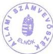

dr. Kovács Árpád
elnök

9

---

# FÜGGELÉK

a Pázmány Péter Katolikus Egyetem, a Károli Gáspár Református Egyetem és a Budapesti Evangélikus Gimnázium (Fasor) ellenőrzéséről készített V-3-30/2000. sz. jelentéshez

1. sz. Függelék: a Pázmány Péter Katolikus Egyetem
2. sz. Függelék: a Károli Gáspár Református Egyetem
3. sz. Függelék: a Budapesti Evangélikus Gimnázium (Fasor)

---

.

.

.

.

.

.

.

---

---1. sz. függelék  
a V-3-30/2000. sz-hoz

# A PÁZMÁNY PÉTER KATOLIKUS EGYETEM

## 1. AZ EGYETEM SZERVEZETÉNEK ÉS GAZDÁLKODÁSÁNAK SZABÁLYOZOTTSÁGA

A Pázmány Péter Katolikus Egyetem **Hittudományi Kara** a Pázmány Péter bíboros, esztergomi érsek által **1635-ben** Nagyszombatban alapított egyetem Hittudományi Karának **Jogutóda. Bölcsészettudományi Karát** a Magyar Katolikus Püspöki Konferencia alapította az Apostoli Szentszék **1992. január 24-én** kelt hozzájárulásával, amely az egyetem egészét katolikus egyetemnek ismerte el. A **Jog- és Államtudományi Kart** a Magyar Katolikus Püspöki Konferencia 1995-ben alapította.

Az egyetem az 1032/1993.(V.6.) Korm. határozat, valamint a felsőoktatásról szóló többször módosított 1993. évi LXXX. tv. 1. számú melléklete szerint államilag elismert egyházi egyetem.

A magyarországi katolikus intézmények, ezen belül az egyetem gazdálkodását meghatározó jogszabályok részben egyházi, részben állami szintűek.

Az **Egyházi Törvénykönyv** kánonjai (előírásai) a világon minden latin egyházra egyetemlegesen vonatkoznak, nem adnak, **nem adhatnak részletekbe menő szabályozást a különböző nemzetekhez tartozó különféle intézmények gazdálkodásához.**

A Törvénykönyv 3. kánonja kimondja, hogy a törvénykönyv nem érvényteleníti és nem módosítja azokat a megállapodásokat, amelyeket az Apostoli Szentszék egyes országokkal kötött, azok továbbra is érvényben maradnak, az egyházi törvénykönyv ellentétes előírásai ellenére is.

A Magyar Köztársaság és az **Apostoli Szentszék** között a Katolikus Egyház magyarországi közszolgálati és hitéleti tevékenységének finanszírozásáról, valamint néhány vagyoni természetű kérdésről 1997. június 20-án, Vatikánvárosban aláírt **megállapodás** kihirdetéséről szóló 1999. évi LXX. törvény rendelkezései az **állam finanszírozási kötelezettségeit rögzítik.**

Az egyházak, illetve az általuk alapított intézmények gazdálkodására és könyvvezetésére vonatkozó speciális jogi szabályozást a 76/1990. (IV. 25.) MT rendelet és a 50/1992. (III. 13.) Korm. rendelet állapítja meg.

Az egyetem Rendtartásának 13. §-a szerint a működés egészére vonatkozó általános belső szabályokat a Rektor javaslatának meghallgatásával a Nagykancellár hagyja jóvá.

---

Az egyetemnek nincs a gazdálkodás egészét átfogó szabályzata, miközben az egyetemi szintű információk érdekében 1998. év második felétől működik a Rektori Hivatal, amelynek feladata az egyetem költségvetésének és beszámolási feladatainak egyetemi szintű ellátása, összehangolása.

Az egyetem 1999. évben megkísérelte összeállítani a Gazdálkodási Szabályzatát. A szabályzatban figyelembe vett jogszabályok jellemző módon azok a kormányrendeletek voltak, amelyek a költségvetési intézmények gazdálkodását szabályozzák. Olyan, az egységes gazdálkodási szemléletet elősegítő szabályzat rendszer kidolgozása volt a cél, amely az addigi hiányosságok megszüntetését célozta, illetve szabályokat rögzített volna a rendszerezettség, áttekinthetőség és egységesség érdekében. A szabályzat tervezet nem lépett hatályba. Így a gazdálkodás rendjét meghatározó közös előírások továbbra is hiányoznak.

1998. évben a JÁK is megkísérelt a kar számára érvényes gazdálkodási szabályzatot összeállítani. A tervezet szintű szabályzat - hasonló módon a központi szintű elképzelésekhez - a gazdálkodásra vonatkozó legfontosabb előírásokat az Áht. alapján állította össze.

Az egyetemnek a vizsgált időszakban nem volt olyan ügyrendje sem, amely a költségvetésre és a beszámoló összeállítására vonatkozó belső eljárási rendjét szabályozná.

A jelenleg alkalmazott egyetemi szinten sem teljesen átlátható számvitelipénzügyi adminisztráció nem teszi lehetővé a központi költségvetésből származó forrásoknak és azok felhasználásának elkülönített nyilvántartását, áttekintését és elszámolását.

Az egyetemi Rendtartás 7. § (1) bekezdése szerint az egyetemi feladatok megoldását a Magyar Katolikus Egyház jogszabályai szerint, a világi tudományokban való képzés tekintetében a magyar oktatási rendszerhez igazodva, az egyetem vezetői és vezető testületei önállóan szervezik és irányítják.

A Rendtartás 15. §-a szerint a karok önállóan kezelik vagyonukat, az egyházi tulajdon kezelésére vonatkozó kánonjogi szabályok és a magyar jogszabályok tiszteletben tartásával. A közös egyetemi vagyon kezelése az egyetem vagyonkezelőjének feladata, aki a Rektori Hivatal keretében működik, azonban ez a felhatalmazás - figyelembe véve a gazdasági jellegű belső szabályozások elégtelenségét - nem teszi lehetővé az egyetemi szervezet egységes gazdasági áttekintését, befolyásolását, irányítását.

A Szt. szerint a gazdálkodó szervezetek adottságainak, körülményeinek leginkább megfelelő - a törvény végrehajtásának módszereit, eszközeit meghatározó számviteli politikát kell kialakítania és ennek keretében el kell készíteni az eszközök és források leltárkészítési és leltározási szabályzatát, az eszközök és források értékelési szabályzatát, az önköltség számítási rendjére vonatkozó szabályzatot és a pénzkezelési szabályzatot.

2

---

A vizsgált szervezetek közül csak a BTK tett maradéktalanul eleget az Szt. előírásainak, sem az Egyetem (Rektori Hivatal), sem a JÁK számviteli politikával és értékelési szabályzattal nem rendelkezett.

Számlatükörrel valamennyi kar rendelkezett, számlarendet azonban csak a Rektori Hivatal bocsátott rendelkezésünkre.

Mind a Rektori Hivatal, mind a JÁK és a BTK rendelkezett pénzkezelési és leltározási szabályzattal. A szabályzatok azonban rendkívül eltérő mélységűek és tartalmúak.

Az Szt. előírásai a kötelezően elkészítendő szabályzatok között a bizonylati szabályzatot nem nevesítik. A szabályozottság érdekében - az Szt.-ben előírt bizonylati fegyelem betartása és betartatása érdekében - azonban célszerű a bizonylati szabályzat, a szabványosítható bizonylatok esetében a bizonylati album összeállítása.

A bizonylati szabályzattal szemben elvárt követelményeknek megfelelő szabályzattal a BTK rendelkezett.

Az egyetem a gazdálkodás egységesítése érdekében kiadott egy egyetemi szintű bizonylati szabályzatot is, amely 1999. január 1-jétől szabályozza egyetemi szinten a bizonylati rendet. A szabályzat tervezet további pontosítása folyamatban van.

Állami szintű jogszabály rendelkezik az egyházi jogi személyek könyvvezetési és beszámoló készítési kötelezettségéről - 50/1992. (III. 13.) Korm. rendelet - amely az 1990. évi IV. törvénynek megfelelően gyakorlatilag az egyház belső ügyének tekinti a beszámoló tartalmának a meghatározását. A rendelet 2. § (1) bekezdése előírásai szerint a vállalkozási tevékenységet nem folytató egyház a beszámolót alátámasztó nyilvántartási rendet az egyházak belső ügyrendi előírásával szabályozza.

Az MKPK 1997. és 1998. években nem adott ki útmutatót a beszámoló összeállításához, mivel azok tartalma azonos volt az előző évekével. Az 1999. évi útmutató az MKPK speciális információs igényeire volt tekintettel.

Az Egyetem kettős könyvvezetés szerint könyvelt, azaz felmerült kiadásait nem pénzforgalmi szemléletben számolta el, hanem költségként. Az MPPK által kért beszámolók összeállítása az Egyetem számára bizonyos nehézségeket okozott, azok eltérő szemlélete miatt.

Az Egyetem mind a két évben elkészítette a kettős könyvvitelének megfelelő egyszerűsített éves beszámoló mérlegét és az MPPK kívánalmai szerinti pénzforgalmi elszámolást. Ez utóbbi kimutatás hibátlan összeállítása - a választott könyvvezetési mód eltérései miatt - nem volt maradéktalanul lehetséges.

Az egyetem éves beszámolója a költségvetési intézményekhez hasonlóan éves eredeti - módosított előirányzatot és teljesítést tartalmazott. A módosított előirányzat rovatokon azonban előirányzat nem jelent meg.

3

---

Ez ellentétes a Rektori Hivatal rendtartásának 4. §-ában leírtakkal, mely szerint: a gazdasági igazgató az elfogadott költségvetési előirányzatoktól csak a Püspöki Kar hozzájárulásával térhet el. Az 1999. évi zárszámadási nyomtatványokhoz küldött kitöltési útmutató szerint a zárszámadási táblákon mind a három oszlop kitöltése kötelező volt.

A szóban kapott információ szerint a beszámoló összeállítása során ezt az oszlopot sosem használták, mivel az előirányzatok teljesültek, a Püspöki Kar felé csak az eredeti előirányzattól való eltérést kellett indokolni. Ezt a véleményt az MKPK titkára írásban cáfolta.

A PPKE szervezetéhez a vizsgált időszakban nem tartozott függetlenített belső ellenőrzési szervezet. A függetlenített ellenőri feladatok ellátása 1998. évtől eseti megbízás alapján történt.

A Rektori Hivatal rendtartásának 6. §-a szerint a belső ellenőr a gazdasági vezető írásos munkaprogramja alapján végzi a gazdálkodás ellenőrzését. A függetlenített belső ellenőr ilyen vonatkozású gazdasági igazgató alárendelése a függetlenségét bizonytalanná teszi.

Annak ellenére, hogy az Egyetem Belső Ellenőrzési Szabályzatát 1999. január 16-án az Egyetemi Tanács jóváhagyta, ellenőrzési munkaterv nem készült.

A vizsgált időszakban két célvizsgálat volt. Az ellenőrzés a beruházásokkal volt kapcsolatos. Intézkedési terv nem készült, mivel a jelentés ilyen súlyú megállapításokat nem tartalmazott. Az ennyire leszűkült ellenőrzés kockázatokat hordoz magában a gazdasági-pénzügyi események szabályszerűsége és célszerűsége vonatkozásában, nem lehet kielégítő és megnyugtató a vezetés számára sem.

A PKKE-en a Társadalombiztosítási Igazgatóság végzett ellenőrzést, az Igazgatóság sajátos szempontjainak figyelembevételével, más ellenőrzés a vizsgált időszakban nem volt.

A fenntartó Egyház gazdasági ellenőrző szervezetet nem működtetett, megbízásából az ellenőrzött időszakban pénzügyi-gazdasági ellenőrzés nem volt. A fenntartói ellenőrzés a vezetői beszámoltatás, a költségvetések, beszámolók beruházási koncepciók, szabályzatok, valamint a kinevezések, új szervezeti egységek alapításának jóváhagyásán keresztül érvényesült. A fenntartó az egyetem átfogó ellenőrzését későbbi időpontban tervezi megtartani.

A munkafolyamatba épített ellenőrzés általános követelményeit az egyetem Szabályzata tartalmazta. A konkrét ellenőrzési feladat elvégzésének teendőit a munkaköri leírások kell, hogy tartalmazzák. A JÁK Pénzügyi Osztályán dolgozók munkaköri leírását ellenőrizve megállapítottuk, hogy a munkaköri leírások a munkakörbe tartozó ellenőrzési kötelezettségeket valóban tartalmazták.

4

---

## 2. A BEVÉTELEK, KIEMELTEN AZ ÁLLAMI TÁMOGATÁSOK VIZSGÁLATA

### 2.1. Az előirányzatok tervezése

A felsőoktatásról szóló törvény szerint az egyházi jogi személyek által létesített, államilag elismert felsőoktatási intézmények feladatai ellátásának feltételeit - a törvényben megállapított állami hozzájárulás mellett - a fenntartó, illetve saját bevételeiből az intézmény köteles biztosítani. A fejlesztés feltételeiről való gondoskodás a fenntartó feladata, melyhez az állam hozzájárulhat. E szerint az egyházi felsőoktatási intézmény az OM-mel kötött éves **megállapodásban rögzített hallgatói létszám alapján** jogosult:

a) a hallgatókat megillető támogatásra,

b) a szakterületre megállapított képzési és fenntartási normatíva igénybevételére

Az éves gazdasági tervek összeállítása során az Oktatási Minisztériumtól, vagy a MKPK-tól származó információk elégtelensége miatt az egyetemnek a vizsgált időszakban folyamatosan problémái voltak.

A tervező munka nehézségeire utal az a tény, hogy az 1997. évi beszámolóban eredeti előirányzatok nincsenek feltüntetve.

A JÁK 1998. évi beszámolója szerint a mutatószámhoz kötött állami támogatás a tervezett 115 M Ft helyett ténylegesen 258 M Ft volt.

Az éves költségvetési előirányzatok kialakításához sem a tervezést végző karok, sem az egyetem központi szervezete eredeti számítási dokumentációt nem tudott csatolni, csak az ellenőrzés céljára utólagosan összeállított számításokkal igazolták a tervek tartalmát.

A fenntartó MKPK az 1999. évi költségvetés tervezéséhez kiadott néhány oldalas útmutatója részletes, a következetes tervezés megvalósítására vonatkozó információkat nem tartalmazott. Az intézmény meghatározó bevételi forrását képező állami támogatás előirányzatának tervezési szempontjairól, mértékének kialakításáról nem volt az útmutatóban információ, mivel ezekkel a fenntartó sem rendelkezett.

Az előző évekhez hasonlóan az egyetem a 2000. gazdasági év tervezése során sem ismerte a világi képzés 2000. évben államilag finanszírozott hallgatói létszámát.

Az egyház vezetése többször kezdeményezte az OM-nél a felvételi keretszámok kellő időbeni egyeztetését és az abban való megállapodást, de választ ellenőrzésünk befejezéséig nem kapott.

A korábbi gyakorlatnak megfelelően az egyes felsőoktatási intézmények - az OM irányelvei és kérése alapján - az előző évre vonatkozó statisztikai létszám alapján adták meg az adott évben felvenni tervezett államilag finanszírozott létszámot, arról az OM döntött s a felvételi tájékoztatóban ez a létszám jelent meg.

5

---

A hitéleti képzés esetében - mivel a vatikáni megállapodás alapján 2500 főt vehetnek fel az intézmények, de elegendő jelentkezés hiányában a létszámot betölteni nem tudják - gyakorlatilag korlát nincs.

A költségvetési előirányzatok tervezése a gyakorlatban az előző év adatai alapján történt. A költségvetésben tervezett létszámot tárgyév márciusában felülvizsgálják. A szóban kapott információ szerint a felülvizsgálat a Minisztérium részéről létszám irányszám közlését jelenti. A milliárdos nagyságrendű állami támogatás tervezett összegének számítási alapját képező ülésekről jegyzőkönyv, emlékeztető nem készült.

# 2.2. A főbb bevételi jogcímek, az állami támogatás nagysága, összetétele

Az egyetem 1998. évben 2.590 M Ft bevétellel gazdálkodott, 1999. évben a tényleges bevétel összege 3.032,2 M Ft volt. A bevételeken belül a központi költségvetéstől kapott támogatás aránya meghatározó volt, 1998. évben a bevételek 47 %-a, 1998. évben 53 %-a származott a központi költségvetésből. Az intézményi működési bevételek ugyanekkor 21,5%-ot, illetve 16,6%-ot tettek ki (1.1. és 1.2. sz. melléklet).

A központi költségvetésből származott 1998-ban 1,6 Mrd Ft, ebből felhalmozási célú pénzeszköz 402 M Ft volt, 1999-ben az állami források 2,2 Mrd Ft-jából 640 M Ft volt felhalmozási célú. (Ezek az összegek tartalmazzák a képzési előirányzatot, a programfinanszírozás összegeit, a hallgatói előirányzatokat és az egyéb támogatásokat is.)

Az egyházi felsőoktatási intézmények működéséhez - a Felsőoktatási törvény (Ftv) és. a lelkiismereti és vallásszabadságról, valamint az egyházakról szóló 1990. évi IV. törvény (Ltv) rendelkezéseinek megfelelően, továbbá a Magyar Köztársaság és az Apostoli Szentszék által kötött megállapodásra és az abban foglaltaknak az azonos jogok érvényesítése érdekében a többi egyházra történő kiterjesztésére való tekintettel - az állam a Ftv-ben biztosította, hogy az egyházi felsőoktatási intézmények az állami intézményekkel azonos mértékű támogatásban részesülnek. A hittudományi és hitélettel összefüggő képzésben az állami intézmények bölcsész szakjaira nyújtott normatíva illeti meg a képzést végző egyházi intézményt.

Az Ftv. 114/A §-a szerint az egyházakkal kötött megállapodások betartását az oktatási miniszter érvényesíti az egyházi felsőoktatási intézmények vezetőivel évente kötendő megállapodásban. A gyakorlatban az adott évre vonatkozó finanszírozási szerződéseket általában az év utolsó negyedévében kötötte meg az OM az egyházi felsőoktatási intézményekkel, így a PPKE-vel is.

A fenti eljárást az egyházak többször kifogásolták.

Az 1998. évre vonatkozó megállapodást 1998. november 30-án írták alá. A megállapodás 1. bekezdése utal arra., hogy az egyetem részére a támogatást az Ftv. alapján megállapított államilag finanszírozott hallgatói létszám alapján vet-

6

---

ték figyelembe. Államilag megállapított hallgatói létszám a megállapodás aláírásáig nem volt.

Az 1999. évi finanszírozási szerződés aláírására 1999. október 20-án került sor.

Az 1998. és 1999. évi finanszírozási szerződés szerint az egyetem vállalta, hogy a tárgyévi költségvetési támogatás felhasználásáról a következő év január 31-ig számszaki és szöveges beszámolót küld az MKM, illetve az OM felsőoktatásért felelős államtitkárának.

A Magyar Katolikus Püspöki Konferencia elnöke 1998. április 25-i levelében kezdeményezte a minisztériumnál, hogy a szöveges és számszaki beszámoló tartalmát - az egyházak és az egyházi intézmények speciális nyilvántartási szabályainak figyelembe vételével - célszerű lenne meghatározni. Az egyház vezetése által felvetett kérdésre válasz nem érkezett.

Az MKPK beszámolója így csak az OM által előírt formában (számszaki adatok) elszámolására korlátozódott. A fentiek alapján az ellenőrzés a finanszírozási szerződésben vállalt kötelezettség elmaradását az egyházak gazdálkodásának egyes kérdéseiről szóló 76/1990. (IV. 25.) MT rendelet 2.§ (2) bekezdése alapján nem kifogásolhatja, mivel

(2) Az egyházi jogi személy a meghatározott célra szolgáló támogatás felhasználását, maradványának elszámolását a céltámogatást nyújtó szervezet előírásai szerint végzi.

A jogszabálynak megfelelő mértékű és összegű tényleges finanszírozás az utólagos elszámolással véglegeződik.

Ennek leglényegesebb indokai:

a letszamhoz kott normativak alapjan meghatarozott tamogatasoknla a normativa es a letszam a tanulmanyi ev es a koltsegvetesi ev idobeli eltoldasabol kovetkezogen valtozik.
a hallgató letszam a lemorzsolódások kovetkeztében valtozik. Az allam jogosan nem finanszirozhatja a szeptemberben beiratkozott, de a tanulmányokat evközben abbahagyó hallgatókat. Igy a normativ összug a tenyleges atlag letszam alapjan jar.
ebbol kovetkezogen a jogos tamogatas osszege - az allami egyetemek elszamolasahoz hasonloan -Csak valamennyi tenyadat birtokaban szamolhato ki.

Az előlegként folyósított és a jogos támogatás pénzügyi rendezése csak különbözetek egyeztetése alapján történhet meg.

A támogatás folyósítása - a késői megállapodás miatt - rendszeresen előleg formájában történt. Pl. az 1999. év finanszírozása az 1998. október 15-ei létszámadatok alapján kezdődött meg és az így folyósított összegeket az 1999. év október 15-ei adatok alapján, 1999. utolsó négy hónapjára vonatkozóan korrigálták. Az elszámolásnak a tervek szerint 2000. március 31-éig kellett volna megtörtén-

7

---

nie, de a vizsgálatunk befejezésig az elszámolás elfogadásáról az OM az egyetemet nem értesítette.

1998. májusáig a karok közvetlenül a folyószámlájukra kapták a támogatás összegét. A Rektori Hivatal megszervezésének az időpontjától az összegek a Hivatalon keresztül érkeznek az egyetem számlájára. Az 1999. évi adatok szerint az egyetem számlájáról a karok számlájára 11 napos késéssel történtek a továbbutalások. Az időcsúszás a karok gazdálkodásában likviditási gondot nem okozott. (Az 1999. évi likviditás adatait az 1.5 sz. melléklet tartalmazza.)

A támogatás karok szerinti megosztása nincs szabályozva, annak ellenére sem, hogy ezt az MKPK elnöke 1998-ban írásban kérte. A karok finanszírozása az egyetemhez hasonlóan szintén előleg formájában történt. Az intézmény saját bevételei az elmúlt két évben a forrásokon belül csökkenő tendenciát mutattak. Az intézményi működési bevételek 1998. évben 21,6 %-ot, 1999. évben 16,6 %-ot képviseltek. Az OM a pénzmaradvány jóváhagyásáról a jelentés lezárásának időpontjáig még az 1998. év vonatkozásában sem nyilatkozott. Az intézményi működési bevételek közel fele a hallgatói befizetésekből származik, ezen kívül (1999-ben) még a kamatbevételek jelentősebbek (100 M Ft).

### 2.3. A fejezeti kezelésű előirányzatok felhasználása

A Művelődési és Közoktatási Minisztérium, valamint az Oktatási Minisztérium Fejezeti kezelésű előirányzataiból támogatásban részesítette a nem állami felsőoktatási intézményeket is.

Az egyetem megalakulása óta éltek az OM által kiírt pályázatok lehetőségeivel, felismerve ezáltal az oktatásfinanszírozás növelésének lehetőségét. A pályázatok egy része a PPKE, más része a Jog- és Államtudományi Kar, valamint a Bölcsészettudományi Kar nevében történt, de pályáztak kari minőségükben közvetlenül az intézetek, illetve egyes oktatók is.

A pályázatok útján elnyert összegeket karonként külön nyitott számlákon kezelték.

A pályázatok teljesítésével kapcsolatos számlák kiegyenlítése a Rektori Hivatal ellenőrzése mellett történt, azokat a gazdasági vezető ellenjegyzte.

A pályázati összegek felhasználásáról az egyetem szintjén összesítés nem készült.

### 2.3.1. Felsőoktatási programfinanszírozás 1998.

1998-ban Felsőoktatási programfinanszírozás keretében az egyetem két feladatcsoportra kapott összesen 21.370 E Ft-ot.

Ebből a BTK nemzetközi konferencia megrendezésére és anyanyelvi vendégtanárok foglalkoztatására 6.080 E Ft-ot, további 15.290 E Ft-ot a BTK hat és a JÁK hét szakmai pályázatának megvalósítására, továbbá a Felsőfokú Intézmények

8

---

Nemzetközi Sporttalálkozójára fordították. A költségvetési támogatás összegét 1999. évre még 1 M Ft-tal megnövelték.

A felhasználás ellenőrzésekor az volt megállapítható, hogy a BTK a tervezett összegeket kiadási előirányzatonként megbontotta és a felhasználást is így számolta el. **Az elszámolások többségükben rendben voltak, a szakmai teljesítésről beszámoló készült.**

Hiányosságként azt állapítottuk meg, hogy a hallgatói támogatási projektek teljesítéséről két esetben nem készült beszámoló.

A JÁK pályázatainál a hallgatói támogatás projekteken nincs intézményvezetői aláírás, egyik pályázatnál a projektvezető és a szervezeti egység vezetőjének aláírása azonos. Az eredeti költségtervet külföldi kiküldetés miatt módosították, a kiküldetési rendelvény kitöltése hiányos volt.

A Pázmány Pódium címen elnyert 700 E Ft két pályázatra szólt, de mindkettő az 1988. nyarán megrendezendő esemény, a Nyári Pázmány Napok finanszírozására biztosított fedezetet.

A hallgatói támogatás projekteken ezúttal sincs intézményvezetői aláírás.

A számlamásolatokról összesítés e pályázat elszámolásához sem készült.

A nyári rendezvények szakmai indíttatása és annak teljesítése az ifjúság igényeinek tesz eleget és így megfelelt a pályázati célnak.

### 2.3.2. A felsőoktatás feladatfinanszírozása 1999.

A felsőoktatási feladatfinanszírozás keretében 1999-ben az egyetem 48.183 E Ft támogatáshoz jutott, ebből 27.907 E Ft összeget **felsőoktatási programfinanszírozás** címén hat témakörre, **felsőoktatási fejlesztési alapprogram (FEFA)** keretében 7.200 E Ft-ot két témakörre, valamint **felsőoktatási kutatási és fejlesztési pályázat** négy témakörére 13.076 E Ft összeget fordítottak.

A fogyatékos hallgatók részére átutalt 570 E Ft-ból a lift kialakítására fordítottak 530 E Ft-ot, a fennmaradt 40 E Ft-ból számítógép tartozékokat vásároltak.

A felsőoktatási programfinanszírozásra fordítható legmagasabb összeget a „Reformtanterv általános bevezetése a BTK-n” pályázat nyerte el. A projektvezető a kar dékánja. A feladat konkrétan meghatározott és támaszkodik a már elért eredményekre. Az igényelt támogatás kiemelt előirányzatonként részletezett, a megvalósítás ütemterve tanszékekre és oktatókra lebontott.

Kifogásolható, hogy a betervezett rezsi költség az engedélyezett 18% helyett 19,5% mértékű.

A pályázat mellett számlamásolatok találhatók, de azok összesítése hiányzik. Az elszámolási és beszámolási kötelezettség 2000. II. félévében esedékes.

Nyelvi képzésre, anyanyelvi vendégtanárok fogadására 1999-ben 2.988, illetve 1.989 E Ft állt a **BTK** rendelkezésére két elnyert pályázat alapján.

9

---

Megállapodási szerződés és részprogram engedélyezési okirat rendelkezésre áll, ami kiemelt előirányzatonként bontva tartalmazza a tervezett felhasználást.

Az 1999. év végén jóváhagyott programok elszámolási határideje 2000. január 31., a helyszíni vizsgálat befejezéséig nem készült el.

A BTK holland-magyar együttműködésre 2.700 E Ft-ot, valamint 1.600 E Ft-ot nyert el pályázat útján a felsőoktatási programfinanszírozás fejezeti kezelésű előirányzatából.

A részprogram engedélyező okiratok 2000. február 15-ig engedélyeznek felhasználást. Elszámolás a helyszíni ellenőrzés befejezéséig nem készült. A programhoz kapcsolódó szakmai elképzeléseket részletesen megfogalmazták, de a megvalósításról nem állt rendelkezésre szakmai beszámoló.

Az OM a PPKE-vel kötött megállapodásában engedélyezte 570 E Ft 1998. évre történő visszamenőleges elszámolását (hollandiai tanulmányút 5 főre), amiről külön szakmai beszámolót nem kért. Pénzügyi beszámoló ez ideig nem készült.

A felsőoktatási fejlesztési alapprogram (FEFA) szakmai pályázatból 1999-ben 7.200 E Ft-tal részesült az egyetem, mely összegből a BTK 4.200 E Ft-ot könyvtárának és sporttevékenységének fejlesztésére kapott.

A könyvtárfejlesztés (2.500 E Ft), szükségességét és előnyeit részletesen indokolták (elektronikus könyvtárfejlesztéshez korszerű számítógépek beszerzése szükséges).

A sporttevékenység fejlesztésének lehetőségét hivatott biztosítani a másik alprogram 1.700 E Ft-tal (sporteszközök beszerzését tervezik).

A határidő meghosszabbítását kérték 2000. június 30-ig, amit az OM engedélyezett.

A Felsőoktatási Kutatási és Fejlesztési Pályázat előirányzatra 13.076 E Ft pályázati keretösszeget kapott az egyetem 1999-ben. A BTK két kutatási pályázattal 11.600 E Ft-ot, a PPKE doktori képzésre 1.176 E Ft-ot nyert el.

A kutatási szerződések részletes programmal elkészültek. A pénzügyi tervet is a pályázat teljes futamidejére állították össze.

A tervezés során előírás volt, hogy a személyi juttatások a posztdoktori alkalmazásra tervezett költségek nélkül nem haladhatják meg a teljes támogatási összeg 20%-át. Az FKFP 0353/1999. számon nyilvántartott pályázatnál fenti arány 2000. és 2001-re vonatkozóan 37%. A túllépés indokát nem dokumentálták.

Három program szakmai teljesítéséről pozitívan számoltak be a projekt vezetők, de a tervezett programot módosítani kellett, ugyanis a pénz csak 1999. augusztustól állt rendelkezésre.

A pénzügyi beszámolók is elkészültek a fenti programokról, a számla másolatok is csatolva vannak, de összesítés nem készült róluk projektenként és néhány másolat olvashatatlan. A pénzmaradvány következő évi felhasználásával számolnak.

10

---

Normatív kutatás támogatásra 6.800 E Ft-ot nyert el a PPKE, mely három projektet finanszíroz. Ebből a legeredményesebb a távoktatás bevezetése. Távoktatás fejlesztési kutatási program keretén belül a JÁK-on egy új képzési forma indult az 1997/98-as tanévtől kezdődően: a Számítógépes Levelező Oktatás. A távoktatást közel 400 hallgató vette igénybe. Ennek fedezetére szolgált a vizsgált évben a 2.000 E Ft a normatív kutatási alapból. A Kar saját forrásából 500 E Ft-tal egészítette ki a képzés költségkeretét. A távoktatás bevezetése a szöveges szakmai értékelés alapján beváltotta a hozzá fűzött reményeket.

# 3. KIADÁSOK ALAKULÁSA

# 3.1. A kiadások nagysága és összetétele

A Pázmány Péter Katolikus Egyetem összes tényleges kiadása 1998-ban 2254,2 M Ft volt, az eredetileg tervezettnek 85%-a. Erre az évre a dologi kiadásokat túltervezték, a tervezett 1684 M Ft helyett ténylegesen 914 m Ft-ot tett ki. Az 1999. évre tervezett eredeti kiadási előirányzat 2688 M Ft, amely az előző évi tényleges kiadásokat 19%-kal haladta meg. A tényleges kiadás 3016,5 M Ft volt, mintegy 34%-kal haladta meg az előző évit (1.3 és 1.4 sz. táblázat).

A kiadási többlet összefügg a költségeket alkotó tényezők inflációján kívül a hallgatói létszám növekedésével, az oktatói létszám bér- és járulékvonzatainak növekedésével, valamint a létesítmények fejlesztésével együttjáró költségemelkedésekkel.

A kiadások 72,2%, illetve 74,5%-ának forrását a központi költségvetés jelentette, ami egyben azt is jelzi, hogy a saját bevételek növekedési üteme elmarad a feladatbővüléstől és a költségek növekedésétől.

# 3.2. Létszám- és illetményhelyzet

Az egyetemen a teljes munkaidőben foglalkoztatottak létszáma 1998-ban 454 fő volt, a növekedés az előző évhez képest 30%. 1999-ben az alkalmazottak száma további 59 fővel (13%) emelkedett. Az összes oktatók száma 1999. X. 15-i állapot szerint 285 fő volt.

1999-ben az intézménynél foglalkoztatottak (513 fő) 1 főre jutó éves illetménye 1,130 M Ft volt, amely az előző évi kereseteket 27,5%-kal haladta meg. Az oktatók 1 főre jutó illetménye a vizsgált években 1,048 M Ft-ot, illetve 1,495 M Ft-ot tett ki (1.6 és 1.7 sz. táblázatok).

A JÁK SZMSZ-e teljes körűen szabályozza az oktatói bérezés általános elveit. Az oktatók nem közalkalmazottak, azonban az alapbéreket a közalkalmazotti bértábla E, F, G oszlopai szerint határozták meg (tanársegédek: E, adjunktusok: F, egyetemi előadó, docensek és egyetemi tanárok: G oszlop szerinti bérskálák alapján). Az adjunktusok, egyetemi tanárok esetében az alacsonyabb, vagy magasabb besorolás a gyakorlati idő hossza, vagy tudományos háttér, illetve a tudományos minősítés alapján történik.

Bérpótlékként állami nyelvvizsga pótdíj (felsőfokú 15.000 Ft, középfokú 7500 Ft) kerül elszámolásra. További bérpótlékként tanszékvezető 1, intézetvezető és

11

---

dékánhelyettes 2, dékán 3 alapbéregységnek (1 egység 15.000 Ft) megfelelő összegű pótlékra jogosult. A szabályozás az előadások, szemináriumok, konzultációk stb. esetében teljes körűen került összeállításra.

A BTK bérezési elvei első változatát az 1997/98-as tanév 2. félévétől, újabb változatát az 1999/2000. tanév kezdetétől alkalmazzák, mindkét változatban a közalkalmazotti bérezés elvei figyelembevételével. Az új bérezési rendszerben az oktatókat a H, I, J kategóriákba sorolják be az alapbér megállapításához, ennek előfeltétele az oktatói és kutatói követelményrendszerben meghatározottak teljesítése.

Az illetménypótlék oktatói szintek (tanársegéd, adjunktus, docens, egyetemi tanár) szerint 10.500 Ft, 13.500Ft, 27.000 Ft, 54.000 Ft. Személyi pótlék a tényleges teljesítmény (kutatási tevékenység, publikációk stb.) alapján 5 kategóriában adható. (0-48.000 Ft között, kategóriánkét 12.000 Ft-os növekedéssel). A nyelvpótlék középfokú nyelvvizsga esetén 6.750 Ft, felsőfokú nyelvvizsga esetén 13.500 Ft.

Az adatszolgáltatás alapján az egyetemnél a megbízási díjak összege 1997-hez képest 1999-re 60,5%-kal, 126,5 M Ft-ra emelkedett a létszámadatok 13%-os növekedése mellett. A belső megbízások 1997-ben az összes megbízások 83%-át, 1999-ben 86%-át képviselték, a belső megbízásoknál az 1 főre jutó összeg 163 E Ft-ról 364 E Ft-ra, a külső megbízásoknál 30%-kal, 260 E Ft-ra emelkedett. Az oktatóknál az 1 főre jutó összeg 189%-kal, 457 E Ft-ra nőtt.

Az ellenőrzött megbízási szerződések alaki és tartalmi vonatkozásban megfelelőek, a feladat ellátásával, a díjazással, a munkavégzés igazolásával kapcsolatos adattartalmuk a szükséges tájékoztatást biztosítja.

Külső megbízási díjakat a JÁK-nál - a vizsgált kb. 20 megbízási szerződés és a BTK-nál vizsgált 7, a munkavégzést igazoló dokumentum alapján - óra- és vizsgadíjakra és nyelvi képzésre fizették ki.

### 3.3. Az oktatás tárgyi, technikai feltételei és azok fejlesztése

Az egyetemi épületek állapota - a BTK egyes, az oktatás feltételeit átmenetileg biztosító átalakított épületektől eltekintve - jónak minősíthető. A felújítást követően a JÁK és a HTK épületei megfelelő oktatási lehetőségeket biztosítanak és a karbantartás befejezését követően megteremtődhetnek a zavartalan oktatás feltételei a BTK piliscsabai campusán is. (Az egyetem eszközállományának adatait az 1.8. sz. táblázat közli.)

A tájékoztatás alapján a BTK-n az oktatás műszaki feltételei elemi szinten biztosítva vannak, a karon mind a diákok, mind a tanárok elhelyezése szűkös. A számítógépes ellátottság megfelelő (külön számítógépes tanteremmel rendelkeznek), bár a megnövekedett igényeket nem tudják teljes mértékben kielégíteni. A tanszékek közötti belső információs hálózat világszínvonalú, a csatlakozó gépek száma azonban nem elegendő. Egyéb gépekkel (írásvetítő, epidiaszkóp, hangerősítő, stb.) való ellátottság nem megfelelő. A kari könyvtár könyvanyagát átmenetileg több épületben helyezték el. Az állomány további bővítésre szorul.

A JÁK-on a kapott tájékoztatás szerint a képzés műszaki feltételei megfelelőek, a jogi képzés nem eszközigényes, átlagos műszaki eszközparkot igényel. A kar

12

---

az alapoktatásban a normál oktatást jelentősen meghaladó (nyelvi, informatikai, szaktárgyi) választékot kínál. A könyvtár folyamatosan fejlődik, a számítógépes ellátottság meghaladja az országos átlagot.

Könyvtártámogatáson elnyert pályázattal az egyetem 1998-99-ben összesen 22 M Ft összeghez jutott.

# 3.4. Beruházások, felújítások

A folyamatban lévő, illetve a vizsgálat ideje alatt befejezett beruházások célja a Piliscsabán működő, a BTK oktatási lehetőségeit biztosító Stephaneumnál az oktatás feltételeinek megteremtése és továbbfejlesztése, az átvett ingatlanok esetében Piliscsabán és a fővárosban a korábban más célra használt épületekben az oktatáshoz szükséges feltételek kialakítása a megnövekedett hallgatói létszám elhelyezésének biztosítása mellett.

Az egyetemi beruházások 1998-99-ben 947,5 M Ft-ot tettek ki, ebből az 1999. évi 80%-ot képviselt. A felújítások összege a vizsgált időszakban 862,5 M Ft volt, az adott években 50-50%-os megosztással.

Felújításokra a központi költségvetés 305 m Ft támogatást nyújtott. Saját forrásból beruházásra - felújításra 700 M Ft-ot fordítottak, ebből a Magyar Katolikus Püspöki Kar 95,8 M Ft-ot biztosított.

A helyszíni ellenőrzés során két beruházás iratait vizsgáltuk meg részletesebben. Az egyik, a Stephaneum oktatási központ, a BTK campusának beruházása volt.

A Stephaneum oktatási központ beruházása 1993-ban kezdődött meg, a beruházás kivitelezését versenytárgyalás alapján egy Kft. nyerte el 1.153 M Ft összegű prognosztizált átalányáron. Az egyetem 1997-ben 350 M Ft támogatást kapott az MKM költségvetésében biztosított rendkívüli előirányzatból. Az egyetem a támogatás felhasználásáról tételes elszámolást nyújtott be.

Az egyetem létrehozására alapított Katolikus Egyetemi Alapítvány 1997-ben munkahelyteremtéssel járó humán- infrastruktúra fejlesztéssel pályázott és 75 M Ft támogatást nyert el a Pest megyei Területfejlesztési Tanácstól, a továbbiakban (1998. márciusában) átvette az egyetemtől a beruházási feladatokat.

Az ÁFA törvény módosításával az Alapítvány részére méltányosságból lehetővé vált az ÁFA visszaigénylése az eszközök, ingatlanok egyetem részére történő térítésmentes átadása esetén. A PM és az APEH dokumentumai a visszaigénylési jogosultságot alátámasztották.

1998-ban a Kormány 2082/1998.(IV. 8.) sz. határozatával a Magyar Katolikus Egyház részére biztosított keretből a PPKE részére 270 M Ft beruházási támogatást biztosított a BTK építkezéséhez.

Az egyetem a megállapodásnak megfelelően határidő előtt tételes elszámolást nyújtott be a Miniszterelnöki Hivatal Egyházi Kapcsolatok Titkár-

13

---

sága részére a támogatási összegek felhasználásáról. A támogatások teljes összege felhasználásra került.

A vizsgált dokumentumok - a mintavétellel kiválasztott számlák, továbbá a banki átutalások - a célszerinti felhasználást igazolták.

1999. január 1-jétől - miután az Alapítvány saját beruházási forrásai kimerültek - püspökkari határozat alapján az egyetem megszüntette a beruházási célú támogatás alapítvány részére történő átadását.

1999-től a Stephaneum beruházását ismét az egyetem vette át.

A Magyar Katolikus Egyház részére biztosított támogatásból 1999-ben az egyetem 400 M Ft összegű támogatást kapott az 1077/1999. (VII. 7.) Korm. határozat alapján az NKÖM költségvetésében. A 217/1998. (XII. 30.) sz. Kormányrendelet alapján az egyházi kulturális örökség értékeinek rekonstrukciója és egyéb beruházások az 1999. évben a programfinanszírozás körébe tartozó fejezeti kezelésű előirányzatnak minősültek.

Az egyetem a megállapodásnak megfelelően a finanszírozást a Magyar Államkincstáron keresztül, a programfinanszírozás keretei között, a MÁK által szabályozottaknak megfelelően végezte. Az egyetem a támogatási összegek felhasználásáról készített beszámolót a megállapodásban rögzített határidő előtt benyújtotta. A támogatások teljes összegét felhasználták.

A mintavétellel kiválasztott dokumentumok alapján megállapítható, hogy a támogatási összegek a megjelölt célokra kerültek felhasználásra.

Az NKÖM a Milleniumi beruházások célprogram előirányzata terhére a költségvetésből 200 M Ft-ot biztosított a BTK Stephaneum központi oktatási épülete beruházásához. A támogatást a megállapodásban meghatározott beruházási feladatok elvégzésére használták fel, teljes összegben. A támogatás elszámolását az egyetem határidő előtt elvégezte.

Az egyetem a millenium kormánybiztosától a Stephaneum egyetemi épület környezetének kialakításához 40 M Ft támogatást kapott az 1999. évi költségvetésből az NKÖM fejezeti kezelésű előirányzatából. Az egyetem a támogatási összeg felhasználásáról elszámolását határidő előtt benyújtotta, a teljes összeg felhasználásra került. A vizsgálatra kiválasztott dokumentumok a munka elvégzését a szerződésben meghatározott körben igazolták.

A Kormány 2150/1999. (VII. 2.) határozata alapján a Hajnalcsillag Alapítvány 200 M Ft támogatásban részesült a BTK oktatási épületeinek beruházási költségeire. A finanszírozó alapítvány a támogatást a generálkivitelezői szerződésben meghatározott műszaki tartalmú részszámlák kiegyenlítésére használta fel, a vizsgált dokumentumok ezt alátámasztották.

A megítélt támogatás a tájékoztatás szerint a III. negyedévben vált lehívhatóvá, ez a generálkivitelezői szerződés módosítását időben hátráltatta, az építkezést közel fél évig szüneteltették. A módosítást az egyetem és a fenntartó a támogatás biztosítását követően írta alá.

14

---

A generálkivitelezői szerződés megkötésétől 1997. XII. 1-től kezdődően 1999. év végéig 4 alkalommal került sor szerződés módosításra. A teljes körű átadás eredeti tervezett időpontja 1999. VII. 31. volt, a beruházás befejezésére azonban a jelenlegi helyzet szerint a helyszíni ellenőrzést követő időszakban kerül sor. Az 5. sz. szerződés módosítás egyeztetése folyamatban van.

A szerződés módosítások során a beruházás eredeti összege 1.153.192 E Ft 11,9%-kal, 1.290.013 E Ft-ra emelkedett.

A beruházás túlnyomó részben több, mint 90%-ban költségvetési támogatásból valósul meg. A támogatási összegek hozzáférési lehetőségei nem voltak egyenletesek, a beruházás folyamatosságát nem tették lehetővé, ezért esetenként szükségessé vált a kivitelezői szerződés módosítása.

A Karon teljes létszámú évfolyamok felvételét a beruházás tervezett befejezésének határidejéhez igazították, arra számítottak, hogy a teljes kari létszám kialakulásáig a Stephaneum épületei elkészülnek.

A többletköltségek a kitűzött célok megvalósítását időben hátráltatják, az időbeni késedelem megnehezíti az egyetem szakmai tevékenységének eredeti célok szerinti megvalósítását.

Az egyetem nagykancellárja a 20 M Ft összegű szerződéseket a fenntartó Püspöki Konferencia nevében hagyja jóvá. Ugyancsak a fenntartó jóváhagyása szükséges az Egyetem több évre szóló beruházási koncepciójához és az éves költségvetésben a tárgyévi beruházási célokhoz és keretekhez.

A Magyar Katolikus Püspöki Konferencia a PPKE fejlesztéseiről és beruházásairól határozott.

Szükségesnek ítéli a testület a beruházás mielőbbi befejezését, de a Püspöki Konferencia döntése szerint az elkövetkező három évben a BTK-n nem kerülhet sor további épület emelésére, míg a JÁK és az Informatikai Kar épület beruházásait a Konferencia jóváhagyta.. 2000-re a költségvetési támogatásból 400 M Ft-ot biztosítanak a PPKE részére.

4.

# A HALLGATÓK ÁLLAMI TÁMOGATÁSA ÉS ANNAK FELHASZNÁLÁSA

A hallgatói előirányzatok felhasználásának szabályzatát - a hallgatók részére nyújtható támogatásokról és az általuk fizetendő díjakról, térítésekről - karonként önállóan a felsőoktatási törvényben foglaltaknak megfelelően alakították ki. A szabályozások - a JÁK kivételével - teljes körűen tartalmazzák a támogatások körét, az odaítélés módját és eljárási szabályait, a támogatások feltételrendszerét.

A hallgatók részére adható támogatások szabályozása a JÁK-nál nem teljes körűen, de megfelel a 144/1996. (IX. 17.) Korm. rendelet előírásainak. Hiányossága, hogy nem tartalmazza a rendelet 2. § (2) bekezdés a) pontjában előírt rendelkezést a pénzügyi források és más támogatások ellenőrzési rendszeréről.

15

---

Az egyetemi karok hallgatói önkormányzati szabályzatai a felsőoktatásról szóló 1993. évi LXXX. tv. 66-67. §-ában foglaltaknak megfelelnek. A hallgatói képviselet részvétele biztosított a Kari Tanácsban, a Tanulmányi és Fegyelmi Bizottságban, a hallgatói támogatások elosztásában. A szabályozást a BTK és a JÁK esetében egyaránt 1998. októbertől módosították, a HTK szabályzata 1999. szeptember 1-től lépett hatályba.

A JÁK-on és a BTK-n működő HÖK-ok, a HTK-on a Diákbizottság (DB) a kari SZMSZ-ben meghatározott feltételeknek megfelelően vesznek részt a hallgatói érdekképviselet ellátásában, a támogatások elosztásában.

Az államilag finanszírozott első alapképzésben résztvevő nappali tagozatos hallgatók számára biztosított hallgatói normatívát a Kari Tanács felhatalmazása alapján a HÖK-ok osztják fel. A hallgatói normatíva körébe tartozó tanulmányi ösztöndíj, kiemelt ösztöndíj, pénzbeli szociális támogatás mellett a lakhatási támogatás, segélyezés, köztársasági ösztöndíj, tankönyv és jegyzettámogatás elosztásában a HÖK-ok a Hallgatói térítési és juttatási szabályzatnak megfelelően jártak el. A HTK-n a DB fő feladata a Karral történő érdekegyeztetés és a tanulmányi ügyekben való együttműködés. A DB tagjai az ösztöndíj odaítélésében, felsőoktatási tankönyv pályázatban, felsőoktatási programfinanszírozási pályázat elkészítésében vettek részt.

Az Oktatási Minisztérium a nappali tagozatos hallgatók részére az éves átlaglétszámnak megfelelően biztosította a törvényben meghatározott hallgatói előirányzatokat.

A hallgatói létszám 1998-ban 2937 fő volt, 1999-ben 3263 fő.

Az előirányzatok felhasználása a következők szerint történt:

1998-ban az OM 205,576 M Ft hallgatói juttatás előirányzatot biztosított az egyetem részére, 1999-ben az előirányzat tényleges összege 228,387 M Ft volt.

Kollégiumi támogatásra (1998: 30.000 Ft/fő/év, 1999: 33.000 Ft/fő/év) 1998-ban 18,5 M Ft, 1999-ben 30,5 M Ft volt a támogatás összege.

A kollégiumi támogatást 1998-ban 615 fő, 1999-ben 903 fő vette igénybe.

A lakhatási támogatás összege 1998-ban 7,2 M Ft, 1999-ben 58,1 M Ft volt.

Tankönyv és jegyzettámogatásra 1998-ban 17,3 M Ft-ot, 1999-ben 18,2 M Ft-ot juttattak az egyetemnek.

Tankönyv- és jegyzettámogatásban a vizsgált években 2769, illetve 3126 hallgató részesült.

A JÁK-on a kari vezetés és a HÖK közös döntése alapján az 1998/99. és 1999/2000. tanévben a tankönyv- és jegyzettámogatásból 6,274 M Ft-ot a kari könyvtár fejlesztésére fordítanak.

Köztársasági ösztöndíjban összesen 25 fő, a II. félévben 30 fő részesült.

16

---

**Tömegsport támogatására** (200 Ft/fő/év) 1999-ben 3115 főre 623 E Ft-ot biztosítottak a költségvetésből.

**Doktorandusz hallgatók ösztöndíját** (468.000 Ft/fő/év) 1998-ban nem, 1999-ben 4 fő részére 1.872 E Ft, továbbá az 1998/99. tanév 4 hónapjára 3 fő 408 E Ft, összesen 2.280 E Ft összeget biztosítottak a költségvetésből.

Az egyetem többszöri kezdeményezése ellenére a vizsgálat idejéig nem történt meg az 1998. évi támogatások elszámolása az OM részéről.

Az 1998. évi alulfinanszírozás 62,1 M Ft-os összegéből a lakhatási támogatás 16,1 M Ft-ot tett ki.

#### **A felhasználásokat ellenőrzésünk rendben lévőnek találta.**

A felhasználások törvényességét alátámasztja a hallgatói juttatások elszámolása, ami a minisztériummal évenként kötött megállapodásban foglaltaknak megfelelően megtörtént, azt a vizsgált - a minisztérium által kötelezően alkalmazott - dokumentumok igazolták. Az OM az elszámolásokról az egyetemnek nem nyilatkozott.

### **5. KOLLÉGIUMOK MŰKÖDTETÉSE, FENNTARTÁSA**

Az egyetem saját kollégiummal nem rendelkezik. A JÁK 2 bérleményben 85 lakóhelyiséget biztosított 1695 m² lakóterülettel, 253 hallgatói férőhellyel. A karon a férőhely kihasználtság 100%-os volt. A BTK 7 bérleményben 3.069 m² lakóterülettel 247 lakóhelyiségben 665 hallgató elhelyezését biztosította (ami nem tartalmazza a családi házakban elszállásolt hallgatók - 233 fő - lakóterületét). A férőhely kihasználtság 95-100% közötti volt 1999. októberében. (A kollégium adatai az 1.14 sz. táblázatban láthatók.)

### **6. AZ OKTATÓI KAR ÖSSZETÉTELE, AZ OKTATÁSI TELJESÍTMÉNYEK**

**Az összes oktatói létszám** aránya némileg növekedett a vizsgált években, 1998-ban 44,1, 1999-ben 46,3% az összes foglalkoztatottakon belül.

**A főfoglalkozású oktatók létszáma** a vizsgált időszakban megduplázódott. A 1997-1999. évek között a növekedési index 213% volt (X. 15-i állapot létszáma alapján).

1997. X. 15-én 136, 1998. október 15-én 219 főfoglalkozású oktató tanított az egyetemen. Az oktatói létszám növekedése a karok fejlődésével együtt történt. A magas színvonalú oktatói munkához szükséges igény teljesítése csak jól képzett, magas szakmai kompetenciával rendelkező oktatói karral lehetséges. Ezt csak részben igazolják az adatok, melyek szerint 1997. őszén az oktató létszám 27%-a volt egyetemi tanár, 21%-a egyetemi docens, 16%-a egyetemi adjunktus. 1998-ban az oktatók abszolút számának megduplázódása miatt az arányok részben megváltoztak: 20%-ra csökkent az egyetemi tanárok aránya, (bár számuk növekedett), változatlan volt az egyetemi docensek és adjunktusok aránya.

17

---

Növekedett a tanársegédek, valamint a nyelv- és testnevelő tanárok aránya az összes oktatókon belül, létszámuk is közel megduplázódott.

## 6.1. Oktatói követelményrendszer az egyetemen

Az egyes Karok oktatókkal szemben támasztott írásba foglalt elvárásai lényegében azonosak, a megfogalmazásban van eltérés. A BTK a Kar szervezeti felépítésének rendszerébe helyezi az oktatói követelményrendszert, amely részletesebb, konkrétabb, gyakorlatiasabb, mint a JÁK szabályzata.

A katolikus egyetemekre vonatkozó egyházi előírások alapján az Egyetem oktatói több mint felének katolikus vallásúnak kell lennie. A Karok ennek bizonylataként nyilvántartják az oktatók vallási hovatartozását.

A Karok leendő oktatójának írásban vállalnia kell az egyetem szellemiségével kapcsolatos követelmények teljesítését, valamint azt is, hogy oktatásán keresztül hallgatóival megismerteti a keresztény szellemiség lényegét.

Az oktatói besorolású egyetemi alkalmazottak a PPKE-n egyetemi végzettséggel rendelkeznek, főiskolai végzettségű oktatót nem alkalmaznak.

Meghatározott eljárás alapján a Kar oktatói a nyugdíjba vonult egyetemi tanárnak az Egyetemi Tanács jóváhagyásával „Professzor Emeritus” címet adományozhatnak, aki az oktatómunkában továbbra is részt vehet.

A BTK 2000. január 1-től új oktatói és kutatói követelményeket is életbe léptetett, ami kiegészítése a fent említett oktatói követelményrendszernek. Tovább bővíti az oktatókra háruló feladatok körét, részletezi a kutatói követelményeket, valamint az egyetemért - ezen belül a hallgatókért - végzendő munkát.

Külön említést érdemel a **tutori** rendszer, melynek feladata, hogy segítse a hallgató beilleszkedését az Egyetem közösségébe. Ezt segítendő, a Karok oktatói és felsőbb éves hallgatói - a tutori rendszer keretében - hallgatók kis csoportjainak rendszeres szakmai segítésére törekednek az első két évfolyamon.

A BTK Munkaügyi Szabályzatában rögzíti, hogy a munkavállaló teljes munkaideje heti 40 óra, ebből az oktató köteles 2 munkanapot a Kar területén tartózkodni. Ez a kikötés segíti az oktató-hallgató kapcsolatának kiépülését.

A szakemberképzés másik feltétele a magas színvonalú oktatói tevékenység. Az egyetem ezért **minőségbiztosítási rendszert** dolgozott ki az oktatók értékelésére. Ennek keretében az oktatók minden évben kötelesek számot adni tudományos tevékenységükről, ideértve a publikációt is. A tudományos fokozattal még nem rendelkező fiatal oktatóktól megkövetelik, hogy meghatározott időn belül szerezzék meg a PhD minősítést.

A Hallgatói Önkormányzat is minden évben készít hallgatói értékelést az oktatók munkájáról. A minőségbiztosítással foglalkozó bizottság a hallgatói vélemények alapján elvégzi az oktatói munka felülvizsgálatát az érintett intézetek bevonásával. A bizottság tapasztalatairól és javaslatairól tájékoztatja a Kari Tanácsülést.

18

---

Alkalmatlanság megítélése esetén mód van arra, hogy az oktatótól megváljon az Egyetem. Erre volt már példa. Ezt segíti pl., hogy a JÁK-on az egyetemi adjunktusokkal és tanársegédekkel határozott idejű szerződést kötnek (fő- vagy részfoglalkozású esetben is).

A szakmai színvonal növelése érdekében a karokon végzett, rátermett hallgatókat tanársegédként foglalkoztatják, szakmai előmenetelüket segítik.

A Karok fiatal oktatóinak felkészülését, továbbképzését kiemelten fontosnak tartják, ezért támogatnak minden olyan kezdeményezést, mely az oktatók nemzetközi tapasztalatszerzését - oktatói és tudományos területen egyaránt - eredményezi.

## 6.2. A főfoglalkozású oktatók óraterhelésének alakulása

Az 1998-99. tanévben 13%-kal csökkent az oktatók átlagos óraterhelése az előző tanévhez képest. Az összes leadott óraszám 7.018-ról 9.715 órára emelkedett, de az oktatók létszámának növekedése miatt csökkent az egy főre eső óraterhelés (1.13 sz. táblázat).

Az **egyetemi tanárok** óraterhelése is mérséklődött a vizsgált tanévekben (1997-98. és 1998-99-ben), de eltolódott a gyakorlati órák irányába, míg az előadások száma csak kismértékben (3,5%-kal) emelkedett.

Az egyetemi **docensek** átlagos óraterhelésének csökkenésével (közel 29%) egyidejűleg a leadott órák száma emelkedett és eltolódott arányaiban az előadások irányába.

Az egyetemi **adjunktusok** átlagos óraterhelése több mint kétszeresére, a leadott órák száma közel négyszeresére (létszámuk is 71%-kal) növekedett és eltolódott az előadások felé a gyakorlati órák rovására (7%-kal csökkent a leadott gyakorlati órák aránya).

A **tanársegédek** átlagos óraterhelésének 17%-os csökkenésével áll szemben a megtartott gyakorlati órák számának 54%-os növekedése.

A **nyelv- és testnevelő tanárok** 23%-os óraterhelés növekedésével együtt a leadott gyakorlati órák száma több, mint kétszeresére emelkedett.

## 6.3. Az oktató-hallgató arány változása

Az oktatói- hallgatói létszámarány alakulását bemutató tanúsítvány egy időpontra, október 15-re vonatkozóan közöl adatokat (1.9 sz. táblázat).

Az 1998-99. évi adatok összehasonlítására van lehetőség, mely szerint az 1 oktatóra jutó összes hallgató száma (9-ről 11-re) 22,2%-kal emelkedett. Itt az adatok a főfoglalkozású és a teljes munkaidőben foglalkoztatott oktatók létszámára vannak vetítve.

Az 1 főfoglalkozású oktatóra jutó nappali hallgatók száma 12,5%-kal csökkent a vizsgált években (16-ról 14 főre).

19

---

Fenti két index alakulását (22,2%-os növekedés és a 12,5%-os csökkenés) a főfoglalkozású oktatók létszámának 32,0%-os, a nappali hallgatók létszámának 11,5%-os növekedése és a teljes munkaidőben foglalkoztatott oktatók létszámának 62,9%-os csökkenése eredményezte 1998-ról 1999-re (állapotlétszám adatok!).

Az elemzés során a rendelkezésre álló adatokból az 1997. X. 15-i oktatói-hallgatói létszámarány kiszámítása lehetővé vált, eszerint az 1999/1997. évi index 91,7%-ra csökkent az 1 oktatóra jutó összes hallgató létszámára vonatkozóan és 60,9%-ra csökkent az 1 főfoglalkozású oktatóra jutó nappali hallgatók számát illetően.

# 6.4. A hallgatók és a kibocsátott hallgatók létszámának alakulása

Az egyetem folyamatos bővülése, a Karok eltérő időpontban való kapcsolódása miatt a végzős hallgatók létszáma alacsony a vizsgált években.

A Jog- és Államtudományi Karon még nem államvizsgáztak hallgatók, 2000-ben végez először évfolyam.

A Bölcsészettudományi Karon már államvizsgáztak hallgatók. 1997-ben 1774 hallgatóból - az összes évfolyam X. 15-i létszáma - 117-en tettek sikeresen államvizsgát. 1998-ban 1948 bölcsészettudományi kari hallgatóból 54 fő államvizsgázott sikeresen, míg 1999-ben 2074 főből 91-en kaptak diplomát.

# 6.5. Az egy hallgatóra jutó kiadások és az állami támogatás alakulása

Az 1 hallgatóra eső összes kiadás a vizsgált években 413, majd 467 E Ft volt, ebből az 1 hallgatóra eső költségvetési támogatás bevétele 298, illetve 348 E Ft-ot fedezett (1998. és 1999. években).

Az 1 nappali tagozatos hallgatóra jutó központi támogatás bevételi összege 458, illetve 549 E Ft volt. A növekedés indexe 119,9%, megelőzi az 1 hallgatóra eső kiadás 113,0%-os és az 1 hallgatóra jutó költségvetési támogatás 116,8%-os indexét, mert a nappali tagozatos hallgatók létszámnövekedése elmaradt az összes hallgató létszámnövekedésétől. Fenti eltolódás a levelező tagozatos és távoktatás fejlődésének a hatása. Főiskolai diplomával rendelkezők levelező tagozaton egyetemi diplomát szereznek a Bölcsészettudományi Karon.

A vizsgált bevételi és kiadási adatok, valamint a hallgatói létszámok az egyetem egészét, mindhárom kar adatait tartalmazzák.(Az egyetem összesített, főbb adatait az 1.10 sz. táblázat mutatja be.)

20

---

2. sz. függelék  
a V-3-30/2000. sz-hoz

# A KÁROLI GÁSPÁR REFORMÁTUS EGYETEM

## 1. AZ EGYETEM SZERVEZETÉNEK ÉS GAZDÁLKODÁSÁNAK SZABÁLYOZOTTSÁGA

A Károli Gáspár Református Egyetemet (KRE) a Magyarországi Református Egyház Zsinata 1993. február 24-i határozatával hozta létre, melyet az Országgyűlés 1993. szeptember 21-én hagyott jóvá. Fenntartója a Magyarországi Református Egyház Dunamelléki Egyházkerület.

Az egyetem önálló gazdálkodási jogkörrel rendelkezik, a felsőoktatásról szóló 1993. évi LXXX tv. 1. számú melléklete szerint államilag elismert egyházi egyetem.

Az Egyetem **alapító okiratát** a Magyarországi Református Egyház Zsinata 1997. november 19-én fogadta el. Az alapító okirat értelmében az Egyetemen Hittudományi Kar, Bölcsészettudományi Kar, Állam és Jogtudományi Kar és Tanítóképző Főiskolai Kar (Nagykőrös) működik. A jogi kar levelező tagozatát Kecskemétre kihelyezve a JATE-val közösen működtetik. Az alapító okirat függeléke a KRE gazdálkodásának kiegészítő szabályozására tér ki.

Az Egyetemi Tanács 1998. július 16-án hozott határozatával a felsőoktatásról szóló 1993. évi LXXX. tv. 114. § (1) bekezdésében foglaltak alapján megalakította az Állam- és Jogtudományi Kart Budapest székhellyel.

Az alapító okiratot 1999. május 5-én módosították, ekkor az alapítói és a fenntartói felelősségi rendszert szétválasztották.

A vizsgált időszakban az 1995. január 1-től hatályos **Szervezeti és Működési Szabályzat** volt érvényben, melyet az Egyetemi Tanács 1994. december 24-én fogadott el és a Magyarországi Református Egyház is jóváhagyott.

Az SZMSZ megfelelt a hatályos állami jogszabályoknak, valamint a Magyarországi Református Egyház törvényeinek, de az egyetem tényleges szervezeti felépítése ettől részben eltért.

Az SZMSZ-ben megjelölt központi intézmények közül 1998-99-es években csak a Rektori Hivatal működött.

Az egyetemnek Gazdasági Igazgatósága nem volt, a Könyvtár és a kollégiumok a karok felügyelete alatt működtek.

---

A JATE Állam- és Jogtudományi Karával közös kecskeméti kihelyezett tagozat az SZMSZ-ben az alapító okiratnak megfelelően az Egyetem karaként került megnevezésre, ugyanakkor tisztázatlan és rendezetlen a karként történő működése és gazdálkodási tevékenysége. Erre vonatkozóan az ÁSZ helyszíni ellenőrzése időpontjában belső vizsgálat folyt az egyetemen.

Az SZMSZ szerint az egyetem egészét érintő, valamint a karok szabályzatainak jóváhagyása az Egyetemi Tanács hatáskörébe tartozik, amely nem ruházható át. **A karok az Egyetemi Tanács által jóváhagyott szabályzatokkal nem rendelkeztek.**

Fordulópontot jelentett az egyetem életében, amikor 1999. II. félévében törekedve az egyetemi szintű gazdálkodás kialakítására - a karok autonómiájának megsértése nélkül - az Egyetemi Tanács új Gazdálkodási Szabályzatot fogadott el. Az SZMSZ mellékletét képező Gazdálkodási Szabályzat hatálybalépésének időpontja 2000. I. 1-je. A karok szabályzatait az egyetemi SZMSZ-től eltérően a kari tanácsok jóváhagyásával adták ki.

**A vizsgált időszakban - 2000. I. 1-ig - egyetemi szintű gazdálkodás nem volt**, a karokon önálló gazdálkodás folyt, a karok önálló pénzforgalmi számlával és adószámmal rendelkeztek, a gazdálkodásra vonatkozó egyetemi szintű szabályzatok nem voltak. A karok szabályzatait pedig a kari tanácsok hagyták jóvá.

A számvitelről szóló törvényben előírt **számviteli politika** sem az egyetemen, sem a karokon - az Állam- és Jogtudományi Kart kivéve - **nem készült**; nem volt számlarendje. Így a leltározási és értékesítési szabályzatok a karokon nem a számviteli politika részeként, hanem önálló szabályzatként készültek el.

A Bölcsészettudományi Kar nem rendelkezik a gazdálkodásra vonatkozó hatályos szabályokkal; nincs számvitel politikája, számlarendje. Bizonylati, pénzkezelési, leltározási, selejtezési szabályzat készült, de nincsenek aktualizálva és a jogosult vezető által nincs hitelesítve.

A Nagykőrösi Tanítóképző Főiskola 1999. évre kiadott bizonylati és pénzkezelési szabályzata nem tekinthető hatályosnak, mert nincs megjelölve a hatálybalépés időpontja és hiányzik róla az illetékes vezető aláírása.

Az Állam- és Jogtudományi Kar megalakulásakor rendelkezett számvitel politikával, ennek részeként pénzkezelési, leltározási és értékelési szabályzattal. A karon ideiglenes gazdálkodási szabályzat volt érvényben, mivel 1998-99. évben kari tanács nem működött, az SZMSZ-ben a végleges gazdálkodási szabályzatának hatályba lépési határidejét 2000. december 31-ében jelölték meg.

A pénzfelhasználás nyilvántartása és elszámolása a karokon eltérően ítélhető meg.

A Bölcsészettudományi Karon a könyvvezetést nem a kettős könyvvitel előírásai alapján végezték. A kialakított nyilvántartási rendszer nem felelt meg a számviteli előírásoknak; a főkönyvi rendszerben a könyvelés vegyesen, pénzforgalmi és költség szemléletben történt. Sem az 1998. évi mérleg, sem az 1999. évi nem alkalmas a kar hiteles vagyoni helyzetének megítélésére. A mérleg alátámasztásul szolgáló leltár 1998-ban nem készült, az 1999. évi leltár nem egyezik a főkönyvi

2

---

kivonattal. A pénzügyi elszámolás területén is szabálytalanságok tapasztalhatók:

- az elszámolásra kiadott előlegek nagyok és elszámolásuk sem történt meg határidőre,
- az illetményelőlegek nyilvántartása nem egyezik meg a tételes kimutatással,
- a kialakított főkönyvi rendszer nem alkalmas az állami támogatások elszámolására, megfelelő analitikával sem rendelkeznek.

A karokon az utalványozás és kötelezettségvállalás jogkörét a dékán, illetve a főigazgató a TFK-án saját hatáskörébe vonta, melynek szabályzatban történő rögzítése hiányzott. Az utalványozó aláírása jellemzően a kifizetések után történt meg.

A vizsgált időszakban az egyetem vezetése stratégiai tervvel nem rendelkezett. A jövőre vonatkozó stratégiai célkitűzések megfogalmazása a karok bevonásával folyamatban van.

Az OM a felsőoktatás fejlesztési program keretében 2000. január 15-ig elemzésekkel alátámasztott intézményfejlesztési terv benyújtását kérte a felsőoktatási intézményektől. A többszintű érdekegyeztetés és a tervezhetőség érdekében segítségnyújtásként kézikönyvet készített az intézmények részére.

### 1.1. Az ellenőrzés rendszere

Az egyetem és a karok a vizsgált időszakban nem rendelkeztek Belső Ellenőrzési Szabályzattal, belső ellenőrt nem foglalkoztattak. A vezetői és a munkafolyamatba épített ellenőrzés sem működött, feltételei nem kerültek kialakításra, szabályozásra. A pénzfelhasználás belső ellenőrzése nem valósult meg. Az egyetemi központi irányítás és az ellenőrzési rendszer hiánya tette lehetővé, hogy a BTK az egyetem többi karának és az egyetem egészének terhére pénzügyi lehetőségeit meghaladó módon költekezett és 1999-ben az egyetemet csődközeli helyzetbe hozta. (Erről részletesebben a 10. és 10.1 fejezetben:)

Az Egyházkerületi Számvizsgálói Bizottság 1999. november 30-án tartott ellenőrzést az Egyetem Rektori Hivatalában.

A Bizottság az 1999. évi évközi bizonylatokat, a pénztárnyilvántartást, devizaszámla, folyószámla, valamint főkönyvi nyilvántartást ellenőrizte. Megvizsgálták, hogy az állami ellátások és az egyházkerületi ellátmányok utalása megfelelően történt-e. A vizsgálat szabálytalanságot nem állapított meg.

A Számviteli Bizottság pénzügyi ellenőrzést tartott az Állam- és Jogtudományi Karon 1999. április 26-án, valamint november 16-án. Témája volt a bizonylati fegyelem, az állami támogatás utalása, valamint a bérgazdálkodás. A novemberi ellenőrzés a karon szabálytalanságot nem állapított meg. Az áprilisi ellenőrzés során kifogásolt, a kifizetést követő utalványozási gyakorlatot megszüntették.

3

---

# 2. A BEVÉTELEK, KIEMELTEN AZ ÁLLAMI TÁMOGATÁSOK VIZSGÁLATA

# 2.1. A főbb bevételi jogcímek, az állami támogatás nagysága, összetétele

Az egyetem 1998. évben 376.983 E Ft állami támogatásban részesült, amely az összes bevétel 71,9%-át tette ki. (1998-ban három kar részesült állami támogatásban, mivel 1998. II. félévben indított jogi képzést még nem akkreditálták.)

1999-ben az állami támogatás összege 421,308 E Ft volt, az összes bevétel 64,3 %-a. (2.1 és 2.2 sz. táblázatok.)

Az egyetem 1998. évre vonatkozó költségvetési tervet nem tudott bemutatni. Az 1999. évi költségvetés 1999. június 29-i dátummal készült, a költségvetést az Egyetemi Tanács tárgyalta, de erről jegyzőkönyvet nem készítettek.

Az 1999. évi költségvetést karonkénti bontásban állították össze, a bevételek és a működési, valamint a fejlesztési kiadások részletes kimutatásával.

Az egyetem állami finanszírozása a felsőoktatásról szóló - többször módosított - 1993. évi LXXX. törvény 7. § (7) bekezdése szerint az OM-mel kötött megállapodások alapján történt.

1998-ban a finanszírozási szerződések a hallgatói juttatások, a képzési és fenntartási támogatások, köztársasági ösztöndíjak, valamint a kollégiumi támogatások összegét tartalmazták. Az egyéb támogatások (lakhatási támogatás, tankönyv- és jegyzettámogatás, normatív kutatás támogatás stb.) külön intézkedés és külön szerződések alapján kerültek az egyetemhez.

Az OM és az egyetem között létrejött 1998. évi finanszírozási megállapodást 1998. november 5-én, valamint a kiegészítő megállapodást 1998. december 7-én kötötték meg.

1999. évet illetően két finanszírozási megállapodás, egy módosítás, valamint egy kiegészítő támogatás megkötésére került sor. Az OM az aláírt megállapodásokat 2000. január 4-én, illetve 7-én küldte vissza az egyetem részére.

Az egyetem akkreditált jogi karán 1999. szeptemberétől nappali tagozaton folyó képzés állami finanszírozására külön megállapodás készült, hallgatói juttatásra (3.733 Ft), valamint képzési és fenntartási támogatásra (16,320 EFt), amely tartalmazta a tandíjkompenzáció összegét is. Kiutalásra 2000. február 21-én került sor.

A finanszírozási megállapodás módosításra került 1999. decemberében az 1999. évi októberi statisztikai adatok alapján, mert az Egyetem többlettámogatásra volt jogosult. Az egyetem a világi képzés fejlesztéséhez, valamint az oktatói körülmények javításához egyszeri kiegészítő költségvetési támogatásban részesült, melyről külön megállapodás készült, 1999. november 10-én.

4

---

A finanszírozási szerződések év vége felé történő megkötése miatt az egyetem havi finanszírozását folyamatos előlegezéssel oldotta meg az Oktatási Minisztérium.

Az állami támogatás felhasználásáról az egyetem az OM által kért összeállításban készítette el a beszámolót, amely az átlaglétszám és a normatíva alapján az adott évre járó támogatás és a kiutalt támogatás elszámolására vonatkozott. (2.11 és 2.12 sz. táblázatok.)

Az 1998. évi beszámolót 1999. június 21-én küldte meg az egyetem a minisztérium részére. Az elszámolás szerint az egyetemnél összesen 2.976,8 E Ft túlfinanszírozás történt.

Az 1999. évi állami támogatások beszámolóját 2000. március 24-én küldte meg az egyetem az OM részére. Az elszámolás szerint -9.615 E Ft volt az éves szintű alulfinanszírozottság mértéke.

Az OM részéről sem az 1998. évi, sem az 1999. évi elszámolás felülvizsgálata nem történt meg.

Az egyetem saját működési bevételei az 1998. évben 112.711 E Ft-ot, 1999-ben 130.637 E Ft-ot tettek ki.

Vállalkozási tevékenységből származó bevétele 1999-ben 9.399 E Ft volt, 40,7%-kal nagyobb az 1998. évinél. A vállalkozási tevékenység bevételei elsősorban a BTK-án japán nyelvvizsgáztatásból származtak.

A saját bevételek tankönyv, jegyzetértékesítésből, helyiségek és kollégiumi szabad kapacitások hasznosításából, költségtérítéses képzési és fénymásolási díjakból származtak. A saját bevétel növelésére vonatkozóan több elgondolás fogalmazódott meg az egyetemen.

A levelező képzés keretében a szakirányú térítéses képzés megvalósítása.

Az idegen nyelvű lektorátus tovább fejlesztésével, a nyelvvizsga központ akkreditálásával további bevétel növekedés várható (fordítási, nyelvvizsgáztatási tevékenységből).

A jelenleg veszteséges nagykőrösi nyelvi képzés megszüntetését, illetve beintegrálását, a kötelező óraszám 16 órára emelését tervezik.

A pszichológiai és az eukonform szuperrevizori képzés bevezetésétől további bevételnövekedést várnak.

# 2.2. A fejezeti kezelésű előirányzatok felhasználása

Az Oktatási Minisztérium fejezeti kezelésű támogatási előirányzatából a nem állami felsőoktatási intézmények is részesültek. 1998-ban a KRE részére nyújtott támogatásból 7.275 E Ft előirányzat felhasználása tartozott programfinanszírozási szabályozás alá, melyet a Felsőoktatás programfinanszírozás (10/5/1) Fejezeti kezelésű előirányzatból nyert el. 1999-ben az e címen kapott összeg 25,1 M Ft volt.

5

---

A felsőoktatási feladatfinanszírozásból 1999-ben 18.540 E Ft támogatásban részesült az egyetem.

1999-ben a dokumentumok egyetemi szinten rendelkezésre álltak, bár nem volt teljes körű a nyilvántartás. A nyújtott támogatásról és a felhasználásról összesítés nem készült.

A fogyatékos hallgatók részére az 1999. júniusi megállapodás értelmében az OM 285 E Ft támogatást nyújtott az egyetem részére, amely a kincstári részprogram felhasználási értesítő alapján 1999. július 1-től hét havi ütemezésben felhasználásra került.

Felsőoktatási intézmények képzési feladatainak támogatására összesen 1.009 E Ft állt rendelkezésre, ebből a BTK részére 159 E Ft, a HTK részére 850 E Ft. A részprogram finanszírozási okirat, illetve a finanszírozási szerződés szerint a megvalósítás ideje 1999. IX. 1-től 2000. IX. 30-ig tart. Az előirányzatokból a BTK-án a helyszíni ellenőrzés befejezéséig felhasználás nem volt.

Kísérleti főiskolai programra a Tanítóképző főiskola 2.000 E Ft támogatásban részesült. Személyi juttatásokra és járulékaira 800 E Ft, dologi kiadásra 700 E Ft, beruházásra 500 E Ft állt rendelkezésre. A program megvalósításának határideje a részprogram engedélyezési okiratban 2000. február 28. 1999-ben 1.529,7 E Ft-ot használtak fel, dokumentumokkal alátámasztva, igazolt megbízási szerződések alapján történt az elszámolás.

A Felsőoktatási Fejlesztési alapprogramra előirányzott összeg az egyetemen 9.386 E Ft volt, amelyet maradéktalanul felhasználtak a BTK könyvtár fejlesztésére, a Tanítóképző Főiskola központi előadótermeinek oktatástechnikai fejlesztésére és a számítógéppel való ellátottság javítására.

A Felsőoktatási Kutatási és Fejlesztési Pályázat előirányzatra 5.960 E Ft támogatási keretösszeget kapott az egyetem,

normatív kutatás támogatásra 3.300 E Ft-ot nyert el a KRE. Az OM-mel kötött megállapodás és részprogram finanszírozási okmány rendelkezésre állt, amely szerint a program megvalósításának határideje 2000. január 31.

A két érintett kar (BTK, TFK) a módosított 6/1997. (II. 12.) MKM rendelet alapján az államilag finanszírozott normatív kutatástámogatás felhasználásáról 1999. június 18-án szabályzatot készített. Az előirányzatból felhasználás nem történt.

Az előirányzatból a HTK 1.960 E Ft doktori képzési támogatásban részesült, amely az egyetem részére kiutalásra került. Az éves elszámolás alapján járó összeg 1.720 E Ft volt, így 240 E Ft maradvány keletkezett.

# 2.3. A képzési normatíva

A képzési normatíva az akkreditált, illetve a szakindítási engedéllyel rendelkező szakokon, az Oktatási Minisztérium által engedélyezett hallgatói létszámnak megfelelő mértékben vehető igénybe. Az elmúlt évek létszámjelentésében az ilyen engedéllyel nem rendelkező szak (pl. matematika-informatika)

6

---

oktatásában résztvevő hallgatók létszámát is jelentették a statisztikai adatközlésben az OM felé, jogosulatlanul.

Az Egyetem jelenlegi gazdasági vezetése az 1998/1999. tanév elszámolásánál a törvényesség betartása érdekében korrigálta a létszámjelentést. **Az említett szak a BTK-n Egyetemi Tanács tájékoztatása, illetve engedélye nélkül jött létre.**

A BTK tájékoztatása szerint az engedélyezett, illetve akkreditált szakok államilag finanszírozott létszámánál be nem töltött helyek terhére működtették a nevezett szak hallgatóinak képzését. Arra nézve nem állt rendelkezésre sem kimutatás, sem számítás, amelyből megállapítható, hogy a be nem töltött hallgatói létszámhelyek valóban fedezték a képzés költségeit.

A matematika-informatika szakon jelenleg összesen 38 fő hallgató képzése folyik (I. évf. 18 fő, II. évf. nincs, III. évf. 5 fő, IV. évf. 15 fő).

Az ilyen típusú döntés jól érzékelteti a szak működtetésének ráfizetését, hiszen a képzési költség beszedése költségtérítés formájában nem történt meg, az állami finanszírozás pedig jogszerűen nem jár.

A többi, engedély nélkül indított szakok és specializációk (német nyelv- és irodalom, nemzetközi kapcsolatok, kommunikáció) szervezését sem előzte meg gazdasági számítás, amelyből megállapíthatóak lettek volna a szükséges óraszámok, az ahhoz kapcsolódó személyi és tárgyi feltételek és, hogy milyen összegű költségtérítés beszedése fedezi az oktatás költségeit..

Az egyetemen jelenleg működő költségtérítéses szakokról, specializációkról nem bizonyított az önfenntartó képesség. A térítések összegéből következően (32 E Ft - 50 E Ft/félév, attól függően, hogy egy vagy két szak a költségtérítéses) azonban egyértelmű, hogy az államilag finanszírozott képzés forrását terhelik, amely a BTK-n - kétszakos képzés esetén - 306 E Ft/év. A veszteséget okozó gazdasági folyamathoz ez a gyakorlat is hozzájárult.

**A képzési normatíva elszámolásához jelentett statisztikai adatok - hallgatói létszám - helyességét illetően megállapítható, hogy a BTK, TFK, ÁJK karokon a tanulmányi osztály dokumentációja - névsor, beiratkozási adatlap - alapján tett próbaszerű ellenőrzésünk eltérést nem állapított meg.**

### 3. KIADÁSOK ALAKULÁSA

#### 3.1. A kiadások nagysága és összetétele

Az egyetem a feladatainak ellátására 1998. évben 507,7 M Ft, 1999. évben 743,5 M Ft kiadást teljesített, amely az 1997. évi bázishoz viszonyítva (329,3 M Ft) intézményi szinten, átlagosan másfél, illetve több mint kétszeresére emelkedett. Az említett kiadás 1998. évben 15 %-kal, 1999. évben 28 %-kal haladta meg a tervezett előirányzatot.

A bázis évhez viszonyított - **az átlagot meghaladó - növekedés a rendszeres személyi juttatás kiadásában jelentkezett**, intézményi szinten 1998-ban **közel kétszeres** (173,9 %), illetve 1999-ben **háromszoros** (315,2

7

---

%) mértékben. Ez az oktatói létszám növekedésével csak részben magyarázható, mivel a főfoglalkozású oktatók létszámában átlagosan 53 %-os, az összes oktató létszámában 94 %-os emelkedés következett be. Ezen felül a személyi juttatás mértékének túlzott emelése is hozzájárult a rendszeres személyi juttatások ilyen mértékű növekedéséhez, melyet kifejezetten a BTK nem megfelelő gazdálkodása okozott.

A BTK személyi juttatás jogcímen 1999. évben teljesített kifizetése közel négyszerese (376 %) volt az 1997. évi felhasználásnak. A rendszeres és a további személyi kifizetések (külső, nem rendszeres és az ezekhez kapcsolódó járulékok) 1997. évben az összes kiadás felét, 1999. évben 60 %-át tették ki. Tekintettel a korábbi kötelezettségvállalásokra (munkaszerződések) a 2000. évi tervezett költségekben már ez az arány 74 %-ot képviselt. A működési és fenntartási költségek ennek következtében a folyó évben várhatóan az összes kiadásból mindössze 26 % hányadot tesz ki.

Az Egyetem más karain indokolt mértékű kiadás növekedések voltak, amelyek a hallgatói létszámnövekedéssel és a személyi juttatás indokolt mértékű emelkedésével arányosak voltak.

# 3.2. Létszám- és illetményhelyzet

Az Egyetem az ellenőrzött időszakban - azt megelőzően sem - nem rendelkezett Bér- és munkaügyi Szabályzattal. Ilyen jellegű igényt a fenntartó egyház sem támasztott. Ennek készítését a 2000. januári Egyetemi Tanácsülés határozta el, ekkor bizottságot hoztak létre a gazdasági igazgató vezetésével a karok delegáltjaiból. A szabályzat időközben elkészült, az Egyetemi Tanács a helyszíni ellenőrzés időszaka alatt elfogadta azt.

Érvényre juttatták a Munka Törvénykönyve és a Magyar Köztársaság 1998. évi költségvetéséről szóló 1997. évi CXLVI. törvény idevonatkozó részét /30. § (10) bekezdés/, amely szerint : „ A normatív állami hozzájárulásban részesülő nem állami intézmény, valamint a működéshez rendszeres központi költségvetési támogatásban részesülő, jogi személyiséggel rendelkező közgyűjtemény a munkavállalók számára legalább a közalkalmazottak jogállásáról szóló 1992. évi XXXIII. törvényben megállapított, a munkaidőre, pihenőidőre, előmenetelt és illetményrendszerre vonatkozó feltételeket köteles biztosítani.”

Az Egyetemen nem voltak munkaköri leírások, azok pótlását megkezdték. A Rektori Hivatal dolgozói részére, illetve a karok gazdasági alkalmazottaira vonatkozóan a 2000. év kezdetére elkészítették. Az oktatókat érintően a határidőt 2000. július 30-ban határozták meg.

Az egyetem dolgozóinak összes létszáma az 1997. évi 136 főről 1999. évben 294 főre nőtt. (2.6 sz. táblázat).

Állománycsoportonként vizsgálva - az összes létszámon belül a teljes munkaidőben foglalkoztatott oktatók létszámnövekedése volt a meghatározó (82 Főről 141 főre). Az önálló gazdasági és műszaki alkalmazottak létszáma ugyan csaknem megháromszorozódott, de ez volumenében mindössze 7 főről 20 főre történő létszámemelkedést jelentett. Az egyéb besorolású alkalmazottak száma 58,7 %-os növekedést mutatott.

8

---

A növekedésben a BTK volt a meghatározó, mivel a teljes munkaidőben foglalkoztatott oktatóinak a létszáma a megjelölt időszakban megkétszereződött. Ugyanakkor az összes hallgatói létszám ugyanebben az időszakban 38 %-os emelkedést mutat.

A TFK-n az oktatói létszám nem változott (23 fő), a Hittudományi Karon (HTK) ugyanezen körre vonatkozó létszámnövekedés 2 fő volt (10 főről 12 főre változott).

Az Egyetem alkalmazottainak (valamennyi állománycsoport) az illetménye egy főre vetítve intézményi szinten, átlagosan 471 E Ft-ról 732 E Ft-ra, azaz 55,4 %-kal növekedett a két év alatt (2.7 sz. táblázat).

Az ellenőrzés - mintavétel alapján - áttekintette az alkalmazottak besorolását a közalkalmazottak jogállásáról szóló - többször módosított - 1992. évi XXXIII. törvényben foglaltak alapján.

A tapasztalat szerint az Egyetem biztosította a már hivatkozott költségvetési törvényben foglaltakat. A BTK-n és az ÁJK-n az alkalmazottak alapilletménye a közalkalmazotti törvény szerint járó összeget legalább 30-100 %-kal meghaladja, míg a TFK-n csak a törvényben meghatározott összeggel azonos juttatás tudtak biztosítani.

A pótlékok kifizetésének feltételeit a Bér- és munkaügyi Szabályzatban rögzítették és a megállapodásoknál, a besorolásoknál érvényesítették.

A jutalmazás módja sem egységes a korábbi kari önállóságból következően. A BTK-n a 13. havi jutalom kifizetése 1999. évben megtörtént. Ezen felüli jutalmazás eseti döntés szerint, Kari hatáskörben történt.

A TFK-n a 13. havi illetményeket az ellenőrzött időszakban - takarékossági szempontokra hivatkozva - nem folyósították, holott a Kjt. rendelkezése szerint ez része lett volna az illetményrendszernek.

A megbízási szerződések ellenőrzési tapasztalatai alapján a BTK-n (99 szerződésből 20 db mintavétellel) megállapítható volt, hogy az óraadók szerződései a tanulmányi időszakra vonatkoztak. A vizsgáztatási feladatokat azonban helytelenül tartalmazták a dokumentumok, mivel a gyakorlat szerint arra vonatkozóan a hallgatói létszám alapján külön szerződést kötöttek. Tekintettel a már elkészült szabályzat mellékleteire - ahol megfelelő tartalommal készült szerződésminták állnak rendelkezésre - ez a hiányosság az új szerződéseknél már várhatóan nem jelenik meg. Az elszámolás a tanszékvezető teljesítményigazolása alapján történt.

Az óradíjak megállapításánál eltérő gyakorlatot folytattak a karok. A BTK szerződéseinek díjtétele 1500 - 3000 Ft/óra között mozgott az oktató minősítésétől függően. Az ÁJK-n a szeminárium és előadás közötti különbséget juttatták érvényre, 4000 - 5000 Ft/óra elszámolással.

Az egyetem vezetése a Bér- és munkaügyi Szabályzat kiegészítését tervezi a megbízási szerződésekben foglalt óradíjak egységes rendezése érdekében. A

9

---

szerződéses óradíj megállapítása is a tudományos fokozathoz igazodna az elgondolásaik szerint.

### 3.3. Az oktatás tárgyi, technikai feltételei és azok fejlesztése

Az Egyetem 1998. dec. 31-én 134 M Ft bruttó értékű eszközállománnyal rendelkezett. Ennek 73,8 %-át az ingatlanok, 18,4 %-át a gépek, berendezések, 1,2 %-át a járművek, 6,6 %-át a beruházások, beruházási előlegek alkották (2.8 sz. táblázat).

A nettó érték figyelembe vételével intézményi szinten, átlagosan a használhatósági mutató 92 %, a gép-berendezéseknél 80 %, a járművek esetében 36 % volt. Az adatok azt tükrözik, hogy a gépek, berendezések, ezen belül az irodatechnikai és az egyéb gépek, berendezések jó állapotúak, meglehetősen korszerűek. A számítógéppark és a szakmai gépek használhatósági foka 62%-os, illetve 59%-os mértékű.

Az eszközállomány fejlesztésében szerepet játszik a pályázatokban való részvétel, mivel a költségvetési források erre a feladatra nem tartalmaztak meghatározó mértékű forrásokat.

A pályázatokkal elsősorban számítógépet és egyéb oktatási célokat szolgáló (írásvetítő, video stb.) és irodatechnikai berendezések beszerzésének lehetőségét teremtették meg. A pályázatokra jellemző feltétel érvényesülésével - miszerint csak eszközvásárlásra fordítható - jelentkezett az a probléma, hogy az eszközpark bővítésével egyidejűleg nem növekszik a költségvetés működési költségein belül az eszközök fenntartására fordítható fedezet, amely gondot okoz (pl: papír, festékpatron stb.).

Adományokkal is gyarapodott az eszközállomány (pl: gépjárművet, bútorokat, irodatechnikai berendezéseket, stb. is kapott az Egyetem).

Az Egyetem 1998. évben 15,3 M Ft-ot, 1999-ben 53,4 M Ft-ot fordított fejlesztésre, amely a költségvetési összes kiadásnak 3 %-át, illetve 7,3 %-át jelentette. Ez az intézményi átlagot képviselte.

Az ellenőrzött időszakban a BTK-n egyáltalán nem leltározták a tárgyi eszközöket, a hatályos leltározási szabályzat előírása ellenére. Tekintettel ennek a feladatnak a fontosságára, az egyetem vezetése elrendelte az 1999. évi leltározást. A végrehajtás során azonban nem biztosították az előírásoknak megfelelő kiértékelést, ezért a mérleg leltárral nincs megalapozottan alátámasztva.

A TFK-n a szabályzatuknak megfelelően - kétévenként - végrehajtották a leltározást. Az 1998. évi mérleg egyeztetése során minimális (4 E Ft) eltérés mutatkozott.

### 3.4. Beruházások, felújítások

A felsőoktatásról szóló - többször módosított - 1993. évi LXXX. törvény értelmében a fejlesztés feltételeiről való gondoskodás a fenntartó feladata, amelyhez az állam hozzájárulhat. Ez utóbbi kiegészítés 1998. január 1-től hatályos, amelyre azonban a gyakorlatban végül is nem került sor. Ebből következően az

10

---

Egyetem nagyobb beruházásainak előkészítésében és lebonyolításában elsősorban a tulajdonosi szempontok érvényesültek, mint pl: a nagykőrösi kollégium, a Rektori Hivatal, az ÁJK épületének beruházásánál, illetve rekonstrukciójánál.

Az intézmények tájékoztatása szerint a nevezett fejlesztések esetében a kialakítás tartalmi részében az érintettek is részt vettek. A forrás biztosítására, a beruházás előkészítésére, lebonyolítására nem volt ráhatásuk. Emiatt nem került sor az ilyen jellegű folyamatok szabályozására sem.

A helyszíni ellenőrzés kiterjedt a BTK-n 1999. évben végrehajtott belső átalakításra, fűtés-korszerűsítésre, felújításra. Ezt a Kar bonyolította le, amelynek során árajánlatokat kértek, elvégezték a kiértékelést, azonban a döntés okát nem dokumentálták. Nem a legalacsonyabb árajánlatot benyújtó kivitelezővel kötöttek szerződést, amely lehet tartalmi és formai szempont is. Az ellenőrzés számára ez a rendelkezésre álló dokumentációból nem derült ki.

A feladatok végrehajtása során - szabályozás hiányában - nem egységesen éltek a beruházással, illetve felújítással összefüggő igények érvényesítésénél a felmérési, építési naplók vezetésénél, valamint az átadás-átvételi jegyzőkönyvek elkészítését illetően. (Pl: A BTK festés-mázolás munkáinál nem mellékelték a felmérési naplót, illetve a részszámlánál nem dokumentálták a készültségi fokot. A teljesítési határidő egy hónapos csúszással valósult meg, amelyben a pótmunkák felmerülése szerepet játszott.)

A BTK átalakítási és fűtés-korszerűsítési munkáinál a műszaki ellenőr a feladatának elvégzését az építési naplóban rendszeresen igazolta. A festési munkák igazolása a számlán rendben megtörtént.

A beruházások minden esetben közvetlenül, illetve közvetetten a szakmai célok megvalósítását szolgálták.

#### **4. A PÉNZÜGYI EGYENSÚLY MEGBOMLÁSA ÉS ANNAK OKAI**

Az egyetem gazdálkodásában, azon belül a BTK-n 1999. év második felében likviditási zavarok támadtak.

1999. novemberben a BTK dékánja jelezte, hogy december 1-jén nem tud munkabért fizetni. Ezzel egyidőben a kar Gazdasági Hivatalának vezetője a hallgatók részére járó juttásoknál és egyéb fenntartási kiadásoknál, beruházásoknál jelzett nagymértékű hiányt.

Az egyetem rektora ellenőrzést rendelt el a BTK szakmai, oktatási és gazdálkodási tevékenységének átvizsgálására az 1999. december 7-i állapotnak megfelelően.

1999. decemberében jelentés készült a BTK számviteli-pénzügyi-gazdasági rendszerének átvilágításáról, a támogatások vizsgálatáról.

A jelentés konkrétan érzékeltette, hogy a BTK-n részben a megbízási jogviszonyban alkalmazott oktatók száma, a részükre megállapított díjazás mértéke, valamint az óraadói és a megbízási tevékenységet ellátó oktatók részére tör-

11

---

tént ráfordítások a Kar olyan mértékű túlköltekezéséhez vezettek, amelyek az Egyetemnek és más karainak a gazdálkodási mozgásterét is jelentősen korlátozták. A hiány fedezése a pénzügyi tartalékok és a más célokra szolgáló pénzeszközök felemésztését, újabb források bevonását igényelte, amely még a 2000. évi gazdálkodását is erősen befolyásolta.

A hiány kialakulásához vezetett a Kar oktatói létszámának 1998-1999. években megkétszereződése és a tervezett 19%-os bérfejlesztéssel szemben ténylegesen megvalósított 34,3%-os mértékű béremelés.

A Kar a beruházási előirányzatát 8 M Ft-tal túllépte.

A hallgatói juttatásoknál 14.152.966 Ft maradványnak kellett volna lennie, de az összeg a kar számláján nem állt rendelkezésre.

Ennek a gazdasági helyzetnek a kialakulása alapvetően összefüggött a szakmai feladatellátás megalapozatlan és megfelelő engedélyek nélküli kibővítésével, amelyből a folyamatok szabályozása és az ellenőrzés valamennyi formája (felügyeleti, belső, munkafolyamatba épített) hiányzott és a szükséges analitikus nyilvántartások (hallgatói juttatások, kötelezettségvállalások) sem álltak rendelkezésre.

Nevezetesen a BTK tanszéki struktúrája (pl: a történelem tanszék széttagoltsága - 5 tanszék és a filozófiai tanszék működtetése), a szakok engedély nélküli indítása (pl: német nyelv és irodalom, matematika-informatika), valamint a különböző specializációs képzések (pl: nemzetközi kapcsolatok, kommunikáció), amelyek a minisztérium, illetve az Egyetemi Tanács engedélye nélkül működtek, mind hozzájárultak az oktatói létszámigény növekedéséhez, amelynek mértéke - a követelményrendszer hiányában - megkétszereződött. Ezeknek a képzéseknek az önfinanszírozása az elmúlt időszakban nem volt megoldott (a költségtérítés nem fedezte a ténylegesen felmerülő kiadásokat), amely szintén lényeges eleme a kialakult gazdasági helyzetnek.

A karon elkerülhetetlenné vált a pénzügyi, számviteli rendszer rendbetétele, az újrakönyvelés, a hiányzó nyilvántartások felfektetése.

A kar pénzügyi egyensúlyának helyreállítása érdekében az Egyetemi Tanács válságkezelő bizottságot állított fel a pénzügyi konszolidáció stratégiájának kidolgozására.

Az Egyetemi Tanács által korábban (1999. augusztus 26-án) elfogadott új SZMSZ és annak mellékletei 2000. január 1-én hatályba léptek, amelytől azt várja az egyetem vezetése, hogy gátját képezi a hasonló esetek előfordulásának.

### 4.1. Az Egyetem vezetésének tervezett intézkedései az egyensúly helyreállítása érdekében

Az Egyetem Bölcsészettudományi Karán, a racionális gazdálkodás megvalósítása érdekében a 2000. január 19-i Egyetemi Tanács határozatban rendelkezett arról, hogy a BTK dékánja 2000. február 28-ig készítsen javaslatot a költségve-

12

---

tési egyensúly helyreállítására, ezt a munkát a megalakított válságkezelő bizottság is segíti.

A bizottság egy 15 pontból álló stratégiai feladatsort állított össze. Ebből a fontosabb célkitűzések:

Az első, leglényegesebb pontban a munkavállalói létszám 30 %-kal történő csökkentését határozták meg a folyó év közepéig.

A továbbiakban jelentős szerepet játszik az akkreditációs törekvések megvalósításához szükséges személyi feltételek megteremtése (meghatározott létszámú, főfoglalkozású, minősített oktatók alkalmazása), a további jogviszonyban foglalkoztatottak számának csökkentése, az óraadói alkalmazások szükségességének, a lejáró szerződések meghosszabbításának felülvizsgálata, a bérfeszültségek felszámolásának fokozatos megkezdése.

Az oktatói követelményrendszer érvényesülését folyamatosan vizsgálni tervezik.

Az Egyetem vezetése szükségesnek tartja a karok közötti, oktatásszervezési együttműködési lehetőségek feltárását ( közös infrastruktúra-használatot, áthallgatási lehetőségek bővítését).

Feladatul tűzték ki a lektorátusi képzés feltételrendszerének a kidolgozását.

Áttekintik a költségcsökkentő tényezők lehetőségeit (párhuzamos költségek kiszűrése, munkaszervezés).

Az adminisztrációs munka területén a hatékonyság emelését tervezik.

Az Egyetem a megfelelő hallgatói és oktatási nyilvántartások kialakítása, valamint az állami és az egyházi felsőoktatás kompatibilitása érdekében az államival azonos beszámolási rendszert terveznek kialakítani, a fenntartóval való egyeztetés után.

A stratégia feladatai között szerepelnek olyan intézkedések, amelyek már időközben megvalósultak:

Elkészült a Bér- és munkaügyi szabályzat.

A BTK-n létesített új telefonközpont lehetővé tette a PIN-kód bevezetését, amelynek eredményeként - eddig - az 1999. évben kifizetett telefonköltséghez viszonyítva a megtakarítás mintegy 154 E Ft havonta.

A kialakult gazdálkodási problémák igazolták, hogy a gazdálkodás területén elengedhetetlen az évközi módosítások meghatározásának módja annak érdekében, hogy a tervezett kiadások túllépése ne következzen be. Továbbá lényeges, hogy a tervezettől eltérő kiadás annak felmerülése előtt az Egyetem vezetése számára ismert legyen.

Az 2000. I. 1-jén hatálybalépett Gazdálkodási Szabályzatban rögzítették a költségvetési előirányzatok módosításának lehetőségeit a hozzátartozó hatáskörökkel. A szabályzat kötelezettségvállalás és utalványozási jogkörök szabályozására is kiterjed.

13

---

A számlatükör 2000. évi módosítása lehetőséget nyújt a kollégiumok költségei- nek teljesebb, pontosabb kimutatására.

(Az 1999. évi likviditás helyzetét negyedévenkénti tagolásban a 2.5 sz. táblázat részletezi.)

# 5. A HALLGATÓK ÁLLAMI TÁMOGATÁSA ÉS ANNAK FELHASZNÁLÁSA

A hallgatói normatíva (7000 Ft/fő/hó) felosztásának módját szabályzatban rögzítették. Az Egyetemen az ellenőrzött időszakban az ösztöndíj megoszlását, a hallgatók részére járó összeg számfejtését a Hallgatói Önkormányzat (HÖK) végezte, amelyet a Gazdasági Hivatalhoz juttattak el, a kifizetés érdekében (BTK). A Gazdasági Hivatal részéről ebben a tekintetben csupán számszaki el- lenőrzést végeztek, tartalmit nem. Szabályzatban rögzítették, hogy az egysza- kos hallgató tanulmányi ösztöndíját 20 %-kal csökkentik, melyet érvényre is juttattak.

Ez a gyakorlat azonban kifogásolható, mivel a hallgatói juttatásokról szóló kor- mányrendelet a hallgatói normatívára való jogosultságot hallgatóra állapította meg, nem tett különbséget egy, illetve kétszakos hallgató között. Ennek igénybe- vételére azonban csak egy intézményben van mód, függetlenül attól, hogy a hallgató hány intézménybe iratkozott be.

Az ellátottak juttatásai tárgyában az intézményi szinten teljesített kiadás 1999. évben 91,5 %-kal haladta meg a bázis év felhasználását. Részben a nappali hallgatók létszámának 50 %-os növekedése, részben a hallgatói normatíva volumenének változása (65 E Ft/fő/év-ről 70 E Ft/fő/év) játszott szerepet.

Az egyetem összesített (BTK, TFK, HTK) adatainak figyelembe vételével, a hall- gatói normatíva jogcímen mindkét évben (1998-1999.) 58,3 M Ft kifizetést tel- jesítettek.

A próbaszerűen kiválasztott hónap ösztöndíj kifizetési bizonylata nem tartal- mazta a teljes névsort, mivel több hallgató részére a juttatást később fizették (pl. nem volt folyószámlája). Megjegyezzük, hogy ez nem indokolta a kifizetés késedelmes teljesítését, mert akkor azt postai úton kellett volna eljuttatni.

A nyilvántartás hiánya valamennyi hallgatói juttatás (doktoranduszi normatíva, köztársasági ösztöndíj, tankönyv- és jegyzettámogatás) ellenőrzését gátolta.

A BTK-n a hallgatói normatíva teljesítési adatai egyik évben sem fedezték a hall- gatói létszám alapján a rendelet szerint járó összeget (1998. év átlagos hallgatói létszám : 639 fő x 70000 Ft = 44.730 E Ft, 1999. évben : 663,5 x 70000 Ft = 46.445 E Ft). A tanúsítvány szerinti, tényleges kifizetés ezen a jogcímen 39.721 E Ft, illet- ve 42.586 E Ft volt. Az eltérésben meghatározó szerepet játszott az említett 20 % visszatartás, mivel a hallgatók létszámának jelentős aránya (70 %-a) egyszakos hallgató. (1998. évben 447 fő, 1999. évben 464 fő volt egyszakos hallgató.)

Ugyanakkor ez a jogellenesen visszatartott összeg a BTK-n nem áll rendelke- zésre a túlköltekezés miatt. Ez csak külön forrásból pótolható, amely azonban a jogszabály szerinti járandóság, tehát az Egyetemnek teljesítenie kell.

14

---

Az **ösztöndíj** megállapításának helyességét befolyásolja a hallgatók tanulmányi átlagának megállapítása. Az ösztöndíj szabályzat nem tér ki arra, hogy a specializációs képzés tanulmányi átlaga figyelembe vehető-e. A gyakorlatban beszámították, amellyel előnyösebb helyzetbe juthattak a specializációs képzésben résztvevő hallgatók. Mivel a specializáció mögött nem áll állami forrás, ez a gyakorlat megváltoztatta az állami juttatás elosztási rendszerét.

A hallgatói ösztöndíjak számfejtését a kialakult gyakorlat szerint a HÖK végzi. Ennek kapcsán az ösztöndíjból az érintettek esetében a kollégiumi díjat, ezen felül pedig a HÖK működési költségeire minden ösztöndíjból 150 Ft/fő/hó összeget levontak (jelenleg is így működik), amelyhez a hallgatóktól egyenkénti, név szerinti beleegyezést aláírással nem dokumentálták.

Megjegyzi az ellenőrzés, hogy ugyanakkor a költségtérítéses hallgatók nem fizették be a fenti összeget, holott a HÖK valamennyi hallgató érdekeit képviseli, függetlenül a finanszírozás módjától.

A BTK-n a **köztársasági ösztöndíj** kifizetése 1999-ben megfelelt a törvényben foglaltaknak és a hallgatói átlaglétszámnak.

A **tankönyv- és jegyzettámogatásra** a 144/1996.(IX. 17.)Korm. rendelet szerint, a hallgatók részére 4900 Ft/fő értékű utalványt kellett volna biztosítani. Ez 1998. évben ilyen módon nem történt meg. Az e célra rendelkezésre álló összeget - amely nem fedezte volna a törvény szerinti mértéket - az év végén maradványként mutatta ki a BTK. Ugyanakkor a hallgatók a képzésüknek megfelelő tanszéken vették át a könyveket (nyelvkönyv, lexikon stb.), amelynek az igazolása a tanszéki könyvtárakban található.

Megfelelő nyilvántartások hiányában nem volt megállapítható, hogy a hallgatóknak átadott tankönyvek, jegyzetek összesített értéke megfelelt-e a tankönyv- és jegyzettámogatás összegének, illetve, hogy beszerzésük milyen források terhére történt.

A tankönyv-támogatás utalvány formájában történő átvételét 1999-ben a hallgatók igazolták ugyan, de a lista nem tartalmazta az utalványok sorszámát, értékét, így az a pénzügyi előírásoknak nem felelt meg.

## 6. A KOLLÉGIUMOK MŰKÖDTETÉSE, FENNTARTÁSA

Az Egyetem 1999. évben intézményi szinten összesen 442 fő (165 szoba) kollégiumi szálláshelyen 376 fő hallgató elszállásolásáról gondoskodott, amely 85 %-os kihasználtságot jelentett. A kollégiumi elhelyezésben részesülő hallgatók karok közötti megoszlásában a BTK 42,8 %-ot, a HTK 26,6 %-ot, a TFK 30,6 %-ot képviselt. (Az ÁJK kollégiuma 2000. évben került a kar kezelésébe a IV. kerületi Önkormányzattól.) (2.14 sz táblázat.)

Bérelt férőhelyet csak a BTK vett igénybe, összesen 12 főre, amelyet 10 fő használ ténylegesen. Tekintettel a férőhely-kihasználtság mértékére, indokolt az idevonatkozó szerződés áttekintésével a felmondás lehetőségét megvizsgálni és attól függően intézkedni.

15

---

Az ellenőrzött időszakban a kollégiumok a karokhoz rendelten, önállóan működtek. Az optimálisabb megoldás érdekében 2000-től központi kezelésbe vonták a diákotthoni elhelyezést. A TFK kollégiuma a földrajzi elhelyezkedésből következően továbbra is önálló maradt. Ez a racionalizálás a létszámhelyzetre is kihatott, valamint a fenntartási költségek áttekinthetőségét és csökkentését várják ettől az intézkedéstől.

Az Egyetem a kollégiumok fenntartásához 1999. évben 10 M Ft-ban részesült a központi költségvetés terhére. A saját bevétel összesen 16,9 M Ft volt. A felmerült kiadás mindösszesen 24,9 M Ft-ra alakult.

A budapesti kollégiumi épületek - kivéve az új, Hajnal u-i - felújításra szorulnak, amelyre azonban az ismert költségvetési helyzetben 2000-ben még nem nyílik mód.

A TFK kollégium bővítése és felújítása Nagykőrösön az egyház finanszírozásával és lebonyolításával készült el a közelmúltban, amely kellemes környezetet, illetve szálláshelyet nyújt a hallgatóknak.

A kollégiumi költségeket a számvitelben elkülönítették ugyan, azonban csak a közvetlen költségeket mutatták ki. A jövőben az általános költségek felosztásával az eddiginél reálisabb költségelszámolásra törekednek.

## 7. AZ OKTATÁS SZAKMAI TELJESÍTMÉNYÉNEK ÉRTÉKELÉSE

Az oktatói állomány mennyiségi és minőségi összetételét tekintve megállapítható, hogy a főfoglalkozású oktatók létszáma az Egyetemen 86 főről 146 főre növekedett a két tanév alatt. A változás kifejezetten az egyetemi oktatók körét érintette. Több, mint kétszeresére emelkedett azoknak az oktatóknak a száma, akiknek a tudományos fokozat szerinti besorolása még nem történt meg. Ez a helyzet a BTK-n alakult ki, amely kedvezőtlen hatását éreztette az egyetem összesített adataiban is.

Az ismert oktatói minősítéseken belül jelentéktelen változások voltak csak. Egy-egy fővel csökkent a főiskolai docensek, s egy fővel növekedett az egyetemi adjunktusok száma.

A létszám és az órarend alapján megállapított átlagos óraterhelés az egyetem összesített adataiban 13, illetve 12 óra/fő/hét értéket mutatott az 1997/98, illetve az 1998/99. tanévben. Ezt az átlagot 16 óra/fő/hét mutatószámmal a TFK oktatóinak óraterhelése haladja meg. A BTK-n 15 óra/fő/hét, illetve 12 óra/fő/hét. A HTK-n 5, illetve 6 óra/fő/hét terhelést mutattak ki (2.13 sz. táblázat).

Az egyetem összesített adataiban az 1 fő oktatóra jutó hallgatók száma az ellenőrzött időszakban a hallgatói létszámnövekedés ellenére is, folyamatosan csökkent. Az 1997. évi bázis figyelembe vételével (14 fő hallgató/1 fő oktató) 1998.évben ez a mutató 11, 1999. évben 10 fő volt (2.9 és 2.10 sz. táblázat).

Ezek az összesített adatok elfedik ugyan, de érzékeltetik, hogy bizonyos szakokon rendkívül alacsony létszámú évfolyamokat oktatnak. Ezt a tényt már a je-

16

---

lentés első részében hivatkozott - rektor által elrendelt - ellenőrzés is megállapította. (Pl: A japán, a német szakokon 4 fő hallgató/1 fő oktató, a matematikainformatika 1,9 fő hallgató/1 fő oktató. A specializációk esetében a kommunikáció 3,3 fő, a nemzetközi kapcsolatok 4,5 fő hallgató/ 1 fő oktató.)

Az 1 hallgatóra jutó kiadás összege a vizsgált években folyamatosan nőtt. A bázis évi 229 E Ft-ról 1998. évben 302, 1999. évben 385 E Ft-ra, amely a két év alatt összesen 68,1 %-os növekedést jelentett intézményi szinten, átlagosan. Az eddigi folyamatokból kiindulva, az átlagot meghaladó költségemelkedés a BTK-n jött létre, 83,8 %-kal (266 E Ft-ról 489 E Ft-ra).

A HTK-n az intézményi átlag alatti mértékben, 63,2 %-kal (315 E Ft-ról 514 E Ft-ra), a TFK-n 55 %-kal (140 E Ft-ról 217 E Ft-ra) növekedtek az 1 fő hallgatóra jutó kiadások.

A nappali hallgatókra jutó költségvetési támogatás (1997-ben 206 E Ft) összege az 1998. évi (302 E Ft) növekedés után 1999. évben visszaesett (277 E Ft).

Ugyenez a tendencia érvényesült a BTK-n, míg a HTK-n a két utóbbi évben azonos mértékű támogatás jutott az 1 fő nappali hallgatóra. A TFK-n 1998-ban és 1999-ben is nőtt a támogatás összege.

A hallgatói létszám (összes=nappali hallgató) a BTK-n az 1997. évi bázishoz viszonyítva (680 fő), 1999. évre jelentős mértékben (930 fő) emelkedett. A HTK-n és a TFK-n minimális létszámmal ugyan, de csökkenés jelentkezett az összes, ezen belül a nappali hallgatók létszámában.

17

---

1

1

1

1

1

1

1

---

**3. sz. függelék**  
**a V-3-30/2000. sz-hoz**

# A BUDAPESTI EVANGÉLIKUS (FASORI) GIMNÁZIUM

## 1. A GIMNÁZIUM SZERVEZETÉNEK ÉS GAZDÁLKODÁSÁNAK SZABÁLYOZOTTSÁGA

Az evangélikus értelmiség nevelésére létrehozott Gimnáziumot 1823-ban alapította a Pesti Evangélikus Gyülekezet. A magyar oktatásügy egyik kiemelkedő műhelyeként működő intézményt 1952. évi felszámolása után 1989-ben indították újra 4 évfolyamos gimnáziumi képzéssel. Az 1993-94-es tanévtől az iskola a 8 évfolyamos képzésre állt át.

A Gimnázium 1993. évi, majd 1999. évi módosított **Alapító Okirata az iskolát önálló gazdasági egységnek nevezi**. Fenntartásához az alapító és fenntartó Evangélikus Egyház, illetve a törvényeknek megfelelően a Magyar Köztársaság költségvetése biztosítja – állami támogatás formájában – a pénzügyi fedezetet.

Budapest Főváros Önkormányzata az oktatási intézményt – a többször módosított 1993. évi LXXIX. Tv. – 37. § (2) és (3) bekezdése szerint benyújtott Alapító Okirat alapján – 1997. áprilisában nyilvántartásba vette és működését engedélyezte.

A Gimnáziumra, mint önálló egyházi jogi személyre és közoktatási feladatokat ellátó intézményre a fenntartó Evangélikus Egyház törvényei és a működés-gazdálkodás alapvető kereteit megadó állami törvények – (Kt, Szt.) és az éves költségvetési törvények – egyaránt vonatkoznak.

Az ellenőrzés megállapította, hogy **az oktatás-szakmai szabályozás területén a Kt, a Magyarországi Evangélikus Egyház VIII. törvénye intézményeiről, és egyesületeiről szóló II. cím (a közoktatási intézményekről) és a Gimnázium jelenleg érvényes Szervezeti és Működési Szabályzata (SZMSZ)** – melyet a Magyarországi Evangélikus Egyház Országos Presbitériuma 1998. december 2-án fogadott el – **egymásra épül és összhangban áll egymással**.

A Magyarországi Evangélikus Egyház VIII. törvénye a közoktatási intézmények alapításával kapcsolatosan kimondja, hogy az alapító-fenntartó testület – jelen esetben az Országos Presbitérium – felelőssége az, hogy – saját erejéből, vagy más források bevonásával – gondoskodjék az iskola működésének anyagi feltételeiről.

A Magyarországi Evangélikus Egyház háztartásáról szóló IX. törvény előírja, hogy minden egyházközség anyagilag hozzájárul az egyházi intézmények fenntartásához.

A vizsgált 1998.-1999. gazdálkodási években a Gimnázium tevékenységében **feladatellátással** összefüggő változások nem történtek.

---

A BUDAPESTI EVANGÉLIKUS (FASORI) GIMNÁZIUM

A vizsgált 1998.-1999. gazdálkodási években a Gimnázium tevékenységében **feladatellátással** összefüggő változások nem történtek.

Az Alapító Okirat 1999. áprilisi módosítása a 2000-2001. tanév indításakor teszi lehetővé a módosításban szereplő 4 osztályos gimnáziumi képzés, valamint a szakképzés beindítását. A gyógytestnevelés alaptevékenységkénti felvétele – a folyamatban levő működési engedély megszerzését követően – szintén a 2000. évben jelenhet meg normatív állami finanszírozási tényezőként.

**A működési rendben** 1998-ban végbement változások az intézmény 1997. évben megrendült pénzügyi-gazdálkodási helyzetére vonatkozóan a stabilizációs folyamat kezdetét jelentették. (Az 1999. évi likviditási helyzetet a 3.5 sz. táblázat mutatja részletesebben.)

E működési változások között nevesítendő, hogy – féléven belüli többszöri igazgatóváltást követően – 1998. szeptemberétől pályázati úton kinevezett, új igazgató irányítja a Gimnáziumot. Egyik fontos feladata a pénzügyi egyensúly helyreállítása volt. 1998. decemberében új SZMSZ került elfogadásra, mely az intézményi belső irányítási és érdekegyeztetési feladatokat újszerűen határozza meg.

A feladatellátás változatlansága mellett a finanszírozási rendben az a lényeges változás következett be az egyházi közoktatási intézményeknél, hogy az egyházak hitéleti és közcélú tevékenységének anyagi feltételeiről szóló 1997. évi CXXIV. Tv. rendelkezése alapján – az éves költségvetési törvényekben foglaltak szerint – **1998. januárjától a fenntartó egyházak normatív módon jutnak kiegészítő állami támogatáshoz** intézményeik után.

Ez a változás a Gimnázium finanszírozásában 1998. évben 1997. évhez képest 11 MFt-os bevételi többletet jelentett.

Az intézmény irányításában és gazdálkodásában a közvetlen **fenntartói jogokat** és feladatokat az Országos Presbitérium felhatalmazása alapján 1998. évtől kezdődően – az Igazgatótanács látja el. Az ellenőrzés tapasztalatai és az igazgatótanácsi ülések jegyzőkönyvei alapján a testület mindenkor felelős módon foglalt állást az intézmény gazdálkodási kérdéseiben, segítette az oktató-nevelő munka személyi és tárgyi feltételeinek biztosítását. Az intézmény éves költségvetését és zárszámadását megfelelően terjesztette a fenntartó egyházi önkormányzat elé. Egyidejűleg tevékenysége során határozataival érvényre juttatta a fenntartói követelményeket (pl. a gimnázium személyi ügyeiben egyetértési jog gyakorlása).

## 2. A BESZÁMOLÁS RENDJE AZ ÉVES GAZDÁLKODÁSRÓL

**A számviteli, gazdálkodási, könyvvezetési szabályozás terén az állami, az egyházi fenntartói és az intézményi belső szabályozás teljes körű összhangja nem biztosított.** Ez alapvetően a fenntartói előírások hiányosságaiból fakad. A gimnáziumi belső szabályozás az állami törvényi előírásokra épít és azokat követi.

Az Szt. végrehajtását szolgáló, az egyházi jogi személyek és az általuk alapított intézmények éves beszámoló készítésének és könyvvezetési kötelezettségének sajátosságáról szóló 50/1992. (II. 13.) Korm. rendelet az egyházak belső ügyrendi szabályozására bízza a vállalkozási tevékenységet nem folytató egyház beszámol-

2

---

A BUDAPESTI EVANGÉLIKUS (FASORI) GIMNÁZIUM

lójának és a beszámolót alátámasztó nyilvántartási rend kialakításának előírását. A kormányrendelet a könyvvezetés egyszeres vagy kettős könyvvitel rendszerében történő meghatározását szintén egyházi hatáskörbe adta.

A Magyarországi Evangélikus Egyház háztartási törvénye – s más írásos egyházi szabályozás sem rendelkezik az egyszeres vagy kettős könyvvezetés és az annak megfelelő beszámoló készítés egyházi előírásairól.

A Magyarországi Evangélikus Egyház háztartásáról szóló IX. egyházi törvény az általános rendelkezések között tesz röviden említést az önálló egyházi szervezetek évenkénti ingó vagyon leltározási, a bevételeket és kiadásokat tartalmazó költségvetés és zárszámadás készítési kötelezettségéről. A törvény a hangsúlyt az egyházközségek pénzügyeire helyezi.

E kötelezettségi előírásokat részletező szabályozás nem támasztja alá. **A gyakorlatban a Magyarországi Evangélikus Egyház egyszeres, pénzforgalmi szemléletű könyvvezetést, ennek megfelelő számlatükröt és költségvetési beszámolót alkalmaz. Ezt kéri közoktatási intézményeitől, így a kettős könyvvitelt vezető Gimnáziumtól is.**

A Magyarországi Evangélikus Egyház által alkalmazott egyszeres könyvvezetés nem felel meg az állami támogatás elkülönített nyilvántartását és ennek felhasználását, maradványának elszámolását előíró, az egyházak gazdálkodásának egyes kérdéseiről szóló 76/1990. (IV. 25.) MT rendelet érvényben levő rendelkezéseinek.

### 3. A SZÁMVITELI TÖRVÉNY VÉGREHAJTÁSÁNAK SZABÁLYOZÁSA

Az intézmény az Szt. előírásainak megfelelően alakította ki **számviteli politikáját**. A törvényi rendelkezéseknek **megfelelő számviteli, pénzügyi szabályzatokkal** rendelkezik (pénzkezelési szabályzat, leltározási és leltárkészítési szabályzat, értékelési szabályzat). Ezeket a gyakorlatban előírás szerint alkalmazzák, illetve végrehajtják.

A gimnázium – a fenntartói egyszeres könyvvezetési gyakorlattal szemben – a Szt-nek és az 50/1992.(III. 13.) Korm. rendeletnek **megfelelő**, a gazdasági műveletek, az eszközök és források változásainak kimutatására is alkalmas **kettős könyvvitelt** vezet.

A könyvelés az önkormányzati intézmények által használt, ún. TATIGAZD könyvelési programmal történik, mely év végén az önkormányzati intézményivel azonos felépítésű költségvetési beszámolót is biztosítja.

Az intézménynek problémát és időráfordítást jelent a kettős könyvvezetésű költségvetési beszámolójának „leegyszerűsítése”, azaz visszafordítása egyszeres könyvviteli beszámolóra.

E témakörhöz tartozó egyik jelentős szakmai probléma, hogy az egyház által 1998. I. 1-től érvényes számlatükröt nem tartalmaz átvett pénzeszköz számlákat, jóllehet az egyházi intézmények normatív jellegű támogatása mellett jelentkező, pályázati úton elnyert állami, önkormányzati pénzeszközök itt könyvelendők. A gimnáziumi számlarendben szerepelnek átvett pénzeszköz számlák.

3

---

A BUDAPESTI EVANGÉLIKUS (FASORI) GIMNÁZIUM

Mind a gimnáziumi, mind a fenntartói számlarendben, s egyúttal a költségvetési beszámolóban megjelenő lényeges probléma, hogy a 94. központi költségvetésből kapott támogatások számla fogalma és tagolása nem egyértelmű. Ez elvileg és gyakorlatilag a központi költségvetésből kapott állami támogatásokat tartalmazza, de az Evangélikus Egyház is rendelkezik saját központi költségvetéssel.

A 941. Felügyeleti szervtől kapott támogatás főkönyvi számla a szintén félreértésekre ad okot. Bontása a 9414. Normatív támogatás Közigazgatási Hivatal, és 911. Intézményfinanszírozás Országos Egyház elnevezésű számlákra tagolódik. Ez utóbbi számlán az Evangélikus Egyházon keresztül érkező kiegészítő állami támogatás jelenik meg.

A könyvvezetés és számlarend nem megfelelően tükrözi az állami támogatások jogcímeit és egyházi pénzeszközöktől való elkülönítését. Egyidejűleg nem nevesíti e számlarendben az egyházi fenntartótól származó működési és felhalmozási célú támogatásokat.

A gimnáziumi számlarend további hiányosságaként állapította meg az ellenőrzés, hogy nem kezeli külön az átvett működési és felhalmozási célú pénzeszközöket. Az átvett pénzeszközökről és azok rendeltetés szerinti felhasználásáról - kellő figyelem hiányában - hiányosan vezették az analitikus nyilvántartásokat.

Az ellenőrzés során az 1998. szeptemberi és 1999. januári pénztárbizonylatok, az 1998. júniusi és 1999. decemberi OTP-bankforgalmi bizonylatokat, valamint a pénztárkönyveket és banknaplókat vizsgáltuk meg. Az ellenőrzés megállapította, hogy a bizonylati szabályzatban rögzített elvek és előírások – a bizonylatok alaki és tartalmi kellékei, utalványozási és érvényesítési előírások –, valamint a pénzkezelési szabályzatban foglaltak teljesültek.

Az 1999. év december 31-i vagyoni kimutatás a leltározási szabályzatban foglaltak végrehajtásán alapult és egyezett a főkönyvi könyvelés adataival.

### 3.1. Az ellenőrzés rendszere

Az intézménynél a belső ellenőrzési rend **szabályozása és működése** biztosított.

A vezetői és munkafolyamatba épített ellenőrzési kötelmek az SZMSZ-ben és a bizonylati szabályzatban megfelelően rögzítettek. Az ellenőrzés megállapításai szerint ezek a gyakorlatban is érvényesülnek.

A feladatellátás jellegéből adódóan igazgatóhelyettesi hatáskör a tanári hiányzás, túlórázás és helyettesítések felügyelete, ellenőrzése. A pénztári és bankforgalmi bizonylatokat, elszámolásokat a gazdasági vezető rendszeresen ellenőrzi. Az 1999. év végi leltározás vezetői ellenőrzése is megtörtént.

A Gimnázium főállású vagy részfoglalkozású belső ellenőrt nem alkalmaz. A **függetlenített belső ellenőr funkcióját** – 1998. májusi megválasztása óta – **az Igazgatótanács elnöke látja el**, aki szakképesítése szerint okleveles könyvvizsgáló és adószakértő. Belső ellenőri szerepét egyházi rendelkezés nem tiltja. Megállapításairól közvetlenül tájékoztatja az intézmény vezetőit, akik azt

4

---

A BUDAPESTI EVANGÉLIKUS (FASORI) GIMNÁZIUM

kötelezően hasznosítják munkájuk során. Az Igazgatótanács elnökének belső ellenőrzési tapasztalatai kifejezésre jutnak az intézmény pénzügyi-gazdasági konszolidációjában.

A függetlenített belső ellenőrzés során eddig nem történt célzottan állami támogatási jogcím-felhasználások ellenőrzése, a gazdasági vezető végzett ilyen jogcím felhasználási ellenőrzést (tanári szakkönyvvásárlási elszámolás ellenőrzése).

**A Magyarországi Evangélikus Egyházon belül az egyházi számvevőszék végez intézményi ellenőrzéseket.** A vizsgált 1998-1999. években a **Gimnáziumnál 1998. június elején végzett** egyházi számvevő **költségvetési pénzforgalmi vizsgálatot.** A felvett jegyzőkönyv szerint ez az ellenőrzés nem foglalta magában célzottan az intézmény állami támogatása felhasználásának ellenőrzését.

## 4. A BEVÉTELEK, KIEMELTEN AZ ÁLLAMI TÁMOGATÁSOK ALAKULÁSÁNAK VIZSGÁLATA

### 4.1. A főbb bevételi jogcímek, az állami támogatás nagysága, összetétele

A Gimnázium bevételei a vizsgált időszakban – az intézményi saját működési bevételek nagyságának és részarányának csökkenése mellett – növekedést mutattak.

A bevételek az 1997. évi 103,4 MFt-ről 1998-ban 135,8 MFt-ra, 1999-ben 155,8 MFt-ra növekedtek. (A bevételeket a 3.1 és 3.2 sz. táblázatok mutatják be.)

**A bevételek emelkedése** az állami támogatások és azok normatíváinak évenkénti növekedéséből, valamint a gimnáziumi vezetés stabilizációs és fejlesztési munkája eredményeként megjelent ún. átvett pénzügyi eszközökből tevődött össze. Az átvett pénzügyi eszközök szinte teljes összegükben állami központi költségvetési forrásból származnak (minisztériumi és önkormányzati pénzeszközök).

Az 1999. évi bevételeket növelte 14 MFt-os, előző évben fel nem használt pénzmaradvány. A vizsgált időszakban az állami források 81%, illetve 89%-át adták az intézmény bevételeinek.

Az éves központi költségvetésből származó állami támogatás az egyházi közoktatási intézmények részére hármas tagolásra bontható 1998.-1999. években: normatív, kiegészítő és központosított közoktatási célú, illetve 1999. évtől kötött felhasználású támogatások.

A Gimnázium 1999. évi 100 MFt-os központi költségvetési támogatásán belül 62%-ot a normatív, 37%-ot a kiegészítő normatív és 1%-ot a kötött felhasználású támogatási bevételek (pedagógus szakvizsga és továbbképzés támogatása, pedagógus szakkönyvvásárlás támogatása, tanulók tankönyvvásárlásának támogatása) képezték.

5

---

A BUDAPESTI EVANGÉLIKUS (FASORI) GIMNÁZIUM

Az **átvett pénzeszközök** – pályázati rendeltetésüknek megfelelően – alapvetően fejlesztési kiadási célokat szolgáltak.

E fejlesztési rendeltetésű pénzeszközök között a legnagyobb összeget a Nemzeti Kulturális Örökség Minisztériuma 1999. évi millenniumi pályázatán díszteremfelújítási célra elnyert 20 MFt-os összeg tett ki.

A NKÖM részéről programfinanszírozás keretében biztosított fejlesztés kivitelezése és elszámolása az előírt határidőre szabályszerűen megtörtént 1999. évben, de a Gimnázium könyveiben bevételként való szerepeltetése és a beruházás aktiválása, jelen helyszíni vizsgálat ideje alatt, az 1999. évi gimnáziumi zárszámadás elkészítésével egyidőben valósult meg.

## 4.2. Az állami támogatás finanszírozása és felhasználása

Az éves költségvetési törvényekben előirányzott állami támogatást az egyházi közoktatási intézmények fenntartójuk közvetítésével kapják meg. Az 1998. évtől működő állami támogatási rendszer a kiegészítő normatív állami támogatás bevezetésével – az egyházak hitéleti és közcélú tevékenységének anyagi feltételeiről szóló 1997. évi CXXIV. tv. 6. § (3) bekezdés alapján – az állami és önkormányzati iskolákkal azonos mértékű támogatást biztosít az egyházi iskoláknak.

**A Gimnázium a részére járó, törvényesen előírt 1998-1999. évi állami támogatást** jelen vizsgálat lezárásáig **teljes egészében** a biztosított jogcímeknek megfelelően **megkapta**. A normatív-, az 1999. évi kiegészítő- és a közoktatási célú támogatások a feladatellátáshoz **időben**, az 1998. évi kiegészítő támogatás – jogszabály-értelmezési és alkalmazási problémák miatt – kisebb hányadában késedelmesen állt rendelkezésre.

**A normatív támogatást** 1998. évtől a fővárosi közigazgatási hivataltól kapta közvetlenül az intézmény. A tanulói (ellátotti) létszám után járó normatíva az 5-8. osztályos gimnáziumi tanulók esetében 1997-től 1998-ra 11%-kal, 1998-ról 1999-re 13%-kal növekedett. A 2000. évben a normatíva 104.000.- Ft/fő/év, mely 25%-os növekedést jelent.

A 9-12. évfolyamos tanulók után járó normatíva magasabb, 1998-ról 1999-es évre 26%-kal emelkedett. 2000. évben 17%-os növekedéssel 126.000.- Ft/fő/év összeget tesz.

**A kiegészítő támogatást** 1998-ban az OM, majd 1999-től a Belügyminisztérium fejezet biztosítja a fenntartó Evangélikus Egyházon keresztül a Gimnáziumnak. A kiegészítő támogatásnak az 1998. évi költségvetésről szóló, 1997. évi CXLVI. törvényben történt – nem egyértelmű meghatározása – az érintettek körében vitákat és problémákat okozott. A költségvetési törvény kiegészítő normatívaként a 3. sz. melléklet 14-22. § alapján számított, helyi önkormányzati adatokkal súlyozott átlagnormatíva 60%-át irányozta elő. Az OM 1998. szeptemberéig az 1996. évi tényleges és 1997. évi tervezett normatív összegek 60%-aként 42.850.- Ft/fő/év átlagnormatívával finanszírozott. Az 1997. évi tényleges normatív összegek alapján 1998. szeptemberétől 50.000.- Ft-os összegű normatívát biztosított a fenntartók számára, intézményenként. Az 1998. évi tényszámok ismeretében, az 1998. évi zárszámadási törvény elfogadását követően 1999. de-

6

---

A BUDAPESTI EVANGÉLIKUS (FASORI) GIMNÁZIUM

cemberében jutott az Evangélikus Egyház, majd 2000. januárban a Gimnázium további 5,4 MFt-os 1998. évi kiegészítő támogatáshoz.

Az 1998. évi tapasztalatok birtokában az 1999. évi költségvetési törvény konkrét számszerűsítéssel 65.216,- Ft/fő/év, a 2000. évi költségvetési törvény 54.295,- Ft/fő/év összegben határozta meg az egyházi közoktatási intézmények kiegészítő támogatását.

**A központosított közoktatási célú támogatások** 1998-ban OM-finanszírozással a kiegészítő támogatásokkal együtt, 1999-ben közigazgatási hivatali átutalással – kötött felhasználású támogatásokként – a normatív támogatással együtt kerültek a költségvetési törvényekben előírtak szerint finanszírozásra.

**Az állami támogatások igénylése és elszámolása** a vizsgált 1998-1999. években **szabályszerűen, a költségvetési törvényekben előírtak szerint megtörtént** a Gimnázium részéről.

A gimnázium vezetése észrevételezi azt, hogy az iskola által vállalt többletterhek a Közoktatási törvényben biztosított lehetőségek igénybevételét megnehezíti az, hogy a discalculiás, dislexiás, disgraphiás tanulók dupla költségvetési támogatását biztosító jelentését a gimnáziumok számára nem teszi lehetővé a Közigazgatási Hivatal által rendszeresített évi jelentéshez szerkesztett táblázat. Ugyanez a probléma áll fenn a kötelező gyógytestnevelés iskolán belüli biztosításához törvény szerint rendszeresített összeggel. Pénzügyi nehézségeiket fokozza az, hogy az újabb gazdasági elszámoltatási rendszerben az iskola költségvetéséből kell biztosítaniuk a nagycsaládosok részére törvényben előírt étkezési támogatást is.

Az állami támogatásokkal összefüggő feladatok végrehajtásában a finanszírozási rendben bekövetkezett változások és a rendszer bonyolultsága – több támogatási forma, több finanszírozási és elszámolási áttétel – miatt előfordultak együttműködési- és információs zavarok.

Az OM-től a BM-hez, illetve a közigazgatási hivatalokhoz átkerült közoktatási finanszírozással egyidőben az OM nem adott át megfelelő oktatás szakmai, finanszírozási ismereteket és tapasztalatokat az új rendszergazdáknak. A fővárosi közigazgatási hivatal egyetlen egyházi finanszírozó munkatársa – nagyfokú finanszírozási feladati leterheltségére hivatkozva az 1998. évi intézményi normatív finanszírozás elszámolásáról és az 1999. évi finanszírozás beindításáról nem tudott írásos tájékoztatást adni az egyházi fenntartóknak és intézményeiknek. 2000. év márciusában ezt a tájékoztatást az előző évi elszámolásról és az új finanszírozási év indulásáról az egyházi fenntartók számára már biztosítani tudta.

A bemutatott dokumentumok és elszámolások alapján az ellenőrzés megállapította, hogy a Gimnázium a működési célra kapott normatív- és kiegészítő támogatást a vizsgált években teljes egészében a rendeltetésének megfelelő célokra, **működésének, oktatás-szakmai feladatellátásának céljaira** használta fel.

A közoktatási célú, illetve a kötött felhasználású normatív támogatások felhasználása is a biztosított jogcímeknek megfelelően történt mind a két vizsgált évben (pedagógus szakvizsga és továbbképzés támogatása, pedagógusok szak-

7

---

A BUDAPESTI EVANGÉLIKUS (FASORI) GIMNÁZIUM---

könyvvásárlási támogatása, tanulók tankönyvvásárlási támogatása, érettségizetés támogatása).

**A normatív támogatások** folyósítása a költségvetési törvények szerinti havonkénti egyenletes bontással, a hó első napjaiban megtörtént a közigazgatási hivatal részéről mindkét évben.

Az 1998. évi normatív támogatások 1999. első negyedévében – a fővárosi közigazgatási hivatal által – végrehajtott, tényleges állapotnak megfelelő elszámolása 1,8 MFt-os hiányt állapított meg. Ennek folyósítása 1999. májusában a hivatal részéről megtörtént.

Az 1999. évi normatív támogatás elszámoltatása 2000. márciusban zárult. A 2,6 MFt-os többletfinanszírozást három havi részletben vonja le a közigazgatási hivatal a 2000. évi gimnáziumi normatív folyósításból.

**A kiegészítő támogatás folyósítását** 1998-ban az Evangélikus Egyház – saját fenntartói hatáskörben eljárva – oktatási feladatmutatók szerinti differenciálással oldotta meg intézményeinél. A választott megoldás törvényes volt.

Az egyházi kiegészítő támogatásra vonatkozó törvények a fenntartó egyházakat nevesítik a támogatás címzettjeinek, s nem az oktatási intézményeket.

Ez a differenciált finanszírozás a Gimnázium részére az OM által alkalmazott átlagos feladatmutató szerinti összeggel szemben 10 MFt-tal kevesebb támogatást biztosított. Ezt az összeget a fenntartó három részletben 1998. augusztusában és októberében bocsátotta az intézmény rendelkezésére beruházási felújítási célokra.

A tervezett kazán- és kéményfelújítás azonban a VII. Ker. Önkormányzattól időközben elnyert összegből valósult meg. A 10 MFt-os összegű kiegészítő támogatás működési célú felhasználását a fenntartó tudomásul vette.

A fenntartó által folyósított kiegészítő támogatás átutalások mind 1998-ban, mind 1999-ben havi részletekben, a kincstári átutalásokat követő pár napon belül általában a hó első harmadában megtörténtek.

Súlyos pénzügyi nehézségekkel és likviditási problémákkal az intézmény 1997. utolsó hónapjaitól kezdődően 1998. első félévéig küzdött.

A pénzügyi krízist a nyugdíjas tanárok magas száma (12 fő) és a nekik biztosított 1997. évi 40-60%-os mértékű illetményfejlesztés, s annak közterhel okozták, valamint a magas tanítási órakeret. Az intézmény 1997. év végén nem tudott 13. havi bért fizetni. Ezt 1998-ban, külföldi adományból sikerült pótolni.

A nehéz pénzügyi helyzetben a fenntartó 2 M Ft-os kölcsönt biztosított, majd az 1998. tavaszi kétszeres igazgatóváltás után, 1998. májusa-augusztusa között e megbízott igazgató erőteljes intézkedésekkel megteremtette a pénzügyi konszolidáció alapjait (csökkentette a nyugdíjasok létszámát, a tanárok számát és a minimum szinten tartja a besorolási béreket).

Ezt a megkezdett konszolidációs folyamatot folytatta eredményesen az 1998. szeptember 1-vel kinevezett új intézményigazgató, amelynek eredményeként helyreállt a pénzügyi egyensúly.

---8

---

A BUDAPESTI EVANGÉLIKUS (FASORI) GIMNÁZIUM

A Gimnázium az 1998. évet 14,9 MFt-os, az 1999. évet 3,4 MFt-os pénzmaradvánnyal zárta. (Az 1998. decemberében bankszámlájukra érkezett, s fel nem használt 7 MFt-os célfelújítási összeg képezi a maradványösszeget.) E felújítási rendeltetésű pénzeszköz a 2000. januárban átutalt 5,4 M Ft-os pótlólagos kiegészítő támogatási összeg nyomán továbbra is rendelkezésre áll.

# 4.3. Saját bevételek és a fenntartói támogatás

Az intézményi működési bevételek 1998. évben 23 M Ft-os összeggel 17%-os részarányt, 1999. évben 14 M Ft-os összeggel 9%-os részarányt képviseltek a gimnáziumi bevételek között.

A vizsgált időszakban a saját bevételek csökkenését alapvetően két ok magyarázza. Mérséklődött az étkeztetésben résztvevő tanulók és alkalmazottak száma, ennek nyomán az ellátottak díjazásából és a térítési díjakból származó bevételek, mintegy 3 M Ft-tal csökkentek, úgyszintén – több mint 6 M Ft-tal – csökkent 1999. évben 1998-hoz képest a jelenleg az egyházi központ kezelésében működő gimnáziumi alapítvány iskolai célokra átadott összege.

A fenntartó a vizsgált időszakban saját forrásaiból, saját pénzeszközeivel tényleges működési vagy beruházási célú támogatást nem biztosított a Gimnázium részére.

A fenntartó az intézmény fejlesztési pályázati törekvéseit támogatta és a költségvetési törvényi előírások szerint folyósította az államkincstártól hozzá érkező állami kiegészítő támogatást. 1998. elején 2 M Ft-os előleget nyújtott az intézmény pénzügyi nehézségei megoldásához, melyet az év decemberében a pótlólagosan biztosított kiegészítő állami támogatásból visszavont.

# 5. A KIADÁSOK ALAKULÁSA

# 5.1. A kiadások nagysága és összetétele

A kiadások tervezett és tényleges alakulását a vizsgált időszakban a tervezhető források, illetve a rendelkezésre álló tényleges bevételek alapvetően meghatározták. Emellett a pénzfelhasználást a mindenkori szükségletek és a szűkös pénzügyi lehetőségek – a felhalmozási-, a dologi kiadásoknál és személyi juttatásoknál egyaránt –, valamint a törvényi előírások betartása – személyi juttatások biztosítása, munkaadói járulék kötelezettségek teljesítése – jellemezték. Az ellenőrzés fölösleges vagy pazarlónak minősíthető pénzfelhasználást nem állapított meg.

A kiadások összege 1998. évben 121,5 MFt-ot, 1999. évben 150,6 MFt-ot tett ki. A növekedés meghatározó részét, 20 MFt-ot felhalmozási kiadásnövekedés, azaz a NKÖM millenniumi pályázatán elnyert díszterem-felújítási összeg képezte. A további növekedés a személyi juttatások törvényleg előírt biztosításából és az inflációt követő dologi kiadás növelésből tevődött össze.

A 2000. április 11-én az Igazgatótanács által elfogadott 2000. évi gimnáziumi költségvetés 128,5 MFt-os kiadást irányoz elő. Ebből 97%-ot a működési kiadások és mindössze 3%-ot képviselnek a felhalmozási-felújítási kiadások. Ez utóbbi okát

9

---

A BUDAPESTI EVANGÉLIKUS (FASORI) GIMNÁZIUM

a beruházási források elégtelensége, a pályázati lehetőségek bizonytalansága adja.

A kiadási szerkezeten belül 1997. és 1998. években 87-89%-ot a működési kiadások, 13-11%-ot a felhalmozási kiadások tették ki. Ez az arány 1999-ben az említett 20 MFt-os felújítás miatt 76-24%-os arányra változott.

A működési költségek meghatározó hányadát a személyi juttatások és annak munkaadót terhelő járulékai képezték együttesen (1998. év: 74,3%, 1999-es év 77,1%). (A kiadások összetétele a 3.3 és 3.4 sz. táblázatokban látható.)

A személyi juttatások nagyságának alakulásában az éves kötelező illetményfejlesztések belső összetételében a pedagógus állomány heterogén szerkezete – főállásúak, részfoglalkozásúak, nyugdíjasok, külső óraadók – és az alkalmazott juttatások szűk köre játszik meghatározó szerepet.

Az 1999. évi személyi juttatások 62%-át a főállásúak illetménye, 6%-át a részmunkaidőben foglalkoztatottak juttatásai, 9%-át a nyugdíjasok és 5%-át a megbízásos külső óraadók juttatásai képezték.

A belső megbízási díjak mindössze 500 EFt-os összeget, személyenként 10-20 EFt bruttó díjat képviseltek. Az érettségizetés miatti, munkakörön kívüli feladatokkal függtek össze és szabályszerű szerződés alapján kerültek kifizetésre.

Az illetménypótlékok meghatározását a fenntartói iránymutatás szerint végezték és fizették ki. A vezetői, munkaközösségvezetői, osztályfőnöki, tantárgyi pótlékok együttesen 1999-ben az alapilletmények mindössze 6%-át, a személyi juttatások 3%-át tették ki.

A gimnáziumi tanítási időkeret előírtnál 230-280 órával magasabb óraszáma miatt – Kt. előírás 583 óra, fenntartó által jóváhagyott 633 óra – részarányában magas és 1999-ben növekvő összeget képviselt a túlórák és helyettesítések díjazása. Az 1998. évi 2,9 MFt-ról 4,8 MFt-ra növekedett.

Az 1999. évi 4,8 MFt-os összegből 1,7 MFt-ot a pedagógusokon kívüli állomány túlóradíjazása tett ki.

A pedagógusok túlóradíjainak elszámolása szabályszerűen, a közalkalmazotti törvény előírásainak megfelelően történik. A gazdasági, műszaki és egyéb alkalmazottak túlórakötelezettségét sem fenntartói, sem belső gimnáziumi szabályozás nem rendezi.

A Gimnázium pedagógusai és alkalmazottai számára a munkateljesítmények elismerésére – alapilletmény, illetménypótlékok, túlóra – biztosított díjazáson kívül csak a 13. havi illetmény jelentkezik juttatásként.

Jutalmazásra 1999. évben a tervezett 800 E Ft-os összeggel szemben, mindössze 90 E Ft-ot tudtak fordítani. Üdülési hozzájárulást, ruházati költséghozzájárulást nem fizetnek. Étkezési hozzájárulásként havi 1.400.- Ft-os összeget biztosítanak munkavállalóként. A közigazgatási határon kívüli lakóhellyel rendelkező alkalmazottak részére térítik a vonatkozó kormányrendelet szerinti, előírt utazási költségtérítést.

A dologi kiadások 20-22%-os részarányt képviseltek. Ezen belül az intézményüzemeltetési, fenntartási kiadások az 1997. évi 9 MFt-ról 13 MFt-ra nőttek

10

---

A BUDAPESTI EVANGÉLIKUS (FASORI) GIMNÁZIUM

1999. évben a közüzemi szolgáltatási díjak emelkedése következtében. A fenntartási kiadások működési kiadáson belüli 2-3%-os részaránya, a szűkös pénzforrásokon túl, a saját karbantartói állomány feladatvégzésével és az időközönkénti szülői segítségnyújtással magyarázható.

A dologi kiadásokon belül a több mint 50%-os részarányt kitevő, szakmai tevékenységgel összefüggő, speciális kiadások közel 90%-át a vásárolt étkeztetés adja. A valós szakmai kiadásokra – könyvek, folyóiratok, kis értékű szakmai, tárgyi eszközök beszerzése, műszerek működtetése, szolgáltatások biztosítása – 1999-ben mindössze 2,5 MFt jutott.

A felhalmozási kiadások forrását 90% körüli mértékben az állami és önkormányzati forrásokból, azaz átvett pénzeszközökből elnyert gimnáziumi pályázatok biztosítják. A fennmaradó hányadot, évenként 2-4 MFt-os összegben képes a Gimnázium saját bevételeiből fedezni.

# 5.2. Létszám- és illetményhelyzet

A Gimnázium létszámát a fenntartó Magyarországi Evangélikus Egyház törvényileg vagy más előírás formájában nem határozta meg. Ezt az SZMSZ-ben foglaltak szerint igazgatói hatáskörbe és igazgatótanácsi felügyelet alá helyezte.

Az SZMSZ a pedagógus munkakörben előírja a belső óraadó, helyettes és kinevezett tanár státuszokat, azok számszerű meghatározása nélkül. A gimnáziumi alkalmazottakról szóló szabályozási rész szintén létszámhelyek meghatározása nélkül általános jellegű feladatok rögzítése mellett tesz említést a gazdasági vezető, gazdasági irodához tartozó alkalmazottak, iskolatitkár(ok), gondnok és technikai személyzet foglalkoztatásáról. A munkatársak munkaköri leírásokkal rendelkeznek.

Az SZMSZ évenkénti munkaerőgazdálkodási terv készítését írja elő az oktatási intézmény igazgatója részére. E terv nem szokott elkészülni.

Az intézmény átlagos állományi létszáma az 1997. évi 72 főről, 71 főre csökkent 1999. évben. Összetételében ez 3 fős technikai létszámcsökkenést és 2 fős pedagógus átlaglétszám növekedést takar (3.6 sz. táblázat).

A pedagógusok átlagos állományi létszámának növekedése az állomány szerkezeti változásából adódik. Nőtt a részmunkaidős foglalkoztatottak, pl. kisgyermekes anyák, doktorandusz képzésben résztvevők száma. A 46 főállású mellett 8 fő megbízásos jogviszony keretében foglalkoztatott nem főállású tanára is van a középiskolának a nagyszámú csoportbontásos oktatás miatt. A 46 főállású tanárból 20 a kinevezett, 26 a szerződéses tanár.

A fenti arányok nem kellően stabil, pedagógusi állomány-szerkezetet tükröznek. A vizsgált időszakban jellemző volt a nagy mértékű pedagógus fluktuáció.

Az 1997/98. tanév végén az 52 fős főállású és nem főállású állományból 19 fő be- és kilépése, az 1998/99. tanév végén 13 fő be- és kilépése történt.

11

---

A BUDAPESTI EVANGÉLIKUS (FASORI) GIMNÁZIUM

A pedagógus létszám – 20 órás kötelező óraszámú főállású pedagógusra átszámítva – jelenleg 41 fős átszámított értéket jelent.

A Gimnázium az 1997/98-as tanévben heti 962 órás, az 1998/99-es tanévben 846 órás, az 1999/2000. tanévben 861 órás tanítási időkerettel dolgozott.

A magas heti óraszámok a minőségi oktatási jegyében végzett emelt tantárgyi óraszámokkal (heti 220-240 óra közötti csoportbontásos oktatással és heti 92-127 óra közötti tanórán kívüli foglalkozásokkal) indokolhatók. Ugyanakkor ez – a fenntartó által elfogadott időkeretnél – nagyobb óraszám több pedagógus létszámot igényel, illetve túlóraszámot eredményez. Mindennek költségkihatásai közrejátszottak az 1998. első félévében is jelentkező pénzügyi egyensúlyi problémákban. Az intézmény vezetése az 1998-1999. tanévtől kezdődően belső intézkedésekkel **kigazdálkodta** a magas óraszámból eredő költségeket (a dologi költségek, jutalmak csökkentésével, a besorolási bérek alacsony szintjével). **Az ilyen nagy óraszámmal megoldott minőségi oktatást sem az állam, sem a fenntartó nem finanszírozta.**

**A gazdasági, technikai és egyéb besorolású alkalmazottak** a gimnáziumi alkalmazottak összlétszámának 32 %-át képezik. A Kt. 1. sz. melléklete a feladatellátás függvényében irányozza elő a foglalkoztatottak létszámának megállapítását.

Az országos közoktatási statisztikai adatok 1998-ban az egyházi gimnáziumokban 67 %-os pedagógusi és 33 %-os egyéb foglalkoztatási arányt rögzítettek, mely közel azonos a Gimnázium létszám-összetételi arányaival.

A Gimnázium SZMSZ-ében a gazdasági, technikai és egyéb besorolású alkalmazottakra vonatkozó általános jellegű feladat- és létszámleírás nem elégti ki a Kt-ben előírt feladat- és létszámmeghatározás fogalmát.

**A Gimnázium** vezetése az **illetményrendszerre** vonatkozó, a Kt-ben és az éves költségvetési törvényekben előírt, állami törvényi rendelkezéseket betartotta. Így **biztosította munkavállalói számára a közalkalmazottakkal azonos feltételeket** az előmeneteli és illetményrendszerben. Továbbá megfelelően alkalmazták a munkaidőre, pihenőidőre – így a pedagógusok kötelező óraszámára, a túlmunka díjazására és a pótszabadságra – vonatkozó állami előírásokat.

A kötelező béremelést 1998-ban pénzügyi fedezet hiányában csak jelentős időbeli késéssel tudta a Gimnázium vezetése megoldani. Az 1997-ben keletkezett és 1998. évre áthúzódó pénzügyi problémák miatt csak 1998. nyarára tudták megteremteni és kigazdálkodni a bérfejlesztés forrását. Így az 1998. évi kötelező bérfejlesztést március helyett szeptemberben hajtották végre, januári visszamenőleges hatállyal.

**A kötelező bérfejlesztések minden évben az előírt minimális mértékkel valósultak meg.** Az illetményemelések végrehajtásaként a 71 fős átlagos állományi létszám egy főre jutó illetménye az 1997. évi 50 Eft/hó bruttó bérről, 1999. évben 67,5 Eft bruttó bérre emelkedett (3,7 sz. táblázat).

Megállapítást nyert, hogy a takarítónők kivételével **mindenki besorolási kategóriája minimum szintjén áll.** A pedagógusi átlagilletmény az 1997.

12

---

A BUDAPESTI EVANGÉLIKUS (FASORI) GIMNÁZIUM

évi 56,8 EFt/hó bruttó bérről 72,9 EFt-ra nőtt 1999-ben, az előírt évenkénti kötelező béremelések alapján. Az 1999. évi gimnáziumi pedagógusi átlagbér gyakorlatilag azonos a nemzetgazdasági átlagbérrel, amely magában foglalja a segéd- és szakmunkások, közép- és felsőfokú végzettségűek bérét. Ez a gimnáziumi pedagógusi bérezési helyzet az illetményfejlesztésre fordítható pénzügyi források elégtelenségét bizonyítja, egyúttal nagymértékben hozzájárul a fiatal tanárok pályaelhagyásához, a pedagógusi fluktuációhoz.

A Gimnáziumban csak a legalacsonyabb keresettel rendelkező foglalkoztatottak, a takarítónők kapnak kategóriájuk minimumánál nagyobb összeget megtartásuk érdekében. Fizetésük a minimálisan adható 28.505 Ft/hó bruttó bér helyett 34.067 Ft-os bruttó összeg.

A pedagógusok 2000. évi kötelező illetményemelését a Gimnázium 2000. januárban végrehajtotta az éves költségvetési törvényben előírt, szakmai szorzókkal alkalmazott 8,25 %-os bérfejlesztési rendelkezésnek megfelelően. Az egyéb alkalmazottak 2000. évi bérfejlesztésére – a helyszíni ellenőrzés lezárását követően – április végén került sor.

# 5.3. Az oktatás tárgyi, technikai feltételei

A feladatellátáshoz szükséges megfelelő épület-, helyiség- és eszközállománnyal a Gimnázium rendelkezik. Minden osztálynak saját tanterme van. Az egy tanulóra jutó oktatási terület 3,46 m².

A természettudományi és a csoportbontásos oktatás számára is megfelelő számú, összesen 13 db oktatási helyiség (laboratóriumok, nyelvi labor, könyvtár stb.) áll rendelkezésre az osztálytermeken kívül. A testnevelés céljait saját tornaterem és kültéri sportpálya biztosítja.

Az oktatás tantermi-tantárgyi eszközfelszereltsége a Gimnázium vezetésének véleménye szerint még átlagos és jó állapotú. A vizsgált időszakban a saját pénzügyi eszközök szűkössége miatt csak kismértékben folytak oktatási-szakmai beszerzések. Ez a tárgyi eszközök korszerűségi szintjének fenntartásában nehézségeket okoz.

Az intézmény a tantermi eszközök biztosításában a számítógépes pályázatok és fejlesztések révén átvett pénzeszközökből jutott 1999-ben 700 E Ft összegű eszközállományhoz.

A Gimnázium 4.966 m²-es alapterületű, - 1994-ben telekkel együtt 4.480,5 MFt-ra értékelt épületállománya - közel 100 éves, felújítása építési szakértői vélemények szerint időszerű. Az 1904-ben épült épületet 1952-53-ban állami használatba vették, az egyházi tulajdonjog meghagyása mellett. Az 1989-ben történt ismételt egyházi használatba vételkor csak belső felújítás és belső állapot-visszaállítás történt (3.8 sz. táblázat.)

A Gimnázium vezetése az 1998/99-es tanévben megkezdte a felújítási szükségletek felmérését, a szükséges beruházások kijelölését és igazgatótanács elé terjesztését.

13

---

A BUDAPESTI EVANGÉLIKUS (FASORI) GIMNÁZIUM

A 2000-2001. tanévtől beindítandó új 4 évfolyamos gimnáziumi képzés – a fenntartó egyház és a Kt. előírásainak megfelelően – tanévenként egy-egy osztállyal, illetve osztályteremmel, képzési és helyiség szükségletet támaszt az intézménnyel szemben. Ez legkésőbb a 2003-2004. tanévig tetőtér beépítéssel vagy a tornaterem fölé emelendő emeletráépítéssel oldható meg, az egyidejűleg szükséges külső rekonstrukciós és felújítási munkálatokkal együtt.

A gimnáziumi vezetés előzetes számításai szerint mindkét változat 120-150 MFt-os beruházással valósítható meg, a külső rekonstrukció és az energiatakarékos nyílászárók 70 MFt-os összegén kívül.

**A vázolt fejlesztési igények és a jelenleg rendelkezésre álló fejlesztési források között nincs összhang.** Az intézmény saját forrással nem rendelkezik. Jelenleg a tervezett beruházások – felújítások beindításához sem egyházi fenntartói pénzeszközök, sem állami támogatás nem áll rendelkezésre.

A Gimnázium a vizsgált 1998-99. években – fenntartói egyetértéssel és támogatással – pályázati úton 3 esetben nyert nagyobb összegű állami és önkormányzati pénzeszközöket beruházásai számára. Ebből 2 beruházást az eredeti céllal és összeg szerint szabályszerűen megvalósítottak. Egy beruházás tervezési problémák miatt áthúzódott 2000. évre.

1998-ban a VII. kerületi Önkormányzattól kapott 12 MFt-os összeget kazánrekonstrukcióra és kéményfelújításra fordította az intézmény, melyet még abban az évben kiviteleztetett és aktivált. 1999-ben a gimnáziumi díszterem felújítása történt meg 20 MFt-os összegben NKÖM millenniumi pályázat alapján, programfinanszírozás keretében.

1998. szeptemberében a Fővárosi Önkormányzat 7 MFt-os vissza nem térítendő támogatását nyerte el az intézmény a főváros városképe és történelme szempontjából meghatározó épített környezet védelméről szóló rendelete alapján – az épület dísztermének díszítőfestésére és a csillárok újragyártására. Az 1998. decemberében átvett pénzeszköz hasznosítása, a felújítás elvégzése a megállapodásban rögzített 1999. december 31-i határidőig nem történt meg. A Gimnázium vezetése 2000. évre áthúzódó felhasználást kezdeményezett a Fővárosi Önkormányzat illetékes bizottságánál a tervezési munkálatok késedelme miatt.

## 6. AZ OKTATÁSI-SZAKMAI TELJESÍTMÉNYEK ÉS MUTATÓK ALAKULÁSA

### 6.1. A pedagógiai program értékelése

Az oktatási-szakmai teljesítmények értékelése az ellenőrzés során kért tanúsítványok adatain, az országos közoktatási szakmai mérési eredményeken és a helyszíni vizsgálat tapasztalatain alapul.

A pedagógiai programot és a tantárgyankénti tanterveket az Országos Közoktatási Szolgáltató Iroda (OKSZI) szakértői véleményezték. Az 1998. április 21-i összegező szakértői vélemény – kisebb tantárgyi korrekciókkal – bevezetésre javasolta a programot.

14

---

A BUDAPESTI EVANGÉLIKUS (FASORI) GIMNÁZIUM

A 8 évfolyamos középfokú oktatást végző **intézmény rendelkezik** a Kt. 44., 48. §-ában előírt, megfelelő tartalmú és színvonalú **pedagógiai programmal**. A program kellő részletezettséggel és tartalommal mutatja be a Gimnázium pedagógiai alapelveit, nevelési-oktatási céljait, feladatait, az oktatási követelményrendszert, a személyiség- és közösségfejlesztéssel, valamint a tehetséggondozással összefüggő feladatokat, s az ahhoz szükséges feltételeket. Az OKSZI minősítése szerint a tantárgyankénti tantervek szintén megfelelő színvonalon elégítik ki a Kt-ben előírt követelményeket.

A pedagógiai alapelvek között az erkölcsi értékeken alapuló hazafias elkötelezettségre, vallásos nevelésre és a humánumra helyezik a hangsúlyt. Az oktatásban a klasszikus műveltség, a korszerű természettudományos ismeretek és a modern nyelvek magas szintű oktatása jelentkezik alapvető feladatként. A pedagógiai programot és az annak részét képező tantárgyankénti tanterveket a Gimnázium tanárai, szakmai munkacsoportjai készítették el. A nevelő testület 1998. I. 15-én fogadta el azt, a szülői képviselet és a diákönkormányzat egyidejű jóváhagyásával.

**A pedagógiai program összhangban áll a fenntartói elképzelésekkel.** A fenntartó **Evangélikus Egyház Országos Presbitériuma** – a közoktatási törvényben kötelezően előírt szakértői vélemények alapulvételével – 1998. május 5-én **elfogadta és jóváhagyta a gimnázium nevelési és pedagógiai programját.**

## 6.2. A pedagógusok óraterhelése. A tanulói létszám és lemorzsolódás, a csoportbontásos oktatás, valamint a tanórán kívüli foglalkozások számának alakulása

A Gimnázium oktatását a korábbi hagyományokból, és az elfogadott pedagógiai program célkitűzéseiből adódóan – a minőségi oktatási törekvések jellemzik. Az un. elitképzés és a tehetséggondozás megvalósítása érdekében tagozatos szinten – csoportbontásos és emelt szintű oktatásban – tanítanak angol és német nyelvet, matematikát és a felsőbb gimnáziumi osztályokban természettudományi tárgyakat (fizika, kémia, biológia). A tanulók fokozott szellemi terhelésének ellensúlyozása érdekében, illetve a tárgyi feltételeknek megfelelően az iskola testnevelés csoportbontást, valamint szakos gyógytestnevelői foglalkoztatást biztosít. A felső négy osztályban lehetőség van a francia, olasz, spanyol és japán nyelv választására is.

A vizsgált időszakban a Kt. 52. §-a heti időkeretként 420 óra kötelező és 163 óra nem kötelező tanórai foglalkozást, összesen heti 583 órát irányzott elő a Gimnázium részére törvényi előírásként. Ez az óraszám fenntartói egyetértéssel növelhető. A fenntartó által 1998-ban jóváhagyott pedagógiai program – hittan óra nélkül – összesen heti **633 órás tanítási órakeretet** rögzít. Ebből 209 óra a kötelező órákon kívüli óraszám, mely magában foglalja a csoportbontásos és emelt szintű oktatás, valamint a tanórán kívüli foglalkozások óraszámát.

A fentiek szerint előírt, illetve jóváhagyott óraszámmal szemben **ténylegesen jóval nagyobb** a teljesített órák száma. (1997-1998. tanév: 962 óra, 1998-

15

---

A BUDAPESTI EVANGÉLIKUS (FASORI) GIMNÁZIUM

1999. tanév: 846 óra, 1999-2000. tanév: 861 óra – a tanórán kívüli foglalkozások óraszámával együtt.)

Az 1997-1998. tanévhez képest mérséklődő óraszámok a csoportbontásos oktatás csökkenéséből származnak (rajz, magyar, testnevelés stb.). A tanórán kívüli foglalkozások heti 100 óra feletti száma a tanulók igényeinek és érdeklődésének megfelelő, szintén az oktatási színvonalat emelő foglalkozásokat foglalnak magukban (pl. irodalmi- és művészeti körök, dal és zeneegylet, néptáncegyüttes, sportkör és érettségi előkészítő foglalkozások).

A **főállású, teljes munkaidős pedagógusok** a kötelezően előírt heti 20 órás vagy annál magasabb óraterheléssel oktatnak. A vezető pedagógusok órakedvezménye, a részfoglalkozású főállású pedagógusok nem teljes óraszáma, valamint az előírtnál jóval nagyobb heti tanítási órakeret együttes következményeként a vizsgált időszakban az egy **főállású, átszámított pedagógusra** jutó heti óraterhelés 17,8 és 19,2 óra/fő/hét.

A Gimnázium 8 évfolyamán jelenleg 2-2 osztály működik – 35 fős induló létszámok mellett – 34 fős tényleges átlaglétszámokkal (1997-98-as és 1998-99-es tanévek). A **lemorzsolódás minimális**, 1 % alatti. **Ez kiválónak minősíthető** az 1997-98. évi 9,1 %-os országos gimnáziumi lemorzsolódási szinthez képest.

A közoktatási törvény 3. sz. mellékletében meghatározott maximális osztálylétszámot indította 9-12. évfolyamon az intézmény, az 5-8. évfolyamon ezt meghaladó létszámot 1998-ig. (Az előírt maximális osztálylétszám: 30 fő). Az 1999-2000. tanévtől az 5. osztályok induló létszáma: 25 fő.

A magas osztálylétszámok nyomán az egy főállású, átszámított pedagógusra jutó tanulók száma az 1998-99-es tanévben nagyobb volt (13,1 fő), mint az országos középiskolai átlag (12 tanuló/pedagógus). (A pedagógusi és tanulói létszám adatok a 3.9. sz. táblázatban találhatók.)

### 6.3. Az oktatás eredményességét jelző mutatószámok

A középiskolai oktatás eredményességének vizsgálata az Országos Közoktatási Intézet (OKI) **mérési módszerei és képzett mutatói** alapján történik hazánkban.

E vizsgálatok az ország 1036 középiskolája között működő 77 egyházi középiskolára is kiterjednek, melyből 71 a gimnázium.

A gimnáziumi alsó tagozatosak, illetve az általános iskolai felső tagozatosak körében a 8. osztályos tanulók tudásszintjének felmérése történt meg 1999. márciusában az OKI részéről. Ebben az országos reprezentatív felmérésben a Gimnázium is részt vett. A nemzetközi mérési módszereken alapuló felmérés eredményei azt mutatták, hogy a **Gimnázium 8. osztályos tanulóinak** országos átlaghoz viszonyított **tudásszintje**, minden vizsgált szakterületen (olvasás megértése, matematika tudás, természettudományos műveltség, állampolgári ismeretek) **megközelítően 20%-kal volt magasabb az országos átlagnál** (100%). A 122-130% közötti legmagasabb értékek alapján a

16

---

A BUDAPESTI EVANGÉLIKUS (FASORI) GIMNÁZIUM

gimnáziumi tanulók teljesítményét az **alapképzésben** jó és kiváló teljesítményűnek minősíti az OKI.

Az 1997-1998. tanévben az 545 fős tanulói létszám 4,22-es, az 1998-1999. tanévben az 543 tanuló 4,27-es tanulmányi átlagot ért el.

A rendelkezésre álló országos közoktatási statisztikai adatok szerint az 1997-1998-as tanévben a 12. osztályt eredményesen elvégzett gimnáziumi tanulók 98,3%-a tett eredményes érettségi vizsgát. A gimnázium e téren elért aránya **100%-os**, mind az említett, mind a következő 1998-1999-es tanévben.

Az 1997-1998-as tanév, 64 érettségiző diákjának a fele, az 1998-1999-es tanév 68 érettségizőjéből 29 tanuló végzett jeles és kitűnő eredménnyel.

**A felsőoktatásba felvettek aránya** a végzősök létszámához viszonyítva, az 1997-1998-as tanév végén **81%-os**, az 1998-1999-es tanév végén **72%-os** volt. E legelfogadottabb középiskolai eredményességi mérőszám szerinti országos gimnáziumi rangsorban – melyet az OKI az 1994-1998. közötti öt év felvételi eredményeinek összegzésével készített – a Gimnázium a 31. helyen szerepel.

Az OKI értékelésében a 300 gimnázium közül az 1-35. helyezett eredménye **kiváló minősítésű**. A Fasori Gimnázium az egyházi középiskolák sorában a negyedik helyet, a tíz evangélikus gimnázium között az első helyet foglalja el.

Az 1999. évi felvételi eredményességben a Gimnázium országosan a 20. helyet, a budapesti gimnáziumok között a 4. helyet foglalta el.

Az országos tanulmányi versenyeken a Gimnázium tanulói folyamatosan részt vesznek és **helyezéseket** érnek el: Az Országos Középiskolai Tanulmányi Versenyen (OKTV) az 1994-1998. közötti időszakban elért összesített eredmények alapján az OKI által készített rangsorban a 79-80. helyen szerepelnek.

Az OKTV mellett egyéb országos tanulmányi versenyeken, mint például a Varga Tamás Matematikaverseny, Ciceró latin verseny, Neumann János Informatikai verseny stb. az 1999/2000. tanévben tizenkettő, az 1999/2000. tanévben tizennyolc döntőbe jutott tanulóval rendelkeztek.

Az ellenőrzés során megismert és bemutatott oktatás-szakmai mutatószámok, - bár korántsem terjednek ki az oktatási tevékenység minden részletére – megfelelően orientálnak és alkalmasak teljesítménymérésre. Ennek alapján egyértelműen megállapítható a Gimnáziumban folyó oktató-nevelő munka **magas színvonala** és annak **eredményessége**.

**A Gimnázium** az oktatási színvonal biztosítása és fejlesztése érdekében 2000. márciusában **benevezett az OM által meghirdetett** és pénzügyileg támogatott Comenius **Közoktatási Minőségbiztosítási programba**. A tantestület egyetértésével kidolgozott iskolai program célja: olyan stabil minőségfejlesztési rendszer alkalmazása, amely a felvételtől az érettségi lehetővé teszi az oktatás-szakmai feladatok folyamatos és megfelelő áttekintését, ellenőrizhetőségét az iskola minden partnere számára (OM, fenntartó, szülők).

Az intézményt a 2000-2001. tanévtől oktató tevékenységét gépíró- és szövegszerkesztő szakképzéssel egészíti ki. Az oktatás célja a felsőoktatásba nem kerülő 20-

17

---

A BUDAPESTI EVANGÉLIKUS (FASORI) GIMNÁZIUM---

25%-os tanulóállomány szakképesítésének biztosítása mellett a felsőoktatási képzésben résztvevők tudományos és tanulmányi publikációik elkészítéséhez szükséges előképzettség biztosítása. A képzés költségeit vállalkozói és szponzori támogatásból kívánják fedezni. A szakképzési programot a Magyarországi Evangélikus Egyház Országos Elnöksége az intézményi pedagógiai program kiegészítéseként 1999. november 24-én jóváhagyta.

A közoktatási intézmény gazdálkodásának hatékonyságát alapvetően az egy tanulóra jutó bevételi, működési kiadási és állami támogatási mutatószámok minősítik. E mutatószámok alakulását a vizsgált időszakbeli alapadatok – a tanulószám, bevételek, működési kiadások, állami támogatások – nagyságának alakulása és azok együttes hatása határozza meg.

A Gimnáziumban 1998-ról 1999-re az 5. osztályos gimnáziumi osztályok induló létszámának 34 főről 25 főre történt csökkentése nyomán a tanulói létszám 543-ról 525 tanulóra mérséklődött.

A bevételek 15%-kal, az állami támogatás 16%-kal, a működési kiadások – a gimnáziumi vezetés a takarékosságot szem előtt tartó programja és intézkedései következtében – csak 8%-kal növekedtek 1998-ról 1999. évre.

A tanulólétszám csökkenése és a többi mérési alapadat differenciált mértékű növekedése nyomán az egy tanulóra jutó bevétel 19%-os, az egy tanulóra jutó állami támogatás 20%-os és az egy tanulóra jutó működési kiadások 12%-os emelkedést mutatnak.

**A gazdasági mutatószámok alakulása** a Gimnázium 1999. évi gazdálkodásában egyértelműen pozitív hatásokat és **eredményeket tükröznek**. Mindez az állami támogatás felhasználásában is jelzi a hatékonyság-javulást. (A szakmai teljesítményadatokat a 3.10 sz. táblázat mutatja részletesebben.)

---18

---

# Bevételek alakulása 1998.

1.1 sz. táblázat

a V-3-30/2000. számhoz

|  Sorszám | Megnevezés | Eredeti elől rányzat (E Ft) | Módosított elől rányzat (E Ft) | Teljesítés (E Ft) | Tényleges teljesítés  |   |
| --- | --- | --- | --- | --- | --- | --- |
|   |   |   |   |   |  erd.előlr. %-ában | mód.előlr. %-ában  |
|  a | b | c | d | e | f | g  |
|  1. | Intézményi alaptevékenység bevételei |  |  | 442.573 |  |   |
|  2. | Intézmény egyéb bevételei | 186.100 |  | 20.587 | 291 |   |
|  3. | 2. sorból: ÁFA |  |  | 1.402 |  |   |
|  4. | Hallgatói befizetések | 419.500 |  | 343.110 | 81,8 |   |
|  5. | Vállalkozói tevékenység bevételei | 960 |  |  |  |   |
|  6. | Kamatbevételek | 18.000 |  | 36.226 | 201 |   |
|  7. | Intézményi működési bevételek (1+2+4+5+6) | 624.560 |  | 843.898 | 150,77 |   |
|  8. | Felhalmozási és tőke jellegű bevételek |  |  | 402.382 |  |   |
|  9. | Támogatás, kiegészítések és átvett pénzeszköz | 1.894.100 |  | 1.344.023 | 0,87 |   |
|  10. | 9. sorból: Központi költségvetésből kapott támogatás | 1.580.500 |  | 1.225.910 | 0,96 |   |
|  11. | Egyházi juttatás | 42.900 |  | 118.113 | 290 |   |
|  12. | Hitelek, rövid lejáratú értékpapírok bevételei |  |  |  |  |   |
|  13. | Pénzforgalom nélküli bevételek | 114.260 |  |  |  |   |
|  14. | 13. sorból: Előző évi maradvány igénybevétele |  |  |  |  |   |
|  15. | Bevételek összesen: (7+8+9+12+13) | 2.675.820 |  | 2.590.303 | 0,96 |   |

402.382 + 1.225.910 = 1.628.292 = 8 tábla 16. sor

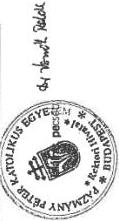

Budapest, 2000. április 14.

---

1.2. sz. táblázat
a V-3-50/2000. számhoz

Bevételek alakulása 1999.

|  Sor-szám | Megnevezés | Eredeti előirányzat (E Ft) | Módosított előirányzat (E Ft) | Teljesítés (E Ft) | Tényleges teljesítés  |   |
| --- | --- | --- | --- | --- | --- | --- |
|   |   |   |   |   |  erd.előir. %-ában | mód.előir. %-ában  |
|  a | b | c | d | e | f | g  |
|  1. | Intézményi alaptevékenység bevételei | 311.475 |  | 393.139 | 126,22 |   |
|  2. | Intézmény egyéb bevételei | 31.300 |  | 36.620 | 116,99 |   |
|  3. | 2. sorból: AFA |  |  |  |  |   |
|  4. | Hallgatói befizetések | 13.000 |  | 37.256 | 286,58 |   |
|  5. | Vállalkozói tevékenység bevételei |  |  |  |  |   |
|  6. | Kamatbevételek | 8.300 |  | 35.347 | 425,87 |   |
|  7. | Intézményi működési bevételek (1+2+4+5+6) | 364.075 |  | 502.362 | 137,98 |   |
|  8. | Felhalmozási és tőke jellegű bevételek |  |  | 640.000 |  |   |
|  9. | Támogatások, kiegészítések és átvett pénzeszköz | 2.362.579 |  | 1.789.819 | 143,12 |   |
|  10. | 9. sorból: Központi költségvetésből kapott támogatás | 1.397.245 |  | 1.606.660 | 142,81 |   |
|  11. | Egyházi juttatás | 745.800 |  | 113.875 | 15,27 |   |
|  12. | Hitelek, rövid lejáratú értékpapírok bevételei |  |  | 100.000 |  |   |
|  13. | Pénzforgalom nélküli bevételek |  |  |  |  |   |
|  14. | 13. sorból: Előző évi maradvány igénybevétele |  |  |  |  |   |
|  15. | Bevételek összesen: (7+8+9+12+13) | 2.726.654 |  | 3.032.181 | 112,79 |   |

640.000 + 1.606.660 = 9.tábla 16. sor

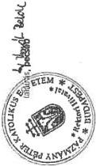

Budapest, 2000. április 14.

---

1.3. sz. táblázat
a V-3-30/2000. számhoz

Kiadások alakulása 1998.

|  Sorszám | Megnevezés | Eredeti előirányzat (E Ft) | Módosított előirányzat (E Ft) | Teljesítés (E Ft) | Tényleges teljesítés  |   |
| --- | --- | --- | --- | --- | --- | --- |
|   |   |   |   |   |  erd.előir. %-ában | mód.előir. %-ában  |
|  a | b | c | d | e | f | g  |
|  1. | Rendszeres személyi juttatások | 480.350 |  | 495.160 | 103 |   |
|  2. | Nem rendszeres személyi juttatások | 28.826 |  | 129.787 | 450.20 |   |
|  3. | Külső személyi juttatások |  |  |  |  |   |
|  4. | Társadalombiztosítási járulék | 197.333 |  | 194.656 | 0,98 |   |
|  5. | További, munkaadókat terhelő járulékok | 29.396 |  | 27.628 | 93,98 |   |
|  6. | Dologi kiadások | 1.683.545 |  | 914.318 | 0,54 |   |
|  7. | Pénzeszköz átadás, egyéb támogatás | 201.100 |  | 396.294 | 197,06 |   |
|  8. | Ellátottak juttatásai |  |  |  |  |   |
|  9. | Felújítás |  |  |  |  |   |
|  10. | Felhalmozási kiadások |  |  |  |  |   |
|  11. | Hitelek, rövid lejáratú értékpapírok kiadásai |  |  |  |  |   |
|  12. | Pénzforgalom nélküli kiadások | 33,487 |  | 96.373 | 287,79 |   |
|  13. | Költségvetési kiadások összesen: (1+2+3+4+5+6+7+8+9+10+11+12+13) | 2.654.037 |  | 2.254.216 | 84,93 |   |

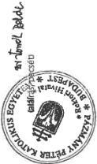

Budapest, 2000. március 23.

---

# Kiadások alakulása 1999.

1.4. sz. táblázat

a V-3-30/2000. számhoz

|  Sorszám | Megnevezés | Eredeti előirányzat (E Ft) | Módosított előirányzat (E Ft) | Teljesítés (E Ft) | Tényleges teljesítés  |   |
| --- | --- | --- | --- | --- | --- | --- |
|   |   |   |   |   |  erd.előir. %-ában | mód.előir. %-ában  |
|  a | b | c | d | e | f | g  |
|  1. | Rendszeres személyi juttatások | 710.514 |  | 659.108 | 0,92 |   |
|  2. | Nem rendszeres személyi juttatások | 40.500 |  | 14.715 | 36,33 |   |
|  3. | Külső személyi juttatások |  |  | 103.218 |  |   |
|  4. | Társadalombiztosítási járulék | 253.146 |  | 219.863 | 86,85 |   |
|  5. | További, munkaadókat terhelő járulékok | 26.816 |  | 14.006 | 52,23 |   |
|  6. | Dologi kiadások | 865.996 |  | 1.008.808 | 116,49 |   |
|  7. | Pénzeszköz átadás, egyéb támogatás |  |  | 15.795 |  |   |
|  8. | Ellátottak juttatásai | 167.649 |  | 197.693 | 117,92 |   |
|  9. | Felújítás | 505.700 |  | 429.156 | 84,86 |   |
|  10. | Felhalmozási kiadások |  |  |  |  |   |
|  11. | Hitelek, rövid lejáratú értékpapírok kiadásai |  |  |  |  |   |
|  12. | Pénzforgalom nélküli kiadások | 117.576 |  | 354.120 | 301,18 |   |
|  13. | Költségvetési kiadások összesen: (1+2+3+4+5+6+7+8+9+10+11+12+13) | 2.687.897 |  | 3.016.482 | 112,22 |   |

Budapest, 2000. március 23.

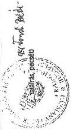

---

Az 1999. évi pénzügyi likviditási helyzet alakulása
1.5. sz. táblázat
a V-3-30 /2000. számhoz

adatok: E Ft-ban

|  Sorszám: | Megnevezés | Időpont  |   |   |   |   |
| --- | --- | --- | --- | --- | --- | --- |
|   |   |  1999. I. 1. | 1999. IV. 1. | 1999. VII. 1. | 1999. X. 1. | 1999. XII. 31.  |
|  1. | Bankszámla egyenleg | 259.772 | 235.312 | 219.146 | 215.727 | 51.170  |
|  2. | Pénztár és betétkönyv összege | 1.132 | 1.786 | 2.603 | 1.666 | 3.250  |
|  3. | Pénzkészlet összesen | 140.904 | 207.098 | 181.749 | 259.063 | 189.277  |
|  4. | Követelések összesen | 13.876 | 50.237 | 46.984 | 50.123 | 38.628  |
|  5. | Kötelezettségek összesen | 343.033 | 80.229 | 199.627 | 117.221 | 205.075  |
|  5/a | 5. sorból: Adó- és TB tartozás | 41.948 | 26.733 | 30.550 | 25.039 | 60.221  |

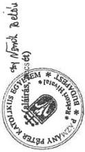

Budapest, 2000. március 29.

---

1.6. sz. táblázat
a V-3-30/2000. számhoz

Átlagos statisztikai állományi létszámadatok

adatok: főben

|  Sorszám: | Megnevezés | Időszak  |   |   |   |
| --- | --- | --- | --- | --- | --- |
|   |   |  1997. | 1998. | 1999. | 1999/1997. %  |
|  a | b | c | d | e | f  |
|  1. | Oktatók | 157 | 196 | 231 | 147  |
|  2. | Önálló gazdasági és műszaki alkalm. | 48 | 60 | 80 | 167  |
|  3. | Egyéb besorolású alkalmazottak* | 145 | 188 | 188 | 130  |
|  4. | Összesen: (1+2+3) | 350 | 444 | 499 | 143  |

* Ide tartoznak akik nem tekinthetők önálló munkakört ellátóknak, valamint a gyakorló iskolák pedagógusai, könyvtári alkalmazottak.

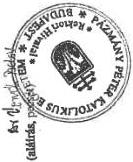

Budapest, 2000. április 13.

---

# Főbb létszám- és illetményadatok

1.7. sz. táblázat
a V-3-30/2000. számhoz

|  Időszak | Oktatók |   | Onálló gazd. és műszaki alk. |   |   |   | Egyéb besorolású alkalm. |   |   | Összesen  |   |   |
| --- | --- | --- | --- | --- | --- | --- | --- | --- | --- | --- | --- | --- |
|   |  Létszám (fő) | Illetmény (E Ft) | 1 főre j. Illetmény (E Ft) | létszám (fő) | Illetmény (E Ft) | 1 főre j. Illetmény (E Ft) | létszám (fő) | Illetmény (E Ft) | 1 főre j. Illetmény (E Ft) | létszám (fő) | Illetmény (E Ft) | 1 főre j. Illetmény (E Ft)  |
|   | 1 | 2 | 3 | 4 | 5 | 6 | 7 | 8 | 9 | 10 | 11 | 12  |
|  1997. | 157 | 135.473 | 863 | 48 | 41.841 | 872 | 145 | 61.039 | 421 | 350 | 238.353 | 681  |
|  1998. | 196 | 205.493 | 1.048 | 70 | 84.508 | 1.207 | 188 | 113.147 | 602 | 454 | 405.148 | 888  |
|  1999. | 231 | 345.433 | 1.495 | 94 | 122.568 | 1.304 | 188 | 111.462 | 593 | 513 | 579.463 | 1.130  |

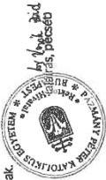

A létszám és illetményadatok a teljes munkáldőben foglalkoztatottakra vonatkoznak.

Budapest, 2000. március 23.

---

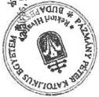

# Tárgyi eszközök állománya 1999. január 1-én

1.8. sz. táblázat

a V-3-30/2000. számhoz

|  Sor-szám | Megnevezés | Bruttó érté | Értékcsökkenés | Nettó ért | Nettó érték részaránya | Nettó/Bruttó aránya (e-c) | Teljesen (0-ra) leírt tárgyi esz | Egy redukált hallgatóra jutó tárgyi eszköz | bruttó értéke | nettó értéke  |
| --- | --- | --- | --- | --- | --- | --- | --- | --- | --- | --- |
|   |   |  E Ft | E Ft | E Ft | % | % | E Ft | E Ft | E Ft | E Ft  |
|  a | b | c | d | e | f | g | h | i | j |   |
|  1. | Ingatlanok | 1.978.450 | 44.968 | 1.933.482 |  | 0,98 |  |  |  |   |
|  2. | 1. sorból: földterület (telek) |  |  |  |  |  |  |  |  |   |
|  3. | 1. sorból: építmény (épület) |  |  |  |  |  |  |  |  |   |
|  4. | 3. sorból: oktatási célú |  |  |  |  |  |  |  |  |   |
|  5. | 3. sorból: kiszolgáló jell. |  |  |  |  |  |  | Nem |  |   |
|  6. | 3. sorból kollégium |  |  |  |  |  |  | volt |  |   |
|  7. | 3. sorból: egyéb építmény |  |  |  |  |  |  |  |  |   |
|  8. | Gépek, berendezések, felszerelések | 143.974 | 48.909 | 95.065 |  | 0,66 |  |  |  |   |
|  9. | 8. sorból: számítógép |  |  |  |  |  |  |  |  |   |
|  10. | 8. sorból: irodatechnikai gépek |  |  |  |  |  |  |  |  |   |
|  11. | 8. sorból: szakmai gép, műszer |  |  |  |  |  |  |  |  |   |
|  12. | 8. sorból: egyéb |  |  |  |  |  |  |  |  |   |
|  13. | Járművek | 4.696 | 2.117 | 2.579 |  | 0,55 |  |  |  |   |
|  14. | Beruházások |  |  |  |  |  |  |  |  |   |
|  15. | Beruházások, előlegek |  |  |  |  |  |  |  |  |   |
|  16. | Tárgyi eszközök össz.: (1+8+13+14+ | 2.127.120 | 95.994 | 2.031.126 |  | 0,95 |  |  |  |   |

Budapest, 2000. március 23.

---

1. 9. sz. táblázat

a V-3-30/2000. számhoz

Oktatói és hallgatói létszám alakulása

adatok: főben

|  Sorszám: | Megnevezés | 1997. | 1998. | 1999. | Index 1999/97.  |
| --- | --- | --- | --- | --- | --- |
|   |   |  X. 15. | X. 15. | X. 15. | %  |
|  Oktatók létszámadatai  |   |   |   |   |   |
|  1. | összes oktató létszáma | 389 | 326 | 594 | 152,7  |
|  2. | főfoglalkozású oktatók létszáma | 162 | 267 | 289 | 178,4  |
|  3. | teljes munkaidőben foglalk. oktatók létszáma | 139 | 207 | 77 | 0,59  |
|  4. | redukált oktatói létszám |  |  |  |   |
|  Hallgatók létszámadatai  |   |   |   |   |   |
|  5. | összes hallgató létszáma | 4622 | 5462 | 6459 | 139,74  |
|  6. | nappali hallgatók létszáma | 3077 | 3553 | 4096 | 133,12  |
|  7. | redukált hallgatói létszám |  |  |  |   |
|  8. | sikeresen államvizsgát tett hallgatók létszáma | 117 | 14 | 152 | 129,91  |

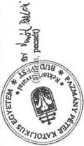

Az évenkénti felsőoktatási statisztikai adatszolgáltatásnak megfelelően kell kitölteni.

Kelt Budapest, 2000. március 23.

---

1.10. sz. táblázat
a V-3-3o /2000. számhoz

Összefoglaló adatok 1997-99.

|  Sor-szám | Megnevezés | Mérték-egység | 1997. év | 1998. év | 1999. év  |
| --- | --- | --- | --- | --- | --- |
|  1. | Költségvetési kiadások összesen | E Ft |  | 1.216.123 | 1.539.211  |
|  2. | Bevételből központi költségvetési támogatás | E Ft |  | 1.225.910 | 1.606.660  |
|  3. | Költségvetési támogatás a kiadások %-ában | % 3=2:1 |  | 100,8 | 104,38  |
|   | Átlagos stat. állományból |  |  |  |   |
|  4. | Összes foglalkoztatott | fő |  | 444 | 499  |
|  5. | Összes oktató | fő |  | 196 | 231  |
|  6. | Összes oktató az össz. fogl. %-ában | % 6=5:4 |  | 44,14 | 46,29  |
|   | A X. 15-i állapot szerint |  |  |  |   |
|  7. | Összes hallgató | fő |  | 5.462 | 6.456  |
|  8. | Nappali hallgatók | fő |  | 3.553 | 4.096  |
|  9. | Redukált hallgatók | fő |  |  |   |
|  10. | Összes oktató | fő |  | 593 | 594  |
|  11. | 1 oktatóra jutó hallgató | fő 11=7:10 |  | 9 | 10  |
|  12. | 1 oktatóra jutó nappali hallgató | fő 12=8:10 |  | 6 | 7  |
|  13. | 1 hallgatóra jutó kiadás | E Ft 13=1:7 |  | 222 | 238  |
|  14. | 1 hallgatóra jutó költségvetési támogatás | E Ft 14=2:7 |  | 224 | 249  |
|  15. | 1 nappali hallgatóra jutó költségvetési támogatás | E Ft 15=2:8 |  | 345 | 392  |
|  16. | 1 redukált hallgatóra jutó költségvetési támogatás | E Ft 16=2:9 |  |  |   |

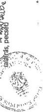

Budapest, 2000. április 13.

---

1.11. sz. táblázat

a V-3-30/2000. számhoz

1998. évben

Működési és felhalmozási célú állami pénzeszközök felhasználása

adatok E Ft-ban

|  Sor-szám | Megnevezés | Kapott támogatás | Személyi juttatások | Munkaadókat erhető járulék | Dologi kiadások | Egyéb működési kiadások | Felhalmozási kiadások | Összes kiadás | Maradvány  |
| --- | --- | --- | --- | --- | --- | --- | --- | --- | --- |
|  1. | Központi költségvetéstől műk. kapott tá | 1.225.910 | 687.293 | 110.882 | 417.948 |  |  | 1.216.123 | 9.787  |
|   | 1-ből |  |  |  |  |  |  |  |   |
|  2. | Képzési előirányzat | 792.012 | 298.173 | 110.882 | 382.957 |  |  | 792.012 |   |
|  3 | Létesítmény fenntartási előirányzat |  |  |  |  |  |  |  |   |
|  4 | Programfinanszírozási előirányzat | 37.743 | 27.956 |  |  |  |  | 27.956 | 9.787  |
|  5 | Haigatói előirányzat | 244.307 | 209.316 |  | 34.991 |  |  | 244.307 |   |
|   | 5-ből |  |  |  |  |  |  |  |   |
|  6. | Haigatói normatíva | 205.576 | 205.576 |  |  |  |  | 205.576 |   |
|  7. | Doktoranduszi normatíva |  |  |  |  |  |  |  |   |
|  8. | Diákotthoni támogatás | 18.450 |  |  | 18.450 |  |  | 18.450 |   |
|  9. | Köztársasági ösztöndíj | 3.740 | 3.740 |  |  |  |  | 3.740 |   |
|  10. | Tankönyv támogatás | 16.541 |  |  | 16.541 |  |  | 16.541 |   |
|  11. | Egyéb támogatás * | 151.848 | 151.848 |  |  |  |  | 151.848 |   |
|  12. | Működési célra kapott egyéb államháztartási pénzeszközök |  |  |  |  |  |  |  |   |
|  13. | Felhalm. célú állami pénzeszközök | 402.382 |  |  |  |  | 402.382 | 402.382 |   |
|  14. | 13-ból |  |  |  |  |  |  |  |   |
|  15. | Közp. és önkorm. költségv. szervektől |  |  |  |  |  |  |  |   |
|  16. | Műk. és felhalm. célra felhasz. állami pénzeszközök összesen (1+12+13) | 1.628.292 | 687.293 | 110.882 | 417.928 |  | 402.382 | 1.618.505 | 9.787  |

* vezető okt. minőségi bér, lakhatási

Budapest, 2000. április 12.

aláírás, pecsét

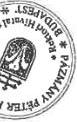

---

1.12. sz. táblázat

a V-3-30/2000. számhoz

Működési és felhalmozási célú állami pénzeszközök felhasználja

1999. évben

adatok E Ft-ban

|  Sor-szám | Megnevezés | Kapott támogatás | Személyi juttatások | Munkaadókat erőelő járulék | Dologi kiadások | Egyéb működési kiadások | Felhalmozási kiadások | Összes kiadás | Maradvány  |
| --- | --- | --- | --- | --- | --- | --- | --- | --- | --- |
|  1. | Központi költségvetéstől műk. kapott támogatás | 1.606.660 | 600.564 | 116.447 | 221.904 | 202.449 | 397.847 | 1.539.211 | 67.449  |
|  2. | 1-ből Képzési előirányzat | 1.031.720 | 323.463 | 116.447 | 104.505 | 67.449 | 397.847 | 1.009.711 |   |
|  3 | Létesítmény fenntartási előirányzat |  |  |  |  |  |  |  |   |
|  4 | Programfinanszírozási előirányzat | 84.591 | 19.038 |  |  |  |  | 19.038 | 65.553  |
|  5 | Haigatói előirányzat | 286.311 | 226.557 |  | 59.286 |  |  | 285.843 |   |
|  6. | 5-ből Haigatói normatíva | 228.387 | 219.480 |  | 8.907 |  |  | 221.387 |   |
|  7. | Doktoranduszi normatíva | 2.280 | 1.812 |  |  |  |  | 1.812 | 468  |
|  8. | Diákotthoni támogatás | 30.536 |  |  | 30.536 |  |  | 30.536 |   |
|  9. | Köztársasági ösztöndíj | 5.265 | 5.265 |  |  |  |  | 5.265 |   |
|  10. | Tankönyv támogatás | 19.843 |  |  | 19.843 |  |  | 19.843 |   |
|  11. | Egyéb támogatás * | 226.047 | 31.506 |  | 58.113 | 135.000 |  | 224.619 | 1.428  |
|  12. | Működési célra kapott egyéb államháztartási pénzeszközök |  |  |  |  |  |  |  |   |
|  13. | Felhalm. célú állami pénzeszközök | 640.000 |  |  |  |  | 640.000 | 640.000 |   |
|  14. | 13-ből Közp. és önkorm. költségv. szervektől |  |  |  |  |  |  |  |   |
|  15. | Műk. és felhalm. célra felhasz. állami pénzeszközök összesen (1+12+13) | 2.246.660 | 600.564 | 116.447 | 221.904 | 202.449 | 1.037.847 | 2.179.211 | 67.449  |

* vezető okt., minőségi bér, nemz. és etn. kisebbség, tömegsport lakhatási és egyéb

Budapest, 2000. április 12.

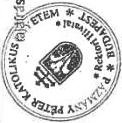

---

1.13. sz. táblázat
a V-3-30/2000. számhoz

Főfoglalkozású oktatók tantervi óraterhelése
1998-99. tanévben

|  Sor- szám | Megnevezés | 1998/99. tanév |   |   | Oktatói létszám 1998. X. 15. | Átagos óra- terhelés /e:f/  |
| --- | --- | --- | --- | --- | --- | --- |
|   |   |  előadás /óra/ | gyakorlat /óra/ | összesen /óra/  |   |   |
|  a | b | c | d | e | f | g  |
|  01 | egyetemi tanár | 2.694 | 1.916 | 4.610 | 43 | 107  |
|  02 | főiskolai tanár |  |  |  |  |   |
|  03 | egyetemi docens | 250 | 535 | 785 | 45 | 17  |
|  04 | főiskolai docens |  |  |  |  |   |
|  05 | egyetemi adjunktus | 247 | 1.180 | 1.427 | 36 | 40  |
|  06 | főiskolai adjunktus |  |  |  |  |   |
|  07 | tanársegéd | 19 | 2.285 | 2.304 | 54 | 43  |
|  08 | nyelv- és testnevelő tanár |  | 589 | 589 | 38 | 16  |
|  09 | egyéb főfoglalkozású oktató |  |  |  | 3 |   |
|  10 | Összesen: | 3.210 | 6.505 | 9.715 | 219 | 45  |

Csak a saját alkalmazottak tantervi óraterhelését tartalmazza. Tantervi óra az előadás, a fizikai és elméleti gyakorlat együttesen.

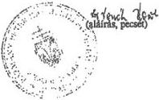

Budapest, 2000. április 13.

---

1.14. sz. táblázat
a V-3-50/2000. számhoz

A kollégiumban, illetve a diákotthonban lévő férőhelyek és alapterületük
(1999. október 15-i állapot szerint)

|  Sor-szám | Megnevezés | Lakószobák |   |   |   | Összes férőhely (fő) |   | Ténylegesen elszállásol hallgatók (fő) |   | Férőhely kihasználtság  |   |
| --- | --- | --- | --- | --- | --- | --- | --- | --- | --- | --- | --- |
|   |   |  száma (db) saját | bérelt | Összes terület m2 saját | bérelt | saját | bérelt | saját | bérelt | saját | bérelt  |
|  a | b | c | d | e | f | g | h | i | j | k | l  |
|  Kollégiumok |   |  |  |  |  |  |  |  |  | (i:g) | (j:h)  |
|  1 | KPI | 34 |  | 442 |  | 52 |  | 52 |  | 100 |   |
|  2 | Hotel Griff |  | 81 |  | 1.620 |  | 241 |  | 241 |  | 100  |
|  3 | Ip.Szöv.Sport Kp. |  | 4 |  | 75 |  | 12 |  | 12 |  | 100  |
|  4 |  |  |  |  |  |  |  |  |  |  |   |
|  5 |  |  |  |  |  |  |  |  |  |  |   |
|  6 |  |  |  |  |  |  |  |  |  |  |   |
|  7 |  |  |  |  |  |  |  |  |  |  |   |
|  8 |  |  |  |  |  |  |  |  |  |  |   |
|  9 |  |  |  |  |  |  |  |  |  |  |   |
|  10 | Összesen: (1-9) | 34 | 85 | 442 | 1.695 | 52 | 253 | 52 | 253 | 100 | 200  |

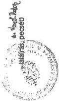

Az adatok nem tartalmazhatják a vendéglakások, vendégszobák adatait.

Budapest, 2000. március 23.

---

# Bevételek alakulása

1998

Összesítő

2.1. sz. táblázat

a V-3-30 /2000. számhoz

|  sor szám | Megnevezés | eredeti előirányzat (E Ft) | Módosított előirányzat (E Ft) | Teljesítés (E Ft) | Tényleges teljesítés  |   |
| --- | --- | --- | --- | --- | --- | --- |
|   |   |   |   |   |  ered. előir. %ában | mód. előir. %ában  |
|  a | b | c | d | e | f | g  |
|  1 | Intézményi alaptevékenység bevételei | 71717 | 70225 | 72300 | 101 | 103  |
|  2 | Intézmény egyéb bevételei | 18460 | 19109 | 21653 | 117 | 113  |
|  3 | 2. Sorból: AFA | 1000 | 1000 | 1640 | 164 | 164  |
|  4 | Hallgatói befizetések | 66195 | 64703 | 63998 | 97 | 99  |
|  5 | Vállalkozói tevékenység | 4000 | 4000 | 6629 | 166 | 166  |
|  6 | Kamatbevétel | 400 | 400 | 12129 | 3033 | 3033  |
|  7 | Intézményi működési bevételek (1+2+4+5+6) | 94577 | 93734 | 112711 | 119 | 120  |
|  8 | Felhalmozási és tőke jellegű bevételek |  | 550 | 551 |  |   |
|  9 | Támogatásik, kiegészítésik és átvett pénzeszközök | 356569 | 383452 | 411218 | 115 | 107  |
|  10 | 9. Sorból: Központi költségvetésből kapott támogatás | 338964 | 358127 | 376983 | 111 | 105  |
|  11 | Egyházi juttatás | 15205 | 15205 | 16970 | 112 | 112  |
|  12 | Hitelek, rövid lejáratú értékpapírok bevételei |  |  |  |  |   |
|  13 | Pénforgalom nélküli bevételek |  |  |  |  |   |
|  14 | 13. Sorból: Előző évi maradvány igénybevétele |  |  |  |  |   |
|  15 | Bevételek összesen: | 451146 | 477736 | 524480 | 116 | 110  |

Kelt: 2000. V. 9

(aláírás, pecsét)

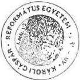

---

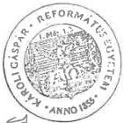

# Bevételek alakulása

1999.

Összesítő

2.2. sz. táblázat

a V-3-30/2000. számhoz

|  sor szám | Megnevezés | eredeti előirányzat (E Ft) | Módosított előirányzat (E Ft) | Teljesítés (E Ft) | Tényleges teljesítés  |   |
| --- | --- | --- | --- | --- | --- | --- |
|   |   |   |   |   |  ered. előir. %ában | mód. előir. %ában  |
|  a | b | c | d | e | f | g  |
|  1 | Intézményi alaptevékenység bevételei | 47874 | 47874 | 92807 | 194 | 194  |
|  2 | Intézmény egyéb bevételei | 14109 | 14109 | 15398 | 109 | 109  |
|  3 | 2. Sorból: ÁFA | 1250 | 1250 | 2104 | 168 | 168  |
|  4 | Hallgatói befizetések | 41120 | 41120 | 50691 | 123 | 123  |
|  5 | Vállalkozói tevékenység | 5000 | 5000 | 9399 | 188 | 188  |
|  6 | Kamatbevétel |  |  | 13033 |  |   |
|  7 | Intézményi működési bevételek (1+2+4+5+6) | 66983 | 66983 | 130637 | 195 | 195  |
|  8 | Felhalmozási és tőke jellegű bevételek |  |  |  |  |   |
|  9 | Támogatásik, kiegészítésik és átvett pénzeszközök | 486124 | 485197 | 515970 | 106 | 106  |
|  10 | 9. Sorból: Központi költségvetésből kapott támogatás | 414667 | 426740 | 421308 | 102 | 99  |
|  11 | Egynázi juttatás | 51595 | 34595 | 85641 | 166 | 248  |
|  12 | Hitelek, rövid lejáratú értékpapírok bevételei |  |  |  |  |   |
|  13 | Pénforgalom nélküli bevételek | 39097 | 39097 | 8175 | 21 | 21  |
|  14 | 13. Sorból: Előző évi maradvány igénybevétele | 39097 | 39097 | 8175 | 21 | 21  |
|  15 | Bevételek összesen: | 592204 | 591277 | 654782 | 111 | 111  |

Magyar Ad
(aláírás, pécsét)

Kelt: 2000. 2. 2.

---

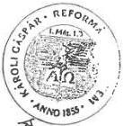

# Kiadások alakulása

1998.

Összesítő

2.3. sz. táblázat

a V-3-30 /2000. számhoz

|  sor szám | Megnevezés | eredeti előirányzat (E Ft) | Módosított előirányzat (E Ft) | Tiejesítés (E Ft) | Tényleges teljesítés  |   |
| --- | --- | --- | --- | --- | --- | --- |
|   |   |   |   |   |  ered. előir. %ában | mód. előir. %ában  |
|  a | b | c | d | e | f | g  |
|  1 | Rendszeres személyi juttatások | 128609 | 129917 | 137389 | 107 | 106  |
|  2 | Nem rendszeres személyi juttatások | 9045 | 7855 | 5158 | 57 | 66  |
|  3 | Külső személyi juttatások | 26069 | 30023 | 27492 | 105 | 92  |
|  4 | Társadalombiztosítási járulék | 61373 | 61881 | 58207 | 95 | 94  |
|  5 | További, munkaadókat terhelő járulékok | 9428 | 9468 | 9511 | 101 | 100  |
|  6 | Dologi kiadások | 135634 | 136218 | 146881 | 108 | 108  |
|  7 | Pénzeszköz átadás, egyéb támogatás | 1200 | 2700 | 2862 | 238 | 106  |
|  8 | Ellátottak juttatásai | 68668 | 68668 | 68966 | 100 | 100  |
|  9 | Felújítás | 0 | 0 | 21342 | 0 | 0  |
|  10 | Felhalmozási kiadások | 600 | 4421 | 15339 | 2556 | 347  |
|  11 | Hitelek, rövid lejáratú értékpapírok kiadásai | 0 | 0 | 0 | 0 | 0  |
|  12 | Pénzforgalom nélküli kiadások | 0 | 17557 | 14587 | 0 | 0  |
|  13 | Költségvetési kiadások összesen (1+2+3+4+5+6+7+8+9+10+11+12+12) | 440626 | 468708 | 507734 | 115 | 108  |

Kelt: 2000. 5. 9.

Kelt: 2000. 5. 9.

---

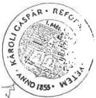

# Kiadások alakulása

1999.

Összesítő

2.4. sz. táblázat

a V-3-30 /2000. számhoz

|  sor szám | Megnevezés | eredeti előirányzat (E Ft) | Módosított előirányzat (E Ft) | Teljesítés (E Ft) | Tényleges teljesítés  |   |
| --- | --- | --- | --- | --- | --- | --- |
|   |   |   |   |   |  ered. előir. %ában | mód. előir. %ában  |
|  a | b | c | d | e | f | g  |
|  1 | Rendszeres személyi juttatások | 195106 | 195106 | 249041 | 128 | 128  |
|  2 | Nem rendszeres személyi juttatások | 6843 | 6843 | 18206 | 266 | 266  |
|  3 | Külső személyi juttatások | 36156 | 36156 | 29108 | 81 | 81  |
|  4 | Társadalombiztosítási járulék | 77876 | 77876 | 92593 | 119 | 119  |
|  5 | További, munkaadókat terhelő járulékok | 13783 | 13783 | 17181 | 125 | 125  |
|  6 | Dologi kiadások | 125174 | 125174 | 149654 | 120 | 120  |
|  7 | Pénzeszköz átadás, egyéb támogatás | 15004 | 15004 | 14082 | 94 | 94  |
|  8 | Ellátottak juttatásai | 80042 | 80042 | 84875 | 106 | 106  |
|  9 | Felújítás | 0 | 0 | 35296 | 0 | 0  |
|  10 | Felhalmozási kiadások | 31450 | 9450 | 53396 | 170 | 165  |
|  11 | Hitelek, rövid lejáratú értékpapírok kiadásai | 0 | 0 | 0 | 0 | 0  |
|  12 | Pénzforgalom nélküli kiadások | 0 | 0 | 19 | 0 | 0  |
|  13 | Költségvetési kiadások összesen (1+2+3+4+5+6+7+8+9+10+11+12+12) | 581434 | 559434 | 743451 | 128 | 133  |

Kelt: 2000. 7. 7.

Kelt: 2000. 7. 7.

---

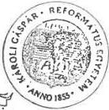

2.5. sz. táblázat
a V-3-30 /2000. számhoz

Az 1999. évi pénzügyi likviditási helyzet alakulása
Összesítő

adatok: E Ft-ban

|  Sorszám | Megnevezés | Időpont  |   |   |   |   |
| --- | --- | --- | --- | --- | --- | --- |
|   |   |  1999. I. 1. | 1999. IV. 1. | 1999. VII. 1. | 1999. X. 1. | 1999. XII. 1.  |
|  1. | Bankszámla egyenleg | 47490 | 42010 | 73575 | 63458 | 20255  |
|  2. | Pénztár és betétkönyv összege | 27863 | 28527 | 29450 | 17389 | 1221  |
|  3. | Pénzkészlet összesen | 75353 | 70537 | 103025 | 80847 | 21476  |
|  4. | Követelések összesen | 22276 | 17139 | 17616 | 16852 | 9482  |
|  5. | Kötelezettségek összesen | 23349 | 24655 | 21710 | 19137 | 24740  |
|  5/ a | 5. sorból: Adó- és TB tartozás | 7925 | 4035 | 3735 | 4764 | 7049  |

R. R. G. (aláírás/pecsét)

Kelt 2000. V. 5.

---

# Átlagos statisztikai állományi létszámadatok
Összesítő

2.6. sz. táblázat
a V-3-50 /2000. számhoz

adatok: főben

|  Sorszám: | Megnevezés | Időszak  |   |   |   |
| --- | --- | --- | --- | --- | --- |
|   |   |  1997. | 1998. | 1999. | 1999/1997. %  |
|  a | b | c | d | e | f  |
|  1. | Oktatók | 103 | 164 | 194 | 188  |
|  2. | Önálló gazdasági és műszaki alkalmazottak | 7 | 11 | 20 | 286  |
|  3. | Egyéb besorolású alkalmazottak* | 53 | 62 | 80 | 151  |
|  4. | Összesen: (1+2+3) | 136 | 237 | 294 | 180  |

* Ide tartoznak akik nem tekinthetők önálló munkakört ellátóknak, valamint a gyakorló iskolák pedagógusai, könyvtári alkalmazottak.

Kelt: 2000. 12. 9.

---

Főbb létszám- és illetményadatok

2.7. sz. táblázat
a V-3-50/2000. számhoz

|  Időszak | Oktatók |   |   | Önálló gazd. és műszaki alk. |   |   | Egyéb besorolású alkalm. |   |   | Összesen  |   |   |
| --- | --- | --- | --- | --- | --- | --- | --- | --- | --- | --- | --- | --- |
|   | Létszám (fő) | illetmény (E Ft) | 1 főre j. illetmény (E Ft) | létszám (fő) | illetmény (E Ft) | 1 főre j. illetmény (E Ft) | létszám (fő) | illetmény (E Ft) | 1 főre j. illetmény (E Ft) | létszám (fő) | illetmény (E Ft) | 1 főre j. illetmény (E Ft)  |
|   | 1 | 2 | 3 | 4 | 5 | 6 | 7 | 8 | 9 | 10 | 11 | 12  |
|  1997. | 82 | 45748 | 558 | 7 | 4489 | 641 | 46 | 17176 | 373 | 135 | 63565 | 471  |
|  1998. | 115 | 77579 | 675 | 11 | 6376 | 579 | 59 | 27794 | 471 | 185 | 111749 | 604  |
|  1999. | 141 | 126629 | 898 | 20 | 10831 | 542 | 73 | 33798 | 463 | 234 | 171258 | 732  |

A létszám és illetményadatok a teljes munkaidőben foglalkoztatottakra vonatkoznak.

R. G. P. M. (aláírás, pecsét)

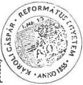

Kelt ZOO. X. 9.

---

2.8. sz. táblázat
a V-3-50/2000. számhoz

# Tárgyieszköz állomány 1999. Janár 1-én

Összesítő

|  sor szám | Megnevezés | Bruttó érték (E Ft) | Értékcsökk. (E Ft) | Nettó érték (E Ft) | Nettó ért. részaránya % | Nett/Brttó aránya(e:c) % | Teljesen(0-ra) leírt tárgyi e. (E Ft) | Egy hallgatóra jutó tárgyi eszköz  |   |
| --- | --- | --- | --- | --- | --- | --- | --- | --- | --- |
|   |   |   |   |   |   |   |   |  bruttó értéke (E Ft) | nettó értéke (E Ft)  |
|  a | b | c | d | e | f | g | f | g | f  |
|  1 | Ingatlanok | 98883 | 3740 | 95143 |  | 96 |  | 62 | 60  |
|  2 | 1. Sorból: földterület (telek) |  |  |  |  |  |  |  |   |
|  3 | építmény (épület) | 98883 | 3740 | 95143 |  | 96 |  | 62 | 60  |
|  4 | 3.sorból: oktatási célú | 51205 | 1580 | 49625 |  | 97 |  | 32 | 31  |
|  5 | kiszolgáló jellegű |  |  |  |  |  |  |  |   |
|  6 | kollégium | 41380 | 1747 | 39633 |  | 96 |  | 26 | 25  |
|  7 | egyéb építmény | 6298 | 413 | 5885 |  | 78 |  | 4 | 4  |
|  8 | Gépek, berendezések, felszerelések | 24679 | 4959 | 19720 |  | 80 | 3484 | 16 | 12  |
|  9 | 8.sorból: számítógép | 10191 | 1893 | 6272 |  | 62 | 2093 | 6 | 4  |
|  10 | irodatechnikai gépek | 3461 | 234 | 3227 |  | 93 | 624 | 2 | 2  |
|  11 | szakmai gép, műszer | 695 | 283 | 412 |  | 59 | 231 | 0,4 | 0,2  |
|  12 | egyéb | 10334 | 1481 | 8248 |  | 80 | 536 | 6 | 5  |
|  13 | Járművek | 1534 | 986 | 548 |  | 36 | 200 | 1 | 0,3  |
|  14 | Beruházások | 5211 |  | 4782 |  | 92 |  | 3 | 3  |
|  15 | Beruházások, előlegek | 3680 |  | 3680 |  | 100 |  | 2 | 2  |
|  16 | Tárgyi eszközök összesen: (1+8+13+14+15) | 133987 | 9685 | 123873 | 0 | 92 | 3684 | 84 | 78  |

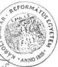

R. S. György (aláírás, pecsét)

Kelt: 2000. 5. 9.

---

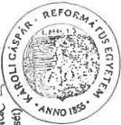

2.9 sz. táblázat
a V-3-30/2000. számhoz

# Oktatói és hallgatói létszám alakulása
Összesítő

adatok: főben

|   |  | 1997. | 1998. | 1999. | Index 1999/97.  |
| --- | --- | --- | --- | --- | --- |
|  Sorszám: | Megnevezés | X. 15. | X. 15. | X. 15. | %  |
|  Oktatók létszámadatai  |   |   |   |   |   |
|  1. | összes oktató létszáma | 103 | 161 | 200 | 194  |
|  2. | főfoglalkozású oktatók létszáma | 79 | 116 | 121 | 153  |
|  3. | telles munkaidőben foglalkoztatott oktatók létszáma | 82 | 125 | 143 | 174  |
|  4. | redukált oktatói létszám |  |  |  |   |
|  Hallgatók létszámadatai  |   |   |   |   |   |
|  5. | összes hallgatói létszáma | 1346 | 1583 | 1858 | 138  |
|  6. | nappali hallgatók létszáma | 997 | 1233 | 1496 | 150  |
|  7. | redukált hallgatói létszám | 1084 | 1320 | 1586 | 146  |
|  8. | sikeresen államvizsgát tett hallgatók létszáma | 140 | 186 | 260 | 186  |

Az évenkénti felsőoktatási statisztikai adatszolgáltatásnak megfelelően kell kitölteni.

Kelt 2000. 7. 9.

Rogym (aláírás, pecsét)

---

2.10. táblázat
a V-3- §2000. számhoz

Összefoglaló adatok 1997 - 99.

|  Sor-szám | Megnevezés | Mértékesység | 1997. év | 1998. év | 1999. év  |
| --- | --- | --- | --- | --- | --- |
|  1. | Költségvetési kiadások összesen | E Ft | 316084 | 490797 | 725095  |
|  2. | Bevételből központi költségvetési támogatás | E Ft | 205092 | 376983 | 414288  |
|  3. | Költségvetési támogatás a kiadások %-ában | % 3=2:1 | 65 | 77 | 57  |
|   | Átlagos stat. Állományból |  |  |  |   |
|  4. | Összes foglalkoztatott | fő | 160 | 230 | 287  |
|  5. | Összes oktató | fő | 96 | 148 | 185  |
|  6. | Összes oktató az össz. fogl. %-ában | % 6=5:4 | 60 | 64 | 64  |
|   | A X. 15-i állapot szerint |  |  |  |   |
|  7. | Összes hallgató | fő | 1382 | 1625 | 1881  |
|  8. | Nappali hallgatók | fő | 997 | 1233 | 1495  |
|  9. | Redukált hallgatók | fő | 1093 | 1335 | 1592  |
|  10. | Összes oktató | fő | 96 | 148 | 185  |
|  11. | 1 oktatóra jutó hallgató | fő 11=7:10 | 14 | 11 | 10  |
|  12. | 1 oktatóra jutó nappali hallgató | Fő 12=8:10 | 10 | 8 | 8  |
|  13. | 1 hallgatóra jutó kiadás | E Ft 13=1:7 | 229 | 302 | 385  |
|  14. | 1 hallgatóra jutó költségvetési támogatás | E Ft 14=2:7 | 148 | 232 | 220  |
|  15. | 1 nappali hallgatóra jutó költségvetési támogatás | E Ft 15=2:8 | 206 | 306 | 277  |
|  16. | 1 redukált hallgatóra jutó költségvetési támogatás | E Ft 16=2:9 | 188 | 282 | 260  |

Kelt 2000. V. 9.

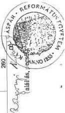

---

2.11. sz. táblázat
a V-3-30/2000. számhoz

# Működési és fenntartási célú állami pénzeszközök felhasználása

Összesítő

1998. Évben

|  sor szám | Megnevezés | kapott támogatás | Személyi juttatások | Munkaadókat terhelő járulékok | Dologi kiadások | Egyéb működési kiadások | Felhalmozási kiadások | Összes kiadás | Maradvány  |
| --- | --- | --- | --- | --- | --- | --- | --- | --- | --- |
|  1 | Központi költségvetésből kapott támogatás | 362900 | 201229 | 58549 | 66982 | 10128 | 3959 | 340847 | 8166  |
|   | 1-ből |  |  |  |  |  |  |  |   |
|  2 | Képzési előirányzat | 255663 | 135450 | 56744 | 40343 | 7487 |  | 255663 |   |
|  3 | Létsítményt fenntartási előirányzat |  |  |  |  |  |  |  |   |
|  4 | Programfinanszírozási előirányzat | 10587 | 1996 | 719 | 1272 | 2641 | 3959 | 10587 |   |
|  5 | Hallgatói előirányzat | 82763 | 63783 | 1086 | 9728 |  |  | 74597 | 8166  |
|   | 5-ből |  |  |  |  |  |  |  |   |
|  6 | Hallgatói normatíva | 63528 | 58365 |  |  |  |  | 58365 | 5163  |
|  7 | Doktoridúszi normatíva | 680 | 680 |  |  |  |  | 680 |   |
|  8 | Diákotthoni támogatás | 13576 | 3017 | 1086 | 9473 |  |  | 13576 |   |
|  9 | Köztársasági ösztöndíj | 1312 | 1084 |  |  |  |  | 1084 | 228  |
|  10 | Tankönyv támogatás | 3667 | 637 |  | 255 |  |  | 892 | 2775  |
|  11 | Egyéb támogatás | 27970 | 17417 | 1396 | 9157 |  |  | 27970 |   |
|  12 | Működési célra kapott egyéb államháztartási pénzeszközök |  |  |  |  |  |  |  |   |
|  13 | Felhalmozási célú állami pénzeszközök |  |  |  |  |  |  |  |   |
|   | 13-ból |  |  |  |  |  |  |  |   |
|  15 | Központi és önkormányzati költségvetési szervektől |  |  |  |  |  |  |  |   |
|  13 | Működési és felhalm. Célra felhasznált állami pénze. összesen (1+12+13) | 376983 | 218646 | 59945 | 76139 | 10128 | 3959 | 368817 | 8166  |

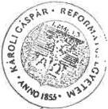

Kézpergyn (aláírás/pecsét)

Kelt: 2000. 7. 9.

---

2.12. sz. táblázat
a V-3-30/2000. számhoz

# Működési és fenntartási célú állami pénzeszközök felhasználása

Összesítő

1999. Évben

adatok E Ft-ban

|  sor szám | Megnevezés | kapott támogatás | Személyi juttatások | Munkaadókat terhelő járulékok | Dologi kiadások | Egyéb működési kiadások | Felhalmozási kiadások | Összes kiadás | Maradvány  |
| --- | --- | --- | --- | --- | --- | --- | --- | --- | --- |
|  1 | Központi költségvetésből kapott támogatás | 436022 | 343300 | 21386 | 62722 | 1624 | 1725 | 430757 | 5265  |
|   | 1-ből |  |  |  |  |  |  |  |   |
|  2 | Képzési előirányzat | 312239 | 259305 | 16099 | 36835 |  |  | 312239 |   |
|  3 | Létsítményi fenntartási előirányzat |  |  |  |  |  |  |  |   |
|  4 | Programfinanszírozási előirányzat | 17319 | 10251 | 1882 | 1837 | 1624 | 1725 | 17319 |   |
|  5 | Hallgatói előirányzat | 88742 | 65872 |  | 17605 |  |  | 83477 | 5265  |
|   | 5-ből |  |  |  |  |  |  |  |   |
|  6 | Hallgatói normatíva | 63550 | 58285 |  |  |  |  | 58285 | 5265  |
|  7 | Doktorrúdi normatíva | 3120 | 1938 |  | 1182 |  |  | 3120 |   |
|  8 | Diákotthoni támogatás | 14094 | 3442 |  | 10652 |  |  | 14094 |   |
|  9 | Köztársasági ösztöndíj | 1681 | 1681 |  |  |  |  | 1681 |   |
|  10 | Tankönyv támogatás | 6297 | 526 |  | 5771 |  |  | 6297 |   |
|  11 | Egyéb támogatás | 23047 | 13197 | 3405 | 6445 |  |  | 23047 |   |
|  12 | Működési célra kapott egyéb államháztartási pénzeszközök |  |  |  |  |  |  |  |   |
|  13 | Felhalmozási célú állami pénzeszközök |  |  |  |  |  |  |  |   |
|   | 13-ból |  |  |  |  |  |  |  |   |
|  15 | Központi és önkormányzati költségvetési szervektől |  |  |  |  |  |  |  |   |
|  13 | Működési és felhalm. Célra felhasznált állami pénze. összesen (1+12+13) | 436022 | 343300 | 21386 | 62722 | 1624 | 1725 | 430757 | 5265  |

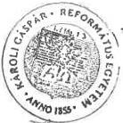

Ragyó, M.
(aláírás, pécsét)

Kelt: 2000. V. 9.

---

2.13. sz. táblázat

a V-3-30 /2000. számhoz

# Főfoglalkozású oktatók tantervi óraterhelése

# 1998-1999. tanévben

|  Sor-szám | Megnevezés | 1998/99. tanév |   |   | Oktatói létszám 1998. X.. 15. | Átlagos óraterhelés /e:f/  |
| --- | --- | --- | --- | --- | --- | --- |
|   |   |  előadás /óra/ | gyakorlat /óra/ | összesen /óra/  |   |   |
|  a | b | c | d | e | F | g  |
|  1. | egyetemi tanár, oktató | 228 | 1068 | 1296 | 110 | 12  |
|  2. | főiskolai tanár | 86 | 56 | 142 | 9 | 16  |
|  3. | egyetemi docens | 8 | 10 | 18 | 2 | 9  |
|  4. | egyetemi adjunktus | 10 | 4 | 14 | 1 | 14  |
|  5. | tanársegéd | 2 | 10 | 12 | 1 | 12  |
|  6. | főiskolai adjunktus | 8 | 18 | 26 | 2 | 13  |
|  7. | tanársegéd | 11 | 87 | 98 | 8 | 12  |
|  8. | nyelv- és testnevelő tanár |  | 93 | 93 | 10 | 9  |
|  9. | egyéb főfoglalkozású oktató |  | 10 | 10 | 3 | 3  |
|  10. | Összesen: | 353 | 1356 | 1709 | 146 | 100  |

Csak a saját alkalmazottak tantervi óraterhelését tartalmazza. Tantervi óra az előadás, a fizikai elméleti gyakorlat együttesen.

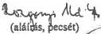

Kelt 2000. X. 7.

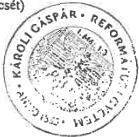

---

2.14. sz. táblázat
a V-3-50 /2000. számhoz

A kollégiumban, illetve a diákotthonban lévő férőhelyek és alapterületet

(1999. Október 15-i állapot szerint)

Összesítő

|  sor szám | Megnevezés | Lakószobák |   |   |   | Összes férőhely |   | Ténylegesen elszállásolt |   | Férőhelyek kihasználtsága  |   |
| --- | --- | --- | --- | --- | --- | --- | --- | --- | --- | --- | --- |
|   |   |  száma (db) saját | bérelt | összes terület m2 saját | bérelt | (fő) saját | bérelt | hallgatók (fő) saját | bérelt | (db) saját | bérelt  |
|  a | b | c | d | e | f | g | h | i | j | k | l  |
|  1 |  | 165 | 4 | 5274 | 100 | 442 | 12 | 376 | 10 | 85% | 83  |
|  2 |  |  |  |  |  |  |  |  |  |  |   |
|  3 |  |  |  |  |  |  |  |  |  |  |   |
|  4 |  |  |  |  |  |  |  |  |  |  |   |
|  5 |  |  |  |  |  |  |  |  |  |  |   |
|  6 |  |  |  |  |  |  |  |  |  |  |   |
|  7 |  |  |  |  |  |  |  |  |  |  |   |
|  8 |  |  |  |  |  |  |  |  |  |  |   |
|  9 |  |  |  |  |  |  |  |  |  |  |   |
|  13 | Összesen: (1-9) | 165 | 4 | 5274 | 100 | 442 | 12 | 376 | 10 | 0,85 | 83  |

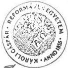

Kelt: 2000. V. 9

---

3.1. sz. táblázat
a V-3-50/2000. számhoz

Bevételek alakulása 1998. év

Budapesti Evangélikus Gimnázium
1071 Budapest, Városligeti fasor 17-21.

|  Sor-szám | Megnevezés | Költségve-tési beszá-moló sze-rinti szám-laszám | Eredeti előirányzat E. Ft | Módosított előirányzat E. Ft | Teljesítés E. Ft | Tényleges eredeti előirányz.. %-ában % | teljesítés módosított előirányz. %-ában %  |
| --- | --- | --- | --- | --- | --- | --- | --- |
|  a. | b. | c. | d. | e. | f. | g. | h.  |
|  1. | Intézményi működési bevételek (1. a + b + c) | 91 | 18.155 | 24.141 | 23.452 | 129,18 | 97,15  |
|   | a/ Intézm. alaptevékenys. bevételei | 911 | 9.555 | 8.691 | 6.941 | 72,64 | 79,86  |
|   | b/ Intézm. egyéb sajátos bevételei | 913 | 8.500 | 15.250 | 16.296 | 191,72 | 106,86  |
|   | c/ Kamatbevételek | 916 | 100 | 200 | 215 | 215,00 | 107,50  |
|  2. | Felhalmozási és tőke jellegű bevét. | 93 |  |  |  |  |   |
|  3. | Központi költségvetésből kapott támogatás (3. a+b) | 94 | 84.535 | 85.848 | 86.173 | 90,11 | 88,73  |
|   | a/ Felügyeleti szervtől kapott támogatás | 941 | 84.235 | 85.848 | 86.173 | 90,43 | 88,73  |
|   | Ebből: Közokt. célú alap-normatív áll. hozzájár. |  | 48.519 | 48.519 | 48.844 | 100,67 | 100,67  |
|   | - Kiegészítő állami támogatás |  | 35.716 | 35.434 | 35.409 | 99,14 | 99,93  |
|   | - Központosított közokt. célú, ill. kötött felhaszn. támogatás |  | 1.895 | 1.895 | 1.920 | 101,32 | 101,32  |
|   | Ebből: - Közoktatás fejlesztése, számítógépes fejlesztések |  |  |  |  |  |   |
|   | - Pedagógus szakvizsga és továbbképzés támogatása |  | 905 | 905 | 871 | 96,24 | 96,24  |
|   | - Pedagógus szakkönyvvás. támog. |  | 381 | 381 | 371 | 97,38 | 97,38  |
|   | - Tanulók tankönyvvásár-lásának támogatása |  | 609 | 609 | 602 | 98,85 | 98,85  |
|   | - Érettségiztetés támogatása |  |  |  | 76 |  |   |
|   | b/ Önkormányzattól kapott költségvetési támogatás | 942+ 943 | 300 |  |  |  |   |
|  4. | Átvett pénzeszközök | 46-47 |  | 22.162 | 22.570 |  | 101,84  |
|  5. | Pénzforgalom nélk. bevételek | 98 | 2.810 | 2.810 | 2.810 | 100,00 | 100,00  |
|  6. | Befolyt ált. forgalmi adó | 99 | 1.258 | 1.258 | 828 | 65,82 | 65,82  |
|  7. | BEVÉTELEK összesen: (1+2+3+4+5+6) |  | 106.758 | 136.219 | 135.833 | 127,23 | 99,72  |

Dr. Tárnok Dezső ig.

Budapest, 2000. március 17.

---

Budapesti Evangélikus Gimnázium

1071 Budapest, Városligeti fasor 17-21.

3.2. sz. táblázat

a V-3-30/2000. számhoz

Bevételek alakulása 1999. év

|  Sor-szám | Megnevezés | Költségvetési beszámoló szerinti számlaszám | Eredeti elő-irányzat | Módosított előirányzat | Teljesítés | Tényleges eredeti előirányz. %-ában | teljesítés módosított előirányz. %-ában  |
| --- | --- | --- | --- | --- | --- | --- | --- |
|  a. | b. | c. | E. Ft | E. Ft | E. Ft | % | %  |
|  1. | Intézményi működési bevételek (1. a + b + c) | 91 | 27.705 | 27.705 | 14.058 | 50,74 | 50,74  |
|   | a/ Intézm. alaptevékenys. bevételei | 911 | 9.035 | 9.035 | 7.945 | 87,94 | 87,94  |
|   | b/ Intézm. egyéb sajátos bevételei | 913 | 18.550 | 18.550 | 5.436 | 29,30 | 29,30  |
|   | c/ Kamatbevételek | 916 | 120 | 120 | 677 | 564,17 | 564,17  |
|  2. | Felhalmozási és tőke jellegű bevét. | 93 | 27.375 | 27.375 |  |  |   |
|  3. | Központi költségvetésből kapott támogatás (3. a+b) | 94 | 95.052 | 95.052 | 100.019 | 105,23 | 105,23  |
|   | a/ Felügyeleti szervtől kapott támogatás | 941 | 95.052 | 95.052 | 100.019 | 105,23 | 105,23  |
|   | Ebből: - Közoktatási célú alap-normatív állami hozzájárulás |  | 56.218 | 56.218 | 61.390 | 109,20 | 109,20  |
|   | - Kiegészítő állami támogatás |  | 35.425 | 35.425 | 37.316 | 105,34 | 105,34  |
|   | - Központosított közokt. célú, ill. kötött felhaszn. támogatás |  | 3.409 | 3.409 | 1.313 | 38,52 | 38,52  |
|   | Ebből: - Közoktatás fejlesztése, számítógépes fejlesztések |  | 990 | 990 |  |  |   |
|   | - Pedagógus szakvizsga és továbbképzés támogatása |  | 872 | 872 |  |  |   |
|   | - Pedagógus szakkönyvvás. támogat. |  | 390 | 390 | 390 | 100,00 | 100,00  |
|   | - Tanulók tankönyvvásár-lásának támogatása |  | 926 | 926 | 923 | 99,68 | 99,68  |
|   | - Érettségizetés támogatása |  | 231 | 231 |  |  |   |
|   | b/ Önkormányzattól kapott költségvetési támogatás | 942+ 943 |  |  |  |  |   |
|  4. | Átvett pénzeszközök | 46-47 | 8.000 | 8.000 | 26.382 | 329,77 | 329,77  |
|  5. | Pénzforgalom nélk. bevételek | 98 | 14.881 | 14.881 | 14.378 | 96,62 | 96,62  |
|  6. | Befolyt ált. forgalmi adó | 99 | 1.118 | 1.118 | 925 | 82,74 | 82,74  |
|  7. | BEVÉTELEK összesen: (1+2+3+4+5+6) |  | 146.756 | 146.756 | 155.762 | 106,14 | 106,14  |

Budapest, 2000. március 17.

Dr. Tárnok Dezső Sallay Zsuzsa gazd. vez.

---

Budapesti Evangélikus Gimnázium
1071 Budapest, Városligeti fasor 17-21.

Kiadások alakulása 1998. év

3.3 sz. táblázat

a V-3-30/2000. számhoz

|  Sor-sz. | Megnevezés | Költségvetési beszámoló szerinti számla | Eredeti előirányzat E. Ft | Módosított előirányzat E. Ft | Teljesítés E. Ft | Tényleges eredeti előir. %-ában % | teljesítés módosított előir. %-ában %  |
| --- | --- | --- | --- | --- | --- | --- | --- |
|  a. | b. | c. | d. | e. | f. | g. | h.  |
|  1. | Rendszeres és nem rendszeres személyi juttatások | 51 | 49.240 | 51.954 | 47.029 | 95,51 | 90,52  |
|   | Ebből: Munkaviszonyból származó kereset | 511 | 41.405 | 44.119 | 39.938 | 96,46 | 90,52  |
|  2. | Külső személyi juttatások | 52 | 3.718 | 6.742 | 7.393 | 198,84 | 109,66  |
|  3. | Munkaadót terhelő járulék | 53 | 24.419 | 26.600 | 24.455 | 100,15 | 91,94  |
|   | Ebből: Társadalombizt. jár. | 531 | 20.225 | 22.387 | 20.570 | 101,71 | 91,88  |
|   | Munkaadói járulék | 534 | 2.178 | 2.197 | 2.214 | 101,65 | 100,77  |
|   | Egészségügyi hozzájár. | 535 | 2.016 | 2.016 | 1.671 | 82,89 | 82,89  |
|  4. | Intézm. üzemelt. és fenntart. kiad. | 54 | 11.120 | 10.952 | 8.708 | 78,31 | 79,51  |
|   | Ebből: - Intézm.üz. szolg. díj | 547 | 4.450 | 4.450 | 4.251 | 95,53 | 95,53  |
|   | - Üzem. fenntart. kiad. | 548 | 2.150 | 2.150 | 1.421 | 66,09 | 66,09  |
|  5. | Szakm. tev. összef. spec. kiadások | 55 | 11.353 | 13.333 | 12.616 | 111,12 | 94,62  |
|  6. | Egyéb jóléti célú kiadás | 56 |  |  |  |  |   |
|  7. | Különféle kiadások befizetései | 57 | 5.408 | 4.375 | 3.377 | 62,44 | 77,19  |
|  8. | Ellátottak pénzbeli juttatásai | 58 | 1.200 | 2.013 | 2.545 | 212,08 | 126,43  |
|  9. | Különféle elszámolások | 59 |  |  |  |  |   |
|  10. | Működési kiadások (1+2+3+4+5+6+7+8+9) |  | 106.458 | 115.969 | 106.123 | 99,69 | 91,51  |
|  11. | Felhalmozási kiadások |  | 300 | 20.250 | 15.330 | 5.110,00 | 75,70  |
|  12. | Kiadások összesen: (10+11) |  | 106.758 | 136.219 | 121.453 | 113,76 | 89,16  |

Budapest, 2000. március 17.

---

Budapesti Evangélikus Gimnázium
1071 Budapest, Városligeti fasor 17-21.

Kiadások alakulása 1999. év

3.4. sz. táblázat
a V-3-30/2000. számhoz

|  Sor-sz. | Megnevezés | Költségve-tési beszá-moló szerinti számla | Eredeti előirányzat E. Ft | Módosított előirányzat E. Ft | Teljesítés E. Ft | Tényleges eredeti előir. %-ában % | teljesítés módosított előir. %-ában %  |
| --- | --- | --- | --- | --- | --- | --- | --- |
|  a. | b. | c. | d. | e. | f. | g. | h.  |
|  1. | Rendszeres és nem rendsze-res személyi juttatások | 51 | 53.470 | 54.170 | 50.675 | 94,77 | 93,55  |
|   | Ebből: Munkaviszonyból származó kereset | 511 | 42.943 | 40.885 | 36.674 | 85,40 | 89,70  |
|  2. | Külső személyi juttatások | 52 | 7.920 | 7.120 | 8.177 | 103,24 | 114,85  |
|  3. | Munkaadót terhelő járulék | 53 | 24.796 | 24.896 | 23.958 | 96,62 | 96,23  |
|   | Ebből: Társadalombizt. jár. | 531 | 20.000 | 20.000 | 19.017 | 95,08 | 95,08  |
|   | Munkaadói járulék | 534 | 1.696 | 1.696 | 1.923 | 113,38 | 113,38  |
|   | Egészségügyi hozzáj. | 535 | 3.100 | 3.200 | 3.018 | 97,35 | 94,31  |
|  4. | Intézm. üzemelt és fenntart. kiad. | 54 | 13.385 | 32.295 | 13.150 | 98,24 | 40,72  |
|   | Ebből: - Intézm. üz. szolg. díj | 547 | 5.150 |  | 5.016 | 97,40 |   |
|   | - Üzem. fenntart. kiad. | 548 | 4.055 |  | 4.039 | 99,61 |   |
|  5. | Szakm. tev. összef. spec. kiadások | 55 | 13.200 | 11.660 | 12.376 | 93,76 |   |
|  6. | Egyéb föléti célú kiadás | 56 | 400 |  | 427 | 106,75 |   |
|  7. | Különféle kiadások befizetései | 57 | 5.210 | 300 | 4.022 | 77,20 | 1340,67  |
|  8. | Ellátottak pénzbeli juttatásai | 58 | 1.000 | 600 | 2.013 | 201,30 | 335,50  |
|  9. | Különféle elszámolások | 59 |  |  |  |  |   |
|  10. | Működési kiadások (1+2+3+4+5+6+7+8+9) |  | 119.381 | 119.381 | 114.798 | 96,16 | 96,16  |
|  11. | Felhalmozási kiadások |  | 27.375 | 27.375 | 35.768 | 130,66 | 130,66  |
|  12. | Kiadások összesen: (10+11) |  | 146.756 | 146.756 | 150.566 | 102,60 | 102,60  |

Sallay Zsuzsa gazd.

Dr. Tárnok Dezső ig.

Budapest, 2000. március 17.

vez.

---

Budapesti Evangélikus Gimnázium
1071 Budapest, Városligeti fasor 17-21.

3.5. sz. táblázat
a V-3-30/2000. számhoz

A pénzügyi likviditási helyzet
alakulása

adatok: ezer Ft-ban

|  Sor-szám | Megnevezés | Időpont  |   |   |   |
| --- | --- | --- | --- | --- | --- |
|   |   |  1996. XII. 31. | 1997. XII. 31. | 1998. XII. 31. | 1999. XII. 31.  |
|  1. | Bankszámla egyenleg | 13.588 | 652 | 14.176 | 2.560  |
|  2. | Pénztár és betétkönyv összege | 428 | 1.158 | 705 | 851  |
|  3. | Pénzkészlet összesen (1 +2) | 14.016 | 1.810 | 14.881 | 3.411  |
|  4. | Követelések összesen | 1.413 | 1.000 |  | 1.829  |
|  5. | Kötelezettségek összesen |  |  | 503 |   |
|  5. | 5.sorból: Adó- és TB-tar-tozás |  |  |  |   |

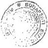

Dr. Tárnok Dezső ig.

Sallay Zsuzsa gazd. vez.

Budapest, 2000. március 17.

---

Budapesti Evangélikus Gimnázium
1071 Budapest, Városligeti fasor 17-21.

3.6. sz. táblázat
a V-3-80/2000. számhoz

Átlagos statisztikai állományi létszámadatok

adatok: főben

|  Sor-szám | Megnevezés | Időpont  |   |   |   |
| --- | --- | --- | --- | --- | --- |
|   |   |  1997. év | 1998. év | 1999. év | 1999/1997 %  |
|  1. | Pedagógusok | 43,58 | 45,08 | 45,83 | 105,16  |
|  2. | A nevelő és oktató munkát közvetlenül segítő alkalmazott | 2,00 | 2,00 | 2,00 | 100,00  |
|  3. | Gazdasági, ügyviteli, műszaki, kisegítő és egyéb besorolású alkalmazottak | 26,25 | 22,08 | 23,25 | 88,57  |
|   | Ebből: - adminisztratív alkalm. | 8,00 | 7,91 | 8,00 | 100,00  |
|   | - technikai alkalmazott | 18,25 | 14,17 | 15,25 | 83,56  |
|  4. | Összesen (1+2+3) | 71,83 | 69,16 | 71,08 | 98,96  |

Megjegyzés: 1. A KSH-létszámjelentések adatai alapján toltendők.
2. A ped. letszam tartalmazza a foallasu es nem foallasu pedagogusok letszamat.

Budapest, 2000. március 17.

Dr. Tárnok Dezső ig. Sallay Zsuzsa gazd. vez.

---

Budapesti Evangélikus Gimnázium
1071 Budapest, Városligeti fasor 17-21.

3.7. sz. táblázat
a V-3-30/2000. számhoz

Főbb illetményadatok

|  Idő- szak | Pedagógusok |   |   | A nevelő és oktató munkát közvetlenül segítő alkalm. |   |   | Gazdasági, ügyviteli, műszaki, kisegítő és egyéb alk. |   |   | Összesen  |   |   |
| --- | --- | --- | --- | --- | --- | --- | --- | --- | --- | --- | --- | --- |
|   |  Létszám (fő) | illetmény (E. Ft) | 1 főre jutó illetm. (E. Ft) | Létszám (fő) | illetmény (E. Ft) | 1 főre jutó illetm. (E. Ft) | Létszám (fő) | illetmény (E. Ft) | 1 főre jutó illetm. (E. Ft) | Létszám (fő) | illetmény (E. Ft) | 1 főre jutó illetm. (E. Ft)  |
|   | a. | b. | c. (b:a) | d | e. | f. (c:d) | g. | h. | i. (h:i) | j. | k. | l. (k:j)  |
|  1997. év | 43,58 | 29.744.653 | 682.530 | 2,00 | 778.141 | 389.070 | 26,25 | 12.236.481 | 466.152 | 71,83 | 42.755.000 | 595.225  |
|  1998. év | 45,08 | 35.855.821 | 795.382 | 2,00 | 935.594 | 467.797 | 22,08 | 14.762.760 | 668.603 | 69,16 | 51.554.175 | 745.433  |
|  1999. év | 45,83 | 40.064.922 | 874.207 | 2,00 | 1.053.228 | 526.614 | 23,25 | 16.466.145 | 708.221 | 71,08 | 57.584.295 | 810.134  |

Megjegyzések: 1. A létszámadatok azonosak a 4. sz. melléklet átlagos állományi létszámadataival.
2. Illetményadatokként az 51. és 52-es állomány sorai szerepelnek.

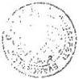

Budapest, 2000. március 17.

Dr. Tárnok Dezső

igazgató

Sallay Zsuzsa
gazd. vez.

---

Budapesti Evangélikus Gimnázium
1071 Budapest, Városligeti fasor 17-21.

3.8. sz. táblázat
a V-3-30 /2000. számhoz

Immateriális javak és tárgyi eszközök állományának alakulása

adatok: ezer Ft-ban

|  Sor-szám | Megnevezés | 1997. január 1-én |   |   |   |   | 1999. december 31-én  |   |   |   |   |
| --- | --- | --- | --- | --- | --- | --- | --- | --- | --- | --- | --- |
|   |   |  Bruttó érték | Érték-csök-kenés | Nettó érték | Nettó/bruttó aránya (e:e) % | Teljesen (O-ra) ker. tár-gyi eszk | Bruttó érték | Érték-csök-kenés | Nettó érték | Nettó/bruttó aránya (j:h) % | Teljesen (O-ra) ker. tár-gyi eszk  |
|  a. | b. | c. | d. | e. | f. | g. | h. | i. | j. | k. | l.  |
|  1. | Immateriális javak | 202 | 127 | 75 | 37,13 | 79 | 1.182 | 575 | 607 | 51,35 | 102  |
|  2. | Ingatlanok | 483.133 | 32.655 | 450.478 | 92,24 |  | 535.717 | 63.404 | 472.313 | 88,16 |   |
|   | Ebből: - földterület (telek) | 94.068 |  | 94.068 |  |  | 94.068 |  | 94.068 |  |   |
|   | - építmények (épület) | 389.065 | 32.655 | 356.410 | 91,61 |  | 441.649 | 63.404 | 378.245 | 85,64 |   |
|   | ebből: oktatási célú | 389.065 | 32.655 | 356.410 | 91,61 |  | 441.649 | 63.404 | 378.245 | 85,64 |   |
|  3. | Gépek, berendezések és felszerelések | 16.803 | 12.285 | 4.518 | 26,89 | 5.983 | 25.705 | 19.041 | 6.664 | 25,92 | 7.902  |
|   | Ebből: - számítógép | 3.924 | 2.797 | 1.127 | 28,72 | 671 | 7.697 | 7.297 | 400 | 4,60 | 1.263  |
|  4. | Járművek | 1.362 | 1.362 |  |  |  | 1.725 | 1.725 |  |  | 1.725  |
|  5. | Üzemeltetésre, kezelésre átadott eszközök |  |  |  |  |  |  |  |  |  |   |
|  6. | Eszközök összesen (1+2+3+4+5) | 501.500 | 46.429 | 455.071 | 90,74 | 6.062 | 564.080 | 84.675 | 479.405 | 84,99 | 9.729  |

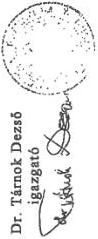

Budapest, 2000. március 17.

Sallay Zsuzsa
gazd. vez.

Sallay Zsuzsa

---

Budapesti Evangélikus Gimnázium
1071 Budapest, Városligeti fasor 17-21.

3.9. sz. táblázat
a V-3-30/2000. számhoz

Pedagógusi és tanulói létszámadatok
alakulása

|  Sor-szám | Megnevezés | 1997/1998. tanév |   | 1998/1999. tanév |   | adatok: főben 1999/2000. tanév tanév elején  |
| --- | --- | --- | --- | --- | --- | --- |
|   |   |  tanév elején | tanév végén | tanév elején | tanév végén  |   |
|  I. | Pedagógusok létszámadatai |  |  |  |  |   |
|  1. | Főállású, teljes munkaidős pedagóg. | 30 |  | 27 |  | 34  |
|  2. | Főállású, részmunkaidős pedagógus | 2 |  | 12 |  | 8  |
|  3. | Főállású, nyugdíjas pedagógus | 12 |  | 4 |  | 4  |
|  4. | Előzőekből: főállású, szerződ. ped. | 20 |  | 21 |  | 26  |
|  5. | Főállású pedagógus összesen | 44 |  | 43 |  | 46  |
|  6. | Nem főállású pedagógus munkakörben dolgozók (óraadók és egyéb) |  |  |  |  |   |
|   | a/ csökkenés |  | 4 |  | 5 |   |
|   | b/ növekedés |  | 15 |  | 8 |   |
|  7. | Pedagógus állományváltozás | 8 |  | 9 |  | 8  |
|  8. | Főfoglalkozású terhelésre (20 órára) átszámított pedagógus létszám | 45,30 |  | 41,40 |  | 41,30  |
|  II. | Gimnáziumi tanulók adatai |  |  |  |  |   |
|  1. | 5-8. osztályos tanulók | 259 |  | 266 |  | 251  |
|  2. | 9-12. osztályos tanulók | 286 |  | 277 |  | 274  |
|  3. | Gimnáziumi tanulók összesen | 545 |  | 543 |  | 525  |
|  4. | Lemorzsolódott tanulók száma (egyenleg) |  | 6 |  | 2 |   |
|  5. | Utolsó éves tanulók száma (L) |  | 64 |  | 68 |   |
|  6. | Erettségizettek száma |  | 64 |  | 68 |   |
|  7. | Felsőokt-ba felvételre jelentk. sz. (J) |  | 63 |  | 65 |   |
|  8. | Felsőoktatásba felvettek száma (F) |  | 51 |  | 47 |   |

Megjegyzés: Az Oktatási Minisztérium statisztikai osztálya által kért adatok alapján töltendő ki.

Budapest, 2000. március 17.

Dr. Tárnok Dezső ig.
Sallay Zsuzsa gazd.vez.

---

Budapesti Evangélikus Gimnázium

1071 Bp. Városligeti fasor 17-21.

3.10. sz. táblázat

a V-3-50/2000. számhoz

Közoktatási szakmai alapadatok és mutatók alakulása

|  Sor-sz. | Megnevezés | Mérték-egység | 1997/1998. tanév | 1998/1999. tanév | 1999/2000. tanév  |
| --- | --- | --- | --- | --- | --- |
|  I. | Szakmai alapadatok |  |  |  |   |
|  1. | Tantervi órák száma | óra | 835 | 754 | 732  |
|  2. | Osztályok száma | db | 16 | 16 | 16  |
|  3. | Emelt szintű oktatásban (kötelező fakt.) résztvevő csoportok száma | db | 286 | 175 | 172  |
|  4. | Csoportbontásos oktatásban résztvevő csoportok, órák sz. | csop. | 82 | 77 | 73  |
|   |   |  óra | 238 | 225 | 217  |
|  5. | Osztálytermek száma | db | 16 | 16 | 16  |
|  6. | Egyéb oktatási helyiségek száma (könyvtár, labor, nyelvi labor stb.) | db | 14 | 14 | 13  |
|  7. | Tornatermek és fedett sportlétes. | db | 1 | 1 | 1  |
|  8. | Oktatásra felhasznált terület (5+6+7 alapján) | m² | 1.841,74 | 1.841,74 | 1.819,84  |
|  9. | Felsőoktatásba jelentkezettek nyelvvizsgáinak száma | db | 49 | 45 | 22  |
|  10. | Tanórán kívüli foglalkozási csoportok: -száma - létszám - óraszáma | db | 56 | 25 | 37  |
|   |   |  fő | 572 | 397 | 550  |
|   |   |  óra | 127 | 92 | 124  |
|  II. | Szakmai mutatók |  |  |  |   |
|  1. | Egy főállású, átszámított pedagógusra jutó heti tantervi óraterhelés | óra/fő/hét | 18,4 | 19,2 | 17,8  |
|  2. | Egy főállású, átszámított pedagógusra jutó tanulók száma | fő/fő | 12,1 | 13,1 | 12,7  |
|  3. | Egy osztályra jutó tanulók sz. | fő | 34 | 34 | 33  |
|  4. | Egy tanulóra jutó tanórán kívüli foglalkozások száma | db | 1,83 | 1,96 | 2,05  |
|  5. | Egy osztályteremre jutó tanulók sz. | fő | 34 | 34 | 33  |
|  6. | Egy tanulóra jutó okt. terület | fő/m² | 3,37 | 3,39 | 3,46  |
|  7. | Felsőoktatásba felvettek aránya végzősökhöz viszonyítva (F:L) | % | 81,3 | 72 |   |
|  8. | Felsőoktatásba felvettek aránya a felvételre jelentkezettekhez (F:J) | % | 82,5 | 77,7 |   |
|  9. | Felsőoktatásba jelentkezettek nyelvvizsga aránya (Ny:J) | % | 76 | 69 | 31  |
|  10. | Az összes Országos Középisk. Tan. Versenyen első húsz helyezett száma | fő |  | 1 | 3  |
|  11. | Az összes OKTV döntőbe jutottak sz. | fő |  | 1 | 4  |
|  12. | Okt. Közl. egyéb orsz. v (1-10. hely.) | fő | 12 | 8 | 6  |
|  13. | Okt. Közl. egyéb orsz. döntő össz. | fő | 19 | 12 | 18  |
|  14. | 8. oszt. tanulók országos átlaghoz viszonyított tudásszintje - olvasás megértése - matematika tudás - természettudományos művelt. - állampolgári ismeretek | % |  |  |   |
|   |   |  % |  | 121 |   |
|   |   |  % |  | 118 |   |
|   |   |  % |  | 119 |   |
|   |   |  % |  | 117 |   |
|  15. | 1 tanulóra jutó bevétel | E. Ft/fő | 189.800 | 250.245 | 296.689  |
|  16. | 1 tanulóra jutó működ. kiadás | E. Ft/fő | 163.798 | 195.438 | 218.662  |
|  17. | 1 tanulóra jutó állami támog. | E. Ft/fő | 124.398 | 158.698 | 190.512  |

Budapest, 2000. március 17.

Dr. Tárnok Dezső is Sallay Zsuzsa gazd.vez.

---

•

•

•

•

•

•

•

•

•

•

---

1

2

3

4