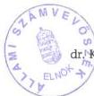

TJ: 522

Állami Számvevőszék

# JELENTÉS

a gazdasági kamarák 1999. évi
vagyonleltárának ellenőrzéséről

2000. október

0038.

---

Az ellenőrzés végrehajtásáért felelős:
V. Önkormányzati és Területi Ellenőrzési Igazgatóság
IV. Vagyonellenőrzési Igazgatóság

Dr. Lóránt Zoltán
számvevő igazgató

Halász Gejza
számvevő igazgató

Az ellenőrzést vezette:

Nagy József
számvevő igazgatóhelyettes

dr. Szávai Tamás
osztályvezető főtanácsos

A jelentés összeállításában részt vettek:

Tormáné Ivánfi Irén
számvevő tanácsos

Csuti Lajos
számvevő tanácsos

Az ellenőrzésben résztvevők névsorát az 1. sz. melléklet tartalmazza

Jelentéseink az INTERNETEN 1999. június 1-től a WWW.ASZ.gov.hu. címen olvashatók.

Jelentéseink az Országgyűlés számítógépes hálózatán is olvashatók.

---

V-1008-45/2000.

# TARTALOMJEGYZÉK

I. ÖSSZEGZŐ MEGÁLLAPÍTÁSOK, KÖVETKEZTETÉSEK, JAVASLATOK 4
II. RÉSZLETES MEGÁLLAPÍTÁSOK 5
1. A vagyonleltár és a mérleg hitelessége 5
2. A vagyonleltár és a mérleg valódisága ellenőrzésének tapasztalatai 7
3. A gazdasági kamarák számviteli politikájának és leltározásának szabályozottsága 12

1

---

,

---

## Jelentés
a gazdasági kamarák 1999. évi vagyonleltárá-
nak ellenőrzéséről

Az 1999. évi CXXI. törvény újraszabályozta a gazdasági kamarák alapításának,
működésének, gazdálkodásának és ellenőrzésének egyes kérdéseit. A törvény értel-
mében a mezőgazdasági és erdőgazdálkodási tevékenységet folytató gazdálkodó
szervezetekkel kapcsolatos kamarai közfeladatokat az **agrárkamarák**, a kereske-
delmi, ipari és kézműipari tevékenységet folytató gazdálkodó szervezetek tekinteté-
ben a **kereskedelmi és iparkamarák** látják el. A törvény 39. § (1) bekezdése
kimondja, hogy a Magyar Kézműves Kamara a Magyar Kereskedelmi és Iparkama-
rába 2000. március 31. napjával beolvad.

A törvény 53. §-a előírja, hogy a gazdasági kamarák a törvény kihirdetését követő
három hónapon belül kötelesek teljes körű vagyonleltárt készíteni és azt az Állami
Számvevőszéknek benyújtani, az ÁSZ a leltárakat ellenőrzi, hitelességükről nyilat-
kozik, és a 2000. október 31-ig megtartandó kamarai választásokat követően azt
megküldi a gazdasági kamaráknak.

A vagyonleltárak ellenőrzését az országos és a területi kamaráknál az Állami
Számvevőszék május 21. és június 16. között végezte.

**A vizsgálat célja** annak megállapítása volt, hogy

- a gazdasági kamarák számviteli rendszerének és leltározási tevékenységének
szabályszerűsége biztosított-e,
- az Állami Számvevőszéknek megküldött vagyonleltárak teljes körűen, a va-
lóságnak megfelelően, hitelesen tükrözik-e vagyonukat, a vagyonértékű jo-
gokat és azok forrásait, valamint készítése során betartották-e a számviteli
törvény (továbbiakban Szt.) 42. §-ában foglaltakat.

Az ellenőrzéshez könyvvizsgálati módszereket is alkalmaztunk. Külön hang-
súlyt kapott a vagyonmegállapító leltározás munkafolyamata előkészítésének,
leltárfelvételének és kiértékelésének utólagos tesztelése, annak megállapítása
céljából, hogy a kamarák leltározásánál alkalmazott eljárások biztosították-e a
vagyon teljes körű, hiteles számbavételét.

Ezen túlmenően a mintavételes módon kiválasztott vagyoni körben az eszkö-
zök fizikai meglétének tesztelésével győződtünk meg a vagyon, illetve a
könyvviteli mérleg valódiságáról.

**A helyszíni vizsgálatot az 1. sz. mellékletben** ismertetett számvevőkből
alakított munkacsoportok végezték, a munkacsoportok vezetői valamennyi
esetben **okleveles könyvvizsgáló** szakképesítéssel rendelkeztek.

3

---

I. ÖSSZEGZŐ MEGÁLLAPÍTÁSOK, KÖVETKEZTETÉSEK, JAVASLATOK

# Az elvégzett helyszíni vizsgálat

3 országos kamarai és
61 területi kamarai szervezetre, – ebből
21 kereskedelmi és iparkamarára,
20 kézműves kamarára és
20 agrárkamarára – terjedt ki.

# I. ÖSSZEGZŐ MEGÁLLAPÍTÁSOK, KÖVETKEZTETÉSEK, JAVASLATOK

A törvényben előírt vagyonleltár készítési és az Állami Számvevőszék részére történő továbbítási kötelezettségüket az országos és a területi kamarák teljesítették.

A vizsgálatban érintett kamarák 1999. évi vagyonleltáraikon alapuló egyszerűsített éves beszámoló mérlegeikben együttesen 18.049 M Ft értékű vagyonról adtak számot. Ebből a területi kamarák 93,6%-os, az országos kamarák 6,4%-os arányt képviselnek. (Az összesített mérleg kiemelt adatait a 2. sz. melléklet szemlélteti).

A forgóeszközökön belül 56,4%-os részarányt tesz ki a követelések állománya, melynek 86,7%-a tagdíjhátralékokból származik, összegük 6693,1 millió Ft-ban mutatható ki. A kamarák tagdíj kintlévőségük csökkentése érdekében több intézkedést tettek.

A kamarák eltérő gyakorlatot folytattak a tagdíj-követeléseik nyilvántartására, év végi (felhalmozott) összegük vagyonleltárban, illetve mérlegben történő megjelenítésében. A vizsgált kamarák egyharmada figyelmen kívül hagyta az adósminősítésre, illetve – 1999. év tekintetében – a céltartalék-képzésre vonatkozó Szt. szerinti előírásokat. A kamarák 10%-a vagyonleltárában, illetve mérlegében tagdíjhátralékot nem szerepeltetett, annak ellenére, hogy az erre vonatkozó analitikus nyilvántartásaik rendelkezésre álltak.

# A felülvizsgált vagyonleltárakat:

- 44 kamránál (68,8%) hiteles,
- 15 kamaránál (23,4%) korlátozott,
- 5 kamaránál (7,8%) a hitelesítést megtagadó nyilatkozattal látta el az Állami Számvevőszék.

A számviteli törvényben előírt követelményeknek megfelelő leltározási szabályzattal a kamarák 67,3%-a (41 kamara), hiányos, de még elfogadható tartalmú szabályzattal rendelkezett 18 kamara (29,5%). A kamarák 3,2%-a nem rendelkezett e dokumentummal, vagy nem megfelelő tartalmú szabályzatot bocsátott az ellenőrzés rendelkezésére.

4

---

II. RÉSZLETES MEGÁLLAPÍTÁSOK

A vagyonleltárak összeállítása során a Szt.-ben foglaltak 20 kamaránál csak részben jutottak érvényre, mivel a mérleg fordulónapján meglévő eszközeiket és forrásaikat tételesen, ellenőrizhető módon nem, vagy nem valamennyi eszközre és forrásra vonatkozóan rögzítették.

A helyszíni ellenőrzésekről készített jelentésekben az ÁSZ felhívta a vizsgált kamarák figyelmét a vonatkozó törvényi előírások betartására, az ellenőrzés során feltárt hiányosságok felszámolására, a tényleges vagyoni állapotot tükröző vagyonleltárak és mérlegek összeállítására, továbbá a hiányzó belső szabályzatok pótlására, illetve a meglévők aktualizálására. Ez utóbbi keretében különösen az adósminősítésen alapuló céltartalékképzés helyi szabályainak kialakítását és számviteli politikában történő rögzítését hangsúlyozta az ÁSZ.

A gazdasági kamarák 1999. évi vagyonleltárainak felülvizsgálata során szerzett tapasztalatok alapján, továbbá gazdálkodási tevékenységük szabályszerűbbé tétele érdekében javasoljuk

a gazdasági, valamint a földművelésügyi és vidékfejlesztési minisztereknek:

- a törvényességi felügyelet keretében jogi iránymutatással segítse, ösztönözze a gazdasági kamaráknál a felhalmozódott tagdíj-hátralékok rendezését,
- járjanak el, hogy a kamarák gazdálkodásának alapját képező, a számviteli törvényben kötelezően előírt belső szabályzatok elkészítése, aktualizálása, és azok alkalmazása megtörténjen,
- kezdeményezzék a gazdasági kamarák belső ellenőrzési rendszerének kialakítását, kísérjék figyelemmel az ellenőrzés által feltárt hiányosságok felszámolását – különös tekintettel a kézműves kamaráknak a kereskedelmi és iparkamarákba történt beolvadására –, kérjenek tájékoztatást ennek végrehajtásáról.

## II. RÉSZLETES MEGÁLLAPÍTÁSOK

### 1. A VAGYONLELTÁR ÉS A MÉRLEG HITELESSÉGE

A gazdasági kamarák vagyonleltárai hitelességének minősítéséhez a Szt. 76. § (3) bekezdésében foglaltakat alkalmazta az ÁSZ analóg módon. Ugyanis a törvény a könyvviteli mérleg hitelesítésének záradékolását írja elő. Az Állami Számvevőszéknek viszont – az 1999. évi CXXI. tv. 53. §-a felhatalmazása szerint – a gazdasági kamarák vagyonleltárainak a hitelességéről kellett nyilatkoznia.

5

---

II. RÉSZLETES MEGÁLLAPÍTÁSOK

A helyszíni ellenőrzés során hitelesítő, korlátozott, illetve a hitelesítést elutasító nyilatkozattal ellátott vagyonleltárak megoszlása:

Me: db

|  Megnevezés | A vagyonleltár hitelességének formája  |   |   |
| --- | --- | --- | --- |
|   |  Hitelesített | Korlátozott | Elutasított  |
|  Országos gazdasági kamarák | 3 | - | -  |
|  Területi gazdasági kamarák | 41 | 15 | 5  |
|  Ebből: |  |  |   |
|  Kereskedelmi és Iparkamarák | 18 | 3 | -  |
|  Kézműves Kamarák | 10 | 7 | 3  |
|  Agrárkamarák | 13 | 5 | 2  |

A Szt. 76. § (2) bekezdése értelmében, ha az ellenőrzés során törvénysértést, vagy szabálytalanságot a könyvvizsgáló nem állapít meg, és a beszámolóban (vagyonleltárban) foglaltakkal egyetért, azt hitelesítő záradékkal látja el. Ezzel elismeri, hogy a beszámolót (vagyonleltárt) a Szt.-ben foglaltak és az általános számviteli elvek figyelembevételével állították össze.

Az Állami Számvevőszék 44 gazdasági kamara 1999. évi beszámolóját alátámasztó vagyonleltárát **hitelesítő nyilatkozattal** látta el.

A Szt. 76. § (3) bekezdésében foglalt előírások szerint, ha a beszámoló (vagyonleltár) egészében, vagy részben nem felel meg a törvényben foglaltaknak, hitelesítő nyilatkozat helyett korlátozott nyilatkozatot (záradékot) ad a könyvvizsgáló.

A vizsgálatot végző számvevők **15 esetben** a hitelesítő nyilatkozat helyett **korlátozott nyilatkozatot adtak**, mert a számviteli törvényben foglalt követelményeknek a vagyonleltárak csak részben feleltek meg. Ezen kamarák felsorolását és a korlátozás indoklását a jelentés **3. sz. melléklete** tartalmazza.

A Szt. 76. § (3) bekezdése értelmében ha a beszámoló (vagyonmérleg) nem felel meg a törvény előírásának és a valóságnak, a könyvvizsgáló a hitelesítő záradékot megtagadhatja.

A gazdasági kamarák vagyonleltárának ellenőrzése során öt esetben a hitelesítő nyilatkozat kiadását a számvevők megtagadták, mert négy kamaránál a mérlegeltérés a **jelentős hibahatár küszöbértékét meghaladta**, egy kamaránál viszont a Szt.-ben foglaltakat **lényeges mértékben** megsértették. A kamaránkénti felsorolást és az elutasítás indokait a jelentés **3. sz. melléklete** tartalmazza.

6

---

II. RÉSZLETES MEGÁLLAPÍTÁSOK

## 2. A VAGYONLELTÁR ÉS A MÉRLEG VALÓDISÁGA ELLENŐRZÉSÉNEK TAPASZTALATAI

A területi és az országos gazdasági kamarák **egyszerűsített éves beszámolójának 1999. XII. 31-i mérlege 18.049 M Ft eszköz, illetve forrásértéket tartalmazott.** A mérleg főösszegéből a kereskedelmi és iparkamarák 79,7%-os, a kézműves kamarák 11,4%-os, az agrárkamarák 8,9%-os arányban részesedtek.

### 2.1. Az immateriális javak

a kamarák eszközállományának mindössze 1%-át képviselik. Az eszközcsoport 2/3 részét a **szellemi termékek** (különféle számítástechnikai programok), kisebb hányadát a **vagyoni értékű jogok** (telefon vonalak, helyiségek bérleti joga) teszik ki.

Nem számolt el 146 E Ft értékcsökkenést a Fejér Megyei Agrárkamara a vagyoni értékű jogok (telefonvonal és ISDN csatlakozás) után, ezért a mérlegértéket csökkenteni kell. Számítási hiba miatt 40 E Ft-tal kevesebb értékcsökkenést mutatott ki a szellemi termékeknél a Veszprém Megyei Kereskedelmi és Iparkamara.

Az ellenőrzés során feltárt eltérések – a helyi számviteli politika alapján – jelentősebb hibának nem minősülnek, így a mérleg főösszegét alapvetően nem befolyásolták.

### 2.2. A tárgyi eszközök

értéke a kamarák vagyonértékének 12%-át teszi ki, melyet a kamarák a Szt. előírásaival összhangban mutattak ki. Ingatlanok mindössze 10 kamara vagyonleltárában szerepeltek, melyek döntően székház céljára szolgáló épületek, épületrészek, illetve az ezekhez kapcsolódó telekértékekből adódtak.

Az ingatlanokról minden esetben rendelkeztek – a jogosultság igazolására szolgáló – három hónapnál nem régebbi tulajdoni lap másolatokkal, az ellenőrzés e területen hiányosságokat nem állapított meg.

**A tárgyi eszközök leltározását a kamarák elvégezték**, ezek 1999. XII. 31. állományáról készített kimutatásokat az analitikus nyilvántartásokkal és a főkönyv adataival egyeztették, a nettó értékét helyesen, az elszámolt értékcsökkenés figyelembevételével állították be a vagyonleltárakba és a könyvviteli mérlegekbe.

Külön hangsúlyt kapott a valódiság számviteli alapelv érvényesülésének vizsgálata. A mintavétel alapján kiválasztott nagyobb értékű eszközök helyszíni szemrevételezésével győződött meg a vizsgálat a leltárakban szerepeltetett vagyontárgyak meglétéről.

A Pécs-Baranyai Kereskedelmi és Iparkamaránál 1.362 E Ft, a Baranya Megyei Agrárkamaránál 956 E Ft, a Békés Megyei Kereskedelmi és Iparkamaránál 331 E Ft, Békés Megyei Kézműves Kamaránál 1.153 E Ft, a Hajdú-Bihar Megyei Kézműves Kamaránál 1.121 E Ft, a Vas Megyei Kereskedelmi és Iparkamaránál 1.949 E Ft, a Vas Megyei Kézműves Kamaránál 803 E Ft, a Vas Megyei Agrárkamaránál 2.648 E Ft bruttó értékű tárgyi eszköz szemrevételezése történt meg

7

---

II. RÉSZLETES MEGÁLLAPÍTÁSOK---

a helyszíni ellenőrzések alkalmával, mely értékek a leltárakkal egyezőek voltak.

Az értékcsökkenés elszámolásának módját a gazdasági kamarák 99%-a a számviteli politikájában rögzítette, valamint a társasági adótörvényben meghatározott kulcsok alapján hajtotta végre.

Ahol a szabályzatok nem rögzítették az értékcsökkenés elszámolásának módját, többféle leírási kulcsot is alkalmaztak azonos eszközcsoportoknál.

A Pécs-Baranyai Kereskedelmi és Iparkamara 15% és 20%-os leírási kulccsal számolta el a személygépkocsik amortizációját. Az irodatechnikai eszközöknél (fénymásoló) háromféle leírási kulcsot használtak. (14,5%, 15% és 33%).

Kisebb mértékben módosították a tárgyi eszközök mérlegértékét az ÁFA-val kapcsolatos elszámolások. A Szt. 35. § (3) bekezdése szerint a beszerzési költségnek (árnak) nem része a levonható előzetesen felszámított ÁFA.

A Bács-Kiskun Megyei Agrárkamara részletekben vásárolt irodaházának 1998. évi 5.000 E Ft törlesztőrészletének összege után 1.000 E Ft ÁFA értéket is beruházásként aktiválták, miközben a Kamara adóalannyá vált, ezért a beszerzési ár részeként az ÁFA-t nem lehetett volna elszámolni. Emiatt a mérlegtétel értékét csökkenteni kell.

# 2.3. **A befektetett pénzügyi eszközök** 1.709.641 E Ft értéke az összesített mérlegek főösszegének 9,4%-át teszik ki.

A gazdasági kamarák befektetett pénzügyi eszközként – a Szt.-vel összhangban – mutatták ki a részesedéseket, az adott kölcsönök összegeit. A gazdasági kamarák 98%-a – élve a törvény adta jogukkal – saját közhasznú társaságokat alapított, illetve egyéb közhasznú társaságban vett részt.

A leltározás és az annak alapján összeállított leltár szabályszerűsége ellenére a vagyonleltár és mérleg – a számviteli alapelvek vonatkozásában – mind a teljességet, mind a valódiságot illetően csorbát szenvedett. **Nem mutatták ki részesedésként egyes gazdasági kamarák a saját alapítású KHT-k alapításkori értékét:**

A Hajdú-Bihar Megyei Kézműves Kamara közhasznú társasága alapításkori 1.000 E Ft törzstőkéjét, a Fejér megyei Kereskedelmi és Iparkamara Dunaújvárosi Kamarája az 1.000 E Ft alapítói vagyont, a Nógrád megyei Kereskedelmi és Iparkamara 1.000 E Ft készpénzértékből álló törzstőkéjét, valamint a Jász-Nagykun-Szolnok megyei Kereskedelmi és Iparkamara 1.000 E Ft alapítói hozzájárulását.

A Szt. 34. § (3) bekezdése értelmében **értékvesztést kell elszámolni**, ha a társaság saját tőke értékének a befektetés névértékével arányos része a könyv szerinti értéke alá csökken.

Az Szt.-ben előírtak szerint, helyesen, 12.100 E Ft értékvesztést számolt el a Budapesti Kereskedelmi és Iparkamara a részesedések értékénél a 100%-os tulajdonú Kamarapressz KHT saját tőkéjének csökkenése miatt.

---8

---

II. RÉSZLETES MEGÁLLAPÍTÁSOK

A kamarák 1/8-a nem vizsgálta az általuk alapított KHT-k törzstőkéjét, illetve nem számolta el az indokolt értékvesztést, emiatt az óvatosság számviteli alapelvet megsértették.

A Balatoni Turisztikai Marketing KHT-ban a Zalai, a Veszprémi és a Somogyi Kereskedelmi és Iparkamarák egyaránt 1.000 E Ft törzstőkével rendelkeztek. A társaság 1999. évben végelszámolással megszűnt, a Szt. 34. § (3) bekezdése következtében valamennyi kamarának 614 E Ft értékvesztést kellett volna elszámolnia, melynek a Veszprém Megyei Kereskedelmi és Iparkamara nem tett eleget. Ezen eltérés hibahatása a mérleg főösszeghez viszonyítva nem jelentős.

2.4. **Készleteket** mindössze kilenc területi, valamint az Országos Kereskedelmi és Iparkamara, továbbá az Országos Agrárkamara tart nyilván. A többi gazdasági kamara a készletek értékét – saját számviteli politikájukban rögzítettek szerint – beszerzéskor költségként elszámolta.

Az együttes készletérték 23 M Ft-ot tett ki, amely a mérleg főösszeg mindössze 1,2 ezrelékét tették ki. Ezen készletféleségek jellemzően nyomtatványokból, irodaszerekből, göngyölegekből, üzemanyagokból álltak.

2.5. **A követelések** mérlegértéke 7.728.627 E Ft, melyből 86,6%-ot tettek ki a **területi kamarák tagdíj hátralékai**. Ez utóbbi követelés-állomány az alakulástól (1994-1995. évektől) göngyöltetett értéket mutatja.

Az 1.035.446 E Ft összegű **egyéb követelés állomány**, a saját KHT-knak nyújtott kölcsönöket, a vállalkozásoknak visszafizetendő támogatásként adott Műszaki Fejlesztési Alap (MÜFA), Gazdaság Fejlesztési Alap (GFA) támogatások címén adott összegeket, továbbá a munkavállalókkal kapcsolatos kölcsönöket, az országos kamaráknak fizetendő működési hozzájárulás összegét stb. foglalja magában.

**A gazdasági kamarák 10%-a az éves beszámoló mérlegében nem, csak az analitikus nyilvántartásaiban szerepeltette tagdíjhátralékait.**

**Követelésként nem mutatta ki tagdíjhátralékát** a Baranya Megyei Kézműves Kamara, a Heves Megyei Kézműves Kamara, a Szabolcs-Szatmár-Bereg Megyei Kézműves Kamara, a Bács-Kiskun Megyei Kézműves Kamara, a Borsod-Abaúj-Zemplén Megyei Kézműves Kamara, a Bács-Kiskun Megyei Agrárkamara és a Somogy Megyei Agrárkamara. Nem végezték el a követelésállomány egyedi minősítését, így a követelések pontos értékét nem tudták megállapítani.

**Tagdíjkövetelések leírását** a gazdasági kamarák hitelezési veszteségként számolták el, behajthatatlannak minősítették a felszámolással, csődeljárással, végelszámolással megszűnt társas vállalkozások, a haláleset, betegség miatt felszámolt, vagy átalakult egyéni vállalkozók hátralékait.

**Tagdíjmérséklést, tagdíjelengedést** csak rendkívül indokolt esetben engedélyeztek a gazdasági kamarák. Jellemzően az árvízkárosult Heves és Jász-Nagykun-Szolnok megyében, ahol a tagdíjfizetési kötelezettséget 50%-ra mérsékelték.

9

---

II. RÉSZLETES MEGÁLLAPÍTÁSOK

A Győr-Moson-Sopron Megyei Kézműves Kamara – a Tagdíj Szabályzatában foglaltakra tekintettel – az alacsony árbevételű, GYES-en lévő vállalkozó, betegség, vagy nyugdíjas vállalkozó esetén 451 tag részére 12.196 E Ft tagdíjmérsék-lést engedélyezett.

**A tagdíjkövetelések behajtására** szinte valamennyi kamara **intézkedett**:

- a fizetési kötelezettséget határidőben nem teljesítők részére közigazgatási határozatot hoztak, illetve – az adózásról szóló 1990. évi XCI. tv. 3. § (2) bekezdése szerint – azonnali beszedési megbízást adtak ki. Az egyéni vállalkozói igazolványok visszavonásáról intézkedtek;
- egyes gazdasági kamarák (Csongrád, Somogy, Veszprém Megyei Kereskedelmi és Iparkamarák, a Budapesti Kereskedelmi és Iparkamara) a hátralékok beszedésével behajtással foglalkozó céget bíztak meg.

2.6. A rövid lejáratú, forgatási céllal vásárolt **értékpapírok** leltár szerinti értéke 2.636.982 E Ft, ennek 88%-a a területi kereskedelmi és iparkamarák birtokában volt, melynek valódiságáról a helyszíni vizsgálat meggyőződött. A gazdasági kamarák döntően diszkont kincstárjegyet, magyar államkötvényeket, „Trezor” értékjegyet, „Optima” nyílt végű befektetési jegyet vásároltak, továbbá takarékszövetkezeti részjeggyel rendelkeztek.

A vagyonleltár az értékpapírok fordulónapon meglévő állományát tartalmazta, egyezően a főkönyv adataival. Az analitikus nyilvántartásokat a gazdasági kamarák 90%-a megfelelően, a fennmaradó 10 %-a pontatlanul vezette (az értékpapírokat fajtánként nem mutatták ki, az értékpapírok értékét eladáskor nem beszerzési, hanem eladási áron vezették ki, az árfolyamnyereséget nem tüntették fel).

2.7. A **pénzeszközök** mérlegben kimutatott értéke 3.310.360 E Ft, amely a forgóeszközök 1/4 részét képezte. Ennek 10%-a lekötött, elkülönített bankszámlákon volt található.

A **pénzeszközök leltározását** a bankszámlakivonatok és a pénztárjelentések egyeztetésével elvégezték, a **leltárérték** – egy kivétellel – **valós**.

A Borsod-Abaúj-Zemplén Megyei Kézműves Kamara könyvvizsgáló által ismételten auditált 1999. évi mérlegében 20.709 E Ft összes pénzeszközt mutattak ki az előző 21.747 E Ft-tal szemben. Az eltérés 1.038 E Ft összegét a házipénztárba már felvett, de a könyvelő iroda által még le nem könyvelt december havi bérek és járulékainak 1.577 E Ft összegű csökkentő, illetve a lekötött pénzeszközök után folyósított kamat 539 E Ft-ban elszámolt növelő tétele együttesen idézte elő.

A mérleg eszközértékének 1,5 %-át kitevő **aktív időbeli elhatárolások** között mutatták ki a kettős könyvvitelt vezető gazdasági kamarák a Szt. 24. §-a szerint analitikával alátámasztottan az 1999. évben kifizetett, 2000. évre vonatkozó előfizetési díjakat, az 1999. évet illető nem realizált kamatokat, árfolyamnyereséget.

10

---

II. RÉSZLETES MEGÁLLAPÍTÁSOK

2.8. A **saját tőke** összege az országos és területi kamarák 2/3-ánál növekedést mutat, **mely a tárgyévi eredmények kedvező hatását**, a gazdasági kamarák pénzügyi kondícióinak erősödését tükrözi.

2.9. A gazdasági kamarák **céltartalékot első ízben 1999. évben** a leltár fordulónapján fennálló kétes követelések, várható veszteségek fedezetére képeztek. A céltartaléknak a mérlegben történő kimutatását az 1999. január 1-jén hatályba lépő 219/1998. (XII.30.) Korm. rendelet tette lehetővé.

A **gazdasági kamarák 2/3-a eleget tett törvényi kötelezettségének**. A Szt. 27. §-a, valamint a saját számviteli politikában rögzített szabályozás alapján a területi kamarák elsősorban a **tagdíjhátralékok fedezetére**, az országos kamarák pedig a behajthatatlannak minősített **működési hozzájárulásokra**, illetve kártérítéssel összefüggő, **ki nem egyenlített követelésekre képeztek céltartalékot**. A képzett **céltartalékok** mérlegértéke 4.021.711 E Ft, az összesített főösszeg 22,3%-át tette ki.

A gazdasági kamarák 1/3-a a céltartalék képzést nem, vagy nem az Szt. 27. §-ában előírtaknak megfelelően szabályozta, illetve céltartalékot sem képzett.

2.10. A mérlegben kimutatott fordulónapi **kötelezettségek értéke** 1.553.776 E Ft, a források 8,6%-át jelentik.

A **kötelezettségek állományát** a gazdasági kamarák a főkönyvi könyvelés adataival egyezően mutatták ki, azonban nyolc kamara az analitikus nyilvántartásokkal történt egyeztetést nem dokumentálta, ezért a **vagyonleltár** és a **mérlegérték** nem valós. Előfordult, hogy egyes kötelezettségeket nem, vagy nem teljes összegükkel mutatták ki – a Szt. bruttó elszámolásra vonatkozó előírásaival ellentétesen – összevont adatokat szerepeltettek. (A szállítók vagyonleltár szerinti értéke a tartozások és fennálló követelések összevont egyenlegét mutatta, a más kamarával szembeni kötelezettségeket a fennálló követelésállomány nettósításaként szerepeltették stb.) A **kimutatott kötelezettségekből a hosszú lejáratú kötelezettség állomány** összege 331.840 E Ft, melynek 3/4 része az Országos Kereskedelmi és Iparkamara által kimutatott bírósági letét.

A gazdasági kamarák **rövid lejáratú kötelezettségeit** képező 1.221.936 E Ft-ban mutatták ki a központi költségvetéssel fennálló adó- és járuléktartozásukat, szállítói kötelezettségeket, a kapott előlegeket, a fióktelepi fizetési kötelezettségeket, a hosszú lejáratú kötelezettségek következő évi törlesztő részletét, a munkavállalókkal szemben fennálló kötelezettségeket, valamint a területi kamarák az országos kamarák felé elismert, de meg nem fizetett működési hozzájárulást.

**Több területi kamara vitatta** és a vagyonleltárban – szabálytalanul – a **kötelezettségek között nem mutatta ki a működési hozzájárulás összegét**. (Borsod-Abaúj-Zemplén, Fejér Megyei, Nógrád Megyei és a Budapesti Agrárkamarák). Peres eljárás van folyamatban a működési hozzájárulás fizetési kötelezettséget illetően az Országos és három területi kamara között (Békés,

11

---

II. RÉSZLETES MEGÁLLAPÍTÁSOK---

Győr-Moson-Sopron Megyei Agrárkamarák és a Pécs-Baranyai Kereskedelmi és Iparkamara).

**A passzív időbeli elhatárolások** mérlegértéke 410.232 E Ft, melyből az országos kamarák 25%-os arányt tesznek ki. A Szt. 29. §-a szerint mutatták ki a területi kamarák, többek közt az Országos Műszaki Fejlesztési Bizottságtól (OMFB-tól) 1999. évben leutalt, ténylegesen a 2000. évet illető visszatérítendő támogatásokat, banki költséget, továbbá egyes területi kamarák az 1999. évet illető, át nem utalt működési hozzájárulást.

### 3. A GAZDASÁGI KAMARÁK SZÁMVITELI POLITIKÁJÁNAK ÉS LELTÁROZÁSÁNAK SZABÁLYOZOTTSÁGA

#### 3.1. A számviteli tevékenység szabályozottsága

A **számviteli politika** helyi szabályozása tekintetében a leggyakoribb hiányosság e szabályozás teljes körű kimunkálásának és aktualizálásának elmaradása volt.

A meglévő számviteli politika szabályozást nem minősítette megfelelőnek a vizsgálat Győr-Moson-Sopron, Hajdú-Bihar, Veszprém, és a Zala Megyei kézműves Kamaráknál, illetve annak késedelmes elkészítését állapította meg Fejér, a Pest Megyei, valamint a Budapesti Agrárkamaráknál.

**Eszköz és forrás értékelési szabályzattal** – külön dokumentumban, vagy a számviteli politika részeként – a kereskedelmi és iparkamarák teljes körben rendelkeztek, a további kamarák közül a kézműves kamarák 16 megyében, az agrárkamarák 17 megyében készítették el e belső szabályozást. Nem rendelkezett ilyen szabályzattal a Bács-Kiskun Megyei Kézműves Kamara és Agrárkamara, a Tolna Megyei Kézműves Kamara, a Hajdú Bihar, és a Veszprém Megyei Agrárkamara.

Az eszközök és források **leltározási szabályzatának** meglétét és annak tartalmát a vizsgálat során a területi kamaráknál külön vizsgálta az ÁSZ. Ennek eredményeként megállapítható, hogy a vizsgált kör egészét tekintve 41 kamara (67,3%) leltározási szabályzata minősült megfelelőnek, hiányos, de elfogadható minősítést kapott 18 kamara szabályzata (29,5%). A maradékot képező kamaráknál nem volt elfogadható (Komárom Megyei Agrárkamara), vagy nem is állt rendelkezésre e dokumentum (Vas Megyei Agrárkamara).

A leltározás során használt **szigorú számadású nyomtatványok kezelése** 28 kamaránál (45,9%) volt megfelelő, hiányos minősítést kapott 12 kamara (19,7%), nem volt elfogadható 10 kamara e területen tapasztalt gyakorlata, míg a további 11 szervezet nem dokumentálta e nyomtatványok kezelésének helyi szabályait.

#### 3.2. Leltározási tevékenység

Az ellenőrzött kamarai szervezetek 85%-a (55 szervezet) – beleértve az országos és a területi szervezeteket is – az 1999. évi vagyonleltáraikat az érvényes leltá-

---12

---

II. RÉSZLETES MEGÁLLAPÍTÁSOK

rozási szabályzatukban foglaltak alapján állították össze. Négy kamarai szervezet mennyiségi leltározást nem végzett (Komárom Megyei Kereskedelmi és Iparkamara, valamint a Komárom, Vas és a Veszprém Megyei Kézműves Kamara). A különbözetet képező kamarák esetében a vagyonleltárak nem minden tekintetben a helyi szabályozás szerint kerültek összeállításra (Pécs-Baranyai Kereskedelmi és Iparkamara, Szabolcs-Szatmár-Bereg Megyei Kézműves Kamara, Bács-Kiskun, Hajdú-Bihar, Békés Megyei Agrárkamara).

Leltározási ütemterv készítéséről, illetve utasítás kiadásáról 46 kamaránál győződhetett meg a vizsgálat, melyekben részletesen rögzítették a leltározás operatív végrehajtásának ütemét, a leltározási körzeteket, a leltározás folyamatában közreműködő bizottságok személyi összetételét. A mennyiségi felvétellel, illetve az egyeztetéssel történő leltári tételek – eszközök és források – elkülönített meghatározása, a kiértékelésre szóló feladat azonban nem jelent meg teljes körben e dokumentumokban.

A leltárak kiértékelésének megtörténtét 51 szervezetnél állapíthatta meg a vizsgálat. Ugyanakkor elmaradt a leltárak kiértékelése a Heves, a Szabolcs-Szatmár-Bereg, a Jász-Nagykun-Szolnok Megyei Kézműves Kamaránál, nem dokumentálták ennek végrehajtását a Csongrád, és a Nógrád Megyei Kereskedelmi és Iparkamaráknál, a Borsod-Abaúj-Zemplén Megyei Kézműves Kamaránál, a Hajdú-Bihar és a Zala Megyei Agrárkamaránál. A kiértékelés részbeni megtörténtét rögzítette az ellenőrzés a Zala Megyei Kézműves Kamaránál, nem megfelelő színvonalúnak minősítette ennek végrehajtását a Veszprém Megyei Kézműves Kamaránál.

A leltár kiértékelések során a vizsgált kamarai szervezetek közül a Budapesti Kereskedelmi és Iparkamara, valamint az Agrárkamara állapított meg eltérést, melyek számviteli rendezése a zárlati munkák keretében megtörtént. A különbözetet képező 59 területi kamara esetében **leltár különbözetekkel, és ezek értékben kimunkálásával az ellenőrzés nem találkozott.** Ebben szerepet játszott, hogy az előzetesen végrehajtott selejtezéseket követően már a könyvszerinti eszközök voltak leltározáskor megtalálhatók a leltárfelvételi helyeken (Baranya Megyei Agrárkamara, Győr-Moson-Sopron Megyei Kereskedelmi és Iparkamara). **A vizsgálat – különösen az egyeztetésen alapuló – a követelések, kötelezettségek tekintetében, a nem kellő alapossággal végrehajtott leltározás tényét is megállapította** (Budapesti Agrárkamara, Heves Megyei Kézműves Kamara, Szabolcs-Szatmár-Bereg Megyei Kézműves Kamara, Bács-Kiskun Megyei Kézműves Kamara, Baranya Megyei Kézműves Kamara, Tolna Megyei Kézműves Kamara).

Budapest, 2000. október '6'

dr. Kovács Árpád

13

---

“

---

1. sz. melléklet

a V-1008-45/2000. sz. vizsgálati jelentéshez

# A helyszíni vizsgálatot végezték:

az országos kamaráknál:

dr. Dotterweich Antal

Tóth István

a területi kamaráknál:

Baranya megye:

Maczekó Károly

Remeczki László

Bács-Kiskun megye:

Domján Jenő

dr. Csikai Zsolt

Békés megye:

dr. Klapcsik László

Hirka Mihály

Borsod-Abaúj-Zemplén m.:

Dankó Géza

Klinga László

dr. Szikszai Bertalan

Kerezsi Pál

Csongrád megye:

dr. Boda Sándor

dr. Fülöp László

Fejér megye:

Huberné Kuncsik Zsuzsanna

Czifra Erzsébet

Győr-Moson-Sopron megye:

Berényi Magdolna

dr. Lacó Bálintné

Hajdú-Bihar megye:

Kóródi József

Fórián Erika

Heves megye:

dr. Tóth András

Maróti Sándor

Jász-Nagykun-Szolnok megye:

Csomán Mihály

Fodor Tivadarné

Komárom-Esztergom m.:

Koltayné Szepesi Zsuzsa

György Árpád

Nógrád megye:

Fercsik Gyula

Pest megye:

Vojcsekné Szabó Ágnes

Szabó Tamás

Somogy megye:

Csuti Lajos

Tormáné Ivánfi Irén

Szabolcs-Szatmár-Bereg m.:

Hadházy Sándor

Szabó Zoltán

Tolna megye:

Alexovics Ágota

Péntek László

Vas megye:

Kántor Ilona

dr. Gyuk József

Veszprém megye:

Szikszainé Király Mária

Komlósiné Bogár Éva

Zala megye:

Köcse Istvánné

Tóthné Salamon Ildikó

Főváros:

dr. Spilák Antal

dr. Kőrös István

Fancsali Mária

---

•

---

2. sz. melléklet

a V-1008-45/2000. sz. jelentéshez

A gazdasági kamarák 1999. XII. 31-i vagyonmérlegének

kiemelt adatai

M Ft-ban

|  Megnevezés | Kereskedelmi és iparkamarák |   | Kézműves kamarák |   | Agrárkamarák |   | Összesen |   | Együtt  |
| --- | --- | --- | --- | --- | --- | --- | --- | --- | --- |
|   |  Területi | Országos | Területi | Országos | Területi | Országos | Területi | Országos  |   |
|  A) Befektetett eszközök | 3.585,0 | 72,8 | 143,7 | 4,2 | 207,2 | 49,2 | 3.935,9 | 126,2 | 4.062,1  |
|  Ebből: részesedések | 923,8 | 18,0 | 39,9 | 1,0 | 96,6 | - | 1.060,3 | 19,0 | 1.079,3  |
|  B) Forgóeszközök | 9.753,2 | 730,4 | 1.777,9 | 128,4 | 1.217,2 | 92,2 | 12.748,3 | 951,0 | 13.699,3  |
|  Ebből: tagdíjhátralék | 4.746,3 | 85,9* | 1.434,7 | 22,3* | 512,1 | 55,4* | 6.693,1 | 163,6* | -  |
|  C) Aktív időbeli elhat. | 170,0 | 79,2 | 3,6 | 1,3 | 33,0 | 0,4 | 206,6 | 80,9 | 287,5  |
|  Eszközök összesen: | 13.508,2 | 882,4 | 1.925,2 | 133,9 | 1.457,4 | 141,8 | 16.890,8 | 1.158,1 | 18.048,9  |
|  D) Saját tőke | 9.260,2 | 480,6 | 1.001,8 | 49,7 | 1.157,1 | 113,9 | 11.419,1 | 644,2 | 12.063,3  |
|  E) Céltartalék | 3.119,0 | 3,5 | 751,1 | - | 144,5 | 3,6 | 4.014,6 | 7,1 | 4.021,7  |
|  F) Kötelezettségek | 909,1 | 390,0 | 165,3 | 9,2 | 75,7 | 4,4 | 1.150,1 | 403,6 | 1.553,7  |
|  G) Passzív időb. elhat. | 219,9 | 8,3 | 7,0 | 75,0 | 80,1 | 19,9 | 307,0 | 103,2 | 410,2  |
|  Források összesen: | 13.508,2 | 882,4 | 1.925,2 | 133,9 | 1.457,4 | 141,8 | 16.890,8 | 1.158,1 | 18.048,9  |

* A területi kamarák által meg nem fizetett működési hozzájárulás

---

.

---

3. sz. melléklet
a V-1008-45/2000. sz. vizsgálati jelentéshez

# „Korlátozott”, illetve „megtagadó” vagyonleltár nyilatkozattal rendelkező kamarák

A) Korlátozott nyilatkozattal ellátott kamarai vagyonleltárak

1. Nógrád Megyei Kereskedelmi és Iparkamara

- az 1996. évben KHT alapításhoz fizetett alapítói hozzájárulás összegét számvitelében szabálytalanul – részesedés helyett saját tőke csökkenésként – számolta el, mely a helyi számviteli politikában rögzítettek szerint jelentős hiba.

2. Tolna Megyei Kereskedelmi és Iparkamara

- a gazdasági társaságban levő befektetésénél (Tolna Megyei Kereskedelmi és Iparkamara KHT, illetve a Dél-Dunántúli Idegenforgalmi KHT) a Szt. 39. §-ában előírt értékvesztési elszámolási kötelezettségének nem tett eleget, valamint megsértette a Szt.-ben rögzített óvatosság elvét.

3. Zala Megyei Kereskedelmi és Iparkamara

- a vagyonleltár készítése során maradéktalanul nem hajtották végre a Szt. eszközök egyedi értékelésére vonatkozó előírásait, nem számolták el a saját alapítású KHT-ben lévő befektetésük értékvesztését, sérült az óvatosság számviteli elve,
- a céltartalék-képzés gyakorlata nem felelt meg az Szt.-ben foglaltaknak, mivel adósminősítést nem végeztek, a céltartalék képzéshez értékhatárokat nem állapítottak meg.

4. Baranya Megyei Kézműves Kamara

- megsértették a Szt. bruttó elszámolás elvét, mivel a tagdíj túlfizetések összegével csökkentették a vevők állományát, ugyanakkor a kötelezettségek között nem tüntették fel a tagdíj túlfizetések összegét,
- a követelések között nem szerepeltették a tagdíjhátralékot, erre céltartalékot sem képeztek.

5. Borsod-Abaúj-Zemplén Megyei Kézműves Kamara

- a tényleges házipénztári pénzkészlet – téves könyvelés miatt – 1.577 E Ft-tal kevesebb, a lekötött betétszámla egyenlege 539 E Ft-tal több, az eltérések együttes hibahatása a mérleg főösszegének 2,13%-át teszi ki, mely meghaladja az Szt.-ben meghatározott mértéket,

---

- a kamara a benyújtott vagyonleltárhoz nem csatolta a tagdíjtartozásokat (követeléseket) részletesen bemutató leltárát.

# 6. Hajdú-Bihar Megyei Kézműves Kamara

- a kamara a KHT alapítására fizetett 1.000 E Ft hozzájárulást rafordí-tásként számolta el számvitelében, emiatt ennek értéke az 1999. évi vagyonleltárában és merlegében - mint befektetett penzügyi eszköz - nem szerepel, ezzel sérult a valódiság és teljesség számviteli elfe, a hiba hatása a merleg fóösszeg 0,5%-aban mutatható ki,
elmaradt a tagdijkovetelések egyedi ertékelése is.

# 7. Heves Megyei Kézműves Kamara

- a tagdíjhátralékok egyeztetése, egyedi értékelése nem történt meg, céltartalékot nem képeztek, ezzel sérült a teljesség számviteli elve.

# 8. Szabolcs-Szatmár-Bereg Megyei Kézműves Kamara

- a vagyon leltározása nem volt teljes körű, a tagdíjhátralékok egyedi értékelése nem történt meg, a SZIGNÁL Biztosítóval szemben fennálló kötelezettségüket a vagyonleltárban nem mutatták ki, ezzel sérült a teljesség számviteli elve.

# 9. Jász-Nagykun-Szolnok Megyei Kézműves Kamara

- a befektetett penzügyi eszközök ertékvesztését, és a KHT-nak nyújtott, már lejárt kölcsönöket hitelezési veszteségként nem szamolták el,
- a kamarai tagdijtartozások összegét minősítés nélkül allitották be a mérlegbe, erre celtartalékot nem képeztek. Sérult az ávatosság számviteli elfe.

# 10. Tolna Megyei Kézműves Kamara

- az analitikus nyilvántartás és a főkönyvi könyvelés szerinti tagdíjhátralék értéke eltérő, megsértették a számviteli törvény teljesség és valódiság elvét.

# 11. Baranya Megyei Agrárkamara

- a saját KHT-ban levő 3.000 E Ft részesedésük ertékvesztését nem számolták el, hiba hatása a merleg fóösszegének 3,7%-aban fejezhető ki, sérult a számviteli törveny ávatosság elfe,
- a tagdij-koveteléseikre nem képeztek celtartalékot.

# 12. Fejér Megyei Agrárkamara

- az értékcsökkenés helytelen elszámolásából adódóan sérült az óvatosság, a követelések téves kimutatása miatt pedig az időbeli elhatárolás számviteli elve.

2

---

### **13. Hajdú-Bihar Megyei Agrárkamara**

- a kamara 1999. évben nem képzett céltartalékot a behajthatatlan, illetve a kétes követeléseire, sérült az óvatosság számvitel elve,
- az ÁFA-t tartalmazó könyvviteli számlái nem szabályosak.

### **14. Somogy Megyei Agrárkamara**

- a tagdíj-követelésük összegét tévesen passzív időbeli elhatárolásként mutatták ki vagyonleltárukban, ezáltal megsértették a világosság számviteli elvét,
- elmaradt a tagdíjhátralékok utáni céltartalék képzés, emiatt sérült az óvatosság számviteli elve.

### **15. Budapesti Agrárkamara**

- nem képeztek a tagdíjhátralékra céltartalékot, kötelezettségként nem mutatták ki vagyonleltárukban a Magyar Agrárkamarával szemben fennálló működési hozzájárulás tartozásuk összegét, ezekkel megsértették az óvatosság számviteli elvét.

## **B) Hitelesítését megtagadó nyilatkozattal ellátott kamarai vagyonleltárak**

### **16. Bács-Kiskun Megyei Kézműves Kamara**

- a kamara egyéb követelések leltára nem tekinthető hitelesnek, mivel nem tartalmazta az előző évekből származó tagdíj-hátralékot, és az ebből eredő hiba jelentős, mivel az a mérleg főösszegének több mint hétszerese.

### **17. Vas Megyei Kézműves Kamara**

- a tagdíj túlfizetésekből származó kötelezettséget vagyonleltárukban nem szerepeltették, ugyanakkor a túlfizetés összegével a tagdíjhátralék összegét csökkentették, ez az eljárásuk sérti a Szt. valódiság és bruttó elszámolás elvét, a hiba hatása jelentős, 8% mértékű a mérleg főösszegéhez viszonyítva.

### **18. Veszprém Megyei Kézműves Kamara**

- Immateriális javak és a tárgyi eszközök mérlegértéke nem megbízható. A tagdíjkövetelések bizonylattal nem alátámasztottak. A követelések egyeztetése elmaradt. A vagyonleltár valós értékének meghatározása az ellenőrzés során információ hiány miatt nem történhetett meg. Megsértették a Szt. világosság, egyedi értékelés, valódiság és következetesség elveit.

3

---

## 19. Bács-Kiskun Megyei Agrárkamara

- a tagdíjak nyilvántartása megbízhatatlan, ezek egyedi értékelését elmulasztották, a hibahatás jelentős, sérült a valódiság és az óvatosság számviteli elve,
- a mérleg 50.157 E Ft főösszegét meghaladó mértékű tagdíjtartozások 57-63 M Ft között kimutatott nagyságrendjével szemben, a vagyonleltárukban, illetve mérlegükben, ennek mindössze 6% körüli összegét mutatták ki követelésként. E tényezők nem támasztották alá a kamara 1999. évi vagyoni, pénzügyi helyzetéről a valós kép megalkotását.

## 20. Tolna Megyei Agrárkamara

- az Országos Kamara felé fennálló fizetési kötelezettségüket vagyonleltárukban nem szerepeltették, megsértették a teljesség és a valódiság számviteli elveket.
- a feltárt hibák mértéke meghaladja a Szt.-ben illetve a helyi számviteli politikában meghatározott mértéket, mivel azok a mérleg főösszegének több mint 25%-át teszik ki.

4

---

1