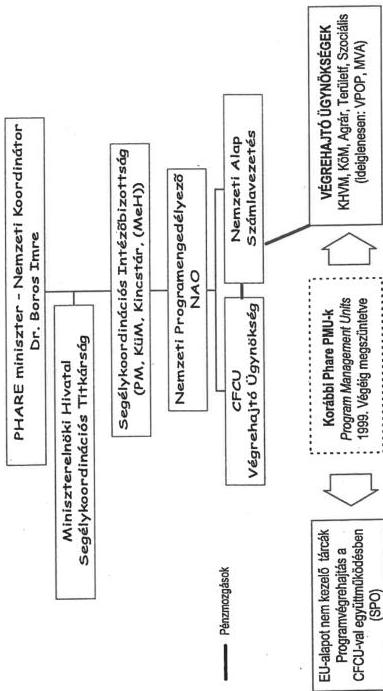

Állami Számvevőszék

# JELENTÉS

a Phare támogatások felhasználásának vizsgálatáról

2000. december

0042

---

**Az ellenőrzés végrehajtásáért felelős:**

**Halász Gejza**
számvevő igazgató

**Az ellenőrzést vezette:**

**Karsainé Dömsödi Éva**
osztályvezető számvevő főtanácsos

**Az ellenőrzésben részt vettek:**

**Bank Lajos**
számvevő tanácsos

**Kapronczai Gabriella**
számvevő tanácsos

**Kerekes Anikó**
számvevő tanácsos

**Szemerics Györgyi**
számvevő tanácsos

**Beck Miklós**
számvevő

**Fekete Gábor**
számvevő

**Simon Andrásné**
számvevő

**Tóthné Kiss Katalin**
számvevő

**Hajkó Andrea**
fogalmazó

**Kardoss László**
külső szakértő

**Szatmári Dezső**
külső szakértő

**A témához kapcsolódó korábbi ÁSZ vizsgálatok:**

A PHARE program helyzete Magyarországon (1997.)
A nemzetközi segélyek monitoring rendszerének ellenőrzése (2000.)

Jelentéseink az Országgyűlés számítógépes hálózatán
és az Interneten a www.asz.hu címen is olvashatók.

---

V-14-90/2000.

# TARTALOMJEGYZÉK

# 1. A PROGRAMOK HELYZETE ÉS TELJESÜLÉSE ... 12

1.1. A SZERZŐDÉSES LEKÖTÉSEK ÉS A TELJESÍTÉSEK HELYZETE ... 13

1.1.1.A keretek, a lekottsegek es a teljesitek alakulasa 13
1.1.2.A lekottsegek szerzódestipusonkenti alakulasa 14
1.1.3.A tamogatasi keretek felhasznalasa 15

1.2. A VÉGREHAJTÓ SZERVEZETEK VÁLTOZÁSAI ... 16

# 2. A PROGRAMOK PHARE ELJÁRÁSI RENDBEN VALÓ VÉGREHAJTÁSA ... 18

2.1. A PROGRAMOK VÉGREHAJTÁSÁT BEFOLYÁSOLÓ TÉNYEZŐK ... 19

2.1.1. Utemtervek es azok vegrehajtasa 19
2.1.2.Kapacitask tervezese 20
2.1.3.Strategial tervek es munkaprogramok 21
2.1.4.EU Delegacio es Bizottsag administrativ idszukseglete 23
2.1.5. Az eljárások valtozásanak hatásai 24
2.1.6.A Phare vegrehajto szervezetek kozotti kapcsolattartas 25
2.1.7. A teruilefejlesztési Phare programok megvalositásat késlettó és a kockázatokat novelő tenyezők 25

2.2. A PROGRAMOK VÉGREHAJTÁSI SZABÁLYAINAK BETARTÁSA ... 27

2.2.1.A projektek vizsgalatra torten' kivalasztasanak szempontjai 27
2.2.2. Az ellenorzsre kivalasztott projektek teljesitese 27

2.2.2.1. Az APV Rt. 1996. evi programja 28
2.2.2.2.A KBM 1997. evi programja 28
2.2.2.3.A BM 1998. evi programja 29
2.2.2.4.A K0VIM 1998. evi LSIF programja 29
2.2.2.5.SPP programok szabalyossaga 30

2.2.3. A MÁV Rt. Phare programjai végrehajtásának szabályossága ... 31

2.2.3.1. Az 1996. évi (HU9608) program 31
2.2.3.2.Az 1997. evi (HU9707) program 32
2.2.3.3.Az 1997. evi Sokorszagos Phare (ZZ9722) program 32

# 3. PÉNZÜGYI, SZÁMVITELI ELŐÍRÁSOK ÉRVÉNYESÜLÉSE ... 33

3.1. A BEFEJEZETT PROJEKTEK VÉGREHAJTÁSA ... 33

3.1.1. Az elore megfogalmazott celkituzesek teljesulise 33
3.1.2.A beszerzesek nyilvantartasba vetele,aktivalasa 33
3.1.3.A program lezárásat kovetó penzügyi rendezés az Europai Bizottsággal 36

3.2. PÉNZÜGYI, SZÁMVITELI ELŐÍRÁSOK ÉRVÉNYESÜLÉSE A FOLYAMATBAN LÉVŐ PROJEKTEK VÉGREHAJTÁSA SORAH 37

3.2.1.A szerzodesben vallalt penzugyi kotelezettseg es a szamlasz osszhangja 37
3.2.2.A kifizetesek szabalyossaga 37
3.2.3.A kifizetesek dokumentaltsaga 39
3.2.4.Az AFA kifizetese es visszaigenlyse 39
3.2.5.A tarsfinanszirozas 40

# Mellékletek

1.számú melleklet Roviditek listája
2.számú melleklet A vizsgalt teruletet erintó fobb jogszabályok és egyeb szabályozók
3.számú melleklet Rendelkezésre alló támogatasi keret, azok lekötottsegi és teljesítési helyzete
4.számú melleklet Szerzódések típusonkénti és szerzódő felek szerinti megoszlása
5.számú melleklet Lekottsegek utemezetsege
6.számú melleklet A Phare koordinácio hazel intezményrendszere
7.számú melleklet A projektek vegrehajtsanak penzügyi ellenorzese
8.számú melleklet Kimutatas a HU9608, HU9707, ZZ9722-03 és ZZ9722-04 vasuti programok alakulásáról
9.számú melleklet Kimutatas a HU9608-01, HU9707-03, ZZ9722-04 és ZZ9722-03 vasuti projektek ertekcsökkenésenek elszamolásáról

1

---

•
•
•
•
•
•
•
•
•

---

## a Phare támogatások felhasználásának vizsgálatáról

A Magyarországnak juttatott Phare támogatások kezelését, felhasználását az Állami Számvevőszék 1992 óta rendszeresen ellenőrzi. A programok átfogó ellenőrzésére - e vizsgálatot megelőzően - 1997-ben került sor. A Phare támogatások volumene és a felhasználás szabályainak időközi változásai indokolták a támogatási rendszer egészére vonatkozó átfogó ellenőrzés elvégzését.

E vizsgálatra elnöki döntés alapján az Állami Számvevőszék 2000. évi jóváhagyott ellenőrzési terve szerint, az Állami Számvevőszékről szóló 1989. évi XXXVIII. törvény 2. paragrafusa alapján került sor.

A programok vizsgálatakor értékeltük az EU előírások és a magyar jogszabályok betartását, valamint a programok végrehajtását. Az átfogó ellenőrzést pénzügyi, szabályszerűségi szempontok figyelembevételével hajtottuk végre.

Az ellenőrzés célja a magyar Phare végrehajtó rendszer működésének vizsgálata, valamint a Phare és a magyar eljárási és pénzügyi előírások teljesítésének ellenőrzése volt.

Az átfogó ellenőrzés alapját egyrészt az 1995-1999. évi programokra vonatkozó teljes körű adatbekérés képezte, másrészt a kiválasztott projektek részletes szabályossági ellenőrzését végeztük el. A vizsgálat két fázisban valósult meg, beleértve az országprogramok és a sokországos programok során elnyert támogatásokat is. Az első fázisban programszintű ellenőrzéseket végeztünk. A második fázisban kockázatelemzéssel választottuk ki - az első fázisban tapasztaltak alapján - a részletesen vizsgálandó projektek körét. Tehát az átfogó ellenőrzés nem jelentette valamennyi program és projekt teljes körű, részletes szabályossági vizsgálatát.

A tárcák Phare programirányító és döntés-előkészítő szervezeti egységeinél és a Központi Pénzügyi és Szerződéskötő Egységnél (KPSZE) végeztük projektszinten, a mintavétellel kiválasztott tranzakciók és események vizsgálatát. A tételesen vizsgált projektek kiválasztásakor figyelembe vettük: a projekt volumenét, a projekt gazdasági, szakmai jelentőségét, készültségi fokát, ütemezését és egyéb erőforrásigényét. Arra törekedtünk, hogy valamennyi eljárástípus szerepeljen a vizsgálatban, továbbá, hogy bevonjuk mind a befejezett, mind a folyamatban lévő projekteket.

Vizsgáltuk a PHARE támogatás adminisztrációs rendszerét az eljárási rendre vonatkozóan az előkészítéstől a program jóváhagyáson, az időszakos beszámolók elfogadásán keresztül a közbenső jóváhagyási eljárás lépésein át a pénzügyi zárásig. A vizsgálat kiterjedt a PHARE források hasznosításának három területére: az eszközbeszerzésekre és beruházásokra, az emberi erőforrás fejlesztésre, valamint a külföldi szakértők díjazására is.

3

---

I. ÖSSZEGZŐ MEGÁLLAPÍTÁSOK, KÖVETKEZTETÉSEK, JAVASLATOK---

Az ellenőrzés során a megállapításokat a tanúsítványok formájában kért adatszolgáltatásra, valamint az írásos dokumentumok elemzésére és értékelésére, esetleg helyszíni vizsgálatára alapoztuk. A vizsgált dokumentumok a PHARE eljárási rendje szerint elkészített anyagok voltak. Kiemelt figyelmet fordítottunk a Kormányzati Ellenőrzési Hivatal Phare vizsgálatára, a munkatársakkal konzultációs egyeztetést tartottunk.

Az ellenőrzés kiterjedt a Belügyminisztériumra, a Földművelésügyi és Vidékfejlesztési Minisztériumra, a Gazdasági Minisztériumra, az Igazságügyi Minisztériumra, a Környezetvédelmi Minisztériumra, a Közlekedési és Vízügyi Minisztériumra, a Külügyminisztériumra, az Oktatási Minisztériumra, a Pénzügyminisztériumra, a Szociális és Családügyi Minisztériumra, a Miniszterelnöki Hivatalra, a MeH Segélykoordinációs Titkárságára, a Központi Pénzügyi és Szerződéskötési Egységre, a Kormányzati Ellenőrzési Hivatalra és kiemelt hatáskörű intézményekre (PM Vám- és Pénzügyőrség Országos Parancsnoksága, Magyar Vállalkozásfejlesztési Alapítvány, Központi Statisztikai Hivatal, Állami Privatizációs és Vagyonkezelő Rt.).

A részletes megállapítások fejezetben a vizsgált szervezeteknél tapasztaltakat jellemző hiányosságok alapján csoportosítva mutatjuk be, hivatkozva az egyes kedvezményezetteknél feltárt konkrét példákra.

---4

---

I. ÖSSZEGZŐ MEGÁLLAPÍTÁSOK, KÖVETKEZTETÉSEK, JAVASLATOK

# I. ÖSSZEGZŐ MEGÁLLAPÍTÁSOK, KÖVETKEZTETÉSEK, JAVASLATOK

Az Európai Unió 1995-1999. közötti Phare programok keretében 527,6 millió EURO, azaz mintegy 137 milliárd forint értékben elnyert támogatási összeggel járult hozzá Magyarország EU-csatlakozáshoz történő felkészüléséhez.

A támogatások közvetlen célja az EU joganyag átvétele, az agrárgazdaság felkészítése, a külső határok megerősítése, az infrastruktúra, a környezetvédelem, az energiagazdálkodás, a kis- és középvállalkozások fejlesztése, valamint az oktatási, képzési rendszer támogatása. A Phare programokban meghatározott célok alapját az 1995-1999. évi időszakra Magyarországra kidolgozott „indikatív program” jelentette. Az ebben meghatározott prioritásokat tovább finomította egyrészt a tárcák bevonásával elkészült és folyamatosan aktualizált „EU Közösségi Vívmányok Átvételének Nemzeti Program”-ja, másrészt az Európai Bizottság új irányelve, amely értelmében csak olyan programokat lehet támogatni, amelyek elősegítik a közösségi vívmányok átvételét, illetve megteremtik működtetésük feltételeit.

A Phare támogatások felhasználásának magyar intézményi és szabályozási rendszerében **nem álltak rendelkezésre teljes körűen mindazok a feltételek, amelyek a támogatási programok sikeres végrehajtását eredményezhették volna.** Ugyanakkor akadályozó tényezők merültek fel az Európai Bizottság és az EU Delegáció elbírálási folyamatában is.

Az 1995-1999. évi Phare programok előkészítésében a magyar intézményrendszer felkészültsége elmaradt az EU kívánalmaktól annak ellenére, hogy az intézményrendszer kiépített struktúrája megfelelt az Európai Bizottság által előírt szabályozásnak. Fejlesztés alatt áll, de még **nem épült ki az országos monitoring rendszer** (lásd az ÁSZ 2000. júliusi 0018 számú jelentése „A nemzetközi segélyek monitoring rendszerének ellenőrzéséről”). A monitoring rendszer teljes körű kiépítése lehetőséget teremtett magyar intézményi rendszer továbbfejlesztéséhez, mivel részét képezi egy olyan vezetői információs rendszer, amelynek működése segítheti egyrészt a programfelelősöket a szükséges intézkedések meghozatalában, másrészt az Európai Bizottság által nem szabályozott, de a projektek gördülékeny végrehajtásához szükséges minőségbiztosítással kapcsolatos tevékenységek követését.

A MeH Segélykoordinációs Titkárság a programok teljesülésének helyzetét a szerződéskötések figyelemmel kísérése alapján ítélte meg, nem vette figyelembe a szerződéskötések utáni teljesítéseket, a tényleges kifizetéseket. Ennek következtében a **szerződéses teljesítések késedelmét, vagy meghiúsulását, illetve a kifizetések nem határidőben történő teljesítéséből származó veszteségeket nem mutatták ki teljes körűen.**

A végrehajtásban késedelmet okozott az **ütemtervek és kockázatelemzések hiánya**, illetve az ütemtervek és kockázati elemzések folyamatos aktualizálása a végrehajtási lépések követésére. A szerződéskötési és kifizetési folya-

5

---

I. ÖSSZEGZŐ MEGÁLLAPÍTÁSOK, KÖVETKEZTETÉSEK, JAVASLATOK

matban tapasztalt időbeni késedelem kiélezett helyzetet, az elfogadhatónál nagyobb megvalósíthatósági kockázatot jelentett a magyar közigazgatásban és a vállalkozási szférában egyaránt. Ezen hiányosságok oka a Phare eljárási szabályokat és a magyar szakma-specifikus előírásokat egyaránt ismerő és megfelelő angol nyelvtudással bíró szakemberek hiánya.

**A Phare támogatások felhasználásának időszakában az Európai Bizottság** oldaláról a támogatási programok - a kedvezményezett országra vonatkozóan - a tervezéstől a végrehajtásig szabályozottak voltak, azonban az **EU szervezetei számára nem tartalmaztak határidőket az egyes eljárási lépések lefolytatására.**

Az 1995-1999. évi Phare programok végrehajtása során az Európai Unió Bizottsága által előírt eljárási szabályokban és a magyar Phare végrehajtó struktúrában **folyamatos változások következtek be.** Sajnálatos módon az egyes Phare dokumentumok többszöri átdolgozását, a program végrehajtásának csúszását eredményezte, hogy az előírások kiadását megelőzően vezettek be új eljárásokat (twinning, „grant scheme”). Az Európai Bizottság részéről a változtatások célja az eljárások végrehajtásának gyorsítása, illetve az EU Budapesti Delegációja és az Európai Bizottság közötti feladatmegosztás további decentralizálása volt. Ennek eredményeként nőtt az EU Delegáció - a pályázatokra és szerződésekre vonatkozó, azok értékhatárától függő - jóváhagyási hatásköre.

**A magyar végrehajtó struktúrában bekövetkezett változást** először 1997. decemberében a **Miniszterelnöki Hivatal Segélykoordinációs Titkárságának létrehozása** jelentette a nemzetközi segélyek felhasználásának koordinálására. A Magyar Államkincstár szervezeti keretein belül 1999. januárjában megalakult a **Központi Pénzügyi és Szerződéskötő Egység (KPSZE) és a Nemzeti Alap.** A KPSZE feladata az adminisztratív kapcsolattartás az EU Delegációval, míg a Nemzeti Alap elsődleges feladata az Európai Unióval kötött megállapodás alapján az EU-segélyforrások minisztériumok és intézmények részére történő eljuttatása. A programok szakmai irányítása a KPSZE létrejötte után is a kedvezményezetteknél történt. A létrehozott szervezetek munkamegosztásának, kapcsolatainak és hatáskörének szabályozása összhangban van az EU előírásokkal.

Az EU és a magyar szabályozásban bekövetkezett változások eredményeként 1995.-1999. között **javult és gördülékenyebbé vált** a Phare támogatások felhasználása a magyar fél szervezetei részéről. **Tendenciájában csökkent az egyes programok engedélyezési és megvalósítási időszükséglete.** A szabályváltozások és a szakmai tapasztalatok felhalmozódása eredményeként ütemezettebbé vált a programok végrehajtása, valamint minőségi javulás következett be a dokumentumok Phare előírásoknak megfelelő elkészítésében.

A felsorolt intézményi és szabályozási változások hatása abban megnyilvánult, hogy az éves **programoknál fokozatosan csökkent a fel nem használt keret részaránya.** Magyarország az 1995-1999. évi Phare programok keretében összesen 527,6 millió EURO, mintegy 137 milliárd forint támogatásban részesült, amelyek közül **jelen ellenőrzés keretében kiválasztott programok 430 millió EURO, azaz 112 milliárd forint értéket tesznek ki.**

6

---

I. ÖSSZEGZŐ MEGÁLLAPÍTÁSOK, KÖVETKEZTETÉSEK, JAVASLATOK

Így az ellenőrzés során a hazánk számára megítélt **támogatási keret 81,5 %-át vizsgáltuk** program, illetve projekt szinten egyaránt.

**Az ellenőrzött 430 millió EURO összegű támogatásból 2000. szeptember 30-ig** 303 millió EURO, azaz 79 milliárd forint összegben történtek szerződéskötések. **A fel nem használt keret 38 millió EURO, azaz 10 milliárd forint, amely véglegesen elveszett Magyarország számára.** A további 89 millió EURO, azaz 23 milliárd forint az 1999. évi programokra használható fel, amelyek végrehajtása csak 2000. elején kezdődött meg. Így ez utóbbi esetben még adott a lehetőség a rendelkezésre álló keret lekötésére.

Az 1995. és 1997. évi programoknál a beruházási/építési szerződések, míg az 1996. évi programoknál a szolgáltatási szerződések adták a szerződéses értékek több, mint felét. A beruházási projektek a magyar vállalkozási szféra bevonásával valósultak meg, míg a szolgáltatási szerződések esetében a magyar szerződő felek részaránya csak 40 %-os értéket jelentett, meghatározó mértékben külföldi partnerekkel kötöttek szerződést.

**A magyar kedvezményezettek jellemzően betartották a Phare és hazai előírásokat, de tapasztaltunk olyan eljárásbeli hiányosságokat, valamint pénzügyi szabálytalanságokat, amelyek a támogatási keretek részleges felhasználásán túlmenően, az EU-nak történő visszafizetési kötelezettség veszélyével járhatnak együtt.** Ezek részben a külső és belső ellenőrzések eredményeinek felhasználásával, részben rendszeres önellenőrzéssel **javíthatók**, így az EU ellenőrzések esetleges visszafizetési kötelezettségei a jövőben elkerülhetők.

**A Phare keretében beszerzett és az állam tulajdonát képező eszközök, beruházások nem, vagy csak több éves késedelemmel jelentek meg az állam vagyonában.** A vállalkozások által használt Phare eszközök tulajdonjoga tisztázatlan, illetve nem történt meg a kincstári és a vállalkozói vagyon szerinti megosztás (MÁV Rt.). A Phare keretében beszerzett eszközök, megvalósított beruházások nyilvántartásba vétele, **a vagyoni értékben való kimutatása nem felelt meg a Phare és a hazai jogszabályi előírásoknak.** A gyakorlat intézményenként, gazdálkodó szervezetenként eltérő képet mutatott. A beszerzett eszközöket, megvalósított beruházásokat nem vették nyilvántartásba (FVM, KöM), vagy késedelmesen aktiváltak (GM, VPOP, KüM).

**A MÁV Rt. a Phare támogatással beszerzett eszközök és a megvalósított beruházások aktiválását végrehajtotta, nyilvántartásba vette és megkülönböztette a kincstári és a vállalkozói vagyont.** Az eszközök a mérlegben szerepelnek, ugyanakkor **a mérleg forrás oldala nem rendezett.** A Számviteli törvény alapján a kincstári vagyon nem a társasági saját tőke része, hanem ezen vagyonelemeket a hosszú lejárati kötelezettségekkel szemben kell kimutatni. A MÁV Rt. kezelésében lévő kizárólagos állami tulajdonú vagyonra, illetve kincstári vagyonra vonatkozó vagyonkezelési szerződés hiányát jogszabály ugyan áthidalja, de az aktiválást érdemben befolyásolja a társasági és a kincstári vagyon teljes körű megosztásának hiánya. A MÁV Rt. a Phare támogatásokból megvalósult, **aktivált beruházásokra értékcsökkenést számolt el, amely a társaság adózás előtti eredményét csökkenti, veszteségét növeli.** Az elszámolás jelenleg alkalmazott módja érdemben befolyásolja

7

---

I. ÖSSZEGZŐ MEGÁLLAPÍTÁSOK, KÖVETKEZTETÉSEK, JAVASLATOK

a hitelfelvevő képességet, a társaság gazdálkodásáról kialakított megbízható, valós képet. Mindezek szükségessé teszik a megfelelő tárcaközi konszenzus kialakítását követően a vagyon megosztását és ennek megfelelően az Államháztartási törvényben előírt vagyonkezelői szerződés megkötését, illetve a tulajdonviszonyok ezzel összhangban történő rendezését.

**Az ÁFA kifizetésének és visszaigénylésének gyakorlata megfelelt az általános forgalmi adóról szóló törvény és a Phare előírásainak.** A Phare támogatásból ÁFA-t nem finanszíroztak még időlegesen sem. Az APEH utólagos ÁFA visszatérítése miatt azonban a Phare program végrehajtásáért felelős szervezeteknek megoldást kellett találniuk arra, hogy a szállítók javára hogyan rendezzék a számlázott összeg ÁFA tartalmát. Ez a probléma különösen a beruházásoknál volt jelentős az ÁFA nagy összege miatt. Megoldásként két eltérő gyakorlat alakult ki, ezek egységesítésére végleges megoldást az ÁFA törvény 2001. január 1-től hatályos módosítása jelenthet, amely a Phare forrásból végzett beszerzéseket 0 %-os kategóriába sorolja.

**Eltérő képet mutatott a számlázások során - még egy projekten belül is - a jóteljesítési garanciához tartozó ÁFA felszámításának gyakorlata** (pl.: MÁV Rt. „Magyar-szlovén vasút” program). Az ebben a témában kiadott PM és APEH állásfoglalások egymással esetenként ellentmondó ajánlásokat fogalmaztak meg.

**A Phare támogatások és felhasználásuk, valamint a magyar társfinanszírozási hozzájárulás mértéke a kedvezményezetteknél csak részlegesen kimutatott.** Az ország egészére nézve összevont és teljes körű - a költségvetés, az önkormányzatok, a vállalkozások és az alapítványok hozzájárulását is tartalmazó - kimutatások, gazdasági elemzések nem készültek. Ennek következtében **nem lehet a rendelkezésre bocsátott és felhasznált pénzeszközöket teljes körűen, forrásonkénti megoszlásban a valós helyzetnek megfelelően bemutatni.** A Phare és hazai forrást is kimutató, illetve azok felhasználását magába **foglaló adatszolgáltatási, információs rendszer nem alakult ki, az erre vonatkozó szabályozás hiányos**, továbbá az ezeket részben pótló - már említett - monitoring rendszer fejlesztése folyamatban van. A hazai források teljes körű és pontos számbavételében nem segített az sem, hogy a Phare támogatások 1998. január 1-től a programfinanszírozás körébe vont, fejezeti kezelésű előirányzatként bekerülhettek a központi költségvetésbe. A Költségvetési törvényben szereplő Phare és hazai forrás adatai mindezek következtében nem teljes körűek, és így a társfinanszírozás pénzügyi adatai sem azok.

**A belső ellenőrzési rendszer** - azon belül a folyamatba épített ellenőrzés - **nem működött kielégítően.** Ebből adódóan előfordultak szabálytalan, lényeges aláírások nélküli (programfelelős, számla ellenőr, ellenjegyző), vagy a szerződés utólagos módosítását igénylő kifizetések. Szabálytalanságokat jelentett, hogy a KöM-nél a szerződés, a szállító teljesítése és a pénzügyi kifizetés több hónapon keresztül nem volt összhangban. Így a Phare előírások szerinti - kötelezően vezetett - nyilvántartás nem a valós állapotot tükrözte. Ugyancsak kifogásolható, hogy a Magyar Vállalkozásfejlesztési Alapítványnál hiányosan kiállított számla alapján, annak ellenőrzése nélkül került sor kifizetésre. Ez utóbbi esetben további lényeges hiányosság volt, hogy a Phare dokumentumok

8

---

I. ÖSSZEGZŐ MEGÁLLAPÍTÁSOK, KÖVETKEZTETÉSEK, JAVASLATOK

nyilvántartása és irattározása nem felelt meg a Phare előírásoknak, amely az ellenőrzést is megnehezítette.

**A kockázati alapon történő mintavétellel kiválasztott projektek esetében** a megvalósításban közreműködők - az eljárásbeli szabályossági kritériumok szempontjából - általában megfelelő gondossággal jártak el, kivéve az 1995-1997. évi programok előkészítését. A kedvezményezettek nem készítettek az Európai Bizottság elvárásainál részletesebb ütemtervet a kockázati tényezők elemezésével. Az ütemtervek elkészítését nehezítette, hogy az EU Delegáció és Európai Bizottság jóváhagyási időszükséglete nem szabályozott, így az nem kalkulálható. Az EU Budapesti Képviselőjétől és az Európai Bizottságnál az egyes dokumentumok elbírálása rendszeresen több hónapot vett igénybe, amelynek egyik oka, hogy nem történt meg az EU Delegációnál a feladatok bővülésével arányos kapacitásfejlesztés, továbbá a kedvezményezettek által benyújtott dokumentumokat nem a Phare előírások szerint készítették el.

**Az 1998. és 1999. évi programok előkészítettsége javult**, ami jelentős részben a programok végrehajtása során szerzett **tapasztalatoknak köszönhető**. Fontos kényszerítő tényező volt, hogy a programok végrehajtására rendelkezésre álló időt az Európai Bizottság az 1997. évi programoktól kezdődően 3 évről 2 évre csökkentette.

**Az Európai Bizottság több alkalommal kifogásolta a dokumentumok alaki és formai kidolgozottságát**, kiegészítéseket és a hiányosságok pótlását kérte a kedvezményezettektől. Ennek következtében a programok végrehajtására szükséges idő megnövekedett, egy-egy jóváhagyási folyamat a tervezetthez képest hosszabb időt vett igénybe.

**A kedvezményezettek nem végeztek kapacitásszámításokat** a programok sikeres és időbeni teljesítéséhez szükséges létszám, illetve szakmai feltételek biztosítása érdekében. Ennek következményeként a dokumentumok nem készültek el időre, az előírások szerinti minőségben és formában. A Phare eljárások gyakorlati ismeretének hiánya azoknál a programoknál jelentkezett élésen, ahol a végső kedvezményezettek nem a minisztériumok voltak. Ezen esetek többségében a szakértelem a minisztériumi szakértőktől a végső kedvezményezettekig fokozatosan csökkent.

**A kedvezményezettek számára a pályáztatáskor hátrányt jelentett**, hogy az Európai Bizottság előírásai értelmében **a kedvezményezett háttérintézménye** - az esélyegyenlőség biztosítása címén - **pályázati javaslatot nem nyújthatott be**. Ez a szabályozás olyan intézmények kizárását jelentette a pályázási lehetőségekből, amelyeknél a teljesítéshez a szükséges szakmai és helyi ismeret rendelkezésre állt. Ilyen esetek fordultak elő a MÁV Rt., az Oktatási Minisztérium Phare programjainál.

9

---

I. ÖSSZEGZŐ MEGÁLLAPÍTÁSOK, KÖVETKEZTETÉSEK, JAVASLATOK

# JAVASLATOK

### a Kormánynak:

Gyorsítsa fel a - nemzetközi támogatási források felhasználására vonatkozó - monitoring rendszer kialakításának és működtetésének kormányrendeletben történő szabályozását.

### a Miniszterelnöki Hivatalt vezető miniszternek:

1. Intézkedjen arról, hogy a KöViM, a GM, az FVM, a KÜM és a KöM a Phare programok keretében beszerzett - általuk kezelt - eszközök, beruházások aktiválását, az állam kincstári vagyonába történő számbavételét a hatályos Phare előírások és az Államháztartási törvény rendelkezései alapján végezze el.
2. Dolgozza ki az érintett minisztériumok és a Kincstári Vagyoni Igazgatóság bevonásával a MÁV Rt. vagyonának megosztására vonatkozó elveket és végrehajtási szabályokat. Ezeket úgy állapítsa meg, hogy - az Államháztartási törvényben szabályozott vagyonkezelési szerződés megkötését követően - a tulajdonosi szerkezetnek megfelelő, valós képet mutasson a vagyonmegosztás a társasági vagyon és a MÁV Rt. vagyonkezelésébe tartozó állami tulajdonú vagyon összetételére nézve.

### a Phare programokat felügyelő tárca nélküli miniszternek:

1. Egészítse ki a Phare programokat végrehajtó szervezetek adatszolgáltatásán alapuló havi kötelező jelentéstétel rendszerét, hogy az alkalmas legyen a szerződéskötés utáni állapot nyomon követésére (időbeli, pénzfelhasználási ütemtervek teljesülése).
2. Értékelje ki a Phare külső vizsgálatok (EU, KEHI, ÁSZ) tapasztalatait és az EU delegáció által az elmúlt 5 évben tett észrevételeket. Ennek figyelembevétel kezdeményezze szerződéstípusok szerint (beruházás/építés, beszerzés, szolgáltatás) minőségbiztosítási kézikönyvek kiadását és bevezetését.
3. Tegyen további lépéseket a Phare ügyintézésben résztvevők szakismereteinek továbbfejlesztése érdekében a Phare módszertani segédletek és útmutatók kiadására, bemutatva az EU szabályozást és a vonatkozó hazai jogszabályi előírásokat, valamint azok kapcsolódásait.
4. Alakítsa ki és ajánlja a Phare végrehajtó szervezeteknek a PHARE folyamatok és események idő-, kapacitás- és kockázattervezésére alkalmas projekt menedzsment technikák feltételrendszerének irányelveit az egységes időtervezés és koordináció megvalósítása céljából.
5. Alakítsa ki és ajánlja a Phare végrehajtó szervezeteknek a Phare programokra felhasznált pénzügyi források és hazai társfinanszírozási összegek analitikus nyilvántartását - a Phare és a magyar pénzügyi előírásoknak megfelelően -, a megvalósítás naprakész követhetősége és ellenőrzése érdekében.

10

---

I. ÖSSZEGZŐ MEGÁLLAPÍTÁSOK, KÖVETKEZTETÉSEK, JAVASLATOK

6. Dolgozzon ki javaslatokat a minisztériumok számára, hogy azok:
- alakítsák ki, illetve fejlesszék tovább a Phare projektekre vonatkozó projekt menedzsment minőségbiztosítási rendszerüket.
- teremtsék meg a PHARE folyamatok és események idő-, kapacitás- és kockázat-tervezési irányelveinek kidolgozását követően a projekt menedzsment technikák alkalmazásának személyi és technikai feltételeit.
- tegyenek intézkedéseket az emberi erőforrások olyan mértékű fejlesztésére, amely lehetővé teszi a programok hatékony, pénzügyi veszteségek minimalizálására törekvő végrehajtását.
- gondoskodjanak megfelelő gyakorisággal a projekt terv-javaslatokban szereplő kockázati tényezők aktualizálásáról.

**a környezetvédelmi miniszternek**

Pótolja a Phare támogatásokról vezetett pénzügyi analitikus, és Phare előírások szerinti pénzügyi nyilvántartások hiányosságait annak érdekében, hogy azok megbízható és valós képet mutassanak.

**a pénzügyminiszternek**

Vizsgálja meg a jóteljesítési garanciához tartozó ÁFA elszámolásokra vonatkozó APEH iránymutatást és gondoskodjon az egységes eljárás kialakításáról, az érvényben lévő törvényi szintű szabályozással összhangban.

**a Magyar Vállalkozásfejlesztési Alapítványnak:**

1. Intézkedjenek a Phare dokumentáció irattározási, nyilvántartási rendszerének átláthatóbb - Phare előírásoknak megfelelő - kialakításáról.
2. Készítsék el a kötelezettségvállalási és utalványozási szabályzatot, intézkedjenek annak életbeléptetése érdekében, hogy - a Phare előírásai szerint - a kifizetések jogosságát, megfelelőségét valamennyi abban kompetens személy igazolja. A szabályzatot úgy alakítsák ki, hogy annak betartásával a szerződéskötéseket, a bevételek fogadását és a kifizetések teljesítését az arra jogosult személyek lássák el.
3. Gondoskodjanak a teljesített bevételek és a kifizetések megalapozottságát igazoló dokumentálásról, a bevételek és kiadások teljesítését igazoló kincstári értesítés alátámasztásáról.

11

---

II. RÉSZLETES MEGÁLLAPÍTÁSOK---

# II. RÉSZLETES MEGÁLLAPÍTÁSOK

## 1. A PROGRAMOK HELYZETE ÉS TELJESÜLÉSE

A magyarországi 1995-1999. évi Phare programok célkitűzéseit az indikatív programban meghatározott célokkal összhangban határozták meg. Az indikatív program fő célja, hogy egy előre meghatározott stratégia és prioritási rend szerint segítse Magyarország felkészülését az Európai Uniós (továbbiakban: EU) tagságra.

A programok főbb célkitűzései az évek során egyre inkább az EU integráció felkészítését segítették. Ennek egyik oka, hogy az EU Közösségi Vívmányai Átvételének Nemzeti Programja a tárcák bevonásával elkészült és folyamatosan karbantartják. Másik oka, hogy az Európai Bizottság új irányelve értelmében csak olyan programokat lehet támogatni, amelyek elősegítik a közösségi vívmányok átvételét, illetve megteremtik működtetésük feltételeit.

**Az 1995-1999. évi Phare programokban megfogalmazott átfogó célkitűzésektől eltérés a megvalósítás során nem volt.**

**A Phare programok között külön helyet foglalnak el az un. CBC (Cross-Border Co-operation - Határon átnyúló együttműködés) programok.** Valamennyi Phare CBC program komplex területfejlesztési program, amely főbb prioritásai megegyeznek az EU belső programjának, az Interreg programnak a prioritásaival. Ezek a területfejlesztés koncepcionális megalapozásán túl a gazdaságfejlesztés, az infrastruktúra-fejlesztés, a humánerőforrás-fejlesztés és a környezet- és természetvédelem adott régió számára fontos prioritásai mentén határozhatók meg. A projektek többsége ennek megfelelően a régiók infrastruktúrájának, illetőleg gazdaságának fejlesztését célozta. A projektek megvalósítása során fejlesztették az ipari parkok alap-infrastruktúráját, innovációs és technológiai központokat, kikötőket, kereskedelmi központokat, határátkelőhelyeket, korszerűsítették az úthálózatot, a regionális repülést.

A magyar kormányzati és az EU által jóváhagyott célokkal összhangban a környezet- és természetvédelem terén a CBC programok keretében regionális hulladéklerakók, szennyvíztisztítók, natúrparkok, a határfolyók vízminőségét figyelő rendszerek és az esetleges árvizek előrejelző rendszerei épültek ki, illetve létesültek. A humán erőforrások fejlesztése során hangsúlyt kapott a munkaerő-gazdálkodási feladatok, oktatási rendszerek fejlesztésének, esetenként EU információs központok, biotechnológiai központok létesítésének támogatása.

**Az EU Strukturális Alapjainak működtetésére való felkészülést támogató Phare program (SPP - Special Preparatory Programme) kialakításánál figyelembe vették a Magyarországgal kötött Csatlakozási Partnerségi Megállapodásban lefektetett prioritásokat, valamint a Közösségi Vívmányok Átvételének Nemzeti Programját. Célja különböző területfejlesztési tevékenységhez kapcsolódó országos és regionális szintű szervezetek felkészítése arra, hogy Magyarország EU-csatlakozásának folyamatában képesek legyenek az**

---12

---

II. RÉSZLETES MEGÁLLAPÍTÁSOK

előcsatlakozási pénzügyi eszközök, majd a jövőbeni EU Strukturális Alapok és a Kohéziós Alap támogatási források felhasználásának koordinálására.

## 1.1. A szerződéses lekötések és a teljesítések helyzete

Magyarország az 1995-1999. évi Phare programok keretében összesen 527,6 millió EURO támogatásban részesült (lásd 3. sz. melléklet). Vizsgálatunk a vizsgált szervezetek számára megítélt és az általuk végrehajtott programokat ölelte fel, amelyek összértéke 430 millió EURO. Ez az arány a hazánk számára megítélt támogatás 81,5 %-át jelenti. A vizsgált programok összértéke nem tartalmazza egyrészt a Földművelésügyi és Vidékfejlesztési Minisztérium (továbbiakban: FVM) 1999. évi agrárprogramjának adatait - azokat a helyszíni vizsgálat és a jelentés elkészítése során nem tudták rendelkezésünkre bocsátani megfelelő kimutatások hiányában -, másrészt azokat a támogatásokat, amelyeknél a pályázatási és szerződéskötési eljárásokat az Európai Bizottság hajtotta végre.

### 1.1.1. A keretek, a lekötöttségek és a teljesítések alakulása

A Phare támogatások felhasználásának alapját a Pénzügyi Memorandum jelenti, amely nemzetközi szerződésnek minősül. Az Európai Bizottság ebben az okmányban határozza meg a támogatásként megítélt keret szerződéskötési határidejét. A kifizetéseket a lekötési határidőt követő egy éven belül kell a szerződések alapján teljesíteni. **A kedvezményezett, így Magyarország számára is elveszett az a Phare támogatás, amelyet a kedvezményezett a szerződéskötési határidőig szerződésekkel nem kötött le, illetve a kifizetéseket a rendelkezésre álló további egy éven belül nem teljesítette.**

Hazánk az 1995-1998. években átlagosan évi 100 millió EURO Phare támogatásban részesült. Ez a támogatási összeg 1999-ben 22 %-kal növekedett, ami 122 millió EURO-t jelentett.

Az **1995. évi** vizsgált Phare programok esetében a rendelkezésre álló keret 73,46 %-át használták fel, ugyanakkor a szerződéseket majdnem teljes mértékben teljesítették. A szerződésállomány teljes körű kifizetése nem történt meg, ezért a **fel nem használt keret 18,8 millió EURO**, ami 28,4 %-ot jelent. Mivel a kifizetési határidő lejárt, ez az összeg elveszett Magyarország számára.

Az **1996. évi** vizsgált Phare programok esetében a rendelkezésre álló 100,8 millió EURO-ból **11 millió EURO összegben nem sikerült szerződést kötni** a szerződéskötési határidő lejártáig. A kifizetések 2000. augusztus 31-ig csak 58 %-ban teljesültek. A fennmaradó kifizetések határideje 2000. szeptember 30. volt. A területfejlesztési programok esetében ez a kifizetési határidő 2001. március 31., tehát még van lehetőség további kifizetésekre.

Az **1997. évi** vizsgált Phare programok esetében a 94 millió EURO támogatási keretet 91 %-ban sikerült szerződésekkel lekötni. A **fel nem használt keret értéke 8,3 millió EURO**. A kifizetések a 2000. augusztus 31-ig 41 %-ban tel-

13

---

II. RÉSZLETES MEGÁLLAPÍTÁSOK

jesültek. A kifizetési határidő 2001. június 30., tehát még van lehetőség további kifizetésekre.

Az 1998. évi vizsgált Phare programoknál 76,9 millió EURO támogatási keretből 2000. augusztus 31-én a lekötöttségi arány 53 %-os volt. Ez nagyon alacsony arány, ha figyelembe vesszük, hogy szerződéskötések határideje - a területfejlesztési és CBC programok kivételével - 2000. szeptember 30. volt. A MeH Segélykoordinációs Hivatal tájékoztatása szerint a lekötöttségek összértéke 2000. szeptember 30-án 72 millió EURO volt. Ennek értelmében az 1998. évi programok esetében a fel nem használt keret 4,9 millió EURO, ami 5,23 %-os fel nem használást jelent, és a CBC részek kivételével ez az összeg elveszettnek tekinthető a határidő lejárta miatt.

Az 1999. évi Phare programok végrehajtása 2000. elején kezdődhetett meg, ennek következtében a lekötöttségek aránya 2000. augusztus 31-ig 7,7 %-os volt. A szerződéskötési határidő 2001. szeptember 30.

### 1.1.2. A lekötöttségek szerződéstípusonkénti alakulása

A Phare eljárások körében három szerződéstípust lehet megkülönböztetni:

- beruházási / építési szerződések
- beszerzési szerződések
- szolgáltatási szerződések

Az 1995-1997. évi programokra vonatkozóan az egyes típusonkénti megoszlás az alábbiak szerint alakult:

érték ezer EURO-ban

|  Típus | 1995 |   | 1996 |   | 1997  |   |
| --- | --- | --- | --- | --- | --- | --- |
|   |  érték | % | érték | % | érték | %  |
|  Beruházás / építés | 27 788 | 58,53 | 19 337 | 25,20 | 40 512 | 66,03  |
|  Beszerzés | 8 766 | 18,46 | 9 912 | 12,92 | 5 074 | 8,27  |
|  Szolgáltatás | 10 924 | 23,01 | 47 478 | 61,88 | 15 769 | 25,70  |
|  Összesen | 47 478 | 100,00 | 76 727 | 100,00 | 61 355 | 100,00  |

Az 1995. és 1997. évi programoknál a beruházási/építési szerződések tették ki a szerződések több mint felét. Az 1996. évi program esetében a szolgáltatási szerződések jelentették a túlsúlyt. Ez a változás az EU által meghatározott támogatási prioritások változásának a következménye volt.

A magyar és az EU tagállambeli szerződő felek közötti megoszlás csak az 1995-1997. évi programok esetében elemezhető, mivel ezek a programok zárultak le a szerződéskötések szempontjából (részletezését lásd 4. számú melléklet).

Az 1995. és 1997. évi programok esetében a magyar partnerekkel kötött szerződéses érték 80 % feletti, a súlypontot a beruházási/építési szerződések jelentették. A beruházási projekteknél jellemző a szerződések magyar partnerekkel

14

---

II. RÉSZLETES MEGÁLLAPÍTÁSOK

való megkötése. A szolgáltatási szerződések esetében a magyar szerződő felek részaránya megközelítőleg 40%-os.

### 1.1.3. A támogatási keretek felhasználása

**A rendelkezésre álló Phare támogatási keretet egyik évben sem sikerült teljes mértékben felhasználni**, ami az egyes minisztériumoknál és kiemelt szervezeteknél az alábbiakra vezethetők vissza:

- **A programok előkészítettsége nem tette lehetővé azok időbeni - a Pénzügyi Memorandum aláírása utáni - kezdetét** (részletes elemzése a 2. pontban található).
- A dokumentumokat a kedvezményezett **közvetlenül a szerződéskötési határidő lejárta előtt nyújtotta be jóváhagyásra az EU Delegáció felé, emiatt** az Európai Bizottság a jóváhagyási eljárást nem fejezte be határidőre. Ilyen eljárási késedelem miatt a VPOP esetében **5,3 millió EURO támogatási keret veszett el**.

A PM Vám- és Pénzügyőrség (továbbiakban: VPOP) az 1995. évi Phare program keretében a „Vámlaboratórium modernizációja” (500 ezer EURO) és a „Veszélyes anyagok felderítése” (500 ezer EURO) projektek, valamint az 1995. évi Tranzit Forgalmat Elősegítő (Sokországos) program (4,3 millió EURO) esetében 1998. december elején küldte meg az EU Delegációja számára az értékelési jegyzőkönyveket és a szerződéseket jóváhagyásra. A szerződéskötési határidő 1998. december 31. volt. Az Európai Bizottság a dokumentumokat ezen rövid idő alatt nem tudta jóváhagyni. Emiatt az összesen 5,3 millió EURO támogatási keret elveszett.

- **A projekt végrehajtásától a szerződő fél elállt**, mert a szerződéses tárgyalások során eredetileg megállapított szállítási határidőket nem látta betarthatónak. Ennek következtében két minisztériumnál 2,4 millió EURO támogatás veszett el.

A Szociális és Családügyi Minisztérium (továbbiakban: SzCsM) az 1995. évi 2 millió EURO-s programkeretből - amely eredetileg a Népjóléti Minisztérium Phare programjai között szerepelt - 1.245.782 EURO-t nem használt fel. Ebből az összegből 1.178.373 EURO-t a Nyugdíjreform projekt meghiúsulása miatt nem vettek igénybe. A Nyugdíjreform projekt szerződéskötés előtt hiúsult meg. A fél évet meghaladó brüsszeli jóváhagyás a szerződésben eredetileg rögzített megvalósítási határidőt kevesebb, mint fél évre csökkentette, a szerződő fél így részben ezért, részben szakmapolitikai okokból elállt a szerződéskötési szándékától.

A Külügyminisztérium (továbbiakban: KÜM) 1995. évi programnál a fel nem használt támogatás mértéke programszinten 62,29 %. Ennek oka, hogy a Miniszterelnöki Hivatal (továbbiakban: MEH) Segélykoordinációs Titkársága által tervezett 1.200.000 EURO értékű széles körű integrációs képzést a rendelkezésre álló rövid idő alatt az oktatásra felkért fél nem vállalta.

- **Sokországos program esetében - a támogatást jóváhagyó Egyetértési Memorandum késedelmes aláírása miatt - a szerződéskötési határidőig nem állt rendelkezésre elegendő idő a program végrehajtására.** Ennek következtében a VPOP 1996. évi sokországos programjára rendelkezésre álló 1,8 millió EURO teljes mértékben elveszett.

15

---

II. RÉSZLETES MEGÁLLAPÍTÁSOK

A VPOP 1996. évi Tranzit Forgalmat Elősegítő Sokországos Programjával kapcsolatos Egyetértési Memorandum 1998. november 27-én került aláírásra. A záhonyi és tornyiszentmiklósi útkorszerűsítési munkák menedzseléséért és az alprojekt megvalósításáért a Közlekedési, Hírközlési és Vízügyi Minisztérium (továbbiakban: KHVM) volt a felelős. A program lebonyolítására vonatkozó, 1999. év első félévi teljesítésével kapcsolatos munkaprogramot az Európai Bizottság 1998. december 21-én jóváhagyta, azonban a szerződések EU általi aláírása nem történt meg 1998. december 31-ig. Az 1998. november 27-étől december 31-ig terjedő időszak túl kevésnek bizonyult a program végrehajtására.

- **A projektek közötti átcsoportosítási kérelmet az Európai Bizottság - indokolás nélkül - a szerződéskötési határidő előtt nem hagyta jóvá**, emiatt a VPOP 1995. évi támogatási keretéből 1 millió EURO támogatás felhasználása nem történt meg.

A VPOP 1995. évi programjában szerepelt Beregsurány határátkelőhely nemzetközi teherforgalom fogadására történő kialakítása. A projektet nem sikerült végrehajtani, mert Beregsurány határátkelőhely esetében az ukrán fél elzárkózott attól, hogy a saját oldalán lévő határátkelőhelyet nemzetközi teherforgalom fogadására átminősítse. Emiatt a VPOP a Beregsurányra igényelt 1 millió EURO összeg átcsoportosítását kérte 1998. április 24-én a gyulai határátkelőhely további fejlesztésére, amelyet 1998. december 10-én hagytak jóvá. A fennmaradó 21 nap a szerződéskötési határidő lejártáig már nem volt elegendő a tenderezési eljárás lefolytatására, így a rendelkezésre álló 1 millió EURO keretet nem sikerült felhasználni.

- **A számítástechnikai eszközök árának jelentős változása** miatt a BM 1998. évi programjának vesztesége 1,9 millió EURO.

A Belügyminisztérium (továbbiakban: BM) 1998. évi programjánál a fel nem használt keret 24 %-os, ami az adatfeldolgozási rendszer számára történő beszerzésből ered. A BM előzetes kalkulációt végzett a beszerzendő eszközök várható összértékére, amelynek elkészítésekor a rendelkezésre álló katalógus árakat 20 %-kal csökkentette. A rendelkezésre álló keret és a kalkulált ár összehasonlítása után az eredetileg tervezett beszerzési mennyiségeket megnövelték. Ennek következtében további egy határszakasz felszerelését tervezték megoldani. A beérkező ajánlatok a BM által kalkulált értéktől átlag 30 %-kal olcsóbb árakat tartalmaztak. *A megtakarított összeg átcsoportosítására - a szerződéskötési határidőig nem állt rendelkezésre elegendő idő, ezért ez az összeg Magyarország számára elveszett.*

## 1.2. A végrehajtó szervezetek változásai

A vizsgált időszak elején a Phare programok lebonyolítását a minisztériumoknál, illetve a kiemelt hatáskörű szervezeteknél kialakított Program Irányítási Egységek (továbbiakban PMU - Programme Management Unit) hajtották végre. A Phare programok kormányzati irányításának és koordinációjának új rendjével összefüggő egyes feladatokról az 1108/1997. (X. 11.) Korm. határozat rendelkezik. A Korm. határozat értelmében **1997. decemberével a nemzetközi segélyek felhasználásának koordinálására megalakult a MeH-ben a Segélykoordinációs Titkárság**. A Segélykoordinációs Titkárság félévente összesítést készít a Kormány számára a Phare programok helyzetéről. Ezen összesítő jelentés **csak a szerződéskötéseket veszi figyelembe, mint teljesítést, de nem követik nyomon a szerződések megvalósítását és**

16

---

II. RÉSZLETES MEGÁLLAPÍTÁSOK

**a kifizetések alakulását.** Ennek következtében a szerződések nem időbeni teljesítéséből, illetve a nem határidőn belüli kifizetésekből származó veszteségeket ezen összesítés nem tartalmazza.

A rendszer továbbfejlesztése érdekében az 1014/1999. (II. 10.) Korm. határozat rendelkezése értelmében az EU-val kötött megállapodás alapján a Phare intézményfejlesztési programok, valamint az EU-val egyeztetett egyéb programok tendereztetési, szerződéskötési, számviteli és pénzügyi adminisztrációs feladatainak ellátására **1999. év elején megalakult a Magyar Államkincstárban a Központi Pénzügyi és Szerződéskötő Egység** (továbbiakban: KPSZE). (A hatályos végrehajtási kapcsolati rendszert a 6. számú melléklet tartalmazza.)

**A KPSZE megalakulásával a tárcáknál folyamatban lévő programok végrehajtása a KPSZE hatáskörébe került, ugyanakkor a szakmai irányítás változatlanul a minisztériumoknál maradt.** A szervezeti átalakulásból az Európai Bizottsággal történt megállapodás alapján kimaradtak a CBC és Területfejlesztési programok, a Közlekedési és Vízgazdálkodási Minisztérium (továbbiakban: KöVIM) Phare programjai. Ezekben az esetekben a Phare programok lebonyolítását a minisztérium önálló hatáskörben végezte.

A rendszer továbbfejlesztésének újabb lépését jelentette, hogy az 1014/1999. (II. 10.) Korm. határozat rendelkezése értelmében **1999. év elején megalakult a Magyar Államkincstárban a Nemzeti Alap.** A Nemzeti Alap feladata az Európai Unióval kötött megállapodás alapján az EU-segélyforrások minisztériumok és intézmények részére történő eljuttatása, a segélyprogramokkal kapcsolatos pénzügyi és statisztikai adatszolgáltatás biztosítása, valamint az EU-segélyprogramok lebonyolítása során az Európai Unió által előírt közbeszerzési és pénzügyi szabályok betartásának ellenőrzése.

**A MEH és az Oktatási Minisztérium (továbbiakban: OM) saját Phare végrehajtási szervezetét továbbfejlesztette** annak érdekében, hogy a projektek kiválasztásában az abban érintettek részt vegyenek. Egyúttal biztosította, hogy a kedvezményezettek képviselői folyamatosan részt vettek a projekt végrehajtásában. Ez a körülmény elsősorban az OM 1999. évi programjának előkészítésekor és indításakor jelentett előnyt, mivel a program végrehajtása a Pénzügyi Memorandum aláírása után azonnal megkezdődött.

A *MEH* az 0996. évi program végrehajtásával a PROMEI Kht.-ét bízta meg, amelyet a Kormány modernizációs programjának végrehajtására 1996. márciusában hozott létre. Az 1996. évi Phare programon belül megvalósításra kerülő projektek kiválasztására bíráló bizottság alakult, amelynek tagjai a Miniszterelnöki Hivatal, az EU Képviselői és a Magyar Fejlesztési Bank (mint a PROMEI Kht. többségi tulajdonosa) képviselői voltak. A PMU vezetője előterjesztőként szavazati jog nélkül vett részt a bíráló bizottság munkájában. A bizottság hat alkalommal ülésezett, s program számára rendelkezésre álló támogatási összeg szerződéssel történő lekötésével 1999. szeptember 30-ával befejezte munkáját. Az egyes projektek ellenőrzését a PROMEI Kht. projekt illetékes projekt menedzsere végezte.

Az *OM* 1999. évi programja stratégiai céljainak meghatározásához a minisztérium Felügyelő Bizottságot hozott létre a közigazgatási helyettes államtitkár vezetésével, amely munkájába bevonták a hivatalos cigányszervezeteket, az illetékes szakmai szervezeteket és intézményeket, valamint a Nemzeti Etnikai és Kisebbségi

17

---

II. RÉSZLETES MEGÁLLAPÍTÁSOK

Hivatalt. A Pénzügyi Memorandum aláírása után a minisztérium fórumokon tájékoztatta a program célkitűzései szerint megcélzott intézményeket.

**A kis- és közepes vállalkozások** fejlesztésére, újabbak létrehozására szolgáló Phare támogatások felhasználását egy vállalkozásfejlesztési intézményhálózat - a Magyar Vállalkozásfejlesztési Alapítvány (továbbiakban: MVA), továbbá 20 független - alapítványi formában működő - Helyi Vállalkozói Központ (továbbiakban: HVK) és al-irodák - segítik. Az így kialakított HVK-hálózaton keresztül egységes szolgáltatásokkal (oktatás, tanácsadás, informatikai szolgáltatások, stb.) és kisvállalkozói hitelkonstrukciókkal (Start hitelek, Mikrohitelek, Phare hitelek, stb.) segítették a kis- és középvállalkozásokat.

**Az EU Strukturális Alapjainak működtetésére való felkészülést támogató (SPP) Phare program** végrehajtásáért az FVM felelős. Az FVM a szükséges intézkedéseket egy ad hoc SPP Tárcaközi Koordinációs Bizottsággal egyeztetve hozta meg. A bizottság tagjai a programban részt vevő minisztériumok. Az FVM Területfejlesztési Phare Programirányító Irodája (továbbiakban: TPPI) látta el a bizottság titkársági feladatait. A program megvalósításának módját és ütemét az SPP Monitoring Bizottsága kísérte nyomon. Állandó tagjai a Tárcaközi Koordinációs Bizottság tagjai, kiegészülve az Európai Bizottság 5 Igazgatóságának képviselőjével. Ez a szervezeti forma hozzájárult a három előcsatlakozási alap (Phare, ISPA és SAPARD) összehangolt felhasználását biztosító felkészüléshez.

**Az Európai Bizottság 1998-tól új program előterjesztési és előkészítési technikát vezetett be.** Az új programozási technika lényege, hogy a stratégiai terv és a munkaprogramok helyett projekt fiche-t, azaz projekt formulát kell kitölteni. A projekt fiche-t már a javaslattételi időszakban el kell készíteni, s az Országprogram szerves részét képezi. Az új egyszerűsített eljárás bevezetésével pontosabbá kívánták tenni a programok előkészítését, illetve gördülékenyebbé azok végrehajtását. Ezt a célt tükrözte, hogy a korábbi három, majd két éves szerződéskötési időszak helyett az 1998. évi programoknál már csak 21 hónap állt rendelkezésre a szerződések megkötésére. **Az új eljárás eredményeként az 1998. évi programoknál a szerződéskötésekre rendelkezésre álló 21 hónap alatt 95 %-os lekötöttséget sikerült elérni.**

## 2. A PROGRAMOK PHARE ELJÁRÁSI RENDBEN VALÓ VÉGREHAJTÁSA

A vizsgálat során az 1995.-1999. évi programok végrehajtását ellenőriztük, külön elemezve azok időbeni és hatékony teljesítését befolyásoló tényezőket, valamint az egyes projektek végrehajtásának szabályosságát. Kiemelten vizsgáltuk a területfejlesztési programok megvalósítását késleltető és a kockázatokat növelő tényezőket, valamint a Magyar Államvasutak Rt. (továbbiakban: MÁV Rt.) programjai végrehajtásának szabályosságát.

18

---

II. RÉSZLETES MEGÁLLAPÍTÁSOK

## 2.1. A programok végrehajtását befolyásoló tényezők

### 2.1.1. Ütemtervek és azok végrehajtása

A végrehajtások ütemezésének elemzéséhez két csoportra bontottuk a programokat. Az első csoportba soroltuk az 1995-1997. évi programokat, amelyek esetében az ütemterveket a stratégiai terv és a félévente készített munkaprogramok tartalmazták. A második csoportba tartoznak az 1998-1999. évi programok, amelyek esetében a javaslattételkor készített projekt fiche-ek tartalmazták a végrehajtási ütemterveket.

A projekt fiche alkalmazásával a kedvezményezetteknek nem kellett a program indításakor stratégiai tervet és félévente munkaprogramot készíteniük. Ez a **Phare adminisztrációs munka csökkenését és a programok gördülékenyebb végrehajtását jelentette**. Előnye, hogy az eljárások megkezdése és a végrehajtáshoz szükséges pénzügyi fedezet rendelkezésre állása a projekt fiche-ben a tervezett ütemezéstől és nem a munkaprogramok jóváhagyásától függ. A pénzügyi fedezet Európai Bizottságtól történő lekéréséről - országos szinten - a Nemzeti Alap gondoskodik.

Az első csoportba tartozó programok esetében a szerződéskötéseket a kedvezményezettek az 1995. és 1996. évi programoknál jelentős részben az első 3 félévre tervezték. Ettől lényegesen eltér az 1997. év, amikor a szerződéseket elsősorban a 2. és 4. félévre tervezték. A szerződések több, mint felét a program végrehajtására rendelkezésre álló idő 2. és 3. évében kötötték meg (lásd. 5. számú melléklet). Különösen egyértelmű ez a tendencia az 1997. évi programok végrehajtásánál, amikor a szerződéskötések 43 %-a az 5. félévben történt. Az adatokból kitűnik, hogy az ütemtervhez képest mindegyik programnál a végrehajtás késedelmet szenved, s a szerződéskötések nem egyenletesen oszlottak meg, hanem a program második felére összpontosulnak.

A második csoportba tartozó 1998. évi programok esetében a Pénzügyi Memorandum aláírásától számított 21 hónap állt rendelkezésre a szerződéskötések teljesítéséhez. A szerződéskötések 40 %-a a szerződéskötési határidő lejártát megelőző hónapra esett. Az 1999. évi programok adatai még nem elemezhetők, azok végrehajtása 2000-ben kezdődhetett meg, amelynek következtében 2000. augusztus 31-ig szerződéskötések csak a támogatás 7,67 %-ára történtek.

A végrehajtások ütemezése az előző évi programok során szerzett tapasztalatok alapján történt. **A programok tervezésénél a kedvezményezettek nem készítettek részletes végrehajtási ütemtervet**, amelyben meghatározták volna az egyes projektek végrehajtási lépéseihez szükséges időszükségletet. **Az ütemezések elkészítésekor ugyancsak nem végeztek kockázatelemzést a Decentralizált Végrehajtási Rendszer** (továbbiakban: DIS - Decentralised Implementation System) **által előírt logframe matrix-ban feltüntetett általános kockázatok meghatározásán felül**.

A *KüM* esetében a részletes ütemtervek elkészítését nehezítette, hogy a tényleges kedvezményezettek a különböző minisztériumok, illetve költségvetési intézmények voltak. A KüM nem helyezett hangsúlyt arra, hogy a végső kedvezményezettek részletes ütemtervet készítsenek, ami miatt a KüM a tervezési feladatát nem tudta ellátni.

19

---

II. RÉSZLETES MEGÁLLAPÍTÁSOK

A *Környezetvédelmi Minisztérium* (továbbiakban: KöM) 1998. évi programjánál az eredeti ütemtervek és a tényleges végrehajtás között eltérés alakult ki. A megvalósítás első időszakára tervezett szerződéskötések a szerződéskötési véghatáridőt közvetlenül megelőző időig húzódtak el. A szerződéskötési határidő utolsó két napjára még 4 önkormányzati projekt szerződéskötése maradt, de további két beruházás szerződéskötésének jóváhagyása is a véghatáridőt megelőző hónapra esik. A 6 szerződés összértéke 5 millió EURO, ami a 10,2 millió lekötött érték 50 %-át jelenti.

A késedelmek okai összetettek voltak. Döntően a projekt kiválasztási folyamat elhúzódására, az EU Delegációnak megküldött dokumentumok időigényes jóváhagyási menetére és bizonyos mértékig a kedvezményezettek által elkészített tenderdokumentáció minőségi hiányosságaira vezethetők vissza.

Ilyen körülmények között különösen hiányzott, hogy a végrehajtási ütemtervek elkészítésekor nem végeztek kapacitás számítást és nem alkalmaztak kockázatelemzést (például az EU jóváhagyási időket és a tenderelkészítés időigényét, valamint a tenderdokumentációk minőségbiztosítási időszükségletét illetően).

**Az évek során szerzett Phare eljárási tapasztalat elősegítette a programok végrehajtási ütemtervének elkészítését. A gyakorlattal rendelkező kedvezményezettek a lejárati idő figyelembevételével, visszaszámlálással készítették el az ütemtervet, figyelembe véve a Phare eljárási szakaszok számára szükséges reális időszükségletet.**

Az 1999. évi program ütemtervének meghatározásához az *OM* az 1994. évi Phare programok során szerzett tapasztalatokból indult ki a végleges határidőtől történő visszaszámlálással. A stratégiai célok meghatározásába, és a program előkészítésébe bevonták a társadalmilag érintett szervezeteket, kockázatelemzést a program végrehajtását befolyásoló tényezőkre, környezeti hatásokra nem végeztek.

A *BM* az 1999. évi „Bel- és Igazságügyi” program indulásakor a szerződéskötési határidőtől történő visszaszámolással részletes ütemtervet készített, amelyet a KPSZE-vel egyeztetett. Ennek eredménye, hogy az eredeti ütemtervhez képest az általában tapasztalt készeknél kevesebb, 1-2 havi csúszás jelentkezett. Ennek legfőbb oka, hogy a külföldi szakértők számára nem állt rendelkezésre további szakértői nap. A twinning szerződés módosításáig a szakértőkkel történő egyeztetések álltak.

### 2.1.2. Kapacitások tervezése

A végrehajtások ütemezésekor a Phare kedvezményezettek **nem végeztek humánerőforrás kapacitásszámítást**. Ez alól kivétel az OM, ahol az 1999. évi program végrehajtásához kapacitástervezést végeztek, amelynek hatására az eredetileg 4 fős Phare Iroda létszáma 3 fő projekt menedzserrel bővült. Az Iroda működtetéséhez szükséges létszám és környezeti feltételeket a minisztérium biztosította.

Valamennyi kedvezményezett számára **gondot jelentett a Phare eljárásokat gyakorlatban ismerő, megfelelő angol nyelvtudással rendelkező munkatársak alkalmazása, illetve megtartása**. Gyakori a szakismeretekkel és nyelvtudással rendelkező munkatársak cserélődése. Ennek oka, hogy a vállalkozási szférában magasabb jövedelmet és jobb előmeneteli lehetősége-

20

---

II. RÉSZLETES MEGÁLLAPÍTÁSOK

ket biztosítanak számukra. A munkatársak cserélődése nehezítette a programok ütemterv szerinti végrehajtását.

A *KüM* Phare Irodája 1996.-ban alakult meg. Kapacitástervezést a programok tervezésekor a KüM nem végzett. A Phare Iroda létszáma és személyi összetétele folyamatosan változott. A személycserék rontották a programok sikeres végrehajtásához szükséges feltételeket, a feladatok elvégzését túlmunkával oldották meg. A helyzet javítására a KüM vezetése 1999-ben további 2 főt irányított a Phare Irodára a projekt felelősi feladatok ellátására. Az Iroda 2000. december 31.-ével megszűnik újabb Phare programok hiányában.

A *BM Országos Katasztrófavédelmi Főigazgatóság* (továbbiakban: BM OKF) végrehajtási felelőssége alá tartozó programok esetében kapacitástervezést nem végeztek. A BM Tűzoltóság Országos Parancsnokságán 1998. és 1999. években egy fő foglalkozott a programok koordinálásával. Egy fő külső szakértőt alkalmaztak a technikai specifikáció és a DIS által előírt egyéb dokumentumok elkészítésére. Az említett szakértőt elsősorban a DIS által előírt dokumentumok szakszerű elkészítésére a BM OKF továbbra is foglalkoztatja. Pénzügyi szakembert nem foglalkoztattak. Az 1998. évi program keretében megkötött szerződés indokolttá teszi, hogy a pénzügyi feladatokat ellátó szervezet olyan pénzügyi szakembert alkalmazzon, aki megfelelő ismeretekkel és tapasztalattal rendelkezik a PHARE, valamint a hazai pénzügyi előírások terén, s megfelelő szinten ismeri az angol nyelvet.

Az *FVM Agrárgazdasági Phare Iroda* önértékelése szerint az adminisztratív és szakértői kapacitása egészen 2000. elejéig sohasem volt kielégítő. Folyamatosan nem állt rendelkezésre az a létszám, ami szükséges lett volna a tárca által támasztott Phare adminisztrációs igények kielégítésére. Ezért 1999 májusában döntött a miniszter az Iroda létszámának növeléséről. Sok jelentkező közül magasan kvalifikált, alapkövetelményként nyelveket beszélő személyeket vettek fel, akik azonban a Phare megkívánta speciális ismeretekkel nem rendelkeztek.

Az *MVA* ellenőrzésekor a Phare programok végrehajtásában több, elsősorban pénzügyi hiányosságot találtunk, amely az MVA önértékelése szerint visszavezethető a humánerőforrás összetételére és változásaira. Többször volt változás az igazgatói poszton, többször változott a programért felelős irányító személye. Nagy a fluktuáció a teljes létszámot tekintve is. 1999. őszén új személyek kerültek felelős vezetői munkakörökbe.

**A szakértők hiánya azoknál a programoknál jelentkezett élesen, amelyek esetében a végső kedvezményezettek nem a minisztériumok, hanem helyi szervezetek** (önkormányzatok, iskolák, kis- vagy középvállalkozások, stb.) voltak.

A *KüM* programjai esetében a kedvezményezett önkormányzatoknál hiányzott a szakértelem a tenderdokumentációk EU elvárásoknak megfelelő kidolgozásában, amely a jóváhagyási eljárások időbeni elhúzódásához, s a programok csúszásához vezetett.

### 2.1.3. Stratégiai tervek és munkaprogramok

Az 1995-1997. évi programok esetében a stratégiai tervek és az első munkaprogram elfogadása nélkül a projektek gyakorlati végrehajtását nem lehetett megkezdeni. Ennek oka, hogy a végrehajtáshoz szükséges Phare forrásokat az Európai Bizottság csak a dokumentumok jóváhagyása után bocsátotta a ked-

21

---

II. RÉSZLETES MEGÁLLAPÍTÁSOK

vezményezett rendelkezésére. **A munkaprogramok késedelmes jóváhagyása egyrészt nem az előírásoknak megfelelő szintű elkészítéséből, másrészt az EU Delegáció jóváhagyási folyamatának elhúzódásából származnak.**

Az *ÁPV Rt.* az 1996. évi programhoz a stratégiai terv első változatát illetve az első munkaprogramot 1997. március 7-én küldte el a Delegációhoz. Ezeket a dokumentumokat csak több mint két évvel később - többszöri módosítás után - 1999 májusában fogadta el az Európai Bizottság. A stratégia tervben minden projektet 1997 végére be kívántak fejezni. Ez a késés tehát azt is jelentette, hogy a vállalt határidőig egyetlen projektet sem fejeztek be, de önmagában ez a tény nem veszélyeztette a projektek megvalósulását.

A *KÜM* az 1997. évi programjára vonatkozó stratégiai tervet és az első munkaprogram első változatát féléves késéssel, 1998 júniusában nyújtotta be jóváhagyásra. Az Európai Bizottság két hónap elteltével jelezte, hogy kéri a dokumentumok átdolgozását. Többszöri egyeztetés után a dokumentumokat az Európai Bizottság csak 1999. március 4-én hagyta jóvá. Ezzel a program egy éves késedelemmel indult.

A *MEH 1996. évi programjának végrehajtásáért felelős PROMEI Kht.* az első stratégiai tervet és munkaprogramot 1997 májusában nyújtotta be az EU Képviselőre jóváhagyásra. Ezt követően a PROMEI Kht. több alkalommal átdolgozta a dokumentumokat az EU Delegáció kérésére. Az Európai Bizottság a dokumentumok elfogadásához további információkat igényelt a PROMEI Kht. feladatköréről és garanciát kért a projektek lebonyolítására. Az információkat és garanciákat a magyar fél az 1997 végén kezdődő tárgyalássorozat keretében megadta. A stratégiai tervet és az első munkaprogramot az Európai Bizottság - személyes megbeszéléseket és írásbeli egyeztetéseket követően - 1998. május 26-án fogadta el.

Az *MVA* az 1996. évi „Kis- és Középvállalkozás fejlesztési” program esetében a 2. munkaprogramot 1997 júniusának végén nyújtotta be jóváhagyásra. A munkaprogramot a benyújtása utáni 13. hónapban, 1998. júliusban hagyták jóvá. Az eltelt több, mint egy évben a Delegáció több kifogást emelt a programmal szemben, majd javasolta, hogy a 2. és a 3. munkaprogram forrásait és tevékenységét együtt, azonos időpontra vegyék figyelembe. Tekintettel arra, hogy forrás hiányában a HVK alprojekt és a mikrohitelezés ellehetetlenült, a brüsszeli illetékesek javasolták a budapesti Delegációnak, hogy legalább korlátozott mértékben adjanak szabad utat a 2. munkaprogramnak. További értékelések és tárgyalások után történt meg a jóváhagyás 1998. júliusban.

A *Gazdasági Minisztérium* (továbbiakban: GM) 1995. évi „Energia” programja esetében a stratégiai terv első változatát 1995. december 14-én küldte el a Phare Iroda a Delegációhoz, de az erre vonatkozó észrevételek, illetve módosítási igények négy hónap múlva érkeztek meg. További két hónapba telt a stratégiai terv átdolgozása és elküldése a Delegációhoz. Az első munkaprogram átdolgozott változatát 1996. július közepén küldték el a Delegációhoz, ahonnan válasz a részleges elfogadásról több, mint két és fél hónap múlva, 1996. szeptember 29-én érkezett.

Az *SzCsM* 1995. évi „Szociális gondoskodás és nyugdíjreform” programjának megvalósítását 21 hónapos késedelemmel kezdték. A késedelem legfőbb oka éppen az volt, hogy a Phare Iroda a Stratégiai tervet és a munkaprogramot kénytelen volt többször átdolgozni a tárca elképzeléseivel ellentétben, de az uniós szervezetek, a Delegáció igényei szerint úgy, hogy a hangsúly a nyugdíjreform komponensre tevődött át a szociális gondoskodás terhére.

22

---

II. RÉSZLETES MEGÁLLAPÍTÁSOK

### 2.1.4. EU Delegáció és Bizottság adminisztratív időszükséglete

Az EU Budapesti Képviseleténél és az Európai Bizottságánál az egyes dokumentumok elbírálása rendszeresen jelentős időt vett igénybe. **Az EU Delegációnál felmerült hosszú átfutási idők országosan általánosítható okait a Segélykoordinációs Titkárság 2000. tavaszán elemezte és egyeztetéseket is folytatott. Megállapította, hogy a késések két fő okra vezethetőek vissza.** *Egyrészt* az EU Delegáció kapacitáshiánya vezetett a programok veszélyes elhúzódásához. *Másrészt* a Titkárság elfogadta annak jogosságát is, hogy a Bizottság számos esetben a benyújtott dokumentumok gyenge minőségére, az előkészítések elégtelenségeire hivatkozott. A minőségi problémák kiküszöbölése érdekében központi kezdeményezést tettek a Phare irodák irányába.

Az EU Delegációnál hosszú átfutási idők keletkeztek az alábbi esetekben:

Az 1998. évi programban rendelkezésre álló teljes támogatási keretet a *BM OKF* egy tenderben írta ki több szállítási egységre bontva. A tender elkészítése és a szerződéskötés között több mint másfél év telt el. Ezt a hosszú időintervallumot jelentős részben a lassú ügyintézés okozta:

A BM OKF az eszközök beszerzéséhez a tendert 1998 végére elkészítette, s továbbította a KöM-nek. Válasz hiányában a tenderdossziét 1999 februárjában megküldték a KPSZE-nek jóváhagyásra. A KPSZE a technikai specifikációt 1999 áprilisában kiadta külföldi szakértőnek, akitől az észrevétel 1999 júniusában érkezett. A javaslatok átvezetése után 1999 júliusában a BM OKF ismételten megküldte a tenderdossziét a KPSZE-nek jóváhagyásra. Az EU Delegáció jóváhagyásának birtokában a tenderfelhívás 1999. november 13-án jelent meg.

A pályázatok értékelését azok beérkezése után, 2000 februárjában tartották. Az értékelésben részt vett a KPSZE által felkért külföldi szakértő is. Az értékelést az EU Delegáció először nem fogadta el annak ellenére, hogy az általa megbízott külföldi szakértő azt korrektnek és részrehajlásmentesnek minősítette. Ennek oka az volt, hogy az egyik pályázó egy berendezésre két alternatív javaslatot adott meg. A műszaki paraméterek figyelembevételével az Értékelő Bizottság a drágább, de műszakilag jobb megoldást választotta ki. A Delegáció az olcsóbb berendezés kiválasztását javasolta, ami miatt az Értékelő Bizottságot ismét össze kellett hívni. Ez mintegy 6 hónapos késedelmet jelentett.

Az *MVA* 1996. évi programjánál az EU Delegáció követelményeinek megfelelően többször átdolgozott Keretszerződéseket a magyar fél 1998 szeptemberében nyújtotta be jóváhagyásra, amit az Európai Bizottság nyolc hónap elteltével, 1999 májusában hagyott jóvá. Ennek a késedelemnek leginkább a Helyi Vállalkozói Központok (HVK-k) alprojekt látta kárát, mert 1998 március és 1999 júliusa között nem állt rendelkezésre az alprojekt végrehajtásához szükséges Phare keret. Ez alatt az idő alatt kormányzati alapokból, MVA kölcsönből és a saját forrásaikból tudták fedezni a HVK-k erősen csökkentett mértékű működésüket.

A *KöM* 1998. évi programjánál hat projektre jellemző volt, hogy a Delegáció hosszú idő alatt (1/2 év - egy év múlva illetve 2 esetben még ennél is hosszabb idő alatt) hagyta jóvá a tenderdokumentációkat. A tenderdossziét jóváhagyásra 4 projekt esetében (Vértesacsa, Mezőcsát, Sárbogárd, Dunaújváros) először 1999. február 8-án, egyszerre küldték el. A Dunaújváros-i projekt tenderdossziájának jóváhagyási folyamata tartott legtovább, a beadástól számított 17 és fél hónap

23

---

II. RÉSZLETES MEGÁLLAPÍTÁSOK

múlva történt meg. A sárbogárdi eljárás is megközelítette ezt az időtartamot. A tenderdokumentáció jóváhagyásának időigényt az alábbi táblázat mutatja:

|  Projekt | Időigény a tenderdokumentáció megküldésétől a jóváhagyásig (nap) | A tender jóváhagyási folyamat időigénye az EU Delegációnál (nap) | A Delegáció által igénybe vett idő aránya a tenderbeküldéstől az EU jóváhagyásig eltelt időszakból  |
| --- | --- | --- | --- |
|  Vértesacsa | 267 | 232 | 87 %  |
|  Mezőcsát | 263 | 232 | 88 %  |
|  Salgótarján | 166 | 141 | 85 %  |
|  Sárbogárd | 432 | 389 | 90 %  |
|  Szekszárd | 292 | 220 | 75 %  |
|  Dunaújváros | 535 | 448 | 84 %  |
|  átlag Σ 6 projekt | 326 | 277 | 85 %  |

A tenderdokumentáció felküldése és az EU jóváhagyás között eltelt időszakból a 6 projekt átlagában 85 %-ot vett igénybe az EU Delegáció által felhasznált időhányad.

### 2.1.5. Az eljárások változásának hatásai

**A Phare eljárási rendben az elmúlt években több változás következett be. Egyik lényeges elem a twinning és 'grant scheme' eljárások bevezetése. Az eljárási rend változását nem követte annak Európai Bizottság részéről történő részletes és időbeni szabályozása.** Ennek hiányában az EU Delegáció nem tudott segítséget adni a kedvezményezetteknek a dokumentumok elkészítéséhez. Ez a szabályozatlanság a dokumentumok többszöri átdolgozásához, s ezzel a projektek végrehajtásának csúszásához vezetett.

A *BM* 1997. évi „Európai integráció támogatása” programja végrehajtásában fél-éves késedelmet jelentett, hogy a technikai segítség projektet az Európai Bizottság twinning szerződés alá vonta. Ebben az időben a twinning eljárás még nem volt szabályozott. A rendelkezésre álló előírások alapján a BM elkészítette a szükséges dokumentumokat, amelyeket az Európai Bizottság a folyamatosan aktualizált előírásokra történő átdolgozásra többször visszaadott.

Az *OM* 1999. évi programja esetében a minisztérium Phare Irodája 1999. végén felvette a kapcsolatot az EU Delegációval a pályázatok kiírási formájának meghatározására. Ez azért volt szükséges, mert a tendert un. „grant scheme” keretében kellett kiírni, amelynek Európai Bizottság általi szabályozása ebben az időben még nem történt meg. Az EU Delegáció által adott minta alapján a Phare Iroda 2000. márciusára elkészítette a tender dossziét, amelyet a Delegáció 2000. április 26-án megküldött az Európai Bizottságnak jóváhagyásra.

Az Európai Bizottság véleménye alapján az *EU Delegáció 3 hónap elteltével*, a 2000. július 19-i levelében kérte a Phare Irodát a tenderdosszié átdolgozására az *Európai Bizottság által ekkor megadott formátumra*. Az átdolgozást az OM 2000. augusztus elejére elvégezte.

24

---

II. RÉSZLETES MEGÁLLAPÍTÁSOK

Az Európai Bizottság előírásai értelmében a kedvezményezett háttérintézménye - az esélyegyenlőség biztosítása címén - pályázati javaslatot nem nyújthat be. Ez a szabályozás olyan intézmények kizárását okozta a pályázási lehetőségekből, ahol a teljesítéshez a szükséges szakmai és helyi ismeret rendelkezésre áll. Ez a rendelkezés hátrányosan érintette MÁV Rt. programjait, valamint az OM 1999. évi programját.

### 2.1.6. A Phare végrehajtó szervezetek közötti kapcsolattartás

Az 1998. elején létrejött új magyarországi Phare struktúra beindulása nem volt zökkenőmentes. Ennek egyik oka, hogy a KPSZE ugyan formailag 1999. január 1-vel létrejött, de a munkatársak alkalmazása ebben az időszakban még nem fejeződött be. A KPSZE kapacitásának jelentős részét lefoglalta a folyamatban levő programok dokumentumainak fokozatos átvétele a PMU-któl. A minisztériumokat a CFCU nem tájékoztatta, hogy megszűnt számukra a közvetlen konzultációs lehetőség és munkakapcsolat az EU Delegációval, ami a végrehajtásban késedelmet okozott.

Az Igazságügyi Minisztérium (továbbiakban: IM) két projektjének végrehajtása késedelmet szenvedett a hazai új Phare struktúra felállítása okozta kezdeti nehézségek miatt. Az IM nem kapott hivatalos értesítést arról, hogy az EU Delegáció csak a KPSZE-n keresztül érkező megkeresésekre válaszol. Ezen információ hiánya 2 hónappal késleltette a szerződéskötések beindítását, hiszen az EU Delegáció nem válaszolt a részére tájékoztatás céljából e-mail-en átküldött TOR-ra.

### 2.1.7. A területfejlesztési Phare programok megvalósítását késleltető és a kockázatokat növelő tényezők

A területfejlesztési programok kísérleti jellegéből következett, hogy Magyarországon eddig ki nem próbált eljárásokat és módszereket alkalmaztak és honosítottak meg. A tervezetthez viszonyított időbeni késedelmek kialakulásában két tényező játszott kiemelt szerepet. Egyfelől az FVM TPPI-nek olyan partnerekkel kellett együttműködni, akik a projekt menedzsment ismereteiket a megvalósítással együtt fejlesztették tovább. Másfelől az 1996. és 1997. évi programok tervezésénél a regionális intézményrendszer fejlődésének gyorsabb ütemét vették alapul (pl. a regionális fejlesztési tanácsok és munkaszervezeteik működését tekintve).

A félévenként tervezett és tényleges kifizetések közötti különbségek maximuma programonként 4-30 millió EURO között mozgott.

A vizsgálat által feltárt további főbb késleltető tényezők - a fenti két tényezőn kívül - a következők voltak:

- Nem épült ki a hazai regionális monitoring rendszer.
- A TPPI lejárt érvényességű társfinanszírozási nyilatkozattal rendelkezett az SPP projektek esetében. Az EU a projektek egy évet meghaladó csúszása esetén a források évek közötti átütemezését és a dokumentumok aktualizálását igényelte a kedvezményezettektől (például az önkormányzatoktól). Figyelembe kellett venni továbbá az EURO átváltásából származó

25

---

II. RÉSZLETES MEGÁLLAPÍTÁSOK

többletköltségek átvállalását is. A tapasztalatok szerint a mindezzel kapcsolatos egyeztetés és levelezés többlet időt és kapacitást igényelt.

- A pályázati dokumentumokhoz csatolt társfinanszírozási nyilatkozatok félreérthetőek és hiányosak voltak az SPP projektek esetében. A regionális szervezeteknél a minőségbiztosítás nem szűrte ki ezeket az eseteket. A regionális ügynökségek olyan pályázatokat továbbítottak a TPPI-hez, amelyek a későbbiekben a minimális megfelelőségi követelményeknek sem tettek eleget és ezért eredménytelen pályázatnak minősültek.
- Nem alkalmaztak olyan projekt menedzsment technikát, amely lehetővé tette volna az ütemtervek aktualizálását és a hatékonyabb koordinációt. A különböző irányítási szinteken hiányzott a rendelkezésre álló tartalékidők követése és elemzése.
- Nem elemezték a kockázati tényezőket, amelyek a benyújtott dokumentumok minőségével, a kedvezményezetti előkészítés hiányosságaival és az EU jóváhagyási folyamatok elhúzódásával függtek össze. A kockázati tényezők csoportosítása és összesítése hiányzott.
- Regionális szinten hiányzott a pályáztatás, az értékelés és szerződéskötés ellenőrzésének szabályozása. A célrendszer összetettségéből és a programokban résztvevők, valamint a pályázatok nagy számából következően rendkívül időigényes az értékelések és az ellenőrzések végrehajtása. Az összetett feladatokhoz még nem tudták létrehozni a megfelelő szervezeti kereteket.
- Az ellenőrzés hatékony végrehajtásához még nem megoldott a különböző országos, regionális, megyei fejlesztési tervdokumentumokban szereplő célok és az egyedi projektcélok közötti összefüggések gyors és egyértelmű azonosíthatósága.
- A Phare egész rendszerén belül, így a területfejlesztési területén belül sem hozták létre az ellenőrzést valamint az értékelést támogató adatbázisokat és nyilvántartási rendszereket.
- A hazai programirányítók által kevésbé befolyásolható területek között leglényegesebb az volt, hogy a területfejlesztési programok célrendszerükben, prioritásaikban és a projektek kiválasztásánál követték az EU Strukturális Alapjainak iránymutatásait, ugyanakkor az EU a Phare szabályokat még nem közelítette a Strukturális Alapok döntési és jóváhagyási mechanizmusához. Az EU például a HU 9705 sz. programban nem vette figyelembe a dél-alföldi és észak magyarországi régiókban a tartalék listán lévő még határidőn belül benyújtott projekteket. Ezáltal 1,4 millió EURO támogatási forrás maradt kihasználatlanul. Ezenkívül a 100 ezer EURO feletti projektek előzetes EU jóváhagyása az EU Delegáció feladata lett. Így a tapasztaltak szerint ez olyan kapacitáshiányt eredményezett a Delegációnál, amely késedelmet okozott.

26

---

II. RÉSZLETES MEGÁLLAPÍTÁSOK

## 2.2. A programok végrehajtási szabályainak betartása

### 2.2.1. A projektek vizsgálatra történő kiválasztásának szempontjai

A 1995-1999. évi 81 program közel 600 projektjéből 40 projektet, vagyis 15 %-ot választottunk ki részletes szabályossági vizsgálatra. A mintavételnél két főbb szempontot vettünk figyelembe:

- KEHI vizsgálat esetén a projektet nem soroltuk be a mintavételi körbe;
- a legnagyobb veszélyeztetettségű és kockázatú tényezőkkel rendelkező projektekből külön csoportot állítottunk fel a részletes vizsgálatra.

A veszélyeztetett projektek körébe soroltuk az alábbi szempontok szerint kiválasztott projekteket:

- a fel nem használt keret meghaladta a program számára rendelkezésre álló támogatás 10 %-át;
- a stratégiai tervben, illetve a projekt fiche-ben tervezett eredeti ütemezéshez képest legalább 3 hónapos késedelem volt (külön vizsgáltuk, hogy ez a késedelem veszélyezteti-e a támogatási keretek felhasználását);
- társfinanszírozás a szerződés megkötéséhez nem állt rendelkezésre;
- egy projekt végrehajtásánál háromnál több volt az együttműködők (felelős minisztérium, kedvezményezettek/címzettek, szállítók) száma;
- a tulajdonviszonyok nem rendezettek.

A projektek kiválasztásánál az alábbi kockázati tényezőket vettük figyelembe:

- egy projekten belül azonos beszerzésre/szolgáltatásra több szerződés volt;
- egy programon belül az egyes projekteknél többségében ugyanazzal a partnerrel kötöttek szerződést;
- egy projekten belül legalább három darab 3.000 EURO (1998. előtt 1.000 EURO) alatti szerződés volt (kivéve a PMU költségeket);
- az EU Képviselet, illetve az Európai Bizottság jóváhagyási ideje meghaladta a DIS-ben előírtakat.

Jelentősége miatt kiemelten vizsgáltuk a MÁV Rt. fejlesztésére rendelkezésre álló Phare támogatások felhasználását.

### 2.2.2. Az ellenőrzésre kiválasztott projektek teljesítése

A megadott szempontok alapján kiválasztott projektek vizsgálatakor az eljárásokban - a Phare támogatások felhasználását veszélyeztető - szabálytalanságot nem találtunk. Ebben jelentős szerepet játszik a Phare programok eljárási rendjébe beépített ellenőrzés, amelynek lénye-

27

---

II. RÉSZLETES MEGÁLLAPÍTÁSOK

ge, hogy az EU Delegáció és az Európai Bizottság a DIS-ben meghatározott pontokon a jóváhagyásokat megelőző ellenőrzéseket hajt végre.

Az alábbiakban azon programok végrehajtására térünk ki, ahol az általános Phare eljárási rendhez viszonyítva speciális eljárás alkalmazása történt:

### 2.2.2.1. Az ÁPV Rt. 1996. évi programja

Az 1996. évi programnál **rendelkezésre álló 3 millió EURO támogatásból** 1,51 millió EURO-t kötöttek le szerződéssel. **A fel nem használt keret 1,49 millió EURO, vagyis közel 50 %-os.**

A „Vagyon értékelési” és a „Felszámolás alatti cégek” keretszerződéseivel kapcsolatban az EU Delegáció két problémát fogalmazott meg. Egyrészt a szerződéstervezetek nem szabványosak, ezért a Delegáció csak akkor tudja elfogadni azokat, ha azt előzetesen már az Európai Bizottság jóváhagyta. Az EU Delegáció ezt az igényét korábban nem jelezte, ezért nem maradt lehetőség a korrekcióra a szerződéskötési határidő lejárati napjáig. Másrészt a **feladatkiírás** (Terms of Reference - TOR) **nagyon általános és nem fogadható el az új szabályok alapján.** A Delegáció az elmarasztaló véleményét nem fejtette ki tételesen, konkrét kívánalmait nem fogalmazta meg.

Az Agrárcégek ISO Minősítésére kiírt pályázat elutasításának legfőbb indoka az volt, hogy az értékelő bizottság tagjai - a külföldi szakértő kivételével - már az újraértékelés előtt kézhez kapták és áttanulmányozták a pályázatokat.

### 2.2.2.2. A KülM 1997. évi programja

A minisztérium Phare programjai közül a HU9703.03.02 „a piacfelügyelőségek fejlesztése és megerősítése” projektet választottuk ki részletes vizsgálatra. A projekt kiválasztását az előre meghatározott kockázati és veszélyeztetettségi szempontok elemzése indokolta. A kiválasztáshoz rendelkezésre álló adatok azt mutatják, hogy a projekt keretében 2 partnerrel 3 illetve 4 - egyenként 50.000 EURO alatti összegű - szerződést kötöttek.

A projekt keretében a GM bevonásával különböző mérési eszközöket szereztek be a piac-felügyelőségeknek. **Az EU Delegáció kezdeményezésére az Európai Bizottság támogatásával valamennyi eszköz beszerzését egy pályázatban, több szállítási egységre bontva írta ki a minisztérium.**

A pályázatba az EU kezdeményezésére belefoglalták a HU9804.01 projekt keretében beszerzendő azonos típusú eszközöket is.

A pályázati felhívást az EU Delegációja jóváhagyta. **Az értékelés előkészítése és lebonyolítása a DIS előírásainak megfelelően történt.** Az értékelési jegyzőkönyvet és a szerződéseket az EU Delegációja jóváhagyta. Az 50.000 EURO feletti szerződéseket az EU Delegációja arra jogosult képviselője aláírásával elfogadta.

A projekt keretében rendelkezésre álló 800.000 EURO keretet 10 szerződéssel kötötték le. A szerződések magas számát, és az azonos szerződő fél többszöri elő-

28

---

II. RÉSZLETES MEGÁLLAPÍTÁSOK

fordulását a szállítási egységekre és a kedvezményezettekre történő felbontás indokolta. **Az eljárásban szabálytalanság nem állapítható meg.**

### 2.2.2.3. A BM 1998. évi programja

A minisztérium Phare programjai közül a kockázati és veszélyeztetettségi szempontok elemzése alapján a HU9805.04 „Adatfeldolgozási rendszer az egységes határőrizeti rendszer számára” projektet választottuk ki részletes szabályossági vizsgálatra.

Az egységes határőrizeti rendszer kialakításához egyrészt az informatikai végberendezéseket kell biztosítani a határőrizeti, határforgalmi és mobil ellenőrzést végző szervekhez, másrészt biztosítani kell azok országos szintű összekötését. A BM - figyelembe véve a rendelkezésre álló forrásokat és a műszaki követelményeket - két külön tender kiírását határozta el a beszerzésekre. Az informatikai végberendezések beszerzését teljes egészében Phare támogatásból kívánta megoldani, míg az integrált adatátviteli hálózat kiépítését társfinanszírozásból tervezte fedezni.

A fenti megoldáshoz az Európai Bizottság 2000. március 27-én járult hozzá azzal, hogy a **társfinanszírozásból fedezendő beszerzések pályázatának nyíltnak kell lennie az EU tagországok beszállítói számára is. Ezt a BM a magyar közbeszerzési eljárás alkalmazásával oldotta meg.** Ezt lehetővé tette az EU pályázatási eljárás és a magyar közbeszerzési eljárás főbb elemeinek azonossága. A távközlési hálózat rekonstrukciójára vonatkozó közbeszerzési pályázati felhívás 2000. szeptemberében jelent meg. A kisebb volumenű beszerzéseket tárgyalásos, illetve szabadkézi vételi eljárások keretében bonyolítják le.

**A pályázatási eljárás során a BM mind az EU, mind a magyar közbeszerzési törvényre vonatkozó előírásokat betartotta.**

### 2.2.2.4. A KöViM 1998. évi LSIF programja

Az LSIF támogatási forma egy külön lépcsőt jelent az integrációs folyamatban. Az EU az ISPA (Instrument for Structural Policies for Pre-accession - Strukturális politikák eszköze az előcsatlakozáshoz) előfutáraként fogalmazta meg az LSIF szerepét, amely szerves része a Phare, az ISPA és végül a Kohéziós Alapok felhasználására történő magyarországi felkészülésnek. A pénzügyi forrásokat tekintve az LSIF külön kerettel rendelkezik az Országprogramokon felül.

A KöViM 1998. évi Nagyszabású Infrastrukturális Fejlesztések (továbbiakban: LSIF - Large Scale Infrastructure Facility) programjának részét képező „Észak-Pesti Szennyvíztisztító Telep fejlesztése” projekt előkészítését a brüsszeli EU Központ végezte a Fővárosi Főpolgármesteri Hivatal bevonásával. A projekt kiválasztása az LSIF szabályainak megfelelően történt, kikérve a nemzetközi pénzintézetek véleményét.

**A HU9811 számú programban a tenderdokumentáció megfelelő kidolgozottságát és a társfinanszírozás biztosításának előkészítettségét tükrözi az, hogy a program megkapta a támogatást az erős**

29

---

II. RÉSZLETES MEGÁLLAPÍTÁSOK

nemzetközi versenyben. A program megfelelt az LSIF célkitűzéseknek.

Az LSIF program egyedisége miatt a szerződéskötési folyamat során több feltételt kellett pontosítani, amely többlet-időigénnyel járt. Ezek az alábbiak voltak:

- Olyan pénzügyi konstrukció kidolgozása, amely összhangban van a hatályos magyar jogi szabályozással, de a magyar és a külföldi konzorciumi tagok érdekeit egyaránt biztosítani tudja. Úgy oldották meg, hogy a kifizetésekre vonatkozó magyar jogszabályokat figyelembe véve pl. a konzorcium magyar tagjai „A” típusú számlát, külföldi tagjai „B” típusú számlát használnak.
- Tisztázatlanok voltak a Szerződés aláírási jogosultságai. Ez a helyzet összefüggésben volt a létesítmény tulajdonjogi kérdésével (a Fővárosi Önkormányzat tulajdonszerzési érdekeinek biztosításával).
- Az ÁFA visszaigénylésének menete eltért a KöViM korábbi Phare gyakorlatától, összefüggésben azzal, hogy az egyik szerződő fél a Fővárosi Főpolgármesteri Hivatal lett. Többlet időigényt okozott, hogy a Fővárosi Főpolgármesteri Hivatal is csak ekkor kérte meg az állásfoglalást az APEH-től.
- A felelősségi kérdések rendezése hiányzott a 45 napon túli késedelmes kifizetések teljesítésével kapcsolatban. A felelősség tisztázását a Vállalkozói Konzorcium igényelte. A Szerződés szerint a havi vállalkozói számlabenyújtások- és kifizetések között maximálisan 2 hónap telhet el, erre viszont a Phare eljárási szabályok nem adnak biztosítékot. A problémára a Fővárosi Főpolgármesteri Hivatalnak kellett megoldást találnia. A hivatal a fizetési kötelezettséget a szerződés aláírásával felvállalta.

Az első LSIF típusú program-előkészítés során nyert tapasztalatok kiértékelése, s azok tárcán kívüli átadása indokolt az ISPA programok hatékony megvalósításához.

# 2.2.2.5. SPP programok szabályossága

Az 1998. évi SPP program keretében igénybe vett twinningen kívüli szakmai segítségnyújtási eszköz (non-twinning) végrehajtása a Phare DIS szerint történt. Tehát a projektet megvalósítandó Vállalkozó kiválasztása nemzetközi szolgáltatási tender keretében zajlott le. Az eljárás a szokásostól csak annyiban különbözött, hogy a tender Értékelő Bizottságának munkájában részt vettek az SPP kedvezményezetteinek képviselői (minisztériumok, a Regionális Fejlesztési Ügynökségek képviselője, valamint a twinning team vezetője). Az EU Delegáció képviselője megfigyelőként vett részt az Értékelő Bizottságban. A projektet a Nederlands Economic Institute (NEI) által vezetett konzorcium valósítja meg.

Az 1998. évi SPP programokon belüli kísérleti jellegű, integrált területfejlesztési projektek esetében a TPPI megküldte a pályázati felhívást a Regionális Fejlesztési Tanácsok elnökeinek és a Regionális Fejlesztési Ügynökségek igazgatóinak. A pályázatok kiértékelését meg kellett ismételni és ezáltal időigényesebb volt az átlagosnál. Az első értékelési eljárás során

30

---

II. RÉSZLETES MEGÁLLAPÍTÁSOK

az EU Delegáció nem fogadta el az Értékelő Bizottság összetételét. Az észrevételezés arra vonatkozott, hogy az Értékelő Bizottságban a KHVM és a KöM nem volt képviseltetve. A felmerült hiányosság orvoslása után a másodszori értékelés lebonyolítását az EU Delegáció jóváhagyta, miután bekérte és felülvizsgálta a teljes folyamat összes lépését és azok dokumentumait.

**A társfinanszírozás biztosítottságának hiánya illetve az erre vonatkozó nyilatkozatok félreérthetősége miatt a projektek értékelésekor az érvénytelen és kizárt pályázatok aránya közel 50 %-os volt.** Ez a tény az előzetes minőségbiztosítás, illetve felkészítési feladatok teljes körű ellátásának hiányosságaira utalt, elsősorban a regionális szervezeteknél. A pályázatok regionális szintű kiválasztásáról - a TPPI szintjén - nem álltak teljes körűen rendelkezésre azok a dokumentumok, amelyek a regionális szervezeteknél találhatók meg. **A monitoring és ellenőrzési feladatok ellátását, így a TPPI nem tudta hiánytalanul biztosítani.**

### 2.2.3. A MÁV Rt. Phare programjai végrehajtásának szabályossága

A programok főbb költségvetési adatai és szerződésállománya:

|  Program száma | A támogatás megítélése | Program tárgya | érték EURO-ban  |   |
| --- | --- | --- | --- | --- |
|   |   |   |  Eredeti költségvetés | Szerződés állomány  |
|  HU9608 | 1996. december 20. | Technikai segélyprogram a vasúti modernizációhoz | 7.000.000 | 4.117.302  |
|  HU9707 | 1997. december 18. | MÁV Rt. modernizációs program állami szerepvállalása részben Phare segélyből | 15.000.000 | 12.348.640  |
|  ZZ9722 | 1997. december 30.* | 1997 évi Több országra kiterjedő, Transz-európai Közlekedési hálózatok infrastruktúrája kezdeményezés | 15.000.000 | 14.500.000  |
|  HU9908 | 1999. december 22. | Bp. Ferencváros - Soroksár vasútvonal rehabilitáció | 15.000.000 | 0  |

\* A Delegáció akkori vezetője aláírásának dátuma 1998. december 30.

#### 2.2.3.1. Az 1996. évi (HU9608) program

A KHVM 1998 közepén adta át a teljes HU9608-as program kezelését a MÁV Rt.-nek. Korábban a KHVM megbízásából a Közlekedéstudományi Intézet (továbbiakban: KTI) által készített stratégiai tervre és munkaprogramokra az Európai Bizottságtól nem érkezett észrevétel. A MÁV Rt., miután megkapta a teljes program kezelését, elkészítette a stratégiai tervet és a program végrehajtásához szükséges három munkaprogramot. A 4. munkaprogram (amely a záró munkaprogram lett volna) nem készült el arra való hivatkozással, hogy a 3. munkaprogram elfogadó nyilatkozatában az Európai Bizottság csak értesítést kért az utolsó kifizetések megtörténtéről.

A HU9608-as program esetében a Pénzügyi Megállapodásban szereplő EBRD megállapodás megkötésének hiánya miatt felmerülő problémák késleltették a program végrehajtását (az EU Delegáció addig nem engedélyezte a versenytárgyalások lebonyolítását, amíg a finanszírozás biztossá nem vált).

A „MÁV üzletvezetés és MÁV infrastruktúra kezelés” projektek előkészítése során a MÁV Rt.-nek még nem volt saját, Phare ügyekkel foglalkozó egysége. A MÁV Rt. javaslatot tett a KHVM-nek a projektekre, amelyet a KHVM Phare iro-

31

---

II. RÉSZLETES MEGÁLLAPÍTÁSOK---

dája bonyolított. A HU9608-02-01 és HU9608-02-02 projektek törlésre kerültek, mert a hátralévő idő a versenytárgyalás lebonyolításához már nem volt elegendő. **Mindezek következtében 1.700.000 EURO támogatási keret veszett el.**

### 2.2.3.2. Az 1997. évi (HU9707) program

**Az első munkaprogram jóváhagyását késleltette, hogy az EIB és EBRD projektek nem kezdődhettek meg, amíg a pénzügyi megállapodásokat a hitelintézetekkel nem kötötték meg.**

A második munkaprogram elfogadásáról szóló dokumentumban az Európai Bizottság jelezte, hogy a munkaprogramot 2000. március 24-én kapta meg, és felhívta a figyelmet, hogy azt a tervezési időszakot megelőzően három hónappal kellett volna benyújtani. Ez azért ellentmondásos, mert az Európai Bizottság illetékesei az előző munkaprogramot a beadás határidejéig nem fogadták el.

**A programra rendelkezésre álló keret 15 millió EURO, amelyből a szerződéskötési határidőig 12.348.640 EURO-t sikerült lekötni, ez 82%-os mértéket jelent.**

### 2.2.3.3. Az 1997. évi Sokországos Phare (ZZ9722) program

**A program végrehajtására feszített ütemben került sor, mert ellentétben az akkori szabályozással, a szerződéskötésre nem három, hanem csak egy év állt rendelkezésre.** A szerződéskötésekre két projekt esetében időben sor került, míg egy projekt szerződéskötését az Európai Bizottság nem engedélyezte.

**Az Európai Bizottság nem utalta át a munkaprogramokban kért előlegeket a kifizetésekhez, aminek következtében a szerződés értékének 60 %-át meghaladó szállítói követelések halmazódtak fel.** Ez problémát okozott a vállalkozók időben történő kifizetésében, amelyet a MÁV Rt.-nél különböző eljárásokkal hidaltak át. Egyik megoldásként a társfinanszírozás terhére ütemesen teljesítették a pénzügyi követeléseket, és a Phare keretek rendelkezésre bocsátását követően számolták el a kifizetést a Phare forrás terhére. A másik megoldás az volt, hogy a vállalkozó lemondott a késedelmes kifizetések miatt felhalmozódott késedelmi kamatokról, így a Phare forrás rendelkezésre bocsátását követően egyenlítették ki a számlát.

A „Záhony, tengelyátszerelő korszerűsítése” projektre kiírt versenytárgyalás kiértékelését az EU Delegáció nem fogadta el. Egy érvényes ajánlat érkezett, amely elegendő ok volt, hogy a verseny hiányára való hivatkozással a szerződéskötést az Európai Bizottság ne engedélyezze. Végül arra hivatkozással nem fogadták el a szerződéskötést, hogy a győztes olyan vállalat, amelyben a MÁV Rt.-nek 25%-os tulajdonrésze van.

**Így a projektre eredetileg tervezett 500.000 EURO keret elveszett.**

---32

---

II. RÉSZLETES MEGÁLLAPÍTÁSOK

### 3. PÉNZÜGYI, SZÁMVITELI ELŐÍRÁSOK ÉRVÉNYESÜLÉSE

A projektek végrehajtásának pénzügyi ellenőrzése a 7. számú mellékletben felsorolt projektekre terjedt ki. A kiválasztott 1995-1999. évi projektek nagyságrendje 87 millió EURO, amely összes támogatás 20 %-a. Ezeket a projekteket a kifizetés határidejének lejárata szempontjából két csoportra osztottuk, befejezett és folyamatban lévő projektekre.

#### 3.1. A befejezett projektek végrehajtása

##### 3.1.1. Az előre megfogalmazott célkitűzések teljesülése

A projekt felelősök az előre megfogalmazott célkitűzéseket elsősorban - a projektek megvalósítása folyamán - az időszaki jelentések alapján követték nyomon. A célkitűzéseket a projektek befejezését követően az FVM és a VPOP nem vizsgálta, hivatkozva arra, hogy projektjeiket az Európai Unió részéről az OMAS vizsgálta. Erre a Phare eljárásrend (DIS Manual) alapján volt lehetőség.

##### 3.1.2. A beszerzések nyilvántartásba vétele, aktiválása

A nyilvántartásba vételt, aktiválást a Phare eljárás és a hazai jogszabályi előírások szerint egyaránt vizsgáltuk.

**A Phare keretében beszerzett eszközök, illetve a megvalósult beruházások aktiválási, üzembe helyezési gyakorlata a Phare eljárásnak és a hazai jogszabályi előírásoknak nem felelt meg.** Egyrészt a Phare támogatás felhasználásával létesített eszközöknek állami tulajdonba kell kerülniük, másrészt az Államháztartási törvény alapján a megvalósított beruházások egy része kincstári, illetve kizárólagos állami tulajdont képez. A Számviteli törvény alapján a tárgyi eszközöket a beszerzést követően, illetve a beruházások befejezésekor nyilvántartás kell venni, s aktiválni kell. Ez utóbbi előírást hiányosan hajtották végre, szélsőséges esetben előfordult, hogy a beszerzett eszközök selejtezésekor derült fény a nyilvántartásba vétel hiányára.

1. **Az FVM-ben a vizsgált HU9505-02 Phare projekt keretében beszerzett szoftver, hardver eszközök nyilvántartásba vétele nem történt meg. Alapvető hiányosság, hogy a nyilvántartásba vétel, aktiválás eljárási menete sem volt kidolgozott.** 1994-ben készítettek ugyan egy - a nyilvántartásba vételi eljárási rendről szóló szabályzatot -, de azóta nem léptették hatályba.

Az FVM Agrárgazdasági Phare Irodán 1995-ben történt utoljára beszerzett eszköz nyilvántartásba vétele, de az évi eszközállomány teljes körűsége erre az időszakra vonatkozóan sem állapítható meg. Nem tartották be az eszközök regisztrálásának, azonosításának Phare előírásait. Az FVM-ben a dokumentumok között fellelhető átvételi nyilatkozatból nem állapítható meg, hogy jelenleg mely vidéki földhivataloknál, illetve kedvezményezettnél találhatóak a szoftver és hardver eszközök. Az átvételi nyilatkozatokból az időpontok megjelölése is hiányzik.

A minisztérium által használt, Phare forrásból beszerzett eszközök a minisztérium mérlegében nem jelentek meg. A fejezet főkönyvi könyvelésében a Phare

33

---

II. RÉSZLETES MEGÁLLAPÍTÁSOK

pénzeszközök átadott-átvett pénzeszközként jelentek meg összevontan, de ezt analitikus nyilvántartás nem támasztotta alá.

A nyilvántartásba vétel rendezetlenségét mutatja az is, hogy az FVM-ben - a minisztérium tájékoztatása szerint - a HU9304-es programban szereplő földügyi projekt keretében 1996-ban beszerzett eszközökről a Földügyi és Térképeszeti Főosztály az eszközök részletes átvételi dokumentációját a minisztérium Gazdasági Hivatalának - a hivatal megkeresésére - átadta. A vizsgált dokumentumok szerint ezen eszközök nyilvántartásba vétele, aktiválása nem történt meg.

2. A *GM*-nél a HU9512 Phare programja keretében beszerzett eszközöket a kedvezményezettek aktiválták, de egyes beszerzések esetében az aktiválás több éves késedelemmel történt meg.

A GM Európai Unió és Phare Főosztálya, korábban Phare Energia Iroda számára a HU9512 program keretében beszerzett eszközöket - pótlólagosan az 1991., 1994. évi Phare programok keretében beszerzett eszközöket is - késedelemmel, 2000. második félévében vette leltárba. A késedelemhez hozzájárult, hogy nem volt tisztázott az, hogy a KPSZE belépésével, a pénzügyi és szerződéskötési feladatok PMU-tól Magyar Államkincstárhoz történő áthelyezését követően az eszközöket ki fogja kezelni.

A GM gyakorlata az aktiválások pótlólagos végrehajtását követően felel csak meg a vonatkozó jogi szabályozásnak.

3. A *MÁV Rt.* gyakorlata nem felel meg teljes körűen a Phare előírásoknak és a magyar jogszabályi előírásoknak. A Phare támogatással beszerzett eszközöket és megvalósított beruházásokat nyilvántartásba vette és nyilvántartásában megkülönböztette a kincstári és a vállalkozói vagyont. Az eszközök a mérlegben szerepelnek, de a mérleg forrás oldala nem rendezett. Kincstári vagyonkezelési szerződés hiányában a kincstári vagyon forrásaként a „Tőketartalék”-ot jelölték meg és nem a „Hosszú lejáratú kötelezettség”-et. A vagyonkezelési szerződés hiányát jogszabály ugyan áthidalja azáltal, hogy a MÁV Rt. és a Kormány közötti 1995. február 1-i szerződést vagyonkezelői szerződéssé nyilvánítja, de a beszerzett eszközök és a megvalósított beruházások aktiválását érdemben befolyásolja a vagyonmegosztás hiánya az alábbiak szerint.

A MÁV Rt. projektjei közül a helyszíni vizsgálat végéig a következő beruházások fejeződtek be és kerültek aktiválásra:

HU9608-01 Budapesti Intermodiális Logisztikai Központ (BILK) Soroksár állomás-Soroksár Terminál pályaudvar 3. vágány (*pályavasúti beruházás*),

HU970701-02 Eperjeske fedett kocsis átrakó (*vállalkozói vasúti beruházás*),

ZZ9722-04 Eperjeske nyitott kocsis átrakó (*vállalkozói vasúti beruházás*),

Az év végéig elkészülő és aktiválásra kerülő jelentős beruházás a ZZ9722-03 Magyar-szlovén vasúti közlekedés helyreállítása (*pályavasúti beruházás*).

A fentiek közül a BILK és a Magyar-szlovén vasút helyreállítása projektek eredményeképpen létrejövő tárgyi eszközök országos közforgalmú vasúti pályák, ezért - a Ptk. 172. § d) pontja szerint, valamint a Vasúti törvény 3. § (1) bekezdése szerint az állam kizárólagos tulajdonát képezik. Ugyancsak ezt támasztja alá a DIS előírása is, amely szerint a PHARE támogatásból elkészült

34

---

II. RÉSZLETES MEGÁLLAPÍTÁSOK

tárgyi eszközöknek az állam tulajdonába kell kerülnie. Jelen esetben az eszközök állami tulajdonban vannak, mert a MÁV Rt. 100 %-os állami tulajdonban van, de a kincstári vagyonhoz kapcsolódó tulajdonosi jogok és kötelezettségek nem biztosítottak.

A MÁV Rt.-nél a Phare támogatással létrejött fenti 3 projekt, és az év végéig elkészülő Magyar-szlovén vasút helyreállítása projekt szerződés szerinti összege 27 millió EURO (7,2 milliárd Ft), amely kétharmada (67%-a) a vasúttal kapcsolatos projekteknek (a részletes adatok a 9. sz. mellékletben találhatók). Ezen belül a kizárólagos állami tulajdont képező vasúti pálya és tartozékainak aránya 59 %, tehát jelentős.

Az elkészült és aktivált beruházások után értékcsökkenést számolnak el, ami a fenti négy projekt esetében számszerűsítve a következőket jelenti.

(adatok millió Ft-ban)

|  Projekt | 1999. évben | 2000. évben | 2001. évben  |
| --- | --- | --- | --- |
|  ZZ9722-04 | 7 | 377 | 394  |
|  HU9707-01-02 | - | 14 | 34  |
|  HU9608-01 | - | 12 | 20  |
|  ZZ9722-03 | - | - | 64  |
|  Összesen |  | 403 | 512  |

A kimutatás a 8. számú melléklet táblázata alapján készült, a részletes számításokat a 9. számú melléklet tartalmazza.

Az elszámolt értékcsökkenés jelenleg a társaság adózás előtti eredményét csökkenti, veszteségét növeli. Az elszámolás alkalmazott módja érdemben befolyásolja a hitelfelvevő képességet, és a társaság gazdálkodásáról kialakított megbízható valós képet, ezért szükséges, hogy a vagyonmegosztásra sor kerüljön.

3. A *KAM*-ben a HU9703-02 projekt keretében beszerzett eszközök használatbavétele a kedvezményezettek - bíróságok - által megtörtént, de a nyilvántartásba vétel rendezése a használatbavétel idejéhez képest késedelmet mutat.

Az aktiválás tervezett eljárási menete a vonatkozó jogi szabályozásnak megfelelő. Az eszközök jelenleg még a Külügyminisztérium nyilvántartásában találhatók, térítésmentes átadásukat kezdeményezték úgy, hogy levélben bekérték az illető bíróságok gazdasági szervezeteitől a részükre kiszállított eszközök azonosítóit. A szállítások közvetlenül a bíróságok részére történtek, ahol szállítólevél alapján vették át az eszközöket, ami alapjául szolgál majd a leltár szerinti tételes eszközátadás könyvviteli rendezésének.

4. A *VPOP* a Rajka határátkelőhely beruházással megvalósított létesítményt 1998. első felében használatba vette, de az aktiválás késedelmesen, csak 2000. év második felében történt meg.

A beruházás az 1998., 1999. évi mérlegben és a főkönyvi nyilvántartásban még folyamatban lévő beruházásként szerepel. A VPOP különböző területein más-más rendszerben vezetett nyilvántartások (Perseus, főkönyvi könyvelés, beruházás-analitika) egyeztetése nem történt meg a Számviteli törvény előírásainak megfelelően. Ennek elmaradását nem a szakmai felkészültség hiánya, hanem az érintett területeken átmenetileg meglévő személyi feltételek (pénzügyi munkatárs) hiánya okozta.

35

---

II. RÉSZLETES MEGÁLLAPÍTÁSOK

# **5. A KöM-ben a HU9513-02 projekt keretében létesített automatikus mérőállomás és a mérőállomás műszereinek átadás-átvétele, nyilvántartásba vétele a tulajdonjogi és vagyonkezelői jog rendezetlensége miatt nem történt meg.**

A létesítmény megvalósításában az állomást kezdeményező FVM, a kedvezményezett BFT (Balatoni Fejlesztési Tanács), a majdani üzemeltető, az FVM felügyelete alá tartozó Somogy Megyei NTÁ (Növény-Egészségügyi és Talajvédelmi Állomás), a Phare támogatást kezelő és a pályázatokat kiíró KöM Phare Iroda működött közre.

A kifizetési határidő és a hosszabbítási kérelem határidejének (1999. szeptember 30.) lejártára hivatkozva a KöM a projektet lezárta. Értesítette erről a kedvezményezett BFT-t és NTÁ-t, tudomásukra hozva azt is, hogy a befejezésről már maguknak kell gondoskodniuk. A KöM a koordinációs feladatokat a továbbiakban nem látta el. Ennek megfelelően, nem áll rendelkezésre jelenleg a KöM-ben információ arról, hogy a mérőállomás - a jelen vizsgálat befejezéséig - üzembe helyezésre került-e vagy sem. Nem eldöntött a tulajdonos, illetve a vagyonkezelő szervezet.

A Fővárosi Növény-egészségügyi és Talajvédelmi Állomástól kapott tájékoztatás szerint az állomás jelenleg ismert utolsó időpontban (2000. augusztus 29-én) még nem kezdte meg működését. Az állomás befejezése további beruházási forrásokat igényel.

### 3.1.3. A program lezárását követő pénzügyi rendezés az Európai Bizottsággal

**Az Európai Bizottsággal a program lezárásakor a pénzügyi rendezés minden vizsgált projekt esetében megtörtént. A fel nem használt pénzösszegek a Bizottság részére a megfelelő devizaszámláról átutalásra kerültek, a számlák átutalást követő egyenlege 0,00 EURO.**

**A Perseus kimutatásban a program lezárását követően a programonkénti és projektenkénti értékadatok - a KPSZE által végrehajtott GM program zárásának kivételével - rendezettek, lezárásra kerültek.**

A KPSZE Perseus kimutatásában a HU9512 program lezárását követően a kimutatás 2000. szeptember 14-i állapota szerint - megváltozott a „Budget EURO” projektenkénti, és program összesen értékadata. Ezáltal a leszerződött és a kifizetett összeg meghaladja a rendelkezésre álló keretet. A KPSZE-nak a változás okáról nincs tudomása. Jelen vizsgálat kérésére - tájékoztatásuk szerint - **az adatállomány rendezése érdekében az EU képviselőjével egyeztetnek**, mivel ezekhez az adatokhoz csak Brüsszelnek van hozzáférése.

36

---

II. RÉSZLETES MEGÁLLAPÍTÁSOK

### 3.2. Pénzügyi, számviteli előírások érvényesülése a folyamatban lévő projektek végrehajtása során

#### 3.2.1. A szerződésben vállalt pénzügyi kötelezettség és a számlázás összhangja

**A számlázás a szerződésnek megfelelő tartalommal, értékben és ütemezésben történt, kivéve a KöM HU9513-02 projektjét.**

1. A *KöM* HU9513-02 Balaton beruházási projekt esetében a számlázás és a kifizetés nem a szerződésnek megfelelő ütemezésben és értékben történt. Ezt a tényleges teljesítéseknek, szállításoknak a szerződéstől való eltérése okozta.

A tényleges teljesítés értéke alatta maradt a szerződés szerint átutalt előlegnek. Az előleg kifizetésére 1998. december 23-án került sor 42.695 EURO összegben. A tényleges szállítás 1999. december 10-én történt, amely alapján 2000. január 4-i keltezéssel 25.055 EURO értékben állítottak ki - jóváíró - számlát. A gazdasági társaság az előleg és teljesítés közötti különbözet címén, a 005792 számú - jóváíró - számlára való hivatkozással 5.418.575 forintot utalt vissza a KöM számlájára. A visszautalást tévesen nem a KöM Phare számlájára, hanem a minisztérium 10032000-01220263-3700004 számú számlájára teljesítette.

A számlák közötti rendezést a helyszíni vizsgálat végéig - azaz több, mint 5 hónapon keresztül - nem végezték el. Ezáltal a projektmaradvány összege a Perseus kimutatásban nem a valós képet mutatja.

2. A *MÁV Rt.* projektjeinél a számlázások során a szerződésekben meghatározott keretet - egy kivétellel - sehol sem lépték túl, a számlázások a szerződésben vállalt kötelezettségnek megfelelően alakultak.

A ZZ9722-03 „Magyar-szlovén vasút” helyreállítása projekt esetében a számlázások során a szerződésben lekötött keretet túllépték, de ez már nem érintette a PHARE támogatást, mert addigra a 10 millió EURO összegű PHARE keret kimerült. A Phare és a hazai forrást is magában foglaló keretösszeg 12.249.822 EURO volt, amely összeg 15.202.751,77 EURO-ra (ÁFA nélkül) módosult. A többletforrást a Magyar Államkincstár a hazai forrást is biztosító hitel növelésével biztosította.

#### 3.2.2. A kifizetések szabályossága

**A vizsgált szervezetek a számlák alaki felülvizsgálatát összességében a DIS előírásainak megfelelően végezték.**

**A kifizetések teljesítése a MÁV Rt.-nél és az ÁPV Rt.-nél megfelel a DIS előírás tartalmi követelményeinek.**

A *MÁV Rt.*-nél a számlák megfelelnek a DIS előírásoknak, mivel az ÁFA összege azonosítható, a számlákat időrendi sorrendben a szükséges mellékletekkel (teljesítés igazolásokkal) megőrizték, és a számlák tartalmazzák a szükséges aláírásokat. A számlákon ugyan nem pontosan ugyanazt a pecsétmintát alkalmazták, mint amelyet a DIS előírt, de tartalmában a számlákon szereplő pecséték és aláírások megfelelnek a DIS előírásainak. A számlákról belső kimu-

37

---

II. RÉSZLETES MEGÁLLAPÍTÁSOK

tatást is készítettek, amelyből a kiszámlázott összegek alakulása jól nyomon követhető.

Az *ÁPV Rt.*-nél az arra felhatalmazott személyek a számlákat a teljesítésigazolás után utalványozták és ellenjegyezték. A MÁV Rt.-hez hasonlóan, itt sem alkalmazták a DIS-ben előírt pecsétmintát. A teljesítésigazolásokat a számláktól elkülönült nyomtatványon látták el.

**Az MVA-nál a kifizetések teljesítése nem felelt meg maradéktalanul a DIS előírás követelményeinek, a kifizetési rendvények kiállításának helytelen gyakorlatából adódóan kifizetési nyeresége, vagy vesztesége keletkezett.**

A HU9605-01-05-0003 számú szerződés és a szerződés alapján történt kifizetés között 17,44 EURO eltérés van.

|  Az összegek: |  |   |
| --- | --- | --- |
|  Szerződés szerint | 3.541.860,- Ft, | 14.000,- EURO  |
|  Kifizetés szerint | 3.600.940,- Ft, | 14.017,44 EURO  |

A szerződéskötés - az Európai Bizottság által jóváhagyva - EURO-ban, a számlázás és a kifizetés Ft-ban történt. Az EURO-ban kötött szerződések esetében EURO-ban kell a kifizetési megbízási nyomtatványt (K2-es) is kitölteni és - a vonatkozó hazai devizatörvény rendelkezéseinek megfelelően - a megjegyzés rovatában jelezni kell, hogy a kifizetést forintban kérik.

|  A HU9605-03-01-0041 számú szerződésben |  |   |
| --- | --- | --- |
|  a szerződés szerinti összeg | 6460,- EURO | 1.634.315,40 Ft,  |
|  a kifizetett összeg | 6561,53 EURO | 1.679.600,- Ft.  |

A szerződés szerinti és a kifizetett összeg közötti különbség 101,53 EURO. Az eltérés oka, hogy a szerződéskötés EURO-ban, a kifizetés Ft-ban történt a fentiekben leírtak szerint. A felmerült árfolyam veszteséget az MVA - tájékoztatása szerint - saját forrásból fedezi és a különbözetet a program zárásáig visszafizeti.

Az MVA esetében a kifizetések rendjét Igazgatói Utasítás szabályozta, de az nem biztosítja, hogy a korrekt kifizetéshez szükséges valamennyi szempont szerint megtörténjen a számla ellenőrzése. Nem tartalmazza teljes körűen a DIS előírásait. Nem rendelkezik arról, hogy a számlát ki érvényesíti, azaz a DIS szerint ki vizsgálja a számla kiállítását, teljességét, a szerződéssel való összhangját.

A részprogram engedélyezési okirat megnevezi ugyan a Rendelkezőket és az Utalványozókat megbízatás szerint, de ez a személyre szóló és aláírás mintával ellátott, az aláírási jogosultság kezdő és utolsó időpontját, a helyettesítések rendjét is tartalmazó kötelezettségvállalási és utalványozási szabályzatot nem helyettesíti. E szabályzat jelen vizsgálat időpontjáig sem készült el, annak ellenére, hogy a gyakorlati tapasztalatok alapján a korábbi külső ellenőrzés - KEHI - is ajánlotta. Szükséges megjegyezni, hogy az MVA esetében a szabályzat megléte nem jogszabályi kötelezettség, mivel az Alapítvány nem központi költségvetési szerv, de a szervezeti és a gyakori személyi változások miatt különösen indokolt lett volna elkészíteni azt.

38

---

II. RÉSZLETES MEGÁLLAPÍTÁSOK

Az MVA-nál az aláírási jogosultságok helytelen és hiányos gyakorlatát mutatja, hogy a FA0513 számú, EUROPA DATA számlán a forrás megjelölése megtörtént, azonban a fizetést jóváhagyó a PAO volt, és a kifizetés teljesítésekor a rendelkező szintén a PAO volt, továbbá ellenjegyző, utalványozó és érvényesítő nem volt. A számla érvényesítése - alaki és tartalmi ellenőrzése - hiányában, a kifizetés teljesítése a kibocsátó cég által alá nem írt, le nem pecsételt számla alapján történt. Ez az eset sérti a DIS előírásait.

# 3.2.3. A kifizetések dokumentáltsága

A vizsgált szervezetek összességében a DIS-ben meghatározott követelményeknek megfelelő, jó gyakorlatot alakítottak ki a nyilvántartások vezetésére, a kifizetések dokumentálására. A Phare előírás szerint szükséges dokumentumokkal rendelkezik az MVA is, de az átláthatóságot, a bizonylatok gyors visszakeresését a kialakított nyilvántartási rendszer, a nyilvántartások vezetésének a szervezeti egységek közötti megosztása még nem biztosítja.

Az MVA a kifizetések dokumentálását Igazgatói Utasításban szabályozta, amely a DIS-szel összhangban van, de a gyakorlat eltér ettől. A kifizetések dokumentálásának gyakorlata sem az MVA munkatársai, sem a külső ellenőrzés számára nem biztosítják az átláthatóságot, a megbízhatóságot, a bizonylatok gyors visszakeresését.

A banki anyagban a kifizetéseket nem a megfelelő dokumentumokkal támasztották alá. A számlaösszesítőn a kifizetést alátámasztó dokumentumok „Melléklet”-ként fel voltak sorolva, de nem voltak mellékelve. Ugyanakkor hasznavehetetlen bizonylat került lefűzésre, például a kincstári értesítés mögött az üres, alá nem írt utalványrendeletek. A teljesített kifizetést alátámasztó dokumentum rendre egy átadási bizonylat és egy számlaösszesítő, a számlaösszesítőre rávezetve az utalványrendelet. Az átadási bizonylat a kifizetés alapját képező számla iktatásakor keletkezett és tartalmazta a számla adatait, de nem volt feltüntetve, hogy a számlát ki, kinek és mikor adta át. A kifizetést ténylegesen alátámasztó dokumentumok rendelkezésre álltak, de azokat más helyen tárolták.

# 3.2.4. Az ÁFA kifizetése és visszaigénylése

Az ÁFA kifizetésének és visszaigénylésének gyakorlata megfelel az ÁFA törvény és a DIS előírásainak. A Phare támogatásból ÁFA-t nem finanszíroztak még időlegesen sem.

Az APEH utólagos ÁFA visszatérítése miatt a Phare program végrehajtásáért felelős szervezeteknek megoldást kellett találniuk arra, hogy a szállítók javára hogyan rendezzék a számlázott összeg ÁFA tartalmát.

A MÁV Rt.-nél például az ÁFA kifizetések és visszaigénylések esetében azt a gyakorlatot követték, hogy az illetékes APEH Pest megyei és Fővárosi Kiemelt Adózók Igazgatósága a PHARE támogatásból fizetett számlák esetében egyedi határozattal az ÁFA törvény 72. § (2) bekezdése alapján az ÁFA visszatérítéséről rendelkezett, a szállító pedig csak ez után kapta meg az ÁFA-t, amelyet a

39

---

II. RÉSZLETES MEGÁLLAPÍTÁSOK

számláján feltüntetett. Így nem fordulhatott elő olyan eset, hogy PHARE támogatásból akárcsak egy rövid ideig is ÁFA-t finanszíroztak volna. A PHARE-hoz kapcsolódó, de társfinanszírozással, vagy más nem PHARE támogatásból fizetett számlák esetében az előzetesen felszámított ÁFA-t a hazai ÁFA törvény rendelkezéseit követve igényelték vissza. Ez a gyakorlat megfelelt mind a hazai jogszabályoknak, mint pedig a DIS-ben leírtaknak, és megegyezik az APEH állásfoglalásával amit a KöVIM-nek adott.

A ZZ9722-03 „Magyar-szlovén vasúti közlekedés helyreállítása” projekt számlái esetében az 1999. július 1-e utáni számlákban már nem tüntették fel külön a jóteljesítési garancia összegét és a kiindulási összeget, amelyből a jóteljesítési garanciát levonták. Változtattak a korábbi ÁFA alap kiszámítási módján, ugyanis az ÁFA alapja a nettó összeg (kiindulási összegből levont jóteljesítési garancia) lett, míg korábban és más programok esetében az ÁFA alapja a kiindulási összeg volt. Ez a probléma a PHARE kifizetéseket nem érintette, és az illetékes Adóhatóság sem észrevételezte.

A probléma abból ered, hogy a hatályos ÁFA törvény 22. § (1) bekezdése nem szabályozza egyértelműen a jóteljesítési garanciát. Az APEH 1996./6. 16. számú iránymutatása rendelkezik ugyan e kérdésről, de ennek alkalmazása az adózók számára nem kötelező. A PM - 2000. november 17-i tájékoztatása szerint - az APEH-et a jóteljesítési garancia ÁFA-jának megfizetéséről szóló fenti iránymutatásának visszavonására szólította fel.

Az APEH által kiadott iránymutatás - az ÁFA törvény 22. § (1) bekezdésére hivatkozik, amely szerint az adó alapja a teljesítésért járó ellenérték - lehetővé tette, hogy a részteljesítésekért a szerződés szerint csak a jóteljesítési garanciával csökkentett összeg jelentse az adó alapját, azzal a kiegészítéssel, hogy a végső teljes ellenérték képezze az utolsó részszámlán megjelenő, illetve kiegyenlítendő ÁFA összeget. A PM az ÁFA törvény ugyanezen szakaszára hivatkozva úgy foglalt állást, hogy a teljes ellenérték (és nem a jóteljesítési garanciával csökkentett összeg) képezze az adó megállapításának alapját. Ezzel egyidőben kötelezte az APEH-et a hivatkozott irányelv visszavonására.

### 3.2.5. A társfinanszírozás

A célkitűzésekhez rendelt hazai forrás adatai nem állnak rendelkezésre teljes körűen, mert azok a kedvezményezetteknél csak részlegesen voltak kimutatva. Az ország egészére nézve összevont és teljes körű - az önkormányzatok, vállalkozások, alapítványok hozzájárulását is tartalmazó - kimutatás nem készült. A Phare és a hazai forrást is, illetve azok felhasználását magába foglaló adatszolgáltatási, információs rendszer nem alakult ki, az erre alkalmas monitoring rendszer fejlesztése folyamatban van. A társfinanszírozás összegének megadása általánosan problémát jelentett a vizsgált szervezeteknél (KöVIM, PM, FVM, GM, MÁV Rt.). Különösen nehézségekbe ütközött az adatszolgáltatás azoknál a programoknál, ahol a támogatás felhasználásában több minisztérium működött együtt (BM, KöVIM, KöM), valamint azoknál a programoknál, ahol a végső kedvezményezett nem a minisztérium, hanem területileg decentralizált szervezetek (területfejlesztési programok) voltak.

40

---

II. RÉSZLETES MEGÁLLAPÍTÁSOK

A hazai források teljes körű számbavételét csak részben segítette az, hogy a Phare támogatások 1998. január 1-től bekerülhettek a központi költségvetésbe, a programfinanszírozás körébe vont, fejezeti kezelésű előirányzatként. A fentebb felsorolt fejezetek, illetve vizsgált szervezetek esetében ugyanis a társfinanszírozás körébe tartozó források tételes, analitikus nyilvántartásának, valamint a felhasználások forrásonkénti részletes bemutatásának hiánya nem teszi lehetővé a Phare felhasználások és az azokhoz tartozó, ténylegesen felhasznált hazai források adatainak teljes körű ellenőrzését. Ebből következően a költségvetési törvényekben bemutatott Phare és hazai forrás adatok teljes körűsége az azokat alátámasztó analitikus nyilvántartások hiányában felelősséggel nem ítélhetők meg.

Budapest, 2000. december " 11 "

dr. Kovács Árpád

41

---

1

1

1

1

1

1

1

1

1

---

# MELLÉKLETEK

---

“

“

“

“

“

“

“

“

“

---

1. számú melléklet

## Rövidítések listája

|  BM | Belügyminisztérium  |
| --- | --- |
|  BM OKF | BM Országos Katasztrófavédelmi Főigazgatóság  |
|  CBC | Cross-Broder Co-operation - Határon átnyúló együttműködés  |
|  EU | Európai Unió  |
|  FVM | Földművelésügyi és Vidékfejlesztési Minisztérium  |
|  GM | Gazdasági Minisztérium  |
|  HVK | Helyi Vállalkozói Központ  |
|  IM | Igazságügyi Minisztérium  |
|  ISPA | Instrument for Structural Policies for Pre-accession - Strukturális politikák eszköze az előcsatlakozáshoz  |
|  KEHI | Kormányzati Ellenőrzési Hivatal  |
|  KHVM | Közlekedési, Hírközlési és Vízügyi Minisztérium  |
|  KöM | Környezetvédelmi Minisztérium  |
|  KÖVIM | Közlekedési és Vízügyi Minisztérium  |
|  KPSZE | Központi Pénzügyi és Szerződéskötési Egység (Central Financial and Contracting Unit)  |
|  KTI | Közlekedés Tudományi Intézet  |
|  KüM | Külügyminisztérium  |
|  LSIF | Large Scale Infrastructure Facility - Nagyszabású infrastruktúrális fejlesztések  |
|  MEH | Miniszterelnöki Hivatal  |
|  MVA | Magyar Vállalkozásfejlesztési Alapítvány  |
|  OM | Oktatási Minisztérium  |
|  PMU | Programme Management Unit - Program Irányítási Egység  |
|  SPP | Special Preparatory Programme - EU Strukturális Alapjainak működtetésére való felkészülést támogató program  |
|  SzCsM | Szociális és Családügyi Minisztérium  |
|  TPPI | FVM Területfejlesztési Phare Programirányító Iroda  |
|  VPOP | PM Vám- és Pénzügyőrség Országos Parancsnoksága  |

---

1

1

1

1

1

1

1

1

1

---

2. számú melléklet

# **A vizsgált területet érintő főbb jogszabályok és  
egyéb szabályozók**

|  164/1998. (IX. 30.) Korm.rend. | A PHARE program koordinációjáért felelős tárca nélküli miniszter feladat- és hatásköréről  |
| --- | --- |
|  1109/1999. (X. 22.) Korm.hat. | A PHARE 2000. évi magyarországi programjának prioritásairól  |
|  1062/1999. (V. 31.) Korm.hat. | A PHARE 1999. évi Nemzeti Programjának prioritásairól és tárgyalási irányelveiről  |
|  1040/1999. (IV. 28.) Korm.hat. | A Magyar Vállalkozásfejlesztési Alapítvány alapítói képviseletéről és egyes PHARE segélyekből származó hitelforrások tulajdonjogának rendezéséről  |
|  1026/1999. (III. 3.) Korm.hat. | Az Európai Unió PHARE programja és az OECD országok által Magyarországnak juttatott segélyek kormányzati irányításának és koordinációjának új rendjével összefüggő egyes feladatokról szóló 1108/1997. (X. 11.) Korm. határozat módosításáról  |
|  1014/1999. (II. 10.) Korm.hat. | A PHARE program végrehajtását szolgáló Központi Pénzügyi és Szerződéskötő Egység és Nemzeti Alap létrehozásáról  |
|  1108/1997. (X. 11.) Korm.hat. | Az Európai Unió PHARE programja és az OECD-országok által Magyarországnak juttatott segélyek kormányzati irányításának és koordinációjának új rendjével összefüggő egyes feladatokról  |
|  1011/1997. (II. 13.) Korm.hat. | Az Európai Unió PHARE programja és az OECD országok által Magyarországnak juttatott segélyek kormányzati irányításának és koordinációjának új rendjéről, az 1997. évi PHARE Országprogram prioritásairól, valamint az európai integrációval összefüggő kormányzati feladatok felelősségi és koordinálási rendjéről szóló 1093/1994. (X. 7.) Korm. határozat módosításáról és egyes kormányhatározatok hatályon kívül helyezéséről  |
|  2114/1998. (IV. 29.) Korm.hat. | A PHARE 1998. évi magyarországi programjának prioritásairól  |
|  2011/1998. (I. 30.) Korm.hat. | Az Európai Unió PHARE programja és az OECD országok magyarországi segélyprogramjai szakmai és pénzügyi lebonyolításának rendjével összefüggő egyes feladatokról  |
|  2415/1997. (XII. 17.) Korm.hat. | PHARE CBC programok végrehajtása pénzügyi és szervezeti feltételeinek továbbfejlesztéséről  |

---

|  2034/1997. (II. 12.) Korm.hat. | A PHARE program pénzügyi emlékeztetőinek aláírásához szükséges felhatalmazásról  |
| --- | --- |
|  2033/1997. (II. 12.) Korm.hat. | A PHARE program által a Munkaügyi Minisztérium számára biztosított pénzeszközök felhasználásának vizsgálatával kapcsolatos további feladatokról  |
|  2057/1996. (III. 13.) Korm.hat. | A magyar-osztrák határon átnyúló együttműködési Phare (CBC) Program előkészítésének és végrehajtásának pénzügyi és szervezeti feltételeiről  |
|  2119/1994. (XI. 10.) Korm.hat. | A PHARE-segéllyel támogatott közúti határátkelő-hely-fejlesztések költségvetési támogatásáról  |
|  217/1998. (XII.30) Korm.rend. 77/A. § | „A Phare támogatásból a KPSZE közreműködésével megvalósuló programok lebonyolításának speciális szabályai”  |
|  1991/2. | Nemzetközi Szerződés a nemzetközi gazdasági kapcsolatok miniszterétől  |
|  1994/3. | Nemzetközi Szerződés a Nemzetközi Gazdasági Kapcsolatok Minisztériumától  |
|  1999/18. | Nemzetközi Szerződés a PHARE program koordinációjáért felelős tárca nélküli minisztertől  |

#### Az EU (EK) határozatai:

Council Regulation (EC) No. 1260/1999 of 21 June 1999 laying down general provisions on the Structural Funds

Council Regulation N 3906/89, 18.12.89 (OJ 1375/89) on economic aid to Poland and Hungary, amended by Regulations N 2698/90, 3800/91 and 2334/92

Council Regulation (C) No 1266/1999 of 21 June 1999 on coordinating aid to the applicant countries in the framework of the pre-accession strategy and amending Regulation (EEC) No 3906/89

Council Regulation (EC) No 1267/1999 of 21 June 1999 establishing an Instrument for Structural Policies for Pre-accession

Council Regulation (EC) No 1268/1999 of 21 June on Community support for pre-accession measures for agriculture and rural development in the applicant countries of central and eastern Europe in the pre-accession period

Commission Regulation (EC) No 2759/1999 of 22 December 1999 laying down rules for the application of Council Regulation (EC) 1268/1999 on Community support for pre-accession measures and rural development in the applicant countries of central and eastern Europe in the pre-accession period

---

3. sz. melléklet

Vizsgált Phare programok rendelkezésére álló támogatási keret, azok lekötöttségi és teljesítési helyzete
(2000. augusztus 31-i állapot alapján)

|  Országprogram évszáma | Támogatási keret | Vizsgált Phare keret | Lekötött érték | Lekötöttségi arány (%) | Kifizetett összeg | Kifizetési arány (%) | Szerződéskötési határidő* | Fel nem használt keret  |
| --- | --- | --- | --- | --- | --- | --- | --- | --- |
|  1995 | 99 300 | 66 366 | 48 750 | 73,46 | 47 526 | 71,61 | 1998. július 31.- december 31 | 18 840  |
|  1996 | 109 300 | 100 800 | 89 716 | 89,00 | 58 756 | 58,29 | 1999. szeptember 30. - 2000. március 31. | 11 084  |
|  1997 | 104 000 | 94 038 | 85 726 | 91,16 | 38 460 | 40,90 | 1998. december 31. 2000. június 30. | 8 312  |
|  1998 | 93 000 | 76 900 | 40 526 | 52,70 | 3 663 | 4,76 | 2000. szeptember 30. - 2001. január 31. |   |
|  1999 | 122 000 | 91 820 | 7 040 | 7,67 | 499 | 0,54 | 2001. szeptember 30. - december 30. |   |
|  Összesen: | 527 600 | 429 924 | 271 759 |  | 148 904 |  |  | 38 236  |

Megjegyzés: Az adatok között nem szerepelnek az FVM 1999. agrártámogatási programjának adatai.

Azokat nem bocsátották a vizsgálat rendelkezésére.

* A kifizetések teljesítésére további egy év áll rendelkezésre.

1. oldal

---

(1) 2017年，公司与上海浦东发展银行股份有限公司签订了《关于使用部分闲置募集资金进行现金管理的协议》。

[Non-Text]

[Non-Text]

•

[Non-Text]

[Non-Text]

[Non-Text]

•

•

[Non-Text]

•

•

[Non-Text]

•

[Non-Text]

[Non-Text]

[Non-Text]

•

•

•

[Non-Text]

•

[Non-Text]

[Non-Text]

•

•

•

•

•

[Non-Text]

[Non-Text]

•

•

•

[Non-Text]

•

[Non-Text]

•

•

[Non-Text]

•

•

[Non-Text]

[Non-Text]

•

•

[Non-Text]

•

[Non-Text]

[Non-Text]

---

4. számú melléklet

Vizsgált programok szerződések típusonkénti és szerződő felek szerinti megoszlása

Összesített adatok

|  Típus | 1995 |   |   |   | 1996 |   |   |   | 1997 |   |   |   | 1998* |   |   |   | 1999**  |   |   |   |
| --- | --- | --- | --- | --- | --- | --- | --- | --- | --- | --- | --- | --- | --- | --- | --- | --- | --- | --- | --- | --- |
|   |  Magyar partnerrel |   | Kiülföldi partnerrel |   | Magyar partnerrel |   | Kiülföldi partnerrel |   | Magyar partnerrel |   | Kiülföldi partnerrel |   | Magyar partnerrel |   | Kiülföldi partnerrel |   | Magyar partnerrel |   | Kiülföldi partnerrel  |   |
|   |  db | érték | db | érték | db | érték | db | érték | db | érték | db | érték | db | érték | db | érték | db | érték | db | érték  |
|  Beruházás / építés | 123 | 27 788 | 0 | 0 | 47 | 19 337 | 0 | 0 | 33 | 30 512 | 1 | 10 000 | 6 | 9 941 | 0 | 0 | 4 | 5 750 | 0 | 0  |
|  Beszerzés | 54 | 7 218 | 8 | 1 548 | 143 | 9 165 | 13 | 747 | 72 | 4 658 | 4 | 416 | 40 | 9 662 | 14 | 3 286 | 4 | 190 | 0 | 0  |
|  Szolgáltatás | 227 | 4 327 | 91 | 6 597 | 336 | 34 430 | 256 | 13 048 | 233 | 6 977 | 33 | 8 792 | 3 | 3 084 | 28 | 14 553 | 1 | 560 | 3 | 540  |
|  Összesen: | 404 | 39 333 | 99 | 8 145 | 526 | 62 932 | 269 | 13 795 | 338 | 42 148 | 38 | 19 208 | 49 | 22 687 | 42 | 17 839 | 9 | 6 500 | 3 | 540  |
|  %-os megoszlás | 80,32 | 82,84 | 19,68 | 17,16 | 66,16 | 82,02 | 33,84 | 17,98 | 89,89 | 68,69 | 10,11 | 31,31 | 53,85 | 55,98 | 46,15 | 44,02 | 75,00 | 92,33 | 25,00 | 7,67  |
|  Egyéb | 1 272 |   |   |   | 12 989 |   |   |   | 24 371 |   |   |   | 0 |   |   |   | 0  |   |   |   |
|  Év összesen: | 48 750 |   |   |   | 89 716 |   |   |   | 85 726 |   |   |   | 40 526 |   |   |   | 7 040  |   |   |   |

* Az 1998. évi programok Fénzügyi megállapodásait 1998. decemberében érték elé. A végleges lekötési határidő: 2001. január 31.

* Az 1999. évi programok Fénzügyi megállapodásait 1999. decemberében érték elé. A végleges lekötési határidő: 2001. december 31.

Megjegyzés: Az adatok között nem szerepelnek az FVM 1999. ápráztámogatási programjának adatai.

Azokat nem bocsátották a vizsgálat rendelkezésére.

1. oldal

---

Beruházási/építési szerződések

érték ezer EURO-ban

|  Értékhatár | 1 995 |   |   |   | 1 996 |   |   |   | 1 997 |   |   |   | 1 998 |   |   |   | 1 999  |   |   |   |
| --- | --- | --- | --- | --- | --- | --- | --- | --- | --- | --- | --- | --- | --- | --- | --- | --- | --- | --- | --- | --- |
|   |  Magyar partnerrel |   | Külföldi partnerrel |   | Magyar partnerrel |   | Külföldi partnerrel |   | Magyar partnerrel |   | Külföldi partnerrel |   | Magyar partnerrel |   | Külföldi partnerrel |   | Magyar partnerrel |   | Külföldi partnerrel  |   |
|   |  db | érték | db | érték | db | érték | db | érték | db | érték | db | érték | db | érték | db | érték | db | érték | db | érték  |
|  150.000 alott | 93 | 1 318 |  |  | 18 | 1 127 |  |  | 5 | 179 |  |  |  |  |  |  |  |  |  |   |
|  150.000 - 500.000 | 12 | 3 595 |  |  | 16 | 2 908 |  |  | 8 | 2 482 |  |  |  |  |  |  |  |  |  |   |
|  500.000 - 1.000.000 | 11 | 7 063 |  |  | 7 | 4 946 |  |  | 9 | 6 594 |  |  | 3 | 2 080 |  |  |  |  |  |   |
|  1.000.000 - 5.000.000 | 7 | 15 812 |  |  | 6 | 10 356 |  |  | 10 | 16 757 |  |  | 3 | 7 861 |  |  | 4 | 5 750 |  |   |
|  5.000.000 felett |  |  |  |  |  |  |  |  | 1 | 4 500 | 1 | 10 000 |  |  |  |  |  |  |  |   |
|  Összesen: | 123 | 27 788 | 0 | 0 | 47 | 19 337 | 0 | 0 | 33 | 30 512 | 1 | 10 000 | 6 | 9 941 | 0 | 0 | 4 | 5 750 | 0 | 0  |

Beszerzési szerződések

érték ezer EURO-ban

|  Értékhatár | 1 995 |   |   |   | 1 996 |   |   |   | 1 997 |   |   |   | 1 998 |   |   |   | 1 999  |   |   |   |
| --- | --- | --- | --- | --- | --- | --- | --- | --- | --- | --- | --- | --- | --- | --- | --- | --- | --- | --- | --- | --- |
|   |  Magyar partnerrel |   | Külföldi partnerrel |   | Magyar partnerrel |   | Külföldi partnerrel |   | Magyar partnerrel |   | Külföldi partnerrel |   | Magyar partnerrel |   | Külföldi partnerrel |   | Magyar partnerrel |   | Külföldi partnerrel  |   |
|   |  db | érték | db | érték | db | érték | db | érték | db | érték | db | érték | db | érték | db | érték | db | érték | db | érték  |
|  3.000 alott | 12 | 21 |  |  | 21 | 34 | 1 | 0 | 7 | 10 |  |  |  |  | 1 | 2 |  |  |  |   |
|  3.000 - 50.000 | 27 | 578 |  |  | 63 | 1 376 | 8 | 259 | 48 | 1 114 | 2 | 47 | 18 | 327 | 4 | 91 | 3 | 115 |  |   |
|  50.000 - 300.000 | 10 | 1 092 | 7 | 1 211 | 57 | 6 370 | 4 | 488 | 16 | 2 235 | 2 | 369 | 12 | 1 476 | 3 | 648 | 1 | 75 |  |   |
|  300.000 felett | 5 | 5 527 | 1 | 337 | 2 | 1 385 |  |  | 1 | 1 300 |  |  | 10 | 7 859 | 6 | 2 545 |  |  |  |   |
|  Összesen: | 54 | 7 218 | 8 | 1 548 | 143 | 9 165 | 13 | 747 | 72 | 4 658 | 4 | 416 | 40 | 9 662 | 14 | 3 286 | 4 | 190 | 0 | 0  |

2. oldal

---

Szolgáltatási szerződések

|  Értékhatár | 1995 |   |   |   | 1996 |   |   |   | 1997 |   |   |   | 1998 |   |   |   | 1999  |   |   |   |
| --- | --- | --- | --- | --- | --- | --- | --- | --- | --- | --- | --- | --- | --- | --- | --- | --- | --- | --- | --- | --- |
|   |  Magyar partnerrel |   | Külföldi partnerrel |   | Magyar partnerrel |   | Külföldi partnerrel |   | Magyar partnerrel |   | Külföldi partnerrel |   | Magyar partnerrel |   | Külföldi partnerrel |   | Magyar partnerrel |   | Külföldi partnerrel  |   |
|   |  db | érték | db | érték | db | érték | db | érték | db | érték | db | érték | db | érték | db | érték | db | érték | db | érték  |
|  1.000 alatt | 59 | 26 |  |  | 55 | 21 | 2 | 1 | 29 | 15 |  |  |  |  |  |  |  |  |  |   |
|  1.000 - 50.000 | 156 | 2 801 | 61 | 1 166 | 199 | 4 002 | 159 | 4 258 | 194 | 2 310 | 7 | 227 |  |  | 1 | 50 |  |  | 1 | 50  |
|  50.000 - 150.000 | 11 | 1 244 | 24 | 2 895 | 41 | 1 245 | 41 | 3 241 | 5 | 445 | 9 | 928 |  |  | 5 | 422 |  |  |  |   |
|  150.000 - 300.000 | 1 | 256 | 3 | 573 | 26 | 4 166 | 12 | 2 266 | 1 | 165 | 11 | 2 779 |  |  | 9 | 2 000 |  |  | 2 | 490  |
|  300.000 - 1.000.000 |  |  | 3 | 1 963 | 7 | 5 400 | 42 | 3 282 | 3 | 2 049 | 4 | 2 066 | 1 | 797 | 9 | 4 312 | 1 | 560 |  |   |
|  1.000.000 - 5.000.000 |  |  |  |  | 8 | 19 596 |  |  | 1 | 1 993 | 2 | 2 792 | 2 | 2 287 | 4 | 7 769 |  |  |  |   |
|  5.000.000 felett |  |  |  |  |  |  |  |  |  |  |  |  |  |  |  |  |  |  |  |   |
|  Összesen: | 227 | 4 327 | 91 | 6 597 | 336 | 34 430 | 256 | 13 048 | 233 | 6 977 | 33 | 8 792 | 3 | 3 084 | 28 | 14 553 | 1 | 560 | 3 | 540  |

Egyéb típusú szerződések

|  Értékhatár | 1995 |   | 1996 |   | 1997 |   | 1998* |   | 1999**  |   |
| --- | --- | --- | --- | --- | --- | --- | --- | --- | --- | --- |
|   |  Partnere nem osztható |   | Partnere nem osztható |   | Partnere nem osztható |   | Partnere nem osztható |   | Partnere nem osztható  |   |
|   |  érték |  | érték |  | érték |  | érték |  | érték |   |
|  Támogatási szerződés | 0 |  | 7 033 |  | 17 471 |  | 0 |  | 0 |   |
|  Brüsszeli lebonyolítás | 0 |  | 5 054 |  | 0 |  | 0 |  | 0 |   |
|  CBC - FMU | 634 |  | 430 |  | 0 |  | 0 |  | 0 |   |
|  Kis projektek | 318 |  | 472 |  | 200 |  | 0 |  | 0 |   |
|  Ártályszínvazásáig | 320 |  | 0 |  | 0 |  | 0 |  | 0 |   |
|  Mikrobiitel | 0 |  | 0 |  | 6 200 |  | 0 |  | 0 |   |
|  Kísérleti projektek | 0 |  | 0 |  | 200 |  | 0 |  | 0 |   |
|  Interreg | 0 |  | 0 |  | 300 |  | 0 |  | 0 |   |
|  Összesen: | 1 272 |  | 12 989 |  | 24 371 |  | 0 |  | 0 |   |

Megjegyzés:
* A 0 értékadott magyarulásra, hogy az 1998. évi programok Országprogramját 1998. decemberében írták alá, így a végleges lekötési határidő: 2000. január 31.
** A 0 értékadott magyarulásra, hogy az 1999. évi programok Országprogramját 1999. decemberében írták alá, így a végleges lekötési határidő: 2001. december 31.

3. oldal

---

•
•
•
•
•
•
•
•
•
•
•
•
•
•
•
•
•
•
•

---

5. számú melléklet

Vizsgált Phare programok lekötöttségeinek ütemezettsége

|  Tervezési időszakok | 1 995 |   |   |   | 1 996 |   |   |   | 1 997 |   |   |   | 1 998 |   |   |   | 1 999  |   |   |   |
| --- | --- | --- | --- | --- | --- | --- | --- | --- | --- | --- | --- | --- | --- | --- | --- | --- | --- | --- | --- | --- |
|   |  Terv |   | Tény |   | Terv |   | Tény |   | Terv |   | Tény |   | Terv |   | Tény |   | Terv |   | Tény  |   |
|   |  érték | % | érték | % | érték | % | érték | % | érték | % | érték | % | érték | % | érték | % | érték | % | érték | %  |
|  I. félév | 12 635 | 19,04 | 666 | 1,37 | 20 199 | 20,04 | 4 037 | 4,50 | 13 548 | 14,41 | 7 | 0,01 | 42 100 | 54,75 |  |  | 16 520 | 18,81 | 5 750 | 81,68  |
|  II. félév | 20 988 | 31,62 | 12 079 | 24,78 | 19 020 | 18,87 | 8 033 | 8,94 | 33 404 | 35,52 | 14 531 | 16,95 | 5 700 | 7,41 | 2 843 | 7,02 | 36 850 | 41,96 | 50 | 0,71  |
|  III. félév | 10 558 | 15,91 | 12 194 | 25,01 | 24 167 | 23,98 | 5 679 | 6,33 | 7 486 | 7,96 | 2 347 | 2,74 | 8 100 | 10,53 | 9 500 | 23,44 | 17 550 | 19,98 | 300 | 4,26  |
|  IV. félév | 13 042 | 19,65 | 7 088 | 14,54 | 8 608 | 8,54 | 33 112 | 36,91 | 36 562 | 38,88 | 18 857 | 22,00 | 19 100 | 24,84 | 18 581 | 45,85 | 16 234 | 18,49 | 940 | 13,35  |
|  V. félév | 616 | 0,93 | 3 689 | 7,57 | 17 561 | 17,43 | 3 026 | 3,37 |  | 0,00 | 36 881 | 43,02 |  | 0,00 | 7 408 | 18,28 | 416 | 0,47 |  |   |
|  VI. félév | 7 229 | 10,89 | 11 539 | 23,71 | 9 346 | 9,27 | 35 839 | 39,95 | 3 038 | 3,23 | 11 953 | 13,94 | 354 | 0,46 | 699 | 1,72 | 250 | 0,28 |  |   |
|  VII. félév | 741 | 1,12 | 1 475 | 3,03 |  |  |  |  |  |  | 1 151 | 1,34 |  |  |  |  |  |  |  |   |
|  VIII. félév | 424 | 0,64 |  |  |  |  |  |  |  |  |  |  | 1 546 | 2,01 | 1 495 | 3,69 |  |  |  |   |
|  Nem tervezett összeg | 133 | 0,20 |  |  | 1 899 | 1,88 |  |  |  |  |  |  |  |  |  |  |  |  |  |   |
|  Összesen: | 66 366 | 100,00 | 48 750 | 100,00 | 100 800 | 100,00 | 89 716 | 100,00 | 94 038 | 100,00 | 85 726 | 100,00 | 76 900 | 100,00 | 40 526 | 100,00 | 87 820 | 100,00 | 7 040 | 100,00  |

Megjegyzés: Az adatok között nem szerepelnek az FVM 1999. évi agrártelemogatói programjainak adatai. Azokat nem becsülették a vizsgálat rendelkezésére.

1. oldal

---

6. számú melléklet

# A PHARE koordináció hazai intézményrendszere

---

7. számú melléklet

# A pénzügyi ellenőrzés alá vont programok, projektek

értékek ezer EURO-ban

|  Program | Projekt | Vizsgált szervezet | Vizsgált programok /projektek megnevezése | Keret  |
| --- | --- | --- | --- | --- |
|  HU9504 |  | SzCsM | Szociális gondoskodás és nyugdíjreform | 2.000  |
|  HU9505 | - 02 | FVM | Ingatlan nyilvántartás | 4.000  |
|  HU9509 | - 07 | KÖVIM | 33-as út rekonstrukciója | 2.830  |
|  HU9510 | - 01 | VPOP | Határátkelőhelyek korszerűsítése Ezen belül: Rajka határátkelőhely korszerűsítése | 4.000  |
|  HU9511 | - 03 | KÖVIM | Székesfehérvár szennyvíztisztító beruházás | 1.405  |
|  HU9512 |  | GM | Energia program | 4.000  |
|  HU9513 | - 02 | KÖM | A Balaton vízgyűjtő területének fejlesztése | 950  |
|  HU9602 | - 01 | KÜM | A magyar jogrendszer harmonizációja (Ezen belül: Bíróságok informatikai rendszere) | 1.057  |
|  HU9604 | - 01 | ÁPV Rt. | Technikai segítségnyújtás a privatizációhoz | 3.000  |
|  HU9604 | - 02 | ÁPV Rt. | Pénzügyi támogatás (HYFERP) | 22.000  |
|  HU9605 | - 01 | MVA | Kis- és középvállalkozások fejlesztése Ezen belül: oktatás és kutatás | 715  |
|  HU9605 | - 03 | MVA | Kis- és középvállalkozások fejlesztése Ezen belül: intézményi kapcsolatok | 210  |
|  HU9608 |  | KÖVIM MÁV Rt. | Technikai segélyprogram a MÁV modernizációhoz (BILK, HERMES) | 7.000  |
|  HU9703 | - 02 | KÜM | Európai integrációs támogatás Ezen belül: Közösségi vívmányok átvétele | 4.000  |
|  HU9707 |  | KÖVIM MÁV Rt. | MÁV modernizációs program | 15.000  |
|  ZZ972203 |  | KÖVIM MÁV Rt. | Magyar-Szlovén vasút helyreállítása | 10.000  |
|  ZZ972204 |  | KÖVIM MÁV Rt. | Eperjeske nyitott kocsis átrakó korszerűsítése | 5.000  |
|  **Összesen:** |   |   |   | **87.167**  |

---

8. számú táblázat

# Kimutatás

a HU9608, HU9707, ZZ9722-03, és ZZ9722-04

vasúti programok alakulásáról

adatok EURO-ban ÁFA nélkül, illetve db-ban

|  Projekt / alprojekt | Megnevezés | Szerződés összege | Ebből: Phare | Számlázott összeg | Ebből: Phare | Szla száma (db)  |
| --- | --- | --- | --- | --- | --- | --- |
|  HU9608-01 | Bp.-I Int. Log. Központ (BILK) | 3.877.842 | 3.877.842 | 3.877.842 | 3.877.842 | 4  |
|  HU9608-02-03 | HERMES (adatátviteli rendszer) | 299.160 | 239.460 | 239.460 | 239.460 | 1  |
|  HU9707-01-01 | Eperjeske darus átrakó korsz. | 1.710.812 | 1.710.812 | 1.425.483 | 1.425.483 | 6  |
|  HU9707-01-02 | Eperjeske fedett kocsis átrakó korsz | 899.625 | 750.000 | 899.625 | 750.000 | 7  |
|  HU9707-01-03 | Komoró olajátfejtő korszerűsítése | 3.006.654 | 1.850.000 | 1.653.459 | 1.305.863 | 5  |
|  HU9707-01-04 | Vegyi anyag átfejtő korszerűsítése | 1.025.927 | 1.025.927 | 813.714 | 813.714 | 6  |
|  HU9707-02-01 | Fűtéskorszerűsítés | 2.630.644 | 2.630.644 | 2.509.459 | 2.509.459 | 5  |
|  HU9707-02-02 | Térvilágítás korszerűsítése | 1.300.000 | 1.300.000 | 1.299.966 | 1.299.966 | 7  |
|  HU9707-03 | Váltósínszékek görgős kiegészítése | 2.987.194 | 2.700.000 | 1.828.163 | 1.828.163 | 6  |
|  HU9707-04 | Mérő- és tesztelő műszer beszerzés | 186.699 | 186.699 | 186.699 | 186.699 | 3  |
|  HU9705-01 | FIDIC tanfolyam | 163.254 | 163.254 | 81.627 | 81.627 | 1  |
|  HU9705-02 | Nyelvi képzés | 31.304 | 31.304 | -- | -- | --  |
|  ZZ9722-03 | Magyar-Szlovén vasút helyreállítása | 12.249.822 | 10.000.000 | 12.249.822 | 10.000.000 | 16  |
|  ZZ9722-04 | Eperjeske nyitott kocsis átrakó korsz | 10.459.551 | 4.500.000 | 8.995.750 | 4.500.000 | 40  |
|  Összesen: |   | 40.828.488 | 30.965.942 |  |  |   |
|  Ebből a 4 megvalósult projekt: |   | 27.486.840 67 % | 19.127.842 62 % |  |  |   |
|  Ebből pályavasút: |   | 16.127.664 58,6 % |  |  |  |   |

Megjegyzés: az adatok a 2000 október 02-i állapotnak felelnek meg!

---

9. számú melléklet

# Kimutatás

a HU9608-01, HU9707-01-03, ZZ9722-04 és ZZ9722-03

vasúti projektek értékcsökkenésének elszámolásáról

(részletes számítás)

1999. év ZZ9722-04 Eperjeske nyitott kocsis átrakó

Üzembe helyezés: 1999. december 18.

Elszámolási időszak: 1999. december 18. - 31. (13 nap)

Társasági adó törvény szerinti leírási kulcs: 14,5 %

MÁV Rt. szerinti leírási kulcs: 8 %

1999-ben üzembe helyezett eszközök:

Csúszda 1.898.701

Érctéri bakdarú 156.648

Vagonürítő gép (3 db) 430.335

Széles nyomtávú iparvágány 44.815

Összesen: 2.530.499 eFt

(2.530.499.000 X 0,08 / 365 nap) x 13 nap = 7.210.189 Ft

Tehát 1999. évben az elszámolt értékcsökkenés 7. 210.189 forint volt.

# 2000. év

ZZ972-04 Eperjeske nyitott kocsis átrakó

Kalkulált árfolyam: 260 Ft / 1 EURO

Társasági adótörvény szerinti értékcsökkenési leírási kulcs: 14,5 %

- az 1999. évben üzembe helyezett 2.530.499.000 X 0,145 = 366.922.355
2000. 08 10-ben üzembe helyezett

10.459.551 x 260 = 2.719.483 260 (bruttó érték)

- 2.530.499.000 (előző évben üzembe helyezett b. érték)

188.984.260 (tárgyévi bruttó érték)

(188.984.260 X 0,145 / 12 hó) x 4,5 hó = 10.276.019

összesen: 377.198 374 Ft

---

HU970701-02 Eperjeske fedett kocsis átrakó

Üzembe helyezés: 2000. 07. 26.

Elszámolási időszak: 2000. augusztustól 2000. decemberig (5 hónap)

Társasági adótörvény szerinti értékcsökkenési leírási kulcs: 14,5 %

$$899.625 \times 260 = 233.902.500 \text{ Ft (bruttó érték)}$$

$$(233.902.500 \times 0,145 / 12 \text{ hó}) \times 5 \text{ hó} = 14.131.609 \text{ Ft}$$

HU9608-01 BILK

Üzembe helyezés: 2000.05.22.

Elszámolási időszak: 2000. júniustól decemberig (7 hónap)

Társasági adótörvény szerinti értékcsökkenési leírási kulcs: 2 %

$$3.877.842 \times 260 = 1.008.238.920 \text{ (bruttó érték)}$$

$$(1.008.238.920 \times 0,02 / 12 \text{ hó}) \times 7 \text{ hó} = 11.762.787 \text{ Ft}$$

Mindösszesen: 403.092.770 Ft.

Tehát 2000. évben a társasági adótörvény szerint elszámolható kalkulált értékcsökkenés 403.092.770 Ft.

## 2001. évtől kezdődően

ZZ9722-03 Magyar-Szlovén vasúti közlekedés helyreállítása program keretében várhatóan 2000. év végéig elkészült vasúti pálya (tehát pályavasúti beruházás) bruttó értéke: 12.249.822 X 263 = 3.221.703.186 Ft.

Kalkulált árfolyam: 263 FT / 1 EURO

Társasági adótörvény szerinti értékcsökkenési leírási kulcs:

- gépek, berendezésk: 14,5%
- épitmények 2%

ZZ9722-04 2.719.483.260 X 0,145 = 394.325.073

HU9707-01-02 233.902.500 X 0,145 = 33.915.862

HU9608-01 1.008.238.920 X 0,02 = 20.164.778

ZZ 9722-03 3.221.703.186 X 0,02 = 64.434.063

Összesen: 512.839.776 Ft.

Tehát 2001. évtől kezdődően a fenti 4 projekt esetén az értékcsökkenés kalkulált értéke 512.839.776 Ft.