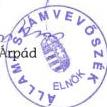
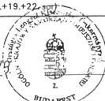
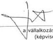
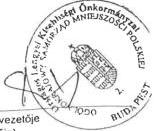
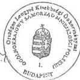

Állami Számvevőszék

# JELENTÉS

az Országos Lengyel Kisebbségi
Önkormányzat pénzügyi-gazdasági
tevékenységének utóellenőrzéséről

2000. december

0043

---

Az ellenőrzés végrehajtásáért felelős:
V. Önkormányzati és Területi Ellenőrzési Igazgatóság

Dr. Lóránt Zoltán
igazgató

Az ellenőrzést vezette:

Csecserits Imréné
régióvezető főtanácsos

Az ellenőrzést végezte:

Bamberger Mária
számvevő tanácsos

A témakörrel foglalkozó ÁSZ vizsgálatok jegyzéke:

Jelentés az Országos Lengyel Kisebbségi Önkormányzat pénzügyi-
gazdasági tevékenységének ellenőrzéséről (V-1019-7/1995.)

Jelentés az Országos Lengyel Kisebbségi Önkormányzat pénzügyi-
gazdasági tevékenységének ellenőrzéséről (V-1008-34/1997.) (A Parlament
számítógépes hálózatán a vizsgálat fájl neve: 376)

Jelentéseink az Interneten 1999. június 1-től a WWW.ASZ.gov.hu címen
olvashatók.

Jelentéseink az Országgyűlés számítógépes hálózatán is olvashatók.

---

V-1014-37/2000. TÉMASZÁM: 541

# TARTALOMJEGYZÉK

|  **I. ÖSSZEGZŐ MEGÁLLAPÍTÁSOK, KÖVETKEZTETÉSEK, JAVASLATOK** | **4**  |
| --- | --- |
|  **II. RÉSZLETES MEGÁLLAPÍTÁSOK** | **5**  |
|  **1. A kisebbségi önkormányzat működésének feltételrendszere** | **5**  |
|  1.1. A működés, a gazdálkodás szervezeti formája, intézményei | 5  |
|  1.2. A működés, a gazdálkodás tárgyi és személyi feltételei | 6  |
|  **2. A gazdálkodás szervezettsége, szabályozottsága** | **7**  |
|  2.1. A hatályos jogszabályok előírásai | 7  |
|  2.2. Az önkormányzati működés sajátosságai | 8  |
|  2.3. Az önkormányzati szabályozás helyzete | 8  |
|  **3. A pénzgazdálkodás szabályossága és törvényessége** | **9**  |
|  3.1. Az önkormányzat gazdálkodásának tervezése és az éves beszámolók elkészítése | 9  |
|  3.1.1. A költségvetés készítés | 9  |
|  3.1.2. A beszámoló készítés | 11  |
|  3.2. Az önkormányzat rendelkezésére álló pénzeszközök felhasználása | 12  |
|  3.3. A gazdasági események bizonylati alátámasztása, bizonylatkezelés | 15  |
|  3.4. Vagyongazdálkodás, vagyonvédelem | 15  |
|  **4. Önkormányzat belső ellenőrzési rendszere** | **16**  |

Melléklet: 1-5-ig

1

---

,

---

## Jelentés

### az Országos Lengyel Kisebbségi Önkormányzat pénzügyi-gazdasági tevékenységének utóellenőrzéséről

Az Állami Számvevőszék az Országgyűlés Emberi jogi, kisebbségi és vallásügyi bizottsága kezdeményezésére 1995. év végén – megalakulásuk évében –, majd 1997. évben ellenőrzést folytatott 11 országos kisebbségi önkormányzatnál. A vizsgálatok idején az Országos Lengyel Kisebbségi Önkormányzat elhelyezése még nem volt megoldott, a gazdálkodás szabályozottsága nem volt megfelelő és egyes gazdasági események nyilvántartásánál a jogszabályok előírásait nem megfelelően alkalmazták.

Az Állami Számvevőszék az 1997. évi vizsgálatát követően javaslatot tett a Kormánynak többek között – az országos kisebbségi önkormányzatok jogi státusára, költségvetésére és gazdálkodására vonatkozó, nem konzisztens – jogi szabályozás felülvizsgálatára és módosítására. Az érintett jogszabályok tartalma nem változott.

Az 1998. évi helyhatósági választásokat követően 1999. év elején személyi összetételében megújult az Országos Lengyel Kisebbségi Önkormányzat. A korábbi 13 fős testület helyett 15 fős testület alakult. A régi testületből három személyt választottak újjá. Az önkormányzat korábbi elnöke továbbra is a testület tagja maradt, de – miután a testület nem választotta elnökének – funkciót nem vállalt.

Az Állami Számvevőszék 2000. évben az Országos Lengyel Kisebbségi Önkormányzat 1999. évi felkérése, valamint korábbi vizsgálati tapasztalatai alapján munkatervbe vette az Országos Lengyel Kisebbségi Önkormányzat pénzügyi, gazdasági tevékenységének utóellenőrzését. Az ellenőrzés jogalapja az államháztartásról szóló 1992. évi XXXVIII. törvény 121.§ (3) bekezdése, valamint a nemzeti és etnikai kisebbségek jogairól szóló 1993. évi LXXVII. törvény 57. §-a.

**Az ellenőrzés célja** annak megállapítása volt, hogy az Állami Számvevőszék által végzett korábbi vizsgálatok óta:

- hogyan alakult az országos kisebbségi önkormányzat működési feltételrendszere,
- a gazdálkodás szervezettsége, szabályozottsága mennyiben felel meg a jogszabályi követelményeknek és az önkormányzati működés sajátosságainak,
- biztosított-e a gazdálkodás és a pénzeszközök felhasználásának törvényessége és szabályszerűsége, a számvitelről szóló törvény és a vonatkozó kormányrendeletek előírásainak betartása.

3

---

I. ÖSSZEGZŐ MEGÁLLAPÍTÁSOK, KÖVETKEZTETÉSEK, JAVASLATOK---

# I. ÖSSZEGZŐ MEGÁLLAPÍTÁSOK, KÖVETKEZTETÉSEK, JAVASLATOK

**Az Országos Lengyel Kisebbségi Önkormányzat** (a továbbiakban: OLKÖ) működésének tárgyi feltétele javult a vizsgált időszakban, beköltözött a székházába, és a tárgyi feltételek biztosítottak a színvonalas munkavégzéshez. A pénzügyi-gazdasági tevékenységét nem szervezte meg kellően, így az nem segíthette az önkormányzat alapvető feladatainak ellátását. Döntően személyi feltételek hiányában, a gazdálkodással összefüggő jogszabályt félreértelmezve, az újonnan választott testület **nem tudott eredményt felmutatni**.

**A gazdálkodás szervezettsége és szabályozottsága a vizsgált időszakban romlott.** Az országos kisebbségi önkormányzat törvényességi felügyeletéről jogszabály nem rendelkezik. A testület működésének részletes **szabályait** jogszabály nem rendezi. Az újonnan megalkotott Szervezeti és Működési Szabályzatnak nincs egyértelműen elfogadott, hitelesített változata. Egyéb új szabályzatot az önkormányzat nem alkotott. Az önkormányzatnak nincs számlarendje sem. Egy külső vállalkozó által elkészített szabályzatok tervezetei sem alkalmasak adaptáció nélkül a testület elé terjesztésre. Az önkormányzat testületi határozatai nem hitelesítettek, a határozatok mellékleteit nem irattározták, megfogalmazásuk több esetben pontatlan, így azok vitatható pénzügyi következményekkel járhatnak, és jártak is.

**A gazdálkodás és a pénzeszközök felhasználásának törvényessége és szabályszerűsége, a számvitelről szóló törvény és a vonatkozó kormányrendeletek előírásainak betartása csak néhány részletében érvényesült. Az OLKÖ 1999. január 1-től könyveit nem a jogi szabályozásnak megfelelően a társadalmi szervekre, hanem helytelenül a költségvetési szervekre vonatkozó szabályok szerint vezeti.** A törvényi felhatalmazáson alapuló, a számvitelről szóló törvény szerinti egyéb szervezetek éves beszámoló készítésének és könyvvezetési kötelezettségének sajátosságairól szóló kormányrendelet előírásait a vizsgált évek közül csak az első évben tartották be maradéktalanul. A gazdasági események bizonylati alátámasztása nem teljes körű. A bizonylatok alaki és tartalmi szempontból hiányosak. Az önkormányzat hatékony belső ellenőrzési rendszert nem működtetett.

A takarékos pénzgazdálkodás előfeltételének, a tervszerűség biztosításának az OLKÖ a vizsgált időszakban fokozatosan romló színvonalon tett eleget. Működése során a pénzügyi egyensúlyt csak a tartalékainak mobilizálásával tudta biztosítani, bár az önkormányzat pontos anyagi helyzetét a beszámolók és nyilvántartások hibái, hiányosságai mellett nem lehet megállapítani.

Az utóvizsgálat a – többször módosított – számvitelről szóló törvény és a végrehajtására kiadott kormányrendelet megsértésének a megszüntetése érdekében az önkormányzatot mielőbbi intézkedések meghozatalára kérte fel.

**A helyszíni vizsgálat a törvényes és szabályszerű állapot helyreállítására hívta fel az önkormányzatot.**

**Javasolta** továbbá, hogy az **önkormányzat**

---4

---

II. RÉSZLETES MEGÁLLAPÍTÁSOK

1. Targyalja meg az utovizsgalati jelentest es hatarozatban rogzitse a szukseges intezkedesek koret, hataridejét es feleloseit.
2. Vizsgalja felul Szervezeti es Mukodesi Szabalyzatat es annak hiteles peldanyat irattarozza.
3. Alakitsa ki a szervezzett mukodeshez nelkulozhetetlen belso szabalyokat, mindenek elott a jegyzokonyvek es a hatarozatok elkeszitsenek es hiteles dokumentalasnak rendjét.
4. Tegyen eleget a szamvitelrol szoló 1991. évi XVIII. törveny és az országos kisebbségi önkormányzatra vonatkozó 219/1998. (XII. 30.) Korm. rendelet elóirásainak, 1997., 1998. és 1999. évekre vonatkozó egyszerúsett beszámoló keszítési kõtelezettsegét pólola.
5. Szervezze meg az onkormanyzat szamviteli rendszerét az 1991. évi XVIII. törveny és a 219/1998. (XII. 30.) Korm. rendelet alapjan. Keszítse el az elöbbi törvenyben és kormányrendeletben megfogalmazott belso szabályokat, mindenek elott a szamlarendjét, valamint tegyen eleget leltározásí kõtelezettsegénék.
6. Szabályozza a feladatok végrehajtáér felelos testületi tag azon kötelezettsegét, hogy kötelezettsegvallalás teljesitését a penzügyi kifizétsekhez igazodóan irásban dokumentálja.
7. Kovetkezetesen ervenyesitse a takarékos gazdalkodás kovetelmenyeit.
8. Biztositsa, hogy kotelezetsget testuleti tagCsak testuleti felhatalmazassal, penzugyi fedezet rendelkezesre allasa eseten valljon.
9. Fogadja el az elnökség fenti temákban elkésztétt - indokolt esetben módositott - elóterjesztéseit az elóterjesztétól számított 60 napon belül.

Felkérte az elnökséget, hogy a végrehajtás érdekében készítsen intézkedési tervet (tervezetet), amit az utóvizsgálati jelentéssel együtt terjesszen az önkormányzat testülete elé.

## II. RÉSZLETES MEGÁLLAPÍTÁSOK

1. A KISEBBSÉGI ÖNKORMÁNYZAT MÜKÖDÉSENEK FELTÉTEL-RENDSZERE
1.1. A muködés, a gazdalkodás szervezeti formája, intézményei

Az OLKÖ az 1997. évi alapvizsgálatot követően országos kisebbségi önkormányzati költségvetési szerveket nem hozott létre. Könyvviteli

5

---

II. RÉSZLETES MEGÁLLAPÍTÁSOK

rendszerét – félreértve az 1998. év végén megjelent, az államháztartás működési rendjéről szóló 217/1998. (XII. 30.) Korm. rendelet 1. § (2) bekezdés f) pontjában foglaltakat – 1999. január 1-től megváltoztatta és a költségvetési szervekre vonatkozó előírások szerinti könyvvezetésre tért át.

Az önkormányzat az önálló székházába költözéskor felállított egy irodát, amelynek dolgozói létszáma átlagosan 2-3 fő volt, heti 30 órás munkaidőben. A dolgozók munkaszerződései irodavezetői, általános adminisztrációs, gondnoki, hivatalsegédi és pénztárosi feladatokat tartalmaztak. **Az iroda működési rendje megalakulása óta meghatározatlan.**

Az OLKÖ első Szervezeti és Működési Szabályzata (a továbbiakban: SzMSz) a pályázat útján kiválasztott irodavezető feladataként határozta meg az iroda SzMSz-ének elkészítését és testület elé terjesztését. A jelenlegi SzMSz öt pontban rögzíti ugyan az iroda feladatait, de az iroda működésének és munkarendjének szabályait elnökségi hatáskörben elfogadandó ügyrendbe, valamint elnök által elkészített munkaköri leírásba utalja.

**Önálló intézményeket az OLKÖ később sem hozott létre.** Az önkormányzat által működtetett múzeumban időszakos kiállítások tekinthetők meg; az önkormányzat un. vasárnapi iskolát tart fenn az ország harmincöt helyszínén; az önkormányzat által kiadott újság szerkesztősége az OLKÖ székházában dolgozik. Önálló jogi személyiséggel egyik szervezet (intézmény) sem rendelkezik, gazdálkodásuk az önkormányzat gazdálkodásának része.

## 1.2. A működés, a gazdálkodás tárgyi és személyi feltételei

Az OLKÖ által kiválasztott épület felújítása és birtokbavétele 1997. év végén megtörtént. A székház berendezésére részvényértékesítés biztosított fedezetet. Az OLKÖ bérleti szerződést kötött a székhelyével egy udvarban lévő helyiségcsoportra a Fővárosi Önkormányzattal, amiben kiállítási termeket, valamint ez év nyarától vendégszobákat alakított ki.

Az 1998. évi önkormányzati választásokat követő időszakban jelentős változások következtek be az iroda személyi összetételében.

Az irodavezető személyére 1997. évben két alkalommal is pályázatot írtak ki, végül egy ügyviteli Bt-vel kötöttek szerződést a feladat ellátására. A szerződés lejárta után 1998. évben munkaszerződéssel irodavezetőt alkalmaztak, akinek munkaviszonyát 1999. évben az OLKÖ elnöke felmondta. A dolgozó a Munkaügyi Bíróságon megtámadta a felmondást, amelynek eredményeképpen a vizsgált időszak alatt egyezséggel (több mint 700 ezer Ft kártérítés kifizetése) zárult a per. Jelenleg munkaszerződéssel két főt alkalmaznak, egyikőjük hivatalsegéd 1998. februártól, az ügyintéző-titkár pedig 2000. május 15-től dolgozik, mindketten heti 30 órában.

**A könyvvezetési munkákat szerződéses jogviszony alapján** vállalkozásokkal (a vizsgált időszakban egymást követően összesen néggyel) **végeztette az önkormányzat.**

1997. január 1-től a választásokig megbízási szerződést csak a könyvelésre és a pénztárosi feladatok ellátására kötöttek. A további gazdálkodási feladatokat az

6

---

II. RÉSZLETES MEGÁLLAPÍTÁSOK

OLKÖ elnöke, valamint a Pénzügyi, Gazdasági és Ellenőrzési Bizottság elnöke látta el.

1997. január 1-től 1999. február 28-ig egy egyéni vállalkozó megbízási szerződés keretében végezte a könyvelést, folyamatosan növekvő, 1999. évben havi 60.000 Ft vállalkozási díjért. Az éves megbízási szerződésekben a megbízás tárgya minden további részletezés nélkül az 'OLKÖ könyvelése' volt. A pénztárosi feladatot az iroda egyik dolgozója látta el.

Az 1998. évi választásokat követően újjáalakult önkormányzat 1997, 1998. évekre szólóan a működés szervezeti és gazdasági átvilágításának megrendelését határozta el 400.000 Ft értékben.

A szervezet gazdasági átvilágítására okleveles könyvvizsgáló kapott megbízást, aki megállapításait tévesen a helyi önkormányzatok gazdálkodására érvényes szabályok alapján tette meg. A könyvvizsgáló mind a helyi önkormányzatok gazdálkodására érvényes szabályok, mind a számvitelről szóló törvény megsértését rögzítette. A jelentést az OLKÖ testülete megtárgyalta, és kötelezte az elnökét, hogy az átvilágító jelentés felelősség megállapítása alapján a korábbi elnök ellen rendőrségi feljelentést tegyen. A feljelentést követően a X.-XVII. kerületi Ügyészség a Btk. 298. §-ba ütköző vétség (számviteli fegyelem megsértése) elkövetése miatt emelt vádat. Bírósági tárgyalás a vizsgálat lezárásáig nem volt.

Az új testület tagjai közül senki sem rendelkezik pénzügyi, számviteli képzettséggel. A két testület közötti átadás-átvételi eljárás során részletes jegyzőkönyveket készítettek, de azok hitelessége – egyes résztvevők aláírásának hiányában – megkérdőjelezhető. A könyvelő váltások alkalmával a könyvelők között átadás-átvételi jegyzőkönyvek, feljegyzések nem születtek.

Az új testület által megbízott első könyvelő Kft-vel kötött szerződést a vizsgálat során bemutatni nem tudták. A második könyvelő az 1999. augusztus 10-i megbízási szerződés szerint 1999. január 1-től visszamenőlegesen vállalkozott a könyvvezetéssel összefüggő feladatok elvégzésére, ezt követően 2000. februári dátummal egy Bt-vel egy éves időtartamra kötött szerződést az önkormányzat elnöke az 'Önkormányzat gazdálkodásával, számvitelével és könyvelésével összefüggő feladatok teljes körű ellátására'. Ez utóbbi szerződésekben a feladatok meghatározása egyre teljesebb, bár azok olyan szabályzatokra hivatkoznak, amelyek nem készültek el, így hiányukban a szerződések esetleges jogérvényesítésre csak minimálisan alkalmasak.

**A helyszíni vizsgálat tapasztalatai szerint az önkormányzati működés és gazdálkodás megfelelő személyi feltételeit nem tudták biztosítani.**

## 2. A GAZDÁLKODÁS SZERVEZETTSÉGE, SZABÁLYOZOTTSÁGA

### 2.1. A hatályos jogszabályok előírásai

Az országos kisebbségi önkormányzatok gazdálkodásához a nemzeti és etnikai kisebbségek jogairól szóló 1993. évi LXXVII. törvény felhatalmazása alapján a kisebbségi önkormányzatok költségvetésének, gazdálkodásának, vagyonjuttatásának egyes kérdéseiről szóló 20/1995. (III. 3.) Korm. rendelet 2.§ (1) bekezdése ad iránymutatást, amennyiben előírja, hogy 'Az országos kisebbségi ön-

7

---

II. RÉSZLETES MEGÁLLAPÍTÁSOK---

kormányzatok szervezetének gazdálkodására a 114/1992. (VII. 23.) Korm. rendelet és a 219/1998. (XII. 30.) Korm. rendelet előírásait kell megfelelően alkalmazni.” Az előbbi a társadalmi szervezetek gazdálkodó tevékenységéről, az utóbbi a számvitelről szóló törvény szerinti egyéb szervezetek – ide tartoznak a társadalmi szervezetek is – éves beszámoló készítésének és könyvvezetési kötelezettségének sajátosságairól szól. Az államháztartásról szóló 1992. évi XXXVIII. törvény 88. § (1) bekezdése azt tartalmazza, hogy az országos kisebbségi önkormányzat költségvetési szervet alapíthat.

Az országos kisebbségi önkormányzatok törvényességi felügyeletéről, ezen önkormányzati testületek működésére vonatkozó részletes szabályokról jogszabály nem rendelkezik.

## 2.2. Az önkormányzati működés sajátosságai

Az OLKÖ-t az első választási ciklusban 13, jelenleg 15 fős testület alkotja. Tagjai az ország különböző településein megalakult helyi lengyel kisebbségi önkormányzatokban képviselők. A fővárosi illetőségű képviselők létszáma a jelenlegi testületben két fő. 1999. októberben az egyik alelnök lemondott, decemberben az elnököt és a két alelnököt visszahívta a testület. 2000. januárban a visszahívott személyeket újra megválasztották és egy új alelnököt is választottak.

A testület szabályai és az elmúlt évek gyakorlata alapján 1997-1998. évben átlagosan havonta, jelenleg kéthavonta üléseznek. Az ülésekről jegyzőkönyv készül, de azok közel fele nem hitelesített. A testületi határozatokat sorszámozva, évenként csoportosítva gyűjtik, de tartalmuk csak a jegyzőkönyvekkel, előterjesztésekkel együtt értelmezhető. A legutóbbi választások óta rendszeres bizottsági, elnökségi üléseket nem tartanak. Az elnökség működéséről dokumentum nem készült. A helyszíni vizsgálat ideje alatt a Budapest X. kerületi Rendőrkapitányságon az önkormányzat új alelnöke bejelentést tett és vizsgálatot kért az önkormányzati működéssel és gazdálkodással összefüggő kérdésekben.

## 2.3. Az önkormányzati szabályozás helyzete

**Az OLKÖ – a korábbi számvevőszéki és külső vizsgálatok javaslatai ellenére – a gazdálkodásával kapcsolatos belső szabályokat nem alkotta meg, a gazdasági események nyilvántartásának módját nem határozta meg, számlarendjét nem készítette el.** Az 1998. évi helyhatósági választásokat követően megválasztott új testület által elfogadott **SzMSz hitelesített példányát nem tudták az ellenőrzés rendelkezésére bocsátani.**

Az OLKÖ szervezetének és gazdálkodásának 1999. évi átvilágítását követően elkészült szabályzat-tervezetek közül a testület érdemben az SzMSz-szel foglalkozott. A testület több fordulós tárgyalás után 1999. június 19-én elfogadta az előterjesztett szabályzatot a “tárgyhavi testületi ülésen tett változtatásokkal”. A jegyzőkönyv mellékletét képező szabályzatból, de a jegyzőkönyvből sem állapítható meg, milyen változtatásokról van szó. A testület egy későbbi ülésén önmaga sem tudta eldönteni, hogy “a forgalomban lévő változatok közül melyiket kell hitelesnek tekinteni”, ezért a Szervezési Ellenőrzési és Etikai Bizottságot bízták meg annak kivizsgálásával, hogy melyik változat az elfogadott. Az utóvizsgálat lezárásáig a bizottság e feladatának nem tett eleget.

---8

---

II. RÉSZLETES MEGÁLLAPÍTÁSOK

Az önkormányzat a korábbi számvevőszéki vizsgálat idején már meglévő titokvédelmi és pénzkezelési szabályzatán kívül új szabályzatot nem alkotott. Az elnök megbízása alapján 1999. novemberben elkészült nyolc szabályzat-tervezet. A tervezetek többsége települési önkormányzatoknál alkalmazott mintaszabályzat, csak az OLKÖ-ra adaptálva lennének alkalmazhatók.

Érvényes szabályzatok hiányában kitüntetett jelentősége van a képviselő-testületi ülések határozataiban megfogalmazottaknak (évente 80-100 határozat). Ezek teljes körű áttekintése, tematikus gyűjtése és elemzése meghaladta e vizsgálat kereteit. A pénzgazdálkodást szabályozó határozatokról a végrehajtás vizsgálatával összefüggésben tesz megállapítást a jelentés.

### 3. A PÉNZGAZDÁLKODÁS SZABÁLYOSSÁGA ÉS TÖRVÉNYESSÉGE

#### 3.1. Az önkormányzat gazdálkodásának tervezése és az éves beszámolók elkészítése

##### 3.1.1. A költségvetés készítés

**Az OLKÖ költségvetését** az utóvizsgálat időszakának első illetve második két évében **más-más módszer szerint készítette el**. A jogi bizonytalanságra utal, hogy a Nemzeti Etnikai és Kisebbségi Hivatal 1996. november 6-án kelt levelében 1997. évre elemi szintű költségvetés összeállítására hívta fel az önkormányzatot, megküldve a helyi kisebbségi önkormányzatok számára készített tervezési nyomtatványokat.

A költségvetést 1997. évben és 1998. évben forrásonként tervezték, a várható bevételekhez rendeltek kiadásokat, 1999. és 2000. években a kiadásokat tervezték meg – a költségvetési szervi előirányzatoknak megfelelő csoportosításban –, bemutatva, hogy milyen kiadások várhatóan milyen bevételi forrásokból finanszírozhatóak.

A költségvetési előterjesztések előkészítői az első két évben dokumentáltan a Pénzügyi Gazdasági és Ellenőrzési Bizottság elnöke, illetve a bizottság volt, a második két évben az előterjesztések előkészítésében résztvevők munkáját nem dokumentálták.

A vizsgált években az OLKÖ költségvetéseiről és azok módosításairól döntést, véleményt az alábbi testületi határozatok és jegyzőkönyvek tartalmaznak.

**Az 1997. évi költségvetéssel összefüggésben az OLKÖ három testületi ülésen hozott határozatot.** Először döntött az állami támogatás és a kamatbevétel felosztásáról (10.500 ezer Ft) feladatonként, majd az éves költségvetését 23.840 ezer Ft kiadással és ugyanannyi bevétellel elfogadta a testület. (A részleteket a testületi előterjesztés melléklete tartalmazta.) Végül a költségvetési előirányzatok között átcsoportosítást hajtott végre.

**Az 1998. évi költségvetéssel összefüggésben az OLKÖ négy esetben határozott.** Először elfogadta a határozat melléklete szerinti költségvetést és a határozat rögzítette az induló pénzkészletet, az állami támogatást, a pályázatokból és egyéb bevételekből várható bevételeket is, összesen 35.970 ezer Ft értékben. A kiadások közül a határozat nevesíti a központi működési költségekre, irodai be-

9

---

II. RÉSZLETES MEGÁLLAPÍTÁSOK

rendezésekre és az alapfeladatok költségeire előirányzott összegeket. Miután a költségvetési kiadások összesítése a határozatban nem szerepelt, így elsikkadt az a tény, hogy **a testület 826 ezer Ft-os hiánnyal fogadta el a költségvetést**, illetve az nem egyezik az előterjesztés mellékletével. Később a költségvetés módosításáról döntött, úgy, hogy az az 1. sz. melléklet szerint változik. A testületi ülésre beterjesztett 1. sz. mellékletben a főösszeg 10.720 ezer Ft, ami a korábbi határozatban elfogadott költségvetési főösszegnél 25.250 ezer Ft-tal kevesebb. Végül 1999. január és február hónapokban visszamenőleg is változtatta a testület a költségvetését.

**Az 1999. évi költségvetését az OLKÖ 47.497 ezer Ft bevétellel és 47.303 ezer Ft kiadással fogadta el.** A testületi előterjesztés számszaki melléklete ugyanakkor 47.636 ezer Ft kiadást tartalmaz, ami 139 ezer Ft hiányt eredményez. A testületi ülés jegyzőkönyvében nincs utalás arra, hogy mi okozta a változást.

**A 2000. évi költségvetését az OLKÖ csak 2000. június 30-án fogadta el** (egyes testületi tagok által vitatott érvényességgel – mivel meghívót nem kaptak). Az első félévben több testületi ülésre, több előterjesztés készült a témában. Az elfogadott 2000. évi költségvetési határozatból mégsem állapítható meg, hogy mennyi az összes bevételi és kiadási előirányzat.

A vizsgálat három eltérő tartalmú 2000. évi költségvetési előterjesztés ellenőrzésére terjedt ki. Mindhárom költségvetési előterjesztés más főösszeget tartalmaz. Az egyik előterjesztés (dátum az előterjesztésen nem szerepel, első oldalát az OLKÖ elnöke szignálta) 44.500 ezer Ft bevétellel és 43.408 ezer Ft kiadással számol, közel 10 millió Ft tiszteletdíj kiadását tervezve. A másik két előterjesztés – dátum és aláírás nélküli, csak egyiken van egy „2. számú melléklet” jelölés – legtöbb tételében egyezik egymással, csak az 1999. évi záró egyenlegben, az APEH tartozás kiadásként történő szerepeltetésében, valamint az osztalék-bevétel és a vetélkedőkre tervezett kiadások sorainak növekvő összegében van eltérés. Az egyik kiadási főösszege 39.615 ezer Ft, a másiké 32.199 ezer Ft.

**Az országos kisebbségi önkormányzatok költségvetés készítési kötelezettségét jogszabály nem írja elő.** Az OLKÖ 1999. júliusáig hatályos SzMSz-e a költségvetés összeállításának kötelezettségét, az összeállítás részletes szabályainak meghatározását a testület hatáskörébe utalja, de a testület ezen feladatát nem teljesítette. Az új SzMSz (irattározott, de nem hitelesített példánya) ilyen kötelezettséget nem ír elő, csak a „költségvetési zárszámadás” (értelmezhetetlen fogalom) saját hatáskörű meghatározásának kötelezettségét tartalmazza [SzMSz 41. § (1) bekezdés b) pont].

A takarékos pénzgazdálkodás előfeltételének, **a tervszerűség biztosításának az önkormányzat fokozatosan romló színvonalon tett eleget. A költségvetés megalapozottságát az elmúlt két évben előkészítő iratok hiányában nem lehet minősíteni.** A tervezés hibája, hogy az 1999. és 2000. évre elfogadott költségvetésekben az önkormányzat központi kiadásainak összegei meghaladják a központi költségvetésből az önkormányzat működésére biztosított állami támogatás összegét, olyan kiadásokat terveztek pályázati forrásokból megvalósítani, amelyek azokból nem teljesíthetőek (pl. tiszteletdíj, gépkocsi költségtérítés, közüzemi számlák).

10

---

II. RÉSZLETES MEGÁLLAPÍTÁSOK

# 3.1.2. A beszámoló készítés

Az OLKÖ az 1996., 1997. és 1998. éves beszámolók elkészítésénél a 20/1995. (III. 3.) Korm. rendelet előírásait vette figyelembe és a társadalmi szervezetekre vonatkozó szabályokat alkalmazta, kiegészítve azokat a feladatokról szóló elszámolással. Az önálló feladatok költségeit önálló munkaszámon könyvelve gyűjtötte. 1999-ben – a 217/1998. (XII. 30.) Korm. rendelet előírását félreértve – helytelenül a költségvetés alapján gazdálkodó szervek beszámolási és könyvvezetési kötelezettségéről szóló 54/1996.(IV. 12.) Korm. rendeletet tekintette magára nézve irányadónak, könyvelési rendszerüket és beszámolójukat e jogszabály alapján, de hibásan és hiányosan készítette el, leltárral nem támasztotta alá. Ezt a gyakorlatot folytatta 2000. évben is.

A költségvetésekhez hasonlóan az éves beszámolók előkészítését az 1998. évi választás előtti testületben a Pénzügyi Gazdasági Bizottság, illetve annak elnöke végezte. Az 1999. év gazdálkodásának könyvviteli zárása az önkormányzatnál rendelkezésre álló iratok alapján nem történt meg, a könyvelő csupán "nyers mérleget" állított össze. Az 1999. év gazdálkodásáról szóló testületi előterjesztést annak a Bt-nek az ügyvezetője készítette, akinek pénzügyi vezetőként történő megbízásáról csak utólag, 2000. február 19-én döntött a testület.

Az OLKÖ a hatályos jogszabályoknak megfelelő, éves gazdálkodásról szóló beszámolási kötelezettségének a vizsgált években csak egy alkalommal (1997. évben az 1996. év gazdálkodásáról) tett eleget.

1996. évről a hatályos jogszabályoknak megfelelően számolt el az OLKÖ testülete. Az 1996. évi mérleget 3.543 ezer Ft főösszeggel és 1.552 ezer Ft mérleg szerinti eredménnyel elfogadta. A testületi előterjesztés mellékletét képezte a mérleg, az eredmény kimutatás és a mérlegadatok részletezése (5. számú melléklet).

1997. évről a 66/1998 (VI. 13.) számú határozatban az OLKÖ testülete úgy döntött, hogy a mérlegét elfogadja. A határozatban számokat ugyan nem rögzítettek, de az előterjesztés mellékletei tartalmazzák az előírások szerinti adatok döntő többségét. Kivételt képez az, hogy az előző év állományi adatait nem szerepeltették, a mérleg nem tartalmaz átmenő aktívák illetve passzívák sorokat, illetve eredmény kimutatást (6. számú melléklet).

1998. évről mérleget és eredmény-kimutatást előterjesztés hiányában nem fogadott el sem a még 1999. február 20-ig mandátummal rendelkező régi, sem az új testület. Az egyszerűsített éves beszámoló mérleg nyomtatványát hiányosan, az adatokat megalapozó részletezések dokumentálása nélkül töltötték ki és azt az önkormányzat volt elnöke írta alá (7. számú melléklet). A mérleg nyomtatvány forrás oldalán beazonosítatlan ceruzás kézírással több javítás, és "A ceruzás számokkal jó" megjegyzés szerepel. Eredmény-kimutatás nem készült, így nem értelmezhető a -3.489 ezer Ft mérleg szerinti eredmény (veszteség) sem. Az 1998. évi gazdálkodásról készített tájékoztatót az 1994.-1998. közötti időszakra megválasztott testület utolsó – 1999. február 6-i – ülésén elfogadta.

1999. évről mérleget és eredmény-kimutatást a testület nem fogadott el. A költségvetési szervek részére előírt költségvetési beszámoló mérleg űrlapját elkészítették és azt az okleveles könyvvizsgáló képesítéssel rendelkező könyvelő és az OLKÖ

11

---

II. RÉSZLETES MEGÁLLAPÍTÁSOK

elnöke aláírta, azonban a nyomtatványon feltüntették, hogy „nyersmérleg” (8. számú melléklet). A mérleg adatok valódisága a főkönyvi könyvelés zárásának hiányában nem minősíthető. Az 1999. évi gazdálkodásról a 2000. május 28-i ülésre készített előterjesztésben – amelyet a képviselők nem fogadtak el – 38.441 ezer Ft bevétellel szemben 40.581 ezer Ft kiadásról számolnak el. Bemutatja az előterjesztés a házipénztári és bankszámla forgalmat, amelynek nyitó és záró összegei azonosak a mérlegben szereplő összegekkel. A pénzmozgások összesítő mérlege külön magyarázat nélkül bevételi és kiadási oldalon egyéb sorokat (29.288 Ft és 9.326 Ft) valamint kintlévőségeket nevesít 538 ezer Ft-ban. Ez utóbbi összeg megegyezik a mérleg egyéb aktív pénzügyi elszámolásának sorával.

A testület az 1999. év gazdálkodásáról szóló beszámolót 1999. június 30-i testületi ülésén fogadta el. Az előterjesztést a vállalkozó Bt vezetője írta alá. A pénzforgalmi kimutatáson alapuló elszámolás azonban nem egyezik az űrlapokon szereplő adatokkal, az összes kiadás a mérlegben 4 millió Ft-tal magasabb az éves beszámolóban elszámoltnál. A beszámoló foglalkozik továbbá a korábbi évből (vagy évekből) származó 7.382.644 Ft APEH tartozással, de a tartozás keletkezésének okaként csak forráshiányt jelölt meg. A tartozást az önkormányzat elnöke elismerte. Tekintettel arra, hogy a korábbi évekből az önkormányzatnak – az APEH által az önkormányzatnak küldött iratok alapján – csak késedelmi pótlék tartozása volt, a jelentős tartozás az 1999. évi járulék és személyi jövedelem adó fizetési kötelezettség elmulasztásából adódott. Ilyen nagyságú tartozást az 1999. évi mérleg nem tartalmaz, ezért a mérleg nem a valós helyzetet tükrözi. Az önkormányzatnál található könyvelési adatokból nem állapítható meg, hogy a levont személyi jövedelemadó előlegek befizetési kötelezettségét lekönyvelték-e 1999. évben.

Mindezek alapján megállapítható, hogy az OLKÖ 1996. év gazdálkodásáról szóló éves beszámoló elkészítési kötelezettségének teljes körűen, 1997. évi a kötelezettségének részben tett eleget, 1998. és 1999. évi-eknek pedig nem tett eleget. Ezzel 1998-1999-2000. évben megsértették a 219/1998.(XII. 30.) Korm. rendeletben, illetve az azt megelőzően hatályos 8/1996. (I. 24.) Korm. rendeletben foglaltakat.

Az éves beszámoló leadására az országos kisebbségi önkormányzatnak nincs jogszabályban előírt kötelezettsége.

### 3.2. Az önkormányzat rendelkezésére álló pénzeszközök felhasználása

A nemzeti és etnikai kisebbségek jogairól szóló 1993. évi LXXVII. törvény határozza meg az országos kisebbségi önkormányzatok feladat- és hatáskörét. A törvény 36. § (1) bekezdése szerint az országos kisebbségi önkormányzat ellátja az általa képviselt kisebbség érdekeinek országos, valamint területi (regionális, megyei) képviseletét és védelmét. A törvény a 37-38. §-okban meghatározza azokat a területeket, ahol az országos kisebbségi önkormányzat – törvények keretei között – önállóan dönt, illetve véleményt nyilvánít.

Az országos kisebbségi önkormányzatok működésére az állami költségvetés évente meghatározott, növekvő összeget, 2000. évben önkormányzatonként 18 millió Ft-ot biztosított. Közel ezzel azonos nagyságúak évente az OLKÖ pályázati forrásai.

12

---

II. RÉSZLETES MEGÁLLAPÍTÁSOK

Az OLKÖ a vizsgált években költségvetési főösszegének mintegy felét pályázatokon nyerte el. A különböző célokra (iskolaműködtetés, újság-kiadás, rendezvények támogatása) biztosított pénzeszközök elszámolása a számlák mellékelt megküldésével a vizsgált időszakban megtörtént. A pályázati dokumentációk kronologikus, összegyűjtött irattározása azonban nem megoldott, annak ellenére, hogy annak kialakítására az előző választási ciklus Pénzügyi Gazdasági és Ellenőrzési Bizottságának elnöke kidolgozott javaslatot tett.

Az önkormányzat kötelezettségvállalásának szabályait önálló rendelkezésben nem határozta meg. Az 1995. évben jóváhagyott SzMSz sem szabályozta a kötelezettségvállalást, így az önkormányzat csak testületi kötelezettségvállalást ismert el. Az 1999. évben elfogadott SzMSz úgy szabályozta a kötelezettségvállalás rendjét, hogy 100 ezer Ft-ig az elnök, 300 ezer Ft-ig az elnökség vállalhat kötelezettséget – utólagos – beszámolási kötelezettséggel.

A vizsgált időszak első két évében a testületi jegyzőkönyvek tanúsága szerint a kötelezettségvállalási döntéseket a testület hozta. Ebben az időszakban a fő hibát az okozta, hogy egyes testületi határozatok pénzügyi szempontból nem egyértelműek, nem elég részletesek a kötelezettségvállalásokról sok esetben nem készült bizonylat.

- Nem derül ki, pl. az 1998. évben hozott, újság szerkesztésével kapcsolatos kötelezettségvállalásról, hogy milyen időszakra vonatkozó kötelezettségről döntött a testület.
- A fővárosi önkormányzattól bérelt épületszárnyra vonatkozó bérleti szerződés 50 ezer Ft havi bérleti díj fizetési kötelezettséget rögzít. Testületi jegyzőkönyvek tanúsága és a fizetési kötelezettségek teljesítése alapján ez az összeg évi 50 ezer Ft-ra mérséklődött, de erről szerződés nem található.
- Ugyanezen épületszárny felújítására a korábbi testület 2 millió Ft összegig vállalt kötelezettséget és nem ismerte el a vállalkozó által követelt 891 ezer Ft plusz költséget. A költségekkel arányos teljesítést az önkormányzat elnöke igazolta és pótlólagos források megszerzésével kívánta azokat fedezni. A választási eredmények után a források felkutatásáról nem intézkedett. Az új testület – a bírósági eljárást elkerülendő – hozzájárult az összeg kiegyenlítéséhez, fedezetet azonban nem jelölt meg.

Az 1999. és 2000. évi kötelezettségvállalások során csak néhány egyedi, helyi települési, szociális cél elfogadása és pénzügyi teljesítése érdekében született testületi határozat. Úgy értelmezték a költségvetést, hogy az abban megfogalmazott összegek erejéig a feladatokért felelősöknek önálló kötelezettségvállalási joguk van.

- Így fordulhatott elő, hogy a Kulturális és Tömegtájékoztatási Bizottság elnöke 1999. évben és 2000. évben is önállóan fogadott el táborozási bevételeket és ebből fizetett ki táborozással összefüggő kiadásokat anélkül, hogy annak a vizsgálat lezárásáig az önkormányzat számviteli elszámolásaiban nyoma lenne. A bizottság elnöke csak 2000. év szeptemberében adott tájékoztatást a testületnek a tevékenységéről, de a testület határozatának – fizesse be az önkormányzat pénztárába az általa letétbe helyezett összeget – nem tett eleget. A helyszíni ellenőrzés időszakában az OLKÖ elnöke ezért fizetési meghagyást bocsátott ki ellene.

13

---

II. RÉSZLETES MEGÁLLAPÍTÁSOK

• A testület egyes tagjai által kifogásolt 1999. évi Szent László napi rendezvénnyel kapcsolatos kötelezettségvállalási felhatalmazásra vonatkozó dokumentumot az ellenőrzés részére bemutatni nem tudtak. A 47/1999. (IV. 24.) számú testületi határozat az egyik alelnököt bízta meg az ünnepség megszervezésével, de kötelezettség vállalási jogról nem szólt a határozat. Ennek következménye, hogy a rendezvénnyel kapcsolatban több személy is vállalhatott kötelezettséget, ami a rendezvény előtt egy héttel elfogadott költségvetésben szereplő előirányzathoz viszonyítva jelentős túllépést eredményezett. Az OLKÖ 1999. évi gazdálkodásáról szóló beszámoló szerint az összköltség 3.450 ezer Ft volt. (A kötelezettségvállalásokról nyilvántartást nem vezettek.). A rendezvény vendéglátási feladataira írásban vállalkozási szerződést nem kötöttek, a vállalkozó 912 ezer Ft-os számláját az önkormányzat elnöke a nyilatkozatában (9. számú melléklet) foglaltak alapján utalványozta. A rendezvényre fordított kiadásokról a testület nem számoltatta be a rendezvény szervezésével megbízott alelnököt.

**Az önkormányzat működési kiadásaira biztosított források növekvő arányát (1999. évben 64 %-át) fordította a képviselők tevékenységével kapcsolatos kiadásokra.** A kiadások növekedésének indoklásáról dokumentum nem készült.

• Az OLKÖ testületének tagjai 1997. és 1998. években testületi határozatban meghatározott, funkciónként azonos mértékű tiszteletdíjat vettek fel. A legalacsonyabb tiszteletdíj mértéke havi 5.000 Ft, a legmagasabb 25.000 Ft volt. A szabályozás lehetőséget biztosított a testületnek a tiszteletdíj egy részének megvonására, e gyakorlattal a testület 1998. évben egy alkalommal élt. A tiszteletdíj kifizetését minden alkalommal azt jóváhagyó testületi döntés előzte meg.
• Az OLKÖ az 1999. és 2000. évekre csak a költségvetésében szabályozta a fizetendő tiszteletdíjak mértékét. Az első évben havi 20.000 Ft és 180.000 Ft, a második évben 10.000 Ft és 90.000 Ft közötti összegben, név szerint határozta meg a tiszteletdíjat. 2000. évben a költségvetés elfogadásáig az előző évre meghatározott összegek alapján történtek a kifizetések. A kifizetések rendjének szabályozatlansága miatt kialakult az a helytelen gyakorlat, hogy tiszteletdíjat a képviselő kérésére folyósították csak, az elnök utalványozása után. Részben ennek következménye, hogy 1999. november-december hónapban jelentős összegű, több havi tiszteletdíjat vettek fel a képviselők. Ugyanakkor – forrás hiányában – nem gondoskodtak a személyi jövedelemadó-előleg átutalásáról. Az így kialakult kifizetési rendszer célszerűtlen. A levont személyi jövedelemadó-előleg befizetésének elmulasztásával megsértették az adózás rendjéről szóló 1990. évi XCI. törvény 25. § (1) bekezdésében foglaltakat.

**Az Országos Lengyel Kisebbségi Önkormányzat rendelkezésére álló pénzforrások a vizsgált időszakban csak a "vagyonfelélés" vállalásával voltak elegendőek a kiadásokhoz,** bár az önkormányzat pontos anyagi helyzetét a beszámolók fentebb jelzett hibái mellett nem lehet minősíteni.

A vagyonfelélési folyamat megszüntetése érdekében a testület 2000. szeptember 16-án határozatot hozott, és az elkövetkező időszak szigorú, ellenőrzött gazdálkodása érdekében elnöki intézkedés született. Az intézkedés eredménye a vizsgálat lezárásakor még nem volt ismert.

14

---

II. RÉSZLETES MEGÁLLAPÍTÁSOK

### 3.3. A gazdasági események bizonylati alátámasztása, bizonylatkezelés

**A gazdasági események bizonylatai a vizsgált évek mindegyikében több, rendszerből adódó formai és tartalmi hibát tartalmaznak.** A beérkező számlákat teljes körűen még a vizsgálat idejében sem iktatták. Sem a számlákon, sem az azokat kísérő egyéb bizonylatokon nincs teljesítésigazolás, utólagos ellenőrzéssel nem állapítható meg, hogy az adott kiadás milyen esemény kapcsán, milyen célból merült fel. A szerződéseket a számlakifizetések mellé nem csatolták, a bér és tiszteletdíj kifizetések bizonylatai mellett a bérszámfejtés bizonylatait 1999. évben nem rakták le, és az elmúlt másfél évben nincs az úti-előleg elszámolási nyomtatványokon testületi jóváhagyásra utaló megjegyzés. A kiadási, bevételi pénztárbizonylatokról a bizonylatot kiállító és az ellenőr aláírása minden esetben hiányzik. A mellékletek darabszámát nem tüntetik fel.

**A banknapló és a pénztárnapló vezetése folyamatos,** a december 31-i bankszámla-kivonatokon szereplő összegek megegyeztek a banknaplókban szereplő összegekkel, a pénztár leltározásáról dokumentumot bemutatni nem tudtak.

**Leltározási kötelezettségének az önkormányzat 1999. február óta nem tesz eleget, tárgyi eszközökről analitikus nyilvántartást 1998. év óta nem vezet.**

### 3.4. Vagyongazdálkodás, vagyonvédelem

Az önkormányzat ingatlan-vagyonnal nem rendelkezik. **Az állami vagyonjuttatás keretében kapott MOL Rt. részvényeit teljes egészében értékesítette, helyette 31.498 ezer Ft értékben élet- és balesetbiztosítási kötvényt vásárolt.** A portfólió csere hosszú előkészítő munka után jött létre. A testület végül a biztosabb és magasabb, évenként felhasználható hozam reményében döntött a kötvény mellett.

Az állami vagyonjuttatás keretében az OLKÖ 8.813 ezer Ft névértékű részvényt kapott. Ebből 500 ezer Ft névértékűt értékesített 6.700 Ft/1.000 Ft részvény árfolyamon. A bizományosi díjjal csökkentve ebből 3.316 ezer Ft bevétele származott, ami az 1998. évi működés és iroda berendezés fedezetére szolgált. Az OLKÖ 2000. június 30-i határozata szerint értékesítette fennmaradó 8.313.000 Ft névértékű részvényét. Az elszámolás szerint 2000. július 7-én és 10-én 3.800 Ft, 3.805 Ft és 3.820 Ft-os részvényárfolyamon (1.000 Ft-os részvénycímletre vonatkoztatva), a bizományosi díjjal csökkentve összesen 31.498 ezer Ft-ot kapott az önkormányzat. A részvények ellenértékét az önkormányzat két különböző típusú élet és balesetbiztosítási kötvénybe fektette.

**Az OLKÖ-nál a teljes körű vagyonvédelem nincs biztosítva.** Eszközeiről vezetett nyilvántartásai hiányosak, illetve leltárral nem alátámasztottak. Így az egyes vagyonelemeknél kialakított védelem (a székház épületére vagyonbiztosítást kötöttek, a részvényeket letétbe helyezték, az életbiztosítási kötvényeket páncélszekrényben őrzik) csak részmegoldást jelent.

15

---

II. RÉSZLETES MEGÁLLAPÍTÁSOK

#### 4. ÖNKORMÁNYZAT BELSŐ ELLENŐRZÉSI RENDSZERE

Az OLKÖ SzMSz-e a Pénzügyi Gazdasági és Ellenőrzési Bizottság, valamint a Szervezési Etikai és Ellenőrzési Bizottság hatáskörébe utal ellenőrzési feladatokat, és az önkormányzat tisztségviselőinek ellenőrzési kötelezettségét rögzíti. Az előző ciklusban a Pénzügyi Gazdasági és Ellenőrzési Bizottság elnöke a szervezet működési költségeinek csökkentése érdekében folytatott rendszeres ellenőrzéseket, amelyekről tájékoztatta a testületet. Ennek hatására a gépkocsihasználatra és a telefonköltségekre kifizetett összegeket csökkentették, bár a Pénzügyi Gazdasági és Ellenőrzési Bizottság elnöke a ciklust záró beszámolójában az elnökség és a közötte lévő véleménykülönbség miatt a realizálást nem tartotta eredményesnek. A jelenlegi ciklusban a Pénzügyi és Gazdasági Bizottság elnökének ellenjegyzési tevékenysége jelenti a rendszeres ellenőrzést.

A vizsgált időszakban három külső vállalkozó is végzett ellenőrzést az önkormányzat megbízásából. Ebből két megbízás az előző választási ciklust, egy a jelenlegi ciklus első időszakát érintette. Az ellenőrzések a konkrét hibák megállapítása mellett mind a gazdálkodás, mind a szervezeti működés javítására olyan javaslatokat fogalmaztak meg, amelyeket a helyi önkormányzatokra vonatkozó jogszabályok írnak elő. Az ellenőrzéseket követő intézkedések így nem az előző ciklusban kialakított rendszerek szabályozott működésére, hanem – helytelenül – ezen rendszerek megváltoztatására helyezték a hangsúlyt.

Budapest, 2000. december "20"

Dr. Kovács Árpád  
elnök

16

---

V-1014/2000. sz. vizsgálati jelentés

## **Mellékletek felsorolása**

1.számú melléklet 1996. évi egyszerűsített éves beszámoló
– Mérleg
– Eredménykimutatás,
– 1996. évi mérlegadatok részletezése
2. számú melléklet 1997. évi egyszerűsített éves beszámoló
–Mérleg
3. számú melléklet 1998. évi egyszerűsített éves beszámoló
– Mérleg
4. számú melléklet 1999. évi egyszerűsített éves beszámoló
– „Nyers” Mérleg
5. számú melléklet Nyilatkozat

---

.

,

---

V-1014/2000. sz. vizsgálati jelentés
1. számú melléklete

Statisztikai számjel

21

Országos Lengyel Kisebbségi Önkormányzat

Egyszerűsített éves beszámoló MÉRLEGE

1996.

adatok eFt-ban

|  Sor szám | A tétel megnevezése | Előző év | Tárgyév  |
| --- | --- | --- | --- |
|  a | b | c | d  |
|  1. | A. Befektetett eszközök (2.–4. sorok) | 77 | 48  |
|  2. | I. IMMATERIÁLIS JAVAK |  |   |
|  3. | II. TÁRGYI ESZKÖZÖK | 77 | 48  |
|  4. | III. BEFEKTETETT PÉNZÜGYI ESZKÖZÖK |  |   |
|  5. | B. Forgóeszközök (6.–9. sorok) | 1.648 | 3.495  |
|  6. | I. KÉSZLETEK |  |   |
|  7. | II. KÖVETELÉSEK | 243 | 34  |
|  8. | III. ÉRTÉKPAPÍROK |  |   |
|  9. | IV. PÉNZESZKÖZÖK | 1405 | 3461  |
|  10. | C. Aktív időbeli elhatárolások | 560 |   |
|  11. | ESZKÖZÖK (AKTÍVÁK) ÖSSZESEN (1.+5.+10. sor) | 2.285 | 3.543  |

|  12. | D. Saját tőke (13.–17. sorok) | 1.331 | 2.883  |
| --- | --- | --- | --- |
|  13. | I. JEGYZETT TŐKE |  |   |
|  14. | II. TŐKETARTALÉK |  |   |
|  15. | III. EREDMÉNYTARTALÉK |  | 1.331  |
|  16. | IV. ELŐZŐ ÉVEK ÁTHOZOTT VESZTESÉGE |  |   |
|  17. | V. MÉRLEG SZERINTI EREDMÉNY | 1.331 | 1.552  |
|  18. | E. Céltartalékok |  |   |
|  19. | F. Kötelezettségek (20.–21. sorok) | 95 | 660  |
|  20. | I. HOSSZÚ LEJÁRATÚ KÖTELEZETTSÉGEK |  |   |
|  21. | II. RÖVID LEJÁRATÚ KÖTELEZETTSÉGEK | 950 | 660  |
|  22. | G. Passzív időbeli elhatárolások | 859 |   |
|  23. | FORRÁSOK (PASSZÍVÁK) ÖSSZESEN (12.+18.+19.+22. sor) | 2.285 | 3.543  |

Keltezés: Budapest, 1997. április 19.

a vállalkozás vezetője
(képviselője)

---

.

.

---

# Országos Lengyel Kisebbségi Önkormányzat

# Eredménykimutatás

1996.

# *Bevételek*

|  Állami költségvetési támogatás | 7.000 Ft  |
| --- | --- |
|  Lapkiadás alapítványi támogatása | 6.000 Ft  |
|  Egyéb pályázatokból és bankszámla kamatából | 5.702 Ft  |
|  *Összesen:* | ---  |
|   | 18.702 Ft  |

# *Költségek*

|  Irodaszerek | 212 E Ft  |
| --- | --- |
|  Utazás költségei | 1.954 E Ft  |
|  Munkabér | 60 E Ft  |
|  Tiszteletdíjak + járulék | 4.946 E Ft  |
|  Reprezentáció | 796 E Ft  |
|  Bérleti díjak | 70 E Ft  |
|  Lapkiadás költségei | 6.422 Ft  |
|  Posta, telefon | 613 E Ft  |
|  Bankköltség | 26 E Ft  |
|  Ügyviteli szolgáltatás költsége | 424 E Ft  |
|  Oktatás, továbbképzés költsége | 126 E Ft  |
|  Intézmények támogatása | 1.273 E Ft  |
|  Egyéb | 228 E Ft  |
|  *Összesen:* | ---  |
|   | 17.150 E Ft  |
|  *Eredmény (bevételek-költségek)* | 1.552 E Ft  |

*Budapest, 1997. április 19.*

Dr. Orbán Zoltán

---

.

---

Országos Lengyel Kisebbségi Önkormányzat

# Az 1996.évi mérlegadatok részletezése

Tárgyi eszközök

Telefax készülékek brutto.értéke

77 E Ft

Értékcsökkenése

- 29 E Ft

Nettó érték (mérleg 3.sora)

48 E Ft

Követelések

Társadalombizt. járulékelszámolás (mérleg 7.sora)

34 E Ft

Pénzeszközök

Pénztár (készpénz)

Elszámolási betétszámla (Inter-Európa Bank Rt-nél)

3.001 E Ft

Összesen (mérleg 9.sora):

3.461 E Ft

Eredménytartalék

Az 1995.évi mérleg szerinti eredm.(mérleg 15.sora)

1.331 E Ft

Mérleg szerinti eredmény

Az 1996.december 31-i eszközök és források

különbsége (mérleg 17.sor)

1.552 E Ft

Rövid lejáratú kötelezettségek

Szja elszámolási számla

634 E Ft

Munkaadói és munkaváll. járulékelsz. számla

4 E Ft

Munkabér elszámolási számla

22 E Ft

Összesen (mérleg 21.sora):

660 E Ft

Budapest, 1997.április 19.

Dr.Orbán Zoltán

---

.

.

---

V-1014/2000.sz.vizsgálati jelentés

2. számú melléklete

Országos Lengyel Kisebbségi Önkormányzat

Budapest X. Állomás u. 10.

# M é r l e g
1997. december 31.

Adatok: 1000 Ft-ban

|  Eszközök (aktívák) |   |   | Források (passzívák)  |   |   |
| --- | --- | --- | --- | --- | --- |
|  A.) | Befektetett eszközök |   | D.) | Saját tőke  |   |
|  I. | Immateriális javak |  | I. | Induló tőke | 15.000  |
|  II. | Tárgyi eszközök | 19 | II. | Tőkeváltozás | 4.495  |
|  III. | Befektetett pénzügyi eszk. | 15.000 | III. | Értékelési tartalék |   |
|  IV. | Befekt.eszk.értékhelyesb. |  | E.) | Céltartalék |   |
|  B.) | Forgóeszközök |  | F.) | Kötelezettségek |   |
|  I. | Készletek |  | I. | Hosszú lej.kötelezettségek |   |
|  II. | Követelések |  | II. | Rövidlejáratú kötelezetts. | 983  |
|  III. | Értékpapírok |  | G.) | Passzív időbeli elhatárol. |   |
|  IV. | Pénzeszközök | 5.459 |  |  |   |
|  C.) | Aktív időb.elhatárolások |  |  |  |   |
|  Összes aktíva |   | 20.478 | Összes passzíva |   | 20.478  |

# A mérlegadatok részletezése

A/II. Tárgyi eszközök

↪ telefax készülék nettó értéke

19 EFt

A/III. Befektetett pénzügyi eszközök

↪ 8.813 EFt névértékű MOL részvény elszámolási értéke

15.000 EFt

B/IV. Pénzeszközök

↪ Készpénz a házi pénztárban

20 EFt

↪ Elszámolási betészámla egyenleg

5.439 EFt

5.459 EFt

D/II. Tőkeváltozás

↪ Nyitó egyenleg

2.883 EFt

↪ Az 1997. évi bevételek és költségek egyenlege

1.612 EFt

4.495 EFt

F/II. Rövidlejáratú kötelezettségek

↪ Szja. befizetési kötelezettség

409 EFt

↪ Munkaadói járulék befiz. kötelezettség

7 EFt

↪ Munkavállalói járulék befiz. kötelezettség

3 EFt

↪ Tb. járulék befiz. kötelezettség

564 EFt

983 EFt

Budapest, 1998. április 18.

---

.

.

---

Statisztikai számjel
Cégjegyzék száma

V-1014/2000. sz. vizsgálati jelentés

3. számú melléklete

1998

Országos Lengyel Kisebbségi Önkormányzat

Egyszerűsített éves beszámoló MÉRLEGE

Eszközök (aktívák)

adatok E Ft-ban

|  Sor-szám | A tétel megnevezése | Előző év | Előző év(ek) módosításai | Tárgyév  |
| --- | --- | --- | --- | --- |
|  a | b | c | d | e  |
|  1. | A. Befektetett eszközök (2.+4.+6. sor) | 15 019 |  | 15 635  |
|  2. | I. IMMATERIÁLIS JAVAK |  |  |   |
|  3. | 2. sorból: Immateriális javak értékhelyesbítése |  |  |   |
|  4. | II. TÁRGYI ESZKÖZÖK | 19 |  | 1 485  |
|  5. | 4. sorból: Tárgyi eszközök értékhelyesbítése |  |  |   |
|  6. | III. BEFEKTETETT PÉNZÜGYI ESZKÖZÖK | 15 000 |  | 14 150  |
|  7. | 6. sorból: Befektetett pénzügyi eszközök értékhelyesbítése |  |  |   |
|  8. | B. Forgóeszközök (9.–12. sorok) | 5 459 |  | 2 733  |
|  9. | I. KÉSZLETEK |  |  |   |
|  10. | II. KÖVETELÉSEK |  |  | 20  |
|  11. | III. ÉRTÉKPAPÍROK |  |  |   |
|  12. | IV. PÉNZESZKÖZÖK | 5 459 |  | 2 713  |
|  13. | C. Aktív időbeli elhatárolások |  |  |   |
|  14. | ESZKÖZÖK (AKTÍVÁK) ÖSSZESEN (1.+8.+13. sor) | 20 478 |  | 18 368  |

Budapest, március 01
Keltezés:

P.H.

E.É.B. 04. - Nyomell KFT

---

1

---

Statisztikai számjel

Cégjegyzék száma

1 2

1998

Országos Lengyel Kisebbségi Önkormányzat

Egyszerűsített éves beszámoló MÉRLEGE

Források (passzívák)

A cs. m. d. h. j.

adatok E Ft-ban

|  Sor-szám | A tétel megnevezése | Előző év | Előző év(ek) módosításai | Tárgyév  |
| --- | --- | --- | --- | --- |
|  a | b | c | d | e  |
|  15. | D. Saját tőke (16.+20.+21.+22.+23.+24. sor) | 19 495 |  | 16.006 14.454  |
|  16. | I. JEGYZETT TŐKE | 15 000 |  | 15 000  |
|  17. | 16. sorból: a) visszavásárolt tulajdonosi részesedés névértéken |  |  |   |
|  18. | b) *cégbíróságon még be nem jegyzett: - tőkeemelés |  |  |   |
|  19. | - tőkeleszállítás |  |  |   |
|  20. | II. JEGYZETT, DE MÉG BE NEM FIZETETT TŐKE (-) |  |  |   |
|  21. | III. TŐKETARTALÉK |  |  |   |
|  22. | IV. EREDMÉNYTARTALÉK /Tőkeváltozás/ | 4 495 |  | 4.495 2.943  |
|  23. | V. ÉRTÉKELÉSI TARTALÉK |  |  |   |
|  24. | VI. MÉRLEG SZERINTI EREDMÉNY |  |  | - 3 489  |
|  25. | E. Céltartalékok |  |  |   |
|  26. | F. Kötelezettségek (27.–28. sorok) |  |  | 2.361  |
|  27. | I. HOSSZÚ LEJÁRATÚ KÖTELEZETTSÉGEK |  |  |   |
|  28. | II. RÖVID LEJÁRATÚ KÖTELEZETTSÉGEK | 983 | ? | 3.914 2.361  |
|  29. | G. Passzív időbeli elhatárolások |  |  |   |

|  30. | FORRÁSOK (PASSZÍVÁK) ÖSSZESEN (15.+25.+26.+29. sor) | 20 478 |  | 18 368  |
| --- | --- | --- | --- | --- |

* Csak 1998. június 16. előtti - cégbíróságon még be nem jegyzett - tőkeemelés, tőkeleszállítás esetén töltendő ki.

Budapest, március 01
Keltezés:

P.H.

a vállalkozás vezetője
(képviselője)

0000.00.00. 0:00 DE dokumentum2

E.É.B. 04. - Nyomell KFT

1.

---

.

.

---

V-1014/2000.sz.vizsgálati jelentés
4. számú melléklete

Ilyors mérleg

# MÉRLEG

Országos Lengyel Iki
önkormányzat 8p.

1 1 1 9 9 9 2

| ÉSZKÖZÖK | Évszabályozás | Előző év | Tárgyév |
| --- | --- | --- | --- |
| állományos érték |
| 1. Immatizálás járás (111, 112) | 01 |  |  |
| 1. Ingatlanok (121, 122) | 02 |  | 891 |
| 2. Géza, berendezések és felsőjelenítés (131, 132) | 03 | 1,485 | 1,615 |
| 3. Járművek (141, 142) | 04 |  |  |
| 4. Beruházások (117, 127, 137, 147, 159) | 05 |  |  |
| 5. Beruházások előtt előnyen (110, 128, 138, 148, 159) | 06 |  |  |
| II. Tárgyi eszközök összesen (07, 08) | 07 | 1,485 | 2,506 |
| 1. Részesedések (17) | 08 | 14,150 | 14,150 |
| 2. Érletpapírok (17, 18) | 09 |  |  |
| 3. Adott károsok (19) | 10 |  |  |
| 4. Hosszú lepkáris bankzatokok (178) | 11 |  |  |
| III. Bankzatok pénzügyi eszközök összesen (06, 11) | 12 | 14,150 | 14,150 |
| IV. Üzemeltetésre kezelésre átadott kezelésre és a költségre (18) | 13 |  |  |
| ALBIZKÉRTETETT ESZKÖZÖK ÖSSZESEN (01, 07, 12, 13) | 14 | 15,625 | 16,656 |
| 1. Anyagok (21, 22) | 15 |  |  |
| 2. A Áron és elszámoló leproshányok (23, 60) | 16 |  |  |
| 2. A Kivételnek hatásos árt és eszközök és közvetítők (23, 60) | 17 |  |  |
| 3. Állatok (25) | 18 |  |  |
| 4. Barátszámok semmilyen és lelkész termékek (25) | 19 |  |  |
| 5. Késztermékek (21) | 20 |  |  |
| I. Készítők összesen (15, 16, 17, 18, 19, 20) | 21 |  |  |
| 1. Adottok (281) | 22 |  |  |
| 2. Közvetítők összesen (23, 24, 25, 26, 27, 28, 29, 30, 31, 32) | 23 |  |  |
| 3. Rövid lepkáris kölcsönök (27) | 24 |  |  |
| 4. Egyéb közvetítők (283, 284, 285, 286, 287, 288, 289, 290, 291, 292) | 25 |  |  |
| Előző előtt kölcsönök és tárgyi eszközök és közvetítők (28, 29) | 26 |  |  |
| Isztrákos egyéb közvetítők (283, 284, 285, 286) | 27 |  |  |
| II. Követeltetők összesen (22, 23, 24, 25) | 28 |  |  |
| 1. Károsokon jegyek (291) | 29 |  |  |
| 2. Kereskedőjegyek (292) | 30 |  |  |
| 3. Kötvények (293) | 31 |  |  |
| 4. Egyéb értékpapírok (298) | 32 |  |  |
| III. Értékpapírok összesen (29, 30, 31, 32) | 33 |  |  |
| 1. Pénztárak és betétkönyvek (33) | 34 |  |  |
| 2. Kötvégvételű bankzatok (34) | 35 | 8 | 45 |
| 3. Észámlátás számítás (35) | 36 | 2,705 | 4,156 |
| 4. Idegen pénzeszközök (36) | 37 |  |  |
| IV. Pénzeszközök összesen (35, 36, 37, 38) | 38 |  |  |
| 1. A kötelezettség előtt függő eszközök (301) | 39 | 2,713 | 4,201 |
| 2. A kötelezettség előtt függő eszközök (302) | 40 |  |  |
| 3. A kötelezettség előtt függő eszközök (303) | 41 |  |  |
| 4. A kötelezettség előtt függő eszközök (304) | 42 |  |  |
| 1. A kötelezettség előtt függő eszközök és közvetítők (305, 306) | 43 | 20 | 538 |
| 2. A kötelezettség előtt függő eszközök összesen (40, 41, 42, 43, 44) | 44 |  |  |
| V. Egyéb előtt pénzügyi eszközök összesen (40, 41, 42, 43, 44) | 45 | 20 | 538 |
| VI. FORÓDÖSSZÖK ÖSSZESEN (21, 28, 33, 39, 45) | 46 | 2,733 | 4,739 |
| ESZKÖZÖK ÖSSZESEN (14, 46) | 47 | 18,368 | 21,345 |

| FORRÁSOK | Évszabályozás | Előző év | Tárgyév |
| --- | --- | --- | --- |
| állományos érték |
| 1. Induló tőke (411) | 48 | 15,000 | 15,000 |
| 2. Tőkeeszközök (412) | 49 | 2,943 | 2,943 |
| DI SAJÁT TŐKE ÖSSZESEN (48, 49) | 50 | 17,943 | 17,943 |
| 1. Kötvégvételű bankzatok (4211, 4214, 4217, 4218, 4219, 4220, 4221, 4222, 4223, 4224, 4225, 4226, 4227, 4228, 4229, 4230, 4231, 4232, 4233, 4234, 4235, 4236, 4237, 4238, 4239, 4240, 4241, 4242, 4243, 4244, 4245, 4246, 4247, 4248, 4249, 4250, 4251, 4252, 4253, 4254, 4255, 4256, 4257, 4258, 4259, 4260, 4261, 4262, 4263, 4264, 4265, 4266, 4267, 4268, 4269, 4270, 4271, 4272, 4273, 4274, 4275, 4276, 4277, 4278, 4279, 4280, 4281, 4282, 4283, 4284, 4285, 4286, 4287, 4288, 4289, 4290, 4291, 4292, 4293, 4294, 4295, 4296, 4297, 4298, 4299, 4300, 4301, 4302, 4303, 4304, 4305, 4306, 4307, 4308, 4309, 4310, 4311, 4312, 4313, 4314, 4315, 4316, 4317, 4318, 4319, 4320, 4321, 4322, 4323, 4324, 4325, 4326, 4327, 4328, 4329, 4330, 4331, 4332, 4333, 4334, 4335, 4336, 4337, 4338, 4339, 4340, 4341, 4342, 4343, 4344, 4345, 4346, 4347, 4348, 4349, 4350, 4351, 4352, 4353, 4354, 4355, 4356, 4357, 4358, 4359, 4360, 4361, 4362, 4363, 4364, 4365, 4366, 4367, 4368, 4369, 4370, 4371, 4372, 4373, 4374, 4375, 4376, 4377, 4378, 4379, 4380, 4381, 4382, 4383, 4384, 4385, 4386, 4387, 4388, 4389, 4390, 4391, 4392, 4393, 4394, 4395, 4396, 4397, 4398, 4399, 4400, 4401, 4402, 4403, 4404, 4405, 4406, 4407, 4408, 4409, 4410, 4411, 4412, 4413, 4414, 4415, 4416, 4417, 4418, 4419, 4420, 4421, 4422, 4423, 4424, 4425, 4426, 4427, 4428, 4429, 4430, 4431, 4432, 4433, 4434, 4435, 4436, 4437, 4438, 4439, 4440, 4441, 4442, 4443, 4444, 4445, 4446, 4447, 4448, 4449, 4450, 4451, 4452, 4453, 4454, 4455, 4456, 4457, 4458, 4459, 4460, 4461, 4462, 4463, 4464, 4465, 4466, 4467, 4468, 4469, 4470, 4471, 4472, 4473, 4474, 4475, 4476, 4477, 4478, 4479, 4480, 4481, 4482, 4483, 4484, 4485, 4486, 4487, 4488, 4489, 4490, 4491, 4492, 4493, 4494, 4495, 4496, 4497, 4498, 4499, 4500, 4501, 4502, 4503, 4504, 4505, 4506, 4507, 4508, 4509, 4510, 4511, 4512, 4513, 4514, 4515, 4516, 4517, 4518, 4519, 4520, 4521, 4522, 4523, 4524, 4525, 4526, 4527, 4528, 4529, 4530, 4531, 4532, 4533, 4534, 4535, 4536, 4537, 4538, 4539, 4540, 4541, 4542, 4543, 4544, 4545, 4546, 4547, 4548, 4549, 4550, 4551, 4552, 4553, 4554, 4555, 4556, 4557, 4558, 4559, 4560, 4561, 4562, 4563, 4564, 4565, 4566, 4567, 4568, 4569, 4570, 4571, 4572, 4573, 4574, 4575, 4576, 4577, 4578, 4579, 4580, 4581, 4582, 4583, 4584, 4585, 4586, 4587, 4588, 4589, 4590, 4591, 4592, 4593, 4594, 4595, 4596, 4597, 4598, 4599, 4600, 4601, 4602, 4603, 4604, 4605, 4606, 4607, 4608, 4609, 4610, 4611, 4612, 4613, 4614, 4615, 4616, 4617, 4618, 4619, 4620, 4621, 4622, 4623, 4624, 4625, 4626, 4627, 4628, 4629, 4630, 4631, 4632, 4633, 4634, 4635, 4636, 4637, 4638, 4639, 4640, 4641, 4642, 4643, 4644, 4645, 4646, 4647, 4648, 4649, 4650, 4651, 4652, 4653, 4654, 4655, 4656, 4657, 4658, 4659, 4660, 4661, 4662, 4663, 4664, 4665, 4666, 4667, 4668, 4669, 4670, 4671, 4672, 4673, 4674, 4675, 4676, 4677, 4678, 4679, 4680, 4681, 4682, 4683, 4684, 4685, 4686, 4687, 4688, 4689, 4690, 4691, 4692, 4693, 4694, 4695, 4696, 4697, 4698, 4699, 4700, 4701, 4702, 4703, 4704, 4705, 4706, 4707, 4708, 4709, 4710, 4711, 4712, 4713, 4714, 4715, 4716, 4717, 4718, 4719, 4720, 4721, 4722, 4723, 4724, 4725, 4726, 4727, 4728, 4729, 4730, 4731, 4732, 4733, 4734, 4735, 4736, 4737, 4738, 4739, 4740, 4741, 4742, 4743, 4744, 4745, 4746, 4747, 4748, 4749, 4750, 4751, 4752, 4753, 4754, 4755, 4756, 4757, 4758, 4759, 4760, 4761, 4762, 4763, 4764, 4765, 4766, 4767, 4768, 4769, 4770, 4771, 4772, 4773, 4774, 4775, 4776, 4777, 4778, 4779, 4780, 4781, 4782, 4783, 4784, 4785, 4786, 4787, 4788, 4789, 4790, 4791, 4792, 4793, 4794, 4795, 4796, 4797, 4798, 4799, 4800, 4801, 4802, 4803, 4804, 4805, 4806, 4807, 4808, 4809, 4810, 4811, 4812, 4813, 4814, 4815, 4816, 4817, 4818, 4819, 4820, 4821, 4822, 4823, 4824, 4825, 4826, 4827, 4828, 4829, 4830, 4831, 4832, 4833, 4834, 4835, 4836, 4837, 4838, 4839, 4840, 4841, 4842, 4843, 4844, 4845, 4846, 4847, 4848, 4849, 4850, 4851, 4852, 4853, 4854, 4855, 4856, 4857, 4858, 4859, 4860, 4861, 4862, 4863, 4864, 4865, 4866, 4867, 4868, 4869, 4870, 4871, 4872, 4873, 4874, 4875, 4876, 4877, 4878, 4879, 4880, 4881, 4882, 4883, 4884, 4885, 4886, 4887, 4888, 4889, 4890, 4891, 4892, 4893, 4894, 4895, 4896, 4897, 4898, 4899, 4900, 4901, 4902, 4903, 4904, 4905, 4906, 4907, 4908, 4909, 4910, 4911, 4912, 4913, 4914, 4915, 4916, 4917, 4918, 4919, 4920, 4921, 4922, 4923, 4924, 4925, 4926, 4927, 4928, 4929, 4930, 4931, 4932, 4933, 4934, 4935, 4936, 4937, 4938, 4939, 4940, 4941, 4942, 4943, 4944, 4945, 4946, 4947, 4948, 4949, 4950, 4951, 4952, 4953, 4954, 4955, 4956, 4957, 4958, 4959, 4960, 4961, 4962, 4963, 4964, 4965, 4966, 4967, 4968, 4969, 4970, 4971, 4972, 4973, 4974, 4975, 4976, 4977, 4978, 4979, 4980, 4981, 4982, 4983, 4984, 4985, 4986, 4987, 4988, 4989, 4990, 4991, 4992, 4993, 4994, 4995, 4996, 4997, 4998, 4999, 4100 |  |  |

VARGA BARÁTSZ
bejegyzett könyvvizsgáló M.
Adószámló P. 16-22
(1) (Sz.) Szabó, K.
Tel./Fax: 48/

---

1

---

V-1014/2000.sz.vizsgálati jelentés
5. számú melléklete

# Nyilatkozat

Alulírott Bubenkó Csaba az Országos Lengyel Kisebbségi Önkormányzat
elnöke nyilatkozom, hogy az 1999-évben kiállított

911.800,- összegű 910501 sorszámú számlát
utalványoztam. A számla összege a Szt. László ünnepség álló
fogadásának költségét tartalmazta.

A számla összegét valósnak tartom és a kifizetést engedélyeztem.

Indoklás:

Az 1999.-évben megrendezésre került Szt. László ünnepség álló
fogadásával az önkormányzat egy külső céget bízott meg. Ennek a
cégnek volt a feladata, hogy a fogadást teljes egészében leszervezze. A
megbízott vállalkozó a helyszínre (Pataky Művelődési Ház) kivonult több
alkalmazottjával és ott bonyolította le a fogadást. A rendezvény során
biztosították a résztvevők számára az étel és italfogyasztást. Az ételek
konkrétan hidegtálakból, libamájból, sonkatekercsekből, kaszinótojásból,
szendvicsekből álltak. A kiszolgálás Party Szerviz formájában történt. Az
italok között csak márkásak kerültek felszolgálásra. Pl. konyakok, wiskyk,
borok stb.

Továbbá a rendezvényre az ország minden területéről érkeztek. Pl. B-A-Z
megyéből kb. 400 fő mivel itt 11 településen van lengyel önkormányzat,
érkeztek Budapestről, Székesfehérvárról, Pápáról, Pécsről, Győrből,
Szegedről, Szolnokról, Tatabányáról, Esztergomból stb. vendégek. A
rendezvény résztvevőinek száma elérte kb. 700-800 főt.

Az ellátás magas színvonalú volt és figyelembe véve a vendégek
létszámát a vállalkozó által kiállított számlát reálisnak tartottam, és a
kifizetést ezért engedélyeztem.

Kelt: Budapest, 2000 október 24.

Nyilatkozó

---

“ ”

---

00/12/10 13:12 FAX +36 1 216 6975

ÖNKE IG.

01

2000 Drt. 15

ATM-10046/2000
ÉRKEZETT

# ORSZÁGOS LENGYEL KISEBBSÉGI ÖNKORMÁNYZAT

940/57/2000

OGÓLNOKRAJOWY SAMORZĄD MNIEJSZOŚCI POLSKIEJ

1102 Budapest

Tel. / Fax: 36 1 261 17 98

Állomás u. 10.

260 72 98

OLKÖ/E/98-7/2000

Állami Számvevőszék
Dr. Kovács Árpád Elnök Úrnak

Budapest

ÁLLAMI SZÁMVEVŐSZÉK

Érkezett: 2000. XII. 19

Iktatószám: V-1014-36

Melléklet: -

Tisztelt Elnök Úr!

Köszönettel vettem f. hó 6-án kelt levelét és a végleges jelentést. Jelentésüket tudomásul veszem és a benne foglaltakkal egyetértek.

Engedje meg, hogy egyúttal boldog karácsonyt és sikerekben gazdag, boldog új esztendőt kívánjak Önnek és családjának.

Budapest, 2000. december 11.

Tisztelettel

Bubenkő Csaba
elnök

---

1