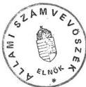

ÁLLAMI SZÁMVEVŐSZÉK

V-36-60/1990.

# ÖSSZEFOGLALÓ JELENTÉS

a minisztériumi, illetve tanácsi alapítású vállalatok

nyonkihelyezési és átalakulási tevékenységének ellenőrzéséről

Budapest, 1990.

Magyar Országos Levéltár

XIX-A-126-a-9-t-V-36-60/1990 (2.5.d)

009.

1

---

Az Állami Számvevőszék a minisztériumi és tanácsi alapítású vállalatok társaságalapítási, vagyonkihelyezési tevékenységét a vonatkozó törvények hatályba lépésétől, 1988. II. félévétől az Állami Vagyonügynökség felállításáig, 1990. márciusáig terjedő időtartamban vizsgálta. A minisztériumi, illetve a tanácsi alapítású vállalati körben a vizsgálatokra közel egyidőben, összehangolva, de a két terület eltérő sajátosságai miatt differenciált eljárási módszerek alkalmazásával került sor. A gazdálkodó szervezeteknél felvett vizsgálati jelentések alapján – ahol az indokolt volt – az ASZ ügyészi, vagyonügynökségi, illetve tanácsi eljárás kezdeményezésére tett javaslatot. Ilyen beavatkozásra a vizsgált kör mintegy 10 %-ánál került, illetve kerül sor.

A vizsgálat mintegy 2600 állami szektorba sorolt gazdálkodó szervezet közel 172 milliárd forint értékű befektetett vagyonából 54 milliárd forint értékűnek a sorsára terjedt ki.

A tapasztalatokat a részletes jelentés és az ahhoz kapcsolódó, konkrét példákat is szerepeltető függelék tartalmazza. Jelen összefoglaló az átfogó, általánosítható megállapításokat, következtetéseket, a jogi szabályozási feltételeket és az ajánlásokat rendszerezi.

Az egyértelműség és megállapítások értelmezése szempontjából rögzíteni kell, hogy közgazdaságilag privatizáció alatt azok a megoldások értendők, amikor az állami tulajdon lebontása során az állami vagyont részben, vagy egészében belföldi természetes személyek, és ezek kft-i, illetve szövetkezetek és/vagy külföldi cégek, magánszemélyek részére eladják, illetve az állami tulajdon magántőkével fuzionálva működik tovább.

## I.

### A VIZSGÁLATI TAPASZTALATOK ÖSSZEGEZÉSE

#### 1. A társaságalapítások folyamata

A társaságalapítások célja, az alapítások indítékai nem térnek el jelentősen a minisztériumi, illetve tanácsi alapítású vállalati körben.

A vizsgált minisztériumi alapítású vállalatok többsége jelentős likviditási gonddal küzdött, harmaduk pedig veszteséges volt, amikor a társaságalapításokat el-

---

határozta. Ebben a vállalati körben minden társaságalapítási szándék mögött érzékelhető az a magatartás, amely felismerte saját szervezetének életképtelenségét, de az állami vállalati státuszt nem kívánta elveszíteni. A tanácsi alapítású vállalatok körében hasonló a helyzet, ott is a pótlólagos források keresése volt az elsődleges cél, bár a döntésekben a likviditási problémák kevésbé élesen jelentkeztek.

Több társaságalapítási hullám figyelhető meg, mindenkor megelőzve a szigorodó jogi szabályozás körülményeit. A legnagyobb ipari vállalatok 1988. év végéig a kereskedelmi törvény alapján alakították át szervezetüket.

Az 1989. januárjától hatályba lépő gazdasági társaságokról szóló törvény az állami vállalatok társaságalapításait szabályozta, feltételezte azok továbbélését és nem írt elő a tulajdonos, az állam felé alapítással összefüggő vagyonrész-átadási kötelezettséget. A társaságalapításhoz előírt 30 %-os készpénzhányad teljesítésének úgy tettek eleget, hogy a külső befektetőktől csak készpénzbefizetést fogadtak be, illetve minimális alaptőkével hozták létre a társaságokat, majd rövid időn belül tőkeemelés útján – apport bevitellel – biztosították a társaságok működőképességét.

Az átalakulási törvény 1989. júliusában lépett hatályba. Ez az egész vállalat társasággá alakulását, jogutódlását szabályozta és az átalakulással összefüggésben vagyonrész átadási kötelezettségeket írt elő a költségvetés, a tulajdonos állam felé. Ilyen átalakulásra azonban ezt követően csak elvétve került sor. A vállalatok továbbra is a társasági törvény alapján módosították szervezeteiket. Kihasználva a jogi lehetőségeket lényegében átalakulást hajtottak végre azzal, hogy termelő tevékenységüket teljes egészében társaságaikba kihelyezték. Az állami vállalati státuszt megtartották úgy, hogy vagyonkezelőkké váltak és egyes esetekben bizonyos szolgáltatásokat is végeznek társaságaik részére. Tehát átalakultak, de annak számukra hátrányos következményei nélkül: nincs jogutód szervezet, így az eladósodott alapító vállalat kötelezettségei a társaságokat nem terhelik; az állam és a helyi tanácsok felé részvényátadási, illetve pénzügyi befizetési kötelezettségek nincsenek; kikerülték a vagyonértékelési és vagyonnövelési előírásokat. Ezzel magyarázható, hogy a vizsgálat mindössze egy leányvállalat esetében tapasztalta az átalakulási törvény alkalmazását, viszont ez esetben a részvényátadás kedvezményezettje a vállalati vagyonkezelő központ lett.

---

- 3 -

Jellemző, hogy az alapító vállalat többségi tulajdonosa a társaságoknak, a külső befektetők főként pénzintézetek, illetve kooperációs partnerek, akik szintén állami vállalatok. Ezek üzleti részesedése nem meghatározó, ugyanúgy, ahogy a külföldi alapítók tőkerészesedése sem az.

A külföldi befektetések tekintetében két jellemző magatartás tapasztalható. Egyrészt a vállalkozási nyereségadóról szóló törvény előírásaihoz igazodóan, a nyereségadó kedvezmény eléréséhez szükséges, minimálisan 20 %, illetve 5 M Ft értéknek megfelelő tulajdoni hányaddal rendelkezik a külföldi fél. Ez a jellemzőbbnek tekinthető külföldi jelenlét azonban – az adott tőkehányad mellett – értelemszerűen nem eredményez valós tulajdonosi magatartást. Másrészt a működési szándékkal megjelenő külföldi tőke (például a kereskedelemben, vagy az építőiparban) látványos üzletpolitikát folytatva a többségi tulajdonlás elérésére törekszik. Az ilyen jelenlét azonban még elenyésző. Jellemző magatartás ezekben az esetekben, hogy a kezdetben 50–50 %-os tulajdonosi hányadot a külföldi fél többségi tulajdonná alakítja az üzletrészek megvásárlásával, vagy alaptőkeemelés útján.

A privatizációs tulajdonlási formák megjelenésével különböző mértékben találkozott a vizsgálat a minisztériumi, illetve a tanácsi alapítású vállalati körben.

A minisztériumi alapítású vállalatok körében belföldi magánszemélyek befektetései csekély mértékűek. Ezek a közlekedési szolgáltatás, a könnyűipar és a mezőgazdaság területén szerveződött társaságoknál találhatók. A tanácsi alapítású vállalatok körében általános, hogy társaságaikban – bár különböző mértékben – természetes személyek 100–200 ezer Ft-os saját vagyona is működik. A dolgozói befektetések hányada ugyan alacsony (1 % körüli), de ez mégis a privatizáció kezdeteként értékelhető.

A társaságalapításokkal az állami vállalat tevékenységi struktúrája jelentősen átalakul és két jellemző forma különül el. A vállalati központ – saját kezdeményezésre – funkcionálisan is nevesítve vagyonkezelőként működik tovább, illetve vagyonkezelő-szolgáltató, infrastruktúrát is biztosító üzemeltető szervezetté változik. Alapítási céljainak megfelelő tevékenységét a társaságok végzik, ehhez 'adja' a szindikátusi szerződésben megfogalmazott feltételek mellett, s díjért a termelő környezetet (az állam tulajdonában lévő üzemi ingatlanokat, stb.). A kiürült vállalati vagyonkezelő központ létszáma minimálisra csökken. Az irányítási

---

- 4 -

forma azonban nem változik. Ha vállalati tanács irányításával működött, továbbra is ebben a formában marad, még akkor is, ha létszáma 30-50 főre, illetve néhány szélsőséges esetben 10 fő körülire zsugorodott.

E funkciókat nem lehet szélsőségesen elhatárolni. Ezek kombinációi léteznek, s ennek megfelelően az alapító állami vállalat bevételei is különböző arányban, de e két alapvető forrásból származnak. Vagyis a társaságok által befizetett osztalékból és a bérleti szerződések alapján befolyó bérleti díjakból tartja fenn magát.

Az alapító szervezet gazdasági helyzete ezen osztalékok és díjak nagyságától függően alakul. Ettől függ, hogy tudja-e a nála maradt hiteleket, adósságokat ütemesen fizetni. Amennyiben nem, üzletrészei folyamatos értékesítésével – esetenként azokat jelentősen érték alatt eladva – jut bevételhez. A felszámolási eljárást azonban öt minisztériumi alapítású vállalat így sem tudja elkerülni.

A társaságokba bevitt vagyonelemek összetétele alapján a kiürült vállalati központokhoz kapcsolódóan egy másik, közgazdaságilag talán még vitathatóbb állami vállalati 'továbbélési' szándék és magatartás is markánsan kirajzolódott a vizsgálati tapasztalatokban. Az ipari vállalatoknál általános megoldásként alkalmazták az olyan társaságalapításokat, amelyeknél az alapító az ingatlanokat, üzemi épületeket nem bocsátotta a társaságok rendelkezésére, csupán a gépeket és a gépi berendezéseket. Ez a forma a tanácsi vállalatoknál szinte általánosnak tekinthető, az általuk alapított társaságok 80 %-a csak bérlője azoknak a helyiségeknek, amelyekben működnek. Az ilyen döntések – nehezen 'elfogadhatóan' – azzal indokoltak, hogy az ingatlanok értékbecslése ma Magyarországon nem történhet reálisan. Ezzel a megoldással az általuk alapított társaságok függősége nagyobb, mint a tiszta profilu vagyonkezelő központok kialakulása esetén, hiszen még a bérleti díj megállapítása is az alapító hatáskörében marad.

A társaságokba bevitt vagyonelemek összetételét és értékét alapvetően befolyásolja az a jellemzően megfigyelhető alapítói szándék is, hogy saját vagyonának 50 %-át ne helyezze ki a társaságaiba, mert akkor a hatályos szabályozás értelmében három éven belül kötelezően önmagának is át kell alakulnia társasággá annak kötöttségeivel és befizetési kötelezettségeivel együtt.

1

---

- 5 -

## 2. A vagyon értékelése, hasznosítása, az állam bevételei

A vizsgált vállalatok többsége a társaságalapítással érintett vagyonelemeket átértékelte. Ezzel az állami vagyon – e körben – 16 %-kal felértékelődött.

A vagyonértékelést a vállalatok fele-fele arányban külső vagyonértékelő szervezetekkel, vagy különféle szakértőkkel, illetve saját hatáskörben a vállalat dolgozóival végeztették el. A vagyonértékelés mindkét megoldásnál azonos tendenciákat és arányokat mutat: az ingatlanokat, a gépi állóeszközöket a könyv szerinti értékhez viszonyítva általában felértékeltve, a készleteket leértékelve vitték be a társaságokba, mivel még a 0-ra leírt gépek is termelőerőt képviselnek és a készletek az induló finanszírozással összefüggnek. Találkozott a vizsgálat azonban olyan pozitív esetekkel is, ahol az iparjogilag védett, illetve licenc-bázisu fejlesztési eredményeket a ráfordítások alapján meghatározott értékkel vitték be a társaságokba.

Mivel a társaságalapítások jellemzően zárt körben történtek, ezért a vagyonértékelés és a tárgyi apport meghatározásánál érdemi viták csak igen ritkán, külső vagy külföldi alapítók részvétele esetében keletkeztek. Mind emellett a vizsgálat az apportlisták különböző mélységű összeállításával találkozott: a tételes, teljes részletezettségű feldolgozástól a címszavas listákig minden előfordult.

A cégbíróságok mindegyik változatot befogadták. A vagyonértékelés elvei, módszerei, az apportlisták tartalma a tapasztalatok szerint az egységes követelmények hiányában vegyes képet mutatnak.

A vizsgált minisztériumi vállalatok által alapított társaságok vagyonarányos nyereségének mutatója az alapító vállalatok visszamaradt tőkehatékonyságának közel kétszerese. Az alapítással érintett vagyonhalmaz (alapító és társaságai együttes vagyona) összhatékonysága azonban a korábbi időszakhoz képest jelentősen nem változott, csupán az eredmény keletkezésének helye módosult. Ezen túl a társaságok jelenlegi eredményeiben technikai jellegű tényezők is közrejátszanak és a kötelezettség-vállalások egyoldalú megosztása (pl. hitelkamatok elmaradása) miatt is eredményesebben tudnak működni.

A társaságalapítások, átalakulások következtében közvetlen költségvetési bevétel nem keletkezett, azért mert nem az átalakulási törvény szerint történtek a társaságalapítások. A különböző mértékű nyereségadó kedvezmények igénybevétele inkább az állami bevételek csökkenése irányába hatott.

---

- 6 -

Az eltelt rövid időszak alapján a munkaerőszerkezet változására, a foglalkoztatási jellemzőkre nem lehet markáns következtetéseket levonni. Az adminisztratív létszám kismértékű leépítése érzékelhető csak.

Az alapított társaságok tisztségviselői a már meglévő vezetői körből kerültek ki. Mind a társasági törvény, mind az összeférhetetlenség tekintetében irányadó törvények tág lehetőséget adnak a többszörös funkcióvállalásra. Ezek a sokszor üzletpolitikai okokkal sem indokolható, etikailag kifogásolható többszöri megbízatások, alkalmazások azonban a nem egységes felfogású jogalkalmazást is mutatják. A tekintélyes mellékjövedelmeket is eredményező funkcióhalmazódások, főként a kislétszámú vagyonkezelő központok vezető munkatársai esetében jelentkeznek és a tulajdonosi képviselet ellátásával kapcsolatosak. A részben szervezeti adottságokból is származó ellentmondások mutatják a főállású vagyonkezelési funkció kialakításának hiányát.

Az alapító minisztériumok, illetve a tanácsi törvényességi felügyelet részéről nem volt érzékelhető valós tulajdonosi magatartás.

Az államigazgatási irányítású vállalatoknál – még minisztériumi szervezésű Felügyelő Bizottság működése esetén – sem tapasztalható, hogy az alapító minisztérium érdemien irányította, koncepcionálisan befolyásolta volna a vállalatok ilyen irányú törekvéseit. A minisztériumok az alapítási (átalakulási) szándékot egyszerűen tudomásul vették, az érdemi állásfoglalást megkerülve nyilvánítottak véleményt, amennyiben a vállalat megkereséssel fordult hozzájuk.

A vállalati tanács vagy közgyűlés által irányított vállalatok esetében egy kedvező jövőkép felvázolásával, a külföldi tőkebevonás lehetőségének megteremtésével, az ebből fakadó előnyök kilátásba helyezésével támasztották alá az elképzeléseket. A vállalatok vezető testületei a valós tulajdonosi kockázatvállalás hiánya miatt ellentmondás nélkül támogatták ezeket az elképzeléseket. Ellenvetéssel, inkább ellenérzéssel a megvalósulást követően lehetett találkozni, amikoris már megjelentek a profitorientált, valós tulajdonosi magatartást tanúsító külföldi tőke bevonásának 'negatív' vonásai: a magasabb követelmények, a szigorúbb létszámgazdálkodás, stb.

---

- 7 -

A tanácsok magatartása az önkormányzati vagyon megteremtése szempontjából külön is érdekes, amikor az általuk alapított vállalatok átalakulása és vagyonkihelyezése kerül vizsgálatra. Tevékenységükben az utóbbi 1-2 évet megelőzően a saját vállalkozás alig kapott szerepet. A vállalatok ez irányú munkájának koordinálása, felügyelete pedig az akkori gazdaságpolitikai céloknak megfelelő fokozatosan kikerült hatáskörükből.

A vizsgált időszak alatt bekövetkezett változások, az állami támogatások csökkenése, az infláció felgyorsulása, a helyi foglalkoztatás és ellátáspolitikai gondok azonban kényszerítő erővel hatottak a tanácsokra, hogy szemléletüket megváltoztatva működésükhöz pótlólagos forrásokat keressenek. Ennek tulajdonítható, hogy egyre több tanács kezdeményezi anyagi lehetőségeinek határain belül a vállalkozás-jellegű, de nem privatizációs célú tevékenység meghonosítását feladatkörében.

A vállalkozásokhoz nyújtott – többnyire jogi és szervezési segítséget – korábban a fővárosi és a megyei tanácsoknál is a szakigazgatási szervek keretein belül oldották meg. Az utóbbi időben néhány tanács gondoskodott valamilyen formában a saját vállalkozási és a vállalati átalakulásokkal, társaságalapításokkal – privatizációval – összefüggő feladatok ellátására alkalmas önálló szervezeti egység létrehozásáról.

## II.

### KÖVETKEZTETÉSEK, JAVASLATOK

#### 1. Néhány következtetés

Ma a végső tulajdonos, felelős gazda hiánya okozza azokat a problémákat, amelyek a privatizáció egészét kedvezőtlen megvilágításba helyezik. Az is érzékelhető, hogy a jelenlegi helyzet megfelel a régi vállalati vezető réteg érdekeinek is, mivel az átalakult szervezetekben a korábbi pénzügyi problémák átmenetileg oldódtak, illetve részben az állam kárára rendezhetők. Az ilyen megoldásokra – a közvetlen, személyi motivációjú érdeket mintegy 'igazolva' – az ad hivatkozási alapot, hogy a korábbi évek szabályozási ellentmondásai,

---

- 8 -

állami beavatkozásai nyomán nem lehet meghatározni, hogy egy adott vállalat eredményessége vagy eredménytelensége mennyiben írható a vezetés, illetve a körülmények számlájára. Ebben a vezetői körben nem érdek, hogy tényleges tulajdonváltás menjen végbe. Az ilyen társaságalapítások nem ritkán konzerválói egy elavult műszaki-termelésszervezési komplexumnak.

A közvélemény mindenfajta gazdasági társaságalapítást privatizációs jellegűnek tekint, holott egy részüknél tényleges tulajdonváltozásról nincs szó, mivel ezek inkább az állami vállalatok és pénzintézetek egymás közötti - magántőkét kizáró 'kereszttulajdonlások' - szövevényei, vagy egy-egy vállalat egészét érintő zártkörű részvénytársaságok létesítése a jellemzőek. Ugyanakkor káros hatást gyakorol a kibontakoztatni szándékozott privatizációs folyamatokra, hogy a közvélemény mindenfajta privatizációt negatívan ítél meg, mivel úgy érzékeli, hogy a visszaélések automatikusan akkor kezdődnek, az állami tulajdon akkor kerül veszélybe, a gazdasági vezetők akkor rendelkeznek sajátjukként a közösség tulajdonával, amikor egy működő vállalat vezetői a társaságalapítás, a privatizáció mellett döntenek.

Ehhez kapcsolódik, hogy mind a mai napig nincs egyértelműen tisztázva az állami privatizációs politika célja, tartalma, üteme és terjedelme. Hiányzik a komplex, a célokra és az azok eléréséhez vezető eszközökre egyaránt figyelmet fordító problémakezelés.

A jelenlegi szabályozás azon célok megvalósítását, hogy a társaságalapítások, átalakulások, privatizálások költségvetési bevételeket eredményezzenek csak nagyon szűk körben tartalmazza és ezek is megkerülhetők, 'kijátszhatók'. A vizsgálatba bevont nem csekély állami vagyon 'kihelyezése a GT alapján történt, ezért állami bevétel - amivel a költségvetés hiánya, illetve a külső adósságállomány csökkenthető lenne - lényegében nem keletkezett.

Az állami tulajdon lebontása több évet átfogó folyamat. A gazdálkodó szervezetek vagyonának nyilvántartási előírásai, a kapcsolódó számítás -és információtechnikai háttér ma a folyamatok megfelelő vezényléséhez nem nyújt megnyugtató hátteret. Nem elegendő például annak ismerete, hogy az egyes átalakult szervezeteknél részvény, vagy törzs-tőke -e az alapítói vagyon. A

---

- 9 -

közgazdasági elemzések, de az állami vagyon ellenőrzésének szempontjai is megkivánják, hogy az arra jogosultak pontos ismerettel rendelkezzenek arról, hogy az állami(önkormányzati) tulajdon-e, vagy magánszemélyeké.

A tanácsok helyzete, vállalati átalakulásokban betöltött szerepe jelzi, hogy az önkormányzatok bevonása nélkül a privatizációs kezdeményezések a vállalatok éppen azon körében válnak bizonytalanná, ahol egyidejűleg van jelen a lakosság ellátásának érdeke, mint politikai kérdés és az évtizedekkel korábban mesterségesen létrehozott, torz vállalati rendszer gyors magánkézbe adása, mint gazdasági szükséglet.

## 2. Jogszabályi feltételek

A tapasztalatok szerint a társaságalapítások túlnyomó többsége nem kifogásolható törvényességi szempontból a jogi szabályozás ellentmondásai, illetve közgazdasági megalapozottságának hiánya miatt.

Az elmúlt években egymást követően életbe lépő, a vállalkozásokat, gazdasági társaságok létesítését, a vállalatok átalakulását, a vagyonkezelést valamilyen módon érintő jogszabályok átfedései, esetenként egymásnak ellentmondó értelmezési lehetőségei a gyakorlati munkában sok zavart, félreértést okoznak.

A gondokat tovább növeli, hogy az azóta újabb feladatokkal is leterhelt cégbíróságok nem képesek feladataiknak maradéktalanul eleget tenni. Több cégbíróságnál jelentős lemaradás tapasztalható a bejegyzések terén. Ennek alapvető oka, hogy a vállalatok által benyújtott kérel, mek közel fele tartalmilag hiányos, nem felel meg az előírásoknak, ezért azokat vissza kell adni. A cégbíróságoknál tapasztalható munkatorlódáshoz nem kis mértékben járult hozzá - az értékpapír törvény megjelenéséig -, a részvénytársaságoknak az alaptőkeemelések működési időhöz nem kötött lehetősége is.

Az állami tulajdon lebontásának szükségszerűségével az állami vállalatok társaságalapító tevékenységével, vagyonkihelyezésével minőségileg új jogi és gazdasági helyzet jött létre a magyar gazdaságban, amelyet a törvényi szabályozás komplexitása nem tudott követni.

A jogszabályok eltérően szabályozzák a társaságok, illetve állami vállalatok tekintetében azt a magatartást, amikor az egyik gazdálkodó szervezet egy másik

---

- 10 -

gazdálkodó szervezet felett is rendelkezik, többségi részesedést szerez. Az állami vállalat és részvénytársaság kapcsolatában azonban a korlátozások nem kerültek kidolgozásra. Így fordulhatnak elő olyan esetek, hogy ugyanaz a személy egyidejűleg vezetője az állami vállalatnak és az általa alapított részvénytársaságnak, illetve az állami vállalat, mint legfőbb részvényes, utasíthatja a részvénytársaságot, üzletpolitikáját diktálhatja anélkül, hogy ezért korlátlan felelősséggel tartozna.

A jogszabályok alapján nem értelmezhető egyértelműen 'a társasághoz hasonló tevékenység' meghatározás, mihez a tisztségviselők több társaságban betölthető funkció korlátozását kapcsolja a szabályozás. A társaságok tevékenységi köre oly mértékben széles skálán kerül meghatározásra az alapító által, hogy a hasonló tevékenység kritériuma nem értelmezhető. E korlátozó rendelkezéshez nincs szankció hozzá rendelve, s nincs nevesítve az ellenőrzésére hivatott szervezet sem.

Nem egyértelműek a vagyonértékeléssel, vagyonmérleggel, vagyonbevitellel kapcsolatos jogszabályi előírások. A tárgyi apport részletezettségét az alapítók megállapodására, illetve a könyvvizsgálók 'lelkiismeretére' bízza a jogszabály, ugyanakkor ezzel összefüggésben súlyos felelősséget ír elő. A vizsgálatok tapasztalatai bizonyították, hogy az apportlista tételes elkészítésének elmulasztása, vagy az egyes tételek jogtalan beállítása a társaságok működésében – különösen vegyesvállalat esetében – alapvető működési zavarokat idézhet elő.

A jelenlegi jogi/gazdasági szabályozásban kettősség alakult ki. Egyrészt léteznek már azok a jogszabályok, amelyek eszközként felhasználhatók a tulajdonreform végrehajtásához, a privatizációhoz, másrészt azonban az ehhez elengedhetetlenül szükséges a jogi szabályozások módosítása.

A tapasztalatok arra utalnak, hogy a gazdasági társaságokról szóló 1988. évi VI. törvényben, a gazdálkodó szervezetek és a gazdasági társaságok átalakulásáról szóló 1989. évi XIII. törvényben, az Állami Vagyonügynökségről szóló 1990. évi VII. törvényben és az állam vállalatokra bízott vagyonának védelméről szóló 1990. évi VIII. törvényben megfogalmazottak, valamint más kapcsolódó jogszabályok – mint a törvényalkotó munka napi gyakorlata mutatja – csak állandó kiegészítésekkel, módosításokkal alkalmazhatók az állami vállalatok vagyonkihelyezésére, átalakulására, privatizálására. Ezért felmerül annak az esetleges megfontolása, hogy egységes rendszerbe foglalt szabályozás kerüljön kibocsátásra.

---

- 11 -

A privatizációt segítő jogszabályok akkor fejthetik ki kívánatos hatásukat, ha a tulajdonos és ezzel a tulajdonosi érdekeltség is adekvát módon jelen van. Ez a tulajdonosi magatartás azonban nem csak rendelkezési jogot, hanem az új érdekeltségi rendszernek megfelelő felelősségi rendszert is kell hogy jelentsen, e nélkül az állami tulajdon valós privatizációja nem bontakozhat ki.

### 3. Javaslatok

Az állami tulajdon lebontása hosszabb ideig tartó folyamat. Az átmeneti időszakban a kampányszerű megoldások, a 'tömeges' átalakítások több veszélyt, kiszámíthatatlan gazdasági következményt rejtenek magukban, mint előnyt, annál is inkább, mivel a privatizáció vezényléséhez szükséges infrastruktúra kiépítése csak most kezdődött meg. A jelenlegi törvényi szabályozás sem kezeli a feladatkört teljes komplexitásában.

E folyamat irányításához olyan állami szintű intézkedésekre is szükség van, amely újra kiemeli a stratégiai tulajdonosi jogosítványokat a vállalati menedzser csoportoktól. Ezzel egyrészt a tulajdon jogi tartalma letisztulna, másrészt kedvezőbb helyzetbe kerülnének a társaságok is, mert önállóságuk tovább növekedne operatív döntési jogosítványaik megerősödésével.

Az Állami Számvevőszék a vizsgálati tapasztalatok alapján

3.1. Szükségesnek tartja az állami gazdálkodó szervezetek vagyonát átfogó, de a specifikumokat is tartalmazó privatizációs törvény megalkotását. Ennek keretében kell meghatározni a vagyonpolitika alapelveit, beleértve privatizáció céljának, tartalmának, terjedelmének, ütemének szabályozását. Ennek részeként határozható meg a munkavállalók, illetve a természetes személyek részvénytulajdonlásának keretei is.

3.2. Ezzel egyidejűleg szükségessé válik a privatizációs tevékenységet érintő alábbi jogszabályok egységes, átfogó rendszerbe foglalása oly módon, hogy azok a privatizációs törvénnyel és egymással összhangban:

- tegyék lehetővé az egységes jogalkalmazást,

---

- 12 -

- egyértelműen és kiterjesztve határozzák meg az állami vagyon tartós kihelyezése, elidegenítése során az államot illető tulajdonrészeket, befizetési kötelezettségeket;
- tisztázzák és véglegesen rendezzék az állami vállalatok vezető testületeinek tulajdonosi jogosítványait;
- mérsékeljék az állami szabályozás bürokratikus igazgatási felfogását, azt a piaci viszonyoknak inkább megfelelő polgárjogi, társaságjogi szabályozás irányába változtassák.

(Ilyen jogszabályok: kereskedelmi törvények, a gazdasági társaságokat valamint az átalakulást szabályozó törvények, az Állami Vagyonügynökségről és az állam vállalatokra bízott vagyonának védelméről szóló törvények, vállalati törvény, pénzügyi törvény, vállalkozók nyereségadózását és külföldiek befektetéseit szabályozó törvények, az értékpapír törvény, földtörvény, stb.)

3.3. Indokoltnak látja a számviteli rend korszerűsítéséhez kapcsolódóan, hogy a gazdálkodó szervezetek vagyonának nyilvántartása megfelelően biztosítsa az állami tulajdon lebontásának nyomonkövetését.
3.4. Felhívja a figyelmet, hogy a létrejövő önkormányzatok hatékony gazdálkodása megkívánja az illetékességi területükön lévő tulajdonuk egyértelmű meghatározását, annak tételes számbavételét.
3.5. Megfontolásra ajánlja a termelő tevékenységtől (és eszközöktől) kiürült, állami vállalati formában tovább működő vagyonkezelő központok területi vagy funkcionális elvek szerinti összevonását, az állami vagyonkezelés funkcióként való megszervezését.
3.6. Javasolja a külföldi működő tőkebevonáshoz kapcsolt nyereségadó kedvezmények felülvizsgálatát úgy, hogy az kezelje a külföldi tőke működő jellegét és működésének időtartamát.

Budapest, 1990. augusztus 30.

Dr. Hagelmayer István

---

ÁLLAMI SZÁMVEVŐSZÉK

V-36-60/1990.

# RÉSZLETES JELENTÉS

a minisztériumi, illetve tanácsi alapítású vállalatok
vagyonkihelyezési és átalakulási tevékenységének
ellenőrzéséről

Budapest, 1990.

Magyar Országos
Levéltár

XIX-A-126-a-9.t -V-36-60/1990 (25.d.)

1

---

# B E V E Z E T É S

Az állami vállalatokról szóló 1977. évi VI. törvény 28. paragrafusa szerint 'a vállalat alapvető joga és kötelessége a vállalat anyagi és szellemi erőforrásainak hatékony felhasználása és gyarapítása.

A gazdasági társaságokról szóló 1988. évi VI. törvény célja többek között a 'népgazdaság jövedelemtermelő képességének javítása, ... a tőkeáramlás, valamint a külföldi működő tőke gazdaságunkban való közvetlen megjelenésének elősegítése. ...'.

A gazdálkodó szervezetek és gazdasági társaságok átalakulásáról szóló 1989. évi XIII. törvény megalkotását is az a felismerés vezette, hogy a gazdálkodó szervezetek további fejlődése a vagyonérdekeltség megteremtésével, a bel- és külföldi tőke bevonásával mozdítható elő.

A minisztériumi és a tanácsi alapítású vállalatok vagyonkihelyezése, a vállalatok társasággá történő átalakulása, a 'spontán privatizáció' körül kialakult szakmai és politikai viták, a felfokozott közhangulat, s az Állami Számvevőszékhez eljuttatott megkeresések hatására az ASZ elnöke – élve a törvényben biztosított jogával – e tárgykörben témavizsgálatokat rendelt el. A Vagyonkezelő illetve a Területi Főcsoport hatáskörében végrehajtott vizsgálatokra közel egyidőben, összehangolva, de a vizsgált területek eltérő sajátosságai miatt differenciált eljárási módszerek, metodikai felfogás alkalmazásával került sor.

A minisztériumi alapítású vállalatokra kiterjedő témavizsgálat során 30 minisztériumi alapítású vállalat – tematikus program szerint bekért – adatainak feldolgozása történt meg, majd részletes helyszíni vizsgálatra és a folyamatok esettanulmányszerű feldolgozására 10 szervezetnél került sor. A tanácsi alapítású vállalati körben vizsgálat tárgyát képezte a tanácsok társaságalapítási tevékenysége és 154 vállalat átalakulási és vagyonkihelyezési folyamatának feldolgozása.

Az így összességében mintegy 2600 állami vállalat 172 milliárd Ft befektetett vagyonából, megközelítően 200 vállalatnál 54 milliárd Ft-os vagyon sorsa volt vizsgálva. Ez a saját vagyonhoz viszonyítva 9,2 %. Vagyis az ASZ az állami szektorban befektetett eszközérték 30 %-ára kiterjedő ellenőrzéssel, elemzéssel 672 Kft, 150 Rt. és 112 egyéb társaságalapítási forma, összesen 934 társaság alapítási céljai, körülményei alapján foglalja össze megállapításait. A jóváhagyott vizsgálati program szerint – kiindulva a törvényi szabályozások hatályba lépéseitől – az ellenőrzések

---

1988. II. félévétől 1990. márciusáig terjedő időszakot dolgozták fel. Ezen túlmenően az ASZ munkatársai a vizsgálati programokban foglalt célok teljesítése érdekében hasznosították a gazdaság egészét jellemző statisztikai adatok, APEH összefoglaló elemzések, valamint ezekhez készült, széles mintavételű vizsgálatok tapasztalatait is.

Az Állami Számvevőszék célja egy átfogó, reális kép kialakításának segítése arra vonatkozóan, hogy a törvényalkotói szándékok miként tükröződnek az állami vagyon hasznosításában, az állami tulajdon célszerűbb működtetésében, az állami bevételek alakulásában. Ezen túl a tanácsi vállalatokat érintő vizsgálat tapasztalatainak összegzésére és munkaanyagkénti, előzetes átadására azért került sor, mert az ASZ tapasztalatai ilyen közrebocsátásával is segíteni kívánta az Országgyűlés önkormányzatokkal kapcsolatos törvényalkotó munkáját.

A vizsgálatok alapján az ASZ ezért különösen arra vonatkozóan törekedett az általánosítható tapasztalatok levonására, hogy az állami vállalatok társaságalapítási, átalakulási tevékenységében miként érvényesültek a vagyon-gyarapítás, vagyonmegőrzés, a felelős gazdálkodás elvei; az állami vagyon elidegenítésében, kezelésében és működtetésében hozott döntések megfelelően szolgálták-e a nemzetgazdaság érdekeit.

A vizsgált vállalati kör anonimitását az összefoglaló és a részletes jelentés tudatosan őrzi meg, a konkrét tapasztalatokat, jogszabályi részleteket, mintaválsztási és statisztikai elemzéseket a Függelék-példatár tartalmazza. Az ASZ kéri, hogy a példatárban foglalt vállalati tapasztalatokra hivatkozásokban, vagy azok eteleges nevesített nyilvánosságra hozásában érvényesüljön az üzleti érdekek védelme. A helyszíni vizsgálatok alapján készült, érintett vállalati vezetők által észrevételezett vizsgálati jelentések, valamint a nyilatkozattételre felkért vállalatok beszámolói – mint alapdokumentációk – az Állami Számvevőszék Vagyonkezelő, illetve Területi főcsoportjainál betekintésre rendelkezésre állnak.

Az ASZ a célszerűségi szempontok mellett az állami vállalatok tárgybani tevékenységének szabályszerűségét, törvényekkel való összhangját is vizsgálta. Azoknál a szervezeteknél, ahol az ASZ munkatársai a jogszabályok előírásaiba ütköző vállalati magatartást, szabálytalanságokat észleltek, azt minden esetben a vizsgálati jelentésben rögzítették, amelynek alapján a vizsgált szerv vezetői intézkedtek. Ahol pedig ezen a módon nem látszik helyreállíthatónak a törvényes állapot, az ASZ a jogorvoslás más, megfelelő módját kezdeményezi. (Például kezdeményezés

---

- 3 -

az ügyészség felé, a Vagyonügynökség vagy az alapító szerv figyelmének felhívása.) Az ilyen beavatkozást igénylő esetek személyi összeférhetetlenséghez, felszámolási eljáráshoz, állami vagyon közérdeket sértő 'áttranszformálásához' kapcsolódnak és arányuk – mivel a vizsgált szervezetek mintegy 10 %-át érintően volt ilyenre szükség – önmagában is jelzi a folyamatok ellentmondásait.

A jelen részletes összefoglaló jelentés a minisztériumi, illetve a tanácsi alapítású vállalati körben szerzett tapasztalatokat tárgyalja.

# I.

# **A MINISZTÉRIUMI ALAPÍTÁSÚ VÁLLALATOK VAGYONKIHELYEZÉSI ÉS  
ATALAKULÁSI TEVÉKENYSÉGE**

# **1. A vizsgált terület jellemzői, legfontosabb adatok**

A mintegy 1200 minisztériumi alapítású vállalat saját vagyona 1989-ben 1 184 400 millió Ft volt, befektetett eszközeinek értéke pedig 143 127 millió Ft-ot tett ki.

A minisztériumi alapítású vállalatok közül – a befektetett eszközök értékéből kiinduló és a statisztikai mintavétel szabályai szerinti kiválasztással – 30 vállalat részletes vizsgálatára, illetve tematikus adatfeldolgozására került sor. Így az ASZ ezen szervezetek által alapított 70 részvénytársaságba, 165 kft-be, és 31 egyéb szervezetbe, összesen 266 gazdasági társaságba történő vonkihelyezési tevékenységről, mintegy 40 milliárd Ft állami vagyon sorsáról tudott közvetlenül képet alkotni.

A vizsgált minisztériumi alapítású állami vállalatok közül – irányítási formáját tekintve – 8 államigazgatási felügyelet alatt állt, 16 vállalati tanács általános vezetésével működött, 5 közgyűlés vagy küldöttgyűlés által irányított, egy pedig időközben társasággá alakult.

---

- 4 -

Az 1989. évi mérlegszerkezet a befektetett eszközök további három csoportra bontását teszi lehetővé: részvények, vagyoni betét gazdasági társaságban, leányvállalatban, külföldi érdekeltség. A vizsgált vállalati körben a befektetett eszközök mintegy 70 %-a részvény, 30 %-a vagyoni betét. (Részletesebben a mintaválasztásról, a statisztikai adatszerűségekről a Függelék-példatár I.sz. alatt.)

A minisztériumok, mint alapító szervek általában ismerték vállalataik társaságalapítási elképzeléseit; az államigazgatási irányítású vállalatoknál döntési jogosítványok alapján, vállalati tanácsi irányítású vállalatok esetében pedig törvényességi felügyeleti jogosítványaikon keresztül. Eljárási gyakorlatuk azonban erősen kifogásolható. A vizsgálat szélsőséges eseteket is feltárt: államigazgatási irányítású nagyvállalatok esetében a döntési jogosítványokat teljes egészében átengedték az igazgatótanácsoknak, illetve más esetben a vállalati tanácsok döntési szabadságát korlátozva az előkészítési folyamatokba beavatkozva irányították azokat, ami nem találkozott a vállalatvezetés és a dolgozói kollektíva érdekével.

Megtörtént, hogy államigazgatási irányítás alatt álló nagyvállalat 'átalakulásáról' döntő igazgatótanácsi ülésen a minisztérium nem képviseltette magát. A vállalat a döntésről több alkalommal tájékoztatta az alapító szervet, míg az jóváhagyását írásban megtette.

Más esetekben az alapító minisztériumok törvényességi felügyeleti jogkörükben olyan alapvető jogsértések mellett mentek el, mint például: illetéktelen VT döntések meghozatala, ahol a korábbi nagyvállalati VT választotta meg a vagyonkezelőként megmaradó állami vállalat új igazgatóját, vagy nem kísérték figyelemmel a folyamatos társaságalapítások esetén a VT-tagok szabályos újraválasztását, a VT létszámának, összetételének meghatározását, a Szervezeti és Működési Szabályzat átdolgozását.

### 3. A társaságalapítások előzményei, az alapítások célja

Az 1980-as évek végén az általános válsággal küzdő gazdaságban megindult az állami vállalatok belső egységeinek társasággá való alakítása, és e folyamatot az akkori kormányzat a bevezetőben említett törvények megalkotásával is segíteni kívánta. A gazdasági társa-

---

- 5 -

ságokról szóló 1988. évi VI. törvény (továbbiakban GT) deklarált célja az állami tulajdon hatékonyabb működési feltételeinek megteremtése. (A jogszabályok elveiről, életmondásairól részletesen a Függelék-példatár II. sz. alatt.)

E törvény megjelenését követően különböző motivációk hatására, de jelentősen meggyorsult az állami vállalatok társaságalapítási tevékenysége.

A társaságalapítások célját, mikéntjét meghatározó módon az alapító vállalat gazdasági helyzete, vagyoni viszonyai, piaci kapcsolatrendszere befolyásolta.

A vizsgált minisztériumi alapítású vállalatok többsége jelentős likviditási gonddal küzdött, közülük 5 veszteséges volt, amikor a társaságalapításokat elhatározta. Minden társaságalapítási szándék mögött érzékelhető volt az a nagyvállalati magatartás, amely felismerte a saját szervezetének életképtelenségét, de az 'állami köldökzsinórt' több okból, mint ezekre a következőkben kitér a jelentés, nem kívánta elszakítani.

A pénzügyi válságot ugyanis, amely jelen gazdasági körülmények között előrevetítette a csődeljárás, a felszámolás veszélyét, a társaságalapításokkal egy-egy önállósodott szervezetükre, illetve legtöbbször 'célszerűen' magára a vállalati központra tudták lokalizálni. Vagyis a válságkezelési magatartásban tettenérhető a problémák továbbhárítása az államra, mint végső tulajdonosra. Természetesen így ezek nem jelenthettek igazi, a nemzetgazdaság érdekrendszerét is figyelembevevő megoldást.

Szembetűnő, hogy jövedelmezőbb termékstruktúrát – bár a tőkehatékonyság a társaságokban jobb, mint az alapítónál – vizsgált szervezetek közül csak a külföldi tőkevebonással működők hoztak létre. Általános, hogy a társaságalapítással 'rendezett' pénzügyi problémák, a hitelképesség megteremtése egy elavult műszaki, – termelési bázis továbbélését biztosította. (Részletesebben a Függelék-példatár III. 1. sz. alatt.)

A vállalati pénzügyi nehézségek áthidalásának másik, de csak kevés esetben eredményesen megvalósított módja a külföldi, és/vagy belföldi tőke bevonása. A külföldi tőkebevonás a kisebb, rugalmasabb szervezeti egységek kialakítása az alapítói célok között ma még jellemzően csak mint lehetőség jelenik meg. A belföldi tőkebevonás jellemző módja pedig, hogy a hitelezők, szállítók követeléseik 'fejében' részvényesekké válnak.

---

- 6 -

A társaságalapításokban a gazdálkodási kényszerítő körülmények mellett jelen van az a vezetői szándék is, hogy megőrizve az állami vállalati státuszt, s ennek előnyeit is, teremtsenek maguknak nagyobb, előnyösebb gazdálkodási, irányítási mozgásteret. Ez az állami vállalat teljes vezérkarának intézményes érdeke, hiszen ily módon például a vállalati, gyáregységi tervalkut egy, a többségi tulajdonon nyugvó, direkt irányításos rendszer váltja fel.

Általánosítható tapasztalatként mondható ki, hogy a vizsgált minisztériumi alapítású vállalatok körében az eddigi társaságalapítások alapvető célja az időnyerés volt a gazdálkodásban mutatkozó problémák megoldására, s ezzel az életben maradás legalább rövidtávú biztosítására. Ebben ma közös érdekeltségük az állami vállalatok vezetői és dolgozói, egységet alkotva – helyzetükből adódóan – az állammal szemben.

### 3. A társaságalapítások lebonyolítása

A vizsgált, illetve a tájékozódási körbe vont 30 vállalat az átalakulási törvény hatályba lépése előtt a GT rendelkezéseit alkalmazva járt el. Az alapított 266 társaságban működik ezen vállalatok saját vagyonának több, mint 63 %-a, közel 40 Milliárd Ft. Ebből azonban csak 60 társaságban működik külföldi tőke, 3,2 Milliárd Ft értékben.

Általánosnak mondható, hogy az alapító állami vállalat a többségi tulajdonos a társaságokban. Nem egy esetben tulajdoni hányada eléri a 98–99 %-ot.

Az átalakulási törvény 1989. július 1-i hatályba lépése előtt két héttel “társaság alapítási hullám” zajlott le a vállalatok körében. (A helyszíni vizsgálatok jegyzőkönyvei alapján a Függelék-példatár III./2-3. pontjai konkrét ügyeket ismertetnek a továbbiakban foglalt általánosító megállapítások alátámasztása céljából.)

A vizsgált 10 “volt” nagyvállalat mindegyike a jogszabályi előírásoknak úgy tett eleget, hogy egyben kikerülték az átalakulási törvényt. A vállalatok a minimálisan szükséges tőkeértékekkel, illetve tőkehányadokkal Rt-ket, kft-/éket/t alapítottak, majd rövid időn belül alaptőkeemeléssel gyakorlatilag a teljes vagyonukat a társaságokba vitték át. Tehát átalakultak, de annak számukra hátrányos következményei nélkül: nem lett az új társaság a vállalat általános jogutódja, a kötelezettségek nem terhelik. Ezzel tartósan fizetésképtelen vállalatokat is alkalmassá

---

- 7 -

tudtak tenni arra, hogy gazdasági társaságok alapításával tovább folytathassák eddigi tevékenységüket.

Az ily módon megmaradó állami vállalati központ saját döntése alapján vagyonkezelőként működik tovább; általában kislétszámú irányító, illetve adminisztratív személyzettel. Ezek a 'vagyonkezelő szervezetek', bár megszabják a hozzájuk tartozó társaságok tevékenységét, de a kezelésükben lévő állami vagyon gyarapítására vonatkozóan érdemi kötelezettségük nincs.

Az ilyen, 'saját elhatározásból létrehozott' vagyonkezelő szervezetek nem az Állami Vagyonügynökségről és a hozzá tartozó vagyon kezeléséről és hasznosításáról szóló 1990. évi VII. törvény vagyonkezelőkre vonatkozó kondícióival működnek. Így megmaradt az elidegenítés joga, nincs kötelezettség egy meghatározott hozadék elérésére. Ezeknél a vagyonkezelő központoknál – bár sokszor államigazgatási irányítási formában, esetenként minisztériumi Felügyelő Bizottság irányítása mellett működnek – az állami kontroll működésük, vagyongyarapításuk tekintetében hiányzik.

Általánosítható módon kimondható, hogy e központ még akkor is quasi vagyonkezelőként működik tovább, ha bizonyos gazdálkodási tevékenységet fenntartott magának. Ezek a torzó, állami vagyonkezelő szervezetek a társaságoknak nyújtott bérleti, külkeresedelmi bonyolítói szolgáltatások bevételeiből, a társaságoktól kapott osztalékból tartják fenn magukat, illetve törlesztik a vállalati központnál maradt adósságokat.

Mivel ezeknél a társaság-alapítás csupán egy 'technikai trükk' volt a vállalat gazdasági helyzetének rendezésében és nem jelentett (legalább is nem automatikusan) egyben termelés korszerűsítést, racionalizálást, a tervezett bevétel, osztalék elmaradása miatt a felszámolást nem tudják elkerülni.

Egy másik jellemző társaságalapítási forma, hogy az állami vállalat az alapított társaságba az annak működési környezetét jelentő ingatlanokat (terület, üzemi épület) nem viszi be a társaságokba, hanem azok bérletére mellékszolgáltatási szerződést köt a társasággal, és az így kapott bevételből tartja fenn a vállalati központot.

---

- 8 -

A társaságalapítások lebonyolítása formailag szabályszerűen, a GT előírásaira figyelemmel ment végbe. A GT szerint alapított társaságokba bevitt vagyon után az állam bevételre nem tesz szert, továbbá tulajdonosi jogosítványait is a megmaradó állami vállalat gyakorolja.

Általános tapasztalat, hogy a vállalatok a társaságalakítások előkészítésére, mind az értékelés elveinek kialakítására külső szakértőt vettek igénybe. Jellegzetes – kutatószerv által tett javaslat – a vállalati központok kiürítése.

A vállalatoknál az átalakulási, társaságalapítási elképzelések – egy eset kivételével, ahol a vállalatvezetés végül visszalépett az átalakulástól – nem ütköztek munkavállalói ellenállásba. A vállalat vezető testületei, de a dolgozók is, látva a vállalat gazdasági helyzetét, ugyanakkor bízva a remélt külföldi tőke megjelenésének előnyeiben, támogatták az ilyen irányú kezdeményezéseket.

A külföldi tőkebevonás, lehetséges külföldi partnerek felkutatására általában nem folytattak szervezett feltáró munkát, azok a már létező kapcsolati körből kerültek ki.

#### 4. Az alapítói vagyon jellemzői, a vagyonértékelés gyakorlata, a külföldi működő tőkebevonás tapasztalatai, az alaptőkeemelés motiváló tényezői

##### 4.1. Az alapítói vagyon jellemzői

##### 4.1. Az alapítói vagyon jellemzői

Általában jellemző volt a könyvszerinti értéken nyilvántartott vagyon újraértékelése. A társaságoknak a vagyon összességében 46,6 Mrd Ft értéken került átadásra, vagyis 16 %-os felértékelés következett be. A felértékelésből adódóan az állami vállalatok saját vagyona 6,6 Mrd Ft-tal növekedett a vizsgált vállalatoknál.

---

- 9 -

A társaságoknak átadott vagyonelemek összetétele az alábbi:

|   | Mrd Ft-ban | Megoszlás %  |
| --- | --- | --- |
|  gépek, termelőberendezések | 10,6 | 23  |
|  ingatlanok (épület, föld ) | 8,9 | 19  |
|  vevőállomány | 6,2 | 13  |
|  anyagok, fogyó-gyártóeszközök | 5,6 | 12  |
|  befejezetlen beruházások | 4,2 | 9  |
|  pénzeszközök | 4,2 | 9  |
|  kezelői, használati, bérleti jog | 2,5 | 5  |
|  készletek | 2,0 | 5  |
|  szellemi termékek | 1,3 | 3  |
|  értékpapírok | 0,9 | 2  |
|  egyebek | 0,2 | 0  |
|   | 46,6 | 100  |

Az alapító vállalatok a társaságok működéséhez szükséges eszközöket tárgyi apportként a társaságok rendelkezésére bocsátották. A tárgyi apport összetételének meghatározásakor azonban a működési feltételek biztosításán túl elsősorban a vállalat és a társaságok gazdasági szempontjai voltak a meghatározóak, de ez rendkívül sok egyéb tényezőtől is függött, például: hogy az állami vállalat vagyonkezelő szervezetté vált-e, vagy megmaradt eredeti tevékenységi köre is, illetve attól, hogy a társaságot önálló gyáregységeiből vagy telephelyeiből alapította meg.

Azokban az esetekben, ahol a korábbi nagy iparvállalatok a termelő tevékenységet megszüntetve vagyonkezelő állami vállalatként működnek tovább a társaság/ok/megalapítását követően, ott az eszközöket a társaságoknak átadták. Jellemző azonban, hogy ezeket tehermentesen vitték be a társaságokba. Egyes esetekben a folyamatban lévő beruházások, a készletek és a vevőállomány sem képezte a tárgyi apport részét.

A vagyonkezelő központtá szerveződött nagyvállalatok másik jellemző társaságalapítási módszere az volt, hogy az ingatlanokat, készleteket nem, csupán a gépeket és gépi berendezéseket vitték be apportként. E megoldási változatnak kettős indoka volt, egyrészt – az érvényes szabályok értelmében – amennyiben saját vagyonának 50 %-át társaságokban működteti, magának is át kell alakulnia 3 éven belül társasággá és ezt a

---

- 10 -

"kényszerátalakulást" kívánták elkerülni. Másrészt pedig a nagyobb vagyonértékhez szükséges 30 %-os készpénzhányadot sem saját forrásból, sem külső tagok, részvényesek bevonásával nem tudták biztosítani.

A gyáregységekből, önálló telephelyekből alapított társaságok esetében az ott használt eszközök képezték a tárgyi apport részét. Ezeknél azonban a vagyonértékelés általában elmaradt, jellemzően könyv szerinti értéken, vagy attól alig eltérően határozták meg az eszközök értékét.

# 4.2. A vagyonértékelés gyakorlata

A vagyonértékelés, könyvvizsgálói gyakorlat tekintetében volt tapasztalható a legnagyobb bizonytalanság. A tételes, teljes részletezettségű kimutatások mellett a címszavakból álló, alig részletezett apport-listák egyaránt előfordultak.

A tárgyi apport értékének meghatározásakor a vizsgált körben 4 vállalat kivételével vagyonértékelést végeztek. Volt ahol teljeskörűen, volt ahol csak az ingatlanokra, volt ahol csak a vásárolt és saját készletekre terjedt ki a vagyonértékelés.

Az állami vállalatok fele külső vagyonértékelő szervezetet, ingatlanforgalmazó céget, illetve kutatóintézetet kért fel a vagyonértékelésre. Ez utóbbi szervezet általánosan olyan javaslatot dolgozott ki a vállalatoknak, hogy a gépeket, berendezéseket felértékelve, az anyagokat, fogyó- és gyártóeszközöket lényegesen leértékelve vigyék be a társaságokba.

Az összesített adatok szerint:

|  az ingatlanokat | 17 %-kal  |
| --- | --- |
|  a gépeket, |   |
|  berendezéseket | 57 %-kal  |
|  értékelték fel. |   |

Ezzel szemben:

|  az anyagokat, fogyó- |   |
| --- | --- |
|  gyártóeszközöket | 80 %-ra  |
|  a saját termelésű |   |
|  készleteket | 74 %-ra  |
|  értékelték le a vállalatok. |   |

---

- 11 -

A gépek-berendezések jelentős felértékelésének oka, hogy még a nullára leírt gépek is termelőerőt képviselnek, valós értékük van.

A készleteknél általánosan tapasztalható alulértékelésnek objektív okai is vannak (inkurrens készletek), de fellelhető mögötte az az alapítói szándék is, hogy a társaságot a folyó költségek tekintetében kedvezőbb gazdálkodási helyzetbe hozza.

A tárgyi apport értékelését csak egyedileg, vállalatonként illetve társaságonként lehet minősíteni, amit a vizsgálatot végzők jelentéseikben megtettek. A vállalatok törekedtek arra, hogy összességében vagyonérték növelés következzen be.

A vállalatok másik csoportja a vagyonértékelést saját apparátusával végeztette el, a vállalat vezetőjének utasításában meghatározott szempontok szerint. Az értékelés tendenciái megegyeznek a külső szakértő cégek által ajánlott és kimunkált értékelésekkel. (Részletesebben a Függelék-példatár III./4. sz. alatt.)

Az apportlisták könyvvizsgálói hitelesítése – a jogszabályban előírtak szerint – megtörtént. Általános tapasztalat azonban, hogy az apportlista belső összetétele a társaság cégbejegyzését követően többször változott. Hónapokat vett igénybe a végleges apport lista elkészítése. Ez a jelenség arra világít rá, hogy az alapítások előkészítése nem volt megfelelő, illetve az állami vállalatok ezt 'menetközben rendezhető kérdésként kezelték'. Ez később jelentős problémákat, vitákat eredményezett, annak ellenére, hogy a tárgyi apport rendelkezésre bocsátását a társaság tagjai, ügyvezetői nyilatkozatban elismerték.

A cégbíróság a módosításokat befogadta. Ez a gyakorlat a jogi szabályozás jelenlegi előírásaival nem ütközik. Nincs ugyanis szabályozva a tárgyi apport részletezése.

### 4.3. A külföldi működő tőke bevonása

A vizsgálattal érintett 266 társaság közül 60-ban működik külföldi tőke. Ezen vállalatoknál a társaságokba bevitt 46,6 milliárd Ft-os állami vagyonhoz 3,2 milliárd Ft értékű külföldi tulajdonosi hozzájárulás történt, ami nem éri el a bevitt állami vagyon 7 %-át. (A vizsgálat az összes magyarországi tőkebefektetés 13 %-át ölelte fel. (Lásd Függelék-példatár III./5-7.sz. alatt.)

---

- 12 -

A külföldi tulajdonrész döntően készpénzbefektetést jelent, 2,9 Mrd Ft összegben. A külföldi fél által behozott gépek, termelőberendezések értéke 45 millió Ft volt, a további 250 millió Ft befejezetlen beruházásokban jelenik meg.

A külföldi befektetések tekintetében kétféle jellemző vállalati magatartás tapasztalható.

A külföldi tőke egyik, gyakoribb megjelenési formája az volt, amikor részaránya a nyereségadó kedvezmény eléréséhez szükséges minimális összeget érte el. Ezek a 'vegyes vállalkozások' általában a magyar alapító kezdeményezésére jöttek létre, a külföldi fél részéről valós tulajdonosi magatartás nem jelenik meg.

A törvényben biztosított nyereségadó kedvezmény olyan mértékben liberális, hogy az például a befektetett külföldi tőkének több, mint kétszeresét tette ki féléves működés alatt.

A nyereséges külföldi gazdasági társaságok az előirányzott 0,6 Mrd Ft-tal szemben 3,78 Mrd Ft adókedvezményt vettek igénybe. A kedvezményben részesült 947 gazdasági társaság átlagos adószintje 23,5 %, ami lényegesen kevesebb, mint a nemzetgazdasági átlag.

A nyereségadó kedvezmény akkor is megilleti a társaságot, ha a külföldi fél nem alapítója a társaságnak, részvény, vagy üzletrész eladásával lesz tulajdonos. Előfordult, hogy az adás-vételi szerződés részletfizetést biztosított a külföldinek, a nyereségadó kedvezmény azonban a teljes vételár alapján illette meg a társaságot. A minél nagyobb nyereségadó kedvezmény elérésében érdekelt az alapító vállalat, a társaság és a külföldi fél egyaránt, hiszen az osztalék nagyságát nagymértékben ez is befolyásolja.

A külföldi tőke másik megjelenési formája a célratörő üzletpolitikát folytató, működési szándékkal megjelenő külföldi tőkebefektetés. A vizsgálat a kereskedelemben, a szolgáltató szektorban és a termelő infrastruktúra területén találkozott ilyen - piacszerzési indíttatású - külföldi befektetésekkel. Ezekben az esetekben a külföldi fél már az alapításkor jelentős tulajdoni hányadot (általában 50 % körüli részarányt) vállalt, majd tulajdoni hányadát többségivé alakította, illetve alakítja részvények, üzletrészek megvásárlásával, vagy tőkeemeléssel.

Az többségi tulajdon megszerzését az engedélyező szervek nem akadályozták.

---

A vizsgálat egy vállalatból alapított két társaságnál tárt fel olyan esetet, hogy a külföldi fél készpénzbetétjét nem bocsájtotta a társaságok rendelkezésére, azt elkülönített letéti számlán kamatoztatta, miközben többségi tulajdonosként irányította a magyar vállalat eszközeiből alapított társaságait, amelyek döntően belföldi igényeket elégítenek ki. A külföldi fél eddig új megrendeléseket nem hozott az társaságoknak.

A külföldi befektetések összetételéből tehát az állapítható meg a vizsgált körben, hogy az jellemzően a társaságok finanszírozási problémáinak enyhítését szolgálta, nem vált általánossá a korszerű technika-technológia megvalósítására irányuló törekvés. Ezzel a társaságokban konzerválódhatott az a termelési és műszaki szerkezet, amelyet korábban az állami vállalat keretei között működtettek. A korszerű szervezési-vezetési ismeretek átadására is mindössze 2-3 társaság esetében került sor.

#### 4.4. Az alaptőkeemelés motiváló tényezői

Az értékpapírtörvény megjelenése előtti hatályos jogszabályok a részvénytársaságoknál nem szabályozták az alaptőkeemelés időpontját az alapítás idejéhez viszonyítva. Ezért vált gyakorlattá, hogy a társaság alapításakor – egyidejűleg – határoztak az alaptőke felemeléséről is.

Több vállalat először minimális készpénztőkével megalapította a társaságait, majd néhány nap múlva alaptőkeemelést hajtott végre, amelynek során a vállalat eszközeit tárgyi apportként bevitte a társaságokba. Erre a megoldásra azért volt szükségük, mert nem rendelkeztek a törvényben előírt 30 %-os készpénz összeggel sem.

Meg kell jegyezni, hogy az időközben megalkotott értékpapír törvény kimondja, hogy az alapítást követő egy éven belül nem lehet tőkeemelést végrehajtani. Ez a szabályozás már megfelelően rendezi a részvénytársaságok formális megalapítása körüli problémákat, bár az egy év a működés korlátozójává is válhat.

---

- 14 -

## 5. A tevékenységi kör és a kötelezettségek megosztása az

### alapító és a társaságok között

A törvényalkotói szándék szerint alapító és szervezetei között a direkt irányítási láncot társasági jogviszony váltja fel. A társaság alapítások nyomán jogilag új, önálló jogi személyiséggel rendelkező szervezetek jönnek létre. E szándék érvényesülése azonban a vizsgált egységek gazdasági kapcsolatait tekintve megkérdőjelezhető. A társaságok általában a minimális, megalakuláshoz szükséges tőkével jöttek létre. A működéshez szükséges többi eszköz tekintetében használati, bérleti jogutaltságot szereztek, aminek költségkihatásai jelentősen, tevékenységüktől függetlenül befolyásolják jövedelmezőségüket.

A társaság alapítások – még abban az esetben is, ha nem egyszemélyes társaságról van szó – az alapító vállalat meghatározó majoritását biztosították a tulajdonlásban, és így a döntési eljárásokban (a szavazásokban.). Ezáltal az 'önálló jogi személyek' függősége nagyobb, (vagy legalább is alig oldódott), mint amikor az állami vállalat gyáregységei, üzemegységei voltak.

Az alapított társaságok termelési szerkezetében általában nem következett be elmozdulás. A munkavégzés színvonala, a munka szervezettsége (a munkavégzés technikai feltétele) jelentősen csak a külföldi tőke bevonásával működő társaságoknál javult.

### 5.1. A termelő tevékenység megosztása, az alapító és

#### társaságai között

A létrehozott új társaságok túlnyomó részben saját korábbi tevékenységeik folytatására szerveződtek. Kisebb részben új tevékenységgel alakultak, illetve az alapító társaságok részére szolgáltató tevékenységet nyújtanak.

A megalakuló társaságok gyakorlatilag szakágazati besorolásukat feladva a cégbejegyzéshez csatolt tevékenységi kör megjelölésénél a lehető legszélesebb listát adnak meg. Ezzel

- egyrészt szakágazati besorolásukat, tevékenységi kör KSH-rendszerű számbavételét gyakorlatilag ellehetetlenítik,

---

- 15 -

- másrészt értelmezhetetlenné és ellenőrizhetetlenné teszik a társasági törvény vezető tisztségviselők alkalmazási korlátaira vonatkozó előírásait.

A vizsgált vállalatok és társaságaik konvertibilis export árbevételének alakulásában nem érzékelhető tendenciaszerű fejlődés, illetve ez nem hozható közvetlen kapcsolatba a társasággá történő szerveződéssel.

A vállalat által alapított társaságok általában folytatják korábbi konvertibilis exporttermelésüket, a vállalati központok pedig az ehhez kapcsolódó külkereskedelmi bonyolítói tevékenységet végzik.

A vizsgált körben a társaságoknál új exportpiacok és új exportképes termékek – egy kereskedelmi példa kivételével – nem jelentek meg. Még a jelentős külföldi tőkével létesült társaságok is jellemzően a belföldi piacra termelnek. A külföldi tőke megjelenése az eltelt rövid időszak alatt nem eredményezett számottevő konvertibilis exportpiac bővülést, árbevétel növekedést.

Új tevékenységi formák a megmaradó állami vállalatoknál jelentek meg. A vállalatok meghatározó csoportjánál (jellemzően ipari nagyvállalatok) általános a vagyonkezelői tevékenység. E forma választását a – pénzügyi helyzetük rendezésére – a társaságalapításoknál tanácsadóként működő kutatóintézettől kapott ajánlások is megalapozták. Ez a szervezeti megoldás lehetőséget biztosított a 'több gyáras' nagyvállalati forma módosított keretek közötti továbbéltetésére, a vezetői és az irányítói befolyás fenntartására. (lásd Függelék-példatár III./8-9.sz.alatt)

A vagyonkezelői feladatok mellett, illetve ettől függetlenül az alapító vállalatok másik nagy csoportjánál a tevékenységi kör jelentős átrendeződése figyelhető meg: a központ döntően a termelő szervezetek (társaságok) működéséhez szükséges anyagi-műszaki infrastruktúra – vállalkozásszerű – ellátását biztosítja. A társaságok ezzel megszabadulnak az infrastruktúra önálló működtetésének feladataitól, míg más vonatkozásokban viselik ennek előnytelen hatásait, mint erről más helyen szól a jelentés.

---

- 16 -

# 5.2. Az alapítók és társaságaik közötti tevékenység-

# megosztásból eredő szerződéses kapcsolatok

A szerződéses kapcsolatok főbb típusai:

- bérleti szerződések (gépek, műszer, berendezés, ingatlan bérletére, lízingelésre),
- tevékenység szolgáltatására kisegítő tevékenységek nyújtása, melléktevékenység ellátása, (posta, telefonkezelés),
- eljárások alkalmazására (licenc, know-how, szabadalmi eljárások megvásárlására, gyakorlati bevezetésére),
- beruházási, fejlesztési, kutatási, szervezési szolgáltatások nyújtására kötött szerződések).

Abban az esetben, ha az így kötött szerződéses megállapodás tárgya egyben vagyoni értékű jog is, az a társaságok vagyonának részévé is válik. A forgalomképes jogok értéken nem jelennek meg a vagyoni eszközök között, de a használó (társaság) ebben az esetben is költségtérítést fizet. Az így keletkező új költségelemek többletköltségként, árnövelő tényezőként jelennek meg a gazdaságban.

A szerződéses kapcsolatok létesítésének egyik megjelenési módozata az, amikor az alapító társaságonként külön-külön állapodik meg. Másik jellemző megjelenési formája az ún. szindikátusi szerződés, amelyben az alapító társaságaival együttműködési megállapodás keretében rendezi ezeket a szerződéses viszonyokat.

A szindikátusi szerződésekben ezeken túl egyéb megállapodásokat is kötnek: például a nyereség és osztalék felosztására, az egymás közötti áralkalmazás elveire, stb.

# 5.3. Az állami vállalat kötelezettségei

- A kötelezettségeket a társaság a vagyoni eszközeihez rendelt módon viseli (pl. beruházási hiteltartozás törlesztése). Ez azonban a kevésbé jellemző forma.

---

- 17 -

- A vállalatok zöme kötelezettségeit magánál tartva mentesítette társaságait az adósságok, hitelek átvállalásától. A vállalat így biztosította társaságai (önállósult szervezetei) részére a pénzügyi újrakezdés lehetőségét, hitelképességét.

Ez utóbbi megoldás nemcsak az állami költségvetés számára lehet hátrányos, de nemzetgazdasági szinten a pénzpiac egészét is károsan befolyásolja. A hagyományos terméket, hagyományos technológiával előállító nagyvállalati formában már működésképtelennek bizonyult szervezetek jutnak tevékenységük újrafinanszírozásához.

#### 6. A társaságalapítások hatása az állami vagyon működtetésének hatékonyságára, a költségvetési kapcsolatokra

Az állami vagyon működésének hatékonyságát a helyszíni vizsgálattal érintett vállalati körben a társaságalapítás előtti nagyvállalat, illetve az azt követően kialakult gazdálkodó szervezetcsoport (alapító - vagyonkezelő - állami vállalat és társaságai) összegzett adatai alapján is elemeztük. A tendenciák kezelése során figyelembe kell venni, hogy rövid időintervallumokból adódik, és vannak olyan hatások (pl. adósságállomány kezelés, készlet), amelyek csak egyszerűek.

Összességében megállapítható, hogy az így kialakult vagyonhalmazok hatékonysága a szervezeti átalakulást követően jelentősen nem javult, inkább az eredmények keletkezési helyének átstruktúrálódása következett be és ez áttevődött a gazdasági társaságokhoz.

A vállalatok társaságokba kihelyezett vagyona szélsőségesen különböző hatékonysággal működik. A hatékonyság a vizsgált szervezetek többségénél magasabb, mint a társaságalapítást megelőzően volt, de ennek összetevőit nem lehet kizárólagosan a társasággá alakulással összefüggésbe hozni.

Amíg a vizsgált társaságok vagyonarányos nyereségmutatója jellemzően 0 - 50 % között-, átlagosan 20 % körül alakul és néhány esetben kiugróan magas is előfordul, addig - a veszteséges vállalatok nélkül - a vállalati átlagos 12 %-os mutató ettől elmarad. Hasonló eltérések tapasztalhatók a tiszta eredmény: vagyon mutató esetében is, mivel e tőkejövedelmezőségi

---

- 18 -

mutató az állami vállalatoknál jellemzően 6 % alatti, s ennek kisebb része 12-33 % között alakul, ugyanakkor a társaságoknál eléri az átlagos 10 %-ot, a társaságok közel 1/3-ánál a 20-30 %-ot.

A kötelezettségvállalások előző fejezetekben bemutatott egyoldalú felvállalása nyomán jellemzőnek tekinthető, hogy miközben az alapított társaságok eredményesek, addig az alapító vállalatok illetve állami vállalati formában tovább működő vagyonkezelő központok nagyösszegű veszteségeket könyveltek el.

A vállalati tőkehatékonysági mutatók alacsony szintjében közrejátszott a vállalatok egy részének csökkenő nyereséghozadéka, továbbá 7 vállalat (vagyonkezelő) 1,5 Mrd Ft vesztesége. A veszteséges vállalatok közül háromnak a felszámolása folyamatban van.

Nehezíti a tisztánlátást az, hogy a társaságok döntő része 1989-1990. években, évközben alakult és egy teljes évi eredményt még nem tudott kimutatni. Továbbá lezárt gazdasági időszak esetében is az a körülmény, hogy a társaságok alapításánál a vállalati terheket hogyan osztották meg, illetve az induló feltételek biztosítására a társaságokat milyen készpénzfizetési kötelezettségek terhelték az alapító felé (pl. készletvásárlás).

A vállalatok az egyes társaságokban működő üzletrészeik, részvényeik után átlagosan 10 % körüli osztalékot kaptak, de nem kevés a 20-30 %-os osztalékot fizető társaság sem.

Általában kevés a veszteséges társaság. Néhány helyen a kifizethető osztalékot teljes egészében, illetve részben visszaforgatták a társaságba.

Az osztalék aránya a tiszta eredményen belül 1989. évben elérte a 30 %-ot, 1990. évben ennek jelentős növekedése várható, mivel az osztalékok már teljes évre lesznek elszámolva.

A társaságok esetében egy kezdeti működést vizsgáltunk és az igen nagy szóródás mellett összességében az szűrhető le, hogy a társaságok által fizetett átlagos osztalék mértéke nem éri el a banki kamatlábat. Egy-egy kiugróan magas eredményesség mögött a külföldi tőke bevonás alapján élvezett nyereségadókedvezmény, illetve a piaci monopolhelyzetet kihasználó áremelés húzódik meg.

---

- 19 -

A költségtényezőkkel való hatékonyabb gazdálkodás, a termékszerkezet korszerűsítés az értékesítési szerkezet átalakítása tekintetében nem tapasztalható jellemző elmozdulás. A gyártott termékek köre, értékesítési viszonylatai alapvetően nem változtak, létszámleépítés nem történt.

A gazdasági társaságok költségvetési kapcsolataira az a jellemző összességében, hogy a költségvetési befizetések növekedtek, elsősorban a személyi jövedele madó, társadalombiztosítási járulék és részben a többletnyereség utáni nyereségadó miatt. A vizsgált - megmaradó - állami vállalati körben a befizetett nyereségadó 36 %-kal, az adózott eredmény értéke közel 1 Mrd Ft-tal kevesebb 1989-ben, mint 1988-ban. Az állami vállalatok által kapott osztalék ugyanezen idő alatt 5,2 %-kal nőtt, s értéke 1989-ben a 30 vállalat tekintetében mintegy 400 M Ft volt.

Van olyan állami vállalat, amelynél a kapott osztalék adózott eredményhez viszonyított részaránya 98 %. A veszteséges állami vállalatok majd mindegyike a kapott osztalékok alapján javít pénzügyi helyzetén. Ebben a vállalati körben a kapott osztalék adózott eredményéhez viszonyított részaránya az előző évhez hasonlítva 50 %-kal emelkedett. Így az a mesterségesen előidézett helyzet, hogy az alapvetően tehermentesen alapított társaságok eredményesen működnek, többszörösen is csökkentően hat az állami bevételek alakulására:

- a társaságok a különböző kedvezmények alapján relative kevesebb nyereségadót fizetnek (pusztán azon okból is, hogy ugyanazon vagyon társasági formában működik tovább),
- a keletkezett osztalékot az állam tulajdonosi képében megjelenő "vagyonkezelő" központnak juttatják, amely azt saját életbentartására fordítja. Eredménytelen gazdálkodása miatt viszont adót nem fizet.

Állami többletbevételt a vizsgált társaságalapítások, átalakulások sem hoztak, mivel azokra majdnem kizárólag a többletbevételt nem eredményező társasági törvény, vagy ezt megelőző előírások alapján került sor.

---

- 20 -

## 7. Szervezeti struktúra, létszámhelyzet, társasági tisztségviselők

### 7.1. Szervezeti struktúra

A társaságszerveződés a vállalatok belső szervezetének állapotát alapvetően abban a vonatkozásban érintette, hogy a létrehozott új társaságok mint önálló szervezeti formák, kezdték el működésüket. Kiváltak a régi szervezeti közegből az általuk végzett tevékenységgel és/vagy új tevékenységet is felvállalva önálló jogi személyiségű szervezetekként kezdték el működésüket.

Ezzel egyidőben a vállalati szervezetek központi tevékenységeket ellátó része (általában az adminisztratív infrastruktúra) vagyonkezelő illetve manager tevékenységet is ellátó szervezetként működnek tovább, jobbára fenntartva a korábbi belső szervezeti tagozódást, szervezeti felépítést.

A meglévő szervezet tehát új tevékenységgel bővült, de a vállalat belső szervezete alapvetően nem változott meg.

A szervezeti struktúra említett két fő vonulata mellett a harmadik a nem vállalati szervezetből kifejlődő társasági szerveződés, amely a több társaságot átívelő, átfogó tevékenységű szervezetek kifejlődését jelenti. Ide sorolhatóak a szindikátusi szerződésekre épülő ún. infrastruktúrális szolgáltató szervezetek, amelyek a kft-k és részvénytársaságok alaptevékenységének hatékonyságát, jövedelmezőségét, a kockázati tényezők korlátozását biztosító szándékkal jönnek létre, mint önálló jogi személyiségű szervezetek és vállalkoznak szerződéses alapon valamely infrastruktúrális feladat, vagy feladatcsoport teljesítésére. Például számítástechnikai szolgáltatások, ezen belül ügyvitel, pénzügy, számvitel, anyagellátás, műszaki karbantartás, szállodai helyfoglalás stb.

Erőteljes fejlődést mutatnak az olyan vállalkozás szervezését tartalmazó szerződéses kapcsolatok is, ahol a szerződés tárgya és tartalma a tevékenység üzemszerű megszervezése, beüzemelése.

Az utóbb említett társasági formációk a társasági struktúrálódásban viszonylag újkeletűek. Fő jellemzőjük, hogy a meglévő vállalati szervezeten kívül önálló szervezetként működnek, magasfokú szakmai képzettségre,

---

- 21 -

korszerű technikai feltételekre, magas anyagi elismerésre alapozódnak. Ennek forrása, hogy garantáltan és bizonyítottan 'hozzák' a szerződésben vállalt eredmény, osztalék stb. növelésére illetve javítására rögzített kötelezettségeket, amelyek mindkét fél számára előnyös és ösztönző erejűek.

## 7.2. Munkaerőhelyzet

A munkaerőhelyzet (létszámhelyzet) a társaságszerveződésben ma még nincs abban az állapotban, hogy jelentős mértékű munkaerőfelesleggel kellene számolni. Meghatározó az a formai alakzatváltozás, ahol az önállósult szervezet tevékenységével együtt az ott foglalkoztatott munkaerő is az új társasági forma keretében fejti ki tevékenységét.

Még csak szerény jelei vannak, hogy az ún. infrastrukturális átrendeződés kapcsán számolni lehet és kell azzal, hogy az eddig ezen a területen foglalkoztatottak száma csökkenni fog és az érintettek körében foglalkoztatási problémák jelentkeznek.

Ezen folyamatok várható alakulását az is befolyásolja, hogy a későbbiekben a társasági tulajdonosi érdek erőteljes hatást fejt ki a mai létszámstruktúrára, illetve a gazdasági kényszerhatás erőteljesebb lesz. Ez azonban ma még csak potenciálisan van jelen, illetve az adminisztratív létszám csökkenésére irányuló törekvésekben érvényesül.

## 7.3. Tisztségviselők és helyzetük

Az állami vállalatok részéről a hatékonyabb foglalkoztatás illetve elismertebb szakmai követelmények szerinti vezetési igényesség követelményének markáns érvényesüléséről a vizsgálati tapasztalatok alapján nem lehet szólni. A szubjektív, személyes érdekek érvényesülése kevésbé ütközik a gazdasági kényszerűségből származó korlátokba. Ebben a témakörben emelhető ki a vezetői tisztségviselés megítélése és az összeférhetetlenség kérdése is.

Általános tapasztalat a vizsgált vállalatoknál, hogy a vezető tisztségviselők – ügyvezető igazgató, elnök, elnökvezérigazgató – a már meglévő vezetői körből kerülnek ki. Ez üzletpolitikai, stratégiai okokból csak részben indokolható.

---

- 22 -

Az összeférhetetlenség kérdésében a vonatkozó törvények és jogszabályok tág lehetőséget biztosítanak a szövevényes vezetői szerepvállalásra. Ugyanakkor erkölcsileg, etikailag a kialakult gyakorlat vitatható, gyakran közhangulatot rontó tényezőként jelenik meg az érintett vállalatoknál.

Karakterisztikusan vetődik fel a társaságokat felügyelő bizottságok tisztségviselőinek kérdése. Számos esetben a felügyelő bizottságok tagjai az alapítónál vezető jogi, közgazdasági, pénzügyi funkciókat töltenek be. Felvetődik, hogy mikor tekinthető ez a munkáltatói viszony összeférhetetlennek, illetve nemkívánatosnak a társasági tisztségviselői feladatok ellátása szempontjából. Jogilag ugyanis ennek határozott megítélése és értelmezése tág határok között mozog.

Kiemelésre szorul ugyancsak az ún. kettős funkciók kérdése is, ahol a vállalat vezetője és az alapított társaság vezető tisztségviselője ugyanaz a személy.

Az új szervezetek kialakítása, a vagyonkezelő központ, valamint a társaságok irányító szervezetének a létrehozása növelte a vezetői munkakörök számát. Az átalakulás általában kedvező, esetenként irritálóan kiemelkedő, a tevékenységgel alig arányosítható egzisztenciális helyzetet eredményezett.

A részvénytársaságoknál 5-9 tagból álló igazgatóság és 3-5 főből álló felügyelő bizottságok működnek. Főként a vagyonkezelő központ vezető munkatársai esetében jelentős funkcióhalmazás is tapasztalható; nem ritka a főállású munkakör mellett 4-5 társaságban további funkciók vállalása, amelyek után – nyereséges gazdálkodás esetén – jelentős tiszteletdíj is jár.

A funkcióhalmazást az is előidézi, hogy az abszolút többségi részvénytulajdonnal rendelkező vagyonkezelő központ az egyes társaságok testületeiben több személlyel is képviselteti magát.

A megítélésében alap problémaként jelentkezik, hogy az összeférhetetlenségre vonatkozó hatályos jogszabályok nincsenek összhangban az új gazdasági környezettel. A társaságok gyakorlatában ugyanis elvi kiindulási alapot képez az az alapállás, hogy amit a törvények és a jogszabály nem tiltanak, azt szabad. A kérdésfelvetés nemcsak jogi vonatkozású, hanem olyan etikai kérdés is, ami a vezetők hitelességén a munkavállalók azonosulásán keresztül befolyásolja az átalakulási (privatizációs) folyamat egészének sikerét is. (A fejezetben leírtakat a Függelék-példatár III./10. sz. alatt.)

---

## II.

### A TANÁCSI ALAPÍTÁSÚ VÁLLALATOK VAGYONKIHELYEZÉSI

#### ÉS ÁTALAKULÁSI TEVÉKENYSÉGE

#### 1. A vizsgált terület átfogó jellemzői, a legfontosabb

##### adatok

A több mint 800 tanácsi alapítású vállalat saját vagyona 1989-ben 291 Mrd Ft, befektetett eszközeik értéke 12 Mrd Ft volt.

A vizsgálat – figyelemmel az önkormányzati vagyon megteremtésének problémakörére – kiterjedt minden megyei és a fővárosi, továbbá 8 kerületi, 54 városi, illetve nagyközségi tanácsra, 154 tanácsi alapítású (ezen belül 33 kereskedelmi, 18 vendéglátóipari, 48 ipari, 38 közmű- és kommunális és 17 szolgáltató jellegű) vállalatra, amelyek az összes tanácsi vállalat 19 %-át a gazdasági társaságokban, átalakulásokban részt vevőknek pedig 50 %-át teszik ki. (Függelék-példatár III/11. sz. alatt)

A vizsgálattal érintett tanácsi alapítású vállalatok mintegy 100 milliárdos saját vagyonából a befektetett eszközök értéke 7,4 milliárd forint.

Az ismert gondok ellenére a gazdasági társaságok létesítésének folyamata felgyorsult, s bár az országban működő 813 tanácsi alapítású vállalat közül a vizsgálat befejezéséig csak 308 hozott létre, vagy vett részt gazdasági társaságban, az érdeklődés növekszik és mind több vállalat tervezi tevékenységének ilyen irányban való átalakítását, bővítését.

#### 2. A tanácsi munka

A tanácsok tevékenységében az utóbbi 1-2 évet megelőzően a saját vállalkozás alig kapott szerepet. A vállalatok ez irányú munkájának koordinálása, felügyelete pedig a gazdaságpolitikai célokkal összhangban fokozatosan kikerült hatáskörükből. Az állami vállalatokról szóló 1977. évi VI. törvényt 1984-ben módosító törvényerejű rendeletben foglaltak még az általuk alapított, de vállalati tanács irányítása alá helyezett cégek életébe való beleszólás jogát is erőteljesen korlátozták.

---

- 24 -

A vizsgált időszak alatt bekövetkezett gazdaságpolitikai változások, az állami támogatások csökkenése, az infláció felgyorsulása, a helyi foglalkoztatás- és ellátáspolitikai gondok azonban kényszerítő erővel hatottak elsősorban a megyei és a fővárosi, áttételesen pedig a városi, kerületi tanácsokra, hogy szemléletüket megváltoztatva működésük-höz pótlólagos forrásokat keressenek. Ezért egyre több tanács kezdeményezte anyagi lehetőségeinek határain belül a vállalkozás jellegű, de nem privatizációs célú tevékenység meghonosítását a tanácsi munkában.

A fővárosi, Bács, a Heves és Komárom megyei tanács vezetői már a múlt évben, Borsod, Hajdu és Pest megyében pedig ez év I. negyedévében felhívták a kerületi, illetve a városi, nagyközségi tanácsok figyelmét a vállalkozási tevékenység fontosságára, az abban rejlő lehetőségekre. A társaságalapítással, a vállalati átalakulással kapcsolatos törvények megjelenését követően – bár a törvények a tanácsok részére nem írtak elő kötelezettségeket – külön is kiemelték azok alkalmazásának hasznosságát.

A Komárom megyei tanács a törvények helyes értelmezésének elősegítésére központi állami szervek a Vagyonügynökség, az Ipari Minisztérium bevonásával konzultációkat szervezett, a Nógrád megyei tanács pedig videofilmes oktatást tartott a helyi tanácsok vezetői számára.

A tanácsok, illetve az általuk alapított vállalatok vagyoni helyzetének tényleges, átfogó felméréséhez azonban – két megye kivételével – csak az Állami Számvevőszék vizsgálatával kapcsolatban kért előzetes adatszolgáltatást követően kezdtek hozzá.

A felhívások ellenére a helyi tanácsok részéről jelentősebb aktivitás nem volt tapasztalható. A vizsgált 62 városi, illetve kerületi tanács közül 30, a tanácsi vagyont egyáltalán nem mérte fel, s a folyamatba tett intézkedések ellenére teljes körű felméréssel, nyilvántartással a vizsgálat időpontjában csupán kilenc helyi (2 kerületi és 7 városi) tanács rendelkezett. (Lásd Függelék-példatár III./12. a) és b) sz. alatt)

Amint ez az Állami Számvevőszék részére adott hiányos adatszolgáltatásból is kiderült, – bár vagyoni helyzetüket érinti – sem a fővárosi és a megyei, sem a városi és kerületi tanácsok nem rendelkeztek az illetékességi

---

- 25 -

területükön a vállalatok által folytatott társasága-lapítási és átalakulási tevékenységről átfogó, naprakész információkkal.

A vállalkozások többnyire jogi- és szervezési segítését korábban a fővárosi és a megyei tanácsoknál is az egyes szakigazgatási szervek keretein belül oldották meg. Az utóbbi időben a vizsgált körben, 4 megyei és 13 városi illetve kerületi tanács gondoskodott valamilyen formában a saját vállalkozási és a vállalati privatizációs tevékenységgel összefüggő feladatok ellátására alkalmas önálló szervezeti egység létrehozásáról. (Lásd Függelék-példatár III./13.sz.a) és b) sz.alatt)

A tanácsok által a társaságokba vitt ingatlanok értékelésénél alul, felül és reális értékelés egyaránt tapasztalható volt, sőt ellátási érdekekre hivatkozva ingyenes ingatlan átadásra is sor került. (Lásd Függelék-példatár III./14.sz. alatt)

A tanácsok vállalkozásokkal kapcsolatos munkájának tartalma, minősége alapvetően a tanácsi vezetők ügyszeretetének, személyes presztízsüknek, hozzáállásuknak a függvénye és abban általában nem játszik szerepet személyes anyagi érdekeltségük. Ezt támasztja alá, hogy a 64 vizsgált helyi tanács vezetői közül mindössze 12 fő vesz részt a tanácsok részvételével működő gazdasági társaságok felügyelő bizottságainak munkájában, annak ellenére, hogy azt jogszabály nem tiltja. Nem szerencsés azonban, hogy a társaságokban betöltött munkakörért az anyagi ellenszolgáltatást a társaságtól kapják.

### 3. A vállalatok magatartása

A társasági törvény megjelenését követően az idevonatkozó tevékenység törvényalkotói folyamata lelassult, de a társadalmi, szakmai viták következtében a törvények tervezett szövege, tartalma már előzetesen igen széles körben ismertté vált. A várható szigorítások miatt azok a vállalatok, amelyek gazdasági társaságok létrehozását tervezték, ez irányú tevékenységüket felgyorsították.

Jól érzékelhető ez abból a tényből, hogy míg 1988. december 31-ig a kényszer-átjelentkezéseket is figyelembe véve a 19 megyei cégbíróság (a főváros nem tudott adatot szolgáltatni) együttesen 3311 gazdasági társaságot jegyzett be, addig a következő évben ennek már csaknem kétszeresét, 7191-et, 1990. első négy hónapjában pedig majdnem ugyanannyit, 6935-öt.

---

- 26 -

A tanácsi alapítású vállalatok ilyen kezdeményezéseinek tartalmára, mélységére, formájára számos egymásnak is ellentmondó tényező hatott és hat. Így például a törvényalkotói munka problémái, egyes kérdések (tulajdon, eljárási rend) már előzőekben is említett tisztázatlanságán kívül lassítja az előrehaladást, hogy

- a vállalatok többségének nincs kialakult stratégiája, a vállalatvezetők többségének magatartására pedig a közvélemény álláspontja is hat,
- a külföldi tőke egyelőre - a pénzforgalom lassúsága miatt is - túlságosan tartózkodó, egyes területeken pedig a potenciális belföldi partnerek érdektelenek.

Ezzel párhuzamosan és egyidejűleg a gazdasági életben bekövetkezett változások kényszerítő erővel hatottak a vállalatok vezetőire. A vizsgálat során érzékelhető volt azon törekvésük, hogy

- elavult vállalati struktúrájukat, üzemeltetési formáikat korszerűsítve, költségeiket csökkentve gazdaságosan oldják meg feladataikat,
- mérsékeljék finanszírozási, likviditási gondjaikat,
- külföldi és belföldi magántőke bevonásával segítsék a műszaki, technológiai fejlesztésüket, termékszerkezetváltásukat,
- megteremtsék a maguk és munkatársaik egzisztenciális biztonságát, a differenciált anyagi elismeréshez szükséges béremelési lehetőségeket.

E tényezők erőteljesebb motiváló hatására a viszonylag rövid időszak alatt a tanácsi alapítású vállalatok mintegy 40 %-a, 308 alapított valamilyen gazdasági társaságot. A vizsgálatba bevont 154 vállalat - zömében kereskedelmi, vendéglátóipari és szolgáltatóipari célra - eddig 80 részvénytársaságot, 507 kft-t, 51 betéti és 30 egyéb gazdasági társaságot hozott létre. Emellett a vizsgált körben 8 cégnél fordult elő vagyontárgyak eladása külföldi vagy belföldi magánszemélyek részére. (Lásd Függelék-példatár III./15.sz. alatt)

---

- 27 -

#### 4. Az átalakulások előkészítettsége és folyamata

Az átalakult vagy átalakulni szándékozó vállalatok mindegyike rendelkezett különböző mélységű és megalapozottságú konkrét programmal, gazdaságossági számítással. A programokat, terveket, koncepciókat, gazdaságossági számításokat a vállalatok döntő többsége önállóan készítette el saját maga számára, s csak néhány esetben fordult elő, hogy e munkákat külső, erre specializálódott szervezettel végeztették el.

A vállalati tanács irányításával működő cégek az elkészült anyagokat testületi ülésen vitatták meg. Előfordult, hogy a VT az előterjesztést nem fogadta el, vagy átdolgoztatta.

A vállalatok fenti munkájukhoz általában nem kértek a tanácsoktól segítséget, s azok nem is kívántak munkájukba beleszólni, mégis érdemes említést tenni arról, hogy a Kereskedelmi Minisztérium a fővárosi tanács illetékes főosztályának egyetértésével a fővárosi tanács által alapított 15 kereskedelmi vállalattal konzultált a privatizációs lehetőségekről és ezek kívánatos irányáról, ami befolyással volt több fővárosi vállalat további ez irányú munkájára, részvénytársasággá alakulására.

#### 5. A tevékenységi kör és a kötelezettségek megosztása az

##### alapító és a társaságok között

A vállalatok által létrehozott kft-k döntő része a vállalati dolgozók bevonásával és anyagi hozzájárulásával már korábban is a vállalat keretei között működő szervezeti egységekből jött létre. Ebből adódóan a gazdasági társaságok erősen kötődnek az őket alapító vállalathoz.

A függőséget erősíti, hogy a gazdasági társaságok mintegy 80 %-a a vállalatoktól – külön megállapodás alapján – bérli azokat a helyiségeket, amelyekben működnek. Ennek ellenében a vállalat által fizetett bérleti összegnél helyenként alacsonyabb, helyenként magasabb bérleti díjat térítenek a vállalat számára. A vállalat így a ténylegesen kimutatottnál nagyobb ösz-

---

- 28 -

szeggel vesz részt a kft működésében olyan eszközökkel, amelyeknek nem tulajdonosa, hanem csak kezelője vagy bérlője.

Az állami tulajdont képező bérlemények után a vállalat által fizetett és a gazdasági társaság által a vállalatnak térített bérleti díj különbözete a vállalati központot, vagy a gazdasági társaságot gazdagítja és ebből a tanács nem, az állam pedig csak a nyereség adóhányadának mértékével részesedik.

A vállalathoz való kötődést erősíti az is, hogy ugyancsak külön megállapodás alapján a vállalati központ – esetleg annak is kft-vé alakult részlege – a legkülönbözőbb mértékű térítés ellenében különböző szolgáltatásokat nyújt (pl.: adminisztráció, raktározás, felújítás, stb.), vagy egyéb berendezési tárgyakat, állóeszközöket ad lizingbe.

A vizsgált vállalatok összes saját vagyonuk 7,2 %-át, 7,4 Mrd Ft-ot vittek 0,7 %-100 % közötti szóródás mellett gazdasági társaságokba. Az ingatlanok adás-vétele körül kialakult negatív megítélés hatásának is betudhatóan ebből az ingatlanok reál (könyvszakértők által megállapított) értéke csupán 1,8 Mrd Ft (24,3 %), a forgó, fogyóeszközök, valamint a készpénz együttes értéke viszont 4,0 Mrd Ft (54,0 %), az egyéb állóeszközök értéke 0,7 Mrd Ft (9,5 %), az immateriális javaké és vagyonértékű jogoké 0,9 Mrd Ft (12,2 %).

Szükséges megemlíteni, hogy a közvélemény általában csak a föld, az ingatlanok adás-vételére figyel, ezeket tekinti az esetleges átjátszás tárgyának. Az ingatlanok mellett azonban azoknál sokkal nagyobb értékű forgó, fogyóeszközök kerülnek át a gazdasági társaságokba. Ezt érzékelteti, hogy miközben a vállalatok vagyonán belül az állóeszközök nettó értéke háromszorosa a forgó, fogyóeszközökének, addig a társaságokba bevitt vagyonban az állóeszközök nettó értéke nem éri el a forgó, fogyóeszközök értékének a kétharmadát sem.

## 6/ A vagyonértékelések

A társaságokba bevitt vagyonból az ingatlanok többnyire könyvvizsgáló intézet által újraértékelve kerülnek át, s általában az új érték magasabb, mint a könyv szerinti volt. Az értékelés módszere nem egységes. Van, ahol a

---

- 29 -

hozadékelvből indulnak ki, van ahol a műszaki tartalomból, van ahol a forgalmi értékből. Ebből, valamint az értékelést végzők szubjektív megítéléséből adódóan jelentős, néha 100 %-os eltérés is tapasztalható egy-egy objektum értékének megállapításánál. Egyes esetekben nem került sor az újraértékelésre, másutt pedig a felek állapodtak meg egymással. (Lásd Függelék-példatár III./16.sz.alatt)

Nagymértékű differenciák mutatkoztak a bérleti és a használati jog tőkésített értékének kiszámításánál is, mivel a díj kiszámításának alapja 3-15 év bérleti díja között szóródik.

A forgó-, fogyóeszközök átadás-átvételére általában nyilvántartási értéken került sor, de előfordult, hogy megállapodás alapján annál lényegesen alacsonyabb áron, sőt ingyen vitték be a kft-be az ilyen eszközöket. Ahol viszont szakértővel értékeltették, ott az átvételi ár általában meghaladta a könyv szerinti értéket.

A vállalatok ún. immateriális javainak, vagyonértékű jogainak társaságokba vitelénél az értékmegállapítás módszerei csak most vannak kialakulóban és ezért még sok szubjektív elemet is tartalmaznak.

## 7. A bel- és külföldi működő tőke bevonása

A vizsgált körben 36 külföldi résztvevő - 390 ezer forint és 260 millió forint közötti szóródás mellett - mintegy 800 millió forintnak megfelelő összegű valutát fektetett az adott gazdasági társaságokba.

Az így megalakuló gazdasági társaságoknál a bankkamat nagysága körüli osztalék biztosítása céljából a külső tőke kötelező 20 %-os minimumához arányosították a saját tőkerészt, amelyet ezért viszonylag alacsonyan állapítottak meg, különben a külföldi nem vett volna részt a társaságban.

A belföldi magántőke aránya a gazdasági társaságokban - a vendéglátás és kiskereskedelem kivételével - rendki vül alacsony, többnyire nem haladja meg a vállalkozás törzstőkéjének 1 %-át. A magánszemélyek, akiknek többsége az alapító vállalat dolgozója, egyenként általában 30.000 - 150.000 Ft közötti összegekkel vesznek részt a társaságokban.

---

- 30 -

A vizsgált körben 21 vállalatnál fordult elő, hogy a vállalatvezetők a vállalat részvételével működő gazdasági társaságban ügyvezetőként, felügyelőbizottsági tagként tevékenykedtek, egyes esetekben pedig a társaság alapító tagjai, részvényesei is voltak. (lásd Függelék-példatár III./17.sz. alatt)

### 8. A társaságok eredményessége, gazdálkodási fegyelme

A létrehozott gazdasági társaságok eredményessége a megalakulásuk óta eltelt viszonylag rövid időtartama miatt még egyértelműen nem mérhető. E kérdés megítélésénél azt is figyelembe kell venni, hogy számos társaságnál azok jellegéből adódóan (pl. idegenforgalmi célú) a működés első évében a ráfordítások túlsúlya miatt nem várható nyereség, valamint azt, hogy a társaságok egy része nem nyereségre orientált, hanem egyéb, a vállalatok és az általuk alapított gazdasági társaságok zavartalan, eredményes működését biztosító célok megvalósítására jött létre (információnyújtás, adminisztráció elvégzése, koordinációs feladatok ellátása, stb.).

A nyereségre tervezett társaságok több mint ötven százaléka a tervezett, a korábbiaknál nagyobb eredményt elérte, néhány vállalkozás pedig az előző évi nyereséget jelentősen túlszárnyalta. A vállalkozások által kifizethető osztalék az esetek többségében azonban nem éri el az átlagos bankkamat mértékét. (lásd Függelék-példatár III./18.sz. alatt)

A vizsgált új gazdasági társaságok és részvénytársaságok döntő többsége a törvényes előírásokat betartva, azok szellemével összhangban alakult meg. Néhány esetben azonban fellelhetőek az állami tulajdon átjátszására, illetve a törvények kijátszására irányuló kísérletek.

Ezek közül tipikus jellegüknél fogva ki kell emelni a következőket:

- Hat vállalatnál a vállalatvezetők részvételével kis alaptőkével (1-1 millió forint) ún. egyszemélyes 'belső' kft-ket hoztak létre. Ezt követően négy vállalat ingyen adta át eszközeit a kft-knek, két vállalat pedig kölcsön jelleggel igen alacsony (3-4 %-os) kamathozam felszámításával juttatta ezeket hosszabb távra a vállalat pénzeszközeihez. Az ily módon megerősített kft-k bevonásával olyan részvénytársaságok alapítására került sor, amelyekben a kft-k már jelentős 30-90 %-os tőkével részesedtek.

---

- 31 -

- A kft-k alapítói részére így indokolatlanul magas, többszáz százalékos, tőkearányos részesedés feltételei teremtődtek meg. A későbbiekben, a vállalatok kötelező átalakulásakor a vállalati központok 'kiürülve' az eredeti vagyonuknak csak töredékét kitevő, mintegy 10 millió forintos nagyságrendű tőkével rendelkeznének, amiből az államot illető 20 %-os rész néhány millió Ft. A vizsgált körben ilyen gyakorlatot folytató hat vállalat vagyonának együttes értéke 2,6 Mrd Ft, amely az ismertetett gyakorlat alapján a vállalatok volt vezetőinek részvételével megalakuló részvénytársaságok birtokába került volna.

- Az Borsod megyében a megyei tanács által kezdeményezett bírósági eljárás során a Legfelsőbb Bíróság három vállalat magatartását már törvénysértőnek minősítette, Hajdu megyében az eljárás jelenleg folyamatban van, Baranya és Somogy megye vezetőit az ASZ tájékoztatta a tapasztalatokról, kérve a határozott fellépést. (lásd Függelék-példatár III./19.sz. alatt)

- Egy kereskedelmi, két vendéglátóipari, egy szolgáltató és egy kulturális vállalat egyes hálózati egységeikből kft-ket szervezett az ott dolgozók bevonásával. A vállalatok átszervezése címén dolgozóiknak felmondtak, akik így újra kezdési kölcsönt vehettek fel. Ezzel az összeggel – esetenként kiegészítve saját pénzzel – léptek be a dolgozók a kft-kbe. Ily módon a vállalkozásba bevont magántőke lényegében állami forrás hiszen az kamatmentes 4 év alatt visszafizetendő kölcsön. A vállalatok többnyire kezességet is vállaltak dolgozóikért. (lásd Függelék-példatár III./20.sz. alatt)

Az alkalmazott megoldás a hálózati egységek dolgozóit kedvezően érintette, mert nem kellett versenyezniük más pályázókkal, továbbá mert lényegében saját pénzükkel oldották meg a vállalkozásban való részvételt.

- Az újrakezdési kölcsön felvételére vonatkozó nem egyértelmű szabályozás miatt lehetővé vált gyakorlat rövid távon az állam számára kedvezőtlen. Hosszabb távon azonban nem ítélhető egyértelműen rossznak, mert az állam nem fizet munkanélküli segélyt: a vállalkozás eredményé-

---

- 32 -

ből az adó révén részesedik, a tevékenység gyakorlását lehetővé tevő helyiség használatáért fizetett bérleti díjból, ha áttételesen is, de részesül, a vállalkozó jövedelem adót is fizet. Mind ezek együttesen hosszabb távon kompenzálhatják az újrakezdési kölcsön folyó sitása miatt az államot ért kamat veszteséget.

Az ismertetett tipikus jelenségeken kívül előfordult szórványos jelleggel, hogy a kft-kbe bevitt eszközöket reálértéküknél – megállapodás alapján – alacsonyabbra értékelték, ami részben annak tudható be, hogy csak így voltak képesek fizetőképes partnert találni. Egyes esetekben állóeszközöket ingyen adtak át a vállalkozásoknak, vagy 'elfelejtették' azokat a szerződéskötéskor számításba venni. Néhány kft részére a vállalatok a külön megállapodásban foglalt szolgáltatások elvégzéséért rendkívül alacsony térítést kértek, vagy azokat ingyenesen végezték.

## 9. A létszámhelyzet, szervezeti-vezetési struktúra

### alakulása

A vizsgált tanácsi alapítású vállalatok mintegy 10 %-ának központjában következett be a társaságokban való részvétel miatt jelentős, 30-50 %-os mértékű létszámcsökkenés és ezzel egyidejűleg szervezetkor-szerűsítés. A 'megtakarításként' kimutatott létszám nagyobb részét azonban az új társaságok átvették.

Gondot jelent, hogy mivel az új társaságok általában a vállalat egy-egy részelegéből, vagy hálózati egységéből alakultak, így új munkahelyeket többségükben nem teremtettek, sőt az új társaságok létszámgazdálkodása a munkahelyek számát csökkentette.

A tapasztalatok szerint a vállalatok vezetői személyükben egzisztenciálisan is érintve, döntő többségükben a törvényes keretek lehetőségeit kihasználva igyekeztek a számukra legkedvezőbb, gyakran a vállalati központ fennmaradását is biztosító megoldásokat megkeresni.

---

- 33 -

Az eddig létrehozott gazdasági társaságokra jellemző, hogy azokban a vállalatok – az ingatlanértékelés bizonytalanságai miatt is – döntően forgó, fogyóeszközökkel vesznek részt, a kezelésükben lévő ingatlanokért pedig bérleti (használati) díjat kapnak és csak kisebb arányban kerül sor valódi vagyonértékesítésre. A gazdasági társaságok eredménye – ahol ez mérhető – néhány eset kivételével a korábbiaknál kedvezőbb, esetenként kiemelkedően jónak ítélhető, de a vállalatok gazdálkodásának egészét csak kismértékben javították, a kedvezményezett adózás miatt pedig átmenetileg az állami adóbevételek csökkenése is várható.

A tanácsok gazdálkodására a vállalatok fenti tevékenysége nem volt jelentősebb hatással, a lakosság ellátását pedig csak helyenként és csak szerény mértékben javította.

Budapest, 1990. augusztus 30.

Dr. Hagelmayer István