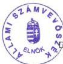
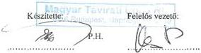

Állami Számvevőszék

V-10-25/01

# JELENTÉS

# a Magyar Távirati Iroda Rt. 2000. évi gazdálkodásának ellenőrzéséről

J. 4864

2001. július

0124

---

Az ellenőrzés végrehajtásáért felelős a
IV. Vagyonellenőrzési Igazgatóság:

Halász Gejza
számvevő igazgató

Az ellenőrzést vezette:

Dr. Podonyi László
osztályvezető főtanácsos

Koós Lászlóné
számvevő tanácsos közreműködésével

Az ellenőrzésben részt vettek
és a jelentést készítették:

Koós Lászlóné
számvevő tanácsos

Dr. Majoros Sándor
számvevő

Dr. Zsombor András
számvevő

Az ÁSZ által a témában eddig készített jelentések listája:

A nemzeti hírügynökségről szóló törvény alapján 1997. évtől az ÁSZ
évente készít jelentést az MTI Rt. tevékenységének pénzügyi-gazdasági
ellenőrzéséről.

Jelentéseink az Országgyűlés számítógépes hálózatán is olvashatók.

---

V-10-025/2001. TÉMASZÁM 562

# TARTALOMJEGYZÉK

# I. ÖSSZEGZŐ MEGÁLLAPÍTÁSOK, KÖVETKEZTETÉSEK, JAVASLATOK 4

1.Osszegz'megallapitasok,kovetkeztetesek 4
2. Javaslatok, ajanlások 7

# II. RÉSZLETES MEGÁLLAPÍTÁSOK 9

1. Az MTI Rt. 2000. évi gazdálkodása 9

1.1.Az MTI Rt. uzleti tervenek teljesitese 9
1.2.Az MTI Rt. 2000. evi gazdalkodasa 11

1.2.1.Az MTI Rt. letszam es bergazdalkodasa 12
1.2.2.Az MTI Rt. vagyongazdalkodasa 14

1.2.2.1. Az MTI Rt. részesedései között nyilvántartott társaságok irányítása, a társaságok gazdálkodása 16

2. Az MTI Rt. szolgáltatási szerződései, az állami támogatások igénybevétele, az árképzés rendszere 19

2.1.Az MTI Rt. szolgaltatasi szerzódései 19
2.2.Az allami támogatások igénybevételének szabályozása és ellenőrzese 21
2.3.Az alapszolgaltatasok dijmegallapitasahoz alkalmazott dijkal-kulacio 23

3. Az állami számvevőszék ellenőrzése alapján tett ajánlások hasznosulása 24

3.1.Az MTI Rt.mukodesenek a szabalyozasa 24
3.2.Az ASZ 2000. evi ellenorzese alapjan tett ajanlasok hasznosulasa 26

Tanúsítványok

1

---

4

---

# JELENTÉS

# a Magyar Távirati Iroda Rt. 2000. évi gazdálkodásának ellenőrzéséről

A nemzeti hírügynökségről szóló 1996. évi CXXVII. törvény (Nht.) 9. §-a és a Magyar Távirati Iroda Részvénytársaság (MTI Rt.) alapító okirata 5.7. pontja szerint a részvénytársaság elnöke évente beszámol az Országgyűlésnek a részvénytársaság tevékenységéről, amelynek keretében sor kerül a mérleg és az eredménykimutatás jóváhagyására, valamint a nyereség felosztására. Az elnök beszámolóját a részvénytársaság felügyelő bizottságának véleményével együtt kell az Országgyűlés elé terjeszteni. A beszámolóhoz mellékelni kell az Állami Számvevőszék elnökének jelentését a részvénytársaság tevékenységéről. Az Nht. 29. §-a értelmében a részvénytársaság gazdálkodását az Állami Számvevőszék ellenőrzi.

A Magyar Távirati Iroda Rt. 2000. évi gazdálkodásának ellenőrzésével az ÁSZ elnöke a nemzeti hírügynökségről szóló törvény előírásainak - a törvény hatálybalépése óta negyedik alkalommal - tesz eleget.

Az Nht. 9. § és 29. §-a szerinti ellenőrzés célja az volt, hogy megállapításaival megalapozza az ÁSZ elnökének a részvénytársaság tevékenységéről szóló jelentését és eleget tegyen az MTI Rt. gazdálkodására vonatkozó ellenőrzési feladatnak.

Az MTI Rt. 2000. évi gazdálkodásának számvevőszéki ellenőrzése alapvetően három területre koncentrált. Értékelte az MTI Rt. 2000. évi tervének a megalapozottságát. Ellenőrizte, hogy az MTI Rt. 2000-ben törvényesen, célszerűen és eredményesen gazdálkodott-e a rendelkezésére bocsátott vagyonnal és a központi költségvetésből a részvénytársaság közszolgálati feladatai ellátásához nyújtott működési- és céltámogatással. Az Állami Számvevőszék ellenőrizte az MTI Rt. 1999. évi gazdálkodása ellenőrzéséről készült ÁSZ-jelentés javaslatainak, ajánlásainak hasznosulását.

(Az MTI Rt. 2000-ben 1,3 milliárd Ft működési támogatást, 30 millió Ft céltámogatást kapott a központi költségvetésből. Ezeken kívül más költségvetési fejezetektől 5,7 millió Ft központi támogatást kapott.)

Az ellenőrzés társasági szintű vizsgálat volt, amely az MTI Rt. működésének a vizsgálat fő feladatai szempontjából meghatározó területeire terjedt ki. Az MTI Rt. központjában 2001. április 19-től május 18-ig tartó helyszíni ellenőrzés módszere a dokumentális vizsgálat és elemzés volt. Az ellenőrzés és elemzés alapdokumentumai elsősorban a részvénytársaság auditált éves beszámolói (mérleg, eredménykimutatás, kiegészítő melléklet, üzleti jelentés, könyvvizsgálói jelentés), az ezt alátámasztó dokumentumok, bizonylatok, a testületek üléseinek jegyzőkönyvei és határozatai, a vezetői utasítások, szabályzatok, beszámolók és elemzések voltak. A megállapításoknál felhasználtuk a vizsgálathoz bekért tanúsítványok adatait.

3

---

I. ÖSSZEGZŐ MEGÁLLAPÍTÁSOK, KÖVETKEZTETÉSEK, JAVASLATOK---

# I. ÖSSZEGZŐ MEGÁLLAPÍTÁSOK, KÖVETKEZTETÉSEK, JAVASLATOK

## 1. ÖSSZEGZŐ MEGÁLLAPÍTÁSOK, KÖVETKEZTETÉSEK

Az MTI Rt. 2000. évi éves beszámolóját könyvvizsgáló hitelesítette. A hitelesítő záradék szerint az éves beszámoló a társaság 2000. december 31-én fennálló vagyoni, pénzügyi és jövedelmi helyzetéről megbízható és valós képet ad. A társaság 2000. évi mérleg szerinti eredménye 96 millió Ft nyereség, saját tőkéje 3256 millió Ft volt. Vagyonát gyarapította, összességében a törvények betartásával gazdálkodott, de üzleti tervét alulértékelte. Az előző ÁSZ-jelentésben kifogásolt megbízási szerződések tartalmi hiányosságai megmaradtak és aggályos ezek adójogi megítélése is. A szervezetkorszerűsítés nem eredményezett költségcsökkentést, a befektetett üzletrészek rontották a társaság hatékonyságát. A költségvetési támogatás felhasználása szabályozatlan, a társaságnak termékre, szolgáltatásra vonatkozó elő- és utókalkulációja nem volt. Ezek a gazdálkodás eredményességét, a tervezhetőséget és az ellenőrizhetőséget negatív irányban befolyásolták. Változatlanul megmaradtak a jogi- és belső szabályozás hiányosságai, az ÁSZ korábbi jelentéseiben megfogalmazott ajánlások hasznosításában nem volt lényegi előrelépés.

**Az MTI Rt. 2000. évi üzleti terve** - a stratégiai tervvel összhangban - a gazdasági események várható negatív hatásainak a figyelembevételével készült. Az üzleti terv alultervezett volt, mert a tervezett 19,3 millió Ft üzleti veszteséggel szemben 55,8 millió Ft üzleti nyereséget ért el a társaság. A pénzügyi műveletek nyereségének 2,5-szeres növekedése miatt a szokásos vállalkozási eredmény a tervhez képest még nagyobb eltérést mutat, a tervezett 1,3 millió Ft helyett, 106,3 millió Ft volt a nyereség. A 2000. évi kedvező hatások (pl. olimpiai támogatás, költségvetési elvonás elmaradása) csak részben indokolják a tervezett veszteség és a realizált eredmény közötti különbséget. A bevételek 207 millió Ft-tal haladták meg a tervezett, és 413 millió Ft-tal a bázis év árbevételét. A tervtől való eltérést az új szolgáltatások és a vevőkör bővítésének bevétele (70 millió Ft) csak részben indokolja. Az árbevétel nem várt mértékű növekedése mellett a tervezettnél nagyobb volt a költségnövekedés is. A legtöbb költségelem a tervnél magasabb értéken realizálódott, meghatározó összegű költségnövekedés a személyi jellegű ráfordításokban és a humán jellegű kifizetésekben (40 millió Ft), az egyéb költségekben (37 millió Ft) és az értékcsökkenési leírásban (24 millió Ft) volt.

**A társaság nettó árbevétele** 2000-ben 1632 millió Ft volt. A költségvetésből kiutalt 1322 millió Ft működési támogatás a tervezettnek megfelelően realizálódott. A közszolgálati feladatok ellátásának ellensúlyozásával összefüggő állami támogatás az összes bevétel 40%-a volt.

**A költségek és ráfordítások** 3266 millió Ft összege 2000-ben az inflációt meghaladó mértékben nőtt, 385 millió Ft-tal (13,4%) haladta meg a bázis év adatait és 132 millió Ft-tal (4,6%) a tervezett értéket.

---4

---

I. ÖSSZEGZŐ MEGÁLLAPÍTÁSOK, KÖVETKEZTETÉSEK, JAVASLATOK

**A személyi jellegű ráfordítások és a humán jellegű egyéb kifizetések** együttes összege - a bérköltség 1999-ről áthúzódó kifizetéseit is figyelembe véve - 16,9%-kal haladta meg a bázis év hasonló jellegű kiadásait. A 239 millió Ft-os humán jellegű kifizetés 22 millió Ft-tal (10%) haladta meg a tervezett és 51 millió Ft-tal (26,9%) a bázis értéket. Ezen belül a legnagyobb mértékben a rendszeresen kifizetett vállalkozói díjak nőttek 46 millió Ft-tal (32%). Az előző ÁSZ vizsgálat alkalmával is kifogásolt belső megbízási szerződések száma 2000-ben nem csökkent és a szerződések tartalmi hiányosságai továbbra is fennállnak. A rendszeresen alkalmazott szerződések nyilvántartására az MTI Rt.-nek nincs szerződéstára, ezért nehéz meghatározni hányféle megbízási szerződés létezik és mi a különbség közöttük. Aggályos a szerzői díjas kifizetések adójogi szempontú szerződéses alátámasztottsága.

Az MTI Rt. 2000-ben hosszú lejáratú kötelezettség nélkül gazdálkodott. A társaság vevőállománya nőtt, szállítóállománya csökkent. Ez az ellentétes irányú változás kedvezőtlenül hatott a társaság likviditására.

Az 1997-es Kormányhatározattal kiutalt 195 millió Ft létszámleépítést elősegítő céltámogatással nem csökkent a társaság bér- és személyi jellegű költsége. Így a szervezet korszerűsítése nem járt együtt költségcsökkentéssel.

**A befektetett üzletrészeket** megtestesítő kft.-k alultőkésítettek. Az anyacéggel való kapcsolat egyoldalú előnyöket biztosít a számukra, annak ellenére, hogy gazdasági érdek nem indokolja fenntartásukat. A kft.-knek a részvénytársaság közszolgálati feladatainak az ellátásában szerepük nincs. A 100%-ban MTI Rt. tulajdonú társaságok rontották az MTI Rt. eredményességét. Az ingyenesen, vagy kedvezményesen bérbe adott helységek elmaradt bérleti díja 2000-ben is bevételkiesést okozott az MTI Rt.-nek. A társaságnak Budapesten a Károly krt.-on lévő ingatlanon bérleti joga van. Az ingatlan 2/3-ad része évek óta kihasználatlan, a fennmaradó rész hasznosítása tisztázatlan.

A társaság részvétele a költségvetési támogatás összegének kialakításában - az Rt. megalakításával - megszűnt. **A működési támogatás** összege 1999-ben 1207 millió Ft, 2000-ben 1322 millió Ft volt. E támogatás felhasználásának a folyamatát nem szabályozták sem a tulajdonosi jogok gyakorlói, sem a támogatás folyósítói.

Az MTI Rt.-nél **a céltámogatások felhasználásának** ellenőrzésére (2000-ben a céltámogatások összege 35,7 millió Ft, amelyből 30 millió Ft volt a központi költségvetési és 4,9 millió Ft az intézményi olimpiai célú támogatás) könyvelési tételeken alapuló elszámolás áll rendelkezésre. A „beruházás” sor részletezése alapján nem állapítható meg, hogy az olimpiához beszerzett tárgyi eszközök (amelyeket az olimpia után nyilván tovább használtak egyéb célokra) értékéből mekkora összeget lehet ténylegesen az olimpiára terhelni. Ugyanakkor az sem tisztázott, hogy a korábban meglévő, de az olimpiai tudósításokhoz használt eszközök értékéből mennyi terheli az olimpiát.

Az MTI Rt. gazdálkodásának eredményességét, a tervezhetőséget és az ellenőrizhetőséget negatívan befolyásolta, hogy a társaságnak nincs termékekre,

5

---

I. ÖSSZEGZŐ MEGÁLLAPÍTÁSOK, KÖVETKEZTETÉSEK, JAVASLATOK---

szolgáltatásokra vonatkozó elő- és utókalkulációja, így azokon alapuló **árképzése** sincs. Az árképzés termékre vonatkozó egységes rendszerének a kialakítását nehezíti, hogy a közszolgálati hírszolgáltatási kötelezettség körében nincsenek pontosan meghatározva a választási időszakban, a rendkívüli állapot, illetve a szükségállapot idején elvégzendő feladatok.

A 2000. évi és a korábbi ellenőrzések tapasztalatai alapján kiemelt odafigyelést érdemelnek azok a jelenleg is meglévő **jogi- és belső szabályozási** hiányosságok, amelyek megszüntetésére az ÁSZ több alkalommal is felhívta az érintettek figyelmét. A társaság napi működése szempontjából legfontosabb megállapítás az, hogy a részvénytársaság hatékonyabb tulajdonosi irányítása, ellenőrzése és működtetési folyamata átfogó tulajdonosi felülvizsgálatot és összehangolt szabályozást igényel. A nemzeti hírügynökség befolyásmentessége érdekében megosztott tulajdonosi joggyakorlás törvényi szabályozása elnagyolt, mert e szervezetek, testületek feladat- és hatásköri szabályozása pontatlan, a szabályozás összehangolásában hiányosságok vannak. Nem alkották meg az Nht.-ban rögzített - a választási időszakban, a rendkívüli és szükségállapot idején végzendő feladatokra vonatkozó - külön törvényeket. A speciális nemzeti hírügynökségi törvény és a társaság alapító okirata nem szabályozta a tulajdonosi jogok gyakorlóinak egymás és a társaságuk közötti, a működés során alkalmazandó eljárási rendet. A jogszabályok és az Rt. alapító okirata sem ad eligazítást abban, hogy a társaság közszolgálati feladatai ellátásához szükséges mértékű állami támogatás összegét kinek, milyen kritériumrendszer és számítás alapján kell megalapozni, a javaslatot kinek kell benyújtani, a támogatás összege mire nyújt fedezetet. Továbbra is fennáll az a hiányosság, hogy a tulajdonos négy éve nem fogadta el a társaság mérlegét, nem intézkedett az eredmény felosztásáról, ezért az MTI Rt.-nek négy éve nincs érvényes éves beszámolója.

Az Állami Számvevőszék 2001. évi ellenőrzésekor az MTI Rt. 1999. évi gazdálkodásának **ellenőrzéséről** 2000-ben készült jelentésében megfogalmazott **javaslatainak és ajánlásainak a hasznosításában** lényegi területeken nem, csak kisebb, szabályozást igénylő kérdésekben volt előrelépés.

A Kormány intézkedett a Kormányzati Ellenőrzési Hivatal által „jogtalan felhasználásnak” minősített 32,9 millió Ft visszafizetéséről.

A költségvetés Országgyűlés fejezetében, a társaság Tulajdonosi Tanácsadó Testületének (TTT) mintegy 60 millió Ft-os működési költségét a társaság támogatásától nem különítették el. Az elkülönítést az ÁSZ az előző jelentésében javasolta a Kormánynak. A TTT nem önálló jogi személy, önálló költségvetése nincs, ezért működésében napi problémát okozott pl. egy szakértő megbízásának, a feladat igazolásának és kifizetésének hatásköri kérdése.

A TTT 2001 márciusában másodszor készített jogszabály-módosító javaslatot - elsősorban abból a célból, hogy az alapítói- és részvényesi jogok gyakorlása a napi működés szintjén a TTT-én keresztül valósuljon meg - a nemzeti hírügynökségről szóló törvény és az MTI Rt. létrehozásáról szóló OGY határozat szükséges módosítására, eddig eredménytelenül.

---6

---

I. ÖSSZEGZŐ MEGÁLLAPÍTÁSOK, KÖVETKEZTETÉSEK, JAVASLATOK

Az MTI Rt. elnöke minden évben intézkedési tervet készített az ÁSZ-jelentésben feltárt hiányosságok megszüntetésére, az FB minden évben ellenőriztette az intézkedési terv végrehajtását a társaság belső ellenőrével. Az utasításban elrendelt intézkedések közül a társaság működésének a szabályozásában és a működés gyakorlatában olyan kérdésekben nem volt intézkedés, amelyet az ÁSZ többször kifogásolt. A társaság nem dolgozott ki a beruházások megkezdése előtt betartandó általános érvényű szabályokat, vagy kritériumrendszert a gazdaságosság szempontjaira, a költséghaszonelemzés követelményeire. Az üzleti terv beruházási terv része a forrásszükséglet struktúráját nem, a megvalósítás ütemezését pedig csak részben tartalmazza. Az üzleti terv és az éves beszámoló közötti egyeztethetőség - az eltérő fogalomhasználat és eltérő tagolás miatt - a beruházások esetében nem biztosított. Nem volt változás a kettős foglalkoztatás, a vállalkozói szerződéssel foglalkoztatás szabályozásában, a kialakult gyakorlatban. Nem született végleges döntés a veszteséges MTI Fotó Kft. jövőjéről.

# 2. JAVASLATOK, AJÁNLÁSOK

Az ÁSZ 2000. évi és korábbi jelentéseiben megfogalmazott megállapítások nagy része - az érdemi intézkedések elmaradása miatt - jelenleg is helytálló, az ajánlások időszerűek. Az Állami Számvevőszék ezek határozott megerősítése mellett és az MTI Rt. 2000. évi gazdálkodásának 2001-ben végzett ellenőrzési tapasztalatai alapján javasolja, hogy

# a Kormány

1. Kezdemenyezze a nemzeti hirugynoksegról szólo törveny és az MTI Rt. Alapíto Okiratának módosításat az MTI Rt.-re vonatkozo tulajdonosi jogositványok megosztásanak, az eljárási rendek és a dontési folyamatok, valamint a kozfeladatok szükséges mertékú támogatásanak a szabályozása érdekében.
2. Kezdemenyezze az Nht. 2. § (1) bekezdese h) és i) pontjaiban megjelölt külön törvenyek megalkotását.
3. Fontolja meg a TTT mukodesi koltsegeinek elhatarolasat - a kovetkez o evikoltsegvetesi törvenyjavaslatban - az MTI Rt. tamogatasatol.

# az MTI Rt. elnöke

1. Intézkedjen, hogy az évenként ismetlódó ÁSZ-jelentések megallapitásai alapján utasításban kiadott intézkedési terveket - a határidok betartásával - vegrehajtsák.
2. Egységésité az egymástól tartalmában el nem különithető megbizásí szerzódéseket. A megbizásí és vallalkozásí szerzódésekben biztositsa a feladatmeghatározás, a teljesítés és a szamonkérés összhangját.
3. Vizsgalja felul a szerzoi dijas tevekenysegre vonatkozo felhasznalasi szerzodeseket. Ertekelje, hogy adojogi szempontból a szerzodesek kifejezik-e a tenyleges foglalkoztatasi jogviszonyt, ennek eredmenyekent fontolja meg az onrevizio szuksegessegt. Az esetleges tobbletkoltség okozta veszteseg

7

---

I. ÖSSZEGZŐ MEGÁLLAPÍTÁSOK, KÖVETKEZTETÉSEK, JAVASLATOK

miatt vizsgálja meg a személyes felelősségrevonás felvetésének szükséges-
ségét.

4. Szüntesse meg a társaság 100%-os tulajdonában álló kft.-k által bérelt
ingatlanokra vonatkozóan a bérleti díjkedvezményeket.

5. Intézkedjen a Károly krt.-i ingatlan bérleti jogának rendezése és hasznosí-
tása érdekében.

6. Vizsgálja felül és szüntesse meg a társaság 100% tulajdonában álló kft.-k
veszteségeit.

7. Alakíttassa ki úgy a társaság elő- és utókalkulációját, hogy azok megfele-
lő adatokat szolgáltassanak az egyes termékek, szolgáltatások árképzésé-
hez.

8

---

II. RÉSZLETES MEGÁLLAPÍTÁSOK

## II. RÉSZLETES MEGÁLLAPÍTÁSOK

### 1. Az MTI Rt. 2000. ÉVI GAZDÁLKODÁSA

#### 1.1. Az MTI Rt. üzleti tervének teljesítése

Az MTI Rt. 2000. évi gazdálkodásának az ellenőrzésekor a tulajdonos még nem fogadta el a társaság 1997., 1998. és 1999. évi mérlegét. A 2000. évi mérlegbeszámoló ellenőrzésekor bázis év az 1999. év volt, a számszerű összehasonlítás alapjául pedig az Országgyűlésnek benyújtott mérlegbeszámolók adatai voltak az irányadók.

Az MTI Rt. 2000. évi üzleti tervében 1,3 millió Ft mérleg szerinti nyereséget tervezett. Az üzleti terv készítése során több tervvariáció készült, egyrészt a változó gazdasági környezethez való alkalmazkodás, a kiszámíthatatlan, de fokozatosan koncentrálódó, zsugorodó médiapiac igényeinek maradéktalan kiszolgálása érdekében, másrészt azért, mert az üzleti terv készítésének az időszakában még nem volt ismert a következő évi állami támogatás mértéke.

A társaság **1632 millió Ft nettó árbevételt ért el 2000-ben**. Az árbevétel a tervhez képest 9,1%-kal, a bázishoz képest 13%-kal magasabb értéken realizálódott. Az árbevételen belül az exportárbevétel elérte a 134 millió Ft-ot, az előző évhez viszonyítva 68%-kal volt magasabb. Az élesedő piaci verseny ellenére az MTI Rt. növelte szerződéses partnerei számát, ami 30 millió Ft híranyag többletbevételt eredményezett 2000-ben.

A költségvetés által kiutalt 1322 millió Ft intézményi támogatás a tervezettnek megfelelt. Jelentősen javította viszont a 2000. évi eredményt a december hónapban kiutalt 30 millió Ft olimpiai céltámogatás, továbbá az árvíz miatti 2%-os (27 millió Ft) támogatás elvonást az állam nem érvényesítette az Rt.-vel szemben. A közszolgálati feladatok ellátásával összefüggő **állami támogatás összes bevételhez viszonyított aránya 40% volt**.

A költségek és ráfordítások 3266 millió Ft-os összege az inflációt meghaladó mértékben nőtt, 2000-ben 385 millió Ft-tal (13,4%) haladta meg a bázis év adatait és 132 millió Ft-tal (4,6%) a tervezett értéket.

A költséggazdálkodásban bevezetett szigorító intézkedések hatása elsősorban az anyagjellegű ráfordítások területén hozott eredményt, mindössze 5,8%-kal haladta meg a tavalyi év kiadásait. A távközlési szolgáltatások ellenértékeként kifizetett 221 millió Ft 16 millió Ft-tal (7%) volt kevesebb a bázis év kifizetésénél és 30 millió Ft-tal maradt el a tervtől.

**A tervezettet meghaladóan nőttek a személyi jellegű ráfordítások és a humán jellegű egyéb kifizetések.** A bérköltség 2000. évi értékének az üzleti tervben prognosztizált 4%-os emelése helyett a bázishoz viszonyított növekedés mértéke 16,9% volt, ami 125 millió Ft-nak felel meg. A bérköltség nö-

9

---

II. RÉSZLETES MEGÁLLAPÍTÁSOK---

vekedésében jelentkezik az előző évről áthúzódó bérfejlesztés (bruttó 40 millió Ft) és a tárgyévi bérmegállapodás hatása. A 2000. április 1-jétől kiadott 4%-os bérfejlesztésen túl 2000. decemberében és 2001. márciusában (ez a tétel a mérlegben passzív időbeli elhatárolásként szerepel) bruttó 60 millió Ft mozgóbért fizettek ki. A 239 millió Ft-os humán jellegű kifizetés 22 millió Ft-tal (10%) haladta meg a tervezett értéket és 51 millió Ft-tal (26,9%) magasabb értéken realizálódott a bázis évhez képest. Ezen belül a legnagyobb mértékben a rendszeresen kifizetett vállalkozói díjak nőttek 46 millió Ft-tal (32%).

2000-ben **1999-hez viszonyítva csökkent a tanácsadási, szakértői és ügyvédi** megbízások száma és az ilyen címeken kifizetett összeg, viszont a kifizetések minden kategóriában meghaladták a tervezett éves keretet. Szakértés és tanácsadás címén 24 659 ezer Ft-ot fizettek ki a részvénytársaságnál 2000-ben, amelyből a legnagyobb tétel a digitális archiválással függött össze.

A tervezettől 15 millió Ft-tal (54%) többet, 43 millió Ft-ot fizettek ki különféle egyéb szolgáltatásokra 2000-ben, ami egy millió forinttal haladta meg a bázis év kiadásait.

Az előző évben megvalósított beruházások miatt **az amortizáció 29%-kal nőtt, az üzleti tervben közel 20%-os növekedést prognosztizáltak.** A tervtől való eltérés elsődleges oka a számítástechnikai- és informatikai eszközök amortizációs normáinak módosítása volt.

Az MTI Rt. 2000-2002 közötti időszakra dolgozta ki és határozta meg középtávú stratégiáját, fejlesztési tervét. Ebben megfogalmazták a cég markáns átalakításának a szükségességét, aminek legfontosabb alappillére a teljes körű technikai megújulás. Meghatározták a minimális technikai elvárások szintjét is, mert csak korszerű és igényes informatikai bázissal képes a társaság szolgáltatásai versenyképességének a növelésére, új fogyasztói piacok megnyerésére. Ennek érdekében a középtávú fejlesztési terv alapvetően nem pótló, hanem új, minőséget jelentő beruházások megvalósulására helyezte a hangsúlyt. A középtávú beruházási- és fejlesztési tervben 2000-re előirányzott 345 millió Ft-tal szemben **256 millió Ft értékű beruházás valósult meg.** Ebből 161 millió Ft az Informatikai Igazgatóság és 95 millió Ft az Ingatlankezelési és Üzemeltetési Igazgatóság hatáskörében volt felhasználva. Az Rt. az őrzés-védelmi és a takarítási feladatok elvégzésére folytatott le önálló közbeszerzési eljárást.

Az üzemi tevékenység eredménye a tervezett 19 millió Ft-ot meghaladó veszteséggel szemben 55,8 millió Ft nyereség volt, ez közel duplája (197%) a tavalyi év eredményének.

2000-ben a pénzügyi műveletek 50,5 millió Ft nyeresége mindössze 61,6%-a volt az előző év pénzügyi eredményének, de 245%-kal meghaladta a tervezett értéket. A tervtől való jelentős eltérés részben az egyik legnagyobb vevő késedelmes fizetése miatt felszámított késedelmi kamatbevételre, részben 23 millió Ft árfolyamnyereségre vezethető vissza.

---10

---

II. RÉSZLETES MEGÁLLAPÍTÁSOK

## 1.2. Az MTI Rt. 2000. évi gazdálkodása

A társasági adóról és az osztalékadóról szóló 1996. évi LXXXI. törvény 1999. január 1-től hatályos módosítása értelmében az MTI Rt. mentes a társasági nyereségadó megfizetése alól, ezért az adózott eredmény a társaság esetében megegyezik a mérleg szerinti eredménnyel.

**A mérleg szerinti nyereség 2000-ben 96 millió Ft volt.** A tervezett 1,3 millió Ft-os nyereség pozitív irányú változása egyrészt a management munkájának az eredményére, másrészt az alulértékelt üzleti tervre vezethető vissza. A bevételek 207 millió Ft-tal haladták meg a tervezett értéket és 413 millió Ft-tal a bázis év árbevételét. A tervezett értéktől való eltérést részben indokolja az új szolgáltatások bevételének megjelenése (pl.: OTS cégvonal, Business+), és a vevőkör bővítése. Ezek együttes hatása viszont nem éri el a 70 millió Ft-ot. A bázisév mérleg szerinti eredményével összevetve az tapasztalható, hogy a növekvő árbevétel és állami támogatás, valamint az anyagjellegű ráfordítások terén bevezetett szigorító intézkedések ellenére a mérleg szerinti eredmény 8,4%-kal csökkent. Az árbevétel nem várt mértékű növekedése és az eredmény bázishoz viszonyított csökkenése a tervezettnél magasabb költségnövekedésre utal. A legtöbb költségelem a tervnél magasabb értéken realizálódott - kivéve a szigorító intézkedések hatására csökkent anyagjellegű szolgáltatások kiadásait és a társadalombiztosítási kötelezettségek értékét - de értékben meghatározó költségnövekedés a személyi jellegű ráfordítások és a humán jellegű kifizetésekben (40 millió Ft), az egyéb költségekben (37 millió Ft) és az értékcsökkenési leírásban (24 millió Ft) volt.

A bázisévhez képest 14 millió Ft-tal (178%) nőtt a **céltartalék**. A növekedés elsődleges oka, hogy két cég esetében összesen 9 millió Ft értékben 100% céltartalékot kellett képezni a felszámolási eljárások megindítása miatt. 2000-ben nőtt a társaság vevőállománya, összetétele viszont javult, mivel állománynövekedés csak a 90 napon belüli lejáratokban volt. A kétes követelések után 12 millió Ft, míg az értékpapírok változatlan állománya után az 1999. évivel megegyező mértékű céltartalékot képeztek. A 205 millió Ft értékű államkötvény után az 1998. évi kamatelőleg kifizetés miatt képeztek céltartalékot. Amennyiben a társaság lejárat előtt nem értékesíti a kötvényeket, a céltartalék lejáratkor (2003-ban) lesz felszabadítható.

**Az MTI Rt hosszú lejáratú kötelezettség nélkül gazdálkodott** a vizsgált időszakban. A 355 millió Ft rövidlejáratú kötelezettségek között a szállítóállomány 2000-ben 16 millió Ft-tal (20%) csökkent az előző évhez képest, míg az egyéb rövidlejáratú kötelezettség 291 millió Ft értéke 19 millió Ft-tal (7%) nőtt. Ez utóbbin belül a legnagyobb 154 millió Ft-os összeget - az OEP-pel 1998. februárban kötött fizetési megállapodásnak megfelelően - a mérlegkészítés időpontjáig kiegyenlítették. A fizetési kötelezettség teljesítésével véglegesen törölték a társaságot terhelő 143 millió Ft késedelmi pótlék tartozást, amely összeg a 2001. évi eredményben rendkívüli bevételként jelentkezik, de a likviditási helyzetre nem lesz kihatással.

**Kedvezőtlen volt a vevő- és a szállítóállomány ellentétes irányú** (a vevőállomány nőtt, a szállítóállomány csökkent) **együttesen 40 millió Ft értékű változása.**

11

---

II. RÉSZLETES MEGÁLLAPÍTÁSOK

A **passzív időbeli elhatárolások** magas, 107 millió Ft-os értékén belül 60 millió Ft a 2000. évben kiszámlázott, de 2001. évet érintő árbevétel és 40 millió Ft a 2000. év után fizetendő mozgóbér és járulékainak összege.

A **társaság 3751 millió Ft eszközértéke 1999-hez viszonyítva 2%-kal nőtt.** Ezen belül a befektetett eszközök állománya 37 millió Ft-tal csökkent az előző évhez képest, viszont a forgóeszközök értéke 139 millió Ft-tal, 23%-kal nőtt, a bankbetétek 1999. évinél magasabb, 248 millió Ft állománya miatt. A likvid pénzeszközök viszonylag magas állományát a társaság rövidlejáratú kötelezettségei között nyilvántartott tartozások 2001. év elején esedékes kiegyenlítése indokolta.

### 1.2.1. Az MTI Rt. létszám és bérgazdálkodása

Az MTI Rt. az 2409/1997. (XII. 17.) Kormányhatározat alapján 195 millió Ft céltámogatásban részesült. Az előző évi ÁSZ-jelentés is rögzítette, hogy a támogatás odaítélésekor a **konkrét felhasználást nem határozták meg.** A céltámogatást 1997-1999 között használta fel az Rt. felmentés, végkielégítés, szabadságmegváltás, járulékok és korengedményes nyugdíj jogcímeken.

Az Rt. kimutatása szerint a céltámogatás „kifizetése a belső halmazódás kiszűrésével 130 főt érintett”. 1997. 07. 15. és 1999. 12. 31. között a teljes foglalkoztatott létszám 508-ról 429 főre csökkent, a változás mértéke 79 fő volt. Ugyanezen időszak alatt az átlagos állományi létszám mindössze 55 fővel csökkent.

|   | 1997. VII.15. | 1997. XII.31 | 1998. XII.31 | 1999. XII.31 | 2000. XII.31.  |
| --- | --- | --- | --- | --- | --- |
|  Teljes foglalkoztatottak záró létszáma | 508 | 492 | 436 | 429 | 429  |
|  Belső megbízási, vállalkozási szerződés |  |  | 72 | 78 | 97  |
|  Külső megbízási, vállalkozási szerződés | 70 | 72 | 83 | 80 | 67  |
|  Átlagos állományi létszám | 473 | 457 | 442 | 418 | 417  |

Az ÁSZ korábbi vizsgálatában kifogásolt belső megbízási szerződéssel alkalmazott dolgozók létszáma 78 fővel, a külső megbízási, illetve vállalkozási szerződéssel alkalmazottak létszáma 10 fővel nőtt ugyanezen időszak alatt. A létszámleépítésre adott céltámogatás felhasználásának időszakában végeredményben 9 fővel nőtt a foglalkoztatottak létszáma az Rt.-nél.

A céltámogatás évenkénti felhasználása nincs szoros összefüggésben a létszámváltozásokkal. Míg 1997-ben a felhasznált összeg (4987 ezer Ft) és a létszámváltozás az MTI Rt. kimutatása szerint 26 főt, 1998-ban a felhasznált támogatás (119 766 ezer Ft) 75 főt, 1999-ben pedig (70 247 ezer Ft) 29 főt érintett. Az átalakulással kapcsolatos költségeken túl a támogatás célja a társaság költségeinek a csökkentése, ezen belül is a személyi ráfordítások magas értékének a normalizálása volt. **E szempont szerint nem volt eredményes a költségvetési támogatás felhasználása.** A társaság szerint a támogatás felhasználásával minőségi cserét hajtottak végre a dolgozók körében.

12

---

II. RÉSZLETES MEGÁLLAPÍTÁSOK

A céltámogatás felhasználásának időszakában a munkabérek és járulékai nem csökkentek.

ezer Ft

|   | Bérköltség | Személyi jell. kifiz. | Tb járulék | Összesen  |
| --- | --- | --- | --- | --- |
|  1997 | 562 688 | 238 071 | 260.048 | 1 060 807  |
|  1998 | 664 435 18% | 363 815 52% | 323 482 24% | 1 351 732 27%  |
|  1999 | 738 625 11% | 371 182 2% | 319 278 -2% | 1 429 085 5%  |
|  2000 | 863 865 16% | 401 253 11% | 364 023 14% | 1 629 141 13%  |

A bérkiáramlás növekedésének mértéke 1998-ban volt a legnagyobb. Ebben az évben használták fel a létszámleépítésre adott céltámogatás 60%-át, 119 millió Ft-ot. A céltámogatás felhasználásának időszakában a bérköltség 31,3%-os és a személyi jellegű kifizetések 55,9%-os növekedése mellett a járulékfizetés mindössze 22,7%-kal nőtt. A bérköltség és a társadalombiztosítási járulék eltérő mértékű változása a szerkezetátalakítás következménye, mert a vállalkozói és megbízási szerződésekkel foglalkoztatott külső és belső alkalmazottak után nem a társaság fizeti a járulékot.

Az MTI Rt. könyvelési rendje szerint nem a bérköltség elszámolási körébe tartozik a humán erőforrás kifizetések között nyilvántartott rendszeres vállalkozói díjak, eseti jellegű megbízások, fotóriport-vásárlások elszámolása. A rendszeres vállalkozói díjak címén kifizetett összeg 46 millió Ft-tal - 32% - volt magasabb az előző évi kifizetéseknél, és 7%-kal haladta meg a tervezett értéket. Az MTI Rt. tájékoztatása szerint a megbízási tevékenységeknél az állományba tartozókkal kapcsolatban jellemzően két főcsoportba sorolhatók a megbízási díjak:

- Az eseti feladatok (cikkírás, fordítás, fotózás, stb.) elvégzésére létrejött megbízások.
- A keresetszerkezet változása során néhány dolgozó feladata kikerült a munkaviszonyban ellátott feladatok közül és e feladatokra havi rendszerességgel megbízási szerződés készült.

Ezen túlmenően megkülönböztetésre kerül a rendszeres és eseti megbízási díj, a rendszeres vállalkozói díj, eseti cikkírás és egyéb kategória. Az eseti megbízási díj kivételével az osztott keresetrendszer kialakítása indokolta a különféle jogcímek létrehozását.

A rendszeresen alkalmazott szerződések nyilvántartására a részvénytársaságnál nincs szerződéstár. Az alkalmazott rendszer nehezen követhető, mert a különféle jogcímeken rendszeresített szerződések nem különíthetők el egymástól egyértelműen, nyilvántartásuk bonyolult, amire példa a külső vállalkozók elszámolására rendszeresített megbízási szerződés. A határozatlan idejű megbízási szerződés tartalmazza a feladat meghatározása mellett a feladat teljesítéséért járó havi megbízási díjat. A szerződés „A” típusú mellékletét képezi egy másik megbízási szerződés, amely egy hónapra, konkrét megfogalmazás nélkül határoz meg feladatot, amelyért az alapszerződésben rögzített havi megbízási díj töredékét (konkrét esetben 20%-át) pontos jogcím meghatá-

13

---

II. RÉSZLETES MEGÁLLAPÍTÁSOK

rozása nélkül fizeti ki a társaság. Az alapszerződés „B” típusú melléklete egy felhasználói szerződés, amelyben az „A” típusú szerződés alapján megvásárolt „mű” (vagy művek) második és további hasznosításáért az alapszerződésben és az „A” típusú mellékletben meghatározott díjazás közötti különbözet kerül kifizetésre.

A „B” típusú szerződés szerinti kifizetés az MTI Rt. megítélése szerint szerzői jogdíj hatálya alá eső kifizetésnek minősül. A szerzői jogról szóló 1999. évi LXXVI. törvény alapján nem fizethető szerzői jogdíj a munkaviszony keretében végzett tevékenységből származó alkotásokért. Az MTI Rt.-nél alkalmazott rendszer szerint nem határozható meg pontosan, hogy mivel összefüggésben fizetik ki a szerzői jogdíj hatálya alá eső felhasználási díjat. Nincs konkrét oka a megbízási szerződésben rögzített megbízási díj megosztásának és mértékének. A havi rendszerességgel fizetett fix összegű megbízási díj nem hozható összefüggésbe az eseti cikkírásokkal, a rovatszerkesztési feladatokkal és „a kultúra és művészet témakörébe tartozó más tartalmú szolgáltatás megvalósításával” a szerzői jogról szóló törvény alapján.

Az elszámolási rendszer az Rt. és a vállalkozó számára járulék-megtakarítást, a vállalkozó részére nagyobb nettó bevételt biztosít. Ezek a szerződések az adó- és járulék szabályoknak nem minden tekintetben feleltethetők meg. Ha a szerződésben foglaltakat figyelmen kívül hagyjuk, és a tevékenység, foglalkoztatás, megbízás tényleges tartalmát munkajogi viszonynak ítéljük meg, a társaságnak többletköltsége lenne. Az MTI Rt. 2001. június 26-i levele szerint a kifogásolt megbízási szerződéseket 2001. július 31-i hatállyal megszünteti a társaság.

A Kollektív Szerződés 2000. végén végrehajtott módosítása hatására az Rt. rendezte a hétvégi és ügyeleti díjak kifizetésének módját és mértékét. Az elszámolás módja dokumentált. A kifizetések alapja az Rt. szervezeti egységei szerinti bontásban vezetett jelenléti ív. A jelenléti ív alapján készült összesítőt minden hónapban az illetékes területi vezető igazolja, ezt követően kerülhet sor a tényleges elszámolásra és a kifizetésekre. Az MTI Rt. gazdasági alelnöke 2000. április 1-től a készpénzforgalom csökkentése érdekében szabályozta az elszámolási-, valamint az átutalási határidőket.

A társaság a Kollektív Szerződésben megállapított ügyeleti díjakat a Munka Törvénykönyve (Mt.) alapján határozta meg.

### 1.2.2. Az MTI Rt. vagyongazdálkodása

2000-ben a társaság vagyoni helyzete kedvező irányban változott. A saját tőke összege 3,0%-kal emelkedett, az alapítás óta eltelt időben 23,2% volt a növekedés. Látszólagos ellentmondás van a saját tőke összetétele és a magas, évenként biztosított költségvetési támogatás között. Ennek oka az alapítás időszakára vezethető vissza. A jegyzett tőke mellett kimutatott tőketartalék és eredménytartalék nem jelent likvid pénzeszközt. A társaság alapításkori saját tőkéjét a vagyonértékelés és a készpénzapport beszámításával határozták meg. A vagyonértékelés a társaság vagyonát 3 320 090 ezer Ft-ban állapította meg, amelyből 2 642 394 ezer Ft saját tőke, 677 696 ezer Ft idegen forrás volt. A saját tőke meghatározásánál 1 500 000 ezer Ft-ot a jegyzett tőke megállapításánál, 892 394 ezer Ft-ot a tőketartaléknál vett figyelembe az alapító. Az

14

---

II. RÉSZLETES MEGÁLLAPÍTÁSOK

1 500 000 ezer Ft vagyont az alapító 250 000 ezer Ft készpénzapporttal egészítette ki, így lett a társaság jegyzett tőkéje 1 750 000 ezer Ft. A 250 000 ezer Ft készpénzapportot, a társaságot 1997. évben megillető azonos összegű állami támogatás zárolásával biztosították.

A költségvetéssel szembeni tartozás összege az alapításkor az idegen források között szerepelt a nyitó vagyonmérlegben.

Részleteiben:

|  TB tartozás | 297 millió Ft  |
| --- | --- |
|  Fenti járulék késedelmi pótléka | 143 millió Ft  |
|  ÁFA utáni késedelmi kamat | 16 millió Ft  |
|  **Összesen** | **456 millió Ft**  |

A társaságnak a tartozásokat a későbbi években a vállalkozási eredményből kellett volna kigazdálkodnia vagy egyéb megoldást találnia ezek rendezésére.

1997. decemberében jelentős összegű költségvetési támogatást utaltak ki a társaság számára, részben a létszámleépítés finanszírozására, részben a TB-vel szemben fennálló tartozás kiegyenlítésére, részben az év közben elvont támogatás pótlására. Az említett támogatások összege 595 000 ezer Ft, amelyből a 2409/1997. (XII. 17.) Kormányhatározat alapján 195 000 ezer Ft jutott létszámleépítésre, és a 2408/1997. (XII. 17.) Kormányhatározat alapján 400 000 ezer Ft a fent felsorolt támogatási célok kiegyenlítésére. A létszámleépítésre biztosított céltartalékot elhatárolással és a tényleges felmerüléssel egy időben számolta el a társaság, az 1997-1998-1999. években, így a támogatásnak eredményjavító hatása nem volt. A 400 000 ezer Ft összegű céltámogatás teljes egészében 1997. évi bevételként került elszámolásra és ennek hatásaként lett a 147 785 ezer Ft üzleti veszteség mérleg szerinti eredményszinten 168 283 ezer Ft nyereség. Mivel a társaság ebben az időszakban mentes volt a társasági adó megfizetése alól, ezért az összeg eredménytartalékba került. Az év közben elvont 250 000 ezer Ft támogatást és a 297 000 ezer Ft TB tartozást a 400 000 ezer Ft céltámogatás teljes egészében nem tudta fedezni. A különbözetként jelentkező 147 000 ezer Ft-ot a következő években végzett eredményes gazdálkodásból kellett biztosítani.

Az 1998. évi eredményes gazdálkodás során 243 809 ezer Ft mérleg szerinti eredmény realizálódott, amely szintén teljes egészében eredménytartalékba került. 1998-ban a középtávú beruházási terv fedezetét részben költségvetési céltámogatásból kívánták megvalósítani, de támogatást nem kapott a társaság. Ezért a halaszthatatlanná váló informatikai szerkezetváltás megvalósítása érdekében a korábbi éveket jelentősen meghaladó beruházási pénzeszközöket használtak fel. A többlet fedezetét, mintegy 200 000 ezer Ft-ot az 1998. évi nyereségből biztosították.

1999-ben a társaság 105 046 ezer Ft mérleg szerinti eredményt ért el, amelyet az 1997. év során már említett „hiány” részbeni visszapótlására fordított. 2000-ben 96 227 ezer Ft mérleg szerinti eredmény realizálódott, amely egy részét a 2001. évi beruházásokhoz biztosítandó források kiegészítésére kívánja felhasználni, a társaság másik része a forgóeszközök alapítás óta elszenvedett inflációs értékvesztésének a pótlását szolgálja.

15

---

II. RÉSZLETES MEGÁLLAPÍTÁSOK

A társaság 2000. évi eredménytartalékát az alábbi főbb összetevők határozták meg:

|  2000. évi eredménytartalék | 517 139  |
| --- | --- |
|  APEH késedelmi pótlék elengedése | 16 000  |
|  TB tartozás fedezetére | 49 283  |
|  Támogatás visszapótlására | 250 000  |
|  Beruházások fedezetére | 200 000  |
|  Összesen: | 515 283  |
|  Különbözet: | 1 856  |

Az MTI Rt. 2000. december 31-én 454 268 ezer Ft pénzeszközzel rendelkezett, amelyet 237 474 ezer Ft kötelezettség terhelt, az ezek után számítható „szabad rendelkezésű pénzeszköz” 216 794 ezer Ft volt. A különbözet nem éri el az alapításkori készpénzrapport értékét.

A tőketartalék összege 892 396 ezer Ft volt 2000-ben, az alapítás óta változatlan, felhasználhatóságát a Számviteli törvény szabályozza. A Számvitelről szóló 2000. évi C. törvény értelmében a tőketartaléknak és az eredménytartaléknak fedezetet kell nyújtania a lekötött tartalék képzésére, ezért csak e feladat végrehajtása után lehetséges a 2001. évre érvényes tőke - eredmény - lekötött tartalék összegeket megállapítani.

Az MTI Rt. eredménytartalékának alakulását befolyásolta az alapításkori rendezetlen tételek elszámolása, a növekmény egy része változást nem jelent, csak átrendeződést az idegen forrásokból a saját források javára. Összehasonlítva az MTI Rt. alapításkori vagyonértékelés szerinti összes eszközértéket, - 3320 millió Ft, beszámítva a 250 millió Ft készpénzrapportot is – a 2000. december 31.-i saját tőke értékével - 3256 millió Ft - megállapítható, hogy a nyitó eszközállománnyal szemben forrásoldalon vagyonnövekedés nem mutatható ki.

A TB tartozás rendezésére kötött fizetési megállapodást a társaság 2001. I. negyedévben teljesítette. A megállapodás alapján a nyilvántartott 143 000 ezer Ft késedelmi pótlékot az APEH elengedte. (Az összeg 2001-ben technikai eredményként jelentkezik, amennyiben a szokásos vállalkozási eredmény nem lesz veszteség, az összeg az eredménytartalékot fogja növelni.)

### 1.2.2.1. Az MTI Rt. részesedései között nyilvántartott társaságok irányítása, a társaságok gazdálkodása

Az MTI Rt. befektetett pénzügyi eszközei között tartja nyilván az MTI ECO Kft., az MTI Fotó Kft. és az MTI Kiadói Kft. 100% üzletrészeit, valamint a 2000-ben értékesített – a Fotolux Extra Kft. 600 ezer Ft névértékű kisebbségi üzletrészét. Az MTI ECO Kft.-t 1992-ben vásárolta az MTI, az MTI Fotó Kft.-t és az MTI Kiadói Kft.-t 1993-ban alapította.

A konkurencia az MTI Fotó Kft. korábbi piacait már évekkel ezelőtt elhódította. A külföldi tulajdonosi háttérrel rendelkező konkurencia a különösen tőkeszegény MTI Fotó Kft. piacait olyannyira beszűkítette, hogy a társaság versenyképessé tételéhez forrásbővítésre lenne szükség. A meglévő munkaszerződések felmondásából adódó végkielégítés kifizetésére nincs meg a fedezet, emiatt

16

---

II. RÉSZLETES MEGÁLLAPÍTÁSOK

foglalkoztatási kényszerhelyzet alakult ki, amit az anyavállalat az elmúlt évek alatt nem oldott meg.

A társaságokban az elmúlt években a forráshiány miatt nem tudtak lépést tartani az anyavállalat béremelési szintjével. (Az MTI Kiadói Kft. 1999-ben egyáltalán nem emelt bért.) A forráshiány miatt elmaradt informatikai fejlesztések következtében a kft.-k lemaradása a piaci versenyben tovább nőtt. Az MTI ECO Kft. esetében az árbevétel növekedés nem járt együtt az eredmény javulásával. A versenytársként fellépő üzleti hírszolgáltatást végző nagy külföldi cégek mellett megjelentek a hazai - részben külföldi háttérrel rendelkező - kisebb cégek is pl. Fornax, vagy a TeleDataCast, amelyiknek az Antenna Hungária Rt. a tulajdonosa.

MTI ECO Kft.

ezer Ft

|  Megnevezés | 1998.dec.31. | 1999.dec.31 | 2000.dec.31.  |
| --- | --- | --- | --- |
|  Jegyzett tőke | 25 000 | 25 000 | 25 000  |
|  Saját tőke | 31 484 | 32 060 | 32 218  |
|  Mérleg főösszeg | 58 665 | 71 539 | 78 547  |
|  Értékesítés nettó árbevétele | 129 922 | 136 176 | 152 343  |
|  Mérleg szerinti eredmény | 1 315 | 576 | 158*  |

*1 millió Ft osztalék kifizetés után

Az MTI ECO Kft. tevékenysége és annak eredményessége is szorosan összefügg a magyar tőkepiac fejlődésével és a piaci szereplők aktivitásával, mert elsősorban üzleti információs szolgáltatással foglalkozik. A magyar Tőzsde 1998. őszétől tartó hullámzó és gyenge teljesítménye a hazai tőzsdei piac zsugorodását eredményezte. A Kft. megrendelőit jelentő brókercégek megszűnése, be- és összeolvadása, a csődök folyamata nehezíttette a piaci helyzetét.

A Kft. árbevétele 2000-ben az előző év szintjén maradt, ami a romló gazdasági környezet hatásait figyelembe véve pozitívan értékelhető. Ennek ellenére a Kft. működésének jelenlegi formáját megkérdőjelezi a piac zsugorodása, az MTI Rt. gazdasági főszerkesztőségének hasonló tevékenysége, az anyacég új, gazdasági hírcsomagja, a Business+ létrehozása is, amely az MTI ECO Kft. házon belüli konkurense lett.

Az MTI ECO Kft. első alkalommal 2000-ben fizetett osztalékot, 1 millió Ft-ot. A Kft. az MTI Rt. központi épületében folytatja tevékenységét. A részvénytársaság által nyújtott kedvezmény miatt 1998. június 1-től a bérbe vett területért a megállapított bérleti díjkedvezmény 50%-át kellett fizetni, 4285,- DEM/hó bevétel kiesést okozva ezzel a részvénytársaságnak. A bérleti díjkedvezményt a 2001. március 22-én módosított szerződés alapján 2000. január 1. hatállyal visszamenőleg megszüntették. 2000-ben a Kft. rövidlejáratú kötelezettségei között 13 millió Ft volt az anyavállalattal szembeni kötelezettség év végi állománya.

17

---

II. RÉSZLETES MEGÁLLAPÍTÁSOK

MTI Fotó Kft.

ezer Ft

|  Megnevezés | 1998.dec.31. | 1999.dec.31 | 2000.dec.31.  |
| --- | --- | --- | --- |
|  Jegyzett tőke | 58 440 | 58 440 | 58 440  |
|  Saját tőke | 34 546 | 36 943 | 34 252  |
|  Mérleg főösszeg | 88 202 | 73 067 | 63 700  |
|  Értékesítés nettó árbevétele | 175 202 | 158 331 | 154 683  |
|  Mérleg szerinti eredmény | 19 590 | 2 397 | - 2 691  |

Az MTI Fotó Kft. alapítása óta eltelt gazdálkodására rányomta a bélyegét az 1993. évi mérlegben kimutatott 142 millió Ft-os kötelezettség, amelyből a mai napig 26 millió Ft rendezetlen. A veszteségrendezést az eszközök értékének a és az MTI Rt. követelései egy részének elengedésével tudták biztosítani. Az ilyen módon konszolidált pénzügyi helyzet egyben a Kft. technikai-technológiai színvonalának a jelenlegi mélypontját eredményezte, mert ebben az időszakban fejlesztés nem volt. További veszteségforrást jelentett a Kft. 2000. évi értékesítési lehetősége miatt bekövetkezett 5 millió Ft értékű tárgyi eszköz selejtezése.

Az MTI Fotó Kft. jelenlegi árbevétel szintje nem teszi lehetővé az eredményes gazdálkodást. A nullszaldó körüli eredményhez 2001-ben 135-140 millió Ft éves árbevételre lenne szükség, ami a jelenlegi havi 9 millió körüli árbevétellel nem teljesíthető. Maga a tulajdonos MTI Rt. is mintegy 5 millió Ft-tal csökkentette idei megrendelését. Jelentős tőkepótlás és a létszám csökkentése nélkül a cég tevékenységének a folytatása nem lehet rentábilis. Az MTI Fotó Kft. jelenlegi helyzetének kialakulása a tulajdonos felelősségét is felveti. Az előző évi ÁSZ vizsgálat már javasolta a részvénytársaság befektetéseinek értékesítését, ennek ellenére döntés nem született.

Az MTI Fotó Kft. az MTI Rt. tulajdonában lévő Lisznyai úti, 2400 m² területű ingatlanon folytatja tevékenységét. Az ingatlan használatát az MTI Rt. 2000 novemberéig ellenérték nélkül november 1-től pedig 50% kedvezménnyel csökkentett értéken biztosította az MTI Fotó Kft. részére. 2000-ben az elmaradt bérleti díj 220 000 DEM értékben csökkentette az anyavállalat árbevételét és negatív hatást gyakorolt gazdálkodási eredményére.

Az MTI Rt.-nek a Budapest, VII. Károly krt. 21. sz. alatt található ingatlanon bérleti joga van. Az éves bérleti díj 4,3 millió Ft, amit a bérlői státuszban lévő MTI Rt. fizet. A bérleti jog tárgyát jelentő ingatlan 2/3 része évek óta kihasználatlan. A fennmaradó rész hasznosítása tisztázatlan. A korábbi évek döntése értelmében, az MTI Fotó Kft. és a Fotó Porst között megkötött franchise szerződés alapján utóbbi cég jogosan használja az ingatlan egy részét. A szerződésből származó 6 080 255 Ft+ÁFA bevételt az MTI Fotó Kft. kapja annak ellenére, hogy a bérleti díjat nem ő fizeti. Az ingatlanban folytatja tevékenységét továbbá a Fotolux Extra Kft. és az Eprecske Bt. E cégek a használt terület után bérleti díjat sem az MTI Rt.-nek, sem az MTI Fotó Kft.-nek nem fizetnek. Az MTI Rt.-nek a bérleti joggal kapcsolatban az éves bérleti díjjal egyező közvetlen - 2000-ben 4,3 millió Ft - vesztesége volt az üresen álló ingatlan miatt, a franchise szerződésből származó, de az MTI Fotó Kft.-nek utalt bevételből pedig közvetett vesztesége keletkezett. Az MTI Fotó Kft. tartozása az anyacég felé év

18

---

II. RÉSZLETES MEGÁLLAPÍTÁSOK

végén 2000 ezer Ft tagi kölcsön és 12 700 ezer Ft szállítói tartozás volt. Az MTI Fotó Kft. befektetéssel kapcsolatban a részvénytársaságnak közvetlenül kimutatható és közvetetten jelentkező elmaradt haszna egyaránt volt. **Az elmaradt haszon számszerűsítése még becsléssel is nehéz**, mert annak összege az MTI Fotó Kft. további sorsának a rendezéséig is **fokozatosan emelkedik**. Az MTI Rt. vezetői tavaly év vége óta tárgyalásokat folytatnak a Kft. értékesítésére, eredménytelenül. Az értékesítés céljából készített előterjesztés szerint az 55 millió Ft-ra értékelt Károly krt.-i ingatlan bérleti jog átengedése és a Kft.-t terhelő összes kötelezettség átvállalása esetén az MTI Rt. „nyilvántartott követelése 4500 ezer Ft kivételével megtérülne”. Amennyiben az értékesítés eredménytelen lesz, úgy a Kft. felszámolása elkerülhetetlen és a veszteség mértéke 100 millió Ft körül várható.

MTI Kiadói Kft.

ezer Ft

|  Megnevezés | 1998.dec.31. | 1999.dec.31 | 2000.dec.31.  |
| --- | --- | --- | --- |
|  Jegyzett tőke | 6 000 | 6 000 | 6 000  |
|  Saját tőke | 14 245 | 20 973 | 26 141  |
|  Mérleg főösszeg | 33 604 | 48 805 | 51 419  |
|  Értékesítés nettó árbevétele | 417 619 | 418 057 | 406 157  |
|  Mérleg szerinti eredmény | 5 339 | 6 728 | 1 238  |

A Kft. tevékenysége a lapkiadáshoz és a lapkészítéshez kötődik. Saját kiadványa a Telehold Műsorújság, ezen kívül 16 kiadónak végeznek lapkészítést és egyéb szerkesztői, nyomdai előkészítő feladatokat. Az elmúlt évben csökkent a kiadott lap példányszáma, ezért jobb marketing munkával és hirdetésszervezéssel tervezik a konkurens lapokkal felvenni a versenyt. A társaság 1998. június 1-től az MTI Rt. tulajdonában lévő ingatlanban folytatja tevékenységét, a helyiségért a piaci ártól független, 50% kedvezménnyel csökkentett bérleti díjat fizettek 3581 DEM/hó veszteséget okozva ezzel a részvénytársaságnak. A kedvezményt a 2001. március 22-én módosított szerződés alapján 2000. január 1. hatállyal visszamenőleg megszüntették. Az MTI Rt. 2000-ben 3 millió Ft osztalékot vont el a Kft.-től. Tulajdonosi jogait gyakorolva az MTI Rt. a Kft. eredménytartalékának a terhére 2000-ben 4 millió Ft tőkeemelést hajtott végre. Annak ellenére, hogy az **ÁSZ az előző évi jelentésében javaslatot tett az MTI Kiadói Kft. értékesítésére**, az MTI Rt. vezetése 2000-ben nem tett konkrét lépéseket ennek előkészítésére. A társaság értékesítését nehezíti, hogy mérete és tevékenysége miatt korlátozottak az értékesítés lehetőségei.

## 2. AZ MTI Rt. SZOLGÁLTATÁSI SZERZŐDÉSEI, AZ ÁLLAMI TÁMOGATÁSOK IGÉNYBEVÉTELE, AZ ÁRKÉPZÉS RENDSZERE

### 2.1. Az MTI Rt. szolgáltatási szerződései

Az MTI Rt. 2000. évi terve szerint a társaság hagyományos médiapartnereitől bevételnövekedés nem várható. Felerősödött az egyes lapok, kiadók, tv- és rádiótársaságok szervezeti összevonása, a tőkekoncentráció felgyorsult. (2000. évben lezárult a Magyar Hírlap - Mai Nap egy kiadóba való tömörülése, a TV3

19

---

II. RÉSZLETES MEGÁLLAPÍTÁSOK

megszűnése, a Magyar Nemzet - Napi Magyarország összeolvadása). A jelentős vevők fokozódó fizetési gondokkal küzdöttek. Ezek a változások alapvetően meghatározták az MTI bevételeit, piaci pozícióját.

Az MTI Rt.-ben 2000-ben megkezdődött a szolgáltatási szerződések egységesítése, az év második felében az új szerződő partnerekkel ezek a szerződések kerültek aláírásra. A szerződés tartalmazza az MTI szolgáltatásainak meghatározását, az előfizetési díjakat és egyéb rendelkezéseket, 4 melléklettel kiegészítve, amelyek az általános üzleti feltételeket, a műszaki szolgáltatások általános feltételeit, a Sajtó-adatbank (SAB) szolgáltatásainak leírását és a fotószolgáltatás általános feltételeit. A 2001. évi ártárgyalásokra elkészült a médiapartnerek által igényelt csomagbontás. Az 1999. decemberében bevezetett új szerkesztőségi rendszer lehetővé teszi a hírválogatást. A csomagok árainak kialakításánál három szempontot vettek figyelembe: a bekerülő hírek számát az MTI Rt. teljes hírkiadásához képest, a média hírfelhasználási statisztikáit, valamint az olvasók, hallgatók, nézők hírek iránti keresletét. A teljes csomag díja kedvezőbb, mint a négy csomag együttes összege. Az MTI Rt. célja az volt, hogy előfizetőik többségét teljes hírfelhasználóként tartsák meg, annak ellenére is, hogy a hírválogatás többletköltséggel jár. A vidéki napilapok számára ún. speciális csomagot állítottak elő, amelynek díjstruktúrája egységes alapdíj és példányszám-tól függő sávos hírjogdíj. A vidéki napilapokkal nem sikerült megegyezni, ezért a régi egyedi szerződések hatályosak ma is.

Az MTI Rt. célja a legfontosabb média partnereknél, a 10 legnagyobb vevőnél a piacmegtartás volt, amit a szolgáltatások minőségének fejlesztésével, valamint az árak infláció alatti emelésével igyekeztek elérni. A hírügynökségi szolgáltatás bevétele a tervhez képest 15%-kal, 1999. évhez képest pedig 9%-kal nőtt. Az új fogyasztók belépése miatt a műszaki szolgáltatásoknál a tervhez képest 4,8%-os volt a növekedés. Másodközlési díj bevezetését kezdték meg azoknál az ügyfeleknél, akik az internetre is felteszik az MTI híreit, és ezért a hírjogdíj 10%-át kell fizetniük. A piacnövelést célozta a versenyképes gazdasági hír- és információszolgáltatás az un. Business+ kidolgozása. „News 2000” elnevezéssel új műszaki szolgáltatási módot fejlesztettek ki a kisebb fogyasztók részére, ezzel előkészítették a szelektív hírszolgáltatás bevezetésének feltételeit. További új szolgáltatással bővült értékesítési palettájuk: A mobil szolgáltatók igényei alapján kidolgozták a WAP, SMS hírszolgáltatás szerkesztőségi és informatikai hátterét, így szerződést kötöttek a Pannon GSM-mel és a Vodafone-nal ezen új termékek szolgáltatására. Az ORTT frekvenciapályázatán nyertes három fővárosi céggel szerződést kötöttek. Ezeken kívül további 3 új partnerrel kötöttek szerződést. Kiadták a „Magyarország madártávlatból” c. millenniumi fotóalbumot. A Magyar Közélet Kézikönyve példányszámát 20%-kal növelték. Az internetre felkerült a „Magyar Szervezetek a Világban” c. kiadvány. A fotókiadásban bevezették a FotóPlusz szolgáltatást, amely lehetőséget teremtett az internetes alapú fotóértékesítés megkezdésére. Megjelentették az „MTI története” c. kiadványt, az OTS füzetet, valamint tájékoztató anyagokat a SAB-ról. Elkészítettek a Magyar Olimpiai Bizottsággal közösen egy, az olimpiával kapcsolatos kiadványt. Új szolgáltatásként az OTS cégvonal nemzetközi értékesítését is megkezdték, folyamatos marketing munkával Workshop-okat szerveztek a potenciális hazai ügyfelek részére.

20

---

II. RÉSZLETES MEGÁLLAPÍTÁSOK

## 2.2. Az állami támogatások igénybevételének szabályozása és ellenőrzése

A (működési) támogatások igénybevételének szabályozása elsősorban a támogatási célok és összegszerű igények meghatározását jelenti. A támogatási összegek felhasználásának módját csak az előzetes tervezés alapozza meg, nehéz ugyanis utólag megállapítani, hogy egy-egy költségtételt támogatás, vagy saját bevétel fedezett-e. Ezért az MTI Rt. a saját árbevételhez hozzáadott támogatás összegét állítja szembe a szervezeti egységek költségeivel.

Az MTI Rt. 2000. évi működési támogatása a költségvetésről szóló 1999. évi CXXV. törvény alapján az Országgyűlés fejezetben 1 322 200 ezer Ft volt. Az összeget havi egyenlő részletekben (110 183 ezer Ft) az Államkincstár a tárgyhó második munkanapján az MTI Rt. egyszámláján jóváírta.

A Magyar Távirati Iroda költségvetési szervként részt vett az éves költségvetés előkészítésében. A társaság vezetésének módja és lehetősége volt arra, hogy az időközben indokolttá váló módosítási igényeket e folyamat keretében jelezze a Pénzügyminisztériumnak. A Magyar Távirati Iroda Rt. megalapításakor a korábbi működési és beruházási támogatás - változatlan összegben - összevonásra került, 1998-1999-ben csak az általános inflációs szintnek megfelelő módosítással növekedett. **A társasági időszakban nem határozták meg és a gyakorlat sem alakította ki azt az eljárási rendet, amely a Nemzeti hírügynökségi törvényben és az Alapító Okiratban foglalt - a választások, a rendkívüli és a szükségállapot esetén - ellátandó feladatok, beruházások költsége milyen formában és mértékben épüljön be az éves költségvetési támogatásba.**

A **céltámogatásokkal** kapcsolatban a társaság a támogatás igénybe vételét megelőzően kérelmet nyújtott be a tárgyban illetékes költségvetési szervnek. A támogatás elbírálásához szükséges információkat az érintettek rendelkezésére bocsátották. A célfeladat lebonyolítására témafelelőst jelöltek ki, aki a feladat végrehajtását folyamatában irányította, koordinálta és a szükséges ellenőrzéseket elvégezte. A céltámogatások felhasználásának szabályozására külön utasítást nem adtak ki.

A bevételek, ezen belül a támogatások felhasználásának átfogó ellenőrzése az éves beszámoló keretében történik, amelyet a társaság Felügyelő Bizottsága, könyvvizsgálója, belső ellenőre végez. Év közben a társaság vezetése folyamatosan ellenőrzi az egyes szervezeti egységek gazdálkodását, a költségek felhasználásáról havi, negyedéves visszajelzést ad és csak az indokolt többletköltségeket engedélyezi. A szervezeti egységek tájékoztatását 2000-től a controlling szervezet biztosítja. 2001-re valamennyi szervezet számára kidolgozott terv alapján hagyta jóvá a kereteket. A társaság vezetésének a Pénzügyi Igazgatóság havi és negyedéves tájékoztatást ad az éves gazdálkodási terv teljesítéséről, a humánerőforrás költségeinek alakulásáról. 2001-ben a szervezeti egységek részére a gazdálkodási terv mellett a bérek és egyéb személyi jellegű kifizetések keretgazdálkodását is bevezették negyedévenkénti kiértéssel és értékeléssel.

21

---

II. RÉSZLETES MEGÁLLAPÍTÁSOK

Az MTI Rt. összes bevételének 40%-a, 1 322 200 ezer Ft, működési támogatás volt 2000-ben. A saját bevételek növekedése az alapítás óta eltelt időszakban jelentős mértékben meghaladta a költségvetési támogatás ütemének változását.

1998-1999-ben az MTI Rt. alkalmazkodott a megnövekedett terhekhez, az éves **működési támogatás** a költségvetési szférában elfogadott szint szerint alakult, gyakorlatilag automatizmusként működött. 1999-ben két alkalommal a működési támogatás egy részét zárolták és elvonták. Az éves Költségvetési törvény alapján 23 600 ezer Ft-tal, majd a 2208/1999. (VIII. 18.) Kormányhatározat alapján 11 900 ezer Ft-tal csökkentették a támogatást. Az éves költségvetésben meghatározott 11%-os bővülést tartalmazó 1 242 500 ezer Ft összegű eredeti előirányzat 1 207 000 ezer Ft-ra mérséklődött. A bővülés így csak 7,8%-os mértékű volt, több mint 20%-kal elmaradt az éves infláció mértékétől.

A Magyar Távirati Iroda Rt. közszolgálati feladatainak ellátása céljából 1322 millió Ft összegű költségvetési támogatásban részesült 2000-ben is, amit céltámogatás is kiegészített.

ezer Ft

|  Megnevezés | 1997.VII.15-től | 1998 | 1999 | 2000  |
| --- | --- | --- | --- | --- |
|  **Költségvetési támogatás** |  |  |  |   |
|  Működési támogatás | 150 608 | 1 119 400 | 1 207 000 | 1 322 200  |
|  Céltámogatás: létszámleépítés (195 000) | 4 987 | 119 766 | 70 247 |   |
|  Választási feladatok |  | 57 060 |  |   |
|  Tb. Tartozás (elvont támogatás részl.visszapótlása) | 400 000 |  |  |   |
|  Valutailletmény adó és járuléka | 41 900 |  |  |   |
|  Olimpia |  |  |  | 30 000  |
|  **ÖSSZESEN:** | **597 495** | **1 296 226** | **1 277 247** | **1 352 200**  |
|  **Egyéb (intézményi) céltámogatás** |  |  |  |   |
|  Magyar Olimpiai Bizottság - Ifjúsági és Sport Minisztérium: Olimpia |  |  |  | 4 900  |
|  Határon Túli Magyarok Hivatala: Információs központ létesítése |  |  |  | 750  |
|  **ÖSSZESEN:** |  |  |  | **5 650**  |
|  **MINDÖSSZESEN:** | **597 495** | **1 296 226** | **1 277 247** | **1 357 850**  |

\* Az 1997-98-99. években létszámleépítés támogatására elszámolt összeget 1997-ben utalták át támogatásként egy összegben.

Bár a támogatás aránya 2000-ben meghaladta az összes bevétel 40%-át, a társaság részvétele a költségvetési támogatás kialakításában megszűnt. 1997-től a korábbi gyakorlattól eltérően sem a PM, sem más szervezet nem kért megalapozó adatokat és a különböző támogatásokra vonatkozó kérelmeik is megválaszolatlanok maradtak.

22

---

II. RÉSZLETES MEGÁLLAPÍTÁSOK

A Határon Túli Magyarok Hivatalától Infocentrum kialakítására és működtetésére a társaság 750 ezer Ft céltámogatást kapott. A Határon Túli Magyarok Hivatala külön elszámolást kért a 2000. évben átutalt 750 ezer Ft támogatási összegről. Az összeg felhasználását számlák alapján a megrendelő elismerte.

A 2000. évi Sydney-i Nyári Olimpiai Játékok tudósítási költségeinek finanszírozására 30 millió forint költségvetési és 4,9 millió forint intézményi céltámogatást kapott az MTI Rt.

ezer Ft

|  Megnevezés | Összeg  |
| --- | --- |
|  Olimpiával kapcsolatos kiadások fedezésére | 30 000  |
|  „Olimpiai játékok csapatkönyve” fedezésére |   |
|  - (a Magyar Olimpiai Bizottság támogatása) | 3 400  |
|  - Ifjúsági és Sportminisztérium támogatása | 1 500  |
|  **Olimpiai támogatás összesen** | **34 900**  |
|  Tudósítások saját bevétele | 4 655  |
|  Internet szolgáltatás bevétele | 6 911  |
|  **Olimpiával kapcsolatos összbevétel** | **46 466**  |
|  Tudósítások kiadásai | 34 555  |
|  Anyagjellegű szolgáltatások (kiküldetés, szállítás, vonaldíj) | 16 737  |
|  Személyi jellegű ráfordítások és járulékok | 7 017  |
|  Bérleti díj, egyéb költség | 4 963  |
|  Beruházások | 5 838  |
|  **Összesen** | **34 555**  |
|  Internet szolgáltatás kiadása | 5 158  |
|  Olimpiai játékok csapatkönyve kiadása | 4 802  |
|  **Összes kiadás** | **44 515**  |

Az olimpiával kapcsolatos bevételek és kiadások különbözete 1951 ezer Ft megtakarítás volt. A Magyar Olimpiai Bizottság és az Ifjúsági és Sportminisztérium a kifizetett számlák felülvizsgálata után utalta át a támogatást. A költségvetési céltámogatás felhasználását könyvelési tételeken alapuló elszámolás dokumentálja. Ezekből pl. a felhasznált eszközök esetében nem állapítható meg, hogy azokból mennyi volt a felmerült ténylegesen olimpiai célú költség.

### 2.3. Az alapszolgáltatások díjmegállapításához alkalmazott díjkalkuláció

A Magyar Távirati Iroda Rt. termékekre, szolgáltatásokra vonatkozó elő- és utókalkulációja 2000-ben nem volt.

Az MTI Rt. a hagyományos költséghely-költségviselő bontásban végzett, költségelszámoláson alapuló, költség- és eredmény-controlling módszerrel dolgozik. Ez a funkcionális területeket fedi le, a ráfordítások költségeivel, bevételé-

23

---

II. RÉSZLETES MEGÁLLAPÍTÁSOK

vel, valamint az e kettő szaldójaként kapott ún. vezetői eredménnyel (a vezetői számvitel fogalmával élve: az üzemi, üzleti tevékenység bruttó eredményével) foglalkozik. A rendszer a szervezet fő outputjaira koncentrál, ami érthető is, hiszen ezek döntő mértékben befolyásolják az eredményt. Az adatokból megállapítható a közvetlen és a közvetett költségek bontása, költséghely bontásban 2000-ben:

|  Közvetlen költségek: | 2 527 659 e Ft  |
| --- | --- |
|  Közvetett költségek: | 662 492 e Ft  |
|  Árbevétel: | 1 923 718 e Ft  |
|  Működési támogatás: | 1 322 000 e Ft  |
|  **Üzemi, üzleti eredmény:** | **55 767 e Ft**  |

Az állami támogatás felhasználása szervezeti egységre bontva követhető. A költséghelyek a Szervezeti és Működési Szabályzat szerinti szervezeti egységek.

2000-ig a tervezés csak Rt. mélységű volt. Az addigi gyakorlatban a tervezés jobbára az önköltség bázisán végzett tervköltség számítás volt. A 2000. év januárjától működő új tervezési rendszer bevezetésével a költséghelyek világosan elhatárolt felelősségi területeket tükröznek. 2000-ben a társaság tervezési gyakorlata javult, az erőforrások felhasználása költségnem, költséghely szerint már megkülönböztethető, azonban költségviselő szerint (termék, termékcsoport) nem.

A szervezeti egységenkénti eredményelszámolási rendszer feltételei megvannak. A szervezeti egységek vezetőivel történő havi és negyedéves rendszerességű személyes megbeszélések alkalmat adnak az eltelt időszak értékelésére (költségátvilágítás), a jelen helyzet megvitatására (költség-racionalizálás), a jövőben várható tervezhető gazdasági eredmények tervezésére (követelményrendszer), helyzetértékelésre és a vezetői igények megfogalmazására.

Az MTI Rt.-ben az **árképzés** egész rendszerének megfelelő kialakítását nehezíti az a körülmény, hogy a közszolgálati hírszolgáltatási kötelezettség tartalma nincs pontosan definiálva.

A szervezeti egységenkénti bevétel-költség kimutatások segítenek elkülöníteni, hogy mely szervezetek működése igényel állami támogatást. A támogatás mértékét az adott egység által generált saját árbevétel csökkentheti. A szervezeti egységenkénti (költséghelyi) elszámolás választ ad a tevékenységenkénti megbontásra is, mert a szervezeti egységek jellemzően a tevékenységenkénti megosztás szerint különülnek el egymástól. Termékek/termékcsoportok szerinti elszámolás azonban csak részlegesen valósul meg. Az Önköltségszámítási Szabályzat továbbfejlesztésének feladata 2001-ben a termékekre, termékcsoportokra lebontott költségkalkuláció kidolgozása.

### 3. AZ ÁLLAMI SZÁMVEVŐSZÉK ELLENŐRZÉSE ALAPJÁN TETT AJÁNLÁSOK HASZNOSULÁSA

#### 3.1. Az MTI Rt. működésének a szabályozása

Az MTI Rt. speciális tevékenysége miatt alapvetően a nemzeti hírügynökségről szóló 1996. évi CXXVII. törvény speciális és a gazdasági társaságokról szóló

24

---

II. RÉSZLETES MEGÁLLAPÍTÁSOK

1997. évi CXLIV. törvény általános szabályai szerint működik. A nemzeti hírügynökségről szóló törvény, az MTI Rt. Alapító Okirata az Országgyűlés - mint alapító - tulajdonosi joggyakorlását a részleges döntési jogokat gyakorló Felügyelő Bizottsággal (FB), az egyszemélyi igazgatósági szerepkörben eljáró elnökkel és a Tulajdonosi Tanácsadó Testülettel (TTT) osztotta meg. A nemzeti hírügynökség befolyásmentessége érdekében megosztott tulajdonosi irányítást, ellenőrzést és a részvénytársaság működését rontotta e szervezetek feladat- és hatásköri szabályozásának pontatlansága, a szabályozás összehangolásának hiánya, az egymás közötti kapcsolattartás szabályozatlansága. A hiányosságok egy részére korábbi ellenőrzései során az ÁSZ az érintettek figyelmét több alkalommal felhívta.

Az MTI Rt. tulajdonosi irányítása, ellenőrzése és a társaság gazdálkodása szempontjából fontos, változatlanul fennálló szabályozási hiányosságok:

- A speciális jogi szabályozás meghatározta (egyes feladatok tekintetében pontatlanul) a tulajdonosi jogokat gyakorló szervezetek és az MTI Rt. elnökének fő feladatait, de nem szabályozta a tulajdonos és társasága, a társaság és tulajdonosa valamint a tulajdonosi joggyakorlók egymás közötti kapcsolatában - a működés során - alkalmazandó eljárás rendjét. Például: a Tulajdonosi Tanácsadó Testület ügydöntő hatásköre az MTI Rt. díjszabásának jóváhagyása. Az Nht. nem pontosítja, hogy a díjszabás jóváhagyása konkrétan melyik termékre, termékcsoportra vagy szolgáltatásra vonatkozik. A díjszabás milyen mélységű bemutatása esetén nem sérülnek az MTI Rt. üzleti titokkörbe tartozó érdekei. Ha a TTT törvényben előírt feladata az MTI Rt. elnöke pályázatában foglalt célkitűzései megvalósításának folyamatos ellenőrzése és értékelése, joga és kötelessége-e az MTI Rt. éves beszámolójának testületi tárgyalása és véleményezése? Nincs szabályozva, hogy az Nht. módosítására kinek és milyen úton van javaslattételi lehetősége.
- Az Országgyűlés olyan tulajdonosi jogosítványt tartott meg saját hatáskörében, amelyet a mai napig nem gyakorolt. A Nht. szerint az MTI Rt. elnöke évente beszámol az Országgyűlésnek a részvénytársaság tevékenységéről, ennek keretében kerül sor a mérleg és eredménykimutatás jóváhagyására. Az elmúlt négy évben az Országgyűlés nem döntött a mérleg és eredménykimutatás jóváhagyásáról, a téma nem került napirendre. Az Országgyűlés illetékes bizottságai - az éves beszámoló leadási határidejét követően - tárgyalták az MTI Rt. elnökének éves jelentéseit. (A társaság éves jelentései közül az 1997. éviről a Költségvetési és pénzügyi bizottság 1999. február 23-án, az 1998. éviről a Kulturális és sajtó bizottság nyújtott be országgyűlési határozati javaslatot. Az 1999. évi jelentést 2000. október 31-én tárgyalta a Kulturális és sajtó bizottság.) A bizottságok az MTI Rt. elnökének éves jelentését minden esetben általános vitára alkalmasnak tartották. Érvényesek-e az MTI Rt. mérlegei tulajdonosi döntés hiányában? A gyakorlatban nem működő országgyűlési tulajdonosi jogosítvány - a tényleges tulajdonosi joggyakorlás érvényesítése érdekében - felülvizsgálatra és módosításra szorul.
- A nemzeti hírügynökségi törvény 30.§ (1) bek.-ben megfogalmazott, a közszolgálati feladatok ellátásához szükséges mértékű országgyűlési céltámoga-

25

---

II. RÉSZLETES MEGÁLLAPÍTÁSOK

tásban részesítés kitétel nem határozza meg, hogy mit kell szükséges mértéknek tekinteni. A részvénytársaság Alapító Okirata 10.3. pontja szerint az alapító Országgyűlés a központi költségvetés 'Országgyűlés' fejezetében a „részvénytársaságot a közszolgálati feladatai ellátásához - ideértve a Titkárság működtetésével kapcsolatos feladatokat is - szükséges mértékű céltámogatásban részesíti. A támogatásra a részvénytársaság elnöke tesz javaslatot a felügyelő bizottság és a könyvvizsgáló véleményével”. Nincs szabályozva, hogy a javaslatot milyen számítással kell megalapozni, kinek és milyen határidőig kell benyújtani.

Az MTI Rt. az évi támogatások összegének növelését szorgalmazó leveleit - 2000. szeptember-november időszakban - az Országgyűlés elnökének, az Országgyűlés Költségvetési és pénzügyi bizottsága elnökének, Kulturális és sajtó bizottsága tagjának, a Pénzügyminisztérium helyettes államtitkárának is megküldte. A próbálkozás eredménytelen volt, egyrészt a konkrét illetékességet az MTI Rt. nem tudta tisztázni, másrészt a 2001-2002. évi költségvetésben az MTI Rt. a 2000. évivel megegyező összegű 1322 millió Ft működési támogatást kapott. A támogatás összegének megalapozottsága érdekében a kritériumrendszer kidolgozása, a számítás módjának meghatározása, a tulajdonosnak a támogatás felhasználásának ellenőrizhetősége, az MTI Rt.-nek a tervezés megalapozottsága miatt közös érdeke. Ennek hiányában az MTI Rt. a megítélt támogatást közszolgálati feladataihoz mérten minden évben kevésnek tartja és sérelmezi a gazdálkodás tervezése kiszámíthatóságának a hiányát is.

Az MTI Rt. elnöke 1999. évi jelentésében hangsúlyozta, hogy az MTI Rt. gazdasági helyzete nem megoldott, a támogatás nem követi a társaság tevékenységének változását, a műszaki fejlesztés forrásigényét. Az Országgyűlés Költségvetési és pénzügyi bizottsága elnökének 2000. november 21-én írt levelében felhívta a figyelmet a várható veszteségre, a likviditási gondokra, a részvénytársaság feladatainak újragondolására. A részvénytársaság véleménye szerint a 2000-ig inflációkövető működési támogatás nem biztosít fedezetet - többek között - a 2000-ben 15 tagú speciális testület, a TTT évi mintegy 60 millió Ft-os költségeire, valamint a rendkívüli állapot, illetve szükségállapot idején külön törvényben meghatározott feladatai elvégezhetősége érdekében folyamatosan végzett tevékenységei költségeire sem.

Az Nht. 2. § (1) bekezdése h) és i) pontjaiban rögzített, a választási időszakban valamint a rendkívüli és szükségállapot idején végzendő feladatok külön törvényben való meghatározása nem történt meg.

### 3.2. Az ÁSZ 2000. évi ellenőrzése alapján tett ajánlások hasznosulása

Az Állami Számvevőszék az MTI Rt. 1999. évi gazdálkodásának 2000. évi ellenőrzésekor ajánlást, javaslatot a Kormány, a Tulajdonosi Tanácsadó Testület elnöke, a Felügyelő Bizottság képviselője és a részvénytársaság elnöke részére együttes hatáskörben, valamint az Rt. elnöke részére fogalmazott meg.

Az ÁSZ **Kormánynak** címzett javaslata alapján az Országgyűlés a Kormányzati Ellenőrzési Hivatal által 'jogtalan felhasználásnak' minősített és elkülöní-

26

---

II. RÉSZLETES MEGÁLLAPÍTÁSOK

tett számlán elhelyezett 32,9 millió Ft visszafizetésére kötelezte az MTI Rt.-t - amit a társaság visszafizetett - az 1999. évi zárszámadásról szóló törvényben. Az összeg az 1998. évi helyi és önkormányzati választásokkal összefüggő céltámogatás egy része volt.

A 2001-2002. évi költségvetésben a Tulajdonosi Tanácsadó Testület működésének költségeit nem határolták el az MTI Rt. támogatásától.

**A Tulajdonosi Tanácsadó Testület** elkészítette a nemzeti hírügynökségről szóló 1996. évi CXXVII. törvény és a Magyar Távirati Iroda Részvénytársaság létrehozásáról szóló 70/1997. (VII. 15.) OGY határozat módosításáról szóló javaslatát. Az elkészült javaslatot az FB és a könyvvizsgáló is véleményezte. A véleményezők csak kevés változtatási javaslattal értettek egyet. A testület még nem döntött arról, hogy javaslatát eljuttatja-e és ha igen, milyen úton az alapító Országgyűlésnek. A TTT 1998-ban hasonló tartalmú javaslattal próbálkozott, testületi határozat hiányában, eredménytelenül.

A részvénytársaság **Felügyelő Bizottságának** 2000-ben sem volt elnöke és elnökhelyettese. Az FB képviselője egyetértett az ÁSZ 2000. évi megállapításával, hogy az MTI Rt. vezetési struktúrájának kialakítása elnagyolt. Véleménye szerint az Rt.-nek napi nehézséget okoz mind a stratégiai irányító, mind pedig az operatív irányítást gyakorló, az egyéb társaságoknál meglévő szervek hiánya, illetőleg a megosztott tulajdonosi jogok gyakorlása. Egyetértett azzal is, hogy az FB ügyrendjét az összeférhetetlenség fennállása esetén követendő eljárási renddel célszerű kiegészíteni. Az FB stratégiai irányító szerepe meghatározására vonatkozó ÁSZ-javaslat megvalósítása - véleményük szerint - nem az FB, hanem kizárólag a tulajdonos (alapító) kompetenciája. Az FB 2001-ben - felülvizsgálva álláspontját - már nem tartja szükségesnek ügyrendjének módosítását, álláspontja szerint a hatályos ügyrend alapján évek óta zökkenőmentes a testületi működés.

**Az MTI Rt. elnöke** a korábbi évek gyakorlatához hasonlóan - felelősök és határidők megjelölésével - 9/2000. sz. utasításában rendelkezett az Állami Számvevőszék jelentése kapcsán foganatosítandó intézkedésekről. Ugyancsak a korábbi évek gyakorlata szerint a részvénytársaság belső ellenőre vizsgálta az elnöki utasításban foglaltak végrehajtását. Az erről készült belső ellenőri jelentést az FB-23/2001. (IV. 26.) sz. határozatával elfogadta.

Az elnöki utasításban kiadott intézkedési terv 10 pontban rögzítette az elvégzendő feladatokat. Az ÁSZ megállapította, hogy **az MTI Rt. az intézkedési tervet teljes egészében csak 2 szabályozást igénylő feladat esetében hajtotta végre** a megadott határidőn túl. A közbeszerzési eljárás rendjéről szóló elnöki utasítást (határideje 2000. november 30. volt) 2000. december 20-i keltezéssel kiegészítette a közbeszerzések sürgősségi eseteire vonatkozó gyorsított eljárás rendjével. Az elveszett, ellopott tárgyakra vonatkozó eljárási rendet (határideje 2000. október 30. volt) a munkavállalók kártérítési felelősségéről rendelkező utasításban 2001. március 1-vel szabályozta.

**Az intézkedési terv feladatai közül a többi 8-ban nem volt teljes körű a végrehajtás.**

27

---

II. RÉSZLETES MEGÁLLAPÍTÁSOK

- Az egyes szervezeti egységek felelősségi rendszerének rögzítése, a feladatokban és a hatáskörökben levő átfedések kiküszöbölése, a részvénytársasági tulajdonformához illő intézményesítettség mértékének növelése érdekében (határidő: 2001. június 30.) folyamatban van az SZMSZ módosítására irányuló javaslat kidolgozása. Az MTI Rt. elnöke elnöki értekezleten a javaslat kidolgozására 2001. május 30-i határidőt adott. A javaslat nem készült el a megadott határidőre. Ehhez kapcsolódó feladatnak tekinthető a teljesítményértékelési rendszer kidolgozása érdekében 2001. március 26-án elkészített, ún. személyzeti leltár, amely a foglalkoztatott létszám és annak szakmai összetétel szerinti elemzése. (A teljesítményértékelési rendszer előkészítésének határideje az Elnöki Titkárság feladattervében 2001. szeptember 30.)
- A vevők tartozásainak halasztott kifizetését lehetővé tevő barter megállapodások felülvizsgálata (határidő: 2000. október 31.) megtörtént. Az öt szerződés közül három esetében a 2001. évi új szerződés barter (az ellenérték hirdetési szolgáltatás volt) igénybevételére nem ad lehetőséget. Egy szerződést fel kellett mondani, a felmondási idő 2001. április 15-én járt le. Egy szerződés esetében az MTI Rt. ügyfelével nem tudott megállapodni, ezért a 2000. évi szerződés és tarifa van érvényben. Az - 1999-ben felhalmozott 1,6 millió Ft, a 2000-ben felhalmozott 5,3 millió Ft - összesen nettó 6,9 millió Ft vevőkövetelést a társaság 2000-ben veszteségként leírta.
- Az MTI Rt. 2001. évi előfizetési díjait a TTT 4/2001. (II. 28.) sz. határozatával hagyta jóvá. Az árképzés egységes elveinek kidolgozása érdekében - az előfizetői igényekhez igazodva - a társaság definiálta a hírválogatás tartalmi szabályait, elvégezte a hírek előválogatását. Az országos médiumok számára két, a vidéki lapok számára egy hírcsomagot állított össze. A díjakat ennek alapján eltérő mértékben, átlagosan 10%-kal emelték meg. A társaság jövőbeni feladata maradt a többi szolgáltatás árképzése egységes elveinek a kidolgozása. (E feladat esetében a határidő 2001. április 30. volt.)
- A beruházások, fejlesztések, épületfelújítások előkészítése és értékelése, a gazdaságosság feltételrendszerének és a számítás módjának kidolgozása feladat (határidő: 2001. január 31.) szorosan összefügg az ingatlanok állapotfelmérése és az ezen alapuló beruházási és felújítási tervjavaslat elkészítése feladattal (határidő: 2000. november 30.) Az MTI Rt.-nél beruházási feladatokat az Ingatlankezelési és Üzemeltetési Igazgatóság, az Informatikai Igazgatóság és elenyésző összeg erejéig a Szállítási Osztály végez. 2000-ben az összesen 261 millió Ft-os tervet 256 millió Ft-ban teljesítették. A tervezett beruházási összegből az Ingatlankezelési és Üzemeltetési Igazgatóság kerete 100 millió Ft, az Informatikai Igazgatóság kerete 161 millió Ft volt. 2001-ben a beruházások tervezett összege 302 millió Ft, amelyből a két igazgatóság 132 millió Ft, illetve 160 millió Ft keretet kapott. Az ÁSZ kifogásolta, hogy az ingatlanokon végzett beruházások tervezése nem állapotfelmérésen alapszik, a társaság ingatlanjairól ilyen felmérés nem készült. Az MTI Rt. vidéki irodái műszaki állapotát 2000-ben saját dolgozóival felmérette és a 2001. évi terveket ezekre alapozta. A többi ingatlan felmérésének elkészíttetésére árajánlatot kért. Az árajánlat 4,1 millió Ft volt, az összeg felhasználását a társaság - pénzhiány miatt - nem tartotta célszerűnek, így csak annak a két ingatlannak az állapotfelmérése és költségbecslése készült el 1,1 millió Ft-ért, amelyekkel az MTI Rt.-nek konkrét hasznosítási tervei vannak. Az Informa-

28

---

II. RÉSZLETES MEGÁLLAPÍTÁSOK

tikai Igazgatóság fejlesztései a három éves tervbe illeszkedtek, felhasználói és műszaki szempontból megalapozottak voltak.

Az ÁSZ a 2000. évi jelentésében javasolta a társaságnak, hogy a beruházások megkezdése előtt a gazdaságosság szempontjait, a költséghaszonelemzés követelményeit tegye általános gyakorlattá. Bár a társaságnál erre vonatkozó általános érvényű szabályt vagy kritériumrendszert eddig még nem dolgoztak ki, az Ingatlankezelési és Üzemeltetési Igazgatóság az ingatlanok bérbeadás miatti felújításánál a bérleti díjból való megtérülést veszi figyelembe, az Informatikai Igazgatóságon pedig - a beruházás speciális jellegéből adódóan - a műszakilag optimális megoldást a rendelkezésre álló beruházási forráshoz igazítva keresik meg. A konkrét beruházásra vonatkozó tervjavaslatban kitérnek a költséghatékonysági (várható bevételnövelő, vagy költségcsökkentő hatás) kérdésekre is.

- Az ÁSZ többször kifogásolta, hogy a társaság éves üzleti terveiben a fejlesztési tervfejezet nem tartalmazza a megvalósítás ütemezését és a forrásszükséglet struktúráját. Megállapította, hogy nem biztosított az üzleti terv és az éves beszámoló megfelelő adatai közötti egyeztethetőség. A 2001. évi tervben az Ingatlankezelési és Üzemeltetési Igazgatóság negyedéves ütemezést készített a megvalósításra, a 2000. évi üzleti terv és a beszámoló nem azonos struktúrában készült, így az egyeztethetőség csak részben volt biztosított. Az Informatikai Igazgatóság fejlesztései esetében a 2000. évi terv és az éves beszámoló között az egyeztetés nem végezhető el, mert a megfogalmazások és a beruházások tagolása eltérő volt. A 2000. és a 2001. évi tervből az ütemezés hiányzik.
- A vállalkozói szerződések jogi- és tartalmi felülvizsgálata, a vállalkozói díjak és a feladatok összhangjának megteremtése, a teljesítés számonkérhetőségének biztosítása, a kettős foglalkoztatás, a pótlékok és túlórák címen kifizetett összegek mértékének és a kifizetés rendszerének a felülvizsgálata, a hétvégi műszakok időtartamának a meghatározása feladatok elvégzésének határideje 2001. február 28-a volt. (A megbízási és vállalkozási szerződések felülvizsgálatának elmaradását az ÁSZ már az 1999. évi ellenőrzésekor is kifogásolta.) Az MTI Rt. 2001. január 11-én, 2001. január 31-i határidejű teljesítésre, jogi szakértőt bízott meg a rendszeres megbízási és vállalkozási szerződések felülvizsgálatával. A jogi szakértő a kettős foglalkoztatás keretében (munka- és szerződéses viszony) alkalmazott megbízási, felhasználási és vállalkozói szerződéseket ugyanazon hiányosságok miatt tartotta aggályosnak, amelyeket az ÁSZ 2000. évi jelentésében megállapított. A megbízási, felhasználási szerződések esetében a legfontosabb hiányosság az, hogy ugyanaz a munka (pl. cikkírás) nem végezhető két jogviszony keretében, a teljesítésigazolások hiányossága miatt pedig a gyakorlatban nem lehet szétválasztani, hogy melyik cikkért fizettek munkabért, melyikért szerzői díjat. A vállalkozói szerződések esetében a legfontosabb hiányosság az, hogy nem határolták el a munkaviszonyban ellátott tevékenységet a vállalkozásban ellátott tevékenységtől, a vállalkozó az MTI Rt. eszközeit ingyenesen használhatja, így a vállalkozói tevékenység elvégzéséhez szükséges eszközzel saját személyében nem is rendelkezik.
A szakértő szerint az is aggályos, hogy a vállalkozói szerződések felmondási ideje, ha az MTI Rt. mond fel a munkaszerződéshez igazodik (pl.: 8+8 hónap), míg a vállalkozót aránytalanul kevesebb (pl.: 2 hónapos) felmondási idő illeti meg. További probléma, ha a vállalkozói díj havi átalányösszegben

29

---

II. RÉSZLETES MEGÁLLAPÍTÁSOK

van meghatározva, mert a vállalkozó eredménykötelme nem érvényesülhet, az a tényleges teljesítéstől független. A vállalkozási szerződésekre is igaz a teljesítésigazolások hiányossága, továbbá, hogy ugyanaz a tevékenység egyidejűleg két jogviszony keretében nem végezhető. A tényleges teljesítmények szerinti és ellenőrizhető díjazást, tiszta foglalkoztatási jogviszonyok között lehet csak biztosítani. A felelősök által készített előterjesztés szerint a társasági gyakorlatot elsősorban a megbízási szerződések esetében indokolt megváltoztatni, a vállalkozói szerződések esetében a változtatást fokozatosan kell végrehajtani. Döntés nem született, ezért változás a kettős foglalkoztatás gyakorlatában nem volt. A munkaszerződés és egyéb szerződések keretében foglalkoztatottak száma 1999. december 31-én 82, 2000. december 31-én 95 volt. Ezekből a vállalkozói szerződések száma 1999-ben 52, 2000-ben 60 volt.

Egy konkrét megbízási szerződést - TTT megkeresésére - az MTI Rt. belső ellenőre is vizsgált 2001. májusában. A belső ellenőr a megbízási díj felvételét nem minősítette jogtalannak. Véleménye szerint amennyiben az átalánydíjas megbízást alkalmankénti megbízásokkal teljesítik az anyagi konzekvenciák hasonlóan alakultak volna. A ellenőrzés célja - az ÁSZ által korábban is felvetett hiányosságok közül - a pontatlan feladatmeghatározás, az eredménykötelelem nélküli átalánydíjas szerződés (gyakorlat) alkalmazásának jogszerűsége, az elvégzett munka és az érte fizetett díjazás összhangjának megléte volt. A belső ellenőr megállapította, hogy a TTT nem önálló jogi személy, költségvetése nincs, ezért problémát okozott az, hogy kinek a hatásköre pl. egy szakértő megbízása.

A hétvégi műszakok időtartamát a Kollektív Szerződés 2000. december 8-i módosításában 8 órában, az erre az időre járó ügyeleti díjakat besorolási bér szerint megbontott négy kategóriában határozták meg.

- Az MTI Rt. saját alapítású kft.-iben a 100%-os tulajdonrész fenntartásának felülvizsgálatára, a felülvizsgálat eredményeként olyan javaslat kidolgozására, hogy a társaság melyiket tartsa meg befektető bevonása mellett, melyiket adja el vagy számolja fel, a határidő 2001. január 31-e volt. Az MTI Fotó Kft. eladására 2000. október 6-án nyilvános pályázatot írt ki az MTI Rt. Az eredményhirdetést követően 2000. november 25-én az FB kiegészítő információkat és feltételeket kért a társaságtól. A társaság számára veszteséget termelő MTI Fotó Kft. jövőjéről 2001. április 24-én készült javaslat. Az FB a Kft. helyzetével kapcsolatos helyzetértékelést - miszerint az MTI Rt. számára két lehetőség maradt: a Kft.-t felszámolni vagy tőkeerős befektető részére értékesíteni - 2001. április 26-án elfogadta. Az FB az MTI Rt. vezetésétől azt kérte, hogy haladéktalanul döntsön az értékesítés vagy a felszámolás mellett, de az FB véleménye szerint a megalapozott döntés előkészítéséhez az előterjesztés adatai nem elégségesek. Az ÁSZ már az 1999. évi ellenőrzésekor is javasolta az MTI Fotó Kft. jövőjére vonatkozó döntés meghozatalát.

Budapest, 2001. július ' 31 '

Dr. Kovács Árpád elnök

30

---

V-10-025/2001.

# Tanúsítványok

# a Magyar Távirati Iroda Rt. 2000. évi gazdálkodásának ellenőrzése című jelentéshez

1. Arbevétel és eredményterv értékelése 2000.
Költség-és rafordítás terv értékelése 2000.
2. A tarsasag vagyoni helyzetének alakulása
3. A tarsasag vagyoni helyzetének alakulása
4. Bevetelek alakulasa
5. Koltségek és rafordítások alakulása
6. Eredmény alakulása
7. Koltségvetési befizétési kõtelezettsegek
8. Koltségvetési juttatások

---

$$\therefore m = \frac{3}{11}$$

---

Magyar Távirati Iroda Rt.
Budapest

# Árbevétel és eredményterv értékelése 2000.

V-10- /2001.

1/a sz. tanúsítvány

adatok: eFt-ban

|  Megnevezés | 1999. Tény | 2000. Terv | 2000. Tény | Index ( % ) |   | Terv 2001 | Index ( % ) 2001/2000 terv/tény  |   |
| --- | --- | --- | --- | --- | --- | --- | --- | --- |
|   |   |   |   |  2000. tény/terv | 2000/1999 tény/tény  |   |   |   |
|   |   |  1 | 2 | 3 | 4 (3/2) | 5 (3/1) | 6 | 7 (6/3)  |
|   | Belföldi értékesítés nettó árbevétele | 1 364 519 | 1 397 000 | 1 498 444 | 107,26% | 109,81% | 1 816 904 | 121,25%  |
|   | Export értékesítés nettó árbevétele | 79 288 | 94 000 | 133 739 | 142,28% | 168,67% | 138 726 | 103,73%  |
|   | Egyéb szolgáltatás | 221 673 | 252 900 | 262 461 | 103,78% | 118,40% |  |   |
|   | Egyéb bevételek | 36 418 | 16 000 | 25 757 | 160,98% | 70,73% |  |   |
|  I. | Árbevétel összesen | 1 701 898 | 1 759 900 | 1 920 401 | 109,12% | 112,84% | 1 955 630 | 101,83%  |
|   | Költségvetési támogatás |  |  |  |  |  |  |   |
|   | intézményi támogatás | 1 207 000 | 1 322 200 | 1 322 200 | 100,00% | 109,54% | 1 322 200 | 100,00%  |
|   | céltámogatás - Olimpia és egyéb |  | 32 900 | 35 650 | 108,36% |  |  |   |
|   | Összesen | 1 207 000 | 1 355 100 | 1 357 850 | 100,20% | 112,50% | 1 322 200 | 97,37%  |
|   | Aktívált saját teljesítmény |  |  | 43 302 |  |  |  |   |
|  II. | Bevételek összesen | 2 908 898 | 3 115 000 | 3 321 553 | 106,63% | 114,19% | 3 277 830 | 98,68%  |
|  V. | Költségek és ráfordítások összesen | 2 880 591 | 3 134 272 | 3 265 786 | 104,20% | 113,37% | 3 257 016 | 99,73%  |
|  A | Üzleti eredmény (II-V) | 28 307 | -19 272 | 55 767 | -289,37% | 197,01% | 20 814 | 37,32%  |
|   | Pénzügyi műveletek bevétele | 96 929 | 24 200 | 66 507 | 274,82% | 68,61% | 30 000 | 45,11%  |
|   | Pénzügyi műveletek ráfordítása | 14 852 | 3 600 | 15 962 | 443,39% | 107,47% | 10 000 | 62,65%  |
|  B | Pénzügyi műveletek eredménye | 82 077 | 20 600 | 50 545 | 245,36% | 61,58% | 20 000 | 39,57%  |
|  C | Szokásos vállalkozói eredmény | 110 384 | 1 328 | 106 312 | 8005,42% | 96,31% | 40 814 | 38,39%  |
|  D | Rendkívüli eredmény * | -5 338 | 0 | -10 085 |  | 188,93% | 143 000 | -1417,95%  |
|  E | Mérleg szerinti eredmény | 105 046 | 1 328 | 96 227 | 7246,01% | 91,60% | 183 814 | 191,02%  |

* 1999. - A létszámleépítés támogatására 1999-ben felhasználtunk 70.247 eFt-ot, amely az 1997. decemberében átutalt és a későbbi évekre elhatárolt támogatásból adódik, az adatot a rendkívüli bevételek között szerepeltetjük

* 2001. - Nem valós eredmény a 143 MFt késedelmi pótlék elengedéséből adódik.

Budapest, 2001. ...

Készítette:

Magyar Távirati Iroda Rt.
1016 Budapest Naphegy tér 8. 10.

Felelős vezető:

PH

---

Magyar Távirati Iroda Rt.
Budapest

# Költség- és ráfordítás terv értékelése 2000.

V-10- /2001.

1/b. sz. tanúsítvány

adatok: eFt-ban

|  Megnevezés | 1999. Tény | 2000. Terv | 2000. Tény | Index ( % ) |   | Terv * 2001 | Index ( % )  |
| --- | --- | --- | --- | --- | --- | --- | --- |
|   |   |   |   |  2000. tény/terv | 2000/1999 tény/tény |   | 2001/2000 terv/tény  |
|   |  1 | 2 | 3 | 4 (3/2) | 5 (3/1) | 6 | 7 (6/3)  |
|  Anyagköltség összesen | 141 032 | 152 600 | 171 364 | 112,30% | 121,51% | 193 507 | 112,92%  |
|  Anyagjellegű szolgáltatások összesen | 371 407 | 378 900 | 389 911 | 102,91% | 104,98% | 1 091 980 | 280,06%  |
|  Alvállalkozói teljesítmények értéke | 3 854 | 7 300 | 3 090 | 42,33% | 80,18% |  |   |
|  III/1 Anyagjellegű ráfordítások | 516 293 | 538 800 | 564 365 | 104,74% | 109,31% | 1 285 487 | 227,78%  |
|  III/2 Személyi jellegű ráfordítások összesen | 1 109 807 | 1 240 997 | 1 265 118 | 101,94% | 113,99% | 1 308 744 | 103,45%  |
|  III/3 Társadalombiztosítási kötelezettség ** | 319 278 | 367 270 | 364 023 | 99,12% | 114,01% | 402 289 | 110,51%  |
|  III/4 Értékcsökkenés összesen | 218 376 | 259 000 | 282 635 | 109,13% | 129,43% | 250 196 | 88,52%  |
|  III/5 Egyéb költség összesen | 617 666 | 687 508 | 735 602 | 107,00% | 119,09% |  | 0,00%  |
|  III. Költségek összesen | 2 781 420 | 3 093 575 | 3 211 743 | 103,82% | 115,47% | 3 246 716 | 101,09%  |
|  IV. Ráfordítások | 99 171 | 40 697 | 54 043 | 132,79% | 54,49% | 10 300 | 19,06%  |
|  V. Költségek és ráfordítások | 2 880 591 | 3 134 272 | 3 265 786 | 104,20% | 113,37% | 3 257 016 | 99,73%  |

* A Számviteli Törvény változása miatt a 2000. és a 2001. évi adatok változatlan szerkezetben nem hasonlíthatóak össze.

** 2001-ben bérjárulékok

Budapest, 2001... május 09...

Magyar Távirati Iroda Rt.
1016 Budapest, Nagyvár tér 8. 10.

Készítette:

Felelős vezető:

PH

---

Magyar Távirati Iroda Rt.
Budapest

# 2. Tanúsítvány

A társaság vagyoni helyzetének alakulása

(ESZKÖZÖK)

V-10- /2001.

|  Megnevezés | 1997 | 1998 | 1999 | 2000  |
| --- | --- | --- | --- | --- |
|  Befektetett Eszközök | 2 920 611 | 2 898 228 | 3 033 394 | 2 996 070  |
|  ebből: Immateriális javak | 101 368 | 100 402 | 158 025 | 149 500  |
|  tárgyi eszközök | 2 776 027 | 2 753 879 | 2 826 295 | 2 799 967  |
|  befektetett pü.eszközök | 43 216 | 43 947 | 49 074 | 46 603  |
|  Forgóeszközök | 692 423 | 691 759 | 586 098 | 725 217  |
|  ebből: készletek | 10 789 | 14 091 | 13 310 | 20 179  |
|  követelések | 99 520 | 157 604 | 232 209 | 250 769  |
|  értékpapírok |  | 485 777 | 205 777 | 205 777  |
|  pénzeszközök | 582 114 | 34 287 | 134 802 | 248 492  |
|  Aktív időbeli elhatárolások | 18 356 | 22 176 | 39 873 | 29 454  |
|  ESZKÖZÖK ÖSSZESEN: | 3 631 390 | 3 612 163 | 3 659 365 | 3 750 741  |

Adatforrás: az éves beszámolók

Budapest, 2001. május 09.

Készítette: Felelős vezető

---

Magyar Távirati Iroda Rt.
Budapest

# 3. Tanúsítvány

A társaság vagyoni helyzetének alakulása

(FORRÁSOK)

V-10- /2001.

ezer Ft-ban

|  Megnevezés | 1997 | 1998 | 1999 | 2000  |
| --- | --- | --- | --- | --- |
|  Saját tőke | 2 810 679 | 3 054 488 | 3 159 535 | 3 255 762  |
|  ebből: jegyzett tőke | 1 750 000 | 1 750 000 | 1 750 000 | 1 750 000  |
|  tőketartalék | 892 396 | 892 396 | 892 396 | 892 396  |
|  eredménytartalék |  | 168 283 | 412 093 | 517 139  |
|  mérleg sz.eredmény | 168 283 | 243 809 | 105 046 | 96 227  |
|  Céltartalék | 845 | 13 423 | 18 057 | 32 249  |
|  Kötelezettségek | 628 192 | 435 289 | 355 701 | 355 022  |
|  Passzív időbeli elhatárolások | 191 674 | 108 963 | 126 072 | 107 708  |
|  FORRÁSOK ÖSSZESEN: | 3 631 390 | 3 612 163 | 3 659 365 | 3 750 741  |

Adatforrás: az éves beszámolók

Budapest, 2001. május 09.

Készítette: Magyar Távirati Felelős vezető:

1016 Budapest, Naphegy Kft 8. 10.

P.H.

---

Magyar Távirati Iroda Rt.
Budapest

# 4. Tanúsítvány
Bevételek alakulása

V-10- 2001.

ezer Ft-ban

|  Megnevezés | 1997 * | 1998 | 1999 | 2000  |
| --- | --- | --- | --- | --- |
|  Belföldi értékesítés nettó árbevétele | 381 837 | 1 183 799 | 1 364 519 | 1 498 444  |
|  Export értékesítés nettó árbevétele | 34 050 | 70 402 | 79 288 | 133 739  |
|  Egyéb bevételek | 390 881 | 1 383 957 | 1 465 091 | 1 646 068  |
|  Saját előállítású eszközök aktivált értéke |  |  |  | 43 302  |
|  Pénzügyi műveletek bevételei | 13 849 | 131 874 | 96 929 | 66 507  |
|  Rendkívüli bevételek | 317 468 | 131 868 | 71 388 | 1 407  |
|  **BEVÉTELEK ÖSSZESEN:** | **1 138 085** | **2 901 900** | **3 077 215** | **3 389 467**  |

Adatforrás: az éves beszámolók

Budapest, 2001. május 09.

Készítette: Magyar Távirati Felelős vezető:

1816 Budapest, Napsugy tér 8. 10.

P.H.

* Az 1997. évi adat a július 15-i alapítás miatt csak az Rt. adatait tartalmazza

---

Magyar Távirati Iroda Rt.
Budapest

# 5. Tanúsítvány
Költségek és ráfordítások alakulása

V-10- 2001.

ezer Ft-ban

|  Megnevezés | 1997 * | 1998 | 1999 | 2000  |
| --- | --- | --- | --- | --- |
|  Anyagjellegű ráfordítások | 203 798 | 492 743 | 516 293 | 564 365  |
|  Személyi jellegű ráfordítások | 525 352 | 1 351 732 | 1 429 085 | 1 629 141  |
|  Értékcsökkenési leírás | 60 133 | 165 429 | 218 376 | 282 635  |
|  Egyéb költségek | 155 045 | 449 334 | 617 666 | 735 602  |
|  Egyéb ráfordítások | 23 254 | 74 640 | 99 171 | 54 043  |
|  Pénzügyi műveletek ráfordításai | 820 | 3 613 | 14 852 | 15 962  |
|  Rendkívüli ráfordítások | 1 400 | 120 600 | 76 726 | 11 492  |
|  **KÖLTSÉGEK ÉS RÁFORD. ÖSSZESEN:** | **969 802** | **2 658 091** | **2 972 169** | **3 293 240**  |

Adatforrás: az éves beszámolók

Budapest, 2001... május 09...

Készítette: Magyar Távirati Iroda Rt.
Felelős vezető:

P.H.

* Az 1997.évi adat a július 15-i alapítás miatt csak az Rt. adatait tartalmazza

---

Magyar Távirati Iroda
Budapest

# 6. Tanúsítvány
Eredmény alakulása

V-10- /2001.

ezer Ft-ban

|  Megnevezés | 1997 | 1998 | 1999 | 2000  |
| --- | --- | --- | --- | --- |
|  1. Üzemi(üzleti)tev.eredménye | -160 814 | 104 280 | 28 307 | 55 767  |
|  2. Pénzügyi műveletek eredménye | 13 849 | 131 874 | 82 077 | 50 545  |
|  3. Szokásos vállalkozási eredmény (1+2) | -147 785 | 232 541 | 110 384 | 106 312  |
|  4. Rendkívüli eredmény | 316 068 | 11 268 | -5 338 | -10 085  |
|  5. Adózás előtti eredmény (3+4) * | 168 283 | 243 809 | 105 046 | 96 227  |

Adatforrás: az éves beszámolók

Budapest, 2001. május 09.

Készítette: Felfeljes vezető:

P.H.

* -1. Társaságunk 2000. január 1-től nem alanya a Társasági adónak, így az Adózás előtti eredmény kategória számunkra megszűnt, helyette a Mérleg szerinti eredmény értelmezhető.

-2. 1997-2000. évekre vonatkozóan az Adózás előtti eredmény megegyezik a Mérleg szerinti eredmény-nyel.
(Társaságunk 1997-1999. között mentes volt a Társasági adó megfizetése alól.)

---

Magyar Távirati Iroda Rt.
Budapest

# 7. Tanúsítvány

# Költségvetési befizetési kötelezettségek
(adók, járulékok)

V-10- . /2001.

ezer Ft-ban

|  Megnevezés | 1997* | 1998 | 1999 | 2000  |
| --- | --- | --- | --- | --- |
|  Személyi jövedelemadó | 125 903 | 309 777 | 323 868 | 340 775  |
|  Általános forgalmi adó | 37 484 | 149 978 | 137 392 | 172 454  |
|  Munkaadói járulék | 13 879 | 30 905 | 25 800 | 27 712  |
|  Munkavállalói járulék | 4 111 | 10 733 | 11 673 | 12 537  |
|  Nyugdíj- és egészségbiztosítási járulék+Eho | 165 040 | 392 926 | 374 046 | 414 686  |
|  Szakképzési hozzájárulás | 4 117 | 11 076 | 12 811 | 14 036  |
|  Kulturális járulék | 198 | 1 013 | 1 569 | 1 272  |
|  Rehabilitációs hozzájárulás | 184 | 233 | 423 | 507  |
|  Mindösszesen: | 350 916 | 906 641 | 887 582 | 983 979  |

Adatforrás: az éves beszámolók

Budapest, 2001... május 09...

Készítette: Magyar Távirati Iroda Rt.
Felelős vezető:

P.H.

* Az 1997.évi adat a július 15-i alapítás miatt csak az Rt. adatait tartalmazza

---

Magyar Távirati Iroda Rt.

Budapest

# 8. Tanúsítvány

# Költségvetési juttatások

# (közvetlen és közvetett támogatások)

V-10- .../2001.

ezer Ft-ban

|  Megnevezés | 1997.VII.15-től | 1998 | 1999 | 2000  |
| --- | --- | --- | --- | --- |
|  Bevételt növelő támogatások |  |  |  |   |
|  Működési támogatás | 150 608 | 1 119 400 | 1 207 000 | 1 322 200  |
|  Céltámogatás: létszámleépítés (195.000) | 4 987 | 119 766 | 70 247 |   |
|  Választási feladatok |  | 57 060 |  |   |
|  Tb. Tartozásra | 400 000 |  |  |   |
|  Valutaill. adó és járulékára | 41 900 |  |  |   |
|  Olimpia |  |  |  | 30 000  |
|  ÖSSZESEN: | 597 495 | 1 296 226 | 1 277 247 | 1 352 200  |
|  Saját tőkét növelő támogatások |  |  |  |   |
|  |   |   |   |   |
|  |   |   |   |   |
|  |   |   |   |   |
|  ÖSSZESEN: |  |  |  |   |
|  Egyéb támogatások |  |  |  |   |
|  Magyar Olimpiai Bizottság-Ifjúsági és |  |  |  |   |
|  Sport Minisztérium: Olimpia |  |  |  | 4 900  |
|  Határon Túli Magyarok Hivatala |  |  |  |   |
|  Információs központ létesítése |  |  |  | 750  |
|  ÖSSZESEN: |  |  |  | 5 650  |
|  MINDÖSSZESEN: | 597 495 | 1 296 226 | 1 277 247 | 1 357 850  |

Adatforrás: az adóbevallások, az éves beszámolók, analitikus nyilvántartások

Budapest, 2001. május 09.

* Az 1997-98-99.években létszámleépítés támogatására elszámolt összeg 1997. évben lett támogatásként átutalva. Összesen: 195.000 eFt.

---

IV. Vagyonellenőrzési Igazgatóság

# Feljegyzés

Dr. Lévai János számvevő igazgató úr részére

Tanúsítom, hogy „A Magyar Távirati Iroda Rt. 2000. évi gazdálkodásának ellenőrzése"
című V-10-25/2001. sz. kéziratot ellenőriztem, aláírható, közreadható.

Budapest, 2001. július "16."

Dr. Podonyi László
osztályvezető főtanácsos