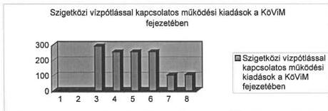
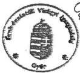
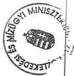
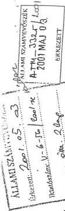

TSI: 558

Állami Számvevőszék

# JELENTÉS

A Szigetköz környezetvédelmi céljaira fordított források felhasználásának ellenőrzéséről

2001. július

0125

---

Az ellenőrzés végrehajtásáért felelős:

**Halász Gejza**
számvevő igazgató

Az ellenőrzést vezette:

**Karsainé Dömsödi Éva**
osztályvezető főtanácsos

Az ellenőrzésben részt vettek:

**Bank Lajos**
számvevő tanácsos

**Szarka Péterné**
számvevő tanácsos

**dr. Szemerics Györgyi**
számvevő tanácsos

**Fekete Gábor**
számvevő

**dr. Mohácsi Istvánné**
számvevő

**Tóthné Kiss Katalin**
számvevő

**Hajkó Andrea**
fogalmazó

**dr. Jancsó Gábor**
külső szakértő

**Raum László**
külső szakértő

Jelentéseink az Országgyűlés számítógépes hálózatán
és az Interneten a www.asz.hu címen is olvashatók.

---

V-6-77/2001.

# **A témához kapcsolódó korábbi ÁSZ vizsgálatok:**

Szakvélemény a Bős-Nagymarosi Vízlépcsőrendszer nagyberuházás 1990. évi költségvetési előirányzatának jóváhagyásához (1990.)

Jelentés a Bős-Nagymarosi Vízlépcsőrendszer nagyberuházással kapcsolatos kifizetések indokoltságának, a nagyberuházásért felelős szervek intézkedései célszerűségének vizsgálatáról az 1989. V. 13-i felfüggesztéstől 1990. VI. 1-ig (1991.)

Jelentés a Bős-Nagymarosi Vízlépcsőrendszer döntési folyamatáról (1992.)

Jelentés a Bős-Nagymarosi Vízlépcsőrendszer állami nagyberuházás lezárásának pénzügyi felülvizsgálatáról (1992.)

Részjelentés a belső államadósság Bős-Nagymarosi Vízlépcsőrendszerrel összefüggő elemeinek vizsgálatáról (1992.)

Jelentés a Nagymaros-Visegrád térség komplex tájrehabilitációjának ellenőrzéséről (1996.)

Jelentés a Magyar Köztársaság 1999. évi költségvetése végrehajtásának ellenőrzéséről. A helyi önkormányzatok ellenőrzése (4. sz. füzet) (2000.)

1

---

2

---

V-6-77/2001.

# TARTALOMJEGYZÉK

BEVEZETÉS 7

I. ÖSSZEGZŐ MEGÁLLAPÍTÁSOK, KÖVETKEZTETÉSEK, JAVASLATOK 9

II. RÉSZLETES MEGÁLLAPÍTÁSOK 17

1. KÖRNYEZETI KÁRFELMÉRÉS, HELYZETFELMÉRÉS, TANULMÁNYOK CÉL- ÉS FELADATMEGHATÁROZÁS 17

1.1.Kornyezeti karfelmeres,helyzetfelmeres,tanulmanyok 17
1.2.A celok es feladatok meghatarozasa 23

2. SZIGETKÖZI KÁRENYHÍTÉSSEL KAPCSOLATOS FELADATOK TELJESÍTÉSE 27

2.1. A vízügyi, természetvédelmi, környezetvédelmi és területfejlesztési feladatok végrehajtása 27

2.1.1.Az elterelés vizgazdalkodási kovetkezményei 27
2.1.2.Az elterelés természetvédelmi kovetkezményei 30
2.1.3.Az elterelés környezeti hatásai 31
2.1.4.Az elterelés es a teruletfejlesztés kapcsolata 32

2.2.A szigetkozi monitoring tevekenyseg jellemzoi 33
2.3. Informacióramlás és együttmuködés a feladatok megvalósításaban 35

3. SZIGETKÖZ TÉRSÉG KÖRNYEZETVÉDELMI CÉLJAIRA FORDÍTOTT FORRÁSOK FELHASZNÁLÁSÁNAK SZABÁLYOSSÁGA 37

3.1.A Kozlekedesi es Vizugyi Minisztérium fejezeti kezelésu eloranyzatai 37
3.2.A Kornyezetvedelmi Minisztérium fejezeti kezelésu eloranyzatai 41
3.3.A Miniszterelnoki Hivatal fejezeti kezelésu eloranyzatai 46

4. FELÜGYELETI ÉS HATÓSÁGI ELLENŐRZÉS A SZIGETKÖZ TÉRSÉGBEN 47

4.1.Felugyeleti ellenorzs 47
4.2.Hatosagi ellenorzs 48

3

---

4

---

V-6-77/2001.

# **Alkalmazott rövidítések**

|  ÁBKSZ | Ár- és Belvízvédelmi Készenléti Szolgálat (megszűnt)  |
| --- | --- |
|  ÁFI | Állami Fejlesztési Intézet  |
|  BM | Belügyminisztérium  |
|  ÉDUKÖFE | Észak-dunántúli Környezetvédelmi Felügyelőség  |
|  ÉDUVIZIG | Észak-dunántúli Vízügyi Igazgatóság  |
|  ERT | Egyszerűsített Rendezési Terv  |
|  FVM | Földművelésügyi és Vidékfejlesztési Minisztérium  |
|  GM | Gazdasági Minisztérium  |
|  KAC | Környezetvédelmi Alap fejezeti kezelésű célelőirányzat  |
|  KÉE | Kertészeti és Élelmiszeripari Egyetem  |
|  KGI | Környezetgazdálkodási Intézet  |
|  KHVM | Közlekedési, Hírközlési és Vízügyi Minisztérium  |
|  KöM | Környezetvédelmi Minisztérium  |
|  KöViM | Közlekedési és Vízügyi Minisztérium  |
|  KÖVIZIG | Körös-vidéki Vízügyi Igazgatóság  |
|  KTM | Környezetvédelmi és Területfejlesztési Minisztérium  |
|  KüM | Külügyminisztérium  |
|  KVM | Környezetvédelmi és Vízügyi Minisztérium  |
|  MEH | Miniszterelnöki Hivatal  |
|  MTA | Magyar Tudományos Akadémia  |
|  OMSZ | Országos Meteorológiai Szolgálat  |
|  OVF | Országos Vízügyi Főigazgatóság  |
|  ÖRT | Összevont Rendezési Terv  |
|  PM | Pénzügyminisztérium  |
|  RT | Rendezési Terv  |
|  VÁTI | VÁTI Magyar Regionáli Fejlesztési és Urbanisztikai Kht.  |
|  VICE | Vízügyi Célelőirányzat  |
|  VITUKI | Vízgazdálkodási Tudományos Kutató Rt.  |

5

---

6

---

Állami Számvevőszék
V-6-77/2001.
Témaszám: 24

# JELENTÉS

# a Szigetköz környezetvédelmi céljaira fordított források felhasználásának ellenőrzéséről

# BEVEZETÉS

A Szigetköz Kelet-Közép-Európa egyedülálló, az emberiség közös értékét képező területe. A Nagy-Duna és a Mosoni-Duna által alkotott lapályos sziget, mely Győr-Moson-Sopron megye területén fekszik, Ény-Dk-i irányban húzódik 50 km kiterjedésben, szélessége 5-12 km. A Szigetköz területén 24 település található, megközelítően 30 ezer lakossal.

A Szigetközben - a terület geológiai felépítésének köszönhetően - a felszín alatt nagymennyiségű, ivóvíznek alkalmas vízkészlet található. A Duna ágaiban, szerteágazó medreiben szállított vízmennyiségtől függetlenül földtani adottságok folytán a Szigetközben lévő, ivóvíznek alkalmas vízkészlet sérülékeny földtani környezetben található, a terület felszíni szennyeződésre érzékeny. Az országos távlati vízbázis 1993-ban történt számbavételekor a Szigetközben hat lokális távlati vízbázist jelöltek ki, amelyek megkutatása és védelme, biztonságba helyezése rendszeres feladatot jelent. A Szigetközben lévő vízfelületek a halászaton és a vízi sportokon kívül turisztikai, klimatizáló, a levegő páratartalmát befolyásoló és esztétikai értékeket is képviselnek.

A Szigetközi Tájvédelmi Körzet létesítéséről szóló rendelkezés a Szigetköz egy részét fokozottan védett területté nyilvánította, aminek elsődleges célja a Szigetköz sajátos vízrendszerének, jellegzetes növény- és állatvilágának megőrzése volt. Az Országgyűlés a Dunával kapcsolatos egyes nemzetközi környezetvédelmi feladatokról szóló határozatában kezdeményezte, hogy 1995 végéig a Duna Bécs-Gönyű szakaszán az Osztrák Köztársaság, a Cseh és Szlovák Szövetségi Köztársaság és a Magyar Köztársaság hozza létre a közös Dunai Nemzeti Parkot. Ennek létrehozása a mai napig nem történt meg. Felmerült a nemzeti park helyett natúr park létesítésének elképzelése is, azonban a natúr park definíciója, az ott végezhető gazdálkodási tevékenység feltételei és korlátai jogszabályban nem szabályozottak. Jelenleg szakmai vita folyik egyes részletkérdésekben.

A Nemzeti Környezetvédelmi Program 2000. évi végrehajtásának Intézkedési Tervéről szóló kormányhatározatban foglaltak szerint "Nagy folyóink vizeinek állapot javításával is több program foglalkozik. Kiemelt terület a Duna-Rajka szakasz, a Szigetköz vízhiányból származó kárainak a mérséklése." A Szigetközben lévő ivóvíz-bázis 29 község és két nagyváros - Győr és Mosonmagyaróvár - több mint 200 ezer lakosának életfeltételeit biztosítja.

A Szigetköz térség állapota összetetten jellemezhető, vízügyi és környezetvédelmi szakértők egyaránt több szempontból különböztetik meg e területet az ország más tájegységeitől a sajátos geológiai, környezeti, természeti és klimatikus viszonyok miatt.

7

---

BEVEZETÉS

A Dunát 1992. október 25-én az 1852-1810 fkm szakaszon új mederbe terelték és üzembe helyezték az un. szlovák oldali bősi vízierőművet a „C variáns” szerint. Ezután a Duna átlagos vízhozama alig egynegyedére csökkent, ami nemcsak a terület vízháztartását változtatta meg, hanem a talajvízszint lesüllyedése miatt visszafordíthatatlan ökológiai folyamatokat indított el. Sürgető feladattá vált az egyedülálló természeti értéket képviselő térségben a vízszint emelése, azonban a vízhozam szabályozására alkalmas, mesterséges eszközök üzemeltetése nem Magyarország hatáskörébe tartozott.

A keletkezett környezeti károk elhárításának esélye az idő előrehaladtával csökken.

**Az ellenőrzés célja** annak megállapítása volt, hogy a Szigetköz térségben a Duna elterelésének következtében keletkezett környezeti károk mérséklését célzó feladatok elvégzésére felhasznált pénzeszközök eredményesen hasznosultak-e? Ezzel összefüggésben az 1992. október 25. - 2000. december 31. közötti időszakban elvégzett környezetvédelmi, vízügyi illetve pénzügyi folyamatokat vizsgáltuk.

Az ellenőrzés jogalapját az Állami Számvevőszékről szóló 1989. évi XXXVIII. tv. 2. § (6) bekezdése határozza meg, amely szerint az állami vagyon, így annak részeként a természeti örökség és a környezeti értékek megőrzését, védelmét és kezelését az ÁSZ ellenőrzi.

A téma jelentőségét pénzügyi szempontból az adja, hogy a térség kárainak mérséklésére, a környezeti állapotváltozásának nyomon követésére és a vízpótlással kapcsolatos feladatokra **évente 390-520 millió Ft** közötti forrást biztosítottak a központi költségvetésben.

A Szigetköz környezetvédelmi céljaira fordított források felhasználásának ellenőrzése keretében a térségben - a Duna elterelése következtében - keletkezett környezeti károk mérséklése érdekében tett intézkedések forrásfelhasználásának úgynevezett eredményességi típusú ellenőrzését végeztük el. Azt vizsgáltuk, hogy a felhasznált pénzből a térségben megépítették-e azokat a vízgazdálkodási vagy környezetvédelmi célú beruházásokat, elvégezték-e azokat az intézkedéseket, amelyekről szakmai igény alapján határoztak a döntési folyamatban érintett központi vagy helyi szervezetek.

Hatáskör hiányában nem vizsgáltuk, hogy az egyes döntések a szigorúan vett **szakmai** szempontok szerint szükségesek voltak-e, vagy sem, ennek megítélésében a szakemberek között is vita van. Nem az ÁSZ kompetenciája annak eldöntése, hogy a fenékküszöb megépítése az 1843 fkm-ben és üzemeltetése vízügyi szempontból optimális megoldás volt-e. A mércénk az volt, hogy egyrészről átfogóan mutassuk be a történeteket, másrészről pénzügyi ellenőrzést végezve megállapítsuk, hogy a Szigetközre, mint tájegységre szánt források valóban eljutottak a térségbe és annak valamely szempontból a gazdasági, társadalmi fejlődését szolgálták-e, továbbá e folyamatban betartották-e a közpénzek felhasználásáról szóló jogszabályi rendelkezések előírásait.

8

---

I. ÖSSZEGZŐ MEGÁLLAPÍTÁSOK, KÖVETKEZTETÉSEK, JAVASLATOK

# I. ÖSSZEGZŐ MEGÁLLAPÍTÁSOK, KÖVETKEZTETÉSEK, JAVASLATOK

Az Országgyűlés 1993-ban határozatban írta elő a Szigetköz térség környezeti kárenyhítésének stratégiai célját. Meghatározott célként egyrészt a Kormány figyelmébe ajánlotta, hogy kerülje a végleges műszaki megoldásokat, amelyek kényszerhelyzetet teremthetnének az elterelés előtti állapothoz viszonyítva - különös tekintettel a nemzetközi viták lezárására -, másrészt meghatározta a vízszint növelésének igényét. E célok elérését a kísérleti jelleggel alkalmazott szivattyús vízpótlás, majd az 1843 fkm-nél létesített fenékküszöb szolgálta.

A Duna elterelésével a Szigetközben keletkezett környezeti károk mérsékléséhez a Környezetvédelmi Minisztérium, a Közlekedési és Vízügyi Minisztérium és a Miniszterelnöki Hivatal fejezetek központi és területi szervezeteikkel ellátott feladataikra 1993-2000. között összesen 3.881 millió Ft-ot fordítottak. E költségek között az építési jellegű ráfordítások 696 millió Ft-ot - a kiadások 18 %-át - tették ki, amely összeget a vízpótlás megoldását célzó vízgazdálkodási és környezetvédelmi beruházásokra használták fel. A fejezeti kezelésű kiadások 28 %-át, 1.068 millió Ft-ot a Szigetköz térség környezeti állapotváltozásához kapcsolódó tanulmányok, helyzetfelmérések, kárfelmérések, szakértői vélemények készíttetésére használták fel, amelynek 2/3-át fordították a monitoring rendszer működtetésére, a folyamatos adatgyűjtésre és rendszeresen jelentéskészítésre. A központi költségvetési források fennmaradó 54 %-a a vízpótló rendszer üzemeltetését és egyéb járulékos tevékenységek fedezetét biztosította.

A Szigetköz kárenyhítési feladatai címen elkülönített előirányzatokon túlmenően a kiadások további összetevőit alkották a lakossági és önkormányzati források és pályázatokon elnyert pénzeszközök. Ezek az elterelés káros környezeti hatásainak mérséklése érdekében a térségi közművesítés alacsony mértékéből származó gondok enyhítéséhez kapcsolódtak és további 3.113 millió Ft-ot tettek ki.

A Szigetköz laza, hordalékos talajszerkezete miatt a csatornázottság hiánya és a vízszintcsökkenés együttesen veszélyeztette az ország kiemelt ivóvíz-bázisát jelentő, felszín alatti vízkészleteket. A Szigetköz felügyeletét ellátó szakhatóságok, a helyi önkormányzatok és az ott élő polgárok együttműködése révén javult a vízügyi infrastruktúra kiépítettsége. A szigetközi vízbázis szempontjából kritikus területeken 1996-ra megépítették a csatornahálózatot és a szennyvíztisztító telepeket. A hálózatokba bekötött lakások aránya 1992-1996. között 0,5 %-ról közel 63,3 %-ra nőtt, meghaladva ezzel a magyarországi átlagot. Viszont a rákötések aránya településenként egyenetlen, 34-100 % között változik, így az üzemeltetés tényleges műszaki jellemzői nem az eredetileg tervezett módon alakultak, a rendszerelemek műszaki berendezéseinek idő előtti megrongálódását okozva.

9

---

I. ÖSSZEGZŐ MEGÁLLAPÍTÁSOK, KÖVETKEZTETÉSEK, JAVASLATOK

Összességében a létrehozott értékek elősegítették a felszín alatt meglévő és az elterelést megelőző mennyiség mintegy 70 %-ára lecsökkent ivóvíz védelmét - amely a Szigetköz területén kijelölt hat lokális távlati vízbázis hasznosítható vízkészletét képezi -, továbbá hozzájárultak az elterelés következtében megkezdődött káros ökológiai változások mérsékléséhez.

A költségvetési források felhasználásával elvégzett feladatok, a létrehozott létesítmények és azok folyamatos üzembentartása a térség egyes részein eltérő mértékben ugyan, de növelte a Dunában és mellékágaiban lecsökkent víz mennyiségét, illetve a talajvízszintet. A fenékküszöb megépítését követően - Duna elterelése utáni időszakhoz viszonyítva - az átlagos talajvízszint a KöM állapotváltozás-értékelése szerint mind a 60 mérőkút esetében nőtt, 85%-nál az elterelés előtt mért szintet is meghaladta.

Az Országgyűlés által elfogadott céloknak megfelelően a környezeti kárenyhítés megvalósult, az ideiglenes jelleggel létesített beruházások vízszint-növelő hatásúak voltak, amelyet a megfelelő gyakorisággal és összetételben mért monitoring adatok igazolnak. Ennek figyelembevételével a környezeti károk mérséklésére fordított pénzeszközök hasznosulását a vizsgálati tapasztalatok alapján eredményesnek lehet tekinteni. Az eredményesség mértéke ugyanakkor nem minősíthető, mivel a célkitűzés számszerűsített paramétereket nem tartalmazott. Részben ennek is tulajdonítható, hogy az alkalmazott, a vízpótlást szolgáló megoldások vízügyi és környezetvédelmi szakmai viták tárgyai. A viták hátterében eltérő vízügyi és környezetvédelmi szakmai érvelések állnak, attól függően, hogy a Szigetköz környezeti állapotának mely időszakára vonatkozó jellemzőket tekintik visszaállítandó célnak, valamint milyen szakmai megoldásokkal érhető el a kívánt környezeti állapot. Ugyanakkor az elterelést követő időszakban mind a döntéshozatalban, mind a végrehajtásban koncepcionális hiányosságokat és koordinációs zavarokat tapasztaltunk. Ezek a hiányosságok egyaránt végigkísérték az elterelés által okozott károk meghatározását, a kárenyhítési feladatok megszervezését, végrehajtását és finanszírozását, valamint befolyásolták a kormányzati szervek, azok regionális szervezetei és a térségi önkormányzatok együttműködését.

Az eredményességet befolyásoló - ez előzőekben felsorolt - tényezők közül a vízpótlást szolgáló megoldások helyessége azért válhatott vízügyi és környezetvédelmi szakmai viták tárgyává, mert nem találtak minden érdekelt fél számára elfogadható megoldást a térség környezetvédelmi, vízgazdálkodási és területfejlesztési szempontjából érvényesítésére. Szélsőséges esetként előfordult olyan tervek kidolgozásának finanszírozása is, amelyek - a Duna-vízszint nagyobb határok közötti változtatásával, szakmailag alátámasztva -, az 50-es évek korábbi vízáramlási viszonyainak megteremtését célozták meg.

Az elterelés által okozott károk meghatározása sikertelen volt mind a helyi lakosság körében, mind a mezőgazdaságban. Ennek oka részben a kárfelmérő ívek hiányos kitöltése, részben a kártérítésre vonatkozó érdemi intézkedések elmaradása volt.

10

---

I. ÖSSZEGZŐ MEGÁLLAPÍTÁSOK, KÖVETKEZTETÉSEK, JAVASLATOK

A környezetvédelmi tárca a naturális mutatókban mérhető kárelemek esetében darabszámlálással és súlyméréssel, illetve becsléssel - 1998. évi piaci értéken, az elterelés miatt - egyszeri kárként mintegy 500 millió Ft-ot, az évente kimutatható károkozásra 570 millió Ft/év összeget állapított meg, a mezőgazdaságra, a fa-, és halállományra, a flóra és fauna értékcsökkenésére vonatkozóan. A helyi önkormányzatok saját hatáskörükben a környezeti változásból eredő károkat nem vizsgálták.

**A Szigetköz rehabilitációja, a kárenyhítési feladatok meghatározása** érdekében a szaktárcák tervszerű előkészítést nem végeztek. Az államközi szerződést Magyarország már 1989-ben felmondta, ennek ellenére a 'C-variáns' megépítésére, a várható változásokra való felkészülést alátámasztó dokumentumokat nem találtunk. Az Országgyűlés határozatához illeszkedő koncepciót nem fogadtak el - annak ellenére, hogy azt országgyűlési képviselők csoportja és a térség képviselői többször is kezdeményezték. A Duna elterelése kiszolgáltatott helyzetben érte a térséget, így az első sürgető intézkedések a vízügyi katasztrófa elhárítására irányultak.

A kárenyhítési feladatokat különböző szintű határozatokban szabályozták, 52 db kormányhatározat és 8 db országgyűlési határozat született, amelyeknek egynegyede hatályát vesztette, illetve módosult. A határozatok 8 %-a határidő módosítás miatt változott. A kormányhatározatok 19 %-át 1995-ben egy jogszabály - a dereguláció következtében - hatályon kívül helyezte. A határozatok hatályon kívül helyezése a jogszabály teljesülése, kiüresedése miatt volt indokolt.

**A dunai kormánybiztosi** intézmény eleinte akadozva, változó szervezeti rendben működött, hat éven át jogszabály nem határozta meg a feladatot végző személyt, illetve szervezetet. Feladatkörében elsőbbséget élvezett - a gyakorlatban lényegében kizárólagosságot - a vízlépcsőhöz kapcsolódó nemzetközi jogvita feladatainak ellátása, noha kormányrendelet szerinti kötelezettsége kiterjedt a Szigetköz hasznosításával, rehabilitációjával természeti és környezeti értékei védelmével kapcsolatos feladatok koordinálására. Jelenlegi működési feltételei nem elegendőek a kormányrendeletben foglalt valamennyi feladat ellátására és nem törekedtek az összes jogszabályban meghatározott feladat ellátását biztosító szervezet kialakítására.

**A kárenyhítési feladatokat különböző szakértői dokumentumok, tanulmányok** alapján határozták meg, amelyek céljukat, tartalmukat kidolgozottságukat és hasznosításukat tekintve rendkívül változatosak. A környezetvédelmi és vízügyi tárca, a területi vízügyi hatóság valamint a Dunai Kormánybiztos Titkársága által kiállított tanúsítványok szerint 229 különböző tanulmány és szakértői dokumentáció elkészítését finanszírozták az 1993-2000. közötti időszakban. A szakértői dokumentációkra fordított, folyóáron 1.068 millió Ft-ot kitevő összeg viszonylagosan magas, azonban a tanulmányok szakmai szempontok szerinti csoportosítása utal azok közvetett és közvetlen hasznosulására egyaránt. A szakértői tanulmányok hozzájárultak a szigetközi rehabilitációs elképzelések, tervek megalapozásához, a kormányzati döntések kialakításához.

11

---

I. ÖSSZEGZŐ MEGÁLLAPÍTÁSOK, KÖVETKEZTETÉSEK, JAVASLATOK

Az összeg 66 %-át a monitoring rendszer nyolc éven át történő működtetése során az éves folyamatos adatgyűjtésekre (észlelések, kiértékelések, laboratóriumi munkák) és a rendszeres jelentés készítésére, tájékoztatásra fordították, amelyek végső eredményét szakértői tanulmányokba foglalták. Ezek a jelentések szolgáltak alapul a szlovák-magyar közös környezeti monitoring jelentés elkészítéséhez is, amelyet a két ország közötti vízmegosztásra vonatkozó megállapodás részletesen előírt. Ezen túlmenően az összeg 20 %-át a vízügyi feladatok és beavatkozások hatásainak előzetes és utólagos elemzésére, értékelésére fordították. Ennek keretében megvizsgálták a vízpótlási változatokat az ökológiai egyensúly fenntartása érdekében és a felszín alatti ivóvízbázis hasznosítható vízkészletének változását elemezték. Az összeg közelítően 7 %-át fordították a hágai ítélet végrehajtásáról szóló kétoldalú tárgyalásokon a magyar tárgyalási megerősítésére. A fennmaradó összeget (7 %) részben a műszaki tervezéshez, előkészítéshez kötődően használták fel részben egyéb (pl. UNESCO kiadvány - 1995., angol tanulmányok - 1994., lakosság ökológiai érzékenység - 1995., térképkészítés stb.) környezeti állapotváltozással összefüggő kiadványok, anyagok készítésére használták fel. (A Kormányzati Ellenőrzési Hivatal két vizsgálatában a szakértői megbízatásokra kifizetett összegeket 1991-1993. között 180 millió Ft-ban, 1994-1996. között 753 millió Ft-ban határozta meg.)

A Szigetköz környezeti állapotát elemző tanulmányok, értekezések, szakértői dokumentációk, szakvélemények összegyűjtése, kategorizálása teljes körűen a vizsgálat lezárásáig nem történt meg. A Dunai Kormánybiztos titkárságán létrehozott adatbázis - az átadott listák felhasználásával végzett szűrőpróbaszerű ellenőrzés alapján - nem teljes körű. A fejezeti kezelésű előirányzatokból e célra fordított forrásokon túl a fejezetek egyes intézményei (pl.: a területileg illetékes vízügyi hatóság, a Fertő-Hanság Nemzeti Park) önállóan, a számukra biztosított saját forrásaikból is finanszíroztak szakértői dokumentációkat.

**Az országgyűlési és kormányhatározatokban meghatározott - a térség kárainak mérséklését célzó - feladatok** négy fő csoportra oszthatók a monitoring rendszer kialakítása és üzemeltetése, az ágrendszerek vízellátásának biztosítása, a vízbázis megóvása és ezzel összefüggésben a települések csatornázása, a szennyvíz tisztítása.

A Szigetközben 1992-től kiegészítették a meglévő és kiépítették az új szárazföldi és vízi megfigyelő rendszerek, az ún. **monitoring rendszerek** elemeit. A monitoring rendszerek adatai a kárenyhítési feladatok megalapozását és a megtett beavatkozások hatásainak értékelését segítették, annak ellenére, hogy megfelelő ökológiai összehasonlítható adatok hiányában a Duna elterelésének hatásait, a folyamatok értékelését nem lehet érdemben értékelni. A monitoring-hálózat központi irányítását a mindenkori kormányhatározatokban előírtaknak megfelelően a környezetvédelmi tárca látta el. Nem épült ki azonban az a központi adatbázis, amely összesítené a monitoring adatokat, alapot képezve az értékelésekhez. Nem aktualizálták a monitoring stratégiát a változó körülményeknek megfelelően, így nem lehet teljes körű az eredmények hasznosítása.

12

---

I. ÖSSZEGZŐ MEGÁLLAPÍTÁSOK, KÖVETKEZTETÉSEK, JAVASLATOK

A térség **vízügyi feladatait** az Észak-Dunántúli Vízügyi Igazgatóság a hatályos országgyűlési és kormányhatározatoknak megfelelően végrehajtotta. A szigetközi vízpótlás 5 éves kísérleti üzemeltetése után, 2000-re készült el a szigetközi hullámtéri vízpótló rendszer üzemeltetési szabályzata.

A **természetvédelmi feladatokat** a Szigetközi Tájvédelmi Körzetben 1994-től a Fertő-Hanság Nemzeti Park Igazgatósága látta el. Nem valósult meg - az 1994 óta „tervezet” formában létező és 2000-ben aktualizált terv- a Duna Nemzeti Park létrehozása, amely lehetővé tenné a területen folyó, a környezetre káros hatású gazdálkodási tevékenységek korlátozását.

A **feladatok végrehajtásának ellenőrzését** a szakterületi, hatósági jogkörű szervezetek a jogszabályok alapján, felügyeleti szerveikkel megfelelően kialakított munkakapcsolatban rendszeresen elvégezték a környezetvédelem, a vízgazdálkodás, a bányászati tevékenység és a természetvédelem területén - együttműködve más szakhatóságokkal -, de 1992-2000. között nem készült csak a térségre vonatkozó ellenőrzési terv. Ebben az időszakban a szakhatósági ügyek száma folyamatosan növekvő tendenciát mutatott. A bányászati, vízügyi és környezetvédelmi helyszíni bejárások alapján a legnagyobb veszélyforrásnak tekinthetők az ivóvíz-bázist potenciálisan szennyező látványtavak és bányatavak.

A **kárenyhítési feladatok finanszírozásánál** a természet-, környezet- és tájvédelmi, valamint területfejlesztési érdekek sokoldalú, koncepcionális egyeztetésének hiányában eredetileg nem szándékolt hatások érvényesültek, a kármérséklési célú előirányzatból általános települési és területrendezési feladatok, térségi alapfeladatok megoldását is finanszírozták.

A **vízügyi tárca** a közvetlen kárelhárítás érdekében fejezeti kezelésű előirányzatait 1993-1994. között a szivattyús vízpótlásra használta fel, amelyre 366,4 millió Ft-ot fordított. Ezt követte 1995-2000. között a fenékküszöb megépítése és üzemeltetése, amelyre 1995-ben 450 millió Ft-ot fordítottak, a hullámtéri és a mentett oldali vízpótlás beruházásai folyó áron 262 millió Ft-ot tettek ki. A vízpótlás illetve vízellátás üzemeltetése 1995-1998. között évi 253-259 millió Ft-ba került, majd 1999-2000. években a vízügyi tárca kezelésében lévő forrás lecsökkent évi 103-105 millió Ft-ra. A fenékküszöb megépítéséhez kapcsolódó számlák és a hozzájuk tartozó teljesítésigazolások szabályszerűek voltak, a kifizetések és a közbeszerzési eljárás lebonyolítása a jogszabályok betartásával történt.

Az 1995-től működő vízpótló rendszer üzemeltetéséhez kapcsolódó feladatok és az ellátásukhoz szükséges források összhangja 1995-1998. között biztosított volt, azonban 1999-2000. években a szükséges előirányzatoknak csak az 50%-a állt rendelkezésre, a másik felét a környezetvédelmi tárca biztosította. A két minisztérium szakmai együttműködése, megegyezése tette lehetővé, hogy a vízpótló rendszer folyamatos üzemeltetéséhez szükséges források rendelkezésre álljanak. E vízügyi feladatra, valamint a szakmai felügyelet és felelősség két minisztérium közötti megosztására, a környezetvédelmi tárca által történt pénzeszközátadásra a szükséges jogszabályi felhatalmazás nélkül került sor. Ennek következtében a KöM a „Szigetköz kárainak mérséklése” címen rendelkezésre álló előirányzatból annak rendeltetési céljától eltérően használta fel a vízpótló rendszer üzemeltetésére a hivatkozott években átadott évi 102-120 millió Ft-ot.

13

---

I. ÖSSZEGZŐ MEGÁLLAPÍTÁSOK, KÖVETKEZTETÉSEK, JAVASLATOK---

A vízügyi tárcánál a vízpótló rendszer üzemeltetésére elkülönített, a „Szigetközi vízpótlással kapcsolatos működési kiadások” célelőirányzat nem ad valós képet az e feladat ellátásához biztosított előirányzatokról, mivel a költségvetési keretszámok szerint a környezetvédelmi tárcánál az Észak-Dunántúli Vízügyi Igazgatóság által ténylegesen felhasznált előirányzatoknak az 50 %-a jelent meg. Így a vízpótló rendszer üzemeltetésének finanszírozása során 1999-től rendezetlen állapot alakult ki, a környezetvédelmi és a vízügyi tárca a rendelkezésükre álló források arányában megosztva látta el a feladatot, amely nincs összhangban a közlekedési és vízügyi miniszter feladat- és hatásköréről szóló kormányrendelettel.

A térség 1999-2000-ben a közös finanszírozással együtt is kedvezőtlenebb helyzetbe került. Összességében ugyanazokra a feladatokra együttesen - éves szinten változatlan kiadást feltételezve - 1999-ben 51 millió Ft-tal, 2000-ben 31 millió Ft-tal kevesebb forrás állt rendelkezésre a vízpótlás üzemeltetésére, mint 1998-ban.

**A környezetvédelmi tárca** számára a Duna elterelésével keletkezett környezeti károk mérséklése a Szigetközben folyamatos feladatot jelentett, részben közvetlenül, részben közvetetten elszámolható források felhasználásával. A közvetlenül elszámolható pénzeszközökből 1993-2000. között 1.109 millió Ft-ot teljesítettek, jellemzően a monitoring rendszer kiépítésre és üzemeltetésre, ami 99,5 %-os előirányzat felhasználást jelent. Ebből mindössze 96 millió Ft volt a felhalmozási kiadás. A KöM vagyonnyilvántartásának hiányossága, hogy 1993-tól napjainkig nem rendezett a Duna monitoring megfigyelőrendszer „kiépítése” keretében megvalósult kutak, tervek, műszerek és eszközök aktiválása. A feladatok finanszírozásának ütemezésében problémák jelentkeztek, jelentős aránytalanságok fordultak elő az éves kifizetésekben. Kormányzati szinten jóváhagyott rehabilitációs koncepció hiányában elhúzódott a forráselosztás, egyeztetés a Rehabilitációs Bizottság és a KöM között, ami a pénzfelhasználáshoz a közbeszerzési eljárás lefolytatását nem tette lehetővé a megállapodásban rögzített határidőre. Az előirányzat módosítások és átcsoportosítások megfelelően dokumentáltak voltak, a fejezeten belüli átcsoportosítások minden esetben a feladatok leadásával jártak együtt.

**A Miniszterelnöki Hivatal** „fejezeti kezelésű” előirányzatainak felhasználása 54 millió Ft volt. Az összeget a Miniszterelnöki Hivatal a hágai Nemzetközi Bíróság ítélethirdetését követően - 1997. októbertől 2000. decemberig - a Szigetköz környezeti állapotának felmérésére, a rehabilitáció előkészítésére, az alternatívák elemzésére vonatkozó kutatási megbízásokra fordította.

Az 1990-es évek első felében különböző jogcímeken a szigetközi kárenyhítést szolgáló feladatokra négy háromezres kormányhatározatok révén csoportosítottak át forrásokat, juttattak előirányzatot, még költségvetési tartalékkereteket is. A határozatok meghozatalának hátterében az ökológiai prioritások elismerésére, a sürgős tennivalók elvégzésére irányuló egyeztetések álltak.

A költségvetési előirányzatok felhasználásának törvényben rögzített eljárási szabályai alkalmazásánál hiányosságot tapasztaltunk 14 millió Ft értékben a KöM és egy térségi önkormányzat esetében. Nem a feladatokhoz rendelték hozzá a finanszírozást és nem történt meg az elszámolás az előirányzattal.

---14

---

I. ÖSSZEGZŐ MEGÁLLAPÍTÁSOK, KÖVETKEZTETÉSEK, JAVASLATOK

A Szigetköz térségre a vizsgált minisztériumok (GM, BM, FVM, KöM, KöViM) a felügyeleti ellenőrzés keretében pénzügyi-gazdasági ellenőrzést végeztek, de vizsgálataik alkalmával szabálytalanságot, törvénybe ütköző pénzügyi folyamatokat nem tártak fel.

**A kormányzati szervek, azok regionális szervezetei és a térségi önkormányzatok** között, a Szigetköz környezeti kárenyhítési folyamatban többnyire kiépültek azok a speciális információáramlási csatornák és működtek azok a fórumok, amelyek elősegítették a problémák megoldását.

**A Győr-Moson-Sopron Megyei Önkormányzat Közgyűlése által létrehozott rehabilitációs bizottság** tevékenységének eredménye, hogy olyan szakmai javaslatokat dolgoztak ki, amelyet a döntéshozók figyelembe vettek a források elosztásánál. Szakmai, személyi összetétele lehetővé tette a konszenzuson alapuló érdekegyeztetést, kidolgozott javaslatainak érvényesítését, és e mellett koordinációs feladatokat is ellátott, **azáltal, hogy a hasonló gondokkal küzdő** - különböző társulásokba tömörült - **önkormányzatok** érdekegyeztetését is elvégezte.

## JAVASLATOK

### a Kormánynak:

1. Dolgoztassa át az országgyűlési határozatban foglaltakkal összhangban - a megváltozott körülményeknek megfelelően - a Szigetköz térségre vonatkozó rehabilitációs és térségfejlesztési stratégiát.
2. Gondoskodjon a vízpótlórendszer üzemeltetési feladatok és azok finanszírozása közötti összhang megteremtéséről, valamint gondoskodjon arról, hogy a vízügyi feladatok és a hozzárendelt források kapcsolata a szakmai cél szerinti fejezetben átláthatóan, azonosíthatóan jelenjen meg.
3. Biztosítsa a környezeti kárenyhítéssel összefüggő feladatok koordinálásához szükséges szervezeti feltételeket a térségi érdekképviseleti szervezetek bevonásával és ezzel párhuzamosan vizsgáltassa felül a Dunai Kormánybiztos feladat- és hatáskörét.
4. Vizsgálja meg és határozza meg a szigetközi településeknél alkalmazható támogatási formákat a térségben kiépített szennyvízcsatorna hálózatoknál a rácsatlakozási arány növelése és a kihasználatlan kapacitásból származó műszaki megrongálódások megszüntetése érdekében.

15

---

I. ÖSSZEGZŐ MEGÁLLAPÍTÁSOK, KÖVETKEZTETÉSEK, JAVASLATOK

**a környezetvédelmi miniszternek:**

1. Vizsgálja felül a „Szigetköz térség kárainak mérséklése” címén ellátandó feladatait és határolja el a kármérséklési, a rehabilitációs és a térségfejlesztési feladatokat. Határozza meg a térség rehabilitációs operatív feladatait, figyelembe véve a rehabilitációra felhasználható pénzügyi kereteket. Fontolja meg a "Szigetköz térség kárainak mérséklése" elnevezésű kiemelt előirányzat feladat-finanszírozási körbe vonását.
2. Pontosítsa, illetve egészítse ki a szükséges adatokkal az elszámolási kötelezettség mellett nyújtott támogatások analitikus nyilvántartását és végeztesse el a megvalósított beruházások aktiválását. Határozza meg és írja elő a rehabilitációra szánt előirányzatból részesülő önkormányzatok elszámoltatásának részletes szabályozását és annak végrehajtását.
3. Dolgozza át a megváltozott körülményeknek megfelelően a szigetközi monitoring stratégiát és fejlesztesse ki a környezeti monitoring központi számítógépes adatbázisát és gondoskodjon az adatok aktualizálásáról, valamint hasznosításáról a vízügyi és a környezetvédelmi kárenyhítési további feladatok meghatározásában.
4. Vetesse nyilvántartásba a talajvízszintmérő kutakat, mérőhelyeket és biztosítsa az azok üzemeltetéséhez szükséges forrásokat.

**a közlekedési és vízügyi miniszternek:**

1. Egyeztesse a KöM miniszterrel a hullámtéri és a mentett oldali vízpótló rendszer üzemeltetési és fenntartási költségeinek finanszírozási módját a hatályos jogszabályi előírásokkal összhangban és azokat a fejlesztéseket, amelyek a hullámtéri és a mentett oldali vízpótló rendszer zavartalan és biztonságos működtetéséhez, a mentett oldali vízpótló rendszer továbbépítéséhez szükségesek.
2. Vetesse nyilvántartásba a talajvízszint kutakat, mérőhelyeket és gondoskodjon az azok üzemeltetéséhez szükséges forrásokról úgy, hogy a minisztérium a KöM-el közösen határozza meg a kutak kezelésének és finanszírozásának a KöM és a KöViM közötti megosztását.
3. Készíttessen országos szintű felmérést a bányatavakról és az egyéb célból létesített mesterséges tavakról (pl. látványtavakról). A felmérés alapján értékeltesse ezeknek a tavaknak az ország távlati vízbázisaira gyakorolt hatását és kezdeményezze a jogszabályok módosítását úgy, hogy azok szigorú feltételek között biztosítsák a mindenkori vízbázis védelmét.

16

---

II. RÉSZLETES MEGÁLLAPÍTÁSOK

## II. RÉSZLETES MEGÁLLAPÍTÁSOK

### 1. KÖRNYEZETI KÁRFELMÉRÉS, HELYZETFELMÉRÉS, TANULMÁNYOK CÉL- ÉS FELADATMEGHATÁROZÁS

A Szigetköz térség ökológiai és hidrológiai állapotában bekövetkezett változások mértékének megállapítására, a komplex állapotfelmérésre, a szakmai szempontok figyelembevételével kialakított állapotjellemzők változásának folyamatos mérésére, valamint ezen információk felhasználásával a kárenyhítési célok kitűzésére és a konkrét feladatok meghatározására a vizsgált szervezetek által átadott dokumentumok alapján 1992-2000. között legalább 1.068 millió Ft-ot használtak fel. Ugyanakkor nem állapítható, hogy ez az összeg teljes körű, mivel a beérkezett tanúsítványokban közölt adatok nem konzisztensek sem a figyelembe vett időszak, sem a felsorolt szakmai dokumentációk tartalma és összetétele vonatkozásában.

#### 1.1. Környezeti kárfelmérés, helyzetfelmérés, tanulmányok

A Duna 1992. október 25-ét követő eltereléséből keletkező problémák alapvető oka a Duna és a Mosoni-Duna vízszintjének drasztikus csökkenése volt, melynek eredményeképpen rövid időn belül a mellékágak is kiürültek, jelentős talajvízszint csökkenést is eredményezve. KöM felmérések szerint ennek következtében azonnal érzékelhető épület-, mezőgazdasági- (terméskiesés és többlet öntözővíz szükséglet), halászati-, erdészeti- és flórát, faunát ért károk keletkeztek.

A károk meghatározásakor nem elegendő az ember alkotta javakban keletkezett károkat felmérni, figyelembe kell venni a természeti tőkében bekövetkezett károkat is. A természeti tőkében bekövetkezett károkat a használattal összefüggő értékben keletkezett károk és a használattal közvetlenül össze nem függő értékben bekövetkezett károk alkotják. A Szigetközben **a használattal közvetlenül össze nem függő értékben jelentkező károk értéke meghaladhatja a használattal összefüggő értéket**, ugyanis a Szigetköz térségben a vízi ökoszisztémák viszonylag ritkák és különösen értékesek.

A használattal összefüggő értékben bekövetkezett károkra viszonylag egyszerűbb monetáris becslést adni, míg a használattal össze nem függő értékrészre sokkal nehezebb a kárbecslés, hiszen az olyan objektív dolgokon túl, mint például védett élőlények előfordulása, olyan tényezőktől is függ, mint például a társadalom értékrendje.

A mérés módszertani nehézségeiből **még nem következik, hogy a természeti tőke használattal össze nem függő értékrészében bekövetkezett kedvezőtlen változások nem károk és nem kell ezeket a kárfelméréskor figyelembe venni.**

17

---

II. RÉSZLETES MEGÁLLAPÍTÁSOK

A Szigetköz környezeti állapotában bekövetkezett változások és károk megállapítása nehéz feladat, mivel nem született döntés arról, hogy a Duna elterelésének hatására bekövetkezett folyamatok értékelését melyik időszak állapotához hasonlítva végezzék el. E század elejét, az 50-es éveket, az 1977-es csehszlovák-magyar szerződést megelőző állapotot vagy közvetlenül az elterelés előtti időszakot tekintsek az összehasonlítás alapjának. E kérdésben az egyes szakmai területek véleménye is eltérő. Az is tény, hogy az elterelés előtti ökológiai helyzetről - ha léteznek is - csak hiányos ismeretek, mérési adatok, megfigyelési eredmények vannak.

Rendszeres és szisztematikus ökológiai kutatás és adatgyűjtés a Szigetközben 1991-ben kezdődött. A 69/1992. OGY határozat 4. pontja alapján a munkát az MTA Szigetközi Munkacsoportja koordinálta. A KöM felelősségével 1992-ben alakították ki a monitoring megfigyelő hálózatot. Ezek alapján a szigetközi környezeti kutatások és a monitoring tevékenység eredményei a jövőben lehetővé teszik a hosszabb távon jelentkező ökológiai károk kimutatását.

A környezeti monitoring rendszer által szolgáltatott környezeti jellemzők adatai, a helyzetfelmérés, kárfelmérés érdekében készített tanulmányok, hatásvizsgálatok és szakértői vélemények elsősorban a hágai peranyag összeállításában, az eljárás során kerültek hasznosításra, továbbá a térség egyéb környezetvédelmi problémái megoldásának döntéshozatalánál, a Dunai Nemzeti Park regionális és rendezési terv készítésénél, a károk enyhítése érdekében szükséges lépések tervezésekor.

A lakosságot ért károk felmérését a KTM 1994. október-november hónapokban a polgármesteri hivatalok segítségével végezte. Dunaremete, Kisbodak és Püski polgármesterei már 1992-ben is végeztek kárfelmérést a lakosság körében, de annak eredménye is a KTM felmérés összesítésébe került be. A felmérés eredményét naturális mutatókban kárfajtánként összesítették és „átlagos épületkár helyreállítási költséget”, illetve „új kútfúrási költséget” határoztak meg. A két kártípus megbecsült értéke 113 millió Ft. A mezőgazdasági és idegenforgalmi károk forintosítása nem történt meg és az épületkárok és kút elapadási károk tulajdonosra történő lebontását sem végezték el. A KTM az összesítő eredményt az önkormányzatoknak megküldte. A községekben tartott helyszíni ellenőrzés során mind a polgármesterek, mind pedig a kárfelmérési lista alapján vett lakossági minta egybehangzóan igazolta, hogy a felmérés óta semmilyen intézkedés nem történt. A helyszíni vizsgálat során tapasztaltuk, hogy az épületkárok jó részét a lakosság már kijavította.

Tekintettel arra, hogy a kárfelmérés óta nyolc, illetve hat év telt el - az öt éves elévülési időt figyelembevéve - személyre szóló kártérítés csak a kárfelmérés hitelességének és az elévülés megszakadásának vagy nyugvásának igazolásával történhet.

A mindenkori költségvetési törvényekben a KTM, illetve a KöM fejezetben „Szigetköz kárainak mérséklése” címén biztosított forrás 1993-1995. években a kártérítésre nem nyújtott fedezetet. Annak ellenére sem fordítottak pénzeszkö-

18

---

II. RÉSZLETES MEGÁLLAPÍTÁSOK

zöket a lakosságot ért károk megtérítésére, hogy 1996-tól a költségvetésben biztosított volt a megfelelő összegű fedezet.

**A lakosságot ért károkon kívül** a KTM - ott, ahol a kármértéket naturális mutatókban is mérni lehetett - **darabszámlálással és súlyméréssel** elvégeztette a kárfelmérést és **becsléssel** (piaci árak alkalmazásával) határozták meg a kármértékeket. Így 1998-as áron az alábbi kárértékeket állapították meg:

- halállomány pusztulás egyszeri kár 200 t, 120 millió Ft,
- halászati haltermelés kiesés évente 25 millió Ft,
- faállományi kár éves veszteség 37.000 m³, 55,5 millió Ft, növekedés visszaesés 30 %-kal,
- mezőgazdasági kár évente 500 millió Ft,
- fauna eredeti értéke 40 %-kal csökkent, kárérték 156 millió Ft,
- flóra eredeti értéke 40 %-kal csökkent, kárérték 216 millió Ft.

Ezeket az adatok használták fel a szlovák-magyar tárgyalások során.

**A szigetközi önkormányzatok** a környezet állapotára, változásaira, illetve a keletkezett károkra vonatkozó vizsgálatokat **saját forrásból nem végeztek**. (1. sz. melléklet)

A térség vízügyi feladatait 1992-2000. között a kormányzati munkamegosztás keretében az ÉDUVIZIG végezte. Alapfeladatai a vízrajzi, a vízkészlet-állapot értékelési, a vízbázis-védelmi, a vízkár-elhárítási tevékenységek, amelyek mellett a Duna elterelését követően megjelent a természetvédelmi célok kielégítésére is létrehozott vízpótló rendszer üzemeltetése és a Duna monitoring keretében a KöM által előírt feladatok végrehajtása is.

1992-1998. között az a gyakorlat alakult ki, hogy a környezeti rehabilitációt is az ÉDUVIZIG végezte, amelyhez az állami forrást a mindenkori költségvetés a KHVM fejezetein belül biztosította. **1999. évtől a KöM a „Szigetköz térség kárainak mérséklése” ágazati célelőirányzaton belül elkülönített a Szigetköz rehabilitációja címén** 74 millió Ft-ot. Ebből 8,7 millió Ft-ot a Szigetköz térség 11 önkormányzatának juttatott.

A helyszíni ellenőrzés során az **1999. évi támogatás felhasználását** négy önkormányzatnál ellenőriztük. Három esetében területfejlesztési koncepció vagy annak egy - általában a környezetvédelmet érintő - része vagy rendezési terv és építési szabályzat elkészítéséhez használták fel. A szerződéskötést, a teljesítésigazolást és a pénzügyi elszámolásokat **rendben találtuk**. Az ellenőrzött önkormányzatok közül egy a rendelkezésére álló forrást nem használta fel, az összeget a KöM-től nem hívta le.

A Szigetköz térség környezeti állapotát érintő **tanulmányok, értekezések, szakértői anyagok, szakvélemények stb. összegyűjtése, katalogizálása teljes körűen a mai napig nem történt meg**. A Dunai Kormánybiztos Titkársága létrehozott egy **adatbázist**, melynek alapját a hágai perhez és a

19

---

II. RÉSZLETES MEGÁLLAPÍTÁSOK

szlovák-magyar tárgyalásokhoz felhasznált anyagok képezik, legyenek azok a monitoring rendszerből származóak vagy más céllal készültek. Ez az adatbázis azonban - a létrehozásának célját tekintve - **nem teljes**.

Az ÁSZ az 1993–2000. közötti években készült a Szigetköz térség környezeti állapotváltozásához kapcsolódó tanulmányok, helyzetfelmérések, kárfelmérések, szakértői vélemények finanszírozásának forrásai feltérképezésére tett kísérletet. Az adatkérést tanúsítványok bekérésére alapozta. Összefoglalóan megállapítható, hogy a rendelkezésre álló idő alatt a **teljes feltérképezés nem volt lehetséges, ugyanis a fejezeti kezelésű előirányzatokból e célokra fordított forrásokon túl a fejezetek egyes intézményei a szakfeladatuk ellátásához** – így pl. a monitoring tevékenységükhöz – **önállóan, a számukra biztosított saját forrásaikból is fordítanak e célra és készíttetnek anyagokat**. Így pl. a KöM fejezet alá tartozó Fertő-Hanság Nemzeti Park a Duna eltereléséből adódó károk monitoringszerű követésére felhasználható forrásaiból kutatásokat, módszeres felméréseket készíttetett, amelynek eredménye valamilyen írásos anyag pl.: tanulmány, tanulmányterv, terv, hatásvizsgálat, szakértői vélemény. Hasonló a helyzet a KöViM fejezet alá tartozó ÉDUVIZIG esetében is. Az ÉDUVIZIG a különböző költségvetési előirányzatokból részére juttatott források felhasználásával a tevékenysége ellátása érdekében a 2. sz. melléklet szerint 78,23 millió Ft-ot használt fel.

A KöViM - az általa kitöltött tanúsítvány szerint - 1992-2000. között a szigetközi térség környezeti állapotváltozásához kapcsolódó tanulmányokra, helyzetfelmérésekre, kárfelmérésekre, szakértői véleményekre 100,6 millió Ft-ot használt fel.

**A KöViM** a fenékküszöb tervezéshez, a vízügyi feladatai ellátásához készíttetett különböző anyagokat legnagyobb részt a VITUKI-val (3/A. sz. melléklet). A VITUKI volt a kidolgozó témafelelős a szakértői anyagok 79 %-a esetében. Ezért a VITUKI-nál tételesen vizsgáltuk a KÖViM által megrendelt különböző tervek, tanulmányok elkészítésére vonatkozó feladatok teljesítését. Megállapítottuk, hogy a megbízási szerződések **határidőre teljesültek** – esetenként határidő módosítást alkalmaztak –, **a teljesítésigazolások teljes körűek és tényleges teljesítést igazolnak** (részbeni teljesítésigazolás és ennek megfelelő számlakiegyenlítés). **A teljesítésigazolás részét képezi a továbbfelhasználásra való utalás**.

A KöM - az általa kitöltött tanúsítvány szerint - 1994-2000. között a szigetközi térség környezeti állapotváltozásához kapcsolódó tanulmányokra, helyzetfelmérésekre, kárfelmérésekre, szakértői véleményekre 834,9 millió Ft-ot használt fel.

**A KöM** elsősorban a monitoring tevékenységhez, a Nemzeti Jelentés elkészítéséhez és tájékoztatási vagy adatcsere céllal készíttet a KöM Környezetvédelmi Hivatal megbízásával anyagokat. (3/B. sz. melléklet). A helyszínen tartott ellenőrzés során **1992-1996. közötti időszak anyagait nem tudtuk vizsgálni**, a minisztérium **1992-1993. évekről pedig nem is szolgáltatott adatokat**, mivel „ilyen értelmű anyagokat nem találtak”. Megállapítottuk, hogy **írásban munkakör átadás-átvétel 1992-2000. között egy esetben sem történt. Az anyagokról rendszeresen vezetett adatbázis nincs. Az**

20

---

II. RÉSZLETES MEGÁLLAPÍTÁSOK

**1996-2000. évek között a nyilvántartás fokozatosan javult.** Az utolsó két évben a szerződéskötéstől a kifizetésig a folyamat rendezetten nyomonkövethető, a teljesítésigazolásokat és a részteljesítéseket is nyomon követik.

A BM és az FVM nyilatkozata alapján, a témában nem készíttetett anyagot. A helyszíni ellenőrzés során azonban találtunk az FVM Terület- és Településrendezési Főosztályának megbízásából a Szent István Egyetem Tájtervezési és Területfejlesztési Tanszéke által 2000. decemberében készített egyeztetési anyagot a tervezett Dunai Nemzeti Park (Szigetköz) és térsége területrendezési terv címmel.

A Dunai Kormánybiztos Titkársága - az általa kitöltött tanúsítvány szerint - 1997-2000. között a szigetközi térség környezeti állapotváltozásához kapcsolódó tanulmányokra, helyzetfelmérésekre, kárfelmérésekre, szakértői véleményekre 54,1 millió Ft-ot használt fel.

**A Dunai Kormánybiztos** Titkárságán végzett helyszíni ellenőrzés során a Titkárság létrejötte – 1998. – óta készült anyagokat tudtuk ellenőrizni. A Duna ügyeivel kapcsolatos feladatok ellátására létrehozott kormánybiztosi intézmény 1992 előtt kisebb-nagyobb megszakításokkal létezett, illetve jogutódjaként a KHVM által szervezett iroda tevékenykedett, de **1992-1997. közötti időszakban jogszabály nem rendelkezett a feladat ellátásának koordinálásáról.** 1997. szeptember 31. és 1998. augusztus 24. között a MEH államtitkára látta el a feladatokat. Az ügyekkel kapcsolatos iratok rendezetlenül, papírzsákokban, hiányos, rosszul felvett (pl.: 6. és a 13. tétel megegyezett) listával kerültek átadásra az 1998-ban kinevezett és jelenleg is hivatalban lévő kormánybiztos Titkársága részére. (A Titkárság katalogizálhatta, tette rendbe szerződéses munkatársak alkalmazásával.) **Az 1998-2000. években** saját forrásból készíttetett anyagokat szűrőpróbaszerűen a helyszínen ellenőriztük (3/C. sz. melléklet). Ezeket elsősorban a szlovák féllel történő kedvező megállapodás elősegítése érdekében a tárgyalásokon használták fel. **A nyilvántartás rendezett, jól nyomonkövethető a megbízástól a teljesítésigazolásig.** A részbeni teljesítés esetén csak a teljesített részt igazolták. El nem végzett munka teljesítését nem igazolták.

A Győr-Moson-Sopron Megyei Önkormányzat Közgyűlése a 60/1999. (VI. 10.) KH. számú határozatával létrehozta a **Szigetköz rehabilitációja során kifizetett szakértői díjakat vizsgáló ideiglenes bizottságát** azzal a céllal, hogy vizsgálja meg, kiknek és milyen mértékű szakértői díjakat fizettek ki 1990-1998. között a Duna elterelésével kapcsolatos szakvélemények elkészítéséért.

A bizottság nyilatkozata szerint az adatszolgáltatásra felkért helyi és országos intézmények tájékoztatója alapján megismerte a kifizetéseket és azokat 2000. évi reálértékre átszámította, ami kb. **2.272,9 millió Ft-ot tettek** ki. A bizottság saját megítélése szerint **eredeti célját nem érhette el**, személyiségi jogok védelme miatt sem a szakértők névsorát, sem a szakértői díjak személyekre történő lebontását nem ismerhette meg. A bizottság ezt tudomásul véve átfogalmazta az elérendő célt. Újra megkereste a 3 helyi illetőségű intézményt és 4 minisztériumot (FVM, KÖM, KHVM, KüM), az MTA-t és a Győr-Moson-Sopron

21

---

II. RÉSZLETES MEGÁLLAPÍTÁSOK

Megyei Közigazgatási Hivatal vezetőjét és kérte, hogy közöljék, hogy az intézmény a Szigetköz helyzetével kapcsolatos kérdéskörben milyen témakörökben rendelt meg szakvéleményt, tanulmányt, ezek elkészültek-e, milyen terjedelemmel és díjazással. Megkereste továbbá a kormánybiztost és kérte, hogy a birtokukban lévő adatok alapján a helyi és országos hatáskörű intézmények által megrendelt szakvéleményekről, tanulmányokról, ezek elkészültéről, terjedelméről és díjazásukról tájékoztassa. Az így kapott adatok összesítése 2001. június 30-ra várható. A létrejövő **adatállomány is tekinthető egy bizonyos fajta adatbázisnak, de természetesen ez sem teljes körű.**

**A Központi Számvevőségi Hivatal** T2-10/7/1994. sz., majd a **Kormányzati Ellenőrzési Iroda** 2-101/4/1997. sz. vizsgálati jelentése foglalkozott a szóban forgó szakértői megbízások ügyével. A vizsgálatok rögzítették, hogy hazai szakértők - részben jogi személyek, részben magánszemélyek - részére **1991-1993. között 180,1 millió e Ft-ot, 1994-1997. között 753,4 millió Ft-ot fizettek ki.**

**A fentiekben kifejtettek alapján a különböző szervezetek által 1992-2000. közötti időszakban a különböző célok elérése, feladatok ellátása vagy döntések előkészítése érdekében készíttetett tanulmányok, tanulmánytervek, tervek, hatásvizsgálatok, szakértői vélemények elkészítésére fordított pénzek nagyságrendjének minősítésekor figyelembe kell venni, hogy a készített tanulmányok, szakértői anyagok céljukban, tartalmukban és felhasználásukat illetően különbözőek voltak.**

Az ÁSZ számára kiállított tanúsítványok szerint 1992-2000. között 1.068 millió Ft-ot fordítottak a szigetközi térség környezeti állapotváltozásához kapcsolódó tanulmányokra, helyzetfelmérésekre, kárfelmérésekre, szakértői véleményekre. A szigetközi kárenyhítésre fordított teljes összeg egynegyedét kitevő szakértői dokumentációkra fordított összeg viszonylagosan magas arányú, azonban a tanulmányok szakmai szempontok szerinti csoportosítása utal azok közvetett és közvetlen hasznosulására. A szakértői tanulmányok hozzájárultak a szigetközi rehabilitációs elképzelések, tervek megalapozásához, a kormányzati döntések kialakításához egyaránt. Az összeg 66 %-át a monitoring rendszer nyolc éven át történő működtetése során az éves folyamatos adatgyűjtésekre (észlelések, kiértékelések, laboratóriumi munkák) és a rendszeres jelentés készítésére, tájékoztatásra fordították, amelyek végső eredményét szakértői tanulmányokba foglalták. Ezek a jelentések szolgáltak alapul a szlovák-magyar közös környezeti monitoring jelentés elkészítéséhez is, amelyet a két ország közötti vízmegosztásra vonatkozó megállapodás részletesen előírt. Ezen túlmenően az összeg 20 %-át a vízügyi feladatok és beavatkozások hatásainak előzetes és utólagos elemzésére, értékelésére fordították. Ennek keretében megvizsgálták a vízpótlási változatokat az ökológiai egyensúly fenntartása érdekében és a felszín alatti ivóvízbázis hasznosítható vízkészletének változását elemezték. Az összeg közelítően 7 %-át fordították a hágai ítélet végrehajtásáról szóló kétoldalú tárgyalásokon a magyar tárgyalási megerősítésére. A fennmaradó összeg 7 %-át részben a műszaki tervezéshez, előkészítéshez kötődően használták fel részben egyéb (pl. UNESCO kiadvány - 1995., angol tanulmányok - 1994., lakosság ökológiai érzékenység - 1995., térképkészítés stb.) környezeti állapotváltozással összefüggő kiadványok, anyagok készítésére használták fel.

22

---

II. RÉSZLETES MEGÁLLAPÍTÁSOK

A különböző szervezetek által készíttetett tanulmány, tanulmányterv, terv, hatásvizsgálat, szakértői vélemény szakmai szükségességére és a kialakított szakmai véleményére vonatkozóan az ÁSZ vizsgálatot nem végzett.

## 1.2. A célok és feladatok meghatározása

A Szigetköz térségben a Duna elterelése következtében bekövetkezett károk mérséklése érdekében elvégzendő feladatokról az Országgyűlés és a Kormány számos döntést hozott úgy, hogy a térség egészére vonatkozó átfogó stratégia nem került elfogadásra.

A 69/1992. (XI. 6.) OGY. határozatban az Országgyűlés a Szigetköz rehabilitációs és fejlesztési koncepciónak 1992. december 31-ig történő kidolgozásáról határozott, majd a 17/1993. (IV. 1.) OGY határozattal a határidőt egy évvel meghosszabbította. Két háromezres és a 2009/1993. (III. 7.) Korm. határozat született az országgyűlési döntés végrehajtására. A Szigetköz vonatkozásában átfogó rehabilitációs koncepció elfogadására annak ellenére nem került sor, hogy azt országgyűlési képviselők csoportja és a Szigetközi Önkormányzatok Szövetsége többször és maguk az érintett önkormányzatok is sürgették a Kormány felé. Az eltelt 9 év alatt a különböző kárelhárítási és rehabilitációs feladatok elvégzése megtörtént. Az 1. és 3. sz. mellékletekben szereplő tanulmányokon, helyzetfelméréseken, szakértői véleményeken túl elkészült a Nyugat-Dunántúli Régió Területfejlesztési Programja és Győr-Sopron megye Területfejlesztési Programja is. A Szigetköz térségen belül egy-egy terület rehabilitációjára készültek részkoncepciók, de ezek összehangolása elfogadott átfogó stratégia hiányában nem történhetett meg.

A 69/1992. (XI. 6.) OGY határozat értelmében a Szigetköz problémája a vízlepcstől függetlenül is létezik. A probléma megoldása természetesen szorosan összefügg a szlovák-magyar tárgyalások kimenetelének eredményével. A szakemberek egy része éppen ezért a jelenlegi helyzetet és a jelenlegi szakmai megoldásokat is ideiglenesnek tekinti. Végleges megoldást a megállapodástól várnak. Ugyanakkor a Szigetközben lévő önkormányzatok életét és gazdálkodását alapvetően meghatározza a térség vízellátottsága. Az egyes települések érintettsége eltérő attól függően, hogy a Szigetköz mely részén fekszik (Északi, Középső, Déli, a Mosoni-Dunához közel vagy a Dunához közel). Az önkormányzatok érdekeik képviselete érdekében különböző társulásokat, szövetségeket alakítottak. Szinte az egész térséget átfogó ilyen társulás a Szigetközi Önkormányzatok Szövetsége, amely 1992. áprilisában alakult, jelenlegi taglétszámuk 29 önkormányzat. 30 ezer lakost, a városokkal együtt pedig 200 ezer embert képvisel. Szoros kapcsolatban állnak a megyében tevékenykedő önkormányzati szövetségekkel és térségfejlesztési társulásokkal. A Duna medrével határos önkormányzatok nem voltak elégedettek az elért eredményekkel, illetőleg úgy vélték, hogy a kárenyhítésben és az egész probléma komplex kezelésében csak az érintett önkormányzatok tudják képviselni érdekeiket, ezért különböző társulásokat alakítottak (Felső-Dunatáj Térségfejlesztési Társulás, Alsó-Szigetközi Önkormányzatok Térségfejlesztési Társulása, Felső Mosoni-Dunatáj Társulás, Nyugati Kapu Térségfejlesztési Társulás).

23

---

II. RÉSZLETES MEGÁLLAPÍTÁSOK

Ezek a szervezetek a kármérséklés hatékony végrehajtása és a rehabilitációs folyamatok beindítása érdekében rendszeresen fordultak a kormányzati szervekhez, megítélésük szerint kevés sikerrel.

A Győr-Sopron Megyei Önkormányzat Közgyűlése annak érdekében, hogy a szlovák féllel folytatott tárgyalás ideje alatt a Szigetköz ne kerüljön hátrányos helyzetbe 1999. áprilisában létrehozta a Szigetközi Rehabilitációt Felügyelő Bizottságot. A Bizottság javaslatokat fogalmazott meg, és az általa szakmailag megfelelőnek ítélt javaslatokat továbbította a KöM-nek, javasolta azok elfogadását.

**A Bizottság két éves tevékenységét a térség önkormányzatai hatékonynak ítélik**, mivel a Bizottság javaslatait a KöM a Szigetköz kárainak mérséklésére fordítható forráselosztásnál figyelembe vette és így az önkormányzatok közvetlenül juthattak 1999-ben és 2000-ben pénzhez rehabilitációs elképzeléseik megvalósításához. **A Bizottság létrejöttének legnagyobb előnye**, hogy a Bizottság tagja az önkormányzatok társulásainak képviselőin kívül az egyes szakterületek (a vízügy, a természetvédelem és a környezetvédelem) helyi vezetője is, így **létrejöhetett egy szakmai konszenzuson alapuló érdekegyeztető fórum**.

A Duna elterelését követően 1992. októberétől 1997. augusztus 25-ig jogszabály nem rendelkezett a Szigetköz térség rehabilitációs feladatai ellátásának koordinálásáról. 1997. szeptember 30. és 1998. augusztus 24. között a MEH politikai államtitkára látta el a kormánybiztosi feladatokat. **A feladatok vonatkozásában elsőbbséget élvezett és élvez ma is a szlovák féllel folytatott jogvita kérdésköre**. A Dunai Kormánybiztos feladat és hatásköre a 139/1998. (VIII. 25.) Korm. rendelettel módosított 163/1997. (IX. 30.) **Korm. rendelet szerint ennél szélesebb körű és kiterjed a Szigetköz hasznosításával, rehabilitációjával, természeti és környezeti értékei védelmével kapcsolatos feladatok koordinációjára**, valamint a vízi út fenntartásával és fejlesztésével, a kikötői hálózat és infrastruktúra fejlesztésével, a vízkészlet-gazdálkodással, a lakossági, valamint az ipari és mezőgazdasági vízhasznosítással, a vízkárelhárítással, a vízminőség védelemmel, a természetvédelemmel, az idegenforgalommal, a területfejlesztéssel kapcsolatos kormány előterjesztések tervezeteinek, valamint a Dunát érintő regionális fejlesztési koncepciók véleményezésére. Ezen feladatok teljesítése a jelenlegi kormánybiztos megítélése szerint a kétoldalú tárgyalásokat lezáró megállapodás létrejöttét követően válnak időszerűvé. **A Dunai Kormánybiztos Titkárságának jelenlegi létszámát és eszközrendszerét a szlovák féllel történő tárgyalássorozat lefoglalta**. A kormányrendeletben meghatározott további feladatok ellátása háttérbe szorult. Ennek következtében a Szigetköz térségre meghatározott feladataik ellátása érdekében nem tettek meg olyan munkaszervezési intézkedéseket, amelyek a KöM, a KöViM és a felügyeletük alá tartozó szervezetekkel együttműködve a kormánybiztosi feladatok teljes körű ellátását lehetővé tették volna. A Dunai Kormánybiztos Titkársága 1 fő környezetgazdászból, 1 fő jogászból, 1 fő nemzetközi jogászból, 1 fő titkárságvezetőből és 1 fő titkárnőből áll. **A Szigetköz térség problémáinak rendezésére irányuló tevékenységek kormányzati szintű koordinálása** a vizsgált időszakban nem valósult meg, pedig a hatékony pénzfelhasználás alapvető kritériuma lenne.

24

---

II. RÉSZLETES MEGÁLLAPÍTÁSOK

A Kormány az elterelést követő időszakban több intézkedést fogadott el háromezres kormányhatározattal a kármérséklésre és a vegetációs időszak kezdetéig megoldandó ideiglenes vízpótlásra és ezzel egyidejűleg a nemzetközi tárgyalásokon a természetes vízhozam 95 %-nak biztosítása igényével való fellépés képviseletét célozta meg. A kárenyhítési munkálatok elvégzéséhez a Kormány forrást rendelt a Győr-Moson-Sopron megyei köztársasági megbízott hatáskörébe, majd e forrást kiegészítette és külön forrást biztosított a mérő-megfigyelő rendszer telepítéséhez és működtetéséhez, ökológiai és hidrológia vizsgálatokhoz, hatástanulmányhoz. Majd 1993 áprilisában háromezres kormányhatározat további forrást biztosított, a 1843 fkm-nél létesítendő ideiglenes fenékgát megépítéséhez és külön forrást a jogellenes áttöltés hatásvizsgálatához. Három hónappal később a Kormány döntött a Dunából történő szivattyús vízkivételről, a dízel üzemű szivattyúkkal való munka elkezdése után az elektromosokra való áttérés mellett, amelyhez forrást is rendelt, és a hullámtéri ágygázlásról is rendelkezett. A Kormány döntésekor a pontos szivattyúkapacitásokat is előírta és 1994. év II-IV. negyedévére vonatkozóan pénzügyi ütemtervet is készített. Majd azután 1994. áprilisában határozott a Szigetközi Cselekvési Program változatainak - a háromezres kormányhatározatok szerint két változat - kidolgozásáról. Az eddigiekben vázoltakból kitűnik, hogy a feladatok elvégzésére irányuló kormánydöntések gyakran változtak. A cselekvési program kidolgozását megelőzően történtek feladatkiadásra vonatkozó döntések, forrás hozzárendeléssel - 1843 fkm-nél ideiglenes fenékgát megépítése -, majd rövid időn - három hónapon - belül más feladat elvégzéséről - szivattyús vízpótlásról - döntöttek.

A dízel szivattyúk elektromosra történő cseréje nem valósult meg. A szivattyús vízpótlás nyolc hónapos működés után 1994. december 15-én megszüntették. A vizsgált szerveknél nem állt rendelkezésre olyan dokumentum, amely a vízpótlás hatását, utólagos szakmai komplex értékelését, gazdaságosságát vizsgálta. A 2109/1995. (IV. 21.) Korm. határozat elrendelte a fenékküszöb megépítését. Ez a döntés szakértők és a helyi üzemeltetők véleménye szerint is a szivattyús vízpótlás kritikáját jelentette. A fenékküszöb 1995 júniusára elkészült és mai is ez biztosítja a Szigetközben a vízpótlást.

A Szigetköz helyzetének, állapotának értékelése, a vízpótlás megoldási módjának meghatározása a Duna elterelését követően a mai napig is folyamatosan a szakmai viták témája. A döntések megalapozásához készíttetett tanulmányok, szakértői vélemények sem tudtak kellő alapot nyújtani a döntésekhez. Elfogadott átfogó stratégia segítette volna a Kormány - kárenyhítésre vonatkozó - döntéseit.

A Kormány háromezres határozatokban döntött a végrehajtandó feladatokról, de a **feladatok végrehajtásának felelősei csak felsorolásra kerültek, konkrét feladatmegosztás megjelölése nélkül. Az elvárt eredményparaméterek meghatározása** - a szivattyús vízkivétel esetén a szivattyú teljesítmények meghatározását kivéve - **nem történt meg** és azt ágazati szinten sem határozták meg, különösen fontos ez a monitoring rendszerek vonatkozásában.

**A forrás-biztosítás** felelőseként általában a pénzügyminiszter és/vagy valamelyik miniszter került megnevezésre. A feladat elvégzéséhez szükséges forrást

25

---

II. RÉSZLETES MEGÁLLAPÍTÁSOK---

vagy **csak általánosságban**, mint pl.: „a költségvetés terhére”, vagy egyáltalán nem jelölték meg.

A kárenyhítési feladatokat döntően különböző szintű határozatokban szabályozták, 52 db kormányhatározat és 8 db országgyűlési határozat és 3 db kormányrendelet született. A határozatokból 24 db hatályát vesztette, illetve módosult. A Szigetköz térség kármérséklési és rehabilitációs feladatai meghatározását, végrehajtását és a feladatok végrehajtásának módját, valamint az erre fordítható források biztosítását többnyire kétezres és háromezres kormányhatározatok szabályozták. 28 db kétezres és 16 db háromezres, valamint 8 db ezres kormányhatározat született a témában. A határozatokból 5 db határidő módosítás miatt változott meg. A kormányhatározatokból 10 db-ot egy 1995. évi kormányhatározat - a dereguláció következtében - hatályon kívül helyezett. A határozatok hatályon kívül helyezése a jogszabály teljesülése, kiüresedése miatt volt indokolt. Az 1993-2000. közötti időszakban a költségvetési törvények 390-520 millió Ft közötti forrást biztosítottak a feladatellátásra.

---26

---

II. RÉSZLETES MEGÁLLAPÍTÁSOK

# 2. SZIGETKÖZI KÁRENYHÍTÉSSEL KAPCSOLATOS FELADATOK TELJESÍTÉSE

# 2.1. A vízügyi, természetvédelmi, környezetvédelmi és területfejlesztési feladatok végrehajtása

# 2.1.1. Az elterelés vízgazdálkodási következményei

A vízügyi és területfejlesztési feladatok egyaránt szolgáltak környezetvédelmi és természetvédelmi célokat, a környezetvédelmi és természetvédelmi feladatok végrehajtása visszahatott a vízügyi területre és befolyásolta a területfejlesztési tervek megvalósítását, megvalósíthatóságát.

A Szigetközi kárenyhítéssel kapcsolatos országgyűlési és kormányhatározatok által meghatározott vízügyi feladatok négy fő csoportba sorolhatók:

- a Szigetkoz vizrendszerbe tartozó monitoring rendszer vizügyi, vizgazdál-kodási részenek muködtetese;
a mellekagak, folyoagrendszerek vizellatasnakBiztositasa;
a felszín alatti vizkészlet megóvása;
- a szigetkozi telepulesek csatornázasa, szennyvizitszitása és a tiszított szennyviz elhelyezese - összefuggésben a vizbázis-védelmi feladatokkal.

Az 1992. óta eltelt időszakra az volt a jellemző, hogy nem egy egyszeri feladat meghatározása, végrehajtása, majd ellenőrzése történt, hanem egy időben egymást követő - néha a korábbinak ellentmondó - döntéseket kellett végrehajtani.

A Duna szlovák oldali, az un. „C variáns” szerinti duzzasztóval történt elzárása következtében a Szigetközt határoló Duna eredeti vízhozama 50-60 %-ára csökkent. A szigetközi mellékágak vízhiánya jelentkezett a talajvízszint csökkenésében is és fokozódott a talajvízkészlet minőségi veszélyeztetettsége.

1992. október 25-ét követően változó vízpótlási megoldásokat alkalmaztak, mindig az aktuális országgyűlési és kormányhatározatoknak megfelelően. Az első időszakban évente más-más műszaki megoldással biztosították a vízpótlást.

Kormányhatározat rendelte a Győr-Moson-Sopron Megyei Köztársasági Megbízotthoz a kárenyhítéssel kapcsolatos feladatokat. Kormányhatározat írta elő a hullámtéri és a mentett oldali vízpótló rendszer kiépítését, az 1843 fkm szelvényben a fenékküszöb építését.

A 17/1993. (IV. 1.) OGY határozat felkérte a Kormányt, hogy „ne tegyen olyan lépéseket, amelyek a végleges jellegű megoldásaik révén kényszerhelyzetet teremtenének az eredeti állapot visszaállításával szemben”. Ezzel, a mai napig hatályban lévő határozattal indokolható, hogy a Szigetköz mellékági vízrendszerébe történt mindennemű beavatkozás mind

27

---

II. RÉSZLETES MEGÁLLAPÍTÁSOK

elnevezésében, mind tényleges műszaki megoldását tekintve „ideiglenes” jellegű. Az összes kárenyhítő beavatkozás magában hordta a rövid időn belüli, egyszerűen és gazdaságosan végrehajtható visszaállítás, elbontás lehetőségét, de ezekkel az „ideiglenes” megoldásokkal az üzemeltetés az üzemeltető ÉDUVIZIG adatai szerint költségigényesebb lett, mivel az árvíz megrongálja és elmozgatja az ideiglenes műtárgyakat. Ezek a tényezők folyamatos karbantartást, gyakoribb helyreállítást igényelt.

OGY határozat függesztette fel a fenékküszöbbel történő vízpótlás megvalósításának előkészítését és a szivattyús vízpótlás mellett foglalt állást. A szivattyús vízpótlással 1994. április 8. és december 15. közötti időszakban maximálisan 15 m³/s vízátemelés volt biztosítható a hullámtéri mellékág rendszerben. Összehasonlításképp a hullámtéri vízpótló rendszer ideiglenes üzemeltetési utasításában foglaltak szerint a kárenyhítéshez igényelt vízpótlási vízhozam 250 m³/sec. Az 1992-1994. években készültek szakmai értékelések, működött a Duna monitoring, de elemző hatásértékelésük és ez alapján történő üzemelési rend módosítás, „fejlesztés” ezen időszakban nem történt.

A 2030/1995. (II. 8.) Korm. hat. a január 25-i magyar-szlovák kormányfői megállapodás alapján elrendelte a fenékküszöb építését. A magyar-szlovák „Fenékküszöb” monitoring adatairól évente készítettek éves értékelő jelentést, amely megfelelő alapot adott a rendszer további működtetéséhez.

A szigetközi vízpótlás 5 éves „kísérleti” üzemeltetése után, 1999-2000-ben elkészült a „Szigetközi Hullámtéri Vízpótló Rendszer Ideiglenes Üzemelési Szabályzata”. Az Üzemelési Szabályzat részletes Üzemelési Utasítás kötetet tartalmaz az üzemelési állapotokra, az érkező vízhozamok elosztására, a rendkívüli üzemelési állapotokra (árvíz, mesterséges árhullám, rendkívüli vízszennyezés esetére) vonatkozóan. A Szigetközi hullámtéri vízpótló rendszer ideiglenes üzemelési szabályzatát széles körű szakmai egyeztetés után hagyták jóvá. Az egyeztetéseken a szakhatóságok mellett részt vettek a települési önkormányzatok, ezek szövetségei és környezetvédelmi civil szervezetek is.

A Szigetköz területén lévő vízkészlet minőségének védelme szempontjából kiemelt jelentősége van a valamennyi településen 1996-ra befejeződött teljes körű szennyvízcsatornázásnak és szennyvíztisztításnak.

A Szigetköz területén lévő önkormányzatok a saját forrásaikat jórészt pályázatokon szerzett forrásokkal és lakossági forrásbevonással kiegészítve a vízbázis védelme érdekében a Szigetköz szennyvízelvezetési és tisztítási problémáinak megoldására fordították, mivel a vízbázis védelme megköveteli a Szigetköz szennyvízelvezetésének és tisztításának megoldását. A 36/1993. (V. 28.) OGY határozat szerint a Szigetköz települései a sérülékeny vízbázisok területén lévő települések, így biztosított számukra a költségvetési támogatás.

A Hédervár térségi rendszer esetében nyolc település létrehozta a Középszigetközi Csatornamű Társulatot, amely a szennyvízrendszer beruházója volt. Először a hédervári szennyvíztisztító bővítésére, majd a szennyvíz-

28

---

II. RÉSZLETES MEGÁLLAPÍTÁSOK

csatornahálózat kiépítésére került sor. A beruházás során megépült 63,5 km gravitációs gyűjtővezeték, 25,6 km nyomott vezeték, 30,2 km bekötővezeték, 81 db átemelő. A beruházás költsége 767 millió Ft. A nyolc település között %-os arányban megosztott vagyon Hédervárra eső részét a vagyonleltárba felvették. Az önkormányzati, lakossági, céltámogatási, a Környezetvédelmi és a Vízügyi Alapból származó pénzeszközökből megvalósult beruházás forrásainak és eszközeinek megosztása 2000. év végéig megtörtént. Az aktiválási bizonylat részletező adatokat nem tartalmazott. Az érintett önkormányzatok az üzemeltetési szerződést 2000. év végig megkötötték.

A víz- és szennyvízszolgáltatást a résztvevő önkormányzatok által létrehozott SZIGVIZ Kht. (Darnózseli) végzi. A műszaki-technikai és pénzügyi feltételek biztosítottak, a szennyvízrendszer üzemeltetése mégis jelentős problémákat okoz.

**A családi házas beépítésű településeken** csak korlátozottan alkalmazható a megvalósított kistérségi szennyvízrendszer, mivel **hatékony működését nagymértékben befolyásolja a csatornahálózatra rákötött szállított szennyvíz mennyisége. A szállított víz mennyisége függ a rákötöttség mértékétől és a csatornahálózatra rákötött háztartások által felhasznált víz mennyiségétől.** A csatorna-hálózat **tervezésekor 120 l/fő/nap fogyasztással számoltak, de napjainkban a fogyasztás 60 l/fő/nap.** Alacsony számú rákötöttség vagy a tervezetthez képest lényegesen alacsonyabb víz-fogyasztás esetén a hosszú vezetékhálózaton váltakozva gravitációs és nyomott áramoltatással a szennyvíz 2-3 nap alatt érkezik a tisztítótelepre. Időközben a szervesanyag-bomlás beindul, az oxigénhiányos szennyvízben elszaporodó mikroorganizmusok kénvegyületeket állítanak elő. A nyomvonalon így keletkezett káros anyagok (kénessav) **tönkreteszik az átemelők gépészetét, a rendszer betonelemeit.** A bomlás során **felszabaduló gázok** a települések belterületén, esetenként a lakóházak előtt elhelyezett átemelőkből kikerülve a légtérbe **több esetben allergiás jellegű megbetegedéseket okoznak.** A **probléma kezelése meghaladja az üzemeltető és az önkormányzatok pénzügyi lehetőségeit.** Az **érintett önkormányzatok** egy része saját hatáskörben igyekezett intézkedést tenni a rákötöttség növelése érdekében. Lakossági fórumokon, helyi újságban folytattak **népszerűsítő tevékenységet.** A helyszínen ellenőrzött 5 önkormányzat közül 3 jegyzője határozatot hozott a rácsatlakozásra, de ezeket az érintettek anyagi körülményeikre hivatkozva megfellebbezték.

**A csatornával való ellátottság** közel 100 %-os elérése területfejlesztési és környezetvédelmi cél. Az Országos Területfejlesztési Koncepcióról szóló 35/1998. (II. 20.) OGY határozatban kitűzött célok szerint Szigetköz - **a Nemzeti Környezetvédelmi Program** céljait figyelembe véve - **a legfontosabb akció területek közé** került. A tartós vízszintsüllyedések következtében veszélyhelyzetben lévő térségben javítani kell a vízháztartási egyensúlyt. A természeti értékek, a vízbázis védelme prioritást élvez. Ennek érdekében a Szigetköz térségben 1992-1999. között aktív fejlesztő tevékenység folyt.

**Az ÁSZ által végzett felmérés szerint a településeken a teljes csatornázottság mellett a bekötött ingatlanok aránya 100 % és 34 % között változik.**

29

---

II. RÉSZLETES MEGÁLLAPÍTÁSOK

### 2.1.2. Az elterelés természetvédelmi következményei

A 69/1992. (XI. 6.) OGY határozat 2. pontja a természetvédelemmel kapcsolatos legfontosabb teendőket nevesíti a következő alpontjaiban:

c) „felbecsülhetetlen természeti értékek – növény és állatvilág, vízi életközösség – védelme”

e) „a mező- és erdőgazdálkodást a természet és a táj védelmének megfelelően folytassák”

h) „vizsgálja meg a Kormány annak a lehetőségét, hogy a Fertő-Hanság Nemzeti Parknak része legyen a hansági és szigetközi tájvédelmi körzet is, mint közös vízgyűjtőn lévő tájegységek”.

**A hivatkozott OGY határozat h) pontja az 5/1994. (III. 8.) KTM rendelettel megvalósult. A Szigetközi Tájvédelmi Körzet szervezetileg, igazgatásilag a Fertő-Hanság Nemzeti Park Igazgatóság része lett. Kialakították a tájvédelmi körzet személyi, infrastrukturális működési feltételeit.**

**A Fertő-Hanság Nemzeti Park 1993-1994. évek folyamán elkészítette a Duna Nemzeti Park tervezetét, mely tervek aktualizálása is megtörtént 2001 januárjában.**

A szigetközi növényzet számára alapvetően meghatározó a növények gyökérzete által elért víz helyzete, vagyis a fedőréteg és a talajvíz relatív helyzetének van nagy jelentősége. E szempontból a Szigetköz területe három csoportba sorolható:

- A talajvíz állandóan a fedőrétegben van.
- A talajvíz sohasem éri el a fedőréteget.
- A talajvíz váltakozva eléri a fedőréteget, vagy alatta van.

Az első csoportba általában az Alsó Szigetköz területei sorolhatók, ahol a fedőréteg vastag, hosszantartó kisvizes időszakban sem csökkent a talajvíz a fedőréteg szintje alá. A második csoportba sorolható részterületek főként a Felső Szigetközben találhatók, ahol a fedőréteg vékony és a talajvíz átlagos szintje eleve mélyebben található. Ezeken a területeken a fedőréteg a talajvíztől független vízgazdálkodású, csak a fedőréteg által megtartott csapadékot tudja a növényzet hasznosítani. Öntözés nélkül ezeken a területeken a növények vízellátása nem optimális. Fák esetében elképzelhető, hogy a gyökérzet lenyúlik a kavicsba, ez a hullámtéri erdők esetében előfordul. A harmadik csoport a legérzékenyebb a talajvízszint ingadozásra, ebbe a zónába tartozik a Középső Szigetköz és a hullámtér Dunaremete Dunakiliti közötti területe. **A Szigetköz természetvédelmi helyzete alapvetően a vízgazdálkodási viszonyoktól függ. A vízpótló rendszer működése és a jövőben kiteljesedő – az 1950-es évek vízállapotaihoz közelítő – vízállapot szolgálja a természeti értékek védelmét.**

30

---

II. RÉSZLETES MEGÁLLAPÍTÁSOK

A mellékágak ma is változnak, fenntartásuk folyamatosan mesterséges beavatkozásokat igényel. Az ökológiai monitoring jelentésekben kimutatott károsodások okai között visszatérően szerepelt az árvízi elöntések hiánya. A jelenlegi vízpótló rendszer - a szlovák fél által átadott jelenlegi vízmennyiség és vízpótló rendszer jelenlegi kiépítettsége mellett - a középvizeknél nagyobb vízszinteket nem tud biztosítani.

### 2.1.3. Az elterelés környezeti hatásai

A kárenyhítés érdekében kitűzött környezetvédelmi, természetvédelmi, vízügyi és területfejlesztési feladatok nem különülnek egyértelműen el, gyakoriak az átfedések.

A szigetközi kárenyhítési feladatokat - valamennyi fenti területre vonatkozóan - együttesen kezeli a 69/1992. (XI. 6.) OGY határozat és az ennek végrehajtására kiadott Kormányhatározat is.

A Duna elterelésére, az ún. „C variáns” megvalósítására nem készült fel az ország. Nem készült vizsgálat, elemzés, terv a dunai vízlépcsőépítés lehetséges változatainak előzetes értékelésére. A felkészületlenség hatása a mai napig érzékelhető a környezeti kármérséklés és a területfejlesztés területén egyaránt. Készültek ugyan a Duna elterelése következtében jelentkező károkra felmérések (pl. a KTM 1994. évi ásványrárói megbízása alapján), azonban tételes, teljes körű környezeti kárfelmérést a szigetközi településeken nem végeztek. A Szigetközre, a szigetközi településekre komplex környezeti kárfelmérés a mai napig nem készült, a kiindulási állapot meghatározása hiányzik. A lakosság és a társadalmi szervezetek (többek között a DUNAKÖR, REFLEX) tettek bejelentést a környezeti elemek károsodására, ill. szennyezésére, amelyeket az ÉDUKÖFE kivizsgált és intézkedett, környezeti kárigénybejelentésre azonban nem került sor.

A szigetközi települések által megnevezett kritikus környezeti problémák:

|  illegális hulladéklerakás | 10 település  |
| --- | --- |
|  szennyvíz, csatornabűz | 2 település  |
|  belvíz | 2 település  |
|  levegőszennyezés | 2 település  |
|  zajszennyezés | 1 település  |
|  egyéb (hínár, parlagfű) | 2 település.  |

Az ÉDUKÖFE a környezet károsodását vízminőségi szempontból öt településen „súlyos”-nak minősítette az 1992-1996. közötti időszakban. Az 1996-2000. közötti időszakban az ÉDUKÖFE „súlyos” minősítésű környezetkárosodást nem észlelt.

31

---

II. RÉSZLETES MEGÁLLAPÍTÁSOK

A környezeti kárenyhítés, kárelhárítás tervszerű előkészítés nélkül kezdődött el. A szigetközi környezeti kárenyhítési munkálatok elsősorban vízügyi területen indultak meg, katasztrófa elhárítási jelleggel. A környezeti kármérséklésre és a megváltozott körülményeket figyelembe vevő településfejlesztésre ma sem áll rendelkezésre komplex koncepció, stratégia és operatív program.

Szigetközre vonatkozóan a környezetvédelmi tanulmányok, szakvélemények központi finanszírozásból készültek. Ezeket elsősorban a döntés-előkészítések során használták fel. A közvetlen, operatív kárenyhítésben hasznosulásuk nem értékelhető és az érintett önkormányzatok ezek eredményeit nem ismerik.

### 2.1.4. Az elterelés és a területfejlesztés kapcsolata

A Duna elterelése, az ún. „C variáns” megvalósítása és üzembehelyezése lényegesen megváltoztatta a térség természeti, gazdasági adottságait. A bekövetkezett változásokra a területfejlesztés vonatkozásában nem történt előzetes felkészülés. A korábbi tervezési munka eredményeként a VÁTI-ban 1991. decemberében elkészült „...a Rajkától Nagymarosig terjedő Duna szakaszra új területfejlesztési koncepció és rendezési terv” vizsgálati anyag és az ún. „Prekoncepció”, de ezen anyagokkal a későbbiekben nem foglalkoztak, a tervezési folyamat megszakadt.

Nem készült olyan vizsgálat sem, amely a vízlépcsőrendszer lehetséges változatainak területfejlesztési következményeit elemezte volna. A Duna elterelése felkészületlenül, kiszolgáltatott helyzetben érte a térséget.

Az Országgyűlés a megváltozott helyzetet figyelembe véve meghozta a 28/1991. (IV. 30.) számú határozatát, melyben „Az Országgyűlés ... kezdeményezi, hogy ... 1995 végéig hozza létre a közös Dunai Nemzeti Parkot.” „Az Országgyűlés felkéri a Kormányt, hogy a jelen határozattal érintett magyar területek komplex regionális fejlesztési koncepcióját és rendezési tervét határozza meg.”

Az Országgyűlés 1992-ben fogadta el a 69/1992. (XI. 6.) OGY határozatot, a Szigetköz természetvédelmi, környezetvédelmi, tájvédelmi és területfejlesztési kérdése tárgyában. Ebben az Országgyűlés felkéri a Kormányt, hogy 1993. december 31-ig dolgozza ki a Szigetköz rehabilitációs és fejlesztési koncepcióját, figyelemmel a természetvédelmi, környezetvédelmi, tájvédelmi és területfejlesztési kérdésekre.

„A Szigetköz rehabilitációs és fejlesztési koncepciója” c. szakértői tanulmány (KÉE-MTA) 1993 szeptemberében elkészült. A térségben történt elsősorban vízgazdálkodási beavatkozások következtében szükségszerűvé vált a tárgybani szakértői munka felülvizsgálata, amely nem valósult meg. A fejlesztési koncepció kidolgozási folyamatot nem követte a komplex rehabilitációs és fejlesztési stratégia kidolgozása, továbbá program jóváhagyása.

32

---

II. RÉSZLETES MEGÁLLAPÍTÁSOK

**Megállapítható, hogy az idézett országgyűlési határozatok területfejlesztésre vonatkozó központi állami feladatai csak részben valósultak meg.** 1998-ban (PHARE-CBC támogatással) elkészült „Magyarország Nyugati Határmenti Régiójának Komplex Területfejlesztési Koncepciója”. A koncepció ugyan nem foglalkozik a szigetközi kárenyhítéssel, azonban beilleszti a Szigetköz térségét a nyugati határmenti régióba és potenciális fejlesztési programokat rendel a kistérségekhez. Az érintett fejlesztési programokat a 4. sz. melléklet tartalmazza. **2001 februárjában elkészült Győr-Moson-Sopron megye területfejlesztési programja.** A szigetközi térség fejlesztése részét képezi a megyei területfejlesztési programnak. A program nem olyan mértékben kezeli kiemelt térségként a Szigetközt, mint ahogy az a 69/1992. (XI. 6.) OGY határozatban foglalt feladatok teljesítéséhez szükséges.

**A Szigetköz 31 települése közül - részben a támogatások következtében - mindegyik település rendelkezik rendezési tervvel (RT, ERT, ÖRT) és ezek közül 8 település öt évnél nem régebbivel.** (A települések rendezési tervellátottságára vonatkozó információkat az 5. sz. melléklet 4. oszlopa tartalmazza.)

**A rendezési tervek mindegyike, bár különböző mélységben és eltérő részletezettséggel tartalmaz környezetvédelmi fejezetet is.**

**Kidolgozták a „Felső-Dunatáj Kistérség-fejlesztési Koncepció”-t.** A kárenyhítésen túl, a Felső-Dunatáj kistérség egyedülálló lehetőségeit is felhasználva dolgozták ki a Felső-Dunatáj Kistérségi Társulás komplex kistérség-fejlesztési koncepcióját, melynek kidolgozása igazolta, hogy a települések, illetve a kistérségi társulások támogatása 1999-ben jó kezdeményezés volt. A problémák megoldásába a közvetlenül érintetteket bevonták, a települések és lakói bekapcsolódtak a döntési folyamatokba. **A viszonylag kis összegű, közvetlen támogatás is jelentősen aktivizálta a térség településeit.**

**A Győr-Moson-Sopron Megyei Közgyűlés 27/1999. (IV. 9.) KH számú határozata 7. pontjában létrehozta a Szigetközi Rehabilitációs Felügyelő Bizottságot.** A Bizottság munkájával elsősorban a közvetlen, helyi igényeket priorizáló rehabilitációs tevékenységet segítette és javaslattevő szerepet töltött be a KöM döntési hatáskörébe tartozó rehabilitációt szolgáló pénzeszközök elosztásában. A Szigetközi Rehabilitációs Felügyelő Bizottság figyelemmel kísérte a kárenyhítési, rehabilitációs folyamatok helyzetét és arról beszámolt a közgyűlésnek.

**A vizsgált dokumentumok és a helyszíni konzultációk alapján megállapítható, hogy a szigetközi kárenyhítés érdekében még szükséges, de elmaradt feladatok végrehajtására átfogó koncepció nem készült.**

## 2.2. A szigetközi monitoring tevékenység jellemzői

A szigetközi károk felméréséhez, a kárenyhítési feladatok megalapozásához, a kárenyhítő beavatkozások hatásainak értékeléséhez nélkülözhetetlen volt a környezeti állapotváltozást nyomon követő monitoring rendszer működtetése. Ennek szellemében döntött a Kormány úgy, hogy a Duna elterelését követően a

33

---

II. RÉSZLETES MEGÁLLAPÍTÁSOK

környezeti állapot követését a korábbiaknál részletesebben kell biztosítani. Ezen alapelveknek megfelelően 1992-ben a KöM felelősségével kialakították a megfigyelő hálózatot, mely azóta kisebb fejlesztéssel folyamatosan működik. A monitoring rendszerek további többcélú működtetésére változatlanul fennmaradt az igény.

A környezeti monitoring által szolgáltatott környezeti jellemzők adatai (lásd 6. sz. melléklet) elsősorban a hágai eljáráshoz az anyagok összeállításában, az eljárás során kerültek hasznosításra, továbbá a térség egyéb környezetvédelmi problémái megoldásának döntéshozatalánál, és a Dunai Nemzeti Park regionális rendezési terv készítésénél. A megfigyelő rendszer és értékelések hasznosulása a fenékküszöb hatásainak értékelése és a kárenyhítő beavatkozások előkészítése során, továbbá a vízpótlási üzemeltetési szabályzat kidolgozása kapcsán közvetlenül pozitívan jelentkezett. Az ökológiai értékelések hosszabb idősort kívánnak, ezért itt a károk és törvényszerűségek feltárásához is idő kell. Az ökológiai monitoring tevékenység során tett javaslatok realizálására az ideiglenes vízpótlás körülményei csak részben biztosítottak lehetőséget.

A monitoring hálózat központi irányítását a kormányhatározatoknak megfelelően a KöM látta el. A szakmai irányítás decentralizációja a kezdetektől fogva érvényesült. Az ÉDUKÖFE, az ÉDUVIZIG, az MTA Szigetközi Munkacsoport és részben a Fertő-Hanság Nemzeti Park fogta össze az egyes szakterületek tevékenységét, és ezek a szervezetek - koordináló alközpontok - tettek javaslatot az évenként végrehajtandó adatgyűjtések és értékelő jelentés összetételére. Szerepük meghatározó volt abban, hogy a kárenyhítés rövid és hosszú távú feladatainak finanszírozása megalapozottabbá vált.

Az 1992-2000. közötti időszakon belül 1995-től, a fenékküszöb megépítésétől kezdődően a környezeti állapot nyomonkövetésekor alapul kellett venni a magyar-szlovák vízmegosztási Megállapodás Szabályzatában előírtakat. **A KöM a nemzetközi megállapodásban foglaltak teljesítését szakmai koordináló és forráselosztó minőségében egyaránt biztosította, amelyet éves gyakorisággal kibocsátott Nemzeti és Közös Jelentések előírás szerinti elkészítésével teljesített. A Szabályzat tette lehetővé Magyarország számára a vízátadás mennyiségének követését és a megállapodás betartásának ellenőrzését. A szlovák és magyar szerződő felek közti adatcserét a KöM végrehajtotta.** Ezt igazolják a két ország Közös Monitoring Jelentésének elfogadásáról, és az adatcseréről szóló dokumentumok. A szlovák - magyar megállapodás részben korlátozta a monitoring rendszer fejlesztését, mivel a Szabályzat rögzítette a mintát, a mintavétel gyakoriságát.

A vízpótló rendszer bővített monitoring rendszerének adatai, az ezekről készülő éves összefoglalók lehetőséget teremtettek a kívánt környezeti célállapot eléréséhez szükséges esetleges módosítások, üzemelési rendbeli változtatások meghatározásához. A monitoring rendszerek integráltan hozzájárultak a vízkormányzás megvalósításának meghatározásához.

**A monitoring rendszerkapcsolatok jelenlegi kiépítettsége mellett egyes szakterületek, például a vízgazdálkodás és az ökológia között nem alakult ki rendszeres adatcsere, az ökológiai szakterület nem**

34

---

II. RÉSZLETES MEGÁLLAPÍTÁSOK

**hasznosítja a vízügyi monitoring adatait. A megfigyelő rendszerrel kapcsolatos PR tevékenység a régióban, az önkormányzatoknál nem volt megfelelő, ezért keveset tudtak róla.** A megfigyelő rendszer számítógépes adatbázisai csak szakterületenként elkülönülve épültek ki. (Ezt az ÁSZ megállapítást erősíti meg az ÉDUKÖFE 2001. május 21-i véleménye is.) **A KöM-ben nem fejezték be az egységes szigetközi környezetvédelmi adatbázis kiépítését, ezáltal az összes szakterületet érintően az összefüggések elemzése térben és időben nehézkesen oldható meg.**

A KöM néhány alkalommal javaslatokat fogalmazott meg a szigetközi monitoring rendszer továbbfejlesztésére, de ez részben a nemzetközi megállapodás kötöttségei, részben a KöM-ön belüli átszervezési okok miatt nem valósult meg.

A monitoring tevékenység ellátására képes szervezetek és a koordináló alközpontok (pl. MTA Szigetközi Munkacsoport) által javasolt - a jelenleginél még több területen, még nagyobb gyakorisággal végzett - monitoring feladatok forrásigénye meghaladta a tárca monitoringra rendelkezésre álló pénzügyi lehetőségeit. A KöM szintjén a monitoring témákban ez nem jelentette a pályázatás alkalmazását és az árversenyt, amely következett a stabilitás, az adatok történetisége, az úgynevezett „egykezűség elv” alkalmazásának mintavételi célszerűségéből. A szakterületek közötti és a szakterületeken belüli prioritások meghatározásának és optimalizálásának szervezeti keretei nem épültek ki. Felmerült, hogy drága a monitoring, ezért szükségessé vált a minőségbiztosítás és az ellenőrzés fokozása. **Mindezek és a korábbinál többcélú felhasználói igény a monitoring rendszer felülvizsgálatát időszerűvé tette.** (Lásd 7. sz. melléklet)

A komplex rehabilitációs és területfejlesztési célok megvalósítása a Szigetközben további beruházásokat igényel. **A beruházási döntések megalapozása és későbbi ellenőrizhetősége miatt, a szigetközi környezeti monitoring rendszer felülvizsgálatának elhúzódása a közpénzek gazdaságos felhasználásának egyik kockázati tényezőjévé vált.**

### 2.3. Információáramlás és együttműködés a feladatok megvalósításában

Szigetközben a központi koordináció egyenetlenségeit a hatályos, illetve az időközben hatályon kívül helyezett jogszabályok is mutatják. Az évtized első felében a Győr-Moson-Sopron megyei köztársasági megbízott kompetenciáját, döntési hatáskörét megerősítették: kormányhatározatokban rendelkeztek arról, hogy konkrét operatív feladatokért felel, valamint pénzügyi eszközöket is rendelkezésére bocsátottak. 1997 előtt a hazai és nemzetközi feladatok egyeztetésének feltételrendszerét rendezetlen jogszabályi viszonyok jellemezték. Az 56/1990. (III. 23.) MT rendelet foglalkozott utoljára olyan részletesen a Dunai Vízlépcső kormánybiztosa feladat- és hatáskörében a tájékoztatási és koordinációs kötelezettségekről, mint az 1997-1998-ban megjelent két kormányrendelet.

A hatályos szabályozás a végrehajtást szolgáló költségvetési előirányzatokkal együtt elsősorban a vízügyet és a környezetvédelmet felügyelő tárcák feladatává tette a szigetközi térség kármérséklési feladatainak megvalósítását, de nem

35

---

II. RÉSZLETES MEGÁLLAPÍTÁSOK---

jelölt ki a tárcáknál a megvalósításban résztvevők munkájának koordinálásáért felelős szervezetet, és ez kedvezőtlenül befolyásolta az érintettek között az információáramlást és az együttműködést.

A két szaktárcán belül a szervezeti és működési szabályzatok, valamint az ügyrendek más feladatokat is ellátó szervezeti egységhez rendelték a témát. A KöVIM belső szabályzataiban nem határoztak meg koordinációs feladatokat, míg a KöM esetében részlegesen - a monitoring tevékenységre, az adatgyűjtés-egyeztetés módjára - írtak elő koordinációs kötelezettséget.

A koordináló szervezet hiánya hozzájárult a helybeli kezdeményezések megerősödéséhez, a szigetközi önkormányzatok önálló kistérségi szervezeteinek megalakulásához és életre hívta a Szigetközi Rehabilitációt Felügyelő Bizottságot a 90-es évek végén. Ez a Bizottság a Szigetköz érdekeinek a megyei önkormányzaton belül a korábbiaknál erőteljesebb képviseletét, a fejlesztési elképzelések koordinálását és a fejlesztésekhez szükséges pénzforrások megszerzését tekintette céljának és feladatának. A Bizottság biztosította a Szigetköz önkormányzatainak és térségi szervezeteinek az érdekegyeztetési fórumot.

**A Rehabilitációt Felügyelő Bizottság koordináló feladatokat is felvállalva** hozzájárult az önkormányzati érdekek fokozottabb érvényesítéséhez, és ahhoz, hogy az évek óta holtpontra jutott ügyekben előrelépést tudjanak felmutatni. Eredmény a szigetközi hullámtéri vízpótló rendszer üzemelési szabályzatának - akár hosszabb távon is működőképes változatban történt - létrehozása. A szabályzat megalkotásában a helyi szakmai, szakhatósági, önkormányzati és társulási képviselők közreműködése révén megegyeztek, túllépve az évek óta megmerevedett álláspontokon, érdekkellentéteken.

---36

---

II. RÉSZLETES MEGÁLLAPÍTÁSOK

### 3. SZIGETKÖZ TÉRSÉG KÖRNYEZETVÉDELMI CÉLJAIRA FORDÍTOTT FORRÁSOK FELHASZNÁLÁSÁNAK SZABÁLYOSSÁGA

#### 3.1. A Közlekedési és Vízügyi Minisztérium fejezeti kezelésű előirányzatai

A KöViM és a felügyelete alá tartozó ÉDUVIZIG 1993. és 2000. között a „közvetlenül a Szigetköz térség környezeti állapotváltozás rendezésére” forrásokból egyre csökkenő mértékben részesült. (8., 9. sz. melléklet)

adatok millió Ft-ban

|   | 1993 | 1994 | 1995 | 1996 | 1997 | 1998 | 1999 | 2000  |
| --- | --- | --- | --- | --- | --- | --- | --- | --- |
|  Közvetlenül Szigetköz térség környezeti állapotváltozás rendezésére fordított források | 144 | 573 | 881 | 398 | 517 | 517 | 409 | 443  |
|  Ebből: KöViM | 128 | 553 | 744 | 254 | 384 | 338 | 172 | 176  |
|  KöViM aránya az összes közvetlen teljesítéshez | 88,9% | 96,4% | 84,4% | 63,8% | 74,3% | 65,4% | 42,0% | 39,7%  |

A táblázat adatai szerint az 1999-2000. években a KöViM részesedése a közvetlenül Szigetköz térség környezeti állapotváltozás rendezésére fordított teljesítésekből 50 % alá csökkent, de ezzel együtt jelentős maradt.

A KöViM vonatkozásában a vizsgált időszak két részre osztható. Az első időszak 1993-1994 a közvetlen kárelhárítás időszaka. 1993-ban meghatározó szerepet játszott 86,1 %-os részesedéssel - az 1994-ben megszűnt - a győri Köztársasági Megbízott Hivatala, illetve 1994-ben a KöViM (akkor még KHVM) különböző előirányzatai, amelyek összességében 523 millió Ft-ot tettek ki, és amelyek aránya az összes teljesítéshez képest 91,2 %. Ebben az időszakban a vízpótlást díszszivattyúkkal valósították meg, az akkor már létező fenékküszöbös koncepcióval szemben.

A szivattyús vízpótlás ráfordításai 1994-ben a KöViM oldaláról 322 millió Ft-ot tettek ki, illetve ide sorolható a Köztársasági Megbízott Hivatala által elköltött 44 millió Ft összeg, ez mindösszesen 366 millió Ft, ami a teljesítések 63,9 %-a.

A győri Köztársasági Megbízott Hivatala 1993-1994. években a költségvetés tartalékából három részletben kapott pénzösszeget az alábbiak szerint:

|  1992. december 4-én | 100 millió Ft  |
| --- | --- |
|  1993. április 1-én | 27 millió Ft  |
|  1993. május 21-én | 36 millió Ft  |
|  Összesen: | 163 millió Ft  |

amely összegből az időközben járó kamatokkal együtt fizették ki azt a 170 millió Ft-ot, ami a Szigetköz kárainak mérséklésére szolgált, és a maradványt - 2,6 millió Ft összeget - elvonták.

37

---

II. RÉSZLETES MEGÁLLAPÍTÁSOK

Az 1995-től 2000-ig terjedő időszak a szivattyús vízpótlás elhagyása után a **fenékküszöb megépítésével** kezdődött és a vizsgált időszak végéig terjedt.

**A fenékküszöb megépítéséhez kapcsolódó számlák, a hozzájuk tartozó teljesítés-igazolások, jegyzőkönyvek, átutalási megbízások vizsgálata során sem a pénzügyi területen, sem pedig a közbeszerzés vonatkozásában szabálytalanságot nem találtunk. A feladatra a forrás biztosított volt. A forrásokból megépített fenékküszöb ma is a vízpótlás egyik fő műtárgya.**

A közbeszerzési eljárás során 9 pályázó közül választottak az előzetesen meghirdetett pályázati kiírás szerint. A vállalkozási díjon felül mérlegelési szempont volt az ajánlattevő tőkeerőssége és az alkalmazandó technológia szakmai megítélése. A bíráló bizottság tagjai voltak: 2 fő a KöViM-ből (akkor KHVM), 1 fő az Állami Fejlesztési Intézettől (ÁFI), 1 fő a lebonyolítást végző részvénytársaságtól és 1 fő az ÉVOSZ-tól.

A fenékküszöb 1995-ben 449 millió Ft-ból készült el az alábbiak szerint:

|  Lebonyolítási díj | 26,7 millió Ft  |
| --- | --- |
|  Tervezés | 0,6 millió Ft  |
|  Fenékküszöb | 416,1 millió Ft  |
|  Szivárgó csatorna vízrajzi fejlesztése | 5,6 millió Ft  |
|  Mindösszesen: | 449,0 millió Ft  |

A lebonyolítási díj aránya a bekerülési értékhez képest 5,9 %, a tervezési díj aránya pedig 0,1 %, amely elfogadható.

**A szigetközi vízpótló rendszer** két részből áll. Az egyik a **hullámtéri vízpótlás**, amely az „öreg” Duna és az árvízvédelmi töltés közötti terület vízpótlását biztosítja, illetve a **mentett oldali vízpótlás**, amely a gáton kívüli területet jelenti, ahol a szigetközi községek is találhatók.

A vízpótló rendszer része a Duna elterelését megelőző - tehát a vizsgált időszakon kívül eső - időszakban elkészült a Dunakiliti duzzasztómű, amelyet a 2030/1995. (II. 8.) Korm. határozattal összhangban csak vízkormányzásra használnak. A hullámtéri vízpótló rendszer részei a még 1994-ben 34 millió Ft-ért elkészült hullámtéri ágvéglezárások és az 1997-ben 70 millió Ft-ért létrehozott Denkpáli megcsapoló műtárgy a hallépcsővel. A mentett oldali vízpótló rendszer főműve a csatorna, amelyre a „Vízkárelhárítás egyéb beruházásai” előirányzatból a következő összegeket fordították:

|  1997-ben | 40 millió Ft,  |
| --- | --- |
|  1998-ban | 83 millió Ft,  |
|  1999-ben | 70 millió Ft,  |
|  2000-ben | 69 millió Ft  |

**A Szigetköz térség környezeti állapotváltozás rendezésére tehát 1995-től kezdődően nem csak a KöViM fejezetéhez tartozó „Szigetköz vízpótlással kapcsolatos működési kiadások” és a KöM fejezetéhez tartozó „Szigetköz kárainak mérséklése” előirányzatok**

38

---

II. RÉSZLETES MEGÁLLAPÍTÁSOK

szolgáltak, hanem 1994-ben a „Hullámtéri ágvéglezásárok”, 1997-ben pedig a „Vízkárelhárítás egyéb beruházásai” kiemelt célelőirányzatok.

A hullámtéri vízpótlás eredményességével jelentésünk 2. pontja részletesen foglalkozik, helyszíni tapasztalatunk szerint a hullámtéri mellékágak Dunakilitől Ásványráróig csónakkal bejárhatók. Ásványrárónál - ahol már érezhető a „régi” és „új” Duna torkolatának közelsége -, a vízügy által javasolt megoldás nem valósult meg, más megoldási javaslat pedig még nem született.

A hullámtéri vízpótlásra beruházási célú forrás 1998-tól kezdődően már nem állt rendelkezésre, annak csak működtetését biztosították.

Az elkészült műtárgyak üzemeltetése és fenntartása a területileg illetékes ÉDUVIZIG feladata, a „Szigetközi vízpótlással kapcsolatos működési kiadások” a vizsgált időszakban a következők szerint alakultak:

adatok millió Ft-ban

|  Időszak | 1993 | 1994 | 1995 | 1996 | 1997 | 1998 | 1999 | 2000  |
| --- | --- | --- | --- | --- | --- | --- | --- | --- |
|  Szigetközi vízpótlással kapcsolatos működési kiadások a KöViM fejezetében | 0 | 0 | 292 | 254 | 255 | 255 | 102 | 105  |

A Szigetköz vízpótlással kapcsolatos működési kiadásai a KöViM fejezetében 1999-2000. években több mint 50 %-kal csökkentek, miközben az elvégzendő feladat nem csökkent, ezért a hiányzó forrást a KöM egészítette ki a jelentés 3.2. pontjában leírtak szerint. A vízpótlás üzemeltetését a KöM fejezetéből 1999. évben 102 millió Ft-tal, 2000-ben 120 millió Ft-tal támogatták.

Szigetköz térségben az 1999-2000. évek időszakában ugyanazokra a feladatokra a KöViM és a KöM fejezetében kevesebb forrás állt rendelkezésére, mint 1999 előtt az alábbiak szerint.

39

---

II. RÉSZLETES MEGÁLLAPÍTÁSOK

A változás az 1998-1999. évekre vonatkozóan:

adatok millió Ft-ban

|  Fejezet | Előirányzat teljesítése | 1998 | 1999 | Változás millió Ft-ban | Változás %-ban  |
| --- | --- | --- | --- | --- | --- |
|  KöViM | Szigetközi vízpótlással kapcs. működési kiadások | 255 | 102 | -153 | -60%  |
|  KöM | Szigetköz térség kárainak mérséklése | 157 | 216 | 59 | 38%  |
|   | Összesen: | 412 | 318 | -94 |   |

A változás az 1999-2000. évekre vonatkozóan:

adatok millió Ft-ban

|  Fejezet | Előirányzat teljesítése | 1999 | 2000 | Változás millió Ft-ban | Változás %-ban | Előirányzat változás 2000-ben az 1998. évihez képest  |
| --- | --- | --- | --- | --- | --- | --- |
|  KöViM | Szigetközi vízpótlással kapcs. Működési kiadások | 102 | 105 | 3 | 3% | -150  |
|  KöM | Szigetköz térség kárainak mérséklése | 216 | 251 | 35 | 16% | 94  |
|   | Összesen: | 318 | 356 | 38 |  | -56  |

Ellenőrzésünk kiterjedt az ÉDUVIZIG vízpótló rendszer működtetéssel kapcsolatos kiadásaira is. A helyszíni ellenőrzés során szabálytalanságot nem találtunk. A vízpótló rendszer fenntartási és működési költségei évente 200-300 millió Ft között változtak, amely részletezését a 10. sz. melléklet tartalmazza.

Szigetköz térség környezeti állapotváltozás rendezésére fordított pénzeszközök tekintetében szerepet játszott még a KöViM fejezetéhez tartozó OVF által kezelt VICE. Ebből a vizsgált időszakban - tehát 8 év alatt - 18 millió Ft-tal különböző vízpótlással kapcsolatos tanulmányokat finanszíroztak, illetve az alábbi két kutatási-fejlesztési célú feladatot végeztették el további 8 millió Ft-ért:

- VITUKI Rt. Szigetköz mentett oldali vízpótlásának hatásvizsgálata 3 millió Ft,
- VITUKI Rt. Szigetköz talajvíz viszonyainak és vízminőségének változásai 5 millió Ft.

A VICE-ből közvetlenül Szigetköz térség környezeti állapotváltozás rendezésére fordított pénzeszközök az összes ráfordításhoz képest 0,7 %-ot tettek ki, tehát nem jelentősek.

40

---

II. RÉSZLETES MEGÁLLAPÍTÁSOK

# 3.2. A Környezetvédelmi Minisztérium fejezeti kezelésű előirányzatai

A KöM számára a Duna elterelésével keletkezett környezeti károk mérséklése a Szigetközben 1993-tól folyamatos feladatot jelentett. A minisztérium számára Szigetköz térség környezeti állapotváltozás rendezésére fejezeti kezelésű előirányzatok álltak rendelkezésre, amelyek egy része csak szigetközi feladatokra irányult (8-9. sz. melléklet), más része nem csak szigetközi, de Szigetközt is érintő feladatokra irányult. Ez utóbbiakat tekintettük közvetett kiadásoknak (11. sz. melléklet).

Közvetlenül Szigetköz térség környezeti állapotváltozás rendezését szolgáló előirányzat:

- a „Szigetköz téség kárainak merséklése" fejezeti kezelésü kiemelt elöirány-zat 1993-2000. kozott,
a "Vizpólással kapcsolatos monitoring rendszer kiépîtése" kormányzati beruházás elöirányzata 1994-1995. években, valamint
a "Vizpólással kapcsolatos monitoring rendszer muködtétese" elöirányzat 1994-1995. években.

Közvetetten Szigetköz térség környezeti állapotváltozás rendezését szolgálták:

a „Duna monitoring" eloiranyzat 1993-2000. kozott, es
a "Hagai jogvita kornyezeti okologiai megalapozasa" eloiranyzat 1993- 1997. kozott.

A környezeti állapotváltozás rendezéséhez kapcsolódó előirányzatok közül a vizsgálat tárgyát figyelembe véve közvetlenül Szigetköz térség környezeti állapotváltozás rendezését szolgáló előirányzatokat és azok teljesítését vizsgáltuk részleteiben.

A közvetlenül Szigetköz térség környezeti állapotváltozás rendezését szolgáló előirányzatok összege a KöM-nél 1993-2000. között mintegy 1.115 millió Ft. A teljesített kiadások összege a rendelkezésre álló előirányzatok 99,5 %-a volt, azaz 1.109 millió Ft. Ebből a felhalmozási kiadások összege 96 millió Ft, a kiadások 8,6 %-a. Ezen előirányzatok közül a kármérséklést alapvetően a „Szigetköz térség kárainak mérséklése” fejezeti kezelésű előirányzatból finanszírozták, mivel ez az előirányzat a Duna elterelésétől évente rendelkezésre állt. Ezt az előirányzatot 1994. és 1995. évben kiegészítették a „Vízpótlással kapcsolatos monitoring rendszer kiépítése” és a „Vízpótlással kapcsolatos monitoring rendszer működtetése” előirányzatok. A „Szigetköz térség kárainak mérséklése” előirányzatot - a Kormány az 1993. április 22-i háromezres határozata szerint - a szigetközi kárenyhítő beavatkozások ökológiai és hidrológiai hatásainak vizsgálatához, az eredmények értékelésének hatástanulmányokban történő összegzéséhez biztosította. Az előirányzatok felhasználása 1993-1998. között megfelelt az Áht. 24. § (4) bekezdésében foglaltaknak, az előirányzat felhasználása az engedélyezett jogcímen és rendeltetéssel valósult meg. A feladatok évenkénti tervezett és tényleges alakulásáról szóló -

41

---

II. RÉSZLETES MEGÁLLAPÍTÁSOK

a minisztérium feladatterve és a tényleges kiadások jogcímei alapján készített - kimutatást a 11. sz. melléklet mutatja.

A KöM által ellátott feladatok 1999. és 2000. évben az előző évekhez képest bővültek. „A Szigetköz térség kárainak mérséklése” előirányzatot az OGY az 1999. évi költségvetési törvényben 155 millió Ft-tal megnövelte, az előirányzott összeg 275 millió Ft lett. Ezzel összességében több pénz nem jutott Szigetköz térségbe, azonban a források KöViM és KöM közötti aránya változott.

A KöM feladatainak bővülését mutatja, hogy a minisztérium 1999. február 8-án összeállított feladatterv javaslatában az előző években végzett monitoring vizsgálatokon, kutatási programokon és központi számítógépes adatbázis kialakításán túlmenően új feladatként jelent meg

- a vízpótló rendszer üzemeltetése ÉDUVIZIG által,
- Szigetköz rehabilitációja címén komplex térségi koncepció és településrendezési tervek támogatása,
- a hágai Nemzetközi Bíróság ítéletével kapcsolatban felmerülő feladatok végzése,
- ÉDUKÖFE által ÉDUVIZIG-nek átadott talajvízszint észlelő kutak fenntartása.

Képeztek továbbá tartalékot az év közben felmerülő új feladatokra, valamint előirányzatot kellett tartalékolni a várható költségvetési elvonásra is.

1999. évben a ténylegesen teljesített feladatok az előző évekhez és az 1999. évi feladattervhez képest eltérést mutatnak. A feladattervtől való eltérésre a szakmai koordinátor javaslatára, a közigazgatási államtitkár jóváhagyásával az igények, a tervezett feladatok aktualizálásával került sor.

Az ÉDUVIZIG által üzemeltetett vízpótló rendszer egész éves működtetéséhez, a KöM és a KöViM megítélése szerint, szükségessé vált, hogy a KöM a „Szigetköz térség kárainak mérséklése” címén rendelkezésre álló előirányzatból az ÉDUVIZIG számára adjon át pénzeszközt.

A vízügyi tevékenységekkel kapcsolatos állami feladatoknak, ezen belül a vízpótló rendszer üzemeltetését ellátó szervezetnek a feladat- és hatásköre nem módosult. E feladat- és hatáskört - az előző évhez képest - nem módosította a közlekedési, hírközlési és vízügyi miniszter feladat- és hatásköréről szóló 151/1994. (XI. 17.) Korm. rendelet és a Költségvetési törvény sem rendelkezett ettől eltérően. Ebből következően a vízpótlórendszer üzemeltetése jogszabály szerint továbbra is a közlekedési és vízügyi miniszter hatáskörében maradt, nem került át a környezetvédelmi miniszterhez. A vízpótló rendszer KöM és KöViM általi közös üzemeltetésére a környezetvédelmi, valamint a közlekedési és vízügyi miniszter egyetértésével, a minisztériumok és az érintett helyi szervek szakértőinek együttműködésével került sor. Írásbeli megállapodást a KöM és az ÉDUVIZIG írt alá, de ez a megállapodás nem terjedt, és nem terjedhetett ki a műszaki szakmai és pénzügyi felügyelet ellátásának kérdéseire. Ugyanakkor a vízpótló rendszer üzemeltetéséhez szükséges pénzeszközök mértékének, ezáltal

42

---

II. RÉSZLETES MEGÁLLAPÍTÁSOK

az ellátandó feladatoknak a meghatározásában a KöM is részt vett, az általa finanszírozott működtetési és fenntartási kiadások tekintetében.

A KöM és a KöVIM közötti forrásmegosztás nem változott 2000. évben az előző évihez képest. A vízpótló rendszer üzemeltetéséhez a két minisztérium között 2000. évben is szakértői egyeztető megbeszéléseken került sor a szigetközi kármérsékléssel kapcsolatos kormányzati feladatok megosztására.

**A vízpótló rendszer üzemeltetésének finanszírozása során** - a fentiekből is következően - **1999-ben és 2000-ben nem teljesült az Áht. 20. §-ának (7) bekezdése**, amely szerint a központi költségvetés és az ellátandó feladat kapcsolatának abban a szakmai cél szerinti költségvetési fejezetben kell megjelennie, amely fejezet felügyeletét ellátó szerv vezetője ellátja a számára e törvényben és a végrehajtására kiadott rendeletben foglalt feladatot. Eltérő szabályt a Költségvetési törvény állapíthat meg, megjelölve a jogok és a kötelezettségek ellátásáért felelőst a költségvetési évre vonatkozóan. **A vízpótló rendszer 1999. és 2000. évi üzemeltetésének finanszírozására** a Költségvetési törvény eltérő szabályt nem állapított meg, így **a jogok és kötelezettségek ellátásáért nem volt egyértelmű a felelősség**. A műszaki szakmai és a pénzügyi felügyelet ellátása nem volt szabályozott a KöVIM és a KöM között.

A vízpótló rendszer üzemeltetésén túlmenően a KöM finanszírozza még ÉDUVIZIG számára az általa 1999.-ben ÉDUKÖFE-től átvett vízszintmérő kutak fenntartását. E feladat ellátásához szintén a KöM és az ÉDUVIZIG közötti megállapodás alapján került sor. A megállapodás alapján a KöM, az ÉDUVIZIG részére a szigetközi monitoring részét képező kutak fenntartását, tehát a KöM-öt terhelő feladatot finanszíroz. A fentiek alapján a KöM feladatát a KöVIM fejezethez tartozó költségvetési szerv, az ÉDUVIZIG látja el.

**A KöM vagyonnyilvántartásának hiányossága**, hogy 1993-tól nem aktiválták a Duna monitoring megfigyelőrendszer „kiépítése” keretében megvalósult kutakat, műszereket és eszközöket. Az aktiválást az ÉDUKÖFE az 1993 decemberében kelt ügyirata szerint előkészítette a KöM számára, de a vizsgálat rendelkezésére bocsátott dokumentumok, információk alapján megállapítható, hogy az aktiválás nem történt meg. Nyilvántartásba vétel hiányában nem állapítható meg az eszközök tényleges mennyisége, nyilvántartási értéke és a leírás értéke sem. Az ÉDUKÖFE szerint a beruházás keretében megvalósult kutak egy része került átadásra az ÉDUVIZIG számára 1999-ben, de a nyilvántartásba vétel hiányában nem állapítható meg, hogy mennyi a KöM állományában maradt - a megfigyelőrendszer részét képező - kutak száma.

**A költségvetési elvonás** 1999-ben a 35 millió Ft tervezettel szemben, 45 millió Ft összegben teljesült Szigetköz térség kárainak mérséklése előirányzatból. A KöM Közgazdasági és Költségvetési Főosztály KGF-206/1999. sz. feljegyzése szerint az elvonáskor a legkisebb zavart okozó előirányzatot választották ki. A minisztérium szakmai területének akkori nyilatkozata alapján ez az előirányzat túlméretezett, ezért lehetett elvonással megterhelni. Ennek ellentmond például az MTA Szigetközi Munkacsoport véleménye, miszerint forráshiány következtében csökkent néhány - főként az élettelen - szakterület megfigyelése,

43

---

II. RÉSZLETES MEGÁLLAPÍTÁSOK

amely az MTA megítélése szerint azzal jár, hogy a monitoring folyamatában a kieső adatok nem pótolhatóak.

A Szigetköz térség koncepció vázlata alapján 1999. végén került sor első ízben a környezetvédelmi, a természetvédelmi és a vízügyi feladatokon túlmenően az önkormányzatok rehabilitációs igényeinek támogatására, a vizsgálati jelentés 1. pontjában leírtak szerint. A kormányzati szinten jóváhagyott rehabilitációs koncepció hiányában tényleges pénzeszközátadásra a minisztérium és a Rehabilitációs Bizottság elhúzódó egyeztetését követően 1999. november 26-án került sor. A pénzeszközátadást a KöM a koordinálási feladatokat ellátó ÉDUVIZIG-en keresztül teljesítette az önkormányzatok számára, azonban a megállapodásban foglalt teljesítési határidőig nem volt lehetőség a közbeszerzési eljárás lefolytatására. Ebben az esetben nem teljesült az Áht. 13/B § (1) bekezdésében foglalt előírás, amely szerint a támogatás felhasználásával kapcsolatos határidőket úgy kell megállapítani, hogy az abból történő beszerzés lefolytatásához a Közbeszerzési törvény alapján szükséges időtartam rendelkezésre álljon. A KöM és az ÉDUVIZIG közötti 1999. október 22-én kelt megállapodás szerint az összeg átadására 1995. november 15-ig került volna sor (amely pénzeszközátadás tényleges időpontja 1999. november 26. volt), továbbá a végrehajtandó feladatok határideje 1999. december 31. A megállapodásban az ÉDUVIZIG - önkormányzatokhoz kapcsolódó - rehabilitációs feladatai (melyeket a Rehabilitációs Bizottság határozott meg, és terjesztett be a KöM-höz) között engedélyköteles tervezői munkák terve, engedélyezési terv szintjére való kidolgozása és rehabilitációs célú kiviteli munkák elvégzése szerepelt.

A KöM 2000. évben folytatta a Szigetköz térség rehabilitációját, amely rehabilitáció keretében az ÉDUKÖFE-nek, a Fertő-Hanság Nemzeti Park Igazgatóságnak és három szigetközi önkormányzatnak nyújtott támogatást elszámolási kötelezettség mellett. A támogatási szerződésekhez kapcsolódó észrevételek, vizsgálati megállapítások az alábbiak:

- a megállapodások hiányosak, nem tartalmazzák a megállapodás aláírásának keltét, csak az évszámot;
- a KöM Környezetvédelmi Hivatalának a „Szigetköz térség kárainak mérséklése” előirányzatról vezetett analitikus nyilvántartása, azon belül az elszámolási kötelezettség mellett nyújtott támogatások nyilvántartása hiányos. A nyilvántartás nem tartalmazza az elszámolási határidőt például a Szigetköz térség rehabilitációja címén nyújtott támogatásoknál. Szükséges azonban meg jegyezni, hogy a Hivatal felszólította a támogatottakat az elszámolási kötelezettség teljesítésére;
- a rehabilitációs feladatok elvégzésének ütemezése és az alkalmazott finanszírozási mód (előfinanszírozás) nem volt összhangban. Az önkormányzatok és a KöM közötti megállapodások mellékletét képező dokumentumokból megállapítható, hogy a feladat megvalósítása teljesítményarányos finanszírozást igényelne, azonban a megállapodás pénzügyi feltételei ehhez nem igazodtak, a minisztérium előfinanszírozást alkalmazott.

A támogatási szerződésekkel kapcsolatban felvetett problémák egyik következménye például, hogy 2000-ben a Szigetköz térség rehabilitációjára elkülönített 59 millió Ft-ból 41,6 millió Ft összegben három önkor-

44

---

II. RÉSZLETES MEGÁLLAPÍTÁSOK

mányzat részesült és egy önkormányzat a **KöM kétszeri felszólítása ellenére sem számolt el** a neki juttatott 14,1 millió Ft-tal. Így támogatási szerződés megkötésének és végrehajtásának körülményeit ellenőriztük. A KöM az Ásványi Dunaág rehabilitációjának megvalósítására szolgáló munkálatok elvégzéséhez Megállapodásban biztosította a forrást. Az ellenőrzés során megállapítottuk, hogy a KöM és az önkormányzat között létrejött – a pénzeszköz felhasználására vonatkozó – **Megállapodás aláírásának ideje megállapíthatatlan**, mivel azon nincs dátum. A Megállapodás létrejöttének időpontjára a KöM felszólító levele utal, miszerint az „2000 októberében” jött létre. Az önkormányzatnál a beérkezés iktatásának dátuma 2000. december 15., ami ellentmondást tükröz. A Megállapodás **nem tartalmaz a fel nem használt pénz visszafizetésére vonatkozó határidőt**. Ez azért fontos, mert az önkormányzat a 14,1 millió Ft-ból 4,5 millió Ft-ot használt fel az Ásványi Dunaág rehabilitációja tervezési költségeire és a Megállapodás szerinti további feladatok a helyszíni vizsgálat végéig nem kezdődtek el, így további pénzeszközt sem használtak fel. Az elmaradt feladatok pénzügyi fedezete a Megállapodás szerinti támogatás 68 %-a, **9,6 millió Ft 2001. május 7-én is az önkormányzat számláján volt 106.520 Ft kamattal növelt összegben**. Ezen összeg 2001. augusztus 31-ig történő felhasználására a **helyszíni vizsgálat közben** (2001. május 4.) **engedélyt kért a KöM-től**. A KöM válasza a helyszíni vizsgálat bejezéséig nem érkezett meg.

A 2000. évi összeget a KöM 2000. december 6-án utalta az önkormányzathoz és a Megállapodásban **feladatteljesítési határidőként 2000. december 10-et** jelölt meg, amit az önkormányzat sem az aláíráskor, sem azután nem kifogásolt, holott ekkor már rendelkezett a **tervezési szerződéssel**, mely szerint a tervezési munkálatok **teljesítési határideje 2000. december 28-a** volt. Ez a teljes összeg 32 %-át fedi le. A tervezett munkák után a beruházás megvalósításához egyéb engedélyek beszerzésére is szükség van, és csak ez után kezdődhetnek meg a tényleges kivitelezési munkák. **Előre látható volt tehát, hogy a Megállapodásban foglaltak az előírt határidőre nem teljesíthetők. Szerződés-módosítás ennek ellenére a helyszíni vizsgálat lezárásáig nem történt. Az önkormányzatnál kötelezettségvállalással le nem fedett pénzmaradvány keletkezett, és olyan pénzösszeg kiutalása történt a központi költségvetésből, aminek tárgyidőszaki felhasználása előre tudottan nem valósulhatott meg. Nem rendezett az sem, hogy a keletkezett kamat kit illet meg.**

**Likviditási probléma a KöM szintjén nem volt, azonban a feladatok finanszírozásának ütemezésében problémák jelentkeztek.** A fejezeti kezelésű előirányzatok felhasználásának ütemezése nem volt megfelelő. A legszembetűnőbb példa erre az 1999. évi kifizetések teljesítésének alakulása. A „Szigetköz térség kárainak mérséklése” előirányzatból 1999. I. félévében az éves kiadások 1,9 %-át, az év második felében az éves kiadások fennmaradó részét, 98,1 %-át teljesítették. A második félévben teljesített kiadások közül az utolsó negyedévben teljesült az éves kiadások 67 %-a.

A finanszírozás nem a feladat ellátásának ütemezéséhez igazodott

- a vízpótló rendszer működtetésének, és

45

---

II. RÉSZLETES MEGÁLLAPÍTÁSOK---

- az önkormányzatok rehabilitációs feladatainak finanszírozása során.

Az ÉDUVIZIG által üzemeltetett vízpótló rendszer KöM által történő finanszírozása a következők szerint alakult. A KöM és az ÉDUVIZIG közötti 1999. évi megállapodás szerint, a vízpótló rendszer üzemeltetése második félévi kiadásainak finanszírozására 1999. július 31-én 50 millió Ft, október 31-én 30 millió Ft és november 30-án 25 millió Ft került volna utalásra, azonban a tényleges utalásokra 1999. augusztus 16-án került sor 50 millió Ft összegben és 1999. november 26-án 55 millió Ft összegben. A pénzeszközátadások ilyen ütemezéssel történő biztosítása az ÉDUVIZIG intézményi költségvetési forrásainak átmeneti igénybevételét tette szükségessé.

**Az előirányzat-módosítások és az átcsoportosítások a KöM fejezetnél megfelelően dokumentáltak voltak. A fejezeten belüli átcsoportosítások a KöM feladatainak leadásával jártak együtt.** Ez alól kivétel a vízpótló rendszer üzemeltetése címén átadott pénzeszközök, amelyek más fejezethez (KöVIM-hez) tartozó költségvetési szervet finanszíroztak, de nem a KöM feladatának ellátására a fentiekben leírtak szerint.

A KöM fejezetén belül a Környezetvédelmi Alap, majd a környezetvédelmi fejezeti kezelésű célelőirányzatból közvetlenül teljesített kifizetések összege 4,7 millió Ft viszont az Alap és a későbbiekben a célelőirányzat a KöM fejezeti kezelésű előirányzatainak 45,8 %-os mértékű bevételi forrását képezte.

A Környezetvédelmi Alapból, majd a KöM fejezetén belül a KAC-ból (a környezetvédelmi fejezeti kezelésű célelőirányzatból) összesen 36,2 millió Ft-ot költöttek fejlesztési célra. Ebből 36 millió Ft-ot tett ki öt szigetközi önkormányzat csatornázásának fejlesztése.

### 3.3. A Miniszterelnöki Hivatal fejezeti kezelésű előirányzatai

A Szigetköz térség környezeti állapotváltozására a MEH 54 millió Ft-ot használt fel, amely pénzösszegből különböző tanulmányok elkészítését finanszírozták, (8. és 9. sz. melléklet 1. sora), amelyekkel jelentésünk 1. pontja foglalkozik. **Az előirányzatok felhasználása a vizsgált tételek esetében az engedélyezett jogcímen történt.**

---46

---

II. RÉSZLETES MEGÁLLAPÍTÁSOK

## 4. FELÜGYELETI ÉS HATÓSÁGI ELLENŐRZÉS A SZIGETKÖZ TÉRSÉGBEN

### 4.1. Felügyeleti ellenőrzés

**Az ellenőrzött minisztériumok felügyeleti ellenőrzése a Szigetköz térségben különféle céllal, különböző feladatok ellátására folyósított pénzeszközök felhasználására irányult, pénzügyi rendellenességet nem tártak fel.**

Az **FVM** Ellenőrzési Főosztálya központilag szervezett ellenőrzést a Szigetköz térségben nem hajtott végre. A Területfejlesztési Főosztály végzett ellenőrzéseket a Területfejlesztési Tanács által támogatott témákban. A Szigetköz térségben a Területfejlesztési Tanács által folyósított támogatásokat két részre lehet osztani. Az első részbe tartoznak a CÉDE (Céljellegű decentralizált támogatás) pályázatok, melyben hét szigetközi település fűtéskorszerűsítéshez, gázbevezetéshez és egy település hulladékudvar létesítéséhez kapott támogatást. Az ellenőrzés a pályázatban vállalt feladatok teljesítésére és a Tanács támogatási szerződésében biztosított pénzügyi keretek elszámolására vonatkozott, szabálytalanságot nem tártak fel. A második részbe sorolható támogatásoknál a Területfejlesztési Tanács által a Komplex Térségfejlesztési Program keretében a Szigetköz térség önkormányzatai által létrehozott szervezetek, szövetségek kaptak támogatást területfejlesztési programjaik kidolgozásához. Ezek a szervezetek: Alsó-Szigetközi Önkormányzatok Térségfejlesztési Társulása, Felső-Dunatáj Térségfejlesztési Társulás, Nyugati Kapu Térségfejlesztési Társulás, Szigetközi Önkormányzatok Szövetsége. A programok elkészültek, elfogadásra kerültek, ez volt a vizsgálat érdemi megállapítása. A szigetközi kistérségek külön környezetvédelmi programmal jelenleg nem rendelkeznek, de a komplex Térségfejlesztési Programjaikban külön fejezetként szerepel a környezetvédelem.

A **GM** a különféle turisztikai célból nyújtott támogatás pénzügyi utóellenőrzését végezte, szabálytalanságot nem állapított meg. A Szigetköz térség turisztikai célú támogatása a következő területeken történt: kerékpárutak tervezése, létesítése, különböző rendezvények, fesztiválok támogatása, térképek, különféle térségi kiadványok, útikönyvek támogatása. A turisztikai célú támogatások nyújtása az 1997., 1998. és a legtöbb az 1999. évben történt, ennek megfelelően a pénzügyi ellenőrzések nagy része 2000 második felében zajlott le.

A **KöViM** Ellenőrzési Önálló Osztálya az ÁSZ által vizsgált időszakban egy „Szabályszerűség vizsgálata céllenőrzés keretében” típusú ellenőrzést végzett, melyben a „Szigetközi vízpótlással kapcsolatos működési kiadások felhasználását” vizsgálta 1996. január 1-től 1998. december 31-ig terjedő időszakban. (Ebben az időszakban épült meg és kezdett el „működni” a fenékküszöb.) A szigetközi vízpótlásra fordított működési kiadások felhasználásával kapcsolatos céllenőrzés érdemi megállapításai:

- A szigetközi vízpótló rendszer a térségi igényeknek megfelelően működik.
- A működési kiadások felhasználásának könyvelésére kialakított rendszer biztosítja az egyéb feladatokra kapott pénzeszközöktől való elkülönülést.

47

---

II. RÉSZLETES MEGÁLLAPÍTÁSOK

- A bizonylatok kiállítása, a teljesítmények igazolása szabályszerűen történt.
- A közbeszerzési eljárások terén a beindításnál voltak hiányosságok, de összességében betartották a jogszabályi előírásokat.

Utóellenőrzésre, intézkedés megtételének javasolására, előírására nem volt szükség a KöViM Ellenőrzési Önálló Osztályának megállapítása értelmében.

## 4.2. Hatósági ellenőrzés

A helyszíni vizsgálatok során a következő, területileg illetékes hatóságok engedélyezési és ellenőrzési tevékenységet vizsgáltuk: ÉDUKÖFE, az első fokú vízügyi hatóságként eljáró ÉDUVIZIG, a Szigetköz térségben homok- és kavicsbányák nyitását és működését engedélyező Veszprémi Bányakapitányság, valamint a szakhatóságként eljáró Fertő-Hanság Nemzeti Park, ahová a Szigetközi Tájvédelmi Körzet tartozik.

Az ÉDUKÖFE működési területén – külön jogszabályokban meghatározott keretek között – ellátja a környezetvédelmi szakigazgatási és hatósági, szakhatósági feladatokat együttműködve, más hatóságokkal, valamint feladata a környezetre vonatkozó adatok gyűjtése, értékelése, monitoring rendszerek működtetése. A Felügyelőség hatósági tevékenységében a következő célkitűzéseket tartja szem előtt:

- a térség arculatának, természeti értékeinek megőrzése, helyreállítása (ivóvízbázis védelem, vízpótló rendszerek fejlesztése, vizes élőhelyek revitalizációja stb.)
- a természeti adottságok figyelembe vételével a környezeti elemek védelmének biztosítása mellett a gazdasági potenciál fejlesztése (ipari tevékenység, bányászat)
- a lakosság életminőségének javítása (szennyvíztisztítás, szennyvízelvezetés, hulladékgazdálkodás).

A Szigetköz térség környezeti állapotát alapvetően meghatározó vízjogi engedélyezési eljárásokban elvi-, létesítési és üzemeltetési engedélyekhez szakhatósági állásfoglalásokat ad ki a Felügyelőség.

A Szigetköz térségben működő, engedélyezett bányák tevékenységét a Műszaki Üzemi Tervek alapján a Felügyelőség folyamatosan figyelemmel kíséri, új homok- illetve kavicsbányák nyitásánál szintén szakhatóságként ad állásfoglalást. A bányászati tevékenység felhagyásakor bányatavak alakulnak ki, ezekben a bányatavakban a Felügyelőség évente egyszer ellenőrzi a vízminőséget. A Felügyelőség kimutatása szerint 28 bányató van Szigetköz térségében.

A Szigetköz térségére az 1992-2000. közötti időszakban a Felügyelőség nem készített külön hatósági ellenőrzési tervet. A Felügyelőség tevékenységét a Környezetvédelmi Főfelügyelőség által jóváhagyott éves munkatervek alapján végzi, mely éves szinten szakágazatonként ütemezi a hatósági ellenőrzési tevékenységet is. A Felügyelőség tevékenységét, beleértve a hatósági engedélyezési és hatósági ellenőrzési tevékenységet is, évente értékeli (vízvédelmi, levegőtisztaság-védelmi, felszín alatti víz- és talajvédelmi, hulladékgazdálkodási, zaj- és rezgésvédelmi hatósági ellenőrzési terv teljesítése) és értékeli a Felügyelőség területének, azon belül az egyes tájegységeknek a környezeti állapotát. A Fel-

48

---

II. RÉSZLETES MEGÁLLAPÍTÁSOK

ügyelőség hatósági és **ellenőrzési tevékenységének fontos részei a Felügyelőség illetékeseinek rendszeres helyszíni bejárásai és szemléi. Ezek során kerülhetnek látókörükbe az esetleges illegális tevékenységek (szemétlerakás, kavics-, homokbányászat), illetve a kiadott engedélyektől eltérő tevékenységek.**

Az Észak-Dunántúli Környezetvédelmi Felügyelőség a Szigetközt érintően veszélyforrásnak tartja a Szigetközben indokolatlanul sok működő és bővítésre tervezett bányát, valamint a kialakítani kívánt ún. látványtavakat, mert feltételezhetően károsul a talaj, mint környezeti elem és potenciálisan veszélyeztetett a felszín alatti vízkészlet.

**A Fertő-Hanság Nemzeti Park feladata a természetvédelmi területek kezelése, fenntartása a Szigetköz Tájvédelmi körzetben.**

1992-2000. között nem készült külön hatósági ellenőrzési program, hatósági ellenőrzési tevékenységét folyamatosan végzi, **a felügyelete alá tartozó területeket a Nemzeti Park munkatársai, szakemberei rendszeresen bejárják, ellenőrzik.** Szakhatósági munkáját széles skálán végzi: erdészeti, vízgazdálkodási, halászati, vadászati, területfejlesztési ügyek, rendezési tervek, bányaügyek, földkiadó bizottsági határozatok, Kárpótlási Hivatal határozatainak szakhatósági munkái. A Szigetköz Tájvédelmi Körzetben, illetve a térségben folyamatosan nő a szakhatósági ügyek száma, az utóbbi években nyilvántartásuk szerint közel 250 db szakhatósági ügyiratuk volt. Ezek 50 %-a tájvédelemmel kapcsolatos szakhatósági ügy, 10 % erdészeti, 10 % vízügyi, 8 % vadgazdálkodás, 8 % bányaügy, 5 % élővilág-védelem, 9 % egyéb szakhatósági ügy pl. helyi védettség.

A Fertő-Hanság Nemzeti Park összeállította működési körzetében a természetvédelmi szempontból veszélyeztetett területek listáját, megjelölve a veszélyforrást jelentő tevékenységeket. A Fertő-Hanság Nemzeti Park igazgatójának a KöM közigazgatási államtitkárnak írt (2001. február 14-i, lkt.sz.: 71-7/2001) értékelése szerint: **„Legnagyobb veszélyforrásnak tekinthetők a magyar ásványvagyon folyamatosan csökkentő, az ivóvíz-bázist veszélyeztető kavicsbányák, illetve - a bányajáradék fizetési kötelezettséget kikerülő - „látványtavak”.**

A KöM Önálló Osztálya megbízásából egy külső könyvvizsgáló cég a KöM Természetvédelmi Hivatalával és a Környezet- és Természetvédelmi Főfelügyelőséggel 2000-ben átfogó ellenőrzést végzett a Fertő-Hanság Nemzeti Parknál, melynek célja „a költségvetési gazdálkodást jellemző folyamatok és a szakmai feladatok egymással összefüggésben történő ellenőrzése” volt. A hatósági tevékenység felügyeleti ellenőrzése több pontban részletesen előírta az eljárási rendet: az iktatási rendre, a jogi kontrollra, az ügyintézési határidőre, a szakhatósági állásfoglalások kézbesítésének rendjére, az illetékfizetés ellenőrzésére stb. vonatkozóan.

**A Veszprémi Bányakapitányság** nyilvántartásában jelenleg 17 kavics- és homokbánya van szabályos bányászati jogosultsággal a Szigetköz térségben, ebből 8 szünetelteti bányászati tevékenységet és ebből egyben megkezdődött a bányabezárás, megszüntetés engedélyezési folyamata.

49

---

II. RÉSZLETES MEGÁLLAPÍTÁSOK

A Bányakapitányság az üzemelő bányákat éves munkatervének megfelelően egyéni, cél- és csoportos ellenőrzések keretében ellenőrzi, a Szigetköz térségben üzemelő kis bányák esetében általában évenként egy alkalommal végez ellenőrzést. Az ellenőrzések során a Bányakapitányság kirívó szabálytalanságot az engedéllyel üzemelő bányáknál nem tapasztalt, a kisebb hiányosságok megszüntetésére határozati úton intézkedett.

A Szigetköz térségben a bányakutatás engedélyezése, a bányatelek megállapítása, a műszaki üzemi tervek jóváhagyása során a Bányatörvényben előírt szakhatóságok közreműködnek, a kitermelés engedélyezésének feltétele a környezetvédelmi engedély.

Súlyosabb szabálytalanságok a más szakhatósági engedélyek kiadása esetén fordultak elő, mert a látványtavak kialakítása együtt jár ásványi nyersanyag kitermeléssel. A Bányakapitányság szakhatósági közreműködőként szűrőpróbaszerű ellenőrzést végez, az általa feltárt leggyakoribb szabálytalanságok: a tervtől való eltérés, az engedélyezettnél nagyobb mértékű tó kialakítása.

Az engedély nélküli bányászati tevékenységek feltárásakor a Bányakapitányság a jogosulatlan bányászati tevékenységet végzőt a bányászatról szóló 1993. évi XLVIII törvény 41. §-ában foglaltaknak megfelelően bírsággal sújthatja és a tevékenység további végzésétől eltilthatja.

A kérdés rendezése fontos az ország nyersanyag és ásványvagyon készletével történő felelős gazdálkodás feltételeinek biztosítása érdekében, mert az államnak a föld méhében lévő vagyona véges és bizonyos mértéken túli - különösen az engedély nélkül történő - kitermelése ronthatja a környezetet, károsíthatja a természetet is.

Az OVF és a vízügyi igazgatóságok feladat- és hatáskörét, valamint a vízgazdálkodási hatósági jogkör gyakorlását kormányrendeletek szabályozzák, a 234/1996. (XII. 26.) Korm. rendelet, valamint 72/1996. (V. 22.) Korm. rendelet. A Szigetköz térségben a területileg illetékes vízügyi hatóság az **ÉDUVIZIG**. Az ÉDUVIZIG a számára állami alapfeladatként megfogalmazott feladatok (vízrajz, vízkészlet-állapot értékelés, vízbázis-védelem, vízkár-elhárítás) mellett a vízjogi engedélyezést is ellátja.

Az OVF Hatósági és Jogi Főosztálya minden év elején bekéri az igazgatóság vízügyi hatósági ellenőrzési tervét, melynek elkészítéséhez a felügyelet rögzíti az adott évben kiemelten kezelendő feladatokat és ellenőrzéseket. (A kiemelten kezelt ellenőrzési feladatok változatosak pl.: ellenőrzik, hogy a vízi-közművek az üzemeltetési követelményeiket betartják-e.)

1993-ban elkezdődött a távlati vízbázisok országos számbavétele és biztonságba helyezésük előkészítése. A **Szigetköz területén 6 lokális távlati vízbázist jelöltek ki.** A 2249/1995. (VIII. 31.) Korm. határozat rendelkezik az ivóvíz-bázisok védelmére vonatkozó célprogramról, melynek alapján 1996-ban elkezdődött a sérülékeny földtani környezetben lévő vízbázisok diagnosztikai programja is. Ennek keretében eddig 3 üzemelő vízbázison kezdődött meg vízbázis-védelmi beruházás, melyek közül egy zárult le. A diagnosztikai munkák eredményeként elkészülő **hidrogeológiai védőidom terv alapján kerül**

50

---

II. RÉSZLETES MEGÁLLAPÍTÁSOK

sor a védőterületek hatósági határozattal való kijelölésére, földhivatali bejegyzésére, ami hosszadalmas folyamat.

A hatályos jogszabályok alapján csak akkor van lehetősége az ÉDUVIZIG-nek a vízbázist fenyegető szennyezőforrások elhárítására, korlátozására, tiltására, ha azok határozattal kijelölt védőterületen helyezkednek el.

A külszíni kavics-, homok- és agyagbányák esetében a felszín alatti vízkészlet sérülékenysége nő, mivel a beavatkozás a természetes védőréteget eléri. A visszamaradó bányatavakkal tulajdonképpen a felszín alatti talajvíz felszíni vízzé válik, kitéve a felszíni szennyeződések veszélyének. Ezért a vízbázisok szempontjából a bányatavakat potenciális szennyezőforrásnak lehet tekinteni valamint ezek mennyiségileg is befolyásolhatják a talajvízkészletet a felszíni nagyobb vízfelület párolgása miatt. A „bányatavak hasznosításával kapcsolatos jogokról és kötelezettségekről” szóló 239/2000. (XII. 23.) Korm. rendelet lehetővé teszi, hogy a vízkészletek védelme érdekében a tavak üzemeltetőjének a hatóság feltételeket szabjon és azok betartását ellenőrizze.

A Szigetköz térségben számos talajvízbe telepített mesterséges tó létesült, - látványtó, szabadidő tó, halastó céljából -, amelyek vízjogi engedélyhez kötöttek. Az ÉDUVIZIG-nek a tavak számának korlátozására nincs lehetősége, csak abban az esetben, ha hatóságilag kijelölt vízbázis védőterületen helyezkedik el.

A Megyei Államigazgatási Kollégium keretében közös hatósági ellenőrzésre is sor kerülhet a hatóságok által beterjesztett és a Megyei Államigazgatási Kollégium által elfogadott program szerint. Ilyen volt 1999-ben Dunaszentpál, Dunaszeg és Máriakálnok külterületén lévő bányatavak ellenőrzése, melyek vizsgálata a Környezetvédelmi Felügyelőség javaslatára került az ellenőrzési programba.

A Szigetköz térség környezeti állapotát befolyásoló hatóságok engedélyezési és ellenőrzési munkájukat a jogszabályok alapján felügyeleti szervükkel megfelelően kialakított munkakapcsolatban végzik, a környezetet és a természetet veszélyeztethető forrásokkal tisztában vannak és az ennek elhárításához szükséges figyelemfelhívó lépéseket megteszik. A hatósági engedélyezési eljárásban és a környezetvédelmi problémák kezelésében a vizsgált hatóságoknak a jogszabályokban előírt szakhatóságokkal való együttműködése kielégítő.

Budapest, 2001. július 11.

dr. Kovács Árpád  
elnök

51

---

4

;

---

# MELLÉKLETEK

---

“

---

# Mellékletek jegyzéke

1. sz. melleklet Osszefoglalo kimutatas a Szigetkoz terseg kornyezeti allapot valtozásahoz kapcsoló tanulmányokrol, helyzetfelmerésekrol, kárfelmerésekrol, szakertői veleményekrol
2. sz. melleklet Az EDUVIZIG kimutatasa a sajat forrasból finanszirozott tanulmánytervekról
3/A. sz. melleklet A KōM Tanúsítványa a Szigetköz téség környezeti allapot valtozásához kapcsolódo tanulmányokról, helyzetfelmérésekról, kárfelmérésekról, szakéröi veleményekról
3/B. sz. melleklet A KÖViM Tanúsítványa a Szigetköz téség környezeti allapot valtozásához kapcsolódo tanulmányokról, helyzetfelmérésekról, kárfelmérésekról, szakertői veleményekról
3/C. sz. melleklet A MeH Tanusitvanya a Szigetkoz terseg kornyezeti allapot valtozásahoz kapcsolódo tanulmányokrol, helyzetfelmerésekrol, kárfelmerésekrol, szakertői veleményekrol
4. sz. melleklet Győr-Moson-Sopron megye potenciális kistérségeihez rendelt fejlesztési programok
5. sz. melleklet Adatlap a kornyezetvedelmi es telepulésfejlesztési programokról, tervekról
6. sz. melleklet A vizsgalt parameterek es a monitoring mukodesben résztveo intezmenyek
7. sz. melleklet Kivonat a Felsö-Duna környezetállapot valtozása, 1977-96. c. Összefoglalóbl
8. sz. melleklet Kozvetlenul Szigetkoz terseg kornyezeti allapot valtozás rendezésere forditott eliranyzatok teljesiteseifejezetenkent
9. sz. melleklet Kozvetlenul Szigetkoz terseg kornyezeti allapot valtozás rendezésere forditott eliranyzatok teljesitesei szervezetenkent
10. sz. melleklet Kimutatas az EDUVIZIG Szigetkoz terseggel kapcsolatos 1995-2000. evi fenntartasi es mukodesi kiadasairol
11. sz. melleklet Kozvetetten Szigetkoz terseg kornyezeti allapot valtozás rendezésere forditott eliranyzatok teljesitesei
12. sz. melleklet "Szigetkoz terseg karainak merseklese" cimen tervezett es teljesitett feladatok a KOm-ben

---

1. 2017年，公司与上海浦东发展银行股份有限公司签订了《关于使用部分闲置募集资金进行现金管理的协议》。

[Non-Text]

[Non-Text]

.

[Non-Text]

.

[Non-Text]

[Non-Text]

[Non-Text]

[Non-Text]

[Non-Text]

[Non-Text]

[Non-Text]

[Non-Text]

[Non-Text]

[Non-Text]

[Non-Text]

[Non-Text]

[Non-Text]

[Non-Text]

[Non-Text]

1. 2017年1月1日至2018年1月1日（含）的公司股票交易均价为4.56元/股，与前一交易日收盘价相比，涨幅为-0.97%。

[Non-Text]

[Non-Text]

[Non-Text]

[Non-Text]

[Non-Text]

[Non-Text]

[Non-Text]

[Non-Text]

[Non-Text]

[Non-Text]

[Non-Text]

[Non-Text]

[Non-Text]

[Non-Text]

[Non-Text]

[Non-Text]

[Non-Text]

[Non-Text]

[Non-Text]

[Non-Text]

[Non-Text]

[Non-Text]

[Non-Text]

[Non-Text]

[Non-Text]

[Non-Text]

[Non-Text]

The Ground Truth image displays a single, solid horizontal line. According to Rule 2 (UNDERSCORE & LINE RULES), this is a stylistic or background line, not a placeholder underscore. Therefore, the OCR result must ignore it and output nothing or only meaningful text. The provided OCR content is "____", which consists of four underscores. This is an incorrect interpretation of the line as a placeholder, violating the rule that stylistic lines must be ignored. The OCR has hallucinated underscores where none should exist based on the GT's visual context. Hence, the OCR result is inconsistent with the Ground Truth.

---

1. sz. melléklet

a V-6-77/2001. sz. jelentéshez

# ÖSSZEFOGLALÓ KIMUTATÁS A SZIGETKÖZ TÉRSÉG KÖRNYEZETI ÁLLAPOT VÁLTOZÁSÁHOZ KAPCSOLÓDÓ TANULMÁNYOKRÓL, HELYZETFELMÉRÉSEKRŐL, KÁRFELMÉRÉSEKRŐL, SZAKÉRTŐI VÉLEMÉNYEKRŐL

|  BEOSZTÁS | CÍM | VÁLASZ |  |   |
| --- | --- | --- | --- | --- |
|  GM |  | igen | nemleges | -  |
|  FVM |  | igen | nemleges | -  |
|  KÖM |  | igen | érdemi | mellékletben  |
|  KHVM |  | igen | érdemi | mellékletben  |
|  MEH |  | igen | érdemi | mellékletben  |
|  Nyugat-Dunántúli Regionális Fejlesztési Tanács elnöke | Győr | igen | érdemi | 1. a Nyugat-dunántúli régió területfejlesztési programja (2001.) 2. Győr-Moson-Sopron Megye Területfejlesztési Programja  |
|  Győr-Moson-Sopron Megyei Közgyűlés elnöke | Győr | igen | érdemi | lásd a Nyugat-Dunántúli Regionális Fejlesztési Tanácsnál feltüntetettek  |
|  Szigetköz rehabilitációja során kifizetett szakértői díjakat vizsgáló ideiglenes bizottság elnöke | Győr | igen | nemleges | -  |
|  Szigetközi Rehabilitációt Felügyelő Bizottság | Győr | igen | nemleges | -  |
|  Alsó-Szigetközi Önkormányzatok Térségfejlesztési Társulása elnöke | Dunaszeg | igen | nemleges | -  |
|  Nyugati Kapu Térségfejlesztési Társulás elnöke | Dunakiliti | igen | érdemi | 1. A térségfejlesztés társadalmi-gazdasági feltételei a Nyugati Kapu Településeiben I. 2. a Nyugati Kapu Térségfejlesztési Társulás turisztikai koncepciója (1998.) 3. "Nyugati Kapu" - Kisértségi agrárfejlesztési program (1998.) 4. Szigetköz és Mosoni-sík kistérség vidékfejlesztési operatív programja (2000.)  |
|  Felső Mosoni-Dunatáj Társulás elnöke | Máriakálnok | igen | érdemi | 1. A Szigetköz rehabilitációs és fejlesztési koncepciója (1993.) megrendelő és finanszírozó: KÖM  |
|  Felső-Dunatáj Térségfejlesztési Társulás elnöke | Dunasziget | igen | érdemi | 1. Komplex térségfejlesztési koncepció (megrendelő a társulás, finanszírozó: KÖM) 1999.  |
|  Szigetközi Önkormányzatok Szövetsége és Területfejlesztési Társulása elnöke | Darnózseli | igen | nemleges | -  |
|  önkormányzat | Dunaszeg | igen | érdemi | 1. Dunai Nemzeti Park (1993.) 2. Szigetközi hullámtér feltöltés (1993.) 3. Szigetköz esélyei (1993.) 4. Szigetköz (1999.)  |

---

1. sz. melléklet

2. lap

|  önkormányzat | Dunakiliti | a helyszíni vizsg. le-zárásáig nem válaszolt | - | -  |
| --- | --- | --- | --- | --- |
|  önkormányzat | Máriakálnok | igen | érdemi | 1. A Szigetköz rehabilitációs és fejlesztési koncepciója (1993.) megrendelő és finanszírozó: KÖM  |
|  önkormányzat | Dunasziget | igen | nemleges | -  |
|  önkormányzat | Darnózseli | igen | nemleges | -  |
|  önkormányzat | Ásványráró | a helyszíni vizsg. le-zárásáig nem válaszolt | - | -  |
|  önkormányzat | Bezenye | igen | nemleges | -  |
|  önkormányzat | Börcs | igen | érdemi | 1. a Szigetköz Rehabilitációs és fejlesztési koncepciója (KTM Területi Tervezési Főosztály)  |
|  önkormányzat | Dunaremete | igen | nemleges | -  |
|  önkormányzat | Dunaszentpál | igen | nemleges | -  |
|  önkormányzat | Feketeerdő | helyszíni vizsg. le-zárásáig nem válaszolt | - | -  |
|  önkormányzat | Gönyű | igen | nemleges | -  |
|  önkormányzat | Győrladamér | igen | nemleges | -  |
|  önkormányzat | Győrújfalu | igen | nemleges | -  |
|  önkormányzat | Halászi | igen | nemleges | -  |
|  önkormányzat | Hédervár | igen | nemleges | -  |
|  önkormányzat | Kimle | igen | nemleges | -  |
|  önkormányzat | Kisbajcs | igen | nemleges | -  |
|  önkormányzat | Kisbodak | igen | nemleges | -  |
|  önkormányzat | Kunsziget | igen | nemleges | -  |
|  önkormányzat | Lébény | igen | nemleges | -  |
|  önkormányzat | Levél | igen | nemleges | -  |
|  önkormányzat | Lipót | igen | nemleges | -  |
|  önkormányzat | Mecsér | igen | nemleges | -  |
|  önkormányzat | Mosonszolnok | igen | nemleges | -  |
|  önkormányzat | Nagybajcs | igen | nemleges | -  |
|  önkormányzat | Öttevény | igen | nemleges | -  |
|  önkormányzat | Püski | igen | nemleges | -  |
|  önkormányzat | Rajka | igen | nemleges | -  |
|  önkormányzat | Vének | igen | nemleges | -  |
|  önkormányzat | Győrzámoly | igen | nemleges | -  |
|  önkormányzat | Vámosszabadi | igen | nemleges | -  |

# Összesítés:

kikuldott tanusitvanyok szama: 46 db
visszaerkezett tanusitvanyok szama: 43 db
- érdemi választ beküldök száma: 11 db

Budapest, 2001. május 10.

2

---

03/05/2001

10:55

36-96-315466-11176

EDU VIZIG GYOR

2. sz. melléklet

a V-6-77/2001. sz. jelentéshez

# Észak-dunántúli Vízügyi Igazgatóság
9021 Győr, Árpád út 28-32.

Levélcím: 9002 Győr, Pf.: 101.

Telefon: (36) (96) 315-466

Telefax: (36) (96) 315-342

MNB: 10033001-01712027

Ügyiratszám:

Előadó:

Hiv.szám:

Melléklet :

Tárgy:

Állami Számvevőszék
Karsainé Dömsödi Éva
részére

Budapest

FAX:456-6393

V-GK6-33/2001.

Fejlesztés:
Többi K.K.
05.05. K.

Tisztelt Asszonyon!

Csatoltan megküldön a Szigetközi vízpótliással kapcsolatos tanulmánytervek kimutatását azzal a kiegészítéssel, hogy az első oldalon felsorolt terveket külön forrás finanszírozta, míg a második oldalon levő tervek forrása a Szigetközi vízpótló működési kiadása, valamint az 1999 és 2000. évben a KÖM által biztosított Szigetközi térség kárainak enyhítése című előirányzat volt.

Győr, 2001. május 3.

Tisztelettel:

Gakunfákió
Janák Emil/
igazgató

---

93/05/2001 10:55 36-96-315466-11176

EDU VIZIG GYŐR

2. sz. melléklet

2. lap

1

# Szigetközi vízpótlással kapcsolatos tanulmánytervek és forrása

|  Év | Megnevezés | Előirányzat | Teljesítés | Pénzügyi forrás  |
| --- | --- | --- | --- | --- |
|  1994 | Szigetközi hűtőmérői gravitációs vízpótlás tanulmányterve - Szig.vízpótlás lehetőségeinek átfogó elemzése /VITUKI RT/ - Szig.ökológiai egyensúly érdekében vízpótlási tanulmány /OBSERVÁTOR KFT/ | 10.000 | 9.945 | KHVM fejezeti tartalék terhére egyszeri előirányzat növelés  |
|  1995 | A Magyar Felső Duna szakasz vízi környezetfejlesztés állapotváltozásainak vizsgálata - Felső Duna állapotértékelés statisztikai vizsgálatok összefoglaló értékelése /VITUKI RT/ - Vízikörnyezet állapotváltozás vizsgálata /ÉDUVÍZ KFT/ - Kisebbfelterületén felszíni és felszíni alatti vizek kapcsolatának vizsgálata modellezéssel /AQUARIUS KFT/ | 9.500 | 9.500 | Környezetvédelmi és Területfejlesztési Min./KTM/ átadása Szig. Térség kárainak mérséklése előirányzat terhére  |
|  1997 | Felső Duna hidrológiai állapotértékelés összefoglaló tanulmánya | 7.000 | 7.000 | KTM átadása a Szig.térség kárainak mérséklése előirányzat terhére  |
|  1997 | Magyar-Szlovák kormányok közötti közös monitoring együttműködésben szakértői képviselet és szakértés a nemzeti jelentés elkészítésében /VIZIMOLNÁR KFT hídforgási térkép készítés, vízi mérések RAAB KFT/ | 7.000 | 7.000 | KTM átadása a Szig. Térség kárainak mérséklése előirányzat terhére  |

---

03/05/2001

10:55

36-96-315466-11175

EDJ VIZIG GYŐR

2. sz. melléklet

3. lap

2

|  Év | Megnevezés | Előir | Teljesítés | Pénzügyi forrás  |
| --- | --- | --- | --- | --- |
|  1995 | Hullámtéri vízpótlás hatékonyság vizsgálata /OVIBER KFT/ |  | 1.980 | Szig.vízpótló működési kiadása terhére  |
|  1995 | Hullámtéri vízpótlás I.ütem kiviteli és tanulmányterve /ÉDUVÍZ KFT/ |  | 10.747 | Szig.vízpótló működési kiadása terhére  |
|  1995 | Mentett oldali vízpótlás koncepciójának felülvizsgálata /OBSERVÁTOR KFT/ |  | 2.125 | Szig.vízpótló működési kiadása terhére  |
|  1995 | Szigetközi mentett oldali vízpótlás vízkormányzás koncepciójának felülvizsgálata |  | 3.024 | Szig.vízpótló működési kiadása terhére  |
|  1996 | Hullámtéri mellékági vízminőségi modell kidolgozása MIKE 11 /WS Atkins Magyarország KFT/ 1995 évi Szg.vízpótlás hidrodinamikai állapot értékelés /kalabráció és vertifikáció/ WS ATKINS KFT/ |  | 7.342 | Szig.vízpótló működési kiadása terhére  |
|  1996 | Szig.vízpótló teljes területéről színes és színes infra légifelvételés és fotómontázás készítés /VITUKI ARGOS ST./ |  | 1.286 | Szig.vízpótló működési kiadása terhére  |
|  1996 | Szig. Monitoring kutatás és fejlesztés keretében környezetállapot változás vizsgálata /VITUKI ARGOS STÚDIÓ/ |  | 1.768 | Szig.vízpótló működési kiadása terhére  |
|  1997 | Vízforgalmi vizsgálatok a Duna főmeder és a hullámtéri vízpótló rendszerek összekötésére című tanulmány /BAUMATEX KFT/ |  | 9.611 | Szig.vízpótló működési kiadása terhére  |
|  1997 | Hullámtérben bekövetkezett változások digitalizált állományának előállítása /VITUKI ARGOS STÚDIÓ / |  | 1.995 | Szig.vízpótló működési kiadása terhére  |
|  1998 | MIKE 11 folyómodellezési program licenc bővítése /WS ATKINS KFT/ |  | 2.514 | Szig.vízpótló működési kiadása terhére  |
|  1999 | MIKE 11 modell aktualizálása |  | 997 | Szig.vízpótló működési kiadása és a KÖM-től átvett pénzeszköz a Szig.térség kárainak mérséklése terhére  |
|  2000 | MIKE 11 modell aktualizálása |  | 1.402 | Szig.vízpótló működési kiadása és a KÖM-től átvett pénzeszköz a Szig.térség kárainak mérséklése terhére  |

---

1

1

---

3/A. sz. melléklet

a V-6-77/2001. sz. jelentéshez

# TANÚSÍTVÁNY

a Szigetköz térség környezeti állapot változásához kapcsolódó tanulmányokról, helyzetfelmérésekről, kárfelmérésekről, szakértői véleményekről

|  Év | Sor-szám | Megrendelő intézmény | Témafelelős | Téma (címe) | Megbízás összege (eFt) | Pénzügyi forrás | Felhasználása, hasznosulása  |
| --- | --- | --- | --- | --- | --- | --- | --- |
|  1994 |  | KöM |  | Botanikai megfigyelések | 2 500 | 8/2/11 Szigetköz |   |
|  1994 |  | KöM |  | Moha monitoring | 300 | " |   |
|  1994 |  | KöM |  | Hidrobiológiai megfigyelések | 2 000 | " |   |
|  1994 |  | KöM |  | Erdők egészségi állapota | 1 600 | KKA Dunai Vízlépcső |   |
|  1994 |  | KöM |  | Gerinctelen fauna | 2 000 | 8/2/11 |   |
|  1994 |  | KöM |  | Algomonitoring | 700 | " |   |
|  1994 |  | KöM |  | Dunai halfauna | 660 | " |   |
|  1994 |  | KöM |  | Mezőgazdasági megfigyelések | 2 260 | KKA Dunai Vízlépcső |   |
|  1994 |  | KöM |  | Erdészeti megfigyelések | 2 000 | " |   |
|  1994 |  | KöM |  | Gerinces fauna | 2 000 | 8/2/11 |   |
|  1994 |  | KöM |  | Gerinctelen fauna | 2 000 | " |   |
|  1994 |  | KöM |  | Mederváltozások | 5 900 | KKA Dunai Vízlépcső |   |
|  1994 |  | KöM |  | Hordalékmérés | 228 | " |   |
|  1994 |  | KöM |  | Távérzékelés | 5 600 | " |   |
|  1994 |  | KöM |  | Szedimentáció és erózió | 4 500 | " |   |
|  1994 |  | KöM |  | Bős-Nm. könyv (?) | 562 | " |   |
|  1994 |  | KöM |  | Ökológiai károk | 2 000 | 8/2/12 Hágal |   |
|  1994 |  | KöM |  | Hidrogeológiai kutatások | 5 000 | KKA Dunai |   |
|  1994 |  | KöM |  | Kutatási anyagok szintetizálása (Georisk) | 5 000 | 8/2/12 |   |
|  1994 |  | KöM |  | Biomonitoring szakmai megalapozása | 2 000 | " |   |
|  1994 |  | KöM |  | Hidrogeológiai kutatások | 2 500 | " |   |
|  1994 |  | KöM |  | Felszíni és felszín alatti vizek kapcsolata | 3 500 | " |   |
|  1994 |  | KöM |  | Környezeti károk a Szigetközben (MTA) | 5 000 | " |   |

---

2

|  Év | Sor-szám | Megrendelő intézmény | Témafelelős | Téma (címe) | Megbízás összege (eFt) | Pénzügyi forrás | Felhasználása, hasznosulása  |
| --- | --- | --- | --- | --- | --- | --- | --- |
|  1994 |  | KÖM |  | Őszi rendkívüli hidrológiai helyzet (VITUKI) | 450 |  |   |
|  1994 |  | KÖM |  | „ – hidrobiológiai károk | 600 |  |   |
|  1994 |  | KÖM |  | „ – mezőgazdasági következmények | 210 |  |   |
|  1994 |  | KÖM |  | angol tanulmányok (?) | 4 000 |  |   |
|  1994 |  | KÖM |  | Koncesszióba adás kv-i követelményei | 600 |  |   |
|  1994 |  | KÖM |  | Árvízi vízminta kísérletek | 786 | 8/2/11 |   |
|  1994 |  | KÖM |  | A tervezett Duna-Ipoly NP térsége regionális és tájrendezési terve | 990 | KKA Dunai Vízlépcső |   |
|  1995 |  | KÖM-Környezetvédelmi Hivatal |  | Ökológiai kockázatok és észlelt károk szintézise (MTA) | 3 000 |  |   |
|  1995 |  | KÖM-Környezetvédelmi Hivatal |  | 1995. évi környezetállapot feltárása | 1 925 |  |   |
|  1995 |  | KÖM-Környezetvédelmi Hivatal |  | Halfogási eredmények | 571 |  |   |
|  1995 |  | KÖM-Környezetvédelmi Hivatal |  | Hidrogeológiai (júniusi) állapotfelmérés | 1 407 |  |   |
|  1995 |  | KÖM-Környezetvédelmi Hivatal |  | UNESCO kiadvány | 200 |  |   |
|  1995 |  | KÖM-Környezetvédelmi Hivatal |  | Földtani megalapozás | 11 131 |  |   |
|  1995 |  | KÖM-Környezetvédelmi Hivatal |  | Erdészeti megfigyelések | 2 750 |  |   |
|  1995 |  | KÖM-Környezetvédelmi Hivatal |  | Lakosság ökológiai érzékenysége (Reflex felmérés) | 599 |  |   |
|  1995 |  | KÖM-Környezetvédelmi Hivatal |  | Vízjárás vizsgálat | 1 500 |  |   |
|  1995 |  | KÖM-Környezetvédelmi Hivatal |  | Botanikai monitoring | 2 100 |  |   |
|  1995 |  | KÖM-Környezetvédelmi Hivatal |  | Élővilág megfigyelések | 1 000 |  |   |
|  1995 |  | KÖM-Környezetvédelmi Hivatal |  | Élővilág állapotváltozása (Reflex) | 560 |  |   |
|  1995 |  | KÖM-Környezetvédelmi Hivatal |  | Gerinces fauna | 3 000 |  |   |
|  1995 |  | KÖM-Környezetvédelmi Hivatal |  | Gerinctelen fauna | 3 000 |  |   |

---

3

|  Év | Sor-szám | Megrendelő intézmény | Témafelelős | Téma (címe) | Megbízás összege (eFt) | Pénzügyi forrás | Felhasználása, hasznosulása  |
| --- | --- | --- | --- | --- | --- | --- | --- |
|  1995 |  | KÖM-Környezetvédelmi Hivatal |  | Fenékküszöb biológiai hatásai | 2 200 |  |   |
|  1995 |  | KÖM-Környezetvédelmi Hivatal |  | Mohamonitoring | 300 |  |   |
|  1995 |  | KÖM-Környezetvédelmi Hivatal |  | Algamonitoring | 700 |  |   |
|  1995 |  | KÖM-Környezetvédelmi Hivatal |  | Biomonitoring | 1 000 |  |   |
|  1995 |  | KÖM-Környezetvédelmi Hivatal |  | Vízépítési beavatkozások nemzetközi dokumentálása | 11 500 |  |   |
|  1995 |  | KÖM-Környezetvédelmi Hivatal |  | Magassági felülvizsgálat (VITUKI) | 5 100 |  |   |
|  1995 |  | KÖM-Környezetvédelmi Hivatal |  | Főmeder vizsgálat | 14 300 |  |   |
|  1995 |  | KÖM-Környezetvédelmi Hivatal |  | Felszín alatti vizek utánpótlódása | 2 700 |  |   |
|  1995 |  | KÖM-Környezetvédelmi Hivatal |  | Főmeder vizsgálat | 800 |  |   |
|  1995 |  | KÖM-Környezetvédelmi Hivatal |  | Ágrendszer medervizsgálata | 1 900 |  |   |
|  1995 |  | KÖM-Környezetvédelmi Hivatal |  | Főmeder és hullámtér morfológiai és fedettségi viszonyai | 5 100 |  |   |
|  1995 |  | KÖM-Környezetvédelmi Hivatal |  | Duna és ágrendszere -magassági alappont hálózat | 300 |  |   |
|  1995 |  | KÖM-Környezetvédelmi Hivatal |  | Mederanyag és hordalék | 400 |  |   |
|  1995 |  | KÖM-Környezetvédelmi Hivatal |  | Légifényképezés | 800 |  |   |
|  1995 |  | KÖM-Környezetvédelmi Hivatal |  | Szigetközi Duna és hullámtér, április | 3 850 |  |   |
|  1995 |  | KÖM-Környezetvédelmi Hivatal |  | Élővilág állapotváltozása - hidrobiológia | 3 900 |  |   |
|  1995 |  | KÖM-Környezetvédelmi Hivatal |  | Összefoglaló (MTA) | 1 000 |  |   |
|  1995 |  | KÖM-Környezetvédelmi Hivatal |  | A Felső-Duna-szakasz IR Távérzékelési Moduljának feltöltése | 1 982 |  |   |

---

4

|  Év | Sor-szám | Megrendelő intézmény | Témafelelős | Téma (címe) | Megbízás összege (eFt) | Pénzügyi forrás | Felhasználása, hasznosulása  |
| --- | --- | --- | --- | --- | --- | --- | --- |
|  1995 |  | KÖM-Környezetvédelmi Hivatal |  | Mezőgazdasági megfigyelések | 2 070 |  |   |
|  1995 |  | KÖM-Környezetvédelmi Hivatal |  | Gyomvegetáció változás | 1 000 |  |   |
|  1995 |  | KÖM-Környezetvédelmi Hivatal |  | Erdészeti monitoring | 3 000 |  |   |
|  1995 |  | KÖM-Környezetvédelmi Hivatal |  | Halfauna és élettere | 588 |  |   |
|  1995 |  | KÖM-Környezetvédelmi Hivatal |  | Ökológiai-gazdasági rehabilitációs koncepció | 2 000 |  |   |
|  1996 |  | KÖM-Környezetvédelmi Hivatal | Liebhardt Márta | Erdőkárok a Szigetközben | 700 | 8/2/11 Szigetköz | Nemzeti Jelentés  |
|  1996 |  | KÖM-Környezetvédelmi Hivatal | Liebhardt Márta | Duna-meder és élővilágának állapotváltozása (Reflex) | 896 | " |   |
|  1996 |  | KÖM-Környezetvédelmi Hivatal | Liebhardt Márta | Szigetközi hidrológiai információs rendszer | 1 200 | 1995. évi maradvány |   |
|  1996 |  | KÖM-Környezetvédelmi Hivatal | Liebhardt Márta | Felszín alatti vizek utánpótlódása | 4 800 | 8/2/11 | adatgyűjtés  |
|  1996 |  | KÖM-Környezetvédelmi Hivatal | Liebhardt Márta | Mederváltozások vizsgálata | 16 100 |  | adatgyűjtés  |
|  1996 |  | KÖM-Környezetvédelmi Hivatal | Simonfai György | Felső-dunai vízépítési beavatkozások nemzetközi dokumentálása | 7 000 |  | Szlovák-Magyar Határvízi Bizottság  |
|  1996 |  | KÖM-Környezetvédelmi Hivatal | Liebhardt Márta | Légifelvételek készítése és kiértékelése | 2 218 |  | más kutatási szakterületek  |
|  1996 |  | KÖM-Környezetvédelmi Hivatal | Liebhardt Márta | Halfauna vizsgálata | 950 | 8/2/11 | adatcsere, Nemz. Jelentés  |
|  1996 |  | KÖM-Környezetvédelmi Hivatal | Liebhardt Márta | Vízi környezetállapot-változás az 1977-1996 közötti időszakban | 1 000 | " | tájékoztatás  |
|  1996 |  | KÖM-Környezetvédelmi Hivatal | Liebhardt Márta | Vízi környezetállapot-változás az 1977-1996 közötti időszakban | 9 500 | " | "  |
|  1996 |  | KÖM-Környezetvédelmi Hivatal | Liebhardt Márta | Vízi környezetállapot-változás az 1977-1996 közötti időszakban | 6 000 | " | "  |
|  1996 |  | KÖM-Környezetvédelmi Hivatal | Liebhardt Márta | Koordináció és zsűrizés (MTA) | 3 000 | 8/2/12 Hágai jogvita |   |
|  1996 |  | KÖM-Környezetvédelmi Hivatal | Liebhardt | Botanikai megfigyelések | 3 900 | 8/2/11 | adatcsere,  |

---

5

|  Év | Sor-szám | Megrendelő intézmény | Témafelelős | Téma (címe) | Megbízás összege (eFt) | Pénzügyi forrás | Felhasználása, hasznosulása  |
| --- | --- | --- | --- | --- | --- | --- | --- |
|   |  | Hivatal | Márta |  |  |  | Nemz. Jelentés  |
|  1996 |  | KÖM-Környezetvédelmi Hivatal | Liebhardt Márta | Fenékküszöb biológiai hatásai (MTM) | 140 | 1995. évi maradvány |   |
|  1996 |  | KÖM-Környezetvédelmi Hivatal | Liebhardt Márta | Algomonitoring | 2 200 | 8/2/11 | Nemzeti Jelentés  |
|  1996 |  | KÖM-Környezetvédelmi Hivatal | Liebhardt Márta | Zoológiai megfigyelések | 10 200 | " | adatcsere, Nemz. Jelentés  |
|  1996 |  | KÖM-Környezetvédelmi Hivatal | Liebhardt Márta | Erdészeti megfigyelések | 3 900 | " | adatcsere, Nemz. Jelentés  |
|  1996 |  | KÖM-Környezetvédelmi Hivatal | Liebhardt Márta | Hidrobiológiai kutatások | 4 000 | " | adatcsere, Nemz. Jelentés  |
|  1996 |  | KÖM-Környezetvédelmi Hivatal | Liebhardt Márta | Földtani monitoring | 9 050 | " | adatgyűjtés  |
|  1996 |  | KÖM-Környezetvédelmi Hivatal | Liebhardt Márta | Mezőgazdasági megfigyelések, gyomvegetáció változás | 5 000 | " | adatcsere, Nemz. Jelentés  |
|  1996 |  | KÖM-Környezetvédelmi Hivatal |  | 1995. évi összefoglaló értékelés (MTA) | 330 | 1995. évi maradvány |   |
|  1996 |  | KÖM-Környezetvédelmi Hivatal |  | Rehabilitációs koncepció (ISTER) | 3 000 | " |   |
|  1996 |  | KÖM-Környezetvédelmi Hivatal |  | Szlovák periratok kritikája (Georisk) | 3 400 | " |   |
|  1996 |  | KÖM Környezetvédelmi Hivatal |  | Meteorológiai adatok | 6 000 |  | kutatási szakterületek  |
|  1997 |  | KÖM-Környezetvédelmi Hivatal | Liebhardt Márta | Erdőkárok a Szigetközben | 1 000 | 8/2/11 Szigetköz kárainak mérséklése | Nemzeti Jelentés  |
|  1997 |  | KÖM-Környezetvédelmi Hivatal | Liebhardt Márta | Duna-meder és élővilágának állapotváltozása (Reflex) | 1 000 | " |   |
|  1997 |  | KÖM-Környezetvédelmi Hivatal | Liebhardt Márta | Felázni alatti vizek utánpótlódása | 5 500 | " | adatgyűjtés  |
|  1997 |  | KÖM-Környezetvédelmi Hivatal | Liebhardt Márta | Környezetállapot vizsgálat - mederfelmérések | 15 000 | " | adatgyűjtés  |
|  1997 |  | KÖM-Környezetvédelmi Hivatal | Liebhardt Márta | Légifelvételek kiértékelése | 2 082 | " | kutatási szakterületek  |
|  1997 |  | KÖM-Környezetvédelmi Hivatal | Liebhardt Márta | M=1:10 000 térképsorozat | 1 500 | " | kutatási szakterületek  |
|  1997 |  | KÖM-Környezetvédelmi Hivatal | Liebhardt | Halfauna vizsgálat | 1 200 | " | adatcsere,  |

---

6

|  Év | Sor-szám | Megrendelő intézmény | Témafelelős | Téma (címe) | Megbízás összege (eFt) | Pénzügyi forrás | Felhasználása, hasznosulása  |
| --- | --- | --- | --- | --- | --- | --- | --- |
|   |  | Hivatal | Márta |  |  |  | Nemz. Jelentés  |
|  1997 |  | KÖM-Környezetvédelmi Hivatal | Liebhardt Márta | Vízi környezetállapot-változás az 1977-1996 közötti időszakban | 7 000 | " | tájékoztatás  |
|  1997 |  | KÖM-Környezetvédelmi Hivatal | Liebhardt Márta | Vízi környezetállapot-változás az 1977-1996 közötti időszakban | 7 000 | " | tájékoztatás  |
|  1997 |  | KÖM-Környezetvédelmi Hivatal | Liebhardt Márta | Vízi környezetállapot-változás az 1977-1996 közötti időszakban | 6 000 | " | tájékoztatás  |
|  1997 |  | KÖM-Környezetvédelmi Hivatal | Liebhardt Márta | Összefoglalás, zsűrizés (MTA) | 3 000 | " |   |
|  1997 |  | KÖM-Környezetvédelmi Hivatal | Liebhardt Márta | Botanikai megfigyelések | 4 500 | " | adatcsere, Nemz. Jelentés  |
|  1997 |  | KÖM-Környezetvédelmi Hivatal | Liebhardt Márta | Algomonitoring | 2 000 | " | Nemzeti Jelentés  |
|  1997 |  | KÖM-Környezetvédelmi Hivatal | Liebhardt Márta | Zoológiai megfigyelések | 10 000 | " | adatcsere, Nemz. Jelentés  |
|  1997 |  | KÖM-Környezetvédelmi Hivatal | Liebhardt Márta | Erdészeti monitoring | 7 000 | " | adatcsere, Nemz. Jelentés  |
|  1997 |  | KÖM-Környezetvédelmi Hivatal | Liebhardt Márta | Hidrobiológiai megfigyelések | 4 500 | " | adatcsere, Nemz. Jelentés  |
|  1997 |  | KÖM-Környezetvédelmi Hivatal | Liebhardt Márta | Földtani, hidrogeológiai monitoring | 10 500 | " | adatgyűjtés  |
|  1997 |  | KÖM-Környezetvédelmi Hivatal | Liebhardt Márta | Mezőgazdasági megfigyelések, gyomvegetáció változása | 6 500 | " | adatcsere, Nemz. Jelentés  |
|  1997 |  | KÖM-Környezetvédelmi Hivatal |  | Vízminőségi vizsgálatok a Szigetközben | 57 000 | " | adatcsere, Nemz. Jelentés  |
|  1997 |  | KÖM-Környezetvédelmi Hivatal |  | Felszíni és felszín alatti vizek hidrológiája | 7 000 | " | adatcsere, Nemz. Jelentés  |
|  1997 |  | KÖM-Környezetvédelmi Hivatal | Pintér Judit | Nemzeti és Közös Jelentés | 3 178 | " | Kormány és OGY részére  |
|  1997 |  | KÖM-Környezetvédelmi Hivatal |  | Meteorológiai adatok | 4 000 | " | a monitoring kutatási szakterületei  |
|  1998 |  | KÖM-Környezetvédelmi Hivatal | Kovács Péter | Erdőkárok a Szigetközben | 1 000 | 8/2/11 Szigetköz | Nemzeti Jelentés  |
|  1998 |  | KÖM-Környezetvédelmi Hivatal | Kovács Péter | Erdészeti megfigyelések | 7 000 | " | adatcsere,  |

---

7

|  Év | Sor-szám | Megrendelő intézmény | Témafelelős | Téma (címe) | Megbízás összege (eFt) | Pénzügyi forrás | Felhasználása, hasznosulása  |
| --- | --- | --- | --- | --- | --- | --- | --- |
|   |  | Hivatal |  |  |  |  | Nemz. Jelentés  |
|  1998 |  | KÖM-Környezetvédelmi Hivatal | Kovács Péter | Ökológiai kutatások éves értékelése (MTA) | 3 000 | " |   |
|  1998 |  | KÖM-Környezetvédelmi Hivatal | Kovács Péter | Zoológiai megfigyelések | 10 000 | " | adatcsere, Nemz. Jelentés  |
|  1998 |  | KÖM-Környezetvédelmi Hivatal | Kovács Péter | Környezetállapot vizsgálat | 15 000 | " | adatgyűjtés  |
|  1998 |  | KÖM-Környezetvédelmi Hivatal | Kovács Péter | Felszín alatti vizek utánpótlódása | 5 500 | " | adatgyűjtés  |
|  1998 |  | KÖM-Környezetvédelmi Hivatal | Kovács Péter | Duna-meder és élővilágának állapotváltozása (Reflex) | 1 000 | " |   |
|  1998 |  | KÖM-Környezetvédelmi Hivatal | Kovács Péter | Földtani monitoring | 10 500 | " | adatgyűjtés  |
|  1998 |  | KÖM-Környezetvédelmi Hivatal | Kovács Péter | Alga- és mohamonitoring | 2 000 | " | Nemzeti Jelentés  |
|  1998 |  | KÖM-Környezetvédelmi Hivatal | Kovács Péter | Botanikai megfigyelések | 4 500 | " | adatcsere, Nemz. Jelentés  |
|  1998 |  | KÖM-Környezetvédelmi Hivatal | Kovács Péter | Hidrobiológiai megfigyelések | 4 500 | " | adatcsere, Nemz. Jelentés  |
|  1998 |  | KÖM-Környezetvédelmi Hivatal | Kovács Péter | Mezőgazdasági megfigyelések, gyomvegetáció változása | 6 500 | " | adatcsere, Nemz. Jelentés  |
|  1998 |  | KÖM-Környezetvédelmi Hivatal | Kovács Péter | Légifelvételek készítése és értékelése | 2 800 | " | kutatási szakterületek  |
|  1998 |  | KÖM-Környezetvédelmi Hivatal | Kovács Péter | Halfanna megfigyelések | 1 200 | " | adatcsere, Nemz. Jelentés  |
|  1998 |  | KÖM-Környezetvédelmi Hivatal |  | Vízminőségi vizsgálatok a Szigetközben | 57 000 | 8/2/9 8/2/11 | adatcsere, Nemz. Jelentés  |
|  1998 |  | KÖM-Környezetvédelmi Hivatal |  | Felszíni és felszín alatti vizek hidrológiája | 7 000 | " | adatcsere, Nemz. Jelentés  |
|  1998 |  | KÖM-Környezetvédelmi Hivatal | Simonfai György | Felső-dunai vízépítési beavatkozások nemzetközi dokumentálása | 4 000 | " | Szlovák-Magyar Határ-vízi Bizottság  |
|  1998 |  | KÖM-Környezetvédelmi Hivatal |  | Nemzeti és Közös jelentés | 3 000 | " | Kormány és OGY részére  |
|  1998 |  | KÖM_Környezetvédelmi Hivatal |  | Meteorológiai adatok | 4 000 | 8/2/11 | a monitoring kutatási  |

---

8

|  Év | Sor-szám | Megrendelő intézmény | Témafelelős | Téma (címe) | Megbízás összege (cFt) | Pénzügyi forrás | Felhasználása, hasznosulása  |
| --- | --- | --- | --- | --- | --- | --- | --- |
|  1998 |  | KÖM Környezetvédelmi Hivatal | Pintér Judit | A Duna mederállapotának és vízminőségének felmérése | 10 000 | 8/2/11 | szakterületei közös bajor-magyar Duna-felmérés  |
|  1999 |  | KÖM-Környezetvédelmi Hivatal | Kovács Péter Pintér Judit | Zoológiai monitoring | 11 000 | 8/2/9 Rajka-Bp. közötti Duna-szak. | adatcsere, Nemz. Jelentés  |
|  1999 |  | KÖM-Környezetvédelmi Hivatal | Kovács Péter Pintér Judit | Hidrobiológiai megfigyelések | 5 000 | " | adatcsere, Nemz. Jelentés  |
|  1999 |  | KÖM-Környezetvédelmi Hivatal | Kovács Péter Pintér Judit | Erdészeti megfigyelések | 8 000 | " | adatcsere, Nemz. Jelentés  |
|  1999 |  | KÖM-Környezetvédelmi Hivatal | Pintér Judit | Erdőkárok a Szigetközben | 1 500 | " | Nemzeti Jelentés  |
|  1999 |  | KÖM-Környezetvédelmi Hivatal | Kovács Péter Pintér Judit | Botanikai monitoring | 4 500 | " | adatcsere, Nemz. Jelentés  |
|  1999 |  | KÖM-Környezetvédelmi Hivatal | Kovács Péter Pintér Judit | Alga- és mohamonitoring | 1 700 | " | Nemzeti Jelentés  |
|  1999 |  | KÖM-Környezetvédelmi Hivatal | Kovács Péter Pintér Judit | Mezőgazdasági megfigyelések, gyomvegetáció | 6 500 | " | adatcsere, Nemz. Jelentés  |
|  1999 |  | KÖM-Környezetvédelmi Hivatal | Kovács Péter Pintér Judit | Földtani, hidrogeológiai monitoring | 5 500 | " | adatgyűjtés  |
|  1999 |  | KÖM-Környezetvédelmi Hivatal | Kovács Péter Pintér Judit | Felszín alatti vizek utánpótlódása | 5 500 | " | adatgyűjtés  |
|  1999 |  | KÖM-Környezetvédelmi Hivatal |  | Vízminőségi vizsgálatok a Szigetközben | 25 000 | " | adatcsere, Nemz. Jelentés  |
|  1999 |  | KÖM-Környezetvédelmi Hivatal |  | Felszíni és felszín alatti vizek hidrológiája | 7 000 | " | adatcsere, Nemz. Jelentés  |
|  1999 |  | KÖM-Környezetvédelmi Hivatal | Kovács Péter Pintér Judit | Ökológiai kutatások értékelése (MTA) | 3 000 | " |   |
|  1999 |  | KÖM-Környezetvédelmi Hivatal |  | Nemzeti és Közös Jelentés | 3 000 | " | Kormány és OGY részére  |
|  1999 |  | KÖM-Környezetvédelmi Hivatal |  | Meteorológiai adatok | 3 000 | " | a monitoring kutatási szakterületei  |
|  1999 |  | KÖM-Környezetvédelmi Hivatal | Pintér Judit | A Duna vízminőségi állapot felvétele | 3 500 | " | 1998. évi befejezése  |
|  1999 |  | KÖM-Környezetvédelmi Hivatal | Simonfai | Felső-dunai vízépítési beavatkozások | 18 000 | 8/2/11 Szigetköz | Szlovák-  |

---

9

|  Év | Sor-szám | Megrendelő intézmény | Témafelelős | Téma (címe) | Megbízás összege (eFt) | Pénzügyi forrás | Felhasználása, hasznosulása  |
| --- | --- | --- | --- | --- | --- | --- | --- |
|   |  | Hivatal | György | nemzetközi dokumentálása |  | térség | Magyar Határ-vizi Bizottság  |
|  2000 |  | KÖM-Környezetvédelmi Hivatal | Kovács Péter | Erdőkárok | 1 500 | 8/2/2 Rajka-Bp. közötti Duna-szak. | Nemzeti Jelentés  |
|  2000 |  | KÖM-Környezetvédelmi Hivatal | Kovács Péter | Erdészeti megfigyelések | 5 900 | " | adatcsere, Nemz. Jelentés  |
|  2000 |  | KÖM-Környezetvédelmi Hivatal | Kovács Péter | Értékelés | 3 000 | 8/2/3 Szigetköz térség kárainak mérséklése |   |
|  2000 |  | KÖM-Környezetvédelmi Hivatal | Kovács Péter | Zoológiai megfigyelések | 7 000 | 8/2/2 Rajka-Bp. közötti Duna-szak. megfigyelő rendszere | adatcsere, Nemz. Jelentés  |
|  2000 |  | KÖM-Környezetvédelmi Hivatal | Kovács Péter | Felszín alatti vizek utánpótlódása, medermorfológiai vizsg. | 10 000 | 8/2/3 | adatgyűjtés  |
|  2000 |  | KÖM-Környezetvédelmi Hivatal | Kovács Péter | Földtani monitoring | 8 000 | 8/2/2 | adatgyűjtés  |
|  2000 |  | KÖM-Környezetvédelmi Hivatal | Kovács Péter | Alga- és mohamonitoring | 1 700 | " | Nemzeti Jelentés  |
|  2000 |  | KÖM-Környezetvédelmi Hivatal | Kovács Péter | Botanikai megfigyelések | 4 200 | " | adatcsere, Nemz. Jelentés  |
|  2000 |  | KÖM-Környezetvédelmi Hivatal | Kovács Péter | Hidrobiológiai megfigyelések | 5 000 | " | adatcsere, Nemz. Jelentés  |
|  2000 |  | KÖM-Környezetvédelmi Hivatal | Kovács Péter | Mezőgazdasági megfigyelések, gyomvegetáció változása | 5 600 | " | adatcsere, Nemz. Jelentés  |
|  2000 |  | KÖM-Környezetvédelmi Hivatal | Kovács Péter | Légifelvételek készítése és értékelése | 3 000 | " | kutatási szakterületek  |
|  2000 |  | KÖM-Környezetvédelmi Hivatal |  | Vízminőség vizsgálatok a Szigetközben | 30 000 | " | adatcsere, Nemz. Jelentés  |
|  2000 |  | KÖM-Környezetvédelmi Hivatal |  | Felszíni és felszín alatti vizek hidrológiája | 7 200 | " | adatcsere, Nemz. Jelentés  |
|  2000 |  | KÖM-Környezetvédelmi Hivatal | Kovács Péter | Felső-dunai vízépítési beavatkozások nemzetközi dokumentálása | 20 000 | 8/2/3 | Szlovák-Magyar Határ-vizi Bizottság  |
|  2000 |  | KÖM-Környezetvédelmi Hivatal | Kovács Péter | Nemzeti és Közös jelentés | 3 000 | 8/2/2 | Kormány és az OGY részére  |

---

10

|  Év | Sor-szám | Megrendelő intézmény | Témafelelős | Téma (címe) | Megbízás összege (eFt) | Pénzügyi forrás | Felhasználása, hasznosulása  |
| --- | --- | --- | --- | --- | --- | --- | --- |
|  2000 |  | KÖM-Környezetvédelmi Hivatal |  | Meteorológiai adatok | 3 000 | 8/2/2 | a monitoring kutatási szakterületei  |
|  2000 |  | KÖM-Környezetvédelmi Hivatal | Kovács Péter | Medermorfológia, üledék és hordalék vizsgálat | 8 000 | " | adatgyűjtés  |

Budapest, 2001. március 30.

p.h.

Dr. Kemény Attila
helyettes államtitkár

---

3/B. sz. melléklet

a V-6-77/2001. sz. jelentéshez

szerv megnevezése

# 9. sz. TANÚSÍTVÁNY

A SZIGETKÖZ TÉRSÉG KÖRNYEZETI ÁLLAPOTVÁLTOZÁSÁHOZ KAPCSOLÓDÓ TANULMÁNYOKRÓL, HELYZETFELMÉRÉSEKRŐL, KÁRFELMÉRÉSEKRŐL, SZAKÉRTŐI VÉLEMÉNYEKRŐL

|  Év | Orszám | VA Helyezés | Megnevezés (részlet) | Ráthatós (részlet) | Tartalék | Megnevezés (részlet) | Év | Év | Év  |
| --- | --- | --- | --- | --- | --- | --- | --- | --- | --- |
|  1992. | 1. | 20008 | OVF | INNOTECH Kft. | Modell és eljárás kidolgozása a Szigetközi árvízvédelmi töltéseken lévő zsilipek üzemeltetésére | 400 | VA |  |   |
|  1992. | 2. | 20086 | OVF | KGI | Kisvizi, színes alapanyagú légifényképezési sorozat elkészítése és kiértékelésével montázsplakátok készítése | 1 500 | VA |  |   |
|  1992. | 3. |  | KHVM | VITUKI | Szigetköz vízgazdálkodásának meghatározása a "C" változat üzembe helyezésének hatása | 5 500 |  |  |   |
|  1992. | 4. |  | KHVM | VITUKI | Szigetközi ágrendszer rehabilitációja | 896 |  |  |   |
|  1993. | 5. | 3036 | OVF | VITUKI (Rákóczi L.) | A Duna 1800-1812 fkm. közötti szakaszán várható mederváltozások vizsgálata | 2 500 | VA |  |   |
|  1993. | 6. | 3030 | OVF | VITUKI (Sass Jenő) | A Szigetközi Duna-hullámtér topográfiai és hidrometriai feltárása | 1 500 | VA |  |   |

2001.03.28. 12:40 du 7d1

---

|  Év | Körzönő | VA Jelzőszám | Mezredelő Intézménye | Kiadószám tématelek | Tématelem | Megbízás készítése (€ Kft) | Pénzügyi forrás | Felhasználás megbízás  |
| --- | --- | --- | --- | --- | --- | --- | --- | --- |
|  1994. | 7. |  | ÉDUVIZIG | VITUKI | Szigetközi vízpótlási lehetőségek átfogó elemzése | 2 000 |  |   |
|  1994. | 8 |  | KHVM | VITUKI | A Duna 1850-1811 fkm. közötti szakaszán a megváltozott mederviszonyok hatása az árvízlevezetésre | 2 500 | K+F |   |
|  1994. | 9. |  | ÉDUVIZIG | OBSERVATOR Kft. | Szigetközi ökológiai egyensúly érdekében szükséges vízpótlási változatok tan. terve | 7 948 |  | fenékküszöb tervezésénél  |
|  1995. | 10. |  | KHVM | VITUKI | A felszín alatti vizek eredete és minősége a Szigetközben | 3 500 |  |   |
|  1995. | 11. |  | ÉDUVIZIG | VITUKI | A Szigetközről 1994. augusztus 28-án készült légifelvételek színes és színesinfra montázs-plakátjának elkészítése | 199 |  |   |
|  1995. | 12. |  | OBSERVATOR Kft. | VITUKI | A Duna 1843 fkm. szelvényében létesítendő fenékküszöb szeletmodellen végzett hidraulikai kismintavizsgálata | 1 008 |  | fenékküszöb tervezésénél „beruházás része”  |
|  1995. | 13. |  | OBSERVATOR Kft. | VITUKI | A Duna 1843 fkm. szelvényében létesítendő fenékgát környezeti hatástanulmánya | 3 584 |  | fenékküszöb tervezésénél „beruházás része”  |
|  1995. | 14. |  | ÉDUVIZIG | VITUKI | A Szigetköz teljes területéről 1:50.000 felvételi méretarányú színes és színesinfra légifelvételek, illetve montázsok készítése | 591 |  |   |

2

---

|  Év | Összám | VA Előszám | Megrendelő Hőfizető | Kiadószám (fennfelelő) | Téru (címe) | Módoszás Készítő (1000) | Zászlófejlesztés | Felhasználás indult | Év  |
| --- | --- | --- | --- | --- | --- | --- | --- | --- | --- |
|  1997. | 15. | 7336 | OVF | VITUKI | A Szigetköz talajvízviszonyainak és vízminőségének változásai | 5 000 | VA |  |   |
|  1997. | 16. | 7337 | OVF | VITUKI | A Szigetköz mentett oldali vízpótlásának hatásvizsgálata | 3 000 | VA |  |   |
|  1997. | 17. | 7286 | OVF | ELTE (Mádiné) | Felszín alatti vízáramlási rendszerek a Kisalföld területén | 3 000 | VA |  |   |
|  1997. | 18. |  | KHVM | VITUKI | Szigetközi vízpótló-rendszer hatásainak értékelése | 5 000 | Infrastr. fejl. | Debbi, U. K. K. K. K. K. K. K. K. K. K. K. K. K. K. K. K. K. K. K. K. K. K. K. K. K. K. K. K. K. K. K. K. K. K. K. K. K. K. K. K. K. K. K. K. K. K. K. K. K. |   |
|  1997. | 19. |  | KHVM | VITUKI | A szigetközi felszín alatti ivóvízbázis hasznosítható vízkészletének felülvizsgálata II. ütem. | 12 000 | OMFB finanszírozással |  |   |
|  1997 | 20. |  | ÉDUVIZIG | VITUKI | Árvízi és belvízi légi fényképezés valamint a felvételek légi-fotó montázskénti feldolgozása | 2 557 |  |  |   |
|  1997 | 21. |  | ÉDUVIZIG | VITUKI | A szigetközi monitoring K+F tevékenység keretében a korábbi légifelvételek, illetve azok térképi kiértékelése alapján tematikus, digitális területhasználati térképek, valamint változástérképek előállítása | 1 500 |  |  |   |

3

---

|  Év | Összám | VA Jelző szám | Megrendelő intézmény | Különyvező tém felület | Tém (cím) | Megújulás készítése (2000) | Pénzügyi térrel | Felhasználás, hasz- nosulás  |
| --- | --- | --- | --- | --- | --- | --- | --- | --- |
|  1998. | 22. |  | KHVM+ OMFB | VITUKI | A szigetközi távlati felszín alatti ivóvízbázis védelme | 25 000 | OMFB finanszí- rozással | 2. Cell. veszélyeztető távlati és önteljes döntőtérrel Envi-mark kft Pojuarius kft  |
|  1998. | 23. |  | KHVM | ÉDUVÍZÉP Kft. | A Szigetköz felszín alatti vízállapotának alakulása (a vízpótlás hatásvizsgálata) | 4 900 | K+F |   |
|  1998 | 24. |  | ÉDUVÍZIG | VITUKI | Szigetköz teljes területének színes és színesinfra felvételi anyagra történő megkö- zelítően M = 1:50 000 légi felvételezése, valamint a felvételekből színes és színesinfra montázs-plakátok készítése | 1 456 |  |   |
|  1999. | 25. |  | Hullámvonal Kft. | VITUKI | Szigetközi vízpótló rendszer üzemelési uta- sítása | 600 |  |   |
|  2000. | 26. | 2181 | OVF | ÉDUVÍZIG | Az Öreg-Duna (Felső-Duna) vízszállító ké- pességének vizsgálata | 3 000 | VICE |   |

Kelt, Budapest, 2001. március hó 27. nap

Felhasználása, hasznosulás, tekintetében általánosságban valamennyi tanulmány a Kormány illetve a tárca Szigetközzel kapcsolatos intézkedéseinek megalapozását szolgálta.

aláírás

4

B/Pojuarius
idő
de
Vízszállító
Kft.

---

3/C. sz. melléklet

a V-6-77/2001. sz. jelentéshez

Miniszterelnöki Hivatal
Dunai Kormánybiztos Titkársága
9. sz. TANÚSÍTVÁNY

A Szigetköz rehabilitációjával kapcsolatos megbízások listája

megbízó: Miniszterelnöki Hivatal

Időszak: a hágai Nemzetközi Bíróság ítélethirdetését követően, 1997. októbertől 2000. decemberéig
téma: a Szigetköz környezeti állapotának felmérésére; a rehabilitáció előkészítésére, az alternatívák

elemzésére vonatkozó kutatási megbízások

|  szorszám | kutatási téma | megbízott | év | megbízási díj | forrás | hasznosulás  |
| --- | --- | --- | --- | --- | --- | --- |
|  Nemcsók János politikai államtitkár által kiadott megbízások  |   |   |   |   |   |   |
|  1 | Vízminőségi célállapot meghatározása a Duna magyarországi felső szakaszán | ÉDU-KVF | 1997 | 4.000.000,- Ft | bős-nagymarosi célelőirányzat | A hágai ítélet végrehajtásáról szóló kétoldalú tárgyalásokon a magyar tárgyalási pozíció megerősítése, a szigetközi rehabilitációs elképzelések, tervek megalapozása, a kormányzati stratégia kialakításához való hozzájárulás  |
|  2 | Pontazerű szennyezőforrások felmérése a Duna Rajka-Szob szakasza vízgyűjtő területén | ÉDU-KVF | 1997 | 2.000.000,- Ft  |   |   |
|  3 | A szigetközi hullámtér és mentált terület ökológiai vízigényének meghatározása | MTA Balatonl Limnológiai Kutató Intézet | 1997 | 4.000.000,- Ft  |   |   |
|  4 | A győri és a szigetközi szennyvízlisztító művek állapotának felmérése, megoldási lehetőségek... | (magánszemély) | 1998 | 480.000,- Ft  |   |   |
|  5 | A szigetközi hullámtéri vízszintek kialakítása és a vízhozamok javasolt megosztása | ÉDU-KVF | 1998 | 2.100.000,- Ft  |   |   |
|  6 | Az erdei életközösség hatásvizsgálata a Szigetközben | Market Trade | 1998 | 1.500.000,- Ft  |   |   |
|  Székely László kormánybiztos által kiadott megbízások  |   |   |   |   |   |   |
|  7 | Szigetközi vízmegosztási alternatívák ökológiai és műszaki szempontok szerinti értékelése | ÖKOPLAN Bl. | 1998 | 6.351.300,- Ft  |   |   |
|  8 | Holocén fedőréleg vastagsága a Szigetközben | Magyar Állami Földtani Intézet | 1999 | 150.000,- Ft  |   |   |
|  9 | A szigetközi vízmegosztási alternatívák havi bontású költség-haszon elemzése | IID Budapest Kft. | 1999 | 8.000.000,- Ft  |   |   |
|  10 | Környezetkémiai folyamatok és azok összetett hatásai a Dunacsúnyi víztározóban és környékén | Környezetgazdálkodási Továbbképzési Központ Alapítvány | 1999 | 9.632.000,- Ft  |   |   |
|  11 | A szigetközi vízmegosztási stratégia megalapozása (a különösen értékes ökológiai területek azonosítása) | Magyar Természettudományi Múzeum | 1999 | 2.000.000,- Ft  |   |   |
|  12 | Környezetszociológiai felmérés a Szigetközben | Természetvédelmi Akció Csoport Alapítvány | 1999 | 1.800.760,- Ft  |   |   |
|  13 | A Szigetköz településeinek történeti ökológiai térképe | DunaDrop Bl. | 2000 | 1.800.000,- Ft  |   |   |
|  14 | Kárenyhítő mérnöki beavatkozások költségelemzése a Szigetközben | VITUKI Rt. | 2000 | 3.808.000,- Ft  |   |   |
|  15 | A szigetközi vízpótlás és ökológiai rehabilitáció optimalizálása | IID Budapest Kft. | 2000 | 3.920.000,- Ft  |   |   |
|  16 | Telejvízszintek felírása a Szigetközben aggregált hidrodinamikai modellel | VITUKI Rt. | 2000 | 2.576.000,- Ft  |   |   |

Budapest, 2001. április 26.

---

.

.

1

---

4. sz. melléklet

a V-6-77/2001. sz. jelentéshez

# Győr-Moson-Sopron megye potenciális kistérségeihez rendelt fejlesztési programok

|   | Érintett fejlesztési programok | Szigetköz  |
| --- | --- | --- |
|  1 | Térségközpontok népességmegtartó képessége | ●  |
|  2 | Szociális intézményrendszer | ○  |
|  3 | Középfokú oktatási bázis megújítása | ○  |
|  4 | Felsőoktatási bázis integrációja |   |
|  5 | Át- és továbbképzési rendszer | ○  |
|  6 | Tudásigényes ipar fogadása |   |
|  7 | A kis- és középvállalkozások működési feltételei | ●○  |
|  8 | Agrárfejlesztési koncepció | ●  |
|  9 | Turizmus fejlesztés | ●○  |
|  10 | Bécs-Pozsony-Győr potenciális eurorégió | ○  |
|  11 | Országhatár menti térségi együttműködés |   |
|  12 | Régióépítés | ○  |
|  13 | Fejlesztés koordináló intézménye | ○  |
|  14 | Megyei területrendezési terv | ○  |
|  15 | Térségmarketing | ○  |
|  16 | Városok tercier funkcióinak bővítése |   |
|  17 | Térségi szerveződések és központok | ●  |
|  18 | Közlekedéshálózat fejlesztés | ○  |
|  19 | Kommunikációs rendszerek fejlesztése | ○  |
|  20 | Térségi infrastruktúra | ●○  |
|  21 | Környezetvédelmi koncepció | ●○  |
|  22 | Természetvédelem | ●  |

Térségi szintű programok: ●

Megyei Szintű programok: ○

Forrás:

PHARE CBC HU 9502-010-2001

---

.

.

---

5. sz. melléklet

a V-6-77/2001. sz. jelentéshez

"A" jelű adatlap (Szigetközi települési önkormányzatok)

Önálló települési környezetvédelmi program (1995. évi LIII. törvény 46. §)

Rendezési terv

Önkormányzati határozatok

|  Sor-sz. | Település | Környezetvédelmi program | Rendezési terv | Önkormányzati határozatok | Környezetvédelmi megbízott | Kritikus környezetvédelmi problémák | Megjegyzés  |
| --- | --- | --- | --- | --- | --- | --- | --- |
|  1 | Dunaszeg | 2000 | 2001 |  | - | Illegális hulladéklerakó, Zaj-, levegőszennyezés |   |
|  2 | Máriakálnok | - | 2000 | 4 db | - |  |   |
|  3 | Darnózseli | - | 1998 ÖRT | 9 db | - | Illegális hulladéklerakó, Belvíz árkok, Szennyvíz, csatornabűz |   |
|  4 | Börcs |  |  |  |  |  | Nem szolgáltatott adatot  |
|  5 | Dunaremete | - | 1988 ÖRT | 1 db | - |  |   |
|  6 | Dunaszentpál | - | 1989 ÖRT |  | - |  |   |
|  7 | Győrújfalu | - | 1996 ÖRT |  | - | Illegális hulladéklerakó (2 db) |   |
|  8 | Gönyű |  |  |  |  |  |   |
|  9 | Halászi | - | 1989 ÖRT |  | - | Illegális hulladéklerakó (2 db) |   |
|  10 | Hédervár | - | 1989 | 1 db | - | Szennyvíz, csatornabűz |   |
|  11 | Kimle | - | 2000 | 2 db | - |  |   |
|  12 | Kisbajcs (Vének) | - | 1990 ÉRT | 3 db | - |  |   |
|  13 | Kisbodak | - | 1988 ÖRT | 1 db | - |  |   |
|  14 | Kunsziget | - | 1991 ÖRT | 9 db | - | Illegális hulladéklerakó Mosoni Duna hínár |   |
|  15 | Lébény | - | nincs adat | 2 db | - |  |   |

Önálló települési környezetvédelmi program (1995. évi LIII. törvény 46. §)

---

5. sz. melléklet
2. lap

Rendezési terv

Önkormányzati határozatok

|  Sor-sz. | Település | Környezetvédelmi program | Rendezési terv | Önkormányzati határozatok | Környezetvédelmi megbízott | Kritikus környezetvédelmi problémák | Megjegyzés  |
| --- | --- | --- | --- | --- | --- | --- | --- |
|  16 | Lipót | - | 1989 | 4 db | - | Illegális hulladéklerakó rekultivációja |   |
|  17 | Mecsér | - | 1996 ÖRT | 8 db | - |  |   |
|  18 | Mosonszolnok | - | 1997 ÖRT | 2 db | - |  |   |
|  19 | Nagybajcs | - | 1992 ÖRT | 2 db | - | Belvíz, Illegális hulladéklerakó |   |
|  20 | Püski | - | 1987 ÖRT | 1 db | - |  |   |
|  21 | Rajka | - | 1986 | - | - | Illegális hulladéklerakó |   |
|  22 | Vének | - | 1990 ERT | 1 db | - |  |   |
|  23 | Győrzámoly |  |  |  |  |  |   |
|  24 | Vámosszabadi | 2000 | 1990 ÖRT | 3 db | - | Illegális hulladéklerakó Ivóvízbázis I. védőidőm Közlekedési légszennyezés Parlagfű |   |
|  25 | Dunakiliti | - | 1999 | 5 db | - | Illegális hulladéklerakó |   |
|  26 | Dunasziget |  |  |  |  |  |   |
|  27 | Ásványráró |  |  |  |  |  |   |
|  28 | Bezenye |  |  |  |  |  |   |
|  29 | Feketeerdő | - | 1999 | 9 db | - |  |   |
|  30 | Győrladamér |  |  |  |  |  |   |
|  31 | Levél |  |  |  |  |  |   |

---

# 6. sz. melléklet

# 1. lap

a V-6-77/2001. sz. jelentéshez

A vizsgált paraméterek és a monitoring működésében résztvevő intézmények

Felszíni vizek szintjének és vízhozamának mérése: 18 szelvényben napi mérés, esetenként napi több mérés. A mérési eredmények számítógépes és nyomtatott formában a Vízügyi Igazgatóságon találhatók meg.
ÉDUVIZIG, Győr

Felszíni vizek minősége: 37 szelvényben (8-12 alkalom/év)

- alapvető kémiai és fizikai paramétrerek,
-kationok, anionok,
-tapanyagok,
- oxigén és szerves C mutatói,
- fémek,
- biologíai és bakteriologíai mutatók,
-üledékvizsgálatok.

ÉDUKÖFE, Győr

Felszín alatti vizek szintjének megfigyelő kútjai: 200 db kút vízszintészlelése műszeresen, illetve kézi leolvasással
ÉDUVIZIG, Győr

Felszín alatti vizek minősége: 134 db talajvízkút és 6 db ivóvízkút negyedéves vizsgálata

- alapvető kémiai és fizikai paramétrerek,
-kationok, anionok,
- nitrogén és foszfor vegyületek,
-KOI,TOC.

ÉDUKÖFE, Győr

Talajnedvesség monitoring, mezőgazdasági megfigyelések: 14 mintavételi helyen a talajnedvesség vizsgálata havonta két alkalommal

-tavaszi allapotertékelés,
- fenológiai megfigyelések a szárazföldi és gyepkultúrákban,
- talajnedvesség mérés,
- gyomvegetació valtozásai,

Pannon Agrártudományi Egyetem, Mosonmagyaróvár

---

## 6. sz. melléklet

### 2. lap

a V-6-77/2001. sz. jelentéshez

**Erdészeti monitoring:** 11 mintaterületen, kerületnövekedés, magassági növekedés, egészségi állapot

Erdészeti Tudományos Intézet, Budapest; Országos Erdészeti Egyesület, Győr

#### **Biológiai monitoring:**

- hidrobilógia (planktonikus rákok, makrofiton, puhatestűek, halak) mintavétel évi 3 alkalommal

MTA ÖBKI, Vácrátót

- zoológia (szitakötők, kérészek, tegzesek, bogarak, lepkék, páncélos atkák, kételtűek, madarak, halak) mintavétel évi 3 alkalommal

MTM Állattár, Budapest

- alga-, mohamonitoring (bevonatlakó algák, vízi és vízparti mohák)

MTM Növénytár, Budapest

- botanikai megfigyelések (teljes növényzet) mintavétel évi 2-3 alkalommal

ELTE TTK Növényrendszertani és Ökológiai Tanszék, Budapest

#### **Egyéb megfigyelések:**

- mederelfajulás,
- hordalékmozgás,
- feliszapolódás,
- légifelvételezés,

VITUKI Rt., Budapest,

- vízutánpótlódás, szennyezés terjedés modellezése,
- felszín alatti vizek kormeghatározása,
- aktuálgeológiai vizsgálatok,

MÁFI, Budapest.

---

7. sz. melléklet
a V-6-77/2001. sz. jelentéshez

# Kivonat a Felső-Duna környezetállapot változása, 1977-96. c.
Összefoglalóból

a KTM megbízásából 1997-ben készült tanulmány nyomán

Az 1992-ben megvalósított „C” variáns következtében a szivárgáshidraulikai feltételek megváltoztak. A fenékküszöb megépülése után az öreg meder korábbi leszívó hatása gyengült, a vízpótló ágrendszerbe és a Mosoni-Dunába juttatott víz további talajvízszint süllyedés-mérséklődést jelent.

A megfigyelések arra engednek következtetni, hogy

- a talajvízszintek nem süllyedtek a korábban várt mértékben,
- a mederellenállásnak nagyobb szerepe van, mint ahogy feltételeztük, a folyók nem olyan egyértelműen vezérlik a talajvízrendszert,
- valószínűleg az időjárástól függő és nagyobb távolságból érkező hatások is vannak, amit nem lehet figyelmen kívül hagyni.

A ható okok együttes figyelembevétele egy szivárgáshidraulikai modellel történt.
Ennek eredményei, összefoglalva:

- A legfőbb tápláló és megcsapoló hatásokat a folyók idézik elő. A mederellenállások meghatározásához hiányzik olyan kútrendszer, amelynek tagjai közvetlenül a vízfolyások partján helyezkedik el, és egy-egy észlelő állomás legalább három különböző mélységű kútból áll.
- a peremek felől érkező hatások értékeléséhez be kell vonni a monitoringba nagyobb távolságra lévő kutakat, esetleg a szigetközi sekély mélységű kutak csökkentése árán is.
- Növelni kell a rétegvíznyomások figyelésére alkalmas mély kutak számát.
- Ki kell szélesíteni a szlovák-magyar adatcserét, és bizonyos mértékű osztrák-magyar adatforgalmat is be kell indítani.

2

---

1. 2017年1月1日，公司与上海浦东发展银行股份有限公司签订了《关于使用部分闲置募集资金进行现金管理的协议》。

•

•

1

---

8. sz. melléklet
a V-6-77/2001. sz. jelentéshez

Közvetlenül szigetköz térség környezeti állapot változás rendezésére fordított előirányzatok teljesítései

| Ssz. | Fejezet | Kiemelt előirányzat | Teljesített kiadás összege (millió Ft) 1.táblázat |
| --- | --- | --- | --- |
| 1993. | Ebbl: felhalmozás | 1994. | Ebbl: felhalmozás | 1995. | Ebbl: felhalmozás | 1996. | Ebbl: felhalmozás | Mind-összesen |
| 1. | MEH | MEH |  |  |  |  |  |  |  |  |
| 2. | KőVIM | Szigetköz térség kárainak mérséklése (ktg.vetés tartalékából+kamat) | 124 | - | 44 | - | - | - | - | 168 |
| 3. | KőVIM | Elektroszivattyú-telepítés előkészítése |  |  | - | - | 2 | - | - | 2 |
|  | KőVIM | Kőztársasági Megbízott Hivatala összesen | 124 |  | 44 |  | 2 | - | - | 171 |
| 4. | KőVIM | A vízpótlással kapcsolatos monitoring rendszer kiépítése | - | - | 34 | 34 | - | - | - | 34 |
| 5. | KőVIM | A vízpótlással kapcsolatos monitoring rendszer működtetése | - |  | 21 | - | - | - | - | 21 |
| 6. | KőVIM | Hullámtéri ágvég lezárások | - |  | 34 | 34 | - | - | - | 34 |
| 7. | KőVIM | Hullámtéri ágvég lezárással kapcsolatos fenntartási feladatok | - |  | 41 | - | - | - | - | 41 |
| 8. | KőVIM | Diesel-szivattyú telepítése | - |  | 62 | 62 | - | - | - | 62 |
| 9. | KőVIM | Diesel-szivattyú üzemeltetése | - |  | 260 | - | - | - | - | 260 |
| 10. | KőVIM | Mosoni-Duna 40 m3/s vízm.bizt. esetén szükséges beavatkozások | - |  | 17 | 17 | - | - | - | 17 |
| 11. | KőVIM | Gravitációs vízpótlásra tanulmány készítése | - |  | 10 | - | - | - | - | 10 |
| 12. | KőVIM | Fenékgát elhely: a Duna 1843,0 fkm-ben | - |  | - | - | 449 | 449 | - | 449 |
| 13. | KőVIM | Szigetközi vízpótlással kapcsolatos működési kiadások | - |  | - | - | 292 | - | 254 | 546 |
| 14. | KőVIM | Vízkárelhárítás egyéb beruházásai, Vízpótló és elosztó rendszerek | - |  | - | - | - | - | - | - |
| 15. | KőVIM | Nagy műrgyak rekonstrukciója (Denkpáli megcsapoló műrgy ép.) | - |  | - | - | - | - | - | - |
| 16. | VICE | Tanulmányok, könyvkiadás | 4 |  | - | - | - | - | - | 4 |
|  |  | Kutatás + Fejlesztés | - |  | - | - | - | - | - | - |
|  |  | KHVM összesen: | 128 | - | 523 | 147 | 744 | 449 | 254 | 1 648 |
| 17. | KÖM | Szigetköz térség kárainak mérséklése | 16 |  | 15 |  | 85 | - | 144 | 4 261 |
| 18. | KÖM | Vízpótlással kapcsolatos monitoring rendszer működtetése | - |  | 6 |  | 10 | - | - | 16 |
| 19. | KÖM | Vízpótlással kapcsolatos monitoring rendszer (Korm. beruh.) | - |  | 29 | 29 | 42 | 42 | - | 71 |
| 20. | KAC | Tanulmányok, könyvkiadás | - |  | - | - | - | - | - | - |
|  |  | KÖM összesen: | 16 | - | 50 | 29 | 137 | 42 | 144 | 4 348 |
|  |  | Mindösszesen | 144 | - | 573 | 176 | 881 | 491 | 398 | 4 1 996 |

---

8. sz. melléklet

a V-6-77/2001. sz. jelentéshez

Közvetlenül Szigetköz térség környezeti állapot változás rendezésére fordított előirányzatok teljesítései

|  Ssz. | Fejezet | Kiemelt előirányzat | Teljesített kiadás összege (millió Ft) 2. táblázat  |   |   |   |   |   |   |   |
| --- | --- | --- | --- | --- | --- | --- | --- | --- | --- | --- |
|   |   |   |  1997. | Ebbl: felhalmozás | 1998. | Ebbl: felhalmozás | 1999. | Ebbl: felhalmozás | 2000. | Mind-összesen  |
|  1. | MEH | MEH |  |  | 20 |  | 19 |  | 15 | 54  |
|  2. | KÖVIM | Szigetköz térség kárainak mérséklése (ktg. vétes tartalékából+kamat) | - |  | - |  | - |  | - | 168  |
|  3. | KÖVIM | Elektroszivattyú-telepítés előkészítése | - |  | - |  | - |  | - | 2  |
|   | KÖVIM | Köztársasági Megbízott Hivatala összesen | - | - | - | - | - | - | - | 171  |
|  4. | KÖVIM | A vízpótlással kapcsolatos monitoring rendszer kiépítése | - |  | - |  | - |  | - | 34  |
|  5. | KÖVIM | A vízpótlással kapcsolatos monitoring rendszer működtetése | - |  | - |  | - |  | - | 21  |
|  6. | KÖVIM | Hullámtéri ágvég lezárások | - |  | - |  | - |  | - | 34  |
|  7. | KÖVIM | Hullámtéri ágvég lezárással kapcsolatos fenntartási feladatok | - |  | - |  | - |  | - | 41  |
|  8. | KÖVIM | Diesel-szivattyú telepítése | - |  | - |  | - |  | - | 62  |
|  9. | KÖVIM | Diesel-szivattyú üzemeltetése | - |  | - |  | - |  | - | 260  |
|  10. | KÖVIM | Mosoni-Duna 40 m3/s vízm.bizt. esetén szükséges beavatkozások | - |  | - |  | - |  | - | 17  |
|  11. | KÖVIM | Gravitációs vízpótlásra tanulmány készítése | - |  | - |  | - |  | - | 10  |
|  12. | KÖVIM | Fenékgát elhely, a Duna 1843,0 fkm-ben | - |  | - |  | - |  | - | 449  |
|  13. | KÖVIM | Szigetközi vízpótlással kapcsolatos működési kiadások | 255 | - | 255 |  | 102 |  | 105 | 1 263  |
|  14. | KÖVIM | Vízkárelhárítás egyéb beruházásai, Vízpótló és elosztó rendszerek | 40 |  | 83 |  | 70 |  | 69 | 262  |
|  15. | KÖVIM | Nagy műárgyak rekonstrukciója (Denkpáli megcsapoló műárgy ép.) | 70 |  | - |  | - |  | - | 70  |
|  16. | VICE | Tanulmányok, könyvkiadás | 11 |  | - |  | - |  | 3 | 18  |
|   |  | Kutatás + Fejlesztés | 8 |  | - |  | - |  | - | 8  |
|   |  | KHVM (KÖVIM) összesen: | 384 | - | 338 | - | 172 | - | 176 | 2 718  |
|  17. | KÖM | Szigetköz térség kárainak mérséklése | 132 | 8 | 157 | 11 | 216 | 6 | 251 | 1 017  |
|  18. | KÖM | Vízpótlással kapcsolatos monitoring rendszer működtetése | - |  | - |  | - |  | - | 16  |
|  19. | KÖM | Vízpótlással kapcsolatos monitoring rendszer (Korm. beruh.) | - |  | - |  | - |  | - | 71  |
|  20. | KAC | Tanulmányok, könyvkiadás | 1 |  | 1 |  | 2 |  | 1 | 5  |
|   |  | KÖM összesen: | 133 | 8 | 158 | 11 | 218 | 6 | 252 | 1 109  |
|   |  | MINDÖSSZESEN: | 517 | 8 | 517 | 11 | 409 | 6 | 443 | 3 881  |

---

9. sz. melléklet

a V-6-77/2001. sz. jelentéshez

Közvetlenül Szigetköz térség környezeti állapot változás rendezésére fordított előirányzatok teljesítései

|  Ssz. | Fejezet | Kiemelt előirányzat | Felhasználó szervezet | Teljesített kiadás összege (millió Ft)  |   |   |   |   |   |   |   |   |
| --- | --- | --- | --- | --- | --- | --- | --- | --- | --- | --- | --- | --- |
|   |   |   |   |  1993. | 1994. | 1995. | 1996. | 1997. | 1998. | 1999. | 2000. | Összesen  |
|  1. | MEH | MEH | MEH |  |  |  |  |  | 20 | 19 | 15 | 54  |
|  2. | KÖVIM | Szigetköz térség kárainak mérséklése (kig.vetés tartalékából+kamat) | Közársasági Megbízott Hivatala, Gyr | 124 | 44 | - | - | - | - | - | - | 168  |
|  3. | KÖVIM | Elektroszivattyú-telepítés előkészítő munkálatai | Közársasági Megbízott H. |  |  | 2 |  |  |  |  |  | 2  |
|  4. | KÖVIM | A vízpótlással kapcsolatos monitoring rendszer kiépítése | ÉDUVIZIG | - | 34 | - | - | - | - | - | - | 34  |
|  5. | KÖVIM | Vízpótlással kapcs monitoring rendszű kikötése | ÉDUVIZIG | - | 21 |  |  |  |  |  |  | 21  |
|  6. | KÖVIM | Hullámtéri ágvég lezárások | ÉDUVIZIG | - | 34 | - | - | - | - | - | - | 34  |
|  7. | KÖVIM | Hullámtéri ágvég lezárással kapcsolatos fenntartás | ÉDUVIZIG | - | 41 |  |  |  |  |  |  | 41  |
|  8. | KÖVIM | Diesel-szivattyú telepítése | ÉDUVIZIG | - | 10 | - | - | - | - | - | - | 10  |
|   | KÖVIM |  | KÖVIZIG | - | 11 | - | - | - | - | - | - | 11  |
|   | KÖVIM |  | ABKSZ | - | 41 | - | - | - | - | - | - | 41  |
|  9. | KÖVIM | Diesel-szivattyú üzemeltetése | ÉDUVIZIG | - | 157 | - | - | - | - | - | - | 157  |
|   | KÖVIM |  | KÖVIZIG | - | 60 | - | - | - | - | - | - | 60  |
|   | KÖVIM |  | ABKSZ | - | 44 | - | - | - | - | - | - | 44  |
|  10. | KÖVIM | Mosoni-Duna 40 m3/s vízm.bizt. esetén szükséges beavatkozások | ÉDUVIZIG | - | 17 | - | - | - | - | - | - | 17  |
|  11. | KÖVIM | Gravitációs vízpótlásra tanulmány készítése | ÉDUVIZIG | - | 10 | - | - | - | - | - | - | 10  |
|  12. | KÖVIM | Fenékgát elhely, a Duna 1843,0 fkm-ben | FBER Rt. | - | - | 449 | - | - | - | - | - | 449  |
|  13. | KÖVIM | Szigetközi vízpótlással kapcs. működési kiadások | ÉDUVIZIG | - | - | 292 | 254 | 255 | 255 | 102 | 105 | 1 263  |
|  14. | KÖVIM | Vízkárelhárítás egyéb beruházásai, Vízpótló és először rendszerek | ÉDUVIZIG | - | - | - | - | 40 | 83 | 70 | 69 | 262  |
|  15. | KÖVIM | Nagy műrgyak rekonstrukt. Deskpáli megcsapoló műrgy | ÉDUVIZIG | - | - | - | - | 70 | - | - | - | 70  |
|  16. | VICE | Tanulmányok, könyvkiadás (közvetlen kifizetés az alapból) | KGI, VITUKI, INNOTECH | 4 | - | - | - | 11 | - | - | 3 | 18  |
|   |  | Kutatás + Fejlesztés | VITUKI | - | - | - | - | 8 | - | - | - | 8  |

---

9. sz. melléklet
a V-6-77/2001. sz. jelentéshez

Közvetlenül Szigetköz térség környezeti állapot változás rendezésére fordított előirányzatok teljesítései

|  Ssz. | Fejezet | Kiemelt előirányzat | Felhasználó szervezet | Teljesített kiadás összege (e Ft)  |   |   |   |   |   |   |   |   |
| --- | --- | --- | --- | --- | --- | --- | --- | --- | --- | --- | --- | --- |
|   |  |  |  | 1993. | 1994. | 1995. | 1996. | 1997. | 1998. | 1999. | 2000. | Összesen  |
|  17. | KÖM | Szigetköz térség káminak mérséklése | KTM Igazgatás | 5 | 15 | 68 | 33 | 30 | 37 | 21 | 33 | 241  |
|   |  |  | KTM Fejezet | - | - | 1 | 60 | 57 | 72 | 63 | 70 | 323  |
|   |  |  | ÉDUVIZIG | - | - | - | - | - | - | 103 | 120 | 223  |
|   |  |  | EDU KÖFE | 11 | - | 17 | 46 | 41 | 44 | 12 | 3 | 173  |
|   |  |  | OMSZ | - | - | - | 6 | 4 | 4 | - | - | 14  |
|   |  |  | KGI | - | - | - | - | - | - | 6 | - | 6  |
|   |  |  | Fert-Hanság NPI | - | - | - | - | - | - | 12 | 25 | 37  |
|  18. | KÖM | Vízpótlással kapcsolatos monitoring rendszer működtetése | EDU KÖFE | - | 6 | - | - | - | - | - | - | 6  |
|   |  |  | KTM Fejezet | - | - | 10 | - | - | - | - | - | 10  |
|  19. | KÖM | Vízpótlással kapcsolatos monitoring rendszer (Korm. beruh.) | KTM Fejezet | - | 29 | 42 | - | - | - | - | - | 71  |
|  20. | KAC | Tanulmányok, könyvkiadás (közvetlen kifizetés az alapból) | civil szervezetek | - | - | - | - | 1 | 1 | 2 | 1 | 5  |
|   |  | Mindösszesen |  | 144 | 573 | 881 | 398 | 517 | 517 | 409 | 443 | 3 081  |

---

# **10. sz. melléklet**  
a V-6-77/2001. sz. jelentéshez

# **Kimutatás**

az ÉDUVIZIG Szigetköz térséggel kapcsolatos 1995-2000. évi fenntartási és működési kiadásairól

Az 1995-2000. években a fenntartási és működési költségek Szigetköz térséggel kapcsolatban az ÉDUVIZIG-nél a következők szerint alakultak

|  1995. év | 292.313.407 Ft  |
| --- | --- |
|  1996. év | 253.629.369 Ft  |
|  1997. év | 254.643.766 Ft  |
|  1998. év | 254.989.033 Ft  |
|  1999. év | 204.983.210 Ft  |
|  2000. év | 222.269.930 Ft  |

Ebből a 2000. évi fenntartási és működési költségek a következők:

|  Szivárgó csatorna műtárgyainak üzemeltetése | 12.989.815 Ft  |
| --- | --- |
|  Dunakiliti duzzasztómű üzemeltetése | 53.612.313 Ft  |
|  Hullámtéri vízpótló rendszer üzemeltetése | 31.387.246 Ft  |
|  Mentett oldali vízpótló üzemeltetése | 7.995.748 Ft  |
|  Vízrajzi hálózat működtetése | 9.585.742 Ft  |
|  Szivárgó csatorna műtárgyainak fenntartása | 12.661.657 Ft  |
|  Hullámtéri vízpótló rendszer fenntartása | 22.214.466 Ft  |
|  Dunakiliti duzzasztómű fenntartása | 22.605.493 Ft  |
|  Eróziós károk helyreállítása | 9.055.355 Ft  |
|  Fenékküszöb és töltőbukók fenntartása | 5.274.363 Ft  |
|  Mentett oldali vízpótló kaszálása | 4.521.115 Ft  |
|  Mentett oldali vízpótló fenntartása | 9.916.632 Ft  |
|  Vízrajzi hálózat karbantartása | 4.083.256 Ft  |
|  Mentett oldali tulajdonviszonyok rendezése | 999.999 Ft  |
|  Hitelesítő mérések a Dunán | 3.916.857 Ft  |
|  MIKE modell aktualizálása | 1.401.600 Ft  |
|  Vízrajzi hálózat üzemeltetése | 10.048.273 Ft  |
|  2000. év összesen: | 222.269.930 Ft  |

---

“

“

---

11. sz. melléklet

a V-6-77/2001. sz. jelentéshez

Közvetetten Szigetköz térség környezeti állapot változás rendezésére fordított előirányzatok teljesítései

|  Ssz. | Fejezet | Kiemelt előirányzat | Felhasználó szervezet | Teljesített kiadás összege (millió Ft)  |   |   |   |   |   |   |   |   |
| --- | --- | --- | --- | --- | --- | --- | --- | --- | --- | --- | --- | --- |
|   |   |   |   |  1993 | 1994 | 1995 | 1996 | 1997 | 1998 | 1999 | 2000 | Összesen  |
|  1. | MEH | MEH | MEH | - | - | - | - | 36 | 187 | 126 | 33 | 382  |
|  2. | MEH | Fejezeti tartalék | MEH fejezet |  |  |  |  |  | 5 |  |  | 5  |
|  3. | MEH | Bs-Nagymaros feladatkörrel kapcs. Korm. Feladatok koor. | MEH fejezet |  |  |  |  |  |  | 52 | 12 | 64  |
|  4. | MEH | Fejezeti tartalék | Közbeszerzési és Gazd.Ig. | - | - | - | - | 29 | - | - | - | 29  |
|  5. | MEH | Bs-Nagymaros feladatkörrel kapcs. Korm. Feladatok koor. | Közbeszerzési és Gazd.Ig. | - | - | - | - | - | 63 | 21 | 7 | 90  |
|   |  | MEH összesen: |  | - | - | - | - | 64 | 255 | 199 | 51 | 570  |
|  6. | KÖVIM | VICE | ÉDUVIZIG | 407 | - | - | - | 1 | - | - | - | 409  |
|  7. | KÖM | Duna monitoring | KÖM Igazgatás | 8 |  |  |  | 2 | 2 |  |  | 11  |
|   |  |  | KÖM Fejezet |  | 1 |  |  |  |  |  |  | 1  |
|   |  |  | ÉDU KÖFE | 12 | 17 | 16 | 16 | 17 | 16 | - | - | 94  |
|   |  |  | KDV KF Bp. |  | 3 |  |  |  |  |  |  | 3  |
|   |  |  | Fert-H.NPI | - | - | 4 | 4 | 2 | 2 |  |  | 12  |
|  8. | KÖM | Rajka_Budapest közötti Dunaszakasz megf. | KÖM Igazgatás | - | - | - | - | - | - | 11 | 5 | 15  |
|   |  |  | KÖM Fejezet |  |  |  |  |  |  | 44 | 66 | 110  |
|   |  |  | ÉDU KÖFE |  |  |  |  |  |  | 28 | 33 | 61  |
|   |  |  | Fert-H.NPI | - | - | - | - | - | - | - | 4 | 4  |
|   |  |  | OMSZ | - | - | - | - | - | - | 3 | 3 | 6  |
|  9. | KÖM | Hágai jogvita környezeti ökológiai megalapozása | KÖM Igazgatás | 7 | 15 | 12 | - | 4 | - | - | - | 38  |
|   |  |  | KÖM Fejezet | - | 3 | 5 | 11 | 6 | - | - | - | 25  |
|   |  |  | ÉDU KÖFE | - | - | - | - | 10 | - | - | - | 10  |
|  10. | KÖM | KAC | Önkormányzatok | 36 |  |  |  | 0 |  |  |  | 36  |
|   |  | KÖM összesen: |  | 63 | 39 | 37 | 31 | 40 | 20 | 86 | 111 | 427  |
|   |  | MINDÖSSZESEN: |  | 470 | 39 | 37 | 31 | 106 | 275 | 285 | 162 | 1 406  |

---

.

.

---

# 12. sz. melléklet

a V-6-77/2001. sz. jelentéshez

# „Szigetköz térség kárainak mérséklése” címén tervezett és teljesített feladatok a KöM-ben

1993-2000. év

|  Év | Tervezett feladatok | Teljesített feladatok  |
| --- | --- | --- |
|  1993. | Biológiai megfigyelőrendszer kialak. | tervezettnek megfelelően  |
|  1994. | Károk mérsékléséhez szükséges feltáró vizsgálatok és értékelések készítése | tervezettnek megfelelően  |
|  1995. | Szigetközi ideiglenes vízpótló környezeti hatásait figyelő monitoring r. | tervezettnek megfelelően  |
|   | Feltáró vizsgálatok és értékelések | tervezettnek megfelelően  |
|  1996. | Monitoring | tervezettnek megfelelően  |
|  1997. | Kutatási anyagok, tanulmányok | tervezettnek megfelelően  |
|   | Központi adatbank létrehozása és működtetése, adatcsere | tervezettnek megfelelően  |
|   | 1995. évi szlovák-magyar kormányközi megállap. feladatainak ellátása | tervezettnek megfelelően  |
|   | Szigetközi észlelőhálózatok auditálása | tervezettnek megfelelően  |
|  1998. | Kutatási anyagok készítése, központi számítógépes adatbázis kialakítása, adatcsere | tervezettnek megfelelően  |
|   | A magyar-szolvák kormányközi megállapodásból sz. feladatok | tervezettnek megfelelően  |
|  1999. | Kárenyhítő intézk. szakmai felügyelete, az eddig elvégzett kutatási programok folyt. | tervezettnek megfelelően  |
|   | Kibővített vízminőségvizsg. elvégzése | tervezettnek megfelelően  |
|   | Hágai Nk-i Bíróság ítéletével kapcs. feladatok | elmaradt feladat, az előirányzat átcsoportosítva Szigetköz rehabilitációra  |

---

|  Központi számítógépes adatbázis kialakítása | tervezettnek megfelelően  |
| --- | --- |
|  A környezet állapotának egyszeri felmérése a Duna Szap-Budapest szakaszán | elmaradt feladat, az előirányzat átcsoportosítva Szigetköz rehabilitációra  |
|  Tartalék | az előirányzat átcsoportosítva Szigetköz rehabilitációra  |
|  Vízpótló rendszer üzemeltetése | tervezettnek megfelelően  |
|  Várható költségvetési elvonás | tervezettnek megfelelően  |
|  - | Szigetköz rehabilitációja címén komplex térségi koncepció és településrendezési terv támogatása  |
|  - | Talajvizszint kutak fenntartása  |
|  - | Fordítás, tolmácsolás, rendezvények szervezése  |
|  2000. Mentett oldali és hullámtéri vízpóló rendszer üzemeltetése - ÉDUVIZIG által | tervezettnek megfelelően  |
|  Szigetköz térség rehabilitációja | tervezettnek megfelelően  |
|  A Hágai ítélet végrehajtásával kapcsolatos feladatok | tervezettnek megfelelően  |
|  Informatikai fejlesztés, üzemeltetés | tervezettnek megfelelően  |
|  Összefoglaló értékelés és felülvizsgálat | tervezettnek megfelelően  |
|  Rendezvények, fordítások, opponencia | tervezettnek megfelelően  |

---

1. 2. 3. 4. 5. 6. 7. 8. 9. 10. 11. 12. 13. 14. 15. 16. 17. 18. 19. 20. 21. 22. 23. 24. 25. 26. 27. 28. 29. 30. 31. 32. 33. 34. 35. 36. 37. 38. 39. 40. 41. 42. 43. 44. 45. 46. 47. 48. 49. 50. 51. 52. 53. 54. 55. 56. 57. 58. 59. 60. 61. 62. 63. 64. 65. 66. 67. 68. 69. 70. 71. 72. 73. 74. 75. 76. 77. 78. 79. 80. 81. 82. 83. 84. 85. 86. 87. 88. 89. 90. 91. 92. 93. 94. 95. 96. 97. 98. 99.

---

$$\therefore m = \frac{3}{11}$$