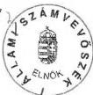

Állami Számvevőszék

Együtt kezelendő a T.4955/1-gyel

# JELENTÉS

## a Magyar Köztársaság 2000. évi költségvetése végrehajtásának ellenőrzéséről

3. sz. füzet

126

2001. augusztus

0126

---

Az ellenőrzés végrehajtásáért felelős:
az ÁSZ III. Költségvetési Ellenőrzési Igazgatósága

Bihary Zsigmond
igazgató

Az ellenőrzést vezette:

Simon Ákosné
számvevő főtanácsos

Az ellenőrzésben részt vettek:

Dr. Antal Zoltán
külső munkatárs

Fogarasi Miklós
számvevő tanácsos, tanácsadó

Balássy Tamás
külső munkatárs

Gömöri József
számvevő tanácsos

Belovai Sándorné
számvevő tanácsos

Gyarmati István
számvevő

Burenzsargal Narantuja
tanácsos

Hámoriné Maróti Gyöngyi
számvevő tanácsos

Csóry Györgyné
számvevő tanácsos

Hegedűs Miklós
külső munkatárs

Deák Tamásné
számvevő tanácsos

Hegedűsné Erdélyi Piroska
számvevő tanácsos

Domokosné Kurilla Edit
számvevő

Dr. Horváth Erika
gyakornok

Éva Katalin
számvevő tanácsos

Dr. Horváth Gyula
külső munkatárs

Farkas László
számvevő

Juhász József Gábor
számvevő

Fehérné Jagasich Mariann
számvevő

Dr. Juhászné Szima Mária
számvevő

Jelentéseink az Országgyűlés számítógépes hálózatán
és az Interneten a www.asz.hu címen is olvashatók.

---

**Karsai Lászlóné**
számvevő tanácsos

**Dr. Király László**
számvevő tanácsos

**Laskai Ede**
számvevő

**Major Gizella**
külső munkatárs

**Maklári Ferencné**
számvevő tanácsos

**Massányi Tibor**
fogalmazó

**Molnár Imre**
számvevő tanácsos

**Norczen Győzőné**
számvevő tanácsos

**Papp Sándor**
számvevő tanácsos

**Patai Tamás**
számvevő tanácsos

**Dr. Pataki Magdolna**
számvevő tanácsos

**Pongrácz Éva**
számvevő tanácsos

**Dr. Pósch Gábor**
számvevő tanácsos

**Dr. Remport Katalin**
számvevő

**Dr. Sipos Dóra**
számvevő tanácsos

**Szabó Erzsébet**
számvevő

**Szabó Józsefné**
számvevő

**Szatmári Dezső**
külső munkatárs

**Székely Ibolya**
számvevő

**Szélpál Ferenc**
számvevő tanácsos

**Szíjártó Károly**
számvevő tanácsos

**Szilágyi Gyöngyi**
számvevő tanácsos

**Szöllősiné Hrabóczki Etelka**
számvevő tanácsos, tanácsadó

**Trenovszki István**
számvevő tanácsos

**Uram Ferenc**
számvevő tanácsos

**Varga Szabolcs**
számvevő tanácsos

**Vas Lajos**
számvevő tanácsos

**Vértényi Gábor**
fogalmazó

**Zaroba Szilvia**
fogalmazó

Jelentéseink az Országgyűlés számítógépes hálózatán
és az Interneten a www.asz.hu címen is olvashatók.

---

•

•

•

•

•

•

---

# TARTALOMJEGYZÉK

# 1. A ZÁRSZÁMADÁSI ADATOK SZÁMSZAKI ÉS TARTALMI VALÓDISÁGA

7

# 1.1. A KINCSTÁRI ÉS FEJEZETI BESZÁMOLÓK EGYEZŐSÉGE 8

1.1.1.A FEJEZETEK ES AZ INTÉZMÉNYEK SZERVEZETI, GAZDÁLKODÁSI SZABÁLYOZOTTSAGÁNAK EGYES KERDÉSEI 11
1.1.2.AZ ELOIRANYZAT-FELHASNZALASI KERET MEGNYITASAFELHASNZALASA 12
1.1.3.AZ ELOIRANYZAT ATCSOPORTOSITASOK SZABALYSZERUSEGE, DOKUMENTALTSAGA 13

1.1.3.1.A fejezeten beluli eloiranyzat atcsoportositas 13
1.1.3.2.A fejezetek kozotti eloiranyzat atcsoportositasa 14
1.1.3.3.A kozponti koltsegvetes altalanos tartalekabolBiztositott atcsoportositott eloiranyzatok 15
1.1.3.4.A kozponti koltsegvetes celtartalek eloiranyzatanak felhasznalasa 15

1.1.4. A KIADÁSI ÉS BEVÉTELI ELŐIRÁNYZATOK TELJESÍTÉSE 16

1.1.4.1.A kiadasi eloiranyzatok teljesitese 16
1.1.4.2.A bevételi elöirányzatok teljesítese 17

1.1.5. A FEJEZETI KEZELÉSŰ ELŐIRÁNYZATOK FELHASZNÁLÁSÁNAK SZABÁLYSZERŰSÉGE 19

1.1.5.1.A fejezeti kezelésu eloiranyzatok felhasznalasa 19
1.1.5.2.A programfinanszirozas korebe vont fejezeti kezelésu eloiranyzatok felhasznalasa 21

1.1.6.A FEJEZETI ES AZ INTEZMENYI ELOIRANYZAT-MARADVANYOK ELLENORZESE 22
1.1.7.A KOLTSEGVETESI SZERVEK VAGYONI HELYZETENEK VALTOZASA 23
1.1.8.A KOZPONTI KOLTSEGVETES ALTALANOS TARTALEKA 24
1.1.9. LETÉTI SZÁMLÁK 25

# 1.2. A KÖZPONTI KÖLTSÉGVETÉS FINANSZÍROZÁSA, A KESZ LIKVIDITÁSA 26

1.2.1.A KOZPONTI KOLTSEGVETES FINANSZIROZASI IGENYE 26
1.2.2.A KOZPONTI KOLTSEGVETES TENYLEGES FINANSZIROZASA 27

# 1.3. A KÖZPONTI KÖLTSÉGVETÉS KÖZVETLEN ELŐIRÁNYZATAI 28

1.3.1. A KÖZPONTI KÖLTSÉGVETÉS KÖZVETLEN BEVÉTELEI 28

1.3.1.1. Gazdalkod szervezetek befizetesei 29
1.3.1.2.Fogyasztashoz kapcsolt adok 30
1.3.1.3.A lakossag befizetesei 31
1.3.1.4. Penzintézeti társasági adó 31
1.3.1.5.Az MNB befizetese 31
1.3.1.6.Koncessziosdjbevelelek 32
1.3.1.7.Ajovedekia do visszateritese 34
1.3.1.8.A vambitzositek szamla egyenlegenek kozponti koltsegvetesben valo elszamolasa 35
1.3.1.9. Vagyonertékesitésból származó bevétel teljesítese 35
1.3.1.10. Szerencsejáték Felügyelet befizétési kõtelezettsegénék teljesítese 35

1.3.2. A KÖZTARTOZÁSOK BEHAJTÁSÁRA TETT INTÉZKEDÉSEK 36

1.3.2.1. Adohatralekok behajtsara tett intezkedesek 36
1.3.2.2.A vam- es importbefizetesek behajtsara tett intezkedesek 38
1.3.2.3. Kozponti koltsegvetesi szervek koztartozasai 41

1.3.3. A KÖZPONTI KÖLTSÉGVETÉS KÖZVETLEN KIADÁSAI 42

1.3.3.1.A kozvetlen kiadasok teljesiteselek eljarasi rendje 42
1.3.3.2.A eloiranyzatok felhasznalasa 42

1.3.4. AZ ÁLLAMADÓSSÁG KÖLTSÉGVETÉSI ELSZÁMOLÁSAI, HITELFELVÉTELEI ÉS ADÓSSÁGÁNAK TÖRLESZTÉSEI 46

1.3.4.1. Az allamadossag koltsegvetesi elszamolasai 46
1.3.4.2.A koltsegvetes hitelfelvetelei es adossaganak torlesztese 49

1.3.5. A KÖZPONTI KÖLTSÉGVETÉS TERHÉRE VÁLLALT KEZESSÉGEK 51

# 2. KÖZPONTI LETÉTI SZÁMLA 56

1

---

# 3. A KÖZPONTI KÖLTSÉGVETÉS ZÁRSZÁMADÁSÁVAL KAPCSOLATOS PÉNZÜGYI (SZABÁLYSZERŰSÉGI) ELLENŐRZÉS 57

3.1.A KIJELOLT FEJEZETEK ES KOZPONTI KOLTSEGVETESI SZERVEK FEJEZETI,ILLETVE ELEMI BESZAMOLO JELENTESEINEK MINOSITESE 57
3.2.AZ APEH ILLETEKESSEGI KOREBE TARTOZO ADOBEVETELI ADATOK MEGBIZHATOSAGA 59

# 4. NEMZETGAZDASÁGI ELSZÁMOLÁSOK MÉRLEGE 60

2

---

# RÖVIDÍTÉSEK JEGYZÉKE

|  OGY | - | Országgyűlés  |
| --- | --- | --- |
|  KE | - | Köztársasági Elnökség  |
|  ALB | - | Alkotmánybíróság  |
|  OBH | - | Országgyűlési Biztosok Hivatala  |
|  ÁSZ | - | Állami Számvevőszék  |
|  BIR | - | Bíróságok  |
|  MKÜ | - | Magyar Köztársaság Ügyészsége  |
|  ME | - | Miniszterelnökség  |
|  BM | - | Belügyminisztérium  |
|  FVM | - | Földművelésügyi és Vidékfejlesztési Minisztérium  |
|  HM | - | Honvédelmi Minisztérium  |
|  IM | - | Igazságügyi Minisztérium  |
|  ISM | - | Ifjúsági és Sportminisztérium  |
|  GM | - | Gazdasági Minisztérium  |
|  GV | - | Gazdasági Versenyhivatal  |
|  KöM | - | Környezetvédelmi Minisztérium  |
|  KÖVIM | - | Közlekedési és Vízügyi Minisztérium  |
|  KüM | - | Külügyminisztérium  |
|  NKÖM | - | Nemzeti Kulturális Örökség Minisztériuma  |
|  SZCSM | - | Szociális és Családügyi Minisztérium  |
|  OM | - | Oktatási Minisztérium  |
|  OK | - | Országimázs Központ  |
|  EüM | - | Egészségügyi Minisztérium  |
|  PM | - | Pénzügyminisztérium  |
|  KSH | - | Központi Statisztikai Hivatal  |
|  MTA | - | Magyar Tudományos Akadémia  |
|  TH | - | Történeti Hivatal  |
|  MH | - | Magyar Honvédség  |
|  MEH | - | Miniszterelnöki Hivatal  |
|  OGYH | - | Országgyűlés Hivatala  |
|  PNSZ | - | Polgári Nemzetbiztonsági Szolgálatok  |
|  NBH | - | Nemzetbiztonsági Hivatal  |
|  IH | - | Információs Hivatal  |
|  NBSZ | - | Nemzetbiztonsági Szakszolgálat  |
|  KT | - | Közbeszerzések Tanácsa  |
|  KEHI | - | Kormányzati Ellenőrzési Hivatal  |
|  MKGI | - | Miniszterelnökség Közbeszerzési és Gazdasági Igazgatósága  |
|  TAKISZ | - | Területi Államigazgatási és Közigazgatási Információs Szolgálat  |
|  APEH | - | Adó- és Pénzügyi Ellenőrzési Hivatal  |
|  APEH-SZTADI | - | Adó- és Pénzügyi Ellenőrzési Hivatal Számítástechnikai és Adatfel dolgozó Intézet  |
|  KAIG | - | Kiemelt Adózók Igazgatósága  |
|  VPÜSZK | - | Vám- és Pénzügyőrség Ügyvitelszervezési és Számítástechnikai Központja  |
|  GYFA | - | Gyártmányfejlesztési Forgóalap  |
|  MNB | - | Magyar Nemzeti Bank  |
|  Kincstár | - | Magyar Államkincstár  |

3

---

|  KESZ | - | Kincstári Egységes Számla  |
| --- | --- | --- |
|  KT | - | Kincstári Tanács  |
|  KVI | - | Kincstári Vagyoni Igazgatóság  |
|  VP | - | Vám- és Pénzügyőrség  |
|  VPOP | - | Vám- és Pénzügyőrség Országos Parancsnoksága  |
|  GFS | - | Government Financial Statistics (kormányzati pénzügyi statisztika)  |
|  EBB | - | Európai Beruházási Bank  |
|  EBRD | - | Európai Újjáépítési és Fejlesztési Bank  |
|  IBRD | - | Nemzetközi Újjáépítési és Fejlesztési Bank  |
|  MEHIB Rt. | - | Magyar Exporthitel Biztosító Rt.  |
|  EXIMBANK Rt. | - | Magyar Export-Import Bank Rt.  |
|  EU | - | Európai Unió  |
|  OECD | - | Gazdasági Együttműködési és Fejlesztési Szervezet  |
|  KfW | - | Kreditanstalt für Wiederaufbau (Újjáépítési és Hitelbank)  |
|  Áht. | - | Az államháztartásról szóló - többször módosított - 1992. évi XXXVIII. törvény  |
|  Art. | - | Az adózás rendjéről szóló - többször módosított - 1990. évi XCI. törvény  |
|  Kvtv. | - | A Magyar Köztársaság 2000. évi költségvetéséről szóló 1999. évi CXXV. törvény  |
|  Hszt. | - | A fegyveres szervek hivatásos állományú tagjainak szolgálati viszonyáról szóló 1996. évi XLIII. törvény  |
|  Kbt. | - | Közbeszerzési törvény  |
|  Ktv. | - | A köztisztviselők jogállásáról szóló - többször módosí- tott - 1992. évi XXIII. törvény  |
|  Kjt. | - | A közalkalmazottak jogállásáról szóló - többször mó- dosított - 1992. évi XXXIII. törvény  |
|  Szt. | - | A számvitelről szóló - többször módosított - 1991. évi XVIII. törvény  |
|  ÁSZ tv. | - | Az Állami Számvevőszékről szóló -többször módosított - 1989. évi XXXVIII. törvény  |
|  Jöt. | - | A jövedéki adóról szóló 1997. CIII. törvény  |
|  Bszi | - | A bíróságok szervezetéről és igazgatásáról szóló 1997. évi LXVI. törvény  |
|  ÁKK | - | Magyar Államkincstár Államadósság Kezelő Központ  |
|  IM-BV | - | Igazságügyi Minisztérium Büntetésvégrehajtási Szervezet  |
|  AIK | - | Agrárintervenciós Központ  |
|  OTIVA | - | Országos Takarékszövetkezeti Intézmény Védelmi Alap  |

4

---

# ÁLLAMI SZÁMVEVŐSZÉK

## JELENTÉS

### a Magyar Köztársaság 2000. évi költségvetése végrehajtásának helyszíni ellenőrzéséről

A 2000. évi központi költségvetés zárszámadásának ellenőrzését a Magyar Köztársaság Alkotmányában (32/C. § (1) bekezdés), az Állami Számvevőszékről szóló - többször módosított - 1989. évi XXXVIII. törvényben (ÁSZ tv. 2. § (1) bekezdés) és az államháztartásról szóló - többször módosított - 1992. évi XXXVIII. törvényben (Áht. 53. §, 121. §) kapott felhatalmazás alapján folytattuk le. A helyszíni ellenőrzés a Magyar Köztársaság 2000. évi központi költségvetéséről elfogadott, többször módosított 1999. évi CXXV. törvény, valamint a Magyar Köztársaság minisztériumainak felsorolásáról szóló 1998. évi XXXVI. törvény 5. §-ában kapott felhatalmazásban meghatározott feladatok végrehajtására irányult.

Az **ellenőrzés célja** annak értékelése volt, hogy a központi költségvetés teljesítését bemutató adatok valósághűen tükrözik-e a 2000. évi pénzügyi folyamatokat és az egyes pénzügyi műveletek miként befolyásolták a költségvetés pozícióját. Ellenőrzésünk arra is kiterjedt, hogy a költségvetés végrehajtásában jog- és hatáskörrel rendelkező szervek (Országgyűlés, Kormány, fejezet felügyeletét ellátó szervek és költségvetési intézményeik) az államháztartási és az éves költségvetési, illetve az azt módosító törvényekben kapott felhatalmazásuk keretei között, kötelezettségeiknek megfelelően tettek-e eleget.

Helyszíni ellenőrzést végeztünk - az Állami Számvevőszék kivételével - valamennyi költségvetési fejezetnél, az éves költségvetési beszámolójuk számszaki és tartalmi valódisága, a költségvetési irányító és végrehajtó tevékenységük megítélése, a gazdálkodás fő folyamatainak áttekintése érdekében. (Az Állami Számvevőszék költségvetési beszámolóját - az Állami Számvevőszék elnökének döntése szerint - külső auditáló szervezet vizsgálta). Ellenőrzésünk kiterjedt az Országgyűlés fejezethez, illetve a Miniszterelnökség fejezethez tartozó, de fejezeti jogosítványokkal rendelkező Közbeszerzések Tanácsa, a Kormányzati Ellenőrzési Hivatal, valamint a Polgári Nemzetbiztonsági Szolgálatok költségvetési címekre is.

---5

---

A 2000. évi zárszámadás ellenőrzése során, élve azon törvényi felhatalmazással, hogy törvényességi szempontból értékelhetjük a pénzügyi-gazdasági folyamatokat, az Országgyűlés, a Köztársasági Elnökség, az Országgyűlési Biztosok Hivatala, a Történeti Hivatal, az Alkotmánybíróság, a Gazdasági Versenyhivatal, a Magyar Köztársaság Ügyészsége fejezeteknél, a Kormányzati Ellenőrzési Hivatalnál, a Közbeszerzések Tanácsa különleges jogosítvánnyal rendelkező költségvetési címeknél, a Környezetvédelmi Minisztérium, a Szociális és Családügyi Minisztérium, a Földművelésügyi és Vidékfejlesztési Minisztérium, a Honvédelmi Minisztérium, az Igazságügyi Minisztérium, az Oktatási Minisztérium, a Gazdasági Minisztérium, az Ifjúsági és Sportminisztérium fejezetek igazgatás címeinél és a Pest megyei Földhivatal, a Budapesti Közgazdaságtudományi és Államigazgatási Egyetem és a Magyar Nemzeti Filharmonikus Zenekar, Énekkar és Kottatár költségvetési intézményeknél, valamint a Gazdasági Minisztérium és az Oktatási Minisztérium fejezetnél két-két fejezeti kezelésű előirányzat törvényi sor beszámoló jelentésének értékelésénél a financial audit módszereit alkalmaztuk. Az ellenőrzés során az Állami Számvevőszék által a központi költségvetési szervek elemi beszámolójának pénzügyi (szabályszerűségi) ellenőrzésére kidolgozott módszertana szerint minősítettük a kijelölt fejezetek, illetve költségvetési címek, intézmények és fejezeti kezelésű előirányzatok 2000. évi beszámoló jelentéseinek megbízhatóságát.

A központi költségvetés közvetlen bevételeinek alakulását financial audit módszerrel - az e témában kidolgozott módszertanban és segédletben foglaltak szerint - értékeltük.

A Kincstári Egységes Számla központilag teljesített bevételi és kiadási pénzforgalmát (beleértve a nemzetközi elszámolásokat, a belföldi államadósság költségvetési elszámolásait, a költségvetés nemzetközi hitelfelvételeit és külföldi adósságának törlesztését, a költségvetés belföldi hitelfelvételeit és belföldi adósságának törlesztését), az egyes pénzműveletek hatását, továbbá az általános és céltartalék felhasználásával kapcsolatos és egyéb, fejezetek közötti előirányzat átcsoportosításokat, valamint az előirányzat megnyitások alakulását a Pénzügyminisztériumnál és a Magyar Államkincstárnál vizsgáltuk.

A Magyar Nemzeti Banknál, a Pénzügyminisztériumnál, a Magyar Államkincstárnál (Államadósság Kezelő Központnál) a költségvetés hitelkapcsolatairól és finanszírozásáról tájékozódtunk. A költségvetés fő bevételi forrásait jelentő adóbevételek előirányzatainak teljesítése, valamint a kintlévőségek csökkentése érdekében tett intézkedések eredményességét az Adó- és Pénzügyi Ellenőrzési Hivatalnál, a vám-, adó- és illetékkiszabási, valamint behajtási tevékenységet pedig a Vám- és Pénzügyőrségnél értékeltük.

Az egyes fejezeteknél végzett helyszíni ellenőrzések tapasztalatait **függelékben** szerepeltetjük. **A megállapításokat alátámasztó példák részletesen** - a betűkiemeléssel hivatkozott fejezeteknél - **ebből ismerhetők meg.**

6

---

I. RÉSZLETES MEGÁLLAPÍTÁSOK

# I. RÉSZLETES MEGÁLLAPÍTÁSOK

# 1. A ZÁRSZÁMADÁSI ADATOK SZÁMSZAKI ÉS TARTALMI VALÓDISÁGA

A zárszámadási törvényjavaslat tervezetének összeállítása során a PM a fejezetek intézményi adatainál a költségvetési beszámolók APEH-SZTADI általi adatfeldolgozására, a fejezeti kezelésű előirányzatoknál a fejezetek közvetlen adatszolgáltatására, a központi kezelésű előirányzatok teljesítési adatainál a Kincstár adataira támaszkodott. A 2000. év költségvetéséről szóló törvény a kiadási főösszeget 3.788.275,6 M Ft-ban, a bevételi főösszeget 3.392.043,9 M Ft-ban határozta meg. A hiány tervezett összege 396.231,7 M Ft volt. A hiányösszeg változatlanul hagyása mellett a 2000. évi CXVIII. törvény a kiadási főösszeget 3.902.606,3 M Ft-ra, a bevételi főösszeget 3.506.374,6 M Ft-ra módosította.

A Kincstár beszámolójában a kiadási főösszeget 4.054.226,9 M Ft-ban, a bevételi főösszeget 3.685.792,1 M Ft-ban, a központi költségvetés hiányát 368.434,9 M Ft-ban mutatta ki.

A központi költségvetés végrehajtásának 2000. évi mérlege több során nem egyezik a kincstári beszámolóban szereplő költségvetési mérleg adataival. A mérleg bevételi és kiadási oldalát egyaránt érintik az eltérések. Az adatok még június folyamán is többször módosultak, ami kihatott a kimutatott hiány összegének változására is.

A kincstári elszámolás és az intézményi beszámolók eltérő szabályokra visszavezethető adateltérés összege a bevételek esetében 6.701,2 M Ft, a kiadások esetén 7.345,9 M Ft volt.

A PM által készített központi költségvetés mérlegében (törvényjavaslat) szereplő kiadási és bevételi főösszegek, valamint a hiány összege is eltér a Kincstár adataitól. A költségvetési mérlegben 4.049.734,2 M Ft szerepel kiadási főösszegként, a bevételi főösszeg 3.681.943,9 M Ft, a hiány 367.790,3 M Ft.

A bevételi és kiadási főösszegek eltérését (3.848,2, illetve 4.492,7 M Ft) a központi költségvetési szervek, támogatási célprogramok és a központi beruházások saját bevételeinek, illetve támogatással és saját bevétellel fedezett kiadásainak eltérései okozták. A PM közigazgatási államtitkárának augusztus 13-i keltezésű levele szerint: az elemi beszámolóban szereplő adatokat vették figyelembe a mérleg, illetve a törvényjavaslat 1. számú mellékletének összeállításakor.

A TB közreműködésével folyósított ellátásokon belül 664,3 M Ft-ot a Kincstárnál a családi támogatásoknál mutatták ki, míg a költségvetési mérlegben különféle jogcímen adott térítésként szerepel.

A GYSEV-nek nyújtott 71 M Ft támogatást az Egyedi termelési támogatás helyett tévesen az Egyéb vállalati támogatás folyósítási számláról fizették ki. A kiadási főösszeg eltérését ezek nem befolyásolták.

7

---

I. RÉSZLETES MEGÁLLAPÍTÁSOK

A kormányzati rendkívüli kiadások nemzetgazdasági számla terhére számoltak el - a 2333/2000. (XII. 21.) Korm. határozat alapján - 75 Mrd Ft-ot kiadásként, miközben ez tényleges pénzfelhasználást nem jelentett.

A jövedéki bevételek között jelenik meg a jövedéki letét összege, 0,3 Mrd Ft, ami nem minősül bevételnek.

A zárszámadási törvényjavaslatban, a központi költségvetés mérlegében az Agrártermelési támogatás a kincstári beszámolóban kimutatott összegnél 2.853 M Ft-tal alacsonyabb összegben szerepel. A helyszíni ellenőrzés lezárásakor a két nyilvántartás adatai még megegyeztek.

A helyszíni ellenőrzés lezárásakor az intézményi és fejezeti kezelésű előirányzatok teljesítésénél jelentős részt képviselt a központi beruházások eltérése.

A költségvetési mérleg a központi beruházások jogcímen 116.961,9 M Ft előirányzatot és 113.290,3 M Ft teljesítést rögzít. Ezzel szemben a Magyar Államkincstár beszámolója 111.871,2 M Ft tárgyévi kifizetést tartalmaz. A Kincstár Feladatfinanszírozási Főosztályának összegzése 111.869,9 M Ft teljesítést mutat.

A 2000. évi kifizetések 16 fejezetnél tértek el a Kincstár adataitól. A teljesítési adatok 12 fejezet intézményeinél mutattak eltérést, a nagyságrendet tekintve a legjelentősebb különbségek (az eltérések 74%-a) az OM (3,7 Mrd Ft), a KÖVIM (1,7 Mrd Ft), a BM (0,6 Mrd Ft) és a BIR (0,4 Mrd Ft) fejezeteknél fordultak elő. További 5 fejezetnél (ME, ISM, PM, NKÖM, EüM) 100-300 M Ft közötti differencia jelentkezett.

Az eltérések okai a következők voltak: a fejezetek a fejezeti központi beruházások jóváhagyott maradványának teljesítését - intézményi megvalósítás esetén - a fejezeti kezelésű előirányzatok között és a beruházást megvalósító intézménynél egyaránt központi beruházásként számolták el. A Kincstárnál a kifizetés átadott pénzeszközként jelenik meg. Amikor államháztartáson kívüli szervezet valósította meg a beruházást, a Kincstár központi beruházásként számolta el a teljesítést, míg a fejezetnél felhalmozási célú pénzeszköz átadásként jelent meg a kifizetés. Az okok között szerepelt továbbá a téves kincstári tranzakciós kódhasználat (ez okozta a kincstári beszámoló és az említett főosztály közötti teljesítési adateltérést), illetve a téves főkönyvi könyvelés, valamint a kerekítésből adódó eltérés.

A helyszíni ellenőrzés lezárását követően végzett javítások ellenére továbbra is fennállt az eltérés 15 fejezetnél, de ebből csak a KÖVIM (1,7 Mrd Ft) fejezeté volt jelentős.

### 1.1. A kincstári és fejezeti beszámolók egyezősége

Az előző évhez hasonlóan a 2000. évre vonatkozóan sem egyeztek meg teljes körűen a fejezeti beszámolók adatai a Kincstár által nyilvántartott adatokkal. Az előirányzatok és a teljesítési adatok tekintetében egyaránt mutatkoztak eltérések.

A fejezetek 2000-ben sem tettek eleget minden esetben a 217/1998. (XII. 30.) Korm. rendelet 146. §-a szerinti tájékoztatási és egyeztetési kötelezettségeiknek,

8

---

I. RÉSZLETES MEGÁLLAPÍTÁSOK

melyben az intézmények mulasztásainak jelentős szerepe volt. Az egyeztetések elvégzését követően is voltak eltérések a Kincstár és a költségvetési szervek között. A kincstári költségvetési beszámoló és az elemi beszámoló közötti eltéréseket a kincstári költségvetési szervek tételesen rögzítették és indokolták. A szöveges indoklást a beszámolóhoz mellékelték az Áht. 103. §-a, valamint a 217/1998. (XII. 30.) Korm. rendelet 146. §-ának előírása alapján.

A felügyeleti szervek a fejezeti szinten történő összesítést elvégezték és megküldték a Kincstárnak. Első alkalommal volt lehetőség - az elemi költségvetés és beszámoló, valamint a kincstári nyilvántartás 2000. évi azonos szerkezetének köszönhetően - a fejezeti kezelésű előirányzatokat érintő eltérések tételes kimutatására.

Az **előirányzatokban mutatkozó különbségek** általában kisebb volumenűek voltak és az intézmények szűkebb körére korlátozódtak. Az eltéréseket elsősorban - az előző évhez hasonlóan - a Kincstárral nem, illetve tévesen közölt módosítások okozták. Az okok között szerepelt továbbá az előző évi előirányzat-maradvány (pénzmaradvány) igénybevétele, helytelen kódolás, kerekítési eltérés, téves kincstári adatfeldolgozás, a kincstári körön kívül vezetett számlák forgalma és a kincstári feldolgozás hiánya.

A 2000. évben is jellemző volt, hogy az intézmények a beszámolókészítés időszakában és nem a pénzügyi teljesítést megelőzően korrigálták előirányzataikat.

A fejezetnél és a Kincstárnál kimutatott fejezeti kezelésű előirányzatok teljes körűen az **OGY**, a **KE**, az **MKÜ**, a **PNSZ**, az **FVM**, a **KüM**, az **OBH**, a **KSH** és a **GV** fejezeteknél egyeztek meg. A kincstári előirányzat összességében magasabb az intézményi beszámolóban szereplőnél 4 fejezet esetében, illetve összességében alacsonyabb 11 fejezetnél.

A **teljesítési adatok tekintetében** a kincstári és a költségvetési beszámolók közötti eltérések - a Kincstár 2001. május 16-i tájékoztatója szerint is - növekedtek az előző évhez képest. Szinte nem volt olyan előirányzati tételesor, amelynél ne jelentkezett volna plusz-mínusz irányban eltérés.

A kincstári és az intézményi költségvetési beszámolók tényleges kiadási és bevételi adatai - 1999-hez hasonlóan - valamennyi fejezetnél eltértek egymástól.

Az eltérések okai megegyeztek a tavalyi évben tapasztaltakkal. A helyszíni ellenőrzés befejezésekor is történtek még javítások a **BM**, **GM**, **NKÖM** fejezeteknél. Figyelemre méltó eltérések voltak a **BM**, **FVM**, **GM**, **KÖVIM**, **KüM**, **OM** és **NKÖM** fejezeteknél, továbbá a **PNSZ** intézményeinél.

**Eltérést okoznak** - a korábbi évekhez hasonlóan - továbbra is az **elszámolás rendszerbeli különbségei**. A két könyvelési rendszer funkciójából eredően - a kincstári körön kívül, a kereskedelmi bankoknál vezetett (deviza) számlák egyenlegei, a házipénztár záró pénzkészlete, valamint a függő, átfutó, kiegyenlítő kiadások tekintetében. A havonkénti egyeztetések esetében a kincstári tranzakciós kód csak két pozíciós felbontású, míg a 2000. évi beszámoló egyeztetése fejezeti kezelésű előirányzatonként három pozíciós mélységig történt. A **tárgyévi zárások határideje 2000-ben is eltért egymástól**. A

9

---

I. RÉSZLETES MEGÁLLAPÍTÁSOK---

rendelkezéssel megadott kincstári határidő és a beszámoló készítésére rendeletileg biztosított határidő továbbra is eltér egymástól. Az intézményeknek a zárlati munkák során még lehetőségük van a teljesítés adatainak módosítására, miközben a kincstári nyilvántartáson e módosítások már nem vezethetők keresztül.

Továbbra is eltérés jelentkezik a kereskedelmi banknál vezetett lakástámogatási számlák forgalmának helytelen főkönyvi nyilvántartása miatt, holott az új számviteli szabályok szerint meg kellene egyeznie a kincstári nyilvántartással.

A teljesítési adatok különbségeihez hozzájárultak a **fejezetek részéről jelentkező hiányosságok** is. Előfordult, hogy a jogszabály által meghatározott határidőn túl nyújtották be beszámolójukat a PM Költségvetési Nyilvántartási és Adatszolgáltatási Főosztályához és még ezután is végeztek javításokat. Jelentkeztek emellett téves kódhasználatból, valamint kerekítésből adódó hibák, nyilvántartási pontatlanságok. **A fejezeteket felügyelő szervek egy része változatlanul nem fordított megfelelő figyelmet az intézményi indokolások áttekintésére.**

Az **intézmények hibájából** adódó eltérések - a korábbi évekhez hasonlóan - téves kódhasználat (véletlen vagy fedezethiány miatt), kerekítési hibák, túlfizetés és tervezési hibák miatti fedezethiány, téves könyvelés helyesbítésekor a tranzakciós kódok nem megfelelő sorrendben történő használata, a Kincstár felé fel nem adott előirányzatteljesítési korrekciók, illetve a tranzakciós kód téves kincstári rögzítése miatt keletkeztek.

Az intézmények a Kincstártól havonta érkező - kincstári tranzakciókat tartalmazó - kimutatások felülvizsgálatát és az ezzel összefüggő korrekciókat a 2000. év folyamán sem, vagy nem teljes körűen végezték el, illetve a Kincstár által meghatározott zárási határidőn túl is történt módosítás.

Eltéréseket eredményeztek - a kincstári és a fejezeti beszámolók között - az év közben végbement szervezeti változások az **OM**, az **SZCSM**, az **ME** és a **PM** fejezeteknél.

A szabályozás és a feladatellátás a munkaszervezés és a végrehajtás oldaláról továbbra sem biztosította a 2000. évi zárszámadási törvényjavaslat összeállításához szükséges, a teljesség és valódiság számviteli alapelveket kielégítő adatbázis előállítását.

A fejezetek és intézményeik költségvetési beszámolójának valódisága érdekében a fejezetek többsége - az egyintézményes és a **ME**, az **EüM**, a **PNSZ** fejezetek kivételével - segédletet, körlevelet adott ki intézményei számára.

A felügyeleti szervek az intézményi beszámolókat a 217/1998. (XII. 30.) Korm. rendelet 149. § (5) bekezdésében előírt tartalmi és számszaki egyezőségek figyelembevételével felülvizsgálták. A szűkös létszámra hivatkozva ezt az **EüM** nem tette meg.

Az intézményi beszámolók elfogadásáról, az intézményi pénzmaradványok, illetve előirányzat-maradványok jóváhagyásáról a fejezetek az intézményeket

---10

---

I. RÉSZLETES MEGÁLLAPÍTÁSOK

nem értesítették, mert a PM - hasonlóan az előző évekhez - késett az előirányzat-maradványok jóváhagyásával.

A fejezetek a költségvetésben jóváhagyott, alaptevékenységbe tartozó szakmai feladatok teljesítését, illetve a pénzügyi teljesítés és a feladat megvalósítás összhangjának értékelését a 217/1998. (XII. 30.) Korm. rendelet 149. § (3) bekezdés a) és b) pontjai szerint többségében elvégezték.

A helyszíni ellenőrzés ideje alatt még nem készültek el az értékelésekkel az **OM** és a **BM** fejezetek. A **ME** és az **EüM** létszámhiányra hivatkozva, a **PNSZ** az intézmények specialitása miatt nem végezte el az előírt felülvizsgálatot. Az értékelés során felmerült problémák megoldását is szorgalmazták a felügyeleti szervek (a **KüM** átfogó vizsgálatot javasolt, az **OM** a megszűnő költségvetési szerveknél szükséges tennivalókra mutatott rá).

A központi költségvetési szervek és a fejezeti kezelésű előirányzatok kezelői többségében értékelték a közhasznú társaságok, gazdasági társaságok és a közalapítványok működését, az azoknak nyújtott támogatás felhasználását és annak hatékonyságát, eredményességet.

A helyszíni ellenőrzés befejezésekor az **OM** és az **MTA** fejezeteknél az értékelés írásba foglalása folyamatban volt. A **KöM Igazgatás** cím mérlegében szereplő, részesedésben megtestesülő vagyon pontosságát a 2000. évben sem vizsgálták meg annak ellenére, hogy ezt már az 1999. évi zárszámadás ellenőrzésekor az ÁSZ, továbbá témavizsgálata során a KEHI is észrevételezte. A **BM** nem értékelte az egyik alapítványnak adott támogatás felhasználását, mert az alapítvány közvetlenül az ME-nek számolt el. Az **EüM** nem értékelte egy Gt-ben részesedéssel bíró intézményének tevékenységét. A **KüM** elmulasztotta a közalapítványok beszámolójának szakmai értékelését.

Az intézmények a költségvetési törvény 10-13. §-aiban előírt befizetési kötelezettségeiknek többségében határidőre eleget tettek. A fejezetek közül az **EüM**, az **FVM**, a **KüM**, a **PM**, az **NKÖM** és a **PNSZ** fejezetek a befizetési kötelezettséget határidőre nem teljesítő intézményeik felé a szükséges intézkedéseket megtették.

### 1.1.1. A fejezetek és az intézmények szervezeti, gazdálkodási szabályozottságának egyes kérdései

A költségvetési szervek gazdálkodásának szabályozottságában - az 54/1996. (IV. 12.) Korm. rendelet 4. § (3)-(10) bekezdéseinek és a 34-37. §-ainak előírásait figyelembe véve - a korábbi években tapasztalt kedvezőtlen jelenségek továbbra is fennállnak, amelyek elsősorban a gazdálkodás átfogó szabályozásának hiányára, valamint a szabályzatok felülvizsgálatának, aktualizálásának elmaradására vezethetők vissza.

A fejezeti kezelésű előirányzatokkal összefüggő gazdálkodást az Áht. 49. § o) pontjában előírt - a **PM** és a **PNSZ** kivételével - valamennyi fejezet felügyeletét ellátó szerv vezetője szabályozta. A törvényben előírt - a szabályozás elkészítésére vonatkozó - február 15-i határidőt azonban nem tartották be a **KüM**, a **BIR** és a **KöM** fejezetek.

11

---

I. RÉSZLETES MEGÁLLAPÍTÁSOK

A szabályzatok az Áht. 24. § (4)-(5) bekezdésében, a 49. § g) pontjában és a 217/1998. (XII. 30.) Korm. rendelet 49. § (4) bekezdésében előírtaknak megfelelően az előirányzat-maradványok jóváhagyására, felhasználására, valamint az előirányzattal való gazdálkodás egyéb kérdéseire is kiterjedtek az **NKÖM**, az **MTA**, az **OGY**, a **HM**, az **OM**, a **SZCSM**, az **IM**, a **GV**, az **ALB** és a **KöM** fejezeteknél.

A **KüM**-nél nem szabályozták az előirányzat-maradvány jóváhagyásának és következő évi felhasználásának rendjét.

Az **ME**-nél a kontrollok közül a bizonylatok számszaki és tartalmi helyességét igazolni hivatott, ún. érvényesítési funkciót nem szabályozták.

A **BM**-nél az év közben induló, nem tervezett feladatok szabályozásánál nem az előírások szerint jártak el.

### 1.1.2. Az előirányzat-felhasználási keret megnyitása, felhasználása

A fejezeteknél a negyedéves előirányzat felhasználási terveket az Áht. 102. § (1)-(3) bekezdései és a 217/1998. (XII. 30.) Korm. rendelet 139. §-a szerint elkészítették (**ME**, **KöM**, **EüM**, **KSH**, **KüM**, **NKÖM**, **SZCSM**, **OGY**, **OBH**, **GM**, **PM**, **OM**, **BIR**, **BM**, **HM**, **IM**, **PNSZ**), figyelembe véve a saját bevételeket.

A finanszírozási terveket általában időarányosan, a fejezeti kezelésű előirányzatoknál pedig a feladathoz igazodóan készítették el. Időarányostól eltérő keretfelhasználás csak indokolt esetben (13. havi illetmény, ruházati-, üdülési hozzájárulás) fordult elő (**KöM**, **EüM**, **KüM**, **OGY**, **GM**, **BIR**, **PNSZ**).

Az előirányzat-felhasználási keretek ütemezéstől eltérő - főként beruházások kivitelezésével kapcsolatos - lekérése és teljesítése indokolt volt (**KSH** 16 esetben, **NKÖM** közhasznú társaságok, **MTA**, **PM**, **BM**, **HM**, **IM**, **SZCSM**).

A 214/1999. (XII. 26.) Korm. rendelet a **TÁKISZ**-okat a **PM**-hez sorolta át, de költségvetésüket azt megelőzően a **BM**-nél tervezték. A **TÁKISZ**-oknál keretelőrehozásra volt szükség.

Előfinanszírozásra az **IM**-nél 5 intézet, 1 intézmény és a **BV** esetében volt szükség. Így például váratlanul és halaszthatatlanul felmerült tető- és elektromos felújítást (Pálhalma), az esedékessé vált jubileumi jutalmak kifizetését (Veszprém és Vas Megyei BV I.), illetve a **BV** gazdasági társaságainak jogszabály szerint nyújtható pályázati támogatását stb. finanszírozták ily módon.

A **BM** fejezetnél a Kincstár egy keret-előrehozást indokoltan nem engedélyezett.

Az Országos Közbiztonsági és Bűnmegelőzési Közalapítvány működésére kértek keret-előrehozatalt. A **BM** Központi Igazgatás cím az előfinanszírozást biztosította, de az nem volt indokolt, mert nem célfeladatot, hanem intézményi működést finanszírozott volna.

Fejezeti szinten likviditási probléma a 2000. évben nem volt.

12

---

I. RÉSZLETES MEGÁLLAPÍTÁSOK

Néhány intézménynél merült fel átmeneti forráshiány (KöM Aggteleki Nemzeti Park, EüM 3 (Kardiológiai, Traumatológiai, Hematológiai) intézet, KüM HTMH, MTA néhány intézménye, PM Békés megyei TÁKISZ, OM Szolgáltató Intézménye, BIR 9 bírósága, BM, IM-BV, Igazságügyi Szakértő Intézetek Hivatala). Ennek fedezetét részben előfinanszírozással (KöM, SZCSM, PM, OM), részben kincstári biztos kinevezésével (EüM), részben saját hatáskörben (EüM, KüM, IM-ISZIH) biztosították.

Az IM-nél a BV költségvetésének alultervezése miatt egyrészt a felügyeleti szerv hajtott végre pénzeszköz átadást a tartozásállomány csökkentésére és a BV társaságok finanszírozására, másrészt a költségvetés általános tartalékából biztosítottak fedezetet a cím részére (2297/2000. (XII. 7.) Korm. határozat).

### 1.1.3. Az előirányzat átcsoportosítások szabályszerűsége, dokumentáltsága

#### 1.1.3.1. A fejezeten belüli előirányzat átcsoportosítás

A fejezeten belüli előirányzat-módosítások, átcsoportosítások szakmailag indokolt időpontban és mértékben történtek. Az előirányzat-módosítások, átcsoportosítások a hatásköri és a kiemelt előirányzatokra vonatkozó előírásoknak (Áht. 24. § (2)-(3), 24/A. §) - a BM fejezet kivételével - megfeleltek. Előfordult néhány fejezetnél, hogy késedelmesen hajtottak végre előirányzat-módosításokat (KöM, HM).

A BM-nél az orosz államadósság ellentételezésére kapott előirányzatot a 2321/2000. (XII. 21.) Korm. határozat a dologi kiadásoknál és nem a felhalmozási előirányzatoknál jelenítette meg.

A fejezeten belüli előirányzat-módosítások okai részben a Kvtv. jóváhagyásakor előre nem látható többletfeladatok (ME, EüM ESZTT, MTA, IM), részben tervezési hiányosságok (EüM IG, PM), illetve realizált többletbevételek (KÖVIM) voltak. Az előirányzat-módosítások csak kivételesen játszottak szerepet az intézményi forráshiányok okozta feszültségek oldásában (GM, BIR).

Az IM ISZIH részére a jeltelen sírok feltárásához és a büntető törvénykönyv módosításából adódó többletfeladatok ellátásához biztosítottak pénzeszközt.

A PM-nél a TÁKISZ-ok költségvetésének megalapozatlan tervezése miatt a fejezeti tartalékból biztosítottak pótelőirányzatot. Az Állami Pénztárfelügyelet és a Kincstár átcsoportosítási kérelmét a PM befogadta, azonban a PM állásfoglalása erről a felügyeleti szervnél nem állt rendelkezésre.

A KÖVIM-nél a saját bevétel növekedése miatt az Útfenntartási és Fejlesztési Célelőirányzat eredeti előirányzatát 5.601,4 M Ft-tal, a Vízügyi Célelőirányzatot 2.718,3 M Ft-tal emelték.

Az FVM az 1999. évi előirányzat-maradvány igénybevételénél megsértette a 217/1998. (XII. 30.) Korm. rendelet 59. § (2) bekezdésében foglaltakat.

13

---

I. RÉSZLETES MEGÁLLAPÍTÁSOK

A fejezeti kezelésű előirányzatok intézményekhez való késői átcsoportosítása a **KÖM**, az **EüM**, az **NKÖM** és a **KÖVIM** fejezeteknél volt jellemző. Az előirányzatok tárgyévi felhasználását ez kedvezőtlenül befolyásolta.

Több fejezetnél képeztek fejezeti tartalékot (**ME, KÖM, KSH, KüM, NKÖM, MTA, PM, OM, IM, KÖVIM**), felhasználásuk a Kvtv. 5. § (4) bekezdése szerint történt. A **KÖVIM** esetében a tanácsadói és a sajtófigyelői tevékenységre irányuló szerződéskötések indokoltsága megkérdőjelezhető. Az **FVM** fejezetnél találkozunk szabálytalan évközi tartalékképzéssel és felhasználással.

Az **OM** fejezetnél 9 megállapodásból 4 esetben tartották be az elszámolási határidőt. Egy esetben az elszámolást bizonylatokkal nem támasztották alá. A Budapesti Közgazdaságtudományi és Államigazgatási Egyetem, valamint a Márton Áron Kollégium nem tett eleget a beszámolási kötelezettségnek.

A **KÖVIM** fejezetnél az első negyedévi keretet megbízási szerződésekre kötötték le. A szerződéseket döntően a kabinetiroda vezetője kötötte meg. A miniszter távozását követően a szerződéseket felmondták. A felmondások a felhasználható keret 15,3 M Ft-os növekedését eredményezték.

Az **EüM, SZCSM, BM, HM** fejezeteknél fejezeti tartalékot nem képeztek. A **HM** azonban belső, ún. miniszteri tartalékkal rendelkezett és azt fel is használta. Előfordult a **KüM** fejezetnél, hogy várható bevételre terveztek fejezeti tartalékot, ami év közben nem realizálódott.

A **NKÖM**-nél több intézmény nem indokolta megfelelően többletigényét, azokat mégis teljesítették.

### 1.1.3.2. A fejezetek közötti előirányzat átcsoportosítása

A fejezetek közötti előirányzat-átcsoportosítások az érintett fejezeteknél az Áht. 39. § (1)-(3) bekezdéseinek és a Kvtv. 46. §-ának előírásait betartva, indoklással alátámasztva történtek (**KÖM, EüM, SZCSM, MTA, OGY, GM, PM, OM, BM, HM, IM, PNSZ, KÖVIM**).

A Kormány a költségvetés végrehajtásáról szóló törvényjavaslat indokolása tekintetében nem tesz eleget - az Áht. 20. § (6) bekezdése alapján - a címrend változásokkal kapcsolatos részletes beszámolási kötelezettségének. A törvényjavaslat áttekinthetőségét hátrányosan befolyásolja, hogy a fejezetek között - az Áht. 39. § (1) bekezdése alapján végrehajtott kormányzati hatáskörű előirányzat-módosításokat - a zárszámadás az ún. „költségvetési törvény módosított előirányzatok” részeként, a fejezetek eredeti előirányzatainak utólagos, visszamenőleges módosításával veszi számításba, azaz a 2302/2000. (XII. 15.) és a 2179/2000. (VIII. 9.) Korm. határozatok szabálytalan végrehajtásával az eredeti költségvetési előirányzatokat megváltoztatták. Az Áht. 39. § (1) bekezdésének rendelkezései a Kormánynak a fejezetek közötti előirányzat-átcsoportosításra adnak felhatalmazást, de a felhatalmazás nem terjed ki az éves eredeti előirányzatok felülírására (**ME, BM, GM, KÖVIM, SZCSM, OM, PM**).

Előfordult késedelmes átcsoportosítás, amelynek következményeként a teljesítés csak formálisan került át más fejezethez.

14

---

I. RÉSZLETES MEGÁLLAPÍTÁSOK

A Kormány 2302/2000. (XII. 15.) határozatával az **ME** költségvetése a KÖVIM-től átvett 15.271,7 M Ft kiadási, 15.228,9 M Ft bevételi és 42,8 M Ft támogatási előirányzattal nőtt. A minisztérium átszervezéséhez képest csak késedelmesen döntöttek a pénz átadásáról és arról a fejezetet a PM csak december 21-én értesítette. Így az előirányzatok és azok teljesítései gyakorlatilag formálisan kerültek az ME 2000. évi beszámolójába.

A fejezetek közötti előirányzat-módosítások az árvízkárok enyhítésével, a Kvtv. jóváhagyásakor előre nem látható feladatok, illetve a benzináremelés ellentételezésével voltak összefüggésben.

### 1.1.3.3. A központi költségvetés általános tartalékából biztosított átcsoportosított előirányzatok

A Kvtv. 1. számú melléklete a központi költségvetés általános tartalékának előirányzatát 19.424,8 M Ft-ban határozta meg, amelynek nagyságrendje megfelel az Áht. 26. § (1) bekezdés előírásának.

A központi költségvetés általános tartalékából több fejezet részesült (**ME, KÜM, EÜM, OGY, GM, PM, OM, BIR, BM, HM, IM, NKÖM**).

A fejezetek az általános tartalék terhére vonatkozó igényeiket - a ME fejezet kivételével - megfelelően, számításokkal alátámasztva indokolták.

Az **ME** fejezetnél a Millenáris Kht. általános tartalékból történő támogatására írásos előterjesztés nem készült.

Az általános tartalékból kapott forrás célirányos felhasználását és hasznosulását az **OGY**-nél és az **IM**-nél a 217/1998. (XII. 30.) Korm. rendelet 47. §-ának megfelelően ellenőrizték. A **BM**-nél a pénzügyi ellenőrzés megtörtént, a szakmai felülvizsgálat a helyszíni ellenőrzés befejezésekor még folyamatban volt.

A **GM** az általános tartalék terhére képződött maradványát elvonásra felajánlotta.

### 1.1.3.4. A központi költségvetés céltartalék előirányzatának felhasználása

A központi költségvetés céltartalékából több fejezet részesült. A céltartalékból átcsoportosított előirányzat felosztása, felhasználása a felülvizsgált igényekkel és a törvényi előírásokkal összhangban álló feladatokat, kötelezettségeket - a 2000. évi létszámcsökkentések, kormányzati struktúra átalakításával kapcsolatos egyszeri személyi kifizetések - finanszírozott (**ME, EÜM, NKÖM, SZCSM, MTA, OGY, GM, OM, BM, KÖVIM**). Az **OM**-nél az évközi megvalósulás részben történt meg.

Az **OM**-nél az igényelt összeg 52%-át nem használták fel, a többlet finanszírozás „áthidaló hitelként” funkcionált.

A célelőirányzatból kapott, fel nem használt összeget az érintett fejezetek elvonásra felajánlották (**ME, OM, GM**).

15

---

I. RÉSZLETES MEGÁLLAPÍTÁSOK

## 1.1.4. A kiadási és bevételi előirányzatok teljesítése

### 1.1.4.1. A kiadási előirányzatok teljesítése

A kiadások módosított előirányzathoz viszonyított teljesítése az **OBH, BM, HM, IM, OBH, KSH** fejezeteknél 95-100% között alakult. A **BIR**, a **GM**, az **EüM**, a **PM**, az **NKÖM** és az **MTA** fejezeteknél előfordult ennél alacsonyabb teljesítés. Az előirányzatok teljesítésénél mutatkozó eltéréseket az év közben - más fejezetekhez történő azonos célú felhasználás miatti - feladat -, illetve intézmény átadások, átvételek (**GM, SZCSM, IM, ME**), az áthúzódó szakmai feladatok miatti előző évi előirányzat-maradványok igénybevétele, átadott és átvett pénzeszközök, fejezeti kezelésű előirányzatok (ezen belül központi beruházások) következő évre áthúzódó kötelezettségvállalásai indokolták.

A **KöM** fejezetnél a kiadási előirányzatok teljesítésénél mutatkozó lemaradás a minisztérium felső vezetésében a 2000. év folyamán végbement személycsereknék és ezzel összefüggésben a döntések elhúzódásának, esetenként visszavonásának - amelyek kedvezőtlenül hatottak az intézményi gazdálkodásra - is tulajdoníthatók.

Az **NKÖM** fejezetnél az előirányzattal szembeni lemaradást a központi beruházások elhúzódása okozta. A Millenniumi beruházásokra rendelkezésre álló előirányzat - az előző évi kötelezettségvállalással terhelt maradvánnyal együtt - 5.443,8 M Ft, amelyből a tényleges felhasználás 1.759,1 M Ft (32%-os teljesítés) volt.

A **PM Igazgatásnál** - a személyi juttatásokon belül - a nem rendszeres személyi juttatások előirányzata emelkedett. Ezen belül a jutalom előirányzat növekedése volt meghatározó, ami mintegy 4 havi jutalom kifizetésére nyújtott fedezetet. A jutalom előirányzat emelésének forrása döntően a fejezeti tartalék volt.

Kiadási megtakarításokhoz vezetett a feladatok költségét túlértékelő, irreális kiadási előirányzat tervezése (**IM**). Néhány fejezetnél a kiadási előirányzatot túllépték (**BM, HM**).

Az **IM** fejezet 2000. január 1-jétől a FVM-től átvette a Központi Kárrendezési Irodát (KKI). A kincstári biztos közreműködésével készített intézményi költségvetést a feladatok költségeit túlértékelő kiadási előirányzatok jellemezték. A KKI 2000. évi kiadási előirányzata 1.906,5 M Ft volt, az 1999. évi eredeti kiadási előirányzat több, mint kétszerese. A KKI dologi kiadásában 70,7 M Ft megtakarítás képződött, annak ellenére, hogy az év közbeni, különböző hatáskörű előirányzat átcsoportosítás, illetve elvonás hatására 450,7 M Ft-tal csökkent az előirányzat. A kiadási megtakarításból 44,8 M Ft szabad maradvány keletkezett.

A **BM** fejezetnél több címnél előfordult kiadási előirányzat túllépés (előirányzat módosítás nélkül), amely ellentétes az Áht. 12. § (4) bekezdésének, valamint a 98. §-ának előírásaival. (Az intézményi beruházások kiemelt jogcímen a túllépés 3.485 M Ft (Határőrség, BM KGF). Az eltérést a 2321/2000. (XII. 21.) Korm. határozat hibás kiemelt előirányzati megjelölése okozta. A kölcsönök nyújtása, törlesztése kiemelt jogcímen a túllépés 89 M Ft (Rendőrség, Határőrség, BM OKF, BM KGF). A munkaadókat terhelő járulékok kiemelt jogcímen a BM OKF előirányzat túllépése 33 M Ft volt. A BM Duna Palota az átadott pénzeszközök kiemelt jogcí-

16

---

I. RÉSZLETES MEGÁLLAPÍTÁSOK

men 0,5 M Ft-tal, a dologi kiadások kiemelt jogcímen 14 M Ft-tal és az intézményi felújítás kiemelt jogcímen 0,9 M Ft-tal lépte túl az előirányzatokat.

A HM-nél fejezeti szinten kiadási előirányzat túllépés a munkaadói járulékok (100,1%), az egyéb működési célú támogatások (150,6%), az egyéb intézményi felhalmozási kiadások (373%), valamint a kölcsönnyújtás (139,8%) előirányzatainál mutatkozott. A kiadási előirányzat túllépés összege együttesen 2.560,1 M Ft volt, a módosított kiadási előirányzat 1,2%-a.

A költségvetési szervek a többletbevételt és az előző évi előirányzat-maradványt az Áht. 93. § (2)-(3) bekezdésében előírtaknak megfelelően, előirányzatmódosítás után használták fel (OGY, BIR, ME Igazgatás, IM, GM, KöM, KüM, OM) működési kiadásokra (jutalmazás, készletbeszerzés, szolgáltatás, karbantartás stb.).

Az OM fejezeten belül az OMFB Hivatalának előző évi jóváhagyott pénzmaradványa 38 M Ft volt, amellyel megemelték az előirányzatot, azonban az Igazgatás cím számláján a GM-től átvett pénzeszközként jelent meg. Így a beszámoló 10. űrlapján az előirányzat és a teljesítés eltért.

A fejezeteknél az előirányzatok zárolására, törlésére nem került sor, kivéve az árvízi katasztrófahelyzet pénzügyi feltételeinek biztosítása érdekében történt 2,1%-os támogatási előirányzat-elvonást. A felhalmozási kiadások előirányzat csökkentése miatt a beruházások, felújítások egy részét átütemezték, egyesek befejezését elhalasztották (IM, HM, GM Mecseki Uránércbánya bezárása).

A 2000. év elején kialakult árvízi katasztrófahelyzet pénzügyi fedezetének biztosításáról szóló 2076/2000. (IV. 11.) Korm. határozat alapján a központi költségvetési fejezetek támogatási előirányzatait 2,1%-kal csökkentették. Ezzel egyidejűleg a BM fejezetnél azonos nagyságrendben a Katasztrófaelhárítási célelőirányzat létrehozását rendelték el, amelynek előirányzata 38.252 M Ft, a teljesítés 37.860,7 M Ft volt.

A kormányhatározat nem fogalmazta meg egyértelműen, hogy a 2,1%-os támogatás csökkentés a tárgyévre vonatkozóan egyszeri jellegű-e, vagy végleges változást jelent. A véglegesen csökkentő hatás – külön jogszabályi rendelkezés nélkül – a 2001-2002. évi tervezés időszakában derült ki.

A helyszínen vizsgált költségvetési intézményeknél és a kijelölt fejezeti kezelésű előirányzatoknál a közbeszerzési előírásokat betartották (BM Központi Igazgatás, ME Igazgatás, GM Igazgatás és a Mecseki Uránércbánya bezárása fejezeti kezelésű előirányzat, KöM Igazgatás, SZCSM, PM Igazgatás, NKÖM Igazgatás, KSH).

# 1.1.4.2. A bevételi előirányzatok teljesítése

A fejezetek többségénél a módosított bevételi előirányzatok nem teljesültek, miközben az OM, EüM, MTA, IM, KüM, ME fejezeteknél a bevételi előirányzatok teljesítésénél mutatkozó eltérések (tartalékok) mögött előre nem tervezhető eseti bevételek, feladatváltozások, váratlan bevételi növekmények, pénzátvételek és az áthúzódó szakmai feladatok miatti előző évi előirányzat-maradványok igénybevétele húzódott meg.

17

---

I. RÉSZLETES MEGÁLLAPÍTÁSOK

Néhány esetben a többlet források a tervezés időpontjában pontosan nem számszerűsíthető eseti jellegű bevételek voltak (**IM, KüM, ME Igazgatás**).

Az **OM** fejezetnél az átvett pénzeszközöknél mutatkozó 151,1 M Ft lemaradás nem jelentett bevétel kiesést. Az OMFB Hivatal ugyanis eredeti költségvetésében a CERN tagdíjakhoz a GM fejezettől biztosított hozzájárulást átvett pénzeszközként tervezte, az átszervezés következtében azonban az Igazgatás ezt az összeget fejezeti támogatásként kapta meg.

Az **EüM** fejezetnél a bevételi előirányzat teljesítésénél az eltérés alapvető oka az EüM bázis alapú, valamint az intézmények TB finanszírozásának teljesítmény alapú tervezése közötti különbség volt.

Az **MTA** köztestületi költségvetési szerveinél bevételekkel kellett hozzájárulni a szakmai feladatok teljesítéséhez. A különböző központi programoktól átvett pénzeszközök (OTKA, KMÜFA) és a külföldről kapott megbízások volumene 22%-kal növekedett.

A pótlólagos források oldották a fejezetek és intézményeik eredeti előirányzataiban tapasztalt feszültségeket, ami az intézmények egy részénél a folyamatos működtetéshez nélkülözhetetlen volt (**OGY, BIR, BM, IM, KöM**).

Az **OGY** fejezetnél a többletbevételekből a takarítás, fűtés, világítás, idegenvezetés kiadások fedezetét egészítették ki. A **BIR** fejezetnél a pótlólagos források a dologi kiadásoknál jelentkező hiányokat pótolták. A **BM** intézmények - a nem célra kapott - többlet bevételeiket főként a dologi kiadások fedezetére fordították.

A költségvetési támogatás nélkül (vagy alacsony hányadú támogatásból) saját forrásból gazdálkodó intézmények forrásellátottsága összességében kedvezőbb volt, mint a költségvetési támogatásból gazdálkodó intézményeké (**GM**).

Egyes fejezeteknél a bevételi források egy részét a más tárcáknál meglévő fejezeti kezelésű támogatási célprogramoktól való - jogszabályi előírással nem ellentétes - pénzeszköz átvételével teremtették meg (**GM, EüM**).

A Kvtv. a HM fejezet 2000. évi kiadási előirányzatai fedezetéhez csak költségvetési támogatást rendelt, mivel a Kvtv. 13. § (1) bekezdése szerint a **HM** fejezet összes alaptevékenységéből eredő bevétele - meghatározott kivételektől eltekintve - a központi költségvetés központosított bevételét képezte a 2000. évben. A fejezet ennek alapján 5.971,4 M Ft-ot utalt át a központi költségvetés részére.

A Kvtv. 6. § (7) bekezdése alapján a HM fejezet a felesleges eszközök értékesítéséből származó 2000. évi bevételét (33,1 M Ft-ot a 2000. évben, 3 M Ft-ot 2001. március hóban) átutalta az ÁPV Rt-nek.

Kis összegű (50.000 Ft-ot el nem érő) követelés elengedésével a fejezetek nem éltek. Az Áht. 108. § (4) bekezdése csak a követelés behajtásának előírásáról intézkedik, ugyanakkor a (2) bekezdés a követelésről való lemondást külön törvényi szabályozáshoz köti.

A **BIR** fejezetnél a bírósági követeléseket a törvényi szabályozás szerint nem lehet elengedni, azt szabadságvesztésre kell átváltoztatni. A bűnügyi költségekkel összefüggő követeléseket pedig a büntetőeljárásról szóló törvény szerint az igazság-

18

---

I. RÉSZLETES MEGÁLLAPÍTÁSOK

ügyi miniszter engedheti el. Ennek alapján a kisösszegű követeléseknek csak egy részére gyakorolhatók az Áht. 108. § (4) bekezdésében foglalt előírások.

Néhány fejezet intézményeinél kis összegű követelést elengedtek (**BM, HM, GM** Gazdasági Igazgatóság, **OM, KSH**). A kis összegű követelés elengedésével kapcsolatban, fejezeti szinten külön felmérés készítése nem kötelező, így erre vonatkozóan - a fejezetek többségénél - nem állnak rendelkezésre összesített fejezeti szintű adatok.

A **BM** fejezetnél az elengedett követelésből 11,8 M Ft a Rendőrség, 8 M Ft a Határőrség címet érintette, ahol a követelések nagy része 1995. óta halmazódott fel.

A **HM** PSZNYI központilag nem tartja nyilván egyedenként a kis összegű követeléseket, sem azok elengedését, mivel a központi jelentő rendszer erre nem terjed ki. Erről nyilvántartással csak a katonai szervezetek, intézmények rendelkeznek. A 2000. év folyamán - az előző évekről áthúzódó kártérítési kötelezettségeket is figyelembe véve - összesen 31,6 M Ft-ot engedtek el, illetve további 62,7 M Ft-ot írtak le, vezettek ki a könyvelésből. Az összesen 99,3 M Ft-ot elérő összeg felveti a kártérítések utólagos mérséklésére, elengedésére, törlésére vonatkozó fejezeti szabályozás módosításának, szigorításának igényét.

A **KSH** behajthatatlan követelése (6 db számla) 0,5 M Ft volt. Az adósok jogutód nélkül megszűntek, erről cégbírósági bejegyzéssel rendelkeznek, ami alapján a tartozásokat leírták.

## 1.1.5. A fejezeti kezelésű előirányzatok felhasználásának szabályszerűsége

### 1.1.5.1. A fejezeti kezelésű előirányzatok felhasználása

A fejezeti kezelésű előirányzatok (összes forrás: 772 Mrd Ft) terhére 2000-ben 569,7 Mrd Ft kifizetés történt, így a felhasználás 73,8%-ot tett ki. Jelentős, (40%-ot meghaladó) mértékű az elmaradás a **BIR, MKÜ, PNSZ, FVM, KÖVIM** fejezeteknél.

A fejezeti kezelésű előirányzatokat a tárcák többségében az Áht. 24. § (4) bekezdésében foglaltak szerint, a Kvtv.-ben, illetve az egyéb jogszabályokban (pl. miniszteri rendeletek) engedélyezett jogcímeken és rendeltetéssel használták fel. Az előirányzatokat nyomon követhetően, analitikus nyilvántartással alátámasztva módosították, illetve csoportosították át és használták fel. Ettől eltérő gyakorlatot a **BM** és az **FVM** fejezetnél állapított meg az ellenőrzés.

Néhány - év közben realizálódott, előre nem tervezett - fejezeti kezelésű előirányzathoz kapcsolódó bevételi előirányzat rendeltetését a **BM** fejezetnél nem határozták meg. Más esetben a realizált bevételt nem a program finanszírozására fordították, valamint a bevétel felhasználásáról nem a belső szabályzat szerint döntöttek.

Az **FVM**-nél több alkalommal előfordult, hogy nem a hatályos jogszabályokban meghatározott eljárási rend szerint, hanem ezektől eltérő módon történtek kifizetések, egyedi kérelmek alapján, a pályázatási rend teljes, vagy benyújtási határidőn túli megkerülésével, az előírt pénzügyi kereteket messze meghaladva, illetve a szakmailag indokolt fejezeti kezelésű előirányzat determináltsága

19

---

I. RÉSZLETES MEGÁLLAPÍTÁSOK

esetén más jogcímre előirányzott források terhére kötöttek szerződéseket és teljesítettek kifizetéseket. Ezek a kifizetések - általában felső vezetői döntések és előzetes kötelezettségvállalás alapján - annak ellenére történtek meg, hogy az apparátus felhívta a figyelmet a szabálytalanságokra.

A II. Lovas Világtalálkozó Szilvásváradon rendezvény finanszírozásáról 2000. februárjában a politikai államtitkár döntött. Eszerint a rendezvényt 14,5 M Ft-tal az AMC Kht., 35,5 M Ft-tal közvetlenül az **FVM** támogatta a Mezőgazdasági alaptevékenységek beruházási célelőirányzata terhére. A finanszírozás előirányzati forrása szabálytalan és az eljárási rendtől eltérő (pályáztatás megkerülése) volt.

A pályáztatás mellőzésével a politikai államtitkár döntése alapján más rendeltetésű előirányzat terhére 750 M Ft-ot az Agrárinnovációs Vidék-, és Területfejlesztési Kht.-nak ítélték oda.

Az AMC Kht. 2000. december havi keretprogram emelése a politikai államtitkár döntése alapján, soron kívül, összesen 25,5 M Ft összegben a területfejlesztési célelőirányzat terhére történt. A fedezet hiánya miatt a kifizetés forrása a Vidékfejlesztési (20,1 M Ft) és a Vadgazdálkodási célelőirányzat (5,4 M Ft) volt. Valamennyi sürgősnek és jelentős súlyúnak minősített keret-igénybevétel magyar és külföldi üzletemberek találkozójának finanszírozását biztosította.

A pályázati úton elosztott előirányzat esetében az **EüM** fejezetnél tapasztaltunk bizottsági elbírálás helyett egyedi elbírálási gyakorlatot is.

Az **EüM**-nél a fekvőbeteg-ellátás korszerűsítési előirányzatának 10%-a, a sürgősségi betegellátás 12%-a tartozott miniszteri döntési hatáskörbe. Az egészségfejlesztési pályázatok közül 170 M Ft-ról született egyedi döntés.

Az ár- és belvízi védekezésre, valamint a helyreállításra szolgáló források felhasználásáról a **BM** fejezetnél 2000-ben jelentés formájában számolt el a Helyreállítási és Újjáépítési Tárcaközi Bizottság, azonban pénzügyi beszámolója nem volt teljes körű, így a 2000. évi várható és a 2001. évre áthúzódó feladatok pénzügyi vonzata az ellenőrzés lezárásáig nem volt megállapítható.

Az azonos támogatási célt szolgáló fejezeti kezelésű előirányzatok felhasználása során a 217/1998. (XII .30.) Korm. rendelet 78-93/A. § előírásai szerint jártak el (**MTA, EüM**).

A fejezeti kezelésű előirányzatoknál olyan okok miatt is keletkeztek maradványok (vezetői döntések, pályázati kiírások és döntések, közbeszerzési eljárások, szerződéskötések), amelyek a felhasználással kapcsolatos döntési mechanizmusok, eljárások elhúzódására, késői időpontban történő pótelőirányzat biztosítására vezethetők vissza. Az ellenőrzés álláspontja szerint ezek sok esetben elkerülhetők lettek volna (**ME, BM, ISM, KöM**).

A fejezetek a többéves kihatású feladatok teljesítéséről megbízható nyilvántartásokat vezettek, kivéve az **NKÖM** fejezetet.

A fejezeti kezelésű előirányzatok alcímei közötti átcsoportosításokat a fejezetek nem hajtottak végre.

20

---

I. RÉSZLETES MEGÁLLAPÍTÁSOK

### 1.1.5.2. A programfinanszírozás körébe vont fejezeti kezelésű előirányzatok felhasználása

A fejezeti kezelésű előirányzatokból a programfinanszírozás körébe vont összes forrás 231,6 Mrd Ft volt, melyből a tárgyévben csak 208,1 Mrd Ft-ot tartalmaztak az engedélyokiratok. Az összes kifizetés 119,6 Mrd Ft-ot tett ki, amely a rendelkezésre álló források 51,4%-át, a ténylegesen megindított, illetve folytatott programok forrásainak 57,5%-át teszi ki. Kiemelendő, hogy a 2000. évi költségvetésben támogatásként előirányzott 81,9 Mrd Ft-ból a fejezetek csak 56 Mrd Ft-ot (68,2%) használtak fel. A maradvány 25,9 Mrd Ft, amelyből csak 215 M Ft a kötelezettségvállalással nem fedezett, azonban 14,1 Mrd Ft vonatkozásában 2000. decemberében készültek el az előírt okmányok.

A programfinanszírozás területén - bevezetése óta - fennálló hiányosságok miatti helyzet 2001. évben is előreláthatóan megismétlődik, miután a fejezetek a rendelkezésükre álló összes forrás (159,3 Mrd Ft) töredékét (16,8 Mrd Ft; 10,5%) használták fel 2001. július 9-ig. A maradványok nagyságát, illetőleg szükségességét tekintve előrelépést jelent a kötelezettségvállalásra vonatkozó 2001. január 1-jétől hatályos előírások szigorodása.

1997-2000. között ezen fejezeti kezelésű előirányzatoknál 39 Mrd Ft **maradvány** halmazódott fel. A jelentős összegű maradvány keletkezésének oka, hogy a programok (részprogramok) szakmailag nem kellően előkészítettek, pénzügyileg nem eléggé megalapozottak, időbeli ütemezésük pedig a tervszerűség hiányát mutatja. Mindezek a vonatkozó kormányrendelet szabályozási hiányosságaira (elszámoltatás, maradványkezelés, felelősségi kérdések) is visszavezethetők.

A programismertetőket, a részprogram okmányokat egy fejezet kivételével az előírt tartalommal készítették el.

A **PM** fejezetnél két ágazati célelőirányzat esetében a program céljának, jellemzőinek meghatározása elmaradt, ami nem felelt meg a 217/1998. (XII. 30.) Korm. rendelet 72. §-ában előírtaknak. A Kincstár e fejezet esetében az okmányokat a hiányos tartalom mellett is befogadta, ami nem volt összhangban a kormányrendelet 73. § (1) bekezdés b) pontjában foglaltakkal.

A programfinanszírozás pénzügyi értékeléséhez a teljesítési adatokat a Kincstár időben biztosította.

A program teljesülésének folyamatos mérése és ellenőrzése, a program teljesítéséről készítendő időközi szakmai értékelés módjának, annak tartalmi és formai követelményeinek meghatározása a **PM** esetében elmaradt, ami nem felelt meg a kormányrendelet 71. § (1) bekezdés a) és d) pontjában foglaltaknak. A **KSH** a rendelet 71. § (1) bekezdés d) pontjában foglaltakat nem tartotta be.

A KSH fejezet nem határozta meg a program teljesítéséről készítendő, illetve a program befejezésekor esedékes szakmai értékelés módját, valamint annak tartalmi és formai követelményeit.

Az ellenőrzött fejezeteknél a programok teljesítésének szakmai, pénzügyi értékelését az előirányzat felett rendelkezők - az **FVM** kivételével - elvégezték, ez azonban nem minden esetben felelt meg a jogszabályi előírásnak (217/1998.

21

---

I. RÉSZLETES MEGÁLLAPÍTÁSOK

(XII. 30.) Korm. rendelet 77. § (1) bekezdése. A **PM** fejezet egy célelőirányzatánál, a program szakmai megvalósulásáról nem kaptunk teljes körű képet.

A **PM**-nél a szakmai értékelést a minisztérium gazdálkodó szervezete és nem a szakmai főosztályok készítették el. Az államháztartási reform munkák és a kapcsolódó információs rendszerek előirányzatának felhasználására tervet nem készítettek, a felhasználás nélkülözte a programszemléletet.

A finanszírozási szerződések megfeleltek az általános és a feladat sajátosságaiból adódó követelményeknek. Az 1999. évhez hasonlóan egyedül a **PM**-nél nem tudott sem a felügyeleti szerv, sem a program elsődleges elszámolója (**PM igazgatása**) a Kincstárral kötött finanszírozási szerződést bemutatni.

### 1.1.6. A fejezeti és az intézményi előirányzat-maradványok ellenőrzése

A PM késett a fejezetek 1999. évi előirányzat maradványának jóváhagyásával, így nem tett eleget a 217/1998. (XII. 30.) Korm. rendelet 66. § (1) bekezdésében foglalt követelménynek. A PM késedelme miatt a felügyeleti szervek sem tudták a hivatkozott kormányrendelet 66. § (2) bekezdésében foglalt határidőt (tárgyévet követő május 15.) tartani.

Az előirányzat-maradvány jóváhagyási határidejének csúszása miatt a központi költségvetést megillető befizetési kötelezettség is később realizálódott annak ellenére, hogy a fejezetek eleget tettek a 217/1998. (XII. 30.) Korm. rendelet 66. § (6) bekezdése szerinti kötelezettségüknek, azaz az előirányzat-maradványból az intézményeket meg nem illető előirányzat-maradvány jóváhagyása után, 30 napon belül a befizetés megtörtént.

A PM - technikai hiba miatt - az **OM** fejezetet illető előirányzat-maradványt a **GM** fejezet előirányzat-maradványa között hagyta jóvá.

**A központi költségvetési szerveknél és a fejezeti kezelésű előirányzatoknál 2000. évben összesen mintegy 202 Mrd Ft előirányzat-maradvány keletkezett**, az előző évinél 35 Mrd Ft-tal több. Az 1999. évi felhasználatlan előirányzat-maradvánnyal együtt az **összes megtakarítás 238 Mrd Ft**. A rendelkezésre álló maradvány 10,8%-a a módosított előirányzatnak.

A kiadási megtakarítások és bevételi lemaradások egyenlegéből származó maradvány összetételében módosulás következett be. 1999-ben a maradvány alapvetően kiadási megtakarításból keletkezett (a bevételeknél összességében 22 Mrd Ft-os lemaradás volt). 2000-ben a bevétel lemaradás összege meghaladta a 115 Mrd Ft-ot a jelentősebb költségvetési volumenű fejezeteknél (**FVM, GM, KöM, KÖVIM, OM, EüM**).

A maradványok nagy része a **KöM**, az **ME**, az **NKÖM**, a **GM**, az **OM**, a **PM**, az **EüM**, a **KÖVIM**, az **FVM** és a **HM** fejezeteknél keletkezett.

Az előirányzat-maradvány túlnyomó része több fejezetnél a fejezeti szektorban keletkezett. (Az **NKÖM**-nél 89,6%, az **SZCSM**-nél 76,7%, az **EüM**-nél 56,7%.)

22

---

I. RÉSZLETES MEGÁLLAPÍTÁSOK

A fejezeti kezelésű előirányzatok fel nem használt része 54 Mrd Ft és több, mint 58 Mrd Ft a támogatási célprogramok maradványa (az előirányzat 23%-a). Az önrevízió keretében megállapított befizetési kötelezettség 4,7 Mrd Ft.

Az intézményeknél keletkezett kiadási és egyéb maradvány (összelőirányzat 3,9%-a) 86,5 Mrd Ft, ebből 6 Mrd Ft a TB, illetve elkülönített állami pénzalapokból származik. A központi beruházásoknál keletkezett maradvány (előirányzat 22%-a) 34 Mrd Ft.

A személyi juttatások maradványa 11 Mrd Ft (eredeti előirányzat 2,5%-a). A valós maradvány 4 Mrd Ft-tal több, mivel az APEH-nél és a VPOP-nál meglévő, beszedési tevékenységtől függően biztosított forrás túlteljesítésként jelenik meg. Ebből a fejezeti kezelésű keretek maradványa 2,4 Mrd Ft. (Az e körben rendelkezésre álló előirányzat több, mint 77%-a felhasználatlan maradt.)

Az összes maradványból 228,4 Mrd Ft kötelezettségvállalással terhelt (az áthúzódó kötelezettségek 50-80%-a - egy évvel a költségvetés jóváhagyása után - decemberi okmányokon alapul). A Kincstár adatai szerint a rendelkezésre álló maradványból (238 Mrd Ft) 43%, 102 Mrd Ft 2001. április végéig felhasználásra került. A kötelezettségvállalással nem terhelt maradvány 4,8 Mrd Ft volt.

A **GM** fejezet 2000. évi, jóváhagyásra javasolt előirányzat maradványának döntő hányada (15.167,2 M Ft, 82,3%) a fejezeti kezelésű célelőirányzatok és ezen belül is a támogatási célprogramok (a volt elkülönített állami pénzalapok) 13.957,3 M Ft-os maradványa.

A helyszínen ellenőrzött költségvetési szerveknél (igazgatás címek) szabályszerűen állapították meg a 2000. évi előirányzat-maradványokat és azokat megfelelően dokumentálták, eleget téve a 217/1998. (XII. 31.) Korm. rendelet 65. §, az 54/1996. (IV. 12.) Korm. rendelet 26. § (9)-(10) bekezdései és a 27. § (1)-(5) bekezdései előírásainak.

Az alaptevékenység mellett vállalkozási tevékenységet is végző költségvetési szervek a vállalkozási tevékenységük eredményét a jogszabályi előírásokkal összhangban állapították meg (**EüM, MTA, SZCSM, NKÖM**).

A helyszíni ellenőrzés során a fejezetek a 2000. évi előirányzat-maradványuk jóváhagyását - PM jóváhagyás hiányában - nem tudták végrehajtani.

### 1.1.7. A költségvetési szervek vagyoni helyzetének változása

A 2000. év során a költségvetési szervek vagyona általában növekedett, néhány esetben azonban csökkent (**MTA, OBH, OM, PM, HM**). A vagyoncsökkenést a térítésmentes vagyonátadások (üdülők), továbbá az amortizáció növekedése okozták, amit a megvalósított beruházások értéke nem tudott ellensúlyozni.

A vagyongyarapodást döntően a költségvetési támogatásból, egyes esetekben PHARE pénzekből vagy segélyekből biztosították (**BIR, BM, KÖVIM**), de a térítésmentes eszközátvétel is növelte néhány fejezet vagyonát (**ME, ISM, OM**). A

23

---

I. RÉSZLETES MEGÁLLAPÍTÁSOK

vagyonnövekedés elsősorban az immateriális javak, az ingatlanok, a gépek, berendezések esetében jelentkezik.

Növekedett a fejezetek gazdasági társaságokban (kft., rt., kht.) való részesedése (**EüM, GM, HM, IM-BV, ME-KVI**) az új alapítások következtében. A fejezetek a társaságok eredményét nem vonták el.

A fejezetek egy részénél jelentős mértékű és emelkedő tendenciát mutat a nullára leírt eszközállomány aránya, ami jövőbeni tevékenységük ellátására kedvezőtlen hatással van (**MTA, OBH, GV, PM, KSH, KÖVIM, HM**).

A 2000. évről történő beszámoláshoz az ellenőrzött költségvetési szervek a mérlegtételek valódiságát analitikával, főkönyvi kivonattal, leltárral támasztották alá. A mérlegtételek valódiságát - néhány kivétellel - az előfordult szabálytalanságok mérlegfőösszeghez viszonyított nagyságrendje és jellege nem befolyásolta.

A **BM** Igazgatás cím a protokollkészlet (136,1 M Ft) kiértékelt leltára nélkül készített mérleget, amivel megsértette az 54/1996. (IV. 12.) Korm. rendelet 25. § (1) - (4) bekezdéseinek előírásait.

A **HM** szervezeteinél esetenként a feltárt leltári hiányok és többletek a nem megfelelő nyilvántartásra, a gondatlan anyagkezelésre, a nem kielégítő tárolási körülményekre és az őrzés nem kielégítő mértékére vezethetők vissza.

A kihasználatlan, feleslegessé vált vagyontárgyaikat a költségvetési szervek értékesítették. Az értékesített eszközök egyedi könyv szerinti bruttó értéke általában nem érte el a Kvtv. 8. § (5) bekezdése által előírt 10 M Ft-os értékhatárt, így az értékesítések a minisztériumok igazgatási címeinél saját hatáskörben történtek. Az így szerzett bevételhez kapcsolódó befizetési kötelezettségeiket e szervezetek a központi költségvetés részére teljesítették.

### 1.1.8. A központi költségvetés általános tartaléka

A központi költségvetés általános tartaléka kiadási előirányzatát (23.424,8 M Ft) 2000-ben 100%-ban teljesítették. Az általános tartalék előirányzata a központi költségvetés kiadási főösszegének 0,62%-a, ez megfelel az Áht. 26. § (1) bekezdése alapján meghatározott mértéknek.

Az első félévi felhasználás 17,6% volt, ez az Áht. 26. § (2) bekezdése alapján engedélyezett 40%-os felhasználási lehetőségnél 22,4%-kal kisebb mértékű.

Egyedileg hozott határozatokban döntött a Kormány az általános tartalék felhasználási jogcíméről és az előirányzat összegéről: 17 fejezet részére 49 jogcímen történt átcsoportosítás. A támogatások felhasználása - a fejezeti helyszíni ellenőrzések tapasztalatai alapján - a kitűzött célnak és rendeltetésnek megfelelt.

A fejezetek részéről az általános tartalék terhére történő igénylések általában kellően dokumentáltak és számításokkal alátámasztottak voltak. Előfordult azonban, hogy részletes számítás nem készült az előterjesztéshez.

Részletező előkalkulációval, számításokkal nincs alátámasztva a 2195/2000. (IX. 1.) Korm. határozat, mely alapján az ezeréves államiságunk megünneplésé-

24

---

I. RÉSZLETES MEGÁLLAPÍTÁSOK

vel kapcsolatos többletkiadásokra az NKÖM fejezet kiadási előirányzatát az általános tartalék terhére 1.000 M Ft-tal megemelték. Ugyanez vonatkozik a millenniumi kiállítás előkészítése céljából hozott 2090/2000. (V. 4.) Korm. határozatra is, amely az ME fejezethez az általános tartalék terhére 180 M Ft átcsoportosítását engedélyezte.

### **Az általános tartalékból juttatott pótlólagos pénzeszközt három fejezet a tárgyévben nem használta fel maradéktalanul.**

A 2243/2000. (X. 9.) Korm. határozat Köztársasági Elnöki Hivatali rész felújítására csoportosított át az **OGY** fejezet részére 96 M Ft-ot, melyből 8,7 M Ft-ot használtak fel, a fennmaradó 87,3 M Ft kötelezettségvállalással lekötött.

A 2159/2000. (VII. 11.) Korm. határozat az Ügyészségek informatikai rendszerének fejlesztésére az **MKÜ** fejezet részére 800 M Ft átcsoportosításáról döntött. A tárgyévben nem történt meg a felhasználás, a kötelezettségvállalással terhelt előirányzatból 2001-ben valósult meg az informatikai rendszer fejlesztése.

A 2159/2000. (VII. 11.) Korm. határozat az egyes fontos tisztségeket betöltő személyek ellenőrzését végző bizottságok törvénymódosításából eredő többletfeladataira az **OGY** fejezet részére 71,2 M Ft átcsoportosítását engedélyezte, amelyből a 9,8 M Ft maradványt a fejezet elvonásra felajánlotta.

A 2247/2000. (X. 13.) Korm. határozat a Sydney Olimpiai játékokon eredményesen szereplő sportolók és nevelőik jutalmazására biztosított 368 M Ft keretet. A 20,7 M Ft fel nem használt keretet az **ISM** fejezet elvonásra felajánlotta.

#### **1.1.9. Letéti számlák**

Az ellenőrzött fejezetek és fejezeti jogosítvánnyal rendelkező címek közül az **ISM, KSH, KüM, MTA OBH, PNSZ** nem rendelkezett 2000-ben letéti számlával. A **ME, KöM, OGY, PM, HM, KÖVIM** fejezeteknek volt letéti számlája, de azokon a 2000. évben forgalom nem volt. Az **IM, EüM, SZCSM, NKÖM, BM, BIR** (LB Elnöki letéti számla) fejezeteknél a jogszabályi előírások szerint vezetett letéti számlát kezeltek, amelyeken az évközi forgalom szabályszerű volt. A törvényi felhatalmazás alapján - 1 Mrd Ft-ot meghaladó - letéti számlával csak az **IM** és **NKÖM** fejezet rendelkezett.

Az **NKÖM** fejezet a Nemzeti Színház építésével kapcsolatos, közadakozásból befolyó összegek kezelésére fenntartott letéti számlájáról a Kormány 1091/2000. (XI. 22.) határozata értelmében 3.264,9 M Ft-ot a Nemzeti Színház Rt. rendelkezésére bocsátott.

Szabálytalan letéti számlanyitást a **GM** fejezetnél állapítottunk meg.

A GM fejezetnél a 2333/2000. (XII. 21.) Korm. határozat 4. pontja értelmében 2000. december 27-én fejezeti letéti számlát nyitottak az állami támogatású Bérlakás Program fejezeti kezelésű előirányzat kezelésére. A letéti számlanyitás elrendelésekor a Kormány nem vette figyelembe az Áht. 12/A. § (4) bekezdésében előírtakat. Eszerint letéti kezelésben a költségvetési szervek tevékenységi körén kívül eső, nem az állami, illetve önkormányzati feladatellátást finanszírozó pénzeszközök átmenetileg vagy megbízás alapján bonyolított forgalma történik.

Szabálytalan számlakezelést az **FVM** fejezetnél állapítottunk meg.

25

---

I. RÉSZLETES MEGÁLLAPÍTÁSOK

Az 1999-es zárszámadás ellenőrzésekor is kifogásoltuk azokat a - letéti számláról történő - kifizetéseket, amelyek ellentétesek az agrárpiaci rendtartásról szóló 1993. évi VI. törvény 10. § (2) bekezdésének előírásaival. Ennek ellenére a 2000. évben ismét szabálytalan kifizetések történtek, éves szinten mintegy 260 M Ft értékben (a belföldi segélyakciók keretében 61,6 M Ft, a külföldi segélyakciók keretében 47,8 M Ft, a Concordia Közraktár Rt. támogatására 150 M Ft). A kifizetéseket a miniszter, illetve a politikai államtitkár rendelte el.

Letéti számlák megszüntetésére 2000-ben a **GM, BM, FVM** fejezeteknél került sor.

A **GM** letéti számlát a 3064/2000. (VII. 4.) Korm. határozat alapján szüntették meg 2000. december 31-i hatállyal. Záró egyenlegét fejezeti kezelésű célelőirányzat felhasználási keretszámlára vezették át 2001. január 3-án.

A **BM** fejezetnél 6 db letéti számlát szüntettek meg a TÁKISZ-ok PM fejezethez kerülése miatt. Az árvízi helyreállítással és újjáépítéssel kapcsolatos - 1999-ben nyitott - fejezeti letéti számlát a feladat megszűnése miatt, 2000. júniusában szüntették meg. Egyenlegét a katasztrófaelhárítás célelőirányzat felhasználási keretszámlájára vezették át.

Az **FVM** fejezetnél az FVM Irányító Szervezet letéti számláját a Kincstár a fejezet 2000. október 10-i kezdeményezésére 2000. december 8-án szüntette meg.

## 1.2. A központi költségvetés finanszírozása, a KESZ likviditása

### 1.2.1. A központi költségvetés finanszírozási igénye

A költségvetési törvényben foglaltak teljesíthetőségét, illetve a KESZ mindenkori **finanszírozási igényét** elsősorban a központi költségvetés -, valamint a TB alapok hiánya, a bevételek megérkezésének és a kötelezettségek esedékességeinek időbeli eltérései mellett az államadósság kezelés (hosszabb távú) stratégiai céljai és rövidebb távú döntéseinek pénzforgalmi vonzatai határozták meg.

Az éves költségvetési törvény 4. § (1) bekezdésében az Országgyűlés felhatalmazta a pénzügyminisztert a törvény 1. § c) pontjában foglalt hiány finanszírozására, valamint a KESZ folyamatos likviditásának biztosítására. A feladat végrehajtását alapvetően a Kincstári Tanács (KT) által 1999. október 15-én elfogadott (később módosított) előzetes **finanszírozási tervre** alapozták.

Az előzetes finanszírozási tervben a központi költségvetés (396,5 Mrd Ft-os hiánya), a társadalombiztosítás pénzügyi alapjai 41,4 Mrd Ft-os hiánya és az elkülönített állami pénzalapok (2,4 Mrd Ft-os többlete) együttes finanszírozási igényét 435,5 Mrd Ft-ban állapították meg. A 2000. évi finanszírozási terv 498,7 Mrd Ft nettó forintpiaci és 1,3 Mrd USD értékű devizapiaci (kötvény) kibocsátással számolt. A monetáris szempontú túlfinanszírozás (ez a mutató nem tartalmazza a jegybankkal végzett tőkeműveleteket, azaz törlesztéseket) mértéke a tervben 63,2 Mrd Ft volt. Ebben nem szerepelt az MNB felé történő 72 Mrd Ft értékű hitel- és kötvény törlesztés, amely szintén a KESZ állományát terhelte. A finanszírozási terv ezáltal a KESZ 9 Mrd Ft-nyi csökkenésével számolt.

A bruttó kibocsátás összegén (3.627 Mrd Ft) belül a diszkont kincstárjegyeket 47%, a belföldi kötvényeket 25%, a külföldieket 10% aránnyal vették figyelembe. A lakossági papírok súlyát 16%-ban határozták meg. A nemzetközi fejlesztési in-

26

---

I. RÉSZLETES MEGÁLLAPÍTÁSOK

tézetektől felvételre kerülő hitelek 1,2%-ot jelentettek. Az új kibocsátásokon belüli forint-deviza arány 88, illetve 12% volt.

A költségvetés alakulását, a finanszírozás helyzetét, illetve a terv aktualizált változatait a KT a 2000. év folyamán öt alkalommal tárgyalta és a finanszírozási tervet - a központi költségvetés tervezettnél (2000. első felében) kedvezőbb helyzetét, az MNB többlet forint kibocsátási igényét, valamint a pénz- és tőkepiaci folyamatokat figyelembe véve - módosították. A finanszírozási igény, illetve -mód változásait indokolttá tette továbbá a KESZ tervezettet meghaladó nyitóállománya, valamint a TB alapok KESZ megelőlegezés címén előzetesen és ténylegesen igényelt pénzügyi fedezetbiztosításának különbözete.

### 1.2.2. A központi költségvetés tényleges finanszírozása

A központi költségvetés hiánya a 2000. évben az eredeti finanszírozási tervben szereplő adatokhoz képest kedvezőbben alakult. A központi költségvetés - a finanszírozási tervben szereplő - hiányának 27,8 Mrd Ft-os javulásából (a tervezettnél 7%-kal kevesebb) és a társadalombiztosítás egyenlegének (-81,4 Mrd Ft) 40,4 Mrd Ft-os romlásából adódóan a kincstári kör nettó finanszírozási igénye 12,6 Mrd Ft-tal nőtt az eredeti finanszírozási tervhez képest. A bruttó finanszírozási igény 96,6 Mrd Ft-tal volt alacsonyabb a tervezettnél.

A bruttó finanszírozási igény csökkenéséhez a 2000. évi deviza törlesztési kötelezettségek 1999. novemberi részbeni teljesítése, illetve a 2000. évre tervezett deviza előtörlesztések elmaradása egyaránt hozzájárult.

A kibocsátások csökkenésének jelentős részét a közel 150 Mrd Ft-os devizakötvény-kibocsátás elmaradása okozta, továbbá a diszkont kincstárjegyek (kibocsátás csökkentése) és kamatozó kincstárjegyek (nem megfelelő piaci kereslet miatti) értékesítésénél is 100-100 Mrd Ft csökkenés jelentkezett.

A 2000. év költségvetéséről szóló - módosított - 1999. évi CXXV. törvény 29. §-a alapján a társadalombiztosítás pénzügyi alapjainak részére - az alapok bevételeinek és kiadásainak időbeli eltéréséből adódó átmeneti pénzügyi hiányok fedezetére - a központi költségvetés a Kincstár útján kamatmentesen hitelt nyújtott. Az alapok által összeállított és a Kincstár részére megküldött 2000. évi likviditási tervekhez képest a KESZ tényleges igénybevétele plusz-mínusz irányban egyaránt eltért a tervezettől.

A Kincstár az Áht. 102. § (12) bekezdésének felhatalmazása alapján a 2001. január 5-éig esedékes járandóságok kifizetésének megelőlegezéseként 72,1 Mrd Ft-ot fizetett ki, elszámolása a 2001. január havi finanszírozásnál megtörtént.

A központi költségvetés finanszírozása 2000-ben biztosított volt. A költségvetés 79,2 Mrd Ft alulfinanszírozást valósított meg az MNB felé teljesített 106,7 Mrd Ft értékű - KESZ állományt terhelő - hitel- és kötvénytörlesztéseket figyelembe véve. A monetáris szempontú finanszírozást illetően túlfinanszírozás jelentkezett, amelynek értéke 27,5 Mrd Ft volt.

A költségvetés túl- vagy alulfinanszírozását a költségvetés KESZ-t érintő nettó forintpiaci kibocsátása (amely tartalmazza az MNB felé történő hitel- és kötvénytör-

27

---

I. RÉSZLETES MEGÁLLAPÍTÁSOK

lesztéseket is) és a nettó finanszírozási igény különbsége mutatja meg. A költségvetés nettó finanszírozási igénye 449 Mrd Ft, a KESZ-t érintő nettó forintpiaci kibocsátás 369,8 Mrd Ft volt. (Mivel a KESZ-t érintő forintpiaci kibocsátás alatta maradt a nettó finanszírozási igénynek, ezáltal alulfinanszírozás valósult meg.) A KESZ-t érintő nettó forintpiaci kibocsátás tartalmazza az MNB felé történő hitel- és kötvénytörlesztések fedezetét, ami 2000-ben 106,7 Mrd Ft összegű volt. Az MNB-vel végzett tőkeműveletek és az alulfinanszírozás összegének különbsége megmutatja a monetáris szempontú finanszírozást, amely 2000-ben 27,5 Mrd Ft összegű túlfinanszírozás volt. (Ez a mutató már nem tartalmazza az MNB-vel végzett tőkeműveleteket.)

A nettó kibocsátások összege a 2000. év folyamán hat (I, III-V, VIII-IX) hónapban meghaladta a költségvetés nettó finanszírozási igényét. A saját és az ÁPV Rt. egyenlegével együttesen számított KESZ hó végi záró állománya az első félévben és október hónapban legalább 40 Mrd Ft-tal meghaladta a KESZ 2000. évi (átlagos kibocsátás esetén számított) minimális nagyságát. Sem az államkötvény értékesítésből, sem a kincstárjegy kibocsátásból nem került sor a KESZ állomány növelésére. A 2000. év végére a KESZ állománya - a múlt év végi állományhoz képest - 107 Mrd Ft-tal csökkent.

A KESZ mindenkori **egyenlege után fizetendő kamat** elszámolását és annak egyeztetését a 2000. év folyamán végrehajtották. A KESZ forint betét kamatából származó bevételt „Az államadósság költségvetési elszámolásai” (XLI. sz.) fejezetben a 7/2/3 előirányzat (25.614 M Ft) teljesítéseként 31.941,5 M Ft összegben (124,7%) elszámolták, ami a fejezet kamat bevételeinek 52%-át jelentette. Az előirányzathoz képest jelentkező eltérést a KESZ állományának tervezettnél magasabb összege indokolja.

A 2000. évben megvalósított finanszírozási műveletek eredményeként a deviza- és forintpiacon történt forrásbevonások, a szerződés szerint esedékes törlesztések és a rendkívüli előtörlesztések következtében a központi költségvetés bruttó adóssága év végére a tervezett 7.433 Mrd Ft-tal szemben 7.226 Mrd Ft volt, ami az előző évhez képest 340 Mrd Ft-os növekedést jelent.

### 1.3. A központi költségvetés közvetlen előirányzatai

#### 1.3.1. A központi költségvetés közvetlen bevételei

Az adó- és vámhatóságok a 2000. évben a tervezett 2.823 Mrd Ft-tal szemben 2.889 Mrd Ft bevételt realizáltak, 411 Mrd Ft-tal (16,6%-kal) többet, mint 1999. évben. Az adó- és vámbevételek részesedése a bevételi főösszegen belül - az előző évi arányt 1,5 százalékponttal meghaladva - 78,5% volt.

A központi költségvetés főbb bevételi jogcímei közül - az APEH illetékességébe tartozó adónemeknél (a gazdálkodó szervezetek társasági adója, általános forgalmi adó - import ÁFÁ-t is figyelembe véve -, személyi jövedelemadó) - az előző évi tényadatokat 20%-kal, a 2000. évi módosított előirányzatot 2,6%-kal meghaladva 2.123 Mrd Ft bevétel teljesült. A gazdálkodó szervezetek társasági adó befizetései elmaradtak az előirányzattól, az általános forgalmi adó és a személyi jövedelemadó bevétel több volt a módosított előirányzatnál.

28

---

I. RÉSZLETES MEGÁLLAPÍTÁSOK

A Vám- és Pénzügyőrség által beszedett bevételek összege 2000. évben 1.861,4 Mrd Ft volt, az 1999. évinél 20%-kal magasabb.

A szervezet - hasonlóan az előző évhez - a legmagasabb összegű bevételt (1.211,8 Mrd Ft-ot) az általános forgalmi adó címen szedte be, fogyasztási és jövedéki adóból 505,9 Mrd Ft bevételt mutatott ki, a vám- és import befizetésekből 136,6 Mrd Ft bevételt realizált, 7,1 Mrd Ft összeget bérfőzési szeszadó, lakossági vámbefizetések, jövedéki bírság és kamatbevétel címén szedett be.

### 1.3.1.1. Gazdálkodó szervezetek befizetései

A **társasági adó** (pénzintézetek nélkül) bevétel 1,4%-kal alacsonyabb volt az előirányzatnál. A realizált 273,2 Mrd Ft bevétel tervezettől való elmaradásának fő oka, hogy a gazdálkodó szervezetek a zárszámadással érintett évben 7,8 Mrd Ft-tal több adót igényeltek vissza, mint amennyivel a tervben számoltak.

A tervezés azzal számolt, hogy a gazdálkodó szervezetek az 1999. decemberi feltöltési kötelezettségüket a korábbi években tapasztaltaknál nagyobb mértékben túlfizették. Ezzel szemben a 2000. decemberi feltöltés során 5,3 Mrd Ft-tal kevesebb befizetés történt, a december havi adóelőleg fizetés és a feltöltés együttes összege is 1,8 Mrd Ft-tal kevesebb, mint 1999. év azonos hónapjában.

Az adóbeszedési eredményjavulásból kimutatott többletbevétel az adóhatóság nyilvántartása szerint 1,6 Mrd Ft volt.

A **vám- és importbefizetésekből** (összetevői: vámbevételek, vámpótlék, statisztikai illeték, vámbiztosíték) a 2000. évben 136,6 Mrd Ft bevétel származott, a 118 Mrd Ft összegű eredeti előirányzatnál 15,7%-kal magasabb.

A vámbevételek túlteljesítésének fő oka az volt, hogy a vámköteles import forgalom a tervezettnél magasabb összegben realizálódott. A vám- és importbefizetések kedvező alakulásában az is közrejátszott, hogy az egyébként nehezen prognosztizálható vámbiztosíték bevétel mintegy 9 Mrd Ft-tal túlteljesült. Bár a 2000. évben a vámpótlékra vonatkozó előírások már nem voltak hatályban, e jogcímen 1,2 Mrd Ft még realizálódott a helyesbítő, rendező tételek következtében.

A 2000. évben az **Egyéb befizetések** jogcímen 16,9 Mrd Ft folyt be, mely az előirányzat 56,3%-a. (Az ÁSZ a költségvetés megalapozottságával kapcsolatos véleményében az elmúlt három évben felhívta a figyelmet a túltervezésre.)

A piacra jutási támogatás visszafizetését a 2000. évben is az Egyéb befizetések között tervezték. A 30 Mrd Ft előirányzatból 10 Mrd Ft-ot jelentő piacra jutási támogatás visszafizetése mindössze 0,4 Mrd Ft összegben realizálódott.

A szankció jellegű bevételeknél az előirányzathoz viszonyított elmaradás az előirányzat egészénél kisebb mértékű (82,5%).

A pótlék és bírság bevételek növekedése is évről-évre kevesebb az előirányzat emelésénél, melyben jól tükröződik az ismétlődő túltervezés.

29

---

I. RÉSZLETES MEGÁLLAPÍTÁSOK

### 1.3.1.2. Fogyasztáshoz kapcsolt adók

Az **általános forgalmi adó** 2000. évi eredeti előirányzata 1.019,5 Mrd Ft volt. Az eredeti előirányzat a Magyar Köztársaság 1999. évi költségvetésének végrehajtásáról szóló 2000. évi CXVIII. törvény alapján 1.104,7 Mrd Ft-ra módosult. Ezen kívül a Kormány utólagosan még négy ízben (2088/2000., 2174/2000., 2320/2000., 2321/2000. Korm. határozatok alapján összesen 3.364 M Ft-tal) növelte a bevételi előirányzatot az orosz államadósság ellentételezéseként szállított haditechnikai termékek pénzügyi elszámolása miatt, az egyes nemzetközi tartozások ellentételeként beérkező szállítások pénzügyi elszámolásáról szóló 1994. évi XIII. törvény 2. § (2) bekezdésében foglalt felhatalmazás alapján.

Az adónemből a központi költségvetésnek 1.153,8 Mrd Ft bevétele származott, mely a módosított előirányzatot 4,4%-kal haladta meg. A feldolgozott bevallások adatai szerint az előirányzathoz viszonyított többlet bevételből a törvényi változások hatása közel egyharmados arányt képviselt.

Az általános forgalmi adóból a Vám- és Pénzügyőrség 1.211,8 Mrd Ft-ot szedett be, amelyet a befizetett, illetve az APEH-től visszaigényelt, előzetesen felszámított adó egyenlegében 58 Mrd Ft-tal csökkentett.

A vámszervezet által beszedhető bevételen belül az importtermékek általános forgalmi adó bevétele 1.158,5 Mrd Ft volt, a dohánytermékek adójegye címen pedig 53,3 Mrd Ft bevétel realizálódott, mindkettő jelentősen (29,8%, illetve 20%-kal) meghaladta az előző évi bevételt.

Az ÁFA bevételek növekedésében szerepet játszott az APEH adóhatósági beavatkozásainak eredményessége is.

A 2000. évben az önadózáson kívüli intézkedésekből származott az ÁFA bevétel több, mint 10%-a. (Ez az arány az APEH illetékességi körébe tartozó adóbevételek vonatkozásában 5%).

A 116,2 Mrd Ft önadózáson kívüli bevételből 60,6 Mrd Ft tartozásbehajtásból, 26,2 Mrd Ft ellenőrzési megállapításokból (ebből 2,1 Mrd Ft végrehajtás által) és 29,4 Mrd Ft kiutalás visszatartásból származik, ezen kívül a 2 Mrd Ft volt külföldi cégektől és diplomatáktól visszatartott adó.

Az adóbeszedési eredményjavulásból származó többletbevétel - az 1999. év hasonló mutatójához képest - 14,6 Mrd Ft volt.

A kiutalás visszatartás kiemelkedő teljesítésében közrejátszott az is, hogy az APEH - az 1999. évhez képest - növelte helyszíni ellenőrzései számát és a megállapítással zárult vizsgálatok arányát. A 2000. évben 11.424 db helyszíni ellenőrzésből 9.728 db (85,2%), az előző évben 11.165 db vizsgálatból 8.944 db (80,1%) zárult megállapítással.

A **fogyasztási és jövedéki adó** 2000. évi eredeti előirányzata 496,7 Mrd Ft volt, amely 505,9 Mrd Ft (101,9%) összegben teljesült.

Az előző évi bevételhez (463,7 Mrd Ft) képest legnagyobb mértékben - 19,7%-kal - a dohánygyártmány jövedéki adójából származó bevétel növekedett, de alig maradt el mögötte a fogyasztási adóbevétel - 16%-os - növekedése. Az

30

---

I. RÉSZLETES MEGÁLLAPÍTÁSOK

egyéb termékek jövedéki adójából származó bevétel 10,1%-kal, az üzemanyagok jövedéki adójából származó bevétel pedig 5,2%-kal növekedett 1999-hez képest.

Az adóbevételek összességében kedvező alakulásában a dohánytermékek, valamint a szeszes italok utáni befizetések játszottak fontos szerepet, mindkettőnél az értékesítési volumen tervezett meghaladó növekedése következtében. A kőolajfeldolgozási termékek közül visszafogott volt a gáz- és tüzelőolaj értékesítésből származó adóbevétel növekedés, elmaradt a motorbenzin értékesítésből tervezett bevétel növekedés, az üzemanyag drágulás hatására bekövetkezett forgalomvisszaesés miatt. A fogyasztási adóbevételek kedvező alakulásában - volumen- és vámérték-növekedés tekintetében - a személygépkocsi importnak volt meghatározó szerepe.

### 1.3.1.3. A lakosság befizetései

Az államháztartás 2000. évi **személyi jövedelemadóból** származó bevétele 938 Mrd Ft volt, 6,9%-kal meghaladva az eredeti és 1,4%-kal a módosított előirányzatot. Az SZJA-ból származó bevételből 695,7 Mrd Ft a központi költségvetést illette meg. A teljesítési adatok kis mértékben (2,0%) tértek el a módosított előirányzattól, tekintve, hogy a módosított bevétel meghatározása már a főbb gazdasági folyamatok ismeretében történt.

A jövedelem kiáramlás 1,1%-kal, míg a progresszív jövedelemadó 1,7%-kal nőtt a módosított előirányzathoz képest. Az elkülönülten adózó jövedelmek adója megegyezett az előirányzattal. A tervezettnél nagyobb adóbevételt az adókedvezmények érvényesítésének prognosztizáltnál alacsonyabb összege is okozta.

Az adóbeszedési eredményjavulásból származó többletbevétel - az APEH nyilvántartása szerint - 4,4 Mrd Ft-tal járult hozzá az adóbevételek növekedéséhez.

Az **egyéb lakossági adók** címen a bérfőzési szeszadóból származó befizetések szerepelnek. Az adónem 2,9 Mrd Ft-os előirányzata 35%-kal túlteljesült, a befolyt bevétel összege 3,9 Mrd Ft volt.

A **lakossági vámbefizetések** az előirányzott 2 Mrd Ft-tal szemben 1,2 Mrd Ft összegben teljesültek.

### 1.3.1.4. Pénzintézeti társasági adó

A pénzintézetek által teljesített társasági adóbevétel 2000. évben 19,5 Mrd Ft volt, ami az előirányzat 88,8%-a. A pénzügyi szektor eredményességének növekedését mutatja az 1999. évi előirányzathoz viszonyított teljesülés (39,7%) tárgyévi jelentős javulása.

Az előző évi adatokhoz képest a pénzintézetek által befizetett társasági adó 42,3%-kal növekedett.

### 1.3.1.5. Az MNB befizetése

A központi költségvetés és a jegybank közötti elszámolást az 1991. évi LX. törvény 78. §-a szabályozta. Az **MNB 2000. évi befizetésére** előirányzott

31

---

I. RÉSZLETES MEGÁLLAPÍTÁSOK

20.100 M Ft, 12 M Ft-tal nagyobb összegben teljesült. A jegybank a fizetési kötelezettségének határidőben eleget tett.

2000-től az MNB tárgyévi eredménye és a költségvetési befizetések között a korábban meglévő szoros kapcsolat megszűnt. A tárgyévet megelőző második, harmadik és negyedik év eredményének átlagát kell osztalékként a költségvetésnek átutalni, figyelembe véve, hogy az átmeneti években, 2000-ben és 2001-ben az 1998-as eredmény, illetve az 1998-1999. évek eredményének átlaga adja meg az osztalék nagyságát. Ennek megfelelően a jegybank a - törvényi előírások szerint - az 1998-as eredményével megegyező, 20,1 Mrd Ft-nyi osztalékot havi egyenlő részletekben befizette a költségvetésnek.

Az MNB kiegyenlítési tartalékának negatív egyenlege a múlt év végén 4,2 Mrd Ft-tal volt magasabb az eredménytartaléknál. Emiatt a költségvetésnek térítési kötelezettsége keletkezett a kiegyenlítési tartalékra, amelynek legkésőbb 2001. január 15-ig kellett megfelelnie. Ennek az előírásnak a költségvetés még 2000. decemberében eleget tett. Így az osztalékfizetés és a kiegyenlítési tartalékra fizetett térítés együttes hatásaként az MNB 15,9 Mrd Ft befizetést teljesített a költségvetés felé.

### 1.3.1.6. Koncessziós díjbevételek

A kincstári vagyon koncesszióba adásából a központi költségvetésnek 2000-ben két jogcímen (infrastruktúrával kapcsolatosan, illetve szerencsejáték kaszinók révén) keletkezett koncessziós díjbevétele.

Az **infrastruktúrával kapcsolatos koncessziós díjak** 2000. évi 18.126 M Ft-os bevételi előirányzatával szemben (PM fejezet 30/3/2. előirányzatcsoport) a Kincstár 29.050,8 M Ft összegű (160,3%-os) teljesítést mutatott ki.

Az állam infrastruktúrával kapcsolatos koncessziós díjbevételének beszedése - a 20/1996. (VII. 19.) KHVM rendelet 2000. május 1-jétől hatályos módosítása alapján - a Hírközlési Főfelügyelet (HIF) feladatát képezte.

A közlekedési, hírközlési és vízügyi miniszter 1999. X. 27-én 007195/25/1999. számon meghatalmazta a HIF-et - a koncessziós szerződések alapján - a kötelezettek által fizetendő egyszeri és éves koncessziós díjak beszedésére, a díjak beszedéséhez szükséges számlák kiállítására és kezelésére, továbbá az ÁFA kötelezettség teljesítésére. Ez a kötelezettség 2000. május 1-jétől jogszabályi szintre (9/2000. IV. 19-i KHVM rendelet) emelkedett. Ezt a jogszabályt 2000. december 1-jétől - e tekintetben hasonló tartalommal - a 2/2000. (XII. 1.) MeHVM rendelet váltotta fel.

A befizetett koncessziós díjak költségvetési felhasználása 2000. december 16-ig a KÖVIM fejezet előirányzatai között hírközlési célelőirányzatként szerepelt, azt követően a Miniszterelnökség fejezetben hírközlési és informatikai célelőirányzatként jelent meg. A HIF által bemutatott - a koncessziós díjbevételekről készült - összesítő kimutatás 37.146,9 M Ft bevételt tartalmazott. Az Áht. 109/E. § (3) bekezdése előírásától eltérően az 1999. évi CXXV. törvény 9. sz. melléklet 15. a) pontja alapján, a távközlési szolgáltatásokra kötött koncessziós szerződésekből származó (költségek levonása utáni) 2000. évi 7.525 M Ft feletti bevétel a központi költségvetést illeti meg. (A 7.525 M Ft a KHVM fejezet 13/5/1 jogcím csoport tekintetében bevétel.) A bevétel megosztása után a HIF 29.005,3 M Ft

32

---

I. RÉSZLETES MEGÁLLAPÍTÁSOK

koncessziós díjbevételt fizetett be a központi költségvetés számlájára. A HIF befizetése és a 2000. évi zárszámadási törvényjavaslatban, a PM fejezetnél rögzített infrastruktúrával kapcsolatos koncessziós díjbevétel teljesítési adata (29.005,3 M Ft és a 29.050,8 M Ft) közötti 45,5 M Ft eltérést egyéb, a központi költségvetés kijelölt számlájára (a jelzett, különleges helyzetek miatti befizetések számla 2001. január 18-ától megszűnt) teljesített adóalanyi befizetések okozták. Befizetésre került továbbá a HIF-nél kimutatott bevételből az APEH-nek 616,5 M Ft 2000. évi ÁFA kötelezettség.

A koncessziós szerződésekben nem volt egységesen rendezett a koncessziós díjak ÁFA tartalma. Egyes koncessziós társaságok ezáltal nem tettek eleget a koncessziós díj utáni ÁFA fizetési kötelezettségüknek, helyettük azt a HIF fizette meg a fejezeti kezelésű számláról, amely a költségvetési törvény alapján teljesített befizetési kötelezettség összegét csökkentette. Az érintett koncessziós társaságok részére a HIF számlát nem állított ki. A HIF a PM, illetve az APEH állásfoglalását kérte a koncessziós díjak ÁFA tartalmára vonatkozóan. Az APEH Adónemek főosztálya - PM-mel egyeztetett - írásbeli állásfoglalása alapján „amennyiben a szerződés nem rendelkezett arról, hogy a díj összege az ÁFÁ-t nem tartalmazza, a megállapított összeg ÁFÁ-val együtt értendő”. A PM álláspontja szerint a koncessziós díjat ÁFA fizetési kötelezettség terheli. A koncessziós díj ÁFA kötelezettségével kapcsolatos szabályozási kérdések megoldottak.

A hírközlési ágazathoz kapcsolódóan kötött koncessziós szerződésekben rögzítették az egyszeri, valamint az időszakosan (évente) fizetendő koncessziós díj mértékét. A szerződések jelentős részében az évente fizetendő díj mértékét az árbevétel százalékában határozták meg, a koncessziós díj kiszámításánál, valamint megfizetésének határnapját illetően eltérő gyakorlat alakult ki.

A KHVM helyettes államtitkára által 1997. II. 25-én kiadott állásfoglalás egyértelműen rögzítette az évente fizetendő koncessziós díj számítási metodikáját és a díjfizetés napjaként egységesen a tárgyévet követő május 31-ét jelölte meg. A 2000. év folyamán két koncessziós társaság esetében fordult elő késedelmes teljesítés.

A kincstári vagyon koncesszióba adására az ME fejezetnél - korábban megkötött koncessziós szerződések alapján - került sor. A szerződések alapján összesen 37.146,8 M Ft bevétel realizálódott, melyből 29.005,3 M Ft-ot központosított bevételként, 7.517,4 M Ft-ot fejezeti kezelésű előirányzat bevételeként számoltak el és 624,1 M Ft-ot ÁFA-ként fizettek be.

A szerencsejáték szervezéséből származó koncessziós díjbevételek a kaszinók 2000. évi befizetéseiből származtak, az 1.200 M Ft-os előirányzat 54,2%-ra (650 M Ft) teljesült.

A koncessziós díjfizetés alapjául a szerződésekben (módosításban) foglaltak szolgálnak. A 2000. évi koncessziós díjbevétel két kaszinó (egy budapesti 500 M Ft és egy vidéki 150 M Ft) befizetéséből származott.

Az előirányzathoz képest jelentkező elmaradást az okozta, hogy az 1999. decemberében pályázatot nyert két fővárosi kaszinó közül az egyik már 1999. decemberében befizette a 2000. évre esedékes 500 M Ft koncessziós díjat, amellyel 2000. évi előirányzatként számoltak. Hasonlóképpen egy, működését 2001. január 1-jétől megkezdő kaszinó viszont 150 M Ft-os koncessziós díját már 2000.

33

---

I. RÉSZLETES MEGÁLLAPÍTÁSOK

decemberében megfizette. A lóverseny fogadás szervezésére vonatkozóan koncessziós pályázatot 2000-ben nem írtak ki, ezáltal a lóverseny fogadásra előirányzott 200 M Ft-os befizetés elmaradt.

### 1.3.1.7. A jövedéki adó visszatérítése

A jövedéki adóról szóló 1997. évi CIII. törvény 31. § és 39-40. §-aiban szabályozott adó-visszatérítést, valamint a mezőgazdaságban felhasznált gázolaj utáni, a 216/1997. (XII. 1.) Korm. rendeletben szabályozott jövedéki adó visszatérítést a vámhatóság területileg illetékes, illetve az e feladatra kijelölt jövedéki adóügyben eljáró vámhivatalai gyakorolják.

A gázolaj jövedéki adójának a belvízi szállítási tevékenység alapján történő visszaigényléséről az egységes jogalkalmazás biztosítása érdekében az 1999. évben kiadott belső utasítás rendelkezik.

Az országos szállítási tevékenységet végző szervezetek esetében a szolgálati helyek szétszórtsága, az alapbizonylatok nagy száma miatt problémát jelent az igénybenyújtással, visszatérítéssel kapcsolatos egyes előírások (Jöt. 40. §; 35/1997. (XI. 26.) PM rendelet 71. §) betartása. Ezért egyedi tematikát dolgoztak ki a vasúti forgalomban felhasznált gázolaj jövedéki adó visszaigénylésének technikai lebonyolítására, ellenőrzésére, feldolgozására a MÁV Rt. és az illetékes (16. sz.) vámhivatal között, amelyet azonban VPOP utasításban nem rögzítettek.

A mezőgazdaságban felhasznált gázolaj utáni jövedéki adó visszatérítésének végrehajtásáról az 1999. évben kiadott VPOP utasítás rendelkezik, mely egyebek között a kiutalás előtti és a kiutalás utáni ellenőrzésekre vonatkozó szempontokat, előírásokat is tartalmazza.

A kiutalás előtti ellenőrzések a bevallásra, a bizonylati rendre, könyvelésre, nyilvántartásra, adatszolgáltatásra, nyilatkozattételre vonatkozó előírások betartására irányulnak. Nem megnyugtató, hogy a VP évről-évre kevesebb kiutalás előtti ellenőrzést végez, bár a kifogásolt esetek száma nem csökkent.

A 2000. évre vonatkozóan 2.844 esetben - ami az előző évinél 60%-kal kevesebb - végeztek kiutalás előtti ellenőrzést, az ellenőrzéssel érintett összeg 7.986,4 M Ft volt, az előző évinél 25%-kal alacsonyabb.

Kedvező jelenség, hogy a kiutalás utáni ellenőrzések száma az elmúlt években növekedett. A 2000. évben 2.848 esetben - ami az előző évinél 31%-kal több - 568,8 M Ft adóvisszatérítésre vonatkozóan végeztek kiutalás utáni ellenőrzést. Jogosulatlan igényt az esetek közel 10%-ában (271 esetben), 12,5 M Ft értékben állapítottak meg. Bírságot a vizsgált esetek közel 11%-ában szabtak ki.

A jellemző hibák a következők voltak: fiktív számlák benyújtása, duplikált visszaigénylés, az ügyfél olyan földterület művelése során felhasznált gázolaj jövedéki adóját igényelte vissza, mely a földhivatali nyilvántartás szerint nem az ő használatában volt, illetve a művelési ág nem felelt meg az igénylésben feltüntetett adatoknak, nem megfelelő adómértékkel számított összeg visszaigénylése, a gázolajat nem mezőgazdasági munkára használták fel, bizonylatok hiánya stb.

34

---

I. RÉSZLETES MEGÁLLAPÍTÁSOK

### 1.3.1.8. A vámbiztosíték számla egyenlegének központi költségvetésben való elszámolása

A vámbiztosíték számla 2000. évi tartozik forgalma 446.462,5 M Ft, követel forgalma 411.967,1 M Ft, az előző évinél több mint 30%-kal magasabb volt. A számla egyenlege, azaz a költségvetés bevétele év végén 34.495,4 M Ft volt.

Az azonosíthatatlan befizetések nyilvántartása - 1993-tól - évenként elkülönített számlákon történik. Az elszámolatlan vámbiztosítékok felülvizsgálatát egy korábbi ÁSZ vizsgálat eredményeként elrendelt intézkedési terv alapján folyamatosan végzik a VPOP-nál.

A korábbi években (1993-1999.) felhalmozódott rendezetlen vámbiztosítékokból eredő 2000. évi nyitóegyenleg az év folyamán 32.023,6 M Ft-tal csökkent. A jelentős rendezés ellenére 2000. december 31-én még 34.210 M Ft volt az az összeg, amelynek átkönyvelése még nem történt meg.

### 1.3.1.9. Vagyonértékesítésből származó bevétel teljesítése

A Kincstári Vagyoni Igazgatóság vagyonkezelésében lévő kincstári vagyon értékesítéséből származó bevételt az év során meghatározott letéti számlákon gyűjtik, a Kvtv. 9. §-ában engedélyezett jogcímű felhasználásokat követően a letéti számlákon visszamaradó bevétel összege a központi költségvetés központosított bevételét képezi. A letéti számlák záró egyenlegét év végén a központi költségvetésnek utalták át.

A befolyt bevételből a hivatkozott törvényi előírás alapján 1.200 M Ft-ot forgattak vissza a Kezelt vagyonnal kapcsolatos költségvetésbe. Ebből 500 M Ft hasznosítási bevétel felhasználását a KVI vezérigazgatója saját hatáskörben engedélyezte 50 M Ft-os ügyletenként. Az eljárás szabályszerű volt. A felhasználásról a kincstári vagyonért felelős miniszter utólagos tájékoztatása megtörtént. A fennmaradó 700 M Ft felhasználása - a kezelt ingatlanok karbantartására, felújítására, műszaki tervezésre - a KVI kérelme alapján a kincstári vagyonért felelős miniszter jóváhagyása, illetve hozzájárulása alapján történt.

Az 1.200 M Ft feletti bevétel 50%-ának (265 M Ft) felhasználására a KVI javaslatot nyújtott be a kincstári vagyonért felelős miniszter részére. A javaslatot, mely a törvényi előírással összhangban a tartósan állami tulajdonban tartandó műemlékekkel kapcsolatos kiadásokra kívánja fordítani az összeget, a kincstári vagyonért felelős miniszter - kisebb módosítással - elfogadta.

### 1.3.1.10. Szerencsejáték Felügyelet befizetési kötelezettségének teljesítése

A Szerencsejáték Felügyelet a Kvtv. 12. § (4) bekezdésében foglaltaknak megfelelően - 2000. évben havi ütemezésben - a hivatkozott §-ban megjelölt 1.152 M Ft fizetési kötelezettségének eleget tett.

35

---

I. RÉSZLETES MEGÁLLAPÍTÁSOK

### 1.3.2. A köztartozások behajtására tett intézkedések

#### 1.3.2.1. Adóhátralékok behajtására tett intézkedések

A gazdálkodó szervezetek, egyéni vállalkozók és magánszemélyek központi költségvetéssel szembeni tartozása - az APEH nyilvántartása szerint - 2000. december 31-én 438,4 Mrd Ft volt, amely összeg az előző évi záró állományhoz képest mintegy 59,1 Mrd Ft-tal csökkent.

A Magyar Államkincstár részére a 2000. évi mérlegjelentéshez küldött kimutatás (2001. május 5-i keltezésű, adónemenkénti egyenlegezés szerint) 677,4 Mrd Ft adó- és járulékhátralékot rögzít, amelyből az Egészség- és Nyugdíjbiztosítási Alapot megillető rész 239 Mrd Ft volt.

Meg kell jegyezni, hogy az előbbi - a Kincstár kimutatásában is szereplő - adónemenként egyenlegezett kintlévőség mellett az APEH adózói egyenlegekre is kimutatja a hátralékot. E nyilvántartás szerint a teljes kintlévőségi állomány 629 Mrd Ft, amelyből az adóhátralék 479,1 Mrd Ft volt.

**A kimutatott kintlévőség nem a tényleges állapotot tükrözi.** A 438,4 Mrd Ft (adónemenkénti) egyenlegezett kintlévőség képzésénél az APEH folyószámlánként kompenzálja a túlfizetéseket és a hátralékokat, de a társasági adónál túlfizetésként az év végi feltöltésre (adóelőleg kiegészítésre) fizetett összegeket is beszámítja.

A társasági adónál a jelenlegi rendszerben a december 31-i állapot - bevallás hiányában - túlfizetést mutat, mivel a december 20-i feltöltéssel (befizetéssel) szemben nincs előírás. Ebből adódóan a más adónemeknél (pl. ÁFA, SZJA) fennálló esetleges hiányt átmenetileg a folyószámla egyenlege a bevallás teljesítéséig (május 31.) eltakarhatja.

A támogatások közül az egyszeri és a gyakorított támogatás előlegeknek az adózó igénylése alapján, de szintén bevallás hiányában az APEH technikai kötelezettséget könyvel a folyószámlán. (Az átmeneti jellegű könyvelés a bevallás benyújtásánál válik véglegessé.) Ez a megoldás, szemben a társasági adó feltöltés elszámolási technikájával, nem befolyásolja az adózó folyószámla egyenlegét.

A kintlévőségi állomány csökkenését - a **tartozás behajtás** eredményei mellett - az engedményezés, valamint a behajthatatlanság, elévülés és méltányosság miatti törlések befolyásolták.

Az adóhatósági beavatkozásokból (162,4 Mrd Ft) a hátralék behajtás (96 Mrd Ft) 59,1%-ot képviselt. Az 1999. évben 141,6 Mrd Ft folyt be a kényszerintézkedések hatására, melyből a hátralékbehajtás 86,2 Mrd Ft (60,9%) volt.

A végrehajtási eljárások eredményességét bemutató legfontosabb adatok a tárgyidőszakban csak összevontan álltak rendelkezésre. A járulékbevételek a 2000. évben sem tartoztak a központi költségvetésbe, ezért nem indokolt, hogy a végrehajtás információs rendszere nem biztosítja az adó- és a járulékadatok elkülönített nyilvántartását. Ugyanakkor a végrehajtás letéti rendszer biztosítja a végrehajtás előtt lévő adó- és járuléktartozások elkülönítését.

Az adók és járulékok együttesen beszedett hátraléka - az APEH nyilvántartása szerint - a 2000. évben 131,3 Mrd Ft volt, amelyből a végrehajtási cselekmény

36

---

I. RÉSZLETES MEGÁLLAPÍTÁSOK

foganatosításának megelőző hatásaként az eljárás alatt fizették meg a hátralékok 85,1%-át, 112,6 Mrd Ft-ot.

A beszedési megbízások eredményessége 7,6% volt, az azonnali inkasszóból 15,4 Mrd Ft folyt be. A követelésfoglalás eredményessége 30,6%, a 7,2 Mrd Ft összegű foglalásokból 2,2 Mrd Ft realizálódott. Az ingatlan (0,5 Mrd Ft) és az ingó értékesítés (0,6 Mrd Ft) megtérülése változatlanul alacsony (2,9%).

**A hátralékállomány összetétele a behajthatóság szempontjából a korábbi évinél kedvezőbb**, mivel a kintlevőség 36,1%-át a felszámolás, csődeljárás, végelszámolás alatt lévő, felszámolt, felszámolási kedvezménnyel érintett és a technikai megszűnt szervezetek adják. (1999. évben a fenti arány 58,4% volt.)

**Az adózási fegyelem erősítése érdekében az APEH a 2000. évben lényegesen nagyobb figyelmet fordított a kis és közepes összegű hátralékok behajtására**, melyet az 1997-1999. éveket érintő vizsgálatunk tapasztalatai alapján szorgalmaztunk.

A 2000. évben indított végrehajtási ügyek száma az előző évhez képest, közel kétszeresére növekedett (118.520 db). Az adó- és járuléktartozás az indított ügyekben 313,8 Mrd Ft volt. (1999. évben 216,5 Mrd Ft.)

Az indított ügyekből a kis összegű (1 M Ft alatti) hátralékokból a 2000. évben 5,5 Mrd Ft, az 1 és 10 M Ft közötti hátralékokból 18 Mrd Ft folyt be a végrehajtás eredményeként. A kis összegű hátralékoknál a megtérülés 17,3%, alig tér el a közepes összegű tartozásokkal rendelkező adósokra jellemző adattól (14,7%). A nagy összegű hátralékosok megtérülési mutatójához képest (19,9%) az eltérés szintén nem volt számottevő.

A felszámolás alatt álló adósok kötelezettségéből igen alacsony és évről-évre csökkenő a megtérülés aránya. A felszámolási eljárások során befolyt összeg közel 1,7 Mrd Ft, a végrehajtáshoz kapcsolódó kényszerintézkedések összegének 1,3%-a volt. A kedvezőtlen megtérülési rátán az sem változtatott, hogy 1999. II. negyedévétől az APEH a felszámolás alatt lévő gazdálkodó szervezetek hitelezői követeléseit a Magyar Követeléskezelő Rt.-re engedményezi (a tőkeösszeg 4%-át kitevő ellenérték fejében).

Az 1,7 Mrd Ft bevételből 1,2 Mrd Ft engedményezés által folyt be, közel 0,5 Mrd Ft a felszámolási fenyegetettség hatására, a felszámolás kezdeményezésekor. A közbenső mérleg és a zárómérleg benyújtásakor befizetett tartozás összege 50 M Ft.

A felszámolásban érintett adósoknál a 2000. évben 5.763 db követelés engedményezésére került sor. A szankciókkal növelt követelés 116,7 Mrd Ft volt. Az összeg 96%-át, 112 Mrd Ft-ot töröltek.

A behajthatatlan adótartozások jogcímen történt törlések összege a 2000. évben közel két és félszerese volt az 1999. évben törölt összegeknek. A növekedésből kis mértékű volt a tárgyévi járuléktartozásokhoz kapcsolódó pótlékok törlésének összege.

A 2000. évben 39 Mrd Ft tartozást behajthatatlanság miatt törölt az adóhatóság, melyből a járulék összege 3,5 Mrd Ft volt. (Az előző évben 16,2 Mrd Ft volt a behajthatatlanság miatti törlés.)

37

---

I. RÉSZLETES MEGÁLLAPÍTÁSOK

Az APEH a fizetési könnyítésre (fizetési halasztás és részletfizetés) és az adómér-séklésre irányuló kérelmek teljesítésénél a 2000. évben - az Art. 81., 82. §-a adta lehetőségeken belül - az adózók, főképp a végrehajtással érintettek átmeneti jellegű fizetési gondjainak enyhítését tartotta szem előtt.

A fizetési könnyítéseket tartalmazó határozatokban 77,3 Mrd Ft (adó+járulék) hátralék átütemezését engedélyezte az I. fokú adóhatóság, melyből az adó összege 56,3 Mrd Ft (1999. évben 43,1 M Ft) volt.

A teljes 77,3 Mrd Ft összegű hátralékok átütemezéséből 78%, az 56,3 Mrd Ft adó-hátralékból 80% a végrehajtással érintett adózók fizetési könnyítését segítette.

A 2000. évben az előző időszakról - az áthúzódó kérelmekkel együtt - 21 Mrd Ft-ot kértek törölni, amelyből 8,1 Mrd Ft-ot engedtek el.

A törölt összegek összetételét tekintve kedvező, hogy a 8,1 Mrd Ft-ból mindössze 0,4 Mrd Ft a tőke (a gazdálkodó szervezetek tőketartozása, valamint a magánszemélyek járulék tőketartozása nem engedhető el, a járulék tőketartozás magánszemély esetében sem mérsékelhető). A fennmaradó 7,7 Mrd Ft felosztásáról a társadalombiztosítás pénzügyi alapjairól szóló 1999. évi CIX. tv. 15. § (1) bekezdése rendelkezik. Az előírás szerint 2000. évben a késedelmi pótlékra és bírságszámlára befolyt összegek 30%-a a TB pénzügyi alapjait, 70%-a a központi költségvetést érinti. Ennek figyelembevételével az adóhátralékokat érintő teljes törölt összeg 5,8 Mrd Ft volt.

### 1.3.2.2. A vám- és importbefizetések behajtására tett intézkedések

A VPOP által kezelt vám- és importbefizetések (vám- és vámkezelési díj, vámpótlék, statisztikai illeték), az adóbevételek (importbeszerzések általános forgalmi adója, fogyasztási és jövedéki adó, bérfőzési szeszadó), valamint az átfutó bevételek (útalap, környezetvédelmi termékdíj) hátralékállománya 2000. december 31-én 103,1 Mrd Ft volt.

A tőke hátralékon kívül késedelmi pótlék, kamat, jövedéki bírság tartozás címén 51,9 Mrd Ft-ot mutattak ki, amelyből 29,7 Mrd Ft volt az 1995. december 31-ig számított, de államigazgatási határozattal ki nem vetett (és ezért nem is érvényesíthető) pótlék összege.

A 2000. december 31-i állapotnak megfelelően a VPOP mindkét folyószámla-rendszerében külön-külön kimutatták a tartozást és a túlfizetést mutató folyószámlák egyenlegét.

Az 1995. december 31-ig keletkezett tartozásokat és túlfizetéseket tartalmazó AS/400-as folyószámlarendszer 2000. december 31-én 42,6 Mrd Ft tőketartozást és 35,1 Mrd Ft túlfizetést tartott nyilván. Késedelmi pótlék és bírság címén 29,7 Mrd Ft tartozást és 0,3 Mrd Ft túlfizetést mutatott ki.

A VAX, illetve Alpha folyószámla rendszerben (ami az 1996. január 1-je után történt befizetéseket és visszautalásokat tartalmazza) 60,5 Mrd Ft tartozást és 67,3 Mrd Ft túlfizetést mutattak a folyószámlák. Késedelmi pótlék és bírság címén pedig 22,2 Mrd Ft tartozást és 3,4 Mrd Ft túlfizetést tartottak nyilván.

2000. december 31-én a vám- és importbefizetések (vám- és vámkezelési díj, vámpótlék, statisztikai illeték) és a forgalmi adók (általános forgalmi adó, fo-

38

---

I. RÉSZLETES MEGÁLLAPÍTÁSOK

gyasztási adó) együttes egyenlegében 14,1 Mrd Ft volt a tartozásállomány, ami az előző év végi állomány (43,4 Mrd Ft) harmadát jelentette.

A csődtörvény hatálya alá nem tartozó, jelenleg működő, vagy már megindított végrehajtási eljárás alatt álló, több mint 34 ezer - folyószámláján egyenlegében kötelezettséget mutató - szervezet 59 Mrd Ft tőkehátraléka az összes tartozást mutató folyószámlák összegének 57%-a volt, pótléktartozása pedig 28%-os arányt képviselve, 14,5 Mrd Ft volt.

A vámhatóság által jogerősen kiszabott vámteher beszedési jogának elévülését a vámtörvény 139. §-a szabályozza.

A 2000. évben a központi számlavezető szerv az 1992. augusztus 1-je előtt keletkezett, elévült tartozások közül 10 Mrd Ft összegű tőkét és 41,8 Mrd Ft összegű késedelmi pótlékot törölt. A jelzett időpontot követően keletkezett és már szintén elévült tartozások törlésére a működő cégek esetében a 2000. évben - vámhivatali törlést elrendelő határozat hiányában - még nem került sor.

A csődtörvény hatálya alá tartozó eljárások (csődeljárás, felszámolási eljárás, végelszámolási eljárás) hatálya alatt állt a tartozást mutató ügyfelek tőke tartozásának 34%-a, és a pótlék, bírság tartozásának 71%-a, összesen 71,7 Mrd Ft. **A többéves tartozások megtérülésével a költségvetés bevételként csak szerény mértékben számolhat.**

A hátralék a korábbi évekből származik. Szerepelnek benne a végrehajtási eljárás-, valamint a felfüggesztett végrehajtási eljárás alatt állók tartozásai, az elévült, de még leírásra nem került tartozások, továbbá folyószámla-rendezésre váró tételek stb.

December 31-ig 368 **csődeljárás** zárult le, az előző évben kimutatottnál 4%-kal kevesebb. Az eljárással érintettek tőketartozása 311,8 M Ft volt, az előző évben kimutatottnál 3%-kal kevesebb. Az év során 24,7 M Ft folyt be a csődegyezésekre.

A 2000. évben 21979 db **felszámolási eljárás** fejeződött be, az előző évinél 20%-kal több. A hitelezői igény kielégítés összege (548,2 M Ft) töredéke, 1-2%-a a hitelezői igényként bejelentett összegnek. Ugyanakkor kedvező, hogy ez az előző évi megtérülés több, mint háromszorosa.

A hitelezői igény kielégítés címén befolyt összeg a vámszervezet által a korábbi években indított és a 2000. évben befejeződött eljárásokból származik. Az APEH részére 1999. óta átadott felszámolási ügyekből, melyekben a hitelezői képviseletet az Art. értelmében már az APEH látja el, a 2000. évben még egy sem fejeződött be.

A 2000. december 31-én felszámolási eljárás alatt álló szervezetek tőke tartozásaként 33 Mrd Ft, pótlék tartozásaként 35,6 Mrd Ft-ot mutattak ki.

A **végelszámolást** végző szervezetek a 2000. évben 0,3 Mrd Ft-ot fizettek be. Év végén a végelszámolás alatt álló szervezetek tőketartozása 1,1 Mrd Ft, pótlék tartozása 1,1 Mrd Ft volt.

A VPOP folyószámla-rendszereiben az egyenlegében tartozást mutató folyószámla-állományban - hasonlóan az előző évhez - több, mint 1600 jogutóddal

39

---

I. RÉSZLETES MEGÁLLAPÍTÁSOK---

megszűnt szervezet 2,5 Mrd Ft tőke- és 46,5 M Ft pótlék tartozását tartják nyilván.

Az előző vizsgálatok során észrevételeztük, hogy a jogutóddal megszűnt szervezetek esetében nehezíti a rendezést, hogy az új szervezet adatai csak a gazdálkodó önkéntes adatszolgáltatása révén kerülnek a törzsállományba. Aktuális adataik hiányában eljárást nem lehet ellenük kezdeményezni, így a tartozás (részbeni) megtérülésére nincs esély.

Az előző időszakhoz képest mintegy felére csökkent a két folyószámlarendszerben egyenlegében tartozást mutató fantomcégek és törölt cégek kintlevősége. 2000. december 31-én közel 3400 szervezet 6,7 Mrd Ft tőke- és 0,6 Mrd Ft pótlék tartozását tartották nyilván.

A végrehajtási eljárások közül az azonnali beszedési megbízások eredményessége az előző évinél kedvezőbben alakult. A 3.006 M Ft összegű adó- és vámtartozásra kibocsátott azonnali megbízások eredményeként 520 M Ft, a követelés 17%-a folyt be az előző évi 8%-os aránnyal szemben.

Az ingó- és ingatlan végrehajtás foganatosítását 1999. óta az állami adóhatóság végzi az Art. 49. § (6) bekezdése, valamint a vámtörvény 148. § (3)-(4) bekezdése értelmében. Az APEH részére az 1999-2000. évben átadott több, mint 4400 ügyből több, mint 2800-ra nem érkezett visszajelzés.

A vám- és adóbeszedés vámszervezetre vonatkozó feladatait a 27/1999. VPOP utasítás szabályozza, az APEH és a VPOP közötti együttműködést pedig az 1999. évben kötött megállapodás rendezi.

A Vámigazgatóság a 2000. évben 789 végrehajtási ügyet 2.956 M Ft értékben adott át az APEH részére. A vámszervek visszajelzései alapján az átadott ügyekből mindössze 33 db volt eredményes, 156 db eredménytelen volt, a többi folyamatban van.

A jövedéki szakterületen a 2000. évben 405 esetet adtak át behajtásra, 1.124,6 M Ft értékben. Végrehajtásból 6 M Ft összegben történt befizetés.

Az APEH az eredményes végrehajtási eljárás során bevételezett összeget a vámbiztosíték bevételi számlára, vagy a megfelelő államháztartási számlára utalja. A vámbiztosíték számlára folyik be az adóvisszatartási jog gyakorlásából az APEH által átutalt összeg is.

A visszatartási jog az Art. 32. § (3)-(4) bekezdésén alapul, a két hatóság kölcsönösen átadja egymásnak az adó- és vámfizetésre kötelezettek náluk nyilvántartott tartozásának adatait.

A VPOP-nél a végrehajtásból, valamint az adóvisszatartási jog gyakorlásából származóan az APEH által átutalt összeg tételesen nem különíthető el egymástól és egy részük az elszámolatlan vámbiztosítékot növeli. Az APEH e két jogcímen együttesen 168,7 M Ft-ot utalt át a 2000. évben.

E témakörben a Vámigazgatóság Felügyeleti Osztálya 2001. januárjában vizsgálatot tartott. Ennek során megállapította, hogy az átutalt összegek egy része különböző problémák miatt függő számlára kerül, illetve az elszámolatlan vámbiztosíték összegét növeli.

---40

---

I. RÉSZLETES MEGÁLLAPÍTÁSOK

Így például az APEH által átutalt összegek esetenként több bankszámlaszámról érkeznek, melyet a VPÜSZK nem tud teljes körűen beazonosítani, a központi számlavezető szerv egy összegben tartja nyilván a tartozást, melyet átutalás esetén nem tud megfelelően törölni, valamint a végrehajtást elrendelő vámhivatalok a központi számlavezető szervnél nem minden esetben rendelkeznek az átutalt összeg felosztásáról.

A vizsgálat eredményeként elrendelték a hiányosságok kiküszöbölését, melynek végrehajtása a helyszíni ellenőrzés befejezésekor folyamatban volt.

### 1.3.2.3. Központi költségvetési szervek köztartozásai

A központi költségvetési szervek (átlagosan 650 megfigyelt intézmény) köztartozásainak adategyeztetése a 2000. évben havi rendszerességgel megtörtént. A 2000. év során - a tartozásállományon belül - a köztartozások mértéke a megfigyelő rendszer és a kincstári biztos intézkedések eredményeként 1-3%-ra csökkent. A múlt évhez képest kedvező változásnak minősíthető, hogy **az előirányzati keret zárolásával** a 2000. évben **a Kincstárnak nem kellett élnie**. A tartozásállományt egyrészt kincstári biztos eszközökkel, másrészt a 217/1998. (XII. 30.) Korm. rendelet szerint, az APEH-hel történő on-line egyeztetés alapján, a fejezeteknek küldött havi tájékoztatás keretében, illetve az intézményeikkel való személyes kapcsolattartással sikerült rendezni.

A költségvetési szervek év végi 6.724 M Ft-os tartozásának jelentős része (97,7%) egyéb szállítói tartozás. **A minősített adósság a köztartozást nem érintette**, az az egyéb szállítói állományból keletkezett és az összes tartozásállományhoz viszonyítva 7,3%-ot (489 M Ft) képviselt. A minősített adósság két fejezetet érintett, az EüM-et két intézménnyel, valamint az OM-et egy intézettel. Mindhárom intézményhez kincstári biztos rendeltek.

A Magyar Államkincstár Kincstári Biztos Irodájának a PM részére - a 2000. évi zárszámadási törvényjavaslathoz - küldött jelentésében a fejezeti és az ún. funkcionális költségvetési rendben készített összegzése egyaránt kimutatta, hogy a tartozásállomány mintegy 60%-ában az említett két fejezetet, illetve az egészségügyi és felsőoktatási (ezen belül az orvosi egyetemek) funkciót érintette.

Az átütemezett adósság az összes tartozásállomány 1,8%-át jelentette. **A köztartozások átütemezésével** - az **OM** és az **EüM** fejezeteken kívül - az **FVM** és a **KÖVIM** fejezet **intézményei éltek**. Az átütemezett adósság 40%-a négy fejezet részéről a TB alapokkal szemben állt fenn.

A tartozásállomány nagyobb részét a késedelmi-, az önellenőrzési pótlék, illetve a bírság jelentette.

Az adminisztrációs feladatokat jelentősen csökkentette az APEH és a Kincstár között 2000. január 1-jétől biztosított on-line adatkapcsolat.

41

---

I. RÉSZLETES MEGÁLLAPÍTÁSOK---

### 1.3.3. A központi költségvetés közvetlen kiadásai

#### 1.3.3.1. A közvetlen kiadások teljesítésének eljárási rendje

A pénzügyminiszter rendelkezése alatt álló központi költségvetési előirányzatok kezelését - amelyeket a Kvtv. a fejezetekhez rendelten jelenített meg - a PM közigazgatási államtitkára által kiadott 1/2000. sz. utasítás, valamint az egyes címekhez rendelt kiadások jogi szabályozása írja elő.

A vizsgált körben egy esetben találkoztunk a szabályozástól eltérő gyakorlattal.

A lakástámogatásokat az eljárási rendben foglaltakkal ellentétben - szóbeli megállapodás szerint - a PM utalványozása és ellenjegyzése alapján folyósítja a Kincstár.

A Kincstár betartotta az eljárási rend „Egyéb rendelkezéseiben” foglaltakat, naponta önálló jelentést készített az aktuális előirányzat, a felhasználás, továbbá az előirányzat terhére vállalt kötelezettségek adatairól, amelyet a PM-nek megküldött.

Az előirányzat-módosításokról és átcsoportosításokról a dokumentációk a Kincstárnál rendelkezésre álltak.

#### 1.3.3.2. A előirányzatok felhasználása

Az **OGY fejezet kiadásai között megjelenő** központi költségvetésből államháztartási körön kívüli szerveknek folyósítandó támogatások, illetve azok módosított előirányzatai eltérő módon teljesültek. A 6. címen megjelenő, a Nemzeti és etnikai kisebbségi szervezetek támogatására előirányzott 94,6 M Ft - a 42/2000. (V. 5.) OGY határozat és melléklete alapján - összességében és szervezetenként is 100%-ban teljesült.

A 7. címen, a **Pártok támogatása** jogcímcsoporton megjelent 2.549 M Ft-os eredeti előirányzat 2.486,9 M Ft-ban teljesült (97,5%). A támogatási előirányzatokra a 2076/2000. (IV. 11.) Korm. határozat a 2000. év elején kialakult árvízi katasztrófahelyzet pénzügyi fedezetének biztosítására 2,1%-os csökkentést írt elő. A módosított előirányzatok - négy párt kivételével - teljesültek.

Az MSZP, a MIÉP, a Munkáspárt és az MDF támogatásait - tiltott gazdálkodási tevékenységből származó bevétel miatt - a szabályoknak megfelelően csökkentették.

A 8. címen, a **Társadalmi szervezetek támogatására, a Társadalmi és karitatív feladatok jogcímcsoporton** előirányzott 348,1 M Ft-os támogatás - a 41/2000. (V. 5.) OGY határozat és melléklete szerint - módosítás nélkül, összességében és részleteiben is 100%-ban teljesült.

A társadalmi önszerveződések támogatásán belül, az **SZJA** meghatározott részének az adózó rendelkezése szerinti közcélú felhasználásra előirányzott 45,9 M Ft-ot - a 2079/2000. (IV. 14.) Korm. határozatnak megfelelően - átcsoportosították az NKÖM fejezethez.

---42

---

I. RÉSZLETES MEGÁLLAPÍTÁSOK

A 10-11-12-14. címen a Magyar Rádió, Magyar Televízió, Duna Televízió, MTI Rt. támogatási előirányzatainak teljesülése eltérő. Az eredetileg előirányzott összesen 11.129,1 M Ft-tal szemben - az évközi módosításokkal összefüggésben - 12.561,6 M Ft-ot (112,8%) folyósítottak. Az előirányzat-módosítások a Magyar Televízió létszámcsökkentésével kapcsolatos egyszeri kiadásait, valamint az MTI Rt. támogatásait érintették. A műsorterjesztési költségeknél az eredeti előirányzat túllépésére a Kvtv. 44. § (1) bekezdés d) pontja adott felhatalmazást.

Az MTV létszámcsökkentésével kapcsolatos egyszeri kiadásokra a 2139/2000. (VI. 22.) és a 2208/2000. (IX. 13.) Korm. határozat alapján összesen 518,2 M Ft-tal emelték meg a támogatást a központi költségvetés céltartaléka terhére.

Az MTI Rt. eredeti előirányzatát a 2316/2000. (XII. 20.) Korm. határozat - az MTI Rt. olimpiai játékokkal kapcsolatos közszolgálati többletfeladatainak támogatásáról - értelmében 30 M Ft-tal módosították az általános tartalék terhére, a támogatást maradéktalanul kiutalták.

Az **ME fejezet kiadásai között** megjelenő **kormányzati rendkívüli kiadások** eredeti előirányzatát a Magyar Köztársaság 2000. évi költségvetéséről szóló 1999. évi CXXV. törvény 112.400 M Ft-ban hagyta jóvá, amelyből 97.300 M Ft az **ME**, 9.100 M Ft a **PM**, 6.000 M Ft az **NKÖM** fejezeteknél jelent meg.

Az eredeti előirányzatot a 2333/2000. (XII. 21.) Korm. határozattal megnövelték és (75.000 M Ft-ot) szabálytalanul a központi letéti számlán helyeztek el.

A rendkívüli kiadások 187,4 Mrd Ft-os módosított előirányzata 99,3%-os teljesítést mutat. Ezen belül az ME módosított előirányzata (172.300 M Ft) 100%-ra, a PM előirányzata (7.841,8 M Ft) 86,2%-ra, az NKÖM előirányzata (6.000 M Ft) 100%-ra teljesült.

A **GM fejezet 27. Alapok támogatása** címen jelent meg a Központi Nukleáris Pénzügyi Alap 756 M Ft-os kiadási előirányzata.

Az atomenergiáról szóló 1996. évi CXVI. törvény 64. § (2)-(3) bekezdése értelmében az Alap értékállóságának biztosítására a 2000. évben 1.132,1 M Ft-os támogatás (kamatvisszatérítés) szolgált.

A KNPA 1999. évi kincstári átlagos betétállománya 7.204,1 M Ft, az 1999. évi jegybanki alapkamat átlaga 15,7% volt. E két tényező figyelembevételével az Alap kiszámított kamat összege 1.132,1 M Ft.

Az Alapok támogatása kiemelt kiadási előirányzaton jóváhagyott eredeti előirányzat a Kvtv. 44. § (1) bekezdés 2) pontjában foglaltak szerint túlléphető, az ezen a jogcímen megjelenő kiadási előirányzat módosítás nélkül teljesíthető.

Az **SZCSM fejezetnél 16. Társadalombiztosítási alapoknak és szervezeteinek** fizetendő térítés címen előirányzott 327.730 M Ft 97,8%-ban teljesült, több, mint 7.000 M Ft-os megtakarítás jelentkezett.

A különböző jogcímek közül a közgyógyellátásra adott térítésnél túlteljesítés mutatkozott, összhangban a TB támogatási előirányzat túlteljesítésével. A családi

43

---

I. RÉSZLETES MEGÁLLAPÍTÁSOK

támogatás jogcímén 97,2%-os, a jövedelempótló és kiegészítő támogatásoknál 96,3%-os, a különféle jogcímen adott térítéseknél 101,6%-os felhasználás jelentkezett.

**Normatív termelési támogatás címen** a megváltozott munkaképességűek foglalkoztatásának támogatására az előirányzottnál 30,1%-kal magasabb összeget, 16,9 Mrd Ft-ot fordítottak.

Az előirányzott 13 Mrd Ft támogatásra a Munkaerőpiaci Alap befizetése nyújtott fedezetet. Az előirányzat feletti összeg a központi költségvetést terhelte.

A 2000. évi költségvetésről szóló 1999. évi CXXV. tv. (Kvtv.) 44. § i) pontja szerint az alcímnél a teljesülés eltérhet az előirányzattól. Az előirányzat közel 30,1%-os túllépését a zárszámadási törvényjavaslatban megfogalmazott indokok mellett az alultervezési gyakorlat is előidézte (az 1999. évben a túllépés mértéke 22,7%).

Az APEH a normatív termelési támogatásnemben 2000-ben 19 esetben 250,7 M Ft-ot állapított meg az adózó terhére.

A támogatás igénylés és kiutalás az adóhatóság belső utasítása alapján történik. Az ÁSZ az utasítástól eltérő gyakorlattal a helyszíni ellenőrzés során nem találkozott.

Az **egyedi támogatás** előirányzat terhére 52,4 Mrd Ft-ot (99,4%) fizettek ki. Az alcímen belül a termelési támogatás előirányzatának 99,5%-át, a kamatki-egyenlítés módosított előirányzatának pedig 100%-át igénybe vették.

A kedvező kamatozású hitelek körét bővítő konstrukciót - amely egyaránt segíti a felszámolások mielőbbi befejezését és a hitelezői igények gyorsabb kielégítését - a tervezettnél jóval kisebb összegben használták fel. Az eredeti előirányzatot (650 M Ft) 490 M Ft-ra módosították. A felhasználás mindössze 355,3 M Ft volt, amely az eredeti előirányzat 54,7%-a, a módosított előirányzat 72,5%-a.

A GYSEV Rt. részére folyósított támogatást egy esetben az egyéb vállalati támogatás folyósítási számláról hívták le a 212/1999. (XII. 26.) Korm. rendelet 3. §-ában előírt egyedi támogatások folyószámla helyett.

Az **egyéb vállalati támogatási** előirányzat 80,3%-át (401,4 M Ft) vették igénybe a zárszámadási évben.

Az előirányzat felhasználása ténylegesen még kevesebb, mivel az alcímen nem tervezett, de itt elszámolt GYSEV 1 havi támogatását (71 M Ft) is, mint azt a fentiekben már jeleztük - a 218/2000. (XII. 11.) Korm. rendelet előírásaitól eltérően - az egyéb vállalati támogatás folyósítási számláról fizették ki.

A **fogyasztói árkiegészítés** támogatásnem az előirányzatot 6,2%-kal meghaladó 82,8 Mrd Ft összegű kifizetés történt.

Az előirányzat túllépés mintegy 40%-át az okozta, hogy a részletes számításokkal megalapozott 80 Mrd Ft-os előirányzat javaslattal szemben a Kvtv. javaslat 78 Mrd Ft-ot tartalmazott és a Parlament ez utóbbit fogadta el.

Az előirányzat feletti 4,8 Mrd Ft többletkiadást - a PM értékelése szerint - a bázishoz viszonyított fogyasztói árkiegészítés keretösszeg növekedését (4,3%) megha-

44

---

I. RÉSZLETES MEGÁLLAPÍTÁSOK

ladó tarifaemelés (5%), a MÁV Rt. gyakorított kiutalásra való áttérése és a kedvezményes utazások növekedése indokolta (a gyakorított lehívásra történő áttérés a pénzforgalmi áthúzódás miatt 1,5 Mrd Ft többletkifizetést jelentett 2000. évben).

A támogatás túllépést a Kvtv. 44. § k) pontja tette lehetővé.

A fogyasztói árkiegészítés igénybevétele az APEH belső utasításaival összhangban volt. A támogatásnemet 2000. évben - átfogó vizsgálat részeként - 16 adózónál ellenőrizték és 68,3 M Ft jogosulatlan igénybevételt állapítottak meg, jellemzően a jogszabály téves értelmezése miatt.

**A lakástámogatások** 50.351,6 M Ft-os módosított előirányzata 99%-ban teljesült. Az eredeti előirányzat öt kormányhatározat alapján, összesen 20.998,4 M Ft-tal csökkent.

A 2076/2000. (IV. 11.) Korm. határozat szerint 1.498,4 M Ft-ot vontak el, további négy kormányhatározattal összesen 19.500 M Ft-ot a GM fejezetbe csoportosítottak át.

A 2333/2000. (XII. 21.) Korm. határozat felhatalmazta a gazdasági minisztert, hogy az állami támogatású Bérlakás program fejezeti kezelésű előirányzatait - 19.500 M Ft-ot - a 2000. évben letéti számlán helyezze el a Kincstárnál. A Kincstár nyilvántartása szerint a GM 2000. december 27-én letéti számlát nyitott, amelyre 19.138,9 M Ft-ot utalt át. A különbözet lakásépítési támogatás céljára szolgált.

Az állami támogatású Bérlakás program forrásaként a központi költségvetés fejezetéből (PM) a GM fejezetbe, fejezeti kezelésű előirányzatként átcsoportosított összeg nem minősíthető nem állami feladatellátást finanszírozó pénzeszköznek, így letéti számlára való helyezése nincs összhangban az Áht. vonatkozó előírásával.

A 2000. évi pénzforgalom közel felét lakásépítési kedvezmény jogcímén használták fel. A fennmaradó hányad törlesztési, adóvisszatérítési, valamint lakástakarékossági támogatás céljait szolgálta.

**Az egyéb költségvetési kiadások** 6.770,1 M Ft-os módosított előirányzata 117,3%-ban teljesült (7.943,5 M Ft).

Az előirányzat terhére teljesített kiadások között szerepelt többek között a K600 hírrendszer működtetése, az Eximbank és a Mehib Rt. behajtási jutaléka.

**A PM fejezet** 24. cím **pénzbeli kárpótlás** alcímen előirányzott rendkívüli kiadások 9.100 M Ft-os eredeti előirányzata (pénzbeli kárpótlás: 6.600 M Ft, az 1947-es Párizsi Békeszerződésből eredő kárpótlás: 2.400 M Ft, a pénzbeli kárpótlás folyósítási költségei: 100 M Ft) 7.841,8 M Ft-ra (86,1%) teljesült (5.744, 2.000; és 97,8 M Ft részösszegekkel).

A 26. cím **Garancia és hozzájárulás a társadalombiztosítási ellátások** cím 1-es alcímén a Nyugdíjbiztosítási Alap támogatására előirányzott 69.074 M Ft a magán nyugdíjpénztárba átlépők miatti járulékkiesés pótlására

45

---

I. RÉSZLETES MEGÁLLAPÍTÁSOK

szolgált. Ezen a jogcímen a módosított előirányzat (63.231 M Ft) 91,5%-ban teljesült.

Év közben a cím előirányzata önálló, új jogcímén - a világbanki program 2000. évi feladatainak hozzájárulása - 700 M Ft-tal megemelkedett. A módosított előirányzat 100%-ban teljesült.

A 2-es alcímen szereplő **Egészségbiztosítási Alap támogatásának** eredeti előirányzata a 2000. évi CXXV. törvény alapján 46.642 M Ft-ra emelkedett, a teljesítés 99,9%-os volt. Az előirányzatemelés az egyszeri illetménykifizetés (14.942 M Ft) és a gyógyszertámogatás (5.000 M Ft) céljára szolgált.

Az **NKÖM** fejezetnél 13-as címszámon a **Volt egyházi ingatlanok tulajdoni helyzetének rendezésére** előirányzott 6.000 M Ft-ot - a vonatkozó egyházi törvény értelmében létrehozott bizottságok elbírálása alapján - teljes mértékben felhasználták.

### 1.3.4. Az államadósság költségvetési elszámolásai, hitelfelvételei és adósságának törlesztései

#### 1.3.4.1. Az államadósság költségvetési elszámolásai

A fejezet 803.606 M Ft-os kiadási előirányzata 99,2%-ban (796.881 M Ft), 109.744 M Ft-os módosított bevételi előirányzata 99%-ban (108.607 M Ft) realizálódott. A zárszámadási törvényjavaslatban módosított bevételi előirányzatként 96.916 M Ft szerepel, ami nem tartalmazza a haditechnikai szállítások 12.827 M Ft-os összegét.

A haditechnikai termékek pénzügyi elszámolásáról az 1994. évi XIII. törvény 2. § (3) bekezdése szerint a költségvetési zárszámadás keretében kell beszámolni (nem kell előirányzatot tervezni a haditechnikai szállításokból származó bevételre). A speciális eszközök szállítása következtében 12.827 M Ft (35,3 M USD) bevételt számoltak el, a törlesztésből veszteség nem keletkezett.

A fejezet **kiadási előirányzata** 6.724 M Ft-tal alacsonyabb összegben (796.881 M Ft) teljesült, mivel a külföldi hitelfelvételek (deviza alapú kötvény) nem a kamatszámítás alapjául szolgáló összegben és összetételben valósultak meg. Ezzel összefüggésben a kamatkiadások mérséklődtek.

A **devizában fennálló adósság kamatkiadásai**ra 193.233 M Ft-ot irányoztak elő, ami 12.602 M Ft-tal alacsonyabb összegben (93,5%) teljesült és összetételében is eltért az előirányzattól.

Az eltérések egy része abból adódott, hogy az 1999-ben visszafizetett hitel után terveztek kamatfizetést, mivel az előtörlesztés a tervezéskor még nem volt ismert. Másrészt felmerültek nem tervezett kamatkiadások (pl. MÁV-tól átvállalt - 1999. évi CV. törvény - hitelek 2.156,4 M Ft összegű kamatai, az Európa Tanács Szociális Alapjától - az 1999. évi megállapodás alapján - felvett hitelek kamatai).

A belföldi devizahitelek kamataként - az MNB-től 1997-ben átváltott devizaadósság után - 132.348 M Ft előirányzatot terveztek, ami az előtörlesztés miatt 90%-ban (119.093 M Ft) teljesült.

46

---

I. RÉSZLETES MEGÁLLAPÍTÁSOK

Az angol és amerikai kötvények kamataira előirányzott 9 M Ft 12 M Ft-ban realizálódott. A kötvények visszavásárlása - az előző évek gyakorlatához hasonlóan - intenzív volt, így a tőketörlesztés (9 M Ft) előirányzatával szemben 56,7 M Ft, 629,5% volt a teljesítés.

A **forintban fennálló adósság kamatkiadásai** az előirányzott 600.384 M Ft-ot - több tényező együttes hatásaként - 1,2%-kal meghaladták.

Az előirányzattól való eltérést a kamatlábak tervezettnél kedvezőbb alakulása és az 1999. évi előtörlesztések (ami a tervezés időszakában még nem volt ismert) hatása csökkentette, a külföldi forrásbevonás terhére - a KT döntése alapján - történt belföldi forrásbevonás növelte. (A 2000. évi devizafinanszírozási tervben a devizaadósság devizában történő megújításával számoltak.)

Az államkötvények kamata 394.622 M Ft volt (a fejezet kiadási főösszegének 49,5%-a), az előirányzatnak megfelelően alakult.

Az egyéb költségek címen tervezett 9.988,5 M Ft kiadás 88,8%-ban (8.871 M Ft) teljesült. Ez 1.117,8 M Ft megtakarítást jelentett a költségvetésnek, melynek 68%-a a devizahitelek rendelkezésretartási jutalékából származott.

A fejezet módosított **bevételi előirányzata** 99%-ban teljesült, de az egyes jogcímeknél eltérés volt.

A tőkekövetelések visszatérülésének módosított előirányzata 43.552 M Ft 34.944 M Ft-ban (80%) realizálódott, mivel a 2000. évi hatályos törlesztési megállapodások csak részben teljesültek. Az eltérést mérsékelte a Ft/USD árfolyam év közbeni növekedése.

A külföldi követelések visszatérülése, kormányhitelek visszatérülése módosított előirányzat (34.027,8 M Ft) 24.842,1 M Ft-ban (73%) realizálódott. A követelések visszatérülése nem az előirányzatnak megfelelően alakult és a 2000. évi hatályos törlesztési megállapodások is csak részben teljesültek. Az előirányzattól való eltérést mérsékelte, hogy a tervezésnél alkalmazott (248,7 Ft/USD) devizaárfolyamot lényegesen meghaladta a teljesítéskori árfolyam. A volt rubelelszámolású országoknak korábban nyújtott kormányhitelek visszatérülése ezen belül 72%-kal, az az 22.416 M Ft-tal teljesült a 30.827,9 M Ft előirányzattal szemben.

Az Oroszországgal szemben fennálló követelések 2000. évi nyitó állománya az MNB kimutatása szerint 498,6 M USD volt. A két bank eltérő összegben tartja nyilván az Oroszországgal szemben fennálló követelésállomány összegét.

A központi költségvetés külföldi követeléseivel való gazdálkodás feladatainak ellátása érdekében létrehozott Tárcaközi Bizottság két új cég ajánlatát fogadta el oroszországi polgári követelés lebontására. A bizottság egyhangú döntése alapján az ÁPV Rt. felhatalmazásával és feltételeivel adott engedélyt az új szerződések megkötésére a Kincstárnak.

A polgári áruszállításra a cégekkel kötött levásárlási szerződések alapján devizában számolva 12,3 M USD vesztesége, forintban 3.923,1 M Ft bevétele keletkezett a költségvetésnek 2000. évben. A devizában mutatkozó veszteség, forintban számolva nyereség helyzet annak a következménye, hogy a követelés forintellenértékét nem megfelelően határozták meg.

47

---

I. RÉSZLETES MEGÁLLAPÍTÁSOK

Változatlanul problémát jelentenek a polgári áruszállítások rendezetlen inkasszó állományai (69,1 M USD), valamint a törlesztés bankári lebonyolításával kapcsolatos kérdések. A polgári inkasszók miatti kamatvisszatérítés ügyének rendezetlensége, illetve az inkasszók elszámolási szabályainak eltérő megítélése következtében a két bank eltérő összegben tartja nyilván az Oroszországgal szemben fennálló követelésállomány összegét.

A Vietnámmal és Szíriával szemben fennálló követelésállomány 17,8 M USD veszteséggel térült meg. Egyik esetben sem dokumentálták, hogy a követelések érvényesítésének a leghatékonyabb módját választották-e.

A vietnámi követelés levásárlására (részben le nem járt követelés volt) kedvező fizetési feltételekkel és 45%-os engedménnyel egy kft. kapott engedélyt. Az engedményből adódóan 16,8 M Ft USD veszteség keletkezett. (Megjegyezzük, hogy a Vietnámmal szemben fennálló követelés esetében, a gyorsított követelés lebontás eredményeként, a megállapodásban meghatározott eredeti határidő (2007.) helyett a követelés 2000. szeptemberéig megtérült.) A kft. a szerződésben vállalt kötelezettségének 90%-át teljesítette határidőre.

Az 1999-ben aláírt, Szíriával szemben fennálló követelésállomány 1 M USD veszteséggel térült meg. Az ellenőrzés számára kétséges, hogy Szíria esetében az ügynök felkérése mennyiben volt indokolt, mivel a két ország képviselői közvetlenül állapodtak meg az adósság elengedéséről.

Az MNB alelnökének véleménye szerint:

A Szíriai Központi Bank (CBS) által az MNB javára adott bankári biztosítékkal fedezett követelés eladása, illetve engedményezése csak a CBS hozzájárulásával lett volna lehetséges, amire a hitel „speciális” jellege miatt nem volt esély. Az egyetlen szóba jöhető reális rendezési alternatíva a közvetlen államközi, banki megállapodás volt.

A közel-keleti országok esetében helyi közvetítők alkalmazása gyakran még a közvetlen államközi adósságrendezési tárgyalások esetében is megkerülhetetlen. Közreműködésük nélkül a szóban forgó megállapodás nem jöhetett volna létre és a szerződésszerű adósságszolgálat sem lett volna biztosítható.

Az ügynöknek fizetett jutalék összegével az MNB nem terhelte meg a Kincstár számláját, hanem azt a követelés ellenértékeként befolyt összegből vonta le. Ez az eljárás nem felelt meg a többször módosított 1991. évi XVIII. tv. 15. § (10) bekezdésében foglaltaknak, mivel a bevételek és a költségek (ráfordítások) egymással szemben nem számolhatók el (bruttó elszámolás elvének sérülése).

A követelések behajtásával kapcsolatos korábbi ÁSZ jelentésekben kifogásolt hiányosságokat (pályáztatás, engedményadás feltételeinek hiánya, bruttó elszámolás) a 2000. évben sem szüntették meg.

A külföldi követelések érvényesítéséből 2000-ben keletkezett veszteség az Áht. 108/A. §-a alapján az állami vagyont terheli. Továbbra sem valósult meg az államszámvitel kiépítése, így a veszteségek bemutatása sem történt meg.

**A belföldi követelések visszatérülésére** előirányzott 7.360 M Ft bevétel 107%-ra teljesült. Ebből az állami kölcsön visszafizetésére előirányzott 60 M Ft 146,8 M Ft összegben (245%), az állami alapjuttatás járadékára előirányzott

48

---

I. RÉSZLETES MEGÁLLAPÍTÁSOK

7.300 M Ft 105%-on (7.687,8 M Ft) realizálódott. A tervezettet meghaladó bevétel a felszámolásból és a lejárt követelésekből származott, mellyel a tervezésnél nem számoltak, azok bizonytalansága miatt.

A deviza KESZ kamatbevétele jogcímen előirányzott 7.414 M Ft bevétel realizálása elmaradt, mivel a költségvetés nem nyitott devizaszámlát az MNB-nél.

A központi költségvetésnek 904 M Ft pénzbevonási nyeresége keletkezett terven felül, amit a pénzügyminiszter - a jogszabálynak megfelelően - az MNB-vel szembeni államadósság törlesztésére fordított.

A korábbi vizsgálatokban (az éves zárszámadásokról, valamint az államháztartás belföldi- és külföldi adóssága témakörben készült jelentések) megállapított hiányosságok felszámolása csak részben történt meg. Az ÁKK a kincstári éves beszámoló mérlegadatait 2000-ben - az 1991. évi XVIII. tv. 42. §-ában foglaltaknak (tételes egyedi számbavétel) megfelelően - nem tudta maradéktalanul leltárral alátámasztani, azt összesített kimutatásokkal helyettesítette. Az ÁKK és a KELER Rt. nyilvántartása között 25.747 M Ft eltérés volt, melynek okát kivizsgálták.

A Kincstár, az ÁKK és a KELER Rt. közötti megállapodásban a KELER Rt. kötelezettséget vállalt, hogy biztosítja az értékpapírok összesített állományának az adott értékpapír kibocsátáskori névértékével való egyezőségét, a törlesztéseket is figyelembe véve. Az ÁKK a megállapodásban foglaltak betartását a KELER Rt.-től 2001-ben kérte számon.

A központi költségvetés **külfölddel szemben fennálló** (46.747,5 M Ft) **követelésállományát** a PM és a Kincstár azonos összegben mutatta ki. A követelésállomány Ft értékének meghatározása azonban (pl. Kuba, Albánia, Vietnam esetében) nem az MNB által közzétett, az év utolsó napján érvényes hivatalos devizaárfolyamon történt. Az MNB által megadott követelésállományt (pl. Oroszország, Irak, Nicaragua esetében) az adós bankja nem igazolta vissza.

A külfölddel szemben fennálló követelések 10.075,4 M Ft-tal csökkentek, az engedményezett követelésből 27.097 M Ft bevétel (269%) keletkezett. A követeléseket nem valós értékükön mutatták ki, ezáltal a külföldi követelésállomány számbavétele nem felelt meg a valódiság számviteli alapelvének.

A Kincstár az egyéb követelések között tartja nyilván a MEHIB Rt. külföldi ügyféllel szembeni 47.805 M Ft devizakövetelését. A PM a külfölddel szemben devizában fennálló követelésként ezt az összeget nem mutatja ki. A devizában fennálló követelés bemutatása nem teljes körű és nem tesz eleget az Áht. 108/A. § (7) bekezdésében foglaltaknak.

### 1.3.4.2. A költségvetés hitelfelvételei és adósságának törlesztése

A fejezet az adósságszolgálat kiadásait és külföldi - programfinanszírozási - hitelfelvételeit tartalmazta. Az ÁSZ jelentéseiben többször kifogásolta, hogy a fejezet nem tartalmazza a belföldi hitelfelvételeket és állampapír kibocsátásokat, valamint a rövidlejáratú kincstárjegyek visszafizetésének összegét. A költségvetés hitelfelvételei és adósságának törlesztése a fejezetben csak részben jelenik meg, de erre a fejezet címében nincs utalás.

49

---

I. RÉSZLETES MEGÁLLAPÍTÁSOK

A PM észrevételében jelezte, hogy - a piaci viszonyok és a költségvetési hiány változása következtében - a nem projektfinanszírozó hitelfelvételeken túli forrásbevonásnak és a kincstárjegyek visszafizetésének előirányzatkénti megjelenítését nem tartja célszerűnek. A PM a 2001. évi címrendben már összhangba hozta a fejezet címét és tartalmát, valamint további lépéseket tervez a törlesztési és hitelfelvételi tételek Áht.-nak és a közgazdasági jellegnek megfelelő kezelése érdekében.

Az összes hitelfelvétel a 2000. évben 3.269.464 M Ft volt, ebből 233.789,8 M Ft devizában került felvételre. A fejezetben programfinanszírozási bevételként 21.672,7 M Ft (0,7%) jelent meg.

A hitelek törlesztésére előirányzott 996.732 M Ft, 95,2%-ra (949.378,4 M Ft) teljesült, vagyis a tervezettnél 47.353,6 M Ft-tal kevesebbet fordítottak adósság törlesztésre.

A bruttó adósság 339.813,8 M Ft-tal (4,9%-kal) nőtt, kevesebbel, mint a központi költségvetés (zárszámadási törvényjavaslat 1. §-a szerinti) 2000. évi hiánya. A hitelek törlesztésére a hitelfelvétel összegénél 105.400,3 M Ft-tal többet fordítottak. A devizában fennálló adósságállomány kimutatás szerint 250.874,8 M Ft volt, 27.462,3 M Ft-tal csökkent az 1999. évhez képest. Az adósságállomány növekedése 367.276,1 M Ft volt, összetétele és lejárata a pénzügyminiszter döntéseinek megfelelően alakult.

**A devizában fennálló adósság törlesztésére** a tervezett 403.108 M Ft-tal szemben 339.754,1 M Ft-ot (84,3%) fordítottak. A devizahitelek törlesztése szinte minden jogcímen eltért az előirányzattól. Eltérést okozott a kedvezőtlen feltételű programfinanszírozási hitelek előtörlesztése, ami ugyanakkor hosszabb távon megtakarítást jelent a költségvetésnek. Az előtörlesztés költségeit és módját meghatározták, az ügyletből származó megtakarítást számszerűsítették.

A 2000. évi tervezés során nem számoltak az 1999. évi előtörlesztésekkel, ezáltal az MNB-től 1997-ben átvállalt devizaadósságot az előirányzottnál 129.703 M Ft-tal alacsonyabb összegben törlesztették.

A devizában kimutatott adósságállomány 89.682,2 M Ft-tal nőtt az árfolyamváltozás miatt. Az ÁKK devizában lévő adósságának egy részére swap ügyletet kötött, melynek eredményeként az adósságállomány 179.499 M Ft-tal kisebb összegben került a zárszámadásban kimutatásra. (A swap ügyletek előtti adósságállomány 2.688.248 M Ft, a swap ügyletek utáni adósságállomány 2.508.747 M Ft volt. A swap ügyletek eredményeként a devizaadósság kedvezőbben alakult.)

**A forintban fennálló adósság törlesztésére** 609.624 M Ft-ot fordítottak, az előirányzott (593.624 M Ft) összeg 103%-át. A nem piaci értékesítésű államkötvények törlesztésére tervezett 6.258 M Ft 182%-on (11.410 M Ft) teljesült. Az eltérést elsősorban az okozta, hogy a rubelkövetelések megvásárlását fedező államkötvények (1.098,3 M Ft) és a hiányt finanszírozó államkötvények (4.000 M Ft) törlesztésére nem képeztek előirányzatot.

A hitelfelvétel 13.607 M Ft összegű bevételi előirányzata 21.673 M Ft-ban (159%) realizálódott. A külföldi hitelfelvétel összegének és összetételének alakulása eltért a Kvtv.-ben foglalt előirányzattól.

50

---

I. RÉSZLETES MEGÁLLAPÍTÁSOK

A világbanki hitelfelvétel előirányzata 51%-ban teljesült, így az ezzel összefüggésben tervezett adósságszolgálati kiadások is csökkentek. (A programfinanszírozási célú hitelfelvételek - világbanki hitel előtörlesztésével - részaránya csökkenő tendenciát mutatott.)

Az előirányzattól való negatív eltérést mérsékelte, hogy az Európa Tanács Társadalomfejlesztési Alaptól (CEB) árvízvédelmi fejlesztésekre 6.859,3 M Ft összegű előre nem tervezett hitelfelvételre került sor, mely a megállapodásban foglalt project utófinanszírozására használható. A hitelt igénybevevő KÖVIM-et beszámolási kötelezettség terheli.

A PM a zárszámadásban helyesen - a programfinanszírozási hitelek között - mutatja be a CEB hitelfelvételt. Az ÁKK ettől eltérő szemléletű adósságállomány kimutatása szerint nincs jelentősége, hogy a hitelfelvétel milyen céllal történt.

### 1.3.5. A központi költségvetés terhére vállalt kezességek

A Kvtv. az állam által vállalt kezesség és viszontgarancia érvényesítése címén (öt alcímen) 20 Mrd Ft-ot irányzott elő. A költségvetési előirányzat terhére 2000-ben 6.489 Mrd Ft-ot (32,4%) használtak fel. Az öt alcímen teljesített kifizetések - különböző mértékben - nem érték el a költségvetésben előirányzott összeget. Kiemelendő, hogy rendkívül alacsony volt a felhasználás aránya (7,2%) a jogszabályi és a Kormány által vállalt egyedi kezességekből eredő fizetési kötelezettségeknél.

**A Kormány egyedi kezességvállalásából és a jogszabályon alapuló kezességekből** eredő fizetési kötelezettség 729,5 M Ft-ot tett ki, melynek meghatározó részét az agrárgazdasági kezességérvényesítés (608,5 M Ft) jelentette.

Az agrárgazdaság **növénytermesztési hiteleihez** kapcsolódó 70%-os kezesség érvényesítése 507,5 M Ft kiadást jelentett a költségvetésnek.

A 79/1999. (IX. 3.) FVM rendeletben meghatározott **tartósítóipari vállalkozások** készletfinanszírozási hitelei utáni kezesség érvényesítésére három gazdasági társaság esetében került sor, összesen 101 M Ft összegben. Mindhárom gazdasági társaság 90%-os állami kezességvállalás mellett vett fel összesen 127 M Ft hitelt, valamint egyikük további 32 M Ft hitelfelvételére 50%-os állami kezességvállalás mellett került sor.

Az 57/1999. (VI. 18.) FVM rendeletben meghatározott **konzervgyártó kisüzemek** 2.330 M Ft összegű hitelei után vállalt (100%-os mértékű) kezességekből 2000-ben nem történt beváltás. A rendeletben meghatározott 10 gazdasági társaság közül 2001. VI. 30-ig 4 gazdálkodó szervezet esetében került sor kezesség érvényesítésre, összesen 695 M Ft összegben. Mind a négy kisüzem felszámolás alatt áll, közülük egy a rendelet megjelenését követő második hónapban, egy gazdálkodó 2000. szeptemberében, kettő pedig 2001. első hónapjaiban került felszámolási eljárás alá.

A Kormány egyedi kezességvállalása alapján 119,5 M Ft kifizetés történt.

Az 1991. évi garanciaszerződés szerint 59,4 M Ft-ot az ABM-AMRO Bank (az MHB jogutóda) váltott be, a Kettesfogat-hajtó Világbajnokság megrendezéséhez 1999-ben vállalt kezesség érvényesítése pedig 60,1 M Ft kiadást jelentett.

51

---

I. RÉSZLETES MEGÁLLAPÍTÁSOK

Az 1993. június 30. előtt elhelyezett pénzintézeti takarékbetétekre még fennálló állami kezesség címén mindössze 1,5 M Ft kifizetés (döntően a felszámolás alatt álló Heves és Vidéke Takarékszövetkezet részére) történt.

A Kvtv. az **Eximbank Rt.** által forrásszerzés céljából felvett hitelek és hitelintézetektől elfogadott betétek, valamint a kibocsátott kötvények együttes állományának 2000. évi felső határát 85.000 M Ft-ban határozta meg. Ezen állomány összege 2000. december 31-én 72.112 M Ft-ot tett ki, mely 84,8%-os kihasználtságot jelent.

Az állomány összege 1999-hez viszonyítottan 17 Mrd Ft-tal, a globál limit kihasználtsága pedig 30%-kal nőtt, döntően a hitelintézetektől felvett hitelek állományváltozásával összefüggésben.

A Kvtv. az Eximbank Rt. számára a központi költségvetés terhére vállalt exportcélú garanciaügyletek 2000. december 31-én fennálló állományát legfeljebb 80.000 M Ft összegben írta elő. Az Rt. ezen előírást betartotta, a kibocsátott garanciaállomány az év végén 31.940 M Ft-ot tett ki, melynek 39,9%-os aránya az előző évihez viszonyítottan 5 százalékpontos növekedést jelent.

A Kvtv. az Eximbank Rt. által - állami készfizető kezességvállalás mellett kibocsátott - beváltott garanciákból eredő költségvetési fizetési kötelezettséget 3.000 M Ft-ban irányozta elő. Az előirányzat felhasználása 57,2%-os mértékű, miután 2000-ben 1.715,4 M Ft összegű garancia beváltásra került sor, ugyanis a Komi Köztársaságba történt járműipari export ellenértéke nem folyt be.

Az Eximbank Rt. garancia visszatérülés címén a költségvetésbe 1.861,1 M Ft-ot fizetett be, mely után jogszerűen 93,1 M Ft behajtási jutalék illette meg.

Az Eximbank Rt. eredményes tevékenységet folytatott 2000-ben, miután a jelentős garanciaállomány bővülés mellett a mérleg szerinti (adózott) nyeresége 1999-hez viszonyítottan négyszeresére (745,7 M Ft) nőtt úgy, hogy kamatrés rátája 28%-kal (1,19%-ra) csökkent.

A **MEHIB Rt.** által vállalható, nem piacképes kockázatok elleni biztosítási kötelezettség keretösszegét a Kvtv. 250 Mrd Ft-ban határozta meg. A keret kihasználása a 2000. december 31-i állomány alapján 28,97% volt, mely arány 2,37 százalékponttal haladta meg az előző évit.

A Kvtv.-ben előirányzott 3.200 M Ft terhére 1.546,4 M Ft (5,89 M USD) összeget (48,3%) fizettek ki. A kárfizetés döntő részét (1.434,2 M Ft) az oroszországi adósok fizetési elmaradása, illetve csődje jelentette, továbbá egy jugoszláv adós miatt 112,2 M Ft kárfizetés történt.

A korábbi évek kárfizetéseiből 2000-ben 328,7 M Ft térült meg, ami szinte teljes egészében Oroszországból (153 M Ft) és Mozambikból (162 M Ft) folyt be. Az oroszországi megtérülés után a MEHIB Rt.-t a költségvetésből jogszerűen 8,3 M Ft behajtási jutalék illette meg.

Az 1999. évi CXXV. törvény előírásai szerint a **Hitelgarancia Rt.** által vállalt készfizető kezesség állománya az év egyetlen napján sem haladhatja meg a 65.000 M Ft-ot. Ezen előírást a 2000. évi CXVIII. törvény 85.000 M Ft-ra módo-

52

---

I. RÉSZLETES MEGÁLLAPÍTÁSOK

sította. A kezességállomány 2000. december 31-én 81.324 M Ft volt, ami 95,7%-os mértékű keretkihasználást jelentett.

A Hitelgarancia Rt. 2000. június 30-án fennálló kezességállománya (70.037 M Ft) 5 Mrd Ft-tal haladta meg a hatályban lévő törvényi rendelkezést.

Az év első hónapjában bekövetkezett (28 Mrd Ft összegű) állománynövekedés és a reálisan várható további emelkedés hatására a Hitelgarancia Rt. vezérigazgatója 2000. június 19-i keltű levelében javasolta a pénzügyminiszternek a limit 75.000 M Ft-ra való felemelését a Kvtv. 39. § (2) bekezdése módosításával. (A Vegyépszer Rt. és a CIB Bank 4 Mrd Ft összegű kezességvállalási kérelme miatt a vezérigazgató 2000. július 7-i levelében javasolta az állomány 85 Mrd Ft-ra történő felemelését). A vezérigazgató egyúttal tájékoztatta a pénzügyminisztert, hogy a törvény módosításáig a garancia portfólió meghaladja a törvényben rögzített korlátot.

A Hitelgarancia Rt. megkezdte és 2002. első negyedévében fejezi be egy olyan online rendszer kiépítését az együttműködő bankokkal, ami lehetővé teszi a kezességállomány napi figyelését, biztosítva ezzel a törvényi előírások betartását.

A Kvtv. a Hitelgarancia Rt. részére viszontgarancia érvényesítés jogcímen 2.500 M Ft-ot irányzott elő. A költségvetés ennél kisebb összegű (1.769,3 M Ft, 70,8%) kifizetést teljesített. A Hitelgarancia Rt. 143 ügylet esetében állt helyt készfizető kezesként, a realizált 545 M Ft behajtási bevételből 318 M Ft-ot fizetett be a költségvetésbe. A garancia megtérülési mutató a tárgyévben - az előző évihez hasonlóan - kedvező 35,2% volt.

Az **Agrárvállalkozási Hitelgarancia Alapítvány** készfizető kezesség állományának felső határát a Kvtv. 43.000 M Ft-ban határozta meg. A 2000. december 31-i 31.000 M Ft-os állomány 72%-os keretkihasználást jelent. Ez 24%-kal (7 Mrd Ft-tal) haladta meg az 1999. év végén fennálló állomány értékét.

Az Alapítvány kezesi helytállása alapján teljesített 70%-os költségvetési viszontgarancia kifizetés 708,6 M Ft-ot tett ki, amely a költségvetési előirányzat (1.100 M Ft) 64,4%-a. A költségvetési viszontgarancia kifizetések meghatározó mértékben (77%) a tőkepótló hitelekhez kapcsolódtak. A kezesség érvényesítések jellemzően a vállalkozások alulfinanszírozottságára, eladósodottságára és az időjárás okozta termeléscsökkenésre vezethetők vissza.

A korábbi években beváltott garanciákból 2000-ben 214,2 M Ft térült meg, mely összegből 58,8 M Ft-ot az Alapítvány átutalt a költségvetésnek. A garancia megtérülési mutató az elmúlt két év stabilitása után a tárgyévben romlott: 25,3%-ról 21,2%-ra csökkent.

A tárgyévben 14 olyan **agrárgazdasági társaság** esetében (a beváltások 8,2%-ában) történt 421,3 M Ft **kezesség**, illetve **viszontgarancia érvényesítés**, amelyek az 1999. évi Kvtv.-ben rögzített (összességében 15 Mrd Ft összegű) állami agrárgazdasági kezességvállalás mellett felvett hitelekhez további hiteleket vettek fel és ezeket a Hitelgarancia Rt. és az Agrárvállalkozási Hitelgarancia Alapítvány közül az egyik vagy mindkettő garantálta. A bankok hitelezési gyakorlatán túlmenően ennek az az oka, hogy sem az FVM Agrárrendtartási Hivatala, sem a garantőr szervezetek nem rendelkeznek elegendő információval a hitelfelvevő eladósodottságáról. Ennek következtében még a lehető-

53

---

I. RÉSZLETES MEGÁLLAPÍTÁSOK

sége sincs meg annak, hogy a többszörösen eladósodó társaságok esetében a kezesség, illetve garancia vállalást e szempont figyelembevételével mérlegeljék.

Kiemelendő az a Tolna megyei tartósítóipari gazdasági társaság, amelynek lejáratkor nem törlesztett 265 M Ft hitelállománya után a költségvetésnek 107 M Ft fizetési kötelezettsége keletkezett. A gazdasági társaság nem kizárólagosan üzleti tevékenységéhez vett fel hitelt, miután a tulajdonos üzletrésze eladását megelőzően tagi kölcsönt vett fel.

A korábbi évek **kezesség- és viszontgarancia érvényesítésének megtérüléséből** a költségvetés bevétele 5.678 M Ft volt, kissé meghaladva az előirányzatot (5.500 M Ft). Ez azt jelenti, hogy az állam által vállalt kezesség és viszontgarancia költségvetési előirányzatai egyenlegben csak 811 M Ft-tal terhelték a költségvetést. A 2000. évi folyamatok az előző évinél lényegesen kedvezőbben hatottak a költségvetés egyensúlyára, mivel 1999-ben a költségvetés hiányához - 15.429 M Ft kiadás és 5.462 M Ft-bevétel eredményeként - közel 10 Mrd Ft-tal járultak hozzá.

Az 1999. évi CXXV. törvény a **Kormány új egyedi kezességvállalásainak** mértékét a kiadási főösszeg 1,5%-ában (56.824 M Ft-ban) határozta meg. A Magyar Köztársaság 1999. évi költségvetésének végrehajtásáról szóló 2000. évi CXVIII. törvény ezen előírást a módosított kiadási főösszeg 2,5%-ára (97.565 M Ft-ra) változtatta meg. A törvénymódosítás 2000. december 8-án lépett hatályba.

A Kormány 2000-ben 10 új egyedi kezességet vállalt 92.751,1 M Ft összegben, amely a törvényi előírás 95%-a. A készfizető kezességvállalás mértéke az összes vállalás 38,2%-át tette ki, amely arány nem éri el a törvényben előírt 50%-ot.

**A kőolaj és kőolajtermékek biztonsági készletezésének finanszírozására** felvett hitelekhez kapcsolódó készfizető kezességvállalás az év végén 48.260 M Ft nettó összeget tett ki.

A Kvtv. 36. §-ában kapott felhatalmazás alapján a Kormány az év során 65.000 M Ft összegben kezességet vállalt a hitelintézetek által nyújtott **agrárhitelek tőke összegére**.

A mezőgazdasági termelők kibontakozási hitelkonstrukciójához 25.000 M Ft, a gazdahitel programhoz felvett hitelekhez 16.500 M Ft, a tartósítóipari vállalkozások által felvett középlejáratú (3 éves) hitelekhez 4.000 M Ft, az agrárgazdasági vállalkozások technológiai korszerűsítését szolgáló programok céljaira felvett 5-10 éves futamidejű hitelekhez 5.500 M Ft, a 2001. évi növénytermesztési hitelek kezességvállalásos hitelkonstrukcióhoz 10.000 M Ft, a mezőgazdasági termelők minőségi termelésének elősegítését szolgáló hitelekhez 4.000 M Ft összeghatárig. Az első öt esetben készfizető, az utolsó esetében sortartó kezességvállalás történt.

**A nemzetközi pénzintézetektől történő hitelfelvételekhez** kapcsolódóan a 2000. évben sem kezességvállalás, sem kezességérvényesítés nem történt.

**A Magyar Fejlesztési Bank Rt.** által felvehető külföldi hitelekhez és eszközölt kötvénykibocsátásokhoz nyújtható állami garanciavállalás állományának

54

---

I. RÉSZLETES MEGÁLLAPÍTÁSOK

felső határa 150 Mrd Ft volt 2000-ben. Állami kezességvállalással biztosított kötvénykibocsátásra és külföldi hitelfelvételre az év során nem került sor és lejárat sem történt. A korábbi években külföldről felvett hitelekhez kapcsolódó kezességek 2000. XII. 31-i állománya 42,1 Mrd Ft. A 2000. évre jóváhagyott 150 Mrd Ft-os keret kihasználtsága 28%-os volt.

**A viszontgaranciával érintett szervezetek** (Eximbank Rt., MEHIB Rt., Hitelgarancia Rt., Agrárvállalkozási Hitelgarancia Alapítvány) szerződésállományának szűrőpróbaszerű, a garanciabeváltás és a megtérülés dokumentumainak helyszíni, közel teljes körű vizsgálata alapján az állapítható meg, hogy ezen szervezetek a vonatkozó jogszabályok előírásait betartják. Ezen túlmenően az ellenőrzés indokoltnak tartja kiemelni azt, hogy e szervezetek jelentős és eredményes erőfeszítéseket tesznek annak érdekében, hogy a kezességbeváltás miatti összegek minél gyorsabban és minél nagyobb összegben térüljenek meg és a költségvetésbe befizetésre kerüljenek.

Az ellenőrzés az Eximbank Rt. és a MEHIB Rt. minden garanciabeváltási és megtérülési ügyletére, a Hitelgarancia Rt.-nél a kifizetések összegének 79%-át, a megtérülések összegének 54%-át jelentő ügyletekre, az Agrárvállalkozási Hitelgarancia Alapítványnál a kifizetések összegének 76%-át, a visszafizetések összegének 60%-át kitevő pénzügyi tranzakciókra, összességében pedig a költségvetést érintő kifizetések 90,5%-ára, a visszafizetések 93,4%-ára terjedt ki.

A PM, a Támogatásokat és Járadékokat Kezelő Szervezet és az APEH a kezesség, illetve viszontgarancia érvényesítések utalványozása során betartotta a 151/1996. (X. 1.) Korm. rendelet, a 16/1998. (V. 20.) PM rendelet, valamint a PM közigazgatási államtitkárra vonatkozó utasításában foglalt előírásokat.

A helyszíni ellenőrzés a PM-nél mindkét kifizetés dokumentumaira, a TJKSZ-nél a pénzügyi tranzakciók 12%-ára, az APEH-nél a szűrőpróbaszerűen kiválasztott 16 (12%) agrárkezesség beváltási tranzakcióra terjedt ki. A munkafolyamatba épített ellenőrzés működését jelzi, hogy a TJKSZ 18, az APEH 25 ügylet esetében szólította fel az érintetteket hiánypótlásra, illetve az összeg módosítására.

Az Áht. 12. és 13. §-aiban foglaltaknak megfelelően az érvényesített, illetve a költségvetés által kezesként kifizetett összegek megtérülése esetén a garantőr szervezetek (Eximbank Rt., MEHIB Rt., Hitelgarancia Rt., Agrárvállalkozási Hitelgarancia Alapítvány) és az állami szervek (PM, Államkincstár, APEH, TJKSZ) a zárszámadás munkálatai során, illetve az év folyamán lebonyolított pénzügyi tranzakcióknál a bruttó elszámolás elvét betartották.

A nemzetgazdasági számlákon vezetett pénzügyi tranzakciók (kifizetések, bevételek) egyenlege megegyezik a Kincstár vonatkozó főkönyvi számlájának egyenlegével.

Az Áht. 33. § (4) bekezdése alapján a 151/1996. (X. 1.) Korm. rendelet 10. § (1) bekezdésének rendelkezéseit figyelembe véve az APEH tájékoztatást kapott azon adósokról, amelyek helyett az állam állt helyt.

Az APEH nyilvántartásai szerint 2000. december 31-én az egyedi és agrárgazdasági kezességbeváltással érintett gazdálkodó szervezetek és magánszemélyek 8,8 Mrd Ft hátralékkal rendelkeztek, amely a 438,4 Mrd Ft a központi költség-

55

---

I. RÉSZLETES MEGÁLLAPÍTÁSOK---

vetéssel szembeni köztartozás 2%-a. (1999. XII. 31-én a fennálló hátralékállomány 22,3 Mrd Ft volt.) A hátralékállományt a következők jellemzik:

Egyedi kezességvállalással érintett gazdálkodó szervezetek hátraléka jelenti a tartozásállomány 90%-át, 7,9 Mrd Ft-ot, melyből 4,5 Mrd Ft a működő gazdálkodók hátraléka és ennek megtérülésére az esélyek kedvezőek.

Az egyedi kezesség beváltásból eredő hátralék 2000-re jelentősen, közel 1/3-ra csökkent, döntően a követelések engedményezése, kisebb részben a megtérülések (3 Mrd Ft) következtében.

Az agrárgazdasági kezességek beváltásából származó hátralék 1999-hez viszonyítottan 420 M Ft-tal (889 M Ft-ra) nőtt.

Az egyedi agrárgazdasági kezességvállalás alapján kifizetett összegekből 2000-ben behajtás útján 120,2 M Ft térült meg.

Az állam által vállalt kezességek és nyújtott hitelek állományáról a Kincstár teljes körű nyilvántartással rendelkezik. Az egyedi kezességvállalások főbb adatait a PM Költségvetéspolitikai Főosztálya tartja nyilván. A Kincstár és a PM által vezetett nyilvántartások összehangoltak és egyezők. Az analitikát vezető szervezetek (PM, APEH, TJKSZ, Kincstár) között az adatszolgáltatás mind tartalomban, mind az előírt határidőket tekintve a vonatkozó előírások szerint történik.

Az állami kezességvállalások, viszontgaranciák állománya 2000. december 31-én 475,5 M Ft volt, amely mindössze 33,5 Mrd Ft-tal haladja meg az előző év végén meglévő állományt. A nemzetközi pénzintézetektől felvett hitelek miatti kezességállomány 2000. december 31-én 227,3 Mrd Ft, amely 85,5 Mrd Ft-tal haladja meg az előző év azonos időpontja szerinti összeget.

## 2. KÖZPONTI LETÉTI SZÁMLA

A letéti számla a költségvetésen kívüli pénzeszközök kezelésére, a költségvetési bevételként-kiadásként el nem számolható pénzeszközök forgalmának lebonyolítására szolgál.

A Központi letéti számla nyitó egyenlege 2000. január 1-jén 1,3 M Ft, forgalma 75.000,9 M Ft növekedés és 1,2 M Ft csökkenés, záró egyenlege 75.001 M Ft volt.

A központi letéti számla forgalma a 2333/2000. (XII. 21.) Korm. határozat alapján 75.000 M Ft-tal, a megszűnt társadalmi szervezetek vagyonából eredően pedig 0,9 M Ft-tal növekedett.

A központi letéti számla csökkenése egy jogcímhez kötődött, az Európa jövője Egyesület részére közérdekű célra 1,2 M Ft-ot utaltak át.

Az év végén jelentkező pénzügyi problémák lezárásáról szóló 2333/2000. (XII. 21.) Korm. határozat a központi letéti számlán 75.000 M Ft elhelyezését rendelte el.

---56

---

I. RÉSZLETES MEGÁLLAPÍTÁSOK

Ezek a következők:

a nyugdíjban, illetve nyugdíjszerű rendszeres szociális ellátásban részesülők egyszeri juttatásának fedezetére 15.000 M Ft, a Miniszterelnökségi fejezet, Kormányzati rendkívüli kiadások cím, egyszeri bér- és nyugdíjfizetési keret terhére;

a közszféra egyszeri bérkifizetésére 25.000 M Ft, a Miniszterelnökség fejezet, Kormányzati rendkívüli kiadások cím, egyszeri bér- és nyugdíjfizetés terhére;

a REORG Apport Rt. kötvénykibocsátásából eredő 2001. évi kifizetések kezelésére és az MVM Rt. tőkeemelésének fedezetére összesen 35.000 M Ft összegben, a Miniszterelnökség fejezet, Kormányzati rendkívüli kiadások cím, ÁPV Rt. tőkeemelési kötelezettségeinek terhére.

# **A központi letéti számlára való pénzeszköz áthelyezés nem felel meg az Áht. 12/A. § (4) és a 217/1998. (XII. 30.) Korm. rendelet 108. § (1) bekezdésében foglaltaknak.**

Az Áht. 12/A. § (4) bekezdése alapján a központi költségvetés, a központi költségvetési szervek, a helyi önkormányzatok számára külön jogszabályban rögzített esetekben, a költségvetési szervek tevékenységén kívül eső, nem az állami, illetve önkormányzati feladatellátást finanszírozó pénzeszközök átmenetileg vagy megbízás alapján bonyolított forgalma letéti kezelésben történik. A letéti számla forgalma nem számolható el költségvetési bevételként, illetve költségvetési kiadásként.

A 217/1998. (XII. 30.) Korm. rendelet 108. § (1) bekezdése alapján a letéti pénzkezelés az államháztartás alrendszerei költségvetési végrehajtására szolgáló pénzeszközöktől elkülönített, megbízásból történő átmeneti pénzkezelés.

A Kormány, a pénzügyminiszter és a fejezet felügyeletét ellátó szervek vezetőinek különleges jogosítványait az Áht. 45-47. §-a tételesen felsorolja, mely nem rendelkezik a letéti számlán történő pénzkezelésre történő felhatalmazásról.

Az Áht. 35-46. §-ai meghatározzák a Kormány feladatkörét, amely nem tartalmazza a 2333/2000. (XII. 21.) Korm. határozatban foglalt, az év végén jelentkező pénzügyi problémák lezárására szolgáló tételek letéti számlán történő elhelyezésének lehetőségét.

# **3. A KÖZPONTI KÖLTSÉGVETÉS ZÁRSZÁMADÁSÁVAL KAPCSOLATOS PÉNZÜGYI (SZABÁLYSZERŰSÉGI) ELLENŐRZÉS**

# **3.1. A kijelölt fejezetek és központi költségvetési szervek fejezeti, illetve elemi beszámoló jelentéseinek minősítése**

A zárszámadás ellenőrzése keretében, a **KE**, az **ALB**, az **MKÜ**, az **OBH**, a **TH**, a **GV** fejezeteknél, az **OGY**, az **IM** fejezetek Gazdálkodó szervezeténél, a **HM**, az **SZCSM**, a **KÖM**, az **OM**, az **ISM**, a **GM** fejezetek Igazgatási címeinél, az **FVM** fejezet Gazdálkodó Szervezeténél és Gazdasági Hivatalánál, a **GM** fejezet két fejezeti kezelésű előirányzatánál, a **KEHI** és a **KT** fejezeti jogosítvánnyal rendelkező költségvetési címeknél, a **Magyar Nemzeti Filharmónia Zenekar, Énekkar és Kottatárnál**, a **Pest Megyei Földhivatalnál** és a **Budapesti Közgazdaságtudományi és Államigazgatási Egyetemnél** mi-

57

---

I. RÉSZLETES MEGÁLLAPÍTÁSOK

nősítettük az elemi beszámolójelentés megbízhatóságát (valódiságát, szabályszerűségét). A költségvetési beszámoló alapjául szolgáló bizonyítékok, nyilvántartások, valamint a belső szabályzatok ellenőrzése során megállapítottuk, hogy - tekintettel a lényegesség elvére is - az FVM Gazdálkodó Szervezete kivételével - valamennyi költségvetési szervnél érvényesültek az Sztv. - többször módosított - 1991. évi XVIII. törvény, valamint a végrehajtására kiadott kormányrendelet előírásai, a teljesség, a valódiság, a világosság, a következetesség, az összemérés, a bruttó elszámolás és az egyedi értékelés általános számviteli alapelvei. A költségvetési beszámolók megfelelnek a törvény előírásainak, a vagyoni és pénzügyi helyzetet a valóságnak megfelelően tükrözik.

A Budapesti Közgazdaságtudományi és Államigazgatási Egyetem 2000. évi pénzügyi beszámolójának felülvizsgálata során az ellenőrzés olyan megállapításokat tett, amelyek azt igazolják, hogy a beszámolójelentés nem minden esetben felel meg a számviteli (valódiság, vállalkozás folytatása, világosság, teljesség) alapelveknek. A feltárt hiányosságok ugyan - figyelemmel a lényegesség elvére - nem kérdőjelezik meg a beszámolójelentés pénforgalmi adatainak megbízhatóságát, a vagyoni adatok bizonylati alátámasztottsága viszont nem kielégítő. Mindezek figyelembevételével az Egyetem vezetésének hatékony intézkedéseket kell tennie a kockázatok csökkentése érdekében.

Az FVM Gazdálkodó Szervezet költségvetési beszámolója alapjául szolgáló bizonylatok, nyilvántartások, valamint a belső szabályzatok ellenőrzése során megállapítottuk, hogy nem érvényesültek az államháztartásról szóló - többször módosított - 1992. évi XXXVIII. törvény, valamint a 218/1998. (XII. 30.) Korm. rendelet, továbbá a költségvetési szervekre vonatkozó egyéb jogszabályok és kormányhatározatok előírásai.

Az ellenőrzés során lényeges szintű hibát állapítottunk meg 389,7 M Ft összegben, amelyek a pénzforgalmi beszámolóban szabálytalan kifizetéseket jelentenek.

Az előző évi jóváhagyott pénzmaradványból 88,8 M Ft-ot szabálytalanul jutalmazásra fordítottak (217/1998. (XII. 30.) Korm. rendelet 59. § (2) bekezdés).

A Gazdálkodó Szervezet a felügyeleti szervi hatáskörben - a felmerült többletfeladatokra való hivatkozással - 530 M Ft-tal megemelte a személyi juttatások előirányzatát, amelynek fedezetét az intézményi körből egyéb működési és dologi kiadási előirányzatból zárolt, a fejezeti tartalékon átfuttatott pénzeszközzel teremtették meg.

Az előirányzat-módosítással kapcsolatban a következő szabálytalanságokat állapította meg az ellenőrzés:

- az átcsoportosítás indokaként felhozott többlet feladatokat kiadási oldalról számításokkal nem támasztották alá (217/1998. (XII. 30.) Korm. rendelet 21. § (3) bekezdés és 23. § (2) bekezdés c) pontja);
- a személyi juttatások előirányzatra átcsoportosított 530 M Ft-hoz 139 fő többletlétszám tartozott. Egyidejűleg az Állategészségügyi Szakigazgatás címnél 139 főt hatékonyság növelése címen zároltak, ugyanakkor az 530 M Ft-os előirányzatot nem a létszámhoz tartozó személyi juttatások és járulékai terhére zárolták. A 139 főhöz tartozó személyi juttatásokat és azok járulékait azonban nem vonták el a címtől;

58

---

I. RÉSZLETES MEGÁLLAPÍTÁSOK

- a 2000. évi költségvetés tervezése során 2,6 M Ft/fő/év átlagkeresettel számolt a fejezet a személyi juttatások kimunkálásánál. A 139 fő többletlétszámot viszont 3,4 M Ft/fő/év átlagkeresettel engedélyezték (217/1998. (XII. 30.) Korm. rendelet 58. § (7) bekezdés);
- a 139 fő többletlétszámból 57 fő álláshelyét nem töltötték be és az ebből származó 148,2 M Ft megtakarítást jutalmazásra fordították (kapcsolódik a szabálytalan előirányzat-átcsoportosításhoz.

A megbízási szerződések szabálytalan (határozatlan időre vagy egy évre) megkötéséből adódóan 11 főnek 12,1 M Ft-ot fizettek ki szabálytalanul (217/1998. (XII. 30.) Korm. rendelet 59. § (8) bekezdés).

A szabálytalanul alapított Kovács Béla emlékdíjhoz kapcsolódóan szabálytalanul fizettek ki emlékplakettre 7,5 M Ft-ot.

A Kis Újságnak költségvetési előirányzat nélkül, közbeszerzési eljárás mellőzésével fizettek ki 21,9 M Ft-ot (217/1998. (XII. 30.) Korm. határozat 23. § (2) bekezdés és az 1995. évi XL. tv.).

### 3.2. Az APEH illetékességi körébe tartozó adóbevételi adatok megbízhatósága

A zárszámadási törvényjavaslatban a központi költségvetést megillető adóbevételek számszakilag valamennyi adónemnél egyezőséget mutattak a nemzetgazdasági számlákon teljesült 2000. évi pénzforgalom év végi záró egyenlegével. A pénzforgalmi adatok megfeleltek a teljesség számviteli alapelvnek.

A Kincstár a 2000. évben kiszűrt hibás tranzakciókat teljes körűen, helyesen tisztázta, a tranzakciók korrekcióját megfelelően dokumentálták.

Az év utolsó napján a KESZ és a kincstári számlavezető rendszer adatai megegyeztek.

Az APEH által kezelt bevételekhez kapcsolódó pénzforgalmi nyilvántartás adatai - a nem azonosított 90.622 tétel 210,7 M Ft állomány figyelembevételével - megegyeztek a Kincstár adónemenként vezetett főkönyvi számláinak egyenlegével, azaz a zárszámadási törvényjavaslatban kimutatott bevételek adataival.

Ez a valós pénzforgalmi adatok alátámasztását nem biztosította, ugyanakkor ezen pénzforgalmi adatok megfeleltek a teljesség számviteli alapelvnek.

Az APEH a végrehajtási letéti számlákat 2000. évben a rendeltetésüknek megfelelően használta. Az adóhatóság a végrehajtói letéti számlára érkezett tárgyévi bevételeket folyamatosan beutalta a megfelelő központi adónem számlára.

A letéti számlák összesített év végi egyenlege 5,6 Mrd Ft volt, amely tranzakciók december 15-e után érkeztek a letéti számlára, így indokoltan nem képezhették a költségvetés végleges bevételét.

59

---

I. RÉSZLETES MEGÁLLAPÍTÁSOK

#### 4. NEMZETGAZDASÁGI ELSZÁMOLÁSOK MÉRLEGE

A központi költségvetés 2000. évi gazdasági és pénzügyi folyamatainak - az eszközök és források állományát érintő - hatásait a **Nemzetgazdasági elszámolások könyvviteli mérlegében** mutatta be a Kincstár. A beszámoló szöveges kiegészítő mellékletének IV. pontjában rögzítették, hogy a befektetett eszközök mérlegsora továbbra sem tartalmazza a nemzetgazdaság tulajdonában lévő immateriális javakat, valamint a tárgyi eszközöket, mivel azok az ÁPV Rt. és a Kincstári Vagyoni Igazgatóság könyveiben szerepelnek. E mérleg azonban kizárólag a pénzforgalomból nyert adatok alapján nem állítható össze. A pénzforgalom nélküli tételek mellett szükség van a központi költségvetés valamennyi követelésének és kötelezettségének forgalmi és állományi adataira, amelyeket az analitikus nyilvántartó helyek feladásai biztosítanak.

Az APEH a 2000. évben az adóhátralék összegét összevontan (gazdálkodók és magánszemélyek együtt) adta meg, ami az egyes mérlegsorok (1.1., 1.3., 1.5.) tartalmában változást okozott. A VPOP feladásoknál bekövetkezett szerkezeti változás miatt a 2000. évben az egyéb adósok mérlegsorban (1.5.) szerepel a VPOP-t illető késedelmi kamat és bírságok hátraléka. Az 1999. év végi adat ezáltal módosult.

Megállapítottuk - az APEH feladásai alapján -, hogy a nemzetgazdasági **követelések és kötelezettségek** 2000. január 1-jei **kincstári nyitó adatait**, az APEH év végi zárást követően végrehajtott korrekciói miatt, **a folyószámlák összesített adatai nem támasztották alá, attól egyenlegében 11,6 Mrd Ft-tal tértek el.**

A 11,6 Mrd Ft egyenleg eltérésből 7,6 Mrd Ft a társasági adó, 3 Mrd Ft az egyéb adónemek egyenlegében mutatkozott. Az egyéb (41) adónemen belül a legnagyobb, 0,9 Mrd Ft egyenleg eltérés az APEH egészségügyi hozzájárulás és 0,8 Mrd Ft a késedelmi pótlék adónemeknél volt.

A nyitó állomány eltérését az ellenőrzés során az APEH írásban indokolta.

A folyószámlakezelő rendszer korszerűsítése során (Siemens rendszerről Oracle adatbázis kezelőre való átállás) - a fejlesztéssel kapcsolatos feladatok miatt keletkező problémák következtében - a programok teljes körű, alapos tesztelése a logikai zárás (2000. április utolsó munkanapja) időpontjára nem valósult meg. A 2000. május 6-án előállított kimutatást követően 280 ezer 1999. évi esedékességű tétel került visszakönyvelésre, amelynek következtében a 2000. május 6-án kimutatott záróegyenleg módosult.

A nyitó állomány egyenlegében mutatkozó jelentős, 11,6 Mrd Ft eltérést a Kincstárnak már a 2000. év első negyedévi APEH feladásokat követően jeleznie kellett volna az analitikus nyilvántartó helynek, a nyitóállomány eltérés mielőbbi rendezése érdekében.

Az APEH a 2000. év első negyedévi beszámolóját 2000. június 7-én küldte meg a Kincstárnak. Ezt követően a Magyar Államkincstár Államháztartási Összefoglaló Főosztálya és az APEH munkatársai 2000. június 21-én megbeszélést tartottak az adatszolgáltatás tárgyában, melyről emlékeztető készült. Az emlékeztető tartalmazza, hogy a Kincstár nyitó állománynak csak a folyószámla-zárást követően, az 1999. XII. 31-ei állományként könyvelt, APEH által 2000. május 6-i állapot

60

---

I. RÉSZLETES MEGÁLLAPÍTÁSOK

szerint megadott állományt fogadja el. Az emlékeztetőben a nyitóállomány egyenlegbeli eltérésére vonatkozó rendező megoldás nem szerepel. A 2000. évi második negyedévi adatszolgáltatásra a 2000. augusztus 9-i, faxon küldött levéllel kért egyeztetést a Kincstár a nyitó állomány eltérése miatt, a kezdeményezett egyeztetés megtörtént.

**A nemzetgazdasági követeléseknél és kötelezettségeknél a nyitó állományok egyenleg eltérése a mérleg valódiságára vonatkozó számviteli alapelvet sértette**, mely hiányosság ismétlődését az APEH és a Kincstár közötti szükséges egyeztetések megvalósítása, továbbá a Kincstár következetes intézkedése előzheti meg.

A Magyar Államkincstár a 2000. évben Számviteli politikával csak tervezet szintjén rendelkezett, melyben a IV. fejezet 2.3. pontja előírta az adatok valódiságáért, illetve az alkalmazott értékelési eljárásokért a nyilvántartást vezető analitikus hely vezetőjének felelősségét, továbbá a főkönyvi számlák analitikával való alátámasztási kötelezettségét.

A Kincstár és az APEH nem állapodott meg a tárgyidőszak zárási időpontjában, amely az APEH dokumentumai alapján a tárgyévet követő április utolsó munkanapja. Az időpontot a Kincstár számviteli politikájában indokolt rögzíteni, továbbá szükséges kidolgozni az analitikus nyilvántartó helyek adatszolgáltatásának - követelések és kötelezettségek tekintetében - azonos szerkezetben történő bemutatását. (Az APEH esetében a kincstári Nemzetgazdasági elszámolások könyvviteli mérlegében a követeléseknél szereplő öt adónemet a kötelezettségeknél is mérlegsoronként, azonos szerkezetben kell feltüntetni.) Az ellenőrzés rendelkezésére bocsátott 2000. évi APEH feladásokhoz mellékelt táblázatok nem a mérleg előállításához szükséges szerkezetben készültek.

Budapest, 2001. augusztus

61

---

1

1

1

1

---

Állami Számvevőszék

Együtt kezelendő a T.4955/1-gyel

# FÜGGELÉK

## A helyszíni ellenőrzések tapasztalatai a központi költségvetés fejezeteinél

Függelék a 3. sz. füzethez

2001. augusztus

0126

---

•

•

•

•

•

•

---

# TARTALOMJEGYZÉK

|  I. ORSZÁGGYŰLÉS | 3  |
| --- | --- |
|  KÖZBESZERZÉSEK TANÁCSA | 6  |
|  II. KÖZTÁRSASÁGI ELNÖKSÉG | 7  |
|  III. ALKOTMÁNYBÍRÓSÁG | 9  |
|  IV. ORSZÁGGYŰLÉSI BIZTOSOK HIVATALA | 12  |
|  V. ÁLLAMI SZÁMVEVŐSZÉK | 14  |
|  VI. BÍRÓSÁGOK | 15  |
|  VIII. MAGYAR KÖZTÁRSASÁG ÜGYÉSZSÉGE | 19  |
|  X. MINISZTERELNÖKSÉG | 21  |
|  ORSZÁGIMÁZS KÖZPONT | 27  |
|  KORMÁNYZATI ELLENŐRZÉSI HIVATAL | 49  |
|  POLGÁRI NEMZETBIZTONSÁGI SZOLGÁLATOK | 51  |
|  XI. BELÜGYMINISZTÉRIUM | 53  |
|  XII. FÖLDMŰVELÉSÜGYI ÉS VIDÉKFEJLESZTÉSI MINISZTÉRIUM | 58  |
|  XIII. HONVÉDELMI MINISZTÉRIUM | 73  |
|  XIV. IGAZSÁGÜGYI MINISZTÉRIUM | 81  |
|  XV. GAZDASÁGI MINISZTÉRIUM | 84  |
|  XVI. KÖRNYEZETVÉDELMI MINISZTÉRIUM | 88  |
|  XVII. KÖZLEKEDÉSI ÉS VÍZÜGYI MINISZTÉRIUM | 91  |

1

---

|  XVIII. KÜLÜGYMINISZTÉRIUM | 95  |
| --- | --- |
|  XIX. SZOCIÁLIS ÉS CSALÁDÜGYI MINISZTÉRIUM | 98  |
|  XX. OKTATÁSI MINISZTÉRIUM | 103  |
|  XXI. EGÉSZSÉGÜGYI MINISZTÉRIUM | 107  |
|  XXII. PÉNZÜGYMINISZTÉRIUM | 112  |
|  XXIII. NEMZETI KULTURÁLIS ÖRÖKSÉG MINISZTÉRIUMA | 118  |
|  XXIV. IFJÚSÁGI ÉS SPORTMINISZTÉRIUM | 123  |
|  XXX. GAZDASÁGI VERSENYHIVATAL | 128  |
|  XXXI. KÖZPONTI STATISZTIKAI HIVATAL | 131  |
|  XXXIII. MAGYAR TUDOMÁNYOS AKADÉMIA | 133  |
|  XXXIV. TÖRTÉNETI HIVATAL | 135  |
|  XLI. AZ ÁLLAMADÓSSÁG KÖLTSÉGVETÉSI ELSZÁMOLÁSAI | 136  |
|  XLIV. A KÖLTSÉGVETÉS HITELFELVÉTELEI ÉS ADÓSSÁGÁNAK TÖRLESZTÉSE | 140  |

2

---

A fejezetek 2000. évi zárszámadásának ellenőrzése alapvetően hagyományos, szabályszerűségi ellenőrzés volt, de bővülő körben alkalmaztuk a financial audit módszerét is, amely a beszámolójelentés megbízhatóságának minősítésére alkalmas.

A következő fejezeteket érintően zárult az ellenőrzés minősítő véleménnyel:

ORSZÁGGYŰLÉS FEJEZET

KÖZBESZERZÉSEK TANÁCSA
különleges jogosítvánnyal rendelkező költségvetési cím

KÖZTÁRSASÁGI ELNÖKSÉG FEJEZET

ALKOTMÁNYBÍRÓSÁG FEJEZET

ORSZÁGGYŰLÉSI BIZTOSOK HIVATALA FEJEZET

MAGYAR KÖZTÁRSASÁG ÜGYÉSZSÉGE FEJEZET

KORMÁNYZATI ELLENŐRZÉSI HIVATAL
különleges jogosítvánnyal rendelkező költségvetési cím

FÖLDMŰVELÉSÜGYI ÉS VIDÉKFEJLESZTÉSI MINISZTÉRIUM
fejezeten belül

- Gazdálkodó Szervezet és Gazdasági Hivatal alcímek
- Pest Megyei Földhivatal intézmény

HONVÉDELMI MINISZTÉRIUM fejezeten belül

- Igazgatás cím

IGAZSÁGÜGYI MINISZTÉRIUM fejezeten belül

- Igazgatás cím

GAZDASÁGI MINISZTÉRIUM fejezeten belül

- Igazgatás cím
- Szabványosítás és akkreditálási nemzetközi feladatok fejezeti kezelésű előirányzat
- "Hannover 2000" fejezeti kezelésű előirányzat

KÖRNYEZETVÉDELMI MINISZTÉRIUM fejezeten belül

- Igazgatás cím

---

SZOCIÁLIS ÉS CSALÁDÜGYI MINISZTÉRIUM fejezeten belül

- Igazgatás cím

OKTATÁSI MINISZTÉRIUM fejezeten belül

- Igazgatás cím
- Budapesti Közgazdaságtudományi és Államigazgatási Egyetem Intézmény
- Középiskolai tehetséggondozó program fejezeti kezelésű előirányzat
- Határon túli magyarok oktatási és kulturális támogatása fejezeti kezelésű előirányzat

PÉNZÜGYMINISZTÉRIUM fejezeten belül

- Az APEH illetékességi körébe tartozó adóbevételi adatok megbízhatósága

NEMZETI KULTURÁLIS ÖRÖKSÉG MINISZTÉRIUMA fejezeten belül

- Magyar Nemzeti Filharmonikus Zenekar, Énekkar és Kottatár

IFJÚSÁGI ÉS SPORTMINISZTÉRIUM fejezeten belül

- Igazgatás cím

GAZDASÁGI VERSENYHIVATAL FEJEZET

TÖRTÉNETI HIVATAL FEJEZET

---

# I. ORSZÁGGYŰLÉS

A Magyar Köztársaság 2000. évi költségvetéséről szóló 1999. évi CXXV. törvény a fejezet 1. és 4. címének kiadási előirányzatát 8.442,5 M Ft-ban, bevételi előirányzatát 340,5 M Ft-ban állapította meg. Az eredeti kiadási előirányzat az évközi módosításokkal 9.079,9 M Ft-ra, a bevételi előirányzat 988,6 M Ft-ra módosult. A teljesített kiadás 8.527,8 M Ft-ra, a bevétel 985 M Ft-ra teljesült.

Az Országgyűlés fejezet zárszámadási adatai a Kincstár által prezentált adatoktól a teljesítés vonatkozásában kis mértékben eltértek. Az eltéréseket a 2001. január 31-ét követő belső ellenőrzés által feltárt hiányosságok miatti rendező tételek okozták. Az eltérések levezetését a fejezet a Kincstár felé indokolta, amelyre a Kincstár részéről észrevétel nem érkezett.

Az előirányzatokat illetően a Kincstár és a fejezet között eltérés nem volt.

A 2000-es költségvetési év zavartalan pénzügyi lezárása érdekében a 2000. dec. 07-i keltezésű gazdasági főigazgatói tájékoztató a képviselők, a frakciók, a hivatali egységek részére határidőkhöz kötött előírásokat tartalmazott. Az 1/2001. számú GF utasítás a 2000. évi költségvetési beszámoló elkészítésével kapcsolatos zárlati feladatokat írta elő.

A fejezet értékelte a pénzügyi helyzet és a szakmai munka összhangját. Az előirányzatok felhasználását a feladatok megvalósítása indokolta, az intézmény működése kiegyensúlyozott volt, a képviselő-testület munkájához a szükséges feltételeket biztosították.

A Kvtv. 10-12. §-aiban előírt befizetési kötelezettséget időben teljesítették.

A gazdálkodás szabályozottsága a jogszabályi előírásoknak megfelelt, teljes körű volt, a szabályzatok módosítása a jogszabályok módosulásával, illetve a belső ellenőrzés tapasztalatainak figyelembevételével megtörtént.

Az Országgyűlés gazdasági főigazgatója a 2/2000. számú szabályzatában a fejezeti kezelésű előirányzatok felhasználásának rendjét a jogszabályoknak megfelelően szabályozta.

Az OGY negyedéves előirányzat felhasználási tervet készített. A pénzellátás ütemezésénél az Áht. 102. § (1)-(3), valamint a 217/1998. (XII. 30.) 139. §) bekezdései szerinti saját bevételeket figyelembe vették. A terv készítésének idején, valamint a beszámolási időszak során a terv és a finanszírozási igény között az összhang fennállt, az alapfeladatok ellátására az előirányzat felhasználási keret elegendő volt, ütemezéstől eltérő finanszírozás nem történt.

A Hivatal költségvetési előirányzata a különböző hatáskörökben végrehajtott előirányzat-módosítások következtében az eredeti előirányzathoz képest 8.297,5 M Ft-ról 9.062,6 M Ft-ra nőtt (9,2%). A költségvetési előirányzat-

---3

---

I. ORSZÁGGYŰLÉS---

átcsoportosítások a hatásköri előírásoknak és a kiemelt előirányzatokra vonatkozó szabályoknak megfeleltek.

Az előirányzat-módosítások dokumentáltak voltak, a nyilvántartás adatai a beszámoló és a főkönyvi kivonat adataival megegyeztek.

Fejezetek közötti előirányzat-átcsoportosításra három alkalommal került sor. Az Országgyűlés könyvtára az NKÖM által meghirdetett pályázatokon 12,4 M Ft-ot nyert. A pályázat bonyolítása a programfinanszírozás előírásai szerint történt. A részprogram engedélyokiratokat elkészítették, azokat a Kincstár visszaigazolta, a szerződést megkötötték, az összeget a célnak megfelelően használták fel. A költségvetési támogatás felhasználásáról számszaki és szöveges beszámoló készült.

A központi költségvetés általános tartalékából a fejezet a 2243/2000. (XII. 23.) Korm. határozat alapján 96 M Ft-ban, a 2159/2000. (VII. 11.) Korm. határozat alapján 71,2 M Ft-ban részesült. A támogatási igényt számításokkal alátámasztották.

A kiemelt előirányzatok teljesítése a módosított előirányzatokat nem haladta meg.

A bevételek eredeti előirányzata 8.297,5 M Ft volt, a módosított előirányzat összege 9.062,6 M Ft. A módosításban meghatározó szerepe volt a pénzforgalom nélküli bevételeknek – előirányzat maradvány igénybevétele – 386,6 M Ft értékben.

A saját bevételek növekedése és a felhalmozási bevételek módosító hatása együttesen 254,5 M Ft volt. A többlet a Parlament épületének megnövekedett látogatottságából, a nem tervezett kötbér és a bírság, valamint a KE-nek és a MEH-nek továbbszámlázott szolgáltatásokból adódott. A többletbevételekből alapvetően az abból következő többletkiadásokat fedezték. A többletbevételek utáni befizetési kötelezettséget teljesítették.

A megalakuló országgyűlési bizottságok működésére jóváhagyott 25 M Ft, valamint az előző évről áthúzódó 8,4 M Ft nyújtott fedezetet. Ebből az összegből Kormány hatáskörben (2076/2000. (IV. 11.) Korm. hat.) 10 M Ft-ot zároltak. A fennmaradó összegből a fejezetnél 8,4 M Ft-ot (maradvány befizetési kötelezettség), az intézménynél 8,5 M Ft-ot használtak fel, melyből személyi juttatás 4,4 M Ft, járulékbefizetés 1,5 M Ft, dologi kiadás 2,6 M Ft volt. A fennmaradó 6,5 M Ft-ról (fejezetnél 4,2 M Ft, intézménynél 2,3 M Ft) a maradvány elszámolásakor lemondtak.

Az EU integrációs kiadások többletfeladataira a jóváhagyott 50 M Ft, valamint az előző évről áthúzódó 0,8 M Ft nyújtott fedezetet. A rendelkezésre álló összegből személyi juttatásokra 10 M Ft-ot, járulékokra 1,6 M Ft-ot, dologi kiadásokra 36,6 M Ft-ot használtak fel. Az előirányzat konferencia megrendezésének, tanulmányút szervezésének, nyelvi képzésnek a költségeit fedezte, továbbá szervezetszerű integrációs képzést és könyvtári beszerzéseket tett lehetővé. A fennmaradó 2,6 M Ft 2001. évre áthúzódó feladat forrását biztosítja.

---4

---

I. ORSZÁGGYŰLÉS---

Nemzetközi konferenciák megrendezésére jóváhagyott 70 M Ft-ból személyi juttatásokra 5,7 M Ft, járulékokra 1,5 M Ft, dologi kiadásokra 49,3 M Ft, intézményi beruházási kiadásokra 2 M Ft-ot használtak fel. Az előirányzat parlamenti és nemzetközi konferenciák megrendezésére nyújtott fedezetet. A 11,5 M Ft összegű előirányzat maradványból az intézménynél 6,8 M Ft 2001. évre áthúzódó feladat, 4,7 M Ft-ról pedig az előirányzat-maradvány elszámoláskor lemondtak.

A fejezet letéti számláján 2000. évben forgalom nem volt.

A fejezet 1-4. cím 2000. évi beszámolójelentése hiteles, az a leltárral alátámasztott főkönyvi kivonatok és a lezárt főkönyvi számlák adataiból a jogszabályi előírások alapján készült és az OGY vagyoni és pénzügyi helyzetéről megbízható és valós képet ad.

---5

---

KÖZBESZERZÉSEK TANÁCSA---

# KÖZBESZERZÉSEK TANÁCSA

Az intézmény a 2000. év során kiadta a Közbeszerzési Értesítőt, elkészítette a 140 tagú minősített ajánlattevők jegyzékét és 700 jogorvoslati ügyet tárgyalt. Tevékenységét 90%-ban saját törvényes bevételeiből és 10%-ban központi költségvetési támogatásból fedezte.

Az intézmény a 2000. évi költségvetését - többszöri szabályos és indokolt módosítás után - 478,9 M Ft kiadási és 485,2 M Ft bevételi főösszeggel teljesítette. Az intézmény központi költségvetési támogatása - a kormányzati hatáskörben végzett csökkentés után - 50,8 M Ft volt, más fejezettől pénzeszközt nem vett át, a központi költségvetés tartalékából nem részesült.

A kiemelt költségvetési előirányzatok közül a személyi kiadások 121 M Ft-ra, a dologi kiadások 279,7 M Ft-ra teljesültek. A dologi kiadások közül a kiküldetések, reprezentációs és reklámkiadások összesen 3,2 M Ft-ot tettek ki. Az intézmény beruházás keretében személygépkocsik cseréjét és számítástechnikai rendszerének bővítését hajtotta végre 30 M Ft értékben.

A Közbeszerzési Értesítő kiadása, mint vállalkozási tevékenység a kötött közzétételi díjak és a többéves kiadói szerződés alapján nem haladta meg a szokásos költségvetési gazdálkodás kereteit, amit a dologi kiadások előirányzatán belül hajtottak végre.

Kiemelést érdemelnek az intézmény bevételei, amelyek az eredetileg tervezett 245,8 M Ft-hoz képest 485,2 M Ft-ra teljesültek. A növekedést a Közbeszerzési Értesítőben megjelenő közlemények terjedelmének bővülése, továbbá a Döntőbizottság elé kerülő jogorvoslati eljárás igazgatási, szolgáltatási díjaiból adódó befizetések és a kiszabott bírságokból befolyó bevételek okozták. A bevételek 25%-a az intézményt, 75%-a a központi költségvetést illette meg, ezáltal 2000-ben 125,9 M Ft-ot fizettek be a Kincstárnak.

Az ügyszám változása és az elhúzódó peres eljárások következtében késedelemmel befolyó bírságok miatt nehezen tervezhető bevétel indokolta a tartalékképzési törekvést, ami a 129,8 M Ft maradványban mutatkozik meg. Ugyanakkor ennek az összegnek 85%-a előzetes kötelezettségvállalással terhelt. Az intézmény vagyoni helyzete stabil, mérlegének záró értéke 2000-ben 0,3 M Ft-ról 0,4 M Ft-ra nőtt.

A Közbeszerzések Tanácsa a központi költségvetés Országgyűlés fejezetében teljes gazdálkodási jogkörrel felruházott önálló cím, amely a Közbeszerzési Értesítő kiadásán kívül egyéb üzletszerű gazdálkodási tevékenységet nem folytathat, vagyoni hozzájárulást semmilyen szervezettől vagy személytől nem fogadhat el, részükre vagyoni hozzájárulást nem nyújthat.

A különleges jogosítvánnyal rendelkező költségvetési cím 2000. évi beszámolójelentése hiteles, az a leltárral alátámasztott főkönyvi kivonatok és a lezárt főkönyvi számlák adataiból a jogszabályi előírások alapján készült és a KT vagyoni és pénzügyi helyzetéről megbízható és valós képet ad.

---6

---

II. KÖZTÁRSASÁGI ELNÖKSÉG

## II. KÖZTÁRSASÁGI ELNÖKSÉG

2000. évben a Köztársasági Elnökség fejezet a Köztársasági Elnöki Hivatal, a Köztársasági Elnök Katonai Irodája államhatalmi költségvetési szervezetek és az állami kitüntetések fejezeti kezelésű előirányzatot foglalta magában.

A fejezetnek a 2000. évi költségvetési törvényben meghatározott eredeti kiadási és bevételi előirányzata 499,9 M Ft volt, amely az évközi előirányzat-módosítások következtében 554 M Ft-ra módosult. A teljesített kiadás 534,2 M Ft-ra, a teljesített saját bevétel 39,6 M Ft-ra alakult.

A fejezetnél az éves zárszámadás adatainak egyeztetését a Kincstári beszámoló adataival elvégezték. Az intézmények az eltérések levezetését, szöveges indoklásukat a beszámolóhoz mellékelték.

Az eltérés az előirányzat-maradványnál jelentkezett.

A felügyeleti szerv eleget tett az intézményi beszámoló felülvizsgálati kötelezettségének. A beszámolók adatait a főkönyvi kivonatok adataival összevetették, az előírt tartalmi és számszaki egyezőségek vizsgálatát a K-11-es számítógépes program alkalmazásával végezték.

Az intézmények a gazdálkodás viteléhez szükséges - jogszabályokban előírt - szabályzatokkal rendelkeztek, a pénzkezelési szabályzat aktualizálása szükséges.

A Kincstár a 2000. évről szóló költségvetési törvényben meghatározott kiadási előirányzatot a fejezet részére teljes összegben megnyitotta.

A költségvetési szervek részére a Kincstár által megállapított időarányos előirányzat-felhasználási keret elegendő volt a havi feladatok finanszírozására.

A fejezetnél az előirányzat-módosításokat a hatásköri előírásoknak megfelelően, szakmailag indokolt időpontban és mértékben hajtották végre és megfelelően dokumentálták.

A teljesített kiadás az eredeti előirányzatot 6,7%-kal haladta meg.

A többletkiadásokra a működési pénzeszközátvétel, a korábban felvett alkalmazotti kölcsönök visszatérülése, valamint az előző évi maradvány nyújtott fedezetet.

A módosított kiadási előirányzatot nem lépték túl.

A fejezetnél a működési bevételek 39,6 M Ft többletbevételt tartalmaztak. A bevételek 92,9%-a költségvetési támogatás volt, amely kormányzati hatáskörű előirányzat-módosítás következtében 14,5 M Ft-tal emelkedett.

7

---

II. KÖZTÁRSASÁGI ELNÖKSÉG---

A többletbevételeket és az előző évi előirányzat-maradványt az Áht. 93. § (2)-(3) bekezdésében előírtaknak megfelelően - az intézményi előirányzat-módosítást követően - használták fel.

A Köztársasági Elnökség fejezet 2000. évi költségvetése saját bevételi előirányzatot nem tartalmazott, ezzel szemben a realizált saját bevétel működési bevételből, nem tervezett pénzeszköz átvételből, valamint előirányzat-maradvány igénybevételéből származott.

A többletbevételekből a személyi juttatások és a dologi kiadások előirányzatát növelték.

A Köztársaság elnöki ciklusváltás fejezeti kezelésű 120 M Ft eredeti előirányzat 117,5 M Ft-ra módosult, amelyből 115,2 M Ft-ot használtak fel. A 2,3 M Ft előirányzat-maradvány kötelezettségvállalással terhelt.

A 2000. évben keletkezett előirányzat-maradvány 19,8 M Ft, teljes mértékben kiadási megtakarításból származott, kötelezettségvállalással terhelt maradvány volt.

A Köztársasági Elnökség számottevő vagyonnal nem rendelkezik, ennek oka az általánostól eltérő gyakorlat érvényesülése. A Hivatal tulajdonában, kezelésében ingatlan nincs. Az Országgyűlési Hivatal kezelésében lévő Országházban nyert elhelyezést. A működéséhez, fejlesztéséhez szükséges eszközök beszerzésének finanszírozása az Országgyűlési Hivatallal kötött megállapodás alapján történik.

A Köztársasági Elnöki Hivatal nyilvántartásában kimutatott eszközök és források év végi állománya 2000-ben az előző évi 34,7 E Ft-ról 39,8 E Ft-ra emelkedett.

Az 5,1 M Ft-os növekedés döntően a pénzkészlet növekedéséből, illetve a készletek (anyagok) csökkenésének egyenlegéből adódott.

A fejezet költségvetési beszámolójának szöveges indoklása szerkezetileg és tartalmilag megfelelt a PM köriratban foglalt követelményeknek.

A fejezet 2000. évi beszámoló jelentése hiteles, az a leltárral alátámasztott főkönyvi kivonatok és a lezárt főkönyvi számlák adataiból a jogszabályi előírások alapján készült és a KE vagyoni és pénzügyi helyzetéről megbízható és valós képet ad.

---8

---

III. ALKOTMÁNYBÍRÓSÁG

### III. ALKOTMÁNYBÍRÓSÁG

A Magyar Köztársaság 2000. évi költségvetéséről szóló 1999. CXXV. törvény az ALB fejezetre 782,6 M Ft kiadási előirányzatot hagyott jóvá. Ebből a működési kiadások 734,6 M Ft-ot (személyi juttatások 375,9 M Ft, munkaadókat terhelő járulékok 143,3 M Ft, dologi kiadások 215,4 M Ft), a felhalmozási kiadások 48 M Ft-ot (intézményi beruházási kiadások 38 M Ft, felújítás 10 M Ft) jelentettek. A bevételi előirányzat 5,5 M Ft volt. A kiadási előirányzat forrását az 5,5 M Ft bevételi előirányzat mellett, 777,1 M Ft támogatási előirányzat biztosította. A fejezeti kezelésű előirányzatok címen a törvény - a törvényhozó és végrehajtó szervek beruházási kiadásaira - 120 M Ft-ot hagyott jóvá.

A fejezet és a Kincstár által prezentált zárszámadási adatok a kiadások teljesítési adatai tekintetében eltértek egymástól. A teljesítési adatoknál előfordult eltéréseket a Kincstár felé nem jelentett pénzforgalom nélküli tétel, a téves kódhasználat és kerekítési különbözet, a folyó kiadásként kódolt kamatkiadás, a Kincstáron kívüli számláról történt kifizetés, illetve az előző évi előirányzatmaradvány igénybevétele okozták.

Az ALB gazdálkodásának belső szabályozottsága megfelelő.

A fejezet negyedéves, arányos felhasználásra épülő előirányzat-felhasználási tervet elkészítette, előfinanszírozásra nem került sor. Likviditási probléma - a saját bevételek ütemezéstől eltérő beérkezése ellenére - nem merült fel. Az előirányzat-módosítások végrehajtásának bizonylatolása szabályszerű volt. Kormányhatáskörben egy esetben került sor előirányzat-módosításra, a 2076/2000. (IV. 11.) Korm. határozat alapján. Az árvízi helyzet pénzügyi forrásainak biztosítása érdekében a költségvetési előirányzatot 2,1%-kal (18,8 M Ft) csökkentették.

A fejezet az intézményi és a fejezeti kezelésű előirányzatok közötti átcsoportosítást szakmailag indokolt időpontban és összegben hajtotta végre. A módosításokról a Kincstárt értesítették. Az átcsoportosításokat az évközi feladatváltozással összhangban, a működési és felhalmozási többletbevételekből (33,3 M Ft) hajtották végre. Az intézményi kiadások módosított előirányzata 882,5 M Ft-ra, míg a fejezeti kezelésű előirányzat 105 M Ft-ra módosult, az intézményi módosítás a kiadási előirányzat 4,3%-át érintette.

Az ALB kiadási főösszegén belül (827,2 M Ft) a személyi juttatások 45%-ot, a munkaadókat terhelő járulékok 16%-ot, a dologi kiadások 22%-ot, az intézményi beruházási kiadások 7%-ot, a felújítások 2%-ot, a központi beruházási kiadások 8%-ot képviseltek. Az elmúlt évhez képest a kiadások kiemelt előirányzatok szerinti szerkezete változatlan volt. A feladatokat a 124 fő engedélyezett létszámmal szemben 111 fő átlaglétszámmal (záró létszám: 119 fő) teljesítették. A nyugdíjba vonult dolgozók álláshelyét a Hivatal nem töltötte be, s ezzel teljesítette a 2001-2003. évekre szóló Tervezési köriratban előírt létszámcsökkentést.

A személyi juttatások megoszlása a következő volt: rendszeres személyi juttatás 61,7%, nem rendszeres személyi juttatás 35,8%, külső személyi juttatás 2,5%. A

9

---

III. ALKOTMÁNYBÍRÓSÁG

rendszeres személyi juttatások között tervezték meg a részfoglalkozásúak és a nyugdíjasok (állományon kívüliek) díjazását.

A tényleges kifizetést a részmunkaidőben foglalkoztatottak, illetve a nyugdíjas foglalkoztatottak keresetbe tartozó juttatásaiként számolták el. Az évközi bérmegtakarításból - dokumentált előirányzat-módosítással - 92,4 M Ft-ot csoportosítottak át jutalomra. A személyi juttatások bérmegtakarításból elért 3,9 M Ft maradványát - amely a módosított előirányzat mindössze 1%-a - a felvételre kerülő új dolgozók bérmegállapításánál, 2001-ben tervezik felhasználni (a 2001. évi engedélyezett létszám 122 fő).

A megbízási díjakra éves szinten 2,7 M Ft-ot fizettek ki. Ez az üzemorvos és két asszisztens, továbbá 1 fizikai kisegítő 12 havi díját, ezen felül 1 fő adminisztratív kisegítő és eseti megbízással belső ellenőrzési feladatokat ellátó személy díjazásának költségeit foglalta magába. Állományba tartozó dolgozó részére megbízási díjat nem fizettek.

A külföldi és belföldi napidíjakra összesen 2,2 M Ft-ot fordítottak, ruházati költségtérítésre 4,1 M Ft-ot, üdülési hozzájárulásra 422 E Ft-ot számoltak el.

A munkaadókat terhelő járulékok megtakarítása a bérmegtakarítás következménye, a teljesítés (136,1 M Ft) 95%-os volt.

A dologi és egyéb folyó kiadásokat 92%-on teljesítették. A tárgyévi dologi kiadásokat 998 E Ft kötelezettség terhelte, amit 2001. januárjában utaltak át.

A belföldi kiküldetések számlával igazolt közlekedési, szállás és egyéb költségeire 27 E Ft-ot, a külföldi kiküldetésekre 4,6 M Ft-ot fordítottak.

A beruházási kiadások forrását intézményi és központi beruházási előirányzat biztosította, a felhasznált összeg 118,9 M Ft volt (ÁFA-val). Ebből az adatvédelmi rendszer fejlesztésére 4,6 M Ft-ot, a székhely szerinti ingatlan hűtés- és klíma rendszerének fejlesztésére 1,3 M Ft-ot, gépek, berendezések, számítás- és ügyviteltechnikai eszközök beszerzésére 32,9 M Ft-ot fordítottak.

A 2000. évben az ALB 1,2 M Ft munkáltatói kölcsönnel támogatta dolgozóinak (4 fő) lakásépítését, amelynek forrását részben a befolyt törlesztések (900 E Ft), részben az év folyamán feltöltésre átutalt összeg biztosította.

A költségvetési törvény a fejezet kiadásainak forrását az 5,5 M Ft felhalmozási bevételi előirányzat mellett költségvetési támogatásból (897,1 M Ft) biztosította.

Az intézményi bevételek összege 4,5 M Ft volt, amelyből a biztosító kártérítése 4 M Ft-ot tett ki. Itt számolták el a gépkocsi vezetők mobiltelefonjának értékhatár feletti térítési díját (123 E Ft), továbbá a hivatali tehergépkocsi magáncélú használatáért befizetett térítéseket (77 E Ft). A kamatbevételek összege 2 E Ft volt, míg az intézményi működési bevételek összege 6,7 M Ft-ot ért el. A felhalmozási bevételként elszámolt, a járművek értékesítéséből befolyt bevételek 8,8 M Ft összegben szolgálták a kiadások fedezetét.

10

---

III. ALKOTMÁNYBÍRÓSÁG

A fejezeti kezelésű előirányzat 120 M Ft-os összegét 15 M Ft saját hatáskörű előirányzat-módosítás csökkentette. Ennek tárgyévi maradványa 34,6 M Ft volt, a 2000. évben programfinanszírozás keretében megkezdett kazánfelújítás még hátralévő összege. A keretet a Kincstár megnyitotta, a felhasználás 2001-ben várható. A fejezet a felhasználásra vonatkozó szabályzatot kidolgozta és a PM azt jóváhagyta. Az előirányzatból megvalósuló felújítás várhatóan az energia költségek relatív megtakarítását eredményezi.

A fejezetnél 2000. évben 55,4 M Ft intézményi és 34,6 M Ft fejezeti előirányzat-maradvány keletkezett. A maradványok forrása kiadási megtakarítás volt. Mindkét maradványt a fejezet kötelezettség-vállalással terhelt maradványként - szabályszerűen - mutatta ki. Az intézményi személyi juttatások (3,5 M Ft) és a járulékok (7,7 M Ft) maradványát várhatóan június 30-ig felhasználják, a dologi kiadások maradványából (15,5 M Ft) június 30-ig 5,2 M Ft-ot, az év végéig további 10,3 M Ft-ot terveznek felhasználni. Az intézményi beruházási kiadások maradványából az első negyedévben elköltöttek 12,1 M Ft-ot, június 30-ig 6,8 M Ft-ot, az év végéig 9,2 M Ft-ot terveznek felhasználni. A felújítások maradványát (199 E Ft) június 30-ig felhasználják.

A beszámolójelentésben a vagyoni helyzet változását a valóságnak megfelelően mutatták be. Az adatok a számviteli nyilvántartásokkal, a megfelelő főkönyvi számlák és feladások adataival megegyeztek, dokumentumokkal alátámasztottak voltak. A tárgyi eszközök és immateriális javak állománya az előző évhez képest 3,5%-os növekedést mutat, a belső összetétel eltérően alakult. Az immateriális javak állománya 58%-kal, a tárgyi eszközöké 3,3%-kal nőtt. A bruttó érték növekedését (48%-ban) főleg az egyéb növekedés eredményezte, a beszerzés aránya 37%, a felújításé 4,3% volt.

A fejezet 2000. évi beszámolójelentése hiteles, az a leltárral alátámasztott főkönyvi kivonatok és a lezárt főkönyvi számlák adataiból a jogszabályi előírások alapján készült és az ALB vagyoni és pénzügyi helyzetéről megbízható és valós képet ad.

11

---

IV. ORSZÁGGYŰLÉSI BIZTOSOK HIVATALA---

# IV. ORSZÁGGYŰLÉSI BIZTOSOK HIVATALA

A fejezet eredeti előirányzata 572,7 M Ft, módosított előirányzata 578,7 M Ft, a teljesítés 569,2 M Ft volt.

Az OBH egyintézményes fejezet, amely az országgyűlési biztos és a külön biztosok feladataival kapcsolatos ügyviteli és előkészítési teendőket látja el. Az OBH szervezeti és gazdálkodási szabályozottsága megfelelő, belső szabályzatai összhangban vannak a jogforrásokkal.

A költségvetési beszámolót az állampolgári jogok országgyűlési biztosa hagyta jóvá. A beszámoló tartalmában megegyezett a főkönyvi kivonat adataival. A költségvetési beszámoló mellékletét képező adatlapok közötti egyezőség biztosított volt, ennek dokumentumát a K11 program által előírt ellenőrző lista jelentette. Az OBH a - 217/1998 (XII. 30) Korm. rendelet 146. §-ában előírtaknak megfelelően - elkészítette a költségvetési beszámolót és egyeztette a Kincstárral. A hivatkozott kormányrendelet 146. § (3) bekezdése szerint a fejezet az eltéréseket dokumentálta, azokat részletesen indokolta és az elemi beszámolójához csatolta.

A fejezeti beszámoló és a kincstári nyilvántartás adatai - az előirányzatok és teljesítések tekintetében, a kiadásokat és bevételeket illetően - megegyeztek. A pénzforgalmi adatok a főkönyvi kivonattal és a Kincstár számlakivonataival alátámasztottak voltak.

A kerekítésekből adódó eltérések a dologi kiadások esetében az OBH-nál, az intézményi beruházásokat illetően a Kincstárnál jelentkeztek.

Az előző évi maradvány igénybevétele (12,7 E Ft) a kincstári költségvetési beszámolóban nem szerepelt, így ezen a soron eltérés jelentkezett (az előző évi maradvány igénybevétele pénzforgalom nélküli bevétel volt).

A Hivatal az előírásoknak megfelelően, havi bontásban elkészítette előirányzat-felhasználási tervét. A Kincstár a mindenkori támogatási előirányzat tizenketted részének megfelelő összeggel nyitotta meg a havi előirányzat-felhasználási keretet. Az éves szinten megnyitott keret a módosításoknak megfelelően 560,7 M Ft volt, megegyezett a bevételi számla év végi egyenlegével. Likviditási probléma az év során nem merült fel.

Felügyeleti és intézményi hatáskörben végrehajtott előirányzat-átcsoportosításokat szabályszerűen hajtották végre.

Az elemi költségvetésben a személyi juttatások között jutalom nem szerepelt. Az OBH jutalom előirányzata javára 3 alkalommal, összesen 41,4 M Ft-ot csoportosított át saját hatáskörben, ezáltal csökkentve az alapilletményt és az illetménykiegészítést. A Hivatal ezen felül még 8 alkalommal hajtott végre előirányzat-módosítást saját hatáskörben, elsősorban a nem tervezett saját bevételek miatt. Az előirányzat-módosítások megalapozottak voltak, könyvelésük szabályosan történt.

---12

---

IV. ORSZÁGGYŰLÉSI BIZTOSOK HIVATALA

Az OBH kiadásai 0,6%-kal, 3,5 M Ft-tal maradtak el a tervezettől.

A személyi juttatások az előirányzathoz képest 3,7%-kal (11,9 M Ft) növekedtek. A növekedés döntően a 2000. október 27-én könyvelt 10,5 M Ft-os előirányzat-átcsoportosítás következménye volt, az állampolgári jogok országgyűlési biztosa - az Áht. 24. § és 39. § (5) bekezdésében biztosított jogával élve - a beruházási kiadások terhére megnövelte a személyi juttatások, illetve az ahhoz kapcsolódó járulékok előirányzatát.

A beruházási kiadások közel 50%-kal (13 M Ft-tal) maradtak el a tervezettől. A hivatkozott 2076/2000. (IV. 11.) Korm. határozat végrehajtása során az előirányzatot 7,5 M Ft-tal, felügyeleti hatáskörben pedig a személyi kiadások javára 10,5 M Ft-tal csökkentették. Az előirányzat-maradványból az intézményi beruházásokra vállalt kötelezettségek mértéke 3,7 M Ft volt.

A beszámolási időszakban az OBH 0,8 M Ft kölcsönt biztosított dolgozói számára, ami az elemi költségvetésben nem szerepelt.

Az OBH bevétele 1%-kal, 6 M Ft-tal haladta meg az előirányzatot.

A költségvetési támogatás a tervezett 572,7 M Ft-tal szemben 560,7 M Ft volt. A Kormány a 2076/2000 (IV. 11.) Korm. határozatával a 2000. év elején kialakult árvízi katasztrófahelyzet pénzügyi fedezetének biztosítása miatt csökkentette a fejezetek előirányzatait. A maximált 2,1%-os elvonás az OBH esetében 12 M Ft-ot jelentett. A PM 2000. április 22-én kelt levele alapján az OBH a Kincstár felé az adatmódosítást jelezte.

A PM 11.040/2000. számú levelében foglaltak szerint jóváhagyott, 1999. évben keletkezett 12,7 M Ft előirányzat-maradvány - pénzforgalom nélküli bevételként - növelte a bevételeket.

Terven felüli bevételhez jutott az OBH 2,7 M Ft összegben gépkocsi értékesítésből, míg a működési bevételei 1,5 M Ft többletbevételt (intézményi sajátos bevételek és ÁFA bevételek) tartalmaztak.

A felhasználható előirányzat-maradvány összege - 9,5 M Ft kiadási megtakarítás és 12 E Ft bevételi lemaradás mellett - csak 4,5 M Ft volt, mivel az OBH-t az előirányzat-maradványból 3,9 M Ft nem illette meg.

Az OBH vagyona az elmúlt évhez hasonlóan a tárgyévben is csökkent, mivel a beruházások nem tudták ellensúlyozni a tárgyi eszközök értékcsökkenését.

A fejezetnél jelentős mértékű és emelkedő tendenciát mutat a „0”-ra leírt eszközállomány aránya.

Az OBH a PM zárszámadási köriratának megfelelően, határidőre elkészítette szöveges beszámolóját, ami összességében megfelelt a tartalmi előírásoknak.

A fejezet 2000. évi beszámolójelentése hiteles, az a leltárral alátámasztott főkönyvi kivonatok és a lezárt főkönyvi számlák adataiból a jogszabályi előírások alapján készült és az OBH vagyoni és pénzügyi helyzetéről megbízható és valós képet ad.

13

---

V. ÁLLAMI SZÁMVEVŐSZÉK---

# V. ÁLLAMI SZÁMVEVŐSZÉK

Az Állami Számvevőszék fejezet Gazdálkodó Szervezetének 2000. évi zárszámadását független könyvvizsgáló ellenőrizte.

A felülvizsgálatot követően az auditor az alábbi hitelesítő záradékkal hagyta jóvá a beszámolót.

A könyvvizsgálat megállapította, hogy az Állami Számvevőszék az 2000. évi költségvetési beszámolóját a vonatkozó jogszabályi előírásoknak megfelelően állította össze.

A beszámolóban a bevételek 2.444,2 M Ft és a kiadások 2.405,1 M Ft összege, valamint a módosított előirányzathoz képest a 38,2 M Ft kiadási megtakarítás és a 0,9 M Ft bevételi többlet helyesen, a vonatkozó eredeti dokumentumokkal egyezően került kimunkálásra.

A mérleg az eszközök és források összegét egyezően, 901,7 M Ft-ban a tényleges állapotnak megfelelően tartalmazta.

Az éves költségvetési beszámoló az Állami Számvevőszék vagyoni és pénzügyi helyzetéről megbízható és valós képet adott.

---14

---

VI. BÍRÓSÁGOK

# VI. BÍRÓSÁGOK

A fejezet költségvetési törvény szerinti kiadási előirányzata 34.081,6 M Ft, a bevétel 4.351,8 M Ft, a támogatás 29.729,8 M Ft volt. A 36.419 M Ft-ra módosított kiadási előirányzat 31.801,1 M Ft-ra, a bevétel 4.156,2 M Ft-ra, a támogatás 29.615,9 M Ft-ra teljesült.

A Bíróságok fejezet, valamint a vizsgált intézmények (OIT Hivatala, Legfelsőbb Bíróság) 2000. évi pénzügyi gazdálkodását a kiegyensúlyozottság, a törvényi és jogszabályi előírások betartása jellemezte. Az előirányzatok teljesítése visszafogott, átgondolt gazdálkodásra utalt. A vizsgált intézmények körültekintő gazdálkodással, különösebb probléma nélkül zárták a 2000-es költségvetési évet.

A fejezet zárszámadási adatai és a Kincstár adatai az előirányzatok, illetve a módosított előirányzatok tekintetében - egy esetet kivéve - megegyeztek. Egy intézménynél jelentkezett eltérés (- 3 E Ft) a dologi kiadásokon belül, a kamatkiadásokra történt átcsoportosítás miatt, de az összes kiadást tekintve az eltérések egyenlege nulla volt.

A felügyeleti szerv eleget tett az intézményi beszámolók felülvizsgálati kötelezettségének, az előírt tartalmi és számszaki egyezőségeket a főkönyvi kivonattal összevetve, valamint a K-11-es számítógépes program alkalmazásával ellenőrizte és azt dokumentálta.

A fejezet az általa szerkesztett és a bíróságok által kitöltött adatlap és a beszámoló adatainak összevetésével ellenőrizte a befizetési kötelezettségeket és azt dokumentálta. A bíróságok befizetési kötelezettségeiknek eleget tettek.

A fejezet elkészítette és alkalmazta az 1992. évi XXXVIII. törvény 49. § o) pontjában előírt fejezeti kezelésű előirányzatok felhasználási szabályzatát.

A fejezet, illetve a bíróságok a 217/1998. (XII. 30.) Korm. rendelet 139. §-ában előírtaknak megfelelően a Kincstár részére negyedéves előirányzat - felhasználási tervet készítettek. A vizsgált intézményeknél a terv és a finanszírozási igény közötti összhang fennállt.

A Kincstár által megállapított időarányos költségvetési előirányzat-felhasználási keret a bíróságoknál elegendő volt a havi feladatok ellátására.

Előirányzat-keret előrehozatal a 13. havi és az ítélkezési szünet idejére járó illetmények folyósítása céljából történt.

Az előirányzatokat szakmailag indokolt időpontban és mértékben módosították. Az előirányzat-átcsoportosítások a hatásköri előírásoknak és a kiemelt előirányzatokra vonatkozó szabályoknak megfeleltek.

Az előirányzat-módosítások elsősorban a dologi kiadásoknál jelentkező feszültségek feloldását célozták. Más esetekben a működési költségvetés megtakarítá-

15

---

VI. BÍRÓSÁGOK

sának és a többlet bevételnek felhalmozási célra történő felhasználását szolgálták.

A költségvetés általános tartalékából a 2288/2000. (XI. 29.) Korm. határozat alapján a helyi bírák pótlékára 510,4 M Ft kiadási és támogatási előirányzatot kapott.

A fejezet teljesített kiadása 31.808,1 M Ft volt, ami a módosított előirányzat 87,3%-át jelentette. Az intézményeknél a dologi és felhalmozási kiadások meghaladták az eredeti előirányzatot, míg a személyi juttatások és a munkaadókat terhelő járulékok kiadásainál - elsősorban a betöltetlen álláshelyek miatt - megtakarítás jelentkezett. E megtakarítások terhére növelték a dologi és felhalmozási kiadási előirányzatokat, valamint a PHARE segéllyel megvalósuló informatikai fejlesztés magyar hozzájárulására is fedezetet nyújtott.

A 2000. évi külföldi kiküldetések 4,8 M Ft-ra alakultak, a módosított előirányzat szintjén teljesültek. Arányuk a dologi kiadásokon belül 1,7%-ot képvisel.

A Legfelsőbb Bíróság az 1/1991. számú hatályos utasításában szabályozta a külföldi kiküldetés elszámolását, amely aktualizálásra szorul.

A Legfelsőbb Bíróság elnöke hat alkalommal járt külföldön 3,1 M Ft költséget számolt el, amelyből 0,7 M Ft-ot 2001. évben megtérített, mint a felesége utazására eső részt. Az utazások során napidíjat nem vett igénybe, útjelentés egy alkalommal nem készült. Az elnök utazásai során a 2000. évi XXXIX. törvényben meghatározott juttatásokat vette igénybe.

A bíróság munkatársai 14 alkalommal jártak külföldön, 1,6 M Ft utazási költséget és 0,2 M Ft napidíjat számoltak el. Úti jelentés két esetben nem készült. A kormányváró igénybevételére 0,1 M Ft-ot számoltak el. A munkatársak útjait a szabályozásnak megfelelően a Legfelsőbb Bíróság elnöke engedélyezte. Külföldi vendégek, meghívottak számára útiköltséget és szállásköltséget költségvetési forrásból nem finanszíroztak. Úti rendelvény kiállítására csak napidíj kifizetése esetén került sor, ezt a gyakorlatot valamennyi kiküldetési költségfajta elszámolása esetén célszerű lenne alkalmazni. Problémaként jelentkezett, hogy az utólag megtérített útiköltséget költségcsökkentő tételként mutatták ki.

A 3,2 M Ft reprezentációs kiadási előirányzat teljes mértékben felhasználásra került. A keret személyes (1,8 M Ft) és belső (1,4 M Ft) reprezentációs keretre oszlik meg. A személyes reprezentáció kifizetését az évente aktualizált 2/1994. számú utasításban szabályozták. A Legfelsőbb Bíróság elnökének 30 E Ft/hó, elnökhelyettesének 15 E Ft/hó reprezentációs keretét az előző évihez képest nem emelték.

A belső reprezentációs keret felhasználására szabályzat nem készült. A keret 83%-át az óév búcsúztató alkalmával használták fel, amelyen a Bíróság valamennyi dolgozója résztvett (költség 3.550 Ft/fő) volt. A további kiadásokat kisebb összegű ajándékok vásárlására fordították.

A reklámkiadások felhasználására vonatkozóan szabályzat nem készült. A kiadási előirányzat 0,5 M Ft volt, közel 100%-ban teljesült. Az előirányzatot hirdetésre, közzétételre, valamint naptár vásárlására fordították.

16

---

VI. BÍRÓSÁGOK

Az intézmények többletbevételét és az 1999. évi előirányzat-maradványát az Áht. 12. § (6)-(9) bekezdésében előírtaknak megfelelően használták fel.

A fejezet vezetője az intézményi hatáskörben felhasználható többletbevétel igénybevételét korlátozta: a többletbevétel fele az intézmény vezetőjének engedélyezésével, a felhasználási cél megjelölésével az intézményi igényeknek megfelelően került felhasználásra.

A fejezetnél a kiemelt előirányzatok módosított előirányzatait nem lépték túl, az eredeti kiadási előirányzatok túllépése a jogszabályi előírásokkal összhangban, előirányzat-módosítások mellett történt.

Az intézményi működési bevételek 3.261,3 M Ft-on teljesültek, 344,2 M Ft többletet tartalmaztak, ebből az alaptevékenység többletbevétele 284 M Ft volt. A működési célú pénzeszközátvétel államháztartáson belül 64,3 M Ft-tal haladta meg a tervezettet. Az államháztartáson kívüli pénzeszközátvétel 437,7 M Ft-tal maradt el a tervezettől, mivel a hivatal nem nyerte el az - EU jogra történő felkészítés kiadásának fedezetére - a PHARE pályázatot. A bírák jogi felkészítése a - PHARE támogatáshoz számításba vett - saját forrás terhére folytatódott.

A pótlólagos források - elsősorban a saját bevételi többlet - a dologi kiadásoknál jelentkező hiányt pótolták, az ár- és díjemeléseket fedezték, továbbá eszközbeszerzéseket, karbantartásokat tettek lehetővé.

A bíróságok az ún. kisösszegű követeléseket is igyekeztek behajtani, amíg a behajtás költsége arányban állt a várható eredménnyel. Az OIT Hivatalánál és a Legfelsőbb Bíróságon kis összegű követelések elengedésére nem került sor, mivel az intézményeknél a vevők követelésállománya a 826 E Ft, illetve 14 E Ft 2001-re áthúzódó fizetési kötelezettség volt.

Fejezeti kezelésű előirányzatként szerepelt a Ptk. alapján történő kártérítés, a gyermektartási díjak állam általi megelőlegezése, valamint a központi beruházások támogatási előirányzata. Az előirányzatok elkülönített kezelése, a felhasználás megfelelően dokumentált volt. Az előirányzatok felhasználása - amely a megyei (fővárosi) bíróságoknál történik - a költségvetési törvényben engedélyezett jogcímen és rendeltetéssel valósult meg, melyekről a fejezetnél megbízható nyilvántartást vezettek.

A fejezetnél a programfinanszírozás körébe a központi beruházási előirányzatból megvalósuló beruházások, rekonstrukciók tartoztak. Az előirányzat felhasználása folyamatos fejezeti intézkedés (az OIT Hivatalának igazolása alapján) és ellenőrzés mellett valósult meg. Az egyeztetés a Kincstárral megtörtént, a fejezet és a Kincstár adatai megegyeztek.

A programismertetők, illetve a részprogramokmányok az előírt tartalommal készültek el, azokat a Kincstár elfogadta. A keretnyitásról a pénzforgalomról a Kincstár időben értesítette a bíróságokat.

Az intézmények a beszámoló készítése során a jogszabályoknak megfelelően állapították meg a 2000. évi előirányzat-maradványukat, melyet a felügyeleti szerv a főkönyvi kivonat és a beszámoló adatai alapján tételesen is ellenőrzött.

17

---

VI. BÍRÓSÁGOK---

A PM a fejezet 2000. évi előirányzat-maradványának egyeztetését elvégezte, de a jóváhagyásról a vizsgálat befejezéséig nem intézkedett.

A Bíróságok fejezetnél az immateriális javak és tárgyi eszközök állományának bruttó értéke 15.988,4 M Ft-ról 18.179 M Ft-ra, 13,7%-kal emelkedett. A növekedés egyrészt a beruházások és a felújítások következménye volt.

Az egyes mérlegtételeket a felülvizsgálatkor benyújtott főkönyvi kivonatok, valamint a leltározás elvégzését igazoló nyilatkozatok támasztották alá.

A PHARE támogatású bírósági informatikai rendszer és hálózatfejlesztés 1.129,8 M Ft magyar hozzájárulása előirányzat-maradványként jelentkezett, megvalósulása a 2001. évre húzódott át.

A kincstári vagyon körébe tartozó, a Legfelsőbb Bíróság által kezelt üdülő ingatlant értékesítették. Az 54,8 M Ft eladási árból a Legfelsőbb Bíróság épületének felújítására 42,4 M Ft-ot használtak fel.

A fejezet költségvetési beszámolójának szöveges indokolása szerkezetileg és tartalmilag megfelelt a PM köriratban foglalt követelményeknek, azt a helyszínen tapasztaltak is megerősítettek.

A fejezeti indoklás - a szöveges indokláson kívül - tartalmazta a részletező és kiegészítő táblázatokat. Külön, részletes értékelést készítettek a fejezet szakmai tevékenységéről.

A bíróságok két letéti számlát vezettek, egy végrehajtási, valamint egy bírói és elnöki letéti számlát. A végrehajtási letéti számla kezelését az 1994. évi LIII. törvény szabályozza. A bírói és elnöki letétek kezelését a 11/1974. (XII. 17.) IM rendelet szabályozza, ennek értelmében letétbe helyezésre kerül a bizonyítással és tolmácsolással kapcsolatban a feleket terhelő kiadások, valamint a felek által teljesítendő kifizetések fedezete.

Ezen kívül a bíróságok felszámolási díjfedezeti letéti számlával is rendelkeznek. A számla forgalmát a csődeljárásról szóló 1991. évi IL. törvény szabályozza.

A fenti törvény alapján a Fővárosi Bíróság rendelkezik felszámolási díj fedezeti központi letéti számlával is.

A Legfelsőbb Bíróság elnöki letéti számlával rendelkezik, melynek tényleges forgalma és elszámolása a letéti kezelés előírásával összhangban történt. A főkönyvvel egyeztetett analitikus nyilvántartás leltárral is alátámasztott volt, a 717 E Ft-os állománya a mérleggel megegyezett.

---18

---

VIII. MAGYAR KÖZTÁRSASÁG ÜGYÉSZSÉGE

# VIII. MAGYAR KÖZTÁRSASÁG ÜGYÉSZSÉGE

A Magyar Köztársaság Ügyészségének feladatai a bekövetkezett jogszabályváltozások hatására a vizsgált időszakban jelentősen emelkedtek. A legjelentősebb többletfeladattal járó módosítás a büntetőeljárásról szóló 1973. évi I. törvénynek a tanúvédelemmel, a fedett nyomozó működésével, a vádemelés elhalasztásával, a lefoglalt dolgok előzetes értékesítésével, a távollévő terhelttel szembeni eljárással kapcsolatos módosításai voltak. A szervezett bűnözés elleni fellépés szabályaival kapcsolatos 1999. évi LXXV. törvény rendelkezéseivel összefüggésben emelkedett a fokozott ügyészi felügyelettel folytatott nyomozások száma is. A bűnügyi nyilvántartásról és a hatósági erkölcsi bizonyítványról szóló 1999. évi LXXXV. törvény a nyilvántartás adattartalmának a szélesítésével többszörösére növelte a nyilvántartás törvényessége feletti ügyészi felügyelet feladatait is. Tovább növekedtek a vádképviselet ellátásával kapcsolatos munkaterhek, valamint ezen ügyek ténybeli bonyolultsága is fokozódott. Folyamatosan bővültek a büntetés-végrehajtási felügyelettel kapcsolatos ügyészi feladatok is.

A fejezet 2000. évi átlaglétszáma 2911 fő volt, az év folyamán 300 betöltetlen álláshellyel rendelkeztek.

Az ügyészi szervezet vezetésében a 2000. évben jelentős személyi változások történtek, a legfőbb ügyész, két legfőbb ügyész-helyettes, nyolc megyei főügyész, valamint a Pénzügyi és Műszaki Főosztály vezetőjének a személye is megváltozott. A személycserékkel is összefüggésben szervezeti változásokra került sor. A megváltozott szervezet új Szervezeti és Működési Szabályzatát a vizsgált évben kezdték el kidolgozni, amely 2001. június 1-jén lépett hatályba.

A jogszabályokban előírt, a gazdálkodásra vonatkozó szabályzatokkal a fejezet rendelkezett, azonban a szabályozások egy része elavult, néhány közülük általános, nem tartalmazta a fejezeti sajátosságokat. Nem volt megfelelően szabályozva a fejezeti és központi gazdálkodás feladata, munkamegosztása, jog - és hatásköre, felelőssége, valamint a vezetői és a munkafolyamatba épített ellenőrzés rendszere.

A fejezet 2000. évi költségvetési gazdálkodása - az előző évekhez hasonlóan - erősen centralizált volt. A személyi juttatások és járulékaik, a központi beruházások és felújítások előirányzatain kívül néhány egyéb beszerzést is központosítottan bonyolítottak le. Az önállóan gazdálkodó Legfőbb Ügyészség Gazdálkodó Szervezete, illetve a részben önállóan gazdálkodó megyei és fővárosi főügyészségek, valamint az Országos Kriminológiai Intézet szinte csak a napi rutinjellegű költségekkel - közüzemi díjak, telefonköltségek, kis értékű beszerzések, napidíjak és költségtérítések - rendelkeztek.

A 2000. évben a fejezet költségvetése kiadási főösszegének előirányzata 12.191 M Ft-ot ért el, melyet 12.465 M Ft-ra teljesített. A központi költségvetésből 12.940,9 M Ft támogatást kapott, miközben a saját működési és egyéb bevétele 53,5 M Ft-ban realizálódott, amit kiegészített 32,6 M Ft összegű átvett pénzeszköz.

19

---

VIII. MAGYAR KÖZTÁRSASÁG ÜGYÉSZSÉGE---

A költségvetés teljesítésének túlnyomó részét, 81,9%-át a személyi juttatások (7.466,5 M Ft) és azok járulékai (2.745,9) tették ki, míg a dologi kiadások 1.005,1 M Ft-os összege a kiadási főösszeg 8,1%-át érte el. Az év folyamán az elhelyezési és tárgyi feltételek javítására 132,7 M Ft felújítási és 1.021,9 M Ft beruházási kiadást használtak fel.

A 2000. évben a fejezet mérlegfőösszege az előző évihez viszonyítva mintegy 43%-kal emelkedett, az év végén 4.725,6 M Ft volt. A növekedés a befektetett eszközöket és a forgóeszközöket egyaránt érintette.

A fejezet beszámolási kötelezettségének a hatályos jogszabályoknak megfelelően eleget tett, befizetési kötelezettségeit 7 E Ft kivételével teljesítette, a hiányzó összeget a maradványánál figyelembe vette.

A kincstári finanszírozási rendszer probléma nélkül működött, az év folyamán a fejezet négy alkalommal kért finanszírozás módosítást, amelyeket megfelelően indokolt. Néhány megyei főügyészségen az év közben adódó átmeneti finanszírozási gondokat a Területi Ügyészségek Gazdálkodó Szervezet költségvetési keretéből történő előirányzat-felhasználási keret ideiglenes átadásával oldották meg.

A fejezet rendelkezésére bocsátott előirányzatot az év folyamán öt alkalommal módosították. A zárolások és pótelőirányzatok egyenlegeként az eredeti előirányzat 1.582,2 M Ft-tal 13.773,2 M Ft-ra emelkedett, a növekedés az eredeti előirányzathoz viszonyítva 13%-os volt. Az előirányzat-módosítások számításokkal alátámasztottak és szakmailag indokoltak voltak. A módosítások végrehajtása során a vonatkozó előírásokat betartották, azonban a módosítások dokumentáltsága nem volt teljes körű. A nyilvántartási hiányosságok egy részét a helyszíni ellenőrzés idején pótolták.

A költségvetési kiadások 12.465 M Ft-on teljesültek, amely a módosított előirányzat 90,5%-a volt. Az 1.308,2 M Ft-os kiadási megtakarítás döntő része - 925,6 M Ft - a központi és intézményi beruházásoknál keletkezett, aminek fő oka, hogy az év közben informatikai fejlesztésre biztosított 800 M Ft összegű pótelőirányzat teljesítése áthúzódott a 2001. évre. A bevételek meghatározó részét – megközelítőleg 94%-át – a tervezettnek megfelelően a költségvetési támogatás tette ki. A fejezet saját bevétele 38,8 M Ft működési és 14,7 M Ft egyéb bevételben realizálódott. A rendelkezésre álló fedezetet emelte a 748,8 M Ft összegű előző évi maradvány, valamint a 32,6 M Ft átvett pénzeszköz is.

A fejezet 2000. évi beszámoló jelentése hiteles, az a leltárral alátámasztott főkönyvi kivonatok és a lezárt főkönyvi számlák adataiból a jogszabályi előírások alapján készült és az MKÜ vagyoni és pénzügyi helyzetéről megbízható és valós képet ad.

---20

---

X. MINISZTERELNÖKSÉG

# X. MINISZTERELNÖKSÉG

A Miniszterelnökség fejezetben a MEH-et vezető miniszter felügyeleti hatáskörébe tartozó 1-9. címek eredeti, a Magyar Köztársaság 2000. évi költségvetéséről szóló 1999. CXXV. tv. szerinti kiadási előirányzata 20.263,2 M Ft, bevételi előirányzata 3.152,5 M Ft, támogatási előirányzata 17.110,7 M Ft volt. Év közben a zárszámadási törvényben az OGY 3.000 M Ft kiadási és támogatási előirányzat növelést hajtott végre. A 2000. év végén a módosított kiadási előirányzat 73.652,9 M Ft, a bevételi előirányzat 52.345,7 M Ft, a támogatási előirányzat 21.307,2 M Ft volt.

A MEH Költségvetési Főosztálya az intézmények részére részletes útmutatást adott az intézményi beszámolók elkészítéséhez, megküldésének, egyeztetésének technikai kérdéseiről. A fejezeti beszámoló adatait a Kincstár adataival egyeztették, az indoklásokat a Kincstár részére írásban megküldték.

Az intézményi beszámolókat a fejezet felülvizsgálta, a tartalmi és számszaki egyezőségeket ellenőrizte és dokumentálta. A fejezethez tartozó intézmények beszámolóinak felülvizsgálata a 2000. évi költségvetési gazdálkodás tekintetében sem terjedt ki az alaptevékenységbe tartozó feladatok szakmai teljesítésére, a pénzügyi teljesítés és a feladatmegvalósítás összhangjának értékelésére.

A 2000. január 1-jétől új feladatként jelentkező, a 217/1998.(XII. 30.) Korm. rendelet 149. § (6) bekezdésében előírt feladatoknak csak részben tettek eleget, a gazdasági társaságot, a közhasznú társaságokat és közalapítványokat beszámoltatták, azonban a tevékenységek értékelése elmaradt.

A fejezet felülvizsgálta a Kvtv. 10-13. §-aiban előírt intézményi befizetési kötelezettséggel kapcsolatos elszámolásokat, a fizetési kötelezettségnek eleget tettek.

Az ellenőrzött MEH igazgatás alcím rendelkezik az 54/1996. (IV. 12.) Korm. rendelet 4. § (3)-(10) bekezdése és a 34-37. §-okban előírt szabályzatokkal. A szabályzatok felépítése eltér a jogszabályban meghatározott formától, de tartalmilag megfelelő. Számlarendjének keretében készítette el a Számviteli Politikát, amely a számviteli alapelvek érvényesítését, a Leltározási és értékelési szabályzatot, valamint a Pénzkezelési szabályzatot tartalmazza. A szabályzatokat a MEH igazgatás szakmai feladatainak és sajátosságainak megfelelően alakította ki.

A fejezeti kezelésű előirányzatokkal való gazdálkodást a 2000. évre vonatkozóan a 2/2000. MEHVM utasítás szabályozza. Az utasítás 2000. február 15-én lépett hatályba, de csak március 17-től alkalmazták, mivel a PM a jóváhagyással késett. Az utasítás általában tartalmazza az előírt feladatok szabályozását, kivéve a 217/1998.(XII. 30.) Korm. rendelet 135. § szerinti érvényesítési funkciók gyakorlását, amiről más szabályzatban sem rendelkeztek és az a gyakorlatban sem működött.

21

---

X. MINISZTERELNÖKSÉG

A MEH illetékes helyettes államtitkárának tájékoztatása szerint a Költségvetési Főosztály minden esetben ellenőrizte a kifizetések összegszerűségét, a fedezet és az előírt alaki követelmények meglétét. A hiányosságok pótlására (az érvényesítő írásban történő kijelölésére) pedig a helyszíni ellenőrzést követően megtette az intézkedést.

A MEH igazgatás alcím a vonatkozó jogszabályi előírásoknak megfelelően elkészítette negyedéves előirányzat teljesítési tervét, amelyben a saját bevételeket figyelembe vette. A negyedéves terveket határidőre megküldte a felügyeleti szervnek. A fejezeti kezelésű előirányzatokra vonatkozóan a várható felhasználást alapul véve készítették el a negyedéves előirányzat teljesítési tervet, melyet a Kincstár részére időben megküldtek. A fejezet intézményei részére megállapított időarányos költségvetési előirányzat-felhasználási keret elegendő volt a havi feladatok ellátására. Keret-előrehozást indokolt esetekben kértek. Likviditási probléma a fejezetnél a 2000. évben nem volt.

A fejezeten belül az előirányzatok átcsoportosítása szakmailag indokolt volt. Az intézmények közötti előirányzatátadások a feladatok átadásával együtt történtek. A PM engedélyhez kötött átcsoportosításokat szabályszerűen hajtották végre.

A fejezet a 2000. év elején 326,8 M Ft fejezeti tartalékkal rendelkezett. Ebből az év során 212,7 M Ft-ot adott át intézményeinek. A módosítások általában jól szolgálták az év közben felmerült többletfeladatok megoldását. A Kvtv. törvény 5. § (4) bekezdése szerint a fejezetek az I. félévben csak a tartalék 40%-át (a Miniszterelnökség 130,7 M Ft-ot) használhatták fel, a fejezet ezzel szemben csak 7,2 M Ft-ot használt fel. A Kormány engedélyével rendelkezett. A fejezeti tartalékból pl. személyi juttatásokra (jutalmazási céllal) 2000. november hónap végén a MEH igazgatás 88 M Ft-ot, valamint 12 M Ft járulékot kapott.

A minisztérium átszervezésével összefüggésben a KÖVIM-től átvett 15.271,7 M Ft kiadási, 15.228,9 M Ft bevételi, 42,8 M Ft támogatási előirányzattal nőtt a fejezet költségvetése a Kormány 2302/2000. (XII. 15.) határozatával. Az átszervezéshez képest későn, csak december 15-én döntött a Kormány. A PM csak december 21-én értesítette erről a fejezetet. Így az előirányzatok és az elszámolt teljesítések gyakorlatilag formálisan kerültek a Miniszterelnökség fejezet 2000. évi beszámolójába. A fejezet felelőssége így szintén formális, hiszen a rövid idő alatt sem érdemi, sem gazdálkodási, sem elszámolási feladatokra vonatkozó intézkedésekre nem volt mód.

A Miniszterelnökség fejezet a költségvetés általános tartalékából 1.637,7 M Ft kiadási (és támogatási) előirányzattal részesült, mely négy többletfeladatot fedezett. A Szamos-Tisza folyók cianid szennyeződéséből származó természeti feladatok koordinálására 293 M Ft, a Millenáris Kht. támogatására (millenniumi kiállítás előkészítése céljára) 180 M Ft, az informatikai kormánybiztosi többletfeladatok ellátásához 716,2 M Ft, a KVI-nál felmerült rendkívüli kiadásokra 448,5 M Ft összegben.

A fejezet a többletfeladatokat csak ezekkel a többletforrásokkal tudta ellátni, azok indokoltak voltak, a feladatok a költségvetési év során, mint többletfeladatok jelentek meg. Az előirányzati többletek igénylését részletes számítások alapozták meg. A Millenáris Kht. támogatására írásos előterjesztés nem készült.

22

---

X. MINISZTERELNÖKSÉG

A céltartalékból a Kvtv. 5. § (1) bekezdése szerinti (2000. évben megvalósuló létszámcsökkentések) egyszeri többletkiadások fedezetére egyszeri, céljellegű pótelőirányzatot engedélyezett a fejezetnél a Kincstári Vagyoni Igazgatóság részére 62 M Ft összegben. A KVI az igénylést a PM által kiadott Útmutató alapján állította össze. A felhasznált összegről a szöveges beszámolójában elszámolt. A 33,7 M Ft maradványt elvonásra felajánlotta, mivel a tervezett 40 fő helyett 23 fő volt a tényleges létszámcsökkentés.

A Kvtv.-ben törvényben jóváhagyott 20.263,2 M Ft összegű eredeti kiadási előirányzattal szemben a fejezet módosított előirányzata 73.652,9 M Ft volt. A növekedést a következő főbb okok indokolták. Az Országgyűlés hatáskörében összesen 3.000 M Ft-tal nőtt a fejezet kiadási, támogatási előirányzata egy közalapítvány és egy Kht. támogatására. A Kormány hatáskörében 16.831,6 M Ft-tal növelte a kiadási előirányzatokat. Ezen belül döntően a fejezeti kezelésű előirányzatok növekedtek, a hírközlési feladatok átvételével összefüggésben 7.525 M Ft értékben, a Hírközlési Főfelügyelet kiadási előirányzata pedig 7.703,9 M Ft értékben. Fejezeti hatáskörben szintén a hírközlési feladatok fejezeti kezelésű maradványának átvétele jelentett jelentős növekedést, 15.004 M Ft összegben.

Az egyéb fejezeti kezelésű előirányzatok maradványa 840 M Ft-tal, az intézmények bevételi többletének fejezeti szintű előirányzat módosítása 1.841 M Ft-tal növelte a kiadási előirányzatokat.

Az intézmények hatáskörében bevételi többletekből 15.926,4 M Ft-tal nőtt a kiadási előirányzat. Ezen belül az intézmények jóváhagyott pénzmaradványának felhasználása 1.613 M Ft-tal, a HIF, mint új intézmény pénzmaradványa 1.619 M Ft-tal növelte a kiadási lehetőségeket. A kincstári vagyonkezelés összegében 7.720 M Ft, a HIF 3.242 M Ft bevételi többletet előirányzatosított. Mivel a fejezethez került hírközlési feladatok fejezeti és intézményi szinten egyaránt a bevételekből finanszírozzák a kiadásokat, a támogatási előirányzat az eredeti 17.110,7 M Ft-tal szemben mindössze 21.307,2 M Ft-ra növekedett.

A MEH Igazgatás 2000. évi tényleges kiadása 3.567,2 M Ft volt, amely az eredeti költségvetési előirányzatnál 661,2 M Ft-tal magasabb. A kiadás emelkedését a kormányzati munka átszervezése miatt az Igazgatásnál jelentkező feladat-átcsoportosítások és többletfeladatok (pl. a védelmi és biztonságpolitikai hatáskörök átadása a GM-nek, a Tisza-Szamosi Kormányzati feladatok ellátása, a hírközlési -, az Informatikai Kormánybiztosság feladatainak átvétele, a kormányzati elhelyezési feladatok koordinálása, a kamarai megbízott munkavégzéséhez szükséges feltételek biztosítása) és előre nem tervezett feladatok végrehajtása okozták. A MEH Igazgatás többletbevételét és maradványát a jogszabályi előírásoknak megfelelően használta fel. A MEH Igazgatás alcímen előirányzat túllépés nem történt.

A Kbt. 7. számú melléklete szerinti összegzésében a MEH 3.938 M Ft+ÁFA értékű közbeszerzést jelölt meg. Ez az összeg nem azonos a 2000. évben kifizetett összegekkel, pl. Magyarország arculatának megjelenése, 2001-2002 évi költségvetést terheli. A ténylegesen elszámolt kiadások közül két eljárás részletesebb áttekintése történt meg az ellenőrzés során. 'Empirikus adatfelvételek, elemzések a gazdasági és társadalompolitikai döntések előkészítéséhez' tárgyban hirdetmény közzététele nélküli, tárgyalásos eljárást folytattak le. Az eljárás

23

---

X. MINISZTERELNÖKSÉG

szabályos volt, azonban a szerződésben szereplő 46 M Ft+ÁFA helyett a Közbeszerzési Értesítő 2000. II. 9-i számában 40 M Ft+ÁFA jelent meg, tévesen. 'A kormányzati teljesítményről alkotott vélemények kutatása' tárgyú eljárás ugyancsak szabályos volt, a Közbeszerzési Értesítőben megjelent tájékoztató az eljárásról helyesen jelent meg. A MEH 55 szabadkézi beszerzést végzett 2000. évben. Az ellenőrzött beszerzések szabályszerűek voltak.

A MEH Igazgatásnál a 2/2000. MEH Közigazgatási államtitkárának utasítása rendelkezik a belföldi hivatalos és az ideiglenes külföldi kiküldetést teljesítők költségtérítéséről. A belső utasítás kidolgozásánál figyelembe vették a 23/1989.(III. 12.) MT rendelet, a 168/1995.(XII. 27.) és a 131/1997.(VII. 24.) Korm. rendeletek előírásait, valamint a 4/1997. (XII. 29.) KÜM rendeletében meghatározott állami vezetők külföldi napidíjának az egyes országokra vonatkozó összegét és pénznemét. A vizsgálati minta alapján (amely 200 E Ft-ot meghaladó egyszeri összegek alapján, a főkönyvi kartonból, kézi kiválasztással történt, 48 db) megállapítottuk, hogy a napidíjak és a dologi költségek megállapítása, illetve elszámolása szabályosan megtörtént. Az ellátmány elszámolása többségében határidőn belül megtörtént (egy kivétellel, amely meghaladta az egy hónapot), 13 útról készítettek útjelentést, 6 útról nem készült jelentés (többszöri felszólításra sem). A MEH Igazgatás külföldi kiküldetési napidíj eredeti előirányzata 25,4 M Ft volt. A módosított előirányzat 22,1 M Ft. Kiadásként ezzel azonos összeget számoltak el. A külföldi kiküldetés dologi kiadásának eredeti előirányzata 108 M Ft volt. A módosított előirányzat 92,8 M Ft, mely összeggel azonos volt a teljesítés.

A 11/1999. MEH közigazgatási államtitkár utasítása szabályozza a MEH külföldi vendégeinek fogadásával, vendégül látásával kapcsolatos feladatokat és a költségelszámolást. A külföldi vendégek vendéglátási (személyenként) és az adható ajándék értékének keretösszegei a szabályzatban kerültek megállapításra. A MEH helyettes államtitkára 855-X/pü/1999. számú feljegyzésben határozta meg a 2000. évre a vezető besorolású munkatársak személyes vendéglátási kereteit. A személyes reprezentációs keret (71 fő) felhasználást 7 főnél megvizsgáltuk és szabályosnak minősítettük.

A reklám, propaganda kiadások tekintetében az előirányzaton belül gazdálkodtak.

A MEH feladatainak ellátásához szükséges gépjárművek biztosítása a 179/1996. (XII. 6.) Korm. rendelet szerint az MKGI feladata. Az állami vezetők gépjármű-használati jogosultságát a MEH személyügyi főcsoportfőnök 1998. július 23-án, a kormányváltást követően, majd 1999. szeptember 28-án megküldte az MKGI Gépjármű Főosztály részére. A 2000. évben ilyen lista nem készült. Személyi változásnál szóbeli intézkedésre, illetve a kinevezésre hivatkozva adják ki az újonnan kinevezett személy részére a gépjárművet. A 2001. április 25-i helyzet szerint egy esetben állapítottunk meg a jogszabálytól eltérő jogosultsággal, illetve az MKGI feladatkörét szabályozó rendelettel ellentétes gyakorlatot.

A gépjárművet vezető személy nem az MKGI dolgozója, vele a MEH Informatikai Kormánybiztosság kötött először 2000. 09. 01-től – 12. 31-ig megbízási szerződést, kézbesítői feladatok ellátására, majd 2001. 01. 01 – 06. 30-ig kézbesítői feladatokra és technikai segítségnyújtásra. A 2000. évben ennek havi díja

24

---

X. MINISZTERELNÖKSÉG

56 E Ft/hónap, a 2001. évben 110 E Ft/hónap összegben került megállapításra. A szabálytalan foglalkoztatáshoz a Személyügyi és Közszolgálati Főosztály is hozzájárult a szerződés ellenjegyzésével. A gépjármű vezetéséhez szükséges feltételekről ugyanis a főosztály az MKGI-től - az esettel kapcsolatosan - állásfoglalást kért, tehát tudomása volt a foglalkoztatás valós céljáról is.

Az MKGI, mint jelentős gépjárműparkkal rendelkező kormányzati szerv, esetenként időlegesen biztosít gépjárművet más minisztériumokhoz kinevezett állami és egyéb vezetők részére. Ezekben az esetekben a nyújtott szolgáltatásról az MKGI megállapodást köt az érintett szervekkel, amelyben részletesen szabályozták a kötelezettségeket. Ezen túl az MKGI főigazgatója 1999. február 17. óta engedélyezte a 'Minden Idők Legjobb Magyar Sportolói Egyesület' részére 1 db Skoda Felicia LXI 1.3 gépjármű használatát. A megállapodás szerint – melyet évente megújítanak – az üzemeltetési költségek az Egyesületet terhelik. Az MKGI a gépkocsi-használat átadására nem jogosult.

Az MKGI állományában 2000. december 31-én – az analitikus nyilvántartás alapján – 169 db személygépkocsi volt. Ebből 33 db-ot a vonatkozó kormányrendelet alapján állami vezetők használtak, 49 db-ot a MEH vezető beosztású dolgozói, 9 db-ot az MKGI vezető beosztású dolgozóinak engedélyeztek személyes használatra. A gépjárművekhez kapcsolódó költségek (üzemanyag, karbantartás, biztosítási díjak) 2000. évi nettó eredeti előirányzata az MKGI-nél 96,1 M Ft, módosított előirányzata 178,4 M Ft, a teljesítés 168,8 M Ft volt.

A MEH Igazgatásnál a működési bevételek a tervezett 0,2 M Ft-tal szemben 2,5 M Ft összegben realizálódtak, ami a nem tervezhető bevételekből adódott. Az év során a pénzeszköz-átvétel 46,1 M Ft volt, melyet fejezeti kezelésű előirányzatból (23,9 M Ft) az évek között áthúzódó feladatok teljesítésére, más fejezettől (21,9 M Ft) kapott az igazgatás alcímen.

A 2000. évben a kincstári vagyon koncesszióba adására a fejezetnél nem került sor.

Fejezeti kezelésű előirányzatként a Miniszterelnökség fejezet részére az OGY 1.484,8 M Ft célelőirányzatot és 326,8 M Ft fejezeti tartalékot hagyott jóvá. A módosított 1.034,3 M Ft összegű beruházási előirányzattal szemben a 2000. évben 260,1 M Ft-ot költöttek a fejezet irányító szervénél beruházásra. A kimutatott 774,3 M Ft maradvány teljes összege kötelezettséggel terhelt. A célelőirányzatok 10.585,2 M Ft összegű módosított előirányzattal szemben 2000. évben 7.238,6 M Ft kiadás teljesült. A maradvány (3.177,5 M Ft) 87,9%-a volt kötelezettségvállalással terhelt. A le nem kötött maradványok 7 feladatcsoporton keletkeztek. A 2001. évben felhasználásuk a feladatok folytatódó felmerülése alapján azonos célokra biztosított. A KÖVIM-től év végén az előirányzatok teljes összegével átvett távközlés-fejlesztési és frekvencia-gazdálkodási feladatok 7.525 M Ft eredeti előirányzatával szemben 24.122,9 M Ft volt a módosított kiadási előirányzat. Ezzel szemben a teljesítés 13.368,9 M Ft volt, így a maradvány 10.753,9 M Ft-ot tett ki, melynek csak 1,4%-a nem volt kötelezettségvállalással terhelt. A maradványok oka sok esetben a döntések elhúzódására volt visszavezethető.

A pénzügyminiszter 2000. július 7-én hagyta jóvá a fejezet 1999. évi előirányzat-maradványát a kormányzati beruházásokkal együtt 2.449,4 M Ft összeg-

25

---

X. MINISZTERELNÖKSÉG---

ben. Önrevízió alapján az előirányzat-maradvány elvonás összege 106,3 M Ft volt. Az intézmények és a fejezet befizetési kötelezettségüket teljesítették. A MEH Igazgatás 1999. évi előirányzat-maradványa 97,6 M Ft volt. A jogszabályi előírásoknak megfelelően jóváhagyás előtt csak a kötelezettségvállalással terhelt előirányzat-maradványt használták. A MEH Igazgatás 2000. évi előirányzat-maradványát a jogszabályi előírásoknak megfelelően állapította meg 216,8 M Ft-ban, melyből 3,2 M Ft a fejezeti kezelésű előirányzatokból keletkezett, 213,6 M Ft az intézményi maradvány. Az előirányzat-maradványból 156,7 M Ft kötelezettségvállalással terhelt, melyet tételes analitikus nyilvántartással dokumentáltak.

A PM a 2000. évi fejezeti előirányzat-maradványt a vonatkozó jogszabályban meghatározott határidőre (tárgyévet követő év május 15.) nem vizsgálta felül és nem hagyta jóvá. A fejezet a PM Köriratot 2001. április 12-én kapta meg, majd ezt követően tudta azt intézményei részére továbbítani. A feladat elvégzésére a PM által kért 2001. április 17-i határidő, így nem volt reális. A fejezet az intézmények előirányzat-maradványait felülvizsgálta, azt szükség esetén módosította. A fejezet 2000. évi alaptevékenység előirányzat-maradványának elszámolását 2001. május 9-én küldte meg a PM-nek. A jóváhagyandó előirányzat-maradvány 20.146,2 M Ft, melyből a tárgyévi korrigált maradvány 15.468,9 M Ft, előző évek felhasználatlan maradványa 4.677,3 M Ft. Önrevízió alapján elvonásra felajánlott előirányzat-maradvány 798,4 M Ft.

Az intézmények szöveges beszámolói általában minden olyan információt tartalmaztak, melyekből a fejezet a PM Köriratban meghatározott részletes szöveges beszámolóját összeállította.

A helyszínen ellenőrzött MEH Igazgatás letéti számlával nem rendelkezik. A fejezeti letéti számlán 2000. évben forgalom nem volt, a számla nulla egyenleggel nyitott és zárt.

---26

---

# ORSZÁGIMÁZS KÖZPONT

A Magyar Köztársaság Miniszterelnökének felkérésére folytattuk le az Országimázs Központ (OK) átfogó ellenőrzését. Az ellenőrzésre a Miniszterelnökség fejezet 2000. évi zárszámadásának ellenőrzése keretében került sor.

Az OK a Miniszterelnöki Hivatalon belül elkülönült szervezeti egység, amelynek feladata az „Országkép építés és kommunikációs feladatok” c. fejezeti kezelésű előirányzat kezelése.

Korábban, az 1999. évi zárszámadás ellenőrzése során a Miniszterelnökség fejezeten belül a kommunikatív feladatokra fordított - az 1999. évi költségvetésben nem tervezett - kiadások tekintetében a forrásbiztosítás szabályszerűségét, továbbá az átalánydíjas szerződés eljárási típusának, valamint a Közbeszerzési Értesítőben történő megjelenítésének szabályosságát ellenőriztük. A 2000. évi költségvetés véleményezésénél az Országkép-építés és kommunikatív feladatokra tervezett előirányzat tervezési körirat szerinti megfeleltetését minősítettük. (A jelenlegi ellenőrzésünk keretében az előzőekhez kapcsolódó megállapításokat a 2., illetve 3.1.2. pontok tartalmazzák.)

A jelenlegi ellenőrzés alapvetően a 2000. évre irányult, de az 1999. évi és a 2001. évi pénzügyi-gazdasági folyamatokat is érintette.

## 1. AZ ELŐIRÁNYZAT KEZELÉSÉNEK SZABÁLYOZOTTSÁGA, SZERVEZETI, SZEMÉLYI FELTÉTELEI

A Magyar Köztársaság 2000. évi költségvetéséről szóló, 1999. évi CXXV. törvény alapján az Országgyűlés „Országkép építés és kommunikációs feladatok” ellátására a Miniszterelnökség fejezet költségvetésében 4.316,0 M Ft fejezeti kezelésű kiadási előirányzatot (a továbbiakban: előirányzat) hagyott jóvá a megjelölt feladat ellátásával összefüggő dologi kiadások finanszírozására.

### 1.2 Az előirányzat szabályozottsága

Az előirányzatokkal kapcsolatos eljárási rendről és hatáskörökről a fejezet elkészítette a 2000. évi szabályzatát. A szabályozás - amelynek 16. pontja rendelkezik az országkép építés és kommunikációs feladatokkal kapcsolatos eljárási rendről - keretszabályozás jellegű, miután röviden és tömören tartalmazza az egyes fejezeti kezelésű előirányzatok tartalmát.

A fejezet - a 217/1998. (XII. 30.) Korm. rendeletben előírtaktól eltérően - nem illesztette be a fejezeti kezelésű előirányzatokkal való gazdálkodás vertikális folyamatának kontroll rendszerébe a pénzügyi teljesítést megelőző ellenőrzési pontot, az érvényesítő funkciót. Az érvényesítő záradék fontosságát jelzi, hogy a kiadás teljesítésének elrendelése előtt okmányok alapján ellenőrzi és érvényesíti azok jogosultságát, összegszerűségét, a fedezet meglétét és az alaki köve-

---27

---

ORSZÁGIMÁZS KÖZPONT

telmények betartását. (A szabályozás hiányosságának pótlására a helyszíni ellenőrzés idején megtették a szükséges intézkedést.)

A fejezeti kezelésű előirányzat terhére a kommunikációs politikai államtitkár szignálása mellett az OK vezetője és munkatársai vállalhattak értékhatár nélkül kötelezettséget és voltak jogosultak a teljesítések igazolására.

A MEH Költségvetési Főosztálya ellenőrizte a kifizetések összegszerűségét, a fedezet és az előírt alaki követelmények meglétét.

## 1.2 Az előirányzat kezelésének szervezeti, személyi feltételei

A költségvetési törvényben jóváhagyott feladatot - a Miniszterelnöki Hivatal (MEH) szervezetén belül - az Országimázs Központ (OK) látja el. Az új szervezet a MEH 2000. december 1-jével (9/2000. MEHVM ut.) módosított Szervezeti és Működési Szabályzatában jelenik meg.

A fejezet felügyeletét ellátó szerv vezetője egy köztisztviselőnek 1999. december 1. napjától főosztályvezetői megbízást adott és munkavégzése helyéül a kommunikációért felelős politikai államtitkár által irányított Országimázs Központot jelölte meg.

A kommunikációért felelős politikai államtitkár 2000. január 28-án kelt levelében arról tájékoztatta a Személyügyi és Funkcionális Szervezet főigazgatóját, hogy február 1-jétől a Kommunikációs Központ (KK), mint főosztály megszűnik, s Országimázs Központ néven új főosztály alakul.

A 2000. december 1-ig hatályban lévő 4/1999. sz. SZMSZ-ben foglaltak szerint még a kormányszóvivő irányításával működő Kommunikációs Központ szervezeti egység létezett.

Az új SZMSZ szerint a szervezeti egység feladata: az országkép kialakítása, valamint az állami ünnepségek programjainak megszervezése, bonyolítása.

Az OK-nak jóváhagyott ügyrendje nincs. Ebből következően az OK részletes és számon kérhető feladat meghatározása, a szakmai és pénzügyi hatás-, jog- és felelősségi körök definiálása, az egyes szervezeti egységek kapcsolatrendszere szabályozatlan maradt. Az ellenőrzés rendelkezésére bocsátott ügyrend-tervezet sem kezeli megfelelően ezeket a kérdéseket.

Az OK 2000. évi engedélyezett létszáma a január 1-jei öt főről december 31-re négy főre csökkent. A ténylegesen betöltött köztisztviselői létszám 4 fő volt (főosztályvezető, főosztályvezető-helyettes, osztályvezető és tanácsadó), akik a kommunikációért felelős politikai államtitkár közvetlen irányítása alatt a Miniszterelnöki Hivatalon belül, főosztályi keretek között látták el feladatukat.

Megbízási jellegű jogviszony keretében (vállalkozási szerződésben nevesített személy által végzett tevékenység) további 10 főt alkalmaztak. A szolgáltatás jellege és értéke mind a 10 foglalkoztatás esetében a központi költségvetési szervek szabadkézi vétellel történő beszerzéseinek szabályozásáról szóló 126/1996. (VII. 24.) Korm. rendelet hatálya alá tartozik, de csak 5 esetben folytatták le az eljárást. A másik öt szerződés esetében a 3/1999. MEHVM utasítás 41. és 43. pontjára hivatkozással mellőzték a fenti kormányrendelet szerinti

28

---

ORSZÁGIMÁZS KÖZPONT

eljárást, tehát a belső szabályozás 2000. évben nem állt összhangban a kormányrendelet előírásaival, miután a 3 ajánlat bekérése alól felmentést csak a 2001. április 4-től hatályos módosítás tartalmaz.

Munkaköri leírással 4 fő köztisztviselő és 6 fő szerződéssel foglalkoztatott dolgozó rendelkezett. A munkaköri leírások nem tartalmazták a dolgozók részletes feladat- és felelősségi körét, valamint a helyettesítések rendjét. Egy esetben, a „kutatási vezető” munkakörénél a feladatok nem álltak összhangban a munkakört ellátó személyt delegáló vállalkozással kötött szerződésben foglaltakkal, így nem volt egyértelmű, hogy az adott személy milyen feladatok ellátásáért felelős.

A 2000. évi feladatok nagyságrendje és bonyolultsága, valamint a pénzügyi tranzakciók magas száma és értéke pénzügyi és gazdasági szakmai tapasztalatokkal rendelkező köztisztviselő alkalmazását indokolta volna. Ezzel szemben a pénzügyi feladatokkal - azoknak a munkaköri leírásban való részletezése nélkül - a 2000. évben szakirányú gyakorlattal nem rendelkező dolgozót bíztak meg.

## 2. AZ ELŐIRÁNYZAT FELHASZNÁLÁS STRATÉGIAI ÉS PÉNZÜ-GYI TERVE, A FELADATCSOPORTOKRA ELŐIRÁNYZOTT ÖSSZEGEK TELJESÜLÉSE

Az OK az országkép építésére és kommunikációs tevékenységre elkülönített előirányzat felhasználási tervét 2000. február hóban elkészítette, amelyben 4 fő feladatcsoportot határozott meg. Sorrendben: Magyarország marketing és kommunikáció minőségi fejlesztésére, az ország és az OK saját kommunikációjának tervezésére és megvalósítására összesen 2.111 M Ft-ot; a Kormányzati dokumentációs tár kialakítására 277 M Ft-ot; az állami ünnepekre 1.123 M Ft-ot és további egyéb feladatokra 800 M Ft-ot irányoztak elő. A keretszámok kialakítását stratégiai terv nem alapozta meg. A MEH ezt azzal indokolta, hogy az OK 2000. január 28-án került felállításra, ezért a keretszámok a feladatmeghatározás alapján kerültek kialakításra.

A 2000. évi költségvetés megalapozottságának véleményezésénél megállapítottuk, hogy a fejezeti kezelésű előirányzat meghatározásánál - a tervezési körirat előírásaival ellentétben - nem készítették el a feladat megvalósítás tervét. A részfeladatokra tervezett összegek számításokkal nem voltak alátámasztottak.

Az OK 2000. évi kommunikációs stratégiai tervét a „szervezeti marketing-kommunikációs tevékenység tervezése, szervezése, marketing-kommunikációs kampány stratégiai tervezése, folyamatos ellenőrzése” tárgyában lefolytatott közbeszerzési eljárás nyertesével, a Klapp Ügynökség Kft.-vel készítette el 2.400 E Ft+ÁFA díjazás ellenében.

A szerződés szerinti 2000. június 30-i határidővel szemben a benyújtott számla szerint a megbízást a szerződő fél később, 2000. július 26-án teljesítette. A közbeszerzési eljárásban kiírt feladatokra a társasággal 3 éves keretszerződést kötöttek. A szerződés 2000. évre 1.575 E Ft+ÁFA, 2001. és 2002. évekre 1.250 E Ft+ÁFA havi készenléti díjat állapított meg.

29

---

ORSZÁGIMÁZS KÖZPONT

Az ügynökség által elkészített terv részletes, annak az egyes feladatokra javasolt költségtervezete szerkezetében és szemléletmódjában, azonban jelentősen eltér az OK által elkészített és az OK vezetője által aláírt költségvetéstől. Az ügynökség által elkészített stratégiai terv hasznosulása nem értékelhető, mivel az OK a részletes feladattervet 2000. második félévben sem készítette el. A kiadásokat így csak az OK által készített eredeti és az ügynökség által lefektetett tervekhez lehet viszonyítani. A költségvetési előirányzat teljesítését az év közben meghozott szakmai döntések is befolyásolták és így egyik tervet sem hajtották végre következetesen.

A nemzeti és egyéb állami ünnepek és rendezvények költségeire az OK eredetileg 1.123 M Ft-ot tervezett, a stratégiai tervben - részletezés nélkül - már 1.523 M Ft szerepelt. Ezzel szemben csak a „Nemzeti és állami ünnepekre” (március 15-e, augusztus 20-a, október 22-23-a és november 4-e) 1.281,8 M Ft-ot költöttek. Ebből is az augusztus 20-i ünnepekre a legtöbbet, 1.013 M Ft-ot, amely az OK által tervezett összeg több, mint két és félszerese, de a Kormány elé jóváhagyásra benyújtott összeget is meghaladta. A további ünnepekre és kiemelt rendezvényekre ezen felül 1.230 M Ft-ot fizettek ki, amelyből terven felüli kiadás az augusztus 4-i köztársasági elnök beiktatási ceremóniája 125 M Ft, és a Sidneyben megrendezett Magyar Kulturális Napok rendezvényeire és média kampányára fordított 285,2 M Ft volt.

Az OK eredeti tervében „Állami ünnepek” alatt a következőket tervezték: „2000. újév 177 M Ft, millenniumi év megnyitása 50 M Ft, a miniszterelnök újévi fogadása 13,5 M Ft, március 15-e 112,5 M Ft, március 23-a 50 M Ft, augusztus 20-a 200 M Ft, augusztus 20-i tűzijátékok 200 M Ft, október 22-23-a 25 M Ft, november 4-e 7,5 M Ft, Mikulás nap 7,5 M Ft, 2000 szilveszter 200 M Ft.

Az év közepe felé elkészült tervben a három újévi rendezvény helyett a „Korona átszállítása a Parlamentbe” c. rendezvény szerepel. Kiemelten tartalmazza a május 2-i „A szabad parlament első ülésnapja” c. rendezvényt és a szeptember 10-i ütemezésű „Miniszterelnöki Nyílt Nap” c. rendezvényt.

A köztársasági elnök beiktatását és a Sidneyben rendezett „Magyar Napok”-at egyik tervben sem nevesítették, amelyekről az év közben született meg a döntés.

Egyértelmű összehasonlítás alapját képezte a dokumentációs tár kialakítására tervezett 277 M Ft kiadás, amely mindkét tervben azonos. A tervhez képest tárgyévben 263,4 M Ft erejéig vállaltak kötelezettséget. A maradvány terhére történő kifizetésekkel együtt az összes kiadás a tervszámmal egyező.

Az OK által megvalósított kiadványokkal kapcsolatos feladatokra az eredeti tervben „A kommunikációs terv alapján az ország marketing megvalósítása” közvetlen eszközeire egy összegben 1.450 M Ft-ot irányoztak elő. A kiadványok tervezésére, készítésére és eljuttatására a megfelelő célcsoporthoz, az országképet érintő PR munka támogatására, az országképet építő mozgóképes anyagok készítésére, reklámkampányok támogatására részletes költségvetést, kalkulációt nem készítettek. A további kommunikációs feladatok között - 800 M Ft tervezett összeg alatt - utalás található még alkalmi kiadványok készítésére is.

Kiadványokra ténylegesen 1.116,5 M Ft-ot költöttek 2000. évben, amely a „Millenniumi országjáró” c. kiadvány három számának, a Hannoveri Világ-

30

---

ORSZÁGIMÁZS KÖZPONT

kiállításra készült szórólap és kiadvány, „A millenniumi év első napja” című és a „Költségvetési-füzet” című reprezentatív kiadványok kiadásait tartalmazta.

Az egyéb feladatokra pl. a Happy End Kft. készenléti díjára 45 M Ft-ot, az Ezüsthajó Kft. készenléti díjára 15,5 M Ft-ot, a Kossuth és Széchenyi díjak gyártására 7,1 M Ft-ot, a Millenniumi Kiállítás megrendezésére 16,3 M Ft-ot, emlékbankjegy kiadásának támogatására 35 M Ft-ot, összesen 329,5 M Ft-ot, a kommunikációs feladatokra 53,1 M Ft-ot fordítottak, amelyeket részben 2000-ben, részben 2001-ben, a maradvány terhére fizettek ki.

### 3. A FEJEZETI KEZELÉSŰ ELŐIRÁNYZAT FELHASZNÁLÁSA

Az országkép építésére szolgáló eredeti fejezeti kezelésű előirányzat 4.316 M Ft volt, amely a fejezetek közötti (BM-től és OGY-tól átvett pénzeszköz 37, illetve 12 M Ft) és a fejezetben belüli (MEH Igazgatás címnek 263,4 M Ft és az MKGI-nek átadott 24,7 M Ft) előirányzat-átcsoportosítás, valamint a 2076/2000. (IV. 11.) Korm. határozat szerinti elvonás (90,6 M Ft) következtében 3.986,3 M Ft-ra módosult. Az átcsoportosítások szabályszerűek voltak.

A fejezeti kezelésű módosított előirányzattal (3.986,3 M Ft) szemben a tényleges pénzügyi teljesítés 3.657 M Ft volt, a 329,3 M Ft előirányzat-maradványt teljes egészében áthúzódó fizetési kötelezettség terhelte.

Az előirányzat terhére a kifizetéseket az 1999. januárjában és az 1999. márciusában 4 éves időtartamra közbeszerzési eljárás eredményeként megkötött keretszerződések, illetve az azok alapján – külön közbeszerzési eljárás nélkül – megkötött eseti szerződések szerint teljesítették. Az ellenőrzés szerint ez a gyakorlat nincs összhangban a Kbt. előírásaival.

A Kbt. 2. § (1) bekezdése ugyanis egyértelműen előírja, hogy a törvény hatálya alá tartozó szervezet értékhatárt meghaladó beszerzései során köteles a közbeszerzési szabályok szerint eljárni. A közbeszerzési törvény nem tesz különbséget keretszerződés és eseti szerződés között. A keretszerződésben a későbbi szolgáltatások és árubeszerzések nem kerültek pontosan meghatározásra és az értük fizetendő ellenszolgáltatás összege sem lett rögzítve. Az eseti szerződésekben megvalósuló beszerzések ezért különálló beszerzéseknek minősülnek, melyeket megelőzően közbeszerzési eljárás során kellett volna kiválasztani az összegszerűen is legelőnyösebb ajánlatot.

A Miniszterelnöki Hivatal jogértelmezése szerint azért kötött a vállalkozóval a Miniszterelnöki Hivatal 1999. márciusában keretszerződést, mert a közbeszerzésekről szóló 1995. évi XL. törvény akkor sem és ma sem tett, illetve tesz különbséget keretszerződés és eseti szerződés között. A Miniszterelnöki Hivatal a részvételi felhívásában minden, a törvényben meghatározott feltételt, így a 9. sz. mellékletben meghatározottakat is tételesen szerepeltette. Mindezekre tekintettel eljárásában a hatékonysági követelmények igazodtak a törvény előírásaihoz. Valamennyi résztvevő számára mindez azonos ismereti szintet és feltételrendszert jelentett. Ezért a keretszerződés megkötését követően szükségtelen is lenne újabb közbeszerzési eljárásokat lefolytatni az eseti szerződések vonatkozásában.

A MEH e gyakorlata tekintetében figyelembe vette más állami szerveknek vizsgálatokban nem kifogásolt eljárást (pl. Magyar Államkincstár ÁKK marketing kommunikációs keretszerződését, amelyet 1996-ban kötöttek az O’gilvy&Mathers-

31

---

ORSZÁGIMÁZS KÖZPONT

szel). A kialakult gyakorlathoz igazodóan a Kormány több határozatával intézkedett a keretszerződés meglétére figyelemmel események szervezésére, megvalósítására vonatkozóan.

Az Állami Számvevőszék korábbi ellenőrzései során konkrétan nem vizsgálta a MEH által példaként említett szerződést.

Ellenőrzésünk során több olyan kötelezettségvállalással találkoztunk, amely nem felelt meg a fejezeti kezelésű előirányzatokkal kapcsolatos eljárási rendben foglalt előírásoknak. Az OK munkatársa és a politikai államtitkár együttes aláírása helyett csak egyikük kötelezettségvállalása szerepelt és hiányzott a pénzügyi fedezetet igazoló ellenjegyző aláírása is több esetben.

Pl. Csak az OK részéről történt kötelezettségvállalás szerepelt a következő eseteknél: szeptember 8-i Expo füzetek szállítására vonatkozó 135,5 E Ft-os; a március 2-i NKÖM részére kitüntetések gyártására, a november 30-i 2 M Ft-os Külügyminisztérium és a október. 18-i 35 M Ft-os PM részére történő pénzeszköz átadásáról szóló megállapodásokon; PROEN Kft. részére a március 25-i ünnepségre adott 60 E Ft-os megrendelésen; a Richi Bt.-nek adott október 24-i 90 E Ft+ÁFA és november 20-i 205 E Ft+ÁFA értékű megrendelésen, a Florentin Virágszalonnak november 27-én 100 E Ft+ÁFA, Eszterházy Károly Főiskolának november 17-én 200 E Ft+ÁFA összegű megrendeléseken, a Kondi Salátabár Kft.-vel november 20-án kötött 2.061 E Ft értékű szerződésen.

### 3.1 A kormányzati kommunikatív feladatok

Az Országimázs Központ a 3.657,0 M Ft tárgyévi tényleges szállítói kötelezettség 87,4%-át (3.197,2 M Ft) a Happy End Kft-nek fizette ki. Az Ezüsthajó Kft részére kifizetett összeg a számlák ellenértéke szerint az összes kiadás 6,6%-a (242,6 M Ft) volt. A Pénzügyminisztériumnak teljesítették az összeg 1%-át (35 M Ft), 0,4%-ot (14,8 M Ft) a Klapp Ügynökség, és az összes kiadás 2,9%-át (106,3 M Ft) tették ki az egyéb, egyenként 10 M Ft alatt teljesített szállítói követelések.

#### 3.1.1 A feladatok külsős munkáinak elvégzésére lebonyolított szabadkézi vételi eljárás

A Kommunikációs Központ, a kormányzati kommunikatív feladatok külsős munkáinak elvégzésére irányuló szabadkézi vételi eljárás nyertesével, a Happy End Kft.-vel kötött vállalkozási keretszerződést 1999. január 15-től március 30. napjáig. Ez a Kft.-vel megkötött első, XXIV/sz/7-3/1999. iktatási számú keretszerződés azzal a kikötéssel készült, hogy hatályát veszti az azonos tárgyban kiírt „közbeszerzési eljárás keretszerződésének aláírásával egyidejűleg”. A közbeszerzési eljárás eredményeként a 4 éves keretszerződés (iktatási száma: 24/sz/20/1999.) 1999. március 4-én aláírásra került, az első keretszerződés ezzel hatályát vesztette.

A Nézd Kkt.-től, a Happy End Kft.-től és a Mazel Bt.-től beérkezett ajánlatok „a kormányprogram 500 példányban” - angol nyelvre történő lefordításának, nyomdai kivitelezésének - minta feladatára vonatkoztak. A vállalkozási keretszerződés szerint a vállalkozási díj az „egyes ügyleti teljesítést követően vállalkozó által igazolt költség, valamint ezen költség 10%-át nem meghaladó vállalkozói díj együttes összege + 12% ÁFA” volt. A legelőnyösebb ajánlat kiválasztását az

32

---

ORSZÁGIMÁZS KÖZPONT

1999. január 15-én készült jegyzőkönyvben azzal indokolták, hogy a győztes társaság ajánlata kedvezőbb, de az összeget nem tüntették fel. A Happy End Kft. ajánlata volt a legolcsóbb, így vele kötötték meg a keretszerződést, amelyben az ügyleti díj részeként már nem 10%-os, hanem 20 %-os vállalkozói díj került megállapításra.

A 4 éves keretszerződés megkötése előtt szabadkézi vételi eljárást alkalmaztak. A lebonyolított beszerzés értéke azonban 21.000 Ft-tal meghaladta a közbeszerzések szolgáltatásra vonatkozó 1999. évi 7.500.000 Ft-os értékhatárát (a XXIV/SZ/7-4/1999, XXIV/SZ/7-5/1999. és a XXIV/SZ/18/1999. szerződések). Az egész évi szolgáltatás ellenértéke pedig lényegesen meghaladta a közbeszerzési értékhatárt. (Ebben szerepe lehetett annak is, hogy a feladatoknak a BM-től a MEH-hez való átcsoportosításról csak 1999. február 12-i határozával döntött a Kormány.) Mindebből következően - a sürgősségre hivatkozva - hirdetmény nélküli tárgyalásos közbeszerzési eljárás alkalmazása lett volna a helyes.

### 3.1.2 A feladatok külsős munkáinak elvégzésére lebonyolított közbeszerzési eljárás

A Happy End Kft. nyerte meg 1999. évben azt a kormányzati kommunikatív feladatok külső munkáinak elvégzésére kiírt közbeszerzési pályázatot, amelynek eredményeként a KK 2002. december 31-ig 4 évre szóló keretszerződést kötött.

A MEH a Közbeszerzési értesítő 1999. II. 3-i 5. számában részvételi felhívást tett közzé tárgyalásos eljárás keretében egy 4 éves keretszerződésre, amely a kormányzati kommunikatív feladatok külső munkáinak elvégzésére irányult. A feladat magában foglalta a belső tájékoztatási segédanyagok tervezését és készítését, rendezvényszervezést, kiadványszervezést, dekorációs anyagok tervezését és elkészítését; valamint az állami ünnepségekkel kapcsolatos nyomtatott anyagok tervezését és elkészítését.

A „4 éves keretszerződés a kormányzati kommunikatív feladatok külső munkáinak elvégzésére” című felhívásra a megjelölt határidőn belül - 1999. március 1-jén 10 óra - 6 társaság (a Daylight Kft., a Fiveinvest Kft, a Show-Time Kft, a VIP Reklámstúdió, a KIT Kft és a Happy End Kft) jelentkezett.

A 6 benyújtott jelentkezésből 5 társaság jelentkezését különféle okok miatt nem fogadták el. Az elutasításokat a törvényben és a kiírásban szereplő hivatalos igazolások hiánya, műszaki-technikai feltételek, referencia személyek nevének és telefonszámának hiánya okozták. Az elutasítottak egyike sem indított jogorvoslati eljárást a Közbeszerzési Döntőbizottságnál.

A bíráló bizottsági jegyzőkönyv szerint a kiírási feltételeknek egyedül a Happy End Kft. felelt meg, így a Miniszterelnökség Közbeszerzési és Gazdasági Igazgatóságának Közbeszerzési Főosztálytól a versenyben maradó társaság kapott felkérést 1999. március 2-án közvetlen ajánlat megtételére (a KBFO-116/5/99. sz. levél alapján). Az ajánlatkérő ebben nem kért be az ajánlattevőtől készenléti díjra vonatkozó árajánlatot. Az ajánlattételi határidőt a következő napra, azaz 1999. 03. 03. 12 órára, a tárgyalás időpontját pedig 14 órára tűzték ki. A Kbt. 71. § (4) bekezdés és a 68. § (1) bekezdés értelmében ez a rendkívül rövid határidő – 1 nap – törvényes volt. Az ajánlat elbírálásának szempontjai a következők voltak: a feladatok megvalósításával kapcsolatos elképzelések a közzétett

33

---

ORSZÁGIMÁZS KÖZPONT

mintafeladatok alapján, ajánlati ár, az ajánlati felkérésben meghatározott feltételeken túli vállalások.

Lehetőséget biztosítottak több változatú árajánlat benyújtására is. A mintafeladat a március 15-i állami ünnepségre tervezett egynapos rendezvénysorozat ár nélküli, valamint egy 3000 db-os füzet és 8000 db-os tájékoztató anyag nyomdai munkálatainak kivitelezésére vonatkozó ajánlat volt.

Egy nyilvántartási szám nélküli, 2 oldalas jegyzőkönyv szerint a tárgyalást a meghirdetett időpontban elkezdtek. A résztvevők – a kft 2 fő, az MKGI 2 fő és a Bíráló Bizottság 2 tagja – közül az MKGI 2 résztvevőjének az aláírása hiányzott. Az eljárás kiírásához szükséges információkat a MEH Kommunikációs Központ osztályvezetője 1999. 01. 26-án küldte meg az MKGI Közbeszerzési főosztályvezetője részére. A XXIV/SZ/10/1999. számú írat 2 oldalas melléklete – amelyen aláírás nem szerepel – nevezi meg a bíráló bizottság tagjait: Ferencz I. Szabolcs, a KK főosztályvezetője, Schillinger Erzsébet, a Sajtófőosztály vezetője és Nagy Bernadett a KK osztályvezetője.

Részben ebből a jegyzőkönyvből, a kft. akkori ügyvezetőjének nyilatkozataiból derül ki, hogy a szolgáltatás árára vonatkozóan a Kft. ajánlata átalánydíjra és az eseti megrendelések áraira vonatkoztak. „Minden konkrét feladatot megelőz egy minden elemre kiterjedő, részletes árajánlat, amely minden esetben a Tervező Grafikusok Kamarája által kiadott árjegyzékben javasolt árak alatt marad”. A tárgyaláson- a jegyzőkönyv szerint - a konkrét feladatok árképzésének módjáról bővebben nem esett szó, pl. az ügyleti díjról, annak mértékéről. A szolgáltatás átalánydíjára vonatkozó ajánlat 3 M Ft/hó + Áfa volt, amely a grafikai és nyomdai előkészítő stúdió készenléti díját és a személyi készenléti díjat foglalja magában.

A közbeszerzési eljárás bíráló bizottsági üléséről készített 1999. március 3-án 15 óra 30 perckor lezárt jegyzőkönyv szerint a bírálóbizottság egybehangzóan megfelelőnek tartotta az ajánlattevő felkészültségét és elképzeléseit, az árajánlatot pedig elfogadhatónak minősítette, javasolta az ajánlattevő nyertesként történő kihirdetését.

Az eljárásról a Kbt.-ben előírt összegzést 1999. március 5-én elkészítették, amelyben a beszerzés értékeként és az ajánlattevő árajánlataként egyaránt 3 M Ft+ÁFA/hó összeget jelöltek meg a részvételi felhívás 3/a) pontjában részletezett feladatok elvégzéséért.

A Közbeszerzési Értesítő 1999. évi 13-i (III. 31-i) számában jelent meg a MEH tájékoztatója az eljárás eredményéről. A kihirdetés 9. pontja szerint a beszerzés tárgya és mennyisége: „4 éves keretszerződés a kormányzati kommunikatív feladatok külső munkáinak elvégzésére”. A 10. pont szerint az ellenszolgáltatás összege: 3.000.000 Ft+ÁFA/hó.

A tárgyalás és az eljárás kihirdetett eredménye nem volt összhangban. A Happy End Kft-nek az 1999. évben 10 hónapra, összesen 30 M Ft+ÁFA, a 2000. évben pedig 36 M Ft+ÁFA összegen felül teljesítettek kifizetést.

Az 1999. évi zárszámadásról készített jelentésünk függelékében (3. sz. füzet) az átalánydíj (3 M Ft+ÁFA) eljárás típusának megválasztását indokoltnak tartottuk, kifogásoltuk viszont, hogy a Közbeszerzési Értesítőben megjelent hibás tá-

34

---

ORSZÁGIMÁZS KÖZPONT

jékoztatással megsértették a Kbt.-ben előírt követelményeket. Megállapításunk alapján a MEH illetékes helyettes államtitkára utasította az MKGI-t a helyesbítés kezdeményezésére. Kifogásoltuk továbbá, hogy ilyen nagyságrendű megrendelés mellett nem tartjuk indokoltnak a rendelkezésre állás külön megfizetését.

2001. február 28-án az OK vezetője kezdeményezte az MKGI-n keresztül az 1999. március 31-i, a KBÉ 13. számában megjelentetett hirdetmény szövegének módosítását, mely szerint: „Havi készenléti díj összege 3.000.000.- Ft+ÁFA, valamint az eseti megbízások költségei és ezen költségek 20%-a, mint vállalkozói díj, mely tartalmazza a szolgáltatás tárgyához felhasznált anyagok, alkatrészek ellenértékét, valamint a vállalkozó rezsiköltségeit - közüzemi díjakat, munkabéreket, amortizációt, adókat, bérleti és egyéb díjakat stb., valamint a nyereséget.”

A Közbeszerzések Tanácsa Főtitkára a kérelmet elutasította. A KBT főtitkára 2001. március 21-i válaszlevelében értesítette az MKGI főigazgatóját, hogy a Közbeszerzési Értesítőben közzétett hirdetmények módosítására kizárólag a felhívások vonatkozásában van lehetőség. Erre való tekintettel a hirdetmény közzétételére a Kbt.-vel összhangban megjegyzés nélkül nincs lehetőség. Ennek megfelelően, amennyiben az ajánlatkérő a megjelentetés szándékától nem áll el, a Közbeszerzési Értesítő Szerkesztőbizottsága alkalmazni köteles a rendelet 6. § (3) bekezdésében foglalt jogkövetkezményt, azaz a következő megjegyzést fűzni a hirdetményhez: „A Kbt. 48. § (1) bekezdésében és a 25. §-ban foglaltakra tekintettel a Kbt. a tájékoztató módosítását nem teszi lehetővé.”

Az MKGI főigazgatója 2001. április 4-i feljegyzésében a MEH Költségvetési Főosztályának vezetőjét - az előzőekkel ellentétben - arról tájékoztatta, hogy a „közbeszerzési eljárás eredménye közzétételének módosítása a 128/1995. (X. 20.) Korm. rendelet 6. § (2), valamint a Kbt. 48. § (1) bekezdései alapján nem lehetséges.”

A keretszerződés tárgya a KK hatáskörébe tartozó kormányzati kommunikatív feladatok külsős munkáinak elvégzése (kiadványtervezés, dekorációs anyagok tervezése és elkészítése, az állami ünnepségekkel kapcsolatos nyomtatott anyagok tervezése és elkészítése, rendezvényszervezési feladatok, belső tájékoztatási segédanyagok elkészítése).

A vállalkozási díj 2 részből áll: átalánydíjból, amelyet a Kft. által biztosított tárgyi és személyi készenlét ellenértékeként havi 3 M Ft + Áfa” összegben kötöttek ki, valamint ügyleti díjból. Az egyes ügyleti teljesítést követően ügyleti díj tartalmazza vállalkozó által igazolt költség, valamint ezen költség százalékban meghatározottan érvényesíthető 20% vállalkozói díjat, mely összegeket együttesen 25% ÁFA terhel”. A szerződésben a KK fenntartotta a vállalkozó költségigényei - vállalkozó és megrendelő által közösen kijelölt független szakértő bevonásával történő - felülvizsgálatának a jogát és a felülvizsgálat eredményének vállalkozó által évi 5 esetnél több alkalommal peres úton történő vitatása esetén a keretszerződéstől való egyoldalú elállását.

A szerződés szerint „elfogadható értékaránytalanságnak minősül, ha a vállalkozó költségigénye és a szakértői felülvizsgálat eredményeként megjelölt költségösszeg közötti különbözet az egyes ügyleti szerződésekben meghatározott százalékos mértéket nem haladja meg.” „Elfogadható költségkülönbözet a vállalkozó ügyleti ajánlatában foglalt költségigény és az ügylet teljesítését követően támasztott költségigény közötti különbözet, az egyes ügyleti szerződésben felek által meghatározott százalékos mértéket nem haladja meg.” Ez annak a lehetőségét teremtette meg, hogy a Kft. a szerződésben foglalt - 5-20%-os mértékig terjedő - összegeket

35

---

ORSZÁGIMÁZS KÖZPONT

minden további tételes indoklás és a felmerült többletköltségek igazolása nélkül léphesse túl.

A MEH és a Happy End Kft. között megkötött keretszerződés 2. - az ügyleti díjra vonatkozó - pontja hivatkozik az igazolt költségek tényére, valamint arra, hogy a társaság vállalkozói díja az erre vetített 20%. A teljesítések igazolása majdnem teljes egészében az OK osztályvezetőjétől származik, aki egyben a szerződések megkötésénél az egyik kötelezettségvállaló is. A tényleges teljesítést igazoló dokumentumokat a fővállalkozó a számlák mellékleteiként nem nyújtotta be (beszerzések, szolgáltatások felmerülésének igazolásai, szállítólevelek, átvételi elismervények stb.), így azok tényleges mennyisége és értéke nem állapítható meg, így az erre vetített jutalék összegének ellenőrzését és értelmezését is nehezítik.

A MEH tájékoztatása szerint ugyanakkor a marketing és PR szempontoknak megfelelően lefolytatott monitoring vizsgálatok egyértelműen alátámasztják, hogy a teljesítések megtörténtek.

A teljesítés igazolása egy formalevél alapján történt, amely azt tartalmazza, hogy az adott számú számlán leszámlázott szolgáltatást a megrendelő elvégezte, ezért a leszámlázott összeg kifizetése megtörténhet. A teljesítés tényét számvitelileg egyértelműen bizonyító mellékleteket azonban – kérésünk ellenére – bemutatni nem tudták. Pl.:

A XXXII/SZ/3-16/2000. sz. eseti szerződés tárgya : „A „10 éve szabadon” c. jubileumi rendezvény megszervezése és lebonyolítása a Magyar Állami Operaházban”, amelyről többet - a teljesítés helyén és időtartamán (2000. május 1. 17-23 óráig) kívül a szerződés nem tartalmazott. Az ügyleti díjat 37.165,2 E Ft-ban állapították meg, amelynek költségvetése az operaházi ünnepségből - zenekar 2.875 E Ft, Operaház bérlet 3.250 E Ft, fogadás 5.500 E Ft, díszlet 2.560 E Ft, hangosítás 3.750 E Ft, karmester 280 E Ft, műsorvezető 336 E Ft, virágdíszítés 360 E Ft, cukrászat 380 E Ft, ruhatár, felügyelet 380 E Ft, színpad működtetés 1.500 E Ft, műszak 600 E Ft, rendező 750 E Ft. Az arculati elemek költségvetése 2 sort tartalmazott: nyomtatott anyagok 3650 E Ft és TV film 4800 E Ft. Mindezekre került a 20%-os szervezési díj, amely 6.194,2 E Ft volt.

A XXXII/SZ/12-2/2000. számú, az Országimázs Központ és a Happy End Kft. Között létrejött eseti szerződés tárgya a 3 + 1 napos, két helyszínen bonyolódó rendezvénnyel kapcsolatosan „A 2000. évi Nyári Olimpiai Játékok alkalmából Sydneyben megrendezendő Magyar Kulturális Napok rendezvény teljes körű előkészítése és szervezése Magyarországon, valamint előkészítése és lebonyolítása Ausztráliában”, amelynek ügyleti díja 191.568.000 Ft volt. A szerződés mellékletét képező kalkuláció tíz tételből áll: utazás és transzferek 65.000 E Ft, szállás 12.000 E Ft, teljes ellátás 15.240 E Ft, logisztika 3.000 E Ft, fellépő művészek 20.672 E Ft, technika-installációk 19.328 E Ft, nyomtatott anyagok 4.000 E Ft, gasztronómia 12.500 E Ft, kommunikáció 5600 E Ft, biztosítás 2.300 E Ft és erre a társaság 20%-os szervezési díja, 31.928 E Ft volt. Az OK a vállalkozót a ténylegesen ellenőrizhető költségekről sem számoltatta el (pl. hány fő utazott, mennyi volt a tényleges szállásköltség, repülőjegyekkel történő elszámolás stb.). Erre vonatkozóan az OK rendelkezett ugyan részletes információkkal, mely szerint 49 fő utazása Sidneybe - az útiköltség 55.840.700 Ft-ba, vízumdíj 520.200 Ft-ba, a biztosítás 491.400 Ft-ba - összesen 56.835.500 Ft-ba került. A teljesítés igazolása során az árajánlattal azonos összegű számla kifizetését engedélyezték. Az OK az ÁSZ felé észrevételezte, hogy nem a végleges állapotot tükrözte a rendelkezésünkre bocsátott elszámolás.

36

---

ORSZÁGIMÁZS KÖZPONT

A tényleges teljesítést igazoló elszámolást azonban az OK nem csatolta az észrevételhez.

További 93.571.110 Ft-os szerződés jött létre XXXII/SZ/15-6/2000. szám alatt „A Sydneyben megrendezendő Olimpiai játékokhoz és a Magyar Millenniumi Kulturális Napokhoz kapcsolódó média kampány (sajtó, internet, óriásplakát) megtervezése, gyártása és kihelyezése „tárgyban, amelynek „A” mellékletét képező kalkulációján a „Sydney Olimpia” és a következő költségfelsoroláson és az olimpiai óriásplakát kampány költségvetésén kívül sem aláírás, sem azonosító adat nem szerepel: sajtó 2.586,9 E Ft, internet 2.220 E Ft, óriásplakát 67.500 E Ft, vagyis a gyártási költség + 25%-os ÁFA. További sajtó 370 E Ft, internet 80 E Ft, óriásplakát 2.100 E Ft + 25%-os ÁFA.

A 2000. március 15-i ünnepségek megrendezésére a Happy End Kft a XXXII/SZ/2-2/2000.sz. eseti szerződés szerint kapott megbízást : „ A. Központi állami ünnepség és az azt követő rendezvények a Múzeumkertben” és a „B. Állami ünnepi fogadás a Magyar Állami Operaházban” című rendezvények megrendezésére az elfogadott forgatókönyv szerint, 105.085.120 Ft összegben. A Múzeumkerti rendezvényekért 31.090 E Ft-ot, a Kossuth téri zászlófelvonásért 725 E Ft-ot, a Magyar Állami Operaházban megrendezésre került ünnepségre 24.321 E Ft-ot, arculati elemekre 8.870 E Ft-ot, a huszárfelvonulásra 22.565 E Ft-ot fizettek ki, amely költségeket növelte még a Kft. 17.514 E Ft-os vállalkozói díja. Nem állapítható meg azonban, hogy egyes anyagok véglegesen felhasználásra kerültek-e, vagy azok egy része mint visszavételezett állami vagyon megmaradt pl. Pilvax díszlet+produkció 3.700 E Ft és jelmez/díszlet/kellék újabb 6.800 E Ft.

Az operaházi ünnepség néhány tétele: „fogadás 3.900 E Ft, díszlet 2.560 E Ft, hangosítás 5.125 E Ft, zenekar 3.000 E Ft, karmester 280 E Ft, ruhatár felügyelet 380 E Ft, színpad működtetés 1.600 E Ft, rendező 750 E Ft stb. Az arculati elemek megjelölésnél csak „nyomtatott anyagok” 3.650 E Ft, TV spot 4.800 E Ft, rádió spot 420 E Ft szerepel. A huszárfelvonulás alatt pl. egy soron „huszár csapatok, felszerelés, program” címen 18.500 E Ft, vagy díszlet 3.500 E Ft-os összege szerepel. Ezek az összegek az ÁFA-t igen, de a szervezési díjat még nem tartalmazták.

A köztársasági elnök beiktatására a Happy End Kft.-vel kötött 120.312 E Ft-os szerződés (XXXII/SZ/7-7/2000) mellékletében 24.300 E Ft költség szerepel „zászlók gyártása és üzemeltetése” megnevezéssel, amelyet még a 20%-os szervezési díj is terhel, továbbá tisztázatlan, hogy a zászlók további sorsa hogyan alakult.

Az augusztus 20-i megemlékezésekre a fejezeti kezelésű előirányzatból összesen 1.005,8 M Ft-ot (az MKGI-nek átadott 7,3 M Ft-tal együtt 1.013,1 M Ft-ot), az OK éves felhasználható keretének mintegy negyedét költötték.

Az összeg döntő hányadát - 97%-át, 972,3 M Ft-ot - a Happy End Kft.-vel kötött 3 szerződés alapján fizették ki. Mindhárom szerződés 2000. július 4-én jött létre a Kft. és az OK között. A szerződések „B” mellékletét képező kalkulációk ugyancsak nagyvonalúak, a költségek felbontása nem történt meg sem az ajánlattételnél, de még a teljesítések igazolásánál sem. Kossuth téri központi állami ünnepség: hangosítás 5,4 M Ft, színpadok 7,4 M Ft, díszletek 6,5 M Ft, utcai díszítés 23 M Ft, tribünök 12,5 M Ft, programok 3,2 M Ft, műsorvezető 450 E Ft, sajtó 560 E Ft, sajtóemelvény 750 E Ft, biztosítás 1,25 M Ft, közvetítés 650 E Ft, NATO díszegységek 2,4 M Ft, útbiztosítás 6,3 M Ft, szervezési kommunikáció 7,3 M Ft, kivetítés 9,2 M Ft. A légiparádé költségvetése: vízimentés 3,4 M Ft, közvetítés 900 E Ft, kommunikáció 1,54 M Ft, hangosítás 3,45 M Ft, gépek a ví-

37

---

ORSZÁGIMÁZS KÖZPONT

zen 800 E Ft, bemutató 54 M Ft, hostessek 810 E Ft, irányítók 1,56 M Ft, rendezés 1,6 M Ft és a kivetítés 11 M Ft.

- A XXXII/SZ/9-2/2000 számú szerződés ügyleti díja 201.624 E Ft, a leszámlázott és kifizetett ellenérték 2,95%-kal magasabb, 207.574.950 Ft volt. A szerződés az augusztus 20-i Kossuth Lajos téren megrendezendő központi állami ünnepség, valamint a légi bemutató forgatókönyv szerinti megrendezésére és lebonyolítására vonatkozott. A szerződésben rögzítették, hogy 'július 14-én köteles a Kft. a budapesti, a debreceni és a tihanyi rendezvények látványelemeit és terveit elkészíteni és a terveket benyújtani', amely részteljesítésről 37 nappal az esemény előtt 125 M Ft-os számlát állíthat ki a vállalkozó.

A költségeket 2,95%-kal túllépték, de nem derült ki, hogy mely költségcsoporton. Ebben az esetben is 5%-ban határozták meg az elfogadható költségkülönbözet mértékét.

- A XXXII/SZ/9-3/2000. számú szerződés az augusztus 20-i állami ünnepség Kossuth téri központi ünnepséghez kapcsolódó egyéb feladatok, valamint a Budapesten megrendezendő tűzijáték és fény show megszervezésére és lebonyolítására vonatkozott, összesen 388.848 E Ft bruttó összegben.

A vállalkozónak itt is lehetőséget biztosítottak részteljesítésért újabb 125 M Ft leszámlázására 2000. július 17-től, amely időpontra a tűzijáték energetikai tervét és teljes technikai forgatókönyvét kellett bemutatni, valamint a pirotechnikai és tűzijáték anyagokat Magyarországra szállítani.

A központi állami ünnepséghez kapcsolódó egyéb feladatok: állami fogadás 12 M Ft, nyomtatott anyagok 5,52 M Ft, óriásplakátok 28,8 M Ft, TV spotok, rádió spotok 5,06 M Ft. A budapesti tűzijáték kalkulációja: Budapest 260 M Ft, HM költségek 12,66 M Ft. Ezekre a költségekre számították a 64,808 M Ft szervezési díjat.

A szerződés IV. pontja itt is rendelkezett az elfogadható költségkülönbözet mértékéről, azt 5%-ban állapította meg. Az ezen szerződés alapján teljesített feladatok végül is 5%-kal magasabb összegben, 408,290 M Ft-ban teljesültek, amelyet az OK osztályvezetőjének a már említett formalevélben történt igazolása alapján konkrét számviteli elszámoltatás nélkül ki is fizettek.

- Az ünnepségek lebonyolítása és megszervezése tárgyában kötött harmadik, a XXXII/9-4/2000. számú szerződés a 2000. augusztus 20-i állami ünnepség egész napos budapesti, debreceni és tihanyi programok, valamint a Debrecenben és Tihanyban megrendezendő ünnepi tűzijáték megszervezése és lebonyolítása volt, ugyancsak részteljesítéssel. A részteljesítéseket július 10-ig kellett megvalósítani, amelyek igazolását követően 126.875 E Ft-os részszámlát állított ki a Kft., amelyet az OK ki is fizetett.

Az OK a vállalkozával közösen elkészítette a rendezvény forgatókönyvét, amelyben a feladatokat részletesen meghatározták. A költségvetésben azonban a költségeket csak egy-egy sorban határozták meg: Tihany 38 M Ft, Debrecen 38 M Ft, Budapest 160 M Ft. A tűzijáték elfogadott árajánlata Ti-

38

---

ORSZÁGIMÁZS KÖZPONT

hanyban 35 M Ft, Debrecenben 35 M Ft. A 367,2 M Ft-os költségvetésre a szervezési díj 61,2 M Ft volt.

Ezekről az eseményekről a kft az eredeti árajánlatnál 2,9%-kal kevesebb összegről, összesen 356,475 M Ft-ról állított ki számlát.

2000. november 28-án az Országimázs Központ vállalkozási szerződés keretében megbízta a Cross-Audio Bt.-t azzal, hogy az augusztus 20-án megrendezett állami ünnepségsorozat költségvetését szakértőként vizsgálja felül és részletes, írásos szakértői véleményt készítsen a mellékletben foglalt dokumentumok - forgatókönyv és a Happy End Kft. által megadott, a három szerződés mellékletét képező árajánlat - alapján.

A Bt. 500 E Ft-ért - mintegy 6 oldalon - adott elemzést a rendezvénysorozatról. A költségvetések felülvizsgálatáról, elemzéséről és a tanulmányról egyaránt utalás történik az anyagban, amelyben a készítője az első bekezdésben utal arra, hogy az elkészített „tanulmány nem értékeli a külföldi vállalkozói részvétellel megvalósult világszínvonalú budapesti tűzijáték programot, melynek kiadásait - 260 M Ft - „csak nemzetközi összehasonlításban lehet reálisan megítélni. „A költségvizsgálat összefoglaló megállapításának kicsengése egyértelműen „reális és elfogadható” minősítésű. A jelentés nem minősíthető szakértői véleménynek, az abban foglaltak konkrét mennyiségi mutatókra nem támaszkodnak, jóllehet a szerződések mellékletét képező nagyvonalú költségvetésből konkrét, reálisnak minősíthető következtetéseket nem is lehet levonni.

### 3.2 Kiadványok és egyéb tájékoztatási anyagok

Rendszeresen megjelenő és alkalmi kiadványokra az előirányzat terhére 1.116,5 M Ft-ot fordítottak.

A 2000. évben a millenniumi év megnyitásáról szóló és a „költségvetési-füzet” című reprezentatív kiadványokat 3,8 millió példányban, a „Millenniumi Országjáró” c. kettő havonta megjelenő időszakos kiadványt 3 alkalommal, számonként 3,8-3,8 millió példányban készítették el. A Hannoverben megrendezésre került világkiállításra az előirányzat terhére kötöttek 2000. június 5-én eseti szerződést 150.000 db szórólap tervezésére és készítésére 7.323.125 Ft értékben és 500.000 darab reprezentatív kiadvány tervezésére és kivitelezésére összesen 123.970 E Ft értékben.

A teljesítés igazolását szolgáló, a terjesztők által átvett példányszámot igazoló szállítólevelek nélkül történt a számlák kiegyenlítése. A hannoveri nyomtatott anyagok leszállításának (szállítólevél nélküli) igazolása után 131.293.125 Ft-ot átutaltak a Happy End Kft-nek.

Ezt követően 2000. 09. 06-án módosították az eseti szerződést oly módon, hogy a 150 ezer db szórólap darabszámát 410 ezer db-ra emelték, a reprezentatív kiadványét pedig 500 ezer db-ról 300 ezer db-ra mérsékelték. Ezáltal a kifizetett számla összegéhez képest 35.190 E Ft-os túlfizetés jelentkezett. A fenti események ráirányítják a figyelmet arra, hogy laza a bizonylati fegyelem, a teljesítés igazolás megtörténtének munkafolyamatba épített ellenőrzése nem működött. Ennek következtében megállapíthatatlan, hogy 2000. július 13-án és 14-én 2 számla alapján kifizetett 131.293.125 Ft mögött a valóságban milyen teljesítések történtek. A módosított szerződés 4. pontja szerint ennek terhére megvásárolt papír-

39

---

ORSZÁGIMÁZS KÖZPONT

mennyiséget a „Millenniumi Országjáró” c. időszakos kiadvány 4. lapszámának megjelentetésénél használja fel a Kft. Megjegyezzük, hogy a két kiadvány különböző grammsúlyú és így minőségű papírból készült.

A „Millenniumi Országjáró” c. kéthavonta megjelentetni kívánt kiadványból a 2000. évben 3 szám jelent meg, amelyre a két fél között létrejött szerződés szerint 2000. évben összesen 467.597.760 Ft-ot fizettek ki. A 4. szám már csak 2001. január 11-én jelent meg, amelynek papírköltségét, 112.779.520 Ft-ot január 16-án fizették ki. A 35.190.000 Ft különbözet rendezésére csak a 4. lapszám gyártási költségei kifizetésekor, 2001. február 14-én került sor.

A helyszíni ellenőrzés ideje alatt kérésünkre átvételi elismervényt a kiadvány 1. számáról nem, a 2. számáról 822 ezer db-ról tudtak bemutatni. Az ellenőrzés későbbi fázisában a Magyar Postától utólag bekérték a szállítólevelek másolati példányait, amelyek a gyártott mennyiséggel megegyeztek.

A „Millenniumi Országjáró” c. kéthavonta megjelenő, az előzetes tervek szerint Magyarország minden önálló háztartásába (KSH adatok szerint 3.800 ezer db) eljuttatandó ingyenes kiadvány arculattervének elkészítésére, kiadására és kiviteleztetésére az OK a Happy End Kft.-vel kötött szerződést 2000. május 18-án. Az 1. szám megjelenése (teljesítés dátuma alapján) június 27-e volt. Terjesztésére a Magyar Posta Rt. Levél- és Hírlapüzletági Igazgatóságával 2000. június 30-i Gy-79-47/2000. sz., 2000. július 1. - 2001. december 31-ig szóló vállalkozási szerződés megkötését megelőzően sem folytatták le a közbeszerzési eljárást.

A Magyar Posta Rt.-vel új szerződést kötöttek 2000. október 25 - 2002. december 31-ig, előtte azonban már szabályos tárgyalásos közbeszerzési eljárást folytattak le, amely során csak a Magyar Posta Rt. volt az egyedüli résztvevője az eljárásnak.

A 2000. június 30-i szerződésben a 81 gr. súlyú kiadvány 1 háztartásba történő eljuttatásának tarifája Budapesten 3,20 Ft/db + ÁFA, vidéken 3,40 Ft/db + ÁFA volt. Ugyanezek a díjtételek az új szerződés szerint -, amelynek időtartama egy évvel meg is hosszabbodott - már 3,60 Ft /db és 3,80 Ft/db + ÁFA díjazás lett.

### 3.3 A kormánytagok tevékenységéről készült videofilmek és dokumentációs tár

A Közbeszerzési Értesítő 1999. évi 2. számában részvételi felhívást jelentettek meg 1999. január 13-án. A felhívás 3.a) pontja szerint „A beszerzés tárgya és mennyisége: a miniszterelnök és a kormánytagok politikai tevékenységének videofilmen történő dokumentálása és dokumentációs tár kialakítása”.

A kiadott pályázati dokumentációban a szerződés tervezetben megjelenített „szerződés tárgya” ennél már hosszabban és részletesebben került kifejtésre.

„A szerződés tárgya : A Magyar Köztársaság miniszterelnöke és a kormány tagjai kommunikációs politikai tevékenységének mozgóképes, audiovizuális dokumentálása – különös tekintettel a miniszterelnök nemzetközi szerepvállalásaira, külföldi megnyilatkozásaira – valamint Mozgókép Dokumentáció Tár létrehozása, fotó, - film, - TV, - videó dokumentációk gyártása és archiválása.”

40

---

ORSZÁGIMÁZS KÖZPONT

A részvételre történő jelentkezés határideje 1999. február 8. 12,00 óra volt, amelyet a felhívásra jelentkezett 6 résztvevő közül 1 lekésett. Február 09-én az 5 jelentkezőt hiánypótlásra szólították fel. A MEH Kommunikációs Központ 1999. február 11-én - jogszerűen - megváltoztatta a pályázati dokumentáció „B” mellékletében szereplő szempontokat és a készítendő mellékleteket.

Az MKGI főosztályvezetője tájékoztatta a 6 jelentkezőt, akik közül hármat alkalmasnak minősített, hármat pedig kizárt a további eljárásból. Az áttanulmányozott dokumentumok alátámasztják a döntést.

1999. február 15-én a három érintett cég a pályázati dokumentációt megvásárolta, az MKGI konzultációt tartott és az erről készült jegyzőkönyvet az ajánlattételre jelentkezőknek megküldte. Az ajánlatok bontása február 18-án történt, amelyről szabályos jegyzőkönyv készült.

A tárgyalás lefolytatására 1999. február 23-án került sor, amelyről szintén szabályos – szó szerinti – jegyzőkönyvet vettek fel. A Bizottság értékelését követően a legnagyobb pontszámot elért nyertes az Ezüsthajó Produkció Film Kft. lett. Az eljárásról a jogszabály szerinti összegzés is elkészült. Az eredményhirdetésre február 24-én került sor, amely tájékoztatásról a Közbeszerzési Értesítő 11. számában adtak számot.

A bíráló bizottság a tárgyalásos eljárás során jellemzően az ajánlatok pontosítására törekedett, az árak alakítására nem helyeztek kiemelt figyelmet.

A TV-LINE Kft. ajánlatában részletesen kibontva mutatta be a felmerülő költségeket. A javaslat szerint a példafeladatra vetített árajánlat – 15%-os vállalkozói díjjal számolva – 3.116 E Ft volt.

A RE-PRO Videó Kft. szintén részletes költségjavaslata az „A” variációra 1.792,2 E Ft, a „B” variációra 1.888,5 E Ft volt 16%-os haszonkulcs mellett. A 16%-os vállalkozói díjat a tárgyalás során leszállította 12%-ra, így a két variációra 1.730,4 E Ft-os, illetve 1.823,4 E Ft-os ajánlatot tett.

Az Ezüsthajó Kft. az írásban benyújtott mintafeladatában 10%-os ügyleti díjjal, összesen 4.458 ezer Ft-os ajánlattal számolt. A tárgyalás során az ügyleti díj mértékét 15%-ra emelték. A bizottság a pontozásnál, illetve az értékelésnél a magasabb, 15%-os kulcsot alkalmazta.

A havi átalánydíjra – amely a személyi és tárgyi feltételek rendelkezésre állását biztosítja – vonatkozó árajánlatok is meglehetősen eltérőek voltak.

A TV Line Kft. 5.409.600 Ft/hó, az Ezüsthajó Kft. 1.288.000 Ft/hó és a Re-Pro Kft. 3.248.000 Ft/hó és a másik variánsnál 2.016.000 Ft/hó átalánydíjra tett ajánlatot.

A bíráló bizottság az Ezüsthajó Kft. ajánlatát fogadta el. A pontozásnál nem mérlegelte az utazások, illetve a megbízások számának növekedését, ami miatt viszont megnő a jelentősége az egy filmre kimutatott költségnek. Hiába kért 15%-os ügyleti díjat, ezt a felmerült költségekre számolja, azok viszont magasabbak, mint a másik 2 pályázó költségei.

41

---

ORSZÁGIMÁZS KÖZPONT

A pályázóknak a havi átalánydíj összegét és az ügyleti díj mértékét kellett az eljárás során bemutatni. Ebből az következik, hogy az nyer, aki alacsony havi átalányt kér, és viszonylag alacsony ügyleti díjat. Az ügyleti díj alapját képező költségeket azonban a bíráló bizottság és az ajánlatkérő adottságnak tekintette, amellyel az ajánlattevőt arra bátorította, hogy annak összege nem számít, a lényeg a szakmai színvonalon van. Mindebből következően a nyertes pályázatnál voltak a legmagasabbak a költségek, amelyek azonban a bíráló bizottság szerint a szakmai tartalommal arányban állnak.

A keretszerződésnek az a megfogalmazása, hogy „az ügyleti díj tartalmazza a vállalkozó igazolt költségeit és ezen költségek százalékában meghatározottan érvényesíthető 15% vállalkozói díjat, mely összegeket együttesen 12% ÁFA terhel”, csak a vállalkozói díj kiszámítását rendezi megnyugtatóan és egyértelműen. Ugyanakkor nem fogalmazza meg azt, hogy a vállalkozó igazolt költségei mit tartalmazhatnak, azok nagyságrendjét hogyan kötik a végzett feladathoz, milyen elemekből állhatnak, milyen elszámolási rend kapcsolódik a számlázáshoz a vállalkozónál. Nem derül ki, hogy mely elemei azonosíthatók közvetlen költségként (ezen belül a számlával igazolható alvállalkozók, kiadások, pl. repülőjegy, biztosítás, szállítás bérlés útján, szállodai számla stb.). Mindezek hiányában ellenőrizhetetlen a vállalkozó által benyújtott árajánlat, valamint az ez alapján benyújtott számla is. Egyedül a külföldi utaknál látszik, hogy a többletköltségek az eltöltött idő és a távolság függvényében növekednek, de a kiadások konkrét alátámasztása itt sem történik meg.

Szükséges megjegyezni, hogy az eljárás menetében 1999. január 29-én az MKGI javaslatot tett arra vonatkozóan, hogy a „vállalkozó mellékelje a felmerült költségeiről szóló számlák másolatait is” (MKGI-KBFO 67/2/99. számon). Ez a javaslat – bár nem volt tökéletes – olyan törekvést jelzett, hogy a számlázott összeget megpróbálta ellenőrizhetővé tenni. A MEH KK ezt a javaslatot nem fogadta el. Helyette a szerződésben kikötötte az utólagos ellenőrzés jogát egy független, közösen kiválasztott szakértő bevonásával, erre azonban a több száz eseti szerződés során mindössze egy alkalommal került sor.

A szakvéleményt az MTV munkatársa készítette. A szakértőt 1999. március 24-én (a keretszerződés aláírását követő 1 hónap múlva) kérte fel a KK, egy példafeladat és az összehasonlító táblázat alapján. A szakértő összességében elfogadhatónak tartotta a feladatban foglalt forgatás költségvetését a piacon megszokott árakhoz képest. Ezt követően a KK szakértői vizsgálatot egy esetben sem kért.

Az Ezüsthajó Produkció Film Kft. által készített videofilmeket az MKGI számlamásolatok alapján érték nélkül veszi nyilvántartásba, amelyet egy 1999. március 24-i emlékeztetőben rögzítettek. Eszerint a kazettákat az akkor Kommunikációs Központ - jelenleg az OK - őrzi meg a későbbiekben kialakítandó, csak a filmek tárolására szolgáló helyiségben. Az eredeti vágatlan dokumentációkat a Kft. tárolja. A kazettákat könyvtári állományként kezelik.

A szerződés IV/3., a fizetési módra vonatkozó része egyoldalúan rögzíti, hogy késedelmes fizetés esetén az OK az esedékes vállalkozási díj összegét alapul véve évi 20% mértékű késedelmi kamatot köteles fizetni. Ugyanakkor 2000. április és június hóban 9 db el nem készült film, összesen 10,7 M Ft értékű számláját fizették ki a teljesítés igazolása után. A tényleges teljesítés nélkül kifizetett összeg visszafizetésére késedelmi kamat nélkül, és csak 2001. 04. 09-én került sor.

42

---

ORSZÁGIMÁZS KÖZPONT

Az Ezüsthajó Kft-vel kötött keretszerződés és eseti szerződések rendszere azért sem felelt meg a Kbt. követelményeinek, mert a közbeszerzési eljárás során bemutatott mintafeladat ellátásának vállalási díja nem hozható összefüggésbe az eseti szerződésekben megállapított vállalási díjakkal, azokkal mennyiségi és értékbeni arányosság nem mutatható ki.

### 3.4 A közvéleménykutatási kiadások

A Magyar Gallup Intézet nyerte meg azt a második lépcsőben sikeres közbeszerzési eljárást, amelyet közvélemény-kutatás előkészítésére és lebonyolítására hirdettek meg. A Közbeszerzési Értesítőben közzétett tájékoztató hibás információt tartalmazott.

Az OK vezetőjének 2000. február 8-i nyilatkozata szerint a beszerzés várható értéke 15 M Ft volt. Az OK osztályvezetője 2000. április 20-án kérte a felhívás visszavonását és módosította közzétételét, melyben a beszerzési értéket „évente 25 M Ft +25% ÁFA”-ban, a beszerzés mennyiségét „évente maximum 5 közvéleménykutatásban” határozta meg. Az első eljárást eredménytelennek hirdette ki a bíráló bizottság, emiatt közzététel nélküli tárgyalásos eljárást indítottak. A négy benyújtott ajánlat bírálatáról 2000. május 12-én bíráló bizottsági jegyzőkönyvet vettek fel. Ugyanakkor megállapítható, hogy az eljárásról május 19-én készített összegzés 2. pontja (az ajánlatok értékeléséről, az elbírálás szempontjai, a részszempontok súlyozásai) az ajánlati felhívás 16. pontjával azonos módon kerültek meghatározásra, viszont a „Tájékoztató az eljárás eredményéről” 4. pontja az előzőektől teljesen eltérő pontozási módszert írt le, mely az első - eredménytelen - eljárás meghirdetésekor megfogalmazott bírálati szempontoknak felelt meg. A bírálat azonban nem a korábbi értékelési szempontok szerint történt, hanem - helyesen - az új szempontok szerint kerültek figyelembevételre. Adminisztrációs hiba következtében a hibás tájékoztató megjelent a Kft-ben, azt valamennyi ajánlattevő észlelte, ugyanis a számukra is megküldött összesítő - mint minden egyéb dokumentum - a helyes adatokat tartalmazta, így - a jogorvoslati határidők leteltére tekintettel - az eljárás az elírás ellenére is eredményesen lezárult.

Az eljárás eredményeként a 2000. december 31-ig terjedő időszakra keretszerződést kötöttek a nyertes Magyar Gallup Intézettel 2000. május 25-én, amelyben 31.250 E Ft összeghatárig maximum 5 közvélemény-kutatást határoztak meg, mint „beszerzendő mennyiséget”. A 2000. november 28-án aláírt eseti szerződést 800 fős telefonos közvélemény-kutatás lefolytatására kötötték négy országban, a keretszerződésnek megfelelő összegben 31.250 E Ft-ért.

### 3.5 A fejezeti kezelésű előirányzatból a MEH igazgatási címére átcsoportosított pénzeszköz felhasználása

A MEH igazgatás címnek átadott előirányzat (263,4 M Ft) 95%-át dologi kiadások tették ki, a fennmaradó részt viszont a költségvetési törvényben engedélyezett kiemelt előirányzattól eltérően, de az államháztartásról szóló 1992. évi XXXVIII. tv. 24. § (2) bek. d) pontjában foglaltak szerint szabályosan személyi juttatásra és a munkaadót terhelő járulékokra fordították.

A MEH igazgatás címnél megbízási díjakra az OK által kezelt fejezeti kezelésű előirányzatból átcsoportosított összegből összesen 9.242,9 E Ft-ot számoltak el, amelyek után munkaadói járulékok címén 2.928,2 E Ft-ot fizettek ki. A megbízási szerződéseket 2000. június 1-jétől december 31-ig kötötték meg, amelyen belül

43

---

ORSZÁGIMÁZS KÖZPONT

2000. július 1-jétől december 31-ig 4 főt alkalmaztak, mint az OK mellett működő Tanácsadó Testület tagjait. A számukra megállapított havi díjazás összege 100 E Ft volt. A munka elvégzését az OK vezetője havonta, a számfejtést megelőzően igazolta. A 2000. szeptember 1-jétől december 31-ig terjedő időszakra telefonos ügyfélszolgálat létrehozása, működtetése címen 8 fővel kötöttek megbízási szerződést. Havi díjazásuk különböző volt, 40 órás munkahétre átszámítva 120, 150, 170, illetve 200 E Ft-os összeget tett ki. A foglalkoztatás harmadik csoportja az OK-ban titkársági, adminisztratív, asszisztensi, valamint rendezvényszervezési feladatok ellátását célozta, 100 - 153 E Ft/hó megbízási díjért, a rendezvényszervező esetében 240 E Ft havi díjazásért.

Az átadott pénzeszközből a MEH igazgatás címen 250.041 E Ft dologi kiadást számoltak el.

A tételes ellenőrzés során részben szabályszerűséget érintő hibát találtunk, továbbá kifogásoljuk, hogy a Happy End Kft. által előre nem látható költség címen felszámított 11.684 E Ft-ról (2 számla) a társaságot bizonylatokkal alátámasztottan nem számoltatták el. Ennek hiányában a kifizetett többletköltség indokoltságáról és tényleges felmerüléséről sem az OK, sem pedig jelen ellenőrzésünk meggyőződni nem tudott.

2000. január 13-án a KK osztályvezetője sürgősségre hivatkozással felmentést kért szabadkézi közbeszerzési eljárás lefolytatása alól a gazdasági ügyekért felelős helyettes államtitkártól egy közvéleménykutatásra vonatkozó szerződés megkötése érdekében. A Magyar Gallup Intézettel a szerződést 2000. január 17-én kötötték meg. A teljesítést az OK vezetője február 22-én igazolta, amelynek alapján a számlát kifizették. A KK a beszerzési eljárások rendjéről szóló 3/1999. miniszteri utasítás szerint járt el, amely nem volt összhangban a 126/1996. (VII. 24.) Korm. rendelettel.

A szabályzat 41. pontja – hivatkozva a Kbt. tárgyalásos eljárásokról szóló enyhébb megítélésre – előírja a 3 ajánlat mellőzésének feltételeit, s annak kellő dokumentálását. Az utasítás a szabadkézi beszerzést szabályozó 126/1996. (VII. 24.) Korm. rendelethez képest engedményt tesz, mivel a Kbt. is megengedi sürgős esetekben a tárgyalásos eljárás lefolytatását akár egyetlen résztvevővel. A kormányrendelet tehát a Kbt. értékhatárainál alacsonyabb értékű beszerzésekre a Kbt. szabályozásánál szigorúbb előírást fogalmazott meg. A miniszteri utasítás a rendelet hibáját enyhítette, de ennek jogi alapjait ténylegesen csak 2001. évben teremtette meg a jogszabály.

„A Szent Korona Parlamentbe történő átszállítása, az esemény megszervezése és lebonyolítása” címen a Happy End Kft-vel kötött szerződésben foglaltak szerint 2000. január 5-én készült számla alapján 49.906.440 Ft-ot fizetett ki a KK. A felmerült teljes költség a szerződés mellékletét képező árajánlatban (3.800.470 Ft + 20% szervezés) összesen 4.560.564 Ft előre nem látható költséget tartalmazott. Ezzel szemben 3.584.000 + 20% = 4.300.800 Ft-ról számolt el a Kft., azonban több kiadási tételhez kapcsolódóan a teljesítés mennyiségének és minőségének feltüntetése a bizonylaton nem szerepelt. Pl. Az eseményen felhasznált adó-vevő készülékeket bérelték, vagy megvették, mi indokolta az extra szállítási költséget, miért kellett több áram stb.

A Happy End Kft. 2000. január 5-én számlázta le a szilveszteri tűzijáték költségeit 173.605.500 Ft értékben. A szerződés mellékletét képező árajánlatban részletes költség kalkuláció nincs. A 177.601 E Ft-os ajánlat 10%-os előre nem látható költség felszámítását is tartalmazta. Ezzel szemben annál kisebb összeget - 8.100 E Ft-ot (7,5%-ot) - számolt fel a Kft., de a költségek utólagos írásbeli indoklása sem

44

---

ORSZÁGIMÁZS KÖZPONT

volt részletesebb, mint maga az ajánlat: „túlóra (világítással)” 580 E Ft, „aggregátor plusz költségei” 5.960 E Ft, „előre nem látható lámpalgény” 745 E Ft, „előre nem látható plusz fogyóeszköz” 230 E Ft, „toronykocsi plusz óradíja, plusz toronykocsi” 585 E Ft.

A Miniszterelnökség Közbeszerzési és Gazdasági Igazgatósága részére 2000. évben 24.750 E Ft előirányzat átadása történt az ellenőrzött fejezeti kezelésű előirányzat terhére, amelyet maradéktalanul felhasználtak. Ezt az összeget 5 számla keretében fizették ki, amelyből kettő különféle zászlók és zászlótartó rudak beszerzése volt.

2000. július 25-én szabadkézi beszerzési eljárás keretében 3 cég részére intéztek felhívást „A MEH részére nemzeti színű zászlók és zászlótartó rudak beszerzése a 2000. évben” című feladatra. Az ajánlatok elbírálása szabályos volt, a legkedvezőbb ajánlatot a Poliform Bt. adta, amellyel a szerződést megkötötték. A teljesítés 2000. augusztus 4-én megtörtént, a zászlókat az MKGI bevételezte, a 3.505.250 Ft-os számlát kifizették. Ugyanezzel a céggel augusztus 20-ra is kötöttek szerződést, amelynek költségkihatása 7.341.625 Ft volt.

A további három pénzügyi teljesítés a MEH és a Happy End Kft között 1999. március 4-én létrejött keretszerződésre hivatkozva kötött eseti szerződések alapján történt.

„A magyar emigráns irodalom lexikona” c. könyv borítójának tervezése és gyártása 400 példányban, 2.671 E Ft; „Életmentő emlékérem” tervezése és 40 db-os legyártása 3.480 E Ft; a Miniszterelnöki Hivatalt bemutató reprezentatív kiadvány tervezése és 600 db-os gyártása 7.751 E Ft értékű díjazás mellett.

### 3.6 A MEH Ellenőrzési Főosztályának vizsgálata

A MEH Ellenőrzési Főosztálya a MEH Országkép építés és kommunikációs feladatok célelőirányzat 2000. év augusztus 31-ig történő felhasználását ellenőrizte, 2000. szeptember 4. - október 6. között.

Az ellenőrzés főbb megállapításai a következők voltak:

- a 2000. évi célelőirányzatok tervezésekor a PM tervezési köriratban foglaltaktól eltérően nem készült részletes számítás és indoklás;
- az OK ügyrendje nem készült el, s így a munkaköri leírások sem kerültek kiadásra;
- egy ügyvédi irodával kötöttek szerződést az OK szerződéseivel kapcsolatos jogi tanácsadói, szerződés készítési és ellenjegyzési feladatokra, ez utóbbit azonban jogszabály nem írja elő;
- a szerződések megkötése során kevés esettől eltekintve nem készült részletes, feladatonkénti költségszámítás;
- az OK munkatársai nem megfelelő gondossággal jártak el a Happy End Kft-vel kötött eseti szerződések megkötésekor, valamint a teljesítések igazolásakor;
- a teljesítések igazolását a vizsgált pénzügyi kifizetések többségénél nem tudták dokumentumokkal alátámasztani;
- a célelőirányzatról a Költségvetési Főosztály naprakész és világos nyilvántartást vezet.

A megállapítások alapján javasolták, hogy tegyék meg a szükséges intézkedéseket annak érdekében, hogy az előirányzat célszerinti felhasználásának ellen-

45

---

ORSZÁGIMÁZS KÖZPONT

őrizhetőségére helyezzenek nagyobb hangsúlyt a szerződésekben a feladatok pontos meghatározására, a szerződésekben szereplő összegek részletes költségszámítással való alátámasztására és a teljesítések megfelelő dokumentumokkal történő igazolására. Javasolták továbbá a szervezet ügyrendjének és munkaköri leírásainak mielőbbi kiadását és azokhoz alkalmazni a Hivatalnál előírt és kidolgozott formátumot.

#### 4. AZ OK MŰKÖDÉSI KIADÁSAI

Az OK működéséhez a MEH igazgatás címen rendelkezésre álló költségvetési előirányzatokról és azok terhére kifizetett összegekről a gazdasági és költségvetési ügyekben illetékes helyettes államtitkár negyedévente tájékoztatta a kommunikációért felelős politikai államtitkárt. A működést biztosító anyagok, technikai eszközök beszerzéséhez, működtetéséhez szükséges források viszont nem itt, hanem az MKGI költségvetésében kerülnek megtervezésre - az MKGI feladatait meghatározó kormányrendelettel összhangban.

Az OK működési kiadásait, valamint a fejezeti kezelésű előirányzatokból átvett előirányzatokat és azok terhére történt felhasználásokat a MEH Pénzügyi és Számviteli Főosztálya elkülönítetten könyveli, így ezekről az előirányzatokról elkülönítetten tudnak beszámolni a fejezet felé.

Az OK feladatai ellátásához a MEH közigazgatási államtitkára 25-x/Pü/2000. számú iratában a MEH 2000. évi költségvetéséből személyi kiadásokra (megbízási díjakra és külföldi kiküldetési napidíjakra) 3.600 E Ft-ot, dologi kiadásokra 11.500 E Ft-ot biztosított. Ezzel szemben a személyi kiadások eredeti előirányzatát meghaladó volt a teljesítés, 3.893 E Ft. A dologi kiadásokon viszont nem használták fel a biztosított összeget, 8.165 E Ft-ot költöttek. (Év végén a módosított előirányzatok a ténylegesen teljesített kiadásokkal azonosak voltak.)

A főosztályok ezen túl azonban a költségvetésben szereplő egyéb személyi juttatásokkal nem gazdálkodtak (így az OK sem), azokat a Pénzügyi és Számviteli Főosztály kezelte és számolta el a szervezeti egységek kiadásaként. Így a 4 fő köztisztviselő részére rendszeres személyi juttatásként 16.401 E Ft-ot, a köztisztviselőkről szóló törvény és végrehajtási rendelete, valamint a MEH közigazgatási államtitkár döntései alapján jutalmazásra, költségtérítésekre, juttatásokra kifizettek összesen 3.370 E Ft-ot. Munkaadót terhelő járulékként 8.391 E Ft-ot, egyéb folyó kiadásként 176 E Ft-ot fizettek ki. (Ezek az összegek tartalmazzák a jogelőd Kommunikációs Központ dolgozóinak egyes 1999. évi járandóságait, melyek kifizetése áthúzódott 2000. év elejére.)

Az áttekintett dokumentumok alapján a köztisztviselők részére a rendszeres és nem rendszeres juttatások kifizetése szabályszerű volt 2000. évben.

Az OK gazdálkodásába tartozó mintegy 12 M Ft elszámolt kiadást alátámasztó bizonylatokat tételesen ellenőriztük, a következőket állapítottuk meg.

Megbízási díjra 3.100.260 Ft-ot fizettek, ami 7 személynek az év elején történt 1-1 havi megbízását, valamint 1 személy január 1-jétől május 31-ig történt megbízását fedezte.

46

---

ORSZÁGIMÁZS KÖZPONT

Egy kivételével valamennyi személy folytatta munkáját, de öten úgy, hogy Bt-vel vagy egyéni vállalkozóval kötött szerződést a politikai államtitkár, s azok számláit a Költségvetési Főosztály fizette az „Országképépítés és Kommunikációs feladatok” fejezeti kezelésű célelőirányzat terhére.

A hatodik személy részére a MEH igazgatás címen, a fejezeti kezelésű előirányzat terhére átadott előirányzatból fizettek megbízási díjat az év hátralévő részében (VI. 01. - XII. 31-ig).

A megbízási szerződések alapján megállapítható, hogy a megbízottak feladataikat az OK részére meghatározott feladatok érdekében végezték, a havonkénti kifizetéseket megelőzően minden esetben igazolták a Pénzügyi Főosztály részére munkájuk elvégzését.

Külföldi napidíjakra összesen 792.764 Ft-ot fizettek, ebből teljes munkaidőben foglalkoztatottak részére 582 E Ft-ot, külső személyek részére 211 E Ft-ot. A főosztályvezető 3 alkalommal, helyettese 5 alkalommal, megbízási szerződéssel foglalkoztatott 3 fő 1-1 alkalommal járt külföldön. A főosztályvezető-helyettes az Olimpiával kapcsolatos feladatok érdekében 8 napot, majd 28,5 napot töltött Ausztráliában. Ezt leszámítva a többi utazás átlaga 4 napos külföldi tartózkodást jelentett. A kiutazás engedélyezése, a napidíjak kiszámítása, mértéke minden esetben megfelelt a vonatkozó 2/2000. MEH közigazgatási államtitkári utasítás előírásainak.

Az utazásokat követően az útjelentéseket elkészítették, azokat e-mailen a Külkapcsolatok Titkárságának is megküldték. Az utazások célja megfelelt az OK feladatkörének.

Külföldi kiküldetés dologi kiadásaira 2.232.924 Ft-ot számoltak el. Ebből az utazás 1.099 E Ft-ot, a szállás és egyéb kiadások 1.133 E Ft-ot tettek ki. Az utazásokhoz a repülőjegyeket a közbeszerzési eljárás eredményeképpen kiválasztott utazási irodától szerezték be.

Egy alkalommal a főosztályvezető és helyettese Brüsszel-Bern útján turista osztály helyett business jeggyel utazott, mivel indulás előtt 2 nappal kérték a MEH illetékes (külkapcsolatokért felelős) főosztályától a helyfoglalást. A különbözet nem volt jelentős (10 E Ft/fő, ami a jegy árának 5%-a volt).

Külföldi vendéglátásra 1.215.735 Ft-ot fordítottak, ami 4 külföldi személy útiköltségét és szállásköltségét fedezte. Az október 26-i konferencián két portugál és egy ír előadó tartott előadást, a november 29-30-án megrendezett konferencián pedig egy francia előadó. Tiszteletdíjat az előadók részére nem fizettek.

Belföldi vendéglátásra 1.037.675 Ft-ot fizettek, mely összeg alapvetően 2 tételből áll. Az egyik „Találkozási pontok” c. konferenciát és ezen belül a fogadást a Parlamentben tartották. Az OGY Hivatala közbeszerzési eljárás keretében kötött szerződést a Taverna Rt-vel a Parlamentben tartandó rendezvények vendéglátói szolgáltatásaira, így célszerűen a MEH itt tartott rendezvényein is ettől a cégtől rendelik meg a hasonló szolgáltatásokat. (Ezt a megoldást engedélyezte a MEH helyettes államtitkára.) A fogadás nettó értéke 880 E Ft volt.

47

---

ORSZÁGIMÁZS KÖZPONT---

A másik tétel az OK vezetőjének személyi reprezentáció kerete, melyet 15 E Ft/hó, évi 180 E Ft összegben állapított meg a közigazgatási államtitkár. A keret felhasználásra került, túllépés nem történt.

Fordításra, tolmácsolásra 477.330 Ft-ot fizettek.

4 alkalommal rendeltek fordítást a MEH által közbeszerzési eljárás nyerteseként kiválasztott „Zöldek Kft”-től, 449 E Ft (+ÁFA) értékben.

Szinkrontolmácsolást egyszer fizettek 29 E Ft (+ÁFA) értékben, a szintén közbeszerzési eljárás útján kiválasztott Multi-Lingua Kft. részére. (Mindkét szerződés 2003. december 31-ig érvényes.)

Egyéb dologi kiadásokra 2.786.550 Ft-ot számoltak el.

Itt számolták el (könyvelték) a főosztályvezető és helyettese Hannoverbe történt utazásának „részvételi díját” (256 E Ft értékben), ami a szállásköltséget és a belépőjegyeket is tartalmazta, így ezt a költséget a külföldi kiküldetés tételen kellett volna elszámolni.

A „megrendelő által kijelölt 10 fő részére személyiségfejlesztő és csapatkohéziós tréning megszervezése és lebonyolítása” szabadkézi beszerzési pályázat nyerteseként a Generatív Tanácsadó Bt-vel kötött szerződést az OK 1.900 E Ft vállalkozási díjért. A szabadkézi eljárás szabályszerű volt, arról jegyzőkönyvet készítettek.

Itt kell megemlíteni, hogy a fejezeti kezelésű előirányzat finanszírozta - annak céljától eltérően - az OK személyi állományának második, 2000. júniusi csapatépítő tréningjét, melyet Ausztriában tartottak, szintén 1.900 E Ft-ért. Mivel ez a képzés is az OK működését szolgálta, ezt is a MEH Igazgatás címen kellett volna elszámolni, a januárihoz hasonlóan.

---48

---

# KORMÁNYZATI ELLENŐRZÉSI HIVATAL

A Kormányzati Ellenőrzési Hivatal (KEHI) felügyeletéről, feladat- és hatásköréről a 61/1999.(IV. 21.) Korm. rendelet rendelkezik.

A KEHI a Kormány irányítása alatt működő országos hatáskörű közigazgatási szerv. Felügyeletét a Kormány nevében a Miniszterelnöki Hivatalt vezető miniszter látja el. Fejezeti jogosítványokkal felhatalmazott költségvetési szerv, melynek költségvetése a Miniszterelnökség fejezeten belül elkülönítetten szerepel.

A KEHI alapító okirattal rendelkezik.

2000. február 15-étől új Szervezeti és Működési Szabályzat lépett hatályba a 2/2000. számú utasítás szerint, melyet a Miniszterelnöki Hivatalt vezető miniszter hagyott jóvá. Az SZMSZ tartalmazza a KEHI jogállását, alapvető feladatait, szervezeti felépítését, tagozódását, a szervezeti egységek feladatait, az irányítási- és döntési szinteket.

Az 54/1996. (IV. 21.) Korm. rendeletben előírt belső szabályzatokkal a KEHI (Számvitel politika, Számlarend, Pénzkezelési szabályzat, Értékelési szabályzat, Leltározási szabályzat, Önköltségszámítási szabályzat) rendelkezett. Az előző ellenőrzésünkkor hiányoltuk a Pénzkezelési szabályzatból a bankforgalmi feladatok rendjének meghatározását. Ez a hiányosság a 2000. évben is fennállt, a szabályzat átdolgozása folyamatban volt.

A szabályzatokat a költségvetési szerv feladatait és sajátosságait figyelembe véve állították össze, köztük az összhang biztosított volt. A gyakorlat követi a szabályzatokban leírtakat.

A fejezet a költségvetési évet megelőző évi előirányzat-maradványát a PM a 11.040/2000. számú levelében a 217/1998. (XII. 30.) Korm. rendelet 66. § (1) bekezdésében előírt - május 15-i - határidővel szemben július 7-én hagyta jóvá.

Az előző évi ÁSZ vizsgálat megállapította, hogy a lakásalap támogatás címen feltüntetett 6 M Ft 1999. évi szerződéssel nem volt lekötve.

A 23 M Ft előirányzat-maradványból személyi juttatásokra 0,9 M Ft-ot, munkaadókat terhelő járulékokra 2,5 M Ft-ot, dologi kiadásokra 6,9 M Ft-ot, beruházásra, felújítás 4,5 M Ft-ot, átadott pénzeszközre 0,2 M Ft-ot, lakásalap támogatása 8 M Ft-ot fordítottak.

A 8 M Ft lakáskölcsön engedélyezése az 1/36/2000. számú levél alapján 2000. március 13-án történt. A felhasználása két szempontból sem volt szabályos. Egyrészt nem vehető figyelembe a kötelezettségvállalással lekötött tételek között (Áht. 1992 évi XXXVIII. tv. 93. § (6) bekezdése), másrészt a jóváhagyást megelőző felhasználás miatt nem felel meg az államháztartásról szóló 1992. évi XXXVIII. tv. 93. § (3) bekezdésében foglaltaknak.

49

---

KORMÁNYZATI ELLENŐRZÉSI HIVATAL---

Az Ellenőrzési Figyelővel kapcsolatos megbízási díjak kifizetésének feltétele a megbízási szerződés, mint kötelezettségvállalás volt. Ez évben is - hasonlóan az előző évhez - a kifizetések egy részénél a megbízási szerződések mellőzésével, teljesítésigazolás alapján történtek a kifizetések.

A Kormányzati Ellenőrzési Hivatal 2000. december 31-i mérlegének - melyben az eszközök és források egyező végösszege 170,9 M Ft volt - a 2000. évre vonatkozó pénzügyi kimutatásoknak (pénzforgalmi jelentés: bevételek 386,9 M Ft, kiadások 378,3 M Ft, előirányzat-maradvány 8,6 M Ft (tárgyévi), 23 M Ft (előző évi), összesen: 31,6 M Ft), valamint a 2000. évre vonatkozó kiegészítő melléklet (továbbiakban, a mérleg, pénzforgalmi jelentés, a kiegészítő melléklet együtt: pénzügyi kimutatások) adatait az intézmény a számviteli törvény és a vonatkozó kormányrendeletekben foglaltak szerint állította össze.

A különleges jogosítvánnyal rendelkező költségvetéscím 2000. évi beszámoló-jelentése hiteles, az a leltárral alátámasztott főkönyvi kivonatok és a lezárt főkönyvi számlák adataiból a jogszabályi előírások alapján készült és a KEHI vagyoni és pénzügyi helyzetéről megbízható és valós képet ad.

---50

---

# POLGÁRI NEMZETBIZTONSÁGI SZOLGÁLATOK

A Miniszterelnökség fejezet Polgári Nemzetbiztonsági Szolgálatok (PNSZ) cím tekintetében a polgári nemzetbiztonsági szolgálatokat irányító tárca nélküli miniszter rendelkezik fejezetirányítási jogosultsággal. A címhez három intézmény (alcím) tartozik, a Nemzetbiztonsági Hivatal (NBH), az Információs Hivatal (IH) és a Nemzetbiztonsági Szakszolgálat (NBSZ). A Hivatalok alaptévékenységüket a nemzetbiztonsági szolgálatokról szóló 1995. évi CXXV. törvény alapján végzik. A polgári nemzetbiztonsági szolgálatok a Kormány irányítása alatt álló országos hatáskörű, önálló gazdálkodást folytató költségvetési szervek, melyeket a Magyar Államkincstár önálló kincstári alanyként kezel. A 19/1997. (II. 13.) Korm. rendelet alapján a szolgálatok a Kincstárnál vezetett előirányzat felhasználási keretszámla feletti rendelkezések során a kincstári tranzakciós kódokat nem használják.

A tárca nélküli miniszter Hivatalának költségvetési előirányzatait az NBSZ intézményi előirányzatai tartalmazzák.

A polgári nemzetbiztonsági szolgálatok 2000. évi költségvetése végrehajtásának indoklása sajátosan a 19/1997. (II. 13.) sz. Kormányrendeletben előírtak figyelembevételével készült.

A fejezet és az intézmények zárszámadási adatai nem egyeztek meg a Kincstár adataival. Az eltéréseket a kincstári zárás után az intézményeknél bekövetkezett gazdálkodási események és a fejezeti hatáskörű előirányzat-módosítások, valamint egyéb, sajátos tényezők okozták. Az eltéréseket kimutató táblázatokat a szolgálatok mellékelték, a szöveges indoklást a Kincstárnak megküldték.

A felügyeleti szerv az intézményi beszámolók felülvizsgálati kötelezettségének előírás szerint eleget tett.

A felülvizsgálat - az intézmények specialitásai miatt - nem terjedt ki a költségvetésben jóváhagyott, alaptévékenységbe tartozó feladatok szakmai teljesítésére, valamint a pénzügyi teljesítés és a feladatmegvalósítás összhangjára.

Az ellenőrzött szervezeteknél a gazdálkodás szabályozottsága összhangban volt a 19/1997. (II. 13.) Korm. rendelet előírásaival. A fejezet felügyeletét ellátó szerv vezetője a fejezeti kezelésű előirányzatokkal való gazdálkodásra szabályzatot 2000. évre vonatkozóan nem adott ki.

A fejezet és az intézmények előirányzat felhasználási tervet készítettek. A terv és a finanszírozási igény összhangban volt. Az intézmények előirányzat előrehozást kértek és kaptak a 13. havi személyi juttatás és járulékai kifizetésére, ami indokolt volt. Az előirányzatokat szakmailag indokolt időpontban és mértékben módosították. A központi költségvetés tartalékából előirányzatot a polgári nemzetbiztonsági szolgálatok nem kaptak.

51

---

POLGÁRI NEMZETBIZTONSÁGI SZOLGÁLATOK---

A fejezet 2000. évi eredeti kiadási előirányzata 20.727,7 M Ft, módosított előirányzata 26.364,7 M Ft, a teljesítés 24.998,1 M Ft volt. A 2000. évi árvízi katasztrófahelyzet pénzügyi fedezetének biztosítására a 2076/2000. Kormányhatározat alapján 426,1 M Ft támogatás csökkentés történt, döntően a fejezeti kezelésű központi beruházások előirányzatainál. A szolgálatoknál előirányzatok zárolására, törlésére nem került sor.

Az OGY Nemzetbiztonsági Bizottsága nemzetbiztonsági érdekből - a Közbeszerzési Törvény előírásait betartva - mentesítette a szolgálatokat a közbeszerzési eljárások lefolytatása alól. A szolgálatok a beszerzéseknél zártkörű pályázatot írtak ki.

A fejezet eredeti bevételi előirányzata 435 M Ft, módosított bevételi előirányzata 3.148,3 M Ft (723,7%), a teljesítés 3.089,4 M Ft (98,1%) volt. A 2000. évi bevételi többlet az 1999. évi előirányzat-maradvány igénybevételéből, kisebb része az intézmények alaptevékenységével összefüggő bevételből, illetve egyéb intézményi bevételből származott, hosszú távon forrásként nem vehető figyelembe.

A fejezeti kezelésű előirányzatok között csak központi beruházások voltak. Az előirányzatok felhasználása a törvényben engedélyezett jogcímen és rendeltetéssel valósult meg. A központi beruházás 2000. évi eredeti előirányzata lakástámogatás nélkül 1.654,1 M Ft volt, a módosított előirányzat 1.429,8 M Ft. 2000. évben a beruházások elhúzódása miatt 533 M Ft maradvány keletkezett, melyet kötelezettségvállalással terhelt maradványként mutattak ki.

---52

---

XI. BELÜGYMINISZTÉRIUM

# XI. BELÜGYMINISZTÉRIUM

A fejezet számára a 2000. évi költségvetési törvényben (az 1-19 címen) 221.341 M Ft kiadási, 192.950 M Ft támogatási és 28.391 M Ft bevételi előirányzatot hagytak jóvá. Az évközi előirányzat-módosítások eredményeként a kiadási előirányzatok 289.633 M Ft-ra, a támogatási előirányzatok 236.263 M Ft-ra, a bevételi előirányzatok 53.235 M Ft-ra változtak. A kiadási előirányzatok teljesítése 284.825 M Ft, a támogatási előirányzatok teljesítése 255.117 M Ft, a bevételi előirányzatok teljesítése 37.043 M Ft.

A fejezet és a Kincstár között a jogszabályban előírt tájékoztatási és egyeztetési kötelezettség határidőre teljesült. A fejezet zárszámadási adatai és a Kincstár által prezentált adatok között az előző évhez hasonlóan az egyezőség nem állt fenn. Az eltérések részben rendszerbeli okokkal magyarázhatók. Az intézmények hibái okozták az eltérések többségét (a Kincstár felé fel nem adott előirányzat-módosítások, a kincstári téves adatfeldolgozás, a Kincstáron kívül vezetett számlák forgalma, a téves kódhasználat és a kerekítési hibák).

A felügyeleti szerv az intézményi beszámolók felülvizsgálati kötelezettségének a 217/1998. (XII. 30.) Korm. rendeletben előírtak szerint eleget tett. Az előző évhez képest a felügyeleti pénzügyi ellenőrzés teljes körűbbé vált, ami az intézményi beszámolókban és mérlegekben feltárt hiányosságok nagy részének időben történő kiszűrését eredményezte. A pénzügyi felülvizsgálat tapasztalatait részletesen dokumentálták, és az intézményenkénti értékelést megküldték az intézményvezetőknek. Helyszíni ellenőrzésünk idején folyt az alaptevékenységbe tartozó feladatok szakmai teljesítésének felülvizsgálata. Az intézmények a PM és a felügyeleti szerv megadott szempontrendszere figyelembevételével készítette el a zárszámadáshoz szükséges szöveges beszámolóját.

A BM Központi Igazgatás alcímnél a gazdálkodás szabályozottsága az ellenőrzött évben összhangban volt a vonatkozó jogszabályok előírásaival. A szabályzatokat az intézmény szakmai feladatai és sajátosságai figyelembevételével alakították ki. A kötelezettségvállalási jogkörök szabályzatát 2000-ben sem egészítették ki a miniszter kötelezettségvállalási jogkörével.

A felügyeleti szerv a fejezeti kezelésű előirányzatok szabályzatát határidőre elkészítette. Az év közben induló (nem tervezett) ágazati célfeladatok szabályozásánál azonban nem az Áht. 24. § (4) bekezdésének előírásai szerint jártak el (a fejezeti kezelésű előirányzatok felhasználásáról szóló szabályzat módosítását a BM kezdeményezte, a szabályzat módosítására a pénzügyminiszter egyetértésének hiánya miatt nem került sor).

A fejezeti szabályozás egyes célelőirányzatok tekintetében hiányos, így nem felel meg az Áht. 24. § (4) bekezdésében, és a 217/1998. (XII. 30.) Korm. rendelet 49. § (4) bekezdésében előírtaknak. A hiányosságok pótlására célszerű még a 2001. évi szabályozás keretében intézkedni.

A fejezet és a BM Központi Igazgatás elkészítette a negyedéves előirányzat felhasználási terveit. A Kincstár által megállapított időarányos költségvetési előí-

53

---

XI. BELÜGYMINISZTÉRIUM

rányzat-felhasználási keret nem mindig volt elegendő az intézmények havi feladatainak ellátására, emiatt előfinanszírozásra is sor került. Az előfinanszírozás indokolt, a dokumentáltság szabályos volt. A 2000. évben finanszírozási rendből származó likviditási probléma nem merült fel.

Az év közben történt országgyűlési, kormányzati, felügyeleti és intézményi hatáskörű előirányzat-módosítások és átcsoportosítások megfeleltek a vonatkozó jogszabályok előírásainak, és egy eset kivételével megfeleltek a kiemelt előirányzatokra vonatkozó szabályoknak. A BM Központi Igazgatás alcímnél az előirányzatokat többnyire a szakmailag indokolt időpontban és mértékben módosították. A fejezetek közötti előirányzat átcsoportosításra 5.579,8 M Ft összegben került sor a BM, a PM és a ME fejezet között. A központi költségvetés általános tartalékából megvalósított átcsoportosítások összege 8.200,7 M Ft volt. Az általános tartalékból jóváhagyott előirányzat-többletek igénylése megalapozott, számításokkal alátámasztott volt. A jóváhagyásra előre nem valószínűsíthető ok miatt került sor. A központi költségvetés céltartalékából a Kvtv. 5. § (1) bekezdése értelmében a BM fejezet 2000. évben 165,6 M Ft többlettámogatásban részesült. A pótlólagos forrás a tárgyévben megvalósított - nem kötelező - létszámcsökkentés egyszeri többletkiadásainak támogatásarányos fedezetét képezte. A létszámleépítés összesen 370 főt és 113 üres státuszt érintett.

Az intézményi címek kiadási előirányzatainak teljesítése az eredeti előirányzat 122%-a, a módosított előirányzat 97%-a. A teljesítés csak egy intézménynél maradt az eredeti előirányzaton belül. Összességében az eredeti előirányzattól való eltéréseket az évközi többletfeladatok, a fejezeti kezelésű előirányzatokból intézményeknél megvalósított központi beruházások, valamint az intézményi hatáskörbe átadott ágazati célfeladatok indokolták, kis mértékben a tervezettől eltérő működési és felhalmozási bevételek felhasználása.

A fejezeti kezelésű kiadási előirányzatok teljesítése az eredeti előirányzatot 46%-kal, a módosított előirányzatot 0,5%-kal haladta meg. A növekedés egyik fő oka, hogy „a nem állami humánszolgáltatások normatív támogatása” elnevezésű ágazati célfeladat előirányzata a jogszabályok alapján év közben előirányzat-módosítás nélkül jogszerűen túlléphető. A másik ok a „Katasztrófaelhárítás” célfeladat évközi jóváhagyása.

A BM Központi Igazgatás alcímnél a működési kiadásoknál a tervektől való eltérés fő oka a PHARE programok végrehajtásához szükséges dologi előirányzatok intézményi hatáskörű felhasználása. Az intézményi beruházások jogcímen az eredeti előirányzatot többszörösen meghaladó felhasználás fő oka ugyancsak a PHARE program keretében felhasznált forrás.

A BM Központi Igazgatás alcím kiadási előirányzatainak alakulását néhány kiemelt tétel vonatkozásában a helyszínen szűrőpróbaszerű okmányellenőrzés keretében ellenőriztük:

A reprezentáció, vendéglátás 2000. évi eredeti előirányzata 76,3 M Ft, mely az évközi változtatások eredményeként 129,2 M Ft-ra módosult. A növekedés forrását a COP 99' ágazati célelőirányzatból - idegennyelv-képzéssel kapcsolatos étkeztetés és szálláskiadások fedezetére - intézményhez átadott dologi előirányzatok képezték. Az egyéb reprezentációs kiadások az eredetileg tervezett szinten

54

---

XI. BELÜGYMINISZTÉRIUM

teljesültek. A belföldi vendéglátási normákat 2000. évben az ellenőrzött esetek egyikében sem tartották be.

A külföldi kiküldetés 2000. évi eredeti előirányzata 112 M Ft volt, mely az évközi módosítások eredményeként 128 M Ft-ra nőtt. Az állami vezetők a vizsgált évben külföldi kiküldetéshez mintegy 21 M Ft-ot használtak fel, amely az intézményi éves felhasználás 16,4%-a. Utazásaikat esetenként nem a munkáltatói jogkört gyakorló vezető engedélyezte. Az úti elszámolás okmányainak szűrőpróbaszerű ellenőrzése során szabálytalanságot nem tapasztalt a helyszíni revízió. A kiküldöttek - egy eset kivételével - elkészítették a fejezeti szabályoknak megfelelő útjelentésüket.

A személyi juttatások kiemelt előirányzatán belül a megbízási jogviszonyhoz kapcsolódó eredeti előirányzat 84 M Ft volt, mely 72 M Ft-ra teljesült. A minisztériumnál 2000. évben megkötött 94 db megbízási szerződésből 27 db egész éves 26 db pedig 9-11 havi folyamatos feladatellátásra irányult (többségük 2001-ben is folytatódik). Kiemelkedően magas a megbízási szerződéssel foglalkoztatottak aránya a Miniszteri Kabinetnél, ahol 29 fővel létesítettek megbízási jogviszonyt.

A 2000. decemberi hivatali gépjármű-nyilvántartási jegyzék szerint 107 db személygépjármű állt a minisztérium rendelkezésére, ebből 13 db tartalékként, 7 db kulcsos kocsiként. Az állandó használatú gépjárművekből 44 db-bal ügyintéző besorolású dolgozó rendelkezhetett, a többivel főosztályvezetői szintű dolgozó. A minisztérium 2000. évi üzemanyag felhasználása 64 M Ft, az eredeti előirányzat 152%-a.

A fejezetnél a 2000. évben több címnél is előfordult kiadási előirányzat-túllépés előirányzat-módosítás nélkül, amely ellentétes az Áht. 12. § (4) bekezdésének, valamint a 98. § előírásaival.

Fejezet szinten a támogatás az eredeti előirányzathoz képest 32%-kal magasabb összegben teljesült, melynek fő oka az év közben elrendelt többletfeladatokhoz biztosított pótlólagos költségvetési forrás.

A saját bevételek fejezeti szinten az eredeti előirányzat 105%-ában realizálódtak. Az intézmények saját bevétele 83%-kal haladta meg a tervezettet. A többletbevételek nagy része célfeladatokra átvett pénzeszköz volt. A működési és felhalmozási bevételek növelési lehetősége már 1999-ben leszűkült, 2000-ben még a szinten tartás sem sikerült. Az intézmények - a nem célra kapott - többletbevételeiket saját hatáskörű előirányzat-módosítás keretében főként a dologi kiadások fedezetére fordították. A fejezeti kezelésű előirányzatok esetében a tervezett bevételeknek mindössze 34%-a realizálódott. Nagyobb összegű bevételi lemaradás a „Tűzvédelmi bírság”, a „Közrendvédelmi bírság” a „COP 98” feladatoknál, valamint „a BM és a felügyelete alá tartozó szervek pénzügyi-gazdálkodási rendszerének fejlesztése célfeladatoknál fordult elő.

A 2000. évben mintegy 20 M Ft összegben került sor a fejezetnél kisösszegű követelések elengedésére. 11,8 M Ft a Rendőrség, 8 M Ft a Határőrség címet érintette, ahol a követelések nagy része 1995. óta halmozódott fel.

55

---

XI. BELÜGYMINISZTÉRIUM

A fejezeti kezelésű előirányzatok felhasználása - egy ágazati célfeladat kivételével - a törvényben engedélyezett jogcímen és rendeltetéssel valósult meg. A maradvány 4.844,7 M Ft, melynek fő oka a közbeszerzési eljárások elhúzódása, a COP feladatoknál emellett a szerződéskötések elhúzódása.

Kiemelten ellenőriztük a „Katasztrófaelhárítás”, valamint a „BM és felügyelete alá tartozó szervek pénzügyi-gazdálkodási rendszerének fejlesztése” elnevezésű ágazati célfeladatokat:

A „Katasztrófaelhárítás” célfeladatot a fejezet év közben kapta meg a 2076/2000. (IV. 11.) Korm. határozat értelmében. Az ár- és belvízi védekezésre, valamint a helyreállításra szolgáló 38.252 M Ft nagyságú forrás elszámolása 2000. november 30-i határidővel történt meg. A feladat teljesítéséről szóló jelentésben az érintett tárcák pénzügyi beszámolója nem teljes körű, abból a 2000. évi várható és a 2001. évre áthúzódó feladatok pénzügyi vonzata nem állapítható meg. A BM 2000. évi pénzügyi beszámolója szerint a fejezetnél rendelkezésére álló december 31-i előirányzat-maradvány 391,4 M Ft volt, teljes összegében kötelezettségvállalással terhelt. A fejezet a rendelkezésére bocsátott forrásokkal 2000. évben a célnak megfelelően gazdálkodott.

A „BM és felügyelete alá tartozó szervek pénzügyi-gazdálkodási rendszerének fejlesztése” elnevezésű ágazati célelőirányzatra a Kvtv.-ben 8.739,7 M Ft kiadási, 19,2 M Ft támogatási és 8.720,5 M Ft bevételi előirányzatot hagytak jóvá. Év közben a támogatási előirányzatot nem a rendeltetésnek megfelelő célra használták fel, megszegve az Áht. 24. § (4) bekezdés előírásait. A bevételi előirányzatra vonatkozóan a szabályzat annyit rögzített, hogy „abban az esetben, ha ezen ágazati célfeladaton bevétel realizálódik, úgy annak felhasználására a jelen szabályzat módosításával kerül sor”. A realizálódott bevételek ellenére a szabályzat módosítására nem került sor. Az összes bevétel 958 M Ft, melynek felhasználásáról év közben esetenként felsővezetői szinten rendelkeztek, ezáltal megsértették az Áht. 24. § (4)-(5) bekezdésében a 49. § o) pontjában előírtakat. A bevétel terhére történő kiadások éves összege 944,3 M Ft volt, az év végi előirányzat-maradvány 13,6 M Ft, kötelezettségvállalással terhelt.

A 2000. évi - felhasználásra javasolt - intézményi előirányzat-maradvány 3.863,6 M Ft, melyből kötelezettségvállalással nem terhelt 87,8 M Ft. A fejezeti kezelésű előirányzatok maradványa 4.837,5 M Ft, melynek 100%-a kötelezettségvállalással terhelt. A BM Központi Igazgatás alcím felhasználásra javasolt előirányzat-maradványa 241,9 M Ft, amelyből 3,1 M Ft kötelezettségvállalással nem terhelt.

A fejezetnél 2000-ben vállalkozási tevékenységet egy intézmény sem folytatott.

A fejezet vagyona az előző évhez képest 10,5%-kal növekedett. Központi beruházási célokra 5.570,2 M Ft kiadási előirányzat állt rendelkezésre. A központi beruházások tárgyévi maradványa 391 M Ft, 100%-ban kötelezettségvállalással terhelt.

A BM Központi Igazgatás alcím vagyona 1.435,5 M Ft-tal (28%-kal) nőtt az előző évhez képest. Az eszközökön belül legjelentősebb a tárgyi eszköz növekedés volt. A tárgyi eszköz növekedésében a legnagyobb tétel a PHARE programok keretében megvalósított beruházás értéke, amely azonban a Rendőrség és

56

---

XI. BELÜGYMINISZTÉRIUM

Határőrség feladataihoz kapcsolódik. Az eszközök térítés nélküli átadása 2000-ben csak kismértékben valósult meg. A mérlegben szereplő - PHARE programhoz kapcsolódó - tárgyi eszköz vagyon nagy része 2001-ben átadásra kerül a felhasználó szervekhez.

Az intézményi beruházások eredeti előirányzata 338,2 M Ft volt, mely a többletfeladatokhoz biztosított forrásokkal és az előző évi maradvánnyal 2.078,4 M Ft-ra nőtt. A felhasználás 1983,2 M Ft. A felújítás eredeti előirányzata 319,2 M Ft volt, amely 395,8 M Ft-ra nőtt. Az éves szintű felhasználás 376,5 M Ft. A felújítási tevékenység az év során jelentkező rendkívüli munkák miatt nem a tervek szerint alakult.

A BM Központi Igazgatás 2000. évi mérleg tételei a főkönyvi kivonattal egyezők voltak. A mérlegtételeket egy kivétellel leltárral támasztották alá. A protokoll-készletek esetében nem történt meg a mérleg alátámasztása kiértékelt leltárral, ezáltal az intézmény megsértette az 54/1996. (IV. 12.) Korm. rendelet 25. § (1)-(4) bekezdés előírásait.

A fejezet 2001. június 4-re elkészítette a zárszámadási törvényjavaslat fejezetre vonatkozó szöveges indoklását, amely tartalmilag és formailag igazodik a PM köriratban előírt követelményekhez.

2000. évben a fejezetnél új letéti számlát nem nyitottak, 7 letéti számlát megszüntettek. A 32 megmaradt letéti számlából 12 számlán volt forgalom a tárgyévben. A letéti számlákon a forgalom és annak elszámolása a jogszabályi előírások szerint történt.

57

---

XII. FÖLDMŰVELÉSÜGYI ÉS VIDÉKFEJLESZTÉSI MINISZTÉRIUM---

# XII. FÖLDMŰVELÉSÜGYI ÉS VIDÉKFEJLESZTÉSI MINISZTÉRIUM

A Földművelésügyi és Vidékfejlesztési Minisztérium (továbbiakban FVM) fejezet 2000. évi költségvetése a minisztérium és az irányítása alá tartozó költségvetési intézmények előirányzatait, az ágazati célelőirányzatokat, a támogatási célelőirányzatokat, a beruházási célprogramok előirányzatait, az állatkártérítés előirányzatát, valamint a vállalkozások folyó támogatásának előirányzatait tartalmazta.

A fejezet 2000. évi eredeti kiadási előirányzata a vállalkozások folyó támogatása nélkül 168.078,2 M Ft, saját bevételi előirányzata 74.749,4 M Ft volt.

A vállalkozások folyó támogatásának eredeti kiadási előirányzata 91.386,5 M Ft, saját bevételi előirányzata 10.000 M Ft volt.

Az év során a fejezet vállalkozások folyó támogatása nélkül számított támogatási előirányzata 13.487,8 M Ft-tal csökkent, saját bevételi előirányzata 35.253 M Ft-tal, kiadási előirányzata 21.765,2 M Ft-tal növekedett.

A költségvetési támogatás eredeti előirányzatát az Országgyűlés csökkentette - a rendkívüli időjárás miatt év elején kialakult árvízi katasztrófahelyzetre tekintettel - 1.321,9 M Ft-tal, a piacrajutási támogatásból pedig 13.300 M Ft csoportosított át.

A minisztérium és intézményrendszere a 2000. évi feladatokat 130.427 M Ft kiadás teljesítésével valósította meg. Ennek forrása az előző évi maradványon túlmenően 79.841 M Ft költségvetési támogatás és 64.516,2 M Ft saját bevétel volt. A tényleges kiadás 37.651,2 M Ft-tal kevesebb az eredeti előirányzatnál és 59.416,4 M Ft-tal kevesebb a módosított előirányzatnál.

A központi költségvetés általános tartalékából - az év közben felmerült ár- és belvízkár elhárítására, illetve védekezésre - 2.853,3 M Ft-ot használt fel a fejezet.

A FVM Igazgatási címet két önálló költségvetési szerv alkotja, a Gazdálkodó Szervezet és a Gazdasági Hivatal (alcímek).

Az Igazgatási cím 2000. évi költségvetésének végrehajtását egyrészről az FVM Gazdálkodó Szervezet Költségvetési Főosztályán belül a Pénzügyi Osztály, másrészről pedig a Gazdasági Hivatal végezte.

A Gazdálkodó Szervezet a minisztérium feladatellátásához szükséges pénzügyi, gazdálkodási feladatokat látja el. A Gazdasági Hivatalt a miniszter 1978-ban a MÉM XVI. 42.995/1978 számú határozatával alapította annak érdekében, hogy a minisztérium épületeinek, gépkocsi parkjának, szociális (jóléti) intézményeinek üzemeltetésével kapcsolatos feladatokat szervezettebb formában lássa el.

---58

---

XII. FÖLDMŰVELÉSÜGYI ÉS VIDÉKFEJLESZTÉSI MINISZTÉRIUM

A fenti feladatok elvégzéséhez a Magyar Köztársaság 2000. évi költségvetése a XII. fejezet FVM Igazgatási címen támogatásként 3.682,4 M Ft, saját bevétellel 743,9 M Ft forrást biztosított a 4.416,3 M Ft kiadás teljesítéséhez.

Mindkét gazdálkodó szervezet külön-külön elkészítette a 2000. évi költségvetési beszámoló számszaki és szöveges részét, valamint a zárszámadáshoz szükséges adatszolgáltatásokat.

A Gazdálkodó Szervezet 3.431,3 M Ft eredeti előirányzatát 4.790,4 M Ft-ra módosította és kiadásait 4.216,9 M Ft-ra, a bevételét 4.384,6 M Ft-ra teljesítette, így 573,5 M Ft kiadási megtakarítás és 405,6 M Ft bevétel lemaradás jelentkezett. A tárgyévi előirányzat-maradvány összege 167,7 M Ft volt.

A kincstári körbe tartozó Gazdálkodó Szervezet részére a Kincstár elkészítette a 217/1998. (XII. 30.) Korm. rendelet 146. §-ban leírtaknak megfelelően a kincstári beszámolót és ez alapján megtörtént az egyeztetés. Az eltérésekről a tételes indokolást elkészítették.

A kincstári és az elemi beszámolójelentés között a teljesítési adatoknál jelentkezett eltérés téves kódhasználatra volt visszavezethető a dologi, a folyó intézményi beruházásoknál, valamint a függő, átfutó kiadásoknál (35,7 M Ft, 0,3 M Ft, 0,2 M Ft). A téves kódhasználat alkalmazása az előirányzat-módosítások késői végrehajtása miatt történt.

A Gazdálkodó Szervezet 2000. december 1-jétől rendelkezik Számviteli Politikával és 2000. november 20-tól érvényes a kötelezettségvállalás, ellenjegyzés, érvényesítés szabályozása.

A Gazdálkodó Szervezet 2000. évben ténylegesen befolyt egyéb működési bevételei után az 5%-os befizetési kötelezettségének eleget tett. Az alaptevékenység többletbevételét azonban felhasználta a 44/1999. (IV. 30.) FVM rendelet 2.§ (4) bekezdés értelmében, amely ellentétes a Kvtv. 11.§ (1) bekezdésében foglaltakkal. Így az FVM 5,3 M Ft többletbevétele után 2,6 M Ft befizetési kötelezettséget nem teljesített.

A Gazdálkodó Szervezet saját hatáskörben az 1999. évi előirányzat-maradvány igénybevételére előirányzat-módosítást hajtott végre felügyeleti szervi - jóváhagyással. A személyi juttatás előirányzatának felhasználásánál a gazdálkodó Szervezet nem vette figyelembe, azt hogy a maradvány-elszámolásban szereplő összeg a 217/1998. (XII. 30.) Korm. rendelet 59. § (2) bekezdése értelmében teljes egészében nem vehető igénybe a jutalom kifizetésére.

A Gazdálkodó Szervezet 198,5 M Ft helyett 109,7 M Ft összeg erejéig módosíthatta volna a személyi juttatások előirányzatát, jutalom címen pedig 88,8 M Ft-tal kevesebbet fizethetett volna ki.

A módosítások végrehajtásából keletkezett megtakarítások biztosították (577 M Ft) átlag hathavi illetményalapnak megfelelő jutalom összeg kifizetését (FVM egy havi illetményalap összege kb. 102 M Ft).

A Gazdálkodó Szervezet tárgyévben keletkezett előirányzat-maradványa 167,8 M Ft, amely megegyezik a zárszámadás II/2A. számú mellékleten szerep-

59

---

XII. FÖLDMŰVELÉSÜGYI ÉS VIDÉKFEJLESZTÉSI MINISZTÉRIUM

lő összeggel. Az előző évben fel nem használt előirányzat maradványt az állami céltartalék összegével 172,3 M Ft-tal megnövelte, így a 2000. évi előirányzat-maradvány összege 340,1 M Ft.

A zárszámadás II/28. számú melléklet adatait felülvizsgálva megállapítottuk, hogy a kötelezettségvállalással terhelt maradvány bizonylatokkal kellően alátámasztott volt.

A Gazdálkodó Szervezet 2000. évi személyi juttatások költségvetési előirányzatát - a felmerült többletfeladatokra hivatkozással - az intézményi körből egyéb működési és dologi kiadási előirányzat zárolása mellett, a fejezeti tartalékon átfuttatva, 530 M Ft-tal felügyeleti hatáskörben megemelték. A fejezet az Állategészségügyi Szakigazgatási címnél 139 fő létszámot zárolt, azonban ennek személyi juttatási előirányzatát a címnél hagyta. A saját hatáskörben több éven keresztül végrehajtott létszámfejlesztést az éves költségvetési törvényekben egy évben sem rendezték. Az 1999. évi költségvetési törvény szerinti 3%-os létszámcsökkentést nem hajtották végre.

Az FM 1998. évi engedélyezett létszáma a költségvetési törvény szerint 482 fő volt. Az FVM létrehozásával - a minisztériumok közötti átcsoportosítással - 129 fő létszámfejlesztés történt, így az 1999. évi tervezett létszám 611 fő lett. Az 1999. évi költségvetési törvény 3%-os létszámcsökkentést írt elő, így a 2000. évi költségvetés szerinti engedélyezett létszám 590 főre csökkent. A tervezett 590 fővel szemben a minisztérium létszáma 2000. január 3-án már 729 fő volt.

A közigazgatási államtitkár véleménye szerint: 'A minisztériumban a Kormány 1998. október 29-i döntését, amely szerint 1999. január 1-jétől 3%-os (617 fő 3%-a 19 fő) létszámcsökkentést kell végrehajtani, a minisztérium vezetésének döntése alapján - erre kaptunk utasítást az 1998. november 27-i jelentésünkre - nem lehetett végrehajtani. A létszám már ekkor magasabb volt, mint a 617 fő és a megnövekedett új feladatokra hivatkozással miniszter és politikai államtitkár a csökkentést nem engedélyezte.'

A 139 fős létszámövekedés kihatását a 2000. évi költségvetés összeállításánál nem rendezték.

A többletfeladatokra hivatkozással a fejezeti tartalékból személyi juttatásra átcsoportosított előirányzat meghatározásánál megsértették a 217/1998. (XII. 30.) Korm. rendelet 58. § (7) bekezdés előírásait.

A 2000. évi költségvetés tervezése során a tárca 2,6 M Ft/fő/év átlagkeresettel számolt a személyi juttatások előirányzat kimunkálásánál. A 139 fő többletlétszámot viszont 3,4 M Ft/fő/év átlagkeresettel engedélyezték.

A 139 fő többletlétszámból 57 fő álláshelyet nem töltöttek be és az ebből származó 148,2 M Ft megtakarítást jutalmazásra fordították.

A minisztérium állományába nem tartozók juttatásai között elszámolt megbízási szerződéseket felülvizsgálva, megállapítottuk, hogy azok határozatlan idő vagy éves viszonylatban kötődtek.

A 38 db megbízási szerződés közül 10 db egy feladat elvégzésére irányult és meghatározott idő alatt teljesült (pl. fordítás). A miniszter megbízásából kötött különféle szaktanácsadás, koordinálás, véleményezés, előterjesztés, szakértés stb. fel-

60

---

XII. FÖLDMŰVELÉSÜGYI ÉS VIDÉKFEJLESZTÉSI MINISZTÉRIUM

adatok elvégzése folyamatos munkát jelentett (határozatlan vagy egyéves időtartamra szóló szerződésekkel, 100-190 E Ft/hó díjazással). A szerződések közül 26 db már 2000. év II. félében megszűnt, illetve felmondásra került.

A külföldi kiküldetésekre (utazás, szállás és egyéb kiadások) 270,8 M Ft-ot, napidíjra 58,6 M Ft-ot, így ténylegesen 329,4 M Ft-ot költöttek.

A külföldi kiküldetési kiadások egyharmadát 119,9 M Ft-ot az FVM magas szintű vezetői használták fel. A minisztert külföldi kiküldetései közül öt alkalommal felesége is elkísérte, melyek kiadásait az FVM 2000. évi költségvetése fedezte, 4,6 M Ft összegben.

A politikai államtitkár és közigazgatási államtitkár külföldi kiküldetéseit a miniszter vagy a politikai államtitkár engedélyezte. A magas szintű vezetők napidíj megállapításánál a 4/1998. (XII. 23.) KúM rendeletben foglaltakat alkalmazták. A politikai államtitkár minden esetben komfortosztály helyett első osztályt vett igénybe.

A reprezentációs kiadások eredeti 22 M Ft előirányzatát 1 M Ft-tal módosították, a teljesítés pedig 86,5 M Ft volt.

A legnagyobb értékű számlák egyike a miniszter óév búcsúztató állófogadása volt 300 fő részére, 1,7 M Ft összegben.

Ezen kívül említést érdemel az évzáró rendezvény a Pesti Vigadóban, 6,9 M Ft értékben, mely magában foglalta a műsorban szereplők fellépési díját, a Vigadó bérleti díját és 720 fő részére a fogadást.

A belföldi vendégek ajándék vásárlása közül szabálytalan kifizetésnek minősül a Zsolnai Porcelángyár 7,5 M Ft értékű számlája. A számla szerint 50 db 150 E Ft/db értékű 56-os emlékplakett került 2000. október 23-án átadásra 47 fő részére. Az emlékplakett adományozása nem az FVM állami feladata, a miniszter csak szakmai díjat alapíthat és adományozhat.

A reprezentációs keretek felhasználásának módját, elszámolásának rendjét és mértékét nem szabályozták. Emiatt fordulhatott elő, hogy az ajándéktárgyakról analitikus nyilvántartást nem vezettek, a pénzügyi teljesítések utalványozás és érvényesítés nélkül történtek (pl. nyakkendőtű, CD lejátszó, lemezek stb.)

A személyes reprezentációs kiadásoknál túlzott mértékben találkoztunk alkoholtartalmú italok, valamint illatszerek elszámolásával, céltól eltérő kifizetésekkel (pl.: gyógyszerek, kutya-, macskaeledelek, éttermi étkezések, rágógumi, fotokellékek stb.)

A Kisgazda Jövő Alapítvány által megjelentetett Kis Újságban, megbízási szerződés keretében, heti rendszerességgel négy belső oldalas melléklet megjelenését rendelte meg az FVM 21,9 M Ft értékben, 2000. évre, közbeszerzési eljárás lefolytatása nélkül.

A Gazdálkodó Szervezet a szolgáltatások (pl.: utazások, rendezvények kiadásai) esetében nem alkalmazta a közbeszerzési eljárás szabályait. (Az utazások esetében ugyan meghirdették 2000. őszén a közbeszerzési feladatot, de az eljárás elhúzódott.)

61

---

XII. FÖLDMŰVELÉSÜGYI ÉS VIDÉKFEJLESZTÉSI MINISZTÉRIUM---

Az FVM Gazdálkodó Szervezetének mérlegében 34.547 M Ft-tal szerepelnek a részesedések, amely az intézmény mérlegfőösszegének - 37.172 M Ft - 93%-át teszik ki.

Az FVM tulajdonosi felügyelete alá tartozó közhasznú társaságok feladataik ellátásához 2000-ben összesen 6.420 M Ft támogatást kaptak a tárcától. Az általunk kiválasztott három közhasznú társaság ebből 5.048 M Ft, az Agrárinnovációs Vidék és Területfejlesztési Kht. 940 M Ft, az FVM Agrármarketing Centrum Kht. 3.200 M Ft, a VÁTI Kht. pedig 908 M Ft támogatást kapott, az összes erre a célra folyósított támogatás közel 79%-át.

Az AMC Kht. összes bevétele 3.336 M Ft volt, amely csaknem teljes egészében állami támogatás, mindössze 26 M Ft ebből a saját bevétel. Az üzemi eredmény – 100,6 M Ft, a szokásos vállalkozási eredmény – 6,4 M Ft, a mérleg szerinti eredmény nulla volt.

Az AMC Kht. rendelkezésére bocsátott állami támogatást negyedévenkénti egyenletes megosztásban hívta le a Kht. Ez olyan mértékű túlfinanszírozást jelentett, amely lehetővé tette, hogy a lekötött pénzeszközök forgalma a vizsgált időszakban elérte a 1.860,5 M Ft-ot, ami a rendelkezésére álló állami támogatásnak, több mint a fele. A lekötött pénzeszközök év végi állománya 195,6 M Ft volt.

A lekötött állami támogatás kamatbevétele 94,1 M Ft többletforrást biztosított a társaságnak a szándékolt mértéken felül.

Az AMC Kht. működési költsége 498 M Ft volt, amelyet az Agrármarketing Bizottság is túlzottnak tartott.

A szakmai hirdetéseket hetilapok vonatkozásában a Szabad Föld mellett a Kis Újságban, a Magyar Demokratában, valamint a Felső-Bácskában helyezték el. A Kisgazda Jövő Alapítvánnyal kötött szerződés értelmében 3 M Ft értékű hirdetési szerződés mellett két szerződésben összesen 19 M Ft vállalkozási díjjal finanszírozta a Kis Újság Kalendáriumát.

A kiadványok között szerepel egy ún. Leveleskönyv is, amelyet a csurgói Csokonai Vitéz Mihály református gimnázium könyvtárosa állított össze. A kiadott 400 példányból 100 db-ot a minisztérium vett át. Az erre fordított kiadás 2,7 M Ft volt.

Az AMC Kht. országtanulmányokat készíttetett 27,8 M Ft-ért. Ebből 12,9 M Ft, tehát az erre fordított összeg 46%-a távol-keleti és közép-amerikai országokról szólt.

Éttermi PR címen, 2000. július 2-án megnyitották a Budapest éttermet Bangkokban. Az étterem üzemeltetője a július 6-án megalakult thai-magyar vegyes vállalat, a Budapest-Thai CO Ltd., amelynek magyar partnere az FVM AMC Kht. tulajdonában álló Agrár-Piacfejlesztési Kereskedelmi és Szolgáltató Kft.

Az Agrár-Piacfejlesztési Kereskedelmi és Szolgáltató Kft. 3 M Ft alaptőkével alakult, ebből 2,94 M Ft az FVM AMC Kht. tulajdona, 0,06 M Ft pedig a Konzervipari Kutató-Fejlesztő és Minőségvizsgáló Kft. törzsbetéte.

---62

---

XII. FÖLDMŰVELÉSÜGYI ÉS VIDÉKFEJLESZTÉSI MINISZTÉRIUM

Az FVM AMC Kht több ízben nyújtott tagi kölcsönt az Agrár-Piacfejlesztési Kereskedelmi és Szolgáltató Kft részére összesen 123 M Ft értékben, amelyből 33 M Ft-ot a FRADI Befektetési Rt. részvényeinek megvásárlására több, mint 80 M Ft-ot a távol keleti vegyes vállalatok finanszírozására fordítottak. Ebből 6,5 M Ft-ot szabálytalanul Bangkokba utalt az AMC Kht. az étterem felszerelésére, szolgáltatás ellenértékének tüntetve fel azt. Fenti ügyleteket tulajdonosi határozattal a politikai államtitkár rendelte el. Minden szerződésben szerepel az a kitétel, hogy a tagi kölcsönt a Kft. 2001. április 30-ig visszafizeti, eddig azonban ez nem történt meg. Ezen kívül irodát létesítettek Szingapúrban, amelyre 14,8 M Ft-ot költöttek.

Különböző nemzetközi kiállításokon való részvételre a társaság 420,6 M Ft-ot használt fel. Ebből távol-keleti és közép-amerikai kiállításokra 91,1 M Ft-ot, az erre fordított kiadások több, mint ötödét.

Soron kívül, pótkeretből vettek részt a Taipei (Tajvan) Eurogate kiállításon. A részvétel eredményességét csökkentette, hogy a kiállítandó hústermékeket végül az országba nem engedték be. A kiállításon való részvételre közel 17 M Ft-ot költöttek.

A Ferencvárosi Torna Clubbal kötött két reklámszerződés alapján az AMC Kht. 2000-ben 50 M Ft-ot fizetett ki az FTC-nek, közbeszerzési eljárás mellőzésével.

Külföldi utazásokra 72,3 M Ft-ot költött a Kht, ebből az ügyvezető 10,1 M Ft az általános igazgatóhelyettes 13,8 M Ft az egyik főosztályvezető 10,5 M Ft utazási költséget használt fel. Ennek egy részét működési költségként, más részét a rendezvények költségeként mutatták ki.

Az Agrárinnovációs Vidék és Területfejlesztési Kht.-t 1999. június 1-jével alapította a földművelési és vidékfejlesztési miniszter, 4 M Ft törzstőkével. A bejegyzéssel egyidejűleg a Kht. megkapta a közhasznú minősítést is.

2000-ben az AI Kht. terve 1349,3 M Ft bevétellel számolt. Az éves tényleges bevétel 1.133 M Ft lett, amelyből 940 M Ft a 2000. évben ténylegesen folyósított állami támogatás, 158 M Ft az 1999-ben elhatárolt maradvány összege, 26 M Ft a közhasznú tevékenységből származó bevétel, 9 M Ft pedig a vállalkozási tevékenység bevétele.

A Kht. működési költségeire 365,7 M Ft előirányoztak elő, a felhasználás 276,4 M Ft volt. A működési kiadások egyik legnagyobb tétele az irodabérleti díj volt. Az AI Kht bérbevett a VBZ Váci út 37 Bürozentrum Kft-től 1163 m² irodaterületet (létszám 25 fő) 33.644 DM (körülbelül 4 M Ft-nak) megfelelő havidíjért. A szerződés határozott időre, nyolc évre szól, és a szerződés 13. cikkelye kimondja, hogy a szerződést csak a bérbe adó mondhatja fel. A területet a Kht. augusztusban bérbe adta, a bérleti díj fedezi az AI által fizetett bérleti díjat, maga pedig szerényebb helyre költözött.

Hasonlóan az AMC Kht-nál tapasztaltakhoz, itt is megfigyelhető a társaság jelentős túlfinanszírozása, a lekötött pénzeszközök forgalma eléri a 892,8 M Ft-ot, ami a bevétel több, mint két harmada.

Tanulmányokra a Kht. 2000-ben 369 M Ft-ot költött.

63

---

XII. FÖLDMŰVELÉSÜGYI ÉS VIDÉKFEJLESZTÉSI MINISZTÉRIUM

Egy Kft. tanulmányt készített „A magyar tarka fajta szerepe és jelentősége a legelőre alapozott szarvasmarhatartásban” címmel, amelynek értéke 2 M Ft. Gyakorlatilag ugyanarról a témáról, az „Ökológiai oktatás szervezése és lebonyolítása az ökológiai szemléletfejlesztési alapoktatási tematika szerint”, egyszerre három alapítvány készít tanulmányt egyenként 7,5 M Ft. értékben.

Egy pékség 4,5 M Ft-ért ír tanulmányt „Termékpályás gazdálkodás felépítése és folytatása biotermékekkel” címmel.

Egy alapítvány 6,3 M Ft vállalkozási díjért ismertette a Gandhi étterem kivitelezési terveit és működését „Biotermék felvásárló egység működtetése” címmel.

Egy Kft. írt két tanulmányt „Biodízel üzem telepítése”, valamint „Tavaszi repce honosítása” címmel darabonként 9,4 M Ft-ért, egy Kht., valamint egy Bt. „Agráripari park közép-keleteurópai régióban”, illetve „Agráripari park közép-magyarországi régióban” címmel szintén darabonként 9,4 M Ft-ért (a nem közbeszerzési eljárásra kötelezett beszerzés felső határa 10 M Ft.)

Két Kft. készített egyazon című tanulmányt fejenként 3 M Ft, díjért a MIVIR projekthez, egy Kht. pedig két tanulmányt a „Közép Nyírségi-”, illetve a „Dél-Kelet Nyírségi kistérségi fejlesztési koncepció és területfejlesztési program aktuális céljai, stratégiája” címmel, összesen 7 M Ft-ért.

Egy Kft. írt az Intézményrendszer fejlesztési alprogramhoz szükséges döntés-előkészítő tanulmányt és egyet az „Intézményrendszer működési modelljének kidolgozása” címmel, összesen 12,8 M Ft-ért.

A tanulmányok külön csoportját képezik az önkormányzatok által írt tanulmányok.

A Szent Adalbert Templomért Alapítvány tanulmánya „Pest megye agrár és vidékfejlesztési lehetőségei” (1 M Ft), a Nyíregyházi Önkormányzat tanulmánya „Nyíregyháza lehetséges szerepvállalása kistérségi fejlesztések segítésében” (4 M Ft), a Szabolcs-Szatmár-Bereg Megyei Önkormányzat tanulmánya „Szabolcs-Szatmár-Bereg megye szociális ellátórendszerének vidékfejlesztési megközelítésű fejlesztési stratégiája” (8 M Ft), a Pórszombati Önkormányzat „Pórszombat település és térsége mezőgazdasági fejlesztésének középtávú koncepciója” című tanulmánya (1 M Ft), Mátészalka Város Önkormányzatának „Mátészalka és térsége EU csatlakozást. megelőző roma kisebbség felzárkóztatási lehetőségei” (4 M Ft), valamint Csenger város Önkormányzata által szerzett „Csenger város és térsége vidékfejlesztési lehetőségei” című tanulmány (6 M Ft).

A csengeri görögkatolikus templom 2000. március 14-én kapott a tárca fejezeti tartalékából a tárca feladatkörétől eltérő célra, 6 M Ft-ot. Ugyanígy jutott 2 M Ft támogatáshoz a nyírkátai Görögkatolikus Egyházközség is.

Tanulmány ellenértékként jelent meg az Ökörítőfülpösnek juttatott 2,385 M Ft állami támogatás is.

Ettől eltérő technikát alkalmazott a minisztérium a budapesti Rózsák terei görög katolikus templom burkolatának cseréjéhez adott állami támogatás esetében. Felügyeleti hatáskörben megemelte a Mezőgazdasági Múzeum költségvetését és ezen keresztül juttatta el a támogatást a templomnak.

64

---

XII. FÖLDMŰVELÉSÜGYI ÉS VIDÉKFEJLESZTÉSI MINISZTÉRIUM

Az AI Kht. 2000. szeptember 10-én nagyszabású „Életmód Nap” megrendezését tervezte. Közbeszerzési eljárás mellőzésével szerződést kötöttek az FVM Kiemelt Sportlétesítmények Intézményeivel és az FTC-vel a rendezvény kivitelezésére. A vezetőváltás következtében a rendezvény elmaradt, ennek ellenére az 54,5 M Ft-ot kifizették. Mérlegében ezt az AI Kht. szolgáltatásra adott előlegként tartja nyilván. Az AI Kht. és az AMC Kht. között megállapodás született a meg nem rendezett, de kifizetett rendezvény 2001 évi AMC általi megrendezéséről és a szolgáltatás engedményezéséről, a tulajdonos jóváhagyásával.

Feltűnő az AI Kht., valamint az AMC Kht. tanulmányokat készítő ügyfélkörének jelentős azonossága.

A gazdasági társaságokról szóló 1997. évi CXLIV. törvény 172. § alapján a földművelésügyi és vidékfejlesztési miniszter tulajdonosi joggyakorlása alapján, taggyűlési hatáskörében eljárva 2001. január 1-jei dátummal döntött az AI Kht. végelszámolással történő megszüntetéséről.

A VÁTI Magyar Regionális Fejlesztési és Urbanisztikai Kht-t 1997.-ben alapította a Környezetvédelmi és Területfejlesztési miniszter, jelenleg a tulajdonosi jogokat az FVM gyakorolja. A társaság alaptőkéje 94,3 M Ft., a mérlegfőösszeg 885,9 M Ft. A főösszeg jelentős növekedését a pénzeszközök növekedése okozza, amely azonban tartalmaz egy 246 M Ft nagyságú, közbeszerzési eljárással szerződésileg lekötött átfutó tételt (Megyei TEIR).

A társaság bevétele 991 M Ft volt, ebből az elszámolt támogatás összege 491 M Ft, mivel a ténylegesen átutalt 908 M Ft állami támogatást az időbeli elhatárolások jelentős mértékben módosítják. Az összes bevétel 91,6%-a közhasznú tevékenység bevétele, a vállalkozási tevékenység bevétele 8,4% volt. A közhasznú bevételek, 74%-a állami, 19%-a önkormányzati, 7%-a egyéb megbízótól származott.

Az FVM-mel kötött megállapodás alapján a társaság a beszámolási időszakban biztosította a magyarországi CBC és területfejlesztési programok menedzselését végző iroda - FVM illetékes szakmai helyettes államtitkárának szakmai irányítása mellett - működésének személyi, tárgyi és egyéb működési feltételeit.

A VÁTI Kht. működtette az FVM igényeinek megfelelően az Országos Területfejlesztési Osztályt, valamint az Országos Vidékfejlesztési Osztályt, amelyek fenntartására az FVM-től címzett támogatást kap.

A VÁTI dokumentációs központot működtet, amelyben területfejlesztési és rendezési tervtár, építésügyi-, műszaki dokumentációs tervtár, területi és településtudományi kutatási archívum, valamint szakkönyvtár található.

Az FVM-mel kötött megállapodásnak megfelelően a Kht. a fejleszti és működteti a Területfejlesztési és területrendezési információrendszert (TEIR).

A felsoroltakon kívül végez még a VÁTI Kht. az FVM megbízásából a minisztérium területfejlesztési, valamint területrendezési feladatainak ellátásához szolgáltatott tervezési, kutatási, fejlesztési munkákat, valamint az FVM építésügyi,

65

---

XII. FÖLDMŰVELÉSÜGYI ÉS VIDÉKFEJLESZTÉSI MINISZTÉRIUM---

településrendezési feladatainak ellátásához nyújtott közhasznú szakmai szolgáltatásokat.

Tevékenységi körébe tartozik még a megyei, illetve települési önkormányzatok megbízására végzett közhasznú tervezési szolgáltatások végzése.

A VÁTI Kht. működéséről elmondható, hogy bizonyos régebben minisztériumi osztályoknak kvázi a közigazgatáson kívülre helyezett működtetését végzi a minisztériumi szakmai szervekkel szoros együttműködésben. Ennek felel meg költségszerkezete is, amely teljesen hasonló egy átlagos költségvetési szervehez.

Az AMC Kht. szakmai felügyeletét az érvényben levő szabályozás szerint az Agrármarketing Bizottság látja el. A bizottság ügyrendje, amelyet az FVM közigazgatási államtitkára, valamint az illetékes államtitkár helyettes írt alá 1998. decemberében – kimondja, hogy „A Bizottság az agrármarketing ügyekben tervezett akciókban és a hozzájuk kapcsolódó forrásfelhasználással kapcsolatban döntési és koordináló jogkörrel rendelkező testület.”

Az Agrárinnovációs Vidék és Területfejlesztési Kht. szakmai irányítását az AI Kht. Innovációs Bizottsága volt hivatott ellátni, amelynek vezetője az FVM illetékes helyettes államtitkára volt.

Az AI Kht. esetében a viszonyok kezdettől fogva zavarosak. Először a miniszter 1999. június 1.-én az alapítói, tulajdonosi jogok gyakorlását az Országos Területfejlesztési Központ főigazgatójára ruházza, majd másfél hónap múlva ezt visszavonja és a politikai államtitkárt hatalmazza fel e jogok gyakorlására.

A Felügyelő Bizottság 2000. évben megfelelő gyakorisággal ülésezett. Az FB ülések jegyzőkönyveiből megállapítható, hogy igyekezett a kellő gondossággal eljárni. Felhívta a vezetés figyelmét a szakmai programok homályos megfogalmazására, a működési költségek magas voltára, a célok szétszórtságára. Javasolták, hogy csak akkor fizessék ki a tanulmányok ellenértékét, ha a szakmailag illetékesek megfelelőnek ítélik. Javasolták a tulajdonosnak, hogy a Kht. működési költségtervét a tervezettnél alacsonyabb szinten hagyja jóvá, felhívta az ügyvezetés figyelmét a takarékos gazdálkodásra, kötelezte az ügyvezetést, hogy az üzleti tervet a várható bevételekkel és a maradványok tervezett felhasználásával egészítse ki.

Az FVM Vagyongazdálkodási Önálló Osztály felügyeleti ellenőrző tevékenysége nem működött. Az ellenőrzött gazdasági társaságok árbevételének mintegy 85-90%-a költségvetési forrásból származott, ezért a Vagyonkezelési osztály - a pénzfelhasználások törvényességi és célszerűségi szempontok szerinti - ellenőrzési kötelezettségét a Felügyelő Bizottságok részére kiadott ellenőrzési feladatok meghatározásával gyakorolhatta volna.

A Gazdálkodó Szervezet költségvetési beszámoló alapjául szolgáló bizonylatok, nyilvántartások, valamint a belső szabályzatok ellenőrzése során megállapítottuk, hogy nem érvényesültek az államháztartásról szóló - többször módosított - 1992. évi XXXVIII. törvény, valamint a 217/1998. (XII. 30.) Korm. rendelet, továbbá a költségvetési szervekre vonatkozó egyéb jogszabályok és kormányhatározatok előírásai.

---66

---

XII. FÖLDMŰVELÉSÜGYI ÉS VIDÉKFEJLESZTÉSI MINISZTÉRIUM

Az ellenőrzés során a lényegességi küszöböt meghaladó hibát állapítottunk meg 389,7 M Ft összegben, amelyek a pénzforgalmi beszámolóban szabálytalan kifizetéseket jelentenek.

Az előző évi pénzmaradvány igénybevételéből 88,8 M Ft szabálytalan felhasználása jutalom kifizetésére

A Gazdálkodó Szervezet 2000. évi költségvetése személyi juttatások előirányzatát - felügyeleti hatáskörben - a felmerült többletfeladatokra való hivatkozással - 530 M Ft-tal megemelték. Az egyéb működési és dologi kiadási előirányzatból a fejezeti tartalékba átcsoportosított összeg 530 M Ft volt.

Az előirányzat-módosítással kapcsolatban a következő szabálytalanságokat állapította meg az ellenőrzés:

- az átcsoportosítás indokaként felhozott többlet feladatokat kiadási oldalról számításokkal nem támasztották alá (217/1998. (XII. 30.) Korm. rendelet 21. § (3) bekezdés és 23. § (2) bekezdés c) pontja);
- a személyi juttatások előirányzatra átcsoportosított 530 M Ft-hoz 139 fő többletlétszám tartozott. Egyidejűleg az Állategészségügyi Szakigazgatás címnél 139 főt zároltak. A 139 főhöz tartozó személyi juttatásokat és azok járulékait azonban nem vonták el a címtől;
- a 2000. évi költségvetés tervezése során 2,6 M Ft/fő/év átlagkeresettel számolt a fejezet a személyi juttatások kimunkálásánál. A 139 fő többletlétszámot viszont 3,4 M Ft/fő/év átlagkeresettel engedélyezték (217/1998. (XII. 30.) Korm. rendelet 58. § (7) bekezdés);
- a 139 fő többletlétszámból 57 fő álláshelyét nem töltötték be és az ebből származó 148,2 M Ft megtakarítást jutalmazásra fordították.

A megbízási szerződések szabálytalan (határozatlan időre vagy egy évre) megkötéséből adódóan 11 főnek 12,1 M Ft-ot fizettek ki (217/1998. (XII. 30.) Korm. rendelet 59. § (8) bekezdés). A szerződéseket 2001. évben a minisztérium új vezetése felmondta.

A szabálytalanul alapított Kovács Béla emlékdíjhoz kapcsolódóan szabálytalanul fizettek ki emlékplakettre 7,5 M Ft-ot.

A Kis Újságnak költségvetési előirányzat nélkül, közbeszerzési eljárás mellőzésével fizettek ki 21,9 M Ft-ot (217/1998. (XII. 30.) Korm. határozat 23. § (2) bekezdés és az 1995. évi XL. tv.).

A Gazdasági Hivatal 985 M Ft eredeti előirányzatát 1.717,2 M Ft-ra módosította és a kiadásait 1.671,9 M Ft-ra, a bevételeit 1.729,3 M Ft-ra teljesítette, így 45,3 M Ft kiadás megtakarítás és 12,1 M Ft többletbevétel mutatkozott. A tárgyévi előirányzat-maradvány összege 57,4 M Ft volt.

A Gazdasági Hivatal is végrehajtotta beszámolójának a Kincstárral való egyeztetését, az előirányzatok vonatkozásában csak kerekítésből adódott eltérés.

A Hivatal az 1999. évi előirányzat-maradvány igénybevételére szabálytalan előirányzat-módosítást hajtott végre. A személyi juttatások előirányzata javára

67

---

XII. FÖLDMŰVELÉSÜGYI ÉS VIDÉKFEJLESZTÉSI MINISZTÉRIUM---

- felügyeleti szervi jóváhagyással - 16,5 M Ft-tal megemelték a személyi juttatás előirányzatot és jutalmazásra felhasználták, miközben a 217/1998. (XII. 30.) Korm. rendelet 59. § (2) bekezdése szerint a felhasználható előirányzat csak 9,2 M Ft volt.

A Gazdasági Hivatal 2000. évi költségvetési beszámolója - a lényegességi küszöb figyelembevételével - a vagyoni és pénzügyi helyzetet a valóságnak megfelelően tükrözi.

A Magyar Köztársaság 2000. évi költségvetéséről elfogadott 1999. évi CXXV. törvény az FVM kezelésébe tartozó fejezeti kezelésű előirányzatokat a 10. címen biztosította.

A fejezeti kezelésű előirányzatok 10. címen 2000. évben összesen 67.558,6 M Ft kiadás, 30.832,5 M Ft saját bevétel, valamint 47.228,6 M Ft támogatás teljesítésére került sor.

Az előirányzat és a felhasználási terv készítésének időszakában meglévő összhang a konkrét finanszírozási igényekkel nem minden esetben találkozott, egyes területeken finanszírozási problémák adódtak.

Agrárgazdasági célú beruházások között kiemelkedő jelentősége volt az új mezőgazdasági gépvásárlások normatív támogatásának. A növekvő források ellenére évről-évre jelentős mértékben elmaradnak az igények teljesítésétől. 2000. évben július 7-én, 2001-ben pedig már májusban elfogyott az éves keret.

A pályázatos támogatásoknál jelentős finanszírozási problémák voltak, a 2001. évre áthúzódó fizetési kötelezettség 17.200 M Ft, ami közel azonos nagyságrendű az év közben elvont, átcsoportosított támogatás összegével.

Az FVM költségvetésében a legnagyobb tételt a Vállalkozások folyó támogatása jelenti, összesen 97.102,8 M Ft 2000. évi felhasználással, maradvány nélkül.

A piacrajutási támogatások soron a 10 Mrd Ft-ra tervezett bevétel 409 M Ft-ra teljesült.

Az Agrártermelés költségeit csökkentő támogatásokat különböző átcsoportosításokkal (aszály, belvízkárosultak segítése stb.) csaknem 10 Mrd Ft-tal emelték, így a tényleges felhasználás 47.309,6 M Ft lett.

Mindkét szakterületre jellemző, hogy októberben, majd decemberben ismét elfogyott a pénzügyi forrás, emiatt a viszonylag egyenletes havi felhasználás megszakadt.

A fejezeti kezelésű előirányzatoknál 2000. évben a példaként felsorolt esetekben előfordult, hogy nem a hatályos jogszabályokban meghatározott eljárási rend szerint, hanem ezektől eltérő módon történtek kifizetések. Jellemzően egyedi kérelmek alapján a pályáztatási bonyolítási rend teljes, vagy benyújtási határidőn túli megkerülésével, az előírt pénzügyi kereteket messze meghaladva, illetve a szakmailag indokolt fejezeti sor determináltsága esetén más jogcímre előirányzott források terhére, sőt azokkal ellentétesen történtek szerződéskötések és kifizetések.

---68

---

XII. FÖLDMŰVELÉSÜGYI ÉS VIDÉKFEJLESZTÉSI MINISZTÉRIUM

Ezek a kifizetések - általában felső vezetői döntések és előzetes kötelezettségvállalás alapján - annak ellenére történtek meg, hogy az apparátus minden esetben felhívta a figyelmet a szabálytalanságokra.

A Debreceni Egyetem Agrártudományi Centrum elnöke 25 M Ft támogatási kérelemmel fordult a miniszterhez és felkérte a Szaktanácsadási és Továbbképzési Központ átadására. Az illetékes főosztályok a kérelem elutasítását javasolták, mivel az FVM költségvetéséből csak a saját intézmények költségvetése tervezhető, finanszírozása ellentétes a fejezeti kezelésű előirányzatok felhasználásával és a pályázatások rendjét is tartalmazó FVM rendelettel. Vezetői döntés alapján az intézményt ennek ellenére – szabálytalanul – a Mezőgazdasági alaptevékenységek beruházásai előirányzat terhére támogatták.

A Kisgazda Jövő Alapítvány elnöke április 12-én azzal a kéréssel fordult a politikai államtitkárhoz, hogy a Kis Újság című lapban az „Agrártámogatási rendszer” folyamatos ismertetése témakör költségeit egyszeri alkalommal 15 M Ft összegben és előre, míg az „Agrártájoló melléklet” költségeit a korábbi heti 300 E Ft + ÁFA díjazás helyett 04. 01-től heti 400 E Ft + ÁFA összeggel finanszírozzák. A lapot az FVM egész évben folyamatosan támogatta, abból heti 2000 db-ot térítésmentesen átvett.

A II. Lovas Világtalálkozó Szilvásváradon rendezvény finanszírozásáról február hónapban a politikai államtitkár döntött. Eszerint a rendezvényt 14,5 M Ft-tal az AMC Kht., 35,5 M Ft-tal közvetlenül az FVM támogatja a Mezőgazdasági alaptevékenységek beruházási célelőirányzata terhére. A kifizetés összesen 50 M Ft összegben megtörtént, a finanszírozás előirányzati forrása az és eljárási rendtől (pályázatás) eltérő volt.

Az Agrárinnovációs Vidék- és Területfejlesztési Kht. 2000. évi támogatási előirányzatából 750 M Ft-ot az FVM a politikai államtitkár döntése alapján szabálytalanul és a pályázatást mellőzve, a Mezőgazdasági alaptevékenységek beruházásai előirányzat terhére számolt el.

Szabálytalan felhasználás volt az AMC Kht. 2000. december havi keretprogram emelése a politikai államtitkár döntése alapján soron kívül, összesen 25.502 E Ft összegben a Területfejlesztési célelőirányzat terhére. Forráshiány miatt a tényleges kifizetés a Vidékfejlesztési célelőirányzat (20.152 E Ft) és a Vadgazdálkodási célelőirányzat (5.350 E Ft) terhére történt. Valamennyi – rendkívül fontosnak és sürgősnek minősített – keret igénybevétel magyar és külföldi üzletember találkozókra történt.

A politikai államtitkár 2000. 09. 04-én szerződést írt alá a Geodéziai és Térképeszeti Rt.-vel a Nemzeti Földalap előkészítésével kapcsolatos feladatokra. A költségvetési források felhasználásában illetékes Költségvetési Főosztály csak az első 2 db részszámla beérkezésekor értesült törvényi felhatalmazás nélkül megkötött, összesen 1.462,5 M Ft összegű szerződés létezéséről, amelyek elszámolása – ugyancsak a politikai államtitkár döntésével – 312,5 M Ft átutalásával a szabad felhasználási forrást tartalmazó Termőföld minőségi védelme, hasznosítása támogatási célelőirányzat terhére történt. A közigazgatási államtitkár a szerződést 2001. 03. 02-án egyoldalúan felbontotta, de a már elvégzett munkákért az FVM eddig összesen 437,5 M Ft-ot kifizetett.

A Területfejlesztési célfeladatok támogatással fedezett kiadásai 2.792,9 M Ft összegben teljesültek. Viszonylag jelentős a maradvány (1.770 M Ft), melynek

69

---

XII. FÖLDMŰVELÉSÜGYI ÉS VIDÉKFEJLESZTÉSI MINISZTÉRIUM---

oka a támogatási rendeletek késői megjelenése, a pályázatok és közbeszerzési eljárások hosszadalmas bonyolítása.

Vidékfejlesztési célfeladatok támogatással fedezett kiadásait szabályozó FVM rendelet (34/2000.) csak 07. 06-án jelent meg, emiatt a pénzügyi teljesítés döntő része 2001-re húzódott át, a felhasználás mindössze 377,5 M Ft volt.

Az FVM fejezeti kezelésű előirányzatok (10. és 11. együtt) 2000. évi összes támogatási előirányzat-maradványa 10.542,3 M Ft volt. Ez az éves aktuális (végleges) előirányzatokhoz (286.944,8 M Ft) viszonyítva mindössze 3,7%, a módosított támogatási (költségvetési) előirányzatokhoz (176.942,4 M Ft) viszonyítva 5,9%.

Az FVM miniszter kezdeményezte a PM-nél az orosz export elmaradása miatti segítségnyújtásként 10 konzervgyár (ebből 8 szabolcsi) állami kezességvállalással történő megsegítését.

A Kormány határozatában, majd ennek végrehajtására az 57/1999. (VI. 18.) sz. FVM rendelet nevesítette a cégeket, amelyek összesen 2.330 M Ft 100% mértékű sortartó állami kezességvállalást és 75% jegybanki alapkamat-támogatást kaptak a PM által kezelt és APEH által folyósított keret terhére.

Az így létrejött 2 330 M Ft. hiteltartozásból 2000-ben mindössze 92,5 M Ft-ot fizettek vissza, több cég ellen azóta felszámolási eljárás indult, az állammal szemben érvényesített kezességvállalás értéke a helyszíni ellenőrzés befejezéséig 1.400 M Ft volt.

A letéti számlák kezeléséről a 217/1998. (XII. 30.) Korm. rendelet 108. § (1) bek. intézkedik, mely szerint „A letéti pénzkezelés az államháztartás alrendszerei költségvetése végrehajtására szolgáló pénzeszközöktől elkülönített, megbízásból történő átmeneti pénzkezelés”. Forrása a mezőgazdasági és élelmiszeripari export-import kvótákra kiírt pályázatok letéti díjainak visszafizetésre nem kerülő (maradvány) része.

Felhasználásáról az agrárpiaci rendtartásról szóló 1993. évi VI. törvény 10. § (2) bek. intézkedik, mely szerint az elkülönített számlán és alapszerűen kezelt pályázati díjak vissza nem fizetett részét „...az agrárpiaci rendtartás működési feltételeinek biztosításával összefüggő kiadásokra lehet felhasználni”.

A letéti számlák kezelését az FVM 1993-ban vette át a PM-től, majd 2000. 10. 12-én adta át véglegesen az Agrárintervenciós Központnak.

Az 1999. évi zárszámadás vizsgálatakor is kifogásoltuk az arról történő szabálytalan kifizetéseket. Ennek ellenére 2000. évben is több ilyen jellegű felhasználás történt. Ezek tételesen a következők:

Belföldi segélyakciók keretében: a Tisza-Szamos Kht. részére 11 M Ft átutalása a ciánszennyeződés miatt károsult halászok megsegítésére, a Gabonatermesztési Kutató Kht. részére 36,6 M Ft átutalása az árvízsújtotta területek vetőmag ellátására.

Külföldi segélyakciók keretében: 2000.05.10.-12.06. között összesen 8 alkalommal került sor a Kárpátaljára irányuló segélyakciókra - 100 db vemhes üsző, 100 t

---70

---

XII. FÖLDMŰVELÉSÜGYI ÉS VIDÉKFEJLESZTÉSI MINISZTÉRIUM

bálázott lucerna széna, valamint különböző vetőmagszállítmányok (hibridkukorica, napraforgó) miniszteri utasítás alapján, több magyar cég bevonásával.

Előzőektől eltérő felhasználás volt a 100%-os FVM tulajdonban lévő Concordia Közraktár Rt. részére 2000. 04. 17-én a politikai államtitkár által elrendelt 150 M Ft támogatás raktár és uszályrakodó építési beruházás fejlesztési költségeire.

Az FVM 2000. 10. 12-i kezdeményezésére a Magyar Államkincstár az FVM Irányító Szervezete számlatulajdonos letéti számláját 2000. 12. 08-án megszüntette.

### Pest Megyei Földhivatal

Jogi személyiségű, önálló gazdálkodási jogkörű, központi költségvetéssel gazdálkodó szerv - megyei szakigazgatási intézmény - amelynek felügyeletét, szakmai irányítását, ellenőrzését a földművelésügyi és vidékfejlesztési miniszter látja el a közvetlen felügyeletet végző Földügyi és Térképészeti Főosztály útján. Éves költségvetését a miniszter állapítja meg.

Az általános alapfeladatokon túl, kiemelt feladatként jelent meg a 2000. évben: a kárpótlási árverésen eladásra kerülő földek kitűzése, birtokba adása és azok tulajdonjogának az ingatlan-nyilvántartásba való bejegyzése; a részarány földkiadás során kiadott földek tulajdonosainak - a tulajdonba-adás utáni - nyilvántartásba való bejegyzése; az ügyirathátralék csökkentése és folyamatos felszámolása; a 184/1999. (XII. 13.) Korm. rendeletben meghatározott földhasználati nyilvántartás létrehozása és vezetése.

A hivatal vállalkozási tevékenységet nem folytatott.

A hivatalnál a tárgyévben egyes szabályzatok hiányosak, részben elavultak voltak. Jelenleg átdolgozás alatt vannak.

Informatikai fejlesztési stratégiáról csak a FRAME RELAY hálózattal kapcsolatban lehet beszélni, melynek koordinátora és motorja a Földmérési és Távérzékelési Intézet. Jelenleg is folyik a hálózat fejlesztése minisztériumi finanszírozással. Átfogó, lokális fejlesztésről nincs szó, csak szükség szerint lebonyolított gépcserékben gondolkodnak.

Az analitikus nyilvántartások vezetésére használt programok egymástól és a főkönyvi könyvelő programtól is függetlenek voltak. Valamelyik megváltoztatását nem követte más programok automatikus módosulása. A kialakult számítástechnikai rendszer átfogónak és komplexnek nem tekinthető. Az automatikusan működő, folyamatba épített belső ellenőrzésben jelentős változást a komplex könyvviteli rendszerek megjelenése eredményezne.

A Hivatal a mérlegében szereplő tételeket a számviteli törvény és a költségvetés alapján gazdálkodó szervek beszámolási és könyvvezetési kötelezettségéről szóló kormányrendeletben foglaltak szerint állította össze.

A vizsgálat során a megbízhatóságot és vagyoni helyzetet jelentősen nem befolyásoló hibát találtunk: felújítási keret terhére számoltak el 0,258 M Ft + 0,065 M Ft ÁFA-t a 28 Lakásos OTP-ÁB-Fh. Társasház számlája alapján. A hivatal fi-

71

---

XII. FÖLDMŰVELÉSÜGYI ÉS VIDÉKFEJLESZTÉSI MINISZTÉRIUM---

gyelmét elkerülte, hogy a társasház adószáma (24401261-1-13) alapján alanyi adómentes, így a számlán ÁFA-t nem tüntethet fel (1992. évi LXXI. tv.).

Kedvezően alakult a munkavégzéshez kapcsolódó juttatások (jutalom), valamint a költségtérítéseknek az előző évekhez viszonyított összege. Az elszámolásuk szabályos és megfelelően dokumentált volt.

Jelentős arányt képviseltek a dologi kiadások között az irodaszer, papír, festékanyagok (8%), melyet a nagytömegű ügyirat-feldolgozás indokolt. A bérleti díjak (9%) nagyarányú emelkedését az NKP KHT által átadott számítógépek után fizetett bérlet okozta.

Külföldi kiküldetés nem volt.

A reprezentációs költség a dologi kiadások 0,1%-át tette ki. Elszámolásuk minden esetben indokolt és szabályszerű volt.

A befizetési kötelezettségek teljesítették.

A Hivatal 2000. december 31-i mérlegének - melyben az eszközök és források egyező végösszege 264,2 M Ft, a 2000. évre vonatkozó pénzügyi kimutatások (pénzforgalmi jelentés: bevételek 1.132,3 M Ft, kiadások 1.054,7 M Ft, tárgyévi előirányzat-maradvány 77,6 M Ft, 9,9 M Ft előző évi előirányzat-maradvány, összesen: 87,5 M Ft), valamint a 2000. évre vonatkozó kiegészítő melléklet a mérleg, a pénzforgalmi jelentés, a kiegészítő melléklet együtt: pénzügyi kimutatások) - adatait az intézmény a számviteli törvény és a vonatkozó kormányrendeletekben foglaltak szerint állította össze.

Az intézmény 2000. évi beszámolójelentése hiteles, az a leltárral alátámasztott főkönyvi kivonatok és a lezárt főkönyvi számlák adataiból a jogszabályi előírások alapján készült és a Pest Megyei Földhivatal vagyoni és pénzügyi helyzetéről megbízható és valós képet ad.

---72

---

XIII. HONVÉDELMI MINISZTÉRIUM

# XIII. HONVÉDELMI MINISZTÉRIUM

A HM fejezet 2000. évi költségvetésének eredeti kiadási előirányzata 189.400,1 M Ft volt (a tervezett GDP 1,51%-a, összhangban állt a Magyar Köztársaság NATO csatlakozáskor vállalt kötelezettségével), amelyhez a Kvtv 13. § (1) bekezdése alapján bevételi előirányzat nem kapcsolódott. Az év során a fejezettől a 2076/2000. (IV. 11.) Korm. határozattal az árvízkárok enyhítésére 3.977,4 M Ft (2,1%) elvonásra került.

Az év végén a módosított kiadási előirányzat 208.489 M Ft volt, ami az eredeti kiadási előirányzathoz képest 10,1%-os növekedést jelentett. A kiadási előirányzat növekményéből (19.088,9 M Ft) az orosz államadóssági haditechnikai szállítások 9.668,2 M Ft-ot, a jóváhagyott 1999. évi előirányzat-maradvány 4.742,4 M Ft-ot - összesen 75,5%-ot - képviselt. A fejezet kiadásai 201.983,9 M Ft-ra (96,9%) teljesültek.

A fejezet személyi juttatásai és járulékai - 81.672,2 M Ft - a teljesített kiadások 40,4%-át tették ki, az 1999. évi hasonló kiadásoknál 2,3%-kal kevesebbet. A 2000. év során a fejezet területén általánosan 8,25%-os bérfejlesztés valósult meg, de a különféle pótlékok kifizetése, a december havi egyszeri jutalom, valamint az előző évről áthúzódó elszámolások következtében éves szinten a személyi juttatások átlagosan 20,7%-kal növekedtek.

A fejezet 2000. évi költségvetési létszámát 57.069 fővel tervezte meg. A 2000. évi átlagos statisztikai létszám 52.294 fő, a december 31-i záró létszám 48.365 fő volt (a 62/2000. (VI. 21.) OGY határozat szerint a 2001. év végére a tárca létszámának 45.000 főre kell beállnia). Az év folyamán a természetes kiválás és a haderőátalakítás szervezési intézkedései miatt 2.523 fővel csökkent a szolgálati/munkaviszonyban állók (ebből 522 fő tiszt, 590 fő tiszthelyettes, 1365 fő közalkalmazott) és mintegy 4.000 fővel a sorállomány létszáma.

A tervezett 7.000 fős szerződéses katona létszám nem valósult meg, főként az ellátandó feladatok és az azzal arányban nem álló a személyi juttatások nagysága miatt. A szerződéses katonák év végi állományi létszáma 3.577 fő volt.

A fejezet dologi kiadásainak eredeti előirányzata 62.797,9 M Ft volt, ami 39,1%-kal haladta meg az 1999. évi ténylegesen teljesített dologi kiadásokat. A módosított előirányzat (69.641,4 M Ft) 96,2%-ra, 67.022,1 M Ft-ra teljesült (ez az 1999. évi teljesített dologi kiadásokat 48,5%-kal haladja meg). A dologi kiadások a tárca teljesített kiadásainak 33,2%-át tették ki.

Az év során a tárca a sorállomány étkezési normáját 400 Ft-ról két részletben 550 Ft-ra (137,5%), a szolgálati/munkaviszonyban állók természetbeni ellátásának költségnormáját 10%-kal növelte. A hosszú távú gépjármű-fejlesztési program keretében a fejezet 359 db közúti gépjárművet vásárolt 1.474,6 M Ft értékben. Mintegy 2,4 Mrd Ft-ot fordítottak a NATO részére felajánlott erők hadiruházatának korszerűsítésére, ugyanakkor a sorállomány alapfelszerelését esetenként csak hiányosan lehetett biztosítani. A repülésre tervezett órák számától a ténylegesen teljesített repülési órák száma elmaradt.

73

---

XIII. HONVÉDELMI MINISZTÉRIUM

Az év során tovább romlott a felmérés szerint a haditechnikai eszközök, egyes ingatlanok, tárolóhelyek műszaki állapota. Csökkentek, megszűntek javítókapacitások, elmaradtak anyagbeszerzések, szavatossági vizsgálatok. A TFG-re előirányzott 7.843 M Ft-ból a megvalósult feladatok csak 3.179 M Ft-ot (40,5%-ot) tettek ki. A tervezett repülőgép-korszerűsítések felsőszintű döntés hiányában maradtak el. A TFG-ből felszabadult források részben a napi működés során, részben a 2001. évről előrehozott feladatok megvalósításában kerültek felhasználásra, amit 2001. évben a fejezet tervezett visszapótolni.

A HM fejezetnél a 2000. év végén lejárt, kifizetetlen tartozásállomány szinte nem volt (az összes lejárt tartozás állomány 30 nap alatti, 10 M Ft).

A korábbi évek gyakorlatát folytatva, a 2000. évről készülő számszaki és szöveges beszámolók megfelelő elkészítéséhez a HM KPSZH főigazgatója 6/2001. sz. intézkedésével már 2001. január 31-én meghatározta, ütemezte a fejezeti sajátosságok figyelembevételével a zárlati munkák feladatait, az intézményi beszámolók elkészítésének metodikáját, a felügyeleti hatáskörben elrendelt adatszolgáltatások tartalmát és űrlapjait, a beszámolók címek/alcímek szerinti összesítésének rendjét. Elrendelte a Kincstárral történő - előirányzati és teljesítési - adatok egyeztetését, a számszaki beszámolók külön mellékletében az esetleges eltérések számszerű megjelenítését, valamint az eltérések szöveges indoklását is.

A HM KPSZH a kincstári és az elemi beszámolók egyeztetését mind fejezeti, mind cím/alcím bontásban egyaránt elvégezte.

A HM fejezet és a Kincstár kapcsolatában a HM KPSZH az elsődleges kincstári ügyfél. A fejezet szervezetei másodlagos, harmadlagos számlákról működnek. Az egyeztetéshez a Kincstár alcím bontásban biztosít adatszolgáltatást a fejezetnek.

A fejezet zárszámadási adatai és a Kincstár adatszolgáltatása főként a teljesítési adatoknál egymástól eltértek. Az eltérések mértéke az 1999. évihez képest növekedett, azok döntően a haderő-átszervezés indokolta intézmény megszüntetéseknek az év utolsó napjára helyezett időpontja miatt következtek be. Összességében a HM fejezet teljesítési adatai a kincstári adatoktól a következőkkel tértek el:

- a törvény szerinti kiadások sornál + 4.447,2 M Ft-tal ( az eltérés az 1999. év végén + 774,9 M Ft),
- a törvény szerinti bevételek sornál + 2.246,3 M Ft-tal (az eltérés az 1999. év végén + 774,9 M Ft),
- a tárgyévi függő, átfutó, kiegyenlítő kiadások sornál + 402,9 M Ft-tal (az eltérés az 1999. év végén - 22 M Ft),
- a tárgyévi függő, átfutó, kiegyenlítő bevételek sornál + 3.410,7 M Ft-tal (az eltérés az 1999. év végén - 334,5 M Ft).

A fejezeti és kincstári adatok eltérését - a megtett évközi intézkedések ellenére - a következő főbb problémák okozták:

74

---

XIII. HONVÉDELMI MINISZTÉRIUM

- a haderőátalakítás 2000. évi szervezési változásai során a tárca számos katonai szervezetet megszüntetett, összevont, illetve újakat megalakított. Ezzel együtt 79 előirányzat-felhasználási keretszámlát megszüntetett. A megszűnt számlákhoz kapcsolódó korrekciók teljes körű átvezetését nehezítette, hogy a szervezetek megszüntetése (3 szervezet kivételével) 2000. december 31-ével történt,
- helytelen, téves KTK használat,
- a fejezeti zárlati munkák február 28-i és a Kincstár január 31-i korrekciós határidejének eltérése miatt a zárlati munkák során végrehajtott könyvelési helyesbítések mindegyike a kincstári nyilvántartásban már nem jelenhetett meg.

A Kvtv. 13. § (1) bek. szerint a HM fejezet összes alaptevékenységből eredő bevétele, a meghatározott kivételektől eltekintve, a 2000. évtől a központi költségvetés központosított bevételét képezi. A fejezetnél maradó bevételi jogcímekről és a fejezeti befizetés teljesítésének rendjéről a 12/2000. (II. 8.) Korm. rendelet intézkedett (január 1-jei visszamenőleges hatállyal), aminek végrehajtását a honvédelmi miniszter a 6/2000. (HK. 3.) HM utasításban szabályozta. A központosított bevételt a HM KPSZH összevontan utalta át a Kincstárnál vezetett fejezeti befizetési számlára.

A 2000. év folyamán a központi költségvetést megilletően 5.971,4 M Ft bevétel keletkezett a fejezet intézményeinél, amit a 102,1 M Ft decemberi bevétel kivételével (átutalása 2001. januárban megtörtént) a 2000. év végéig átutaltak a központi költségvetés részére.

A HM KPSZH az előírt negyedéves előirányzat felhasználási terveket elkészítette. A pénzellátás ütemezését segítette - mivel a fejezet bevételeit meghatározott kivételektől eltekintve be kell fizetni a központi költségvetésnek, s a tárca csak a költségvetési támogatásból gazdálkodik -, hogy saját bevételekkel nem kellett számolni. A HM fejezetnél a 2000. évben a finanszírozási rendből következő likviditási probléma nem fordult elő.

A Magyar Köztársaság 2000. évi költségvetéséről szóló 1999. évi CXXV. tv. 47. § (6) bekezdésében az Országgyűlés felhatalmazta a honvédelmi minisztert, hogy a pénzügyminiszter előzetes egyetértésével, a haderőátalakítás szervezeti intézkedéseire tekintettel, a HM fejezet címeinek, alcímeinek előirányzatait, a címen belül a kiemelt előirányzatokat is egymás között átcsoportosítsa. Az előirányzat-módosítások, átcsoportosítások engedélyezése a 2000. évben az előírásoknak megfelelően történt. Az előirányzatok változásainak nyilvántartását a HM KPSZH alcímre lebontva vezeti. A fejezeten belüli nagy számú előirányzat-módosítás, átcsoportosítás a haderőátalakítás szervezési intézkedéseivel indokolható.

A fejezeten belüli előirányzat-módosítások - a nemzetközi gyakorlatok tekintetében - nem mindig a szakmailag indokolt időpontban történtek.

A központi költségvetés általános tartalékából a 2000. évben a fejezet a 2088/2000. (V. 4.), a 2174/2000. (VII. 28.) és a 2320/2000. (XII. 21.) Korm. határozatokkal az orosz államadóssági haditechnikai szállítások céljára 9.668,2 M Ft; a 2089/2000. (V. 4.) Korm. határozattal az oroszországi magyar hadisírok

75

---

XIII. HONVÉDELMI MINISZTÉRIUM

létesítésével összefüggően 340,3 M Ft; az 1999. évi zárszámadásról szóló 2000. évi CXVIII. törvény 180,7 M Ft, valamint a 2281/2000. (XI. 24.) Korm. határozattal a fejezet egészségügyi dolgozóinak egyszeri személyi juttatása céljára további 69,8 M Ft előirányzati többletet kapott. Az igénylések a KEHI ellenjegyzésével, illetve számítással alátámasztottan történtek.

A központi költségvetés céltartalékából a 2000. évben a HM fejezet - bár kérelmezte - nem részesedett.

A HM fejezet részére a Kvtv fejezeti tartalékot nem hagyott jóvá.

A fejezet területén a belföldi reprezentáció szabályait az 56/1997. (HK. 18) HM utasítás és módosításai határozták meg. A 2000. évben a belföldi reprezentációs kiadások módosított előirányzata 434,2 M Ft volt, ami 381,5 M Ft-ra (88%) teljesült. A legnagyobb felhasználó a MH (348,3 M Ft), az 1/1 alcím felhasználása 23,2 M Ft volt (ezzel 4%-kal túllépte módosított előirányzatát). A fejezeti összes felhasználásból a személyi reprezentáció 8,9 M Ft-ot tett ki (2,3%).

Az ideiglenes külföldi kiküldetésekkel kapcsolatos feladatokat több HM utasítás szabályozta. Az állami vezetők külföldi kiküldetéseire a HM fejezet külön nem rendelkezett, a szabályozások csak utalnak a 131/1997. (VII. 24.) Korm. rendelet, a 4/1998. (XII. 31.) KÜM rendelet, illetve a MEH rendelkezéseire.

A konkrét kiutazó személyek jóváhagyására a miniszter, a HM KÁT, a MHPK VKF, a KBH főigazgató, a KFH főigazgató és a katonai főügyész volt jogosult. A miniszter engedélyezte az előbb felsoroltak és a HM PÁT utazásait, a HM KÁT az 1. címhez tartozókét, a MHPK VKF a MH-hoz tartozókét. A 2000. évben a váratlan, terven felüli utak esetében előfordult, hogy az engedélyezés szóban történt az év első felében (HM KÁT, VP HÁT utaknál).

A HM fejezet a 2000. évi külföldi kiutazásokra 620,7 M Ft kiadást tervezett, amiből 491,4 M Ft-ot (79,2%) felhasználtak. A 2960 kiutazás mintegy 9000 személyt jelentett (egyeseket többször is). Az év végén 217 főnél mintegy 100 M Ft el nem számolt útielőleg volt. Az elszámoltatási határidőtől hónapokkal elmaradtak, alapvetően az elszámoltatói létszámhiány miatt.

Az elszámoltatást tárca szinten végző HM 1. sz. TPSZI Nemzetközi Osztály elszámoltatói létszámát 2001. évtől 3 főről 6 főre növelték.

A katonai repülőgép igénybevétele esetén annak költsége nem a kiküldetés költsége, hanem a 23/1992. (XI. 6.) HM rendelet 2-3. §-ai szerint az út kiképzési feladatnak tekinthető, így kiképzési költség. A számviteli törvény szerint a költségeket a felmerülés helyén kell elszámolni, célszerű lenne a HM rendeletet e téren átgondolni. A katonai repülőgépen a kiküldötteknek a MH PNRI ellátást biztosít. Ennek normája, elszámolása nincs szabályozva.

A fejezeti kezelésű előirányzatok a Kvtv.-ben engedélyezett jogcímeken, a felhasználói igények alapján, nyomon követhetően kerültek átcsoportosításra és felhasználásra. A fejezet a több éves kihatású kötelezettségvállalások további éveket érintő szükségleteit nyilvántartja.

A programfinanszírozás körébe sorolt fejezeti kezelésű előirányzatokhoz a Programismertetőket, a Program/Részprogram engedélyezési okiratokat, azok

76

---

XIII. HONVÉDELMI MINISZTÉRIUM

módosításait a fejezeti szabályozás szerinti gazdálkodó szervezetek (HM IF, HM KPSZH) elkészítették, azokat a Kincstár befogadta.

Az ellenőrzés a következő fejezeti kezelésű előirányzatokra terjedt ki:

A MH Központi Honvédkórház céljára a Kvtv. 200 M Ft kiadási előirányzatot tartalmazott. Ebből - részben a stratégiai felülvizsgálat alapján - a HM intézmények esetleges új elhelyezése érdekében tanulmánytervek, döntés előkészítő dokumentációk készültek (többségét a Kormány elvetette), részben a kórházi rekonstrukció keretében megépített 10,61 Mrd Ft értékű létesítményből az üzembe nem helyezett 6,2 Mrd Ft értékű épületek fenntartását, állagmegóvását, őrzését biztosította programfinanszírozás keretében a fejezet.

Lakásépítésre a Kvtv 1.670 M Ft kiadási előirányzatot tartalmazott, amelyet a fejezet vezetése - a lakástámogatási célú kiadási előirányzat 1999. évi 400 M Ft-os maradványának és 2000. évi előirányzatából 100 M Ft-nak az átcsoportosításával - 500 M Ft-tal megnövelte a hivatásos állomány jobb mobilizálhatóságát elősegítő szolgálati lakásállomány növelése érdekében. A 2.170 M Ft-os lakásépítési kiadási előirányzat programfinanszírozással teljes egészében felhasználták.

A katonai védelmi beruházások Kvtv.-ben meghatározott 1.630 M Ft-os előirányzata programfinanszírozás keretében teljes egészében felhasználásra került.

A lakástámogatási kölcsönnyújtás céljára a tárca költségvetése 900 M Ft előirányzatot tartalmazott. Ebből 100 M Ft-ot, valamint az előirányzat 1999. évi 400 M Ft maradványát a fejezet vezetése átcsoportosította a lakásépítési kiadási előirányzatra. A 800 M Ft előirányzatból, illetve a korábbi kölcsönök törlesztéséből befolyó összegekből a 2000. év folyamán programfinanszírozás keretében 852 fő részesült lakástámogatási kölcsönben (mintegy 1.002 M Ft került elosztásra). A 2000. év végén a lakástámogatási kölcsönök kintlevősége meghaladta a 3,7 Mrd Ft-ot, amiből a lejárt tartozások 1.304 főnél cca. 17,5 M Ft-ot tettek ki (1999. év végén 575 főnek cca. 12,6 M Ft nem fizetésből eredő tartozása volt), peresítés alatt 22 eset volt.

A Kvtv.-ben a HVK Hadtudományi Alapítvány alaptőke emelésére jóváhagyott 10 M Ft-ot a fejezet az alapítványnak átutalta.

A hivatásos katonák kedvezményes nyugellátási és a sorállomány társadalombiztosítási kiadásaira a Kvtv.-ben jóváhagyott 11.000 M Ft-ot a fejezet átutalta a Nyugdíjbiztosítási és Egészségbiztosítási alap részére.

Az orosz államadóssági haditechnikai szállításokra 1996. évben a Kormány 1.040 M USD-t hagyott jóvá a HM fejezet részére. Az 1999. év végén a keret 437,04 USD kivételével szerződéssel kötött volt, 1.032,1 M USD érték beszállításra került, amiből 1.008,3 M USD pénzügyi elszámolása is megtörtént. 2000. évben az 1999. szeptemberi, novemberi, decemberi, a 2000. januári beszállítások - BTR harcjárművek, alkatrészek - pénzügyi rendezése valósult meg a 2088/2000. (V. 4.), a 2174/2000. (VII. 28.) és a 2320/2000. (XII. 21.) Korm. határozatokkal (31,4 M USD, forintban 7,7 Mrd Ft). Az elszámolásokat a HM kormány-előterjesztései előtt a KEHI az 1994. évi XIII. tv. előírása szerint ellenjegyezte. Így az eredeti USD keretből már csak kb. 0,3 M USD szállítás pénzügyi rendezését kell a 2001. évben elvégezni (2000. novemberében beérkezett 257.192.- USD értékű eszköz és anyag).

77

---

XIII. HONVÉDELMI MINISZTÉRIUM

A 2158/1996. (VI. 25.) Korm. határozat 6) pontja 10 M USD értékű orosz államadósságot engedélyezett felhasználni az Orosz Föderáció területén lévő magyar hadisírok rendbetételére. A 2000. év végéig ebből 6.685,496,91 USD értékű munkát végeztek el (adatbázis összeállítás, sírrendezés, emlékhely létesítés stb.), amiből 4.231.168,72 USD pénzügyi rendezése is megtörtént.

A szennyező források, szennyezett területek kármentesítésére a tárca 2000. évi költségvetése 750,8 M Ft kiadási előirányzatot tartalmazott. Ezt 80,3 E Ft-tal növelte az előirányzat 1999. évi maradványa. A 750,88 M Ft előirányzatot 7.400 Ft kivételével az év során programfinanszírozás keretében felhasználták az 1999. évben megkezdett kármentesítési munkaprogram végrehajtása során.

A társadalmi szervek támogatására a fejezet 179,3 M Ft-ot fordíthatott a Kvtv szerint. Az előirányzatot növelte 220 E Ft 1999. évi maradvány. 7 M Ft felhasználás azonban - mivel különböző laktanyák hivatásos és szerződéses állománya fizikai felkészítéséhez került elköltésre - nem a társadalmi szervezetek érdekében történt.

Hozzájárulás a Millenniumi ünnepségsorozathoz elnevezéssel 100 M Ft fejezeti kezelésű előirányzat volt a tárca 2000. évi költségvetésében. A minisztérium millenniumi munkabizottságának döntése szerint ebből 12 feladat megvalósítását támogatta a fejezet.

A Magyarországon tartózkodó USA katonai erők tevékenységéből eredő károk megtérítésénél felmerülő kiadások (IFOR kártérítés) céljára a fejezet a 2142/1996. és a 2312/1996. Korm. határozatokkal 200 M Ft költségvetési támogatást kapott. A SOFA szerződés szerint az USA a magyar kártérítések tényleges kifizetése után, annak 75%-át, negyedévente a HM fejezet részére megtéríti. A 2000. évben a keret terhére 28,9 M Ft-ot fizetett ki a fejezet. Év végén 106,7 M Ft volt a maradvány. Az 1996-1999. években az USA 44,2 M Ft-ot térített meg, de a 2000. évben a HM többszöri kezdeményezése ellenére sem fizetett visszatérítést.

Hozzájárulás a NATO katonai költségvetéséhez eredeti kiadási előirányzata 1.1000 M Ft volt. Ezt növelte 11,3 M Ft kötelezettségvállalással terhelt 1999. évi maradvány. Az összesen 1.111,3 M Ft módosított előirányzatból a NATO felhívására 1.108,3 M Ft-ot teljesített a HM fejezet.

A Hozzájárulás a NATO Biztonsági Beruházási Programjához (angol rövidítéssel NSIP) Kvtv. szerinti kiadási előirányzata 1.200 M Ft volt. Az 1.200 M Ft eredeti előirányzatot növelte az 1999. évi maradvány (551,4 M Ft), a más NATO országoktól érkezett befizetés (578,2 M Ft), a kamat, az árfolyam nyereség és az ÁFA visszatérítés (összesen 78,1 M Ft). Az összesen 2.407,7 M Ft-ból 1.328,5 M Ft (képességcsomagok megvalósítása 684,7 M Ft, egyéb kapcsolódó feladatok 82,6 M Ft, más NATO tagországok NSIP feladataiban való részvétel 560,2 M Ft) került felhasználásra a 2000. évben. A devizaszámlán 1.079,3 M Ft maradvány volt.

Az ún. díszegyenruha program (a Honvédség díszelgő alakulata és Központi Zenekara új díszegyenruhája) céljára a Kvtv 35 M Ft kiadási előirányzatot tartalmazott. Az 5/2000. (II. 19.) HM rendelet az előirányzat felügyeletét a HVK LFCSF-ség hatáskörébe utalta, kezelésére a MH REK-et jelölték ki. A program megvalósítása a HM HIM feladata volt. Az előirányzat 0,2 M Ft kivételével felhasználták. A felhasználás az engedélyezettől eltért, mivel 0,8 M Ft-ot 60 db A/4 méretű vegyes technikájú grafika vásárlására, 34 M Ft-ot a logisztikai szer-

78

---

XIII. HONVÉDELMI MINISZTÉRIUM

vezet központi költségvetéséhez - nem a díszegyenruha program végrehajtásához - használtak fel.

A 2000. évben befejeződött a 95/1995. (IX. 28.) OGY határozat - a földközeli és kismagasságú alkalmazási képesség megőrzéséről - alapján az 1997. évtől folyó MISTRAL légvédelmi rakéták beszerzése (összesen 26.880,6 M Ft). A tárca az ÁSZ 2000. évi átfogó fejezeti ellenőrzése által hiányolt egyeztetéseket elvégezte.

A HM fejezet az 1999. évi maradvány elszámolásának jóváhagyását a PM a jogszabályban előírt május 15-i határidőhöz képest késedelemmel, 2000. július 7-én teljesítette változtatás nélkül.

A 2000. évi fejezeti maradványokról a HM tárca 2001. április 19-én küldött elszámolást a PM-nek. Az előző évek felhasználatlan maradványával együtt az összes előirányzat-maradvány 9.798,6 M Ft. Ebből elvonásra javasolt maradvány 180,8 M Ft, felhasználásra javasolt maradvány 9.617,8 M Ft (kötelezettség vállalással terhelt 9.361,4 M Ft, kötelezettségvállalással nem terhelt 256,4 M Ft).

A fejezet a kötelezettségvállalással nem terhelt maradványt - a 2000. évi árvízi és létszámleépítési többletkiadások visszapótlása, a haderőátalakítás néhány állami döntésének elhúzódása miatti feladat elmaradások megoldása érdekében - külön levélben kérte/javasolta a maradvány jóváhagyás során a tárcánál hagyni.

A PM a fejezet 2000. évi előirányzat-maradványának jóváhagyását 2001. május 15-ig nem végezte el, így azt a fejezet sem tudta intézményei részére jóváhagyni a 217/1998. (XII. 30.) Korm. rendelet 66. § (2) bekezdésében előírt május 31-i határidőre.

A HM tárca eszközei az 1999. december 31-i állapothoz (651,5 Mrd Ft) képest 2000. december 31-ére (657,4 Mrd Ft) nyilvántartási értéken 0,9%-kal emelkedtek. Ezen belül csökkent az immateriális javak (56,1%-kal), az ingatlanok (10,5%-kal), a járművek (64,8%-kal) nyilvántartási értéke, emelkedett a gépek, berendezések (84,8%-kal), a beruházások (20%-kal) nyilvántartási értéke. A „0”-ra leírt eszközök állománya az eszközérték 38,5%-át teszi ki.

A fejezet a 2000. évben új részvénytársaságot nem alapított. A tárca a HM Radar Rt-ben lévő részesedését elcserélte a KVI-vel, a HM Currus Rt-ben lévő részarányának növelésére 2000. március 31-én (ezzel a HM Currus Rt-ben 65,7%-ra emelkedett a részesedése). A 8 Rt. működése a 2000. évben nyereséges volt.

A HM fejezet a 2000. évben a haderőátalakítással összefüggően 3 Kht.-t alapított. A 3 Kht az év során 763 M Ft támogatást kapott az állami feladatok ellátására a fejezettől, s az évet pozitív eredménnyel zárták.

2001. január 1-jével még 2 Kht.-t alapított a fejezet, amelyek cégbírósági bejegyzése még folyamatban volt, de jegyzett tőkéjüket és apportjukat (összesen 629,9 M Ft) már 2000. december 27-én könyvelték lett, így az része lett a fejezet 2000. évi mérlegének.

79

---

XIII. HONVÉDELMI MINISZTÉRIUM---

A HM fejezethez tartozó szervezetek letéti számlával nem rendelkeztek. A HM fejezeti letéti számlán 2000. évben forgalom nem volt, annak nyitó és záró egyenlege „0”.

A fejezet 2000. évi költségvetése az alárendelt szervezetek működését a korábbinál jobb színvonalon biztosította, a bevételi kötelezettség megszüntetése a gazdálkodást tervszerűbbé és kiszámíthatóbbá tette.

A HM fejezet Igazgatás cím 2000. évi beszámolójelentése hiteles, az a leltárral alátámasztott főkönyvi kivonatok és a lezárt főkönyvi számlák adataiból a jogszabályi előírások alapján készült és a HM vagyoni és pénzügyi helyzetéről megbízható és valós képet ad.

---80

---

XIV. IGAZSÁGÜGYI MINISZTÉRIUM

# XIV. IGAZSÁGÜGYI MINISZTÉRIUM

A fejezetnél a Kincstár és az intézményi beszámolók adatai között eltérések voltak. Ezek levezetését, indoklását a címek a beszámolóhoz mellékelték, a fejezeti összesített indoklást időben a Kincstár rendelkezésére bocsátották. A számszaki eltérések döntően hibás kódhasználatból adódtak.

A fejezet a beszámolási feladatok egységes értelmezéséhez külön körlevelet adott ki az intézményei részére, amely igazodott a fejezeti sajátosságokhoz. A felügyeleti szerv az intézményi beszámolókat számszaki és tartalmi szempontból szabályszerűen felülvizsgálta, a pénzügyi teljesítés és feladatmegvalósítás összhangjának értékelése az egyes szakfőosztályok által megtörtént. A fejezeti kezelésű előirányzatokkal és a közalapítványokkal összefüggő értékeléseket elvégezték.

A fejezet pénzügyi irányítása a befizetési kötelezettségek teljesítését folyamatosan ellenőrizte. A címek befizetési kötelezettségeiknek időben eleget tettek.

A gazdálkodás szabályozottsága összhangban állt az 54/1996. (IV. 12.) Korm. rendelet 4. § (3)-(10) bekezdéseivel, illetve 34-37. §-aival és kellően tükrözte a szakmai sajátosságokat.

A fejezeti kezelésű előirányzatokkal való gazdálkodás szabályozása az Áht. 49. § o) pontja szerint megtörtént és az tartalmában, illetve dokumentáltsága és ellenőrzése tekintetében megfelelt a jogszabályi követelményeknek.

A fejezet valamennyi címénél készült előirányzat felhasználási terv. A Büntetés-végrehajtás címénél átmeneti likviditási probléma keletkezett. Az alapvető ok az volt, hogy 1999-ről 504 M Ft határidőn túli adósság húzódott át a tárgyévre. A pénzügyi nehézségek áthidalására előfinanszírozást kértek, illetve a felügyelet hajtott végre összesen 380 M Ft pénzeszköz átadást a tartozásállomány csökkentésére és a BV. társaságok finanszírozására. Év végére a központi és a fejezeti költségvetési támogatási többlet biztosításával a BV. határidőn túli számlatartozása megszűnt.

A fejezeten belüli előirányzat-módosítás a kiadási és bevételi oldalt egyaránt érintően, felügyeleti hatáskörben összesen 205,7 M Ft, intézményi hatáskörben 1083,3 M Ft volt. Az előirányzatok módosításait a hatásköri előírásoknak megfelelően, szakmailag indokolt időben hajtották végre. Az átcsoportosításokról a nyilvántartások rendelkezésre állt, azok időrendben és címenként dokumentáltak voltak.

A fejezeti tartalék felhasználása a Kvtv. 5. § (4) bekezdése, illetve a 2031/2000. (II. 11.) Korm. határozat szerint történt.

A fejezetek közötti előirányzat-átcsoportosítás az árvízzel kapcsolatban 601 M Ft átadását jelentette a BM-nek, illetve az integrált üdültetési rendszer létrehozása miatt 1,5 M Ft-ot a MEH-nek. Támogatási többlet a BM-től átcso-

81

---

XIV. IGAZSÁGÜGYI MINISZTÉRIUM---

portosított 11,8 M Ft-ból származott, melyet a hercegszántói horvát nemzetiségű közoktatási intézmények működési előirányzatára vettek át.

A központi költségvetés általános tartalékából 500 M Ft előirányzatot kapott a BV. A támogatás igénylését a működési költségvetés hiánya indokolta, annak felhasználását a fejezet pénzügyi felügyelete ellenőrizte.

Az IM fejezet Kvtv.-ben jóváhagyott eredeti kiadási előirányzata a 2000. évre 30.594 M Ft volt, amely az előző év eredeti előirányzatához képest 27%-kal magasabb. Módosított előirányzata 31.779,8 M Ft-ra változott, a teljesítés 30.307,2 M Ft volt. A növekményben szerepet játszik a 2000. évben átvett KKI 1.906,5 M Ft-os kiadási előirányzata.

A fejezet költségvetési szervei többletbevételeiket és az előző évi előirányzat-maradványaikat az Áht. 93. §. (2) bekezdése szerint használták fel a tárgyévben.

Kiadás csökkentés a támogatás csökkentésekkel összefüggésben merült fel, összesen 602,5 M Ft értékben. A támogatási előirányzatok csökkentésére az árvízzel kapcsolatban 601 M Ft, illetve az integrált üdültetési rendszer létrehozásával kapcsolatban 1,5 M Ft összegben került sor.

A címeknél a kiadási előirányzatok módosítás nélküli túllépése nem fordult elő, de tárgyévi előirányzatot meghaladó kötelezettség vállalás történt a büntetés-végrehajtásnál, amit beruházásainak átütemezésével indokolt.

Az IM címeinél a Kbt. előírásait betartották, az éves összegzést a beszámolókhoz mellékelték.

A fejezet eredetileg tervezett bevétele 30.594 M Ft volt, amelyből 1.975,4 M Ft a saját bevétel és 28.618,6 M Ft a támogatás mértéke. Az összes bevétel módosított előirányzata 31.779,7 M Ft.

A saját bevétel módosított előirányzata (2.939 M Ft-ra), 90,4%-ban teljesült. A támogatások módosított előirányzata az eredetinél 0,3%-kal kevesebb.

Az IM 2000-ben eredeti előirányzatként összesen 5.407 M Ft fejezeti kezelésű előirányzattal rendelkezett, amelyből központi beruházási kiadásokra 3.273,2 M Ft-ot, ágazati célfeladatokra 735,8 M Ft-ot, alapítványok támogatására 844,7 M Ft-ot, és az országos kisebbségi önkormányzatok támogatására 546,2 M Ft-ot a fejezeti tartalékra 7,1 M Ft-ot határoztak meg.

A fejezeti kezelésű előirányzatok felhasználása a törvényben engedélyezett jogcímen és rendeltetéssel valósult meg, az előirányzatok alcímei között átcsoportosításokat nem hajtottak végre.

A fejezeti kezelésű előirányzatok tárgyévi maradványa 351,2 M Ft volt, amely az előző évi és a fejezetet meg nem illető maradvánnyal korrigálva 391,1 M Ft felhasználható előirányzat-maradványt eredményezett.

A programfinanszírozás körébe vont fejezeti kezelésű előirányzatokhoz a jogszabályi követelmény szerint készültek programismertetők, azokat a Kincstár

---82

---

XIV. IGAZSÁGÜGYI MINISZTÉRIUM

többségükben elfogadta, a Kbt. 77. § szerinti beszámolók elkészültek. A PHARE támogatással megvalósuló jogharmonizációt elősegítő program pénzügyi bonyolítása szabályszerű volt.

Az IM 2000. évi új feladatát képezte a cigány tanulók ösztöndíj támogatásának kezelése. Az előirányzat 100 M Ft volt, amelyből 2447 cigány tanuló részesült ösztöndíjban és 18,9 M Ft lekötött maradvány képződött. A felhasználás szabályos volt.

A PM az 1999. évi előirányzat-maradványokat határidőn túl hagyta jóvá.

A 2000. évi előirányzat-maradványt a fejezet címei szabályszerűen állapították meg és dokumentálták, összegük a bevételi lemaradással és az előző évi előirányzat-maradvánnyal korrigálva 1 214,6 M Ft volt, amiből a szabad maradvány 48 M Ft.

A kiadási előirányzatok megtakarításainak egyik oka a bevételi lemaradás, a másik ok a feladatok költségeit túlértékelő, irreális kiadási előirányzatok tervezése, amely a 2000. január 1-jétől az FVM-től átvett – kincstári biztos közreműködésével készített – KKI költségvetését jellemezte. A maradványból önrevízió alapján elvonásra felajánlottak 24,7 M Ft-ot.

Az IM eszközeinek és forrásainak mérleg főösszege 31,5%-kal haladta meg az előző évit. A vagyon változásában a befektetett eszközök 30,5%-os, a forgóeszközök 41,3%-os növekedéssel szerepeltek.

Az IM valamennyi címe a mérlegét a számviteli nyilvántartásokkal egyeztetett leltárral támasztotta alá.

A beruházások ütemezéstől való eltérése az árvízzel kapcsolatos elvonások miatt, elsősorban a BV.-nél fordult elő.

A zárszámadási törvényjavaslathoz készített indoklás szerkezetileg és tartalmilag megfelelt a PM köriratban foglalt követelményeknek, a zárszámadási dokumentumok azt alátámasztották.

Letéti számlát a büntetés-végrehajtási intézmények kezelnek a fogvatartottak tulajdonában lévő pénzeszközökről, kezelésük összhangban állt a vonatkozó jogszabályok előírásaival. A számlák tárgyévi kiadása 1.080,7 M Ft, záró egyenlege 129,8 M Ft volt.

Az 1999. évi zárszámadás ellenőrzésekor az igazságügyi miniszternek címzett számvevőszéki javaslat nem volt. A számvevői jelentésben jelzett hiányosságokat a 2000. évben megszüntették.

A fejezet Igazgatási cím 2000. évi beszámolójelentése hiteles, az a leltárral alátámasztott főkönyvi kivonatok és a lezárt főkönyvi számlák adataiból a jogszabályi előírások alapján készült és az IM vagyoni és pénzügyi helyzetéről megbízható és valós képet ad.

83

---

XV. GAZDASÁGI MINISZTÉRIUM

# XV. GAZDASÁGI MINISZTÉRIUM

A GM fejezetnek a 2000. évi Kvtv. szerint 78.611,8 M Ft kiadási, 32.351,6 M Ft bevételi és 46.260,2 M Ft támogatási előirányzata volt. Az év során végrehajtott előirányzat-módosítások után a kiadási előirányzat 118.645,9 M Ft-ra, a bevételi 63.210,1 M Ft-ra és a támogatási 54.679,8 M Ft-ra változott.

A fejezet zárszámadási adatainak a kincstári adatbázissal történt év végi egyeztetésénél a költségvetési támogatás teljesítési adatainál nem volt eltérés, de az éves módosított előirányzatoknál (2 intézménynél), a bevételek és kiadások teljesítési összegeinél (az intézmények több mint felénél) azonban igen. Az összesített kincstári beszámoló és az összesített fejezeti beszámoló teljesítési adatainak eltérése – az eltérések számát és összegszerűségét tekintve – jelentős volt (kiadásoknál 210 M Ft, a bevételeknél 793,5 M Ft).

A fejezet 2000. évi zárszámadási feladatait döntően a jogszabályok előírásai szerint valósította meg.

A költségvetési beszámolók számszaki felülvizsgálatát a 217/1998. (XII. 30.) Korm. rendelet 149. §-ában foglaltakkal összhangban elvégezték. A zárszámadási törvény 944,5 M Ft-tal több kiadási teljesítést tartalmazott a K11-es számítógépes program alkalmazásával készített fejezeti kiadási főösszegnél. Az eltérést a KNPA részére – a központi költségvetés közvetlen kiadásaként – átadott 1.132,1 M Ft, valamint a vállalkozási tevékenységek maradványa (a Magyar Köztársaság Kereskedelmi Képviselője, Moszkva 183,2 M Ft és a Nemesfémvizsgáló és Hitelesítő Intézet 4,4 M Ft) okozta.

A fejezet a 2000. évi beszámoló adatainak egyeztetése során „az eredeti előirányzat egyeztetése a költségvetéssel” űrlap 21 intézményt és 2 fejezeti kezelésű előirányzatot érintő eltérést mutatott.

Az eltérés oka az volt, hogy az 1051/2000. (VI. 28.) Korm. határozatban foglalt egyes feladatok végrehajtásáról szóló 2179/2000. (VIII. 9.) Korm. határozat alapján a Kormány elrendelte a munkaügyi központok és az Országos Munkaügyi Kutató és Módszertani Központ (OMKMK) címek, valamint a Munkaerőpiaci szervezet fejlesztési program és a Munkaerőpiaci szervezet működési tartalék fejezeti kezelésű előirányzatok 2000. évi eredeti költségvetési előirányzataikkal megegyező, az SZCSM és a GM fejezetek közötti előirányzatátadást és az ehhez kapcsolódó előirányzat-módosítást.

A kormányzati struktúra átalakításával összefüggő intézkedésekről szóló 2376/1999. (XII. 27.) Korm. határozat és a gazdasági, valamint az oktatási miniszterek között 2000. februárjában aláírt megállapodás alapján az Országos Műszaki Információs Központ és Könyvtár (OMIKK) cím a 2000. évi költségvetési törvényben jóváhagyott 1.071,4 M Ft kiadási, 710,1 M Ft bevételi és 361,3 M Ft költségvetési támogatási éves előirányzatával került átadásra.

Az OMFB Hivatal által kezelt fejezeti kezelésű előirányzatok a Kvtv.-ben jóváhagyott éves előirányzatokkal kerültek átcsoportosításra: a Műszaki Fejlesztési

84

---

XV. GAZDASÁGI MINISZTÉRIUM

alapprogram 7.910 M Ft kiadási, 1.610 M Ft bevételi és 6.300 M Ft költségvetési támogatás előirányzata, valamint az EU-FP 5 Keretprogram 3.280 M Ft kiadási, 1.518 M Ft bevételi és 1.762 M Ft költségvetési támogatási előirányzata.

A fejezet irányítása alatt működő költségvetési szervek által ellátott szakmai feladatok értékelését a GM főosztályai megfelelő színvonalon elkészítették. A szakmai feladatellátás és a pénzügyi teljesítés összhangjának átfogó értékeléséről azonban nem készültek dokumentumok.

Az érdemi pénzügyi-számviteli ellenőrzés a három évenkénti felügyeleti ellenőrzés keretében valósult meg.

A fejezet részesedéseinek összértéke 2000. december 31-én 1 281,9 M Ft volt. Részesedések után kapott osztalék egy saját alapítású gazdasági társaságban került elszámolásra (1,5 M Ft).

A fejezet utólagosan, a felügyeleti költségvetési ellenőrzés keretében vizsgálja, hogy az intézmények a Kvtv. 10-13. §-aiban előírt befizetési kötelezettségüknek időben eleget tettek-e és ezt megfelelően dokumentálták-e. Az intézmények tényleges befizetéseiről a fejezet nyilvántartást vezet.

A fejezeti kezelésű célelőirányzatok felhasználásáról készült költségvetési beszámoló felülvizsgálatát könyvvizsgálók végezték el. Az ÁSZ ellenőrzés részére bemutatott GM Gazdaságfejlesztési-, a Turisztikai- és a Kis- és középvállalkozói Célelőirányzatok beszámolói könyvvizsgálói hitelesítő záradékkal rendelkeztek.

Az ellenőrzött szervezeteknél a gazdálkodás szabályozottsága összhangban volt az 54/1996. (IV. 12.) Korm. rendelet 4. §-aival.

A fejezet az Áht. 49. §. o) pontjában előírt – fejezeti kezelésű előirányzatokkal való gazdálkodás szabályozási feladatait megkésve, határidőn túl teljesítette.

Az előirányzat-felhasználási keret megnyitásánál az általános szabályokat betartották. Az előirányzat-felhasználási terv készítésének idején általában fennállt az összhang a terv és a finanszírozási igény között. A költségvetési szervek részére a Kincstárnál megnyitott előirányzat-felhasználási keret nagyrészt elegendő volt a feladatok folyamatos ellátásához.

A fejezeten belüli előirányzat-módosítások általában szakmailag indokolt időpontban és mértékben történtek. A költségvetési előirányzatok módosítása kis mértékben oldotta az intézményi előirányzatokban tapasztalt feszültségeket. A saját forrásból gazdálkodó intézmények (pl. Magyar Energia Hivatal, Magyar Szabadalmi Hivatal, Országos Mérésügyi Hivatal stb.) forrásellátottsága összességében kedvezőbb volt, mint a költségvetési támogatásból gazdálkodó intézményeké.

A GM fejezet 2000. évi zárszámadási javaslata nem a Kvtv. 2. §-a alapján jóváhagyott címrendben és összegben tartalmazta a 2000. évi eredeti előirányzatokat. Oka, hogy a 2179/2000. (VIII. 9.) Korm. határozat 1/A. pontjában előírt kormányzati hatáskörű előirányzat-módosításokat visszamenőlegesen, a GM fejezetnél eredeti előirányzatként mutatták ki. Az Áht. 39. § (1) bekezdésének rendelkezése a fejezetek között előirányzat-átcsoportosításra ad felhatalmazást

85

---

XV. GAZDASÁGI MINISZTÉRIUM

a Kormánynak, de a felhatalmazás nem terjed ki az éves eredeti előirányzatok visszamenőleges módosítására, átcsoportosítására.

A központi költségvetés általános tartalékából a fejezet egy intézménye részesült. A 2162/2000. (VII. 11.) Korm. határozat alapján a GM Engedélyezési és Közigazgatási Hivatala részére csoportosítottak át 100 M Ft-ot a költségvetés általános tartaléka terhére. A 4,9 M Ft-os maradványt önrevízió útján elvonásra felajánlották.

A központi költségvetés céltartalékából – a Kvtv. 5. § (1) bekezdése alapján – a tárgyévben megvalósuló létszámcsökkentés egyszeri többletkiadásainak részbeni fedezetére 4 intézmény részére összesen 205,2 M Ft céljellegű pótelőirányzatot engedélyeztek. A tényleges felhasználás 114,5 M Ft volt, a keletkezett 90,7 M Ft előirányzat-maradványt önrevízió útján elvonásra felajánlották.

A GM fejezet a 2000-ben kiadási előirányzatain belül teljesített, a módosított bevételi előirányzata alulteljesült. A fejezet tényleges kiadási és bevételi adatait csökkentette az aktív (22,2 M Ft) és passzív (-66,5 M Ft) elszámolások összege, amelyeket a zárszámadási törvényjavaslat nem tartalmaz.

A fejezet a 2000. évben 24 kiemelt fejezeti kezelésű előirányzattal rendelkezett. A fejezeti kezelésű előirányzatok 2000. évi szabályozása és kezelése csak részben felelt meg az Áht. előírásainak. Az Áht. 49. § o) pontjában meghatározott – évente február 15-éig történő – szabályozás teljesítése csak 2000. XI. 11-én valósult meg. A Mecseki Uránbányászat bezárása fejezeti kezelésű célelőirányzatnál a szabályzat-tervezetet a GM fejezet elkészítette, de a PM nem értett egyet azzal, hogy a beruházásra vonatkozó célelőirányzatokat külön rendelettel is szabályozni kellene. A jogszabályi bizonytalanság megszüntetése érdekében a PM az Áht. módosítását kezdeményezte, melynek lényege, hogy a központi beruházásokra ne vonatkozzon az évenkénti szabályozási kötelezettség. Az Áht. ez irányú módosítása a 2000. évben nem valósult meg.

A GM igazgatás címnél és a Mecseki Uránércbánya bezárása fejezeti kezelésű előirányzatnál betartották az 1995. évi XL. tv. 7. sz. melléklet előírásait.

Az Állami Támogatású Bérlakás Programra a PM-től a 2171/2000. (VII. 21.) és a 2225/2000. (IX. 21.) Korm. határozat alapján 4.000 M Ft, majd a 2260/2000. (X. 31.) Korm. határozat alapján további 2.500 M Ft került átvételre. Az év végén jelentkező pénzügyi problémák lezárásáról szóló 2333/2000. (XII. 21.) Korm. határozat 3. pontja alapján a Kormány az Állami Támogatású Bérlakás Program folytatása, pénzügyi feltételének megteremtése céljából további 13.000 M Ft-ot csoportosított át a GM 25. Fejezeti kezelésű előirányzata címre. Egyidejűleg a Kormány felhatalmazta a gazdasági minisztert, hogy az Állami Támogatású Bérlakás Program fejezeti kezelésű előirányzata kezelésére a 2000. évben letéti számlát nyisson a Magyar Államkincstárnál és azon helyezze el az állami támogatású Bérlakás Program megvalósításra szolgáló 19.500 M Ft-ot. A 2333/2000. (XII. 21.) Korm. határozat (4) bekezdésében foglalt, a letéti számla megnyitására szóló felhatalmazás nincs összhangban az Áht. 12/A. § (4) bekezdésében foglalt törvényi előírásokkal. A Bérlakás program letéti számla megnyitását – a 2333/2000. (XII. 21.) Korm. határozat (4) bekezdése alapján – a GM 2000. december 22-én a PM Költségvetési Főosztályán kezdeményezte. A letéti számla törzsadat nyilvántartására 2000. december 27-én ke-

86

---

XV. GAZDASÁGI MINISZTÉRIUM

rült sor. A letéti számlára 2000. december 27-én a 2333/2000. (XII. 21.) Korm. határozatban meghatározott 19 500 M Ft helyett a Bérlakás Program fejezeti kezelésű előirányzatának 2000. december 27-ei záró egyenlege 19 138,8 M Ft került átutalásra. A Bérlakás Program fejezeti kezelésű 19.500 M Ft-os előirányzatából két önkormányzat részére 2000. december 5-én és 20-án 364,3 M Ft (5 tétel) lakásépítési támogatás került kifizetésre, valamint az eljárási díjakból 3,1 M Ft bevétel keletkezett.

A 2000. évben a programfinanszírozás körébe 14 program tartozott, a részprogram okirattal lekötött kiadási előirányzat 12.080,7 M Ft volt.

A fejezet 2000. évi jóváhagyásra javasolt előirányzat-maradványának döntő hányada (83,2%) a fejezeti kezelésű célelőirányzatok maradványa. A fejezet önrevízió útján 522,4 M Ft-ot ajánlott fel elvonásra.

A fejezet 2000. évi vagyon gyarapodása 6.988 M Ft volt.

A GM igazgatás alcím vagyona – a kormányzati struktúra változtatásához kapcsolódó feladat-átcsoportosításokhoz kapcsolódóan – 474,3 M Ft-tal csökkent. Az intézmény vagyonállományát 255 M Ft-tal növelte a minisztérium központi épületein végzett beruházási és felújítási munkák értéke. A külföldi ingatlanokon (Oslo, Párizs, Brüsszel, Varsó és Szófia) állagmegóvási felújításokat, illetve átalakításokat végeztek 36 M Ft értékben.

A GM fejezet 31 gazdasági társaságban érdekelt 867,5 M Ft értékben, valamint 9 saját alapítású közhasznú társaságban 414,4 M Ft részesedéssel is rendelkezett. Ezen belül a GM Igazgatás alcím 11 gazdasági társaságban, illetve közhasznú társaságban 743,8 M Ft értékű érdekeltséggel rendelkezett.

A GM a 2000. évben három letéti számlán mutatott ki forgalmat, amelyből egy számla év végén megszűnt.

A fejezet Igazgatási cím, a Szabványosítás és Akkreditálási nemzetközi feladatok, valamint a „Hannover 2000” című fejezeti kezelésű előirányzatok 2000. évi beszámoló jelentései hitelesek. A GM Igazgatás cím beszámoló jelentése a vagyoni és pénzügyi helyzetéről megbízható és valós képet ad.

87

---

XVI. KÖRNYEZETVÉDELMI MINISZTÉRIUM---

# XVI. KÖRNYEZETVÉDELMI MINISZTÉRIUM

A fejezet 2000. évi eredeti kiadási előirányzata 58.889 M Ft, a módosított kiadási előirányzata 88.504 M Ft volt, amely 48.472,8 M Ft-ban (54,8%) teljesült, a módosított bevételi előirányzat 45.157,4 M Ft volt, ez 30.671,8 M Ft-ban (67,9%) realizálódott.

Az intézményi beszámolók és a Kincstár adatai 2000. évben sem egyeztek meg. Az eltérések okai a kölcsönös tranzakciószám tévedések, kerekítések, a pénzforgalommal nem járó tételek kódjának továbbra is fennálló hiánya, valamint az év közben észlelt hibák kijavításának elhúzódásai voltak.

A függő, átfutó, kiegyenlítő kiadások és bevételek szakmailag helyesen szerepeltek az intézmények beszámolóiban, a jogcímek besorolása is megfelelő volt.

Az előirányzat-módosítások a meghatározott feladatok, programok fedezetét biztosították, azonban azok végrehajtása több esetben késett. A fejezeti kezelésű előirányzatoknál és különösen a KAC-tól átvett beruházási, fejlesztési céloknál az elhúzódott döntések, az elbírált pályázatok késedelmes finanszírozása 2000-ben gyakori volt.

A miniszter csak 2000. május 31-én írta alá a fejezeti kezelésű előirányzatok PM által még februárban jóváhagyott szabályzatát, ezáltal több, hosszabb előkészítést igénylő fejlesztési feladat végrehajtása késett. A rendelkezésre álló forrásra csak kötelezettséget vállaltak, az év végi előirányzat-maradvány ezáltal elérte a 14.611,3 M Ft-ot (a módosított előirányzat 16,5%-át).

A fejezeti kezelésű előirányzatok felhasználása a PM által jóváhagyott és a KöM utasításokat magába foglaló szabályzatnak megfelelően történt.

A részletes ellenőrzésre került Alföld- és a Szigetköz kárainak mérséklése programok 2000-ben nem tartoztak a programfinanszírozás körébe. A Szigetközi térség kárainak csökkentése több évre kiterjedő folyamat, amely a magyarszlovák nemzetközi megállapodáson alapul. A program szabályszerű irányítása, a pénzügyi elszámolások ellenőrzése, a teljesítések értékelése a központi igazgatás cím feladata volt. Az ügyvitel megfelelő az 54/1996. (IV. 12.), illetve a 217/1998. (XII. 30.) Korm. rendeletek előírásainak.

A KöM fejezeti és intézményi kezelésű előirányzatai az eredeti előirányzatokhoz képest jelentősen módosultak, ami különösen az elemi költségvetések szintjén mutatkozott meg.

A forrásokat nem a felhasználó KöM intézménynél tervezték, azokat nagyrészt a KAC-tól vagy más fejezeti kezelésű előirányzatból év közben csoportosították át.

Az előirányzat-módosítás esetenként szakmai indokokkal nem volt magyarázható, pl. az országot ért katasztrófa, ciánszennyezés kárainak részleges enyhítésére a KAC forrásaiból különítettek el fedezetet. A felhasználásra szánt össze-

---88

---

XVI. KÖRNYEZETVÉDELMI MINISZTÉRIUM

get nem az alapkezelő KÖFI fizette ki, hanem azt átcsoportosították az Igazgatás címhez.

A KAC-tól 256 M Ft-ot a Környezetvédelmi Felügyelőségek és Nemzeti Park Igazgatóságokhoz beszerzendő gépkocsik vásárlása céljából az igazgatás címhez csoportosították át. Ebből a keretből a KöM számára is beszereztek 2 db VW 1800 cm³ űrtartalmú gépkocsit. A Minisztérium létszámához viszonyítva magas gépkocsiszám 2000-ben tovább növekedett (6 db személygépkocsi eladása mellett 14 db újat vásároltak). A kulcsos gépkocsik száma 6 db, a bérgépkocsi igénybevétel költsége 1,4 M Ft volt.

A fejezet intézményei a Kvtv. 10-13. §-ában előírt befizetési kötelezettségüknek eleget tettek, erről a bekért jelentések alapján a fejezet meggyőződött.

Koncesszióba adás a fejezetnél nem fordult elő, a kincstári tulajdont képező földterületeket, épületeket bérleti jogviszony keretében hasznosították.

A KöM Igazgatásnál az ellenőrzés szabálytalannak minősítette a kötelezettségvállalás nélkül megrendelt és a miniszter távozása után nyilvánosságra került számlákat (a korábbi miniszter lemondása után előkerült, kötelezettségvállalási nyilvántartásba nem vett, a miniszteri titkárságon elfektetett, de jogosan benyújtott követelések számláinak összege 20.759.278 Ft volt). A számlákhoz csatolt bizonylatokon nem minden esetben szerepeltek a számviteli törvény szerinti adatok (pl. átvétel igazolása, a résztvevők száma stb.).

A KöM 1997-ben több olyan közbeszerzési pályázatot hirdetett meg, amelyek a szakmai szolgáltatások, fejlesztések több évre szóló terveinek megvalósítására vonatkoztak.

A korábbi ÁSZ vizsgálat a belső ellenőrzés elégtelen működését állapította meg, 2000. évben a hiányzó vizsgálatokat pótolták és az előírásoknak megfelelően zárták le. Az ellenőrzési feladatokat illetően a jelenlegi ellenőri létszám sem tekinthető elegendőnek. Az ellenőrzés tapasztalata szerint a belső ellenőrzés mindhárom (vezetői-, függetlenített belső és munkafolyamatba épített ellenőrzés) elemének további erősítése szükséges.

A KöM feladatai, szervezeti felépítése 2000-ben lényegében nem változtak. A kétszeri miniszterváltás késleltette az ÁSZ 1999. évi zárszámadás vizsgálata során észrevételezett hiányosságok megszüntetését.

Szabályossági hibának minősíthetők, hogy a nagyobb összegű propaganda célú megrendeléseknél hat esetben hiányoztak az előzetes pályáztatási eljárás bizonylatai.

A vendéglátási és reprezentációs költségek elszámolásának rendjére vonatkozó minisztériumi irányelveket nem foglalták szabályzatba.

A nagyobb rendezvényekre előzetes megrendeléseket adtak. 1999. december hó folyamán a KGI könyvtártermében rendezett fogadások költségeit 2000-ben fizették ki. A benyújtott számlákról hiányzott a ténylegesen résztvevők száma. A december 8-án tartott fogadásra megrendelt 80 fő helyett pl. a számlán 100 fő

89

---

XVI. KÖRNYEZETVÉDELMI MINISZTÉRIUM---

résztvevőt tüntettek fel. A teljesítést utólag igazoló, a kontírlapokon található aláírások jogosnak fogadták el az elszámolt tételeket.

A kincstári és pénztári kifizetések jogszerűségének igazolására egy utalványrendelet és kontírlap elnevezésű mellékletet csatolnak, amelyen minden a jogszabályokban előírt „engedélyező” aláírás megtalálható. Kivételt képezett ez alól a közbeszerzési eljárásra utaló rovatok kitöltése. A kifizetéseknél nem minden esetben győződtek meg arról, hogy a megbízást megelőzően megtörtént-e az előírt 3 pályázat bekérése és elbírálása.

Az egyszerűsített készpénzfizetési számlák mellé néhány esetben nem csatolták a jogszabályban előírt igazolásokat (pl. hiányzott a helyettes államtitkár lakásbérlet kifizetéséhez a 11/1997. (VII. 24.) Korm. rendelet 14. §-ában előírt előzetes miniszterelnöki engedély, a szabályosságot igazoló kontírlap megfelelő rovata gyakran nem volt kitöltve).

Szabályos volt a kormányhatározat szerint a KAC-tól az Igazgatás keretében működő „Energia Központ” Kht. törzstőke 4 M Ft-os emelése.

A Minisztérium 2000-ben aktualizálta az SZMSZ-ét. A 217/1998. (XII. 30.) Korm. rendelet előírásai alapján - a vizsgálat ideje alatt - folyamatban volt az Igazgatás gazdasági szervezete szervezeti és működési szabályzatának átdolgozása. A gazdálkodási szabályzathoz kapcsolódóan elfogadták a gazdálkodó szervezet ügyrendjét. Előző évi észrevételeink alapján a fejezet minden intézményénél az 54/1996. (IV. 12.) Korm. rendelet előírásainak megfelelő számviteli politika kidolgozása is elkezdődött. A tranzakciók szabályosságának biztonságát növelte, hogy a kötelezettségvállalás ellenjegyzéséhez igazolták a közbeszerzési intézkedések teljesítését is.

A KöM Igazgatás címnél a számviteli politika nem felelt meg a jogszabály előírásainak (a jogszabályban ajánlott tartalmi követelményeket egyszerűen átmásolták, nem egészítették ki a fejezet sajátosságaival, választott módszereivel). A gazdálkodási és közbeszerzési szabályzatot nem aktualizálták. A számlarend tartalmazta a költségvetési gazdálkodás követéséhez szükséges főkönyvi számlákat, alkalmas az előírt jelentések, beszámolók összeállításához szükséges adatok szolgáltatására.

A fejezet a PM körlevelében kért adatszolgáltatást az előírt formában és tartalommal teljesítette. A zárszámadási beszámoló tartalmilag és formailag megfelelt az 54/1996. (IV. 12.) Korm. rendeletben a számvitelre és a beszámolóra vonatkozóan előírt szabályoknak.

A mérleg, a pénzforgalmi kimutatás és kiegészítő melléklet sorai a főkönyvi kivonat azonos egyenlegeivel egyeznek. A K11-es program szerinti ellenőrzést elvégezték. A mérleg szabályszerű leltárral alátámasztott volt.

A KöM fejezet Igazgatás cím 2000. évi beszámolójelentése hiteles, az a leltárral alátámasztott főkönyvi kivonatok és a lezárt főkönyvi számlák adataiból a jogszabályi előírások alapján készült és az Igazgatás cím vagyoni és pénzügyi helyzetéről megbízható és valós képet ad.

---90

---

XVII. KÖZLEKEDÉSI ÉS VÍZÜGYI MINISZTÉRIUM

# XVII. KÖZLEKEDÉSI ÉS VÍZÜGYI MINISZTÉRIUM

A feladatkör és a szervezeti rendszer a 2000. évi LXXXIX. törvény alapján jelentősen megváltozott azzal, hogy a hírközlési feladatok és a kapcsolódó szervezetek mintegy 500 fővel a Miniszterelnökség fejezethez kerültek át.

A fejezet az intézményi beszámolók elkészítéséhez, a feladatok egységes értelmezése céljából köriratot bocsátott ki. A beszámolókat - az előirányzatokat és a teljesítés adatait - az adott lehetőségek korlátai között felülvizsgálták, a Kincstárral a szükséges egyeztetéseket elvégezték. A kiadási oldal a beruházások esetében teljes egyezőséget mutatott, más jogcímeken mind a kiadási, mind a bevételi oldalon tapasztalt eltérések főleg az előző évi maradványok igénybevételével voltak kapcsolatosak, ezeket a Kincstár nem tartja nyilván. Előfordult, hogy téves kódhasználat miatt keletkezett eltérés. A szakmai, pénzügyi és formai felülvizsgálatot követően készült el az értékelő jellegű fejezeti beszámoló. Az intézmények befizetési kötelezettségeit, azok teljesítését a fejezet folyamatosan figyelemmel kísérte.

Az előirányzatok fejezeten belüli módosítása, átcsoportosítása a vonatkozó szabályoknak megfelelően történt. A fejezeti kezelésű előirányzatok fejezeti hatáskörben történt átcsoportosítása teljes körűen csak az intézményi szinten követhető, összegző nyilvántartás hiányában áttekintésük nehézkes.

Az átcsoportosítások révén a Vízügyi Igazgatóságoknál 17.903 M Ft-tal, az Útgazdálkodási és Koordinációs Igazgatóságnál 2.010 M Ft-tal, a KÖVIM gazdálkodó szervezetnél 1.514 M Ft-tal növekedtek az előirányzatok, döntően az ár- és belvíz elleni védekezéssel és kárelhárítással összefüggésben.

A kormányzati hatáskörben eszközölt módosítások összességükben 210 M Ft elvonást jelentettek.

Kormányhatározatokkal összesen 5.757,4 M Ft többletforráshoz jutott a fejezet. Jelentős, 5.706,6 M Ft forrástöbbletet jelentett a Távközlésfejlesztési és Frekvenciagazdálkodási feladatok kötelezettségvállalással nem terhelt maradványának felhasználása, amelyből 4.136,6 M Ft-ot a Vízügyi Igazgatóságok, 660 M Ft-ot a vasút és 190 M Ft-ot a közutak árvízkárainak elhárítására használhattak fel.

A fejezeti tartalékot (180 M Ft) a vonatkozó korlátozó előírások betartása mellett használták fel. Az előirányzat-maradványok megállapítása szabályszerűen, megfelelően dokumentáltan történt. A tárgyévi maradvány 10.329,9 M Ft volt, ami a kiadási megtakarításokból származott, a bevételi előirányzatoknál lemaradások mutatkoztak. A jóváhagyandó előirányzat-maradvány- az előző éveket is figyelembe véve - 17.944 M Ft, ami teljes egészében kötelezettségvállalással terhelt. A maradvány pénzügyminisztériumi jóváhagyása a jogszabályban előírt határidőig (V. 15.) nem történt meg.

91

---

XVII. KÖZLEKEDÉSI ÉS VÍZÜGYI MINISZTÉRIUM

A fejezet összes bevétele (saját bevételek, támogatások, stb.) a tárgyévben 265.058,2 M Ft volt, ami az előző évinél 4%-kal, az eredeti előirányzatnál 23%-kal magasabb. A saját bevételek a múlt évit és az eredeti előirányzatot meghaladták. A saját bevételeknek, kb. 30%-a egy szervezettől, a Légiforgalmi és Repülőtéri Igazgatóságtól származott. E nagy forgalmú intézmény - amint azt a korábbi években már többször szóvá tettük - nem illik bele a költségvetési intézmények rendszerébe, a vállalkozási szférába történő átsorolását javasoltuk, melynek eredményeként megkezdődött az állami és vállalkozói feladatok szétválasztása, az átsorolás előkészítése. A támogatások összege az előző évinél 10%-kal, az eredeti előirányzatnál 12%-kal alacsonyabb.

A tárgyévben számottevő finanszírozási források voltak az előző évek előirányzat-maradványai is. A bevételek struktúrájában kedvező irányú változást jelent a saját bevételek részarányainak növekedése.

A fejezeti szintű tárgyévi kiadások összege 245.957,1 M Ft, ami az eredeti előirányzatnál 14%-kal több, a módosított előirányzatnál 14%-kal alacsonyabb.

A működési költségvetés tényleges kiadásai az eredeti előirányzatnál 75%-kal magasabb. A növekmény döntően az ár- és belvízkárokban érintett szervezeteknél (vízügyi, útügyi intézmények) jelenik meg. Jelentős volt a növekmény a közlekedési felügyeleteknél és az LRI-nél is. Kiadáscsökkenés az átszervezett egészségügyi intézményeknél volt tapasztalható.

A személyi juttatások az előző évihez képest 7%-os és az eredeti előirányzathoz viszonyított 25%-os növekedést mutattak, 22.425,2 M Ft-ban realizálódtak. A létszám változásának 84%, a személyi juttatások változásának indexe 107% volt.

A dologi kiadások előző évi növekedése az eredeti előirányzathoz viszonyítva 85%-os. A kiadások valamennyi intézménynél növekedtek.

A 2000. évre szóló költségvetés három árvízvédelmi rendszer fejlesztésére vonatkozó kiemelt előirányzatot rögzített. A Felső-Tisza-vidéken 2.800 M Ft, a Bodrogközben 800 M Ft, a Közép-Tiszavidéken 550 M Ft felhasználását tervezték a rendszerek fejlesztésére. A bodrogközi munkálatokra Kormányhatározattal további 1.300 M Ft-ot juttattak a jobb part megerősítésére. Mindhárom beruházás programokmányai elkészültek. Késedelmet esetenként a közbeszerzési eljárások elhúzódása okozott. A pénzügyi lebonyolítás a szerződésekben rögzítetteknek, a műszaki teljesítéseknek megfelelően történtek. A fejlesztésekre szánt összegeket döntően a kitűzött cél elérésére fordították, de a célhoz nem igazodó üzemviteli gépek beszerzését és PR-tevékenységet is finanszíroztak. A gépbeszerzéseket az intézmények beruházási forrásainak hiánya indokolhatja.

Központi beruházásokra a tárgyévben az összes kiadásoknak 21%-át (51.509,1 M Ft) fordították, ami az előző évinél 3%-kal, az eredeti előirányzatnál 9%-kal magasabb.

Az infrastruktúra terén több évtizede folytatott, a halasztott beruházásokkal és késleltetett felújításokkal jellemezhető gazdaságpolitika következményeként tetemesek a lemaradások a közlekedés minden alágazata és a vízügy területén egyaránt. A MÁV-nál az ún. belső adósság 600 Mrd Ft-ra, a közutaknál a

92

---

XVII. KÖZLEKEDÉSI ÉS VÍZÜGYI MINISZTÉRIUM

„fenntartási” lemaradás kb. 400 Mrd Ft-ra tehető. A tárgyévben eszközölt ráfordítások a vasútnál a műszaki színvonal romlását csak mérsékelni tudták, a közutaknál az állapotromlás csak lassítható volt.

A meglévő vasút hálózat fejlesztésére 17.984,7 M Ft ráfordítás történt. Az elvégzett munkák többsége pótlás jellegű beruházás, felújítás. Nagyobb horderejű komplex rekonstrukciós munkák a Felsőszolca-Hidasnémeti-országhatár vonalon (2.200,9 M Ft) és a Budapest-Nyugati pályaudvar Vác-Szob vonalon voltak. A fejlesztő, pótló beruházások elégtelensége miatt növekszik a karbantartási, javítási igény.

A hidak állapota sok kívánnivalót hagy maga után, de kritikus a közművek állapota is. Előregedtek a biztosító és az erőszáramú berendezések. Nem javult a távközlő műszaki berendezések állapota sem. A GIR rendszer kiépítése révén viszont digitális távközlési hálózati szolgáltatások lehetségesek a hálózat kb. 50%-án. Növekedett a villamos felsővezeték-hálózat. A járműpark igen vegyes összetételű, a jó üzemképességű, korszerű járművek aránya alacsony.

A MÁV modernizációs programja keretében segélyből a záhonyi körzet rehabilitációjára 4.515,2 M Ft-ot fordítottak. Ugyancsak technikai segélyprogram keretében a Budapesti Intermodális Logisztikai Központ (BILK) soroksári termináljának kiépítésére és szakértői segítségre 1.259,6 M Ft-ot költöttek.

A költségvetés több éve folyósít támogatást a Volán társaságok fejlesztési forrásainak kiegészítése céljából az autóbusz-park rekonstrukciójára. Az eredeti előirányzat a 2000. évre 2.630 M Ft volt, amit az árvízvédelemre történt átcsoportosítás miatt 500 M Ft-tal csökkentettek. A tényleges felhasználás 2.166,3 M Ft.

A kombinált fuvarozás fejlesztésére, logisztikai központok építésére és a kikötők fejlesztésére együttesen 1.562,9 M Ft-ot költöttek.

A postai épületrekonstrukció céljaira a költségvetésben 335 M Ft volt az előirányzat 2000. évben. A program négy postahivatalt (Pesterzsébet, Győr, Csepel, Budapest 100-as posta) érintett. A postai épületrekonstrukció összes tényleges költsége 333,1 M Ft volt.

A Magyar Posta Rt. szállítóeszköz parkjának rekonstrukciójára a költségvetés 427 M Ft előirányzatot tartalmazott, amit az árvíz elleni védekezés költségeire csoportosítottak át, így a beruházás nem valósult meg.

Új út- és hídépítésre központi költségvetésből 2000-ben viszonylag alacsony összegű, 1.234 M Ft ráfordítás történt. Az előző évi 36%-os részaránnyal szemben a fejezet kiadásainak 33%-át (80.552,9 M Ft) az Útfenntartási és Fejlesztési Célelőirányzat (UFC) kiadásai teszik ki. A célelőirányzat (a volt útalap) pénzeszközei az Útgazdálkodás (út-híd üzemeltetés, karbantartás, felújítás, rekonstrukció, építés, stb.) költségeinek fedezetére szolgál. Út-híd fenntartásra, karbantartásra, felújításra, rekonstrukcióra az összkiadás közel 70%-át fordították. A ráfordítások nem voltak elegendők az utak állapotromlásának lassításához. A fenntartási lemaradás számítások szerint 400 Mrd Ft.

Az Útfenntartási és Fejlesztési Célelőirányzatból (UFC) tekintélyes összeget - a kiemelt tételek tízszeresét - fordították útépítésre. Célszerű lenne a kiemelt for-

93

---

XVII. KÖZLEKEDÉSI ÉS VÍZÜGYI MINISZTÉRIUM---

rásokat az UFC-be beolvasztani, már csak azért is, mert a hozzájuk kapcsolódó tevékenységet az UFC kezelője, az UKIG végzi.

A fogyatékosok személyi jogairól és esélyegyenlőségéről szóló 1989. évi XXVI. törvény a közlekedés egészének akadálymentesítését írta elő 2010. évi határidővel. A 2000. évre a költségvetés 180 M Ft-ot irányzott elő erre a célra, amelyből 50 M Ft-ot a vasúti közlekedés, 55 M Ft-ot a közúti közlekedés (Volán), 20 M Ft-ot a hajózás, 20 M Ft-ot a posta területén, a többit egyéb területen tervezték felhasználni. Ténylegesen 70,3 M Ft-ot használtak fel.

A célelőirányzatból új út- és hídépítésre 13.472,4 M Ft-ot költöttek. Ennek nagy részét településeket elkerülő utak építésére használták fel. Előkészítésre 3.676,2 M Ft-ot előkészítésre, tervezésre és területbiztosításra 2.542 M Ft-ot, az önkormányzatok támogatására 2.682,6 M Ft-ot alapítói forrásjuttatásként a közhasznú társaságok megerősítésére fordítottak.

A 2000. évi útgazdálkodásról műszaki, gazdasági, pénzügyi elemzés, a tennivalókat is megjelölő komplex beszámoló készült. Az értékelés a közhasznú társaságok munkájára is kiterjedt.

---94

---

# XVIII. KÜLÜGYMINISZTÉRIUM

2000-ben a fejezet költségvetési kiadásai összesen 39.000,8 M Ft-ot tettek ki, melynek fedezete 78,5%-ban költségvetési támogatás volt. A tervezetthez képest a kiadás 118,8%-ra teljesült. Ennek okai elsősorban a külgazdasági részlegek átvétele miatt felmerült többlet költségek voltak. A rendelkezésre álló források kiegyensúlyozott, zavarmentes gazdálkodást biztosítottak.

A fejezet zárszámadás adatai és a Magyar Államkincstár által prezentált adatok közötti különbségeket kimutatták és az eltéréseket szabályszerűen indokolták. Az előirányzatok között kizárólag kerekítésbeli eltérések, a teljesítések kimutatásában kerekítésből és a téves kódszám-használatból adódó hibák voltak a jellemzőek. Eltérést okozott továbbá, hogy a Külképviseletek cím kiadásainak decemberi elszámolása januárban, a kincstári határidő után történt. A Kincstár téves adatfeldolgozása egy esetben okozott hibát.

A költségvetési beszámolók felülvizsgálata április 30-ig megtörtént, az ellenőrzés tapasztalatait intézményenként írásba foglalták. Értékelték a KÜM Igazgatás és a Külképviseletek szakmai tevékenységét. A fejezet eleget tett a 217/1998. (XII. 30.) Korm. rendelet 149. § (3) bekezdésében előírtaknak.

Az intézmények és a felhasználók számszaki és szöveges beszámolót készítettek a fejezeti kezelésű előirányzatok felhasználásáról. Ezeket számszakilag ellenőrizték, a szükséges javításokat, kiegészítéseket bekérték.

Az intézmények befizetési kötelezettségeinek teljesítését a felügyeleti szerv figyelemmel kísérte. A 2000. évben előfordult késedelmes befizetés. A Jóléti Intézmények csak 2001. május 4-én teljesítették a 2000. december havi bevételek meghatározott köre utáni befizetési kötelezettségüket.

A fejezet és a KÜM Igazgatás szervezeti és gazdálkodási szabályozottsága nem felelt meg minden esetben a jogszabályi előírásoknak. A KÜM Igazgatásánál készült számviteli politikában csak részben rendelkeztek az 54/1996. (IV. 12.) Korm. rendelet 4. § (4) és (5) bekezdés előírásairól.

2000-ben még sem a KÜM Igazgatása, sem a Külképviseletek nem rendelkeztek alapító okirattal, kiadásukra csak 2001. február 6-án került sor.

A fejezet 2000. július 7-én tett eleget az Áht. 49. § o) pontjában megfogalmazott kötelezettségének. A 8/2000. KÜM utasítás a fejezeti kezelésű előirányzatok felhasználásának szabályait tartalmazza. A szabályzatot késve és hiányosan adták ki. Nem rendelkeztek az előirányzat-módosítások eljárási szabályairól, valamint az előirányzat-maradványok jóváhagyásának és a következő évi felhasználásának rendjéről. A fejezeti kezelésű előirányzatok számlarendje nem tükrözi a fejezeti kezelésű előirányzatok sajátosságait.

A fejezet elkészítette az előirányzat-felhasználási terveit, melyben az előző időszak saját bevételeit figyelembe vették. A KÜM Igazgatása címnél elegendő volt a Kincstár által megállapított időarányos költségvetési előirányzat-felhasználási

95

---

XVIII. KÜLÜGYMINISZTÉRIUM---

keret. Likviditási zavar nem fordult elő. Előrehozott finanszírozásra egy esetben, elfogadható indokkal került sor.

Szabályszerűen hajtották végre az előirányzat-átcsoportosításokat, illetve az előirányzat-módosításokat.

A 103 M Ft-os, tervezett fejezeti tartaléknál számoltak az évek óta húzódó hararei ingatlan értékesítéséből befolyó bevétellel. 2000-ben nem realizálódott ez a bevétel, így ebből felhasználható fejezeti tartalék nem keletkezett. A tárgyév első felében nem volt felhasználás a fejezeti tartalékból, a második félévben egy esetben került sor igénybevételre.

A KüM Igazgatás működési kiadásai mind a módosítások-, mind a teljesítések vonatkozásában egyenletes, kiegyensúlyozott gazdálkodást mutattak. Az előirányzat-maradvány felhasználásától és a szerkezeti átalakítás miatti módosításoktól eltekintve, összességében nem sokat növekedtek a tervezett értékekhez képest, jelezve a kiadások tervezésének megalapozottságát. A felhalmozási kiadások jelentősebb eltéréseket mutattak az eredeti-, a módosított és a teljesített előirányzatok között.

Az intézmény kiemelt kiadási előirányzati között nem fordult elő előirányzat-túllépés a teljesítések során.

A KüM Igazgatásnál megbízások díjazására az állományba tartozóknál 1,2 M Ft-ot, az állományba nem tartozóknál 12,2 M Ft-ot használtak fel. A teljesítés az első esetben 32,8%-a, az utóbbinál 26,9%-a a tervezettnek. Az egyes megbízásokra alkalmanként 20.000 - 140.000 Ft kifizetésére került sor. Az ellenőrzött 13 szerződéskötésnél a teljesítés igazolások hiánytalanul megtörténtek. Kifogásolható, hogy egyik esetben sem volt ellenjegyzés a szerződéseken.

A dologi és egyéb folyó kiadásoknak 6,4%-át (52,5 M Ft-ot) költötték kiküldetés, reprezentáció és reklám kiadásokra a KüM Igazgatásnál. Ebből a 48,9 M Ft reprezentáció a legjelentősebb kiadás, amelynek zömét a külföldi delegációk vendéglátása és a nemzetközi rendezvények költségei alkották. Az 1974-es idevonatkozó szabályzat elavultsága miatt a reprezentáció előirányzat felhasználása nem minősíthető. Ellenőrzésre kerültek a 2000. június 23-án megrendezett KEK külügyminiszteri találkozó alkalmából rendezett fogadás, a luxemburgi miniszterelnök-helyettes asszony Kempinski-beli tartózkodása és a csatlakozási tárgyalásokat folytató országok külügyminiszteri szintű találkozója alkalmából felmerült, reprezentációként elszámolt kiadások. A bemutatott számlák igazolására használt bélyegzőforma és az aláírások (főv. és pü. referens) nem feleltek meg teljes körűen a 217/1998. (XII. 30.) Korm. rendelet 135. és 136. §-aiban foglaltaknak.

A KüM a miniszter, az államtitkárok és a helyettes államtitkárok használatában - összesen 10 db - személyi használatú személygépkocsit működtetett a 2000. évben.

A KüM Igazgatása az 1999. évi előirányzat-maradványát szabályosan használta fel felügyeleti szervének jóváhagyása után. A tervezetten felüli többletbevételét saját hatáskörű előirányzat-módosítás után, a dologi kiadások növelésére irányozta elő.

---96

---

XVIII. KÜLÜGYMINISZTÉRIUM

„A Törvényhozó és végrehajtó szervek beruházásai” c. fejezeti kezelésű előirányzat tervezett 348 M Ft-os összege nem került felhasználásra a beruházás évek óta tartó elhúzódása miatt. Az előirányzat teljes összegét a tárgyévi előirányzat-maradvány tartalmazta. Az 1998-ban indult kétfordulós közbeszerzési eljárás megfelelt a jogszabályi előírásoknak. Az előkészítő munkákat befejezték, a kivitelezési szerződések megkötésére még nem került sor. A döntésektől függően nem zárható ki, hogy új közbeszerzési eljárást kell indítani.

A KüM Igazgatásánál a működés finanszírozásában a támogatásnak volt döntő szerepe, a működési bevételek a támogatásnak csak az 1,4%-át tették ki, melynek módosított előirányzata (48,8 M Ft) 172,6%-a a tervezettnek. Az alultervezést az illetékből származó bevételek kiszámíthatatlansága okozta. A saját bevételek nem jelentettek lényeges mobilizálható forrást az intézmény gazdálkodásában.

Követelések elengedésére nem került sor 2000-ben.

A 2000. évi előirányzat-maradvány PM általi jóváhagyására a helyszíni ellenőrzés befejezéséig nem került sor. Az 1999. évi maradványt is csak 2000. július 7-én hagyták jóvá.

A KüM Igazgatásnál 2000. december 31-i forduló nappal szabályszerűen elkészítették a mérlegben kimutatott eszközök és források leltárát. Az intézmény Igazgatás vagyoni helyzetét meghatározó tárgyi eszköz állomány 10,7%-kal növekedett az előző évhez képest. Ennek legjelentősebb tétele az ingatlanok 498,9 M Ft-os, felülvizsgált értéknövekedése és a monori ingatlan átvétele a Külképviseletektől. Kincstári vagyon értékesítésre 2000-ben nem került sor.

A KüM fejezet 2000. évi költségvetésének végrehajtásáról készült szöveges indoklás csak részben tett eleget a PM által kiadott „Körirat”-ban foglaltaknak, nem értékelték, hogy: a határon túli magyar felsőoktatás fejlesztésére felhasznált 1.167,3 M Ft milyen eredményt hozott; a közalapítványok támogatása elérte-e a kitűzött célt.

97

---

XIX. SZOCIÁLIS ÉS CSALÁDÜGYI MINISZTÉRIUM---

# XIX. SZOCIÁLIS ÉS CSALÁDÜGYI MINISZTÉRIUM

A fejezetet az 1998. évi XXXVI. törvény alapján, jogutódlással hozták létre. A minisztérium feladataiban a 2000. évben jelentős módosulás következett be. A 2000. évi LXXXIX. törvényben foglaltak és a 2179/2000. (VIII. 9.) Korm. határozat alapján 2000. VII. I-jétől a megyei munkaügyi központok, az Országos munkaügyi Kutató és Módszertani Központ, valamint a regionális munkaerőfejlesztő és képző központok a Gazdasági Minisztérium (GM), illetve az Oktatási Minisztérium (OM) fejezetekhez kerültek.

A fenti törvény felhatalmazása alapján az Áht. 39.§ (1) bekezdésére hivatkozva a fejezet eredeti előirányzatát utólagosan, visszamenőleg csökkentették 14.219,7 M Ft-tal. Az SZCSM 2000. évi költségvetési beszámolójában kimutatott eredeti kiadási és bevételi előirányzataik ezáltal eltértek az 1999. évi CXXV. költségvetési törvényben meghatározott előirányzati adatoktól.

A Kincstár adataitól történő eltérésekről a fejezet számszaki kimutatást készített. Az előirányzatokkal összefüggésben felmerült eltérések a téves kódhasználatra, a Kincstár téves adatfeldolgozásaira, az intézmény megszűnésekre vezethetők vissza. Rendszerbeli eltérésnek minősíthető az előző évi előirányzatmaradvány igénybevétele, amelyet a Kincstár nem tudott kezelni.

A fejezetnél eleget tettek a 217/1998. (XII. 30.) Korm. rendelet 149. § (3)-(5) bekezdéseiben foglaltaknak, az intézményi beszámolók felülvizsgálati kötelezettségének. A pénzügyi teljesítés és a feladatmegvalósítás összhangjának megítélése - a feladatok szakmai teljesítését tartalmazó szöveges intézményi és fejezeti beszámolóban - érvényesült.

A fejezet a Kvtv. 10-13 §-aiban előírt befizetési kötelezettségeket felülvizsgálta. Az intézmények a befizetési kötelezettségüknek határidőre eleget tettek.

A minisztérium szabályzatban rögzítette a fejezeti kezelésű előirányzatokkal kapcsolatos feladatokat és azok felhasználásának rendjét (a pénzügyminiszterrel egyetértésben).

A fejezet és az igazgatás cím egyaránt eleget tett a negyedévenkénti előirányzat-felhasználási tervkészítési kötelezettségének. Likviditási probléma miatt előirányzat előrehozásra nem került sor.

Az ellenőrzés a Gyermekvédelmi intézmények fejlesztésével kapcsolatos előirányzat-átcsoportosításokra - véletlenszerű kiválasztása alapján - irányult. Az ellenőrzött esetekben az átcsoportosításokat szabályszerűen, a pénzügyminiszter egyetértésével hajtották végre.

A központi költségvetés általános tartalékából a fejezet nem részesült.

Fejezeti tartalék előirányzatot a költségvetésben nem terveztek, ilyen jellegű felhasználás sem történt.

---98

---

XIX. SZOCIÁLIS ÉS CSALÁDÜGYI MINISZTÉRIUM

A központi költségvetés céltartalék előirányzatából a Kvtv. 5. § (1) bekezdés értelmében a tárgyévben megvalósuló létszámcsökkentés egyszeri többletkiadásainak támogatásarányos fedezetére a fejezet 17,7 M Ft-ot igényelt az intézmények adatainak felmérése alapján a 49 fős létszám csökkentésére. A felhasználás szabályosan történt.

A Kvtv. az SZCSM Igazgatás címén 1.983,6 M Ft kiadási előirányzatot határozott meg, amely 2.438,9 M Ft-ra módosult és 89,7%-ban teljesült.

Az intézmény az ellenőrzött esetekben a közbeszerzési előírásokat érvényesítette.

Az intézmény bevételi előirányzata 2,438,9 M Ft-ra módosult, a tényleges bevétel 2.415,9 M Ft volt. A teljesítési lemaradások összege 22,9 M Ft.

A minisztérium vállalkozási tevékenységet nem folytatott.

A támogatások és átvett pénzeszközök tervezett összege 1.970,6 M Ft volt, amely 2.085,6 M Ft-ra módosult. A teljesítés 99,3%-ban valósult meg.

A Magyar Köztársaság 2000. évi költségvetéséről szóló 1999. évi CXXV. törvény 58. § (1) bekezdésében foglaltakat érvényesítették.

A zárszámadási ellenőrzés kiterjedt a Szociális válságkezelő programok előirányzatára, amelyet szakmailag a Szociális Szolgáltatási Főosztály felügyel. A feladatra rendelkezésre álló 793,4 M Ft-ból a tényleges felhasználás 634 M Ft-ot tett ki. Az ellenőrzött dokumentációk, valamint a kimutatásokban feltüntetett adatok, információk alapján megállapítható, hogy az Áht. 24. § (4) bekezdésében foglaltak, azaz a cél szerinti felhasználás érvényesült. Az előirányzatot érintő átcsoportosítások a hatásköri előírásoknak megfeleltek. A rendelkezésre álló keret felhasználása pályázat útján történt. A pályázatok meghirdetése, a szerződéskötések időpontja a feladat-megvalósítás többségében a következő évre áthúzódik.

A támogatási rendszer működésének biztosítására 11 területi menedzser szervezet kapott megbízást. Az ellenőrzés hiányolja a rendelkezésre álló információk összegzését, ami csak számlálással állapítható meg. (Pl. a 2000. év december 31-ig lejárt szerződések száma, az azok alapján felhasznált összeg és elszámolás végrehajtása, ezen felül ugyanilyen jellegű összesítésben a 2001. évre áthúzódó szerződéseket illetően.) A szakmai főosztályon nem állt rendelkezésre olyan összesítés, amely a 2000. költségvetési évben megvalósult, elszámolt, a beszámolóban rögzített teljesítési adattal és áthúzódó kötelezettségként kimutatott összegekkel egyeztethető lett volna.

A támogatások elnyeréséhez minimum 20% saját forrás biztosítása volt szükséges. Az ellenőrzött dokumentációk esetében a feladat megvalósításához a pályázat útján elnyert támogatást 38-40%-os saját forrással egészítették ki.

Az ellenőrzés szükségesnek tartja a folyamat mielőbbi áttekintését. Meg kell teremteni annak lehetőségét, hogy a támogatások olyan időpontban jussanak a felhasználókhoz, hogy az még - a lehetőségekhez képest - a tárgyévben felhasználható legyen.

99

---

XIX. SZOCIÁLIS ÉS CSALÁDÜGYI MINISZTÉRIUM---

A PHARE támogatásból megvalósuló programok esetében betartották a lebonyolítás speciális szabályait, azonban a twinning szerződések megkötésének időbeli eltolódása miatt a tényleges felhasználás a tervezetthez viszonyítva (1.108,4 M Ft) alacsony (13,6 M Ft) volt.

A 2000. évi előirányzat-maradvány összegét a fejezetet és Igazgatást illetően egyaránt szabályszerűen állapították meg, azokat tételesen dokumentálták.

A 2000. évre a PM általi előirányzat-maradvány felülvizsgálat még nem történt meg.

A vállalkozási tevékenység eredményét a jogszabályi előírásokkal összhangban állapították meg. Egy intézménynél, az SZCSM Oktatási és Pihenő Központjánál jelentkezett nyereség 159 E Ft értékben, amelyet az alaptevékenységre visszaforgattak.

A fejezet 2000. évi előirányzat-maradványa összesen 3.510,7 M Ft volt, ebből a kiadási megtakarítás 3.213,1 M Ft, a bevételi túlteljesítés 264,6 M Ft volt. Ez kiegészült a 33 M Ft összegű, az előző év fel nem használt tartalékával.

A tárgyévben keletkezett maradvány 23,3%-a az intézményi szektorban 76,7%-a a fejezeti kezelésű előirányzatok körében keletkezett. Ez utóbbiból a kötelezettségvállalással nem terhelt, elvonásra felajánlott összeg 224,1 M Ft-ot tett ki.

A fejezet önrevízió alapján összesen 345,9 M Ft-ot fizetett be a központi költségvetés javára.

Az egyéb központi beruházás 169,6 M Ft kiadással teljesült, az előirányzat-maradványa 27,8 M Ft volt.

Az SZCSM fejezet vagyona összesen 2.459 M Ft-tal növekedett az előző évhez viszonyítva. A legnagyobb volumenű növekedés a pénzeszközök és a tárgyi eszközök tekintetében következett be.

Az Igazgatás immateriális javainak és tárgyi eszközeinek bruttó értéke összesen 208,5 M Ft-tal változott.

A fejezeti letéti számlán a 2000. évben nem volt forgalom, egyenleg nem képződött. A fejezethez tartozó intézmények közül hat intézmény kezel letéti számlát, amelyeknek év végén összesen 774 e Ft összegű egyenlege volt.

A szöveges indokolást a PM által előírt táblázatos kimutatásokon túl, a köriratban rögzített szempontoknak megfelelően állították össze. A szöveges beszámolóban valamennyi intézménnyel és fejezeti kezelésű előirányzatnál érvényre juttatták a velük szemben támasztott követelményeket.

Az SZCSM központi gazdálkodó szervezeti feladatait a Pénzügyi Főosztály Gazdasági osztálya számára írták elő. A miniszter fejezeti felügyeleti hatáskörét a Pénzügyi Főosztály vezetőjére ruházta át a közigazgatási államtitkár helyett. Ezáltal azonos szintre került a miniszteri felügyeleti, a fejezet felügyeleti és az Igazgatás pénzügyi, számviteli feladatokat ellátó operatív tevékenysége. A főosztályhoz nem tartozik szervezetileg a Lánchíd Irodaház Gazdasági Iroda

---100

---

XIX. SZOCIÁLIS ÉS CSALÁDÜGYI MINISZTÉRIUM

(LIGI), de felügyeletét a Pénzügyi Főosztály vezetője gyakorolja. A szervezeti felépítés és munkaköri feladatok kialakított rendje eltért a 217/1998.(XII. 30.) Korm. rendeletben előírt szabályoktól.

A Minisztérium központi szervezetének (igazgatás) nem volt kidolgozott ügyrenddel alátámasztott gazdálkodási szabályzata, amely minden érintett szervezeti egységre eljárási szabályokat írt volna elő az alkalmazandó bizonylati formákra és nyilvántartásokra is kiterjedően. Ebben kellett volna meghatározni a 217/1998. (XII. 30.) Korm. rendelet szerinti kötelezettségvállalással, utalványozással és érvényesítéssel összefüggő személyi hatásköröket és kötelezettségeket.

A LIGI-vel kötött együttműködési megállapodás nem tartalmazott pontos felelősség elhatárolást. A beruházási kivitelezési folyamatok előkészítő iratai nem minden esetben volt fellelhető a pénzügyi dokumentációkban.

A 2000. költségvetési évben a Minisztériumot további szervezeti változások érintették. A munkaügyi feladatok előzőekben át nem adott része a Gazdasági és az Oktatási Minisztériumhoz került. Az integrált üdülési rendszer kialakítása érdekében a római-parti üdülő szakfeladata is elkerült az intézménytől.

A gazdálkodási, számviteli feladatokat - esetenként belső feszültségek árán - szabályosan ellátták. A hiányosan szabályozott felelősség-megosztást a gazdálkodó szervezet vezető munkatársai többnyire helyes döntésekkel pótolták.

A külföldi kiküldetések tervezése, elrendelése, a külföldön végzett tevékenységről a beszámolás - a vonatkozó miniszteri szabályzat kiadása ellenére - nem működött megfelelően. A Nemzetközi és Európai Integrációs Főosztály nem rendelkezett áttekintéssel, megbízható nyilvántartással a külföldi kiküldetésekről.

Nem tekinthető megfelelőnek a vendéglátások elszámolásának gyakorlata sem. Az Irodaház vendéglátó egysége (SODEXHO) által kiállított számlák egy részéről hiányzik a résztvevők száma, a fogyasztás tételes felsorolása, a szükségesség igazolása. A hiányosság fő oka, hogy nem kerültek meghatározásra a szervezeti egységek ügyrendjében az ilyen esetekben kötelező eljárás, az elszámolhatóság alaki és tartalmi kellékei.

A számviteli alapelvek, a számviteli bizonylatok tartalmi és alaki követelményei a számviteli törvénynek megfelelően teljesültek. A zárszámadás adatai általában szabályos, az előírt kellékeket tartalmazó, megfelelően előkészített és kellő időben könyvelt bizonylatokon alapultak. A tranzakciók előkészítéséhez, lebonyolításához és igazolásához szükséges minden irat egy helyen történő megőrzésének követelménye néhány esetben nem teljesült. Ehhez hozzájárult a LIGI-vel kialakított sajátos kapcsolat is, mivel az együttműködő szervezetek felelősség-megosztása nem került meghatározásra.

A több részletben megvalósult feladat- és létszámváltozások az intézménynél (jelenleg is fennálló) munkaerőhiányt okoztak. Az intézmény állandó jelleggel kb. 23 fő nem állományba tartozó dolgozót foglalkoztatott.

101

---

XIX. SZOCIÁLIS ÉS CSALÁDÜGYI MINISZTÉRIUM---

A reprezentáció céljára eredetileg előirányzott 10,4 M Ft-ot 24,6 M Ft-ra emelték. A felhasználás 16,4 M Ft volt. A minisztériumi vezetők részére összesen 870 E Ft vezetői reprezentációs keretet állapították meg, elszámolási kötelezettséggel. Az elszámolás bizonylati alátámasztással szabályosan megtörtént. Ugyancsak szabályosak voltak a nagyobb rendezvények (ünnepségek), külföldi delegációk előzetesen bejelentett látogatásával kapcsolatos fogadások elszámolásai is.

A Minisztériumban csak az állami vezetők jogosultak a személygépkocsik magánhasználatára.

Az előirányzat-maradványok összeállítása szabályszerűen történt. A kötelezettséggel lekötött 129,2 M Ft-tal szemben 103,7 M Ft a szabad maradvány. A kötelezettségek fennállása dokumentált volt.

Az igazgatás cím mérlege, a pénzforgalmi kimutatása, a kiegészítő melléklete a zárszámadáshoz kiadott PM köriratnak megfelelő szerkezetben, az 54/1996. (IV. 12.) Korm. rendelet előírásainak megfelelően készült. A főkönyvi kivonat alapján a mérleg és a beszámoló mellékleteiben feltüntetett adatok előírt egyezősége ellenőrizhető volt.

Az SZCSM fejezet Igazgatás cím 2000. évi beszámolójelentése hiteles, az a leltárral alátámasztott főkönyvi kivonatok és a lezárt főkönyvi számlák adataiból a jogszabályi előírások alapján készült és az Igazgatás cím vagyoni és pénzügyi helyzetéről megbízható és valós képet ad.

---102

---

XX. OKTATÁSI MINISZTÉRIUM

# XX. OKTATÁSI MINISZTÉRIUM

A Magyar Köztársaság 2000. évi költségvetéséről szóló 1999. évi CXXV. törvény a fejezet kiadási előirányzatát 227.781,6 M Ft-ban, bevételi előirányzatát 86.339,6 M Ft-ban, támogatási előirányzatát 141.442 M Ft-ban hagyta jóvá. A 2000. évi zárszámadási összesítőben azonban a PM szabálytalanul a 2000. évi eredeti előirányzatokat emelte meg az évközi feladatváltozások során kormányhatáskörben történt előirányzatok módosításaival.

Az előirányzatok évközi korrekciója után a módosított kiadási előirányzat 325.846,3 M Ft-ra, a bevételi előirányzat pedig 138.059,4 M Ft-ra emelkedett. A támogatási előirányzat összege 151.134,1 M Ft, a maradvány-felhasználás előirányzata 36.652,8 M Ft lett. A fejezetnél a tényleges kiadások 276.891,9 M Ft-ban, a bevételek 133.558,9 M Ft-ban és a támogatások 151.134,3 M Ft-ban teljesültek, a fejezeti maradvány 39.426,2 M Ft-ra alakult.

A fejezet zárszámadási adatai és a Magyar Államkincstár által prezentált adatok közötti különbségeket szabályszerűen kimutatták és az eltéréseket indokolták. Az előirányzatok között a kerekítésből adódó eltéréseken kívül a szegedi József Attila Tudományegyetem beszámolójának adatai tértek el a kincstári nyilvántartástól. A bevételi és kiadási előirányzatainak főösszege 1,4 M Ft-tal tért el a kincstári adatoktól. A teljesítések kimutatása között a kerekítés miatti eltéréseken túl különbségeket okozott az a gyakorlat, hogy a fejezet kiadást csak pénzeszköz átadásként könyvelt, ugyanakkor a programfinanszírozás körébe vont fejezeti kezelésű előirányzatoknál és központi beruházásoknál a kincstár ettől eltérő kiadási jogcímeken vezette nyilvántartását. Eltérés volt minden fejezeti kezelésű előirányzatnál, melynél volt előző évi előirányzat-maradvány. A tárgyévi zárások eltérő határideje - évek óta visszatérően - eltéréseket eredményezett. A kiadások teljesítése közötti 1.150,8 M Ft-os, abszolút értékű eltérés alig fél százaléka a teljesített kiadási főösszegnek.

A 2001. februárjában kiadott gazdasági helyettes államtitkári körlevél tájékoztatta az OM felügyelete alá tartozó valamennyi központi költségvetési szerv vezetőjét a 2000. évi beszámoló elkészítéséhez szükséges tudnivalókról és határidőkről a jogszabályokban előírtaknak megfelelően.

A szakmai feladatok értékelésére a szöveges indoklások feldolgozása után (mely a helyszíni ellenőrzés ideje alatt még nem fejeződött be) került sor. A helyszíni ellenőrzés befejezéséig csak részben készült el a 217/1998. (XII. 30.) Korm. rendelet 149. § (6) bekezdésében elrendelt értékelés írásba foglalása (határidő június 30.). A fejezet szöveges indoklásában kitért a közhasznú társaságok és közalapítványok részére nyújtandó támogatás mértékére, a támogatással finanszírozott feladatokra, de nem készült el még a szervezetek által végzett tevékenységek színvonaláról, gazdaságosságáról szóló rész.

Az előirányzat-maradványok jóváhagyása során előírt befizetési kötelezettségekről nyilvántartást vezettek, amelyből megállapítható volt az egyes intézmények befizetési kötelezettsége. A teljesítések ellenőrzése folyamatos, de a felügyeleti költségvetési ellenőrzések során is sor került azok ellenőrzésére.

103

---

XX. OKTATÁSI MINISZTÉRIUM---

A fejezet a jogszabályokban előírt módon elkészítette és benyújtotta a Kincstárhoz az egyes negyedévekre szóló előirányzat-felhasználási terveit. A kért összeg elegendő fedezetet nyújtott a teljesítményarányos kifizetésekhez, így azok összege fejezeti szinten, összességében a halmozott havi időarányos mértéket egyik hónapban sem haladta meg.

Az előirányzatok módosítási hatásköreinek ellenőrzése alapján megállapítható, hogy az évközi feladatváltozás miatt végrehajtott fejezetek közötti átcsoportosítások nem a megfelelő hatásköri módosítások között szerepeltek.

A PM szabálytalanul a 14.295,5 M Ft kiadási, 5.158,4 M Ft bevételi és az ennek megfelelő támogatási előirányzattal a fejezet eredeti előirányzatának adatait változtatta meg, így az előirányzat-módosítások és az eredeti költségvetési törvényben jóváhagyott előirányzatok nem a valóságos helyzetet tükrözték. Az OM fejezet beszámolójában ezek az összegek - helyesen - a Kormány-hatáskörű módosítások között szerepeltek.

A költségvetési törvény az OM fejezet részére 200 M Ft fejezeti tartalékot hagyott jóvá. A Korm. határozat előírásainak megfelelően az I. félévi tényleges kifizetés nem haladta meg az engedélyezett 40%-os mértéket. A fejezeti tartalékot az év során teljes egészében felhasználták. Az előirányzat nagyobb része (131,4 M Ft) az OM intézményeihez került átcsoportosításra elszámolási kötelezettség mellett.

A 9 megállapodásból 4 támogatással számoltak el a szerződésben foglaltak szerint. Az OMSZI részben tett eleget az elszámolási feltételeknek, mert a felmerült költségeket felhasználási jogcímenként felsorolta ugyan, de a bizonylatok másolatait nem mellékelték. Nem számolt el a helyszíni ellenőrzésünk befejezéséig a Budapesti Közgazdaságtudományi és Államigazgatási Egyetem 10 M Ft-os, a Márton Áron Kollégium 3,9 M Ft-os vissza nem térítendő támogatásával.

A Kormány a 2148/2000.(VI. 30.) határozatával a 2000. évi központi költségvetés általános tartaléka terhére 122,5 M Ft előirányzatot csoportosított át a közoktatási feladatfinanszírozás, nem önkormányzati fenntartású közoktatási intézmények központi előirányzata elnevezésű jogcímcsoportra. A támogatás célja a nem állami intézmények diáksporttal kapcsolatos feladatainak egyszeri támogatása normatív jelleggel, mértéke 1200 Ft/fő. Az előirányzat mintegy 102 ezer fő után igényelhető. A diáksport normatíva a költségvetési törvény vitájának végső szakaszában, mint módosító indítvány került be a törvényjavaslatba. A mellékletet módosították, de a normaszöveget nem igazították hozzá. Az előirányzat többletigénylését alátámasztó számítások nem a fejezetnél készültek, az előterjesztést a PM kezdeményezte. A fejezetnél az igényeket számszakilag ellenőrizték, az igénylőkkel támogatási megállapodásokat kötöttek. Az elszámolási határidőt 2001. január 31-ében állapították meg, amelyet a későbbi kiutalások következtében gyakorlatilag nem lehetett betartani. A már beérkezett elszámolásokat folyamatosan ellenőrzik. A maradvány 7,1 M Ft volt, amelynek kötelezettsége a fejezeti indoklásból nem derült ki. Az egyházi intézmények fenntartói összevont elszámolásaikat benyújtották, a felhasználások elszámoltatása – a kiutalások elhúzódása miatt – azonban teljes körűen még nem történt meg.

---104

---

XX. OKTATÁSI MINISZTÉRIUM

Az OM-nél a közalkalmazotti illetményrendszerbe tartozók létszámcsökkentésére 523,5 M Ft támogatási igényt nyújtottak be az intézmények a központi céltartalék terhére. Az igényeket a fejezet csak részben ellenőrizte. Nem fordított kellő figyelmet az útmutató azon részére, amely szerint a támogatás csakis a 2000. évben ténylegesen megszűnő munkahelyekhez kapcsolódó többletkiadásokra fordítható. Az intézmények az igényelt összeg jelentős részét (270,5 M Ft-ot) nem használták fel, ez az összeg visszafizetendő maradvány lett. Az intézmények igénye tehát nem volt kellően megalapozott. Az elszámolások során négy intézménynél feltűnően alacsony volt a tényleges felhasználás és irreálisan magas a kötelezettségvállalással terhelt maradvány, amely jórészt csak a korengedményes nyugdíjaknál keletkezhetett, mint áthúzódó kötelezettség. Az intézmények újbóli elszámoltatására a Költségvetési Főosztály a téma ellenőrzését követően intézkedett. A tájékoztatás szerint a túlfizetéseket a tényleges maradvány elszámoltatásánál elvonják.

Az ellenőrzés két kiválasztott fejezeti kezelésű előirányzatot ellenőrzött részletesen, a Középiskolai tehetséggondozói programra biztosított 200 M Ft előirányzat felhasználása a meghirdetett céloknak megfelelően történt, maradvány nem keletkezett.

A határon túli magyarok oktatási és kulturális támogatása fejezeti kezelésű előirányzatának költségvetési törvény szerinti összege 400 M Ft volt, mely elsődlegesen a 192/1997. (XI. 4.) Korm. és a 30/1998. (VI. 25.) MKM rendeletben meghatározott feladatok fedezetére szolgált. Az előirányzat teljes mértékben felhasználásra került. A kötelezettségvállalási bizonylatok, a támogatási szerződések tartalmazták a szükséges adatokat, a kötelezettség vállaló és ellenjegyző a vonatkozó szabályzatban meghatalmazott személy volt.

A 2000. évi előirányzat-maradvány PM jóváhagyására nem került sor a helyszíni ellenőrzés befejezéséig, ezáltal a PM nem tartotta be a 217/1998. (XII. 30.) Korm. rendelet 66. § (1) bekezdésében rögzített április 30-i határidőt.

A PM 1999. évi előirányzat-maradvány jóváhagyása rendelkezett a maradvány-elvonás mértékéről és jóváhagyta a személyi juttatásra fordítandó maradvány összegét is. A fejezet 2000. július 21-én rendelkezett az intézmények előirányzat-maradványainak jóváhagyásáról.

A felügyeletet ellátó szerv két belső feljegyzést, valamint az intézményeknek körlevelet küldött a szöveges fejezeti indoklás megalapozása érdekében. Az abban foglalt kérdéskörök lefedték a PM útmutatóban részletezett szempontrendszert. A fejezeti szöveges indoklás határideje a körlevél szerint június 1-je volt, de a helyszíni ellenőrzés lezárásáig nem készült el a végleges változat. A meglévő tervezet alapján megállapítható, hogy az egyes beszámolók eltérő színvonala miatt a PM körirat elég széleskörű igényei nem kerültek be a beszámolókba.

A Magyar Köztársaság 1999. évi költségvetése végrehajtásának ellenőrzéséről készült ÁSZ jelentés a fejezeteket felügyelő szervek vezetőinek tett három javaslatából mindhárom témában történtek intézkedések a fejezetnél.

A Kvtv. OM Igazgatás részére 2.584,5 M Ft kiadási előirányzatot határozott meg, a módosítások következtében az eredeti előirányzat 4.821,3 M Ft-tal növekedett.

105

---

XX. OKTATÁSI MINISZTÉRIUM---

Az OM Igazgatás szervezeti, gazdálkodási szabályozottsága megfelelő volt. A szabályzatokat a költségvetési szerv feladatai és sajátosságai figyelembevételével alakították ki.

A Kormány fejezeti, valamint az intézményi hatáskörben végrehajtott előirányzat-módosítások dokumentáltsága megfelelő volt. Az előirányzat-módosítások időpontjai összhangban voltak a Kormány határozatokkal, a fejezeti- és saját hatáskörben végrehajtott módosításokra megfelelő időpontokban került sor. Az intézmény az éves költségvetés végrehajtását a módosított előirányzathoz viszonyítva 1.088,4 M Ft kiadási előirányzat-megtakarítással és 261,3 M Ft bevételi lemaradással teljesítette.

A Kincstár által biztosított időarányos előirányzat-felhasználási keretek elégségesnek bizonyultak az Igazgatás kiadásainak fedezetére, a finanszírozási rendből következően likviditási probléma nem merült fel. Az intézmény folyamatosan eleget tett a Kincstárral való egyeztetési- és adatszolgáltatási kötelezettségének.

Az intézményi mérleg főösszege a korábbi évhez viszonyítva 11%-kal csökkent. Az immateriális javak és tárgyi eszközök nettó értéke 1.266,9 M Ft-tal volt alacsonyabb. Az eszközérték változását a térítésmentes átvételek és a térítés nélküli átadások befolyásolták.

Az OM fejezet Igazgatás cím, a Középiskolai tehetséggondozó program és a Határon túli magyarok oktatási és kulturális támogatása fejezeti kezelésű előirányzatok beszámolójelentései hitelesek. Az Igazgatás cím beszámoló jelentése a vagyoni és pénzügyi helyzetről megbízható, valós képet nyújt.

A Budapesti Közgazdaságtudományi és Államigazgatási Egyetem 2000. évi pénzügyi beszámolójának felülvizsgálata során az ellenőrzés olyan megállapításokat tett, amelyek azt igazolják, hogy a beszámolójelentés nem minden esetben felel meg a számviteli (valódiság, vállalkozás folytatása, világosság, teljesség) alapelveknek. A feltárt hiányosságok ugyan - figyelemmel a lényegesség elvére - nem kérdőjelezik meg a beszámolójelentés pénzforgalmi adatainak megbízhatóságát, a vagyoni adatok bizonylati alátámasztottsága viszont nem kielégítő. Mindezek figyelembevételével az egyetem vezetésének hatékony intézkedéseket kell tennie a kockázatok csökkentése érdekében.

---106

---

XXI. EGÉSZSÉGÜGYI MINISZTÉRIUM

# XXI. EGÉSZSÉGÜGYI MINISZTÉRIUM

A fejezet eredeti kiadási előirányzata 101.626,9 M Ft volt, amelyből a központi támogatás 55.989,8 M Ft, a saját bevétel 45.637,1 M Ft. A módosított kiadási előirányzat 119.039,8 M Ft, a teljesítés 110.340,5 M Ft volt. A Gazdasági Igazgatóság (GI) eredeti előirányzata 1.789 M Ft, mely 2.298,8 M Ft-ra módosult és 2.155,8 M Ft-tal teljesült.

A beszámoló és a Kincstár egyezőségének ellenőrzése során alapvetően 7 - beszámolóban indokolt - okból keletkezett eltérés. Az 1-2 ezer forintos eltérések kerekítésből adódtak. Az intézményi beszámoló és a Kincstár 82. űrlapja szinte valamennyi előirányzatnál eltérést mutatott. Az eltérésekre az írásos indoklást elkészítették.

A fejezet 2000-ben az előző évben kiadott tervezési köriratot tartotta érvényben. A felügyeleti gazdálkodást végző Közgazdasági és Pénzügyi Főosztály (KPF) a számszaki egyezőséget figyelemmel kísérte, azt a 81-82. űrlapon megjelenítette. Elmaradt feladat esetén a fedezetet elvonták (pl. OTH létszámcsökkenés). A fejezetnek közhasznú társasága, alapítványa nem volt. Az intézmények határidőben történő befizetési kötelezettség teljesítését a fejezetnél ellenőrizték.

A fejezetnél az ÁSZ ellenőrzése a szabályozottságban több hiányosságot is feltárt. Az 1999-ben elkészített SZMSZ-t csak 2001-ben fogadták el, így 2000-ben aktuális SZMSZ-szel a fejezet nem rendelkezett.

A fejezeti kezelésű előirányzatok felhasználását 2000. évben nem szabályozták.

A GI-nél kötelezettségvállalási szabályzat és egyéb pénzügyi szabályzatok 2000-ben hiányosak voltak, aktualizálásuk elmaradt. Az intézmény a számvitelre vonatkozó érvényes szabályzatokkal nem rendelkezett, azok kidolgozása 2001. I. negyedévében történt meg.

A fejezetnél még 1999. december 31-én megszűnt az Országos Csecsemő- és Gyermek-egészségügyi Intézet (OCSGYI), 2000-ben a fejezet üdülője átkerült a Miniszterelnökséghez (MEH), ezzel az intézmények száma 30-ra csökkent. A tárgyévben egy részben önálló költségvetési szerv alakult, a GI keretében az EüM Orvostechnikai Hivatala (OTH).

A fejezeti kezelésű előirányzatok esetében elkészítették az I. és II. negyedéves előirányzat-felhasználási terveket, azonban azokat a Kincstár azzal a szóbeli tájékoztatással küldte vissza, hogy nem szükségesek. A tervektől a lehívások indokoltan és igazoltan tértek el (pl. éves tagdíjak befizetése).

Az intézmények közül az Országos Kardiológiai Intézetnél, az Országos Traumatológiai Intézetnél, Országos Hematológiai Intézetnél) a havi finanszírozás likviditási problémát okozott.

A GI minden negyedévre elkészítette az előirányzat-felhasználási tervet, azt átlagosan 2 hetes késéssel küldték meg a Kincstárnak. Előrehozott finanszíro-

107

---

XXI. EGÉSZSÉGÜGYI MINISZTÉRIUM

zással kivételes esetekben (pl. 13. havi illetmény, ruházati költségtérítés) éltek. Likviditási probléma a GI-nél nem merült fel.

Az előirányzat-átcsoportosítások a fejezetnél a hatásköri előírásoknak, a kiemelt előirányzatokra vonatkozó szabályoknak megfeleltek. A módosításokat részben az árvízzel kapcsolatos elvonások, részben az új feladatok indokolták. Forráshiány csökkentésére irányuló előirányzat-módosítás nem volt. Felügyeleti hatáskörben az intézmények előirányzatát 7.541,7 M Ft-tal, a fejezeti kezelésű előirányzatot 1.653,6 M Ft-tal emelték. Fejezeti tartalék az EüM-nél nem volt. Intézményi hatáskörben az intézmények eredeti előirányzatát 8.450,2 M Ft-tal növelték. A többlet mintegy kétharmadát működési kiadásokra, a fennmaradó részt felhalmozásra fordították.

A GI-nél országgyűlési, illetve kormányhatáskörben módosítás nem történt, felügyeleti hatáskörben összesen 350,2 M Ft-tal, intézményi hatáskörben 159,6 M Ft-tal növelték a kiadási előirányzatot.

A fejezet kiadási előirányzatának a teljesítése 110.340,5 M Ft volt, a módosított előirányzat 93%-a.

A személyi juttatásokra 29.064,3 M Ft kifizetést teljesítettek. A dologi kiadások 33.861,1 M Ft-os eredeti előirányzata 30.710,2 M Ft-ra teljesült. Jelentős volt a fejezetnél a központi költségvetési szerveknek (7.711,5 M Ft) és a nonprofit szervezeteknek (1.572,7 M Ft) való működési célú pénzeszközátadás. A felhalmozási kiadások eredeti előirányzata 16.590,3 M Ft volt, melyet 15.122,8 M Ft-ra teljesítettek.

A GI-nél a teljesítés a módosított előirányzat 93,8%-a volt.

A nem rendszeres juttatások közül a jutalom és a munkavégzési juttatások előirányzatát jelentősen megnövelték. A jutalom előirányzatát csaknem háromszorosára (40,9 M Ft-ról 112,3 M Ft-ra) emelték. Az állományba nem tartozók juttatásainak eredeti előirányzatát 66,1 M Ft-ról 134,9 M Ft-ra növelték, a teljesítés 106,9 M Ft volt. A megbízási díjból szabálytalanul, jutalmak kifizetésére is sor került.

A kiküldetések és a reprezentáció eredeti előirányzatát 74,5 M Ft-ról 120,3 M Ft-ra megemelték és azt teljes egészében felhasználták. A külföldi kiküldetések eredeti előirányzata 44,7 M Ft volt, amelyet év közben 77,7 M Ft-ra növeltek. A reprezentáció előirányzatát 13,3 M Ft-ról 16 M Ft-ra emelték, felhasználása megtörtént. Két nagy rendezvénye volt a minisztériumnak: a Batthyány-Stratmann és a Semmelweis Nap költsége 705 E Ft, illetve 780 E Ft volt. A reklám és propaganda kiadások előirányzatát 13,5 M Ft-ról 25 M Ft-ra emelték, a teljesítés 100%-os volt.

A felhalmozási kiadásokra az előző évi jóváhagyott maradvánnyal együtt 156,7 M Ft-ot használtak fel (32,9 M Ft felújítás, 85,4 M Ft intézményi beruházás és 38,4 M Ft központi beruházás).

Az intézménynél előirányzatárolás, -törlés nem volt.

108

---

XXI. EGÉSZSÉGÜGYI MINISZTÉRIUM

A fejezet eredeti működési bevételi előirányzata 45.637,1 M Ft-ról 53.771,7 M Ft-ra módosult, 45.780,7 M Ft teljesülés mellett. A módosítást az ESZTT előre nem látható többletbevétele indokolta. A bevételi elmaradás oka az OEP eltérő támogatása volt. Emellett fejezeti kezelésű előirányzatoknál eredetileg 2.477 M Ft PHARE támogatással és ingatlanértékesítésből 800 M Ft bevétellel számoltak, amely nem a tervek szerint alakult. A működési bevételek döntő része a TB alapoktól származó pénzeszközátvétel volt. A tervezett 26.791,9 M Ft 26.950,4 M Ft-ra teljesült.

A GI eredeti működési bevételi előirányzata 65 M Ft volt, amelyet felügyeleti hatáskörben 106,4 M Ft-tal, intézményi hatáskörben 115,6 M Ft-tal, több mint négyszeresére emeltek. A bevételek növekedése meghatározóan az alaptévékenységhez kapcsolódott. A 66/1999. (XII. 25.) EüM. rendelet az ESZTT finanszírozását a GI-hez telepítette, emiatt a hatósági engedélyezések és felügyeleti ellenőrzések tervezett 50 M Ft-os eredeti előirányzatát 123,3 M Ft-ra módosították.

A GI-nél kis összegű követelés elengedés (50 E Ft alatti), vállalkozási tevékenység, a fejezetnél kincstári vagyon koncesszióba adása nem volt.

A 2000. évi költségvetési törvény alapján a fejezet összesen 22.684,9 M Ft fejezeti kezelésű előirányzattal rendelkezett, amelyet növelt a 7.312 M Ft jóváhagyott 1999. évi előirányzat-maradvány és csökkentett az országgyűlési és kormány hatáskörben elvont 450 M Ft. Intézményi felhasználásra 5.858 M Ft-ot csoportosítottak át. A fejezeti felhasználású forrásból 14.432,9 M Ft teljesítés történt, a 2000. évi maradvány 6.945,2 M Ft (a felhasználható összeg 25%-a) volt.

A nemzeti egészségügyi struktúrafejlesztés és az ágazati informatika fejezeti kezelésű előirányzatok felhasználása során eltértek a részletes költségvetési tervben meghatározott céloktól.

A nemzeti egészségügyi struktúrafejlesztésre előirányzott összeg (100 M Ft) felhasználásának a célja az egészségügyi ellátórendszer struktúrájának – különösen az alapellátás és a járóbeteg-szakellátás – fejlesztése. A részletes terv szerint az előirányzat 3 fő területet érintett. A felhasználás nem az eredeti célnak megfelelően történt.

Az ágazati informatikai programokra (10 részprogram) 100 M Ft-ot irányoztak elő. A végrehajtás során a forrásokat csak 4 célra használták fel. Az eltérés oka az volt, hogy a minisztérium számítógépes rendszere és eszközállománya elavult, nem biztosított minden felhasználónak hozzáférési lehetőséget.

Fejezeti kezelésű előirányzatként beruházásokra 8 alcímen, összesen 6.545,4 M Ft eredeti kiadási előirányzathoz jutott a fejezet. A felhasználható előirányzat 5.631,2 M Ft, a maradvány 2.531,8 M Ft volt.

9 ágazati célfeladatnál pályázatással történt az előirányzatok felhasználása. A felhasználást késleltette a pályázati kiírások elhúzódása. Az elbírálás részben bizottságokon keresztül, részben minisztériumi vezetői értekezlet döntése, részben egyedi elbírálás alapján történt. Előfordult kiírási céltól eltérő felhasználás is (pl. Zalakomár Önkormányzata).

109

---

XXI. EGÉSZSÉGÜGYI MINISZTÉRIUM---

A fejezeti kezelésű előirányzatok között átcsoportosítás nem volt. A többéves kihatású feladatok – a központi beruházások – teljesítéséről megbízható kimutatással rendelkeztek.

A 35 programfinanszírozás körébe vont fejezeti kezelésű előirányzatból az Ágazati informatika (100 M Ft) és a fekvőbeteg-ellátás szerkezeti átalakítása (200 M Ft) feladatok helyszíni ellenőrzése megtörtént. Mindkét ellenőrzött fejezeti kezelésű előirányzathoz elkészítették a programismertetőt és a részokmányokat. A Kincstár a kapott tájékoztatás szerint valamennyi dokumentumot befogadta.

A PM az előző évi előirányzat-maradványokkal kapcsolatos előirányzat-módosításokat – ideértve a központi beruházások előirányzat maradványainak rendezését – késedelmesen hagyta jóvá.

Az 1999. évi, kötelezettségvállalásokkal terhelt maradványokat nem használták fel teljes egészében (a 7.312,2 M Ft-ból 481,3 M Ft megmaradt).

A fejezet tárgyévi előirányzat-maradványa 11.231,2 M Ft volt. Az előző évek felhasználatlan előirányzat-maradványával és a vállalkozási eredménnyel számított előirányzat-maradvány 12.228,3 M Ft. Az önrevízióval elvonásra felajánlott maradvány (146 M Ft).

Az intézmények maradványa 5.218,7 M Ft, a fejezeti kezelésű előirányzatoké 6.831,9 M Ft volt. Az intézmények esetében a maradvány oka az volt, hogy az 1 havi OEP finanszírozás megjelenik a hó végén. Ez növelte év végén a maradványt. A fejezeti kezelésű előirányzatok esetében a magas maradvány okai a pályázatások késői megjelentetése, a decemberi előirányzat-módosításokkal kapott összegek, valamint a Kbt. hatályba lépésével a gép-műszer programok megvalósítási idejének jelentős hosszabbodása.

A GI szabályszerűen állapította meg a tárgyévi előirányzat-maradványt. 2000-ben a felhasználható előirányzat-maradvány 135,9 M Ft, ebből 135,2 M Ft volt kötelezettségvállalással terhelt.

A PM a fejezet 2000. évi összesített előirányzat maradványának felülvizsgálatát, jóváhagyását a helyszíni ellenőrzés végéig nem végezte el. A felügyeleti szerv az intézmények előirányzat-maradványának felülvizsgálatát elvégezte, arról táblázati összesítőt készített.

A GI immateriális javak és tárgyi eszközök nyitó állománya összesen 942,7 M Ft volt, amely év végére bruttó 3.195,1 M Ft-ra növekedett. Az ingatlanok értéknövekedése (2.118 M Ft) az Aliga ingatlanegyüttes 2000. november 9-i térítésmentes átvételéből adódott.

A GI-nek 2000-ben 130 M Ft osztaléka származott a Club Aliga Rt 100%-os tulajdoni részesedése következtében.

Az EüM-nél két letéti számla volt 2000-ben: az OPNI-nál a Pszichiátriai és Neurológiai Intézet betegeinek letétje, illetve a fejezetnél a dohányzás elleni 1999. évi XLII. törvény alapján kirótt bírságok letétje, amelyek felhasználásáról évente dönt az egészségügyi miniszter.

---110

---

XXI. EGÉSZSÉGÜGYI MINISZTÉRIUM

Az ÁSZ előző évben javaslatot tett a GI létszámának emelésére, a megvalósított 2 fős létszámemelés többletfeladathoz kapcsolódott. A javasolt szabályzatok elkészítése, aktualizálása folyamatban van.

111

---

XXII. PÉNZÜGYMINISZTÉRIUM

# XXII. PÉNZÜGYMINISZTÉRIUM

A fejezet 2000. évi eredeti kiadási előirányzata 123.235,8 M Ft volt. A fejezet kiadási, bevételi, támogatási előirányzata az 1999. évi költségvetés végrehajtásáról szóló 2000. évi CXVIII. törvény alapján nem változott. Az eredeti kiadási előirányzat a kormány-, a felügyeleti szervi és az intézményi hatáskörű módosítások alapján 132.679,2 M Ft-ra változott, a teljesítés 123.553,5 M Ft, a módosított előirányzat 93,1%-a.

A fejezet és egyes intézményeinek zárszámadási adatai és a kincstári beszámoló adatai között az egyezőség sem az előirányzatoknál, sem a kiadások és bevételek teljesítésénél nem állt fenn. A költségvetési támogatás előirányzata a két beszámolóban megegyezett. Az intézmények tételesen rögzítették és szövegesen indokolták - az évközben megszűnt ÁPF és ÁBIF kivételével - az eltéréseket, amelyeket a Kincstár felé fel nem adott előirányzat-módosítások, téves tranzakciós kódhasználatok, a mérlegkészítés időpontjában történt főkönyvi elszámolások helyesbítései okoztak. A fejezeti kezelésű előirányzatok eltéréseit először a 2000. évi zárszámadás elkészítéséhez kellett kimunkálni. A 19 fejezeti kezelésű előirányzatból 6-nál az előirányzatoknál, 16-nál a teljesítésnél volt eltérés. Ennek oka a kincstári beszámoló téves kerekítése és a helytelen KTK kód használata, illetve előirányzat-maradvány igénybevétele voltak.

Rendszerbeli hibaként a kincstári körön kívüli számlavezetés miatti eltérések említhetők meg (OTP Rt. lakásalap-számla), továbbá az előirányzat-maradvány kezelése, valamint a kincstári zárási időpont és az intézményi beszámoló készítésére előírt időpont közötti eltérés.

A fejezet az intézményeknek körleveleket adott ki a beszámoló és a zárszámadás elkészítése és felügyeleti szervi ellenőrzése érdekében, amelyek tartalma összességében megfelelt a 217/1998. (XII. 30.) Korm. rendelet 149. § (2) bekezdésében és a PM által kiadott zárszámadási köriratban foglaltaknak. A zárszámadási körlevél a köriratban előírt feladatok egységes értelmezésére azonban nem tért ki.

A felügyeleti szerv az intézményi beszámolókat a kormányrendelet 149. § (3) bekezdésében foglaltak szerint felülvizsgálta, a felülvizsgálatot a beszámolók aláírásával dokumentálta. A felülvizsgálat kiterjedt az intézmények alaptevékenységébe tartozó szakmai feladatok értékelésére, amit a költségvetési szervek szakmai felügyeletét ellátó főosztályok készítettek el. A felügyeleti szerv a zárszámadási körirat szerinti indokolások elkészítéséhez nem értesítette az intézményeket a PM szakmai főosztályainak a beszámolókra vonatkozó megállapításairól.

A felügyeleti szerv felülvizsgálta a megállapított előirányzat-maradvány helyességét, egyeztette a szöveges és a számszaki beszámolót, a mérlegben a tárgyi eszköz értékét a beszámolóval, valamint a tartalék egyezőségét az aktív és passzív számlák egyenlegével, egyeztette az aktív és passzív mérlegtételeket a főkönyvi kivonattal és a beszámoló megfelelő sorával. Hiba esetén intézkedtek a javításról.

112

---

XXII. PÉNZÜGYMINISZTÉRIUM

A Kvtv. 10-12. §-aiban előírt befizetési kötelezettségek teljesítését az intézményi beszámolók, az intézményektől bekért, a befizetéseket részletező tanúsítványok és a fejezeti befizetési számla, valamint a főkönyvi kivonat összevetésével ellenőrizték. Az intézmények a befizetési kötelezettségeiknek eleget tettek. A PM az 1999. évi zárszámadás ellenőrzésekor az ÁSZ által megállapított 0,78 M Ft befizetési kötelezettségét 2000. évben teljesítette. A PM a bevételek utáni 2000. évi 50%-os befizetési kötelezettségét helytelenül állapította meg, mivel azoknál a bevételi jogcímeknél, ahol az eredeti előirányzatot a teljesítés nem érte el, a bevételi lemaradás összegével csökkentette a befizetendő összeget. A kimutatott (56,64 M Ft) és a helyesen megállapított összeg (59,29 M Ft) különbözeteként befizetendő 2,65 M Ft. A felügyeleti szervi ellenőrzés a hibát nem tárta fel.

A minisztérium nem rendelkezett 2000. évre hatályos SZMSZ-szel a PM Gazdasági Szervezete (PM GSZ) nem rendelkezett jóváhagyott ügyrenddel.

Szabályozásbeli hiányosság, hogy a PM-hez, mint önállóan gazdálkodó költségvetési szervhez csatolt, részben önállóan gazdálkodó költségvetési szervként besorolt PM ÜZIG-gel a 217/1998. (XII. 30.) Korm. rendelet 14. § (5) b) pontjában előírt, a munkamegosztás és a felelősségvállalás rendjét rögzítő megállapodást 2000. évben sem kötötték meg (a helyszíni ellenőrzés lezárásakor tervezetként állt rendelkezésre).

A költségvetés alapján gazdálkodó szervek beszámolási és könyvvezetési kötelezettségéről szóló 54/1996. (IV. 12.) Korm. rendelet 4. § (3)-(10) bekezdéseiben és 34-37. §-aiban előírt szabályzatokat elkészítették és jóváhagyták. A számviteli szabályzatokban a PM szakmai feladatait és sajátosságait figyelembe vették.

Az Áht. 49. § o) pontjában előírt, a fejezeti kezelésű előirányzatokkal való gazdálkodás rendjének szabályzatát nem készítették el.

A PM, a PM ÜZIG és a fejezeti kezelésű szektor az Áht. 102. §-ában, illetve a 217/1998. (XII. 30.) Korm. rendelet 139. §-ában előírtak szerint negyedéves előirányzat-teljesítési tervet készített.

A fejezet költségvetési intézményeinél a Kincstár által megnyitott előirányzatfelhasználási keret jellemzően elegendő volt a feladatok folyamatos ellátására, esetenként azonban szükség volt az időarányostól eltérő keret-előrehozásra, amelyek engedéllyel, visszapótlás mellett történtek. Jellemzően a TÁKISZ-ok szorultak rá a keret-előrehozásra költségvetésük megalapozatlan tervezése miatt (a TÁKISZ-okat a BM fejezetből a PM fejezetbe sorolták át, költségvetésüket még a BM tervezte meg).

Az előirányzat-módosítások, átcsoportosítások a hatásköri előírásoknak és a kiemelt előirányzatokra vonatkozó jogszabályi előírásoknak megfeleltek. A felügyeleti szerv, a PM és a PM ÜZIG az előirányzatok módosításáról analitikus nyilvántartást vezetett.

Előfordult, hogy pótelőirányzat biztosítására, előirányzat-átcsoportosításra tervezési hiányosságok miatt volt szükség (TÁKISZ-ok esetében), valamint a jogszabály az átcsoportosítás lehetőségére nem tartalmazott előírást (az Áht. nem rendelkezik a kölcsönök és a többi előirányzat-csoport közötti előirányzat-módosítás lehetőségéről).

113

---

XXII. PÉNZÜGYMINISZTÉRIUM

A fejezeti tartalékot a PM az előírásoknak megfelelően használta fel, ugyanakkor az 554,8 M Ft eredeti előirányzatot alapul véve, annak mintegy 59%-át a PM és a PM ÜZIG dolgozóinak jutalmazására és annak járulékaira használta fel.

Az általános tartalékból a PM fejezet két alkalommal kapott pótelőirányzatot. A pótelőirányzatokra vonatkozó számítások nem voltak részletesek. A felügyeleti szerv a felhasználásról elszámoltatta az intézményeket.

A céltartalék terhére 7.799 E Ft pótelőirányzatot kapott összesen négy megyei TÁKISZ. A felügyeleti szerv az intézményi igényeket alátámasztó számításokat nem tudott bemutatni, az intézményektől azonban bekérte a pótelőirányzat felhasználásáról az elszámolást.

A PM Igazgatása címnél a személyi juttatások előirányzatát az eredeti előirányzathoz képest 25,6%-kal növelték, döntően (90,6%) fejezeti hatáskörű módosításként, a teljesítés mindössze 2,1%-kal maradt el a módosított előirányzattól.

A személyi juttatásokon belül a rendszeres személyi juttatások előirányzata csökkent, a nem rendszeres személyi juttatások előirányzata emelkedett, ezen belül a legjelentősebb mértékben a jutalom előirányzat, ami mintegy négy havi jutalom kifizetésére nyújtott fedezetet.

A személyi juttatások kifizetési jogcímein belül az ellenőrzés felülvizsgálta a megbízási díjak alakulását. A PM igazgatása állományba nem tartozók megbízási díjára 2000-ben 51 M Ft-ot fordított (180 db szerződés, 93 fő megbízott). A megbízási szerződésekről analitikus nyilvántartást vezettek. A 2000. évben hatályos szerződésekből 80 fő szerződése(i) tartós megbízást jelentettek, olyan feladatokra, ami nem egyszeri jellegű, hanem folyamatosan ellátandó. A szerződésekben e feladatokat csak általánosságban határozták meg.

A PM Igazgatása cím reprezentációs kiadásainak eredeti előirányzata 14,5 M Ft, módosított előirányzata és a teljesítés 14,3 M Ft volt, az ellenőrzés szabálytalanságot nem tapasztalt.

A külföldi kiküldetés eredeti előirányzata 90 M Ft, módosított előirányzata és a teljesítés 59,9 M Ft, ami az eredeti előirányzat 67%-a. A kiküldetésekről hatályos szabályzat rendelkezésre állt, a miniszteri kiutazásokat a tárca közigazgatási államtitkára engedélyezte. Az elszámolásokat az ellenőrzés szabályosnak találta, azokat a PM GSZ vezetője, vagy helyettese hagyta jóvá. Az utazásokról útjelentéseket készítettek.

A minisztérium tartós használatra gépkocsit a felsőbb vezetők mellett három főnek adott. A kabinetfőnöknek a tartós gépkocsihasználatot a PM politikai államtitkára engedélyezte 1998-ban, a két főcsoportfőnök engedélyét az ellenőrzésnek nem tudták bemutatni.

Előirányzatot a 2000. év elején kialakult árvízi katasztrófahelyzet pénzügyi fedezetének biztosításáról szóló 2076/2000. (IV. 11.) Korm. határozat alapján zároltak, ami a fejezet támogatási előirányzatának 2,1%-a, 3.631,4 M Ft volt. Az intézmények előirányzatait 0,79 M Ft-tal, a fejezeti kezelésű előirányzatokat

114

---

XXII. PÉNZÜGYMINISZTÉRIUM

1.359 M Ft csökkentették. Az elvonás 33%-át az APEH informatikai fejlesztése fejezeti kezelésű előirányzat terhére érvényesítették.

Kiemelt előirányzat túllépés - ami nem felelt meg az Áht. 12. § (4) bekezdésében és 98. §-ában foglaltaknak - 25 intézményből egy intézmény (APEH) esetében fordult elő.

A PM a Kbt. 61. § (8) bekezdésében foglaltaknak eleget tett, azaz a Közbeszerzések Tanácsa Közbeszerzési Döntőbizottságának az éves közbeszerzésekről szóló tájékoztatót megküldték. Eszerint 2000-ben öt Kbt. eljárást folytattak le, ebből négy nyílt, egy felhívás nélküli tárgyalásos eljárás volt. Utóbbit felülvizsgálva az eljárás szabályos volt.

A PM igazgatásnál kis összegű követelést nem engedtek el, kincstári vagyont koncesszióba nem adtak.

A programfinanszírozás körébe vont fejezeti kezelésű előirányzatok mintavételes ellenőrzése alapján (Államháztartási reform munkák és a kapcsolódó információs rendszerek korszerűsítése, Önkormányzati modellezések, adók és illetékek feldolgozása, Közösségi programokhoz nyújtott végfelhasználói támogatás, Pénzügy/Államháztartás fejlesztése, APEH informatikai fejlesztése) megállapítottuk, hogy a felhasználás az Áht. 24. § (4) bekezdésében foglaltaknak megfelelően, a Kvtv.-ben meghatározott jogcímen és rendeltetéssel valósult meg. Egyes előirányzatok esetében (Államháztartási reformmunkák, Önkormányzati modellezések) nem érvényesültek a jogszabályi előírások (a program teljesülésének folyamatos mérése és ellenőrzése, a program teljesítéséről készítendő időközi szakmai értékelés módjának, annak tartalmi és formai követelményeinek meghatározása).

A Programismertetők és a Részprogram Engedélyokiratok a két célelőirányzat esetében nem a hivatkozott kormányrendelet 72. §-ában előírt tartalommal készültek el (a program céljának, jellemzőinek meghatározása elmaradt), a Magyar Államkincstár ennek ellenére hiányos tartalom mellett is befogadta az okmányokat. A Kincstár eljárása ezekben az esetekben nem felelt meg a kormányrendelet 73. § (1) b) pontjában foglaltaknak.

Az Államháztartási reform munkák és a kapcsolódó információs rendszerek korszerűsítése fejezeti kezelésű előirányzat esetében 1999. évtől eltérően a felhasználásról nem készítettek tervet, a felhasználás nélkülözte a program szemléletet (tervszerűséget).

Az APEH informatikai fejlesztésére a Kvtv. 2.200 M Ft eredeti előirányzatot hagyott jóvá, amelyből 1.207 M Ft-ot az árvízkárok miatti elvonás teljesítésére fordítottak. A fennmaradó 993 M Ft-ból a felügyeleti szerv 912,6 M Ft-ot csoportosított át az intézményhez, amelyből az 1999-ben lefolytatott tendereztetés alapján megkötött szerződés 2000. évi részteljesítését finanszírozták.

A PHARE segélyből finanszírozott Aquis adaptációja és adórendszer harmonizációja (526 M Ft) előirányzatból teljesítés nem történt. A PM szakmai főosztályának Tanúsítványa szerint ennek oka, hogy a szerződéskötések elhúzódtak, mivel a PHARE beszerzési eljárások megváltoztak, meghosszabbított határidők

115

---

XXII. PÉNZÜGYMINISZTÉRIUM

érvényesek a tenderkiírások és tenderajánlatok kiadásánál, továbbá a KPSZE minőségellenőrzési rendszert vezetett be.

A Pénzügy/Államháztartás fejlesztése program 554 M Ft módosított előirányzata terhére a felhasználás 310,2 M Ft volt. A maradvány keletkezésének okai: késések a teljesítés alapját képező negyedéves jelentések esetében és azok elfogadásában (a szerződő felek a teljesítés igazolásához szükséges dokumentumokat késedelmesen nyújtották be), több számlát formai hiányosságok miatt vissza kellett utasítani, számlák stornózása és új számla kiállításának időigénye, stb.

Az államháztartás működési rendjéről szóló 217/1998. XII. 30.) Korm. rendeletnek a PHARE támogatásból a KPSZE közreműködésével megvalósuló programok lebonyolításának speciális szabályaira vonatkozó 77/A. §-ának előírásait részben tartották be. A 77/A. § (1) bekezdésének végrehajtását - a felügyeleti szerv tájékoztatása a megkötött szerződésekről a szerződés másolatának megküldésével - elmulasztották.

A kötelezettségvállalások analitikáját a kincstári adatszolgáltatás keretében vezetik. A több éves kihatású fejezeti kezelésű feladatok teljesítéséről nyilvántartást nem vezettek.

A PM a fejezet 1999. évi előirányzat-maradványát több hónapos késedelemmel hagyta jóvá. A PM késedelme miatt a felügyeleti szerv sem tudta a jogszabályban foglalt határidőt betartani. Az 1999. évi előirányzat-maradvány utáni befizetési kötelezettséget az intézmények határidőre teljesítették.

A PM igazgatása cím 2000. évi előirányzat-maradványát szabályszerűen a helyszíni ellenőrzés lezárásáig a felügyeleti szerv a fejezet 2000. évi előirányzat-maradványának jóváhagyását - PM jóváhagyás hiányában - nem hajtotta végre.

A PM fejezetbe sorolt intézmények mérleg szerinti vagyona (az intézmények közé értve a fejezeti kezelésű előirányzatok szektor vagyonát is) a nyitó állományhoz képest 28%-kal csökkent. A fejezeti vagyon csökkenését a befektetett eszközök 41,8 Mrd Ft nettó értékű csökkenése okozta (-38%), amellyel szemben a forgóeszközök nettó értéke 6,9 Mrd Ft-tal növekedett. A befektetett eszközállomány nettó értékének csökkenésére a legjelentősebb kihatással az adott kölcsönök (visszterhesen átadott pénzeszközök) egyenlegében 50,4 Mrd Ft összegű csökkenése volt. A Nemzetközi Újjáépítési és Fejlesztési Bankkal az Állami Fejlesztési Intézet kötvénykibocsátásával kapcsolatban megkötendő módosító garancia- és kártalanítási egyezmény elfogadásáról és megkötéséről szóló 2078/1996. (III. 29) Korm. határozat alapján az ÁFI Rt. korábbi külföldi kötvénykibocsátásával kapcsolatos 200 M USD (50,4 Mrd Ft) kötelezettségét a Magyar Államkincstár vette át. A kötvénykibocsátás MNB zárolt számláján elhelyezett betétjét 2000. augusztus 31-én visszafizették, ennek megfelelően e nappal a Kincstár mérlegéből azt kivezették.

Az egyes mérlegtételek valódiságának a számviteli nyilvántartásokkal való alátámasztását a PM igazgatása címnél ellenőriztük. A mérleg ellenőrzött tételei közül a vevő követelések, a költségvetési aktív függő, átfutó és kiegyenlítő tételek, a szállítói kötelezettségek leltárral alátámasztottak voltak. A minisztéri-

116

---

XXII. PÉNZÜGYMINISZTÉRIUM

um esetében 4,1 M Ft nettó értékű leltárhiányt állapítottak meg, ami miatt a felelőst alacsonyabb munkakörbe helyezték, ugyanakkor kártérítést nem állapítottak meg, valamint a vagyonvédelem érdekében szigorító intézkedéseket nem hoztak.

Az APEH megyei igazgatóságai közül a Borsod-Abaúj Zemplén Megyei APEH korábbi hiba helyesbítéseként 217,6 M Ft-tal növelte az induló tőkét, a tőkeváltozásokkal szemben. A helyesbítés a saját tőke értékét nem módosította, ugyanakkor az 54/1996. (IV. 12.) Korm. rendelet 15. § (3) bekezdése szerint az induló tőke csak megszűnéskor, átszervezéskor változhat. Az induló tőke módosításának okáról jegyzőkönyvet vettek fel az APEH központjában.

A beruházási és felújítási célok a terveknek megfelelően valósultak meg. A székház utcai homlokzatának rekonstrukciójára vonatkozóan (1999-ben forrás hiánya miatt halasztott beruházás volt) a szerződéskötés a tervekre vonatkozóan történt meg.

A fejezet szöveges indoklása nem felel meg teljes körűen a zárszámadási köriratban foglalt szempontrendszernek.

A fejezet 2000. évben egy letéti számlával rendelkezett, amelyen forgalom nem volt. A PM igazgatás cím letéti számlával nem rendelkezett.

Az 1999. évi zárszámadás ellenőrzése során feltárt hiányosságok rendezése részben történt meg.

### **Az APEH illetékességi körébe tartozó adóbevételi adatok megbízhatósága**

A zárszámadási törvényjavaslatban a központi költségvetést megillető adóbevételek számszakilag valamennyi adónemnél egyezőséget mutattak a nemzetgazdasági számlákon teljesült 2000. évi pénzforgalom év végi záró egyenlegével. A pénzforgalmi adatok megfeleltek a teljesség számviteli alapelvnek.

A Kincstár a 2000. évben kiszűrt hibás tranzakciókat teljes körűen, helyesen tisztázta, a tranzakciók korrekcióját megfelelően dokumentálták.

Az év utolsó napján a KESZ és a kincstári számlavezető rendszer adatai megegyeztek.

Az APEH által kezelt bevételekhez kapcsolódó pénzforgalmi nyilvántartás adatai - a nem azonosított 90.622 tétel 210,7 M Ft állomány figyelembevételével - megegyeztek a Kincstár adónemenként vezetett főkönyvi számláinak egyenlegével, azaz a zárszámadási törvényjavaslatban kimutatott bevételek adataival.

Ez a valós pénzforgalmi adatok alátámasztását nem biztosította, ugyanakkor ezen pénzforgalmi adatok megfeleltek a teljesség számviteli alapelvnek.

Az APEH a végrehajtási letéti számlákat 2000. évben a rendeltetésüknek megfelelően használta. Az adóhatóság a végrehajtói letéti számlára érkezett tárgyévi bevételeket folyamatosan beutalta a megfelelő központi adónem számlára.

A letéti számlák összesített év végi egyenlege 5,6 Mrd Ft volt, amely tranzakciók december 15-e után érkeztek a letéti számlára, így indokoltan nem képezhették a költségvetés végleges bevételét.

117

---

XXIII. NEMZETI KULTURÁLIS ÖRÖKSÉG MINISZTÉRIUMA---

# XXIII. NEMZETI KULTURÁLIS ÖRÖKSÉG MINISZTÉRIUMA

A költségvetési törvény az NKÖM fejezetre 67.236,4 M Ft kiadási előirányzatot határozott meg, amely 86.891,9 M Ft-ra módosult. A tényleges felhasználás 69.626,8 M Ft volt. A fejezet 8.177 M Ft-os bevételi előirányzata 26.375,6 M Ft-ra teljesült. Az évközi előirányzat-módosítást végrehajtották, a teljesítés annak 99%-át tette ki. A költségvetési támogatás 59.059,4 M Ft-tal meghatározó volument képviselt a költségvetés forrásaiban. Ez 60.245,1 M Ft-ra módosult és ennek megfelelően teljesült.

A Kincstár adataitól történő eltérésekről - intézményenkénti részletezéssel - számszaki kimutatást és szöveges indokolást készítettek. A teljesítések eltéréseiről szóló kimutatás szerint az eltérések jellemzően téves kódhasználatból adódtak. Az előző évi előirányzat-maradvány igénybevétele jogcímen jelentkező összeg teljes mértékben eltért a kincstári adattól. Az intézmények átfutó, függő, kiegyenlítő kiadási/bevételi forgalmának kezelése sem oldódott meg. Ez utóbbi két típusú eltérés rendszerbeli okokra vezethető vissza.

A fejezet eleget tett az intézményi beszámolók felülvizsgálati kötelezettségének. A 217/1998.(XII. 30.) Korm. rendelet 149. § (3) bekezdés b) pontjában megfogalmazott előírás - a pénzügyi teljesítés és a feladatmegvalósítás összhangjának megítélése - az intézmények és a szakmai főosztályok által elkészített szöveges beszámolók útján valósult meg. A Beruházási és Vagyonkezelési Főosztály a közhasznú társaságokról készített értékelésében kitért a kht.-k tevékenységének jövedelmezőségére, a támogatási szükségletek megalapozottságára.

A fejezet a Kvtv. 10-13 §-aiban előírt intézményi befizetési kötelezettségeket felülvizsgálta. A befizetési kötelezettségének (2001. február 19-ig) 20 intézmény, összesen 7,9 M Ft összegben nem tett eleget.

A fejezet szervezetét, feladatait, a hatásköröket rögzítő Szervezeti és Működési Szabályzat aktualizálása a 2000. évben bekövetkezett változások miatt folyamatban van.

Az Áht. 24. § (4) bekezdésében foglaltaknak megfelelően, a pénzügyminiszter egyetértésével elkészítették az NKÖM fejezeti kezelésű előirányzatainak gazdálkodási, kötelezettség-vállalási és utalványozási szabályzatát.

Az 54/1996.(IV. 12.) Korm. rendelet értelmében a GBF - megfelelő tartalommal - kialakította és szabályozta (aktualizálta) a Számviteli Politikáját, elkészítette a Leltározási Szabályzatot, az eszközök és források értékelésének szabályait, módját. A főosztály az előírásoknak megfelelően rendelkezett a Pénzkezelési Szabályzattal, Számlarenddel, Számlatükörrel, valamint egyéb, a gazdálkodási feladatokkal összefüggő szabályzatokkal (Hivatalos Külföldi Kiküldetések Szabályzata, a reprezentációs keret összegének meghatározására és felhasználására vonatkozó szabályzat).

---118

---

XXIII. NEMZETI KULTURÁLIS ÖRÖKSÉG MINISZTÉRIUMA

A fejezet és az Igazgatás (GBF) egyaránt, negyedévenként készített előirányzat-felhasználási tervet. Likviditási gondok nem merültek fel. Előirányzat-előrehozásra nem került sor. Előirányzat-túllépés nem volt.

A fejezeti kezelésű előirányzatokat az érintett intézmények előirányzat-átcsoportosítás útján használták fel.

A fejezeti kezelésű előirányzatok 2000. évi eredeti előirányzata év közben 4.479,1 M Ft-tal, növekedett. Ebből 1.307,2 M Ft kormányhatáskörű 3.171,9 M Ft felügyeleti hatáskörű módosításként történt meg. A módosított előirányzat 52.898,9 M Ft, amelyet 72%-ban használtak fel.

Az ellenőrzött fejezeti kezelésű előirányzatokat szakmailag indokolt időpontban és mértékben módosították, azok a hatásköri előírásoknak és a kiemelt előirányzatokra vonatkozó szabályoknak megfeleltek.

A fejezeti tartalék felhasználását a Gazdálkodási, Kötelezettségvállalási, Utalványozási Szabályzat rögzíti. A szabályzatban rögzített hatásköri és cél szerinti előírásokat betartották. A fejezeti tartalék felhasználására vonatkozó, Kvtv. 5.§ (4) bekezdésében foglalt követelményt figyelembe vették. Kifogásolható, hogy az igényeket nem minden esetben támasztották alá kellő mértékben kalkulációval, számítási anyagokkal.

Fejezetek közötti előirányzat-átcsoportosítás az Áht. 24. § (7) bekezdésében foglaltaknak megfelelt.

A 2159/2000. (VII. 11.) Korm. határozat alapján - a központi költségvetés általános tartaléka terhére - a Millenniumi Emlékpark létrehozásával összefüggő kiadásokra 1.000 M Ft-tal egészült ki a „Közhasznú társaságok közhasznú feladatai” elnevezésű fejezeti kezelésű előirányzat. Az ezzel összefüggő előterjesztés a minisztériumban nem volt megtekinthető, ezáltal nem ismert, hogy készült-e számítási anyag az igény alátámasztásaként.

Az „Ezeréves államiságunk megünneplése” fejezeti kezelésű előirányzat a 2195/2000. (IX. 1.) Korm. határozat alapján - a központi költségvetés általános tartaléka terhére - 1.000 M Ft-tal növekedett. Az előterjesztés az igényt megalapozó számítási anyagot, kalkulációt nem tartalmazott.

A központi költségvetés céltartalék-előirányzatából az NKÖM 11 intézményt érintve, összesen 54 M Ft-ot igényelt a 2000. évben megvalósuló létszámcsökkentésekkel (139 fő) összefüggő kiadások fedezetére. A minisztérium 101,5 fő tényleges létszámcsökkentést regisztrált. A meg nem valósult létszámcsökkentéseket illetően 15,2 M Ft visszafizetési kötelezettséget mutatott ki, amelyet a 2000. évi előirányzat-maradvány jóváhagyásával egyidejűleg érvényesít.

Az egyházak részére a 2130/2000. (VI. 15.) Korm. határozat értelmében az egyházi közgyűjtemények működési kiadásaira és a gyűjtemények gyarapítására 418,4 M Ft, a 2108/2000. (V 19) Korm. határozat alapján az egyházi kulturális örökség értékeinek rekonstrukciójára és egyéb beruházásokra 4.007,4 M Ft, a 2129/2000. (VI. 15.) Korm. határozat szerint az egyházak nemzetközi tevékenységére 60 M Ft támogatást nyújtottak.

119

---

XXIII. NEMZETI KULTURÁLIS ÖRÖKSÉG MINISZTÉRIUMA---

Az Igazgatás teljesített kiadása 3.013,9 M Ft, amely 45,4%-kal haladja meg az eredeti előirányzatot.

A dologi kiadásokon belül az ellenőrzés részletesebben a reprezentációra és a külföldi kiküldetésre fordított kiadások alakulására, valamint a gépkocsihasználat szabályszerűségére terjedt ki.

A minisztérium külföldi kiküldetésre 126,1 M Ft-ot használt fel, amely az eredeti előirányzatot 28,2%-kal haladta meg. Az utazások a vizsgált esetekben a szabályzatban előírt utazási határozat szerint, a munkáltatói jogkört gyakorló vezető engedélye alapján, szabályszerű elszámolással történtek. A miniszter utazási határozatait (az ellenőrzött két esetben) - amelyre a fejezet szabályozása nem tér ki - a közigazgatási államtitkár engedélyezte. Az utazási határozatokon feltüntetett utazási célok a minisztérium feladataival összhangban voltak. A nyilvántartás adataiból kitűnt, hogy 47 esetben nem készült beszámolójelentés az állami vezetők útjairól, ezáltal a szabályzatban foglaltaknak nem tettek eleget.

Az Igazgatásnál reprezentáció jogcímen 32,7 M Ft-ot használtak fel. A reprezentációs előirányzat felhasználását 1999. évben szabályozták, amely rögzítette a beosztáshoz kötött személyi és belföldi reprezentáció havonta igénybe vehető kereteit. Nem rendelkezik a szabályzat a belföldi vendéglátási keret terhére elszámolható ajándékozási lehetőségről.

A gépjárművek használatát rögzítő szabályzat 2000. decemberében készült el. A 131/1997.(VII. 24.) Korm. rendeletben rögzítetteken - állami vezetőket megillető juttatásokon - túl további 6 személyi használatú gépkocsi üzemelt. Ezt a jogosultságot a szabályzat 4.1. pontja tartalmazta: „Személyes használatú gépkocsit az arra a jogszabály alapján jogosult állami vezetők és az arra feljogosított vezetők személyükhöz kötötten vehetik igénybe”. A vonatkozó SZJA kötelezettségnek a gépkocsik üzemeltetését, fenntartását ellátó szervezet (Gazdasági Főigazgatóság) költségvetése terhére tettek eleget.

Az Igazgatásnál ténylegesen 897,8 M Ft bevétel realizálódott, amelyből a működési bevételek 35,7 M Ft-ot képviseltek. Jelentős hányadot képviselt (768,3 M Ft) a programfinanszírozott feladatokkal kapcsolatos, működési célú pénzeszközátvétel. A nemzetközi szervezetektől, a világörökséggel kapcsolatos feladatokra 16,6 M Ft-ot kapott a fejezet.

Az ellenőrzés kiemelten vizsgálta a közhasznú társaságok közhasznú feladataira a Kvtv.-ben jóváhagyott 1.271,3 M Ft egyéb működési célú előirányzatfelhasználást. Az évközi módosítások következtében rendelkezésre álló 2.287,5 M Ft-ot teljes összegben felhasználták. A támogatás 2000-ben 14 NKÖM által alapított, illetve alapítói - többségében (11) 100%-os - részesedéssel rendelkező Kht. és 6 NKÖM alapítói törzstőkével nem rendelkező Kht. feladatainak ellátásához nyújtott segítséget.

A fejezet a Kht.-kat hiánypótlásra szólította fel az egységes, megfelelő tartalmú beszámoló elkészítése érdekében. Az ellenőrzés időpontjáig a Gödöllői Királyi Kastély Kht. a 2000. évre folyósított 120 M Ft-tal nem számolt el. A fejezet az elszámolási kötelezettség teljesítésének hiányában - helyesen - a 2001. évre szóló támogatást nem folyósította.

---120

---

XXIII. NEMZETI KULTURÁLIS ÖRÖKSÉG MINISZTÉRIUMA

A többéves kihatású feladatokra a Millenáris Kht. kapott megbízást (a Millenniumi Emlékpark kialakítása). A Kht. - az 1997. évi CLVI. törvény 19. §-ában foglaltak alapján - a tárgyévet követő május 31-ig elkészítette a beszámolóját (auditált mérleg, közhasznúsági jelentés) és megküldte az NKÖM Beruházási és Vagyonkezelési Főosztálynak. A rendelkezésére bocsátott támogatásból (1.000 M Ft) felhasználás nem történt meg, amely a költségvetési pénzeszköz indokolatlan lekötését jelentette.

Az „Ezeréves államiságunk megünneplése” elnevezésű fejezeti kezelésű előirányzatra a Kvtv. 1.500 M Ft-ot hagyott jóvá. Az előző évi előirányzat-maradvány igénybevételével és az általános tartalék terhére történő átcsoportosítás következtében, az előirányzat összesen 3.501,1 M Ft-ra módosult. A tényleges teljesítés 2.234,2 M Ft-ot tett ki. A Kormánybiztos Hivatala által vezetett nyilvántartás az 1998. évi előirányzatból 16,4 M Ft, az 1999-2000. évekre 1.248,8 M Ft kötelezettségvállalással terhelt előirányzat-maradványt mutatott ki.

A rendelkezésre álló nyilvántartásból - amely kb. 1300 szervezettel kötött szerződés adatait rögzíti - csak kigyűjtéssel volt megállapítható, hogy melyik szerződés határideje járt le és az elszámolás mely szervezetnél nem történt meg.

A minisztérium az intézmények és a fejezeti kezelésű előirányzat-maradványainak felülvizsgálatát határidőre elvégezte. A 2000. évben keletkezett maradvány 16.992,8 M Ft, amely kiegészül a 2000. év előtt keletkezett, összesen 177,1 M Ft összegű maradvánnyal. A maradvány 86,4%-a a fejezeti szektorban keletkezett.

A fejezeti kezelésű előirányzatokat jellemzően pályázati rendszerben használták fel. A programfinanszírozási és a közbeszerzési előírások betartása növelte az átfutási időt.

Az Igazgatás vagyoni helyzetét tekintve az immateriális javak és tárgyi eszközök bruttó állománya az előző évhez képest több, mint kétszeresére nőtt. A leltározás során eltérést nem állapítottak meg. A két minisztérium szétválásával összefüggő átadás-átvétel a szoftverekkel kapcsolatosan (27 db) továbbra sem tisztázódott, mivel az átadó nem bocsátotta rendelkezésre a nyilvántartáshoz szükséges dokumentumokat.

A letéti számla az új Nemzeti Színház építésével kapcsolatos, közadakozásból befolyt összeg kezelésére szolgált. A minisztérium a befolyt összegek kezelésével összefüggő jogszabályokban foglaltakat betartotta. Az 1091/2000. (XI. 22.) Korm. határozat a 3.264,9 M Ft névértékű diszkont-kincstárjegyek feletti rendelkezési jogot - elszámolási kötelezettség mellett - a Nemzeti Színház Rt-re átruházta 2001. évben.

A Kvtv. Kormányzati rendkívüli kiadások keretében a „Volt egyházi ingatlanok tulajdoni helyzetének rendezésére” 6.000 M Ft-ot hagyott jóvá 2000-ben, amelyet teljes mértékben felhasználtak.

A pénzeszközök felhasználása a Pénzügyminisztérium közigazgatási államtitkára által kiadott 1/2000. sz. utasításnak megfelelően történt.

121

---

XXIII. NEMZETI KULTURÁLIS ÖRÖKSÉG MINISZTÉRIUMA---

A Magyar Nemzeti Filharmonikus Zenekar, Énekkar és Kottatár intézmény 2000. évi beszámolójelentése hiteles, az a leltárral alátámasztott főkönyvi kivonatok és a lezárt főkönyvi számlák adataiból a jogszabályi előírások alapján készült és az Intézmény vagyoni és pénzügyi helyzetéről megbízható és valós képet ad.

---122

---

XXIV. IFJÚSÁGI ÉS SPORTMINISZTÉRIUM

# XXIV. IFJÚSÁGI ÉS SPORTMINISZTÉRIUM

A fejezet költségvetési beszámolójának számszaki ellenőrzése során a Magyar Kincstár által készített beszámoló adatai és az ISM adatai között a kiadások teljesítése oldalon 421 E Ft, a bevételek teljesítése oldalon 275 E Ft eltérést tapasztaltunk.

Az ISM Igazgatás cím eredeti kiadási előirányzata 828,3 M Ft volt, amelyből a felügyeleti szervtől kapott támogatás 811,1 M Ft, a saját bevétel 17,2 M Ft. A módosított kiadási előirányzat 1.485,1 M Ft, ebből a felügyeleti szervtől kapott támogatás 1.104 M Ft, a saját bevétel 155,6 M Ft és a pénzforgalom nélküli bevételek összege 225,5 M Ft volt. A kiadási előirányzat 1.481,7 M Ft-ra teljesült.

A 2000. évben keletkezett előirányzat-maradvány összege 29,8 M Ft volt, amelynek megállapítása helyes és teljes egészében kötelezettségvállalással terhelt előirányzat-maradványnak minősül.

Az ISM Igazgatás, mint gazdálkodó szervezet, tevékenysége a jogszabályi előírásoknak megfelelően szabályozott volt.

Az ISM-ben a személyi állomány azon részét, melynek feladata a szakmai feladatok végrehajtása volt projekt rendszerben, míg a funkcionális területeken lévőket a hagyományos államigazgatási (főosztályi) formában foglalkoztatták.

A fejezet 2000. évi engedélyezett létszáma 143 fő volt, ami 2000. évben teljesült. 49 főt foglalkoztattak megbízási szerződéssel, melyből 29 fő szerződése munkaszerződésre utaló elemeket tartalmazott (szövegírási, szakértői, titkársági, gépkocsivezetői, adminisztratív munkák).

2000. évben a főfoglalkozásúak részére kifizetett bérköltség (143 fő) a zárszámadás szerint: 229,2 M Ft volt. A munkaszerződésre utaló elemeket tartalmazó megbízási szerződéssel foglalkoztatott 29 főnek 21 M Ft megbízási díjat fizettek ki, amely 9,15%-a volt a kifizetett bérköltségnek.

A külföldi kiküldetések elszámolása az ISM 1999. július 1-jén hatályba lépett szabályzatában rögzítettek alapján történtek. A szabályzat mellékletét képezi a 'Rendelkezési lap', amely a külföldi hivatalos kiküldetés elrendelését, továbbá az utazó adatait, az utazás célját, idejét, módját, költségvetését, valamint az elrendelő aláírását is tartalmazta. A Rendelkezési lapok felépítése és tartalma megfelelően figyelembe vette a 2009/1976.(IV. 21.) MT határozat, a 168/1995.(XII. 27.) Korm. rendelet előírásait.

A miniszter utazásait a Közigazgatási államtitkár engedélyezte és igazolta. Az elszámolások megfeleltek a vonatkozó rendeleti és egyéb szabályozásoknak.

A 2000. évre éves kiutaztatási terv elkészült, melynek a miniszterre vonatkozó részét megküldték a Külügyminisztériumba. A 2000. évben 107 db külföldi utazás volt 31,2 M Ft értékben, melyből a miniszter 13 alkalommal 2,3 M Ft értékben utazott.

123

---

XXIV. IFJÚSÁGI ÉS SPORTMINISZTÉRIUM---

A reprezentáció igénybevétele az ISM 1999. 11. 01.-én hatályba lépett szabályzata, majd 2000. szeptember 11.-ével kiadott 23/B/2000.(IX. 11.) sz. utasítása alapján történt. Belföldi reprezentációra 270 db számlát számoltak el 8,9 M Ft értékben, fogadásra 25 alkalommal összesen 7,6 M Ft-ot használtak fel.

Kiküldetésekkel és az egyéb alkalmakkal kapcsolatban ajándékozásra összesen 10,8 M Ft értékben 128 tételt számoltak el. Igénybevételét, elszámolását a reprezentációs szabályzat szerint hajtották végre.

A reprezentációkra felhasznált összegek után a 44% személyi jövedelem adót minden esetben megfizették.

A személyes használatra kiadott gépjárművek a 2000. évben 16,8 M Ft költséggel 578.440 km-t futottak. A közúti gépjárművek igénybevételét, használatát a 16/B/2000. (V. 8.) számú utasítás szabályozta. Az igénybevételekről folyamatos nyilvántartást vezettek.

Az Igazgatás 2000. évi elemi költségvetése felhalmozási kiadásokra 25,2 M Ft előirányzatot tartalmazott. Év közben kormányzati, fejezeti és intézményi hatáskörű előirányzat-módosítással a beruházási források - a felújítási keret változatlanul hagyása mellett - 327,3 M Ft-ra emelkedtek, melyből 318,3 M Ft-ot ingatlan, gép beszerzésre és 8,6 M Ft-ot pedig felújításra fordítottak. A beérkezett bizonylatok ellenőrzése alapján megállapítható volt, hogy a kifizetések jogszerűek, a gazdasági események könyvelése a vonatkozó előírásokkal összhangban történt.

A 2000. évben, térítésmentes átadással, a Budapest Sportcsarnok ingatlana 901 M Ft értékben, valamint az ingatlan tartozékaként különféle gép, berendezés 63,1 M Ft értékben az ISM Igazgatás vagyonkezelésébe került. Az átvétel szabályszerű volt.

A függő, átfutó, kiegyenlítő tételek elszámolása az 54/1996. (IV. 11.) Korm. rendelet előírásainak megfelelően történt. A pénzátadásokat szabályszerűen dokumentálták.

Az ISM Igazgatás a 2000. évben részesedéseit a gazdasági társaságokban 331,9 M Ft-tal növelte.

Az immateriális javak és tárgyi eszközök főkönyvi adatainak egyezőségét gépi nyilvántartás által alkalmazott egyedi nyilvántartó kartonok vezetése biztosította. A 2000. évi mérleget alátámasztó december 31.-i fordulónapi vagyonleltár határidőre elkészült. A zárszámadásban szereplő 1.631 M Ft nettó eszközérték a főkönyvi és az analitikus nyilvántartás adataival egyezett.

Jelentősebb növekedést eredményeztek: a számítástechnikai programok 11,7 M Ft; a minisztériumi átalakítások és a tetőkorszerűsítés 94,5 M Ft; bútorok és számítástechnikai eszközök beszerzése 139,5 M Ft; a Budapest Sportcsarnok ingatlanának átvétele 901,3 M Ft és az ehhez kapcsolódó gépek, berendezések átvétele 63,1 M Ft.

---124

---

XXIV. IFJÚSÁGI ÉS SPORTMINISZTÉRIUM

Jelentősebb csökkenését okozták a kiselejtezett telefon- és számítógép hálózat 9,9 M Ft; az elavult számítástechnikai berendezések 25,6 M Ft; a Miniszterelnöki Hivatalnak átadott üdülők értéke 61,6 M Ft.

A beszerzett készleteket a beszerzést követően felhasználták maradványértéküket év végén a Leltározási és Leltárkészítési Szabályzatban rögzítettek szerint vették állományba a főkönyvi könyvelésben.

Az Igazgatás pénzügyi műveleteit a Pénzkezelési szabályzatban foglaltak szerint kizárólag a Kincstárnál vezetett Előirányzat-felhasználási keretszámláján keresztül bonyolította. Az Igazgatás Letéti számlával nem rendelkezett.

A mérleg főösszeg az 1999. évhez viszonyítva 973,5 M Ft-tal (192,85%) növekedett.

A befektetett eszközök nettó értéke a beruházások, az átvételek, a részesedések növekménye, valamint az éves elszámolt értékcsökkenés következtében 1.173,7 M Ft-tal emelkedett, illetve a forgóeszközök értéke 200,2 M Ft-tal csökkent.

A mérlegsorok és a mérleg főösszeg valódisága a főkönyvi könyvelés és az azt alátámasztó analitikus nyilvántartások, a leltárak, valamint a teljesítések alapbizonylatai alapján biztosítottak voltak.

Az egyes mérlegsorok alakulására az Intézményi beszámoló mellékletei tételes, kimerítő magyarázatot adtak, a befektetett eszközök mérleg tételeinek főkönyvi adatai megegyeztek a tételes analitikus nyilvántartásokkal, a felvett mennyiségi leltárak eredményével. Az éves értékcsökkenés elszámolása alapján a főkönyvben elszámolt értékcsökkenés megfelelt az 54/1996. (IV. 12.) Korm. rendeletben előírtaknak. A pénzkészletek mérlegsorai a bankkivonatokkal egyezőek voltak. A szállítói kötelezettségek analitikus nyilvántartási és a főkönyvi adatai egyeztek.

A dolgozók lakástámogatására szolgáló pénzeszközöket az intézmény elkülönítetten, a 365. Lakásépítés és vásárlás munkáltatói támogatása főkönyvi számlán, illetve az OTP-nél vezetett bankszámlán kezelte. A biztosított előirányzat felhasználása, illetve a számla forgalma megfelelt a jogszabályi előírásoknak.

Az ifjúsági és sportminiszter végrehajtotta az Áht. 49.§ (o) pontjában előírt - a fejezeti kezelésű előirányzatokkal való gazdálkodás szabályozására vonatkozó - feladatait.

A fejezet fejezeti kezelésű előirányzatainak költségvetési törvény szerinti összege 10.880,1 M Ft, a módosított előirányzat 13.486,7 M Ft volt. Az előirányzat terhére megvalósított pénzügyi teljesítés 10.574,2 M Ft, a bevételi oldal teljesítése 14.109,8 M Ft. Az előirányzat év végi maradványa 3.602,9 M Ft volt, amelyből 67,3 M Ft 1999. évről áthúzódó maradvány. A teljes maradványból 3.406,8 M Ft kötelezettségvállalással terhelt, 77,8 M Ft feladatelmaradásból keletkezett, amelyet önrevízió keretében elvonásra felajánlottak.

Az ISM által kimutatott maradványok, és azok okai többnyire megalapozottak, bizonylatokkal alátámasztottak.

125

---

XXIV. IFJÚSÁGI ÉS SPORTMINISZTÉRIUM---

Az előirányzat-maradványok törvényi soronkénti levezetése során a Budapest Sportcsarnok újjáépítésének támogatása előirányzati sor kötelezettségvállalással terhelt előirányzat-maradványánál nem vették figyelembe, hogy a bevételi előirányzat 69 E Ft-tal nem teljesült.

A fejezet a többéves kihatású feladatok teljesítéséről megfelelő nyilvántartással rendelkezett, illetve az áthúzódó kötelezettségekről a Gazdálkodási szabályzatnak megfelelően megbízható nyilvántartást vezetett.

A kiemelten ellenőrizendő fejezeti kezelésű előirányzatokról a következőket állapítottuk meg:

A Sportintézmények, sportlétesítmények szolgáltatásainak beruházásai előirányzat Kvtv. szerinti összege 700 M Ft, a módosított előirányzat összege 423 M Ft. Az előirányzat teljesítés összege 192 M Ft, az év végi maradvány 231 M Ft volt, melyből 60 M Ft az 1999. évről áthúzódó maradvány.

A program okmányok megfeleltek a 217/1998. (XII. 30.) Korm. rendelet 71-75. §-ában foglaltaknak.

A Sportvállalkozások támogatási programja előirányzat Kvtv. szerinti összege 392 M Ft, a módosított előirányzat összege 422,7 M Ft, a teljesítés összege 134,3 M Ft. Az előirányzat év végi maradványa 288,4 M Ft, amiből 196,4 M Ft kötelezettségvállalással lekötött.

A kötelezettségvállalással terhelt maradvány oka, hogy az előirányzati célt megvalósító pályázatot későn írták ki (a pályázatok benyújtási határideje 2000. május 9-e volt), így a pályázatok tényleges elbírálása már az év második felére esett, melynek következtében nem, vagy csak rövid idő állt rendelkezésre a szerződések megkötéséhez, a kapott támogatások felhasználására, illetve az elszámolásra. A kiírt pályázatra a vártnál kisebb volt az érdeklődés is.

A drogmegelőzési program előirányzat Kvtv. szerinti összege 501 M Ft, a módosított előirányzat összege 474,5 M Ft, a pénzügyi teljesítés összege 74,9 M Ft-ra alakult. Az előirányzat év végi maradványa 399,6 M Ft.

Az előirányzat-maradvány oka az volt, hogy a pályázatokat későn írták ki, így nem állt rendelkezésre elegendő idő a szerződések megkötésére, illetve az elszámolások végrehajtását követően, a támogatások folyósítására.

A Gyermek és ifjúsági alapprogramok támogatása előirányzat Kvtv. szerinti összege 447 M Ft, a módosított előirányzat összege 805,6 M Ft, teljesítés 633 M Ft, tényleges előirányzat-maradványa 175,6 M Ft. A maradvány oka, hogy a pályázatokat későn írták ki, így nem állt rendelkezésre elegendő idő a szerződések megkötésére, illetve az elszámolások végrehajtását követően, a támogatások folyósítására.

A Zánka Gyermek és Ifjúsági Üdülő Központ és Ifjúsági turizmus támogatása előirányzat Kvtv. szerinti összege 375 M Ft, a módosított előirányzat összege 435 M Ft, teljesítés összege 365 M Ft. Az előirányzat év végi maradványa 70 M Ft. A 2000. évi előirányzat-maradvány oka, hogy a Gazdasági Minisztériummal közösen meghirdetett pályázatokat későn írták ki (a pályázatok benyújtási

---126

---

XXIV. IFJÚSÁGI ÉS SPORTMINISZTÉRIUM

határideje 2000. július 15.-e volt), így a nyertes pályázókkal a szerződések megkötése, illetve a megkötött szerződések elszámolására a tárgyévben már nem volt lehetőség.

A Sport-, Ifjúsági és droginformatikai rendszer fejlesztése előirányzat költségvetési törvény szerinti összege 85 M Ft. A módosított előirányzat összege 173,5 M Ft, a pénzügyi teljesítés összege 122,3 M Ft. Az előirányzat év végi maradványa 51,2 M Ft volt. Az előirányzat-maradvány oka, hogy az informatikai rendszert (beleértve a közvetlenül a minisztériumnál kiépítendő, továbbá a minisztériummal együttműködő szervezetekkel közösen kiépítendő rendszert) folyamatosan (a költségvetési évek között áthúzódóan) bővítik.

A zárszámadási törvényjavaslat szöveges indokolása törvényi soronkénti bontásban bemutatta a fejezet előirányzatainak évközi változásait és a tényleges teljesítéseket befolyásoló főbb tényezőket. Értékelte a fejezet szakmai tevékenységét és általános problémaként tárta fel a pályázati rendszer időbeni csúszásait, illetve bemutatta az intézményhálózat és a feladatstruktúra korszerűsítésére tett intézkedéseket.

A fejezet igazgatási cím 2000. évi beszámolójelentése hiteles, az a leltárral alátámasztott főkönyvi kivonatok és a lezárt főkönyvi számlák adataiból a jogszabályi előírások alapján készült és az intézmény vagyoni és pénzügyi helyzetéről megbízható és valós képet ad.

127

---

XXX. GAZDASÁGI VERSENYHIVATAL---

# XXX. GAZDASÁGI VERSENYHIVATAL

A Kvtv. a Gazdasági Versenyhivatal részére 562,1 M Ft kiadási előirányzatot hagyott jóvá. A törvény a fejezetre saját bevételi előirányzatot nem határozott meg, a kiadások teljes összegének forrását a támogatásból biztosította (562,1 M Ft).

A fejezet zárszámadási adatai és a Magyar Államkincstár által összesített adatok közötti megfeleltetés a teljesítési adatoknál mutatott eltérést, az eltérések levezetését és szöveges indoklását - az Áht. 103. §-a, a 217/1998. (XII. 30.) Korm. rendelet 146. § szerint - mellékelték a költségvetési beszámolóhoz.

A teljesítési adatok eltérése nem minősíthető hibának, a fejezet beszámolója az adatokat helyesen tartalmazta, a Kincstár nyilvántartása továbbra sem tudja kezelni a függő, átfutó és kiegyenlítő tételek - köztük a házipénztári pénzkészlet - állományváltozását.

A GV-nél az intézményi beszámoló jogszabályban előírt felülvizsgálata sajátosan érvényesült (mivel egyintézményes fejezet). A fejezet a költségvetési gazdálkodás szöveges értékelésében beszámolt a 2000. évi tevékenységéről, a létszámhelyzetről, a kiadási és bevételi előirányzatok teljesítéséről.

Az Sztv. által előírt szabályzatokat elkészítették, a számviteli politikáról és számlarendről Elnöki utasítás rendelkezett.

A szabályzatokban a szakmai sajátosságok és a szervezeti rend szerinti tagozódás megfelelően érvényesült.

A fejezet felügyeletét ellátó szerv vezetője az Áht. 49. § o) pontjában előírt - a fejezeti kezelésű előirányzatokkal való gazdálkodás szabályozására vonatkozó - feladatait teljesítette, a szabályzatot a PM helyettes államtitkára jóváhagyta és az 1/2000. Elnöki utasítás helyezte hatályba 2000. IV. 1-jétől. A szabályzat megfelelt a jogszabályi követelményeknek. Valamennyi szabályzatot folyamatosan aktualizálták.

A fejezeti kezelésű előirányzatok felhasználása - felügyeleti hatáskörű előirányzat-módosítással - a Gazdálkodó szervezetnél történt. Az előirányzat-módosítás dokumentumát szabályszerűen elkészítették és a Kincstár részére megküldték.

A fejezet az Áht. és a 217/1998. (XII. 30.) Korm. rendelet előírásai szerint szabályszerűen elkészítette az előirányzat-teljesítési, illetve felhasználási tervet.

Előirányzat-felhasználási keret előrehozatalára nem került sor.

A módosítások dokumentumai rendelkezésre álltak. A költségvetési beszámolóban kimutatott módosított előirányzatok a Kincstár adataival egyeztek és dokumentumokkal megfelelően alátámasztottak voltak. A GV a központi költségvetés általános tartalékából és céltartalékából nem részesült.

---128

---

XXX. GAZDASÁGI VERSENYHIVATAL

A Kvtv.-ben jóváhagyott kiadások módosított előirányzata 576,4 M Ft, a teljesített kiadások összege 544,5 M Ft volt, 31,9 M Ft összegű kötelezettségvállalással terhelt kiadási megtakarítás keletkezett. Gazdálkodása tervszerűnek értékelhető.

A kiadások fő forrása költségvetési támogatás volt (95,5%) emellett forrást jelentettek a működési és felhalmozási bevételek (4,5 M Ft), 6,9 M Ft működési célú pénzeszköz átvétel (a Biztosítás Felügyelettől, a Külügyminisztériumtól és a MEH-től), továbbá a lakásépítési kölcsönök törlesztésére befolyt 0,9 M Ft.

A külföldi kiküldetésre 10,5 M Ft-ot számoltak el. A külföldi kiküldetéseken az elnök, az elnökhelyettesek, a Nemzetközi Iroda, a Versenypolitikai Iroda munkatársai és a Versenytanács tagjai vettek részt. A külföldi kiküldetésekről nem készült minden esetben útjelentés.

A reprezentáció módosított előirányzata - a többletbevételek felhasználásával - 3,7 M Ft lett, amely megegyezett a kiadások összegével.

A személyes használatba adott gépkocsik száma 3 db volt (elnök és elnökhelyettesek).

A beruházási előirányzatból 1 db személygépkocsit vásároltak 3 db gépkocsit értékesítettek. A költségvetési előirányzatból a szoftverek mellett elsősorban gépeket, berendezéseket szereztek be.

A bevételek összege 576,4 M Ft volt, ebből a költségvetési támogatás 550,3 M Ft, az előző évi előirányzat-maradvány 13,7 M Ft, a működési célú pénzeszköz átvétel 6,9 M Ft, a működési bevételek 2,4 M Ft, a felhalmozási bevételek 2,1 M Ft, a kölcsönök visszatérülése 0,9 M Ft volt. A saját bevételek nem jelentettek meghatározó pótlólagos forrást, azokat a folyamatosan jelentkező megnövekedett tarifájú kiadásokra fordították.

A Hivatal által kivetett bírság és az eljárási díj összege a központi költségvetést illette meg, az eljárási díjak egy részét az eljárás során felmerülő külön költség (pl. szakértői díj, minőségvizsgálat) megtérítésére lehetett fordítani. A tényleges bevételek és kiadások különbségeként megállapított 31,9 M Ft kötelezettségvállalással terhelt előirányzat-maradvány.

A fejezeti kezelésű előirányzat Kvtv.-ben jóváhagyott összege 11,5 M Ft volt, ebből az ágazati célelőirányzat összege 2,1 M Ft, a fejezeti tartalék 9,4 M Ft. Az ágazati célelőirányzatot fejezeti hatáskörben - fejezeti hatáskörű módosítással - az intézményi működési költségvetésre csoportosították át. A fejezeti tartalékként jóváhagyott 9,4 M Ft felügyeleti szervi hatáskörben szintén átcsoportosításra került az intézményi költségvetésbe. A felhasználás szabályszerűen történt.

Az előző évi előirányzat-maradvány összegét a PM 2000. július 7-én kelt levelében hagyta jóvá. A 2000. évi előirányzat-maradvány teljes összegében kötelezettségvállalással terhelt.

129

---

XXX. GAZDASÁGI VERSENYHIVATAL---

A Hivatal vagyoni helyzetét bemutató mérlegfőösszeg közel 90%-kal haladta meg az előző évet. A befektetett eszközök állománya 71,1 M Ft növekedése 76,5%), a forgóeszközök állományának növekedése 117,2%.

A mérleg egyes sorai a főkönyvi nyilvántartásokkal alátámasztottak, a selejtezett, értékesített eszközök nyilvántartásokból végrehajtott kivezetése dokumentált és szabályszerű volt.

A mérlegben kimutatott eszközök értékét leltárral alátámasztották, a leltározást szabályszerűen végezték el.

A fejezet 2000. évi beszámolójelentése hiteles, az a leltárral alátámasztott főkönyvi kivonatok és a lezárt főkönyvi számlák adataiból a jogszabályi előírások alapján készült és a GV vagyoni és pénzügyi helyzetéről megbízható és valós képet ad.

---130

---

XXXI. KÖZPONTI STATISZTIKAI HIVATAL

## XXXI. KÖZPONTI STATISZTIKAI HIVATAL

A fejezet Kvtv. szerinti eredeti kiadási előirányzata 11.944,8 M Ft-ról a módosítások következtében 12.101,2 M Ft-ra növekedett, a teljesítés 11.848 M Ft (97,9%) volt. A KSH zárszámadási módosított előirányzatának adatai megegyeznek a Kincstár adataival.

A fejezet módosított bevételi előirányzata 1.073,7 M Ft, a teljesítése 903,8 M Ft (84,1%) volt, a bevételi előirányzat zárolására, kiemelt kiadási előirányzat túllépésére nem került sor.

A fejezeten belül az előirányzat-módosításokat szakmailag indokolt időpontban és mértékben, a hatásköri előírásoknak megfelelően hajtották végre és dokumentálták.

A fejezet összevont előirányzat-felhasználási tervvel nem rendelkezett. A megyei igazgatóságok és az intézmények részére időarányos (1/12-es) támogatási keretet nyitott meg a Kincstár, melytől csak indokolt esetben tértek el.

A KSH 2000. évi gazdálkodását a kiegyensúlyozottság jellemezte, nem történt olyan feladatváltozás, ami indokolta volna a központi költségvetés általános tartalékából pótelőirányzat igénylését.

A KSH fejezet a költségvetési szervezetei beszámolóját 2001. április 30-ig felülvizsgálta.

A gazdálkodással összefüggő tevékenységek előírásai a sajátosságok figyelembevételével szabályozottak voltak. A KSH elnöke a fejezeti kezelésű előirányzatokkal való gazdálkodást az Áht. előírásai szerint a pénzügyminiszterrel egyetértésben szabályozta.

A Kvtv. központi beruházási kiadásként a statisztikai adatgyűjtés- és feldolgozás beruházásaira 600 M Ft-ot biztosított. A fejezet a Kincstár részére a jogszabályi előírásoknak megfelelő programismertetőt nyújtott be. A 600 M Ft összegű fejezeti kezelésű beruházási előirányzatot 10 részprogramban meghatározott célnak megfelelően használták fel. A részprogramok megvalósítása során betartották az Áht., a Kvtv., a közbeszerzésekről szóló 1995. évi XL. tv. 7. sz. mellékletében és a 217/1998. (XII. 30.) Korm. rendeletben foglaltakat.

A 2000. évi előirányzat-maradvány elszámolás szerint a kiadási megtakarítás 253,2 M Ft, a bevételi lemaradás 170 M Ft, így a tárgyévben keletkezett előirányzat-maradvány 83,2 M Ft volt.

A beszámolók felülvizsgálata, egyeztetése a bekért főkönyvi kivonatokkal az APEH-SZTADI-hoz történő továbbítás előtt megtörtént. Az ellenőrzés során feltárt hibák, melyek döntő többsége téves kódhasználatból eredt, kijavításra kerültek. Az intézményi beszámolók felülvizsgálata kiterjedt – a 217/1998. (XII. 30.) Korm. rendelet 149.§ (3) a) és b) pontja szerint – a 2000. évi szakmai feladatok megvalósítása és pénzügyi teljesítése közötti összhang értékelésére is.

131

---

XXXI. KÖZPONTI STATISZTIKAI HIVATAL---

A mérleg adatainak leltárral való alátámasztása teljesült, a mérlegtételek értékelésére vonatkozó jogszabályi előírásokat betartották, a kincstári tulajdon védelme alapvetően biztosított volt. Az év végén leltározás alapján megállapított és értékelt követelések összege 39,4 M Ft-ról 32,5 M Ft-ra (18%-kal), 6,9 M Ft-tal csökkent a nyitó értékhez viszonyítva. Fejezeti szinten az immateriális javak és tárgyi eszközök 2000. évi nyitó állománya 5.214,9 M Ft, a 2000. évi záró állománya 5.933,4 M Ft, a növekedés 18,5% volt.

Kis összegű követelést 308 E Ft összegben engedtek el, az 50 E Ft feletti behajthatatlannak minősítette követelést 479,2 E Ft összegben, mint tartozást leírták, ezek összesen 787,2 E Ft bevételkiesést okoztak.

A fejezetnél 2000. évben kincstári vagyont koncesszióba nem adtak.

Az ÁSZ az 1999. évi zárszámadás során tett javaslatát teljes körűen teljesítették.

A KSH 2000. évi zárszámadási beszámolója szerkezetileg és tartalmilag megfelelt a PM köriratban foglalt követelményeknek.

---132

---

XXXIII. MAGYAR TUDOMÁNYOS AKADÉMIA

## XXXIII. MAGYAR TUDOMÁNYOS AKADÉMIA

Az MTA 2000. évi eredeti kiadási előirányzata 27.639,9 M Ft. A módosított előirányzat 31.500,6 M Ft, amely 28.035,3 M Ft-ra teljesült. A saját bevételek tervezett összege 8.966 M Ft volt, a módosított előirányzat pénzforgalom nélküli bevételekkel együtt pedig 13.037,6 M Ft volt. A saját bevételek teljesítése 9.927,8 M Ft, a támogatásoké 18.390,6 M Ft, a pénzforgalom nélküli bevételeké 2.056,5 M Ft volt.

A fejezet intézményeinek zárszámadási adatai és a Kincstár által prezentált adatok között az egyezőség nem állt fent. Az eltérések szöveges indoklását a beszámolóhoz a 217/1998. (XII. 30.) Korm. rendelet 146. §-ának előírásai szerint mellékelték. A kincstári és az intézményi (elemi) beszámolók közötti eltérések rendszerbeli és egyedi okokra egyaránt visszavezethetők.

A fejezet a 2000. évi beszámoló összeállításához részletes körlevelet adott ki és a vonatkozó jogszabályi előírások alapján felülvizsgálta az intézmények beszámolóját.

Megtörtént a szakmai feladatok felülvizsgálata, amelynek során megállapították, hogy feladat-elmaradás egyetlen területen sem történt.

Az Akadémia Közgyűlése az Akadémiáról szóló törvény vonatkozó előírása alapján elfogadta az intézmények 2000. évi költségvetésének végrehajtásáról szóló szakmai és pénzügyi beszámolóit.

A teljesítés és feladatmegvalósítás összhangjának értékelése a 217/1998. (XII. 30.) Korm. rendelet 149. § (3) bekezdés a) és b) pontja szerint történt.

A fejezet a befizetési kötelezettségek teljesítését, a kétévenkénti felügyeleti ellenőrzés keretében vizsgálja. A 2000. évben ellenőrzési pótlék megállapítására is sor került.

Az MTA Titkárság rendelkezett számviteli politikával és az ehhez kapcsolódó kötelezően előírt szabályzatokkal, valamint érvényes számlarenddel. A szabályzatok megfelelően tartalmazzák az MTA Titkárság gazdálkodási és szakmai feladatainak sajátosságait.

A fejezet határidőre és a vonatkozó jogszabályi előírásoknak megfelelő tartalommal elkészítette az Áht. 49. § o) pontjában előírt fejezeti kezelésű előirányzatokkal való gazdálkodás szabályzatát.

A fejezet és intézményei a negyedéves előirányzat-felhasználási terveket elkészítették és a Kincstár részére megküldték. A pénzellátás döntően az 1/12-es havi finanszírozás szerint valósult meg. Több esetben támogatási keret előrehozást kellett kérni, ahol a likviditási helyzet alapján történt meg a kincstári keretnyitás. Ezekben az esetekben a saját bevételi teljesítéseket is figyelembe vették.

133

---

XXXIII. MAGYAR TUDOMÁNYOS AKADÉMIA---

A fejezeten belüli előirányzat-átcsoportosítások, módosítások megfeleltek a hatásköri előírásoknak, a kiemelt előirányzatok-módosítása szabályszerű volt.

A fejezeti tartalék felhasználása a jogszabályban foglaltak szerint történt.

A vizsgált időszakban fejezetek közötti előirányzat-átcsoportosításra a programfinanszírozás körébe vont Balatonkutatási programnál került sor. Az előirányzatok átcsoportosítását a két fejezet (MTA-MEH) közötti szakmai és pénzügyi megállapodás alapján hajtották végre, a vonatkozó gazdálkodási és kincstári szabályok figyelembevételével.

Az MTA fejezet 2000. évben az általános tartalékból nem részesült pótelőirányzatban.

Az MTA fejezet a céltartalék terhére a 2000. évben megvalósuló létszámcsökkentésekkel összefüggő kiadások ellentételezésére 29,4 M Ft többlettámogatásban részesült.

A fejezeti kezelésű előirányzatok felhasználása a törvényben engedélyezett jogcímen és rendeltetéssel valósult meg.

A költségvetési évet megelőző év jóváhagyott előirányzat-maradványainak összegével kapcsolatos előirányzat-módosításokat, illetve a központi beruházások előirányzat-módosítását végrehajtották.

Az Akadémia fejezet 2000. évi maradványa 2.088,7 M Ft, a Titkárság maradványa pedig 22,7 M Ft volt. A PM a 2000. évi előirányzat-maradványt a helyszíni ellenőrzés lezárásáig nem hagyta jóvá.

Az Akadémiai törzsvagyon 2000. év végi állománya 5,6 M Ft, mely 5,1% volt alacsonyabb mint az előző évi állomány.

---134

---

## XXXIV. TÖRTÉNETI HIVATAL

A Hivatal 2000. évi költségvetésének eredeti kiadási főösszege 418,6 M Ft volt, amit 405,1 M Ft-tal teljesített. A központi költségvetés támogatása 407,3 M Ft-ot tett ki, míg saját bevétele 2 M Ft volt. A 256,9 M Ft-os működési költségvetésből 143,6 M Ft-ot a személyi juttatások 52,9 M Ft-ot a munkaadói járulékok és 60,4 M Ft-ot a dologi kiadások tettek ki. Az állampolgárok kultúrált kiszolgálása és a különleges iratanyag biztonságos kezelési körülményeinek megteremtéséhez 43,9 M Ft értékű intézményi beruházást és 100,3 M Ft értékű felújítást hajtottak végre.

A vizsgált időszakban az intézmény mérlegfőösszege 490,6 M Ft-ról 598,6 M Ft-ra nőtt.

A Történeti Hivatal a törvényben előírt alapfeladatán kívül vállalkozási tevékenységet nem folytatott. Gazdálkodása során érvényesültek az államháztartás rendjéről, a költségvetésről és a számvitelről szóló jogszabályok előírásai.

A fejezet 2000. évi beszámolójelentése hiteles, az a leltárral alátámasztott főkönyvi kivonatok és a lezárt főkönyvi számlák adataiból a jogszabályi előírások alapján készült és a TH vagyoni és pénzügyi helyzetéről megbízható és valós képet ad.

---135

---

XLI. AZ ÁLLAMADÓSSÁG KÖLTSÉGVETÉSI ELSZÁMOLÁSAI---

# XLI. AZ ÁLLAMADÓSSÁG KÖLTSÉGVETÉSI ELSZÁMOLÁSAI

A fejezet 803.606 M Ft-os kiadási előirányzata 99,2%-ban (796.881 M Ft), 109.744 M Ft-os módosított bevételi előirányzata 99%-ban (108.607 M Ft) realizálódott. A zárszámadási törvényjavaslatban módosított bevételi előirányzatként 96.916 M Ft szerepel, ami nem tartalmazza a haditechnikai szállítások 12.827 M Ft-os összegét.

A haditechnikai termékek pénzügyi elszámolásáról az 1994. évi XIII. törvény 2. § (3) bekezdése szerint a költségvetési zárszámadás keretében kell beszámolni (nem kell előirányzatot tervezni a haditechnikai szállításokból származó bevételre). A speciális eszközök szállítása következtében 12.827 M Ft (35,3 M USD) bevételt számoltak el, a törlesztésből veszteség nem keletkezett.

A fejezet kiadási előirányzata 6.724 M Ft-tal alacsonyabb összegben (796.881 M Ft) teljesült, mivel a külföldi hitelfelvételek (deviza alapú kötvény) nem a kamatszámítás alapjául szolgáló összegben és összetételben valósultak meg. Ezzel összefüggésben a kamatkiadások mérséklődtek.

A devizában fennálló adósság kamatkiadásaira 193.233 M Ft-ot irányoztak elő, ami 12.602 M Ft-tal alacsonyabb összegben (93,5%) teljesült és összetételében is eltért az előirányzattól.

Az eltérések egy része abból adódott, hogy az 1999-ben visszafizetett hitel után terveztek kamatfizetést, mivel az előtörlesztés a tervezéskor még nem volt ismert. Másrészt felmerültek nem tervezett kamatkiadások (pl. MÁV-tól átvállalt - 1999. évi CV. törvény - hitelek 2.156,4 M Ft összegű kamatai, az Európa Tanács Szociális Alapjától - az 1999. évi megállapodás alapján - felvett hitelek kamatai).

A belföldi devizahitelek kamataként - az MNB-től 1997-ben átváltott devizaadósság után - 132.348 M Ft előirányzatot terveztek, ami az előtörlesztés miatt 90%-ban (119.093 M Ft) teljesült.

Az angol és amerikai kötvények kamataira előirányzott 9 M Ft 12 M Ft-ban realizálódott. A kötvények visszavásárlása - az előző évek gyakorlatához hasonlóan - intenzív volt, így a tőketörlesztés (9 M Ft) előirányzatával szemben 56,7 M Ft, 629,5% volt a teljesítés.

A forintban fennálló adósság kamatkiadásai az előirányzott 600.384 M Ft-ot - több tényező együttes hatásaként - 1,2%-kal meghaladták.

Az előirányzattól való eltérést a kamatlábak tervezettnél kedvezőbb alakulása és az 1999. évi előtörlesztések (ami a tervezés időszakában még nem volt ismert) hatása csökkentette, a külföldi forrásbevonás terhére - a KT döntése alapján - történt belföldi forrásbevonás növelte. (A 2000. évi devizafinanszírozási tervben a devizaadósság devizában történő megújításával számoltak.)

---136

---

XLI. AZ ÁLLAMADÓSSÁG KÖLTSÉGVETÉSI ELSZÁMOLÁSAI

Az államkötvények kamata 394.622 M Ft volt (a fejezet kiadási főösszegének 49,5%-a), az előirányzatnak megfelelően alakult.

Az egyéb költségek címen tervezett 9.988,5 M Ft kiadás 88,8%-ban (8.871 M Ft) teljesült. Ez 1.117,8 M Ft megtakarítást jelentett a költségvetésnek, melynek 68%-a a devizahitelek rendelkezésretartási jutalékából származott.

A fejezet módosított bevételi előirányzata 99%-ban teljesült, de az egyes jogcímeknél eltérés volt.

A tőkekövetelések visszatérülésének módosított előirányzata 43.552 M Ft 34.944 M Ft-ban (80%) realizálódott, mivel a 2000. évi hatályos törlesztési megállapodások csak részben teljesültek. Az eltérést mérsékelte a Ft/USD árfolyam év közbeni növekedése.

A külföldi követelések visszatérülése, kormányhitelek visszatérülése módosított előirányzat (34.027,8 M Ft) 24.842,1 M Ft-ban (73%) realizálódott. A követelések visszatérülése nem az előirányzatnak megfelelően alakult és a 2000. évi hatályos törlesztési megállapodások is csak részben teljesültek. Az előirányzattól való eltérést mérsékelte, hogy a tervezésnél alkalmazott (248,7 Ft/USD) devizaárfolyamot lényegesen meghaladta a teljesítéskori árfolyam. A volt rubelelszámolású országoknak korábban nyújtott kormányhitelek visszatérülése ezen belül 72%-kal, az az 22.416 M Ft-tal teljesült a 30.827,9 M Ft előirányzattal szemben.

Az Oroszországgal szemben fennálló követelések 2000. évi nyitó állománya az MNB kimutatása szerint 498,6 M USD volt. A két bank eltérő összegben tartja nyilván az Oroszországgal szemben fennálló követelésállomány összegét.

A központi költségvetés külföldi követeléseivel való gazdálkodás feladatainak ellátása érdekében létrehozott Tárcaközi Bizottság két új cég ajánlatát fogadta el oroszországi polgári követelés lebontására. A bizottság egyhangú döntése alapján az APV Rt. felhatalmazásával és feltételeivel adott engedélyt az új szerződések megkötésére a Kincstárnak.

A polgári áruszállításra a cégekkel kötött levásárlási szerződések alapján devizában számolva 12,3 M USD vesztesége, forintban 3.923,1 M Ft bevétele keletkezett a költségvetésnek 2000. évben. A devizában mutatkozó veszteség, forintban számolva nyereség helyzet annak a következménye, hogy a követelés forintellenértékét nem megfelelően határozták meg.

Változatlanul problémát jelentenek a polgári áruszállítások rendezetlen inkasszó állományai (69,1 M USD), valamint a törlesztés bankári lebonyolításával kapcsolatos kérdések. A polgári inkasszók miatti kamatvisszatérítés ügyének rendezetlensége, illetve az inkasszók elszámolási szabályainak eltérő megítélése következtében a két bank eltérő összegben tartja nyilván az Oroszországgal szemben fennálló követelésállomány összegét.

A Vietnámmal és Szíriával szemben fennálló követelésállomány 17,8 M USD veszteséggel térült meg. Egyik esetben sem dokumentálták, hogy a követelések érvényesítésének a leghatékonyabb módját választották-e.

A vietnámi követelés levásárlására (részben le nem járt követelés volt) kedvező fizetési feltételekkel és 45%-os engedménnyel egy kft. kapott engedélyt. Az engedményből adódóan 16,8 M Ft USD veszteség keletkezett. (Megjegyezzük, hogy a Vi-

137

---

XLI. AZ ÁLLAMADÓSSÁG KÖLTSÉGVETÉSI ELSZÁMOLÁSAI

etnámmal szemben fennálló követelés esetében, a gyorsított követelés lebontás eredményeként, a megállapodásban meghatározott eredeti határidő (2007.) helyett a követelés 2000. szeptemberéig megtérült.) A kft. a szerződésben vállalt kötelezettségének 90%-át teljesítette határidőre.

Az 1999-ben aláírt, Szíriával szemben fennálló követelésállomány 1 M USD veszteséggel térült meg. Az ellenőrzés számára kétséges, hogy Szíria esetében az ügynök felkérése mennyiben volt indokolt, mivel a két ország képviselői közvetlenül állapodtak meg az adósság elengedéséről.

Az MNB alelnökének véleménye szerint:

A Szíriai Központi Bank (CBS) által az MNB javára adott bankári biztosítékkal fedezett követelés eladása, illetve engedményezése csak a CBS hozzájárulásával lett volna lehetséges, amire a hitel „speciális” jellege miatt nem volt esély. Az egyetlen szóba jöhető reális rendezési alternatíva a közvetlen államközi, banki megállapodás volt.

A közel-keleti országok esetében helyi közvetítők alkalmazása gyakran még a közvetlen államközi adósságrendezési tárgyalások esetében is megkerülhetetlen. Közreműködésük nélkül a szóban forgó megállapodás nem jöhetett volna létre és a szerződésszerű adósságszolgálat sem lett volna biztosítható.

Az ügynöknek fizetett jutalék összegével az MNB nem terhelte meg a Kincstár számláját, hanem azt a követelés ellenértékeként befolyt összegből vonta le. Ez az eljárás nem felelt meg a többször módosított 1991. évi XVIII. tv. 15. § (10) bekezdésében foglaltaknak, mivel a bevételek és a költségek (ráfordítások) egymással szemben nem számolhatók el (bruttó elszámolás elvének sérülése).

A követelések behajtásával kapcsolatos korábbi ÁSZ jelentésekben kifogásolt hiányosságokat (pályáztatás, engedményadás feltételeinek hiánya, bruttó elszámolás) a 2000. évben sem szüntették meg.

A külföldi követelések érvényesítéséből 2000-ben keletkezett veszteség az Áht. 108/A. §-a alapján az állami vagyont terheli. Továbbra sem valósult meg az államszámvitel kiépítése, így a veszteségek bemutatása sem történt meg.

A belföldi követelések visszatérülésére előirányzott 7.360 M Ft bevétel 107%-ra teljesült. Ebből az állami kölcsön visszafizetésére előirányzott 60 M Ft 146,8 M Ft összegben (245%), az állami alapjuttatás járadékára előirányzott 7.300 M Ft 105%-on (7.687,8 M Ft) realizálódott. A tervezettet meghaladó bevétel a felszámolásból és a lejárt követelésekből származott, mellyel a tervezésnél nem számoltak, azok bizonytalansága miatt.

A deviza KESZ kamatbevétele jogcímen előirányzott 7.414 M Ft bevétel realizálása elmaradt, mivel a költségvetés nem nyitott devizaszámlát az MNB-nél.

A központi költségvetésnek 904 M Ft pénzbevonási nyeresége keletkezett terven felül, amit a pénzügyminiszter - a jogszabálynak megfelelően - az MNB-vel szembeni államadósság törlesztésére fordított.

A korábbi vizsgálatokban (az éves zárszámadásokról, valamint az államháztartás belföldi- és külföldi adóssága témakörben készült jelentések) megállapított hiányosságok felszámolása csak részben történt meg. Az ÁKK a kincstári

138

---

XLI. AZ ÁLLAMADÓSSÁG KÖLTSÉGVETÉSI ELSZÁMOLÁSAI

éves beszámoló mérlegadatait 2000-ben - az 1991. évi XVIII. tv. 42. §-ában foglaltaknak (tételes egyedi számbavétel) megfelelően - nem tudta maradéktalanul leltárral alátámasztani, azt összesített kimutatásokkal helyettesítette. Az ÁKK és a KELER Rt. nyilvántartása között 25.747 M Ft eltérés volt, melynek okát kivizsgálták.

A Kincstár, az ÁKK és a KELER Rt. közötti megállapodásban a KELER Rt. kötelezettséget vállalt, hogy biztosítja az értékpapírok összesített állományának az adott értékpapír kibocsátáskori névértékével való egyezőségét, a törlesztéseket is figyelembe véve. Az ÁKK a megállapodásban foglaltak betartását a KELER Rt.-től 2001-ben kérte számon.

A központi költségvetés külfölddel szemben fennálló (46.747,5 M Ft) követelésállományát a PM és a Kincstár azonos összegben mutatta ki. A követelésállomány Ft értékének meghatározása azonban (pl. Kuba, Albánia, Vietnam esetében) nem az MNB által közzétett, az év utolsó napján érvényes hivatalos devizaárfolyamon történt. Az MNB által megadott követelésállományt (pl. Oroszország, Irak, Nicaragua esetében) az adós bankja nem igazolta vissza.

A külfölddel szemben fennálló követelések 10.075,4 M Ft-tal csökkentek, az engedményezett követelésből 27.097 M Ft bevétel (269%) keletkezett. A követeléseket nem valós értékükön mutatták ki, ezáltal a külföldi követelésállomány számbavétele nem felelt meg a valódiság számviteli alapelvének.

A Kincstár az egyéb követelések között tartja nyilván a MEHIB Rt. külföldi ügyféllel szembeni 47.805 M Ft devizakövetelését. A PM a külfölddel szemben devizában fennálló követelésként ezt az összeget nem mutatja ki. A devizában fennálló követelés bemutatása nem teljes körű és nem tesz eleget az Áht. 108/A. § (7) bekezdésében foglaltaknak.

139

---

XLIV. KÖLTSÉGVETÉS HITELFELVÉTELEI ÉS ADÓSSÁGÁNAK TÖRLESZTÉSE---

# XLIV. A KÖLTSÉGVETÉS HITELFELVÉTELEI ÉS ADÓSSÁGÁNAK TÖRLESZTÉSE

A fejezet az adósságszolgálat kiadásait és külföldi - programfinanszírozási - hitelfelvételeit tartalmazta. Az ÁSZ jelentéseiben többször kifogásolta, hogy a fejezet nem tartalmazza a belföldi hitelfelvételeket és állampapír kibocsátásokat, valamint a rövidlejáratú kincstárjegyek visszafizetésének összegét. A költségvetés hitelfelvételei és adósságának törlesztése a fejezetben csak részben jelenik meg, de erre a fejezet címében nincs utalás.

A PM észrevételében jelezte, hogy - a piaci viszonyok és a költségvetési hiány változása következtében - a nem projektfinanszírozó hitelfelvételeken túli forrásbevonásnak és a kincstárjegyek visszafizetésének előirányzatkénti megjelenítését nem tartja célszerűnek. A PM a 2001. évi címrendben már összhangba hozta a fejezet címét és tartalmát, valamint további lépéseket tervez a törlesztési és hitelfelvételi tételek Áht.-nak és a közgazdasági jellegnek megfelelő kezelése érdekében.

Az összes hitelfelvétel a 2000. évben 3.269.464 M Ft volt, ebből 233.789,8 M Ft devizában került felvételre. A fejezetben programfinanszírozási bevételként 21.672,7 M Ft (0,7%) jelent meg.

A hitelek törlesztésére előirányzott 996.732 M Ft, 95,2%-ra (949.378,4 M Ft) teljesült, vagyis a tervezettnél 47.353,6 M Ft-tal kevesebbet fordítottak adósság törlesztésre.

A bruttó adósság 339.813,8 M Ft-tal (4,9%-kal) nőtt, kevesebbel, mint a központi költségvetés (zárszámadási törvényjavaslat 1. §-a szerinti) 2000. évi hiánya. A hitelek törlesztésére a hitelfelvétel összegénél 105.400,3 M Ft-tal többet fordítottak. A devizában fennálló adósságállomány kimutatás szerint 250.874,8 M Ft volt, 27.462,3 M Ft-tal csökkent az 1999. évhez képest. Az adósságállomány növekedése 367.276,1 M Ft volt, összetétele és lejárata a pénzügyminiszter döntéseinek megfelelően alakult.

A devizában fennálló adósság törlesztésére a tervezett 403.108 M Ft-tal szemben 339.754,1 M Ft-ot (84,3%) fordítottak. A devizahitelek törlesztése szinte minden jogcímen eltért az előirányzattól. Eltérést okozott a kedvezőtlen feltételű programfinanszírozási hitelek előtörlesztése, ami ugyanakkor hosszabb távon megtakarítást jelent a költségvetésnek. Az előtörlesztés költségeit és módját meghatározták, az ügyletből származó megtakarítást számszerűsítették.

A 2000. évi tervezés során nem számoltak az 1999. évi előtörlesztésekkel, ezáltal az MNB-től 1997-ben átvállalt devizaadósságot az előirányzottnál 129.703 M Ft-tal alacsonyabb összegben törlesztették.

A devizában kimutatott adósságállomány 89.682,2 M Ft-tal nőtt az árfolyamváltozás miatt. Az ÁKK devizában lévő adósságának egy részére swap ügyletet kötött, melynek eredményeként az adósságállomány 179.499 M Ft-tal kisebb

---140

---

XLI. AZ ÁLLAMADÓSSÁG KÖLTSÉGVETÉSI ELSZÁMOLÁSAI

összegben került a zárszámadásban kimutatásra. (A swap ügyletek előtti adósságállomány 2.688.248 M Ft, a swap ügyletek utáni adósságállomány 2.508.747 M Ft volt. A swap ügyletek eredményeként a devizaadósság kedvezőbben alakult.)

A forintban fennálló adósság törlesztésére 609.624 M Ft-ot fordítottak, az előirányzott (593.624 M Ft) összeg 103%-át. A nem piaci értékesítésű államkötvények törlesztésére tervezett 6.258 M Ft 182%-on (11.410 M Ft) teljesült. Az eltérést elsősorban az okozta, hogy a rubelkövetelések megvásárlását fedező államkötvények (1.098,3 M Ft) és a hiányt finanszírozó államkötvények (4.000 M Ft) törlesztésére nem képeztek előirányzatot.

A hitelfelvétel 13.607 M Ft összegű bevételi előirányzata 21.673 M Ft-ban (159%) realizálódott. A külföldi hitelfelvétel összegének és összetételének alakulása eltért a Kvtv.-ben foglalt előirányzattól.

A világbanki hitelfelvétel előirányzata 51%-ban teljesült, így az ezzel összefüggésben tervezett adósságszolgálati kiadások is csökkentek. (A programfinanszírozási célú hitelfelvételek - világbanki hitel előtörlesztésével - részaránya csökkenő tendenciát mutatott.)

Az előirányzattól való negatív eltérést mérsékelte, hogy az Európa Tanács Társadalomfejlesztési Alaptól (CEB) árvízvédelmi fejlesztésekre 6.859,3 M Ft összegű előre nem tervezett hitelfelvételre került sor, mely a megállapodásban foglalt project utófinanszírozására használható. A hitelt igénybevevő KÖVIM-et beszámolási kötelezettség terheli.

A PM a zárszámadásban helyesen - a programfinanszírozási hitelek között - mutatja be a CEB hitelfelvételt. Az ÁKK ettől eltérő szemléletű adósságállomány kimutatása szerint nincs jelentősége, hogy a hitelfelvétel milyen céllal történt.

Budapest, 2001. augusztus

141

---

1

1

1

1

---

Állami Számvevőszék

# JELENTÉS

126

# a Magyar Köztársaság 2000. évi költségvetése végrehajtásának ellenőrzéséről

Összefoglaló és javaslatok

T.4955/1.

1. sz. füzet

2001. augusztus

0126

---

Jelentéseink az Országgyűlés számítógépes hálózatán
és az Interneten a www.asz.hu címen is olvashatók.

---

A-61-9/2001.

# BEVEZETŐ

A 2000. évi költségvetésről rendelkező – az 1999. évi zárszámadási törvénnyel módosított – 1999. évi CXXV. törvény (a továbbiakban: Kvtv.) végrehajtásáról készített törvényjavaslatot megalapozó elszámolásokat és más, a döntéshozatalhoz fontos információkat a Kormány az éves zárszámadási dokumentumban tárja az Országgyűlés elé. Ezt kiegészíti az Állami Számvevőszéknek (ÁSZ) a törvényjavaslatról készített – több füzetből álló – jelentése, amely a zárszámadási dokumentum, a bevételek és a kifizetések elszámolásainak, valamint a gazdálkodásra vonatkozó jogszabályok érvényesülésének ellenőrzéséről szerzett tapasztalatokat foglalja össze.

A 2000. évi zárszámadás számvevőszéki ellenőrzése keretében sor került a költségvetés végrehajtásának helyszíni ellenőrzésére a központi költségvetési fejezeteknél és egyes helyi önkormányzatoknál, valamint az előterjesztett zárszámadási törvényjavaslat törvényességi, számszaki vizsgálatára. Az ÁSZ ennek során értékelte, hogy:

- a Kormány és a költségvetést végrehajtó szervezetek betartották-e az államháztartás gazdálkodására vonatkozó jogszabályi előírásokat;
- a zárszámadás és az azt megalapozó nyilvántartások, dokumentumok megfelelnek-e a szabályszerűség és a valódiság követelményének;
- a központi költségvetés teljesítését bemutató adatok, információk helyesen tükrözik-e a költségvetési év pénzügyi folyamatait;
- az előterjesztett törvényjavaslat normaszövege teljes körűen és helyesen tartalmazza-e a költségvetési év lezárásához szükséges rendelkezéseket.

Az ellenőrzés legfontosabb megállapításait és a javaslatokat a Magyar Köztársaság 2000. évi költségvetése végrehajtásának ellenőrzéséről készült Jelentés Összefoglaló és javaslatok c. füzete (1. sz. füzet) tartalmazza. Az összefoglaló megállapításokat és a javaslatokat A zárszámadási dokumentum törvényességi és számszaki ellenőrzése (2. sz. füzet), A központi költségvetési gazdálkodás helyszíni ellenőrzése (3. sz. füzet) és A helyi önkormányzatok helyszíni ellenőrzése című részletes jelentés (4. sz. füzet) egészíti ki, illetve támasztja alá.

1

---

Az Áht. 53. §-ában meghatározott (június 30-i) határidőre a Pénzügyminisztérium (PM) megküldte a törvényjavaslat tervezetét az ÁSZ részére. Az országgyűlési benyújtásig egyeztetések folytak a PM szakértőivel annak érdekében, hogy a szakmai viták az országgyűlési bizottságok munkáját lehetőleg ne terheljék. Az észrevételek többségét az előterjesztő figyelembe vette, s ennek alapján több helyen módosult az Országgyűlés elé terjesztett törvényjavaslat. A PM által elfogadott számvevőszéki megállapítások a jelentésben már nem szerepelnek.

Az ellenőrzés és az egyeztetések 2001. augusztus közepéig lezárultak. Egyes részleteket illetően augusztus végéig folytak egyeztetések, de ezek nem érintették a lényegi megállapításokat és a javaslatokat. A korábbi gyakorlatnak megfelelően az ÁSZ választott vezetői együtt írták alá a 2000. év zárszámadásról készült számvevőszéki jelentést.

Az ÁSZ törvényi kötelezettsége, hogy zárszámadási jelentését augusztus 31-ig megküldje az Országgyűlésnek. A benyújtott törvényjavaslat kibővült néhány törvénymódosítási javaslattal (pl. Áht., 2001. és 2002. évi költségvetési törvény, sporttörvény, szerencsejáték törvény), és csak 2001. augusztus 31-én érkezett meg az ÁSZ-hoz. Ezekről jelentésünk tehát nem tesz említést.

---2

---

## AZ ÁLLAMI SZÁMVEVŐSZÉK ZÁRSZÁMADÁSI ELLENŐRZÉSEINEK ÁLTALÁNOS TAPASZTALATAI

Az Országgyűlés törvényalkotás formájában gyakorolja zárszámadási jogát. A zárszámadási törvényjavaslattal együtt tárgyalja az annak ellenőrzéséről szóló számvevőszéki jelentést.

**A zárszámadási ellenőrzés tíz évi tapasztalatai alapján megállapítható, hogy a közpénzekkel való gazdálkodás, elszámolás terén – elsősorban a Kincstár létrehozásának köszönhetően – van javulás, illetve a javításra irányuló törekvések jelei mutatkoznak.**

**Javult a költségvetési szervek gazdálkodásának szabályozottsága.**

- A fejezeti kezelésű előirányzatok szabályozásánál és felhasználásánál a fejezetek jellemzően betartották a jogszabályi előírásokat. A korábbi időszakhoz képest javult az előirányzat-módosítások szabályszerűsége, illetve a kincstári rendszer bevezetése előnyösen hatott a zárszámadási adatok megbízhatóságára.
- A fejezetek felügyeletét ellátó szervek növekvő számban külön segédlet, illetve körirat közreadásával segítették az intézményi zárszámadási beszámolók elkészítését.
- A központi költségvetés közvetlen bevételeit realizáló szervezetek (vám-, és adóhatóság) ellenőrző, hatósági és beszedési tevékenysége is fejlődést mutat. Az adóhátralékok állománya relatíve csökken, a hátralékállomány összetétele a behajthatóság szempontjából a korábbi évekénél kedvezőbb.
- Az adózási fegyelem erősítése érdekében az APEH 2000-ben lényegesen nagyobb figyelmet fordított a kis- és közepes összegű hátralékok behajtására, amit a korábbi ellenőrzési tapasztalatok alapján az ÁSZ szorgalmazott.
- Az önkormányzati támogatások és hozzájárulások központi nyilvántartásával és elszámolásával kapcsolatos korábbi problémák mérséklődtek. Az ÁSZ javaslatainak jó részét a szabályozórendszer alakítása, illetve a zárszámadási feladatok végrehajtása során hasznosították. A zárszámadással összefüggő nyilvántartási, elszámolási rendszer azonban bonyolult. A Belügyminisztérium, a Pénzügyminisztérium és a Kincstár eltérő szempontokat figyelembe vevő adatai közötti összhangot csak az érintettek által végzett többéves folyamatos egyeztető munkával lehetett megteremteni.

**Az ÁSZ az elmúlt években számos javaslatot tett a beszámolási rendszer fejlesztésére.** A javaslatok közül néhány hasznosult, így technikailag fejlődött a számszaki háttéranyag előállításának folyamata. A Kormány beszámolója **az elmúlt tíz évben** belső összhangját tekintve számszakilag pontosabbá vált.

3

---

- A társadalombiztosítás és a központi költségvetés zárszámadásának egyidejű előterjesztésével lehetővé vált az államháztartási alrendszerek közötti összefüggések bemutatása.
- Az ÁSZ jelzései hatására a zárszámadási törvényjavaslatok általános indokolása szélesebb körben számol be a költségvetési törvényekben kapott felhatalmazások teljesítéséről.
- A zárszámadási törvényjavaslat bevételeket, kiadásokat és a finanszírozási műveleteket a költségvetési gazdálkodásra feljogosított, előirányzattal rendelkezők szerinti adminisztratív osztályozási rend mellett, funkcionális és közgazdasági osztályozási rendszerben is bemutatja.

Az elmúlt években végrehajtott módosítások tehát javulást mutatnak, áttörést jelentő változást azonban nem hoztak. Az ÁSZ észrevételeinek hasznosítása mellett néhány területen az évente megtett azonos tartalmú észrevételek, javaslatok ellenére sem történik változás.

- A központi költségvetés mérlegében szereplő kiadási és bevételi főösszegek, valamint a hiány összege minden évben eltér a Kincstár adataitól. Az eltérések nagysága ugyan csökkenő tendenciájú, azonban a makroszintű adateltérések levezetése nem teljes körű, nem támasztja alá megnyugtató módon a mérleg megbízhatóságát.
- A fejezetek és intézményeik zárszámadási adatai és a Kincstár adatai között az egyezőség a teljesítési adatoknál jellemzően nem áll fenn. Az eltérések, a kincstári adatszolgáltatási rendszer fejlődése ellenére, elsősorban az intézmények gazdálkodási fegyelmének hiányosságai miatt ismétlődnek.
- A fejezeti kezelésű előirányzatok közül a programfinanszírozott feladatoknál az elmúlt három évben jelentős maradvány halmozódott fel, ami a programok nem kellően megalapozott előkészítésére, a tervszerűség hiányára vezethető vissza.
- Az önkormányzati támogatások elosztásában a normativitás erősödött. A működésképtelen önkormányzatok kiegészítő támogatása területén a feltételrendszer szigorodott. Ennek ellenére a működőképesség fenntartása érdekében nem történt érdemi elmozdulás a központi szabályozásban. A helyi források elégtelensége miatt az önkormányzatok egyharmada részesül évről-évre növekvő összegű támogatásban. Az önhibájukon kívül hátrányos helyzetű önkormányzatok köre viszonylag változatlan. A támogatás az önkormányzatok pénzügyi egyensúlyát csak időlegesen oldja meg. Évek óta elmarad az önkormányzati feladatellátás és forrásszabályozás rendszerének, a helyi önkormányzatok feladat- és hatáskörének felülvizsgálata, finanszírozási és gazdálkodási rendszerének továbbfejlesztése.
- A cél- és címzett támogatási rendszer működése továbbra sem hatékony. Jellemző a fejlesztések indításának, kivitelezésének elhúzódása, a szükséges saját erő hiánya, valamint a nem kielégítő műszaki és pénzügyi előkészítés miatt. Minden évben magas a cél- és címzett támogatások maradványa.

4

---

- A korábbi évek zárszámadási jelentéseiben számos megállapítás szerepelt az önkormányzatoknál tapasztalt helyi szabályozási, számbavételi, nyilvántartási, elszámolási hibákról. A városi, megyei önkormányzatok körében számottevő és folyamatos a szabályozottság javulása. A legkisebb településeken azonban a költségvetési gazdálkodás elemi feltételei sem rendezettek.
- A számviteli politika keretébe tartozó szabályozások, valamint a számlarendek általánosak, hiányosak, a jogszabályi változásokat nem tartalmazzák, így valóságos használhatóságuk, betarthatóságuk korlátozott.
- Az állam egyre nagyobb mértékben ösztönzi az önkormányzatok hosszabb távú közös feladatellátását. Ennek ellenére a kismértékű növekedésen túl jelentős áttörés sem a társulások, sem a körjegyzőségek kialakításában nem következett be.
- A vagyon számbavétele, hasznosítása terén az önkormányzati rendszer eddigi működése alatt sem alakult ki egyeztetett nyilvántartásokon alapuló, célszerű gazdálkodási gyakorlat. A vagyoni állapot kimutatása továbbra sem felel meg a valódiság és áttekinthetőség követelményének, rendre eltérés mutatkozik a vagyonkataszter, a vagyonmérlegben nyilvántartott adatok és a valóság között.

**A Kormány 1992 óta nem tett eleget az Áht. azon rendelkezésének, amely az államháztartás alrendszereire vonatkozóan a vagyonnyilvántartás részletes szabályainak kidolgozását írta elő. Egységes szemléletű vagyonnyilvántartás és vagyonellenőrzés az államháztartás alrendszereiben ezért nem is jelenhetett meg.**

Az 1996. évi zárszámadási törvénnyel indult és azóta folytatott gyakorlat, hogy a zárszámadási törvényjavaslatban a költségvetési évet lezáró rendelkezések mellett helyet kap a folyó évi központi és társadalombiztosítási költségvetési törvények – esetenként az Áht. – módosítása. **Az ÁSZ zárszámadási jelentéseiben az átláthatóság, a jogbiztonság és a gazdálkodás stabilitásának biztosítása érdekében rendszeresen kifogásolta a folyó évi költségvetési törvények és az Áht. zárszámadáshoz kapcsolt módosítását.** A költségvetési törvények és az Áht. jellege, súlya megkívánná, hogy módosításuk önálló törvényekben történjen meg.

**Az ÁSZ eddigi működése alatt folyamatosan jelezte a tervezési, szabályozási és gazdálkodási rendszer működésében tapasztalt hiányosságokat.** Tudatában van annak, hogy az államháztartási törvény előírásai a gazdasági környezet gyors és jelentős változásaiból adódó elvárásokat esetenként nem képesek követni, és hasonló következtetésre jutott a közbeszerzési törvény alkalmazásával kapcsolatban is. Az ÁSZ azonban csak a hatályos jogszabályok alapján ellenőrizheti a költségvetési előirányzatok felhasználását, a gazdálkodás szabályosságát. **Ezért is tartja évek óta szükségesnek a zárt rendszerű államszámviteli rend megalkotását** (költségvetési számviteli rend, vagyonnyilvántartás, teljesítmény mutatók, az államháztartás teljes körű elszámolását biztosító mérlegrendszer kialakítását), **az államháztartás pénzügyi reformjának folytatását, a költségvetési információs rendszer felülvizsgálatát, korszerűsítését.**

5

---

Az adófizetőket az érdekli a legjobban, hogy a költségvetésből finanszírozott – sok esetben nem konkrétan meghatározott – feladatokra mennyit költ az ország és milyen ellenszolgáltatást kap az állampolgár. Ha beszámolási rendszer erre nem ad választ, akkor nem teljesíti azt a követelményt, hogy **elszámoltassa a közpénzekből gazdálkodókat** és számot adjon arról, hogy az egyes szervezetek miként teljesítik azokat a feladatokat, amelyek végrehajtása érdekében állami, önkormányzati támogatást kapnak.

Alapvető hiányosság, hogy **a költségvetési rendszerből hiányzik az állami feladatok, a költségvetési szervek által elérendő célok és az elvárt eredmények meghatározása**. A céljellegű előirányzatok teljesítése a jelenlegi beszámolási rendszerben nem jelenik meg teljes körűen. A célok és a feladatok teljesítéséről csak esetlegesen kap információt az Országgyűlés.

**Az Európai Unióhoz történő csatlakozás a pénzügyi ellenőrzés hazai gyakorlatának megújítását is jelenti.** Ennek megfelelően az ÁSZ is korszerűsíti ellenőrzési gyakorlatát. Az Országgyűlés által is elfogadott – az ikerintézményi együttműködés tapasztalatait figyelembe vevő – változások eredményeként a következő évek zárszámadási jelentései szakmai tartalmukban is átalakulnak. A fokozatosan, több év alatt kiteljesedő új ellenőrzési gyakorlat bevezetésével igazoló nyilatkozattal, **hitelesítő záradékkal** végződő, évi rendszerességgel végzendő pénzügyi ellenőrzés valósul meg a központi költségvetési fejezeteknél.

Az elszámoltatás korszerűsítése érdekében két éve kísérletképpen elkezdődött, és bővül azon szervezetek köre, ahol a számvevőszéki ellenőrzés „financial audit” típusú, megbízhatósági nyilatkozattal zárul. E vizsgálatok számának évről-évre történő – a kapacitással arányban álló – növelése fontos számvevőszéki törekvés. Ezzel összefüggésben történik meg az ÁSZ 2002. január 1-jei átszervezése. E módszer központi költségvetésben való teljes körű alkalmazásához azonban nem elegendő az ÁSZ teljesítőképessége, ehhez **a pénzügyi kormányzat részéről is kellő fogadókészség, valamint a belső irányítási és ellenőrzési rendszer megerősítése szükséges.**

6

---

## A 2000. ÉVI ZÁRSZÁMADÁS ELLENŐRZÉSÉNEK ÖSSZEFOGLALÓ MEGÁLLAPÍTÁSAI

Az ÁSZ a korábbi évek gyakorlatának megfelelően a 2000. évi költségvetés végrehajtásának ellenőrzését három fő területen végezte.

### A zárszámadási dokumentum

- Az Áht. 116. §-a felsorolja azokat a mérlegeket (a központi költségvetés, a hiány finanszírozása, az államháztartás, az államadósság, az elkülönített állami pénzlapok, a helyi önkormányzatok, a helyi kisebbségi önkormányzatok és a társadalombiztosítás mérlege, az alrendszerek vagyonkimutatása, a többéves kihatással járó döntések számszerűsítése évenként és a közvetett támogatások), amelyeket zárszámadáskor az Országgyűlés részére be kell mutatni. Az Áht. 124. § (2) bekezdés b) pontja arra kötelezte a Kormányt, hogy rendeletben állapítsa meg a 116. §-ban említett mérlegek tartalmának részletes szabályait. Ezeket a Kormány részben dolgozta ki. A törvényjavaslat dokumentumaiban szereplő mérlegek és egyéb kimutatások nem feleltethetők meg egyértelműen az Áht. 116. §-ában előírtaknak a mérlegek, a különféle kimutatások tartalmi meghatározottsága nélkül.

A 257/1997. (XII. 21.), illetve a 253/2000. (XII. 24.) Korm. rendelet az Áht. 124. § (2) bekezdésében kapott felhatalmazásra hivatkozva meghatározza a Kincstár könyvvezetési és beszámolási kötelezettségével kapcsolatos mérlegeket, kimutatásokat. Ezek egyike sem feleltethető meg pontosan a törvényjavaslatban bemutatott mérlegeknek, kimutatásoknak, és nem fedi le az Áht.-ban előírt szabályozási feladatot.

- A törvényjavaslat az államadósságot nem az Áht. 112. § (1) bekezdésének előírása szerinti részletezésben mutatja be. Az Országgyűlés így nem kap tájékoztatást az alrendszerekre bontott államadósságról.
- A Kvtv.-ben kapott felhatalmazások teljesítéséről a törvényjavaslat általános indokolása – az elmúlt évekhez képest – teljesebb körben számol be. Miután a zárszámadási elszámolás módja nem szabályozott, így az elszámolás teljessége nem állapítható meg.

Az egyes felhatalmazásokról a zárszámadási dokumentum különböző részeiben (normaszöveg, törvényi melléklet, indokolás) található beszámolás.

Részben e kérdés megoldására veti fel az ÁSZ a már több éve fennálló hiányosságok, szabályozási kérdések rendezésére megoldást jelentő **államszámviteli törvény** mielőbbi előkészítését és országgyűlési elfogadását.

- 1996 óta késik az Áht. 124. § (2) bekezdés j) pontjának, a vagyonnyilvántartás részletes szabályai kidolgozására vonatkozó előírásnak a végrehajtása. Az államháztartás alrendszereinek egységes szemléletű vagyonkimutatása ezért eddig egyetlen zárszámadásban sem jelenhetett meg.

7

---

- A Kormány 2333/2000. (XII. 21.) határozatával a gazdasági növekedés miatti többletbevételből 75 Mrd Ft-ot letéti számlára helyezett, amelyre az Áht. 8/A. § (5), 12/A. § (4) bekezdés és a 36-46. §-ok alapján nem volt felhatalmazása. A Kormány feladatköréről rendelkező Áht. előírások nem tartalmaznak jogosultságot a Kormány számára sem az állami költségvetés többletbevételei felhasználására, sem a jóváhagyott költségvetési előirányzatok növelésére. Erre csak veszélyhelyzetben van a Kormánynak lehetősége. A letéti számlára helyezés kiadásként történő szabálytalan elszámolása növelte a tárgyévi hiányt.

A 2333/2000. (XII. 21.) Korm. határozattal – az előző összegen felül – 19,2 Mrd Ft került a XV. GM fejezet letéti számlájára az állami támogatású Bér-lakás Program megvalósítására szolgáló előirányzat terhére. A letéti számlára helyezés kiadásként történő szabálytalan elszámolása ez esetben is növelte a tárgyévi hiányt.

Mindkét esetben szabálytalan volt maga a letéti számlára helyezés is, mert az Áht. szerint letéti kezelésben a költségvetési szervek tevékenységi körén kívül eső, nem az állami, illetve önkormányzati feladatellátást finanszírozó pénzeszközök forgalma történhet.

- A törvényjavaslat különféle adósságelengedésekkel és hitelátvállalásokkal kapcsolatban felfüggeszteni javasolja az Áht. 14. §-át, közvetlenül növelve így az államadósságot. A törvény az államadósság növelését a költségvetési gazdálkodás biztonsága, kiszámíthatósága érdekében csak költségvetésben megtervezett előirányzattal teszi lehetővé. E paragrafus felfüggesztése az 1996-os zárszámadási törvénnyel kezdődően többször megtörtént.

## A központi költségvetés

- A 2000. év zárszámadásának ellenőrzése során folytatódott a korábban megkezdett „financial audit” típusú ellenőrzés több szervezetre való kiterjesztése (7 fejezet, 2 különleges jogosítvánnyal rendelkező költségvetési cím, 11 intézmény és 4 fejezeti kezelésű előirányzat, valamint a központi költségvetés közvetlen bevételei). Ezek a fejezetek pénzfelhasználásukat tekintve a költségvetésnek még csak néhány százalékét reprezentálják (alkotmányossági szempontból azonban meghatározóak).

A „**financial audit**” típusú ellenőrzés az éves költségvetési beszámolók megbízhatóságának, az adatok valódiságának, az eszközök és források értékelésének, a költségvetési gazdálkodás szabályszerűségének megítélésére irányul. E vizsgálatok számának évről-évre történő növelése – az EU csatlakozással összefüggésben – a független pénzügyi ellenőrzés legfőbb törekvése.

E vizsgálati körben a költségvetési beszámoló alapjául szolgáló bizonyítékok, nyilvántartások, valamint a belső szabályzatok ellenőrzése során az ÁSZ megállapította, hogy – tekintettel a lényegesség elvére is – az FVM Gazdálkodó Szervezete kivételével – valamennyi vizsgált beszámolóban érvényesültek a számvitelről szóló – többször módosított – 1991. évi XVIII. törvény és a végrehajtására kiadott kormányrendelet előírásai, valamint a teljesség, a

8

---

valódiság, a világosság, a következetesség, az összemérés, a bruttó elszámolás és az egyedi értékelés általános számviteli alapelvei. A költségvetési beszámolók megfelelnek a törvény előírásainak, a vagyoni és pénzügyi helyzetet a valóságnak megfelelően tükrözik.

Az FVM Gazdálkodó Szervezet beszámoló jelentése lényeges szintű hibákat tartalmaz, amelyek felhatalmazás nélküli és szabálytalan kifizetéseket jelentenek.

- A törvényjavaslatban a központi költségvetés bevételi főösszege 4,5 Mrd Ft-tal, a kiadási főösszege 3,9 Mrd Ft-tal, a hiány 0,7 Mrd Ft-tal eltér a Kincstár beszámolójában kimutatott összegektől.

A központi költségvetés végrehajtásának 2000. évi mérlege több jogcímen nem egyezik a kincstári beszámolóban szereplő költségvetési mérleg adataival. Az eltérések a mérleg bevételi és kiadási oldalát egyaránt érintik. Az adatok még 2001. június folyamán is többször módosultak, ami kihatott a kimutatott hiány összegének változására is.

- A kincstári költségvetési beszámoló és az elemi beszámoló közötti eltéréseket a kincstári költségvetési szervek tételesen rögzítették és indokolták. A szöveges indokolást a beszámolóhoz mellékelték az Áht. 103. §-a, valamint a 217/1998. (XII. 30.) Korm. rendelet 146. §-ának előírása alapján.
- A felügyeleti szervek a fejezeti szinten történő összesítést elvégezték és megküldték a Kincstárnak. Első alkalommal volt lehetőség – az elemi költségvetés és beszámoló, valamint a kincstári nyilvántartás 2000. évi azonos szerkezetének köszönhetően – a fejezeti kezelésű előirányzatokat érintő eltérések tételes kimutatására.
- A fejezeten belüli előirányzat-módosítások, átcsoportosítások szakmailag indokolt időpontban és mértékben történtek. Az előirányzat-módosítások, átcsoportosítások a hatásköri és a kiemelt előirányzatokra vonatkozó előírásoknak (Áht. 24. § (2)-(3) bekezdés, 24/A. §) – a XII. FVM fejezet kivételével – megfeleltek. Előfordult néhány fejezetnél, hogy késedelmesen hajtottak végre előirányzat-módosításokat.
- A Kormány a költségvetés végrehajtásáról szóló törvényjavaslat indokolása tekintetében nem tesz eleget – az Áht. 20. § (6) bekezdésében előírt – a címrend változásokkal kapcsolatos részletes beszámolási kötelezettségének. A törvényjavaslat áttekinthetőségét hátrányosan befolyásolja, hogy a fejezetek között – az Áht. 39. § (1) bekezdése alapján végrehajtott kormányzati hatáskörű előirányzat-módosításokat – a zárszámadás az ún. „költségvetési törvény módosított előirányzatok” részeként, a fejezetek eredeti előirányzatainak utólagos, visszamenőleges módosításával veszi számításba, azaz a 2302/2000. (XII. 15.) és a 2179/2000. (VIII. 9.) Korm. határozatok szabálytalan végrehajtásával az eredeti költségvetési előirányzatokat megváltoztatták. Az Áht. 39. § (1) bekezdésének rendelkezései a Kormánynak a fejezetek közötti előirányzat-átcsoportosításra adnak felhatalmazást, de a felhatalmazás nem terjed ki az éves eredeti előirányzatok felülírására.

9

---

- A központi költségvetés céltartalékából több fejezet részesült. A céltartalékból átcsoportosított előirányzat felosztása, felhasználása a felülvizsgált igényekkel és a törvényi előírásokkal összhangban álló feladatokat, kötelezettségeket finanszírozott (a 2000. évi létszámcsökkentések, kormányzati struktúra átalakításával kapcsolatos egyszeri személyi kifizetések). A célelőirányzatból kapott, fel nem használt összeget az érintett fejezetek elvonásra felajánlották.
- A fejezeti kezelésű előirányzatokat a fejezetek többségében az Áht. 24. § (4) bekezdésében foglaltak szerint, a Kvtv.-ben, illetve az egyéb jogszabályokban (pl. miniszteri rendeletek) engedélyezett jogcímeken és rendeltetéssel használták fel. Az előirányzatokat nyomon követhetően, analitikus nyilvántartással alátámasztva módosították, illetve csoportosították át és használták fel.

Az FVM-nél több alkalommal nem a hatályos jogszabályokban meghatározott eljárási rend szerint, egyedi kérelmek alapján, a pályáztatási rend teljes vagy benyújtási határidőn túli megkerülésével az előírt pénzügyi kereteket messze meghaladva, illetve a szakmailag indokolt fejezeti kezelésű előirányzat determináltsága esetén más jogcímre előirányzott források terhére kötöttek szerződéseket és teljesítettek kifizetéseket a miniszter, illetve a politikai államtitkár engedélyével. Az ellenőrzés részletes megállapításait a 3. sz. füzet függeléke tartalmazza.

A Kvtv. a X. ME fejezethez koncentráltan 4.316 M Ft fejezeti kezelésű előirányzatot állapított meg az "Országkép építés és kommunikációs feladatok" címen. Ezáltal első alkalommal teremtett olyan helyzetet a Kormány javaslatára az Országgyűlés, hogy átlátható módon jelent meg a szóban forgó célokra fordítható költségvetési támogatások összege. A X. ME fejezeten, illetve a Miniszterelnöki Hivatalon (MEH) belül az előirányzattal az Országimázs Központ (OK) rendelkezett. Az ellenőrzés részletes megállapításait a 3. sz. füzet függeléke tartalmazza.

- A fejezeti kezelésű előirányzatokból a programfinanszírozás körébe vont összes forrás a Kincstár nyilvántartása szerint 231,6 Mrd Ft volt, amelyből a tárgyévben csak 208,1 Mrd Ft-ot tartalmaztak az engedélyokiratok. Az összes kifizetés 119,6 Mrd Ft-ot tett ki, a rendelkezésre álló források 51,4%-át.

1997-2000 között ezen fejezeti kezelésű előirányzatoknál 2000. év végére 39 Mrd Ft maradvány halmozódott fel. A jelentős összegű maradvány keletkezésének oka, hogy a programok (részprogramok) szakmailag nem kellően előkészítettek, pénzügyileg nem eléggé megalapozottak, időbeli ütemezésük pedig a tervszerűség hiányát mutatja. Mindezek a vonatkozó kormányrendelet szabályozási hiányosságaira (elszámoltatás, maradványkezelés, felelősségi kérdések) is visszavezethetők.

- Az előző évekhez hasonlóan a PM késett a fejezetek 1999. évi előirányzat maradványának jóváhagyásával, így nem tett eleget a 217/1998. (XII. 30.) Korm. rendelet 66. § (1) bekezdésében foglalt követelménynek. A PM késedelme miatt a felügyeleti szervek sem tudták a hivatkozott kormányrendelet 66. § (2) bekezdésében foglalt határidőt (tárgyévet követő május 15.) tartani.

10

---

• Az adó- és vámhatóságok 2000-ben a tervezett 2.823 Mrd Ft-tal szemben 2.889 Mrd Ft bevételt realizáltak, 411 Mrd Ft-tal (16,6%-kal) többet, mint 1999-ben. Az adó- és vámbevételek részesedése a bevételi főösszegen belül – az előző évi arányt 1,5 százalékponttal meghaladva – 78,5% volt.

A központi költségvetés főbb bevételi jogcímei közül – az APEH illetékességébe tartozó adónemeknél (a gazdálkodó szervezetek társasági adója, általános forgalmi adó az import ÁFÁ-t is figyelembe véve, személyi jövedelemadó) – az előző évi tényadatokat 20%-kal, a 2000. évi módosított előirányzatot 2,6%-kal meghaladva 2.123 Mrd Ft bevétel teljesült. A gazdálkodó szervezetek társasági adó befizetései elmaradtak az előirányzattól, az általános forgalmi adó és a személyi jövedelemadó bevétel több volt a módosított előirányzatnál.

A Vám- és Pénzügyőrség által beszedett bevételek összege 2000-ben 1.861,4 Mrd Ft volt, az 1999. évinél 20%-kal magasabb.

A gazdálkodó szervezetek, egyéni vállalkozók és magánszemélyek központi költségvetéssel szembeni tartozása – az APEH nyilvántartása szerint – 2000. december 31-én 438,4 Mrd Ft volt, amely összeg az előző évi záró állományhoz képest 59,1 Mrd Ft-tal csökkent. A kintlevőségi állomány csökkenését – a tartozás behajtás eredményei mellett – az engedményezés, valamint a behajthatatlanság, elévülés és méltányosság miatti törlések befolyásolták.

A hátralékállomány összetétele a behajthatóság szempontjából a korábbi évinél kedvezőbb, mivel a kintlevőség 36,1%-át a felszámolás, csődeljárás, végelszámolás alatt lévő, felszámolt, felszámolási kedvezménnyel érintett és a technikai megszűnt szervezetek adják. (1999-ben a fenti arány 58,4% volt.)

Az adózási fegyelem erősítése érdekében az APEH 2000-ben lényegesen nagyobb figyelmet fordított a kis és közepes összegű hátralékok behajtására, melyet az ÁSZ az 1997-1999. éveket érintő vizsgálatának tapasztalatai alapján szorgalmazott.

• A tárgyévben 14 olyan agrárgazdásági társaság esetében történt kezesség-, illetve viszontgarancia érvényesítés, amelyek az 1999. évi költségvetésben rögzített (összesen 15 Mrd Ft összegű) állami agrárgazdásági kezességvállalás mellett felvett hiteleikhez további hiteleket vettek fel, és ezeket a Hitelgarancia Rt. és az Agrárvállalkozási Hitelgarancia Alapítvány közül az egyik vagy mindkettő garantálta. A bankok hitelezési gyakorlatán túlmenően ennek az az oka, hogy sem az FVM Agrárrendtartási Hivatala, sem a garantőr szervezetek nem rendelkeznek elegendő információval a hitelfelvevő eladósodottságáról. Ennek következtében még a lehetősége sincs meg annak, hogy a többszörösen eladósodott társaságok esetében a kezesség, illetve garanciavállalást e szempontok figyelembe vételével mérlegeljék.
• A központi költségvetés 2000. évi gazdasági és pénzügyi folyamatainak – az eszközök és források állományát érintő – hatásait a Nemzetgazdasági elszámolások könyvviteli mérlegében mutatta be a Kincstár.

11

---

A nemzetgazdasági követelések és kötelezettségek 2000. január 1-jei kincstári nyitó adatait, az APEH év végi zárást követően végrehajtott korrekciói miatt, a folyószámlák összesített adatai nem támasztották alá, attól egyenlegében 11,6 Mrd Ft-tal tértek el.

A nemzetgazdasági követeléseknél és kötelezettségeknél a nyitó állományok egyenlegének eltérése a mérleg valódiságára vonatkozó számviteli alapelvet sértette, mely hiányosság ismétlődését az APEH és a Kincstár közötti szükséges egyeztetések megvalósítása, továbbá a Kincstár következetes intézkedése előzheti meg.

- Az FVM letéti számláról az 1993. évi VI. törvény 10. § (2) bekezdésben engedélyezett céloktól eltérően 245,4 M Ft-ot (belföldi segélyakciókra 47,6 M Ft-ot, külföldi segélyakciókra 47,8 M Ft-ot, a Concordia Közraktár Rt. raktár és uszályrakodó építési beruházás fejlesztési költségeire 150 M Ft-ot) fizettek ki miniszteri, illetve politikai államtitkári utasításra.

### A helyi önkormányzatok gazdálkodása

- A helyi önkormányzatoknál 2000-ben a bevételek összességében 1.656,1 Mrd Ft-ra, a kiadások 1.651,1 Mrd Ft-ra teljesültek a törvényjavaslat szerint. A 2000. évi bevételek 3,8%-kal, a kiadások 11,9%-kal meghaladják az előző évit. A tárgyévi bevételeken belül az önkormányzatoknak juttatott állami hozzájárulások és támogatások 25%-ot tettek ki. Az ellenőrzött önkormányzatok jogtalanul igénybe vett normatív állami támogatásának és hozzájárulásának összege 244,7 M Ft, míg a részükre járó pótlólagos hozzájárulás 43,8 M Ft. Az előbbi összeg elvonására, s az utóbbi pótlólagos kiutalására javaslatot tesz az ÁSZ. Ugyancsak javaslatot tesz 376,3 M Ft összegű címzett, illetve céltámogatási előirányzat csökkentésére, a fel nem használt támogatások önkormányzati lemondásaival egyezően.
- Az önkormányzatok számára megnehezítette a normatív állami hozzájárulások igénylését és elszámolását a nyilvántartási rendszer bonyolultsága, amelyet az ÁSZ a zárszámadások ellenőrzése során folyamatosan jelez. A kialakított igény-bejelentési adatlap és kapcsolódó kódjegyzék összesen 103 feldolgozási kódszámmal azonosított mutatószám csoport használatát írja elő.
- A Kvtv. 4. számú mellékletében levezetett adóerő-képesség számítás bonyolult. A vizsgált önkormányzatok 21%-a az adóbevételt és az adóerő-képességet pontatlanul számolta ki.
- A kiegészítő támogatások rendszerében erősödött a normativitás. A felhasználási kötöttségű normatív állami támogatások szerepe és súlya növekedett, míg a központosított előirányzatok száma és költségvetési részaránya csökkent. A bevezetett iparűzési adóerő-képesség jövedelemdifferenciáló szabályozása is ezt a kedvező tendenciát erősítette. A forráshiányos önkormányzatok támogatása is egyre inkább objektív számításokon alapult.

12

---

A támogatási rendszer az előző évekhez viszonyítva kiszámíthatóbbá vált, emellett az önkormányzatok több mint az egyharmada részesült 2000-ben is kiegészítő támogatásban forráshiány miatt.

- A címzett és céltámogatások eredetileg tervezett összegének 42%-át az önkormányzatok nem vették igénybe, mivel a fejlesztési programok előkészítettsége, pénzügyi megalapozása nem volt megfelelő. Ezáltal – főként a céltámogatásoknál – keletkezett maradvány. Az évek óta fennálló kedvezőtlen helyzetnek a legfőbb oka, hogy az önkormányzatok kétharmada a céltámogatással megvalósítandó fejlesztéseihez a saját forrást is központi támogatásokból kívánja megteremteni. Az elbírálási és odaítélési rend viszont mind időbelileg, mind rendszerbelileg eltér a céltámogatások megítélésének rendszerétől. A saját forrást biztosító egyéb támogatások kedvezőtlen elbírálása esetén az önkormányzatok nem tettek eleget, illetve késve teljesítették a központi támogatási előirányzatról történő lemondási kötelezettségüket. Mindezek a céltámogatási keretek indokolatlan lekötését eredményezték.
- A visszaigényelt ÁFA elszámolása tekintetében a közös beruházásoknál ellentmondásos helyzet alakult ki. A helyi önkormányzatok címzett és céltámogatási rendszeréről szóló törvény szabályai szerint közösen megvalósított beruházások esetén a gesztor önkormányzat igényli vissza az ÁFA-t. Az ÁFA törvény előírása alapján valamennyi, a közös beruházásban érdekelt önkormányzat külön-külön adóalany, így jogosult az ÁFA visszaigénylésére.
- A költségvetési törvény a helyi önkormányzatok részére juttatott színházi támogatás tekintetében felhasználási kötöttséget ír elő. Ugyanakkor a zárszámadás keretében sem a színházak, sem az önkormányzatok elszámoltatása nem történik meg, aminek következtében a kötöttség csupán formai előírás.
- Az államháztartás szervezetei beszámolási és könyvvezetési kötelezettségéről szóló 249/2000. (XII. 24.) Korm. rendelet 46. § (1) bekezdése 2001-től a tízezer fő lakosságszámot meghaladó települések önkormányzatai részére is előírja az egyszerűsített tartalmú beszámoló készítését, ami nincs összhangban az Ötv. 92/A. §-ában rögzítettekkel. További ellentmondás, hogy a kormányrendelet szerint az érintettek az egyszerűsített beszámolót, az Áht 82. §-a szerint pedig a könyvvizsgálói jelentést kötelesek megküldeni az ÁSZ részére.
- A vizsgált önkormányzatok a 2000. évi költségvetésük végrehajtásaként a kormányzat részére teljesítendő adatszolgáltatási kötelezettségüknek határidőben, az előírt szerkezetben eleget tettek. A beszámolók tartalmi színvonalában – a korábbi években szerzett tapasztalatokat figyelembe véve – érdemi előrelépés nem történt. Főként a vagyon számbavétele, nyilvántartása és leltározása terén tártak fel az ellenőrzések hiányosságokat.

13

---

- A vizsgált helyi önkormányzatok (kettő kivételével) teljesítették zárszámadási kötelezettségüket, az előírt tartalmi követelményeknek 60%-uk felelt meg maradéktalanul. Visszatérő hiányosság, hogy a zárszámadáshoz nem csatolták az Áht. által előírt mérlegek és kimutatások egy részét, s az Ötv-ben előírt vagyonleltárt. Az Áht. az említett mérlegek és kimutatások tartalmának meghatározását a Kormány feladatává tette, de annak teljesítése elmaradt. Az Ötv.-ben előírt vagyonleltár csatolása pedig az önkormányzati teljes vagyoni körre vonatkozóan – a megyei és városi önkormányzatok esetében – terjedelmi okok miatt nehezen teljesíthető.
- A zárszámadási vizsgálat keretében 54 helyi kisebbségi önkormányzat beszámoló készítési tevékenységét ellenőrizte az ÁSZ. A zárszámadásról 4 önkormányzat nem, 2 pedig késve hozott határozatot. A vizsgált települési önkormányzatok 85%-a a zárszámadási rendeletébe szabályszerűen beépítette a kisebbségi önkormányzatok beszámoló adatait.

14

---

## JAVASLATOK

A zárszámadási törvény megalkotásával az Országgyűlés elfogadja a költségvetés végrehajtásáért felelős Kormány beszámolását a feladatok teljesítéséről, és tudomásul veszi a tervezett előirányzatoktól való eltéréseket és azok indokolását.

A Magyar Köztársaság 2000. évi költségvetésének végrehajtásáról szóló beszámoló ellenőrzésének megállapításait az ÁSZ a fejezetekkel, a helyi önkormányzatokkal egyeztette, azokat az ellenőrzöttek elfogadták. A szabályszerűség, a gazdálkodás hatékonyságának javítása érdekében javasoljuk:

### a zárszámadási törvényjavaslat normaszövegének korrekciójára

Az alábbi helyesbítéseket az Országgyűlés Számvevőszéki bizottságának módosító indítványaival javasoljuk realizálni. (Az indítványokat az ÁSZ előkészíti.)

1. A zárszámadási törvényjavaslat 8. § (3) és (4) bekezdésében szereplő összegeket – a helyi önkormányzatokat meg nem illető normatív hozzájárulás befizetéséhez kapcsolódó javaslattal összefüggésben – módosítani szükséges.
2. A helyi önkormányzatok által jogosulatlanul igénybe vett normatív hozzájárulás rendezéséhez a normaszöveg 8. § (5) bekezdésének pontosításához – az Országgyűlés döntésétől függően – szövegjavaslatunk a következő:

"A (3) bekezdés a) pontjában meghatározott visszafizetési kötelezettségből 244,7* (vagy 269,7)* millió forintot, a b) pontban meghatározott központi költségvetést terhelő kiegészítésből 43,8* (vagy 43,7)* millió forintot – figyelemmel az Állami Számvevőszéknek az Áht. 121. §-ának (3) bekezdése szerinti vizsgálatára – a PM-BM rendelet önkormányzatok szerint részletezi."

* A javaslat első összege a jogtalanul igénybe vett támogatások összegét az alapító okiratok hiánya miatti visszafizetési kötelezettség elengedésével csökkentett összegben tartalmazza, a zárójeles összeg pedig az önkormányzatok által visszafizetendő, jogtalanul igénybe vett összeget teljes körűen tartalmazza.

15

---

3. A helyi önkormányzatok által jogosulatlanul igénybe vett támogatások visszafizetési kötelezettségével kapcsolatban a 8. § (6) bekezdésére vonatkozó, a Számvevőszék által szükségesnek tartott korrekcióval együtt javasolt szöveg a következő:

"(6) A helyi önkormányzatokat a költségvetési törvény 18. § (1) a) pontja alapján... ... szerinti vizsgálatára 18,6 millió forint jogtalanul igénybe vett cél- és címzett támogatás, valamint 59,7 millió forint összegű központosított támogatás visszafizetése terheli, ebből az Állami Számvevőszék által megállapított jogtalanul igénybe vett központosított és kötött normatív, valamint önhibájukon kívül hátrányos helyzetbe került önkormányzatok támogatásának összege 5,3 millió forint,... ... a kötelező lemondások elmaradása miatt 365,0 millió forint céltámogatási és 11,3 millió forint címzett támogatási előirányzat visszavonásáról, illetve csökkentéséről a belügyminiszter rendelkezik ..."

# a Kormánynak

4. Gyorsítsa fel az államszámviteli törvény megalkotására irányuló munkálatokat és ennek keretében:

a) tekintse át és módosítsa a kormányzati pénzügyi beszámoló, a zárszámadási törvényjavaslat szerkezetét, elkészítésének módszereit annak érdekében, hogy az biztosítsa az elszámoltatást, az áttekinthetőséget és az ellenőrizhetőséget.

b) dolgozza ki – az Áht. 124. § (2) bekezdés j) pontjában kapott felhatalmazás alapján – az államháztartás alrendszerei vagyonnyilvántartásának részletes szabályait. Alakítson ki olyan nyilvántartást, ami alapján a vagyonelemek állománya és változása a valóságnak megfelelően, természetes mértékegységben is követhető és bemutatható;

c) alakítsa ki az önkormányzati specialitásokra is figyelemmel az Áht. 118. §-ában felsorolt mérlegek és kimutatások tartalmát.

5. Kezdeményezze az Áht. 118. §-ának vonatkozó és az Ötv. 78. § (2) bekezdésében megfogalmazottak összhangját a helyi önkormányzatok zárszámadásához csatolandó vagyonkimutatás tartalmának egyértelmű meghatározásával, illetve a vagyonleltár csatolása követelményének az eltörlésével.

16

---

6. Kezdeményezze az Áht. 82. §-ának kiegészítését és a 249/2000. (XII. 24.) Korm. rendelet 46. § (1) bekezdésének módosításával az Ötv. 92/A. § (1) bekezdésben foglaltak összhangját. A kormányrendeletben módosítandó az egyszerűsített tartalmú beszámoló készítésére és annak könyvvizsgáló által történő felülvizsgáltatására kötelezettek köre. Az ÁSZ részére megküldendő dokumentumok egységes meghatározása pedig mindkét jogszabály módosítását szükségessé teszi.

# a pénzügyminiszternek

7. Gyorsitsa fel az allamháztartás tervezési, gazdalkodási és elszamolási rendjének korszerúsésére irányuló munkát.
8. Forditson figyelmet - a teljesitési adatok elteréseinek csökkentése érdekében - a Kincstár és a költségvetési szervek közötti hatékonyabb, gyorsabb egyeztétésre, a határidők betartására. EzútonBiztositsa a 217/1998. (XII. 30.) Korm. rendelet 146. S-aban a kincstári besámoló keszítésere elóirtak teljesitését és - a lehetősegek keretein belül - az elszámolás rendszerbeli azonosságát.
9. Kezdemenyezze, hogy az EU-ba valo belépes idopontjaig a Kincstár és az FVM Agrarrendtartasi Hivatal, a Hitelgarancia Rt., valamint az Agrarvallalkozási Hitelgarancia Alapitvány kozötti információscere felteteleit dolgozzák ki és keszitsék elő az Orszagos Támogatási Monitoring Rendszerhez történő csatlakozást.
10. Kezdemenyezze a 217/1998. (XII. 30.) Korm. rendelet oyan módosítását, amely elosegiti a programfinanszírozott elöirányzatok tervszerő felhasználását.
11. Kezdemenyezze a 2003. évi költségvetési törvény előkésztése során, hogy a jelenlegi bonyolult azonosító-számrendszer (kódszámok) további egyszerúsitévelCsak a költségvetési törvényben előirt részletezésu normativ allami hozzájárulási előirány-zatok tervezésére és elszamolására terjedjen ki a szabályozás.
12. Vizsgalja felul es kezdemenyeze az altalanos forgalmi adoról szólo 1992. évi LXXIV. törveny kozos beruházsokra vonatkozo szabályozásanak modosításat annak érdekében, hogy a beruházsok megvalósítására társult önkormányzatoknál az AFA viszaigénylés ellentmondásos gyakorlata (gesztor, illetve társult önkormányzatoknál) megszünjön.

17

---

### a nemzeti kulturális örökség miniszterének

13. Tegye meg a szükséges intézkedéseket a pénzügyminiszternél annak érdekében, hogy az önálló színházat fenntartó, illetve színházat, vagy színházi produkciót támogató helyi önkormányzatok a részükre felhasználási kötöttséggel e címen juttatott állami támogatás felhasználásáról, az éves költségvetési beszámoló keretében – a normatív és a kötött felhasználású támogatásokhoz hasonlóan – számoljanak el.

Budapest, 2001. augusztus hó

Sándor István  
alelnök

Dr. Nyikós László  
alelnök

dr. Kovács Árpád  
elnök

18

---

Állami Számvevőszék

Együtt kezelendő a T.4955/1-gyel

# JELENTÉS

# a Magyar Köztársaság 2000. évi költségvetése végrehajtásának ellenőrzéséről

A helyi önkormányzatok ellenőrzése

4. sz. füzet

2001. augusztus

RECEIPT: 01.09.12

0126.

---

Az ellenőrzés végrehajtásáért felelős:

Dr. Lóránt Zoltán

Számvevő igazgató

Az ellenőrzést vezette:

Nagy József

Számvevő igazgatóhelyettes

Az ellenőrzés irányításában és a helyszíni vizsgálati jelentések feldolgozásában közreműködött:

Berényi Magdolna

Számvevő tanácsos - főtanácsadó

Borbély Zsuzsanna

Számvevő tanácsos

Kóródi József

Számvevő tanácsos - főtanácsadó

Zsigmondné Preller Zsuzsanna

Számvevő tanácsos

Az ellenőrzésben résztvevők névsorát az 1. sz. melléklet tartalmazza.

A témakörrel foglalkozó ÁSZ vizsgálatok jegyzéke:

Jelentés a helyi önkormányzatok 2000. évi normatív állami hozzájárulás igénylésének és elszámolásának vizsgálatáról (V-1008/2001.)

Jelentés a helyi önkormányzatok beruházásaihoz és rekonstrukcióihoz nyújtott 2000. évi címzett és céltámogatások igénybevételének és felhasználásának vizsgálatáról (V-1001/2001.)

Jelentés a kötött felhasználású és a működési forráshiányra biztosított önkormányzati támogatások igénylésének és felhasználásának ellenőrzéséről (V-1002/2001.)

---

V-1011-197/2001.

# TARTALOMJEGYZÉK

# MEGÁLLAPÍTÁSOK...4

1. Az 1999. évi zárszámadáshoz kapcsolódó elszámolások és a 2000. évi központi támogatások, hozzájárulások finanszírozása...4

1.1. Az 1999. évi zárszámadási törvenyból fakadó elszámolási kötelezettsegek vegrehajtasa. 4
1.2. 2000. évi hozzájárulásk és támogatások finanszirozása

2. A 2000. évi állami hozzájárulások, támogatások ellenőrzésének tapasztalatai...7

2.1. A 2000. évi támogatási elöirányzatok alakulása. 7
2.2. Helyi onkormanyzatok feladat-ellatasat segito egyes tamogatasok. 9

2.2.1. Helyi onkormanyzatok szinhazi tamogatasa 9
2.2.2. Teruleti kiegyenlítészolgáfo fejlesztési celu támogatás (TERKI) 11
2.2.3. Celjellegu decentralizalt tamogatas (CEDE). 11
2.2.4. Katasztrófa-elhárításí cèleloirányzat. 12
2.2.5. Az iparuzesi adobevetelt, illetve az iparuzesi adoero-képességet pontosito onkormanyzatok elszamolasa 13

2.2.5.1. Helyi adok elszamolasa 13
2.2.5.2. Iparuzesi adoero-képesség jovelem-diferencialo hatasa 14

2.2.6. A normativ allami hozzajárulások 17
2.2.7. Kiegesztó támogatások 20

2.2.7.1. Normativ kott felhasznalasu eliranyzatok 20
2.2.7.2. Kozpontositott allami hozzajárulások 23
2.2.7.3. Mukodésképtelenné valt onkormányzatok kiegészítő támogatása 23

2.2.8. A címzett és céltámogatások...25

3. A helyi önkormányzati költségvetési beszámolók és zárszámadások szabályszerűségének értékelése 27

3.1. A költségvetési beszámolók megbízhatósága...27

3.1.1. A konyvviteli merleg megbizhatosaga 28
3.1.2. Penzforgalmi jelentesek ertekelese 30
3.1.3. A penzmaradvany kimutatas ertekelese 31
3.1.4. Az eredmény-kimutatas ertekelese 31

4. Az onkormanyzatok zarszamadasi kotelezettsgenek teljesitese 32
5. Kisebbségi onkormányzatok 34
6. A vizsgalat tapasztalatai alapjan tett szamvevszeki javaslatok. 35

1

---

[{"box_2d": [0, 0, 999, 999], "label": "equation", "caption": "\\[ \\left\\|\\mathbf {x} \\right\\|^{2}\\left\\|\\mathbf {x} \\right\\|^{2}=\\left\\|\\mathbf {x} \\right\\|^{2}\\left\\|\\mathbf {x} \\right\\|^{2}=\\left\\|\\mathbf {x} \\right\\|^{2}\\left\\|\\mathbf {x} \\right\\|^{2}=\\left\\|\\mathbf {x} \\right\\|^{2}\\left\\|\\mathbf {x} \\right\\|^{2}=\\left\\|\\mathbf {x} \\right\\|^{2}\\left\\|\\mathbf {x} \\right\\|^{2}=\\left\\|\\mathbf {x} \\right\\|^{2}\\left\\|\\mathbf {x} \\right\\|^{2}=\\left\\|\\mathbf {x} \\right\\|^{2}\\left\\|\\mathbf {x} \\right\\|^{2}=\\left\\|\\mathbf {x} \\right\\|^{2}\\left\\|\\mathbf {x} \\right\\|^{2}=\\left\\|\\mathbf {x} \\right\\|^{2}\\left\\|\\mathbf {x} \\right\\|^{2}=\\left\\|\\mathbf {x} \\right\\|^{2}\\left\\|\\mathbf {x} \\right\\|^{2}=\\left\\|\\mathbf {x} \\right\\|^{2}\\left\\|\\mathbf {x} \\right\\|^{2}=\\left\\|\\mathbf {x} \\right\\|^{2}\\left\\|\\mathbf {x} \\right\\|^{2}=\\left\\|\\mathbf {x} \\right\\|^{2}\\left\\|\\mathbf {x} \\right\\|^{2}=\\left\\|\\mathbf {x} \\right\\|^{2}\\left\\|\\mathbf {x} \\right\\|^{2}=\\left\\|\\mathbf {x} \\right\\|^{2}\\left\\|\\mathbf {x} \\right\\|^{2}=\\left\\|\\mathbf {x} \\right\\|^{2}\\left\\|\\mathbf {x} \\right\\|^{2}=\\left\\|\\mathbf {x} \\right\\|^{2}\\left\\|\\mathbf {x} \\right\\|^{2}=\\left\\|\\mathbf {x} \\right\\|^{2}\\left\\|\\mathbf {x} \\right\\|^{2}=\\left\\|\\mathbf {x} \\right\\|^{2}\\left\\|\\mathbf {x} \\right\\|^{2}=\\left\\|\\mathbf {x} \\right\\|^{2}\\left\\|\\mathbf {x} \\right\\|^{2}=\\left\\|\\mathbf {x} \\right\\|^{2}\\left\\|\\mathbf {x} \\right\\|^{2}=\\left\\|\\mathbf {x} \\right\\|^{2}\\left\\|\\mathbf {x} \\right\\|^{2}=\\left\\|\\mathbf {x} \\right\\|^{2}\\left\\|\\mathbf {x} \\right\\|^{2}=\\left\\|\\mathbf {x} \\right\\|^{2}\\left\\|\\mathbf {x} \\right\\|^{2}=\\left\\|\\mathbf {x} \\right\\|^{2}\\left\\|\\mathbf {x} \\right\\|^{2}=\\left\\|\\mathbf {x} \\right\\|^{2}\\left\\|\\mathbf {x} \\right\\|^{2}=\\left\\|\\mathbf {x} \\right\\|^{2}\\left\\|\\mathbf {x} \\right\\|^{2}=\\left\\|\\mathbf {x} \\right\\|^{2}\\left\\|\\mathbf {x} \\right\\|^{2}=\\left\\|\\mathbf {x} \\right\\|^{2}\\left\\|\\mathbf {x} \\right\\|^{2}=\\left\\|\\mathbf {x} \\right\\|^{2}\\left\\|\\mathbf {x} \\right\\|^{2}=\\left\\|\\mathbf {x} \\right\\|^{2}\\left\\|\\mathbf {x} \\right\\|^{2}=\\left\\|\\mathbf {x} \\right\\|^{2}\\left\\|\\mathbf {x} \\right\\|^{2}=\\left\\|\\mathbf {x} \\right\\|^{2}\\left\\|\\mathbf {x} \\right\\|^{2}=\\left\\|\\mathbf {x} \\right\\|^{2}\\left\\|\\mathbf {x} \\right\\|^{2}=\\left\\|\\mathbf {x} \\right\\|^{2}\\left\\|\\mathbf {x} \\right\\|^{2}=\\left\\|\\mathbf {x} \\right\\|^{2}\\left\\|\\mathbf {x} \\right\\|^{2}=\\left\\|\\mathbf {x} \\right\\|^{2}\\left\\|\\mathbf {x} \\right\\|^{2}=\\left\\|\\mathbf {x} \\right\\|^{2}\\left\\|\\mathbf {x} \\right\\|^{2}=\\left\\|\\mathbf {x} \\right\\|^{2}\\left\\|\\mathbf {x} \\right\\|^{2}=\\left\\|\\mathbf {x} \\right\\|^{2}\\left\\|\\mathbf {x} \\right\\|^{2}=\\left\\|\\mathbf {x} \\right\\|^{2}\\left\\|\\mathbf {x} \\right\\|^{2}=\\left\\|\\mathbf {x} \\right\\|^{2}\\left\\|\\mathbf {x} \\right\\|^{2}=\\left\\|\\mathbf {x} \\right\\|^{2}\\left\\|\\mathbf {x} \\right\\|^{2}=\\left\\|\\mathbf {x} \\right\\|^{2}\\left\\|\\mathbf {x} \\right\\|^{2}=\\left\\|\\mathbf {x} \\right\\|^{2}\\left\\|\\mathbf {x} \\right\\|^{2}=\\left\\|\\mathbf {x} \\right\\|^{2}\\left\\|\\mathbf {x} \\right\\|^{2}=\\left\\|\\mathbf {x} \\right\\|^{2}\\left\\|\\mathbf {x} \\right\\|^{2}=\\left\\|\\mathbf {x} \\right\\|^{2}\\left\\|\\mathbf {x} \\right\\|^{2}=\\left\\|\\mathbf {x} \\right\\|^{2}\\left\\|\\mathbf {x} \\right\\|^{2}=\\left\\|\\mathbf {x} \\right\\}^{2}\\left\\|\\mathbf {x} \\right\\|^{2}=\\left\\|\\mathbf {x} \\right\\|^{2}\\left\\|\\mathbf {x} \\right\\|^{2}=\\left\\|\\mathbf {x} \\right\\|^{2}\\left\\|\\mathbf {x} \\right\\|^{2}=\\left\\|\\mathbf {x} \\right\\|^{2}\\left\\|\\mathbf {x} \\right\\|^{2}=\\left\\|\\mathbf {x} \\right\\}^{2}\\left\\|\\mathbf {x} \\right\\|^{2}=\\left\\|\\mathbf {x} \\right\\}^{2}\\left\\|\\mathbf {x} \\right\\|^{2}=\\left\\|\\mathbf {x} \\right\\}^{2}\\left\\|\\mathbf {x} \\right\\|^{2}=\\left\\|\\mathbf {x} \\right\\}^{2}\\left\\|\\mathbf {x} \\right\\}^{2}=\\left\\|\\mathbf {x} \\right\\}^{2}\\left\\|\\mathbf {x} \\right\\}^{2}=\\left\\|\\mathbf {x} \\right\\}^{2}\\left\\|\\mathbf {x} \\right\\}^{2}=\\left\\|\\mathbf {x} \\right\\}^{2}\\left\\|\\mathbf {x} \\right\\}^{2}=\\left\\|\\mathbf {x} \\right\\}^{2}\\left\\|\\mathbf {x} \\right\\}^{2}=\\left\\|\\mathbf {x} \\right\\}^{2}\\left\\|\\mathbf {x} \\right\\}^{2}=\\left\\|\\mathbf {x} \\right\\}^{2}\\left\\|\\mathbf {x} \\right\\}^{2}=\\left\\|\\mathbf {x} \\right\\}^{2}\\left\\|\\mathbf {x} \\right\\}^{2}=\\left\\|\\mathbf {x} \\right\\}^{2}\\left\\|\\mathbf {x} \\right\\}^{2}=\\left\\|\\mathbf {x} \\right\\}^{2}\\left\\|\\mathbf {x} \\right\\}^{2}=\\left\\|\\mathbf {x} \\right\\}^{2}\\left\\|\\mathbf {x} \\right\\}^{2}=\\left\\|\\mathbf {x} \\right\\}^{2}\\left\\|\\mathbf {x} \\right\\}^{2}=\\left\\|\\mathbf {x} \\right\\}^{2}\\left\\|\\mathbf {x} \\right\\}^{2}=\\left\\|\\mathbf {x} \\right\\}^{2}\\left\\|\\mathbf {x} \\right\\}^{2}=\\left\\|\\mathbf {x} \\right\\}^{2}\\left\\|\\mathbf {x} \\right\\}^{2}=\\left\\|\\mathbf {x} \\right\\}^{2}\\left\\|\\mathbf {x} \\right\\}^{2}=\\left\\|\\mathbf {x} \\right\\}^{2}\\left\\|\\mathbf {x} \\right\\}^{2}=\\left\\|\\mathbf {x} \\right\\}^{2}\\left\\|\\mathbf {x} \\right\\}^{2}=\\left\\|\\mathbf {x} \\right\\}^{2}\\left\\|\\mathbf {x} \\right\\}^{2}=\\left\\|\\mathbf {x} \\right\\}^{2}\\left\\|\\mathbf {x} \\right\\}^{2}=\\left\\|\\mathbf {x} \\right\\}^{2}\\left\\|\\mathbf {x} \\right\\}^{2}=\\left\\|\\mathbf {x} \\right\\}^{2}\\left\\|\\mathbf {x} \\right\\}^{2}=\\left\\|\\mathbf {x} \\right\\}^{2}\\left\\|\\mathbf {x} \\right\\}^{2}=\\left\\|\\mathbf {x} \\right\\}^{2}\\left\\|\\mathbf {x} \\right\\}^{2}=\\left\\|\\mathbf {x} \\right\\}^{2}\\left\\|\\mathbf {x} \\right\\}^{2}=\\left\\|\\mathbf {x} \\right\\}^{2}\\left\\|\\mathbf {x} \\right\\}^{2}=\\left\\|\\mathbf {x} \\right\\}^{2}\\left\\|\\mathbf {x} \\right\\}^{2}=\\left\\|\\mathbf {x} \\right\\}^{2}\\left\\|\\mathbf {x} \\right\\}^{2}=\\left\\|\\mathbf {x} \\right\\}^{2}\\left\\|\\mathbf {x} \\right\\}^{2}=\\left\\|\\mathbf {x} \\right\\}^{2}\\left\\|\\mathbf {x} \\right\\}^{2}=\\left\\|\\mathbf {x} \\right\\}^{2}\\left\\|\\mathbf {x} \\right\\}^{2}=\\left\\|\\mathbf {x} \\right\\}^{2}\\left\\|\\mathbf {x} \\right\\}^{2}=\\left\\|\\mathbf {x} \\right\\}^{2}\\left\\|\\mathbf {x} \\right\\}^{2}=\\left\\|\\mathbf {x} \\right\\}^{2}\\left\\|\\mathbf {x} \\right\\}^{2}=\\left\\|\\mathbf {x} \\right\\}^{2}\\left\\|\\mathbf {x} \\right\\}^{2}=\\left\\|\\mathbf {x} \\right\\}^{2}\\left\\|\\mathbf {x} \\right\\}^{2}=\\left\\|\\mathbf {x} \\right\\}^{2}\\left\\|\\mathbf {x} \\right\\}^{2}=\\left\\|\\mathbf {x} \\right\\}^{2}\\left\\|\\mathbf {x} \\right\\}^{2}=\\left\\|\\mathbf {x} \\right\\}^{2}\\left\\|\\mathbf {x} \\right\\}^{2}=\\left\\|\\mathbf {x} \\right\\}^{2}\\left\\|\\mathbf {x} \\right\\}^{2}=\\left\\|\\mathbf {x} \\right\\}^{2}\\left\\|\\mathbf {x} \\right\\}^{2}=\\left\\|\\mathbf {x} \\right\\}^{2}\\left\\|\\mathbf {x} \\right\\}^{2}=\\left\\|\\mathbf {x} \\right\\}^{2}\\left\\|\\mathbf {x} \\right\\}^{2}=\\left\\|\\mathbf {x} \\right\\}^{2}\\left\\|\\mathbf {x} \\right\\}^{2}=\\left\\|\\mathbf {x} \\right\\}^{2}\\left\\|\\mathbf {x} \\right\\}^{2}=\\left\\|\\mathbf {x} \\right\\}^{2}\\left\\|\\mathbf {x} \\right\\}^{2}=\\left\\|\\mathbf {x} \\right\\}^{2}\\left\\|\\mathbf {x} \\right\\}^{2}=\\left\\|\\mathbf {x} \\right\\}^{2}\\left\\|\\mathbf {x} \\right\\}^{2}=\\left\\|\\mathbf {x} \\right\\}^{2}\\left\\|\\mathbf {x} \\right\\}^{2}=\\left\\|\\mathbf {x} \\right\\}^{2}\\left\\|\\mathbf {x} \\right\\}^{2}=\\left\\|\\mathbf {x} \\right\\}^{2}\\left\\|\\mathbf {x} \\right\\}^{2}=\\left\\|\\mathbf {x} \\right\\}^{2}\\left\\|\\mathbf {x} \\right\\}^{2}=\\left\\|\\mathbf {x} \\right\\}^{2}\\left\\|\\mathbf {x} \\right\\}^{2}=\\left\\|\\mathbf {x} \\right\\}^{2}\\left\\|\\mathbf {x} \\right\\}^{2}=\\left\\|\\mathbf {x} \\right\\}^{2}\\left\\|\\mathbf {x} \\right\\}^{2}=\\left\\|\\mathbf {x} \\right\\}^{2}\\left\\|\\mathbf {x} \\right\\}^{2}=\\left\\|\\mathbf {x} \\right\\}^{2}\\left\\|\\mathbf {x} \\right\\}^{2}=\\left\\|\\mathbf {x} \\right\\}^{2}\\left\\|\\mathbf {x} \\right\\}^{2}=\\left\\|\\mathbf {x} \\right\\}^{2}\\left\\|\\mathbf {x} \\right\\}^{2}=\\left\\|\\mathbf {x} \\right\\}^{2}\\left\\|\\mathbf {x} \\right\\}^{2}=\\left\\|\\mathbf {x} \\right\\}^{2}\\left\\|\\mathbf {x} \\right\\}^{2}=\\left\\|\\mathbf {x} \\right\\}^{2}\\left\\|\\mathbf {x} \\right\\}^{2}=\\left\\|\\mathbf {x} \\right\\}^{2}\\left\\|\\mathbf {x} \\right\\}^{2}=\\left\\|\\mathbf {x} \\right\\}^{2}\\left\\|\\mathbf {x} \\right\\}^{2}=\\left\\|\\mathbf {x} \\right\\}^{2}\\left\\|\\mathbf {x} \\right\\}^{2}=\\left\\|\\mathbf {x} \\right\\}^{2}\\left\\|\\mathbf {x} \\right\\}^{2}=\\left\\|\\mathbf {x} \\right\\}^{2}\\left\\|\\mathbf {x} \\right\\}^{2}=\\left\\|\\mathbf {x} \\right\\}^{2}\\left\\|\\mathbf {x} \\right\\}^{2}=\\left\\|\\mathbf {x} \\right\\}^{2}\\left\\|\\mathbf {x} \\right\\}^{2}=\\left\\|\\mathbf {x} \\right\\}^{2}\\left\\|\\mathbf {x} \\right\\}^{2}=\\left\\|\\mathbf {x} \\right\\}^{2}\\left\\|\\mathbf {x} \\right\\}^{2}=\\left\\|\\mathbf {x} \\right\\}^{2}\\left\\|\\mathbf {x} \\right\\}^{2}=\\left\\|\\mathbf {x} \\right\\}^{2}\\left\\|\\mathbf {x} \\right\\}^{2}=\\left\\|\\mathbf {x} \\right\\}^{2}\\left\\|\\mathbf {x} \\right\\}^{2}=\\left\\|\\mathbf {x} \\right\\}^{2}\\left\\|\\mathbf {x} \\right\\}^{2}=\\left\\|\\mathbf {x} \\right\\}^{2}\\left\\|\\mathbf {x} \\right\\}^{2}=\\left\\|\\mathbf {x} \\right\\}^{2}\\left\\|\\mathbf {x} \\right\\}^{2}=\\left\\|\\mathbf {x} \\right\\}^{2}\\left\\|\\mathbf {x} \\right\\}^{2}=\\left\\|\\mathbf {x} \\right\\}^{2}\\left\\|\\mathbf {x} \\right\\}^{2}=\\left\\|\\mathbf {x} \\right\\}^{2}\\left\\|\\mathbf {x} \\right\\}^{2}=\\left\\|\\mathbf {x} \\right\\}^{2}\\left\\|\\mathbf {x} \\right\\}^{2}=\\left\\|\\mathbf {x} \\right\\}^{2}\\left\\|\\mathbf {x} \\right\\}^{2}=\\left\\|\\mathbf {x} \\right\\}^{2}\\left\\|\\mathbf {x} \\right\\}^{2}=\\left\\|\\mathbf {x} \\right\\}^{2}\\left\\|\\mathbf {x} \\right\\}^{2}=\\left\\|\\mathbf {x} \\right\\}^{2}\\left\\|\\mathbf {x} \\right\\}^{2}=\\left\\|\\mathbf {x} \\right\\}^{2}\\left\\|\\mathbf {x} \\right\\}^{2}=\\left\\|\\mathbf {x} \\right\\}^{2}\\left\\|\\mathbf {x} \\right\\}^{2}=\\left\\|\\mathbf {x} \\right\\}^{2}\\left\\|\\mathbf {x} \\right\\}^{2}=\\left\\|\\mathbf {x} \\right\\}^{2}\\left\\|\\mathbf {x} \\right\\}^{2}=\\left\\|\\mathbf {x} \\right\\}^{2}\\left\\|\\mathbf {x} \\right\\}^{2}=\\left\\|\\mathbf {x} \\right\\}^{2}\\left\\|\\mathbf {x} \\right\\}^{2}=\\left\\|\\mathbf {x} \\right\\}^{2}\\left\\|\\mathbf {x} \\right\\}^{2}=\\left\\|\\mathbf {x} \\right\\}^{2}\\left\\|\\mathbf {x} \\right\\}^{2}=\\left\\|\\mathbf {x} \\right\\}^{2}\\left\\|\\mathbf {x} \\right\\}^{2}=\\left\\|\\mathbf {x} \\right\\}^{2}\\left\\|\\mathbf {x} \\right\\}^{2}=\\left\\|\\mathbf {x} \\right\\}^{2}\\left\\|\\mathbf {x} \\right\\}^{2}=\\left\\|\\mathbf {x} \\right\\}^{2}\\left\\|\\mathbf {x} \\right\\}^{2}=\\left\\|\\mathbf {x} \\right\\}^{2}\\left\\|\\mathbf {x} \\right\\}^{2}=\\left\\|\\mathbf {x} \\right\\}^{2}\\left\\|\\mathbf {x} \\right\\}^{2}=\\left\\|\\mathbf {x} \\right\\}^{2}\\left\\|\\mathbf {x} \\right\\}^{2}=\\left\\|\\mathbf {x} \\right\\}^{2}\\left\\|\\mathbf {x} \\right\\}^{2}=\\left\\|\\mathbf {x} \\right\\}^{2}\\left\\|\\mathbf {x} \\right\\}^{2}=\\left\\|\\mathbf {x} \\right\\}^{2}\\left\\|\\mathbf {x} \\right\\}^{2}=\\left\\|\\mathbf {x} \\right\\}^{2}\\left\\|\\mathbf {x} \\right\\}^{2}=\\left\\|\\mathbf {x} \\right\\}^{2}\\left\\|\\mathbf {x} \\right\\}^{2}=\\left\\|\\mathbf {x} \\right\\}^{2}\\left\\|\\mathbf {x} \\right\\}^{2}=\\left\\|\\mathbf {x} \\right\\}^{2}\\left\\|\\mathbf {x} \\right\\}^{2}=\\left\\|\\mathbf {x} \\right\\}^{2}\\left\\|\\mathbf {x} \\right\\}^{2}=\\left\\|\\mathbf {x} \\right\\}^{2}\\left\\|\\mathbf {x} \\right\\}^{2}=\\left\\|\\mathbf {x} \\right\\}^{2}\\left\\|\\mathbf {x} \\right\\}^{2}=\\left\\|\\mathbf {x} \\right\\}^{2}\\left\\|\\mathbf {x} \\right\\}^{2}=\\left\\|\\mathbf {x} \\right\\}^{2}\\left\\|\\mathbf {x} \\right\\}^{2}=\\left\\|\\mathbf {x} \\right\\}^{2}\\left\\|\\mathbf {x} \\right\\}^{2}=\\left\\|\\mathbf {x} \\right\\}^{2}\\left\\|\\mathbf {x} \\right\\}^{2}=\\left\\|\\mathbf {x} \\right\\}^{2}\\left\\|\\mathbf {x} \\right\\}^{2}=\\left\\|\\mathbf {x} \\right\\}^{2}\\left\\|\\mathbf {x} \\right\\}^{2}=\\left\\|\\mathbf {x} \\right\\}^{2}\\left\\|\\mathbf {x} \\right\\}^{2}=\\left\\|\\mathbf {x} \\right\\}^{2}\\left\\|\\mathbf {x} \\right\\}^{2}=\\left\\|\\mathbf {x} \\right\\}^{2}\\left\\|\\mathbf {x} \\right\\}^{2}=\\left\\|\\mathbf {x} \\right\\}^{2}\\left\\|\\mathbf {x} \\right\\}^{2}=\\left\\|\\mathbf {x} \\right\\}^{2}\\left\\|\\mathbf {x} \\right\\}^{2}=\\left\\|\\mathbf {x} \\right\\}^{2}\\left\\|\\mathbf {x} \\right\\}^{2}=\\left\\|\\mathbf {x} \\right\\}^{2}\\left\\|\\mathbf {x} \\right\\}^{2}=\\left\\|\\mathbf {x} \\right\\}^{2}\\left\\|\\mathbf {x} \\right\\}^{2}=\\left\\|\\mathbf {x} \\right\\}^{2}\\left\\|\\mathbf {x} \\right\\}^{2}=\\left\\|\\mathbf {x} \\right\\}^{2}\\left\\|\\mathbf {x} \\right\\}^{2}=\\left\\|\\mathbf {x} \\right\\}^{2}\\left\\|\\mathbf {x} \\right\\}^{2}=\\left\\|\\mathbf {x} \\right\\}^{2}\\left\\|\\mathbf {x} \\right\\}^{2}=\\left\\|\\mathbf {x} \\right\\}^{2}\\left\\|\\mathbf {x} \\right\\}^{2}=\\left\\|\\mathbf {x} \\right\\}^{2}\\left\\|\\mathbf {x} \\right\\}^{2}=\\left\\|\\mathbf {x} \\right\\}^{2}\\left\\|\\mathbf {x} \\right\\}^{2}=\\left\\|\\mathbf {x} \\right\\}^{2}\\left\\|\\mathbf {x} \\right\\}^{2}=\\left\\|\\mathbf {x} \\right\\}^{2}\\left\\|\\mathbf {x} \\right\\}^{2}=\\left\\|\\mathbf {x} \\right\\}^{2}\\left\\|\\mathbf {x} \\right\\}^{2}=\\left\\|\\mathbf {x} \\right\\}^{2}\\left\\|\\mathbf {x} \\right\\}^{2}=\\left\\|\\mathbf {x} \\right\\}^{2}\\left\\|\\mathbf {x} \\right\\}^{2}=\\left\\|\\mathbf {x} \\right\\}^{2}\\left\\|\\mathbf {x} \\right\\}^{2}=\\left\\|\\mathbf {x} \\right\\}^{2}\\left\\|\\mathbf {x} \\right\\}^{2}=\\left\\|\\mathbf {x} \\right\\}^{2}\\left\\|\\mathbf {x} \\right\\}^{2}=\\left\\|\\mathbf {x} \\right\\}^{2}\\left\\|\\mathbf {x} \\right\\}^{2}=\\left\\|\\mathbf {x} \\right\\}^{2}\\left\\|\\mathbf {x} \\right\\}^{2}=\\left\\|\\mathbf {x} \\right\\}^{2}\\left\\|\\mathbf {x} \\right\\}^{2}=\\left\\|\\mathbf {x} \\right\\}^{2}\\left\\|\\mathbf {x} \\right\\}^{2}=\\left\\|\\mathbf {x} \\right\\}^{2}\\left\\|\\mathbf {x} \\right\\}^{2}=\\left\\|\\mathbf {x} \\right\\}^{2}\\left\\|\\mathbf {x} \\right\\}^{2}=\\left\\|\\mathbf {x} \\right\\}^{2}\\left\\|\\mathbf {x} \\right\\}^{2}=\\left\\|\\mathbf {x} \\right\\}^{2}\\left\\|\\mathbf {x} \\right\\}^{2}=\\left\\|\\mathbf {x} \\right\\}^{2}\\left\\|\\mathbf {x} \\right\\}^{2}=\\left\\|\\mathbf {x} \\right\\}^{2}\\left\\|\\mathbf {x} \\right\\}^{2}=\\left\\|\\mathbf {x} \\right\\}^{2}\\left\\|\\mathbf {x} \\right\\}^{2}=\\left\\|\\mathbf {x} \\right\\}^{2}\\left\\|\\mathbf {x} \\right\\}^{2}=\\left\\|\\mathbf {x} \\right\\}^{2}\\left\\|\\mathbf {x} \\right\\}^{2}=\\left\\|\\mathbf {x} \\right\\}^{2}\\left\\|\\mathbf {x} \\right\\}^{2}=\\left\\|\\mathbf {x} \\right\\}^{2}\\left\\|\\mathbf {x} \\right\\}^{2}=\\left\\|\\mathbf {x} \\right\\}^{2}\\left\\|\\mathbf {x} \\right\\}^{2}=\\left\\|\\mathbf {x} \\right\\}^{2}\\left\\|\\mathbf {x} \\right\\}^{2}=\\left\\|\\mathbf {x} \\right\\}^{2}\\left\\|\\mathbf {x} \\right\\}^{2}=\\left\\|\\mathbf {x} \\right\\}^{2}\\left\\|\\mathbf {x} \\right\\}^{2}=\\left\\|\\mathbf {x} \\right\\}^{2}\\left\\|\\mathbf {x} \\right\\}^{2}=\\left\\|\\mathbf {x} \\right\\}^{2}\\left\\|\\mathbf {x} \\right\\}^{2}=\\left\\|\\mathbf {x} \\right\\}^{2}\\left\\|\\mathbf {x} \\right\\}^{2}=\\left\\|\\mathbf {x} \\right\\}^{2}\\left\\|\\mathbf {x} \\right\\}^{2}=\\left\\|\\mathbf {x} \\right\\}^{2}\\left\\|\\mathbf {x} \\right\\}^{2}=\\left\\|\\mathbf {x} \\right\\}^{2}\\left\\|\\mathbf {x} \\right\\}^{2}=\\left\\|\\mathbf {x} \\right\\}^{2}\\left\\|\\mathbf {x} \\right\\}^{2}=\\left\\|\\mathbf {x} \\right\\}^{2}\\left\\|\\mathbf {x} \\right\\}^{2}=\\left\\|\\mathbf {x} \\right\\}^{2}\\left\\|\\mathbf {x} \\right\\}^{2}=\\left\\|\\mathbf {x} \\right\\}^{2}\\left\\|\\mathbf {x} \\right\\}^{2}=\\left\\|\\mathbf {x} \\right\\}^{2}\\left\\|\\mathbf {x} \\right\\}^{2}=\\left\\|\\mathbf {x} \\right\\}^{2}\\left\\|\\mathbf {x} \\right\\}^{2}=\\left\\|\\mathbf {x} \\right\\}^{2}\\left\\|\\mathbf {x} \\right\\}^{2}=\\left\\|\\mathbf {x} \\right\\}^{2}\\left\\|\\mathbf {x} \\right\\}^{2}=\\left\\|\\mathbf {x} \\right\\}^{2}\\left\\|\\mathbf {x} \\right\\}^{2}=\\left\\|\\mathbf {x} \\right\\}^{2}\\left\\|\\mathbf {x} \\right\\}^{2}=\\left\\|\\mathbf {x} \\right\\}^{2}\\left\\|\\mathbf {x} \\right\\}^{2}=\\left\\|\\mathbf {x} \\right\\}^{2}\\left\\|\\mathbf {x} \\right\\}^{2}=\\left\\|\\mathbf {x} \\right\\}^{2}\\left\\|\\mathbf {x} \\right\\}^{2}=\\left\\|\\mathbf {x} \\right\\}^{2}\\left\\|\\mathbf {x} \\right\\}^{2}=\\left\\|\\mathbf {x} \\right\\}^{2}\\left\\|\\mathbf {x} \\right\\}^{2}=\\left\\|\\mathbf {x} \\right\\}^{2}\\left\\|\\mathbf {x} \\right\\}^{2}=\\left\\|\\mathbf {x} \\right\\}^{2}\\left\\|\\mathbf {x} \\right\\}^{2}=\\left\\|\\mathbf {x} \\right\\}^{2}\\left\\|\\mathbf {x} \\right\\}^{2}=\\left\\|\\mathbf {x} \\right\\}^{2}\\left\\|\\mathbf {x} \\right\\}^{2}=\\left\\|\\mathbf {x} \\right\\}^{2}\\left\\|\\mathbf {x} \\right\\}^{2}=\\left\\|\\mathbf {x} \\right\\}^{2}\\left\\|\\mathbf {x} \\right\\}^{2}=\\left\\|\\mathbf {x} \\right\\}^{2}\\left\\|\\mathbf {x} \\right\\}^{2}=\\left\\|\\mathbf {x} \\right\\}^{2}\\left\\|\\mathbf {x} \\right\\}^{2}=\\left\\|\\mathbf {x} \\right\\}^{2}\\left\\|\\mathbf {x} \\right\\}^{2}=\\left\\|\\mathbf {x} \\right\\}^{2}\\left\\|\\mathbf {x} \\right\\}^{2}=\\left\\|\\mathbf {x} \\right\\}^{2}\\left\\|\\mathbf {x} \\right\\}^{2}=\\left\\|\\mathbf {x} \\right\\}^{2}\\left\\|\\mathbf {x} \\right\\}^{2}=\\left\\|\\mathbf {x} \\right\\}^{2}\\left\\|\\mathbf {x} \\right\\}^{2}=\\left\\|\\mathbf {x} \\right\\}^{2}\\left\\|\\mathbf {x} \\right\\}^{2}=\\left\\|\\mathbf {x} \\right\\}^{2}\\left\\|\\mathbf {x} \\right\\}^{2}=\\left\\|\\mathbf {x} \\right\\}^{2}\\left\\|\\mathbf {x} \\right\\}^{2}=\\left\\|\\mathbf {x} \\right\\}^{2}\\left\\|\\mathbf {x} \\right\\}^{2}=\\left\\|\\mathbf {x} \\right\\}^{2}\\left\\|\\mathbf {x} \\right\\}^{2}=\\left\\|\\mathbf {x} \\right\\}^{2}\\left\\|\\mathbf {x} \\right\\}^{2}=\\left\\|\\mathbf {x} \\right\\}^{2}\\left\\|\\mathbf {x} \\right\\}^{2}=\\left\\|\\mathbf {x} \\right\\}^{2}\\left\\|\\mathbf {x} \\right\\}^{2}=\\left\\|\\mathbf {x} \\right\\}^{2}\\left\\|\\mathbf {x} \\right\\}^{2}=\\left\\|\\mathbf {x} \\right\\}^{2}\\left\\|\\mathbf {x} \\right\\}^{2}=\\left\\|\\mathbf {x} \\right\\}^{2}\\left\\|\\mathbf {x} \\right\\}^{2}=\\left\\|\\mathbf {x} \\right\\}^{2}\\left\\|\\mathbf {x} \\right\\}^{2}=\\left\\|\\mathbf {x} \\right\\}^{2}\\left\\|\\mathbf {x} \\right\\}^{2}=\\left\\|\\mathbf {x} \\right\\}^{2}\\left\\|\\mathbf {x} \\right\\}^{2}=\\left\\|\\mathbf {x} \\right\\}^{2}\\left\\|\\mathbf {x} \\right\\}^{2}=\\left\\|\\mathbf {x} \\right\\}^{2}\\left\\|\\mathbf {x} \\right\\}^{2}=\\left\\|\\mathbf {x} \\right\\}^{2}\\left\\|\\mathbf {x} \\right\\}^{2}=\\left\\|\\mathbf {x} \\right\\}^{2}\\left\\|\\mathbf {x} \\right\\}^{2}=\\left\\|\\mathbf {x} \\right\\}^{2}\\left\\|\\mathbf {x} \\right\\}^{2}=\\left\\|\\mathbf {x} \\right\\}^{2}\\left\\|\\mathbf {x} \\right\\}^{2}=\\left\\|\\mathbf {x} \\right\\}^{2}\\left\\|\\mathbf {x} \\right\\}^{2}=\\left\\|\\mathbf {x} \\right\\}^{2}\\left\\|\\mathbf {x} \\right\\}^{2}=\\left\\|\\mathbf {x} \\right\\}^{2}\\left\\|\\mathbf {x} \\right\\}^{2}=\\left\\|\\mathbf {x} \\right\\}^{2}\\left\\|\\mathbf {x} \\right\\}^{2}=\\left\\|\\mathbf {x} \\right\\}^{2}\\left\\|\\mathbf {x} \\right\\}^{2}=\\left\\|\\mathbf {x} \\right\\}^{2}\\left\\|\\mathbf {x} \\right\\}^{2}=\\left\\|\\mathbf {x} \\right\\}^{2}\\left\\|\\mathbf {x} \\right\\}^{2}=\\left\\|\\mathbf {x} \\right\\}^{2}\\left\\|\\mathbf {x} \\right\\}^{2}=\\left\\|\\mathbf {x} \\right\\}^{2}\\left\\|\\mathbf {x} \\right\\}^{2}=\\left\\|\\mathbf {x} \\right\\}^{2}\\left\\|\\mathbf {x} \\right\\}^{2}=\\left\\|\\mathbf {x} \\right\\}^{2}\\left\\|\\mathbf {x} \\right\\}^{2}=\\left\\|\\mathbf {x} \\right\\}^{2}\\left\\|\\mathbf {x} \\right\\}^{2}=\\left\\|\\mathbf {x} \\right\\}^{2}\\left\\|\\mathbf {x} \\right\\}^{2}=\\left\\|\\mathbf {x} \\right\\}^{2}\\left\\|\\mathbf {x} \\right\\}^{2}=\\left\\|\\mathbf {x} \\right\\}^{2}\\left\\|\\mathbf {x} \\right\\}^{2}=\\left\\|\\mathbf {x} \\right\\}^{2}\\left\\|\\mathbf {x} \\right\\}^{2}=\\left\\|\\mathbf {x} \\right\\}^{2}\\left\\|\\mathbf {x} \\right\\}^{2}=\\left\\|\\mathbf {x} \\right\\}^{2}\\left\\|\\mathbf {x} \\right\\}^{2}=\\left\\|\\mathbf {x} \\right\\}^{2}\\left\\|\\mathbf {x} \\right\\}^{2}=\\left\\|\\mathbf {x} \\right\\}^{2}\\left\\|\\mathbf {x} \\right\\}^{2}=\\left\\|\\mathbf {x} \\right\\}^{2}\\left\\|\\mathbf {x} \\right\\}^{2}=\\left\\|\\mathbf {x} \\right\\}^{2}\\left\\|\\mathbf {x} \\right\\}^{2}=\\left\\|\\mathbf {x} \\right\\}^{2}\\left\\|\\mathbf {x} \\right\\}^{2}=\\left\\|\\mathbf {x} \\right\\}^{2}\\left\\|\\mathbf {x} \\right\\}^{2}=\\left\\|\\mathbf {x} \\right\\}^{2}\\left\\|\\mathbf {x} \\right\\}^{2}=\\left\\|\\mathbf {x} \\right\\}^{2}\\left\\|\\mathbf {x} \\right\\}^{2}=\\left\\|\\mathbf {x} \\right\\}^{2}\\left\\|\\mathbf {x} \\right\\}^{2}=\\left\\|\\mathbf {x} \\right\\}^{2}\\left\\|\\mathbf {x} \\right\\}^{2}=\\left\\|\\mathbf {x} \\right\\}^{2}\\left\\|\\mathbf {x} \\right\\}^{2}=\\left\\|\\mathbf {x} \\right\\}^{2}\\left\\|\\mathbf {x} \\right\\}^{2}=\\left\\|\\mathbf {x} \\right\\}^{2}\\left\\|\\mathbf {x} \\right\\}^{2}=\\left\\|\\mathbf {x} \\right\\}^{2}\\left\\|\\mathbf {x} \\right\\}^{2}=\\left\\|\\mathbf {x} \\right\\}^{2}\\left\\|\\mathbf {x} \\right\\}^{2}=\\left\\|\\mathbf {x} \\right\\}^{2}\\left\\|\\mathbf {x} \\right\\}^{2}=\\left\\|\\mathbf {x} \\right\\}^{2}\\left\\|\\mathbf {x} \\right\\}^{2}=\\left\\|\\mathbf {x} \\right\\}^{2}\\left\\|\\mathbf {x} \\right\\}^{2}=\\left\\|\\mathbf {x} \\right\\}^{2}\\left\\|\\mathbf {x} \\right\\}^{2}=\\left\\|\\mathbf {x} \\right\\}^{2}\\left\\|\\mathbf {x} \\right\\}^{2}=\\left\\|\\mathbf {x} \\right\\}^{2}\\left\\|\\mathbf {x} \\right\\}^{2}=\\left\\|\\mathbf {x} \\right\\}^{2}\\left\\|\\mathbf {x} \\right\\}^{2}=\\left\\|\\mathbf {x} \\right\\}^{2}\\left\\|\\mathbf {x} \\right\\}^{2}=\\left\\|\\mathbf {x} \\right\\}^{2}\\left\\|\\mathbf {x} \\right\\}^{2}=\\left\\|\\mathbf {x} \\right\\}^{2}\\left\\|\\mathbf {x} \\right\\}^{2}=\\left\\|\\mathbf {x} \\right\\}^{2}\\left\\|\\mathbf {x} \\right\\}^{2}=\\left\\|\\mathbf {x} \\right\\}^{2}\\left\\|\\mathbf {x} \\right\\}^{2}=\\left\\|\\mathbf {x} \\right\\}^{2}\\left\\|\\mathbf {x} \\right\\}^{2}=\\left\\|\\mathbf {x} \\right\\}^{2}\\left\\|\\mathbf {x} \\right\\}^{2}=\\left\\|\\mathbf {x} \\right\\}^{2}\\left\\|\\mathbf {x} \\right\\}^{2}=\\left\\|\\mathbf {x} \\right\\}^{2}\\left\\|\\mathbf {x} \\right\\}^{2}=\\left\\|\\mathbf {x} \\right\\}^{2}\\left\\|\\mathbf {x} \\right\\}^{2}=\\left\\|\\mathbf {x} \\right\\}^{2}\\left\\|\\mathbf {x} \\right\\}^{2}=\\left\\|\\mathbf {x} \\right\\}^{2}\\left\\|\\mathbf {x} \\right\\}^{2}=\\left\\|\\mathbf {x} \\right\\}^{2}\\left\\|\\mathbf {x} \\right\\}^{2}=\\left\\|\\mathbf {x} \\right\\}^{2}\\left\\|\\mathbf {x} \\right\\}^{2}=\\left\\|\\mathbf {x} \\right\\}^{2}\\left\\|\\mathbf {x} \\right\\}^{2}=\\left\\|\\mathbf {x} \\right\\}^{2}\\left\\|\\mathbf {x} \\right\\}^{2}=\\left\\|\\mathbf {x} \\right\\}^{2}\\left\\|\\mathbf {x} \\right\\}^{2}=\\left\\|\\mathbf {x} \\right\\}^{2}\\left\\|\\mathbf {x} \\right\\}^{2}=\\left\\|\\mathbf {x} \\right\\}^{2}\\left\\|\\mathbf {x} \\right\\}^{2}=\\left\\|\\mathbf {x} \\right\\}^{2}\\left\\|\\mathbf {x} \\right\\}^{2}=\\left\\|\\mathbf {x} \\right\\}^{2}\\left\\|\\mathbf {x} \\right\\}^{2}=\\left\\|\\mathbf {x} \\right\\}^{2}\\left\\|\\mathbf {x} \\right\\}^{2}=\\left\\|\\mathbf {x} \\right\\}^{2}\\left\\|\\mathbf {x} \\right\\}^{2}=\\left\\|\\mathbf {x} \\right\\}^{2}\\left\\|\\mathbf {x} \\right\\}^{2}=\\left\\|\\mathbf {x} \\right\\}^{2}\\left\\|\\mathbf {x} \\right\\}^{2}=\\left\\|\\mathbf {x} \\right\\}^{2}\\left\\|\\mathbf {x} \\right\\}^{2}=\\left\\|\\mathbf {x} \\right\\}^{2}\\left\\|\\mathbf {x} \\right\\}^{2}=\\left\\|\\mathbf {x} \\right\\}^{2}\\left\\|\\mathbf {x} \\right\\}^{2}=\\left\\|\\mathbf {x} \\right\\}^{2}\\left\\|\\mathbf {x} \\right\\}^{2}=\\left\\|\\mathbf {x} \\right\\}^{2}\\left\\|\\mathbf {x} \\right\\}^{2}=\\left\\|\\mathbf {x} \\right\\}^{2}\\left\\|\\mathbf {x} \\right\\}^{2}=\\left\\|\\mathbf {x} \\right\\}^{2}\\left\\|\\mathbf {x} \\right\\}^{2}=\\left\\|\\mathbf {x} \\right\\}^{2}\\left\\|\\mathbf {x} \\right\\}^{2}=\\left\\|\\mathbf {x} \\right\\}^{2}\\left\\|\\mathbf {x} \\right\\}^{2}=\\left\\|\\mathbf {x} \\right\\}^{2}\\left\\|\\mathbf {x} \\right\\}^{2}=\\left\\|\\mathbf {x} \\right\\}^{2}\\left\\|\\mathbf {x} \\right\\}^{2}=\\left\\|\\mathbf {x} \\right\\}^{2}\\left\\|\\mathbf {x} \\right\\}^{2}=\\left\\|\\mathbf {x} \\right\\}^{2}\\left\\|\\mathbf {x} \\right\\}^{2}=\\left\\|\\mathbf {x} \\right\\}^{2}\\left\\|\\mathbf {x} \\right\\}^{2}=\\left\\|\\mathbf {x} \\right\\}^{2}\\left\\|\\mathbf {x} \\right\\}^{2}=\\left\\|\\mathbf {x} \\right\\}^{2}\\left\\|\\mathbf {x} \\right\\}^{2}=\\left\\|\\mathbf {x} \\right\\}^{2}\\left\\|\\mathbf {x} \\right\\}^{2}=\\left\\|\\mathbf {x} \\right\\}^{2}\\left\\|\\mathbf {x} \\right\\}^{2}=\\left\\|\\mathbf {x} \\right\\}^{2}\\left\\|\\mathbf {x} \\right\\}^{2}=\\left\\|\\mathbf {x} \\right\\}^{2}\\left\\|\\mathbf {x} \\right\\}^{2}=\\left\\|\\mathbf {x} \\right\\}^{2}\\left\\|\\mathbf {x} \\right\\}^{2}=\\left\\|\\mathbf {x} \\right\\}^{2}\\left\\|\\mathbf {x} \\right\\}^{2}=\\left\\|\\mathbf {x} \\right\\}^{2}\\left\\|\\mathbf {x} \\right\\}^{2}=\\left\\|\\mathbf {x} \\right\\}^{2}\\left\\|\\mathbf {x} \\right\\}^{2}=\\left\\|\\mathbf {x} \\right\\}^{2}\\left\\|\\mathbf {x} \\right\\}^{2}=\\left\\|\\mathbf {x} \\right\\}^{2}\\left\\|\\mathbf {x} \\right\\}^{2}=\\left\\|\\mathbf {x} \\right\\}^{2}\\left\\|\\mathbf {x} \\right\\}^{2}=\\left\\|\\mathbf {x} \\right\\}^{2}\\left\\|\\mathbf {x} \\right\\}^{2}=\\left\\|\\mathbf {x} \\right\\}^{2}\\left\\|\\mathbf {x} \\right\\}^{2}=\\left\\|\\mathbf {x} \\right\\}^{2}\\left\\|\\mathbf {x} \\right\\}^{2}=\\left\\|\\mathbf {x} \\right\\}^{2}\\left\\|\\mathbf {x} \\right\\}^{2}=\\left\\|\\mathbf {x} \\right\\}^{2}\\left\\|\\mathbf {x} \\right\\}^{2}=\\left\\|\\mathbf {x} \\right\\}^{2}\\left\\|\\mathbf {x} \\right\\}^{2}=\\left\\|\\mathbf {x} \\right\\}^{2}\\left\\|\\mathbf {x} \\right\\}^{2}=\\left\\|\\mathbf {x} \\right\\}^{2}\\left\\|\\mathbf {x} \\right\\}^{2}=\\left\\|\\mathbf {x} \\right\\}^{2}\\left\\|\\mathbf {x} \\right\\}^{2}=\\left\\|\\mathbf {x} \\right\\}^{2}\\left\\|\\mathbf {x} \\right\\}^{2}=\\left\\|\\mathbf {x} \\right\\}^{2}\\left\\|\\mathbf {x} \\right\\}^{2}=\\left\\|\\mathbf {x} \\right\\}^{2}\\left\\|\\mathbf {x} \\right\\}^{2}=\\left\\|\\mathbf {x} \\right\\}^{2}\\left\\|\\mathbf {x} \\right\\}^{2}=\\left\\|\\mathbf {x} \\right\\}^{2}\\left\\|\\mathbf {x} \\right\\}^{2}=\\left\\|\\mathbf {x} \\right\\}^{2}\\left\\|\\mathbf {x} \\right\\}^{2}=\\left\\|\\mathbf {x} \\right\\}^{2}\\left\\|\\mathbf {x} \\right\\}^{2}=\\left\\|\\mathbf {x} \\right\\}^{2}\\left\\|\\mathbf {x} \\right\\}^{2}=\\left\\|\\mathbf {x} \\right\\}^{2}\\left\\|\\mathbf {x} \\right\\}^{2}=\\left\\|\\mathbf {x} \\right\\}^{2}\\left\\|\\mathbf {x} \\right\\}^{2}=\\left\\|\\mathbf {x} \\right\\}^{2}\\left\\|\\mathbf {x} \\right\\}^{2}=\\left\\|\\mathbf {x} \\right\\}^{2}\\left\\|\\mathbf {x} \\right\\}^{2}=\\left\\|\\mathbf {x} \\right\\}^{2}\\left\\|\\mathbf {x} \\right\\}^{2}=\\left\\|\\mathbf {x} \\right\\}^{2}\\left\\|\\mathbf {x} \\right\\}^{2}=\\left\\|\\mathbf {x} \\right\\}^{2}\\left\\|\\mathbf {x} \\right\\}^{2}=\\left\\|\\mathbf {x} \\right\\}^{2}\\left\\|\\mathbf {x} \\right\\}^{2}=\\left\\|\\mathbf {x} \\right\\}^{2}\\left\\|\\mathbf {x} \\right\\}^{2}=\\left\\|\\mathbf {x} \\right\\}^{2}\\left\\|\\mathbf {x} \\right\\}^{2}=\\left\\|\\mathbf {x} \\right\\}^{2}\\left\\|\\mathbf {x} \\right\\}^{2}=\\left\\|\\mathbf {x} \\right\\}^{2}\\left\\|\\mathbf {x} \\right\\}^{2}=\\left\\|\\mathbf {x} \\right\\}^{2}\\left\\|\\mathbf {x} \\right\\}^{2}=\\left\\|\\mathbf {x} \\right\\}^{2}\\left\\|\\mathbf {x} \\right\\}^{2}=\\left\\|\\mathbf {x} \\right\\}^{2}\\left\\|\\mathbf {x} \\right\\}^{2}=\\left\\|\\mathbf {x} \\right\\}^{2}\\left\\|\\mathbf {x} \\right\\}^{2}=\\left\\|\\mathbf {x} \\right\\}^{2}\\left\\|\\mathbf {x} \\right\\}^{2}=\\left\\|\\mathbf {x} \\right\\}^{2}\\left\\|\\mathbf {x} \\right\\}^{2}=\\left\\|\\mathbf {x} \\right\\}^{2}\\left\\|\\mathbf {x} \\right\\}^{2}=\\left\\|\\mathbf {x} \\right\\}^{2}\\left\\|\\mathbf {x} \\right\\}^{2}=\\left\\|\\mathbf {x} \\right\\}^{2}\\left\\|\\mathbf {x} \\right\\}^{2}=\\left\\|\\mathbf {x} \\right\\}^{2}\\left\\|\\mathbf {x} \\right\\}^{2}=\\left\\|\\mathbf {x} \\right\\}^{2}\\left\\|\\mathbf {x} \\right\\}^{2}=\\left\\|\\mathbf {x} \\right\\}^{2}\\left\\|\\mathbf {x} \\right\\}^{2}=\\left\\|\\mathbf {x} \\right\\}^{2}\\left\\|\\mathbf {x} \\right\\}^{2}=\\left\\|\\mathbf {x} \\right\\}^{2}\\left\\|\\mathbf {x} \\right\\}^{2}=\\left\\|\\mathbf {x} \\right\\}^{2}\\left\\|\\mathbf {x} \\right\\}^{2}=\\left\\|\\mathbf {x} \\right\\}^{2}\\left\\|\\mathbf {x} \\right\\}^{2}=\\left\\|\\mathbf {x} \\right\\}^{2}\\left\\|\\mathbf {x} \\right\\}^{2}=\\left\\|\\mathbf {x} \\right\\}^{2}\\left\\|\\mathbf {x} \\right\\}^{2}=\\left\\|\\mathbf {x} \\right\\}^{2}\\left\\|\\mathbf {x} \\right\\}^{2}=\\left\\|\\mathbf {x} \\right\\}^{2}\\left\\|\\mathbf {x} \\right\\}^{2}=\\left\\|\\mathbf {x} \\right\\}^{2}\\left\\|\\mathbf {x} \\right\\}^{2}=\\left\\|\\mathbf {x} \\right\\}^{2}\\left\\|\\mathbf {x} \\right\\}^{2}=\\left\\|\\mathbf {x} \\right\\}^{2}\\left\\|\\mathbf {x} \\right\\}^{2}=\\left\\|\\mathbf {x} \\right\\}^{2}\\left\\|\\mathbf {x} \\right\\}^{2}=\\left\\|\\mathbf {x} \\right\\}^{2}\\left\\|\\mathbf {x} \\right\\}^{2}=\\left\\|\\mathbf {x} \\right\\}^{2}\\left\\|\\mathbf {x} \\right\\}^{2}=\\left\\|\\mathbf {x} \\right\\}^{2}\\left\\|\\mathbf {x} \\right\\}^{2}=\\left\\|\\mathbf {x} \\right\\}^{2}\\left\\|\\mathbf {x} \\right\\}^{2}=\\left\\|\\mathbf {x} \\right\\}^{2}\\left\\|\\mathbf {x} \\right\\}^{2}=\\left\\|\\mathbf {x} \\right\\}^{2}\\left\\|\\mathbf {x} \\right\\}^{2}=\\left\\|\\mathbf {x} \\right\\}^{2}\\left\\|\\mathbf {x} \\right\\}^{2}=\\left\\|\\mathbf {x} \\right\\}^{2}\\left\\|\\mathbf {x} \\right\\}^{2}=\\left\\|\\mathbf {x} \\right\\}^{2}\\left\\|\\mathbf {x} \\right\\}^{2}=\\left\\|\\mathbf {x} \\right\\}^{2}\\left\\|\\mathbf {x} \\right\\}^{2}=\\left\\|\\mathbf {x} \\right\\}^{2}\\left\\|\\mathbf {x} \\right\\}^{2}=\\left\\|\\mathbf {x} \\right\\}^{2}\\left\\|\\mathbf {x} \\right\\}^{2}=\\left\\|\\mathbf {x} \\right\\}^{2}\\left\\|\\mathbf {x} \\right\\}^{2}=\\left\\|\\mathbf {x} \\right\\}^{2}\\left\\|\\mathbf {x} \\right\\}^{2}=\\left\\|\\mathbf {x} \\right\\}^{2}\\left\\|\\mathbf {x} \\right\\}^{2}=\\left\\|\\mathbf {x} \\right\\}^{2}\\left\\|\\mathbf {x} \\right\\}^{2}=\\left\\|\\mathbf {x} \\right\\}^{2}\\left\\|\\mathbf {x} \\right\\}^{2}=\\left\\|\\mathbf {x} \\right\\}^{2}\\left\\|\\mathbf {x} \\right\\}^{2}=\\left\\|\\mathbf {x} \\right\\}^{2}\\left\\|\\mathbf {x} \\right\\}^{2}=\\left\\|\\mathbf {x} \\right\\}^{2}\\left\\|\\mathbf {x} \\right\\}^{2}=\\left\\|\\mathbf {x} \\right\\}^{2}\\left\\|\\mathbf {x} \\right\\}^{2}=\\left\\|\\mathbf {x} \\right\\}^{2}\\left\\|\\mathbf {x} \\right\\}^{2}=\\left\\|\\mathbf {x} \\right\\}^{2}\\left\\|\\mathbf {x} \\right\\}^{2}=\\left\\|\\mathbf {x} \\right\\}^{2}\\left\\|\\mathbf {x} \\right\\}^{2}=\\left\\|\\mathbf {x} \\right\\}^{2}\\left\\|\\mathbf {x} \\right\\}^{2}=\\left\\|\\mathbf {x} \\right\\}^{2}\\left\\|\\mathbf {x} \\right\\}^{2}=\\left\\|\\mathbf {x} \\right\\}^{2}\\left\\|\\mathbf {x} \\right\\}^{2}=\\left\\|\\mathbf {x} \\right\\}^{2}\\left\\|\\mathbf {x} \\right\\}^{2}=\\left\\|\\mathbf {x} \\right\\}^{2}\\left\\|\\mathbf {x} \\right\\}^{2}=\\left\\|\\mathbf {x} \\right\\}^{2}\\left\\|\\mathbf {x} \\right\\}^{2}=\\left\\|\\mathbf {x} \\right\\}^{2}\\left\\|\\mathbf {x} \\right\\}^{2}=\\left\\|\\mathbf {x} \\right\\}^{2}\\left\\|\\mathbf {x} \\right\\}^{2}=\\left\\|\\mathbf {x} \\right\\}^{2}\\left\\|\\mathbf {x} \\right\\}^{2}=\\left\\|\\mathbf {x} \\right\\}^{2}\\left\\|\\mathbf {x} \\right\\}^{2}=\\left\\|\\mathbf {x} \\right\\}^{2}\\left\\|\\mathbf {x} \\right\\}^{2}=\\left\\|\\mathbf {x} \\right\\}^{2}\\left\\|\\mathbf {x} \\right\\}^{2}=\\left\\|\\mathbf {x} \\right\\}^{2}\\left\\|\\mathbf {x} \\right\\}^{2}=\\left\\|\\mathbf {x} \\right\\}^{2}\\left\\|\\mathbf {x} \\right\\}^{2}=\\left\\|\\mathbf {x} \\right\\}^{2}\\left\\|\\mathbf {x} \\right\\}^{2}=\\left\\|\\mathbf {x} \\right\\}^{2}\\left\\|\\mathbf {x} \\right\\}^{2}=\\left\\|\\mathbf {x} \\right\\}^{2}\\left\\|\\mathbf {x} \\right\\}^{2}=\\left\\|\\mathbf {x} \\right\\}^{2}\\left\\|\\mathbf {x} \\right\\}^{2}=\\left\\|\\mathbf {x} \\right\\}^{2}\\left\\|\\mathbf {x} \\right\\}^{2}=\\left\\|\\mathbf {x} \\right\\}^{2}\\left\\|\\mathbf {x} \\right\\}^{2}=\\left\\|\\mathbf {x} \\right\\}^{2}\\left\\|\\mathbf {x} \\right\\}^{2}=\\left\\|\\mathbf {x} \\right\\}^{2}\\left\\|\\mathbf {x} \\right\\}^{2}=\\left\\|\\mathbf {x} \\right\\}^{2}\\left\\|\\mathbf {x} \\right\\}^{2}=\\left\\|\\mathbf {x} \\right\\}^{2}\\left\\|\\mathbf {x} \\right\\}^{2}=\\left\\|\\mathbf {x} \\right\\}^{2}\\left\\|\\mathbf {x} \\right\\}^{2}=\\left\\|\\mathbf {x}

---

# JELENTÉS

## a helyi és kisebbségi önkormányzatok 2000. évi zárszámadásának ellenőrzéséről

Az Állami Számvevőszékről szóló 1989. évi XXXVIII. törvény 2. § (1) bekezdése alapján évente ellenőrizzük a központi költségvetés végrehajtásáról készített zárszámadást, annak részeként a helyi önkormányzatok beszámolóját és azok központi költségvetési kapcsolatait.

Az Állami Számvevőszék – ez utóbbiak közül – a 2001. évben önálló témavizsgálat keretében ellenőrizte a normatív állami hozzájárulások, a címzett és céltámogatások igénybevételét és elszámolását, illetve a normatív kötött felhasználású állami hozzájárulást, valamint a kiegészítő támogatások igénybevételét, felhasználását és elszámolását.

A zárszámadási vizsgálat 172 helyi önkormányzatra és 21 önkormányzati színházra terjedt ki, amelyek jegyzékét a 2. sz. melléklet tartalmazza.

A zárszámadási vizsgálathoz kapcsolódóan további 415 helyi önkormányzatot ellenőrzött az Állami Számvevőszék: ebből a normatív állami hozzájárulásokat 225, a címzett és céltámogatásokat 100, a normatív kötött felhasználású és a működési forráshiányra biztosított önkormányzati támogatások igénylését és felhasználását 90 önkormányzatnál.

Helyszíni vizsgálatot végeztünk a Pénzügyminisztériumban, a Belügyminisztériumban és a Nemzeti Kulturális Örökség Minisztériumában.

**A zárszámadási vizsgálat célja** annak megállapítása volt, hogy

- a **Pénzügyminisztérium** maradéktalanul teljesítette-e az 1999. évi zárszámadási törvény a központi költségvetés és a helyi önkormányzatok közötti pénzügyi elszámolások különbözetei rendezésére vonatkozó előírásait. A helyi önkormányzatokat 2000. évben megillető állami hozzájárulások, támogatások előirányzatai módosításánál és kiutalásánál a Belügyminisztérium és Pénzügyminisztérium betartotta-e a vonatkozó törvényi előírásokat, rendelkezéseket;
- a **központi költségvetésből** juttatott támogatások, hozzájárulások elszámolási rendszere megfelel-e az előírásoknak, az adatokat az önkormányzatok ellenőrizték-e;
- a **helyi önkormányzatok** vagyonának számbavétele, megbízható kimutatása megtörtént-e, az éves pénzforgalmi jelentés, pénzmaradvány és eredmény-kimutatások szabályszerű összeállítása megtörtént-e.

3

---

MEGÁLLAPÍTÁSOK

Az államháztartásról szóló 1992. évi XXXVIII. törvény (a továbbiakban Áht.), valamint az államháztartás szervezetei beszámolási és könyvvezetési kötelezettségének sajátosságairól szóló 249/2000. (XII. 24.) Korm. rendelet előírja, hogy a könyvvizsgálatra kötelezett önkormányzat a képviselőtestülete által elfogadott egyszerűsített tartalmú összevont beszámolót és a könyvvizsgálói jelentést minden év június 30-ig köteles megküldeni az ÁSZ részére.

A 2001-ben határidőre beérkezett **863** db könyvvizsgálói jelentés feldolgozásának tapasztalatait a 4. sz. füzet függeléke tartalmazza.

# MEGÁLLAPÍTÁSOK

## 1. Az 1999. ÉVI ZÁRSZÁMADÁSHOZ KAPCSOLÓDÓ ELSZÁMOLÁSOK ÉS A 2000. ÉVI KÖZPONTI TÁMOGATÁSOK, HOZZÁJÁRULÁSOK FINANSZÍROZÁSA

### 1.1. Az 1999. évi zárszámadási törvényből fakadó elszámolási kötelezettségek végrehajtása

Az Országgyűlés a **Magyar Köztársaság 1999. évi költségvetésének végrehajtásáról** a 2000. évi CXVIII. törvényben (a továbbiakban: zárszámadási törvény) rendelkezett.

A Pénzügyminisztérium és a Belügyminisztérium a zárszámadási törvény 8. §-ának (1), (2), (4), (5), (6) bekezdéseiben kapott felhatalmazás alapján kiadta a helyi önkormányzatokat 1999. évben megillető normatív állami hozzájárulásokról, egyes közoktatási feladatok kiegészítő állami támogatásáról, hivatásos tűzoltósági támogatásról, személyi jövedelemadóról, a helyi önkormányzatok bevételeinek aránytalanságát mérséklő kiegészítésről, illetve beszámításról, továbbá a helyi önkormányzati céltartalékról szóló 1/1999.(I. 29.) PM-BM együttes rendelet végrehajtásáról szóló 1/2001.(I. 5.) PM-BM együttes rendeletet (a továbbiakban Rendelet).

A zárszámadási törvény végrehajtásában – a PM megbízása alapján – a Komárom-Esztergom Megyei Területi Államháztartási Hivatal (a továbbiakban KEM TÁH) működött közre. A KEM TÁH saját fejlesztésű – a PM által elfogadott – szoftver alapján országos szinten összesítette az önkormányzatok befizetési kötelezettségeit és a pótlólagos támogatásokat jogcímenkénti, illetve önkormányzatonkénti részletezésben. Feldolgozása során az önkormányzati beszámolók összesített és részletező adataira, az ÁSZ megállapításaira, valamint az önkormányzatok által bemutatott, a befizetést igazoló pénzintézeti terhelési értesítésekre támaszkodott.

A KEM TÁH által használt zárszámadási nyilvántartó rendszer áttekinthető. A jogszabályok által meghatározott időpontokra nézve a rendszerből prezentálható a helyi önkormányzatok fennálló tőke és késedelmi kamattartozása jogcímenkénti részletezéssel. A zárszámadási nyilvántartó rendszerből – a zár-

4

---

számadási törvény végrehajtásának figyelemmel kíséréséhez - további listák állíthatók elő, így elkészítették a teljes körűen rendezett önkormányzati tartozások, a teljes körűen nem rendezett önkormányzati tartozások és az önkormányzati többletbefizetések listáját.

Az 1999. évi zárszámadási törvény 8. § (3) bekezdésében foglaltak alapján a helyi önkormányzatokat - a ténylegesen teljesített mutatószámok alapján - megillető és a részükre a költségvetési évben folyósított normatív állami hozzájárulások és az egyes közoktatási feladatok ellátásához kapott kiegészítő támogatások előirányzatainak különbözetei a következők:

- a helyi önkormányzatok (1999. december 31-én fennálló) visszafizetési kötelezettsége 3.939,1 M Ft, ebből 75,4 M Ft az Állami Számvevőszék megállapításai alapján;
- a központi költségvetést terhelő kiegészítés 1.439,4 M Ft, ebből 14,2 M Ft az Állami Számvevőszék megállapításai alapján;
- egyenlegként a helyi önkormányzatok 1999. év után előírt tartozása 2.499,7 M Ft volt.

Az önkormányzatokat pótlólagosan megillető támogatás utalásáról a PM intézkedett:

- 2000. 05. 08-án a Magyar Államkincstár (a továbbiakban: Kincstár) kiutalta az önkormányzatokat saját bevallásuk szerint megillető kiegészítést 1.462,8 M Ft összegben;
- 2001. 01. 26-án a Kincstár kiutalta az önkormányzatoknak – az Állami Számvevőszék megállapításai alapján – az őket megillető kiegészítést, 14,2 M Ft összegben.

A kiutalt összeg 37,6 M Ft-tal haladta meg a zárszámadási törvény 8. § (3) bekezdés b) pontjában kimutatott, a helyi önkormányzatokat pótlólagosan megillető kiegészítő támogatás összegét. Az eltérés annak a következménye, hogy az önkormányzatok beszámolójának elkészültét követően az előírt határidőn belül utalni kellett az önkormányzatokat megillető pótlólagos kiegészítő támogatásokat. Az ezt követő időszakban a számvevőszéki ellenőrzések során az elszámolások összege, jellege módosult. Az önkormányzatok és a központi költségvetés közötti „végleges” elszámolás rendezése a 1999. évi zárszámadási törvény végrehajtásakor megtörtént.

Azokat a helyi önkormányzatokat, amelyek a normatív állami hozzájárulást és az egyes közoktatási feladatok ellátásához kapott kiegészítő támogatási előirányzatokat saját számításaik, illetve a számvevőszéki ellenőrzések alapján az őket ténylegesen megilletőnél 5%-kal nagyobb, vagy azt meghaladó mértékben vették igénybe, 34,6 M Ft kamatfizetési kötelezettség terhelte.

A zárszámadási törvény 8. §-ának (6) bekezdésében foglaltak alapján az 1999. évi címzett és céltámogatásból a helyi önkormányzatokat – a számvevőszéki vizsgálat megállapításai alapján – 12,1 M Ft visszafizetési kötelezettség terhelte, amelyet az önkormányzatok befizettek.

5

---

MEGÁLLAPÍTÁSOK

Az önkormányzatok visszafizetési kötelezettsége a központosított előirányzatokból 63,1 M Ft, amelyből – a számvevőszéki ellenőrzés megállapítása szerint – a jogtalanul igénybe vett összeg 0,7 M Ft.

A zárszámadási törvény 8. §-ának (7) bekezdése az önkormányzat (általános) visszafizetési határidejét az 1/2001. (I. 5.) PM-BM együttes rendelet hatályba lépését követő 15 napban, azaz január 28-ában határozta meg. Az ezt követő 90 nap leteltével (azaz 2001. április 28-át követően) a befizetést nem teljesítő önkormányzat ellen a Kincstár benyújtotta az azonnali beszedési megbízást.

A KEM TÁH elkészítette a befizetésre kötelezett önkormányzatok listáját, és azt megküldte valamennyi TÁH részére. Az előírt 90 napos befizetési határidő leteltével (2001. április 28.) országosan összesítette a nem teljesített önkormányzati befizetési/visszafizetési kötelezettségeket.

A 2001. április 28-i időpontban 163 önkormányzatnak volt tartozása, ebből 48 önkormányzatnak 100 Ft-on aluli összeg (mindösszesen 962 Ft), amelyet – a Rendelet értelmében – nem kell visszafizetni. A 25,6 M Ft összegű önkormányzati befizetési kötelezettség végrehajtása érdekében a Kincstár az érintett 115 önkormányzat (29 önkormányzat tartozik tőkével és kamattal, 86 önkormányzatnak csak kamattartozása van) ellen az azonnali beszedési megbízást benyújtja.

A TÁH-ok adatszolgáltatásait követően a Kincstár 2001. június 13-án nyújtotta be – a 115 hátralékos önkormányzat ellen – az azonnali beszedési megbízást. Valamennyi befizetés **július 12-ig teljesült, így adósságrendezési eljárás kezdeményezésére nem volt szükség.**

A zárszámadás végrehajtásával összefüggő 2000. évi Áht. módosítások a befizetési fegyelem javulását eredményezték.

## 1.2. 2000. évi hozzájárulások és támogatások finanszírozása

A helyi önkormányzatok finanszírozási és költségvetési befizetési rendjét az Áht. 63, 64, illetve 101. §-aiban, valamint az államháztartás működési rendjéről szóló 217/1998. (XII. 30.) Korm. rendelet 119-127. §-aiban foglaltak határozzák meg.

Az önkormányzatokat 2000. évben megillető támogatásokat a Belügyminisztérium nettó módon, 13 részletben utalványozta és a Kincstár utalta az önkormányzatok részére. A nettósításnál az utalandó összeget csökkentették a személyi juttatásokat, valamint egyéb kifizetéseket terhelő, illetve azokkal összefüggésben felmerülő és az államháztartás alrendszereit megillető kötelezettségek összegével (SZJA előleg, nyugdíjjárulék, egészségbiztosítási járulék, egészségügyi hozzájárulás, társadalombiztosítási járulék, munkaadói és munkavállalói szolidaritási járulék). Továbbá levonták az egyéb, az államháztartás alrendszereit megillető, jogszabályban meghatározott közterhek és a magánnyugdíjpénztári tagdíj összegét (nettó finanszírozás).

- A húszezer forintot meg nem haladó önkormányzati tartozások beszedésére a Kincstár 176 esetben érvényesített önkormányzatot megillető támogatásból levonást.

6

---

• A Kincstár havonta adatot szolgáltatott a Belügyminisztériumnak a nem teljesült inkasszók összege utáni kamat számításának alapjául szolgáló napok számáról a TÁH-ok felé történő további intézkedés megtétele érdekében. A befizetési kötelezettséget határidőn túl teljesítő önkormányzatokkal szemben a késedelmi kamatot felszámították. 2000. évben az ezen a címen beszedett bevétel 689.315 Ft volt.

A Pénzügyminisztérium a kötelező egyeztetések záradékolásáról és az eltérések kimunkálásáról 2001. február 5-én adott ki körlevelet, az előző évi zárszámadási vizsgálatról készült számvevőszéki jelentésben megfogalmazott javaslatnak megfelelően. Az egyeztetések lezárásának határidejét 2001. április 30-ában jelölte meg.

A központi költségvetésből származó támogatások előirányzati és teljesítési adatainak egyeztetését az érintett szervezetek elvégezték. A Pénzügyminisztériumban kimunkálták – a BM utalványozás alapján a Kincstárral egyező – a támogatások tényleges finanszírozási adatai és a 2000. évi beszámolók 16-os űrlapjának megyei és országos teljesítési adatai közti eltéréseket. Az eltérések okairól a TÁH-ok – önkormányzatonkénti részletezésben – tájékoztatták a Pénzügyminisztériumot, amely az indoklásokat elfogadta.

A központosított és a normatív módon elosztott kötött felhasználású támogatások teljesítésének eltérése minimális, oka az adatok E Ft-ra kerekítése. A címzett és cél-, a TERKI és a CÉDE támogatásoknál a teljesítési eltérések alapvetően két tényezőre vezethetők vissza:

• a teljesítés és az utólagos kincstári finanszírozás időpontjai eltértek;
• az önkormányzatok elszámolásában eltérést okoz a támogatások finanszírozási szerződésével összefüggésben a pénzintézetek által történő megelőlegezés, valamint az önkormányzatok támogatásról való lemondása miatti visszautalás.

A zárszámadási törvényben a Belügyminisztérium fejezet 23. címén megjelenő teljesítési adatok és a Kincstári teljesítés közötti eltérések oka, az év végi utalásoknál a Kincstár zárása miatti teljesítési késedelem.

## 2. A 2000. ÉVI ÁLLAMI HOZZÁJÁRULÁSOK, TÁMOGATÁSOK ELLENŐRZÉSÉNEK TAPASZTALATAI

### 2.1. A 2000. évi támogatási előirányzatok alakulása

A helyi önkormányzatokat megillető támogatások és hozzájárulások előirányzatait a Magyar Köztársaság 2000. évi költségvetéséről szóló 1999. évi CXXV. törvény (a továbbiakban költségvetési törvény) Belügyminisztérium fejezet 23. címe tartalmazza. A 2000. évi 445.167,5 M Ft-os előirányzat 1,06 %-kal haladta meg az előző évit. Év végére az önkormányzatok számára ezen a címen biztosított összeg az évközi módosításokkal 470.665,1 M Ft-ra emelkedett.

A minisztériumokban történt helyszíni ellenőrzések megállapításai szerint a helyi önkormányzatok támogatásai, hozzájárulásai előirányzatainak módosításai során az Áht. és a költségvetési törvény vonatkozó előírásait betartották.

7

---

MEGÁLLAPÍTÁSOK

# Az előirányzat emelkedések:

- Országgyűlési hatáskörben 5.000 M Ft-os emelés történt, az 1999. évi zárszámadási törvény 25. § (6) bekezdése alapján a szociális és gyermekjóléti feladatellátásban dolgozók egyszeri kereset-kiegészítésére. A módosítás a központosított előirányzatokat érintette, így annak jogcímei eggyel nőttek.
- A Kormány 2280/2000. (XI. 24.) határozatában Ózd Város Önkormányzatának 250 M Ft-os egyedi támogatásáról döntött, a környezeti szennyeződéstől való területtisztítás költségeire felvett bankhitel törlesztése miatt a központi költségvetés általános tartaléka terhére.
- Fejezeti hatáskörben 2.765,4 M Ft-tal emelkedett a működésképtelenné vált helyi önkormányzatok támogatása. Ennek fedezetét a belügyminiszter által – a pénzügyminiszterrel egyetértésben – saját hatáskörben végrehajtott normatív támogatásokból 2.334,3 M Ft, a központosított támogatásokból 430,7 M Ft, a kötött felhasználású támogatásokból 0,4 M Ft előirányzat átcsoportosítása képezte.

A céljellegű decentralizált támogatások előirányzata 1.627 M Ft-tal emelkedett, az önkormányzati támogatások lemondásaiból.

- Az önkormányzati kezdeményezésű előirányzat változások 28.662,0 M Ft-os összege a címzett és cél-, a területi kiegyenlítést szolgáló fejlesztési célú, valamint a céljellegű decentralizált támogatásoknál jelentkezett, az előző évi maradványból származó előirányzatok emelések miatt.

# Előirányzat csökkenések

# A Kormány hatáskörében:

- Az 1013/2000. (II. 11.) határozatában döntött az 1999. év végén és a 2000. év elején kialakult belvizek miatti védekezési költségekre a helyi önkormányzatoknak nyújtandó vis maior tartalék, illetve a vízügyi szervek védekezési támogatási előirányzatának megemeléséről. A határozatban a címzett és céltámogatások lemondással, visszafizetéssel és elvonással felszabaduló 1999. évi maradványából 1.600 M Ft-ot csoportosítottak át vis maior tartalékra és 980 M Ft-ot fejezeten kívülre vízkár-elhárítási művek fenntartására.
- A 2076/2000. (IV. 11.) határozatában döntött a 2000. év elején kialakult árvízi katasztrófahelyzet pénzügyi fedezetének biztosításáról, amelyből a helyi önkormányzatokat 7.300 M Ft érintette, ezen átcsoportosításról a 60/2000. (V. 3.) Korm. rendeletben intézkedtek. Az átcsoportosítás fedezete címzett és céltámogatásokból 462,9 M Ft, a területi kiegyenlítést szolgáló fejlesztési célú támogatásból 327,0 M Ft, a céljellegű decentralizált támogatásból 326,1 M Ft volt, valamint új alcímen 6.184,0 M Ft általános átcsoportosítás történt a helyi önkormányzatok támogatásából.

# Fejezeti hatáskörben:

- A normatív állami hozzájárulások előirányzata 2.529,5 M Ft-tal csökkent, amelyből 2.275,9 M Ft az önkormányzatok évközi lemondásai-

8

---

ból, 253,6 M Ft pedig a szociális és oktatási feladatoknak - évközben - nem helyi önkormányzat részére történő átadásából adódott.

- A központosított előirányzatoknál 1.930,7 M Ft-ot elvontak a létszámcsökkentéssel kapcsolatos kiadásokhoz való hozzájárulásból.
- A normatív módon elosztott kötött felhasználású támogatások összességében 66,6 M Ft-tal csökkentek. A közoktatási feladatok ellátásához igényelhető támogatások 49,0 M Ft-tal csökkent a feladatmutatóról történő lemondások, 7,2 M Ft-tal feladatok átadása miatt. Szintén lemondás miatt csökkent 1 M Ft-tal a helyi önkormányzati hivatásos tűzoltóságok támogatása, 6,3 M Ft-tal pedig a lakossági települési folyékony hulladék ártalmatlanításának támogatása. A diáksporttal kapcsolatos támogatásokból 2,1 M Ft-ot lemondtak, 1 M Ft-ot pedig államháztartáson kívüli szervezetnek átadtak.

## 2.2. Helyi önkormányzatok feladat-ellátását segítő egyes támogatások

### 2.2.1. Helyi önkormányzatok színházi támogatása

A költségvetési törvény 18. § (1) bekezdés b) pontja szerint az Országgyűlés felhasználási kötöttséggel járó állami támogatást állapít meg az önálló színházat fenntartó, illetve színházat vagy színházi produkciót támogató helyi önkormányzat részére. Az előirányzat önkormányzatok közötti felosztásáról a Nemzeti Kulturális Örökség Minisztériuma gondoskodott. A feladatra 2000. évben összesen 5625,5 M Ft-ot terveztek az 1999. évi 5.350 M Ft-tal szemben, amely 5,1%-os emelkedésnek felelt meg. Az épületműködtetési hozzájárulás 3,0%, a művészeti tevékenység kiadásaihoz való hozzájárulás 8,8%, a bábszínházak művészeti támogatása 4,9%, a színházak pályázati támogatása pedig 5,1%-kal emelkedtek az előző évihez viszonyítva. Az előirányzat év közben nem változott, teljes összegében felhasználták.

Az épületműködtetési hozzájárulásra biztosított 3.165,5 M Ft elosztása már a költségvetési tervezéskor megtörtént, annak összege önkormányzatonként a költségvetési törvény elfogadásakor ismert volt. A támogatást havonként egyenlő részletekben, nettó módon utalta a Belügyminisztérium.

A számvevőszéki vizsgálat a támogatott 21 önkormányzat közül 7 önkormányzatnál 21 színházat ellenőrzött. Épületműködtetési hozzájárulásban a vizsgált hét önkormányzaton keresztül 19 színház részesült, összesen 2.019.000 E Ft-os összegben, amely az összes e címen adott hozzájárulás 63,8%-át teszi ki. Az önkormányzatok költségvetésükben a támogatást bevételként, illetve támogatási kiadásként megtervezték, azt a havi finanszírozás keretében a színházak részére átutalták. A színházak a támogatást felhasználták, azonban a szabályozás hiányossága miatt elszámolás nem történt.

A törvény felhasználási kötöttséget ír elő a támogatással kapcsolatban, ugyanakkor sem az önkormányzatokat, sem a színházakat nem számoltatják el a zárszámadás keretében, ezáltal a kötöttség csak formai előírás.

9

---

MEGÁLLAPÍTÁSOK

A helyi önkormányzatokat költségvetési rendeletükben tervezett színháztámogatási előirányzatok arányában a művészeti kiadásokhoz és a bábszínházak művészeti munkájához **hozzájárulás illeti meg**.

A költségvetési törvény előírása alapján a nemzeti kulturális örökség minisztere 3/2000. (I. 31.) rendeletében szabályozta a helyi önkormányzatok színházi támogatása igénybevételének rendjét.

A **művészeti tevékenység** kiadásaihoz való hozzájárulás felosztható összege **1989,4 M Ft** volt. Az önkormányzatok a beküldött adatok alapján összesen 2947,2 M Ft-os saját támogatást terveztek színházalk részére. Ennek alapján minden önkormányzati forintra 0,67 Ft hozzájárulás jutott.

A **bábszínházak művészeti támogatására** tervezett **129 M Ft** hét önkormányzat között került felosztásra. A tervezett saját erő 81,9 M Ft. A felosztás alapján minden önkormányzati forinthoz 1,57 Ft volt a támogatás.

A vizsgált önkormányzatok **eleget tettek** a nemzeti kulturális örökség minisztere 3/2000. (I. 31.) rendeletében leírt **szabályozásnak**, a költségvetési rendelet elfogadását követő 7 munkanapon belül értesítették a minisztériumot az elfogadott önkormányzati működési támogatás összegéről. A kapott összeget negyedéves bontásban a színházaknak és a bábszínháznak átutalták. A vizsgálattal érintett önkormányzatokon belül ezeken a címeken támogatásban az épületműködtetési hozzájárulást kapott színházakon túl a Győri Balett és a Vaskakas Bábszínház részesedett. A Fővárosi Önkormányzat színháztámogatási szabályzata a művészeti hozzájárulást a két Kht. formában működő színház számára nem engedélyezi, így ebben az esetben a támogatottak köre tízre változott.

Az önkormányzatok összesen 1.710.923 E Ft támogatást terveztek költségvetési rendeletükben és ehhez 1.154.905 E Ft művészeti hozzájáruláshoz jutottak. A bábszínház támogatására tervezett 22.449 E Ft-ot az állam 36.333 E Ft-tal egészítette ki.

A szabályozás nem érinti azt, ha az önkormányzat a költségvetési rendeletében meghatározott támogatási előirányzatát év közben csökkenti. A vizsgált önkormányzatok közül három a minisztériummal közölt, az állami hozzájárulás elosztásánál számítási alapként kezelt összegtől eltérő támogatást ítélt meg színházainak. Így a művészeti támogatás tényleges összege 1.707.720 E Ft-ra módosult.

Győr Megyei Jogú Városi Önkormányzat költségvetési rendeletében 70.630 E Ft támogatást határozott meg, ezzel szemben a minisztériummal 72.630 E Ft-ot jelzett támogatásként.

Év közben színház támogatási előirányzatát csökkentette a Veszprém Megyei Önkormányzat 16 E Ft-tal és a Zala Megyei Önkormányzat 1.187 E Ft-tal.

A színházak **pályázati támogatása** három részre tagolódik. A szabadtéri színházak támogatása, melynek tervezett összege **142,0 M Ft**, a nemzetiségi színházak támogatása **47,6 M Ft**-os, valamint a színházi vállalkozások és alternatív műhelyek támogatása **152 M Ft**-os összeggel.

10

---

A szabadtéri színházak támogatására 11 pályázat érkezett, összesen 201,36 M Ft-os igénnyel. A pályázatok közül kettő elutasításra került, a fennmaradó 9 támogatása az igényhez képest 42-100% között volt.

Négy nemzetiségi színház pályázott az elosztható 47,6 M Ft-os támogatásra 77,343 M Ft-os igénnyel. Minden pályázó támogatáshoz jutott 50-90%-os mértékben.

A színházi vállalkozások, alternatív műhelyek támogatására határidőben 73 pályázatot nyújtottak be összesen 455,8 M Ft-os igénnyel. A pályázatokra 152 M Ft-ot osztottak szét 13 önkormányzat közreműködésével.

A Minisztérium a pályázatok eredményéről értesítette a színházakat, az érintett önkormányzatokat, valamint intézkedett a Belügyminisztérium felé a támogatás azonnali átutalásáról.

A vizsgált önkormányzatok közül csak a Budapest Fővárosi Önkormányzaton keresztül pályáztak szabadtéri színpadok, nemzetiségi színházak, színházi vállalkozások és alternatív műhelyek állami támogatásra. A megítélt támogatás 152.300 E Ft volt, amely az összesen ezen a címen tervezett hozzájárulás 44,6%-a. Az önkormányzat a kapott támogatást a pályázatot nyert színházaknak továbbutalta. Elszámolási kötöttséget ennél a támogatásnál sem ír elő a szabályozás, elegendő a támogatott produkció megvalósulása.

### 2.2.2. Területi kiegyenlítést szolgáló fejlesztési célú támogatás (TERKI)

A területi kiegyenlítést szolgáló, fejlesztési célú támogatások célja, hogy a területfejlesztési szempontból kedvezményezett térségekben hozzájáruljon a termelő infrastrukturális feltételekben meglévő különbségek mérsékeléséhez. A területfejlesztési tanácsokon keresztül a helyi önkormányzatok részére biztosítson támogatást az önkormányzati feladatok ellátásához.

A területi kiegyenlítést szolgáló fejlesztési célú támogatás költségvetési törvényben meghatározott **előirányzata 10.900 M Ft**, amely megyék közti felosztásáról a 44/2000. (IV. 7.) Korm. rendeletben döntöttek. Az összeg önkormányzatok közötti felosztása a megyei területfejlesztési tanácsok feladata. Az 1999. évi pénzmaradvány az előirányzatot **3.741,6 M Ft-tal növelte**. Az árvízi katasztrófa helyzet miatt a Kormány hatáskörében végrehajtott **327,0 M Ft-os elvonással** azonban **csökkentették** az előirányzatot. A 2000. évi felhasználás **9.309,9 M Ft** volt. A támogatásokról szóló döntések 2-3 évet érintenek, ezért a jogcímen jelentkező 2000. évi előirányzat maradvány a következő évi kifizetések fedezete. A Belügyminisztériumban az előirányzatok és a döntésekkel járó évenkénti kötelezettség és a felhasználások nyilvántartásának vezetése áttekinthető, az egyeztetések év végén megtörténtek.

### 2.2.3. Céljellegű decentralizált támogatás (CÉDE)

A céljellegű decentralizált támogatásokkal a helyi önkormányzatok feladatellátásához a központi költségvetésből származó forráslehetőségek bővültek. A

11

---

MEGÁLLAPÍTÁSOK

központi költségvetés a fejlesztési célú támogatási források egymást kiegészítő egymásra épülő támogatási rendszerét tartalmazza.

A céljellegű decentralizált támogatás 6.870 M Ft-os előirányzata az 1.273,9 M Ft Kormány hatáskörű, az 1.627 M Ft fejezeti hatáskörű és az 1.642,5 M Ft pénzmaradványból történő átcsoportosítással év végére 11.413,4 M Ft-ra növekedett. A pénzforgalmi teljesítés 9.143,6 M Ft.

Az előirányzat tartalmazza a területfejlesztési tanácsok és a Fővárosi Közgyűlés normatív keretét, valamint a vis maior tartalékra tervezett összegeket.

- A területfejlesztési tanácsok és a Fővárosi Közgyűlés normatív keretének előirányzata 6.540 E Ft volt, amelynek a megyékre és a fővárosra történő felosztását a helyi önkormányzatok címzett és céltámogatási rendszeréről szóló 1992. évi LXXXIX törvény 1/A. § (3) bekezdésének a) pontja alapján BM-FVM-PM együttes közleménye tartalmazza. A jogszabályoknak megfelelő módosításokkal az előirányzat 7.944,9 M Ft-ra emelkedett. A megyei területfejlesztési tanácsok normatív keretükből felhalmozási 4.618,8 M Ft és vis maior 1.070 M Ft kiadásokat teljesítettek. A vis maior felhasználásból ár- és belvízvédekezésre 466 M Ft-ot adtak át az önkormányzatoknak.

- A vis maior tartalék a tervezett 330 M Ft-ról 3.468,5 M Ft-ra emelkedett a 2000. évi ár- és belvíz miatti Kormány, fejezeti és saját hatáskörű átcsoportosítások miatt. A tartalék terhére a területfejlesztési tanácsoknak abban az esetben lehetett kérelmet benyújtani, ha az első félévben normatív keretük 10%-át, a második félévben halmozottan legalább 20%-át az önkormányzati feladatokat érintő természeti és más katasztrófából eredő károk enyhítésére már felhasználták. A benyújtott 2000. évi kérelmekről a belügyminiszter és a pénzügyminiszter együtt döntött. A címen 3.454,8 M Ft pénzügyi teljesítés mutatkozott, amelyből 2.042,2 M Ft az ár- és belvízvédekezésre fordított kiadás. A Belügyminisztériumban a nyilvántartások vezetése naprakész, megfelelő.

A Belügyminisztériumban a döntések, az előirányzatok és a felhasználások nyilvántartása és a pénzügyi lebonyolítás történik. Az előirányzat módosítások a jogszabályoknak megfelelően történtek, a vezetett dokumentumok naprakészek és áttekinthetőek.

# 2.2.4. Katasztrófa-elhárítási célelőirányzat

A Kormány 2076/2000. (IV. 11.) Korm. határozatában döntött a 2000. év elején kialakult árvízi katasztrófahelyzet pénzügyi fedezetének biztosításáról. Az Áht. 46. §-ában biztosított jogkörében elrendelte a központi költségvetési fejezetek, valamint a helyi önkormányzatok támogatási előirányzatainak 2,1%-os mértékű csökkentését, összesen 38.318,4 M Ft-os összegben, ezzel egyidejűleg a Belügyminisztérium fejezetben azonos nagyságrendben döntött a 2000. év elején kialakult árvízi katasztrófahelyzet pénzügyi fedezetének biztosításáról. Az Áht. 46. §-ában biztosított jogkörében elrendelte a központi költségvetési fejezetek, valamint a helyi önkormányzatok támogatási előirányzatainak Katasztrófa-elhárítási célelőirányzat létrehozását. Az előirányzatnak

12

---

a felmerülő védekezési kiadásokra történő felhasználására felhatalmazta a Kormányzati Koordinációs Bizottság elnökét.

Az érintett önkormányzatok a védekezési költségekre a megyei területfejlesztési tanácsok útján igényelhettek támogatást. A támogatási kérelmeket a megyei területfejlesztési tanács munkaszervezete összesítette, majd a megyei védelmi bizottság elnöke az önkormányzatok támogatási kérelméről kikérte a megyei katasztrófavédelmi igazgató véleményét. Az összesített (jóváhagyott) kimutatást a Belügyminisztériumhoz juttatták el, ahol az utalásokról a Kincstáron keresztül intézkedtek.

Az önkormányzatok az elkülönített összegből négy jogcímen részesedhettek:

- belvízvédekezés,
- árvízi védekezés,
- önkormányzati tulajdonban lévő, kötelező feladathoz kapcsolódó építmények helyreállításához támogatás,
- személyi tulajdonban lévő lakóépületek helyreállításához támogatás.

A Belügyminisztérium kimutatásai szerint az önkormányzatok számára 2000. április és október 5-e között az összes kifizetés belvízvédekezésre 1.802,5 M Ft, az árvízi védekezésre 2.245,4 M Ft volt. Az önkormányzati tulajdonban lévő, kötelező feladathoz kapcsolódó építmények helyreállításához az utalt támogatás 2.007,1 M Ft, a személyi tulajdonban lévő lakóépületek helyreállításához pedig 6.282,3 M Ft.

Az árvízi katasztrófa elhárítási célelőirányzatra átcsoportosított összeg teljes körű felosztásáról, felhasználásáról év végi elszámolás nem történt.

## 2.2.5. Az iparűzési adóbevételt, illetve az iparűzési adóerő-képességet pontosító önkormányzatok elszámolása

### 2.2.5.1. Helyi adók elszámolása

Az államháztartás működési rendjéről szóló többször módosított 217/1998. (XII. 30.) Korm. rendelet 125. §-a szabályozza – 2000. január 1-től – az önkormányzatok helyi adó, pótlék és a bírság beszedési számláin rendelkezésre álló pénzeszközök átutalásával kapcsolatos előírásokat. A kormányrendelet szerint a helyi adó, pótlék, bírság beszedési és egyéb bevételek elszámolási számlákon a rendelkezésre álló összeget legkésőbb a tárgyhót követő 10-éig át kell utalni az önkormányzat költségvetési elszámolási számlájára, illetve a behajtást kérő szerv számlája javára. Félév és év végén a helyi adó számlákon pénzeszköz nem lehet.

A vizsgált önkormányzatok alig több mint fele (54%) tett eleget maradéktalanul a jogszabályi előírásoknak. Az önkormányzatok többsége jellemzően kevesebb alkalommal utalta át a helyi adó számlákon rendelkezésre álló pénzeszközöket.

13

---

MEGÁLLAPÍTÁSOK

Abaliget község nem a jogszabályi előírásoknak megfelelő gyakorisággal utalta át a helyi adószámlákon rendelkezésre álló pénzeszközöket. 2000 évben mindössze két-három alkalommal utalták át a helyi adószámlák egyenlegét.

Néhány esetben (5) előfordult, hogy az önkormányzat likviditási problémái miatt az adószámlák egyenlegének átutalása szinte folyamatosan történt.

Szekszárd Megyei Jogú város 2000. évi helyi adóbevétele 859 E Ft, gépjárműadó bevétele 61 E Ft volt. Az önkormányzat likviditási helyzete miatt, folyamatosan utalta át az adóbevételt a költségvetési elszámolási számlára. Az iparűzési adónál 58, a gépjárműadónál 17 utalás történt a költségvetési számla javára.

A gépjármű adó esetében eltérő időpontokban történő utalást is megenged a jogszabály, de egyidejűleg a központi költségvetést megillető hányadot is utalni kell. A vizsgált önkormányzatok mindössze 2%-a nem utalta a saját költségvetési számlára történő jóváírással egyidejűleg a központi költségvetést megillető bevételt.

Aldebrő községi önkormányzat a gépjárműadó beszedési számláról nem a vonatkozó kormányrendelet előírásai szerint teljesítette az utalásokat. 2000. évben nyolc alkalommal fizettek be pénzeszközöket (1731 E Ft-ot) az önkormányzat költségvetési számlájára, míg a központi költségvetésbe (294 E Ft-ot) négy alkalommal. A központi költségvetés felé fennálló tartozás befizetésére a vizsgálat lezárásáig sem került sor.

A helyi adóbeszedési számlák év végi egyenlege az önkormányzatok 95%-ánál a kormányrendeletnek megfelelően 0 volt.

Az adószámlákon maradó egyenlegek két esetben arra vezethetők vissza, hogy az év végi átvezetést követően még érkeztek befizetések az adószámlákra.

Berettyóújfalu város helyi adóbeszedési számlái egyenlegét december 29-én átutalta a költségvetési számlára. Ezt követően még 5 számlára érkeztek befizetések, melyeket a pénzintézet jóváírt.

Két esetben fordult elő, hogy a számlavezető pénzintézet technikai okokra hivatkozva - az erre vonatkozó megbízás ellenére - nem vezette át az adószámlák egyenlegét az önkormányzat költségvetési számlájára.

Osli község önkormányzatánál az építményadó számla kivételével a helyi adó beszedési számlák egyenlege az év végén 0 volt. A számlavezető pénzintézetet az önkormányzat jegyzője megbízta, hogy az adószámlák egyenlegét félévkor és év végén vezesse át az önkormányzat költségvetési számlájára. A pénzintézet írásos tájékoztatója szerint, számítógépes rendszerük hibás működése miatt egyes adószámlák leürítésére nem került sor (december 29.).

### 2.2.5.2. Iparűzési adóerő-képesség jövedelem-differenciáló hatása

A Magyar Köztársaság 2000. évi költségvetéséről szóló 1999. évi CXXV. törvény (Ktv.) 4. számú melléklete szerint azon települési önkormányzatok, amelyeknél a helyben maradó személyi jövedelemadó és az 1.2. pont szerinti iparűzési adóerő-képesség együttesen számított egy lakosra (1998. január 1-i adat) jutó összege nem éri el az 1.3. pontban szereplő összeget, a bevétel e szintig kiegészül.

14

---

Ha az egy főre jutó összeg nagyobb a 1.3. pontban megadottnál, akkor a központi költségvetési kapcsolatból származó forrásokból az önkormányzatot megillető összeg az 1.4. pontban számított módszer alapján csökkentésre kerül.

A 2000 évre a Ktv. szerint számított iparűzési adóbevételt a helyi önkormányzatok pontosíthatták. A Ktv. szerint abban az esetben, ha a ténylegesen befolyt – hátralékváltozással korrigált – iparűzési adó meghaladja az önkormányzat által pontosítottat, ennek kiegészítésre, illetve levonásra gyakorolt hatásával az önkormányzatoknak az Áht. 64. § (1) bekezdésében foglaltak keretében el kell számolniuk.

A jogtalanul igénybevett összeget a költségvetési évben érvényes átlagos jegybanki alapkamat kétszeresével növelten kell visszafizetni.

A fenti szabályozásból következik, hogy csak azoknál az önkormányzatoknál minősíti a Ktv. a többlet iparűzési adó bevételt jogtalannak, amelyek éltek az adóbevétel és az iparűzési adóerő-képesség pontosításának a lehetőségével.

A szigorú feltételek visszatartó hatása érződik abban, hogy a Pénzügyminisztériumtól kapott tájékoztatás szerint 2000 évben csupán 47 önkormányzat pontosította az iparűzési adóbevétel és adóerő-képesség számított adatait. A számvevőszéki vizsgálat ezen önkormányzatok 81%-ára terjedt ki.

A helyszíni tapasztalatok azt támasztják alá, hogy az iparűzési adóbevétel rendkívül nehezen tervezhető, ugyanis annak évenkénti változására az előző évi tényleges bevétel alapján következtetni nem lehet.

A vizsgált önkormányzatok törekedtek a pontos tervezésre, de elegendő és megbízható információ hiányában ezt nem tudták megvalósítani. Az iparűzési adó alanyai földrajzi helyüket gyakran változtatják, gyorsan reagálnak a gazdasági környezet változásaira. Több településen az iparűzési adóbevétel amiatt változott, hogy egy-egy gazdasági társaság megváltoztatta a telephelyei közötti árbevétel elosztás módját.

Kökény községi önkormányzat a korrekciós lehetőséggel élve 1.444.805 Ft-ról 50.000 Ft-ra csökkentette a várható iparűzési adóbevételét. A ténylegesen befolyt iparűzési adóbevétel ezzel szemben 2.246.000 Ft (4.492%) lett, egy kft. nagy összegű (1.977 E Ft) befizetése miatt.

Berettyóujfalú városi önkormányzatot hátrányosan érintette, hogy a városban működő élelmiszeripari Rt termelő tevékenységét beszüntette, így a foglalkoztatottak létszáma 72-ről 4 főre csökkent. A cég az iparűzési adót a telephelyek között a foglalkoztatottak létszáma alapján osztotta fel. Az iparűzési adóbevétel a pontosítotthoz viszonyítva 80%.

A vizsgált önkormányzatok 34%-ánál a tényleges iparűzési adóbevétel és a pontosított közötti eltérés több mint 50%. Ezen települések több mint felénél – 54% – (Csonkamindszent, Kökény, Balinka, Darvas, Köröstetétlen, Sikátor, Pötréte) a lakosság száma nem éri el az 1000 főt. További 32%-nál az eltérés 10%-os sávon belül mozog.

15

---

MEGÁLLAPÍTÁSOK

Az önkormányzatok által elszámolt többlet igénybevétel **miatti visszafizetési kötelezettség összegét a számvevőszéki vizsgálat három esetben módosította.**

Abaliget és Kökény önkormányzatok elszámolásukban helytelenül mutatták ki a visszafizetési kötelezettség összegét. Nem vették figyelembe adóbevételként az adószámlán egyenlegként maradó befizetést. Kökény ezen túl az adóerő-képesség és a visszafizetési kötelezettség összegét is helytelenül állapította meg.

Az önkormányzatok 0 Ft befizetési kötelezettségével szemben a vizsgálat **31.178 Ft** és **485.653 Ft** visszafizetési kötelezettséget írt elő, mely összegeket kamat is terhel.

Mikosszéplak önkormányzata az adóbevételt nem korrigálta a hátralék összegével, emiatt 0 Ft visszafizetési kötelezettség helyett **159.825 Ft-ot** és annak kamatait kell a költségvetés javára befizetnie.

A számvevőszéki vizsgálat megállapításait is fegyelembe véve a 38 pontosító önkormányzat **közül 11 önkormányzatnak (29%) keletkezett visszafizetési kötelezettsége.** A megállapított összegeket (kamataival együtt) befizették. Az adóerő-képességgel összefüggő elszámolást a 10. sz. melléklet tartalmazza.

Az iparűzési adóerő-képességet pontosító vizsgált önkormányzatok közül kettő nem számolt el a beszámoló nyomtatványgarnitúra 50-es űrlapján. Értelmezésük szerint csak visszafizetési kötelezettség esetén kellett az 50-es űrlapot kitölteni, így ez rájuk nem vonatkozott.

Komádi és Zsáka önkormányzatok a 2000 évi költségvetési beszámoló keretében nem töltötték ki az iparűzési adóerő-képesség elszámolására szolgáló űrlapot. Tévesen értelmezték a Ktv. és a kitöltési útmutató előírásait. Az űrlap hiányát a megyei TÁH sem kifogásolta. A vizsgálat hatására mindkét helyen pótlólag elkészítették az elszámolást. Zsáka elszámolását az ellenőrzés pontosnak találta. Komádi elszámolásában az adóbevétel összegében nem vették figyelembe az adószámla év végi egyenlegét. Emiatt azonban visszafizetési kötelezettség nem keletkezett.

Az önkormányzatok elszámolásai többnyire pontosak voltak. Az említetteken kívül még három esetben rosszul számolták ki az adóbevételt, de ez a hiba nem módosította a már megállapított visszafizetendő összeget.

A vizsgált önkormányzatok esetében a többlet-igénybevétel miatti visszafizetési kötelezettség a többlet iparűzési adó-árbevételhez viszonyítva eltérő arányokat mutat. Hasonlóan nagy a szórása a visszafizetés (kamat nélkül) egy lakosra vetített összegének is.

Balinka község (957 lakos) 29.088.115 Ft többlet adóbevételt ért el, melynek 9,6%-át kellett (kamat nélkül) visszafizetnie, ami egy lakosra vetítve 2.905 Ft.

Pétfürdő önkormányzata (5.232 lakos) 51.540.234 Ft többlet-árbevételt ért el, melynek 0,2%-át teszi ki a kamat nélküli visszafizetési kötelezettség, egy lakosra vetítve 24 Ft.

16

---

Az említett szélsőségeket leszámítva a kamat nélküli visszafizetési kötelezettség összege a többlet iparűzési adóbevételhez viszonyítva 22-60% között mozog.

# 2.2.6. A normatív állami hozzájárulások

A helyi önkormányzatok forrás-finanszírozási rendszerében 1990. év óta meghatározó jelentőségű, de minden évben kismértékben változó tartalmú elem a normatív állami hozzájárulás. Ez a hozzájárulás a Magyar Köztársaság 2000. évi költségvetéséről szóló törvényben előirányzott támogatások és hozzájárulások 60,5%-át képviselte, azaz a 450,2 Mrd Ft eredeti előirányzatból 272,3 Mrd Ft volt a normatív költségvetési hozzájárulás.

A normatív költségvetési hozzájárulás összegét a normatív részesedésű átengedett személyi jövedelemadó összesen 156,1 Mrd Ft-tal egészítette ki. A kiegészítés tartalmazta a korábbi években a helyi önkormányzatokat normatívan megillető személyi jövedelemadó jogcímei közül öt, a központosított előirányzatok közül kettő, valamint a normatív, kötött felhasználású támogatások közül egy jogcím átcsoportosítását is. A normatív állami hozzájárulás és a normatív részesedésű átengedett személyi jövedelemadó együttes eredeti előirányzati összege (továbbiakban együtt: normatív állami hozzájárulás) 2000. évben 428,4 Mrd Ft volt. Az elmúlt években szerény (6-7%-os) mértékű emelkedés után 2000. évben az így kialakított együttes összeg az előző évhez viszonyítva jelentős (57,3%-os) emelkedést tett lehetővé az önkormányzatok által normatív módon – önkormányzati adatszolgáltatás szerinti feladatmutatók, mutatószámok alapján – igényelhető és felhasználási kötöttség nélkül elszámolható forrásoknál.

A személyi jövedelemadó 40%-a a helyi önkormányzatokat együttesen mind 1999. évben, mind 2000. évben megillette. Az önkormányzatok egészét tekintve a normatív költségvetési hozzájárulás költségvetési előirányzatának 288,4 Mrd Ft-ról 272,3 Mrd Ft-ra csökkenése (6%-kal csökkent) mellett az átengedett személyi jövedelemadó abszolút összegének 21,2%-os emelkedése jelentett tényleges többletforrást. A normatívan elosztható személyi jövedelemadó-rész 25%-ról 35%-ra emelése azonban az önkormányzatok közötti bevételi arányokat módosította.

A normatív állami hozzájárulások feltételrendszerének jogcímenkénti szabályozása és a kapcsolódó szakmai előírások közötti összhang-hiányt nem tártunk fel.

A bentlakásos és átmeneti elhelyezést nyújtó intézményi ellátáshoz kapcsolódó igénylési feltételt meghatározó törvényi előírások közé 2000. évben bekerült a hozzájárulás felhasználási céljára vonatkozó előírás is: „A hozzájárulásból a családok átmeneti otthonából kikerülő ellátottakra vonatkozóan szükség szerinti támogatás biztosítható a család otthontalanságának megszüntetéséhez.” A költségvetési törvény 3. számú mellékletében szereplő normatív állami hozzájárulások felhasználási kötöttség nélkül illetik meg a helyi önkormányzatokat, így ez az előírás nincs összhangban a helyi önkormányzatokról szóló törvényben foglaltakkal.

17

---

MEGÁLLAPÍTÁSOK

A normatív állami hozzájárulások jogcímeit és összegét a 2000. évi költségvetési törvény az előző évi 20 előirányzattal szemben 26 előirányzatban, illetve azok további megbontásával a korábbi 42 helyett, összesen 51 jogcímmel (fajlagos összeggel) határozta meg. A helyi önkormányzatok a 2000. évi igénybejelentésben és a költségvetési beszámolók elkészítése során ennél sokkal részletesebb elszámolást készítettek. Az államháztartásról szóló törvényben kapott felhatalmazás alapján a Belügyminisztérium és a Pénzügyminisztérium, az érintett ágazati minisztériumokkal közösen kialakított igénybejelentési adatlapot és a kapcsolódó kódjegyzéket alkalmazva állították össze normatív állami hozzájárulás igénylésüket és éves elszámolásukat 103 feldolgozási kódszámmal azonosított mutatószám-csoportban (1999. évben 138 mutatószám-csoport volt). A költségvetési törvényben meghatározott kétszeresen meghaladó részletezettségű (jogcímbontásos) tervezés és elszámoltatás elsősorban közoktatási szakmai információk megszerzését biztosította, párhuzamosan a statisztikai jelentésekkel.

A normatív állami hozzájárulások igénybejelentésének és elszámolásának módosítását és a feldolgozási kódszámok csökkentését az Állami Számvevőszék 1997. év óta javasolja, mivel az nagymértékben megnehezíti az igénylési elszámolási rendszer áttekinthetőségét.

A közoktatási alapfeladatokhoz kapcsolódó normatív állami hozzájárulási jogcímeken belül az alábontások számát a korábbi ÁSZ jelentésekben megfogalmazott javaslatok figyelembevételével csökkentették. Az egyéb közoktatási feladatokhoz biztosított kiegészítő hozzájárulások költségvetési előirányzata viszont 11 különböző fajlagos összegű hozzájárulási jogcímet tartalmaz és ezek további bontása, csoportosítása miatt a helyi önkormányzatok összesen 47 kódszámon igényelhették és számolhatták el a normatív állami hozzájárulások együttes összegének 9,8%-át képviselő hozzájárulási előirányzatot.

A közoktatási feladatokhoz kapcsolódó jogcímeket érintően a legtöbb hiányosságot a felzárkóztató oktatás, a különleges gondozás keretében végzett gyógypedagógiai ellátás, a szervezett közoktatási intézményi étkeztetés és az általános iskolai napközis ellátás, valamint az óvodai nevelés jogcímeknél észleltünk. Ezen jogcímeknél a feladatmutató meghatározása bonyolultnak bizonyult az önkormányzatok számára, ezt igazolja, hogy a legnagyobb összegű eltéréseket is ezeknél állapította meg a vizsgálat.

A kiegészítő hozzájárulás egyéb közoktatási feladatokhoz kapcsolódó jogcímek esetében azzal a feltétellel vehető igénybe, hogy a feladat a közoktatási intézmény alapító okiratában szerepel. Az e jogcímhez tartozó feladatok köre évről-évre változott és emiatt az alapító okiratokat indokolatlan gyakorisággal kell módosítani.

A közoktatási célú normatív állami hozzájárulás együttes keretösszegének központi tervezéséhez a közoktatásról szóló törvény kötelező jellegű előírást tartalmaz, amely feltételeknek a 2000. évi eredeti előirányzat megfelelt.

A szociális ellátást érintően a működési engedélyek hiánya, illetve hiányosságai okoztak gondokat. A szociális és gyermekjóléti szolgáltatások jogcímei közül a személyi gondoskodást nyújtó intézmények ideiglenes működési engedé-

18

---

lyei érvényességi idejének automatikus meghosszabbításánál, a családsegítő és/vagy gyermekjóléti szolgálatokhoz, a falugondnoki szolgáltatáshoz és a hajléktalanok nappali intézményéhez kapcsolódó mutatószám meghatározásánál, valamint a működési engedélyezési eljárásban az illetékesség megállapításának szabályozásánál tapasztaltunk hiányosságokat.

A nappali szociális intézményi ellátás keretében a hajléktalanok nappali intézményeiben ellátottak számának meghatározása továbbra sem egyértelmű, mivel itt az előírt taglétszám nem értelmezhető. A hajléktalanok a nappali melegedőt esetlegesen veszik igénybe, az intézménybe nem nyernek felvételt és nem válnak taggá.

Az előző években végzett számvevőszéki ellenőrzések során tett javaslataink és felelősségi felvetéseink ellenére a vizsgált önkormányzati hivataloknak csak egyharmada ellenőrizte a helyszínen az intézmények által közölt adatok valódiságát. A végrehajtott ellenőrzések nem terjedtek ki a szakmai jogszabályokban foglalt előírások betartására és az önkormányzati szintű összesítés, elszámolás ellenőrzése is elmaradt.

A normatív állami hozzájárulás központi tervezéséhez szolgáltatott adatokat az intézmények az önkormányzati hivatalok részére a jogszabályi előírások részleges figyelembevételével adták meg. A hiányosságot elsősorban az okozta, hogy az önkormányzati hivatalok az intézményeik részére nem adtak útmutatást a szakmai jogszabályokban megfogalmazott követelményekkel összhangban lévő adatszolgáltatás elkészítéséhez. Az éves elszámoláshoz bekért adatokra is ugyanez vonatkozik. Az önkormányzati hivatalok nem fordítottak kellő figyelmet arra, hogy az elszámolásba a megfelelő (nyilvántartási, statisztikai) alapadatokra épülő mutatószámok kerüljenek.

A helyszíni vizsgálatok során megállapított feldolgozási kódszámonkénti eltérések önkormányzati szintű egyenlegeként 94 önkormányzatnál 269,7 M Ft jogtalanul elszámolt összeget, azaz a központi költségvetés részére történő visszafizetési kötelezettséget, 68 önkormányzatot érintően pedig 43,7 M Ft központi költségvetésből biztosítandó pótlólagos járandóságot, azaz még kiutalandó hozzájárulási összeget tártunk fel. Az ellenőrzés során 63 önkormányzatnál az elszámolásban eltérést nem tapasztaltunk.

A helyszíni vizsgálatok során három önkormányzatnál állapítottuk meg, hogy egy-egy jogcímhez tartozó feladatot ellátó intézményüknek 2000. évben nem volt működési engedélye. Ezen intézmények megkapták az illetékes szakhatóságoktól a működéshez szükséges hozzájárulást. A költségvetési törvényben előírt feltételek teljesítése érdekében – felhívásunkra – az önkormányzatok kezdeményezték az érintett intézmények működési engedélyének kiadását és ez által azok ideiglenes, vagy végleges működési engedélyt kaptak. Az önkormányzatok a helyszíni vizsgálatról készített jelentésre tett észrevételekben elismerték a feltárt szabálytalanságokat, de a hozzájárulás alapját képező feladat ellátására és a mulasztás pótlására hivatkozva kérték a megállapítások módosítását. Az országgyűlés döntésétől függően a jogosulatlanul elszámolt normatív állami hozzájárulás összege egyenlegében 25,1 M Ft-tal csökkenthető. A javaslat elfogadása esetén 93 önkormányzatnál a visszafizetési kötelezettség 244,7 M Ft-ra és a 68 önkormányzatot érintő központi költségvetésből pótlólagosan kiutalandó hozzájárulás 43,8 M Ft-ra változik.

19

---

MEGÁLLAPÍTÁSOK

## 2.2.7. Kiegészítő támogatások

Az önkormányzatok pénzügyi szabályozó rendszerében az elmúlt évek során – az ÁSZ javaslatait is figyelembe véve – jelentős szerkezeti és tartalmi változások következtek be. Ezen belül a kiegészítő támogatások rendszere is kiszámíthatóbbá vált, mivel erősödött normativitása: a felhasználási kötöttségű normatív állami támogatások szerepe és súlya növekszik, miközben a központosított előirányzatok száma és költségvetési aránya is csökkenő tendenciát mutat, a forráshiányos önkormányzatok támogatása pedig egyre inkább objektív számításokon alapul. A különböző kiegészítő támogatások jogcímei, arányai időről-időre az aktuális társadalompolitikai feladatok figyelembe-vételével módosultak. Összességében a kötött felhasználású normatív támogatások, központosított előirányzatok és a működésképtelen önkormányzatok támogatása az önkormányzatoknak juttatott hozzájárulások, támogatások, átengedett személyi jövedelemadó bevételekből mintegy 14%-os részarányt képviseltek 2000-ben.

A kiegészítő támogatások részben az egyedi helyzetek kezelésére hivatottak, részben az önkormányzatok kiemelt jelentőséggel bíró konkrét feladatainak ellátásához járulnak hozzá. A felhasználási kötöttség e támogatások igénybevételi feltételeinek megfelelő mélységű ismeretét, a felhasználás pontos dokumentálását, elszámolását teszi szükségessé.

A kiegészítő támogatások témavizsgálatának keretében az ország 17 megyéjében 90 települési önkormányzatnál, s ezek 187 intézményénél végzett ellenőrzés során egyenlegében összesen 7.564 E Ft állami támogatás elszámolási különbözetet (5.668 E Ft normatív kötött felhasználású és 1896 E Ft ÖNHIKI támogatás) állapítottunk meg, amelyből 3.950 E Ft-ot az önkormányzatok éves költségvetési beszámolójukban már figyelembe vettek. Ezen kívül további 5 önkormányzatnál 1.561 E Ft központosított előirányzat és 155 E Ft normatív módon elosztott kötött felhasználású támogatás jogtalan igénybevételét állapítottuk meg zárszámadási és átfogó ellenőrzéseink során.

### 2.2.7.1. Normatív kötött felhasználású előirányzatok

2000-ben a 71.870,3 M Ft eredeti előirányzata 66,6 M Ft-tal csökkent az önkormányzatok lemondásai miatt, a teljesítés 62.624,5 M Ft.

A normatív módon elosztott kötött felhasználású támogatások háromnegyedét a szociális jellegűek, valamint a közoktatáshoz kapcsolódóak teszik ki, így az ellenőrzés elsősorban ezek helyszíni vizsgálatára terjedt ki.

A normatív, kötött felhasználású előirányzatok összege a 2000. évben 144,2%-kal magasabb volt az előző évinél, és az önkormányzatoknak biztosított állami támogatások, hozzájárulások és az átengedett személyi jövedelemadó együttes összegének 10,5%-át tette ki. A növekedést az „Egyes jövedelempótló támogatások” jogcím előirányzatának a normatív kötött felhasználású előirányzatok közé való átkerülése, ezen belül a központilag támogatható feladatok körének bővülése (rendszeres szociális segélyezés támogatása), az egyes feladatok támogatási arányának növekedése, valamint a lakossági támogatások alapjául szolgáló legkisebb öregségi nyugdíj emelkedése együttesen idézte elő.

A rászoruló családok széles köre és az önkormányzatok bővülő szociális feladatai következtében növekvő fontosságúak és egyre jelentősebb összeget tesznek

20

---

ki a **szociális jellegű állami támogatások**. Ezek igénybevételével és felhasználásával kapcsolatban a vizsgálat kedvező tapasztalatokat szerzett. A feltárt hiányosságok a jogszabályi előírások helytelen értelmezéséből, figyelmetlenségből vagy a munka mennyiségével arányban nem álló személyi feltételekből adódtak.

A gyermekes családok részére – meghatározott jövedelemhatár alatt – alanyi jogon járó **rendszeres gyermekvédelmi támogatás** igénybevételét meghatározó jogszabályok egyértelműen szabályozzák a támogatás igénybevételének módját, feltételeit. A tanulmányaikat folytató nagykorúak esetében mégis szükség lenne a jogszabályok módosítására annak érdekében, hogy támogatásuk – a korábbi segélyezéstől függetlenül – azonos módon történhessen. A nagykorúak támogatásával kapcsolatos törvényi értelmezés a vizsgált önkormányzatok 10%-ánál gondot okozott, ezért a vizsgálat jogosulatlan támogatásigénybevételt is elsősorban ennek kapcsán állapított meg. A Gyermekvédelmi törvény által előírt analitikus nyilvántartást az önkormányzatok vezették, de azok a törvény által meghatározott információkat a vizsgált önkormányzatok közel 40%-ánál hiányosan tartalmazták.

Az **időskorúak járadékában** részesülők száma az 1998. évi bevezetése óta eltelt időszakban csökkent, kevés volt az új igénylő, ami a hagyatéki teher visszatartó hatásának tudható be. Az önkormányzatok a helyi szabályozásban a központi előírásokat követték, a járadékot a megfelelően dokumentált törvényi feltételek alapján, jogszerűen állapították meg.

A vizsgált kör egyötödére jellemző hiányosság, hogy a hagyatéki teher bejelentési kötelezettséget az önkormányzatok nem tüntették fel a határozatokban. Ezzel meghiúsult a későbbi igényérvényesítés, a kifizetett járadék visszatérülésének lehetősége. A hagyatéki terhet bejelentő önkormányzatoknál több tényező – helytelen közjegyzői jogértelmezés, értékesítés elhúzódása – is akadályozta az abból származó bevétel realizálását. A vizsgálat megállapításai szerint a bevételhez jutó önkormányzatok közel fele nem tett eleget a központi költségvetés felé előírt befizetési kötelezettségének.

A **rendszeres szociális segély** 1997. évi bevezetése óta történt szabályozás változások több alkalommal módosították az ellátásban részesülők körét. A 2000. évben hatályba lépett törvénymódosítás hatására a segélyezettek létszáma megháromszorozódott. Az önkormányzatok a segély megállapításának, folyósításának feltételeiről a jogszabályi előírásokkal összhangban levő, a változásokat követő helyi rendeletet alkottak. Az ellátást kérelmezők a szükséges igazolásokat, nyilatkozatokat benyújtották. Hiányosságot a vagyonnyilatkozatok, iskolai bizonyítványok esetében állapított meg az ellenőrzés, az előbbieket az önkormányzatok 9%-ánál, az utóbbiakat 22%-uknál nem csatolták a kérelemhez. A segélyek megállapítása, szüneteltetése, megszüntetése során az önkormányzatok intézkedései szabályszerűek voltak.

A Szociális törvényben előírt, legalább 30 napos foglalkoztatást leggyakrabban a helyi kommunális feladatok ellátására, közcélú munka keretében biztosították. Az önkormányzatok a segélyezési időszak elején a foglalkoztatást nem tudták minden érintett esetében megoldani. Ennek oka elsősorban a felajánlható munka hiánya, a segélyezettek munkaalkalmasságának problémái, szer-

21

---

MEGÁLLAPÍTÁSOK

vezési gondok voltak. A segélyek felülvizsgálatával, a jogosulatlanul felvett ellátás visszatérítésével kapcsolatban előforduló hiányosságok az önkormányzatok 14%-át érintették. A nem egyértelmű időpont meghatározás miatt bizonytalanság volt a januárban esedékes kifizetések utáni állami támogatás igénylésével kapcsolatban, a vizsgált önkormányzatok egy tizedénél ezért pótlólagos juttatásra való jogosultságot állapított meg az ellenőrzés.

Az önkormányzatok a **közoktatáshoz kapcsolódó** ellenőrzött **normatív, kötött felhasználású támogatásokat** alapvetően a rendeltetésüknek megfelelő célokra fordították. E támogatások szabályszerű és célszerű felhasználását azonban számos tényező – közülük néhány évről-évre visszatérően – nehezítette.

A **pedagógus szakvizsga és továbbképzés** költségeinek 1997. évtől bevezetett állami támogatásának szabályozása aprólékos, ugyanakkor nincsenek összhangban az ágazati, a költségvetési és a beszámolási előírások. A naptári évhez igazodó költségvetés és a tanévekre készített beiskolázási tervek közötti összhang megteremtése nehézkes, jelentősen növeli a nyilvántartási és elszámolási feladatokat, a feladattal terhelten következő évre átvitt – 1999. és 2000. évi – támogatások elszámoltatására pedig nincs központi előírás.

A szabályozás további hiányossága, hogy a többféle statisztikai létszám közül az igénylésnél és elszámolásnál figyelembe veendőt nem rögzítette. Az átlaglétszámra alapozott támogatás a korábbinál bizonytalanabbá tette az éves beiskolázási terv finanszírozását. Az intézmények 94%-ánál a támogatás felhasználása összhangban volt a jogszabályi feltételekkel, annak dokumentálása – a maradványra vonatkozó kötelezettségvállalás kivételével – 87%-ban megfelelt az előírásoknak. Nem egyértelmű a szabályozás és egységes gyakorlat sem alakult ki a tanulmányi szerződéskötést illetően.

A **tanulók tankönyv vásárlásának állami támogatását** szabályozó miniszteri rendelet előírásaiból az intézmények több mint egyharmada nem tartotta be a szociális helyzet felmérésére, a támogatás legalább 25%-ának tartós tankönyv, segédkönyv beszerzésére vonatkozókat. Véleményük szerint ezen előírások rugalmatlanok, nem igazíthatók a helyi szükségletekhez.

A tanulók tankönyv vásárlásának állami támogatása a növekvő tankönyvárak egyre kisebb hányadát fedezi, ennek ellensúlyozására az önkormányzatoknak több mint 40%-a saját forrásaiból kiegészítette a központi költségvetési támogatást. A települések közel egyötödénél ingyenessé tették a tanulók egy részének vagy egészének tankönyvellátását.

A tankönyvtámogatás felhasználásának elszámolásait az intézmények és az önkormányzatok ellenőrizték, számszakilag felülvizsgálták.

A központi támogatás helyi kiegészítése, az elszámolások dokumentáltsága és ellenőrzöttsége, valamint a Közoktatási törvényben is rögzített támogatási kötelezettség, de a tankönyvtámogatás társadalmi elfogadottsága miatt sem szükséges a felhasználási kötöttség további fenntartása.

22

---

# 2.2.7.2. Központosított állami hozzájárulások

Az eredetileg jóváhagyott 13.806,1 M Ft-os eredeti előirányzat év végére 16.875,4 M Ft-ra módosult az országgyűlési hatáskörű 5.000 M Ft-os növeléssel és az 1.930,7 M Ft-os fejezeti hatáskörű elvonással. A felhasználás 16.206,7 M Ft volt.

A központosított előirányzatokról az átcsoportosításokat követően megállapítható, hogy céljuk többnyire a sajátos helyzetekből, feladatokból adódó önkormányzati többletforrás-szükséglet biztosítása. Ezen előirányzatok száma az 1999. évi 19-ről 14-re csökkent, összege az önkormányzatoknak biztosított állami támogatások és az átengedett személyi jövedelemadó együttes összegének 2000-ben – a korábbi évek 8-10%-os részarányával szemben – mindössze 2%-a volt.

A központosított előirányzatokat a célnak és az önkormányzati igényeknek megfelelően, a jogszabályi előírások és pályázati felhívások figyelembevételével biztosították az igényjogosultaknak.

A központosított állami hozzájárulásokról az analitikus nyilvántartásokat a vizsgált önkormányzatok 81%-a szabályszerűen vezette. A támogatás igénylése és felhasználása során csak a közműfejlesztési hozzájárulások körében jeleztek hiányosságot a vizsgálati jelentések.

Ezek az alábbiak voltak:

- a kozmufejlesztési hozzajárulast a 73/1999. (V. 21.) Korm. rendelet 4. § (4) bekezdésben elóirt határidóig nem fizéték ki a jogosultak részère (Köröstetétlen);
a támogatas befizetéseról szólo igazolások nincsenek nyilvántartva (Gyöngyösfalu);
- a rendelkezésre alló dokumentumok nem tamasztják alá a támogatas igénybevételének jogosságát (Bodony), ezert a vizsgálat ebben az esetben a támogatas jogtalan igénybevételét és 1.419 E Ft visszafizétési kõtelezettseget allapitott meg.

A kiegészítő támogatások visszavonását, illetve előirányzatok rendezését a 8. és 9. sz. mellékletek tartalmazzák.

# 2.2.7.3. Működésképtelenné vált önkormányzatok kiegészítő támogatása

A fenti címen tervezett eredeti előirányzat 11.533,4 M Ft. Az előirányzatból 9.613,4 M Ft-ot az önhibáján kívül hátrányos helyzetben lévő helyi önkormányzatok, 720 M Ft-ot a tartósan fizetésképtelen helyzetbe került helyi önkormányzatok és 1.200 M Ft-ot a működésképtelen önkormányzatok egyéb támogatására terveztek. Év végére a fejezeti hatáskörben végrehajtott módosításokkal 14.298,8 M Ft-ra változott. A módosítás a forráshiányos önkormányzatok számára tervezett előirányzatot érintette. A teljesítés 13.604,9 M Ft. Pénzma-

23

---

MEGÁLLAPÍTÁSOK

radvány csak a tartósan fizetésképtelen helyzetbe került önkormányzatok támogatásánál keletkezett, ahol a felhasználás nem érte el a 4%-ot.

A forráshiányos önkormányzatok támogatásának vizsgálatát az önkormányzatok széleskörű érintettsége – az önkormányzatoknak közel 44%-a részesült a vizsgált forrás-kiegészítő támogatások valamelyikéből – indokolta.

A pénzügyi szabályozás továbbra is tartalmazza az **önhibáján kívül hátrányos helyzetű önkormányzatok** működőképességének biztosítása érdekében a kiegészítő mechanizmusként működő támogatási rendszert (ÖNHIKI). A 2000. évi eredeti előirányzat 1,4%-a volt az önkormányzatoknak juttatott állami támogatás és átengedett személyi jövedelemadó együttes összegének. Ez az arány az évközi előirányzat-módosítás eredményeként 1,8%-ra emelkedett, de ez még mindig kevesebb, mint az 1999. évi 1,9%. Új támogatási formaként lépett be 2000-ben a működésképtelen önkormányzatok egyéb támogatása jogcím, ami a likviditási problémák átmeneti megoldását kívánja elősegíteni.

2000. évben az önkormányzatoknak több mint egyharmada részesült a működésképtelenné vált önkormányzatok kiegészítő támogatásában, az egy településre jutó támogatás összege – az utóbbi négy évben évi 0,9-1,6 M Ft-tal, 9-22%-kal – évről-évre nő. A támogatottak köre viszonylag változatlan, azaz **évente ugyanazon önkormányzatok kerülnek működési forráshiányos helyzetbe**. A társadalmilag, gazdaságilag elmaradt térségekben az alacsony lakosságszámú települések nem rendelkeznek kötelező feladataik ellátásához az állami hozzájáruláson felül szükséges helyi forrásokkal, és intézményeik kihasználtsága is elmarad az optimálistól. A működési forráshiányos önkormányzatok számát és a támogatási összeget növeli az is, hogy a jelenlegi szabályozás – elismerve ezen önkormányzatok jogos fejlesztési igényeit is – a felhalmozási célra fordítható bevételi forrásokat bővíti, és közvetett módon a működési kiadások növelésére ösztönöz.

**Nagy előrelépés a forráshiány algoritmizált számítási módszere**, ennek ellenére – elsősorban a kisebb községi önkormányzatok kevésbé megbízható költségvetési, számviteli rendszere miatt – ez is rejt hibalehetőséget, amit a többlépcsős ellenőrzés során végrehajtott korrekciók is alátámasztanak. A forráshiány bonyolult számítási metodikájának ellenőrzése nagy leterheltséget jelent mind a Területi Államháztartási Hivataloknak, mind a felülvizsgálatot végző PM-BM szakembereknek és nem utolsósorban jelentős munkát okoz a pályázati anyag elkészítése a kistelepülések önkormányzatainak is. Ugyanakkor rontotta e kiegészítő támogatási rendszer hatékonyságát, hogy egyrészt az eredeti feltételrendszertől eltérő tartalmú felülvizsgálati kérelmek kedvező elbírálására is sor került, másrészt az e támogatási forma alapján objektíven juttatható összegen felül a működésképtelen önkormányzatok egyéb támogatásából is részesülhettek egyes önkormányzatok.

A 2000. évi költségvetési törvény az igénybejelentés alapjául szolgáló feltételrendszer teljesüléséről elszámolási kötelezettséget ír elő az önkormányzatoknak. Ez az elszámoltatás azonban független a tényleges működési bevételek és kiadások alakulásától, ezért érdemi információt nem tartalmaz. A jóváhagyott és igénybe vett ÖNHIKI támogatást azon önkormányzatoknak sem kell visszafi-

24

---

zetni, amelyeknek teljesítési adatai kedvezőbben alakulnak az elbíráláskor figyelembevettnél, és nincs ténylegesen elismerhető forráshiányuk.

Összességében az elmúlt évek változási tendenciáját értékelve az a következtetés vonható le, hogy a bonyolult igénylési rendszer és az évente szigorodó feltételek ellenére a forráshiányos önkormányzatok száma – az 1994. évihez képest két és félszeresére, de az 1996-98. évekhez képest is közel másfélszeresére – növekedett, ami a forrásszabályozási rendszer problémájára hívja fel a figyelmet.

### 2.2.8. A címzett és céltámogatások

Címzett és céltámogatás 2000. évi eredeti előirányzata 52.300 M Ft volt, amely a maradványokból 72.535 M Ft-ra módosult.

Az előirányzatok és felhasználások nyilvántartása önkormányzatonként és beruházásonként történik. A kimutatásokból pontosan nyomon követhető, hogy a támogatást mikor, milyen célra ítélték meg, mennyi utalás történt előirányzat, illetve maradvány terhére, milyen lemondások történtek, és év végén mennyi volt a rendelkezésre álló támogatás.

Az országos adatok alapján a címzett és céltámogatások 2000. év végi pénzforgalmi maradványa 34.462 M Ft, a 2000. évi előirányzat 42%-a. A nagy összegű és mértékű maradványon belül a céltámogatások maradványa volt a meghatározó, hiszen ennek összege 27.045 M Ft, amely a 2000. évben rendelkezésre álló előirányzat 55%-ának felelt meg. Az összes maradványnak a döntő hányada, 90%-a továbbra is a szennyvízelvezetés és tisztítás ágazatban keletkezett, ami annyit jelent, hogy ezen a területen 2000-ben **23.889 M Ft** céltámogatási előirányzat maradt felhasználatlanul.

A vizsgált beruházások tekintetében a céltámogatás szerepe egyértelműen meghatározó volt a fejlesztések indításakor. A szennyvízelvezetéssel és tisztítással összefüggő beruházások jelentősége a községekben az utóbbi néhány évben felértékelődött. Ezeken a településeken ugyanis a vezetékes ivóvízellátás szinte majdnem teljes kiépítése megnövelte a szennyvíz-kibocsátást.

A tőkeigényes szennyvízközmű beruházásoknál az önkormányzatok a céltámogatás elnyerése érdekében a szükséges „saját forrásokat” egyéb állami támogatásokból kívánták biztosítani. Ennek érdekében a központi támogatások elnyerését követően már a beruházás elkezdése után pályázatokat nyújtottak be egyéb állami támogatásokra. A fejlesztésekhez szükséges pénzek biztosítását az államháztartás működési rendjéről szóló kormányrendelet ugyan szabályozta, azonban a gyakorlatban az alapok kezelőinek a céltámogatásokkal való időbeni összehangolást nem sikerült megoldani.

Továbbra is fennállt az a korábbi időszakban már jelzett probléma, hogy az egyéb állami támogatásoknak az elbírálása a központi támogatástól (céltámogatástól) időben és rendszerében is eltérően történt.

Rendszerbeli hiányosságok is adódtak, továbbá a döntési folyamat az alapokat kezelő szervezeteknél hosszadalmas volt, az önkormányzatok gyakran hosszú ideig nem kaptak visszajelzést ezekről a pályázatokról. Elutasításkor a döntéshozók a forráshiányra hivatkoztak.

25

---

MEGÁLLAPÍTÁSOK

A támogatásokkal érintett önkormányzatok kétharmada nem rendelkezett idejében a feladat megvalósításához szükséges pénzügyi eszközökkel. Emiatt jelentősen elhúzódott a szennyvízközmű beruházások kezdése, szakaszolni kellett a fejlesztéseket, nem nyílt lehetőség a komplex megvalósításra, elhúzódtak a beruházások. Összegezve az önkormányzatok nem tudták igénybe venni a céltámogatási előirányzatokat. Így indokolatlanul kötöttek le központi költségvetési forrásokat, s rontották a címzett és céltámogatási rendszer működésének hatékonyságát. Évek óta ezen „gyakorlat” miatt 22-23 Mrd Ft felhasználatlan pénzmaradvány keletkezett.

A visszaigényelt ÁFA elszámolása tekintetében a közös beruházásoknál ellentmondásos helyzet alakult ki. A Cct. szabályai és az APEH által alkalmazott gyakorlat nincsenek összhangban a gesztor és a társult önkormányzatok esetében.

A szükséges saját források előteremtése érdekében az önkormányzatok szabálytalan megoldásokat is alkalmaztak, melynek során pénzügyi függő helyzetbe kerültek a kivitelezőkkel. Az önkormányzatok úthasználati, ingatlan bérbeadási, eszközhasználati és szolgáltatási szerződéseket kötöttek a kivitelezőkkel, melyek révén aránytalanul nagy bevételekre tettek szert. A kivitelezők ezeket a többletköltségeket a vállalkozói díjban érvényesítették, ily módon a központi és az egyéb állami támogatásokkal váltották ki a szükséges önkormányzati saját források 70-80%-át. Ez is rávilágított arra, hogy a központi támogatások segítségével megvalósult szennyvízelvezetési és tisztítási beruházások fajlagos költségei magasak.

A központi támogatás maradványok képződésében – a beruházások saját forráshiányból eredő időbeli csúszása mellett – szerepe volt a jogtalan előirányzat lekötéseknek és annak is, hogy az önkormányzatok – a Cct.-ben előírt – a központi támogatási előirányzat lemondási kötelezettségüket csak késve, vagy egyáltalán nem teljesítették. A lemondási kötelezettségek fele az ÁFA levonhatóvá válásával összefüggésben keletkezett. A támogatási előirányzatokról való lemondási kötelezettségek elmulasztása a támogatási keretek indokolatlan lekötését eredményezte és a saját forrást biztosítani tudó önkormányzatok támogatási lehetőségeit csökkentette, ezen keresztül hátrányosan érintette a címzett és céltámogatási rendszer hatékony működését.

A jelen vizsgálat az ellenőrzött 149 beruházásból – az előirányzat lemondási kötelezettséggel és a támogatás felhasználással összefüggésben – 18 szabálytalanságot állapított meg. A feltárt, az önkormányzatok által jogtalanul felhasznált, illetve lemondási kötelezettség miatt a központi támogatási előirányzat mindösszesen 394.812 E Ft, az ellenőrzött beruházások 2000. évi támogatási előirányzatának 1,4%-a volt. A helyszíni vizsgálat megállapításai alapján összesen 6.500 E Ft címzett, és 12.052 E Ft jogtalanul igénybe vett céltámogatás visszafizetési, valamint 11.255 E Ft címzett és 365.005 E Ft céltámogatási előirányzatról történő lemondási kötelezettséget tárt fel az Állami Számvevőszék. Előirányzat lemondási kötelezettségüknek az érintett önkormányzatok 2000. május 5-ig eleget tettek.

Az előző évek jogtalan igénybevételi összegeit figyelembe véve a törvényesség tekintetében némi javulás tapasztalható, ami annak is következménye, hogy az ÁSZ javaslatait is figyelembe vevő törvényi szabályozás folytán kikerültek a

26

---

korábbi évek jogtalan igénybevételeit megalapozó tevékenységek. Ehhez hozzájárult az önkormányzatok beruházás-előkészítési, lebonyolítási gyakorlatának javulása is.

A vizsgálat által feltárt visszafizetési, illetve a központi támogatási előirányzat csökkentésére vonatkozó javaslatainkat a nem támogatott célra történő felhasználás, jogtalan ÁFA visszaigénylés, illetve a beruházási előirányzat maradványok miatt tettük meg.

A jogtalanul igénybe vett címzett és céltámogatást a 4. és 5. számú mellékletek, az előirányzat lemondási kötelezettségek elmulasztása miatti címzett és céltámogatás előirányzat csökkentését a 6. és 7. sz. mellékletek tartalmazzák.

### 3. A HELYI ÖNKORMÁNYZATI KÖLTSÉGVETÉSI BESZÁMOLÓK ÉS ZÁRSZÁMADÁSOK SZABÁLYSZERŰSÉGÉNEK ÉRTÉKELÉSE

#### 3.1. A költségvetési beszámolók megbízhatósága

A vizsgált önkormányzatok és intézményeik a 2000. évi költségvetésük végrehajtásáról szóló adatszolgáltatási kötelezettségüknek a hivatkozott jogszabályokban meghatározott tartalommal és határidőben eleget tettek. A TÁH-ok összesítő munkáját időbeni késedelemmel egyetlen ellenőrzött szervezet sem akadályozta.

A helyszíni vizsgálatok azt bizonyítják, hogy a beszámolók tartalmi színvonalában – a korábbi évekhez viszonyítva – érdemi előrelépés nem történt 2000. évben sem. Kedvezőtlenek a tapasztalatok a vagyon számbavétele, nyilvántartása, leltározása és az e tevékenységek folyamatában elvégzendő egyeztetések területén, mivel a helyszíni vizsgálatok mintegy fele tárt fel kisebb-nagyobb súlyú hiányosságokat.

A helyszíni ellenőrzés alapján viszont az előbbieknél kedvezőbb a helyzet a pénzforgalomról vezetett nyilvántartások terén. Az egyedi jelentések azt támasztják alá, hogy az önkormányzatok által működtetett számviteli rendszer a pénzforgalomról – a helyi szabályozási hiányosságok ellenére is – a szükséges információkat képes biztosítani. Ez főként annak tudható be, hogy az önkormányzatoknál és intézményeiknél a főkönyvi könyvelést országosan egységesített – néhány központilag kifejlesztett és tesztelt – számítógépes programmal végzik. Mindezek eredményes működését évek óta segíti az APEH SZTADI is az általa kifejlesztett – az önkormányzatok és intézményeik rendelkezésére bocsátott – K11-es beszámoló-ellenőrző program is.

A pénzmaradvány-kimutatások és az eredmény-kimutatások tartalmi felülvizsgálata kapcsán a tapasztalatok egyezők voltak a korábbi években tett megállapításokéval. A vizsgált önkormányzatok mintegy 20%-ánál voltak hiányosságok a pénzmaradvány, illetve az eredmény megállapítását illetően.

A beszámoló kiegészítő mellékletei közül – újszerűsége miatt – kiemelten vizsgáltuk az „Önkormányzatok által pontosított adóerő-képesség elszámolása” űrlap adattartalmának valódiságát.

27

---

MEGÁLLAPÍTÁSOK

A jelentés e pontjának további része – a költségvetési beszámoló szerkezeti felépítésének sorrendjében – ismerteti a helyszíni vizsgálatok legfontosabb megállapításait.

### 3.1.1. A könyvviteli mérleg megbízhatósága

A helyi önkormányzatok vagyona 2000-ben 776,6 Mrd Ft-tal (33,6%-kal) gyarapodott, az önkormányzati beszámolók összesített mérlegadatai **3.089,9 Mrd Ft**. Növekedést főképpen a befektetett eszközök, cél- és címzett támogatással épített létesítmények használatba vétele és a korábban érték nélküli eszközök (pl. földek, utak, járdák) értékadatainak a megállapítása okozta.

A költségvetési szervek által vezetett módosított teljesítés szemléletű kettős könyvvitel sajátosságaiból adódóan az eszközök és források egy nem elhanyagolható része csak a leltár alapján kerül be a mérlegbe. A leltározás minősége így alapvetően határozza meg a mérlegvalódiságot is. A vonatkozó kormányrendelet kimondja, hogy mérlegben kimutatott aktív és passzív vagyonrészek értékét leltárral kell dokumentálni. Ennek ellenére az ellenőrzött önkormányzatoknak alig a fele (49%-a) támasztotta alá könyvviteli mérlegét a jogszabály által előírt leltárral. A fennmaradó településeknek a fele csak egyes mérlegtételekre vonatkozóan tette meg azt, míg a másik fele egyáltalán nem végzett leltározást, nem dokumentálta leltárral a 2000. évi mérlegben szereplő vagyontárgyainak értékét. Olyan önkormányzatokat is találtunk, ahol évek óta nem leltározták a vagyontárgyakat.

Tiszazug, Harkakötöny és Epöl községekben közel egy évtizede végeztek tényleges mennyiségi felvételen alapuló leltározást. Kamuton 1993-ban, Kisdombegyházán 1995-ben, Örménykúton pedig 1996-ban végeztek fenti módon leltározást, de az a három közül az első kettőnél akkor sem volt teljes körű. Nagysápon szintén évek óta nem támasztották alá a mérleg vonatkozó adatait fizikai felvételen alapuló leltárral.

A vonatkozó kormányrendelet kötelező előírásokat tartalmaz a befektetett eszközök értékcsökkenésének elszámolására is. Tekintettel arra, hogy az elszámolt értékcsökkenés befolyásolja a vagyonmérleg adatát, ellenőriztük annak szabályszerűségét. A vizsgálatok megállapításai szerint az önkormányzatok többsége helyesen járt el, mintegy 15%-uknál voltak szabálytalanságok. Ennek következtében az önkormányzatok mérlegadatai nem megbízhatóak.

A befektetett pénzügyi eszközök tekintetében vizsgáltuk, hogy azok mérlegben kimutatott értékének meghatározásakor az önkormányzatok figyelembe vették-e a számviteli törvény értékvesztés elszámolására vonatkozó előírásait. A helyszíni vizsgálatok megállapításait tartalmazó jelentések tanúsága szerint e fontos számviteli előírás betartását nem kezelték kellő súllyal az érintettek. Ezen vagyonrészek egyedi értékelését ugyanis az ilyen eszközzel rendelkező – ellenőrzött – önkormányzatoknak az 56%-a nem végezte el.

A módosított pénzforgalmi szemléletű kettős könyvvitelt vezető költségvetési szerveknél a főkönyvi könyvelés és az analitikus nyilvántartás együttesen hivatott biztosítani a teljes körűséget, a számvitel zárt rendszerét, s mindezen keresztül a beszámolóban kimutatott adatok valódiságát. Az analitikus nyilvántartások kialakításának, s azok folyamatos vezetésének alapvető hiányosságai

28

---

miatt a követeléseket és a kötelezettségeket a vizsgált önkormányzatok jelentős részénél nem, vagy pontatlanul mutatták ki a mérlegben. A követelések és kötelezettségek mérlegben kimutatott év végi értékének egyeztetését dokumentált módon a vizsgált önkormányzatok 54%-a végezte el. Az érintettek 20%-a csak részben, 26%-a pedig egyáltalán nem tett eleget e kötelezettségének.

A mérlegben lévő költségvetési aktív és passzív függő, átfutó, kiegyenlítő tételek értékének dokumentáltságát – a mérlegvalódiság biztosításán túl – indokolja az is, hogy azok korrekciós tényezői a pénzmaradványnak. Pontatlan összegük, valótlan pénzmaradványt eredményeztek. Az ellenőrzés tapasztalatai azt bizonyították, hogy a vizsgált önkormányzatok 95%-a egyeztetett analitikus kimutatással alátámasztotta a mérleg vonatkozó tételeit (ebben jelentős szerepe van a korábbi ÁSZ vizsgálatok ez irányú javaslatai hasznosulásának is), 5%-uk viszont nem gondoskodott ezen összegek egyeztetéséről, szabályszerű leltárral történő alátámasztásáról.

A mérleg bizonylati alátámasztottságáról a főkönyvi könyvelés, a kapcsolódó analitikus nyilvántartások, a leltár és a mérleg vonatkozó adatainak a kölcsönös egyezősége esetén lehet megnyugtató igenlő nyilatkozatot tenni. Néhány jelentősebb mérlegtételre (nagy értékű tárgyi eszközök, részesedések, aktív és passzív elszámolások) vonatkozóan valamennyi érintett önkormányzatnál végeztünk ilyen teljes körű, bizonylatmélységű ellenőrzést, egyeztetést. A vonatkozó dokumentumok adatainak kölcsönös egyezősége az esetek 63%-ánál teljes körűen, 13%-ánál viszont egyáltalán nem volt biztosított. Ezen egyeztetések során az önkormányzatok mintegy **20%-ánál állapítottuk meg, hogy a vagyonuk teljes körű számbavétele nem történt meg.** Az e körbe tartozó önkormányzatoknál ugyanis a földterületeket, a telkeket, az utakat, járdákat naturáliában ugyan nyilvántartják, de azok értékének megállapítása és számviteli nyilvántartásba vétele elmaradt. Ezeknél az önkormányzatoknál természetesen az ingatlan-vagyonkataszter is hiányos adatokat tartalmazott, mivel abban csak az értékben nyilvántartott ingatlanokat, s azok változásait rögzítették.

Alapvető számvitel-szervezés szabályozási hiányosságok is hozzájárultak ahhoz, hogy a vagyon számbavétele, nyilvántartása, leltározása terén érdemi hiányosságokat tártak fel a helyszíni vizsgálatok. Például a leltározási tevékenység és a leltárkészítés szabályozottságát az ellenőrzött körnek csupán az 52%-ánál találtuk megfelelőnek. Az önkormányzatok 29%-ánál csak részben, 19%-ánál pedig egyáltalán nem felelt meg e fontos tevékenység helyi szabályozása a központi előírásoknak. Megközelítőleg ilyen arányban voltak szabályozottak az ellenőrzött számlarendekben a munkafolyamatba épített egyeztetési feladatok is. Ennek is betudhatóan a mérlegkészítéskor a főkönyvi könyvelés, az analitikus nyilvántartások, s a leltár adatainak az egyeztetését – hitelt-érdemlően, dokumentáltan – az ellenőrzött önkormányzatoknak csupán a 49%-a végezte el, 26%-uk csak részben, 25%-uk pedig egyáltalán nem tett eleget ezen – a mérleg valódiságát megalapozó – kötelezettségének.

A számvitel-szervezési, szabályozási hiányosságok, s a gyakorlati munkavégzés fogyatékosságai következtében az ellenőrzött önkormányzati **beszámolók mintegy felének a mérlegadatai nem adnak megbízható képet** a vagyoni helyzetükről.

29

---

MEGÁLLAPÍTÁSOK

### 3.1.2. Pénzforgalmi jelentések értékelése

A költségvetési beszámolók **pénzforgalmi jelentés** részének vizsgálata során – a mérlegellenőrzési tapasztalatokhoz képest – kedvezőbb véleményt, értékelést rögzíthettünk. Ez annak tudható be, hogy a pénzforgalomról vezetett főkönyvi könyvelés számítógépes rendszerében több ellenőrzési pont van beépítve, kontroll-mechanizmusok működnek.

A pénzforgalmi jelentésben szereplő – teljesített bevételi és kiadási – adatok helyességéről – a kockázatbecslés alapján kiválasztott – banki és pénztári okmányok tartalmi, illetve formai ellenőrzésével győződtek meg a vizsgálatot végzők. Az egyedi jelentésekben foglalt megállapítások szerint az önkormányzatok 95%-a e tekintetben szabályszerűen járt el, a bevételeket és a kiadásokat a költségvetés szerkezeti rendjének, illetve a vonatkozó számviteli előírásoknak megfelelő helyre könyvelték, s a gazdasági események bizonylatai is megfeleltek az előírásoknak.

Mintegy 5%-ra tehető azon önkormányzatok részaránya, ahol megsértették a gazdálkodási jogkörök gyakorlására, vagy az okmányfegyelemre vonatkozó előírásokat.

A pénzforgalmi jelentés űrlapjai módosított előirányzat oszlopában szereplő adatok vizsgálata kapcsán **a költségvetési előirányzatok évközi megváltoztatását** illetően az önkormányzatok 44%-ánál tapasztaltunk hiányosságot. E területen a korábbi évekhez képest nem történt előrelépés. Jogszabálysértést tártunk fel az előirányzat-módosítások rendjének szabályozottsága, végrehajtása és nyilvántartása terén egyaránt.

Ezen önkormányzatok – az egyértelmű helyi szabályozás hiánya, illetve a központi előírások figyelmen kívül hagyása révén – költségvetési előirányzataik megváltoztatása során különböző – de minden esetben jogsértő – módszert alkalmaztak. Ezek közül a leglényegesebbek a következők voltak: a testület egész évben nem végzett módosítást, csak a központi források összegével módosította az előirányzatokat. Indokolt esetben (pl. bevételek alulteljesítése) elmaradt az előirányzat-módosítás, az utolsó módosításra nem a zárszámadási rendelettervezet előterjesztése előtt, hanem azzal egy időben került sor.

Az államháztartás működési rendjéről szóló 217/1998. (XII. 30.) Korm. rendelet 53. § (2) és (4) pontja – 1999. január 1-től – lehetőséget biztosít az önkormányzatoknak arra, hogy költségvetési rendeletüket, költségvetési előirányzataikat, az e rendeletben meghatározott esetekben – december 31-i hatállyal – a tárgyévet követő évben is megváltoztathassák. A költségvetési rendelet, illetve a költségvetési előirányzatok ilyen módon történő megváltoztatásáról legkésőbb a zárszámadási rendelettervezet képviselő-testület elé terjesztését közvetlenül megelőző ülésen kell döntenie a képviselő-testületnek.

Az előirányzatok évközi megváltoztatásának rendjét tartalmazó korábbi kormányrendelet nem tette lehetővé a költségvetési rendeletek és előirányzatok tárgyévet követő időszakban történő módosítását, tehát a jelenleginél szigorúbban szabályozott. A szigorú szabályozás említett oldása, enyhítése is hozzájárult ahhoz, hogy a helyi önkormányzatoknál a költségvetési előirányzatok megváltoztatásának jogszerűsége – az előző évekhez viszonyítva – nem javult.

30

---

A költségvetés végrehajtásáról készített beszámoló szerves részét képezi a pénzmaradvány-kimutatás, s – vállalkozási tevékenység folytatása esetén – az eredmény-kimutatás is. Ezek ugyanis igen fontos információkat tartalmaznak a költségvetési szerv tárgyévi gazdálkodásáról, év végi pénzügyi helyzetéről. Ezért a pénzmaradvány és az eredmény megállapításának részletes szabályait is központi jogszabály – a költségvetés alapján gazdálkodó szervek beszámolási és könyvvezetési kötelezettségéről szóló kormányrendelet – határozza meg. Ennek alapján az intézmények, hivatalok maguk állapítják meg a pénzmaradványukat és a vállalkozási tevékenységük eredményét.

### 3.1.3. A pénzmaradvány kimutatás értékelése

A helyszíni vizsgálatok megállapításait tartalmazó jelentések tanúságai szerint az érintett önkormányzati hivatalok 85%-a szabályszerűen állapította meg **pénzmaradványát**. Mintegy 15%-uknál viszont kisebb-nagyobb súlyú hiányosságot tapasztalt az ellenőrzés. Ez utóbbi csoportba tartozó önkormányzatok által a pénzmaradvány megállapítása során elkövetett hibák három fő csoportba sorolhatók:

- Az állami hozzájárulások és támogatások központi költségvetéssel történő elszámolásai egyenlegeinek (többlettámogatási igény, vagy befizetési kötelezettség) figyelmen kívül hagyása. Ezek képezték a feltárt hibák csaknem kétharmadát.
- Az érintettek mintegy egyharmadánál a rendezetlen (aktív és passzív függő, átfutó, kiegyenlítő) tételek egyenlegeit az önkormányzatok nem támasztották alá leltárral (tételes kimutatás) az ellenőrzés a beszámolóban kimutatott pénzmaradvány megbízhatóságáról nem tudott meggyőződni.
- Három esetben az elkövetett lényeges szintű hibák miatt találta valótlannak a pénzmaradvány összegét a helyszíni vizsgálat. Egy önkormányzat pénzmaradványát nem növelte meg a vállalkozási eredményből alaptevékenységi célokra felhasznált összeggel. Két önkormányzatnál pedig helytelen könyvelés idézte elő a valótlan pénzmaradvány kimutatását a számvitelben és a beszámolóban.

Körösetétlen Községi Önkormányzat vállalkozási tevékenységként számolta el az üzemeltetésre átadott gázhálózat használati, bérleti díjat. A bevétellel szemben kiadásként csak az átadott eszközök értékcsökkenése jelent meg. Az eredményt alaptevékenységi célokra fordították, de azt számvitelleg nem rendezték, a pénzmaradvány összegét nem emelték meg. Ennek következtében úgy az eredmény, mint a pénzmaradvány torz információt mutat a beszámolóban.

### 3.1.4. Az eredmény-kimutatás értékelése

Az ellenőrzött önkormányzatok közül 14-nél (alig 1%-uknál) végeztek vállalkozási tevékenységet a 2000. évben. Az ezeknél tartott helyszíni vizsgálatok megállapításait tartalmazó jelentések tanúsága alapján rögzíthető, hogy az érintett polgármesteri hivatalok és intézmények zömében ismerik és helyesen alkalmazzák a vállalkozási tevékenység végzését, s annak pénzügyi, számviteli elszámolását szabályozó központi előírásokat. **A vállalkozási tevékenység eredményének megállapítását** illetően ugyanis az e körbe tartozó önkor-

31

---

MEGÁLLAPÍTÁSOK

mányzatoknak közel 80%-a szabályszerűen járt el. E tekintetben három polgármesteri hivatalnál tapasztalt az ellenőrzés hiányosságot.

Mikosszéplak Községi Önkormányzat vállalkozási tevékenység keretében üzemelteti a turistaházat. Az eredményt módosító egyéb tételek közül az értékcsökkenés összegét nem vették számításba.

Bódvaszilás Községi Önkormányzat – vállalkozási tevékenység keretében – varrodát működtetett és gázcsere-telepet üzemeltetett a vizsgált időszakban. Az eredmény-kimutatásban pénzforgalmi eredményt nem mutattak ki, abban a bevételek és a kiadások megegyeztek. Az eredmény-kimutatásban szereplő adatok valódiságáról az ellenőrzésnek nem volt lehetősége meggyőződni, mert a kiadások elszámolásánál nem az önköltség-számítási szabályzatban meghatározottak szerint jártak el. A bevételekről és a kiadásokról tevékenységenként kimutatást nem készítettek. Nem állapították meg a módosított pénzforgalmi eredményt sem.

A vállalkozási tevékenység eredményének megállapítása nem a vonatkozó kormányrendelet előírásai szerint történt.

A vállalkozási tevékenységet nyereségesen végző ellenőrzött költségvetési szervek mindegyike élt a költségvetési törvény által biztosított azon lehetőséggel, miszerint az eredményt – befizetési kötelezettség teljesítése nélkül – alaptevékenységi feladatok finanszírozására lehet felhasználni. Így egy esetben sem történt ilyen címen befizetés a központi költségvetésbe.

#### 4. AZ ÖNKORMÁNYZATOK ZÁRSZÁMADÁSI KÖTELEZETTSÉGÉNEK TELJESÍTÉSE

A helyi önkormányzat éves gazdálkodásáról zárszámadást köteles készíteni, s azt a polgármesternek a képviselőtestület elé kell terjeszteni megvitatás és jóváhagyás céljából. A zárszámadási rendelet tartalmára, szerkezetére, előterjesztésének határidejére az Áht., valamint a 217/1998. (XII. 30.) Korm. rendelet kötelező előírásokat tartalmaz. Az Áht. szerint a zárszámadási rendelettervezethez szöveges indoklással ellátott vagyonkimutatást is csatolni kell. Ide vonatkozó szabályozást tartalmaz a helyi önkormányzatokról szóló törvény is, mely szerint a vagyoni állapotot az éves zárszámadáshoz csatolt leltárban kell kimutatni.

A helyi önkormányzati zárszámadások ellenőrzése során arról győződtünk meg, hogy az érintett önkormányzatok a jogszabályokban rögzített kötelezettségeiknek az előírt határidőben, maradéktalanul, s megfelelő színvonalon eleget tettek-e.

A vizsgált helyi önkormányzatok az éves zárszámadási kötelezettségüket – Nagykónyi és Szálka községek kivételével – teljesítették. A jegyzők által elkészített zárszámadási rendelettervezetet a polgármesterek – az Áht. 82. §-ában előírt határidőn belül – a képviselő-testületük elé terjesztették.

A helyszíni vizsgálatok megállapításait tartalmazó jelentések szerint az említett jogszabályokban előírt tartalmi követelményeknek maradéktalanul az ellenőrzött önkormányzatok mintegy 60%-ának a zárszámadása felelt meg. A vizsgált kör 40%-ánál viszont számos hiányosságot, esetenként több visszatérő típushi-

32

---

bát tárt fel a vizsgálat. Ez utóbbi önkormányzatok nem, vagy nem teljes körűen tartották be a zárszámadási rendelet tartalmára, szerkezetére vonatkozó kötelező előírásokat, másrészt évek óta ismétlődő típushibákat követtek el azáltal, hogy nem csatolták a zárszámadási rendeleteikhez a vonatkozó törvények által előírt mérlegeket, kimutatásokat.

- A zárszámadási rendeletek tartalmát, szerkezetét illetően a következő hiányosságokat állapították meg a helyszíni vizsgálatok. Az ellenőrzött 172 önkormányzat 2000. évi zárszámadásai közül:
  - 7 a létszám alakulását önállóan és részben önállóan gazdálkodó költségvetési szervenkénti részletezésben,
  - 9 a működési és felhalmozási célú bevételi és kiadási előirányzatokat mérlegszerűen,
  - 4 a felhalmozási kiadásokat feladatonként,
  - 5 a felújítási kiadásokat célonként,
  - 9 elkülönítetten a helyi kisebbségi önkormányzat beszámolójának adatait
  nem mutatta be (217/1998. (XII. 30.) Korm. rendelet 29. § (1) bekezdés). Mindezeken túl mintegy 10 %-os részarányt képviselnek azok az önkormányzatok, amelyeknek a zárszámadása nem az előírt szerkezetben készült.
- A helyszíni vizsgálatok megállapításait tartalmazó jelentések alapján a zárszámadási rendelethez csatolandó mérlegek és kimutatások tekintetében – évek óta ismétlődő típushibákként – a következők rögzíthetők:
  - széles körben (21 önkormányzat esetében) elmaradt a több éves kihatással járó gazdasági döntéseknek a számszerűsített – a bevételekre és a kiadásokra, így a pénzügyi, likviditási helyzetre is kiható – következményeinek a bemutatása, értékelése (Áht. 118. §);
  - a vizsgált önkormányzatok 30%-a elmulasztotta csatolni a közvetett támogatásokat tartalmazó kimutatást a zárszámadáshoz (Áht. 118. §);
  - az érintett önkormányzatok 4%-a a hitelmérlegeket, 7%-a pedig az összevont mérlegeit nem csatolta a zárszámadáshoz (Áht. 118. §);
  - teljes körű vagyonkimutatást a vizsgált önkormányzatok 20%-a csatolt a zárszámadásához.
  - a vizsgált önkormányzatok 5%-a nem fordított kellő figyelmet arra, hogy a gazdasági folyamatok alakulásáról – az előirányzatok jelentősebb változásairól, a módosítások indokairól, a pénzügyi helyzetről, s az azt befolyásoló tényezőkről – megfelelő mélységű szöveges értékelést adjon a képviselő-testület részére.

Ebben közrejátszott az is, hogy a Kormány nem tett eleget azon kötelezettségének, miszerint a mérlegek tartalmát rendeletben szabályozza (Áht. 124. § (2) bekezdés b) pontja).

33

---

MEGÁLLAPÍTÁSOK

A helyi önkormányzat képviselő-testülete elé terjesztendő zárszámadási rendelettervezetnek – az Áht. 82. §-a értelmében – része a pénzmaradvány-kimutatás és – vállalkozási tevékenység folytatása esetén – az eredmény-kimutatás is. Tehát az intézmények pénzmaradványát és eredményét – azok előzetes felülvizsgálata után – a képviselőtestületnek kell jóváhagynia.

A vizsgált önkormányzatok nem tartották be maradéktalanul a vonatkozó előírásokat, 9%-a nem tett eleget a pénzmaradvány megállapításával kapcsolatos kötelezettségének, 8% pedig azoknak az önkormányzatoknak az aránya, amelyeknél hiányosságot tárt fel az ellenőrzés a testület által jóváhagyott pénzmaradványt illetően.

A zárszámadási rendeletében 7 önkormányzat csak összevontan hagyta jóvá a pénzmaradványt, annak önállóan gazdálkodó költségvetési szervenkénti és részben önállóan gazdálkodó intézményenkénti részletezése, meghatározása elmaradt. Két önkormányzat a korrekciós tételeket nem vette figyelembe a pénzmaradvány megállapításánál. Egy település az intézményétől, indoklás nélkül, elvont a pénzmaradvány összegéből.

Az államháztartás működési rendjéről szóló 217/1998. (XII. 30.) Korm. rendelet 149. § (5) bekezdése alapján a felügyeleti szerv a pénzmaradvány jóváhagyásáról a költségvetési szervet írásban köteles értesíteni. E kötelezettségének a vizsgált önkormányzatoknak csupán 38%-a tett eleget.

## 5. KISEBBSÉGI ÖNKORMÁNYZATOK

A zárszámadási vizsgálat a települési önkormányzatok hivatalainak a kisebbségi önkormányzatok gazdálkodásával kapcsolatos feladatellátására is irányult.

A zárszámadási vizsgálatba bevont önkormányzatok közül 54 önkormányzatnál alakult – esetenként több – kisebbségi önkormányzat, egy községben (Vekerd) kisebbségi települési önkormányzat működik. Ezek mindegyikét érintette az ellenőrzés.

A vizsgált kisebbségi önkormányzatok 33%-a vagyontárgyakkal nem rendelkezett, a működésükhöz szükséges tárgyi feltételeket a települési önkormányzatok biztosították. **A vagyontárgyak elkülönítéséről** a polgármesteri hivatalok gondoskodtak, ezzel kapcsolatos hiányosságot mindössze 3 önkormányzat (Szálka, Gölle, Tornabarakony) esetében jeleztek a vizsgálatok.

Az államháztartás működési rendjéről szóló 217/1998. (XII.30.) Korm. rendelet 103. §-a szerint a helyi kisebbségi önkormányzat költségvetési gazdálkodásával kapcsolatos pénzforgalmát vagy a helyi önkormányzat költségvetési elszámolási számlájához kapcsolódó alszámlán, vagy ugyanazon pénzintézetnél nyitott önálló költségvetési elszámolási számlán bonyolíthatja le.

A kormányrendeletben előírt **bankszámlanyitási kötelezettségnek** négy önkormányzat (Főváros XVII. ker., Zalaszabar, Örménykút, Nagybánhegyes) nem tett eleget, két önkormányzat (Komádi, Berettyóújfalu) az alszámlát ugyan megnyitotta, de pénzgazdálkodását a települési önkormányzat költségvetési számláján bonyolította, ami ellentétes a jogszabályi előírással.

34

---

A készpénzforgalmat három önkormányzat (Szálka, Szekszárd, Zagyvarékas) kivételével a polgármesteri hivatalok pénztáraiban elkülönítetten kezelték.

A kisebbségi önkormányzatok **számviteli nyilvántartásait** a települési önkormányzatok szabályszerűen - a kijelölt szakfeladaton - vezették, ezen a területen csak egy önkormányzatnál (Apátfalva) észleltek hiányosságot a vizsgálatok.

A helyi kisebbségi önkormányzat – az Áht. 82. §-a, valamint a 217/1998.(XII. 30.) Korm. rendelet 36.§ (4) bekezdése alapján – éves gazdálkodásáról szóló beszámolóját határozatban köteles elfogadni. A kisebbségi önkormányzat beszámolója csak e határozat alapján épülhet be a települési önkormányzat zárszámadási rendeletébe. Az **éves beszámoló elfogadásáról nem hoztak határozatot** Békéscsaba, Bodony, Pázmándfalu, Anarcs kisebbségi önkormányzatai, a települési önkormányzatok zárszámadásának elfogadása után hozták meg határozataikat Gölle és Törökszentmiklós kisebbségi önkormányzatai.

A vizsgált települési önkormányzatok 85%-a zárszámadási rendeletébe szabályszerűen beépítette a kisebbségi önkormányzatok beszámoló adatait.

Az Áht. 66. § és 68. § (3) bekezdése értelmében a települési önkormányzatnak a helyi kisebbségi önkormányzattal **együttműködési megállapodást** kell kötni. E törvényi kötelezettségének az önkormányzatok 20%-a nem tett eleget, ami továbbra is a kisebbségi önkormányzatok gazdálkodásának szabályozatlanságát jelzi.

## 6. A VIZSGÁLAT TAPASZTALATAI ALAPJÁN TETT SZÁMVEVŐSZÉKI JAVASLATOK

A vizsgálat tapasztalatai alapján az Állami Számvevőszék 9 önkormányzatnál kezdeményezte a személyi felelősség felvetését.

A legtöbb javaslat (134) a számvitelről szóló többször módosított 1991. évi XVI-II. törvény és a költségvetés alapján gazdálkodó szervek beszámolási és könyvvezetési kötelezettségéről szóló, többször módosított 54/1996. (IV. 12.) Korm. rendelet betartásával kapcsolatban fogalmazódott meg. A főbb hiányosságok a beszámoló, illetve a mérleg alátámasztásával, szabályos leltár, valamint leltározási tevékenység, a megfelelő analitikus nyilvántartások vezetésével, az analitika és a főkönyvi elszámolások egyeztetésével összefüggésben merültek fel.

Az egyéb jogszabályok (Áht., Ötv. az államháztartás működési rendjéről szóló 217/1998. (XII. 30.) Korm. rendelet, a kisebbségi önkormányzatok költségvetésének, gazdálkodásának, vagyonjuttatásának egyes kérdéseiről szóló 20/1995. (III. 3.) Korm. rendelet) előírásainak betartására 112 önkormányzatnál hívta fel a figyelmet a vizsgálat. A hibák megállapítására a zárszámadási rendeletek szerkezeti felépítésével, tartalmával, hiányzó mellékleteivel, az előirányzatmódosítások szabályozásával, végrehajtásával, a polgármesteri hivatal törzskönyvi nyilvántartásával, a vagyonnyilvántartásokkal, vagyonkataszterrel, a kisebbségi önkormányzatok gazdálkodásával, nyilvántartásai vezetésével, az adószámlák egyenlegeinek átvezetésével kapcsolatban került sor.

35

---

MEGÁLLAPÍTÁSOK---

A hiányzó helyi szabályzatok elkészítésére, aktualizálására 98 önkormányzatnál tett javaslatot a Számvevőszék.

Ezek a szabályzatok felölelik a gazdálkodás minden területét, így többek között a kötelezettségvállalás, utalványozás, érvényesítés, a pénzkezelés, a számviteli nyilvántartások helyi előírásait.

Kiemelt hangsúlyt (81 önkormányzatnál) kapott ezen túlmenően az ellenőrzések (vezetői, munkafolyamatba épített, függetlenített belső és a felügyeleti) megszervezése, hatékonyságának javítása, feladatainak kiegészítése.

A hiányosságok megszüntetéséről az önkormányzatok által megküldött intézkedési tervek jellemzően az ingatlankataszter számszerű egyezőségének biztosításáról, az adóhátralékok beszedéséről, a szabályzatok pótlásáról, illetve a meglévők aktualizálásáról, a leltározás kiegészítéséről, valamint a belső ellenőrzési rendszer kiépítésének megszervezéséről adtak számot.

Budapest, 2001. augusztus

---36

---

Függelék
a V-1011-197/2001. sz. jelentéshez

# TÁJÉKOZTATÓ
a könyvvizsgálati kötelezettség teljesítésének
országos tapasztalatairól

Az önkormányzati könyvvizsgálati kötelezettséget a helyi önkormányzatokról szóló 1990. LXV. tv. 92/A § (1), (2) bekezdései szabályozzák.

- Az önkormányzatok egy meghatározott körénél: a megyei, a megyei jogú városi, a fővárosi és a fővárosi kerületi önkormányzat képviselő-testülete köteles könyvvizsgálót megbízni az önkormányzat és intézményei adatait összevontan tartalmazó egyszerűsített beszámoló felülvizsgálatára, valamint a gazdasági, pénzügyi tevékenység folyamatos figyelemmel kísérésére (állandó könyvvizsgálati feladat);
- azok a helyi önkormányzatok, amelyeknél az előző évben teljesített kiadások összege meghaladja a 100 M Ft-ot és hitelállománnyal rendelkeznek, vagy hitelt vesznek fel, kötelesek az önkormányzat és intézményei adatait összevontan tartalmazó beszámolót évente felülvizsgálatni, mégpedig a hitelfelvétel évétől a hiteltörlesztés utolsó évéig bezárólag (eseti könyvvizsgálat).

A könyvvizsgálat célja a számvitelről szóló 2000. évi C. törvény előírásaival összhangban annak megállapítása, hogy az önkormányzat által összeállított beszámoló a számviteli és az államháztartási törvény, továbbá a vonatkozó kormányrendeletek előírásai szerint készült-e, valamint megbízható és valós képet ad-e a vagyoni és pénzügyi helyzetről, az önkormányzati működés eredményeiről.

A könyvvizsgálatra kötelezettek körében az auditálás kiterjed

a) az egyszerűsített beszámoló

- a mérleg;
- az éves pénzforgalmi jelentés;
- a pénzmaradvány, illetve az eredmény-kimutatás hitelesítésére;

b) a költségvetés és a zárszámadási rendelet-tervezet véleményezésére;

c) az önkormányzat pénzügyi, vagyoni helyzetének elemzésére.

A könyvvizsgálattal, a költségvetési beszámoló felülvizsgálatával, magasan kvalifikált „költségvetési” minősítésű, a könyvvizsgálói névjegyzékben szereplő könyvvizsgáló bízható meg. Nem lehet könyvvizsgáló az, akinek a személye összeférhetetlenségi helyzetet teremtene az önkormányzattal (e minősége fennál-

---

lása alatt, illetve annak megszűnésétől három évig), így a polgármester, a képviselő-testületi tag, a költségvetési szerv dolgozója és ezek közeli hozzátartozója. A könyvvizsgálói feladatot gazdasági társaság is elláthatja, ilyen esetben is meg kell jelölni a könyvvizsgálói tevékenységet ténylegesen elvégző könyvvizsgáló személyét.

A könyvvizsgálati jelentéseknek és az egyszerűsített tartalmú éves beszámolóknak az Állami Számvevőszékhez történő megküldését az államháztartásról szóló többször módosított 1992. évi XXXVIII. tv. 64. §-a, valamint az államháztartás szervezetei beszámolási és könyvvezetési kötelezettségének sajátosságait tartalmazó 249/2000. (XII. 24.) Kormányrendelet 46. §-a írja elő.

Az auditálási és tájékoztatási kötelezettség teljesítését – a bevezetés évétől kezdődően – az alábbi táblázat szemlélteti:

|  Év | Auditálásra kötelezett önkormányzat (db) | Tájékoztatási kötelezettségnek eleget tevő önkormányzat (db) | %  |
| --- | --- | --- | --- |
|  1996. | 559 | 520 | 93  |
|  1997. | 622 | 588 | 92  |
|  1998. | 637 | 587 | 92  |
|  1999. | 711 | 619 | 87  |
|  2000. | 823 | 772 | 94  |
|  2001. | 853 | 813 | 95  |

2001-ben a könyvvizsgálatra kötelezett 853 önkormányzat közül 813 önkormányzat tett eleget – határidőre – a könyvvizsgálói jelentés Állami Számvevőszékhez történő megküldésének.

Ezen kívül 50 nem kötelezett önkormányzat küldte meg az ÁSZ-nak könyvvizsgálati jelentését. Ebből következően 863 önkormányzat könyvvizsgálati jelentésének tapasztalatait összesítette az Állami Számvevőszék.

Az auditálási kötelezettséget elmulasztó 40 önkormányzat esetében kezdeményeztük a közigazgatási hivatalok eljárását.

A könyvvizsgálati kötelezettségüket nem teljesítő önkormányzatok indokai többségüket tekintve évek óta változatlanok. Legtöbbszük a hitel tartalmára vonatkozó jogszabályi hiányosságra hivatkozik, amelyet nem pótolhatnak a kiadott állásfoglalások.

Változatlanul nehezíti az önkormányzati könyvvizsgálatok egységes végrehajtását és értékelését, hogy az önkormányzati gazdálkodás sajátosságait figyelembe

2

---

vevő könyvvizsgálói standardok nincsenek, beleértve a jelentések tartalmi és formai követelményeinek az egységesítését is.

Mindezek ellenére a könyvvizsgálói jelentések (dokumentumok) hasznosítható információval szolgálnak az ÁSZ ellenőrzések számára, mert az önkormányzatok közel egyharmada kötelezett könyvvizsgálatra, de az együttes eszközértékük **részaránya 91%-ot** (2831,2 Mrd Ft) képvisel.

### **A jelentések feldolgozásának tapasztalatai a következők:**

1. A legtöbb könyvvizsgáló (40%) a **belső ellenőrzés értékelésére** helyezte a hangsúlyt. A jelentésekből nem állapítható meg, hogy a könyvvizsgálat a belső ellenőrzés mely szintjeire irányul, továbbá az sem, hogy az ellenőrzés kiterjedt-e az önkormányzati intézmények vizsgálatára.

A számviteli politika, a számlarend értékelésével a jelentések mintegy 40%-a foglalkozott, megállapításaik szerint a számlarendre, pénzkezelésre vonatkozó szabályozás megfelel a követelményeknek. A jelentéseknek csupán 18%-a érinti az informatikai rendszer értékelését, ami azért képvisel csekély arányt, mert minden auditálásra kötelezett önkormányzat rendelkezik a számvitellel összefüggő informatikai rendszerrel, aminek a vizsgálata nélkülözhetetlen.

2. Az önkormányzatok **vagyoni helyzete** a jelentések többsége (77%) szerint **javult**, amit döntően a befektetett eszközök állományának növekedésével, az eszközfedezettségi mutató javulásával, a saját források növekedésével indokolták a könyvvizsgálók. A vagyon növekedésben szerepet játszó tényezők között kiemelik a jelentések a megélénkült felhalmozási, beruházási tevékenységet, valamint a korábban érték nélküli ingatlanok értékének a megállapítását.

A jelentések mindössze 10%-ából (főként a kis települési önkormányzatoknál) lehet a vagyoni helyzet romlására, vagyonvesztésre következtetni. A romló pénzügyi helyzetet a működési forráshiánnyal, a növekvő hitelfelvétellel indokolták a könyvvizsgálók.

A vagyonnal csak részben foglalkozó jelentések többnyire a tárgyidőszak adataiból számított mutatókat alkalmaztak az előző évekkel történő összehasonlítás nélkül, a vagyoni helyzet alakulásának megítélésére nem fordítottak figyelmet.

A pénzügyi helyzet értékelésével foglalkozó jelentések számaránya nem változott (jelentések 38%-a). Ezek többsége (77%) a pénzügyi helyzet alakulását kedvezőnek ítélte, a hitelfelvétel csökkenése, a pénzügyi egyensúly megteremtése és a likviditási mutatók kedvező alakulásának következtében.

A jelentések továbbá értékelik a vagyongazdálkodás szabályozottságát, a számba vétel és a nyilvántartás rendjét. Az előző évekhez hasonlóan felvetik az ingatlanvagyon-kataszter teljes körű kialakításának és folyamatos kar-

3

---

bantartásának, a számviteli nyilvántartásokkal való egyezőségüknek a szükségességét.

3. A könyvvizsgálati jelentések többsége (88%) foglalkozott a beszámoló részeinek elemzésével. Eredmény-kimutatást csak a vállalkozási tevékenységet folytató önkormányzatok készítettek (14%). A jelentésekből megállapítható, hogy a **zárlati feladatokat** az önkormányzatok 46%-a számviteli politikájában, a szabályzataiban rögzítettek alapján végezte. A számviteli alapelvek közül a jelentések leggyakrabban a valódiság és a teljesség érvényesülését hiányolták. A **könyvviteli mérlegek alakulásával**, az értékadatok helyességével a jelentések 93%-a foglalkozott.

Az önkormányzatok tulajdonában lévő ingatlanvagyon nyilvántartási és adatszolgáltatási rendjéről szóló 147/1992. (XI. 6.) Korm. rendelet módosításáról szóló 48/2001.(III. 27. sz.) Korm. rendelet megjelenésének következtében a könyvvizsgálók **felhívták az önkormányzatok figyelmét** az ingatlanvagyon-kataszterben érték nélkül szereplő földek, utak, közterek, parkok számviteli szabályok szerinti értékelésére.

4. Az egyszerűsített tartalmú mérlegek főösszegéhez viszonyított **auditálási eltérése 5.340 M Ft** volt, az eszközérték 0,1%-a, amit a könyvvizsgálók 227 önkormányzatnál állapítottak meg.

Az eltérések főbb okai:

- a befektetett eszközök értéke nyilvántartásának a hiányosságai,
- a befektetett eszközök értékcsökkenésének, értékvesztésének helytelen elszámolása,
- a követelések összegének (adóhátralékok, munkavállalókkal, adósokkal szemben fennálló követelések) nem teljes körű számbavétele,
- a fejlesztések és felújítások aktiválásának az elmulasztása.

A könyvvizsgálói jelentések foglalkoztak a pénzforgalom és a pénzmaradvány elszámolásának szabályszerűségével. A pénzforgalmi jelentéseknél az **eltérés összege 38 M Ft** volt. A könyvvizsgálók figyelme a bevételek és kiadások alakulásának elemzésére, a kiemelt előirányzatok betartására irányult. A pénzmaradvány-kimutatások ellenőrzése során a könyvvizsgálók 1178 millió Ft összegű auditálási eltérést állapítottak meg, az eltéréseket a költségvetési tartalék és a támogatások helytelen elszámolásával, az aktív és passzív tételek hibás kimutatásával indokolták a könyvvizsgálók.

5. Az egyszerűsített tartalmú mérleget, pénzforgalmi jelentést, pénzmaradvány- és eredmény-kimutatást **789 hitelesítő** (91,4%), **61 korlátozott** (7%), és **6 esetben függő** (0,6%) **záradékkal** látták el a könyvvizsgálók. A korlátozott és függő záradékokat a vagyontárgyak nem teljes körű feltüntetésével, az analitikus és a főkönyvi könyvelés egyezőségének a hiányával indokolták.

4

---

Könyvvizsgálók az önkormányzatok egyszerűsített tartalmú beszámolóját 6 esetben elutasító záradékkal látták el; Abaújszántó, Palotabozsok, Pilisjászfalu, Budakeszi, Dömös és Mesztegnyő települések esetében.

Az elutasítás okai:

- az éves zárlati feladatokat teljes körűen nem végezték el, a mérlegtételek leltári alátámasztása nem történt meg, ezáltal sérült a valódiság számviteli alapelve;
- a készpénzgazdálkodást szabálytalanul folytatták, ugyanis a készpénzforgalom analitikus nyilvántartására nem vezettek pénztárjelentést;
- az analitikus nyilvántartások és a főkönyv egyezőségét nem biztosították, az auditálási eltérések mérleg főösszeghez viszonyított nagysága jelentős mértékű, 13%-os volt;
- a könyvvizsgálók véleménye szerint a gazdálkodás során felmerült hibák a vezetői- és a munkafolyamatba épített belső ellenőrzés nem megfelelő funkcionálását mutatják.

Szolnok megyei jogú városi önkormányzat 2000. évi egyszerűsített beszámolója értékelésénél a könyvvizsgáló az egyszerűsített pénzforgalmi jelentést és pénzmaradvány elszámolást hitelesnek minősítette, miközben leltározási hiányosságok miatt a mérlegről nem tudott véleményt mondani.

A könyvvizsgálók a feladatkörükhöz tartozó területekre számos javaslatot tettek. Kedvező, hogy ezek száma az előző évhez képest nőtt. Említésre méltó, hogy a legtöbb javaslat a számviteli rendszer fejlesztését (38%), valamint a tárgyi eszközök, készletek értékelésének, nyilvántartásának rendjét – földterületek, utak, közterek, parkok ingatlanvagyon-kataszterrel történő egyezősége – érinti (21%). Az auditálási különbözetek elszámolásával 9%, a belső ellenőrzés továbbfejlesztésével, valamint a kötelezettség-vállalás rendjével a jelentések 4-4%-a foglalkozott. A jelentések további 24%-a egyenlő elosztásban tartalmaz javaslatokat a források, hitelek, részesedések kimutatása, az értékcsökkenési leírás, immateriális javak elszámolása, adóhátralékok behajtása, kiemelt előirányzatok túllépése vonatkozásában.

A könyvvizsgálói jelentések tartalmában, szerkezetében továbbra is különbségek tapasztalhatók. A könyvvizsgálatok azáltal segítették, segítik az önkormányzatok gazdálkodási tevékenységét, hogy rámutatnak a kedvezőtlen pénzügyi, gazdasági folyamatokra és kezdeményezik azok megszüntetését, kijavítását.

Budapest, 2001. augusztus

5

---

•

•

•

•

•

•

•

---

1. sz. melléklet
a V-1011-197/2001. sz. jelentéshez

# A helyszíni vizsgálatot végezték:

Baranya megye:

Bács-Kiskun megye:

Békés megye:

Borsod-Abaúj-Zemplén megye:

Csongrád megye:

Fejér megye:

Győr-Moson-Sopron megye:

Hajdú-Bihar megye:

Heves megye:

Jász-Nagykun-Szolnok megye:

Komárom-Esztergom megye:

Nógrád megye:

Pest megye:

Somogy megye:

Szabolcs-Szatmár-Bereg megye:

Tolna megye:

Vas megye:

Veszprém megye:

Zala megye:

Főváros:

Alexovics Ágota

dr. Koronics Károlyné

Tréfás Antal

Hirka Mihály

Kersmájer Ágota

dr. Szikszai Bertalan

Klinga László

Bialkó Zsolt

Csiszárné dr. Kosik Mária

dr. Fülöp László

Ébner Vilmosné

Berényi Magdolna

Kóródi József

Nagy Sándorné

Puchy Márta

Fodor Tivadarné

Buczkó András

Koltayné Szepesi Zsuzsa

dr. Fátrainé Zsebedics Katalin

Huszár Sándorné

Borbély Zsuzsanna

Bauer Lajosné

Marosi Gyöngyi

Zsigmondné Preller Zsuzsanna

dr. Hegedűs György

Szabó Zoltán

Kenéz Sándor

Kopaczné Horváth Zsuzsa

Kispálné Wiedemann Györgyi

dr. Gyuk József

Komlósiné Bogár Éva

Koronczai Sándorné

Köcse Istvánné

Renkó Zsuzsanna

Nagy Józsefné

---

|  序号 | 名称 | 数量  |
| --- | --- | --- |
|  1 | 2017年1月1日 | 150  |
|  2 | 2017年1月2日 | 150  |
|  3 | 2017年1月3日 | 150  |
|  4 | 2017年1月4日 | 150  |
|  5 | 2017年1月5日 | 150  |
|  6 | 2017年1月6日 | 150  |
|  7 | 2017年1月7日 | 150  |
|  8 | 2017年1月8日 | 150  |
|  9 | 2017年1月9日 | 150  |
|  10 | 2017年1月10日 | 150  |
|  11 | 2017年1月11日 | 150  |
|  12 | 2017年1月12日 | 150  |
|  13 | 2017年1月13日 | 150  |
|  14 | 2017年1月14日 | 150  |
|  15 | 2017年1月15日 | 150  |
|  16 | 2017年1月16日 | 150  |
|  17 | 2017年1月17日 | 150  |
|  18 | 2017年1月18日 | 150  |
|  19 | 2017年1月19日 | 150  |
|  20 | 2017年1月20日 | 150  |
|  21 | 2017年1月21日 | 150  |
|  22 | 2017年1月22日 | 150  |
|  23 | 2017年1月23日 | 150  |
|  24 | 2017年1月24日 | 150  |
|  25 | 2017年1月25日 | 150  |
|  26 | 2017年1月26日 | 150  |
|  27 | 2017年1月27日 | 150  |
|  28 | 2017年1月28日 | 150  |
|  29 | 2017年1月29日 | 150  |
|  30 | 2017年1月30日 | 150  |
|  31 | 2017年1月31日 | 150  |
|  32 | 2017年1月32日 | 150  |
|  33 | 2017年1月33日 | 150  |
|  34 | 2017年1月34日 | 150  |
|  35 | 2017年1月35日 | 150  |
|  36 | 2017年1月36日 | 150  |
|  37 | 2017年1月37日 | 150  |
|  38 | 2017年1月38日 | 150  |
|  39 | 2017年1月39日 | 150  |
|  40 | 2017年1月40日 | 150  |
|  41 | 2017年1月41日 | 150  |
|  42 | 2017年1月42日 | 150  |
|  43 | 2017年1月43日 | 150  |
|  44 | 2017年1月44日 | 150  |
|  45 | 2017年1月45日 | 150  |
|  46 | 2017年1月46日 | 150  |
|  47 | 2017年1月47日 | 150  |
|  48 | 2017年1月48日 | 150  |
|  49 | 2017年1月49日 | 150  |
|  50 | 2017年1月50日 | 150  |
|  51 | 2017年1月51日 | 150  |
|  52 | 2017年1月52日 | 150  |
|  53 | 2017年1月53日 | 150  |
|  54 | 2017年1月54日 | 150  |
|  55 | 2017年1月55日 | 150  |
|  56 | 2017年1月56日 | 150  |
|  57 | 2017年1月57日 | 150  |
|  58 | 2017年1月58日 | 150  |
|  59 | 2017年1月59日 | 150  |
|  60 | 2017年1月60日 | 150  |
|  61 | 2017年1月61日 | 150  |
|  62 | 2017年1月62日 | 150  |
|  63 | 2017年1月63日 | 150  |
|  64 | 2017年1月64日 | 150  |
|  65 | 2017年1月65日 | 150  |
|  66 | 2017年1月66日 | 150  |
|  67 | 2017年1月67日 | 150  |
|  68 | 2017年1月68日 | 150  |
|  69 | 2017年1月69日 | 150  |
|  70 | 2017年1月70日 | 150  |
|  71 | 2017年1月71日 | 150  |
|  72 | 2017年1月72日 | 150  |
|  73 | 2017年1月73日 | 150  |
|  74 | 2017年1月74日 | 150  |
|  75 | 2017年1月75日 | 150  |
|  76 | 2017年1月76日 | 150  |
|  77 | 2017年1月77日 | 150  |
|  78 | 2017年1月78日 | 150  |
|  79 | 2017年1月79日 | 150  |
|  80 | 2017年1月80日 | 150  |
|  81 | 2017年1月81日 | 150  |
|  82 | 2017年1月82日 | 150  |
|  83 | 2017年1月83日 | 150  |
|  84 | 2017年1月84日 | 150  |
|  85 | 2017年1月85日 | 150  |
|  86 | 2017年1月86日 | 150  |
|  87 | 2017年1月87日 | 150  |
|  88 | 2017年1月88日 | 150  |
|  89 | 2017年1月89日 | 150  |
|  90 | 2017年1月90日 | 150  |
|  91 | 2017年1月91日 | 150  |
|  92 | 2017年1月92日 | 150  |
|  93 | 2017年1月93日 | 150  |
|  94 | 2017年1月94日 | 150  |
|  95 | 2017年1月95日 | 150  |
|  96 | 2017年1月96日 | 150  |
|  97 | 2017年1月97日 | 150  |
|  98 | 2017年1月98日 | 150  |
|  99 | 2017年1月99日 | 150  |
|  100 | 2017年1月100日 | 150  |

---

2. sz. melléklet

a V-1011-197/2001. sz. jelentéshez

# A helyi önkormányzatok 2000. évi zárszámadási vizsgálatába bevont önkormányzatok településtípusonként

|  Megye | Megyei önkorm. | Megyei jogú város | Város | Község, nagyközség | Fővárosi kerület  |
| --- | --- | --- | --- | --- | --- |
|  Baranya |  |  | Pécsvárad | Apátvarasd Erdőmecske Martonfa Lovászhetény Zengővárkony Kacsóta Csonkamindszent Kölked Pogány Kökény Abaliget Magyarhertelend Bodolyabér |   |
|  Bács-Kiskun |  |  | Tiszakécske | Zsana Gara Dávod Bácsszentgyörgy Tiszazúg Harkakötöny |   |

2001.08.16. 12:09 16e/16u 2

---

|  Megye | Megyei önkorm. | Megyei jogú város | Város | Község, nagyközség | Fővárosi kerület  |
| --- | --- | --- | --- | --- | --- |
|  Békés |  | Békéscsaba |  | Csanádapáca Kisdombegyház Nagyszénás Örménykút Kamut Nagybánhegyes Békéssámson Magyarbánhegyes |   |
|  Borsod |  |  |  | Kisrozvágy Nagyrozvágy Bódvarákó Tolnabarakony Bódvaszilas Abaújvár Zsujta Pányok Farkaslyuk Erdőbénye Karcsa Bodrogkisfalud Sajószöged |   |

---2

---

|  Megye | Megyei önkorm. | Megyei jogú város | Város | Község, nagyközség | Fővárosi kerület  |
| --- | --- | --- | --- | --- | --- |
|  Csongrád |  |  |  | Ásotthalom Ruzsa Klárafalva Ferencszállás Csanádalberti Ambrózfalva Apátfalva Pusztaszer Deszk Szegvár Bordány Zákányszék |   |
|  Fejér |  |  |  | Balinka Pátka Hantos Seregélyes |   |
|  Győr-Sopron |  |  | Pannonhalma | Sokorópátka Mocsa Kocs Osli Fertőszéplak Enese Kömlőd Pázmándfalú Ete |   |

3

---

|  Megye | Megyei önkorm. | Megyei jogú város | Város | Község, nagyközség | Fővárosi kerület  |
| --- | --- | --- | --- | --- | --- |
|  Hajdú-Bihar |  |  | Berettyóújfalu | Darvas Furta Vekerd Zsáka Komádi |   |
|  Heves |  |  | Hatvan | Petőfibánya Tófalu Boconád Istenmezeje Nagyút Aldebrő Csány Bodony |   |
|  Jász-Nagykun |  |  | Törökszentmiklós | Zagyvarékas Kuncsorba Vezseny Tiszajenő Szelevény |   |
|  Komárom |  |  |  | Szomor Héreg Nagysáp Epől |   |

4

---

|  Megye | Megyei önkorm. | Megyei jogú város | Város | Község, nagyközség | Fővárosi kerület  |
| --- | --- | --- | --- | --- | --- |
|  Nógrád |  |  | Pásztó | Szátok Jobbágyi Alsótold Cserhátszentiván Bokor Kutasó Felsőtold Garáb |   |
|  Somogy |  |  | Marcali Lengyeltóti | Hács Gyugy Kisberény Sávoly Szegerdő Szőkedencs Főnyed Gölle Bűsű Kisgyalán Törökkoppány Szorosad Kára |   |

---5

---

Megye Megyei önkorm. Megyei jogú város Város Község, nagyközség Fővárosi kerület

Szabolcs

Dombrád  
Nyírbátor  
Újfehértó

Tuzsér  
Csegöld  
Tyukod  
Kömörő  
Hermánszeg  
Szamossályi  
Tunyogmatolcs  
Berkesz  
Túristvándi  
Nyírtass  
Anarcs

Tolna

Szekszárd

Attala  
Nagykónyi  
Nak  
Kisdorog  
Bonyhádvarasd  
Györköny  
Pusztahencse  
Szálka

---6

---

|  Megye | Megyei önkorm. | Megyei jogú város | Város | Község, nagyközség | Fővárosi kerület  |
| --- | --- | --- | --- | --- | --- |
|  Vas |  |  | Szentgotthárd | Mikosszéplak Szeleste Pósfa Pusztacsó Nemescsó Gyöngyösfalu Lukácsháza Kőszegpaty |   |
|  Veszprém |  |  | Devecser | Királyszentistván Litér Őskü Pétfürdő Sikátor Veszprémvarsány |   |
|  Zala |  |  |  | Zalavég Zalaszabar Bocfölde Csatár Pötréte |   |

7

---

Megye Megyei önkorm. Megyei jogú város Város Község, nagyközség Fővárosi kerület

Pest Pest Megyei Önkorm.

Százhalombatta

Diósd

Felsőpakony

Tők

Köröstetétlen

Kakucs

Pilisborosjenő

Főváros

XVII. Kerület

XXI. Kerület

Összesen: 1 2 15 152 2

8

---

3. sz. melléklet

a V-1011-197/2001. sz. jelentéshez

# Tájékoztató

a vizsgált helyi önkormányzatoknál az ÁSZ ellenőrzés során

2000. évre vonatkozóan feltárt eltérésekről

(Önkormányzatonként és megyénként összesítve)

Adatok Ft-ban

|  Sor-szám | BM kód | KSH kód | Önkormányzat megnevezése | Normatív állami hozzájárulás |   | Egyenleg  |   |
| --- | --- | --- | --- | --- | --- | --- | --- |
|   |   |   |   |  Önkormányzatok által jogtalanul elszámolt | Önkormányzatokat pótlólagosan megillető | Önkormányzat által vissza-fizetendő (-) | Önkormányzat részére járó (+)  |
|  **Budapest Főváros**  |   |   |   |   |   |   |   |
|  1 | 3 | 0109566 | I. kerület |  |  |  |   |
|   |  |  | 1. változat | 20 440 000 | 7 786 000 | 12 654 000 | -  |
|   |  |  | 2. változat | 40 690 050 | 7 786 000 | 32 904 050 | -  |
|  2 | 3 | 0116586 | VI. kerület | 48 512 000 | 4 433 000 | 44 079 000 | -  |
|  3 | 3 | 0110700 | X. kerület | 101 936 600 | 60 372 000 | 41 564 600 | -  |
|  4 | 3 | 0124299 | XIII. kerület | 19 244 000 | 12 898 500 | 6 345 500 | -  |
|  5 | 3 | 0110214 | XXII. kerület | 6 264 800 | 8 876 500 | - | 2 611 700  |
|  **Budapest Főváros összesen**  |   |   |   |   |   |   |   |
|   |  |  | 1. változat | 196 397 400 | 94 366 000 | 104 643 100 | 2 611 700  |
|   |  |  | 2. változat | 216 647 450 | 94 366 000 | 124 893 150 | 2 611 700  |
|  **Baranya megye**  |   |   |   |   |   |   |   |
|  1 | 5 | 0224749 | Baranyajenő | 3 982 000 | 2 707 500 | 1 274 500 | -  |
|  2 | 4 | 0231927 | Beremend | 120 000 | 556 000 | - | 436 000  |
|  3 | 5 | 0221892 | Bogádmindszent | 4 511 000 | 14 000 | 4 497 000 | -  |
|  4 | 5 | 0228918 | Egerág | - | 29 000 | - | 29 000  |
|  5 | 5 | 0221023 | Hegyszentmárton |  |  |  | -  |
|   |  |  | 1. változat | 772 000 | 521 500 | 250 500 | -  |
|   |  |  | 2. változat | 3 088 000 | 521 500 | 2 566 500 | -  |
|  6 | 5 | 0203285 | Hirics | - | 74 958 | - | 74 958  |
|  7 | 5 | 0217464 | Kásád | 80 000 | - | 80 000 | -  |
|  8 | 5 | 0208110 | Kőrös | 438 000 | 72 334 | 365 666 | -  |
|  9 | 5 | 0218865 | Lúzsok | - | 67 666 | - | 67 666  |
|  10 | 5 | 0207010 | Páprád | - | 57 166 | - | 57 166  |
|  11 | 5 | 0204516 | Rózsafa | 409 000 | 669 700 | - | 260 700  |
|  12 | 5 | 0209007 | Szalatnak | 1 104 000 | 92 000 | 1 012 000 | -  |
|  13 | 4 | 0233765 | Szászvár | 221 500 | 232 000 | - | 10 500  |
|  14 | 5 | 0232009 | Szentdénes | 401 000 | - | 401 000 | -  |
|  15 | 4 | 0228538 | Vajszló | 258 000 | 450 000 | - | 192 000  |
|  16 | 5 | 0218519 | Vejti | - | 63 876 | - | 63 876  |
|  17 | 5 | 0220279 | Véménd | 7 954 300 | 7 977 000 | - | 22 700  |
|  18 | 5 | 0225122 | Zaláta | 924 000 | - | 924 000 | -  |
|  **Baranya megye összesen**  |   |   |   |   |   |   |   |
|   |  |  | 1. változat | 21 174 800 | 13 584 700 | 8 804 666 | 1 214 566  |
|   |  |  | 2. változat | 23 490 800 | 13 584 700 | 11 120 666 | 1 214 566  |

1. oldal

---

3. sz. melléklet

a V-1011-197/2001. sz. jelentéshez

|  Sor-szám | BM kód | KSH kód | Önkormányzat megnevezése | Normatív állami hozzájárulás |   | Egyenleg  |   |
| --- | --- | --- | --- | --- | --- | --- | --- |
|   |   |   |   |  Önkormányzatok által jogtalanul elszámolt | Önkormányzatokat pótlólagosan megillető | Önkormányzat által vissza-fizetendő (-) | Önkormányzat részére járó (+)  |
|  **Bács-Kiskun megye**  |   |   |   |   |   |   |   |
|  1 | 1 | 0300000 | Megyei Önkormányzat | 10 726 500 | 4 203 000 | 6 523 500 | -  |
|  2 | 4 | 0310180 | Bácsbokod | 338 000 | 72 000 | 266 000 | -  |
|  3 | 4 | 0332823 | Bugac | 761 975 | 873 000 | - | 111 025  |
|  4 | 5 | 0310472 | Császártöltés | 55 000 | 74 000 | - | 19 000  |
|  5 | 4 | 0307861 | Dunapataj | 548 000 | - | 548 000 | -  |
|  6 | 4 | 0318759 | Hajós | 1 040 000 | 2 327 500 | - | 1 287 500  |
|  7 | 4 | 0322530 | Kerekegyháza | 2 470 000 | 129 000 | 2 341 000 | -  |
|  8 | 4 | 0316018 | Mélykút | 1 460 000 | 235 500 | 1 224 500 | -  |
|  **Bács-Kiskun megye összesen** |   |   |   | **17 399 475** | **7 914 000** | **10 903 000** | **1 417 525**  |
|  **Békés megye**  |   |   |   |   |   |   |   |
|  1 | 4 | 0431334 | Csabacsűd | 248 000 | 15 000 | 233 000 | -  |
|  2 | 4 | 0426709 | Csorvás | 2 160 000 | - | 2 160 000 | -  |
|  3 | 4 | 0409511 | Gádoros | 114 000 | 14 000 | 100 000 | -  |
|  4 | 4 | 0431574 | Kevermes | 415 000 | 920 000 | - | 505 000  |
|  5 | 4 | 0430128 | Medgyesegyháza | 1 635 000 | 312 000 | 1 323 000 | -  |
|  6 | 5 | 0419257 | Okány | 448 000 | 20 000 | 428 000 | -  |
|  **Békés megye összesen** |   |   |   | **5 020 000** | **1 281 000** | **4 244 000** | **505 000**  |
|  **Borsod-Abaúj-Zemplén megye**  |   |   |   |   |   |   |   |
|  1 | 1 | 0500000 | Megyei Önkormányzat | 104 649 000 | 104 990 100 | - | 341 100  |
|  2 | 5 | 0525195 | Bogács | 3 896 000 | 396 000 | 3 500 000 | -  |
|  3 | 4 | 0505315 | Borsodnádasd | 96 500 | 138 500 | - | 42 000  |
|  4 | 4 | 0504677 | Emőd | 1 043 200 | 465 600 | 577 600 | -  |
|  5 | 4 | 0515936 | Gönc | 5 309 000 | 1 408 000 | 3 901 000 | -  |
|  6 | 4 | 0503504 | Sajóbábony | 540 000 | 110 000 | 430 000 | -  |
|  **Borsod-A-Z megye összesen** |   |   |   | **115 533 700** | **107 508 200** | **8 408 600** | **383 100**  |
|  **Csongrád megye**  |   |   |   |   |   |   |   |
|  1 | 1 | 0600000 | Megyei Önkormányzat | 8 466 700 | 24 511 700 | - | 16 045 000  |
|  2 | 5 | 0619062 | Árpádhalom | - | 868 500 | - | 868 500  |
|  3 | 4 | 0605379 | Csanádpalota | 30 000 | - | 30 000 | -  |
|  4 | 5 | 0629179 | Nagytőke | - | 146 000 | - | 146 000  |
|  5 | 4 | 0631705 | Sándorfalva | - | 100 000 | - | 100 000  |
|  6 | 4 | 0632489 | Szegvár | 760 000 | - | 760 000 | -  |
|  **Csongrád megye összesen** |   |   |   | **9 256 700** | **25 626 200** | **790 000** | **17 159 500**  |
|  **Fejér megye**  |   |   |   |   |   |   |   |
|  1 | 5 | 0708466 | Beloiannisz | 1 451 500 | 74 000 | 1 377 500 | -  |
|  2 | 4 | 0713152 | Cece | 492 000 | 20 000 | 472 000 | -  |
|  3 | 5 | 0732753 | Dég | 2 647 500 | 1 305 000 | 1 342 500 | -  |
|  4 | 4 | 0720358 | Előszállás | 1 664 000 | 995 000 | 669 000 | -  |
|  5 | 4 | 0707506 | Lajoskomárom | 1 168 000 | 868 000 | 300 000 | -  |
|  6 | 4 | 0707269 | Lepsény | 321 000 | 89 000 | 232 000 | -  |
|  7 | 4 | 0719354 | Perkáta | - | 404 000 | - | 404 000  |
|  8 | 5 | 0721005 | Tordas | 516 000 | 689 000 | - | 173 000  |
|  **Fejér megye összesen** |   |   |   | **8 260 000** | **4 444 000** | **4 393 000** | **577 000**  |

2. oldal

---

3. sz. melléklet

a V-1011-197/2001. sz. jelentéshez

|  Sor-szám | BM kód | KSH kód | Önkormányzat megnevezése | Normatív állami hozzájárulás |   | Egyenleg  |   |
| --- | --- | --- | --- | --- | --- | --- | --- |
|   |   |   |   |  Önkormányzatok által jogtalanul elszámolt | Önkormányzatokat pótlólagosan megillető | Önkormányzat által vissza-fizetendő (-) | Önkormányzat részére járó (+)  |
|  **Győr-Moson-Sopron megye**  |   |   |   |   |   |   |   |
|  1 | 2 | 0825584 | Győr m. j. | 74 035 000 | 29 534 600 | 44 500 400 | -  |
|   |  |  | **Győr-M-S. megye összesen** | **74 035 000** | **29 534 600** | **44 500 400** | **-**  |
|  **Hajdú-Bihar megye**  |   |   |   |   |   |   |   |
|  1 | 5 | 0927641 | Álmosd | 570 000 | 300 000 | 270 000 | -  |
|  2 | 4 | 0903258 | Földes | - | 233 000 | - | 233 000  |
|  3 | 4 | 0906266 | Hosszúpályi | 600 000 | 445 500 | 154 500 | -  |
|  4 | 5 | 0925964 | Konyár | 1 369 000 | 79 500 | 1 289 500 | -  |
|  5 | 5 | 0931033 | Mezőpeterd | 140 000 | 150 000 | - | 10 000  |
|  6 | 4 | 0906309 | Nagyrábé | - | 723 500 | - | 723 500  |
|  7 | 5 | 0932382 | Nyírmártonfalva | - | 360 000 | - | 360 000  |
|  8 | 4 | 0911837 | Pocsaj | 248 000 | 681 000 | - | 433 000  |
|  9 | 4 | 0923940 | Sárrétudvari | 360 000 | 393 000 | - | 33 000  |
|  10 | 4 | 0908989 | Vámospércs | 932 500 | 1 003 500 | - | 71 000  |
|  11 | 5 | 0916762 | Váncsod | 181 000 | - | 181 000 | -  |
|   |  |  | **Hajdú-Bihar megye összesen** | **4 400 500** | **4 369 000** | **1 895 000** | **1 863 500**  |
|  **Heves megye**  |   |   |   |   |   |   |   |
|  1 | 2 | 1020491 | Eger m. j. | 10 905 000 | 10 219 200 | 685 800 | -  |
|  2 | 5 | 1031486 | Nagyréde | 638 000 | 452 000 | 186 000 | -  |
|  3 | 4 | 1007436 | Parád | 2 891 375 | 1 464 000 | 1 427 375 | -  |
|  4 | 4 | 1024147 | Verpelét | 357 500 | 1 376 000 | - | 1 018 500  |
|   |  |  | **Heves megye összesen** | **14 791 875** | **13 511 200** | **2 299 175** | **1 018 500**  |
|  **Komárom-Esztergom megye**  |   |   |   |   |   |   |   |
|  1 | 4 | 1104428 | Ács | 1 283 225 | 42 000 | 1 241 225 | -  |
|  2 | 5 | 1130553 | Környe | - | 128 000 | - | 128 000  |
|  3 | 4 | 1122372 | Nagylgmánd | 446 000 | - | 446 000 | -  |
|  4 | 5 | 1120987 | Tárkány | 3 532 800 | 896 000 | 2 636 800 | -  |
|  5 | 4 | 1108758 | Tát | 255 000 | 160 000 | 95 000 | -  |
|  6 | 4 | 1114155 | Tokod | 1 730 850 | - | 1 730 850 | -  |
|   |  |  | **Komárom-E megye összesen** | **7 247 875** | **1 226 000** | **6 149 875** | **128 000**  |
|  **Nógrád megye**  |   |   |   |   |   |   |   |
|  1 | 5 | 1209894 | Borsosberény | 351 000 | 262 000 | 89 000 | -  |
|  2 | 5 | 1206743 | Diósjenő | 166 500 | 361 000 | - | 194 500  |
|  3 | 5 | 1208156 | Drégelypalánk | 220 000 | 399 000 | - | 179 000  |
|  4 | 5 | 1221582 | Érsekvadkert | 348 000 | - | 348 000 | -  |
|  5 | 5 | 1208855 | Karancskeszi | 1 102 000 | 239 200 | 862 800 | -  |
|  6 | 5 | 1226897 | Karancsság | 2 604 000 | 1 621 000 | 983 000 | -  |
|  7 | 5 | 1219372 | Mátranovák | 1 679 000 | 980 000 | 699 000 | -  |
|  8 | 5 | 1204330 | Mátraszőlős | 1 859 500 | 96 500 | 1 763 000 | -  |
|  9 | 5 | 1221102 | Nagylóc | 175 000 | 27 500 | 147 500 | -  |
|  10 | 3 | 1223825 | Rétság | 709 000 | 2 038 200 | - | 1 329 200  |
|  11 | 5 | 1212520 | Ságújfalu | 59 000 | 623 500 | - | 564 500  |
|   |  |  | **Nógrád megye összesen** | **9 273 000** | **6 647 900** | **4 892 300** | **2 267 200**  |

3. oldal

---

3. sz. melléklet

a V-1011-197/2001. sz. jelentéshez

|  Sor-szám | BM kód | KSH kód | Önkormányzat megnevezése | Normatív állami hozzájárulás |   | Egyenleg  |   |
| --- | --- | --- | --- | --- | --- | --- | --- |
|   |   |   |   |  Önkormányzatok által jogtalanul elszámolt | Önkormányzatokat pótlólagosan megillető | Önkormányzat által vissza-fizetendő (-) | Önkormányzat részére járó (+)  |
|  **Pest megye**  |   |   |   |   |   |   |   |
|  1 | 4 | 1331653 | Albertirsa | 52 000 | 400 000 | - | 348 000  |
|  2 | 4 | 1329735 | Gyömrő | 5 252 000 | 10 231 000 | - | 4 979 000  |
|  3 | 4 | 1307807 | Isaszeg | 2 832 000 | 2 036 000 | 796 000 | -  |
|  4 | 4 | 1310816 | Kiskunlacháza | 720 000 | 2 261 000 | - | 1 541 000  |
|  5 | 4 | 1334157 | Kistarcsa | 2 662 000 | 650 000 | 2 012 000 | -  |
|  6 | 4 | 1310922 | Maglód | 2 141 000 | 210 000 | 1 931 000 | -  |
|  7 | 4 | 1313277 | Szigethalom | 3 665 000 | 984 428 | 2 680 572 | -  |
|  8 | 4 | 1330720 | Taksony |  |  |  |   |
|   |  |  | *1. változat* | - | 104 000 | - | 104 000  |
|   |  |  | *2. változat* | 2 577 600 | 104 000 | 2 473 600 | -  |
|  9 | 4 | 1314146 | Tápiószele | 951 000 | 1 662 000 | - | 711 000  |
|  10 | 4 | 1314571 | Tápiószentmárton | 990 325 | 146 000 | 844 325 | -  |
|  11 | 4 | 1309593 | Tura | 4 004 400 | 75 000 | 3 929 400 | -  |
|   |  |  | **Pest megye összesen** |  |  |  |   |
|   |  |  | *1. változat* | 23 269 725 | 18 759 428 | 12 193 297 | 7 683 000  |
|   |  |  | *2. változat* | 25 847 325 | 18 759 428 | 14 666 897 | 7 579 000  |
|  **Somogy megye**  |   |   |   |   |   |   |   |
|  1 | 5 | 1430474 | Babócsa | - | 48 000 | - | 48 000  |
|  2 | 4 | 1424907 | Balatonszárszó | 504 000 | 1 058 000 | - | 554 000  |
|  3 | 5 | 1421324 | Balatonszent-györgy | 244 000 | 290 000 | - | 46 000  |
|  4 | 4 | 1430119 | Berzence | 485 400 | 768 000 | - | 282 600  |
|  5 | 5 | 1409946 | Hencse | 452 000 | 87 500 | 364 500 | -  |
|  6 | 5 | 1413745 | Kőkút | - | 119 000 | - | 119 000  |
|  7 | 4 | 1426453 | Kadarkút | 63 000 | 569 800 | - | 506 800  |
|  8 | 5 | 1418148 | Kötcse | 428 000 | 292 000 | 136 000 | -  |
|  9 | 5 | 1428857 | Kutas | 1 135 000 | 1 384 500 | - | 249 500  |
|  10 | 5 | 1420598 | Nagycsepely | 20 000 | - | 20 000 | -  |
|  11 | 5 | 1415909 | Nágocs | 546 000 | 732 000 | - | 186 000  |
|  12 | 5 | 1432780 | Simonfa | 834 000 | 1 498 000 | - | 664 000  |
|  13 | 5 | 1413824 | Somodor | 60 000 | 161 000 | - | 101 000  |
|  14 | 5 | 1415981 | Somogydöröcske | 1 411 000 | - | 1 411 000 | -  |
|  15 | 5 | 1428723 | Somogysárd | 144 000 | - | 144 000 | -  |
|  16 | 5 | 1412973 | Szentgáloskér | 180 000 | 170 000 | 10 000 | -  |
|  17 | 5 | 1419017 | Visnye | - | 49 000 | - | 49 000  |
|  18 | 5 | 1433057 | Zics | - | 146 000 | - | 146 000  |
|   |  |  | **Somogy megye összesen** | 6 506 400 | 7 372 800 | 2 085 500 | 2 951 900  |
|  **Szabolcs-Szatmár-Bereg megye**  |   |   |   |   |   |   |   |
|  1 | 4 | 1511271 | Nyírlugos | 3 579 500 | 739 000 | 2 840 500 | -  |
|  2 | 4 | 1513550 | Nyírtelek | 455 000 | 761 000 | - | 306 000  |
|  3 | 4 | 1531769 | Ököritőfülpös | 2 558 000 | 424 000 | 2 134 000 | -  |
|  4 | 4 | 1517215 | Porcsalma | - | 647 500 | - | 647 500  |
|  5 | 5 | 1509061 | Rápolt | 96 500 | 1 000 000 | - | 903 500  |
|  6 | 4 | 1512593 | Tiszadob | 924 000 | 255 000 | 669 000 | -  |
|  7 | 4 | 1509919 | Tuzsér | 2 922 000 | 209 500 | 2 712 500 | -  |
|   |  |  | **Szabolcs-Sz-B. megye összesen** | 10 535 000 | 4 036 000 | 8 356 000 | 1 857 000  |
|  **Jász-Nagykun-Szolnok megye**  |   |   |   |   |   |   |   |
|  1 | 4 | 1621111 | Jásziadány | 4 842 000 | 1 100 000 | 3 742 000 | -  |
|  2 | 4 | 1617145 | Kenderes | 3 844 900 | 1 525 000 | 2 319 900 | -  |
|  3 | 4 | 1628008 | Öcsöd | 180 000 | 402 500 | - | 222 500  |
|   |  |  | **Jász-N-Sz. megye összesen** | 8 866 900 | 3 027 500 | 6 061 900 | 222 500  |

4. oldal

---

3. sz. melléklet

a V-1011-197/2001. sz. jelentéshez

|  Sor-szám | BM kód | KSH kód | Önkormányzat megnevezése | Normatív állami hozzájárulás |   | Egyenleg  |   |
| --- | --- | --- | --- | --- | --- | --- | --- |
|   |   |   |   |  Önkormányzatok által jogtalanul elszámolt | Önkormányzatokat póttolagosan megillető | Önkormányzat által vissza-fizetendő (-) | Önkormányzat részére járó (+)  |
|  **Tolna megye**  |   |   |   |   |   |   |   |
|  1 | 5 | 1729230 | Dalmand | 744 000 | 30 000 | 714 000 | -  |
|  2 | 5 | 1708448 | Értény | 27 500 | - | 27 500 | -  |
|  3 | 5 | 1717950 | Fürged | 40 000 | 30 000 | 10 000 | -  |
|  4 | 4 | 1730289 | Gyönk | 4 046 000 | 1 868 500 | 2 177 500 | -  |
|  5 | 4 | 1726055 | Hőgyész | 5 322 000 | 2 877 000 | 2 445 000 | -  |
|  6 | 5 | 1723298 | Kapospula | 372 000 | - | 372 000 | -  |
|  7 | 5 | 1722433 | Kocsola | 150 000 | 199 000 | - | 49 000  |
|  8 | 4 | 1714030 | Nagymányok | 2 131 500 | 758 000 | 1 373 500 | -  |
|  **Tolna megye összesen** |   |   |   | **12 833 000** | **5 762 500** | **7 119 500** | **49 000**  |
|  **Vas megye**  |   |   |   |   |   |   |   |
|  1 | 5 | 1805102 | Balogunyom | 156 000 | 184 000 | - | 28 000  |
|  2 | 5 | 1832124 | Bérbaltavár | - | 586 000 | - | 586 000  |
|  3 | 5 | 1803911 | Csákánydoroszló | - | 24 000 | - | 24 000  |
|  4 | 5 | 1830906 | Gasztony | - | 14 000 | - | 14 000  |
|  5 | 5 | 1820880 | Hosszúpereszteg | 166 000 | - | 166 000 | -  |
|  6 | 4 | 1830881 | Répcelak | - | 207 000 | - | 207 000  |
|  7 | 4 | 1826426 | Vép | 118 000 | 782 000 | - | 664 000  |
|  **Vas megye összesen** |   |   |   | **440 000** | **1 797 000** | **166 000** | **1 523 000**  |
|  **Veszprém megye**  |   |   |   |   |   |   |   |
|  1 | 4 | 1922327 | Badacsonytomaj | 1 947 000 | 1 400 000 | 547 000 | -  |
|  2 | 4 | 1905148 | Balatonkenese | 260 000 | 80 000 | 180 000 | -  |
|  3 | 4 | 1933127 | Berhida | 803 000 | 627 000 | 176 000 | -  |
|  4 | 5 | 1932878 | Csót | 580 000 | - | 580 000 | -  |
|  5 | 5 | 1905634 | Káptalantóti | 186 000 | - | 186 000 | -  |
|  6 | 5 | 1914757 | Noszlop | 1 768 212 | 1 907 838 | - | 139 626  |
|  7 | 5 | 1924004 | Nyírád | 7 687 500 | 5 057 000 | 2 630 500 | -  |
|  8 | 5 | 1916595 | Oroszi | - | 18 316 | - | 18 316  |
|  9 | 4 | 1905625 | Révfülöp | 1 380 000 | 1 614 020 | - | 234 020  |
|  10 | 5 | 1917507 | Románd | 60 000 | 14 000 | 46 000 | -  |
|  **Veszprém megye összesen** |   |   |   | **14 671 712** | **10 718 174** | **4 345 500** | **391 962**  |
|  **Zala megye**  |   |   |   |   |   |   |   |
|  1 | 5 | 2024864 | Batyk | 146 000 | - | 146 000 | -  |
|  2 | 5 | 2031149 | Csonkahegyhát | 194 000 | 214 000 | - | 20 000  |
|  3 | 4 | 2023302 | Gyenesdiás | 663 438 | 75 000 | 588 438 | -  |
|  4 | 5 | 2009812 | Kisgörbő | 184 000 | - | 184 000 | -  |
|  5 | 5 | 2027526 | Miháld | 534 625 | 42 000 | 492 625 | -  |
|  6 | 5 | 2002130 | Mihályfa | 128 000 | - | 128 000 | -  |
|  7 | 4 | 2031741 | Pacsa | 1 431 000 | 604 000 | 827 000 | -  |
|  8 | 5 | 2029656 | Pat | 43 400 | - | 43 400 | -  |
|  **Zala megye összesen** |   |   |   | **3 324 463** | **935 000** | **2 409 463** | **20 000**  |
|  **Országos összesen**  |   |   |   |   |   |   |   |
|  **1. változat** |   |   |   | **563 237 525** | **362 421 202** | **244 660 276** | **43 843 953**  |
|  **2. változat** |   |   |   | **588 381 175** | **362 421 202** | **269 699 926** | **43 739 953**  |

# **Megjegyzés:**

Az 1. változat a pénzügyminiszter részére megfogalmazott 1.a) számú javaslatban szereplő adatok részletezése

A 2. változat a pénzügyminiszter részére megfogalmazott 1. b) számú javaslat figyelembevétele nélküli adatok részletezése

5. oldal

---

3/a. sz. melléklet

a V-1011-197/2001. sz. jelentéshez

# Tájékoztató

# az 1/b pontban foglalt javaslathoz

Adatok: forintban

|  Önkormányzat megnevezése | Érintett jogcím  |   |
| --- | --- | --- |
|   |  neve | ezen elszámolt összeg  |
|  **Budapest Főváros**  |   |   |
|  **I. kerület** | Szociális és gyermekjóléti alapszolgáltatási feladatok | 10 291 750  |
|   |  Nappali szociális intézményi ellátás | 7 237 500  |
|   |  Bölcsődei ellátás | 2 720 800  |
|  **Összesen** |   | **20 250 050**  |
|  **Baranya megye**  |   |   |
|  **Hegyszentmárton** | Nappali szociális intézményi ellátás | 2 316 000  |
|  **Összesen** |   | **2 316 000**  |
|  **Pest megye**  |   |   |
|  **Taksony** | Bölcsődei ellátás | 2 577 600  |
|  **Összesen** |   | **2 577 600**  |
|  |   |   |
|  **Mindösszesen** |   | **25 143 650**  |

---

4. sz. melléklet

a V-1011-197/2001. sz. jelentéshez

# ÁSZ által feltárt jogtalanul igénybe vett címzett támogatások

Ezer Ft-ban

|  Önkormányzat Megnevezése | Feladat megnevezése | A feladat azonosítása a címzett támogatást odaitélő törvény alapján | Visszafizetendő, Jogtalanul lehívott Címzett támogatás  |
| --- | --- | --- | --- |
|  1 | 2 | 3 | 4  |

Le nem vonhatóként tervezett ÁFA levonhatóvá válása miatt
az ÁFa-ra jutó arányosan lehívott címzett támogatások

Fejér megye

Aba
közműves ivóvízellátás 1998. évi.V. tv. 5 999
egyéb belterületen 1. sz. melléklet
(Belsőbáránd) 1. sorszám

Aba nagyközség önkormányzata a címzett támogatási pályázatban az ÁFA-át le nem
vonhatóként tervezte, azonban a beruházás befejezését követően ÁFA önrevíziót nyúj-
tott be, mely alapján jogosulttá vált a beruházással összefüggő számlák ÁFA tartalmá-
nak levonására. A 11 998 E Ft ÁFa-ra, mint fel nem merült költségelemre jutó 5999
E Ft címzett támogatás jogosulatlan igénybevétel a Cct. 16. §-ának (3) bekezdése alap-
ján.

A jogosulatlan támogatás igénybevételének időpontjai: 1999. 09. 28-án 50 E Ft,
1999. 09. 29-én 5 127 E Ft, 1999. 11. 24-én 822 E Ft.

Csősz
közműves ivóvízellátás 1998. évi V. tv. 501*
központi belterületen 1. sz. melléklet
22. sorszám

Csősz község önkormányzata ÁFA alany volt, így a beruházással összefüggő ÁFA-át
levonta. Az ellenőrzés megállapította, hogy 2 db számla esetében tévesen, a bruttó ösz-
szeg alapján folyósították az önkormányzatnak a címzett támogatását. Az 1 002 E Ft
ÁFa-ra, mint fel nem merült költségelemre jutó 501 E Ft címzett támogatás ez esetben
is jogosulatlan igénybevételnek számít, a Cct. 16 §-ának (3) bekezdése alapján.

A jogosulatlan támogatás igénybevétel időpontja: 2000. június 16.

a/ Visszafizetésre javasolt címzett támogatások összesen 6 500
b/ * Az önkormányzatok által a központi költségvetésbe
időközben visszafizetett címzett támogatások 501
c/ Az önkormányzatok által vissza nem fizetett,
jogosulatlanul lehívott címzett támogatások 5 999

---

•
•
•

•
•
•

•
•
•

•

---

5. sz. melléklet

a V-1011-197/2001. sz. jelentéshez

# ÁSZ által feltárt jogtalanul igénybe vett céltámogatás

Ezer Ft-ban

|  Önkormányzat megnevezése | Feladat megnevezése | A feladat azonosítása a céltámogatást odaítélő Kormányközlemény, ill. BM-PM közlemény alapján | Visszafizetendő, jogtalanul lehívott céltámogatás  |
| --- | --- | --- | --- |
|  1 | 2 | 3 | 4  |

# 1. Nem támogatott célra felhasznált céltámogatások

Somogy megye

Balatonőszöd

Szennyvízcsatorna-hálózat építés

M.K. 1997./69
2. sz. m.
223/19

4 060

A céltámogatásból 4 060 E Ft-ot nem támogatható célra, építésre kijelölt terület előközművesítésére igényelték és használták fel. A 46/1993. (III.17.) Korm. r. 4.sz., illetve a 9/1998. (I. 23.) Korm. r. 4.sz. mellékletében foglalt előírások szerint támogatás nem igényelhető - többek között - építésre kijelölt terület előközművesítésére. A Cct. 14. § (8) bekezdése alapján az önkormányzatnak a jogtalanul felhasznált támogatást vissza kell fizetnie. A 4 060 E Ft jogosulatlan támogatást 1999. június 24-én vették igénybe.

Zala megye

Zalaszántó

Szennyvíztisztító telep építése

Önk.K. 1998/7.
218/193

6 906

Az önkormányzat nem az igénybejelentésben szereplő feladatra hanem az azzal párhuzamosan megvalósuló feladatra a szennyvízcsatorna- hálózat építésre hívott le céltámogatást. A szennyvízcsatorna- hálózat építéshez tartozó szennyvízátemelők szaghatásainak megszüntetésére 1 520 E Ft-ot, , illetve a csatornahálózat kiépítésére pedig 5 386 E Ft-ot, együttesen 6 906 E Ft-ot céltámogatást jogtalan lehívása történt meg. A jogtalan igénybevétel jogszabályi alapja a Cct. 14. § (5) bekezdésének a) pontja, illetve (8) bekezdése. Az önkormányzat a 6 906 E Ft jogosulatlan támogatást 2000. 12. 27-én vette igénybe.

---

# **2. Le nem vonhatóként tervezett ÁFA levonhatóvá válása miatt az ÁFA-ra jutó, arányosan lehívott céltámogatások**

# **Tolna megye**

|  **Medina** | Szennyvízcsatorna- hálózat építés | Önk.K.1998/10. 223/19 | 990*  |
| --- | --- | --- | --- |

A jóváhagyott céltámogatás le nem vonható ÁFA-t tartalmazó beruházási összköltségen alapult. Időközben az ÁFA levonhatóvá vált, így Cct. 16.§ (3) bekezdése alapján az önkormányzatnak lemondási és visszafizetési kötelezettsége keletkezett, amelynek részben tett eleget, ugyanis a visszafizetett céltámogatás 990 E Ft-tal kevesebb volt az ÁFA-ra jutó arányos résznél. A 990 E Ft jogosulatlan támogatás igénybevételének időpontja: 2000. 10. 04.

# **Veszprém megye**

|  **Nemesszalók** | Szennyvízcsatorna- hálózat építése | Önk. k. 1998/10 223/22. | 96*  |
| --- | --- | --- | --- |

A jóváhagyott céltámogatás le nem vonható ÁFA-t tartalmazó beruházási összköltségen alapult. Az önkormányzat 1999. novemberétől jogosult az ÁFA levonására. Az ÁFA-ra jutó céltámogatás egy számla kifizetéséhez, 96 E Ft-os összegben lehívásra került, amely Cct. 16.§ (3) bekezdése alapján jogosulatlan igénybevételnek minősül és az önkormányzatnak vissza kell fizetnie.

|  **a/ Visszafizetésre javasolt céltámogatások összesen (1 + 2 + 3)** | **12 052**  |
| --- | --- |
|  **b/ * Az önkormányzatok által a központi költségvetésbe időközben visszafizetett céltámogatások** | **1 086**  |
|  **c/ Az önkormányzatok által vissza nem fizetett jogosulatlanul lehívott céltámogatások** | **10 966**  |

---2

---

6. sz. melléklet a

V-1011-197/2001. sz. jelentéshez

# Az ÁSZ által feltárt kötelező lemondás elmaradása miatti címzett támogatás előirányzat csökkentés

Ezer Ft-ban

|  Önkormányzat megnevezése | Feladat megnevezése | A feladat azonosítása a címzett támogatást odaítélő törvény alapján | Az ÁSZ javaslata a címzett támogatási előirányzat (keret) lemondására, csökkentésére | Az előző alapján 2001. május 5-ig az önkormányzat által képviselő testületi határozattal lemondott előirányzat | Le nem mondott, ezért visszavonásra, illetve csökkentésre javasolt előirányzat (4-5)  |
| --- | --- | --- | --- | --- | --- |
|  1 | 2 | 3 | 4 | 5 | 6  |

A címzett támogatás befejezett beruházáshoz való részbeni felhasználása miatt

Fejér megye

|  Csősz | Közműves ivóvízellátás központi belterületen | 1998. évi V. tv. 1.sz.melléklet 22. sorszám | 11 255 | 11 255 | -  |
| --- | --- | --- | --- | --- | --- |

Csősz község önkormányzatánál a beruházás 2000. évben - műszaki és pénzügyi szempontból is - befejeződött. A beruházás a tervezetthez képest alacsonyabb összköltséggel valósult meg, emiatt az önkormányzatnak 2000. év végén 11 255 E Ft címzett támogatási előirányzat-maradványa volt, amelyről a Cct. 14 § (4) bekezdésének e) pontja alapján lemondási kötelezettsége keletkezett, melynek a 9/1998. (I. 23.) Korm. rend. 21. § (1) bekezdésében foglaltak előírások szerint tett eleget.

Címzett támogatások összesen: 11 255 11 255 -

---

[{"box_2d": [0, 0, 999, 999], "label": "equation", "caption": "\\[ \\left\\|\\mathbf {x} \\right\\|^{2}\\left\\|\\mathbf {x} \\right\\|^{2}=\\left\\|\\mathbf {x} \\right\\|^{2}\\left\\|\\mathbf {x} \\right\\|^{2}=\\left\\|\\mathbf {x} \\right\\|^{2}\\left\\|\\mathbf {x} \\right\\|^{2}=\\left\\|\\mathbf {x} \\right\\|^{2}\\left\\|\\mathbf {x} \\right\\|^{2}=\\left\\|\\mathbf {x} \\right\\|^{2}\\left\\|\\mathbf {x} \\right\\|^{2}=\\left\\|\\mathbf {x} \\right\\|^{2}\\left\\|\\mathbf {x} \\right\\|^{2}=\\left\\|\\mathbf {x} \\right\\|^{2}\\left\\|\\mathbf {x} \\right\\|^{2}=\\left\\|\\mathbf {x} \\right\\|^{2}\\left\\|\\mathbf {x} \\right\\|^{2}=\\left\\|\\mathbf {x} \\right\\|^{2}\\left\\|\\mathbf {x} \\right\\|^{2}=\\left\\|\\mathbf {x} \\right\\|^{2}\\left\\|\\mathbf {x} \\right\\|^{2}=\\left\\|\\mathbf {x} \\right\\|^{2}\\left\\|\\mathbf {x} \\right\\|^{2}=\\left\\|\\mathbf {x} \\right\\|^{2}\\left\\|\\mathbf {x} \\right\\|^{2}=\\left\\|\\mathbf {x} \\right\\|^{2}\\left\\|\\mathbf {x} \\right\\|^{2}=\\left\\|\\mathbf {x} \\right\\|^{2}\\left\\|\\mathbf {x} \\right\\|^{2}=\\left\\|\\mathbf {x} \\right\\|^{2}\\left\\|\\mathbf {x} \\right\\|^{2}=\\left\\|\\mathbf {x} \\right\\|^{2}\\left\\|\\mathbf {x} \\right\\|^{2}=\\left\\|\\mathbf {x} \\right\\|^{2}\\left\\|\\mathbf {x} \\right\\|^{2}=\\left\\|\\mathbf {x} \\right\\|^{2}\\left\\|\\mathbf {x} \\right\\|^{2}=\\left\\|\\mathbf {x} \\right\\|^{2}\\left\\|\\mathbf {x} \\right\\|^{2}=\\left\\|\\mathbf {x} \\right\\|^{2}\\left\\|\\mathbf {x} \\right\\|^{2}=\\left\\|\\mathbf {x} \\right\\|^{2}\\left\\|\\mathbf {x} \\right\\|^{2}=\\left\\|\\mathbf {x} \\right\\|^{2}\\left\\|\\mathbf {x} \\right\\|^{2}=\\left\\|\\mathbf {x} \\right\\|^{2}\\left\\|\\mathbf {x} \\right\\|^{2}=\\left\\|\\mathbf {x} \\right\\|^{2}\\left\\|\\mathbf {x} \\right\\|^{2}=\\left\\|\\mathbf {x} \\right\\|^{2}\\left\\|\\mathbf {x} \\right\\|^{2}=\\left\\|\\mathbf {x} \\right\\|^{2}\\left\\|\\mathbf {x} \\right\\|^{2}=\\left\\|\\mathbf {x} \\right\\|^{2}\\left\\|\\mathbf {x} \\right\\|^{2}=\\left\\|\\mathbf {x} \\right\\|^{2}\\left\\|\\mathbf {x} \\right\\|^{2}=\\left\\|\\mathbf {x} \\right\\|^{2}\\left\\|\\mathbf {x} \\right\\|^{2}=\\left\\|\\mathbf {x} \\right\\|^{2}\\left\\|\\mathbf {x} \\right\\|^{2}=\\left\\|\\mathbf {x} \\right\\|^{2}\\left\\|\\mathbf {x} \\right\\|^{2}=\\left\\|\\mathbf {x} \\right\\|^{2}\\left\\|\\mathbf {x} \\right\\|^{2}=\\left\\|\\mathbf {x} \\right\\|^{2}\\left\\|\\mathbf {x} \\right\\|^{2}=\\left\\|\\mathbf {x} \\right\\|^{2}\\left\\|\\mathbf {x} \\right\\|^{2}=\\left\\|\\mathbf {x} \\right\\|^{2}\\left\\|\\mathbf {x} \\right\\|^{2}=\\left\\|\\mathbf {x} \\right\\|^{2}\\left\\|\\mathbf {x} \\right\\|^{2}=\\left\\|\\mathbf {x} \\right\\|^{2}\\left\\|\\mathbf {x} \\right\\|^{2}=\\left\\|\\mathbf {x} \\right\\|^{2}\\left\\|\\mathbf {x} \\right\\|^{2}=\\left\\|\\mathbf {x} \\right\\|^{2}\\left\\|\\mathbf {x} \\right\\|^{2}=\\left\\|\\mathbf {x} \\right\\|^{2}\\left\\|\\mathbf {x} \\right\\|^{2}=\\left\\|\\mathbf {x} \\right\\|^{2}\\left\\|\\mathbf {x} \\right\\|^{2}=\\left\\|\\mathbf {x} \\right\\|^{2}\\left\\|\\mathbf {x} \\right\\|^{2}=\\left\\|\\mathbf {x} \\right\\|^{2}\\left\\|\\mathbf {x} \\right\\|^{2}=\\left\\|\\mathbf {x} \\right\\|^{2}\\left\\|\\mathbf {x} \\right\\|^{2}=\\left\\|\\mathbf {x} \\right\\|^{2}\\left\\|\\mathbf {x} \\right\\|^{2}=\\left\\|\\mathbf {x} \\right\\|^{2}\\left\\|\\mathbf {x} \\right\\|^{2}=\\left\\|\\mathbf {x} \\right\\|^{2}\\left\\|\\mathbf {x} \\right\\|^{2}=\\left\\|\\mathbf {x} \\right\\|^{2}\\left\\|\\mathbf {x} \\right\\|^{2}=\\left\\|\\mathbf {x} \\right\\|^{2}\\left\\|\\mathbf {x} \\right\\|^{2}=\\left\\|\\mathbf {x} \\right\\|^{2}\\left\\|\\mathbf {x} \\right\\|^{2}=\\left\\|\\mathbf {x} \\right\\|^{2}\\left\\|\\mathbf {x} \\right\\|^{2}=\\left\\|\\mathbf {x} \\right\\|^{2}\\left\\|\\mathbf {x} \\right\\|^{2}=\\left\\|\\mathbf {x} \\right\\|^{2}\\left\\|\\mathbf {x} \\right\\|^{2}=\\left\\|\\mathbf {x} \\right\\|^{2}\\left\\|\\mathbf {x} \\right\\|^{2}=\\left\\|\\mathbf {x} \\right\\|^{2}\\left\\|\\mathbf {x} \\right\\|^{2}=\\left\\|\\mathbf {x} \\right\\|^{2}\\left\\|\\mathbf {x} \\right\\|^{2}=\\left\\|\\mathbf {x} \\right\\|^{2}\\left\\|\\mathbf {x} \\right\\|^{2}=\\left\\|\\mathbf {x} \\right\\|^{2}\\left\\|\\mathbf {x} \\right\\|^{2}=\\left\\|\\mathbf {x} \\right\\|^{2}\\left\\|\\mathbf {x} \\right\\|^{2}=\\left\\|\\mathbf {x} \\right\\|^{2}\\left\\|\\mathbf {x} \\right\\|^{2}=\\left\\|\\mathbf {x} \\right\\|^{2}\\left\\|\\mathbf {x} \\right\\|^{2}=\\left\\|\\mathbf {x} \\right\\|^{2}\\left\\|\\mathbf {x} \\right\\|^{2}=\\left\\|\\mathbf {x} \\right\\|^{2}\\left\\|\\mathbf {x} \\right\\|^{2}=\\left\\|\\mathbf {x} \\right\\|^{2}\\left\\|\\mathbf {x} \\right\\}^{2}=\\left\\|\\mathbf {x} \\right\\|^{2}\\left\\|\\mathbf {x} \\right\\|^{2}=\\left\\|\\mathbf {x} \\right\\|^{2}\\left\\|\\mathbf {x} \\right\\|^{2}=\\left\\|\\mathbf {x} \\right\\|^{2}\\left\\|\\mathbf {x} \\right\\|^{2}=\\left\\|\\mathbf {x} \\right\\|^{2}\\left\\|\\mathbf {x} \\right\\}^{2}=\\left\\|\\mathbf {x} \\right\\}^{2}\\left\\|\\mathbf {x} \\right\\}^{2}=\\left\\|\\mathbf {x} \\right\\|^{2}\\left\\|\\mathbf {x} \\right\\|^{2}=\\left\\|\\mathbf {x} \\right\\|^{2}\\left\\|\\mathbf {x} \\right\\|^{2}=\\left\\|\\mathbf {x} \\right\\|^{2}\\left\\|\\mathbf {x} \\right\\}^{2}=\\left\\|\\mathbf {x} \\right\\}^{2}\\left\\|\\mathbf {x} \\right\\}^{2}=\\left\\|\\mathbf {x} \\right\\}^{2}\\left\\|\\mathbf {x} \\right\\}^{2}=\\left\\|\\mathbf {x} \\right\\}^{2}\\left\\|\\mathbf {x} \\right\\}^{2}=\\left\\|\\mathbf {x} \\right\\}^{2}\\left\\|\\mathbf {x} \\right\\}^{2}=\\left\\|\\mathbf {x} \\right\\}^{2}\\left\\|\\mathbf {x} \\right\\}^{2}=\\left\\|\\mathbf {x} \\right\\}^{2}\\left\\|\\mathbf {x} \\right\\}^{2}=\\left\\|\\mathbf {x} \\right\\}^{2}\\left\\|\\mathbf {x} \\right\\}^{2}=\\left\\|\\mathbf {x} \\right\\}^{2}\\left\\|\\mathbf {x} \\right\\}^{2}=\\left\\|\\mathbf {x} \\right\\}^{2}\\left\\|\\mathbf {x} \\right\\}^{2}=\\left\\|\\mathbf {x} \\right\\}^{2}\\left\\|\\mathbf {x} \\right\\}^{2}=\\left\\|\\mathbf {x} \\right\\}^{2}\\left\\|\\mathbf {x} \\right\\}^{2}=\\left\\|\\mathbf {x} \\right\\}^{2}\\left\\|\\mathbf {x} \\right\\}^{2}=\\left\\|\\mathbf {x} \\right\\}^{2}\\left\\|\\mathbf {x} \\right\\}^{2}=\\left\\|\\mathbf {x} \\right\\}^{2}\\left\\|\\mathbf {x} \\right\\}^{2}=\\left\\|\\mathbf {x} \\right\\}^{2}\\left\\|\\mathbf {x} \\right\\}^{2}=\\left\\|\\mathbf {x} \\right\\}^{2}\\left\\|\\mathbf {x} \\right\\}^{2}=\\left\\|\\mathbf {x} \\right\\}^{2}\\left\\|\\mathbf {x} \\right\\}^{2}=\\left\\|\\mathbf {x} \\right\\}^{2}\\left\\|\\mathbf {x} \\right\\}^{2}=\\left\\|\\mathbf {x} \\right\\}^{2}\\left\\|\\mathbf {x} \\right\\}^{2}=\\left\\|\\mathbf {x} \\right\\}^{2}\\left\\|\\mathbf {x} \\right\\}^{2}=\\left\\|\\mathbf {x} \\right\\}^{2}\\left\\|\\mathbf {x} \\right\\}^{2}=\\left\\|\\mathbf {x} \\right\\}^{2}\\left\\|\\mathbf {x} \\right\\}^{2}=\\left\\|\\mathbf {x} \\right\\}^{2}\\left\\|\\mathbf {x} \\right\\}^{2}=\\left\\|\\mathbf {x} \\right\\}^{2}\\left\\|\\mathbf {x} \\right\\}^{2}=\\left\\|\\mathbf {x} \\right\\}^{2}\\left\\|\\mathbf {x} \\right\\}^{2}=\\left\\|\\mathbf {x} \\right\\}^{2}\\left\\|\\mathbf {x} \\right\\}^{2}=\\left\\|\\mathbf {x} \\right\\}^{2}\\left\\|\\mathbf {x} \\right\\}^{2}=\\left\\|\\mathbf {x} \\right\\}^{2}\\left\\|\\mathbf {x} \\right\\}^{2}=\\left\\|\\mathbf {x} \\right\\}^{2}\\left\\|\\mathbf {x} \\right\\}^{2}=\\left\\|\\mathbf {x} \\right\\}^{2}\\left\\|\\mathbf {x} \\right\\}^{2}=\\left\\|\\mathbf {x} \\right\\}^{2}\\left\\|\\mathbf {x} \\right\\}^{2}=\\left\\|\\mathbf {x} \\right\\}^{2}\\left\\|\\mathbf {x} \\right\\}^{2}=\\left\\|\\mathbf {x} \\right\\}^{2}\\left\\|\\mathbf {x} \\right\\}^{2}=\\left\\|\\mathbf {x} \\right\\}^{2}\\left\\|\\mathbf {x} \\right\\}^{2}=\\left\\|\\mathbf {x} \\right\\}^{2}\\left\\|\\mathbf {x} \\right\\}^{2}=\\left\\|\\mathbf {x} \\right\\}^{2}\\left\\|\\mathbf {x} \\right\\}^{2}=\\left\\|\\mathbf {x} \\right\\}^{2}\\left\\|\\mathbf {x} \\right\\}^{2}=\\left\\|\\mathbf {x} \\right\\}^{2}\\left\\|\\mathbf {x} \\right\\}^{2}=\\left\\|\\mathbf {x} \\right\\}^{2}\\left\\|\\mathbf {x} \\right\\}^{2}=\\left\\|\\mathbf {x} \\right\\}^{2}\\left\\|\\mathbf {x} \\right\\}^{2}=\\left\\|\\mathbf {x} \\right\\}^{2}\\left\\|\\mathbf {x} \\right\\}^{2}=\\left\\|\\mathbf {x} \\right\\}^{2}\\left\\|\\mathbf {x} \\right\\}^{2}=\\left\\|\\mathbf {x} \\right\\}^{2}\\left\\|\\mathbf {x} \\right\\}^{2}=\\left\\|\\mathbf {x} \\right\\}^{2}\\left\\|\\mathbf {x} \\right\\}^{2}=\\left\\|\\mathbf {x} \\right\\}^{2}\\left\\|\\mathbf {x} \\right\\}^{2}=\\left\\|\\mathbf {x} \\right\\}^{2}\\left\\|\\mathbf {x} \\right\\}^{2}=\\left\\|\\mathbf {x} \\right\\}^{2}\\left\\|\\mathbf {x} \\right\\}^{2}=\\left\\|\\mathbf {x} \\right\\}^{2}\\left\\|\\mathbf {x} \\right\\}^{2}=\\left\\|\\mathbf {x} \\right\\}^{2}\\left\\|\\mathbf {x} \\right\\}^{2}=\\left\\|\\mathbf {x} \\right\\}^{2}\\left\\|\\mathbf {x} \\right\\}^{2}=\\left\\|\\mathbf {x} \\right\\}^{2}\\left\\|\\mathbf {x} \\right\\}^{2}=\\left\\|\\mathbf {x} \\right\\}^{2}\\left\\|\\mathbf {x} \\right\\}^{2}=\\left\\|\\mathbf {x} \\right\\}^{2}\\left\\|\\mathbf {x} \\right\\}^{2}=\\left\\|\\mathbf {x} \\right\\}^{2}\\left\\|\\mathbf {x} \\right\\}^{2}=\\left\\|\\mathbf {x} \\right\\}^{2}\\left\\|\\mathbf {x} \\right\\}^{2}=\\left\\|\\mathbf {x} \\right\\}^{2}\\left\\|\\mathbf {x} \\right\\}^{2}=\\left\\|\\mathbf {x} \\right\\}^{2}\\left\\|\\mathbf {x} \\right\\}^{2}=\\left\\|\\mathbf {x} \\right\\}^{2}\\left\\|\\mathbf {x} \\right\\}^{2}=\\left\\|\\mathbf {x} \\right\\}^{2}\\left\\|\\mathbf {x} \\right\\}^{2}=\\left\\|\\mathbf {x} \\right\\}^{2}\\left\\|\\mathbf {x} \\right\\}^{2}=\\left\\|\\mathbf {x} \\right\\}^{2}\\left\\|\\mathbf {x} \\right\\}^{2}=\\left\\|\\mathbf {x} \\right\\}^{2}\\left\\|\\mathbf {x} \\right\\}^{2}=\\left\\|\\mathbf {x} \\right\\}^{2}\\left\\|\\mathbf {x} \\right\\}^{2}=\\left\\|\\mathbf {x} \\right\\}^{2}\\left\\|\\mathbf {x} \\right\\}^{2}=\\left\\|\\mathbf {x} \\right\\}^{2}\\left\\|\\mathbf {x} \\right\\}^{2}=\\left\\|\\mathbf {x} \\right\\}^{2}\\left\\|\\mathbf {x} \\right\\}^{2}=\\left\\|\\mathbf {x} \\right\\}^{2}\\left\\|\\mathbf {x} \\right\\}^{2}=\\left\\|\\mathbf {x} \\right\\}^{2}\\left\\|\\mathbf {x} \\right\\}^{2}=\\left\\|\\mathbf {x} \\right\\}^{2}\\left\\|\\mathbf {x} \\right\\}^{2}=\\left\\|\\mathbf {x} \\right\\}^{2}\\left\\|\\mathbf {x} \\right\\}^{2}=\\left\\|\\mathbf {x} \\right\\}^{2}\\left\\|\\mathbf {x} \\right\\}^{2}=\\left\\|\\mathbf {x} \\right\\}^{2}\\left\\|\\mathbf {x} \\right\\}^{2}=\\left\\|\\mathbf {x} \\right\\}^{2}\\left\\|\\mathbf {x} \\right\\}^{2}=\\left\\|\\mathbf {x} \\right\\}^{2}\\left\\|\\mathbf {x} \\right\\}^{2}=\\left\\|\\mathbf {x} \\right\\}^{2}\\left\\|\\mathbf {x} \\right\\}^{2}=\\left\\|\\mathbf {x} \\right\\}^{2}\\left\\|\\mathbf {x} \\right\\}^{2}=\\left\\|\\mathbf {x} \\right\\}^{2}\\left\\|\\mathbf {x} \\right\\}^{2}=\\left\\|\\mathbf {x} \\right\\}^{2}\\left\\|\\mathbf {x} \\right\\}^{2}=\\left\\|\\mathbf {x} \\right\\}^{2}\\left\\|\\mathbf {x} \\right\\}^{2}=\\left\\|\\mathbf {x} \\right\\}^{2}\\left\\|\\mathbf {x} \\right\\}^{2}=\\left\\|\\mathbf {x} \\right\\}^{2}\\left\\|\\mathbf {x} \\right\\}^{2}=\\left\\|\\mathbf {x} \\right\\}^{2}\\left\\|\\mathbf {x} \\right\\}^{2}=\\left\\|\\mathbf {x} \\right\\}^{2}\\left\\|\\mathbf {x} \\right\\}^{2}=\\left\\|\\mathbf {x} \\right\\}^{2}\\left\\|\\mathbf {x} \\right\\}^{2}=\\left\\|\\mathbf {x} \\right\\}^{2}\\left\\|\\mathbf {x} \\right\\}^{2}=\\left\\|\\mathbf {x} \\right\\}^{2}\\left\\|\\mathbf {x} \\right\\}^{2}=\\left\\|\\mathbf {x} \\right\\}^{2}\\left\\|\\mathbf {x} \\right\\}^{2}=\\left\\|\\mathbf {x} \\right\\}^{2}\\left\\|\\mathbf {x} \\right\\}^{2}=\\left\\|\\mathbf {x} \\right\\}^{2}\\left\\|\\mathbf {x} \\right\\}^{2}=\\left\\|\\mathbf {x} \\right\\}^{2}\\left\\|\\mathbf {x} \\right\\}^{2}=\\left\\|\\mathbf {x} \\right\\}^{2}\\left\\|\\mathbf {x} \\right\\}^{2}=\\left\\|\\mathbf {x} \\right\\}^{2}\\left\\|\\mathbf {x} \\right\\}^{2}=\\left\\|\\mathbf {x} \\right\\}^{2}\\left\\|\\mathbf {x} \\right\\}^{2}=\\left\\|\\mathbf {x} \\right\\}^{2}\\left\\|\\mathbf {x} \\right\\}^{2}=\\left\\|\\mathbf {x} \\right\\}^{2}\\left\\|\\mathbf {x} \\right\\}^{2}=\\left\\|\\mathbf {x} \\right\\}^{2}\\left\\|\\mathbf {x} \\right\\}^{2}=\\left\\|\\mathbf {x} \\right\\}^{2}\\left\\|\\mathbf {x} \\right\\}^{2}=\\left\\|\\mathbf {x} \\right\\}^{2}\\left\\|\\mathbf {x} \\right\\}^{2}=\\left\\|\\mathbf {x} \\right\\}^{2}\\left\\|\\mathbf {x} \\right\\}^{2}=\\left\\|\\mathbf {x} \\right\\}^{2}\\left\\|\\mathbf {x} \\right\\}^{2}=\\left\\|\\mathbf {x} \\right\\}^{2}\\left\\|\\mathbf {x} \\right\\}^{2}=\\left\\|\\mathbf {x} \\right\\}^{2}\\left\\|\\mathbf {x} \\right\\}^{2}=\\left\\|\\mathbf {x} \\right\\}^{2}\\left\\|\\mathbf {x} \\right\\}^{2}=\\left\\|\\mathbf {x} \\right\\}^{2}\\left\\|\\mathbf {x} \\right\\}^{2}=\\left\\|\\mathbf {x} \\right\\}^{2}\\left\\|\\mathbf {x} \\right\\}^{2}=\\left\\|\\mathbf {x} \\right\\}^{2}\\left\\|\\mathbf {x} \\right\\}^{2}=\\left\\|\\mathbf {x} \\right\\}^{2}\\left\\|\\mathbf {x} \\right\\}^{2}=\\left\\|\\mathbf {x} \\right\\}^{2}\\left\\|\\mathbf {x} \\right\\}^{2}=\\left\\|\\mathbf {x} \\right\\}^{2}\\left\\|\\mathbf {x} \\right\\}^{2}=\\left\\|\\mathbf {x} \\right\\}^{2}\\left\\|\\mathbf {x} \\right\\}^{2}=\\left\\|\\mathbf {x} \\right\\}^{2}\\left\\|\\mathbf {x} \\right\\}^{2}=\\left\\|\\mathbf {x} \\right\\}^{2}\\left\\|\\mathbf {x} \\right\\}^{2}=\\left\\|\\mathbf {x} \\right\\}^{2}\\left\\|\\mathbf {x} \\right\\}^{2}=\\left\\|\\mathbf {x} \\right\\}^{2}\\left\\|\\mathbf {x} \\right\\}^{2}=\\left\\|\\mathbf {x} \\right\\}^{2}\\left\\|\\mathbf {x} \\right\\}^{2}=\\left\\|\\mathbf {x} \\right\\}^{2}\\left\\|\\mathbf {x} \\right\\}^{2}=\\left\\|\\mathbf {x} \\right\\}^{2}\\left\\|\\mathbf {x} \\right\\}^{2}=\\left\\|\\mathbf {x} \\right\\}^{2}\\left\\|\\mathbf {x} \\right\\}^{2}=\\left\\|\\mathbf {x} \\right\\}^{2}\\left\\|\\mathbf {x} \\right\\}^{2}=\\left\\|\\mathbf {x} \\right\\}^{2}\\left\\|\\mathbf {x} \\right\\}^{2}=\\left\\|\\mathbf {x} \\right\\}^{2}\\left\\|\\mathbf {x} \\right\\}^{2}=\\left\\|\\mathbf {x} \\right\\}^{2}\\left\\|\\mathbf {x} \\right\\}^{2}=\\left\\|\\mathbf {x} \\right\\}^{2}\\left\\|\\mathbf {x} \\right\\}^{2}=\\left\\|\\mathbf {x} \\right\\}^{2}\\left\\|\\mathbf {x} \\right\\}^{2}=\\left\\|\\mathbf {x} \\right\\}^{2}\\left\\|\\mathbf {x} \\right\\}^{2}=\\left\\|\\mathbf {x} \\right\\}^{2}\\left\\|\\mathbf {x} \\right\\}^{2}=\\left\\|\\mathbf {x} \\right\\}^{2}\\left\\|\\mathbf {x} \\right\\}^{2}=\\left\\|\\mathbf {x} \\right\\}^{2}\\left\\|\\mathbf {x} \\right\\}^{2}=\\left\\|\\mathbf {x} \\right\\}^{2}\\left\\|\\mathbf {x} \\right\\}^{2}=\\left\\|\\mathbf {x} \\right\\}^{2}\\left\\|\\mathbf {x} \\right\\}^{2}=\\left\\|\\mathbf {x} \\right\\}^{2}\\left\\|\\mathbf {x} \\right\\}^{2}=\\left\\|\\mathbf {x} \\right\\}^{2}\\left\\|\\mathbf {x} \\right\\}^{2}=\\left\\|\\mathbf {x} \\right\\}^{2}\\left\\|\\mathbf {x} \\right\\}^{2}=\\left\\|\\mathbf {x} \\right\\}^{2}\\left\\|\\mathbf {x} \\right\\}^{2}=\\left\\|\\mathbf {x} \\right\\}^{2}\\left\\|\\mathbf {x} \\right\\}^{2}=\\left\\|\\mathbf {x} \\right\\}^{2}\\left\\|\\mathbf {x} \\right\\}^{2}=\\left\\|\\mathbf {x} \\right\\}^{2}\\left\\|\\mathbf {x} \\right\\}^{2}=\\left\\|\\mathbf {x} \\right\\}^{2}\\left\\|\\mathbf {x} \\right\\}^{2}=\\left\\|\\mathbf {x} \\right\\}^{2}\\left\\|\\mathbf {x} \\right\\}^{2}=\\left\\|\\mathbf {x} \\right\\}^{2}\\left\\|\\mathbf {x} \\right\\}^{2}=\\left\\|\\mathbf {x} \\right\\}^{2}\\left\\|\\mathbf {x} \\right\\}^{2}=\\left\\|\\mathbf {x} \\right\\}^{2}\\left\\|\\mathbf {x} \\right\\}^{2}=\\left\\|\\mathbf {x} \\right\\}^{2}\\left\\|\\mathbf {x} \\right\\}^{2}=\\left\\|\\mathbf {x} \\right\\}^{2}\\left\\|\\mathbf {x} \\right\\}^{2}=\\left\\|\\mathbf {x} \\right\\}^{2}\\left\\|\\mathbf {x} \\right\\}^{2}=\\left\\|\\mathbf {x} \\right\\}^{2}\\left\\|\\mathbf {x} \\right\\}^{2}=\\left\\|\\mathbf {x} \\right\\}^{2}\\left\\|\\mathbf {x} \\right\\}^{2}=\\left\\|\\mathbf {x} \\right\\}^{2}\\left\\|\\mathbf {x} \\right\\}^{2}=\\left\\|\\mathbf {x} \\right\\}^{2}\\left\\|\\mathbf {x} \\right\\}^{2}=\\left\\|\\mathbf {x} \\right\\}^{2}\\left\\|\\mathbf {x} \\right\\}^{2}=\\left\\|\\mathbf {x} \\right\\}^{2}\\left\\|\\mathbf {x} \\right\\}^{2}=\\left\\|\\mathbf {x} \\right\\}^{2}\\left\\|\\mathbf {x} \\right\\}^{2}=\\left\\|\\mathbf {x} \\right\\}^{2}\\left\\|\\mathbf {x} \\right\\}^{2}=\\left\\|\\mathbf {x} \\right\\}^{2}\\left\\|\\mathbf {x} \\right\\}^{2}=\\left\\|\\mathbf {x} \\right\\}^{2}\\left\\|\\mathbf {x} \\right\\}^{2}=\\left\\|\\mathbf {x} \\right\\}^{2}\\left\\|\\mathbf {x} \\right\\}^{2}=\\left\\|\\mathbf {x} \\right\\}^{2}\\left\\|\\mathbf {x} \\right\\}^{2}=\\left\\|\\mathbf {x} \\right\\}^{2}\\left\\|\\mathbf {x} \\right\\}^{2}=\\left\\|\\mathbf {x} \\right\\}^{2}\\left\\|\\mathbf {x} \\right\\}^{2}=\\left\\|\\mathbf {x} \\right\\}^{2}\\left\\|\\mathbf {x} \\right\\}^{2}=\\left\\|\\mathbf {x} \\right\\}^{2}\\left\\|\\mathbf {x} \\right\\}^{2}=\\left\\|\\mathbf {x} \\right\\}^{2}\\left\\|\\mathbf {x} \\right\\}^{2}=\\left\\|\\mathbf {x} \\right\\}^{2}\\left\\|\\mathbf {x} \\right\\}^{2}=\\left\\|\\mathbf {x} \\right\\}^{2}\\left\\|\\mathbf {x} \\right\\}^{2}=\\left\\|\\mathbf {x} \\right\\}^{2}\\left\\|\\mathbf {x} \\right\\}^{2}=\\left\\|\\mathbf {x} \\right\\}^{2}\\left\\|\\mathbf {x} \\right\\}^{2}=\\left\\|\\mathbf {x} \\right\\}^{2}\\left\\|\\mathbf {x} \\right\\}^{2}=\\left\\|\\mathbf {x} \\right\\}^{2}\\left\\|\\mathbf {x} \\right\\}^{2}=\\left\\|\\mathbf {x} \\right\\}^{2}\\left\\|\\mathbf {x} \\right\\}^{2}=\\left\\|\\mathbf {x} \\right\\}^{2}\\left\\|\\mathbf {x} \\right\\}^{2}=\\left\\|\\mathbf {x} \\right\\}^{2}\\left\\|\\mathbf {x} \\right\\}^{2}=\\left\\|\\mathbf {x} \\right\\}^{2}\\left\\|\\mathbf {x} \\right\\}^{2}=\\left\\|\\mathbf {x} \\right\\}^{2}\\left\\|\\mathbf {x} \\right\\}^{2}=\\left\\|\\mathbf {x} \\right\\}^{2}\\left\\|\\mathbf {x} \\right\\}^{2}=\\left\\|\\mathbf {x} \\right\\}^{2}\\left\\|\\mathbf {x} \\right\\}^{2}=\\left\\|\\mathbf {x} \\right\\}^{2}\\left\\|\\mathbf {x} \\right\\}^{2}=\\left\\|\\mathbf {x} \\right\\}^{2}\\left\\|\\mathbf {x} \\right\\}^{2}=\\left\\|\\mathbf {x} \\right\\}^{2}\\left\\|\\mathbf {x} \\right\\}^{2}=\\left\\|\\mathbf {x} \\right\\}^{2}\\left\\|\\mathbf {x} \\right\\}^{2}=\\left\\|\\mathbf {x} \\right\\}^{2}\\left\\|\\mathbf {x} \\right\\}^{2}=\\left\\|\\mathbf {x} \\right\\}^{2}\\left\\|\\mathbf {x} \\right\\}^{2}=\\left\\|\\mathbf {x} \\right\\}^{2}\\left\\|\\mathbf {x} \\right\\}^{2}=\\left\\|\\mathbf {x} \\right\\}^{2}\\left\\|\\mathbf {x} \\right\\}^{2}=\\left\\|\\mathbf {x} \\right\\}^{2}\\left\\|\\mathbf {x} \\right\\}^{2}=\\left\\|\\mathbf {x} \\right\\}^{2}\\left\\|\\mathbf {x} \\right\\}^{2}=\\left\\|\\mathbf {x} \\right\\}^{2}\\left\\|\\mathbf {x} \\right\\}^{2}=\\left\\|\\mathbf {x} \\right\\}^{2}\\left\\|\\mathbf {x} \\right\\}^{2}=\\left\\|\\mathbf {x} \\right\\}^{2}\\left\\|\\mathbf {x} \\right\\}^{2}=\\left\\|\\mathbf {x} \\right\\}^{2}\\left\\|\\mathbf {x} \\right\\}^{2}=\\left\\|\\mathbf {x} \\right\\}^{2}\\left\\|\\mathbf {x} \\right\\}^{2}=\\left\\|\\mathbf {x} \\right\\}^{2}\\left\\|\\mathbf {x} \\right\\}^{2}=\\left\\|\\mathbf {x} \\right\\}^{2}\\left\\|\\mathbf {x} \\right\\}^{2}=\\left\\|\\mathbf {x} \\right\\}^{2}\\left\\|\\mathbf {x} \\right\\}^{2}=\\left\\|\\mathbf {x} \\right\\}^{2}\\left\\|\\mathbf {x} \\right\\}^{2}=\\left\\|\\mathbf {x} \\right\\}^{2}\\left\\|\\mathbf {x} \\right\\}^{2}=\\left\\|\\mathbf {x} \\right\\}^{2}\\left\\|\\mathbf {x} \\right\\}^{2}=\\left\\|\\mathbf {x} \\right\\}^{2}\\left\\|\\mathbf {x} \\right\\}^{2}=\\left\\|\\mathbf {x} \\right\\}^{2}\\left\\|\\mathbf {x} \\right\\}^{2}=\\left\\|\\mathbf {x} \\right\\}^{2}\\left\\|\\mathbf {x} \\right\\}^{2}=\\left\\|\\mathbf {x} \\right\\}^{2}\\left\\|\\mathbf {x} \\right\\}^{2}=\\left\\|\\mathbf {x} \\right\\}^{2}\\left\\|\\mathbf {x} \\right\\}^{2}=\\left\\|\\mathbf {x} \\right\\}^{2}\\left\\|\\mathbf {x} \\right\\}^{2}=\\left\\|\\mathbf {x} \\right\\}^{2}\\left\\|\\mathbf {x} \\right\\}^{2}=\\left\\|\\mathbf {x} \\right\\}^{2}\\left\\|\\mathbf {x} \\right\\}^{2}=\\left\\|\\mathbf {x} \\right\\}^{2}\\left\\|\\mathbf {x} \\right\\}^{2}=\\left\\|\\mathbf {x} \\right\\}^{2}\\left\\|\\mathbf {x} \\right\\}^{2}=\\left\\|\\mathbf {x} \\right\\}^{2}\\left\\|\\mathbf {x} \\right\\}^{2}=\\left\\|\\mathbf {x} \\right\\}^{2}\\left\\|\\mathbf {x} \\right\\}^{2}=\\left\\|\\mathbf {x} \\right\\}^{2}\\left\\|\\mathbf {x} \\right\\}^{2}=\\left\\|\\mathbf {x} \\right\\}^{2}\\left\\|\\mathbf {x} \\right\\}^{2}=\\left\\|\\mathbf {x} \\right\\}^{2}\\left\\|\\mathbf {x} \\right\\}^{2}=\\left\\|\\mathbf {x} \\right\\}^{2}\\left\\|\\mathbf {x} \\right\\}^{2}=\\left\\|\\mathbf {x} \\right\\}^{2}\\left\\|\\mathbf {x} \\right\\}^{2}=\\left\\|\\mathbf {x} \\right\\}^{2}\\left\\|\\mathbf {x} \\right\\}^{2}=\\left\\|\\mathbf {x} \\right\\}^{2}\\left\\|\\mathbf {x} \\right\\}^{2}=\\left\\|\\mathbf {x} \\right\\}^{2}\\left\\|\\mathbf {x} \\right\\}^{2}=\\left\\|\\mathbf {x} \\right\\}^{2}\\left\\|\\mathbf {x} \\right\\}^{2}=\\left\\|\\mathbf {x} \\right\\}^{2}\\left\\|\\mathbf {x} \\right\\}^{2}=\\left\\|\\mathbf {x} \\right\\}^{2}\\left\\|\\mathbf {x} \\right\\}^{2}=\\left\\|\\mathbf {x} \\right\\}^{2}\\left\\|\\mathbf {x} \\right\\}^{2}=\\left\\|\\mathbf {x} \\right\\}^{2}\\left\\|\\mathbf {x} \\right\\}^{2}=\\left\\|\\mathbf {x} \\right\\}^{2}\\left\\|\\mathbf {x} \\right\\}^{2}=\\left\\|\\mathbf {x} \\right\\}^{2}\\left\\|\\mathbf {x} \\right\\}^{2}=\\left\\|\\mathbf {x} \\right\\}^{2}\\left\\|\\mathbf {x} \\right\\}^{2}=\\left\\|\\mathbf {x} \\right\\}^{2}\\left\\|\\mathbf {x} \\right\\}^{2}=\\left\\|\\mathbf {x} \\right\\}^{2}\\left\\|\\mathbf {x} \\right\\}^{2}=\\left\\|\\mathbf {x} \\right\\}^{2}\\left\\|\\mathbf {x} \\right\\}^{2}=\\left\\|\\mathbf {x} \\right\\}^{2}\\left\\|\\mathbf {x} \\right\\}^{2}=\\left\\|\\mathbf {x} \\right\\}^{2}\\left\\|\\mathbf {x} \\right\\}^{2}=\\left\\|\\mathbf {x} \\right\\}^{2}\\left\\|\\mathbf {x} \\right\\}^{2}=\\left\\|\\mathbf {x} \\right\\}^{2}\\left\\|\\mathbf {x} \\right\\}^{2}=\\left\\|\\mathbf {x} \\right\\}^{2}\\left\\|\\mathbf {x} \\right\\}^{2}=\\left\\|\\mathbf {x} \\right\\}^{2}\\left\\|\\mathbf {x} \\right\\}^{2}=\\left\\|\\mathbf {x} \\right\\}^{2}\\left\\|\\mathbf {x} \\right\\}^{2}=\\left\\|\\mathbf {x} \\right\\}^{2}\\left\\|\\mathbf {x} \\right\\}^{2}=\\left\\|\\mathbf {x} \\right\\}^{2}\\left\\|\\mathbf {x} \\right\\}^{2}=\\left\\|\\mathbf {x} \\right\\}^{2}\\left\\|\\mathbf {x} \\right\\}^{2}=\\left\\|\\mathbf {x} \\right\\}^{2}\\left\\|\\mathbf {x} \\right\\}^{2}=\\left\\|\\mathbf {x} \\right\\}^{2}\\left\\|\\mathbf {x} \\right\\}^{2}=\\left\\|\\mathbf {x} \\right\\}^{2}\\left\\|\\mathbf {x} \\right\\}^{2}=\\left\\|\\mathbf {x} \\right\\}^{2}\\left\\|\\mathbf {x} \\right\\}^{2}=\\left\\|\\mathbf {x} \\right\\}^{2}\\left\\|\\mathbf {x} \\right\\}^{2}=\\left\\|\\mathbf {x} \\right\\}^{2}\\left\\|\\mathbf {x} \\right\\}^{2}=\\left\\|\\mathbf {x} \\right\\}^{2}\\left\\|\\mathbf {x} \\right\\}^{2}=\\left\\|\\mathbf {x} \\right\\}^{2}\\left\\|\\mathbf {x} \\right\\}^{2}=\\left\\|\\mathbf {x} \\right\\}^{2}\\left\\|\\mathbf {x} \\right\\}^{2}=\\left\\|\\mathbf {x} \\right\\}^{2}\\left\\|\\mathbf {x} \\right\\}^{2}=\\left\\|\\mathbf {x} \\right\\}^{2}\\left\\|\\mathbf {x} \\right\\}^{2}=\\left\\|\\mathbf {x} \\right\\}^{2}\\left\\|\\mathbf {x} \\right\\}^{2}=\\left\\|\\mathbf {x} \\right\\}^{2}\\left\\|\\mathbf {x} \\right\\}^{2}=\\left\\|\\mathbf {x} \\right\\}^{2}\\left\\|\\mathbf {x} \\right\\}^{2}=\\left\\|\\mathbf {x} \\right\\}^{2}\\left\\|\\mathbf {x} \\right\\}^{2}=\\left\\|\\mathbf {x} \\right\\}^{2}\\left\\|\\mathbf {x} \\right\\}^{2}=\\left\\|\\mathbf {x} \\right\\}^{2}\\left\\|\\mathbf {x} \\right\\}^{2}=\\left\\|\\mathbf {x} \\right\\}^{2}\\left\\|\\mathbf {x} \\right\\}^{2}=\\left\\|\\mathbf {x} \\right\\}^{2}\\left\\|\\mathbf {x} \\right\\}^{2}=\\left\\|\\mathbf {x} \\right\\}^{2}\\left\\|\\mathbf {x} \\right\\}^{2}=\\left\\|\\mathbf {x} \\right\\}^{2}\\left\\|\\mathbf {x} \\right\\}^{2}=\\left\\|\\mathbf {x} \\right\\}^{2}\\left\\|\\mathbf {x} \\right\\}^{2}=\\left\\|\\mathbf {x} \\right\\}^{2}\\left\\|\\mathbf {x} \\right\\}^{2}=\\left\\|\\mathbf {x} \\right\\}^{2}\\left\\|\\mathbf {x} \\right\\}^{2}=\\left\\|\\mathbf {x} \\right\\}^{2}\\left\\|\\mathbf {x} \\right\\}^{2}=\\left\\|\\mathbf {x} \\right\\}^{2}\\left\\|\\mathbf {x} \\right\\}^{2}=\\left\\|\\mathbf {x} \\right\\}^{2}\\left\\|\\mathbf {x} \\right\\}^{2}=\\left\\|\\mathbf {x} \\right\\}^{2}\\left\\|\\mathbf {x} \\right\\}^{2}=\\left\\|\\mathbf {x} \\right\\}^{2}\\left\\|\\mathbf {x} \\right\\}^{2}=\\left\\|\\mathbf {x} \\right\\}^{2}\\left\\|\\mathbf {x} \\right\\}^{2}=\\left\\|\\mathbf {x} \\right\\}^{2}\\left\\|\\mathbf {x} \\right\\}^{2}=\\left\\|\\mathbf {x} \\right\\}^{2}\\left\\|\\mathbf {x} \\right\\}^{2}=\\left\\|\\mathbf {x} \\right\\}^{2}\\left\\|\\mathbf {x} \\right\\}^{2}=\\left\\|\\mathbf {x} \\right\\}^{2}\\left\\|\\mathbf {x} \\right\\}^{2}=\\left\\|\\mathbf {x} \\right\\}^{2}\\left\\|\\mathbf {x} \\right\\}^{2}=\\left\\|\\mathbf {x} \\right\\}^{2}\\left\\|\\mathbf {x} \\right\\}^{2}=\\left\\|\\mathbf {x} \\right\\}^{2}\\left\\|\\mathbf {x} \\right\\}^{2}=\\left\\|\\mathbf {x} \\right\\}^{2}\\left\\|\\mathbf {x} \\right\\}^{2}=\\left\\|\\mathbf {x} \\right\\}^{2}\\left\\|\\mathbf {x} \\right\\}^{2}=\\left\\|\\mathbf {x} \\right\\}^{2}\\left\\|\\mathbf {x} \\right\\}^{2}=\\left\\|\\mathbf {x} \\right\\}^{2}\\left\\|\\mathbf {x} \\right\\}^{2}=\\left\\|\\mathbf {x} \\right\\}^{2}\\left\\|\\mathbf {x} \\right\\}^{2}=\\left\\|\\mathbf {x} \\right\\}^{2}\\left\\|\\mathbf {x} \\right\\}^{2}=\\left\\|\\mathbf {x} \\right\\}^{2}\\left\\|\\mathbf {x} \\right\\}^{2}=\\left\\|\\mathbf {x} \\right\\}^{2}\\left\\|\\mathbf {x} \\right\\}^{2}=\\left\\|\\mathbf {x} \\right\\}^{2}\\left\\|\\mathbf {x} \\right\\}^{2}=\\left\\|\\mathbf {x} \\right\\}^{2}\\left\\|\\mathbf {x} \\right\\}^{2}=\\left\\|\\mathbf {x} \\right\\}^{2}\\left\\|\\mathbf {x} \\right\\}^{2}=\\left\\|\\mathbf {x} \\right\\}^{2}\\left\\|\\mathbf {x} \\right\\}^{2}=\\left\\|\\mathbf {x} \\right\\}^{2}\\left\\|\\mathbf {x} \\right\\}^{2}=\\left\\|\\mathbf {x} \\right\\}^{2}\\left\\|\\mathbf {x} \\right\\}^{2}=\\left\\|\\mathbf {x} \\right\\}^{2}\\left\\|\\mathbf {x} \\right\\}^{2}=\\left\\|\\mathbf {x} \\right\\}^{2}\\left\\|\\mathbf {x} \\right\\}^{2}=\\left\\|\\mathbf {x} \\right\\}^{2}\\left\\|\\mathbf {x} \\right\\}^{2}=\\left\\|\\mathbf {x} \\right\\}^{2}\\left\\|\\mathbf {x} \\right\\}^{2}=\\left\\|\\mathbf {x} \\right\\}^{2}\\left\\|\\mathbf {x} \\right\\}^{2}=\\left\\|\\mathbf {x} \\right\\}^{2}\\left\\|\\mathbf {x} \\right\\}^{2}=\\left\\|\\mathbf {x} \\right\\}^{2}\\left\\|\\mathbf {x} \\right\\}^{2}=\\left\\|\\mathbf {x} \\right\\}^{2}\\left\\|\\mathbf {x} \\right\\}^{2}=\\left\\|\\mathbf {x} \\right\\}^{2}\\left\\|\\mathbf {x} \\right\\}^{2}=\\left\\|\\mathbf {x} \\right\\}^{2}\\left\\|\\mathbf {x} \\right\\}^{2}=\\left\\|\\mathbf {x} \\right\\}^{2}\\left\\|\\mathbf {x} \\right\\}^{2}=\\left\\|\\mathbf {x} \\right\\}^{2}\\left\\|\\mathbf {x} \\right\\}^{2}=\\left\\|\\mathbf {x} \\right\\}^{2}\\left\\|\\mathbf {x} \\right\\}^{2}=\\left\\|\\mathbf {x} \\right\\}^{2}\\left\\|\\mathbf {x} \\right\\}^{2}=\\left\\|\\mathbf {x} \\right\\}^{2}\\left\\|\\mathbf {x} \\right\\}^{2}=\\left\\|\\mathbf {x} \\right\\}^{2}\\left\\|\\mathbf {x} \\right\\}^{2}=\\left\\|\\mathbf {x} \\right\\}^{2}\\left\\|\\mathbf {x} \\right\\}^{2}=\\left\\|\\mathbf {x} \\right\\}^{2}\\left\\|\\mathbf {x} \\right\\}^{2}=\\left\\|\\mathbf {x} \\right\\}^{2}\\left\\|\\mathbf {x} \\right\\}^{2}=\\left\\|\\mathbf {x} \\right\\}^{2}\\left\\|\\mathbf {x} \\right\\}^{2}=\\left\\|\\mathbf {x} \\right\\}^{2}\\left\\|\\mathbf {x} \\right\\}^{2}=\\left\\|\\mathbf {x} \\right\\}^{2}\\left\\|\\mathbf {x} \\right\\}^{2}=\\left\\|\\mathbf {x} \\right\\}^{2}\\left\\|\\mathbf {x} \\right\\}^{2}=\\left\\|\\mathbf {x} \\right\\}^{2}\\left\\|\\mathbf {x} \\right\\}^{2}=\\left\\|\\mathbf {x} \\right\\}^{2}\\left\\|\\mathbf {x} \\right\\}^{2}=\\left\\|\\mathbf {x} \\right\\}^{2}\\left\\|\\mathbf {x} \\right\\}^{2}=\\left\\|\\mathbf {x} \\right\\}^{2}\\left\\|\\mathbf {x} \\right\\}^{2}=\\left\\|\\mathbf {x} \\right\\}^{2}\\left\\|\\mathbf {x} \\right\\}^{2}=\\left\\|\\mathbf {x} \\right\\}^{2}\\left\\|\\mathbf {x} \\right\\}^{2}=\\left\\|\\mathbf {x} \\right\\}^{2}\\left\\|\\mathbf {x} \\right\\}^{2}=\\left\\|\\mathbf {x} \\right\\}^{2}\\left\\|\\mathbf {x} \\right\\}^{2}=\\left\\|\\mathbf {x} \\right\\}^{2}\\left\\|\\mathbf {x} \\right\\}^{2}=\\left\\|\\mathbf {x} \\right\\}^{2}\\left\\|\\mathbf {x} \\right\\}^{2}=\\left\\|\\mathbf {x} \\right\\}^{2}\\left\\|\\mathbf {x} \\right\\}^{2}=\\left\\|\\mathbf {x} \\right\\}^{2}\\left\\|\\mathbf {x} \\right\\}^{2}=\\left\\|\\mathbf {x} \\right\\}^{2}\\left\\|\\mathbf {x} \\right\\}^{2}=\\left\\|\\mathbf {x} \\right\\}^{2}\\left\\|\\mathbf {x} \\right\\}^{2}=\\left\\|\\mathbf {x} \\right\\}^{2}\\left\\|\\mathbf {x} \\right\\}^{2}=\\left\\|\\mathbf {x} \\right\\}^{2}\\left\\|\\mathbf {x} \\right\\}^{2}=\\left\\|\\mathbf {x} \\right\\}^{2}\\left\\|\\mathbf {x} \\right\\}^{2}=\\left\\|\\mathbf {x} \\right\\}^{2}\\left\\|\\mathbf {x} \\right\\}^{2}=\\left\\|\\mathbf {x} \\right\\}^{2}\\left\\|\\mathbf {x} \\right\\}^{2}=\\left\\|\\mathbf {x} \\right\\}^{2}\\left\\|\\mathbf {x} \\right\\}^{2}=\\left\\|\\mathbf {x} \\right\\}^{2}\\left\\|\\mathbf {x} \\right\\}^{2}=\\left\\|\\mathbf {x} \\right\\}^{2}\\left\\|\\mathbf {x} \\right\\}^{2}=\\left\\|\\mathbf {x} \\right\\}^{2}\\left\\|\\mathbf {x} \\right\\}^{2}=\\left\\|\\mathbf {x} \\right\\}^{2}\\left\\|\\mathbf {x} \\right\\}^{2}=\\left\\|\\mathbf {x} \\right\\}^{2}\\left\\|\\mathbf {x} \\right\\}^{2}=\\left\\|\\mathbf {x} \\right\\}^{2}\\left\\|\\mathbf {x} \\right\\}^{2}=\\left\\|\\mathbf {x} \\right\\}^{2}\\left\\|\\mathbf {x} \\right\\}^{2}=\\left\\|\\mathbf {x} \\right\\}^{2}\\left\\|\\mathbf {x} \\right\\}^{2}=\\left\\|\\mathbf {x} \\right\\}^{2}\\left\\|\\mathbf {x} \\right\\}^{2}=\\left\\|\\mathbf {x} \\right\\}^{2}\\left\\|\\mathbf {x} \\right\\}^{2}=\\left\\|\\mathbf {x} \\right\\}^{2}\\left\\|\\mathbf {x} \\right\\}^{2}=\\left\\|\\mathbf {x} \\right\\}^{2}\\left\\|\\mathbf {x} \\right\\}^{2}=\\left\\|\\mathbf {x} \\right\\}^{2}\\left\\|\\mathbf {x} \\right\\}^{2}=\\left\\|\\mathbf {x} \\right\\}^{2}\\left\\|\\mathbf {x} \\right\\}^{2}=\\left\\|\\mathbf {x} \\right\\}^{2}\\left\\|\\mathbf {x} \\right\\}^{2}=\\left\\|\\mathbf {x} \\right\\}^{2}\\left\\|\\mathbf {x} \\right\\}^{2}=\\left\\|\\mathbf {x} \\right\\}^{2}\\left\\|\\mathbf {x} \\right\\}^{2}=\\left\\|\\mathbf {x} \\right\\}^{2}\\left\\|\\mathbf {x} \\right\\}^{2}=\\left\\|\\mathbf {x} \\right\\}^{2}\\left\\|\\mathbf {x} \\right\\}^{2}=\\left\\|\\mathbf {x} \\right\\}^{2}\\left\\|\\mathbf {x} \\right\\}^{2}=\\left\\|\\mathbf {x} \\right\\}^{2}\\left\\|\\mathbf {x} \\right\\}^{2}=\\left\\|\\mathbf {x} \\right\\}^{2}\\left\\|\\mathbf {x} \\right\\}^{2}=\\left\\|\\mathbf {x} \\right\\}^{2}\\left\\|\\mathbf {x} \\right\\}^{2}=\\left\\|\\mathbf {x} \\right\\}^{2}\\left\\|\\mathbf {x} \\right\\}^{2}=\\left\\|\\mathbf {x} \\right\\}^{2}\\left\\|\\mathbf {x} \\right\\}^{2}=\\left\\|\\mathbf {x} \\right\\}^{2}\\left\\|\\mathbf {x} \\right\\}^{2}=\\left\\|\\mathbf {x} \\right\\}^{2}\\left\\|\\mathbf {x} \\right\\}^{2}=\\left\\|\\mathbf {x} \\right\\}^{2}\\left\\|\\mathbf {x} \\right\\}^{2}=\\left\\|\\mathbf {x} \\right\\}^{2}\\left\\|\\mathbf {x} \\right\\}^{2}=\\left\\|\\mathbf {x} \\right\\}^{2}\\left\\|\\mathbf {x} \\right\\}^{2}=\\left\\|\\mathbf {x} \\right\\}^{2}\\left\\|\\mathbf {x} \\right\\}^{2}=\\left\\|\\mathbf {x} \\right\\}^{2}\\left\\|\\mathbf {x} \\right\\}^{2}=\\left\\|\\mathbf {x} \\right\\}^{2}\\left\\|\\mathbf {x} \\right\\}^{2}=\\left\\|\\mathbf {x} \\right\\}^{2}\\left\\|\\mathbf {x} \\right\\}^{2}=\\left\\|\\mathbf {x} \\right\\}^{2}\\left\\|\\mathbf {x} \\right\\}^{2}=\\left\\|\\mathbf {x} \\right\\}^{2}\\left\\|\\mathbf {x} \\right\\}^{2}=\\left\\|\\mathbf {x} \\right\\}^{2}\\left\\|\\mathbf {x} \\right\\}^{2}=\\left\\|\\mathbf {x} \\right\\}^{2}\\left\\|\\mathbf {x} \\right\\}^{2}=\\left\\|\\mathbf {x} \\right\\}^{2}\\left\\|\\mathbf {x} \\right\\}^{2}=\\left\\|\\mathbf {x} \\right\\}^{2}\\left\\|\\mathbf {x} \\right\\}^{2}=\\left\\|\\mathbf {x} \\right\\}^{2}\\left\\|\\mathbf {x} \\right\\}^{2}=\\left\\|\\mathbf {x} \\right\\}^{2}\\left\\|\\mathbf {x} \\right\\}^{2}=\\left\\|\\mathbf {x} \\right\\}^{2}\\left\\|\\mathbf {x} \\right\\}^{2}=\\left\\|\\mathbf {x} \\right\\}^{2}\\left\\|\\mathbf {x} \\right\\}^{2}=\\left\\|\\mathbf {x} \\right\\}^{2}\\left\\|\\mathbf {x} \\right\\}^{2}=\\left\\|\\mathbf {x} \\right\\}^{2}\\left\\|\\mathbf {x} \\right\\}^{2}=\\left\\|\\mathbf {x} \\right\\}^{2}\\left\\|\\mathbf {x} \\right\\}^{2}=\\left\\|\\mathbf {x} \\right\\}^{2}\\left\\|\\mathbf {x} \\right\\}^{2}=\\left\\|\\mathbf {x} \\right\\}^{2}\\left\\|\\mathbf {x} \\right\\}^{2}=\\left\\|\\mathbf {x} \\right\\}^{2}\\left\\|\\mathbf {x} \\right\\}^{2}=\\left\\|\\mathbf {x} \\right\\}^{2}\\left\\|\\mathbf {x} \\right\\}^{2}=\\left\\|\\mathbf {x} \\right\\}^{2}\\left\\|\\mathbf {x} \\right\\}^{2}=\\left\\|\\mathbf {x} \\right\\}^{2}\\left\\|\\mathbf {x} \\right\\}^{2}=\\left\\|\\mathbf {x} \\right\\}^{2}\\left\\|\\mathbf {x} \\right\\}^{2}=\\left\\|\\mathbf {x} \\right\\}^{2}\\left\\|\\mathbf {x} \\right\\}^{2}=\\left\\|\\mathbf {x} \\right\\}^{2}\\left\\|\\mathbf {x} \\right\\}^{2}=\\left\\|\\mathbf {x} \\right\\}^{2}\\left\\|\\mathbf {x} \\right\\}^{2}=\\left\\|\\mathbf {x} \\right\\}^{2}\\left\\|\\mathbf {x} \\right\\}^{2}=\\left\\|\\mathbf {x} \\right\\}^{2}\\left\\|\\mathbf {x} \\right\\}^{2}=\\left\\|\\mathbf {x}

---

7. sz. melléklet

a V-1011-197/2001. sz. jelentéshez

# Az ÁSZ által feltárt kötelező lemondás elmaradása miatti céltámogatás előirányzat csökkentések

Ezer Ft-ban

|  Önkormányzat megnevezése | Feladat megnevezése | A feladat Azonosítása a céltámogatást odaítélő törvény alapján | Az ÁSZ javaslata a céltámogatási előirányzat (keret) lemondására, csökkentésére | Az előző alapján 2001. május 5-ig az önkormányzat által képviselő testületi határozattal lemondott előirányzat | Le nem mondott, ezért visszavonásra, illetve csökkentésre javasolt előirányzat (4-5)  |
| --- | --- | --- | --- | --- | --- |
|  1 | 2 | 3 | 4 | 5 | 6  |

1. Le nem vonhatóként tervezett ÁFA levonhatóvá válása miatt az ÁFA-ra jutó, arányos céltámogatás

Fejér megye

|  Vértesacsa | Szennyvíztisztítótelep | Önk. K. 1998./7. 1. sz. m. 218/192 | 15 725 | 15 725 | -  |
| --- | --- | --- | --- | --- | --- |
|  Vértesacsa | Szennyvízcsatorna-hálózat | Önk. K. 1998./7. 1. sz. m. 223/355. | 67 452 | 67 452 | -  |

A jóváhagyott céltámogatás le nem vonható ÁFA-t tartalmazó összköltségen alapult. Az önkormányzat a beruházásokat csak 2000. szeptemberében tudta elkezdeni. Kezdettől jogosult az ÁFA levonására, ezért nettó módon vette igénybe a céltámogatásokat, azonban az ÁFA-ra jutó céltámogatásról a Cct. 16 § (3) bekezdésében előírt lemondási kötelezettségének - a 9/1998. (I. 23.) Korm. rend. 21. § (1) bekezdésében foglaltak szerint - nem tett eleget. A céltámogatási előirányzatcsökkentés ütemei: a szennyvíztisztítónál 1998. évi ütem 5 560 E Ft, 1999. évi ütem 10 165 E Ft, a szennyvízcsatorna-hálózatnál pedig 1998. évi ütem 18 199 E Ft, 1999. évi ütem 32 835 E Ft, 2000. évi ütem 16 418 E Ft.

---

### Győr-Moson-Sopron megye

|  **Győrújbarát** | szennyvízcsatorna- hálózat építése | MK.1997/69. 1. sz. m. 223/27. | 52 058 | 52 058 | -  |
| --- | --- | --- | --- | --- | --- |

A jóváhagyott céltámogatás le nem vonható ÁFA-t tartalmazó összköltségen alapult. A bérüzemeltetési szerződés megkötésekor (1998. 07. 02.) az előzetesen felszámított ÁFA levonhatóvá vált. Az ÁFA-ra jutó céltámogatásból jogtalanul 2 344 E Ft-ot vett igénybe az önkormányzat, melynek visszafizetése megtörtént, azonban az ÁFA-ra jutó céltámogatásról a Cct. 16 § (3) bekezdésében előírt lemondási kötelezettségének - a 9/1998. (I. 23.) Korm. rend. 21. § (1) bekezdésében foglaltak szerint - nem tett eleget. A céltámogatási előirányzat-csökkentés ütemei: 1997. évi ütem 9 960 E Ft, 1998. évi ütem 21 049 E Ft 1999. évi ütem 21 049 E Ft.

### Hajdú-Bihar megye

|  **Hajdúhadház** | Szennyvízcsatorna hálózat építése | MK. 1997/49. 223/199. | 13 872 | 13 872 | -  |
| --- | --- | --- | --- | --- | --- |

Az eredetileg vissza nem igényelhetőként tervezett ÁFA időközben visszaigényelhetővé vált. A 2000. évi céltámogatási ütem ÁFA tartalmáról az önkormányzat nem mondott le. Ennek jogszabályi alapja a Cct. 16. § (3) bekezdése.

|  **Újszentmargita** | Szennyvízcsatorna hálózat építése | Önk.K.2000./7. 223/225. | 49 488 | 49 488 | -  |
| --- | --- | --- | --- | --- | --- |
|   | Szennyvíztisztító telep építése | Önk.K.2000./7. 218/132. | 11 372 | 11 372 | -  |

Helytelenül vissza nem igényelhetőként tervezték az ÁFA-t, ugyanis az önkormányzat az ÁFA visszaigénylésére jogosult volt a céltámogatási igény benyújtásának időpontjában is. A céltámogatási ütemek ÁFA-tartalmáról az önkormányzat nem mondott le. A lemondási kötelezettség jogszabályi alapja a 31/2000. (III. 14.) Korm. rendelettel módosított 9/1998. (I. 23.) Korm. rendelet 8. §-a. Az előirányzat csökkentésből a csatornánál a 2000. évi ütem 2 474 E Ft, a 2001. évi ütem 29 693 E Ft, a 2002. évi ütem 17 321 E Ft, a tisztítónál pedig a 2000. évi ütem 569 E Ft, a 2001. ütem 10 803 E Ft.

## 2. Céltámogatás befejezett beruházáshoz való részbeni felhasználása miatt

### Fejér megye

|  **Rácalmás** | Szennyvízcsatorna- hálózat építése | MK. 1997/49. 1. sz. m. 223/228. | 75 976 | 75 976 | -  |
| --- | --- | --- | --- | --- | --- |

2

---

A beruházás a tervezett határidőre a tervezettnél kisebb beruházási költséggel valósult meg, ugyanis az igénybejelentés és a céltámogatás elnyerése közötti időszakban a lakóházakat is veszélyeztető talajvíz miatt önkormányzati saját forrásból elkészült 1,5 km hosszúságú szennyvízcsatorna. A beruházás tervezettnél alacsonyabb összköltsége miatt az önkormányzatnak 2000. év végén 35 731 E Ft előirányzat maradvány volt, amelyről a Cct. 14 § (4) bekezdésének e) pontja alapján lemondási kötelezettsége keletkezett. Az önkormányzat a céltámogatási pályázattól eltérően az ÁFA-t a beruházással kapcsolatos számlák után levonta, az ÁFA után nem vett igénybe céltámogatást, azonban az ÁFA-ra, mint fel nem merült költségelemre jutó 40 245 E Ft céltámogatási előirányzatról a Cct. 16. § (3) bekezdésében foglaltak alapján szintén előirányzat lemondási kötelezettsége keletkezett. Az önkormányzat összességében 75 976 E Ft céltámogatási előirányzatról való lemondási kötelezettségének a 9/1998. (I. 23.) Korm. rend. 21. § (1) bekezdésében foglaltak szerint nem tett eleget. A lemondásra javasolt előirányzat éves ütemei: 1997. évi ütem 13 415 E Ft, 1998. évi ütem 13 415 E Ft, 1999. évi ütem 49 146 E Ft.

# 3. Egyéb okok

# Hajdú-Bihar megye

Hajdúhadház Szennyvízcsatorna MK.1997./49. 1 954 1 954 -

A beruházás tényleges költsége kevesebb lett a céltámogatás igénybejelentésének alapját képező tervezett költséghez képest. A különbözetre jutó céltámogatást lemondási kötelezettség terheli, melynek jogszabályi alapja a Cct. 14. § (4) bekezdésének e, pontja. A céltámogatás csökkentés a 2000. évi ütemet érinti.

# Polgár

(Tiszagyulaháza, Szennyvízcsatorna Önk.K.1998/7. 6 6 -
Újtikos) hálózat építése 223/308.

A beruházás tényleges költsége kevesebb lett a céltámogatás igénybejelentésének alapját képező tervezett költséghez képest. A különbözetre jutó céltámogatást lemondási kötelezettség terheli, melynek jogszabályi alapja a Cct. 14. § (4) bekezdésének e, pontja. A céltámogatás csökkentés a 2000. évi ütemet érinti.

# Jász-Nagykun-Szolnok

# megye

Túrkeve Szennyvízcsatorna MK.1997./69. 53 767 53 767 -
hálózat építése 223/54.

Az önkormányzat a céltámogatás igénybevételére 2000. XII. 31-ig volt jogosult, így a jelzett összegnek megfelelő támogatás múlt év végi maradványáról le kell mondania. E maradvány okai: magasak a tervezett fajlagos költségek, a műszaki és pénzügyi lebonyolítást a polgármesteri hivatal munkatársai végezték, mely jelentős megtakarítással járt, elmaradt két átemelő és egy km csatorna-szakasz megépítése. A céltámogatási keretről való lemondás jogszabályi alapja a Cct. 12. § (2)

3

---

bekezdése, 13. §-a és 14. § (4) bekezdésének f, pontja. A céltámogatás csökkentés az 1999. évi ütemet érinti.

# **Szabolcs-Szatmár-Bereg megye**

|  **Nagykálló** (Biri) | Szennyvízcsatorna hálózat építése | Önk.K. 1998./7. 223/295. | 23 335 | 23 335 | -  |
| --- | --- | --- | --- | --- | --- |

A beruházás 2000. decemberében befejeződött, a tényleges költség alacsonyabb volt a tervezetthez képest. A jóváhagyott és a ténylegesen lehívott céltámogatás különbözetének lemondási alapja a Cct. 14. § (4) bekezdésének e, pontja. A céltámogatás csökkentés az 1999. évi ütemet érinti.

**Céltámogatások összesen:**

|  **365 005** | **365 005** | **-**  |
| --- | --- | --- |

---4

---

8. sz. melléklet

a V-1011-197/2001. sz. jelentéshez

# EGYES 2000. ÉVI NORMATÍV KÖTÖTT FELHASZNÁLÁSÚ ÉS FORRÁSKIEGÉSZÍTŐ JELLEGŰ ÁLLAMI TÁMOGATÁSOK JOGCÍMENKÉNTI VISSZAFIZETÉSI KÖTELEZETTSÉGE

ezer Ft-ban

|  Sor-szám | Önkormányzat megnevezése | Pedagógus szakvizsga | Tanulók tankönyv | Gyermek védelmi | Időskorú járadéka | Rendszeres szoc.segély | ÖNHIKI | Összesen | Önkormányzati beszámolóban szereplő összeg | Rendezetlen előirányzat  |
| --- | --- | --- | --- | --- | --- | --- | --- | --- | --- | --- |
|   | 1 | 2 | 3 | 4 | 5 | 6 | 7 | 8 | 9 | 10  |
|  1 | Alsószentmárton község | -15 | -13 |  |  |  |  | -28 | -30 | 2  |
|  2 | Mágocs nagyközség | -15 | 22 |  |  |  |  | 7 | 7 | 0  |
|  3 | Nagyharsány község |  | -13 |  |  |  |  | -13 | -11 | -2  |
|  4 | Siklós Város |  | 60 |  |  |  |  | 60 | 60 | 0  |
|  5 | Dunavecse nagyközség |  | 3 |  |  |  |  | 3 | 3 | 0  |
|  6 | Kiskunmajsa város | -69 | -148 |  | -228 |  |  | -445 | -445 | 0  |
|  7 | Tas község | -15 | 4 |  |  |  |  | -11 | -11 | 0  |
|  8 | Tiszaalpár nagyközség |  | -27 | -50 |  |  |  | -77 | -27 | -50  |
|  9 | Megyaszó község |  | -18 |  |  |  |  | -18 | -18 | 0  |
|  10 | Mezőzombor község |  | -72 | 5 |  |  |  | -67 | -67 | 0  |
|  11 | Onga község | -66 | -27 |  |  | 19 |  | -74 | -74 | 0  |
|  12 | Szendrő város | -15 | -20 | 15 |  | 346 |  | 326 | 326 | 0  |
|  13 | Tiszakarád község | -121 | -56 |  |  |  |  | -177 | -177 | 0  |
|  14 | Tiszalúc nagyközség | -40 | -33 | 22 |  | -20 |  | -71 | -71 | 0  |
|  15 | Doboz nagyközség | -31 | -20 |  |  | 4 |  | -47 | -51 | 4  |
|  16 | Dombegyház község | 15 | 2 | -13 |  | -9 |  | -5 | 17 | -22  |
|  17 | Füzesgyarmat város | -31 | -20 | -7 |  |  |  | -58 | -58 | 0  |
|  18 | Kétegyháza nagyközség |  | -22 |  |  |  |  | -22 | -22 | 0  |
|  19 | Kondoros Nagyközség | -190 | 25 | -73 | -7 |  |  | -245 | -245 | 0  |
|  20 | Körösladány nagyközség | -15 | -61 |  |  | -4 |  | -80 | -80 | 0  |
|  21 | Szabadkígyos község |  | -5 |  |  |  |  | -5 | -5 | 0  |
|  22 | Szeghalom város | -46 | -164 | -1925 |  |  |  | -2135 | -2135 | 0  |
|  23 | Vésztő nagyközség |  | 11 |  |  |  |  | 11 | 11 | 0  |
|  24 | Csongrád város | -61 | -90 |  |  |  |  | -151 | -151 | 0  |
|  25 | Forráskút község |  | 40 |  |  |  |  | 40 | 40 | 0  |
|  26 | Sándorfalva nagyközség |  | 13 |  |  |  |  | 13 | 13 | 0  |
|  27 | Üllés község |  | -36 | -12 |  |  |  | -48 | -48 | 0  |
|  28 | Csákberény | 15 |  |  |  | 16 |  | 31 | 31 | 0  |
|  29 | Ercsi város | -76 | -217 | -130 | -2 | 525 |  | 100 | 265 | -165  |
|  30 | Kisláng |  | -9 | -31 |  | 122 |  | 82 | 82 | 0  |

---

8. sz. melléklet

a V-1011-197/2001. sz. jelentéshez

|  31 | Mátyásdomb község |  |  |  |  |  |  | 0 | 0 | 0  |
| --- | --- | --- | --- | --- | --- | --- | --- | --- | --- | --- |
|  32 | Mezősszentgyörgy |  |  |  |  |  |  | 0 | 0 | 0  |
|  33 | Nádasladány község |  | 11 |  |  |  |  | 11 | 11 | 0  |
|  34 | Székesfehérvár város | -562 | -1087 |  |  | 1708 |  | 59 | 59 | 0  |
|  35 | Berekböszörmény község |  | 9 |  |  |  |  | 9 | 9 | 0  |
|  36 | Csökmő nagyközség | -76 | -25 |  |  |  |  | -101 | -25 | -76  |
|  37 | Egyek nagyközség | 45 | -36 | 19 | 47 | 5 |  | 80 | 9 | 71  |
|  38 | Fülöp község |  | 9 | -41 |  | -52 |  | -84 | -59 | -25  |
|  39 | Görbeháza község |  | -16 |  |  |  |  | -16 | -16 | 0  |
|  40 | Hajdúszoboszló város | 440 | -126 | 7 |  | 722 |  | 1043 | 653 | 390  |
|  41 | Hajdúszovát község | -15 | -13 | -10 | -588 | -174 |  | -800 | -28 | -772  |
|  42 | Létavértes város | -49 | -20 | -62 | -100 | 30 |  | -201 | -5 | -196  |
|  43 | Heves Város | -2 | -11 |  |  |  |  | -13 | -13 | 0  |
|  44 | Kisköre nagyközség | -30 | 39 |  |  |  |  | 9 | 9 | 0  |
|  45 | Kömlő község | -127 | 25 | 7 |  |  |  | -95 | -95 | 0  |
|  46 | Pély község | 15 |  |  |  |  |  | 15 | 15 | 0  |
|  47 | Lábatlan nagyközség | -32 | -27 | -388 |  |  |  | -447 | -20 | -427  |
|  48 | Pilismarót község |  | 29 | -19 |  | 98 | -1896 | -1788 | 29 | -1817  |
|  49 | Tata város | 766 | -83 | -435 | -5 | 12 |  | 255 | 683 | -428  |
|  50 | Bátonyterenye város | -76 | -58 |  |  |  |  | -134 | -134 | 0  |
|  51 | Buják község | -28 | -13 |  |  |  |  | -41 | -41 | 0  |
|  52 | Mátraverebély község | -20 | -7 |  |  |  |  | -27 | -27 | 0  |
|  53 | Nógrádmegyer község | -27 | -27 |  |  | 5 |  | -49 | -54 | 5  |
|  54 | Abony Város |  | -32 | 32 | -62 |  |  | -62 | -62 | 0  |
|  55 | Kemence község | 4 | 11 |  |  | 7 |  | 22 | 22 | 0  |
|  56 | Szigetszentmárton nagyközség |  | 13 |  |  |  |  | 13 | 13 | 0  |
|  57 | Vámosmikola körjegyzőség | -15 | 2 |  |  |  |  | -13 | -13 | 0  |
|  58 | Zebegény község | 18 | 15 | -15 |  | 32 |  | 50 | 50 | 0  |
|  59 | Böhönye község |  |  |  |  | 348 |  | 348 | 0 | 348  |
|  60 | Inke község |  | 34 | -2 |  | -11 |  | 21 | 21 | 0  |
|  61 | Nagyatád város | -26 | -47 | -10 |  |  |  | -83 | -83 | 0  |
|  62 | Nagybajom nagyközség |  | -7 |  |  |  |  | -7 | -7 | 0  |
|  63 | Segesd község |  | -18 |  |  |  |  | -18 | -18 | 0  |
|  64 | Ajak nagyközség |  | -16 |  |  |  |  | -16 | -16 | 0  |
|  65 | Balkány nagyközség | -76 | -38 |  | -274 |  |  | -388 | -114 | -274  |
|  66 | Bököny Község | 15 |  |  |  |  |  | 15 | 15 | 0  |
|  67 | Kótaj község |  |  |  |  | -33 |  | -33 | -33 | 0  |
|  68 | Opályi község |  |  |  |  |  |  | 0 | 0 | 0  |
|  69 | Tiszaeszlár község |  |  | -45 |  |  |  | -45 | -45 | 0  |
|  70 | Tiszalök város | -15 | 4 |  |  |  |  | -11 | -11 | 0  |

---

8. sz. melléklet

a V-1011-197/2001. sz. jelentéshez

|  71 | Vaja község |  | -16 |  |  |  |  | -16 | -16 | 0  |
| --- | --- | --- | --- | --- | --- | --- | --- | --- | --- | --- |
|  72 | Vásárosnamény város |  | -68 |  |  |  |  | -68 | -68 | 0  |
|  73 | Kisújszállás város | -30 | -52 |  |  |  |  | -82 | -82 | 0  |
|  74 | Kunmadaras nagyközség | -61 | -47 |  |  |  |  | -108 | -108 | 0  |
|  75 | Mezőtúr város | -198 | -17 | -519 | -187 |  |  | -921 | -921 | 0  |
|  76 | Rákóczifalva nagyközség | -15 | 11 |  |  | -27 |  | -31 | -31 | 0  |
|  77 | Tiszapüspöki község | -48 | -14 | 16 |  |  |  | -46 | -46 | 0  |
|  78 | Felsőnána község |  | -2 |  |  |  |  | -2 | -2 | 0  |
|  79 | Kajdacs község | -28 | -25 |  |  |  |  | -53 | -53 | 0  |
|  80 | Nagydorog község |  | -2 | -3 |  |  |  | -5 | -5 | 0  |
|  81 | Paks Város | 53 | -41 |  |  |  |  | 12 | 12 | 0  |
|  82 | Bük nagyközség |  | -7 | -62 |  |  |  | -69 | -69 | 0  |
|  83 | Ják község |  | -8 | -79 |  |  |  | -87 | -87 | 0  |
|  84 | Sorokpolány község |  | -7 | -23 |  | 9 |  | -21 | -7 | -14  |
|  85 | Sárvár város | -236 | 2 | 5 |  | -97 |  | -326 | -211 | -115  |
|  86 | Csabrendek község | 30 | -22 |  | -12 | -33 |  | -37 | -25 | -12  |
|  87 | Hajmáskér község | -4 | -25 | -20 |  |  |  | -49 | -10 | -39  |
|  88 | Monostorapáti község |  |  |  |  |  |  | 0 | 0 | 0  |
|  89 | Sümeg város | 30 | 86 |  |  |  |  | 116 | 116 | 0  |
|  90 | Várpalota város | -91 | -54 |  |  |  |  | -145 | -145 | 0  |
|   | Összesen | -1247 | -2705 | -3846 | -1418 | 3548 | -1896 | -7564 | -3950 | -3614  |

---

9. sz. melléklet

a V-1011-197/2001. sz. jelentéshez

# Az ÁSZ zárszámadási és átfogó ellenőrzései során feltárt 2000. évi jogtalanul igénybe vett támogatások

|  Támogatás megnevezése | Önkormányzat | Jogtalanul igénybevett támogatás (EFt)  |
| --- | --- | --- |
|  **Központosított előirányzatok:** |  |   |
|  Közműfejlesztési hozzájárulás | Bodony | 1419  |
|  Hozzájárulás könyvvizsgálatra kötelezett helyi önkormányzatok számára | Mezőberény | 142  |
|  **Normatív módon elosztott kötött felhasználású támogatások:** |  |   |
|  Pedagógus szakvizsga és továbbképzés | Szeleste | 136  |
|  Pedagógus szakkönyvvásárlás | Aldebrő | 6  |
|   | Enese | 13  |

---

1

1

1

1

1

---

10. sz. melléklet

a V-1011-197/2001. sz. jelentéshez

# Iparűzési adóerő-képesség elszámolásáról, illetve a visszafizetési kötelezettségről

Ft-ban

|  Helység | Adóbevétel |   | Iparűzési adóerő-képesség |   | Kiegészítés |   | Visszafizetendő  |   |
| --- | --- | --- | --- | --- | --- | --- | --- | --- |
|   |  Önkormányzatok által elszámoltak szerint | ÁSZ felülvizsgálata szerint | Önkormányzatok elszámolása szerint | ÁSZ felülvizsgálata szerint | Önkormányzatok által | ÁSZ felülvizsgálata szerint | Önkormányzatok által elszámoltak szerint | ÁSZ által elszámoltak szerint  |
|  Abaliget | 524 000 | 611 302 | 576 400 | 672 432 | 6 362 833 | 6 266 841 | 0 | 31 778  |
|  Anarcs | 0 | 0 | 0 | 0 | 21 140 438 | 21 140 438 | 0 | 0  |
|  Asotthalom | 612 602 146 | 12 602 146 | 7 561 288 | 7 561 288 | 40 212 645 | 40 212 645 | 0 | 0  |
|  Balinka | 40 588 115 | 40 588 115 | 40 931 304 | 40 931 304 | 0 | 0 | 2 780 085 | 2 780 085  |
|  Berettyóújfalu | 116 402 262 | 116 402 262 | 116 471 421 | 118 321 812 | 94 805 956 | 160 958 490 | 0 | 0  |
|  Bodrogkisfalud | 4 346 011 | 4 346 011 | 2 607 607 | 2 607 607 | 8 136 874 | 8 136 874 | 207 013 | 207 013  |
|  Bordány | 15 515 405 | 15 515 405 | 9 309 243 | 9 309 243 | 26 050 656 | 26 050 656 | 0 | 0  |
|  Csonkamindszent | 50 000 | 50 000 | 30 000 | 30 000 | 1 855 350 | 1 855 350 | 0 | 0  |
|  Darvas | 1 244 040 | 1 324 635 | 1 368 444 | 1 457 099 | 6 902 832 | 6 814 177 | 0 | 0  |
|  Deszk | 20 452 303 | 20 452 303 | 12 271 382 | 12 271 382 | 17 217 616 | 17 217 616 | 2 408 543 | 2 408 543  |
|  Epöl | 900 537 | 900 537 | 923 376 | 923 376 | 5 424 991 | 5 424 991 | 0 | 0  |
|  Ete | 1 667 547 | 1 667 547 | 1 000 528 | 1 000 528 | 6 000 838 | 6 000 838 | 0 | 0  |
|  Furta | 5 059 951 | 5 059 951 | 3 035 971 | 3 035 971 | 10 959 136 | 10 959 136 | 0 | 0  |
|  Harkakötöny | 1 917 039 | 1 917 039 | 1 150 223 | 1 150 223 | 0 | 9 614 304 | 0 | 0  |
|  Héreg | 3 317 919 | 3 317 919 | 1 990 751 | 1 990 751 | 8 931 326 | 8 931 326 | 0 | 0  |
|  Kocs | 19 438 561 | 19 438 561 | 14 638 680 | 14 638 680 | 11 221 731 | 11 221 731 | 0 | 0  |
|  Komádi | 33 479 398 | 33 800 032 | 20 087 638 | 20 280 019 | 52 807 700 | 52 613 110 | 0 | 0  |
|  Kökény | 2 246 000 | 2 254 367 | 1 347 600 | 1 352 620 | 3 801 544 | 3 796 404 | 0 | 485 653  |
|  Kölked | 4 480 443 | 4 480 443 | 4 928 487 | 4 928 487 | 7 252 474 | 7 252 474 | 0 | 0  |
|  Kömlőd | 2 130 311 | 2 130 311 | 1 360 698 | 1 360 698 | 9 004 779 | 9 004 779 | 0 | 0  |
|  Köröstetétlen | -5 447 163 | 2 485 393 | -5 970 575 | 2 733 932 | 14 783 916 | 6 058 227 | 0 | 0  |
|  Litér | 37 937 604 | 37 937 604 | 22 762 562 | 22 762 562 | 0 | 0 | 0 | 0  |
|  Mikosszéplak | 102 200 | 541 100 | 112 420 | 324 660 | 4 013 242 | 3 800 942 | 0 | 159 825  |
|  Mocsa | 22 111 545 | 22 111 545 | 13 266 927 | 13 266 927 | 9 390 136 | 9 390 136 | 0 | 0  |
|  Nagysáp | 2 553 352 | 2 553 352 | 1 532 011 | 1 532 011 | 13 549 625 | 13 549 625 | 602 245 | 602 245  |
|  Nyírtass | 0 | 0 | 0 | 0 | 24 798 235 | 24 798 235 | 0 | 0  |
|  Öskü | 10 730 609 | 10 730 609 | 6 438 365 | 6 438 365 | 15 453 700 | 15 453 700 | 275 999 | 275 999  |

---

10. sz. melléklet

a V-1011-197/2001. sz. jelentéshez

Ft-ban

|  Helység | Adóbevétel |   | Iparűzési adóerő-képesség |   | Kiegészítés |   | Visszafizetendő  |   |
| --- | --- | --- | --- | --- | --- | --- | --- | --- |
|   |  Önkormányzatok által elszámoltak szerint | ÁSZ felülvizsgálata szerint | Önkormányzatok elszámolása szerint | ÁSZ felülvizsgálata szerint | Önkormányzatok által | ÁSZ felülvizsgálata szerint | Önkormányzatok által elszámoltak szerint | ÁSZ által elszámoltak szerint  |
|  Pétfürdő | 211 257 234 | 211 257 234 | 126 754 340 | 126 754 340 | 0 | 0 | 127 392 | 127 392  |
|  Pötréte | 2 160 482 | 2 160 482 | 2 376 530 | 2 376 530 | 1 441 846 | 1 441 846 | 0 | 0  |
|  Ruzsa | 8 703 261 | 8 703 261 | 5 221 957 | 5 221 957 | 29 168 626 | 29 168 626 | 0 | 0  |
|  Sikátor | 167 484 | 167 484 | 107 703 | 107 703 | 10 159 | 10 159 | 0 | 0  |
|  Sokorópátka | 1 272 150 | 1 271 434 | 763 290 | 762 860 | 9 980 506 | 9 980 506 | 207 877 | 207 877  |
|  Szentgotthárd | 796 177 518 | 825 788 583 | 875 795 270 | 908 367 441 | 0 | 0 | 0 | 0  |
|  Szomor | 6 072 987 | 6 072 987 | 3 679 587 | 3 679 587 | 5 877 648 | 5 877 678 | 0 | 0  |
|  Szorosad | 54 900 | 54 900 | 60 390 | 60 390 | 1 367 415 | 1 367 415 | 5 397 | 5 397  |
|  Tuzsér | 51 993 991 | 51 993 991 | 32 739 780 | 32 739 780 | 2 924 937 | 2 924 937 | 0 | 0  |
|  Zákányszék | 5 328 606 | 5 328 606 | 3 197 164 | 3 197 164 | 30 894 110 | 30 894 110 | 376 679 | 376 679  |
|  Zsáka | 5 260 215 | 5 260 215 | 3 156 129 | 3 156 129 | 17 206 566 | 17 206 566 | 0 | 0  |
|  Összesen: | 2 042 798 963 | 1 481 277 666 | 1 333 584 891 | 1 377 305 858 | 518 950 386 | 585 394 888 | 6 991 230 | 7 668 486  |