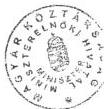

Állami Számvevőszék

TJ: 574

# JELENTÉS

az országos kisebbségi önkormányzatok
pénzügyi-gazdasági tevékenységének
vizsgálatáról

2002. január

0201

202

203

---

Az ellenőrzés végrehajtásáért felelős:

V. Önkormányzati és Területi Ellenőrzési Igazgatóság

dr. Lóránt Zoltán

számvevő igazgató

Az ellenőrzést vezette és a jelentést összeállította:

dr. Sallai Antal

régióvezető főtanácsos

Borbély Zsuzsanna

számvevő tanácsos

Huberné Kuncsik Zsuzsanna

számvevő tanácsos, tanácsadó

Az ellenőrzésben részt vettek:

Bauer Lajosné számvevő

Endrődy Péterné számvevő

Gyuk József számvevő tanácsos, főtanácsadó

Kozma Gábor számvevő

Kollár Lászlóné számvevő tanácsos

Nagy Ervin számvevő

dr. Spilák Antal számvevő tanácsos

Szűtsné Kiss Zsuzsanna szakértő

Vermes Lajos szakértő

Az ÁSZ által a témában eddig készített jelentések:

Az országos kisebbségi önkormányzatok pénzügyi-gazdasági
tevékenységének vizsgálata (1019/1995.)

Az országos kisebbségi önkormányzatok pénzügyi-gazdasági
tevékenységének vizsgálata (1008/1997.)

Az Országos Cigány Önkormányzat pénzügyi-gazdasági tevékenységének
vizsgálata (1021/1999.)

Az Országos Lengyel Kisebbségi Önkormányzat pénzügyi-gazdasági
tevékenységének vizsgálata (1014/2000.)

Jelentés az Igazságügyi Minisztérium fejezet működésének ellenőrzéséről
(0110/2001)

Jelentéseink az Országgyűlés számítógépes hálózatán
és az Interneten a www.asz.hu címen is olvashatók, továbbá a Belügyminisztérium
folyóirata, az "Önkormányzati Tájékoztató" rendszeresen közli, valamint a Megyei
Közigazgatási Hivatalvezetők részére is átadásra kerül.

---

V-1013-32/2001-2002.

# TARTALOMJEGYZÉK

|  **I. ÖSSZEGZŐ MEGÁLLAPÍTÁSOK, KÖVETKEZTETÉSEK, JAVASLATOK** | **4**  |
| --- | --- |
|  **II. RÉSZLETES MEGÁLLAPÍTÁSOK** | **9**  |
|  1. Az önkormányzatok tevékenysége és működése | 9  |
|  1.1. A kapcsolattartás formái | 9  |
|  1.2. A szervezeti rend és a feladatellátás | 10  |
|  1.3. A működés feltételrendszere | 12  |
|  2. A gazdálkodás rendjének szabályozottsága és a gazdasági folyamatok | 17  |
|  2.1. A költségvetés és a zárszámadás készítésének és jóváhagyásának kialakított rendje | 17  |
|  2.1.1. Az éves költségvetések | 17  |
|  2.1.2. A költségvetés teljesítése és a zárszámadás | 19  |
|  2.2. A gazdálkodási folyamatok szabályozottsága | 22  |
|  3. A belső ellenőrzés megszervezése és működtetése | 26  |
|  3.1. Az ellenőrzés szabályozottsága | 26  |
|  3.2. Az ellenőrzési rendszer működése | 26  |
|  4. A korábbi számvevőszéki ellenőrzések hasznosulása | 27  |

1

---

，

---

I. ÖSSZEGZŐ MEGÁLLAPÍTÁSOK, KÖVETKEZTETÉSEK, JAVASLATOK

# JELENTÉS

# az országos kisebbségi önkormányzatok pénzügyi-gazdasági tevékenységének vizsgálatáról

Az Állami Számvevőszékről szóló 1989. évi XXXVIII. törvény 2. § (5) bekezdése alapján ellenőriztük az országos kisebbségi önkormányzatoknál az állami költségvetésből juttatott támogatások felhasználását.

A nemzeti és etnikai kisebbségek jogairól szóló 1993. évi LXXVII. törvény (továbbiakban: Nek tv.) szabályozza az országos kisebbségi önkormányzatok létrehozásának rendjét, azok feladat- és hatásköreit.

A Magyarországon honos nemzeti és etnikai kisebbségnek minősülő 13 népcsoport közül 11 nemzeti és etnikai kisebbség 1995. évben megalakította országos kisebbségi önkormányzatát, a ruszin és ukrán kisebbség ekkor még nem élt törvény adta jogával.

Az 1998. évi helyhatósági választásokat követően az országos kisebbségi önkormányzatok is újjáalakultak, 1999. évtől a Nek. tv-ben elismert valamennyi nemzeti és etnikai kisebbség létrehozta országos önkormányzatát.

Az Állami Számvevőszék 1995. és 1997. évben témavizsgálat keretében ellenőrizte 11 országos kisebbségi önkormányzat pénzügyi, gazdasági tevékenységét. Jelen vizsgálat keretében, mivel a Lengyel Országos Kisebbségi Önkormányzat és a Cigány Országos Kisebbségi Önkormányzat vizsgálata soron kívül már megtörtént, munkatervünk alapján a működő 13 országos önkormányzat közül 11 pénzügyi-gazdasági tevékenységét ellenőriztük. A vizsgált szervekkel egyeztetett egyedi jelentéseket – kiegészítve a korábban elkészült Cigány- és Lengyel Országos Kisebbségi Önkormányzatok anyagaival – csatoljuk.

A vizsgálat az országos kisebbségi önkormányzatok 1999-2000. évi és 2001. első félévi gazdálkodására terjedt ki, egyes esetekben – a székházjuttatási folyamat és egyszeri vagyonjuttatás hasznosulása – a korábbi vizsgálat óta eltelt teljes időszakot áttekintettük.

Az ellenőrzés célja: annak megállapítása volt, hogy

- az orszagos kisebbségi önkormányzat muködési feltételrendszere hogyan valtozott a vizsgalt idószakban,
- a gazdalkodás szervezettsége, szabályszerüsege mennyiben feel meg a jogszabályi kovetelmenyeknek és az önkormányzati muködés sajatosságainak,
- biztositott-e a gazdalkodás és a pénzeszközök felhasznalásanak törvenyessége és szabályszerüsege, a szamviteli törveny és a vonatkozo kormányrendeletek elóirásainak betartása.

3

---

I. ÖSSZEGZŐ MEGÁLLAPÍTÁSOK, KÖVETKEZTETÉSEK, JAVASLATOK

# I. ÖSSZEGZŐ MEGÁLLAPÍTÁSOK, KÖVETKEZTETÉSEK, JAVASLATOK

**A nemzeti és etnikai kisebbségek jogairól szóló törvény célja**, hogy megteremtse a kisebbségi lét megéléséhez szükséges intézményes alapokat, beleértve az anyaországokkal és nemzetekkel való szabad, élő kapcsolattartást, továbbá elősegítse a kisebbségi létből adódó hátrányok mérséklését és felszámolását, az ehhez szükséges demokratikus intézményrendszer továbbfejlesztését.

Az országos kisebbségi önkormányzatok céljaik elérése érdekében széleskörű kapcsolatrendszert építettek ki. Az **együttműködést jogi normák nem szabályozzák**, az kizárólag **az önkéntesség alapján valósul meg**.

**Az országos kisebbségi önkormányzatok egymás közötti együttműködésének nincs kialakult rendszere**, így a közös érdekek együttes képviseletéből származó előnyök kihasználása is nehezen érvényesíthető.

A hazai nemzeti és etnikai kisebbségekkel kapcsolatos állami feladatok ellátása céljából létrehozott **Nemzeti és Etnikai Kisebbségi Hivatal** (továbbiakban: NEKH) feladatairól kormányrendelet rendelkezik. A hivatal kisebbségeket érintő tevékenységét a kormányrendelet keretjelleggel szabályozza, abban az országos kisebbségi önkormányzatokkal történő együttműködés konkrét formái (jogok és kötelezettségek) nem jelennek meg.

**Az országos kisebbségi önkormányzatok jogi személynek minősülnek**, mint választott testületek cégbírósági bejegyzéssel nem rendelkeznek, **gazdálkodásukra a kisebbségi önkormányzatok költségvetésének, gazdálkodásának, vagyonjuttatásának egyes kérdéseiről szóló kormányrendelet előírásait kell alkalmazni**. A kormányrendelet az országos önkormányzatok gazdálkodására nem ír elő még keretjelleggel sem a működési sajátosságaikat tükröző szabályrendszert.

**Az országos kisebbségi önkormányzatokat, gazdálkodásukat tekintve, a társadalmi szervezetek közé sorolták be, melyekre a számviteli törvény szerinti egyes egyéb szervezetek beszámoló készítési és könyvvezetési sajátosságai vonatkoznak. Ugyanakkor, az államháztartás működési rendjére vonatkozó kormányrendelet is nevesíti az országos kisebbségi önkormányzatokat, mintha az államháztartás alrendszerébe tartoznának. Az államháztartás részét viszont csak az általuk fenntartott költségvetési szervek képezik, az országos kisebbségi önkormányzatok csak mint felügyeleti szerveik tartoznak a kormányrendelet hatálya alá. A besorolásukra, gazdálkodásukra vonatkozó jogi szabályozás nem egyértelmű, félreérthető.**

Az országos és helyi kisebbségi önkormányzatok között alá- és fölérendeltség nincs, céljaik közel azonosak, működési körülményeik, gazdálkodási rendjük mégis eltérő.

4

---

I. ÖSSZEGZŐ MEGÁLLAPÍTÁSOK, KÖVETKEZTETÉSEK, JAVASLATOK

A helyi kisebbségi önkormányzatok gazdálkodása beépül az államháztartás információs rendszerébe, a költségvetés és zárszámadás része a helyi önkormányzat vonatkozó rendeletének, törvényességi felügyeletük is megoldott a megyei, fővárosi közigazgatási hivatalok által.

Az országos kisebbségi önkormányzatok döntési jogosítványait, feladat- és hatásköreit a Nek. törvényben főbb vonalakban meghatározzák, ellenben ezek **nem kötelezettségként, hanem sokkal inkább lehetőségként fogalmazódnak meg.** Az országban egyre bővülő kisebbségi civil szervezetek, különösen az 1995. előtt is működő nemzeti szövetségek feladatai és az országos kisebbségi önkormányzatok tevékenységi köre nem különül el élesen, azok összehangolása konszenzuson alapul és párhuzamosságoktól sem mentes.

**Az országos kisebbségi önkormányzatok törvényességi felügyelete nem megoldott,** ebből a joghézagból adódóan a működés folyamatosságát és szabályszerűségét semmilyen szervezet nem kontrollálja.

A jogszabályi keretek hiánya miatt a vizsgált 11 országos kisebbségi önkormányzat gazdálkodási rendje sem egységes, a számviteli rend, a készítendő beszámoló nem tükrözi a feladatellátásból következő sajátosságokat.

**Az országos önkormányzatok feladatai között** – annak ellenére, hogy azok nem részei az államháztartásnak – **a törvény a költségvetési rendben gazdálkodó szervezeteknél használatos fogalmakat rögzít** (költségvetés, zárszámadás, törzsvagyon stb.), de azok mögöttes tartalmára vonatkozóan semmilyen útmutatást nem ad. Ebből következik, hogy a költségvetések, zárszámadások szerkezeti felépítése az önkormányzatoknál más és más, többnyire éven belül sem összehasonlíthatók az adatok, de gyakori az egyes gazdálkodási évek között azok belső tartalmának a mindenkori információs igényekhez való hozzáigazítása, megváltoztatása is.

**A társadalmi szervezetek gazdálkodására vonatkozó előírások csak a tevékenység célja szerinti és az esetleges vállalkozáshoz kapcsolódó bevételek, költségek elkülönítéséről rendelkeznek.**

Az országos önkormányzatoknál vállalkozásnak minősülő tevékenység nem folyik, így a bevételek és költségek néhány kiemelt csoportján felül jogszabályi előírás nincs azok további kötelező részletezésére. Emiatt **nem lehet értékelni, hogy ezek a szervezetek mennyit költenek hivataluk működtetésére, fenntartására, az egyes kisebbségi feladatok, projektek megvalósítására.**

A könyvvezetési rendjük sem egységes, mivel a jogszabályok lehetővé teszik számukra az egyszeres, vagy kettős könyvvitel alkalmazását.

A beszámoló készítésre vonatkozó kormányrendelet nem tükrözi ezeknek a szervezeteknek működési sajátosságait, nem veszi figyelembe, hogy ezek az önkormányzatok alapvetően pénzforgalmi szemléletben gazdálkodnak, nincs összhang a testület számára készítendő zárszámadás és a kormányrendelet szerinti beszámoló tartalma között sem.

Az országos kisebbségi önkormányzatok a Nek. törvényben foglaltak szerint vállalhatják költségvetési intézmények fenntartását, működtetését, ezzel a lehetőséggel viszont ezek a szervezetek nem éltek (mindössze egy önkormányzat vállalt ilyen többletfeladatot), mivel **a feladatellátás hosszú távú finan-**

5

---

I. ÖSSZEGZŐ MEGÁLLAPÍTÁSOK, KÖVETKEZTETÉSEK, JAVASLATOK

**szírozási garanciáit a jelenlegi jogszabályok nem biztosítják.** A feladatmutatóhoz kapcsolt normatív támogatás a humán szolgáltatást ellátó nem állami intézményekkel azonosan megilleti ezeket a szervezeteket is, de amennyiben ez nem fedezi a fenntartási kiadásokat, vagy olyan tevékenység vállalásáról van szó, amelyhez ilyen normatíva nem kapcsolható (pl. kulturális intézmény), a finanszírozás rendje nem kidolgozott, és annak folyamatossága sem garantált. A törvény utal arra, hogy ez utóbbi esetben az országos önkormányzatok e feladatokhoz költségvetési támogatást igényelhetnek, de nem részletezi ennek működési mechanizmusát.

**Az országos kisebbségi önkormányzatok székházhoz juttatásáról a Nek. törvény rendelkezett, melynek értelmében részükre a Kincstári Vagyoni Igazgatóság által megvásárolt, a magyar állam tulajdonában lévő ingatlanokat ingyenes használatba adták.**

A korábbi számvevőszéki vizsgálat óta eltelt időszakban a székházjuttatási folyamat lezárult, **ma már biztosítottak a működés alapvető tárgyi feltételei.**

Az ingatlanok használatba adásakor a felek a jogokat, kötelezettségeket részletes megállapodásban rögzítették, abban a költségek viselésének módját is meghatározták. Egy önkormányzat kivételével ezideig ezzel kapcsolatban probléma nem adódott, **az örmény önkormányzat** azonban olyan **nagy mértékű adósságot halmozott fel székházának működtetésével kapcsolatban**, hogy emiatt azt el kellett hagynia, **ingyenes használati jogát felfüggesztették.**

Az ukrán önkormányzat székházát jelenleg is megosztva használja azzal az egyesülettel, amelynek részére a helyiségeket az országos önkormányzat megalakulásáig biztosították, de ezt követően sem rendezték a helyzetet kormányzati intézkedéssel.

Az országos önkormányzatok feladatellátásának személyi feltételrendszere rendkívül eltérő, **előfordulnak 1-3 fős hivatalok is.**

Annak ellenére, hogy a könyvvezetést rendszerint megbízás alapján külső szervezetek végzik, a gazdálkodáshoz kapcsolódó tevékenységek egy része - jellemzően a bizonylatolás, a pénzkezelés, a gazdálkodási jogkörök gyakorlása – a hivatalon belül zajlik és szakértelmet is igényel az alkalmazottaktól.

A Magyarországon élő nemzeti és etnikai kisebbségek nyelvhasználati jogáról a Nek. tv. VII. fejezete részletesen rendelkezik, a kisebbségi és regionális nyelvek védelméről szóló európai charta előírásai komoly kötelezettségeket írnak elő az állam számára.

**Az országos önkormányzatoknál jellemző a nyelvhasználati jog következetes érvényesítése,** ami abban is megnyilvánul, hogy a mindennapi munkavégzés során anyanyelvüket használják, némelyek a működésükhöz kapcsolódó iratanyagokat (szabályzatok, testületi anyagok, költségvetések, zárszámadások, munkaköri leírások stb.) is csak a kisebbség nyelvén készítik el.

A számvevőszéki vizsgálatok során a gazdálkodás törvényességének, célszerűségének megítéléséhez nem elegendő a számviteli törvény által előírt könyvvezetéshez kapcsolódó, magyar nyelven kiállított pénzügyi bizonylatok áttekintése, a vizsgálatok célnak megfelelő lefolytatása ennél jóval széleskörűbb doku-

6

---

I. ÖSSZEGZŐ MEGÁLLAPÍTÁSOK, KÖVETKEZTETÉSEK, JAVASLATOK

mentumok felülvizsgálatát igényli (közgyűlési, elnökségi, bizottsági jegyzőkönyvek, határozatok, a működésről készült beszámolók, gazdasági témájú előterjesztések, azok indoklása stb.).

Az ellenőrzött szervezetek a vizsgálat során kérésre a fontosnak ítélt dokumentumokat lefordítják, de egyrészt azt nem tekintik feladatuknak, másrészt így valamennyi iratanyag áttekintésére nincs lehetőség, s az ellenőrzés hatóköréből kikerülhet olyan lényeges körülmény megismerése, amely a gazdálkodás minősítéséhez elengedhetetlen lenne.

**Az országos önkormányzatok** működési költségeik biztosítására 1996-1997. években **300 millió Ft egyszeri vagyonjuttatásban részesültek** a Nek. törvényben foglaltaknak megfelelően. Az állam ezt a kötelezettségét MOL Rt. részvények akkori árfolyamértéken számított átadásával teljesítette, a vagyon nagyságrendje differenciált a 13 nemzeti és etnikai kisebbség lélekszámához igazodóan.

**Az önkormányzatoknál az egyszeri vagyonjuttatásból származó többletforrások felhasználása működési céljaik megvalósítását szolgálta, egyiküknél azonban a súlyos pénzügyi, gazdálkodási szabálysértések miatt ennek folyamata nem követhető nyomon.**

Az országos önkormányzatok a törvény által előírt feladataikat **alapvetően állami pénzeszközből látják el.**

Az egyéb forrásból származó bevételek, a külföldi adományok nagyságrendje az összevételeken belül általában nem jelentős, kivétel a német önkormányzat, amelynek céljai eléréséhez jelentős adományokat nyújt az anyaország kormánya.

A központi költségvetés az országos önkormányzatok működéséhez évente meghatározott összeggel járul hozzá, **az állami pénzeszközök között arányát tekintve ez a legjelentősebb támogatás.** Az évente e címen rendelkezésre bocsátott összegek nagyságrendje differenciált az önkormányzatok között, **az elosztásnál konkrét finanszírozási elvek nem érvényesülnek**, főként a kisebbség számosságát veszik figyelembe. A működési támogatás meghatározásához nem állnak rendelkezésre olyan számítások, amelyek az elvárható szintű feladatellátás minimális költségszükségletét kimutatnák, igaz azonban az is, hogy egyes önkormányzatok könyvelési rendszere sem alkalmas arra, hogy ennek a támogatásnak a felhasználását konkrétan bemutassa.

Az önkormányzatok forrásai között jelentős nagyságrendet képviselnek még a különböző, szintén állami pénzeszközökből finanszírozott, kormányzati szervek által kiírt pályázatokon elnyert többletbevételek. Ezek az egyedi támogatások konkrét kisebbségi célok (pl. különböző programok, rendezvények, kiadványok megjelentetése, nyelvi táborok szervezése) megvalósítását szolgálják, rendszerint felhasználásuk is elszámolási kötelezettséggel jár együtt. A leghangsúlyosabb a Magyarországi Nemzeti és Etnikai Kisebbségekért Közalapítvány támogatása, emellett ma már több szakminisztérium segíti a kisebbségek feladatellátását e célra elkülönített forrásaiból a kiírt pályázatok révén.

A pályázati kiírások szerint a pótlólagos források elnyerésére valamennyi kisebbségi céllal létrejött szervezet pályázhat, az elbírálásnál többnyire nem élveznek előnyt a kiemelt feladatkört ellátó országos kisebbségi önkormányzatok.

7

---

I. ÖSSZEGZŐ MEGÁLLAPÍTÁSOK, KÖVETKEZTETÉSEK, JAVASLATOK

A kisebbségi célú tevékenységek állami támogatásának többszatornás finanszírozási rendszeréből következik, hogy a színvonalas feladatellátáshoz elengedhetetlenül szükséges többletforrások nehezen tervezhetők.

Az önkormányzatok gazdálkodásának helyi szintű szabályozása nem felel meg mindenben az előírásoknak, azok egyrészt hiányosak, másrészt a helyi szintű sajátosságokat nem tükrözik.

A gazdálkodási fegyelmet ezeknél a szerveknél a kisebb hiányosságok jellemzik, de egyiküknél jelentős, súlyos szabálytalanságot is feltártunk a vizsgálat során, amelynek kapcsán büntető feljelentést tettünk.

A gazdálkodás terén pozitívum, hogy többnyire érvényesült a takarékossági és ésszerűségi követelmény, komoly likviditási gondok nem jelentkeztek, tevékenységüket a biztonságos gazdálkodás elve figyelembevételével végezték.

Az országos kisebbségi önkormányzatoknál a belső ellenőrzési rendszer továbbra sem kiépített, az e célra megalakított szakbizottságok tevékenysége sem kielégítő.

Az önkormányzatok a korábbi számvevőszéki vizsgálat kapcsán tett javaslatokat csak részben hasznosították, azok csakúgy, mint most is, kellően részletezett jogszabályi előírások hiányában a működés célszerűségének javítására irányultak, megvalósításukat az időközben újjáalakult önkormányzatok vezetőitől, a közgyűléstől számon kérni nem lehet.

Az 1997. évben lefolytatott számvevőszéki vizsgálat tapasztalatai alapján javaslatokat fogalmaztunk meg, amelyeket ma is időszerűnek tartunk és megvalósításukat ismételten kezdeményezzük.

Az ellenőrzés részletes megállapításainak hasznosítása mellett javasoljuk a Kormánynak:

1. Gondoskodjon az országos kisebbségi önkormányzatok gazdálkodására vonatkozó jogszabályok (Nek. tv., országos kisebbségi önkormányzatok, társadalmi szervezetek gazdálkodásával kapcsolatos, valamint az államháztartás működési rendjéről szóló kormányrendeletek) előírásainak összehangolásáról.
2. Kezdeményezze a törvényességi felügyelet kiterjesztését az országos kisebbségi önkormányzatokra.
3. Kezdeményezze a Nek. törvény módosítását az országos kisebbségi önkormányzatok működési hozzájárulásának megállapításánál figyelembe veendő támogatási elvek meghatározása; továbbá az intézményeik alapításához, fenntartásához, működtetéséhez szükséges konkrét feltételrendszer megállapítása, a feltételeknek való megfelelés esetén a törvényi garanciák megteremtése céljából.
4. Intézkedjen a Pénzügyminisztérium felé az országos kisebbségi önkormányzatok gazdálkodására, számvitelére kötelezően alkalmazandó egységes szabályrendszer kidolgozásáról, mely működési sajátosságaikat figyelembe veszi.

8

---

II. RÉSZLETES MEGÁLLAPÍTÁSOK

## II. RÉSZLETES MEGÁLLAPÍTÁSOK

### 1. AZ ÖNKORMÁNYZATOK TEVÉKENYSÉGE ÉS MŰKÖDÉSE

#### 1.1. A kapcsolattartás formái

Az országban élő, magyar állampolgárságú nemzeti és etnikai kisebbségek nyelve, tárgyi és szellemi kultúrája, történelmi hagyományai önazonosságuk része, ezeknek az értékeknek megőrzése, ápolása, gyarapítása a kisebbségek alapvető joga.

**Az országos önkormányzatok legalapvetőbb célja a hozzájuk tartozó közösségek érdekeinek védelme, kiemelten hangsúlyos tevékenységükben az anyaország kultúrájának, történelmi hagyományainak terjesztése, ápolása, a nyelvoktatás szervezése, segítése.**

Az országos kisebbségi önkormányzatok különböző kutatások, felmérések eredményeként általános ismeretekkel rendelkeznek a kisebbségükhöz tartozók létszámáról, életkörülményeiről.

A nemzeti kisebbségek egy része viszonylag jól körülhatárolható területen él, a többiek elhelyezkedésére a nagy területi szétszórtság jellemző.

**Feladatellátásuk érdekében, elsősorban az önkéntesség elve alapján, egyre szélesedő kapcsolatrendszert építettek ki a helyi kisebbségi önkormányzatokkal, a kisebbségi civil szervezetekkel, egyházakkal, a különböző nemzetiségi oktatási és kulturális intézményekkel, nemzetiségi műsorokat szolgáltató médiával.**

Jó partnerkapcsolataik vannak az állami intézményekkel, kormányzati szervekkel, így kiemelten az oktatási és a kulturális tárcával, az Igazságügyi Minisztérium felügyelete alatt működő Nemzeti és Etnikai Kisebbségi Hivatallal, a kisebbségi jogok országgyűlési biztosával, az Országgyűlés emberi jogi, kisebbségi és vallásügyi bizottságával. A kisebbségpolitikai célok megvalósítása érdekében széleskörű együttműködés valósul meg a politikai pártokkal, továbbá nemzetközi kisebbségvédelmi szervezetekkel

Néhány önkormányzat kiterjedt kapcsolatokkal rendelkezik az anyaország kormányával is (német, szlovák), de valamennyiük együttműködik az ott tevékenykedő kulturális, oktatási, tudományos intézményekkel, szervezetekkel, gyakoriak a közös rendezvények, tanácskozások, konferenciák, a közös kiadványok megjelentetése, a kölcsönös vendégszereplések (színház, folklórcsoportok stb.).

**Az együttműködésnek nincsenek írásos dokumentumai, az főként egymás kölcsönös tájékoztatásával, anyagi segítség nyújtásával valósul meg, továbbá az egyre erőteljesebbé váló szakmai, szervezési, jogi, érdekképviseleti tevékenységen keresztül érvényesül. Kivételt képez a szlovén önkormányzat,**

9

---

II. RÉSZLETES MEGÁLLAPÍTÁSOK

amelyik a Szlovén Köztársaság Magyarországgal határos részén működő hat helyi önkormányzattal kötött szlovén nyelvű írásos együttműködési megállapodást.

## 1.2. A szervezeti rend és a feladatellátás

**Az országos önkormányzatok 1995. évi megalakulásukat követően elkészítették a működési rendjüket tartalmazó Szervezeti és Működési Szabályzataikat.** Két esetben ezt a szabályrendszert Alapszabálynak nevezték, mely valójában egyéb más rendelkezések hiányában és tartalmát tekintve is SZMSZ-nek minősül. Az 1998. évi helyhatósági választásokat követően az országos kisebbségi önkormányzatok 1999. évben újjáalakultak, ekkor már az ukrán és ruszin közösség is létrehozta országos önkormányzatát. Egyik önkormányzatnál átmeneti nehézségek adódtak, de a Nek. tv. 1999. évi módosítása lehetővé tette, hogy az első alkalommal határozatképtelen elektori gyűlést ismételten összehívják, így a sikeres választással a probléma megoldást nyert.

A Magyarországi Román Országos Önkormányzat 1999. év elején a sikertelen elektori ülés - a szükségesnél kisebb arányú részvétel - miatt megszűnt. Az önkormányzat által használt ingatlanokat a Kincstári Vagyoni Igazgatóság visszavette, s az Igazságügyi Minisztérium levelében közölt felszámolási feladatokat is végrehajtották. (Hiv.sz:87062/1999.) A feladatellátás zavartalansága érdekében létrehozták a Magyarországi Román Önkormányzatok Szövetségét, mely működéséhez az ingatlanokat, berendezéseket visszakapta, ellenben azok használatáért bérleti díjat kellett fizetnie. A működést a folyamatos forráshiány egészen az országos önkormányzat újjáalakulásáig (1999. okt. 2.) nehezítette, a feszültségek azt követően oldódtak.

Az önkormányzatok szervezeti és működési szabályzatai többnyire tartalmazzák az ellátandó feladatokat, a kialakított szervezeti felépítést (közgyűlés, elnök, elnök-helyettesek, alelnökök, elnökség, kabinet, bizottságok, hivatal stb.), s az ahhoz rendelt hatásköröket, a képviselők jogállását, a különböző felelősségi szabályokat, rendszerint általánosságban kitérnek a gazdálkodás, a vagyonnal való rendelkezés, a költségvetés és zárszámadás elkészítésével kapcsolatos tevékenységre is.

**A feladatok meghatározása mindenütt összhangban volt a Nek. tv. 35-39. §-ok előírásaival, ellenben a korábbi vizsgálatunk tapasztalataihoz hasonlóan az önkormányzatok mintegy fele továbbra sem fordított kellő figyelmet arra, hogy az SZMSZ (Alapszabály) a helyi sajátosságokat tükröző gyakorlati működési rendet az aktualitásnak megfelelően tartalmazza.**

A szlovén és a szerb önkormányzat az újjáalakulása után új szabályzatot nem alkotott, jelenleg is az 1995. évben jóváhagyott van érvényben, amely több területen eltér a valóságos működéstől. (Pl. bizottságok létrehozása, egyes szervezeti egységek feladatai, döntési jogköre)

Azoknál az önkormányzatoknál, ahol 1999. évben új SZMSZ-t fogadtak el, a feladat- és hatáskörök, felelősségi körök meghatározása túlságosan általános, az un. átruházott hatáskörök jegyzéke hiányzik, a döntésmechanizmus (ki, mi-

10

---

II. RÉSZLETES MEGÁLLAPÍTÁSOK

kor, milyen rendelkezés alapján dönthet) nehezen nyomonkövethető (görög, örmény, román, ruszin, szlovák, ukrán).

A működési szabályzatok hiányossága továbbá, hogy az egyéb területen meglévő konkrét szabályozás esetén az arra való hivatkozás elmarad. (Pl. kötelezettségvállalások rendje, a költségvetés, zárszámadás készítésének, jóváhagyásának folyamata, a szerkezeti felépítés meghatározása) Jellemző, hogy az országos önkormányzatok az egyes gazdálkodást érintő feladatokról, döntésekről egyedi határozatokat hoznak, de ezek rendszere, tartalma esetenként az anyanyelv használatából következően - mely egyik legfontosabb önrendelkezési joga ezeknek a szervezeteknek - nehezen áttekinthető.

Az országos kisebbségi önkormányzatok, feladatellátásuk részeként, kulturális autonómiájuk megteremtése érdekében intézményeket hozhatnak létre (színház, múzeum, közgyűjtemény, könyvtár, kiadó stb.), oktatási intézmények fenntartását is vállalhatják.

Az önkormányzatok közül mindössze négyen éltek ezzel a jogukkal, **ezeknek a feladatoknak finanszírozási garanciái jelenleg még megoldatlanok**. Költségvetési oktatási intézmény fenntartását egyetlen önkormányzat vállalta fel, a többi szervezet egyéb formában végzi tevékenységét.

Az Országos Horvát Önkormányzat 2000. aug. 1-től alapította meg a Hercegszántói Horvát Nyelvű Óvoda Iskola és Diákotthon nevű intézményt. (Működésre átvette a helyi önkormányzattól, mivel azt a helyi magyar iskolával akarták költségtakarékossági okokból összevonni.) A korábbi tulajdonos önkormányzat az ingó- és ingatlanvagyont használatra átadta, az intézmény finanszírozhatósága érdekében az országos önkormányzat közoktatási megállapodást kötött a Bács-Kiskun Megyei Önkormányzattal. (Hercegszántó Község Önkormányzata hozzájárul a finanszírozáshoz.) Az intézmény éves költségvetése, beszámolója elkülönítve készül, beépül a horvát önkormányzat költségvetésébe és zárszámadásába. A normatív támogatásra a Költségvetési Törvény értelmében a fenntartó jogosult. Ez a megoldás mégsem mindenben optimális, mert a fenntartó budapesti székhelye miatt az egyéb kistelepülésnek adható támogatástól elestek. (A gondok átmeneti, 2000. évi megoldását a horvát önkormányzat által saját forrásból, valamint az Igazságügyi Minisztérium intervenciós keretéből nyújtott támogatás jelentette.)

A kisebbségi célok megvalósítása érdekében három önkormányzat döntött egyéb intézményes feladatellátásról, ezek finanszírozása szerves része a rendelkezésre álló forrásaik felhasználásának.

A német önkormányzat tagja a bajai székhelyű intézményfenntartó társulást kiváltó közalapítványnak, amely a Magyarországi Németek Általános Művelődési Központja kulturális intézményt működteti.

A szlovák önkormányzat 2001. májusában átvette fenntartásra, működtetésre a Szövetségtől a békéscsabai székhelyű Magyarországi Szlovákok Kutatóintézetét. A döntést korábbi finanszírozási problémák indokolták, az intézmény jogi személyiséggel nem rendelkezik.

A bolgár önkormányzat 1997. évben hozta létre a Magyarországi Bolgárok Kutatóintézetét. Tevékenysége beépül az országos önkormányzat feladataiba, intézményként nincs bejegyezve, önálló főállású munkatársai sincsenek. (Kutatási területe a bolgárok eredete, letelepedése, élete, múltja, jelene stb.)

11

---

II. RÉSZLETES MEGÁLLAPÍTÁSOK

Az önkormányzatok vállalkozásokban való részvétele még nem terjedt el, közülük három, tagja valamilyen gazdasági társaságnak, melyek többnyire közhasznú tevékenységet folytatnak.

A német önkormányzat a Német Ház és az 1999. évben vásárolt belvárosi ingatlanok működtetésére egy Kft-t hozott létre. (Fő tevékenysége ingatlankezelés, ifjúsági- és turistaszállás szolgáltatással, éttermi, munkahelyi étkeztetés, könyvtár és levéltár működtetése.)

Városlőd Község Önkormányzatával közösen 2000. novemberében létrehozták a Városlődi Villa Oktatás- Fejlesztési- Üdültetési és Étkeztetési Kht-t (50-50 % törzsbetét). A társaság célja a német kisebbség kultúrájának, népi hagyományának, oktatási ellátásának biztosítása, konferenciák, ifjúsági táborok szervezése, képzés és továbbképzések megtartása stb.

A horvát önkormányzat 1999. évben a Magyarországi Horvátok Szövetségével közösen megalapította a CROATICA Kulturális, Információs Kiadói Kht-t. (Az önkormányzat részesedése 51 %.) A társaság célja a magyarországi horvát kisebbség kulturális tevékenységével, anyanyelvi örökségének megóvásával kapcsolatos szervezési, valamint könyvkiadási, tájékoztatási szolgáltatás nyújtása.

A szlovén önkormányzat 100 %-os tulajdonosa a Szlovén Rádiók Szolgáltató Kht-nek. A Kht Szentgotthárd körzetében korlátozott műsoridőben szlovén nyelvű kulturális és egyéb ismeretterjesztő műsorokat sugároz, ideiglenes frekvenciahasználati engedéllyel rendelkezik. Tevékenységi köre a cégbírósági bejegyzés szerint a műsorszolgáltatásnál jóval szélesebb. (Pl. közvélemény-kutatás, hirdetési-hírügynökségi tevékenység, könyv- és zeneműkiadás)

### 1.3. A működés feltételrendszere

Az országos kisebbségi önkormányzatok működéséhez szükséges tárgyi feltételek biztosításáról a Nek. tv. 59. §-a rendelkezett, mely szerint erre a célra 150-300 m² közötti hasznos alapterületű ingatlan ingyenes használati jogát kell részükre biztosítani. **Az önkormányzatok megalakulásukat követően kiválasztották a székház céljára igénybe venni kívánt ingatlanokat, melyeket a Kincstári Vagyoni Igazgatóság a Kormány döntésének megfelelően megvásárolt, s a szükségszerű felújításokat, átalakításokat követően a két fél közötti megállapodás szerint ingyenes használatra azokat átadta.**

Az országos kisebbségi önkormányzatok székházingatlanaiknak nem tulajdonosai csak használói, számviteli nyilvántartásaikban azok nem szerepelnek.

Az 1997. évben lefolytatott azonos témájú számvevőszéki vizsgálat során megállapítottuk, hogy a székházjuttatás nem lezárt folyamat, a tulajdonszerzés, az ingatlan indokolt felújítási költségei tekintetében nem volt mindenben egyetértés az önkormányzatok és a kormányzati szervek között.

Időközben a felek kompromisszumkészségét is bizonyítva **a székházhoz jutás megoldódott, a rendeltetésszerű használatra alkalmassá tett irodáikat az önkormányzatok átvették**, azokba beköltöztek, ezzel alapvető működési feltételeik lényegesen javultak.

A vizsgált önkormányzatok közül kettőnek - román és szlovén - választásuknak megfelelően vidéken van a székhelye (Gyula, Felsőszölnök), emiatt részükre a

12

---

II. RÉSZLETES MEGÁLLAPÍTÁSOK

fővárosban kirendeltség céljára is biztosítottak kisebb alapterületű ingatlanokat.

A budapesti székhelyű önkormányzatok egyharmada úgy választotta ki székházát, hogy a törvényben előírtnál nagyobb alapterületen, de a kisebbséghez tartozó fővárosi önkormányzattal együtt nyerjen elhelyezést. Ez a megoldás a feladatellátás, a kapcsolattartás szempontjából jónak bizonyult, ezeknek a szervezeteknek kiemelkedően eredményes és hatékony az együttműködése, amely előnyösen hat a kisebbségpolitikai célok megvalósítására is.

A horvát, a görög és a szerb országos önkormányzat a kisebbségükhöz tartozó fővárosi önkormányzattal a részükre átadott ingatlanrész használatáról külön megállapodást kötött, melyben a költségmegosztás módjáról, arányáról is határoztak (rezsi, társasházi közös költség felújítási rész nélkül, takarítás stb.).

A gyulai székhelyű román önkormányzat épületében szintén helyet biztosít a helyi kisebbségi önkormányzatnak.

Sajátos helyzetben van a német önkormányzat, mivel a részükre átadott épület alapterülete a törvényi maximumot meghaladja (451 m²), emiatt annak egy része után bérleti díj fizetésére kötelezettek.

A német önkormányzat és a Kincstári Vagyoni Igazgatóság 138 m² alapterületre vonatkozóan 1998. decemberében külön bérleti szerződést kötött.

A ruszin és ukrán önkormányzatok - melyek a vizsgált időszakban alakultak meg - székházellátottsága megoldott. A ruszin önkormányzat megalakulását követően a többi országos önkormányzathoz hasonlóan megválaszthatta székhelyét, azt részére a 2315/2000. (XII.20.) Korm. határozat szerint biztosították. Az ukrán önkormányzat ugyanakkor sajátos helyzetben volt, számára a Kormány a megalakulást két évvel megelőzően határozatilag kijelölte a később székhelyül szolgáló ingatlant, választási lehetőséggel így nem élhetett. Az önkormányzat az elhelyezési körülményekkel elégedetlen, s azt nem tekinti véglegesnek.

A 2040/1997. (II. 19.) Korm. határozat az ukrán kisebbségnek oktatási és kulturális tevékenység céljára ingatlant biztosított. Az országos kisebbségi önkormányzatot megalakulása után megillető ingatlant átmenetileg a Magyarországi Ukrán Kulturális Egyesület vehette át. A kijelölt ingatlant az országos önkormányzat jelenleg a kulturális egyesülettel közösen használja, annak ellenére, hogy az ingyenes használatról a Kincstári Vagyoni Igazgatóság az önkormányzattal kötött megállapodást. Az önkormányzat véleménye szerint az épület külső és belső feltételei nem felelnek meg a székház igényeinek, emiatt új, végleges megoldást kezdeményeztek a kormányzati szervek felé.

**Az országos kisebbségi önkormányzatok a részükre biztosított ingyenes ingatlanhasználattal kapcsolatos kötelezettségeiket (a megállapodásban foglalt részletes feltételeket) egy kivétellel rendre teljesítették, abból eddig problémák nem adódtak.**

Az örmény önkormányzat a "Duna-ház" harmadik emeletén választott irodahelyiséget magának, az ehhez szükséges tulajdonjogot a Kincstári Vagyoni Igazgatóság meg is szerezte, s az ingatlanrészt ingyenes használatba adta. Az irodahasználattal kapcsolatban az önkormányzat fizetési kötelezettségeit nem teljesí-

13

---

II. RÉSZLETES MEGÁLLAPÍTÁSOK

tette, 1999. év végére 6 millió Ft közös költség hátralékot halmozott fel, így maga kezdeményezte az ingyenes használat felfüggesztését. Erről az önkormányzat és a Kincstári Vagyoni Igazgatóság 1999. dec. 13-án megállapodott egymással. Ezt követően az önkormányzat kiköltözött irodáiból, jelenleg ideiglenesen az Örmény Kulturális és Információs Központban működik, a tartozása az üzemeltetővel szemben a vizsgálat befejezéséig nem rendeződött.

**A működés alapvető tárgyi feltételeként a székházjuttatással nem járt együtt olyan kormányzati intézkedés, amely azoknak megfelelő, és a korszerű munkavégzés igényeit is kielégítő berendezését, felszerelését is biztosítja.** A problémát többen jelezték az ingatlanok birtokbavételekor, s további intézkedést vártak elsősorban a Nemzeti Etnikai Kisebbségi Hivataltól, de ilyen irányú segítség részükre nem érkezett. **Az önkormányzatok időközben pénzmaradványukból, de főként az egyszeri vagyonjuttatás során kapott részvények értékesítéséből, egyéb saját forrásaikból beszerezték a legfontosabb eszközöket,** (bútorok, irodatechnikai gépek, számítógépek stb.), így ma már jó körülmények között, ízlésesen berendezett irodákban fejtik ki tevékenységüket.

**Az önkormányzatok közül kettőnek - német és szlovák - a berendezéshez adomány formájában jelentős segítséget nyújtott az anyaország kormánya is.**

**Az országos önkormányzatok feladatellátásának állami támogatása többcsatornás finanszírozási rendszer keretében működik.** Az éves költségvetési törvényekben meghatározott működési támogatáson felül a kisebbségi célok megvalósítását különböző pályázatokon elnyert pénzeszközök is segítik, ezek viszont **nem garantált támogatások, nehezen tervezhetők és esetlegesek.**

**A Nek. tv. 63. § (4) bekezdése rendelkezett arról, hogy az országos kisebbségi önkormányzatok működési költségeik biztosítására egyszeri vagyonjuttatásban részesítendők.** Ennek megfelelően az 1996. évi költségvetésről szóló 1995. évi CXXI. tv. módosítása előírta, hogy a vagyonjuttatást az ÁPV Rt. az állam vállalkozói vagyonának értékesítendő részéből 1996. dec. 31-ig összesen 300 millió Ft árfolyamértékű vagyon pénzbeli térítés nélküli átadásával teljesítse. Az ÁPV Rt. Igazgatósága úgy döntött, hogy MOL Rt. részvényeket ad át az önkormányzatoknak (293/1996. (IV. 24) sz. hat.).

A 300 millió Ft árfolyamértékű vagyon a nemzetiségként elismert 13 nemzeti és etnikai kisebbségnek átadott vagyontömeg, ebből a vizsgált önkormányzatok 225 millió Ft-tal részesedtek.

**Az ellenőrzésbe bevont 11 önkormányzat közül négy (német, horvát, szlovák, román) 30 millió Ft-os, a további hét pedig 15 millió Ft-os vagyonjuttatást kapott.**

Az ÁPV Rt. a részvényvagyon átadásáról az 1996. évben már működő kilenc önkormányzattal megkötötte a megállapodást, melyben a MOL Rt. részvények árfolyamértékét az 1996. márciusi tőzsdei átlagáron - 170,2 % - határozta meg.

14

---

II. RÉSZLETES MEGÁLLAPÍTÁSOK

A 30 milliós vagyonérték ellenében 17626 ezer Ft névértékű, a 15 millió Ft-ban részesülők esetében 8813 ezer Ft névértékű MOL Rt. részvény került az önkormányzatok birtokába.

Az 1999. évben megalakult ruszin és ukrán országos kisebbségi önkormányzat a Kincstári Vagyoni Igazgatóságtól vette át a MOL Rt. részvényeket, de a korábbiaktól eltérő feltételekkel. Addig, amíg az 1996-1997. években átadott részvények felett a továbbiakban azok tulajdonosai szabadon rendelkezhettek, az 1999. évi megállapodásban egyrészt 590 %-os árfolyamértéket vettek figyelembe a részvények értékének meghatározásakor, másrészt azt is kikötötték, hogy az átvett részvénycsomagot egy hónapon belül minimum 590 %-os árfolyamon kötelesek értékesíteni, s az ezen felüli esetleges árfolyamnyereséget a Kincstár számlájára be kell fizetniük. Ugyanakkor a kedvezőtlen árfolyam-alakulás és a tranzakció költségéből adódó 'különbözetet' a Kincstári Vagyoni Igazgatóság részükre megtéríti.

Mindkét önkormányzat értékesítette a MOL Rt. részvényeket, s valójában a 15 millió Ft készpénzvagyonhoz így hozzájutott, ellenben elesett attól a lehetőségtől, amely a korábban jóval alacsonyabb árfolyamú részvény átadásából, s annak forgatása révén hozadékából származhatott volna.

**Az önkormányzatok az egyszeri vagyonjuttatással kapott részvénycsomagot** kezdetben különböző cégeknél letétbe helyezték, később azonban **többnyire azok egy részét, vagy teljes egészét értékesítették, s rendszerint a bevételeket újra valamilyen formában befektették.**

Az önkormányzatok 45 %-ának nincs már tulajdonában eredetileg átvett MOL Rt. részvény, 55 %-uk azok egy részét még birtokolja. (A görög önkormányzat az átvételt követően azt letétbe helyezte, értékesítésről nem döntöttek.)

**Különösen jó, körültekintő döntéseket hozott** a részvényvagyon hasznosításával kapcsolatban **négy önkormányzat**, a lebonyolított tranzakciók révén jelentős többlethasszonra tettek szert, illetve egyikük komoly veszteséget került el.

A német önkormányzat 1998. évben 6.345 Ft-os átlagáron adta el részvényei felét, ebből 56 millió Ft-os bevétele keletkezett, melyből ingatlant vásárolt.

A horvát önkormányzat a részvényértékesítésből befolyó árbevételt ingatlanszerzésre használta, továbbá kedvező hozamú diszkont kincstárjegyekbe fektette be.

A szlovén önkormányzat a 15 millió Ft árfolyamértékű részvénye értékesítésével 47 millió Ft-hoz jutott, ezzel a vagyonérték kétszeresének megfelelő többletforrást könyvelhetett el.

A szlovák önkormányzat amellett, hogy a részvények eladásából 50 millió Ft bevétele származott, gondosságának köszönhetően a maradék részvényeinek elvesztését is megakadályozta. A brókercég, ahol azt letétbe helyezte csődbe ment, a gyors intézkedés (azonnali feljelentés) következtében pernyertesként tavaly a tőketartozásához egyezséggel hozzájutott. (A kamatkövetelésről lemondtak, így a 45 millió Ft 2000. márciusában a bírósági ítélet alapján befolyt a számlájukra.)

15

---

II. RÉSZLETES MEGÁLLAPÍTÁSOK

**A részvényvagyon felhasználásával kapcsolatos döntések két önkormányzatnál részben nem követhetők nyomon, illetve a hozott döntéseik következtében vagyonukat részben, vagy teljesen felélték.**

**Az örmény önkormányzat** az egyszeri vagyonjuttatásként kapott MOL Rt. részvényeket még 1997. évben értékesítette, s a befolyó bevételből (29.767 ezer Ft) diszkont kincstárjegyet vásárolt. (Hiv.sz.: 3/1997. (01.24.) Kgy. hat.) A vizsgált időszakban a lezárt gazdálkodási évekre (1999-2000. évek) vonatkozó mérlegadatok szerint értékpapír nem volt birtokukban, a számviteli nyilvántartásokban azzal kapcsolatos gazdálkodási eseményt (eladás, vétel, árfolyamnyereség-veszteség) nem regisztráltak. **Az egyszeri vagyonjuttatásból származó többletforrások valós nagyságrendjét és felhasználását nyomon követni nem lehetett a rendkívül súlyos pénzügyi és számviteli szabálytalanságok miatt.**

1997-1998. években könyvvezetés nem volt, a beszámoló-készítési kötelezettségnek sem tettek eleget. Az egyszeri vagyonjuttatásból származó többletbevételek felhasználásáról az önkormányzat elnöke írásban nyilatkozott, ellenben az abban szerepeltetett adatokat bizonylatokkal alátámasztani nem tudta. (Pl. megállapodások, számlák, az ingatlanvásárláshoz kapcsolódó földhivatali bejegyzések.)

**A rendelkezésre álló információkból nem lehetett megállapítani, hogy az egyszeri vagyonjuttatás felhasználása hogyan szolgálta az önkormányzat működését, az örmény kisebbségi célok megvalósítását.**

**A ruszin önkormányzat** a részvényeket értékesítette, a készpénzbevételt részben befektette, illetve működési célra használta fel. A 15 millió Ft-os vagyonérték 2001. márciusára 6 millió Ft-ra csökkent, melyet biztosítási kötvénybe fektettek.

**Az önkormányzatok a feladatellátással kapcsolatos adminisztratív, pénzügyi-gazdasági, szakmai tevékenység bonyolítására létrehozták önálló hivatalukat. A hivatalok létszámellátottsága rendkívül eltérő, tevékenységi körük sem azonos.** Az önkormányzatok egy része (36 %-uk) a különböző szakmai feladatok elvégzésére fő- illetve mellékállásban is foglalkoztat munkatársakat, többségük viszont egyedi megbízási szerződésekkel biztosítja az ilyen jellegű tevékenységek elvégzését.

A horvát, a szlovák és a német önkormányzat önálló szakreferenseket alkalmaz (pl. oktatási, kulturális ügyek), a szerb önkormányzatnál a kisebbségi könyvtár működtetését a hivatal állományába tartozó könyvtáros végzi.

A német önkormányzatnál megyei szövetségeik mellett regionális irodák is működnek. Az országos önkormányzat 9 fős hivatali apparátusán felül a regionális irodák vezetőinek létszáma 10 fő.

Az egyéb feladatok mellett a munkatársak egy része (1-3 fő) gazdasági tevékenységet is végez, ugyanakkor **elterjedt gyakorlat, hogy a konkrét számviteli munkálatokra** (könyvelés, adóelszámolások, bérszámfejtés, beszámoló elkészítése stb.) **különböző külső szakmai szervezeteknek ad-**

16

---

II. RÉSZLETES MEGÁLLAPÍTÁSOK

**nak megbízást.** Saját szervezetében mindössze csak kettő önkormányzat (horvát és örmény) látja el a gazdálkodással kapcsolatos valamennyi feladatkört.

A hivatalban alkalmazott munkatársak tevékenysége nem konkrétan került meghatározásra, esetenként a munkaköri leírások is pontosítást, vagy pótlást igényelnek (horvát, ruszin, szerb, román önkormányzat). Két önkormányzatnál - román és szerb - a hivatalnak nincs ügyrendje sem. Egy önkormányzatnál a dolgozókkal helytelenül közalkalmazotti jogviszonyt kötöttek, erre, mint társadalmi szervezetnek, nem volt jogi lehetőségük (ruszin önkormányzat).

Négy önkormányzatnál 1-3 fő látja el az elvégzendő feladatokat.

A szlovén önkormányzatnál 1 fő látja el valamennyi feladatkört (adminisztráció, gazdálkodással kapcsolatos tevékenység stb.) Az SZMSZ hivatalvezetőt is említ, ez az álláshely betöltetlen. A könyvelést külső cég bonyolítja.

Az ukrán önkormányzatnál 2001. januárjától 1 fő főállású irodavezetőt alkalmaznak (beosztottja nincs), a számviteli, könyvelési feladatokra megbízási szerződést kötöttek egy könyvelő vállalkozóval. (Korábban a titkársági, pénztárosi feladatot is megbízási szerződés keretében oldották meg.)

## 2. A GAZDÁLKODÁS RENDJÉNEK SZABÁLYOZOTTSÁGA ÉS A GAZDASÁGI FOLYAMATOK

### 2.1. A költségvetés és a zárszámadás készítésének és jóváhagyásának kialakított rendje

A Nek. törvény 37. § b) pontja szerint **az önkormányzat önállóan dönt költségvetéséről, zárszámadásáról, vagyonleltára megállapításáról.**

A törvénynek megfelelően **valamennyi önkormányzat Szervezeti és Működési Szabályzatában a feladatok között**, a testület át nem ruházható hatásköreként **jelenítette meg e feladatokat.** Ugyanakkor sem az SzMSz-ben, sem más szabályzatban **nem határozták meg a költségvetés belső tartalmát, felépítését, elkészítésének határidejét, miként azt sem, hogy a zárszámadás a költségvetéssel összehasonlíthatóan készüljön.**

#### 2.1.1. Az éves költségvetések

**Költségvetését 1999. évre egy kivétellel, 2000. évre pedig valamennyi önkormányzat elkészítette.** Négy önkormányzat kivételével az előzetes bizottsági egyeztetés is megtörtént.

A román önkormányzat esetében 1999-re költségvetés nem készült, mivel működése a választáson adódott problémák miatt szünetelt.

**A jogszabályi előírások hiányában eltérő a költségvetések felépítése, adattartalma.**

17

---

II. RÉSZLETES MEGÁLLAPÍTÁSOK

**Az önkormányzatok legfontosabb bevételei az állami támogatás, a pályázati bevételek, egyéb támogatások és a saját bevételek.** Ezek tervezésében, költségvetésben való megjelenítésében eltérések vannak az önkormányzatok között.

A Magyar Köztársaság éves költségvetési törvényében határozzák meg az állami támogatás összegét, így azt az önkormányzatok ismerik, és valamennyien szerepeltetik költségvetésükben.

**A pályázati bevételek köre, nagysága év elején még bizonytalan, így ezen a címen bevételt az önkormányzatok nagyobb része annak ellenére nem tervez, hogy feladatai ellátása érdekében nyilvánvalóan él ezzel a lehetőséggel.**

1999-ben a bolgár és az örmény, 2000-ben rajtuk kívül a horvát és a szerb önkormányzat tervezett pályázati bevételt. (A szerb önkormányzat költségvetését az elnök 2000. júliusában terjesztette a közgyűlés elé, ekkor a pályázati bevételek már ismertek voltak számukra.)

Egyéb támogatások címen tervezett összeg három, saját bevételek és pénzmaradvány nyolc önkormányzat költségvetésében szerepelt.

**Az önkormányzatok költségvetésükben a kiadásokat a helyi igények szerinti bontásban mutatták be.** A kiadások köre változó aszerint is, hogy pályázati bevételt terveztek-e, mivel feladataik jelentős részét csak ebből a bevételből fedezik. Ezeknek az önkormányzatoknak a költségvetése a feladatellátást pontosabban mutatja. Pályázati bevételt két önkormányzat tervezett költségvetésében.

A bolgár önkormányzat költségvetésében a kiadásokat három fő csoportba sorolták. Első helyen a bérek, személyi juttatások, azok járulékai és a költségtérítések szerepeltek. Második csoportba azokat a dologi kiadásokat sorolták, amelyek az önkormányzat működésével kapcsolatosak. Harmadik csoport (a pályázati bevételekből fedezett feladatok) tartalmazta a kulturális programok kiadásait feladatok szerinti alábontásban.

Az örmény önkormányzat működési kiadásait költség-nemenként tervezte, a többit feladatonként egy összegben.

**A pályázati bevétellel nem számoló önkormányzatok csak működési kiadásaikat tervezték meg:**

Saját igény szerint kialakított csoportokra bontotta kiadásait a görög, a német, a szlovák és az ukrán önkormányzat

A román önkormányzat költség-nemenként tervezte kiadásait, amelyeket célok szerint nem bontott tovább.

A szerb önkormányzat kiadási jogcímenként és tevékenységi területenként bontotta kiadásait. Költségvetése a vizsgált két évben nem volt azonos felépítésű, és részletezettségű.

A horvát önkormányzat működési kiadásait az államháztartásról szóló 1992. évi XXXVIII. törvény szerinti bontásban tervezte, feladatokra külön nem tervezett.

18

---

II. RÉSZLETES MEGÁLLAPÍTÁSOK

A kialakított kiadási csoportok önkormányzatonként eltérőek, sok esetben a csoporton belüli megnevezés is többféle költséget tartalmaz.

A bolgár önkormányzat dologi kiadásai között szerepeltek például: titkári, irodai feladatok, melyek szintén tartalmaznak személyi jellegű kifizetést.

A német önkormányzat kiadásait közgyűlés, elnökség, kabinet, bizottságok, regionális irodák, megyei szövetségek, egyéb támogatások, beruházás, fejlesztés alfejezetekre bontják.

### **A költségvetéseket minden esetben az SzMSz-ben foglaltaknak megfelelően a testületek megtárgyalták és jóváhagyták.**

A jogszabályok nem írnak elő kötelezettséget a költségvetés módosításával kapcsolatban. Ennek ellenére, a tervezés és beszámolás összehasonlíthatósága, a testület jobb tájékoztatása érdekében a Németek Magyarországi Országos Önkormányzata évente egyszer, félévkor, a Görög Országos Önkormányzat viszont minden esetben, amikor bevételhez jutott, módosította költségvetését.

#### **2.1.2. A költségvetés teljesítése és a zárszámadás**

##### **A vizsgált önkormányzatok bevétele összességében 1999. évben 582.617 ezer Ft, 2000. évben 724.517 ezer Ft volt. (1. sz. melléklet)**

A bevételek összetétele összességében és önkormányzatonként is változott az évek között.

Az állami támogatás 1999-ben 56 %-a, 2000-ben 52 %-a volt az összes bevételeknek.

Az önkormányzatok feladataik ellátásához pályázatok útján megszerzett bevételből is forrásokhoz jutottak.

A legjelentősebb pályázható a Magyarországi Nemzeti és Etnikai Kisebbségekért Közalapítvány, amely 1999-ben 496,7 millió Ft, 2000-ben pedig 558,2 millió Ft támogatást osztott szét pályázati úton a Magyarországon élő kisebbségek között. A számvevőszéki vizsgálat által érintett 11 kisebbség - az országos önkormányzat, valamint a különböző kisebbségi szervezetek - együttesen ebből 1999. évben 345,4 millió Ft-hoz (70 %), 2000. évben 338,3 millió Ft-hoz (61 %) jutottak. **A Közalapítvány az országos önkormányzatoknak támogatást nyújtott pályázati úton valamennyi feladatukhoz, amely 1999. évben 37 millió Ft-ot, 2000. évben 33,8 millió Ft-ot tett ki. Ez a Közalapítvány által a vizsgált kisebbségi körnek adott összes támogatásnak 11, illetve 10 %-a volt.**

Az Oktatási Minisztérium pályázati támogatásai elsősorban az anyanyelvi oktatást végrehajtó vasárnapi iskola és a nyelvi táborok működését segítik.

A Nemzeti Kulturális Örökség Minisztériuma, illetve a Magyar Művelődési Intézet pályázati támogatásai kalendárium kiadását, könyvkiadást, illetve nemzeti ünnepek megtartását tette lehetővé.

19

---

H. RÉSZLETES MEGÁLLAPÍTÁSOK---

**A vizsgált önkormányzatok 1999. évben 54.375 ezer Ft-hoz, 2000. évben pedig 102.592 ezer Ft-hoz jutottak pályázatok által, a költségvetéseikben tervezett 9.807 ezer Ft, illetve 9.300 ezer Ft-tal szemben.** Az így nyert bevételből a Közalapítvány által nyújtott támogatás aránya 68, illetve 33 % volt.

A 2000. évi arányt torzítja a német önkormányzat számára az Oktatási Minisztérium által kollégiumvásárlásra nyújtott 40 millió Ft-os támogatás. Ha az arányokat e nélkül vizsgáljuk, akkor a pályázatokon belül 54 % a Közalapítvány támogatása.

Az önkormányzatok bevételei között **eltérő arányt képviseltek a pályázati támogatások.**

A bolgár önkormányzat forrásainak 31-33 %-át, a görög önkormányzat 37-34 %-át jelentették ezek a bevételek.

A ruszin és az ukrán önkormányzat 1999-ben egyáltalán nem rendelkezett pályázati bevétellel, 2000-ben azonban már mindkettő nyert el pályázatot (1-3 %).

A szerb önkormányzat forrásai között ezen a címen 1999-ben 10 %, 2000-ben 28 % arányban jelent meg bevétel.

**Egyéb támogatás** címen jutottak az önkormányzatok bevételeiknek 7, illetve 11 %-ához.

Jelentős bevételt képviseltek mindkét vizsgált évben a német önkormányzat bevételei között (13, 17 %) az anyaország által nyújtott támogatások.

A horvát önkormányzat által működtetési céllal átvett iskola normatív állami hozzájárulása és egyéb támogatásai jelentek meg 2000-ben az egyéb támogatások között, ami bevételeinek 23 %-át jelentette.

A román önkormányzat 2000-ben az intervenciós keretből jutott 6,5 millió Ft-os támogatáshoz.

**A bevételek 28-22 %-át kitevő**, döntően könyv, illetve folyóirat kiadásából, illetve a részvények hozambevételéből adódó **saját bevételek, valamint a pénzmaradvány** aránya szintén eltérő mértékű önkormányzatonként, mivel a részvények, értékpapírok értékesítése is ezen a soron jelenik meg.

A német önkormányzat saját bevételei között 1999-ben 55.000 ezer Ft-os portfólió értékesítés jelent meg.

MOL részvényeket értékesített a horvát önkormányzat 1999-ben, a szlovén önkormányzat 2000-ben.

**A vizsgált országos önkormányzatok kiadásai** a ruszin önkormányzat adatai nélkül **az 1999. évi 533.745 ezer Ft-ról 653.406 ezer Ft-ra emelkedtek (21 %).**

A ruszin önkormányzat könyvvezetési hiányosságok miatt kiadásairól nem adott számot, így az összesített adatok csak 10 önkormányzat elszámolását tartalmazzák.

---20

---

II. RÉSZLETES MEGÁLLAPÍTÁSOK

Az ellenőrzés számára készített összesítésből az állapítható meg, hogy **a kiadásokon belül a személyi kiadások összességében 30-32 %-os arányt képviseltek.** (2. sz. melléklet) A személyi jellegű juttatásoknál jelentős tételt jelentenek a minden önkormányzatnál megjelenő költségtérítések, különös tekintettel a kiküldetési költségekre, a magángépkocsi használatra.

A munkáltatói járulékok aránya 8 %, a dologi kiadásoké pedig 27-41 %.

A felhalmozási kiadások 1999. évben az összes ráfordítás egynegyedét, 2000-ben pedig a 9 %-át tették ki. Az egyszeri vagyonjuttatásként kapott részvényeket 1999. évben két önkormányzat, 2000. évben pedig egy önkormányzat értékesítette, annak bevételéből befektetési céllal egyéb értékpapírt (államkötvény, kincstárjegy), valamint ingatlant vásároltak.

A horvát önkormányzat 1999-ben értékesítette részvényei 50 %-át. A befolyó összeget értékpapírokba fektették, amit a lejáratot követően megújítottak.

A német önkormányzat 1999-ben a részvényértékesítésből befolyt bevételből ingatlant vásárolt.

A szlovén önkormányzat 2000-ben a részvényértékesítésből befolyt 22 millió Ft-ot biztosítási kötvénybe fektetett.

Az adott támogatások nem változtak a vizsgált években. Az önkormányzatoknál ezen a címen több helyen is megjelentek az árvízkárosultaknak, a helyi kisebbségi önkormányzatoknak, valamint a különböző rendezvények szervezéséhez és lebonyolításához (egyházi, kulturális stb.) nyújtott támogatások.

**A kiadások nyilvántartására jellemző, hogy a pályázati bevételekből fedezett kiadásokat az elszámolási kötelezettség miatt elkülönítik az önkormányzatok, de a többi kiadásukat nem bontják tovább.** Így nem jelenik meg elkülönítve, hogy mennyit költenek az önkormányzat fenntartására (működtetés, testületi élet) és mennyit a feladataik ellátásra. Ezáltal nem állapítható meg, hogy egy-egy rendezvény, kiadvány csak pályázati pénzekből valósult meg, vagy saját forrás bevonására is szükség volt, valamint az sem, hogy az állami támogatás és a saját bevétel milyen feladatok ellátására nyújtott pontosan fedezetet. **A kiadások bemutatása, alábontása, részletezettsége önkormányzatonként a helyi információigény szerint eltérő.**

**A helyszíni ellenőrzések megállapítása szerint az önkormányzatok gazdálkodásukat egy kivétellel kiegyensúlyozott keretek között folytatták, bevételeikből kiadásaikat minden esetben fedezni tudták.**

A román önkormányzat gazdálkodását az 1999. októberében lefolytatott eredményes választás után, az év végéig, likviditási nehézségek jellemezték, amely a központi finanszírozás elmaradásával függött össze.

A zárszámadás során az önkormányzatok tárgyévi bevételeikről és kiadásaikról adtak számot.

Az Országos Ruszin Önkormányzat könyvvezetés hiányában nem tett eleget a feladatának.

21

---

II. RÉSZLETES MEGÁLLAPÍTÁSOK

Az örmény önkormányzat zárszámadása nem teljes körű, mivel a pályázati bevételeivel nem számolt el, csak az állami támogatással.

A zárszámadás előterjesztését négy önkormányzat kivételével bizottsági egyeztetés előzte meg. Előterjesztése, elfogadása minden esetben megfelelt az SzMSz-ben meghatározottaknak.

## 2.2. A gazdálkodási folyamatok szabályozottsága

**A kisebbségi önkormányzatok költségvetésének, gazdálkodásának, vagyonjuttatásának egyes kérdéseiről szóló 20/1995. (III. 3.) Korm. rendelet 2. § (1) bekezdése alapján az országos kisebbségi önkormányzatok szervezetének gazdálkodására a 114/1992. (VII. 23.) Korm. rendelet és a 219/1998. (XII. 30.) Korm. rendelet előírásait kell megfelelően alkalmazni. Az országos önkormányzatokat, gazdálkodásukat tekintve a társadalmi szervezetek közé sorolták be, amelyekre a számviteli törvény szerinti egyes egyéb szervezetek beszámoló készítési és könyvvezetési sajátosságaira vonatkozó előírások kötelezőek.**

Ennek a szabályozásnak látszólag ellentmond, hogy a számvitelről szóló 2000. évi C. törvény 5-7 §-ai és az államháztartás működési rendjéről szóló 217/1998. (XII. 30.) Korm. rendelet 1. § (2) bekezdés f) pontja szerint a rendelet hatálya kiterjed az országos kisebbségi önkormányzatokra és az országos kisebbségi önkormányzati költségvetési szervekre is, mintha az országos kisebbségi önkormányzatokat a központi költségvetési államháztartási alrendszerbe sorolták volna be.

Az ellentmondás az országos kisebbségi önkormányzatokra vonatkozó gazdálkodási jogszabályok és a 3. § (3) bekezdés e) pontja között mutatkozik meg, mivel ez utóbbi kimondja, hogy a központi költségvetés államháztartási alrendszer költségvetését és a költségvetés végrehajtását, többek között, az országos kisebbségi önkormányzatok előirányzatai és azok teljesítésének teljes körű, bevételeket és kiadásokat tartalmazó pénzforgalmi tervezése, illetve elszámolása alkotják.

Mivel az országos önkormányzatok a vonatkozó jogszabályok alapján sem költségvetésükkel, sem zárszámadásukkal nem épülnek be az államháztartás rendszerébe, csupán költségvetési intézményeik, egyértelmű, hogy a szabályozás megfogalmazása téves és félreérthető. Itt csak az országos kisebbségi önkormányzati költségvetési szervek megnevezése lenne helytálló.

Az előző állítást igazolja, hogy a kormányrendelet 3. § (8) bekezdése szerint az országos kisebbségi önkormányzatok előirányzatai a központi költségvetésben az országos kisebbségi önkormányzatok javára elkülönített előirányzatok. Itt azonban elszámolásról nem esik szó.

A kormányrendelet további részeiben az országos kisebbségi önkormányzatok, csak mint felügyeleti szervek az általuk alapított költségvetési intézményekre vonatkozó kötelezettségek végrehajtásánál jelennek meg, az egyéb előírásoknál csak költségvetési szerveket, illetve helyi, helyi kisebbségi önkormányzatokat nevesít a jogszabályalkotó.

22

---

II. RÉSZLETES MEGÁLLAPÍTÁSOK

**A hivatkozott jogszabály 12. § (1) bekezdése felsorolja a költségvetési szerveket, ezek között e) pontjában az országos kisebbségi önkormányzatokat nem, csak azok költségvetési szerveit említi. A 219/1998. (XII.30.) Korm. rendeletet 2001. január 1-től hatályon kívül helyező, és jelenleg hatályban lévő a számviteli törvény szerint egyes egyéb szervezetek beszámolókészítési és könyvvezetési kötelezettségének sajátosságairól szóló 224/2000. (XII.19.) Korm. rendelet a hatálya alá tartozó szervezetek felsorolásánál külön nevesíti az országos kisebbségi önkormányzatokat a társadalmi szervezetek között. (2. § (1) bekezdés c) pontja)**

A gazdálkodási folyamatot érintő szabályozásra kötelező előírást a számvitelről szóló 1991. évi XVIII. törvény 14. § (5) bekezdése, majd ennek módosításaként megjelenő 2000. évi C. törvény 14. § (5) bekezdése adnak. Ezekben meghatározták, hogy a számviteli politika keretében el kell készíteni az eszközök és a források leltárkészítési és leltározási szabályzatát, az eszközök és a források értékelési szabályzatát, valamint a pénzkezelési szabályzatot.

**Az önkormányzatok egy része az előírt szabályzatokkal nem rendelkezik, ahol ezek elkészültek általánosak, illetve hiányosak, kiegészítésre, aktualizálásra és a helyi viszonyokra való átdolgozásra szorulnak.**

Az örmény önkormányzat csak a pénzkezelési szabályzattal rendelkezik, ami azonban hiányos.

A görög önkormányzat a leltárkészítési és leltározási szabályzatot valamint a pénzkezelési szabályzatot elkészítette, nem rendelkezik viszont az eszközök és a források értékelési szabályzatával.

A szlovák önkormányzat pénzkezelési szabályzata ellentmondó szabályozást tartalmaz.

A szerb önkormányzat vizsgált időszakra vonatkozó szabályzatai hiányosak, a számlarend aktualizálása 1995. óta elmaradt.

**A gazdálkodási jogkörök gyakorlására eligazítást a számvitelről szóló 1991. évi XVIII. törvény bizonylatkezeléssel foglalkozó 85. § (1) bekezdés c) pontja ad.** A szabályozás szerint a bizonylaton meg kell jelennie a gazdasági műveletet elrendelő személy vagy szervezet megjelölésének, az utalványozó és a rendelkezés végrehajtását igazoló személy, valamint a szervezettől függően az ellenőr aláírásának. A szabályozás önkormányzatonként változó. **Hat esetben külön szabályzatban, négy esetben a pénzkezelési szabályzatban és egy esetben az SzMSz-ben határozták meg az utalványozási kötelezettséget, az utalványozók körét, és az összeg nagyságát, amely felett csak testületi döntéssel rendelkezhet az utalványozó.**

**A költségvetési szervek gazdálkodására előírt szabályok** (az államháztartás működési rendjéről szóló 217/1998. (XII.30.) Korm. rendelet XII. fejezete) **nem vonatkoznak az országos kisebbségi önkormányzatra, ennek ellenére az utalványozáson kívül a vizsgált tizenegy önkormányzatból**

23

---

H. RÉSZLETES MEGÁLLAPÍTÁSOK

## **hét szabályozta a kötelezettségvállalást, négy az ellenjegyzést és három az érvényesítést.**

A gyakorlatban az utalványozás megtörtént, az érvényesítést viszont egyáltalán nem alkalmazták.

**A pénzkezelés, bizonylatolás** folyamatában legtöbb helyen hiányosságot tapasztaltunk.

A görög önkormányzatnál az időszaki pénztárjelentéseken szabálytalan javítások és összegszerű tévedések egyaránt előfordultak. Az 1999. évi novemberi pénztárjelentésben feltüntetett havi záró pénzkészlet adata milliós eltérést mutatott a számszakilag helyes adathoz képest. A pénztárjelentések kitöltése hiányos, a havi pénztárzáráskor nem végezték el a tényleges pénzkészlet címletenkénti számbavételét. Az említett milliós differenciát csak a könyvelést végző cég jelzése alapján korrigálták a helyes összegre. (A vizsgálat megállapítása szerint jelenleg a pénzkészlet és a nyilvántartás összege megegyezik.)

Az örmény önkormányzat pénzkezelése nem a vonatkozó szabályzatuknak megfelelően történik, az önkormányzatnak pénztára és pénztárosa nincs. Készpénzfelvételre az elnök jogosult. Pénztár hiányában a banki számláról felvett összegek pénztárba való befizetése nélkül került a bevételezési bizonylat a könyvelő által kiállításra, az elnök által átadott számlákhoz kapcsolódó pénztár kifizetési bizonylatokkal együtt. Fentiek miatt a havi rendszerességgel elvégzett pénztárzárás csak formális, a pénztárjelentésen kimutatott zárókészlet és a készpénzállomány egyeztetése lehetetlen, emiatt annak ellenőrzése is kizárt.

A számviteli törvény szerinti egyéb szervezetek éves beszámoló készítésének és könyvvezetési kötelezettségének sajátosságairól szóló 219/1998. (XII. 30.) Korm. rendelet 16. § (1) pontja szerint a társadalmi szervezet által készítendő beszámoló formáját az éves összes bevétel nagysága, valamint az határozza meg, hogy folytat-e vállalkozási tevékenységet. A 17. § (1) bekezdése szerint a könyvvezetés - a beszámolási kötelezettség függvényében - az egyszeres, vagy a kettős könyvvitel rendszerében történhet. Egységes, kötelező előírás az önkormányzatokra a fentiek alapján nem készült, ennek megfelelően könyvvezetésüket maguk alakíthatták ki.

**A ruszin önkormányzat sem könyvvezetési, sem beszámolási kötelezettségének nem tett eleget a vizsgált időszakban.** A bizonylatok visszamenőleges feldolgozása az elnök nyilatkozata szerint folyamatban van.

Egyszeres könyvvitelt vezetett és egyszerűsített beszámolót készített a bolgár, a görög, és a szlovén önkormányzat.

A bolgár és a görög önkormányzat könyvvezetését közös könyvelőiroda végzi, amely csak a mérleget készítette el, az eredmény-levezetést nem. Megsértették ezzel a kormányrendelet előírását, mely szerint az egyszerűsített beszámoló mérlegből és eredmény-levezetésből áll.

Hét önkormányzat a kettős könyvvitelt választotta és egyszerűsített éves beszámolót készített.

Az örmény önkormányzat a költségvetés alapján gazdálkodó szervek beszámolási és könyvvezetési kötelezettségéről szóló 54/1996 (IV. 12.) Korm. rendelet 1. § (1)

24

---

II. RÉSZLETES MEGÁLLAPÍTÁSOK

bekezdésének b) pontja helytelen értelmezéséből adódóan a költségvetési szervekre vonatkozó számlatükör alapján könyvel, módosított teljesítés szemléletű kettős könyvvitelt alkalmazva. A hivatkozott kormányrendelet hatálya azonban az országos önkormányzatokra nem terjed ki, csak azok költségvetési szerveire.

A hét önkormányzat éves beszámolási kötelezettségének a vizsgált időszakban kis eltérésekkel eleget tett.

Az örmény önkormányzat nem készítette el az éves beszámoló részét képező eredmény-kimutatást.

Az ukrán önkormányzat tévesen a társadalmi szervezetek, köztestületek közhasznú beszámolójának mérlegét és eredmény kimutatását használta a 2000. évi beszámolójához, amely kis mértékben eltér a számára előírttól.

A szerb önkormányzat mindkét lezárt gazdasági évben elkészítette az éves beszámolót, ellenben az a vállalkozásokra érvényes mérlegsémát tartalmazza, a csatolt eredmény-kimutatás pedig a két beszámolóban szerkezetében is eltér. A beszámolókban azonos módon a pénzforgalmi szemlélet dominált, időbeli elhatárolást (aktív és passzív) egyik sem tartalmaz.

### **A mérleg alátámasztását a vizsgálat hat önkormányzatnál megfelelőnek, négynél hiányosnak ítélte.**

A görög önkormányzatnál hiányzik a házipénztári pénzkészletről készült leltár, és 2000. december 31-re vonatkozóan nincs a MOL részvényt kezelő brókercégtől igazolás a letéti számla egyenlegéről.

Az örmény önkormányzat mérlegében, mivel a könyvvezetési kötelezettség 1996-1998. években történő megszegése miatt a számviteli alapelvek között nevesített folytonosság elve sérült, az 1999. évi nyitótétel valódisága nem biztosított. A tárgyi eszközök értéke az előző évek könyvvezetési hiányossága miatt leltár alapján került a mérlegbe beállításra. A leltározással fellelt eszközök után értéksökkenési elszámolás nem történt. A kötelezettségek között a „Duna-ház” üzemeltetőjével szembeni tartozás nem szerepel.

A szerb önkormányzat esetében az adatokat alátámasztó főkönyvi kivonatokat elkészítették, ellenben a mérleg tartalmának valódiságát bizonyító eszközök és források leltározása nem történt meg. (A vizsgált időszakban leltározást nem végeztek, és nem selejteztek.)

Az országos kisebbségi önkormányzatoknak a számviteli törvény szerinti egyéb szervezetek éves beszámoló készítésének és könyvvezetési kötelezettségének sajátosságairól szóló 219/1998. (XII. 30.) Korm. rendelet 6. § (4) bekezdése alapján sem nyilvánosságra hozatali, sem közzétételi, sem beszámoló letétbe helyezési kötelezettsége nincs. A beszámolót legkésőbb a tárgyévet követő év május 31-ig el kell készíteniük, és a jóváhagyásra jogosult testülettel el kell fogadtatniuk. **Ennek az előírásnak csupán a horvát és a szerb önkormányzat tett eleget.**

25

---

II. RÉSZLETES MEGÁLLAPÍTÁSOK

### 3. A BELSŐ ELLENŐRZÉS MEGSZERVEZÉSE ÉS MŰKÖDTETÉSE

#### 3.1. Az ellenőrzés szabályozottsága

**A vizsgált országos kisebbségi önkormányzatok az ellenőrzés rendszerét átfogóan nem szabályozták.** A szervezeti és működési szabályzatokban a szakbizottságok között hangsúlyos szereppel rendelkező ellenőrző, felügyelő bizottságok (PEB, FB) feladatait, hatásköreit meghatározták, ugyanakkor a belső ellenőrzés rendjének (vezetői, munkafolyamatba épített, függetlenített) a sajátosságokat is tükröző szabályrendszere sehol sem készült el.

Az önkormányzatoknál elterjedt gyakorlat, hogy a különböző ellenőrzési feladatok egyéb más gazdálkodáshoz kapcsolódó szabályzatokban jelennek meg (pl. a pénzkezelési, a gazdálkodási rend gyakorlása, a leltározás, a számlarend), a tevékenységek folyamatába épített ellenőrzés többnyire az alkalmazottak munkaköri leírásaiba épül be.

#### 3.2. Az ellenőrzési rendszer működése

**Az önkormányzatok közül háromnál** (szerb, ruszin, örmény) az SZMSZ-ben foglaltak ellenére **ellenőrzési** (felügyelő) **bizottság nem működik.**

A szerbek közgyűlése többszöri előterjesztés ellenére sem alakította meg a felügyelő bizottságot, a ruszinoknál a 3 fős PEB létrejött, ellenben összetétele, elnöke a működés alig egy éve alatt is változott, s a második elnök lemondásával megszűnt a bizottság. Az örmények létrehozták a felügyelő bizottságot, de az ellenőrzés tapasztalata alapján az valójában dokumentált tevékenységet nem fejtett ki.

Az ellenőrzési bizottságok feladatai között általában szerepelnek a különböző gazdasági témájú előterjesztések, így kiemelten a költségvetések és zárszámadások véleményezése, a feladatellátás szakmai segítése, ugyanakkor a gazdálkodást érintő konkrét ellenőrzési tevékenység nem mindenhol része azok működési rendjének, éves munkatervének. **A szakbizottságok mindössze négy önkormányzatnál végeztek a gazdálkodás szabályszerűségére irányuló vizsgálatokat,** ezek három szervezetnél különösen jó színvonalúak voltak.

A német önkormányzatnál a célvizsgálatok a hivatali szabályzatok megfelelőségére, a megyei szövetségek és regionális irodák költségvetési és pénzügyi átfedéseinek feltárására, a megbízási díjak szükségességére, a működési kiadások költségcsökkentési lehetőségeire irányultak.

A bolgár önkormányzatnál rendszeres a pénztárellenőrzés, a könyvelő iroda adatszolgáltatásának kontrollja, a kiírt elszámolás-köteles pályázatok nyomon követése.

A szlovák önkormányzatnál megoldást nyert a készpénzkezelés szabályszerűségének rendszeres ellenőrzése.

A szakbizottságok által lefolytatott vizsgálatok tapasztalatait az önkormányzatok már az operatív gazdálkodás folyamatában hasznosították, javítva ezzel a gazdálkodás szabályszerűségét, színvonalát.

26

---

II. RÉSZLETES MEGÁLLAPÍTÁSOK

A belső ellenőrzés működése valamennyi vizsgált szervnél főként csak az aláírási jogok gyakorlásában, a különböző pályázatokon nyert többletforrások felhasználásával kapcsolatos elszámolások rendszerének kialakításában és számonkérésében nyilvánult meg, a folyamatba épített ellenőrzés gyakorlati működése sehol sem volt hézagmentes.

**Külső ellenőrzés igénybevétele nem jellemző az önkormányzatoknál,** ezideig kettő döntött arról, hogy megbízással könyvvizsgálót alkalmaz erre a feladatra.

A német önkormányzatnál már él a megbízás, a szlovák önkormányzatnál a közgyűlési döntés alapján 2001. szeptemberben folyamatban volt a szerződéskötés. A szerb önkormányzat is tervezi ezt a megoldást, ellenben a megvalósítást akadályozza a közgyűlés jóváhagyó döntésének hiánya.

#### 4. A KORÁBBI SZÁMVEVŐSZÉKI ELLENŐRZÉSEK HASZNOSULÁSA

Az Állami Számvevőszék a vizsgálatba bevont 11 országos önkormányzat közül kilencnél 1997. évben is ellenőrizte a gazdálkodás törvényességét és szabályszerűségét. (Az ukrán és a ruszin kisebbség akkor még nem hozta létre országos önkormányzatát.)

A lefolytatott ellenőrzések tapasztalatai alapján a feltárt hiányosságok megszüntetésére javaslatokat fogalmaztunk meg, melyek alapvetően a célszerűbb működés biztosítására, a gazdálkodás szabályszerűbbé tételére irányultak.

**Az önkormányzatok mindössze 33%-a** (német, szlovák, horvát) **tett széleskörű intézkedéseket a hibák kijavítására**, a többieknél a hibák ismétlődtek, illetve súlyosbodtak.

**A jelenlegi vizsgálat során feltárt hibák, hiányosságok** nagyrészt szabályozási jellegűek, melyek **a megfelelő szinten hozott intézkedésekkel, az ellenőrzési rendszer kiépítésével és hatékony működtetésével elkerülhetők lettek volna.** Az önkormányzatok közgyűlése és szervezetei, a hivatalok személyi összetétele időközben többször változott, de az újjáalakult szervezetek mintegy kétharmada (hat önkormányzat) sem fordított kellő figyelmet a hibák, hiányosságok megszüntetésére.

Budapest, 2002. január „18”

Dr. Kovács Árpád  
elnök{
  "label": "",
  "top_left": [
    0.7297225806373548,
    0.7746454371937584
  ],
  "bottom_right": [
    0.8195004173450373,
    0.8646460676979352
  ]
}

27

---

，

1. 2017年，公司与上海浦东发展银行股份有限公司签订了《关于使用部分闲置募集资金进行现金管理的协议》。

[Non-Text]

[Non-Text]

[Non-Text]

[Non-Text]

[Non-Text]

[Non-Text]

[Non-Text]

[Non-Text]

[Non-Text]

[Non-Text]

[Non-Text]

[Non-Text]

[Non-Text]

[Non-Text]

[Non-Text]

[Non-Text]

[Non-Text]

[Non-Text]

[Non-Text]

[Non-Text]

[Non-Text]

[Non-Text]

[Non-Text]

[Non-Text]

[Non-Text]

[Non-Text]

[Non-Text]

[Non-Text]

[Non-Text]

[Non-Text]

[Non-Text]

[Non-Text]

[Non-Text]

[Non-Text]

[Non-Text]

[Non-Text]

[Non-Text]

[Non-Text]

[Non-Text]

[Non-Text]

[Non-Text]

[Non-Text]

[Non-Text]

[Non-Text]

[Non-Text]

[Non-Text]

[Non-Text]

[Non-Text]

[Non-Text]

[Non-Text]

[Non-Text]

[Non-Text]

[Non-Text]

[Non-Text]

[Non-Text]

[Non-Text]

[Non-Text]

[Non-Text]

[Non-Text]

[Non-Text]

[Non-Text]

[Non-Text]

[Non-Text]

[Non-Text]

[Non-Text]

[Non-Text]

[Non-Text]

[Non-Text]

[Non-Text]

[Non-Text]

[Non-Text]

[Non-Text]

[Non-Text]

[Non-Text]

[Non-Text]

[Non-Text]

[Non-Text]

[Non-Text]

[Non-Text]

[Non-Text]

[Non-Text]

[Non-Text]

[Non-Text]

[Non-Text]

[Non-Text]

[Non-Text]

[Non-Text]

[Non-Text]

[Non-Text]

[Non-Text]

[Non-Text]

[Non-Text]

---

1. sz. melléklet

a V-1013-32/2001-2002. sz. jelentéshez

A vizsgált országos kisebbségi önkormányzatok 1999. és 2000. évi bevételei és azok %-os megoszlása

|   | 1999. |   |   |   |   |   | 2000.  |   |   |   |   |   |
| --- | --- | --- | --- | --- | --- | --- | --- | --- | --- | --- | --- | --- |
|   |  állami támogatás | közalapít-ványi pályázatok | egyéb pályázatok | egyéb támogatá-sok | saját bevételek | Összesen | állami támogatás | közalapít-ványi pályázatok | egyéb pályázatok | egyéb támogatá-sok | saját bevételek | Összesen  |
|  Bolgár | 17 200 | 7 117 | 2 555 | 660 | 3 203 | 30 735 | 19 000 | 8 735 | 2 635 | 2 774 | 1 006 | 34 150  |
|   |  56% | 23% | 8% | 2% | 11% | 100% | 55% | 26% | 8% | 8% | 3% | 100%  |
|  Görög | 16 700 | 5 000 | 5 930 | 1 760 | -37 | 29 353 | 18 400 | 5 788 | 4 920 | 2 306 | 242 | 31 656  |
|   |  57% | 17% | 20% | 6% | 0% | 100% | 58% | 18% | 16% | 7% | 1% | 100%  |
|  Horvát | 50 000 | 3 220 | 2 925 | 0 | 49 215 | 105 360 | 55 000 | 2 930 | 3 640 | 21 924 | 10 400 | 93 894  |
|   |  47% | 3% | 3% | 0% | 47% | 100% | 59% | 3% | 4% | 23% | 11% | 100%  |
|  Német | 97 100 | 4 020 | 470 | 28 949 | 88 698 | 219 237 | 106 800 | 1 450 | 46 746 | 45 552 | 66 233 | 266 781  |
|   |  44% | 2% | 0% | 13% | 41% | 100% | 40% | 1% | 17% | 17% | 25% | 100%  |
|  Román | 6 756 | 400 | 0 | 85 | 1 353 | 8 594 | 29 100 | 600 | 413 | 6 500 | 937 | 37 550  |
|   |  79% | 4% | 0% | 1% | 16% | 100% | 78% | 2% | 1% | 17% | 2% | 100%  |
|  Örmény | 16 700 | 7 807 | 0 | 6 542 | 469 | 31 518 | 18 400 | 2 687 | 200 | 1 350 | 5 495 | 28 132  |
|   |  53% | 25% | 0% | 21% | 1% | 100% | 65% | 10% | 1% | 5% | 19% | 100%  |
|  Szerb | 24 500 | 2 920 | 400 | 996 | 4 328 | 33 144 | 27 000 | 6 770 | 5 586 | 1 090 | 2 877 | 43 323  |
|   |  74% | 9% | 1% | 3% | 13% | 100% | 62% | 16% | 13% | 2% | 7% | 100%  |
|  Szlovák | 50 500 | 6 228 | 5 023 | 0 | 10 169 | 71 920 | 55 600 | 4 290 | 4 162 | 650 | 40 775 | 105 477  |
|   |  70% | 9% | 7% | 0% | 14% | 100% | 53% | 4% | 4% | 1% | 38% | 100%  |
|  Szlovén | 19 600 | 360 | 0 | 0 | 4 841 | 24 801 | 21 600 | 300 | 0 | 0 | 29 777 | 51 677  |
|   |  79% | 1% | 0% | 0% | 20% | 100% | 42% | 0% | 0% | 0% | 58% | 100%  |
|  Ruszin | 12 800 | 0 | 0 | 0 | 857 | 13 657 | 14 000 | 250 | 0 | 100 | 877 | 15 227  |
|   |  94% | 0% | 0% | 0% | 6% | 100% | 92% | 1% | 0% | 1% | 6% | 100%  |
|  Ukrán | 12 800 | 0 | 0 | 400 | 1 098 | 14 298 | 14 000 | 0 | 490 | 0 | 2 160 | 16 650  |
|   |  90% | 0% | 0% | 3% | 7% | 100% | 84% | 0% | 3% | 0% | 13% | 100%  |
|  Összesen | 324 656 | 37 072 | 17 303 | 39 392 | 164 194 | 582 617 | 378 900 | 33 800 | 68 792 | 82 246 | 160 779 | 724 517  |
|   |  56% | 6% | 3% | 7% | 28% | 100% | 53% | 5% | 9% | 11% | 22% | 100%  |

---

2. sz. melléklet

a V-1013-32/2001-2002. sz. jelentéshez

A vizsgált országos kisebbségi önkormányzatok 1999. és 2000. évi kiadásai és azok %-os megoszlása

|   | 1999. |   |   |   |   |   | 2000.  |   |   |   |   |   |
| --- | --- | --- | --- | --- | --- | --- | --- | --- | --- | --- | --- | --- |
|   |  személyi jellegű juttatások | munkál-tatói járulékok | dologi kiadások | adott támogatások | felhalmozási kiadások | Összesen | személyi jellegű juttatások | munkál-tatói járulékok | dologi kiadások | adott támogatások | felhalmozási kiadások | Összesen  |
|  Bolgár | 12 166 | 1 594 | 10 042 | 5 791 | 96 | 29 689 | 15 738 | 774 | 14 516 | 1 657 | 2 467 | 35 152  |
|   |  41% | 5% | 34% | 20% | 0% | 100% | 45% | 2% | 41% | 5% | 7% | 100%  |
|  Görög | 7 122 | 6 056 | 10 412 | 3 600 | 620 | 27 810 | 6 482 | 6 434 | 13 736 | 4 259 | 1 820 | 32 731  |
|   |  26% | 22% | 37% | 13% | 2% | 100% | 20% | 20% | 42% | 12% | 6% | 100%  |
|  Horvát | 30 783 | 5 913 | 11 214 | 6 278 | 51 216 | 105 404 | 45 181 | 10 740 | 18 471 | 9 845 | 8 724 | 92 961  |
|   |  29% | 6% | 11% | 6% | 48% | 100% | 49% | 11% | 20% | 11% | 9% | 100%  |
|  Német | 40 439 | 11 339 | 43 619 | 20 025 | 71 661 | 187 083 | 52 979 | 13 286 | 145 566 | 22 989 | 12 030 | 246 850  |
|   |  22% | 6% | 23% | 11% | 38% | 100% | 22% | 5% | 59% | 9% | 5% | 100%  |
|  Román | 3 548 | 1 124 | 2 235 | 972 | 0 | 7 879 | 18 832 | 5 403 | 6 783 | 3 237 | 0 | 34 255  |
|   |  45% | 14% | 29% | 12% | 0% | 100% | 55% | 16% | 20% | 9% | 0% | 100%  |
|  Örmény | 7 362 | 903 | 21 564 | 1 822 | 0 | 31 651 | 6 048 | 966 | 15 812 | 5 672 | 0 | 28 498  |
|   |  23% | 3% | 68% | 6% | 0% | 100% | 21% | 3% | 56% | 20% | 0% | 100%  |
|  Szerb | 10 709 | 2 829 | 16 471 | 1 239 | 680 | 31 928 | 16 557 | 3 268 | 17 429 | 1 470 | 264 | 38 988  |
|   |  34% | 9% | 51% | 4% | 2% | 100% | 42% | 8% | 45% | 4% | 1% | 100%  |
|  Szlovák | 34 597 | 6 114 | 21 758 | 10 357 | 7 104 | 79 930 | 29 472 | 6 504 | 25 055 | 8 905 | 7 331 | 77 267  |
|   |  43% | 8% | 27% | 13% | 9% | 100% | 38% | 8% | 32% | 12% | 10% | 100%  |
|  Szlovén | 8 310 | 2 687 | 4 171 | 5 475 | 3 620 | 24 263 | 10 993 | 2 812 | 6 324 | 10 519 | 22 335 | 52 983  |
|   |  34% | 11% | 17% | 23% | 15% | 100% | 21% | 5% | 12% | 20% | 42% | 100%  |
|  Ruszin | 0 | 0 | 0 | 0 | 0 | 0 | 0 | 0 | 0 | 0 | 0 | 0  |
|   |  0% | 0% | 0% | 0% | 0% | 0% | 0% | 0% | 0% | 0% | 0% | 0%  |
|  Ukrán | 4 499 | 1 573 | 940 | 150 | 946 | 8 108 | 6 506 | 2 041 | 2 975 | 300 | 1 899 | 13 721  |
|   |  55% | 19% | 12% | 2% | 12% | 100% | 47% | 15% | 22% | 2% | 14% | 100%  |
|  Összesen | 159 535 | 40 132 | 142 426 | 55 709 | 135 943 | 533 745 | 208 752 | 52 228 | 266 667 | 68 853 | 56 870 | 653 406  |
|   |  30% | 8% | 27% | 10% | 25% | 100% | 32% | 8% | 40% | 11% | 9% | 100%  |

---

3. sz. melléklet

a V-1013-32/2001-2002. sz. jelentéshez

# A vizsgált országos kisebbségi önkormányzatok bevételeinek és kiadásainak összetétele

|  1999. évi bevételek | 1999. évi kiadások  |
| --- | --- |
|  Állami támogatás Közalapítványi pályázatok Egyéb pályázatok Egyéb támogatások Saját bevételek | Személyi jellegű juttatások Munkáltatói járulékok Dologi kiadások Adott támogatások Felhalmozási kiadások  |
|  2000. évi bevételek | 2000. évi kiadások  |
|  Állami támogatás Közalapítványi pályázatok Egyéb pályázatok Egyéb támogatások Saját bevételek | Személyi jellegű juttatások Munkáltatói járulékok Dologi kiadások Adott támogatások Felhalmozási kiadások  |

---

“

---

MINISZTERELNÖKI HIVATAL
MINISZTER

Dr. Kovács Árpád úrnak,
elnök

Állami Számvevőszék

Budapest

Tisztelt Elnök Úr!

Az országos kisebbségi önkormányzatok pénzügyi-gazdasági tevékenységének
vizsgálatáról szóló ÁSZ jelentéssel kapcsolatban észrevételt nem teszek.

Budapest, 2002. január 25.

Üdvözlettel:

Stumpf István

---

.

.

---

A Magyar Köztársaság
Igazságügy-minisztere
IM/PÜ/2002/ELL/182/4

Dr. Kovács Árpád elnök
Állami Számvevőszék

Budapest

# Tisztelt Elnök Úr!

Az országos kisebbségi önkormányzatok pénzügyi-gazdasági tevékenységének vizsgálatáról megküldött jelentéssel kapcsolatosan a következőkben tájékoztatom.

A tárgybeli Jelentés nem tartalmaz olyan kifogást, mely arra utalt volna, hogy az Igazságügyi Minisztérium (IM) vagy a Nemzeti és Etnikai Kisebbségi Hivatal (NEKH) elmulasztotta volna az országos kisebbségi önkormányzatokkal történő kapcsolattartással, állami támogatásukkal, a támogatások rendeltetésszerű felhasználásával történő elszámoltatással kapcsolatban valamely jogszabályban meghatározott kötelezettségét.

A Jelentés azokat a körülményeket tárja fel, amelyek a nemzeti és etnikai kisebbségekről szóló 1993. évi LXXVII. törvény kiegészítését teszik szükségessé az országos kisebbségi önkormányzatok működésének anyagi feltételeivel, költségvetési kapcsolataikkal, állami támogatásukkal, gazdálkodásuk törvényi szabályrendszerének kialakításával összefüggésben.

A Jelentés Kormány felé tett javaslataival összefüggésben a következők észrevételeket teszem:

1.) Az ellenörzs megallapíasai a jogi szabályozás elokésztésénl jol hasznosithatoak, a javaslatok megegyeznek azokkal a szakmai kezdéményezesekkel, melyeket az IM eddig is képviselt.
2.) Az IM szakertői is részt vettek a nemzeti és etnikai kisebsegekról szólo 1993. évi LXXVII. törveny modosításat tartalmazó jogszabálytervezet elokésztésében. A ketharmados parlamenti tobseget igénylő törvenymódosítás kezdéményezese az

---

2

Országgyűlés Emberi Jogi és Kisebbségi Bizottságától indult, melybe bevonták az IM és a PM munkatársain kívül az országos kisebbségi önkormányzatok vezetőit is. A Bizottság a törvényjavaslatot benyújtotta, azt a Parlament bizottságai általános vitára alkalmasnak tartották.

3.) A törvénymódosítás jelentőségét abban látjuk, hogy számos olyan joghézag, amelyet a jelenlegi szabályozásban a tárgybeli ÁSZ Jelentés - a kisebbségi szervezetek gazdálkodása, államháztartási kapcsolata, számviteli kötelezettségei területén - felfedett, csak a törvénymódosítás megszületését követően, s a módosításnak megfelelő új pénzügyi tárgyú végrehajtási rendeletekkel szüntethető meg. Ennek a ténynek a megjelenítését azért javasoljuk a vizsgálati jelentésben, mert egyértelművé teszi, hogy a megfelelő jogi szabályozás kialakítása nemcsak a Kormányon múlik.

4.) A tárgybeli ÁSZ javaslatok összhangban vannak a fent említett törvénymódosítással. A törvényjavaslat ugyanis az országos kisebbségi önkormányzatok gazdálkodására, beszámolási és könyvvezetési kötelezettségére az államháztartási szervezetekre vonatkozó szabályok alkalmazását rendeli el mögöttes jogszabályként, szabályozza egyben azokat a sajátosságokat is, amelyek a kisebbségi önkormányzatokra lesznek érvényesek. Ennek a kétharmados törvénynek kell tehát először megszületnie ahhoz, hogy a Kormány és a PM a törvényi felhatalmazás alapján gondoskodni tudjon az államháztartási és számviteli jogszabályok módosításáról, megteremtve ezzel a kisebbségi önkormányzatok státuszára, működésére, költségvetési finanszírozására és gazdálkodására vonatkozó konzisztens szabályozást. A törvényjavaslat szabályozza az országos kisebbségi önkormányzatok törvényességi felügyeletét is, mert kimondja: a törvényességi felügyeletet a székhelyük szerinti közigazgatási hivatal látja el.

A fent említett jogszabály módosításokkal lefektetésre kerülnek az országos kisebbségi önkormányzatok által ellátott közfeladatok állami támogatásának elvei, működésük állami támogatásának garanciái. Nem lesz változás abban, hogy a feladatmutatóhoz kapcsolt normatív támogatásra ezek a szervezetek a jövőben is jogosultak lesznek, ezenkívül az önkormányzatoktól átvállalt közfeladatok arányában is költségvetési támogatásra lesznek jogosultak.

Az 1.3. A működés feltételrendszere részben, a székházingatlanokkal kapcsolatos nyilvántartás gyakorlatához megjegyezzük, hogy a számviteli törvény 23.§-ának (2) bekezdésében előírtak alapján a kezelésbe vett kincstári vagyont a használónak mérlegében eszközként kell kimutatnia.

Budapest, 2002. január 31.

---

1

---

1

---

V-1013-32/2001-2002. JELENTÉSHEZ

# Az országos kisebbségi önkormányzatok pénzügyi-gazdasági tevékenységének vizsgálatáról szóló jelentések

# Tartalom:

Jelentés a Bolgár Országos Önkormányzat pénzügyi gazdasági tevékenységének vizsgálatáról

Jelentés az Országos Cigány Önkormányzat pénzügyi gazdasági tevékenységének utóvizsgálatáról

Jelentés a Görög Országos Önkormányzat pénzügyi gazdasági tevékenységének vizsgálatáról

Jelentés az Országos Horvát Önkormányzat pénzügyi gazdasági tevékenységének vizsgálatáról

Jelentés az Országos Lengyel Kisebbségi Önkormányzat pénzügyi gazdasági tevékenységének utóvizsgálatáról

Jelentés a Magyarországi Németek Országos Önkormányzata pénzügyi gazdasági tevékenységének vizsgálatáról

Jelentés az Országos Örmény Önkormányzat pénzügyi gazdasági tevékenységének vizsgálatáról

Jelentés a Magyarországi Románok Országos Önkormányzata pénzügyi gazdasági tevékenységének vizsgálatáról

Jelentés az Országos Ruszin Kisebbségi Önkormányzat pénzügyi gazdasági tevékenységének vizsgálatáról

Jelentés a Szerb Országos Önkormányzat pénzügyi gazdasági tevékenységének vizsgálatáról

Jelentés az Országos Szlovák Önkormányzat pénzügyi gazdasági tevékenységének vizsgálatáról

Jelentés a Országos Szlovén Önkormányzat pénzügyi gazdasági tevékenységének vizsgálatáról

Jelentés az Ukrán Országos Önkormányzat pénzügyi gazdasági tevékenységének vizsgálatáról