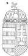
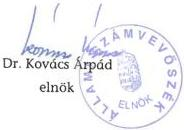

Állami Számvevőszék

# JELENTÉS

**a Bolgár Országos Önkormányzat  
pénzügyi-gazdasági tevékenységének  
vizsgálatáról**

2002. január

202

---

Az ellenőrzés végrehajtásáért felelős:
V. Önkormányzati és Területi Ellenőrzési Igazgatóság

dr. Lóránt Zoltán
számvevő igazgató

Az ellenőrzést vezette:

dr. Sallai Antal
régióvezető főtanácsos

Az ellenőrzést végezte

Borbély Zsuzsanna
számvevő tanácsos

Az ÁSZ által a témában eddig készített jelentések:

A Bolgár Országos Önkormányzat pénzügyi-gazdasági tevékenységének
vizsgálata (1019/1995.)

A Bolgár Országos Önkormányzat pénzügyi-gazdasági tevékenységének
vizsgálata (1008/1997.)

Jelentéseink az Országgyűlés számítógépes hálózatán
és az Interneten a www.asz.hu címen is olvashatók, továbbá a Belügyminisztérium
folyóirata, az "Önkormányzati Tájékoztató" rendszeresen közli, valamint a Megyei
Közigazgatási Hivatalvezetők részére is átadásra kerül.

---

V-1013-21/2001-2002.

# TARTALOMJEGYZÉK

I. ÖSSZEGZŐ MEGÁLLAPÍTÁSOK, KÖVETKEZTETÉSEK, JAVASLATOK 4

II. RÉSZLETES MEGÁLLAPÍTÁSOK 5

1. A feladatellátás szervezettsége, szabályozottsága 5

1.1. Általános ismeretek a bolgár kisebbségről, a Bolgár Országos Önkormányzat kapcsolatrendszere 5

1.2. A szervezeti és működési rend alakulása 5

1.3. A költségvetés, zárszámadás, vagyonleltár megállapításának szabályozottsága 6

1.4. A működés szervezeti feltételrendszere 7

2. Az önkormányzat működésének, a gazdálkodás rendjének szabályszerűsége 7

2.1. A működés tárgyi feltételeinek alakulása 7

2.2. Az egyszeri vagyonjuttatásként kapott részvények hasznosítása 7

2.3. A gazdálkodási tevékenység személyi és tárgyi feltételei 8

2.4. A gazdálkodási folyamatok szabályozottsága 8

2.5. A gazdálkodási jogkörök szabályozottsága 8

2.6. Vállalkozási tevékenység 8

3. A beszámolási kötelezettség teljesítése, a költségvetés készítése és végrehajtása 9

3.1. A könyvvezetési kötelezettség 9

3.2. Az éves költségvetések 9

3.3. A költségvetés végrehajtása 9

3.4. A gazdasági események bizonylati alátámasztottsága 10

3.5. A vagyongazdálkodás szabályozottsága, vagyonvédelem 10

3.6. Éves beszámolási kötelezettség 11

3.7. Az éves zárszámadások 11

4. Az önkormányzat ellenőrzési rendszere 12

4.1. Az ellenőrzés szabályozottsága 12

4.2. A belső ellenőrzés 12

4.3. A lefolytatott ellenőrzések tapasztalatai 12

5. A korábbi számvevőszéki vizsgálatok javaslatainak hasznosulása 12

1

---

• •

---

I. ÖSSZEGZŐ MEGÁLLAPÍTÁSOK, KÖVETKEZTETÉSEK, JAVASLATOK

# JELENTÉS

### a Bolgár Országos Önkormányzat pénzügyi-gazdasági tevékenységének vizsgálatáról

Az Állami Számvevőszékről szóló 1989. évi XXXVIII. törvény 2. § (5) bekezdése alapján ellenőriztük az országos kisebbségi önkormányzatoknál az állami költségvetésből juttatott támogatások felhasználását.

A nemzeti és etnikai kisebbségek jogairól szóló 1993. évi LXXVII. törvény (továbbiakban: Nek tv.) szabályozza az országos kisebbségi önkormányzatok létrehozásának rendjét, azok feladat- és hatásköreit.

Az Állami Számvevőszék 1995. és 1997. évben témavizsgálat keretében ellenőrizte az országos kisebbségi önkormányzat pénzügyi, gazdasági tevékenységét.

A vizsgálat az országos kisebbségi önkormányzatok 1999. és 2000. évi és 2001. első félévi gazdálkodására terjedt ki, egyes esetekben – a székházjuttatási folyamat és egyszeri vagyonjuttatás hasznosulása – a korábbi vizsgálat óta eltelt teljes időszakot áttekintettük.

**Az ellenőrzés célja:** annak megállapítása volt, hogy

- az országos kisebbségi önkormányzat működési feltételrendszere hogyan változott a vizsgált időszakban,
- a gazdálkodás szervezettsége, szabályszerűsége mennyiben felel meg a jogszabályi követelményeknek és az önkormányzati működés sajátosságainak,
- biztosított-e a gazdálkodás és a pénzeszközök felhasználásának törvényessége és szabályszerűsége, a számviteli törvény és a vonatkozó kormányrendeletek előírásainak betartása.

3

---

I. ÖSSZEGZŐ MEGÁLLAPÍTÁSOK, KÖVETKEZTETÉSEK, JAVASLATOK

# I. ÖSSZEGZŐ MEGÁLLAPÍTÁSOK, KÖVETKEZTETÉSEK, JAVASLATOK

A Bolgár Országos Önkormányzat működésének tárgyi feltételei az előző számvevőszéki vizsgálat óta a Lónyai utcai irodahelyiség használatbavételével és berendezésével változott, így a munka végzéséhez a kulturált környezet, az eszközellátottság biztosított. A személyi feltételek nem változtak, a könyvelési feladatokat jelenleg is könyvelő Kft végzi.

Az Önkormányzat a Nek. törvényben és a saját SzMSz-ében meghatározott valamennyi feladatot ellátja, illetve az ellátás feltételeihez valamilyen módon hozzájárul. Működési és gazdálkodási szabályozottsága a jogszabályi feltételeknek megfelel, azonban belső szabályzatai a helyi sajátosságoknak megfelelő kiegészítésre, pontosításra szorulnak.

Az Önkormányzat a helyi szabályozásnak megfelelően minden évben elkészítette költségvetését, zárszámadását, azok testület elé terjesztése, jóváhagyása megtörtént. A zárszámadás hibája, hogy nem különülnek el az állami támogatásból és saját bevételből fedezett kiadások a pályázati kiadásoktól.

A könyvvezetés a jogszabályi lehetőségeknek megfelelően egyszeres könyvvitel szerint történik, és egyszerűsített beszámolót készítenek. Az egyszerűsített beszámoló részét képező mérleg elkészült, de az eredménylevezetés nem, valamint az egyszerűsített beszámolót a testület nem tárgyalta meg.

A pénzkifizetések/átutalások bizonylatain történő feljegyzések a pontos azonosítás, ellenőrzés miatt kiegészítésre szorulnak, valamint a könyvelés megtörténtének ténye nem került feljegyzésre a bizonylatokon.

**A feltárt hiányosságok megszüntetése érdekében javasoljuk az önkormányzat elnökének, hogy**

1. Dolgozzák át az Önkormányzat szabályzatait, hogy azok a számviteli törvény előirásainak és a helyi sajátosságoknak megfeleljenek.
2. A zarszamadas jovahagyasakor az egyszerusitett beszamolot is hagyja jova a testulet.
3. Tortenjen meg a szamlakon a teljesités igazolása és a feladat megjelöse.
4. A konyvelés megtörtentének tenye kerüljön aBizonylatokon feljegyzésre.

4

---

II. RÉSZLETES MEGÁLLAPÍTÁSOK

## II. RÉSZLETES MEGÁLLAPÍTÁSOK

### 1. A FELADATELLÁTÁS SZERVEZETTSÉGE, SZABÁLYOZOTTSÁGA

#### 1.1. Általános ismeretek a bolgár kisebbségről, a Bolgár Országos Önkormányzat kapcsolatrendszere

A Magyarországon élő, eredetileg mezőgazdasági termeléssel és kereskedelemmel foglalkozó bolgárság létszáma ma kb. 6000 fő. Az ország területén 176 településen van kimutatott bolgár jelenlét. Ismeretek szerint életkörülményeik rendezettek, sok közöttük az értelmiségi és a gazdaság minden területén megtalálhatóak.

A Nek. törvény 5. § (1) bekezdése alapján hozták létre a bolgárok 1994-ben az országos és a három helyi kisebbségi önkormányzatot. Ez utóbbiak száma az 1998. évi választások alkalmával 16-ra emelkedett. Ebből hat vidéken (Pécs, Miskolc, Debrecen, Halásztelek, Szigetszentmiklós, Szentendre), nyolc pedig a fővárosban (III., IX., XI., XIV., XV., XVII., XVIII., XXI. kerület) található. (Utóbb a szentendrei testület feloszlatta önmagát.) A Budapesti helyi önkormányzatokból megalakult a Fővárosi Bolgár Önkormányzat, az összesből pedig az Országos Önkormányzat. Ez utóbbi alapján – minden önkormányzatot egy fő képvisel az országos önkormányzatban – az együttműködés folyamatos és megoldott. Az üléseken elfogadott napirenden rendszeresen szerepel a helyi önkormányzatok beszámolója az elmúlt időszakról, a tevékenységükben felmerült kérdések megvitatása, a szükséges együttműködés és intézkedések kialakítása. Ezt a munkát hivatott elősegíteni a Koordináló Bizottság. A leggyakrabban előforduló témák a kulturális, hagyományőrző, oktatási tevékenységgel kapcsolatosak.

Több civil bolgár szervezet van, amelyek különböző témákban (kulturális, oktatási, egyházi) képviselik az itt élő bolgárok érdekeit és ápolják hagyományait. Az Önkormányzat létrehozta a Malko Teatro színházi társulatot és a Magyarországi Bolgárok Kutatóintézetét. A különböző szervezetekkel az Önkormányzat kapcsolattartása állandó, a tevékenységek ellátása során sok a közös megnyilvánulás.

Budapesten 12 osztályos bolgár iskola működik, amelyet a Bolgár és Magyar állam közösen tart fenn. Az Önkormányzat a Pro Schola Bulgarica Alapítványnak az ösztöndíjakhoz nyújtott támogatásával segíti az iskolában tanulókat.

#### 1.2. A szervezeti és működési rend alakulása

A Nek. törvény 35-39. §-aiban határozták meg az országos önkormányzatok feladat és hatáskörét.

5

---

II. RÉSZLETES MEGÁLLAPÍTÁSOK---

**A törvény előírásainak figyelembevételével alkotta meg** a Bolgár Országos Önkormányzat 1995. július 6-án **Szervezeti és Működési Szabályzatát**. A szabályzat tartalmazza az Önkormányzat céljait, feladatait, szerveit és működését, a testületi ülésre, határozathozatalra vonatkozó előírásokat, a képviselők jogállását, a létrehozott bizottságokat, azok munkájára vonatkozó szabályokat, az intézményalapítással kapcsolatos lehetőséget, és az Önkormányzat költségvetésére, vagyonára, gazdálkodására alkotott rendet.

Az önkormányzati testület 16 főből áll. A közgyűlés elnököt és két helyettest választott. Az SzMSz III. fejezetének IV. részében a testület kizárólagos hatáskörébe tartozó feladatokat sorolták fel. A felsorolás a Nek. törvény 37. §-a szerinti feladatokat tartalmazza. Ennek a fejezetnek az V. részében jelenítik meg a hatáskör átadás lehetőségét, azonban feladatokat ehhez nem rendeltek, így ez a gyakorlatban nem valósult meg.

Az elnök és elnökhelyettesek feladatait az SzMSz XI. fejezetében írták le, ez a képviseletet és a testület működésével és határozataival kapcsolatos végrehajtási tevékenységet foglalja magába.

### **Az Önkormányzat működése a gyakorlatban az SzMSz-ben megfogalmazottaknak megfelel.**

Az Önkormányzat három bizottságot hozott létre. A helyi bolgár önkormányzatok összefogására a Koordináló Bizottságot, az önkormányzati vagyon gyarapítására a Pénzügyi és Gazdasági Bizottságot, az oktatási és kulturális feladatok vitelére pedig az Oktatási és Kulturális Bizottságot. A bizottságok munkaterv alapján dolgoznak, leírt feladataiknak eleget tesznek.

### **1.3. A költségvetés, zárszámadás, vagyonleltár megállapításának szabályozottsága**

A Szervezeti és Működési Szabályzat III. fejezetében a testület kizárólagos hatásköréként jeleníti meg a költségvetésének, zárszámadásának, vagyonleltárának, valamint törzsvagyonának megállapítását, a XIII. fejezetben pedig az Önkormányzat költségvetése, vagyona, tulajdonjog képviseletét fogalmazzák meg. Ez utóbbiban a költségvetésről nem, csak a vagyonról esik szó.

**A szabályozás a jogszabályoknak megfelel, de az önkormányzatra vonatkozóan pontosításra szorul.** Az 1. pontban „vagyoni értékű jogról” rendelkeznek, kihagyva az Önkormányzat feladatát hosszú távon szolgáló eszközöket. A vagyonnal való rendelkezésnél kimaradt, hogy annak pontos meghatározását, számbavételét, értékelését milyen szabályzatokban rögzítették. Olyan elem is megjelenik itt, amely a számviteli politikához tartozik, azaz a tárgyi eszközként való besorolás feltétele.

A XIV. fejezetben „Az önkormányzat gazdálkodása” cím alatt határozták meg pontosan a költségvetés elfogadásának rendjét, a módosítás lehetőségét, valamint a zárszámadás előterjesztését és elfogadását.

---6

---

II. RÉSZLETES MEGÁLLAPÍTÁSOK

# 1.4. A működés szervezeti feltételrendszere

A Bolgár Országos Önkormányzat feladatai ellátására az elnökből és négy fő alkalmazottból álló irodát működtet. Az alkalmazottak feladatait munkaköri leírásuk részletesen tartalmazza. Feladataik szorosan kapcsolódnak az iroda fenntartásához, a testületi működés feltételeinek megteremtéséhez, valamint a saját erőből és a pályázatokon elnyert bevételekből fedezett rendezvények szervezéséhez.

Az önkormányzat fő céljait és feladatait az SzMSz II. fejezete részletesen összegzi. A célok, feladatok megvalósulását segíti elő az elnökségben és a bizottságokban folyó előkészítési munka, mely eredményét a közgyűlés határozatával hagyja jóvá.

A feladatok jelentős része az oktatási, kulturális tevékenységhez, hagyományőrzéshez kapcsolódik, de jelentős a Magyarországon élő bolgárok számára ingyenesen fenntartott, havonta két alkalommal működő jogsegélyszolgálat.

Különböző, a magyarországi bolgárok eredetét, letelepedését, életét, múltját és jelenét feldolgozó kutatások megszervezése, elvégzése vagy elvégeztetése céljából hozta létre az Önkormányzat 1997-ben Magyarországi Bolgárok Kutatóintézetét. A kutatóintézetnek önálló székhelye nincs, működtetése támogatással nem megoldott, nem lett önálló intézményként bejegyezve, önálló főállású munkatársai nincsenek, csak önálló tevékenységként szerepeltetik az Önkormányzat feladatai között. Amennyiben kutatási feladatokra pályázati bevételhez jut az Önkormányzat, annak felhasználását ezen a feladaton számolják el.

# 2. AZ ÖNKORMÁNYZAT MŰKÖDÉSÉNEK, A GAZDÁLKODÁS RENDJÉNEK SZABÁLYSZERŰSÉGE

# 2.1. A működés tárgyi feltételeinek alakulása

Az Állami Számvevőszék 1997. évi vizsgálata óta az Önkormányzat a Fővárosi Bolgár Önkormányzattal közösen a Kincstári Vagyoni Igazgatóságtól ingyenes használatba kapott Budapest IX. ker. Lónyai u. 41. sz. alatti ingatlant birtokba vette. Az ingatlan berendezése megtörtént. Kulturált irodákat, közösségi helyiségeket és tárgyalót alakítottak ki. Az elhelyezés az Önkormányzat jelenlegi létszámának megfelelő. A székházban könyvtár is kapott helyet, ennek könyvekkel való feltöltése folyamatos. A működés tárgyi feltételei adottak, megfelelőek.

# 2.2. Az egyszeri vagyonjuttatásként kapott részvények hasznosítása

A Nek. törvény 63. § (4) bekezdése szerint a Bolgár Országos Önkormányzat működési költségei biztosítására egyszeri, 15 millió Ft-os vagyonjuttatásban részesült. A vagyonjuttatást MOL Rt. részvényben kapták meg.

Az elmúlt időszakban a részvények egy része értékesítésre került, amely összeget részben felhasználtak, részben diszkont kincstárjegyet vásároltak rajta. A 2000. december 31-én 5770 ezer Ft értékű részvénycsomagot befektetési Rt kezeli.

7

---

II. RÉSZLETES MEGÁLLAPÍTÁSOK

A felhasznált összegből testületi megállapodás alapján a következő feladatokat oldották meg: székházberendezés (5000 ezer Ft), a Magyarországi Bolgárok Egyesülete székházának fűtéskorszerűsítése (10000 ezer Ft), színháztermének felújítása (5500 ezer Ft), a Bolgár Ortodox Egyház parókiájának berendezéséhez hozzájárulás (3000 ezer Ft)

### **2.3. A gazdálkodási tevékenység személyi és tárgyi feltételei**

Az Önkormányzat gazdálkodásának egy részét (pénztári kifizetések és banki átutalások előkészítése) saját szervezetében, a könyvelési, nyilvántartási részt pedig könyvelési Kft segítségével oldja meg. A pénzügyi tevékenységet ellátó dolgozó munkaköri leírásában szerepelnek feladatai, melyek közé tartozik a könyvelő céggel való kapcsolattartás is. Az 1995. szeptembertől folyamatosan alkalmazott Kft feladatait a vele kötött megbízási szerződésében pontosan meghatározták. Ezek a feladatok a naplófőkönyv vezetése és havi információszolgáltatás, adózással kapcsolatos teendők, munkaügyi feladatok, támogatások elszámolása, mérlegkészítés. A szerződést évente felülvizsgálják, és szükség szerint módosítják.

Az Önkormányzat és a Kft kapcsolattartása állandó, a leírt feladatoknak eleget tesznek.

### **2.4. A gazdálkodási folyamatok szabályozottsága**

A számvitelről szóló 1991. évi XVIII. törvény 14. § (5) bekezdésében és a 2000. évi C. törvény 14. § (5) bekezdésében meghatározták, hogy a számviteli politika keretében el kell készíteni az eszközök és a források leltárkészítési és leltározási szabályzatát, az eszközök és a források értékelési szabályzatát, valamint a pénzkezelési szabályzatot.

Az Önkormányzat a meghatározott szabályzatokat elkészítette. Kifigásolható, hogy azok általánosak, a helyi sajátosságokat nem tükrözik. Szükséges a tartalom szűkítése, helyi viszonyokra való átdolgozása.

### **2.5. A gazdálkodási jogkörök szabályozottsága**

A gazdálkodási jogkörök szabályozása a Szervezeti Működési Szabályzat XV. fejezetében történt meg. Ebben pontosan meghatározták, hogy az elnök, az elnökhelyettes milyen értékhatárig utalványozhat önállóan, és milyen összeg felett csak testületi döntés birtokában. Egyéb szabályozás e témakörben nem történt.

### **2.6. Vállalkozási tevékenység**

Az Önkormányzat vállalkozási tevékenységet nem végez.

8

---

II. RÉSZLETES MEGÁLLAPÍTÁSOK

### 3. A BESZÁMOLÁSI KÖTELEZETTSÉG TELJESÍTÉSE, A KÖLTSÉGVETÉS KÉSZÍTÉSE ÉS VÉGREHAJTÁSA

#### 3.1. A könyvvezetési kötelezettség

Az országos önkormányzatok gazdálkodására a számviteli törvény szerinti egyéb szervezetek éves beszámoló készítésének és könyvvezetési kötelezettségének sajátosságairól szóló 219/1998. (XII. 30.) Korm. rendelet társadalmi szervezetekre vonatkozó része adja meg a kötelező előírásokat. Ennek alapján az Önkormányzat az egyszeres könyvvitelt választotta. A könyvelés naplófőkönyvben idősorosan történik. A feladatokra való gyűjtést külön kódszámrendszer segíti.

#### 3.2. Az éves költségvetések

**Az Önkormányzat az éves költségvetéseket az SzMSz-ben meghatározottak szerint fogadta el.** A Pénzügyi és Gazdasági Bizottság a költségvetést megtárgyalta és ezután terjesztették a testület elé.

A költségvetésben a kiadásokat három fő csoportba sorolták. Első helyen a bérek, személyi juttatások, azok járulékai és a költségtérítések szerepelnek. Második csoportba azokat a dologi kiadásokat sorolták, amelyek az Önkormányzat működésével kapcsolatosak. Harmadik csoport tartalmazta a kulturális programok kiadásait feladatok szerinti alábontásban. Bevételi oldalon állami támogatást, pályázati támogatást és egyéb bevételeket terveztek.

A költségvetés főösszege 1999-ben 20000 ezer Ft, 2000-ben 31850 ezer Ft, 2001-ben pedig 36500 ezer Ft volt.

Az 1999. évi költségvetés előterjesztését 1999. március 10-én 29/1999. számon, a 2000. évit 2000. február 16-án 6/2000. számon, a 2001. évit pedig 2001. január 24-én 4/2001. számon fogadta el a testület.

#### 3.3. A költségvetés végrehajtása

Az Önkormányzat bevételein belül az állami támogatás 1999-ben és 2000-ben is közel 56 %-ot jelentett. Ebből a bevételből az Önkormányzat működési kiadásait fedezik.

**A kiemelt feladatokhoz** - Haemus folyóirat és Bolgár Hírlap, kutatóintézet által folytatott tevékenység, könyvkiadás, kalendárium kiadás, nemzeti ünnepek és egyéb ünnepségek megrendezése – **a fedezetet pályázatok útján megszerzett bevételből teremtik meg.**

A legtöbb pályázatot a Magyarországi Nemzeti és Etnikai Kisebbségekért Közalapítványhoz nyújtották be. Ebből származik a pályázati támogatási bevételeknek 73-76 %-a. A lapkiadás fedezetének forrása kizárólag ez a bevétel, ezen kívül minden feladat finanszírozásához kapcsolódik alapítványtól elnyert bevétel. Kiemelt helyen szerepel a 2000. évben megrendezett tudományos konferencia, amelynek a mai napig kedvező visszhangja van.

9

---

II. RÉSZLETES MEGÁLLAPÍTÁSOK

Az Oktatási Minisztériumhoz elsősorban a vasárnapi iskola és a kutatóintézet által folytatott tevékenységhez nyújtottak be és nyertek el pályázatot.

A Magyar Művelődési Intézet (1999.), illetve Nemzeti Kulturális Örökség Minisztérium (2000.) pályázati támogatásaival a Kalendárium kiadását, könyvkiadást, illetve nemzeti ünnepek megtartását segítette elő.

**A pályázatokon keresztül az Önkormányzat feladatai ellátásához bevételhez jut.**

Önkormányzati szinten előzetes döntés (határozat) csak az előre ismert – a kiemelt feladatokhoz kapcsolódó - pályázatokhoz történt, az eseti pályázatokról a testület tájékoztatása utólagos.

Az Önkormányzatnak saját bevétele a Haemus folyóirat kiadásából van. Minimális mértékű az adományokból származó bevétel, a kamatbevétel és a részvények hozama.

A pályázatokon elnyert és egyéb bevételekből a saját feladatai ellátásán kívül az Önkormányzat különböző célokra támogatásokat nyújtott. Ezek közül jelentősebbek a Magyarországi Bolgárok Egyesületének nyújtott felújítási és fűtéskorszerűsítési támogatás, a Pro Schola Bulgarica Alapítványnak nyújtott ösztöndíj támogatások, a különböző rendezvények és a helyi kisebbségi önkormányzatoknak juttatott támogatások.

Az Önkormányzat pénzügyi helyzete a vizsgált időszakban kiegyensúlyozott volt. Az 1998. évi 2090 ezer Ft záró pénzkészlet 1999-re 2985 ezer Ft-ra, 2000-re 2333 ezer Ft-ra változott.

# 3.4. A gazdasági események bizonylati alátámasztottsága

Az ellenőrzés során az 1999. és 2000. évi májusi és novemberi pénztár, illetve az egész időszakra vonatkozó banki bizonylatok átvizsgálása megtörtént.

A pénztárbizonylatok kiállítása szabályos, azokon a megfelelő aláírások megtalálhatóak. A mellékelt számlákat az elnök aláírta, hiányzik azonban a számlákról annak feljegyzése, hogy a felhasználás mely feladat érdekében történt, valamint a bizonylatokon a könyvelés ténye nem került feljegyzésre.

A banki forgalomban megjelenő számlákról hiányzik a teljesítés igazolása és a feladat pontos meghatározása.

A fent jelzett hiányosságok miatt nem biztosított, hogy könyveléskor a feladat azonosítása pontosan történjen meg, illetve a könyvelés helyessége ellenőrizhetetlen.

# 3.5. A vagyongazdálkodás szabályozottsága, vagyonvédelem

Az Önkormányzat vagyonával kapcsolatos szabályozás az SzMSz-ben a már korábban említett hiányosságokkal jelenik meg. A vagyongazdálkodással kap-

10

---

II. RÉSZLETES MEGÁLLAPÍTÁSOK

csolatos hiányosságok ellenére a vagyonvédelem biztosítva van. Az Önkormányzat helyisége riasztóval felszerelt.

### 3.6. Éves beszámolási kötelezettség

Az Önkormányzat beszámolási kötelezettségére a számviteli törvény szerinti egyéb szervezetek éves beszámoló készítésének és könyvvezetési kötelezettségének sajátosságairól szóló 219/1998. (XII. 30.) Korm. rendelet előírásai vonatkoznak. Ennek 16. § (1) pontja szerint a társadalmi szervezet által készítendő beszámoló formáját az éves összes bevétel nagysága, valamint az határozza meg, hogy folytat-e vállalkozási tevékenységet. Ennek alapján az Önkormányzat egyszerűsített beszámoló készítésére kötelezett, amely mérlegből és eredménylevezetésből áll.

A könyvelőiroda az éves mérlegeket elkészítette, melyhez a befektetett eszközök, pénzeszközök és kötelezettségek leltárát csatolták. A mérleg főösszege az 1999. évi 30294 ezer Ft-ról 2000. december 31-re 12009 ezer Ft-ra csökkent a befektetett pénzügyi eszközök (részvények) felhasználása miatt. A mérleget az Önkormányzat elnöke aláírta, de azt a testület a zárszámadás keretében nem tárgyalta.

Nem készült el a jogszabály által meghatározott eredménylevezetés.

### 3.7. Az éves zárszámadások

Az Önkormányzat 1999. évi zárszámadását 2000. január 19-én 2/2000. számú határozatával, a 2000. évit 2001. január 24-én 3/2001. sz. határozatával hagyta jóvá.

A beszámolóban kiemelt feladatonként bemutatják a bevételek és kiadások alakulását. **A kiadások alábontása túlzott részletezettsége miatt célszerűtlen, az értékelést és elemzést lehetetlenné teszi.** A személyi kiadások ténylegesen elszámolt költsége nehezen megállapíthatató, mivel a pénztárból kifizetett összeg és az ahhoz kapcsolódó levonások (SZJA, egészségügyi és nyugdíjjárulék, munkavállalói járulék) külön sorokon jelennek meg. Ugyanakkor olyan elemek is megtalálhatók amelyekről nem lehet tudni, hogy milyen kiadást takar. Például: titkári feladatok, irodai feladatok stb. A fentiek miatt a vizsgálat 3. sz. melléklete az adatokat nem a kért megbontásban tartalmazza, ezért elfogadhatatlan.

A működési kiadások közé sorolták be 1999-ben az egyéb pályázatokhoz kapcsolódó kifizetéseket, így nem lehet értékelni, hogy az Önkormányzat fenntartása, valós működési kiadásai hogyan alakultak, és hogy az itt elszámolt részben pályázatokból megvalósult rendezvények milyen önkormányzati támogatást tettek szükségessé. Az elszámolások 2000. évben már elkülönültek. A 2000. évi beszámolóban a működési kiadások és a pályázati bevételek nagysága eltér a ténylegestől.

A zárszámadás mind felépítésében, mind tartalmában eltér a költségvetéstől.

11

---

II. RÉSZLETES MEGÁLLAPÍTÁSOK

# 4. AZ ÖNKORMÁNYZAT ELLENŐRZÉSI RENDSZERE

# 4.1. Az ellenőrzés szabályozottsága

Az Önkormányzat ellenőrzési szabályzattal nem rendelkezik. A Pénzügyi és Gazdasági Bizottság éves munkaterv alapján végzi feladatát.

# 4.2. A belső ellenőrzés

A gazdálkodás belső ellenőrzését az elnök aláírásával a munka folyamatába építetten gyakorolja. Szintén belső kontroll a könyvelő Kft, amely a hiányosságokra, téves összeadásra hívja fel a figyelmet. A Pénzügyi és Gazdasági Bizottság alkalmanként pénztárellenőrzést végez, valamint negyedévenként értékeli és tárgyalja a könyvelő iroda adatszolgáltatását. Részben az ellenőrzési tevékenységhez sorolható, hogy a pályázatokon elnyert támogatásokat a kiíró teljes körűen elszámoltatja.

# 4.3. A lefolytatott ellenőrzések tapasztalatai

Az ellenőrzések közül írásos nyoma a pénztárellenőrzéseknek van. Olyan ellenőrzéssel kapcsolatos dokumentummal amelynek tapasztalatai hasznosíthatóak lennének a vizsgálat nem találkozott.

# 5. A KORÁBBI SZÁMVEVŐSZÉKI VIZSGÁLATOK JAVASLATAINAK HASZNOSULÁSA

Az Állami Számvevőszék 1997-ben végzett az önkormányzatnál ellenőrzést. A vizsgálat javaslatának megfelelően a MOL részvényeket átvették, azokat hasznosították. A szabályzatok kiegészítése megtörtént, azonban a jogszabályi követelményeknek megfelelően további kiegészítésükre van szükség. A gazdálkodási jogkörök szabályozására az SzMSz-ben térnek ki. A zárszámadás összeállítása kisebb módosításokat igényel jelenleg is.

Budapest, 2002. január 18.

12

---

1.sz. melléklet a V-1013. sz. jelentéshez

Bolgár Országos Önkormányzat

Kimutatás az 1999-2001. évek bevételeiről

|  Megnevezés | 1999. |   |   | 2000. |   |   | 2001.  |   |
| --- | --- | --- | --- | --- | --- | --- | --- | --- |
|   |  Tervezett |   | Tényleges | Tervezett |   | Tényleges | Tervezett  |   |
|   |  Év elején ismert | Évközi változás |   | Év elején ismert | Évközi változás |   | Év elején ismert | Évközi változás  |
|  Állami támogatás | 17500 | -300 | 17200 | 19250 | -250 | 19000 | 22100 | 0  |
|  Közalapítványi pályázatok | 0 | 7117 | 7117 | 6000 | 2735 | 8735 | 6500 | 4082  |
|  Egyéb pályázatok | 2000 | 555 | 2555 | 6000 | -3365 | 2635 | 7000 | 900  |
|  Egyéb támogatások | 0 | 660 | 660 | 0 | 2774 | 2774 | 0 | 2070  |
|  Saját bevételek | 500 | 2703 | 3203 | 600 | 406 | 1006 | 900 | 0  |
|  Pénzmaradvány | 0 | 0 | 0 | 0 | 0 | 0 | 0 | 0  |
|  Összesen | 20000 | 10735 | 30735 | 31850 | 2300 | 34150 | 36500 | 7052  |

---

2. sz. melléklet a V-1013. sz. jelentéshez

Bolgár Országos Önkormányzat

Kimutatás az 1999-2001. évek kiadásairól

ezer Ft

|  Megnevezés | 1999. |   |   | 2000. |   |   | 2001.  |   |
| --- | --- | --- | --- | --- | --- | --- | --- | --- |
|   |  Tervezett |   | Tényleges | Tervezett |   | Tényleges | Tervezett  |   |
|   |  Év elején ismert | Évközi változás |   | Év elején ismert | Évközi változás |   | Év elején ismert | Évközi változás  |
|  Személyi jellegű juttatások | 5500 |  | 12166 | 10440 |  | 15738 | 18276 |   |
|  Munkáltatói járulékok | 2000 |  | 1594 | 1860 |  | 774 | 4400 |   |
|  Dologi kiadások | 12500 |  | 10042 | 17430 |  | 14516 | 8924 |   |
|  Működési kiadások összesen | 20000 |  | 23802 | 29730 |  | 31028 | 31600 |   |
|  Adott támogatások | 0 |  | 5791 | 2120 |  | 1657 | 2400 |   |
|  Felhalmozási kiadások | 0 |  | 96 | 0 |  | 2467 | 2500 |   |
|  Tartalék | 0 |  | 0 | 0 |  | 0 | 0 |   |
|  Mindösszesen: | 20000 |  | 29689 | 31850 |  | 35152 | 36500 |   |

---

1

---

“ ”